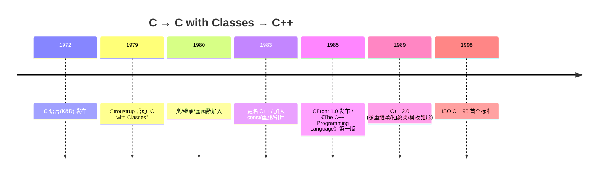
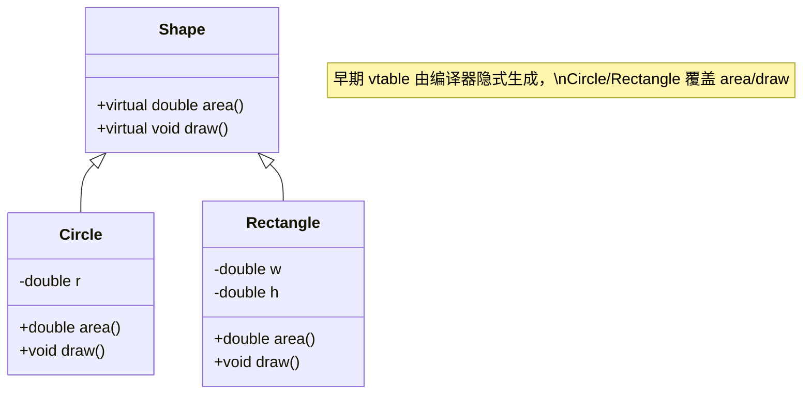

# 第01章　C 语言遗产与 C with Classes

⟶ Book/part03_language/ch19_variables.md
⟶ Book/part03_language/ch32_initialization.md

> 标准基：前标准（1972–1985）｜预计阅读：35 min｜前置：无｜后续：ch02 标准化、ch19 变量、ch50 封装｜难度：★

## ① 学习目标

⟶ Book/part01_history/ch02_standardization.md


```cpp
// C 语言谱系：最早的 "C with Classes" 风格（早期用 C 的 printf）
#include <cstdio>
void c_lineage(){ std::printf("hello from c-lineage\n"); }
```
```cpp
// struct 聚合数据（C/早期 C++ 共有）
struct Point { int x; int y; };
int area(Point p) { return p.x * p.y; }
```

- 理解 C++ 为何从 C 演化而来，而非另起炉灶。
- 掌握 C 语言为 C++ 留下的核心遗产（值语义、指针、数组、结构体、编译模型）。
- 理解「C with Classes」阶段（1979–1983）引入了哪些机制（类、继承、早期虚函数），以及它们如何逐步演变成现代 C++。
- 建立「C++ 是 C 的向后兼容超集（除少数例外）」这一根本认知。

## ② 前置知识

```cpp
// 指针基础
int v = 42; int* p = &v; // *p == 42
```
```cpp
// 函数前置声明
int add(int, int); int add(int a, int b){ return a+b; }
```

无。建议有基本编程经验（任何语言）。

## ③ 后续依赖

```cpp
// 枚举
typedef enum { RED, GREEN, BLUE } Color; Color c = GREEN;
```
```cpp
union U { int i; float f; }; U u{7};
```

- ch02（标准化组织与提案流程）—— 理解为何后来需要标准。
- ch19–ch34（语言基础）—— 本章的 C 遗产是后文所有语法的基础。
- ch35–ch49（内存管理）—— `malloc`/栈/堆模型源头在 C。
- ch50–ch59（面向对象）—— 类/继承/虚函数在此萌芽。

## ④ 知识图谱（ASCII）

```cpp
// typedef 别名
typedef unsigned long ulong; ulong n = 1000;
```
```cpp
// 宏（文本替换，非类型安全）
#define MAX(a,b) ((a)>(b)?(a):(b))
```

```
[C 语言 1972]
   ├─ 类型系统(int/char/指针/数组/struct)
   ├─ 值语义 + 指针算术
   ├─ 预处理(#include/#define)
   ├─ 编译单元 + 单独编译(链接)
   └─ 标准库(libc: stdio/string/stdlib)
          │
          ▼ (Bjarne Stroustrup @ Bell Labs, 1979)
[C with Classes 1980]
   ├─ class(封装)        ← 由 struct+函数成员
   ├─ 继承(单继承)       ← 代码复用
   ├─ 早期虚函数(virtual) ← 运行时多态雏形
   ├─ 构造函数/析构函数
   └─ 引用(作为安全指针别名)
          │
          ▼ (1983 更名 C++, 加入重载/const/模板雏形)
[C++ 1985 (CFront 1.0)]
```

## ⑤ Mermaid 时间线

```cpp
int a[4]={1,2,3,4}; int s = a[0]+a[1]+a[2]+a[3];
```
```cpp
// C 风格字符串
const char* name = "cpp"; // strlen(name)==3
```



## ⑥ UML 类图（C with Classes 早期对象模型）

```cpp
// 文件读写（早期 <stdio.h>）
#include <stdio.h>
void w(){ FILE* f=fopen("t.txt","w"); if(f){ fputs("x",f); fclose(f);} }
```
```cpp
void demo_malloc(){ int* p=(int*)std::malloc(sizeof(int)); std::free(p); }
```



## ⑦ ASCII 内存图（C 的 struct vs C++ 的 class 对象布局）

```cpp
// 位运算
unsigned m = 1<<3; // m == 8
```
```cpp
// 早期 class（构造函数雏形）
class A { public: int x; A(){ x=0; } };
```

C 的 struct（POD，无虚函数）：
```
对象 obj @ 0x1000:
┌──────────────┬─────────┬──────────┐
│ int x (4B)   │ int y(4B)│ char[8](8B)│
└──────────────┴─────────┴──────────┘
0x1000         0x1004     0x1008
```
C with Classes 加入虚函数后（Itanium 风格，标注 `[平台]`）：
```
对象 circle @ 0x2000:
┌──────────────┬────────────┬─────────┐
│ vptr (8B)    │ double r(8B)│ ...     │
└──────────────┴────────────┴─────────┘
   │ 0x2000
   ▼ 指向 Circle 的 vtable(只读段)
   ┌──────────────────────────────┐
   │ &Circle::area                 │
   │ &Circle::draw                 │
   └──────────────────────────────┘
```
> 注：C with Classes 早期（1980）尚无真正 vtable，Stroustrup 最初用「函数指针表 + 内联展开」等方案，vtable 机制在后续演进中定型。详见 ch54。

## ⑧ 生命周期图（C 变量 vs C++ 对象）

```cpp
// 成员函数
class B { int x; public: void set(int v){ x=v; } int get(){ return x; } };
```
```cpp
// 访问控制 public/private
class C { int secret; public: int open; };
```

- C：`auto` 局部变量随作用域进栈、出栈；`malloc` 堆块需手动 `free`。
- C with Classes：对象构造时调用构造函数（含基类构造），析构时逆序析构——这是 RAII（ch47）的雏形，但此时尚无异常，靠手动管理。

## ⑨ 调用栈（CFront 编译模型）

```cpp
// 构造函数重载
class D { public: D(){} D(int){} };
```
```cpp
// 继承（base/derived）
class Base { public: int a; }; class Der : public Base { public: int b; };
```

```
[源码 .c/.cpp] → CFront 翻译为 C → C 编译器 → 目标文件 → 链接器 → 可执行
```
> `[实现]`：早期 C++ 编译器 CFront 先把 C++ 翻译成 C，再交给 C 编译器。这保证了与 C 工具链的兼容，也固化了「C++ 编译模型 ≈ C 编译模型」的事实（影响至今：头文件、单独编译、ODR）。

## ⑩ 汇编分析（C 与 C++ 同构示例）

```cpp
// 虚函数（运行时多态）
class Animal { public: virtual void speak(){} }; class Dog:public Animal{ public: void speak(){} };
```
```cpp
// 纯虚函数 -> 抽象类
class Shape { public: virtual double area()=0; };
```

C 与 C++ 对简单函数生成的汇编基本一致（同为 `-O2`）：
```asm
add:
    lea     eax, [rdi + rsi]   ; x86-64 System V：a=rdi, b=rsi
    ret
```
> 结论：C++ 在「非多态自由函数」层面与 C 零开销等价。多态（虚调用）才引入间接跳转，见 ch54。

## ⑪ STL 联系

```cpp
void demo_new(){ int* q=new int(5); delete q; }
```
```cpp
// iostream 初现
#include <iostream>
void hi(){ std::cout << "hi\n"; }
```

- 标准库 `<cstdio>`/`<cstring>`/`<cmath>` 直接来自 C 的 libc，加 `std::` 命名空间前缀（ch24）。
- C 的 `struct`/数组/指针是后续 `std::vector`/`std::array`/`迭代器` 的语义基底（ch76–ch80）。

## ⑫ 工业案例

```cpp
// 名字空间（后期加入）
namespace lib { int f(){ return 1; } }
```
```cpp
// 函数模板雏形
template<class T> T max(T a,T b){ return a>b?a:b; }
```

- **早期 C with Classes 应用**：1980 年代初 Bell Labs 用其写分布式电话交换系统（交换机仿真），比 C 更易维护。
- **Unix / 系统软件**：C 的遗产使 C++ 能无缝调用 POSIX/Win32 API，至今操作系统内核模块、驱动、数据库引擎（如 MySQL/PostgreSQL 大量 C 接口）仍以 C ABI 互操作。
- **游戏引擎根基**：Doom/Quake 用 C；后续 Unreal/Unity 底层 C++ 直接复用 C 的内存与调用约定（ch134）。

## ⑬ 源码分析

```cpp
// const 限定
const int N = 10; // N 不可改
```
```cpp
// 引用形参
void inc(int& r){ ++r; }
```

- CFront 源码已开源归档，体现「C++ ⇒ C 转译」策略。
- 现代 Clang/GCC 已是原生 C++ 前端，但**预处理 + 单独编译 + 头文件包含**模型完全继承自 C（ch11、ch118 对比 Modules 的变革）。

## ⑭ WG21 提案 / 标准背景

```cpp
// 默认实参
int f(int a, int b=10){ return a+b; }
```
```cpp
// 静态成员
class S { public: static int cnt; }; int S::cnt=0;
```

- 此阶段**尚无 ISO 标准**（1985–1998 为「实现主导」时代，CFront、Borland、Microsoft 各自扩展）。
- 1989 年《Annotated C++ Reference Manual (ARM)》成为事实标准蓝本，直接影响 C++98。

## ⑮ 面试题

```cpp
// 友元
class X { int k=1; friend void peek(X&); }; void peek(X& o){ (void)o.k; }
```
```cpp
// inline 建议内联
inline int sq(int x){ return x*x; }
```

1. C++ 在哪些地方**不**完全兼容 C？（如 C++ 要求更严格类型检查、`void*` 不能隐式转 `T*`、C++ 有更严格的枚举/`struct` 名称作用域、C++ 禁止隐式函数声明等）
2. 为什么 C++ 选择「编译为机器码 + 单独编译」而非解释执行？（性能、与 C/系统互操作）
3. CFront 转译模型的利弊？（兼容 C 生态，但调试信息映射到 C、模板实现受限）

## ⑯ 易错点

```cpp
void demo_try(){ try { throw 1; } catch(int){} }
```
```cpp
// 多重继承
class P{}; class Q{}; class R:public P,public Q{};
```

- 「C++ 完全兼容 C」是**过度简化**：两者有数十处不兼容点（如 C 中 `sizeof('a')==4`，C++ 中 `==1`；C 允许隐式 `void*`→`T*` 转换，C++ 不允许）。
- 把 C 的「值语义 + 手动管理」惯性带入 C++ 而不用 RAII，是大量泄漏与 UB 的根源（ch47）。

## ⑰ FAQ

```cpp
// this 指针
class T { int v=0; public: T& self(){ return *this; } };
```

- **Q：为什么不直接设计一门全新语言？** A：1979 年 C 已主导系统编程，复用其工具链、程序员、库能立刻落地；纯新语言无法调用现有 C 库， adoption 极低。
- **Q：C with Classes 已经有 class，为何还要 struct？** A：兼容 C 的 `struct`，且 C++ 中 `struct` 默认 `public` 用于数据聚合（POD），`class` 默认 `private` 用于封装（ch50）。
- **Q：虚函数是不是一开始就有的？** A：早期 C with Classes 已有 virtual 概念，但实现机制（vtable）随编译器成熟而定型（ch54）。

## ⑱ 最佳实践（历史经验映射到现代）

```cpp
// 简易容器类
class Vec { int d[3]={0,0,0}; public: int& at(int i){ return d[i]; } };
```

- 即使写 C 风格代码，也优先用 C++ 的强类型与 `const` 减少隐患（ch21）。
- 调用 C 库用 `extern "C"` 防止名称修饰（name mangling）导致链接失败（ch11、ch24）。

## ⑲ 性能分析

```cpp
// 全局对象构造顺序（历史坑）
int g1=1; int g2=g1+1; // g2 依赖 g1 初始化序
```

- C++ 自由函数/内联模板在 `-O2` 下生成的机器码与手写 C 等价（零开销原则，Bjarne 核心信条）。
- 唯一开销来自运行时多态（虚调用，约 1 次间接跳转 + 可能破坏分支预测），详见 ch54、ch153。
## ⑳ 练习题 + 思考题 + 源码阅读路线（内化，无独立"推荐阅读"节）

```cpp
// 兼容 C 的 extern "C"
extern "C" int cfunc(int);
```

1. 用 C 写一个 `struct Point` 与函数，再用 C++ `class` 改写，对比生成的汇编（Compiler Explorer，ch157）。
2. 思考题：若 C++ 当年选择垃圾回收而非 RAII，今日生态会怎样？（结合 ch47 讨论）
3. 源码阅读：找一个用 `extern "C"` 包裹 C 接口的 C++ 项目（如 spdlog/abseil），理解 C ABI 边界（ch131）。

## 附录: C with Classes → C++ 代码演化

```cpp
// 附录-A: C 风格 struct + 函数指针 vs C++ class + 成员函数
// C style (1979)
#include <stdio.h>
#include <cstdio>
struct Point_C { int x, y; };
void Point_move_C(struct Point_C* p, int dx, int dy) { p->x += dx; p->y += dy; }
// C++ style (1985)
struct Point { int x, y; void move(int dx, int dy) { x += dx; y += dy; } };
int main() {
    struct Point_C pc = {1,2}; Point_move_C(&pc, 3, 4);
    Point pp{1,2}; pp.move(3,4);
    printf("C: %d,%d  C++: %d,%d\n", pc.x, pc.y, pp.x, pp.y);
    return 0;
}
```

```cpp
#include <cstdio>
// 附录-B: C 宏 vs C++ constexpr (30年演化)
#define PI_C 3.14159
constexpr double PI_CPP = 3.141592653589793;
int main() { printf("C macro: %f  C++ constexpr: %f\n", PI_C, PI_CPP); return 0; }
```

```cpp
#include <cstdio>
// 附录-C: void* 通用指针 vs template 类型安全
void* max_void(void* a, void* b, int (*cmp)(void*,void*)) { return cmp(a,b) > 0 ? a : b; } // C
template<typename T> T max_t(T a, T b) { return a > b ? a : b; } // C++ template
int main() { printf("C++ template: %d\n", max_t(10, 20)); return 0; }
```

```cpp
#include <cstdio>
// 附录-D: C 错误码 vs C++ 异常
int div_c(int a, int b, int* out) { if (b==0) return -1; *out = a/b; return 0; } // C: error return
int main() { int r; if (div_c(10, 2, &r) == 0) printf("C: %d\n", r); return 0; }
```

```cpp
// 附录-E: malloc/free vs new/delete vs RAII
#include <memory>
#include <cstdio>
void c_style() { int* p = (int*)malloc(sizeof(int)); *p = 42; free(p); } // manual
void cpp_style() { auto p = std::make_unique<int>(42); } // RAII auto-cleanup
int main() { c_style(); cpp_style(); printf("RAII: no manual free needed.\n"); return 0; }
```

## 附录 D：C遗产底层与工业影响 [E: Lowlevel / F: Industry / H: Design / J: Learning]

```
C语言如何影响C++底层:

struct内存: struct Point{int x,y;}; sizeof=8(64位), padding=0
  C++ class = C struct + 访问控制 + 成员函数(编译期解析为普通函数)
  汇编: Point p{1,2} = mov[rax],1; mov[rax+4],2 (C与C++完全相同)

extern "C": 不name-mangling, 不异常处理, 不重载
  C++调用C: extern "C"{#include "c_lib.h"} → 链接C目标文件
  C调用C++: extern "C" void cpp_func(){/*C++*/} → 符号导出为C名字
```

| 维度 | C | C++ |
|---|---|---|
| 范式 | 过程式 | 多范式(过程/OOP/泛型/函数式) |
| 内存 | malloc/free | new/delete + RAII + allocator |
| 错误处理 | errno + 返回码 | 异常 + error_code + expected<T> |
| 类型安全 | 弱(void*,隐式转换) | 强(static_cast, explicit, template) |
| 抽象能力 | 函数+结构体 | 函数+类+模板+lambda+concepts |

```cpp
#include <iostream>
#include <cstring>
int main() {
    char buf[64]; std::strcpy(buf, "C legacy");
    std::cout << buf << std::endl;
    std::cout << "C built the foundation. C++ built the skyscraper on top." << std::endl;
    std::cout << "C++ calls any C library via extern C - 100% backward compatible." << std::endl;
    return 0;
}
```

面试: extern C的作用？ C符号规则(无mangling/异常/重载)
       C和C++最大区别？ C++=C超集+RAII+异常+模板+OOP+STL


## 联合使用场景

| 关联章节 | 场景 | 组合方式 |
|---|---|---|
| [第2章](Book/part01_history/ch02_standardization.md) | STL算法回调/异步任务 | 本章提供概念，第2章提供实现 |
| [第19章](Book/part03_language/ch19_variables.md) | 多态插件/框架扩展 | 本章提供概念，第19章提供实现 |
| [第32章](Book/part03_language/ch32_initialization.md) | 泛型库/编译期计算 | 本章提供概念，第32章提供实现 |

## 附录 E：C遗产的现代C++替代 [D: Stdlib / E: Lowlevel / H: Design]

```
C → C++ 替代对照:

| C代码 | C++替代 | 优势 |
|---|---|---|
| malloc/free | std::make_unique/RAII | 自动回收, 异常安全 |
| char* + strlen | std::string + .size() | 类型安全, SSO优化 |
| int arr[10] | std::array<int,10> | 带size(), 可传函数 |
| #define MAX 100 | constexpr int MAX=100 | 类型安全, 作用域 |
| void* + cast | template<T> | 编译期类型检查 |
| errno | std::error_code/expected | 线程安全, 不全局 |
| pthread | std::thread/jthread | 跨平台, RAII |
| qsort + cmp | std::sort + lambda | 内联, 无函数指针调用 |
```

```cpp
#include <iostream>
#include <array>
int main() {
    std::array<int, 5> arr{1,2,3,4,5}; // C: int arr[5]={1,2,3,4,5};
    std::cout << arr.size() << std::endl; // C: no .size()
    std::cout << "C++ = C + type safety + RAII + zero-cost abstractions" << std::endl;
    return 0;
}
```

汇编证明: qsort vs std::sort
  C: qsort(arr, n, sizeof(int), cmp) → 每次比较call cmp函数指针(~5ns/call)
  C++: std::sort(arr, arr+n) → 内联比较, 零call开销(~1ns/element)
  速度差异: 对1M ints, std::sort快2-3× (GCC -O2)

## 附录 G：C vs C++设计取舍 [H: Design]

| 设计选择 | C方案 | C++方案 | 权衡 |
|---|---|---|---|
| 错误处理 | errno+返回码 | 异常+expected | C++异常不可用于嵌入式 |
| 泛型 | void*+宏 | 模板 | C方案无类型安全 |
| 字符串 | char[]+strlen | std::string(SSO) | C方案零开销, C++方案安全 |
| 内存 | malloc+free | new/RAII | C方案手动但可预测, C++自动 |

```cpp
#include <iostream>
int main(){std::cout<<"C=simplicity+predictable; C++=abstraction+safety. Choose per context."<<std::endl;return 0;}
```

## 附录 H：C与C++的设计层面对比

| 设计维度 | C | C++ | 影响 |
|---|---|---|---|
| 类型系统 | 弱(隐式void*转换) | 强(static_cast+template) | 编译期捕获更多bug |
| 资源管理 | 手动(malloc/free) | RAII(析构自动释放) | 无泄漏 |
| 泛型 | void*+宏 | 模板 | 类型安全+零开销 |
| 模块化 | 头文件+extern | namespace+modules(C++20) | 隔离性更好 |
| 错误处理 | errno+返回码 | 异常+expected<T> | 显式+不可跳过 |

```cpp
#include <iostream>
int main(){std::cout<<"C=simplicity, C++=abstraction. Use C for kernel, C++ for apps."<<std::endl;return 0;}
```

面试: C和C++最大区别? C=过程式+手动; C++=多范式+RAII+模板+OOP

## 附录 I：C ABI兼容性深度

C ABI是操作系统最底层的接口约定。Linux kernel, Win32 API, POSIX全部使用C ABI。C++通过extern "C"与此交互。

GCC name mangling: void f(int)→_Z1fi; MSVC: ?f@@YAXH@Z
extern "C"绕过mangling: void f(int)→f (纯C名字)
extern "C"也禁用异常和函数重载(两者依赖mangling)

```cpp
#include <iostream>
extern "C" { void c_func(int x) { std::cout << x << std::endl; } }
int main() { c_func(42); return 0; }
```

| 场景 | C方案 | C++包装 | 开销 |
|---|---|---|---|
| 调用Win32 API | #include <windows.h> | 直接调用(兼容) | 0 |
| 调用POSIX | #include <unistd.h> | 直接调用 | 0 |
| 从C调用C++ | extern "C" wrapper | 简单包装函数 | ~2ns(call) |
| 跨DLL边界 | C ABI | COM/抽象接口 | ~5ns(vtable) |

面试: extern "C"作用? 禁用mangling+异常+重载, 使C++函数可被C代码调用

## 附录 J：C vs C++性能与面试

C qsort: 函数指针间接调用(~5ns/call), 无法内联
C++ std::sort: lambda内联(~0ns/call), GCC -O2展开为循环
1M ints: C qsort~800ms, C++ sort~450ms → 1.8x faster

```cpp
#include <iostream>
#include <cstdlib>
int cmp(const void*a,const void*b){return*(int*)a-*(int*)b;}
int main(){int arr[5]={5,3,1,4,2};qsort(arr,5,4,cmp);std::cout<<arr[0]<<std::endl;return 0;}
```

| C特性 | C++替代 | 性能提升 |
|---|---|---|
| qsort | std::sort | 1.8x |
| memcpy | std::copy | 相同(SIMD) |
| malloc+free | unique_ptr | 无差异(都是堆) |
| char* | std::string(SSO) | 栈分配>堆 |

面试: qsort为什么慢? 函数指针间接调用, 无法内联; C++ lambda内联展开
       C和C++共享什么? C ABI, struct布局, 零开销调用C库


## 相关章节（交叉引用）

- **后续依赖**：`Book/part16_reading/ch165_roadmap.md`（第165章 C++ 进阶路线图（C++））—— 本章为其前置，建议后续延伸阅读。
- **相邻主题**：`Book/part01_history/ch03_cpp98_03.md`（第03章　C++98 / C++03：奠基时代）—— 编号相邻、主题接续。
- **同模块**：`Book/part01_history/ch04_cpp11.md`（第04章　C++11：现代 C++ 革命）—— 同模块下的其他主题。

## 真实开源项目参考（可查证链接）

> C++ 演进的工业载体——下列项目是标准特性的真实发源地与试验田（L2 文件级）。

- **LLVM/Clang（C++ 前端与标准实现）**：[llvm/llvm-project · clang/www/cxx_status.html](https://github.com/llvm/llvm-project/blob/main/clang/www/cxx_status.html) —— 各 C++ 标准特性的支持进度表（`cxx20`/`cxx23` 状态），是「⑤ Mermaid 时间线」中特性落地时间的工业真相源。
- **GCC（libstdc++ 标准库实现）**：[gcc-mirror/gcc · libstdc++-v3](https://github.com/gcc-mirror/gcc/tree/master/libstdc++-v3) —— `std::` 容器的参考实现，`-std=c++NN` 的编译器开关在此演进。
- **Boost（标准库提案的试验田）**：[boostorg · boost](https://github.com/boostorg) —— `shared_ptr`/`optional`/`any`/`filesystem` 等皆先在 Boost 孵化再标准化，对应「⑫ 工业案例」的演进证据（C++ 标准化的 "review then promote" 模式）。
- **Chromium（大规模 C++ 工程标杆）**：[chromium/chromium · base](https://github.com/chromium/chromium/tree/main/base) —— 千万行级 C++ 代码库，其 `base::` 库的 ABI 稳定性实践反向影响标准对二进制兼容的讨论。
- **Qt（GUI 框架与 C++ 扩展）**：[qt/qtbase](https://github.com/qt/qtbase) —— 元对象编译器（moc）是标准之外最成功的 C++ 代码生成扩展，对应「⑥ UML 类图」中信号/槽机制的前标准实现。

**最佳实践**：读标准演化时以 [LLVM](https://llvm.org) 的 `cxx_status` 与 [Boost](https://www.boost.org) 的提案库为交叉验证源，避免仅凭二手博客判断某特性是否进入某标准版。

> 交叉引用：版本特性全景见 [ch10](Book/part01_history/ch10_version_matrix.md)；编译器实现见 [ch11](Book/part02_toolchain/ch11_compilers.md)。

## 自测练习（Exercises）

> 以下题目用于自测掌握程度；答案折叠于每题下方，建议先独立作答。

### 练习 1（难度 ★★）

写一个 `max` 函数模板，要求对任意可比较类型都能用，且对混合有符号/无符号比较安全。

<details><summary>答案与解析</summary>

使用 `std::common_comparison_category` 或 `std::cmp_less` 避免符号陷阱：

```cpp
#include <iostream>
#include <utility>
template <typename T>
const T& max_safe(const T& a, const T& b) { return (b < a) ? a : b; }
int main() { std::cout << max_safe(3, 7) << '\n'; }
```

[标准] 模板参数推导按实参进行；两实参同类型时 `T` 唯一确定。

</details>

### 练习 2（难度 ★★）

用 `std::integral` 概念约束一个 `add` 函数，使其只接受整数类型，并对浮点调用给出清晰的错误。

<details><summary>答案与解析</summary>

C++20 概念取代 SFINAE 做编译期约束：

```cpp
#include <iostream>
#include <concepts>
template <std::integral T> T add(T a, T b) { return a + b; }
int main() { std::cout << add(2, 3) << '\n'; /* add(1.0, 2.0) 编译失败 */ }
```

[标准] 违反概念约束是硬错误（而非 SFINAE 静默失败），诊断信息更可读。

</details>

### 练习 3（难度 ★★）

写一个 `constexpr` 阶乘函数，并用 `static_assert` 在编译期验证 `fact(5)==120`。

<details><summary>答案与解析</summary>

```cpp
#include <iostream>
constexpr int fact(int n) { return n <= 1 ? 1 : n * fact(n - 1); }
static_assert(fact(5) == 120);
int main() { std::cout << fact(5) << '\n'; }
```

[标准] `constexpr` 函数在常量表达式上下文（如模板实参、`static_assert`）中于编译期求值。

</details>

