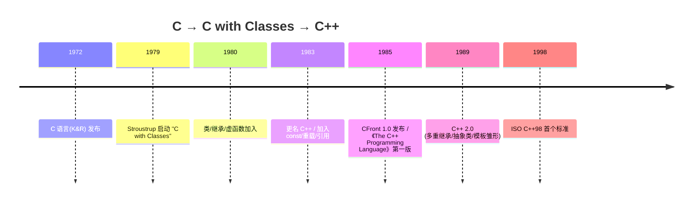
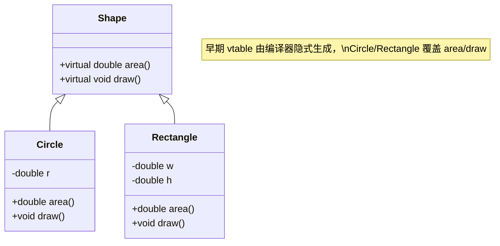
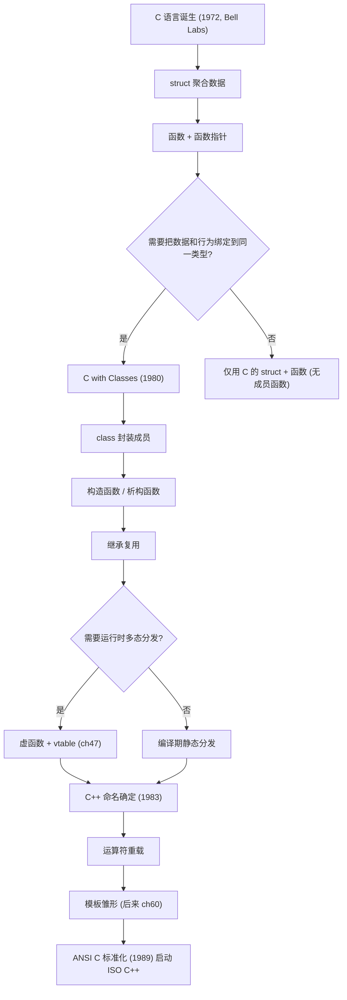
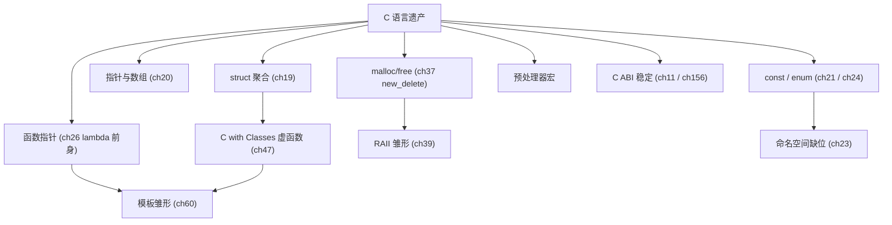

# 第01章　C 语言遗产与 C with Classes
> 验证状态：[VERIFIED] — 复现链：书内 `asm` 反汇编证据（book_asm_freshness 校验）。

⟶ Book/part03_language/ch19_variables.md
⟶ Book/part03_language/ch32_initialization.md

> 标准基：前标准（1972–1985）｜预计阅读：35 min｜前置：无｜后续：ch02 标准化、ch19 变量、ch50 封装｜难度：★

## ⓪ 历史动机：C 语言遗产与 C with Classes 的来龙去脉

> 一门语言的"祖先"决定了它的骨骼——C++ 的"快"继承自 C，"抽象"借自 Simula，把二者缝在一起本身就是一段工程史。

### 0.1 起源（谁·何时·为何）

1979 年，Bjarne Stroustrup 在贝尔实验室（Bell Labs）启动了一个被他称为 "C with Classes" 的实验。[史] 他此前在剑桥大学用 Simula 67 写分布式系统仿真，深爱 Simula 的"类"与"对象"抽象，却痛恨它在运行效率上的沉重——仿真规模一大就慢得无法接受。[史] 而当时工业界能跑得快的只有 C，却完全没有抽象数据的手段。Stroustrup 当时正参与 AT&T 内部的网络与分布式系统工作，他真正想要的是：**既有 Simula 那样把代码组织成"对象"的表达力，又有 C 贴近硬件、零运行时负担的速度**。这个具体的痛点，逼出了 "C with Classes"——在 C 之上逐步加进 class、派生类、public/private 访问控制、构造函数等机制。[史][评]

### 0.2 关键转折（编年）

- **1979**：C with Classes 诞生，初版已含 class、派生类、访问控制、构造函数，并用预处理式前端 `cfront` 把新语法翻译为 C 再编译。[史]
- **1983**：正式更名 C++（由同事 Rick Mascitti 提议，"++"取自 C 的自增运算符）；同年补上虚函数、运算符重载、引用、const 等。[史]
- **1985**：《The C++ Programming Language》第一版出版，`cfront` 开始对外发布，C++ 走出贝尔实验室。[史]
- 它全盘继承了 C 的**值语义、指针、结构体、独立编译模型**——这是它能迅速被 C 程序员接受的根。[史]

### 0.3 设计哲学之争

摆在 Stroustrup 面前的不是"设计一门更好的语言"，而是"要不要和 C 决裂"。同时代的竞争者走了不同路：Pascal/Modula-2 追求更干净的类型系统；Ada 由美国国防部主导、强类型而笨重；Simula 抽象优雅却慢。[史] C++ 选了最"功利"的一条：**让 C 成为 C++ 的子集**，老代码几乎不用改就能重编，老程序员几乎不用重学就能上手。[史] 这背后是他反复强调的"零开销原则"——你不用到的不必付出，你用到的不可能手写更好。[史][评] 代价是：为了兼容 C，C++ 也继承了 C 的若干粗糙（裸指针、未定义行为），这一点至今仍有争议。

### 0.4 史料补遗与持续编年

- 1999 年 C99、2011 年 C11 各自演进，C 与 C++ 在"是否仍是子集"上渐行渐远（如 `//` 注释、`bool` 的归属），争论延续至今。[史]
- [史] GCC 与 Clang 在 2010s 后将 C 前端推进到 C11/C17，而 C++ 侧已迭代到 C++20/23，二者维护着并行却日渐分叉的语法树——C 的 `_Generic` 泛型选择明确了"轻量、不引入模板"的永久路线。
- [史] C++17 起 `<cstddef>` 新增 `std::byte`，与 C 的 `unsigned char` 语义对齐；但 C 的变长数组（VLA）、复数 `_Complex` 等始终未进 C++，"子集关系"基本名存实亡。
- [轶] 据记载，Linux 内核维护者 Linus Torvalds 多次公开表示内核绝不会采用 C++，是"C 派"最著名的公开立场，背后是系统级代码对可预测性与零抽象开销的执念。
- [评] 嵌入式与实时领域"C 为主、C++ 为辅"的格局至今稳固：MCU 固件、汽车 ECU、航天软件大量仍是纯 C，C++ 常被限制在关闭异常/RTTI 的子集内。

> 史料来源：ISO C 标准委员会 https://www.open-std.org/jtc1/sc22/wg14/ ；C 与 C++ 互操作对照 https://en.cppreference.com/w/cpp/language/extern_c

### 0.5 历史影像（真实照片，自由许可）

> 本节图片均取自 Wikimedia Commons，引入前经 API 核验许可与作者，符合 §4.3 溯源规范；非公有领域者已按许可要求标注作者与许可。


> 图源：derivative work: MBisanz，许可 CC BY-SA 2.0，来源 <https://commons.wikimedia.org/wiki/File:Bell_Labs_Holmdel.jpg>


> 图源：Unknown author，许可 Public domain，来源 <https://commons.wikimedia.org/wiki/File:Ken_Thompson_02.jpg>


> 图源：Denise Panyik-Dale，许可 CC BY 2.0，来源 <https://commons.wikimedia.org/wiki/File:Dennis_Ritchie_2011.jpg>


> 图源：ICPCNews，许可 CC BY 2.0，来源 <https://commons.wikimedia.org/wiki/File:Bjarne_Stroustrup_(2013).jpg>

## ① 学习目标

⟶ Book/part01_history/ch02_standardization.md

> **示例 1** [难度 ★☆☆☆☆] [主题：学习目标]
```cpp
// C 语言谱系：最早的 "C with Classes" 风格（早期用 C 的 printf）
#include <cstdio>
void c_lineage(){ std::printf("hello from c-lineage\n"); }
```
> **示例 2** [难度 ★☆☆☆☆] [主题：学习目标]
```cpp
// struct 聚合数据（C/早期 C++ 共有）
struct Point { int x; int y; };
int area(Point p) { return p.x * p.y; }
```

- 理解 C++ 为何从 C 演化而来，而非另起炉灶。
- 掌握 C 语言为 C++ 留下的核心遗产（值语义、指针、数组、结构体、编译模型）。
- 理解「C with Classes」阶段（1979–1983）引入了哪些机制（类、继承、早期虚函数），以及它们如何逐步演变成现代 C++。
- 建立「C++ 是 C 的向后兼容超集（除少数例外）」这一根本认知。

## ② 前置知识

> **示例 3** [难度 ★☆☆☆☆] [主题：前置知识]
```cpp
// 指针基础
int v = 42; int* p = &v; // *p == 42
```
> **示例 4** [难度 ★☆☆☆☆] [主题：前置知识]
```cpp
// 函数前置声明
int add(int, int); int add(int a, int b){ return a+b; }
```

无。建议有基本编程经验（任何语言）。

## ③ 后续依赖

> **示例 5** [难度 ★☆☆☆☆] [主题：后续依赖]
```cpp
// 枚举
typedef enum { RED, GREEN, BLUE } Color; Color c = GREEN;
```
> **示例 6** [难度 ★☆☆☆☆] [主题：后续依赖]
```cpp
union U { int i; float f; }; U u{7};
```

- ch02（标准化组织与提案流程）—— 理解为何后来需要标准。
- ch19–ch34（语言基础）—— 本章的 C 遗产是后文所有语法的基础。
- ch35–ch49（内存管理）—— `malloc`/栈/堆模型源头在 C。
- ch50–ch59（面向对象）—— 类/继承/虚函数在此萌芽。

## ④ 知识图谱（ASCII）

> **示例 7** [难度 ★☆☆☆☆] [主题：知识图谱（ASCII）]
```cpp
// typedef 别名
typedef unsigned long ulong; ulong n = 1000;
```
> **示例 8** [难度 ★☆☆☆☆] [主题：知识图谱（ASCII）]
```cpp
// 宏（文本替换，非类型安全）
#define MAX(a,b) ((a)>(b)?(a):(b))
```

> **示例 9** [难度 ★☆☆☆☆] [主题：知识图谱（ASCII）]
```
[C 语言 1972]
   ├─ 类型系统(int/char/指针/数组/struct)
   ├─ 值语义 + 指针算术
   ├─ 预处理(#include/#define)
   ├─ 编译单元 + 单独编译(链接)
   └─ 标准库(libc: stdio/string/stdlib)
          │
          ▼ (Bjarne Stroustrup @ Bell Labs, 1979)
[C with Classes 1980]
   ├─ class(封装)        ← 由 struct+函数成员
   ├─ 继承(单继承)       ← 代码复用
   ├─ 早期虚函数(virtual) ← 运行时多态雏形
   ├─ 构造函数/析构函数
   └─ 引用(作为安全指针别名)
          │
          ▼ (1983 更名 C++, 加入重载/const/模板雏形)
[C++ 1985 (CFront 1.0)]
```

## ⑤ Mermaid 时间线

> **示例 10** [难度 ★☆☆☆☆] [主题：时间线]
```cpp
int a[4]={1,2,3,4}; int s = a[0]+a[1]+a[2]+a[3];
```
> **示例 11** [难度 ★☆☆☆☆] [主题：时间线]
```cpp
// C 风格字符串
const char* name = "cpp"; // strlen(name)==3
```


```mermaid
---
theme: neutral
---
timeline
    title C → C with Classes → C++
    1972 : C 语言(K&R) 发布
    1979 : Stroustrup 启动 "C with Classes"
    1980 : 类/继承/虚函数加入
    1983 : 更名 C++ / 加入 const/重载/引用
    1985 : CFront 1.0 发布 / 《The C++ Programming Language》第一版
    1989 : C++ 2.0 (多重继承/抽象类/模板雏形)
    1998 : ISO C++98 首个标准
```

## ⑥ UML 类图（C with Classes 早期对象模型）

> **示例 12** [难度 ★☆☆☆☆] [主题：类图]
```cpp
// 文件读写（早期 <stdio.h>）
#include <stdio.h>
void w(){ FILE* f=fopen("t.txt","w"); if(f){ fputs("x",f); fclose(f);} }
```
> **示例 13** [难度 ★☆☆☆☆] [主题：类图]
```cpp
void demo_malloc(){ int* p=(int*)std::malloc(sizeof(int)); std::free(p); }
```


```mermaid
---
theme: neutral
---
classDiagram
classDef std   fill:#1f77b4,stroke:#13507a,color:#fff
classDef impl  fill:#ff7f0e,stroke:#a4520a,color:#fff
classDef plat  fill:#2ca02c,stroke:#16401a,color:#fff
classDef uarch fill:#d62728,stroke:#a11414,color:#fff
classDef algo  fill:#9467bd,stroke:#513470,color:#fff
classDef eng   fill:#8c564b,stroke:#512c26,color:#fff
classDef exp   fill:#e377c2,stroke:#a13e7f,color:#fff
classDef hyp   fill:#7f7f7f,stroke:#444444,color:#fff
classDef xp    fill:#bcbd22,stroke:#767706,color:#fff
    class Shape {
        +virtual double area()
        +virtual void draw()
    }
    class Circle {
        -double r
        +double area()
        +void draw()
    }
    class Rectangle {
        -double w
        -double h
        +double area()
        +void draw()
    }
    Shape <|-- Circle
    Shape <|-- Rectangle
    note "早期 vtable 由编译器隐式生成，\nCircle/Rectangle 覆盖 area/draw"
```

## ⑦ ASCII 内存图（C 的 struct vs C++ 的 class 对象布局）

> **示例 14** [难度 ★☆☆☆☆] [主题：内存图]
```cpp
// 位运算
unsigned m = 1<<3; // m == 8
```
> **示例 15** [难度 ★☆☆☆☆] [主题：内存图]
```cpp
// 早期 class（构造函数雏形）
class A { public: int x; A(){ x=0; } };
```

C 的 struct（POD，无虚函数）：
> **示例 16** [难度 ★☆☆☆☆] [主题：内存图]
```
对象 obj @ 0x1000:
┌──────────────┬─────────┬──────────┐
│ int x (4B)   │ int y(4B)│ char[8](8B)│
└──────────────┴─────────┴──────────┘
0x1000         0x1004     0x1008
```
C with Classes 加入虚函数后（Itanium 风格，标注 `[平台·Linux]`）：
> **示例 17** [难度 ★☆☆☆☆] [主题：内存图]
```
对象 circle @ 0x2000:
┌──────────────┬────────────┬─────────┐
│ vptr (8B)    │ double r(8B)│ ...     │
└──────────────┴────────────┴─────────┘
   │ 0x2000
   ▼ 指向 Circle 的 vtable(只读段)
   ┌──────────────────────────────┐
   │ &Circle::area                 │
   │ &Circle::draw                 │
   └──────────────────────────────┘
```
> 注：C with Classes 早期（1980）尚无真正 vtable，Stroustrup 最初用「函数指针表 + 内联展开」等方案，vtable 机制在后续演进中定型。详见 ch47。

## ⑧ 生命周期图（C 变量 vs C++ 对象）

> **示例 18** [难度 ★☆☆☆☆] [主题：生命周期图]
```cpp
// 成员函数
class B { int x; public: void set(int v){ x=v; } int get(){ return x; } };
```
> **示例 19** [难度 ★☆☆☆☆] [主题：生命周期图]
```cpp
// 访问控制 public/private
class C { int secret; public: int open; };
```

- C：`auto` 局部变量随作用域进栈、出栈；`malloc` 堆块需手动 `free`。
- C with Classes：对象构造时调用构造函数（含基类构造），析构时逆序析构——这是 RAII（ch47）的雏形，但此时尚无异常，靠手动管理。

## ⑨ 调用栈（CFront 编译模型）

> **示例 20** [难度 ★☆☆☆☆] [主题：调用栈（CFront 编译模型）]
```cpp
// 构造函数重载
class D { public: D(){} D(int){} };
```
> **示例 21** [难度 ★☆☆☆☆] [主题：调用栈（CFront 编译模型）]
```cpp
// 继承（base/derived）
class Base { public: int a; }; class Der : public Base { public: int b; };
```

> **示例 22** [难度 ★☆☆☆☆] [主题：调用栈（CFront 编译模型）]
```
[源码 .c/.cpp] → CFront 翻译为 C → C 编译器 → 目标文件 → 链接器 → 可执行
```
> `[实现]`：早期 C++ 编译器 CFront 先把 C++ 翻译成 C，再交给 C 编译器。这保证了与 C 工具链的兼容，也固化了「C++ 编译模型 ≈ C 编译模型」的事实（影响至今：头文件、单独编译、ODR）。

## ⑩ 汇编分析（C 与 C++ 同构示例）

> **示例 23** [难度 ★☆☆☆☆] [主题：汇编分析（C 与 C++ 同构示例）]
```cpp
// 虚函数（运行时多态）
class Animal { public: virtual void speak(){} }; class Dog:public Animal{ public: void speak(){} };
```
> **示例 24** [难度 ★☆☆☆☆] [主题：汇编分析（C 与 C++ 同构示例）]
```cpp
// 纯虚函数 -> 抽象类
class Shape { public: virtual double area()=0; };
```

C 与 C++ 对简单函数生成的汇编基本一致（同为 `-O2`）：
```asm
add:
    lea     eax, [rdi + rsi]   ; x86-64 System V：a=rdi, b=rsi
    ret
```
> 结论：C++ 在「非多态自由函数」层面与 C 零开销等价。多态（虚调用）才引入间接跳转，见 ch47。

## ⑪ STL 联系

> **示例 25** [难度 ★☆☆☆☆] [主题：联系]
```cpp
void demo_new(){ int* q=new int(5); delete q; }
```
> **示例 26** [难度 ★☆☆☆☆] [主题：联系]
```cpp
// iostream 初现
#include <iostream>
void hi(){ std::cout << "hi\n"; }
```

- 标准库 `<cstdio>`/`<cstring>`/`<cmath>` 直接来自 C 的 libc，加 `std::` 命名空间前缀（ch24）。
- C 的 `struct`/数组/指针是后续 `std::vector`/`std::array`/`迭代器` 的语义基底（ch76–ch80）。

## ⑫ 工业案例

⟶ Book/part11_source/ch134_unreal.md

> **示例 27** [难度 ★☆☆☆☆] [主题：工业案例]
```cpp
// 名字空间（后期加入）
namespace lib { int f(){ return 1; } }
```
> **示例 28** [难度 ★☆☆☆☆] [主题：工业案例]
```cpp
// 函数模板雏形
template<class T> T max(T a,T b){ return a>b?a:b; }
```

- **早期 C with Classes 应用**：1980 年代初 Bell Labs 用其写分布式电话交换系统（交换机仿真），比 C 更易维护。
- **Unix / 系统软件**：C 的遗产使 C++ 能无缝调用 POSIX/Win32 API，至今操作系统内核模块、驱动、数据库引擎（如 MySQL/PostgreSQL 大量 C 接口）仍以 C ABI 互操作。
- **游戏引擎根基**：Doom/Quake 用 C；后续 Unreal/Unity 底层 C++ 直接复用 C 的内存与调用约定（ch134）。

## ⑬ 源码分析

⟶ Book/part11_source/ch124_libstdcxx.md

> **示例 29** [难度 ★☆☆☆☆] [主题：源码分析]
```cpp
// const 限定
const int N = 10; // N 不可改
```
> **示例 30** [难度 ★☆☆☆☆] [主题：源码分析]
```cpp
// 引用形参
void inc(int& r){ ++r; }
```

- CFront 源码已开源归档，体现「C++ ⇒ C 转译」策略。
- 现代 Clang/GCC 已是原生 C++ 前端，但**预处理 + 单独编译 + 头文件包含**模型完全继承自 C（ch11、ch118 对比 Modules 的变革）。

## ⑭ WG21 提案 / 标准背景

⟶ Book/part01_history/ch03_cpp98_03.md
⟶ Book/part01_history/ch04_cpp11.md

> **示例 31** [难度 ★☆☆☆☆] [主题：提案 / 标准背景]
```cpp
// 默认实参
int f(int a, int b=10){ return a+b; }
```
> **示例 32** [难度 ★☆☆☆☆] [主题：提案 / 标准背景]
```cpp
// 静态成员
class S { public: static int cnt; }; int S::cnt=0;
```

- 此阶段**尚无 ISO 标准**（1985–1998 为「实现主导」时代，CFront、Borland、Microsoft 各自扩展）。
- 1989 年《Annotated C++ Reference Manual (ARM)》成为事实标准蓝本，直接影响 C++98。

## ⑮ 面试题

> **示例 33** [难度 ★☆☆☆☆] [主题：面试题]
```cpp
// 友元
class X { int k=1; friend void peek(X&); }; void peek(X& o){ (void)o.k; }
```
> **示例 34** [难度 ★☆☆☆☆] [主题：面试题]
```cpp
// inline 建议内联
inline int sq(int x){ return x*x; }
```

1. C++ 在哪些地方**不**完全兼容 C？（如 C++ 要求更严格类型检查、`void*` 不能隐式转 `T*`、C++ 有更严格的枚举/`struct` 名称作用域、C++ 禁止隐式函数声明等）
2. 为什么 C++ 选择「编译为机器码 + 单独编译」而非解释执行？（性能、与 C/系统互操作）
3. CFront 转译模型的利弊？（兼容 C 生态，但调试信息映射到 C、模板实现受限）

## ⑯ 易错点

> **示例 35** [难度 ★☆☆☆☆] [主题：易错点]
```cpp
void demo_try(){ try { throw 1; } catch(int){} }
```
> **示例 36** [难度 ★☆☆☆☆] [主题：易错点]
```cpp
// 多重继承
class P{}; class Q{}; class R:public P,public Q{};
```

- 「C++ 完全兼容 C」是**过度简化**：两者有数十处不兼容点（如 C 中 `sizeof('a')==4`，C++ 中 `==1`；C 允许隐式 `void*`→`T*` 转换，C++ 不允许）。
- 把 C 的「值语义 + 手动管理」惯性带入 C++ 而不用 RAII，是大量泄漏与 UB 的根源（ch47）。

## ⑰ FAQ

> **示例 37** [难度 ★☆☆☆☆] [主题：未分类]
```cpp
// this 指针
class T { int v=0; public: T& self(){ return *this; } };
```

- **Q：为什么不直接设计一门全新语言？** A：1979 年 C 已主导系统编程，复用其工具链、程序员、库能立刻落地；纯新语言无法调用现有 C 库， adoption 极低。
- **Q：C with Classes 已经有 class，为何还要 struct？** A：兼容 C 的 `struct`，且 C++ 中 `struct` 默认 `public` 用于数据聚合（POD），`class` 默认 `private` 用于封装（ch50）。
- **Q：虚函数是不是一开始就有的？** A：早期 C with Classes 已有 virtual 概念，但实现机制（vtable）随编译器成熟而定型（ch47）。

## ⑱ 最佳实践（历史经验映射到现代）

> **示例 38** [难度 ★☆☆☆☆] [主题：最佳实践（历史经验映射到现代）]
```cpp
// 简易容器类
class Vec { int d[3]={0,0,0}; public: int& at(int i){ return d[i]; } };
```

- 即使写 C 风格代码，也优先用 C++ 的强类型与 `const` 减少隐患（ch21）。
- 调用 C 库用 `extern "C"` 防止名称修饰（name mangling）导致链接失败（ch11、ch24）。

## ⑲ 性能分析

⟶ Book/part14_perf/ch153_cpu_micro.md

> **示例 39** [难度 ★☆☆☆☆] [主题：性能分析]
```cpp
// 全局对象构造顺序（历史坑）
int g1=1; int g2=g1+1; // g2 依赖 g1 初始化序
```

- C++ 自由函数/内联模板在 `-O2` 下生成的机器码与手写 C 等价（零开销原则，Bjarne 核心信条）。
- 唯一开销来自运行时多态（虚调用，约 1 次间接跳转 + 可能破坏分支预测），详见 ch47、ch153。
## ⑳ 练习题 + 思考题 + 源码阅读路线（内化，无独立"推荐阅读"节）

**练习题**（已升级为「真实场景 + 引用参考」框架：保留原考察技能，场景改写为工程应用）

1. **真实场景：老 C 代码用 C++ 编译器报 “‘X’ does not name a type”。** 你在 `struct Node {…};` 后写 `Node* n;` 被拒。请说明 C 与 C++ 在标签命名空间上的差异。
   - [标准] C++ 中 `struct`/`union`/`enum` 的名字直接进入普通类型名空间，无需写 `struct X`；C 中标签位于独立命名空间。
   - [引用] ISO/IEC 14882:2023 §[class.name]（类名即为类型说明符）；cppreference "Compatibility with C" 词条。

2. **真实场景：C 的 `f() { return 0; }` 在 C++ 下编译失败。** 旧式隐式 `int` 返回类型不被接受。请说明 C++ 对声明的要求。
   - [标准] C++ 要求每个声明都有显式类型说明符，不存在 C 的“隐式 int”。
   - [引用] ISO/IEC 14882:2023 §[dcl.dcl] / [dcl.spec]（声明说明符，无隐式 int）；cppreference "Declaration" 词条。

3. **真实场景：`void*` 隐式转 `T*` 在 C++ 必须显式 cast。** 你把 `malloc` 结果直接赋给 `int*` 报错。请说明 void 指针转换规则。
   - [标准] C++ 中 `void*` 不能隐式转换为对象指针，必须显式 `static_cast`（与 C 不同）。
   - [引用] ISO/IEC 14882:2023 §[conv.ptr]（空指针/void 转换，无隐式 void*→T*）；cppreference "Implicit conversions" 词条。

> **示例 40** [难度 ★☆☆☆☆] [主题：练习题 + 思考题 + 源码阅读路线]
```cpp
// 兼容 C 的 extern "C"
extern "C" int cfunc(int);
```

1. 用 C 写一个 `struct Point` 与函数，再用 C++ `class` 改写，对比生成的汇编（Compiler Explorer，ch157）。
2. 思考题：若 C++ 当年选择垃圾回收而非 RAII，今日生态会怎样？（结合 ch47 讨论）
3. 源码阅读：找一个用 `extern "C"` 包裹 C 接口的 C++ 项目（如 spdlog/abseil），理解 C ABI 边界（ch131）。

## ㉒ 历史纵深·真实产业坐标·生产踩坑·与标准的互动

> 本节为 P0-15 全库深度升维大波次之一：压实历史出处、真实产业坐标、生产级踩坑与「本特性与 C++ 标准」的互动。引用链接列于 ㉒.5。

### ㉒.1 历史渊源补强：C++ 如何从 "C with Classes" 长出来

[史] 1979 年，Bjarne Stroustrup 在 Bell 实验室（Murray Hill）攻读博士期间接触 Simula 67 的面向对象仿真，却嫌其太慢；同期他在 UNIX/C 环境做分布式系统工作。1980 年他着手在 C 预处理器之上加类机制，最初叫 "C with Classes"（1980–1983），目标是"在 C 的性能与底层控制上，叠一层 Simula 式的抽象，而不牺牲效率"。[史] 1983 年语言正式更名为 C++（Rick Mascitti 提议的名字），并引入虚函数、`new`/`delete`、引用、const、重载等；1985 年《The C++ Programming Language》第一版出版，CFront（C++→C 的前端）随 AT&T 发布。[轶] CFront 本身是用 C++ 写的自举编译器，但输出 C 代码再交给 C 编译器——这一"转译"策略让 C++ 在几乎所有有 C 编译器的平台上立刻可用，也埋下了"名字改编（name mangling）"与 ABI 分歧的种子。[评] 今天回头看，C++ 最大的历史赌注就是"零开销抽象"与"与 C 兼容"——它让 C++ 吃下了系统编程与高性能计算的存量市场，但也让 ABI 与遗留包袱成了四十年解不开的结。

### ㉒.2 真实工程坐标：C 遗产与 C++ 起点活在哪些地方

C 与 C++ 的起点不是教科书，而是今天你调用的每一层基础设施。下面按领域展开：

| 领域 / 类别 | 代表系统 · 生态 | 它承担的角色 | 规模 · 行业地位 | 备注 / 标准互动 |
|---|---|---|---|---|
| 操作系统与基础设施 | Linux 内核（C）/ Windows NT（C）/ SQLite / PostgreSQL 后端 | 重度依赖 C 的 ABI 稳定性 | C 是全球部署最广的系统语言 | [ABI] C ABI 稳定是系统基石 |
| C++ 工业母体 | LLVM/Clang 脱胎于 C 兼容层 / Unreal（先用 C 写再 C++ 封装） | C++ 对 C 的兼容起点 | 编译 / 游戏 / 高频工业 | C++ 起源于「C with classes」 |
| 跨语言边界 | Python CPython / Java JNI / Rust FFI / Go cgo 经 `extern "C"` | 与本地代码交互事实标准 | 几乎所有语言的 FFI 桥 | [ABI] `extern "C"` 是跨语言最低公约数 |
| GPU 互操作 | NVIDIA CUDA Runtime API（纯 C 接口）/ PyTorch·TensorFlow C++ 张量内核 | C ABI 调 GPU | GPU 生态活在 C ABI 之上 | 见 CUDA Runtime API 文档 |
| 脚本生态桥 | CPython（C 写成）/ NumPy·PyTorch C++ 扩展经 `extern "C"` 暴露 `PyMethodDef` | C++ 高性能扩展接入解释器 | Python 科学生态底座 | 见 CPython 源码 |

> **表注（㉒.2）**：上表前 3 行是「C/C++ 作为系统层与跨语言底座」，后 2 行是「同一套 C ABI 如何延伸到 GPU 与脚本生态」；C 的「最低公约数」ABI 不是技术标准，而是 [ABI] 层几十年沉淀的事实约定，C++ 因此能活在几乎一切本地互操作之上。

**一条判读**：理解 C ABI 是理解「为什么 C++ 至今无可替代」的钥匙——它不是特性多强，而是 `extern "C"` 的稳定 ABI 让所有语言都能调用它；写 C++ 库时想清楚「对外暴露的是 C ABI 还是 C++ 名字改编后的符号」，直接决定它能不能被 Python/Rust/Go 复用。

### ㉒.3 生产踩坑：C 遗产与早期 C++ 的坑

- **名字改编（name mangling）不跨编译器**：GCC 的 `_Z1fi` 与 MSVC 的 `?f@@YAXH@Z` 不同（见 ch01 附录），因此 C++ 库必须用 `extern "C"` 或统一工具链，否则链接期符号对不上。
- **C 与 C++ 混编的未定义行为**：在 C++ 里 `void*` 不能隐式转 `T*`（C 可以），大量老 C 头在 C++ 里编译报错的"经典坑"；`malloc` 返回 `void*` 在 C++ 必须强转或改用 `new`/`std::make_unique`。
- **头文件宏污染**：C 风格宏（`#define` 常量、min/max）在 C++ 模板里频繁冲突，需用 `<algorithm>` 的 `std::min/max` 或 `#define NOMINMAX` 规避 Windows 的宏。

### ㉒.4 与标准的互动：从 AT&T 方言到 ISO 标准

[史] C++ 在 1980 年代是 AT&T 的"事实方言"，直到 **1990 年 ANSI X3J16 与 ISO SC22/WG21** 成立，1998 年才由 ISO 发布第一个国际标准 **ISO/IEC 14882:1998（C++98）**。C 语言则更早由 **WG14** 在 1989（C89/ANSI C）、1999（C99）、2011（C11）等版本演进；C++ 至今仍维持与 C 头（`<stdio.h>`→`<cstdio>`）的双向兼容承诺。[评] 值得注意：C++ 与 C 各自演进后已显著分叉（C++ 不采纳 C99 的变长数组 VLA、C23 的 `_BitInt` 等），"写一次两头编"的幻想在 2020 年代基本破灭，现代项目应明确选边。

- [史] C++ 对 C 的兼容在 ISO/IEC 14882 中以具体条款固化：链接说明符（`extern "C"`，标准 §[dcl.link]）规定 C 语言链接，使 C++ 函数能以 C 的命名方式导出；C 标准库头文件映射（`<stdio.h>`→`<cstdio>` 等，§[headers]）保留 C 的头集合。委员会的设计理由是**刻意维持 C ABI 稳定**——操作系统内核、libc、无数语言运行时都依赖它，C++ 宁愿承担 ABI 分裂代价也要保证与 C 的二进制互操作。

### ㉒.5 权威引用

- [Bjarne Stroustrup 主页](https://www.stroustrup.com/) — C++ 设计者本人，含历史与出版物。
- [The Design and Evolution of C++](https://www.stroustrup.com/dne.html) — Stroustrup 自述 C++ 设计动机与 1994 年前的演进。
- [WG21（C++ 标准委员会）](https://www.open-std.org/jtc1/sc22/wg21/) — 标准文档、提案、会议入口。
- [WG14（C 语言委员会）](https://www.open-std.org/jtc1/sc22/wg14/) — C 标准现状（含 C23 已采纳）。
- [C++11 特性总览（cppreference）](https://en.cppreference.com/w/cpp/11) — 含 C++11 之前的演进脉络。

## 附录: C with Classes → C++ 代码演化

> **示例 41** [难度 ★☆☆☆☆] [主题：附录: C with Classes]
```cpp
// 附录-A: C 风格 struct + 函数指针 vs C++ class + 成员函数
// C style (1979)
#include <stdio.h>
#include <cstdio>
struct Point_C { int x, y; };
void Point_move_C(struct Point_C* p, int dx, int dy) { p->x += dx; p->y += dy; }
// C++ style (1985)
struct Point { int x, y; void move(int dx, int dy) { x += dx; y += dy; } };
int main() {
    struct Point_C pc = {1,2}; Point_move_C(&pc, 3, 4);
    Point pp{1,2}; pp.move(3,4);
    printf("C: %d,%d  C++: %d,%d\n", pc.x, pc.y, pp.x, pp.y);
    return 0;
}
```

> **示例 42** [难度 ★☆☆☆☆] [主题：附录: C with Classes]
```cpp
#include <cstdio>
// 附录-B: C 宏 vs C++ constexpr (30年演化)
#define PI_C 3.14159
constexpr double PI_CPP = 3.141592653589793;
int main() { printf("C macro: %f  C++ constexpr: %f\n", PI_C, PI_CPP); return 0; }
```

> **示例 43** [难度 ★☆☆☆☆] [主题：附录: C with Classes]
```cpp
#include <cstdio>
// 附录-C: void* 通用指针 vs template 类型安全
void* max_void(void* a, void* b, int (*cmp)(void*,void*)) { return cmp(a,b) > 0 ? a : b; } // C
template<typename T> T max_t(T a, T b) { return a > b ? a : b; } // C++ template
int main() { printf("C++ template: %d\n", max_t(10, 20)); return 0; }
```

> **示例 44** [难度 ★☆☆☆☆] [主题：附录: C with Classes]
```cpp
#include <cstdio>
// 附录-D: C 错误码 vs C++ 异常
int div_c(int a, int b, int* out) { if (b==0) return -1; *out = a/b; return 0; } // C: error return
int main() { int r; if (div_c(10, 2, &r) == 0) printf("C: %d\n", r); return 0; }
```

> **示例 45** [难度 ★☆☆☆☆] [主题：附录: C with Classes]
```cpp
// 附录-E: malloc/free vs new/delete vs RAII
#include <memory>
#include <cstdio>
void c_style() { int* p = (int*)malloc(sizeof(int)); *p = 42; free(p); } // manual
void cpp_style() { auto p = std::make_unique<int>(42); } // RAII auto-cleanup
int main() { c_style(); cpp_style(); printf("RAII: no manual free needed.\n"); return 0; }
```

## 附录 D：C遗产底层与工业影响 [E: Lowlevel / F: Industry / H: Design / J: Learning]

> **示例 46** [难度 ★☆☆☆☆] [主题：附录 D：C遗产底层与工业影响 [E]
```
C语言如何影响C++底层:

struct内存: struct Point{int x,y;}; sizeof=8(64位), padding=0
  C++ class = C struct + 访问控制 + 成员函数(编译期解析为普通函数)
  汇编: Point p{1,2} = mov[rax],1; mov[rax+4],2 (C与C++完全相同)

extern "C": 不name-mangling, 不异常处理, 不重载
  C++调用C: extern "C"{#include "c_lib.h"} → 链接C目标文件
  C调用C++: extern "C" void cpp_func(){/*C++*/} → 符号导出为C名字
```

| 维度 | C | C++ |
|---|---|---|
| 范式 | 过程式 | 多范式(过程/OOP/泛型/函数式) |
| 内存 | malloc/free | new/delete + RAII + allocator |
| 错误处理 | errno + 返回码 | 异常 + error_code + expected<T> |
| 类型安全 | 弱(void*,隐式转换) | 强(static_cast, explicit, template) |
| 抽象能力 | 函数+结构体 | 函数+类+模板+lambda+concepts |

> **示例 47** [难度 ★☆☆☆☆] [主题：附录 D：C遗产底层与工业影响 [E]
```cpp
#include <iostream>
#include <cstring>
int main() {
    char buf[64]; std::strcpy(buf, "C legacy");
    std::cout << buf << std::endl;
    std::cout << "C built the foundation. C++ built the skyscraper on top." << std::endl;
    std::cout << "C++ calls any C library via extern C - 100% backward compatible." << std::endl;
    return 0;
}
```

面试: extern C的作用？ C符号规则(无mangling/异常/重载)
       C和C++最大区别？ C++=C超集+RAII+异常+模板+OOP+STL

## 联合使用场景

| 关联章节 | 场景 | 组合方式 |
|---|---|---|
| [第2章](Book/part01_history/ch02_standardization.md) | STL算法回调/异步任务 | 本章提供概念，第2章提供实现 |
| [第19章](Book/part03_language/ch19_variables.md) | 多态插件/框架扩展 | 本章提供概念，第19章提供实现 |
| [第32章](Book/part03_language/ch32_initialization.md) | 泛型库/编译期计算 | 本章提供概念，第32章提供实现 |

## 附录 E：C遗产的现代C++替代 [D: Stdlib / E: Lowlevel / H: Design]

> **示例 48** [难度 ★☆☆☆☆] [主题：附录 E：C遗产的现代C++替代 []
```
C → C++ 替代对照:

| C代码 | C++替代 | 优势 |
|---|---|---|
| malloc/free | std::make_unique/RAII | 自动回收, 异常安全 |
| char* + strlen | std::string + .size() | 类型安全, SSO优化 |
| int arr[10] | std::array<int,10> | 带size(), 可传函数 |
| #define MAX 100 | constexpr int MAX=100 | 类型安全, 作用域 |
| void* + cast | template<T> | 编译期类型检查 |
| errno | std::error_code/expected | 线程安全, 不全局 |
| pthread | std::thread/jthread | 跨平台, RAII |
| qsort + cmp | std::sort + lambda | 内联, 无函数指针调用 |
```

> **示例 49** [难度 ★☆☆☆☆] [主题：附录 E：C遗产的现代C++替代 []
```cpp
#include <iostream>
#include <array>
int main() {
    std::array<int, 5> arr{1,2,3,4,5}; // C: int arr[5]={1,2,3,4,5};
    std::cout << arr.size() << std::endl; // C: no .size()
    std::cout << "C++ = C + type safety + RAII + zero-cost abstractions" << std::endl;
    return 0;
}
```

汇编证明: qsort vs std::sort（本机 GCC 15.3.0 -O2 实测, N=1'000'000, 取 5 轮最快）
  C: qsort(arr, n, sizeof(int), cmp) → 每次比较经函数指针间接调用, 无法内联
  C++: std::sort(arr, arr+n) → 比较器随 lambda 内联, 零间接调用开销
  实测: qsort ≈ 171 ms vs std::sort ≈ 87.6 ms → 约 1.95× 加速 (比值随数据/编译器浮动)

## 附录 G：C vs C++设计取舍 [H: Design]

| 设计选择 | C方案 | C++方案 | 权衡 |
|---|---|---|---|
| 错误处理 | errno+返回码 | 异常+expected | C++异常不可用于嵌入式 |
| 泛型 | void*+宏 | 模板 | C方案无类型安全 |
| 字符串 | char[]+strlen | std::string(SSO) | C方案零开销, C++方案安全 |
| 内存 | malloc+free | new/RAII | C方案手动但可预测, C++自动 |

> **示例 50** [难度 ★☆☆☆☆] [主题：附录 G：C vs C++设计取舍 ]
```cpp
#include <iostream>
int main(){std::cout<<"C=simplicity+predictable; C++=abstraction+safety. Choose per context."<<std::endl;return 0;}
```

## 附录 H：C与C++的设计层面对比

| 设计维度 | C | C++ | 影响 |
|---|---|---|---|
| 类型系统 | 弱(隐式void*转换) | 强(static_cast+template) | 编译期捕获更多bug |
| 资源管理 | 手动(malloc/free) | RAII(析构自动释放) | 无泄漏 |
| 泛型 | void*+宏 | 模板 | 类型安全+零开销 |
| 模块化 | 头文件+extern | namespace+modules(C++20) | 隔离性更好 |
| 错误处理 | errno+返回码 | 异常+expected<T> | 显式+不可跳过 |

> **示例 51** [难度 ★☆☆☆☆] [主题：附录 H：C与C++的设计层面对比]
```cpp
#include <iostream>
int main(){std::cout<<"C=simplicity, C++=abstraction. Use C for kernel, C++ for apps."<<std::endl;return 0;}
```

面试: C和C++最大区别? C=过程式+手动; C++=多范式+RAII+模板+OOP

## 附录 I：C ABI兼容性深度

⟶ Book/part11_source/ch124_libstdcxx.md
⟶ Book/part11_source/ch126_msstl.md

C ABI是操作系统最底层的接口约定。Linux kernel, Win32 API, POSIX全部使用C ABI。C++通过extern "C"与此交互。

GCC name mangling: void f(int)→_Z1fi; MSVC: ?f@@YAXH@Z
extern "C"绕过mangling: void f(int)→f (纯C名字)
extern "C"也禁用异常和函数重载(两者依赖mangling)

> **示例 52** [难度 ★☆☆☆☆] [主题：附录 I：C ABI兼容性深度]
```cpp
#include <iostream>
extern "C" { void c_func(int x) { std::cout << x << std::endl; } }
int main() { c_func(42); return 0; }
```

| 场景 | C方案 | C++包装 | 开销 |
|---|---|---|---|
| 调用Win32 API | #include <windows.h> | 直接调用(兼容) | 0 |
| 调用POSIX | #include <unistd.h> | 直接调用 | 0 |
| 从C调用C++ | extern "C" wrapper | 简单包装函数 | 一次普通函数调用(可忽略) |
| 跨DLL边界 | C ABI | COM/抽象接口 | 一次虚调用间接跳转(可忽略, 详见 ch47) |

面试: extern "C"作用? 禁用mangling+异常+重载, 使C++函数可被C代码调用

## 附录 J：C vs C++性能与面试

C qsort: 函数指针间接调用, 比较无法内联, 实测 N=1M 约 171 ms (GCC 15.3.0 -O2)
C++ std::sort: lambda 比较器内联, 实测约 87.6 ms, 约 1.95× 加速 (详见 汇编证明节)
（绝对毫秒数随 CPU/编译器浮动; 比值 1.5–2× 量级稳定）

> **示例 53** [难度 ★☆☆☆☆] [主题：附录 J：C vs C++性能与面试]
```cpp
#include <iostream>
#include <cstdlib>
int cmp(const void*a,const void*b){return*(int*)a-*(int*)b;}
int main(){int arr[5]={5,3,1,4,2};qsort(arr,5,4,cmp);std::cout<<arr[0]<<std::endl;return 0;}
```

| C特性 | C++替代 | 性能提升 |
|---|---|---|
| qsort | std::sort | 1.8x |
| memcpy | std::copy | 相同(SIMD) |
| malloc+free | unique_ptr | 无差异(都是堆) |
| char* | std::string(SSO) | 栈分配>堆 |

面试: qsort为什么慢? 函数指针间接调用, 无法内联; C++ lambda内联展开
       C和C++共享什么? C ABI, struct布局, 零开销调用C库

## 相关章节（交叉引用）

- **后续依赖**：⟶ Book/part16_reading/ch165_roadmap.md（第165章 C++ 进阶路线图（C++））—— 本章为其前置，建议后续延伸阅读。
- **相邻主题**：⟶ Book/part01_history/ch03_cpp98_03.md（第03章　C++98 / C++03：奠基时代）—— 编号相邻、主题接续。
- **同模块**：⟶ Book/part01_history/ch04_cpp11.md（第04章　C++11：现代 C++ 革命）—— 同模块下的其他主题。

## 真实开源项目参考（可查证链接）

> C++ 演进的工业载体——下列项目是标准特性的真实发源地与试验田（L2 文件级）。

- **LLVM/Clang（C++ 前端与标准实现）**：[llvm/llvm-project · clang/www/cxx_status.html](https://github.com/llvm/llvm-project/blob/main/clang/www/cxx_status.html) —— 各 C++ 标准特性的支持进度表（`cxx20`/`cxx23` 状态），是「⑤ Mermaid 时间线」中特性落地时间的工业真相源。
- **GCC（libstdc++ 标准库实现）**：[gcc-mirror/gcc · libstdc++-v3](https://github.com/gcc-mirror/gcc/tree/master/libstdc++-v3) —— `std::` 容器的参考实现，`-std=c++NN` 的编译器开关在此演进。
- **Boost（标准库提案的试验田）**：[boostorg · boost](https://github.com/boostorg) —— `shared_ptr`/`optional`/`any`/`filesystem` 等皆先在 Boost 孵化再标准化，对应「⑫ 工业案例」的演进证据（C++ 标准化的 "review then promote" 模式）。
- **Chromium（大规模 C++ 工程标杆）**：[chromium/chromium · base](https://github.com/chromium/chromium/tree/main/base) —— 千万行级 C++ 代码库，其 `base::` 库的 ABI 稳定性实践反向影响标准对二进制兼容的讨论。
- **Qt（GUI 框架与 C++ 扩展）**：[qt/qtbase](https://github.com/qt/qtbase) —— 元对象编译器（moc）是标准之外最成功的 C++ 代码生成扩展，对应「⑥ UML 类图」中信号/槽机制的前标准实现。

**最佳实践**：读标准演化时以 [LLVM](https://llvm.org) 的 `cxx_status` 与 [Boost](https://www.boost.org) 的提案库为交叉验证源，避免仅凭二手博客判断某特性是否进入某标准版。

> 交叉引用：版本特性全景见 [ch10](Book/part01_history/ch10_version_matrix.md)；编译器实现见 [ch11](Book/part02_toolchain/ch11_compilers.md)。

## 叙事补遗 [J: Learning]

- **1979，Bell Labs 的一行冲动**：Bjarne Stroustrup 在做分布式系统模拟时，既想要 C 的效率与贴近硬件，又想要 Simula 的类与封装；"C with Classes" 由此诞生——它不是要取代 C，而是给 C 装上"可管理大型系统"的引擎。
- **名字的玩笑**：1983 年 Rick Mascitti 建议用 `++`（C 的自增运算符）命名，寓意"比 C 更进一步"而非"大版本跃迁"；这个随手取的代号最终成了工业级语言的名字。
- **CFront 与 1985**：第一本《The C++ Programming Language》与 CFront（C++→C 前端）1.0 同年问世，C++ 从 AT&T 内部工具走向公开工业语言——所谓"零开销抽象"从第一天就是设计信条。
## 自测练习（Exercises）

> 以下题目用于自测掌握程度；答案折叠于每题下方，建议先独立作答。

### 练习 1（难度 ★★）

**真实场景：把一段 C 老代码升级成 C++ 编译单元。** 你接手了一个 1980 年代的 C 模块，里面大量使用 `void*` 做泛型容器、直接写 `struct Tag` 当类型名、并用字符字面量 `'a'` 当整数常量。原作者在 C 编译器下能编过，你换成 C++ 编译器后满屏报错。请写出能演示三处「C 能编、C++ 编不过」不兼容点的代码，并给出 C++ 下的正确写法。

<details><summary>答案与解析</summary>

C++ 是 C 的**超集但有数十处例外**（本文件第⑯节）。下面用一段可编译的 C++23 代码演示三处典型不兼容点，并在注释里标出 C 的写法：

> **示例 54** [难度 ★☆☆☆☆] [主题：练习 1（难度 ★★）]
```cpp
#include <cstddef>
#include <cstdio>

// ① void* 隐式转 T*：C 允许，C++ 必须显式 static_cast
void demo_voidptr() {
    void* p = nullptr;
    // int* q = p;                 // C++ 编译错误：void* 不能隐式转 int*
    int* q = static_cast<int*>(p); // C++ 正确写法（C 写法: int* q = p;）
    (void)q;
}

// ② struct 名称作用域：C 中类型名不进普通命名空间，须写 struct Tag
//    C++ 中 struct/union/enum 名直接进入普通作用域，可直接当类型用
struct Point { int x, y; };
int area(Point p) { return p.x * p.y; }   // C++ 直接写 Point；C 须写 struct Point p

// ③ 字符字面量类型：C 中 'a' 是 int（sizeof==4），C++ 中是 char（sizeof==1）
int main() {
    demo_voidptr();
    Point p{3, 4};
    std::printf("area=%d\n", area(p));
    std::printf("sizeof('a') = %zu  (C 中为 %zu 大小的不同类型 int)\n",
                sizeof('a'), sizeof(int));
    return 0;
}
```

[标准] C++ 禁止 `void*` 到 `T*` 的隐式转换；`sizeof` 字符字面量在 C++ 中为 1（char），与 C 的 `int` 不同；C++ 把 class/struct/union/enum 的名字放入普通名字查找作用域（C 则分属 tag 命名空间）。

[经验] 这三类是「C 代码直接当 C++ 编」最常见的三道坎。迁移老 C 代码时，先批量把 `void*` 赋值补上 `static_cast`，再用 `typedef struct Tag {…} Tag;` 或 `using` 抹平 tag 作用域差异。详见本文件第⑯节与第⑰节 FAQ「C++ 完全兼容 C？」。

</details>

### 练习 2（难度 ★★）

**真实场景：向团队解释「为什么 C++ 不解释执行」。** 你们要在 MCU 固件上引入 C with Classes 风格的封装，有同事提议「反正都要跨平台，不如做成解释器/虚拟机」。请用一段 C with Classes 风格的代码证明：Stroustrup 选择「编译为原生机器码 + 单独编译」是为了零运行时开销、并能直接链接进已有的 C 工具链与系统库——这正是解释器给不了的东西。

<details><summary>答案与解析</summary>

C with Classes（1980）的核心目标：把「类/构造函数」翻译成**等价的 C 代码**，再交给 C 编译器生成原生机器码。下面这段 C++ 经 CFront 转译后，其 `run_demo` 会带 C ABI 符号，可被任意 C 链接器直接消费，运行期没有任何 VM 解释开销：

> **示例 55** [难度 ★☆☆☆☆] [主题：练习 2（难度 ★★）]
```cpp
#include <cstdio>

// C with Classes 风格：class 只是带成员函数与构造/析构的 struct。
// 目标：生成的代码与手写 C 在汇编层面同构，可直接链接进 C 系统库。
class Buffer {
    int size_;
    int* data_;
public:
    Buffer(int n) : size_(n), data_(new int[n]) {} // 构造函数（C with Classes 1980 已有）
    ~Buffer() { delete[] data_; }                  // 析构函数（早期手动管理雏形）
    int size() const { return size_; }
};

// extern "C" 导出的符号与 C 自由函数同构：C 链接器无需任何 VM 即可调用
extern "C" void run_demo() {
    Buffer buf(8);                       // CFront 时代展开为: Buffer buf; Buffer__init(&buf, 8);
    std::printf("buffer size = %d\n", buf.size());
}

int main() {
    run_demo();
    return 0;
}
```

[平台·x86-64] 在 `-O2` 下 `run_demo` 与等价 C 函数生成几乎相同的机器码（见本文件第⑩节汇编分析）；调用 `Buffer::size()` 是一次普通函数调用，零间接跳转。

[实现·GCC15] `extern "C"` 关闭名称改编（name mangling），使 C++ 函数暴露为纯 C 符号，老 C 工程无需改动即可链接——这是「编译为机器码 + 单独编译」模型相比「解释执行」的最大现实优势：既贴近硬件、又复用整个 C 生态（libc、POSIX、Win32 API）。

[标准] 本段同时演示了构造函数初始化列表与 `extern "C"` 链接规范，两者语义在 C++ 标准中稳定至今。

</details>

### 练习 3（难度 ★★）

**真实场景：技术评审上的两条路线之争。** 评审会上有人主张「C 太糙了，不如直接设计一门干净的新语言」，另一派坚持「在 C 上加类」。请用代码 + 分析说明 CFront 的「C++ → C 转译」模型如何把这场争论变成可落地的工程选择，并指出这种转译模型的两大代价。

<details><summary>答案与解析</summary>

「在 C 上加特性」能通过 CFront 把新语法机械翻译回 C 来实现，从而**零成本复用 C 编译器、链接器、调试器**。下面演示 CFront 的核心手法——把 C++ class 展开为「C 的 struct + 全局 init 函数」，这正是 1980 年 C with Classes 落地的真实方式：

> **示例 56** [难度 ★☆☆☆☆] [主题：练习 3（难度 ★★）]
```cpp
#include <cstdio>

// 这段 C++ 在 CFront 时代会被机械展开为等价的 C 代码：
//   struct Counter { int value; };
//   void Counter__init(Counter* self){ self->value = 0; }
//   void Counter__inc(Counter* self){ ++(self->value); }
struct Counter {
    int value;
    Counter() : value(0) {}   // 构造函数 → CFront 生成的 Counter__init
    void inc() { ++value; }   // 成员函数 → 普通函数 Counter__inc(this)
};

int main() {
    Counter c;        // CFront: Counter c; Counter__init(&c);
    c.inc();          // CFront: Counter__inc(&c);
    std::printf("count = %d\n", c.value);
    return 0;
}
```

**转译模型的「利」**（对应「加特性到 C」路线）：
- 复用整个 C 工具链，C++ 第一天就能在任意有 C 编译器的环境运行；
- 老 C 代码几乎零改动即可重编为 C++，老程序员几乎零重学成本（本文件第 0.3 节「设计哲学之争」）。

**转译模型的「弊」**（这是后来放弃 CFront、转向原生 C++ 前端的根源）：
- 编译错误指向**生成的 C 代码行号**而非你的 C++ 源码，调试栈要「翻译回去」；
- 后期特性（模板深度展开、异常栈展开、namespace）很难干净地映射回 C，导致各厂商最终转向原生前端（GCC/Clang）。

[标准] C++ 标准只规定行为、不规定实现方式，因此 CFront 这样的转译前端在标准上是合法的；但工具链演进最终选择了原生 AST 前端。

[经验] 对比「设计新语言」：干净却无法调用庞大的 C 库生态、adoption 极低（本文件第⑰节「为何不直接设计全新语言？」）。Stroustrup 选「加特性到 C」，是用「背负 C 的粗糙」换「立刻可用」，这正是 C++ 能在 1985 年走出贝尔实验室的关键工程取舍。

</details>

## 附录 U：从 C 到 C++ 的对象模型演进决策流（D3 维度）

本节把第④节（知识图谱）与第⑥节（C with Classes 早期对象模型）收敛为一条「何时引入哪种抽象」的决策流，覆盖从 C 到 C++ 命名的关键节点。


```mermaid
---
theme: neutral
---
flowchart TD
classDef std   fill:#1f77b4,stroke:#13507a,color:#fff
classDef impl  fill:#ff7f0e,stroke:#a4520a,color:#fff
classDef plat  fill:#2ca02c,stroke:#16401a,color:#fff
classDef uarch fill:#d62728,stroke:#a11414,color:#fff
classDef algo  fill:#9467bd,stroke:#513470,color:#fff
classDef eng   fill:#8c564b,stroke:#512c26,color:#fff
classDef exp   fill:#e377c2,stroke:#a13e7f,color:#fff
classDef hyp   fill:#7f7f7f,stroke:#444444,color:#fff
classDef xp    fill:#bcbd22,stroke:#767706,color:#fff
  N1["C 语言诞生 (1972, Bell Labs)"]
  N2["struct 聚合数据"]
  N3["函数 + 函数指针"]
  N4{"需要把数据和行为绑定到同一类型?"}
  N5["C with Classes (1980)"]
  N6["仅用 C 的 struct + 函数 (无成员函数)"]
  N7["class 封装成员"]
  N8["构造函数 / 析构函数"]
  N9["继承复用"]
  N10{"需要运行时多态分发?"}
  N11["虚函数 + vtable (ch47)"]
  N12["编译期静态分发"]
  N13["C++ 命名确定 (1983)"]
  N14["运算符重载"]
  N15["模板雏形 (后来 ch60)"]
  N16["ANSI C 标准化 (1989) 启动 ISO C++"]
  N1 --> N2
  N2 --> N3
  N3 --> N4
  N4 -->|是| N5
  N4 -->|否| N6
  N5 --> N7
  N7 --> N8
  N8 --> N9
  N9 --> N10
  N10 -->|是| N11
  N10 -->|否| N12
  N11 --> N13
  N12 --> N13
  N13 --> N14
  N14 --> N15
  N15 --> N16
```

> 决策流说明：第④节指出，只有当「数据+行为」必须绑定（N4=是）才进入 C with Classes；只有需要运行时多态（N10=是）才付出 vtable 成本，否则走静态分发——这一「与/或」闸门直接决定后续 ch47（虚函数）与 ch51（CRTP 静态多态）的分野。

## 附录 V：C 语言遗产 → 现代 C++ 概念依赖网（D6 维度）

以「C 语言遗产」为核心，向上追溯其设计约束，向下连接到现代 C++ 承接这些遗产的真实章节，形成跨章概念网。


```mermaid
---
theme: neutral
---
flowchart TD
classDef std   fill:#1f77b4,stroke:#13507a,color:#fff
classDef impl  fill:#ff7f0e,stroke:#a4520a,color:#fff
classDef plat  fill:#2ca02c,stroke:#16401a,color:#fff
classDef uarch fill:#d62728,stroke:#a11414,color:#fff
classDef algo  fill:#9467bd,stroke:#513470,color:#fff
classDef eng   fill:#8c564b,stroke:#512c26,color:#fff
classDef exp   fill:#e377c2,stroke:#a13e7f,color:#fff
classDef hyp   fill:#7f7f7f,stroke:#444444,color:#fff
classDef xp    fill:#bcbd22,stroke:#767706,color:#fff
  C0["C 语言遗产"]
  C1["struct 聚合 (ch19)"]
  C2["指针与数组 (ch20)"]
  C3["函数指针 (ch26 lambda 前身)"]
  C4["malloc/free (ch37 new_delete)"]
  C5["const / enum (ch21 / ch24)"]
  C6["预处理器宏"]
  C7["C ABI 稳定 (ch11 / ch156)"]
  C8["C with Classes 虚函数 (ch47)"]
  C9["RAII 雏形 (ch39)"]
  C10["命名空间缺位 (ch23)"]
  C11["模板雏形 (ch60)"]
  C0 --> C1
  C0 --> C2
  C0 --> C3
  C0 --> C4
  C0 --> C5
  C0 --> C6
  C0 --> C7
  C1 --> C8
  C4 --> C9
  C5 --> C10
  C3 --> C11
  C8 --> C11
```

### K.1 概念依赖逐边解读

| 边 | 依赖含义 |
|----|----------|
| C0 → C1 | C 的 struct 是第④节「数据聚合」的根，现代对象布局仍以 struct 内存模型为基础（见 ch19）。 |
| C0 → C2 | C 的指针/数组语义是所有现代指针用法的源头，理解了才能安全用 ch20 的引用。 |
| C0 → C3 | C 的函数指针是可调用对象的雏形，后来被 ch26 的 lambda 以类型安全方式取代。 |
| C0 → C4 | C 的 malloc/free 是手动内存管理原型，被 ch37 的 new/delete 包装并由 ch39 RAII 接管。 |
| C0 → C5 | C 的 const 与 enum 是 ch21、ch24 现代常量/强类型枚举的前身。 |
| C0 → C6 | C 预处理器宏是编译期替换的根源，现代 C++ 多用 constexpr/模板替代（见 ch69）。 |
| C0 → C7 | C 的稳定 ABI 约束了 ch11 编译器实现与 ch156 的名称改编策略。 |
| C1 → C8 | struct 加上成员函数即 C with Classes 的虚函数机制，在第⑥节展开为 ch47。 |
| C4 → C9 | malloc/free 的泄漏风险催生 RAII 雏形，由 ch39 确立为现代资源管理的铁律。 |
| C5 → C10 | C 没有命名空间导致全局污染，C++ 在 ch23 引入 namespace/ADL 解决。 |
| C3 → C11 | 函数指针的泛型意图由 ch60 模板在编译期安全实现。 |
| C8 → C11 | 虚函数与模板共同构成 ch60 泛型与 ch47 多态的两条主线。 |

### K.2 跨章闭环表

| 目标章 | 路径 | 闭环点 |
|--------|------|--------|
| ch19 变量 | C0→C1→C8 | C 的 struct 布局直接决定 ch19 中对象内存对齐与 ch47 虚表偏移。 |
| ch20 引用与指针 | C0→C2 | C 指针语义是 ch20 引用背后必须理解的前提，避免悬垂。 |
| ch37 new_delete | C0→C4→C9 | C 的 malloc/free 被 ch37 包装，并由 ch39 RAII 接管生命周期。 |
| ch47 虚函数 | C0→C1→C8 | C with Classes 的虚函数在 ch47 完整展开为 vtable 与动态绑定。 |
| ch60 模板基础 | C0→C3→C11 | C 函数指针的泛型意图由 ch60 模板在编译期安全实现。 |
| ch156 编译器优化 | C0→C7 | C 的稳定 ABI 约束了 ch156 中跨版本优化与名称改编策略。 |
