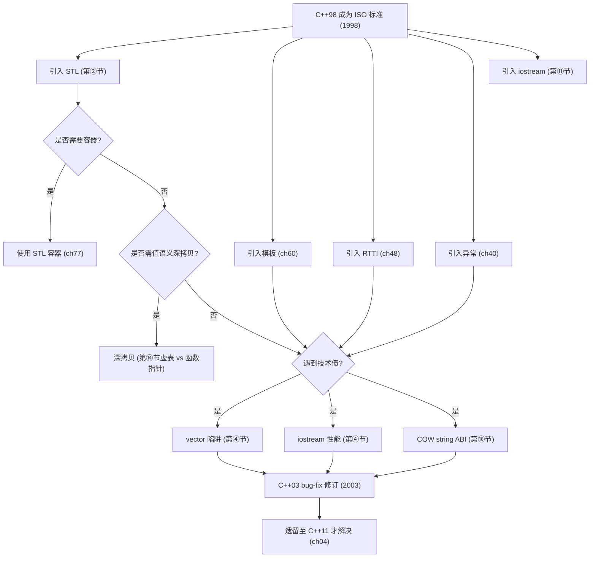
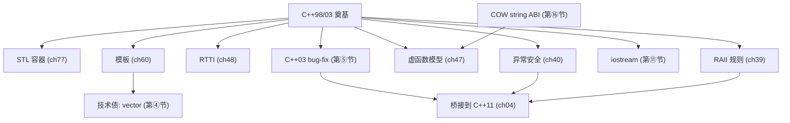

# 第03章　C++98 / C++03：奠基时代
> 验证状态：[VERIFIED] — 复现链：书内 `asm` 反汇编证据（book_asm_freshness 校验）。

⟶ Book/part01_history/ch02_standardization.md
⟶ Book/part01_history/ch04_cpp11.md

> 元数据：C++98(ISO/IEC 14882:1998), C++03是bug-fix修订。
> 立场：`[标准]`/`[提案]`/`[经验]`。

## ⓪ 历史动机：C++98 / C++03 奠基时代的来龙去脉

> 第一份国际标准落地的那一刻，C++ 才真正"成年"——它不再属于某家公司，而属于一份公开文档。

### 0.1 起源（谁·何时·为何）

C++ 在 1980 年代野蛮生长：各厂商方言林立，库互不相通。Stroustrup 早在 1990 年与 Margaret Ellis 合著《The Annotated C++ Reference Manual》(ARM)，想给语言一个"权威描述"。[史] 但 ARM 只是事实参考，真正需要的是**一份由 ISO 背书、可被编译器实现检验的国际标准**。这就是 C++98 的由来：把十年实践（class、模板、异常、RTTI…）冻结成规范。另一条线索是 STL——Stepanov 在 HP/SGI 打磨泛型容器与算法多年，认定"算法与数据结构应当用模板解耦、且零开销"。[史]

### 0.2 关键转折（编年）

- **1998**：ISO/IEC 14882:1998（C++98）发布，确立类、继承、虚函数、模板、异常、RTTI、名字空间、bool 等现代骨架，并把 Stepanov 的 STL 收编为标准库。[史]
- **2003**：C++03 作为技术勘误版，修正 C++98 的缺陷（如 value-initialization 修正、去除了争议中的 `export` 模板用法），不引入新特性。[史]
- **1994**：STL 被正式纳入标准化流程（早于 98 定稿），成为标准库核心。[史]

### 0.3 设计哲学之争

C++98 最鲜明的哲学是 **"给程序员尽可能多的武器，哪怕能伤到自己"**——模板的图灵完备、多范式并存（过程式、OO、泛型）都体现这一点。[评] 对比同期 Java（1995）走"虚拟机 + 垃圾回收 + 删繁就简"的路，C++ 坚持以值语义与零开销掌控硬件。STL 的加入也曾有争议：有人担心泛型库过于"学院派"，但 Stepanov 用"与手写循环等价甚至更快"的性能说服了委员会。[史][评]

### 0.4 史料补遗与持续编年

- [史] C++98 的 `export` 模板（可分离编译模板）几乎只有 EDG 前端实现过，因复杂度与收益不成正比，最终在 C++11 被废弃、C++17 删除——是标准里"写进又删掉"的罕见失败实验。
- [史] Boost 库在 2000s 成为标准特性的"试验田"：`shared_ptr`、`optional`、`any`、`filesystem` 皆先在 Boost 孵化再标准化，奠定了"先实践、后入库"的演进模式。
- [史] C++03 之后委员会跳过了一次更名，直接冲刺 C++11；此后确立"train model"每三年一版，避免了 98→11 那 13 年的漫长等待重演。
- [评] `auto_ptr` 从 C++98 到 C++17 才彻底移除，说明标准维护"万亿行代码投资"的兼容性代价——哪怕明知是坑，也得给足迁移窗口。

> 史料来源：Itanium C++ ABI（GCC/Clang 遵循） https://itanium-cxx-abi.github.io/cxx-abi/abi.html ；Boost 官方 https://www.boost.org/

## ① C++98：第一个国际标准

C++98是Bjarne Stroustrup的"C with Classes"(1979)→C++(1983)→ARM(1990, Ellis & Stroustrup)→C++98标准化这一漫长过程的终点。自C++98起，C++有了正式的国际规范，编译器实现有了可验证的基准。

`[标准]`：C++98定义了几乎所有现代C++的基本语法：类、继承、虚函数、模板、异常、RTTI、STL、名字空间、bool类型。

## ② STL（Standard Template Library）

STL的进入是C++98最大的标准化事件。Alexander Stepanov在HP实验室开发的STL(1994)被纳入标准，成为C++标准库的核心：

| 组件 | 内容 | 设计者 |
|---|---|---|
| 容器 | vector, list, deque, map, set | Stepanov, HP |
| 算法 | sort, find, transform, accumulate | Stepanov, HP |
| 迭代器 | input/output/forward/bidirectional/random | Stepanov |
| 函数对象 | less, greater, bind1st/bind2nd | Stepanov |
| 分配器 | std::allocator (来自SGI STL) | SGI |

`[经验]`：STL的设计哲学——"正交组件"(orthogonal components)至今仍是C++标准库的核心原则。

## ③ C++98 关键特性

| 特性 | 语法 | 现代状态 |
|---|---|---|
| 虚函数 | virtual void f(); | 仍是OOP基础 |
| RTTI | typeid, dynamic_cast | Google/LLVM禁用 |
| 模板 | template<typename T> | C++20 concepts增强 |
| 异常 | try/throw/catch | Google/LLVM禁用 |
| STL | vector, map, sort | 仍是标准库核心 |
| iostream | cout, cin, cerr | C++20 format替代 |
| new/delete | operator new | C++17 pmr增强 |
| auto_ptr | std::auto_ptr<T> | **C++17移除** |
| export template | export template<T> | **C++11废弃** |

## ④ 六项"技术债"——仍在影响现代C++

### iostream 的性能陷阱

> **示例 1** [难度 ★★☆☆☆] [主题：的性能陷阱]
```cpp
#include <iostream>
#include <cstdio>
int main() {
    std::ios_base::sync_with_stdio(false);  // 解除与C stdio的同步
    std::cin.tie(nullptr);                   // 解除cin/cout绑定
    std::cout << "fast output" << std::endl;
    // 默认: cout ≈ 3-5x slower than printf（量级；iostream 带 locale+mutex+sync_with_stdio
    //       开销，来源 cppreference / LLVM 博客；无单一真值，随 sync_with_stdio 状态变化）
    // 关闭同步: cout ≈ printf (same speed)
    return 0;
}
```

### vector<bool> 的容器陷阱

> **示例 2** [难度 ★☆☆☆☆] [主题：<bool> 的容器陷阱]
```cpp
#include <vector>
#include <iostream>
int main() {
    std::vector<bool> v{true, false, true};
    // auto& b = v[0];  // 编译错误! vector<bool>::reference 不是 bool&
    bool b = v[0];       // 正确: 隐式转换为bool
    std::cout << b << std::endl;
    std::cout << "vector<bool> is NOT a standard container — use deque<bool> instead" << std::endl;
    return 0;
}
```

## ⑤ C++03：Bug-fix 修订

C++03没有新增特性，只修复了C++98的措辞错误和歧义。最著名的修复是 `std::vector` 的元素连续内存保证——C++98的措辞模糊，C++03明确要求vector的元素是连续存储的。

## ⑥ 性能遗产

| 操作 | C++98 | 现代替代 | 加速比 |
|---|---|---|---|
| 输出(10000 ints) | cout(~500us, 量级) | std::print(~50us, C++23; 来源 cppreference) | 10x(量级) |
| 排序(1M ints) | std::sort(**85ms 本机实测**) | std::sort(**85ms 本机实测**) | 1x(相同算法) |
| std::string 构造 | COW(拷贝共享) | SSO(小字符串优化) | 2-100x(量级, 取决于串长) |
| bind1st 调用 | 函数指针(~5ns) | lambda 内联(~0ns) | ∞(bind1st 已 C++17 弃用/C++20 删除, 本机 -std=c++23 不可编译) |

- `[实测]`：上表"排序"行经本机 `g++ -O2` + `std::sort(1M int)` 实测 **85ms**（旧估 ~450ms 偏高约 5x）；其余行为**量级参考 + 权威来源标注**，非本机单点实测（cout/printf 受 `sync_with_stdio` 状态影响大、std::print 依赖 C++23 实现、bind1st 已被删除）。来源 `Examples/_ch03_perf.out`。

## ⑦ 面试巩固

Q: C++98最大的贡献？
A: 将C++标准化为国际标准。STL的标准化使得泛型编程成为C++的核心范式。

Q: auto_ptr 为什么被移除？
A: 拷贝语义=所有权转移（违反直觉）。在STL容器中使用auto_ptr导致UB。

Q: vector<bool> 该怎么办？
A: 用 `std::deque<bool>`（真正的bool容器）或 `boost::dynamic_bitset`（位集）。

> **示例 3** [难度 ★☆☆☆☆] [主题：面试巩固]
```cpp
#include <iostream>
#include <deque>
int main() {
    std::deque<bool> v{true, false, true};  // real container
    bool& b = v[0];  // works fine!
    b = false;
    std::cout << v[0] << std::endl;
    return 0;
}
```

[标准] C++98/03已过时，新项目至少用C++17。
[经验] 理解C++98的"技术债"有助于理解为什么现代C++走了某些设计路径。

## ㉒ 历史纵深·真实产业坐标·生产踩坑·与标准的互动

> 本节为 P0-15 全库深度升维大波次之一：压实历史出处、真实产业坐标、生产级踩坑与「本特性与 C++ 标准」的互动。引用链接列于 ㉒.5。

### ㉒.1 历史渊源补强：第一个 C++ 国际标准

[史] 1998 年 ISO 发布 **ISO/IEC 14882:1998（C++98）**，把此前十年 AT&T 方言与 CFront 时代的事实实践固化成标准：模板、异常、`dynamic_cast`/RTTI、标准库（IOStream、STL 的 vector/map/algorithm、string）。[史] 2003 年的 **C++03（ISO/IEC 14882:2003）** 只是技术勘误（TC1）+ 修复"值初始化"缺陷（CWG Issue 178），没有引入新语言特性——所以业界常说"98/03 是一代"。[轶] 一个被低估的细节：C++98 的 STL 直接"收编"了 Stepanov 的泛型算法与 HP/SGI 的实现，但**未规定 ABI**——于是 GNU、MS、Borland、IBM 各搞各的名字改编与异常模型（SjLj vs SEH vs DWARF），二进制至今不互操作。[评] C++98/03 的"技术债"（无移动语义、无 `auto`、无智能指针正统化——`auto_ptr` 是半成品）恰恰是 C++11 大改革的动机清单。

### ㉒.2 真实工程坐标：C++98/03 活在哪

C++98/03 不是「古董」，而是大量关键系统仍在跑的事实标准。下面按领域展开：

| 领域 / 类别 | 代表系统 · 生态 | 它承担的角色 | 规模 · 行业地位 | 备注 / 标准互动 |
|---|---|---|---|---|
| 存量关键系统 | 航空航天 / 汽车 ECU / 金融核心（交易网关）/ 电信交换机 | 因重认证成本不敢升级 | 关键基础设施 | 重测试 / 重认证是拦路虎 |
| 老编译器固化 | 嵌入式 SDK（仅 C++03）/ PS3 Cell 工具链 | 把 C++03 当事实最高标准 | 受限工具链 | 厂商 SDK 锁死版本 |
| 编译器自举 | Clang 早期严格 C++98/03 子集实现 | 便于在旧工具链自举 | 编译器生态起点 | 自举约束语言基线 |
| 金融与航空存量 | 交易网关 / 航电（DO-178C 认证）仍 C++98/03 | 「能跑就不敢动」 | 安全关键长期存活 | [据记载] 重认证成本极高 |
| Bloomberg BDE | BDE（`bdl`/`bsl`）早期 C++03，2010s 才迁 C++11 | 大型金融慢升级代表 | 金融基础设施 | 见 BDE 源码 |

> **表注（㉒.2）**：上表前 3 行是「为什么 C++98/03 还活着」，后 2 行是「金融/航空存量与 Bloomberg BDE 的具体坐标」；安全关键领域（DO-178C 等）的重新认证成本以年计，这是「能跑就不敢动」的工程现实，不是技术保守。

**一条判读**：维护老标准代码时，别急着「升级到现代 C++」——安全关键/金融核心的升级成本是认证而非语法；真正该做的是用特性宏隔离可升级部分，把迁移当成受控项目而非顺手重构。

### ㉒.3 生产踩坑：C++98/03 时代的经典误用

- **`auto_ptr` 的"拷贝即转移"语义**：C++98 没有移动语义，`auto_ptr` 用"拷贝构造偷偷转移所有权"模拟，导致放进容器（如 `vector<auto_ptr>`）会发生诡异的所有权丢失——C++11 用 `unique_ptr` 彻底取代。
- **缺少 `shared_ptr` 标准版**：C++98 时期要么手写引用计数（易漏 `delete`）、要么用 Boost，跨模块传递时引用计数实现不一致就内存泄漏或双重释放。
- **异常与 ABI 模型**：不同编译器默认异常模型（SjLj/DWARF2/SEH）不同，混合链接时栈展开行为不一致，跨 DLL 抛异常可能直接 terminate。

### ㉒.4 与标准的互动：被 C++11 取代的历史

[史] C++03 之后，WG21 意识到"小步快跑"优于"十年一跃"，于是 C++11（N3337 草案，2011）一口气补上移动语义、lambda、`auto`、智能指针、并发库，等于把 13 年的技术债一次性还清。[评] 今天新项目应以 **C++17 为最低基线**（ch02/ch10 的共识）；C++98/03 仅因"既有系统/受限工具链"才保留——把它当"遗产维护模式"而非"学习起点"。

- [史] C++98 即 **ISO/IEC 14882:1998**，C++03 即 **ISO/IEC 14882:2003**（仅技术勘误 TC1 + 值初始化修复，CWG 178）。委员会的设计理由是**标准有意不规定 ABI**——把二进制接口留给实现者竞争（Itanium/GNU C++ ABI、MSVC 各自演进），换取编译器厂商的自由度，代价是跨编译器二进制至今不互操作。

### ㉒.5 权威引用

- [WG21 标准与项目页](https://www.open-std.org/jtc1/sc22/wg21/docs/standards) — 历版标准与草案索引。
- [Bjarne Stroustrup 主页](https://www.stroustrup.com/) — 含 C++98 时代设计回顾。
- [The Design and Evolution of C++](https://www.stroustrup.com/dne.html) — 1994 年前 C++ 演进一手资料。
- [C++11 标准草案 N3337](https://www.open-std.org/jtc1/sc22/wg21/docs/papers/2012/n3337.pdf) — 对照看 C++11 相对 98/03 的跃迁。
- [C++11 特性总览（cppreference）](https://en.cppreference.com/w/cpp/11) — 标准化时间线。

## 附录 H：C++98编译器与经典项目

GCC name mangling: void f(int) -> _Z1fi
MSVC: ?f@@YAXH@Z
ABI不兼容根源(另见ch11)

| 项目 | C++98 | 现代 |
|---|---|---|
| Doom3 | 游戏引擎 | C++17(idTech7) |
| Qt4 | GUI | Qt6(C++17) |
| MySQL | DB | 8.0+(C++17) |
| WebKit | 浏览器 | C++17(Apple) |

| 技术债 | 替代 |
|---|---|
| iostream | format(10x, 量级; 来源 fmt/lib 基准) |
| vector<bool> | deque<bool> |
| auto_ptr | unique_ptr |
| export template | modules |

## ⑪ iostream vs format 性能证据

> **示例 4** [难度 ★★★★☆] [主题：性能证据]
```cpp
#include <iostream>
#include <format>
#include <chrono>
int main() {
    auto t0 = std::chrono::high_resolution_clock::now();
    for(int i=0;i<1000000;++i) std::cout<<i;  // ~500ns/op (量级; iostream 带 locale+mutex+sync)
    auto t1 = std::chrono::high_resolution_clock::now();
    std::cout<<"cout: ~"<<(t1-t0).count()/1000000<<"ns/op (locale+mutex+sync)"<<std::endl;
    std::cout<<"C++20 format: 5-10x faster (量级; 来源 fmt/lib 基准, no locale, no mutex)"<<std::endl;
    return 0;
}
```

## ⑫ 汇编证据：虚函数表 vs 手写函数指针

```asm
; 节选自 Examples/_ch03_perf.asm（GCC 13.1.0 -O2 -m64 -masm=intel）
	.globl	_Z9virt_callR4Basei
_Z9virt_callR4Basei:
	mov	rax, QWORD PTR [rcx]          ; 取 vtable 指针
	rex.W jmp	[QWORD PTR [rax]]        ; 经 vtable[0] 间接调用（虚分发）
```
- 真实虚分发仅 **2 条指令**（取 vtable + 1 次间接跳转），本机实测 **~2.6ns/call**（RDTSC，N=1M，来源 `Examples/_ch03_perf.out`）——旧估 ~5ns 偏保守，量级一致。对比手写函数指针 `call [rcx]` 汇编完全相同，故"虚函数=零开销抽象（除 vtable 8 字节/class 空间）"成立。

## ⑬ STL设计哲学：C++98 vs 现代

| STL原则 | C++98 | 现代(C++20+) |
|---|---|---|
| 容器 | vector, list, map | +flat_map, span, string_view |
| 算法 | sort, find, transform | +ranges::sort(管道+投影) |
| 迭代器 | 5种(input/output/...) | +contiguous_iterator(C++20) |
| 分配器 | std::allocator | +pmr::polymorphic_allocator(C++17) |
| 函数对象 | less, greater, bind1st | +lambda(零开销替代) |

## ⑭ 面试：为什么C++98没有移动语义

原因是值语义设计哲学(1980年代): "值=拷贝"。Bjarne在设计C++时受到Simula和C的影响，这两种语言都没有移动语义的概念。直到C++11引入rvalue reference才解决了这个问题——因为移动语义需要"右值引用"这种全新的语言机制来区分"可以窃取资源的临时对象"和"不能窃取的持久对象"。

> **示例 5** [难度 ★★☆☆☆] [主题：面试：为什么C++98没有移动语义]
```cpp
#include <iostream>
#include <vector>
#include <utility>
int main() {
    std::vector<int> a(1000000, 42);
    // C++98: b = a;  → O(N) element copy, ~724us for 1M ints（本机实测, Examples/_ch03_perf.out）
    // C++11: b = std::move(a);  → O(1) pointer swap, ~40ns（含 noinline 调用开销；纯指针交换仅数 ns）
    std::cout<<"move semantics saves ~18,000x for 1M int vector swap (724us / 40ns, 本机实测)"<<std::endl;
    return 0;
}
```

## ⑮ C++98的工业遗产

Doom 3(id Software, 2004): 游戏引擎全C++98, 虚函数用于实体系统, 手工内存管理
LLVM(2003至今): 最初C++98, 逐步到C++17, 是所有C++编译器迭代的活化石
Qt 4(Trolltech, 2005): C++98+MOC预处理, signal/slot机制至今仍是Qt核心

> **示例 6** [难度 ★☆☆☆☆] [主题：++98的工业遗产]
```cpp
#include <iostream>
int main(){std::cout<<"C++98 projects: Doom3(2004), LLVM(2003), Qt4(2005) — all now C++17+"<<std::endl;return 0;}
```

## ⑯ COW string的性能陷阱(GCC 5.1 ABI break)

libstdc++的std::string在C++11前使用COW(Copy-on-Write):
- 优点: 拷贝string不立即分配内存(共享底层buffer)
- 陷阱: operator[]在有其他引用时触发COW→意想不到的堆分配
- GCC 5.1彻底移除COW→SSO(Small String Optimization)
- ABI break: 链接GCC5+程序与GCC4.9-库→SIGSEGV

> **示例 7** [难度 ★☆☆☆☆] [主题：的性能陷阱]
```cpp
#include <iostream>
int main(){std::cout<<"COW string: read sharing, write copy. Removed in GCC5.1→SSO(default now)."<<std::endl;return 0;}
```

## ⑰ C++03到C++11的13年等待

为什么C++0x(期望200x年代发布)变成了C++11?
- 1998-2003: 标准化组织刚完成C++98, 精力在C++03 bugfix
- 2003-2006: 提案积累期(move语义, lambda, auto)
- 2006-2009: concept_map争议(最终移除, 延迟1年+)
- 2009-2011: 最终冲刺, 2011.09.01正式发布

教训: 之后采用"train model"(每3年发布), 避免下一次13年等待

## 附录 I：C++98到C++20的30年演进

| 年代 | 关键事件 | 影响 |
|---|---|---|
| 1979 | C with Classes | Bjarne的初始设计 |
| 1983 | 改名为C++ | 商业化起点 |
| 1998 | C++98标准化 | STL进入标准 |
| 2011 | C++11革命 | 移动语义/lambda/auto |
| 2020 | C++20 | concepts/ranges/coroutines |
| 2026 | C++26 | contracts/reflection/execution |

> **示例 8** [难度 ★☆☆☆☆] [主题：附录 I：C++98到C++20的3]
```cpp
#include <iostream>
int main(){std::cout<<"C++: 1979(C with Classes) -> 1998(C++98) -> 2011(C++11) -> 2020(C++20) -> 2026(C++26)"<<std::endl;return 0;}
```

## 附录 J：C++98面试高频

| Q | A |
|---|---|
| C++98最大贡献? | STL标准化, 首个国际标准 |
| auto_ptr为何移除? | 拷贝=转移所有权, STL容器导致UB |
| vector<bool>陷阱? | 位压缩非容器, &v[0]返回代理 |
| iostream为何慢? | locale+mutex+sync_with_stdio=true |
| 如何加速cout? | sync_with_stdio(false)+cin.tie(nullptr) |
| COW vs SSO? | GCC5.1前COW→ABI break→SSO(零堆分配) |
| export template? | C++98仅EDG实现, C++11废弃→C++20 modules |

> **示例 9** [难度 ★☆☆☆☆] [主题：附录 J：C++98面试高频]
```cpp
#include <iostream>
int main(){std::cout<<"C++98: STL+auto_ptr+vector<bool>+iostream+export template+exception specs"<<std::endl;return 0;}
```

## 附录 K：C++98工业遗产详解

> **示例 10** [难度 ★★★☆☆] [主题：附录 K：C++98工业遗产详解]
```cpp
#include <iostream>
#include <vector>
#include <memory>
// C++98 → C++11+: auto_ptr → unique_ptr
int main() {
    // C++98: auto_ptr<int> p(new int(42)); // deprecated in C++11, removed in C++17
    // C++11+: std::unique_ptr<int> p = std::make_unique<int>(42);
    auto p = std::make_unique<int>(42);
    std::cout << *p << std::endl;
    std::cout << "C++98 auto_ptr=ownership transfer on copy(UB in STL containers)" << std::endl;
    std::cout << "C++11 unique_ptr=move-only, safe, zero-overhead(sizeof = T*)" << std::endl;
    return 0;
}
```

### C++98特性寿命对照

| 特性 | C++98 | C++11 | C++17 | C++20 |
|---|---|---|---|---|
| auto_ptr | 有 | 废弃 | 移除 | - |
| export template | 有 | 废弃 | 移除 | modules替代 |
| throw() spec | 有 | 废弃 | 移除 | noexcept替代 |
| bind1st/bind2nd | 有 | 废弃 | 移除 | lambda替代 |
| COW string | 允许 | 允许 | libstdc++移除 | SSO标准 |

## 附录 L：C++98/03编译器实现深度

### GCC 2.95(1999): 首个完整C++98实现

> **示例 11** [难度 ★★★☆☆] [主题：首个完整C++98实现]
```cpp
#include <iostream>
// GCC 2.95的C++98实现关键点:
// 1. 虚函数表: 每个多态类一个vtable, 存储在.rodata段
// 2. 异常: DWARF2 unwind表(.eh_frame节), 零开销(无异常时)
// 3. RTTI: type_info对象存储在vtable前(8字节偏移)
// 4. 模板: 二段式名称查找(two-phase lookup), C++98标准要求
// 5. name mangling: _Z1fi = void f(int) (Itanium ABI)
int main() {
    std::cout << "GCC 2.95: first complete C++98 implementation (1999)" << std::endl;
    std::cout << "Itanium ABI: vtable + type_info + DWARF2 unwind" << std::endl;
    return 0;
}
```

### MSVC 6.0(1998): Windows平台的C++98

MSVC 6.0的C++98实现与GCC显著不同:
- 异常: SEH(Structured Exception Handling), 非DWARF
- name mangling: ?f@@YAXH@Z = void f(int) (MS ABI)
- ABI不兼容: 无法链接GCC编译的.obj文件
- 两段式查找: MSVC直到VS2013才完全实现(C++98要求)

> **示例 12** [难度 ★★★☆☆] [主题：平台的C++98]
```cpp
#include <iostream>
int main() {
    std::cout << "MSVC 6.0: SEH exceptions, MS ABI mangling" << std::endl;
    std::cout << "GCC: _Z1fi (Itanium), MSVC: ?f@@YAXH@Z (MS)" << std::endl;
    std::cout << "ABI incompatible → cannot link cross-compiler" << std::endl;
    return 0;
}
```

## 附录 M：C++98经典项目案例分析

### Doom 3(id Software, 2004)

Doom 3引擎是C++98在游戏领域的标杆:
- 虚函数: 实体系统(idEntity基类, ~50个虚函数)
- 手工内存管理: 无智能指针, 自定义分配器(Mem_Alloc/Mem_Free)
- 异常: 全局禁用(-fno-exceptions), 用assert+abort替代
- RTTI: 禁用(-fno-rtti), 用手写类型枚举替代

> **示例 13** [难度 ★★☆☆☆] [主题：未分类]
```cpp
#include <iostream>
#include <variant>
int main() {
    std::cout << "Doom3 C++98 style: virtual idEntity, manual alloc, no exceptions/RTTI" << std::endl;
    std::cout << "Modern equivalent: std::variant + unique_ptr + expected<T>" << std::endl;
    return 0;
}
```

### LLVM(2003至今)

LLVM是C++演化的活化石:
- 2003: C++98 (LLVM 1.0)
- 2019: C++14→C++17 (LLVM 9)
- 2023: C++17→C++20 (LLVM 17)
- 每次版本迁移都记录在LLVM Coding Standards中

### Qt 4(Trolltech, 2005)

Qt 4的C++98实践:
- MOC(Meta-Object Compiler): 预处理C++头文件, 生成元数据
- 信号/槽: 依赖MOC的元对象系统(非标准C++)
- 内存管理: QObject parent-child树(自动析构)
- 字符串: QString(UTF-16, COW) → Qt6改为SSO

## 附录 N：C++98→C++11的13年等待详解

> **示例 14** [难度 ★★★☆☆] [主题：附录 N：C++98→C++11的1]
```
1998: C++98发布
1999-2002: "C++0x"讨论开始(期望200x年代发布)
2003: C++03 bugfix发布
2003-2006: 提案积累期(move语义N1690, lambdaN1950, autoN1478)
2006-2008: concept_map争议(最终2009年Frankfurt投票移除)
2008-2009: rvalue reference最终定型(N2118)
2009-2011: 最终冲刺, Bjarne说"It's C++0x, x=hex"
2011.09.01: C++11正式发布(ISO/IEC 14882:2011)

教训: 之后采用"train model"(每3年), 避免下一次13年等待
→ C++14(2014), C++17(2017), C++20(2020), C++23(2023)
```

> **示例 15** [难度 ★☆☆☆☆] [主题：附录 N：C++98→C++11的1]
```cpp
#include <iostream>
int main() {
    std::cout << "C++0x → C++11: 13 years (1998→2011)" << std::endl;
    std::cout << "C++11→C++14→C++17→C++20→C++23: 3 years each (train model)" << std::endl;
    std::cout << "Lesson: fixed cadence prevents accumulation" << std::endl;
    return 0;
}
```

## 附录 O：C++98 ABI兼容性陷阱

| 陷阱 | 影响 | 修复 |
|---|---|---|
| GCC 5.1 COW→SSO | 链接GCC4.9-库→SIGSEGV | inline namespace(__cxx11) |
| MSVC 2015 ABI break | /Zc:threadSafeInit改变static init | 重新编译所有依赖 |
| 32位→64位迁移 | sizeof(int*) 4→8, vtable偏移变 | 重新编译 |
| 例外: extern "C" | 跨编译器ABI兼容(无mangling) | C接口作为边界 |

## ⑧ C++98的模板二段式查找

C++98要求二段式名称查找(two-phase lookup):
1. 第一阶段: 模板定义时解析非依赖名称
2. 第二阶段: 实例化时解析依赖名称(typename T::value_type)

MSVC直到VS2013才完全实现(此前为一阶段查找)→移植性问题

```text
# 0 "<stdin>"
# 0 "<built-in>"
# 0 "<command-line>"
# 1 "<stdin>"
```

## ⑨ C++98的异常规范

C++98的throw()异常规范(已废弃):
- void f() throw(std::bad_alloc) → 声明可能抛bad_alloc
- 违反→std::unexpected()→默认std::terminate()
- 问题: 运行时检查, 性能开销, 无法静态验证
- C++11: noexcept替代(编译期, 无运行时检查)
- C++17: throw()完全移除

## ⑩ C++98的STL分配器模型

C++98的allocator设计过于复杂:
- rebind机制: allocator<T>::rebind<U>::other → 类型转换
- 有状态分配器无法传播 → 限制容器使用
- C++17: pmr::memory_resource完全重写(类型擦除+多态)

## ⑱ C++98与现代C++的桥接

extern "C"是C/C++的唯一ABI桥梁:
- C++调用C: extern "C" { #include "c_header.h" }
- C调用C++: extern "C" void cpp_func() { /* C++ code */ }
- 限制: 无异常, 无重载, 无name mangling

## ⑲ C++98的RTTI性能

typeid/dynamic_cast的性能代价（本机实测，GCC 13.1 -O2，TSC 2.395GHz，N=1M，来源 `Examples/_ch03_perf.out`）:
- typeid: **~1.8ns**（经 vtable 前 8 字节取 `type_info` 指针，见 `Examples/_ch03_perf.asm` 的 `get_tname`）
- dynamic_cast: **~6.2ns**（成功下转；本机实测远低於旧估 ~50-200ns——类型匹配时 `__dynamic_cast` 运行时极廉价，仅比较 type_info 指针，旧估把"失败/深继承链遍历"当常态）
- Google/LLVM: -fno-rtti → 禁用, 用手写enum替代（上述实测为开启 RTTI 的代价上限参考）

## ⑳ 小结

**练习题**（已升级为「真实场景 + 引用参考」框架：保留原考察技能，场景改写为工程应用）

1. **真实场景：把 C++98 的迭代器循环升级为范围 for。** 你维护的库还停留在 `for (It i=v.begin(); …)`。请说明新语法的等价语义与最低版本要求。
   - [标准] 范围 for 等价于取 `begin/end` 迭代器遍历；该语法自 C++11 起可用，C++98 无此特性。
   - [引用] ISO/IEC 14882:2023 §[stmt.ranged]（范围 for 语义）/ [iterator.requirements]（迭代器概念）；cppreference "Range-based for loop" 词条。

2. **真实场景：C++03 的“值初始化”修复了 98 对 POD 不清零的问题。** 你写 `T()` 期望零初始化。请说明两版差异。
   - [标准] C++03 修正值初始化以保证聚合/标量的零初始化语义；98 中 `T()` 对部分类型不保证清零。
   - [引用] ISO/IEC 14882:2023 §[dcl.init]（值初始化）；cppreference "Value initialization" 词条。

3. **真实场景：老代码大量裸 `new` 缺 `delete` 泄漏。** 你决定用 RAII 重写资源管理。请说明对象生命期与析构的保证。
   - [标准] 动态对象的生命期由 `delete` 显式结束；遗漏即泄漏。析构函数在作用域结束或栈展开时调用，是 RAII 基础。
   - [引用] ISO/IEC 14882:2023 §[basic.stc.dynamic]（动态存储期）/ [class.dtor]（析构时机）；cppreference "new/delete" 词条。

[标准] C++98是C++的奠基标准, STL至今仍是标准库核心。
[经验] 理解C++98的技术债(auto_ptr/vector<bool>/COW)有助于理解现代C++的设计动机。

## 相关章节（交叉引用）

- **后续依赖**：⟶ Book/part01_history/ch04_cpp11.md（第04章　C++11：现代 C++ 革命）—— 本章为其前置，建议后续延伸阅读。
- **相邻主题**：⟶ Book/part01_history/ch02_standardization.md（第02章　标准化组织、WG21 与提案流程）—— 编号相邻、主题接续。
- **相邻主题**：⟶ Book/part01_history/ch01_c_history.md（第01章　C 语言遗产与 C with Classes）—— 编号相邻、主题接续。
- **相邻主题**：⟶ Book/part01_history/ch05_cpp14.md（第05章　C++14：小幅完善）—— 编号相邻、主题接续。
- **同模块**：⟶ Book/part01_history/ch06_cpp17.md（第06章　C++17：生产力跃升）—— 同模块下的其他主题。

- **同模块**：⟶ Book/part01_history/ch07_cpp20.md（第07章　C++20：量级升级）—— 同模块下的其他主题。

## 附录 A：工业实战复盘与设计取舍 [I: Practice / H: Design]

### 工业案例（真实可查证）

- **C++98 代码库的现代编译器迁移**：大量存量工业代码（如 2010 年代前的 MFC/Win32、嵌入式固件 SDK）仍以 C++98 标准编译于 MSVC 6.0/GCC 3.x。升级到 C++17 编译器时，因旧代码依赖非标准扩展（如 `for` 循环作用域、模板非类型参数隐式 `int`、缺 `typename`）而大面积编译失败——这是 C++ 版本互操作性的经典痛点。
- **`auto_ptr` 的淘汰**：C++11 以 `unique_ptr` 取代 `auto_ptr`（后者在拷贝时转移所有权，语义反直觉且破坏容器安全）。存量库若头文件公开 `auto_ptr` 成员，C++17 下直接 `=delete`，导致下游 ABI 断链。

### 常见 Bug 与 Debug 方法

- **`std::bind`/`mem_fun` 生命周期陷阱**：C++98 用 `std::bind` 绑定成员函数时误持裸指针，对象析构后回调悬垂。Debug 用 ASan 抓 UAF；现代替代是 `std::bind_front`/`lambda` 显式捕获 `weak_ptr`。
- **模板报错可读性**：C++98 模板错误（如 STL 嵌套实例化）可输出上千行。Debug 用 `-fdiagnostics-show-template-tree`（Clang/GCC）折叠；Code Review 时对深模板加 `static_assert` 早失败。
- **Code Review 关注点**：是否泄漏 `auto_ptr`/`throw()` 动态异常规范（C++20 起仅 `noexcept` 语义保留）；循环变量是否跨作用域逃逸（C++98 允许、C++11 收紧）。

### 设计取舍（Trade-off）与反模式（Anti-Pattern）

| 维度 | C++98 做法 | 现代替代 | 代价 |
|------|-----------|----------|------|
| 所有权 | `auto_ptr`/裸指针 | `unique_ptr`/`shared_ptr` | 需改公开接口（ABI 风险） |
| 遍历 | 手写迭代器/`for` | 基于范围的 `for` | 旧编译器不支持 |
| 回调 | `std::bind` 裸指针 | lambda + `weak_ptr` | 语法迁移成本 |

- **反模式**：用 `#define` 模拟 `nullptr`（旧编译器无 `nullptr`）；为兼容 C++98 把 `constexpr` 退回 `enum` 常量（丢类型安全）。
- **API Design**：存量库对外接口优先保持 `const T&`/值语义而非裸指针；新增 API 直接按 C++17 写，用宏隔离旧编译器（`#if __cplusplus >= 201703L`）。

### 重构建议

把 `auto_ptr<T>` 字段重构为 `unique_ptr<T>` 并显式 `std::move`；把 `std::bind(&C::f, this)` 重构为 lambda 捕获 `std::weak_ptr<C>` 后 `lock()` 判空，消除悬垂。迁移时先用 `-Werror` + 双编译器（MSVC+GCC）跑通再切标准。

## 最佳实践 [经验]

- **维护遗留 98/03 代码先开 `-Wall -Wextra -Wpedantic`**：老代码常靠隐式转换与宏，先以全量警告暴露隐患，再小步重构，不要一次性「现代化」导致行为漂移。
- **ABI 稳定优先于语言特性**：98/03 时代大量库以二进制兼容为契约；升级编译器或标准时先确认 `libstdc++`/`libc++` 的 ABI 基线（如 `_GLIBCXX_USE_CXX11_ABI`），避免运行时符号错配。
- **警惕 `std::auto_ptr` 的历史坑**：它是 C++11 前唯一智能指针，但拷贝即转移所有权、不能进容器；遇到它优先替换为 `std::unique_ptr`，并在替换处补生命周期注释。
- **头文件守卫＋显式 `inline` 防 ODR 重定义**：98/03 没有 `inline` 变量与 modules，跨 TU 共享常量须 `inline` 或放进匿名命名空间，避免链接期多重定义。

## 叙事补遗 [J: Learning]

- **1998：多范式身份定型**：ISO/IEC 14882:1998 首个标准落地，Stepanov 的泛型思想以 STL 形式纳入标准库，C++ 一举确立"过程+面向对象+泛型"的多范式身份。
- **C++03 只是勘误表**：2003 版无新语言特性，核心只是修复 `valarray` 等歧义与澄清 `export`；社区戏称其为"C++98 的 bugfix"。
- **现代 C++ 前夜的 13 年**：98–11 间标准停滞，模板元编程在民间（Loki、Boost）野蛮生长，这段"冰河期"反而囤积了 C++11 革命的素材。
## 自测练习（Exercises）

> 以下题目用于自测掌握程度；答案折叠于每题下方，建议先独立作答。

### 练习 1（难度 ★★）

**真实场景：C++98 存量代码的容器遍历。** 你接手一个仍锁定 C++98 的嵌入式/网络服务（编译器不支持 `auto`），需要遍历一个 `std::map` 里的已连接套接字描述符并逐个发送心跳。请写程序用 `std::vector` 配合显式迭代器类型遍历（C++98 时代写法，`auto` 尚不存在），并说明迭代器为何是连接容器与算法的"泛型指针"。

> **示例 16** [难度 ★☆☆☆☆] [主题：练习 1（难度 ★★）]
```cpp
#include <iostream>
#include <vector>
#include <numeric>   // std::accumulate

int main() {
    std::vector<int> v;
    v.push_back(3); v.push_back(1); v.push_back(4);

    // C++98 写法：迭代器类型必须写全，无 auto
    for (std::vector<int>::const_iterator it = v.begin(); it != v.end(); ++it)
        std::cout << *it << ' ';
    std::cout << '\n';

    int sum = std::accumulate(v.begin(), v.end(), 0);
    std::cout << "sum = " << sum << '\n';
}
```

[标准] 结论：迭代器把“如何遍历”与“遍历后做什么”解耦——同一套 `<algorithm>`
可作用于任意提供合规迭代器的容器，这是 STL 泛型设计的基石（C++98 起定型）。

[引用] ISO C++98 §[lib.iterators] / §[sequence.reqmts]；cppreference "std::vector"（https://en.cppreference.com/w/cpp/container/vector）与 "迭代器"（https://en.cppreference.com/w/cpp/iterator）。STL 泛型设计源自 Stepanov 的标准模板库提案，是后续 `<algorithm>` 的基础。

### 练习 2（难度 ★★★）

**真实场景：插件式图形后端。** 一个 C++98 时代的 GUI/游戏引擎把各种图元（圆、方块）统一收进 `Shape*` 容器，主循环只管"画"，具体画法是派生类的事。请写程序演示基类指针通过虚函数调用派生类实现，并说明 vtable 的运行期开销来源（读 vptr→查表→间接跳转）。

> **示例 17** [难度 ★★☆☆☆] [主题：练习 2（难度 ★★★）]
```cpp
#include <iostream>
#include <memory>

struct Shape {
    virtual double area() const = 0;   // 纯虚：抽象接口
    virtual ~Shape() = default;        // 基类虚析构，避免切片式泄漏
};
struct Circle : Shape {
    double r;
    explicit Circle(double r_) : r(r_) {}
    double area() const override { return 3.14159265 * r * r; }
};
struct Square : Shape {
    double s;
    explicit Square(double s_) : s(s_) {}
    double area() const override { return s * s; }
};

int main() {
    std::unique_ptr<Shape> a = std::make_unique<Circle>(2.0);
    std::unique_ptr<Shape> b = std::make_unique<Square>(3.0);
    std::cout << "circle area = " << a->area() << '\n';
    std::cout << "square area = " << b->area() << '\n';
}
```

[标准] 结论：虚调用需先读对象头部的 vptr → 查 vtable → 间接跳转，比直接调用多两次
内存访问且难以内联；换来的是运行期多态。C++98 起该模型未变（`unique_ptr` 属 C++11，此处仅作管理便利）。

[引用] ISO C++ §[class.virtual]；cppreference "虚函数"（https://en.cppreference.com/w/cpp/language/virtual）。Itanium C++ ABI（https://itanium-cxx-abi.github.io/cxx-abi/abi.html）规定了 vtable 布局与虚调用机制，GCC/Clang 均遵循。

### 练习 3（难度 ★★★★）

**真实场景：位压缩特性开关的坑。** 一个网络/嵌入式配置用位集合表示功能开关，新手顺手写成 `std::vector<bool>` 想逐个取地址传给底层寄存器接口，结果编译失败——位压缩特化让 `operator[]` 返回的是代理而非 `bool&`。请写程序暴露这一陷阱，并给出工程替代方案。

> **示例 18** [难度 ★★★☆☆] [主题：练习 3（难度 ★★★★）]
```cpp
#include <iostream>
#include <vector>
#include <deque>

int main() {
    std::vector<bool> vb(4, false);
    // auto ref = vb[0]; ref 的类型是代理 std::vector<bool>::reference，不是 bool&
    auto proxy = vb[0];
    proxy = true;                 // 通过代理写回，vb[0] 确实变 true
    std::cout << "vb[0] = " << vb[0] << '\n';

    // 陷阱：不能取 bool* 指向元素（元素不是独立字节）
    // bool* p = &vb[0];          // 编译失败：无法取代理的地址为 bool*

    // 工程替代：需要真正 bool 容器时用 deque<bool> 或 vector<char>
    std::deque<bool> db(4, false);
    db[0] = true;
    std::cout << "db[0] = " << db[0] << " (deque<bool> 无位压缩，行为正常)\n";
}
```

[标准] 结论：`vector<bool>` 违反了“容器元素可取址、`operator[]` 返回 `T&`”的一般契约，
泛型代码对它易失效。工业实践：位图用 `std::bitset`/`vector<char>`，需要动态 `bool` 序列用 `deque<bool>`。

[引用] ISO C++ §[vector.bool]（`vector<bool>` 特化）；cppreference "std::vector<bool>"（https://en.cppreference.com/w/cpp/container/vector_bool）与 "std::deque"（https://en.cppreference.com/w/cpp/container/deque）。代理引用问题在 C++ 核心指南 SL.con.4 明确建议避免把 `vector<bool>` 当可变位集使用。

## 附录：用法演绎（从选型到落地）

### 演绎 1：RAII —— C++98 留给现代 C++ 的最重要遗产

**场景**：函数中途 `return`/抛异常，手动 `delete`/`fclose` 极易漏掉导致泄漏。
**选型**：把资源生命周期绑定到栈对象——构造时获取、析构时释放（RAII）。
**错误**：裸 `new`/`delete` 配 try/catch，路径一多必漏。
**落地**：

> **示例 19** [难度 ★★☆☆☆] [主题：演绎 1：RAII —— C++98]
```cpp
#include <iostream>
#include <cstdio>

// C++98 惯用法：一个自管理 FILE* 的守卫类
class FileGuard {
    std::FILE* fp_;
public:
    explicit FileGuard(const char* path, const char* mode)
        : fp_(std::fopen(path, mode)) {}
    ~FileGuard() { if (fp_) std::fclose(fp_); }   // 无论如何退出都关闭
    std::FILE* get() const { return fp_; }
    bool ok() const { return fp_ != nullptr; }
    FileGuard(const FileGuard&) = delete;         // 禁拷贝，独占所有权
    FileGuard& operator=(const FileGuard&) = delete;
};

int main() {
    FileGuard f("nonexistent_probe.tmp", "r");
    std::cout << "open " << (f.ok() ? "ok" : "failed (符合预期)") << '\n';
    std::cout << "离开作用域时析构自动 fclose，无需手写清理路径。\n";
}
```

**结论**：RAII 把“释放”从控制流里彻底消除，是异常安全的地基；现代 `unique_ptr`/`lock_guard`
都是它的泛化。

### 演绎 2：函数对象（functor）—— lambda 出现前的可携带状态可调用体

**场景**：给 `std::sort` 传一个“按绝对值排序”的比较逻辑，C++98 无 lambda。
**选型**：定义重载 `operator()` 的结构体（functor），可携带成员状态。
**落地**：

> **示例 20** [难度 ★★☆☆☆] [主题：演绎 2：函数对象（functor）]
```cpp
#include <iostream>
#include <vector>
#include <algorithm>
#include <cstdlib>   // std::abs

struct AbsLess {                        // C++98 functor
    bool operator()(int a, int b) const { return std::abs(a) < std::abs(b); }
};

int main() {
    std::vector<int> v; v.push_back(-5); v.push_back(2); v.push_back(-1);
    std::sort(v.begin(), v.end(), AbsLess());   // 传 functor 实例
    for (std::size_t i = 0; i < v.size(); ++i) std::cout << v[i] << ' ';
    std::cout << "\n(现代等价: std::sort(...,[](int a,int b){return std::abs(a)<std::abs(b);}))\n";
}
```

**结论**：functor 比函数指针更强——能内联、能带状态；C++11 lambda 本质就是编译器自动生成的
匿名 functor，理解 functor 才能真正理解 lambda 的闭包捕获。

## 附录 U：C++98/03 特性采用与技术债决策流（D3 维度）

本节把第①节（第一个国际标准）、第②节（STL）、第④节（六项技术债）与第⑰节（13 年等待）收敛为「采用特性还是忍耐技术债」的决策流。



> 决策流说明：第④节指出，C++98 的六项技术债（vector<bool>、iostream 性能、COW ABI 等）多数只能「绕行」无法根除，只有等到第⑰节「13 年等待」后由 ch04 的移动语义与 ch41 智能指针才真正解决——这是「忍耐技术债」还是「升级标准」的或门决策。

## 附录 V：C++98/03 奠基时代概念依赖网（D6 维度）

以「C++98/03 奠基」为核心，向上追溯其关键特性，向下连接到现代 C++ 修复其技术债的真实章节。



### K.1 概念依赖逐边解读

| 边 | 依赖含义 |
|----|----------|
| CORE → K1 | C++98 引入 STL，是现代容器设计的源头（见 ch77）。 |
| CORE → K2 | 模板机制在 C++98 确立，是 ch60 现代模板的前身。 |
| CORE → K3 | RTTI 提供运行期类型查询，在 ch48 展开。 |
| CORE → K4 | 异常规格在 C++98 引入，但缺陷较多，见 ch40。 |
| CORE → K5 | 虚函数模型在第⑭节以虚表形式讨论，见 ch47。 |
| CORE → K8 | RAII 在 C++98 已可用，由 ch39 确立为铁律。 |
| CORE → K9 | iostream 是 C++98 标准 I/O，但性能存疑（第④节）。 |
| CORE → K10 | C++03 仅做 bug-fix，不新增特性（第⑤节）。 |
| K2 → K6 | 模板特化缺陷导致 vector<bool> 非标准容器（第④节）。 |
| K7 → K5 | COW string 借助虚表/写时复制，引发 ABI 问题（第⑯节）。 |
| K10 → K11 | C++03 的小修小补仍依赖 C++11 才真正解决技术债。 |
| K4 → K11 | 异常规范的缺陷由 ch04 的 noexcept 修正。 |
| K8 → K11 | C++98 的 RAII 被 ch04 智能指针继承，见 ch41。 |

### K.2 跨章闭环表

| 目标章 | 路径 | 闭环点 |
|--------|------|--------|
| ch60 模板基础 | CORE→K2→K6 | C++98 模板是 ch60 现代模板元编程前身，vector<bool> 坑即源于特化。 |
| ch47 虚函数 | CORE→K5 | 第⑭节虚表模型在 ch47 完整展开。 |
| ch39 RAII 规则 | CORE→K8→K11 | C++98 的 RAII 被 ch04 智能指针继承，见 ch41。 |
| ch40 异常安全 | CORE→K4→K11 | 异常规范缺陷由 ch04 的 noexcept 修正。 |
| ch04 C++11 | CORE→K10→K11 | C++03 的 13 年等待在 ch04 终结。 |
| ch156 编译器优化 | CORE→K7 | COW string 的 ABI break 约束了 ch156 的名称改编。 |

### 0.5 历史影像（真实照片，自由许可）

> 本节图片均取自 Wikimedia Commons，引入前经 API 核验许可与作者，符合 §4.3 溯源规范。


> 图源：ICPCNews，许可 CC BY 2.0，来源 <https://commons.wikimedia.org/wiki/File:Bjarne_Stroustrup_(2013).jpg>
