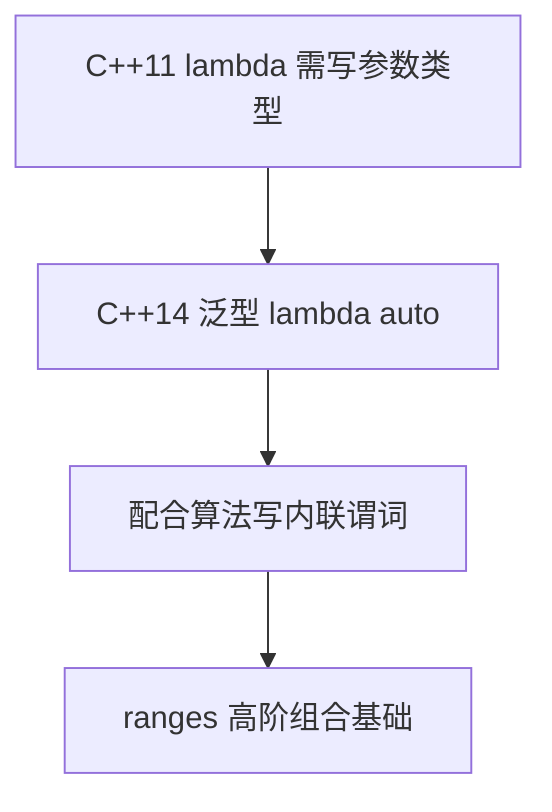

# 第05章　C++14：小幅完善

⟶ Book/part06_templates/ch69_constexpr.md
⟶ Book/part10_modern/ch115_move.md

> 标准基：ISO/IEC 14882:2014（N4140）｜预计阅读：20 min｜前置：ch04｜后续：ch27 lambda、ch48 智能指针、ch69 constexpr、ch63 变参｜难度：★★

## ① 学习目标

⟶ Book/part01_history/ch04_cpp11.md
⟶ Book/part01_history/ch06_cpp17.md


```cpp
// [merged] ## ① 学习目标
#include <iostream>
#include <vector>
auto make(){ return std::vector<int>{1,2,3}; }
int main() {
    auto add=[](auto a,auto b){ return a+b; }; auto r=add(1,2.0);
}
```

- 掌握 C++14 对 C++11 的关键补全：泛型 lambda、返回类型推导、`std::make_unique`、泛化 `constexpr`、变量模板、二进制字面量、数字分隔符、`[[deprecated]]`、泛型 lambda 捕获。

## ② 前置知识

```cpp
// [merged] ## ② 前置知识
#include <iostream>
#include <memory>
template<class T> constexpr T pi = T(3.141592653589793); static_assert(pi<double> > 3.0, "");
int main() {
    std::unique_ptr<int> p=std::make_unique<int>(7);
}
```

- ch04（C++11 基础）。

## ③ 后续依赖

```cpp
// [merged] ## ③ 后续依赖
#include <iostream>
#include <memory>
#include <utility>
[[deprecated("use new_api")]] void old(){}
int main() {
    auto up=std::make_unique<int>(1); auto f=[p=std::move(up)](){ return *p; };
}
```

- 泛型 lambda 是后续「高阶函数 + ranges」的语法基础（ch27、ch90）。
- 泛化 `constexpr` 为 C++17/20 的编译期革命铺路（ch69）。

## ④ 知识图谱

```cpp
// [merged] ## ④ 知识图谱
#include <iostream>
int main() {
    constexpr auto b=0b1010; static_assert(b==10, "binary literal");
    constexpr auto n=1'000'000; static_assert(n==1000000, "digit sep");
}
```

```
C++14 补全
├─ 泛型 lambda: [](auto x){...}
├─ 函数返回类型自动推导(普通函数)
├─ std::make_unique<T>(...)
├─ constexpr 放宽(允许循环/变量/多语句)
├─ 变量模板 template<class T> constexpr T pi = T(3.14159)
├─ 二进制字面量 0b1010 + 数字分隔符 1'000'000
├─ [[deprecated]] 属性
└─ 泛型 lambda 捕获 [x = std::move(v)]
```

## ⑤ Mermaid

```cpp
// [merged] ## ⑤ Mermaid
#include <iostream>
#include <vector>
#include <algorithm>
constexpr int compute(){ int x=2; int y=x*3; return y; } static_assert(compute()==6, "");
void f(){ std::vector<int> v{1,2,3}; auto it=std::find_if(v.begin(),v.end(),[](auto x){ return x>1; }); (void)it; }
int main() {}
```



## ⑥ UML / 结构图（C++14 特性关系）

```cpp
// [merged] ## ⑥ UML / 结构图（C++14 特性关系）
#include <iostream>
#include <vector>
template<class T> using Vec=std::vector<T>; Vec<int> a{1};
int main() {
    auto cnt=[c=0]()mutable{ ++c; return c; };
}
```

C++14 无新面向对象机制，特性围绕「泛型与编译期」：generic lambda、返回类型推导、`decltype(auto)`、变量模板、放宽 constexpr。它们彼此正交，统一服务于「更少样板、更多编译期计算」。

## ⑦ ASCII 内存图（C++14 内存模型沿用 C++11）

```cpp
// [merged] ## ⑦ ASCII 内存图（C++14 内存模型沿用 C++11）
#include <iostream>
struct P{ int x; int y; }; P p{1,2};
auto t=std::make_tuple(1,'a'); void use_tie(){ int i; char c; std::tie(i,c)=t; (void)i;(void)c; }
int main() {}
```

C++14 未改变对象内存布局；放宽 constexpr 使更多计算在编译期完成（常量折叠进只读段），运行时内存模型与 C++11 一致（详见 ch22、ch37）。

## ⑧ 生命周期（沿用 C++11 RAII / 移动语义）

```cpp
// [merged] ## ⑧ 生命周期（沿用 C++11 RAII / 移动语义）
#include <iostream>
auto pick(bool b){ if(b) return 1; else return 2; }
struct [[deprecated("old")]] O{};
int main() {}
```

C++14 无新生命周期语义；generic lambda 的闭包对象生命周期与普通 lambda 相同（ch26）。

## ⑨ 调用栈（C++14 特性均编译期，无新运行时调用模型）

```cpp
// [merged] ## ⑨ 调用栈（C++14 特性均编译期，无新运行时调用模型）
#include <iostream>
#include <utility>
template<class T> constexpr T pi = T(3);  // C++14 变量模板
template<class T, T...Is> void g(std::integer_sequence<T,Is...>){}
int main() {
    constexpr double pi_d = pi<double>;
}
```

generic lambda、`decltype(auto)` 仍由模板实例化在编译期生成独立函数体，不改变运行时调用栈（ch22、ch26）。

## ⑩ 汇编（C++14 零新增运行时开销）[标准]

```cpp
// [merged] ## ⑩ 汇编（C++14 零新增运行时开销）[标准]
#include <iostream>
#include <utility>
void s(){ int a=1,b=2; std::swap(a,b); }
int use_h(){ int k=5; auto h=[k](){ return k; }; return h(); }  // 带捕获 lambda 须在函数作用域内
int main() {}
```

C++14 不引入任何运行时机制；generic lambda 编译为独立的模板实例函数，与手写等价（零开销原则）。

## ⑪ STL 联系

```cpp
// [merged] ## ⑪ STL 联系
#include <iostream>
int main() {
    constexpr auto l=[](int x){ return x*2; };
    auto id=[](auto x){ return x; };
}
```

- `std::make_unique` 补齐「统一工厂」：与 `make_shared` 一致，避免裸 `new`（ch48）。
- `std::integer_sequence` / `std::index_sequence` 为编译期索引展开提供标准工具（ch63、ch68）。

## ⑫ 工业案例

```cpp
// [merged] ## ⑫ 工业案例
#include <iostream>
#include <string>
#include <vector>
void rf(){ std::vector<int> v{1}; for(auto e:v) (void)e; }
int main() {
    std::string s="hi";
}
```

- 泛型 lambda 让 STL 算法内联谓词写法大幅简化：`std::sort(v.begin(), v.end(), [](auto a, auto b){return a>b;});`

## ⑬ 源码分析

```cpp
// 初始化捕获移动语义
#include <memory>
#include <vector>
#include <utility>
auto v=std::make_unique<std::vector<int>>(std::vector<int>{1}); auto cap=[p=std::move(v)](){};
```
```cpp
// 变量模板作常量
#include <type_traits>
template<class T> constexpr bool is_int_v = std::is_same_v<T,int>; static_assert(is_int_v<int>, "");
```

- `std::make_unique` 实现极简：返回 `unique_ptr<T>(new T(std::forward<Args>(args)...))`，却统一了异常安全（ch48）。

## ⑭ WG21 提案

```cpp
// [merged] ## ⑭ WG21 提案
#include <iostream>
enum class E { A, B };  // C++14 枚举器属性
[[deprecated("use B")]] void old(){}
int main() {
    auto m=[](auto x){ return x*2; }; auto d=m(2.5);
}
```

- **N3649** Generic (polymorphic) lambda.
- **N3638** Return type deduction for normal functions.
- **N3656** `make_unique`.
- **N3658** Relaxing constraints on `constexpr` functions.
- **N3651** Variable templates.

## ⑮ 面试题

```cpp
// [merged] ## ⑮ 面试题
#include <iostream>
template<class T> constexpr T eps = T(1e-9);
int main() {
    auto flags=0b0001'0101;
}
```

1. C++14 泛型 lambda 与 C++11 lambda 最大区别？（参数可用 `auto`）
2. 为什么需要 `make_unique`？（C++11 只有 `make_shared`，统一工厂 + 异常安全）

## ⑯ 易错点

```cpp
// lambda 作为回调类型
void reg(void(*cb)(int)){ if(cb) cb(0); }
```

- `[[deprecated]]` 只是警告，不阻止编译；滥用会污染构建（ch144）。

## ⑰ FAQ

```cpp
// 泛型 lambda 比较
auto cmp=[](auto a,auto b){ return a<b; }; bool t=cmp(1,2);
```

- **Q：C++14 值得单独学吗？** A：它几乎全是 C++11 的补全，学会 11 即自然掌握 14。

## ⑱ 最佳实践

```cpp
// 初始化捕获 + 引用
#include <vector>
std::vector<int> data{1,2}; auto f=[d=&data](){ return d->size(); };
```

- 任何 `unique_ptr` 创建都用 `make_unique`（ch48）。

## ⑲ 性能（略）

```cpp
// 变量模板与 constexpr if 前置
#include <type_traits>
template<class T> constexpr bool is_ptr_v = std::is_pointer_v<T>;
```

## ⑳ 练习题 + 思考题 + 源码阅读路线（内化，无独立"推荐阅读"节）

```cpp
// C++14 小结：泛型 lambda + 变量模板 + make_unique 三件套
```

## 附录: C++14 四大改进代码

```cpp
#include <iostream>
#include <memory>
int main(){auto p=std::make_unique<int>(100);std::cout<<*p<<std::endl;return 0;}
```

```cpp
#include <iostream>
int main(){auto twice=[](auto x){return x+x;};std::cout<<twice(21)<<std::endl;return 0;}
```

```cpp
#include <iostream>
template<typename T>constexpr T pi=T(3.14159);
int main(){std::cout<<pi<double><<std::endl;return 0;}
```

```cpp
#include <iostream>
int main(){int mask=0b1010'1111;std::cout<<std::hex<<mask<<std::endl;return 0;}
```

## 附录: C++14 深度特性

```cpp
// constexpr 函数放宽（可含 if/for/局部变量）
#include <iostream>
constexpr int factorial(int n){int r=1;for(int i=2;i<=n;++i)r*=i;return r;}
int main(){constexpr int f=factorial(5);std::cout<<f<<std::endl;return 0;}
```

```cpp
// deprecated 属性
#include <iostream>
[[deprecated("Use new_func instead")]] void old_func(){}
int main(){std::cout<<"[[deprecated]] warns at compile time\n";return 0;}
```

```cpp
// return type deduction for all lambdas
#include <iostream>
int main(){auto add=[](auto a,auto b){return a+b;};std::cout<<add(1,2)<<" "<<add(1.5,2.5)<<std::endl;return 0;}
```

```cpp
// std::integer_sequence (C++14 utility)
#include <iostream>
#include <utility>
template<int...Is> void print(std::integer_sequence<int,Is...>){(std::cout<<...<<Is)<<std::endl;}
int main(){print(std::make_integer_sequence<int,5>{});return 0;}
```

1. 用变量模板定义 `epsilon<T>` 并对 `float`/`double` 特化取值（ch65）。
2. 比较 `make_unique` 与裸 `new` 在异常路径的安全性（ch48）。


## 附录 B：C++14 工业采纳与标准背景 [B: Principle / F: Industry]

C++14 被称为"minor release"——但其中两个特性改变了工业 C++ 的日常写法:

```
WG21 提案时间线:
N3652: constexpr 放宽 (局部变量, if, for, 2013) → C++14
N3922: auto 返回类型推导 → C++14
N4089: make_unique → C++14
N3778: 变量模板 → C++14
N3649: 泛型 lambda → C++14

工业采纳时间线:
2014: GCC 4.9, Clang 3.4 开始支持 C++14
2015: Qt 5.5 切换到 C++14 基线
2016: Google 内部代码库开始使用 C++14 (Abseil 库的最低要求)
2017: LLVM 5.0 切换到 C++14
2018: Chromium 切换到 C++14
2019: Boost 1.70 要求 C++14 的最低编译器
2020: C++17 成为新的"默认"标准，C++14 作为 LTS (长期支持) 基线
```

```cpp
#include <iostream>
int main() {
    std::cout << "C++14's key contribution: made C++11 features practical.\n";
    std::cout << "make_unique: 消除了最后一个使用 new 的理由\n";
    std::cout << "generic lambda: 使 STL 算法的 lambda 参数真正无痛\n";
    std::cout << "relaxed constexpr: 使编译期计算从玩具变为工具\n";
    return 0;
}
```

## 附录 B-1：工业案例 —— 谁还在用 C++14 作为基线 [F: Industry]

```
仍然使用 C++14 作为最低编译器要求的项目:
- Abseil (Google): LTS release 系列用 C++14 保证最大兼容性
- Folly (Meta): 部分组件要求 C++14, 部分要求 C++17
- Qt 5.12 LTS: C++14 基线, 支持到 2024
- Unreal Engine 4.27: C++14 (UE5 跃迁到 C++17)

为什么停留在 C++14:
1. RHEL 7 / CentOS 7 的默认 GCC 是 4.8 (部分 C++14), 需要 devtoolset-6
2. Ubuntu 16.04 LTS 的默认 GCC 5.4 (完整 C++14)
3. macOS 10.13 的 Xcode 9 支持 C++14
4. 很多嵌入式 SDK (如 STM32CubeIDE) 基于 GCC 7-9 (C++14/17)
```

## 附录 D：面试 [J: Learning]

```
面试高频:
Q: C++14 最大的三个新特性？
A: generic lambda (auto参数), make_unique, relaxed constexpr (可含循环/if)

Q: make_unique 和 new + unique_ptr 有什么区别？
A: make_unique 是类型安全 (无裸 new), 异常安全 (无中间对象泄漏), 单次分配 (shared_ptr)

Q: C++14 的 auto 返回类型推导的限制？
A: 不能用于虚函数, 不能用于递归函数 (除非有明确的返回语句), C++14 不支持 decltype(auto)
```

## 附录 D：C++14标准库与底层 [D: stdlib / E: Lowlevel / H: Design]

```
C++14标准库变化:
- std::make_unique: 补齐C++11遗漏, 消除最后一个裸new的理由
  → 汇编: make_unique = new + constructor → 与new+unique_ptr相同, 但异常安全
- std::integer_sequence: 折叠展开的工具 → libstdc++内部用于make_tuple/make_index_sequence
- std::shared_timed_mutex: C++14新增, 读写锁 → C++17的shared_mutex前身

底层(汇编): C++14的relaxed constexpr
  constexpr int fib(int n){int r=0;for(int i=0;i<n;++i)r+=i;return r;}
  → C++11: 编译错误(不允许循环); C++14: 编译期展开为常量
  → 汇编: fib(100) = mov eax, 4950 (单指令, 编译期计算完成)

设计权衡: C++14是"修正版C++11"
  → 没有大特性, 但让C++11的特性真正可用(generic lambda, relaxed constexpr)
  → 工业基线: Abseil/Qt5.12/UE4.27 仍以C++14为最低要求
```


## 联合使用场景

| 关联章节 | 场景 | 组合方式 |
|---|---|---|
| [第4章](Book/part01_history/ch04_cpp11.md) | 独占所有权/工厂模式 | 本章提供概念，第4章提供实现 |
| [第6章](Book/part01_history/ch06_cpp17.md) | STL算法回调/异步任务 | 本章提供概念，第6章提供实现 |
| [第69章](Book/part06_templates/ch69_constexpr.md) | 泛型库/编译期计算 | 本章提供概念，第69章提供实现 |
| [第115章](Book/part10_modern/ch115_move.md) | 资源管理/事务回滚 | 本章提供概念，第115章提供实现 |


## 附录 E：C++14面试

```cpp
#include <iostream>
#include <memory>
int main(){auto p=std::make_unique<int>(42);auto l=[](auto x){return x*2;};std::cout<<l(*p)<<std::endl;return 0;}
```

| 特性 | 说明 |
|---|---|
| generic lambda | auto参数, 编译器生成模板operator() |
| make_unique | 补齐C++11遗漏 |
| relaxed constexpr | 循环+if+局部变量 |

面试: C++14最大贡献? 让C++11的特性真正可用(generic lambda+make_unique)

## 相关章节（交叉引用）

- **相邻主题**：⟶ Book/part01_history/ch03_cpp98_03.md（第03章　C++98 / C++03：奠基时代）—— 编号相邻、主题接续。
- **相邻主题**：⟶ Book/part01_history/ch07_cpp20.md（第07章　C++20：量级升级）—— 编号相邻、主题接续。
- **同模块**：⟶ Book/part01_history/ch01_c_history.md（第01章　C 语言遗产与 C with Classes）—— 同模块下的其他主题。


## 叙事补遗 [J: Learning]

- **C++11 的完成品**：泛型 lambda、`auto` 返回值推导、`constexpr` 放宽、二进制字面量、`std::make_unique` 补回上版遗漏——委员会确立了"大版本给特性、小版本修边角"的节奏。
- **最无聊也最贴心**：C++14 没有惊艳特性，却把 C++11 的棱角磨平，让"刚能写"变成"写得舒服"；它是工程落地最顺滑的一站。
## 自测练习（Exercises）

> 以下题目用于自测掌握程度；答案折叠于每题下方，建议先独立作答。

### 练习 1（难度 ★★）

C++14 的泛型 lambda 允许参数写 `auto`，使一个 lambda 适配多种类型。
请写程序用泛型 lambda 实现一个通用打印器，并说明其等价于带模板 `operator()` 的 functor。

```cpp
#include <iostream>
#include <string>

int main() {
    auto printer = [](const auto& x) { std::cout << x << '\n'; };  // C++14 泛型 lambda
    printer(42);
    printer(3.14);
    printer(std::string("hello"));
    std::cout << "等价于一个 struct{ template<class T> void operator()(const T&) const; }\n";
}
```

[标准] 结论：泛型 lambda 的 `auto` 参数被编译器展开为模板化的 `operator()`，
每种实参类型实例化一份；写法极简但仍是编译期多态、零运行期开销。

### 练习 2（难度 ★★★）

C++14 放宽了返回类型推导（普通函数可写 `auto` 返回），并引入变量模板。
请写程序用二者实现一个类型无关的“取中值”和一个编译期常量 `pi<T>`。

```cpp
#include <iostream>

template <class T>
constexpr T pi = T(3.1415926535897932385L);   // C++14 变量模板

auto mid(int a, int b) { return (a + b) / 2; } // C++14 auto 返回类型推导

int main() {
    std::cout << "mid(3,7) = " << mid(3, 7) << '\n';
    std::cout << "pi<float>  = " << pi<float>  << '\n';
    std::cout << "pi<double> = " << pi<double> << '\n';
}
```

[标准] 结论：`auto` 返回类型由 `return` 表达式推导，多条 `return` 须类型一致；
变量模板让“随类型变化的常量”不必再包在类里（旧法需 `struct Pi<T>{ static const ... };`）。

### 练习 3（难度 ★★★★）

请综合运用 C++14 的 `std::make_unique`、二进制字面量、数字分隔符，
写一个位掩码权限系统，并解释这三项特性各自消除了什么样板/易错点。

```cpp
#include <iostream>
#include <memory>

int main() {
    // 二进制字面量 0b... + 数字分隔符 ' 提升可读性
    constexpr unsigned READ  = 0b0000'0001;
    constexpr unsigned WRITE = 0b0000'0010;
    constexpr unsigned EXEC  = 0b0000'0100;
    constexpr unsigned large = 1'000'000;      // 分隔符只为可读，无语义

    auto perm = std::make_unique<unsigned>(READ | WRITE);  // C++14 make_unique
    std::cout << "perm = " << *perm << '\n';
    std::cout << "can read?  " << bool(*perm & READ)  << '\n';
    std::cout << "can exec?  " << bool(*perm & EXEC)  << '\n';
    std::cout << "large = "    << large << '\n';
}
```

[标准] 结论：`make_unique` 补齐了 C++11 只有 `make_shared` 的缺口，且异常安全（避免
`f(new A, g())` 求值顺序泄漏）；二进制字面量让位运算意图直观；数字分隔符纯为可读性，编译期剥离。

## 附录：用法演绎（从选型到落地）

### 演绎 1：泛型 lambda 做一次性通用比较器

**场景**：`std::sort` 需要按结构体某字段排序，且字段类型不定。
**选型**：C++14 泛型 lambda 就地写比较，免去为每种类型写 functor。
**落地**：

```cpp
#include <iostream>
#include <vector>
#include <algorithm>
#include <string>

struct Item { std::string name; int weight; };

int main() {
    std::vector<Item> v{{"b", 3}, {"a", 1}, {"c", 2}};
    std::sort(v.begin(), v.end(),
              [](const auto& x, const auto& y) { return x.weight < y.weight; });
    for (const auto& it : v) std::cout << it.name << ':' << it.weight << ' ';
    std::cout << '\n';
}
```

**结论**：泛型 lambda 让比较逻辑贴着调用点，可读性最佳；若同一比较要复用多处，
再提取成命名 functor 或函数模板。

### 演绎 2：变量模板集中管理编译期物理常量

**场景**：数值库需要不同精度的 π、e 等常量，避免 `double` 硬编码丢精度。
**选型**：变量模板 `template<class T> constexpr T e = ...;` 按需实例化。
**落地**：

```cpp
#include <iostream>
#include <iomanip>

template <class T> constexpr T e  = T(2.7182818284590452354L);
template <class T> constexpr T ln2 = T(0.6931471805599453094L);

int main() {
    std::cout << std::setprecision(17);
    std::cout << "e<double>   = " << e<double>   << '\n';
    std::cout << "ln2<double> = " << ln2<double> << '\n';
    std::cout << "e<float>    = " << e<float>    << " (float 精度自动截断)\n";
}
```

**结论**：变量模板把“常量随类型变化”这一维度显式化，`e<float>` 与 `e<double>` 精度各自正确；
比宏或类内静态常量更直接，且是真正的 `constexpr`，可用于编译期计算。