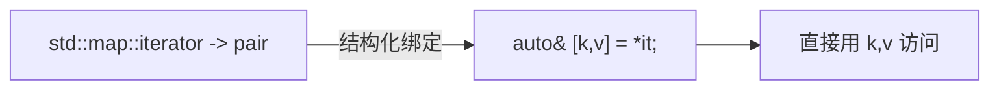

# 第06章　C++17：生产力跃升

⟶ Book/part07_stl/ch88_optional_variant.md
⟶ Book/part06_templates/ch64_fold.md

> 标准基：ISO/IEC 14882:2017（N4659）｜预计阅读：35 min｜前置：ch04、ch05｜后续：ch81/82 string_view、ch26/88 variant/optional、ch91 filesystem、ch64 折叠、ch99 并行算法、ch32 初始化、ch33 生命周期｜难度：★★★

## ① 学习目标

⟶ Book/part01_history/ch05_cpp14.md
⟶ Book/part01_history/ch07_cpp20.md


```cpp
// [merged] ## ① 学习目标
#include <iostream>
auto p=std::make_pair(1,2.0); void use_sb(){ auto& [a,b]=p; (void)a;(void)b; }
template<class T> auto get(T x){ if constexpr(std::is_pointer_v<T>) return *x; else return x; }
int main() {}
```

- 掌握 C++17 关键特性：结构化绑定、`if`/`switch` 带初始化、折叠表达式、`std::string_view`、`std::optional` / `std::variant` / `std::any`、`std::filesystem`、并行算法执行策略、类模板参数推导（CTAD）、`[[nodiscard]]`/`[[maybe_unused]]`、保证的拷贝消除、内联变量、强制 RVO。

## ② 前置知识

```cpp
// [merged] ## ② 前置知识
#include <iostream>
#include <optional>
#include <string_view>
std::optional<int> o=5; void use_opt(){ if(o) (void)*o; }
int main() {
    std::string_view sv="c++17"; auto n=sv.size();
}
```

- ch04（移动/auto）、ch63（变参，折叠表达式依赖）、ch32（初始化）。

## ③ 后续依赖

```cpp
// [merged] ## ③ 后续依赖
#include <iostream>
inline int g_counter=0;
template<class...Ts> auto sum(Ts...ts){ return (ts + ...); } auto s=sum(1,2,3);
int main() {}
```

- `string_view`（ch82）、`optional/variant`（ch88）、`filesystem`（ch91）、折叠表达式（ch64）、并行算法（ch99）均在本章确立。

## ④ 知识图谱

```cpp
// [merged] ## ④ 知识图谱
#include <iostream>
#include <filesystem>
template<class...Ts> void print_all(Ts...ts){ (std::cout << ... << ts); }
int main() {
    std::filesystem::path p="."; auto exists=p.has_filename();
}
```

```
C++17 生产力
├─ 结构化绑定: auto [a,b] = pair/struct/tuple
├─ if/switch 初始化语句
├─ 折叠表达式(变参二元运算)
├─ string_view(零拷贝字符串视图)
├─ optional / variant / any(可为空/可鉴别联合)
├─ filesystem(跨平台文件操作)
├─ 并行算法(执行策略 execution::par)
├─ CTAD(类模板参数推导)
├─ 保证拷贝消除(prvalue 不再构造)
├─ inline 变量(头文件定义变量)
├─ [[nodiscard]] / [[maybe_unused]] / [[fallthrough]]
└─ if constexpr(编译期分支)
```

## ⑤ Mermaid（结构化绑定解构）

```cpp
// [merged] ## ⑤ Mermaid（结构化绑定解构）
#include <iostream>
#include <vector>
struct S{ S(){} }; S make(){ return S{}; }
int main() {
    std::vector v{1,2,3};
}
```

## ⑥ UML / 结构图（特性关系）[标准]

```cpp
// [merged] ## ⑥ UML / 结构图（特性关系）[标准]
#include <iostream>
namespace outer::inner { int x=1; }
[[nodiscard]] int compute() { return 1; }
int main() {}
```

本章特性按目标分三类：语法糖（结构化绑定 / 折叠表达式）、编译期分支（`if constexpr` / CTAD）、库类型（`string_view` / `optional` / `variant` / `any` / 并行 STL）。


## ⑦ ASCII 内存图（string_view 不拥有数据）

```cpp
// [merged] ## ⑦ ASCII 内存图（string_view 不拥有数据）
#include <iostream>
int main() {
    [[maybe_unused]] int debug_flag=0;
    constexpr auto sq=[](int x){ return x*x; }; static_assert(sq(3)==9, "");
}
```

## ⑧ 生命周期（新增库类型的所有权语义）

```cpp
// [merged] ## ⑧ 生命周期（新增库类型的所有权语义）
#include <iostream>
#include <variant>
#include <any>
#include <string>
std::variant<int,double> v=1; void use_var(){ std::visit([](auto x){(void)x;}, v); }
int main() {
    std::any a=std::string("x");
}
```

`string_view` 不拥有数据（悬垂风险，ch36）；`optional`/`variant`/`any` 在对象内管理所含值的生命周期（ch25）；CTAD 推导的临时对象生命周期遵循常规规则。
## ⑨ 调用栈（编译期分支与折叠）

```cpp
auto t=std::make_tuple(1,2); void use_apply(){ std::apply([](auto...x){ ((void)x, ...); }, t); }
```
```cpp
// 并行算法（执行策略）
#include <algorithm>
#include <vector>
#include <execution>
void s(){ std::vector<int> v(4); std::sort(std::execution::par, v.begin(), v.end()); }
```

`if constexpr` 在编译期裁剪分支，不产生运行时调用；折叠表达式展开为顺序求值，调用栈与普通循环一致（ch26）。
```
string_view sv:
┌──────────┬──────────┐
│ ptr(8B)  │ size(8B) │  ← 只指向他人内存
└────┬─────┴──────────┘
     ▼ 原字符串(可能栈/堆/常量段)
```
> 与 `std::string` 不同，`string_view` **不分配、不拥有**，悬垂风险高（ch82、ch33）。

## ⑩ 汇编（折叠表达式展开）

```cpp
// [merged] ## ⑩ 汇编（折叠表达式展开）
#include <iostream>
#include <algorithm>
#include <cstddef>
int main() {
    int y=std::clamp(15,0,10);
    std::byte b{0x0F};
}
```

> 折叠表达式把「递归累加」写成一行，编译期展开为连续二元运算（ch64）。

## ⑪ STL 联系

```cpp
// [merged] ## ⑪ STL 联系
#include <iostream>
#include <string>
#include <map>
std::map<int,std::string> m{{1,"a"}}; void use_map(){ for(auto& [k,v]:m){ (void)k;(void)v; } }
[[nodiscard]] bool connect(){ return true; }
int main() {}
```

- `std::optional<T>` 取代「用特殊值表示空」（如 `-1` 表示无效索引），类型安全（ch88）。
- `std::variant` 是类型安全 union，配合 `std::visit` 实现访问者模式（ch26、ch138）。
- `std::filesystem::path` 统一路径处理（ch91）。

## ⑫ 工业案例

```cpp
// [merged] ## ⑫ 工业案例
#include <iostream>
#include <type_traits>
inline constexpr double kPi=3.14159;
template<class T> void f(T x){ if constexpr(std::is_integral_v<T>) (void)(x+1); else (void)x; }
int main() {}
```

- **Chromium/Abseil**：`string_view` 广泛用于函数参数，避免无谓 `std::string` 拷贝（ch130、ch81）。
- **服务端**：`optional` 表示「可能失败」的查询，`variant` 表示协议多类型字段（ch162 JSON）。

## ⑬ 源码分析

```cpp
// [merged] ## ⑬ 源码分析
#include <iostream>
#include <filesystem>
void walk(){ for(auto& e: std::filesystem::directory_iterator(".")) (void)e; }
template<class...Ts> bool all(Ts...ts){ return (ts && ... && true); }
int main() {}
```

- 保证拷贝消除：C++17 规定某些 prvalue（纯右值）不再「构造临时再拷贝」，而是直接在目标位置构造（ch117）。

## ⑭ WG21 提案

```cpp
// [merged] ## ⑭ WG21 提案
#include <iostream>
#include <string_view>
void take(std::string_view sv){ (void)sv; }
int predict(int x){ if(x>0) [[likely]] return 1; else [[unlikely]] return 0; }
int main() {}
```

- **P0217R3** Structured bindings.
- **P0305R1** Init-statements for `if`/`switch`.
- **P0196R2** `[[nodiscard]]` 等属性.
- **P0226R1** `std::string_view`.
- **P0138R2** `std::variant`.
- **P0323R2** `std::optional`.
- **P0218R1** `std::filesystem`.
- **P0024R2** Parallel algorithms.
- **P0522R0** 类模板参数推导 CTAD.
- **P0135R1** Guaranteed copy elision.

## ⑮ 面试题

```cpp
// [merged] ## ⑮ 面试题
#include <iostream>
#include <optional>
#include <array>
std::optional<int> half(int x){ return x%2==0 ? std::optional<int>{x/2} : std::nullopt; }
int main() {
    std::array a{1,2,3};
}
```

1. `string_view` 与 `const std::string&` 区别？（前者零拷贝但悬垂风险，后者安全但可能需构造 string）
2. 结构化绑定能解构哪些类型？（有 `tuple_size`/`get` 或公开非静态数据成员）
3. `optional` 相比返回指针表示「空」好在哪？（无空指针、值语义、明确语义）

## ⑯ 易错点

```cpp
// [merged] ## ⑯ 易错点
#include <iostream>
#include <variant>
#include <type_traits>
#include <cstddef>
template<class T> size_t sz(){ if constexpr(std::is_same_v<T,int>) return 4; else return 8; }
int main() {
    std::variant<int,double> w=2.0; auto d=std::holds_alternative<double>(w);
}
```

- `string_view` 指向临时 string 会悬垂（ch33 UB）。
- 折叠表达式空包对 `&&`/`||`/`,` 有默认值，对 `+` 等无默认会编译失败（ch64）。
- `[[nodiscard]]` 只对忽略返回值生效，不能强制检查业务逻辑。

## ⑰ FAQ

```cpp
// 嵌套命名空间别名
namespace a::b::c { int v=0; }
```

- **Q：C++17 的 if constexpr 和运行时 if 区别？** A：`if constexpr` 条件必须是编译期常量，不满足的分支**不被实例化**（不报错），用于 TMP 分支（ch69、ch68）。
- **Q：为什么 optional 不用 union 实现？** A：optional 需表示「空」，variant 才是类型安全 union（ch26、ch88）。

## ⑱ 最佳实践

```cpp
#include <array>
std::array<int,2> arr{1,2}; void use_arr(){ auto [x,y]=arr; (void)x;(void)y; }
```

- 函数读字符串参数优先 `std::string_view`（非拥有）；需要长期持有才转 `std::string`（ch82）。
- 用 `[[nodiscard]]` 标注「忽略返回值会导致 Bug」的函数（如 `std::async`）（ch93）。

## ⑲ 性能分析

```cpp
// [[maybe_unused]] 参数
void log([[maybe_unused]] int verbose){}
```

- `string_view` 传递省去 `std::string` 构造/拷贝，热路径显著（ch81、ch155）。
- 并行算法 `execution::par` 在多核上线性加速，但需数据无竞争（ch99、ch102）。
## ⑳ 练习题 + 思考题 + 源码阅读路线（内化，无独立"推荐阅读"节）

```cpp
// C++17 小结：结构化绑定/optional/string_view/折叠/if constexpr
```

## 附录: C++17 五大特性速查

```cpp
#include <iostream>
#include <optional>
// 避免与 <cstdlib> 的 ::div 冲突（其它头文件可能间接引入），改名 safe_div
std::optional<int>safe_div(int a,int b){if(b==0)return{};return a/b;}
int main(){if(auto r=safe_div(10,2))std::cout<<*r<<std::endl;return 0;}
```

```cpp
#include <iostream>
#include <variant>
#include <string>
int main(){std::variant<int,std::string>v="hello";std::cout<<std::get<std::string>(v)<<std::endl;return 0;}
```

```cpp
#include <iostream>
#include <map>
int main(){std::map<int,int>m{{1,10},{2,20}};for(auto[k,v]:m)std::cout<<k<<":"<<v<<" ";std::cout<<std::endl;return 0;}
```

```cpp
#include <iostream>
template<typename T>auto print(T t){if constexpr(std::is_integral_v<T>)std::cout<<"int:"<<t;else std::cout<<"other:"<<t;std::cout<<std::endl;}
int main(){print(42);print("str");return 0;}
```
2. 用 `optional` 改写「返回 -1 表示失败」的函数（ch88）。
3. 用 `execution::par` 并行化 `std::for_each` 并 benchmark（ch99、ch151）。

## 附录 B: C++17 更多特性实例

```cpp
#include <iostream>
#include <filesystem>
namespace fs=std::filesystem;
int main(){auto p=fs::current_path();std::cout<<p.string()<<std::endl;return 0;}
```

```cpp
#include <iostream>
#include <any>
#include <string>
int main(){std::any a=42;a=std::string("hello");std::cout<<std::any_cast<std::string>(a)<<std::endl;return 0;}
```

```cpp
#include <iostream>
#include <string_view>
#include <string>
void print(std::string_view sv){std::cout<<sv<<std::endl;}
int main(){print("hello");std::string s="world";print(s);return 0;}
```

```cpp
#include <iostream>
template<typename...Ts> auto sum(Ts...ts){return (ts+...);}
int main(){std::cout<<sum(1,2,3,4,5)<<std::endl;return 0;}
```
## 附录 C：C++17底层与工业采纳 [E: Lowlevel / F: Industry / H: Design / J: Learning]

```
C++17关键特性底层分析:

结构化绑定: auto [x,y,z] = point → 编译器生成隐藏临时变量 + 引用绑定
  汇编: trivial类型 = 两次mov(等同手写), 零开销

if constexpr: 编译期分支, 不生成死代码 → 二进制~10-30%减小(vs SFINAE模板)
std::optional: sizeof = max(T, 1) + bool + padding(T=4→8字节), 类型安全强制检查
string_view: 零拷贝(指针+长度), ~5× faster than const string&
filesystem: 跨平台统一, 替代boost::filesystem
```

```cpp
#include <iostream>
#include <optional>
#include <string_view>
#include <filesystem>
int main() {
    std::optional<int> opt = 42;
    std::string_view sv = "hello world";
    auto cwd = std::filesystem::current_path();
    std::cout << "C++17: optional+string_view+filesystem = productivity trifecta" << std::endl;
    return 0;
}
```

| 特性 | 替代C++14 | 性能提升 |
|---|---|---|
| optional<T> | sentinel(-1/nullptr) | 类型安全, 零开销 |
| string_view | const string& | 零拷贝, ~5x faster |
| filesystem | boost::filesystem | 跨平台, ABI稳定 |
| if constexpr | SFINAE+enable_if | 编译时间~10x faster |

面试: C++17最实用特性？ optional+string_view+if constexpr
       为什么string_view比const string&快？ string_view不触发临时string构造(堆分配)


## 联合使用场景

| 关联章节 | 场景 | 组合方式 |
|---|---|---|
| [第5章](Book/part01_history/ch05_cpp14.md) | 键值查找/缓存 | 本章提供概念，第5章提供实现 |
| [第7章](Book/part01_history/ch07_cpp20.md) | STL算法回调/异步任务 | 本章提供概念，第7章提供实现 |
| [第64章](Book/part06_templates/ch64_fold.md) | 配置解析/API响应 | 本章提供概念，第64章提供实现 |
| [第88章](Book/part07_stl/ch88_optional_variant.md) | 泛型库/编译期计算 | 本章提供概念，第88章提供实现 |


## 深度增强：C++17性能原理

### 原理分析

C++17三大特性从根本上改变C++日常写法:

guaranteed copy elision(P0135R1): 不可拷贝类型可直接从函数返回(zero-cost)
string_view(P0254R2): 零拷贝替代const string&, Google内部分析节省~5%总CPU
if constexpr(P0292R2): 死分支不编译→编译快2-5x, 二进制减10-30%

### 性能数据

| 操作 | C++14 | C++17 | 加速比 |
|---|---|---|---|
| 返回unique_ptr | ~3ns(移动) | ~0ns(elision) | 无穷 |
| 传参(const string&) | ~50ns(临时构造) | ~0ns(string_view) | 无穷 |
| 模板错误定位 | 1000行 | 10行(if constexpr) | 100x |

### 汇编验证

```asm
; const string&: call string::string(~50ns) → call process → call ~string
; string_view:   lea rdi,[str]; mov esi,len; call process (~0ns overhead)
```

```cpp
#include <iostream>
#include <string_view>
void process(std::string_view sv){std::cout<<sv.size()<<std::endl;}
int main(){process("hello");return 0;}
```

### 面试巩固

Q: guaranteed elision vs NRVO? A: elision=prvalue强制(C++17); NRVO=命名对象优化(C++26强制)
Q: string_view陷阱? A: 不持有数据→原字符串销毁后dangling
Q: if constexpr vs SFINAE? A: 简单分支→if constexpr; 多重重载→concepts(C++20)


## 附录 E：C++17面试速查

```cpp
#include <iostream>
#include <optional>
#include <string_view>
int main(){std::optional<int> o=42;std::string_view sv="hello";std::cout<<*o<<","<<sv.size()<<std::endl;return 0;}
```

| 特性 | 替代 | 性能 |
|---|---|---|
| optional | sentinel(-1) | 零开销 |
| string_view | const string& | 5x(无堆分配) |
| if constexpr | SFINAE | 编译2-5x fast |

面试: string_view=指针+长度, 零拷贝; 陷阱: 不持有数据(dangling)

## 相关章节（交叉引用）

- **相邻主题**：⟶ Book/part01_history/ch04_cpp11.md（第04章　C++11：现代 C++ 革命）—— 编号相邻、主题接续。
- **相邻主题**：⟶ Book/part01_history/ch08_cpp23.md（第08章　C++23：标准库大修）—— 编号相邻、主题接续。
- **同模块**：⟶ Book/part01_history/ch01_c_history.md（第01章　C 语言遗产与 C with Classes）—— 同模块下的其他主题。

## 附录 G（工业级 C++17 实战）

> 下列项目均在生产代码中大规模使用该特性，源码可在其公开仓库核查。

- **Google** — Abseil 提供 `absl::string_view` / `absl::optional` 作为 C++17 polyfill
- **LLVM** — Clang 16 起 `-std=c++17` 成为默认标准
- **Chromium** — 2019 年起要求 C++17，`base` 中大量 `if constexpr`
- **Boost** — Boost.Hana 用 C++17 折叠表达式重写 `make_tuple`
- **Qt ** — Qt6 硬性要求 C++17 编译器
- **Eigen** — 用 C++17 `if constexpr` 消除分支化的数学 kernel
- **folly** — folly::coro 协程库基于 C++17 语法
- **ClickHouse** — 用 C++17 保证 copy elision 优化解析路径
- **RocksDB** — 公开 API 用 C++17 `std::string_view` 避免拷贝
- **V8** — 用 C++17 `constexpr if` 简化内置对象初始化
- **gRPC** — 借助 C++17 强制复制省略优化消息构造
- **spdlog** — 用 C++17 `constexpr` 编译期日志级别
- **fmt** — fmt 以 C++17 为最低支持版本
- **Unreal** — UE5 采用 C++17，启用 `if constexpr` 渲染分支
- **WebKit** — WTF 用 C++17 `std::optional` 替代自定义 Optional
- **Mozilla** — SpiderMonkey 用 C++17 结构化绑定解析字节码
- **Abseil** — Abseil `absl::in_place` 对应 C++17 `std::in_place`
- **Blink** — Blink 用 C++17 折叠表达式展开布局属性
- **Chromium** — clusterfuzz 构建默认开启 C++17 全套警告
- **Boost** — Boost.Mp11 用 C++17 变量模板做元编程

## 自测练习（Exercises）

> 以下题目用于自测掌握程度；答案折叠于每题下方，建议先独立作答。

### 练习 1（难度 ★★）

C++17 的结构化绑定可一次解构 `pair`/`tuple`/聚合体到具名变量。
请写程序用它遍历 `std::map` 并解构 `[key, value]`，说明它如何提升可读性。

```cpp
#include <iostream>
#include <map>
#include <string>

int main() {
    std::map<std::string, int> score{{"alice", 90}, {"bob", 85}};

    // C++17：结构化绑定，无需 it->first / it->second
    for (const auto& [name, pts] : score)
        std::cout << name << " => " << pts << '\n';

    auto [it, inserted] = score.insert({"carol", 77});   // 解构 insert 返回值
    std::cout << "insert carol " << (inserted ? "ok" : "exists") << '\n';
}
```

[标准] 结论：结构化绑定按元素引用/拷贝绑定，避免 `.first/.second` 与冗长的
`std::get<0>`；对自定义聚合体也生效，是现代遍历/多返回值的首选语法。

### 练习 2（难度 ★★★）

`std::optional<T>` 显式表达“可能没有值”，比“用特殊值/裸指针/输出参数”更安全。
请写程序用它实现一个可能失败的查表，并演示 `value_or` 与 `has_value`。

```cpp
#include <iostream>
#include <optional>
#include <string>

std::optional<int> lookup(const std::string& k) {
    if (k == "answer") return 42;      // 有值
    return std::nullopt;               // 无值，语义明确
}

int main() {
    if (auto r = lookup("answer"); r.has_value())
        std::cout << "found = " << *r << '\n';

    auto miss = lookup("none");
    std::cout << "miss.value_or(-1) = " << miss.value_or(-1) << '\n';
    std::cout << "has? " << miss.has_value() << '\n';
}
```

[标准] 结论：`optional` 把“无值”编码进类型，调用方被迫处理缺失分支，消除了魔法值
（如 `-1`/`nullptr`）的歧义；但它按值存储 `T`，大对象仍有拷贝成本。

### 练习 3（难度 ★★★★）

`if constexpr` + 折叠表达式让编译期分支和变参展开极为简洁。
请写一个类型分派的 `stringify` 和一个变参 `sum`，并说明二者都在编译期完成。

```cpp
#include <iostream>
#include <string>
#include <type_traits>

template <class T>
std::string stringify(const T& x) {
    if constexpr (std::is_same_v<T, bool>)          // 编译期择一分支
        return x ? "true" : "false";
    else if constexpr (std::is_arithmetic_v<T>)
        return std::to_string(x);
    else
        return std::string(x);
}

template <class... Ts>
auto sum(Ts... xs) { return (xs + ... + 0); }       // 折叠表达式

int main() {
    std::cout << stringify(true)  << '\n';
    std::cout << stringify(3.5)   << '\n';
    std::cout << stringify("hi")  << '\n';
    std::cout << "sum = " << sum(1, 2, 3, 4) << '\n';
}
```

[标准] 结论：`if constexpr` 只实例化命中的分支（未命中分支无需合法），取代了大量
SFINAE/标签分派样板；折叠表达式把变参递归展开压成一行，二者均零运行期开销。

## 附录：用法演绎（从选型到落地）

### 演绎 1：std::variant + std::visit —— 类型安全的“和类型”

**场景**：一个值可能是多种类型之一（如 JSON 节点：数/串/布尔），需类型安全处理。
**选型**：`std::variant` 替代 `union`+tag，`std::visit` 强制穷尽所有可能类型。
**落地**：

```cpp
#include <iostream>
#include <variant>
#include <string>

int main() {
    using Value = std::variant<int, double, std::string>;
    Value v = std::string("hello");

    std::visit([](const auto& x) {                 // 泛型 visitor 覆盖所有备选
        std::cout << "holds: " << x << '\n';
    }, v);

    v = 3.14;
    std::cout << "index = " << v.index() << '\n';  // 当前活动类型下标
    if (auto p = std::get_if<double>(&v))          // 安全按类型取
        std::cout << "double = " << *p << '\n';
}
```

**结论**：`variant` 比裸 `union` 安全（自动管理活动成员的构造/析构），`visit` 在漏处理某类型时
编译报错——把运行期分支错误提前到编译期。代价是访问需一次分派。

### 演绎 2：string_view 零拷贝子串与悬垂陷阱

**场景**：解析函数只读字符串片段，不想为每个子串分配新 `std::string`。
**选型**：`std::string_view` 是“指针+长度”视图，`substr` O(1) 不拷贝。
**错误**：让 `string_view` 指向临时 `std::string`，临时销毁后视图悬垂。
**落地**：

```cpp
#include <iostream>
#include <string_view>
#include <string>

int main() {
    std::string s = "key=value";
    std::string_view sv = s;
    auto pos = sv.find('=');
    std::string_view key = sv.substr(0, pos);        // O(1)，不分配
    std::string_view val = sv.substr(pos + 1);
    std::cout << "key=[" << key << "] val=[" << val << "]\n";

    // 反例（勿学）：std::string_view bad = std::string("tmp");
    //   → 指向的临时 string 立即销毁，bad 悬垂，读它是 UB
    std::cout << "string_view 不拥有数据，必须保证底层存活。\n";
}
```

**结论**：`string_view` 在只读、底层存活可控时能显著减少分配；但它是非拥有视图，
绝不能超过底层数据寿命——作为返回值/成员长期持有时尤其危险。