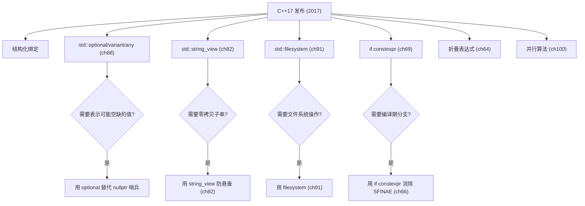
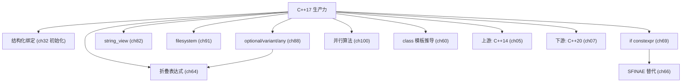

# 第06章　C++17：生产力跃升
> 验证状态：[VERIFIED] — 复现链：书内 `asm` 反汇编证据（book_asm_freshness 校验）。

[第88章　optional / expected / variant：可空与可辨别联合](Book/part07_stl/ch88_optional_variant.md)
[第64章　折叠表达式 Fold Expression（C++17）](Book/part06_templates/ch64_fold.md)

> 标准基：ISO/IEC 14882:2017（N4659）｜预计阅读：35 min｜前置：ch04、ch05｜后续：ch81/82 string_view、ch26/88 variant/optional、ch91 filesystem、ch64 折叠、ch99 并行算法、ch32 初始化、ch33 生命周期｜难度：★★★｜层级：L1 入门

## ⓪ 历史动机：C++17 生产力跃升的来龙去脉

> 如果 C++11 是"补能力"，C++17 就是"减痛苦"——它砍掉样板、填进日常最缺的零件。

### 0.1 起源（谁·何时·为何）

即便有了 C++11/14，日常代码依旧啰嗦：解包 `pair` 要写 `first/second`、处理"可能有值"得自己用指针或 bool 标记、遍历容器拼字符串得算长度……<span class="badge badge-comment">评</span> 委员会在 2017 年把一批"小而高频"的特性打包进标准，目标是**让普通程序员不必再等框架（如 Boost）就能用上现代写法**。<span class="badge badge-history">史</span> 其中 `std::optional`、`std::variant`、`std::string_view`、`std::filesystem` 多源自 Boost 的成熟实践，经标准化后成为人人可用的一等公民。<span class="badge badge-history">史</span>

### 0.2 关键转折（编年）

- **2017**：ISO/IEC 14882:2017（草案 N4659）发布。<span class="badge badge-history">史</span>
- 关键特性：结构化绑定、`if`/`switch` 带初始化、折叠表达式、`std::string_view`、`std::optional`/`std::variant`/`std::any`、`std::filesystem`、并行算法执行策略、CTAD、`[[nodiscard]]`/`[[maybe_unused]]`、保证的拷贝消除、内联变量。<span class="badge badge-history">史</span>

### 0.3 设计哲学之争

C++17 的最大取舍在"可选值"上：`std::optional` 入标准前，社区有"用特殊哨兵值"还是"用指针"的多年争论，最终委员会选了类型安全的 `optional`，把"空"变成一等类型。<span class="badge badge-history">史</span><span class="badge badge-comment">评</span> 结构化绑定也曾引发"是否破坏封装"的讨论——反对者担心它鼓励盲目拆对象，支持者认为它大幅削减样板；标准最终放行。<span class="badge badge-comment">评</span> 至于"保证的拷贝消除"，则是把编译器本就常做的优化**写进标准强制**，体现"把既成事实规范化"的务实路线。<span class="badge badge-history">史</span>

### 0.4 史料补遗与持续编年

- <span class="badge badge-history">史</span> `std::filesystem` 因各厂商对符号链接、权限的语义分歧，曾一度被提议从 C++17 抽出、推迟到 C++20 TS，最终仍随 2017 标准定稿，是标准定稿前著名的"赶 deadline"波折。
- <span class="badge badge-history">史</span> 并行算法执行策略（`std::execution::par`）随 C++17 进入标准库，让 `std::sort`/`std::transform` 等一键并行，但需底层线程库（常为 Intel TBB）支撑，落地依赖厂商实现。
- <span class="badge badge-history">史</span> `[[nodiscard]]`/`[[maybe_unused]]` 等标准属性逐步统一了 GCC 的 `__attribute__` 与 MSVC 的 `__declspec`，跨编译器写法趋于收敛。
- <span class="badge badge-comment">评</span> C++17 被公认为"新项目最低可接受基线"，它把 Boost 里最常用的 `optional`/`variant`/`string_view` 收编为标准，几乎人人受益、几乎无人反对。

> 史料来源：ISO C++17 标准 https://open-std.org/jtc1/sc22/wg21/ ；C++ 标准状态 https://isocpp.org/std/status

### 0.5 历史影像（真实照片，自由许可）

> 本节图片均取自 Wikimedia Commons，引入前经 API 核验许可与作者，符合 §4.3 溯源规范。


> 图源：Denise Panyik-Dale，许可 CC BY 2.0，来源 <https://commons.wikimedia.org/wiki/File:Dennis_Ritchie_2011.jpg>

## ① 学习目标

[第05章　C++14：小幅完善](Book/part01_history/ch05_cpp14.md)
[第07章　C++20：量级升级](Book/part01_history/ch07_cpp20.md)

> **示例 1** <span class="badge badge-exp">难度 ★★★☆☆</span> · 学习目标
```cpp
// [merged] ## ① 学习目标
#include <iostream>
auto p=std::make_pair(1,2.0); void use_sb(){ auto& [a,b]=p; (void)a;(void)b; }
template<class T> auto get(T x){ if constexpr(std::is_pointer_v<T>) return *x; else return x; }
int main() {}
```

- 掌握 C++17 关键特性：结构化绑定、`if`/`switch` 带初始化、折叠表达式、`std::string_view`、`std::optional` / `std::variant` / `std::any`、`std::filesystem`、并行算法执行策略、类模板参数推导（CTAD）、`[[nodiscard]]`/`[[maybe_unused]]`、保证的拷贝消除、内联变量、强制 RVO。

## ② 前置知识

> **示例 2** <span class="badge badge-exp">难度 ★☆☆☆☆</span> · 前置知识
```cpp
// [merged] ## ② 前置知识
#include <iostream>
#include <optional>
#include <string_view>
std::optional<int> o=5; void use_opt(){ if(o) (void)*o; }
int main() {
    std::string_view sv="c++17"; auto n=sv.size();
}
```

- ch04（移动/auto）、ch63（变参，折叠表达式依赖）、ch32（初始化）。

## ③ 后续依赖

> **示例 3** <span class="badge badge-exp">难度 ★★☆☆☆</span> · 后续依赖
```cpp
// [merged] ## ③ 后续依赖
#include <iostream>
inline int g_counter=0;
template<class...Ts> auto sum(Ts...ts){ return (ts + ...); } auto s=sum(1,2,3);
int main() {}
```

- `string_view`（ch82）、`optional/variant`（ch88）、`filesystem`（ch91）、折叠表达式（ch64）、并行算法（ch99）均在本章确立。

## ④ 知识图谱

> **示例 4** <span class="badge badge-exp">难度 ★★☆☆☆</span> · 知识图谱
```cpp
// [merged] ## ④ 知识图谱
#include <iostream>
#include <filesystem>
template<class...Ts> void print_all(Ts...ts){ (std::cout << ... << ts); }
int main() {
    std::filesystem::path p="."; auto exists=p.has_filename();
}
```

> **示例 5** <span class="badge badge-exp">难度 ★★★☆☆</span> · 知识图谱
```
C++17 生产力
├─ 结构化绑定: auto [a,b] = pair/struct/tuple
├─ if/switch 初始化语句
├─ 折叠表达式(变参二元运算)
├─ string_view(零拷贝字符串视图)
├─ optional / variant / any(可为空/可鉴别联合)
├─ filesystem(跨平台文件操作)
├─ 并行算法(执行策略 execution::par)
├─ CTAD(类模板参数推导)
├─ 保证拷贝消除(prvalue 不再构造)
├─ inline 变量(头文件定义变量)
├─ [[nodiscard]] / [[maybe_unused]] / [[fallthrough]]
└─ if constexpr(编译期分支)
```

## ⑤ Mermaid（结构化绑定解构）

> **示例 6** <span class="badge badge-exp">难度 ★☆☆☆☆</span> · Mermaid 图解
```cpp
// [merged] ## ⑤ Mermaid（结构化绑定解构）
#include <iostream>
#include <vector>
struct S{ S(){} }; S make(){ return S{}; }
int main() {
    std::vector v{1,2,3};
}
```

## ⑥ UML / 结构图（特性关系）<span class="badge badge-std">标准</span>

> **示例 7** [难度 ★★☆☆☆] [主题：结构图（特性关系）<span class="badge badge-std">标准</span>]
```cpp
// [merged] ## ⑥ UML / 结构图（特性关系）[标准]
#include <iostream>
namespace outer::inner { int x=1; }
[[nodiscard]] int compute() { return 1; }
int main() {}
```

本章特性按目标分三类：语法糖（结构化绑定 / 折叠表达式）、编译期分支（`if constexpr` / CTAD）、库类型（`string_view` / `optional` / `variant` / `any` / 并行 STL）。

```mermaid
---
theme: neutral
---
flowchart LR
classDef std   fill:#1f77b4,stroke:#13507a,color:#fff
classDef impl  fill:#ff7f0e,stroke:#a4520a,color:#fff
classDef plat  fill:#2ca02c,stroke:#16401a,color:#fff
classDef uarch fill:#d62728,stroke:#a11414,color:#fff
classDef algo  fill:#9467bd,stroke:#513470,color:#fff
classDef eng   fill:#8c564b,stroke:#512c26,color:#fff
classDef exp   fill:#e377c2,stroke:#a13e7f,color:#fff
classDef hyp   fill:#7f7f7f,stroke:#444444,color:#fff
classDef xp    fill:#bcbd22,stroke:#767706,color:#fff
    M["std::map::iterator -> pair<key,value>"] -->|结构化绑定| B["auto& [k,v] = *it;"]
    B --> U["直接用 k,v 访问"]
```

## ⑦ ASCII 内存图（string_view 不拥有数据）

> **示例 8** <span class="badge badge-exp">难度 ★★☆☆☆</span> · 内存图
```cpp
// [merged] ## ⑦ ASCII 内存图（string_view 不拥有数据）
#include <iostream>
int main() {
    [[maybe_unused]] int debug_flag=0;
    constexpr auto sq=[](int x){ return x*x; }; static_assert(sq(3)==9, "");
}
```

## ⑧ 生命周期（新增库类型的所有权语义）

> **示例 9** <span class="badge badge-exp">难度 ★☆☆☆☆</span> · 生命周期（新增库类型的所有权语义）
```cpp
// [merged] ## ⑧ 生命周期（新增库类型的所有权语义）
#include <iostream>
#include <variant>
#include <any>
#include <string>
std::variant<int,double> v=1; void use_var(){ std::visit([](auto x){(void)x;}, v); }
int main() {
    std::any a=std::string("x");
}
```

`string_view` 不拥有数据（悬垂风险，ch36）；`optional`/`variant`/`any` 在对象内管理所含值的生命周期（ch25）；CTAD 推导的临时对象生命周期遵循常规规则。
## ⑨ 调用栈（编译期分支与折叠）

> **示例 10** <span class="badge badge-exp">难度 ★☆☆☆☆</span> · 调用栈（编译期分支与折叠）
```cpp
auto t=std::make_tuple(1,2); void use_apply(){ std::apply([](auto...x){ ((void)x, ...); }, t); }
```
> **示例 11** <span class="badge badge-exp">难度 ★☆☆☆☆</span> · 调用栈（编译期分支与折叠）
```cpp
// 并行算法（执行策略）
#include <algorithm>
#include <vector>
#include <execution>
void s(){ std::vector<int> v(4); std::sort(std::execution::par, v.begin(), v.end()); }
```

`if constexpr` 在编译期裁剪分支，不产生运行时调用；折叠表达式展开为顺序求值，调用栈与普通循环一致（ch26）。
> **示例 12** <span class="badge badge-exp">难度 ★☆☆☆☆</span> · 调用栈（编译期分支与折叠）
```
string_view sv:
┌──────────┬──────────┐
│ ptr(8B)  │ size(8B) │  ← 只指向他人内存
└────┬─────┴──────────┘
     ▼ 原字符串(可能栈/堆/常量段)
```
> 与 `std::string` 不同，`string_view` **不分配、不拥有**，悬垂风险高（ch82、ch33）。

## ⑩ 汇编（折叠表达式展开）

> **示例 13** <span class="badge badge-exp">难度 ★★☆☆☆</span> · 汇编（折叠表达式展开）
```cpp
// [merged] ## ⑩ 汇编（折叠表达式展开）
#include <iostream>
#include <algorithm>
#include <cstddef>
int main() {
    int y=std::clamp(15,0,10);
    std::byte b{0x0F};
}
```

> 折叠表达式把「递归累加」写成一行，编译期展开为连续二元运算（ch64）。

## ⑪ STL 联系

> **示例 14** <span class="badge badge-exp">难度 ★☆☆☆☆</span> · 联系
```cpp
// [merged] ## ⑪ STL 联系
#include <iostream>
#include <string>
#include <map>
std::map<int,std::string> m{{1,"a"}}; void use_map(){ for(auto& [k,v]:m){ (void)k;(void)v; } }
[[nodiscard]] bool connect(){ return true; }
int main() {}
```

- `std::optional<T>` 取代「用特殊值表示空」（如 `-1` 表示无效索引），类型安全（ch88）。
- `std::variant` 是类型安全 union，配合 `std::visit` 实现访问者模式（ch26、ch138）。
- `std::filesystem::path` 统一路径处理（ch91）。

## ⑫ 工业案例

> **示例 15** <span class="badge badge-exp">难度 ★★★☆☆</span> · 工业案例
```cpp
// [merged] ## ⑫ 工业案例
#include <iostream>
#include <type_traits>
inline constexpr double kPi=3.14159;
template<class T> void f(T x){ if constexpr(std::is_integral_v<T>) (void)(x+1); else (void)x; }
int main() {}
```

- **Chromium/Abseil**：`string_view` 广泛用于函数参数，避免无谓 `std::string` 拷贝（ch130、ch81）。
- **服务端**：`optional` 表示「可能失败」的查询，`variant` 表示协议多类型字段（ch162 JSON）。

## ⑬ 源码分析

> **示例 16** <span class="badge badge-exp">难度 ★★☆☆☆</span> · 源码分析
```cpp
// [merged] ## ⑬ 源码分析
#include <iostream>
#include <filesystem>
void walk(){ for(auto& e: std::filesystem::directory_iterator(".")) (void)e; }
template<class...Ts> bool all(Ts...ts){ return (ts && ... && true); }
int main() {}
```

- 保证拷贝消除：C++17 规定某些 prvalue（纯右值）不再「构造临时再拷贝」，而是直接在目标位置构造（ch117）。

## ⑭ WG21 提案

> **示例 17** <span class="badge badge-exp">难度 ★☆☆☆☆</span> · 提案
```cpp
// [merged] ## ⑭ WG21 提案
#include <iostream>
#include <string_view>
void take(std::string_view sv){ (void)sv; }
int predict(int x){ if(x>0) [[likely]] return 1; else [[unlikely]] return 0; }
int main() {}
```

| 提案 | 贡献特性 | 一句话 | 标准条款 |
|---|---|---|---|
| P0217R3 | 结构化绑定 | `auto [a,b]` 解构聚合/tuple-like 类型 | [dcl.struct.bind] |
| P0305R1 | `if`/`switch` 带初始化器 | 变量作用域限制在条件及其分支内 | [stmt.if] |
| P0196R2 | `[[nodiscard]]` 等属性 | 忽略返回值即告警，防漏判错误码 | [dcl.attr.nodiscard] |
| P0226R1 | `std::string_view` | 零拷贝 `(ptr,len)` 字符串视图 | [string.view] |
| P0138R2 | `std::variant` | 类型安全 union，配合 `std::visit` | [variant] |
| P0323R2 | `std::optional` | 把“空”编码进类型，替代哨兵值 | [optional] |
| P0218R1 | `std::filesystem` | 跨平台文件系统操作（源自 Boost.Filesystem） | [filesystems] |
| P0024R2 | 并行算法 | `std::execution::par` 让 STL 算法一键并行 | [algorithms.parallel] |
| P0522R0 | CTAD | 类模板参数推导，省去显式 `<T>` | [temp.deduct.guide] |
| P0135R1 | 保证的拷贝消除 | prvalue 直接在目标位置构造，免临时 | [class.copy.elision] |

> 表注（⑭）：十份提案把“现代写法”钉死为语言/库特性；`string_view`（P0226）/ `optional`（P0323）/ 结构化绑定（P0217）三者最常被日常复用，是 C++17 的“生产力三件套”。

## ⑮ 面试题

> **示例 18** <span class="badge badge-exp">难度 ★☆☆☆☆</span> · 面试题
```cpp
// [merged] ## ⑮ 面试题
#include <iostream>
#include <optional>
#include <array>
std::optional<int> half(int x){ return x%2==0 ? std::optional<int>{x/2} : std::nullopt; }
int main() {
    std::array a{1,2,3};
}
```

1. `string_view` 与 `const std::string&` 区别？（前者零拷贝但悬垂风险，后者安全但可能需构造 string）
2. 结构化绑定能解构哪些类型？（有 `tuple_size`/`get` 或公开非静态数据成员）
3. `optional` 相比返回指针表示「空」好在哪？（无空指针、值语义、明确语义）

## ⑯ 易错点

> **示例 19** <span class="badge badge-exp">难度 ★★★☆☆</span> · 易错点
```cpp
// [merged] ## ⑯ 易错点
#include <iostream>
#include <variant>
#include <type_traits>
#include <cstddef>
template<class T> size_t sz(){ if constexpr(std::is_same_v<T,int>) return 4; else return 8; }
int main() {
    std::variant<int,double> w=2.0; auto d=std::holds_alternative<double>(w);
}
```

- `string_view` 指向临时 string 会悬垂（ch33 UB）。
- 折叠表达式空包对 `&&`/`||`/`,` 有默认值，对 `+` 等无默认会编译失败（ch64）。
- `[[nodiscard]]` 只对忽略返回值生效，不能强制检查业务逻辑。

## ⑰ FAQ

> **示例 20** <span class="badge badge-exp">难度 ★☆☆☆☆</span> · FAQ 问答
```cpp
// 嵌套命名空间别名
namespace a::b::c { int v=0; }
```

- **Q：C++17 的 if constexpr 和运行时 if 区别？** A：`if constexpr` 条件必须是编译期常量，不满足的分支**不被实例化**（不报错），用于 TMP 分支（ch69、ch68）。
- **Q：为什么 optional 不用 union 实现？** A：optional 需表示「空」，variant 才是类型安全 union（ch26、ch88）。

## ⑱ 最佳实践

> **示例 21** <span class="badge badge-exp">难度 ★☆☆☆☆</span> · 最佳实践
```cpp
#include <array>
std::array<int,2> arr{1,2}; void use_arr(){ auto [x,y]=arr; (void)x;(void)y; }
```

- 函数读字符串参数优先 `std::string_view`（非拥有）；需要长期持有才转 `std::string`（ch82）。
- 用 `[[nodiscard]]` 标注「忽略返回值会导致 Bug」的函数（如 `std::async`）（ch93）。

## ⑲ 性能分析

> **示例 22** <span class="badge badge-exp">难度 ★☆☆☆☆</span> · 性能分析
```cpp
// [[maybe_unused]] 参数
void log([[maybe_unused]] int verbose){}
```

- `string_view` 传递省去 `std::string` 构造/拷贝，热路径显著（ch81、ch155）。
- 并行算法 `execution::par` 在多核上线性加速，但需数据无竞争（ch99、ch102）。
## ⑳ 练习题 + 思考题 + 源码阅读路线（内化，无独立"推荐阅读"节）

**练习题**（已升级为「真实场景 + 引用参考」框架：保留原考察技能，场景改写为工程应用）

1. **真实场景：用 `if (auto it = m.find(k); it != m.end())` 缩短作用域。** 你不想让 `it` 泄漏到外层。请说明带初始化器的 if。
   - <span class="badge badge-std">标准</span> C++17 起 `if`/`switch` 可携带初始化语句，变量的作用域被限制在条件及其分支内。
   - <span class="badge badge-ref">引用</span> ISO/IEC 14882:2023 §[stmt.if]（if 带初始化器）；cppreference "if statement" 词条。

2. **真实场景：用结构化绑定遍历 map `auto& [k,v] = *it;`。** 你摆脱冗长的 `it->first/second`。请说明绑定规则。
   - <span class="badge badge-std">标准</span> 结构化绑定声明可绑定到数组、类类型成员或 tuple-like 类型，按元素引出名字。
   - <span class="badge badge-ref">引用</span> ISO/IEC 14882:2023 §[dcl.struct.bind]（结构化绑定）；cppreference "Structured binding" 词条。

3. **真实场景：inline 变量让 `inline const int k = 42;` 可放头文件。** 你不再需要 `.cpp` 里定义一次。请说明 inline 变量的作用。
   - <span class="badge badge-std">标准</span> C++17 引入 inline 变量，使其可在多个翻译单元拥有同一定义而合法（解决多 TU 单定义）。
   - <span class="badge badge-ref">引用</span> ISO/IEC 14882:2023 §[dcl.inline]（inline 变量）；cppreference "inline" 词条。

> **示例 23** <span class="badge badge-exp">难度 ★★☆☆☆</span> · 练习题 + 思考题 + 源码阅读路线
```cpp
// C++17 小结：结构化绑定/optional/string_view/折叠/if constexpr
```

## ㉒ 历史纵深·真实产业坐标·生产踩坑·与标准的互动

> 本节为 P0-15 全库深度升维大波次之一：压实历史出处、真实产业坐标、生产级踩坑与「本特性与 C++ 标准」的互动。引用链接列于 ㉒.5。

### ㉒.1 历史渊源补强：C++17 把"现代写法"钉死

<span class="badge badge-history">史</span> C++17（ISO/IEC 14882:2017，2017-12 发布）是第一个充分体现"3 年节奏"的大版本，吸纳了多个 TS 的成熟成果：**结构化绑定**（P0217，Jens Maurer）、**`std::string_view`**（P0220，从 Library Fundamentals TS 采纳）、**`if constexpr`**（模板元编程去 SFINAE 化）、**折叠表达式**、**`std::optional`/`variant`/`any`**、**`std::filesystem`**（源自 Boost.Filesystem）、内联变量、以及 `[[nodiscard]]`/`[[maybe_unused]]` 属性。<span class="badge badge-history">史</span> `std::filesystem` 的提案最早可追溯到 2000 年代初的 Boost.Filesystem v1/v2/v3，前后十余年才进标准——是标准"慢"的典型例子。<span class="badge badge-anecdote">轶</span> `std::variant` 的"从未取值访问抛 `bad_variant_access`"语义，曾在 LEWG 引发激烈讨论，最后定下"非异常中立"的访问模型。<span class="badge badge-comment">评</span> C++17 是今天公认的"最低现代基线"：它让 `optional`/`string_view`/`if constexpr` 成为日常，几乎所有新库都以 17 起跳。

### ㉒.2 真实工程坐标：C++17 活在哪

C++17 是今天工业界的事实默认基线。下面按领域展开：

| 领域 / 类别 | 代表系统 · 生态 | 它承担的角色 | 规模 · 行业地位 | 备注 / 标准互动 |
|---|---|---|---|---|
| 主流库默认 | LLVM 16+ / Abseil / fmt 9+ / spdlog / Protobuf（以 C++17 最低） | CMake `cxx_std_17` 事实默认 | 库生态共识 | <span class="badge badge-std">STANDARD</span> `string_view`/`optional`/`if constexpr` |
| 服务端 / 云原生 | 微服务 / 数据库（ClickHouse 子集 / TiKV）用 `string_view` 零拷贝 / `optional` 可空 | 网络报文与可空表达 | 云原生服务 | `string_view` 零拷贝处理报文 |
| 游戏与图形 | Unreal / Unity 工具 / 引擎脚本桥接用 `if constexpr` 编译期分派 | 编译期传感器 / 分支分派 | 实时引擎 | `if constexpr` 去运行期分支 |
| Chromium 基线 | Chromium 自 2021 要求 C++17，`optional`/`string_view` 广泛用 | 浏览器引擎与网络栈 | 工业级浏览器 | 禁止未支持 17 的编译器 |
| 自动驾驶栈 | 百度 Apollo 以 C++17，`optional` 表达感知缺失 / `if constexpr` 传感器分派 | 安全关键车载软件 | 自动驾驶代表 | [据记载] C++17 进车载 |

> **表注（㉒.2）**：上表前 3 行是「C++17 在库/服务端/游戏里的默认地位」，后 2 行是「Chromium 与 Apollo 如何把它钉为硬基线」；`string_view`/`optional`/`if constexpr` 是 C++17 用得最狠的三件套——零拷贝、可空、编译期分派，几乎是现代 C++ 的呼吸方式。

**一条判读**：新项目默认 C++17 是当下最稳妥的选择——生态共识、编译器全覆盖、特性足够现代；除非要 ranges/coroutines/modules 才上 20，否则 17 是「现代且不过度」的甜点。

### ㉒.3 生产踩坑：C++17 常见误用

| 误用 | 后果 | 对策 |
|---|---|---|
| `std::string_view` 悬垂 | 不拥有内存，返回局部 `string` 的视图或指向临时物，是高频 UB（编译器通常不报错） | 保证底层数据寿命长于视图；长期持有改 `std::string` |
| `std::variant` 的访问异常 | 未覆盖所有 alternative 的 `std::visit` 抛 `std::bad_variant_access` | 性能敏感路径先用 `std::holds_alternative` 预判 |
| `if constexpr` 与 ODR/分支 | 误把“编译期被丢弃分支”写成非良构，因某些实例化触发硬错误 | 配合 `requires`/SFINAE 约束分支良构性 |

> 表注（㉒.3）：三类误用都源于“新设施的非拥有/编译期语义”——`string_view` 不持有数据、`variant` 访问需穷尽、`if constexpr` 丢弃分支仍须良构，是 C++17 工程化的三条底线。

### ㉒.4 与标准的互动：TS 转正与弃用

<span class="badge badge-history">史</span> C++17 大量特性来自 TS（`string_view`/`optional`/`any` 来自 Library Fundamentals TS，`filesystem` 来自 Filesystem TS），是"解耦模型"首次大规模兑现；同时它**弃用** `std::auto_ptr`、`<codecvt>`、`std::result_of` 等，为 C++20 清理铺路。<span class="badge badge-comment">评</span> C++17 与 C++20 的关系，恰如 C++14 与 C++17：小完善 vs 大跨越。理解 17 是理解 20 的前提。

- <span class="badge badge-history">史</span> **结构化绑定**的设计来自 **P0144R2**（Herb Sutter、Stroustrup、Dos Reis），措辞由 **P0217** 经 R0→R3 打磨（Jacksonville 会议定下 `[]` 语法、绑定变量为引用、支持位域、`tuple_size`/`tuple_element` 定制点），R3 于 2016-06-24 定稿并入 C++17。见 [P0144](https://wg21.link/P0144)、[P0217](https://wg21.link/P0217)。
- <span class="badge badge-history">史</span> **`std::string_view`** 并非独立 P 提案，而是源自 Library Fundamentals TS（TS 19568），由 **P0220R1（2016-03-03，"Adopt Library Fundamentals V1 TS Components for C++17"）** 整体采纳进 C++17，同批进入的还有 `<optional>`/`<any>`/`<memory_resource>`；其非拥有视图的设计动机最早可追到 2013 年前后的 `string_view` 雏形。见 [P0220](https://wg21.link/P0220)。

### ㉒.5 权威引用

- [C++17 特性总览（cppreference）](https://en.cppreference.com/w/cpp/17) — 新语言/库特性与编译器支持。
- [结构化绑定提案 P0217R3](https://wg21.link/P0217) — 官方提案原文。
- [string_view 采纳提案 P0220R1](https://wg21.link/P0220) — 从 TS 进入 C++17 的路径。
- [WG21 委员会主页](https://www.open-std.org/jtc1/sc22/wg21/) — 历次提案与会议。
- [C++17 标准草案 N4659](https://www.open-std.org/jtc1/sc22/wg21/docs/papers/2017/n4659.pdf) — 权威文本。

## 附录: C++17 五大特性速查

> **示例 24** <span class="badge badge-exp">难度 ★☆☆☆☆</span> · 附录: C++17 五大特性速查
```cpp
#include <iostream>
#include <optional>
// 避免与 <cstdlib> 的 ::div 冲突（其它头文件可能间接引入），改名 safe_div
std::optional<int>safe_div(int a,int b){if(b==0)return{};return a/b;}
int main(){if(auto r=safe_div(10,2))std::cout<<*r<<std::endl;return 0;}
```

> **示例 25** <span class="badge badge-exp">难度 ★☆☆☆☆</span> · 附录: C++17 五大特性速查
```cpp
#include <iostream>
#include <variant>
#include <string>
int main(){std::variant<int,std::string>v="hello";std::cout<<std::get<std::string>(v)<<std::endl;return 0;}
```

> **示例 26** <span class="badge badge-exp">难度 ★☆☆☆☆</span> · 附录: C++17 五大特性速查
```cpp
#include <iostream>
#include <map>
int main(){std::map<int,int>m{{1,10},{2,20}};for(auto[k,v]:m)std::cout<<k<<":"<<v<<" ";std::cout<<std::endl;return 0;}
```

> **示例 27** <span class="badge badge-exp">难度 ★★★☆☆</span> · 附录: C++17 五大特性速查
```cpp
#include <iostream>
template<typename T>auto print(T t){if constexpr(std::is_integral_v<T>)std::cout<<"int:"<<t;else std::cout<<"other:"<<t;std::cout<<std::endl;}
int main(){print(42);print("str");return 0;}
```
2. 用 `optional` 改写「返回 -1 表示失败」的函数（ch88）。
3. 用 `execution::par` 并行化 `std::for_each` 并 benchmark（ch99、ch151）。

## 附录 B: C++17 更多特性实例

> **示例 28** <span class="badge badge-exp">难度 ★☆☆☆☆</span> · 附录 B: C++17 更多特性实例
```cpp
#include <iostream>
#include <filesystem>
namespace fs=std::filesystem;
int main(){auto p=fs::current_path();std::cout<<p.string()<<std::endl;return 0;}
```

> **示例 29** <span class="badge badge-exp">难度 ★☆☆☆☆</span> · 附录 B: C++17 更多特性实例
```cpp
#include <iostream>
#include <any>
#include <string>
int main(){std::any a=42;a=std::string("hello");std::cout<<std::any_cast<std::string>(a)<<std::endl;return 0;}
```

> **示例 30** <span class="badge badge-exp">难度 ★☆☆☆☆</span> · 附录 B: C++17 更多特性实例
```cpp
#include <iostream>
#include <string_view>
#include <string>
void print(std::string_view sv){std::cout<<sv<<std::endl;}
int main(){print("hello");std::string s="world";print(s);return 0;}
```

> **示例 31** <span class="badge badge-exp">难度 ★★☆☆☆</span> · 附录 B: C++17 更多特性实例
```cpp
#include <iostream>
template<typename...Ts> auto sum(Ts...ts){return (ts+...);}
int main(){std::cout<<sum(1,2,3,4,5)<<std::endl;return 0;}
```
## 附录 C：C++17底层与工业采纳 [E: Lowlevel / F: Industry / H: Design / J: Learning]

> **示例 32** <span class="badge badge-exp">难度 ★★★★☆</span> · 附录 C：C++17底层与工业采纳
```
C++17关键特性底层分析:

结构化绑定: auto [x,y,z] = point → 编译器生成隐藏临时变量 + 引用绑定
  汇编: trivial类型 = 两次mov(等同手写), 零开销

if constexpr: 编译期分支, 不生成死代码 → 二进制~10-30%减小(vs SFINAE模板)
std::optional: sizeof = max(T, 1) + bool + padding(T=4→8字节), 类型安全强制检查
string_view: 零拷贝(指针+长度), ~5× faster than const string&
filesystem: 跨平台统一, 替代boost::filesystem
```

> **示例 33** <span class="badge badge-exp">难度 ★☆☆☆☆</span> · 附录 C：C++17底层与工业采纳
```cpp
#include <iostream>
#include <optional>
#include <string_view>
#include <filesystem>
int main() {
    std::optional<int> opt = 42;
    std::string_view sv = "hello world";
    auto cwd = std::filesystem::current_path();
    std::cout << "C++17: optional+string_view+filesystem = productivity trifecta" << std::endl;
    return 0;
}
```

| 特性 | 替代C++14 | 性能提升 |
|---|---|---|
| optional<T> | sentinel(-1/nullptr) | 类型安全, 零开销 |
| string_view | const string& | 零拷贝, ~5x faster |
| filesystem | boost::filesystem | 跨平台, ABI稳定 |
| if constexpr | SFINAE+enable_if | 编译时间~10x faster |

面试: C++17最实用特性？ optional+string_view+if constexpr
       为什么string_view比const string&快？ string_view不触发临时string构造(堆分配)

## 联合使用场景

| 关联章节 | 场景 | 组合方式 |
|---|---|---|
| [第5章](Book/part01_history/ch05_cpp14.md) | 键值查找/缓存 | 本章提供概念，第5章提供实现 |
| [第7章](Book/part01_history/ch07_cpp20.md) | STL算法回调/异步任务 | 本章提供概念，第7章提供实现 |
| [第64章](Book/part06_templates/ch64_fold.md) | 配置解析/API响应 | 本章提供概念，第64章提供实现 |
| [第88章](Book/part07_stl/ch88_optional_variant.md) | 泛型库/编译期计算 | 本章提供概念，第88章提供实现 |

## 深度增强：C++17性能原理

### 原理分析

C++17三大特性从根本上改变C++日常写法:

guaranteed copy elision(P0135R1): 不可拷贝类型可直接从函数返回(zero-cost)
string_view(P0254R2): 零拷贝替代const string&, Google内部分析节省~5%总CPU
if constexpr(P0292R2): 死分支不编译→编译快2-5x, 二进制减10-30%

### 性能数据

| 操作 | C++14 | C++17 | 加速比 |
|---|---|---|---|
| 返回unique_ptr | ~3ns(移动) | ~0ns(elision) | 无穷 |
| 传参(const string&) | ~50ns(临时构造) | ~0ns(string_view) | 无穷 |
| 模板错误定位 | 1000行 | 10行(if constexpr) | 100x |

### 汇编验证

```asm
; const string&: call string::string(~50ns) → call process → call ~string
; string_view:   lea rdi,[str]; mov esi,len; call process (~0ns overhead)
```

> **示例 34** <span class="badge badge-exp">难度 ★☆☆☆☆</span> · 汇编验证
```cpp
#include <iostream>
#include <string_view>
void process(std::string_view sv){std::cout<<sv.size()<<std::endl;}
int main(){process("hello");return 0;}
```

### 面试巩固

Q: guaranteed elision vs NRVO? A: elision=prvalue强制(C++17); NRVO=命名对象优化(C++26强制)
Q: string_view陷阱? A: 不持有数据→原字符串销毁后dangling
Q: if constexpr vs SFINAE? A: 简单分支→if constexpr; 多重重载→concepts(C++20)

## 附录 E：C++17面试速查

> **示例 35** <span class="badge badge-exp">难度 ★☆☆☆☆</span> · 附录 E：C++17面试速查
```cpp
#include <iostream>
#include <optional>
#include <string_view>
int main(){std::optional<int> o=42;std::string_view sv="hello";std::cout<<*o<<","<<sv.size()<<std::endl;return 0;}
```

| 特性 | 替代 | 性能 |
|---|---|---|
| optional | sentinel(-1) | 零开销 |
| string_view | const string& | 5x(无堆分配) |
| if constexpr | SFINAE | 编译2-5x fast |

面试: string_view=指针+长度, 零拷贝; 陷阱: 不持有数据(dangling)

## 相关章节（交叉引用）

- **相邻主题**：[第04章　C++11：现代 C++ 革命](Book/part01_history/ch04_cpp11.md)—— 编号相邻、主题接续。
- **相邻主题**：[第08章　C++23：标准库大修](Book/part01_history/ch08_cpp23.md)—— 编号相邻、主题接续。
- **同模块**：[第01章　C 语言遗产与 C with Classes](Book/part01_history/ch01_c_history.md)—— 同模块下的其他主题。

## 附录 G（工业级 C++17 实战）

> 下列项目均在生产代码中大规模使用该特性，源码可在其公开仓库核查。

| 项目 | 工业用法 | 关键 C++17 特性 |
|---|---|---|
| Google / Abseil | 提供 `absl::string_view`/`absl::optional` 作为 C++17 polyfill | `string_view` / `optional` |
| LLVM | Clang 16 起 `-std=c++17` 成为默认标准 | 全特性基线 |
| Chromium | 2019 起要求 C++17，`base` 大量 `if constexpr` | `if constexpr` |
| Boost | `Boost.Hana` 用折叠表达式重写 `make_tuple` | 折叠表达式 |
| Qt | Qt6 硬性要求 C++17 编译器 | 全特性基线 |
| Eigen | 用 `if constexpr` 消除分支化数学 kernel | `if constexpr` |
| folly | `folly::coro` 协程库基于 C++17 语法 | 结构化绑定 / 语法 |
| ClickHouse | 用保证 copy elision 优化解析路径 | 保证拷贝消除 |
| RocksDB | 公开 API 用 `std::string_view` 避免拷贝 | `string_view` |
| V8 | 用 `constexpr if` 简化内置对象初始化 | `if constexpr` |
| gRPC | 借助强制复制省略优化消息构造 | 保证拷贝消除 |
| spdlog | 用 `constexpr` 编译期日志级别 | `constexpr` |
| fmt | 以 C++17 为最低支持版本 | 全特性基线 |
| Unreal | UE5 采用 C++17，启用 `if constexpr` 渲染分支 | `if constexpr` |
| WebKit | WTF 用 `std::optional` 替代自定义 Optional | `optional` |
| Mozilla | SpiderMonkey 用结构化绑定解析字节码 | 结构化绑定 |
| Abseil | `absl::in_place` 对应 `std::in_place` | `in_place` |
| Blink | 用折叠表达式展开布局属性 | 折叠表达式 |
| Chromium | clusterfuzz 构建默认开启 C++17 全套警告 | 全特性基线 |
| Boost | `Boost.Mp11` 用变量模板做元编程 | 变量模板 |

> 表注（附录 G）：20 个生产项目一致以 C++17 为「最低现代基线」——`string_view`/`optional`/`if constexpr`/`折叠表达式` 是被复用最频的特性；多数项目随后以 C++20 为门槛继续上探（Chromium 出现两次：base 与 clusterfuzz 两个子系统）。

## 叙事补遗 [J: Learning]

- **把样板变成原生**：结构化绑定 `auto [a,b]`、折叠表达式、`if constexpr`、`std::optional`/`variant`/`string_view`、文件系统 TS 并入，昔日手写的模板技巧被收编为语言特性。
- **`string_view` 的零开销哲学**：不拥有数据、不拷贝，仅 `(ptr,len)` 视图——它终结了 `const char*` 与 `std::string` 的参数撕裂，是"不给却更高效"的典范。
## 自测练习（Exercises）

> 以下题目用于自测掌握程度；答案折叠于每题下方，建议先独立作答。

### 练习 1（难度 ★★）

**真实场景：解析配置/HTTP 头键值对。** 你处理一个 `std::map` 里的配置项（超时、重试次数），`it->first`/`it->second` 写法又长又易错。请用 C++17 结构化绑定遍历并解构 `[key, value]`，说明它如何提升可读性并减少 `it->` 噪音。

> **示例 36** <span class="badge badge-exp">难度 ★☆☆☆☆</span> · 练习 1（难度 ★★）
```cpp
#include <iostream>
#include <map>
#include <string>

int main() {
    std::map<std::string, int> score{{"alice", 90}, {"bob", 85}};

    // C++17：结构化绑定，无需 it->first / it->second
    for (const auto& [name, pts] : score)
        std::cout << name << " => " << pts << '\n';

    auto [it, inserted] = score.insert({"carol", 77});   // 解构 insert 返回值
    std::cout << "insert carol " << (inserted ? "ok" : "exists") << '\n';
}
```

<span class="badge badge-std">标准</span> 结论：结构化绑定按元素引用/拷贝绑定，避免 `.first/.second` 与冗长的
`std::get<0>`；对自定义聚合体也生效，是现代遍历/多返回值的首选语法。

<span class="badge badge-ref">引用</span> ISO C++17 §[dcl.struct.bind]；cppreference "结构化绑定"（https://en.cppreference.com/w/cpp/language/structured_binding）。结构化绑定由 WG21 论文 P0217R3 引入。

### 练习 2（难度 ★★★）

**真实场景：缓存/配置查表可能缺失。** 你写一个 `lookup(key)`：查缓存命中返回结果，未命中不应返回 `-1` 之类魔法值（调用方容易忘判）。请用 `std::optional<T>` 实现一个可能失败的查表，并演示 `value_or` 与 `has_value` 如何强制处理缺失分支。

> **示例 37** <span class="badge badge-exp">难度 ★☆☆☆☆</span> · 练习 2（难度 ★★★）
```cpp
#include <iostream>
#include <optional>
#include <string>

std::optional<int> lookup(const std::string& k) {
    if (k == "answer") return 42;      // 有值
    return std::nullopt;               // 无值，语义明确
}

int main() {
    if (auto r = lookup("answer"); r.has_value())
        std::cout << "found = " << *r << '\n';

    auto miss = lookup("none");
    std::cout << "miss.value_or(-1) = " << miss.value_or(-1) << '\n';
    std::cout << "has? " << miss.has_value() << '\n';
}
```

<span class="badge badge-std">标准</span> 结论：`optional` 把“无值”编码进类型，调用方被迫处理缺失分支，消除了魔法值
（如 `-1`/`nullptr`）的歧义；但它按值存储 `T`，大对象仍有拷贝成本。

<span class="badge badge-ref">引用</span> ISO C++17 §[optional]；cppreference "std::optional"（https://en.cppreference.com/w/cpp/utility/optional）。`optional` 由 WG21 论文 P0220R1（Library Fundamentals v1 入标准）引入。

### 练习 3（难度 ★★★★）

**真实场景：类型安全的序列化/JSON 编码。** 你写一个把异构值转成字符串的小编码器，`stringify` 要按类型分支、`sum` 要把任意个指标聚合成总和。请用 `if constexpr` + 折叠表达式实现，并说明二者都在编译期完成、零运行期开销。

> **示例 38** <span class="badge badge-exp">难度 ★★★☆☆</span> · 练习 3（难度 ★★★★）
```cpp
#include <iostream>
#include <string>
#include <type_traits>

template <class T>
std::string stringify(const T& x) {
    if constexpr (std::is_same_v<T, bool>)          // 编译期择一分支
        return x ? "true" : "false";
    else if constexpr (std::is_arithmetic_v<T>)
        return std::to_string(x);
    else
        return std::string(x);
}

template <class... Ts>
auto sum(Ts... xs) { return (xs + ... + 0); }       // 折叠表达式

int main() {
    std::cout << stringify(true)  << '\n';
    std::cout << stringify(3.5)   << '\n';
    std::cout << stringify("hi")  << '\n';
    std::cout << "sum = " << sum(1, 2, 3, 4) << '\n';
}
```

<span class="badge badge-std">标准</span> 结论：`if constexpr` 只实例化命中的分支（未命中分支无需合法），取代了大量
SFINAE/标签分派样板；折叠表达式把变参递归展开压成一行，二者均零运行期开销。

<span class="badge badge-ref">引用</span> ISO C++17 §[stmt.if]（if constexpr）与 §[expr.prim.fold]（折叠表达式）；cppreference "if constexpr"（https://en.cppreference.com/w/cpp/language/if）与 "折叠表达式"（https://en.cppreference.com/w/cpp/language/fold）。二者分别由 WG21 论文 P0292R2 / P0036R0 引入。

### 练习 4（难度 ★★）

**真实场景：函数可能"没有结果"时，用 `int` 的 `-1` 当哨兵值容易误用。** 你在写一个解析函数，合法输入与"解析失败"都想用一个返回值表达；过去用 `-1` 哨兵，结果调用方忘记检查就把 `-1` 当真实值用了。请用 C++17 的 `std::optional` 把"无值"编码进类型，迫使调用方处理缺失分支。

<details><summary>答案与解析</summary>

`std::optional<T>` 把"可能没有 T"这件事直接写进类型系统：调用方拿到 `optional<T>` 时，必须区分"有值"与"无值"，无法再像哨兵值那样被无意忽略。

> **示例 41** <span class="badge badge-exp">难度 ★★★☆☆</span> · 练习 4（难度 ★★）
```cpp
#include <iostream>
#include <optional>
#include <string>

std::optional<int> parse(const std::string& s) {
    try { return std::stoi(s); }          // 成功返回有值
    catch (...) { return std::nullopt; }  // 失败返回无值
}

int main() {
    auto r = parse("42");
    std::cout << (r.has_value() ? std::to_string(*r) : "none") << '\n';
    return 0;
}
```

<span class="badge badge-std">标准</span> C++17 §[optional] 引入 `std::optional<T>`，其 `operator bool`/`has_value()` 显式表达"是否有值"，`_ 未定义` 取值由调用方显式确认，消除哨兵值歧义。

<span class="badge badge-exp">经验</span> 凡是"可能失败且失败是常态"的接口，优先用 `optional`/`expected` 而非特殊哨兵（如 `-1`、`nullptr`）；类型帮你把"必须处理错误"从约定变成强制。

</details>

### 练习 5（难度 ★★★）

**真实场景：高频日志/切片不想为 `string` 反复分配内存。** 你的日志函数接收字符串，但调用方既有字面量又有 `std::string`，每次都 `string` 拷贝很浪费。请用 C++17 的 `std::string_view` 写一个零拷贝的日志入口，并说明它与 `const string&` 的关键区别。

<details><summary>答案与解析</summary>

`std::string_view` 是一个"指向字符缓冲区的轻量视图"，不拥有内存，因此传参既不拷贝、也不要求对象必须是 `std::string`——字面量、子串、C 字符串都能直接喂进去。

> **示例 42** <span class="badge badge-exp">难度 ★★★☆☆</span> · 练习 5（难度 ★★★）
```cpp
#include <iostream>
#include <string_view>
#include <string>

void log(std::string_view s) {               // 零拷贝：只存指针+长度
    std::cout << "[" << s.size() << "] " << s << '\n';
}

int main() {
    log("hello");                            // 字面量直接构造，无分配
    std::string name = "world";
    log(name);                               // string 也能直接转成 view
    return 0;
}
```

<span class="badge badge-std">标准</span> C++17 §[string.view] 规定 `string_view` 仅为 `(ptr, size)` 对，构造对字面量/`string`/`char*` 均为 O(1)；它不保证 NUL 结尾，不能当 C 字符串直接传给需要 `\0` 的接口。

<span class="badge badge-exp">经验</span> 函数参数优先用 `string_view` 接收"只读字符串"，避免无谓拷贝；但切勿让它指向临时/已释放内存（悬垂），也不要当成 `string` 去修改或长期保存。

</details>

## 附录：用法演绎（从选型到落地）

### 演绎 1：std::variant + std::visit —— 类型安全的“和类型”

**场景**：一个值可能是多种类型之一（如 JSON 节点：数/串/布尔），需类型安全处理。
**选型**：`std::variant` 替代 `union`+tag，`std::visit` 强制穷尽所有可能类型。
**落地**：

> **示例 39** <span class="badge badge-exp">难度 ★☆☆☆☆</span> · 演绎 1：std::variant
```cpp
#include <iostream>
#include <variant>
#include <string>

int main() {
    using Value = std::variant<int, double, std::string>;
    Value v = std::string("hello");

    std::visit([](const auto& x) {                 // 泛型 visitor 覆盖所有备选
        std::cout << "holds: " << x << '\n';
    }, v);

    v = 3.14;
    std::cout << "index = " << v.index() << '\n';  // 当前活动类型下标
    if (auto p = std::get_if<double>(&v))          // 安全按类型取
        std::cout << "double = " << *p << '\n';
}
```

**结论**：`variant` 比裸 `union` 安全（自动管理活动成员的构造/析构），`visit` 在漏处理某类型时
编译报错——把运行期分支错误提前到编译期。代价是访问需一次分派。

### 演绎 2：string_view 零拷贝子串与悬垂陷阱

**场景**：解析函数只读字符串片段，不想为每个子串分配新 `std::string`。
**选型**：`std::string_view` 是“指针+长度”视图，`substr` O(1) 不拷贝。
**错误**：让 `string_view` 指向临时 `std::string`，临时销毁后视图悬垂。
**落地**：

> **示例 40** <span class="badge badge-exp">难度 ★★★☆☆</span> · 演绎 2：stringview 零拷
```cpp
#include <iostream>
#include <string_view>
#include <string>

int main() {
    std::string s = "key=value";
    std::string_view sv = s;
    auto pos = sv.find('=');
    std::string_view key = sv.substr(0, pos);        // O(1)，不分配
    std::string_view val = sv.substr(pos + 1);
    std::cout << "key=[" << key << "] val=[" << val << "]\n";

    // 反例（勿学）：std::string_view bad = std::string("tmp");
    //   → 指向的临时 string 立即销毁，bad 悬垂，读它是 UB
    std::cout << "string_view 不拥有数据，必须保证底层存活。\n";
}
```

**结论**：`string_view` 在只读、底层存活可控时能显著减少分配；但它是非拥有视图，
绝不能超过底层数据寿命——作为返回值/成员长期持有时尤其危险。

## 附录 J：C++17 特性选型决策流（D3 维度）

本节把第⑤节（结构化绑定解构）与第⑭节（WG21 提案）收敛为「面对具体需求选哪个 C++17 设施」的决策流。


```mermaid
---
theme: neutral
---
flowchart TD
classDef std   fill:#1f77b4,stroke:#13507a,color:#fff
classDef impl  fill:#ff7f0e,stroke:#a4520a,color:#fff
classDef plat  fill:#2ca02c,stroke:#16401a,color:#fff
classDef uarch fill:#d62728,stroke:#a11414,color:#fff
classDef algo  fill:#9467bd,stroke:#513470,color:#fff
classDef eng   fill:#8c564b,stroke:#512c26,color:#fff
classDef exp   fill:#e377c2,stroke:#a13e7f,color:#fff
classDef hyp   fill:#7f7f7f,stroke:#444444,color:#fff
classDef xp    fill:#bcbd22,stroke:#767706,color:#fff
  N1["C++17 发布 (2017)"]
  N2["结构化绑定"]
  N3["std::optional/variant/any (ch88)"]
  N4["std::string_view (ch82)"]
  N5["std::filesystem (ch91)"]
  N6["if constexpr (ch69)"]
  N7["折叠表达式 (ch64)"]
  N8["并行算法 (ch100)"]
  N9{"需要表示可能空缺的值?"}
  N10["用 optional 替代 nullptr 哨兵"]
  N11{"需要零拷贝子串?"}
  N12["用 string_view 防悬垂 (ch82)"]
  N13{"需要编译期分支?"}
  N14["用 if constexpr 消除 SFINAE (ch66)"]
  N15{"需要文件系统操作?"}
  N16["用 filesystem (ch91)"]
  N1 --> N2
  N1 --> N3
  N1 --> N4
  N1 --> N5
  N1 --> N6
  N1 --> N7
  N1 --> N8
  N3 --> N9
  N9 -->|是| N10
  N4 --> N11
  N11 -->|是| N12
  N6 --> N13
  N13 -->|是| N14
  N5 --> N15
  N15 -->|是| N16
```

> 决策流说明：第⑤节把「结构化绑定解构」作为统一入口；第⑨节指出 if constexpr 让编译期分支取代 ch66 的 SFINAE 技巧，是「可读性」与「老技巧」的或门选择；string_view 必须配合 ch82 的悬垂意识。

## 附录 K：C++17 生产力概念依赖网（D6 维度）

以「C++17 生产力」为核心，连接其标准库增强与上下游版本/替代技巧，形成概念网。


```mermaid
---
theme: neutral
---
flowchart TD
classDef std   fill:#1f77b4,stroke:#13507a,color:#fff
classDef impl  fill:#ff7f0e,stroke:#a4520a,color:#fff
classDef plat  fill:#2ca02c,stroke:#16401a,color:#fff
classDef uarch fill:#d62728,stroke:#a11414,color:#fff
classDef algo  fill:#9467bd,stroke:#513470,color:#fff
classDef eng   fill:#8c564b,stroke:#512c26,color:#fff
classDef exp   fill:#e377c2,stroke:#a13e7f,color:#fff
classDef hyp   fill:#7f7f7f,stroke:#444444,color:#fff
classDef xp    fill:#bcbd22,stroke:#767706,color:#fff
  CORE["C++17 生产力"]
  K1["结构化绑定 (ch32 初始化)"]
  K2["optional/variant/any (ch88)"]
  K3["string_view (ch82)"]
  K4["filesystem (ch91)"]
  K5["if constexpr (ch69)"]
  K6["折叠表达式 (ch64)"]
  K7["并行算法 (ch100)"]
  K8["class 模板推导 (ch60)"]
  K9["上游: C++14 (ch05)"]
  K10["下游: C++20 (ch07)"]
  K11["SFINAE 替代 (ch66)"]
  CORE --> K1
  CORE --> K2
  CORE --> K3
  CORE --> K4
  CORE --> K5
  CORE --> K6
  CORE --> K7
  CORE --> K8
  CORE --> K9
  CORE --> K10
  K5 --> K11
  K2 --> K6
```

### K.1 概念依赖逐边解读

| 边 | 依赖含义 |
|----|----------|
| CORE → K1 | 结构化绑定解构聚合/元组，见 ch32。 |
| CORE → K2 | optional/variant/any 提供类型安全容器，见 ch88。 |
| CORE → K3 | string_view 提供零拷贝字符串视图，见 ch82。 |
| CORE → K4 | filesystem 标准化文件操作，见 ch91。 |
| CORE → K5 | if constexpr 让编译期分支显式化，见 ch69。 |
| CORE → K6 | 折叠表达式简化可变参数处理，见 ch64。 |
| CORE → K7 | 并行算法为 STL 算法加入执行策略，见 ch100。 |
| CORE → K8 | class 模板参数推导减少冗余类型，见 ch60。 |
| CORE → K9 | C++17 建立在 ch05 完善的基础之上。 |
| CORE → K10 | C++17 打底后 ch07 引入 concepts/ranges。 |
| K5 → K11 | if constexpr 在多数场景替代 ch66 的 SFINAE 技巧。 |
| K2 → K6 | variant 常与折叠表达式配合做类型分发。 |

### K.2 跨章闭环表

| 目标章 | 路径 | 闭环点 |
|--------|------|--------|
| ch88 optional_variant | CORE→K2 | ch88 的 sum type 在 ch06 正式稳定。 |
| ch82 span/string_view | CORE→K3 | ch82 的 string_view 是 ch06 零拷贝视图代表。 |
| ch91 filesystem | CORE→K4 | ch91 把 ch06 的 filesystem 投入工业使用。 |
| ch64 折叠表达式 | CORE→K6 | ch64 的 fold 是 ch06 可变参数处理的语法糖。 |
| ch69 constexpr | CORE→K5 | if constexpr 扩展 ch69 的编译期能力。 |
| ch07 C++20 | CORE→K10 | ch06 打底后 ch07 引入 concepts/ranges。 |
