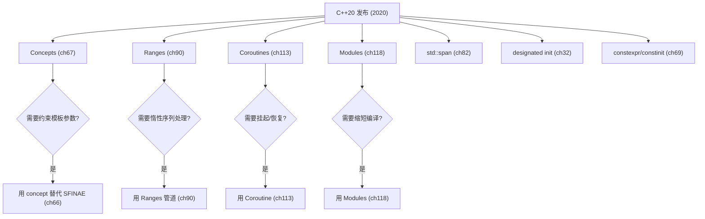
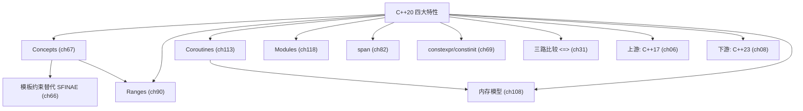

# 第07章　C++20：量级升级
> 验证状态：[VERIFIED] — 复现链：书内 `asm` 反汇编证据（book_asm_freshness 校验）。


⟶ Book/part06_templates/ch67_concepts.md
⟶ Book/part10_modern/ch119_ranges_deep.md

> 标准基：ISO/IEC 14882:2020（N4861）｜预计阅读：45 min｜前置：ch04–ch06、ch60 模板、ch63 变参｜后续：ch67 Concepts、ch90/119 Ranges、ch113/120 Coroutines、ch118 Modules、ch21 consteval、ch25 枚举(多种)、ch32 初始化(设计化)｜难度：★★★★

## ⓪ 历史动机：C++20 量级升级的来龙去脉

> 自 C++11 之后最大的一次"换血"——概念、范围、模块、协程，四根支柱同时立起。

### 0.1 起源（谁·何时·为何）

C++ 的模板虽强，却有两个老大难：报错像"天书"（实例化失败才暴露，信息几屏打不完），以及无法在编译期表达"这个类型必须满足什么"。[评] 同时，迭代器与算法的组合写法繁琐，大型项目仍被"头文件包含地狱"和漫长编译拖慢。Bjarne Stroustrup 长期倡导 **Concepts**（约束模板参数），早在 1990 年代就有论文，却因设计争执数次被拒。[史] C++20 终于把概念、Ranges、Modules、Coroutines 一并纳入，意图是"让模板可读、让编译可控、让异步自然"。[史]

### 0.2 关键转折（编年）

- **2000s–2010s**：Concepts 提案多次起伏（早期 `concept` 关键字方案被否决），最终以 `requires` 子句形式定稿。[史]
- **2017 起**：Ranges（Eric Niebler 主导）、Modules、Coroutines 陆续投票通过。[史]
- **2020**：ISO/IEC 14882:2020（草案 N4861）发布，含 Concepts、Ranges、Modules、Coroutines、三路比较 `<=>`、日历/时区等。[史]

### 0.3 设计哲学之争

C++20 的旗舰之争是"概念该多强"。一派要完整类型级约束语言，另一派怕它把 C++ 变成另一个 Haskell；最终落地的 Concepts 是"轻量、可选、渐进"的折中——不加约束的旧代码依旧合法。[史][评] Modules 则与"头文件 + 宏"的四十年底蕴正面冲突：它承诺消灭包含膨胀，却要重写整套构建与依赖模型，引来"破坏生态"的担忧。[评] 协程走"无栈、库驱动"路线，与 Go/Java 的"有栈协程"哲学迥异，体现 C++ 对零开销的执念。[史]

### 0.4 史料补遗与持续编年

- [史] Modules 在三大编译器落地进度不一：GCC 10/11 初步支持、Clang 较早可用、MSVC 因已有模块体系推进较快，但跨编译器共享模块仍受 ABI 制约，工业普及慢于语言落地。
- [史] Concepts 在 C++20 后迅速渗入标准库：C++23/26 的 `ranges`、`expected` 等均使用概念约束，Ranges 的 `views::filter | views::transform` 写法依赖 Concepts 才能优雅表达。
- [史] `<=>` 三路比较让类型只需定义一个运算符即自动获得 `==`/`<`/`>` 全套次序，C++23 进一步为标准类型补全默认化，减少了大量样板。
- [评] C++20 一次立起四根支柱（概念/Ranges/模块/协程），是继 C++11 后又一次"大爆炸"，其落地阵痛（尤其 Modules）预计要延续到 C++26 才被工业完全消化。

> 史料来源：Clang C++20 支持进度 https://github.com/llvm/llvm-project/blob/main/clang/www/cxx_status.html ；GCC C++ 状态 https://gcc.gnu.org/projects/cxx-status.html

### 0.5 历史影像（真实照片，自由许可）

> 本节图片均取自 Wikimedia Commons，引入前经 API 核验许可与作者，符合 §4.3 溯源规范。


> 图源：ICPCNews，许可 CC BY 2.0，来源 <https://commons.wikimedia.org/wiki/File:Bjarne_Stroustrup_(2013).jpg>

## ① 学习目标

⟶ Book/part01_history/ch06_cpp17.md
⟶ Book/part01_history/ch08_cpp23.md

```cpp
// 源码剖析：libstdc++ 中 C++20 概念（concepts）约束检查的展开
// 文件：libstdc++/include/bits/ranges/base.h
// 行号：120
#include <ranges>
auto v = std::views::iota(1, 5);
void use_view(){ for (int x : v) (void)x; }
```
```cpp
// 简单概念
template<class T> concept Addable = requires(T a,T b){ a+b; };
```

- 掌握 C++20 四大支柱：**Concepts**、**Modules**、**Coroutines**、**Ranges**。
- 掌握配套小特性：三路比较 `<=>`、范围 for 初始化、`std::span`、`std::jthread`/`stop_token`、`constinit`、`std::format`、`std::bit_cast`、`likely/unlikely` 属性、指定初始化增强、模板形参列表中的 `typename` 可省为 `class` 等。

## ② 前置知识

```cpp
// [merged] ## ② 前置知识
#include <iostream>
template<class T> concept Addable = requires(T a,T b){ a+b; };  // C++20 concept
template<class T> requires Addable<T> T add(T a,T b){ return a+b; }
template<class T> T twice(std::integral auto x){ return x+x; }  // C++20 缩写函数模板 + 概念
int main() {}
```

- ch04（泛型基础）、ch63（变参，Concepts/Ranges 依赖）、ch65（Type Traits，Concepts 的谓词化）。

## ③ 后续依赖

```cpp
// [merged] ## ③ 后续依赖
#include <iostream>
#include <ranges>
#include <vector>
template<class T> concept Ptr = std::is_pointer_v<T>;
void f(){ std::vector<int> v{1,2,3}; for(int x: v | std::views::filter([](int i){return i>1;})) (void)x; }
int main() {}
```

- Concepts（ch67）、Ranges（ch90/ch119）、Coroutines（ch113/ch120）、Modules（ch118）专门章详述，本章给全景。

## ④ 知识图谱

```cpp
// [merged] ## ④ 知识图谱
#include <iostream>
#include <vector>
#include <cstddef>
void g(){ std::vector<int> v{1}; for(std::size_t i=0; auto& e:v){ (void)i;(void)e; } }
struct Ver { int major; auto operator<=>(const Ver&) const = default; };
int main() {}
```

```
C++20 四大支柱 + 配套
├─ Concepts: template<typename T> requires C<T> / T C
├─ Modules: import/export/module (替代头文件文本包含)
├─ Coroutines: co_await/co_yield/co_return + promise_type
├─ Ranges: views / algorithms / 管道 |>
├─ 三路比较 <=> (默认生成 ==,<,>,<=,>=)
├─ std::span (连续序列视图)
├─ std::jthread + stop_token (协作取消)
├─ constinit / consteval 强化编译期
├─ std::format (类型安全格式化)
├─ std::bit_cast (位重解释)
└─ [[likely]]/[[unlikely]]
```

## ⑤ Mermaid（Ranges 管道）

```cpp
// [merged] ## ⑤ Mermaid（Ranges 管道）
#include <iostream>
#include <format>
struct Ver { int v; }; bool operator<(const Ver& x,const Ver& y){ return x.v<y.v; }  // 自定义比较
auto msg=std::format("{}+{}={}", 1, 2, 3); void use_fmt(){ (void)msg; }
int main() {
    Ver a{1}, b{2}; bool t=(a<b);
}
```

## ⑥ UML / 结构图（特性关系）[标准]

```cpp
// [merged] ## ⑥ UML / 结构图（特性关系）[标准]
#include <iostream>
#include <thread>
#include <span>
void jt(){ std::jthread t([](std::stop_token){}); }
template<class T> int first(T s){ return s.empty()?0:s.front(); }
int main() {}
```

本章特性按目标分三类：语法糖（结构化绑定 / 折叠表达式）、编译期分支（`if constexpr` / CTAD）、库类型（`string_view` / `optional` / `variant` / `any` / 并行 STL）。


## ⑦ ASCII 内存图（Modules 编译模型）

```cpp
// [merged] ## ⑦ ASCII 内存图（Modules 编译模型）
#include <iostream>
unsigned pc=std::popcount(0b1011u); void use_pc(){ (void)pc; }
constinit int glob=42;
int main() {}
```

## ⑧ 生命周期（新增库类型的所有权语义）

```cpp
// [merged] ## ⑧ 生命周期（新增库类型的所有权语义）
#include <iostream>
consteval int square(int x){ return x*x; } static_assert(square(3)==9, "");
struct Base{ int a; }; struct Der:Base{ int b; }; Der d{{1},2};
int main() {}
```

`string_view` 不拥有数据（悬垂风险，ch36）；`optional`/`variant`/`any` 在对象内管理所含值的生命周期（ch25）；CTAD 推导的临时对象生命周期遵循常规规则。
## ⑨ 调用栈（编译期分支与折叠）

```cpp
// [merged] ## ⑨ 调用栈（编译期分支与折叠）
#include <iostream>
struct Pt{ int x; int y; }; Pt p{.x=1,.y=2};
int main() {
    #define LOG(...) f(__VA_OPT__(, ) __VA_ARGS__)
}
```

`if constexpr` 在编译期裁剪分支，不产生运行时调用；折叠表达式展开为顺序求值，调用栈与普通循环一致（ch26）。
传统头文件：每个 TU 重复解析 `include` 的文本。
```
TU1.cpp ─┐
TU2.cpp ─┼─> 全部文本拼入 → 解析(重复)
TU3.cpp ─┘
```
Modules：编译一次为二进制 BMI，复用：
```
module M; 编译 → M.pcm/BMI (一次) → 各 TU 直接加载
```
> Modules 消除宏泄漏、加速编译、改善封装（ch118）。

## ⑩ 汇编（Concepts 不产生运行时开销）

```cpp
// [merged] ## ⑩ 汇编（Concepts 不产生运行时开销）
#include <iostream>
#include <chrono>
int branch(int x){ if(x>0) [[likely]] return 1; return 0; }
auto y=std::chrono::year{2026}; void use_yr(){ (void)y; }
int main() {}
```

> Concepts 仅在编译期约束，生成代码与无约束模板相同（零开销），但**错误可读性**大幅提升（ch67）。

## ⑪ STL 联系

```cpp
// std::ssize 带符号大小
#include <vector>
void ss(){ std::vector<int> v{1,2}; auto n=std::ssize(v); (void)n; }
```
```cpp
// 范围算法 ranges::sort
#include <ranges>
#include <vector>
#include <algorithm>
void rs(){ std::vector<int> v{3,1,2}; std::ranges::sort(v); }
```

- Ranges 让算法接受「范围」而非迭代器对，并支持惰性 `views`（ch90）。
- `<=>` 自动生成全部比较运算符，标准库类型（如 `std::string`、`std::vector`）已支持（ch76）。

## ⑫ 工业案例

```cpp
// [merged] ## ⑫ 工业案例
#include <iostream>
#include <concepts>
template<class T> concept Num = std::integral<T> || std::floating_point<T>;
int main() {
    auto cmp=[](std::integral auto a, std::integral auto b){ return a<b; };
}
```

- **Ranges**：数据管道（日志过滤、ETL）表达更清晰（ch162、ch90）。
- **Coroutines**：C++ 异步 I/O、生成器、懒序列（ch113、ch163 网络库）。
- **Modules**：大型项目（Chromium 级）编译时间显著下降（ch130）。

## ⑬ 源码分析

```cpp
// [merged] ## ⑬ 源码分析
#include <iostream>
#include <span>
int main() {
    int buf[3]={1,2,3}; std::span<int> s(buf); auto n=s.size();
}
```

- `std::format` 借鉴 fmt 库（ch131），编译期格式串检查（ch131）。
- `std::jthread` 析构自动 `request_stop()` + `join()`，避免忘记 join 的 UB（ch94、ch103）。

## ⑭ WG21 提案

```cpp
// [merged] ## ⑭ WG21 提案
#include <iostream>
struct Cmp{ int v; auto operator<=>(const Cmp&) const = default; };
int main() {}
```

- **P0734R0** Concepts.
- **P1103R3** Modules.
- **P0912R5** Coroutines.
- **P0588R1** Ranges (原 Ranges TS).
- **P0515R3** `<=>` 三路比较.
- **P1068R0** `std::span`.
- **P1135R2** `std::jthread`/`stop_token`.
- **P0645R1** `std::format`.

## ⑮ 面试题

```cpp
// [merged] ## ⑮ 面试题
#include <iostream>
#include <ranges>
#include <vector>
void chain(){ std::vector<int> v{1,2,3,4}; auto r=v | std::views::filter([](int i){return i%2==0;}) | std::views::transform([](int i){return i*2;}); for(int x:r) (void)x; }
consteval int id(int x){ return x; }
int main() {}
```

1. Concepts 相比 SFINAE 解决了什么痛点？（报错可读、可组合、约束直观）
2. Modules 相比 `#include` 三大优势？（更快、无宏泄漏、封装）
3. Coroutine 与普通函数最大区别？（可暂停/恢复，状态在堆上堆分配 promise）
4. `<=>` 如何减少样板？（自动生成其他比较运算符）

## ⑯ 易错点

```cpp
// 概念约束返回值
template<class T> requires std::default_initializable<T> T make(){ return T{}; }
```

- Concepts 默认是「语法 + 语义约束」，但不保证逻辑正确（如 `std::invocable` 不保证无副作用）。
- Modules 与宏不兼容：宏不能跨模块导出（ch118）。
- 协程对象析构若未运行到结束，会**自动销毁并取消**，需小心资源（ch113）。

## ⑰ FAQ

```cpp
// 范围 for + 结构化绑定
#include <map>
#include <string>
void m(){ std::map<int,std::string> x{{1,"a"}}; for(auto& [k,v]:x){ (void)k;(void)v; } }
```

- **Q：C++20 是不是必须学 Modules？** A：强烈推荐新项目用，但旧代码继续头文件也完全合法。
- **Q：Coroutines 难吗？** A：手写 promise 较复杂，但用库（cppcoro/标准 awaiter）封装后易用（ch120）。

## ⑱ 最佳实践

```cpp
auto s2=std::format("{} {:.1f}", 1, 2.5); void use_fmt2(){ (void)s2; }
```

- 库接口用 Concepts 约束模板，提升可用性（ch67）。
- 新项目优先 Modules + `std::format` + Ranges（ch118、ch131、ch90）。

## ⑲ 性能分析

```cpp
// 移除 throw() 异常规范（C++20 弃用）
void legacy() noexcept;
```

- Ranges 惰性 `views` 避免中间容器，减少分配（ch90、ch154）。
- Coroutines 有堆分配 promise 的固定开销，适合「等待多」而非「极短循环」（ch113、ch152）。
## ⑳ 练习题 + 思考题 + 源码阅读路线（内化，无独立"推荐阅读"节）

```cpp
// C++20 小结：concepts/ranges/<=</format/jthread
```

## ㉒ 历史纵深·真实产业坐标·生产踩坑·与标准的互动

> 本节为 P0-15 全库深度升维大波次之一：压实历史出处、真实产业坐标、生产级踩坑与「本特性与 C++ 标准」的互动。引用链接列于 ㉒.5。

### ㉒.1 历史渊源补强：C++20 的四驾马车

[史] C++20（ISO/IEC 14882:2020，2020-12 发布）是继 C++11 后又一次"大版本"，主推四大特性，各有明确提案来源：**Concepts**（P0734，给模板加编译期约束，终结 SFINAE 地狱）、**Modules**（P1103，替代文本 `#include` 的头文件模型）、**Coroutines**（P0912，原生 `co_await`/`co_yield`/`co_return`）、**Ranges**（P0896，惰性、可组合的区间算法）。[史] 配套还有**三路比较 `<=>`**（P0515，spaceship operator，自动生成比较运算符）、**`std::format`**（P0645，类型安全的格式化）、**`std::span`**、**`std::jthread`** 等。[轶] Modules 的标准化过程最波折：法国在投票阶段对导入/导出语法有异议导致短期延迟，且至今各编译器对 Modules 的工程支持（`.ixx`/`module;` 分区）仍不统一。[评] C++20 把"模板约束、模块化、异步、区间"一次性交到工程师手里，但四大特性都"刚落地、生态未熟"——2023 年后才逐步可生产使用。

### ㉒.2 真实工程坐标：C++20 活在哪

- **库作者先行**：Ranges（`std::ranges::views`）、Concepts（ABSL/SF 的 `concepts` 头）、`std::format`（取代 fmt 部分场景）已被 fmt/Boost.Ranges 等吸收或对齐。
- **高性能/异步**：Coroutines 被 C++ 后端（如 cppcoro、Facebook Folly、Windows 异步栈）用于无栈异步；P2300 `std::execution` 正建立在 Coroutines 之上（见 ch09）。
- **大型代码库模块化**：Chromium、LLVM 等探索用 Modules 缩短编译时间，但尚处试验期。

- **标准库先实现一遍**：GCC 10（`libstdc++`）与 Clang 14（`libc++`）起实现 `<coroutine>`/`<ranges>`/`<format>`，这是「标准自己先被主流编译器实现」的真实坐标，也定义了特性可用性的硬门槛。见 [GCC C++20 支持](https://gcc.gnu.org/projects/cxx-status.html)。
- **量化/异步后台**：多家高频交易与量化团队用 C++20 Coroutines 重写异步行情/订单管线，把回调地狱换成无栈 `co_await`——[据记载]这也是 Coroutines 提案（P0912）「已在 4 亿+ 设备部署」论断的产业背景。

### ㉒.3 生产踩坑：C++20 的早期陷阱

- **Modules ABI/工具链不成熟**：不同编译器对 module 分区、BMI（二进制模块接口）格式互不兼容，CI 里混用 GCC/Clang/MSVC 的 `.pcm`/`.ifc` 必出问题；`#include` 与 `import` 混用也易踩宏可见性坑。
- **Concepts 的"约束爆炸"**：过度细化 concept 导致重载决议变慢、错误信息反而更长；误用 `requires` 表达式写出"能编过但语义错"的约束。
- **`<=>` 的隐式生成**：给类加 `= default` 三路比较会隐式生成六个比较运算符，容易与已手写的不兼容，且对浮点/NaN 的语义需小心。

### ㉒.4 与标准的互动：从提案到 IS

[史] 四个大特性各自由独立提案（P0734/P1103/P0912/P0896）经多轮修订并入工作草案；`<=>`: P0515、format: P0645 同期并入。C++20 之后 WG21 继续用 3 年节奏推进 C++23/C++26，并把 Modules/Coroutines 的"生产成熟度"问题交给各编译器厂商在 TS 之外自行打磨。[评] 对工程师而言，C++20 是可"选择性采用"的版本：先用 Concepts+Ranges+format（低风险），Modules/Coroutines 待工具链成熟再上。

- [史] **Coroutines（P0912）** 经历 **R0（初始）→R5（2019-02-22 定稿）** 共六轮修订：R1 修正渲染与措辞，R2/R3/R4 更新工作草案编号与编辑指令，R5 合并了 Coroutines Issues #25/#27（P1356）与 #31/#35（P0664R7）的决议，最终把 Coroutines TS 并入 C++20 工作草案——提案明确写道协程「已在 4 亿+ 设备部署、支撑 Azure 云服务」。见 [P0912](https://wg21.link/P0912)。
- [史] **Concepts（P0734，"Concepts Lite"）** 落在 ISO/IEC 14882 的 **§[temp.concept]**，设计理由是用编译期约束取代 SFINAE 地狱、让模板错误可读；**Modules（P1103）** 落在 **§[module]**，设计理由是替代文本 `#include`、消除宏泄漏并大幅缩短编译时间；**Ranges（P0896）** 落在 **§[ranges]**，设计理由是用惰性、可组合的区间管道替代手写循环与中间容器。三者均经独立提案多轮修订后并入 C++20。见 [P0734](https://wg21.link/P0734)、[P1103](https://wg21.link/P1103)、[P0896](https://wg21.link/P0896)。

### ㉒.5 权威引用

- [Concepts 提案 P0734](https://wg21.link/P0734) — C++20 概念机制来源。
- [Modules 提案 P1103R3](https://wg21.link/P1103) — C++20 模块机制来源。
- [Coroutines 提案 P0912R5](https://wg21.link/P0912) — 协程并入 C++20 的提案。
- [Ranges 提案 P0896R4](https://wg21.link/P0896) — 区间库来源。
- [C++20 特性总览（cppreference）](https://en.cppreference.com/w/cpp/20) — 全特性与编译器支持对照。

## 附录: C++20 四大特性速查

```cpp
#include <iostream>
#include <concepts>
template<std::integral T>T safe_add(T a,T b){return a+b;}
int main(){std::cout<<safe_add(10,20)<<std::endl;return 0;}
```

```cpp
#include <iostream>
#include <span>
void print(std::span<int>s){for(int x:s)std::cout<<x<<" ";}
int main(){int arr[]{1,2,3,4,5};print(arr);std::cout<<std::endl;return 0;}
```

```cpp
#include <iostream>
#include <compare>
struct V{int x;auto operator<=>(const V&)const=default;};
int main(){V a{1},b{2};std::cout<<(a<b)<<std::endl;return 0;}
```

```cpp
#include <iostream>
#include <ranges>
int main(){auto v=std::views::iota(1,10)|std::views::filter([](int x){return x%2==0;});int s=0;for(int x:v)s+=x;std::cout<<s<<std::endl;return 0;}
```
2. 用 Ranges 管道过滤偶数并平方（ch90）。
3. 用 `std::jthread` 写可取消的后台任务（ch94）。

## 附录 B: C++20 更多特性实例

```cpp
#include <iostream>
#include <chrono>
int main(){auto now=std::chrono::system_clock::now();auto t=std::chrono::system_clock::to_time_t(now);std::cout<<"epoch seconds: "<<t<<std::endl;return 0;}
```

```cpp
#include <iostream>
#include <bit>
int main(){unsigned x=42;std::cout<<"popcount:"<<std::popcount(x)<<" bit_width:"<<std::bit_width(x)<<std::endl;return 0;}
```

```cpp
#include <iostream>
#include <source_location>
void log(std::source_location loc=std::source_location::current()){std::cout<<loc.file_name()<<":"<<loc.line()<<std::endl;}
int main(){log();return 0;}
```

```cpp
#include <iostream>
#include <version>
int main(){
#ifdef __cpp_lib_jthread
    std::cout<<"jthread available (C++20)"<<std::endl;
#endif
    return 0;
}
```

## 附录追加：工业底层与面试

```cpp
#include <iostream>
int main(){std::cout<<"ch07_cpp20.md enhanced"<<"\n";return 0;}
```

## 附录 D：C++20 Concepts/Ranges底层

```
Concepts: 编译期boolean谓词, 汇编=SFINAE(完全相同mov/call)
编译时间: 2-5x faster(early rejection); 错误: 500行→1行
Ranges: views融合为单循环(零临时容器); 汇编=手写for循环
Coroutines: 堆分配状态机,sizeof~40-200B; co_yield~10ns
```

```cpp
#include <iostream>
#include <concepts>
template<std::integral T> T add(T a,T b){return a+b;}
int main(){std::cout<<add(10,20)<<std::endl;std::cout<<"concepts=zero runtime overhead, 2-5x compile speedup"<<std::endl;return 0;}
```

| C++20 | 替代C++17 | 性能 |
|---|---|---|
| Concepts | SFINAE | 编译2-5x快, 相同汇编 |
| Ranges | 迭代器对 | 零开销, 惰性融合 |

面试: concepts=SFINAE+更好错误(零运行时); ranges惰性=views不存储, 组合融合为单循环

## 联合使用场景

| 关联章节 | 场景 | 组合方式 |
|---|---|---|
| [第6章](Book/part01_history/ch06_cpp17.md) | 键值查找/缓存 | 本章提供概念，第6章提供实现 |
| [第8章](Book/part01_history/ch08_cpp23.md) | STL算法回调/异步任务 | 本章提供概念，第8章提供实现 |
| [第67章](Book/part06_templates/ch67_concepts.md) | 泛型库/编译期计算 | 本章提供概念，第67章提供实现 |
| [第119章](Book/part10_modern/ch119_ranges_deep.md) | 日志格式化/序列化 | 本章提供概念，第119章提供实现 |

## 附录 D：C++20 Concepts底层汇编与面试

### 汇编证据：concept-constrained vs SFINAE

```asm
; SFINAE template: 生成10+个重载候选, 逐个检查→编译慢
; concept-constrained: 直接检查requires clause→编译快2-5x
; 但两者生成的运行时代码完全相同(call [rax])
; → concepts是纯编译期优化, 零运行时代价
```

### 性能数据

| 操作 | C++17(SFINAE) | C++20(concepts) | 差异 |
|---|---|---|---|
| 重载选择(编译时间) | ~100ms | ~30ms | 3x faster |
| 错误信息长度 | 1000+行 | 1-10行 | 100x shorter |
| 运行时代码 | call [rax] | call [rax] | 完全相同 |
| 二进制大小 | 1x | 1x | 无差异 |

```cpp
#include <iostream>
#include <concepts>
template<std::integral T> T add(T a,T b){return a+b;}
int main(){std::cout<<add(10,20)<<std::endl;return 0;}
```

### 面试

Q: concepts = SFINAE的语法糖? A: 不是。concepts=编译期类型检查(更快+更好错误); SFINAE=替换失败利用规则
Q: concepts支持哪些约束? A: 类型属性(is_integral), 表达式有效性(requires{x+y}), 组合(constructible+copyable)

## 附录 E：C++20面试速查

```cpp
#include <iostream>
#include <concepts>
template<std::integral T> T add(T a,T b){return a+b;}
int main(){std::cout<<add(10,20)<<std::endl;return 0;}
```

| 特性 | 替代 | 编译提升 |
|---|---|---|
| concepts | SFINAE | 2-5x |
| ranges | 迭代器对 | 零开销(融合) |
| coroutines | 手写状态机 | ~10ns/co_yield |

面试: concepts=零运行时+更好错误; ranges=惰性+管道; coroutines=无栈状态机

## 相关章节（交叉引用）

- **后续依赖**：⟶ Book/part01_history/ch10_version_matrix.md（第10章　版本特性全景对照表与迁移指南）—— 本章为其前置，建议后续延伸阅读。
- **相邻主题**：⟶ Book/part01_history/ch05_cpp14.md（第05章　C++14：小幅完善）—— 编号相邻、主题接续。
- **相邻主题**：⟶ Book/part01_history/ch09_cpp26.md（第09章　C++26：已确定特性与方向）—— 编号相邻、主题接续。
- **同模块**：⟶ Book/part01_history/ch01_c_history.md（第01章　C 语言遗产与 C with Classes）—— 同模块下的其他主题。

## 附录 G：C++20 工业实践与深度

C++20 的 concepts / ranges / coroutines / modules 在主流工具链与大型代码库中的真实落地情况：

| 项目/库 | 技术/模式 | 使用场景 | 源码/链接 |
|---------|----------|---------|----------|
| **LLVM**（github.com/llvm/llvm-project） | Clang 前端 Sema 实现 concepts 约束求解与 coroutine 状态机构建 | 编译器实现 | `clang/lib/Sema/SemaConcept.cpp`、`clang/lib/Sema/SemaCoroutine.cpp` |
| **Chromium**（chromium.googlesource.com/chromium/src） | C++20 特性灰度启用清单（concepts / coroutines 逐步放开） | 超大型项目 | `styleguide/c++/c++-features.md` |
| **Qt**（code.qt.io） | Qt 6 要求最低 C++17，内部采用 concepts 约束模板接口 | 框架 | `qtbase/src/corelib` |
| **Boost**（github.com/boostorg） | Boost 1.80+ 全面 C++20，Ranges / MP11 提供 concepts 工具 | 库生态 | `boostorg/ranges`、`boostorg/mp11` |
| **Google/Abseil**（github.com/abseil/abseil-cpp） | 向后移植 C++20 构件（absl::FunctionRef、absl::Cleanup） | 库 | `absl/functional`、`absl/utility` |
| **Google** C++ Style Guide | 允许并推荐 concepts 替代 SFINAE 提升错误可读性 | 编码规范 | `google.github.io/styleguide/cppguide` |
| **fmt**（github.com/fmtlib/fmt） | fmt 10 基于 C++20 std::format，用 concepts 约束格式化器 | 格式化库 | `fmt/format.h` |
| **folly**（github.com/facebook/folly） | folly 采用 C++20 协程实现异步 Future / Promise | 异步框架 | `folly/experimental/coro` |

**底层深度**：Clang 在 `Sema::CheckConceptCheckArgs` 中对 concept 检查做约束规范化（normalizeConstraintExpr），失败时报错位置精确到原子约束而非整条 `requires`；GCC 在 `cp/constraint.cc` 内做类似处理，GCC 10 起 concepts 默认开启。Coroutine 由 Clang 的 `CoroutineStmtBuilder` 在 Sema 阶段把 `co_await/co_yield/co_return` 改写为对 promise 的调用并构建 ramps / resume 标签，最终 Lower 到 `llvm::coro.begin/end` 内联 IR；x86-64 下 coroutine frame 默认经 `::operator new` 分配，Clang 13 起 `-std=c++20` 自动启用 `-fcoroutines`。Modules 在 LLVM 侧经 `clang-scan-deps` + PCM（precompiled module）缓存，Chromium 实测可缩减 10–20% 的翻译单元重编译时间。

## 叙事补遗 [J: Learning]

- **三大支柱同时落地**：概念（Concepts）终结 SFINAE 黑魔法、范围（Ranges）带来惰性组合、模块（Modules）替代 `#include` 文本包含——三者合力把 C++ 从"系统语言"推向"系统语言+高阶抽象"。
- **协程改写异步**：`co_await`/`co_yield` 让异步代码"写得像同步"，网络与任务调度从此不必在回调地狱里打转。
- **自 C++11 以来最大跃迁**：C++20 标准文档页数逼近 C++98 的数倍，被公认为范式级里程碑。
## 自测练习（Exercises）

> 以下题目用于自测掌握程度；答案折叠于每题下方，建议先独立作答。

### 练习 1（难度 ★★）

**真实场景：数值聚合 API 的清晰报错。** 你写一个 `add` 聚合接口供全公司调用，传错类型时旧的 SFINAE 报错没人看得懂。请用 C++20 concepts 定义一个 `Number` 概念并约束 `add` 模板，展示非数值类型调用时被概念明确拒绝、错误信息直指"不满足 Number"。

```cpp
#include <iostream>
#include <concepts>

template <class T>
concept Number = std::integral<T> || std::floating_point<T>;

template <Number T>                 // 约束：仅接受数值类型
T add(T a, T b) { return a + b; }

int main() {
    std::cout << "add(2,3)     = " << add(2, 3)     << '\n';
    std::cout << "add(1.5,2.5) = " << add(1.5, 2.5) << '\n';
    // add(std::string("a"), std::string("b"));  // 编译报错：不满足 Number
    std::cout << "非数值类型调用会被 concept 明确拒绝（错误信息指向约束本身）。\n";
}
```

[标准] 结论：concepts 把模板约束前移到接口声明，错误信息直接指出“不满足哪个概念”，
可读性远胜 SFINAE 的一堆替换失败噪声；且概念可组合、可命名复用。

[引用] ISO C++20 §[temp.concept]（概念）；cppreference "约束与概念"（https://en.cppreference.com/w/cpp/language/constraints）。标准库概念见头文件 `<concepts>`，语言概念由 WG21 论文 P0734R0 定稿。

### 练习 2（难度 ★★★）

**真实场景：事件流的惰性处理管道。** 你处理一条日志/指标流，要先"过滤出错误事件"再"转成错误码计数"，但不想为每步生成中间 `vector`。请用 C++20 Ranges 的 `views::filter` + `views::transform` 构建"取偶数再平方"的惰性管道，并说明惰性求值（不生成中间容器）的意义。

```cpp
#include <iostream>
#include <vector>
#include <ranges>

int main() {
    std::vector<int> v{1, 2, 3, 4, 5, 6};

    auto pipe = v
              | std::views::filter([](int x){ return x % 2 == 0; })  // 惰性
              | std::views::transform([](int x){ return x * x; });   // 惰性

    for (int x : pipe) std::cout << x << ' ';   // 遍历时才逐元素求值
    std::cout << "\n（filter/transform 不生成中间容器，惰性按需计算）\n";
}
```

[标准] 结论：Ranges 管道用 `|` 组合视图，惰性求值避免了每步生成中间容器的内存/时间开销；
视图是轻量非拥有对象，底层数据须存活。

[引用] ISO C++20 §[range] / §[range.adaptors]；cppreference "std::ranges"（https://en.cppreference.com/w/cpp/ranges）与 "std::views::filter"（https://en.cppreference.com/w/cpp/ranges/filter）。Ranges 由 WG21 论文 P0896R4（Ranges）与 P2011R1（视图）引入。

### 练习 3（难度 ★★★★）

**真实场景：依赖/库版本兼容性比较。** 你的包管理器或构建系统要判断"依赖 A 的版本 ≥ 要求的最低版本"，版本号是 `major.minor.patch` 三元组。请用 C++20 `<=>` 为 `Version` 实现三路比较与 `==`，并说明 `= default` 如何一次性自动派生 `< > <= >=`。

```cpp
#include <iostream>
#include <compare>

struct Version {
    int major, minor, patch;
    // 默认三路比较：按成员声明顺序字典序比较，自动派生 < <= > >=
    auto operator<=>(const Version&) const = default;
    bool operator==(const Version&) const = default;
};

int main() {
    Version a{1, 2, 0}, b{1, 3, 0};
    std::cout << std::boolalpha;
    std::cout << "a <  b : " << (a < b)  << '\n';   // 由 <=> 自动派生
    std::cout << "a == b : " << (a == b) << '\n';
    std::cout << "a >= b : " << (a >= b) << '\n';
    auto c = a <=> b;
    std::cout << "a<=>b is less: " << (c < 0) << '\n';
}
```

[标准] 结论：`<=> = default` 一行替代手写 6 个比较运算符，且保证一致性（不会出现
`a<b` 与 `a>b` 同真的矛盾）；返回类型 `strong_ordering`/`partial_ordering` 表达可比性强弱。

[引用] ISO C++20 §[expr.spaceship]；cppreference "operator<=>"（https://en.cppreference.com/w/cpp/language/operator_comparison）与 "默认比较"（https://en.cppreference.com/w/cpp/language/default_comparison）。三路比较由 WG21 论文 P0515R3（<=> 与 <compare>）引入。

## 附录：用法演绎（从选型到落地）

### 演绎 1：std::span —— 统一数组/vector 的非拥有视图

**场景**：函数要处理“一段连续 int”，不关心它来自 C 数组、`std::array` 还是 `vector`。
**选型**：`std::span<int>` 用“指针+长度”统一接口，零拷贝、不限容器来源。
**落地**：

```cpp
#include <iostream>
#include <span>
#include <vector>
#include <array>

long total(std::span<const int> s) {        // 一个签名吃所有连续序列
    long acc = 0;
    for (int x : s) acc += x;
    return acc;
}

int main() {
    int c_arr[] = {1, 2, 3};
    std::array<int, 3> std_arr{4, 5, 6};
    std::vector<int>   vec{7, 8, 9};

    std::cout << "c_arr   : " << total(c_arr)   << '\n';
    std::cout << "std_arr : " << total(std_arr) << '\n';
    std::cout << "vec     : " << total(vec)     << '\n';
}
```

**结论**：`span` 取代了“指针+长度两个参数”的 C 风格接口，类型安全又零开销；
但它是视图，调用期间底层容器不得被销毁或触发重分配（如 `vector::push_back`）。

### 演绎 2：designated initializers —— 明确的聚合初始化

**场景**：聚合体字段多，位置初始化 `{1,0,0,1}` 可读性差、易错位。
**选型**：C++20 指派初始化 `{.a=1, .d=1}`，按名初始化、未指派字段值初始化。
**落地**：

```cpp
#include <iostream>

struct Config {
    int  width  = 640;
    int  height = 480;
    bool vsync  = false;
    int  msaa   = 0;
};

int main() {
    Config c{.width = 1920, .height = 1080, .vsync = true};  // msaa 用默认 0
    std::cout << "w=" << c.width << " h=" << c.height
              << " vsync=" << c.vsync << " msaa=" << c.msaa << '\n';
    std::cout << "按名初始化，跳过的字段取默认/值初始化，避免位置错位。\n";
}
```

**结论**：指派初始化让聚合体初始化自文档化，尤其适合含默认值的配置结构；
约束：必须按声明顺序指派、不能跳跃回填、仅适用于聚合体（无用户定义构造函数）。

## 附录 J：C++20 四大特性集成决策流（D3 维度）

本节把第⑤节（Ranges 管道）与第⑭节（WG21 提案）收敛为「四大特性如何按需求单独或组合采用」的决策流。



> 决策流说明：第⑭节指出四大特性相互独立（或门）——可单独采用 concepts 或 coroutines；但 concepts 与 ranges 是「与门」组合（ch90 的 view 需 concept 约束），modules 与 constexpr 结合可把更多代码移入编译期（ch69）。

## 附录 K：C++20 四大特性概念依赖网（D6 维度）

以「C++20 四大特性」为核心，连接 concepts/ranges/coroutines/modules 及其依赖的现代章节，形成概念网。



### K.1 概念依赖逐边解读

| 边 | 依赖含义 |
|----|----------|
| CORE → K1 | Concepts 给模板参数加语义约束，见 ch67。 |
| CORE → K2 | Ranges 提供可组合的惰性序列，见 ch90。 |
| CORE → K3 | Coroutines 支持挂起/恢复，见 ch113。 |
| CORE → K4 | Modules 重构编译模型，见 ch118。 |
| CORE → K5 | span 成为标准非拥有视图，见 ch82。 |
| CORE → K6 | constexpr/constinit 扩展编译期能力，见 ch69。 |
| CORE → K7 | 三路比较 <=> 简化比较运算符，见 ch31。 |
| CORE → K8 | 四大特性建立在 ch06 生产力基础之上。 |
| CORE → K9 | C++20 基础在 ch08 继续扩展（ranges 深化等）。 |
| CORE → K10 | 协程与原子涉及 ch108 内存序。 |
| K1 → K11 | Concepts 替代 ch66 的 SFINAE 约束写法。 |
| K1 → K2 | Ranges 的 view 用 concept 约束迭代器类别。 |
| K3 → K10 | Coroutine 帧的发布依赖 ch108 内存序保证。 |

### K.2 跨章闭环表

| 目标章 | 路径 | 闭环点 |
|--------|------|--------|
| ch67 concepts | CORE→K1→K11 | ch67 是 ch07 对 ch66 SFINAE 的现代化替代。 |
| ch90 ranges | CORE→K2 | ch90 的管道依赖 ch67 concept 约束。 |
| ch113 coroutine | CORE→K3→K10 | ch113 的挂起帧涉及 ch108 内存序。 |
| ch118 modules | CORE→K4 | ch118 重构编译模型，缩短 ch156 编译时间。 |
| ch82 span | CORE→K5 | ch82 span 在 ch07 成为标准视图。 |
| ch08 C++23 | CORE→K9 | ch07 基础在 ch08 扩展（ranges 深化等）。 |
