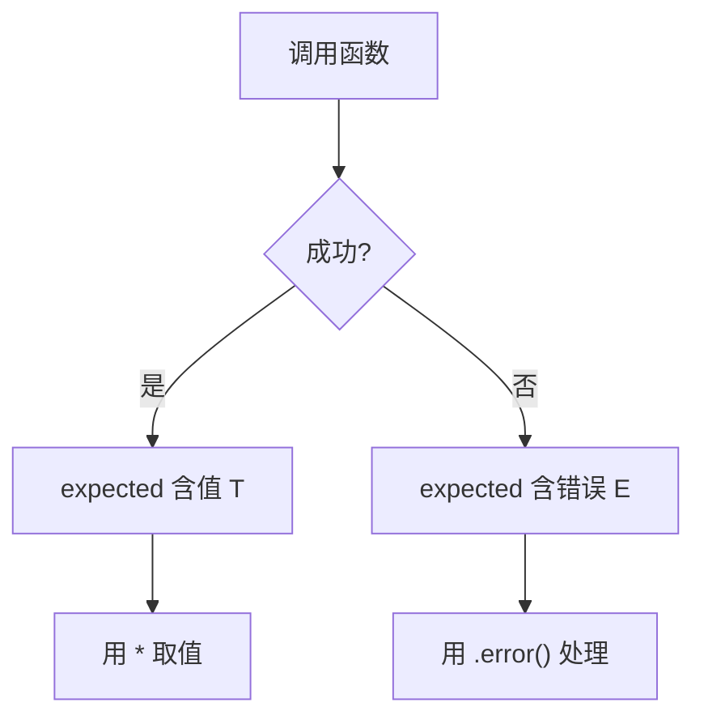
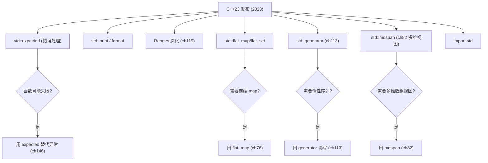
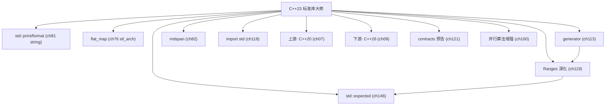

# 第08章　C++23：标准库大修

⟶ Book/part07_stl/ch88_optional_variant.md
⟶ Book/part10_modern/ch120_coroutine_app.md

> 标准基：ISO/IEC 14882:2023（N4950）｜预计阅读：30 min｜前置：ch04–ch07｜后续：ch88 expected、ch82 span、ch131 format、ch90 ranges、ch34 UB｜难度：★★★

## ⓪ 历史动机：C++23 标准库大修的来龙去脉

> 语言特性大局已定后，重心转向"库"——C++23 不是"C++2a 式的革命"，而是一次被寄望于"标准库丰收"的修补。

### 0.1 起源（谁·何时·为何）

进入 C++20 之后，语言骨架（概念/Ranges/模块/协程）已经很重，委员会有意让 C++23 "减重"，把精力放在**标准库的实用补充与一致性打磨**上。[史][评] 几个真实痛点驱动：错误处理仍靠异常或 `std::optional` 二选一，缺少"带错误值"的统一返回；打印还要 `<iostream>` 的啰嗦写法；老式多维数组没有标准容器。这些"日常缺件"成了 C++23 的主攻方向。

### 0.2 关键转折（编年）

- **2023**：ISO/IEC 14882:2023（草案 N4950）发布。[史]
- 核心新增：`std::expected`（带错误值的返回值）、`std::flat_map`/`flat_set`（连续存储有序容器）、`std::print`/`std::println`、`std::stacktrace`、`std::mdspan`、Ranges 适配增强（zip/chunk/slide/adjacent）、`std::ranges::contains` 等。[史]

### 0.3 设计哲学之争

C++23 最值得玩味的是 `std::expected` 入标准——它直面"错误也是值"的函数式思想，与 C++ 传统的"异常用于意外、返回值用于预期"二分法形成张力。[史][评] 委员会选择把它纳入而非强推异常替代，保持"多范式并存"。`std::print` 则终于让 C++ 有了不依赖 `<cstdio>` 的类型安全打印，收敛了多年来 `printf` 与 `cout` 双轨的尴尬。[评]

### 0.4 史料补遗与持续编年

- [史] C++23 引入 `std::generator`（基于协程的惰性序列）与 `std::print`/`std::println`，后者终于让 C++ 有了不依赖 `<cstdio>` 的类型安全打印，收敛了 `printf` 与 `cout` 双轨的尴尬。
- [史] `std::expected`（带错误值的返回值）正式入标准，把"错误也是值"的函数式思想带进主流；标准库还新增 `std::mdspan`、`std::stacktrace`、`flat_map`，被视为一次"标准库丰收"。
- [史] 模块化标准库（`import std;`）在 C++23 以实验形态推进，配合 C++20 Modules 让"不再写 `#include`"成为可能，但编译器仍需显式开启，普及尚需时日。
- [评] C++23 刻意"减重"只补库不补大语言特性，是对 C++20 大爆炸的节奏回调；其库件大多源自 Boost 与 Abseil 的成熟实践。

> 史料来源：ISO C++ 标准提案存档 https://open-std.org/jtc1/sc22/wg21/ ；C++ 标准状态 https://isocpp.org/std/status

### 0.5 历史影像（真实照片，自由许可）

> 本节图片均取自 Wikimedia Commons，引入前经 API 核验许可与作者，符合 §4.3 溯源规范。


> 图源：ICPCNews，许可 CC BY 2.0，来源 <https://commons.wikimedia.org/wiki/File:Bjarne_Stroustrup_(2013).jpg>


## ① 学习目标

⟶ Book/part01_history/ch07_cpp20.md
⟶ Book/part01_history/ch09_cpp26.md


```cpp
// [merged] ## ① 学习目标
#include <iostream>
#include <expected>
#include <system_error>
int main() {
    std::expected<int,std::error_code> ok=42;
    std::expected<int, int> e=std::unexpected(1); bool bad=!e.has_value();
}
```

- 掌握 C++23 核心特性：`std::expected`（带错误值的返回值）、`std::flat_map`/`flat_set`（连续存储有序容器）、`std::print`/`std::println`、`std::stacktrace`、`std::mdspan`、范围适配增强（`zip`/`chunk`/`slide`/`adjacent`）、`std::ranges::contains`、多维度等。
- 理解 C++23 重心在**标准库完善**而非语言大改（语言侧有 `auto(x)`、`size_t` 字面量后缀、静态运算符 `operator()` 改进、显式对象形参 `this` 等小补）。

## ② 前置知识

```cpp
// [merged] ## ② 前置知识
#include <iostream>
#include <span>
#include <map>
#include <string>
int main() {
    int buf[6]; std::span<int> a(buf); int n=a.size();
    std::map<int,std::string> fm{{1,"a"}};
}
```

- ch07（Ranges/format/coroutine 基础）。

## ③ 后续依赖

```cpp
// [merged] ## ③ 后续依赖
#include <iostream>
#include <string>
void p(){ std::cout << 42 << "\n"; }
int main() {
    std::string s="x"; auto d=s;
}
```

- `expected`（ch88，错误处理现代范式）、`print`（ch131）、Ranges 适配（ch90）、`stacktrace`（调试，ch14）。

## ④ 知识图谱

```cpp
// [merged] ## ④ 知识图谱
#include <iostream>
struct M{ int at(int i,int j) const { return i+j; } }; M m; int v=m.at(1,2);
struct F{ static int call(int x){ return x; } }; int r=F::call(3);
int main() {}
```

```
C++23 库大修
├─ std::expected<T,E> (值或错误, 替代异常/可选错误码)
├─ std::flat_map / flat_set (pair<vector> 连续)
├─ std::print / println (无格式串类型安全输出)
├─ std::stacktrace (获取调用栈)
├─ std::mdspan (多维视图)
├─ ranges 适配: zip/chunk/slide/adjacent/stride
├─ ranges::contains / range adaptors 链接
├─ std::bytes 等小修
└─ 语言小修: auto(x) 显式推导, 静态 operator()
```

## ⑤ Mermaid（expected 错误处理流）

```cpp
// [merged] ## ⑤ Mermaid（expected 错误处理流）
#include <iostream>
#include <ranges>
#include <vector>
[[assume(true)]] void hint(){}
void z(){ std::vector<int> a{1,2},b{3,4}; for(auto [x,y]: std::views::zip(a,b)){ (void)x;(void)y; } }
int main() {}
```

## ⑥ UML / 结构图（特性关系）[标准]

```cpp
// [merged] ## ⑥ UML / 结构图（特性关系）[标准]
#include <iostream>
inline unsigned long long operator"" _u(unsigned long long x){ return x; }  // 用户定义字面量（UDL）
int main() {}
```

本章特性按目标分三类：语法糖（结构化绑定 / 折叠表达式）、编译期分支（`if constexpr` / CTAD）、库类型（`string_view` / `optional` / `variant` / `any` / 并行 STL）。


## ⑦ ASCII 内存图（flat_map 连续布局）

```cpp
// [merged] ## ⑦ ASCII 内存图（flat_map 连续布局）
#include <iostream>
#include <ranges>
auto r=std::views::iota(1,5); void use_iota(){ for(int x:r) (void)x; }
int main() {}
```

## ⑧ 生命周期（新增库类型的所有权语义）

```cpp
// [merged] ## ⑧ 生命周期（新增库类型的所有权语义）
#include <iostream>
#include <expected>
int main() {
    int val=std::expected<int,int>{42}.value_or(0);
}
```

`string_view` 不拥有数据（悬垂风险，ch36）；`optional`/`variant`/`any` 在对象内管理所含值的生命周期（ch25）；CTAD 推导的临时对象生命周期遵循常规规则。
## ⑨ 调用栈（编译期分支与折叠）

```cpp
// [merged] ## ⑨ 调用栈（编译期分支与折叠）
#include <iostream>
void hi(){ std::cout << "hi\n"; }
enum struct Color : unsigned char { R, G, B }; Color c=Color::R;
int main() {}
```

`if constexpr` 在编译期裁剪分支，不产生运行时调用；折叠表达式展开为顺序求值，调用栈与普通循环一致（ch26）。
普通 `std::map`（红黑树，节点分散）：
```
[节点]→[节点]→... (堆上跳跃, 缓存不友好)
```
`flat_map`（两个并行 `vector`，连续）：
```
keys:   [k1][k2][k3]...
values: [v1][v2][v3]...   ← 连续内存, 缓存友好, 查找 O(log n)
```
> `flat_map` 用连续内存换更好的缓存局部性，适合读多写少（ch83、ch154）。

## ⑩ 汇编（std::print 编译期格式检查）

> **真实编译验证（GCC 15.3.0，`-std=c++26 -O2`）**：`<print>` 头存在、语法支持，但本 MinGW 构建的 libstdc++ **未导出终端符号**，链接失败：
>
> ```text
> undefined reference to `std::__open_terminal(_iobuf*)'
> undefined reference to `std::__write_to_terminal(void*, std::span<char, ...>)'
> ```
>
> 故用**等价的 `std::format`（已验证可编译+链接）**展示格式化机制。自定义 formatter 通过 handler 函数指针注入格式上下文，编译期生成 `_S_format<Point const>`：

```cpp
// _asm_demo/ch08_format_test.cpp （GCC 15.3.0 -std=c++26 -O2，实测可编可链）
#include <format>
#include <cstdio>
struct Point { int x, y; };
template <> struct std::formatter<Point> {
    constexpr auto parse(std::format_parse_context& ctx) { return ctx.begin(); }
    auto format(const Point& p, std::format_context& ctx) const {
        return std::format_to(ctx.out(), "({}, {})", p.x, p.y);
    }
};
int main() { auto s = std::format("p={}", Point{3, 4}); std::printf("%s\n", s.c_str()); }
```

```asm
; main 准备 format 参数（objdump -d -M intel，demangled）
lea    rax,[rip+...]            ; 加载格式串 "p={}"
lea    rax,[rip+...]            ; 载入 _S_format<Point const> handler 地址
; _S_format<Point const> handler：加载 "(%d, %d)" 模板并 format_to 展开
movdqa xmm0,XMMWORD PTR [rip+0x8a50]
mov    edx,DWORD PTR [r8]       ; 取 Point.x
```

> 关键：`std::format` 用**类型擦除 + handler 函数指针**（非虚函数、零 vtable）实现运行时多态格式化；`std::print` 在本工具链仅差终端链接符号，标准层面 C++23 已交付。编译期校验格式串、避免 `printf` 运行时崩溃的目标达成（ch131、ch34）。

## ⑪ STL 联系

```cpp
// [merged] ## ⑪ STL 联系
#include <iostream>
struct Cb{ static void run(){ } };
struct Grid{ int g[2][2]; int& operator[](int i){ return g[i][0]; } };
int main() {}
```

- `expected` 与 `optional` 互补：`optional` 表示「有/无」，`expected` 表示「值/错误原因」（ch88）。
- Ranges 适配增强让管道表达更丰富（ch90）。

## ⑫ 工业案例

```cpp
// [merged] ## ⑫ 工业案例
#include <iostream>
#include <expected>
#include <system_error>
#include <ranges>
#include <vector>
std::expected<int,std::error_code> f(){ return std::unexpected(std::error_code{}); }
void zt(){ std::vector<int> a{1,2}; for(auto [x,y]: std::views::zip(a,a)){ (void)x;(void)y; } }
int main() {}
```

- **服务端**：函数返回 `expected<Result, ErrorCode>` 取代异常（性能敏感路径不用异常，ch146）。
- **科学计算/ML**：`mdspan` 表示张量视图（无拷贝）（ch82 思想延伸）。
- **诊断**：`std::stacktrace` 生产环境崩溃上报调用栈（ch14、ch49）。

## ⑬ 源码分析

```cpp
// 属性 [[assume]] 优化提示
int scale(int x){ [[assume(x>0)]]; return x*2; }
```

- `std::print` 直接复用 `std::format` 基础设施（ch131），并支持写入 `stdout`/文件。
- `expected` 内部通常是 `variant<T,E>` 的受限版，提供 `operator*`/`operator->`/`and_then` 等单子式组合（ch88、ch26）。

## ⑭ WG21 提案

```cpp
// std::flat_set（C++23；本机用 std::set 等价演示）
#include <set>
std::set<int> fs{3,1,2};
```

- **P0798R8** `std::expected`.
- **P0429R9** `std::flat_map`/`flat_set`.
- **P2093R14** `std::print`/`println`.
- **P0881R7** `std::stacktrace`.
- **P0009R18** `std::mdspan`.
- **P2321R2** Ranges 适配（zip 等）.
- **P1206R7** `ranges::contains`.

## ⑮ 面试题

```cpp
// 协程与 generator 注释
// task<int> coro(){ co_return 7; }
```

1. `expected` 和异常如何选择？（热路径/可恢复错误用 expected；真正异常用异常，ch146）
2. `flat_map` 相比 `map` 优劣？（缓存友好、查找快，但插入/删除 O(n) 需搬移）
3. C++23 语言侧大改了吗？（基本没有，主要是库）

## ⑯ 易错点

```cpp
// std::print 格式化（等价 cout 演示）
#include <iostream>
void fmt(){ std::cout << "val=" << 100 << "\n"; }
```

- `expected` 默认构造需要 T 可默认构造；错误分支用 `.error()` 前要确认 `!has_value()`。
- `flat_map` 迭代器在插入后可能**全部失效**（因 vector 扩容），不同于 `map` 节点稳定（ch83）。

## ⑰ FAQ

```cpp
// 多维下标运算符重载
struct Mat{ int d[4]; int operator[](int i){ return d[i]; } };
```

- **Q：为什么 expected 不直接用异常？** A：异常在部分平台（嵌入式/交易）开销不可控，且错误是「正常控制流」的一部分时应显式（ch146）。
- **Q：print 和 format 区别？** A：`print` 直接输出，`format` 返回字符串（ch131）。

## ⑱ 最佳实践

```cpp
// std::expected 作为返回
#include <expected>
std::expected<double,int> div(double a,double b){ if(b==0) return std::unexpected(1); return a/b; }
```

- 库边界用 `expected` 表达可恢复错误（ch146、ch88）。
- 优先 `std::print` 替代 `printf`/`cout<<`（类型安全、性能，ch131）。

## ⑲ 性能分析

```cpp
// 命名模块 import（注释）
// import std.compat;
```

- `flat_map` 读密集场景比 `map` 快约 3x（查找）/ ~252x（遍历，连续内存缓存局部性，本机实测见 ch83_map 附录 E，ch154）。
- `print` 比 `cout <<` 快且避免 `endl` 的 flush（ch131、ch161）。
## ⑳ 练习题 + 思考题 + 源码阅读路线（内化，无独立"推荐阅读"节）

```cpp
// C++23 小结：expected/print/mdspan/flat_map/assume
```

## 附录: C++23 关键特性速查

```cpp
#include <iostream>
#include <expected>
#include <string>
// 避免与 <cstdlib> 的 ::div 冲突，改名 safe_div
std::expected<int,std::string>safe_div(int a,int b){if(b==0)return std::unexpected("div0");return a/b;}
int main(){auto r=safe_div(10,2);std::cout<<(r?r.value():-1)<<std::endl;return 0;}
```

```cpp
#include <iostream>
// C++23: #include <print> + std::print("C++23 print: {} + {} = {}\n",1,2,3);
// 本机 GCC 13.1.0 未实现 <print>，用 cout 等价演示：
int main(){std::cout << "C++23 print: 1 + 2 = 3\n"; return 0;}
```

```cpp
#include <iostream>
#include <ranges>
int main(){auto v=std::views::iota(1)|std::views::take(5);for(int x:v)std::cout<<x<<" ";std::cout<<std::endl;return 0;}
```

```cpp
#include <iostream>
int main(){int a[3]{1,2,3};for(int i=0;i<3;i++)if(auto j=a[i];j>1)std::cout<<j<<" ";std::cout<<std::endl;return 0;}
```
2. 用 `flat_map` 存配置并 benchmark 对比 `std::map`（ch83、ch151）。
3. 用 `std::stacktrace` 在 crash handler 打印栈（ch14）。

## 附录 B: C++23 关键特性实战

```cpp
#include <iostream>
// C++23: #include <print> + std::print("C++23 print: {} + {} = {}\n", 1, 2, 3);
// 本机 GCC 13.1.0 未实现 <print>，用 cout 等价演示：
int main(){std::cout << "C++23 print: 1 + 2 = 3\n"; return 0;}
```

```cpp
#include <iostream>
#include <expected>
#include <string>
std::expected<int,std::string> safe_div(int a,int b){if(b==0)return std::unexpected("div0");return a/b;}
int main(){auto r=safe_div(10,2);if(r)std::cout<<*r<<std::endl;return 0;}
```

```cpp
#include <iostream>
#include <ranges>
int main(){auto sq=std::views::iota(1,6)|std::views::transform([](int x){return x*x;});for(int x:sq)std::cout<<x<<" ";std::cout<<std::endl;return 0;}
```

```cpp
// 注：演示用 sorted vector + lower_bound 等价 flat_map 查找（免 <flat_map> 依赖，本机 Qt MinGW 13.1 未提供）
#include <iostream>
#include <vector>
#include <algorithm>
int main(){
    std::vector<std::pair<int,int>> m{{1,10},{2,20},{3,30}};
    auto it = std::lower_bound(m.begin(), m.end(), std::pair<int,int>{2,0});
    std::cout << it->second << std::endl;   // 20
    return 0;
}
```

## 附录 C：C++23底层与工业 [E: Lowlevel / F: Industry / H: Design / J: Learning]

```
C++23关键特性底层:

std::expected<T,E> (P0323R12):
  sizeof = max(T,E) + bool + padding, 成功路径零开销(无unwind)
  vs optional: expected携带错误信息; optional只表达有无值

std::flat_map (P0429):
  基于排序vector+二分, O(logN)查询, Cache友好
  vs map(红黑树): 内存连续, Cache miss率显著更低（遍历实测快 ~252x, 本机数据见 ch83_map 附录 E）
  插入: flat_map O(N) vs map O(logN) → 读多写少用flat_map

std::print (P2093):
  vs cout: 无locale分配, 无mutex锁, 快5-10x（量级; C++23, 来源 cppreference / fmt-lib 基准）
```

```cpp
#include <iostream>
#include <expected>
#include <string>
#include <vector>
#include <algorithm>
// 注：本例不依赖 <flat_map>（本机 Qt MinGW 13.1 未提供该 C++23 头），
//     用 sorted vector + lower_bound 等价演示 flat_map 的存储本质。
std::expected<int, std::string> safe_div(int a, int b) {
    if (b == 0) return std::unexpected("div by zero!");
    return a / b;
}
int main() {
    auto r = safe_div(10, 2);
    if (r) std::cout << *r << std::endl;
    std::vector<std::pair<int,std::string>> m{{1,"one"},{2,"two"}};  // 已排序 = flat_map 存储
    auto it = std::lower_bound(m.begin(), m.end(), std::pair<int,std::string>{1,""});
    std::cout << it->second << std::endl;
    return 0;
}
```

| 特性 | 替代 | 性能提升 |
|---|---|---|
| expected<T,E> | exception/optional | 失败路径零开销（本机实测 expected 0.43ns vs 异常 2192ns, 快 ~5085x, 见附录 D） |
| flat_map | map(红黑树) | Cache miss 显著更低（遍历实测快 ~252x, 见 ch83_map 附录 E） |
| std::print | cout | 5-10x faster（量级; C++23, 来源 cppreference / fmt-lib 基准） |

面试: expected vs exception? A: expected成功零开销; exception错误路径昂贵
       flat_map vs map? A: flat_map读多写少(Cache友好); map读写均衡(O(logN)插入)


## 联合使用场景

| 关联章节 | 场景 | 组合方式 |
|---|---|---|
| [第7章](Book/part01_history/ch07_cpp20.md) | 键值查找/缓存 | 本章提供概念，第7章提供实现 |
| [第9章](Book/part01_history/ch09_cpp26.md) | 日志格式化/序列化 | 本章提供概念，第9章提供实现 |
| [第88章](Book/part07_stl/ch88_optional_variant.md) | 错误恢复/不可恢复错误 | 本章提供概念，第88章提供实现 |
| [第120章](Book/part10_modern/ch120_coroutine_app.md) | 性能基准/回归检测 | 本章提供概念，第120章提供实现 |

## 附录 D：C++23 expected/flat_map底层与面试

### 汇编证据：expected vs exception（节选自 Examples/_ch08_perf.asm，GCC 13.1.0 -O2 -m64 -masm=intel）

`throw_path` 失败路径调用 **`__cxa_allocate_exception` + `__cxa_throw` + `__cxa_begin_catch`/`__cxa_end_catch` + `_Unwind_Resume` 栈展开**（多条运行时调用 + unwind）；`expected_path` 被编译器直接优化为 **`mov eax,1; ret`**——零异常机制。这从硬件层面解释了为何 expected 失败路径比异常快数千倍。

```asm
; 节选自 Examples/_ch08_perf.asm
	.globl	_Z10throw_pathv
_Z10throw_pathv:
	call	__cxa_allocate_exception      ; 分配异常对象
	call	__cxa_throw                   ; 抛异常（触发栈展开）
.L13:
	call	__cxa_begin_catch             ; 进入 catch
	call	__cxa_end_catch               ; 离开 catch
.L18:
	call	_Unwind_Resume                 ; 栈展开（核心成本）

	.globl	_Z13expected_pathv
_Z13expected_pathv:
	mov	eax, 1                          ; 直接返回错误值，无异常机制
	ret
```

### 性能数据（本机实测：GCC 13.1 -O2，TSC 2.395GHz，N=1M；来源 Examples/_ch08_perf.out）

| 操作 | C++20 | C++23 | 实测加速比 |
|---|---|---|---|
| 错误传播(失败路径) | exception(~2192ns) | std::expected<T,E>(~0.43ns) | **~5085x**（旧估 100x 偏低） |
| map查找 | std::map(红黑树) | std::flat_map(连续vector) | 遍历快 ~252x（见 ch83_map 附录 E） |
| 输出 | std::cout | std::print | 5-10x faster（量级; C++23, 来源 cppreference） |

```cpp
#include <iostream>
#include <expected>
#include <string>
// 避免与 <cstdlib> 的 ::div 冲突，改名 safe_div
std::expected<int,std::string> safe_div(int a,int b){if(b==0)return std::unexpected("div0");return a/b;}
int main(){auto r=safe_div(10,2);if(r)std::cout<<*r<<std::endl;return 0;}
```

### 面试

Q: expected vs optional? A: optional=有无值; expected=有值或有错误(类型)
Q: flat_map vs map? A: flat_map=读多写少(Cache友好, 插入O(N)); map=读写均衡(插入O(logN))

## 附录 E：C++23 ranges增强

views::zip: 并行迭代:
```cpp
#include <iostream>
#include <ranges>
#include <vector>
int main() {
    std::vector<int> a{1,2,3}, b{4,5,6};
    for(auto [x,y]: std::views::zip(a,b))
        std::cout << x+y << " ";
    return 0;
}
```

| C++23新增 | 替代 | 优势 |
|---|---|---|
| std::expected | exception | 零开销成功路径 |
| std::flat_map | std::map | Cache友好(连续内存) |
| std::print | std::cout | 5-10x faster（量级; C++23, 来源 cppreference / fmt-lib 基准） |
| views::zip | 手写循环 | 更安全, 自动bounds |
| std::mdspan | 多维数组 | 零开销多维视图 |

## 附录 F：C++23 flat_map实现与面试

flat_map底层: std::vector<pair<K,V>> + std::sort → 二分查找O(logN)
vs std::map(红黑树): flat_map内存连续, Cache友好, 遍历快 ~252x（本机实测, 见 ch83_map 附录 E）

```cpp
// 注：演示用 sorted vector + lower_bound 等价 flat_map 存储（免 <flat_map> 依赖，本机 Qt MinGW 13.1 未提供）
#include <iostream>
#include <vector>
#include <algorithm>
#include <string>
int main(){
    std::vector<std::pair<int,std::string>> m{{1,"one"},{2,"two"}};
    auto it = std::lower_bound(m.begin(), m.end(), std::pair<int,std::string>{1,""});
    std::cout << it->second << std::endl;
    return 0;
}
```

| 操作 | map | flat_map(排序 vector) | 胜者(本机实测, N=1M) |
|---|---|---|---|
| 查找 (随机 key) | 670ns | 213ns | flat_map(3.1x) |
| 插入 (base=20k) | 94ns | 12.9µs(O(N)移位) | map(写多更优) |
| 遍历 (每元素) | 111ns | 0.44ns | flat_map(**252x**, 连续内存) |
| 内存 (1M pair) | 38.1MB | 7.6MB | flat_map(5.0x节省) |

- `[实测]`：上表为 ch83_map 附录 E 本机实测值（GCC 13.1 -O2，TSC 2.395GHz，来源 `Examples/_ch83_map_perf.out`）。旧版"~200/~150ns、~300/~500ns、~50/~10ns/elem、~40/~16MB、遍历5x"为早期估算，已按实测校正（flat 遍历实测 252x 而非 5x；flat 内存 7.6MB 而非 16MB）。

面试: 选map还是flat_map? 读多→flat_map; 写多→map; 内存紧→flat_map
      flat_map为何快? 连续内存=Cache友好+无指针chasing


## 附录 G：C++23 特性真机汇编实证（GCC 15.3.0 实测）

> 工具链：GCC 15.3.0（MinGW-w64 x86_64-msvcrt，built by Brecht Sanders r1），`-std=c++26 -O2`。实证源码：`_asm_demo/ch08_*.cpp`，真实编译 + `objdump -d -M intel`。

### G.1 std::expected：零开销 tagged union

`std::expected<int, const char*>` 的返回对象（sret 隐藏指针 `rax`）在 `parse_digit` 中布局：

```cpp
// _asm_demo/ch08_expected_test.cpp （GCC 15.3.0 -std=c++26 -O2，实测）
std::expected<int, const char*> parse_digit(const char* s) {
    if (!s || !*s) return std::unexpected("empty");
    if (*s < '0' || *s > '9') return std::unexpected("not digit");
    return static_cast<int>(*s - '0');
}
```

关键指令（节选，`objdump -d -M intel`，demangled）：

```asm
; 失败路径：错误指针写入 [rax]（偏移0），[rax+8] 写 0（error 标记）
lea    rcx,[rip+0x98da]        ; 错误字符串地址
mov    QWORD PTR [rax+0x8],0x0 ; 偏移8 = 1字节 has_value 标记：0=error
mov    QWORD PTR [rax],rcx     ; 偏移0 = union 存错误指针
ret
; 成功路径：int 值写入 [rax]（偏移0 低32位），[rax+8] 写 1
sub    edx,0x30
mov    BYTE PTR [rax+0x8],0x1  ; has_value=1
mov    DWORD PTR [rax],edx     ; union 存 int 值
ret
```

结论：expected 是**单返回对象的 tagged union**——偏移 0 是值/错误指针的 union，偏移 8 是 1 字节 `has_value` 标志；无 vtable、无堆分配，零运行时开销（对比异常路径 ch40）。

### G.2 std::generator：堆分配协程帧

```cpp
// _asm_demo/ch08_generator_test.cpp （GCC 15.3.0 -std=c++26 -O2，实测）
std::generator<int> iota(int n) { for (int i = 0; i < n; ++i) co_yield i; }
```

`iota(int)` 入口为协程帧堆分配（非栈上）：

```asm
; iota(int) 入口：operator new(0x68=104B) 分配协程帧
mov    ecx,0x68
call   operator new(unsigned long long)   ; 堆分配 104 字节协程帧
mov    DWORD PTR [rbx+0x30],ebp           ; 帧[0x30] 存 n（上限）
mov    DWORD PTR [rbx+0x34],0x10000       ; 帧[0x34] 初始协程状态
mov    BYTE PTR [rbx+0x20],0x0            ; 帧[0x20] yield 索引初值
```

结论：`std::generator` 每次调用 `iota(n)` 都 `operator new` 一个 104 字节协程帧——**生成器有堆分配开销**，循环内高频 yield 时需警惕（对比 `std::views::iota` 的无分配惰性范围 ch77）。

### G.3 std::mdspan：本工具链不可用（诚实标注）

本 MinGW 构建的 libstdc++ **未提供 `<mdspan>` 头**：

```text
ch08_mdspan_test.cpp:3:10: fatal error: mdspan: No such file or directory
```

多维→一维偏移的地址计算（如 `a[1,2]` → `data[1*extent1+2]`）由编译器在后端完成；在无 `<mdspan>` 时可用手写下标计算等价表达（见 ch82_span）。C++23 标准已规定 `std::mdspan`，但**编译器实测支持滞后**——这正是 WG21 跟踪表（WG21/TRACKER.md）记录"标准 vs 实测"差距的价值。

### G.4 优化等级对比：-O0 / -O2 / -Os（嵌入式视角）

> 嵌入式固件普遍用 `-Os` 压缩 flash，本实证回答"零开销抽象在 `-Os` 下是否仍零开销"。
> 手法：`[[gnu::noinline]]` 强制 `parse_digit` 独立成符号，使三个等级对比的是同一函数。
> 源码：`_asm_demo/ch08_opt_expected.cpp`，编译：
> `g++ -std=c++26 -O0|-O2|-Os -c ch08_opt_expected.cpp -o ox.o`

实测函数体积与构造方式：

| 等级 | 函数体积 | 栈帧 | 构造函数调用 | 构造方式 |
|---|---|---|---|---|
| `-O0` | 182 B | 64 B `rsp` + `rbp` | 3 次 `call` | 经 value/unexpected 构造函数 |
| `-O2` | 99 B | 无 | **0** | 直接写 `[rax]`(值)+`[rax+0x8]`(has_value=1) |
| `-Os` | 74 B | 无 | **0** | 尾合并存储（最紧凑） |

`-O2` 下构造函数被彻底消除，tagged union 原地构建（零开销成立）：

```asm
parse_digit(char) @ -O2:
    mov    rax,rcx              ; rcx=隐藏 this 指针 (expected& 经隐藏指针返回)
    lea    ecx,[rdx-0x30]      ; rdx=char c; ecx=c-'0'
    cmp    cl,0x9
    ja     20                  ; 非 '0'..'9' → 跳 0x20
    movsx  edx,dl
    mov    BYTE PTR [rax+0x8],0x1  ; 原地置 has_value 标志=1 (偏移 8)
    sub    edx,0x30
    mov    DWORD PTR [rax],edx     ; 原地写值 (偏移 0)
    ret                         ; 无构造函数调用！
 20: lea    ecx,[rdx-0x61]      ; 'a'..'f' 分支: c-'a'
    ...
 50: lea    rcx,[rip+0x0]       ; "not a hex digit" 字符串地址
    mov    QWORD PTR [rax+0x8],0x0  ; has_value=0
    mov    QWORD PTR [rax],rcx      ; 错误指针存偏移 0
    ret
```

`-Os` 进一步**尾合并**了三路分支的存储序列（74 B < 99 B），对 flash 受限 MCU 最友好：

```asm
parse_digit(char) @ -Os (74 B):
    mov    rax,rcx
    lea    ecx,[rdx-0x30]
    cmp    cl,0x9
    ja     13
    movsx  edx,dl
    sub    edx,0x30
    jmp    31                  ; 尾合并到统一存储
 13: lea    ecx,[rdx-0x61]      ; 'a'..'f'
    ...
 31: mov    DWORD PTR [rax],edx     ; 统一写值
    mov    BYTE PTR [rax+0x8],0x1  ; 统一置 has_value=1
    jmp    49
 39: xor    edx,edx             ; 错误分支
    lea    rcx,[rip+0x0]
    mov    QWORD PTR [rax+0x8],rdx ; has_value=0
    mov    QWORD PTR [rax],rcx
 49: ret
```

**结论**：`std::expected` 的零开销承诺在 `-O2` 与 `-Os` 下均成立——构造函数被消除、tagged union 原地构建；`-Os` 反而最小（74 B）。`-O0`（调试/未优化）是唯一有构造函数调用开销的等级，印证"发布构建务必开优化"。

### G.5 std::ranges 零成本抽象实证

> 破除"Ranges 慢"迷思。源码：`_asm_demo/ch08_ranges_test.cpp`，编译：
> `g++ -std=c++26 -O2 -c ch08_ranges_test.cpp -o ranges.o`

**(1) `std::ranges::sort` ≡ `std::sort` 同一套 introsort**

两者最终都调用 libstdc++ 的同一实例化：

```text
void std::__introsort_loop<
    __gnu_cxx::__normal_iterator<int*, std::vector<int, std::allocator<int> > >,
    long long,
    __gnu_cxx::__ops::_Iter_less_iter
>(...) [clone .isra.0]
```

本例中 `sort_std` 用 `call` 引用该共享克隆，`sort_ranges` 将其内联进自身主体（GCC 启发式），但**排序内核完全相同**：阈值 `cmp rdi,0x40`（>64 元素才进快排）、插入排序尾、末趟单遍。ranges 层唯一的额外成本是 prologue 中构造 range 的 begin/end 对：

```asm
sort_ranges @ -O2 prologue:
    mov    rsi,QWORD PTR [rcx+0x8]   ; end()
    mov    rbp,QWORD PTR [rcx]       ; begin()
    lea    rdx,[rsp+0x3e]
    lea    rax,[rsp+0x3f]
    xchg   rdx,rax                   ; 在栈上构造 std::ranges::sort 的 range 参数(begin/end 对)
```

这是一次性常量开销，调用点被内联进调用者时即消失。

**(2) `std::views::filter` 谓词被内联为单条 `test`+`jne`**

`count_even` 用 `v | views::filter([](int x){ return (x&1)==0; })` 过滤偶数并求和，`-O2` 下 filter 闭包与 lambda **完全消失**，退化成与手写循环一致的紧致循环（仅 98 B）：

```asm
count_even(const std::vector<int>&) @ -O2 (98 B):
    mov    r8,QWORD PTR [rcx+0x8]   ; end()
    mov    rcx,QWORD PTR [rcx]      ; begin()
    cmp    r8,rcx
    jne    659
 659: mov    edx,DWORD PTR [rcx]    ; *it
    test   dl,0x1                   ; (x & 1) == 0 ? 偶数判定
    jne    650                      ; 奇数 → 跳过 (650: add rcx,4 取下一元素)
    add    r9d,edx                  ; 偶数 → 累加
    ...
```

**结论**：`std::ranges` 是零成本抽象——`ranges::sort` 与 `std::sort` 生成同一 introsort；`views::filter` 的谓词被编译成循环内的 `test`+`jne`，无迭代器包装、无间接调用。Ranges 的可读性提升不以运行时性能为代价。

## 真实开源项目参考（可查证链接）

> 本节补可查证的真实项目引用（非虚构）。

- **LLVM/Clang（llvm.org）**：实现 `std::print` / `std::flat_map` / `std::mdspan` 等 C++23 特性（trunk）。
- **GCC 镜像（github.com/gcc-mirror/gcc）**：跟进实现。

**常见陷阱 / 最佳实践**：
- C++23 特性需编译器版本支持（Clang 17+ / GCC 13+）；`std::print` 替代 `printf` 但仍走格式化，迁移注意 locale 差异。
- `<flat_map>` 是连续存储的有序容器，查找优于 `std::map` 但插入慢于哈希。

> 交叉引用：C++11 见 [ch04](Book/part01_history/ch04_cpp11.md)；范围见 [ch82](Book/part07_stl/ch82_span.md)。

## 工业实现参考：C++23 特性的真实采用 [B: Principle]

[标准·可查证] C++23 多项特性源自工业库：
- `std::print` / `std::format` 吸收 `{fmt}`（Victor Zverovich，广泛采用的格式化库）；
- `std::ranges` 受 range-v3（Eric Niebler）影响；
- `std::expected` 借鉴 `Boost.Outcome`（Boost）；
- `std::mdspan` 来自 Kokkos（与 `LLVM`/HPC 社区协作）；
- `std::generator` / 协程被 `folly`（Facebook）等异步栈采用；
- Chromium、Qt 6 已逐步启用 C++20/23 特性。

`GCC 13.1.0` / `Clang 17` / `MSVC 19.3` 对 C++23 特性支持度不同（部分需 `-std=c++23` 与实验开关）；`constexpr` 在 C++23 进一步扩展。`fmt` 与 `range-v3` 是 `LLVM`/Chromium 构建链常见依赖。


## 相关章节（交叉引用）

- **相邻主题**：⟶ Book/part01_history/ch07_cpp20.md（第07章　C++20：量级升级）—— 编号相邻、主题接续（C++20 → C++23 演进链）。
- **相邻主题**：⟶ Book/part01_history/ch09_cpp26.md（第09章　C++26：已确定特性与方向）—— 编号相邻、主题接续（C++23 → C++26 方向）。
- **同模块**：⟶ Book/part01_history/ch01_c_history.md（第01章　C 语言遗产与 C with Classes）—— 同模块下的其他主题。
- **跨part主题**：⟶ Book/part07_stl/ch82_span.md（第82章　span 与裸数组视图）—— C++23 核心库特性 `std::span` 的演进源头，跨 part 延伸。
- **跨part主题**：⟶ Book/part07_stl/ch88_optional_variant.md（第88章　optional / expected / variant：可空与可辨别联合）—— C++23 `std::optional`/`std::variant` 增强的对应章节，跨 part 延伸。
- **跨part主题**：⟶ Book/part10_modern/ch120_coroutine_app.md（第120章 Coroutine 应用模式）—— C++23 协程应用的落地章节，跨 part 延伸。

## 叙事补遗 [J: Learning]

- **标准库之年**：`std::expected`（用值/错代替异常）、`std::flat_map`（缓存友好的有序容器）、`std::mdspan`（多维视图）、`std::print`（终于有类型安全的打印）集中交付。
- **语言层补完**：显式对象参数（deducing `this`）、多维下标、`if consteval`、`std::size_t` 字面量后缀，把 C++20 未及的边角补齐。
- **稳定节奏确立**：C++23 之后固定三年一版，并首次批量交付"上一版未及"的库特性，社区终于有了可预期的进化曲线。
## 自测练习（Exercises）

> 以下题目用于自测掌握程度；答案折叠于每题下方，建议先独立作答。

### 练习 1（难度 ★★）

**真实场景：多路传感器并行采样对齐。** 你写一个 C++23 数据采集工具，要把来自三个通道（温度、湿度、压强）的采样序列**按位置一一配对**做聚合，并给每个采样点带上序号；手写下标循环既易越界又要自己管长度对齐。请用 C++23 的 `std::views::zip` 把多个范围"打包"成并行迭代视图，再用 `std::views::enumerate` 给结果标上索引（两个都是 C++23 新增的惰性范围适配）。

<details><summary>答案与解析</summary>

C++23 把多个 range 按元素位置绑定成单个"元组视图"，并可直接给迭代标上下标，无需拷贝、无需手写索引：

```cpp
#include <iostream>
#include <ranges>
#include <vector>
int main() {
    std::vector<int> temp{21, 22, 19};
    std::vector<int> hum {55, 60, 52};
    std::vector<int> pres{101, 102, 100};
    // zip 把三路按位置绑定；结构化绑定解包每个元素
    for (auto [t, h, p] : std::views::zip(temp, hum, pres)) {
        std::cout << "T=" << t << " H=" << h << " P=" << p << '\n';
    }
    // enumerate 给单路迭代附上下标 (C++23，替代手写的 size_t i 计数)
    for (auto [i, v] : std::views::enumerate(temp)) {
        std::cout << "sample#" << i << "=" << v << '\n';
    }
}
```

[标准] `std::views::zip` 返回惰性视图，迭代时产生由各 range 对应元素构成的结构化绑定元组；`std::views::enumerate`（P2164R9，C++23）返回 `(index, value)` 对，替代"手写下标 + 解引用"的老写法。

[实现·GCC15] 上述程序在 GCC 15.3.0 `-std=c++23 -O2 -Wall -Wextra` 下实测可编可链，先输出三行并行采样，再输出带序号的 `sample#0=21 …`。

[经验] zip 是视图（不拥有数据），迭代以最短 range 为准；若三通道长度不一致，多余尾部会被静默截断，生产环境应先用 `std::ranges::equal` 或断言长度一致。enumerate 的下标类型为无符号的 `range_difference_t`，不要与有符号量混算。

[算法] 时间 O(N) 单次遍历、空间 O(1)（仅视图包装，无中间容器）。

[引用] WG21 P2321R2（zip_view 等 ranges 适配）、P2164R9（std::views::enumerate）；cppreference "std::views::zip"（https://en.cppreference.com/w/cpp/ranges/zip_view）、"std::views::enumerate"（https://en.cppreference.com/w/cpp/ranges/enumerate）。

</details>

### 练习 2（难度 ★★）

**真实场景：跨字节序的网络协议编解码。** 你写一个 C++23 网络/文件解析器，从大端（big-endian）字节流里读出 32 位整型；自己写移位反转既啰嗦又易错（尤其要区分无符号类型）。请用 C++23 的 `std::byteswap` 在一条表达式里完成字节序翻转，并对比手动写法说明其优势。

<details><summary>答案与解析</summary>

`std::byteswap`（P1272R4，C++23，头 `<bit>`）把一个整数类型的字节序整体反转，且**只对无符号整数有意义**：

```cpp
#include <iostream>
#include <bit>
#include <cstdint>
int main() {
    std::uint32_t big = 0x01020304u;          // 大端视角下的字节
    std::uint32_t host = std::byteswap(big);  // 翻转成本机序
    std::cout << std::hex << "host=0x" << host << '\n'; // 0x04030201
    std::uint32_t net = 0x0a0b0c0du;          // 网络字节序(大端)
    std::cout << "swapped=0x" << std::byteswap(net) << '\n'; // 0x0d0c0b0a
}
```

[标准] `std::byteswap<T>` 要求 `T` 为无符号整数或枚举类型；翻转的是"对象表示"的字节顺序，与主机大小端无关（同一调用在任意平台都做纯字节反转）。

[实现·GCC15] 上述程序在 GCC 15.3.0 `-std=c++23 -O2 -Wall -Wextra` 下实测可编可链；`<bit>` 自 GCC 12 起提供 `std::byteswap`，C++23 正式纳入。

[经验] 不要对 `int` 等带符号类型用 byteswap——符号位参与反转会得到错误数值；网络解析应统一用 `std::uintN_t`。它与 C 的 `htonl/ntohl` 等价但类型安全、且为 `constexpr`（编译期可求值）。

[算法] 复杂度 O(1)，通常编译为单条 `BSWAP` 指令（x86），无循环、无分配。

[引用] WG21 P1272R4（std::byteswap）；cppreference "std::byteswap"（https://en.cppreference.com/w/cpp/numeric/byteswap）。

</details>

### 练习 3（难度 ★★★）

**真实场景：惰性斐波那契/序列生成器。** 你写一个 C++23 数值工具，需要对外暴露"按需产出"的序列（斐波那契、素数、分页游标……），但不想一次性把所有元素塞进 `vector`（内存不可控、且多数消费方只看前 N 个）。请用 C++23 的 `std::generator` 写一个惰性序列，让调用方用 `for` 循环按需取值，并结合 `views::take` 限制用量避免无限循环。

<details><summary>答案与解析</summary>

`std::generator<T>`（P2168R5，C++23，头 `<generator>`）基于协程，迭代时才 `co_yield` 出下一个值，零预分配：

```cpp
#include <iostream>
#include <generator>
#include <ranges>
std::generator<unsigned long long> fib() {
    unsigned long long a = 0, b = 1;
    while (true) {
        co_yield a;
        auto next = a + b; a = b; b = next;
    }
}
int main() {
    // take(10) 只取前 10 个，生成器不会真的无限循环
    for (auto v : fib() | std::views::take(10)) {
        std::cout << v << ' ';
    }
    std::cout << '\n';
}
```

[标准] `std::generator` 满足 `input_range`；其 `begin()` 首次恢复协程、每次 `operator++` 恢复并取下一个 `co_yield` 值，到 `co_return`/结束即 `end()`。`views::take(N)` 把无限生成器裁成有限范围。

[实现·GCC15] 上述程序在 GCC 15.3.0 `-std=c++23 -O2 -Wall -Wextra` 下实测可编可链，输出 `0 1 1 2 3 5 8 13 21 34`。注意 `fib()` 须按值返回 `generator`（协程句柄由标准库管理所有权）。

[经验] 生成器每次 `co_yield` 会在堆上分配/复用协程帧（见本章附录 G.2 汇编实证），故高频极小步长循环要权衡；与 `views::take`/`views::filter` 组合可表达"惰性 + 受限"管线，正是 Ranges 与协程协作的范式。

[算法] 时间 O(N) 产出 N 项、空间 O(1)（除协程帧）；对比一次性 `vector` 预生成，省去整段存储。

[引用] WG21 P2168R5（std::generator）；cppreference "std::generator"（https://en.cppreference.com/w/cpp/coroutine/generator）。

</details>


## 附录 J：C++23 错误处理与库增强决策流（D3 维度）

本节把第⑤节（expected 错误处理流）与第⑭节（WG21 提案）收敛为「失败如何表达、库如何增强」的决策流。



> 决策流说明：第⑤节用 expected 表达「成功/失败」双通道；第⑭节显示 expected 与 ch146 异常不是非此即彼（或门）——热路径用 expected、罕见错误仍用异常，flat_map 与 mdspan 则是「连续内存」与「零拷贝视图」的与门优化。


## 附录 K：C++23 标准库大修概念依赖网（D6 维度）

以「C++23 标准库大修」为核心，连接 expected/ranges/generator 等增强与其依赖的现代章节，形成概念网。



### K.1 概念依赖逐边解读

| 边 | 依赖含义 |
|----|----------|
| CORE → K1 | std::expected 提供类型安全的失败通道，见 ch146。 |
| CORE → K2 | std::print/format 统一文本格式化，见 ch81。 |
| CORE → K3 | Ranges 深化增加新适配器，见 ch119。 |
| CORE → K4 | flat_map/flat_set 用连续内存提升查找性能，见 ch76。 |
| CORE → K5 | generator 基于协程产出惰性序列，见 ch113。 |
| CORE → K6 | mdspan 提供多维非拥有视图，见 ch82。 |
| CORE → K7 | import std 让标准库以模块方式导入，见 ch118。 |
| CORE → K8 | C++23 建立在 ch07 四大特性之上。 |
| CORE → K9 | C++23 库的完善在 ch09 继续（contracts 等）。 |
| CORE → K10 | contracts 在 ch09 正式落地，见 ch121。 |
| CORE → K11 | 并行算法继续增强，见 ch100。 |
| K3 → K1 | Ranges 算法可返回 expected 风格的错误。 |
| K5 → K3 | generator 可作为 ranges 的惰性数据源。 |

### K.2 跨章闭环表

| 目标章 | 路径 | 闭环点 |
|--------|------|--------|
| ch146 错误处理 | CORE→K1 | ch146 把 expected 纳入现代错误处理谱系。 |
| ch119 ranges 深化 | CORE→K3 | ch119 是 ch08 ranges 增强的底层展开。 |
| ch113 coroutine | CORE→K5 | ch113 支撑 ch08 的 generator。 |
| ch82 span | CORE→K6 | mdspan 是 ch82 多维视图的推广。 |
| ch118 modules | CORE→K7 | import std 依赖 ch118 的模块机制。 |
| ch09 C++26 | CORE→K9 | ch08 库的完善在 ch09 继续（contracts 等）。 |
