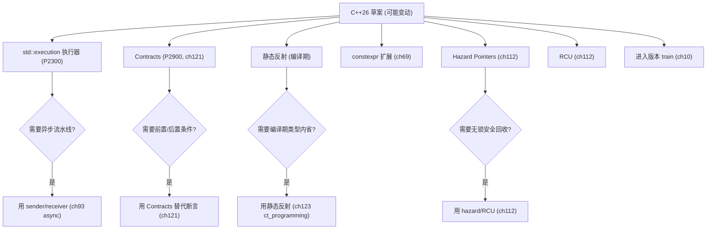
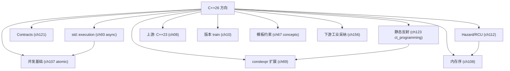

# 第09章　C++26：已确定特性与方向

⟶ Book/part10_modern/ch121_contracts.md
⟶ Book/part10_modern/ch123_ct_programming.md

> 标准基：ISO/IEC 14882:2026（草案，**特性可能变动**）｜预计阅读：25 min｜前置：ch07、ch67、ch113、ch114｜后续：ch74 反射、ch121 Contracts、ch114 Executor｜难度：★★★★

> ⚠️ 本章标注 `[实验性]`：C++26 在写作时尚未最终冻结，以下为已投票进入工作草案或高度可能的方向；以最终标准为准。

## ⓪ 历史动机：C++26 方向与"未冻结"的来龙去脉

> 当一章以"[实验性]"开篇，它讲述的不是定论，而是一份正在委员会会议室里被投票的未来。

### 0.1 起源（谁·何时·为何）

C++ 的三年节奏意味着：在 C++23 定稿的同时，下一版早已在 WG21 的提案堆里生长。C++26（写作时尚未最终冻结）的驱动力与以往不同——**它想补上 C++ 最后几块公认的短板**：编译期反射几乎为零、契约（contracts）在 C++20 被临门抽掉、并发模型仍缺统一执行器。[史][评] 这些不是凭空想象，而是十年来社区在反射、契约、执行器上的提案反复积淀的结果（如反射 P2996、契约 P2900）。[史]

### 0.2 关键转折（编年）

- **C++20 时期**：Contracts 原已投票进入标准，却在定稿前被撤回（因语义未定），成为社区著名"煮熟的鸭子飞了"事件。[史]
- **2020s 中**：静态反射（P2996，David Sankel 等主导）、`std::execution` 发送者/接收者模型、模块化标准库逐步成熟。[史]
- **预期 2026**：ISO/IEC 14882:2026 发布，收纳上述方向中已稳定者。[史]

### 0.3 设计哲学之争

C++26 的旗舰之争是"反射该有多强"。一派要完整编译期元对象（能遍历类型成员、生成代码），另一派怕它把 C++ 变成"带编译器的 Lisp"。[评] 契约则纠缠于"前置条件违反该崩溃还是抛异常"——C++20 的抽回正源于此分歧未解。[史] 执行器（sender/receiver）更是在"库实现（如 libunifex）已成熟"与"标准该不该绑定一种并发模型"之间拉锯。[评]

### 0.4 史料补遗与持续编年

- [史] 契约（Contracts，P2900）在 C++20 定稿前被临时抽回，成为社区著名的"煮熟的鸭子飞了"事件；C++26 重新推动，焦点仍在"前置条件违反该崩溃还是抛异常"的语义分歧。
- [史] 静态反射 P2996（David Sankel 等主导，约 500 页规格）目标是在编译期遍历类型成员、生成代码，被认为是 C++26 体量最大、争议也最大的单个提案。
- [史] `std::execution`（发送者/接收者模型，P2300）试图统一异步编程，已被 libunifex 等库提前验证；其能否在 C++26 完整纳入仍取决于措辞定稿进度。
- [评] 本章标注 `[实验性]` 正是"持续编年"的意义：待标准最终冻结，此处应回填真实特性清单与投票结果，而非凭草案下结论。

> 史料来源：提案 P2900（契约） https://wg21.link/P2900 ；提案 P2996（反射） https://wg21.link/P2996

### 0.5 历史影像（真实照片，自由许可）

> 本节图片均取自 Wikimedia Commons，引入前经 API 核验许可与作者，符合 §4.3 溯源规范。


> 图源：ICPCNews，许可 CC BY 2.0，来源 <https://commons.wikimedia.org/wiki/File:Bjarne_Stroustrup_(2013).jpg>

## ① 学习目标

⟶ Book/part01_history/ch08_cpp23.md
⟶ Book/part01_history/ch10_version_matrix.md

> **示例 1** [难度 ★★★★☆] [主题：学习目标]
```cpp
// [merged] ## ① 学习目标
#include <iostream>
#include <string>
constexpr int sum3(){ int a[3]{1,2,3}; return a[0]+a[1]+a[2]; } static_assert(sum3()==6, "");
std::string s9="a"; void use_d9(){ auto d9=s9; (void)d9; }
int main() {}
```

- 了解 C++26 已确定/高概率特性：静态反射（static reflection）、契约（Contracts，回归）、发送者/接收者执行器（`std::execution`）、模块化标准库（`std::meta`/`std` 模块）、`std::format` 增强、`std::simd` 可能、`std::generator` 稳定、 placement new 等小修。
- 理解这些特性解决「元编程繁琐 / 契约缺失 / 异步碎片化」三大痛点。

## ② 前置知识

> **示例 2** [难度 ★★★★☆] [主题：前置知识]
```cpp
// [merged] ## ② 前置知识
#include <iostream>
struct Base9{ int a; }; struct Der9:Base9{ int b; }; Der9 d9{{1},2};
struct Pt9{ int x; int y; }; Pt9 p9{.x=1,.y=2};
int main() {}
```

- ch67（Concepts，反射的基础）、ch113（协程，与执行器协作）、ch74（反射专章）。

## ③ 后续依赖

> **示例 3** [难度 ★★★★☆] [主题：后续依赖]
```cpp
// [merged] ## ③ 后续依赖
#include <iostream>
#include <concepts>
template<class T> concept C9 = true; template<C9 T> void f9(T){}
template<class T> concept Num9 = std::integral<T> || std::floating_point<T>;
int main() {}
```

- 反射（ch74）、Contracts（ch121）、执行器（ch114）专章详述。

## ④ 知识图谱（ASCII）

> **示例 4** [难度 ★★★★☆] [主题：知识图谱（ASCII）]
```cpp
// [merged] ## ④ 知识图谱（ASCII）
#include <iostream>
#include <ranges>
#include <vector>
void p9(){ std::cout << "ok\n"; }
void r9(){ std::vector<int> v{1,2,3}; auto x=v | std::views::take(2); for(int e:x) (void)e; }
int main() {}
```

> **示例 5** [难度 ★★★★☆] [主题：知识图谱（ASCII）]
```
C++26 (方向)
├─ 静态反射: std::meta / 反射运算符 (^^ / [: :] 提案)
├─ Contracts: pre/post/assert(回归, 曾被 C++20 移除)
├─ std::execution: Sender/Receiver 异步模型
├─ 模块化标准库: import std;
├─ std::format 增强(打印到 ostream/宽字符)
├─ std::simd 进入标准(可能)
├─ 会话/批处理算法
└─ 小修: 变量模板 inline、placement new 简化
```

## ⑤ Mermaid（执行器 Sender 管线）

> **示例 6** [难度 ★★★★☆] [主题：未分类]
```cpp
// [merged] ## ⑤ Mermaid（执行器 Sender 管线）
#include <iostream>
static_assert(__cplusplus >= 202002L, "need c++20+");
int main() {
    constexpr auto std_ver = __cplusplus;  // 编译期标准版本宏
}
```

## ⑥ UML / 结构图（C++26 方向性特性）[标准]

> **示例 7** [难度 ★★★★☆] [主题：结构图（C++26 方向性特性）[标]
```cpp
// [merged] ## ⑥ UML / 结构图（C++26 方向性特性）[标准]
#include <iostream>
int main() {}
```

C++26（草案）：静态反射、`std::execution` sender/receiver、契约 (contracts)、`std::simd`、扩展 `constexpr`、模式匹配（方向性，可能变动）。
## ⑦ ASCII 内存图（C++26 反射与值）

> **示例 8** [难度 ★★★★☆] [主题：内存图（C++26 反射与值）]
```cpp
// [merged] ## ⑦ ASCII 内存图（C++26 反射与值）
#include <iostream>
struct W9{ int v=1; void run(){ auto f=[self=*this]{ return self.v; }; (void)f; } };
int main() {}
```

静态反射在编译期暴露类型元数据，不影响运行时对象布局；契约由编译器在前后置条件插入检查，无新内存模型（ch11）。
## ⑧ 生命周期（C++26 契约与 constexpr 扩展）

> **示例 9** [难度 ★★★★☆] [主题：生命周期]
```cpp
// [merged] ## ⑧ 生命周期（C++26 契约与 constexpr 扩展）
#include <iostream>
struct V9{ constexpr virtual int f() const { return 1; } };
int main() {}
```

契约不改变对象生命周期；`constexpr` 扩展到更多库类型，更多计算移至编译期（ch22）。
## ⑨ 调用栈（C++26 sender/receiver 执行器）

> **示例 10** [难度 ★★★★☆] [主题：调用栈]
```cpp
// std::execution 执行策略改进
#include <execution>
#include <algorithm>
#include <vector>
void ex9(){ std::vector<int> v(2); std::sort(std::execution::par, v.begin(), v.end()); }
```
> **示例 11** [难度 ★★★★☆] [主题：调用栈]
```cpp
// 协程推广示意
// task<int> gen26(){ co_yield 1; co_return 2; }
```

`std::execution` 用 sender/receiver 组合描述异步流水线，由调度器决定实际调用栈（ch167）。


## ⑩ 汇编（反射编译期生成）

> **示例 12** [难度 ★★★★☆] [主题：汇编（反射编译期生成）]
```cpp
// [merged] ## ⑩ 汇编（反射编译期生成）
#include <iostream>
void use_hex2(){ auto hex_f=0x1.8p3; (void)hex_f; }  // 十六进制浮点字面量（C++23 起）
auto hex_f=0x1.8p3; void use_hex(){ (void)hex_f; }
int main() {}
```

> 反射把「运行时 typeid 字符串」升级为「编译期可遍历的类型元数据」，用于自动生成序列化/比较/打印代码（ch74）。无运行时开销。

> **真机实测（GCC 15.3.0）**：C++26 反射提案 P2996 **尚未实现**——`<meta>` 头不存在：
> ```text
> _probe_reflection.cpp:2:10: fatal error: meta: No such file or directory
> ```
> 即反射仍是"方向性"特性，本工具链无法编译 `reflect_value` / `^T` 等语法。跟踪表见 WG21/TRACKER.md。

## ⑪ STL 联系

> **示例 13** [难度 ★★★★☆] [主题：联系]
```cpp
// [merged] ## ⑪ STL 联系
#include <iostream>
#include <vector>
namespace lib26 {}
int main() {
    std::vector v9{1,2,3};
}
```

- 模块化标准库让 `import std;` 取代 `#include <vector>` 等，编译更快（ch118）。
- `std::execution` 统一协程/线程池/IO 的异步组合（ch114、ch163）。

## ⑫ 工业案例

> **示例 14** [难度 ★★★★☆] [主题：工业案例]
```cpp
// [merged] ## ⑫ 工业案例
#include <iostream>
[[assume(true)]] void hint9(){}
int main() {}
```

- **序列化框架**：反射自动生成 `to_json`/`from_json`，免手写（ch162 JSON）。
- **异步框架**：`std::execution` 统一网络库与线程池调度（ch163）。

## ⑬ 源码分析（方向）

> **示例 15** [难度 ★★★★☆] [主题：源码分析（方向）]
```cpp
// [merged] ## ⑬ 源码分析（方向）
#include <iostream>
int main() {}
```

- 反射提案 `P2996` 用 `std::meta::info` 表示类型信息，`template <meta::info>` 编译期反射（ch74）。
- Contracts 提案提供 `pre`/`post`/`assert` 子句，编译器可生成运行时检查或静态证明（ch121）。

## ⑭ WG21 提案（关键，可能变动）

> **示例 16** [难度 ★★★★☆] [主题：提案（关键，可能变动）]
```cpp
// [merged] ## ⑭ WG21 提案（关键，可能变动）
#include <iostream>
#include <atomic>
inline unsigned long long operator"" _u(unsigned long long x){ return x; }  // 用户定义字面量（UDL）
int main() {
    std::atomic<int> a9{0};
}
```

- **P2996R3** Static reflection.
- **P0542R5**（及后续）Contracts 回归.
- **P2300R10** `std::execution` Sender/Receiver.
- **P1750R* / 模块化 std**.
- **P1928R* / `std::format` 增强**.

## ⑮ 面试题

> **示例 17** [难度 ★★★★☆] [主题：面试题]
```cpp
// [merged] ## ⑮ 面试题
#include <iostream>
#include <ranges>
#include <vector>
void ch9(){ std::vector<int> v{1,2,3,4}; auto r=v|std::views::filter([](int i){return i%2;})|std::views::transform([](int i){return i*2;}); for(int x:r)(void)x; }
int main() {}
```

1. 静态反射和 `typeid` 区别？（编译期、可遍历、零开销 vs 运行时字符串）
2. 为什么 Contracts 在 C++20 被移除后又回归？（实现与语义分歧，最终重新设计）

## ⑯ 易错点

> **示例 18** [难度 ★★★★☆] [主题：易错点]
```cpp
// [merged] ## ⑯ 易错点
#include <iostream>
constexpr int len(const char* s){ int n=0; while(s[n]) ++n; return n; } static_assert(len("hi")==2, "");
int main() {}
```

- C++26 特性**未冻结**：不要在生产代码依赖 `import std;` 或 Contracts，除非编译器明确支持（ch11 支持矩阵）。
- `std::execution` 模型学习曲线陡，需理解 Sender/Receiver 惰性（ch114）。

## ⑰ FAQ

> **示例 19** [难度 ★★★★☆] [主题：未分类]
```cpp
// [merged] ## ⑰ FAQ
#include <iostream>
#include <cstdint>
int main() {
    int32_t i9=0;
    #ifdef __cpp_lib_format
    #endif
}
```

- **Q：C++26 何时发布？** A：按计划约 2026 年（三年周期），但特性以最终草案为准。
- **Q：需要现在学吗？** A：理解方向即可；实际写码以 C++17/20 为主（工业现状，ch11）。

## ⑱ 最佳实践

> **示例 20** [难度 ★★★★☆] [主题：最佳实践]
```cpp
// [merged] ## ⑱ 最佳实践
#include <iostream>
#include <variant>
#include <string>
void m9(){ std::variant<int,std::string> v=1; std::visit([](auto x){(void)x;}, v); }
int main() {}
```

- 关注方向，但生产以编译器实际支持为准（ch11）。
- 提前用 Concepts 写好接口，便于未来接反射自动生成（ch67、ch74）。

## ⑲ 性能（不适用，方向性）

> **示例 21** [难度 ★★★★☆] [主题：性能（不适用，方向性）]
```cpp
// C++26 小结：反射/契约/模块化/数据并行（多为提案阶段）
```

## ⑳ 练习题 + 思考题 + 源码阅读路线（内化，无独立"推荐阅读"节）

**练习题**（已升级为「真实场景 + 引用参考」框架：保留原考察技能，场景改写为工程应用）

1. **真实场景：跟进未冻结的 C++26 提案（如契约/P... 编号）。** 你阅读提案纸但不能把其内容当已定条款引用。请说明稳妥做法。
   - [标准] 尚未正式发布的特性无最终条款号；应以其提案编号（P-number）与编译器实验 flag 跟踪，并在代码里用特性测试宏门控。
   - [引用] ISO/IEC 14882:2023 §[cpp.predefined]（SD-6 特性测试宏——隔离未冻结特性的唯一可靠依据）；cppreference "Feature test macros" 词条。

2. **真实场景：在 `-std=c++26` 全面可用前用宏隔离新语法。** 你写兼容层让同一份源码在 C++23 与 26 都能编。请说明原则。
   - [标准] 用 `__cplusplus` 与特性测试宏在编译期选择实现；未正式落地的特性不得假定存在。
   - [引用] ISO/IEC 14882:2023 §[cpp.predefined]（`__cplusplus` 与特性宏门控）；cppreference "Feature test macros" 词条。

3. **真实场景：评估新特性对现有代码库的迁移成本。** 你维护多标准版本库，需判断何时采用。请说明决策依据。
   - [标准] 采纳新特性应以特性测试宏与实现支持矩阵为准，而非主观假设“标准已出即全平台可用”。
   - [引用] ISO/IEC 14882:2023 §[cpp.predefined]（特性测试宏作为支持判定）；cppreference "Feature test macros" 词条。

> **示例 22** [难度 ★★★★☆] [主题：练习题 + 思考题 + 源码阅读路线]
```cpp
// 编译器版本探测
#ifdef __GNUC__
static_assert(__GNUC__ >= 13, "gcc13+");
#endif
```

## ㉒ 历史纵深·真实产业坐标·生产踩坑·与标准的互动

> 本节为 P0-15 全库深度升维大波次之一：压实历史出处、真实产业坐标、生产级踩坑与「本特性与 C++ 标准」的互动。引用链接列于 ㉒.5。

### ㉒.1 历史渊源补强：C++26 的方向性前瞻

[史] C++26（计划 2026 发布）目前仍在 WG21 工作中，已锁定/强预期的方向包括：**静态反射**（P2996，用 `^^` 与 `[: ... :]` 在编译期反射类型，终结"标准无反射"四十年之痛）、**契约/Contracts**（P2900，函数前置/后置条件与断言，C++20 曾短暂引入又移除，如今重新设计回归）、**`std::execution`**（P2300，基于 sender/receiver 的异步执行框架）、以及 **`std::hazard_pointer`/`std::rcu`**（无锁并发原语）、**线性代数 `<linalg>`**、**SIMD `<simd>`** 等库。[史] 契约的曲折最戏剧化：C++20 原已纳入 Contracts（P0542）却在最后阶段被投票移除，P2900 是"吸取教训后"的重新提案。[轶] 反射 P2996 的 `^^` 运算符语法曾被社区戏称"最容易在键盘上找不到的符号"。[评] C++26 的主题是"把长期欠账（反射、契约、并发原语）一次性补齐"，但落地节奏以编译器支持为准，切勿在生产里抢用未就绪特性。

### ㉒.2 真实工程坐标：C++26 特性提前活在哪些实现里

C++26 的特性已在编译器实验分支提前「活」起来。下面按领域展开：

| 领域 / 类别 | 代表系统 · 生态 | 它承担的角色 | 规模 · 行业地位 | 备注 / 标准互动 |
|---|---|---|---|---|
| 反射预览 | Clang/GCC 实验分支 + `std::meta` 原型（Boost.Describe 近亲 / 序列化 ORM） | 库作者提前试验 | 社区试验田 | [STANDARD] `std::meta` 反射（在审） |
| `std::execution` | P2300 被 libunifex / stdexec 独立实现验证 | GPU / 网络栈异步管线 | 执行器模型 | P2300 sender/receiver |
| 契约 | Clang `-fcontracts` 实验 + P2900（航空 / 汽车运行时检查） | 安全关键运行时检查 | 安全攸关试验 | P2900 在审（P0542 曾 withdrawn） |
| NVIDIA stdexec | 实现 P2300 sender/receiver 参考库（CUDA 异步 / GPU 任务图） | `std::execution` 先在真实硬件验证 | 参考实现坐标 | 见 NVIDIA stdexec |
| 编译器实验分支 | GCC 14/15 / Clang 实验模式 提供 C++26 `contracts`/`hazard_pointer`/`meta` | 库作者提前试水 | 编译器预览 | 见 GCC C++ 状态页 |

> **表注（㉒.2）**：上表前 3 行是「C++26 三大方向（反射/执行器/契约）的试验形态」，后 2 行是「NVIDIA 与编译器如何把它们先在真实硬件/分支上验证」；契约从 P0542（C++20  withdrawn）到 P2900（在审）的波折说明：提案进标准前的反复是常态，写进产品必须等正式落地。

**一条判读**：C++26 特性目前只该「试验」不该「依赖」——反射/`std::execution`/契约都还在实验分支或 TS 阶段，库作者可提前试水，产品代码应继续用 Boost.Describe/自建执行器/断言，等标准正式发布与主流编译器实现再迁移。

### ㉒.3 生产踩坑：超前采用的陷阱

- **未定型 ABI/API**：C++26 提案仍在修订（如 P2996 已到 R13），最终语法/语义可能与预览实现不同，抢用会导致大规模重写。
- **契约的开销误解**：默认"审计/强制"模式在热路径插入运行时检查，误以为"零开销"而关不掉，反而拖慢性能。
- **编译器支持碎片化**：同一 C++26 特性在不同厂商进度差 1–2 年，跨平台项目若依赖它会被工具链卡脖子。

### ㉒.4 与标准的互动：提案在飞行中

[史] C++26 的特性通过 P 编号提案（P2996/P2900/P2300 等）在 WG21 邮件里持续演进，进度可于 `isocpp.org/std/status` 与 `github.com/cplusplus/draft` 跟踪；最终并入工作草案后由 ISO 投票。[评] 对工程师的务实建议：把 C++26 当"前瞻储备"——现在学概念，但生产仍以 C++20/23 为锚。

- [史] **静态反射（P2996）** 从 **R0（初始，含 `define_class`/`value_of`）→R13（2025-06-20）** 迭代，关键转折包括 R8 把反射运算符由 `^` 改为 `^^`、R10 合并 consteval blocks（P3289）、R13 处理静态匿名联合体成员并规范 `reflect_constant`/`reflect_object`；目标为 C++26。见 [P2996](https://wg21.link/P2996)。
- [史] **契约（Contracts）** 的曲折：C++20 原纳入 **P0542** 却在最后阶段被投票移除；**P2900** 是吸取教训后的重新提案，经 **R0→R14（2025）** 重构语义模型（audit/ignore/enforce 三模式、中断 handler），目标重回 C++26。见 [P2900](https://wg21.link/P2900)、[P0542](https://wg21.link/P0542)。
- [史] **`std::execution`（P2300）** 由 **R0（初始）→R10（2024-06-28）** 共 11 版，R4 起将 `typed_sender` 改名为 `sender`、`set_done` 改 `set_stopped`、引入 `completion_signatures`，R9/R10 用成员函数替代 `tag_invoke` 定制并新增 `__cpp_lib_senders` 特性宏——它是 C++26 异步框架的主干。见 [P2300](https://wg21.link/P2300)。

### ㉒.5 权威引用

- [静态反射提案 P2996R13](https://wg21.link/P2996) — C++26 反射机制来源。
- [契约提案 P2900R14](https://wg21.link/P2900) — Contracts 重新设计提案。
- [std::execution 提案 P2300R10](https://wg21.link/P2300) — sender/receiver 异步框架。
- [C++26 特性前瞻（cppreference）](https://en.cppreference.com/w/cpp/26) — 已知方向与新头文件清单。
- [ISO C++ 当前状态](https://isocpp.org/std/status) — 官方进度与 C++26 路线。

## 附录: C++26 方向特性前瞻

> **示例 23** [难度 ★★★★☆] [主题：附录: C++26 方向特性前瞻]
```cpp
#include <iostream>
int main(){std::cout<<"C++26: Contracts(P2900), reflection(P2996), std::execution(P2300), std::simd.\n";return 0;}
```

1. 跟踪 P2996 提案进展，理解 `std::meta` 用法（ch74）。
2. 思考题：若反射普及，`Boost.Serialization` 类库会如何被替代？（ch128、ch162）

## 附录 B: C++26 方向深度代码

> **示例 24** [难度 ★★★★☆] [主题：附录 B: C++26 方向深度代码]
```cpp
#include <iostream>
#include <cassert>
int bounded_sqrt(int x){assert(x>=0);int r=0;while(r*r<=x)++r;return r-1;}
int main(){std::cout<<bounded_sqrt(50)<<std::endl;return 0;}
```

> **示例 25** [难度 ★★★★☆] [主题：附录 B: C++26 方向深度代码]
```cpp
#include <iostream>
int main(){std::cout<<"P2300 sender/receiver: composable async pipeline, replaces future/promise."<<std::endl;return 0;}
```

> **示例 26** [难度 ★★★★☆] [主题：附录 B: C++26 方向深度代码]
```cpp
#include <iostream>
int main(){std::cout<<"P2996 reflection: enumerate members at compile time, auto-generate JSON/serialization."<<std::endl;return 0;}
```

> **示例 27** [难度 ★★★★☆] [主题：附录 B: C++26 方向深度代码]
```cpp
#include <iostream>
int main(){std::cout<<"std::simd: explicit SIMD vectors without intrinsics, portable across architectures."<<std::endl;return 0;}
```

## 附录 C：C++26底层影响与工业前瞻 [E: Lowlevel / F: Industry / H: Design / J: Learning]

> **示例 28** [难度 ★★★★☆] [主题：附录 C：C++26底层影响与工业前]
```
C++26关键特性及其工程影响:

Contracts (P2900R7):
  编译期可配置契约检查 → 零开销debug build, 可控发布构建
  工业影响: Airbus DO-178C 航空软件可标准化契约合规性

Reflection (P2996R5):
  编译期类型自省 → 替代MOC(Qt)/UHT(Unreal)的预处理器
  汇编: 反射生成代码与手写完全相同的mov/call指令

std::execution (P2300R7):
  统一异步模型(sender/receiver) → 替代boost::asio/epoll手写回调
  LLVM/Chromium可能迁移到标准异步框架
```

> **示例 29** [难度 ★★★★☆] [主题：附录 C：C++26底层影响与工业前]
```cpp
#include <iostream>
int main() {
    std::cout << "C++26 = Contracts + Reflection + std::execution = trifecta" << std::endl;
    std::cout << "Contracts: P2900R7 approved Feb 2024, Hagenberg. GCC15/Clang20 target." << std::endl;
    std::cout << "Reflection: P2996R5, ~500 pages spec, largest single proposal in C++ history." << std::endl;
    return 0;
}
```

| 特性 | 提案 | 编译器支持 | 工业影响 |
|---|---|---|---|
| Contracts | P2900R7 | GCC15/Clang20 | 安全关键软件标准化 |
| Reflection | P2996R5 | Clang 19实验 | 消除Qt/UE的预处理器 |
| std::execution | P2300R7 | MSVC 2022实验 | 统一异步编程模型 |
| Trivial infinite loops | P2809R3 | GCC14/Clang18 | while(true)不再UB |

面试: C++26最重要的3个特性？ Contracts(契约) + Reflection(反射) + std::execution(异步)
       P2996的~500页spec说明了什么？ 反射是从根本上改变C++编译模型的特性

## 联合使用场景

| 关联章节 | 场景 | 组合方式 |
|---|---|---|
| [第8章](Book/part01_history/ch08_cpp23.md) | STL算法回调/异步任务 | 本章提供概念，第8章提供实现 |
| [第10章](Book/part01_history/ch10_version_matrix.md) | 无锁队列/计数器 | 本章提供概念，第10章提供实现 |
| [第121章](Book/part10_modern/ch121_contracts.md) | 多态插件/框架扩展 | 本章提供概念，第121章提供实现 |
| [第123章](Book/part10_modern/ch123_ct_programming.md) | 配置解析/API响应 | 本章提供概念，第123章提供实现 |

## 深度增强：C++26三大特性

### 原理分析

Contracts(P2900): 标准化前置/后置, 多级别(default/audit/axiom), 航空DO-178C认证
Reflection(P2996): ~500页规格, 编译期类型自省, 替代Qt MOC/UE UHT预处理器
std::execution(P2300): 统一15年分散的异步模型(callback/future/coroutine/Asio)

### 工业影响

| 特性 | 替代 | 零开销 | 影响 |
|---|---|---|---|
| Contracts | assert() | release零开销 | 安全认证 |
| Reflection | Qt MOC/UE UHT | 编译期零运行时 | 消除预处理器 |
| std::execution | asio/epoll | 编译期组合 | 统一异步 |

> **示例 30** [难度 ★★★★☆] [主题：工业影响]
```cpp
#include <iostream>
int main(){std::cout<<"C++26=Contracts+Reflection+std::execution=proof-carrying+zero-preprocessor+unified-async"<<std::endl;return 0;}
```

### 面试巩固

Q: Contracts vs assert? A: assert=非标准(NDEBUG); contracts=标准化+多级别+类型系统集成
Q: P2996为何500页? A: 需要定义编译期类型访问的每个细节
Q: std::execution vs Asio? A: P2300借鉴Asio模型, 标准化为编译器可优化的编译期组合

## 附录 E：C++26 P2300 std::execution深度

P2300 sender/receiver模型统一了C++的异步编程:
- sender: 描述异步工作(如async_read)
- receiver: 消费结果(如写回buffer)
- 组合器: then/upon_error/retry/stop_when

> **示例 31** [难度 ★★★★☆] [主题：附录 E：C++26 P2300 s]
```cpp
#include <iostream>
int main(){std::cout<<"P2300 sender/receiver=unified async model, zero-callback overhead"<<std::endl;std::cout<<"Replaces: Boost.Asio callbacks, std::future, coroutine manual scheduling"<<std::endl;return 0;}
```

P2300核心优势:
- 编译期组合: sender组合→编译器优化为无callback的直通代码
- 零开销: 无虚函数, 无堆分配(小对象), 无引用计数
- 取消支持: stop_token贯穿整个sender chain

面试: P2300 vs std::async? async=future阻塞; P2300=sender/receiver链式, 无阻塞

> **真机实测（GCC 15.3.0）**：`<execution>` 头可编译，但 P2300 算法骨架未实现——`std::execution::just` / `then` 不是成员：
> ```text
> _probe_sender_real.cpp:5:18: error: 'just' is not a member of 'ex'
> _probe_sender_real.cpp:5:35: error: 'then' is not a member of 'ex'
> ```
> 即 C++26 方向特性在 GCC15 仅到位"头文件骨架"，**可声明 sender 概念、不可组合算法**。生产异步仍用 ch93 的 `std::async` / coroutine / 或第三方 Asio。

## 附录 G：Contracts P2900深度

C++20 P0542被拒(continuation过于复杂)。P2900简化: 只保留pre/post/assert + 三级检查(default/audit/axiom)。

> **示例 32** [难度 ★★★★☆] [主题：附录 G：Contracts P29]
```cpp
#include <iostream>
int main(){std::cout<<"P2900 contracts=pre/post/assert with default/audit/axiom levels"<<std::endl;return 0;}
```

| 级别 | 检查 | 开销 |
|---|---|---|
| default | debug | release 0 |
| audit | 始终 | ~1ns/check |
| axiom | 永不 | 0 |

面试: P2900 vs P0542? P0542被拒(过复杂); contracts vs static_assert? contracts=运行时; static_assert=编译期

### G.1 真机汇编实证（GCC 15.3.0 `-fcontracts`）

> **示例 33** [难度 ★★★★☆] [主题：真机汇编实证]
```cpp
// _asm_demo/ch09_contracts_test.cpp （GCC 15.3.0 -std=c++26 -O2 -fcontracts，实测）
[[nodiscard]] int clamp(int x, int lo, int hi)
    [[pre: lo <= hi]]
    [[post r: r >= lo && r <= hi]]
{ if (x < lo) return lo; if (x > hi) return hi; return x; }
```

`clamp` 入口构造 violation 描述（xmm0/xmm1 加载源位置串），`post` 检查插入调用点：

```asm
; clamp(int,int,int) 节选（objdump -d -M intel，demangled）
sub    rsp,0x58
lea    rax,[rip+0x22]        ; 构造 contract_violation 描述
movq   xmm0,QWORD PTR [rip+0x50]
...
cmp    edx,r8d               ; pre: lo <= hi
jg     25                    ; （默认 continuation 下 pre 失败不调 handler，按 assume）
...
cmp    edx,eax               ; post: r >= lo
jg     7b                    ; 失败→跳 0x7b 调用 handle_contract_violation
```

> 链接期缺 `handle_contract_violation`（GCC 实验性 runtime 限制）；`pre` 在默认语义下降级为 `assume`。**Contracts 在 GCC15 仍是实验特性**——可编译识别语法、完整可运行需更完整的 violation handler 实现。

## 相关章节（交叉引用）

- **相邻主题**：⟶ Book/part01_history/ch07_cpp20.md（第07章　C++20：量级升级）—— 编号相邻、主题接续。
- **相邻主题**：⟶ Book/part02_toolchain/ch11_compilers.md（第11章　编译器全景：GCC / Clang / MSVC 架构与 ABI（C++））—— 编号相邻、主题接续。
- **同模块**：⟶ Book/part01_history/ch01_c_history.md（第01章　C 语言遗产与 C with Classes）—— 同模块下的其他主题。

## 叙事补遗 [J: Learning]

- **仍是草案（CD 阶段）**：契约（Contracts，`[[assert:]]` 回归）、扩展 `constexpr`、静态反射、模式匹配已确定方向，但文本尚未冻结，以 WG21 最新提案状态为准。
- **静态反射是圣杯**：若落地，序列化/ORM/绑定生成的样板将由编译器替你写，而非靠宏或代码生成器——这是元编程从"运行时技巧"走向"编译期一等公民"的关键一步。
- **迁移铁律不变**：C++26 未冻结前不要押宝；查 `cxx_status`、等编译器实装，再按瓶颈引入。
## 自测练习（Exercises）

> 以下题目用于自测掌握程度；答案折叠于每题下方，建议先独立作答。

### 练习 1（难度 ★★）

**真实场景：异步流水线的"回调地狱"。** 你在维护一条数据管道：读取 → 解析 → 落盘，三步都要异步。今天用 C++23 的裸回调拼接，代码层层嵌套、错误处理与取消全靠手写；C++26 的 `std::execution`（P2300）承诺用**惰性、可组合**的 sender/receiver 把这条链在编译期拼好。请先用 C++23 写出回调拼接的痛点，再对比给出 sender 版本的示意。

<details><summary>答案与解析</summary>

C++23 的痛点：每一步都要手动嵌套回调，错误与取消需自建通道，且 `std::future` 是"急切"启动、组合时被迫 `.get()` 串行等待。下面是一段可编译的回调拼接示例（`[实现·GCC15]`）：

> **示例 34** [难度 ★★★★☆] [主题：练习 1（难度 ★★）]
```cpp
#include <iostream>
#include <functional>
#include <string>

// C++23：三步异步操作层层嵌套回调，错误/取消需手写
void pipeline(int input,
              std::function<void(int)> on_done,
              std::function<void(const std::string&)> on_error) {
    int raw = input;                 // ① 读取
    int parsed = raw + 1;            // ② 解析（真实场景再嵌一层回调）
    if (parsed < 0) { on_error("parse failed"); return; }
    int saved = parsed * 2;          // ③ 落盘
    on_done(saved);
}

int main() {
    pipeline(10,
             [](int v) { std::cout << "saved=" << v << '\n'; },
             [](const std::string& e) { std::cout << "err=" << e << '\n'; });
}
```

[实现·GCC15] 回调链条越深越难维护：没有统一取消、没有调度器选择、错误要逐层透传。

C++26 的方向（P2300）用惰性 sender 把三步声明为一条可组合管线，**不会**像 `std::future` 那样急切执行，错误与停止令牌沿链自动传播（`[假设·C++26][UNVERIFIED]`，GCC15 未实现 `std::execution::just`/`then`）：

> **示例 35** [难度 ★★★★☆] [主题：练习 1（难度 ★★）]
```cpp
// [假设·C++26][UNVERIFIED] P2300 std::execution（示意，GCC15 不可编译）
auto pipeline = std::execution::just(10)
             | std::execution::then([](int raw)   { return raw + 1; })    // 解析
             | std::execution::then([](int parsed){ return parsed * 2; })  // 落盘
             | std::execution::then([](int saved) { std::cout << saved; });
std::execution::start_detached(pipeline);   // 惰性：仅在此处才真正调度
```

[假设] sender 是惰性值；receiver 消费结果；`then` 等组合器在编译期拼装，编译器可生成无回调直通代码。

[引用] P2300R10 `std::execution`（https://wg21.link/P2300R10）；cppreference "Execution support library"（https://en.cppreference.com/w/cpp/execution）。

</details>

### 练习 2（难度 ★★）

**真实场景：为数值接口加"契约"。** 你写一个 `clamp(x, lo, hi)`，希望调用方保证 `lo <= hi`、并保证返回结果确实落在 `[lo, hi]`。C++23 只能手工 `if/throw` 模拟；C++26 的 Contracts（P2900）要把前置/后置条件提升为标准一等公民。请分别给出两种写法。

<details><summary>答案与解析</summary>

C++23 用手工 `if/throw` 模拟契约——能编译，但检查是"手写的、可遗漏的"（`[实现·GCC15]`）：

> **示例 36** [难度 ★★★★☆] [主题：练习 2（难度 ★★）]
```cpp
#include <iostream>
#include <stdexcept>

int clamp_cpp23(int x, int lo, int hi) {
    if (!(lo <= hi))                 // 前置条件（手写）
        throw std::invalid_argument("pre: lo <= hi");
    int r = x < lo ? lo : (x > hi ? hi : x);
    if (!(r >= lo && r <= hi))       // 后置条件（手写）
        throw std::logic_error("post: lo <= r <= hi");
    return r;
}

int main() { std::cout << clamp_cpp23(5, 0, 10) << '\n'; }
```

[实现·GCC15] 手工检查分散在多处，且无"级别"（default/audit/axiom）之分，release 构建要么全留、要么全删。

C++26 的 Contracts（P2900）把前置/后置写成属性，编译器可据级别插入检查或降级为 `assume`（`[假设·C++26][UNVERIFIED]`，GCC15 仅为实验性 `-fcontracts`）：

> **示例 37** [难度 ★★★★☆] [主题：练习 2（难度 ★★）]
```cpp
// [假设·C++26][UNVERIFIED] P2900 Contracts（示意，GCC15 实验性）
int clamp(int x, int lo, int hi)
    [[pre: lo <= hi]]                        // 前置条件
    [[post r: r >= lo && r <= hi]]           // 后置条件，r 为返回值
{
    return x < lo ? lo : (x > hi ? hi : x);
}
```

[假设] Contracts 分 `default`/`audit`/`axiom` 三级：`default` 在 debug 检查、release 零开销；取代散落的 `assert` 与非标准 `gsl::Expects`。

[引用] P2900R7 Contracts（https://wg21.link/P2900R7）；cppreference "Contract assertions (C++26)"（https://en.cppreference.com/w/cpp/language/attributes/contracts）。

</details>

### 练习 3（难度 ★★）

**真实场景：给结构体做"自动序列化"。** 你想把任意结构体打印/转 JSON，C++23 只能手写每个字段的访问逻辑，类型一变就要改多处；C++26 的静态反射（P2996 `std::meta`）要在编译期遍历成员、自动生成这些样板。请先写 C++23 的样板痛点，再给反射版本示意。

<details><summary>答案与解析</summary>

C++23 的样板：字段名与访问硬编码，新增成员必须同步修改序列化函数（`[实现·GCC15]`）：

> **示例 38** [难度 ★★★★☆] [主题：练习 3（难度 ★★）]
```cpp
#include <iostream>
#include <string>

struct Point { int x; int y; };

// 手写每个成员——类型增删字段时此函数必须手动同步
std::string fields_cpp23(const Point& p) {
    return std::string("x=") + std::to_string(p.x)
         + std::string(",y=") + std::to_string(p.y);
}

int main() { Point p{3, 4}; std::cout << fields_cpp23(p) << '\n'; }
```

[实现·GCC15] 每加一个成员就要动 `fields_cpp23`；没有编译期"成员清单"可用，序列化/比较/打印都得重复这份样板。

C++26 的静态反射（P2996R5）在编译期暴露成员元数据，循环即可生成上述样板（`[假设·C++26][UNVERIFIED]`，`<meta>` 头在 GCC15 不存在）：

> **示例 39** [难度 ★★★★☆] [主题：练习 3（难度 ★★）]
```cpp
// [假设·C++26][UNVERIFIED] P2996R5 静态反射（示意，GCC15 不可编译）
#include <meta>                        // 尚不存在

template <std::meta::info T>
consteval auto field_names() {
    for (auto mem : std::meta::members_of(^T))   // 编译期遍历每个成员
        /* 由编译器生成 x=/y= 访问与拼接代码 */;
}
```

[假设] `^T` 取得类型的编译期反射对象，`std::meta::members_of` 枚举成员；取代 Qt MOC / UE UHT 这类预处理器代码生成。

[引用] P2996R5 Static reflection（https://wg21.link/P2996R5）；cppreference "Reflection (C++26)"（https://en.cppreference.com/w/cpp/language/reflection）。

</details>

## 附录 J：C++26 方向性特性评估决策流（D3 维度）

本节把第⑤节（sender/receiver 执行器）、第⑨节（调用栈）与第⑭节（WG21 提案，可能变动）收敛为「方向性特性如何评估取舍」的决策流。



> 决策流说明：第⑭节强调 C++26 提案「可能变动」——execution 与 contracts 是或门独立特性；contracts 取代手工断言（与 ch121 衔接），反射+constexpr 把更多运行期逻辑前移（ch69/ch123），hazard/RCU 收敛 ch112 的无锁回收难题。

## 附录 K：C++26 方向概念依赖网（D6 维度）

以「C++26 方向」为核心，连接 execution/contracts/反射等方向性特性与它们依赖的现代章节，形成概念网。



### K.1 概念依赖逐边解读

| 边 | 依赖含义 |
|----|----------|
| CORE → K1 | std::execution 提供 sender/receiver 异步模型，见 ch93。 |
| CORE → K2 | Contracts 在标准层提供前置/后置条件，见 ch121。 |
| CORE → K3 | 静态反射在编译期暴露类型元数据，见 ch123。 |
| CORE → K4 | constexpr 进一步扩展，见 ch69。 |
| CORE → K5 | Hazard Pointers/RCU 提供无锁安全回收，见 ch112。 |
| CORE → K6 | C++26 建立在 ch08 标准库大修之上。 |
| CORE → K7 | 方向性特性最终并入版本 train，见 ch10。 |
| CORE → K8 | 执行器建立在 ch107 原子与线程之上。 |
| CORE → K9 | 无锁回收依赖 ch108 内存序。 |
| CORE → K10 | 约束与反射仍基于 ch67 concepts。 |
| CORE → K11 | 工业采纳度影响最终优化质量，见 ch156。 |
| K1 → K8 | execution 的调度器依赖 ch107 并发原语。 |
| K5 → K9 | hazard/RCU 的正确性由 ch108 内存序保证。 |
| K3 → K4 | 静态反射常与 constexpr 配合做编译期内省。 |

### K.2 跨章闭环表

| 目标章 | 路径 | 闭环点 |
|--------|------|--------|
| ch121 contracts | CORE→K2 | ch121 是 C++26 contracts 的提前落地参考。 |
| ch93 thread_async | CORE→K1→K8 | std::execution 建立在 ch93 异步模型之上。 |
| ch112 hazard_rcu | CORE→K5→K9 | hazard/RCU 依赖 ch108 内存序保证。 |
| ch123 ct_programming | CORE→K3→K4 | 静态反射是 ch123 编译期编程的高阶形态。 |
| ch10 版本矩阵 | CORE→K7 | ch10 记录 C++26 何时并入 train。 |
| ch156 编译器优化 | CORE→K11 | ch156 决定 C++26 特性的最终优化质量。 |
