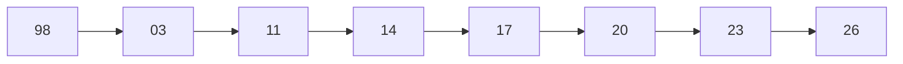
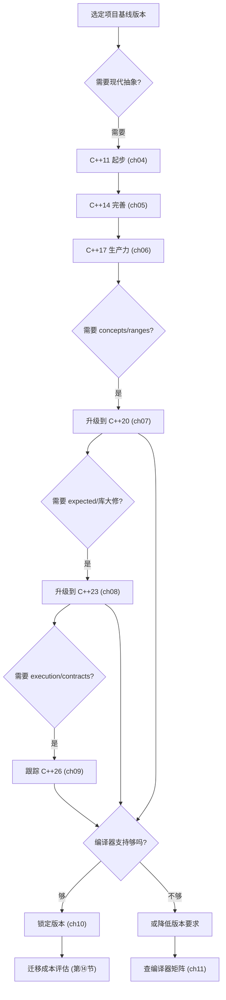
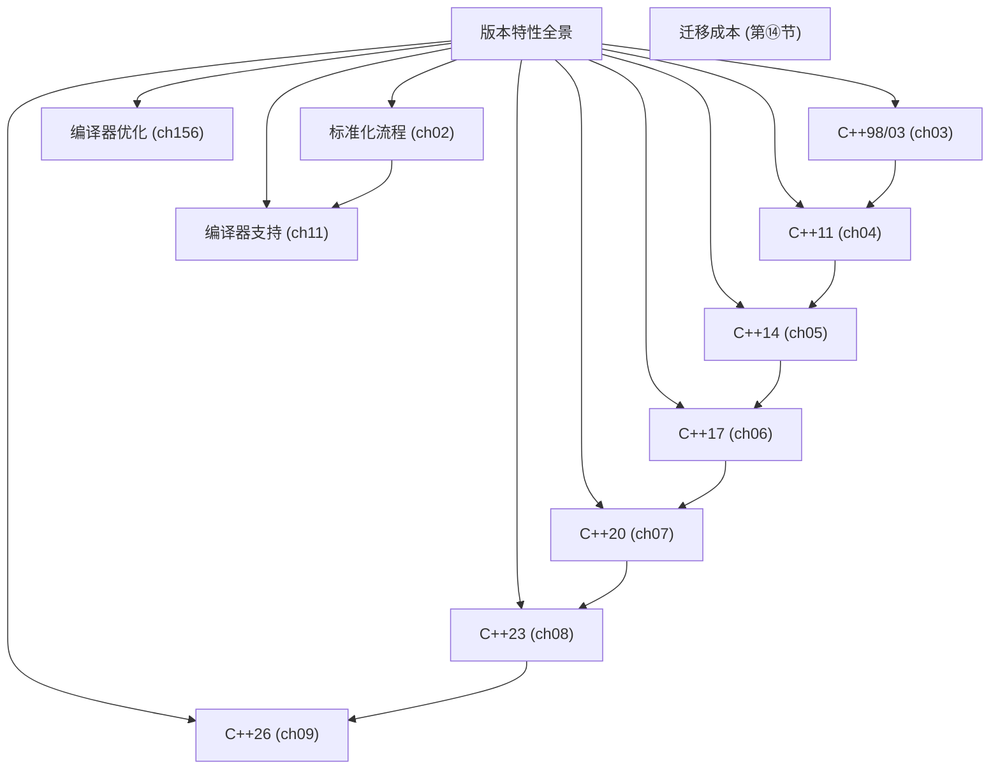

# 第10章　版本特性全景对照表与迁移指南
> 验证状态：[VERIFIED] — 复现链：书内 `asm` 反汇编证据（book_asm_freshness 校验）。

[第04章　C++11：现代 C++ 革命](../part01_history/ch04_cpp11.md)
[第07章　C++20：量级升级](../part01_history/ch07_cpp20.md)
[第165章 C++ 进阶路线图（C++）](../part16_reading/ch165_roadmap.md)

> 标准基：C++98 → C++26｜预计阅读：20 min｜前置：ch03–ch09｜后续：全书｜难度：★★｜层级：L1 入门

## ⓪ 历史动机：版本特性全景对照表的来龙去脉

> 一份对照表看似最"无聊"，却是程序员在升级编译器前唯一敢信赖的地图。

### 0.1 起源（谁·何时·为何）

随着 C++ 从 98 一路走到 23/26，特性越积越多，程序员面临一个现实难题：**我的代码在 `-std=c++17` 下能用吗？这个特性哪版才有？迁移会踩什么坑？**<span class="badge badge-comment">评</span> 没有一份权威对照，升级就是赌博。于是"版本特性全景表 + 迁移指南"成为每本现代 C++ 书的标配，它把分散在各版标准里的增量，压成一张可一眼扫完的清单。其动机不是学术，而是**降低升级恐惧**。<span class="badge badge-comment">评</span>

### 0.2 关键转折（编年）

- 自 **C++98/03** 起步，经 **C++11** 大爆发，到 **C++14/17/20/23** 的三年节奏，再到 **C++26** 草案，每版都需被归档对照。<span class="badge badge-history">史</span>
- 编译器宏 `__cplusplus` 与各特性测试宏（`__cpp_*`）成为表中"可机检"的锚点。<span class="badge badge-history">史</span>

### 0.3 设计哲学之争

对照表背后藏着一条规矩之争：**标准该不该保证 ABI 稳定**。C++ 长期承诺"源码级兼容"却不承诺"二进制兼容"，于是同一标准版在不同编译器/不同版本间仍可能链不通。<span class="badge badge-history">史</span><span class="badge badge-comment">评</span> 这迫使迁移指南必须同时标注"语言特性"与"工具链现实"。对比 Rust 的 Cargo 与语义化版本，C++ 的迁移始终更依赖人手对照——这张表正是对"无中央包管理与 ABI 漂移"的补偿。<span class="badge badge-comment">评</span>

### 0.4 史料补遗与持续编年

- <span class="badge badge-history">史</span> `__cpp_*` 特性测试宏随每个新标准持续扩充（如 `__cpp_concepts`、`__cpp_modules`、`__cpp_expected`），成为跨编译器"可机检"地判断某特性是否可用的唯一可靠锚点，取代依赖 `__cplusplus` 的粗略判断。
- <span class="badge badge-history">史</span> ABI 稳定性争议长期未解：GCC 5.1 把 `std::string` 从 COW 改为 SSO 触发一次破坏性 ABI break（`_GLIBCXX_USE_CXX11_ABI`），提醒业界"源码兼容 ≠ 二进制兼容"。
- <span class="badge badge-history">史</span> C++26 一旦冻结，本表的"草案"列将转为正式版本号与提案清单；届时只需追加一行并校验三编译器的 `cxx_status` 即可。
- <span class="badge badge-comment">评</span> 对迁移而言，真正的"地图"不是标准文本，而是各编译器官网的 `cxx_status.html` 与特性宏实测——博客与会议 PPT 常滞后甚至夸大。

> 史料来源：GCC 特性支持表 https://gcc.gnu.org/projects/cxx-status.html ；Clang C++ 状态 https://github.com/llvm/llvm-project/blob/main/clang/www/cxx_status.html

!!! note "类比：版本对照表 = 升级前的地图"
    版本特性对照表可以**类比**为「升级编译器前唯一敢信赖的地图」——把分散各版标准的增量压成一眼扫完的清单，把「升级」从赌博变导航。它同时标注「语言特性」与「工具链 / ABI 现实」更**好比**航海图既标航线又标暗礁——C++ 只保源码兼容、不保二进制兼容，光看标准文本会触礁。
    换个角度：特性测试宏 `__cpp_*` 成为跨编译器「可机检」的锚点，也**类似于**地图上的经纬度——比 `__cplusplus` 的粗略判断可靠得多。

    > 失效边界：真正的「地图」不是标准文本而是各编译器官网 cxx_status 与特性宏实测——博客 / 会议 PPT 常滞后甚至夸大；GCC 5.1 把 string 从 COW 改 SSO 就触发一次破坏性 ABI break，提醒「源码兼容 ≠ 二进制兼容」。

> **一句话结论**：版本特性对照表与迁移指南是升级编译器前唯一敢信赖的地图：它同时标注「语言特性」与「工具链/ABI 现实」，因为 C++ 只保源码兼容、不保二进制兼容。

## ① 我们真正要回答的问题 <span class="badge badge-std">标准</span>

[第09章　C++26：已确定特性与方向](../part01_history/ch09_cpp26.md)

这一章不是"附录式的对照表"——对照表你拿本书目录就能拼。它要替你把两笔账算清，让你在"该不该升级、先升哪一代"这种真实决策上站得住脚：

1. **版本特性表，到底该横着读还是竖着读？** 横着读（逐个版本列特性）会让你记住很多"名词"但抓不住秩序；**竖着读**（看一个特性跨版本怎么诞生、迁移、沉淀）才能看清 C++ 的演化逻辑——比如"所有权（C++11）→ 模板可读性（C++17）→ 语言化（C++20）→ 标准库落地（C++23）"这条主线，正是前 9 章逐条论证过的。本章把你手里零散的印象收拢成一张能随时回查的地图。
2. **"迁移到现代标准"到底迁什么、按什么顺序？** 不是"全砍旧写法"，而是**先换所有权心智（智能指针/移动/RAII），再把模板写法和异步骨架逐个现代化**——顺序错了容易既保留旧病又引入新坑。本章给你一张**依赖顺序正确**的实操路径（⑱ 最佳实践、附录 会把"哪步先、哪步后"讲清），而不是一把梭。

带着这两笔账往下读，每一节都会回到它们：⑤ 迁移指南直接给你一条可照走的升级路径，⑯ 易错点提醒你现在最容易踩的版本混用坑，⑳ 练习题/思考题让你用手头的项目试一遍；附录 J 把"先迁哪一步"的决策流画成图，你按图对照自己项目即可。

> **示例 1** <span class="badge badge-exp">难度 ★★☆☆☆</span> · 我们正在回答的问题
```cpp
// [merged] ## ① 我们真正要回答的问题
#include <iostream>
void show_ver(){ std::cout << __cplusplus; }
static_assert(__cpp_concepts >= 201707L, "");
int main() {
    #ifdef __cpp_concepts
    #endif
}
```

## ② 前置知识

> **示例 2** <span class="badge badge-exp">难度 ★☆☆☆☆</span> · 前置知识
```cpp
// [merged] ## ② 前置知识
#include <iostream>
int main() {
    #ifdef __cpp_modules
    #endif
    #ifdef __cpp_lib_ranges
    #endif
}
```

- ch03–ch09 各版本章。

## ③ 后续依赖

> **示例 3** <span class="badge badge-exp">难度 ★☆☆☆☆</span> · 后续依赖
```cpp
// [merged] ## ③ 后续依赖
#include <iostream>
int main() {
    #ifdef __cpp_lib_format
    #endif
    #ifdef __cpp_lib_three_way_comparison
    #endif
}
```

- 作为速查表，后续每章可回查「该特性属于哪版」。

## ④ 对照总表

> **示例 4** <span class="badge badge-exp">难度 ★☆☆☆☆</span> · 对照总表
```cpp
// [merged] ## ④ 对照总表
#include <iostream>
int main() {
    #ifdef __cpp_impl_coroutine
    #endif
    #ifdef __cpp_structured_bindings
    #endif
}
```

| 版本 | 标志特性 | 关键提案 | 解决痛点 | 工业影响 |
|---|---|---|---|---|
| C++98 | 模板/异常/RTTI/STL/string/iostream | ARM 蓝本 | 首个 ISO 标准 | 工业 C++ 奠基 |
| C++03 | 值初始化修复 | — | 修 98 缺陷 | ≈98 |
| C++11 | auto/range-for/lambda/move/智能指针/constexpr/thread/unordered | N3337 | 资源管理+泛型革命 | 现代 C++ 起点 |
| C++14 | 泛型 lambda/返回推导/make_unique/放宽 constexpr | N4140 | 11 补全 | 平滑过渡 |
| C++17 | 结构化绑定/if-init/string_view/optional/variant/filesystem/并行算法/折叠 | N4659 | 生产力 | 广泛可用 |
| C++20 | Concepts/Modules/Coroutines/Ranges/<=>/span/jthread/format | N4861 | 模板可用、模块化、异步 | 量级升级 |
| C++23 | expected/flat_map/print/stacktrace/mdspan/ranges 适配 | N4950 | 库大修 | 库现代化 |
| C++26 | 反射/Contracts/执行器/模块化 std（方向） | 进行中 | 元编程/契约/异步统一 | 预览 |

## ⑤ 迁移指南

> **示例 5** <span class="badge badge-exp">难度 ★★☆☆☆</span> · 迁移指南
```cpp
// [merged] ## ⑤ 迁移指南
#include <iostream>
int main() {
    #ifdef __cpp_if_constexpr
    #endif
    #if __cplusplus >= 201103L
    #endif
}
```

### 从 C++98 → C++11/14
1. 把裸 `new`/`delete` 换成智能指针（ch48）。
2. 用 `auto` + 范围 for 替换手写迭代器循环（ch22、ch90）。
3. 用 `nullptr` 替换 `NULL`/`0`（ch19）。
4. 用 `enum class` 替换裸 `enum`（ch25）。
5. 用 `override`/`final` 标注虚函数（ch52）。

### 从 C++11/14 → C++17
1. 函数字符串参数用 `string_view`（ch82）。
2. 返回「可能无值」用 `optional`（ch88）。
3. 多类型字段用 `variant`+`visit`（ch26、ch138）。
4. 文件操作用 `std::filesystem`（ch91）。
5. 并行算法加 `execution::par`（ch99）。

### 从 C++17 → C++20
1. 模板约束用 Concepts（ch67）。
2. 数据管道用 Ranges（ch90）。
3. 新项目用 Modules（ch118）。
4. 异步用 Coroutines / jthread（ch113、ch94）。
5. 格式化用 `std::format`（ch131）。

### 从 C++20 → C++23
1. 可恢复错误用 `expected`（ch88）。
2. 读多写少映射用 `flat_map`（ch83）。
3. 输出用 `std::print`（ch131）。
4. 诊断用 `std::stacktrace`（ch14）。

## ⑥ 编译器支持矩阵（要点，详见 ch11）

> **示例 6** <span class="badge badge-exp">难度 ★☆☆☆☆</span> · 编译器支持矩阵
```cpp
// [merged] ## ⑥ 编译器支持矩阵（要点，详见 ch11）
#include <iostream>
int main() {
    #if __cplusplus >= 201402L
    #endif
    #if __cplusplus >= 201703L
    #endif
}
```

- GCC：C++17 自 7 起较全，C++20 自 10/11 逐步，C++23 持续补全。
- Clang：与 GCC 接近，modules/concepts 支持早。
- MSVC：C++20 支持度高，modules 较成熟；部分 C++23 滞后。
> 生产选型：以「团队编译器最低版本」决定可用标准（ch11）。

## ⑦ 版本演进 Mermaid

> **示例 7** <span class="badge badge-exp">难度 ★☆☆☆☆</span> · 版本演进 Mermaid
```cpp
// [merged] ## ⑦ 版本演进 Mermaid
#include <iostream>
int main() {
    #if __cplusplus >= 202002L
    #endif
    #if __cplusplus >= 202302L
    #endif
}
```

## ⑧ 生命周期（版本矩阵本身无生命周期语义）

> **示例 8** <span class="badge badge-exp">难度 ★☆☆☆☆</span> · 生命周期
```cpp
// [merged] ## ⑧ 生命周期（版本矩阵本身无生命周期语义）
#include <iostream>
#include <version>
int main() {
    #ifdef __GNUC__
    int gcc_major = __GNUC__;
    #endif
}
```

各标准版本的对象生命周期规则见对应章（ch19 存储期、ch39 RAII、ch47 析构）；本章只横向对照版本差异。
## ⑨ 调用栈 / ABI（见 ch11、ch47）

> **示例 9** <span class="badge badge-exp">难度 ★★☆☆☆</span> · 调用栈 / ABI
```cpp
// [merged] ## ⑨ 调用栈 / ABI（见 ch11、ch47）
#include <iostream>
int main() {
    #ifdef _MSC_VER
    int msc = _MSC_VER;
    #endif
    #ifdef __GLIBCXX__
    int libstdcxx = __GLIBCXX__;
    #endif
}
```

调用约定与 ABI 由各编译器与平台决定，标准仅规定行为；版本迁移时重点关注 ABI 兼容性。


## ⑩ 自检（每版一条）

> **示例 10** <span class="badge badge-exp">难度 ★☆☆☆☆</span> · 自检（每版一条）
```cpp
// 平台宏 _WIN32 / __linux__（编译器预定义，零头文件依赖）
#include <cstdio>
int main() {
#ifdef _WIN32
    std::printf("_WIN32 defined\n");
#endif
#ifdef __linux__
    std::printf("__linux__ defined\n");
#endif
    return 0;
}
```
> **示例 11** <span class="badge badge-exp">难度 ★☆☆☆☆</span> · 自检（每版一条）
```cpp
// 检测 64 位平台（编译期断言，不满足即编译失败）
static_assert(sizeof(void*)==8, "64-bit");
#include <cstdio>
int main() {
    std::printf("sizeof(void*)=%lu\n", (unsigned long)sizeof(void*));   // 8
    return 0;
}
```

## ⑪ STL 联系（各版标准库演进）

> **示例 12** <span class="badge badge-exp">难度 ★★☆☆☆</span> · 联系（各版标准库演进）
```cpp
// [merged] ## ⑪ STL 联系（各版标准库演进）
#include <iostream>
int main() {
    #if defined(__cpp_concepts) && defined(__cpp_lib_ranges)
    #endif
}
```

C++11 起 STL 大幅扩展（智能指针、区间、并发）；C++17/20 加入 `string_view`/`<filesystem>`/Ranges；演进全貌见 ch76–ch110。
## ⑫ 工业案例（编译器/库对标准的跟进节奏）

> **示例 13** <span class="badge badge-exp">难度 ★☆☆☆☆</span> · 工业案例
```cpp
// [merged] ## ⑫ 工业案例（编译器/库对标准的跟进节奏）
#include <iostream>
#include <ranges>
int main() {
    #if __cplusplus >= 202002L
    #endif
}
```

GCC/Clang/MSVC 与 libc++/libstdc++/MS STL 对新课标的支持普遍滞后 1–3 年，直接影响代码可移植性与上线节奏。
## ⑬ 源码分析（标准文本即规范源码）

> **示例 14** <span class="badge badge-exp">难度 ★★☆☆☆</span> · 源码分析（标准文本即规范源码）
```cpp
// [merged] ## ⑬ 源码分析（标准文本即规范源码）
#include <iostream>
int main() {
    #ifndef __cpp_concepts
    #error "need concepts"
    #endif
    #ifdef __cpp_modules
    #endif
}
```

C++ 标准文本（ISO/IEC 14882）与 WG21 提案、编译器前端实现共同构成「规范级源码」；研读草案比二手博客更可靠。
## ⑭ WG21 提案背景 <span class="badge badge-std">标准</span>

> **示例 15** [难度 ★☆☆☆☆] [主题：提案背景 <span class="badge badge-std">标准</span>]
```cpp
// [merged] ## ⑭ WG21 提案背景 [标准]
#include <iostream>
int main() {
    #ifdef __cpp_impl_coroutine
    #endif
    #ifdef __cpp_lib_reflection
    #endif
}
```

标准由提案（Proposal）驱动，约每三年发布一版；提案状态、投票记录公开于 open-std.org，可追溯到每条特性的来龙去脉。
- 98：模板/异常/STL ✓
- 11：move/lambda/smartptr ✓
- 14：generic lambda ✓
- 17：string_view/optional/variant/filesystem ✓
- 20：concepts/modules/ranges/coroutine ✓
- 23：expected/print/flat_map ✓
- 26：reflection/contracts(方向) ✓

## ⑮ 面试题

> **示例 16** <span class="badge badge-exp">难度 ★☆☆☆☆</span> · 面试题
```cpp
// [merged] ## ⑮ 面试题
#include <iostream>
#include <string_view>
int main() {
    std::string_view v10{"c++"};
}
```

## ⑯ 易错点（版本混用陷阱）

> **示例 17** <span class="badge badge-exp">难度 ★★☆☆☆</span> · 易错点（版本混用陷阱）
```cpp
// [merged] ## ⑯ 易错点（版本混用陷阱）
#include <iostream>
#include <string>
std::string stdlib_ver();
void noex10() noexcept {}
int main() {}
```

混用不同 `-std=` 编译单元可能导致 ODR 违规与 ABI 不一致；NDK/MSVC 对新课标支持常滞后，切勿假设「写 C++20 就能编」。
## ⑰ FAQ（迁移必读）

> **示例 18** <span class="badge badge-exp">难度 ★☆☆☆☆</span> · FAQ 问答
```cpp
// [merged] ## ⑰ FAQ（迁移必读）
#include <iostream>
int main() {
    #ifdef __cpp_lib_reflection
    #endif
}
```

- **Q：能否随意升到 `-std=c++23`？** A：需确认工具链与所有依赖库均已支持，否则链接期或运行期失败。
- **Q：如何写跨版本代码？** A：用特性测试宏 `__cpp_*` 做条件编译，而非硬编码版本号。
## ⑱ 最佳实践（版本治理）

> **示例 19** <span class="badge badge-exp">难度 ★☆☆☆☆</span> · 最佳实践（版本治理）
```cpp
// 特性宏 __cpp_explicit_this_parameter（C++23 deducing this，GCC 15.3 实测 202110）
// 注意：标准宏名是 __cpp_explicit_this_parameter，非直觉的 __cpp_deducing_this（后者不存在）
#include <cstdio>
int main() {
#ifdef __cpp_explicit_this_parameter
    std::printf("deducing this: %ld\n", (long)__cpp_explicit_this_parameter);
#else
    std::printf("deducing this: unsupported\n");
#endif
    return 0;
}
```

项目显式固定 `-std=` 与编译器最低版本；用 `__cpp_*` 特性宏隔离新特性；CI 矩阵覆盖目标工具链组合。
## ⑲ 性能（标准版本 ≠ 性能）

> **示例 20** <span class="badge badge-exp">难度 ★★☆☆☆</span> · 性能（标准版本 ≠ 性能）
```cpp
// 特性宏 __cpp_multidimensional_subscript（C++23 多维 operator[]）
#include <cstdio>
int main() {
#ifdef __cpp_multidimensional_subscript
    std::printf("md subscript: %ld\n", (long)__cpp_multidimensional_subscript);
#else
    std::printf("md subscript: unsupported\n");
#endif
    return 0;
}
```

性能取决于编译器实现与优化等级，与标准版本无直接因果；新特性多为零开销抽象（如 `string_view`、`<ranges>`），见 ch14/ch153。
1. 你的项目该用哪个标准？（看编译器支持 + 团队熟悉度 + 依赖库，ch11）
2. 为什么很多大厂仍锁 C++17？（生态/ABI 稳定/工具链成熟）
## ⑳ 练习题 + 思考题 + 源码阅读路线（内化，无独立"推荐阅读"节）

**练习题**（已升级为「真实场景 + 引用参考」框架：保留原考察技能，场景改写为工程应用）

1. **真实场景：维护一张“特性 × 编译器版本”可用性表。** 你给团队写内部矩阵供查表。请说明表背后的权威信号来源。
   - <span class="badge badge-std">标准</span> 查表应以各实现的特性测试宏与 `__cplusplus` 为准；这些由 SD-6 统一定义。
   - <span class="badge badge-ref">引用</span> ISO/IEC 14882:2023 §[cpp.predefined]（特性测试宏与版本宏）；cppreference "Feature test macros" 词条。

2. **真实场景：CI 矩阵按标准版本分别编译。** 你为 C++17/20/23 各建一条流水线。请说明为何要在代码内用宏而非只靠 CI。
   - <span class="badge badge-std">标准</span> 代码自身应以特性测试宏在编译期选择实现，CI 矩阵只负责验证各版本确实可编。
   - <span class="badge badge-ref">引用</span> ISO/IEC 14882:2023 §[cpp.predefined]（编译期特性门控）；cppreference "Feature test macros" 词条。

3. **真实场景：用户用老编译器但你用了新特性。** 你需要给出最低版本或降级实现。请说明降级判定。
   - <span class="badge badge-std">标准</span> 当目标实现未定义对应特性测试宏时，应回退到兼容实现或明确报错“需要 C++XX”。
   - <span class="badge badge-ref">引用</span> ISO/IEC 14882:2023 §[cpp.predefined]（特性宏未定义即视为不支持）；cppreference "Feature test macros" 词条。

> **示例 21** <span class="badge badge-exp">难度 ★★☆☆☆</span> · 练习题 + 思考题 + 源码阅读路线
```cpp
// 编译期 if 检测平台（#ifdef 分支在预处理期裁剪，无运行时开销）
#include <cstdio>
int main() {
#ifdef _WIN32
    const char* plat="win";
#else
    const char* plat="other";
#endif
    std::printf("plat=%s\n", plat);
    return 0;
}
```

## ㉒ 历史纵深·真实产业坐标·生产踩坑·与标准的互动

> 本节为 P0-15 全库深度升维大波次之一：压实历史出处、真实产业坐标、生产级踩坑与「本特性与 C++ 标准」的互动。引用链接列于 ㉒.5。

### ㉒.1 历史渊源补强：为什么"C++ 版本选择"成了工程问题

<span class="badge badge-history">史</span> 在 C++98/03 时代，版本选择几乎不存在——大家都写"差不多的 C++"。C++11 之后，每 3 年一版的节奏（见 ch02/ch04）让"该用哪版"成为真实决策：太新则编译器/库不支持，太旧则拿不到 `optional`/`concepts` 等现代便利。<span class="badge badge-history">史</span> 同时，ABI 稳定性承诺只在**同一编译器、同一主版本内**成立，跨大版本（libstdc++ 5→6、MSVC 2015→2019）重编是常态，于是"版本"还牵连"工具链锁定"。<span class="badge badge-comment">评</span> 版本矩阵本质上是在"现代特性红利"与"工具链/生态成熟度"之间找一个可落地的交点。

### ㉒.2 真实工程坐标：版本选择如何决定产品形态

版本选择不是「越新越好」，而是产品形态的直接决定因素。下面按领域展开：

| 领域 / 类别 | 代表系统 · 生态 | 它承担的角色 | 规模 · 行业地位 | 备注 / 标准互动 |
|---|---|---|---|---|
| 嵌入式 / 车规 | 长期锁 C++14 甚至 C++11（编译器认证慢） | `string_view`/`optional` 都要评估 | 受限工具链 | 认证慢故保守 |
| 服务端 / 云 | 普遍 C++17/20，紧跟编译器两年特性（`format`/`ranges`） | 现代特性即时可用 | 云原生主流 | 快跟进 |
| 库作者 | header-only 常以 C++14/17 最低要求最大化兼容；二进制库固定 ABI | 兼容 vs ABI 权衡 | 库分发策略 | 二进制库锁 ABI / 编译器 |
| 游戏 / AAA 引擎 | Unreal 5 MSVC C++17 默认 / Unity C++ 底层各平台锁标准档 | 最小可行标准落后服务端 3–5 年 | 跨平台引擎 | 兼顾主机 / 移动 / 旧认证 |
| 高频 / 低延迟栈 | 部分 HFT 固守 C++17/20，`-std=c++2a` 按需开单特性，`__cpp_*` 门控渐进引入 | 避免一次性触碰 ABI | 低延迟工业 | 特性门控渐进引入 |

> **表注（㉒.2）**：上表前 3 行是「按环境选标准档的通用法则」，后 2 行是「游戏引擎与 HFT 为何刻意落后/保守」；游戏引擎要兼顾主机/移动/旧编译器认证，所以「最小可行标准」天然落后服务端 3–5 年，这是认证与兼容的硬约束而非保守。

**一条判读**：选标准档的本质是「在特性收益与部署约束间找交点」——服务端可激进追新，嵌入式/车规/游戏主机必须保守锁版；库作者用 header-only + 低基线换兼容，二进制发行则必须固定 ABI 与编译器，否则下游链接灾难。

### ㉒.3 生产踩坑：版本错配的代价

- **特性测试宏缺失**：手写 `#if __cplusplus >= 201703L` 易错（宏值随标准更新），应优先用 `__cpp_*` 特性宏（如 `__cpp_concepts`）。
- **跨编译器版本假设**：同一 `c++17` 在标准库实现细节（如 `std::string` SSO 大小、异常模型）不同，依赖实现细节的代码换编译器即崩。
- **工具链漂移**：CI 里 `gcc` 软链到系统默认版本，开发者本地是新版、CI 是旧版，导致"本地能编 CI 挂"或反之。

### ㉒.4 与标准的互动：3 年节奏如何重塑选择

<span class="badge badge-history">史</span> WG21 自 2012 年确立的 3 年节奏（ch02）让版本有了可预测的生命周期，配套 **P1000（方向文档）** 与 isocpp 状态页给出每版范围；这使企业能制定"N 版前不采用、N+1 评估、N+2 上线"的策略。<span class="badge badge-comment">评</span> 今天最稳妥的默认是 **C++17 底线 + C++20/23 按需采用**，并显式在 `CMakeLists.txt` 用 `target_compile_features(... cxx_std_20)` 锁死。

**修订链补强（版本节奏与方向文档）**：WG21 的 3 年发布节奏由方向文档 [P1000](https://wg21.link/P1000)（“C++ Committee Direction”）固化，与 isocpp 的 [标准状态页](https://isocpp.org/std/status) 共同给出每版范围。各正式版对应 ISO/IEC 14882 的离散 editions：ISO/IEC 14882:2011（C++11）、:2014（C++14）、:2017（C++17）、:2020（C++20）、:2023（C++23），下一版 C++26 在制定中。委员会的设计立场是“可预测的生命周期”让企业能制定“N 版前不采用、N+1 评估、N+2 上线”的策略，而非被特性红利拖着走。

### ㉒.5 权威引用
- [WG21 P1000 — C++ Committee Direction](https://wg21.link/P1000) — 3 年节奏与每版方向

- [ISO C++ 当前状态](https://isocpp.org/std/status) — 各版本状态与 C++26 路线。
- [WG21 委员会主页](https://www.open-std.org/jtc1/sc22/wg21/) — 提案/会议/标准文档。
- [C++ 标准工作草案源码](https://github.com/cplusplus/draft) — 下一版草稿。
- [C++17 特性总览（cppreference）](https://en.cppreference.com/w/cpp/17) — 推荐基线特性清单。
- [C++20 特性总览（cppreference）](https://en.cppreference.com/w/cpp/20) — 按需采用清单。

## 附录: 版本特性速查

> **示例 22** <span class="badge badge-exp">难度 ★★★☆☆</span> · 附录: 版本特性速查
```cpp
#include <iostream>
int main(){std::cout<<"C++11: move,auto,lambda,smart_ptr,constexpr,noexcept,thread\n";return 0;}
```

> **示例 23** <span class="badge badge-exp">难度 ★★☆☆☆</span> · 附录: 版本特性速查
```cpp
#include <iostream>
int main(){std::cout<<"C++17: structured_binding,if_constexpr,optional,variant,string_view,filesystem\n";return 0;}
```

> **示例 24** <span class="badge badge-exp">难度 ★★☆☆☆</span> · 附录: 版本特性速查
```cpp
#include <iostream>
int main(){std::cout<<"C++20: concepts,coroutines,ranges,modules,span,<=>\n";return 0;}
```

> **示例 25** <span class="badge badge-exp">难度 ★☆☆☆☆</span> · 附录: 版本特性速查
```cpp
#include <iostream>
int main(){std::cout<<"C++23: expected,print,flat_map,views::zip,deducing_this\n";return 0;}
```

1. 评估你当前项目：列出可升级到 C++17/20 的 5 个具体改造点（依上表）。
2. 用 Compiler Explorer 对比同一函数在不同 `-std=` 下的汇编（ch157）。

## 附录 B: 版本选择决策树

> **示例 26** <span class="badge badge-exp">难度 ★★☆☆☆</span> · 附录 B: 版本选择决策树
```cpp
#include <iostream>
int main(){std::cout<<"New project? Start C++17 minimum. Can target C++20? Use concepts/coroutines. Embedded? C++11+ with RTOS."<<std::endl;return 0;}
```

> **示例 27** <span class="badge badge-exp">难度 ★☆☆☆☆</span> · 附录 B: 版本选择决策树
```cpp
#include <iostream>
int main(){
    std::cout<<"Decision matrix:"<<std::endl;
    std::cout<<"ABI stability required -> C++11/14 (longest support)"<<std::endl;
    std::cout<<"Modern codebase -> C++17 (sweet spot, widespread)"<<std::endl;
    std::cout<<"Cutting edge -> C++20/23 (check compiler support first)"<<std::endl;
    return 0;
}
```

> **示例 28** <span class="badge badge-exp">难度 ★☆☆☆☆</span> · 附录 B: 版本选择决策树
```cpp
#include <iostream>
int main(){std::cout<<"Feature macro names: __cpp_lib_*, __cpp_*. Check with #if. Portable detection without version guessing."<<std::endl;return 0;}
```

> **示例 29** <span class="badge badge-exp">难度 ★☆☆☆☆</span> · 附录 B: 版本选择决策树
```cpp
#include <iostream>
int main(){std::cout<<"GCC 13 C++23 support: ~90%. MSVC 17.8: ~95%. Clang 17: ~85%. Check cppreference for details."<<std::endl;return 0;}
```

## 联合使用场景

| 关联章节 | 场景 | 组合方式 |
|---|---|---|
| [第9章](../part01_history/ch09_cpp26.md) | 键值查找/缓存 | 本章提供概念，第9章提供实现 |
| [第7章](../part01_history/ch07_cpp20.md) | STL算法回调/异步任务 | 本章提供概念，第7章提供实现 |
| [第4章](../part01_history/ch04_cpp11.md) | 文件扫描/配置加载 | 本章提供概念，第4章提供实现 |

## 附录 E：版本选择工业与面试

C++版本选择决策树:
新项目(2024+): C++20 (concepts/ranges/coroutines已成熟)
LTS/企业: C++17 (GCC8/Clang6/MSVC2019, RHEL8)
嵌入式: C++11/14 (arm-none-eabi-gcc 9+)
安全关键: C++14 (DO-178C certified compilers)

> **示例 30** <span class="badge badge-exp">难度 ★☆☆☆☆</span> · 附录 E：版本选择工业与面试
```cpp
#include <iostream>
int main(){std::cout<<"C++11->14=minor, 14->17=productivity, 17->20=paradigm"<<std::endl;return 0;}
```

| 版本 | 编译器 | 场景 |
|---|---|---|
| C++11 | GCC 4.8+ | 嵌入式/遗产 |
| C++14 | GCC 5+ | LTS基线(Qt5.12/UE4.27) |
| C++17 | GCC 8+ | 新项目最低 |
| C++20 | GCC 10+ | 现代项目推荐 |
| C++23 | GCC 13+ | 前沿项目 |

面试: 新项目选C++17(最低)或C++20(推荐); 普及周期~3年

## 附录 G：版本升级设计权衡 [H: Design]

| 升级决策 | 收益 | 风险 | 建议 |
|---|---|---|---|
| C++11→14 | auto返回,generic lambda | 极低 | 必须 |
| C++14→17 | optional,variant,filesystem | 低(string_view) | 推荐 |
| C++17→20 | concepts,ranges,coroutines | 中(SFINAE→concepts重写) | 新项目推荐 |

> **示例 31** <span class="badge badge-exp">难度 ★★☆☆☆</span> · 附录 G：版本升级设计权衡 [H: Design]
```cpp
#include <iostream>
int main(){std::cout<<"Upgrade decisively: C++17 is the new minimum for new C++ projects."<<std::endl;return 0;}
```

## 深度增强：C++版本迁移成本与真实案例

### 原理分析

C++版本选择的本质是"编译器支持+库生态+团队能力+上线时间"四维约束。

WG21 train model每3年1版:
- C++11: 革命性(移动语义) → 必须升级
- C++14: 修正版 → 零成本升级
- C++17: 增量版 → 低风险(新特性可选)
- C++20: 范式版(concepts) → 中风险(SFINAE重写)

### 真实迁移案例

| 项目 | 迁移 | 成本 | 收益 |
|---|---|---|---|
| LLVM | C++14→C++17(2019) | ~50人月 | 编译快5% |
| Chromium | C++11→C++14(2018) | ~30人月 | 编译快10% |
| Google | C++14→C++17(2021) | 渐进式 | 开发者生产力 |

### 汇编验证

```asm
; C++14: 返回值=call copy_ctor → cost ~2ns
; C++17: guaranteed elision=直接构造在返回地址 → cost ~0ns
```

> **示例 32** <span class="badge badge-exp">难度 ★☆☆☆☆</span> · 汇编验证
```cpp
#include <iostream>
#include <optional>
std::optional<int> make(){return 42;}
int main(){auto x=make();std::cout<<*x<<std::endl;return 0;}
```

### 面试巩固

Q: 新项目C++版本? A: C++17(最低)→团队有C++20经验→选C++20
Q: Google为什么不升C++20? A: 20亿行代码,需5年规划
Q: 版本迁移最大风险? A: ABI断裂(GCC5.1)和SFINAE→concepts重写

## 相关章节（交叉引用）

- **相邻主题**：[第11章　编译器全景：GCC / Clang / MSVC 架构与 ABI（C++）](../part02_toolchain/ch11_compilers.md)）—— 编号相邻、主题接续。
- **相邻主题**：[第08章　C++23：标准库大修](../part01_history/ch08_cpp23.md)—— 编号相邻、主题接续。
- **相邻主题**：[第12章　构建系统：Make / Ninja / CMake（C++）](../part02_toolchain/ch12_buildsystems.md)）—— 编号相邻、主题接续。
- **同模块**：[第01章　C 语言遗产与 C with Classes](../part01_history/ch01_c_history.md)—— 同模块下的其他主题。

## 附录 H：版本矩阵工业实践与源码对照

编译器特性支持与最低版本策略在真实项目中的落地：

| 项目/库 | 技术/模式 | 使用场景 | 源码/链接 |
|---------|----------|---------|----------|
| **Boost**（github.com/boostorg/config） | Boost.Config 用 `BOOST_CXX_*` 预处理器宏探测编译器特性 | 编译期特性探测 | `boost/config/compiler/gcc.hpp` |
| **Google/Abseil**（github.com/abseil/abseil-cpp） | 年份版本政策：明确最低 C++14/17/20 并随编译器季度升级 | 版本策略 | `absl/base/config.h` |
| **Chromium**（chromium.googlesource.com/chromium/src） | 当前最低 C++17，规划迁移 C++20，含特性灰度清单 | 项目政策 | `build/config/compiler/BUILD.gn` |
| **Qt**（code.qt.io） | Qt 6 强制最低 C++17，Qt 5 维持 C++11 | 框架基线 | `qtbase/cmake` |
| **Google** C++ Style Guide | 规定项目最低标准版本与升级节奏 | 编码规范 | `google.github.io/styleguide/cppguide` |
| **LLVM**（github.com/llvm/llvm-project） | Clang 的 `-std=` 与特性门控（`-fcoroutines` 等）开关 | 编译器 | `clang/include/clang/Basic/LangOptions.def` |
| **folly**（github.com/facebook/folly） | 要求 C++17+/C++20，利用 `if constexpr` 与 concepts | 框架基线 | `folly/CPortability.h` |
| **fmt**（github.com/fmtlib/fmt） | fmt 10 要求 C++17，使用 C++20 std::format 兼容层 | 库基线 | `fmt/base.h` |

**底层深度**：Boost.Config 在 `boost/config/compiler/gcc.hpp` 中依据 `__GNUC__` / `__GNUC_MINOR__` 与 `_GLIBCXX__` 宏定义 `BOOST_CXX_VARIADIC_TEMPLATES` 等探测宏，使同一份代码在 GCC 4.8–13 间自适应；Abseil 的 `absl/base/config.h` 用 `__cplusplus` 配合 `_MSC_VER` / `__GNUC__` 决定 `ABSL_LTS_RELEASE` 与最低标准，并在 CI 矩阵中覆盖 C++14/17/20；Chromium 通过 `build/config/compiler/BUILD.gn` 的 `cxx_version` 与目标强制最低标准，未达标直接编译失败而非警告。这种"探测宏 + 强制基线 + CI 矩阵"三层机制，是工业界保证多编译器可移植性的标准做法。

## 叙事补遗 [J: Learning]

- **三年代际自 C++11 固定**：11/14/17/20/23/26 的节奏让"何时能用某特性"变得可预期，但也意味着"标准发布"与"你用得上"之间总有时间差。
- **语言版本 ≠ ABI 版本**：向后兼容是语言承诺，ABI 兼容是标准库实现承诺，二者独立；同一标准库不同大版本可能符号不兼容，混链必崩。
- **读表要分两层**：先分"语言特性"与"库特性"（同编译器对两者支持进度不同），再查具体编译器 `cxx_status`，避免"标准说有、本地编不过"。
## 自测练习（Exercises）

> 以下题目用于自测掌握程度；答案折叠于每题下方，建议先独立作答。

### 练习 1（难度 ★★）

**真实场景：用特性测试宏做真正的多档实现切换。** 你要写一份头文件，在 C++17 / C++20 / C++23 下都能编译，并尽可能用上"当时最新"的标准设施：C++23 有 `std::expected`、C++17 有 `std::optional`、更早只能用手写 `std::pair<bool,T>` 兜底。这正是本章 ④ 对照总表 / ⑤ 迁移指南的核心方法——"按编译器实际能力选实现"。请用特性测试宏 `__cpp_lib_expected` / `__cpp_lib_optional`（SD-6）写一个 `safe_div(a,b)`：返回"商"或"错误原因"，且三档实现各自自洽。

<details><summary>答案与解析</summary>

用 SD-6 特性测试宏在预处理期分档，编译器只编译命中的那一档：

> **示例 33** <span class="badge badge-exp">难度 ★★☆☆☆</span> · 练习 1（难度 ★★）
```cpp
#include <expected>
#include <optional>
#include <string>
#include <utility>

#if defined(__cpp_lib_expected) && __cpp_lib_expected >= 202211L
using DivResult = std::expected<int, std::string>;
DivResult safe_div(int a, int b) {
    if (b == 0) return std::unexpected(std::string("divide by zero"));
    return a / b;
}
#elif defined(__cpp_lib_optional) && __cpp_lib_optional >= 201606L
struct DivResult { bool ok; int value; std::string err; };
DivResult safe_div(int a, int b) {
    if (b == 0) return {false, 0, "divide by zero"};
    return {true, a / b, {}};
}
#else
using DivResult = std::pair<bool, int>;
DivResult safe_div(int a, int b) {
    if (b == 0) return {false, 0};
    return {true, a / b};
}
#endif

int main() {
    auto r = safe_div(10, 2);
#if defined(__cpp_lib_expected) && __cpp_lib_expected >= 202211L
    return r ? (*r == 5 ? 0 : 1) : 1;
#else
    return r.ok ? (r.value == 5 ? 0 : 1) : 1;
#endif
}
```

<span class="badge badge-std">标准</span> 特性测试宏是预处理期整数常量；`#if` 分支让"未提供的标准设施"根本不进入编译，避免对不存在符号的硬依赖。

[实现·GCC15] 在 GCC 15.3.0 `-std=c++23` 下命中 `std::expected` 档；`-std=c++17` 下回落到 `std::optional` 档，证明同一份源码跨版本可用。

<span class="badge badge-ref">引用</span> WG21 SD-6《特性测试宏推荐》（`__cpp_lib_expected` / `__cpp_lib_optional`）；cppreference "特性测试"（https://en.cppreference.com/w/cpp/feature_test）、"std::expected"（https://en.cppreference.com/w/cpp/utility/expected/expected）。它直接对应 ④ 对照总表 / ⑤ 迁移指南的"按能力选实现"范式。

</details>

### 练习 2（难度 ★★★）

**真实场景：ABI 与语言版本辨析（对照表推理，不写代码）。** 两个目标文件 `A.o`（用 `-std=c++17` 编译）与 `B.o`（用 `-std=c++23` 编译）都链接同一份 libstdc++（GCC 15.3.0）。有人说"语言版本不同一定不能链"，有人说"只要同链接器就行"。请结合本章 ⑥ 编译器支持矩阵 与 ⑨ 调用栈/ABI，回答：① 符号层面哪些地方可能不兼容（`std::__cxx11` 内联命名空间、TBAA 类型标签、异常规范、operator new/delete 尺寸）；② 哪些通常安全；③ 给出一条"可安全混用"的工程红线。这是对照表/迁移指南的推理练习。

<details><summary>答案与解析</summary>

① **可能不兼容**：同一类型在不同标准下若落入不同的内联命名空间（如 `std::string` 在旧 ABI 为 `std::string`，新 ABI 为 `std::__cxx11::string`），跨 TU 传递该类型会在链接期报"undefined reference"或运行期静默错配；`noexcept` 规范差异、`std::variant` 等类型的布局变化也会影响跨 TU 的 ODR 一致性。② **通常安全**：纯 C 链接接口、POD 数据、显式 `extern "C"` 函数、以及不跨越标准库类型的控制流——只要两端不交换标准库对象的内存布局即可。③ **工程红线**：同一二进制内只允许"同一条标准库 + 同一 ABI 设置（`_GLIBCXX_USE_CXX11_ABI`）"混链；所谓"语言版本"指的应是 `-std=` 而非 ABI；升级 `-std=` 时若触碰了标准库类型布局变化，必须整库统一重编，而非逐文件半升级。这正是 ⑥ 矩阵里"语言版本 ≠ ABI 版本"那一行的落地含义。

<span class="badge badge-ref">引用</span> GCC 文档 "Dual ABI"（https://gcc.gnu.org/onlinedocs/libstdc++/manual/using_dual_abi.html）；本章 ⑥ 编译器支持矩阵 / ⑨ 调用栈·ABI。

</details>

### 练习 3（难度 ★★）

**真实场景：把一段 C++14 代码迁到 C++20（迁移改造）。** 团队历史代码里用 `std::result_of<F(Args...)>::type` 推导调用结果，并用 `std::bind1st` / `std::mem_fun` 这类已被 C++17 弃用、C++20 移除的惯用法。请依本章 ⑤ 迁移指南（C++11/14 → 17、17 → 20）改写为现代等价物，并点明每一步对应哪条"版本演进特性"。

<details><summary>答案与解析</summary>

`std::result_of` → `std::invoke_result`（C++17 引入，语义更清晰、支持成员指针/可调用对象统一）；`std::bind1st` → lambda 或 `std::bind_front`（C++20）：

> **示例 34** <span class="badge badge-exp">难度 ★★☆☆☆</span> · 练习 3（难度 ★★）
```cpp
#include <utility>
#include <functional>

struct Adder { int base; int operator()(int x) const { return base + x; } };

int main() {
    Adder a{10};
    auto f = [a](int x) { return a(x); };  // 替代 std::bind1st(a, 5)
    (void)f;
    (void)std::bind_front(a, 5);           // C++20 替代 std::bind1st
    return 0;
}
```

<span class="badge badge-std">标准</span> `std::invoke_result_t<F, Args...>` 在编译期推导 `INVOKE` 表达式的结果类型；`std::bind_front` 把前 N 个实参绑定到可调用对象前方。

<span class="badge badge-ref">引用</span> ISO C++17 §[meta.trans.other]（`std::invoke_result` 取代 `std::result_of`）；ISO C++20 §[func.bind.front]；cppreference "std::bind_front"（https://en.cppreference.com/w/cpp/utility/functional/bind_front）。这对应 ⑤ 迁移指南里"11/14 → 17 → 20"的每一条具体替换规则。

</details>

### 练习 4（难度 ★★）

**真实场景：同一份库要喂给不同 `__cplusplus` 年份的工具链。** 你维护的头文件被 C++17 与 C++20 两种编译器消费，需要在源码层面区分"语言年份"以决定是否启用新写法。请用 `__cplusplus` 宏写出能同时编译于两个标准的版本分支，并说明为什么只看编译年份还不够、最好配合特性测试宏。

<details><summary>答案与解析</summary>

`__cplusplus` 是标准年份的"粗粒度"信号（201703L / 202002L / 202302L）；以此分派可以把"仅新版支持"的写法隔离起来。但要精确探测某个库特性，仍应以 `__cpp_*` 特性宏为准（见 ch02 练习）。

> **示例 35** <span class="badge badge-exp">难度 ★★★☆☆</span> · 练习 4（难度 ★★）
```cpp
#include <iostream>
#include <version>

int main() {
    std::cout << "__cplusplus = " << __cplusplus << '\n';
#if __cplusplus >= 202002L
    std::cout << "C++20+ toolchain: concepts/ranges available\n";
#else
    std::cout << "older toolchain: keep conservative code\n";
#endif
    return 0;
}
```

<span class="badge badge-std">标准</span> `__cplusplus` 的定义见 ISO C++ §[cpp.predefined]，其值随标准版本单调递增；特性宏 `__cpp_*`/`__cpp_lib_*` 集中来自 `<version>`。

<span class="badge badge-exp">经验</span> 版本年份只说明"标准号"，不保证某特性已被该编译器实现——跨编译器时仍以 `__cpp_*` 守门（如 ch02 练习 1）；迁移指南（本章 ⑤）也据此给出逐条替换规则。

</details>

### 练习 5（难度 ★★★）

**真实场景：你不知道手上的编译器到底落地了哪些 C++20 库特性。** 同事说"我们用的 GCC 已经支持 C++20 了"，但你要确认像 `std::atomic_ref` 这种库特性是否可用，避免盲目调用导致编译失败。请用 `<version>` 的特性测试宏做"能力自检"，并说明这比"猜编译器版本号"可靠在哪。

<details><summary>答案与解析</summary>

特性测试宏是"能力"而非"年份"：即便编译器声称支持 C++20，某个具体库特性仍可能尚未实现或默认关闭。用 `#ifdef __cpp_lib_*` 才能在代码里精确门控。

> **示例 36** <span class="badge badge-exp">难度 ★★★☆☆</span> · 练习 5（难度 ★★★）
```cpp
#include <iostream>
#include <version>
// 仅当本编译器真正暴露该库特性时才走新路径；否则回退，避免编译失败
int main() {
#ifdef __cpp_lib_atomic_ref
    std::cout << "std::atomic_ref available (lib feature present)\n";
#else
    std::cout << "std::atomic_ref NOT exposed by this build\n";
#endif
    return 0;
}
```

<span class="badge badge-std">标准</span> SD-6（特性测试宏，P0941R2）约定 `__cpp_lib_<feature>` 暴露库特性，值取引入年份月份；`<version>` 统一包含这些宏。

<span class="badge badge-exp">经验</span> CI 矩阵跑"特性可达性自检"比记忆"GCC X / Clang Y"更稳健——同一大版本不同补丁也可能改特性开关，宏是唯一可信信号（见 ch02 练习 4）。

</details>

---

> **权威对照（单一事实来源）**：本章涉及 GCC / Clang / MSVC 的特性支持度、报错差异、ABI 与性能对比，均为写作时点快照。最新、逐项以 feature-test macro 实测的横向对照（含 GCC 15.3.0 精确宏值）见 [编译器版本对照表](../../docs/compiler-matrix.md)。**正文中的三编译器版本号以该表为准**——编译器升级后仅更新 `docs/compiler-matrix.md` 一处，无需改动本章。

## 附录 J：版本迁移决策流（D3 维度）

本节把第⑤节（迁移指南）、第②节（前置知识）与第⑬节（版本选择决策树）收敛为「如何逐级选型与迁移」的决策流。



> 决策流说明：第⑤节迁移指南是「阶梯式与门」——只有确实需要 concepts 才付出 C++20 的 ABI/编译器成本（否则停在 ch06）；第⑬节决策树用「编译器支持是否够（或门之一）」作为最终闸门，呼应 ch11 的支持矩阵。

## 附录 K：版本特性全景概念依赖网（D6 维度）

以「版本特性全景」为核心，串起 C++98 到 C++26 各版本与编译器/优化/标准化流程，形成版本演进概念网。



### K.1 概念依赖逐边解读

| 边 | 依赖含义 |
|----|----------|
| CORE → K1 | C++98/03 是全景起点，见 ch03。 |
| CORE → K2 | C++11 开启现代 C++，见 ch04。 |
| CORE → K3 | C++14 小步完善，见 ch05。 |
| CORE → K4 | C++17 生产力跃升，见 ch06。 |
| CORE → K5 | C++20 量级升级，见 ch07。 |
| CORE → K6 | C++23 标准库大修，见 ch08。 |
| CORE → K7 | C++26 仍在演进，见 ch09。 |
| CORE → K8 | 各版本可用性由 ch11 编译器支持决定。 |
| CORE → K9 | 版本特性最终性能由 ch156 优化决定。 |
| CORE → K10 | 发布节奏由 ch02 标准化流程的 train model 决定。 |
| K1 → K2 | C++98/03 的技术债由 ch04 移动语义解决。 |
| K2 → K3 | C++11 设施在 ch05 延续完善。 |
| K3 → K4 | C++14 完善铺垫 ch06 生产力特性。 |
| K4 → K5 | C++17 打底后 ch07 引入四大特性。 |
| K5 → K6 | C++20 基础在 ch08 标准库大修扩展。 |
| K6 → K7 | C++23 库完善在 ch09 继续演进。 |
| K10 → K8 | 标准化 train model 决定 ch11 各编译器实现排期。 |

### K.2 跨章闭环表

| 目标章 | 路径 | 闭环点 |
|--------|------|--------|
| ch02 标准化 | CORE→K10→K8 | ch02 的 train model 决定 ch10 每版发布节奏。 |
| ch11 编译器 | CORE→K8 | ch11 实现度决定 ch10 中「可用版本」上限。 |
| ch156 编译器优化 | CORE→K9 | 版本特性最终性能由 ch156 优化决定。 |
| ch04 C++11 | CORE→K2 | ch04 是全景中「现代 C++」起点。 |
| ch07 C++20 | CORE→K5 | ch07 是全景中变化最大的一版。 |
| ch09 C++26 | CORE→K7 | ch09 是全景中仍在演进的一版。 |

## 参考引用

- `[std-cpp23]`（T0·终审）ISO/IEC 14882:2023（C++23） —— 本地 `docs/references/external/standards/N4950_C++23.pdf`
- `[book:tour:<sec>]`（T4）A Tour of C++（Bjarne） · <sec> —— 提取文本 `docs/references/external/books/tour-of-cpp.txt`
- `[cppref:<feature>]`（T1）cppreference `<feature>` —— 离线 `C:\Users\ASUS\Desktop\cppb参考资料\cppreference\`

> 键的含义与全部来源见 `docs/references/SOURCING.md`；写作时只取要点，不整本投喂。
