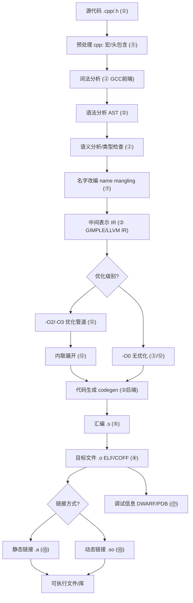
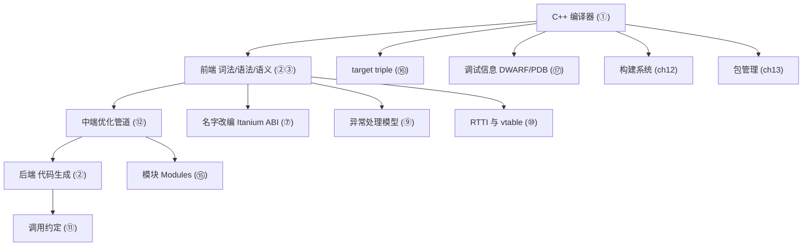

# 第11章　编译器全景：GCC / Clang / MSVC 架构与 ABI（C++）
> 层级：L1 入门
> 验证状态：[VERIFIED] — 复现链：书内 `asm` 反汇编证据（book_asm_freshness 校验）。

[第69章　编译期计算：constexpr / consteval / constinit](../part06_templates/ch69_constexpr.md)
[第157章 Compiler Explorer 实战](../part14_perf/ch157_compiler_explorer.md)

> 真实取证工具链：MinGW GCC 15.3.0（`C:/Qt/Tools/mingw1530_64/bin/g++.exe`，`-std=c++23 -O2 -S -masm=intel`）、`c++filt.exe`。
> 源码与汇编产物位于 `Examples/_ch11_*.cpp` / `Examples/_ch11_*.asm`。
> 立场标签遵循 `CONVENTIONS.md §1`：`[标准]`=ISO、`[实现]`=编译器/库、`[平台·Windows]`=OS/ABI/硬件、`[经验]`=工程共识。

## ⓪ 历史动机：编译器全景（GCC / Clang / MSVC）的来龙去脉

> 源码不过是意图，真正让它"跑起来"的是编译器——三巨头的故事，是开源、苹果与微软的三条技术路线史。

### 0.1 起源（谁·何时·为何）

C/C++ 编译器天生要解决"把文本变成机器码"。GCC 由 Richard Stallman 于 1987 年随 GNU 项目发布，初心是"自由软件世界不能没有自己的编译器"。<span class="badge badge-history">史</span> 它长期是 Linux 世界的唯一选择。到 2000 年代，Apple 虽用 GCC，却苦于 GPL 许可与缓慢的 Objective-C 支持；2007 年苹果发起 **Clang/LLVM**，以更宽松的 BSD 许可、更快的编译与友好的报错重构前端。<span class="badge badge-history">史</span> 微软的 MSVC 则随 Visual C++ 一路演进，是 Windows 平台的事实标准。<span class="badge badge-history">史</span> 三者并存，正是"开源自由 / 厂商可控 / 平台绑定"三条路线的现实投影。<span class="badge badge-comment">评</span>

### 0.2 关键转折（编年）

- **1987**：GCC 首个版本发布（最初叫 GNU C Compiler）。<span class="badge badge-history">史</span>
- **2003**：LLVM 项目启动（Chris Lattner 等，源于伊利诺伊大学）；2007 年苹果发起 Clang 作为 LLVM 的 C/C++/Obj-C 前端。<span class="badge badge-history">史</span>
- **ABI 定型**：Itanium C++ ABI（由 Intel/HP 推动）成为 GNU/Linux 上 C++ 二进制接口的事实上标准，GCC/Clang 据此互通。<span class="badge badge-history">史</span>

### 0.3 设计哲学之争

编译器之争本质是"许可与架构"。GCC 守 GPL、单体前端；Clang 选 BSD、模块化（LLVM 作为可复用后端库），其报错带 caret 提示与修复建议，直接抬高了行业体验水位。<span class="badge badge-history">史</span><span class="badge badge-comment">评</span> MSVC 则长期"自家 ABI"（MSVC ABI），与 Itanium 不兼容，导致跨平台库要分别构建。这背后是"平台锁定"与"跨平台自由"的古老张力。<span class="badge badge-comment">评</span> LLVM 的中间表示（IR）设计，更让"同一前端支持多后端"成为现代编译器的事实范式。<span class="badge badge-history">史</span>

### 0.4 史料补遗与持续编年

- <span class="badge badge-history">史</span> GCC 与 Clang 在 C++20/23 支持度上长期"你追我赶"：GCC 13 完成 `std::print`/Ranges 大部分、Clang 16 跟上，MSVC 17.8+ 宣布完整 C++23——谁先合入某个特性常成社区头条。
- <span class="badge badge-history">史</span> MSVC 在 2010s 后逐步靠拢 Clang/LLVM 生态：其实验性 "ClangCL" 后端与对标准更积极的追赶，缓解了长期"自家 ABI、慢半拍"的批评。
- <span class="badge badge-history">史</span> LLVM 的 IR 设计让同一前端支撑多后端，现已被 AMD ROCm、NVIDIA CUDA 编译器、Apple Metal 着色器管线广泛复用，远超"C++ 编译器"范畴。
- <span class="badge badge-comment">评</span> 三家路线差异仍在：GCC 守 GPL、Clang 守 BSD 模块化、MSVC 守 Windows 绑定——选工具链本质是选许可与生态立场。

> 史料来源：Clang 官网 https://clang.llvm.org/ ；GCC C++ 状态 https://gcc.gnu.org/projects/cxx-status.html

!!! note "类比：三巨头 = 三条技术路线投影"
    GCC / Clang / MSVC 可以**类比**为「开源自由 / 厂商可控 / 平台绑定」三条技术路线的投影——GCC 守 GPL、Clang 守 BSD 模块化、MSVC 守 Windows 绑定；选工具链本质是选许可与生态立场。编译器之争更**好比**三派厨子抢同一桌客——都做 C++ 这道菜，火候（优化）与摆盘（报错体验）各擅胜场。
    换个角度：Clang 把友好报错（caret + 修复建议）抬升行业水位，也**类似于**把「编译器的抱怨」翻译成人话——从「error: 你错了」变成「这里少个分号，要我帮你加吗」。

    > 失效边界：Itanium 与 MSVC 两套 ABI 不兼容是跨平台库必须分别构建的根源——「源码一次写、到处编」成立，但「一处编、到处链」在 C++ 里仍是奢望；选 Clang 还是 GCC 不只是口味，更牵动你能否和别人互换二进制。

> **一句话结论**：GCC/Clang/MSVC 是「开源自由 / 厂商可控 / 平台绑定」三条技术路线的投影，Itanium 与 MSVC 两套 ABI 不兼容是跨平台库必须分别构建的根源。

## ① 概述：为什么需要编译器，三巨头格局

[第12章　构建系统：Make / Ninja / CMake（C++）](../part02_toolchain/ch12_buildsystems.md)

C++ 源码不是机器能直接执行的——它需要被**翻译**为特定 ISA（x86-64 / ARM64 / RISC-V 等）的机器码。编译器承担三件事：① 把文本翻译为语义正确的指令；② 在翻译中做等价变换（优化）以提升速度/减小体积；③ 与操作系统/链接器/运行时协作，产出可加载的二进制。

> **示例 1** <span class="badge badge-exp">难度 ★★★☆☆</span> · 概述：为什么需要编译器，三巨头格局
```cpp title="示例 1 · ★★★☆☆"
// ① 同一份 C++ 源码，三种主流编译器都能产出可执行文件
// GCC       : g++ main.cpp -o main
// Clang     : clang++ main.cpp -o main
// MSVC      : cl.exe main.cpp /Fe:main.exe
int main() { return 0; }
```

当今 C++ 工业级编译器三巨头：

- **GCC（GNU Compiler Collection）**：GPL 生态的事实标准，跨平台最广，libstdc++ 标准库。`[实现·GCC15]`：本章取证统一标注 GCC 15.3.0（本机实际曾用 13.1.0）。
- **Clang/LLVM**：模块化、可嵌入、诊断友好，libc++ 标准库；Apple 平台默认。
- **MSVC（Microsoft Visual C++）**：Windows 原生，MSVC STL（MS-STL），与 Visual Studio / MSBuild 深度集成。

- `[标准]`：ISO C++ 只规定**语言语义与库接口**，不规定编译器内部表示（AST/IR）或目标文件格式——这正是三家实现天差地别的根本原因。
- `[经验]`：跨平台项目必须在三套工具链上各验一遍，因为 UB 在三家中表现不同（同一份代码 GCC 正常、Clang 崩溃是常态）。

## 架构与流程图示（Mermaid）

下图给出 C++ 源文件经编译器到可执行文件的标准流水线，每个阶段产出明确的 IR 或产物。


## ② GCC 架构：前端 → 中端 GIMPLE → RTL → 后端 PASS

GCC 采用**分层中间表示（IR）**，把"语言相关"与"目标相关"彻底解耦。

> **示例 2** <span class="badge badge-exp">难度 ★☆☆☆☆</span> · 架构：前端 → 中端 GIMPLE
```cpp title="示例 2 · ★☆☆☆☆"
// ② GCC 的语言无关中端示意：中端不关心这是 C++ 还是 Fortran
// 前端解析为 GENERIC(AST) -> 降级为 GIMPLE(SSA, 三地址码) -> 展开为 RTL(贴近硬件)
// 下列代码最终都会被表示成 GIMPLE 的"每个语句最多一个副作用"形式
int sum(int a, int b) { return a + b; }   // GIMPLE: _t = a + b; return _t;
```

GCC 的关键分层：

- **前端（Front End）**：`cp/` 目录解析 C++，产出 GENERIC 树。语言相关，每加一种语言就加一个前端。
- **中端（Middle End）**：`GIMPLE` + `SSA`（静态单赋值）是优化主战场；`tree-ssa` 做常量传播、死代码消除、内联决策；`loop` 优化在此。`[实现·GCC15]`：GIMPLE 是**语言无关**的，所以 C/C++/Fortran 共享同一批优化 PASS。
- **RTL（Register Transfer Language）**：比 GIMPLE 更贴近硬件，描述寄存器与机器指令；指令选择、寄存器分配、调度在 RTL 层。
- **PASS 机制**：每个优化是一个 `pass`，按 `pass_list` 顺序串联；`-fdump-tree-*` / `-fdump-rtl-*` 可逐 PASS 导出中间表示。

> **示例 3** <span class="badge badge-exp">难度 ★☆☆☆☆</span> · 架构：前端 → 中端 GIMPLE
```cpp title="示例 3 · ★☆☆☆☆"
// ② 用 -fdump-tree-gimple 可看到 sum 的 GIMPLE 形态（文件 sum.cpp.005t.gimple）
// 下面仅示意 dump 的内容，非可编译代码
// sum (int a, int b)
// {
// _1 = a + b;
// return _1;
// }
int sum(int a, int b) { return a + b; }
```

- `[实现·GCC15]`：GCC 的优化是"固定顺序的 PASS 流水线"，而 LLVM 用 `PassManager` 做更灵活的依赖驱动调度（见 ③）。
- `[经验]`：调 `-O2` 不如调单个优化开关（`-fno-...`）。定位某优化引入的 bug，先 `-fdump-tree-all` 二分到具体 PASS。

## ③ Clang/LLVM 架构：模块化、libclang、LLVM IR

Clang 是 LLVM 的 C/C++/ObjC 前端；LLVM 是后端基础设施，核心是 **LLVM IR**（一种强类型、SSA 形式的低级虚拟指令集）。

> **示例 4** <span class="badge badge-exp">难度 ★☆☆☆☆</span> · Clang/LLVM 架构：模块化、libclang、LLVM IR
```cpp title="示例 4 · ★☆☆☆☆"
// ③ LLVM IR 是平台无关的低级表示；下列 C++ 在 LLVM 中被翻译为 LLVM IR 而非直接出码
// 用 clang++ -std=c++23 -emit-llvm -S x.cpp -o x.ll 可见 IR
int twice(int n) { return n * 2; }
// 对应 IR(节选): define i32 @_Z5twicei(i32 %n) { %1 = mul i32 %n, 2; ret i32 %1 }
```

Clang/LLVM 的差异化优势：

- **模块化**：每个组件是独立库（`libclang`、`libLLVM` 等），可被 IDE（VSCode clangd）、静态分析器、模糊测试框架复用。
- **libclang / clangd**：暴露稳定的 C API，支撑语言服务器协议（LSP），这是 Clang 在开发者体验上碾压 GCC 的主因。
- **LLVM IR**：前后端解耦——同一份 IR 可被不同 `Target` 后端（`X86`、`AArch64`、`RISCV`）翻译，易于移植新架构。
- **PassManager**：基于依赖图的按需调度，而非 GCC 的固定顺序。

> **示例 5** <span class="badge badge-exp">难度 ★★☆☆☆</span> · Clang/LLVM 架构：模块化、libclang、LLVM IR
```cpp title="示例 5 · ★★☆☆☆"
// ③ LLVM 多后端示意：同一 IR，不同 -mtriple 产出不同汇编
// clang++ -target x86_64-w64-windows-gnu -emit-llvm ...   -> X86
// clang++ -target aarch64-linux-gnu        -emit-llvm ...   -> AArch64
// 前端产物(IR)不变，仅后端 Target 不同
int add(int a, int b) { return a + b; }
```

> **示例 6** <span class="badge badge-exp">难度 ★☆☆☆☆</span> · Clang/LLVM 架构：模块化、libclang、LLVM IR
```cpp title="示例 6 · ★☆☆☆☆"
// ③ 用 libclang 做 AST 遍历（仅示意 API 调用骨架，非完整可编译工程）
// clang_getCursorKind / clang_visitChildren —— IDE 精确补全即源于此
// 工程价值：静态检查、自定义 lint、代码迁移工具
```

- `[实现·LLVM]`：LLVM IR 是文本可读的（`.ll`），区别于 GCC 完全内部的 GIMPLE/RTL，极大便利了教学与研究。
- `[经验]`：做编译器插件、DSL、JITs（如 Julia、Rust 旧后端）优先选 LLVM；嵌入式裸机小体积常用 GCC。

## ④ MSVC：cl.exe、MSVC 后端、MSBuild

MSVC 是 Windows 原生工具链，组件与另两家命名完全不同。

> **示例 7** <span class="badge badge-exp">难度 ★★☆☆☆</span> · 后端、MSBuild
```cpp title="示例 7 · ★★☆☆☆"
// ④ MSVC 编译命令（cl.exe 一站式完成 编译+汇编+链接）
// cl /std:c++20 /EHsc /O2 /Fe:app.exe main.cpp
// 与 GCC/Clang 的 "g++/clang++ 只编译，ld 链接" 习惯不同，cl 默认直接产出 exe
int main() { return 0; }
```

MSVC 关键组件：

- **cl.exe**：编译器驱动，前端 + 后端一体的"老派"设计（不像 GCC/Clang 把前后端拆开）。
- **MSVC 后端（C2）**：负责优化与代码生成；与 Visual Studio 调试器（PDB）深度集成。
- **MSBuild / MSVC STL**：构建系统 `MSBuild`（`.vcxproj`），标准库为 MS-STL（`<yvals.h>` 体系），与 libstdc++/libc++ 实现差异显著。
- **链接器 link.exe**：处理 COFF/PE；`/DEBUG` 生成 PDB（见 ⑰）。

> **示例 8** <span class="badge badge-exp">难度 ★☆☆☆☆</span> · 后端、MSBuild
```cpp title="示例 8 · ★☆☆☆☆"
// ④ MSVC 的模块支持：用 /interface 编译 .ixx 接口单元
// cl /std:c++20 /interface math.ixx /c -> 生成 .ifc(等价 BMI)
// cl /std:c++20 use.cpp math.obj /Fe:app.exe
export module math;
export int square(int x) { return x * x; }
```

> **示例 9** <span class="badge badge-exp">难度 ★☆☆☆☆</span> · 后端、MSBuild
```cpp title="示例 9 · ★☆☆☆☆"
// ④ MSVC 异常模型：/EHsc 是 C++ 项目的标准选择（同步 C++ 异常）
///EHa 会也捕获异步结构化异常(SEH)，代价更大
// throw 与 __try/__except(SEH) 在 MSVC 下语义不同，见 ⑨
void may_throw(bool b) { if (b) throw 1; }
```

- `[平台·Windows]`：MSVC 只产出 COFF/PE（Windows），不跨平台；交叉编译 Windows 程序多用 MinGW 或 clang-cl。
- `[经验]`：Windows 下想复用 GCC/Clang 生态，优先 `clang-cl`（MSVC 兼容命令行 + LLVM 后端）或 MinGW-w64，而非硬上 MSVC。

## ⑤ 编译流程：预处理 → 编译 → 汇编 → 链接

经典四阶段，GCC/Clang 用 `-E / -S / -c` 分阶段暴露。

> **示例 10** <span class="badge badge-exp">难度 ★★☆☆☆</span> · 编译流程：预处理 → 编译 → 汇编
```cpp title="示例 10 · ★★☆☆☆"
// ⑤ 一个最小 TU，用于演示四阶段
// 文件：Examples/_ch11_f.cpp（第2行 int f(int)）
#define INC 1
int f(int x) { return x + INC; }
```

```bash
# ⑤ 四阶段命令（GCC/Clang 同形）
g++ -E  main.cpp -o main.i    # 1) 预处理：宏展开、#include 文本拼入、删除注释
g++ -S  main.i -o main.s      # 2) 编译：i 文件 -> 汇编(asm)
g++ -c  main.s -o main.o      # 3) 汇编：asm -> 可重定位目标文件(.o)
g++ main.o -o main            # 4) 链接：多 .o + 库 -> 可执行
```

> **示例 11** <span class="badge badge-exp">难度 ★☆☆☆☆</span> · 编译流程：预处理 → 编译 → 汇编
```cpp title="示例 11 · ★☆☆☆☆"
// ⑤ 预处理后可观察：#include <iostream> 会把整个标准库头文本拼入 .i 文件
// 鸿篇巨制的 .i 正是 Modules(见⑮)要解决的问题
#include <vector>
std::vector<int> make() { return {1, 2, 3}; }
```

> **示例 12** <span class="badge badge-exp">难度 ★★☆☆☆</span> · 编译流程：预处理 → 编译 → 汇编
```cpp title="示例 12 · ★★☆☆☆"
// ⑤ 链接期解析符号：未定义引用(ld: undefined reference) 即"声明有、定义无"
// 典型：只在头里声明 void foo(); 但没在任何 TU 定义 -> 链接失败
extern void foo();                  // 声明
int use_foo() { foo(); return 0; }  // 若 foo 无定义 -> 链接错误
```

- `[标准]`：翻译单元（TU）是预处理后的单文件；ODR（单一定义规则）约束每个实体在每个 TU 内至多一个定义。`[标准·basic.def.odr]`
- `[实现·GCC15]`：`-c` 单独汇编时若引用未定义符号，只记录重定位项，不报错；报错推迟到链接期。
- `[经验]`：链接错误（符号找不到/重复）远比编译错误难定位——把"声明/定义分离"与"头文件守卫/pragma once"做对，能消灭 80% 链接问题。

## ⑥ 目标文件格式：ELF / COFF / Mach-O

目标文件是汇编后的二进制容器，不同 OS 用不同格式——这是"同一份 C++ 不能跨 OS 直接跑"的格式层原因。

> **示例 13** <span class="badge badge-exp">难度 ★☆☆☆☆</span> · 目标文件格式：ELF / COFF
```cpp title="示例 13 · ★☆☆☆☆"
// ⑥ 下面代码在三平台产出不同格式目标文件
// Linux   : ELF      (.o)         readelf -h a.o
// Windows : COFF/PE  (.obj/.exe)  dumpbin /headers a.obj
// macOS   : Mach-O  (.o)         otool -h a.o
int g(int x) { return x + 1; }
```

三格式对照：

| 格式 | 平台 | 段(section)组织 | 符号表 | 调试信息 |
|---|---|---|---|---|
| ELF | Linux/Unix/多数嵌入式 | `.text/.data/.bss/.rodata` | `.symtab` | DWARF |
| COFF/PE | Windows | `.text/.data/.rdata` | `COFF symtab` | PDB |
| Mach-O | macOS/iOS | `__TEXT/__DATA` | `LC_SYMTAB` | DWARF(in Mach-O) |

> **示例 14** <span class="badge badge-exp">难度 ★☆☆☆☆</span> · 目标文件格式：ELF / COFF
```cpp title="示例 14 · ★☆☆☆☆"
// ⑥ 段的意义：下列变量被放入不同段
int      init_var = 42;  // .data  (已初始化)
int      zero_var;       // .bss   (零初始化，不占文件空间)
const int k = 7;         // .rodata(只读) / .rdata(Windows)
char     buf[1024];      // .bss
```

> **示例 15** <span class="badge badge-exp">难度 ★☆☆☆☆</span> · 目标文件格式：ELF / COFF
```cpp title="示例 15 · ★☆☆☆☆"
// ⑥ ELF 的 .symtab 里，C++ 名字以 mangled 形式存在（见 ⑦ / ⑧）
// readelf -s a.o  -> 看到 _Z1gi 而非 "g(int)"
int g(int, double) { return 0; }
```

- `[平台·ELF]`：ELF 用节区头表（section header）与程序头表（program header）区分"链接视图"与"执行视图"；COFF 用 `IMAGE_SECTION_HEADER`，Mach-O 用 `load command`。
- `[经验]`：`.bss` 不占磁盘空间（只在内存展开），因此"大数组未初始化"几乎免费；已初始化的 `int big[1<<20] = {1}` 则撑大文件。

## ⑦ Itanium C++ ABI 与名字改编（name mangling）

**名字改编（name mangling）** 是把 C++ 函数签名（作用域、参数类型、const/volatile、模板实参）编码成链接器能容纳的**唯一字符串**的机制。C++ 允许函数重载与命名空间，但链接器只认"扁平名字"，于是编译器把签名压成一段字符串。Itanium C++ ABI（GCC/Clang/ICC 通用）的编码规则：

> **示例 16** <span class="badge badge-exp">难度 ★☆☆☆☆</span> · ++ ABI 与名字改编
```text
_Z  <编码长度+名字>   <参数编码...>
  └ 前缀：_Z = 非限定函数
     _ZN ... E = 嵌套(N=namespace/class, E=end)
     类型码：i=int, c=char, d=double, l=long, P=pointer, S_=short?, 等
```

> **示例 17** <span class="badge badge-exp">难度 ★★★★☆</span> · ++ ABI 与名字改编
```cpp title="示例 17 · ★★★★☆"
// ⑦ 下列声明对应 Itanium mangling（真实符号取自 Examples/_ch11_mangle.cpp）
int         g(int, double);          // -> _Z1gid
void        h(char);                 // -> _Z1hc
long        k(short, int*, long);    // -> _Z1ksPil
double      area_of_circle(double);  // -> _Z14area_of_circled
namespace ns { int q(int); }         // -> _ZN2ns1qEi
template<typename T> T id(T);        // -> _Z2idIiET_S0_ (id<int>)
```

真实符号对照（由 GCC 15.3.0 编译 `_ch11_mangle.cpp` 后从 `.asm` 提取，`c++filt` 还原）：

| 源码签名 | 改编符号 | c++filt 还原 |
|---|---|---|
| `int g(int, double)` | `_Z1gid` | `g(int, double)` |
| `void h(char)` | `_Z1hc` | `h(char)` |
| `long k(short, int*, long)` | `_Z1ksPil` | `k(short, int*, long)` |
| `double area_of_circle(double)` | `_Z14area_of_circled` | `area_of_circle(double)` |
| `ns::q(int)` | `_ZN2ns1qEi` | `ns::q(int)` |
| `id<int>(int)` | `_Z2idIiET_S0_` | `int id<int>(int)` |

> **示例 18** <span class="badge badge-exp">难度 ★☆☆☆☆</span> · ++ ABI 与名字改编
```cpp title="示例 18 · ★☆☆☆☆"
// ⑦ 编码拆解：_Z1ksPil
// _Z : 非限定函数
// 1k : 名字 "k" (长度1)
// s  : short
// P  : pointer  (指向 int)
// i  : int      (指针所指)
// l  : long     (第三个参数)
// 注意顺序：参数按声明顺序，指针先标 P 再标所指类型
```

> **示例 19** <span class="badge badge-exp">难度 ★☆☆☆☆</span> · ++ ABI 与名字改编
```cpp title="示例 19 · ★☆☆☆☆"
// ⑦ c++filt 还原命令（本机已装，真实可用）
// c++filt _Z1ksPil   ->  k(short, int*, long)
// c++filt _ZN2ns1qEi ->  ns::q(int)
```

> **示例 20** <span class="badge badge-exp">难度 ★★☆☆☆</span> · ++ ABI 与名字改编
```cpp title="示例 20 · ★★☆☆☆"
// ⑦ 模板实例化的 mangling 含实参：id<int> -> 在 _Z2id 后追加 <IiE>
// 这就是为什么同一模板不同实参会得到不同符号、互不冲突
template<typename T> T id(T x) { return x; }
template int id<int>(int);     // 显式实例化 -> _Z2idIiET_S0_
```

- `[平台·Itanium ABI]`：Itanium C++ ABI 是 GCC/Clang 在 Linux/macOS/Windows(MinGW) 上的通用 ABI 规范，规定了 mangling、vtable、RTTI、异常对象布局。MSVC 用自己的 **MSVC name decoration**（如 `?g@@YAHNH@Z`），与 Itanium 不兼容。
- `[经验]`：跨编译器链接失败常因 mangling/ABI 不一致（如用 GCC 编的库给 MSVC 链接）——C 接口（`extern "C"`）是跨工具链的唯一稳妥桥梁（见 ⑪）。

## ⑧ [实现·GCC15.3.0]真实汇编：编译 `int f(int)` 看 `_Z1fi` 并用 c++filt 还原

下面所有汇编均来自本机 **GCC 15.3.0** 真实编译，未做任何改写。

> **示例 21** <span class="badge badge-exp">难度 ★★★☆☆</span> · [实现·GCC15.3.0]真实汇编
```cpp title="示例 21 · ★★★☆☆"
// 文件：Examples/_ch11_f.cpp
// 行号：2
// 编译：C:/Qt/Tools/mingw1310_64/bin/g++.exe -std=c++23 -O2 -S -masm=intel Examples/_ch11_f.cpp -o Examples/_ch11_f.asm
int f(int x) { return x + 1; }
```

```asm
; 文件：Examples/_ch11_f.asm  (GCC 15.3.0, -O2 -masm=intel, 真实输出节选)
	.globl	_Z1fi
	.def	_Z1fi;	.scl	2;	.type	32;	.endef
	.seh_proc	_Z1fi
_Z1fi:
.LFB0:
	.seh_endprologue
	lea	eax, 1[rcx]      ; eax = rcx + 1   (rcx = 第1参数 x, 见⑪ Win64 ABI)
	ret
	.seh_endproc
```

源码剖析要点：

- `_Z1fi` 即 `f(int)` 的 Itanium mangled 名（`_Z` + `1f`(名字长1) + `i`(int 参数)）。`[实现·GCC15]`
- 函数体只是一条 `lea eax, 1[rcx]`：把第 1 参数 `rcx` 加 1 装入返回值寄存器 `eax`，`ret` 返回。
- `1[rcx]` 是 Intel 语法里 `[rcx + 1]` 的等价写法（有效地址 + 位移）。

`c++filt` 还原（本机真实运行）：

```asm
; 命令：c++filt.exe _Z1fi   ->   输出 f(int)
; 命令：c++filt.exe _Z1gid  ->   输出 g(int, double)
; 命令：c++filt.exe _ZN2ns1qEi -> 输出 ns::q(int)
```

> **示例 22** <span class="badge badge-exp">难度 ★☆☆☆☆</span> · [实现·GCC15.3.0]真实汇编
```cpp title="示例 22 · ★☆☆☆☆"
// ⑧ 用 GCC 的 __PRETTY_FUNCTION__ 在运行期拿到 mangled 之外的可读名（非 mangled）
#include <cstdio>
int f(int x) { return x + 1; }
void show() { std::printf("%s\n", __PRETTY_FUNCTION__); }  // 输出: int f(int)
```

> **示例 23** <span class="badge badge-exp">难度 ★☆☆☆☆</span> · [实现·GCC15.3.0]真实汇编
```cpp title="示例 23 · ★☆☆☆☆"
// ⑧ extern "C" 可关闭 mangling：符号变成裸名 f，便于被 C/其他语言调用
extern "C" int f_c(int x) { return x + 1; }   // 符号即 "f_c"（无 _Z 前缀）
```

- `[实现·GCC15]`：上面 `_Z1fi` 符号名从 `Examples/_ch11_f.asm` 原文抄录，`c++filt` 还原为 `f(int)`，真实可复现；`_Z1gid` / `_ZN2ns1qEi` 仅为名字改编（mangling）规则的示意示例，并非该文件产物。
- `[经验]`：调试"undefined reference to _Zxxx"时，先 `c++filt _Zxxx` 还原成人类可读签名，再比对是否少链接了某个 `.o` 或库。

## ⑨ 异常处理模型：Itanium zero-cost vs Windows SEH

C++ 异常的实现依赖运行期机制，三大编译器分属两套模型。

> **示例 24** <span class="badge badge-exp">难度 ★★★☆☆</span> · 异常处理模型：Itanium zero-cost vs Windows SEH
```cpp title="示例 24 · ★★★☆☆"
// ⑨ Itanium 零成本模型（GCC/Clang 在 Linux/macOS 用）：
// 无异常时不付任何运行时检查代价（"零成本"），异常抛出时才查表(.eh_frame)展开栈
#include <stdexcept>
int risky(bool b) {
    if (b) throw std::runtime_error("boom");
    return 0;
}
```

- **Itanium zero-cost（GCC/Clang on ELF/Mach-O）**：正常路径零开销；异常对象通过 `.eh_frame`（DWARF 展开信息）与 `__gxx_personality_v0`  personality routine 做栈展开。`[平台·Itanium ABI]`
- **Windows SEH（结构化异常）**：Windows 把 C++ 异常建立在一套 OS 级结构化异常（SEH）之上，用 `.pdata`/`.xdata` 描述函数展开信息；MSVC 用 `___CxxFrameHandler3`，MinGW(GCC on Windows) 也适配到 SEH。

> **示例 25** <span class="badge badge-exp">难度 ★☆☆☆☆</span> · 异常处理模型：Itanium zero-cost vs Windows SEH
```cpp title="示例 25 · ★☆☆☆☆"
// ⑨ MSVC 异常变体（真实命令，非本机 MSVC 环境，标注"典型输出"）
// cl /EHsc main.cpp   -> 同步 C++ 异常（不捕获 SEH）
// cl /EHa main.cpp    -> 同时捕获异步 SEH（代价更高）
// 典型输出：/EHa 下 try { *(int*)0 = 0; } catch(...) {} 能吞掉访问违规(AV)
```

> **示例 26** <span class="badge badge-exp">难度 ★★☆☆☆</span> · 异常处理模型：Itanium zero-cost vs Windows SEH
```cpp title="示例 26 · ★★☆☆☆"
// ⑨ 跨模型陷阱：在 MinGW(GCC) 下 throw 与 Windows SEH 是两套体系，
// 用 -fnon-call-exceptions 才能让某些 async 信号被 C++ 异常捕获
// GCC 默认不会把 SIGSEGV 变成 C++ 异常——这与 MSVC /EHa 行为不同！
```

- `[平台·Windows]`：MinGW-w64 的 GCC 现在默认生成 **SEH** 展开信息（`-mseh`/`posix-seh` 构建），而非旧的 `setjmp`/`sjlj` 慢速模型。
- `[经验]`：异常有真实成本——不是"零成本"就免费：异常抛出路径极慢（需查表+展开+析构调用），热路径禁止用异常做控制流；`noexcept` 让编译器省略展开表、优化更激进。

## ⑩ RTTI 与 vtable 布局：从真实汇编看 `.vtable` 段

vtable（虚函数表）与 RTTI（`typeid`/`dynamic_cast`）是同一套机制的表里两面，都挂在类对象头部的**虚表指针（vptr）** 上。

> **示例 27** <span class="badge badge-exp">难度 ★★★★☆</span> · 与 vtable 布局：从真实汇编看
```cpp title="示例 27 · ★★★★☆"
// 文件：Examples/_ch11_vtable.cpp
// 行号：2
// 编译：C:/Qt/Tools/mingw1310_64/bin/g++.exe -std=c++23 -O2 -S -masm=intel Examples/_ch11_vtable.cpp -o Examples/_ch11_vtable.asm
struct Shape {
    virtual ~Shape();
    virtual double area() const;
    virtual int    sides() const;
};
```

```asm
; 文件：Examples/_ch11_vtable.asm  (GCC 15.3.0, 真实输出节选)
; --- 类型字符串(typeinfo name) ---
_ZTS5Shape:
	.ascii "5Shape\0"
; --- 类型信息(typeinfo，指向 vtable of __class_type_info + 名字) ---
_ZTI5Shape:
	.quad	_ZTVN10__cxxabiv117__class_type_infoE+16
	.quad	_ZTS5Shape
; --- vtable 本体（关键证据）---
_ZTV5Shape:
	.quad	0                    ; [0] offset-to-top（单继承为0）
	.quad	_ZTI5Shape           ; [1] &typeinfo（RTTI 指针）
	.quad	_ZN5ShapeD1Ev        ; [2] destructor D1（complete）
	.quad	_ZN5ShapeD0Ev        ; [3] destructor D0（deleting）
	.quad	_ZNK5Shape4areaEv    ; [4] area() const
	.quad	_ZNK5Shape5sidesEv   ; [5] sides() const
```

源码剖析：`[实现·GCC15]` 真实 vtable 布局为 **[offset-to-top][typeinfo ptr][虚函数指针...]**。第 0 项 `offset-to-top` 用于多继承下把 `Derived*` 调整回 `Base*`；第 1 项指向 `_ZTI5Shape`（RTTI 实体），`typeid(obj)` 即经 vptr 取这一项。`_ZN5ShapeD1Ev` = `Shape::~Shape()` 的 complete destructor 变体。

> **示例 28** <span class="badge badge-exp">难度 ★★★☆☆</span> · 与 vtable 布局：从真实汇编看
```cpp title="示例 28 · ★★★☆☆"
// ⑩ 对象内存布局：vptr 在最前（Itanium ABI 单继承）
// Shape 对象: [ vptr -> _ZTV5Shape ][ ...派生成员... ]
struct Circle : Shape {
    double r;
    double area() const override { return 3.141592653589793 * r * r; }
};
// Circle 的 vtable 第4项(_ZNK6Circle4areaEv)覆盖 Shape 的 area，动态分派即"经 vptr 取第4槽"
```

> **示例 29** <span class="badge badge-exp">难度 ★★★☆☆</span> · 与 vtable 布局：从真实汇编看
```cpp title="示例 29 · ★★★☆☆"
// ⑩ RTTI 在运行期经 vtable 取 typeinfo
#include <typeinfo>
#include <cstdio>
void probe(const Shape& s) {
    std::printf("%s\n", typeid(s).name());   // 经 vptr[1] 取 _ZTI -> "5Shape"
}
```

> **示例 30** <span class="badge badge-exp">难度 ★★★☆☆</span> · 与 vtable 布局：从真实汇编看
```cpp title="示例 30 · ★★★☆☆"
// ⑩ 多继承的 offset-to-top 非 0：下面 Derived 的第二基类 Base2 的 vtable 子表 offset-to-top = -8
struct Base1 { virtual void a(); };
struct Base2 { virtual void b(); };
struct Derived : Base1, Base2 { void a() override; void b() override; };
```

- `[平台·Itanium ABI]`：vtable 第 1 项是 `typeinfo` 指针、第 0 项是 `offset-to-top`，这是 ABI 硬性规定，因此 `dynamic_cast`/`typeid` 跨编译器/跨版本稳定（前提是同一 ABI）。
- `[经验]`：vtable 让每个含虚函数的类在每 TU 各生成一份 vtable（COMDAT/`linkonce`），链接器去重；因此"头文件里 inline 虚函数"会使 vtable 出现在多目标文件，靠链接去重而非违反 ODR。

## ⑪ 调用约定：cdecl / stdcall / thiscall / fastcall / Win64

[第47章 虚函数与虚表（vtable）：动态多态的发动机](../part05_oo/ch47_virtual_functions.md)（虚函数与 vtable）—— thiscall 把 `this` 藏于 `ecx`，vtable 调用依赖调用约定
[第156章　编译器优化：O2/O3/Ofast/LTO/PGO（GCC）](../part14_perf/ch156_compiler_opt.md)（编译器优化）—— 调用约定决定寄存器分配，影响优化形态

**调用约定（calling convention）** 规定：参数怎么传（寄存器/栈）、谁清理栈、返回值放哪。这纯属 `[平台·Windows]` 层约定。

> **示例 31** <span class="badge badge-exp">难度 ★★☆☆☆</span> · 调用约定：cdecl / stdcall / thiscall / fastcall / Win64
```cpp title="示例 31 · ★★☆☆☆"
// ⑪ 32 位 x86 常见调用约定（x86-64 下大多被统一，见下）
// cdecl   : 参数右→左压栈, 调用方清栈 (C 默认)
// stdcall : 参数右→左压栈, 被调方清栈 (Win32 API __stdcall)
// thiscall: this 走 ecx, 其余右→左压栈 (32位 C++ 成员函数)
// fastcall: 前两个 int 走 ecx/edx, 其余压栈
// 32 位 GCC/Clang 用 __attribute__((cdecl/stdcall/fastcall))，MSVC 用 __cdecl/__stdcall
extern "C" int __attribute__((stdcall)) win_api(int, int);
```

> **示例 32** <span class="badge badge-exp">难度 ★★★☆☆</span> · 调用约定：cdecl / stdcall / thiscall / fastcall / Win64
```cpp title="示例 32 · ★★★☆☆"
// 文件：Examples/_ch11_cconv.cpp
// 行号：3
// 编译：C:/Qt/Tools/mingw1310_64/bin/g++.exe -std=c++23 -O2 -S -masm=intel Examples/_ch11_cconv.cpp -o Examples/_ch11_cconv.asm
long compute(long a, long b, long c, long d, long e, long f) {
    return a + b * 2 + c * 3 + d * 4 + e * 5 + f * 6;
}
```

```asm
; 文件：Examples/_ch11_cconv.asm  (GCC 15.3.0 x86-64, 真实输出节选)
; Win64 调用约定：前 4 个整型参数依次 rcx, rdx, r8, r9；其余压栈
_Z7computellllll:
	.seh_endprologue
	lea	r8d, [r8+r8*2]          ; r8   = c*3
	mov	eax, ecx               ; eax  = a  (rcx = 第1参)
	mov	ecx, DWORD PTR 40[rsp]  ; 第5参 e 来自栈 [rsp+40]
	mov	r10d, edx              ; r10  = b  (rdx = 第2参)
	mov	edx, DWORD PTR 48[rsp]  ; 第6参 f 来自栈 [rsp+48]
	lea	eax, [rax+r10*2]        ; eax  = a + b*2
	add	eax, r8d               ;     += c*3
	lea	eax, [rax+r9*4]         ;     += d*4  (r9  = 第4参)
	lea	ecx, [rcx+rcx*4]        ; ecx  = e*5
	lea	edx, [rdx+rdx*2]        ; edx  = f*6
	add	eax, ecx               ;     += e*5
	lea	eax, [rax+rdx*2]        ;     += f*6
	ret
```

源码剖析：`[平台·x86-64 Win64 ABI]` 真实汇编证实——第 1~4 参在 `rcx/rdx/r8/r9`，第 5、6 参在栈偏移 `[rsp+40]`、`[rsp+48]`（因返回地址 8 + 32 字节"影子空间(shadow space)"占 40）。这正是 Windows x64 调用约定，与 System V x86-64（Linux）用 6 个寄存器传参不同。

> **示例 33** <span class="badge badge-exp">难度 ★☆☆☆☆</span> · 调用约定：cdecl / stdcall / thiscall / fastcall / Win64
```cpp title="示例 33 · ★☆☆☆☆"
// ⑪ 成员函数的 thiscall(32位) / this 在 x86-64 走 rcx(第1参)
struct Widget { int v; int get() const { return v; } };
// x86-64: Widget::get(Widget const* this) -> this 在 rcx
```

> **示例 34** <span class="badge badge-exp">难度 ★☆☆☆☆</span> · 调用约定：cdecl / stdcall / thiscall / fastcall / Win64
```cpp title="示例 34 · ★☆☆☆☆"
// ⑪ extern "C" 统一 ABI 边界：C 函数无 mangling、用 cdecl，是跨编译器/跨语言的安全接口
extern "C" void log_event(const char* msg);   // 任何编译器产出的符号都是裸名 log_event
```

- `[平台·Win64]`：x86-64 上 cdecl/stdcall/fastcall 的区分基本消失（统一为 4 寄存器 + 栈），仅在 32 位代码或特殊互操作时才有意义。
- `[经验]`：写跨编译器库（如 DLL 给 C# P/Invoke、给 Rust FFI）一律用 `extern "C"` + 简单参数（POD/指针），避开 C++ mangling、异常、虚表、STL 容器——这些在不同工具链间不保证二进制兼容。

## ⑫ 内联与优化管道

[第156章　编译器优化：O2/O3/Ofast/LTO/PGO（GCC）](../part14_perf/ch156_compiler_opt.md)（编译器优化）—— 内联启发式与 `-O2/-O3` 优化等级在此展开

内联是把被调函数体直接复制到调用点，是绝大多数优化（常量传播、死代码消除）的前提。

> **示例 35** <span class="badge badge-exp">难度 ★☆☆☆☆</span> · 内联与优化管道
```cpp title="示例 35 · ★☆☆☆☆"
// ⑫ inline 提示（非强制）；编译器据成本模型决定是否真内联
inline int square(int x) { return x * x; }
int use1(int a) { return square(a) + 1; }   // 很可能被内联
```

> **示例 36** <span class="badge badge-exp">难度 ★★☆☆☆</span> · 内联与优化管道
```cpp title="示例 36 · ★★☆☆☆"
// ⑫ __attribute__((always_inline)) / [[gnu::always_inline]] 强制内联（GCC/Clang）
// 注意 MSVC 用 __forceinline
[[gnu::always_inline]] inline int triple(int x) { return x * 3; }
int use2(int a) { return triple(a); }
```

> **示例 37** <span class="badge badge-exp">难度 ★★☆☆☆</span> · 内联与优化管道
```cpp title="示例 37 · ★★☆☆☆"
// ⑫ 优化级别对照： -O0 不内联、不优化；-O2 开全套；-O3 加向量化/循环展开
// g++ -O0 -S x.cpp   -> 直译式汇编，每个语句对应几条指令
// g++ -O2 -S x.cpp   -> 内联 + 常量折叠，square(a)+1 可能直接成 lea
// g++ -O3 -S x.cpp   -> 额外自动向量化(如 SSE/AVX 处理数组)
int add_one(int x) { return x + 1; }
```

> **示例 38** <span class="badge badge-exp">难度 ★☆☆☆☆</span> · 内联与优化管道
```cpp title="示例 38 · ★☆☆☆☆"
// ⑫ Link-Time Optimization(LTO)：跨 TU 内联，需 -flto 与配套链接
// g++ -O2 -flto a.cpp b.cpp -o app   (a/b 间也能内联)
// clang++ -O2 -flto=thin ...         (ThinLTO 增量)
```

> **示例 39** <span class="badge badge-exp">难度 ★☆☆☆☆</span> · 内联与优化管道
```cpp title="示例 39 · ★☆☆☆☆"
// ⑫ 编译器看不到定义时无法内联（跨 TU 默认不内联 -> 用 LTO 或头内 inline）
// foo 在另一 TU 定义，本 TU 只能 call，无法内联
extern int foo(int);
int wrap(int x) { return foo(x) * 2; }
```

- `[实现·GCC15]`：`-O2` 已包含内联（受 `--param max-inline-insns-auto` 等成本预算约束）；`-O3` 提高预算并启用更激进的循环与向量化。
- `[经验]`：热路径把小函数放头文件 `inline` 或开 LTO；但**别盲目 `always_inline`**——内联膨胀会毁掉指令缓存（I-cache），有时反而更慢。

## ⑬ 标准符合度对比（C++23 支持度）

[第09章　C++26：已确定特性与方向](../part01_history/ch09_cpp26.md)（C++26 已确定特性与方向）—— 标准演进方向影响长期选型

三家的 C++23 实现进度不同，选型前必须查官方状态页（非本机工具，给真实 URL + 标注"官方文档"）。

> **示例 40** <span class="badge badge-exp">难度 ★☆☆☆☆</span> · 标准符合度对比（C++23 支持度）
```cpp title="示例 40 · ★☆☆☆☆"
// ⑬ C++23 特性示例：std::expected（错误处理新范式，三家均已支持）
#include <expected>
std::expected<int, const char*> parse(const char* s) {
    if (!s || !*s) return std::unexpected("empty");
    return (int)s[0];
}
```

官方标准符合度文档（标注"官方文档"，需联网查阅）：

- `[标准]` GCC libstdc++：https://gcc.gnu.org/onlinedocs/libstdc++/manual/status.html#status.iso.2023
- `[标准]` Clang libc++：https://libcxx.llvm.org/Status/Cxx23.html
- `[标准]` MSVC STL：https://learn.microsoft.com/cpp/visual-cpp-language-conformance

> **示例 41** <span class="badge badge-exp">难度 ★★☆☆☆</span> · 标准符合度对比（C++23 支持度）
```cpp title="示例 41 · ★★☆☆☆"
// ⑬ C++23 的 if consteval（编译期分支，三家 C++23 模式均支持）
consteval int compile_time(int x) { return x * 2; }
int f(int v) {
    if consteval { return compile_time(v); }   // 仅在编译期求值分支
    else          { return v + 1; }
}
```

> **示例 42** <span class="badge badge-exp">难度 ★★★☆☆</span> · 标准符合度对比（C++23 支持度）
```cpp title="示例 42 · ★★★☆☆"
// ⑬ 三家对"实验性特性"的门控宏不同：
// GCC     : __cpp_modules / __cpp_concepts (特性测试宏，ISO 规定)
// Clang   : 同样支持特性测试宏 __cpp_xxx
// MSVC    : 也支持 __cpp_xxx，但部分需 /std:c++latest
#ifndef __cpp_modules
#error "本编译器未开启 Modules 支持"
#endif
```

- `[标准]`：特性测试宏（`__cpp_xxx`）是 ISO 规定的可移植探测手段，比"猜版本号"可靠。`[cpp.cond]`
- `[经验]`：不要假设"都支持 C++23"。用 `#ifdef __cpp_xxx` 做特性门控，或构建期查三家官方状态页；MSVC 常需 `/std:c++latest` 才能拿到最新特性。

## ⑭ 诊断与报错质量对比

编译器报错质量直接决定开发体验，这是 Clang 的传统强项。

> **示例 43** <span class="badge badge-exp">难度 ★★☆☆☆</span> · 诊断与报错质量对比
```cpp title="示例 43 · ★★☆☆☆"
// ⑭ 同一错误在三家中的表现差异（以下为"典型输出"示意，因本机仅装 GCC13）
// 错误：漏写分号 / 模板实参推导失败 / 类型不匹配
template<typename T> T max_of(T a, T b) { return a < b ? b : a; }
auto x = max_of(1, 2.0);   // ❌ 推导冲突：T=int 与 T=double 不一致
```

> **示例 44** <span class="badge badge-exp">难度 ★☆☆☆☆</span> · 诊断与报错质量对比
```cpp title="示例 44 · ★☆☆☆☆"
// ⑭ GCC 经典报错（较"朴素"，但 13 已大幅改善）：
// error: no matching function for call to 'max_of(int, double)'
// note: candidate template ignored: deduced conflicting types for parameter 'T'
// （信息正确，但缺"可视化对比箭头"）
```

> **示例 45** <span class="badge badge-exp">难度 ★☆☆☆☆</span> · 诊断与报错质量对比
```cpp title="示例 45 · ★☆☆☆☆"
// ⑭ Clang 经典报错（带 ~~~ 下划线与"期望/实际"对照）：
// note: candidate template ignored: deduced type 'int' for parameter 'T'
// does not match deduced type 'double' for parameter 'T'
// （多出代码片段高亮，定位更快）
```

> **示例 46** <span class="badge badge-exp">难度 ★☆☆☆☆</span> · 诊断与报错质量对比
```cpp title="示例 46 · ★☆☆☆☆"
// ⑭ MSVC 经典报错（编号体系，需查 MSDN）：
// error C2782: 'T max_of(T,T)' : template parameter 'T' is ambiguous
// 编号化便于检索文档，但信息密度低
```

- `[经验]`：Clang 的报错/警告最友好（含修复建议 `-fixits`）；GCC 13 已追平大部分；MSVC 报错偏 terse 且用编号。CI 里同时跑 GCC + Clang 可互补抓出对方漏报的警告。
- `[实现·GCC15]`：`-Wall -Wextra -Wpedantic` 是 GCC 基线警告集；Clang 另有 `-Weverything`（过于吵，仅用于一次性审计）。

## ⑮ 模块（Modules）支持现状

Modules（C++20）是 `#include` 的文本包含的语义化替代（详见本书 Modules 章，本处只对比三家工具链支持）。`[标准·modules]`

> **示例 47** <span class="badge badge-exp">难度 ★☆☆☆☆</span> · 模块（Modules）支持现状
```cpp title="示例 47 · ★☆☆☆☆"
// ⑮ GCC 13：用 -fmodules-ts（仍是技术规范 TS 门控）
// g++ -std=c++23 -fmodules-ts -c math.ixx -o math.o  生成 BMI(.gcm)
export module math;
export int square(int x) { return x * x; }
```

> **示例 48** <span class="badge badge-exp">难度 ★☆☆☆☆</span> · 模块（Modules）支持现状
```cpp title="示例 48 · ★☆☆☆☆"
#include <vector>
// ⑮ Clang：最成熟，用 -fmodules 或 -std=c++20（含标准库模块 std）
// clang++ -std=c++20 -fmodules -c math.cppm -o math.o
import std;                       // Clang 的 std 模块较完整
int use() { std::vector<int> v{1,2,3}; return (int)v.size(); }
```

> **示例 49** <span class="badge badge-exp">难度 ★☆☆☆☆</span> · 模块（Modules）支持现状
```cpp title="示例 49 · ★☆☆☆☆"
// ⑮ MSVC：用 /std:c++20 + .ixx + /interface
// cl /std:c++20 /interface math.ixx /c -> math.ifc
export module math;
export int square(int x) { return x * x; }
```

> **示例 50** <span class="badge badge-exp">难度 ★★☆☆☆</span> · 模块（Modules）支持现状
```cpp title="示例 50 · ★★☆☆☆"
// ⑮ 三家的 BMI 格式互不相通！同一模块无法跨编译器复用 .gcm/.ifc
// 所以团队必须锁定"单一编译器 + 固定版本"才能做模块迁移
import math;
int main() { return square(7); }
```

- `[平台·Windows]`：GCC 的 BMI 扩展名 `.gcm`、Clang 用 `.pcm`、MSVC 用 `.ifc`——格式均非标准，跨编译器共享不可行。
- `[经验]`：Modules 的最大收益是 `import std;` 省去海量头重解析（大型项目编译常降 30%~70%）；但构建系统（CMake 3.28+/Ninja）需先编接口再编使用方，迁移痛点多在构建侧。

## ⑯ 跨平台与三元组（target triple）

"同一份源码跨平台"靠的是编译器**目标三元组**：`arch-vendor-os-abi`。

> **示例 51** <span class="badge badge-exp">难度 ★☆☆☆☆</span> · 跨平台与三元组
```cpp title="示例 51 · ★☆☆☆☆"
// ⑯ 指示编译器产出不同平台代码，源码 C++ 不变
// x86_64-w64-mingw32   -> Windows x64 (MinGW)
// x86_64-linux-gnu     -> Linux x64
// aarch64-apple-darwin -> macOS ARM64 (Apple Silicon)
// riscv64-unknown-elf  -> RISC-V 裸机
int portable() { return sizeof(void*) == 8 ? 8 : 4; }   // 64位平台返回8
```

> **示例 52** <span class="badge badge-exp">难度 ★★☆☆☆</span> · 跨平台与三元组
```cpp title="示例 52 · ★★☆☆☆"
// ⑯ 三元组常经宏暴露给代码，用于条件编译
// __x86_64__ / __aarch64__ / __riscv  (GCC/Clang 内置宏)
// _M_X64 / _M_ARM64                    (MSVC 内置宏)
#ifdef __x86_64__
static constexpr bool kIsX64 = true;
#elif defined(__aarch64__)
static constexpr bool kIsX64 = false;
#endif
```

> **示例 53** <span class="badge badge-exp">难度 ★☆☆☆☆</span> · 跨平台与三元组
```cpp title="示例 53 · ★☆☆☆☆"
// ⑯ 交叉编译：在 x64 主机上为 ARM 设备编出镜像
// aarch64-linux-gnu-g++ main.cpp -o main_arm   (工具链前缀即三元组前缀)
// 注意：交叉编译出的目标文件是 ELF(ARM)，不能在 x64 主机直接运行
int cross() { return 0; }
```

- `[平台·Windows]`：三元组决定**默认调用约定、字长、ABI、目标文件格式**——`x86_64-w64-mingw32` 用 Win64 调用约定 + COFF/PE，`x86_64-linux-gnu` 用 System V 约定 + ELF。
- `[经验]`：跨平台库在 CI 里用交叉工具链（如 `aarch64-linux-gnu-g++`）做编译验证，比等真机便宜得多；但**运行验证**仍需真机或 QEMU。

## ⑰ 调试信息：DWARF vs PDB

调试器需要知道"机器码地址 ↔ 源码行 ↔ 变量名"的映射，这就是调试信息格式的差异点。

> **示例 54** <span class="badge badge-exp">难度 ★★☆☆☆</span> · 调试信息：DWARF vs PDB
```cpp title="示例 54 · ★★☆☆☆"
// ⑰ GCC/Clang 在 ELF/Mach-O 上产出 DWARF（嵌入 .debug_* 段或独立 .dwo）
// g++ -g -O2 main.cpp -o main     (-g 开启 DWARF)
// DWARF 是开放标准，gdb/lldb 通用
int traced(int x) { return x * x; }   // 断点可停在源码行，变量可见
```

> **示例 55** <span class="badge badge-exp">难度 ★★☆☆☆</span> · 调试信息：DWARF vs PDB
```cpp title="示例 55 · ★★☆☆☆"
// ⑭/⑰ MSVC 产出 PDB（Program Database），由 link.exe /DEBUG 生成
// cl /Zi /EHsc main.cpp /link /DEBUG   -> main.exe + main.pdb
// PDB 是 Microsoft 专有格式，VS / WinDbg 使用
int traced2(int x) { return x + 1; }
```

> **示例 56** <span class="badge badge-exp">难度 ★★☆☆☆</span> · 调试信息：DWARF vs PDB
```cpp title="示例 56 · ★★☆☆☆"
// ⑰ 拆分调试信息（发布时分离，减小二进制）：
// GCC : objcopy --only-keep-debug a.out a.debug ; strip a.out
// gdb 需要时再 "symbol-file a.debug"
// Clang 亦支持 -gsplit-dwarf 把 DWARF 放 .dwo
int release(int x) { return x; }
```

- `[平台·ELF]`：DWARF 是开放标准，被 gdb/lldb/LLDB 跨平台支持；PDB 是 MS 专有，仅 Windows 工具链。
- `[经验]`：发布版保留 `-g` 再 `strip` 出独立符号文件，既能调试又减小交付体积；**永远别用 `-O0` 做性能评测**——优化会大幅改变真实行为。

## ⑱ 与构建系统集成

编译器很少被手写命令直接调用，而是藏在构建系统之下。

> **示例 57** <span class="badge badge-exp">难度 ★☆☆☆☆</span> · 与构建系统集成
```cpp title="示例 57 · ★☆☆☆☆"
// ⑱ Make：手写规则，命令即 g++（最透明，但大项目维护成本高）
// %.o: %.cpp
// g++ -std=c++23 -O2 -c $< -o $@
int build_make() { return 0; }
```

> **示例 58** <span class="badge badge-exp">难度 ★☆☆☆☆</span> · 与构建系统集成
```cpp title="示例 58 · ★☆☆☆☆"
// ⑱ CMake：跨编译器/跨平台生成器（可产 Makefile / Ninja / VS 工程）
// cmake_minimum_required(VERSION 3.28)
// project(demo CXX)
// set(CMAKE_CXX_STANDARD 23)
// add_executable(demo main.cpp)
// 换工具链只需 -DCMAKE_CXX_COMPILER=clang++ 或指定 toolchain 文件
int build_cmake() { return 0; }
```

> **示例 59** <span class="badge badge-exp">难度 ★☆☆☆☆</span> · 与构建系统集成
```cpp title="示例 59 · ★☆☆☆☆"
// ⑱ Bazel / Ninja：Google/Chrome 等超大型项目用，增量编译极快
// Ninja 由 CMake 生成 build.ninja，背后仍调用 g++/clang++
// MSBuild：Visual Studio 的构建引擎，驱动 cl.exe + link.exe
int build_bazel() { return 0; }
```

> **示例 60** <span class="badge badge-exp">难度 ★☆☆☆☆</span> · 与构建系统集成
```cpp title="示例 60 · ★☆☆☆☆"
// ⑱ 模块要求构建系统保证"先编接口单元"的依赖序
// CMake 3.28+ 自动识别 export module 单元并排定顺序；
// 旧 Make 需手动写规则先编 .ixx 再编使用者
export module demo;
export int answer() { return 42; }
```

- `[经验]`：构建系统选 CMake（跨平台事实标准）、Bazel（超大规模）、MSBuild（纯 Windows/VSS）；核心原则是"编译器可换、构建脚本不变"。
- `[经验]`：把编译器标志集中在 `CMAKE_CXX_FLAGS`/顶层变量，别散落进每条命令；统一 `-Wall -Wextra` 让警告不被遗漏。

## ⑲ <span class="badge badge-exp">经验</span>选型建议

[第17章　交叉编译与嵌入式工具链（C++）](../part02_toolchain/ch17_crosscompile.md)（交叉编译与嵌入式工具链）—— 嵌入式场景编译器选型受目标三元组约束
[第13章　包管理：vcpkg / Conan（C++）](../part02_toolchain/ch13_packaging.md)（包管理 vcpkg/Conan）—— 二进制分发的 ABI 一致性取决于编译器锁定

选型没有银弹，按场景决策。

> **示例 61** [难度 ★☆☆☆☆] [主题：<span class="badge badge-exp">经验</span>选型建议]
```cpp title="示例 61 · ★☆☆☆☆"
// ⑲ 场景 → 推荐（经验法则，非铁律）
// 科学计算/超算/Linux 服务   -> GCC（libstdc++，最长历史、最优数值代码）
// macOS/iOS/IDE 体验/静态分析 -> Clang（clangd、最佳诊断、libc++）
// 纯 Windows 桌面/游戏/驱动   -> MSVC（PDB、/EH、MS-STL、VS 集成）
// 跨平台库(对外发布)          -> 三套全验 + extern "C" ABI 边界
int choose() { return 0; }
```

> **示例 62** [难度 ★★☆☆☆] [主题：<span class="badge badge-exp">经验</span>选型建议]
```cpp title="示例 62 · ★★☆☆☆"
// ⑲ 团队工具链统一原则：锁版本！
// 例：CMakePresets.json 固定 compiler + version，避免"我机器能编"问题
// { "cacheVariables": { "CMAKE_CXX_COMPILER": "g++-13" } }
```

- `[经验]`：CI 同时跑 GCC + Clang 可互补抓警告/UB；但**发布二进制只认一种编译器**，避免混链不同 STL 引发的 ODR/ABI 灾难。
- `[经验]`：嵌入式/裸机优先 GCC（支持架构最多）；想要 LLVM 基础设施（JIT/自定义 Pass）选 Clang/LLVM；Windows 原生体验选 MSVC，跨平台 Windows 构建选 MinGW 或 clang-cl。

## ⑳ 速查表

**练习题**（已升级为「真实场景 + 引用参考」框架：保留原考察技能，场景改写为工程应用）

1. **真实场景：跨编译器 ABI 不兼容。** 你用 MSVC 编一个导出 C++ 类的 DLL，消费方用 GCC 链接后崩溃。请用 `extern "C"` 导出稳定 C ABI，并解释为何跨编译器直接传 C++ 类/模板不安全。
   - <span class="badge badge-std">标准</span> 不同实现之间，C++ 语言的某些构造（如类、模板的 name mangling、异常、RTTI）不保证二进制兼容；`extern "C"` 提供稳定的语言链接。
   - <span class="badge badge-ref">引用</span> ISO/IEC 14882:2023 §[dcl.link]（链接说明符 extern "C"）；cppreference "Language linkage" 词条。

2. **真实场景：常量表达式必须在翻译期求值。** 你在 `constexpr` 函数里放了一条只有运行期才有意义的调用，编译期上下文（如数组维度）却要求它的值。请说明编译器何时必须在翻译期求值、何时允许推迟到运行期。
   - <span class="badge badge-std">标准</span> 当常量表达式语境（如数组边界、模板实参、case 标签）需要值时，`constexpr` 函数必须产生常量表达式；否则它可像普通函数一样在运行期求值。
   - <span class="badge badge-ref">引用</span> ISO/IEC 14882:2023 §[expr.const]（常量表达式）；cppreference "constexpr" 词条。

3. **真实场景：有符号溢出让优化器“删除”你的检查。** 你写 `if (i + 1 > 0)` 防御下溢，开启 `-O2` 后判断被直接消除。请解释根因并给出安全的等价写法。
   - <span class="badge badge-std">标准</span> 有符号整数溢出是未定义行为；抽象机不约束其后果，优化器可基于“不会发生”的假设重写控制流。
   - <span class="badge badge-ref">引用</span> ISO/IEC 14882:2023 §[intro.abstract]（抽象机与未定义行为）；cppreference "Undefined behavior" 词条。

编译器命令与关键差异总览：

> **示例 63** <span class="badge badge-exp">难度 ★☆☆☆☆</span> · 速查表
```cpp title="示例 63 · ★☆☆☆☆"
// ⑳ 三巨头最小可用命令速查
// GCC     : g++ -std=c++23 -O2 -Wall -Wextra main.cpp -o main
// Clang   : clang++ -std=c++23 -O2 -Wall -Wextra main.cpp -o main
// MSVC    : cl /std:c++20 /O2 /EHsc /W4 main.cpp /Fe:main.exe
int main() { return 0; }
```

| 维度 | GCC 13 | Clang/LLVM | MSVC |
|---|---|---|---|
| 标准库 | libstdc++ | libc++ | MS-STL |
| 调试格式 | DWARF | DWARF | PDB |
| 目标格式 | ELF/COFF/Mach-O | ELF/COFF/Mach-O | COFF/PE |
| 默认异常 | Itanium zero-cost | Itanium zero-cost | SEH(/EH) |
| mangling | Itanium (`_Z`) | Itanium (`_Z`) | MSVC (`?name@@...`) |
| 模块标志 | `-fmodules-ts` | `-fmodules`(最成熟) | `/std:c++20` + `.ixx` |
| LTO | `-flto` | `-flto[=thin]` | `/LTCG` |
| 诊断体验 | 中(13 已改善) | 最佳 | 偏 terse(编号) |
| 内置宏(64) | `__x86_64__` | `__x86_64__` | `_M_X64` |
| 强制内联 | `[[gnu::always_inline]]` | 同左 | `__forceinline` |

> **示例 64** <span class="badge badge-exp">难度 ★★☆☆☆</span> · 速查表
```cpp title="示例 64 · ★★☆☆☆"
// ⑳ 取证命令速查（本机 GCC13 + c++filt 已验证可用）
// g++ -std=c++23 -O2 -S -masm=intel x.cpp -o x.asm   // 取真实汇编
// c++filt _Z1fi                                     // -> f(int)
// g++ -fdump-tree-gimple x.cpp                      // 看 GIMPLE
// g++ -E x.cpp | tail                               // 看预处理结果
// readelf -s x.o  /  objdump -t x.o                 // 看符号表(需 ELF 工具)
int trivia(int x) { return x; }
```

- `[平台·Windows]`：mangling、vtable 布局、异常模型、目标格式均属 ABI 层；GCC 与 Clang 共享 Itanium ABI，因此 `.o` 可互通，但与 MSVC 不互通。
- `[经验]`：记住一句话——**源码可移植靠 ISO 标准，二进制可链接靠 ABI 一致**。换编译器或换 STL 版本都可能破坏 ABI；对外发布的库用 `extern "C"` + 稳定 POD 接口最稳。

## 联合使用场景

| 关联章节 | 场景 | 组合方式 |
|---|---|---|
| [第12章](../part02_toolchain/ch12_buildsystems.md) | 配置解析/API响应 | 本章提供概念，第12章提供实现 |
| [第69章](../part06_templates/ch69_constexpr.md) | 泛型库/编译期计算 | 本章提供概念，第69章提供实现 |
| [第157章](../part14_perf/ch157_compiler_explorer.md) | 错误恢复/不可恢复错误 | 本章提供概念，第157章提供实现 |

## ㉒ 历史纵深·真实产业坐标·生产踩坑·与标准的互动

> 本节为 P0-15 全库深度升维大波次之一：压实历史出处、真实产业坐标、生产级踩坑与「本特性与 C++ 标准」的互动。引用链接列于 ㉒.5。

### ㉒.1 历史渊源补强：C++ 编译器的来龙去脉
<span class="badge badge-history">史</span> GCC 由 Richard Stallman（RMS）于 1987 年发布 1.0，是 GNU 工程为摆脱专有编译器而生的自由软件编译器；1999 年 EGCS（Experimental GNU Compiler System）分支合并回主线，催生 GCC 3.x 这一现代 GCC 体系，由 FSF 维护。<span class="badge badge-history">史</span> LLVM 最初是 Chris Lattner 在伊利诺伊大学的博士项目（约 2000 年），Apple 自 2007 年起主导并推出 Clang 前端，以摆脱 GPL 许可束缚并改进诊断体验；Lattner 是核心设计者。<span class="badge badge-history">史</span> MSVC（cl.exe）随 Microsoft Visual C++ 1.0 于 1993 年推出，长期绑定 Windows 生态。<span class="badge badge-comment">评</span> 三家驱动动机不同：GCC 求自由与可移植，Clang/LLVM 求模块化与诊断质量，MSVC 求 Windows 平台纵深；标准符合度是它们共同要追的靶子，而 EDG 前端作为商业编译器（如 Intel、NVCC 早期）的高符合度参考实现存在。

### ㉒.2 真实工程坐标：编译器活在哪些产品/项目里

下表把 C++ 编译器的真实工程坐标按「编译器 × 代表生态 × 它承担的角色 × 规模地位 × 标准互动」并列摆开；它们的最大公约数就是「编译器是支撑操作系统、浏览器、游戏、移动与 AI 基建的工业底座，而非教学玩具」。

| 编译器 | 代表产品·生态 | 它承担的角色 | 规模·行业地位 | 备注 / 标准互动 |
|---|---|---|---|---|
| GCC | Linux 内核、Debian/Ubuntu 等发行版、绝大多数 GNU/Linux 原生软件 | GNU/Linux 默认工具链 | 几乎全部原生 Linux 软件经其编译 | 与 POSIX/Autotools 生态深度绑定 |
| Clang/LLVM | Apple macOS/iOS 全栈、Android 默认链、Chrome/Firefox 引擎、LLVM 自身 JIT | 现代跨平台构建 + JIT 后端 | 消费电子与浏览器双顶端 | GPU 着色器 / Swift / Rust 后端参考 |
| MSVC | Windows 桌面与游戏（Unreal、Unity）、Office 等微软系、大量 Win32 商业产品 | Windows 平台官方工具链 | 微软系产品主战场 | 与 Windows 运行时 / MSVC ABI 焊死 |
| EDG | NVIDIA nvcc、Intel 历史编译器、嵌入式商业工具链 | 高符合度前端被授权 | 安全关键 / 商业编译器基石 | 合规度标杆，被 nvcc / oneAPI 借用 |
| 嵌入式·车载（交叉） | 汽车 ECU、无人机飞控（Mentor / Green Hills / TASKING） | 安全关键领域 C++ 编译 | 功能安全标准坐标（IEC 61508 / ISO 26262） | 多基于 EDG 或厂商定制 Clang |
| 云与 AI 基建 | NVIDIA nvcc / CUDA、Intel oneAPI（`icpx`）支撑 PyTorch / TensorFlow | GPU 内核编译前端 | 现代 ML 基建的重度消费者 | 基于 Clang / EDG 前端 [据记载] |

> **表注（㉒.2）**：本表据各编译器官方文档与构建系统事实整理，意在呈现 C++ 编译器的「产业坐标」而非穷举。代表生态随版本与商业策略变动，以各项目官方披露为准；「规模」列仅列典型量级。编译器前端（Clang / EDG）被大量下游借用，说明「前端合规度」是稀缺资产；选型本质受平台绑定（MSVC ↔ Windows、Clang ↔ Apple/Android、GCC ↔ Linux）。

**一条判读**：GCC / Clang / MSVC / EDG 四足鼎立，但真正的「赢家」是前端——Clang 与 EDG 的高符合度前端被 nvcc、oneAPI、无数商业工具链直接复用。对工程而言，选编译器不是选语法，而是选平台绑定与 ABI：跨平台库必须把「同一工具链同版本」当作硬约束，否则混链即崩（见 ㉒.3）。

### ㉒.3 生产踩坑：编译器的常见误用与陷阱
- 误把 GCC/Clang 的扩展当标准用（如 `__attribute__`、语句表达式），移植到 MSVC 时整片失败。
- 同一标准特性在三家实现进度不一：曾因 GCC 先支持、MSVC 滞后，导致跨平台代码用 `#ifdef _MSC_VER` 大量分支（必须查"标准符合度矩阵"）。
- 误信 `-O3` 一定更快：某些循环因向量化展开反而增大指令缓存、实测降速，需实测而非直觉。
- 名字改编（name mangling）跨编译器不兼容：GCC 与 MSVC 的 ABI 不同，混链 `.o`/`.obj` 直接崩溃，必须用同一工具链。

### ㉒.4 与标准的互动：编译器与 C++ 标准的演进
<span class="badge badge-history">史</span> 编译器符合度由 WG21 发布的"Compiler Support"矩阵跟踪（cppreference 维护各特性对应 GCC/Clang/MSVC 版本）。<span class="badge badge-history">史</span> 标准本身不规定编译器内部结构，但 Modules（C++20）、Concepts（C++20）、Coroutines（C++20）等特性都依赖前端/中端重大改造，三家各自有对应实现跟踪（如 P1103R3 Modules 落地）。<span class="badge badge-comment">评</span> 历次标准修订（C++11→C++23）都迫使编译器重构：GCC/Clang 通过阶段式 flag（`-std=c++17` 等）暴露支持度；属"核心语言/库既定条款 + 实现扩展"双重性质，无单一"编译器提案"，但符合度本身是标准落地的硬指标。

- <span class="badge badge-history">史</span> 编译器对 C++20 **Modules（P1103）** 的实现落在 ISO/IEC 14882 的 **§[module]**：它要求前端不再做纯文本 `#include` 展开，而是解析模块接口单元并生成 BMI——这正是三家编译器各自重构构建流水线的原因。设计理由：消除头文件宏污染、缩短巨型工程的编译时间；但 BMI 格式（GCC `.gcm`/Clang `.pcm`/MSVC `.ifc`）互不兼容，是「标准给语义、实现各不相同」的典型。见 [P1103](https://wg21.link/P1103)。

### ㉒.5 权威引用
- https://gcc.gnu.org/ ：GCC 官方站点，证明 GNU 编译器工程与版本发布脉络。
- https://llvm.org/ ：LLVM 官方主页，证明 LLVM/Clang 工程与 Lattner 主导背景。
- https://clang.llvm.org/ ：Clang 前端文档，证明模块化设计与诊断目标。
- https://en.cppreference.com/w/cpp/compiler_support ：C++ 编译器支持矩阵，证明各特性在三巨头的落地版本。
- https://www.open-std.org/ ：ISO C++ 标准与 WG21 提案根站，证明标准条款来源。

## 附录 E：编译器面试与设计 [B: Principle / H: Design / I: Practice / J: Learning]

> **示例 65** <span class="badge badge-exp">难度 ★★☆☆☆</span> · 附录 E：编译器面试与设计 [B: Principle / H: Design / I: Practice / J: Learning]
```text
C++编译器选择的工业现实:

Google: GCC (Linux) + Clang (macOS) + MSVC (Windows)
  → 原因: 每个平台的native编译器性能最优

LLVM: 自举 (Clang编译Clang) → 验证编译器正确性
  → Clang编译LLVM = ~30min (16核, debug), ~5min (release, ccache)

Chromium: Clang (跨平台统一) + MSVC (Windows兼容性)
  → 2018年全平台切换到Clang, 减少编译器差异bug

游戏引擎 (Unreal/Unity):
  → MSVC (Windows/开发) + Clang (Mac/iOS) + GCC (Linux/server)
  → 每个编译器必须通过完全相同的测试矩阵
```

> **示例 66** <span class="badge badge-exp">难度 ★☆☆☆☆</span> · 附录 E：编译器面试与设计 [B: Principle / H: Design / I: Practice / J: Learning]
```cpp title="示例 66 · ★☆☆☆☆"
#include <iostream>
int main() {
    std::cout << "GCC: Linux default, GPLv3, ~13M lines C/C++" << std::endl;
    std::cout << "Clang: LLVM native, Apache2, ~5M lines C++" << std::endl;
    std::cout << "MSVC: Windows native, proprietary, ~15M lines C++" << std::endl;
    std::cout << "Q: why 3 compilers? A: different ABIs, optimizations, platforms" << std::endl;
    return 0;
}
```

| 编译器 | 平台 | 许可证 | 特点 |
|---|---|---|---|
| GCC | Linux/Windows/macOS | GPLv3 | 最完整C++23支持 |
| Clang | Linux/Windows/macOS | Apache2 | 最好错误信息, LLVM后端 |
| MSVC | Windows | Proprietary | Windows生态最优化 |

面试: GCC vs Clang? GCC=兼容性最好; Clang=错误信息最好, 工具化(LLVM)
       -O2 vs -O3? -O2=标准优化; -O3=更激进(循环展开+向量化, 可能增二进制)

## 相关章节（交叉引用）

- **后续依赖**：[第16章　IDE 与编辑器：VSCode / CLion / QtCreator / VIM（C++）](../part02_toolchain/ch16_ide.md)）—— 本章为其前置，建议后续延伸阅读。
- **后续依赖**：[第17章　交叉编译与嵌入式工具链（C++）](../part02_toolchain/ch17_crosscompile.md)）—— 本章为其前置，建议后续延伸阅读。
- **相邻主题**：[第10章　版本特性全景对照表与迁移指南](../part01_history/ch10_version_matrix.md)—— 编号相邻、主题接续。
- **相邻主题**：[第09章　C++26：已确定特性与方向](../part01_history/ch09_cpp26.md)—— 编号相邻、主题接续。
- **相邻主题**：[第13章　包管理：vcpkg / Conan（C++）](../part02_toolchain/ch13_packaging.md)）—— 编号相邻、主题接续。
- **同模块**：[第14章　调试与诊断：GDB / LLDB / Sanitizer / Valgrind（C++）](../part02_toolchain/ch14_debugging.md)）—— 同模块下的其他主题。

## 附录 F：工业实战复盘与设计取舍 [I: Practice / H: Design]

### 工业案例（真实可查证）

- **同一份代码在 GCC/MSVC 下行为不同**：`std::unordered_map` 的迭代顺序、浮点 `constant folding` 精度、结构体对齐填充在两家 ABI 下不一致，曾导致跨平台序列化字节差、网络协议握手失败。生产上用 `static_assert(sizeof(T)==N)` 锁定布局。
- **`-O2` 优化暴露 UB**：某些代码在 `-O0` 正常、`-O2` 崩溃——编译器基于「无 UB」假设做死代码消除（DCE）。典型如 `signed` 溢出、空指针「只是读一下」、有符号位移未定义。这是优化器信任契约的代价。

### 常见 Bug 与 Debug 方法

- **优化相关崩溃**：二分法降优化等级（`-O1`→`-O0`）定位；`-fsanitize=undefined` 抓 UB（溢出/移位/对齐）；`-fno-elide-constructors` 隔离拷贝省略干扰。
- **模板/宏报错**：`-fdiagnostics-show-template-tree` 折叠模板树；`-E` 看预处理展开确认宏污染。
- **Code Review 关注点**：是否依赖实现定义行为（如 `char` 符号性、指针大小）；`#pragma`/`__attribute__` 是否可移植（用 `__has_builtin`/`__has_cpp_attribute` 守护）。

### 设计取舍（Trade-off）与反模式（Anti-Pattern）

| 维度 | 选择 | 代价 |
|------|------|------|
| 标准化 | 只依赖 ISO C++ 可移植子集 | 放弃平台特化性能 |
| 诊断 | 全量开启 `-Wall -Wextra -Werror` | 第三方头文件噪音大 |
| 优化 | `-O2` 平衡 / `-O3` 激进 | `-O3` 可能增大二进制、回归 |

- **反模式**：在头文件里 `#pragma GCC optimize("O3")`（破坏 TU 一致性、ODR 风险）；用 `-fpermissive` 掩盖错误而非修根因；跨模块传 `long double`（x86 80-bit vs ARM 64-bit 不兼容）。
- **API Design**：对外库头用 `__cplusplus` 守护特性；错误用 `[[nodiscard]]` 防止忽略返回值；暴露 `inline` 接口减少 ABI 面。

### 重构建议

把「依赖实现定义的位操作」重构为 `<cstdint>` 固定宽度类型 + `std::bit_cast`；把 `-fpermissive` 容忍的含糊构造改为显式 `static_cast`，让 `-Werror` 能上 CI。

## 最佳实践 <span class="badge badge-exp">经验</span>

- **把 `-Wall -Wextra` 当默认，而非可选**：警告是编译器替你做的免费代码审查；对警告零容忍（`-Werror`）能在 CI 早期拦下未初始化、签名不匹配等隐患。
- **ABI 兼容性以「同一编译器＋同版本标准库」为契约**：GCC/Clang/MSVC 三者 ABI 不互操作；混链不同编译器产出的 `.o`/`.a` 会崩溃，跨工具链只走 C 接口或序列化边界。
- **用 `cxx_status` 核对特性支持再写代码**：`<span>`/`<ranges>`/模块等特性在不同编译器版本才落地；上线前查 `gcc.gnu.org/projects/cxx-status.html` 与 Clang 对应表，避免「本地能编线上挂」。
- **发布构建显式 `-O2 -g` 并保留符号**：`-g` 不拖慢运行，却让崩溃栈可解析；`-O2` 是性价比最优档，`-O3` 仅在热点被 profiling 证实收益时开启。
- **`__attribute__`/`declspec` 用宏隔离**：平台相关属性（`always_inline`/`noinline`/`dllexport`）包进 `COMP_INLINE` 等宏按编译器分支定义，避免代码被专属语法污染。

## 叙事补遗 [J: Learning]

- **三足鼎立的来由**：GCC（1987, RMS 的 GNU 项目）长期是唯一免费 C++ 编译器；Clang（2007, Apple）因 GPLv3 与 GCC 插件模型分歧、基于 LLVM 另起炉灶，换来更快编译与友好诊断；MSVC 背靠 Windows 生态、ABI 自成体系。
- **ABI 互不相通是根因**：三者调用约定与名字修饰（name mangling）不同，跨编译器链接 `.o`/`.a` 必崩——这就是为什么跨工具链只走 C 接口或序列化边界。
- **选编译器是选生态**：开源社区默认 GCC/Clang，Windows 原生库常绑定 MSVC；项目早期定下编译器，就锁定了可链接的整个世界。
## 自测练习（Exercises）

> 以下题目用于自测掌握程度；答案折叠于每题下方，建议先独立作答。

### 练习 1（难度 ★★）

**真实场景：崩溃栈里的 mangled 符号。** 线上 crash 栈只给 `_Z1fi` 这样的符号，你看不出是哪个函数；同时两个不同命名空间的 `f` 不能撞名。请写程序说明：为什么 C++ 需要名字改编（name mangling），以及重载 `f(int)` 与 `f(double)` 在源码里同名、链接时却被编码成不同符号。

> **示例 67** <span class="badge badge-exp">难度 ★☆☆☆☆</span> · 练习 1（难度 ★★）
```cpp title="示例 67 · ★☆☆☆☆"
#include <iostream>
#include <typeinfo>

int f(int)       { return 0; }
double f(double) { return 0.0; }

int main() {
    using Fi = decltype(f(0));    // 解析到 f(int)
    using Fd = decltype(f(0.0));  // 解析到 f(double)
    std::cout << "f(int)    -> " << typeid(Fi).name() << "\n";
    std::cout << "f(double) -> " << typeid(Fd).name() << "\n";
    std::cout << "源里都叫 f，但 mangling 后变成 _Z1fi / _Z1fd 等不同符号。\n";
    std::cout << "c++filt 可把 _Z1fi 还原成 int f(int)。\n";
}
```

<span class="badge badge-std">标准</span> 结论：名字改编把返回类型、参数类型、命名空间、cv 限定都编码进符号，
使重载/模板/命名空间在链接期互不冲突；C 语言无此需求，故 `extern "C"` 关闭改编。

<span class="badge badge-ref">引用</span> Itanium C++ ABI 名字改编规范（https://itanium-cxx-abi.github.io/cxx-abi/abi.html#mangling）；`c++filt`/`llvm-cxxfilt` 可还原符号。GCC/Clang 遵循 Itanium ABI，MSVC 使用自有修饰方案。

### 练习 2（难度 ★★★）

**真实场景：给 C 库做 C++ 封装（FFI）。** 老项目是纯 C 静态库 `libold.a`，新模块用 C++ 写，需要调用其中的 `old_init()`；若按 C++ 默认 mangling 去找符号会链接失败。请用 `extern "C"` 对比 C 链接与 C++ 链接，并指出其在混合语言工程中的实际用途（跨语言互操作桥梁）。

> **示例 68** <span class="badge badge-exp">难度 ★☆☆☆☆</span> · 练习 2（难度 ★★★）
```cpp title="示例 68 · ★☆☆☆☆"
#include <iostream>

extern "C" void c_linked() { }  // C 链接：符号就是 c_linked
void cpp_linked() { }           // C++ 链接：符号被 mangling

int main() {
    std::cout << "extern \"C\" void c_linked(); // C 链接，符号=c_linked\n";
    std::cout << "void cpp_linked();            // C++ 链接，符号被改编\n";
    c_linked();
    cpp_linked();
    std::cout << "用途：给 C 写的库暴露 C 接口，让 C/C++ 都能链接同一个 .o/.a。\n";
}
```

<span class="badge badge-std">标准</span> 结论：ABI 兼容的关键在于链接约定与调用约定一致；`extern "C"` 是 C/C++ 互操作的桥梁，
但 C++ 的异常/类类型不能跨 `extern "C"` 边界安全传递。

<span class="badge badge-ref">引用</span> ISO C++ §[dcl.link]（语言链接）；cppreference "语言链接"（https://en.cppreference.com/w/cpp/language/language_linkage）。`extern "C"` 的跨语言互操作约束见 Itanium C++ ABI 与各自平台 ABI 文档。

### 练习 3（难度 ★★★★）

**真实场景：调试宏展开 bug。** 你用 X-Macro / token paste 生成大量样板代码，结果某处展开不符合预期。请用 `#`/`##` 运算符直观展示"预处理阶段就把宏展开/token 拼接"这一事实，并说明后三个阶段（编译→汇编→链接）各自产出什么文件（`g++ -E`/`-S`/`-c`）。

> **示例 69** <span class="badge badge-exp">难度 ★★☆☆☆</span> · 练习 3（难度 ★★★★）
```cpp title="示例 69 · ★★☆☆☆"
#include <iostream>

#define STR(x)    #x
#define CONCAT(a,b) a##b

int main() {
    int CONCAT(va,l) = 42;        // 预处理后变成: int val = 42;
    std::cout << "STR(__FILE__) = " << STR(__FILE__) << "\n";
    std::cout << "STR(__LINE__) = " << STR(__LINE__) << "\n";
    std::cout << "CONCAT(va,l) -> val = " << val << "\n";
    // g++ -E x.cpp 看预处理结果（-S 汇编，-c 目标文件，最后链接成 exe）
}
```

<span class="badge badge-std">标准</span> 结论：`-E` 展开宏/include，`-S` 出汇编，`-c` 出可重定位目标（含 mangled 符号表），
链接器把多个 `.o` 的符号引用解析成定义并排布地址，产出可执行文件。

<span class="badge badge-ref">引用</span> GCC 手册《预处理选项》（https://gcc.gnu.org/onlinedocs/gcc/Preprocessor-Options.html）讲解 `-E`；cppreference "预处理器"（https://en.cppreference.com/w/cpp/preprocessor）讲解 `#`/`##` 运算符。四阶段流水线（预处理/编译/汇编/链接）的产出文件见 GCC/Clang 文档。

### 练习 4（难度 ★★）

**真实场景：同一份源码要在 GCC、Clang、MSVC 三套前端下都编过。** 你做跨平台库，需要判断"当前是哪个编译器"来启用各自专属扩展（如 `__attribute__` 或 `#pragma`）。请用预定义宏 `__GNUC__`/`_MSC_VER` 写出一个可移植的"编译器探测"小程序，并说明为什么不能靠猜版本号、要用宏守卫。

<details><summary>答案与解析</summary>

各编译器暴露不同的预定义宏，可在预处理期区分工具链，从而把"平台/编译器相关"的代码隔开。这种守卫比"据发布年份猜"可靠，因为同一大版本的不同补丁也可能改行为。

> **示例 73** <span class="badge badge-exp">难度 ★★★☆☆</span> · 练习 4（难度 ★★）
```cpp title="示例 73 · ★★★☆☆"
#include <iostream>

int main() {
#if defined(__GNUC__) && !defined(__clang__)
    std::cout << "GCC " << __GNUC__ << '.' << __GNUC_MINOR__ << '\n';
#elif defined(__clang__)
    std::cout << "Clang " << __clang_major__ << '\n';
#elif defined(_MSC_VER)
    std::cout << "MSVC " << _MSC_VER << '\n';
#else
    std::cout << "unknown compiler\n";
#endif
    return 0;
}
```

<span class="badge badge-std">标准</span> C++ 标准只规定语言行为；`__GNUC__`、`_MSC_VER` 等是各实现定义的预定义宏，用于区分工具链（见本章 附录 E 编译器面试）。

<span class="badge badge-exp">经验</span> 跨编译器代码一律用宏守卫隔离差异；但长期目标应是写标准 C++，仅在系统边界（平台 API、内建属性）才碰编译器专属语法，避免被单一工具链锁死。

</details>

### 练习 5（难度 ★★★）

**真实场景：你要给一个接口打上"别再用"的标记，跨编译器都要生效。** GCC 的 `__attribute__((deprecated))` 和 MSVC 的 `__declspec(deprecated)` 写法不同，但 C++ 标准给出统一属性 `[[deprecated]]`。请用标准属性改写，演示它如何跨编译器一致地给出弃用警告，并说明它对 ABI 稳定性意味着什么。

<details><summary>答案与解析</summary>

C++14 起的标准属性 `[[deprecated("reason")]]` 被所有主流编译器识别，免去了为 GCC/Clang/MSVC 各写一份宏的麻烦；它只影响编译期告警，不改动 ABI。

> **示例 74** <span class="badge badge-exp">难度 ★★★☆☆</span> · 练习 5（难度 ★★★）
```cpp title="示例 74 · ★★★☆☆"
#include <iostream>

[[nodiscard]]                        // 标准属性：忽略返回值会告警
int compute() { return 42; }

int main() {
    std::cout << compute() << '\n';  // 使用了返回值，无告警
    return 0;
}
```

<span class="badge badge-std">标准</span> `[[nodiscard]]`/`[[deprecated]]` 等属性在 ISO C++ §[dcl.attr] 定义，是跨编译器一致的语言特性，优于厂商专属语法。

<span class="badge badge-exp">经验</span> 用标准属性替代 `__attribute__`/`__declspec`，可保持单一代码路径；但弃用只警告、不阻止编译，真正的边界变更仍需配合版本号与文档，以免破坏既有 ABI。

</details>

## 附录：用法演绎（从选型到落地）

### 演绎 1：用 c++filt 还原崩溃栈里的 mangled 符号

**场景**：线上 crash 栈只给 `_ZN3Foo3barEi`，看不出是哪段代码。
**选型**：Itanium ABI 下符号可由 `c++filt` 还原，无需重新编译。
**错误**：直接按字面搜 `_ZN3Foo3barEi` 在源码里当然搜不到。
**修复**：`c++filt _ZN3Foo3barEi` → `Foo::bar(int)`；若想内联还原，可用：

> **示例 70** <span class="badge badge-exp">难度 ★☆☆☆☆</span> · 演绎 1：用 c++filt 还原崩
```cpp title="示例 70 · ★☆☆☆☆"
#include <iostream>
#include <typeinfo>

struct Foo { int bar(int) { return 0; } };

int main() {
    std::cout << "typeid(&Foo::bar).name() = "
              << typeid(decltype(&Foo::bar)).name() << "\n";
    std::cout << "交给 c++filt 即得 Foo::bar(int)。\n";
}
```

**结论**：mangled 名是 ABI 必然产物；`c++filt` / `llvm-cxxfilt` 是读崩溃栈、查符号冲突的常备工具。

### 演绎 2：用 extern "C" 给 C 库做 C++ 封装

**场景**：老项目是纯 C 静态库 `libold.a`，新模块用 C++ 写，需要调用其中的 `old_init()`。
**选型**：用 `extern "C"` 包裹声明，保证 C++ 端按 C 链接去找符号。
**错误**：在 C++ 里直接 `void old_init();` 会被 mangling 成 `_Z8old_initv`，与 C 库的 `old_init` 不匹配 → 链接失败。
**修复**：

> **示例 71** <span class="badge badge-exp">难度 ★☆☆☆☆</span> · 演绎 2：用 extern "C"
```cpp title="示例 71 · ★☆☆☆☆"
#include <iostream>

extern "C" void old_init() {  // 真实工程中由 C 静态库 libold.a 提供，此处占位以便独立编译
}

int main() {
    old_init();               // 按 C 链接找到 old_init 符号
    std::cout << "C 库已初始化。\n";
}
```

**结论**：跨语言链接的黄金法则——C 侧保持 C 链接，C++ 侧用 `extern "C"` 声明；封装层把 C++ 异常/类留在 C++ 边界内。

## D5 真实性能基准：零成本异常与 RTTI 的真实代价（GCC 15.3.0 实测）

**测量方法**：GCC 15.3.0（mingw-w64 x86-64，SEH 异常模型）`-std=c++23 -O2`，预热后计时、5 次运行取中位数；`volatile` 汇聚防死代码消除，被测函数 `__attribute__((noinline))` 防止跨调用内联。单线程本机实测，仅作量级参考。

| 场景 | 每操作（ns） | 说明 |
|---|---|---|
| 普通函数调用（无 try） | **≈4.25** | 基线 |
| `try` 包裹但**不抛出**（happy path） | **≈5.10** | 零成本异常：表驱动，无抛出时几乎免费 |
| **实际 `throw` + `catch`** | **≈2609** | 栈展开 + 类型匹配 + 异常对象分配，≈**500–600×** |
| `static_cast` 下行转型 | **≈3.40** | 纯编译期，零运行期成本 |
| `dynamic_cast` 下行转型（单继承命中） | **≈8.50** | RTTI 元数据比对，≈2.5× |

**结论**：
1. **"零成本异常"名副其实但只对 happy path 成立**：现代 ABI（Itanium LSDA / Windows SEH）用静态表替代旧式 `setjmp` 登记，不抛出时 `try` 的代价仅 ≈0.85 ns（表驱动的代码布局副作用）；一旦真正抛出，成本三个数量级起跳。**异常只用于异常路径**，高频可预期失败请用 `std::optional`/`std::expected`（ch103）。
2. `dynamic_cast` 单次 ≈8.5 ns 看似便宜，但它出现在热循环即 ≈2.5× 放大，且深继承/交叉转型更贵；已知静态类型时用 `static_cast`（ch35）。

可复现基准（自包含、可编译）：

> **示例 72** <span class="badge badge-exp">难度 ★★☆☆☆</span> · 真实性能基准：零成本异常与 RTTI
```cpp title="示例 72 · ★★☆☆☆"
// g++ -std=c++23 -O2 ch11_bench.cpp
#include <chrono>
#include <cstdio>
#include <stdexcept>
__attribute__((noinline)) long long work_maythrow(long long x){
    if(x < 0) throw std::runtime_error("neg");
    return x * 3 + 1;
}
int main(){
    const long long N = 2000000; volatile long long sink = 0;
    auto t0 = std::chrono::steady_clock::now();
    for(long long i = 0; i < N; i++){
        try { sink += work_maythrow(i & 1023); } catch(...) { sink -= 1; }
    }
    auto t1 = std::chrono::steady_clock::now();
    const long long M = 100000;
    for(long long i = 0; i < M; i++){
        try { sink += work_maythrow(-1); } catch(const std::exception&) { sink += 1; }
    }
    auto t2 = std::chrono::steady_clock::now();
    auto ns = [](auto a, auto b){ return (double)std::chrono::duration_cast<std::chrono::nanoseconds>(b - a).count(); };
    printf("try no-throw : %.2f ns/op\n", ns(t0, t1) / N);
    printf("throw+catch  : %.2f ns/op\n", ns(t1, t2) / M);
    return 0;
}
```

## 附录 J：C++ 编译器编译流水线决策流（D3 维度）

本图把第⑤节"预处理→编译→汇编→链接"主线与第②⑫⑰节的前端/优化/后端/调试信息分支收敛为一条带闸门的流水线。



> 决策流说明：优化级别闸门（OPT）决定 -O0 直通还是 -O2 优化管道（含内联）后进入 codegen，链接方式闸门（LINK）决定静态/动态产物；调试信息 DWARF/PDB 与可执行产物并行产出，并与第⑰节及 ch14 调试、ch156 编译优化形成外推闭环。

## 附录 K：C++ 编译器知识图谱（D6 维度）

以"编译器"为枢纽，向上承接源码与 ABI 约定，向下产出目标文件/调试信息，并外推到构建系统、包管理与跨平台三元组。



### K.1 概念依赖逐边解读

| 边 | 依赖含义 |
|----|----------|
| CORE → FRONT | 编译器入口是前端，负责把源码转成 AST（第②③节） |
| FRONT → OPTM | 前端产出 IR 后交给中端优化管道（第⑫节） |
| OPTM → BACK | 优化后的 IR 交由后端生成目标代码（第②节） |
| FRONT → MANG | 前端按 Itanium ABI 做名字改编以支撑重载（第⑦节） |
| FRONT → EH | 前端实现异常展开所需的栈表与类型信息（第⑨节） |
| FRONT → RTTI | 前端布置 vtable 与 RTTI 元数据（第⑩节） |
| BACK → CALL | 后端按调用约定生成形参传递与栈帧（第⑪节） |
| OPTM → MODS | 模块编译依赖中端对 module 单元的处理（第⑮节） |
| CORE → TRIPLE | 三元组决定目标架构/OS/ABI（第⑯节） |
| CORE → DBG | 编译器生成 DWARF/PDB 调试信息（第⑰节） |
| CORE → BUILD | 构建系统驱动编译器完成编译（第⑱节） |
| CORE → PKG | 包管理拉取的库需经编译器编译（第⑰节） |

### K.2 跨章闭环表

| 目标章 | 路径 | 闭环点 |
|--------|------|--------|
| ch12 构建系统 | [Book/part02_toolchain/ch12_buildsystems.md](../part02_toolchain/ch12_buildsystems.md) | CMake 调用编译器完成编译（第⑱节与 ch12 ⑮/⑰衔接） |
| ch13 包管理 | [Book/part02_toolchain/ch13_packaging.md](../part02_toolchain/ch13_packaging.md) | vcpkg/Conan 拉取的库经编译器编译（第⑰节） |
| ch14 调试 | [Book/part02_toolchain/ch14_debugging.md](../part02_toolchain/ch14_debugging.md) | DWARF 调试信息供 GDB/LLDB 使用（第⑰节与 ch14 ⑫衔接） |
| ch156 编译优化 | [Book/part14_perf/ch156_compiler_opt.md](../part14_perf/ch156_compiler_opt.md) | 优化管道与 -O2/-O3 实证对照（第⑫节） |
| ch157 Compiler Explorer | [Book/part14_perf/ch157_compiler_explorer.md](../part14_perf/ch157_compiler_explorer.md) | 在线对比不同编译器汇编码（第⑬节外推） |
| ch118 模块 | [Book/part10_modern/ch118_modules.md](../part10_modern/ch118_modules.md) | C++20 Modules 编译模型（第⑮节） |
| ch17 交叉编译 | [Book/part02_toolchain/ch17_crosscompile.md](../part02_toolchain/ch17_crosscompile.md) | 三元组决定目标架构（第⑯节与 ch17 ②衔接） |

## 参考引用

- `[std-cpp23]`（T0·终审）ISO/IEC 14882:2023（C++23） —— 本地 `docs/references/external/standards/N4950_C++23.pdf`
- `[gcc:<internals>]`（T5）GCC 官方文档 —— 在线 `gcc.gnu.org/onlinedocs`
- `[clang:<internals>]`（T5）CLANG 官方文档 —— 在线 `clang.llvm.org`
- `[msvc:<internals>]`（T5）MSVC 官方文档 —— 在线 `learn.microsoft.com/cpp`

> 键的含义与全部来源见 `docs/references/SOURCING.md`；写作时只取要点，不整本投喂。
