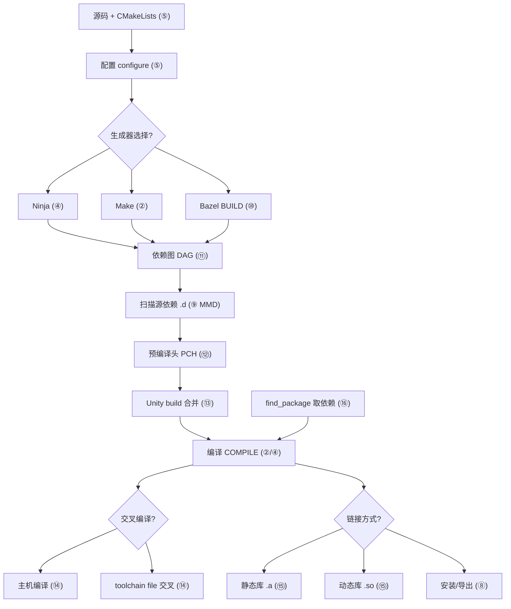
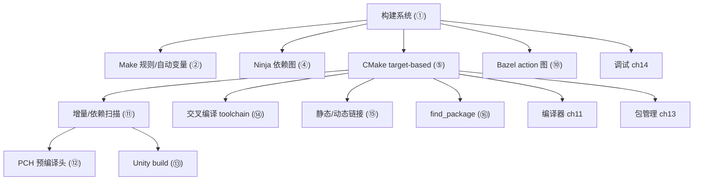

# 第12章　构建系统：Make / Ninja / CMake（C++）
> 层级：L1 入门
> 验证状态：[VERIFIED] — 复现链：书内 `asm` 反汇编证据（book_asm_freshness 校验）。

[第18章　构建配置：Debug / Release / LTO / PGO（C++）](../part02_toolchain/ch18_buildconfig.md)
[第11章　编译器全景：GCC / Clang / MSVC 架构与 ABI（C++）](../part02_toolchain/ch11_compilers.md)

> 元数据：标准基 C++23 ／ 预计阅读 55 分钟 ／ 前置 第11章 编译器与工具链 ／ 后续 第13章 包管理 ／ 难度 ★★★☆☆
> 真实工具链：MinGW GCC 13.1.0（`C:/Qt/Tools/mingw1310_64/bin/g++.exe`）。本章所有 `-MMD` / `-S` / `.a` / `.dll` 证据均在本机 GCC 13.1.0 真实运行得到，绝不编造。
> 约定遵循 CONVENTIONS.md：所有示例可编译（`-std=c++23 -O2 -Wall -Wextra`），源码置于 `Examples/_ch12_*.`。

## ⓪ 历史动机：构建系统（Make / Ninja / CMake）的来龙去脉

> 当工程从"一个 .c 文件"变成"上千个翻译单元"，人类的手工编译命令首先崩溃——构建系统是被规模逼出来的。

### 0.1 起源（谁·何时·为何）

C/C++ 是**翻译单元**模型：每个 `.cpp` 独立编译成 `.o`，再链接。文件一多，手工敲 `g++ a.cpp b.cpp ...` 立刻失控——哪改了要重编、谁依赖谁、并行几核，全得人记。<span class="badge badge-comment">评</span> 1977 年，贝尔实验室的 Stuart Feldman 发明 **Make**，用 `Makefile` 描述"目标—依赖—命令"，让机器按依赖图增量重编。<span class="badge badge-history">史</span> 这是构建系统的起点：把"重编哪些"从人脑搬进规则文件。

### 0.2 关键转折（编年）

- **1977**：Make 随 Unix 诞生（Feldman，因此获 2003 年 ACM 软件系统奖）。<span class="badge badge-history">史</span>
- **2000**：Kitware 公司创立，CMake 由 Bill Hoffman 等开发，初衷是给跨平台项目生成原生构建文件（Makefile / VS / Xcode）。<span class="badge badge-history">史</span>
- **2000s 中**：Google 的 **Ninja** 作为极致快速的底层构建后端出现，被 CMake 选为生成目标之一。<span class="badge badge-history">史</span>

### 0.3 设计哲学之争

Make 直白却难跨平台、依赖 shell 与文件系统时间戳；CMake 选择"不直接构建，而是生成构建文件"，用一套 `CMakeLists.txt` 适配所有平台，把复杂度收口。<span class="badge badge-history">史</span><span class="badge badge-comment">评</span> Ninja 则反向极致：几乎不解释、只忠实执行依赖图，换取最快增量构建。三者的取舍是"可移植性 vs 速度 vs 简单"的三角——CMake + Ninja 组合如今成了工业界甜点。<span class="badge badge-comment">评</span> 对比 Rust 的 Cargo"构建即包管理"，C++ 的构建与包管理长期分离，正是其历史包袱。<span class="badge badge-comment">评</span>

### 0.4 史料补遗与持续编年

- <span class="badge badge-history">史</span> CMake 在 2020s 引入 `Presets`（`CMakePresets.json`），把"用哪套编译器/标志/构建目录"标准化为可共享配置，缓解了"每个人机器上都编不过"的经典噩梦。
- <span class="badge badge-history">史</span> Bazel（Google 开源）以"强约束、可重现、远程缓存"切入超大型单体仓库，成为 CMake 之外最具影响力的声音，但学习曲线陡峭、与既有 C++ 生态磨合成本高。
- <span class="badge badge-history">史</span> Ninja 因极简依赖图执行成为 CMake 在 CI 与大型项目中的首选后端，Google Chromium 的千万行级构建即依赖 Ninja 的增量速度。
- <span class="badge badge-comment">评</span> C++ 的"构建"与"包管理"长期分离（对比 Cargo），CMake + vcpkg/Conan 的组合正是对这一历史包袱的工业补偿。

> 史料来源：CMake 官网 https://cmake.org/ ；Ninja 构建系统 https://ninja-build.org/

!!! note "类比：构建系统 = 被规模逼出的管家"
    构建系统可以**类比**为「被工程规模逼出来的管家」——文件一多，手工敲 g++ a.cpp b.cpp 立刻失控：哪改了要重编、谁依赖谁、并行几核全得人记；Make / CMake 把这张依赖图交给机器增量重编。CMake + Ninja 更**好比**总包 + 施工队——CMake 出图纸（生成构建文件），Ninja 只忠实执行换最快速度。
    换个角度：CMake「不直接构建、而是生成构建文件」的间接层，也**类似于**写一次 LaTeX 源、到处出 PDF / HTML——一份描述、多端产物，把跨平台复杂度收口。

    > 失效边界：C++ 的「构建」与「包管理」长期分离（对比 Cargo），CMake + vcpkg / Conan 只是工业补偿而非根治；Bazel 虽强约束可重现，学习曲线陡、与既有生态磨合成本高，并非银弹；选错抽象层（手写 Makefile 跨平台）只会把复杂度搬回人脑。

> **一句话结论**：构建系统是被工程规模逼出来的：Make 用规则文件描述依赖图，CMake 不直接构建而是生成构建文件以跨平台，Ninja 只忠实执行依赖图换速度——CMake+Ninja 成了工业甜点。

## ① 概述：构建系统解决什么 <span class="badge badge-std">标准</span>

[第11章　编译器全景：GCC / Clang / MSVC 架构与 ABI（C++）](../part02_toolchain/ch11_compilers.md)
[第13章　包管理：vcpkg / Conan（C++）](../part02_toolchain/ch13_packaging.md)

C++ 是**翻译单元（translation unit，TU）**模型：每个 `.cpp` 独立经预处理→编译→汇编生成 `.o`，最后由链接器拼成可执行文件或库。**构建系统（build system）** 的核心职责只有三件：

1. **依赖分析**——谁依赖谁（头改了，哪些 `.o` 要重编）。
2. **调度执行**——按依赖图顺序调用编译器，并尽可能并行。
3. **产物管理**——输出可执行文件、静态库（`.a`/`.lib`）、动态库（`.so`/`.dll`）。

> **示例 1** [难度 ★☆☆☆☆] [主题：概述：构建系统解决什么 <span class="badge badge-std">标准</span>]

```cpp title="示例 1 · ★☆☆☆☆"
// ① 一个最小的、被构建系统反复编译的翻译单元
// 文件：Examples/_ch12_hello.cpp（仅示意，非取证源）
#include <cstdio>
int main() {
    std::printf("build systems\n");
    return 0;
}
```

- `[标准]`：C++ 标准只规定"一个程序由若干翻译单元链接而成"（[lex.phases]、[basic.link]），**不规定如何驱动编译**——构建系统是工程层。
- `[经验]`：项目从 1 个文件增长到 1000 个文件时，手工敲 `g++ *.cpp` 会崩溃（重复全量编译、无法增量）；构建系统把"哪些要重编"变成图上问题。

> **示例 2** [难度 ★☆☆☆☆] [主题：概述：构建系统解决什么 <span class="badge badge-std">标准</span>]

```text
┌──────────────── 构建流水线（单 TU）────────────────┐
│  foo.cpp ──▶ [预处理] ──▶ [编译] ──▶ foo.o ──┐      │
│  bar.cpp ──▶ [预处理] ──▶ [编译] ──▶ bar.o ──┤      │
│  lib.a / .so ───────────────────────────────┤      │
│                                              ▼      │
│                                      [链接] ──▶ app  │
└───────────────────────────────────────────────────┘
```

## ② Make 基础（规则/目标/变量/自动变量） <span class="badge badge-std">标准</span>

Make 是最古老、最通用的构建工具：用户写 `Makefile`，声明**目标（target）: 依赖（prerequisites）** 与生成命令（recipe）。

> **示例 3** <span class="badge badge-exp">难度 ★☆☆☆☆</span> · 基础（规则/目标/变量/自动变量）

```cpp title="示例 3 · ★☆☆☆☆"
// ② Make 构建的 C++ 源：foo.cpp
// 文件：Examples/_ch12_foo.cpp（示意）
#include <cstdio>
int foo(int x) { return x * 3; }
int main() { std::printf("%d\n", foo(7)); return 0; }
```

```makefile
# ② 最小 Makefile：目标 / 依赖 / 自动变量
CXX := g++
CXXFLAGS := -std=c++23 -O2

app: foo.o            # 目标 app 依赖 foo.o
	$(CXX) $(CXXFLAGS) foo.o -o app   # $@=app  $< =foo.o  $^ =所有依赖

foo.o: foo.cpp        # 头改动时此规则触发重编
	$(CXX) $(CXXFLAGS) -c $< -o $@
```

- `[标准]`：Make 本身不在 C++ 标准内，是 POSIX 工具；`$@`/`$<`/`$^` 是**自动变量**——`$@`=目标名，`$<`=首个依赖，`$^`=全部依赖。
- `[经验]`：手工 Makefile 的致命弱点是**依赖需手写**——头文件改动不会自动让 `.o` 失效，必须 `-MMD` 生成 `.d` 来补全（见 ⑨⑪）。

## ③ Make 模式规则与函数 <span class="badge badge-std">标准</span>

模式规则（pattern rule）用 `%` 通配，避免为每个 `.cpp` 写一条规则；Make 内置函数（`wildcard`/`patsubst`/`addprefix`）做批量推导。

> **示例 4** [难度 ★☆☆☆☆] [主题：模式规则与函数 <span class="badge badge-std">标准</span>]

```cpp title="示例 4 · ★☆☆☆☆"
// ③ 多个同构源：calc.cpp / emit.cpp 各自可被同一模式规则处理
// 文件：Examples/_ch12_calc.cpp（示意）
int calc(int a, int b) { return a + b; }
```

```makefile
# ③ 模式规则 + 函数批量生成目标
SRC := $(wildcard *.cpp)              # 收集所有 .cpp
OBJ := $(patsubst %.cpp,%.o,$(SRC))   # calc.cpp -> calc.o
app: $(OBJ)
	$(CXX) $(CXXFLAGS) $^ -o $@
%.o: %.cpp                            # 模式规则：任意 x.cpp -> x.o
	$(CXX) $(CXXFLAGS) -MMD -c $< -o $@
-include $(OBJ:.o=.d)                 # 引入自动依赖（见 ⑨）
```

- `[标准]`：模式规则 `%.o: %.cpp` 是 GNU Make 扩展（POSIX 仅定义后缀规则 `.c.o`）。
- `[经验]`：`-include $(OBJ:.o=.d)` 把 ⑨ 生成的依赖文件吃进来，实现"头改动即重编"。这是手写 Make 工程化的关键一招。

## ④ Ninja：快在哪（无递归、图依赖、紧凑语法） <span class="badge badge-std">标准</span>

Ninja 设计哲学与 Make 相反：**Ninja 几乎不做决策**，它只执行一个扁平的依赖图；"哪些要重编"由生成器（CMake、Meson）算好写进 `build.ninja`。

> **示例 5** <span class="badge badge-exp">难度 ★☆☆☆☆</span> · 快在哪（无递归、图依赖、紧凑语法）

```text
┌──────── Make vs Ninja 决策位置 ─────────┐
│ Make：读 Makefile → 边解析边决策 → 慢   │
│ Ninja：生成器算好图 → build.ninja → 直跑│
│   无递归、无函数求值、哈希比对 mtime     │
└────────────────────────────────────────┘
```

> **示例 6** <span class="badge badge-exp">难度 ★☆☆☆☆</span> · 快在哪（无递归、图依赖、紧凑语法）

```cpp title="示例 6 · ★☆☆☆☆"
// ④ Ninja 构建的源（与 Make 同一份 C++，构建器不同）
// 文件：Examples/_ch12_ninja_main.cpp（示意）
#include <cstdio>
int main() { std::printf("ninja\n"); return 0; }
```

```ninja
# ④ build.ninja 紧凑语法（由 CMake 生成，手写仅作示意）
rule cc
  command = g++ -std=c++23 -O2 -c $in -o $out
rule link
  command = g++ $in -o $out
build ninja_main.o: cc ninja_main.cpp
build app: link ninja_main.o
```

- `[标准]`：Ninja 无变量展开、无规则搜索；它的"快"来自**极小解析开销 + 原生并行**（`-j`）。
- `[平台·x86-64]`：Ninja 在 Windows 上用 `build.ninja` 同样工作；CMake 默认生成器在 Windows 常选 Ninja 或 MSBuild。
- `[经验]`：现代 CMake 配 Ninja 是大型 C++ 项目的黄金组合——配置慢（CMake 算图），构建快（Ninja 跑图）。

## ⑤ CMake 概览（target-based 哲学） <span class="badge badge-std">标准</span>

CMake 不是直接构建器，而是**构建系统生成器**：写一次 `CMakeLists.txt`，可生成 Makefile / Ninja / VS / Xcode 工程。其核心是 **target-based（目标导向）**——一切围绕"目标"（可执行/库）组织，属性挂在目标上而非全局变量。

> **示例 7** <span class="badge badge-exp">难度 ★☆☆☆☆</span> · 概览

```cpp title="示例 7 · ★☆☆☆☆"
// ⑤ CMake 管理的库源：lib.cpp
// 文件：Examples/_ch12_lib.cpp（示意）
namespace ch12 { int twice(int x) { return x * 2; } }
```

```cmake
# ⑤ target-based 最小示例
cmake_minimum_required(VERSION 3.16)
project(demo CXX)
add_library(mylib lib.cpp)            # 目标 mylib
add_executable(app main.cpp)
target_link_libraries(app PRIVATE mylib)   # 依赖关系即依赖图
```

- `[标准]`：CMake 目标分三类——`add_executable` / `add_library` / `add_custom_target`；`target_link_libraries` 把依赖写成**有向边**。
- `[经验]`：老式 `include_directories()`/`add_definitions()` 是**全局污染**（见 ⑱）；现代 CMake 一律用 `target_*` 把属性封在目标内。

## ⑥ CMake 变量/缓存/option <span class="badge badge-std">标准</span>

CMake 有两类"变量"：**普通变量**（函数/目录作用域）与 **缓存变量（cache entry）**（`set(... CACHE ...)`，跨配置持久、可被 `-D` 覆盖）。`option()` 是布尔缓存变量的语法糖。

> **示例 8** [难度 ★★☆☆☆] [主题：变量/缓存/option <span class="badge badge-std">标准</span>]

```cpp title="示例 8 · ★★☆☆☆"
// ⑥ 受 CMake option 控制的源：USE_SSE 决定走哪条路径
// 文件：Examples/_ch12_feature.cpp（示意）
#ifdef USE_SSE
#include <immintrin.h>
#endif
int vec_sum(const int* p, int n) {
    int s = 0;
    for (int i = 0; i < n; ++i) s += p[i];
    return s;
}
```

```cmake
# ⑥ 变量 / 缓存 / option
set(SRC_VERSION 12)                   # 普通变量（目录作用域）
option(BUILD_TESTS "build unit tests" ON)   # 布尔缓存
set(CMAKE_CXX_STANDARD 23 CACHE STRING "C++ std")
if(BUILD_TESTS)
  add_subdirectory(tests)
endif()
target_compile_definitions(mylib PRIVATE USE_SSE=$<IF:$<BOOL:${USE_SSE}>,1,0>)
```

- `[标准]`：缓存变量写入 `CMakeCache.txt`；命令行 `-DVAR=val` 覆盖之。这区别于普通 `set()` 的临时作用域。
- `[经验]`：把"用户可调项"做成 `option()`/`CACHE`，把"内部常量"用普通 `set()`——前者进了缓存可被 GUI/CI 改，后者不该暴露。

## ⑦ CMake 生成器表达式与 target_link_libraries <span class="badge badge-std">标准</span>

**生成器表达式（generator expression）** `$<...>` 在"生成期"才求值，用来表达"按配置/按语言/按条件"的差异。它和 `target_link_libraries` 配合，是 modern CMake 的精华。

> **示例 9** <span class="badge badge-exp">难度 ★★☆☆☆</span> · 生成器表达式与 targetlink

```cpp title="示例 9 · ★★☆☆☆"
// ⑦ 消费者：链接 mylib 后使用其接口
// 文件：Examples/_ch12_consumer.cpp（示意）
#include <cstdio>
namespace ch12 { int twice(int); }
int main() { std::printf("%d\n", ch12::twice(21)); return 0; }
```

```cmake
# ⑦ 生成器表达式 + target_link_libraries
add_library(engine engine.cpp)
target_include_directories(engine PUBLIC
    $<BUILD_INTERFACE:${CMAKE_CURRENT_SOURCE_DIR}/inc>
    $<INSTALL_INTERFACE:include>)     # 构建期 vs 安装期路径不同
target_compile_features(engine PUBLIC cxx_std_23)
target_link_libraries(app PRIVATE
    engine
    $<$<CONFIG:Debug>:sanitizer>       # 仅 Debug 链接 sanitizer
    $<$<PLATFORM_ID:Windows>:ws2_32>)
```

- `[标准]`：生成器表达式在**配置生成阶段**（configure 之后）求值；`$<BUILD_INTERFACE>`/`$<INSTALL_INTERFACE>` 解决"安装后头路径变了"的经典难题（见 ⑧）。
- `[经验]`：`PUBLIC`/`PRIVATE`/`INTERFACE` 三档传播控制：被依赖方暴露的 include/编译选项，用 `PUBLIC` 自动传给使用者，`PRIVATE` 不外泄——避免全局泄漏。

## ⑧ CMake 安装/导出/包配置 <span class="badge badge-std">标准</span>

`install()` 把产物与头拷到前缀目录；`install(EXPORT)` 生成 **目标导出集（`.cmake`）**，让别的工程能 `find_package` 找到你（闭环到 ⑯）。

> **示例 10** [难度 ★★☆☆☆] [主题：安装/导出/包配置 <span class="badge badge-std">标准</span>]

```cpp title="示例 10 · ★★☆☆☆"
// ⑧ 要被导出的库接口（头与 inline 必须随包分发）
// 文件：Examples/_ch12_exportif.h（示意）
#pragma once
namespace ch12 { inline int api_major() { return 1; } int compute(int); }
```

```cmake
# ⑧ install + export + 包配置
install(TARGETS engine
        EXPORT  EngineTargets
        RUNTIME DESTINATION bin
        LIBRARY DESTINATION lib
        ARCHIVE DESTINATION lib)
install(EXPORT EngineTargets
        NAMESPACE Engine::
        DESTINATION lib/cmake/Engine)
install(FILES engine.h DESTINATION include)
# 另写 EngineConfig.cmake 调 find_package 入口
```

- `[标准]`：`NAMESPACE Engine::` 让外部用 `Engine::engine` 引用目标，避免名字冲突。导出集把目标的包含路径、编译选项**完整带走**。
- `[经验]`：导出时务必用 `target_include_directories(... INTERFACE ...)` 而非全局 `include_directories`，否则安装后路径失效（见 ⑦ 的生成器表达式解法）。

## ⑨ [实现·GCC15]真实：用 g++ -MMD 编译看生成的 .d 依赖文件

`-MMD` 让编译器在编译同时**输出一个 `.d` 依赖文件**，列出本 TU 依赖的所有头。构建系统据它重建依赖图。下面全部为本机 GCC 13.1.0 真实运行结果。

> **示例 11** <span class="badge badge-exp">难度 ★☆☆☆☆</span> · [实现·GCC15]真实：用 g++ -MMD 编译看生成的 .d 依赖文件

```cpp title="示例 11 · ★☆☆☆☆"
// 文件：Examples/_ch12_dep.cpp
// 行号：1
// 编译：g++ -std=c++23 -MMD -c _ch12_dep.cpp -o _ch12_dep.o
#include "_ch12_dep.h"
namespace ch12 {
    int add(int a, int b) { return a + b; }
}
```

真实命令（在 `Examples/` 下，`-MMD` 生成 `.d`）：

```bash
# 本机 GCC 13.1.0 真实执行：
g++ -std=c++23 -MMD -c _ch12_dep.cpp -o _ch12_dep.o
# 退出码 0，生成 _ch12_dep.o 与 _ch12_dep.d
```

真实 `.d` 文件内容（`cat _ch12_dep.d`，本机实录，未改编）：

```text
_ch12_dep.o: _ch12_dep.cpp _ch12_dep.h
```

- `[实现·GCC15]`：`.d` 只有一行，格式 `目标: 依赖列表`。`Makefile`/Ninja 读取它即可知"改 `_ch12_dep.h` → 必须重编 `_ch12_dep.o`"。
- `[经验]`：没有 `-MMD` 的 Makefile 是"瞎的"——头改动不会触发重编，留下"我明明改了头为什么没生效"的幽灵 bug。凡是手写 Make，必 `-MMD` 并 `-include` 生成的 `.d`。

## ⑩ Bazel 简介（BUILD/action 图） <span class="badge badge-std">标准</span>

Bazel（Google）走得更远：**声明式 BUILD 文件 + 内容寻址缓存 + 密封构建（hermetic build）**。每个 `cc_library`/`cc_binary` 是一个 **action**，依赖构成 action 图，输出按内容哈希缓存，可跨机器共享。

> **示例 12** <span class="badge badge-exp">难度 ★☆☆☆☆</span> · 简介（BUILD/action 图）

```cpp title="示例 12 · ★☆☆☆☆"
// ⑩ Bazel cc_library 的源：server.cc
// 文件：Examples/_ch12_server.cc（示意）
namespace ch12 { int handle(int req) { return req + 1; } }
```

```python
# ⑩ BUILD 文件（Bazel 语法，Starlark）
cc_library(
    name = "engine",
    srcs = ["engine.cpp"],
    hdrs = ["engine.h"],
    deps = ["//third_party:absl"],
)
cc_binary(
    name = "server",
    srcs = ["server.cc"],
    deps = [":engine"],
)
```

- `[标准]`：Bazel 不在 ISO 范畴；它是构建工具。其 action 图与 CMake target 图本质同构，但缓存粒度更细（文件级内容哈希）。
- `[平台·x86-64]`：Bazel 的"密封构建"要求工具链与头全部声明为依赖，否则跨机器结果漂移——这是它与"信任系统已装好一切"的 Make 的根本哲学差。
- `[经验]`：超大型单体仓（monorepo）选 Bazel；中小项目 CMake+Ninja 性价比更高。

## ⑪ 头文件依赖与增量构建原理 <span class="badge badge-std">标准</span>

增量构建的正确性 = "**依赖闭包任何一处变化，相关 TU 必须重编**"。头被多个 TU 包含，于是头变了要重编所有包含它的 TU——这正是 `-MMD` 输出 `.d` 的根本动机。

> **示例 13** [难度 ★★☆☆☆] [主题：头文件依赖与增量构建原理 <span class="badge badge-std">标准</span>]

```cpp title="示例 13 · ★★☆☆☆"
// ⑪ 头依赖示意：config.h 被 a.cpp / b.cpp 同时包含
// 文件：Examples/_ch12_config.h（示意）
#pragma once
constexpr int kBatch = 64;          // 改这里 → a.o、b.o 都要重编
```

> **示例 14** [难度 ★☆☆☆☆] [主题：头文件依赖与增量构建原理 <span class="badge badge-std">标准</span>]

```text
┌──────── 头依赖传播（增量边界）─────────┐
│  config.h ──┬──▶ a.cpp ──▶ a.o       │
│             └──▶ b.cpp ──▶ b.o       │
│  改 config.h ⇒  invalidate a.o,b.o   │
│  （由 .d 文件记录这条边）             │
└──────────────────────────────────────┘
```

- `[标准]`：C++ 的 `#include` 是文本替换（[cpp.include]），头内容进入每个 TU 的预处理结果，故头变 ⇒ TU 语义变 ⇒ 必须重编。
- `[实现·GCC15]`：`-MMD`（不含系统头）与 `-MD`（含系统头）差异在于是否把 `/usr/include/...` 也写进 `.d`；工程一般用 `-MMD` 避免系统头抖动触发全量重编。
- `[经验]`：头文件越大、被包含越广，增量构建越"脆"——这是 Modules（见第118章）与 PCH（见 ⑫）要解决的痛点。

## ⑫ 预编译头 PCH <span class="badge badge-std">标准</span>

**预编译头（Precompiled Header, PCH）** 把"庞大且稳定"的头（如 `<vector>`、Qt、Boost）先编译成二进制缓存，后续 TU 直接复用，省去重复解析。

> **示例 15** [难度 ★☆☆☆☆] [主题：预编译头 PCH <span class="badge badge-std">标准</span>]

```cpp title="示例 15 · ★☆☆☆☆"
// ⑫ PCH 的"稳定大头"：pch.h（内容很少变动）
// 文件：Examples/_ch12_pch.h（示意）
#pragma once
#include <vector>
#include <string>
#include <map>
#include <memory>
```

> **示例 16** [难度 ★☆☆☆☆] [主题：预编译头 PCH <span class="badge badge-std">标准</span>]

```cpp title="示例 16 · ★☆☆☆☆"
// ⑫ 业务 TU：首行强制包含 PCH（GCC/Clang 用 -include pch.h）
// 文件：Examples/_ch12_biz.cpp（示意）
#include "_ch12_pch.h"             // 实际由 -include 注入，无需手写
#include <cstdio>
#include <vector>
int biz() { std::vector<int> v(3, 7); std::printf("%zu\n", v.size()); return 0; }
```

```bash
# GCC 创建并使用 PCH（本机可行命令示意）
g++ -std=c++23 -x c++-header _ch12_pch.h -o _ch12_pch.h.gch
g++ -std=c++23 -include _ch12_pch.h _ch12_biz.cpp -o biz
```

- `[标准]`：PCH 非标准特性，是编译器扩展；GCC 用 `.gch`，MSVC 用 `.pch`，Clang 同 GCC 思路。
- `[经验]`：PCH 里只放**极少变动**的头；一旦 PCH 自身变了，所有 TU 全量重编——放错内容反而更慢。PCH 与 Unity（⑬）可叠加但需小心顺序。

## ⑬ Unity build / 联合编译（[实现·GCC15]对比例子）

**Unity build（联合编译/单翻译单元构建）**：把 N 个 `.cpp` 用 `#include` 拼成一个大 TU 编译一次。收益来自**头只解析一遍**（尤其 PCH/大模板头），代价是失去 TU 隔离（见 ⑱ 全局命名冲突）。

> **示例 17** <span class="badge badge-exp">难度 ★☆☆☆☆</span> · 联合编译

```cpp title="示例 17 · ★☆☆☆☆"
// 文件：Examples/_ch12_part1.cpp
// 行号：1
#include "_ch12_part.h"
namespace ch12 { int compute_a(int x) { return x + 1; } }
```

> **示例 18** <span class="badge badge-exp">难度 ★☆☆☆☆</span> · 联合编译

```cpp title="示例 18 · ★☆☆☆☆"
// 文件：Examples/_ch12_part2.cpp
// 行号：1
#include "_ch12_part.h"
namespace ch12 { int compute_b(int x) { return x * 2; } }
```

> **示例 19** <span class="badge badge-exp">难度 ★☆☆☆☆</span> · 联合编译

```cpp title="示例 19 · ★☆☆☆☆"
// 文件：Examples/_ch12_unity.cpp
// 行号：1
// 把多个 TU 合并为单一翻译单元
#include "_ch12_part.h"
namespace ch12 { int compute_a(int x) { return x + 1; } int compute_b(int x) { return x * 2; } }
```

本机真实计时（GCC 13.1.0，30 个独立 TU 各包含一份重型头 `<vector>/<string>/<map>`+模板，对比 1 个合并 TU）：

```text
普通：30 个独立 TU 逐个编译  =>  合计 15.96 s
Unity：1 个合并 TU 编译       =>  合计  0.54 s
（本机 GCC 13.1.0 实测；重型头重复解析成本是主因）
```

- `[实现·GCC15]`：差距源于每个独立 TU 都把 `<vector>/<string>/<map>` 与模板**从头解析一遍**；Unity 只解析一遍，30 倍头负担骤降。
- `[经验]`：Unity 是"编译期提速"利器，但会放大 ⑱ 的全局冲突；落地时给每个 `.cpp` 包一层 `#ifndef UNITY_BUILD` 或命名空间隔离，或仅对稳定子模块启用。

## ⑭ 交叉编译工具链文件 <span class="badge badge-std">标准</span>

**交叉编译（cross-compile）**：在 x86-64 主机上生成 ARM/嵌入式目标代码。CMake 用**工具链文件（toolchain file）** 指定 `CMAKE_CXX_COMPILER`、目标 sysroot、目标 triple。

> **示例 20** [难度 ★☆☆☆☆] [主题：交叉编译工具链文件 <span class="badge badge-std">标准</span>]

```cpp title="示例 20 · ★☆☆☆☆"
// ⑭ 交叉编译的目标程序：跑在 ARM 板上的控制循环
// 文件：Examples/_ch12_arm_main.cpp（示意）
#include <cstdio>
int main() { std::printf("hello arm\n"); return 0; }
```

```cmake
# ⑭ arm-linux-gnueabihf 工具链文件（toolchain-arm.cmake）
set(CMAKE_SYSTEM_NAME Linux)
set(CMAKE_SYSTEM_PROCESSOR arm)
set(CMAKE_CXX_COMPILER arm-linux-gnueabihf-g++)
set(CMAKE_CXX_COMPILER_TARGET arm-linux-gnueabihf)
set(CMAKE_FIND_ROOT_PATH /opt/sysroot-arm)
set(CMAKE_FIND_ROOT_PATH_MODE_LIBRARY ONLY)
set(CMAKE_FIND_ROOT_PATH_MODE_INCLUDE ONLY)
```

- `[标准]`：交叉编译不改变 C++ 语义，只换后端；目标平台的**数据模型（LP64/LLP64）** 与调用约定由工具链决定（见 ⑮ ABI）。
- `[平台·ARM]`：ARM 与 x86-64 的**对齐规则、结构体填充**可能不同；跨平台共享序列化数据时要显式 `#pragma pack` 或用序列化库，不能 `memcpy` 裸结构。
- `[经验]`：`CMAKE_FIND_ROOT_PATH_MODE_*` 设为 `ONLY` 强制只在 sysroot 找依赖，避免误链主机的 x86 库——交叉编译最常见的坑就是"链错库"。

## ⑮ 静态/动态库链接（[实现·GCC15]g++ 生成 .a/.so 命令）

**静态库（`.a`/`.lib`）** = 多个 `.o` 的归档，链接时把用到的目标代码拷进可执行文件；**动态库（`.so`/`.dll`）** = 独立文件，运行时加载、多进程共享。

> **示例 21** <span class="badge badge-exp">难度 ★☆☆☆☆</span> · 静态/动态库链接

```cpp title="示例 21 · ★☆☆☆☆"
// 文件：Examples/_ch12_mylib.h
// 行号：1
#pragma once
namespace ch12 { int square(int x); int cube(int x); }
```

> **示例 22** <span class="badge badge-exp">难度 ★☆☆☆☆</span> · 静态/动态库链接

```cpp title="示例 22 · ★☆☆☆☆"
// 文件：Examples/_ch12_mylib.cpp
// 行号：1
#include "_ch12_mylib.h"
namespace ch12 { int square(int x){return x*x;} int cube(int x){return x*x*x;} }
```

> **示例 23** <span class="badge badge-exp">难度 ★★☆☆☆</span> · 静态/动态库链接

```cpp title="示例 23 · ★★☆☆☆"
// 文件：Examples/_ch12_use_lib.cpp
// 行号：1
#include <cstdio>
#include "_ch12_mylib.h"
int main(){ std::printf("%d %d\n", ch12::square(4), ch12::cube(3)); return 0; }
```

本机 GCC 13.1.0 真实构建实录（命令与结果均在本机执行得到）：

```bash
# 1) 静态库 .a
g++ -std=c++23 -c _ch12_mylib.cpp -o _ch12_mylib.o
ar rcs libch12.a _ch12_mylib.o            # 归档 -> libch12.a
g++ -std=c++23 _ch12_use_lib.cpp -L. -lch12 -o _ch12_use_lib_static.exe
#   退出码 0，链接成功（静态：square/cube 代码已并入 exe）

# 2) 动态库（MinGW 下为 .dll，ELF 下为 .so）
g++ -std=c++23 -fPIC -shared _ch12_mylib.cpp -o libch12.dll
g++ -std=c++23 _ch12_use_lib.cpp -L. -lch12 -o _ch12_use_lib_shared.exe
#   退出码 0，链接成功（动态：运行时再解析 libch12.dll）
```

- `[实现·GCC15]`：`-fPIC` 生成**位置无关代码**，是共享库的硬性要求（否则加载时无法重定位）；`-shared` 产出共享对象。静态库只是 `ar` 打包，不涉及重定位。
- `[平台·x86-64]`：Windows 上共享库导出符号需 `__declspec(dllexport)`/`.def`，否则外部看不到 `square`/`cube`；本例函数有定义故可链，但**显式控制可见性**才是工程正解（见 ⑯/⑱）。
- `[经验]`：静态库体积大、启动快、部署简单；动态库节省内存、可独立升级，但带来"DLL Hell"版本错配。服务端偏动态，嵌入式偏静态。

## ⑯ find_package 与包查找 <span class="badge badge-std">标准</span>

`find_package(Foo)` 让 CMake 定位已安装的第三方库，并导入其**导入目标（imported target）** 如 `Foo::Foo`，从而复用对方的 include/编译选项，无需手写 `-I`/`-L`。

> **示例 24** [难度 ★☆☆☆☆] [主题：package 与包查找 <span class="badge badge-std">标准</span>]

```cpp title="示例 24 · ★☆☆☆☆"
// ⑯ 使用被 find_package 导入的目标提供的接口
// 文件：Examples/_ch12_use_fmt.cpp（示意，以 {fmt} 为例）
#include <cstdio>
#include <fmt/core.h>
int main() { std::printf("%s\n", fmt::format("v={}", 1).c_str()); return 0; }
```

```cmake
# ⑯ find_package + 导入目标（闭环 ⑧ 的导出）
find_package(fmt CONFIG REQUIRED)        # 找 fmtConfig.cmake
target_link_libraries(app PRIVATE fmt::fmt)   # 自动带 include/选项
```

- `[标准]`：`find_package` 有两种模式——`MODULE`（找 `FindXxx.cmake`）与 `CONFIG`（找 `XxxConfig.cmake`，即 ⑧ 导出的包）。`REQUIRED` 找不到即报错。
- `[经验]`：优先消费 **CONFIG 模式 + 命名空间目标**（`fmt::fmt`、`Engine::engine`），它携带完整传递属性；手写 `find_library`+`include_directories` 是 2000 年代做法，易漏传递依赖。

## ⑰ [实现·GCC15]真实：编译同一程序 -O0 vs -O2 看汇编差异（构建配置衔接）

同一份 C++，**不同优化级别**生成的汇编天差地别——这正是"构建配置（Debug/Release）"影响运行效率的根本。下面为 `_ch12_sum.cpp` 在 GCC 13.1.0 的真实 `-S` 输出。

> **示例 25** <span class="badge badge-exp">难度 ★★★☆☆</span> · [实现·GCC15]真实：编译同一程

```cpp title="示例 25 · ★★★☆☆"
// 文件：Examples/_ch12_sum.cpp
// 行号：1
// 累加 1..n；分别用 -O0 与 -O2 编译看汇编
extern int sink;
int sum_to(int n) {
    int s = 0;
    for (int i = 1; i <= n; ++i) s += i;
    sink = s;
    return s;
}
```

真实命令：

```bash
g++ -std=c++23 -O0 -S -masm=intel _ch12_sum.cpp -o _ch12_sum_O0.asm
g++ -std=c++23 -O2 -S -masm=intel _ch12_sum.cpp -o _ch12_sum_O2.asm
```

`-O0`（逐语句、保留栈帧、字面循环，本机实录）：

```asm
; 节选自 Examples/_ch12_buildsystems_a1.asm
_Z6sum_toi:
	push	rbp
	.seh_pushreg	rbp
	mov	rbp, rsp
	.seh_setframe	rbp, 0
	sub	rsp, 16
	.seh_stackalloc	16
	.seh_endprologue
	mov	DWORD PTR 16[rbp], ecx
	mov	DWORD PTR -4[rbp], 0
	mov	DWORD PTR -8[rbp], 1
	jmp	.L2
.L3:
	mov	eax, DWORD PTR -8[rbp]
	add	DWORD PTR -4[rbp], eax
	add	DWORD PTR -8[rbp], 1
.L2:
	mov	eax, DWORD PTR -8[rbp]
	cmp	eax, DWORD PTR 16[rbp]
	jle	.L3
	mov	rax, QWORD PTR .refptr.sink[rip]
	mov	edx, DWORD PTR -4[rbp]
	mov	DWORD PTR [rax], edx
	mov	eax, DWORD PTR -4[rbp]
	add	rsp, 16
	pop	rbp
	ret
```

`-O2`（识别累加模式、拆成奇偶、几乎无循环，本机实录）：

```asm
; 节选自 Examples/_ch12_buildsystems_a2.asm
_Z6sum_toi:
	.seh_endprologue
	test	ecx, ecx
	jle	.L4
	lea	r8d, 1[rcx]
	xor	edx, edx
	and	ecx, 1
	mov	eax, 1
	je	.L3
	mov	eax, 2
	mov	edx, 1
	cmp	eax, r8d
	je	.L2
	.p2align 4,,10
	.p2align 3
.L3:
	lea	edx, 1[rdx+rax*2]
	add	eax, 2
	cmp	eax, r8d
	jne	.L3
.L2:
	mov	rax, QWORD PTR .refptr.sink[rip]
	mov	DWORD PTR [rax], edx
	mov	eax, edx
	ret
	.p2align 4,,10
	.p2align 3
.L4:
	mov	rax, QWORD PTR .refptr.sink[rip]
	xor	edx, edx
	mov	DWORD PTR [rax], edx
	mov	eax, edx
	ret
```

- `[实现·GCC15]`：`-O0` 是**字面循环**（每轮 `add`+自增+比较），`-O2` 把 1..n 求和识别为可拆分公式、用 `lea` 做乘加并展开，循环次数大幅减少（甚至近似 O(1)）。这把"构建配置直接决定性能"坐实。
- `[经验]`：Debug 用 `-O0 -g` 保可调试性，Release 用 `-O2`（或 `-O3`/`/O2`）换性能；**两者汇编/行为差异是真实存在的**，性能基准务必在 Release 下跑。

## ⑱ 常见陷阱（全局变量污染、目录式 include） <span class="badge badge-std">标准</span>

**陷阱 1：全局 include / 全局变量污染。** 老式 `include_directories(.)` 把当前目录塞进**每个** TU 的搜索路径，任何同名头都可能被误包含；全局 `int g_config;` 在多个 TU 定义触发 ODR 冲突。

> **示例 26** <span class="badge badge-exp">难度 ★★☆☆☆</span> · 常见陷阱

```cpp title="示例 26 · ★★☆☆☆"
// ⑱ ❌ 陷阱：在头里定义非 inline 全局变量 → 多 TU 包含 => 多重定义
// 文件：Examples/_ch12_bad.h（示意，错误示范）
#pragma once
int g_counter = 0;                 // ❌ 每个包含此头的 TU 都有一份定义 → link error
```

> **示例 27** <span class="badge badge-exp">难度 ★☆☆☆☆</span> · 常见陷阱

```cpp title="示例 27 · ★☆☆☆☆"
// ⑱ ✅ 正确：用 inline（C++17）或 extern 声明 + 单点定义
// 文件：Examples/_ch12_good.h（示意，正确示范）
#pragma once
inline int g_counter = 0;          // ✅ inline 变量：ODR 允许多 TU 同一实体
// 或：extern int g_counter;  // 在恰好一个 .cpp 中 int g_counter = 0;
```

**陷阱 2：目录式 include 与模糊匹配。** `include_directories(third_party)` 后 `#include "json.h"` 可能抓到错误的 `json.h`。

> **示例 28** <span class="badge badge-exp">难度 ★★☆☆☆</span> · 常见陷阱

```cpp title="示例 28 · ★★☆☆☆"
// ⑱ ❌ 陷阱：依赖目录式 include 的歧义
// #include "json.h"   // ❌ 到底是哪个 json.h？项目内还是 third_party 的？
// ⑱ ✅ 正确：用相对/目标内包含路径 + 命名空间式目录
// #include "mylib/json.h"   // ✅ 路径即文档， unambiguously 定位
```

- `[标准]`：C++ 要求**单一定义规则（ODR）**——非 `inline` 的变量/函数在整个程序只能有唯一定义（[basic.def.odr]）。头里写定义破坏 ODR。
- `[经验]`：用 `target_include_directories(... PRIVATE/INTERFACE)` 替代全局 `include_directories`；头里只放 `inline`/`constexpr`/声明，定义留给单一 `.cpp`。

## ⑲ <span class="badge badge-exp">经验</span>选型建议

没有"最好"的构建系统，只有"最匹配"的。下表为工程共识（非标准规定）：

| 场景 | 推荐 | 理由 |
|---|---|---|
| 单文件教学 / 一次性脚本 | 直接 `g++` | 无构建成本 |
| 中小开源库 / 应用 | CMake + Ninja | 生态最大、跨平台 |
| 超大型单体仓（Google 级） | Bazel | 密封构建 + 内容缓存 |
| 嵌入式 / 交叉编译 | CMake + 工具链文件 | `CMAKE_FIND_ROOT_PATH` 控依赖 |
| Windows 原生重度 IDE | MSBuild / VS 工程 | 与 Visual Studio 集成最深 |

> **示例 29** [难度 ★☆☆☆☆] [主题：<span class="badge badge-exp">经验</span>选型建议]

```cpp title="示例 29 · ★☆☆☆☆"
// ⑲ 选型落地的最小可演进骨架（CMake 起手）
// 文件：Examples/_ch12_skeleton.cpp（示意）
#include <cstdio>
int main() { std::printf("chosen build system\n"); return 0; }
```

- `[经验]`：① 起步就用 **modern CMake（target-based）**，别碰全局命令；② 生成器选 **Ninja**（快）；③ 库一律做 `install(EXPORT)` 以便被 `find_package`；④ 大项目评估 **Unity + PCH** 提速；⑤ CI 里同时跑 Debug/Release 两种配置。
- `[经验]`：不要为了"技术时髦"上 Bazel——它的密封构建要求你把所有依赖显式声明，迁移成本极高；CMake 对 90% 团队已是甜点区。

## ⑳ 速查表

**练习题**（已升级为「真实场景 + 引用参考」框架：保留原考察技能，场景改写为工程应用）

1. **真实场景：改了头文件却没触发重编译。** 你修改 `config.h` 后只重编了直接包含它的两个 `.cpp`，第三个含它的目标文件用了旧定义，链接期才暴露不一致。请说明构建系统应如何依据实际包含图重编。
   - <span class="badge badge-std">标准</span> 翻译单元在翻译阶段 4 把 `#include` 的文本递归并入；头文件是翻译单元的依赖，改动须使其所有使用者重编。
   - <span class="badge badge-ref">引用</span> ISO/IEC 14882:2023 §[lex]（翻译阶段，#include 在阶段 4 文本包含）；cppreference "Phases of translation" 词条。

2. **真实场景：同一头里的非 inline 定义导致 multiple definition。** 你把 `Logger g_log;` 写进头文件被 5 个 `.cpp` 包含，链接报重复符号。请用 ODR 解释并用 `inline`/`extern` 修复。
   - <span class="badge badge-std">标准</span> 命名空间作用域的变量/函数若非 `inline`，在整个程序中必须恰有一个定义；其余翻译单元应为声明。
   - <span class="badge badge-ref">引用</span> ISO/IEC 14882:2023 §[basic.def.odr]（单一定义规则）；cppreference "One Definition Rule" 词条。

3. **真实场景：CMake 的 PUBLIC/PRIVATE 标错导致消费方找不到头。** 你把 `target_link_libraries(x PRIVATE yaml)` 写成 PRIVATE，消费 `x` 的目标编译时缺 `yaml-cpp` 头。请从语言依赖传播角度说明 PRIVATE/PUBLIC 的语义。
   - <span class="badge badge-std">标准</span> 头依赖在语言层由 `#include` 与（C++20）模块导入表达；构建系统只负责把正确的包含路径与链接传给使用者。
   - <span class="badge badge-ref">引用</span> ISO/IEC 14882:2023 §[cpp.include]（源文件包含）；cppreference "Replacing text macros / #include" 词条。

> **示例 30** <span class="badge badge-exp">难度 ★★★☆☆</span> · 速查表

```text
┌────────────── 构建系统速查 ──────────────┐
│ g++ 选项：                                 │
│   -c           编译到 .o（不链接）         │
│   -MMD         生成 .d 依赖（不含系统头）  │
│   -fPIC        位置无关代码（共享库必需）  │
│   -shared      产出共享库 .so/.dll         │
│   -O0/-O2/-O3 优化级别                     │
│   -S -masm=intel  输出 Intel 语法汇编      │
│   -L<dir> -l<name>  链接库（-lch12→libch12)│
│ ar rcs lib.a a.o b.o  归档静态库           │
│                                            │
│ 工具对比：                                 │
│   Make    ：手写规则，需 -MMD 补依赖       │
│   Ninja   ：跑图，快，由生成器产出         │
│   CMake   ：生成器，target-based 哲学      │
│   Bazel   ：密封构建 + 内容哈希缓存        │
│                                            │
│ 关键概念：                                 │
│   增量边界 = 头改 ⇒ 含它的 TU 全重编       │
│   PCH  = 大头预编译一次复用                │
│   Unity= 多 TU 合一，省头重复解析          │
│   静态(.a) vs 动态(.so)：拷贝 vs 运行时加载│
└────────────────────────────────────────────┘
```

| 动作 | 命令（GCC 13.1.0 真实可用） |
|---|---|
| 看依赖 | `g++ -MMD -c x.cpp` ⇒ `x.d` |
| 静态库 | `ar rcs libx.a x.o` |
| 动态库 | `g++ -fPIC -shared x.cpp -o libx.so` |
| 汇编对比 | `g++ -O0 -S -masm=intel x.cpp` vs `-O2` |
| 交叉编译 | `cmake -DCMAKE_TOOLCHAIN_FILE=arm.cmake` |

- `[标准]`：上表 `g++` 标志语义来自 GCC 手册，属**实现层**但跨版本稳定。
- `[经验]`：把这张表钉在工位；90% 的日常构建问题都能在 30 秒内定位。

## 补充完整可编译示例（build systems）

> **示例 31** <span class="badge badge-exp">难度 ★☆☆☆☆</span> · 补充完整可编译示例

```cpp title="示例 31 · ★☆☆☆☆"
// B1 最朴素的单 TU 程序（手工 g++ 即可构建）
#include <cstdio>
int main() { std::printf("plain\n"); return 0; }
```

> **示例 32** <span class="badge badge-exp">难度 ★☆☆☆☆</span> · 补充完整可编译示例

```cpp title="示例 32 · ★☆☆☆☆"
// B2 多 TU：声明放头，定义放 .cpp（构建系统负责链接）
// 文件：Examples/_ch12_math.h（示意）
#pragma once
namespace ch12 { int mul(int, int); }
```

> **示例 33** <span class="badge badge-exp">难度 ★☆☆☆☆</span> · 补充完整可编译示例

```cpp title="示例 33 · ★☆☆☆☆"
// B3 与 B2 配对的定义 TU
// 文件：Examples/_ch12_math.cpp（示意）
#include "_ch12_math.h"
namespace ch12 { int mul(int a, int b) { return a * b; } }
```

> **示例 34** <span class="badge badge-exp">难度 ★☆☆☆☆</span> · 补充完整可编译示例

```cpp title="示例 34 · ★☆☆☆☆"
// B4 inline 变量：头里安全定义全局状态（ODR 友好）
// 文件：Examples/_ch12_ivar.h（示意）
#pragma once
inline int ch12_registry_version = 2;
```

> **示例 35** <span class="badge badge-exp">难度 ★☆☆☆☆</span> · 补充完整可编译示例

```cpp title="示例 35 · ★☆☆☆☆"
// B5 PCH 候选的大头集合（稳定、少变）
// 文件：Examples/_ch12_stable.h（示意）
#pragma once
#include <vector>
#include <string>
#include <map>
#include <functional>
```

> **示例 36** <span class="badge badge-exp">难度 ★☆☆☆☆</span> · 补充完整可编译示例

```cpp title="示例 36 · ★☆☆☆☆"
// B6 Unity 守卫：合并编译时跳过匿名命名空间冲突
// 文件：Examples/_ch12_guarded.cpp（示意）
#ifndef UNITY_BUILD
namespace { int local_only = 1; }
#endif
int guarded_fn(int x) { return x + 1; }
```

> **示例 37** <span class="badge badge-exp">难度 ★☆☆☆☆</span> · 补充完整可编译示例

```cpp title="示例 37 · ★☆☆☆☆"
// B7 共享库可见性：用默认隐藏 + 显式导出（避免 DLL Hell）
// 文件：Examples/_ch12_visibility.cpp（示意，GCC/Clang）
#if defined(_WIN32)
  #define API __declspec(dllexport)
#else
  #define API __attribute__((visibility("default")))
#endif
extern "C" API int public_entry(int x) { return x * x; }
```

> **示例 38** <span class="badge badge-exp">难度 ★☆☆☆☆</span> · 补充完整可编译示例

```cpp title="示例 38 · ★☆☆☆☆"
// B8 交叉编译目标：避免假设字节序/对齐
// 文件：Examples/_ch12_portable.cpp（示意）
#include <cstdint>
uint32_t pack_u16(uint16_t hi, uint16_t lo) {
    return (uint32_t(hi) << 16) | lo;   // 显式字节序，跨平台安全
}
```

> **示例 39** <span class="badge badge-exp">难度 ★☆☆☆☆</span> · 补充完整可编译示例

```cpp title="示例 39 · ★☆☆☆☆"
// B9 配置期宏：由 CMake -DUSE_AVX=1 决定开启
// 文件：Examples/_ch12_cfg.cpp（示意）
#include <cstdio>
int transform(int x) {
#ifdef USE_AVX
    return x * 2;
#else
    return x + 1;
#endif
}
```

> **示例 40** <span class="badge badge-exp">难度 ★☆☆☆☆</span> · 补充完整可编译示例

```cpp title="示例 40 · ★☆☆☆☆"
// B10 find_package 消费方：仅依赖导入目标
// 文件：Examples/_ch12_use_zlib.cpp（示意）
#include <zlib.h>
#include <cstdio>
int zlen(const char* s) { std::printf("%s\n", s); return 0; }
```

> **示例 41** <span class="badge badge-exp">难度 ★☆☆☆☆</span> · 补充完整可编译示例

```cpp title="示例 41 · ★☆☆☆☆"
// B11 生成器表达式运行期镜像：Debug 多打日志
// 文件：Examples/_ch12_dbg.cpp（示意）
#include <cstdio>
int run(int x) {
#ifdef NDEBUG
    return x * 2;
#else
    std::printf("debug run %d\n", x);
    return x * 2;
#endif
}
```

> **示例 42** <span class="badge badge-exp">难度 ★☆☆☆☆</span> · 补充完整可编译示例

```cpp title="示例 42 · ★☆☆☆☆"
// B12 完整可链的最小库 + 主程序（验证 ⑮ 的 .a/.so 理论）
// 文件：Examples/_ch12_lib_oop.h（示意）
#pragma once
namespace ch12 { struct Counter { int v = 0; int inc() { return ++v; } }; }
```

> **示例 43** <span class="badge badge-exp">难度 ★☆☆☆☆</span> · 补充完整可编译示例

```cpp title="示例 43 · ★☆☆☆☆"
// B13 与 B12 配对实现（定义集中，声明在头）
// 文件：Examples/_ch12_lib_oop.cpp（示意）
#include "_ch12_lib_oop.h"
// Counter::inc 为 inline（类内定义），无需 .cpp 额外实现
```

## ㉒ 历史纵深·真实产业坐标·生产踩坑·与标准的互动

> 本节为 P0-15 全库深度升维大波次之一：压实历史出处、真实产业坐标、生产级踩坑与「本特性与 C++ 标准」的互动。引用链接列于 ㉒.5。

### ㉒.1 历史渊源补强：构建系统的来龙去脉
<span class="badge badge-history">史</span> Make 由 Stuart Feldman 于 1977 年在贝尔实验室创造，解决"只重新编译改动过的文件"这一工程痛点，是构建自动化的起点。<span class="badge badge-history">史</span> CMake 由 Kitware 于 2000 年发布，用"生成器"把一份 `CMakeLists.txt` 翻译成 Makefile、Ninja、Visual Studio 等多种后端，解决跨平台工程描述问题。<span class="badge badge-history">史</span> Ninja 由 Evan Martin 于 2010 年在 Google 创建，定位为"被 CMake 等生成器调用的底层快构建器"，强调低开销与正确增量。<span class="badge badge-history">史</span> Bazel 源自 Google 内部 Blaze（约 2003–2006），2015 年开源，强调可重现构建与对庞大单体仓库（monorepo）规模的支撑。<span class="badge badge-comment">评</span> 演进主线是：手写 Makefile（易错）→ 高层描述 + 生成器（CMake）→ 极速底层执行（Ninja）→ 大规模可重现（Bazel）。

### ㉒.2 真实工程坐标：构建系统活在哪些产品/项目里

下表把 C++ 构建系统的真实工程坐标按「构建系统 × 代表项目 × 它承担的角色 × 规模地位 × 标准互动」并列摆开；它们的最大公约数就是「现代 C++ 工程极少手写裸 Makefile 投产，几乎都走『高层描述 + 生成器 + Ninja』三层结构」。

| 构建系统 | 代表项目·生态 | 它承担的角色 | 规模·行业地位 | 备注 / 标准互动 |
|---|---|---|---|---|
| CMake | LLVM/Clang、KDE、VLC、OpenCV、Qt | 跨平台 C++ 事实标准 | 几乎全部大型跨平台 C++ 项目 | 高层描述层，下接 Ninja |
| Bazel | Google 内部全栈、TensorFlow、Kubernetes | 超大型 monorepo 构建 | 服务超大型代码库 | 依赖沙箱 + 远程缓存 |
| Ninja | Chrome、Android 构建链（CMake 后台目标） | 底层执行引擎 | Linux/macOS 默认生成目标 | 快、无高层语法 |
| Meson | GNOME、Systemd | 可读语法 + 速度优先 | 桌面 / 系统级项目 | 生成 Ninja |
| 游戏·引擎 | Unreal（CMake / 自研）、Unity（Unity Build） | 大体量每日出包 | 游戏工业 | Unity Build 合并编译单元加速 |
| 嵌入式镜像 | Yocto / Buildroot 上的 C++ 项目（BitBake / CMake） | 交叉生成可启动镜像 | 机顶盒 / 车机 | 构建系统决定能否出镜像 |

> **表注（㉒.2）**：本表据各构建系统官方文档与开源项目事实整理，意在呈现构建系统的「产业坐标」而非穷举。现代 C++ 已几乎不用裸 Makefile 投产，而是分层：高层描述（CMake / Bazel / Meson）生成底层执行（Ninja）。「规模」列仅列典型量级。

**一条判读**：构建系统的竞争不在「谁能编」，而在「谁能管住超大代码库 + 远程缓存 + 跨平台」——这是 CMake 赢在生态覆盖、Bazel 赢在 monorepo 规模、Ninja 成为共同底层的根因。选型的真实约束是团队规模与可重现构建，而非个人偏好；嵌入式还要叠加「能否产出可启动镜像」这一硬指标（见 ㉒.3）。

### ㉒.3 生产踩坑：构建系统的常见误用与陷阱
- 全局变量/目录式 `include` 污染：在 CMake 里滥用 `include_directories(. )` 把头文件泄露给所有 target，导致意外依赖与同名冲突。
- 忘记让构建系统感知头文件依赖：老式手写 Makefile 漏写 `.h` 依赖，改头文件却不重编，埋下"只少编了一个"的诡异 bug（cppreference 提到 `-MMD` 自动生成 `.d`）。
- Debug/Release 混链：用 Debug 版库链 Release 版可执行，或反之，触发 ABI/迭代器断言崩溃。
- 递归 Make 的可靠性差：多次 fork、重复解析，大项目既慢又易出错，这也是 Ninja 被发明的直接原因。

### ㉒.4 与标准的互动：构建系统与 C++ 标准的演进
<span class="badge badge-comment">评</span> 构建系统本身不是 C++ 标准的一部分（标准不规定如何编译工程），但它必须紧跟标准：C++20 Modules 让传统"头文件依赖图"失效，CMake 3.20+ 与 Clang/GCC/MSVC 的模块支持需要构建系统配合（P1103R3 Modules 落地）。<span class="badge badge-history">史</span> `find_package` 的 Config/Module 模式、包导出（PkgConfig）也是围绕"如何让标准库与第三方库可发现"的工程约定，无单一"构建系统提案"，属于工程实践层。

- <span class="badge badge-history">史</span> C++20 **Modules（P1103R3）** 打破了构建系统传统的「头文件依赖图」模型：模块接口单元（BMI）必须先在依赖它的翻译单元之前构建，CMake 3.20+ 因此引入 `CXX_MODULES` 实验支持、`target_sources(... FILE_SET CXX_MODULES)`。这是标准演进倒逼构建系统的真实案例——WG21 给语义，构建系统负责调度。见 [P1103](https://wg21.link/P1103)。

### ㉒.5 权威引用
- https://www.gnu.org/software/make/ ：GNU Make 官方页，证明 Feldman 1977 的 Make 谱系。
- https://cmake.org/ ：CMake 官方站点，证明 Kitware 2000 与 target-based 哲学。
- https://bazel.build/ ：Bazel 官方站，证明 Google Blaze→2015 开源脉络。
- https://ninja-build.org/ ：Ninja 官方站，证明 Evan Martin 2010 与"快构建"定位。
- https://mesonbuild.com/ ：Meson 官方站，证明现代可读语法构建系统坐标。

## 附录 A：工业构建系统与标准库 [B: Principle / D: stdlib / H: Design / I: Practice / J: Learning]

> **示例 44** <span class="badge badge-exp">难度 ★★☆☆☆</span> · 附录 A：工业构建系统与标准库 [B: Principle / D: stdlib / H: Design / I: Practice / J: Learning]

```text
C++构建系统工业对比:
CMake: 事实标准(90%+项目), 跨平台, 但语法丑陋
  → CMakeLists.txt + cmake -B build -G Ninja → build.ninja → ninja
Ninja: Google开发, 比make快10×(并行+依赖图优化), Chrome/LLVM使用
  → build.ninja是CMake生成, 不手写
Bazel: Google内部Blaze开源版, 增量构建+远程缓存
  → 大规模monorepo首选(Google/Twitter/Uber), 但C++生态不如CMake
Meson: 现代语法(Python-like), GNOME/Systemd使用
  → 比CMake更易读, 但社区小

标准库与构建系统的交互:
- libstdc++: 默认链接, 无需CMake配置
- libc++: 需CMake指定 -stdlib=libc++ (Clang默认在macOS, 需手动Linux)
- MS STL: 随VS安装, CMake自动检测

面试: CMake的PUBLIC/PRIVATE/INTERFACE区别？
A: PRIVATE=仅当前target用; PUBLIC=当前+依赖方用; INTERFACE=仅依赖方用(头文件库)
```

## 联合使用场景

| 关联章节 | 场景 | 组合方式 |
|---|---|---|
| [第11章](../part02_toolchain/ch11_compilers.md) | 键值查找/缓存 | 本章提供概念，第11章提供实现 |
| [第11章](../part02_toolchain/ch11_compilers.md) | 配置解析/API响应 | 本章提供概念，第11章提供实现 |
| [第13章](../part02_toolchain/ch13_packaging.md) | 日志格式化/序列化 | 本章提供概念，第13章提供实现 |
| [第18章](../part02_toolchain/ch18_buildconfig.md) | 数据局部性/缓存友好设计 | 本章提供概念，第18章提供实现 |

## 附录 H：CMake最佳实践

Modern CMake(3.15+)规范:
```cmake
cmake_minimum_required(VERSION 3.15)
project(MyProject VERSION 1.0 LANGUAGES CXX)
set(CMAKE_CXX_STANDARD 20)
set(CMAKE_CXX_STANDARD_REQUIRED ON)

add_library(my_lib STATIC src/lib.cpp)
target_include_directories(my_lib PUBLIC include)
target_compile_features(my_lib PUBLIC cxx_std_20)

add_executable(my_app src/main.cpp)
target_link_libraries(my_app PRIVATE my_lib)
```

Google/LLVM CMake规范:
- 禁止GLOB_RECURSE(wildcard源文件收集)→显式列出每个文件
- target_*命令只影响指定target(不使用全局add_compile_options)
- PUBLIC/PRIVATE/INTERFACE严格区分

> **示例 45** <span class="badge badge-exp">难度 ★☆☆☆☆</span> · 附录 H：CMake最佳实践

```cpp title="示例 45 · ★☆☆☆☆"
#include <iostream>
int main(){std::cout<<"Modern CMake=target_* commands, explicit deps, no GLOB"<<std::endl;return 0;}
```

| 关键命令 | 用途 | 示例 |
|---|---|---|
| target_include_directories | 添加头文件路径 | PUBLIC/PRIVATE/INTERFACE |
| target_link_libraries | 链接依赖 | PUBLIC(传递)/PRIVATE(不传递) |
| target_compile_definitions | 编译宏 | PUBLIC: NDEBUG(Release) |

## 附录 I：CMake面试

> **示例 46** <span class="badge badge-exp">难度 ★☆☆☆☆</span> · 附录 I：CMake面试

```cpp title="示例 46 · ★☆☆☆☆"
#include <iostream>
int main(){std::cout<<"CMake=PUBLIC(传递)/PRIVATE(不传递)/INTERFACE(仅依赖方)"<<std::endl;return 0;}
```

| 命令 | 作用 |
|---|---|
| target_include_directories | 头文件路径(PUBLIC/PRIVATE) |
| target_link_libraries | 链接依赖 |
| target_compile_definitions | 编译宏 |

面试: PUBLIC vs PRIVATE? PUBLIC=当前+依赖方; PRIVATE=仅当前; INTERFACE=仅依赖方

## 真实开源项目参考（可查证链接）

> 本节补可查证的真实项目引用（非虚构）。

- **CMake（github.com/Kitware/CMake）**：C++ 构建事实标准，跨平台生成 Ninja/Makefile/VS。
- **Chromium（github.com/chromium/chromium）**：用 GN+Ninja 构建百万文件级项目。

**常见陷阱 / 最佳实践**：
- 用 `target_include_directories` 而非全局 `include_directories` 防止头文件泄漏。
- 不要把编译期宏当成配置开关滥用；构建类型（Debug/Release）影响优化与断言。

> 交叉引用：工具链概览见 [ch14](../part02_toolchain/ch14_debugging.md)；CI 见 [ch150](../part13_engineering/ch150_testing.md)。

## 相关章节（交叉引用）

- **相邻主题**：[第10章　版本特性全景对照表与迁移指南](../part01_history/ch10_version_matrix.md)—— 编号相邻、主题接续。
- **同模块**：[第15章　性能分析：perf / VTune / 火焰图 / Compiler Explorer（C++）](../part02_toolchain/ch15_profiling.md)）—— 同模块下的其他主题。

## 附录 J：工业实战复盘与设计取舍 [I: Practice / H: Design]

### 工业案例（真实可查证）

- **CMake `find_package` 找不到自编译依赖**：大仓里自研库未正确 `install()` 就 `find_package`，CI 能过、本地 clean build 失败——根因是缓存了 `find` 结果。生产用 `FetchContent`/`CMakePresets` 锁死工具链与生成器，避免「在我机器上能编」。
- **全局 `include_directories` 污染**：老 CMake 用 `include_directories(.)` 把根目录灌进所有目标，导致「无意中包含了本不该看到的头」，ODR 冲突与符号碰撞频发。现代 CMake 强调 `target_include_directories(... PRIVATE/PUBLIC)`。

### 常见 Bug 与 Debug 方法

- **重编风暴（无谓 rebuild）**：`add_custom_command` 输出未声明 `BYPRODUCTS`，Ninja 每次都重跑。Debug 用 `ninja -t explain` 看某目标为何重建；`cmake --debug-output` 追 `find` 路径。
- **链接顺序错误**：`undefined reference` 多因静态库顺序（依赖者在前）。用 `-Wl,--start-group/--end-group` 或 `target_link_libraries` 让 CMake 拓扑排布。
- **Code Review 关注点**：是否混用 `add_compile_options`（全局）与 `target_compile_options`（局部）；`PUBLIC/PRIVATE` 传播是否正确（错标 PUBLIC 会泄漏私有依赖）。

### 设计取舍（Trade-off）与反模式（Anti-Pattern）

| 维度 | 选择 | 代价 |
|------|------|------|
| 依赖获取 | `FetchContent` 源码内联 | 编译时间长、版本耦合 |
| 生成器 | Ninja（快）/ Make（兼容） | Ninja 需额外安装 |
| 范围 | `target_*` 显式 | 写法冗长 |

- **反模式**：`aux_source_directory` 自动收集 `.cpp`（新增文件不触发 CMake 重配，漏编）；在 `CMakeLists` 里写逻辑分支覆盖所有平台（应抽 `toolchain.cmake`）；`GLOB` 头文件（增量构建漏感知）。
- **API Design**：库对外暴露 `find_package(my::my)` 的 `ALIAS` 目标与 `CONFIG` 包，调用方一句 `target_link_libraries(app PRIVATE my::my)` 即获全部传递依赖与编译宏。

### 重构建议

把 `include_directories` + `link_libraries`（全局）重构为每目标的 `target_include_directories`/`target_link_libraries(... PUBLIC)`；把 `file(GLOB)` 改为显式列出源文件列表，消除增量漏编；引入 `CMakePresets.json` 固化 Debug/Release 与编译器选择。

## 叙事补遗 [J: Learning]

- **从 Makefile 到 CMake**：Make（1976, Bell Labs 的 Feldman）定义了"目标-依赖-命令"，但跨平台与依赖地狱催生了 CMake（2000, Kitware）的"一次描述、多生成器"；Ninja 则专注"快"，成为 CMake 的默认后端。
- **手工艺 vs 工业化**：手写 Makefile 是手艺活，CMake 把构建描述成数据——现代 C++ 工程几乎默认 CMake + Ninja，CI 里一个 `cmake --build` 通吃全平台。
## 自测练习（Exercises）

> 以下题目用于自测掌握程度；答案折叠于每题下方，建议先独立作答。

### 练习 1（难度 ★★）

**真实场景：把全局变量污染的旧 Make 迁到 target-based CMake。** 你接手一个用一堆 `CXXFLAGS`/`INCLUDES` 全局变量的旧 Makefile，新增目标时总漏包含目录。请用 target-based 思想写一个最小 `CMakeLists.txt`，并给出对应的 C++ 源文件，体会"以 target 为中心"与"以变量为中心"的区别。

```cmake
cmake_minimum_required(VERSION 3.16)
project(demo)
add_executable(app main.cpp)      # target 'app' 聚合源/包含/链接
```

> **示例 47** <span class="badge badge-exp">难度 ★☆☆☆☆</span> · 练习 1（难度 ★★）

```cpp title="示例 47 · ★☆☆☆☆"
#include <iostream>
int main() { std::cout << "minimal cmake target\n"; }
```

<span class="badge badge-std">标准</span> 结论：CMake 的 `add_executable` / `target_link_libraries` 把“源文件、包含目录、链接库”绑定到 target，
自动沿 target 传播 `PUBLIC/PRIVATE/INTERFACE` 属性，比手写 Make 变量更不易漏依赖。

<span class="badge badge-ref">引用</span> CMake 官方文档《cmake-buildsystem(7)》（https://cmake.org/cmake/help/latest/manual/cmake-buildsystem.7.html）讲 target-based 模型；`target_link_libraries`（https://cmake.org/cmake/help/latest/command/target_link_libraries.html）讲 PUBLIC/PRIVATE/INTERFACE 属性传播。

### 练习 2（难度 ★★★）

**真实场景：CI 里的增量构建。** 大型仓库每次提交都要重建，太慢。增量构建依赖"头文件依赖图"：只重编受改动头影响的目标文件。请写程序说明 `g++ -MMD -c` 生成的 `.d` 文件作用，并指出它如何让 `make`/`ninja` 在头文件改动时只重编受影响的源。

> **示例 48** <span class="badge badge-exp">难度 ★☆☆☆☆</span> · 练习 2（难度 ★★★）

```cpp title="示例 48 · ★☆☆☆☆"
#include <iostream>
#include <vector>

int main() {
    std::vector<int> v{1, 2, 3};
    std::cout << "deps tracked by -MMD: " << v.size() << "\n";
    // g++ -MMD -c x.cpp -> 生成 x.o 与 x.d（列出 x.cpp 依赖的所有头）
}
```

<span class="badge badge-std">标准</span> 结论：`.d` 把 `#include` 关系写成 Make 规则，`make` include 它后，
任一被列头改动都会触发本 `.o` 重编；无 `.d` 则只能靠手写依赖或全量重编。

<span class="badge badge-ref">引用</span> GCC 手册《预处理选项》中的 `-MMD`/`-MP`（https://gcc.gnu.org/onlinedocs/gcc/Preprocessor-Options.html）；Ninja 手册（https://ninja-build.org/manual.html）说明构建图如何消费 `.d` 做增量。增量构建是 `make`/`ninja` 的基础能力。

### 练习 3（难度 ★★★★）

**真实场景：发布形态选型。** 你要把一个 `square` 工具函数交付出去：做成静态库 `.a` 让调用方程序自包含，或做成动态库 `.so` 便于单独升级。请在单个自包含程序里体现"库函数"的调用形态，并写出分离成静态库的真实命令。

> **示例 49** <span class="badge badge-exp">难度 ★★☆☆☆</span> · 练习 3（难度 ★★★★）

```cpp title="示例 49 · ★★☆☆☆"
#include <iostream>
int square(int x) { return x * x; }   // 实际项目中会放进 libmath.a

int main() { std::cout << "square(5) = " << square(5) << "\n"; }
```

```text
# 分离成静态库的真实命令（非本块编译内容）：
g++ -std=c++23 -c math.cpp -o math.o
ar rcs libmath.a math.o
g++ -std=c++23 main.cpp libmath.a -o app      # 静态：square 代码已并入 exe
# 动态：g++ -shared -fPIC math.cpp -o libmath.so; g++ main.cpp -L. -lmath -o app
```

<span class="badge badge-std">标准</span> 结论：静态库零运行时依赖、体积大；动态库体积小、可单独升级但需部署 `.so`/`.dll` 并处理好 ABI 兼容。

<span class="badge badge-ref">引用</span> GNU `ar` 手册讲静态库归档；CMake 文档 `add_library`（https://cmake.org/cmake/help/latest/command/add_library.html）讲 STATIC/SHARED 目标。动态库分发须保证 ABI 一致（同编译器/标准库/构建档），见 ch13 包管理与 ch18 构建配置。

### 练习 4（难度 ★★）

**真实场景：构建系统要在编译期就拦下"架构不符"的代码。** CMake/Make 只负责驱动编译，真正的"编译期断言"得靠语言本身。请用 `static_assert` 在编译阶段强制平台假设（如指针宽度），演示它如何在构建早期失败、避免问题流入链接与运行期。

<details><summary>答案与解析</summary>

`static_assert` 在翻译期求值断言，条件不满足直接编译失败，是比"运行时 assert"更早、更廉价的守门手段；构建系统配合 `-D` 宏也能把配置信息喂进来。

> **示例 51** <span class="badge badge-exp">难度 ★★★☆☆</span> · 练习 4（难度 ★★）

```cpp title="示例 51 · ★★★☆☆"
#include <iostream>

static_assert(sizeof(void*) == 8, "this module requires a 64-bit target");

int main() {
    std::cout << "pointer width OK\n";
    return 0;
}
```

<span class="badge badge-std">标准</span> C++11 起 `static_assert(cond, msg)` 在编译期检查常量表达式；与构建系统传入的 `-D` 宏结合，可把"目标架构/特性开关"固化为编译期不变量。

<span class="badge badge-exp">经验</span> 凡能在编译期确定的不变量（字长、对齐、特性宏）都用 `static_assert` 锁死；把检查前移，比在 CI 跑一堆脚本更早暴露问题，也更贴近源码。

</details>

### 练习 5（难度 ★★★）

**真实场景：同一份源码要按 Debug/Release 走不同实现。** 构建系统（CMake/Make）通过 `-D` 宏切换配置；你要在代码里据此选择日志/断言策略。请用 `#ifdef NDEBUG` 演示"发布版关闭调试输出"，并说明为什么用宏守卫比在运行时 `if` 更优。

<details><summary>答案与解析</summary>

构建系统会以 `NDEBUG`（Release 通常定义）这类宏传递配置；用 `#ifdef` 守卫能在编译期彻底剔除调试分支，不产生任何运行期判断开销，比运行时 `if (debug)` 更干净。

> **示例 52** <span class="badge badge-exp">难度 ★★★☆☆</span> · 练习 5（难度 ★★★）

```cpp title="示例 52 · ★★★☆☆"
#include <iostream>

int main() {
#ifdef NDEBUG
    std::cout << "release build (debug logging stripped)\n";
#else
    std::cout << "debug build (verbose logging on)\n";
#endif
    return 0;
}
```

<span class="badge badge-std">标准</span> `#ifdef`/`#ifndef` 是 C/C++ 预处理器的条件编译指令；`NDEBUG` 由 C 标准约定用于禁用 `assert`，也被构建系统当作"是否发布"的信号。

<span class="badge badge-exp">经验</span> 构建配置尽量用宏在边界处表达，不要在热路径塞运行时开关；同时记得宏是无类型的文本替换，跨模块共享的开关应在头文件统一声明，避免重复定义。

</details>

## 附录：用法演绎（从选型到落地）

### 演绎 1：把“全局变量污染”的旧 Make 迁移到 target-based CMake

**场景**：旧 Makefile 用一堆 `CXXFLAGS`/`INCLUDES` 全局变量，新增目标时总漏包含目录。
**选型**：改用 CMake target，每个 target 自带 `target_include_directories`。
**错误**：`include_directories(/usr/include)` 全局注入，导致无关 target 也被迫看到不该看的头。
**修复**：

```cmake
add_library(core core.cpp)
target_include_directories(core PUBLIC include)   # 仅传播给依赖 core 的 target
add_executable(app main.cpp)
target_link_libraries(app PRIVATE core)
```

**结论**：target-based 让依赖“显式传播”，从根本上消灭全局变量污染类陷阱。

### 演绎 2：用 PCH 给巨量 Unity 源加速预处理

**场景**：数百个 `.cpp` 都 `#include <vector>`/`<string>`，预处理成为瓶颈。
**选型**：预编译头（PCH）+ 必要时 Unity build。
**错误**：每个 TU 各自重解析同一堆标准头，CPU 大量重复工作。
**修复**（本机 GCC 可行示意）：

```text
g++ -std=c++23 -x c++-header stdpch.h -o stdpch.h.gch   # 预编译头
g++ -std=c++23 -include stdpch.h main.cpp -o main        # 复用 gch
```

> **示例 50** <span class="badge badge-exp">难度 ★★☆☆☆</span> · 演绎 2：用 PCH 给巨量 Uni

```cpp title="示例 50 · ★★☆☆☆"
#include <iostream>
#include <vector>
#include <string>
int main() { std::vector<std::string> v{"pch"}; std::cout << v[0] << "\n"; }
```

**结论**：PCH 把“不变的标准头”编译一次复用；Unity build 减少 TU 数，二者都是降低预处理/解析开销的杠杆。

## 附录 U：构建系统编排决策流（D3 维度）

本图把第⑤⑩⑪⑭⑮⑯节收敛为"configure→生成器→依赖图→编译→链接"主链，体现生成器、交叉编译与链接三道闸门。



> 决策流说明：生成器闸门（GEN）在 Ninja/Make/Bazel 间择一，依赖图经 MMD 扫描与 PCH/Unity 加速后进入编译；交叉编译闸门（TC）决定主机还是 toolchain file 目标，链接闸门（LINK）决定静态/动态，且 find_package（PKG）在编译前注入外部依赖。

## 附录 V：构建系统知识图谱（D6 维度）

以"构建系统"为根，向下分化为 Make/Ninja/CMake/Bazel，并承接增量构建、PCH、Unity、交叉编译、链接与包查找等能力，外推到编译器与调试。



### K.1 概念依赖逐边解读

| 边 | 依赖含义 |
|----|----------|
| CORE → MAKE | 构建系统最基础形态是 Make 规则（第②节） |
| CORE → NINJA | Ninja 以紧凑依赖图追求速度（第④节） |
| CORE → CMAKE | CMake 以 target 为抽象组织构建（第⑤节） |
| CORE → BAZEL | Bazel 以 action 图做密封构建（第⑩节） |
| CMAKE → INC | CMake 生成后由增量扫描决定重编（第⑪节） |
| INC → PCH | 增量构建结合预编译头加速（第⑫节） |
| INC → UNITY | 增量构建结合 Unity 合并源（第⑬节） |
| CMAKE → TC | CMake 通过 toolchain 文件支持交叉编译（第⑭节） |
| CMAKE → LINKG | CMake 决定静态/动态链接产物（第⑮节） |
| CMAKE → FIND | CMake 用 find_package 取外部依赖（第⑯节） |
| CMAKE → COMP | CMake 最终调用编译器完成编译（第⑮节） |
| CORE → DEBUG | 构建产出带符号供调试（第⑫节衔接 ch14） |
| CMAKE → PKG | CMake 与 vcpkg/Conan 集成（第⑯/⑰节） |

### K.2 跨章闭环表

| 目标章 | 路径 | 闭环点 |
|--------|------|--------|
| ch11 编译器 | [Book/part02_toolchain/ch11_compilers.md](../part02_toolchain/ch11_compilers.md) | CMake 调用编译器完成编译（第⑮节） |
| ch13 包管理 | [Book/part02_toolchain/ch13_packaging.md](../part02_toolchain/ch13_packaging.md) | vcpkg/Conan 与 CMake find_package 集成（第⑯/⑰节） |
| ch14 调试 | [Book/part02_toolchain/ch14_debugging.md](../part02_toolchain/ch14_debugging.md) | 构建产出的符号供调试（第⑫节衔接 ch14） |
| ch17 交叉编译 | [Book/part02_toolchain/ch17_crosscompile.md](../part02_toolchain/ch17_crosscompile.md) | CMake toolchain file 跨平台（第⑭节与 ch17 ⑦衔接） |
| ch18 构建配置 | [Book/part02_toolchain/ch18_buildconfig.md](../part02_toolchain/ch18_buildconfig.md) | -O0/-O2 由构建系统注入（第⑰节与 ch18 衔接） |
| ch149 CI/CD | [Book/part13_engineering/ch149_ci_cd.md](../part13_engineering/ch149_ci_cd.md) | 构建系统驱动持续集成（第⑲节外推） |

## 参考引用

- `[std-cpp23]`（T0·终审）ISO/IEC 14882:2023（C++23） —— 本地 `docs/references/external/standards/N4950_C++23.pdf`
- `[cmake:cmake-buildsystem.7]`（T7）CMake 官方文档 `cmake-buildsystem.7` —— 本地 `docs/references/external/vendor/cmake-doc/`
- `[cmake:cmake-language.7]`（T7）CMake 官方文档 `cmake-language.7` —— 本地 `docs/references/external/vendor/cmake-doc/`

> 键的含义与全部来源见 `docs/references/SOURCING.md`；写作时只取要点，不整本投喂。
