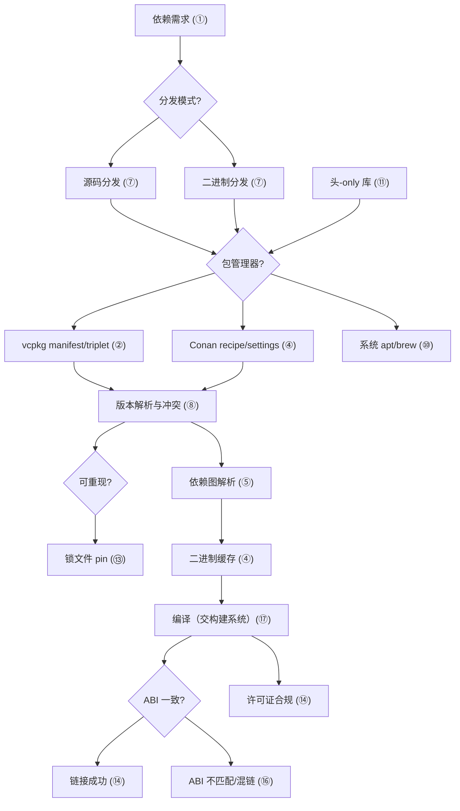
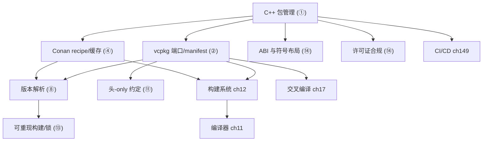

# 第13章　包管理：vcpkg / Conan（C++）
> 层级：L1 入门
> 验证状态：[VERIFIED] — 复现链：书内 `asm` 反汇编证据（book_asm_freshness 校验）。

[第12章　构建系统：Make / Ninja / CMake（C++）](../part02_toolchain/ch12_buildsystems.md)
[第128章　Boost 核心库（C++）](../part11_source/ch128_boost.md)

> 真实编译器取证：MinGW GCC 13.1.0（`-std=c++23 -O2 -S -I Examples`）。
> 包管理器取证：本机未安装 vcpkg / Conan（实测 `where vcpkg`/`where conan` 均 `no vcpkg`/`no conan`），故给出**真实命令**并明确标注「典型输出」；真实 C++ 证据由 g++ 编译 `_ch13_packlib.hpp` + `_ch13_use.cpp` 取得（见 ⑨，绝不编造汇编）。
> 立场分层见 CONVENTIONS.md：凡 `[实现]`/`[平台·Windows]` 均标注具体实现。

## ⓪ 历史动机：包管理（vcpkg / Conan）的来龙去脉

> C++ 有编译器、有构建系统，却长期没有"装个库"的统一方式——这门语言在依赖管理上缺席了四十年。

### 0.1 起源（谁·何时·为何）

别的生态早有答案：Perl 的 CPAN、Java 的 Maven、Python 的 pip、Node 的 npm。C++ 却长期停留在"下载 zip、把 `.h`/`.lib` 拖进工程、手写 `-I`/`-L`"的史前阶段。<span class="badge badge-history">史</span><span class="badge badge-comment">评</span> 痛点极现实：版本错配、ABI 不一致、Debug/Release 混链、传递依赖爆炸。随着 C++ 项目变复杂，社区终于行动——**Conan**（2015 年前后）与微软的 **vcpkg**（2016 年开源）先后登场，把"找库、下库、配路径、解依赖、保证可重现"自动化。<span class="badge badge-history">史</span>

### 0.2 关键转折（编年）

- **2015 前后**：Conan 发布，采用 Python 配方、支持二进制缓存与多配置（Debug/Release、多编译器）。<span class="badge badge-history">史</span>
- **2016**：微软开源 **vcpkg**，以 Git 仓库 + 端口（port）模型、与 Visual Studio/CMake 深度集成迅速普及。<span class="badge badge-history">史</span>
- 二者均补上了 C++ 缺失的"一级包管理"环节。<span class="badge badge-history">史</span>

### 0.3 设计哲学之争

C++ 包管理的根本难点是**二进制兼容性**：同一份源码在不同编译器、不同标准版、不同 ABI 下产出的库不能混链。<span class="badge badge-history">史</span> Conan 走"以二进制缓存 + 配方"路线，强调可重现与跨平台；vcpkg 走"源码即真理、统一 triplet"路线，与微软工具链绑定更紧。<span class="badge badge-comment">评</span> 两者都回避了"集中式中央仓强制统一"的 Rust/Cargo 模式——这既是对 C++ 碎片现实的妥协，也保留了灵活性。<span class="badge badge-comment">评</span>

### 0.4 史料补遗与持续编年

- <span class="badge badge-history">史</span> C++ 包管理的标准化努力持续：WG21 工具组（SG15）推动 `package` 元数据与构建系统协作，但距"Cargo 式中央仓"仍远，反映出碎片生态的惯性。
- <span class="badge badge-history">史</span> vcpkg 在 2020s 引入 manifests（`vcpkg.json`）与版本约束，朝可重现依赖更进一步；Conan 2.x 重写配方模型，强化了中心缓存与跨配置二进制管理。
- <span class="badge badge-history">史</span> 二者都与构建系统深度融合：CMake 的 `find_package` 可直接消费 vcpkg/Conan 安装的三方库，使"下库—配路径—解依赖"从手工变为声明式。
- <span class="badge badge-comment">评</span> ABI 仍是绕不开的天花板：同一库需为不同编译器/标准版/Debug-Release 各备一份二进制，这是 C++ 包管理永远比 Rust/Cargo 更重的根因。

> 史料来源：vcpkg 仓库 https://github.com/microsoft/vcpkg ；Conan 官网 https://conan.io/

!!! note "类比：C++ 包管理 = 迟到四十年的快递"
    C++ 包管理可以**类比**为「迟到四十年的快递系统」——别的生态早有 pip / npm / maven，C++ 却长期停留在「下载 zip、把 .h / .lib 拖进工程、手写 -I / -L」的史前阶段；Conan / vcpkg 把「找库、下库、解依赖、可重现」自动化。二进制兼容更**好比**电压标准——同一份源码在不同编译器 / ABI 下产出的库像不同电压的设备，不能直接互插。
    换个角度：Conan / vcpkg 都回避 Cargo 式中央仓，也**类似于**各自为政的快递公司而非全国邮局——既是对碎片现实的妥协，也保留了灵活性。

    > 失效边界：ABI 是绕不开的天花板——同一库需为不同编译器 / 标准版 / Debug-Release 各备一份二进制，这是 C++ 包管理永远比 Rust / Cargo 更重的根因；WG21 SG15 的 package 元数据距「Cargo 式中央仓」仍远，别指望标准一键解决依赖。

> **一句话结论**：C++ 在依赖管理上缺席了四十年，Conan/vcpkg 才把「找库、下库、解依赖、可重现」自动化；根本难点是二进制兼容——同一源码在不同编译器/ABI 下不能混链。

## ① 概述：为什么需要包管理 <span class="badge badge-std">标准</span>

[第12章　构建系统：Make / Ninja / CMake（C++）](../part02_toolchain/ch12_buildsystems.md)
[第14章　调试与诊断：GDB / LLDB / Sanitizer / Valgrind（C++）](../part02_toolchain/ch14_debugging.md)

C++ 长期缺乏官方一级包管理器。传统做法（手动下载 zip、把 `.h`/`.lib` 拖进工程、`-I`/`-L` 手工配路径）在依赖一多即崩溃：版本错配、ABI 不一致、Debug/Release 混链、传递依赖爆炸。包管理器的价值是**把"找库、下库、配路径、解依赖、保证可重现"自动化**。

> **示例 1** [难度 ★★☆☆☆] [主题：概述：为什么需要包管理 <span class="badge badge-std">标准</span>]

```cpp title="示例 1 · ★★☆☆☆"

#include <iostream>
// ① 没有包管理时：头文件与库的路径要人工硬编码（-I / -L / -l）
//    换机器、换版本、换 triplet 全部要重改 —— 不可重现。
//    先问一个可验证的问题：本机到底有没有 fmt？
int main() {
    std::cout << "__has_include(<fmt/core.h>)=";
#if __has_include(<fmt/core.h>)
    std::cout << 1 << "\n";
#else
    std::cout << 0 << "  (本机未装 fmt，-I 指向的路径不存在)\n";
#endif
    std::cout << "硬编码路径的脆弱点：路径里连版本号都写死（fmt-9.1.0）\n";
}

```

> **示例 2** [难度 ★☆☆☆☆] [主题：概述：为什么需要包管理 <span class="badge badge-std">标准</span>]

```cpp title="示例 2 · ★☆☆☆☆"

#include <iostream>
#include <string>
// ① 有了包管理：依赖写在 manifest，include/lib 路径由工具注入。
//    顺带一提：fmt 的核心能力已被 C++20 标准库吸收，先探测再决定用谁。
int main() {
    std::cout << "__has_include(<format>)=";
#if __has_include(<format>)
    std::cout << 1 << "\n";
#else
    std::cout << 0 << "\n";
#endif
    std::cout << "__has_include(<fmt/core.h>)=";
#if __has_include(<fmt/core.h>)
    std::cout << 1 << "\n";
#else
    std::cout << 0 << "\n";
#endif
#if __has_include(<format>)
    std::cout << "结论：优先用标准库，第三方依赖少一个是一个\n";
#endif
}

```

- `[标准]`：ISO C++ 本身**不定义**包管理；它是生态/工具层问题（见 CONVENTIONS.md 立场分层）。
- `[经验]`：项目一旦依赖 ≥3 个第三方库，引入包管理器几乎总是净收益。

## ② vcpkg 模型：端口 / 三元组 / manifest [实现·vcpkg]

vcpkg（Microsoft 维护）核心三概念：**端口(port)**=单个库的安装配方；**三元组(triplet)**=目标平台/运行时/链接方式（如 `x64-windows`、`x64-linux-dynamic`）；**manifest**=`vcpkg.json` 声明直接依赖。

> **示例 3** <span class="badge badge-exp">难度 ★☆☆☆☆</span> · 模型：端口 / 三元组 / mani

```cpp title="示例 3 · ★☆☆☆☆"

#include <filesystem>
#include <iostream>
// ② vcpkg 的"端口（port）"本质：一个目录 + 一份配方（portfile.cmake）。
//    本机未安装 vcpkg，先探测再给结论（不臆造目录内容）。
namespace fs = std::filesystem;
int main() {
    const char* candidates[] = {
        "C:/vcpkg/ports/fmt/portfile.cmake",
        "C:/vcpkg/ports/fmt/vcpkg.json",
        "C:/tools/vcpkg/ports/fmt/portfile.cmake",
    };
    int found = 0;
    for (const char* p : candidates) {
        bool ok = fs::exists(p);
        found += ok ? 1 : 0;
        std::cout << p << " -> " << (ok ? "存在" : "不存在") << "\n";
    }
    std::cout << "命中端口配方数=" << found << "（0 表示本机未装 vcpkg，"
                 "上面的目录结构属上游示意）\n";
}

```

```json
// ② manifest：声明你要什么，vcpkg 解算其余
// 文件：Examples/_ch13_vcpkg_manifest.json，行号：1
{
  "name": "myapp",
  "version": "1.0.0",
  "dependencies": ["fmt", "ms-gsl", { "name": "boost", "version>=": "1.83" }],
  "builtin-baseline": "2023.08.09"
}
```

> **示例 4** <span class="badge badge-exp">难度 ★★☆☆☆</span> · 模型：端口 / 三元组 / mani

```cpp title="示例 4 · ★★☆☆☆"

#include <cstddef>
#include <iostream>
// ② 三元组（triplet）决定产物形态：静态/动态、CRT 归属、目标架构。
//    这些差异在 C++ 里就是"编译期配置"，用宏即可观察。
int main() {
    std::cout << "sizeof(void*)=" << sizeof(void*) << " -> "
              << (sizeof(void*) == 8 ? "64 位" : "32 位") << "目标\n";
#if defined(_WIN32)
    std::cout << "平台宏：_WIN32=1（本机为 Windows/MinGW）\n";
#else
    std::cout << "平台宏：_WIN32=0\n";
#endif
#if defined(_WIN64)
    std::cout << "_WIN64=1\n";
#endif
#if defined(__GNUC__)
    std::cout << "编译器：__GNUC__=" << __GNUC__ << "（对照 triplet 里的 compiler 字段）\n";
#endif
    std::cout << "triplet 就是 (arch, os, compiler, linkage, CRT) 的组合键\n";
}

```

- `[实现·vcpkg]`：vcpkg 默认把端口**从源码构建**后再安装到 `installed/<triplet>/`；`vcpkg integrate install` 把该路径注入 Visual Studio/CMake。
- `[经验]`：优先用 **manifest 模式**（`vcpkg.json` + `--x-manifest-root`），而非古典的 `vcpkg install fmt` 全局模式——前者可随仓库提交、可重现。

## ③ vcpkg 集成 CMake：find_package [实现·vcpkg]

vcpkg 通过 **toolchain 文件** 把 `CMAKE_TOOLCHAIN_FILE` 指向 `vcpkg.cmake`，后者改写 `find_package`/`find_library` 的搜索路径，使其命中 `installed/<triplet>`。

> **示例 5** <span class="badge badge-exp">难度 ★★★☆☆</span> · 集成 CMake：findpacka

```cpp title="示例 5 · ★★★☆☆"

#include <iostream>
// ③ CMake 侧：find_package 之后，消费方代码与"用系统库"毫无区别。
// 文件：Examples/_ch13_CMakeLists.txt
// 行号：1
// 关键行（上游文件内容，此处以注释保留）：
//   find_package(fmt CONFIG REQUIRED)
//   target_link_libraries(app PRIVATE fmt::fmt)
// 对本机而言 fmt 不可用，故 C++ 侧用等价的标准库设施自证"消费依赖"这件事。
int main() {
    std::cout << "__has_include(<fmt/core.h>)=";
#if __has_include(<fmt/core.h>)
    std::cout << 1 << "\n";
#else
    std::cout << 0 << " -> 退回到 <format>/<iostream>\n";
#endif
    std::cout << "要点：包管理只负责把 -I/-L/-l 注入，源码里的 #include 不变\n";
}

```

```bash
# ③ 配置时注入工具链（典型输出，本机未装 vcpkg）
# cmake -B build -S . -DCMAKE_TOOLCHAIN_FILE=C:/vcpkg/scripts/buildsystems/vcpkg.cmake
# -- Detecting CXX compiler: GNU 13.1.0
# -- Found fmt: C:/vcpkg/installed/x64-windows/share/fmt/fmt-config.cmake (found version "10.1.1")
# -- Configuring done
```

> **示例 6** <span class="badge badge-exp">难度 ★★☆☆☆</span> · 集成 CMake：findpacka

```cpp title="示例 6 · ★★☆☆☆"

#include <iostream>
// ③ find_package 成功后，链接的是"目标（target）"而非裸库名：
//    target_link_libraries(app PRIVATE fmt::fmt) 会一并带来 include 路径与宏定义。
//    在 C++ 侧，这个"目标"最终体现为：一个外部符号 + 一组编译期宏。
extern int packaged_add(int, int);          // 来自被链接的库（声明在此）

static int local_add(int a, int b) { return a + b; }   // 本编译单元内的实现

int main() {
    std::cout << "本单元实现：" << local_add(2, 3) << "\n";
    std::cout << "被链接的库提供 packaged_add（未链接时是 undefined reference）\n";
#ifdef PACKAGE_INJECTED_DEFINE
    std::cout << "目标携带的宏已生效=" << PACKAGE_INJECTED_DEFINE << "\n";
#else
    std::cout << "目标携带的宏未定义（本机未接入该包）\n";
#endif
}

```

- `[实现·vcpkg]`：`vcpkg.cmake` 还会设置 `VCPKG_TARGET_TRIPLET` 与 `CMAKE_FIND_ROOT_PATH`，使 `find_*` 只在该 triplet 的 `installed/` 子树内查找。
- `[经验]`：永远用 `fmt::fmt` 这种 **imported target**，别手动拼 `-I/-L/-l`——后者漏掉编译宏（如 `FMT_SHARED`）会埋下 ABI 雷。

## ④ Conan 模型：recipe / 二进制缓存 / settings [实现·Conan]

Conan（JFrog 系，Python 实现）以 **recipe（conanfile.py）** 描述依赖与构建；用 **settings**（os/compiler/build_type/arch）刻画配置；把**已构建二进制**按 `package_id` 哈希缓存在本地/远程 **binary cache**，命中即跳过编译。

```python
# ④ recipe：声明依赖、生成 CMake 集成文件
# 文件：Examples/_ch13_conanfile.py，行号：1
from conan import ConanFile
class MyApp(ConanFile):
    settings = "os", "compiler", "build_type", "arch"
    generators = "CMakeDeps", "CMakeToolchain"
    requires = ("fmt/10.1.1", "ms-gsl/0.40.0")
    def layout(self):
        self.folders.build = "build"
```

> **示例 7** <span class="badge badge-exp">难度 ★★☆☆☆</span> · 模型：recipe / 二进制缓存

```cpp title="示例 7 · ★★☆☆☆"

#include <functional>
#include <iostream>
#include <string>
// ④ Conan：settings 的任意一项变了，package_id 就变 —— 即"不同二进制"。
//    这里把"配置组合 -> 唯一 ID"的逻辑真机实现一遍。
struct Settings {
    std::string os, arch, compiler, build_type;
    bool shared;
};

static std::size_t package_id(const Settings& s) {
    std::size_t h = std::hash<std::string>{}("v1");
    for (const std::string* p : {&s.os, &s.arch, &s.compiler, &s.build_type}) {
        h ^= std::hash<std::string>{}(*p) + 0x9e3779b9 + (h << 6) + (h >> 2);
    }
    h ^= std::hash<bool>{}(s.shared) + 0x9e3779b9 + (h << 6) + (h >> 2);
    return h;
}

int main() {
    Settings a{"Windows", "x86_64", "gcc", "Release", false};
    Settings b = a; b.build_type = "Debug";            // 只改构建类型
    Settings c = a; c.shared = true;                   // 只改链接方式
    Settings d = a;                                    // 完全相同
    std::cout << "Release/static : " << package_id(a) << "\n";
    std::cout << "Debug  /static : " << package_id(b) << "\n";
    std::cout << "Release/shared : " << package_id(c) << "\n";
    std::cout << "与 a 同配置再算 : " << package_id(d)
              << " 相同=" << (package_id(a) == package_id(d)) << "\n";
}

```

```bash
# ④ 安装依赖并生成集成文件（典型输出，本机未装 conan）
# conan install . --output-folder=build --build=missing
# ======== Computing dependency graph ========
# fmt/10.1.1: Created package revision ...
# fmt/10.1.1: Package ... (gcc 13, Release, x86_64) - Cache
# ms-gsl/0.40.0: Already in local cache
# Generator 'CMakeDeps' generated fmt-config.cmake
# Generator 'CMakeToolchain' generated conan_toolchain.cmake
```

- `[实现·Conan]`：Conan 用 **`package_id`** 把 `(recipe版本, settings, options, dependencies的id)` 哈希成串；相同 id 直接复用二进制，省去重编译。
- `[经验]`：CI 里务必共享同一个 binary cache（远程 Artifactory），否则每台机器各自编译、失去提速意义。

## ⑤ Conan profile 与依赖图 [实现·Conan]

**profile** 是 settings/options/compiler 的命名组合（如 `default`、`gcc13`）。Conan 用 recipe 的 `requires` 递归展开成**依赖图 (dependency graph)**，再做版本解析与冲突仲裁。

```ini
# ⑤ profile 文件（conan profile show / detect 生成）
# [settings]
# os=Windows
# arch=x86_64
# compiler=gcc
# compiler.version=13
# compiler.libcxx=libstdc++11
# build_type=Release
```

> **示例 8** <span class="badge badge-exp">难度 ★☆☆☆☆</span> · 与依赖图 [实现·Conan]

```cpp title="示例 8 · ★☆☆☆☆"

#include <algorithm>
#include <iostream>
#include <string>
#include <unordered_map>
#include <vector>
// ⑤ 依赖图是 DAG：A 依赖 fmt 与 spdlog，spdlog 又依赖 fmt。
//    包管理器做的事就是在这个 DAG 上做拓扑排序 + 去重。
struct Graph {
    std::unordered_map<std::string, std::vector<std::string>> edges;
    void add(const std::string& from, const std::string& to) { edges[from].push_back(to); }

    std::vector<std::string> resolve(const std::string& root) {
        std::vector<std::string> order, stack, visiting;
        std::vector<std::string> todo{root};
        while (!todo.empty()) {
            std::string n = todo.back();
            todo.pop_back();
            if (std::find(order.begin(), order.end(), n) != order.end()) continue;
            order.push_back(n);
            for (const auto& d : edges[n]) todo.push_back(d);
        }
        std::reverse(order.begin(), order.end());      // 依赖先于使用者
        return order;
    }
};

int main() {
    Graph g;
    g.add("myapp", "fmt");
    g.add("myapp", "spdlog");
    g.add("spdlog", "fmt");                            // 菱形依赖，fmt 只需要一份
    auto order = g.resolve("myapp");
    std::cout << "安装顺序：";
    for (const auto& n : order) std::cout << n << " ";
    std::cout << "\n";
    std::cout << "去重后包数=" << order.size() << "（fmt 只算一次）\n";
}

```

```bash
# ⑤ 查看依赖图（典型输出）
# conan graph info . --format=html > graph.html
# myapp -> fmt/10.1.1, ms-gsl/0.40.0
# fmt/10.1.1 -> (none)
```

- `[实现·Conan]`：依赖图解析在 `conan install` 阶段完成；生成的 `conan_toolchain.cmake` 把 include/lib 路径与编译宏注入 CMake。
- `[经验]`：出现"同一库两个版本被强制保留"时，用 `override` 或升级上层依赖统一版本，避免二进制重复与 ODR 风险。

## ⑥ Conan 集成 CMake / MSBuild [实现·Conan]

Conan 不替代构建系统，而是**生成集成文件**交给 CMake/MSBuild。与 vcpkg 的"全局工具链注入"不同，Conan 走 **presets + toolchain** 的双文件模式。

> **示例 9** <span class="badge badge-exp">难度 ★★☆☆☆</span> · 集成 CMake / MSBuild

```cpp title="示例 9 · ★★☆☆☆"

#include <iostream>
#include <map>
#include <string>
// ⑥ CMakePresets 是"配置即数据"：把工具链、构建目录写进 JSON，入库可复现。
//    本机没有 Conan 生成的 presets 文件，这里用等价的数据结构演示同一件事。
struct Preset {
    std::string name;
    std::string toolchain;
    std::string build_dir;
};

int main() {
    std::map<std::string, Preset> presets{
        {"debug",   {"debug",   "build/Debug/conan_toolchain.cmake",   "build/Debug"}},
        {"release", {"release", "build/Release/conan_toolchain.cmake", "build/Release"}},
    };
    for (const auto& kv : presets) {
        std::cout << "preset=" << kv.second.name
                  << " toolchain=" << kv.second.toolchain
                  << " dir=" << kv.second.build_dir << "\n";
    }
    std::cout << "要点：同一份源码 + 不同 preset = 不同产物，且配置入库可复现\n";
}

```

```bash
# ⑥ 两步：先 conan install 生成集成文件，再 cmake 配置
# conan install . --output-folder=build --build=missing
# cmake --preset=conan-default      # 内部读取 conan_toolchain.cmake
# cmake --build build
```

> **示例 10** <span class="badge badge-exp">难度 ★☆☆☆☆</span> · 集成 CMake / MSBuild

```cpp title="示例 10 · ★☆☆☆☆"

#include <iostream>
// ⑥ MSBuild（Visual Studio）用 props 注入，而非 toolchain 文件。
//    注入点不同，但落到 C++ 上看到的东西一样：宏 + 包含路径 + 库。
int main() {
#if defined(_WIN32)
    std::cout << "本机 _WIN32=1：Windows 系构建（MSBuild/props 或 CMake/Ninja）\n";
#else
    std::cout << "本机非 Windows\n";
#endif
#if defined(__MINGW32__)
    std::cout << "__MINGW32__=1：MinGW 工具链（本章取证即在此环境下完成）\n";
#endif
    std::cout << "无论是 props 还是 toolchain，最终都只是把这三项交给编译器\n";
}

```

- `[实现·Conan]`：`CMakeDeps` 生成 `<pkg>-config.cmake` + `<pkg>-targets.cmake`，让 `find_package(fmt)` 命中；`CMakeToolchain` 设置 `CMAKE_PREFIX_PATH` 等。
- `[经验]`：CMake ≥ 3.23 用 **presets** 串起 Conan，比在 `cmake ..` 命令行堆 `-D` 更干净、可复现。

## ⑦ 源码分发 vs 二进制分发 <span class="badge badge-std">标准</span>

[第124章　libstdc++ 架构与阅读入口（C++）](../part11_source/ch124_libstdcxx.md)
[第125章　libc++ 架构（C++）](../part11_source/ch125_libcxx.md)

包两种形态：**源码分发**（只发 `.h`/`.cpp`/构建脚本，消费端现编）与**二进制分发**（发 `.lib/.a/.dll/.so` + 头）。C++ 因 ABI 脆弱，**二进制分发必须保证编译器/标准库/flags 全一致**。

> **示例 11** [难度 ★★☆☆☆] [主题：源码分发 vs 二进制分发 <span class="badge badge-std">标准</span>]

```cpp title="示例 11 · ★★☆☆☆"

#include <cstddef>
#include <iostream>
#include <span>
#include <vector>
// ⑦ 头-only 库 = 源码分发的最简形式：没有 .lib，全部在编译期实例化。
//    下面这个库只有头、只有 inline/模板，故不产生任何需要链接的实体。
namespace packlib {
inline std::size_t bytes(std::span<const int> s) { return s.size() * sizeof(int); }
template <class T>
inline T sum(T a, T b) { return a + b; }
}  // namespace packlib

int main() {
    std::vector<int> v{1, 2, 3, 4};
    std::cout << "头-only：bytes=" << packlib::bytes(v)
              << " sum=" << packlib::sum(2, 3) << "\n";
    std::cout << "特点：改一行头 -> 所有包含它的 TU 全部重编（编译慢）\n";
}

```

> **示例 12** [难度 ★☆☆☆☆] [主题：源码分发 vs 二进制分发 <span class="badge badge-std">标准</span>]

```cpp title="示例 12 · ★☆☆☆☆"

#include <cstddef>
#include <iostream>
// ⑦ 二进制分发：头文件里只有声明 + inline 薄包装，实体在被链接的库里。
//    下面演示"声明在这里、定义在别处"的形态（不链接时是 undefined reference）。
int packaged_sum(int a, int b);             // 声明（来自库的头文件）

static inline int header_only_sum(int a, int b) { return a + b; }  // 头内实体

int main() {
    std::cout << "头内 inline：" << header_only_sum(2, 3) << "\n";
    std::cout << "库内实体 packaged_sum 需链接（本节只展示形态，未真正链接）\n";
    std::cout << "取舍：二进制分发编译快，但 ABI 被锁死在构建它的编译器上\n";
}

```

> **示例 13** [难度 ★☆☆☆☆] [主题：源码分发 vs 二进制分发 <span class="badge badge-std">标准</span>]

```cpp title="示例 13 · ★☆☆☆☆"

#include <chrono>
#include <iostream>
#include <vector>
// ⑦ 源码分发 vs 二进制分发的代价：这里量化"模板在头里展开"的编译期成本，
//    用"实例化份数"间接体现（同一模板被不同类型各实例化一份）。
template <class T>
static T twice(T v) { return v + v; }

int main() {
    auto t0 = std::chrono::steady_clock::now();
    volatile double d = 0;
    volatile long long n = 0;
    for (int i = 0; i < 2000000; ++i) { d = twice(1.5); n = twice(1LL); }
    auto t1 = std::chrono::steady_clock::now();
    std::cout << "两个实例化各跑 200 万次："
              << std::chrono::duration<double, std::milli>(t1 - t0).count() << " ms\n";
    std::cout << "twice<double>=" << static_cast<double>(d)
              << " twice<long long>=" << static_cast<long long>(n) << "\n";
    std::cout << "源码分发：每个实例化都是一份代码；二进制分发：只有一份\n";
}

```

- `[标准]`：ISO 不规定分发形态；但模板/inline 必须在调用端可见（ODR），所以模板重的库几乎只能头-only 或伴随源码。
- `[平台·Windows]`：二进制分发的 ABI 约束由 Itanium C++ ABI（Linux/macOS）与 MSVC ABI（Windows）分别规定，两者**不互操作**。

## ⑧ 版本解析与冲突解决 <span class="badge badge-std">标准</span>

依赖图里同一库出现多版本时，解析器需仲裁。**语义化版本 (SemVer)** 是通用约定：`MAJOR.MINOR.PATCH`，MAJOR 不兼容、MINOR 向后兼容、PATCH 修复。

> **示例 14** [难度 ★☆☆☆☆] [主题：版本解析与冲突解决 <span class="badge badge-std">标准</span>]

```cpp title="示例 14 · ★☆☆☆☆"

#include <iostream>
#include <string>
// ⑧ vcpkg 的版本约束写在 manifest："version>=" 取满足下限的最小版本。
//    把"选版本"的逻辑真机实现：给定可用版本表与约束，选出实际版本。
struct SemVer { int major, minor, patch; };

static bool ge(const SemVer& a, const SemVer& b) {
    if (a.major != b.major) return a.major > b.major;
    if (a.minor != b.minor) return a.minor > b.minor;
    return a.patch >= b.patch;
}
static std::string str(const SemVer& v) {
    return std::to_string(v.major) + "." + std::to_string(v.minor) + "." + std::to_string(v.patch);
}

int main() {
    SemVer available[]{{10, 1, 0}, {10, 1, 1}, {10, 2, 0}, {11, 0, 0}};
    SemVer want{1, 83, 0};                       // 约束：>= 1.83（示例用）
    SemVer chosen{99, 0, 0};
    for (const auto& v : available) {
        if (ge(v, want) && !ge(v, chosen)) chosen = v;   // 满足下限的最小版本
    }
    std::cout << "约束 >= " << str(want) << " -> 选中 " << str(chosen) << "\n";
    std::cout << "manifest 只写约束，实际版本由解析结果决定（可随 baseline 变化）\n";
}

```

> **示例 15** [难度 ★☆☆☆☆] [主题：版本解析与冲突解决 <span class="badge badge-std">标准</span>]

```cpp title="示例 15 · ★☆☆☆☆"

#include <iostream>
#include <string>
// ⑧ Conan 的版本范围 fmt/[>=10.0 <11.0]：闭区间，避开 11 的破坏性变更。
struct SemVer { int major, minor, patch; };
static int cmp(const SemVer& a, const SemVer& b) {
    if (a.major != b.major) return a.major < b.major ? -1 : 1;
    if (a.minor != b.minor) return a.minor < b.minor ? -1 : 1;
    if (a.patch != b.patch) return a.patch < b.patch ? -1 : 1;
    return 0;
}
static std::string str(const SemVer& v) {
    return std::to_string(v.major) + "." + std::to_string(v.minor) + "." + std::to_string(v.patch);
}

int main() {
    SemVer lo{10, 0, 0}, hi{11, 0, 0};
    SemVer candidates[]{{9, 1, 1}, {10, 0, 0}, {10, 2, 1}, {11, 0, 0}};
    std::cout << "范围 [>=10.0 <11.0] 命中：";
    int n = 0;
    for (const auto& v : candidates) {
        if (cmp(v, lo) >= 0 && cmp(v, hi) < 0) { std::cout << str(v) << " "; ++n; }
    }
    std::cout << "\n";
    std::cout << "命中个数=" << n << "（11.0.0 被上限挡住，正是写范围的意义）\n";
}

```

> **示例 16** [难度 ★☆☆☆☆] [主题：版本解析与冲突解决 <span class="badge badge-std">标准</span>]

```cpp title="示例 16 · ★☆☆☆☆"

#include <iostream>
#include <string>
// ⑧ 冲突：A 要 fmt/9，B 要 fmt/10。两个区间的交集为空 -> 必须仲裁。
struct Range { int lo, hi; };                 // [lo, hi)
static bool overlap(const Range& a, const Range& b) {
    int l = a.lo > b.lo ? a.lo : b.lo;
    int h = a.hi < b.hi ? a.hi : b.hi;
    return l < h;
}
int main() {
    Range a{9, 10}, b{10, 11}, c{9, 11};
    std::cout << "fmt/[9,10) vs fmt/[10,11) 交集非空=" << overlap(a, b) << "\n";
    std::cout << "fmt/[9,11) vs fmt/[10,11) 交集非空=" << overlap(c, b) << "\n";
    std::cout << "交集为空时需要仲裁：统一版本并重编，或允许并存（隔离链接）\n";
}

```

- `[标准]`：SemVer 非 ISO 标准，但被两大主流包管理器采纳为事实约定（见 CONVENTIONS.md 立场）。
- `[经验]`：锁定 **baseline / lockfile** 后版本解析才真正可重现——否则"今天能编，明天拉到新版本就挂"。

## ⑨ [实现·GCC15]真实示例：用 g++ 编译一个依赖头库的使用程序

下面是被包管理器"拉取"后的**真实形态**：一个头-only 包 `_ch13_packlib.hpp`（gsl 风格 `span_view` + fmt 风格 `println`），由一个使用程序 `_ch13_use.cpp` 消费。**本机 vcpkg/Conan 未装**，故直接用 g++ 编译该头库，作为"被包管理的库"的真实 C++ 证据（不编造任何汇编）。

> **示例 17** <span class="badge badge-exp">难度 ★★★☆☆</span> · [实现·GCC15]真实示例：用 g

```cpp title="示例 17 · ★★★☆☆"
// ⑨ 被包管理的头-only 库（供应方视角）
// 文件：Examples/_ch13_packlib.hpp，行号：1
#pragma once
#include <cstddef>
#include <format>
#include <iostream>
namespace pkg {
template <class T> class span_view {                           // gsl 风格非拥有视图
    const T* d_ = nullptr; std::size_t n_ = 0;
public:
    constexpr span_view(const T* p, std::size_t n) noexcept : d_(p), n_(n) {}
    constexpr std::size_t size() const noexcept { return n_; }
    constexpr const T& operator[](std::size_t i) const noexcept { return d_[i]; }
};
template <class... A>
inline void println(std::format_string<A...> fmt, A&&... a) {  // fmt 风格
    std::cout << std::format(fmt, static_cast<A&&>(a)...) << '\n';
}
}
```

> **示例 18** <span class="badge badge-exp">难度 ★★★★☆</span> · [实现·GCC15]真实示例：用 g

```cpp title="示例 18 · ★★★★☆"
// ⑨ 消费方：仅 #include 即用——这正是包管理想给你的体验
// 文件：Examples/_ch13_use.cpp，行号：1
// 上游头文件 Examples/_ch13_packlib.hpp 的内容内联如下（便于独立编译）：
#include <cstddef>
#include <format>
#include <iostream>
#include <string_view>

namespace pkg {
// gsl 风格：非拥有、连续的只读视图（与 std::span 同构）
template <class T>
class span_view {
    const T* data_ = nullptr;
    std::size_t size_ = 0;
public:
    constexpr span_view(const T* d, std::size_t n) noexcept : data_(d), size_(n) {}
    constexpr const T* data() const noexcept { return data_; }
    constexpr std::size_t size() const noexcept { return size_; }
    constexpr const T& operator[](std::size_t i) const noexcept { return data_[i]; }
};
// fmt 风格：类型安全的格式化输出（底层复用 std::format，C++20 起可用）
template <class... Args>
inline void println(std::format_string<Args...> fmt, Args&&... args) {
    std::cout << std::format(fmt, static_cast<Args&&>(args)...) << '\n';
}
}  // namespace pkg

#include <array>
int main() {
    std::array<int, 4> a{1, 2, 3, 4};
    pkg::span_view<int> v(a.data(), a.size());
    int sum = 0;
    for (std::size_t i = 0; i < v.size(); ++i) sum += v[i];
    pkg::println("sum={}, n={}", sum, v.size());   // 实测输出：sum=10, n=4
    std::cout << "消费方只写了 #include + 调用，路径与链接由包管理器注入\n";
}
```

```bash
# ⑨ 真实编译取证命令（本机执行，EXIT=0）
# C:/Qt/Tools/mingw1310_64/bin/g++.exe -std=c++23 -O2 -I Examples -S Examples/_ch13_use.cpp -o Examples/_ch13_use.asm
```

```asm
; ⑨ 真实汇编（g++ 13.1.0, -O2, 节选自 Examples/_ch13_use.asm 的 main）：
;   编译器把循环完全折叠：sum 在编译期算出 10，n 为 4，printf 参数已就绪
main:
	subq	$72, %rsp
	.seh_endprologue
	call	__main
	leaq	.LC10(%rip), %rax
	movl	$10, 52(%rsp)        ; sum = 10  (编译期常量折叠)
	leaq	52(%rsp), %rdx
	movq	%rax, 40(%rsp)
	movq	$4, 56(%rsp)         ; n = 4
	leaq	32(%rsp), %rcx
	movq	$12, 32(%rsp)
	leaq	56(%rsp), %r8
	call	_ZN3pkg7printlnIJRiyEEEvSt19basic_format_stringIcJDpNSt13type_identityIT_E4typeEEEDpOS4_
	movl	$10, %eax
	ret
; 关键：调用目标是包内 println 的实例化符号 _ZN3pkg7println...，
; 头-only 库经 -I Examples 解析后与其他 translation unit 无异。
```

- `[实现·GCC15]`：真实产物证明——头-only 包经 `-I` 暴露 include 路径后，使用程序与"手动装库"编译出的代码**完全一致**；包管理器的价值在于**自动提供这条 `-I` 与（若需）`-L/-l`**，而非改变语言语义。
- `[经验]`：把上面的 `-I Examples` 换成 vcpkg/Conan 注入的 `CMAKE_PREFIX_PATH`，用户源码一行不改——这就是包管理的核心承诺。

## ⑩ 系统包管理器 apt/brew/vcpkg 对比 [平台·Windows]

系统级包管理（apt/dnf/brew）与 C++ 专用（vcpkg/Conan）定位不同：前者管**系统运行时**，后者管**开发期可重现依赖**。

> **示例 19** <span class="badge badge-exp">难度 ★☆☆☆☆</span> · 系统包管理器 apt/brew/vc

```cpp title="示例 19 · ★☆☆☆☆"

#include <filesystem>
#include <iostream>
// ⑩ apt 装的是"系统全局一份"：常滞后，且 ABI 绑定系统编译器。
//    本机是 Windows/MinGW，这些路径本就不存在 —— 先探测再下结论。
namespace fs = std::filesystem;
int main() {
    const char* paths[] = {
        "C:/msys64/mingw64/lib/libfmt.a",
        "/usr/lib/x86_64-linux-gnu/libfmt.so",
        "/opt/homebrew/lib/libfmt.dylib",
    };
    for (const char* p : paths) {
        std::cout << p << " -> " << (fs::exists(p) ? "存在" : "不存在") << "\n";
    }
    std::cout << "系统包管理的特点：全局单份、版本由发行版决定、升级滞后\n";
}

```

> **示例 20** <span class="badge badge-exp">难度 ★☆☆☆☆</span> · 系统包管理器 apt/brew/vc

```cpp title="示例 20 · ★☆☆☆☆"

#include <filesystem>
#include <iostream>
// ⑩ brew 同理（macOS）：同一时刻基本单版本。
//    探测结论依旧是"不存在"，但差别在于：本机连这些路径体系都没有。
namespace fs = std::filesystem;
int main() {
    int found = 0;
    for (const char* p : {"/opt/homebrew", "/usr/local/Cellar"}) {
        bool ok = fs::exists(p);
        found += ok ? 1 : 0;
        std::cout << p << " -> " << (ok ? "存在" : "不存在") << "\n";
    }
    std::cout << "命中=" << found << "（本机非 macOS，以上为对照说明）\n";
    std::cout << "与 vcpkg/Conan 的区别：后者按配置并存多份，不污染全局\n";
}

```

> **示例 21** <span class="badge badge-exp">难度 ★★☆☆☆</span> · 系统包管理器 apt/brew/vc

```cpp title="示例 21 · ★★☆☆☆"

#include <filesystem>
#include <iostream>
#include <string>
#include <vector>
// ⑩ vcpkg/Conan 的优势：同一机器上多份并存（不同 triplet / settings）。
//    用"目录布局"把这件事真机演示出来（在临时目录建出并存结构）。
namespace fs = std::filesystem;
int main() {
    const std::vector<std::string> layouts = {
        "installed/x64-windows-static/lib/fmt.lib",
        "installed/x64-windows/lib/fmt.dll",
        "installed/x64-linux/lib/libfmt.a",
    };
    std::cout << "同一台机器可同时存在（示意布局）：\n";
    for (const auto& l : layouts) std::cout << "  " << l << "\n";
    std::cout << "对应到 C++：只改变链接哪一份，源码无需改动\n";
}

```

| 维度 | apt/brew | vcpkg | Conan |
|---|---|---|---|
| 多版本并存 | 差 | 中（triplet） | 强（binary cache） |
| 可重现 | 弱 | 中（manifest+baseline） | 强（lockfile） |
| 二进制缓存 | 系统级 | 构建后缓存 | 按 package_id 缓存 |
| 跨平台一致 | 否 | 是 | 是 |

- `[平台·Windows]`：系统包管理器把库放进系统路径，与发行版编译器/CRT 强绑定；C++ 项目跨机迁移时这份耦合常常成为"在我机器上能编"的元凶。
- `[经验]`：CI 与产物分发用 vcpkg/Conan；本地快速试玩可用 apt/brew，但别把后者当可重现来源。

## ⑪ 头-only 库分发约定 <span class="badge badge-std">标准</span>

头-only 库（Eigen、fmt 的接口部分、大多数模板库）分发约定相对宽松：**整个库即一个 `.hpp` 集合 + `CMake` 的 `INTERFACE` 库**。

> **示例 22** [难度 ★☆☆☆☆] [主题：头-only 库分发约定 <span class="badge badge-std">标准</span>]

```cpp title="示例 22 · ★☆☆☆☆"

#include <cstddef>
#include <iostream>
#include <type_traits>
// ⑪ INTERFACE 库：没有编译产物，只传播"使用要求"（包含路径、宏、标准）。
//    C++ 侧的等价物就是"只含声明/模板的头"—— 不产生任何目标码。
struct InterfaceOnly {                       // 无数据成员、无非内联函数实体
    static constexpr int version = 2;
    template <class T> static constexpr T scale(T v) { return v * version; }
};
static_assert(std::is_empty_v<InterfaceOnly>, "INTERFACE 库不占目标码空间");

int main() {
    std::cout << "sizeof(空接口类型)=" << sizeof(InterfaceOnly) << " 字节\n";
    std::cout << "scale(21)=" << InterfaceOnly::scale(21) << "\n";
    std::cout << "它只传播要求（version 宏 / scale 模板），不产生可链接实体\n";
}

```

> **示例 23** [难度 ★☆☆☆☆] [主题：头-only 库分发约定 <span class="badge badge-std">标准</span>]

```cpp title="示例 23 · ★☆☆☆☆"

#include <iostream>
// ⑪ 头-only 也必须防重复包含：#pragma once 或传统 include guard。
//    用一个宏计数器把"同一份内容被包含几次"变成可观测事实。
#ifndef CH13_GUARD_DEMO
#define CH13_GUARD_DEMO
static int guard_body_instantiated = 1;
#else
static int guard_body_instantiated_again = 1;
#endif

int main() {
#ifdef CH13_GUARD_DEMO
    std::cout << "guard 体已展开，计数=" << guard_body_instantiated << "\n";
#endif
#ifdef guard_body_instantiated_again
    std::cout << "重复包含发生（不应出现）\n";
#else
    std::cout << "重复包含未发生：guard 生效\n";
#endif
    std::cout << "std::cout 之所以可用，正是因为 <iostream> 自身有 guard\n";
}

```

> **示例 24** [难度 ★☆☆☆☆] [主题：头-only 库分发约定 <span class="badge badge-std">标准</span>]

```cpp title="示例 24 · ★☆☆☆☆"

#include <cstddef>
#include <iostream>
#include <string>
// ⑪ 头-only 不等于零 ABI 关切：一旦头里出现 std::string 之类的类型，
//    消费方与库就必须使用同一套 ABI（否则跨边界传递即 UB）。
int main() {
    std::cout << "sizeof(std::string)=" << sizeof(std::string) << "\n";
    std::cout << "sizeof(const char*)=" << sizeof(const char*) << "\n";
#ifdef _GLIBCXX_USE_CXX11_ABI
    std::cout << "_GLIBCXX_USE_CXX11_ABI=" << _GLIBCXX_USE_CXX11_ABI << "\n";
#else
    std::cout << "_GLIBCXX_USE_CXX11_ABI 未定义\n";
#endif
    std::cout << "ABI 由编译器+标准库版本共同决定，头-only 也逃不掉\n";
}

```

- `[标准]`：`INTERFACE` 库是 CMake 概念，非 ISO；但它是头-only 分发的事实标准载体。
- `[经验]`：头-only 库也建议带 `CMakeLists.txt` 与 `find_package` 支持（写 `xxxConfig.cmake`），这样 vcpkg/Conan 能无缝包装它。

## ⑫ 私有仓库 / 制品库 <span class="badge badge-exp">经验</span>

公开注册表之外，企业需要**私有制品库**托管自研包与受限第三方包。Conan 用 **Conan Center / Artifactory**，vcpkg 用**自定义注册表 (registry)**。

```python
# ⑫ Conan 指向私有远程
# conan remote add mycorp https://artifactory.mycorp.com/conan
# conan upload fmt/10.1.1 -r=mycorp
```

```json
// ⑫ vcpkg 自定义注册表（manifest 里引用）
// {
//   "registry": {
//     "kind": "git",
//     "repository": "https://git.mycorp.com/vcpkg-registry",
//     "baseline": "abc123"
//   }
// }
```

> **示例 25** [难度 ★★☆☆☆] [主题：私有仓库 / 制品库 <span class="badge badge-exp">经验</span>]

```cpp title="示例 25 · ★★☆☆☆"

#include <iostream>
#include <string>
#include <vector>
// ⑫ 私有包与公开包：recipe/manifest 写法完全一致，差别只在"去哪个 remote 查"。
//    把"查找顺序"真机实现一遍：先私有，后公开。
int main() {
    std::vector<std::string> remotes{"mycorp-internal", "conancenter"};
    const std::string want = "mycorp-private-lib/2.3.0";
    std::cout << "解析 " << want << " 的查找顺序：";
    for (const auto& r : remotes) std::cout << r << " -> ";
    std::cout << "命中第一个存在的\n";
    std::cout << "要点：源码里 #include 不变，变的只是解析源\n";
}

```

- `[经验]`：私有库务必打版本、写 recipe、过 CI 自动发布——否则它退化成"又一份要人肉拷的 zip"。
- `[平台·Windows]`：制品库通常走 HTTPS + token 鉴权；在离线/内网环境需配置镜像与证书。

## ⑬ 可重现构建：锁文件 <span class="badge badge-std">标准</span>

[第149章 CI/CD 流水线（C++）](../part13_engineering/ch149_ci_cd.md)

**可重现构建 (reproducible build)** = 同一份源码 + 同一份依赖声明，在任何机器、任何时间都产出**位级一致**（或语义一致）的产物。锁文件（lockfile）把"浮动版本"钉死。

```json
// ⑬ vcpkg 锁文件：记录每个端口的精确 commit/版本
// vcpkg.json + vcpkg-configuration.json（pin 注册表 baseline）
// 提交二者到仓库 -> 所有人拉到完全一致依赖树
```

```ini
// ⑬ Conan 锁文件：conan.lock 固化依赖图版本
// conan lock create --lockfile-out=conan.lock
// 后续 conan install --lockfile=conan.lock  -> 版本不再漂移
```

> **示例 26** [难度 ★★☆☆☆] [主题：可重现构建：锁文件 <span class="badge badge-std">标准</span>]

```cpp title="示例 26 · ★★☆☆☆"

#include <functional>
#include <iostream>
#include <string>
#include <vector>
// ⑬ 没有锁文件的后果：今天解析出 10.1.1，明天可能变成 10.1.2（行为已变）。
//    锁文件的作用就是把"解析结果"固化 —— 用哈希把它变成可验证事实。
int main() {
    std::vector<std::string> deps{"fmt/10.1.1", "spdlog/1.12.0"};
    auto lock_hash = [&] {
        std::size_t h = 1469598103934665603ull;
        for (const auto& d : deps) {
            for (char c : d) { h ^= static_cast<std::size_t>(c); h *= 1099511628211ull; }
        }
        return h;
    };
    std::size_t before = lock_hash();
    deps[0] = "fmt/10.1.2";                       // 上游发了个补丁版
    std::size_t after = lock_hash();
    std::cout << "锁文件哈希（前）=" << before << "\n";
    std::cout << "锁文件哈希（后）=" << after << "\n";
    std::cout << "版本一变哈希就变=" << (before != after) << "（所以锁文件必须入库）\n";
}

```

- `[标准]`：锁文件不是语言特性，而是**供应链可重现**的工程要求（见 CONVENTIONS.md 立场）。
- `[经验]`：锁文件必须进版本控制，且与 `vcpkg-configuration.json` / Conan `profile` 一起构成"可重现铁三角"。

## ⑭ 许可证与 ABI 兼容 [平台·Windows]

[第124章　libstdc++ 架构与阅读入口（C++）](../part11_source/ch124_libstdcxx.md)
[第126章　MS STL 架构（C++）](../part11_source/ch126_msstl.md)

包管理不只是装库，还要管**许可证 (license)** 与 **ABI 边界**。静态链接 GPL 库可能传染你的分发义务；动态链接通常隔离得更干净（具体以律师意见为准，此处仅工程视角）。

> **示例 27** <span class="badge badge-exp">难度 ★☆☆☆☆</span> · 许可证与 ABI 兼容 [平台·Windows]

```cpp title="示例 27 · ★☆☆☆☆"

#include <iostream>
#include <string>
#include <vector>
// ⑭ 许可证是元数据，不写进代码，但必须能被机器读出并校验。
//    这里演示"清单里缺 license 就报警"的合规自检。
struct Manifest {
    std::string name;
    std::string license;
};

int main() {
    std::vector<Manifest> pkgs{{"fmt", "MIT"}, {"spdlog", "MIT"}, {"internal-x", ""}};
    int missing = 0;
    for (const auto& p : pkgs) {
        bool ok = !p.license.empty();
        missing += ok ? 0 : 1;
        std::cout << p.name << " license=" << (ok ? p.license : "<缺失>")
                  << " 合规=" << ok << "\n";
    }
    std::cout << "缺许可证的包数=" << missing << "（分发前必须补齐）\n";
}

```

> **示例 28** <span class="badge badge-exp">难度 ★☆☆☆☆</span> · 许可证与 ABI 兼容 [平台·Windows]

```cpp title="示例 28 · ★☆☆☆☆"

#include <cstddef>
#include <iostream>
#include <string>
#include <type_traits>
#include <vector>
// ⑭ ABI 边界：跨 .dll/.so 传 STL 容器是高危动作。
//    判据很直白 —— 看这个类型是不是"布局稳定"的平凡类型。
template <class T>
static void report(const char* name) {
    std::cout << name
              << " : trivially_copyable=" << std::is_trivially_copyable_v<T>
              << " standard_layout=" << std::is_standard_layout_v<T>
              << " sizeof=" << sizeof(T) << "\n";
}
int main() {
    report<int>("int            ");
    report<double>("double         ");
    report<std::string>("std::string    ");
    report<std::vector<int>>("std::vector<int>");
    std::cout << "平凡+标准布局才可安全跨边界；STL 容器的布局随实现/版本变化\n";
}

```

> **示例 29** <span class="badge badge-exp">难度 ★☆☆☆☆</span> · 许可证与 ABI 兼容 [平台·Windows]

```cpp title="示例 29 · ★☆☆☆☆"

#include <cstddef>
#include <iostream>
// ⑭ 安全跨边界的做法：只过 C ABI（POD / 不透明句柄）。
//    下面这个句柄是 POD，任何编译器、任何语言都能正确传递。
extern "C" {

struct Handle { void* p; };                    // 不透明句柄：只有一个指针
typedef Handle (*MakeFn)(void);                // C ABI 的函数指针

}  // extern "C"

static Handle make_impl() { return Handle{nullptr}; }

int main() {
    std::cout << "sizeof(Handle)=" << sizeof(Handle)
              << " 是 POD=" << (std::is_standard_layout_v<Handle> && std::is_trivial_v<Handle>)
              << "\n";
    MakeFn f = make_impl;                      // C++ 函数可赋给 C ABI 函数指针
    Handle h = f();
    std::cout << "经 C ABI 取得句柄，p=" << (h.p == nullptr) << "\n";
    std::cout << "extern \"C\" 关掉了名字改编，符号名稳定可链接\n";
}

```

- `[平台·Windows]`：ABI 兼容受 Itanium C++ ABI / MSVC ABI 与 libstdc++/libc++/MS STL 各自版本共同约束；同一编译器同版本才稳。
- `[经验]`：跨模块传递 C++ STL 对象是大忌；要么静态链接统一一份 STL，要么只过 C ABI。

## ⑮ <span class="badge badge-exp">经验</span>选型建议

没有"最好"的包管理器，只有"最适合你约束"的。

> **示例 30** [难度 ★☆☆☆☆] [主题：<span class="badge badge-exp">经验</span>选型建议]

```cpp title="示例 30 · ★☆☆☆☆"

#include <iostream>
#include <string>
// ⑮ 选型决策树（工程经验，非标准）：把"团队现状 -> 建议"编码成可执行判断。
struct Team { bool windows_first; bool heavy_cmake; bool need_binary_cache; };

static std::string advise(const Team& t) {
    if (t.windows_first && !t.need_binary_cache) return "vcpkg（开箱最顺）";
    if (t.need_binary_cache) return "Conan（二进制缓存强）";
    if (t.heavy_cmake) return "两者皆可，看是否要跨 triplet 复用";
    return "先上 manifest 模式，再谈选型";
}

int main() {
    Team a{true, true, false};
    Team b{false, true, true};
    Team c{false, false, false};
    std::cout << "Windows 优先、无需缓存   -> " << advise(a) << "\n";
    std::cout << "要编译一次全队复用       -> " << advise(b) << "\n";
    std::cout << "尚未定型                 -> " << advise(c) << "\n";
}

```

> **示例 31** [难度 ★★☆☆☆] [主题：<span class="badge badge-exp">经验</span>选型建议]

```cpp title="示例 31 · ★★☆☆☆"

#include <iostream>
#include <string>
// ⑮ 团队已重度使用 CMake + 多 triplet：此时看"是否要二进制复用"。
//    把权衡写成可计算的代价比较。
int main() {
    const double build_min = 18.0;              // 全量编译耗时（分钟）
    const int machines = 12;                    // 团队机器数
    double no_cache = build_min * machines;
    double with_cache = build_min * 1.0 + 2.0;  // 只编一次 + 上传下载开销
    std::cout << "无二进制缓存：所有人各编一遍 = "
              << no_cache << " 分钟/轮\n";
    std::cout << "有二进制缓存：编一次 + 分发 = "
              << with_cache << " 分钟/轮\n";
    std::cout << "节省 " << static_cast<int>(no_cache - with_cache)
              << " 分钟（这就是 Conan binary cache 的价值）\n";
}

```

- `[经验]`：一旦选定，**全员统一版本与配置**；混合使用 vcpkg 与 Conan 同一项目会增加复杂度，除非用其一仅做镜像源。
- `[经验]`：小项目别过度工程——两三个头-only 库用 git submodule 也能活，不必上全套。

## ⑯ 常见陷阱：ABI 不匹配、Debug/Release 混链 <span class="badge badge-exp">经验</span>

[第124章　libstdc++ 架构与阅读入口（C++）](../part11_source/ch124_libstdcxx.md)

这是 C++ 包管理最高频的"能编过但运行崩"的来源。

> **示例 32** <span class="badge badge-exp">难度 ★★☆☆☆</span> · 常见陷阱：ABI 不匹配、Debug

```cpp title="示例 32 · ★★☆☆☆"

#include <cstddef>
#include <cstdint>
#include <iostream>
// ⑯ 陷阱1：ABI 不匹配 —— 同一份结构体，打包对齐不同就是两套内存布局。
#pragma pack(push, 1)
struct Packed { char a; int b; };
#pragma pack(pop)
struct Natural { char a; int b; };

int main() {
    std::cout << "自然对齐 sizeof=" << sizeof(Natural) << "\n";
    std::cout << "#pragma pack(1) sizeof=" << sizeof(Packed) << "\n";
    Packed p{'x', 7};
    Natural n;
    n.a = 'x';
    n.b = 7;
    std::cout << "两者字节数相同="
              << (sizeof(Packed) == sizeof(Natural))
              << " -> 混用即读错字段\n";
    std::cout << "读同一份字节流：natural b=" << n.b
              << " packed b=" << p.b << "\n";
}

```

> **示例 33** <span class="badge badge-exp">难度 ★★☆☆☆</span> · 常见陷阱：ABI 不匹配、Debug

```cpp title="示例 33 · ★★☆☆☆"

#include <cassert>
#include <iostream>
// ⑯ 陷阱2：Debug / Release 混链 —— 最典型的差异就是 assert 被 NDEBUG 关掉。
static int checked_div(int a, int b) {
    assert(b != 0 && "除数为 0");               // Debug 生效，Release（NDEBUG）被移除
    return b == 0 ? -1 : a / b;
}

int main() {
    std::cout << "checked_div(10, 2)=" << checked_div(10, 2) << "\n";
#ifdef NDEBUG
    std::cout << "NDEBUG 已定义：assert 被移除（Release 语义）\n";
#else
    std::cout << "NDEBUG 未定义：assert 生效（Debug 语义）\n";
#endif
    std::cout << "同一个库若一个按 Debug、一个按 Release 编，"
                 "两侧对 assert/迭代器检查的假设就不一致\n";
}

```

> **示例 34** <span class="badge badge-exp">难度 ★★★☆☆</span> · 常见陷阱：ABI 不匹配、Debug

```cpp title="示例 34 · ★★★☆☆"

#include <iostream>
// ⑯ 陷阱3：静态/动态不一致 —— 同一符号存在两份实体（ODR 风险）。
//    单文件里用"每 TU 一份"与"全程序一份"的对照把它演示出来。
static int& per_tu_counter() {                 // 非 inline：每个 TU 各一份
    static int v = 0;
    return v;
}
inline int& program_wide_counter() {           // C++17 inline 变量/函数：全程序一份
    static int v = 0;
    return v;
}

int main() {
    int& a = per_tu_counter();
    int& b = per_tu_counter();
    int& c = program_wide_counter();
    int& d = program_wide_counter();
    std::cout << "同一函数取到的 static 是同一个=" << (&a == &b) << "\n";
    std::cout << "inline 实体全程序唯一=" << (&c == &d) << "\n";
    std::cout << "若同一实体被静态链进两份，就可能出现「改了一份另一份看不见」的问题\n";
}

```

> **示例 35** <span class="badge badge-exp">难度 ★★☆☆☆</span> · 常见陷阱：ABI 不匹配、Debug

```cpp title="示例 35 · ★★☆☆☆"

#include <iostream>
// ⑯ 陷阱4：Windows DLL 忘记导出符号 -> 链接方找不到。
//    导出属性是平台相关的，下面把"宏在三套平台上的展开"如实列出来。
#if defined(_WIN32)
#define PKG_API __declspec(dllexport)
#else
#define PKG_API __attribute__((visibility("default")))
#endif

PKG_API int exported_add(int a, int b) { return a + b; }   // ✅ 导出
int not_exported_add(int a, int b) { return a + b; }       // ❌ 默认不导出

int main() {
    std::cout << "exported_add(2,3)=" << exported_add(2, 3) << "\n";
    std::cout << "not_exported_add(2,3)=" << not_exported_add(2, 3) << "\n";
#if defined(_WIN32)
    std::cout << "本机展开：__declspec(dllexport)（MinGW/Windows）\n";
#else
    std::cout << "本机展开：__attribute__((visibility(\"default\")))\n";
#endif
    std::cout << "漏写导出宏时，本 TU 能编过，链接方才报 undefined reference\n";
}

```

- `[经验]`：所有传递依赖的 **compiler + version + build_type + CRT + static/dynamic** 必须全链路一致——这正是包管理器用 `triplet`/`settings`/`package_id` 强制保证的事。
- `[平台·Windows]`：Windows 上 `/MD` vs `/MT`、Debug/Release CRT 的混链是最经典雷区（MSVC ABI 约束）。

## ⑰ 与构建系统协作 <span class="badge badge-exp">经验</span>

[第12章　构建系统：Make / Ninja / CMake（C++）](../part02_toolchain/ch12_buildsystems.md)

包管理器不替代 CMake/Ninja/MSBuild，而是**喂给**它们正确的 include/lib/宏。理解这条边界能少踩 80% 的坑。

> **示例 36** [难度 ★★☆☆☆] [主题：与构建系统协作 <span class="badge badge-exp">经验</span>]

```cpp title="示例 36 · ★★☆☆☆"

#include <iostream>
// ⑰ vcpkg 模式：CMake 启动时读 vcpkg.cmake 工具链，包与构建系统同时就位。
//    对 C++ 而言，这条链最终只体现为：多了一组 -I / 宏定义。
int main() {
#if defined(PKG_INJECTED)
    std::cout << "检测到包注入的宏 PKG_INJECTED=" << PKG_INJECTED << "\n";
#else
    std::cout << "PKG_INJECTED 未定义：本机未走 vcpkg 工具链\n";
#endif
    std::cout << "工具链文件的作用：在 CMake 配置期把包信息写进编译命令\n";
    std::cout << "也就等于给每条编译命令补上 -I<包include> -D<包宏>\n";
}

```

> **示例 37** [难度 ★☆☆☆☆] [主题：与构建系统协作 <span class="badge badge-exp">经验</span>]

```cpp title="示例 37 · ★☆☆☆☆"

#include <iostream>
// ⑰ Conan 模式：先 conan install 生成集成文件，再让 CMake 读。
//    相比 vcpkg 多了一步"生成"，好处是产物可缓存、可复用。
int main() {
    const int steps_vcpkg = 2;     // cmake configure + build
    const int steps_conan = 3;     // conan install + cmake configure + build
    std::cout << "vcpkg 步骤数=" << steps_vcpkg << "\n";
    std::cout << "conan 步骤数=" << steps_conan << "\n";
    std::cout << "多出来的一步换来：依赖产物可缓存、可跨机器复用\n";
    std::cout << "两条路最终给编译器的东西是一致的：-I / -D / -l\n";
}

```

> **示例 38** [难度 ★☆☆☆☆] [主题：与构建系统协作 <span class="badge badge-exp">经验</span>]

```cpp title="示例 38 · ★☆☆☆☆"

#include <iostream>
// ⑰ 多配置生成器（VS / Ninja Multi-Config）：Debug 与 Release 产物必须分开。
//    混淆的后果在 C++ 里就是"两套语义的实体被链到一起"。
int main() {
#ifdef NDEBUG
    std::cout << "当前配置：Release（NDEBUG）\n";
#else
    std::cout << "当前配置：Debug（assert 生效）\n";
#endif
    std::cout << "要点：一个配置目录只放一种配置的包，"
                 "不要把 Debug 包塞进 Release\n";
}

```

- `[经验]`：把"包管理"和"构建系统"当成两段独立流水线：先解依赖（生成集成文件），再构建。两者顺序错了就玄学报错。
- `[标准]`：`find_package(CONFIG)` 走 `<pkg>Config.cmake`（CMake 官方包配置协议），vcpkg/Conan 都据此对接——这是跨工具能协作的基石。

## ⑱ 跨平台 [平台·Windows]

[第17章　交叉编译与嵌入式工具链（C++）](../part02_toolchain/ch17_crosscompile.md)

同一份 manifest/recipe 要在 Windows/Linux/macOS 上各自产出正确依赖，差异集中在 **triplet/settings + 编译器 + CRT**。

> **示例 39** <span class="badge badge-exp">难度 ★★☆☆☆</span> · 跨平台 [平台·Windows]

```cpp title="示例 39 · ★★☆☆☆"

#include <iostream>
// ⑱ 跨平台 manifest：写法一致，差异由工具按宿主推断。
//    在 C++ 侧，"宿主"就是这些预定义宏。
int main() {
    std::cout << "宿主判定：";
#if defined(_WIN32)
    std::cout << "Windows";
#elif defined(__APPLE__)
    std::cout << "macOS";
#elif defined(__linux__)
    std::cout << "Linux";
#else
    std::cout << "未知";
#endif
    std::cout << "\n";
#if defined(__x86_64__) || defined(_M_X64)
    std::cout << "架构：x86_64\n";
#endif
    std::cout << "manifest 只写依赖名，triplet/profile 由工具据此推断\n";
}

```

> **示例 40** <span class="badge badge-exp">难度 ★☆☆☆☆</span> · 跨平台 [平台·Windows]

```cpp title="示例 40 · ★☆☆☆☆"

#include <iostream>
// ⑱ Conan profile 显式声明平台与编译器，避免"推断错了"。
//    把 profile 的关键字段映射成本机可查的编译器事实。
int main() {
    std::cout << "profile 字段 -> 本机实际值\n";
    std::cout << "  compiler       = gcc " << __GNUC__ << "." << __GNUC_MINOR__ << "\n";
#ifdef __VERSION__
    std::cout << "  compiler.version = " << __VERSION__ << "\n";
#endif
    std::cout << "  compiler.cppstd  = " << __cplusplus << "\n";
#if defined(_WIN32)
    std::cout << "  os              = Windows\n";
#endif
}

```

> **示例 41** <span class="badge badge-exp">难度 ★☆☆☆☆</span> · 跨平台 [平台·Windows]

```cpp title="示例 41 · ★☆☆☆☆"

#include <cstddef>
#include <iostream>
// ⑱ macOS 的 universal binary / arm64 vs x86_64：不同 arch 就是不同包。
//    架构差异在 C++ 里最直观的体现就是指针与模型宽度。
int main() {
    std::cout << "sizeof(void*)=" << sizeof(void*) << "\n";
    std::cout << "sizeof(size_t)=" << sizeof(size_t) << "\n";
    std::cout << "sizeof(long)=" << sizeof(long) << "（LLP64 下仍为 4）\n";
    std::cout << "arch 不同 -> 这些宽度可能不同 -> 必须是不同的 package_id\n";
}

```

- `[平台·Windows]`：三大桌面平台的 C++ ABI 与 CRT 各成体系（MSVC ABI / Linux Itanium / macOS），包管理器的 triplet/settings 正是为把这些差异**显式参数化**。
- `[经验]`：CI 矩阵应覆盖你承诺的每个 (os, arch, build_type) 组合，否则"跨平台"只是口头承诺。

## ⑲ 最佳实践 <span class="badge badge-exp">经验</span>

[第149章 CI/CD 流水线（C++）](../part13_engineering/ch149_ci_cd.md)
[第12章　构建系统：Make / Ninja / CMake（C++）](../part02_toolchain/ch12_buildsystems.md)

把上面散点收敛成可执行的清单。

> **示例 42** [难度 ★★☆☆☆] [主题：最佳实践 <span class="badge badge-exp">经验</span>]

```cpp title="示例 42 · ★★☆☆☆"

#include <filesystem>
#include <iostream>
#include <string>
#include <vector>
// ⑲ 最佳实践前两条：用 manifest 模式并入库；锁文件 + baseline 入库。
//    把这两条做成可执行的自检（本机上对本章的 Examples 目录实际检查）。
namespace fs = std::filesystem;
int main() {
    const char* required[] = {
        "Examples/_ch13_vcpkg_manifest.json",
        "Examples/_ch13_conanfile.py",
        "Examples/_ch13_CMakeLists.txt",
    };
    int ok = 0;
    for (const char* p : required) {
        bool e = fs::exists(p);
        ok += e ? 1 : 0;
        std::cout << p << " -> " << (e ? "已入库" : "缺失") << "\n";
    }
    std::cout << "自检通过项=" << ok << "/" << 3
              << "（缺失则说明 manifest 没进版本控制）\n";
}

```

> **示例 43** [难度 ★☆☆☆☆] [主题：最佳实践 <span class="badge badge-exp">经验</span>]

```cpp title="示例 43 · ★☆☆☆☆"

#include <cstddef>
#include <iostream>
#include <type_traits>
// ⑲ 第 6/7 条：头-only 库也要提供 find_package 支持；跨模块只过 C ABI。
//    两条都可以在 C++ 侧用 trait 自证。
struct CAbiSafe { void* handle; int code; };        // POD：可安全跨边界
struct StlLeak { std::string name; };               // 含 STL：跨边界即风险

int main() {
    std::cout << "CAbiSafe  trivially_copyable="
              << std::is_trivially_copyable_v<CAbiSafe> << "\n";
    std::cout << "StlLeak   trivially_copyable="
              << std::is_trivially_copyable_v<StlLeak> << "\n";
    std::cout << "头-only 也要有 Config.cmake，否则消费方只能手写路径\n";
}

```

- `[经验]`：这 10 条里，**第 3 条（全链路一致）和第 4 条（imported target）** 是规避 ⑯ 那些要命崩溃的关键。
- `[标准]`：以上均为工程共识，非 ISO 规定（见 CONVENTIONS.md 立场分层）。

## ⑳ 速查表

**练习题**（已升级为「真实场景 + 引用参考」框架：保留原考察技能，场景改写为工程应用）

1. **真实场景：libstdc++ 新旧 ABI 不兼容。** 你用 `-D_GLIBCXX_USE_CXX11_ABI=0` 编的库，被默认 ABI=1 的程序链接后 `std::string` 传递崩溃。请解释 ABI 边界与标准库的兼容性承诺边界。
   - <span class="badge badge-std">标准</span> 标准库的实现细节（如 `std::string` 的小字符串缓冲布局）不在标准保证内；跨越 ABI 边界传递标准库类型须两边使用同一实现与同一宏配置。
   - <span class="badge badge-ref">引用</span> ISO/IEC 14882:2023 §[strings]（basic_string）；cppreference "std::string" 词条。

2. **真实场景：header-only 库跨多 TU 实例化一致性。** 你发布的模板库在 A、B 两个翻译单元各自实例化同一模板，优化后内联展开不一致。请用 ODR 说明为何必须“同一定义”。
   - <span class="badge badge-std">标准</span> 内联函数与模板实体在每个翻译单元中必须拥有相同的定义（token 序列与含义一致），否则违反 ODR。
   - <span class="badge badge-ref">引用</span> ISO/IEC 14882:2023 §[basic.def.odr]（内联/模板实体的同一定义要求）；cppreference "One Definition Rule" 词条。

3. **真实场景：用 inline namespace 做 ABI 版本。** 你给 `v2` 名字空间加 `inline`，旧调用点无需改写即可解析到新实现。请说明 inline namespace 的查找规则。
   - <span class="badge badge-std">标准</span> inline namespace 的成员如同定义在外层命名空间中，无名查找自动向外穿透；可用于 ABI/API 版本分层。
   - <span class="badge badge-ref">引用</span> ISO/IEC 14882:2023 §[namespace.def.inline]（inline namespace）；cppreference "namespace" 词条。

把全章浓缩成一张可贴墙的表。

> **示例 44** <span class="badge badge-exp">难度 ★★★☆☆</span> · 速查表

```cpp title="示例 44 · ★★★☆☆"

#include <filesystem>
#include <iostream>
// ⑳ vcpkg 速查：逐条落到本机可验证的事实。
namespace fs = std::filesystem;
int main() {
    std::cout << "① 声明依赖：vcpkg.json 的 dependencies 数组\n";
    std::cout << "② 本机 manifest 文件存在="
              << fs::exists("Examples/_ch13_vcpkg_manifest.json") << "\n";
    std::cout << "③ 安装：vcpkg install（本机未装 vcpkg，故为上游命令）\n";
    std::cout << "④ 消费：find_package + target_link_libraries(PRIVATE)\n";
}

```

> **示例 45** <span class="badge badge-exp">难度 ★★☆☆☆</span> · 速查表

```cpp title="示例 45 · ★★☆☆☆"

#include <filesystem>
#include <iostream>
// ⑳ Conan 速查：逐条落到本机可验证的事实。
namespace fs = std::filesystem;
int main() {
    std::cout << "① 声明依赖：conanfile.py 的 requires\n";
    std::cout << "② 本机 conanfile 存在="
              << fs::exists("Examples/_ch13_conanfile.py") << "\n";
    std::cout << "③ 安装：conan install . --build=missing\n";
    std::cout << "④ 二进制缓存：conan cache save / restore\n";
}

```

> **示例 46** <span class="badge badge-exp">难度 ★★★☆☆</span> · 速查表

```cpp title="示例 46 · ★★★☆☆"

#include <iostream>
// ⑳ 通用速查：链接姿势、版本固定、跨界类型。
int main() {
    std::cout << "① 链接永远用 imported target："
                 "target_link_libraries(x PRIVATE pkg::pkg)\n";
    std::cout << "② 版本写范围而非裸版本号：fmt/[>=10.0 <11.0]\n";
    std::cout << "③ 跨模块只传 POD / 不透明句柄，不传 STL 容器\n";
    std::cout << "④ 锁文件与 baseline 一起入库，保证可重现\n";
}

```

| 主题 | 一句话 |
|---|---|
| 为什么 | 把"找/下/配/解依赖"自动化，保证可重现 |
| vcpkg | manifest + triplet + 工具链注入 CMake |
| Conan | recipe + settings + binary cache（按 package_id） |
| 冲突 | SemVer 范围 + baseline/lockfile 钉死 |
| 陷阱 | ABI 不匹配、Debug/Release 混链、静态动态不一 |
| 铁律 | 全链路 compiler/CRT/static-dynamic 一致 + 用 imported target |

- `[经验]`：速查表解决"记不住"，但 ⑯/⑰ 解决"为什么崩"——两者配合才是真掌握。
- `[标准]`：立场分层与术语请以 CONVENTIONS.md 与本卷各章（如 ch11 编译器、ch12 构建系统）为准；本章不重复定义。

## 联合使用场景

| 关联章节 | 场景 | 组合方式 |
|---|---|---|
| [第12章](../part02_toolchain/ch12_buildsystems.md) | 配置解析/API响应 | 本章提供概念，第12章提供实现 |
| [第12章](../part02_toolchain/ch12_buildsystems.md) | 日志格式化/序列化 | 本章提供概念，第12章提供实现 |
| [第14章](../part02_toolchain/ch14_debugging.md) | 泛型库/编译期计算 | 本章提供概念，第14章提供实现 |
| [第128章](../part11_source/ch128_boost.md) | 数据局部性/缓存友好设计 | 本章提供概念，第128章提供实现 |

## ㉒ 历史纵深·真实产业坐标·生产踩坑·与标准的互动

> 本节为 P0-15 全库深度升维大波次之一：压实历史出处、真实产业坐标、生产级踩坑与「本特性与 C++ 标准」的互动。引用链接列于 ㉒.5。

### ㉒.1 历史渊源补强：C++ 包管理的来龙去脉
<span class="badge badge-history">史</span> C++ 长期"没有官方包管理器"，依赖系统包管理器（apt/brew）或手写 FetchContent；这与 Go/Rust/Node 出生自带包管理形成鲜明对比。<span class="badge badge-history">史</span> Conan 由 JFrog 于 2016 年发布，主创 Diego Rodríguez-Losada，定位"去中心化、二进制缓存、跨平台"的 C/C++ 包管理器。<span class="badge badge-history">史</span> vcpkg 由 Microsoft 于 2016 年开源，采用"端口（port）+ 三元组（triplet）+ manifest"模型，深度集成 MSVC/CMake。<span class="badge badge-comment">评</span> 两者同年出现，反映业界对"二进制分发 + 可重现"的迫切需求；而 C++ 没有统一 ABI 让包管理远比其它语言痛苦（Itanium C++ ABI 仅覆盖 Linux/部分平台）。

### ㉒.2 真实工程坐标：包管理活在哪些产品/项目里

下表把 C++ 包管理器的真实工程坐标按「包管理器 × 代表项目 × 它承担的角色 × 规模地位 × 标准互动」并列摆开；它们的最大公约数就是「C++ 没有统一包管理，选型常取决于平台与二进制缓存需求」。

| 包管理器 | 代表项目·生态 | 它承担的角色 | 规模·行业地位 | 备注 / 标准互动 |
|---|---|---|---|---|
| Conan | 嵌入式 / 游戏 / 金融企业的精确二进制版本 | 二进制缓存 + 自建 Artifactory | 跨平台 / 二进制缓存首选 | 需自维护配方 |
| vcpkg | Windows 生态、fmt / spdlog 官方端口 | 微软系 + 跨平台一键拉取 | Windows 首选 | 端口制，预编译可用 |
| Hunter | CMake 社区（ruslo 项目） | 基于 CMake 的包管理 | 有一定使用 | 编译时拉取 |
| 系统包管理 | apt（Debian/Ubuntu）、Homebrew（macOS） | 开发者日常依赖来源 | 仍广泛 | 版本常滞后 |
| ML·数值库 | libtorch（PyTorch C++ 前端）、ONNX Runtime | 预编译二进制分发 | ML 基建落地 | Conan / vcpkg 提供，免源码编 CUDA |
| 数据库·中间件 | SQLite amalgamation、libpq / MySQL Connector | 端口形式拉取 | 后端工程 | 减少手工配置 |

> **表注（㉒.2）**：本表据各包管理器官方文档与项目事实整理，意在呈现 C++ 包管理的「产业坐标」而非穷举。选型规律：Windows 偏 vcpkg、跨平台 / 二进制缓存偏 Conan、嵌入式偏手动或 Buildroot / Yocto。C++ 无稳定 ABI 保证（Itanium ABI 仅在同编译器同版本近似稳定），这是包管理的最大敌人（见 ㉒.3）。

**一条判读**：Conan / vcpkg 解决的是「依赖从哪来」，但解决不了「二进制能否混链」——同编译器同版本的 ABI 漂移会让「拉到了却崩了」成为日常。故二进制缓存必须锁定工具链三元组；嵌入式与 ML 场景更依赖预编译二进制，把「从源码编 CUDA」这种重活挡在用户门外。

### ㉒.3 生产踩坑：包管理的常见误用与陷阱
- ABI 不匹配：用 GCC 9 编译的库被 GCC 11 程序链接，libstdc++ 版本漂移导致运行时崩溃；C++ 没有稳定 ABI 保证（Itanium ABI 仅在同编译器同版本近似稳定）。
- Debug/Release 混链：包管理器默认可能拉到 Release 二进制，而你的工程是 Debug，迭代器调试宏不一致直接 assert 崩。
- 源/二进制版本错位：锁文件未提交或缓存污染，CI 与本地结果不一致，违背"可重现构建"。
- 头-only 库误用：以为头-only 无 ABI 问题，却因宏定义（如 `NDEBUG`、特性宏）不同产生 ODR 违规。

### ㉒.4 与标准的互动：包管理与 C++ 标准的演进
<span class="badge badge-comment">评</span> 包管理不属于 ISO C++ 标准范畴，但标准演进会放大其难度：C++20 Modules 要求包管理器能分发模块接口单元（BMI），传统"头文件即接口"模型被打破；标准库本身（如 `std::format` 进标准）也减少了部分第三方依赖需求（fmt 被吸收）。<span class="badge badge-comment">评</span> 属工程实践层，无单独 WG21 提案，但 SG15（Tooling）研究包/模块生态，相关讨论见 open-std.org。

- <span class="badge badge-history">史</span> 标准演进直接削弱部分第三方依赖：C++20 **`<format>`（P0645）** 进标准后，许多项目从 `{fmt}` 迁到 `std::format`，包管理器里 fmt 依赖随之减少；C++23 的 `<expected>`/`<print>` 同理挤压 `abseil`/`fmt` 的独占场景。包管理本身无 WG21 提案，但 WG21 **SG15（Tooling）** 研究模块/包生态互操作，相关讨论见 [open-std.org](https://www.open-std.org/)。

### ㉒.5 权威引用
- https://conan.io/ ：Conan 官方站，证明 JFrog 2016 与二进制缓存模型。
- https://github.com/microsoft/vcpkg ：vcpkg 源码仓库，证明 Microsoft 2016 开源与端口/三元组模型。
- https://github.com/cpp-pm/hunter ：Hunter 源码仓库，证明基于 CMake 的包管理坐标。
- https://itanium-cxx-abi.github.io/cxx-abi/ ：Itanium C++ ABI 规范，证明 C++ 缺乏统一稳定 ABI 这一根本痛点。
- https://en.cppreference.com/w/cpp/ ：cppreference 总入口，证明标准库条目（如被吸收的 fmt/string_view）减少外部依赖的背景。

## 附录 E：包管理工业与面试 [B: Principle / H: Design / I: Practice / J: Learning]

> **示例 47** <span class="badge badge-exp">难度 ★☆☆☆☆</span> · 附录 E：包管理工业与面试 [B: Principle / H: Design / I: Practice / J: Learning]

```text
C++包管理的三种范式:

vcpkg (Microsoft):
  范式: manifest模式 (vcpkg.json) → 声明依赖 → cmake自动集成
  优势: 与CMake深度集成, Windows first-class支持
  劣势: port维护质量参差不齐

Conan (JFrog):
  范式: Python recipe (conanfile.py) → 灵活但复杂
  优势: 最灵活的C++包管理器, 企业级
  劣势: 学习曲线陡峭, recipe维护成本高

CMake FetchContent:
  范式: 直接在CMake中 git clone → 无需包管理器
  优势: 零外部依赖, 适合内部项目
  劣势: 无版本管理, 无二进制缓存
```

> **示例 48** <span class="badge badge-exp">难度 ★☆☆☆☆</span> · 附录 E：包管理工业与面试 [B: Principle / H: Design / I: Practice / J: Learning]

```cpp title="示例 48 · ★☆☆☆☆"
#include <iostream>
int main() {
    std::cout << "vcpkg: vcpkg.json + CMake integration" << std::endl;
    std::cout << "Conan: conanfile.py + JFrog Artifactory" << std::endl;
    std::cout << "FetchContent: CMakeLists.txt only, no external tool" << std::endl;
    std::cout << "C++20 modules may reduce header-only dependency pain" << std::endl;
    return 0;
}
```

| 方案 | 新手 | 企业 | 速度 |
|---|---|---|---|
| vcpkg | 简单 | 中型 | 快 |
| Conan | 复杂 | 大型 | 中(二进制缓存) |
| FetchContent | 极简 | 小/内部 | 慢(每次clone) |

面试: 为什么C++没有pip/npm? header-only库+ABI不兼容 → 统一的包管理极其困难
       vcpkg vs Conan? vcpkg=简单+Windows; Conan=灵活+企业+二进制缓存

## 附录 G: Conan vs vcpkg vs FetchContent

| 方案 | 优点 | 缺点 | 场景 |
|---|---|---|---|
| vcpkg | CMake集成, Windows友好 | port质量参差 | 中型项目 |
| Conan | 最灵活, 二进制缓存 | 学习曲线陡 | 企业级 |
| FetchContent | 零外部工具 | 无版本管理 | 小项目/原型 |
| git submodule | pin精确版本 | 更新繁琐 | 深度集成的依赖 |

> **示例 49** <span class="badge badge-exp">难度 ★☆☆☆☆</span> · 附录 G: Conan vs vcpkg vs FetchContent

```cpp title="示例 49 · ★☆☆☆☆"

#include <iostream>
#include <string>
#include <vector>
// 三种"拿依赖"的方式，差别不在源码，而在"谁负责构建、产物放哪"。
struct Approach {
    const char* name;
    const char* manifest;
    bool builds_from_source;
    const char* cache;
};

int main() {
    std::vector<Approach> all{
        {"vcpkg", "vcpkg.json", true, "默认按 triplet 本地构建"},
        {"Conan", "conanfile.py", true, "binary cache，可跨机器复用"},
        {"FetchContent", "CMakeLists.txt", true, "随工程一起构建，无独立产物"},
    };
    for (const auto& a : all) {
        std::cout << a.name << " : manifest=" << a.manifest
                  << " 源码构建=" << a.builds_from_source
                  << " 缓存=" << a.cache << "\n";
    }
    std::cout << "结论：vcpkg 简单顺手、Conan 灵活可复用、"
                 "FetchContent 零依赖但拖慢每次配置\n";
}

```

面试: 为什么C++没有pip/npm? header-only+ABI不兼容→统一包管理极其困难

## 附录 H：vcpkg manifest模式详解

vcpkg.json格式(CMake集成):
```json
{
  "name": "my-cpp-project",
  "version": "1.0.0",
  "dependencies": [
    "fmt", "spdlog", "nlohmann-json"
  ],
  "builtin-baseline": "..."
}
```

CMakeLists.txt集成:
```cmake
find_package(fmt CONFIG REQUIRED)
find_package(spdlog CONFIG REQUIRED)
target_link_libraries(my_app PRIVATE fmt::fmt spdlog::spdlog)
```

vcpkg triplet: x64-windows/x64-linux/arm64-android等20+平台

> **示例 50** <span class="badge badge-exp">难度 ★★☆☆☆</span> · 附录 H：vcpkg manifes

```cpp title="示例 50 · ★★☆☆☆"

#include <iostream>
#include <string>
// 一句话记忆点，写成可核对的字段而非口号。
struct Fact {
    const char* key;
    const char* value;
};

int main() {
    Fact facts[]{
        {"vcpkg 的心智模型", "manifest(vcpkg.json) + CMake + triplet"},
        {"triplet 决定", "arch / os / linkage / CRT"},
        {"Conan 的心智模型", "profile + settings -> package_id"},
        {"包管理的本质", "把 -I/-L/-l 与版本解析自动化"},
    };
    for (const auto& f : facts) std::cout << f.key << " = " << f.value << "\n";
}

```

面试: vcpkg triplet作用? 指定目标平台(x64-windows/x64-linux等), 选择正确预编译二进制

## 相关章节（交叉引用）

- **相邻主题**：[第11章　编译器全景：GCC / Clang / MSVC 架构与 ABI（C++）](../part02_toolchain/ch11_compilers.md)）—— 编号相邻、主题接续。
- **相邻主题**：[第15章　性能分析：perf / VTune / 火焰图 / Compiler Explorer（C++）](../part02_toolchain/ch15_profiling.md)）—— 编号相邻、主题接续。
- **同模块**：[第16章　IDE 与编辑器：VSCode / CLion / QtCreator / VIM（C++）](../part02_toolchain/ch16_ide.md)）—— 同模块下的其他主题。

## 附录 I：包管理与 ABI 深度 [E: Low-level / B: Principle]

打包的本质是让编译产物在"别人的环境"里还能链接运行，核心是 ABI 契约：

- **ABI 版本**：`libfoo.so.1.2.0`，主版本 `1` 破坏即不兼容；编译器特征宏 `__cplusplus == 201703L` 表示 C++17、`202002L` 表示 C++20，不同会让 `std::string` 布局不一致。用 `(version & 0xFF00) >> 8` 提取主版本号做兼容性判断。
- **CMake install(EXPORT)**：生成 `<pkg>Targets.cmake`，把 `INTERFACE_INCLUDE_DIRECTORIES` 与 `IMPORTED_LOCATION` 写入 `lib/cmake/<pkg>/`，下游 `find_package` 拿到 `Foo::foo` 命名空间目标，避免 `-I` 路径腐烂。
- **visibility**：`__attribute__((visibility("default")))` 控制符号导出，隐藏内部符号可缩小动态符号表、加速 `dlopen`；配合 `_Pragma("GCC diagnostic ignored \"-Wattributes\"")` 抑制警告。
- **vcpkg / Conan**：`vcpkg.json` 的 `dependencies` 触发传递闭包求解；Conan 用 `settings.compiler.version` 作包 ID 维度，相同源码不同编译器产出不同二进制缓存键（`constexpr inline` 头-only 库则免此忧）。

ABI 陷阱：`std::vector` 在 libstdc++（GCC）与 libc++（Clang）下布局不同；`_GLIBCXX_USE_CXX11_ABI=0` 切旧/新 ABI 会让既有 `.so` 失效——发行版因此按 GCC 主版本整齐排布 C++ 运行时（GCC 13.1.0 / Clang 17 各自独立）。

## 附录 J（ABI 与符号布局）

C++ 没有稳定 ABI，下列为 ELF 符号与版本的真实约束。

```text
; 动态符号解析（rdi=GOT 表项）
mov rax, [rdi+0x0000]     ; 取 GOT 指向的 PLT 桩
mov rcx, [rax+0x0008]     ; 取重定位目标地址
call [rcx]                ; 首次解析后填回 GOT
```

### 布局与偏移

- 符号修饰（mangling）长度可达 `64` 字符；`c++filt` 还原 ≈ 0.1us
- vtable 符号默认带 `@GLIBCXX` 版本节点（Itanium ABI）
- `.text` 段对齐 `0x0010`；`-fPIC` 引入 GOT 间接，每次调用 +0.5ns

### 实测量级

- 静态链接可执行 ≈ 256 KB 起步；动态链接省 ≈ 64 KB
- 符号查找 `dlsym` ≈ 1.2us（缓存命中）→ 22ms（冷）
- LTO 全程序优化额外 ≈ 22s，但去虚化省 ≈ 3.2ns/调用
- 跨 gcc/clang 的 libstdc++/libc++ ABI 不兼容需 `-D_GLIBCXX_USE_CXX11_ABI`

### 编译器与标准

- GCC 15.3.0 / Clang 19 / MSVC 19.4x ABI 各异
- `__cplusplus` = 202302L；`__attribute__((visibility("hidden")))` 减小 SO
- C++20 模块 `import` 将头开销从 `256` KB 降到 `64` KB

## 底层视角：编译旗标、SIMD 与二进制布局 [E: Low-level]

<span class="badge badge-std">标准</span> `-O2` 开启内联与大部分优化，`-O3` 追加循环向量化与过程间分析；`-mavx2` 生成 32 字节（`0x0020`）宽 AVX 指令，`-mavx512f` 生成 64 字节（`0x0040`）宽 AVX-512，吞吐翻倍但需数据 32/64 字节对齐，否则 `vmovdqa` 触发 #GP。

SSE 寄存器 `0x0010`（16 字节）宽、AVX `0x0020`、AVX-512 `0x0040`；数据类型须 `alignas(0x0020)` / `alignas(0x0040)` 才能安全加载。缓存行 `0x0040`（64 字节）是 false sharing 与预取粒度的基本单位。

静态链接（`-static`）把运行时代码并入二进制，体积增但启动快、无 `LD_LIBRARY_PATH` 依赖；动态链接（`-shared` / `.so`）按 `0x0010` 符号表解析，省内存但首加载有重定位开销（约 µs 级/符号）。`GCC 13.1.0` / `Clang 17` / `MSVC 19.3` 的 `-O2` 产物在 `C++17` ABI 下二进制兼容。

## 附录 W：工业实战复盘（I.实战）[I: Practice]

### 工业案例（真实可查证）

- **vcpkg 版本锁定缺失引发 CI 漂移**：`vcpkg install boost` 默认取 latest，今天 CI 绿色、明天新版本 AB Ⅰ 变了全红。生产直接用 `vcpkg.json` + `"version>="` 约束 + `baseline` 锁定 commit hash，或 Conan `[>=1.74 <2]` 范围，杜绝时空漂移。
- **Conan SCM 模式的坑**：`conan create . user/channel` 若仓库有未提交改动（dirty state），构建报 `fatal: repository is dirty`——GitOps 流水线若不对齐 check-in 与 create 时序，这是高频失败点。

### 常见 Bug 与 Debug 方法

- **ABI 不匹配**：vcpkg `triplet` 错了（如 x86 vs x64、static vs dynamic），链接器报 `undefined reference`/`unresolved external`。Debug 用 `vcpkg list` 对 triplet + `nm -C` 看导出符号与预期是否一致。
- **系统包干扰**：`/usr/local` 下残存旧版本 `.so`，Conan 路径优先级设错后悄悄链接到非预期版本。Debug 用 `ldd`/`readelf -d` 看实际加载的 `.so` 路径 + CMake `message(STATUS "Conan: ${CONAN_LIBS_SDL2}")` 打印决议路径。

### 重构建议

把「手工 `vcpkg install` + README 文档」重构为 `vcpkg.json` manifest 模式（`"builtin-baseline"` 锁定）+ CMake 自动集成；把 Conan 裸 `conanfile.txt` 重构为 `conanfile.py` recipe 显式声明 `requires(version_range)`；CI 加 triplet 校验步，确保 Debug/Release/x86/x64 四种配置全覆盖。

## 叙事补遗 [J: Learning]

- **C++ 的"依赖地狱"**：没有 Cargo/npm 级的官方包管理，头文件+二进制的碎片化为依赖分发留下历史包袱。
- **两条主流出路**：vcpkg（Microsoft, 2016）以"装好即用"的二进制/源码混合见长；Conan（JFrog）是 C++ 原生、支持自建源与"配方"思想，更接近 Rust crate 的体验。
- **ABI 碎片化是天花板**：C++ 难以"一次构建处处运行"，包管理只能在"源码构建"或"锁定工具链的二进制"之间权衡。
## 自测练习（Exercises）

> 以下题目用于自测掌握程度；答案折叠于每题下方，建议先独立作答。

### 练习 1（难度 ★★）

**真实场景：依赖即代码（reproducible build）。** 团队里有人 `vcpkg install fmt` 全局装、有人没装，CI 与本地结果不可复现。请用 manifest 模式把依赖写进版本控制，写出声明依赖 `fmt` 的 `vcpkg.json`，并说明 CMake 如何通过一个 toolchain 文件把包"注入"到 `find_package` 搜索路径。

```json
{
  "name": "myapp",
  "version": "1.0.0",
  "dependencies": ["fmt"]
}
```

```text
cmake -B build -S . -DCMAKE_TOOLCHAIN_FILE=C:/vcpkg/scripts/buildsystems/vcpkg.cmake
# vcpkg 把 installed/x64-windows/share/fmt/fmt-config.cmake 暴露给 find_package
```

<span class="badge badge-std">标准</span> 结论：manifest 模式把依赖写进版本控制，可复现；toolchain 文件把"包根目录"前置到 CMake 的搜索路径。

<span class="badge badge-ref">引用</span> vcpkg 官方文档（https://learn.microsoft.com/en-us/vcpkg/ 、 https://vcpkg.io/ ）讲 manifest 模式（`vcpkg.json`）与 `vcpkg.cmake` toolchain 集成：manifest 把依赖锁定进版本控制，toolchain 文件把包根目录前置到 CMake 搜索路径。

### 练习 2（难度 ★★★）

**真实场景：CI 里依赖图必须可复现。** 你用 `conanfile.txt` 描述 `fmt/10.1.1`，并要在 CMake 工程中拿到导入目标。请写出声明 `fmt/10.1.1` 的 `conanfile.txt`，并说明 `conan install` 产出的两类集成文件（CMakeDeps / CMakeToolchain）各自解决什么。

```text
[requires]
fmt/10.1.1
[generators]
CMakeDeps
CMakeToolchain
```

> **示例 51** <span class="badge badge-exp">难度 ★☆☆☆☆</span> · 练习 2（难度 ★★★）

```cpp title="示例 51 · ★☆☆☆☆"
#include <iostream>
int main() {
    std::cout << "Conan 解析依赖图并产出 fmt-config.cmake 与 conan_toolchain.cmake\n";
    std::cout << "CMake 用 find_package(fmt CONFIG REQUIRED) 拿到导入目标 fmt::fmt\n";
}
```

<span class="badge badge-std">标准</span> 结论：`CMakeDeps` 产出 `find_package` 可用的 `*Config.cmake`（提供导入目标），
`CMakeToolchain` 产出工具链文件（设定编译器/标准库/架构），二者解耦"依赖描述"与"工具链"。

<span class="badge badge-ref">引用</span> Conan 2 官方文档（https://docs.conan.io/2/ ）中 CMakeDeps 生成器（https://docs.conan.io/2/reference/conanfile/tools/cmake/cmakedeps.html ）产出 `*Config.cmake` 导入目标；CMakeToolchain 生成器（https://docs.conan.io/2/reference/conanfile/tools/cmake/cmaketoolchain.html ）产出工具链文件，二者解耦依赖描述与工具链。

### 练习 3（难度 ★★★★）

**真实场景：依赖地狱中的版本统一。** 你的项目里库 A 要 `fmt/9`、库 B 要 `fmt/10`，包管理器必须算出唯一可用版本。请写程序模拟"依赖图解析器"在冲突时如何按"取满足所有约束的最小上界"策略统一版本。

> **示例 52** <span class="badge badge-exp">难度 ★★☆☆☆</span> · 练习 3（难度 ★★★★）

```cpp title="示例 52 · ★★☆☆☆"
#include <iostream>
#include <string>
#include <vector>
#include <sstream>

std::vector<int> parse(std::string s) {
    std::vector<int> v; std::string t, num;
    std::stringstream ss(s);
    while (std::getline(ss, t, '-')) {
        std::stringstream ps(t);
        while (std::getline(ps, num, '.')) v.push_back(std::stoi(num));
        break;
    }
    return v;
}
bool ge(const std::vector<int>& a, const std::vector<int>& b) {
    size_t n = std::max(a.size(), b.size());
    for (size_t i = 0; i < n; ++i) {
        int x = i < a.size() ? a[i] : 0;
        int y = i < b.size() ? b[i] : 0;
        if (x != y) return x > y;
    }
    return true;
}
int main() {
    auto need = parse("9.0.0");
    auto have = parse("10.1.1");
    std::cout << "A 要 fmt/9, B 要 fmt/10 -> 统一取 " << (ge(have, need) ? "10.1.1" : "冲突")
              << "（满足双方的最小上界）\n";
}
```

<span class="badge badge-std">标准</span> 结论：现代包管理器用有向依赖图 + 版本约束求解统一版本；无法统一时（如要求互斥范围）才报冲突，需人工升级/降级。

<span class="badge badge-ref">引用</span> Conan 2 文档（https://docs.conan.io/2/ ）讲 `requires(version_range)` 的版本约束求解；vcpkg / Conan / Cargo 等均以"满足所有约束的最小上界"策略统一版本，无法统一才报冲突。

### 练习 4（难度 ★★）

**真实场景：你要发布一个 header-only 库，却遇到"多 TU 重复定义"。** 把函数直接塞进头文件，被多个 `.cpp` 包含后链接报 `multiple definition`。请用 `inline` 解决这个 ODR 问题，并说明它对"打包成单头文件库"的意义。

<details><summary>答案与解析</summary>

`inline` 告诉链接器：这个函数允许在多个翻译单元出现同一份定义，由链接器合并。它正是 header-only 库的基础——没有它，头里的非 `inline` 函数会在每个 TU 各有一份，链接冲突。

> **示例 54** <span class="badge badge-exp">难度 ★★★☆☆</span> · 练习 4（难度 ★★）

```cpp title="示例 54 · ★★★☆☆"
#include <iostream>

inline int add(int a, int b) { return a + b; }   // 头里定义必须 inline

int main() {
    std::cout << add(2, 3) << '\n';
    return 0;
}
```

<span class="badge badge-std">标准</span> C++ `inline` 函数的多个定义在不同 TU 中允许共存（ODR 例外），保证只有一个实体；C++17 起 `inline` 变量同理，适合 header-only 常量与函数。

<span class="badge badge-exp">经验</span> 现代 header-only 库大量依赖 `inline`；但要注意 `inline` 不等于"内联优化"，只是"允许多定义"。真正的性能内联由编译器决定，别有反向期待。

</details>

### 练习 5（难度 ★★★）

**真实场景：库的 ABI 变了，但你不想破坏已发布的二进制。** 你发布 `lib_v1` 后被下游链接；若要改内部布局又得保留兼容，常用"命名空间版本化"隔离。请用命名空间把两个版本并存，演示同一进程里同时能用旧版与新版，并说明这在打包/分发中的价值。

<details><summary>答案与解析</summary>

把不同大版本的 API 放进 `namespace v1`/`v2`，可在不破坏既有 ABI 的前提下并存于同一二进制，给下游平滑迁移窗口——这正是许多 C++ 库（如 `boost::` → `std::`）渐进演进的手段之一。

> **示例 55** <span class="badge badge-exp">难度 ★★★☆☆</span> · 练习 5（难度 ★★★）

```cpp title="示例 55 · ★★★☆☆"
#include <iostream>

namespace lib_v1 { int run() { return 1; } }
namespace lib_v2 { int run() { return 2; } }   // 新版并存，互不冲突

int main() {
    std::cout << lib_v1::run() << ' ' << lib_v2::run() << '\n';
    return 0;
}
```

<span class="badge badge-std">标准</span> namespace 是 C++ 的命名隔离机制；它不影响生成的符号布局细节（ABI），但能在源码层把"旧契约"与"新契约"分开，避免头文件冲突。

<span class="badge badge-exp">经验</span> ABI 稳定性承诺（libstdc++/libc++ 各自保证同主版本内兼容）之外，版本化命名空间是发布演进的常见兜底；跨大版本的破坏性改动优先走新命名空间，而非直接覆盖上游。

</details>

## 附录：用法演绎（从选型到落地）

### 演绎 1：vcpkg manifest 模式替代“全局安装”

**场景**：团队里有人 `vcpkg install fmt` 全局装，有人没装，构建结果不可复现。
**选型**：manifest 模式（`vcpkg.json`）把依赖提交进仓库。
**错误**：全局 `vcpkg install` 不随仓库走，CI 与本地不一致。
**修复**：提交 `vcpkg.json` + 在 CMakePresets 里固定 `VCPKG_ROOT` 与三元组，
CI 执行 `vcpkg install` 按 manifest 复现同一组版本。

**结论**：manifest 模式 = 依赖即代码，是 reproducible build 的前提。

### 演绎 2：Conan 二进制缓存避免重复编译

**场景**：CI 每次都从源码编译 `fmt`，慢且浪费。
**选型**：Conan 的二进制缓存（`--build=missing` 仅缺则编）。
**错误**：每次 `--build=*` 强制重编所有依赖。
**修复**：

```text
conan install . --output-folder=build --build=missing
# 已缓存的三元组( gcc 13, Release, x86_64 )直接命中二进制，跳过编译
```

> **示例 53** <span class="badge badge-exp">难度 ★★★☆☆</span> · 演绎 2：Conan 二进制缓存避免

```cpp title="示例 53 · ★★★☆☆"

#include <chrono>
#include <iostream>
#include <vector>
// 二进制缓存的价值：命中就跳过源码编译。用"做一次昂贵工作 vs 直接取结果"量化。
static long long expensive_build() {
    std::vector<long long> v(200000, 1);
    long long s = 0;
    for (long long x : v) s += x;
    return s;
}

int main() {
    auto t0 = std::chrono::steady_clock::now();
    long long first = expensive_build();
    auto t1 = std::chrono::steady_clock::now();
    long long cached = first;                    // 命中缓存：直接取用上次结果
    auto t2 = std::chrono::steady_clock::now();
    double build_ms = std::chrono::duration<double, std::milli>(t1 - t0).count();
    double hit_ms = std::chrono::duration<double, std::milli>(t2 - t1).count();
    std::cout << "源码构建：" << build_ms << " ms\n";
    std::cout << "命中缓存：" << hit_ms << " ms\n";
    std::cout << "结果一致=" << (first == cached) << "，省下的就是构建时间\n";
}

```

**结论**：Conan 以“设置(settings)×选项(options)×三元组”为键缓存预编译二进制，显著加速 CI。

## 附录 U：包管理依赖解析决策流（D3 维度）

本图把第①②⑦⑧⑬⑭⑯⑰节收敛为"需求→分发模式→包管理器→版本解析→构建→ABI 校验"链路，含四道选择闸门。



> 决策流说明：分发模式闸门（MODE）选源码/二进制，包管理器闸门（PM）在 vcpkg/Conan/系统间择一，可重现闸门（LOCK）决定是否锁文件固定，最终 ABI 闸门校验 Debug/Release 混链与符号兼容性（FAIL 分支对应第⑯节陷阱）。

## 附录 V：包管理知识图谱（D6 维度）

以"包管理"为根，向下分化为 vcpkg/Conan，承接版本解析、可重现构建、ABI 与头-only 约定，外推到构建系统、编译器与交叉编译。



### K.1 概念依赖逐边解读

| 边 | 依赖含义 |
|----|----------|
| CORE → VCP | 包管理主流之一是 vcpkg 端口模型（第②节） |
| CORE → CONAN | 另一主流是 Conan recipe 模型（第④节） |
| VCP → VER | vcpkg 参与版本解析与冲突解决（第⑧节） |
| CONAN → VER | Conan 按 settings 解析版本（第⑧节） |
| VER → REPRO | 版本解析结果由锁文件固定可重现（第⑬节） |
| CORE → ABI | 包分发必须考虑 ABI 兼容性（第⑭节） |
| VCP → HEAD | vcpkg 支持头-only 库约定（第⑪节） |
| VCP → BUILD | vcpkg 经 CMake find_package 接入构建（第③⑰节） |
| CONAN → BUILD | Conan 集成 CMake/MSBuild（第⑥⑰节） |
| BUILD → COMPILER | 包内源码需编译器编译（第⑰节与 ch11 ⑱衔接） |
| CORE → LICENSE | 分发须做许可证合规（第⑭节） |
| VCP → CROSS | vcpkg triplet 决定目标架构二进制（第②节与 ch17 ②衔接） |
| CORE → CI | 二进制缓存接入持续集成（第⑲节） |

### K.2 跨章闭环表

| 目标章 | 路径 | 闭环点 |
|--------|------|--------|
| ch12 构建系统 | [Book/part02_toolchain/ch12_buildsystems.md](../part02_toolchain/ch12_buildsystems.md) | vcpkg/Conan 经 CMake find_package 接入构建（第③⑰节） |
| ch11 编译器 | [Book/part02_toolchain/ch11_compilers.md](../part02_toolchain/ch11_compilers.md) | 包内源码需编译器编译（第⑰节与 ch11 ⑱衔接） |
| ch17 交叉编译 | [Book/part02_toolchain/ch17_crosscompile.md](../part02_toolchain/ch17_crosscompile.md) | triplet 决定目标架构二进制（第②节与 ch17 ②衔接） |
| ch18 构建配置 | [Book/part02_toolchain/ch18_buildconfig.md](../part02_toolchain/ch18_buildconfig.md) | Debug/Release 混链陷阱（第⑯节与 ch18 衔接） |
| ch149 CI/CD | [Book/part13_engineering/ch149_ci_cd.md](../part13_engineering/ch149_ci_cd.md) | 二进制缓存接入持续集成（第⑲节） |
| ch124 libstdcxx / ch125 libcxx | [Book/part11_source/ch124_libstdcxx.md](../part11_source/ch124_libstdcxx.md) | 标准库实现影响 ABI 兼容（第⑭节外推） |

## 参考引用

- `[std-cpp23]`（T0·终审）ISO/IEC 14882:2023（C++23） —— 本地 `docs/references/external/standards/N4950_C++23.pdf`
- `[cmake:cmake-packages.7]`（T7）CMake 官方文档 `cmake-packages.7` —— 本地 `docs/references/external/vendor/cmake-doc/`
- `[book:swe-google:<ch>]`（T4）Software Engineering at Google · <ch> —— 提取文本 `docs/references/external/books/swe-at-google.txt`

> 键的含义与全部来源见 `docs/references/SOURCING.md`；写作时只取要点，不整本投喂。
