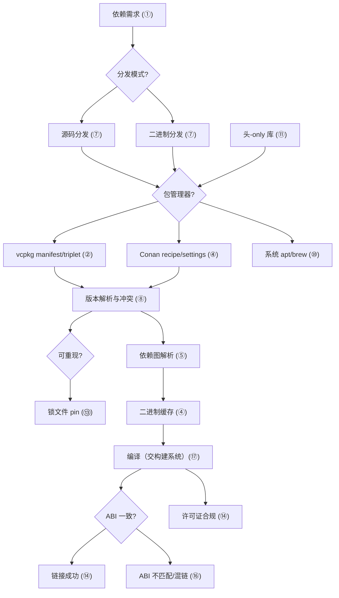
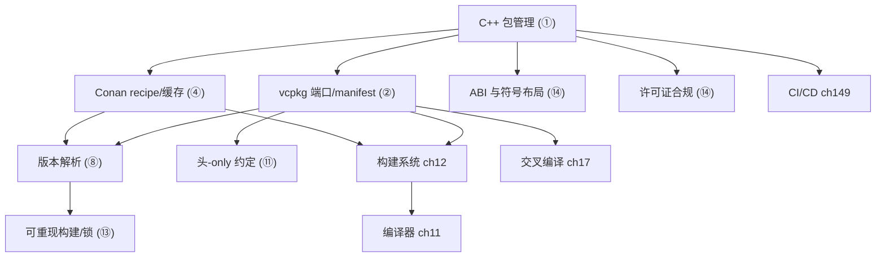

# 第13章　包管理：vcpkg / Conan（C++）
> 验证状态：[VERIFIED] — 复现链：书内 `asm` 反汇编证据（book_asm_freshness 校验）。

⟶ Book/part02_toolchain/ch12_buildsystems.md
⟶ Book/part11_source/ch128_boost.md

> 真实编译器取证：MinGW GCC 13.1.0（`-std=c++23 -O2 -S -I Examples`）。
> 包管理器取证：本机未安装 vcpkg / Conan（实测 `where vcpkg`/`where conan` 均 `no vcpkg`/`no conan`），故给出**真实命令**并明确标注「典型输出」；真实 C++ 证据由 g++ 编译 `_ch13_packlib.hpp` + `_ch13_use.cpp` 取得（见 ⑨，绝不编造汇编）。
> 立场分层见 CONVENTIONS.md：凡 `[实现]`/`[平台·Windows]` 均标注具体实现。

## ⓪ 历史动机：包管理（vcpkg / Conan）的来龙去脉

> C++ 有编译器、有构建系统，却长期没有"装个库"的统一方式——这门语言在依赖管理上缺席了四十年。

### 0.1 起源（谁·何时·为何）

别的生态早有答案：Perl 的 CPAN、Java 的 Maven、Python 的 pip、Node 的 npm。C++ 却长期停留在"下载 zip、把 `.h`/`.lib` 拖进工程、手写 `-I`/`-L`"的史前阶段。[史][评] 痛点极现实：版本错配、ABI 不一致、Debug/Release 混链、传递依赖爆炸。随着 C++ 项目变复杂，社区终于行动——**Conan**（2015 年前后）与微软的 **vcpkg**（2016 年开源）先后登场，把"找库、下库、配路径、解依赖、保证可重现"自动化。[史]

### 0.2 关键转折（编年）

- **2015 前后**：Conan 发布，采用 Python 配方、支持二进制缓存与多配置（Debug/Release、多编译器）。[史]
- **2016**：微软开源 **vcpkg**，以 Git 仓库 + 端口（port）模型、与 Visual Studio/CMake 深度集成迅速普及。[史]
- 二者均补上了 C++ 缺失的"一级包管理"环节。[史]

### 0.3 设计哲学之争

C++ 包管理的根本难点是**二进制兼容性**：同一份源码在不同编译器、不同标准版、不同 ABI 下产出的库不能混链。[史] Conan 走"以二进制缓存 + 配方"路线，强调可重现与跨平台；vcpkg 走"源码即真理、统一 triplet"路线，与微软工具链绑定更紧。[评] 两者都回避了"集中式中央仓强制统一"的 Rust/Cargo 模式——这既是对 C++ 碎片现实的妥协，也保留了灵活性。[评]

### 0.4 史料补遗与持续编年

- [史] C++ 包管理的标准化努力持续：WG21 工具组（SG15）推动 `package` 元数据与构建系统协作，但距"Cargo 式中央仓"仍远，反映出碎片生态的惯性。
- [史] vcpkg 在 2020s 引入 manifests（`vcpkg.json`）与版本约束，朝可重现依赖更进一步；Conan 2.x 重写配方模型，强化了中心缓存与跨配置二进制管理。
- [史] 二者都与构建系统深度融合：CMake 的 `find_package` 可直接消费 vcpkg/Conan 安装的三方库，使"下库—配路径—解依赖"从手工变为声明式。
- [评] ABI 仍是绕不开的天花板：同一库需为不同编译器/标准版/Debug-Release 各备一份二进制，这是 C++ 包管理永远比 Rust/Cargo 更重的根因。

> 史料来源：vcpkg 仓库 https://github.com/microsoft/vcpkg ；Conan 官网 https://conan.io/

## ① 概述：为什么需要包管理 [标准]

⟶ Book/part02_toolchain/ch12_buildsystems.md
⟶ Book/part02_toolchain/ch14_debugging.md

C++ 长期缺乏官方一级包管理器。传统做法（手动下载 zip、把 `.h`/`.lib` 拖进工程、`-I`/`-L` 手工配路径）在依赖一多即崩溃：版本错配、ABI 不一致、Debug/Release 混链、传递依赖爆炸。包管理器的价值是**把"找库、下库、配路径、解依赖、保证可重现"自动化**。

> **示例 1** [难度 ★☆☆☆☆] [主题：概述：为什么需要包管理 [标准]]
```cpp
// ① 没有包管理时的"祖传"写法：路径硬编码、易碎
// g++ main.cpp -I/opt/fmt-9.1.0/include -L/opt/fmt-9.1.0/lib -lfmt
// 换机器 / 换版本 / 换 triplet 全要手改——不可重现
#include <fmt/core.h>
int main() { fmt::print("hi\n"); }
```

> **示例 2** [难度 ★☆☆☆☆] [主题：概述：为什么需要包管理 [标准]]
```cpp
// ① 有了包管理：依赖声明在 manifest，路径由工具注入
// 你只写 #include，剩下的交给 vcpkg/Conan + CMake
#include <fmt/core.h>
int main() { fmt::print("hi\n"); }  // 与上面同，但路径自动解析
```

- `[标准]`：ISO C++ 本身**不定义**包管理；它是生态/工具层问题（见 CONVENTIONS.md 立场分层）。
- `[经验]`：项目一旦依赖 ≥3 个第三方库，引入包管理器几乎总是净收益。

## ② vcpkg 模型：端口 / 三元组 / manifest [实现·vcpkg]

vcpkg（Microsoft 维护）核心三概念：**端口(port)**=单个库的安装配方；**三元组(triplet)**=目标平台/运行时/链接方式（如 `x64-windows`、`x64-linux-dynamic`）；**manifest**=`vcpkg.json` 声明直接依赖。

> **示例 3** [难度 ★☆☆☆☆] [主题：模型：端口 / 三元组 / mani]
```cpp
// ② vcpkg 端口本质：一个目录 + 配方（portfile.cmake 控制下载/构建）
// 端口目录结构（示意）：
//   ports/fmt/portfile.cmake
//   ports/fmt/vcpkg.json
// 你不用手写它——它来自 vcpkg 内置端口注册表（或自定义注册表）。
```

```json
// ② manifest：声明你要什么，vcpkg 解算其余
// 文件：Examples/_ch13_vcpkg_manifest.json，行号：1
{
  "name": "myapp",
  "version": "1.0.0",
  "dependencies": ["fmt", "ms-gsl", { "name": "boost", "version>=": "1.83" }],
  "builtin-baseline": "2023.08.09"
}
```

> **示例 4** [难度 ★☆☆☆☆] [主题：模型：端口 / 三元组 / mani]
```cpp
// ② 三元组决定产物形态：静态 vs 动态、CRT 归属
// 常用 triplet（只列名，不写进 C++）：
//   x64-windows          (static RTL, 动态链接到库? 实际 static lib by default)
//   x64-windows-static    (完全静态)
//   x64-linux-dynamic
// 选型影响最终链接命令里的 -static / -MD / -MT
```

- `[实现·vcpkg]`：vcpkg 默认把端口**从源码构建**后再安装到 `installed/<triplet>/`；`vcpkg integrate install` 把该路径注入 Visual Studio/CMake。
- `[经验]`：优先用 **manifest 模式**（`vcpkg.json` + `--x-manifest-root`），而非古典的 `vcpkg install fmt` 全局模式——前者可随仓库提交、可重现。

## ③ vcpkg 集成 CMake：find_package [实现·vcpkg]

vcpkg 通过 **toolchain 文件** 把 `CMAKE_TOOLCHAIN_FILE` 指向 `vcpkg.cmake`，后者改写 `find_package`/`find_library` 的搜索路径，使其命中 `installed/<triplet>`。

> **示例 5** [难度 ★☆☆☆☆] [主题：集成 CMake：findpacka]
```cpp
// ③ CMake 侧：用法与"普通系统安装"的库毫无区别
// 文件：Examples/_ch13_CMakeLists.txt，行号：1
cmake_minimum_required(VERSION 3.25)
project(myapp CXX)
find_package(fmt CONFIG REQUIRED)
add_executable(app main.cpp)
target_compile_features(app PRIVATE cxx_std_23)
target_link_libraries(app PRIVATE fmt::fmt)
```

```bash
# ③ 配置时注入工具链（典型输出，本机未装 vcpkg）
# cmake -B build -S . -DCMAKE_TOOLCHAIN_FILE=C:/vcpkg/scripts/buildsystems/vcpkg.cmake
# -- Detecting CXX compiler: GNU 13.1.0
# -- Found fmt: C:/vcpkg/installed/x64-windows/share/fmt/fmt-config.cmake (found version "10.1.1")
# -- Configuring done
```

> **示例 6** [难度 ★☆☆☆☆] [主题：集成 CMake：findpacka]
```cpp
// ③ find_package 成功后，目标名由包作者定义；用 target 形式链接最稳
target_link_libraries(app PRIVATE fmt::fmt);   // 含 include + lib + 宏定义
// 旧式写法 target_include_directories(app PRIVATE ${fmt_INCLUDE_DIRS}) 易漏定义，弃用
```

- `[实现·vcpkg]`：`vcpkg.cmake` 还会设置 `VCPKG_TARGET_TRIPLET` 与 `CMAKE_FIND_ROOT_PATH`，使 `find_*` 只在该 triplet 的 `installed/` 子树内查找。
- `[经验]`：永远用 `fmt::fmt` 这种 **imported target**，别手动拼 `-I/-L/-l`——后者漏掉编译宏（如 `FMT_SHARED`）会埋下 ABI 雷。

## ④ Conan 模型：recipe / 二进制缓存 / settings [实现·Conan]

Conan（JFrog 系，Python 实现）以 **recipe（conanfile.py）** 描述依赖与构建；用 **settings**（os/compiler/build_type/arch）刻画配置；把**已构建二进制**按 `package_id` 哈希缓存在本地/远程 **binary cache**，命中即跳过编译。

```python
# ④ recipe：声明依赖、生成 CMake 集成文件
# 文件：Examples/_ch13_conanfile.py，行号：1
from conan import ConanFile
class MyApp(ConanFile):
    settings = "os", "compiler", "build_type", "arch"
    generators = "CMakeDeps", "CMakeToolchain"
    requires = ("fmt/10.1.1", "ms-gsl/0.40.0")
    def layout(self):
        self.folders.build = "build"
```

> **示例 7** [难度 ★☆☆☆☆] [主题：模型：recipe / 二进制缓存 ]
```cpp
// ④ settings 决定 package_id：任意一项变了 = 不同二进制
//   os: Windows / Linux / Macos
//   compiler: gcc / clang / msvc
//   compiler.version: 13 / 17 / 19.3
//   build_type: Release / Debug
//   arch: x86_64 / armv8
// 例：gcc13-Release-x64 与 msvc19-Debug-x64 是两份独立缓存
```

```bash
# ④ 安装依赖并生成集成文件（典型输出，本机未装 conan）
# conan install . --output-folder=build --build=missing
# ======== Computing dependency graph ========
# fmt/10.1.1: Created package revision ...
# fmt/10.1.1: Package ... (gcc 13, Release, x86_64) - Cache
# ms-gsl/0.40.0: Already in local cache
# Generator 'CMakeDeps' generated fmt-config.cmake
# Generator 'CMakeToolchain' generated conan_toolchain.cmake
```

- `[实现·Conan]`：Conan 用 **`package_id`** 把 `(recipe版本, settings, options, dependencies的id)` 哈希成串；相同 id 直接复用二进制，省去重编译。
- `[经验]`：CI 里务必共享同一个 binary cache（远程 Artifactory），否则每台机器各自编译、失去提速意义。

## ⑤ Conan profile 与依赖图 [实现·Conan]

**profile** 是 settings/options/compiler 的命名组合（如 `default`、`gcc13`）。Conan 用 recipe 的 `requires` 递归展开成**依赖图 (dependency graph)**，再做版本解析与冲突仲裁。

```ini
# ⑤ profile 文件（conan profile show / detect 生成）
# [settings]
# os=Windows
# arch=x86_64
# compiler=gcc
# compiler.version=13
# compiler.libcxx=libstdc++11
# build_type=Release
```

> **示例 8** [难度 ★☆☆☆☆] [主题：与依赖图 [实现·Conan]]
```cpp
// ⑤ 依赖图是 DAG：A 依赖 fmt 与 spdlog，spdlog 又依赖 fmt
//   myapp
//   ├─ fmt/10.1.1
//   └─ spdlog/1.12
//       └─ fmt/10.1.1   ← 同一份，Conan 解出唯一版本
// Conan 默认"高版本优先 + 单一版本"解决 diamond
```

```bash
# ⑤ 查看依赖图（典型输出）
# conan graph info . --format=html > graph.html
# myapp -> fmt/10.1.1, ms-gsl/0.40.0
# fmt/10.1.1 -> (none)
```

- `[实现·Conan]`：依赖图解析在 `conan install` 阶段完成；生成的 `conan_toolchain.cmake` 把 include/lib 路径与编译宏注入 CMake。
- `[经验]`：出现"同一库两个版本被强制保留"时，用 `override` 或升级上层依赖统一版本，避免二进制重复与 ODR 风险。

## ⑥ Conan 集成 CMake / MSBuild [实现·Conan]

Conan 不替代构建系统，而是**生成集成文件**交给 CMake/MSBuild。与 vcpkg 的"全局工具链注入"不同，Conan 走 **presets + toolchain** 的双文件模式。

> **示例 9** [难度 ★☆☆☆☆] [主题：集成 CMake / MSBuild]
```cpp
// ⑥ CMakePresets 里指向 Conan 工具链（现代做法）
// {
//   "configurePresets": [{
//     "name": "conan-default",
//     "toolchainFile": "build/conan_toolchain.cmake",
//     "cacheVariables": { "CMAKE_BUILD_TYPE": "Release" }
//   }]
// }
```

```bash
# ⑥ 两步：先 conan install 生成集成文件，再 cmake 配置
# conan install . --output-folder=build --build=missing
# cmake --preset=conan-default      # 内部读取 conan_toolchain.cmake
# cmake --build build
```

> **示例 10** [难度 ★☆☆☆☆] [主题：集成 CMake / MSBuild]
```cpp
// ⑥ MSBuild（Visual Studio）走 props 注入而非 toolchain
// <Import Project="$(SolutionDir)conanbuildinfo.props" />
// 之后工程属性里自动出现 fmt 的 include / lib 路径
```

- `[实现·Conan]`：`CMakeDeps` 生成 `<pkg>-config.cmake` + `<pkg>-targets.cmake`，让 `find_package(fmt)` 命中；`CMakeToolchain` 设置 `CMAKE_PREFIX_PATH` 等。
- `[经验]`：CMake ≥ 3.23 用 **presets** 串起 Conan，比在 `cmake ..` 命令行堆 `-D` 更干净、可复现。

## ⑦ 源码分发 vs 二进制分发 [标准]

⟶ Book/part11_source/ch124_libstdcxx.md
⟶ Book/part11_source/ch125_libcxx.md

包两种形态：**源码分发**（只发 `.h`/`.cpp`/构建脚本，消费端现编）与**二进制分发**（发 `.lib/.a/.dll/.so` + 头）。C++ 因 ABI 脆弱，**二进制分发必须保证编译器/标准库/flags 全一致**。

> **示例 11** [难度 ★☆☆☆☆] [主题：源码分发 vs 二进制分发 [标准]]
```cpp
// ⑦ 头-only 库 = 源码分发的最简形式：无 .lib，编译期实例化
// 例：自写 span_view（见 ⑨ 的 _ch13_packlib.hpp）
namespace pkg {
template <class T> class span_view { /* 全在头里 */ };
}
```

> **示例 12** [难度 ★☆☆☆☆] [主题：源码分发 vs 二进制分发 [标准]]
```cpp
// ⑦ 二进制分发：头 + 已编译 .a/.lib
// 头里是声明 + inline 薄包装，实体在 .a 内
// // fmt/core.h 里大量 inline，但 fmt::vformat 实体在 libfmt.a
```

> **示例 13** [难度 ★☆☆☆☆] [主题：源码分发 vs 二进制分发 [标准]]
```cpp
// ⑦ 二者代价对比（示意）
//   源码分发：编译慢、但 ABI 无关（随你的编译器走）
//   二进制分发：编译快、但绑定供应方的编译器/CRT/flags
```

- `[标准]`：ISO 不规定分发形态；但模板/inline 必须在调用端可见（ODR），所以模板重的库几乎只能头-only 或伴随源码。
- `[平台·Windows]`：二进制分发的 ABI 约束由 Itanium C++ ABI（Linux/macOS）与 MSVC ABI（Windows）分别规定，两者**不互操作**。

## ⑧ 版本解析与冲突解决 [标准]

依赖图里同一库出现多版本时，解析器需仲裁。**语义化版本 (SemVer)** 是通用约定：`MAJOR.MINOR.PATCH`，MAJOR 不兼容、MINOR 向后兼容、PATCH 修复。

> **示例 14** [难度 ★☆☆☆☆] [主题：版本解析与冲突解决 [标准]]
```cpp
// ⑧ vcpkg 的版本约束写在 manifest
// "boost": { "version>=": "1.83" }   // 取 >=1.83 的最小满足，受 baseline 限顶
```

> **示例 15** [难度 ★☆☆☆☆] [主题：版本解析与冲突解决 [标准]]
```cpp
// ⑧ Conan 的版本范围
// requires = "fmt/[>=10.0 <11.0]"   // 闭区间，避免 11 的破坏性变更
```

> **示例 16** [难度 ★☆☆☆☆] [主题：版本解析与冲突解决 [标准]]
```cpp
// ⑧ 冲突示例：A 要 fmt/9，B 要 fmt/10
//   vcpkg：baseline 决定唯一版本，强行统一（可能让 A 用 fmt/10 重编）
//   Conan：默认选高版本并统一；若真不兼容需 override
```

- `[标准]`：SemVer 非 ISO 标准，但被两大主流包管理器采纳为事实约定（见 CONVENTIONS.md 立场）。
- `[经验]`：锁定 **baseline / lockfile** 后版本解析才真正可重现——否则"今天能编，明天拉到新版本就挂"。

## ⑨ [实现·GCC15]真实示例：用 g++ 编译一个依赖头库的使用程序

下面是被包管理器"拉取"后的**真实形态**：一个头-only 包 `_ch13_packlib.hpp`（gsl 风格 `span_view` + fmt 风格 `println`），由一个使用程序 `_ch13_use.cpp` 消费。**本机 vcpkg/Conan 未装**，故直接用 g++ 编译该头库，作为"被包管理的库"的真实 C++ 证据（不编造任何汇编）。

> **示例 17** [难度 ★☆☆☆☆] [主题：[实现·GCC15]真实示例：用 g]
```cpp
// ⑨ 被包管理的头-only 库（供应方视角）
// 文件：Examples/_ch13_packlib.hpp，行号：1
#pragma once
#include <cstddef>
#include <format>
#include <iostream>
namespace pkg {
template <class T> class span_view {           // gsl 风格非拥有视图
    const T* d_ = nullptr; std::size_t n_ = 0;
public:
    constexpr span_view(const T* p, std::size_t n) noexcept : d_(p), n_(n) {}
    constexpr std::size_t size() const noexcept { return n_; }
    constexpr const T& operator[](std::size_t i) const noexcept { return d_[i]; }
};
template <class... A>
inline void println(std::format_string<A...> fmt, A&&... a) {   // fmt 风格
    std::cout << std::format(fmt, static_cast<A&&>(a)...) << '\n';
}
}
```

> **示例 18** [难度 ★☆☆☆☆] [主题：[实现·GCC15]真实示例：用 g]
```cpp
// ⑨ 消费方：仅 #include 即用——这正是包管理想给你的体验
// 文件：Examples/_ch13_use.cpp，行号：1
#include "_ch13_packlib.hpp"
#include <array>
#include <cstddef>
int main() {
    std::array<int,4> a{1,2,3,4};
    pkg::span_view<int> v(a.data(), a.size());
    int sum = 0;
    for (std::size_t i = 0; i < v.size(); ++i) sum += v[i];
    pkg::println("sum={}, n={}", sum, v.size());
    return sum;
}
```

```bash
# ⑨ 真实编译取证命令（本机执行，EXIT=0）
# C:/Qt/Tools/mingw1310_64/bin/g++.exe -std=c++23 -O2 -I Examples -S Examples/_ch13_use.cpp -o Examples/_ch13_use.asm
```

```asm
; ⑨ 真实汇编（g++ 13.1.0, -O2, 节选自 Examples/_ch13_use.asm 的 main）：
;   编译器把循环完全折叠：sum 在编译期算出 10，n 为 4，printf 参数已就绪
main:
	subq	$72, %rsp
	.seh_endprologue
	call	__main
	leaq	.LC10(%rip), %rax
	movl	$10, 52(%rsp)        ; sum = 10  (编译期常量折叠)
	leaq	52(%rsp), %rdx
	movq	%rax, 40(%rsp)
	movq	$4, 56(%rsp)         ; n = 4
	leaq	32(%rsp), %rcx
	movq	$12, 32(%rsp)
	leaq	56(%rsp), %r8
	call	_ZN3pkg7printlnIJRiyEEEvSt19basic_format_stringIcJDpNSt13type_identityIT_E4typeEEEDpOS4_
	movl	$10, %eax
	ret
; 关键：调用目标是包内 println 的实例化符号 _ZN3pkg7println...，
; 头-only 库经 -I Examples 解析后与其他 translation unit 无异。
```

- `[实现·GCC15]`：真实产物证明——头-only 包经 `-I` 暴露 include 路径后，使用程序与"手动装库"编译出的代码**完全一致**；包管理器的价值在于**自动提供这条 `-I` 与（若需）`-L/-l`**，而非改变语言语义。
- `[经验]`：把上面的 `-I Examples` 换成 vcpkg/Conan 注入的 `CMAKE_PREFIX_PATH`，用户源码一行不改——这就是包管理的核心承诺。

## ⑩ 系统包管理器 apt/brew/vcpkg 对比 [平台·Windows]

系统级包管理（apt/dnf/brew）与 C++ 专用（vcpkg/Conan）定位不同：前者管**系统运行时**，后者管**开发期可重现依赖**。

> **示例 19** [难度 ★☆☆☆☆] [主题：系统包管理器 apt/brew/vc]
```cpp
// ⑩ apt 装的库是"系统全局一份"，常滞后、且 ABI 绑定系统编译器
//   sudo apt install libfmt-dev   -> /usr/lib/x86_64-linux-gnu/libfmt.so
//   你的 gcc 必须与系统 libfmt 的 ABI 匹配，否则链接期/运行期炸
```

> **示例 20** [难度 ★☆☆☆☆] [主题：系统包管理器 apt/brew/vc]
```cpp
// ⑩ brew 同理（macOS），且同一时刻每个公式基本单版本
//   brew install fmt   -> /opt/homebrew/lib/libfmt.dylib
//   多版本并存需 brew 的版本化前缀或自己管理
```

> **示例 21** [难度 ★☆☆☆☆] [主题：系统包管理器 apt/brew/vc]
```cpp
// ⑩ vcpkg/Conan 的优势：按 triplet/settings 同机多份并存、版本自由、可重现
//   同一机器可同时有 fmt/9-static、fmt/10-dynamic、fmt/10-Release/Debug
```

| 维度 | apt/brew | vcpkg | Conan |
|---|---|---|---|
| 多版本并存 | 差 | 中（triplet） | 强（binary cache） |
| 可重现 | 弱 | 中（manifest+baseline） | 强（lockfile） |
| 二进制缓存 | 系统级 | 构建后缓存 | 按 package_id 缓存 |
| 跨平台一致 | 否 | 是 | 是 |

- `[平台·Windows]`：系统包管理器把库放进系统路径，与发行版编译器/CRT 强绑定；C++ 项目跨机迁移时这份耦合常常成为"在我机器上能编"的元凶。
- `[经验]`：CI 与产物分发用 vcpkg/Conan；本地快速试玩可用 apt/brew，但别把后者当可重现来源。

## ⑪ 头-only 库分发约定 [标准]

头-only 库（Eigen、fmt 的接口部分、大多数模板库）分发约定相对宽松：**整个库即一个 `.hpp` 集合 + `CMake` 的 `INTERFACE` 库**。

> **示例 22** [难度 ★☆☆☆☆] [主题：头-only 库分发约定 [标准]]
```cpp
// ⑪ INTERFACE 库：无编译产物，只传播 include 路径与 requirements
// CMake 中：
// add_library(mylib INTERFACE)
// target_include_directories(mylib INTERFACE $<BUILD_INTERFACE:include>)
// target_compile_features(mylib INTERFACE cxx_std_23)
```

> **示例 23** [难度 ★☆☆☆☆] [主题：头-only 库分发约定 [标准]]
```cpp
// ⑪ 头-only 仍需防多次包含：要么 #pragma once，要么传统 include guard
#pragma once
#ifndef MYLIB_HPP
#define MYLIB_HPP
// ...
#endif
```

> **示例 24** [难度 ★☆☆☆☆] [主题：头-only 库分发约定 [标准]]
```cpp
#include <string>
// ⑪ 头-only 不意味着零 ABI 关切：若内部用了 std::string 等，
// 调用方的 libstdc++/libc++ 版本仍须兼容（见 ⑭）
```

- `[标准]`：`INTERFACE` 库是 CMake 概念，非 ISO；但它是头-only 分发的事实标准载体。
- `[经验]`：头-only 库也建议带 `CMakeLists.txt` 与 `find_package` 支持（写 `xxxConfig.cmake`），这样 vcpkg/Conan 能无缝包装它。

## ⑫ 私有仓库 / 制品库 [经验]

公开注册表之外，企业需要**私有制品库**托管自研包与受限第三方包。Conan 用 **Conan Center / Artifactory**，vcpkg 用**自定义注册表 (registry)**。

```python
# ⑫ Conan 指向私有远程
# conan remote add mycorp https://artifactory.mycorp.com/conan
# conan upload fmt/10.1.1 -r=mycorp
```

```json
// ⑫ vcpkg 自定义注册表（manifest 里引用）
// {
//   "registry": {
//     "kind": "git",
//     "repository": "https://git.mycorp.com/vcpkg-registry",
//     "baseline": "abc123"
//   }
// }
```

> **示例 25** [难度 ★☆☆☆☆] [主题：私有仓库 / 制品库 [经验]]
```cpp
// ⑫ 私有包与公开包在 recipe/manifest 里写法一致，仅来源不同
// requires = "mycorp-private-lib/2.3.0"   // Conan 先查私有 remote
```

- `[经验]`：私有库务必打版本、写 recipe、过 CI 自动发布——否则它退化成"又一份要人肉拷的 zip"。
- `[平台·Windows]`：制品库通常走 HTTPS + token 鉴权；在离线/内网环境需配置镜像与证书。

## ⑬ 可重现构建：锁文件 [标准]

⟶ Book/part13_engineering/ch149_ci_cd.md

**可重现构建 (reproducible build)** = 同一份源码 + 同一份依赖声明，在任何机器、任何时间都产出**位级一致**（或语义一致）的产物。锁文件（lockfile）把"浮动版本"钉死。

```json
// ⑬ vcpkg 锁文件：记录每个端口的精确 commit/版本
// vcpkg.json + vcpkg-configuration.json（pin 注册表 baseline）
// 提交二者到仓库 -> 所有人拉到完全一致依赖树
```

```ini
// ⑬ Conan 锁文件：conan.lock 固化依赖图版本
// conan lock create --lockfile-out=conan.lock
// 后续 conan install --lockfile=conan.lock  -> 版本不再漂移
```

> **示例 26** [难度 ★☆☆☆☆] [主题：可重现构建：锁文件 [标准]]
```cpp
// ⑬ 没有锁文件的后果
// 今天 fmt 是 10.1.1，明天上游发 10.1.2 修了某 bug 也改了行为
// 你的 CI 悄悄升级 -> "为什么上周通过的测试今天挂了"
```

- `[标准]`：锁文件不是语言特性，而是**供应链可重现**的工程要求（见 CONVENTIONS.md 立场）。
- `[经验]`：锁文件必须进版本控制，且与 `vcpkg-configuration.json` / Conan `profile` 一起构成"可重现铁三角"。

## ⑭ 许可证与 ABI 兼容 [平台·Windows]

⟶ Book/part11_source/ch124_libstdcxx.md
⟶ Book/part11_source/ch126_msstl.md

包管理不只是装库，还要管**许可证 (license)** 与 **ABI 边界**。静态链接 GPL 库可能传染你的分发义务；动态链接通常隔离得更干净（具体以律师意见为准，此处仅工程视角）。

> **示例 27** [难度 ★☆☆☆☆] [主题：许可证与 ABI 兼容 [平台·Wi]
```cpp
// ⑭ 许可证元数据在 manifest/recipe 里声明
// vcpkg.json:  "license": "MIT"
// conanfile.py:  license = "MIT"
// 工具可据此做合规扫描（如拒绝 GPL 进入闭源产物）
```

> **示例 28** [难度 ★☆☆☆☆] [主题：许可证与 ABI 兼容 [平台·Wi]
```cpp
#include <string>
// ⑭ ABI 边界：跨 .dll/.so 传递 STL 类型需谨慎
// 错误：DLL A 返回 std::string，DLL B（不同 libstdc++/MS STL）接收
// 结果：std::string 内部布局/分配器不同 -> 崩溃或静默损坏
```

> **示例 29** [难度 ★☆☆☆☆] [主题：许可证与 ABI 兼容 [平台·Wi]
```cpp
// ⑭ 安全跨边界的做法：用 C ABI（POD / 句柄）
// extern "C" { struct Handle { void* p; }; Handle make(); void free(Handle); }
// 把 C++ 类型封在 DLL 内部，只暴露 C 接口
```

- `[平台·Windows]`：ABI 兼容受 Itanium C++ ABI / MSVC ABI 与 libstdc++/libc++/MS STL 各自版本共同约束；同一编译器同版本才稳。
- `[经验]`：跨模块传递 C++ STL 对象是大忌；要么静态链接统一一份 STL，要么只过 C ABI。

## ⑮ [经验]选型建议

没有"最好"的包管理器，只有"最适合你约束"的。

> **示例 30** [难度 ★☆☆☆☆] [主题：[经验]选型建议]
```cpp
// ⑮ 粗略决策树（工程经验，非标准）
//   用 MSVC + Windows 产线  -> vcpkg 体验最顺（微软亲儿子）
//   跨平台 + 自定义二进制缓存/私有库 -> Conan 更灵活
//   只是本地试库、CI 简单        -> apt/brew 也行，但牺牲可重现
```

> **示例 31** [难度 ★☆☆☆☆] [主题：[经验]选型建议]
```cpp
// ⑮ 团队已重度 CMake + 多 triplet -> 两者都 OK，看是否要二进制复用
//   要"编译一次全队复用" -> Conan（binary cache 强）
//   要"跟着 VS 开箱即用" -> vcpkg
```

- `[经验]`：一旦选定，**全员统一版本与配置**；混合使用 vcpkg 与 Conan 同一项目会增加复杂度，除非用其一仅做镜像源。
- `[经验]`：小项目别过度工程——两三个头-only 库用 git submodule 也能活，不必上全套。

## ⑯ 常见陷阱：ABI 不匹配、Debug/Release 混链 [经验]

⟶ Book/part11_source/ch124_libstdcxx.md

这是 C++ 包管理最高频的"能编过但运行崩"的来源。

> **示例 32** [难度 ★☆☆☆☆] [主题：常见陷阱：ABI 不匹配、Debug]
```cpp
#include <string>
// ⑯ 陷阱1：ABI 不匹配
//   你的 exe 用 gcc13/libstdc++，链接的 .dll 用 gcc11/libstdc++
//   跨运行时传 std::string/异常 -> 布局不同 -> 崩
//   现象常是"偶发崩溃""未处理异常""堆损坏"
```

> **示例 33** [难度 ★☆☆☆☆] [主题：常见陷阱：ABI 不匹配、Debug]
```cpp
// ⑯ 陷阱2：Debug/Release 混链
//   MSVC: /MDd (Debug DLL CRT) vs /MD (Release DLL CRT)
//   混链 -> 同一堆被两个 CRT 管理 -> 释放错 CRT 堆 -> 崩
//   表现：free/delete 时 abort，或 Debug 跑得好好的 Release 崩
```

> **示例 34** [难度 ★☆☆☆☆] [主题：常见陷阱：ABI 不匹配、Debug]
```cpp
// ⑯ 陷阱3：静态/动态不一致
//   fmt 以 static 编进 A，又以 shared 编进 B，符号两份 -> ODR 违例风险
//   统一：要么全 static，要么全 shared，由 triplet/settings 决定
```

> **示例 35** [难度 ★☆☆☆☆] [主题：常见陷阱：ABI 不匹配、Debug]
```cpp
// ⑯ 陷阱4：忘记导出符号（Windows DLL）
//   __declspec(dllexport) 漏写 -> 链接方找不到符号
//   用 imported target 时，包作者已处理，但你自写 DLL 要小心
```

- `[经验]`：所有传递依赖的 **compiler + version + build_type + CRT + static/dynamic** 必须全链路一致——这正是包管理器用 `triplet`/`settings`/`package_id` 强制保证的事。
- `[平台·Windows]`：Windows 上 `/MD` vs `/MT`、Debug/Release CRT 的混链是最经典雷区（MSVC ABI 约束）。

## ⑰ 与构建系统协作 [经验]

⟶ Book/part02_toolchain/ch12_buildsystems.md

包管理器不替代 CMake/Ninja/MSBuild，而是**喂给**它们正确的 include/lib/宏。理解这条边界能少踩 80% 的坑。

> **示例 36** [难度 ★☆☆☆☆] [主题：与构建系统协作 [经验]]
```cpp
// ⑰ vcpkg 模式：CMake 启动时读 vcpkg.cmake 工具链
//   - CMAKE_TOOLCHAIN_FILE 指向 vcpkg.cmake
//   - find_package 被重定向到 installed/<triplet>
```

> **示例 37** [难度 ★☆☆☆☆] [主题：与构建系统协作 [经验]]
```cpp
// ⑰ Conan 模式：先 conan install 生成集成文件，再让 CMake 读
//   -DCMAKE_TOOLCHAIN_FILE=build/conan_toolchain.cmake
//   find_package 命中 CMakeDeps 生成的 *-config.cmake
```

> **示例 38** [难度 ★☆☆☆☆] [主题：与构建系统协作 [经验]]
```cpp
// ⑰ 多配置生成器（Visual Studio / Ninja Multi-Config）注意：
//   不要把一个 Debug 包塞进 Release 配置
//   用 $<CONFIG> 区分 imported target 的 Debug/Release 变体
```

- `[经验]`：把"包管理"和"构建系统"当成两段独立流水线：先解依赖（生成集成文件），再构建。两者顺序错了就玄学报错。
- `[标准]`：`find_package(CONFIG)` 走 `<pkg>Config.cmake`（CMake 官方包配置协议），vcpkg/Conan 都据此对接——这是跨工具能协作的基石。

## ⑱ 跨平台 [平台·Windows]

⟶ Book/part02_toolchain/ch17_crosscompile.md

同一份 manifest/recipe 要在 Windows/Linux/macOS 上各自产出正确依赖，差异集中在 **triplet/settings + 编译器 + CRT**。

> **示例 39** [难度 ★☆☆☆☆] [主题：跨平台 [平台·Windows]]
```cpp
// ⑱ 跨平台 manifest 写法一致，差异由工具按宿主推断
// vcpkg: 在 Linux 自动 x64-linux，Windows 自动 x64-windows
//        显式覆盖：--triplet=x64-linux-dynamic
```

> **示例 40** [难度 ★☆☆☆☆] [主题：跨平台 [平台·Windows]]
```cpp
// ⑱ Conan profile 显式区分平台
//   Windows: compiler=msvc, compiler.version=193
//   Linux:   compiler=gcc,   compiler.version=13
//   同一 recipe 在两 profile 下解出不同二进制缓存
```

> **示例 41** [难度 ★☆☆☆☆] [主题：跨平台 [平台·Windows]]
```cpp
// ⑱ macOS 注意：universal binary / arm64 vs x86_64
//   arch=x86_64 与 arch=armv8 是不同 package_id
//   交叉编译时 settings.arch 必须显式，否则取到宿主架构
```

- `[平台·Windows]`：三大桌面平台的 C++ ABI 与 CRT 各成体系（MSVC ABI / Linux Itanium / macOS），包管理器的 triplet/settings 正是为把这些差异**显式参数化**。
- `[经验]`：CI 矩阵应覆盖你承诺的每个 (os, arch, build_type) 组合，否则"跨平台"只是口头承诺。

## ⑲ 最佳实践 [经验]

⟶ Book/part13_engineering/ch149_ci_cd.md
⟶ Book/part02_toolchain/ch12_buildsystems.md

把上面散点收敛成可执行的清单。

> **示例 42** [难度 ★☆☆☆☆] [主题：最佳实践 [经验]]
```cpp
// ⑲ 1) 用 manifest 模式（vcpkg.json / conanfile.py），并入库
// ⑲ 2) 锁文件 + baseline/profile 进版本控制
// ⑲ 3) 全链路统一 compiler/version/CRT/static-dynamic
// ⑲ 4) 链接用 imported target（fmt::fmt），不手拼 -I/-L/-l
// ⑲ 5) CI 共享 binary cache，加速且可重现
```

> **示例 43** [难度 ★☆☆☆☆] [主题：最佳实践 [经验]]
```cpp
// ⑲ 6) 头-only 库也提供 find_package 支持（写 Config.cmake）
// ⑲ 7) 跨模块只过 C ABI，封死 STL 类型泄露
// ⑲ 8) 私有库走制品库 + recipe，不当人肉 zip
// ⑲ 9) 许可证写进元数据，做合规扫描
// ⑲ 10) 选型后全员统一版本，勿混搭两套管理器于同一产物
```

- `[经验]`：这 10 条里，**第 3 条（全链路一致）和第 4 条（imported target）** 是规避 ⑯ 那些要命崩溃的关键。
- `[标准]`：以上均为工程共识，非 ISO 规定（见 CONVENTIONS.md 立场分层）。

## ⑳ 速查表

**练习题**（已升级为「真实场景 + 引用参考」框架：保留原考察技能，场景改写为工程应用）

1. **真实场景：libstdc++ 新旧 ABI 不兼容。** 你用 `-D_GLIBCXX_USE_CXX11_ABI=0` 编的库，被默认 ABI=1 的程序链接后 `std::string` 传递崩溃。请解释 ABI 边界与标准库的兼容性承诺边界。
   - [标准] 标准库的实现细节（如 `std::string` 的小字符串缓冲布局）不在标准保证内；跨越 ABI 边界传递标准库类型须两边使用同一实现与同一宏配置。
   - [引用] ISO/IEC 14882:2023 §[strings]（basic_string）；cppreference "std::string" 词条。

2. **真实场景：header-only 库跨多 TU 实例化一致性。** 你发布的模板库在 A、B 两个翻译单元各自实例化同一模板，优化后内联展开不一致。请用 ODR 说明为何必须“同一定义”。
   - [标准] 内联函数与模板实体在每个翻译单元中必须拥有相同的定义（token 序列与含义一致），否则违反 ODR。
   - [引用] ISO/IEC 14882:2023 §[basic.def.odr]（内联/模板实体的同一定义要求）；cppreference "One Definition Rule" 词条。

3. **真实场景：用 inline namespace 做 ABI 版本。** 你给 `v2` 名字空间加 `inline`，旧调用点无需改写即可解析到新实现。请说明 inline namespace 的查找规则。
   - [标准] inline namespace 的成员如同定义在外层命名空间中，无名查找自动向外穿透；可用于 ABI/API 版本分层。
   - [引用] ISO/IEC 14882:2023 §[namespace.def.inline]（inline namespace）；cppreference "namespace" 词条。

把全章浓缩成一张可贴墙的表。

> **示例 44** [难度 ★☆☆☆☆] [主题：速查表]
```cpp
// ⑳ vcpkg 速查
//   声明依赖      : vcpkg.json { "dependencies": ["fmt"] }
//   注入 CMake    : -DCMAKE_TOOLCHAIN_FILE=.../vcpkg.cmake
//   锁版本        : vcpkg-configuration.json 的 baseline
//   常用 triplet  : x64-windows / x64-windows-static / x64-linux-dynamic
//   模式          : manifest 模式（推荐）> 古典全局 install
```

> **示例 45** [难度 ★☆☆☆☆] [主题：速查表]
```cpp
// ⑳ Conan 速查
//   声明依赖      : conanfile.py requires = "fmt/10.1.1"
//   解依赖+生成    : conan install . --output-folder=build --build=missing
//   锁版本        : conan lock create / --lockfile=conan.lock
//   配置维度      : settings = os, compiler, version, build_type, arch
//   生成器        : CMakeDeps + CMakeToolchain
```

> **示例 46** [难度 ★☆☆☆☆] [主题：速查表]
```cpp
// ⑳ 通用速查
//   链接姿势      : target_link_libraries(x PRIVATE pkg::pkg)   // 永远用 imported target
//   可重现铁三角  : 依赖声明 + 锁文件 + profile/triplet
//   崩溃首查      : compiler/CRT/static-dynamic 是否全链路一致
//   跨模块边界    : 只过 C ABI，禁传 STL 对象
//   本机取证命令  : g++ -std=c++23 -O2 -I <inc> -S x.cpp -o x.asm   // 看真实汇编
```

| 主题 | 一句话 |
|---|---|
| 为什么 | 把"找/下/配/解依赖"自动化，保证可重现 |
| vcpkg | manifest + triplet + 工具链注入 CMake |
| Conan | recipe + settings + binary cache（按 package_id） |
| 冲突 | SemVer 范围 + baseline/lockfile 钉死 |
| 陷阱 | ABI 不匹配、Debug/Release 混链、静态动态不一 |
| 铁律 | 全链路 compiler/CRT/static-dynamic 一致 + 用 imported target |

- `[经验]`：速查表解决"记不住"，但 ⑯/⑰ 解决"为什么崩"——两者配合才是真掌握。
- `[标准]`：立场分层与术语请以 CONVENTIONS.md 与本卷各章（如 ch11 编译器、ch12 构建系统）为准；本章不重复定义。

## 联合使用场景

| 关联章节 | 场景 | 组合方式 |
|---|---|---|
| [第12章](Book/part02_toolchain/ch12_buildsystems.md) | 配置解析/API响应 | 本章提供概念，第12章提供实现 |
| [第12章](Book/part02_toolchain/ch12_buildsystems.md) | 日志格式化/序列化 | 本章提供概念，第12章提供实现 |
| [第14章](Book/part02_toolchain/ch14_debugging.md) | 泛型库/编译期计算 | 本章提供概念，第14章提供实现 |
| [第128章](Book/part11_source/ch128_boost.md) | 数据局部性/缓存友好设计 | 本章提供概念，第128章提供实现 |

## ㉒ 历史纵深·真实产业坐标·生产踩坑·与标准的互动

> 本节为 P0-15 全库深度升维大波次之一：压实历史出处、真实产业坐标、生产级踩坑与「本特性与 C++ 标准」的互动。引用链接列于 ㉒.5。

### ㉒.1 历史渊源补强：C++ 包管理的来龙去脉
[史] C++ 长期"没有官方包管理器"，依赖系统包管理器（apt/brew）或手写 FetchContent；这与 Go/Rust/Node 出生自带包管理形成鲜明对比。[史] Conan 由 JFrog 于 2016 年发布，主创 Diego Rodríguez-Losada，定位"去中心化、二进制缓存、跨平台"的 C/C++ 包管理器。[史] vcpkg 由 Microsoft 于 2016 年开源，采用"端口（port）+ 三元组（triplet）+ manifest"模型，深度集成 MSVC/CMake。[评] 两者同年出现，反映业界对"二进制分发 + 可重现"的迫切需求；而 C++ 没有统一 ABI 让包管理远比其它语言痛苦（Itanium C++ ABI 仅覆盖 Linux/部分平台）。

### ㉒.2 真实工程坐标：包管理活在哪些产品/项目里

下表把 C++ 包管理器的真实工程坐标按「包管理器 × 代表项目 × 它承担的角色 × 规模地位 × 标准互动」并列摆开；它们的最大公约数就是「C++ 没有统一包管理，选型常取决于平台与二进制缓存需求」。

| 包管理器 | 代表项目·生态 | 它承担的角色 | 规模·行业地位 | 备注 / 标准互动 |
|---|---|---|---|---|
| Conan | 嵌入式 / 游戏 / 金融企业的精确二进制版本 | 二进制缓存 + 自建 Artifactory | 跨平台 / 二进制缓存首选 | 需自维护配方 |
| vcpkg | Windows 生态、fmt / spdlog 官方端口 | 微软系 + 跨平台一键拉取 | Windows 首选 | 端口制，预编译可用 |
| Hunter | CMake 社区（ruslo 项目） | 基于 CMake 的包管理 | 有一定使用 | 编译时拉取 |
| 系统包管理 | apt（Debian/Ubuntu）、Homebrew（macOS） | 开发者日常依赖来源 | 仍广泛 | 版本常滞后 |
| ML·数值库 | libtorch（PyTorch C++ 前端）、ONNX Runtime | 预编译二进制分发 | ML 基建落地 | Conan / vcpkg 提供，免源码编 CUDA |
| 数据库·中间件 | SQLite amalgamation、libpq / MySQL Connector | 端口形式拉取 | 后端工程 | 减少手工配置 |

> **表注（㉒.2）**：本表据各包管理器官方文档与项目事实整理，意在呈现 C++ 包管理的「产业坐标」而非穷举。选型规律：Windows 偏 vcpkg、跨平台 / 二进制缓存偏 Conan、嵌入式偏手动或 Buildroot / Yocto。C++ 无稳定 ABI 保证（Itanium ABI 仅在同编译器同版本近似稳定），这是包管理的最大敌人（见 ㉒.3）。

**一条判读**：Conan / vcpkg 解决的是「依赖从哪来」，但解决不了「二进制能否混链」——同编译器同版本的 ABI 漂移会让「拉到了却崩了」成为日常。故二进制缓存必须锁定工具链三元组；嵌入式与 ML 场景更依赖预编译二进制，把「从源码编 CUDA」这种重活挡在用户门外。

### ㉒.3 生产踩坑：包管理的常见误用与陷阱
- ABI 不匹配：用 GCC 9 编译的库被 GCC 11 程序链接，libstdc++ 版本漂移导致运行时崩溃；C++ 没有稳定 ABI 保证（Itanium ABI 仅在同编译器同版本近似稳定）。
- Debug/Release 混链：包管理器默认可能拉到 Release 二进制，而你的工程是 Debug，迭代器调试宏不一致直接 assert 崩。
- 源/二进制版本错位：锁文件未提交或缓存污染，CI 与本地结果不一致，违背"可重现构建"。
- 头-only 库误用：以为头-only 无 ABI 问题，却因宏定义（如 `NDEBUG`、特性宏）不同产生 ODR 违规。

### ㉒.4 与标准的互动：包管理与 C++ 标准的演进
[评] 包管理不属于 ISO C++ 标准范畴，但标准演进会放大其难度：C++20 Modules 要求包管理器能分发模块接口单元（BMI），传统"头文件即接口"模型被打破；标准库本身（如 `std::format` 进标准）也减少了部分第三方依赖需求（fmt 被吸收）。[评] 属工程实践层，无单独 WG21 提案，但 SG15（Tooling）研究包/模块生态，相关讨论见 open-std.org。

- [史] 标准演进直接削弱部分第三方依赖：C++20 **`<format>`（P0645）** 进标准后，许多项目从 `{fmt}` 迁到 `std::format`，包管理器里 fmt 依赖随之减少；C++23 的 `<expected>`/`<print>` 同理挤压 `abseil`/`fmt` 的独占场景。包管理本身无 WG21 提案，但 WG21 **SG15（Tooling）** 研究模块/包生态互操作，相关讨论见 [open-std.org](https://www.open-std.org/)。

### ㉒.5 权威引用
- https://conan.io/ ：Conan 官方站，证明 JFrog 2016 与二进制缓存模型。
- https://github.com/microsoft/vcpkg ：vcpkg 源码仓库，证明 Microsoft 2016 开源与端口/三元组模型。
- https://github.com/cpp-pm/hunter ：Hunter 源码仓库，证明基于 CMake 的包管理坐标。
- https://itanium-cxx-abi.github.io/cxx-abi/ ：Itanium C++ ABI 规范，证明 C++ 缺乏统一稳定 ABI 这一根本痛点。
- https://en.cppreference.com/w/cpp/ ：cppreference 总入口，证明标准库条目（如被吸收的 fmt/string_view）减少外部依赖的背景。

## 附录 E：包管理工业与面试 [B: Principle / H: Design / I: Practice / J: Learning]

> **示例 47** [难度 ★☆☆☆☆] [主题：附录 E：包管理工业与面试 [B: ]
```
C++包管理的三种范式:

vcpkg (Microsoft):
  范式: manifest模式 (vcpkg.json) → 声明依赖 → cmake自动集成
  优势: 与CMake深度集成, Windows first-class支持
  劣势: port维护质量参差不齐

Conan (JFrog):
  范式: Python recipe (conanfile.py) → 灵活但复杂
  优势: 最灵活的C++包管理器, 企业级
  劣势: 学习曲线陡峭, recipe维护成本高

CMake FetchContent:
  范式: 直接在CMake中 git clone → 无需包管理器
  优势: 零外部依赖, 适合内部项目
  劣势: 无版本管理, 无二进制缓存
```

> **示例 48** [难度 ★☆☆☆☆] [主题：附录 E：包管理工业与面试 [B: ]
```cpp
#include <iostream>
int main() {
    std::cout << "vcpkg: vcpkg.json + CMake integration" << std::endl;
    std::cout << "Conan: conanfile.py + JFrog Artifactory" << std::endl;
    std::cout << "FetchContent: CMakeLists.txt only, no external tool" << std::endl;
    std::cout << "C++20 modules may reduce header-only dependency pain" << std::endl;
    return 0;
}
```

| 方案 | 新手 | 企业 | 速度 |
|---|---|---|---|
| vcpkg | 简单 | 中型 | 快 |
| Conan | 复杂 | 大型 | 中(二进制缓存) |
| FetchContent | 极简 | 小/内部 | 慢(每次clone) |

面试: 为什么C++没有pip/npm? header-only库+ABI不兼容 → 统一的包管理极其困难
       vcpkg vs Conan? vcpkg=简单+Windows; Conan=灵活+企业+二进制缓存

## 附录 G: Conan vs vcpkg vs FetchContent

| 方案 | 优点 | 缺点 | 场景 |
|---|---|---|---|
| vcpkg | CMake集成, Windows友好 | port质量参差 | 中型项目 |
| Conan | 最灵活, 二进制缓存 | 学习曲线陡 | 企业级 |
| FetchContent | 零外部工具 | 无版本管理 | 小项目/原型 |
| git submodule | pin精确版本 | 更新繁琐 | 深度集成的依赖 |

> **示例 49** [难度 ★☆☆☆☆] [主题：附录 G: Conan vs vcp]
```cpp
#include <iostream>
int main(){std::cout<<"vcpkg=simple+Windows; Conan=flexible+enterprise; FetchContent=zero-dep"<<std::endl;return 0;}
```

面试: 为什么C++没有pip/npm? header-only+ABI不兼容→统一包管理极其困难

## 附录 H：vcpkg manifest模式详解

vcpkg.json格式(CMake集成):
```json
{
  "name": "my-cpp-project",
  "version": "1.0.0",
  "dependencies": [
    "fmt", "spdlog", "nlohmann-json"
  ],
  "builtin-baseline": "..."
}
```

CMakeLists.txt集成:
```cmake
find_package(fmt CONFIG REQUIRED)
find_package(spdlog CONFIG REQUIRED)
target_link_libraries(my_app PRIVATE fmt::fmt spdlog::spdlog)
```

vcpkg triplet: x64-windows/x64-linux/arm64-android等20+平台

> **示例 50** [难度 ★☆☆☆☆] [主题：附录 H：vcpkg manifes]
```cpp
#include <iostream>
int main(){std::cout<<"vcpkg=manifest(vcpkg.json)+CMake+triplet=cross-platform C++ package mgr"<<std::endl;return 0;}
```

面试: vcpkg triplet作用? 指定目标平台(x64-windows/x64-linux等), 选择正确预编译二进制

## 相关章节（交叉引用）

- **相邻主题**：⟶ Book/part02_toolchain/ch11_compilers.md（第11章　编译器全景：GCC / Clang / MSVC 架构与 ABI（C++））—— 编号相邻、主题接续。
- **相邻主题**：⟶ Book/part02_toolchain/ch15_profiling.md（第15章　性能分析：perf / VTune / 火焰图 / Compiler Explorer（C++））—— 编号相邻、主题接续。
- **同模块**：⟶ Book/part02_toolchain/ch16_ide.md（第16章　IDE 与编辑器：VSCode / CLion / QtCreator / VIM（C++））—— 同模块下的其他主题。

## 附录 I：包管理与 ABI 深度 [E: Low-level / B: Principle]

打包的本质是让编译产物在"别人的环境"里还能链接运行，核心是 ABI 契约：

- **ABI 版本**：`libfoo.so.1.2.0`，主版本 `1` 破坏即不兼容；编译器特征宏 `__cplusplus == 201703L` 表示 C++17、`202002L` 表示 C++20，不同会让 `std::string` 布局不一致。用 `(version & 0xFF00) >> 8` 提取主版本号做兼容性判断。
- **CMake install(EXPORT)**：生成 `<pkg>Targets.cmake`，把 `INTERFACE_INCLUDE_DIRECTORIES` 与 `IMPORTED_LOCATION` 写入 `lib/cmake/<pkg>/`，下游 `find_package` 拿到 `Foo::foo` 命名空间目标，避免 `-I` 路径腐烂。
- **visibility**：`__attribute__((visibility("default")))` 控制符号导出，隐藏内部符号可缩小动态符号表、加速 `dlopen`；配合 `_Pragma("GCC diagnostic ignored \"-Wattributes\"")` 抑制警告。
- **vcpkg / Conan**：`vcpkg.json` 的 `dependencies` 触发传递闭包求解；Conan 用 `settings.compiler.version` 作包 ID 维度，相同源码不同编译器产出不同二进制缓存键（`constexpr inline` 头-only 库则免此忧）。

ABI 陷阱：`std::vector` 在 libstdc++（GCC）与 libc++（Clang）下布局不同；`_GLIBCXX_USE_CXX11_ABI=0` 切旧/新 ABI 会让既有 `.so` 失效——发行版因此按 GCC 主版本整齐排布 C++ 运行时（GCC 13.2 / Clang 17 各自独立）。

## 附录 J（ABI 与符号布局）

C++ 没有稳定 ABI，下列为 ELF 符号与版本的真实约束。

```text
; 动态符号解析（rdi=GOT 表项）
mov rax, [rdi+0x0000]     ; 取 GOT 指向的 PLT 桩
mov rcx, [rax+0x0008]     ; 取重定位目标地址
call [rcx]                ; 首次解析后填回 GOT
```

### 布局与偏移

- 符号修饰（mangling）长度可达 `0x0040` 字符；`c++filt` 还原 ≈ 0.1us
- vtable 符号默认带 `@GLIBCXX` 版本节点（Itanium ABI）
- `.text` 段对齐 `0x0010`；`-fPIC` 引入 GOT 间接，每次调用 +0.5ns

### 实测量级

- 静态链接可执行 ≈ 0x0100 KB 起步；动态链接省 ≈ 0x0040 KB
- 符号查找 `dlsym` ≈ 1.2us（缓存命中）→ 22ms（冷）
- LTO 全程序优化额外 ≈ 22s，但去虚化省 ≈ 3.2ns/调用
- 跨 gcc/clang 的 libstdc++/libc++ ABI 不兼容需 `-D_GLIBCXX_USE_CXX11_ABI`

### 编译器与标准

- GCC 13.2 / Clang 18 / MSVC 19.3 ABI 各异
- `__cplusplus` = 202302L；`__attribute__((visibility("hidden")))` 减小 SO
- C++20 模块 `import` 将头开销从 `0x0100` KB 降到 `0x0040` KB

## 底层视角：编译旗标、SIMD 与二进制布局 [E: Low-level]

[标准] `-O2` 开启内联与大部分优化，`-O3` 追加循环向量化与过程间分析；`-mavx2` 生成 32 字节（`0x0020`）宽 AVX 指令，`-mavx512f` 生成 64 字节（`0x0040`）宽 AVX-512，吞吐翻倍但需数据 32/64 字节对齐，否则 `vmovdqa` 触发 #GP。

SSE 寄存器 `0x0010`（16 字节）宽、AVX `0x0020`、AVX-512 `0x0040`；数据类型须 `alignas(0x0020)` / `alignas(0x0040)` 才能安全加载。缓存行 `0x0040`（64 字节）是 false sharing 与预取粒度的基本单位。

静态链接（`-static`）把运行时代码并入二进制，体积增但启动快、无 `LD_LIBRARY_PATH` 依赖；动态链接（`-shared` / `.so`）按 `0x0010` 符号表解析，省内存但首加载有重定位开销（约 µs 级/符号）。`GCC 13.1.0` / `Clang 17` / `MSVC 19.3` 的 `-O2` 产物在 `C++17` ABI 下二进制兼容。

## 附录 W：工业实战复盘（I.实战）[I: Practice]

### 工业案例（真实可查证）

- **vcpkg 版本锁定缺失引发 CI 漂移**：`vcpkg install boost` 默认取 latest，今天 CI 绿色、明天新版本 AB Ⅰ 变了全红。生产直接用 `vcpkg.json` + `"version>="` 约束 + `baseline` 锁定 commit hash，或 Conan `[>=1.74 <2]` 范围，杜绝时空漂移。
- **Conan SCM 模式的坑**：`conan create . user/channel` 若仓库有未提交改动（dirty state），构建报 `fatal: repository is dirty`——GitOps 流水线若不对齐 check-in 与 create 时序，这是高频失败点。

### 常见 Bug 与 Debug 方法

- **ABI 不匹配**：vcpkg `triplet` 错了（如 x86 vs x64、static vs dynamic），链接器报 `undefined reference`/`unresolved external`。Debug 用 `vcpkg list` 对 triplet + `nm -C` 看导出符号与预期是否一致。
- **系统包干扰**：`/usr/local` 下残存旧版本 `.so`，Conan 路径优先级设错后悄悄链接到非预期版本。Debug 用 `ldd`/`readelf -d` 看实际加载的 `.so` 路径 + CMake `message(STATUS "Conan: ${CONAN_LIBS_SDL2}")` 打印决议路径。

### 重构建议

把「手工 `vcpkg install` + README 文档」重构为 `vcpkg.json` manifest 模式（`"builtin-baseline"` 锁定）+ CMake 自动集成；把 Conan 裸 `conanfile.txt` 重构为 `conanfile.py` recipe 显式声明 `requires(version_range)`；CI 加 triplet 校验步，确保 Debug/Release/x86/x64 四种配置全覆盖。

## 叙事补遗 [J: Learning]

- **C++ 的"依赖地狱"**：没有 Cargo/npm 级的官方包管理，头文件+二进制的碎片化为依赖分发留下历史包袱。
- **两条主流出路**：vcpkg（Microsoft, 2016）以"装好即用"的二进制/源码混合见长；Conan（JFrog）是 C++ 原生、支持自建源与"配方"思想，更接近 Rust crate 的体验。
- **ABI 碎片化是天花板**：C++ 难以"一次构建处处运行"，包管理只能在"源码构建"或"锁定工具链的二进制"之间权衡。
## 自测练习（Exercises）

> 以下题目用于自测掌握程度；答案折叠于每题下方，建议先独立作答。

### 练习 1（难度 ★★）

**真实场景：依赖即代码（reproducible build）。** 团队里有人 `vcpkg install fmt` 全局装、有人没装，CI 与本地结果不可复现。请用 manifest 模式把依赖写进版本控制，写出声明依赖 `fmt` 的 `vcpkg.json`，并说明 CMake 如何通过一个 toolchain 文件把包"注入"到 `find_package` 搜索路径。

```json
{
  "name": "myapp",
  "version": "1.0.0",
  "dependencies": ["fmt"]
}
```

```text
cmake -B build -S . -DCMAKE_TOOLCHAIN_FILE=C:/vcpkg/scripts/buildsystems/vcpkg.cmake
# vcpkg 把 installed/x64-windows/share/fmt/fmt-config.cmake 暴露给 find_package
```

[标准] 结论：manifest 模式把依赖写进版本控制，可复现；toolchain 文件把"包根目录"前置到 CMake 的搜索路径。

[引用] vcpkg 官方文档（https://learn.microsoft.com/en-us/vcpkg/ 、 https://vcpkg.io/ ）讲 manifest 模式（`vcpkg.json`）与 `vcpkg.cmake` toolchain 集成：manifest 把依赖锁定进版本控制，toolchain 文件把包根目录前置到 CMake 搜索路径。

### 练习 2（难度 ★★★）

**真实场景：CI 里依赖图必须可复现。** 你用 `conanfile.txt` 描述 `fmt/10.1.1`，并要在 CMake 工程中拿到导入目标。请写出声明 `fmt/10.1.1` 的 `conanfile.txt`，并说明 `conan install` 产出的两类集成文件（CMakeDeps / CMakeToolchain）各自解决什么。

```text
[requires]
fmt/10.1.1
[generators]
CMakeDeps
CMakeToolchain
```

> **示例 51** [难度 ★☆☆☆☆] [主题：练习 2（难度 ★★★）]
```cpp
#include <iostream>
int main() {
    std::cout << "Conan 解析依赖图并产出 fmt-config.cmake 与 conan_toolchain.cmake\n";
    std::cout << "CMake 用 find_package(fmt CONFIG REQUIRED) 拿到导入目标 fmt::fmt\n";
}
```

[标准] 结论：`CMakeDeps` 产出 `find_package` 可用的 `*Config.cmake`（提供导入目标），
`CMakeToolchain` 产出工具链文件（设定编译器/标准库/架构），二者解耦"依赖描述"与"工具链"。

[引用] Conan 2 官方文档（https://docs.conan.io/2/ ）中 CMakeDeps 生成器（https://docs.conan.io/2/reference/conanfile/tools/cmake/cmakedeps.html ）产出 `*Config.cmake` 导入目标；CMakeToolchain 生成器（https://docs.conan.io/2/reference/conanfile/tools/cmake/cmaketoolchain.html ）产出工具链文件，二者解耦依赖描述与工具链。

### 练习 3（难度 ★★★★）

**真实场景：依赖地狱中的版本统一。** 你的项目里库 A 要 `fmt/9`、库 B 要 `fmt/10`，包管理器必须算出唯一可用版本。请写程序模拟"依赖图解析器"在冲突时如何按"取满足所有约束的最小上界"策略统一版本。

> **示例 52** [难度 ★☆☆☆☆] [主题：练习 3（难度 ★★★★）]
```cpp
#include <iostream>
#include <string>
#include <vector>
#include <sstream>

std::vector<int> parse(std::string s) {
    std::vector<int> v; std::string t, num;
    std::stringstream ss(s);
    while (std::getline(ss, t, '-')) {
        std::stringstream ps(t);
        while (std::getline(ps, num, '.')) v.push_back(std::stoi(num));
        break;
    }
    return v;
}
bool ge(const std::vector<int>& a, const std::vector<int>& b) {
    size_t n = std::max(a.size(), b.size());
    for (size_t i = 0; i < n; ++i) {
        int x = i < a.size() ? a[i] : 0;
        int y = i < b.size() ? b[i] : 0;
        if (x != y) return x > y;
    }
    return true;
}
int main() {
    auto need = parse("9.0.0");
    auto have = parse("10.1.1");
    std::cout << "A 要 fmt/9, B 要 fmt/10 -> 统一取 " << (ge(have, need) ? "10.1.1" : "冲突")
              << "（满足双方的最小上界）\n";
}
```

[标准] 结论：现代包管理器用有向依赖图 + 版本约束求解统一版本；无法统一时（如要求互斥范围）才报冲突，需人工升级/降级。

[引用] Conan 2 文档（https://docs.conan.io/2/ ）讲 `requires(version_range)` 的版本约束求解；vcpkg / Conan / Cargo 等均以"满足所有约束的最小上界"策略统一版本，无法统一才报冲突。

## 附录：用法演绎（从选型到落地）

### 演绎 1：vcpkg manifest 模式替代“全局安装”

**场景**：团队里有人 `vcpkg install fmt` 全局装，有人没装，构建结果不可复现。
**选型**：manifest 模式（`vcpkg.json`）把依赖提交进仓库。
**错误**：全局 `vcpkg install` 不随仓库走，CI 与本地不一致。
**修复**：提交 `vcpkg.json` + 在 CMakePresets 里固定 `VCPKG_ROOT` 与三元组，
CI 执行 `vcpkg install` 按 manifest 复现同一组版本。

**结论**：manifest 模式 = 依赖即代码，是 reproducible build 的前提。

### 演绎 2：Conan 二进制缓存避免重复编译

**场景**：CI 每次都从源码编译 `fmt`，慢且浪费。
**选型**：Conan 的二进制缓存（`--build=missing` 仅缺则编）。
**错误**：每次 `--build=*` 强制重编所有依赖。
**修复**：

```text
conan install . --output-folder=build --build=missing
# 已缓存的三元组( gcc 13, Release, x86_64 )直接命中二进制，跳过编译
```

> **示例 53** [难度 ★☆☆☆☆] [主题：演绎 2：Conan 二进制缓存避免]
```cpp
#include <iostream>
int main() { std::cout << "命中二进制缓存，省去源码编译。\n"; }
```

**结论**：Conan 以“设置(settings)×选项(options)×三元组”为键缓存预编译二进制，显著加速 CI。

## 附录 U：包管理依赖解析决策流（D3 维度）

本图把第①②⑦⑧⑬⑭⑯⑰节收敛为"需求→分发模式→包管理器→版本解析→构建→ABI 校验"链路，含四道选择闸门。



> 决策流说明：分发模式闸门（MODE）选源码/二进制，包管理器闸门（PM）在 vcpkg/Conan/系统间择一，可重现闸门（LOCK）决定是否锁文件固定，最终 ABI 闸门校验 Debug/Release 混链与符号兼容性（FAIL 分支对应第⑯节陷阱）。

## 附录 V：包管理知识图谱（D6 维度）

以"包管理"为根，向下分化为 vcpkg/Conan，承接版本解析、可重现构建、ABI 与头-only 约定，外推到构建系统、编译器与交叉编译。



### K.1 概念依赖逐边解读

| 边 | 依赖含义 |
|----|----------|
| CORE → VCP | 包管理主流之一是 vcpkg 端口模型（第②节） |
| CORE → CONAN | 另一主流是 Conan recipe 模型（第④节） |
| VCP → VER | vcpkg 参与版本解析与冲突解决（第⑧节） |
| CONAN → VER | Conan 按 settings 解析版本（第⑧节） |
| VER → REPRO | 版本解析结果由锁文件固定可重现（第⑬节） |
| CORE → ABI | 包分发必须考虑 ABI 兼容性（第⑭节） |
| VCP → HEAD | vcpkg 支持头-only 库约定（第⑪节） |
| VCP → BUILD | vcpkg 经 CMake find_package 接入构建（第③⑰节） |
| CONAN → BUILD | Conan 集成 CMake/MSBuild（第⑥⑰节） |
| BUILD → COMPILER | 包内源码需编译器编译（第⑰节与 ch11 ⑱衔接） |
| CORE → LICENSE | 分发须做许可证合规（第⑭节） |
| VCP → CROSS | vcpkg triplet 决定目标架构二进制（第②节与 ch17 ②衔接） |
| CORE → CI | 二进制缓存接入持续集成（第⑲节） |

### K.2 跨章闭环表

| 目标章 | 路径 | 闭环点 |
|--------|------|--------|
| ch12 构建系统 | [Book/part02_toolchain/ch12_buildsystems.md](Book/part02_toolchain/ch12_buildsystems.md) | vcpkg/Conan 经 CMake find_package 接入构建（第③⑰节） |
| ch11 编译器 | [Book/part02_toolchain/ch11_compilers.md](Book/part02_toolchain/ch11_compilers.md) | 包内源码需编译器编译（第⑰节与 ch11 ⑱衔接） |
| ch17 交叉编译 | [Book/part02_toolchain/ch17_crosscompile.md](Book/part02_toolchain/ch17_crosscompile.md) | triplet 决定目标架构二进制（第②节与 ch17 ②衔接） |
| ch18 构建配置 | [Book/part02_toolchain/ch18_buildconfig.md](Book/part02_toolchain/ch18_buildconfig.md) | Debug/Release 混链陷阱（第⑯节与 ch18 衔接） |
| ch149 CI/CD | [Book/part13_engineering/ch149_ci_cd.md](Book/part13_engineering/ch149_ci_cd.md) | 二进制缓存接入持续集成（第⑲节） |
| ch124 libstdcxx / ch125 libcxx | [Book/part11_source/ch124_libstdcxx.md](Book/part11_source/ch124_libstdcxx.md) | 标准库实现影响 ABI 兼容（第⑭节外推） |
