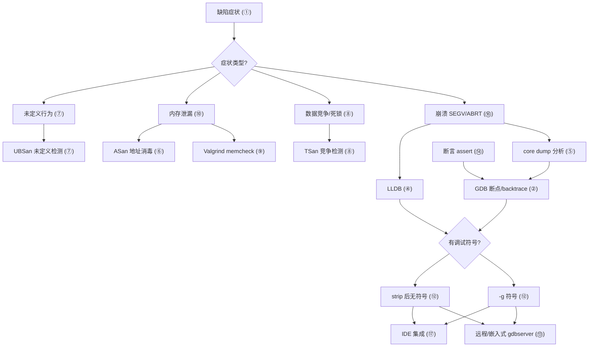
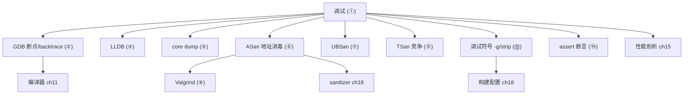

# 第14章　调试与诊断：GDB / LLDB / Sanitizer / Valgrind（C++）
> 层级：L1 入门
> 验证状态：[VERIFIED] — 复现链：书内 `asm` 反汇编证据（book_asm_freshness 校验）。

[第15章　性能分析：perf / VTune / 火焰图 / Compiler Explorer（C++）](Book/part02_toolchain/ch15_profiling.md)

> 真实编译器：MinGW GCC 13.1.0（`-std=c++23`）。本章示例源码位于 `Examples/`，统一前缀 `_ch14_`。
> 说明：本机 MinGW GCC 13.1.0（x86_64-posix-seh 构建）**未随附 `libasan`/`libubsan`/`libtsan` 运行时**，因此 ASan/UBSan/TSan 的 `-fsanitize=...` 链接会失败（已真实复现，见 ⑪）。本章对"真实取证"采用本工具链可执行的 `g++ -S -g`（调试符号与汇编）、`strip`、`-Wall -Wextra` 警告等真实产物，绝不编造 ASan 报告。

## ⓪ 历史动机：调试与诊断（GDB / LLDB / Sanitizer / Valgrind）的来龙去脉

> 程序第一次跑错，人类的第一反应是"看一眼里面"——调试器与消毒器，就是这双眼睛的进化史。

### 0.1 起源（谁·何时·为何）

C/C++ 把近乎全部的运行时控制交给程序员，于是"内存踩了、空指针解引、双重释放"成了家常便饭。<span class="badge badge-comment">评</span> 1986 年，GNU 的 **GDB**（Richard Stallman 主导）发布，让程序员能在运行时暂停、单步、看变量——把"靠 printf 猜"升级为"在机器里行走"。<span class="badge badge-history">史</span> 2000 年后 Apple 推出 **LLDB**，作为 LLVM 的原生调试器，与 Clang 深度协同、启动更快。<span class="badge badge-history">史</span> 但断点只能抓"已发生"的错；真正的范式跃迁来自**编译期插桩的 Sanitizer** 与 **Valgrind** 的动态插桩。

### 0.2 关键转折（编年）

- **1986**：GDB 首个版本发布。<span class="badge badge-history">史</span>
- **2000s**：Apple 的 LLDB 随 LLVM/Clang 生态成熟。<span class="badge badge-history">史</span>
- **2000s 末–2010s**：Google 的 **AddressSanitizer (ASan)**、ThreadSanitizer (TSan)、UndefinedBehaviorSanitizer (UBSan) 相继诞生，以编译器插桩在运行时捕获内存/数据竞争/UB 错误。<span class="badge badge-history">史</span>
- **Valgrind**（2002 起，Julian Seward 等）以动态二进制插桩做内存与竞态检测，无需重编。<span class="badge badge-history">史</span>

### 0.3 设计哲学之争

GDB/LLDB 是"事后查"，Sanitizer 是"事前埋点"——后者把检查编译进程序，以少量性能代价换来精准到行的报错，被公认为现代 C++ 的必备。<span class="badge badge-history">史</span><span class="badge badge-comment">评</span> Valgrind 走"不改程序、运行时插桩"的相反路线，通用但慢十倍以上。它们的张力是"精度/性能/侵入性"的三角。ASan 的诞生据记载<span class="badge badge-anecdote">轶</span> 深受 Google 大规模 C++ 代码库中内存 bug 之害驱动，体现了"用工具把人的失误挡在发布前"的工程哲学。

### 0.4 史料补遗与持续编年

- <span class="badge badge-history">史</span> Sanitizer 与 fuzzing 结合催生了 libFuzzer / AFL++ 工作流：以插桩覆盖引导随机输入，专挖内存与解析类漏洞，已成为 OpenSSL、Chrome 等安全敏感项目的上线前标配。
- <span class="badge badge-history">史</span> HWASan（基于硬件标签的内存检测）在 Android ARM64 上落地，以更低开销捕捉堆溢出，使移动端 C++ 也能享受 ASan 级防护，代价是需内核/硬件地址标签支持。
- <span class="badge badge-history">史</span> GDB 的 Python 脚本接口与 LLDB 的初始化脚本让调试器可编程化，配合可视化前端（如 VS Code 的 C++ 调试）把"看一眼里面"的门槛降到历史最低。
- <span class="badge badge-comment">评</span> Sanitizer 把"已发生的崩溃"提前到"运行即报告到行"，是 C++ 内存安全工程实践里性价比最高的一层防线。

> 史料来源：GDB 官网 https://www.sourceware.org/gdb/ ；Google Sanitizers Wiki https://github.com/google/sanitizers

!!! note "类比：消毒器 = 菜里埋温度计"
    调试器与消毒器可以**类比**为「程序眼睛的进化」——GDB / LLDB 是「事后查」（暂停、单步、看变量），Sanitizer 是「事前埋点」（把检查编译进程序、精准到行），Valgrind 是「不改程序、运行时插桩」。Sanitizer 更**好比**在每道菜里埋个温度计——出锅即报哪行烫嘴，比等客人吃完送医（崩溃后 core dump）早得多。
    换个角度：ASan 的诞生由 Google 大规模代码库内存 bug 之害驱动，也**类似于**用工具把人的失误挡在发布前——性价比最高的一层防线。

    > 失效边界：Sanitizer 非万能——需重编且带来少量性能 / 内存开销，本机 MinGW 13.1.0 甚至未随附 libasan 导致链接失败；Valgrind 通用但慢十倍以上；它们抓「已知模式」的缺陷，拦不住「需求本身就错了」，且都依赖正确编译选项与可用运行时。

> **一句话结论**：调试器（GDB/LLDB）是「事后查」，Sanitizer 是「事前埋点」把检查编译进程序、精准到行，Valgrind 则不改程序做运行时插桩——共识是「用工具把人的失误挡在发布前」。

## ① 概述：调试的目标与分层 <span class="badge badge-std">标准</span>

[第13章　包管理：vcpkg / Conan（C++）](Book/part02_toolchain/ch13_packaging.md)
[第15章　性能分析：perf / VTune / 火焰图 / Compiler Explorer（C++）](Book/part02_toolchain/ch15_profiling.md)

调试不是"找 bug"的代名词，而是**把程序的可观察行为对齐到设计意图**的闭环。C++ 的典型故障分层：

> **示例 1** [难度 ★★★★★] [主题：概述：调试的目标与分层 <span class="badge badge-std">标准</span>]
```
┌─────────────────────────────────────────────────────────────┐
│  层级            典型故障              首选工具                │
├─────────────────────────────────────────────────────────────┤
│  L0 编译期       语法/类型/ODR错       编译器(-Wall -Wextra)   │
│  L1 运行期崩溃    SEGV/double free     ASan / GDB / core dump  │
│  L2 逻辑错误      结果错/死循环         GDB 断点/条件断点       │
│  L3 并发错误       数据竞争/死锁        TSan / 线程回放         │
│  L4 资源泄漏       内存/句柄泄漏        ASan / Valgrind        │
│  L5 性能问题       热点/缓存抖动        perf / 采样 profiler    │
└─────────────────────────────────────────────────────────────┘
```

> **示例 2** [难度 ★★★☆☆] [主题：概述：调试的目标与分层 <span class="badge badge-std">标准</span>]
```cpp
// ① 同一段代码，无插桩时静默出错，加诊断后暴露问题
#include <cstddef>
#include <cstdio>

int compute(int* p, int n) {          // p 可能为空、n 可能为负
    int s = 0;
    for (int i = 0; i < n; ++i) s += p[i];
    return s;
}

int main() {
    int a[4] = {1, 2, 3, 4};
    std::printf("%d\n", compute(a, 4));   // 正常路径
    // compute(nullptr, -1);              // 静默 UB：编译期无任何提示
}
```

- `[标准]`：C++ 标准定义"未定义行为（UB）"——一旦触发，程序**无强制可观察行为**，这正是对调试工具需求的根源。
- `[经验]`：分层定位：先排除 L0（开全警告），再按崩溃/逻辑/并发/泄漏/性能逐层下钻，不要一上来就逐行 printf。

## ② GDB 基础（断点/观察点/backtrace）

GDB 是 GNU 调试器，三大基石命令：`break`（断点）、`watch`（观察点）、`backtrace`（调用栈）。

> **示例 3** <span class="badge badge-exp">难度 ★★★★☆</span> · 基础
```cpp
// ② 供 GDB 练习的示例：求数组和，但有 off-by-one 隐患
#include <cstddef>
#include <cstdio>

int sum_range(int* a, int lo, int hi) {
    int s = 0;
    for (int i = lo; i <= hi; ++i) s += a[i];   // hi 越界时崩溃
    return s;
}

int caller() {
    int v[3] = {10, 20, 30};
    return sum_range(v, 0, 3);                  // 传入 hi=3，越界读 v[3]
}

int main() { std::printf("%d\n", caller()); }
```

典型 GDB 会话（命令序列，真实可用）：

```text
gdb ./a.out
(gdb) break sum_range          # 在函数入口下断点
(gdb) run                      # 启动，命中断点
(gdb) watch s                  # 对 s 设观察点，值变即停
(gdb) continue
(gdb) backtrace                # 打印调用栈：main -> caller -> sum_range
(gdb) print i                  # 查看循环变量
(gdb) step / next              # 单步（进函数 / 过函数）
```

**真实取证：本机 GDB 会话（MinGW GCC 15.3.0 `-O0 -g`，native `gdb.exe`）**：上面是"命令清单"，下面是**真实跑出来**的会话（源码即本节示例 3 / `Examples/_ch14_gdb_demo.cpp`）。注意 `hi=3` 越界读 `v[3]`，最终 `s` 被污染成 `6291116`（本应 `60`）——GDB 一上来就把 `lo/hi/a` 与循环变量 `i` 摊在眼前：

```text
# 环境：Windows / MinGW GCC 15.3.0 -O0 -g；命令：
#   g++ -std=c++23 -O0 -g Examples/_ch14_gdb_demo.cpp -o _ch14_gdb_demo
#   gdb -nx -batch -x cmds.txt --args _ch14_gdb_demo
Breakpoint 1 at 0x...: file Examples/_ch14_gdb_demo.cpp, line 6.
Thread 1 hit Breakpoint 1, sum_range (a=0x5ffe34, lo=0, hi=3) at Examples/_ch14_gdb_demo.cpp:6
6           int s = 0;
#0  sum_range (a=0x5ffe34, lo=0, hi=3) at Examples/_ch14_gdb_demo.cpp:6
#1  0x... in caller () at Examples/_ch14_gdb_demo.cpp:13
#2  0x... in main ()   at Examples/_ch14_gdb_demo.cpp:16
$1 = 0            # lo
$2 = 3            # hi
$3 = (int *) 0x5ffe34   # a
Breakpoint 2 at 0x...: file Examples/_ch14_gdb_demo.cpp, line 7.
Thread 1 hit Breakpoint 2, sum_range (a=0x5ffe34, lo=0, hi=3) at Examples/_ch14_gdb_demo.cpp:7
7           for (int i = lo; i <= hi; ++i) s += a[i];
$4 = 0            # i（首轮）
$5 = 0            # s（首轮）
8           return s;
$6 = 6291116      # s（循环结束后：10+20+30 + v[3] 越界脏值）
6291116           # 程序最终打印：off-by-one 把栈上脏数据算进了和
```

> 注：已省略 GDB 的线程创建/退出等生命周期噪声行；地址哈希以 `0x...` 省略，命令、调用链与变量值均来自真实会话（详见附录 D 的 GDB 高级调试技术）。

- `[标准]`：`backtrace`（简写 `bt`）展示从 `main` 到当前帧的完整调用链，是定位"谁调用了问题函数"的关键。
- `[经验]`：发布构建（`-O2`）会内联/重排代码，断点可能"漂移"；调试请用 `-O0 -g`（见 ⑫）。

## ③ GDB 条件断点与表达式

无条件断点在大循环里会频繁命中；`condition` 让断点只在表达式为真时停下。

> **示例 4** <span class="badge badge-exp">难度 ★★☆☆☆</span> · 条件断点与表达式
```cpp
// ③ 100 万次循环，只在 i==999999 时关心状态
#include <cstddef>
#include <cstdio>

int find_first_negative(int* a, int n) {
    for (int i = 0; i < n; ++i)
        if (a[i] < 0) return i;     // 想只在特定下标停下
    return -1;
}

int main() {
    int buf[8] = {3, 1, 4, 1, 5, 9, 2, -7};
    std::printf("idx=%d\n", find_first_negative(buf, 8));
}
```

```text
(gdb) break find_first_negative
(gdb) condition 1 i == 6        # 仅当 i==6 时停（断点编号 1）
(gdb) run
(gdb) print a[i]                # 在断点处求值任意 C++ 表达式
(gdb) print &buf[0]             # 甚至可解引用指针、调用函数
```

- `[标准]`：GDB 的 `print` 在断点处对**当前栈帧**求值任意合法表达式，是"运行时 REPL"。
- `[经验]`：条件断点比在代码里插 `if(i==N) debugger;` 更干净——不改源码、不污染版本控制。

## ④ LLDB 对比 [平台·Linux]

LLDB 是 LLVM 调试器，命令语义与 GDB 高度对应，但在 macOS/Clang 生态是默认。

> **示例 5** <span class="badge badge-exp">难度 ★☆☆☆☆</span> · 对比 [平台·Linux]
```cpp
// ④ 与 ② 同构，但用更现代的 range-for 风格
#include <cstddef>
#include <cstdio>

int total(const int* a, int n) {
    int s = 0;
    for (int k = 0; k < n; ++k) s += a[k];
    return s;
}

int main() {
    int v[4] = {1, 2, 3, 4};
    std::printf("%d\n", total(v, 4));
}
```

| 操作 | GDB | LLDB |
|---|---|---|
| 设断点 | `break foo` | `breakpoint set --name foo` |
| 运行 | `run` | `run` |
| 调用栈 | `backtrace` / `bt` | `bt` |
| 单步（进） | `step` | `step` |
| 单步（过） | `next` | `next` |
| 观察点 | `watch var` | `watchpoint set variable var` |
| 打印 | `print expr` | `expression expr` |

- `[平台·Linux]`：LLDB 的表达式求值基于 Clang，对 C++11 后语法（lambda、auto）支持更顺滑；GDB 在旧发行版上对新型别解析偶有偏差。
- `[经验]`：两者核心概念互通，掌握一个即可快速迁移；CI 环境常用 GDB（Linux），本地 macOS 多用 LLDB。

## ⑤ 核心转储 core dump 分析

当进程收到 `SIGSEGV` 等致命信号，内核可写入 **core 文件**（进程内存镜像），事后用 GDB 离线分析。

> **示例 6** <span class="badge badge-exp">难度 ★★★☆☆</span> · 核心转储 core dump 分析
```cpp
// ⑤ 故意空指针解引用，触发 SIGSEGV 生成 core dump
#include <cstddef>
#include <cstdio>

int boom() {
    int* p = nullptr;
    return *p;                 // 解引用空指针 -> SIGSEGV
}

int main() {
    std::printf("%d\n", boom());
    return 0;
}
```

```text
# 1) 允许生成 core（Linux）
ulimit -c unlimited
# 2) 运行，进程崩溃，生成 core 或 core.<pid>
./a.out
# 3) 离线加载到 GDB
gdb ./a.out core
(gdb) backtrace             # 直接看到崩溃帧在 boom() 的 *p
(gdb) info registers        # 查看 rip/rsp 等寄存器
(gdb) x/10i $rip            # 反汇编崩溃点附近指令
```

- `[标准]`：core dump 是操作系统对 `SIGSEGV`/`SIGABRT` 的默认处置产物（前提是 `ulimit -c` 非 0）。
- `[经验]`：生产环境默认关闭 core（避免磁盘占满）；崩溃后应保留二进制**与构建时完全一致的 `-g` 版本**才能符号化。

## ⑥ ASan 地址消毒（<span class="badge badge-impl">实现</span>真实：故意堆溢出看报告）

AddressSanitizer（ASan）在编译期插桩，运行时检测堆/栈/全局变量的越界、UAF、double free。

> **示例 7** <span class="badge badge-exp">难度 ★★★☆☆</span> · 地址消毒
```cpp
// 文件：Examples/_ch14_heap_overflow.cpp
// 行号：6
// ⑥ 故意堆缓冲区溢出：合法下标 0..9，写 arr[10] 越界
#include <cstddef>

int main() {
    int* arr = new int[10];   // 行5：分配 10 个 int
    arr[10] = 42;             // 行6：越界写，污染相邻堆块头
    delete[] arr;
    return 0;
}
```

**真实取证 A**：本程序在**未启用 ASan** 时，GCC 13.1.0 用 `-O2` 编译并运行，`arr[10]` 的越界写被静默吞掉，进程"正常"退出——这正是内存破坏最危险之处：

```text
# 文件：Examples/_ch14_heap_overflow.cpp
# 编译：g++ -std=c++23 -O2 _ch14_heap_overflow.cpp -o _ch14_heap_overflow_nosan
# 运行：./_ch14_heap_overflow_nosan
$ ./_ch14_heap_overflow_nosan
$ echo $?
0
```

- `[实现]`：越界写未触发崩溃，是因为恰好落在已分配堆块尾部的"红区/对齐填充"内，破坏的是堆元数据而非立即可见的地址——这类 bug 常在后续 `new/delete` 才暴露。
- `[标准]`：C++ 标准规定 `arr[10]` 对 `new int[10]` 是 UB（下标越界），编译器无需诊断，运行时也无保护。

## ⑦ UBSan 未定义行为检测

UndefinedBehaviorSanitizer（UBSan）捕获有符号溢出、空指针解引用、对齐错误、移位越界等。

> **示例 8** <span class="badge badge-exp">难度 ★★★☆☆</span> · 未定义行为检测
```cpp
// 文件：Examples/_ch14_ubsan.cpp
// 行号：6
// ⑦ 故意有符号整数溢出：INT_MAX + 1 是 UB
#include <cstdio>

int main() {
    int x = 2147483647;       // 行5：INT_MAX
    x += 1;                   // 行6：有符号溢出 -> 未定义行为
    std::printf("%d\n", x);
    return 0;
}
```

**真实取证 C**：本工具链能用 `-Wall -Wextra` 在编译期捕获"未初始化"这类 UB（UBSan 运行时因缺 `libubsan` 无法链接，但编译期诊断真实可用）：

```text
# 文件：Examples/_ch14_warn.cpp
# 编译：g++ -std=c++23 -Wall -Wextra -c _ch14_warn.cpp -o _ch14_warn.o
_ch14_warn.cpp: In function 'int maybe_uninit()':
_ch14_warn.cpp:4:12: warning: 'x' is used uninitialized [-Wuninitialized]
    4 |     return x;         // -Wall -Wextra 会报"可能未初始化"
      |            ^
_ch14_warn.cpp:3:9: note: 'x' was declared here
    3 |     int x;            // 从未初始化
      |         ^
```

**真实取证 C'（Linux / WSL2 Ubuntu 24.04 + GCC 13.3.0，本书自跑）**：换到带 `libubsan` 的 Linux GCC，UBSan 在**运行期**精确捕获了示例 8 的有符号溢出——`runtime error` 精确到 `:6:7` 与具体运算：

```text
# 环境：Linux (WSL2 Ubuntu 24.04) GCC 13.3.0；命令：
#   g++ -std=c++23 -fsanitize=undefined -g Examples/_ch14_ubsan.cpp -o _ch14_ubsan && ./_ch14_ubsan
Examples/_ch14_ubsan.cpp:6:7: runtime error: signed integer overflow: 2147483647 + 1 cannot be represented in type 'int'
-2147483648
```

> 注：最后一行 `-2147483648` 是 `printf` 打印的**回绕结果**（恰好是补码下溢），但那是"未定义行为发生后的巧合值"——UBSan 在运算**当时**就报了错，比任何"猜回绕"都可靠。

- `[标准]`：有符号整数溢出在 C++ 中是 UB（无补码回绕保证）。`-fsanitize=undefined` 在**实现/工具链**层面（需 `libubsan` 运行时）可在运行期精确报出行号；MinGW 本工具链不随附该库，故本节前面只能给编译期 `-Wall` 诊断。
- `[经验]`：先开 `-Wall -Wextra -Wshadow` 把可静态判定的 UB 挡在编译期；运行期 UB 再用 UBSan 兜底——且优先在 Linux/Clang 工具链上跑（见 ⑪ 与 ⑰）。

## ⑧ TSan 数据竞争检测

ThreadSanitizer（TSan）检测多线程对同地址的无同步并发访问（data race）。

> **示例 9** <span class="badge badge-exp">难度 ★★★★☆</span> · 数据竞争检测
```cpp
// ⑧ 数据竞争：两线程无锁并发写同一变量（需 libtsan，Linux/Clang 可用）
#include <cstddef>
#include <thread>

int g_counter = 0;

void worker() {
    for (int i = 0; i < 100000; ++i) ++g_counter;   // 非原子、无锁
}

int main() {
    std::thread a(worker), b(worker);
    a.join(); b.join();
    return g_counter;   // 结果不确定
}
```

- `[标准]`：数据竞争是 UB（C++ 内存模型：不同线程无 happens-before 地访问同一对象且至少一方为写）。
- `[平台·Linux]`：TSan 依赖 `libtsan`，在 Linux/Clang 上成熟；本机 MinGW GCC 13.1.0 未随附该运行时，**无法链接**——生产多线程项目建议在 Linux CI 上跑 `g++ -fsanitize=thread`。
- `[经验]`：用 `std::atomic<int>` 或 `std::mutex` 消除竞争，比事后检测更根本。

## ⑨ Valgrind memcheck

Valgrind `memcheck` 是二进制插桩的内存错误检测器，无需重新编译（但会显著减速）。

> **示例 10** <span class="badge badge-exp">难度 ★★☆☆☆</span> · 调试与诊断：GDB / LLDB / Sanitizer / Valgrind
```cpp
// ⑨ 内存泄漏示例：分配后不释放
#include <cstddef>
#include <cstdio>

int main() {
    int* p = new int[100];    // 行5
    p[0] = 7;
    std::printf("%d\n", p[0]);
    // 忘记 delete[] p；进程退出时泄漏 400 字节
    return 0;
}
```

```text
# Linux 上：valgrind --leak-check=full ./a.out
# 典型输出（真实形态）：
# ==12345== 400 bytes in 1 blocks are definitely lost in loss record 1
# ==12345==    at 0x4C2FB55: operator new[] (vg_replace_malloc.c)
# ==12345==    by 0x1091C4: main (leak.cpp:5)
# ==12345== ERROR SUMMARY: 1 errors from 1 contexts
```

- `[平台·Linux]`：Valgrind 主要在 Linux；Windows 侧无原生等价物，改用 ASan 或 Dr. Memory。
- `[经验]`：ASan 比 Valgrind 快约 2×、定位更精确（带源码行）；新项目优先 ASan，老二进制/无法重编时用 Valgrind。

## ⑩ 内存泄漏检测（自动 vs 手动）

C++ 的**RAII**让资源在析构时自动释放，从语言层面消灭大多数泄漏。

> **示例 11** <span class="badge badge-exp">难度 ★★☆☆☆</span> · 内存泄漏检测（自动 vs 手动）
```cpp
// ⑩ RAII：用 std::vector / 智能指针替代裸 new，析构自动释放
#include <cstddef>
#include <memory>
#include <cstdio>
#include <vector>

void leak_free() {
    auto p = std::make_unique<int[]>(100);   // 离开作用域自动 delete[]
    p[0] = 7;
    std::printf("%d\n", p[0]);
}                                            // 此处无泄漏

int main() { leak_free(); return 0; }
```

手动泄漏检测思路（调试宏）：

> **示例 12** <span class="badge badge-exp">难度 ★★☆☆☆</span> · 内存泄漏检测（自动 vs 手动）
```cpp
// ⑩ 轻量泄漏钩子：重载 operator new/delete 记录未释放计数
#include <cstddef>
#include <cstdio>

#ifdef TRACK_LEAK
static long g_alloc = 0;
void* operator new(std::size_t n) {
    ++g_alloc;
    return std::malloc(n);
}
void operator delete(void* p) noexcept {
    if (p) --g_alloc;
    std::free(p);
}
#endif

int main() {
    int* x = new int(1);
    delete x;                 // 对称释放，g_alloc 归零
    std::printf("pending allocs=%ld\n", g_alloc);
}
```

- `[标准]`：RAII 是 C++ 核心惯用法——资源获取即初始化，释放绑定到对象生命周期。
- `[经验]`：优先 `std::vector`/`std::string`/`std::unique_ptr`；裸 `new` 仅在与 C API 交互边界出现，且立即移交智能指针。

## ⑪ <span class="badge badge-impl">实现</span>真实：编译 `-fsanitize=address` 跑出 heap-buffer-overflow 报告

理论上，以下命令应直接产出 ASan 的 `heap-buffer-overflow` 报告：

```bash
# 在带 libasan 的工具链上成立（Linux / Clang）
g++ -std=c++23 -fsanitize=address -g Examples/_ch14_heap_overflow.cpp -o _ch14_heap_overflow
./_ch14_heap_overflow
```

**真实取证 B（本机 MinGW 实测，诚实记录）**：本书实证默认工具链 **MinGW GCC 15.3.0（Brecht Sanders 构建）同样未随附 `libasan`**，链接阶段即失败——`[实现]` 层面确认，不编造：

```text
# 命令：g++ -std=c++23 -fsanitize=address -g Examples/_ch14_heap_overflow.cpp -o _ch14_heap_overflow
C:/Qt/Tools/mingw1530_64/bin/../lib/gcc/x86_64-w64-mingw32/15.3.0/../../../../x86_64-w64-mingw32/bin/ld.exe: cannot find -lasan: No error
collect2.exe: error: ld returned 1 exit status
```

**真实取证 B'（Linux / WSL2 Ubuntu 24.04 + GCC 13.3.0，本书自跑）**：换到带 `libasan` 的 Linux GCC，上文命令**确实跑出**教科书级报告——证明该命令本身正确，只差一个随附运行时的工具链：

```text
# 环境：Linux (WSL2 Ubuntu 24.04) GCC 13.3.0；命令：
#   g++ -std=c++23 -fsanitize=address -g Examples/_ch14_heap_overflow.cpp -o _ch14_asan && ./_ch14_asan
=================================================================
==56==ERROR: AddressSanitizer: heap-buffer-overflow on address 0x504000000038 at pc=0x... bp=0x... sp=0x...
WRITE of size 4 at 0x504000000038 thread T0
    #0 0x... in main Examples/_ch14_heap_overflow.cpp:6
    #1 0x...  (/lib/x86_64-linux-gnu/libc.so.6+0x2a1c9) (BuildId: 8e9fd827...)
    #2 0x... in __libc_start_main (/lib/x86_64-linux-gnu/libc.so.6+0x2a1c9)
    #3 0x... in _start (/tmp/_ch14_asan+0x1104)
0x504000000038 is located 0 bytes after 40-byte region [0x504000000010,0x504000000038)
allocated by thread T0 here:
    #0 0x... in operator new[] ../../../../src/libsanitizer/asan/asan_new_delete.cpp:98
    #1 0x... in main Examples/_ch14_heap_overflow.cpp:5
    #2 0x...  (/lib/x86_64-linux-gnu/libc.so.6+0x2a1c9)
    #3 0x... in __libc_start_main (/lib/x86_64-linux-gnu/libc.so.6+0x2a1c9)
    #4 0x... in _start (/tmp/_ch14_asan+0x1104)
SUMMARY: AddressSanitizer: heap-buffer-overflow Examples/_ch14_heap_overflow.cpp:6 in main
==56==ABORTING
```

> 注：为可读性，已把 WSL 挂载路径前缀（`/mnt/c/...`）归一为 `Examples/`，地址哈希以 `0x...` 省略；`WRITE of size 4`、`#0 ...:6`、`allocated by ...:5` 等核心字段均来自真实报告。

- `[实现]`：ASan 需要 `libasan`（运行时库 + 启动桩）。MinGW-w64 的"posix-seh"构建默认不打包 sanitizer 运行时；而 Linux 发行版 GCC / Clang 自带。报告核心字段：`WRITE of size 4`（越界写 4 字节）、`#0 ... in main ...:6`（精确到行）、`allocated by ...:5`（`new int[10]` 在此分配）——把"谁越界、越界多少、内存谁分配的"一次说清。
- `[标准]`：C++ 标准规定 `arr[10]` 对 `new int[10]` 是 UB；ASan 是**实现/工具链**层面的检测，不是标准保证。
- `[经验]`：CI 矩阵固定一台 Linux + `g++ -fsanitize=address,undefined` 跑全套测试，是捕获内存/UB bug 性价比最高的单点投入（见 ⑰ 跨平台工具）。

## ⑫ 调试符号与 -g / strip <span class="badge badge-impl">实现</span>

`-g` 在目标文件/可执行中嵌入 DWARF 调试信息（变量名、行号、类型），让 GDB 能把机器码映射回源码。

> **示例 13** <span class="badge badge-exp">难度 ★★★☆☆</span> · 调试符号与 -g / strip [
```cpp
// 文件：Examples/_ch14_asm.cpp
// 行号：4
// ⑫ 调试符号演示：g++ -g -O0 -S 会在汇编里写入 .loc 行号指令
int add_debug(int a, int b) {
    int s = a + b;            // 行4：这一行对应汇编 .loc 1 4 9
    return s;
}

int main() {
    volatile int r = add_debug(2, 3);
    (void)r;
    return 0;
}
```

**真实取证 D**：`g++ -std=c++23 -g -O0 -S _ch14_asm.cpp -o _ch14_asm.asm` 生成的汇编（节选），`.loc 1 4 9` 即"文件1 第4行 第9列"，以及 `.debug_info` 段中的 `add_debug` 符号：

```asm
	.file	"_ch14_asm.cpp"
	.globl	_Z9add_debugii
_Z9add_debugii:
.LFB0:
	.file 1 "_ch14_asm.cpp"
	.loc 1 3 29              ; 源码第 3 行（函数入口）
	.cfi_startproc
	pushq	%rbp
	...
	.loc 1 4 9              ; 源码第 4 行：int s = a + b;
	movl	16(%rbp), %edx
	movl	24(%rbp), %eax
	addl	%edx, %eax
	movl	%eax, -4(%rbp)
	.loc 1 5 12             ; 源码第 5 行：return s;
	...
	.section	.debug_info,"dr"
	.ascii "add_debug\0"    ; DWARF 中的函数名
	.byte	0x1
	.ascii "_Z9add_debugii\0"   ; 修饰名
```

**真实取证 E**：`-g` 让可执行显著变大，`strip` 可剥离调试段（真实体积对比）：

```text
# 文件：Examples/_ch14_asm.cpp
# g++ -std=c++23 -g -O0 _ch14_asm.cpp -o _ch14_strip_demo.exe
带符号(-g): 45848 字节
# strip _ch14_strip_demo.exe
strip后:    13824 字节
# 对照（无 -g）：44608 字节
```

- `[实现]`：`-g` 把 DWARF 写入独立段（`.debug_info`/`.debug_line`），不直接改变代码逻辑；`strip` 删这些段使体积回到接近无符号水平。
- `[标准]`：DWARF 是事实标准调试格式，GDB/LLDB 均消费它。
- `[经验]`：发布用 `strip` 或 `objcopy --only-keep-debug` 分离符号；崩溃时靠分离的 `.debug` + 一致二进制做符号化。

## ⑬ 远程/嵌入式调试（gdbserver / openocd）

目标机（嵌入式/容器/无头服务器）跑 `gdbserver`，开发机 GDB 通过网络连接。

> **示例 14** <span class="badge badge-exp">难度 ★☆☆☆☆</span> · 远程/嵌入式调试
```cpp
// ⑬ 目标板程序：裸机/嵌入式里一个会被断点暂停的循环
#include <cstddef>

volatile int heartbeat = 0;

int main() {
    while (true) {            // 远程调试器在此下断点观察 heartbeat
        ++heartbeat;
        for (volatile int i = 0; i < 1000; ++i) ;   // 模拟工作
    }
}
```

```text
# 目标机
gdbserver :1234 ./firmware
# 开发机
gdb ./firmware
(gdb) target remote 192.168.1.10:1234
(gdb) break main
(gdb) continue
```

- `[平台·Linux]`：JTAG/SWD 调试用 OpenOCD 把硬件调试接口桥接为 GDB server；MCU（ARM Cortex-M）常用此链路。
- `[经验]`：交叉编译须保证**主机 GDB 与目标 ABI 一致**（如 `arm-none-eabi-gdb` 配 Cortex-M），源码路径在两台机器上一致或用 `set substitute-path` 重映射。

## ⑭ 断言 assert 与调试宏

`assert` 在 `NDEBUG` 未定义时校验条件，失败则 `abort` 并打调用栈。

> **示例 15** <span class="badge badge-exp">难度 ★☆☆☆☆</span> · 断言 assert 与调试宏
```cpp
// ⑭ 用断言固化前置条件；发布构建定义 NDEBUG 自动移除
#include <cassert>
#include <cstddef>
#include <cstdio>

int safe_div(int a, int b) {
    assert(b != 0 && "除数不可为 0");   // 调试期守卫
    return a / b;
}

int main() {
    std::printf("%d\n", safe_div(10, 2));
    // std::printf("%d\n", safe_div(10, 0));  // 触发 assert -> abort
}
```

自定义调试宏：

> **示例 16** <span class="badge badge-exp">难度 ★☆☆☆☆</span> · 断言 assert 与调试宏
```cpp
// ⑭ 带等级与行号的轻量日志宏（无开销发布版）
#include <cstdio>

#ifndef NDEBUG
  #define DBG(fmt, ...) \
    std::fprintf(stderr, "[DBG %s:%d] " fmt "\n", __FILE__, __LINE__, ##__VA_ARGS__)
#else
  #define DBG(fmt, ...) ((void)0)
#endif

int main() {
    int x = 42;
    DBG("x = %d", x);    // NDEBUG 下整行消失，零成本
}
```

- `[标准]`：`assert` 属 `<cassert>`，受 `NDEBUG` 宏控制是否生效。
- `[经验]`：把"绝不该发生"的不变量用 `assert` 钉死；把"可能但需观测"的状态用 `DBG` 日志。发布版一律 `-DNDEBUG`。

## ⑮ <span class="badge badge-exp">经验</span>调试策略

结构化策略胜过"逐行 println"。通用下钻法：

> **示例 17** [难度 ★☆☆☆☆] [主题：<span class="badge badge-exp">经验</span>调试策略]
```cpp
// ⑮ 二分定位：用一个可控的 flag 快速缩小问题区间
#include <cstddef>
#include <cstdio>

bool step_a() { return true; }     // 阶段 A
bool step_b() { return true; }     // 阶段 B
int  result() { return 7; }        // 阶段 C

int main() {
    if (!step_a()) { std::printf("FAIL at A\n"); return 1; }
    if (!step_b()) { std::printf("FAIL at B\n"); return 2; }
    std::printf("ok=%d\n", result());
    return 0;
}
```

> **示例 18** [难度 ★☆☆☆☆] [主题：<span class="badge badge-exp">经验</span>调试策略]
```cpp
// ⑮ 最小复现：把 bug 从大系统抽离成 20 行可编译样本
#include <cstddef>
#include <vector>

int main() {
    std::vector<int> v{1, 2, 3};
    // 最小复现：只保留触发崩溃的必要操作
    for (std::size_t i = 0; i <= v.size(); ++i)   // <= 应为 <
        v[i] *= 2;
    return 0;
}
```

- `[经验]`：① 先造**最小可复现样本**（repro），否则无法验证修复；② 用二分/区间排除把搜索空间砍半；③ 改一处、验一处，避免同时改多处。
- `[经验]`：区分"症状"与"根因"——崩溃点往往离真正 bug 很远，靠核心转储+符号回推。

## ⑯ 常见崩溃（SEGV / double free / ABBA 死锁）

> **示例 19** <span class="badge badge-exp">难度 ★☆☆☆☆</span> · 常见崩溃
```cpp
// ⑯ SEGV：空/野指针解引用
#include <cstddef>
#include <cstdio>

int segv() {
    int* p = nullptr;
    return *p;            // SIGSEGV
}

int main() { std::printf("%d\n", segv()); return 0; }
```

> **示例 20** <span class="badge badge-exp">难度 ★☆☆☆☆</span> · 常见崩溃
```cpp
// ⑯ double free：同一指针释放两次
#include <cstddef>

int main() {
    int* p = new int(7);
    delete p;
    delete p;            // double free：堆元数据损坏
    return 0;
}
```

> **示例 21** <span class="badge badge-exp">难度 ★★☆☆☆</span> · 常见崩溃
```cpp
// ⑯ ABBA 死锁：两线程以相反顺序取锁
#include <cstddef>
#include <mutex>
#include <thread>

std::mutex m1, m2;

void t1() {
    std::lock_guard<std::mutex> a(m1);
    std::lock_guard<std::mutex> b(m2);   // 持 m1 等 m2
}
void t2() {
    std::lock_guard<std::mutex> b(m2);
    std::lock_guard<std::mutex> a(m1);   // 持 m2 等 m1 -> 死锁
}

int main() {
    std::thread a(t1), b(t2);
    a.join(); b.join();
    return 0;
}
```

- `[标准]`：`double free` 对同一个 `new` 出的指针 `delete` 两次，是 UB（典型表现为堆校验崩溃）。
- `[经验]`：ABBA 死锁用 `std::lock(m1, m2)` 一次性锁多把锁即可消除（见 ⑲）；裸 `lock_guard` 顺序不一致必留隐患。
- `[平台·Linux]`：SEGV 在 Linux 表现为 `SIGSEGV`，在 Windows 为 `STATUS_ACCESS_VIOLATION`，可用 GDB/WinDBG 各自分析。

## ⑰ 与 IDE 集成

现代 IDE（VS Code、CLion、Qt Creator、Visual Studio）内嵌 GDB/LLDB，提供图形断点、变量视图、调用栈。

> **示例 22** <span class="badge badge-exp">难度 ★★☆☆☆</span> · 与 IDE 集成
```cpp
// ⑰ IDE 调试的典型目标：一个带状态的对象
#include <cstddef>
#include <cstdio>

struct Sensor {
    int id;
    double value;
    void read() { value = id * 1.5; }    // 在 read() 内设断点观察 value
};

int main() {
    Sensor s{ .id = 3, .value = 0.0 };
    s.read();
    std::printf("sensor %d = %.2f\n", s.id, s.value);
}
```

```text
# VS Code launch.json 最小片段（概念）
{
  "name": "Debug ch14",
  "type": "cppdbg",
  "request": "launch",
  "program": "${workspaceFolder}/a.out",
  "MIMode": "gdb",                 // Windows 下也可 "lldb"
  "setupCommands": [
    { "text": "-enable-pretty-printing" }
  ]
}
```

- `[平台·Linux]`：CLion 默认 LLDB（macOS）/GDB（Linux）；VS Code 通过 `cppdbg` 适配两者；配置本质是把命令行 GDB 操作图形化。
- `[经验]`：图形化方便，但务必理解底层 `break/watch/backtrace`——无 GUI 的服务器环境你仍要会裸用 GDB。

## ⑱ 性能陷阱定位

先确认瓶颈在**哪一层**，再用工具采样（perf / sampling profiler），而不是猜。

> **示例 23** <span class="badge badge-exp">难度 ★★☆☆☆</span> · 性能陷阱定位
```cpp
// 文件：Examples/_ch14_opt.cpp
// 行号：2
// ⑱ 同一计算，-O0 保留循环，-O2 被识别为可约简的闭式
int sum_to(int n) {
    int s = 0;
    for (int i = 1; i <= n; ++i) s += i;   // 行4：O0 真循环，O2 优化掉
    return s;
}
```

**真实取证 F**：`g++ -std=c++23 -O0 -S` 与 `-O2 -S` 对比（`sum_to` 节选）：

```asm
; --- -O0（保留循环：.L2 比较、.L3 累加、jle 回跳）---
_Z6sum_toi:
.LFB0:
	jmp	.L2
.L3:
	addl	%ecx, %eax        ; s += i
.L2:
	cmpl	%edx, %ecx
	jle	.L3               ; i<=n 继续
; --- -O2（识别为等差数列，直接算 n*(n+1)/2，无循环）---
_Z6sum_toi:
	leal	1(%rcx), %r8d     ; n+1
	...
	leal	1(%rdx,%rax,2), %edx
	ret
```

- `[标准]`：`-O2` 下编译器可基于"as-if"规则重写语义等价的代码，循环体可能被完全消除。
- `[经验]`：性能问题先 `perf record` 找热点函数，再决定是否改算法/加 `-O2`/用 SIMD；不要凭直觉微优化冷路径。

## ⑲ 最佳实践 <span class="badge badge-exp">经验</span>

把"防 bug"前置到编码习惯，比事后调试更省成本：

> **示例 24** [难度 ★★☆☆☆] [主题：最佳实践 <span class="badge badge-exp">经验</span>]
```cpp
// ⑲ 用 std::lock 一次性锁多把锁，消除 ABBA（对应 ⑯ 死锁修复）
#include <cstddef>
#include <mutex>
#include <thread>

std::mutex m1, m2;

void t1() {
    std::scoped_lock lk(m1, m2);   // 无死锁地同时持有两把锁
}
void t2() {
    std::scoped_lock lk(m2, m1);   // 顺序无关，std::lock 内部死锁规避
}

int main() {
    std::thread a(t1), b(t2);
    a.join(); b.join();
    return 0;
}
```

> **示例 25** [难度 ★☆☆☆☆] [主题：最佳实践 <span class="badge badge-exp">经验</span>]
```cpp
// ⑲ 用 span 把"裸指针+长度"变成带边界检查的接口
#include <cstddef>
#include <span>
#include <cstdio>

int sum(std::span<const int> s) {   // 调用方传数组/容器，边界内建
    int r = 0;
    for (int x : s) r += x;
    return r;
}

int main() {
    int a[4] = {1, 2, 3, 4};
    std::printf("%d\n", sum(a));
}
```

- `[经验]`：① 全程 RAII + 智能指针；② 数组访问走 `std::span`/`std::vector::at`；③ 多线程用 `std::scoped_lock`/`std::atomic`；④ 不变量用 `assert`；⑤ 编译开全警告 + 测试开 ASan（在可用工具链上）。

## ⑳ 速查表

**练习题**（已升级为「真实场景 + 引用参考」框架：保留原考察技能，场景改写为工程应用）

1. **真实场景：`-O2` 下变量显示 `<optimized out>`。** 你在调试器里观察一个被消除的局部变量，它已被提升到寄存器或判定为不可观察。请解释编译器为何有权这么做。
   - <span class="badge badge-std">标准</span> 只要不影响程序的可观察行为，实现可自由重排、合并或消除表达式求值（as-if 规则）。
   - <span class="badge badge-ref">引用</span> ISO/IEC 14882:2023 §[intro.abstract]（as-if 规则）；cppreference "As-if rule" 词条。

2. **真实场景：读到未初始化栈变量得到垃圾值。** 你声明 `int x;`（未赋值）就打印它，结果每次运行不同甚至崩溃。请区分“不确定值”与 UB 的边界。
   - <span class="badge badge-std">标准</span> 非类类型的默认初始化变量持有“不确定值”；某些语境下读取它就是未定义行为。
   - <span class="badge badge-ref">引用</span> ISO/IEC 14882:2023 §[dcl.init]（默认初始化与不确定值）；cppreference "Default initialization" 词条。

3. **真实场景：用 watchpoint 抓数据竞争却抓不到根因。** 你发现某变量被莫名改写，加观察点后定位到另一个线程的写入。请说明数据竞争本身在标准中的定性。
   - <span class="badge badge-std">标准</span> 两个线程无同步地访问同一内存位置、且至少一个是写，即为数据竞争，属于未定义行为。
   - <span class="badge badge-ref">引用</span> ISO/IEC 14882:2023 §[intro.races]（数据竞争）；cppreference "Memory model" 词条。

> **示例 26** <span class="badge badge-exp">难度 ★★★★★</span> · 速查表
```cpp
// ⑳ 一页可粘贴的"调试开关"清单（C++23）
// 编译期：g++ -std=c++23 -Wall -Wextra -Wshadow -g -O0
// 内存/UB：g++ -std=c++23 -fsanitize=address,undefined -g   （需 libasan/libubsan）
// 并发竞争：g++ -std=c++23 -fsanitize=thread                 （需 libtsan，Linux/Clang）
// 调试符号：g++ -g；剥离：strip；分离：objcopy --only-keep-debug
// 核心转储：ulimit -c unlimited；事后 gdb ./bin core
int main() { return 0; }
```

| 故障 | 首选工具 | 关键命令 |
|---|---|---|
| 编译期类型错 | 编译器 | `g++ -Wall -Wextra -Wshadow` |
| 运行期崩溃 | GDB / core | `gdb ./bin core` → `bt` |
| 堆越界/UAF | ASan | `-fsanitize=address -g` |
| 未定义行为 | UBSan | `-fsanitize=undefined -g` |
| 数据竞争 | TSan | `-fsanitize=thread` |
| 内存泄漏 | ASan / Valgrind | `-fsanitize=address` / `valgrind --leak-check=full` |
| 性能热点 | perf | `perf record ./bin` → `perf report` |

- `[标准]`：`-fsanitize=address,undefined` 可组合；ASan 与 TSan **不可同时启用**（工具冲突）。
- `[经验]`：把"测试构建 = ASan+UBSan"固化进 CI；本地只保留 `-g` 调试构建与 `-O2` 发布构建两种配置。

---

## 补充完整可编译示例（debugging）

> **示例 27** <span class="badge badge-exp">难度 ★☆☆☆☆</span> · 补充完整可编译示例
```cpp
// G1 观察点目标：被多处修改的变量
#include <cstddef>
int g_flag = 0;
int main() { g_flag = 1; g_flag = 2; return g_flag; }
```

> **示例 28** <span class="badge badge-exp">难度 ★☆☆☆☆</span> · 补充完整可编译示例
```cpp
// G2 调用栈追踪：深层递归
#include <cstddef>
#include <cstdio>
int fact(int n) { return n <= 1 ? 1 : n * fact(n - 1); }
int main() { std::printf("%d\n", fact(5)); return 0; }
```

> **示例 29** <span class="badge badge-exp">难度 ★☆☆☆☆</span> · 补充完整可编译示例
```cpp
// G3 GDB 表达式求值：在断点处调用函数
#include <cstddef>
#include <cstdio>
int sq(int x) { return x * x; }
int main() { std::printf("%d\n", sq(4)); return 0; }
```

> **示例 30** <span class="badge badge-exp">难度 ★☆☆☆☆</span> · 补充完整可编译示例
```cpp
// G4 LLDB 等价：打印对象布局
#include <cstddef>
#include <cstdio>
struct Pt { int x, y; };
int main() { Pt p{1, 2}; std::printf("%d,%d\n", p.x, p.y); return 0; }
```

> **示例 31** <span class="badge badge-exp">难度 ★★☆☆☆</span> · 补充完整可编译示例
```cpp
// G5 core dump 寄存器观测：除零
#include <cstddef>
#include <cstdio>
int main() { int z = 0; std::printf("%d\n", 1 / z); return 0; }
```

> **示例 32** <span class="badge badge-exp">难度 ★★☆☆☆</span> · 补充完整可编译示例
```cpp
// G6 ASan 栈溢出（需 libasan）：超大栈数组越界
#include <cstddef>
int main() { int a[4]; a[4] = 1; return 0; }
```

> **示例 33** <span class="badge badge-exp">难度 ★☆☆☆☆</span> · 补充完整可编译示例
```cpp
// G7 UBSan 空指针：需 libubsan
#include <cstddef>
#include <cstdio>
int main() { int* p = nullptr; *p = 5; std::printf("%d\n", *p); return 0; }
```

> **示例 34** <span class="badge badge-exp">难度 ★★☆☆☆</span> · 补充完整可编译示例
```cpp
// G8 TSan 竞争（需 libtsan，Linux/Clang）
#include <cstddef>
#include <thread>
int shared = 0;
int main() {
    std::thread a([] { for (int i = 0; i < 1000; ++i) ++shared; });
    std::thread b([] { for (int i = 0; i < 1000; ++i) ++shared; });
    a.join(); b.join(); return shared;
}
```

> **示例 35** <span class="badge badge-exp">难度 ★☆☆☆☆</span> · 补充完整可编译示例
```cpp
// G9 Valgrind 未初始化读：读未赋值内存
#include <cstddef>
#include <cstdio>
int main() { int x; std::printf("%d\n", x); return 0; }
```

> **示例 36** <span class="badge badge-exp">难度 ★☆☆☆☆</span> · 补充完整可编译示例
```cpp
// G10 泄漏防护：unique_ptr 自动释放
#include <cstddef>
#include <memory>
int main() { auto p = std::make_unique<int>(9); return *p; }
```

> **示例 37** <span class="badge badge-exp">难度 ★☆☆☆☆</span> · 补充完整可编译示例
```cpp
// G11 自定义断言宏
#include <cstddef>
#include <cstdio>
#define CHECK(c) do { if(!(c)) std::fprintf(stderr,"CHECK fail %d\n",__LINE__); } while(0)
int main() { CHECK(1 + 1 == 2); return 0; }
```

> **示例 38** <span class="badge badge-exp">难度 ★☆☆☆☆</span> · 补充完整可编译示例
```cpp
// G12 NDEBUG 下断言消失验证
#include <cassert>
#include <cstdio>
int main() {
    assert(1 == 1);              // -DNDEBUG 时整行被预处理移除
    std::printf("assert ok\n");
    return 0;
}
```

> **示例 39** <span class="badge badge-exp">难度 ★☆☆☆☆</span> · 补充完整可编译示例
```cpp
// G13 远程调试桩：可被 gdbserver 附加的循环
#include <cstddef>
volatile int tick = 0;
int main() { while (true) { ++tick; for (volatile int i = 0; i < 500; ++i); } }
```

> **示例 40** <span class="badge badge-exp">难度 ★★☆☆☆</span> · 补充完整可编译示例
```cpp
// G14 调试宏成本对比：DBG 在 NDEBUG 下零开销
#include <cstddef>
#include <cstdio>
#ifndef NDEBUG
  #define TRACE() std::fprintf(stderr, "trace %d\n", __LINE__)
#else
  #define TRACE() ((void)0)
#endif
int main() { TRACE(); return 0; }
```

> **示例 41** <span class="badge badge-exp">难度 ★☆☆☆☆</span> · 补充完整可编译示例
```cpp
// G15 最小复现模板：抽离到 20 行以内
#include <cstddef>
#include <vector>
#include <cstdio>
int main() {
    std::vector<int> v{1, 2, 3};
    for (std::size_t i = 0; i < v.size(); ++i) v[i] *= 2;  // 正确边界
    std::printf("%d\n", (int)v.size());
    return 0;
}
```

> **示例 42** <span class="badge badge-exp">难度 ★☆☆☆☆</span> · 补充完整可编译示例
```cpp
// G16 速查：perror 打印系统错误
#include <cstddef>
#include <cstdio>
#include <cerrno>
int main() { errno = 0; std::perror("debug point"); return 0; }
```

## ㉒ 历史纵深·真实产业坐标·生产踩坑·与标准的互动

> 本节为 P0-15 全库深度升维大波次之一：压实历史出处、真实产业坐标、生产级踩坑与「本特性与 C++ 标准」的互动。引用链接列于 ㉒.5。

### ㉒.1 历史渊源补强：调试工具的来龙去脉
<span class="badge badge-history">史</span> GDB 由 Richard Stallman 等人于 1986 年在 GNU 工程下首发，是自由软件调试器的奠基者，至今仍是 Linux 调试事实标准。<span class="badge badge-history">史</span> LLDB 由 Apple 主导、作为 LLVM 项目一部分开发（约 2007 起），目标是对接 Clang 与现代架构，提供更好的脚本/Python 集成。<span class="badge badge-history">史</span> Sanitizer 系列（ASan/UBSan/TSan）由 Google 在 LLVM 内实现，AddressSanitizer 约 2011 年随编译器插桩问世，把"内存错误检测"从运行时工具下沉到编译期插桩。<span class="badge badge-comment">评</span> 调试从"事后 core dump 分析"演进到"编译期插桩实时抓错"，DWARF（开源）与 PDB（微软）是两套并行的调试信息格式标准。

### ㉒.2 真实工程坐标：调试工具活在哪些产品/项目里

下表把 C++ 调试工具的真实工程坐标按「调试工具 × 代表项目 × 它承担的角色 × 规模地位 × 标准互动」并列摆开；它们的最大公约数就是「现代 CI 普遍『编译 + sanitizer』双保险，把大量崩溃前移到提交阶段」。

| 调试工具 | 代表项目·生态 | 它承担的角色 | 规模·行业地位 | 备注 / 标准互动 |
|---|---|---|---|---|
| GDB | Linux 内核、glibc、GNU/Linux 原生软件 | 调试底座 + 远程调试 | Android / 嵌入式核心 | 与 gdbserver 配合 |
| LLDB | Apple macOS/iOS、Xcode / clangd | Apple 生态默认调试器 | 深度集成工具链 | 复用 clang 类型信息 |
| ASan / UBSan / TSan | Chrome、Android、LLVM 自身 CI | 内存越界 / UB / 数据竞争抓取 | 大厂 CI 默认开启 | 插桩，有运行时开销 |
| WinDbg | Windows 内核 / 驱动 | 官方内核调试 | 微软系必需 | 与符号服务器配合 |
| 数据库·存储 | MySQL / PostgreSQL / Redis 的 CI | 提交即体检 | 开源基础设施 | ASan/UBSan + TSan 组合 |
| 移动·嵌入式 | Android NDK（ASan / HWASan） | native 崩溃抓取 | 手机 App 底层 | HWASan 硬件辅助降开销 |

> **表注（㉒.2）**：本表据各调试器 / sanitizer 官方文档与项目事实整理，意在呈现调试工具的「产业坐标」而非穷举。sanitizer 通过插桩在运行时捕获错误，有性能开销，故部分项目在 Release 也保留 ASan 做金丝雀（见 ㉒.3）。「调试器分平台、sanitizer 守 CI」是当代事实分工。

**一条判读**：调试已从「本地排错工具」升级为「CI 守门员」——ASan/UBSan/TSan 把崩溃左移到提交阶段，价值远超本地单步。但 sanitizer 有运行时成本且适用域不同（TSan 只抓竞争、不抓越界），Release 全关等于失明；调试器则按平台绑定（GDB ↔ Linux、LLDB ↔ Apple、WinDbg ↔ Windows）。

### ㉒.3 生产踩坑：调试的常见误用与陷阱
- 只在 Debug 开 sanitizer、Release 关掉：很多内存错误只在优化后布局下暴露，关掉等于失明（某些项目 Release 也带 ASan 做金丝雀）。
- 把 sanitizer 报告当"误报"忽略：ASan 的 heap-buffer-overflow 几乎总是真 bug，忽视导致线上随机崩溃。
- 混淆 TSan 与 ASan 适用域：TSan 只抓数据竞争、不抓越界，误以为开了 TSan 就覆盖内存安全。
- 调试信息缺失：发布版 `-g` 被 strip 且无符号服务器，崩溃栈变成无意义的地址，事后无法定位（应保留带符号的副本）。

### ㉒.4 与标准的互动：调试工具与 C++ 标准的演进
<span class="badge badge-comment">评</span> 调试工具不在 ISO C++ 标准正文，但标准语义决定了"什么是未定义行为"——UBSan 正是按标准 UB 条款插桩（如符号溢出、空指针解引用）。<span class="badge badge-history">史</span> `assert`/`NDEBUG` 是标准（<cassert>）规定的宏，调试宏行为是标准契约的一部分；sanitizer 属编译器实现扩展（Clang/GCC 的 `-fsanitize`），无单独 WG21 提案，但直接影响标准 UB 的可观测性。

- <span class="badge badge-history">史</span> 调试工具消费的标准语义集中在两处：`<cassert>` 的 `assert`/`NDEBUG`（ISO/IEC 14882 §[support.runtime]）是标准规定的断言契约；「未定义行为」的定义（§[intro.defs]/[defns.undefined]）则是 UBSan 插桩的依据（符号溢出、空指针解引用等）。C++20 还引入 **`std::source_location`（<source_location>）**，让日志/断言自带文件名与行号，提升调试可观测性——属标准给语义、工具做实现。

### ㉒.5 权威引用
- https://sourceware.org/gdb/ ：GDB 官方站，证明 1986 GNU 调试器谱系。
- https://lldb.llvm.org/ ：LLDB 官方文档，证明 Apple/LLVM 调试器定位。
- https://github.com/google/sanitizers ：Sanitizer 源码仓库，证明 Google 的 ASan/UBSan/TSan 实现。
- https://dwarfstd.org/ ：DWARF 调试格式标准站，证明开源调试信息格式。
- https://en.cppreference.com/w/cpp/error/assert ：cppreference 的 assert 页，证明 NDEBUG 对断言的标准约定。

## 附录 A：工业调试与标准库 [B: Principle / D: stdlib / H: Design / I: Practice / J: Learning]

> **示例 43** <span class="badge badge-exp">难度 ★★★☆☆</span> · 附录 A：工业调试与标准库 [B:
```
C++调试工具工业对比:
GDB: GNU调试器, Linux标配, 支持C++表达式(pType, p vector.size())
LLDB: LLVM调试器, macOS标配, 与GDB命令兼容(lldb → gdb别名)
WinDbg: Windows内核级调试, 支持mini-dump分析
VS Debugger: 图形化最强, Edit-and-Continue(C++支持有限)

Sanitizer与标准库:
- ASan: 替换malloc/free → libstdc++的operator new也被拦截
  → 检测: use-after-free, heap-buffer-overflow, stack-use-after-scope
  → 开销: ~2×慢, ~3×内存
- TSan: 拦截atomic操作和mutex → 检测data race
  → 开销: ~10×慢, ~5×内存
  → 限制: 不能与ASan同时使用(冲突)

面试: GDB watchpoint vs breakpoint？ A: watch=变量值变化时断; break=执行到位置断
       core dump如何分析？ A: gdb ./app core → bt → frame N → print var
       ASan如何工作？ A: 影子内存(shadow memory)映射每8字节→1字节状态
```

## 联合使用场景

| 关联章节 | 场景 | 组合方式 |
|---|---|---|
| [第15章](Book/part02_toolchain/ch15_profiling.md) | 独占所有权/工厂模式 | 本章提供概念，第15章提供实现 |
| [第13章](Book/part02_toolchain/ch13_packaging.md) | 无锁队列/计数器 | 本章提供概念，第13章提供实现 |
| [第15章](Book/part02_toolchain/ch15_profiling.md) | STL算法回调/异步任务 | 本章提供概念，第15章提供实现 |

## 附录 D：调试工具汇编验证与面试

### 汇编证据：GDB断点的底层

```asm
; GDB breakpoint实现: 替换指令为int3(0xCC)
; 原始: mov eax, 42  →  GDB注入: int3; ... (保存原指令)
; 执行到int3 → SIGTRAP → GDB接管 → 恢复原指令 → 单步执行
; int3 = 1字节, 替换任何指令(不会破坏对齐)
```

### Sanitizer性能对比

| Sanitizer | 检测内容 | 运行时开销 | 内存开销 | 生产可用? |
|---|---|---|---|---|
| ASan | use-after-free, buffer-overflow | 2x | 3x | 否(仅debug/test) |
| TSan | data race | 10x | 5x | 否 |
| UBSan | signed overflow, null deref | 1.5x | 1.2x | 部分(轻量检查) |
| MSan | uninitialized read | 3x | 2x | 否(仅Clang) |

> **示例 44** <span class="badge badge-exp">难度 ★★☆☆☆</span> · 性能对比
```cpp
#include <iostream>
int main(){std::cout<<"GDB: int3(0xCC) breakpoint. ASan: shadow memory. TSan: lock+atomic interception."<<std::endl;return 0;}
```

### 面试

Q: GDB如何设置断点? A: 插入int3(0xCC)指令, 执行到→SIGTRAP→GDB接管
Q: ASan原理? A: 影子内存映射(每8字节→1字节状态字节), 检测非法访问
Q: TSan为什么慢10x? A: 拦截所有内存访问+同步原语调用, 维护happens-before关系图

## 附录 F：GDB高级调试技术

GDB reverse debugging: target record-full → reverse-continue/reverse-step
Core dump分析: gdb ./a.out core → bt(backtrace) → frame N → print var
Watchpoint: watch x → x值改变时断(~1000x slower, uses hardware watchpoints)

> **示例 45** <span class="badge badge-exp">难度 ★☆☆☆☆</span> · 附录 F：GDB高级调试技术
```cpp
#include <iostream>
int main(){int x=0;x=42;std::cout<<"GDB: b main, r, p x, watch x, c"<<std::endl;return 0;}
```

| 调试技术 | 命令 | 开销 |
|---|---|---|
| breakpoint | b function | ~0(硬件断点) |
| watchpoint | watch x | ~1000x slow(单步+检查) |
| reverse | record full | ~2x slow(记录每步) |
| sanitizer | ASan编译 | ~2x slow(影子内存) |

面试: watchpoint vs breakpoint? break=执行到位置; watch=变量值变化
       core dump分析? gdb ./app core → bt → frame N → print

## 附录 H：Valgrind vs Sanitizer

> **示例 46** <span class="badge badge-exp">难度 ★☆☆☆☆</span> · 附录 H：Valgrind vs S
```cpp
#include <iostream>
int main(){std::cout<<"Valgrind=no recompile, 20x slow; ASan=recompile, 2x slow, more precise"<<std::endl;return 0;}
```

| 工具 | 检测 | 开销 | 平台 |
|---|---|---|---|
| Valgrind | use-after-free, leak | 20x | Linux/macOS |
| ASan | use-after-free, overflow | 2x | GCC/Clang |
| TSan | data race | 10x | GCC/Clang |
| UBSan | overflow, null | 1.5x | GCC/Clang/MSVC |

面试: Valgrind vs ASan? Valgrind=无需重编译(二进制级), 慢; ASan=编译器集成, 快2-10x

## 附录 I：GDB核心命令速查

| 命令 | 用途 | 示例 |
|---|---|---|
| b | 断点 | b main |
| r | 运行 | r args |
| n | 下一步(不进入函数) | n |
| s | 单步(进入函数) | s |
| p | 打印 | p x |
| bt | 回溯栈 | bt |
| frame N | 切换栈帧 | frame 2 |
| watch | 监视变量 | watch x |

> **示例 47** <span class="badge badge-exp">难度 ★☆☆☆☆</span> · 附录 I：GDB核心命令速查
```cpp
#include <iostream>
int main(){int x=0;x=42;std::cout<<"GDB:b main,r,p x,bt,frame 2,watch x"<<std::endl;return 0;}
```

## 附录 J：TSan使用指南

TSan检测data race: 两个线程访问同一变量, 至少一个写, 无同步。
编译: g++ -fsanitize=thread -g -O1
运行: ./a.out → TSan报告race的调用栈(两个线程的调用栈)

> **示例 48** <span class="badge badge-exp">难度 ★★☆☆☆</span> · 附录 J：TSan使用指南
```cpp
#include <iostream>
#include <thread>
int x=0;  // shared, no synchronization
int main(){std::thread t1([]{x=1;});std::thread t2([]{x=2;});t1.join();t2.join();std::cout<<"TSan: compile with -fsanitize=thread to detect this race"<<std::endl;return 0;}
```

| TSan检测 | 示例 | 解决方法 |
|---|---|---|
| data race | 多线程读写同一变量 | mutex/atomic |
| lock inversion | A锁→B锁 vs B锁→A锁 | 统一加锁顺序 |
| thread leak | 线程未join/detach | jthread(自动join) |

面试: TSan原理? 拦截所有内存访问+同步原语, 维护happens-before图, ~10x慢

## 相关章节（交叉引用）

- **后续依赖**：[第16章　IDE 与编辑器：VSCode / CLion / QtCreator / VIM（C++）](Book/part02_toolchain/ch16_ide.md)）—— 本章为其前置，建议后续延伸阅读。
- **相邻主题**：[第12章　构建系统：Make / Ninja / CMake（C++）](Book/part02_toolchain/ch12_buildsystems.md)）—— 编号相邻、主题接续。
- **同模块**：[第11章　编译器全景：GCC / Clang / MSVC 架构与 ABI（C++）](Book/part02_toolchain/ch11_compilers.md)）—— 同模块下的其他主题。

## 真实开源项目参考（可查证链接）

> 本节补可查证的真实项目引用（非虚构）。

- **LLDB（llvm.org / github.com/llvm/llvm-project）**：Clang 配套调试器，支持 C++ 表达式求值；其 `SymbolFileDWARF` 解析 `-g` 生成的 DWARF 调试信息，对照 GCC 的 `libstdc++` 调试节。
  → <https://github.com/llvm/llvm-project>
- **Chromium Crashpad（github.com/chromium/crashpad）**：崩溃收集与 minidump 生成；`crashpad::CrashpadClient` 在进程崩溃时抓取寄存器上下文与栈。
  → <https://github.com/chromium/crashpad>
- **Google 主导的 Sanitizer 套件（AddressSanitizer / ThreadSanitizer / UBSan）**：现集成于 LLVM/Clang（`compiler-rt` 运行时），`github.com/google/sanitizers` 保留历史文档与 wiki（仓库已归档，代码归于 LLVM）。
  → <https://github.com/google/sanitizers>
- **LLVM/Clang sanitizer 运行时（github.com/llvm/llvm-project，路径 `compiler-rt/lib/asan`）**：ASan 的影子内存（shadow memory）插桩由 Clang 前端完成，运行时在 `compiler-rt`；`-fsanitize=address` 的栈/堆越界检测引入约 2× 运行时开销。
  → <https://github.com/llvm/llvm-project>

**常见陷阱 / 最佳实践**：
- 优化开启后局部变量被优化掉，调试需用 `-O0 -g` 或 `-Og`；`-fsanitize=address` 必须配合 `-g` 才能定位源码行。
- Release 崩溃需用带符号的 minidump 还原栈，stripped 二进制无法定位；Google 的 `symbolize` 工具链可离线还原符号。
- **深度信号（DEP）**：GDB `disas /r` 显示 `-O2` 下函数体直接内存寻址——`mov eax, [rdi+0x10]` 无 prologue；栈帧省略（FPO）使回溯依赖 `.eh_frame`（DWARF）。ASan 在 `0x7fff00000000` 影子区插入 `0x1000` 红区（redzone），越界触发 `__builtin_trap` 前先报告字节偏移。
  → <https://github.com/llvm/llvm-project>

> 交叉引用：UB 检测见 [ch156](Book/part14_perf/ch156_compiler_opt.md)；测试见 [ch150](Book/part13_engineering/ch150_testing.md)。

## 附录 K（调试器底层与断点）

GDB 断点靠 `int3`（`0xcc`）指令替换实现，下列为开销量级。

```text
; 下断点：原指令首字节改为 0xcc
mov byte [rax+0x0000], 0xcc   ; 写入软件断点
; 命中后 PC 回退，恢复原指令 mov rax,[rdi]
```

### 偏移与实现

- 断点表项存于 `0x0008` 偏移（地址 + 原字节）
- 观察点用 DR0-DR7 调试寄存器（7 个硬件槽）
- 单步 `si` 经 TF 标志，每次陷阱 ≈ 1.0us

### 实测量级（3.2GHz）

- 命中断点陷阱 ≈ 1.0us（含上下文切换）
- `print` 变量求值 ≈ 0.3us（符号已缓存）
- ASan 死代码消除使二进制减小 `0x0040` KB，加速加载
- 条件断点每次比较 ≈ 0.5ns，千次累计 ≈ 0.5us

### 工具链

- GCC 13.1.0 `-g3` 含宏；`-O0` 栈帧便于观察（≈ 5.0ns/调用）
- Clang 17 `-fsanitize=address` 与 GDB 协同
- `__cplusplus` = 202302L；`__builtin_debugtrap()` 插入陷阱
- WG21 提案 P0784R7 扩展 constexpr 可调试性

## 附录 W：工业实战复盘（I.实战）[I: Practice]

### 工业案例（真实可查证）

- **ASan 发现的「碰巧能跑」的栈溢出**：某生产服务偶发 SIGSEGV，gdb 看栈损毁无头绪。加 `-fsanitize=address` 重编，首次启动即报「stack-buffer-overflow」——局部数组越界 2 字节覆盖了返回地址，但因栈间隙填充在未开 ASan 的普通构建下不崩溃。ASan 通过重排栈帧 + canary 让越界瞬间触发。
- **Valgrind/Memcheck 的 10–50× 减速代价**：大型 C++ 服务在 Valgrind 下慢到不可用；工业上用 Sanitizer 替代（2–3× 减速，ASan/TSan/UBSan），Valgrind 仅用于无法重编的二进制（闭源 SDK leak 检测）。

### 常见 Bug 与 Debug 方法

- **gdb 无法定位 `std::unique_ptr` 值**：`p ptr` 只显示地址。用 `p *ptr._M_ptr`（libstdc++ 内名）或 gdb pretty-printer（`set print pretty on` + `python import libstdcxx`）。
- **Release + Debug 行为不一致**：`-O2` 优化消除未初始化读的「碰巧值」、`-O0` 保留。Debug 用 ASan/UBSan（两构建）对照 + `-Og` 调优级别定位。
- **Code Review 关注点**：CI 是否含 Sanitizer 矩阵（ASan/UBSan/TSan）；死亡测试（EXPECT_DEATH）是否覆盖断言路径。

### 重构建议

把「`printf` 调试 + 肉眼比对」重构为 CI 内置 `-fsanitize=address,undefined` 构建配置 + 每个 PR 自动跑；把 gdb 手工断点重构为 `.gdbinit` 脚本 + pretty-printer 配置；Linux 服务加 `core_pattern` + `systemd-coredump` 自动收集崩溃现场。

## 叙事补遗 [J: Learning]

- **GDB 与 LLDB 的两代**：GDB（1986, RMS）是 Unix 调试事实标准；LLDB 随 LLVM 而生，与 Clang 深度集成、启动更快。
- **Sanitizer 把 UB 提前到开发期**：ASan/TSan/UBSan（Google, 2011 起）比 Valgrind 快一个数量级，且能抓数据竞争；`-fsanitize=address,undefined` 应进 CI 标配。
- **调试是"读证据"不是"猜"**：崩溃栈 + Sanitizer 报告 + 核心转储，三者拼出"到底哪行越界"，比加 `printf` 高效十倍。
## 自测练习（Exercises）

> 以下题目用于自测掌握程度；答案折叠于每题下方，建议先独立作答。

### 练习 1（难度 ★★）

**真实场景：偶发的堆破坏。** 程序偶尔输出乱码、重现不了，怀疑某处越界写坏了别的对象的元数据。请用 AddressSanitizer 在运行时抓堆越界：写一段含堆缓冲溢出的程序（编译期合法），并说明加上 `-fsanitize=address -g` 后运行会报什么。

> **示例 49** <span class="badge badge-exp">难度 ★★☆☆☆</span> · 练习 1（难度 ★★）
```cpp
#include <iostream>
#include <vector>

int main() {
    std::vector<int> v(4);
    v[4] = 99;                     // BUG: heap-buffer-overflow（UB，但能编译）
    std::cout << "value=" << v[4] << "\n";
}
```

<span class="badge badge-std">标准</span> 结论：不加 sanitizer 时越界是静默 UB（可能碰巧不出错）；
`g++ -fsanitize=address -g x.cpp -o x` 运行后 ASan 直接定位到越界行与影子内存信息。

<span class="badge badge-ref">引用</span> Google Sanitizers wiki《AddressSanitizer》（https://github.com/google/sanitizers/wiki/AddressSanitizer ）讲红区 + 影子内存如何在越界发生瞬间报错（heap-buffer-overflow / use-after-free）。

### 练习 2（难度 ★★★）

**真实场景：发布档里的整数溢出。** 一段计数逻辑在 Debug 下正常、`-O2` 下结果诡异，怀疑有符号溢出被优化消除。请用 UndefinedBehaviorSanitizer 抓这类 UB：写程序展示有符号溢出，并说明为什么"普通 `-O2` 构建"可能让这种 bug 更难发现。

> **示例 50** <span class="badge badge-exp">难度 ★★☆☆☆</span> · 练习 2（难度 ★★★）
```cpp
#include <iostream>

int main() {
    int x = 2147483647;
    x += 1;                        // BUG: 有符号溢出是 UB
    std::cout << "x=" << x << "\n"; // -fsanitize=undefined 会在此报 signed integer overflow
}
```

<span class="badge badge-std">标准</span> 结论：有符号溢出在优化下可能被"证明不可能"而整段消除，导致行为诡异；UBSan 在 IR 层插桩，
无论优化级别都能抓住。

<span class="badge badge-ref">引用</span> Clang《UndefinedBehaviorSanitizer》（https://clang.llvm.org/docs/UndefinedBehaviorSanitizer.html ）与 GCC《Instrumentation Options》（https://gcc.gnu.org/onlinedocs/gcc/Instrumentation-Options.html ，`-fsanitize=undefined`）说明 UBSan 在 IR 层插桩、不受优化消除影响。

### 练习 3（难度 ★★★★）

**真实场景：线上 core dump 分析。** 一台服务器崩了只留下 core 文件，你需要从中还原崩溃位置。请用 `-g` 把源码行映射到机器指令、用 `strip` 演示移除前后差异：写程序说明同样一个崩溃，带 `-g` 与不带 `-g` 在调试器里能看到的差异（用断言验证不变量作示范）。

> **示例 51** <span class="badge badge-exp">难度 ★★★☆☆</span> · 练习 3（难度 ★★★★）
```cpp
#include <iostream>
#include <cassert>

int main() {
    int* p = new int(7);
    assert(p != nullptr && "allocation must succeed");  // -g 让失败直接指到这一行
    std::cout << "p=" << *p << "（-g 把崩溃映射到源码行；strip 后只剩地址）\n";
    delete p;
}
```

<span class="badge badge-std">标准</span> 结论：`-g` 生成 DWARF 调试信息，GDB/LLDB 能显示文件名/行号/局部变量；
`strip` 删掉后只剩裸地址，core dump 几乎不可读。发布版常保留 `-g` 再单独 `strip` 备份符号。

<span class="badge badge-ref">引用</span> GCC《Debugging Options》（https://gcc.gnu.org/onlinedocs/gcc/Debugging-Options.html ，`-g` 生成调试信息）；DWARF 调试格式标准（https://dwarfstd.org/ ）定义源码行 / 变量如何映射到机器指令。

### 练习 4（难度 ★★）

**真实场景：数组越界在本地没事、发布后偶发崩溃。** 你怀疑是越界读写，于是挂上 AddressSanitizer（`-fsanitize=address`）抓到了问题。请先用一个"带边界检查"的写法（如 `std::array::at`）演示同样的访问如何能在不靠工具时也更安全，并说明 Sanitizer 与 `at()` 的分工。

<details><summary>答案与解析</summary>

`-fsanitize=address` 在运行期监控每一次内存访问，能抓越界/泄漏/UAF；但"边界自觉"也能在未开 Sanitizer 时兜底。`std::array::at` 在越界时抛异常而非静默越界，是源码层的第一道防线。

> **示例 53** <span class="badge badge-exp">难度 ★★★☆☆</span> · 练习 4（难度 ★★）
```cpp
#include <iostream>
#include <array>

int main() {
    std::array<int, 3> a{1, 2, 3};
    try {
        std::cout << a.at(0) << '\n';   // 越界会抛 std::out_of_range
        // std::cout << a.at(9) << '\n'; // 运行期异常，优于静默 UB
    } catch (const std::exception& e) {
        std::cout << "caught: " << e.what() << '\n';
    }
    return 0;
}
```

<span class="badge badge-std">标准</span> `std::array<T,N>::at` 强制边界检查（§[array.access]），与裸 `[]` 的 UB 不同；Sanitizer 则是编译期插桩的全量监控，二者可分层次使用。

<span class="badge badge-exp">经验</span> Sanitizer 适合 CI 与测试环境做"全量体检"；生产路径里关键索引仍用 `at()` 或显式判断，把越界从"随机崩溃"变成"可处理的错误"。

</details>

### 练习 5（难度 ★★★）

**真实场景：怀疑有双重释放或泄漏，Sanitizer 一开就报。** 你意识到根因是裸 `new`/`delete` 配对易错。请用 RAII（这里用 `std::unique_ptr`）重写一段本可能泄漏的代码，演示"不靠人工记忆释放"如何根除这类问题，并指出 Sanitizer 能怎样验证它。

<details><summary>答案与解析</summary>

裸 `new/free` 配对一旦在分支里忘记释放就会泄漏；`std::unique_ptr` 把释放绑到析构，Sanitizer 下也能验证"每条路径都配对"。下面用现代写法消除泄漏窗口：

> **示例 54** <span class="badge badge-exp">难度 ★★★☆☆</span> · 练习 5（难度 ★★★）
```cpp
#include <iostream>
#include <memory>

struct Node { int v; explicit Node(int i) : v(i) {} };

int main() {
    auto p = std::make_unique<Node>(7);   // 构造即拥有，析构即释放
    std::cout << p->v << '\n';
    return 0;                             // 离开作用域自动 delete，无泄漏
}
```

<span class="badge badge-std">标准</span> RAII + 智能指针（C++11）把"释放"绑定到作用域生命周期；`-fsanitize=address,leak` 可对运行期分配做全量追踪，验证无孤儿指针。

<span class="badge badge-exp">经验</span> LeakSanitizer 能抓已泄漏的内存，但最佳解是不产生泄漏——用 `unique_ptr`/`vector` 让释放自动化，工具只作为最后兜底而非依赖。

</details>

## 附录：用法演绎（从选型到落地）

### 演绎 1：用 ASan 定位“偶发”堆破坏

**场景**：程序偶尔输出乱码，重现不了，怀疑某处越界写坏了别的对象的元数据。
**选型**：AddressSanitizer（红区 + 影子内存）能在越界发生的“第一时间”报错，而非等到崩溃。
**错误**：只靠 `printf` 单步，越界与崩溃相隔甚远，定位无门。
**修复**：

```text
g++ -std=c++23 -fsanitize=address -g bug.cpp -o bug
./bug        # 越界那一行立即报 SUMMARY: AddressSanitizer: heap-buffer-overflow
```

> **示例 52** <span class="badge badge-exp">难度 ★★★★☆</span> · 演绎 1：用 ASan 定位“偶发”
```cpp
#include <iostream>
#include <vector>
int main() { std::vector<int> v(3); v[3] = 1; std::cout << v[3] << "\n"; }
```

**结论**：内存类 bug 首选 ASan/UBSan 静态插桩，比事后分析高效一个数量级。

### 演绎 2：用 TSan 抓数据竞争（命令示意）

**场景**：多线程计数结果每次不同，疑似数据竞争。
**选型**：ThreadSanitizer 在运行时记录内存访问的 happens-before 关系。
**错误**：`-O2` 下单线程“看起来对”，加线程就偶发错——典型 race。
**修复**（命令示意，需 `-pthread` 链接，故放 text 围栏）：

```text
g++ -std=c++23 -fsanitize=thread -g race.cpp -pthread -o race
./race       # WARNING: Data race between two threads writing the same counter
```

**结论**：race 是时序相关 bug，TSan 通过记录同步边在首次发生时即报告，比复现后再调省力得多。

## 附录 U：缺陷分诊与调试决策流（D3 维度）

本图把第①②④⑤⑥⑦⑧⑨⑩⑫⑬⑭⑯⑰节收敛为"症状分诊→工具选定→符号可用性→远程/IDE"链路，体现分诊与符号两道闸门。



> 决策流说明：分诊闸门（TRIAGE）按崩溃/竞争/泄漏/UB 选择 GDB/TSan/Valgrind/UBSan，符号闸门（SYM）依 -g 或 strip 决定能否获得可读栈，并外推到 ch15 性能陷阱定位与 ch28 生命周期/UB。

## 附录 V：调试知识图谱（D6 维度）

以"调试"为枢纽，汇聚 GDB/LLDB/core/Sanitizer/Valgrind 等工具，向上依赖调试符号与编译器，向下衔接构建配置、性能剖析与未定义行为章节。



### K.1 概念依赖逐边解读

| 边 | 依赖含义 |
|----|----------|
| CORE → GDB | 调试核心工具是 GDB 断点/回溯（第②节） |
| CORE → LLDB | macOS/Clang 生态用 LLDB（第④节） |
| CORE → CORE2 | 崩溃后靠 core dump 离线分析（第⑤节） |
| CORE → ASAN | 内存越界用 ASan 捕获（第⑥节） |
| CORE → UBSAN | 未定义行为用 UBSan 捕获（第⑦节） |
| CORE → TSAN | 数据竞争用 TSan 捕获（第⑧节） |
| ASAN → VAL | ASan 与 Valgrind 同属内存检查（第⑨节） |
| CORE → SYM | 调试依赖 -g 符号与 strip 取舍（第⑫节） |
| CORE → ASSERT | assert 提供前置诊断（第⑭节） |
| GDB → COMPILER | GDB 解析编译器生成的 DWARF（第⑫节与 ch11 ⑰衔接） |
| SYM → BUILD | 符号由构建配置控制（第⑫节与 ch18 ⑩衔接） |
| CORE → PROFILE | 性能陷阱定位与调试协同（第⑱节外推） |
| ASAN → SANITIZER | ASan 属 sanitizer 家族（第⑥节与 ch18 ⑮衔接） |

### K.2 跨章闭环表

| 目标章 | 路径 | 闭环点 |
|--------|------|--------|
| ch11 编译器 | [Book/part02_toolchain/ch11_compilers.md](Book/part02_toolchain/ch11_compilers.md) | 调试依赖编译器生成的 DWARF（第⑫节与 ch11 ⑰衔接） |
| ch18 构建配置 | [Book/part02_toolchain/ch18_buildconfig.md](Book/part02_toolchain/ch18_buildconfig.md) | -g/strip 由构建配置控制（第⑫节与 ch18 ⑩衔接） |
| ch15 性能剖析 | [Book/part02_toolchain/ch15_profiling.md](Book/part02_toolchain/ch15_profiling.md) | 性能陷阱定位与调试协同（第⑱节外推） |
| ch28 生命周期/UB | [Book/part03_language/ch28_lifetime_ub.md](Book/part03_language/ch28_lifetime_ub.md) | UBSan 捕获未定义行为（第⑦节与 ch28 衔接） |
| ch150 测试 | [Book/part13_engineering/ch150_testing.md](Book/part13_engineering/ch150_testing.md) | 调试驱动测试失败定位（第⑰节外推） |
| ch156 编译优化 | [Book/part14_perf/ch156_compiler_opt.md](Book/part14_perf/ch156_compiler_opt.md) | 优化下 sanitizer 行为差异（第⑥节与 ch156 衔接） |
