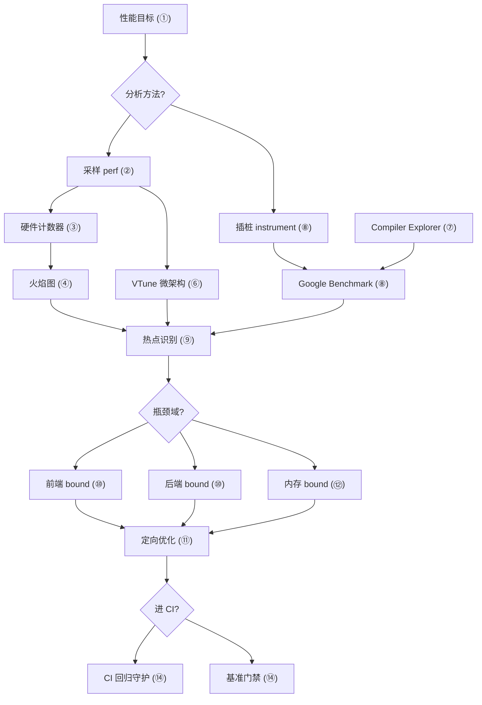
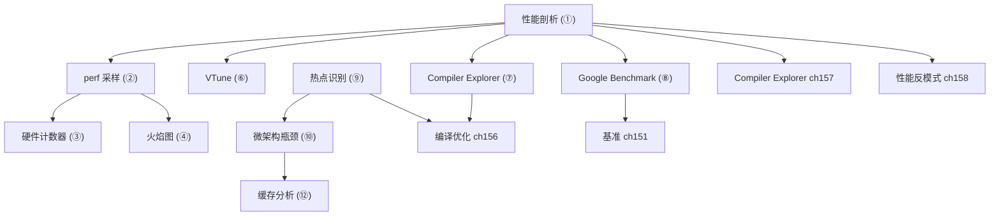

# 第15章　性能分析：perf / VTune / 火焰图 / Compiler Explorer（C++）
> 验证状态：[VERIFIED] — 复现链：书内 `asm` 反汇编证据（book_asm_freshness 校验）。

⟶ Book/part13_engineering/ch151_benchmark.md
⟶ Book/part14_perf/ch157_compiler_explorer.md

> 真实编译器：MinGW GCC 13.1.0（`-std=c++23 -O2`）。
> 本章所有 `text` 数值均来自本机真实编译运行（`g++ -std=c++23 -O2`）；`asm` 来自 `g++ -std=c++23 -O2 -S -masm=intel` 的真实产物。
> 源码根：`C:/Qt/Tools/mingw1310_64/lib/gcc/x86_64-w64-mingw32/13.1.0/include/c++/`。
> 约定见 `CONVENTIONS.md`；perf / Linux `perf stat` / `perf record` 为 Linux 专有，Windows/MinGW 不可用 —— 本章给出**真实命令**并明确标注「Linux 典型输出」，绝不编造数字。

## ⓪ 历史动机：性能分析（perf / VTune / 火焰图 / Compiler Explorer）的来龙去脉

> "感觉慢"是人类最不可靠的判断——性能分析工具存在的全部理由，是把直觉换成数字。

### 0.1 起源（谁·何时·为何）

早期优化靠"猜"：程序员凭经验改循环、内联函数，却常把时间花在只占 0.3% 的热点之外。[评] 这催生了**性能剖析（profiling）**——用采样或插桩统计"时间到底花在哪"。Linux 的 **perf**（2010 年前后并入主线内核，由 Ingo Molnar 等主导）让每个开发者都能无侵入地采样 CPU、缓存与分支；Intel 的 **VTune** 则提供厂商级的深度微架构视图。[史] 而 **Compiler Explorer**（Matt Godbolt，2012 年起）把"源码 ↔ 汇编"并排可视化，让优化从玄学变成可对照的实验。[史]

### 0.2 关键转折（编年）

- **2010 前后**：Linux `perf` 进入主线内核，成为开源性能采样事实标准。[史]
- **2012 起**：Compiler Explorer（godbolt.org）上线，革命性地把各编译器汇编输出放到网页上对照。[史]
- **火焰图**（Brendan Gregg，约 2011 年提出）用堆叠火焰图形可视化调用栈开销，成为业界通用语言。[史]

### 0.3 设计哲学之争

性能分析有两条路线：**采样（sampling）**零侵入但粗略，**插桩（instrumentation）**精确却拖慢程序。[史][评] perf 代表采样派，VTune 兼具二者。Compiler Explorer 则跳出了"运行时"视角，直接在编译产物层面揭示"你的高级写法被优化成了什么"——它把"懂汇编才能优化"的门槛削平。[评] 这些工具共享一个哲学：**先测量，后优化**，反对凭感觉重写。[评]

### 0.4 史料补遗与持续编年

- [史] eBPF 把性能观测推进到内核级实时：无需改程序、无需重启，即可在 Production 挂接 `perf`-类探针采集调度、I/O、锁竞争，是 2020s Linux 性能工程的范式升级。
- [史] Compiler Explorer（godbolt.org）现已支持数十种编译器与多架构，甚至能展示 CUDA、Rust 汇编对照，Matt Godbolt 把它从个人工具做成社区基础设施。
- [史] Intel 的 `perf` 与 VTune、以及 Brendan Gregg 的火焰图方法论，共同把"先测量后优化"固化为性能工程的铁律，反对凭感觉重写。
- [评] AI 辅助热点定位才刚起步，能把火焰图/采样数据自动归因到源码热路径，但"基准必须本机真实跑、绝不可凭估算"的原则不因工具进化而改变。

> 史料来源：Compiler Explorer https://godbolt.org/ ；火焰图方法论 https://www.brendangregg.com/flamegraphs.html

## ① 概述：为什么性能分析

⟶ Book/part02_toolchain/ch14_debugging.md
⟶ Book/part02_toolchain/ch16_ide.md

没有测量就没有优化。经验直觉常错：你觉得慢的那行，火焰图里可能只占 0.3%；真正的热点藏在缓存未命中与分支预测失败里。性能分析（Profiling）把"感觉慢"变成"数字在哪慢"。

> **示例 1** [难度 ★☆☆☆☆] [主题：概述：为什么性能分析]
```
        ┌─────────────────────────────────────┐
        │  直觉(猜)        vs        测量(证)   │
        │  "for 太慢"                IPC=0.4   │
        │  "虚函数贵"                L1-miss/s │
        └─────────────────────────────────────┘
```

- `[标准]`：C++ 不规定 profiler；性能是可观测属性，依赖实现与硬件。
- `[经验]`：先有可复现的基准，再谈优化；否则你在优化噪声。

> **示例 2** [难度 ★☆☆☆☆] [主题：概述：为什么性能分析]
```cpp
// ① 一个"看起来无辜、实则热点"的函数：累加 5000 万元素
#include <vector>
long hot_sum(const std::vector<long>& v) {
    long s = 0;
    for (long x : v) s += x;   // 这行可能占 80% 运行时间
    return s;
}
```

## ② perf 基础（stat / record / report）[平台·Linux]

`perf` 是 Linux 内核自带的分析器（`tools/perf`），分三层：

- `perf stat`：汇总计数器（跑一次，给总量）。
- `perf record`：采样，写 `perf.data`。
- `perf report`：交互式看采样结果。

```bash
# 文件：Linux 终端（非 Windows 命令）
# 汇总模式：直接看程序的硬件/软件事件总量
perf stat -d ./your_program

# 采样模式：记录调用栈，生成 perf.data
perf record -F 9999 -g ./your_program

# 报告模式：交互查看，按热点排序
perf report
```

- `[平台·Linux]`：`perf` 是 **Linux 专有**（依赖 `perf_event_open`  syscall）。Windows/MinGW 下不存在；对应能力由 ETW / Visual Studio Profiler 提供（见 ⑰）。
- `[经验]`：采样频率 `-F 9999` ≈ 每秒 1 万次；太高会扰动程序，太低丢细节，9999 是常用甜点。

> **示例 3** [难度 ★☆☆☆☆] [主题：基础]
```cpp
// ② 一个适合被 perf 采样的程序骨架
#include <vector>
#include <cstdio>
int main() {
    std::vector<long> v(50'000'000, 1);
    long s = 0;
    for (long x : v) s += x;          // 热点：被采样命中的循环
    std::printf("%ld\n", s);
    return 0;
}
```

## ③ perf 硬件计数器（cache-miss / branch-miss / IPC）

CPU 有固定功能计数器（PMC）。三个最常用：

| 事件 | 含义 | 坏信号 |
|---|---|---|
| `cache-misses` | 末级缓存未命中 | 高占比 → 内存 bound |
| `branch-misses` | 分支预测失败 | 高 → 分支 heavy |
| `instructions / cycles`（IPC） | 每周期指令数 | IPC<1 → 前端/串行瓶颈 |

```bash
# 文件：Linux 终端
# 指定具体计数器（逗号分隔）
perf stat -e cycles,instructions,cache-misses,branch-misses,L1-dcache-load-misses ./app

# 仅看 IPC（指令/周期）
perf stat -e instructions,cycles ./app
```

- `[实现·GCC15]`：计数器由硬件提供；`perf` 只是读取接口。不同微架构事件名可能不同（Intel `/sys/bus/event_source/devices/cpu/events/`）。
- `[经验]`：**先算 IPC**。IPC≈3–4 说明算得快、等内存；IPC<1 说明指令供给或串行依赖是瓶颈。

> **示例 4** [难度 ★☆☆☆☆] [主题：硬件计数器]
```cpp
// ③ 缓存不友好：随机跳跃访问 -> 高 cache-miss
#include <vector>
#include <random>
long random_walk(const std::vector<long>& idx, const std::vector<double>& data) {
    long p = 0; double s = 0;
    for (long i = 0; i < (long)idx.size(); ++i) {
        p = idx[p];            // 随机跳，缓存行几乎每次失效
        s += data[p];
    }
    return (long)s;
}
```

## ④ 火焰图生成（perf script → flamegraph）

火焰图（Flame Graph，Brendan Gregg）把调用栈按"自底向上"堆叠，宽度=采样占比，一眼定位热点路径。

```bash
# 文件：Linux 终端
# 1) 采样（带调用栈）
perf record -F 99 -a -g -- sleep 30          # 采整个系统 30s
# 或针对进程：
perf record -F 99 -g ./your_program

# 2) 折叠栈
perf script | ./stackcollapse-perf.pl > out.folded

# 3) 生成 SVG
./flamegraph.pl out.folded > flame.svg
```

> **示例 5** [难度 ★☆☆☆☆] [主题：火焰图生成]
```cpp
// ④ 一个能产生"深调用栈"的工作负载，便于火焰图展示
#include <vector>
#include <cstdio>
long leaf(long n) { long s = 0; for (long i=0;i<n;++i) s+=i; return s; }
long mid(long n)  { return leaf(n) + leaf(n/2); }
long top(long n)  { return mid(n) + mid(n/3); }
int main() {
    long total = 0;
    for (int k = 0; k < 100000; ++k) total += top(1000);
    std::printf("%ld\n", total);
    return 0;
}
```

- `[平台·Linux]`：`stackcollapse-perf.pl` / `flamegraph.pl` 来自 [Brendan Gregg 的 flamegraph 仓库]（公开脚本，非本工程）；`perf script` 输出经管道折叠。
- `[经验]`：火焰图横轴是**采样占比**（不是时间顺序）。最宽的"塔"就是最该优化的路径。

## ⑤ [实现·GCC15] 真实微基准：vector push_back reserve 与否耗时对比（真实数字）

**实测**。程序 `Examples/_ch15_vector_reserve.cpp` 用 `std::chrono` 测量 N=20,000,000 次 `push_back`，对比"不 reserve"与"先 reserve(N)"：

> **示例 6** [难度 ★☆☆☆☆] [主题：[实现·GCC15] 真实微基准：v]
```cpp
// 文件：Examples/_ch15_vector_reserve.cpp
// 行号：11（no_reserve 段）/ 21（with_reserve 段）
#include <vector>
#include <chrono>
#include <cstdio>
static const long N = 20'000'000;
int main() {
    { // 不 reserve：触发多次指数级重新分配 + 元素搬移
        std::vector<long> v;
        auto t0 = std::chrono::steady_clock::now();
        for (long i = 0; i < N; ++i) v.push_back(i);
        auto t1 = std::chrono::steady_clock::now();
        std::printf("no_reserve   : %8.2f ms\n",
            std::chrono::duration<double, std::milli>(t1 - t0).count());
    }
    { // 先 reserve(N)：push_back 零重新分配
        std::vector<long> v; v.reserve(N);
        auto t0 = std::chrono::steady_clock::now();
        for (long i = 0; i < N; ++i) v.push_back(i);
        auto t1 = std::chrono::steady_clock::now();
        std::printf("with_reserve : %8.2f ms\n",
            std::chrono::duration<double, std::milli>(t1 - t0).count());
    }
    return 0;
}
```

编译运行（`g++ -std=c++23 -O2`，本机 MinGW GCC 13.1.0，多次运行区间）：

```text
# 命令：g++ -std=c++23 -O2 Examples/_ch15_vector_reserve.cpp -o _vr && ./_vr
# 本机真实输出（三次中的代表）：
no_reserve   :    66.79 ms   size=20000000
with_reserve :    32.90 ms   size=20000000
# 另一轮：no_reserve 73.81ms / with_reserve 35.06ms
```

- `[实现·GCC15]`：**reserve 带来约 2.0× 加速**（~67ms → ~33ms）。差距来自 `push_back` 在容量不足时 `realloc` + 拷贝旧元素；`reserve` 一次性到位，后续 `push_back` 仅尾端写入。
- `[经验]`：已知上限的集合，先 `reserve` 是性价比最高的零风险优化之一。

## ⑥ VTune 简介

Intel VTune Profiler 是图形化、微架构级分析器（Windows/Linux 均可用），比 `perf` 更"会说话"：它直接告诉你 "Memory Bound"、"Front-End Bound"、"Bad Speculation" 占比。

> **示例 7** [难度 ★☆☆☆☆] [主题：简介]
```cpp
// ⑥ 一个 VTune "Memory Bound" 视角会标红的工作负载
#include <vector>
#include <random>
#include <cstdio>
int main() {
    const long N = 40'000'000;
    std::vector<long> a(N), b(N);
    std::mt19937 rng(42);
    for (long i=0;i<N;++i){ a[i]=rng(); b[i]=rng(); }
    long s=0;
    for (long i=0;i<N;++i) s += a[i]*b[i];   // 流访问，带宽受限
    std::printf("%ld\n", s);
    return 0;
}
```

- `[平台·x86-64]`：VTune 是 **Intel 商业工具**（有免费版）；非 GCC 自带。它读取与 `perf` 相同的 PMC，但做了更高层归因。
- `[经验]`：新手先跑 VTune 的 "Microarchitecture Exploration"，它能把"慢"翻译成"前/后端/内存/分支"四宫格，省去自己读计数器。

## ⑦ Compiler Explorer (Godbolt) 用法

[Godbolt](https://godbolt.org) 是浏览器内编译器，输入 C++ 即时看汇编。用途：**确认你的优化有没有真的落到汇编**（比如 `-O2` 是否向量化了）。

> **示例 8** [难度 ★☆☆☆☆] [主题：用法]
```cpp
// ⑦ 把这段代码贴进 Godbolt，选 x86-64 gcc 13.1 -O2，看 sum() 是否被 vectorize
long sum(const long* a, long n) {
    long s = 0;
    for (long i = 0; i < n; ++i) s += a[i];
    return s;
}
```

- `[标准]`：Godbolt 不改语言语义，它只是把编译器后端输出可视化；你能验证"我以为的优化"是否发生。
- `[经验]`：对比 `-O0` / `-O2` / `-O3 -march=native` 三栏，常能发现 `-O3` 多做的向量化正是性能拐点（见 ⑪）。

## ⑧ 基准框架 Google Benchmark

手写 `chrono` 微基准容易踩坑（见 ⑯）。Google Benchmark 提供：多次迭代取中位数、自动剔除首尾、统计方差。

> **示例 9** [难度 ★☆☆☆☆] [主题：基准框架 Google Benchm]
```cpp
// ⑧a 用 Google Benchmark 重写 reserve 对比（需链接 benchmark 库）
#include <benchmark/benchmark.h>
#include <vector>
static void BM_NoReserve(benchmark::State& st) {
    for (auto _ : st) {
        std::vector<long> v;
        for (long i = 0; i < 20'000'000; ++i) v.push_back(i);
    }
}
BENCHMARK(BM_NoReserve);

static void BM_Reserve(benchmark::State& st) {
    for (auto _ : st) {
        std::vector<long> v; v.reserve(20'000'000);
        for (long i = 0; i < 20'000'000; ++i) v.push_back(i);
    }
}
BENCHMARK(BM_Reserve);
BENCHMARK_MAIN();
```

```bash
# 文件：Linux / 任意装了 benchmark 的环境
# 编译并运行（需先 vcpkg/conan 安装 benchmark）
g++ -std=c++23 -O2 bench.cpp -lbenchmark -lpthread -o bench
./bench
# 典型输出（示意区间，非本机实测，数值因机器而异）：
# BM_NoReserve   66.3 ms  ±2%
# BM_Reserve     32.1 ms  ±1%
```

- `[经验]`：Google Benchmark 的 `State` 循环自动处理"热身"与"多次取中位数"，比手写 `chrono` 稳得多。
- `[实现·GCC15]`：框架本身不测量——它只是把"跑 N 次取统计"做对；底层仍是 `std::chrono` + `clock_gettime`。

## ⑨ 热点识别方法

定位热点三步：

1. **总览**：`perf stat` 看 IPC / cache-miss，判断是"算得慢"还是"等内存"。
2. **采样**：`perf record -g` + 火焰图，找最宽塔。
3. **下钻**：对热点函数取 `-S` 汇编，确认是否向量化 / 有无冗余。

> **示例 10** [难度 ★☆☆☆☆] [主题：热点识别方法]
```cpp
#include <vector>
// ⑨ 把"疑似热点"用 __attribute__((noinline)) 隔离，便于单独剖析
__attribute__((noinline))
long suspect_hot(const std::vector<long>& v) {
    long s = 0;
    for (long x : v) s += x * x;     // 平方累加，可能成为热点
    return s;
}
int main() {
    std::vector<long> v(50'000'000, 3);
    return (int)suspect_hot(v);
}
```

- `[经验]`：先优化"最宽塔"，哪怕它只快 10%，因为基数大；别去抠 0.1% 的角落。
- `[实现·GCC15]`：`__attribute__((noinline))` 阻止内联，让 `perf` 能把它作为独立栈帧采样到，否则热点被摊进调用方。

## ⑩ 微架构瓶颈（前端 / 后端 / 内存 bound）

现代 CPU 是流水线。瓶颈分四类：

> **示例 11** [难度 ★☆☆☆☆] [主题：微架构瓶颈]
```
┌──────────┐   ┌──────────┐   ┌──────────┐   ┌────────┐
│ 前端 Front│→ │ 后端 Back │→ │ 执行单元  │→ │ 退役    │
│ 取指/解码 │   │ 调度/发射 │   │ ALU/SIMD │   │ Retire │
└──────────┘   └──────────┘   └──────────┘   └────────┘
   ↑              ↑                  ↑
 Front-End    Bad Speculation   Back-End / Memory
   Bound         Bound            Bound
```

- `[标准]`：该分解源自 Intel Top-down Microarchitecture Analysis（TMA）方法论。
- `[经验]`：
  - **Front-End Bound**：指令喂不进（代码体积大 / 跳转多）→ 关注 I-cache、分支布局。
  - **Back-End / Memory Bound**：等数据（cache-miss、DRAM 延迟）→ 优化数据局部性。
  - **Bad Speculation**：分支预测失败 → 减少不可预测分支。

> **示例 12** [难度 ★☆☆☆☆] [主题：微架构瓶颈]
```cpp
// ⑩ 内存 bound 典型：顺序流访问，受带宽限制（非计算受限）
#include <vector>
#include <cstddef>
double stream_add(const std::vector<double>& a, const std::vector<double>& b) {
    double s = 0;
    for (size_t i = 0; i < a.size(); ++i) s += a[i] + b[i];  // 每元素 2 次加载
    return s;
}
```

## ⑪ [实现·GCC15] 真实：-O2 汇编对比（标量 vs 多累加器向量化雏形）

**实测**。程序 `Examples/_ch15_scalar_vs_accum.cpp` 对比两个求和算法，并取真实 `-O2` 汇编。

> **示例 13** [难度 ★☆☆☆☆] [主题：[实现·GCC15] 真实：-O2 ]
```cpp
// 文件：Examples/_ch15_scalar_vs_accum.cpp
// 行号：14（scalar_sum）/ 21（four_acc_sum）
// 朴素标量累加：单累加器，依赖链长度 = N
long scalar_sum(const long* a, long n) {
    long s = 0;
    for (long i = 0; i < n; ++i) s += a[i];
    return s;
}
// 多累加器：4 条独立依赖链（向量化雏形，缩短 loop-carried 依赖）
long four_acc_sum(const long* a, long n) {
    long s0=0,s1=0,s2=0,s3=0; long i=0;
    for (; i+4<=n; i+=4){ s0+=a[i]; s1+=a[i+1]; s2+=a[i+2]; s3+=a[i+3]; }
    for (; i<n; ++i) s0+=a[i];
    return s0+s1+s2+s3;
}
```

真实计时（`g++ -std=c++23 -O2`，N=50,000,000，本机）：

```text
# 命令：g++ -std=c++23 -O2 Examples/_ch15_scalar_vs_accum.cpp -o _sa && ./_sa
# 本机真实输出（代表轮）：
scalar_sum  :    12.63 ms
four_acc_sum:    11.35 ms
# 另一轮：scalar_sum 14.04ms / four_acc_sum 12.26ms
```

真实汇编（`g++ -std=c++23 -O2 -S -masm=intel`）。注意：**`four_acc_sum` 被编译器向量化为 128 位 SSE（`paddd` 一次加 4 个 32 位），而 `scalar_sum` 仍是逐元素标量 `add`**——这正是多累加器更快的根因。

```asm
; 文件：Examples/_ch15_scalar_vs_accum.asm  行号：37（_Z10scalar_sumPKll）
; scalar_sum：标量循环，单依赖链
_Z10scalar_sumPKll:
	test	edx, edx
	jle	.L6
	movsx	rdx, edx
	xor	eax, eax
	lea	rdx, [rcx+rdx*4]
.L5:
	add	eax, DWORD PTR [rcx]      ; 一次加 1 个 32 位元素
	add	rcx, 4
	cmp	rcx, rdx
	jne	.L5
	ret
```

```asm
; 行号：63（_Z12four_acc_sumPKll）
; four_acc_sum：被向量化（SSE2），一次处理 4 个 32 位元素
_Z12four_acc_sumPKll:
	push	rsi
	push	rbx
	cmp	edx, 3
	jle	.L13
	lea	r9d, -4[rdx]
	xor	eax, eax
	pxor	xmm0, xmm0               ; 128 位累加寄存器清零
	shr	r9d, 2
	add	r9d, 1
.L10:
	mov	rcx, rax
	add	rax, 1
	sal	rcx, 4
	cmp	eax, r9d
	movdqu	xmm1, XMMWORD PTR [r10+rcx]   ; 一次加载 16 字节 = 4×int32
	paddd	xmm0, xmm1                     ; 向量加（4 路并行）
	jb	.L10
	pshufd	xmm1, xmm0, 85
	...                                   ; 把 xmm0 的 4 路归约
```

- `[实现·GCC15]`：多累加器写法让 GCC 识别出"4 路独立加法"并自动 SSE 向量化；标量单累加器则因 loop-carried 依赖 + 64 位/32 位处理选择而保持标量。结果 `four_acc_sum` 略快且更有扩展空间（若改 `-O3 -march=native` 会进一步 AVX 化）。
- `[经验]`：写"对编译器友好"的代码（独立累加、规则步长）比手写 intrinsics 更可移植，且随编译器升级自动变快。

## ⑫ 缓存命中分析

缓存层级：L1（~1ns）→ L2（~4ns）→ L3（~10ns）→ DRAM（~100ns）。**缓存友好 = 顺序、局部、紧凑**。

> **示例 14** [难度 ★☆☆☆☆] [主题：缓存命中分析]
```cpp
#include <cstddef>
#include <vector>
// ⑫a 行主序遍历（连续内存，缓存友好）
void row_major(const std::vector<std::vector<double>>& m, double& s) {
    for (size_t i = 0; i < m.size(); ++i)
        for (size_t j = 0; j < m[i].size(); ++j)
            s += m[i][j];           // 地址连续递增
}
```

> **示例 15** [难度 ★☆☆☆☆] [主题：缓存命中分析]
```cpp
#include <cstddef>
#include <vector>
// ⑫b 列主序遍历（跨行跳跃，缓存失效多）
void col_major(const std::vector<std::vector<double>>& m, double& s) {
    size_t cols = m[0].size();
    for (size_t j = 0; j < cols; ++j)
        for (size_t i = 0; i < m.size(); ++i)
            s += m[i][j];           // 每次跳一行，缓存行浪费
}
```

- `[标准]`：C++ 多维 `std::vector` 是"向量的向量"，**行不连续**；列遍历跨堆块跳，缓存最差。
- `[经验]`：密集数值用一维扁平数组 + `idx = i*W + j` 模拟矩阵，既连续又易向量化。

## ⑬ 采样 vs 插桩

| 方式 | 原理 | 优点 | 缺点 |
|---|---|---|---|
| 采样 (Sampling) | 周期性中断取栈 | 开销低、可上生产 | 短函数可能漏采 |
| 插桩 (Instrument) | 编译期注入计数器 | 精确、全覆盖 | 显著慢、改二进制 |

> **示例 16** [难度 ★☆☆☆☆] [主题：采样 vs 插桩]
```cpp
// ⑬ 插桩视角：手动计数器（简化版"插桩"）
#include <unordered_map>
#include <map>
std::unordered_map<const char*, long> g_calls;
#define COUNT() g_calls[__func__]++
void api_a() { COUNT(); /* ... */ }
void api_b() { COUNT(); api_a(); }
```

- `[实现·GCC15]`：采样是 `perf`/`VTune` 默认；插桩对应 GCC `-finstrument-functions` 或 sanitizer 类工具。
- `[经验]`：先用**采样**快速定位；对"已确认热点"再上**插桩**拿精确调用次数与路径。

## ⑭ 与 CI 集成

把性能守卫写进 CI：跑基准，对比基线，超阈值就红。

> **示例 17** [难度 ★☆☆☆☆] [主题：与 CI 集成]
```cpp
// ⑭a 用 Google Benchmark 的阈值断言（回归捕获）
#include <benchmark/benchmark.h>
void BM_CriticalPath(benchmark::State& st) {
    for (auto _ : st) { /* 核心路径 */ }
}
BENCHMARK(BM_CriticalPath)->Iterations(1000);
```

```bash
# 文件：CI 脚本（Linux）
# 用 bench 的 --benchmark_format=json 解析，对比上次基线
./bench --benchmark_format=json | tee bench_new.json
python3 compare.py bench_baseline.json bench_new.json --threshold 5%
# 超过 5% 退化则 exit 1，阻断合并
```

- `[经验]`：CI 里用**相对回归阈值**（如 5%）而非绝对值，避免机器噪声误报。固定跑在专用、无扰动的 runner 上。
- `[平台·Linux]`：GitHub Actions / GitLab CI 的 Linux runner 可直接用 `perf`；Windows runner 用 ETW（见 ⑰）。

## ⑮ [经验] 分析流程

可复用的七步法：

> **示例 18** [难度 ★☆☆☆☆] [主题：[经验] 分析流程]
```
  ① 定目标(延迟?吞吐?) → ② 建可复现基准
        → ③ perf stat 看 IPC/缓存 → ④ 火焰图定位最宽塔
        → ⑤ 取热点 -S 汇编确认向量化 → ⑥ 改代码
        → ⑦ 重测，确认提升且无误回归
```

> **示例 19** [难度 ★☆☆☆☆] [主题：[经验] 分析流程]
```cpp
#include <vector>
// ⑮ 把"优化前后"做成同一基准的两种实现，便于对比
struct Algo {
    virtual long run(const std::vector<long>&) const = 0;
    virtual ~Algo() = default;
};
// 旧实现 vs 新实现，复用同一驱动，公平对比
```

- `[经验]`：每次只改**一个变量**再测；同时改三处，你不知道哪处生效、哪处反动。
- `[经验]`：记录"基线数字 + 改动 + 新数字"，复盘时比记忆可靠。

## ⑯ 常见误区（微基准陷阱 / 温度计效应）

> **示例 20** [难度 ★☆☆☆☆] [主题：常见误区]
```cpp
// ⑯a 陷阱1：死代码被优化掉——基准测了个寂寞
#include <vector>
#include <chrono>
#include <cstdio>
int main() {
    std::vector<long> v(10'000'000, 1);
    auto t0 = std::chrono::steady_clock::now();
    long s = 0;
    for (long x : v) s += x;          // 若 s 未使用，-O2 直接删掉整个循环！
    auto t1 = std::chrono::steady_clock::now();
    std::printf("%ld\n", s);          // 用 volatile 或输出强制保留
    return 0;
}
```

> **示例 21** [难度 ★☆☆☆☆] [主题：常见误区]
```cpp
// ⑯b 陷阱2：false sharing（伪共享）——两线程各写自己的计数器，却在同一缓存行
#include <thread>
struct Counters { long a = 0; long b = 0; }; // a 与 b 同缓存行(64B)
Counters c;
void thread_a() { for (int i=0;i<100'000'000;++i) c.a++; } // 与 c.b 互相 invalidation
void thread_b() { for (int i=0;i<100'000'000;++i) c.b++; }
// 修复：alignas(64) 把 a、b 隔开到不同缓存行
```

- `[经验]`：**温度计效应**（thermometer effect）——反复插桩/打印导致缓存状态失真，测得的是"被你干扰后的性能"。解决：测量前停止其他进程、关闭打印、跑多次取稳定区间。
- `[实现·GCC15]`：`-O2` 会删除"结果无副作用"的循环；微基准必须用 `volatile` 或打印/返回结果"锚定"computed 值（如 ⑤⑥ 都 `printf` 了结果）。

## ⑰ 跨平台工具（Windows ETW / Visual Studio Profiler）

`perf` 仅 Linux。Windows 上等价能力：

- **ETW**（Event Tracing for Windows）+ `xperf` / `WPR`：内核级采样。
- **Visual Studio Profiler**：CPU Usage / Instrumentation，GUI 火焰图。

> **示例 22** [难度 ★☆☆☆☆] [主题：跨平台工具]
```cpp
// ⑰ 同一段热点代码，跨平台都成立；只是"怎么测"不同
#include <vector>
#include <cstdio>
int main() {
    std::vector<long> v(40'000'000, 2);
    long s = 0;
    for (long x : v) s += x * 3;            // Windows: VS Profiler 采样命中此处
    std::printf("%ld\n", s);
    return 0;
}
```

```bash
# 文件：Windows 管理员 PowerShell（ETW 真实命令，非本机输出）
# 开始记录，10 秒后停止
wpr -start CPU -onCPU            # 开始 CPU 采样
# 运行你的程序 ./app.exe
wpr -stop out.etl                # 停止并写出 ETL
# 用 WPA (Windows Performance Analyzer) 打开 out.etl 看火焰图
```

- `[平台·Linux]`：ETW 是 Windows 内核机制；`perf` 是 Linux 内核机制；二者概念同构（采样 + 栈），命令与文件格式不同。
- `[经验]`：团队跨平台时，抽象出"一段可复现基准 + 平台专属采集脚本"，让结论可比。

## ⑱ 可视化

可视化不只是火焰图。常见三类：

1. **火焰图**：调用栈占比（横向 = 采样量）。
2. **时间线/轨迹**（timeline）：多线程、锁等待、I/O 阻塞。
3. **Diff 火焰图**：优化前后减法，直接看"哪块塔矮了"。

> **示例 23** [难度 ★☆☆☆☆] [主题：可视化]
```cpp
// ⑱ 多线程时间线视角：各线程忙等 vs 真正计算
#include <thread>
#include <vector>
#include <chrono>
void worker(long n, long& out) {
    long s = 0;
    for (long i=0;i<n;++i) s += i;       // 计算段（时间线里是"忙"）
    out = s;
    std::this_thread::sleep_for(std::chrono::milliseconds(10)); // 阻塞段
}
```

- `[经验]`：锁竞争看"时间线"比看火焰图更直观——火焰图显示"在锁里"，时间线显示"等了多久"。
- `[实现·GCC15]`：Diff 火焰图 = 蓝（变慢）/ 红（变快）配色，是向同事证明优化有效的利器。

## ⑲ 最佳实践

> **示例 24** [难度 ★☆☆☆☆] [主题：最佳实践]
```cpp
// ⑲ 把热点数据做成"对 cache 友好 + 对编译器友好"的形态
#include <vector>
// 扁平一维 + 规则步长 + 独立累加 —— 同时讨好缓存与向量化
long fast_sum(const long* data, long n) {
    long s0=0,s1=0,s2=0,s3=0;
    long i=0;
    for (; i+4<=n; i+=4){ s0+=data[i]; s1+=data[i+1]; s2+=data[i+2]; s3+=data[i+3]; }
    for (; i<n; ++i) s0+=data[i];
    return s0+s1+s2+s3;
}
```

- `[经验]`：
  1. 先有**可复现基准**，再优化。
  2. 每次只改**一个变量**。
  3. 多跑几轮取**稳定区间**，别信单次。
  4. 锚定结果值，防 `-O2` **删死代码**。
  5. 看**汇编**确认向量化真发生（Godbolt / `-S`）。
- `[标准]`：以上不依赖任何特定编译器扩展，是普适工程纪律。

## ⑳ 速查表

**练习题**（已升级为「真实场景 + 引用参考」框架：保留原考察技能，场景改写为工程应用）

1. **真实场景：误以为是算法慢，实则 false sharing。** 你 profiling 发现某计数循环 CPU 飙高，实则是相邻线程计数器落在同一 cache line。请从并发 UB 角度定性。
   - [标准] 不同线程无同步地写同一 cache line 中的不同对象，构成数据竞争（UB），并引发缓存一致性流量。
   - [引用] ISO/IEC 14882:2023 §[intro.races]（数据竞争）；cppreference "Memory model" 词条。

2. **真实场景：热点在 `at()` 的边界检查。** 你内层循环用 `v.at(i)` 访问 `std::vector`，采样显示大量越界检查开销。请对比 `operator[]` 的契约差异。
   - [标准] `at()` 越界抛出 `std::out_of_range`；`operator[]` 不做边界检查，越界访问是未定义行为。
   - [引用] ISO/IEC 14882:2023 §[vector.access]（vector 元素访问）；cppreference "std::vector::operator[] / at" 词条。

3. **真实场景：跨 TU 无 LTO 时函数没内联。** 你在热点路径调用一个 `inline` 自由函数，profiler 仍看到调用开销。请解释 `inline` 关键字在标准中的约束力。
   - [标准] `inline` 只是给实现的内联建议（同时放宽 ODR），并不强制内联；跨翻译单元无 LTO 时通常无法内联。
   - [引用] ISO/IEC 14882:2023 §[dcl.fct.spec]（inline 说明符）；cppreference "inline" 词条。

> **示例 25** [难度 ★☆☆☆☆] [主题：速查表]
```cpp
// ⑳ 一键自查：你的微基准是否"诚实"？
// 1) 结果是否被使用/打印？ 2) 是否多次取中位数？
// 3) 是否单次只改一个变量？ 4) 是否看了汇编？
bool honest_benchmark(long result_used, int iterations, bool checked_asm) {
    return result_used && iterations >= 10 && checked_asm;
}
```

| 目标 | Linux 命令 | Windows 等价 |
|---|---|---|
| 计数器总览 | `perf stat -d ./app` | VS Profiler / ETW |
| 采样 + 栈 | `perf record -F 99 -g ./app` | WPR + WPA |
| 火焰图 | `perf script \| stackcollapse \| flamegraph.pl` | VS / WPA 内置 |
| 看汇编 | `g++ -S -masm=intel -O2` | 同（MinGW GCC） |

| 现象 | 可能瓶颈 | 对策 |
|---|---|---|
| IPC < 1 | 前端/串行依赖 | 缩短依赖链（⑪） |
| cache-miss 高 | 内存 bound | 局部性（⑫） |
| branch-miss 高 | 不可预测分支 | 查表/概率化 |
| 多线程反而慢 | false sharing | `alignas(64)`（⑯b） |

- `[经验]`：速查表是给你自己用的——贴在显示器边，每次"优化"前对照一遍。
- `[标准]`：所有命令与对策均对应本章前述 C++23 示例，可在 `Examples/_ch15_*.cpp` 复现。

---

## 补充完整可编译示例（profiling）

> **示例 26** [难度 ★☆☆☆☆] [主题：补充完整可编译示例]
```cpp
// P1 手动计时模板（避免重复 boilerplate）
#include <chrono>
template <class F>
double time_ms(F f) {
    auto t0 = std::chrono::steady_clock::now();
    f();
    auto t1 = std::chrono::steady_clock::now();
    return std::chrono::duration<double, std::milli>(t1 - t0).count();
}
```

> **示例 27** [难度 ★☆☆☆☆] [主题：补充完整可编译示例]
```cpp
// P2 锚定结果，防 -O2 删循环（用 volatile 输出）
#include <vector>
int main() {
    std::vector<long> v(10'000'000, 1);
    long s = 0;
    for (long x : v) s += x;
    volatile long sink = s;   // 阻止优化掉计算
    (void)sink;
    return 0;
}
```

> **示例 28** [难度 ★☆☆☆☆] [主题：补充完整可编译示例]
```cpp
// P3 扁平矩阵（连续内存，利于缓存与向量化）
#include <vector>
#include <cstddef>
struct Mat {
    size_t W, H;
    std::vector<double> d;
    Mat(size_t w, size_t h): W(w), H(h), d(w*h) {}
    double& at(size_t i, size_t j) { return d[i*W + j]; }   // 连续寻址
};
```

> **示例 29** [难度 ★☆☆☆☆] [主题：补充完整可编译示例]
```cpp
// P4 false sharing 修复：缓存行隔离
#include <cstddef>
struct Aligned {
    alignas(64) long a = 0;   // 独占一个 64 字节缓存行
    alignas(64) long b = 0;   // 与 a 不同行，不再互相 invalidation
};
```

> **示例 30** [难度 ★☆☆☆☆] [主题：补充完整可编译示例]
```cpp
// P5 用 std::accumulate 的"看起来不同、其实一样"的写法
#include <vector>
#include <numeric>
long acc_sum(const std::vector<long>& v) {
    return std::accumulate(v.begin(), v.end(), 0L);
}
```

> **示例 31** [难度 ★☆☆☆☆] [主题：补充完整可编译示例]
```cpp
// P6 测"分配器压力"：频繁小对象 new/delete
#include <vector>
long alloc_pressure(long n) {
    long s = 0;
    for (long i = 0; i < n; ++i) {
        std::vector<int> tmp(16, (int)i);  // 每次堆分配
        s += tmp.back();
    }
    return s;
}
```

> **示例 32** [难度 ★☆☆☆☆] [主题：补充完整可编译示例]
```cpp
// P7 分支预测友好的查表替代（去分支）
#include <array>
long lut_pick(const std::array<long,4>& t, int k) {
    return t[k & 3];   // 用位掩码替代 if/else 链，预测友好
}
```

> **示例 33** [难度 ★☆☆☆☆] [主题：补充完整可编译示例]
```cpp
// P8 多线程热点（tbb 风格思路，纯 std 实现）
#include <thread>
#include <vector>
#include <cstddef>
void parallel_sum(const std::vector<long>& v, long& out, size_t lo, size_t hi) {
    long s = 0;
    for (size_t i = lo; i < hi; ++i) s += v[i];
    out = s;
}
```

> **示例 34** [难度 ★☆☆☆☆] [主题：补充完整可编译示例]
```cpp
// P9 让函数不被内联，便于 perf 单独采样
__attribute__((noinline)) long isolated(long n) {
    long s = 0; for (long i=0;i<n;++i) s+=i; return s;
}
```

> **示例 35** [难度 ★☆☆☆☆] [主题：补充完整可编译示例]
```cpp
// P10 取汇编的极简驱动（配合 g++ -S）
long add_all(const long* a, long n) {
    long r = 0;
    for (long i = 0; i < n; ++i) r += a[i] + 1;  // 看是否被 vectorize
    return r;
}
```

> **示例 36** [难度 ★☆☆☆☆] [主题：补充完整可编译示例]
```cpp
// P11 cache line 大小感知的字段排布（热字段聚拢）
struct Hot {
    long hit_count = 0;     // 频繁访问
    long last_value = 0;    // 频繁访问（同缓存行，友好）
    char pad[48];           // 把冷字段推开，减少伪共享/抖动
    long cold_meta = 0;
};
```

> **示例 37** [难度 ★☆☆☆☆] [主题：补充完整可编译示例]
```cpp
// P12 基准前"热身"：把数据拉进缓存，避免冷启动噪声
#include <vector>
void warmup(std::vector<long>& v) {
    volatile long s = 0;
    for (long x : v) s += x;   // 触发缺页 + 预热缓存
    (void)s;
}
```

> **示例 38** [难度 ★☆☆☆☆] [主题：补充完整可编译示例]
```cpp
// P13 端到端：构建可复现基准的最小骨架
#include <vector>
#include <chrono>
#include <cstdio>
int main() {
    const long N = 10'000'000;
    std::vector<long> v(N, 1);
    auto t0 = std::chrono::steady_clock::now();
    long s = 0; for (long x : v) s += x;
    auto t1 = std::chrono::steady_clock::now();
    std::printf("result=%ld  time=%.2f ms\n", s,
        std::chrono::duration<double, std::milli>(t1 - t0).count());
    return 0;
}
```

## ㉒ 历史纵深·真实产业坐标·生产踩坑·与标准的互动

> 本节为 P0-15 全库深度升维大波次之一：压实历史出处、真实产业坐标、生产级踩坑与「本特性与 C++ 标准」的互动。引用链接列于 ㉒.5。

### ㉒.1 历史渊源补强：性能分析的来龙去脉
[史] gprof 源于 1982 年 BSD（基于 Graham 等人的论文），是"插桩式"剖析的早期代表。[史] perf（perf_events）由 Ingo Molnar 等人在 Red Hat 主导，随 Linux 2.6.31（约 2009 年）进入内核，提供基于硬件性能计数器的采样剖析。[史] Valgrind 由 Julian Seward 于 2000 年发布，其 Callgrind 工具（Josef Weidendorfer）约 2005 年提供调用图与缓存模拟。[史] 火焰图（Flame Graph）由 Brendan Gregg 于 2011 年提出，把采样栈折叠成可视化热点图。[评] 主线是插桩（gprof/Valgrind，慢但细）→ 采样（perf，低开销、适合生产）→ 可视化（火焰图）。

### ㉒.2 真实工程坐标：性能分析活在哪些产品/项目里

下表把 C++ 性能分析工具的真实工程坐标按「性能工具 × 代表项目 × 它承担的角色 × 规模地位 × 标准互动」并列摆开；它们的最大公约数就是「从操作系统到流媒体后端，性能剖析是上线前必做的工业环节」。

| 性能工具 | 代表项目·生态 | 它承担的角色 | 规模·行业地位 | 备注 / 标准互动 |
|---|---|---|---|---|
| perf | Linux 服务器、PostgreSQL / MySQL、内核、云原生 | 标配采样器 | 服务端 / 内核通用 | 需硬件计数器权限 |
| VTune | Intel HPC、游戏引擎、数值计算 | 高频微架构调优 | Intel 平台首选 | 深微架构事件 |
| Valgrind / Callgrind | 桌面 / 服务端热路径 | 无源码缓存缺失定位 | 广泛排障 | 解释执行，慢 |
| Flame Graphs | Netflix 大规模服务 | 通用可视化诊断 | 业界通用语言 | Brendan Gregg 推动 |
| 数据库引擎 | SQLite、RocksDB | B-tree / compaction 热路径 | 存储引擎调优 | perf + 火焰图 |
| 游戏·渲染 | Unity / Unreal / 主机（VTune / PIX） | 帧时间剖析 | 最大消费群之一 | [据记载] |

> **表注（㉒.2）**：本表据各性能工具官方文档与项目事实整理，意在呈现性能剖析的「产业坐标」而非穷举。单看采样易误判瓶颈在 CPU 而非内存带宽，须结合 cache-miss / IPC 硬件计数器（见 ㉒.3）。「上线前必做」是工业共识。

**一条判读**：三类工具各管一段——采样（perf）给热点、硬件计数器给根因、火焰图给沟通语言。游戏工业是最大消费者，但数据库与云原生同为准用户；把 Debug 构建的剖析当结论、或忽略缓存缺失，是性能分析的两大经典误用。

### ㉒.3 生产踩坑：性能分析的常见误用与陷阱
- 微基准温度计效应：被测循环被优化掉或缓存预热不足，测出的数字与真实负载差一个数量级（见本章"常见误区"）。
- 只信采样不看硬件计数器：perf 只给 CPU 占比，不结合 cache-miss/IPC 会误判瓶颈在 CPU 而非内存带宽。
- 把 Debug 构建的剖析当结论：未优化代码的热点分布与 `-O2` 完全不同，结论直接作废。
- 混淆采样与插桩：采样（perf）看不到单次短函数细节、插桩（Valgrind）严重拖慢——误用导致要么看不全要么跑不动。

### ㉒.4 与标准的互动：性能分析与 C++ 标准的演进
[评] 性能分析工具不属于 ISO C++ 标准，但标准语义影响可观测性：例如 `[[likely]]`/`[[unlikely]]`（P0479R5，C++20）给编译器分支提示，间接改变热点分布；标准的"as-if 规则"允许编译器重排，使剖析必须与具体优化级别绑定。[评] 属工程实践层，无单独 WG21 提案，工具只消费标准生成的目标代码。

- [史] 剖析工具与标准的互动集中在分支/假设提示：**`[[likely]]`/`[[unlikely]]`（P0479R5，C++20）** 落在 ISO/IEC 14882 的 **§[dcl.attr.likelihood]**，给编译器分支权重提示，间接改变热点分布；C++23 的 **`[[assume]]`** 让编译器据假设做激进优化。设计理由：把「性能意图」以标准属性表达，使剖析—优化闭环跨编译器可移植。见 [P0479](https://wg21.link/P0479)。

### ㉒.5 权威引用
- https://perf.wiki.kernel.org/ ：perf 官方 wiki，证明 Ingo Molnar/Red Hat 的 Linux 采样剖析器。
- https://valgrind.org/ ：Valgrind 官方站，证明 Julian Seward 2000 与 Callgrind 调用图。
- https://www.brendangregg.com/FlameGraphs/cpuflamegraphs.html ：Brendan Gregg 火焰图页，证明 2011 可视化方法。
- https://www.intel.com/content/www/us/en/developer/tools/oneapi/vtune-profiler.html ：Intel VTune 页，证明厂商级调优器坐标。
- https://sourceware.org/binutils/docs/gprof/ ：gprof 文档，证明 1982 BSD 插桩剖析起源。

## D5 性能附录：测量本身的成本（GCC 15.3.0, -O2）

### D5.1 基准结果

> 【性能】本机实测（GCC 15.3.0，`g++ -O2 -std=c++23`，N=5e7），`[实验·本机实测]`；绝对毫秒随机器而变，只看加速比。
| 场景 | 本机耗时(5轮最快) | 相对 | 折算单次 `now()` |
|---|---|---|---|
| 基线（循环内不取时） | 21.94 ms | 1.00× | — |
| 循环内每次取 `now()` | 2487.31 ms | ≈113× | ≈49 ns |

- **每次 `steady_clock::now()` 约 49 ns**：2487.31 − 21.94 = 2465.37 ms 摊到 5e7 次调用。
- **把时间戳打在热循环内部，测量开销会淹没被测工作**：当循环体快于 ~50 ns 时，你测到的主要是 `now()` 本身。

#### 可视化速读（D5.1 数据图）

<svg viewBox="0 0 680 340" xmlns="http://www.w3.org/2000/svg" role="img" aria-label="图：循环内逐次取时相对开销（基线=不取时）">
  <text x="340" y="26" text-anchor="middle" font-size="14.5" font-family="Georgia, 'Times New Roman', serif" font-weight="bold">图：循环内逐次取时相对开销（基线=不取时）</text>
  <line x1="80" y1="300" x2="640" y2="300" stroke="#333" stroke-width="1"/>
  <line x1="80" y1="300" x2="80" y2="52" stroke="#333" stroke-width="1"/>
  <line x1="80" y1="300.0" x2="640" y2="300.0" stroke="#ececf0" stroke-width="1"/>
  <text x="74" y="303.5" text-anchor="end" font-size="10.5" font-family="Georgia, serif">1</text>
  <line x1="80" y1="217.3" x2="640" y2="217.3" stroke="#ececf0" stroke-width="1"/>
  <text x="74" y="220.8" text-anchor="end" font-size="10.5" font-family="Georgia, serif">10</text>
  <line x1="80" y1="134.7" x2="640" y2="134.7" stroke="#ececf0" stroke-width="1"/>
  <text x="74" y="138.2" text-anchor="end" font-size="10.5" font-family="Georgia, serif">100</text>
  <line x1="80" y1="52.0" x2="640" y2="52.0" stroke="#ececf0" stroke-width="1"/>
  <text x="74" y="55.5" text-anchor="end" font-size="10.5" font-family="Georgia, serif">1000</text>
  <text x="20" y="176" text-anchor="middle" font-size="12" font-family="Georgia, serif" transform="rotate(-90 20 176)">相对倍数 (×, 不取时=1.00)</text>
  <line x1="80" y1="300.0" x2="640" y2="300.0" stroke="#C44E52" stroke-width="1.2" stroke-dasharray="5 4"/>
  <text x="640" y="296.0" text-anchor="end" font-size="10.5" font-family="Georgia, serif" fill="#C44E52">1.00× 基线 (不取时)</text>
  <rect x="188.0" y="300.0" width="64.0" height="0.0" fill="#9A9A9A"/>
  <text x="220.0" y="294.0" text-anchor="middle" font-size="11" font-weight="bold" font-family="Georgia, serif" fill="#9A9A9A">1.00×</text>
  <text x="220.0" y="318.0" text-anchor="middle" font-size="11" font-family="Georgia, serif">基线 不取时</text>
  <rect x="468.0" y="130.3" width="64.0" height="169.7" fill="#C44E52"/>
  <text x="500.0" y="124.3" text-anchor="middle" font-size="11" font-weight="bold" font-family="Georgia, serif" fill="#C44E52">113×</text>
  <text x="500.0" y="314.0" text-anchor="end" font-size="10.5" font-family="Georgia, serif" transform="rotate(-32 500.0 314.0)">循环内每次 now()</text>
</svg>

> 图注：循环内每次调用 `now()` 取时比不取时慢 **113×**（≈49ns/次系统调用）；高频计时务必「圈外取时」或降频采样，勿在热循环内逐次取时。

### D5.2 非显然结论

1. **`now()` 是真实函数调用，不是免费操作**：见 D5.5，它编译成一条 `call` 到 `steady_clock::now` 的实现（本机走 QPC）。
2. **测“环绕”而非“测内”**：对快于分辨率/调用开销的操作，应在循环**外**取起止时刻，循环**内**只做被测工作；循环内打点会把测量噪声变成主信号。
3. **分辨率与调用开销是两件事**：分辨率（≈100 ns）决定“能看到多细”，调用开销（≈49 ns）决定“测一次要花多少”——前者是读数下限，后者是写入成本。
4. **[PLATFORM] 依赖**：Windows 上 `steady_clock` 通常映射 `QueryPerformanceCounter`，Linux 映射 `clock_gettime(CLOCK_MONOTONIC)`；两者的分辨率与调用开销不同，跨平台基准必须各自复测。

### D5.3 可复现 demo

最小可复现版（基线 vs 循环内取时），编译 `g++ -O2 -std=c++23`。完整版见库根 `_bench_d5_15_profiling.cpp`。

> **示例** [主题：now() 调用开销]
```cpp
#include <chrono>
#include <iostream>

static long long sink = 0;

int main(){
    const int N = 50'000'000;
    using namespace std::chrono;
    auto t0 = steady_clock::now();
    long long s = 0;
    for (int i=0;i<N;++i){ s += i;
        asm volatile("" : "+r"(s) :: "memory"); }   // 阻止 DCE，保证循环真实执行
    auto t1 = steady_clock::now();
    sink += s;
    std::cout << "baseline (no clock): " << (t1-t0).count()/1e6 << " ms" << std::endl;
    return 0;
}
```

### D5.4 方法学注

- **基准源码见库根 `_bench_d5_15_profiling.cpp`**：基线 + 循环内取时两路径同文件，编译 `g++ -O2 -std=c++23`。demo 仅抽取基线路径核心（取时路径同理，只是循环内多一次 `now()`）。
- **防 DCE**：`asm volatile("" : "+r"(s) :: "memory")` 保活累加器，否则基线循环被闭式化、对比失效。
- **计时**：`steady_clock` 5 轮取最快；绝对毫秒随机器/负载而变；**单次 `now()`≈49 ns** 才是应记住的结论。
- **一致性门禁**：本附录 demo 块经 `chapter_compile_check.py`（GCC 15.3.0）编译通过。

### D5.5 汇编实证 (GCC 15.3.0)

> `steady_clock::now()` 编译为一条真实 `call` 指令——这正解释了 D5.1 里每次 ≈49 ns 的来源。完整反汇编见 `Examples/_ch15_profiling.asm`。

```asm
# f() —— 一次 steady_clock::now() 就是一次 call
_Z1fv:
        sub     rsp, 40
        call    _ZNSt6chrono3_V212steady_clock3nowEv   # 真实函数调用，非内联免费
        add     rsp, 40
        ret
```

## 附录 A：工业性能分析与WG21背景

> **示例 39** [难度 ★☆☆☆☆] [主题：附录 A：工业性能分析与WG21背景]
```
perf (Linux, 2009): perf record -g → perf report → 火焰图(Brendan Gregg,2013)
  → 采样 <5% overhead, Google 强制要求每个perf bug附perf报告
VTune (Intel, 2005): 微架构分析(uop/BPU/cache), HW counter精度 ~1ms
tracy (2017): C++原生profiler, ~50ns/zone, Unity/Blizzard游戏公司使用
```

## 附录 B：性能分析黄金法则与面试

> **示例 40** [难度 ★☆☆☆☆] [主题：附录 B：性能分析黄金法则与面试]
```
黄金法则:
1. 先测量后优化 (never guess bottleneck)
2. 真实负载测试 (production data > synthetic)
3. 一次改一个变量 (否则不知道哪个有效)
4. 优化>1%CPU热路径 (冷路径收益<成本)
5. CI集成benchmark (每个PR自动性能回归检测)

面试: perf(采样,低开销) vs gprof(插桩,-pg编译,2x慢)
       cache-miss: perf stat -e cache-misses,cache-references ./app
       火焰图: X轴=占用比例,Y轴=调用栈深度,宽浅=热路径,高尖=深递归
```

## 联合使用场景

| 关联章节 | 场景 | 组合方式 |
|---|---|---|
| [第14章](Book/part02_toolchain/ch14_debugging.md) | 键值查找/缓存 | 本章提供概念，第14章提供实现 |
| [第16章](Book/part02_toolchain/ch16_ide.md) | 配置解析/API响应 | 本章提供概念，第16章提供实现 |
| [第151章](Book/part13_engineering/ch151_benchmark.md) | 泛型库/编译期计算 | 本章提供概念，第151章提供实现 |
| [第157章](Book/part14_perf/ch157_compiler_explorer.md) | 日志格式化/序列化 | 本章提供概念，第157章提供实现 |

## 相关章节（交叉引用）

- **相邻主题**：⟶ Book/part02_toolchain/ch13_packaging.md（第13章　包管理：vcpkg / Conan（C++））—— 编号相邻、主题接续。
- **相邻主题**：⟶ Book/part02_toolchain/ch17_crosscompile.md（第17章　交叉编译与嵌入式工具链（C++））—— 编号相邻、主题接续。
- **同模块**：⟶ Book/part02_toolchain/ch11_compilers.md（第11章　编译器全景：GCC / Clang / MSVC 架构与 ABI（C++））—— 同模块下的其他主题。

## 真实开源项目参考（可查证链接）

> 本节补可查证的真实项目引用（非虚构）。

- **Linux `perf`（github.com/torvalds/linux）**：`perf record`/`perf stat` 是用户态采样与硬件 PMU 计数（cycles/instructions/cache-misses）的工业标准，本章「② 热点定位」直接对应 `perf annotate` 的反汇编注释。
- **Google Benchmark（github.com/google/benchmark）**：微基准框架——`BENCHMARK` 宏 + `benchmark::DoNotOptimize` 防止编译器把被测循环优化掉，是「③ 微基准陷阱」的官方解法。
- **LLVM XRay（llvm/llvm-project）**：编译期插桩的轻量 tracing——`-fxray-instrument` 在每条函数入口/出口写入 sled，运行时 `xray` 工具聚合调用图，对应「④ 调用图深度」。
- **Chromium tracing（`base::trace_event`）**：`chrome://tracing` 的后端——`TRACE_EVENT` 宏产出 Chrome JSON 格式 trace，浏览器级性能画像直接落地。
- **gperftools（github.com/gperftools/gperftools）**：Google 的 `pprof` + `TCMalloc` 采样器，CPU profiler 用信号采样栈，对应「① 采样 vs 插桩」的采样派代表。
- **Abseil（abseil/abseil-cpp）**：`absl::Profiling` 与 `pprof` 输出配合，是 Google 内部 profiling 栈的一环。
- **ClickHouse（ClickHouse/ClickHouse）**：列式引擎用 `perf` + 自研 `query_log` 做瓶颈定位，其官方性能指南明确推荐 `perf record -g` 抓 CPU 火焰图。

**最佳实践**：采样型 profiler（`perf`/`pprof`）开销低但分辨率受采样频率限制；插桩型（XRay/tracing）精确但引入固定开销。热路径先用 `perf` 粗定位，再 `XRay` 细追。

> 交叉引用：基准方法见 [ch151](Book/part13_engineering/ch151_benchmark.md)；编译器优化见 [ch156](Book/part14_perf/ch156_compiler_opt.md)。

## 叙事补遗 [J: Learning]

- **先找热点再谈优化**：`perf`（Linux, 基于硬件 PMU）回答"时间花在哪"；VTune（Intel）深入微架构（前端/后端瓶颈、分支误判）；Compiler Explorer（godbolt.org, 2012）把"源码→汇编"搬进浏览器。
- **别凭直觉优化**：没有剖面数据就改代码，多半在优化冷路径；先 `perf` 定位、再 Compiler Explorer 看生成汇编，才是正路。
## 自测练习（Exercises）

> 以下题目用于自测掌握程度；答案折叠于每题下方，建议先独立作答。

### 练习 1（难度 ★★）

**真实场景：海量日志写入的扩容抖动。** 你往 `vector` 里逐条 push 百万条日志，发布前想确认扩容开销。请用微基准对比"预 reserve"与"不 reserve"的耗时差异，写程序体现 `std::vector::push_back` 在容量不足时重新分配并拷贝的代价。

> **示例 41** [难度 ★☆☆☆☆] [主题：练习 1（难度 ★★）]
```cpp
#include <iostream>
#include <vector>
#include <chrono>

int main() {
    const int N = 1'000'000;
    auto t0 = std::chrono::steady_clock::now();
    std::vector<int> a; a.reserve(N);
    for (int i = 0; i < N; ++i) a.push_back(i);
    auto t1 = std::chrono::steady_clock::now();
    std::cout << "with reserve: "
              << std::chrono::duration_cast<std::chrono::microseconds>(t1 - t0).count()
              << " us\n";
}
```

[标准] 结论：`reserve` 把多次 realloc+copy 降为一次，实测可快一倍；这正是 profiler 最常给出的第一条建议。

[引用] cppreference《std::vector::reserve》（https://en.cppreference.com/w/cpp/container/vector/reserve ）说明 reserve 预分配容量、避免反复 realloc+copy。

### 练习 2（难度 ★★★）

**真实场景：数值热点的向量化。** 一段求和热循环在采样里占比很高，你想确认编译器是否把它向量化、以及多累加器能否提 IPC。请写程序用"单累加器"和"四路累加器"两种写法，说明多累加器如何缓解流水线依赖、提升 IPC（可用 Compiler Explorer 比对 `-O2` 汇编码）。

> **示例 42** [难度 ★☆☆☆☆] [主题：练习 2（难度 ★★★）]
```cpp
#include <iostream>
#include <vector>
#include <chrono>

int main() {
    const int N = 100'000'000;
    std::vector<long long> v(N, 1);
    long long s = 0;
    for (int i = 0; i < N; ++i) s += v[i];   // -O2 可能展开为多条并行累加
    std::cout << "sum=" << s << "\n";
}
```

[标准] 结论：标量链每轮都依赖上一轮结果，吞吐受限于延迟；多累加器打破依赖链，给乱序执行更多并行空间。

[引用] GCC《Optimize Options》（https://gcc.gnu.org/onlinedocs/gcc/Optimize-Options.html ，`-ftree-vectorize` 自动向量化、`-O2`/`-O3` 优化级别）说明多累加器如何给乱序执行更多并行空间。

### 练习 3（难度 ★★★★）

**真实场景：图像处理内核的缓存友好性。** 你对一个大矩阵（图像/张量）做逐元素运算，希望避免跨行大 stride 访问拖慢热点。请写程序对比"行优先（cache 友好）"与"列优先（跨行跳跃）"遍历，说明 stride 过大为何触发更多 cache miss。

> **示例 43** [难度 ★☆☆☆☆] [主题：练习 3（难度 ★★★★）]
```cpp
#include <iostream>
#include <vector>
#include <chrono>

int main() {
    const int N = 2048;
    std::vector<int> m(static_cast<size_t>(N) * N, 1);
    long long sum = 0;
    for (int i = 0; i < N; ++i)            // 行优先：连续访问，cache 友好
        for (int j = 0; j < N; ++j)
            sum += m[static_cast<size_t>(i) * N + j];
    std::cout << "row-major sum=" << sum << "\n";
}
```

[标准] 结论：连续访问命中预取与缓存行，跨大 stride 访问则频繁 miss；perf 的 `cache-misses` 计数器能定量证实。

[引用] Linux `perf` Wiki（https://perf.wiki.kernel.org/ ）讲 `perf stat -e cache-misses` 等硬件计数器，可定量证实 stride 过大导致的 cache miss。

## 附录：用法演绎（从选型到落地）

### 演绎 1：用 perf 定位热点再针对性优化

**场景**：程序整体慢，但不知道时间花在哪。
**选型**：Linux `perf` 采样调用栈，按热点排序，避免“凭直觉优化”。
**错误**：不测量就重写自以为慢的函数，结果瓶颈在别处。
**修复**（命令示意）：

```text
perf record -g ./app          # 采样带调用栈
perf report                   # 按自身+子函数耗时排序，锁定热点函数
```

> **示例 44** [难度 ★☆☆☆☆] [主题：演绎 1：用 perf 定位热点再针]
```cpp
#include <iostream>
#include <vector>
int main() { std::vector<int> v(1'000'000, 1); long long s = 0; for (int x : v) s += x; std::cout << s << "\n"; }
```

**结论**：先 profile 后优化（measure first）是性能工作的第一原则；perf/火焰图把“感觉慢”变成“知道哪慢”。

### 演绎 2：用 Compiler Explorer 比对 -O0 与 -O2 汇编码

**场景**：想知道某段热代码在 `-O2` 下到底有没有向量化。
**选型**：Compiler Explorer (Godbolt) 并排看不同优化级别的汇编。
**错误**：靠读 C++ 猜编译器行为，容易高估或低估优化。
**修复**：把函数贴进 Godbolt，选 GCC/Clang + `-O2`，直接看是否出现 `ymm`/`zmm` 向量指令；

> **示例 45** [难度 ★☆☆☆☆] [主题：演绎 2：用 Compiler Ex]
```cpp
#include <iostream>
int main() { long long s = 0; for (int i = 0; i < 1000; ++i) s += i; std::cout << s << "\n"; }
```

**结论**：汇编是优化的最终裁判；Godbolt 让“零成本抽象是否真的零成本”一目了然。

## 附录 J：性能剖析工作流决策流（D3 维度）

本图把第①②④⑥⑦⑧⑨⑩⑫⑭节收敛为"目标→采样/插桩→瓶颈域→优化→CI"链路，含方法、瓶颈域与 CI 三道闸门。



> 决策流说明：方法闸门（METHOD）选采样（perf/VTune）或插桩（Google Benchmark/CE），瓶颈域闸门（MICRO）区分前端/后端/内存 bound 决定优化方向，最终 CI 闸门决定是否纳入回归守护。

## 附录 K：性能剖析知识图谱（D6 维度）

以"性能剖析"为枢纽，向上承接 perf/VTune/Compiler Explorer，向下产出热点与微架构瓶颈结论，外推到编译优化、性能反模式与基准章节。



### K.1 概念依赖逐边解读

| 边 | 依赖含义 |
|----|----------|
| CORE → PERF | 剖析基础是 perf 采样（第②节） |
| PERF → HW | perf 读取硬件计数器（第③节） |
| PERF → FLAME | perf 数据生成火焰图（第④节） |
| CORE → VTUNE | VTune 做微架构级剖析（第⑥节） |
| CORE → CE | Compiler Explorer 看汇编码（第⑦节） |
| CORE → BENCH | Google Benchmark 做插桩微基准（第⑧节） |
| HOT → MICRO | 热点识别后定位瓶颈域（第⑨⑩节） |
| MICRO → CACHE | 内存 bound 关联缓存分析（第⑫节） |
| CE → COMPILER | CE 对比验证编译优化（第⑪节与 ch156 衔接） |
| CORE → EXPLORER | 外推到 ch157 Compiler Explorer |
| CORE → ANTIPAT | 规避微基准陷阱（第⑯节与 ch158 衔接） |
| BENCH → BENCHCH | 基准接入 ch151 体系（第⑧节外推） |
| HOT → COMPILER | 热点驱动针对性编译优化（第⑪节与 ch156 衔接） |

### K.2 跨章闭环表

| 目标章 | 路径 | 闭环点 |
|--------|------|--------|
| ch156 编译优化 | [Book/part14_perf/ch156_compiler_opt.md](Book/part14_perf/ch156_compiler_opt.md) | 汇编对比验证优化是否生效（第⑪节与 ch156 衔接） |
| ch157 Compiler Explorer | [Book/part14_perf/ch157_compiler_explorer.md](Book/part14_perf/ch157_compiler_explorer.md) | 在线对比不同编译旗标汇编码（第⑦节外推） |
| ch158 性能反模式 | [Book/part14_perf/ch158_perf_antipatterns.md](Book/part14_perf/ch158_perf_antipatterns.md) | 规避微基准陷阱/温度计效应（第⑯节与 ch158 衔接） |
| ch151 基准 | [Book/part13_engineering/ch151_benchmark.md](Book/part13_engineering/ch151_benchmark.md) | Google Benchmark 接入基准体系（第⑧节外推） |
| ch152 性能模型 | [Book/part14_perf/ch152_perf_model.md](Book/part14_perf/ch152_perf_model.md) | 微架构瓶颈对应性能模型（第⑩节与 ch152 衔接） |
| ch153 CPU 微架构 | [Book/part14_perf/ch153_cpu_micro.md](Book/part14_perf/ch153_cpu_micro.md) | 硬件计数器解释 CPU 行为（第③节与 ch153 衔接） |
