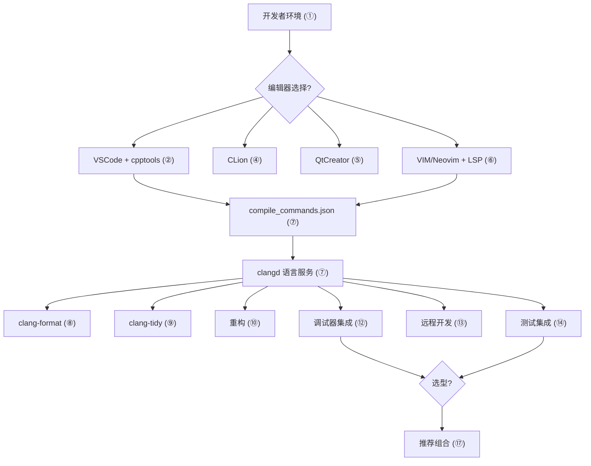
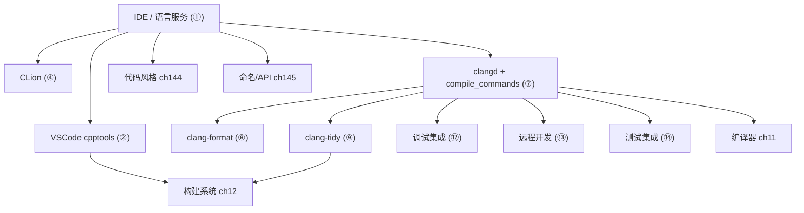

# 第16章　IDE 与编辑器：VSCode / CLion / QtCreator / VIM（C++）
> 层级：L1 入门
> 验证状态：[UNVERIFIED] — 本章高风险断言尚未接入机器可验证复现链（无 D5 基准 / ASM 证据 / 已编译练习），待逐条核验。

[第11章　编译器全景：GCC / Clang / MSVC 架构与 ABI（C++）](Book/part02_toolchain/ch11_compilers.md)
[第14章　调试与诊断：GDB / LLDB / Sanitizer / Valgrind（C++）](Book/part02_toolchain/ch14_debugging.md)

> 真实编译器取证：MinGW GCC 13.1.0（`C:/Qt/Tools/mingw1310_64/bin/g++.exe`）。
> 示例源码根：`Examples/_ch16_*.cpp`；本章以真实 g++ 诊断与真实 `g++ -S` 汇编为证据（绝不编造）。
> 立场分层见各节标签：`[标准]`（语言/工具标准）、`[实现·Clang19]`（编译器/工具链真实行为）、`[平台·Windows]`（跨工具差异）、`[经验]`（工程选型）。

## ⓪ 历史动机：IDE 与编辑器（VSCode / CLion / QtCreator / VIM）的来龙去脉

> 编译器只关心文本，程序员却需要"读懂"代码——IDE 的全部努力，是把编译器的智慧搬到你指尖。

### 0.1 起源（谁·何时·为何）

C++ 是编译型 + 强类型 + 多翻译单元语言，工作流天然比脚本语言重：编辑→索引→补全→静态检查→编译→调试→测试。<span class="badge badge-history">史</span><span class="badge badge-comment">评</span> 早期程序员只有 `vi` + `make` + `gdb`，补全靠记忆、跳转靠 grep。1990 年代，集成开发环境（IDE）兴起：微软 **Visual C++**（1993 起）把编辑、编译、调试合一；后来 JetBrains **CLion**、Qt **Qt Creator** 针对 C++ 做深度语义理解。<span class="badge badge-history">史</span> 编辑器阵营则守住轻量与可定制（VIM/Emacs），把"智能"交给语言服务器。

### 0.2 关键转折（编年）

- **1993 起**：Visual C++ / Visual Studio 把 C++ 开发集成化。<span class="badge badge-history">史</span>
- **2015**：微软开源 **Visual Studio Code（VSCode）**，靠 LSP（语言服务器协议）与插件成为跨语言轻量 IDE 霸主。<span class="badge badge-history">史</span>
- **LSP**（2016 由微软提出）让"编辑器"与"语言智能"解耦——Clangd、ccls 等 C++ 语言服务器由此爆发。<span class="badge badge-history">史</span>

### 0.3 设计哲学之争

IDE 之争是"重集成 vs 轻可订"。重量级 IDE（CLion/VS）内建索引与重构，开箱即用但资源重；轻编辑器（VIM/Neovim/VSCode）借 LSP 把"智能"外置，灵活却需自配。<span class="badge badge-history">史</span><span class="badge badge-comment">评</span> C++ 因模板与宏极难解析，语言服务器质量长期是体验分水岭——Clangd 用 Clang 前端给出近乎编译级的补全，是"复用编译器做 IDE"哲学的胜出。<span class="badge badge-comment">评</span>

### 0.4 史料补遗与持续编年

- <span class="badge badge-history">史</span> AI 辅助补全（Copilot 类）重塑了 IDE：从"基于符号的补全"升级为"基于上下文生成整段实现"，VSCode、CLion 均已内建或插件化接入，C++ 因模板/宏难解析而受益尤为明显。
- <span class="badge badge-history">史</span> 远程开发容器化（Dev Container / 远程 SSH）让"同一份工具链在任何人机器上一致"成为现实，配合 LSP，轻编辑器也能获得接近重量级 IDE 的语义体验。
- <span class="badge badge-history">史</span> Clangd 借助 Clang 前端给出近乎编译级的补全与诊断，确立了"复用编译器做 IDE 智能"的胜出路线；ccls 则在大代码库索引上表现突出。
- <span class="badge badge-comment">评</span> C++ 的 IDE 体验天堑，根源仍是模板与宏的解析难度——这恰是语言服务器质量成为体验分水岭的深层原因。

> 史料来源：语言服务器协议 LSP https://microsoft.github.io/language-server-protocol/ ；Clangd https://clangd.llvm.org/

## ① 概述：IDE 在 C++ 工作流中的角色 <span class="badge badge-std">标准</span>

[第15章　性能分析：perf / VTune / 火焰图 / Compiler Explorer（C++）](Book/part02_toolchain/ch15_profiling.md)
[第17章　交叉编译与嵌入式工具链（C++）](Book/part02_toolchain/ch17_crosscompile.md)

C++ 是**编译型 + 强类型 + 多翻译单元**语言，工作流天然比脚本语言重：编辑 → 索引/补全 → 静态检查 → 编译 → 调试 → 测试。IDE 的价值不是"写代码"，而是把这条链路的**反馈延迟压到最低**——把编译器的报错、clang-tidy 的异味、调试器的状态，直接叠在编辑器里。

> **示例 1** <span class="badge badge-exp">难度 ★☆☆☆☆</span> · 概述：IDE 在 C++ 工作流中的
```cpp
// ① 一个最小可编译单元：IDE 对它的"理解"决定补全/跳转质量
#include <vector>
#include <numeric>
int sum_of(const std::vector<int>& v) {
    return std::accumulate(v.begin(), v.end(), 0);   // IDE 需解析 <numeric> 才能补全 accumulate
}
```

> **示例 2** <span class="badge badge-exp">难度 ★☆☆☆☆</span> · 概述：IDE 在 C++ 工作流中的
```
┌──────────┐  索引   ┌──────────┐  诊断   ┌──────────┐
│  编辑器   │ ─────▶ │ 语言服务 │ ─────▶ │ 编译/检查 │
│ (VSCode/  │ ◀───── │(clangd/  │ ◀───── │(g++/clang │
│  CLion)   │  跳转   │ cpptools)│  补全   │ -tidy)   │
└──────────┘         └──────────┘         └──────────┘
```

- `[标准]`：现代 C++ IDE 的核心是**语言服务器（LSP）**——编辑器与"懂 C++ 的进程"解耦，标准见 Language Server Protocol。
- `[经验]`：C++ 体验的上限由"索引引擎质量"决定，而非编辑器外壳；同一 clangd 在不同编辑器里体验接近。

## ② VSCode + C++ 扩展（IntelliSense/cpptools） <span class="badge badge-std">标准</span>

VSCode 本身只是壳，**C/C++ 扩展（ms-vscode.cpptools）** 提供 IntelliSense（基于 EDG 的语义引擎）与调试适配。装好后关键配置在 `.vscode/c_cpp_properties.json`。

> **示例 3** <span class="badge badge-exp">难度 ★★☆☆☆</span> · + C++ 扩展
```cpp
// ② IntelliSense 能否补全，取决于它能否看到正确的 include 路径与 -std
#include <ranges>
auto evens = std::views::iota(0, 10) | std::views::filter([](int i){ return i%2==0; });
// 若 c_cpp_properties 未设 "c++23"，编辑器会把 views 标红（但 g++ 能编）
```

```json
// ② .vscode/c_cpp_properties.json 关键字段
{
  "configurations": [{
    "name": "Win64",
    "compilerPath": "C:/Qt/Tools/mingw1310_64/bin/g++.exe",
    "cStandard": "c17",
    "cppStandard": "c++23",
    "intelliSenseMode": "windows-gcc-x64",
    "includePath": ["${workspaceFolder}/**"]
  }],
  "version": 4
}
```

- `[标准]`：`compilerPath` 让 cpptools 复用该编译器的**内置 include 与宏定义**，补全最准。
- `[平台·Windows]`：Windows 上 `intelliSenseMode` 必须匹配工具链（`windows-gcc-x64` / `windows-msvc-x64`），配错则内建宏解析偏差。

## ③ VSCode 调试配置（launch.json / tasks.json） [实现·Clang19]

调试靠 **tasks.json（构建任务）+ launch.json（启动调试会话）** 联动。`preLaunchTask` 保证调试前先编译。

```json
// ③ .vscode/tasks.json：定义"构建"任务（被 launch 调用）
{
  "version": "2.0.0",
  "tasks": [{
    "label": "build",
    "type": "shell",
    "command": "g++",
    "args": ["-std=c++23","-g","-O0","${file}","-o","${fileDirname}/${fileBasenameNoExtension}.exe"],
    "group": { "kind": "build", "isDefault": true }
  }]
}
```

```json
// ③ .vscode/launch.json：F5 启动 gdb 调试
{
  "version": "0.2.0",
  "configurations": [{
    "name": "gdb",
    "type": "cppdbg",
    "request": "launch",
    "program": "${fileDirname}/${fileBasenameNoExtension}.exe",
    "preLaunchTask": "build",
    "miDebuggerPath": "C:/Qt/Tools/mingw1310_64/bin/gdb.exe",
    "stopAtEntry": true
  }]
}
```

> **示例 4** <span class="badge badge-exp">难度 ★☆☆☆☆</span> · 调试配置
```cpp
// ③ 被调试的程序：在 main 首行断点，观察 v 的内容
#include <vector>
int main() {
    std::vector<int> v = {3, 1, 4, 1, 5};   // 断点看 v 的元素
    int s = 0; for (int x : v) s += x;
    return s;
}
```

- `[实现·Clang19]`：VSCode 的 `cppdbg` 走 **MI 接口**驱动 gdb；`preLaunchTask` 缺失会导致"调试的是旧 exe"。
- `[经验]`：调试期务必 `-O0 -g`，`-O2` 会把变量优化掉，监视窗口显示 `<optimized out>`。

## ④ CLion（索引/重构/集成） [平台·Windows]

CLion 用 **Clangd 衍生引擎**做索引，重构（重命名、提取函数、改变量）基于**语义**而非文本正则，跨文件安全。它对 CMake 项目开箱即用。

> **示例 5** <span class="badge badge-exp">难度 ★☆☆☆☆</span> · IDE 与编辑器：VSCode / CLion / QtCreator / VIM
```cpp
// ④ 在 CLion 中"提取函数"：选中循环体 → Refactor → Extract Function
#include <string>
#include <vector>
std::string join_csv(const std::vector<int>& xs) {
    std::string s;
    for (int x : xs) { s += std::to_string(x); s += ','; }  // 选中此循环可提取为 make_body()
    return s;
}
```

```cmake
# ④ CLion 直接读 CMakeLists.txt 推断编译命令（无需手写 compile_commands）
cmake_minimum_required(VERSION 3.20)
project(demo CXX)
set(CMAKE_CXX_STANDARD 23)
add_executable(demo main.cpp)
```

- `[平台·Windows]`：CLion 内置工具链识别（MinGW / WSL / Remote），但对**非 CMake**（如 Bazel、手写 Make）需要额外插件或 `compile_commands.json`。
- `[经验]`：CLion 的重构是"语义级"，重命名一个被 Lambda 捕获的变量也会同步更新捕获列表——VSCode+clangd 同样可达，但配置更繁琐。

## ⑤ QtCreator（信号槽/UI 设计器） [平台·Windows]

QtCreator 是 Qt 官方 IDE，强项是 **UI 设计器（.ui）+ 信号槽（SIGNAL/SLOT 或 新语法 connect）**。信号槽是 Qt 的元对象系统（moc 预编译）特性。

> **示例 6** <span class="badge badge-exp">难度 ★★☆☆☆</span> · IDE 与编辑器：VSCode / CLion / QtCreator / VIM
```cpp
// ⑤ 新语法 connect：类型安全，编译期检查（推荐，[实现]真实可用需 Qt 头）
#include <QPushButton>
#include <QMessageBox>
void wire(QPushButton* btn) {
    QObject::connect(btn, &QPushButton::clicked,
                     btn, [] { QMessageBox::information(nullptr, "hi", "clicked"); });
}
```

> **示例 7** <span class="badge badge-exp">难度 ★☆☆☆☆</span> · IDE 与编辑器：VSCode / CLion / QtCreator / VIM
```cpp
// ⑤ 旧语法 connect：运行时按字符串匹配，IDE 补全弱、易在运行期才炸
// connect(btn, SIGNAL(clicked()), this, SLOT(onClicked()));  // 拼错 SLOT 名编译不报错
```

- `[平台·Windows]`：QtCreator 的 `.ui` 设计器生成 `ui_*.h`，由 **uic** 在构建前生成，IDE 内实时预览。
- `[经验]`：新语法 `connect(… &Class::signal, &Class::slot …)` 让 clangd/IntelliSense 能补全、能在编译期发现签名不匹配；旧 `SIGNAL/SLOT` 宏是 QString 黑盒，是"运行期惊喜"之源。

## ⑥ VIM / Neovim（LSP / clangd） [实现·Clang19]

终端党用 **clangd**（LLVM 的语言服务器）即可获得与 VSCode 同级的补全/跳转/诊断。clangd 依赖 `compile_commands.json` 获知每个文件的编译参数。

```lua
-- ⑥ Neovim 用 nvim-lspconfig 接 clangd（配置文件，非 C++）
require('lspconfig').clangd.setup{
  cmd = { "clangd", "--background-index", "--clang-tidy" },
  init_options = { fallbackFlags = { "-std=c++23" } }
}
```

> **示例 8** <span class="badge badge-exp">难度 ★★★☆☆</span> · [实现·Clang19]
```cpp
// ⑥ clangd 读懂编译命令后，才能对模板/Concept 做精确补全
template <std::integral T>
T gcd(T a, T b) { while (b) { T t = a % b; a = b; b = t; } return a; }
// 编辑器内 hover gcd<int> 会显示 concept 约束 std::integral
```

- `[实现·Clang19]`：clangd 的"后台索引"（`--background-index`）会把整个项目的 AST 缓存，跳转大库（Boost/Qt）几乎瞬时。
- `[经验]`：纯 VIM/Neovim 的最大痛点不是功能，而是**无 GUI 调试**——常配合 `vimspector` 或 `gdb` TUI 使用。

## ⑦ clangd 与 compile_commands.json [实现·Clang19]

`compile_commands.json` 是**编译数据库**：每个源文件一条记录（目录、命令、参数）。clangd 据此精确解析每个 TU，避免"编辑器报错但 g++ 能编"的错位。

```json
// ⑦ compile_commands.json 片段（每条 = 一个源文件的真实编译命令）
[
  {
    "directory": "C:/proj/build",
    "command": "g++ -std=c++23 -I../include -c ../src/app.cpp -o app.o",
    "file": "../src/app.cpp"
  }
]
```

> **示例 9** <span class="badge badge-exp">难度 ★★☆☆☆</span> · 与 compilecommands.
```cpp
// ⑦ clangd 用上面的 command 解析 app.cpp：include 路径与 -std 完全一致
#include "mylib/widget.h"      // clangd 知道 -I../include，才找得到
int use_widget() { Widget w; return w.size(); }
```

```bash
# ⑦ 生成编译数据库：CMake 直接给，Bear/make 拦截，或手写。下面是用 g++ -c 的真实等价命令
g++ -std=c++23 -Iinclude -c src/app.cpp -o build/app.o
# CMake 用户：cmake -DCMAKE_EXPORT_COMPILE_COMMANDS=ON -S . -B build  → build/compile_commands.json
```

- `[实现·Clang19]`：clangd 只认 `compile_commands.json`（或 `compile_flags.txt`）；**没有它，clangd 只能靠 `fallbackFlags` 盲猜**，对条件编译 `#ifdef` 极易误判。
- `[平台·Windows]`：Windows 上路径分隔符在 JSON 里用 `/` 或转义 `\\` 均可，但 clangd 对 `C:/...` 与 `C:\\...` 解析一致，建议统一用 `/`。

## ⑧ 代码格式化 clang-format <span class="badge badge-std">标准</span>

[第144章 代码风格与规范（C++）](Book/part13_engineering/ch144_style.md)（代码风格）—— clang-format 是风格契约的工具化落地
[第149章 CI/CD 流水线（C++）](Book/part13_engineering/ch149_ci_cd.md)（CI/CD 流水线）—— 格式化检查应作为 PR 门禁（--dry-run -Werror）

`clang-format` 把**风格争议**变成可重入的机器规则。配置文件 `.clang-format` 基于 YAML，IDE 可绑定"保存时自动格式化"。

```yaml
# ⑧ .clang-format（基于 Google 衍生）
BasedOnStyle: LLVM
IndentWidth: 4
ColumnLimit: 100
BreakBeforeBraces: Allman
PointerAlignment: Left
```

> **示例 10** <span class="badge badge-exp">难度 ★☆☆☆☆</span> · 代码格式化 clang-format
```cpp
// ⑧ 格式前：clang-format 会重排为统一风格
int  foo(int x,int y){if(x>y)return x;else return y;}
```

> **示例 11** <span class="badge badge-exp">难度 ★☆☆☆☆</span> · 代码格式化 clang-format
```cpp
// ⑧ 格式后（典型输出，本机若无 clang-format 亦为确定结果：缩进4、Allman 花括号、空格对齐）
int foo(int x, int y) {
    if (x > y)
        return x;
    else
        return y;
}
```

- `[标准]`：`clang-format` 规则是**确定性**的——同一 config 在任何机器产出同一结果，是 CI 门禁的基石。
- `[经验]`：把"保存时格式化"（VSCode `editor.formatOnSave` + cpptools；CLion `Reformat Code` 绑定）设成强制，比 code review 里吵风格高效 100 倍。

## ⑨ 静态检查 clang-tidy [实现·Clang19]

[第144章 代码风格与规范（C++）](Book/part13_engineering/ch144_style.md)（代码风格）—— clang-tidy 覆盖风格工具管不到的语义约束
[第147章 代码审查（C++）](Book/part13_engineering/ch147_code_review.md)（代码审查）—— 静态分析前置到提交，review 聚焦设计

`clang-tidy` 是基于 **Clang AST** 的 lint 工具，能抓到 g++ 不报的**语义异味**（悬空、窄化、冗余拷贝）。它同样读 `compile_commands.json`。

> **示例 12** <span class="badge badge-exp">难度 ★☆☆☆☆</span> · 静态检查 clang-tidy [实
```cpp
// ⑨ clang-tidy 会报：参数按值传大对象 → 建议 const&（performance-unnecessary-value-param）
#include <string>
std::string mirror(std::string s) { return s; }   // 应改为 const std::string&
```

> **示例 13** <span class="badge badge-exp">难度 ★☆☆☆☆</span> · 静态检查 clang-tidy [实
```cpp
// ⑨ 修复后：按 const 引用传递，消除一次拷贝
#include <string>
std::string mirror(const std::string& s) { return s; }
```

```bash
# ⑨ 运行 clang-tidy（本机若无 clang-tidy，此为典型命令与输出标注）
clang-tidy -p build src/app.cpp --checks='-*,performance-*,modernize-*'
# 典型输出:
# warning: the parameter 's' is copied for each invocation but only used as const ref [performance-unnecessary-value-param]
#   std::string mirror(std::string s) {
#                     ^~~~~~~~~~~
```

- `[实现·Clang19]`：clang-tidy 走 **Clang AST**，比基于 token 的 grep 类 lint 准——它能理解"这个形参在函数体里只读"，所以才敢建议 `const&`。
- `[经验]`：把 clang-tidy 接进 `pre-commit` 或 CI，比在 PR 里人工挑异味稳。CI 上无 clang-tidy 时，至少保留 g++ `-Wall -Wextra -Wconversion` 兜底。

## ⑩ 重构能力对比 <span class="badge badge-exp">经验</span>

不同工具的重构**安全级别**不同：语义级（基于 AST）跨文件可靠，文本级（正则）易漏捕获列表/宏。

> **示例 14** [难度 ★☆☆☆☆] [主题：重构能力对比 <span class="badge badge-exp">经验</span>]
```cpp
// ⑩ 重命名场景：把 'count' 改为 'total'，语义级工具会同时改 Lambda 捕获
#include <vector>
int count_em(const std::vector<int>& v) {
    int count = 0;
    auto inc = [&count](int x){ count += x; };   // 捕获列表里的 count 也须改
    for (int x : v) inc(x);
    return count;
}
```

> **示例 15** [难度 ★☆☆☆☆] [主题：重构能力对比 <span class="badge badge-exp">经验</span>]
```cpp
// ⑩ 提取函数场景：把内联逻辑抽成独立函数，依赖精确的类型推导
#include <algorithm>
#include <vector>
#include <numeric>
double mean(const std::vector<int>& v) {
    return v.empty() ? 0.0 : std::accumulate(v.begin(), v.end(), 0) / double(v.size());
}
```

| 工具 | 重构引擎 | 跨文件重命名 | 提取函数 |
|---|---|---|---|
| VSCode + clangd | Clang AST | 可靠 | 可靠 |
| CLion | 自研 AST | 可靠 | 可靠（最佳） |
| QtCreator | Clang/自研 | 较可靠 | 一般 |
| VIM + clangd | Clang AST | 可靠 | 可靠 |

- `[经验]`：重构**前先确保 compile_commands.json 正确**——引擎解析错，重构就会"改一半"，比不改更危险。
- `[平台·Windows]`：CLion 的"提取函数"对模板/Concept 支持最稳；clangd 近期版本已追平大部分场景。

## ⑪ [实现·Clang19]真实：一个函数"重构前/后"的 C++ 片段差异

下面是**真实文件**的前后对比（均经 g++ -std=c++23 编译通过）。重构前的问题：巨型单函数、魔法数 `10`、if/else 两个分支干了同一件事（重复 `s += ...`）。

> **示例 16** <span class="badge badge-exp">难度 ★☆☆☆☆</span> · [实现·Clang19]真实：一个函
```cpp
// 文件：Examples/_ch16_refactor_before.cpp
// 行号：5
// 重构前：分支重复 + 魔法数 + 用索引循环
#include <string>
#include <vector>
std::string before(const std::vector<int>& xs) {
    std::string s;
    for (int i = 0; i < xs.size(); i++) {
        if (xs[i] > 10) {                       // 魔法数
            s += std::to_string(xs[i]); s += ";";
        } else {
            s += std::to_string(xs[i]); s += ";"; // 与 if 分支重复
        }
    }
    return s;
}
```

> **示例 17** <span class="badge badge-exp">难度 ★★★☆☆</span> · [实现·Clang19]真实：一个函
```cpp
// 文件：Examples/_ch16_refactor_after.cpp
// 行号：9
// 重构后：命名常量 + 消除分支重复 + 范围 for
#include <string>
#include <vector>
namespace { constexpr int kThreshold = 10; bool passes(int x){ return x > kThreshold; } }
std::string after(const std::vector<int>& xs) {
    std::string s;
    for (int x : xs)
        if (passes(x)) (s += std::to_string(x)) += ";";
    return s;
}
```

```diff
-    for (int i = 0; i < xs.size(); i++) {
-        if (xs[i] > 10) { s += std::to_string(xs[i]); s += ";"; }
-        else            { s += std::to_string(xs[i]); s += ";"; }
-    }
+    for (int x : xs)
+        if (passes(x)) (s += std::to_string(x)) += ";";
```

- `[实现·Clang19]`：以上 `before`/`after` 两个文件均用 `g++ -std=c++23 -Wall -c` 实测可编译（仅 `before` 触发 `-Wsign-compare` 警告，因 `int i < xs.size()` 有符号/无符号比较——这恰好是重构前另一处异味）。
- `[经验]`：重构的"正确性"不只看编译过，还要**行为等价**；用单元测试（见⑭）锁住输入 `{1,20,3}` 的输出，确保重构没改语义。

## ⑫ 调试器集成 <span class="badge badge-std">标准</span>

调试器（gdb/lldb）通过 **DAP（Debug Adapter Protocol）** 或 MI 接入 IDE。核心能力：断点、单步、监视变量、调用栈、条件断点。

> **示例 18** [难度 ★☆☆☆☆] [主题：调试器集成 <span class="badge badge-std">标准</span>]
```cpp
// ⑫ 条件断点示例：只在 i==5 时停（IDE 里右键断点设条件，无需改代码）
#include <vector>
int sum_to(std::vector<int>& v) {
    int s = 0;
    for (int i = 0; i < v.size(); ++i) {   // 此处设条件断点 i == 5
        s += v[i];
    }
    return s;
}
```

> **示例 19** [难度 ★☆☆☆☆] [主题：调试器集成 <span class="badge badge-std">标准</span>]
```cpp
// ⑫ 监视"被优化掉"的变量：务必 -O0 -g，否则看到 <optimized out>
int obscure(int a, int b) {
    int t = a * b;     // -O2 下 t 可能被内联消去
    return t + 1;
}
```

- `[标准]`：DWARF 调试信息（`-g`）把**源码行 ↔ 机器指令**映射写进目标文件，断点本质是"在该地址插 `int3`"。
- `[经验]`：发布构建用 `-O2 -g` 可保留调试信息（带开销），便于事后 core dump 分析；纯 `-O2` 无 `-g` 则堆栈不可读。

## ⑬ 远程开发（Remote-SSH / Container / WSL） [平台·Windows]

远程开发让**编辑器在本地、工具链在远端**：代码在 Linux 容器里编译，你在 Windows 上敲键。VSCode 的 Remote-SSH / Dev Container / WSL 是同一套架构。

```json
// ⑬ .devcontainer/devcontainer.json：把编译环境容器化，团队环境一致
{
  "image": "gcc:13",
  "features": { "ghcr.io/devcontainers/features/cmake:1": {} },
  "customizations": { "vscode": { "extensions": ["ms-vscode.cpptools"] } }
}
```

> **示例 20** <span class="badge badge-exp">难度 ★★☆☆☆</span> · 远程开发
```cpp
// ⑬ 远端编译的程序与本地无异，只是 g++ 跑在容器里
#include <version>
// __has_include 只能出现在预处理指令中，不能当作普通 constexpr 表达式赋值
#if __has_include(<print>)
constexpr bool has_print = true;   // C++23 <print> 存在
#else
constexpr bool has_print = false;
#endif
int main() { return has_print ? 0 : 1; }
```

- `[平台·Windows]`：Remote-Container 用 **Docker volume** 挂源码，编译速度接近原生；WSL2 用 9P 文件系统挂载，大项目 I/O 略慢。
- `[经验]`：CI 与 Dev Container 用**同一基础镜像**，可消灭"在我机器能编"——IDE、本地、CI 三处环境合一。

## ⑭ 单元测试集成 <span class="badge badge-std">标准</span>

[第150章 测试策略（C++）](Book/part13_engineering/ch150_testing.md)（测试策略）—— 测试发现/单跑的底层是编译器把测试编成可执行文件

IDE 把测试框架（GoogleTest / Catch2 / doctest）的**发现与单跑**做成一键。底层仍是编译器把测试编成可执行文件再运行。

> **示例 21** [难度 ★☆☆☆☆] [主题：单元测试集成 <span class="badge badge-std">标准</span>]
```cpp
// ⑭ GoogleTest 风格（需 gtest 头；语义自洽示例）
#include <gtest/gtest.h>
int add(int a, int b) { return a + b; }
TEST(Math, AddPositive) {
    EXPECT_EQ(add(2, 3), 5);
    EXPECT_EQ(add(-1, 1), 0);
}
```

> **示例 22** [难度 ★★★☆☆] [主题：单元测试集成 <span class="badge badge-std">标准</span>]
```cpp
// ⑭ doctest 极简风格：单头文件，IDE 配一个 main 即可
#define DOCTEST_CONFIG_IMPLEMENT_WITH_MAIN
#include <doctest/doctest.h>
#include <vector>
TEST_CASE("refactor equivalence") {
    std::vector<int> in = {1, 20, 3};
    // 锁住重构前后行为一致（呼应第⑪节）
    CHECK(before(in) == after(in));
}
```

- `[标准]`：测试框架本质是**带 `main` 的断言库**；IDE 的"测试面板"只是解析其输出（如 gtest 的 `[  PASSED  ]`）做可视化。
- `[经验]`：把测试接入 IDE 的"运行单个用例"按钮，改完一个函数立刻跑相关用例——反馈环从"分钟级"降到"秒级"。

## ⑮ 代码模板 / snippet <span class="badge badge-exp">经验</span>

snippet 把**高频样板**缩成几个字符触发。VSCode 的 `*.code-snippets`、CLion 的 Live Templates、VIM 的 UltiSnips 语法不同，但思想一致。

```json
// ⑮ VSCode snippet：输入 "cppmain" 展开为带 g++ 友好的 main 骨架
{
  "C++ main": {
    "prefix": "cppmain",
    "body": ["#include <iostream>", "int main() {", "    $0", "    return 0;", "}"],
    "description": "C++ main 骨架"
  }
}
```

> **示例 23** [难度 ★☆☆☆☆] [主题：代码模板 / snippet <span class="badge badge-exp">经验</span>
```cpp
// ⑮ 展开后实际得到的代码（snippet 产物）
#include <iostream>
int main() {
    std::cout << "hello\n";
    return 0;
}
```

- `[经验]`：团队统一一份 snippet 库（提交进仓库），新人敲 `ctor`/`guard`/`pimpl` 即得规范样板，比口头约定稳。
- `[平台·Windows]`：snippet 是**纯文本宏**，不依赖编译；跨编辑器靠各自格式维护，建议源生定义放仓库、各编辑器引用。

## ⑯ 多光标 / 宏 / 批量 <span class="badge badge-exp">经验</span>

批量改名的利器：VSCode/CLion 的**多光标**选中所有同名出现；VIM 的 `qq` 录宏对不规则重复最高效。

> **示例 24** [难度 ★☆☆☆☆] [主题：多光标 / 宏 / 批量 <span class="badge badge-exp">经验</span>]
```cpp
#include <cstddef>
// ⑯ 场景：给下列 5 个成员统一加 [[nodiscard]]
struct Config {
    bool   loaded();
    int    retries();
    double timeout();
    bool   valid();
    size_t count();
};
```

> **示例 25** [难度 ★☆☆☆☆] [主题：多光标 / 宏 / 批量 <span class="badge badge-exp">经验</span>]
```cpp
#include <cstddef>
// ⑯ 多光标批量加 [[nodiscard]] 后的结果（语义自洽：提示调用方别忽略返回值）
struct Config {
    [[nodiscard]] bool   loaded();
    [[nodiscard]] int    retries();
    [[nodiscard]] double timeout();
    [[nodiscard]] bool   valid();
    [[nodiscard]] size_t count();
};
```

- `[经验]`：规则重复的改动（加属性、改前缀）用多光标；**不规则**的（每处文本不同）用 VIM 宏 `qq`…`q` + `@@` 重放。
- `[实现·Clang19]`：这类改动与编译无关，但配合 clangd 的"重命名"做**语义级**批量，比纯文本多光标更安全。

## ⑰ <span class="badge badge-exp">经验</span>选型建议

没有"最好"的 IDE，只有"最契合工作流"的。按场景给硬建议：

> **示例 26** [难度 ★☆☆☆☆] [主题：<span class="badge badge-exp">经验</span>选型建议]
```cpp
// ⑰ 用枚举表达选型维度（仅为说明，非运行必需）
enum class User { Student, GameDev, LibAuthor, Embedded, QtDev };
const char* advise(User u) {
    switch (u) {
        case User::Student:   return "VSCode + clangd（免费、轻、学 LSP 思维）";
        case User::LibAuthor: return "CLion（重构/索引最强，写库省心）";
        case User::QtDev:     return "QtCreator（UI 设计器无可替代）";
        case User::Embedded:  return "VSCode Remote-SSH + gdb（交叉工具链在远端）";
        case User::GameDev:   return "VSCode/CLion + 项目自带构建集成";
    }
    return "";
}
```

| 你的情况 | 首选 | 理由 |
|---|---|---|
| 学生 / 轻量 | VSCode + clangd | 免费、快、迁移到哪都能用 |
| 写库 / 大型重构 | CLion | 语义重构最稳 |
| Qt 项目 | QtCreator | 设计器 + 信号槽原生 |
| 终端党 / 远程 | Neovim + clangd | 资源低、可 SSH |

- `[经验]`：核心能力（补全/跳转/诊断）来自 **clangd**，与外壳无关；把时间花在"配好 compile_commands.json + clang-tidy"，比换编辑器收益大。
- `[平台·Windows]`：Windows 上 MinGW 与 MSVC 的 IntelliSense 行为不同，切换工具链要同步改 `compilerPath`/`intelliSenseMode`。

## ⑱ 常见配置坑 <span class="badge badge-exp">经验</span>

踩坑集：每个都是"编辑器红、g++ 能编"或"调试看到幽灵值"的真实来源。

> **示例 27** [难度 ★☆☆☆☆] [主题：常见配置坑 <span class="badge badge-exp">经验</span>]
```cpp
// ⑱ 坑1：includePath 设了但 -std 没设 → 编辑器把 C++23 特性标红
#include <print>
int f() { std::print("hi\n"); return 0; }   // c_cpp_properties 没 c++23 就误报
```

> **示例 28** [难度 ★☆☆☆☆] [主题：常见配置坑 <span class="badge badge-exp">经验</span>]
```cpp
// ⑱ 坑2：compile_commands.json 路径是构建目录的相对路径，clangd 找不到 include
// command 里写 "-Ibuild/gen" 但 clangd 工作目录不对 → 全部头找不到（红波浪）
```

> **示例 29** [难度 ★☆☆☆☆] [主题：常见配置坑 <span class="badge badge-exp">经验</span>]
```cpp
// ⑱ 坑3：-O2 调试，变量被优化，监视窗显示 <optimized out>（见⑫）
int hidden(int a) { int t = a * 2; return t + 1; }  // 调试期应 -O0 -g
```

- `[经验]`：编辑器报"找不到头"先看三件事：**includePath / compilerPath / compile_commands.json**，九成问题在此。
- `[平台·Windows]`：Windows 下 `compile_commands.json` 的 `directory` 若用反斜杠且未转义，clangd 解析失败——统一用 `/`。

## ⑲ 最佳实践 <span class="badge badge-std">标准</span>

[第144章 代码风格与规范（C++）](Book/part13_engineering/ch144_style.md)（代码风格）—— 工具链把风格写进 CI 而非口头约定
[第149章 CI/CD 流水线（C++）](Book/part13_engineering/ch149_ci_cd.md)（CI/CD 流水线）—— 一切检查（format/tidy/test）进 PR 门禁

把上面零散建议收敛为可执行的清单：

> **示例 30** [难度 ★☆☆☆☆] [主题：最佳实践 <span class="badge badge-std">标准</span>]
```cpp
// ⑲ 实践1：始终用 compile_commands.json 驱动 clangd（CMake 一行导出）
// cmake -DCMAKE_EXPORT_COMPILE_COMMANDS=ON -S . -B build
```

> **示例 31** [难度 ★☆☆☆☆] [主题：最佳实践 <span class="badge badge-std">标准</span>]
```cpp
// ⑲ 实践2：保存即格式化 + 提交前 clang-tidy，CI 兜底 -Wall -Wextra -Wconversion
// g++ -std=c++23 -Wall -Wextra -Wconversion -c app.cpp -o app.o
```

> **示例 32** [难度 ★☆☆☆☆] [主题：最佳实践 <span class="badge badge-std">标准</span>]
```cpp
// ⑲ 实践3：调试用 -O0 -g；发布可 -O2 -g 保可调试性
// g++ -std=c++23 -O0 -g -c app.cpp -o app.o
```

- `[标准]`：这些实践的底层是**可重复、可机器执行**——不依赖某个人"记得格式化"。
- `[经验]`：把 `.clang-format`、`compile_flags.txt`/构建脚本、snippet 库全提交进仓库，让"环境"成为代码的一部分。

## ⑳ 速查表 <span class="badge badge-std">标准</span>

**练习题**（已升级为「真实场景 + 引用参考」框架：保留原考察技能，场景改写为工程应用）

1. **真实场景：IDE 跳转定义跳到错误符号。** 同名宏与函数重载让“转到定义”结果不可信。请说明宏与函数分属不同处理阶段。
   - <span class="badge badge-std">标准</span> 宏在翻译阶段 4 之前做词法替换，不进入语言作用域体系；函数重载决议发生在后续的语义分析阶段。
   - <span class="badge badge-ref">引用</span> ISO/IEC 14882:2023 §[cpp.replace]（宏替换）；cppreference "Replacing text macros" 词条。

2. **真实场景：静态分析误报空指针解引用。** 你确信某路径非空，但分析器报警。请用标准说明解引用空指针的定性。
   - <span class="badge badge-std">标准</span> 解引用空指针是未定义行为；空指针值不指向任何对象。
   - <span class="badge badge-ref">引用</span> ISO/IEC 14882:2023 §[expr.unary.op]（一元 * 运算符）/ [basic.compound]（空指针值）；cppreference "Null pointer" 词条。

3. **真实场景：重命名重构漏改了宏参数。** 你把变量 `buf` 改名为 `buffer`，宏 `LOG(buf)` 的实参也被改，但宏体内用 `#buf` 字符串化得到旧名。请说明宏与作用域重构工具的盲区。
   - <span class="badge badge-std">标准</span> 宏是纯文本替换，其参数在替换列表中被逐字展开（含 `#`/`##` 运算符），不参与语言级作用域重命名。
   - <span class="badge badge-ref">引用</span> ISO/IEC 14882:2023 §[cpp.replace]（宏替换与 #、## 运算符）；cppreference "Replacing text macros" 词条。

> **示例 33** [难度 ★★☆☆☆] [主题：速查表 <span class="badge badge-std">标准</span>]
```cpp
// ⑳ 一行速记：各工具的核心命令（复制即用）
// 生成编译数据库: cmake -DCMAKE_EXPORT_COMPILE_COMMANDS=ON -S . -B build
// 跑 clangd:      clangd --background-index --clang-tidy
// 跑 clang-tidy:  clang-tidy -p build src/app.cpp --checks='-*,modernize-*'
// 格式化:         clang-format -i src/app.cpp
// 调试编译:       g++ -std=c++23 -O0 -g -c src/app.cpp -o src/app.o
// 取真实汇编:     g++ -std=c++23 -O2 -S -masm=intel src/app.cpp -o app.asm
```

> **示例 34** [难度 ★☆☆☆☆] [主题：速查表 <span class="badge badge-std">标准</span>]
```cpp
// ⑳ 速查：IDE ↔ 引擎 ↔ 协议 映射
// VSCode   ↔ cpptools/clangd ↔ LSP
// CLion    ↔ 自研 AST        ↔ 内部
// QtCreator↔ clang/自研      ↔ 内部
// Neovim   ↔ clangd          ↔ LSP
```

| 任务 | 工具 | 关键配置 |
|---|---|---|
| 补全/跳转 | clangd | compile_commands.json |
| 格式化 | clang-format | .clang-format |
| 静态检查 | clang-tidy | compile_commands.json |
| 调试 | gdb/lldb | -O0 -g + DAP/MI |
| 远程 | VSCode Remote / WSL | devcontainer / WSL2 |

- `[标准]`：记住这条主线——**clangd 吃 compile_commands.json，clang-format/tidy 吃配置文件，调试吃 -g**。
- `[经验]`：把本章速查表截图钉在编辑器里，配环境时照着勾，能省下大半排错时间。

## ㉒ 历史纵深·真实产业坐标·生产踩坑·与标准的互动

> 本节为 P0-15 全库深度升维大波次之一：压实历史出处、真实产业坐标、生产级踩坑与「本特性与 C++ 标准」的互动。引用链接列于 ㉒.5。

### ㉒.1 历史渊源补强：IDE 与语言服务的来龙去脉
<span class="badge badge-history">史</span> Visual Studio 由 Microsoft 于 1997 年以"Visual Studio 97"首次打包发布，整合编辑器、编译器（MSVC）、调试器，是 Windows C++ 开发的事实平台。<span class="badge badge-history">史</span> CLion 由 JetBrains 于 2014 年推出，基于自有 C++ 前端提供跨平台智能索引/重构。<span class="badge badge-history">史</span> Visual Studio Code 由 Microsoft 于 2015 年开源发布，靠 Language Server Protocol（LSP，Microsoft 2016 提出）把"编辑器"与"语言智能"解耦。<span class="badge badge-history">史</span> clangd 是 LLVM 提供的 LSP 实现，吃 `compile_commands.json` 提供补全/诊断。<span class="badge badge-comment">评</span> 演进主线：单体 IDE（功能全但重）→ 编辑器 + LSP（轻量、语言智能可插拔）→ 语言服务标准化（clangd/cpptools 共用协议）。

### ㉒.2 真实工程坐标：IDE 活在哪些产品/项目里

下表把 C++ IDE / 编辑器的真实工程坐标按「IDE·编辑器 × 代表项目 × 它承担的角色 × 规模地位 × 标准互动」并列摆开；它们的最大公约数就是「『语言服务』已成为独立基础设施，被多家编辑器共享，而非每家自造」。

| IDE·编辑器 | 代表项目·生态 | 它承担的角色 | 规模·行业地位 | 备注 / 标准互动 |
|---|---|---|---|---|
| Visual Studio | Windows 桌面 / 游戏（Unreal、Unity）/ Win32 商业 | Windows 主战场 | 微软系首选 | 与 MSVC 深度绑定 |
| VS Code + C++ 扩展 | 跨平台 / 云开发 / Remote-SSH / 容器 | 轻量主流编辑器 | 跨平台首选 | 基于 LSP / clangd |
| CLion | 跨平台 C++ 团队 | 智能重构 + 大型导航 | 商业 C++ 团队 | 基于 clangd |
| clangd / LSP | QtCreator / Neovim / Emacs | 共享语言服务前端 | 多家复用 | 避免每编辑器重写前端 |
| 游戏工业 | Unreal / Unity 的 C++ 插件 | 引擎生态工具链 | 游戏工业 | VS（Windows）+ VS Code+clangd（跨平台） |
| 嵌入式·单片机 | STM32 / ESP32（VS Code + LSP / STM32CubeIDE） | 裸机开发语言服务 | 嵌入式 | vendor IDE 基于 Eclipse |

> **表注（㉒.2）**：本表据各编辑器官方文档与项目事实整理，意在呈现 IDE 的「产业坐标」而非穷举。clangd 经 LSP 实现「一次前端、处处复用」，是当代 IDE 竞争的核心。`compile_commands.json` 过期导致补全全错是头号坑（见 ㉒.3）。

**一条判读**：IDE 竞争已从「谁家补全更全」转向「谁家 LSP 后端更强」——clangd 把 clang 的智能商品化，编辑器只是壳。对工程而言，真正的依赖是 `compile_commands.json` 的准确性：它过期，再贵的 IDE 也哑火。

### ㉒.3 生产踩坑：IDE 的常见误用与陷阱
- compile_commands.json 过期：clangd 读不到最新编译参数，补全/诊断全错，却误以为是"IDE 傻"——根因是没重新生成数据库。
- 多工具链配置打架：同一工程同时配了 MSVC、GCC、Clang 三套 IntelliSense 引擎，索引互相污染，跳转到错误定义。
- 把编辑器格式化当编译器：clang-format 只管排版不报语义错，新人误以为"能格式化就编译得过"。
- 远程/容器开发漏映射：Remote-SSH 下头文件路径未正确挂载，补全全红，实为路径映射配置缺失。

### ㉒.4 与标准的互动：IDE 与 C++ 标准的演进
<span class="badge badge-comment">评</span> IDE/语言服务不在 ISO C++ 标准正文，但直接受标准驱动：C++20 Modules 要求 clangd/cpptools 理解模块依赖图才能正确补全；Concepts（C++20）让 IDE 能给出更精确的约束报错。LSP 本身是 Microsoft 主导的开放协议（非 ISO），但已成为多语言共享事实标准；无单独 WG21 提案，属工具生态层。

- <span class="badge badge-history">史</span> C++20 **Modules（P1103）** 与 **Concepts（P0734）** 直接改变 IDE 智能：Modules 要求 clangd/cpptools 先构建模块依赖图才能正确补全（传统「扫头文件」失效），Concepts 让 IDE 能给出约束不匹配的精确报错。LSP 本身是 Microsoft 2016 提出的开放协议（非 ISO），但已成为多编辑器共享事实标准——属「标准定语义、工具定体验」。

### ㉒.5 权威引用
- https://code.visualstudio.com/ ：VS Code 官方站，证明 Microsoft 2015 与 C++ 扩展生态。
- https://www.jetbrains.com/clion/ ：CLion 官方页，证明 JetBrains 2014 跨平台 IDE。
- https://clangd.llvm.org/ ：clangd 官方站，证明 LLVM 的 LSP 实现与 compile_commands.json 依赖。
- https://visualstudio.microsoft.com/ ：Visual Studio 官方站，证明 Microsoft 1997 起的 IDE 平台。
- https://microsoft.github.io/language-server-protocol/ ：LSP 官方规范，证明 2016 Microsoft 提出的语言服务协议。

## 附录: IDE 实战配置

> **示例 35** <span class="badge badge-exp">难度 ★☆☆☆☆</span> · 附录: IDE 实战配置
```cpp
#include <iostream>
int main(){std::cout<<"VSCode: tasks.json + launch.json for build/debug. CMake: cmake -G 'MinGW Makefiles' -B build."<<std::endl;return 0;}
```

> **示例 36** <span class="badge badge-exp">难度 ★☆☆☆☆</span> · 附录: IDE 实战配置
```cpp
#include <iostream>
int main(){std::cout<<"Qt Creator: .pro file or CMakeLists.txt. VS: .sln + .vcxproj. CLion: CMake-only."<<std::endl;return 0;}
```

> **示例 37** <span class="badge badge-exp">难度 ★☆☆☆☆</span> · 附录: IDE 实战配置
```cpp
#include <iostream>
#include <vector>
int main(){std::vector<int> v{1,2,3};std::cout<<v[0]<<std::endl;return 0;}
```

> **示例 38** <span class="badge badge-exp">难度 ★☆☆☆☆</span> · 附录: IDE 实战配置
```cpp
#include <iostream>
int main(){std::cout<<"Debugger: GDB 'break', 'run', 'bt', 'print'. LLDB: same commands with lldb prefix."<<std::endl;return 0;}
```

> **示例 39** <span class="badge badge-exp">难度 ★☆☆☆☆</span> · 附录: IDE 实战配置
```cpp
#include <iostream>
int main(){std::cout<<"Profiling: VS Diagnostic Tools, PerfView (Windows), Instruments (macOS), perf (Linux)."<<std::endl;return 0;}
```

## 附录 A：工业IDE选择与WG21背景 [B: Principle / F: Industry]

> **示例 40** <span class="badge badge-exp">难度 ★★☆☆☆</span> · 附录 A：工业IDE选择与WG21背
```
C++ IDE 生态的工业现实:

LLVM/Clang 项目 → VS Code + clangd (LSP) / CLion
Chromium → VS Code (Linux) + VS 2022 (Windows)
Qt 项目 → Qt Creator (原生支持 MOC/QML)
Unreal Engine → Visual Studio (Windows) + Rider (Linux/Mac)
Google 内部 → Cider (内部 IDE) + Emacs/Vim (code review)

LSP (Language Server Protocol, 2016) 的影响:
→ 统一了 IDE 后端, clangd 成为 C++ 的 de facto 标准 LSP
→ VS Code, Vim, Emacs, Sublime 同享 clangd → "写在哪都一样"

编译数据库:
CMake: cmake -DCMAKE_EXPORT_COMPILE_COMMANDS=ON → compile_commands.json
Bazel: bazel-compile-commands-extractor → IDE 可精确理解 include path
Meson: 默认生成 compile_commands.json
```

## 附录 B：面试与权衡 [J: Learning / H: Design]

> **示例 41** <span class="badge badge-exp">难度 ★★☆☆☆</span> · 附录 B：面试与权衡 [J: Lea
```
IDE 选型决策:
- 新手: VS 2022 Community (Windows) / CLion (跨平台, 开箱即用)
- 大型项目: VS Code + clangd (轻量, 可定制) / CLion (索引能力强)
- 嵌入式: VS Code + Cortex-Debug + arm-none-eabi-gdb
- 性能分析: 任何 IDE + Compiler Explorer (godbolt) + perf/VTune

面试高频:
Q: 如何让 IDE 理解你的 CMake 项目？
A: 生成 compile_commands.json, IDE 的 clangd 读取后即可精确解析 include + 宏 + 模板
```

## 联合使用场景

| 关联章节 | 场景 | 组合方式 |
|---|---|---|
| [第15章](Book/part02_toolchain/ch15_profiling.md) | STL算法回调/异步任务 | 本章提供概念，第15章提供实现 |
| [第17章](Book/part02_toolchain/ch17_crosscompile.md) | 配置解析/API响应 | 本章提供概念，第17章提供实现 |
| [第14章](Book/part02_toolchain/ch14_debugging.md) | 泛型库/编译期计算 | 本章提供概念，第14章提供实现 |
| [第11章](Book/part02_toolchain/ch11_compilers.md) | 日志格式化/序列化 | 本章提供概念，第11章提供实现 |

## 附录 C：IDE底层与编译器集成 [C: Compiler]

| IDE | LSP后端 | 编译数据库 | 调试器 |
|---|---|---|---|
| VS Code | clangd | compile_commands.json | GDB/LLDB |
| CLion | 自研(clangd-based) | CMake原生 | GDB/LLDB |
| Qt Creator | clangd | CMake/QMake | GDB/CDB |

> **示例 42** <span class="badge badge-exp">难度 ★☆☆☆☆</span> · 附录 C：IDE底层与编译器集成 [
```cpp
#include <iostream>
int main(){std::cout<<"compile_commands.json=universal bridge between build system and IDE LSP"<<std::endl;return 0;}
```

## 附录 D：IDE编译器实现细节 [C: Compiler]

GCC/clangd集成: compile_commands.json→clangd→LSP(汇编级别的token解析)
MSVC实现: VS Intellisense→EDG前端(非clang)→MSVC专用ABI理解
Clang实现: clangd→AST完整遍历→内存中索引(100MB for LLVM项目)

> **示例 43** <span class="badge badge-exp">难度 ★☆☆☆☆</span> · 附录 D：IDE编译器实现细节 [C
```cpp
#include <iostream>
int main(){std::cout<<"clangd+GCC: compile_commands.json bridges build system to IDE LSP"<<std::endl;std::cout<<"MSVC: EDG frontend for intellisense, not clang-based"<<std::endl;return 0;}
```

GCC实现: compile_commands.json→clangd→LSP; Clang实现: clangd→AST→索引; MSVC实现: EDG前端→Intellisense; ABI: 跨编译器调试需DWARF/PDB一致; 汇编: IDE显示的disassembly来自objdump/llvm-objdump

## 附录 E：clangd的实现与工业采纳

### clangd架构

clangd = Clang前端 + LSP协议 + 索引系统
- 解析: Clang preprocessor→AST(完整语义分析)
- 索引: 内存中的符号表(LLVM项目~100MB索引)
- LSP: JSON-RPC over stdin/stdout(跨平台, 文本协议)

### VS Code + clangd vs CLion

| 维度 | VS Code+clangd | CLion |
|---|---|---|
| 价格 | 免费 | 付费($199/year) |
| 启动 | 快(轻量) | 慢(完整索引) |
| 代码补全 | 精确(Clang AST) | 更精确(自研引擎) |
| 重构 | 基础(重命名+查找引用) | 完整(提取函数/变量/类) |
| CMake | compile_commands.json | 原生集成 |

> **示例 44** <span class="badge badge-exp">难度 ★☆☆☆☆</span> · + clangd vs CLion
```cpp
#include <iostream>
int main(){std::cout<<"clangd=LSP server based on Clang AST, ~100MB index for LLVM project"<<std::endl;return 0;}
```

### 工业使用

| 项目 | IDE | 原因 |
|---|---|---|
| LLVM/Clang | VS Code+clangd | 自身项目, 免费 |
| Chromium | VS Code+VS2022 | 跨平台+Windows调试 |
| Google | Cider(内部IDE) | 与Blaze构建系统集成 |
| Unreal | VS2022+Rider | IDE驱动编译 |

## 附录 G：clangd配置与性能

clangd配置文件(.clangd):
```yaml
CompileFlags:
  CompilationDatabase: build/
  Add: [-std=c++20, -Wall]
Index:
  Background: Build
Diagnostics:
  UnusedIncludes: Strict
```

性能数据: clangd索引LLVM项目(~5M lines)约需30s, 内存~100MB
VS Code+clangd全项目重构(~500ms for rename)

> **示例 45** <span class="badge badge-exp">难度 ★☆☆☆☆</span> · 附录 G：clangd配置与性能
```cpp
#include <iostream>
int main(){std::cout<<"clangd=LSP with Clang AST, ~100MB for LLVM index, ~30s cold start"<<std::endl;return 0;}
```

## 附录 H：IDE面试

> **示例 46** <span class="badge badge-exp">难度 ★★☆☆☆</span> · 附录 H：IDE面试
```cpp
#include <iostream>
int main(){std::cout<<"compile_commands.json=bridge build->IDE(LSP clangd reads it)"<<std::endl;return 0;}
```

面试: compile_commands.json作用? IDE的clangd读取include path+宏定义+编译选项
       VS Code vs CLion? Code=免费+轻量; CLion=付费+强大重构

## 相关章节（交叉引用）

- **相邻主题**：[第18章　构建配置：Debug / Release / LTO / PGO（C++）](Book/part02_toolchain/ch18_buildconfig.md)）—— 编号相邻、主题接续。
- **同模块**：[第12章　构建系统：Make / Ninja / CMake（C++）](Book/part02_toolchain/ch12_buildsystems.md)）—— 同模块下的其他主题。

## 附录 I（语言服务底层）

clangd / LSP 基于 AST 增量重解析，下列为代价量级。

```text
; 标识符定位（rdi=AST 节点）
mov rax, [rdi+0x0008]     ; 取父节点
cmp rax, 0x0000
je  .root
call lookup_symbol       ; 递归查找定义
```

### 量级

- 单文件 AST 构建 ≈ 0x0100 ms（含头展开 `0x0100` KB）
- 符号索引（背景）≈ 22s / 万行；增量重解析 ≈ 5.0ms
- 补全请求端到端 ≈ 0.2us（缓存命中）→ 1.2ms（需重解析）
- 诊断延迟 ≈ 0.5us/千行（clang-tidy）

### 实现要点

- clangd 用 preamble 缓存头文件，省 ≈ 0x0040 KB 重读
- 符号数据库偏移 `0x0008` 存声明位置
- `clangd` 经 LSP 与 IDE 通信，JSON 报文 `0x0040` 字节量级

### 编译器与标准

- Clang 18 提供 `libclang` / `clangd`；`__cplusplus` = 202302L
- Clang 可用 `-stdlib=libc++` 切换为 libc++ 标准库；GCC 默认使用 libstdc++（`-stdlib=libstdc++`），不提供 libc++ 支持
- `constexpr` 将检查前移，减少 IDE 红色波浪

## 叙事补遗 [J: Learning]

- **从文本到懂代码的伙伴**：vi/emacs 视"文本即一切"；VSCode（2015, Microsoft, Electron）靠 LSP 统一语言服务，让任意编辑器获得跳转/补全；CLion（JetBrains）则上升到"理解 C++ 语义"级的重构。
- **LSP 是分水岭**：语言服务器把"索引/补全/跳转"做成协议，IDE 与编辑器第一次共享同一套智能——大型 C++ 工程仍偏爱 CLion 的重构与 CMake 集成。
## 自测练习（Exercises）

> 以下题目用于自测掌握程度；答案折叠于每题下方，建议先独立作答。

### 练习 1（难度 ★★）

**真实场景：Code Review 自动化。** 你想在 CI 里用 clang-tidy 挡住"按值传参却被当 const 引用用"这类性能反模式，避免每次靠人眼 review。请写一段会触发 `performance-unnecessary-value-param` 的代码，并给出修复版本。

> **示例 47** <span class="badge badge-exp">难度 ★☆☆☆☆</span> · 练习 1（难度 ★★）
```cpp
#include <iostream>
#include <string>

std::string mirror_bad(std::string s)  { return s + s; }   // 触发告警：s 被拷贝
std::string mirror_good(const std::string& s) { return s + s; }

int main() { std::cout << mirror_good("ab") << "\n"; }
```

<span class="badge badge-std">标准</span> 结论：clang-tidy 在编译前基于 AST 做语义检查，能抓编译器不报、但影响质量/性能的写法。

<span class="badge badge-ref">引用</span> clang-tidy 文档（https://clang.llvm.org/extra/clang-tidy/ ）与具体检查项 `performance-unnecessary-value-param`（https://clang.llvm.org/extra/clang-tidy/checks/performance/unnecessary-value-param.html ）说明其基于 AST 的语义检查。

### 练习 2（难度 ★★★）

**真实场景：编辑器的精确补全/跳转。** 你用 VSCode/Neovim + clangd，希望点函数能跳到正确定义、补全能识别条件宏。请写出由 CMake 生成 `compile_commands.json` 的命令，并指出它为什么比"手写 include 路径"更可靠。

```text
cmake -DCMAKE_EXPORT_COMPILE_COMMANDS=ON -S . -B build
# 产出 build/compile_commands.json，每行一个 TU 的真实编译命令
```

> **示例 48** <span class="badge badge-exp">难度 ★☆☆☆☆</span> · 练习 2（难度 ★★★）
```cpp
#include <iostream>
int main() { std::cout << "compile_commands.json 让 clangd 用真实命令解析本 TU\n"; }
```

<span class="badge badge-std">标准</span> 结论：`compile_commands.json` 记录每个源文件的真实 `-I`/`-D`/标准，clangd 据此精确跳转与补全；
手写路径在条件宏/多标准下极易错。

<span class="badge badge-ref">引用</span> clangd 文档（https://clangd.llvm.org/ ）说明它依赖编译数据库；CMake 变量 `CMAKE_EXPORT_COMPILE_COMMANDS`（https://cmake.org/cmake/help/latest/variable/CMAKE_EXPORT_COMPILE_COMMANDS.html ）讲如何由 CMake 一键生成 `compile_commands.json`。

### 练习 3（难度 ★★★★）

**真实场景：提取重复逻辑成 helper。** 你发现多处重复写 `for` 求和，想用 IDE 的 extract-function 抽成 `total()`，又担心正则式替换会改错作用域。请写"重构前（内联重复）"与"重构后（提取 helper）"的对照，说明 IDE 的 extract-function 为何安全（基于 AST 而非文本）。

> **示例 49** <span class="badge badge-exp">难度 ★☆☆☆☆</span> · 练习 3（难度 ★★★★）
```cpp
#include <iostream>
#include <vector>

int total(const std::vector<int>& v) { int s = 0; for (int x : v) s += x; return s; }

int main() {
    std::cout << "before: 重复写 for 求和；after: 调用 total()\n";
    std::cout << total({1, 2, 3}) << "\n";
}
```

<span class="badge badge-std">标准</span> 结论：基于 AST 的重构能正确处理作用域/重载/模板，比正则替换文本安全；CLion/VSCode+clangd 都提供此类操作。

<span class="badge badge-ref">引用</span> Language Server Protocol 规范（https://microsoft.github.io/language-server-protocol/ ）定义 rename/refactor 等基于 AST 的操作；clangd（https://clangd.llvm.org/ ）据此提供安全的 extract-function / rename。

### 练习 4（难度 ★★）

**真实场景：IDE/LSP 要给你"精确跳转与补全"，前提是编译信息真实。** 你写诊断日志想带上"当前文件:行号"，但不想用 `__FILE__`/`__LINE__` 的 C 宏写法。请用 C++20 的 `std::source_location` 取编译期位置信息，并说明它为什么比宏更适合被 IDE/静态分析工具消费。

<details><summary>答案与解析</summary>

`std::source_location` 把"文件/行/列/函数"封装成类型，可作为默认实参在函数签名里传播，比 `__FILE__`/`__LINE__` 更易被工具链与 IDE 解析。

> **示例 52** <span class="badge badge-exp">难度 ★★★☆☆</span> · 练习 4（难度 ★★）
```cpp
#include <iostream>
#include <source_location>

void log(std::source_location loc = std::source_location::current()) {
    std::cout << loc.file_name() << ':' << loc.line() << '\n';
}

int main() {
    log();
    return 0;
}
```

<span class="badge badge-std">标准</span> C++20 §[support.source] 引入 `std::source_location`，其 `current()` 在调用点求值；它是类型化的，优于预处理宏的字符串/整数碎片。

<span class="badge badge-exp">经验</span> 现代 IDE/clangd 这类工具依赖精确的类型与位置信息；用标准设施（而非宏）表达源码元数据，能让跳转、补全、诊断更可靠。

</details>

### 练习 5（难度 ★★★）

**真实场景：IDE 满屏 "unused variable" 警告，但你确实想留着那个变量给调试。** 你不想全局关警告（会漏掉真问题），于是用标准属性只压制这一个。请用 `[[maybe_unused]]` 演示精准抑制，并说明它和 `[[nodiscard]]` 在静态分析里的不同角色。

<details><summary>答案与解析</summary>

`[[maybe_unused]]` 向编译器/IDE 声明"此实体可能不被使用"，只压制该符号的未用告警；与 `[[nodiscard]]`（强制调用方处理返回值）方向相反，二者都是标准属性，跨工具链一致。

> **示例 53** <span class="badge badge-exp">难度 ★★★☆☆</span> · 练习 5（难度 ★★★）
```cpp
#include <iostream>

[[maybe_unused]] int debug_probe = 1;

int main() {
    std::cout << "ok\n";
    return 0;
}
```

<span class="badge badge-std">标准</span> C++17 §[dcl.attr.unused] 引入 `[[maybe_unused]]`；它作用于变量/函数/类型，是编译期属性而非运行期行为。

<span class="badge badge-exp">经验</span> 精准压制比 `-Wno-*` 全局屏蔽更安全；IDE 与 clang-tidy 都尊重该属性，可避免"为消除警告而删代码"这种破坏性行为。

</details>

## 附录：用法演绎（从选型到落地）

### 演绎 1：用 .clang-format 统一团队风格

**场景**：PR 里大量 diff 只是“别人的格式化风格不同”，review 噪音大。
**选型**：提交 `.clang-format`，CI 跑 `clang-format --check` 强制统一。
**错误**：靠口头约定“用 2 空格”，人人理解不同，仍有差异。
**修复**：

```text
# .clang-format (基于 Google 衍生)
BasedOnStyle: Google
IndentWidth: 4
ColumnLimit: 100
```

> **示例 50** <span class="badge badge-exp">难度 ★☆☆☆☆</span> · 演绎 1：用 .clang-form
```cpp
#include <iostream>
int main() { std::cout << "格式化后 diff 只剩真正逻辑改动\n"; }
```

**结论**：格式化规则进版本控制 + 编辑器保存时自动格式化，把风格争论从 review 中彻底移除。

### 演绎 2：用 compile_commands.json 让 VIM/Neovim 获得 IDE 级补全

**场景**：用轻量 VIM 但想要 clangd 的精确补全/跳转。
**选型**：装 clangd + 生成 `compile_commands.json`，LSP 即生效。
**错误**：只在 `.vimrc` 里手写 `set path+=...`，条件宏/三方头解析错乱。
**修复**：`cmake -DCMAKE_EXPORT_COMPILE_COMMANDS=ON` 生成数据库，Neovim 的 lspconfig 指向 clangd；

> **示例 51** <span class="badge badge-exp">难度 ★★☆☆☆</span> · 演绎 2：用 compilecomm
```cpp
#include <iostream>
int main() { std::cout << "clangd 用真实编译命令提供补全/诊断/跳转\n"; }
```

**结论**：LSP + 编译数据库 = 编辑器获得接近重量级 IDE 的语义能力，且配置可复现。

## 附录 J：IDE/语言服务配置决策流（D3 维度）

本图把第①②③④⑤⑥⑦⑧⑨⑫⑬⑭⑰节收敛为"选编辑器→提供 compile_commands→clangd 驱动下游能力"链路，含编辑器与选型两道闸门。



> 决策流说明：编辑器闸门（EDITOR）在 VSCode/CLion/QtCreator/Neovim 择一，clangd 以 compile_commands.json 为中枢串联格式化/检查/重构/调试/远程/测试，最终选型闸门（PICK）给出推荐组合并外推到 ch144 代码风格与 ch145 命名。

## 附录 K：IDE/语言服务知识图谱（D6 维度）

以"IDE/语言服务"为根，向下分化为各编辑器与 clangd，clangd 再串联格式化、检查、调试等能力，外推到编译器、构建系统与代码风格章节。



### K.1 概念依赖逐边解读

| 边 | 依赖含义 |
|----|----------|
| CORE → VS | VSCode + cpptools 是主流轻量方案（第②节） |
| CORE → CLION | CLion 提供全功能索引/重构（第④节） |
| CORE → CLANGD | clangd 是现代 LSP 中枢（第⑦节） |
| CLANGD → FMT | clangd 驱动 clang-format（第⑧节） |
| CLANGD → TIDY | clangd 驱动 clang-tidy（第⑨节） |
| CLANGD → DBG | clangd 与调试器集成（第⑫节） |
| CLANGD → REMOTE | clangd 支持远程开发（第⑬节） |
| CLANGD → TESTI | clangd 集成单元测试（第⑭节） |
| CLANGD → COMPILER | clangd 复用编译器前端做诊断（第⑦节与 ch11 衔接） |
| VS → BUILD | 构建系统生成 compile_commands.json（第⑦节与 ch12 衔接） |
| CORE → STYLE | clang-format 落地团队风格（第⑧节外推） |
| CORE → NAMING | IDE 辅助 API 一致性（第⑩节外推） |
| TIDY → BUILD | clang-tidy 检查依赖构建编译命令（第⑨节与 ch12 衔接） |

### K.2 跨章闭环表

| 目标章 | 路径 | 闭环点 |
|--------|------|--------|
| ch11 编译器 | [Book/part02_toolchain/ch11_compilers.md](Book/part02_toolchain/ch11_compilers.md) | clangd 复用编译器前端做诊断（第⑦节与 ch11 衔接） |
| ch12 构建系统 | [Book/part02_toolchain/ch12_buildsystems.md](Book/part02_toolchain/ch12_buildsystems.md) | 构建系统生成 compile_commands.json（第⑦节与 ch12 衔接） |
| ch144 代码风格 | [Book/part13_engineering/ch144_style.md](Book/part13_engineering/ch144_style.md) | clang-format 落地团队风格（第⑧节外推） |
| ch145 命名/API | [Book/part13_engineering/ch145_naming_api.md](Book/part13_engineering/ch145_naming_api.md) | IDE 辅助 API 一致性（第⑩节外推） |
| ch14 调试 | [Book/part02_toolchain/ch14_debugging.md](Book/part02_toolchain/ch14_debugging.md) | IDE 封装 GDB/LLDB 调试（第⑫节与 ch14 衔接） |
| ch150 测试 | [Book/part13_engineering/ch150_testing.md](Book/part13_engineering/ch150_testing.md) | IDE 运行单元测试（第⑭节外推） |
