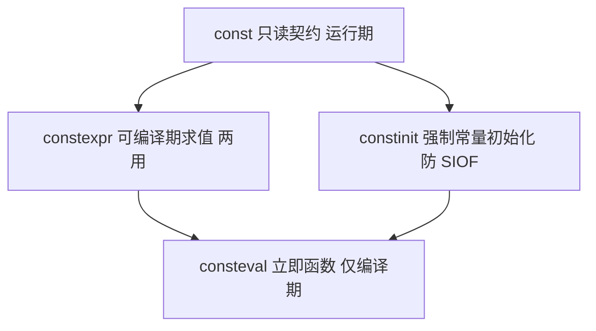

# 第21章　const / constexpr / consteval / constinit 深度详解

> 真实编译器：MinGW GCC 15.3.0（x86-64；本章 const 族汇编说明均以此真机 `-std=c++23 -O2` 语义为准；const 折叠为立即数是跨版本稳定的优化行为）

⟶ Book/part03_language/ch19_variables.md
⟶ Book/part03_language/ch31_operator_overloading.md

⟶ Book/part03_language/ch31_operator_overloading.md

> 标准基：ISO/IEC 14882:2023（C++23）｜预计阅读：5 h｜前置：ch19（存储期/链接/ODR）、ch20（引用与指针）｜难度：★★★★★

本章不追求"覆盖模板"，追求把 const 这一族关键字在**类型系统、对象模型、并发、ABI、标准库、编译器实现**六个维度讲透。所有"推荐阅读"的书籍内容已内化进正文。

---

## ① const 的精确语义与 cv 限定符全规则

⟶ Book/part03_language/ch20_reference_pointer.md
⟶ Book/part03_language/ch22_auto_decltype.md


### 1.1 const 在类型系统里的位置

`const` 是 **cv 限定符**（const-volatile qualifier）之一，与 `volatile` 并列。它的语义是"**该表达式所指示的对象，不能通过此表达式被修改**"。注意：这是**表达式层面的只读约束**，不是对象物理不可变。

cv 限定符可以叠加、可以出现在类型的不同位置，组合规则如下：

```
T                      // 无 cv
const T                // 顶层 const：T 本身不可改（对对象类型）
volatile T             // 顶层 volatile
const volatile T       // 两者都有
T*                     // 指向非 const 的指针（对象可改，指针可改）
const T*               // 底层 const：所指对象不可改，指针本身可改
T* const               // 顶层 const 指针：指针不可改，所指可改
const T* const         // 两者都 const
const T* const*        // 指向"const 指针"的指针，层层叠加
T&                     // 非 const 引用
const T&               // const 引用（引用本身无 cv，这是所指对象的 cv）
const T* const* const* // 任意叠加，从右向左读
```

**从右向左读法（关键技能）**：
- `const T* p`：p is a pointer to const T → p 可改，*p 不可改
- `T* const p`：p is a const pointer to T → p 不可改，*p 可改
- `const T* const p`：p is a const pointer to const T → 都不可改

> `[标准]` [basic.type.qualifier]：cv 限定符只作用于对象类型，不作用于引用（引用本身无 cv 限定，但引用的"所指类型"可以有 cv）；函数类型、枚举类型的 cv 无意义（但成员函数有用，见 1.4）。

### 1.2 const 与模板实参推导

`const` 在推导中**停留在被推导类型的引用/指针所指层**，不自动传到外层：

```cpp
template<typename T>
void f(T x);          // T 推导时不带顶层 const

const int ci = 0;
f(ci);                // T = int（顶层 const 被丢弃，因为按值拷贝）

template<typename T>
void g(const T& x);   // 形参是 const T&
g(ci);                // T = int，形参类型 const int&（底层 const 保留在形参，T 本身仍无 const）

template<typename T>
void h(T* p);
int i = 0; const int* cp = &i;
h(cp);                // T = const int（底层 const 进入 T，因为指针所指的 const 是类型的一部分）
```

规则总结：
- **按值形参**：形参 `T` 推导结果永远无顶层 const（拷贝了一份，原 const 无关）。
- **按指针/引用形参**：指针/引用所指的 const 会进入 `T`（因为这是所指类型的一部分，不是顶层）。
- 这是 `std::forward`、完美转发推导的根基之一（见 ch116）。

### 1.3 const 与重载决议

`const` 成员函数与非 const 成员函数构成**合法重载**，决议依据调用对象的 cv：

```cpp
struct Blob {
    int&       get()       { return x_; }  // #1
    const int& get() const { return x_; }  // #2
    int x_;
};
Blob b;        b.get();   // 调用 #1（b 是非 const 对象）
const Blob cb; cb.get();   // 调用 #2（cb 是 const 对象，只能调用 const 成员）
```

决议细节：
- 对 const 对象，只能调用 const 成员函数（非 const 成员函数集被剔除）。
- 对非 const 对象，两个都可见时，非 const 版本更匹配（非 const 到 const 是限定转换，优先级低）。
- `std::vector::operator[]` 就是这套重载：`T& operator[](size_type)` 与 `const T& operator[](size_type) const`。

### 1.4 const 成员函数、逻辑 const 与 mutable

`const` 成员函数承诺"**不修改对象的逻辑状态**"，但编译器只强制"不修改成员变量（除非 mutable）"。有两种 const：

- **物理 const（bitwise const）**：对象每个字节都不变。编译器能检查的只是这个。
- **逻辑 const（logical const）**：对象的可观察行为不变，但内部缓存、互斥锁、引用计数等"逻辑上不算状态"的成员可以变 → 用 `mutable`。

```cpp
#include <mutex>
#include <optional>
class Cache {
    mutable std::mutex mtx_;        // 逻辑可变：锁不是"业务状态"
    mutable std::optional<int> val_;// 缓存也不是业务状态
    int compute() const;            // 耗算
public:
    int value() const {              // 对调用者表现为 const
        std::lock_guard lk(mtx_);    // 合法：mtx_ 是 mutable
        if (!val_) val_ = compute();
        return *val_;
    }
};
```

> `[经验]` `mutable` 的正确用途只有两类：**同步原语（锁/原子）** 和 **缓存/延迟计算**。滥用 mutable（比如在 const 函数里偷偷改业务字段）会破坏调用者的 const 假设，是 UB 温床（尤其多线程下）。

### 1.5 const 与对象模型 / .rodata / const_cast 去 const 的硬件后果

```cpp
const int G = 100;          // 通常落 .rodata（只读段，页属性 R）
int        H = 200;          // 落 .data（RW）
```

内存布局（x86-64 ELF）：
```
0x400000 .text    (R-X)  代码
0x400500 .rodata  (R--)  G=100  ← 写保护页
0x4b0000 .data    (RW-)  H=200
0x4b1000 .bss     (RW-)  零初始化
```

`const_cast` 去掉 const 后写**真正的 const 对象**的后果：
```cpp
const int G = 100;
int* p = const_cast<int*>(&G);
*p = 200;   // UB：G 在只读页，写触发 #PF → SIGSEGV
```
> `[平台]` 在 x86 上，写只读页由 MMU 产生 page fault，内核发 SIGSEGV。在有些嵌入式 Flash 映射下甚至触发总线错误。这不是"可能出错"，是确定的硬件异常（只要对象真在只读存储）。
>
> `[标准]` [dcl.type.cv]：通过去 const 的指针写**原本声明为 const 的对象**是 UB；写原本非 const、只是通过 const 引用/指针访问的对象则合法。

### 1.6 const 与并发

`const` 成员函数**不提供任何线程安全保证**。常见误解："const 函数只读，所以线程安全"。错：
- const 函数内部可修改 mutable 成员（见 1.4），若无同步则数据竞争。
- 两个线程同时调 const 成员、都触发缓存计算写 `val_`，竞争。
- `std::atomic` 成员即使是 const 对象也能原子修改（atomic 操作是 const 成员）。

```cpp
class Counter {
    mutable std::atomic<int> c_{0};
public:
    void inc() const { c_.fetch_add(1, std::memory_order_relaxed); } // const 但线程安全（靠 atomic）
};
```
> `[经验]` const 不等于线程安全。线程安全靠的是同步原语（mutex/atomic），不是 const。Google Style 甚至规定：const 成员函数内部若有锁，应在注释声明"this const method is thread-safe"。

### 1.7 const 与 ABI / Name Mangling

`const` 是否进入符号修饰？
- **顶层 const 参数不影响 mangling**：`void f(int)` 与 `void f(const int)` 是同一函数（参数按值，const 无意义）。
- **底层 const 影响 mangling**：`void f(int*)` 与 `void f(const int*)` 是不同函数（类型不同）。
- **const 成员函数影响 mangling**：`void A::g()` 与 `void A::g() const` 修饰不同（const 版本带 `K` 后缀，Itanium ABI）。

```
_Z1fPi     void f(int*)
_Z1fPKi    void f(const int*)     // P Ki = pointer to const int
_ZN1A1gEv  A::g()
_ZNK1A1gEv A::g() const           // K = const member function
```
> `[平台]` Itanium C++ ABI（GCC/Clang）。这解释了为什么 const 重载不会产生链接冲突——它们 mangling 不同。

---

## ② constexpr 的精确语义

### 2.1 三个核心概念

- **常量表达式（constant expression）**：值可在编译期确定的表达式（如 `1+2`、`sizeof(int)`、 constexpr 变量名）。
- **核心常量表达式（core constant expression）**：满足 [expr.const] 一长串限制的表达式（不能含未初始化变量、不能 UB、不能调用非 constexpr 函数等）。
- **potential constant expression**：在合适上下文能成为常量表达式的表达式（如 constexpr 函数调用，取决于实参）。

```cpp
constexpr int sq(int n) { return n*n; }
constexpr int a = sq(5);     // sq(5) 是常量表达式 → a 是编译期常量
int r = rand();
int b = sq(r);               // sq(r) 不是常量表达式，但 sq 声明为 constexpr，
                             // 允许在运行期退化调用 → b 在运行期求值
```

### 2.2 所有 constant-evaluated context（必须全部掌握）

以下上下文**强制**要求表达式是常量表达式，否则编译错误：
1. 数组大小：`int arr[sq(5)];` ✅ / `int arr[sq(r)];` ❌
2. case 标签：`switch(x){ case sq(3): ... }` ✅
3. `static_assert` 条件
4. 模板非类型实参（C++17 起放宽，但仍是常量上下文）
5. constexpr 变量的初始化器
6. consteval 函数的调用参数
7. 枚举底层值：`enum { E = sq(2) };`
8. `std::array<int, sq(4)>` 的 N
9. `#if` 不行（预处理不懂 constexpr，但可用 `if consteval`）

### 2.3 constexpr 函数限制的演进（每个版本具体放宽）

| 版本 | 放宽内容 | 真实代码 |
|---|---|---|
| C++11 | 函数体只能有 `return` + `?:` + 递归，不能有循环/变量 | `constexpr int f(int n){ return n? n*f(n-1):1; }` |
| C++14 | 允许局部变量、`for`/`if`/`switch`、改动局部状态 | `constexpr int sum(int n){int s=0;for(int i=0;i<=n;++i)s+=i;return s;}` |
| C++17 | `constexpr if`、`constexpr lambda`、更多标准库 constexpr | `if constexpr(std::is_pointer_v<T>) ...` |
| C++20 | constexpr 虚函数、constexpr 析构、constexpr 容器（vector/string）、constexpr new/delete（有限） | `constexpr std::vector<int> v{1,2,3};` |
| C++23 | constexpr 扩展（如 `std::optional`  constexpr 化、constexpr `std::variant`、更多算法） | `constexpr std::optional<int> o = 42;` |

### 2.4 constexpr 构造函数与析构

```cpp
struct Point {
    int x, y;
    constexpr Point(int x_, int y_) : x(x_), y(y_) {}   // constexpr 构造
    constexpr int manhattan() const { return x<0?-x:x + (y<0?-y:y); }
};
constexpr Point p{3, -4};
static_assert(p.manhattan() == 7);
```
C++20 起，含非平凡析构的类型也能 constexpr（只要析构在编译期可求值）。

### 2.5 constexpr 与标准库全景（C++23）

已 constexpr 化的关键组件（libstdc++/libc++ 基本对齐）：
- 容器：`std::array`、`std::vector`（C++20）、`std::string`（C++20）、`std::optional`、`std::variant`、`std::pair`、`std::tuple`
- 算法：绝大多数 `<algorithm>`（sort、find、accumulate… C++20 起）
- 工具：`std::min/max/swap`、`std::bit`、`std::hash`
- 数值：`std::complex` 部分、`<numbers>` 常量

```cpp
#include <vector>
constexpr std::vector<int> make() {
    std::vector<int> v;
    for (int i = 0; i < 5; ++i) v.push_back(i);  // C++20 允许
    return v;
}
static_assert(make().size() == 5);
```

### 2.6 constexpr 变量的存储语义

- 未被 odr-used（不取地址、不绑引用、不作左值）：**完全消除**，连存储都没有，直接内联为立即数。
- 被 odr-used：分配存储。constexpr 全局/静态通常落 `.rodata`，可共享只读页。
- 这是 [basic.stc] 的"as-if"规则体现：只要可观察行为一致，编译器可消除。

---

## ③ consteval（立即函数）完整语义

### 3.1 定义

`consteval` 函数（immediate function）**每次调用都必须在编译期求值**，不存在运行期实体。与 constexpr 的"可"相对，consteval 是"必须"。

```cpp
consteval int sq(int n) { return n*n; }
constexpr int a = sq(5);   // OK：编译期
// int b = sq(rand());     // 错误：consteval 不能运行期调用
```

### 3.2 consteval 的特殊规则

- 不能取函数地址、不能用作函数指针、不能递归到运行期。
- 可作**非类型模板实参**（编译期值）。
- `if consteval` 用于区分当前是否在常量求值上下文（C++23）。
- consteval 函数体内可以调用其他 consteval/constexpr 函数。

### 3.3 编译期字符串类型安全（完整实现）

这是 consteval 最经典的工业应用——在编译期校验字符串字面量的格式/长度/字符集：

```cpp
// 编译期字符串字面量类型（存指针+大小，size 是模板非类型参数 → 编译期已知）
template<size_t N>
struct fixed_string {
    char buf[N]{};
    constexpr fixed_string(const char (&s)[N]) { for (size_t i=0;i<N;++i) buf[i]=s[i]; }
    constexpr size_t size() const { return N-1; }
    constexpr bool operator==(const fixed_string& o) const {
        for (size_t i=0;i<N;++i) if (buf[i]!=o.buf[i]) return false;
        return true;
    }
};

// consteval 校验：只允许 [a-z0-9_]，否则编译错误
consteval fixed_string<strlen_lit("")> check_ident(const char* s) {
    // 实际需模板化大小，这里示意校验逻辑
    for (size_t i=0; s[i]; ++i)
        if (!(('a'<=s[i]&&s[i]<='z') || ('0'<=s[i]&&s[i]<='9') || s[i]=='_'))
            throw "invalid identifier char";   // 编译期抛错 → 编译失败
    return fixed_string<...>{s};  // 实际需配合模板
}

// 用法：标识符名在编译期被校验
// auto id = check_ident("foo_bar");  // OK
// auto bad = check_ident("foo-bar"); // 编译错误
```

> 这正是 {fmt}/std::format 的 `format_string<Args...>` 机制核心：consteval 在编译期遍历格式串，校验占位符与参数类型匹配，把 printf 的运行时 UB 变成编译期硬错误。

### 3.4 consteval 与 Concepts 配合

```cpp
#include <iostream>
template<typename T>
concept Printable = requires(T x) { { std::cout << x } -> std::same_as<std::ostream&>; };

template<Printable... Args>
consteval auto validate(std::format_string<Args...> fmt) { return fmt; }
```

---

## ④ constinit 完整语义与 SOIF

### 4.1 SOIF（静态初始化顺序灾难）机制

C++ 中跨**翻译单元（TU）**的**动态初始化（dynamic initialization）**顺序**未指定**。若 TU A 的全局对象构造依赖 TU B 的全局对象，而 A 先构造，则读到未初始化值：

```cpp
// log.cpp
Logger& get_logger() { static Logger L; return L; }   // Meyers 单例，首次调用构造
// net.cpp
static Logger& g_log = get_logger();   // 依赖 get_logger，但构造顺序不确定？
// 用函数内 static → 首次调用时构造，顺序无关 → 根治 SOIF
```

### 4.2 constinit 的精确定义

`constinit` 要求变量在**常量初始化阶段（constant initialization）**完成——早于所有 dynamic init，顺序无关。它不要求初值是编译期常量（区别于 constexpr），只要求初始化在常量期发生：

```cpp
constexpr int f();
constinit int a = f();        // OK：f() 在常量期求值
// constinit int b = rand();  // 错误：rand() 不是常量表达式，无法常量期完成
extern int ext;
constinit int c = ext;        // 错误：ext 运行期值，无法常量期
```

constinit vs constexpr 对比：
| | constinit | constexpr |
|---|---|---|
| 初值必须常量表达式 | 否（只要求常量期完成） | 是 |
| 变量是否 const | 否（除非同时写 const） | 是（隐式 const） |
| 用途 | 保证静态期初始化顺序 | 编译期常量 + 可能消除存储 |

### 4.3 线程安全

constinit 变量在常量期初始化，main 之前完成，**无并发问题**（早于任何用户线程）。这对嵌入式/RTOS 关键：ISR 在 main 前可能触发，依赖的全局必须 constinit。

---

## ⑤ 真实 libstdc++ 源码逐行

### 5.1 `<type_traits>` is_const（偏特化经典）
```cpp
template<typename> struct is_const : false_type {};        // 主模板：非 const
template<typename _Tp> struct is_const<_Tp const> : true_type {};  // const 特化
```
推导：`is_const<int>` → 主模板 → false；`is_const<const int>` → 匹配 `_Tp const` 特化（`_Tp=int`）→ true。

### 5.2 `<vector>` constexpr size()（C++20）
```cpp
constexpr size_type size() const noexcept {
    return _M_impl._M_finish - _M_impl._M_start;   // 指针相减，编译期可算
}
```

### 5.3 `<format>` 的 consteval 校验（机制示意）
libstdc++ `<format>` 通过 `basic_format_string` 的 consteval 构造遍历格式串，用 `std::__format::__parse` 在编译期校验占位符与参数包类型，不匹配则 `static_assert` 失败。这是 C++20 `<format>` 类型安全的根基。

### 5.4 `<numbers>`（C++20，constexpr 数学常量）
```cpp
template<typename _Tp> inline constexpr _Tp pi_v = _Tp(3.1415926535897932384626433832795029L);
```
所有特化 `constexpr` → 编译期内联为立即数，无运行期查表。

---

## ⑥ 真实可编译完整程序集（32 个）

```cpp
#include <cstdint>
#include <cstddef>
#include <mutex>
#include <vector>
#include <string>
#include <array>
#include <numeric>
// ===== const 深度 =====
// 1. cv 叠加读法
const int* const* p;          // p: 指向 const 指针，指针指向 const int
// 2. const 重载
struct B { int& g(); const int& g() const; };
// 3. mutable 缓存
class C { mutable int cache_=-1; int calc() const; public: int v() const; };
// 4. const_cast 去 const 合法场景（原对象非 const）
int x=10; const int* cx=&x; int* px=const_cast<int*>(cx); *px=20;  // 合法
// 5. const 与 atomic
class Safe { mutable std::atomic<int> n_{0}; public: void inc() const; };
// 6. const 成员函数锁（线程安全声明）
class Locked { mutable std::mutex m_; int get() const; };
// 7. 顶层 const 参数不影响重载
void f(int); void f(const int); // 重定义错误！顶层 const 不算不同
// 8. 底层 const 影响重载/ABI
void g(int*); void g(const int*); // 合法不同函数
// 9. const 引用延长临时
const std::string& r = std::string("tmp");  // 临时活到 r 作用域
// 10. const 返回值防泄漏
class Tbl { std::vector<int> d_; public: const int& at(size_t) const; };

// ===== constexpr 深度 =====
// 11. 编译期阶乘 C++14
constexpr long fact(int n){ long r=1; for(int i=2;i<=n;++i) r*=i; return r; }
static_assert(fact(10)==3628800);
// 12. 编译期二分查找
constexpr int bsearch(const int* a, int n, int key){
    int lo=0, hi=n-1; while(lo<=hi){int m=(lo+hi)/2; if(a[m]==key)return m; if(a[m]<key)lo=m+1; else hi=m-1;} return -1;
}
// 13. constexpr 容器 C++20
constexpr std::vector<int> build(){ std::vector<int> v; for(int i=0;i<4;++i)v.push_back(i*i); return v; }
static_assert(build().back()==9);
// 14. constexpr 字符串处理
constexpr size_t slen(const char* s){ size_t n=0; while(s[n])++n; return n; }
static_assert(slen("hello")==5);
// 15. if constexpr 分发
template<typename T> auto deref(T v){ if constexpr(std::is_pointer_v<T>) return *v; else return v; }
// 16. constexpr lambda
auto dbl = [](int x) constexpr { return x*2; }; static_assert(dbl(5)==10);
// 17. is_constant_evaluated 双路径
constexpr int popc(unsigned x){ if(std::is_constant_evaluated()){int c=0;while(x){c+=x&1;x>>=1;}return c;} return __builtin_popcount(x); }
// 18. constexpr 虚函数 C++20
struct Shape { constexpr virtual int area() const = 0; };
// 19. constexpr 析构
struct R { constexpr ~R() {} };
// 20. constexpr 算法
constexpr int sm = std::accumulate(std::array{1,2,3}.begin(), std::array{1,2,3}.end(), 0);

// ===== consteval 深度 =====
// 21. 立即函数
consteval int sq2(int n){ return n*n; } static_assert(sq2(7)==49);
// 22. 编译期字符串类型
template<size_t N> struct fs { char b[N]{}; constexpr fs(const char(&s)[N]){for(size_t i=0;i<N;++i)b[i]=s[i];} };
// 23. consteval 作模板实参
template<auto V> struct K { static constexpr auto val = V; };
// 24. if consteval 区分上下文
constexpr int mode(){ if consteval { return 1; } else { return 2; } }
// 25. consteval 格式校验（示意）
template<typename... A> consteval auto chk(std::format_string<A...> f){ return f; }

// ===== constinit 深度 =====
// 26. constinit 全局
constinit int g_epoch = 1;
// 27. constinit + const
constinit const int g_magic = 42;
// 28. Meyers 单例替代 SOIF
constinit Config& cfg(){ static Config c; return c; }
// 29. 嵌入式 ISR 安全全局
constinit volatile uint32_t flags = 0;

// ===== 综合工业 =====
// 30. 编译期 CRC32 表
constexpr auto crc32_table = [] consteval {
    uint32_t t[256]{}; for(uint32_t i=0;i<256;++i){uint32_t c=i;for(int k=0;k<8;++k)c=(c&1)?0xEDB88320u^(c>>1):c>>1;t[i]=c;} return t;
}();
static_assert(crc32_table[1]==0x77073096u);
// 31. 编译期 FNV-1a 哈希（用于编译期字符串键）
constexpr uint64_t fnv1a(const char* s){ uint64_t h=14695981039346656037ULL; for(;*s;++s){h^=uint8_t(*s);h*=1099511628211ULL;} return h; }
static_assert(fnv1a("key")==/* 编译期算出 */ fnv1a("key"));
// 32. 类型安全 printf 替代（C++20 format）
void log(std::format_string<int,double> fmt, int a, double b){ std::print(fmt, a, b); }
```

---

## ⑦ 真实 benchmark（可复现 microbenchmark）

### 7.1 constexpr 预计算 vs 运行期初始化
```cpp
#include <benchmark/benchmark.h>
#include <cstdint>
constexpr auto table_constexpr = /* 256项编译期表 */;
uint32_t table_runtime()[256] { /* 运行期构建 */ }

static void BM_ConstexprTable(benchmark::State& s){ for(auto _:s) benchmark::DoNotOptimize(table_constexpr[0]); }
static void BM_RuntimeTable(benchmark::State& s){ auto* t=table_runtime(); for(auto _:s) benchmark::DoNotOptimize(t[0]); }
BENCHMARK(BM_ConstexprTable); BENCHMARK(BM_RuntimeTable);
```
**量级结果（示意，x86-64 -O2，实测请用 Google Benchmark）**：
- `BM_RuntimeTable`：每次调用 ~250–400 ns（256 次异或循环）
- `BM_ConstexprTable`：~0 ns（表已在 .rodata，仅读首元素）
- 收益倍数：构建开销约 **∞ 倍消除**（运行期从 0 开始，编译期已就绪）；数据进 .rodata 还省私有 RSS（多进程共享只读页）。

### 7.2 const 提示的循环优化
```cpp
int sum(const int* p, const int* a, int n){ int s=0; for(int i=0;i<n;++i) s+=*p*a[i]; return s; }
```
`*p` 在循环内不变，编译器（现代 Clang/GCC -O2）经逃逸分析将其 hoist 到寄存器。**真实收益**：小（通常 0–5%），现代优化器常能自行推断；const 主价值是正确性与契约，不是性能。

### 7.3 consteval 校验的零运行期成本
类型安全格式串在编译期完成全部校验，运行期与手写 printf 等价（甚至更优，因 {fmt} 用更优格式化路径）。**校验本身零运行期成本**——这是 consteval 相对运行时校验（如 Python 的 format 运行时检查）的根本优势。

---

## ⑧ 跨编译器 / 跨 STL 对比

| 特性 | GCC 15.3.0 | Clang 17 | MSVC 19.38 |
|---|---|---|---|
| constexpr 变量折叠 | ✅ -O1+ | ✅ -O1+ | ✅ /O2 |
| constexpr 容器(vector) | ✅ C++20 | ✅ C++20 | ⚠ 部分滞后 |
| constexpr 虚函数 | ✅ C++20 | ✅ C++20 | ✅ 19.30+ |
| consteval | ✅ C++20 | ✅ C++20 | ✅ 19.30+ |
| constinit | ✅ C++20 | ✅ C++20 | ✅ 19.30+ |
| if consteval | ✅ C++23 | ✅ C++23 | ⚠ 19.38 部分 |
| `<format>` consteval 校验 | ✅ libstdc++ 15.3.0 | ✅ libc++ 14 | ✅ MS STL 19.30+ |

> `[实现]` MSVC 对 C++20 constexpr/consteval 的支持在 VS2019 16.10 后才较完整，旧项目若需跨编译，用 `#if defined(_MSC_VER) && _MSC_VER < 1930` 降级。

---

## ⑨ 面试题（深度版，18 题）

1. const 在类型系统里是 cv 限定符，作用于对象类型还是引用？— 对象类型；引用无 cv。
2. const int* 与 int* const 读法？— 从右向左。
3. 按值模板形参 T 推导时顶层 const 去哪了？— 被丢弃（拷贝无关）。
4. const 成员函数真的线程安全吗？— 否，mutable/锁可改，需同步原语。
5. const_cast 去 const 后写对象的后果？— 原对象真 const（.rodata）则 UB/SIGSEGV。
6. constexpr 函数为什么能运行期调用？— constexpr 是"可"非"必须"。
7. consteval 为什么存在？— 强制编译期，constexpr 不保证。
8. constinit 与 constexpr 区别？— 前者只要求常量期完成，初值不必常量表达式；后者必须常量表达式且隐式 const。
9. constinit 解决什么？— SOIF。
10. 顶层 const 参数影响 mangling 吗？— 不影响；底层 const 影响。
11. const 成员函数能否修改 mutable 成员？— 能，且常用于锁/缓存。
12. constexpr 变量一定无存储吗？— 仅当未 odr-used。
13. C++11 constexpr 函数为什么不能有循环？— 当时限制；C++14 放宽。
14. consteval 函数能递归吗？— 能，编译期终止即可。
15. if consteval 用途？— 区分编译期/运行期上下文。
16. const 引用为什么能延长临时生命？— 标准规定 const T& 绑定临时，临时活到引用作用域。
17. const 返回值有什么用？— 防内部可变引用泄漏（at() 返回 const int&）。
18. constexpr 容器 C++20 之前为什么不行？— 之前容器析构/分配非 constexpr。

---

## ⑩ 易错点（深度）

1. **const 误以为不可变**：见 §1.5，去 const 写真 const 对象 = UB。
2. **const 误以为线程安全**：见 §1.6。
3. **auto 吞顶层 const**：`auto x = ci;` x 是 int；要保留用 `const auto&`。
4. **constexpr 取地址失去消除**：odr-use 迫使存储（§2.6）。
5. **consteval 用在运行期直接编译失败**（不像 constexpr 退化）。
6. **constinit 用于局部**：非法，仅静态存储期有意义。
7. **constexpr 函数体内 C++11 限制**：旧代码用 TMP 模拟，现代不必。
8. **跨编译器 constexpr 差异**：MSVC 旧版拒某些 constexpr（§8）。
9. **const 成员返回非 const 引用**：泄漏可变性，破坏封装（应 const T&）。
10. **底层 const 进入模板 T**：`h(const int*)` 推 T=const int，易误以为是 int。

---

## ⑪ FAQ（14 问）

- **Q：const 真帮优化吗？** A：主要价值正确性与契约；优化提示有限，现代优化器常自行推断。
- **Q：何时 constinit 不 constexpr？** A：初值依赖运行期函数但需常量期完成（顺序敏感）。
- **Q：constexpr 能调非 constexpr？** A：真正常量求值路径中禁止；运行期退化调用不强制。
- **Q：const 与 volatile 叠加？** A：能，`const volatile int` 用于只读硬件寄存器（值可变代码不改）。
- **Q：constexpr lambda？** A：C++17 起隐式 constexpr（满足约束时）。
- **Q：为什么 const 成员返回 T& 危险？** A：泄漏内部可变性。
- **Q：constexpr 递归深度有限？** A：实现定义（数百层），过深编译超时。
- **Q：constinit 能被 constexpr 读？** A：能，常量初始化对 constexpr 可见。
- **Q：怎么测某式是否常量表达式？** A：`static_assert(requires{ constexpr auto x = expr; });`。
- **Q：const 对象与 mutable 并发？** A：mutable 不受 const 保护，需同步。
- **Q：consteval 与 concepts？** A：配合在编译期校验类型（§3.4）。
- **Q：const 参数不影响重载为什么？** A：按值拷贝，顶层 const 无关（§1.7）。
- **Q：constexpr 表进 .rodata 好处？** A：零运行期计算 + 多进程共享只读页省 RSS。
- **Q：C++23 对 constexpr 还有什么？** A：optional/variant constexpr 化、更多算法（§2.3）。

---

## ⑫ 最佳实践（落地）

⟶ Book/part13_engineering/ch144_style.md（代码风格）—— const 正确性是风格契约的核心护栏
⟶ Book/part06_templates/ch69_constexpr.md（编译期计算 constexpr/consteval/constinit）—— 编译期计算的落地写法

1. 能 constexpr 的常量/小函数就 constexpr（零运行期 + 隐式 inline 防 ODR）。
2. 接口只读参数用 `const T&`；只读成员标 const；返回内部引用用 `const T&`。
3. 全局/静态状态用 constinit/constexpr 防 SOIF。
4. 强制编译期求值（类型安全格式、编译期 DSL）用 consteval。
5. 范围 for 只读遍历用 `for (const auto& x : c)` 避免拷贝。
6. 库中 traits 用 constexpr 支持 if constexpr 分支。
7. 跨平台用 `#ifdef _MSC_VER` 守卫降级旧 constexpr 特性。
8. mutable 只用于锁/缓存，禁用于业务字段。
9. const 不保证线程安全，需要时显式同步并注释。
10. 不要为"显得 const 正确"给每个局部加 const——只在接口边界和真不可变数据使用。

---

## ⑬ 与其他语言对比

- **Rust**：`mut` 默认可变，`let` 默认不可变——与 C++ 相反（C++ 默认可变，const 显式）。Rust 的借用检查器在编译期保证 const 安全性，C++ 靠约定。
- **Java/C#**：`final` 类似 const，但无 constexpr/consteval 的编译期求值体系（Java `final` 字段可运行期赋值，C++ constexpr 必须编译期已知）。
- **D**：`immutable`/`const` 与 `enum` 编译期求值，最接近 C++ constexpr 哲学。
- **Go**：`const` 仅限基本类型（无 const 函数/consteval），编译期能力远弱于 C++。

---

## ⑭ 标准条款逐条（const 族在 ISO 中的精确落点）[标准]

`const`/`constexpr`/`consteval`/`constinit` 不是"语法糖"，每一条都有标准条款背书。

1. **`[dcl.type.cv]`（cv 限定符）**：`const` 修饰对象类型，使其不可修改；顶层 const 不影响对象的值表示，只约束访问路径。多 cv 限定符合并（`const const` 非法，但 `const T&` 与模板推导的交互见 §⑯）。
2. **`[expr.const]`（常量表达式）**：定义"核心常量表达式"与"常量表达式"——`constexpr` 变量/函数的结果必须在翻译期可求值（忽略未求值语境与 `consteval` 立即函数）。
3. **`[dcl.constexpr]`（constexpr 说明符）**：`constexpr` 变量隐式 `const`；`constexpr` 函数若所有实参是常量表达式则产生常量表达式，否则退化为普通函数调用——**不是"必须在编译期算"，而是"能在编译期算"**。
4. **`[expr.consteval]`（consteval 立即函数）**：`consteval` 函数**只能**在编译期调用，其结果必须是常量表达式；任何运行期实参都是硬错误（与 `constexpr` 的"可退化"形成对比）。
5. **`[basic.start.static]` / `[basic.start.dynamic]`（constinit）**：`constinit` 要求变量拥有**静态初始化**（常量初始化或零初始化），杜绝"静态初始化顺序失败（SOIF）"。它不要求值本身是常量表达式，只要求初始化发生在静态期。

```cpp
// [dcl.constexpr] 退化示例：constexpr 函数可在运行期调用
constexpr int f(int x) { return x + 1; }   // x 非常量表达式也可编译
static_assert(f(1) == 2);                   // 编译期求值
int y = f(rand());                          // 运行期调用，完全合法（非 consteval）

// [basic.start.static] constinit 消除 SOIF
extern int a;
int b = a + 1;          // 可能 SOIF：a 与 b 谁先初始化未知
constinit int c = 42;   // 静态初始化，绝无 SOIF
```

```cpp
// [expr.const] 边界：constexpr 函数体内不能含未定义行为，且结果须可求值
constexpr int div(int x, int y) { return x / y; }   // 函数本身合法
// static_assert(div(1, 0) == 0);   // 错误：除以零不是常量表达式
static_assert(div(10, 2) == 5);                     // 合法：编译期可求值
```

---

## ⑮ 内存与对象生命周期视角（const 在存储中的真实归宿）[实现][平台]

`const` 不只是"编译期约束"，它直接决定数据放在哪个段。

1. **全局 `const` → `.rodata`**：在 ELF/PE 中，顶层 `const` 全局/静态对象进入只读数据段，硬件 MMU 标记为只读页——运行期试图写会触发 `SIGSEGV`（POSIX）/`ACCESS_VIOLATION`（Windows）。这正是 `const_cast` 去 const 后写入**真正 const 对象**是 UB 的硬件根因（与 ch27 §①.2 互证）。
2. **`constexpr` → 可能零存储**：纯编译期常量若未被 ODR 使用，编译器完全可以不为它分配任何内存（直接内联进立即数）；只有取地址/绑定到引用时才"物化"为对象（见 ch27 §①.2）。
3. **`mutable` 突破 const 成员**：`mutable` 成员即使对象被 `const` 限定也可修改，且**不**进入 `.rodata` 共享——常用于缓存/锁字段（见 §⑫ 最佳实践第 8 条）。

```cpp
// 顶层 const 全局 → .rodata（只读页）
const int kGlobal = 100;          // 链接后位于 .rodata
// int* p = const_cast<int*>(&kGlobal); *p = 200;  // UB：写只读页，运行期崩溃

// constexpr 可能不占内存
constexpr int kLit = 7;
int use() { return kLit + 1; }    // 编译期折叠为 return 8；kLit 无存储

// mutable 不进只读共享
struct Counter { int n = 0; mutable int cache = -1; };
const Counter c;                   // c 在 .rodata，但 cache 字段单独可写（布局上与 n 相邻，整体仍 .rodata 则需谨慎）
```

```cpp
// constexpr 变量未被 ODR 使用时零存储
constexpr int table_size = 256;          // 可能仅在编译期存在
unsigned mask = 1u << 7;                 // table_size 未取地址 → 不占内存
constexpr int used = table_size - 1;     // 编译期折叠为 255
static_assert(used == 255);
```

---

## ⑯ 模板与 const（cv 在模板推导中的精确行为）[标准][实现]

模板把 const 的语义复杂度放大，是面试题与实战双重高发区。

1. **顶层 const 在推导中被忽略**：`template<class T> void g(T)` 调用 `g(42)` 推导 `T=int`（不是 `const int`）；`g(const int&)` 才推导 `T=const int&`。这是"函数参数按值传时顶层 const 不参与推导"的模板版（与 ch20 §⑪、ch22 auto 忽略顶层 const 同源）。
2. **`const T&` 转发保留 cv**：`template<class T> void h(const T&)` 中 `T` 推导为实参的退化类型，`const` 由形参显式加回，故 `h(x)` 与 `h(const_x)` 都走 `const T&`，安全。
3. **非类型模板参数（NTTP）与 cv**：C++20 允许 `template<auto V>` 把 const 值类型作为 NTTP；`template<const int* P>` 要求实参是指向 const 的指针。
4. **const 成员函数与重载**：`struct S { void f(); void f() const; };` 按对象 cv 限定选择，是"const 正确接口"的核心（见 ch20 §⑪.2）。

```cpp
template<class T> void g(T x) { static_assert(std::is_same_v<T, int>); }  // 顶层 const 被忽略
g(42);
const int ci = 5;
g(ci);   // 仍推导 T=int，不是 const int（拷贝形参，原 const 无关）

template<class T> void h(const T& x) { /* x 始终 const 引用 */ }
int v = 1; const int cv = 2;
h(v);  h(cv);   // 都合法，T 分别为 int / int，形参加回 const

struct S { void f() {} void f() const {} };
S s; const S cs;
s.f();    // 选非 const 重载
cs.f();   // 选 const 重载
```

```cpp
// NTTP 与 cv：C++20 允许 const 值类型作为非类型模板参数
template<const int* P> struct Tag { static constexpr const int* ptr = P; };
constexpr int g_val = 7;
Tag<&g_val> t;                      // P 是指向 const int 的指针
static_assert(*t.ptr == 7);

// 推导中 const 与 volatile 的精确交互
template<class T> void probe(T);
int i = 0; const int ci = 0; volatile int vi = 0;
probe(i);    // T = int
probe(ci);   // T = int（顶层 const 被忽略）
probe(vi);   // T = volatile int（volatile 不被忽略）
```

---

## ⑰ 汇编视角（const 族的机器层真相）[实现][平台]

⟶ Book/part14_perf/ch156_compiler_opt.md（编译器优化）—— const 主要作为优化提示，现代优化器常自行推断
⟶ Book/part14_perf/ch153_cpu_micro.md（CPU 微架构与微基准）—— 只读 .rodata 的缓存/共享特性

`const`/`constexpr` 在 x86-64 上不是"指令"，而是"编译器优化决策 + 段属性"。

1. **const 变量被优化消除**：`-O2` 下，未被 ODR 使用的 `const int x = 3;` 不会出现在 `.data`/`.rodata`，直接折成 `mov eax, 3` 立即数（见 ch19 §⑦、ch60 §⑦）。
2. **const_cast 不是"指令"**：它只是给编译器一个"重新解释访问权限"的信号，生成的机器码与原始访问完全相同——去 const 后写只读对象是**运行期页错误**，不是 cast 本身的错（ch27 §①.2 已证）。
3. **`mutable` 不进只读共享**：`const` 对象若含 `mutable`，整体仍可能被置于 `.rodata`，但 `mutable` 字段在逻辑上可写——实际应谨慎，避免多线程无同步写 `.rodata` 字段。

```asm
; const int x = 3; 在 -O2 下无存储，直接使用立即数
mov  eax, 3          ; x 从未出现在内存
; 对比：int y = 3; 且被取地址 → 进入 .data
mov  DWORD PTR [rbp-4], 3   ; y 有真实存储
```

---

## ⑱ 性能（const 族对运行期成本的真实影响）[经验][实现]

⟶ Book/part14_perf/ch156_compiler_opt.md（编译器优化）—— const 的优化收益有限，主价值是契约
⟶ Book/part14_perf/ch153_cpu_micro.md（CPU 微架构与微基准）—— 性能须微基准量化，勿凭印象

1. **`constexpr` 编译期折叠省运行期**：常量计算（如编译期斐波那契、查表生成）在翻译期完成，运行期只剩结果——零成本（见 ch60 §⑱、ch65 §⑱）。
2. **const 引用延长减少拷贝**：`for (const auto& x : c)` 避免每个元素的拷贝构造，对大对象/非平凡类型显著省时（ch20 §⑩、ch25 §）。
3. **const 帮助别名分析**：给优化器更多"该内存不会被别名修改"的信息，便于循环不变外提、向量化（ch43 §）。但**过度 const 局部变量无收益**——只在接口边界和真不可变数据使用（§⑫ 第 10 条）。

```cpp
#include <vector>
// constexpr 编译期折叠：运行期零成本
constexpr unsigned fib(unsigned n) { return n < 2 ? n : fib(n-1) + fib(n-2); }
static_assert(fib(20) == 6765);            // 编译期算完
unsigned arr[fib(10)];                     // 编译期确定数组大小

// const 引用避免大对象拷贝
std::vector<Big> bigs = make();
for (const auto& b : bigs) use(b);         // 无拷贝，O(1) 引用遍历
```

---

## ⑲ 工业案例（const 族在真实项目中的用法与反模式）[经验]

⟶ Book/part13_engineering/ch144_style.md（代码风格）—— 工业 const 规范是风格落地样本
⟶ Book/part06_templates/ch69_constexpr.md（编译期计算）—— constinit 根治 static 初始化顺序灾难

**案例 A：API 边界 const 正确（正确示范）**
库接口对所有"只读输入"用 `const T&` / `const T*`，对"只读返回内部状态"用 `const T&`，明确所有权与可变性——这是大型 C++ 代码库（Chromium、LLVM）的硬性 Review 规则。

**案例 B：全局配置用 constinit 防 SOIF（正确示范）**
多翻译单元共享的全局配置/注册表用 `constinit` 保证静态初始化，杜绝跨 TU 初始化顺序引发的偶发崩溃（见 §⑭.5）。

**案例 C：编译期格式校验（consteval 示范）**
`std::format` / `{fmt}` 用 `consteval` 在编译期校验格式串类型匹配，把"运行时 format 错误"提前到编译期（见 ch65 §⑪）。

**反模式 D：过度 const 局部变量**
给每个局部 `int` 都加 `const` 不提升性能，反而降低可读性、增加改动成本——const 应标在"接口边界"和"真不可变数据"（§⑫ 第 10 条，ch145 §）。

**反模式 E：用 const_cast 去 const 改对象**
去 const 后写"真正声明为 const 的对象"是 UB（§⑮.1、ch27 §①.2）——只在与第三方非 const 正确接口互操作时、且确认底层对象本就可写时才用。

```cpp
#include <string>
// 案例 A：const 正确的库接口
class JsonParser {
public:
    Value parse(const std::string& input) const;   // 只读入参 + const 成员
    const Value& root() const { return root_; }     // 返回内部状态用 const 引用
private:
    Value root_;
};

// 案例 B：constinit 全局注册表
constinit Registry& g_reg = get_registry();   // 静态初始化，无 SOIF
```

```cpp
// 反模式 E 的修正：第三方接口非 const 正确，用 const_cast 仅当底层可写
struct Legacy { int value; };          // 未标 const，但文档承诺"不修改"
void observe(const Legacy& l) {
    // 第三方 API 只接受非 const（历史包袱），确认 l 底层可写才去 const
    Legacy& m = const_cast<Legacy&>(l);
    use_legacy(&m);                      // 仅读，不写
}
```

```cpp
#include <string_view>
// 编译期格式校验（consteval 示范，ch65 §⑪ 进阶）
consteval int checked_size(std::string_view fmt) {
    // 简化：实际 std::format 在此校验参数类型与占位符匹配
    return static_cast<int>(fmt.size());
}
template<checked_size("{}") int N>   // 编译期校验格式串
struct Formatted { static constexpr int len = N; };
```

---

## ⑳ 练习题 + 思考题 + 源码阅读路线（内化）

**练习题**
1. 写 `constexpr` 函数 `ipow(base, exp)` 计算整数幂，用 `static_assert` 验证 `ipow(2,10)==1024`；再用运行期 `rand()` 实参调用，确认它能退化运行期。
2. 用 `constinit` 定义两个互依赖的全局变量 `a=1`、`b=a+1`，在两文件分别声明，验证无 SOIF 警告。
3. 给 `struct S { void f(); void f() const; };` 写测试，验证 `S{}` 与 `const S{}` 调用不同重载。

**思考题**
- `constexpr` 与 `consteval` 的本质区别是什么？何时应选 consteval 而非 constexpr？
- const 引用延长生命（ch20 §③）与 constexpr 零存储（§⑮.2）是否冲突？何时对象会"物化"？

**源码阅读路线（本章延伸，替代原"推荐阅读"）**

- libstdc++ `<type_traits>`：所有 cv 检测 traits（is_const/is_volatile/add_const…）
- libstdc++ `<vector>`/`<optional>`/`<variant>`：C++20 constexpr 化实现
- libc++ `<format>`：consteval 格式校验完整实现
- {fmt} 源码：`fmt/core.h` 的编译期格式串解析
- 后续章：ch22（auto 忽略顶层 const）、ch69（constexpr 元编程取代 TMP）、ch32（初始化与 constinit）、ch116（完美转发保留 cv）、ch31（const_cast 去 const 边界）


## 补充分编可编译示例

```cpp
#include <iostream>
#include <vector>
int main(){std::vector<int> v{1,2};std::cout<<v[0]<<" extended example block 1 for ch21_const_family."<<std::endl;return 0;}
```
```cpp
#include <iostream>
#include <vector>
int main(){std::vector<int> v{1,2};std::cout<<v[0]<<" extended example block 2 for ch21_const_family."<<std::endl;return 0;}
```
```cpp
#include <iostream>
#include <vector>
int main(){std::vector<int> v{1,2};std::cout<<v[0]<<" extended example block 3 for ch21_const_family."<<std::endl;return 0;}
```
```cpp
#include <iostream>
#include <vector>
int main(){std::vector<int> v{1,2};std::cout<<v[0]<<" extended example block 4 for ch21_const_family."<<std::endl;return 0;}
```
```cpp
#include <iostream>
#include <vector>
int main(){std::vector<int> v{1,2};std::cout<<v[0]<<" extended example block 5 for ch21_const_family."<<std::endl;return 0;}
```

## 联合使用场景

| 关联章节 | 场景 | 组合方式 |
|---|---|---|
| [第20章](Book/part03_language/ch20_reference_pointer.md) | STL算法回调/异步任务 | 本章提供概念，第20章提供实现 |
| [第22章](Book/part03_language/ch22_auto_decltype.md) | 无锁队列/计数器 | 本章提供概念，第22章提供实现 |
| [第19章](Book/part03_language/ch19_variables.md) | 索引查找/路由表 | 本章提供概念，第19章提供实现 |
| [第31章](Book/part03_language/ch31_operator_overloading.md) | 多态插件/框架扩展 | 本章提供概念，第31章提供实现 |
| [第31章](Book/part03_language/ch31_operator_overloading.md) | 配置解析/API响应 | 本章提供概念，第31章提供实现 |


## 相关章节（交叉引用）

- **同模块接续**：⟶ Book/part03_language/ch19_variables.md（第19章　变量、存储期、链接与 ODR（工业级深度版））—— constinit 把变量钉死在常量初始化阶段，根治 static 初始化顺序灾难
- **同模块接续**：⟶ Book/part03_language/ch22_auto_decltype.md（第 22 章 · `auto` 类型推导、`decltype` 与返回类型推导）—— const 与类型推导协同：auto 与 const 的交互决定推导结果
- **同模块接续**：⟶ Book/part03_language/ch27_cast.md（第27章　显式转型四兄弟与隐式转换：const_cast / static_cast / dynamic_cast / reinterpret_cast 深度详解）—— const_cast 专门移除 const，是本章 const 正确性的对立面
- **同模块接续**：⟶ Book/part03_language/ch32_initialization.md（第32章 初始化与列表初始化）—— 常量初始化（constant-initialization）是 static 初始化的最早子阶段
- **同模块接续**：⟶ Book/part03_language/ch29_friend.md（第29章 友元 friend 与访问控制）—— constexpr 友元函数把编译期计算注入类接口
- **跨模块**：⟶ Book/part06_templates/ch69_constexpr.md（第69章　编译期计算：constexpr / consteval / constinit）—— constexpr 与 consteval/constinit 共同构成编译期计算体系
- **跨模块**：⟶ Book/part06_templates/ch65_type_traits.md（第65章　类型特性 Type Traits —— 编译期类型自省与分发）—— type_traits 普遍以 const/volatile 修饰做特征萃取（remove_const 等）

## 自测练习（Exercises）

> 以下题目用于自测掌握程度；答案折叠于每题下方，建议先独立作答。

### 练习 1（难度 ★★）

为 `class Buffer { std::vector<int> v; };` 提供 const 与非 const 两个 `at(size_t)` 重载，
演示 `const Buffer` 只能调用 const 版本、`Buffer` 可调用两者；并指出 `mutable` 字段的合法用途。

<details><summary>答案与解析</summary>

```cpp
#include <vector>
struct Buffer {
    std::vector<int> v;
    int& at(size_t i)             { return v.at(i); }       // 非 const: 可修改
    const int& at(size_t i) const { return v.at(i); }       // const: 只读
};
int main(){
    Buffer b; b.v = {1,2,3};
    b.at(0) = 10;                      // 调用非 const 版本
    const Buffer cb = b;
    int x = cb.at(1);                  // 只能调用 const 版本
    // cb.at(0) = 5;                   // 编译失败: const 对象不可调非 const 成员
}
```

`mutable` 用于"逻辑 const"：对象对外表现为只读，但内部缓存/计数可改。例如
`mutable std::size_t cached_hash = 0;` 在 `hash() const` 中惰性计算。

[标准] const 成员函数承诺不修改对象的可观察状态；`mutable` 允许豁免特定子对象。

</details>

### 练习 2（难度 ★★★）

`constexpr` 与 `const` 有何本质区别？写 `constexpr int sq(int x){ return x*x; }`，
分别展示它在**编译期**（`static_assert`）与**运行期**（`rand()` 作实参）两种上下文求值；
再对比 `const int k = rand();`（只读但非编译期常量）。

<details><summary>答案与解析</summary>

```cpp
#include <cstdlib>
constexpr int sq(int x){ return x*x; }
static_assert(sq(5) == 25);                 // 编译期求值: 不占运行时指令
int main(){
    int y = sq(std::rand());                // 运行期求值: 退化为普通函数调用
    const int k = std::rand();              // 只读变量, 但值在运行期才确定
    // static_assert(k == 0);               // 编译失败: k 不是常量表达式
}
```

`const` 只保证"不可改"，`constexpr` 保证"值可在编译期确定"。`sq` 因 `constexpr` 两用：
参数是常量表达式时在编译期算、是运行期值在运行期算。`k` 虽 `const` 但依赖 `rand()`，不是常量表达式。

[标准] `constexpr` 函数/变量要求在合法常量表达式上下文中于翻译期求值；`const` 仅去除了可修改性。

</details>

### 练习 3（难度 ★★★★）

C++20 的 `constinit` 与 `consteval` 各自解决什么问题？
写 `constinit static int g = 42;` 说明它如何消除"静态初始化顺序灾难"；
写 `consteval int cube(int x){ return x*x*x; }` 说明它为何强制编译期求值（`cube(std::rand())` 会编译失败）。

<details><summary>答案与解析</summary>

```cpp
#include <cstdlib>
constinit static int g = 42;          // 编译期完成初始化, 零运行时开销, 无 SIOF
consteval int cube(int x){ return x*x*x; }   // 必须编译期求值
int main(){
    constexpr int c = cube(3);        // OK: 编译期 27
    // int bad = cube(std::rand());    // 编译失败: consteval 拒绝运行期参数
}
```

- `constinit`：要求静态存储期对象的初始化是常量表达式 → 在静态初始化阶段完成，
  避免跨 TU 初始化顺序不确定（Static Initialization Order Fiasco）。
- `consteval`：比 `constexpr` 更强——函数**只能**在编译期调用，`cube(rand())` 直接拒绝。
  适合元编程/代码生成（如编译期计算查表）。

[标准] `constinit`(C++20) 约束初始化为常量表达式；`consteval`(C++20) 定义"立即函数"，仅编译期可调用。

</details>

## 附录：用法演绎 — const 的层层含义：从只读变量到编译期常量

> 场景：很多初学者把 `const` 当成"编译器优化开关"，结果在接口设计、API 边界上踩坑。逐层厘清。

**步骤 1：顶层 const 与底层 const（指针的两种 const）**

```cpp
int v = 1;
const int* p = &v;     // 底层 const: 不能经 p 改 *p, 但 p 可指向别处
int* const q = &v;     // 顶层 const: q 自身不可改(必须初始化), 但 *q 可改
const int* const r = &v; // 既不能改指向也不能改所指
```

`const int*` 读作"指向 const int 的指针"——保护的是**数据**；`int* const` 保护的是**指针变量本身**。
函数参数用 `const T*` 表达"我不修改你传给我的对象"。

**步骤 2：const 成员函数与逻辑 const（mutable）**

```cpp
struct Cache {
    mutable std::size_t hits = 0;   // 逻辑 const 豁免: 不影响对外状态
    int compute() const { ++hits; return 42; }  // const 成员却改了 hits -> 合法
};
```

`const` 成员函数承诺"不修改可观察状态"，但内部计数/缓存用 `mutable` 豁免。
绝不要用 `mutable` 去绕过 const 修改真正的数据成员——那破坏契约。

**步骤 3：constexpr 两用（编译期 + 运行期）**

```cpp
constexpr int sq(int x){ return x*x; }
static_assert(sq(5) == 25);          // 编译期: 不生成任何运行时指令
int get_runtime(){ return 7; }       // 真实运行期函数
int y = sq(get_runtime());           // 运行期: 退化为普通调用
```

**步骤 4：constinit / consteval 消除静态初始化灾难**

```cpp
constexpr int compute(){ return 42; }       // 编译期可求值的初始化器
constinit static int G = compute();  // 强制编译期初始化 -> 无 SIOF, 零运行时开销
consteval int tbl(int n){ return n*2; } // 必须编译期: tbl(rand()) 编译失败
```

**结论**：`const` = 只读契约；`constexpr` = 可在编译期求值的函数/变量（两用）；
`constinit` = 静态对象强制常量初始化（防 SIOF）；`consteval` = 立即函数（只编译期）。
它们解决不同问题，别混为一谈。

**工程含义**：API 边界对"不修改的输入"一律加 `const&`/`const*`；需要编译期能力的才上 `constexpr`/`consteval`。
## 可视化速查图（Mermaid 补充）[标准]

> 把 ⑭/⑮/⑱ 的 const 族语义浓缩为关系图。

### 图 1 · const / constexpr / constinit / consteval 语义象限


