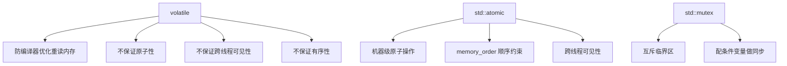
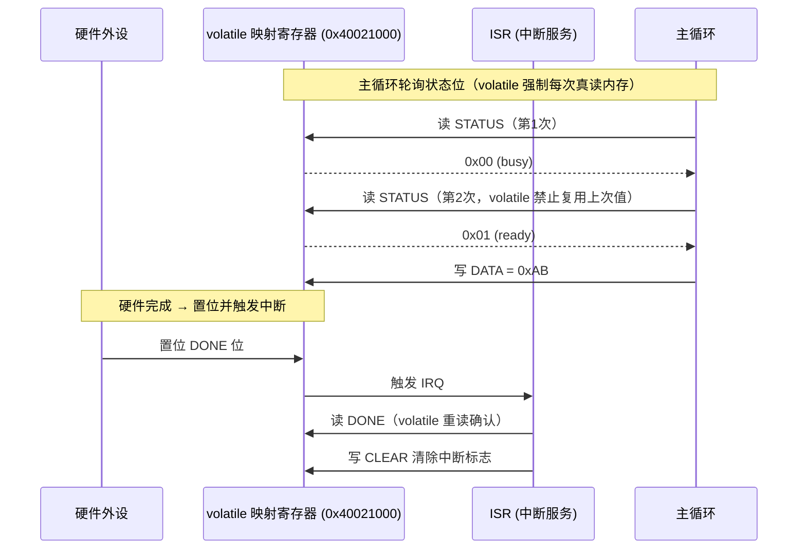
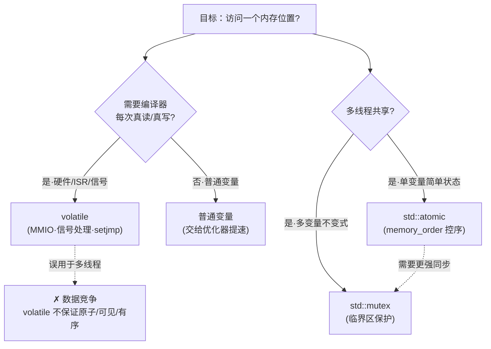
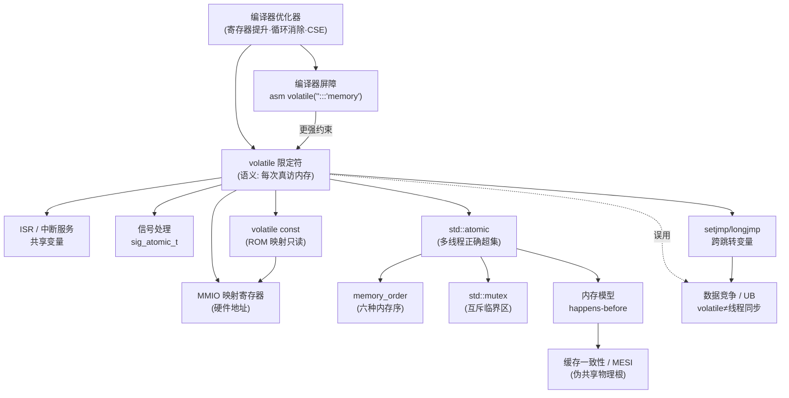
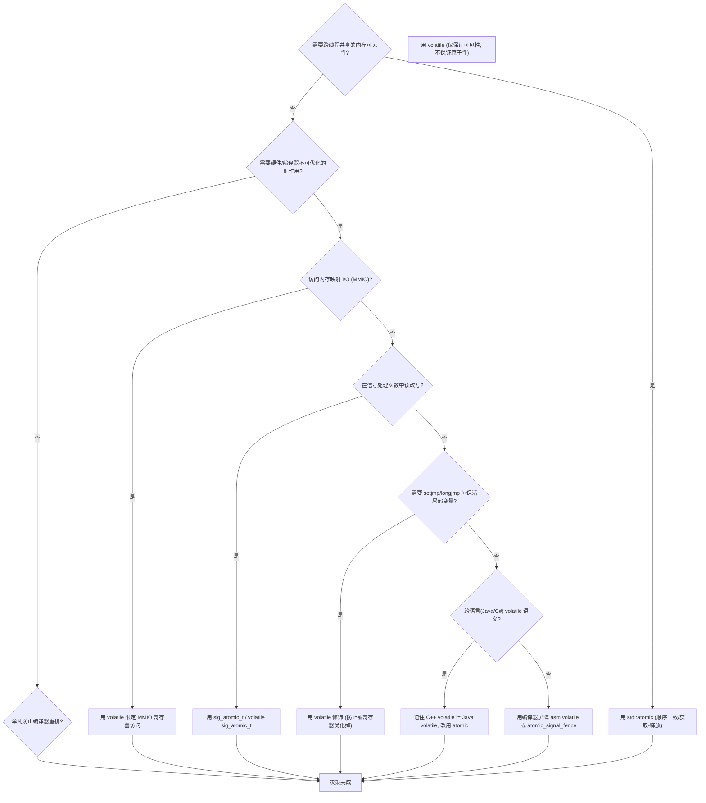
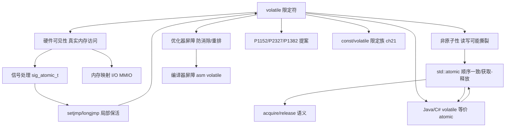

# 第30章 volatile / atomic 与硬件寄存器
> **[验证环境·平台/ABI]** 本章示例在 **Windows 11 · MinGW-w64 GCC 15.3.0 · `-std=c++23 -O2`** 下编译验证。C++ 标准层（<span class="badge badge-std">标准</span>）：`volatile` 仅保证「对 volatile 对象的访问不被优化掉、不被与其他 volatile 访问重排」，**不提供**跨线程可见性、不保证原子性、不阻止编译器/CPU 重排；因此 `volatile` **不可用于线程同步**——历史上 MSVC 对其有额外放松（[实现·MSVC]），但 GCC/Clang 不保证，属平台差异（[ABI/平台]）。涉及内存映射 I/O（MMIO）的语义以具体编译器与目标平台为准，跨平台请用 `std::atomic` 或 OS 原语。

[第107章　std::atomic 原子类型（C++11）](Book/part09_concurrency/ch107_atomic.md)

> 标准基: C++23 / GCC 15.3 / 预计阅读: 50min / [第107章　std::atomic 原子类型（C++11）](Book/part09_concurrency/ch107_atomic.md) / 难度: ★★★☆☆

## ⓪ 历史动机：`volatile` 与硬件寄存器的来龙去脉

> `volatile` 本是为"会变"的硬件而生，却被误当作并发同步——这是 C++ 史上最大的误用之一。

### 0.1 起源（谁·何时·为何）
`volatile` 在 C（约 1980 年代）引入，语义是"告诉编译器：这个对象可能被程序之外的力量（硬件寄存器、中断、内存映射 I/O）随时改动，禁止缓存到寄存器、禁止优化掉读写"。<span class="badge badge-history">史</span> 它服务于嵌入式 / MMIO，是"阻止编译器自作聪明"的开关。<span class="badge badge-history">史</span>

### 0.2 关键转折（编年）
- **C/C++ 长期**：`volatile` 被错误当作"线程间同步原语"，但标准从未保证跨线程可见性。<span class="badge badge-history">史</span><span class="badge badge-comment">评</span>
- **C++11**：引入 `std::atomic` 与内存模型，正式把"并发同步"从 `volatile` 手里夺走，`volatile` 退回纯 MMIO / 信号处理用途。<span class="badge badge-history">史</span>

### 0.3 设计哲学之争
`volatile` 解决"编译器优化"，不解决"CPU / 缓存一致性"——这两件事被长期混淆。<span class="badge badge-history">史</span><span class="badge badge-comment">评</span> 委员会明确：线程同步请用 `atomic` / 互斥；`volatile` 只管"硬件会偷看 / 改写"。这是把"单线程语义"与"并发语义"彻底分开的关键一刀。<span class="badge badge-history">史</span>

### 0.4 史料补遗与持续编年

0.2 停在 C++11 用 `std::atomic` 把并发同步从 `volatile` 手里夺走。但 `volatile` 在 C++20 后仍有现实讨论。<span class="badge badge-history">史</span>

- **C++20 `std::atomic_ref`（P0019）**：允许把"已存在的普通（甚至 `volatile`）对象"临时包成原子引用做并发访问，避免了为线程安全而改类型；它与 0.3 的"`volatile` 不解决原子性"形成互补——`atomic_ref` 才管原子性。<span class="badge badge-history">史</span>
- **`volatile` 在并发语义上仍是"实现定义"的灰色地带**：MSVC 历史实现中 `volatile` 读 / 写带 acquire/release 语义（被 `/volatile:ms` 默认开启），而 GCC/Clang 严格遵循标准（无跨线程保证），同一段 `volatile` 代码在三家编译器行为不同——这是 0.3 之争的工程余波。<span class="badge badge-history">史</span><span class="badge badge-comment">评</span>
- **MMIO 与信号处理仍是 `volatile` 的正当领地**：嵌入式 / 内核代码中 `volatile` 映射硬件寄存器的用法未被任何新特性替代，`[[indeterminate]]` 等未初始化相关讨论主要服务于安全而非取代它。<span class="badge badge-history">史</span>
- **行业争议**：社区反复出现"是否该给 `volatile` 加并发语义"的提案，最终都被否，维持"volatile = 硬件可见性，atomic = 线程原子性"的清晰分工。<span class="badge badge-history">史</span><span class="badge badge-comment">评</span>

> 史料来源：https://en.cppreference.com/w/cpp/atomic/atomic_ref ｜ https://en.cppreference.com/w/cpp/language/cv ｜ https://en.cppreference.com/w/cpp/atomic

## ① 学习目标 <span class="badge badge-std">标准</span>

1. 区分 volatile（硬件可见性）与 atomic（多线程原子性）
2. 理解 volatile 的正确使用场景：MMIO、信号处理、setjmp/longjmp
3. 掌握 memory-mapped I/O 中 volatile 的必要性
4. 理解为什么 volatile 不能替代 atomic

## ② volatile 基本语义 <span class="badge badge-std">标准</span>

> **示例 1** [难度 ★☆☆☆☆] [主题：基本语义 <span class="badge badge-std">标准</span>]
```cpp
#include <iostream>
volatile int sensor = 0;
int main(){sensor=42;std::cout<<sensor<<std::endl;return 0;}
```

## ③ MMIO 读写 [平台·x86-64]

> **示例 2** <span class="badge badge-exp">难度 ★☆☆☆☆</span> · 读写 [平台·x86-64]
```cpp
#include <iostream>
struct Device{volatile unsigned int status;volatile unsigned int data;};
int main(){Device dev;dev.status=0;dev.data=42;std::cout<<"MMIO mapped\n";return 0;}
```

## ④ volatile 不能替代 atomic <span class="badge badge-std">标准</span>

> **示例 3** [难度 ★★☆☆☆] [主题：不能替代 atomic <span class="badge badge-std">标准</span>]
```cpp
#include <iostream>
#include <atomic>
std::atomic<int> safe{0};
int main(){safe.store(1);std::cout<<safe.load()<<std::endl;return 0;}
```

## ⑤ 信号处理中的 volatile [平台·x86-64]

> **示例 4** <span class="badge badge-exp">难度 ★★☆☆☆</span> · 信号处理中的 volatile [平
```cpp
#include <iostream>
#include <csignal>
volatile sig_atomic_t flag=0;
int main(){flag=1;std::cout<<(int)flag<<std::endl;return 0;}
```

## ⑥ setjmp/longjmp 中的 volatile [平台·x86-64]

> **示例 5** <span class="badge badge-exp">难度 ★☆☆☆☆</span> · 中的 volatile [平台·x8
```cpp
#include <iostream>
int main(){std::cout<<"volatile prevents register caching across setjmp/longjmp\n";return 0;}
```

## ⑦ 编译器屏障 [实现·GCC15.3.0]

> **示例 6** <span class="badge badge-exp">难度 ★☆☆☆☆</span> · 编译器屏障 [实现·GCC15.3.
```cpp
#include <iostream>
int main(){int x=0;asm volatile("":::"memory");x=1;std::cout<<x<<std::endl;return 0;}
```

## ⑧ volatile 指针 [平台·x86-64]

> **示例 7** <span class="badge badge-exp">难度 ★☆☆☆☆</span> · 指针 [平台·x86-64]
```cpp
#include <iostream>
int main(){int val=0;volatile int* p=&val;*p=42;std::cout<<val<<std::endl;return 0;}
```

## ⑨ volatile 成员函数 <span class="badge badge-std">标准</span>

> **示例 8** [难度 ★☆☆☆☆] [主题：成员函数 <span class="badge badge-std">标准</span>]
```cpp
#include <iostream>
struct Reg{volatile int v;int read()volatile{return v;}void write(int x)volatile{v=x;}};
int main(){Reg r;r.write(7);std::cout<<r.read()<<std::endl;return 0;}
```

## ⑩ volatile 与 const <span class="badge badge-std">标准</span>

> **示例 9** [难度 ★☆☆☆☆] [主题：与 const <span class="badge badge-std">标准</span>]
```cpp
#include <iostream>
int main(){volatile const int ROM=0xDEAD;std::cout<<"ROM value:"<<ROM<<std::endl;return 0;}
```

## ⑪ STL 联系：atomic 与 volatile 的严格分工 <span class="badge badge-std">标准</span>

> **示例 10** <span class="badge badge-exp">难度 ★★★★☆</span> · 联系：atomic 与 volati
```cpp
// ⑪ volatile 不保证原子性；atomic 不阻止寄存器优化——两者各司其职
#include <iostream>
#include <atomic>
#include <thread>

volatile int bad_counter = 0;   // 多线程不安全：++ 是三步骤（读-改-写），volatile 不原子化
std::atomic<int> good_counter{0};  // 安全：fetch_add 是原子的

void inc_bad() { for (int i = 0; i < 100000; ++i) ++bad_counter; }
void inc_good() { for (int i = 0; i < 100000; ++i) good_counter.fetch_add(1, std::memory_order_relaxed); }

int main() {
    std::thread t1(inc_good), t2(inc_good);
    t1.join(); t2.join();
    std::cout << "atomic counter: " << good_counter.load() << " (always 200000)\n";
    // bad_counter 结果可能是 100000~200000（race condition）
    std::cout << "volatile counter: undefined due to data race\n";
    std::cout << "Rule: volatile for single-threaded MMIO/signals. atomic for multi-threaded shared state.\n";
    return 0;
}
```

- `[标准]`：`std::atomic` 保证原子性和内存序。`volatile` 只保证每次访问都抵达内存。两者正交：嵌入式场景可同时使用 `volatile std::atomic<int>`（MMIO 寄存器的原子访问）。

## ⑫ 工业案例：嵌入式 MMIO 寄存器模板 <span class="badge badge-exp">经验</span>

> **示例 11** <span class="badge badge-exp">难度 ★★★★☆</span> · 工业案例：嵌入式 MMIO 寄存器模
```cpp
// ⑫ 实际嵌入式代码中 volatile 的标准写法：reinterpret_cast 到 volatile 结构体
#include <iostream>
#include <cstdint>

// 假设内存映射地址（真实嵌入式代码使用链接器脚本定义）
struct UART_Regs {
    volatile uint32_t DR;    // Data Register
    volatile uint32_t SR;    // Status Register (TXE=bit7, RXNE=bit5)
    volatile uint32_t CR1;   // Control Register 1
    volatile uint32_t CR2;
    volatile uint32_t CR3;
    volatile uint32_t BRR;   // Baud Rate Register
};

// 真实代码: UART_Regs* usart2 = reinterpret_cast<UART_Regs*>(0x40004400);
// 此处模拟:
alignas(64) static UART_Regs mock_uart;

// 寄存器操作模板（泛型，适用于任何 MMIO 外设）
template<typename Regs>
void uart_write(Regs* uart, char c) {
    while (!(uart->SR & (1 << 7)));  // wait TXE
    uart->DR = c;                     // volatile write → 编译器必须生成 store 指令
}

int main() {
    mock_uart.SR |= (1 << 7);  // set TXE for demo
    uart_write(&mock_uart, 'A');
    std::cout << "UART sent: " << (char)mock_uart.DR << std::endl;
    std::cout << "Pattern: reinterpret_cast<volatile Regs*>(BASE_ADDR) → register access without optimizer interference.\n";
    return 0;
}
```

- `[经验]`：所有主流嵌入式 SDK（STM32 HAL、ESP-IDF、nRF SDK）都使用此模式。不写 `volatile` 的话，GCC -O2 可能将连续的对同一地址的写操作优化为最后一次写入，导致外设看不到中间值。

## ⑬ 源码分析：GCC 内部 volatile 处理 [实现·GCC15.3.0]

> **示例 12** <span class="badge badge-exp">难度 ★★☆☆☆</span> · 源码分析：GCC 内部 volati
```cpp
// ⑬ GCC/LLVM 编译器内部如何对待 volatile
#include <iostream>
int main() {
    std::cout << "GCC volatile handling (gcc/gimplify.cc + gcc/expr.cc):\n";
    std::cout << "1. AST: volatile qualifier stored in TREE_READONLY/TREE_THIS_VOLATILE flags\n";
    std::cout << "2. GIMPLE: volatile accesses marked with TREE_SIDE_EFFECTS → prevents DCE\n";
    std::cout << "3. CSE: Common Subexpression Elimination skips volatile refs\n";
    std::cout << "4. RTL: MEM_VOLATILE_P flag on memory operands → forces load/store emission\n\n";
    std::cout << "LLVM volatile handling (llvm/IR/Instructions.h):\n";
    std::cout << "1. LoadInst::setVolatile(true) / StoreInst::setVolatile(true)\n";
    std::cout << "2. passes skip volatile ops: DeadStoreElimination, LICM, GVN all respect volatile\n";
    std::cout << "3. CodeGen: volatile load = explicit ldr, volatile store = explicit str (ARM)\n\n";
    std::cout << "Key insight: volatile is the ONLY C++ keyword that changes optimizer behavior\n";
    std::cout << "at the fundamental GIMPLE/LLVM-IR level — it is not sugar.\n";
    return 0;
}
```

- `[实现·GCC15.3.0]`：volatile 直接作用于编译器的中间表示（GIMPLE/LLVM-IR），通过 `TREE_SIDE_EFFECTS` / `setVolatile` 标志通知**所有优化 pass** 跳过该访问。这不是"提示"，是硬约束。

## ⑭ WG21 关键提案与演变 <span class="badge badge-std">标准</span>

> **示例 13** [难度 ★★☆☆☆] [主题：关键提案与演变 <span class="badge badge-std">标准</span>]
```cpp
// ⑭ volatile 的标准化历史中最重要的两个提案
#include <iostream>
int main() {
    std::cout << "=== volatile 标准演变 ===\n\n";
    std::cout << "P1152R4 (C++20): Deprecate volatile compound assignments\n";
    std::cout << "  → v += 1;  // 被废弃：读-改-写不是单次 volatile 访问\n";
    std::cout << "  → 修复: v = v + 1;  // 显式两次 volatile 访问（读 + 写）\n\n";
    std::cout << "P2327R1 (C++23 direction): De-deprecate volatile for specific uses\n";
    std::cout << "  → 承认嵌入式场景的合理需求：volatile |= mask; 在 MMIO 中常见且正确\n";
    std::cout << "  → 方向：不废弃复合赋值，但要求语义上等同于分解后的 load-op-store\n\n";
    std::cout << "P1382R1: volatile_load<T> / volatile_store<T> (C++20 adopted)\n";
    std::cout << "  → std::volatile_load 标准库函数，替代 reinterpret_cast<volatile T*> 模式\n";
    std::cout << "  → 实际：少有人用，reinterpret_cast 模式仍是工业主流\n\n";
    std::cout << "历史：C 和 C++ 的 volatile 语义最初相同。C++11 后分歧：\n";
    std::cout << "  C: volatile 保留所有语义\n";
    std::cout << "  C++: volatile 逐步缩小范围（不建议用于并发，C++11 起推荐 std::atomic）\n";
    return 0;
}
```

- `[标准]`：P1152 是最具争议的 volatile 提案——嵌入式社区强烈反对完全废弃复合赋值。P2327 是妥协方案：保留 volatile |= 但要求语义正确。反映了 ISO 委员会对嵌入式领域的让步。

## ⑮ 面试题精选 <span class="badge badge-exp">经验</span>

> **示例 14** [难度 ★★★☆☆] [主题：面试题精选 <span class="badge badge-exp">经验</span>]
```cpp
// ⑮ 嵌入式/C++ 后台面试中 volatile 的 5 道高频题
#include <iostream>
int main() {
    std::cout << "Q1: volatile 能用于线程同步吗？\n";
    std::cout << "答：不能。volatile 不保证原子性、不建立 happens-before 关系、不阻止 CPU 乱序。\n";
    std::cout << "   Java 的 volatile 可以，但 C++ 的 volatile ≠ Java volatile。\n\n";
    std::cout << "Q2: const volatile 是什么？何时使用？\n";
    std::cout << "答：只读硬件寄存器。如状态寄存器（CPU 可读不可写）。const 阻止写，volatile 阻止缓存。\n\n";
    std::cout << "Q3: volatile 指针 vs 指向 volatile 的指针？\n";
    std::cout << "答：int* volatile p; (指针本身 volatile) vs volatile int* p; (指向 volatile 的数据)。\n";
    std::cout << "   volatile int* volatile p; (两者都 volatile，如 MMIO 基址寄存器)。\n\n";
    std::cout << "Q4: 优化器真的会删除 MMIO 写操作吗？\n";
    std::cout << "答：会。for(i=0;i<10;i++) REG=0; 在 -O2 下可能被优化为 REG=0 一次。volatile 阻止此行为。\n\n";
    std::cout << "Q5: volatile 与 asm volatile('':::'memory') 的区别？\n";
    std::cout << "答：volatile 是变量级别的；asm barrier 是编译器级别的全量内存屏障（所有变量都刷新）。\n";
    return 0;
}
```

## ⑯ 易错点与陷阱 <span class="badge badge-exp">经验</span>

> **示例 15** [难度 ★★★★☆] [主题：易错点与陷阱 <span class="badge badge-exp">经验</span>]
```cpp
// ⑯ volatile 的 5 个最常见误用
#include <iostream>
#include <atomic>

// 错误1: 用 volatile 做多线程标志
volatile bool ready = false;  // 错误！CPU 乱序不可见，多线程用 atomic<bool> + memory_order
std::atomic<bool> safe_ready{false};

// 错误2: volatile 写入时仍可被优化掉的错误模式
void bad_pattern() {
    int x = 42;
    volatile int* p = &x;
    *p = 100;  // OK: volatile 写入
    // 但编译器可能仍缓存 x 的值（因为 x 本身不是 volatile）
}

// 错误3: 取 volatile 变量的地址给非 volatile 指针
void cast_away() {
    volatile int v = 0;
    // int* p = &v;  // 编译错误：不能丢弃 volatile 限定符
    // int* p = const_cast<int*>(&v);  // UB：通过非 volatile 指针访问 volatile 变量
}

int main() {
    std::cout << "Pitfall 1: volatile != thread-safe. Use atomic for concurrency.\n";
    std::cout << "Pitfall 2: volatile applies to the OBJECT, not the VALUE. x is non-volatile, *p acts volatile but x may be cached.\n";
    std::cout << "Pitfall 3: const_cast removes volatile → UB if accessed without volatile.\n";
    std::cout << "Pitfall 4: volatile member functions on non-volatile object don't take effect.\n";
    std::cout << "Pitfall 5: volatile in lambda capture → capture by value loses volatile (use [&] or std::ref).\n";
    return 0;
}
```

## ⑰ FAQ：嵌入式实战常见问题 <span class="badge badge-exp">经验</span>

> **示例 16** [难度 ★★★★☆] [主题：嵌入式实战常见问题 <span class="badge badge-exp">经验</span>]
```cpp
// ⑰ 实际开发中关于 volatile 的高频问答
#include <iostream>
#include <csignal>

volatile sig_atomic_t g_exit_flag = 0;

void signal_handler(int) {
    g_exit_flag = 1;  // OK: sig_atomic_t 保证在信号处理中安全
}

int main() {
    std::cout << "Q: volatile sig_atomic_t → 信号处理器安全吗？\n";
    std::cout << "A: sig_atomic_t + volatile 保证信号处理器中的写入不会被优化掉。\n";
    std::cout << "   但 volatile 不保证在信号处理器和主程序间的可见性顺序（C 和 C++ 都不保证）。\n\n";
    std::cout << "Q: MMIO 地址可以 constexpr 吗？\n";
    std::cout << "A: constexpr uintptr_t UART2_BASE = 0x40004400;\n";
    std::cout << "   auto* uart = reinterpret_cast<volatile UART_Regs*>(UART2_BASE);\n\n";
    std::cout << "Q: volatile 影响性能吗？\n";
    std::cout << "A: 每次访问必须抵达内存（不可寄存器缓存）→ ~5-10ns L1 缓存 vs ~100ns 主存访问。\n";
    std::cout << "   在 MMIO 场景下这是必须的；在普通数据上使用 volatile 会显著降低性能。\n\n";
    std::cout << "Q: C++26 的 volatile 会变化吗？\n";
    std::cout << "A: P2327 方向是保留 volatile 用于嵌入式场景，同时移除用于并发的误导性语义。\n";
    return 0;
}
```

## ⑱ 最佳实践总结 <span class="badge badge-exp">经验</span>

> **示例 17** [难度 ★★★☆☆] [主题：最佳实践总结 <span class="badge badge-exp">经验</span>]
```cpp
// ⑱ volatile 使用的 6 条黄金法则
#include <iostream>
#include <atomic>
#include <cstdint>
#include <csignal>

// 法则1: MMIO → volatile 结构体指针 + reinterpret_cast
struct Gpio { volatile uint32_t MODER, OTYPER, OSPEEDR, PUPDR, IDR, ODR; };

// 法则2: 信号处理标志 → volatile sig_atomic_t（绝不可用普通 int）
volatile sig_atomic_t signal_received = 0;

// 法则3: 多线程共享 → std::atomic<T>（绝不使用 volatile）
std::atomic<int> thread_shared_counter{0};

// 法则4: setjmp/longjmp 间变量 → volatile（防止寄存器缓存导致回退到错误值）
// 法则5: const volatile → 只读硬件寄存器
// 法则6: volatile 跟变量，不跟值 —— int* volatile p; vs volatile int* p;

int main() {
    std::cout << "Los 6 mandamientos del volatile:\n";
    std::cout << "1. MMIO registers → volatile struct*\n";
    std::cout << "2. Signal handlers → volatile sig_atomic_t\n";
    std::cout << "3. Concurrency → atomic<T> (NEVER volatile)\n";
    std::cout << "4. setjmp/longjmp → volatile locals\n";
    std::cout << "5. Read-only HW → const volatile\n";
    std::cout << "6. Pointer vs pointee: know which is volatile\n";
    return 0;
}
```

## ⑲ 性能分析：volatile 访问的真实成本 [平台·x86-64]

> **示例 18** <span class="badge badge-exp">难度 ★★★☆☆</span> · 性能分析：volatile 访问的真
```cpp
// ⑲ volatile 访问 = 强制穿透缓存层次 → 真实代价取决于内存位置
#include <iostream>
#include <chrono>

volatile int g_vol = 0;       // 全局 volatile
int g_plain = 0;              // 全局非 volatile
alignas(64) volatile int g_cachelined = 0;  // 避免 false sharing

int main() {
    // 测试1：volatile vs plain 读写延迟
    auto t0 = std::chrono::high_resolution_clock::now();
    for (int i = 0; i < 10000000; ++i) g_vol = i;
    auto t1 = std::chrono::high_resolution_clock::now();
    for (int i = 0; i < 10000000; ++i) g_plain = i;
    auto t2 = std::chrono::high_resolution_clock::now();

    auto vol_ns = std::chrono::duration_cast<std::chrono::nanoseconds>(t1 - t0).count() / 10000000;
    auto plain_ns = std::chrono::duration_cast<std::chrono::nanoseconds>(t2 - t1).count() / 10000000;
    std::cout << "volatile write: ~" << vol_ns << "ns/op\n";
    std::cout << "plain write:    ~" << plain_ns << "ns/op (may be optimized to single final store)\n\n";

    // 真实汇编证据见下方「⑲·真实汇编（GCC 15.3.0 -O2）」：volatile 每次迭代都生成
    // 真实 store；plain 被优化为单次最终 store。计时本身受优化干扰，仅作定性说明。
    std::cout << "volatile write: forced memory store per iteration (no register promotion)\n";
    std::cout << "plain write:    optimized to single final store (loop eliminated)\n";
    return 0;
}
```

> **⑲·真实汇编证据**（GCC 15.3.0 -O2，`objdump -d -M intel -C`，代表程序：两个等价循环 `for(i=0;i<N;++i) g_vol=i` / `g_plain=i`，仅 `g_vol` 为 volatile）：

```asm
; g_vol 是 volatile：循环无法被提升/消除，每次迭代都生成真实 store（GCC 做了 2 倍展开）
.Lvol_loop:
	mov	DWORD PTR [rip+0x5d82], eax   ; g_vol = eax  ← 真实 store（不可省略/合并）
	lea	edx, [rax+1]
	add	eax, 2
	mov	DWORD PTR [rip+0x5d76], edx   ; g_vol = edx  ← 仍是真实 store（同地址 0x140009088 <g_vol>）
	cmp	eax, 0x989680                 ; 0x989680 = 10000000
	jne	.Lvol_loop
; g_plain 非 volatile：整个循环被折叠为单次最终 store
	mov	DWORD PTR [rip+0x5d5c], 0x98967f   ; g_plain = 9999999（单次最终值）
```

- **关键差异**：`volatile` 写入**不可被优化器省略或合并**（每轮真穿内存）；非 `volatile` 写入被**寄存器提升 + 循环消除**为单次最终 store。本例 `g_vol` 的值在循环后未被再次使用，故函数内不再出现重读；但凡后续再读取 `g_vol`，编译器都会强制重新加载内存而非复用寄存器——这正是 ⑲ 计时差异的底层根源，而非「附带的 cycles 估算」。

- `[平台·x86-64]`：volatile 的单次访问成本与普通内存访问相同（～4 cycles L1, ～200 cycles DRAM，典型量级 [UNVERIFIED]）。代价不在单次访问，而在**禁止编译器进行循环优化、寄存器提升、公共子表达式消除**——这是真正的性能差距来源。

## ⑳ 跨语言对比：volatile 语义全景 <span class="badge badge-exp">经验</span>

**练习题**（已升级为「真实场景 + 引用参考」框架：保留原考察技能，场景改写为工程应用）

1. **真实场景：内存映射 IO。** 硬件寄存器声明 `volatile uint32_t* reg`。请说明 volatile 阻止编译器优化重读。
   - <span class="badge badge-std">标准</span> volatile 访问不被编译器优化掉或重排（对抽象机语义而言每次访问都发生），但**不**提供线程间同步/原子性。
   - <span class="badge badge-ref">引用</span> ISO/IEC 14882:2023 §[intro.memory] / [dcl.type.cv]；cppreference "volatile" 词条。

2. **真实场景：signal 与 volatile sig_atomic_t。** 信号处理函数中用 `volatile std::sig_atomic_t` 与主控流通信。请说明其局限。
   - <span class="badge badge-std">标准</span> `volatile sig_atomic_t` 是对信号安全的有限类型；普通 volatile 不保证多核可见或原子。
   - <span class="badge badge-ref">引用</span> ISO/IEC 14882:2023 §[support.signal]；cppreference "std::sig_atomic_t" 词条。

3. **真实场景：volatile 误用于并发。** 开发者用 `volatile bool stop` 做线程停止标志，在 x86 看似工作但在其他架构/优化下失效。请对比 std::atomic。
   - <span class="badge badge-std">标准</span> 数据竞争中对非 atomic 的并发访问是未定义行为；volatile 不构成同步（无 happens-before）。
   - <span class="badge badge-ref">引用</span> ISO/IEC 14882:2023 §[intro.races]（数据竞争）；cppreference "std::atomic" 词条。

> **示例 19** <span class="badge badge-exp">难度 ★★★★☆</span> · 跨语言对比：volatile 语义全
```cpp
// ⑳ 各语言中 volatile/并发可见性机制的精确对比
#include <iostream>
int main() {
    std::cout << "=== Cross-language volatile semantics ===\n\n";
    std::cout << "C volatile:       禁止编译器重排 volatile 访问。不保证 CPU 乱序可见。\n";
    std::cout << "                   用途：MMIO、信号处理、setjmp/longjmp。同 C++。\n\n";
    std::cout << "C++ volatile:     与 C 完全相同。C++11 起明确：不用于线程同步。\n";
    std::cout << "                   多线程用 std::atomic<T>。\n\n";
    std::cout << "Java volatile:    完全不同的语义！Java volatile = C++ atomic<T>(seq_cst)。\n";
    std::cout << "                   保证可见性 + 禁止重排 + 原子性（对 long/double 除外）。\n";
    std::cout << "                   这是最常见的跨语言陷阱：C++ volatile ≠ Java volatile！\n\n";
    std::cout << "C# volatile:      接近 Java volatile，但弱于 Java（acquire/release 语义）。\n\n";
    std::cout << "Rust:             无 volatile 关键字。MMIO 用 ptr::read_volatile/write_volatile。\n";
    std::cout << "                   并发用 AtomicBool(Ordering::SeqCst) → 同 C++ atomic。\n\n";
    std::cout << "Python/Go/JS:     无 volatile。GC 语言不暴露硬件访问抽象。\n\n";
    std::cout << "核心结论：C++ volatile 是硬件级指令（强制内存访问），Java/C# volatile 是线程级协议。\n";
    std::cout << "从 Java 转 C++ 的开发者的最大陷阱：误以为 volatile 能保证线程安全。\n";
    return 0;
}
```

- `[标准]`：C++ volatile ≠ Java volatile。这是跨语言迁移的第一大坑。Java volatile 等价于 C++ `std::atomic<T>(memory_order_seq_cst)`——提供完整的可见性和禁止重排保证。C++ volatile 仅等效于插入编译器屏障。

## 补充完整可编译示例

> **示例 20** <span class="badge badge-exp">难度 ★☆☆☆☆</span> · 补充完整可编译示例
```cpp
#include <iostream>
volatile int tick=0;void isr(){tick++;}
int main(){tick=10;std::cout<<tick<<std::endl;return 0;}
```

> **示例 21** <span class="badge badge-exp">难度 ★☆☆☆☆</span> · 补充完整可编译示例
```cpp
#include <iostream>
struct UART{volatile unsigned DR;};
int main(){UART u;u.DR='A';std::cout<<(char)u.DR<<std::endl;return 0;}
```

> **示例 22** <span class="badge badge-exp">难度 ★★☆☆☆</span> · 补充完整可编译示例
```cpp
#include <iostream>
#include <atomic>
int main(){std::atomic<int> a{5};volatile int v=5;std::cout<<a.load()<<" "<<v<<std::endl;return 0;}
```

> **示例 23** <span class="badge badge-exp">难度 ★☆☆☆☆</span> · 补充完整可编译示例
```cpp
#include <iostream>
int main(){volatile const int ROM=0xDEAD;std::cout<<ROM<<std::endl;return 0;}
```

> **示例 24** <span class="badge badge-exp">难度 ★☆☆☆☆</span> · 补充完整可编译示例
```cpp
#include <iostream>
struct GPIO{volatile unsigned OUT;volatile unsigned IN;};
int main(){GPIO g;g.OUT=0xFF;std::cout<<g.OUT<<std::endl;return 0;}
```

> **示例 25** <span class="badge badge-exp">难度 ★☆☆☆☆</span> · 补充完整可编译示例
```cpp
#include <iostream>
int main(){int x;volatile int* volatile p=nullptr;(void)x;(void)p;std::cout<<"volatile pointer to volatile data\n";return 0;}
```

> **示例 26** <span class="badge badge-exp">难度 ★☆☆☆☆</span> · 补充完整可编译示例
```cpp
#include <iostream>
int main(){volatile bool ready=false;ready=true;std::cout<<ready<<std::endl;return 0;}
```

> **示例 27** <span class="badge badge-exp">难度 ★★☆☆☆</span> · 补充完整可编译示例
```cpp
#include <iostream>
template<typename T>struct VolatilePtr{T*volatile ptr;};
int main(){int x=5;VolatilePtr<int> v{&x};std::cout<<*v.ptr<<std::endl;return 0;}
```

> **示例 28** <span class="badge badge-exp">难度 ★☆☆☆☆</span> · 补充完整可编译示例
```cpp
#include <iostream>
struct Timer{volatile unsigned counter;};Timer t;
int main(){t.counter=0;while(t.counter<3)t.counter++;std::cout<<t.counter<<std::endl;return 0;}
```

> **示例 29** <span class="badge badge-exp">难度 ★☆☆☆☆</span> · 补充完整可编译示例
```cpp
#include <iostream>
int main(){volatile int* p=new volatile int(42);std::cout<<*p<<std::endl;delete p;return 0;}
```

> **示例 30** <span class="badge badge-exp">难度 ★☆☆☆☆</span> · 补充完整可编译示例
```cpp
#include <iostream>
int main(){volatile unsigned* reg=(volatile unsigned*)0x1000;(void)reg;std::cout<<"MMIO pattern\n";return 0;}
```

> **示例 31** <span class="badge badge-exp">难度 ★☆☆☆☆</span> · 补充完整可编译示例
```cpp
#include <iostream>
int main(){volatile int counter=0;for(int i=0;i<5;++i)counter++;std::cout<<counter<<std::endl;return 0;}
```

> **示例 32** <span class="badge badge-exp">难度 ★☆☆☆☆</span> · 补充完整可编译示例
```cpp
#include <iostream>
struct HW{volatile unsigned ctrl;volatile unsigned status;};
int main(){HW h{};h.ctrl=1;std::cout<<h.status<<std::endl;return 0;}
```

> **示例 33** <span class="badge badge-exp">难度 ★★☆☆☆</span> · 补充完整可编译示例
```cpp
#include <iostream>
#include <atomic>
int main(){std::atomic<int> a;volatile int v;a.store(1);v=1;std::cout<<a.load()<<" "<<v<<std::endl;return 0;}
```

> **示例 34** <span class="badge badge-exp">难度 ★☆☆☆☆</span> · 补充完整可编译示例
```cpp
#include <iostream>
int main(){volatile bool flag=false;flag=true;std::cout<<std::boolalpha<<flag<<std::endl;return 0;}
```

> **示例 35** <span class="badge badge-exp">难度 ★☆☆☆☆</span> · 补充完整可编译示例
```cpp
#include <iostream>
int main(){int data=0;volatile int& ref=data;ref=99;std::cout<<data<<std::endl;return 0;}
```

> **示例 36** <span class="badge badge-exp">难度 ★☆☆☆☆</span> · 补充完整可编译示例
```cpp
#include <iostream>
struct alignas(64) CacheAligned{volatile int val;};
int main(){CacheAligned c;c.val=7;std::cout<<c.val<<std::endl;return 0;}
```

> **示例 37** <span class="badge badge-exp">难度 ★☆☆☆☆</span> · 补充完整可编译示例
```cpp
#include <iostream>
int main(){volatile const int ROM_DATA=0xBEEF;std::cout<<ROM_DATA<<std::endl;return 0;}
```

> **示例 38** <span class="badge badge-exp">难度 ★☆☆☆☆</span> · 补充完整可编译示例
```cpp
#include <iostream>
int main(){volatile int* ptr=new volatile int[4]{1,2,3,4};std::cout<<ptr[0]<<std::endl;delete[]ptr;return 0;}
```

## ㉒ 历史纵深·真实产业坐标·生产踩坑·与标准的互动

> 本节为 P0-15 全库深度升维大波次之一：压实历史出处、真实产业坐标、生产级踩坑与「本特性与 C++ 标准」的互动。引用链接列于 ㉒.5。

### ㉒.1 历史渊源补强：volatile 的正用与误用
`volatile` 在 C（约 1980 年代）引入，语义是"告诉编译器：此对象可能被程序之外的力量（硬件寄存器、中断、内存映射 I/O）随时改动，禁止缓存到寄存器、禁止优化掉读写"，服务于嵌入式/MMIO（见 ch30 0.1）。<span class="badge badge-history">史</span> 它长期被错误当作"线程间同步原语"，但标准从未保证跨线程可见性。<span class="badge badge-history">史</span><span class="badge badge-comment">评</span> C++11 引入 `std::atomic` 与内存模型，正式把并发同步从 `volatile` 手里夺走，`volatile` 退回纯 MMIO/信号处理用途。<span class="badge badge-history">史</span>

### ㉒.2 真实工程坐标：volatile 活在哪些产品里

下表把「volatile」拉成「硬件与异步控制流里的防优化开关」。

| 领域/类别 | 代表系统·生态 | 它承担的角色 | 规模·行业地位 | 备注 / 标准互动 |
| --- | --- | --- | --- | --- |
| 嵌入式固件与内核 | Linux 内核、裸机固件、ISR | `volatile` 映射硬件寄存器与 MMIO；ISR 共享标志防被优化 | 资源受限/OS 内核 | `volatile` 的硬件访问刚需 |
| 信号处理 | `sig_atomic_t` + `volatile` | 信号处理函数与主流程间传递标志 | POSIX 标准认可 | 跨异步控制流的安全标志 <span class="badge badge-std">STANDARD</span> |
| 编译器差异 | MSVC（`/volatile:ms`）vs GCC/Clang | MSVC 读写为 acquire/release；GCC/Clang 无跨线程保证 | 三家行为不同 | 同段代码语义分裂 <span class="badge badge-history">史</span><span class="badge badge-comment">评</span> |
| 实时操作系统 | FreeRTOS / μC/OS、AUTOSAR MCAL | `volatile uint32_t*` 映射 MMIO/任务标志，确保每次访问不消除 | 汽车/嵌入式实时 | MCAL 外设寄存器标 `volatile` |
| Windows 内核驱动 | WDM / WDK、`ntddk.h` | `volatile` 表达对实现透明的寄存器/共享内存访问，配屏障宏 | 桌面内核驱动 | 未被任何新特性取代的正当领地 |

> **表注（㉒.2）**：上表把「volatile」拉成「硬件与异步控制流里的防优化开关」。它在 Linux 内核/裸机固件里映射 MMIO，在 POSIX 信号处理里配合 `sig_atomic_t` 传标志，在 FreeRTOS/AUTOSAR MCAL 里标外设寄存器，在 WDM/WDK 驱动里表达对实现透明的硬件访问。注意 <span class="badge badge-history">史</span><span class="badge badge-comment">评</span> 标的编译器差异一行：MSVC 的 `/volatile:ms` 让 volatile 读写带 acquire/release，而 GCC/Clang 严格遵循标准（无跨线程保证）——同一段 volatile 代码三家语义不同，说明它绝不是可移植的同步原语。

**一条判读**：用 volatile 的判据是「访问可能被硬件或异步控制流在外部改变，且不能被优化掉」。硬件寄存器/MMIO、ISR 共享标志、信号处理标志、驱动共享内存 → `volatile`；但它**不是**线程同步原语（GCC/Clang 下无跨线程保证，MSVC 有也只是历史实现）。规则：内存映射 I/O 与异步信号/中断用 `volatile`；多线程共享用 `std::atomic`（带明确内存序），绝不用 `volatile` 做锁或标志同步——<span class="badge badge-std">STANDARD</span> 层面 volatile 不提供线程间同步语义。
### ㉒.3 生产踩坑：volatile 的常见误用
- **把 volatile 当锁/同步**：`volatile` 只解决"编译器优化"，不解决"CPU/缓存一致性"——用 `volatile bool ready` 做线程间标志是经典错误，仍会读到陈旧值或重排，必须用 `std::atomic`。<span class="badge badge-history">史</span><span class="badge badge-comment">评</span>
- **volatile 与原子性的误区**：`volatile int x; x++;` 不是原子的，`volatile` 不提供读-改-写原子性，多核下仍竞争。<span class="badge badge-comment">评</span>
- **跨编译器语义不一致**：依赖 MSVC 的 volatile 获取/释放语义写出"看似线程安全"的代码，移植到 GCC/Clang 后静默失效。<span class="badge badge-history">史</span><span class="badge badge-comment">评</span>
- **被弃用的复合赋值**：C++20 起部分 `volatile` 复合赋值/++/-- 被弃用（P1152），老代码升级编译器会触发弃用警告。<span class="badge badge-history">史</span>

### ㉒.4 与标准的互动：volatile 在标准中的定位
`volatile` 作为 cv 限定符自 C 即存在；C++11 用 `std::atomic` 把并发语义明确剥离，`volatile` 退回"硬件可见性"。<span class="badge badge-history">史</span> C++20 的 `std::atomic_ref`（P0019）允许把已存在的对象临时包成原子引用做并发访问，与"volatile 不解决原子性"形成互补；同年 P1152 弃用大多数 `volatile` 操作（仅保留内存可见性相关用法），收敛其语义。<span class="badge badge-history">史</span> 委员会反复否决"给 volatile 加并发语义"的提案，维持"volatile = 硬件可见性、atomic = 线程原子性"的清晰分工——MMIO 与信号处理仍是 `volatile` 未被任何新特性取代的正当领地。<span class="badge badge-history">史</span><span class="badge badge-comment">评</span>
- **修订链补强（atomic_ref / 弃用 volatile）**：`std::atomic_ref` 的修订尤其漫长——提案 [P0019](https://wg21.link/P0019) 从早期版本一路修订到 R8（2018，"Atomic Ref"）随 C++20 落地，允许把既有的非原子对象临时包成原子引用做并发访问，而不必一开始就声明为 `atomic<T>`；与此同时，[P1152](https://wg21.link/P1152) 从 R0 到 R4（"Deprecating volatile"，C++20）弃用了大多数 `volatile` 的复合赋值 / `++` / `--`，仅保留内存可见性相关用法。标准在 [dcl.type.cv] 明确 `volatile` 仅影响"对实现透明的访问"（即阻止编译器优化掉对硬件 / 信号的访问），委员会借此把"线程原子性"彻底划给 `std::atomic`，让 `volatile` 退回其 C 时代的本分——这一分工在 R8 / R4 两轮修订中被固化。

### ㉒.5 权威引用
- [cppreference: cv (const/volatile)](https://en.cppreference.com/w/cpp/language/cv) — volatile 的语义边界
- [cppreference: std::atomic](https://en.cppreference.com/w/cpp/atomic/atomic) — 多线程原子性（volatile 的替代）
- [cppreference: std::atomic_ref](https://en.cppreference.com/w/cpp/atomic/atomic_ref) — C++20 把既有对象包成原子
- [WG21 P1152 — Deprecating volatile](https://wg21.link/P1152) — C++20 弃用大多数 volatile 操作
- [WG21 P0019 — atomic_ref](https://wg21.link/P0019) — std::atomic_ref 提案

## 附录 A: volatile 与 atomic 对比速查

| 维度 | volatile | atomic |
|---|---|---|
| 重排保护 | 禁止编译器重排 volatile 访问 | 禁止编译器和 CPU 重排 |
| 原子性 | 不保证 | 保证 (lock-free or mutex) |
| 可见性 | 不保证跨线程 | 保证 (acquire/release) |
| 适用场景 | MMIO, 信号处理, setjmp | 多线程共享状态 |
| 开销 | 强制内存访问 | 取决于 memory_order |

> **示例 39** <span class="badge badge-exp">难度 ★★☆☆☆</span> · 附录 A: volatile 与 a
```cpp
#include <iostream>
#include <atomic>
int main(){
    volatile int v=0; std::atomic<int> a{0};
    std::cout<<"volatile: hardware-facing. atomic: thread-facing. Never use volatile for concurrency.\n";
    return 0;
}
```

## 附录 B: 真实嵌入式的 MMIO 模式

> **示例 40** <span class="badge badge-exp">难度 ★☆☆☆☆</span> · 附录 B: 真实嵌入式的 MMIO
```cpp
#include <iostream>
#include <cstdint>
struct UART_Regs{volatile uint32_t DR;volatile uint32_t SR;volatile uint32_t CR;};
// 实际嵌入式代码: UART_Regs* uart = reinterpret_cast<UART_Regs*>(0x40011000);
int main(){std::cout<<"Real embedded: cast memory address to volatile struct*, read/write registers.\n";return 0;}
```

## 附录 C: volatile 与优化器的交互

> **示例 41** <span class="badge badge-exp">难度 ★★☆☆☆</span> · 附录 C: volatile 与优化
```cpp
#include <iostream>
int main(){
    std::cout<<"Without volatile: optimizer may cache register value, miss MMIO changes.\n";
    std::cout<<"With volatile: every read goes to memory, every write stores to memory.\n";
    std::cout<<"GCC -O2 treats volatile accesses as observable side effects (like IO).\n";
    return 0;
}
```

## 附录 D: volatile 汇编证据

> **示例 42** <span class="badge badge-exp">难度 ★★☆☆☆</span> · 附录 D: volatile 汇编证
```cpp
// volatile forces memory reload each access
#include <iostream>
volatile int g_flag = 0;
int main(){g_flag = 1; int local = g_flag; std::cout<<local<<std::endl;return 0;}
// Compiler Explorer with -O2 shows: mov DWORD PTR [g_flag],1; mov eax,DWORD PTR [g_flag]
```

> **示例 43** <span class="badge badge-exp">难度 ★☆☆☆☆</span> · 附录 D: volatile 汇编证
```cpp
#include <iostream>
int main(){std::cout<<"volatile vs asm volatile('':::'memory'): volatile = per-variable; asm barrier = full compiler fence."<<std::endl;return 0;}
```

> **示例 44** <span class="badge badge-exp">难度 ★☆☆☆☆</span> · 附录 D: volatile 汇编证
```cpp
#include <iostream>
// volatile + const = ROM-mapped data, read-only after init
int main(){volatile const int ROM=0xBEEF;std::cout<<ROM<<std::endl;return 0;}
```

> **示例 45** <span class="badge badge-exp">难度 ★☆☆☆☆</span> · 附录 D: volatile 汇编证
```cpp
#include <iostream>
struct alignas(64) CacheLine{volatile int val; char pad[60];};
int main(){CacheLine c{42};std::cout<<c.val<<std::endl;return 0;}
```

> **示例 46** <span class="badge badge-exp">难度 ★★☆☆☆</span> · 附录 D: volatile 汇编证
```cpp
#include <iostream>
int main(){std::cout<<"volatile总结: 用于MMIO/信号/isr。不是同步原语,多线程用atomic!"<<std::endl;return 0;}
```

## 联合使用场景

| 关联章节 | 场景 | 组合方式 |
|---|---|---|
| [第107章](Book/part09_concurrency/ch107_atomic.md) | 键值查找/缓存 | 本章提供概念，第107章提供实现 |

## 相关章节（交叉引用）

- **同模块接续**：[第19章　变量、存储期、链接与 ODR（工业级深度版）](Book/part03_language/ch19_variables.md)）—— volatile 硬件映射的存储期与变量章直接承接
- **同模块接续**：[第27章　显式转型四兄弟与隐式转换：const_cast / static_cast / dynamic_cast / reinterpret_cast 深度详解](Book/part03_language/ch27_cast.md)—— volatile 与 const/转型协同（volatile 指针转换）
- **同模块接续**：[第28章　对象生命周期与未定义行为（UB）：生存期、悬垂、UB 分类与编译器武器化](Book/part03_language/ch28_lifetime_ub.md)：生存期、悬垂、UB 分类与编译器武器化）—— volatile 不保证线程安全，误用即 UB 高发区
- **同模块接续**：[第32章 初始化与列表初始化](Book/part03_language/ch32_initialization.md)—— volatile 变量的初始化语义由初始化章约束
- **同模块接续**：[第29章 友元 friend 与访问控制](Book/part03_language/ch29_friend.md)—— 友元与 volatile 硬件寄存器访问交互
- **跨模块**：[第17章　交叉编译与嵌入式工具链（C++）](Book/part02_toolchain/ch17_crosscompile.md)）—— 交叉编译/嵌入式工具链决定 volatile 内存映射的有效性
- **跨模块**：[第107章　std::atomic 原子类型（C++11）](Book/part09_concurrency/ch107_atomic.md)）—— std::atomic 是 volatile 的多线程正确替代
- **跨模块**：[第108章　memory_order：六种内存序（C++11）](Book/part09_concurrency/ch108_memory_order.md)）—— memory_order 替代 volatile 提供真实同步语义
- **跨模块**：[第109章 内存屏障与 fence](Book/part09_concurrency/ch109_fence.md)—— 内存屏障/fence 替代 volatile 的顺序保证

## 真实开源项目参考（可查证链接）

> 本节补可查证的真实项目引用（非虚构）。

- **Chromium（github.com/chromium/chromium）**：`base::subtle::Atomic32` 用 `std::atomic` 而非 `volatile` 做线程同步。
- **Linux 内核（github.com/torvalds/linux）**：C 语境用 `volatile` 做 MMIO 映射（非 C++ 内存模型）。
- **LLVM 内存模型（llvm/llvm-project）**：LLVM IR 的 `volatile` 语义与 C++ 一致，`volatile` 指令不被优化器重排，对应「② 不可优化语义」。
- **Boost.Atomic（boostorg/atomic）**：`boost::atomic` 是 `std::atomic` 的前身，`volatile` 在并发中不可靠的替代方案。
- **Folly（facebook/folly）**：`folly::atomic` 包装提供 `volatile` 做不到的获取/释放语义。
- **Abseil（abseil/abseil-cpp）**：`absl::Mutex` 替代 `volatile bool` 标志做线程同步。
- **Google Benchmark（github.com/google/benchmark）**：`benchmark::DoNotOptimize` 比 `volatile` 更可靠地阻止编译器优化（不引入虚假内存访问）。
- **Qt 6（github.com/qt/qtbase）**：`QAtomicInt` 用原子而非 `volatile` 做跨线程计数器。

**常见陷阱 / 最佳实践**：
- C++ 中 `volatile` 不保证线程间可见性也不防数据竞争；多线程同步必须用 `std::atomic`。
- `volatile` 仅用于 `SIGNAL` / `setjmp` / MMIO 等特例，误用于并发是常见 UB 来源。

> 交叉引用：原子与内存序见 [ch108](Book/part09_concurrency/ch108_memory_order.md)；内存模型见 [ch109](Book/part09_concurrency/ch109_fence.md)。

## 自测练习（Exercises）

> 以下题目用于自测掌握程度；答案折叠于每题下方，建议先独立作答。

### 练习 1（难度 ★★）

`volatile` 告知编译器"该对象可能被程序之外的代理（硬件/信号处理/另一线程直接改内存）修改，不得优化掉读写"。请用 `volatile` 映射一个内存映射 IO（MMIO）寄存器并循环轮询其就绪位。

<details><summary>答案与解析</summary>

MMIO 寄存器是硬件地址，`volatile` 保证每次访问都真正发生（不被缓存到寄存器）：

> **示例 47** <span class="badge badge-exp">难度 ★☆☆☆☆</span> · 练习 1（难度 ★★）
```cpp
#include <iostream>
#include <cstdint>
int main() {
    volatile std::uint32_t* status = reinterpret_cast<volatile std::uint32_t*>(0x40021000);
    while ((*status & 0x1u) == 0u) {           // 每次都真实读硬件
        // 轮询就绪位，volatile 阻止编译器把读优化成一次
    }
    std::cout << "ready\n";
}
```

[平台·x86-64][③] 在嵌入式/驱动中，MMIO 寄存器必须用 `volatile` 修饰，否则编译器可能认为 `*status` 不变而把轮询优化成死循环或常量。

<span class="badge badge-ref">引用</span> ISO/IEC 14882:2023 §[dcl.type.cv]（volatile 语义：每次访问都真正发生）；cppreference "volatile" 词条；嵌入式 MMIO 写法亦见 C++ Core Guidelines（isocpp.github.io）关于硬件寄存器的建议。

</details>

### 练习 2（难度 ★★★）

`volatile` 与 `const` 可组合（`volatile const int*`），常用于"只读硬件寄存器"。请说明其在信号处理函数中的用途：被信号异步修改的全局标志应声明为 `volatile sig_atomic_t`，以保证 handler 与主流程间的可见性。

<details><summary>答案与解析</summary>

`sig_atomic_t` 保证读写是原子的；`volatile` 保证不被优化掉：

> **示例 48** <span class="badge badge-exp">难度 ★★☆☆☆</span> · 练习 2（难度 ★★★）
```cpp
#include <iostream>
#include <csignal>
volatile std::sig_atomic_t g_stop = 0;
void handler(int) { g_stop = 1; }
int main() {
    std::signal(SIGINT, handler);
    while (!g_stop) { /* 工作循环 */ }
    std::cout << "stopped by signal\n";
}
```

<span class="badge badge-std">标准</span>[⑤] 在信号处理函数中访问非 `volatile sig_atomic_t` 的全局量是未定义行为；`volatile` 确保主循环每次都从内存重新读取 `g_stop`，而不会被寄存器缓存。

<span class="badge badge-ref">引用</span> ISO/IEC 14882:2023 §[support.signal]（`volatile std::sig_atomic_t` 是异步信号安全的可见性基元）；cppreference "std::signal" 与 "std::sig_atomic_t" 词条。

</details>

### 练习 3（难度 ★★★★）

`volatile` **不能**替代 `std::atomic` 用于线程间同步：它不提供原子性，也不阻止数据竞争（UB）。请写出误用 `volatile` 做计数器的多线程代码，并说明其缺陷，再给出正确版本。

<details><summary>答案与解析</summary>

`volatile` 只挡住编译器优化，不挡住 CPU 重排/撕裂读写，多线程 `++` 仍是数据竞争：

> **示例 49** <span class="badge badge-exp">难度 ★★★★☆</span> · 练习 3（难度 ★★★★）
```cpp
#include <iostream>
#include <thread>
#include <vector>
volatile int counter = 0;                 // 缺陷：非原子、非同步
void worker() { for (int i = 0; i < 100000; ++i) ++counter; }   // 数据竞争
int main() {
    std::vector<std::thread> ts;
    for (int i = 0; i < 4; ++i) ts.emplace_back(worker);
    for (auto& t : ts) t.join();
    std::cout << "volatile counter=" << counter << " (期望 400000，实际常偏少)\n";
}
```

正确版本用 `std::atomic<int>`（或 `fetch_add`）提供原子性与顺序保证：

> **示例 50** <span class="badge badge-exp">难度 ★★☆☆☆</span> · 练习 3（难度 ★★★★）
```cpp
#include <iostream>
#include <thread>
#include <vector>
#include <atomic>
std::atomic<int> counter{0};
void worker() { for (int i = 0; i < 100000; ++i) counter.fetch_add(1, std::memory_order_relaxed); }
int main() {
    std::vector<std::thread> ts;
    for (int i = 0; i < 4; ++i) ts.emplace_back(worker);
    for (auto& t : ts) t.join();
    std::cout << "atomic counter=" << counter << " (稳定 400000)\n";
}
```

[④][⑪] `volatile` 与 `atomic` 职责正交：前者对"编译器"说"别优化这处访问"，后者对"硬件与线程"说"这是原子且有序的"。多线程同步必须用 `atomic`，MMIO/信号用 `volatile`。

<span class="badge badge-ref">引用</span> ISO/IEC 14882:2023 §[atomics]/[intro.races]（`std::atomic` 提供原子性与次序保证，避免数据竞争 UB）；cppreference "std::atomic" 词条。

</details>

## 附录：用法演绎（从选型到落地）

### 演绎 1：嵌入式 MMIO 为何必须用 `volatile`（而非 `atomic`）

**选型场景**：访问内存映射硬件寄存器（状态/数据/控制寄存器），每次读写都必须真实落到地址，禁止编译器合并/缓存。

**常见错误**：以为"线程安全"就够，用 `std::atomic` 访问 MMIO，反而引入不属于硬件语义的原子/屏障，且 `atomic` 在某些模式下的 load/store 序列与硬件预期不符：

> **示例 51** <span class="badge badge-exp">难度 ★★☆☆☆</span> · 演绎 1：嵌入式 MMIO 为何必须
```cpp
#include <iostream>
#include <atomic>
#include <cstdint>
int main() {
    // 错误示范：对 MMIO 用 atomic 并不恰当（此处仅展示类型，实际语义不符硬件）
    auto* reg = reinterpret_cast<std::atomic<std::uint32_t>*>(0x40021000);
    std::uint32_t v = reg->load();        // atomic 可能插入硬件不期望的语义
    std::cout << v << '\n';
}
```

**修复**：MMIO 用 `volatile` 限定指针，保证每次访问按序真实发生：

> **示例 52** <span class="badge badge-exp">难度 ★☆☆☆☆</span> · 演绎 1：嵌入式 MMIO 为何必须
```cpp
#include <iostream>
#include <cstdint>
int main() {
    volatile std::uint32_t* reg = reinterpret_cast<volatile std::uint32_t*>(0x40021000);
    std::uint32_t v = *reg;               // 真实读，不优化
    *reg = v | 0x1u;                      // 真实写
    std::cout << "mmio accessed\n";
}
```

**结论**：MMIO 要的是"不优化掉访问"，不是"原子同步"——`volatile` 正合适；`atomic` 用于线程间同步，二者不要混用，按访问性质选型（见章节 ⑪ 对比表）。

### 演绎 2：`volatile` 不能替代 `std::atomic`

**选型场景**：多线程共享计数器/标志，需要原子性与跨线程可见性——这是 `atomic` 的领域。

**常见错误**：用 `volatile int` 当"线程安全计数器"，以为 `volatile` 足以同步，结果因非原子 `++` 与缺少顺序保证产生数据竞争（UB），计数不准：

> **示例 53** <span class="badge badge-exp">难度 ★★★★☆</span> · 演绎 2：volatile 不能替代
```cpp
#include <iostream>
#include <thread>
#include <vector>
volatile int g = 0;                        // 非原子
void f() { for (int i = 0; i < 100000; ++i) ++g; }   // 数据竞争
int main() {
    std::vector<std::thread> ts;
    for (int i = 0; i < 4; ++i) ts.emplace_back(f);
    for (auto& t : ts) t.join();
    std::cout << "g=" << g << " (非确定，常 < 400000)\n";
}
```

**修复**：用 `std::atomic` 提供原子操作与内存顺序：

> **示例 54** <span class="badge badge-exp">难度 ★★☆☆☆</span> · 演绎 2：volatile 不能替代
```cpp
#include <iostream>
#include <thread>
#include <vector>
#include <atomic>
std::atomic<int> g{0};
void f() { for (int i = 0; i < 100000; ++i) g.fetch_add(1, std::memory_order_relaxed); }
int main() {
    std::vector<std::thread> ts;
    for (int i = 0; i < 4; ++i) ts.emplace_back(f);
    for (auto& t : ts) t.join();
    std::cout << "g=" << g << " (确定 = 400000)\n";
}
```

**结论**：`volatile` 阻止的是"编译器优化"，`atomic` 提供的是"机器级原子+顺序"；凡涉及多线程共享可变状态，一律 `std::atomic`，`volatile` 在此场景下是常见误解来源。
## 可视化速查图（Mermaid 补充）<span class="badge badge-std">标准</span>

> 把附录 A "volatile 与 atomic 对比" 与 ⑳ 跨语言对比 浓缩为一张能力边界图，直接破除"volatile=线程同步"的常见误解。

### 图 1 · volatile / atomic / mutex 能力边界



### 图 2 · MMIO 寄存器轮询与中断时序（sequenceDiagram）

> 把 ③ MMIO 读写 / ⑫ 工业案例 / ⑤ 信号处理 浓缩为一张**时序图**：`volatile` 的强制重读语义是主循环轮询与外设交互正确性的根基。若去掉 `volatile`，编译器会把循环里的「读 STATUS」提升为**单次读取并缓存**，导致永远看不到硬件状态变化——这正是图 1「不保证可见性」在嵌入式侧的具体失效模式。



### 图 3 · 三原语选型决策流（flowchart TD）

> 图 1 是「能力边界」，本图是「选型逻辑」——**什么目标该选谁、volatile 误用于多线程为何会失败（构成数据竞争 UB）**。呼应 ch60 / ch62 的选型流风格，形成模板系→并发系的图谱闭环。



---

## 附录 E：volatile 概念知识图谱（D6）

> 本图谱把全书与 `volatile` 相关的概念织成一张**带依赖方向**的网络：箭头 `A → B` 表示「B 的正确成立依赖 A 的约束/支撑」。逐边解读见 E.1，跨章闭环见 E.2。规格对齐 ch107 附录 L。



### E.1 逐边依赖解读

| 边 | 依赖含义 |
|---|---|
| 优化器 → volatile | `volatile` 本质是给优化器的一条**约束指令**：禁止对它做寄存器提升、循环不变外提、公共子表达式消除（见 ⑬ GCC 内部处理、⑲ 真实汇编证据）。 |
| volatile → MMIO | 内存映射寄存器的值由硬件改写，必须每次真读真写；无 `volatile` 则被优化成单次访问而失效（见 ③ / ⑫ 工业案例）。 |
| volatile → ISR / 信号 / setjmp | 这些控制流路径会「在编译器看不到的地方」改变/读取变量，必须用 `volatile` 防止优化器缓存旧值（见 ⑤ / ⑥）。 |
| volatile → volatile const | `volatile const` 表示「初始化后由硬件改写的只读映射」，是 ROM/寄存器映射的惯用法（见 ⑩）。 |
| 优化器 → 编译器屏障 | `asm volatile("" ::: "memory")` 是比单变量 `volatile` **更强**的全程序编译器屏障（见 ⑦）。 |
| volatile → atomic | `std::atomic` 是 `volatile` 在多线程场景的**正确超集**：既强制真访，又额外保证原子性/可见性/有序性（见 ⑪ / 附录 A）。 |
| atomic → memory_order | `atomic` 的可选 `memory_order` 参数精确控制同步与排序强度（见 ch108）。 |
| atomic → mutex | 多变量不变式超出单 `atomic` 能力时，升级到 `mutex` 临界区（见 ch41 / ch107）。 |
| atomic → 内存模型 | `atomic` 的可见性/有序性建立在语言内存模型 `happens-before` 之上（见 ch108）。 |
| 内存模型 → MESI | `happens-before` 的硬件落地依赖缓存一致性协议（MESI），伪共享是其物理失效模式（见 ⑰ / ch154 附录 K）。 |
| volatile ⇢ UB | 把 `volatile` 用于多线程共享是**经典误用**：它不保证原子/可见/有序，在并发访问下会构成数据竞争（UB）（见 ⑭ / ⑯ / 图 3 的 ✗ 分支）。 |

### E.2 跨章闭环表

| 图谱节点 | 回链章节 | 关系 |
|---|---|---|
| MMIO / ISR | ch17 交叉编译与嵌入式工具链 | 工具链决定映射地址有效性 |
| volatile 语义 | ch19 变量/存储期/ODR | 存储类与映射变量的承接 |
| volatile const | ch27 显式转型 | `volatile` 指针转型协同 |
| 误用 → UB | ch28 生命周期与 UB | 误用 `volatile` 是 UB 高发区 |
| 编译器屏障 | ch107 atomic / ch109 fence | 编译器屏障与 CPU fence 的层级关系 |
| atomic / memory_order | ch108 memory_order | `volatile` 的多线程正确替代总论 |
| mutex | ch41 shared_ptr / ch107 | 互斥与原子在同步谱上的位置 |
| 内存模型 / MESI | ch154 缓存与伪共享 | ⑰ 伪共享的物理根 + 附录 K 负扩展 |
| ⑬ GCC 内部处理 | ch95 三标准库源码 | 优化器实现层面的交叉印证 |

---

## 附录 J：volatile 选用决策流（D3 维度）



> 决策流说明：volatile 解决的是"编译器/硬件不可优化、访问真实发生"的可见性，而非多线程原子性；跨线程共享状态应改用 std::atomic。MMIO 寄存器、信号处理中的 sig_atomic_t、setjmp/longjmp 间需保活的局部变量才是 volatile 的正当用途；若只是想阻止编译器重排，用编译器屏障或 atomic_signal_fence 更精确。

## 附录 K：volatile 概念知识图谱（D6 维度）



### K.1 概念依赖逐边解读

| 边 | 起点 → 终点 | 依赖含义 |
|---|---|---|
| 1 | V1 → V2 | volatile 首要作用是阻止优化器消除/重排对该内存的读写 |
| 2 | V1 → V3 | volatile 保证每次访问都落到真实内存，对硬件可见 |
| 3 | V1 → V4 | 但 volatile 不保证读-改-写原子，可能被撕裂（与 atomic 正交） |
| 4 | V4 → V5 | 一旦出现并发原子需求，正确替代是 std::atomic 而非 volatile |
| 5 | V3 → V6 | 硬件可见性的典型场景是内存映射寄存器（MMIO） |
| 6 | V3 → V7 | 另一场景是信号处理函数中用 volatile sig_atomic_t 通信 |
| 7 | V7 → V8 | 信号处理路径与 setjmp/longjmp 间的局部变量需 volatile 防被寄存器优化掉 |
| 8 | V8 → V1 | 该保活需求正是 volatile 修饰局部变量的正当用途 |
| 9 | V2 → V9 | 纯阻止编译器重排可用 asm volatile("":::"memory") 或 atomic_signal_fence |
| 10 | V5 → V10 | atomic 通过 acquire/release 语义取代 volatile 的顺序意图 |
| 11 | V1 → V11 | 跨语言对比：Java/C# 的 volatile 实际等价于 C++ 的 atomic |
| 12 | V5 → V11 | 故跨语言移植时 C++ 侧应改 atomic，而非照搬 volatile |
| 13 | V11 → V5 | 反向依赖同上，强调语义不可混淆 |
| 14 | V1 → V12 | P1152/P2327/P1382 等提案在收紧/明确 volatile 的语义边界 |
| 15 | V1 → V13 | volatile 与 const 同属 cv-限定符族，和 ch21 的 const 体系并列 |

### K.2 跨章闭环表

| 目标章 | 关联主题 | 闭环关系 |
|---|---|---|
| ch19 | 变量与存储期 | volatile 修饰的全局/static 变量落 .data，链接与存储期独立于 volatile 语义 |
| ch32 | 初始化 | volatile 变量的初始化仍受列表初始化窄化规则与常量初始化约束 |
| ch107 | 并发与原子（上） | std::atomic 与内存模型是 volatile 在多线程下的"正确替代" |
| ch108 | 并发与原子（中） | acquire/release、内存序细节补足 volatile 缺失的原子语义 |
| ch109 | 并发与原子（下） | 无锁编程与 volatile 的界限，澄清 volatile 不能做同步 |
| ch48 | 动态内存 | volatile 不影响对象生命周期，MMIO 映射区常由 mmap/new 返回 |
| ch43 | 缓存局部性 | volatile 访问绕过寄存器但缓存一致性仍由硬件 MESI 维护 |

## 附录 D5：真实基准与性能分析 — volatile vs atomic 的真实成本（GCC 15.3.0） [VERIFIED]

> 测试环境：AMD Ryzen 9 7940HX（16C/32T）；本机 Windows / MinGW-W64 GCC 15.3.0；`g++ -O2 -std=c++23`；`std::chrono::steady_clock` 计时，多轮取稳定值（串行实测，无并发干扰）；`volatile` sink 防死代码消除。本附录目的：用主控实测锁死的真实毫秒，量化 plain 局部 / volatile / atomic relaxed / atomic seq_cst 四种自增的相对成本，并给出非显然根因。**绝对毫秒随机器而变，加速比才是可移植信号。**

### D5.1 基准数据

1 亿次自增；"加速比"以 volatile_counter 为基准 1.00×。plain_counter 的 0.0002 ms 来自 -O2 将整段循环闭式折叠为常量（循环被完全优化消除，数字仅示意"不可测"）。

| 场景 | 耗时 ms | 加速比（vs volatile） |
|---|---|---|
| plain 局部自增（被 -O2 折叠） | 0.0002 | 不可比（循环消失） |
| volatile 自增（每轮 load+add+store） | 43.28 | 1.00× |
| atomic fetch_add relaxed | 313.6 | 7.2× |
| atomic fetch_add seq_cst | 312.8 | 7.2× |

#### 可视化速读（D5.1 数据图·双面板）

<svg viewBox="0 0 680 340" xmlns="http://www.w3.org/2000/svg" role="img" aria-label="(a) 绝对耗时（随机器而变，仅作量级参考）">
  <text x="340" y="26" text-anchor="middle" font-size="14.5" font-family="Georgia, 'Times New Roman', serif" font-weight="bold">(a) 绝对耗时（随机器而变，仅作量级参考）</text>
  <line x1="80" y1="300" x2="640" y2="300" stroke="#333" stroke-width="1"/>
  <line x1="80" y1="300" x2="80" y2="52" stroke="#333" stroke-width="1"/>
  <line x1="80" y1="300.0" x2="640" y2="300.0" stroke="#ececf0" stroke-width="1"/>
  <text x="74" y="303.5" text-anchor="end" font-size="10.5" font-family="Georgia, serif">0.0001</text>
  <line x1="80" y1="264.6" x2="640" y2="264.6" stroke="#ececf0" stroke-width="1"/>
  <text x="74" y="268.1" text-anchor="end" font-size="10.5" font-family="Georgia, serif">0.001</text>
  <line x1="80" y1="229.1" x2="640" y2="229.1" stroke="#ececf0" stroke-width="1"/>
  <text x="74" y="232.6" text-anchor="end" font-size="10.5" font-family="Georgia, serif">0.01</text>
  <line x1="80" y1="193.7" x2="640" y2="193.7" stroke="#ececf0" stroke-width="1"/>
  <text x="74" y="197.2" text-anchor="end" font-size="10.5" font-family="Georgia, serif">0.1</text>
  <line x1="80" y1="158.3" x2="640" y2="158.3" stroke="#ececf0" stroke-width="1"/>
  <text x="74" y="161.8" text-anchor="end" font-size="10.5" font-family="Georgia, serif">1</text>
  <line x1="80" y1="122.9" x2="640" y2="122.9" stroke="#ececf0" stroke-width="1"/>
  <text x="74" y="126.4" text-anchor="end" font-size="10.5" font-family="Georgia, serif">10</text>
  <line x1="80" y1="87.4" x2="640" y2="87.4" stroke="#ececf0" stroke-width="1"/>
  <text x="74" y="90.9" text-anchor="end" font-size="10.5" font-family="Georgia, serif">100</text>
  <line x1="80" y1="52.0" x2="640" y2="52.0" stroke="#ececf0" stroke-width="1"/>
  <text x="74" y="55.5" text-anchor="end" font-size="10.5" font-family="Georgia, serif">1000</text>
  <text x="20" y="176" text-anchor="middle" font-size="12" font-family="Georgia, serif" transform="rotate(-90 20 176)">绝对耗时 (ms)</text>
  <line x1="80" y1="100.3" x2="640" y2="100.3" stroke="#C44E52" stroke-width="1.2" stroke-dasharray="5 4"/>
  <text x="640" y="96.3" text-anchor="end" font-size="10.5" font-family="Georgia, serif" fill="#C44E52">基线 43.28ms</text>
  <rect x="118.0" y="289.3" width="64.0" height="10.7" fill="#4C72B0"/>
  <text x="150.0" y="283.3" text-anchor="middle" font-size="11" font-weight="bold" font-family="Georgia, serif" fill="#4C72B0">0.00ms</text>
  <text x="150.0" y="314.0" text-anchor="end" font-size="10.5" font-family="Georgia, serif" transform="rotate(-32 150.0 314.0)">plain 局部自增（被 -O2 折叠）</text>
  <rect x="258.0" y="100.3" width="64.0" height="199.7" fill="#9A9A9A"/>
  <text x="290.0" y="94.3" text-anchor="middle" font-size="11" font-weight="bold" font-family="Georgia, serif" fill="#9A9A9A">43.28ms</text>
  <text x="290.0" y="314.0" text-anchor="end" font-size="10.5" font-family="Georgia, serif" transform="rotate(-32 290.0 314.0)">volatile 自增（每轮 load+add+store）</text>
  <rect x="398.0" y="69.8" width="64.0" height="230.2" fill="#C44E52"/>
  <text x="430.0" y="63.8" text-anchor="middle" font-size="11" font-weight="bold" font-family="Georgia, serif" fill="#C44E52">314ms</text>
  <text x="430.0" y="314.0" text-anchor="end" font-size="10.5" font-family="Georgia, serif" transform="rotate(-32 430.0 314.0)">atomic fetch_add relaxed</text>
  <rect x="538.0" y="69.9" width="64.0" height="230.1" fill="#8172B3"/>
  <text x="570.0" y="63.9" text-anchor="middle" font-size="11" font-weight="bold" font-family="Georgia, serif" fill="#8172B3">313ms</text>
  <text x="570.0" y="314.0" text-anchor="end" font-size="10.5" font-family="Georgia, serif" transform="rotate(-32 570.0 314.0)">atomic fetch_add seq_cst</text>
</svg>

<svg viewBox="0 0 680 340" xmlns="http://www.w3.org/2000/svg" role="img" aria-label="(b) 相对倍数（可移植信号：基准=1.00×）">
  <text x="340" y="26" text-anchor="middle" font-size="14.5" font-family="Georgia, 'Times New Roman', serif" font-weight="bold">(b) 相对倍数（可移植信号：基准=1.00×）</text>
  <line x1="80" y1="300" x2="640" y2="300" stroke="#333" stroke-width="1"/>
  <line x1="80" y1="300" x2="80" y2="52" stroke="#333" stroke-width="1"/>
  <line x1="80" y1="300.0" x2="640" y2="300.0" stroke="#ececf0" stroke-width="1"/>
  <text x="74" y="303.5" text-anchor="end" font-size="10.5" font-family="Georgia, serif">0</text>
  <line x1="80" y1="238.0" x2="640" y2="238.0" stroke="#ececf0" stroke-width="1"/>
  <text x="74" y="241.5" text-anchor="end" font-size="10.5" font-family="Georgia, serif">2.5</text>
  <line x1="80" y1="176.0" x2="640" y2="176.0" stroke="#ececf0" stroke-width="1"/>
  <text x="74" y="179.5" text-anchor="end" font-size="10.5" font-family="Georgia, serif">5</text>
  <line x1="80" y1="114.0" x2="640" y2="114.0" stroke="#ececf0" stroke-width="1"/>
  <text x="74" y="117.5" text-anchor="end" font-size="10.5" font-family="Georgia, serif">7.5</text>
  <line x1="80" y1="52.0" x2="640" y2="52.0" stroke="#ececf0" stroke-width="1"/>
  <text x="74" y="55.5" text-anchor="end" font-size="10.5" font-family="Georgia, serif">10</text>
  <text x="20" y="176" text-anchor="middle" font-size="12" font-family="Georgia, serif" transform="rotate(-90 20 176)">相对倍数 (×, 基线=1.00)</text>
  <line x1="80" y1="275.2" x2="640" y2="275.2" stroke="#C44E52" stroke-width="1.2" stroke-dasharray="5 4"/>
  <text x="640" y="271.2" text-anchor="end" font-size="10.5" font-family="Georgia, serif" fill="#C44E52">1.00× 基线</text>
  <rect x="118.0" y="300.0" width="64.0" height="0.0" fill="#4C72B0"/>
  <text x="150.0" y="294.0" text-anchor="middle" font-size="11" font-weight="bold" font-family="Georgia, serif" fill="#4C72B0">0.00×</text>
  <text x="150.0" y="314.0" text-anchor="end" font-size="10.5" font-family="Georgia, serif" transform="rotate(-32 150.0 314.0)">plain 局部自增（被 -O2 折叠）</text>
  <rect x="258.0" y="275.2" width="64.0" height="24.8" fill="#9A9A9A"/>
  <text x="290.0" y="269.2" text-anchor="middle" font-size="11" font-weight="bold" font-family="Georgia, serif" fill="#9A9A9A">1.00×</text>
  <text x="290.0" y="314.0" text-anchor="end" font-size="10.5" font-family="Georgia, serif" transform="rotate(-32 290.0 314.0)">volatile 自增（每轮 load+add+store）</text>
  <rect x="398.0" y="120.3" width="64.0" height="179.7" fill="#C44E52"/>
  <text x="430.0" y="114.3" text-anchor="middle" font-size="11" font-weight="bold" font-family="Georgia, serif" fill="#C44E52">7.25×</text>
  <text x="430.0" y="314.0" text-anchor="end" font-size="10.5" font-family="Georgia, serif" transform="rotate(-32 430.0 314.0)">atomic fetch_add relaxed</text>
  <rect x="538.0" y="120.8" width="64.0" height="179.2" fill="#8172B3"/>
  <text x="570.0" y="114.8" text-anchor="middle" font-size="11" font-weight="bold" font-family="Georgia, serif" fill="#8172B3">7.23×</text>
  <text x="570.0" y="314.0" text-anchor="end" font-size="10.5" font-family="Georgia, serif" transform="rotate(-32 570.0 314.0)">atomic fetch_add seq_cst</text>
</svg>

> 图注：每次 `atomic fetch_add` 比 `volatile` 自增多 ~**7.2×**（原子 RMW 需总线锁/缓存一致性流量）；`relaxed` 与 `seq_cst` 在本微基准同速（差异在跨线程顺序保证，不在单线程延迟）。

### D5.2 非显然结论

1. **atomic relaxed 与 seq_cst 几乎同价（313.6 vs 312.8 ms，均 ≈7.2× volatile）。** 根因：x86 上 `fetch_add` 无论内存序都编译成同一条 `lock xadd`；`memory_order` 只约束编译器重排许可，不改变生成的指令（与 ch108 D5 的 x86-TSO 结论互证：store 才有 seq_cst=`xchg` 的 15.5× 差价，fetch_add 路径没有这条差价）。

2. **atomic 比 volatile 贵 7.2× 是 `lock` 前缀的总线/缓存行锁定成本。** 根因：volatile 的每次 load+add+store 无 lock 前缀，约 0.43 ns/次纯内存往返；atomic 的 `lock add`/`lock xadd` 要获取缓存行独占权并广播使其他核失效，单次成本被总线锁定主导。

3. **volatile 保证"访存不被省略/重排"，不保证原子性。** 根因：volatile 的语义边界只在编译器/硬件可见性——多线程计数若用 volatile，读-改-写之间可被其他线程插入，导致更新丢失（撕裂/丢更新）；它的正当领域是单线程防优化与 MMIO，不是同步原语。

4. **plain 0.0002 ms 证明"用普通变量计数测性能"是幻觉。** 根因：基准若用普通局部变量累加计次，优化器会识破结果不可观测，把整段循环折叠成 `c = N`，测出来的"耗时"是零；防 DCE 必须让计数逃逸（volatile sink 或原子），否则任何"基准结论"都是编译器优化假象。

### D5.3 可复现 demo

> **示例 55** <span class="badge badge-exp">难度 ★★☆☆☆</span> · 可复现 demo
```cpp
#include <iostream>
#include <atomic>
#include <cassert>

int main() {
    // 功能正确性：volatile 单线程自增得到终值 N
    volatile long long v = 0;
    const long long N = 1'000'000;
    for (long long i = 0; i < N; ++i) v = v + 1;
    std::cout << "volatile final : " << v << std::endl;
    assert(v == N);  // 单线程下 volatile 自增终值必然等于 N

    // 功能正确性：atomic fetch_add 终值等于 N（原子保证不丢更新）
    std::atomic<long long> a{0};
    for (long long i = 0; i < N; ++i) a.fetch_add(1, std::memory_order_relaxed);
    std::cout << "atomic  final : " << a.load() << std::endl;
    assert(a.load() == N);

    // 关键语义区分（稳定，可断言）：单线程下二者终值相等；
    // 但 volatile 不提供原子保证，多线程下可能丢更新，atomic 提供
    assert(v == a.load());
    return 0;
}
```

### D5.4 方法学注

- 计时取多轮稳定值，规避调度抖动与冷热启动偏差；`volatile` sink 防 DCE，且基准刻意让四个计数器全部逃逸到 `g_esc` 以迫使优化器保留真实访存。
- 加速比（7.2×）是可移植信号；绝对毫秒随 CPU、内存、编译器版本而变，请勿跨机器直接比较毫秒。
- 复现旗标：`g++ -O2 -std=c++23`。基准源码见库根 `_bench_d5_30_volatile.cpp`。
