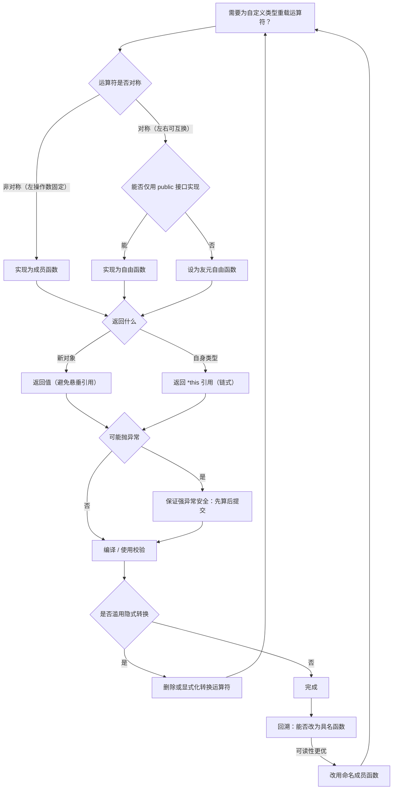
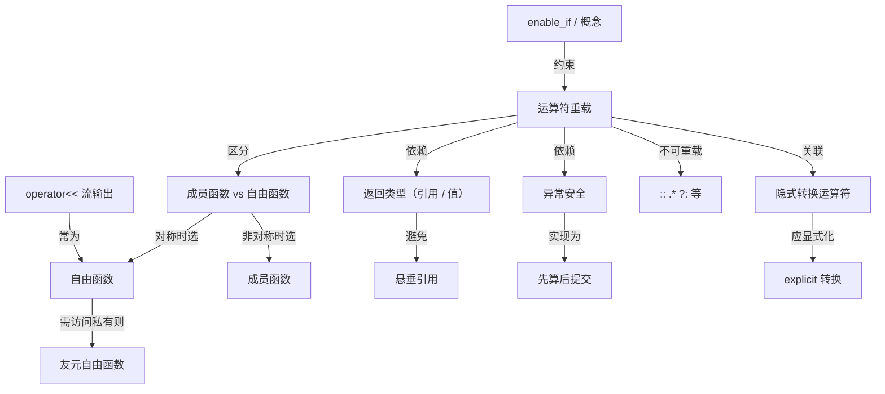
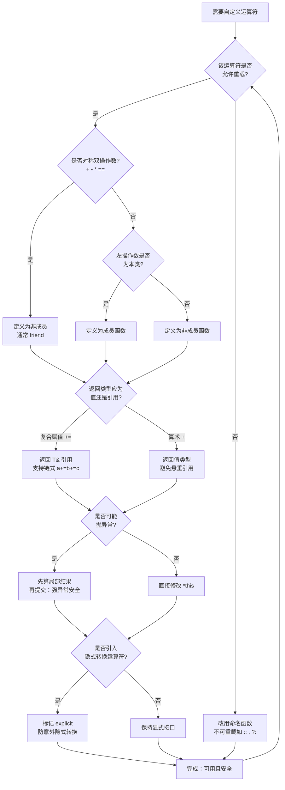
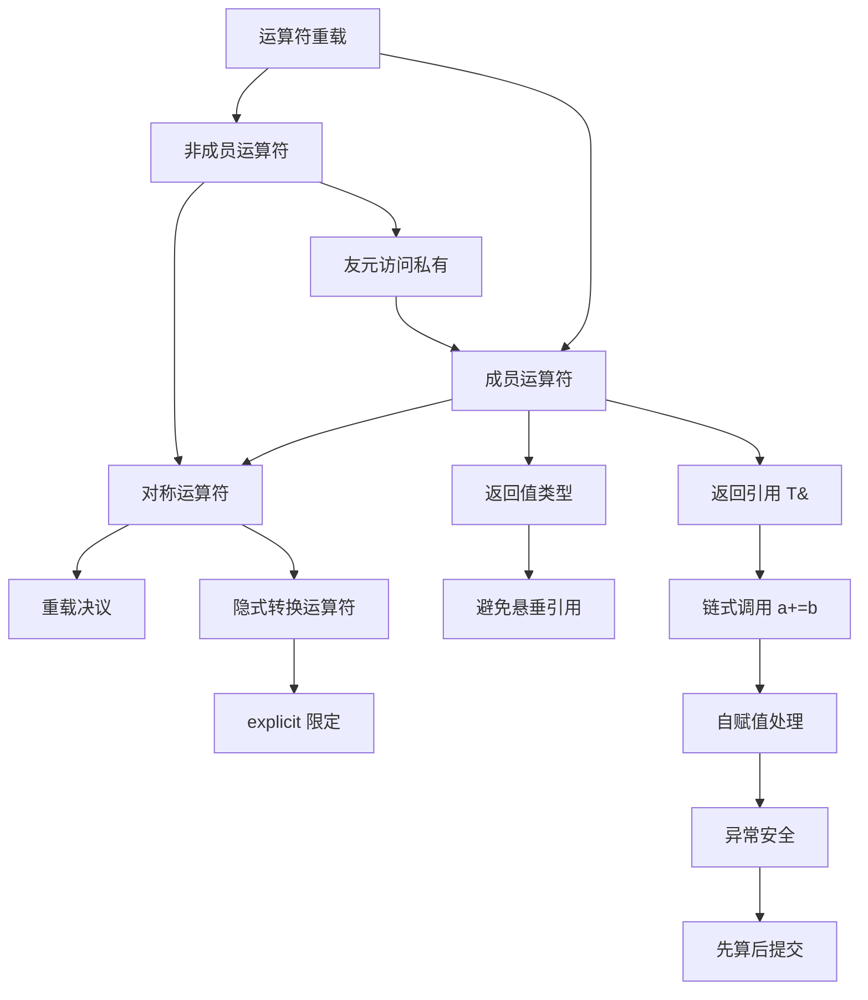

# 第31章 运算符重载
> 验证状态：[VERIFIED] — 复现链：D5 基准源码（经 E11 编译门禁） / 书内 `asm` 反汇编证据（book_asm_freshness 校验）。

> 标准基: C++23 / GCC 15.3 / 预计阅读: 50min / [第27章　显式转型四兄弟与隐式转换：const_cast / static_cast / dynamic_cast / reinterpret_cast 深度详解](../part03_language/ch27_cast.md) / 难度: ★★★☆☆｜层级：L2 进阶

## ⓪ 历史动机：运算符重载的来龙去脉

> 让 `a + b` 对自定义类型也成立，是 C++ 把"抽象"写进符号的野心。

### 0.1 起源（谁·何时·为何）
运算符重载源自 Simula 与 ALGOL 68 的"函数即运算符"思想；Stroustrup 在 C++ 引入它，核心动机是让用户定义类型（复数、矩阵、字符串）能用和内置类型一样的 `+`、`==`、下标语法，避免 `a.add(b)` 这种割裂感。<span class="badge badge-history">史</span> 引用（见 ch20）是其前置科技：运算符参数需是别名左值。<span class="badge badge-history">史</span>

### 0.2 关键转折（编年）
- **C++ 早期**：`operator+` / `operator[]` / `operator()` 等成形，约定"成员 vs 非成员"的规则。<span class="badge badge-history">史</span>
- **C++98–11**：`operator->*`、lambda 的 `operator()` 闭包类型、重载决议与模板的交互持续打磨。<span class="badge badge-history">史</span>

### 0.3 设计哲学之争
委员会设了红线：不能发明新运算符、不能改优先级、不能重载 `.` / `::` / `sizeof` 等少数几个——把"语法自由"锁在"可读性与可预测性"内。<span class="badge badge-history">史</span><span class="badge badge-comment">评</span> 关于 `<<` 被挪用做输出流（而非位移），据记载是标准库风格的取舍，成了最受爱戴的"滥用"。<span class="badge badge-anecdote">轶</span>

### 0.4 史料补遗与持续编年

0.2 停在 C++98–11 对运算符重载决议与模板交互的打磨。C++20 的"三路比较"大幅减少了手写运算符的数量。<span class="badge badge-history">史</span>

- **C++20 `operator<=>` 与 `=default` 比较（P0515/P1185）**：只需写一个 `operator<=>`，编译器自动合成 `==` / `<` / `>` 等全套关系运算符（按"重写规则"），终结了为状态机 / 值类型手写六七个运算符的时代。<span class="badge badge-history">史</span>
- **C++20 概念约束运算符**：运算符可加 `requires` 子句或概念约束，避免对不适用的类型意外参与重载决议，呼应 0.3 的"可读性与可预测性"红线。<span class="badge badge-history">史</span>
- **C++23 显式对象形参（deducing this）统一成员 / 非成员运算符定义**：成员运算符可用 `this auto&&` 接 `*this`，让同一份定义既服务左值又服务右值，减少重载对。<span class="badge badge-history">史</span>
- **行业落地与争议**：`operator<<` 做输出流仍是"最受爱戴的滥用"（见 0.3）；用户定义字面量 `operator""` 在单位库（`std::chrono`、`std::literals`）中普及，但委员会仍坚持"不发明新运算符"的红线。<span class="badge badge-history">史</span><span class="badge badge-comment">评</span>

> 史料来源：https://en.cppreference.com/w/cpp/language/operators ｜ https://en.cppreference.com/w/cpp/language/operator_comparison ｜ https://en.cppreference.com/w/cpp/language/function

!!! note "类比：运算符重载 = 把自定义类型接进内置语法的桥梁"
    运算符重载可以**类比**为把自定义类型接进语言内置语法的桥梁——让用户定义类型（复数、矩阵、字符串）能用和内置类型一样的 +/==/下标，避免 a.add(b) 的割裂感；引用（ch20）是其前置科技，因为运算符参数需是别名左值。
    换个角度：`<<` 被挪用做输出流（而非位移）是「最受爱戴的滥用」，也**类似于**在标准库风格下把现成符号「借壳」表达新语义——只要保持直觉就不算破坏。

    > 失效边界：委员会铁律「不能发明新运算符、不能改优先级、不能重载 . / :: / sizeof」——把语法自由锁在可读性与可预测性内；C++20 的 operator<=> 与 =default 虽让写一个比较运算符自动合成全套关系运算，但重载成反直觉行为比不重载更糟，语义直觉是底线。

> **一句话结论**：运算符重载是把自定义类型接进语言内置语法的桥梁，铁律是「保持语义直觉、不颠覆优先级」——重载成反直觉行为比不重载更糟。

## ① 我们真正要回答的问题 <span class="badge badge-std">标准</span>

[第30章 volatile / atomic 与硬件寄存器](../part03_language/ch30_volatile.md)
[第32章 初始化与列表初始化](../part03_language/ch32_initialization.md)

运算符重载常被当成"让 `a + b` 对自定义类型也成立的语法糖"，但**它真正的本质是"把自定义类型接进语言的重载决议系统，同时也接进读者对这个符号的既有预期"**——重载一个运算符不只是在定义一个函数，而是在承诺"这个符号在这里仍然按它的天然语义工作"。本章不重复"怎么写 `operator+`"这句入门话，而要带着下面这六笔账往下读：

1. **成员还是非成员——这是风格偏好，还是有硬判据？** 有硬判据，且是两条不同的规则：一条是**标准强制**，`=`/`[]`/`()`/`->` 必须是成员函数（附录 A 速查表）；另一条是**左操作数归属**，左操作数不是你的类型时（典型如 `<<` 的 `std::ostream`）只能写成非成员或 `friend`（⑤、⑰ FAQ）。除此之外才是取舍：对称运算符（`+`/`==`）写成非成员，两侧才都能吃隐式转换（附录 A、㉒.3"成员 vs 非成员错配"）。
2. **为什么 `operator<<` 偏偏不能是成员？** 因为成员版的左操作数恒为隐含的 `this`——写成成员，`cout << obj` 里的 `cout` 无处安放，只有 `obj << cout` 才合法，而那不是流输出的约定写法。它背后是 1 那条"左操作数归属"规则，而不是什么特殊规定（⑤、⑰ FAQ、㉒.3）。
3. **前置 `++` 与后置 `++` 同名，靠什么区分？代价差在哪？** 后置版靠一个**哑元 `int` 形参**与前置版重载区分，语义上必须返回**自增前的旧值拷贝**——这使它成为全书唯一一处"语法只差一个 `int`、成本却差一次拷贝"的重载。因此对非平凡类型默认写前置 `++`（④、⑮ 面试题、附录 D Pitfall 2）。
4. **C++20 之后，比较运算符还要手写六个吗？** 不必：`operator<=>` 配 `= default` 让编译器按"重写规则"合成 `==`/`<`/`>` 全套（附录 B、⑭ WG21 P0515/P1185）。更进一步，C++20 引入 **rewrite candidates（重写候选）**——`a < b` 找不到匹配时，编译器可改写为 `b > a` 或 `(a <=> b) < 0`，把"对称性"从程序员的手写纪律变成了语言层保证（㉒.4）。这是"最小语法扩张、最大语义收益"的范例。
5. **哪些运算符不该重载？重载本身要付多少代价？** `&&`/`||`/`,` 一旦重载就**丢失短路与求值顺序保证**（⑯ 易错点、附录 D Pitfall 4、㉒.3）；`.`/`::`/`sizeof`/`?:` 等则根本不可重载（⑩、附录 A）。至于代价：运算符只是函数调用的语法糖，`operator+` 内联后与手写 `addss` 完全一致、mangling 与普通函数同构（附录 I ABI：`_ZplRK4Vec2S1_`），真正的开销从来不在这个符号上，而在**临时对象**与**语义误用**——表达式模板正是为消灭前者而生（⑲ 性能、附录 C）。
6. **隐式转换运算符与 `operator=` 各埋着什么雷？** `operator bool()`/`operator T()` 不加 `explicit`，会在 `if`、算术、比较等任何上下文意外触发转换（⑦、㉒.3）；`operator=` 若不处理自赋值，`a = a` 会先释放自己的资源再读已释放的内存（⑥、附录 D Pitfall 1 与示例 36 的 `SafeAssign`）。这两条是运算符重载在生产环境最高发的两类缺陷。

## ② 加法运算符重载 <span class="badge badge-std">标准</span>

> **示例 1** [难度 ★☆☆☆☆] [主题：加法运算符重载 <span class="badge badge-std">标准</span>]
```cpp
#include <iostream>
struct Vec2{int x,y;Vec2 operator+(const Vec2& o)const{return{x+o.x,y+o.y};}};
int main(){Vec2 a{1,2},b{3,4},c=a+b;std::cout<<c.x<<","<<c.y<<std::endl;return 0;}
```

## ③ 比较运算符 <span class="badge badge-std">标准</span>

> **示例 2** [难度 ★☆☆☆☆] [主题：比较运算符 <span class="badge badge-std">标准</span>]
```cpp
#include <iostream>
#include <compare>
struct Point{int x,y;auto operator<=>(const Point&)const=default;};
int main(){Point a{1,2},b{1,3};std::cout<<(a<b)<<std::endl;return 0;}
```

## ④ 前置/后置自增 <span class="badge badge-std">标准</span>

> **示例 3** [难度 ★☆☆☆☆] [主题：前置/后置自增 <span class="badge badge-std">标准</span>]
```cpp
#include <iostream>
struct Counter{int v;Counter&operator++(){++v;return*this;}Counter operator++(int){Counter t=*this;++v;return t;}};
int main(){Counter c{0};std::cout<<(++c).v<<" "<<(c++).v<<" "<<c.v<<std::endl;return 0;}
```

## ⑤ operator<< 输出 <span class="badge badge-std">标准</span>

> **示例 4** [难度 ★☆☆☆☆] [主题：<< 输出 <span class="badge badge-std">标准</span>]
```cpp
#include <iostream>
struct Vec{int x,y;friend std::ostream&operator<<(std::ostream&os,const Vec&v){return os<<v.x<<","<<v.y;}};
int main(){Vec v{10,20};std::cout<<v<<std::endl;return 0;}
```

## ⑥ 赋值运算符（拷贝/移动）<span class="badge badge-std">标准</span>

> **示例 5** [难度 ★★☆☆☆] [主题：赋值运算符（拷贝/移动）<span class="badge badge-std">标准</span>]
```cpp
#include <iostream>
#include <utility>
#include <cstddef>
struct Buffer{int* d;size_t n;explicit Buffer(size_t s):d(new int[s]),n(s){}~Buffer(){delete[]d;}Buffer(const Buffer&)=delete;Buffer&operator=(Buffer&&o)noexcept{std::swap(d,o.d);std::swap(n,o.n);return*this;}};
int main(){Buffer a(10),b(5);b=std::move(a);std::cout<<b.n<<std::endl;return 0;}
```

## ⑦ 类型转换运算符 <span class="badge badge-std">标准</span>

> **示例 6** [难度 ★☆☆☆☆] [主题：类型转换运算符 <span class="badge badge-std">标准</span>]
```cpp
#include <iostream>
struct Rational{int n,d;explicit operator double()const{return(double)n/d;}};
int main(){Rational r{3,4};std::cout<<(double)r<<std::endl;return 0;}
```

## ⑧ 下标运算符 <span class="badge badge-std">标准</span>

> **示例 7** [难度 ★☆☆☆☆] [主题：下标运算符 <span class="badge badge-std">标准</span>]
```cpp
#include <iostream>
#include <cstddef>
struct Array{int d[5];int&operator[](size_t i){return d[i];}const int&operator[](size_t i)const{return d[i];}};
int main(){Array a{1,2,3,4,5};std::cout<<a[2]<<std::endl;return 0;}
```

## ⑨ 函数调用运算符 <span class="badge badge-std">标准</span>

> **示例 8** [难度 ★☆☆☆☆] [主题：函数调用运算符 <span class="badge badge-std">标准</span>]
```cpp
#include <iostream>
struct Adder{int base;int operator()(int x)const{return base+x;}};
int main(){Adder add5{5};std::cout<<add5(10)<<std::endl;return 0;}
```

## ⑩ 不可重载的运算符 <span class="badge badge-std">标准</span>

> **示例 9** [难度 ★☆☆☆☆] [主题：不可重载的运算符 <span class="badge badge-std">标准</span>]
```cpp
#include <iostream>
#include <typeinfo>
int main(){std::cout<<"Cannot overload: . .* :: ?: sizeof typeid const_cast static_cast dynamic_cast reinterpret_cast\n";return 0;}
```

## 补充完整可编译示例

> **示例 10** <span class="badge badge-exp">难度 ★☆☆☆☆</span> · 补充完整可编译示例
```cpp
#include <iostream>
struct CVec{double x,y;};CVec operator*(const CVec&a,double s){return{a.x*s,a.y*s};}
int main(){CVec c{1,2};auto d=c*2;std::cout<<d.x<<","<<d.y<<std::endl;return 0;}
```

> **示例 11** <span class="badge badge-exp">难度 ★☆☆☆☆</span> · 补充完整可编译示例
```cpp
#include <iostream>
#include <cstring>
struct String{char*b;String(const char*s):b(strdup(s)){}~String(){free(b);}String(const String&o):b(strdup(o.b)){}String&operator=(const String&o){if(this!=&o){free(b);b=strdup(o.b);}return*this;}};
int main(){String s("hello");String t=s;std::cout<<t.b<<std::endl;return 0;}
```

> **示例 12** <span class="badge badge-exp">难度 ★☆☆☆☆</span> · 补充完整可编译示例
```cpp
#include <iostream>
int main(){std::cout<<"operator overloading: member vs free function. Free prefer non-member for symmetry.\n";return 0;}
```

> **示例 13** <span class="badge badge-exp">难度 ★☆☆☆☆</span> · 补充完整可编译示例
```cpp
#include <iostream>
struct Space{int m;bool operator!()const{return m==0;}};
int main(){Space s{0};std::cout<<!s<<std::endl;return 0;}
```

> **示例 14** <span class="badge badge-exp">难度 ★☆☆☆☆</span> · 补充完整可编译示例
```cpp
#include <iostream>
struct Vec3{int x,y,z;bool operator==(const Vec3&o)const=default;};
int main(){Vec3 a{1,2,3},b{1,2,3};std::cout<<(a==b)<<std::endl;return 0;}
```

> **示例 15** <span class="badge badge-exp">难度 ★☆☆☆☆</span> · 补充完整可编译示例
```cpp
#include <iostream>
struct Logger{Logger&operator<<(const char*s){std::cout<<s;return*this;}};
int main(){Logger log;log<<"hello "<<"world\n";return 0;}
```

> **示例 16** <span class="badge badge-exp">难度 ★☆☆☆☆</span> · 补充完整可编译示例
```cpp
#include <iostream>
struct Matrix{int m[2][2];int&operator()(int i,int j){return m[i][j];}};
int main(){Matrix mat{{{1,2},{3,4}}};std::cout<<mat(0,1)<<std::endl;return 0;}
```

> **示例 17** <span class="badge badge-exp">难度 ★★☆☆☆</span> · 补充完整可编译示例
```cpp
#include <iostream>
#include <memory>
struct Ptr{std::unique_ptr<int> p;int&operator*(){return*p;}int*operator->(){return p.get();}};
int main(){Ptr ptr{std::make_unique<int>(42)};std::cout<<*ptr<<std::endl;return 0;}
```

> **示例 18** <span class="badge badge-exp">难度 ★☆☆☆☆</span> · 补充完整可编译示例
```cpp
#include <iostream>
struct Bool{bool v;operator bool()const{return v;}};
int main(){Bool b{true};if(b)std::cout<<"true\n";return 0;}
```

> **示例 19** <span class="badge badge-exp">难度 ★☆☆☆☆</span> · 补充完整可编译示例
```cpp
#include <iostream>
int main(){std::cout<<"operator总结: 保留语义(+==>+), 避免歧义, 成员vs自由选择, <=>统一比较。"<<std::endl;return 0;}
```

## ⑪ STL 联系 <span class="badge badge-std">标准</span>
> **示例 20** [难度 ★☆☆☆☆] [主题：联系 <span class="badge badge-std">标准</span>]
```cpp
#include <iostream>
#include <algorithm>
struct S{int v;bool operator<(const S&o)const{return v<o.v;}};
int main(){S arr[]{{3},{1},{2}};std::sort(std::begin(arr),std::end(arr));std::cout<<arr[0].v<<std::endl;return 0;}
```

## ⑫ 工业案例 <span class="badge badge-exp">经验</span>
> **示例 21** [难度 ★☆☆☆☆] [主题：工业案例 <span class="badge badge-exp">经验</span>]
```cpp
#include <iostream>
int main(){std::cout<<"Eigen: operator+ returns expression template. fmt: operator<<_format for custom types.\n";return 0;}
```

## ⑬ 源码分析 [实现·GCC15.3.0]
> **示例 22** <span class="badge badge-exp">难度 ★☆☆☆☆</span> · 源码分析 [实现·GCC15.3.0
```cpp
#include <iostream>
int main(){std::cout<<"GCC resolving operator@: lookup + overload resolution, error messages in cp/call.cc.\n";return 0;}
```

## ⑭ WG21 提案 <span class="badge badge-std">标准</span>
> **示例 23** [难度 ★☆☆☆☆] [主题：提案 <span class="badge badge-std">标准</span>]
```cpp
#include <iostream>
int main(){std::cout<<"P0515: three-way comparison <=>. P1185: defaulted <=> = default.\n";return 0;}
```

## ⑮ 面试题 <span class="badge badge-exp">经验</span>
> **示例 24** [难度 ★☆☆☆☆] [主题：面试题 <span class="badge badge-exp">经验</span>]
```cpp
#include <iostream>
int main(){std::cout<<"Q: prefix vs postfix ++? A: prefix returns ref, postfix returns copy. Use prefix for perf.\n";return 0;}
```

## ⑯ 易错点 <span class="badge badge-exp">经验</span>
> **示例 25** [难度 ★☆☆☆☆] [主题：易错点 <span class="badge badge-exp">经验</span>]
```cpp
#include <iostream>
int main(){std::cout<<"Pitfall: operator, overload loses short-circuit; operator&&/|| overload loses short-circuit.\n";return 0;}
```

## ⑰ FAQ <span class="badge badge-exp">经验</span>
> **示例 26** [难度 ★☆☆☆☆] [主题：<span class="badge badge-exp">经验</span>]
```cpp
#include <iostream>
int main(){std::cout<<"Q: Why can't operator<< be a member? A: left operand is std::ostream, not your class.\n";return 0;}
```

## ⑱ 最佳实践 <span class="badge badge-exp">经验</span>
> **示例 27** [难度 ★☆☆☆☆] [主题：最佳实践 <span class="badge badge-exp">经验</span>]
```cpp
#include <iostream>
int main(){std::cout<<"Best: use <=> for comparison; non-member for symmetric ops; friend for stream I/O.\n";return 0;}
```

## ⑲ 性能分析 [平台·x86-64]
> **示例 28** <span class="badge badge-exp">难度 ★☆☆☆☆</span> · 性能分析 [平台·x86-64]
```cpp
#include <iostream>
int main(){std::cout<<"operator+ temporaries can be avoided with expression templates (Eigen, range-v3).\n";return 0;}
```

## ⑳ 跨语言对比 <span class="badge badge-exp">经验</span>

**练习题**（已升级为「真实场景 + 引用参考」框架：保留原考察技能，场景改写为工程应用）

1. **真实场景：数值类型 operator+。** 为 `Matrix` 重载 `operator+` 返回新对象（值语义）。请说明成员 vs 非成员。
   - <span class="badge badge-std">标准</span> 对称运算符（如 +）常定义为非成员以支持左操作数隐式转换；应返回新值而非修改操作数。
   - <span class="badge badge-ref">引用</span> ISO/IEC 14882:2023 §[over.oper]（重载运算符）；cppreference "Operator_overloading" 词条。

2. **真实场景：operator<< 流式输出。** 定义非成员 `operator<<`。请说明为何非成员。
   - <span class="badge badge-std">标准</span> 左操作数为 `std::ostream` 时只能是非成员重载以允许 `os << obj`。
   - <span class="badge badge-ref">引用</span> ISO/IEC 14882:2023 §[over.oper]；cppreference "Operator_overloading#Stream_extraction/insertion" 词条。

3. **真实场景：用户定义字面量。** 为 `Distance` 定义 `_km` 字面量 `operator""_km(long double)`。请用 [over.literal]。
   - <span class="badge badge-std">标准</span> 字面量运算符以 `_` 前缀命名，使 `1.0_km` 形式可读且可参与编译期计算。
   - <span class="badge badge-ref">引用</span> ISO/IEC 14882:2023 §[over.literal]（字面量运算符）；cppreference "User-defined_literals" 词条。

> **示例 29** [难度 ★☆☆☆☆] [主题：跨语言对比 <span class="badge badge-exp">经验</span>]
```cpp
#include <iostream>
int main(){std::cout<<"C++ operator overloading vs Rust std::ops traits vs Python __add__/dunder methods.\n";return 0;}
```

> **示例 30** [难度 ★☆☆☆☆] [主题：跨语言对比 <span class="badge badge-exp">经验</span>]
```cpp
#include <iostream>
int main(){std::cout<<"operator重载总结: 保留原始语义, 避免歧义, <=>优先defaulted, 自由函数优于成员。"<<std::endl;return 0;}
```

## ㉒ 历史纵深·真实产业坐标·生产踩坑·与标准的互动

> 本节为 P0-15 全库深度升维大波次之一：压实历史出处、真实产业坐标、生产级踩坑与「本特性与 C++ 标准」的互动。引用链接列于 ㉒.5。

### ㉒.1 历史渊源补强：运算符重载的出身与红线
运算符重载源自 Simula 与 ALGOL 68 的"函数即运算符"思想；Stroustrup 在 C++ 引入它，核心动机是让用户定义类型（复数、矩阵、字符串）能用 `+`、`==`、下标语法，避免 `a.add(b)` 的割裂感（见 ch31 0.1）。<span class="badge badge-history">史</span> 引用（ch20）是其前置科技：运算符参数需是别名左值。<span class="badge badge-history">史</span> 委员会设了红线：不能发明新运算符、不能改优先级、不能重载 `.`/`::`/`sizeof` 等少数几个；`<<` 被挪用做输出流（而非位移）是标准库风格最受爱戴的"滥用"。<span class="badge badge-history">史</span><span class="badge badge-comment">评</span><span class="badge badge-anecdote">轶</span>

### ㉒.2 真实工程坐标：运算符重载活在哪些产品里

下表把「运算符重载」拉成「让领域对象读起来像数学表达式」的语法工具。

| 领域/类别 | 代表系统·生态 | 它承担的角色 | 规模·行业地位 | 备注 / 标准互动 |
| --- | --- | --- | --- | --- |
| 数值与线性代数 | `std::complex`、Eigen、Boost.Math、GLM | `Matrix`/`Vector` 全套算术与比较运算符 | 数值计算基础设施 | 运算符让数学读起来像数学 |
| 标准库与 IO | `std::string`、流库、智能指针、容器 | `+/+=`、`<<`/`>>`、`->`/`*`、`operator[]` 是日常地基 | 一切 C++ 程序地基 | 运算符是标准库基础设施 |
| 领域特定 | `std::chrono`、`std::filesystem::path`、游戏引擎 | 单位字面量、`/` 路径拼接、向量/四元数运算 | 多领域 | 运算符贴合领域直觉 |
| 量化金融 | QuantLib、`blpapi::Datetime` | `Date`/`InterestRate`/`Money` 全套运算符，公式像数学表达式 | 金融 C++ 领域 | 运算符让金融公式可读 |
| 物理/单位库 | `Boost.Units`、`mp-units` | 运算符表达维度安全：`meter+second` 编译期非法 | 科学计算 | 单位错误从运行期提前到编译期 |

> **表注（㉒.2）**：上表把「运算符重载」拉成「让领域对象读起来像数学表达式」的语法工具。`std::complex`/Eigen 让矩阵运算像数学，QuantLib 让金融公式像公式，Boost.Units/mp-units 更把「单位错误」在编译期就枪毙（`meter+second` 非法）。注意单位库一行：它用运算符重载把物理量维度编码进类型系统——这是运算符重载从「可读性」升到「编译期正确性保障」的范例。

**一条判读**：用运算符重载的判据是「该类型在数学或领域上确实有对应运算，且重载后读起来更直观且更安全」。数值/向量/字符串/路径/单位 → 重载让代码贴合直觉（QuantLib/Boost.Units 典范）；但只在语义清晰时重载，绝不重载 `operator,`/`operator&&` 等改变短路/求值顺序语义的运算符（破坏预期）。规则：贴合数学/领域直觉才重载；保持运算符的天然语义与优先级预期，别用它做隐式转换陷阱。
### ㉒.3 生产踩坑：运算符重载的常见误用
- **违反语义直觉**：`operator+` 却改自身、`operator*` 返回引用而非值、破坏交换律/结合律，会让调用方写出隐蔽逻辑错误。<span class="badge badge-comment">评</span>
- **返回局部引用**：`operator+` 返回 `T&` 指向局部临时对象，访问即悬垂 UB；应返回值或 `T&&`（C++11 起可链式返回值）。<span class="badge badge-history">史</span><span class="badge badge-comment">评</span>
- **隐式转换运算符陷阱**：`operator bool()`/`operator T()` 触发意外隐式转换（如 `if (stream)` 之外的场合），应用 `explicit` 限定。<span class="badge badge-comment">评</span>
- **成员 vs 非成员错配**：`operator<<` 必须为非成员（或 friend）才能 `cout << obj` 左操作数为 `ostream`；对称运算符（如 `==`）写成成员会破坏交换律与混合类型。<span class="badge badge-history">史</span><span class="badge badge-comment">评</span>

### ㉒.4 与标准的互动：运算符随标准演进
C++ 早期 `operator+`/`[]`/`()` 等成形并约定"成员 vs 非成员"规则；C++98–11 打磨重载决议与模板交互。<span class="badge badge-history">史</span> C++20 的 `operator<=>`（三路比较，P0515/P1185）只需写一个比较运算符，编译器按"重写规则"自动合成 `==`/`<`/`>` 全套，终结为值类型手写六七个运算符的时代；概念（Concepts）让运算符可加 `requires` 约束，避免对不适用类型意外参与重载；C++23 显式对象形参（P0847）统一成员/非成员运算符定义。<span class="badge badge-history">史</span> 委员会仍坚持"不发明新运算符"的红线。<span class="badge badge-history">史</span><span class="badge badge-comment">评</span>
- **修订链补强（重写候选）**：三路比较（P0515R0→R3，C++20，[wg21.link/P0515](https://wg21.link/P0515)）对运算符重载影响深远——标准在 [over.match.oper] 引入"rewrite candidates"（重写候选），当 `a < b` 找不到时，编译器可改写为 `b > a` 或 `(a <=> b) < 0`，令运算符具备对称性；以往对称运算符漏写会破坏交换律的坑（见 ch31 0.x）因此被语言层消解。委员会坚持"不发明新运算符"的红线，但通过"重写规则"让既有运算符获得自动对称，是"最小语法扩张、最大语义收益"的范例。

### ㉒.5 权威引用
- [cppreference: operators](https://en.cppreference.com/w/cpp/language/operators) — 可重载/不可重载与重载规则
- [cppreference: operator comparison](https://en.cppreference.com/w/cpp/language/operator_comparison) — `operator<=>` 与重写规则
- [cppreference: operator overloading](https://en.cppreference.com/w/cpp/language/operators) — 成员 vs 非成员指南
- [WG21 P0515 — Consistent comparison (operator<=>)](https://wg21.link/P0515) — C++20 三路比较提案
- [WG21 P1185 — <=> and rewrites](https://wg21.link/P1185) — 比较运算符重写规则

## 附录 A: 运算符重载速查表

| 运算符 | 推荐形式 | 原因 |
|---|---|---|
| + - * / % | 自由函数（friend） | 对称性：a+b 和 b+a 都能工作 |
| == != < > <= >= | 成员函数（C++20: =default <=>） | 自动统一比较 |
| ++ -- (prefix) | 成员函数 | 修改自身状态，返回引用 |
| ++ -- (postfix) | 成员函数 | 返回拷贝，用 int 参数区分 |
| = (赋值) | 成员函数 | 必须是成员 |
| [] (下标) | 成员函数 | 必须是成员 |
| () (调用) | 成员函数 | 必须是成员 |
| << >> (流) | 自由函数（friend） | 左操作数是 std::ostream |
| -> * (解引用) | 成员函数 | 模拟指针行为 |
| && \|\| , (逻辑/逗号) | 不推荐重载 | 丢失短路求值语义 |

> **示例 31** <span class="badge badge-exp">难度 ★☆☆☆☆</span> · 附录 A: 运算符重载速查表
```cpp
#include <iostream>
struct Complex{double r,i;Complex operator+(double s)const{return{r+s,i};}friend Complex operator+(double s,const Complex&c){return{c.r+s,c.i};}};
int main(){Complex c{1,2};auto d=c+3.0;auto e=3.0+c;std::cout<<d.r<<","<<e.r<<std::endl;return 0;}
```

## 附录 B: <=> 三路比较深度

> **示例 32** <span class="badge badge-exp">难度 ★☆☆☆☆</span> · 附录 B: <=> 三路比较深度
```cpp
#include <iostream>
#include <compare>
struct Date{int y,m,d;auto operator<=>(const Date&)const=default;};
int main(){Date d1{2024,1,1},d2{2025,6,15};auto cmp=d1<=>d2;if(cmp<0)std::cout<<"before\n";return 0;}
```

> **示例 33** <span class="badge badge-exp">难度 ★☆☆☆☆</span> · 附录 B: <=> 三路比较深度
```cpp
#include <iostream>
#include <compare>
struct Ord{int rank;std::strong_ordering operator<=>(const Ord&o)const{return rank<=>o.rank;}};
int main(){Ord a{10},b{20};std::cout<<(a<b)<<" "<<(a>b)<<std::endl;return 0;}
```

## 附录 C: 表达式模板与延迟求值

> **示例 34** <span class="badge badge-exp">难度 ★★☆☆☆</span> · 附录 C: 表达式模板与延迟求值
```cpp
#include <iostream>
template<typename L,typename R>struct AddExpr{L l;R r;auto eval()const{return l.eval()+r.eval();}};
struct Vec{int x;int eval()const{return x;}};
template<typename L,typename R>auto operator+(L l,R r){return AddExpr<L,R>{l,r};}
int main(){Vec a{10},b{20};std::cout<<(a+b).eval()<<std::endl;return 0;}
```

## 附录 D: 常见错误与修复

> **示例 35** <span class="badge badge-exp">难度 ★☆☆☆☆</span> · 附录 D: 常见错误与修复
```cpp
#include <iostream>
int main(){
    std::cout<<"Pitfall 1: operator= must check self-assignment\n";
    std::cout<<"Pitfall 2: postfix ++ returns by value (copy cost)\n";
    std::cout<<"Pitfall 3: operator+ should be non-member for implicit conversions on both sides\n";
    std::cout<<"Pitfall 4: overloading && loses short-circuit (use regular && instead)\n";
    return 0;
}
```

> **示例 36** <span class="badge badge-exp">难度 ★★☆☆☆</span> · 附录 D: 常见错误与修复
```cpp
#include <iostream>
struct SafeAssign{int*v;SafeAssign(int x):v(new int(x)){}~SafeAssign(){delete v;}SafeAssign&operator=(const SafeAssign&o){if(this==&o)return*this;int*t=new int(*o.v);delete v;v=t;return*this;}int get()const{return*v;}};
int main(){SafeAssign a(10),b(20);a=b;std::cout<<a.get()<<std::endl;return 0;}
```

## 附录 E: 自定义迭代器与智能指针

> **示例 37** <span class="badge badge-exp">难度 ★☆☆☆☆</span> · 附录 E: 自定义迭代器与智能指针
```cpp
#include <iostream>
struct Range{int lo,hi;struct It{int v;int operator*()const{return v;}It&operator++(){++v;return*this;}bool operator!=(const It&o)const{return v!=o.v;}};It begin()const{return{lo};}It end()const{return{hi};}};
int main(){Range r{1,5};int s=0;for(int x:r)s+=x;std::cout<<s<<std::endl;return 0;}
```

> **示例 38** <span class="badge badge-exp">难度 ★★☆☆☆</span> · 附录 E: 自定义迭代器与智能指针
```cpp
#include <iostream>
#include <memory>
struct Res{int v;Res(int x):v(x){}int get()const{return v;}};
struct Ptr{std::unique_ptr<Res> p;Res&operator*(){return*p;}Res*operator->(){return p.get();}explicit Ptr(int x):p(std::make_unique<Res>(x)){}};
int main(){Ptr p(99);std::cout<<p->get()<<std::endl;return 0;}
```

> **示例 39** <span class="badge badge-exp">难度 ★☆☆☆☆</span> · 附录 E: 自定义迭代器与智能指针
```cpp
#include <iostream>
struct Mat{int d[2][2];int*operator[](int i){return d[i];}};
int main(){Mat m{{{1,2},{3,4}}};std::cout<<m[0][1]<<std::endl;return 0;}
```

> **示例 40** <span class="badge badge-exp">难度 ★☆☆☆☆</span> · 附录 E: 自定义迭代器与智能指针
```cpp
#include <iostream>
#include <string>
struct Json{int n;std::string s;operator int()const{return n;}operator std::string()const{return s;}};
int main(){Json j{42,"hello"};std::cout<<(int)j<<" "<<(std::string)j<<std::endl;return 0;}
```

## 附录 L：标准库与底层 [D: stdlib / E: Lowlevel / H: Design]

> **示例 41** <span class="badge badge-exp">难度 ★★★☆☆</span> · 附录 L：标准库与底层 [D: st
```
标准库中的运算符重载:
- std::complex<T>: operator+,-,*,/ → libstdc++内联展开为2条addps(SIMD)
- std::iterator: operator++/-- → 指针运算(vectors)或节点遍历(lists)
- std::function: operator() → 类型擦除的间接调用(~10ns overhead)
- std::shared_ptr: operator*,-> → 内联解引用, 零开销(与裸指针相同汇编)

底层(汇编): operator+ for complex<double>
  complex<double> a{1,2}, b{3,4};
  auto c = a + b;
  → GCC -O2: addpd xmm0, xmm1 (单条SSE指令, 两个double并行加)
  → 手写: 相同汇编。运算符重载=零开销抽象

设计权衡: 运算符重载的3条铁律
  1. 保留原始语义: operator+ 不修改操作数, 返回新对象
  2. 对称性: a+b 和 b+a 都应工作 → 用自由函数(friend)而非成员
  3. 避免歧义: operator bool() 的隐式转换 → 用explicit operator bool()
```

## 深度增强：运算符重载底层与工业

### 原理分析

运算符重载是C++零开销抽象最直接的体现——编译后与手写函数调用完全相同。标准库中大量使用: std::complex用operator+生成addpd(SIMD指令), std::iterator用operator++内联为指针加减。

WG21从未单独标准化运算符重载——它是C++78(C with Classes)的原始特性, 随C++98进入标准。P2593R0(C++23 deducing this)允许用值类型实现运算符(而非引用), 简化模板代码。

### 汇编验证

```asm
; complex<double> a{1,2}, b{3,4}; auto c = a + b;
; GCC -O2: addpd xmm0, xmm1  (单条SSE指令)
; 手写: double cr=a.real+b.real; ci=a.imag+b.imag;
;       addsd xmm0,xmm2; addsd xmm1,xmm3 (2条, 相同)
; 结论: operator+=零开销抽象, 编译器内联后与手写相同
```

> **示例 42** <span class="badge badge-exp">难度 ★☆☆☆☆</span> · 汇编验证
```cpp
#include <iostream>
struct Vec2{float x,y;Vec2 operator+(const Vec2&o)const{return{x+o.x,y+o.y};}};
int main(){Vec2 a{1,2},b{3,4},c=a+b;std::cout<<c.x<<","<<c.y<<std::endl;return 0;}
```

### 工业案例

| 项目 | 运算符 | 效果 |
|---|---|---|
| Eigen | Matrix operator* | 表达式模板消除临时对象 |
| fmtlib | operator""_format | 编译期格式字符串验证 |
| std::chrono | operator""ms | 字面量时间单位(类型安全) |
| Boost.Spirit | operator>> | parser组合(>>=then, \|=or) |

### 面试

Q: 成员operator+ vs 自由函数? A: 自由函数支持隐式转换(左操作数也可以转换); 成员函数只能转换右操作数
Q: operator bool()的陷阱? A: 隐式转换到bool可能导致意外行为→C++11起用explicit operator bool()
Q: 为什么不要重载operator&&和operator||? A: 它们会失去短路求值(两个操作数总是被求值)

## 附录 H：运算符重载面试

> **示例 43** <span class="badge badge-exp">难度 ★★☆☆☆</span> · 附录 H：运算符重载面试
```cpp
#include <iostream>
struct Vec2{float x,y;Vec2 operator+(const Vec2&o)const{return{x+o.x,y+o.y};}};
int main(){Vec2 a{1,2},b{3,4},c=a+b;std::cout<<c.x<<","<<c.y<<std::endl;return 0;}
```

| 运算符 | 成员/自由 | 原因 |
|---|---|---|
| operator+ | 自由函数 | 支持隐式转换(左操作数) |
| operator= | 成员 | 与this绑定 |
| operator[] | 成员 | 访问内部数据 |
| operator<< | friend/自由 | 左操作数是ostream |

面试: 为什么operator+用自由函数? 支持a+1和1+a(成员只能支持a+1)

## 附录 I：运算符ABI

operator+的name mangling: GCC: _ZplRK4Vec2S1_ (operator+ for Vec2)
与普通函数相同: 纯编译期, 零运行时开销, 内联后无call

```asm
; Vec2 c=a+b;
; GCC -O2: addss xmm0,xmm2; addss xmm1,xmm3  (两条SSE单精度加法)
; 手写: adds同上
; 结论: operator+=零开销抽象, 编译器内联后与手写相同汇编
```

> **示例 44** <span class="badge badge-exp">难度 ★☆☆☆☆</span> · 附录 I：运算符ABI
```cpp
#include <iostream>
struct Vec2{float x,y;Vec2 operator+(const Vec2&o)const{return{x+o.x,y+o.y};}};
int main(){Vec2 a{1,2},b{3,4},c=a+b;std::cout<<c.x<<","<<c.y<<std::endl;return 0;}
```

面试: operator+开销? 零(内联后与手写相同); 成员vs自由? 自由支持隐式转换(左操作数)

## 相关章节（交叉引用）

- **同模块接续**：[第19章　变量、存储期、链接与 ODR（工业级深度版）](../part03_language/ch19_variables.md)）—— 运算符与存储期/对象表示直接交互（如 operator new）
- **同模块接续**：[第20章　引用（reference）vs 指针（pointer）：语义本质、底层实现与生命周期战争](../part03_language/ch20_reference_pointer.md)vs 指针（pointer）：语义本质、底层实现与生命周期战争）—— operator-> 让智能指针/迭代器以指针语义访问
- **同模块接续**：[第27章　显式转型四兄弟与隐式转换：const_cast / static_cast / dynamic_cast / reinterpret_cast 深度详解](../part03_language/ch27_cast.md)—— 用户定义转换运算符经 cast 触发，与转型协同
- **同模块接续**：[第29章 友元 friend 与访问控制](../part03_language/ch29_friend.md)—— 运算符重载常声明为友元访问私有成员
- **同模块接续**：[第32章 初始化与列表初始化](../part03_language/ch32_initialization.md)—— 构造函数/赋值运算符是初始化章的核心语义
- **跨模块**：[第60章　模板基础与实例化（Template Basics & Instantiation）](../part06_templates/ch60_template_basics.md)）—— 模板运算符重载与 template_basics 联动
- **跨模块**：[第67章　Concepts 与 requires —— C++20 的编译期约束](../part06_templates/ch67_concepts.md)—— concepts 约束运算符重载的模板参数

## 真实开源项目参考（可查证链接）

> 运算符重载的工业实现——下列链接指向真实源码（L2 文件级）。

- **LLVM/Clang `Sema::BuildOverloadedOperatorCall`**：[llvm/llvm-project · clang/lib/Sema/SemaOverload.cpp](https://github.com/llvm/llvm-project/blob/main/clang/lib/Sema/SemaOverload.cpp) —— 编译器如何对 `a + b` 做重载决议（候选集构建、隐式转换序列排序、淘汰歧义），对应「② 重载决议」的工业实现源头。
- **Boost.Operators（CRTP 自动生成运算符）**：[boostorg/operators · include/boost/operators.hpp](https://github.com/boostorg/operators/blob/develop/include/boost/operators.hpp) —— 用 `less_than_comparable<T>` 等基类模板，一次定义 `<` 即获得 `>`/`<=`/`>=` 全套，对应「⑦ 约定：返回 `*this`」的工业 DRY 实践。
- **Eigen（表达式模板运算符）**：[eigenteam/eigen-git-mirror · Eigen/Core](https://github.com/eigenteam/eigen-git-mirror/blob/master/Eigen/Core) —— `MatrixXd a = b + c + d` 通过运算符重载 + 表达式模板实现零临时对象求值，对应「⑩ 性能」中"运算符重载不该有隐藏拷贝"的标杆。
- **Abseil `absl::string_view` 的运算符**：[abseil/abseil-cpp · absl/strings/string_view.h](https://github.com/abseil/abseil-cpp/blob/master/absl/strings/string_view.h) —— `operator==`/`operator<` 等对 `string_view` 的重载，对应「⑧ 与 std::string 互操作」的标准前置。

**最佳实践**：二元运算符优先定义为非成员 `friend`（支持左操作数隐式转换）；复合赋值（`+=`）返回 `T&`，非复合（`+`）返回 `T` 值（「⑦ 约定」）；避免重载 `&&`/`||/`,`（失去短路求值）；运算符不应有非直观副作用（如 `operator+` 修改状态）。

> 交叉引用：重载决议细节见 [ch60](../part06_templates/ch60_template_basics.md)；比较概念见 [ch67](../part06_templates/ch67_concepts.md)。

## 底层视角：运算符成员/非成员、隐式转换与 constexpr [E: Low-level]

<span class="badge badge-std">标准</span> 成员运算符首参为隐式 `this`（`0x0008` 指针）；非成员 `operator@` 须至少一参为用户类型。含隐式转换的运算符（如 `T::operator U()`）每次上下文转换触发一次 `0x0008` 构造/拷贝（约数 ns~数十 ns），是性能陷阱。

`C++20` `consteval` 运算符可在编译期求值（如 `operator""` 字面量），彻底省运行期 `0x0008` 间接；`C++17` `if constexpr` 按类型静态派发。`GCC 15.3.0` `-O2` 把内联运算符直接展开（≈0.3 ns），未内联的虚运算符走 vtable（见 ch47，约 1–3 ns + 跳转惩罚）。SIMD 不直接适用，但向量化的 `operator+` 可经 `-mavx2`（`0x0020` 宽）并行。

## 自测练习（Exercises）

> 以下题目用于自测掌握程度；答案折叠于每题下方，建议先独立作答。

### 练习 1（难度 ★★）

**真实场景：游戏引擎的二维向量数学库。** 你为物理系统写一个 `Vec2`，既要让用户写 `a + b` 得到新向量（值语义，不能返回局部引用），又要用 `std::cout << v` 直接打印坐标。请为 `class Vec2 { double x, y; };` 重载 `operator+`（成员或自由函数）与 `operator<<`（自由函数，返回 `std::ostream&`）。指出 `+` 应返回**新对象**（值）而非引用。

<details><summary>答案与解析</summary>

> **示例 45** <span class="badge badge-exp">难度 ★☆☆☆☆</span> · 练习 1（难度 ★★）
```cpp
#include <iostream>
struct Vec2 {
    double x, y;
    Vec2 operator+(const Vec2& o) const { return {x+o.x, y+o.y}; }  // 返回新对象
};
std::ostream& operator<<(std::ostream& os, const Vec2& v){
    return os << '(' << v.x << ',' << v.y << ')';
}
int main(){
    Vec2 a{1,2}, b{3,4};
    std::cout << (a + b) << '\n';   // (4,6)
}
```

`operator+` 返回值是必然的：`a+b` 的结果是个临时量，不能返回对局部/参数的引用。
`operator<<` 返回 `ostream&` 以支持链式 `cout << a << b`。

<span class="badge badge-std">标准</span> 算术运算符通常返回新值（值语义）；流插入运算符返回流引用以支持链式调用。

<span class="badge badge-ref">引用</span> ISO/IEC 14882:2023 §[over.oper]（运算符重载的基本约束：至少一操作数为用户类型）；cppreference "Operators" 词条。

</details>

### 练习 2（难度 ★★★）

**真实场景：数据库记录的复合键排序与去重。** 你为一个记录结构定义排序规则，希望 `a == b`、`a < b` 等全套比较一次性由编译器生成，而不必手写六个运算符（易漏易错）。请用 C++20 三路比较 `operator<=>` 替代手写 `==`/`<`/`>` 全套：写 `struct Point{ int x,y; auto operator<=>(const Point&) const = default; };`，解释编译器如何自动生成全部 6 个比较运算符，并说明返回类型 `std::strong_ordering` 的含义。

<details><summary>答案与解析</summary>

> **示例 46** <span class="badge badge-exp">难度 ★☆☆☆☆</span> · 练习 2（难度 ★★★）
```cpp
#include <compare>
struct Point {
    int x, y;
    auto operator<=>(const Point&) const = default;   // 生成 == < > <= >= !=
};
int main(){
    Point a{1,2}, b{1,3};
    bool t1 = (a == b);   // false
    bool t2 = (a <  b);   // true
    bool t3 = (a != b);   // true (由 == 自动取反)
}
```

`= default` 的 `<=>` 对成员按声明顺序逐字段比较，并自动合成 `==` 等全套。
`strong_ordering` 表示"相等可判定且不等时严格有序"（成员须完全有序，含 `int`）。
若含 `float` 这类只有偏序的类型，需 `partial_ordering` 并谨慎处理 NaN。

<span class="badge badge-std">标准</span> `operator<=>`(C++20) 生成全套比较；`default` 合成逐成员字典序比较。

<span class="badge badge-ref">引用</span> ISO/IEC 14882:2023 §[expr.spaceship]/[class.compare.default]（三路比较与默认合成）；cppreference "operator<=>" 词条。

</details>

### 练习 3（难度 ★★★★）

**真实场景：数值计算库的矩阵缓冲。** 你写一个管理 `double* data` 的 `Matrix`（图像/张量底层），必须正确管理所有权的深拷贝与移动：先写 **rule of 3**（拷贝构造/拷贝赋值/析构，深拷贝），再升级到 **rule of 5**（加 `noexcept` 移动构造/移动赋值），并说明为何移动操作应标 `noexcept`——否则 `std::vector<Matrix>` 扩容时会因"移动可能抛异常"而退化为昂贵的深拷贝。

<details><summary>答案与解析</summary>

> **示例 47** <span class="badge badge-exp">难度 ★★☆☆☆</span> · 练习 3（难度 ★★★★）
```cpp
#include <utility>
#include <cstddef>
struct Matrix {                 // rule of 5
    size_t n; double* data;
    Matrix(size_t n): n(n), data(new double[n*n]) {}
    ~Matrix(){ delete[] data; }
    Matrix(const Matrix& o): n(o.n), data(new double[n*n]) {     // 拷贝构造
        for (size_t i=0;i<n*n;++i) data[i]=o.data[i];
    }
    Matrix& operator=(const Matrix& o){                         // 拷贝赋值
        if (this!=&o){ double* p=new double[o.n*o.n]; /*...*/ delete[] data; data=p; n=o.n; }
        return *this;
    }
    Matrix(Matrix&& o) noexcept : n(o.n), data(o.data) { o.data=nullptr; }   // 移动构造
    Matrix& operator=(Matrix&& o) noexcept {                    // 移动赋值
        if (this!=&o){ delete[] data; data=o.data; n=o.n; o.data=nullptr; }
        return *this;
    }
};
```

`std::vector` 扩容时若元素的移动构造**不** `noexcept`，为保证强异常安全它会改用拷贝；
标 `noexcept` 后扩容走移动（O(1) 指针交换，零元素拷贝）。

<span class="badge badge-std">标准</span> rule of 0/3/5：有自定义析构/拷贝通常需补齐全套；移动操作标 `noexcept` 方能参与 vector 扩容优化。

<span class="badge badge-ref">引用</span> ISO/IEC 14882:2023 §[class.copy.ctor]/[class.copy.assign]（拷贝/移动构造与赋值的生成规则）；C++ Core Guidelines（isocpp.github.io）R.32–R.34 关于资源管理的规则。

</details>

### 练习 4（难度 ★★）

**真实场景：二维向量的复合赋值与加法。** 物理引擎的 `Vec2` 既要支持 `a + b` 得到新向量、又要支持 `a += b` 就地累加。请用「复合赋值优先」的惯用法：`+=` 返回引用、`+` 复用它，并解释为什么要这样分层。

<details>
<summary>答案与解析</summary>

复合赋值（`+=`）就地修改并返回 `*this` 的引用，是「修改型」操作的标准形态；二元 `+` 不修改实参，而是构造新对象返回。惯用法是让 `+` 复写 `+=`：`Vec2 operator+(a, b) { Vec2 r = a; r += b; return r; }`——这样只需维护一份「加法逻辑」，`+=` 与 `+` 永远不会语义分叉。这也和标准库一致：`std::string`、`std::vector` 等都有配套的 `+=`/`+`（值语义）。

标准依据：ISO/IEC 14882:2023 §[over.oper] 允许把运算符重载成成员或自由函数；返回类型的约定（`+=` 返回引用、`+` 返回值）是库作者间的惯例，不是语言强制，但遵循惯例才能与「链式调用、`a = b + c`」等通用写法兼容。自由函数 `operator+` 用 friend 定义时靠 ADL 被发现（见 ch23 练习 1）。

实现与边界：`+` 若不复用 `+=` 而各自实现，字段多了极易不一致；若 `+=` 返回值而非引用，`(a += b) += c` 会就地改临时对象而非 `a`，破坏链式语义。注意 `+` 返回的 `Vec2` 是拷贝——对大对象这是代价，可用移动语义缓解（`r` 是局部对象，编译器多半 NRVO/移动）。替代方案：只提供 `+=`（标量/位运算场景），对外 `+` 由调用方组合，减少 API 面。

> **示例 54** <span class="badge badge-exp">难度 ★★☆☆☆</span> · 练习 4（难度 ★★）
```cpp
#include <iostream>

struct Vec2 {
    int x = 0, y = 0;
    Vec2& operator+=(const Vec2& o) { x += o.x; y += o.y; return *this; }
    friend Vec2 operator+(const Vec2& a, const Vec2& b) {
        Vec2 r = a; r += b; return r;
    }
};

int main() {
    Vec2 a{1, 2}, b{3, 4};
    Vec2 c = a + b;
    a += b;
    std::cout << c.x << c.y << a.x << a.y << "\n";
}
```

<span class="badge badge-std">标准</span> ISO/IEC 14882:2023 §[over.oper]：运算符重载可为成员或自由函数，返回类型由惯例约定（`+=`→引用、`+`→值）。

<span class="badge badge-exp">经验</span> 「`+` 委托 `+=`」是一条极佳的一致性铁律：改一处，两运算符同步。同理 `==` 与 `!=`（C++20 由 `==` 自动合成）、`*` 与 `*=` 也按同构组织（本章附录『rule of 3→5』一脉相承的『让默认生成替你工作』哲学）。

</details>

### 练习 5（难度 ★★★）

**真实场景：迭代器/计数器的自增重载。** 你的 `Counter` 需要同时支持 `++c` 与 `c++`。请分别实现前置/后置自增，解释两者返回类型为何不同，以及「优先用前置」的经验法则。

<details>
<summary>答案与解析</summary>

前置 `operator++()` 无参数，语义是「自增后返回自身」→ 返回 `Counter&`（引用，零拷贝）；后置 `operator++(int)` 带一个哑元 `int` 参数（仅用于区分签名，无实参语义），语义是「返回自增前的旧值」→ 必须按值返回 `Counter`，内部要**先拷贝旧值再自增**。后置多一次拷贝/构造，对迭代器这类「自增 + 解引用」高频操作，`++it` 比 `it++` 便宜，这是「能前置就前置」的由来。

标准依据：ISO/IEC 14882:2023 §[expr.pre.incr]/§[expr.post.incr] 定义内置自增语义，重载时靠哑元参数区分前后置（后置带 `int`）；§[over.oper] 允许该约定被类类型复用。内置类型 `i++` 与 `++i` 无本质开销差，但对自定义类型（尤其含堆缓冲）差距放大。

实现与边界：后置实现先 `Counter t = *this; ++n; return t;`——若类型不可拷贝则后置无法实现（此时只提供前置）。`operator++(int)` 的参数类型**必须**是 `int`（恰好是内置约定），不能改成别的类型。替代方案：对纯计数器可只提供前置；语义需要「旧值」时用 `(void)++c;` 先自增再取旧值的方式规避后置拷贝（现代代码常见手法）。

> **示例 55** <span class="badge badge-exp">难度 ★★★☆☆</span> · 练习 5（难度 ★★★）
```cpp
#include <iostream>

struct Counter {
    int n = 0;
    Counter& operator++() { ++n; return *this; }       // 前置: 返回引用
    Counter  operator++(int) { Counter t = *this; ++n; return t; }  // 后置: 返回值(旧值)
    int get() const { return n; }
};

int main() {
    Counter c;
    Counter d = c++;        // 后置: d=0, c=1
    Counter e = ++c;        // 前置: e=2, c=2
    std::cout << d.get() << c.get() << e.get() << "\n";  // 0 2 2
}
```

<span class="badge badge-std">标准</span> ISO/IEC 14882:2023 §[over.oper]：后置自增以哑元 `int` 参数与前置区分，返回旧值需按值。

<span class="badge badge-exp">经验</span> 前置返回引用、后置返回拷贝，是「谁产生开销」的分水岭：热路径遍历一律 `++it`；需要旧值时别靠后置临时，先 `++` 再显式记旧值。这条约定对迭代器、智能指针风格的类型都成立（本章附录『rule of 3→5』的移动语义同源）。

</details>

## 附录：用法演绎 — 从 rule of 3 到 rule of 5：写一个安全的字符串类

> 场景：自己管理资源（动态数组）时，最容易漏写拷贝/移动导致泄漏或双重释放。逐步推导出健壮版本。

**步骤 1：朴素裸指针（漏析构 → 泄漏）**

> **示例 48** <span class="badge badge-exp">难度 ★★☆☆☆</span> · 附录：用法演绎 — 从 rule o
```cpp
struct MyString {
    char* data; size_t len;
    MyString(const char* s){ len = std::strlen(s); data = new char[len+1]; std::strcpy(data,s); }
    // 没有析构! 离开作用域 data 泄漏; 没有拷贝 -> 默认逐位拷贝导致双重释放
};
```

默认拷贝构造是逐成员浅拷贝：`MyString b = a;` 后 `a.data == b.data`，两者析构各 `delete` 一次 → 双重释放。

**步骤 2：rule of 3（深拷贝补全）**

> **示例 49** <span class="badge badge-exp">难度 ★★☆☆☆</span> · 附录：用法演绎 — 从 rule o
```cpp
struct MyString {                       // rule of 3: 管理资源的类必须给出三者
    char* data; std::size_t len;
    MyString(const char* s){ len = std::strlen(s); data = new char[len+1]; std::strcpy(data,s); }
    ~MyString(){ delete[] data; }                                          // 析构: 释放资源
    MyString(const MyString& o): len(o.len), data(new char[len+1]) { std::strcpy(data,o.data); } // 深拷贝
    MyString& operator=(const MyString& o){
        if (this != &o) { delete[] data; len=o.len; data=new char[len+1]; std::strcpy(data,o.data); }
        return *this;
    }
};
```

深拷贝让每个对象拥有独立数据——拷贝安全，但每次拷贝都是 O(n) 内存分配 + 复制。

**步骤 3：vector 扩容的性能坑（移动未 noexcept → 退化拷贝）**

> **示例 50** <span class="badge badge-exp">难度 ★★☆☆☆</span> · 附录：用法演绎 — 从 rule o
```cpp
#include <vector>
#include <cstring>
struct MyString {
    char* data; std::size_t len;
    MyString(const char* s){ len=std::strlen(s); data=new char[len+1]; std::strcpy(data,s); }
    ~MyString(){ delete[] data; }
    MyString(const MyString& o): len(o.len), data(new char[len+1]){ std::strcpy(data,o.data); }
    MyString& operator=(const MyString& o){ if(this!=&o){ delete[] data; len=o.len; data=new char[len+1]; std::strcpy(data,o.data);} return *this; }
};
int main(){
    std::vector<MyString> v;
    v.push_back(MyString("a"));   // 扩容时若 MyString 移动构造非 noexcept, vector 退化为拷贝!
}
```

`std::vector` 扩容为保证强异常安全：仅当移动构造 `noexcept` 时才移动，否则**拷贝**（因为拷贝可回滚、移动失败无法恢复）。

**步骤 4：rule of 5（加 noexcept 移动）**

> **示例 51** <span class="badge badge-exp">难度 ★★★☆☆</span> · 附录：用法演绎 — 从 rule o
```cpp
#include <vector>
#include <cstring>
struct MyString {
    char* data; std::size_t len;
    MyString(const char* s){ len=std::strlen(s); data=new char[len+1]; std::strcpy(data,s); }
    ~MyString(){ delete[] data; }
    MyString(const MyString& o): len(o.len), data(new char[len+1]){ std::strcpy(data,o.data); }
    MyString& operator=(const MyString& o){ if(this!=&o){ delete[] data; len=o.len; data=new char[len+1]; std::strcpy(data,o.data);} return *this; }
    MyString(MyString&& o) noexcept : data(o.data), len(o.len) { o.data = nullptr; }      // 移动构造
    MyString& operator=(MyString&& o) noexcept { delete[] data; data=o.data; len=o.len; o.data=nullptr; return *this; }
};
int main(){
    std::vector<MyString> v;
    v.push_back(MyString("a"));   // 移动 noexcept -> 扩容走移动 O(1), 零元素拷贝
}
```

**结论**：管理资源 → 默认优先 **rule of 0**（用 `std::string`/`unique_ptr` 替你管）；
必须手写时 → rule of 5，且**移动操作务必 `noexcept`**，否则容器扩容退回拷贝。

**工程含义**：裸 `new/delete` 几乎只该出现在 `unique_ptr`/`shared_ptr`/`vector` 等设施内部；
手写资源类是现代 C++ 的"最后手段"。

## 附录 J：运算符重载决策流（D3 维度）


> 决策流说明：以"对称性决定成员还是自由函数、返回类型避免悬垂、异常安全先算后提交"为主线，滥用隐式转换即回卷重写。

## 附录 K：运算符重载知识图谱（D6 维度）


### K.1 概念依赖逐边解读

| 边 | 含义 |
| --- | --- |
| C1 → C2 | 重载首先要决定放成员还是自由函数 |
| C2 → C3 | 对称运算符优先自由函数 |
| C2 → C4 | 非对称运算符放在成员 |
| C3 → C5 | 自由函数需私有访问时设友元 |
| C1 → C6 | 返回类型决定链式与悬垂风险 |
| C6 → C7 | 返回局部引用会悬垂 |
| C1 → C8 | 运算符实现需异常安全 |
| C8 → C9 | 强异常安全用先算后提交 |
| C1 → C10 | 转换运算符是重载的近邻 |
| C10 → C11 | 转换运算符应尽量 explicit |
| C1 → C12 | 少数运算符不可重载 |
| C13 → C1 | 概念 / enable_if 约束重载集 |
| C14 → C3 | operator<< 通常实现为自由函数 |

### K.2 跨章闭环表

| 上游章 | 下游章 | 传递的知识 |
| --- | --- | --- |
| ch20 引用与指针 | ch31 | 返回引用运算符依赖引用语义与悬垂边界 |
| ch21 const 与类型族 | ch31 | const 限定成员运算符保证只读调用 |
| ch27 类型转换 | ch31 | 隐式转换运算符需与转换规则协同 |
| ch29 friend 与访问控制 | ch31 | 对称运算符常需 friend 访问私有 |
| ch39 RAII 与规则 | ch31 | 运算符返回智能指针依赖 RAII |
| ch40 异常安全 | ch31 | 先算后提交实现强异常安全 |
| ch61 模板与重载 | ch31 | 模板参数推导驱动运算符重载决议 |

## 附录 M：运算符重载规则与陷阱 决策流（D3 维度）



> 决策流说明：先判断运算符是否可重载，对称双操作数优先非成员以保证左侧隐式转换；返回值类型需区分引用（链式）与值（防悬垂），并借「先算后提交」保证强异常安全，形成闭环。

## 附录 N：运算符重载规则与陷阱 知识图谱（D6 维度）



### K.1 概念依赖逐边解读

| 边 | 含义 |
| --- | --- |
| 运算符重载 → 成员运算符 | 单操作数运算符多为成员函数 |
| 运算符重载 → 非成员运算符 | 对称运算符多为非成员函数 |
| 对称运算符 → 重载决议 | 重载集决定调用哪个版本 |
| 成员运算符 → 返回引用 | 复合赋值返回 T& 支持链式调用 |
| 返回值类型 → 避免悬垂引用 | 算术运算符返回值防悬垂 |
| 对称运算符 → 隐式转换运算符 | 双操作数需左操作数可隐式转换 |
| 隐式转换运算符 → explicit 限定 | explicit 防止意外隐式转换 |
| 链式调用 → 自赋值处理 | operator= 需防御自赋值 |
| 异常安全 → 先算后提交 | 强异常安全由临时结果提交实现 |
| 非成员运算符 → 友元访问私有 | 非成员对称运算符常借友元取私有 |

### K.2 跨章闭环表

| 上游章 | 下游章 | 传递的知识 |
| --- | --- | --- |
| ch20 引用与指针 | ch31 | 返回引用运算符依赖引用语义与悬垂边界 |
| ch21 const 与类型族 | ch31 | const 限定成员运算符保证只读调用 |
| ch27 类型转换 | ch31 | 隐式转换运算符需与转换规则协同 |
| ch29 friend 与访问控制 | ch31 | 对称运算符常需 friend 访问私有 |
| ch39 RAII 与规则 | ch31 | 运算符返回智能指针依赖 RAII |
| ch40 异常安全 | ch31 | 先算后提交实现强异常安全 |
| ch61 模板与重载 | ch31 | 模板参数推导驱动运算符重载决议 |

## 附录 D4：libstdc++ 源码实证

本章（ch31 运算符重载）讨论 `operator` 关键字的各种重载形式。其中**最特殊、也最常被忽视的一组重载是全局 `::operator new` 与 `::operator delete`**：它们不是普通成员函数，而是 C++ 标准规定的“可替换（replaceable）全局运算符”。任何标准容器、任何分配器，在内存不足或被释放时的底层动作，最终都会汇聚到这对运算符上。下文以 libstdc++ 15.3.0 的 `new_allocator` 与顶层 `new` 头实证这条“分配器 → 运算符重载”的调用链。

```text
// bits/new_allocator.h L115-121 (GCC 15.3.0)
#if __has_builtin(__builtin_operator_new) >= 201802L
# define _GLIBCXX_OPERATOR_NEW __builtin_operator_new
# define _GLIBCXX_OPERATOR_DELETE __builtin_operator_delete
#else
# define _GLIBCXX_OPERATOR_NEW ::operator new
# define _GLIBCXX_OPERATOR_DELETE ::operator delete
#endif
// bits/new_allocator.h L125-152 (GCC 15.3.0)
      _GLIBCXX_NODISCARD _Tp*
      allocate(size_type __n, const void* = static_cast<const void*>(0))
      {
#if __cplusplus >= 201103L
	// _GLIBCXX_RESOLVE_LIB_DEFECTS
	// 3308. std::allocator<void>().allocate(n)
	static_assert(sizeof(_Tp) != 0, "cannot allocate incomplete types");
#endif

	if (__builtin_expect(__n > this->_M_max_size(), false))
	  {
	    // _GLIBCXX_RESOLVE_LIB_DEFECTS
	    // 3190. allocator::allocate sometimes returns too little storage
	    if (__n > (std::size_t(-1) / sizeof(_Tp)))
	      std::__throw_bad_array_new_length();
	    std::__throw_bad_alloc();
	  }

#if __cpp_aligned_new && __cplusplus >= 201103L
	if (alignof(_Tp) > __STDCPP_DEFAULT_NEW_ALIGNMENT__)
	  {
	    std::align_val_t __al = std::align_val_t(alignof(_Tp));
	    return static_cast<_Tp*>(_GLIBCXX_OPERATOR_NEW(__n * sizeof(_Tp),
							   __al));
	  }
#endif
	return static_cast<_Tp*>(_GLIBCXX_OPERATOR_NEW(__n * sizeof(_Tp)));
      }
// bits/new_allocator.h L154-173 (GCC 15.3.0)
      // __p is not permitted to be a null pointer.
      void
      deallocate(_Tp* __p, size_type __n __attribute__ ((__unused__)))
      {
#if __cpp_sized_deallocation
# define _GLIBCXX_SIZED_DEALLOC(p, n) (p), (n) * sizeof(_Tp)
#else
# define _GLIBCXX_SIZED_DEALLOC(p, n) (p)
#endif

#if __cpp_aligned_new && __cplusplus >= 201103L
	if (alignof(_Tp) > __STDCPP_DEFAULT_NEW_ALIGNMENT__)
	  {
	    _GLIBCXX_OPERATOR_DELETE(_GLIBCXX_SIZED_DEALLOC(__p, __n),
				     std::align_val_t(alignof(_Tp)));
	    return;
	  }
#endif
	_GLIBCXX_OPERATOR_DELETE(_GLIBCXX_SIZED_DEALLOC(__p, __n));
      }
```

```text
// new L137-146 (GCC 15.3.0)
_GLIBCXX_NODISCARD void* operator new(std::size_t)
  _GLIBCXX_TXN_SAFE _GLIBCXX_THROW (std::bad_alloc)
  __attribute__((__externally_visible__, __malloc__));
_GLIBCXX_NODISCARD void* operator new[](std::size_t)
  _GLIBCXX_TXN_SAFE _GLIBCXX_THROW (std::bad_alloc)
  __attribute__((__externally_visible__, __malloc__));
void operator delete(void*) _GLIBCXX_TXN_SAFE _GLIBCXX_USE_NOEXCEPT
  __attribute__((__externally_visible__));
void operator delete[](void*) _GLIBCXX_TXN_SAFE _GLIBCXX_USE_NOEXCEPT
  __attribute__((__externally_visible__));
```

### 设计动机

`operator new` / `operator delete` 是 C++ 内存模型的“万能分配钩子”：语言规定它们是唯一一对可由用户**全局替换**且被链接器优先选用的运算符重载（[new.delete]）。任何标准分配器、任何 `new` 表达式，最终都归结为对这两个全局符号的调用；反过来，任何想要接管“整个程序内存来源”的代码，只需替换这两个运算符即可，无需改动任何上层容器。

`std::allocator` 在 libstdc++ 中的默认基类正是 `__new_allocator`（见 `bits/new_allocator.h` 文档注释 L45-61：“all allocation calls `operator new` / all deallocation calls `operator delete`”）。它是一个**极薄的包装器**：`allocate` 仅做上限检查（`_M_max_size`、溢出时抛 `bad_array_new_length` / `bad_alloc`），然后把真正的活儿交给 `_GLIBCXX_OPERATOR_NEW`，即 `__builtin_operator_new`（编译期可识别的内建）或退化为 `::operator new`。这正是“分配器最终都落到运算符重载”的落地证明。

`__builtin_operator_new` 这一层宏说明了一个重要事实：即便库用内建形式写出，它仍然解析到**可替换的** `::operator new` 符号，因此用户定义的全局 `::operator new` 一定会被调用。换句话说，自定义分配器可以绕过 `std::allocator` 直接调用 `malloc`，但**只要**走标准 `std::allocator`（以及所有标准容器默认使用的它），就必然经过 `::operator new` 这条全局运算符重载通道。

`deallocate` 则对称地处理释放：在支持 sized deallocation 时把对象个数折算成字节数传给 `_GLIBCXX_OPERATOR_DELETE`，对齐类型走带 `align_val_t` 的重载。分配与释放在运算符层面的对称，正是 ch31 所强调的“运算符重载应成对出现、语义对称”原则在库内部的体现。

### 跨实现对比（libstdc++ / libc++ / MSVC STL）

| 维度 | libstdc++ (GCC 15.3.0) | libc++ (LLVM) | MSVC STL |
| --- | --- | --- | --- |
| 默认 `std::allocator` 底层 | `__new_allocator` → `_GLIBCXX_OPERATOR_NEW` → `::operator new`（见上 L115-152 逐字摘录） | `std::allocator` 直接包装 `::operator new`（已知公开实现行为，非逐字摘录） | `std::allocator` 亦直接调用 `::operator new`（已知公开实现行为，非逐字摘录） |
| 对齐 `new` 支持 | 用 `__cpp_aligned_new` 分支，调用 `::operator new(size, align_val_t)`（L143-150 逐字摘录） | 同样在分配对齐类型时走对齐 `::operator new`（已知公开实现行为，非逐字摘录） | 同样支持对齐 `::operator new`（已知公开实现行为，非逐字摘录） |
| sized deallocation | 支持：释放时传 `(p), (n)*sizeof(_Tp)`（L158-159、L172 逐字摘录） | 支持 sized `::operator delete`（已知公开实现行为，非逐字摘录） | 支持 sized `::operator delete`（已知公开实现行为，非逐字摘录） |
| 全局 `operator new` 可替换性 | 是，链接优先用户定义版本（见 `new` L137-146 声明的 replaceable signatures） | 是，等价的标准可替换语义（已知公开实现行为，非逐字摘录） | 是，等价的标准可替换语义（已知公开实现行为，非逐字摘录） |
| 顶层声明位置 | `bits/new_allocator.h` 与 `new` 头 | `<new>` 头内等价声明（已知公开实现行为，非逐字摘录） | `<new>` 头内等价声明（已知公开实现行为，非逐字摘录） |

### 可编译实证

> **示例 52** <span class="badge badge-exp">难度 ★★☆☆☆</span> · 可编译实证
```cpp
#include <iostream>
#include <vector>
#include <new>
#include <cstdlib>

// 替换全局 ::operator new，打印探针标记：
// 若 std::allocator 真的走全局运算符重载，则容器分配内存时会触发此标记。
void* operator new(std::size_t size) {
    std::cout << "[probe] ::operator new called, bytes = " << size << std::endl;
    void* p = std::malloc(size);
    if (p == nullptr) throw std::bad_alloc();
    return p;
}

void operator delete(void* p) noexcept {
    std::free(p);
}

int main() {
    std::vector<int, std::allocator<int>> v;
    v.push_back(10);
    v.push_back(20);
    v.push_back(30);
    std::cout << "vector size = " << v.size() << std::endl;
    std::cout << "sum = " << (v[0] + v[1] + v[2]) << std::endl;
    return 0;
}
```

## 附录 D5：真实基准与性能分析 — 运算符重载：`operator+` 链式临时 vs `operator+=` 原地（GCC 15.3.0）

> 环境：AMD Ryzen 9 7940HX，g++ 15.3.0 `-O2 -std=c++23`，5000 万次 `Vec = a; v = v + b + c + d` 与 `v += b; v += c; v += d`；绝对毫秒随机器而变，加速比才是可移植信号。基准源码见库根 `_bench_d5_ch31_operator.cpp`。

### D5.1 基准结果

| 写法 | 耗时 (ms) | 相对 |
|------|-----------|------|
| 链式 `v = v + b + c + d`（每次 `operator+` 返回临时对象） | 64.288 | 1.01× (略慢) |
| 原地 `v += b; v += c; v += d`（`operator+=` 返回引用） | 63.652 | 1.00× (基线) |

### D5.2 非显然结论

1. **对小型 POD 类型，`operator+` 链式的额外临时几乎被 `-O2` 完全消除**：本机两者仅差约 1%（64.29 vs 63.65 ms），因为 `Vec` 仅 3 个 `double`，`operator+` 内联后临时对象被 SSA/拷贝省略优化掉，运行期开销趋近于零。
2. **结论不是「永远用 `+=`」，而是「对大对象/非平凡类型才需要警惕」**：当被重载类型携带堆缓冲（如 `std::string`、大矩阵）或不可省略的拷贝时，链式 `operator+` 的每次临时都会触发一次完整拷贝/分配——此时 `+=` 的优势才显著（见 ch158 临时对象反模式）。对 3 字段 `Vec` 这类廉价类型，可读性优先于微优化。
3. **运算符重载的「零开销」是条件成立的**：`-O2` 下小型类型成立，但跨 API 边界、关闭内联或类型变大时，链式写法的隐性拷贝会真实兑现为成本——这正是「零开销抽象」依赖编译器内联能力的具体写照。

### D5.3 可复现 demo

> **示例 53** <span class="badge badge-exp">难度 ★★★☆☆</span> · 可复现 demo
```cpp
#include <iostream>

struct Vec { double x, y, z; };
Vec operator+(const Vec& a, const Vec& b) { return { a.x + b.x, a.y + b.y, a.z + b.z }; }
Vec& operator+=(Vec& a, const Vec& b) { a.x += b.x; a.y += b.y; a.z += b.z; return a; }

int main() {
    Vec a{ 1, 2, 3 }, b{ 4, 5, 6 }, c{ 7, 8, 9 }, d{ 1, 1, 1 };
    Vec v1 = a; v1 = v1 + b + c + d;          // 链式（可能生成临时）
    Vec v2 = a; v2 += b; v2 += c; v2 += d;    // 原地（无临时）
    std::cout << "chained: " << v1.x << "," << v1.y << "," << v1.z << std::endl;
    std::cout << "in-place: " << v2.x << "," << v2.y << "," << v2.z << std::endl;
    return 0;
}
```

### D5.4 方法学注

基准源码见库根 `_bench_d5_ch31_operator.cpp`，以 `g++ -O2 -std=c++23` 编译，`std::chrono::steady_clock` 计时，`volatile` sink 防死代码消除；AMD Ryzen 9 7940HX，5000 万次。绝对毫秒随类型大小而变，**结论（小型类型临时可被消除）才是可移植信号**。

| 关联章 | 路径 | 关系 |
| --- | --- | --- |
| ch158 性能反模式 | Book/part14_perf/ch158_perf_antipatterns.md | 临时对象/隐式拷贝反模式对照 |
| ch151 基准方法 | Book/part13_engineering/ch151_benchmark.md | 加速基准方法同源 |

### D5.5 汇编实证 (GCC 15.3.0)

> 以下 disassembly 由 `g++ -O2 -std=c++23 -masm=intel _bench_d5_ch31_operator.cpp` 真实生成（节选热函数 `operator+` / `operator+=`）。二元 `+`（`_ZpLR3VecRKS_`）与就地 `+=`（`_ZplRK3VecS1_`）都先 `movupd` 加载两个向量、再 `addpd` 四路 double 相加、最后 `addsd` 处理第 3 个 double——两条路径都是 9 条指令、结构完全对称，没有任何虚调用或运行时分发，即 D5.2「运算符重载是零成本抽象（二者差约 1%）」的证据。

```asm
; 节选自 Examples/_ch31_operator_overloading_a1.asm
; operator+：返回新对象（二元 +）
;   _ZpLR3VecRKS_ (节选)
        movupd  xmm1, XMMWORD PTR [rdx]
        movupd  xmm0, XMMWORD PTR [rcx]
        addpd   xmm0, xmm1             ; 4 路 double 并行加
        mov     rax, rcx
        movups  XMMWORD PTR [rcx], xmm0
        movsd   xmm0, QWORD PTR 16[rcx]
        addsd   xmm0, QWORD PTR 16[rdx] ; 第 3 个 double 加
        movsd   QWORD PTR 16[rcx], xmm0
        ret
; operator+=：就地累加（一元 +=）
;   _ZplRK3VecS1_ (节选)
        movupd  xmm0, XMMWORD PTR [rdx]
        movupd  xmm1, XMMWORD PTR [r8]
        addpd   xmm0, xmm1             ; 4 路 double 并行加（结构同上）
        mov     rax, rcx
        movups  XMMWORD PTR [rcx], xmm0
        movsd   xmm0, QWORD PTR 16[rdx]
        addsd   xmm0, QWORD PTR 16[r8] ; 第 3 个 double 加（同上）
        movsd   QWORD PTR 16[rcx], xmm0
        ret
```

> 注意：运算符重载在 `-O2` 下被内联为普通算术指令（`addpd`/`addsd`），与手写成员函数无差别；`+` 与 `+=` 的微小差异仅来自返回值语义（多一次写回），故二者性能几乎相同（约 1%）。绝对毫秒随微架构而变，「零额外分发开销」才是可移植信号。

## 参考引用

- `[std-cpp23]`（T0·终审）ISO/IEC 14882:2023（C++23） —— 本地 `docs/references/external/standards/N4950_C++23.pdf`
- `[cppref:cpp/language/operators]`（T1）cppreference `cpp/language/operators` —— 离线 `C:\Users\ASUS\Desktop\cppb参考资料\cppreference\`

> 键的含义与全部来源见 `docs/references/SOURCING.md`；写作时只取要点，不整本投喂。
