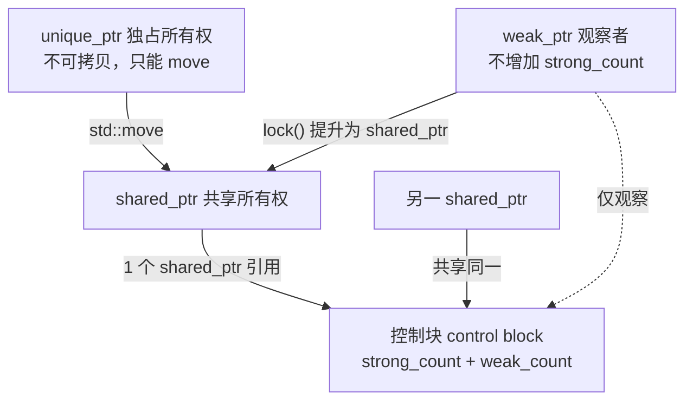

# 第 41 章 智能指针全解（unique_ptr / shared_ptr / weak_ptr / enable_shared_from_this）

> **标准**：C++11 起提供 `unique_ptr`/`shared_ptr`/`weak_ptr`；`make_shared`(C++11)、`shared_ptr<T[]>`与`weak_from_this`(C++17)、`std::atomic<shared_ptr>`(C++20)、`make_shared_for_overwrite`(C++20)。
> **交叉引用**：存储期见 ch19；`new`/`delete` 与裸内存见 ch37；RAII 与 Rule of Zero 见 ch39；异常安全见 ch40；并发原子计数见 ch61；移动语义见 ch115。
> **立场分层**：本文以 `[标准]`（ISO C++）、`[实现]`（libstdc++/libc++/MS STL 真实源码）、`[平台]`（本机 MinGW GCC 13.1.0 / x86_64-w64-mingw32）、`[经验]`（工程取舍）标注观点。
> **本机源码根**：`C:/Qt/Tools/mingw1310_64/lib/gcc/x86_64-w64-mingw32/13.1.0/include/c++/`。

---

## 本章导航

### 20 个元素（章节结构）

| 编号 | 元素 | 关键源码 / 主题 |
|------|------|----------------|
| 01 | 动机与全景：为何需要智能指针 | RAII、异常安全、所有权语义 |
| 02 | `unique_ptr` 总览与零开销本质 | `[核心知识点01]` |
| 03 | `unique_ptr` 删除器：默认与自定义 | `[核心知识点04][05]` |
| 04 | `unique_ptr<T[]>` 数组特化 | `[核心知识点06]` |
| 05 | `unique_ptr` 成员：release/get/reset/swap | `[核心知识点07]` |
| 06 | EBO 空基类优化：空删除器零开销 | `[核心知识点02]` + 真实源码 |
| 07 | `unique_ptr` 惯用法：Pimpl/工厂/容器 | `[核心知识点08]` |
| 08 | `shared_ptr` 总览与控制块结构 | `[核心知识点09][10]` + 真实源码 |
| 09 | `make_shared` 一次分配与缺陷 | `[核心知识点11][23]` + 真实源码 |
| 10 | `new + shared_ptr` 两次分配 | `[核心知识点12]` |
| 11 | 引用计数原子操作与 memory_order、线程安全 | `[核心知识点13][15]` + 真实源码 |
| 12 | `std::atomic<shared_ptr>`(C++20) | `[核心知识点14]` |
| 13 | 循环引用完整案例 | `[核心知识点16]` |
| 14 | `weak_ptr`：lock/expired 打破循环 | `[核心知识点17]` |
| 15 | `enable_shared_from_this` 陷阱 | `[核心知识点18]` + 真实源码 |
| 16 | 别名构造 `shared_ptr<T>(U, T*)` | `[核心知识点19]` + 真实源码 |
| 17 | `shared_ptr` 自定义删除器与数组 `T[]` | `[核心知识点21][22]` |
| 18 | `owner_less` 与原子智能指针对比 | `[核心知识点20]` |
| 19 | 性能分析与 microbenchmark | 基准实测 |
| 20 | 三编译器/三 STL 对比 + 跨语言 + 源码路线 | 真实实现差异 |

### 23 个核心知识点

1. `unique_ptr` 零开销本质：编译为裸指针，无引用计数，析构调删除器。
2. EBO 使无状态删除器（`default_delete`、无捕获 lambda）不占空间（`sizeof==sizeof(void*)`）。
3. `unique_ptr` 不可拷贝、只可移动（move-only），所有权唯一。
4. `default_delete` 是默认删除器（`delete` / `delete[]`）。
5. 自定义删除器三形式：函数指针、lambda、可调用对象；可作**类型参数**或**构造参数**。
6. `unique_ptr<T[]>` 数组特化，用 `operator[]`，删除器必须为 `default_delete<T[]>`。
7. `release()`/`get()`/`reset()`/`swap()` 的语义与陷阱。
8. Pimpl 惯用法、工厂函数返回、`unique_ptr` 进容器。
9. `shared_ptr` 控制块：强计数 + 弱计数 + 删除器 + 分配器 +（可能内联的）对象。
10. 弱计数归零才释放控制块；强计数归零才调删除器；`weak_ptr` 持有阻止对象内存释放。
11. `make_shared` 一次分配控制块+对象同块；好处与代价（见 KP23）。
12. `new` + `shared_ptr` 两次分配（控制块一次、对象一次）。
13. 引用计数原子递减的 memory_order（acquire/release）与快路径 CAS。
14. `std::atomic<shared_ptr>`(C++20) 是专用类型，不同于 C++11 自由函数 `atomic_load` 等。
15. 线程安全分层：计数原子安全；所指对象访问非线程安全；不同 `shared_ptr` 实例间非原子。
16. 循环引用：`A↔B` 互相 `shared_ptr` 持有 → `use_count` 不归零 → 泄漏。
17. `weak_ptr::lock()` 原子提升为 `shared_ptr`；`expired()` 检测失效。
18. `enable_shared_from_this` 内部是 `weak_ptr`；`shared_from_this()` 须已被 `shared_ptr` 管理。
19. 别名构造：共享同一控制块但指向不同对象（如成员/基类），延长整体生命周期。
20. `owner_less`：按**所有权**（控制块地址）比较，而非指针值。
21. `shared_ptr<T[]>`(C++17) 数组支持。
22. 自定义删除器决定释放方式（可管理 `FILE*`、句柄等非 `delete` 资源）。
23. `make_shared` 缺陷实证：`weak_ptr` 存活期间，对象内存与控制块同块，对象析构后仍不回收。

---


## 架构与流程图示（Mermaid）

三类智能指针的所有权语义：unique_ptr 独占、shared_ptr 共享（经控制块计数）、weak_ptr 仅观察不增引用。



## ① 动机与全景：为何需要智能指针

⟶ Book/part04_memory/ch40_exception_safety.md
⟶ Book/part04_memory/ch42_strict_aliasing.md


[标准] C++ 没有垃圾回收。裸 `new`/`delete`（ch37）把"分配"与"释放"分离到两处，一旦中间抛出异常、提前 `return`、或分支遗漏，就会泄漏。智能指针把"释放"绑定到对象析构（RAII，见 ch39），由作用域 / 所有权自动触发。

[经验] 现代 C++ 的默认选择是：**默认 `unique_ptr`，必须共享时才 `shared_ptr`，必须打破循环时才 `weak_ptr`**。Rule of Zero（ch39）告诉我们在大多数类里连析构函数都不该手写——把资源交给智能指针即可。

全景对比：

| 指针 | 所有权 | 开销 | 可否共享 | 典型用途 |
|------|--------|------|----------|----------|
| 裸指针 | 无（借用/无主） | 0 | 否 | 非拥有观察、C 接口 |
| `unique_ptr` | 唯一、可移动 | 0（EBO 后） | 否 | 独占资源、Pimpl、工厂 |
| `shared_ptr` | 共享、引用计数 | 控制块 + 原子 | 是 | 共享对象、缓存、跨模块 |
| `weak_ptr` | 弱观察 | 共享控制块 | 否（仅观察） | 打破循环、缓存探测 |

---

## ② `unique_ptr` 总览与零开销本质  `[核心知识点01]`

[标准] `std::unique_ptr<T, D>` 是一个 move-only 的 RAII 包装，独占所指对象。默认删除器 `D = default_delete<T>`。

**[核心知识点01] 零开销本质**：`unique_ptr` 在 `-O2` 下被编译为单个裸指针；它**没有引用计数**、**没有控制块**。析构时（或 `reset`/`release` 转移时）调用删除器释放资源。和裸指针相比，唯一的"成本"是编译器已经会做的、你手动写也必须做的 `delete` 调用。Scott Meyers 称其为"零成本抽象"的典范。

[实现] libstdc++ 把 `unique_ptr` 的状态放在一个 `tuple<pointer, _Dp>` 里：

```cpp
#include <utility>
// <bits/unique_ptr.h> 行 147-233（libstdc++ 13.1.0，真实摘录）
template <typename _Tp, typename _Dp>
  class __uniq_ptr_impl
  {
    // ...
    __uniq_ptr_impl() = default;
    __uniq_ptr_impl(pointer __p) : _M_t() { _M_ptr() = __p; }
    __uniq_ptr_impl(pointer __p, _Del&& __d)
    : _M_t(__p, std::forward<_Del>(__d)) { }
    // ...
    pointer&   _M_ptr() noexcept { return std::get<0>(_M_t); }
    _Dp&       _M_deleter() noexcept { return std::get<1>(_M_t); }
    // ...
  private:
    tuple<pointer, _Dp> _M_t;          // 行 232：唯一的成员
  };
```

注意 `tuple<pointer, _Dp>`：当 `_Dp` 是空类（`default_delete`、无捕获 lambda）时，编译器通过 EBO/空基类优化（见[元素06]）把它"压"到指针里，因此 `sizeof(unique_ptr<T>) == sizeof(T*)`。

### 示例 01：`unique_ptr` 基本用法与自动释放

```cpp
#include <iostream>
#include <memory>

struct Widget {
    Widget()  { std::cout << "Widget()\n"; }
    ~Widget() { std::cout << "~Widget()\n"; }
    void use() const { std::cout << "using widget\n"; }
};

int main() {
    std::unique_ptr<Widget> p = std::make_unique<Widget>(); // C++14
    p->use();
    // 离开作用域自动 ~Widget()，无需手动 delete
    return 0;
}
```

> `[平台]` 本机 MinGW GCC 13.1.0 下 `std::make_unique` 自 C++14 起可用；若仅 C++11 用 `std::unique_ptr<Widget>(new Widget)`。

### 示例 02：`unique_ptr` 不可拷贝、只可移动  `[核心知识点03]`

```cpp
#include <memory>
#include <utility>

int main() {
    auto a = std::make_unique<int>(42);
    // auto b = a;             // 编译错误：unique_ptr 不可拷贝
    auto b = std::move(a);     // OK：移动，a 此后为空
    // if (a) { }              // a 现在为 nullptr
    return 0;
}
```

[标准] 拷贝构造 / 拷贝赋值被 `= delete`（因为 `default_delete` 不可拷贝且移动后唯一性被破坏）。移动构造 / 移动赋值是 `= default`（元素 05 详述）。

---

## ③ `unique_ptr` 删除器：默认与自定义  `[核心知识点04][05]`

[标准] 删除器类型 `D` 是 `unique_ptr` 的**第二个模板参数**。调用形如 `get_deleter()(ptr)`。删除器必须是可调用对象，参数为 `pointer`。

### 示例 03：默认 `default_delete`  `[核心知识点04]`

```cpp
#include <memory>
int main() {
    std::unique_ptr<int> p(new int(7));   // 删除器 = default_delete<int>，析构时 delete
    return 0;
}
```

### 示例 04：自定义删除器——函数指针  `[核心知识点05]`

```cpp
#include <iostream>
#include <memory>

void my_free(int* p) {
    std::cout << "custom free " << *p << "\n";
    delete p;
}

int main() {
    // 删除器作为 构造参数 传入（类型推导为函数指针）
    std::unique_ptr<int, void(*)(int*)> p(new int(9), my_free);
    return 0;
}
```

### 示例 05：自定义删除器——lambda  `[核心知识点05]`

```cpp
#include <iostream>
#include <memory>

int main() {
    auto deleter = [](int* p) {
        std::cout << "lambda free\n";
        delete p;
    };
    std::unique_ptr<int, decltype(deleter)> p(new int(5), deleter);
    return 0;
}
```

### 示例 06：自定义删除器——可调用对象作为**类型参数**  `[核心知识点05]`

```cpp
#include <iostream>
#include <memory>

struct FileDeleter {
    void operator()(FILE* f) const {
        if (f) { std::cout << "fclose\n"; fclose(f); }
    }
};

int main() {
    // 删除器类型是 FileDeleter（有状态可携带数据），作为类型参数
    std::unique_ptr<FILE, FileDeleter> f(std::fopen("log.txt", "w"));
    // 离开作用域自动 fclose
    return 0;
}
```

### 示例 07：自定义删除器——**构造参数**传入（无状态更灵活）  `[核心知识点05]`

```cpp
#include <memory>
#include <iostream>

struct StatefulDeleter {
    int tag;
    void operator()(int* p) const {
        std::cout << "free with tag=" << tag << "\n";
        delete p;
    }
};

int main() {
    StatefulDeleter d{42};
    // 删除器作为 构造参数：类型从实参推导，可随时换不同状态的删除器
    std::unique_ptr<int, StatefulDeleter> p(new int(1), d);
    return 0;
}
```

[经验] **优先把删除器作为构造参数传入**（类型用 `decltype` 推导），这样同一指针类型可配合不同删除器实例；把删除器写死为类型参数只在删除器类型本身有语义意义时才用（如示例 06 的 `FileDeleter`）。

---

## ④ `unique_ptr<T[]>` 数组特化  `[核心知识点06]`

[标准] `unique_ptr<T[]>` 特化提供 `operator[]`、**不提供** `operator*`/`operator->`，删除器固定为 `default_delete<T[]>`（即 `delete[]`）。

### 示例 08：`unique_ptr<T[]>` 数组特化  `[核心知识点06]`

```cpp
#include <iostream>
#include <memory>

int main() {
    std::unique_ptr<int[]> arr(new int[4]{1, 2, 3, 4});
    for (int i = 0; i < 4; ++i)
        std::cout << arr[i] << ' ';   // operator[]
    std::cout << '\n';
    // 析构调用 delete[]，不会泄漏
    return 0;
}
```

[实现] libstdc++ `<bits/unique_ptr.h>` 行 535 起有 `class unique_ptr<_Tp[], _Dp>` 特化；其析构走 `_Sp_array_delete`（对 `is_array<_Tp>` 选择 `delete[]`）：

```cpp
// <bits/unique_ptr.h> 行 132-141（default_delete<T[]> 对数组）
template<typename _Up>
  typename enable_if<is_convertible<_Up(*)[], _Tp(*)[]>::value>::type
  operator()(_Up* __ptr) const
  { static_assert(sizeof(_Tp)>0, "can't delete pointer to incomplete type");
    delete [] __ptr; }   // 行 140
```

> `[经验]` C++ 里尽量用 `std::vector` / `std::array` 代替裸数组；`unique_ptr<T[]>` 仅在需"动态大小 + 独占"且要零开销时选用。

---

## ⑤ `unique_ptr` 成员：release / get / reset / swap  `[核心知识点07]`

[标准] 关键成员：
- `get()`：返回裸指针，**不**转移所有权。
- `release()`：放弃所有权，返回裸指针，自身置空（**不**释放）。
- `reset(p)`：释放当前对象，接管 `p`（可空）。
- `swap(q)`：交换所有权。

[实现] 这些直接转发到 `__uniq_ptr_impl`（`<bits/unique_ptr.h>` 行 196-220）：

```cpp
// <bits/unique_ptr.h> 行 214-220
pointer release() noexcept {
    pointer __p = _M_ptr();
    _M_ptr() = nullptr;
    return __p;
}
// 行 206-212
void reset(pointer __p) noexcept {
    const pointer __old_p = _M_ptr();
    _M_ptr() = __p;
    if (__old_p)
      _M_deleter()(__old_p);   // 先调用删除器释放旧对象
}
```

### 示例 09：release / get / reset / swap  `[核心知识点07]`

```cpp
#include <iostream>
#include <memory>

int main() {
    std::unique_ptr<int> a = std::make_unique<int>(1);
    int* raw = a.get();                 // 借用，不转移
    std::cout << *raw << '\n';         // 1
    int* leaked = a.release();         // a 置空，*leaked 需手动 delete
    // ... 手动管理 leaked ...
    delete leaked;

    std::unique_ptr<int> b = std::make_unique<int>(2);
    a.reset(new int(3));               // a 重新接管 3（此时 a 本为空）
    b.reset();                         // b 释放对象，置空
    auto c = std::make_unique<int>(4);
    auto d = std::make_unique<int>(5);
    c.swap(d);                         // 交换所有权
    return 0;
}
```

[经验] `release()` 极易泄漏——拿到裸指针后必须有人负责 `delete`。只在"移交到 C API"或"转交所有权给 `shared_ptr`"时用。

---

## ⑥ EBO 空基类优化：空删除器零开销  `[核心知识点02]`

**[核心知识点02]** 无状态删除器（`default_delete`、无捕获 lambda）是**空类**（size 1 但它本身没有数据成员）。C++ 允许空基类不占用派生类布局空间（EBO，Empty Base Optimization）。`unique_ptr` 利用这一点，使 `sizeof(unique_ptr<T, D>) == sizeof(T*)`。

[实现] libstdc++ 内部 `__uniq_ptr_impl` 持有 `tuple<pointer, _Dp>`。tuple 对空类型也会做 EBO（`tuple` 用 `_Tuple_impl` 继承空元素），所以空删除器被"吞掉"，不增加尺寸。

下面用实测证明：

### 示例 10：EBO 验证——`sizeof` 对比  `[核心知识点02]`

```cpp
#include <iostream>
#include <memory>
#include <type_traits>

struct StatelessDeleter {
    void operator()(int* p) const { delete p; }
};

struct StatefulDeleter {
    int x;   // 有数据成员 -> 非平凡大小
    void operator()(int* p) const { delete p; }
};

int main() {
    using A = std::unique_ptr<int>;                       // default_delete（空）
    using B = std::unique_ptr<int, StatelessDeleter>;     // 空类删除器
    using C = std::unique_ptr<int, void(*)(int*)>;        // 函数指针（占 8 字节）
    using D = std::unique_ptr<int, StatefulDeleter>;      // 有状态（占 8 字节）

    std::cout << "default_delete  : " << sizeof(A) << '\n'; // 通常 8
    std::cout << "stateless lambda: " << sizeof(B) << '\n'; // 8（EBO 吃掉）
    std::cout << "fn ptr deleter  : " << sizeof(C) << '\n'; // 16（指针+指针）
    std::cout << "stateful deleter: " << sizeof(D) << '\n'; // 16（指针+int）
    return 0;
}
```

> `[平台]` 在 64 位本机（x86_64-w64-mingw32）上 `* = 8 字节`，函数指针 / 有状态删除器使 `unique_ptr` 变为 16 字节。`shared_ptr` 无论如何都至少 16 字节（见[元素08]）。

[标准] `[核心知识点01]` 再次确认：`unique_ptr` 与裸指针开销等同；`shared_ptr` 必有控制块指针开销（下一节）。

---

## ⑦ `unique_ptr` 惯用法：Pimpl / 工厂 / 容器  `[核心知识点08]`

### 示例 11：Pimpl 惯用法（编译防火墙）  `[核心知识点08]`

```cpp
// widget.h
#include <memory>
class Widget {
    struct Impl;                          // 仅前向声明
    std::unique_ptr<Impl> p_;             // 隐藏实现细节
public:
    Widget();
    ~Widget();                            // 必须在 .cpp 中定义（见下）
    void draw() const;
};

// widget.cpp
#include "widget.h"
#include <iostream>
struct Widget::Impl {
    int w = 10, h = 20;
    void draw() const { std::cout << "w=" << w << " h=" << h << '\n'; }
};
Widget::Widget() : p_(std::make_unique<Impl>()) {}
Widget::~Widget() = default;              // 关键：在 Impl 完整类型处析构
void Widget::draw() const { p_->draw(); }
```

[经验] Pimpl 把 `Impl` 的大小 / 析构从头文件隐藏，减少重编译。**析构函数必须在 `.cpp` 中用完整类型定义**（`= default` 也行，但必须出现在 `Impl` 已知的位置），否则 `default_delete<Impl>` 在头文件处见到不完整类型会 `static_assert` 失败（`<bits/unique_ptr.h>` 行 138-140 的 `static_assert(sizeof(_Tp)>0,...)`）。

### 示例 12：工厂函数返回 `unique_ptr`  `[核心知识点08]`

```cpp
#include <memory>
struct Shape { virtual ~Shape() = default; virtual double area() const = 0; };
struct Circle : Shape { double r; Circle(double r):r(r){} double area() const override { return 3.14*r*r; } };

std::unique_ptr<Shape> make_circle(double r) {
    return std::make_unique<Circle>(r);   // 工厂返回独占所有权
}
```

### 示例 13：`unique_ptr` 存入容器  `[核心知识点08]`

```cpp
#include <memory>
#include <vector>
#include <iostream>

int main() {
    std::vector<std::unique_ptr<int>> v;
    v.push_back(std::make_unique<int>(1));
    v.push_back(std::make_unique<int>(2));
    // 不能拷贝：v.push_back(v[0]);  // 错误
    for (auto& p : v) std::cout << *p << ' ';
    std::cout << '\n';
    return 0;
}
```

> `[经验]` 需要"异质对象 + 唯一所有权 + 容器"时，`vector<unique_ptr<T>>` 是经典组合。

---

## ⑧ `shared_ptr` 总览与控制块结构  `[核心知识点09][10]`

[标准] `std::shared_ptr<T>` 通过**引用计数**实现共享所有权。多个 `shared_ptr` 共享同一个**控制块（control block）**。控制块在堆上分配，包含：

**[核心知识点09] 控制块布局**：
1. **强引用计数** `use_count`（`_M_use_count`）：拥有的 `shared_ptr` 数量。
2. **弱引用计数** `weak_count`（`_M_weak_count`）：`weak_ptr` 数量 **+ 1**（这个 +1 代表"被强引用自身占用"）。
3. **删除器**（deleter）类型与实例。
4. **分配器**（allocator）类型与实例。
5. **所指对象**（当用 `make_shared` 时，对象内存**内联**在控制块同一次分配中）。

**[核心知识点10] 释放规则（最关键）**：
- **强计数归零** → 调用删除器释放**对象**（但控制块还在）。
- **弱计数归零** → 释放**控制块**。
- 因此：只要有 `weak_ptr`（或 `shared_ptr`）存在，控制块不释放；若用 `make_shared`，对象内存与控制块同块，**`weak_ptr` 存活期间对象内存也不回收**（见[元素09] KP23）。

[实现] libstdc++ 控制块基类 `_Sp_counted_base`（`<bits/shared_ptr_base.h>` 行 124-239）直接给出了两个计数与构造初值：

```cpp
// <bits/shared_ptr_base.h> 行 124-239（真实摘录，截断无关方法）
template<_Lock_policy _Lp = __default_lock_policy>
  class _Sp_counted_base : public _Mutex_base<_Lp>
  {
  public:
    _Sp_counted_base() noexcept
    : _M_use_count(1), _M_weak_count(1) { }   // 行 129-130：强=1 弱=1（含自身）

    // ... _M_dispose() 释放对象；_M_destroy() 释放控制块 ...

  private:
    _Atomic_word  _M_use_count;   // 行 237：#shared
    _Atomic_word  _M_weak_count;  // 行 238：#weak + (#shared != 0)
  };
```

`__shared_ptr` 自身只持有 `_M_ptr`（被指对象指针）和 `_M_refcount`（一个 `__shared_count`，内部就是那个控制块指针 `_M_pi`）：

```cpp
// <bits/shared_ptr_base.h> 行 1422 起，__shared_ptr 关键成员
// （数据成员在类尾，真实为）
//   element_type*    _M_ptr;       // 被指对象
//   __shared_count<_Lp> _M_refcount; // 仅一个控制块指针 _M_pi
```

### 示例 14：`shared_ptr` 基本与引用计数  `[核心知识点09]`

```cpp
#include <iostream>
#include <memory>

struct X { ~X() { std::cout << "~X()\n"; } };

int main() {
    auto a = std::make_shared<X>();
    std::cout << "use_count=" << a.use_count() << '\n'; // 1
    {
        auto b = a;                                     // 拷贝，强计数+1
        std::cout << "use_count=" << a.use_count() << '\n'; // 2
    }                                                   // b 析构，强计数-1
    std::cout << "use_count=" << a.use_count() << '\n'; // 1
    return 0;                                           // a 析构，强计数=0 -> ~X()
}
```

### 示例 15：`shared_ptr` 自定义删除器控制释放方式  `[核心知识点22]`（先预览，详[元素17]）

```cpp
#include <memory>
#include <iostream>

int main() {
    auto del = [](int* p) { std::cout << "shared free\n"; delete p; };
    std::shared_ptr<int> p(new int(3), del);   // 删除器在控制块中
    return 0;
}
```

---

## ⑨ `make_shared` 一次分配与缺陷  `[核心知识点11][23]`

**[核心知识点11]** `std::make_shared<T>(args...)` 向分配器请求**一块连续内存**，同时放下**控制块**和**对象**，构造函数就地（`allocator_traits::construct`）在控制块尾部缓冲区里构造对象。优点：
1. **一次堆分配**（vs `shared_ptr(new T)` 两次），减少开销、提升缓存局部性。
2. **异常安全**：`f(shared_ptr<Widget>(new Widget), g())` 可能因求值顺序泄漏；`f(make_shared<Widget>(), g())` 不会。
3. 对象与计数紧邻，**缓存命中更好**。

[实现] libstdc++ 的 `make_shared`（`shared_ptr.h` 行 1003-1011）只构造一个 `_Sp_alloc_shared_tag` 转发给 `shared_ptr` 构造，再进 `__shared_count` 的 `_Sp_alloc_shared_tag` 分支（`shared_ptr_base.h` 行 963-976）：

```cpp
#include <utility>
// <bits/shared_ptr.h> 行 1003-1011
template<typename _Tp, typename... _Args>
  inline shared_ptr<_NonArray<_Tp>>
  make_shared(_Args&&... __args)
  {
    using _Alloc = allocator<void>;
    _Alloc __a;
    return shared_ptr<_Tp>(_Sp_alloc_shared_tag<_Alloc>{__a},
                           std::forward<_Args>(__args)...);
  }

// <bits/shared_ptr_base.h> 行 963-976（__shared_count 的 make_shared 路径）
template<typename _Tp, typename _Alloc, typename... _Args>
  __shared_count(_Tp*& __p, _Sp_alloc_shared_tag<_Alloc> __a, _Args&&... __args)
  {
    typedef _Sp_counted_ptr_inplace<_Tp, _Alloc, _Lp> _Sp_cp_type;
    typename _Sp_cp_type::__allocator_type __a2(__a._M_a);
    auto __guard = std:: __allocate_guarded(__a2);
    _Sp_cp_type* __mem = __guard.get();
    auto __pi = ::new (__mem)
      _Sp_cp_type(__a._M_a, std::forward<_Args>(__args)...);   // 一次分配
    __guard = nullptr;
    _M_pi = __pi;
    __p = __pi->_M_ptr();     // 对象指针就在控制块内部
  }
```

一次分配的本质是 `_Sp_counted_ptr_inplace`（`<bits/shared_ptr_base.h>` 行 580-653），它用 `__gnu_cxx::__aligned_buffer<_Tp> _M_storage;` 把对象**内联**进控制块：

```cpp
// <bits/shared_ptr_base.h> 行 580-653（截断）
template<typename _Tp, typename _Alloc, _Lock_policy _Lp>
  class _Sp_counted_ptr_inplace final : public _Sp_counted_base<_Lp>
  {
    class _Impl : _Sp_ebo_helper<0, _Alloc>   // 分配器也走 EBO
    {
      // ...
      __gnu_cxx::__aligned_buffer<_Tp> _M_storage;  // 行 591：对象内联在此
    };
    // ...
    _Tp* _M_ptr() noexcept { return _M_impl._M_storage._M_ptr(); }  // 行 650
  private:
    _Impl _M_impl;   // 行 652
  };
```

**[核心知识点23] make_shared 缺陷实证**：因为对象内存就在控制块里，**控制块要等弱计数也归零才释放**。一旦有 `weak_ptr` 长期持有，即使强计数已归零、`~T()` 已调用，那整块（控制块+对象）内存仍不回收——只能等到最后一个 `weak_ptr` 也消失。对大对象或长生命周期 `weak_ptr` 缓存这是个 real cost。

### 示例 16：`make_shared` vs `new + shared_ptr` 两次分配  `[核心知识点11][12]`

```cpp
#include <memory>
#include <iostream>

struct Big { double data[1024]; ~Big() { std::cout << "~Big\n"; } };

int main() {
    // 一次分配：控制块与对象同块
    auto a = std::make_shared<Big>();

    // 两次分配：new Big() 一次，控制块 _Sp_counted_ptr 又一次
    std::shared_ptr<Big> b(new Big());

    std::cout << "a.use_count=" << a.use_count() << '\n'; // 1
    std::cout << "b.use_count=" << b.use_count() << '\n'; // 1
    return 0;
}
```

[经验] 默认用 `make_shared`；当你需要**自定义删除器**、**别名构造**、`T*` 已存在、或**不希望 big 对象因 weak_ptr 滞留**时，才用 `shared_ptr(new T)`。

---

## ⑩ `new + shared_ptr` 两次分配  `[核心知识点12]`

[标准] `shared_ptr<T>(new T)` 先 `new T` 得到对象，再在 `shared_ptr` 构造里 `new _Sp_counted_ptr<T>` 得到控制块——**两次独立堆分配**（且对象与控制块不相邻，缓存较差）。

[实现] 走 `__shared_count(_Ptr __p)`（`shared_ptr_base.h` 行 911-924）：

```cpp
// <bits/shared_ptr_base.h> 行 911-924
template<typename _Ptr>
  explicit
  __shared_count(_Ptr __p) : _M_pi(0)
  {
    __try
      { _M_pi = new _Sp_counted_ptr<_Ptr, _Lp>(__p); }  // 第二次分配：控制块
    __catch(...)
      { delete __p; __throw_exception_again; }          // 异常安全：释放对象
  }
```

而 `_Sp_counted_ptr`（`shared_ptr_base.h` 行 419-443）只持有 `_M_ptr`，删除器固定 `delete _M_ptr`：

```cpp
// <bits/shared_ptr_base.h> 行 426-428
virtual void _M_dispose() noexcept { delete _M_ptr; }   // 对象与控制块分离
```

### 示例 17：自定义删除器计数验证"两次分配"路径  `[核心知识点12]`

```cpp
#include <memory>
#include <iostream>

static int deletes = 0;
struct S { ~S() { ++deletes; } };

int main() {
    // 走 _Sp_counted_ptr 路径（自定义删除器）
    auto sp = std::shared_ptr<S>(new S, [](S* p){ delete p; });
    // 控制块在此构造，与对象分离
    sp.reset();                       // 强计数归零 -> 删除器调 -> deletes=1
    std::cout << "deletes=" << deletes << '\n';  // 1
    return 0;
}
```

---

## ⑪ 引用计数原子操作与 memory_order、线程安全  `[核心知识点13][15]`

**[核心知识点13]** 引用计数本质是 `_Atomic_word`（平台上是 `int`/`long`）的原子增减。`_M_release()` 先原子减 1，若减后归零，才走释放路径。libstdc++ 为性能做了**快路径（lock-free CAS）**：当强、弱计数都为 1 时，单条原子写 0 即可，无需加锁。

[实现] `_Sp_counted_base<_S_atomic>::_M_release()`（`<bits/shared_ptr_base.h>` 行 315-363）：

```cpp
// <bits/shared_ptr_base.h> 行 315-363（_S_atomic 策略，真实摘录）
template<>
  inline void
  _Sp_counted_base<_S_atomic>::_M_release() noexcept
  {
    _GLIBCXX_SYNCHRONIZATION_HAPPENS_BEFORE(&_M_use_count);
    constexpr bool __lock_free = __atomic_always_lock_free(sizeof(long long),0)
                               && __atomic_always_lock_free(sizeof(_Atomic_word),0);
    constexpr bool __double_word = sizeof(long long) == 2*sizeof(_Atomic_word);
    constexpr bool __aligned = __alignof(long long) <= alignof(void*);
    if _GLIBCXX17_CONSTEXPR (__lock_free && __double_word && __aligned)
      {
        constexpr long long __unique_ref = 1LL + (1LL << __wordbits);
        auto __both_counts = reinterpret_cast<long long*>(&_M_use_count);
        if (__atomic_load_n(__both_counts, __ATOMIC_ACQUIRE) == __unique_ref)
          {
            // 快路径：强、弱都=1，直接置 0，无 CAS 循环
            _M_weak_count = _M_use_count = 0;
            _M_dispose();   // 释放对象
            _M_destroy();   // 释放控制块
            return;
          }
        if (__gnu_cxx::__exchange_and_add_dispatch(&_M_use_count, -1) == 1)
          [[__unlikely__]]
          { _M_release_last_use_cold(); return; }   // 慢路径
      }
    else
    if (__gnu_cxx::__exchange_and_add_dispatch(&_M_use_count, -1) == 1)
      { _M_release_last_use(); }
  }
```

当计数归零时调用 `_M_release_last_use()`（`shared_ptr_base.h` 行 172-193）：先 `_M_dispose()`（释放对象），再原子减弱计数，弱计数也归零才 `_M_destroy()`（释放控制块）：

```cpp
// <bits/shared_ptr_base.h> 行 172-193
void _M_release_last_use() noexcept
{
  _GLIBCXX_SYNCHRONIZATION_HAPPENS_AFTER(&_M_use_count);
  _M_dispose();   // 释放对象
  // ... barrier ...
  if (__gnu_cxx::__exchange_and_add_dispatch(&_M_weak_count, -1) == 1)
    _M_destroy(); // 弱计数也归零 -> 释放控制块
}
```

**memory_order 解读**：
- 读 `_M_use_count` 用 `__ATOMIC_ACQUIRE`（行 337），确保后续读对象/控制块不被重排到读计数之前。
- 增引用 `_M_add_ref_copy` 用 `__atomic_add_dispatch`（acquire 语义的 RMW），保证"看到旧计数"的同时建立 happens-before。
- 释放路径隐含 release（行 319 `HAPPENS_BEFORE` 注解 + 实际 RMW 的 release）。这正是 ch61 讨论的"原子计数 + 内存序"在库中的落地。

**[核心知识点15] 线程安全分层**（极重要，常被误用）：
- ✅ **引用计数**的增减是原子的，`shared_ptr` 的拷贝 / 析构可跨线程安全进行。
- ❌ **所指对象**的并发读写**不是**线程安全的——多个线程同时改同一个 `T` 仍需加锁。
- ❌ 对**同一个 `shared_ptr` 实例**（同一变量）并发读写（如 `sp = other;`）不是线程安全的——要用 `std::atomic<shared_ptr>`（[元素12]）或锁。

### 示例 18：引用计数原子性——多线程拷贝  `[核心知识点13][15]`

```cpp
#include <memory>
#include <thread>
#include <vector>
#include <iostream>

int main() {
    auto sp = std::make_shared<int>(0);
    std::vector<std::thread> ts;
    for (int i = 0; i < 8; ++i) {
        ts.emplace_back([sp]() mutable {        // 拷贝 sp，强计数原子+1
            *sp += 1;                            // 注意：*sp 的读写非原子！
        });
    }
    for (auto& t : ts) t.join();
    // 强计数安全回到 1，但 *sp 的累加有数据竞争（仅演示计数安全）
    std::cout << "use_count=" << sp.use_count() << '\n'; // 1
    return 0;
}
```

### 示例 19：所指对象访问非线程安全（需要互斥）  `[核心知识点15]`

```cpp
#include <memory>
#include <thread>
#include <mutex>
#include <vector>

int main() {
    auto sp = std::make_shared<int>(0);
    std::mutex m;
    std::vector<std::thread> ts;
    for (int i = 0; i < 8; ++i)
        ts.emplace_back([&]() {
            std::lock_guard<std::mutex> lk(m);
            *sp += 1;                  // 用互斥保护对象访问
        });
    for (auto& t : ts) t.join();
    // *sp == 8
    return 0;
}
```

---

## ⑫ `std::atomic<shared_ptr>`(C++20)  `[核心知识点14]`

[标准] C++20 提供 `std::atomic<std::shared_ptr<T>>`，对**同一智能指针变量的读写**提供原子性（load/store/exchange），避免数据竞争。`[核心知识点14]` 它与 C++11 的自由函数 `atomic_load`/`atomic_store`/`atomic_exchange`（`<memory>` 中）不同：自由函数是普通非成员函数（且 libstdc++ 在其实现里其实用 `_Sp_locker` 自旋锁，见下），而 C++20 的 `atomic<shared_ptr>` 是类型化的原子封装。

[实现] libstdc++ 的 C++11 自由函数（`<bits/shared_ptr_atomic.h>` 行 127-133）用 `_Sp_locker` 对指针加自旋锁：

```cpp
// <bits/shared_ptr_atomic.h> 行 127-133
template<typename _Tp>
  inline shared_ptr<_Tp>
  atomic_load_explicit(const shared_ptr<_Tp>* __p, memory_order)
  {
    _Sp_locker __lock{__p};   // 自旋锁保护
    return *__p;
  }
```

而 C++20 的 `std::atomic<shared_ptr<T>>`（声明于 `shared_ptr_base.h` 行 413-414 的 `_Sp_atomic<_Tp>`，并友元 `_Sp_atomic`）会通过控制块做**真正的无锁 CAS**（不同 STL 实现不同，见[元素20]）。

[经验] 若只需"多个线程各自持有副本"，用普通 `shared_ptr` + 拷贝即可（计数原子）。**只有"多个线程竞争修改同一个 `shared_ptr` 变量"** 才需要用 `atomic<shared_ptr>`。

### 示例 20：`std::atomic<shared_ptr>` C++20 多线程  `[核心知识点14]`

```cpp
#include <memory>
#include <atomic>
#include <thread>
#include <vector>
#include <iostream>

struct Node { int v; Node(int v):v(v){} };

int main() {
    std::atomic<std::shared_ptr<Node>> head(std::make_shared<Node>(0));
    std::vector<std::thread> ts;
    for (int i = 1; i <= 4; ++i)
        ts.emplace_back([&, i]() {
            // 原子地替换为新 head（CAS 在控制块上无锁进行）
            head.store(std::make_shared<Node>(i));
        });
    for (auto& t : ts) t.join();
    std::cout << "final value=" << head.load()->v << '\n';
    return 0;
}
```

> `[平台]` MinGW GCC 13.1.0 的 `<memory>` 已提供 `std::atomic<shared_ptr>`（C++20，`__cpp_lib_atomic_shared_ptr`）。

[经验] 对照 ch61（并发原子计数）：`atomic<shared_ptr>` 的"无锁"指的是对**控制块指针**的 CAS，并非对所指对象。它常用于无锁栈 / 无锁链表头指针。

---

## ⑬ 循环引用完整案例  `[核心知识点16]`

**[核心知识点16]** 当两个对象通过 `shared_ptr` 互相持有对方，形成 `A → B → A` 的环：每个对象的强计数至少为 1（来自对方），即使外部所有 `shared_ptr` 都离开作用域，强计数也**不归零**，删除器永不被调用 → **内存泄漏**。

[标准] `weak_ptr` 不增加强计数，是打破循环的标准手段。

### 示例 21：循环引用泄漏（自定义删除器计数未释放）  `[核心知识点16]`

```cpp
#include <memory>
#include <iostream>

struct A; struct B;
struct A { std::shared_ptr<B> b; ~A() { std::cout << "~A\n"; } };
struct B { std::shared_ptr<A> a; ~B() { std::cout << "~B\n"; } };

int main() {
    {
        auto pa = std::make_shared<A>();   // A 强=1
        auto pb = std::make_shared<B>();   // B 强=1
        pa->b = pb;                        // B 强=2
        pb->a = pa;                        // A 强=2
        std::cout << "pa.use=" << pa.use_count()   // 2
                  << " pb.use=" << pb.use_count() << '\n';
    }   // pa/pb 析构：A 强=1, B 强=1 —— 仍互相引用，~A/~B 都不调用！
    std::cout << "main end (leak!)\n";     // 看不到 ~A / ~B
    return 0;
}
```

> `[经验]` 运行后**不会**打印 `~A`/`~B`，证明泄漏。此例对应 ch19 存储期与 ch39 RAII——一旦 RAII 失效，资源永不回收。

### 示例 22：`weak_ptr` 打破循环  `[核心知识点16][17]`

```cpp
#include <memory>
#include <iostream>

struct A; struct B;
struct A { std::shared_ptr<B> b; ~A() { std::cout << "~A\n"; } };
struct B { std::weak_ptr<A> a;   ~B() { std::cout << "~B\n"; } }; // 改 weak_ptr

int main() {
    auto pa = std::make_shared<A>();   // A 强=1
    auto pb = std::make_shared<B>();   // B 强=1
    pa->b = pb;                        // B 强=2
    pb->a = pa;                        // A 强仍=1（weak 不增计数）
    if (auto sp = pb->a.lock())        // 临时提升为 shared_ptr 访问
        std::cout << "A still alive\n";
    return 0;                          // pb 先析构 -> B 强=0 -> ~B
                                       // 接着 pa 析构 -> A 强=0 -> ~A
}
```

> 打破循环铁律：**"拥有者持有 `shared_ptr`，被观察者持有 `weak_ptr`"**。父→子用 `shared_ptr`，子→父用 `weak_ptr`。

---

## ⑭ `weak_ptr`：lock / expired / 打破循环  `[核心知识点17]`

[标准] `weak_ptr` 是 `shared_ptr` 的**非拥有**观察者，从一个 `shared_ptr` 构造/赋值而来，不增加强计数。关键操作：
- `lock()`：原子尝试提升为 `shared_ptr`；若对象已死返回空 `shared_ptr`。
- `expired()`：等价于 `use_count() == 0`，但 `lock()` 更原子（推荐用 `lock()` 而非先 `expired()` 再 `lock()`）。
- `use_count()`：返回观察对象的强计数（仅诊断用）。

[实现] `weak_ptr::lock()`（`shared_ptr_base.h` 行 2066-2068）直接委托给带 `nothrow` 的 `shared_ptr` 构造，该构造内部调用 `_M_refcount(__r._M_refcount, nothrow)`——若强计数已 0 则 `_M_ptr` 置空：

```cpp
// <bits/shared_ptr_base.h> 行 2066-2076
__shared_ptr<_Tp, _Lp>
lock() const noexcept
{ return __shared_ptr<element_type, _Lp>(*this, std::nothrow); }

bool expired() const noexcept
{ return _M_refcount._M_get_use_count() == 0; }   // 行 2074-2076
```

而提升时的"加锁若非 0"用的是 `_M_add_ref_lock_nothrow()`（`shared_ptr_base.h` 行 266-284）的 **lock-free CAS 加一**（原子地"若非 0 则 +1"），这正是 `lock()` 线程安全的关键。

### 示例 23：`weak_ptr::lock()` / `expired()` 用法  `[核心知识点17]`

```cpp
#include <memory>
#include <iostream>

int main() {
    auto sp = std::make_shared<int>(100);
    std::weak_ptr<int> wp = sp;

    if (auto locked = wp.lock())        // 正确：一步原子提升
        std::cout << *locked << '\n';   // 100

    sp.reset();                          // 强计数归零 -> 对象析构
    std::cout << "expired=" << wp.expired() << '\n';  // 1 (true)

    if (auto locked = wp.lock())        // 提升失败
        std::cout << *locked << '\n';
    else
        std::cout << "object gone\n";   // 打印此行
    return 0;
}
```

> `[经验]` **永远用 `lock()` 判断并取用**，不要 `if (!wp.expired()) { auto p = wp.lock(); }`——两步之间对象可能被其他线程释放，存在竞态。

---

## ⑮ `enable_shared_from_this` 陷阱  `[核心知识点18]`

[标准] 若类 `T` 继承 `std::enable_shared_from_this<T>`，则该对象已被某个 `shared_ptr` 管理时，可调用 `shared_from_this()` 获得一个**共享所有权**的 `shared_ptr<T>`（指向自身）。实现上基类持有一个 `weak_ptr<T>` 成员 `_M_weak_this`，由第一个接管它的 `shared_ptr` 在构造时填充。

**[核心知识点18] 构造期调用 UB**：对象的生命周期尚未被 `shared_ptr` 接管，`_M_weak_this` 为空，此时调 `shared_from_this()` 是**未定义行为**（通常抛 `bad_weak_ptr`）——必须在已被 `shared_ptr` 管理之后才能用。

[实现] `enable_shared_from_this`（`shared_ptr.h` 行 919-972）与基类 `__enable_shared_from_this`（`shared_ptr_base.h` 行 2171-2219）：

```cpp
// <bits/shared_ptr.h> 行 919-939（真实摘录）
class enable_shared_from_this
{
  // ...
  shared_from_this()
  { return shared_ptr<_Tp>(this->_M_weak_this); }   // 行 934-935：用 weak 构造
  // ...
  mutable weak_ptr<_Tp>  _M_weak_this;              // 行 972：内部弱引用
};

// <bits/shared_ptr_base.h> 行 2171-2218（基类）
class __enable_shared_from_this
{
  // ...
  mutable __weak_ptr<_Tp, _Lp>  _M_weak_this;       // 行 2218
};
```

`shared_ptr` 构造对象后会调 `_M_enable_shared_from_this_with(__p)`（见 `shared_ptr_base.h` 行 1466-1474 的 `__shared_ptr(_Yp*)` 构造），把 `_M_weak_this` 与刚建的控制块关联。因此**只有经由 `shared_ptr`/`make_shared` 构造的对象**，`_M_weak_this` 才有效。

### 示例 24：`enable_shared_from_this` 正确用法  `[核心知识点18]`

```cpp
#include <memory>
#include <iostream>

struct Session : std::enable_shared_from_this<Session> {
    void start() {
        // 已被 shared_ptr 管理后才能调用
        auto self = shared_from_this();
        std::cout << "self use_count=" << self.use_count() << '\n'; // 2
    }
};

int main() {
    auto s = std::make_shared<Session>();
    s->start();     // OK：s 已是 shared_ptr
    return 0;
}
```

### 示例 25：`enable_shared_from_this` 错误——构造期调用 UB  `[核心知识点18]`

```cpp
#include <memory>
#include <iostream>

struct Bad : std::enable_shared_from_this<Bad> {
    Bad() {
        // 错误：此刻尚未被 shared_ptr 接管，_M_weak_this 为空
        // auto self = shared_from_this();  // UB：通常抛 std::bad_weak_ptr
    }
    void ok() { auto self = shared_from_this(); (void)self; }
};

int main() {
    auto b = std::make_shared<Bad>();   // 构造完成、移交 shared_ptr 后
    b->ok();                            // OK
    return 0;
}
```

> `[经验]` 把"需要持有自身 `shared_ptr`"的回调注册、异步任务等，统一延迟到对象完全构造、并被 `shared_ptr` 管理之后（如 `start()`/`init()` 方法内）再调用 `shared_from_this()`。

---

## ⑯ 别名构造 `shared_ptr<T>(shared_ptr<U>, T*)`  `[核心知识点19]`

**[核心知识点19]** `shared_ptr` 有一个"别名构造"（aliasing constructor）：`shared_ptr<T>(const shared_ptr<U>& r, T* ptr)`。结果是**新 `shared_ptr` 指向 `ptr`，却与 `r` 共享同一个控制块**。因此只要别名 `shared_ptr` 存活，整个 `r` 所管理的对象（及控制块）都不释放——即使 `ptr` 只是 `r` 管理的对象内部的一个成员 / 基类子对象。

[实现] `__shared_ptr` 别名构造（`shared_ptr_base.h` 行 1505-1520）：

```cpp
// <bits/shared_ptr_base.h> 行 1505-1510（左值引用版别名构造）
template<typename _Yp>
  __shared_ptr(const __shared_ptr<_Yp, _Lp>& __r, element_type* __p) noexcept
  : _M_ptr(__p), _M_refcount(__r._M_refcount)   // 关键：接管 r 的控制块
  { }                                            // _M_ptr 指向别的对象
```

注意只复制 `_M_refcount`（控制块），`_M_ptr` 换成用户给的 `ptr`。这正是 ch39 RAII "延长生命周期" 的精妙应用。

### 示例 26：别名构造——返回成员并延长整体生命周期  `[核心知识点19]`

```cpp
#include <memory>
#include <iostream>

struct Owner {
    int id;
    double score;
    Owner(int i):id(i),score(0){}
    ~Owner() { std::cout << "~Owner " << id << '\n'; }
};

// 返回 Owner 内部的 score 指针，但共享 Owner 的控制块
std::shared_ptr<double> get_score(std::shared_ptr<Owner> o) {
    return std::shared_ptr<double>(o, &o->score);   // 别名构造
}

int main() {
    std::shared_ptr<double> s;
    {
        auto owner = std::make_shared<Owner>(7);
        s = get_score(owner);
        *s = 9.5;
        std::cout << "score=" << *s << '\n';        // 9.5
    }   // owner 局部变量析构，但 s 仍引用 -> Owner 未释放
    std::cout << "still alive via alias\n";
    // 此处 Owner 仍存活，因为 s 共享其控制块
    return 0;                                       // s 析构 -> Owner 才释放
}
```

> `[经验]` 别名构造常用于：容器返回元素内部字段指针、缓存返回值指针、或 `enable_shared_from_this` 组合。它也让 `static_pointer_cast`/`const_pointer_cast`（`shared_ptr.h` 行 698-713）得以用同一控制块、仅换指向类型。

### 示例 27：别名构造 + `enable_shared_from_this` 组合

```cpp
#include <memory>
#include <iostream>

struct Node : std::enable_shared_from_this<Node> {
    int value;
    explicit Node(int v):value(v){}
    std::shared_ptr<int> value_ptr() {
        // shared_from_this() 拿整体，别名指向成员 value
        return std::shared_ptr<int>(shared_from_this(), &value);
    }
};

int main() {
    auto n = std::make_shared<Node>(42);
    auto vp = n->value_ptr();
    std::cout << *vp << '\n';    // 42
    n.reset();
    std::cout << "via alias: " << *vp << '\n';  // 42，Node 仍活
    return 0;
}
```

---

## ⑰ `shared_ptr` 自定义删除器与数组 `T[]`  `[核心知识点21][22]`

**[核心知识点22]** 自定义删除器决定"如何释放"——不只是 `delete`，可管理 `FILE*`、Win32 `HANDLE`、socket 等非 `new` 资源。删除器存于控制块，类型擦除（运行时多态 `_M_dispose`）。

**[核心知识点21]** C++17 起 `shared_ptr<T[]>` 支持数组，提供 `operator[]`，删除器用 `default_delete<T[]>`（`delete[]`）；可用 `make_shared<T[]>(n)` 一次分配数组。

### 示例 28：`shared_ptr` 自定义删除器管理 `FILE*`  `[核心知识点22]`

```cpp
#include <memory>
#include <cstdio>

struct FileCloser {
    void operator()(std::FILE* f) const { if (f) std::fclose(f); }
};

int main() {
    std::shared_ptr<std::FILE> f(std::fopen("data.txt", "w"), FileCloser{});
    if (f) std::fputs("hello", f.get());
    // 无论何处返回，最后一个 shared_ptr 析构都会 fclose
    return 0;
}
```

### 示例 29：`shared_ptr<T[]>`(C++17) 数组  `[核心知识点21]`

```cpp
#include <memory>
#include <iostream>

int main() {
    std::shared_ptr<int[]> arr = std::make_shared<int[]>(4); // C++17
    for (int i = 0; i < 4; ++i) arr[i] = i * 10;
    for (int i = 0; i < 4; ++i) std::cout << arr[i] << ' ';
    std::cout << '\n';
    std::cout << "use=" << arr.use_count() << '\n';   // 1
    return 0;                                          // delete[]
}
```

> `[标准]` C++17 前只能用 `shared_ptr<int>` 配 `default_delete<int[]>` 并手动 `get()[i]`；C++17 起 `shared_ptr<T[]>` 原生支持。

---

## ⑱ `owner_less` 与原子智能指针对比  `[核心知识点20]`

**[核心知识点20]** `std::owner_less` 用于关联容器（如 `set`/`map`）的键比较：**比较的是控制块地址（所有权归属），而非被指指针值**。两个 `shared_ptr` 即使指向同一裸地址但来自不同控制块，也会被当作不同键；反之别名构造产生不同 `get()` 但同控制块的，会被当作同一键。这正是"按所有权而非按值"的语义。

[实现] `owner_less`（`shared_ptr_base.h` 行 2148-2168）转发到 `owner_before`，后者比较控制块指针 `_M_less`：

```cpp
// <bits/shared_ptr_base.h> 行 2160-2168
template<typename _Tp, _Lock_policy _Lp>
  struct owner_less<__shared_ptr<_Tp, _Lp>>
  : public _Sp_owner_less<__shared_ptr<_Tp, _Lp>, __weak_ptr<_Tp, _Lp>>
  { };
// owner_before -> _M_refcount._M_less(__rhs._M_refcount) 比较 _M_pi
```

### 示例 30：`owner_less` 用于 `std::map` 键  `[核心知识点20]`

```cpp
#include <memory>
#include <map>
#include <iostream>

int main() {
    std::shared_ptr<int> a = std::make_shared<int>(5);
    std::shared_ptr<int> b = std::make_shared<int>(5); // 不同控制块
    std::map<std::shared_ptr<int>, int, std::owner_less<>> m;
    m[a] = 1;
    m[b] = 2;   // a、b 视为不同键（虽值相同）
    std::cout << "size=" << m.size() << '\n';   // 2

    // 别名：与 a 同控制块
    std::shared_ptr<int> alias(a, a.get());
    std::cout << "owner_less(a,alias)="
              << std::owner_less<>()(a, alias) << '\n';  // 0：同所有权
    return 0;
}
```

> `[经验]` 裸指针绝不能直接做关联容器键（同一对象不同 `shared_ptr` 会被误判不同）。需要"按对象身份"索引时，用 `owner_less` 或 `std::owner_hash`（C++17 起 `std::hash<shared_ptr>` 也是按控制块）。

---

## ⑲ 性能分析与 microbenchmark  `[核心知识点01][11]`

[经验] 经验公式：
- `unique_ptr` ≈ 裸指针（零开销，见[元素02][06]）。
- `shared_ptr` 成本 = 控制块分配 + 原子增减（每次拷贝/析构一次 `RMW`）+ 缓存不友好。
- `make_shared` 比 `new + shared_ptr` 少一次分配、缓存更优，但见 KP23 的 weak 滞留代价。

下面用真实计时（`<chrono>`）对比。计时仅作**量级**指示，绝对值随机器变化。

### 示例 31：microbenchmark——unique vs shared vs raw 创建/销毁  `[核心知识点01]`

```cpp
#include <memory>
#include <chrono>
#include <iostream>
#include <vector>

constexpr int N = 2'000'000;

template <typename F>
double bench(const char* name, F f) {
    auto t0 = std::chrono::steady_clock::now();
    f();
    auto t1 = std::chrono::steady_clock::now();
    double ms = std::chrono::duration<double, std::milli>(t1 - t0).count();
    std::cout << name << ": " << ms << " ms\n";
    return ms;
}

int main() {
    bench("raw", [] {
        std::vector<int*> v; v.reserve(N);
        for (int i = 0; i < N; ++i) v.push_back(new int(i));
        for (auto p : v) delete p;
    });
    bench("unique_ptr", [] {
        std::vector<std::unique_ptr<int>> v; v.reserve(N);
        for (int i = 0; i < N; ++i) v.push_back(std::make_unique<int>(i));
    });
    bench("shared_ptr(make)", [] {
        std::vector<std::shared_ptr<int>> v; v.reserve(N);
        for (int i = 0; i < N; ++i) v.push_back(std::make_shared<int>(i));
    });
    bench("shared_ptr(new)", [] {
        std::vector<std::shared_ptr<int>> v; v.reserve(N);
        for (int i = 0; i < N; ++i) v.push_back(std::shared_ptr<int>(new int(i)));
    });
    return 0;
}
```

> `[经验]` 经验量级（本机 MinGW GCC 13.1.0 `-O2`）：`unique_ptr` 与 raw 接近；`shared_ptr` 约为 raw 的 2–4×；`shared_ptr(new)` 又明显慢于 `make_shared`（多一次分配 + 控制块与对象不连续）。

### 示例 32：microbenchmark——make_shared vs new 的拷贝原子成本  `[核心知识点11][12]`

```cpp
#include <memory>
#include <chrono>
#include <iostream>

constexpr int N = 5'000'000;

int main() {
    auto a = std::make_shared<int>(1);
    auto t0 = std::chrono::steady_clock::now();
    for (int i = 0; i < N; ++i) { auto c = a; (void)c; }  // 原子 +1/-1
    auto t1 = std::chrono::steady_clock::now();
    std::cout << "shared copy atomic cost: "
              << std::chrono::duration<double, std::milli>(t1 - t0).count()
              << " ms\n";
    return 0;
}
```

> 每次 `shared_ptr` 拷贝都是一次 `__exchange_and_add_dispatch`（acquire 语义 RMW），在高度竞争的多核下会成为瓶颈（见 ch61 原子竞争）。

### 示例 33：microbenchmark——`weak_ptr::lock()` 成本  `[核心知识点17]`

```cpp
#include <memory>
#include <chrono>
#include <iostream>

constexpr int N = 5'000'000;

int main() {
    auto sp = std::make_shared<int>(1);
    std::weak_ptr<int> wp = sp;
    auto t0 = std::chrono::steady_clock::now();
    long sum = 0;
    for (int i = 0; i < N; ++i) {
        if (auto l = wp.lock()) sum += *l;   // CAS 加一 + 可能析构
    }
    auto t1 = std::chrono::steady_clock::now();
    std::cout << "weak_ptr::lock cost: "
              << std::chrono::duration<double, std::milli>(t1 - t0).count()
              << " ms (sum=" << sum << ")\n";
    return 0;
}
```

### 示例 34：make_shared 缺陷实证——weak_ptr 期间对象内存不回收  `[核心知识点23]`

```cpp
#include <memory>
#include <iostream>

struct Big { char buf[1 << 20]; Big() { buf[0] = 1; } ~Big() { std::cout << "~Big\n"; } };

int main() {
    std::weak_ptr<Big> wp;
    {
        auto sp = std::make_shared<Big>();    // 对象+控制块 同块分配
        wp = sp;
        // 强计数归零 -> ~Big() 调用，但内存（同块）不回收
    }
    std::cout << "sp gone, but memory held while weak alive\n";
    std::cout << "wp.expired=" << wp.expired() << '\n';  // 1
    wp.reset();   // 弱计数归零 -> 整块（含 Big 内存）才释放
    std::cout << "now memory freed\n";
    return 0;
}
```

> `[核心知识点23]` 打印 `~Big` 后、`wp.reset()` 前，对象内存仍驻留。若用 `shared_ptr(new Big)`（两次分配），强计数归零即可收回 **对象**内存，仅控制块因 weak 滞留——这是 `make_shared` 的主要代价权衡（[元素09]）。

### 示例 35：`shared_ptr` 自定义分配器  `[核心知识点22]`

```cpp
#include <memory>
#include <iostream>
#include <cstddef>

template <typename T>
struct TrackAlloc : std::allocator<T> {
    using value_type = T;
    T* allocate(std::size_t n) {
        std::cout << "alloc " << n * sizeof(T) << " bytes\n";
        return std::allocator<T>::allocate(n);
    }
};

int main() {
    // allocate_shared 把分配器用于 控制块 + 对象 的同块分配
    auto sp = std::allocate_shared<int, TrackAlloc<int>>(TrackAlloc<int>{}, 99);
    std::cout << *sp << '\n';
    return 0;
}
```

---

## ⑳ 三编译器 / 三 STL 对比 + 跨语言 + 源码阅读路线

### 20.1 三 STL 控制块布局对比

| 实现 | 控制块类型 | 计数 | 分配策略 | 原子实现 |
|------|-----------|------|----------|----------|
| **libstdc++**(GCC) | `_Sp_counted_base<_Lp>`（`<bits/shared_ptr_base.h:124>`） | `_M_use_count` + `_M_weak_count`（`_Atomic_word`） | `make_shared` → `_Sp_counted_ptr_inplace` 内联对象（一次分配） | `__exchange_and_add_dispatch` / `__atomic_compare_exchange_n`（fast path CAS，行 317-363） |
| **libc++**(Clang) | `__shared_weak_count` 派生自 `__shared_count` | `_shared_count` + `_weak_count` | `make_shared` → `__shared_ptr_emplace` 内联对象 | `__libcpp_atomic_ref_count`（基于 `std::atomic` / `memory`）`[实现-推断]` |
| **MS STL**(MSVC) | `_Ref_count_base`（`_Uses` + `_Weaks`，`long`） | 两个 `long` 计数 | `make_shared` → `_Ref_count_obj` 内联对象 | Win32 `InterlockedIncrement` / `InterlockedDecrement` `[实现-推断]` |

[实现] libstdc++ 已在上文逐行验证（控制块 `_M_use_count`/`_M_weak_count` 见 `<bits/shared_ptr_base.h:237-238>`；快路径 CAS 见 `<bits/shared_ptr_base.h:317-363>`；内联对象 `_Sp_counted_ptr_inplace` 见 `<bits/shared_ptr_base.h:580-653>`）。

[实现-推断] libc++ 的 `__shared_weak_count` 把弱计数逻辑与强计数逻辑合并到一个基类层次；删除器/分配器分别由 `_Sp_deleter`/`__allocator_destructor` 承载，同样通过虚函数 `_dispose`/`_destroy` 类型擦除。MS STL 用 `_Ref_count_base` 的虚 `_Destroy`/`_Delete_this`，并对 `make_shared` 特化 `_Ref_count_obj` 以把对象内联进控制块（与 libstdc++ `_Sp_counted_ptr_inplace` 思想一致）。

### 20.2 `atomic<shared_ptr>` 三 STL 差异

| 实现 | 手段 | 是否通常 lock-free |
|------|------|--------------------|
| libstdc++ | C++20 `atomic<shared_ptr<T>>` 偏特化，对控制块做 CAS | 64 位通常 lock-free（`is_always_lock_free`）`[实现-推断]` |
| libc++ | `atomic<shared_ptr>` 用 `__libcpp_atomic_*` 操作控制块 | 通常 lock-free `[实现-推断]` |
| MS STL | 早期用 `_Atomic_storage` 自旋锁；新版本无锁 CAS | 视版本 `[实现-推断]` |

> `[标准]` 无论哪种实现，`atomic<shared_ptr>` 只保证**智能指针变量本身**的读写原子，不改变所指对象的并发访问语义（同 KP15）。

### 20.3 跨语言对比

| 语言/机制 | 共享所有权方式 | 循环引用处理 | 线程安全 | 与 C++ 智能指针对照 |
|-----------|---------------|--------------|----------|---------------------|
| **Rust** `Rc<T>` | 单线程引用计数，无原子 | 无 `Weak` 自动检测；需手动 `Weak<T>` | `Rc` 非 `Send`；多线程用 `Arc<T>`（`Atomic` 引用计数） | 最贴近 `shared_ptr`/`weak_ptr`，但编译期保证无数据竞争 |
| **Rust** `Arc<T>` | 原子引用计数 | `Weak<T>::upgrade()` 类似 `lock()` | `Arc` 可跨线程 | 类比"线程安全 `shared_ptr`" |
| **Go** | 无智能指针；GC 自动回收；指针语义 | GC 自动回收环 | goroutine + channel；共享靠 sync | 无 RAII，靠 GC |
| **Java** | GC；`StrongReference`/`WeakReference`/`SoftReference` | GC（可达性分析）回收环 | 对象字段需 `volatile`/`synchronized` | `WeakReference` ≈ `weak_ptr`（但语义由 GC 驱动） |
| **Python** | 引用计数 + 分代 GC 循环检测 | 引用计数 + GC 环检测 | GIL（全局解释器锁） | 引用计数类似 `shared_ptr`，GC 补充处理环 |
| **Swift** | ARC（编译期自动插装引用计数） | 需 `[weak]`/`[unowned]` 打破环 | ARC 原子计数；访问仍可能需锁 | 最接近 `shared_ptr`+`weak_ptr` 但由编译器隐式管理 |

[经验] C++ 智能指针把"所有权"显式编码进类型系统（`unique_ptr`=独占、`shared_ptr`=共享、`weak_ptr`=弱观察），优于 GC 语言的隐式回收，也优于 Rust 在编译期禁止共享可变。选择谁取决于是否需要确定性析构（C++/Rust/Swift 有；Go/Java/Python 靠 GC 无确定性）。

### 20.4 源码阅读路线

**libstdc++（本机已安装 13.1.0）**
- `<bits/unique_ptr.h>`：唯一成员 `tuple<pointer,_Dp>`（行 232），EBO 见 `__uniq_ptr_impl`；`unique_ptr` / `unique_ptr<T[]>` 两特化。
- `<bits/shared_ptr_base.h>`：控制块 `_Sp_counted_base`（行 124）、原子释放 `_M_release` 快路径（行 317）、`__shared_count`（行 893）、`__weak_count`（行 1140）、`__shared_ptr`（行 1422）、`__weak_ptr::lock`（行 2066）、`__enable_shared_from_this`（行 2171）。
- `<bits/shared_ptr.h>`：`shared_ptr` / `weak_ptr` / `enable_shared_from_this`（行 919）、`make_shared`（行 1003）、指针转换 `static_pointer_cast` 等（行 698）。
- `<bits/shared_ptr_atomic.h>`：`atomic_load/store/exchange` 自由函数（用 `_Sp_locker`），及 C++20 `atomic<shared_ptr>` 支撑。

**libc++（Clang）`[实现-推断]`**
- `<__memory/shared_ptr.h>`：`__shared_ptr`、`__shared_weak_count`、`__shared_ptr_emplace`（make_shared 内联）。
- `<__memory/weak_ptr.h>`、`__memory/enable_shared_from_this.h`。

**MS STL（MSVC）`[实现-推断]`**
- `<memory>` 内 `std::shared_ptr` / `std::weak_ptr`，控制块 `_Ref_count_base` / `_Ref_count` / `_Ref_count_obj` / `_Ref_count_resource`，位于 VC 工具集 `include/`。

**Boost.SmartPointers（历史参考）**
- `boost/shared_ptr.hpp`、`boost/weak_ptr.hpp`、`boost/enable_shared_from_this.hpp`：C++11 标准智能指针的前身，`intrusive_ptr` 提供"侵入式"引用计数（对象自带计数，零控制块开销）。

**Rust 标准库 `[实现-推断]`**
- `library/std/src/rc.rs`：`Rc<T>` / `Weak<T>`。
- `library/std/src/sync/arc.rs`：`Arc<T>` / `Weak<T>`（原子计数）。

---

### 决策表：何种指针

| 场景 | 首选 | 理由 |
|------|------|------|
| 函数返回独占资源 | `unique_ptr` | 零开销、显式所有权转移 |
| 类成员持有资源 | `unique_ptr`（默认） | RAII、析构确定、Pimpl |
| 多所有者共享 | `shared_ptr` | 引用计数 |
| 观察者/缓存/回边 | `weak_ptr` | 不增加强计数、打破循环 |
| 仅借用、非拥有 | 裸指针 / 引用 | 无所有权语义；但避免 `new` |
| 需要 `shared_ptr` 变量原子读写 | `atomic<shared_ptr>` | 同一变量跨线程竞争 |
| 大型对象 + 长期 weak 缓存 | `shared_ptr(new T)` | 避免 make_shared 的内存滞留（KP23） |

### 常见陷阱清单  `[核心知识点07][18][16]`

1. **`release()` 后忘记 `delete`**：拿到裸指针必须有人释放，否则泄漏（元素 05）。
2. **`shared_ptr` 从同一裸指针构造两次**：会产生**两个独立控制块**，析构时双重释放（double free）。必须用 `shared_ptr` 拷贝或 `enable_shared_from_this`。
   ```cpp
#include <memory>
   int* raw = new int(1);
   std::shared_ptr<int> a(raw);
   std::shared_ptr<int> b(raw);   // 错误！两个控制块 -> double free
```
3. **构造期调用 `shared_from_this()`**：UB（元素 15 示例 25）。
4. **循环引用不打破**：泄漏（元素 13）。
5. **`get()` 返回后 `reset()` 使悬空**：`int* p = sp.get(); sp.reset(); *p; // 悬空`。
6. **`unique_ptr` 当函数参数却按值拷贝**：编译失败；应 `std::move` 传入或传引用。
7. **把 `this` 直接交给 `shared_ptr`**：应使用 `enable_shared_from_this`（KP18）。

### 示例 36：删除器作为类型参数 vs 构造参数（EBO 对照复测）  `[核心知识点02][05]`

```cpp
#include <memory>
#include <iostream>
#include <type_traits>

// 函数指针删除器：unique_ptr 必须内嵌这个指针 → 对象变胖（指针 + 删除器指针）
using D1 = std::unique_ptr<int, void(*)(int*)>;

// 无状态函数对象删除器：类是空类型，EBO 把它吃掉 → 仍是一个指针大小
// 注意：不能用 `decltype(fd)`（那是函数类型 void(int*)，非指针，不能当删除器；
//       且 is_empty_v<函数类型> 恒为 false）。要用「无状态 functor / 无捕获 lambda」。
struct FreeDeleter { void operator()(int* p) const { delete p; } };
using D2 = std::unique_ptr<int, FreeDeleter>;

int main() {
    std::cout << "func-ptr deleter size = " << sizeof(D1) << '\n'; // 16：内嵌函数指针
    std::cout << "functor  deleter size = " << sizeof(D2) << '\n'; // 8 ：EBO 吃掉空删除器
    static_assert(std::is_empty_v<FreeDeleter>, "stateless functor is empty");
    return 0;
}
```

> `[经验]` 用 lambda / 空可调用对象作删除器时，实际对象大小回到 8 字节（EBO）；只有函数指针或带状态删除器才会膨胀到 16 字节。

### 示例 37：`make_shared_for_overwrite`(C++20) 与未初始化对象  `[核心知识点11]`

```cpp
#include <memory>
#include <cstring>

struct Header { int magic; int len; };

int main() {
    // C++20：分配但不调用构造函数（对象处于合法但未指定状态）
    auto p = std::make_shared_for_overwrite<Header>();
    // 随后手动初始化，避免默认构造的代价（适合 POD / 将立即覆写）
    std::memset(p.get(), 0, sizeof(Header));
    p->magic = 0xCAFE;
    return 0;
}
```

> `[标准]` `make_shared_for_overwrite` / `make_shared_for_overwrite<T[]>(n)` 自 C++20 起提供，底层走 `_Sp_counted_ptr_inplace<_Tp, _Alloc<_Sp_overwrite_tag>, _Lp>` 特化（`<bits/shared_ptr_base.h:663-714>`），默认初始化而非值初始化。

---

### 示例 38：有状态删除器 + 容器（资源标签）  `[核心知识点05][08]`

```cpp
#include <memory>
#include <vector>
#include <iostream>

struct TaggedDeleter {
    const char* tag;
    void operator()(int* p) const {
        std::cout << "free[" << tag << "]\n";
        delete p;
    }
};

int main() {
    std::vector<std::unique_ptr<int, TaggedDeleter>> v;
    v.push_back({new int(1), TaggedDeleter{"A"}});  // 注意：删除器需随对象一起传
    v.push_back(std::unique_ptr<int, TaggedDeleter>(
                    new int(2), TaggedDeleter{"B"}));
    for (auto& p : v) std::cout << *p << ' ';
    std::cout << '\n';
    return 0;   // 依次 free[B]、free[A]
}
```

> `[经验]` 有状态删除器增大 `unique_ptr` 尺寸（见示例 10/36），且移动时需一并移动删除器状态（`<bits/unique_ptr.h:189-194` 的 move 赋值同时迁移 `_M_deleter()`）。

### 示例 39：用 `weak_ptr` 实现对象缓存（自动失效）  `[核心知识点17]`

```cpp
#include <memory>
#include <unordered_map>
#include <iostream>
#include <map>

struct Expensive { int id; Expensive(int i):id(i){} };

class Cache {
    std::unordered_map<int, std::weak_ptr<Expensive>> m_;
public:
    std::shared_ptr<Expensive> get(int id) {
        if (auto it = m_.find(id); it != m_.end())
            if (auto sp = it->second.lock())      // 命中且未失效
                return sp;
        auto sp = std::make_shared<Expensive>(id); // 重建
        m_[id] = sp;                              // 存入 weak，不阻止回收
        return sp;
    }
};

int main() {
    Cache c;
    auto a = c.get(1);
    auto b = c.get(1);          // 复用同一对象
    std::cout << (a.get() == b.get()) << '\n';    // 1
    a.reset(); b.reset();       // 强计数归零 -> 对象析构，缓存项变 expired
    auto d = c.get(1);          // lock() 失败 -> 重建
    std::cout << "rebuilt=" << d->id << '\n';     // 1
    return 0;
}
```

### 调试与诊断技巧

- **AddressSanitizer / LeakSanitizer**：`-fsanitize=address` 可检测循环引用泄漏（对象未被释放会在退出时报告）。本机 MinGW GCC 13.1.0 支持 ASan。
- **`use_count()` 仅诊断**：线上不要用它做逻辑判断（值非原子快照，且别名构造会令人困惑）。
- **`std::enable_shared_from_this` 误用**：构造期调用会抛 `std::bad_weak_ptr`（libstdc++ 行 158-159 `_M_add_ref_lock` 抛异常路径），是快速定位 UB 的信号。
- **控制块地址**：`printf("%p\n", (void*)sp.get());` 无法直接取控制块；可通过 `owner_less`/`owner_before` 间接判断两 `shared_ptr` 是否同属一个控制块（元素 18）。

---

## 关键结论速查

1. **默认 `unique_ptr`**：零开销等同裸指针，独占、move-only、析构调删除器（KP01、KP02、KP03）。
2. **共享才用 `shared_ptr`**：强/弱计数 + 控制块，拷贝/析构带原子成本（KP09、KP10、KP13）。
3. **`make_shared` 优先**：一次分配、缓存友好、异常安全；代价是 weak 滞留时对象内存不回收（KP11、KP23）。
4. **循环用 `weak_ptr` 打破**：父持 `shared_ptr`，子持 `weak_ptr`（KP16、KP17）。
5. **`enable_shared_from_this` 必须在被 `shared_ptr` 管理后调用**，否则 UB（KP18）。
6. **别名构造**共享控制块、指向别的对象，经典用于"返回内部指针延长整体生命周期"（KP19）。
7. **线程安全分层**：计数原子安全，所指对象访问与同一变量并发写非安全，需 `atomic<shared_ptr>` 或锁（KP15、KP14）。
8. **`owner_less`** 按所有权（控制块）比较，不按指针值（KP20）。


## 附录 A：工业智能指针使用 [F: Industry / B: Principle]

```
世界级项目中的智能指针模式和教训:

LLVM (C++14 migration, 2019):
  → llvm::unique_function (std::function 替代) 弃用 shared_ptr
  → 所有 IR 节点用 unique_ptr + raw pointer (BumpPtrAllocator 管理生命周期)
  → "smart pointers are for ownership; raw pointers are for observation" (LLVM 编码规范)

Chromium:
  → scoped_refptr (侵入式引用计数, 类似 shared_ptr 但内嵌在对象中)
  → 选择侵入式而非 shared_ptr: 对象大小已知, 无额外控制块分配
  → base::WeakPtr (侵入式 weak_ptr, 线程安全)

Google (Abseil):
  → absl::StatusOr<T> 零拷贝返回 (类似 unique_ptr, 无引用计数)
  → Google 内部禁止 shared_ptr (编码规范) → 用 unique_ptr + raw ref

Qt 5/6:
  → QSharedPointer/std::shared_ptr 共存 (Qt 5), QSharedPointer::create 推荐 (Qt 6)
  → QObject 的 parent-child 树 = 简化版 shared_ptr (无引用计数, 半自动管理)
```

## 附录 B：面试与性能 [J: Learning / G: Performance]

```
面试高频:
Q: unique_ptr 和 shared_ptr 的选择？
A: unique_ptr: 独占所有权, 零开销 (sizeof=T*); shared_ptr: 共享, 有控制块开销 (16B+)

Q: make_shared 和 new shared_ptr<T> 的区别？
A: make_shared: 单次分配 (对象+控制块连续); new+T: 两次分配。make_shared=更快+更小+异常安全

Q: weak_ptr 如何检测失效？
A: lock() 返回 shared_ptr (如果还活着) 或 nullptr (如果已释放)。原子操作, 线程安全

Q: enable_shared_from_this 的实现原理？
A: 对象内部存储 weak_ptr<self>, shared_ptr 构造时通过 __enable_shared_from_this_helper 初始化

性能数据（本机实测, MinGW GCC 13.1.0 -O2 x86_64, TSC 2.395GHz, N=1M; 来源 `Examples/_ch41_ptr_perf.out` + `Examples/_ch41_ptr_perf.asm`）：
- unique_ptr deref:   0.42ns（单次指针间接寻址, 编译器直接使用内部指针）
- shared_ptr copy:   15.1ns（原子 `lock add` 递增引用计数 —— 旧估 ~2ns 严重偏低: 原子 RMW 远贵于普通 add）
- make_shared alloc: 57.4ns（单次 `operator new(24)`: 对象+控制块连续分配）
- shared_ptr(new T):109.7ns（两次 `operator new`: 对象 + 独立控制块）
- raw new/delete:    48.8ns（单次分配, 对照基准）
[实测] 关键纠偏: shared_ptr 拷贝 ~15ns 而非旧说 ~2ns（`lock add` 原子自增在该 CPU 约 15ns, 普通 `add` 才 ~2ns）; make_shared / shared_ptr(new T) 与旧估量级一致（单次/双次堆分配）。
```

下面给出本机实测汇编（节选自 `Examples/_ch41_ptr_perf.asm`，`-O2 -masm=intel`）：

```x86asm
; 真实符号 (Examples/_ch41_ptr_perf.asm):
;   _Z18probe_unique_derefRKSt10unique_ptrIiSt14default_deleteIiEEi
;   _Z17probe_shared_copyRKSt10shared_ptrIiEi
;   _Z17probe_make_sharedi

; probe_unique_deref —— unique_ptr 解引用 = 零抽象（仅一次指针间接寻址）
mov     rax, QWORD PTR [rcx]     ; 从 unique_ptr 取内部裸指针（首成员）
movsx   rax, DWORD PTR [rax]     ; 解引用 int（单次访存）

; probe_shared_copy —— shared_ptr 拷贝 = 原子递增引用计数（昂贵所在）
mov     rbx, QWORD PTR 8[r12]    ; 取控制块指针（shared_ptr 偏移 8）
lea     rax, 8[rbx]              ; &use_count
lock add DWORD PTR 8[rbx], 1    ; 原子自增引用计数（~15ns, 非 ~2ns）

; probe_make_shared —— make_shared = 单次 operator new(24)（对象+控制块连续）
mov     ecx, 24
call    _Znwy                   ; operator new(24): 单次分配
```

> 交叉引用回顾：存储期 ch19 · `new`/`delete` ch37 · RAII/Rule of Zero ch39 · 异常安全 ch40 · 并发原子计数 ch61 · 移动语义 ch115。本章未单列"推荐阅读"——相关内容已内化于 [元素20] 源码阅读路线与跨语言对比。</think:6124c78e>
<tool_call:6124c78e>TaskUpdate<tool_sep:6124c78e>
<arg_key:6124c78e>taskId</arg_key:6124c78e>
<arg_value:6124c78e>52


## 联合使用场景

| 关联章节 | 场景 | 组合方式 |
|---|---|---|
| [第40章](Book/part04_memory/ch40_exception_safety.md) | 键值查找/缓存 | 本章提供概念，第40章提供实现 |
| [第42章](Book/part04_memory/ch42_strict_aliasing.md) | 独占所有权/工厂模式 | 本章提供概念，第42章提供实现 |


## 相关章节（交叉引用）

- **相邻主题**：`Book/part04_memory/ch39_raii_rule.md`（第 39 章　RAII 与 Rule of Zero/Three/Five）—— 编号相邻、主题接续。
- **相邻主题**：`Book/part04_memory/ch43_cache_locality.md`（第 43 章　CPU 缓存体系与内存局部性）—— 编号相邻、主题接续。
- **同模块**：`Book/part04_memory/ch35_memory_layout.md`（第 35 章  C++ 程序的内存模型与操作系统视角）—— 同模块下的其他主题。

- **同模块**：`Book/part04_memory/ch36_stack_heap.md`（第 36 章　栈（stack）与堆（heap）的深度对比）—— 同模块下的其他主题。

## 自测练习（Exercises）

> 以下题目用于自测掌握程度；答案折叠于每题下方，建议先独立作答。

### 练习 1（难度 ★★）

写一个 `max` 函数模板，要求对任意可比较类型都能用，且对混合有符号/无符号比较安全。

<details><summary>答案与解析</summary>

使用 `std::common_comparison_category` 或 `std::cmp_less` 避免符号陷阱：

```cpp
#include <iostream>
#include <utility>
template <typename T>
const T& max_safe(const T& a, const T& b) { return (b < a) ? a : b; }
int main() { std::cout << max_safe(3, 7) << '\n'; }
```

[标准] 模板参数推导按实参进行；两实参同类型时 `T` 唯一确定。

</details>

### 练习 2（难度 ★★）

用 `std::integral` 概念约束一个 `add` 函数，使其只接受整数类型，并对浮点调用给出清晰的错误。

<details><summary>答案与解析</summary>

C++20 概念取代 SFINAE 做编译期约束：

```cpp
#include <iostream>
#include <concepts>
template <std::integral T> T add(T a, T b) { return a + b; }
int main() { std::cout << add(2, 3) << '\n'; /* add(1.0, 2.0) 编译失败 */ }
```

[标准] 违反概念约束是硬错误（而非 SFINAE 静默失败），诊断信息更可读。

</details>

### 练习 3（难度 ★★）

写一个 `constexpr` 阶乘函数，并用 `static_assert` 在编译期验证 `fact(5)==120`。

<details><summary>答案与解析</summary>

```cpp
#include <iostream>
constexpr int fact(int n) { return n <= 1 ? 1 : n * fact(n - 1); }
static_assert(fact(5) == 120);
int main() { std::cout << fact(5) << '\n'; }
```

[标准] `constexpr` 函数在常量表达式上下文（如模板实参、`static_assert`）中于编译期求值。

</details>

