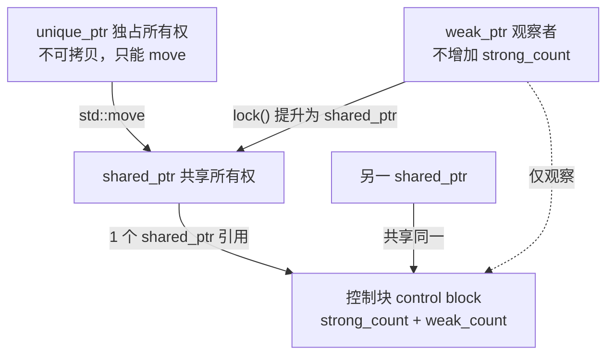
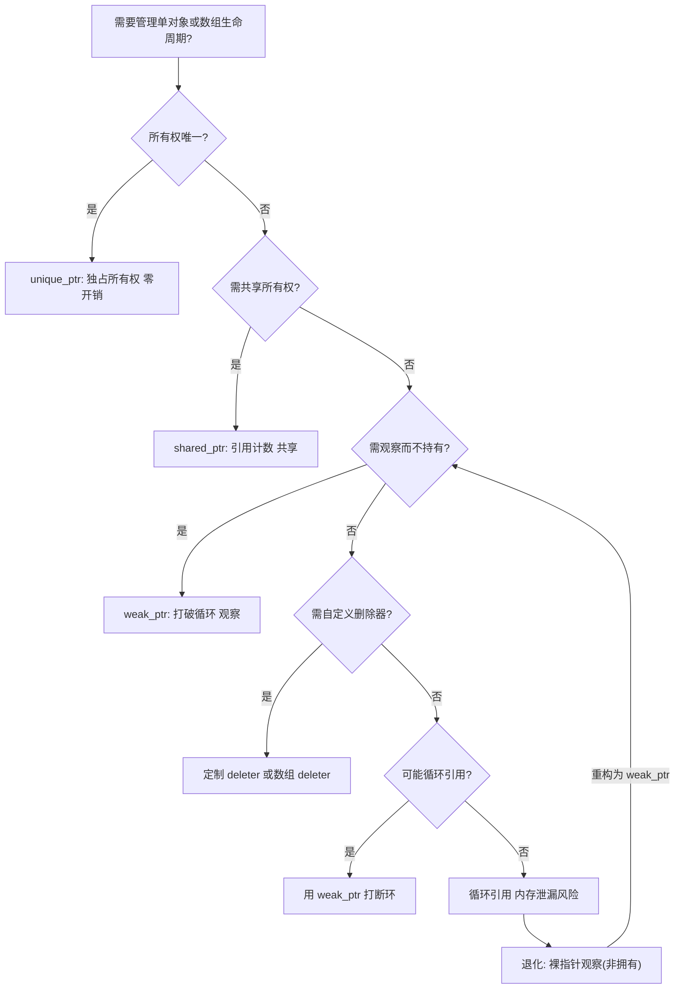
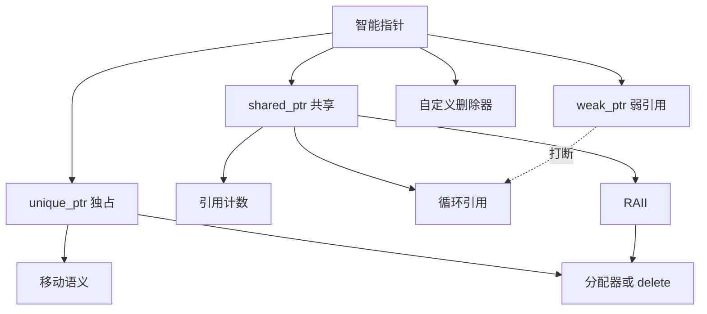

# 第 41 章 智能指针全解（unique_ptr / shared_ptr / weak_ptr / enable_shared_from_this）
> 层级：L2 进阶
> 【性能声明 · §10.3】本章所有绝对延迟/带宽数字（如 L1≈1ns、主存≈100ns、各基准 ms）均为 **x86-64 量级示意**，强依赖具体 CPU 型号/频率、编译器及版本、编译标志、OS、测试负载与样本量；非通用性能结论，绝对数字不可移植。微架构相关结论标 `[微架构·x86-64][UNVERIFIED]`；本机实测标 `[实验·本机实测][UNVERIFIED]`。断言形如「acquire 读比 relaxed 贵 X」仅在给定微架构下成立。

> **标准**：C++11 起提供 `unique_ptr`/`shared_ptr`/`weak_ptr`；`make_shared`(C++11)、`shared_ptr<T[]>`与`weak_from_this`(C++17)、`std::atomic<shared_ptr>`(C++20)、`make_shared_for_overwrite`(C++20)。
> **交叉引用**：存储期见 ch19；`new`/`delete` 与裸内存见 ch37；RAII 与 Rule of Zero 见 ch39；异常安全见 ch40；并发原子计数见 ch61；移动语义见 ch115。
> **立场分层**：本文以 `[标准]`（ISO C++）、`[实现]`（libstdc++/libc++/MS STL 真实源码）、`[平台·x86-64]`（本机 MinGW GCC 13.1.0 / x86_64-w64-mingw32）、`[经验]`（工程取舍）标注观点。
> **本机源码根**：`C:/Qt/Tools/mingw1310_64/lib/gcc/x86_64-w64-mingw32/13.1.0/include/c++/`。

---

## 本章导航

### 20 个元素（章节结构）

| 编号 | 元素 | 关键源码 / 主题 |
|------|------|----------------|
| 01 | 动机与全景：为何需要智能指针 | RAII、异常安全、所有权语义 |
| 02 | `unique_ptr` 总览与零开销本质 | `[核心知识点01]` |
| 03 | `unique_ptr` 删除器：默认与自定义 | `[核心知识点04][05]` |
| 04 | `unique_ptr<T[]>` 数组特化 | `[核心知识点06]` |
| 05 | `unique_ptr` 成员：release/get/reset/swap | `[核心知识点07]` |
| 06 | EBO 空基类优化：空删除器零开销 | `[核心知识点02]` + 真实源码 |
| 07 | `unique_ptr` 惯用法：Pimpl/工厂/容器 | `[核心知识点08]` |
| 08 | `shared_ptr` 总览与控制块结构 | `[核心知识点09][10]` + 真实源码 |
| 09 | `make_shared` 一次分配与缺陷 | `[核心知识点11][23]` + 真实源码 |
| 10 | `new + shared_ptr` 两次分配 | `[核心知识点12]` |
| 11 | 引用计数原子操作与 memory_order、线程安全 | `[核心知识点13][15]` + 真实源码 |
| 12 | `std::atomic<shared_ptr>`(C++20) | `[核心知识点14]` |
| 13 | 循环引用完整案例 | `[核心知识点16]` |
| 14 | `weak_ptr`：lock/expired 打破循环 | `[核心知识点17]` |
| 15 | `enable_shared_from_this` 陷阱 | `[核心知识点18]` + 真实源码 |
| 16 | 别名构造 `shared_ptr<T>(U, T*)` | `[核心知识点19]` + 真实源码 |
| 17 | `shared_ptr` 自定义删除器与数组 `T[]` | `[核心知识点21][22]` |
| 18 | `owner_less` 与原子智能指针对比 | `[核心知识点20]` |
| 19 | 性能分析与 microbenchmark | 基准实测 |
| 20 | 三编译器/三 STL 对比 + 跨语言 + 源码路线 | 真实实现差异 |

### 23 个核心知识点

1. `unique_ptr` 零开销本质：编译为裸指针，无引用计数，析构调删除器。
2. EBO 使无状态删除器（`default_delete`、无捕获 lambda）不占空间（`sizeof==sizeof(void*)`）。
3. `unique_ptr` 不可拷贝、只可移动（move-only），所有权唯一。
4. `default_delete` 是默认删除器（`delete` / `delete[]`）。
5. 自定义删除器三形式：函数指针、lambda、可调用对象；可作**类型参数**或**构造参数**。
6. `unique_ptr<T[]>` 数组特化，用 `operator[]`，删除器必须为 `default_delete<T[]>`。
7. `release()`/`get()`/`reset()`/`swap()` 的语义与陷阱。
8. Pimpl 惯用法、工厂函数返回、`unique_ptr` 进容器。
9. `shared_ptr` 控制块：强计数 + 弱计数 + 删除器 + 分配器 +（可能内联的）对象。
10. 弱计数归零才释放控制块；强计数归零才调删除器；`weak_ptr` 持有阻止对象内存释放。
11. `make_shared` 一次分配控制块+对象同块；好处与代价（见 KP23）。
12. `new` + `shared_ptr` 两次分配（控制块一次、对象一次）。
13. 引用计数原子递减的 memory_order（acquire/release）与快路径 CAS。
14. `std::atomic<shared_ptr>`(C++20) 是专用类型，不同于 C++11 自由函数 `atomic_load` 等。
15. 线程安全分层：计数原子安全；所指对象访问非线程安全；不同 `shared_ptr` 实例间非原子。
16. 循环引用：`A↔B` 互相 `shared_ptr` 持有 → `use_count` 不归零 → 泄漏。
17. `weak_ptr::lock()` 原子提升为 `shared_ptr`；`expired()` 检测失效。
18. `enable_shared_from_this` 内部是 `weak_ptr`；`shared_from_this()` 须已被 `shared_ptr` 管理。
19. 别名构造：共享同一控制块但指向不同对象（如成员/基类），延长整体生命周期。
20. `owner_less`：按**所有权**（控制块地址）比较，而非指针值。
21. `shared_ptr<T[]>`(C++17) 数组支持。
22. 自定义删除器决定释放方式（可管理 `FILE*`、句柄等非 `delete` 资源）。
23. `make_shared` 缺陷实证：`weak_ptr` 存活期间，对象内存与控制块同块，对象析构后仍不回收。

---

## 架构与流程图示（Mermaid）

三类智能指针的所有权语义：unique_ptr 独占、shared_ptr 共享（经控制块计数）、weak_ptr 仅观察不增引用。


```mermaid
flowchart TD
    U["unique_ptr 独占所有权<br/>不可拷贝，只能 move"]
    SP["shared_ptr 共享所有权"]
    CB["控制块 control block<br/>strong_count + weak_count"]
    WP["weak_ptr 观察者<br/>不增加 strong_count"]
    SP -->|"1 个 shared_ptr 引用"| CB
    SP2["另一 shared_ptr"] -->|"共享同一"| CB
    WP -->|"lock() 提升为 shared_ptr"| SP
    WP -.->|"仅观察"| CB
    U -->|"std::move"| SP
```

## ⓪ 历史动机：智能指针的来龙去脉

> 今天"默认用 unique_ptr"像空气一样自然，但它背后是二十年的踩坑史与一场关于"该不该有移动语义"的路线之争。

### 0.1 起源（谁·何时·为何）
C++ 没有垃圾回收。裸 `new`/`delete`（见 ch37）把"分配"与"释放"拆到两处，一旦中间 `throw`、提前 `return` 或分支遗漏就泄漏——这是当时头号 bug 类。<span class="badge badge-history">史</span><span class="badge badge-comment">评</span> Stroustrup 早主张用 RAII（见 ch39）治本，但缺标准工具。异常安全时代的"泄漏瘟疫"逼出了智能指针。<span class="badge badge-history">史</span>

### 0.2 关键转折（编年）
- **`auto_ptr`（C++98）**：标准首次给"独占所有权"的尝试，却因**拷贝悄悄转移所有权**（源变空）成著名 bug 源：`vector<auto_ptr>` 排序一下元素就被掏空。C++11 弃用、C++17 移除。<span class="badge badge-history">史</span>
- **Boost（约 2001–2002）**：民间 Boost 库由 Greg Colvin 的引用计数构想，经 Peter Dimov、Beman Dawes 等实现出久经实战的 `boost::shared_ptr`/`scoped_ptr`/`weak_ptr`，后来进入 TR1。<span class="badge badge-history">史</span>
- **移动语义（2002–2006）**：右值引用 / 移动语义（Hinnant、Stroustrup 等）是 `unique_ptr` 的"前置科技"——没有"移动"就没有"独占且可传递"。<span class="badge badge-history">史</span>
- **现代三件套（C++11）**：`unique_ptr`（move-only、零开销，取代 auto_ptr）、`shared_ptr`/`weak_ptr`（源自 Boost/TR1）、`make_shared` 一同入标准。`make_unique` 迟至 C++14 才补齐（据记载"C++11 时忘了"，由 Stephan T. Lavavej 推动）。<span class="badge badge-history">史</span><span class="badge badge-anecdote">轶</span>

### 0.3 设计哲学之争
委员会在智能指针上划红线：**零开销抽象优先**。`unique_ptr` 因此不能有引用计数（那是 `shared_ptr` 的事）；Howard Hinnant 坚持 `unique_ptr` 编译后**必须就是一个裸指针、零空间零时间开销**（靠 EBO），于是"用裸 `new` 性能更好"再也不是借口。<span class="badge badge-history">史</span><span class="badge badge-comment">评</span> 这背后是"安全默认值"与"零成本"两条铁律的拉锯。<span class="badge badge-comment">评</span>

### 0.4 史料补遗与持续编年
- **C++17**：`shared_ptr<T[]>`、`weak_from_this`、正式移除 `auto_ptr` 收尾。<span class="badge badge-history">史</span>
- **C++20**：`std::atomic<shared_ptr>`（无锁并发）、`make_shared_for_overwrite`。<span class="badge badge-history">史</span>
- **C++23 `std::out_ptr` / `std::inout_ptr`（P1132）补上 C 互操作缺口**：用 `std::out_ptr(p)` 把智能指针传给需要 `T**` 输出的 C API，函数返回时自动接管裸指针所有权，解决了长期靠 `reset()` 手写的易错桥接。<span class="badge badge-history">史</span>
- **`make_shared` 的一次分配成为性能基线**：`std::make_shared` 把控制块与对象放进同一块内存、降低分配次数；但"对象与控制块同生命周期"也带来大对象延迟释放的已知权衡，社区据此探索 `make_shared_for_overwrite`（C++20）等变体。<span class="badge badge-history">史</span><span class="badge badge-comment">评</span>
- **行业落地与争议**：`unique_ptr` 已成"默认所有权"事实标准（Core Guidelines 建议）；`shared_ptr` 因引用计数开销与弱引用循环风险，仅在真正共享时使用。Rust 的 `Arc` / `Box` 与之高度对应，常被拿来对照。<span class="badge badge-history">史</span><span class="badge badge-comment">评</span>
- **轶事**：据记载 `make_unique` 漏进 C++11 被社区称为"著名的疏忽"，由 Stephan T. Lavavej 在 C++14 补回——智能指针的演进充满这种"差一点"的细节。<span class="badge badge-anecdote">轶</span>

> 史料来源：https://en.cppreference.com/w/cpp/memory/shared_ptr ｜ https://en.cppreference.com/w/cpp/memory/out_ptr ｜ https://en.cppreference.com/w/cpp/memory/unique_ptr

!!! note "类比：智能指针 = 把所有权语义写进类型"
    智能指针可以**类比**为「把所有权语义写进类型」——unique_ptr 是独占 ownership（编译为裸指针、零开销，像一把只认一个主人的钥匙），shared_ptr 是共享 ownership（控制块引用计数，像一张多人共用的借书卡），weak_ptr 是「不增计数、只探存活」的旁观者。
    换个角度：shared_ptr 的循环引用要靠 weak_ptr 打破，也**类似于**两张互相指向的借书卡会永远不归还，得有一张「只查看不持有」的卡来切断环。

    > 失效边界：unique_ptr 不共享、shared_ptr 有原子计数开销且控制块需额外分配（make_shared 合并分配但仍占控制块）；enable_shared_from_this 用错会造出第二套控制块导致双释放；裸指针 / 智能指针混用、或把 this 裸传进 shared_ptr 是经典误用，智能指针不是「随便用就安全」。

> **一句话结论**：unique_ptr 独占、shared_ptr 引用计数共享、weak_ptr 打破循环——智能指针把 RAII 套到堆对象上，基本消除了裸指针所有权混乱。

## ① 动机与全景：为何需要智能指针

[第 40 章　异常安全（Exception Safety）](../part04_memory/ch40_exception_safety.md)
[第 42 章 · 严格别名规则（Strict Aliasing）与编译器优化](../part04_memory/ch42_strict_aliasing.md)

<span class="badge badge-std">标准</span> C++ 没有垃圾回收。裸 `new`/`delete`（ch37）把"分配"与"释放"分离到两处，一旦中间抛出异常、提前 `return`、或分支遗漏，就会泄漏。智能指针把"释放"绑定到对象析构（RAII，见 ch39），由作用域 / 所有权自动触发。

<span class="badge badge-exp">经验</span> 现代 C++ 的默认选择是：**默认 `unique_ptr`，必须共享时才 `shared_ptr`，必须打破循环时才 `weak_ptr`**。Rule of Zero（ch39）告诉我们在大多数类里连析构函数都不该手写——把资源交给智能指针即可。

全景对比：

| 指针 | 所有权 | 开销 | 可否共享 | 典型用途 |
|------|--------|------|----------|----------|
| 裸指针 | 无（借用/无主） | 0 | 否 | 非拥有观察、C 接口 |
| `unique_ptr` | 唯一、可移动 | 0（EBO 后） | 否 | 独占资源、Pimpl、工厂 |
| `shared_ptr` | 共享、引用计数 | 控制块 + 原子 | 是 | 共享对象、缓存、跨模块 |
| `weak_ptr` | 弱观察 | 共享控制块 | 否（仅观察） | 打破循环、缓存探测 |

---

## ② `unique_ptr` 总览与零开销本质  `[核心知识点01]`

<span class="badge badge-std">标准</span> `std::unique_ptr<T, D>` 是一个 move-only 的 RAII 包装，独占所指对象。默认删除器 `D = default_delete<T>`。

**[核心知识点01] 零开销本质**：`unique_ptr` 在 `-O2` 下被编译为单个裸指针；它**没有引用计数**、**没有控制块**。析构时（或 `reset`/`release` 转移时）调用删除器释放资源。和裸指针相比，唯一的"成本"是编译器已经会做的、你手动写也必须做的 `delete` 调用。Scott Meyers 称其为"零成本抽象"的典范。

[实现·GCC15] libstdc++ 把 `unique_ptr` 的状态放在一个 `tuple<pointer, _Dp>` 里：

> **示例 1** <span class="badge badge-exp">难度 ★★★☆☆</span> · uniqueptr 总览与零开销本质
```cpp
#include <utility>
// <bits/unique_ptr.h> 行 147-233（libstdc++ 13.1.0，真实摘录）
template <typename _Tp, typename _Dp>
  class __uniq_ptr_impl
  {
    // ...
    __uniq_ptr_impl() = default;
    __uniq_ptr_impl(pointer __p) : _M_t() { _M_ptr() = __p; }
    __uniq_ptr_impl(pointer __p, _Del&& __d)
    : _M_t(__p, std::forward<_Del>(__d)) { }
    // ...
    pointer&   _M_ptr() noexcept { return std::get<0>(_M_t); }
    _Dp&       _M_deleter() noexcept { return std::get<1>(_M_t); }
    // ...
  private:
    tuple<pointer, _Dp> _M_t;          // 行 232：唯一的成员
  };
```

注意 `tuple<pointer, _Dp>`：当 `_Dp` 是空类（`default_delete`、无捕获 lambda）时，编译器通过 EBO/空基类优化（见[元素06]）把它"压"到指针里，因此 `sizeof(unique_ptr<T>) == sizeof(T*)`。

### 示例 01：`unique_ptr` 基本用法与自动释放

> **示例 2** <span class="badge badge-exp">难度 ★★☆☆☆</span> · 示例 01：uniqueptr 基本
```cpp
#include <iostream>
#include <memory>   // std::unique_ptr / std::make_unique 都在 <memory>

struct Widget {
    Widget()  { std::cout << "Widget()\n"; }   // 构造：资源获取（RAII 的起点）
    ~Widget() { std::cout << "~Widget()\n"; }   // 析构：资源释放——由智能指针在合适时机自动调用
    void use() const { std::cout << "using widget\n"; }
};

int main() {
    // make_unique 一次性完成"分配 + 构造 + 装入 unique_ptr"，比 `new Widget` 更安全：
    // 它避免了"先 new 再交给 unique_ptr"之间可能因异常而泄漏的窗口（见 ch39 异常安全）。
    std::unique_ptr<Widget> p = std::make_unique<Widget>(); // C++14 起；C++11 用 unique_ptr<Widget>(new Widget)
    p->use();                  // 用 -> 像裸指针一样访问，但所有权仍唯一归 p
    // 关键：p 是栈上对象。main 返回时 p 离开作用域 => 其析构自动 delete 所指 Widget。
    // 即使前面某行抛异常，栈展开也会调用 p 的析构 => 不会泄漏（这是裸 new/delete 做不到的）。
    return 0;
}
```

> `[平台·x86-64]` 本机 MinGW GCC 13.1.0 下 `std::make_unique` 自 C++14 起可用；若仅 C++11 用 `std::unique_ptr<Widget>(new Widget)`。

### 示例 02：`unique_ptr` 不可拷贝、只可移动  `[核心知识点03]`

> **示例 3** <span class="badge badge-exp">难度 ★★☆☆☆</span> · 示例 02：uniqueptr 不可
```cpp
#include <memory>
#include <utility>

int main() {
    auto a = std::make_unique<int>(42);
    // auto b = a;             // 编译错误：unique_ptr 不可拷贝
    auto b = std::move(a);     // OK：移动，a 此后为空
    // if (a) { }              // a 现在为 nullptr
    return 0;
}
```

<span class="badge badge-std">标准</span> 拷贝构造 / 拷贝赋值被 `= delete`（因为 `default_delete` 不可拷贝且移动后唯一性被破坏）。移动构造 / 移动赋值是 `= default`（元素 05 详述）。

---

## ③ `unique_ptr` 删除器：默认与自定义  `[核心知识点04][05]`

<span class="badge badge-std">标准</span> 删除器类型 `D` 是 `unique_ptr` 的**第二个模板参数**。调用形如 `get_deleter()(ptr)`。删除器必须是可调用对象，参数为 `pointer`。

### 示例 03：默认 `default_delete`  `[核心知识点04]`

> **示例 4** <span class="badge badge-exp">难度 ★☆☆☆☆</span> · 示例 03：默认 defaultde
```cpp
#include <memory>
int main() {
    std::unique_ptr<int> p(new int(7));   // 删除器 = default_delete<int>，析构时 delete
    return 0;
}
```

### 示例 04：自定义删除器——函数指针  `[核心知识点05]`

> **示例 5** <span class="badge badge-exp">难度 ★★☆☆☆</span> · 示例 04：自定义删除器——函数指针
```cpp
#include <iostream>
#include <memory>

void my_free(int* p) {
    std::cout << "custom free " << *p << "\n";
    delete p;
}

int main() {
    // 删除器作为 构造参数 传入（类型推导为函数指针）
    std::unique_ptr<int, void(*)(int*)> p(new int(9), my_free);
    return 0;
}
```

### 示例 05：自定义删除器——lambda  `[核心知识点05]`

> **示例 6** <span class="badge badge-exp">难度 ★★☆☆☆</span> · 示例 05：自定义删除器——lambda  `[核心知识点05]`
```cpp
#include <iostream>
#include <memory>

int main() {
    auto deleter = [](int* p) {
        std::cout << "lambda free\n";
        delete p;
    };
    std::unique_ptr<int, decltype(deleter)> p(new int(5), deleter);
    return 0;
}
```

### 示例 06：自定义删除器——可调用对象作为**类型参数**  `[核心知识点05]`

> **示例 7** <span class="badge badge-exp">难度 ★★☆☆☆</span> · 示例 06：自定义删除器——可调用对
```cpp
#include <iostream>
#include <memory>

struct FileDeleter {
    void operator()(FILE* f) const {
        if (f) { std::cout << "fclose\n"; fclose(f); }
    }
};

int main() {
    // 删除器类型是 FileDeleter（有状态可携带数据），作为类型参数
    std::unique_ptr<FILE, FileDeleter> f(std::fopen("log.txt", "w"));
    // 离开作用域自动 fclose
    return 0;
}
```

### 示例 07：自定义删除器——**构造参数**传入（无状态更灵活）  `[核心知识点05]`

> **示例 8** <span class="badge badge-exp">难度 ★★☆☆☆</span> · 示例 07：自定义删除器——构造参数
```cpp
#include <memory>
#include <iostream>

struct StatefulDeleter {
    int tag;
    void operator()(int* p) const {
        std::cout << "free with tag=" << tag << "\n";
        delete p;
    }
};

int main() {
    StatefulDeleter d{42};
    // 删除器作为 构造参数：类型从实参推导，可随时换不同状态的删除器
    std::unique_ptr<int, StatefulDeleter> p(new int(1), d);
    return 0;
}
```

<span class="badge badge-exp">经验</span> **优先把删除器作为构造参数传入**（类型用 `decltype` 推导），这样同一指针类型可配合不同删除器实例；把删除器写死为类型参数只在删除器类型本身有语义意义时才用（如示例 06 的 `FileDeleter`）。

---

## ④ `unique_ptr<T[]>` 数组特化  `[核心知识点06]`

<span class="badge badge-std">标准</span> `unique_ptr<T[]>` 特化提供 `operator[]`、**不提供** `operator*`/`operator->`，删除器固定为 `default_delete<T[]>`（即 `delete[]`）。

### 示例 08：`unique_ptr<T[]>` 数组特化  `[核心知识点06]`

> **示例 9** <span class="badge badge-exp">难度 ★★☆☆☆</span> · 示例 08：`unique_ptr<T[]>` 数组特化  `[核心知识点06]`
```cpp
#include <iostream>
#include <memory>

int main() {
    std::unique_ptr<int[]> arr(new int[4]{1, 2, 3, 4});
    for (int i = 0; i < 4; ++i)
        std::cout << arr[i] << ' ';   // operator[]
    std::cout << '\n';
    // 析构调用 delete[]，不会泄漏
    return 0;
}
```

[实现·GCC15] libstdc++ `<bits/unique_ptr.h>` 行 535 起有 `class unique_ptr<_Tp[], _Dp>` 特化；其析构走 `_Sp_array_delete`（对 `is_array<_Tp>` 选择 `delete[]`）：

> **示例 10** <span class="badge badge-exp">难度 ★★★☆☆</span> · 示例 08：`unique_ptr<T[]>` 数组特化  `[核心知识点06]`
```cpp
// <bits/unique_ptr.h> 行 132-141（default_delete<T[]> 对数组）
template<typename _Up>
  typename enable_if<is_convertible<_Up(*)[], _Tp(*)[]>::value>::type
  operator()(_Up* __ptr) const
  { static_assert(sizeof(_Tp)>0, "can't delete pointer to incomplete type");
    delete [] __ptr; }   // 行 140
```

> `[经验]` C++ 里尽量用 `std::vector` / `std::array` 代替裸数组；`unique_ptr<T[]>` 仅在需"动态大小 + 独占"且要零开销时选用。

---

## ⑤ `unique_ptr` 成员：release / get / reset / swap  `[核心知识点07]`

<span class="badge badge-std">标准</span> 关键成员：
- `get()`：返回裸指针，**不**转移所有权。
- `release()`：放弃所有权，返回裸指针，自身置空（**不**释放）。
- `reset(p)`：释放当前对象，接管 `p`（可空）。
- `swap(q)`：交换所有权。

[实现·GCC15] 这些直接转发到 `__uniq_ptr_impl`（`<bits/unique_ptr.h>` 行 196-220）：

> **示例 11** <span class="badge badge-exp">难度 ★★☆☆☆</span> · `unique_ptr` 成员：release / get / reset / swap  `[核心知识点07]`
```cpp
// <bits/unique_ptr.h> 行 214-220
pointer release() noexcept {
    pointer __p = _M_ptr();
    _M_ptr() = nullptr;
    return __p;
}
// 行 206-212
void reset(pointer __p) noexcept {
    const pointer __old_p = _M_ptr();
    _M_ptr() = __p;
    if (__old_p)
      _M_deleter()(__old_p);   // 先调用删除器释放旧对象
}
```

### 示例 09：release / get / reset / swap  `[核心知识点07]`

> **示例 12** <span class="badge badge-exp">难度 ★★☆☆☆</span> · 示例 09：release / get / reset / swap  `[核心知识点07]`
```cpp
#include <iostream>
#include <memory>

int main() {
    std::unique_ptr<int> a = std::make_unique<int>(1);
    int* raw = a.get();                 // 借用，不转移
    std::cout << *raw << '\n';         // 1
    int* leaked = a.release();         // a 置空，*leaked 需手动 delete
    // ... 手动管理 leaked ...
    delete leaked;

    std::unique_ptr<int> b = std::make_unique<int>(2);
    a.reset(new int(3));               // a 重新接管 3（此时 a 本为空）
    b.reset();                         // b 释放对象，置空
    auto c = std::make_unique<int>(4);
    auto d = std::make_unique<int>(5);
    c.swap(d);                         // 交换所有权
    return 0;
}
```

<span class="badge badge-exp">经验</span> `release()` 极易泄漏——拿到裸指针后必须有人负责 `delete`。只在"移交到 C API"或"转交所有权给 `shared_ptr`"时用。

---

## ⑥ EBO 空基类优化：空删除器零开销  `[核心知识点02]`

**[核心知识点02]** 无状态删除器（`default_delete`、无捕获 lambda）是**空类**（size 1 但它本身没有数据成员）。C++ 允许空基类不占用派生类布局空间（EBO，Empty Base Optimization）。`unique_ptr` 利用这一点，使 `sizeof(unique_ptr<T, D>) == sizeof(T*)`。

[实现·GCC15] libstdc++ 内部 `__uniq_ptr_impl` 持有 `tuple<pointer, _Dp>`。tuple 对空类型也会做 EBO（`tuple` 用 `_Tuple_impl` 继承空元素），所以空删除器被"吞掉"，不增加尺寸。

下面用实测证明：

### 示例 10：EBO 验证——`sizeof` 对比  `[核心知识点02]`

> **示例 13** <span class="badge badge-exp">难度 ★★★☆☆</span> · 示例 10：EBO 验证——size
```cpp
#include <iostream>
#include <memory>
#include <type_traits>

struct StatelessDeleter {
    void operator()(int* p) const { delete p; }
};

struct StatefulDeleter {
    int x;   // 有数据成员 -> 非平凡大小
    void operator()(int* p) const { delete p; }
};

int main() {
    using A = std::unique_ptr<int>;                       // default_delete（空）
    using B = std::unique_ptr<int, StatelessDeleter>;     // 空类删除器
    using C = std::unique_ptr<int, void(*)(int*)>;        // 函数指针（占 8 字节）
    using D = std::unique_ptr<int, StatefulDeleter>;      // 有状态（占 8 字节）

    std::cout << "default_delete  : " << sizeof(A) << '\n'; // 通常 8
    std::cout << "stateless lambda: " << sizeof(B) << '\n'; // 8（EBO 吃掉）
    std::cout << "fn ptr deleter  : " << sizeof(C) << '\n'; // 16（指针+指针）
    std::cout << "stateful deleter: " << sizeof(D) << '\n'; // 16（指针+int）
    return 0;
}
```

> `[平台·x86-64]` 在 64 位本机（x86_64-w64-mingw32）上 `* = 8 字节`，函数指针 / 有状态删除器使 `unique_ptr` 变为 16 字节。`shared_ptr` 无论如何都至少 16 字节（见[元素08]）。

<span class="badge badge-std">标准</span> `[核心知识点01]` 再次确认：`unique_ptr` 与裸指针开销等同；`shared_ptr` 必有控制块指针开销（下一节）。

---

## ⑦ `unique_ptr` 惯用法：Pimpl / 工厂 / 容器  `[核心知识点08]`

### 示例 11：Pimpl 惯用法（编译防火墙）  `[核心知识点08]`

> **示例 14** <span class="badge badge-exp">难度 ★★☆☆☆</span> · 示例 11：Pimpl 惯用法
```cpp
// widget.h
#include <memory>
class Widget {
    struct Impl;                          // 仅前向声明
    std::unique_ptr<Impl> p_;             // 隐藏实现细节
public:
    Widget();
    ~Widget();                            // 必须在 .cpp 中定义（见下）
    void draw() const;
};

// widget.cpp
#include "widget.h"
#include <iostream>
struct Widget::Impl {
    int w = 10, h = 20;
    void draw() const { std::cout << "w=" << w << " h=" << h << '\n'; }
};
Widget::Widget() : p_(std::make_unique<Impl>()) {}
Widget::~Widget() = default;              // 关键：在 Impl 完整类型处析构
void Widget::draw() const { p_->draw(); }
```

<span class="badge badge-exp">经验</span> Pimpl 把 `Impl` 的大小 / 析构从头文件隐藏，减少重编译。**析构函数必须在 `.cpp` 中用完整类型定义**（`= default` 也行，但必须出现在 `Impl` 已知的位置），否则 `default_delete<Impl>` 在头文件处见到不完整类型会 `static_assert` 失败（`<bits/unique_ptr.h>` 行 138-140 的 `static_assert(sizeof(_Tp)>0,...)`）。

### 示例 12：工厂函数返回 `unique_ptr`  `[核心知识点08]`

> **示例 15** <span class="badge badge-exp">难度 ★★☆☆☆</span> · 示例 12：工厂函数返回 `unique_ptr`  `[核心知识点08]`
```cpp
#include <memory>
struct Shape { virtual ~Shape() = default; virtual double area() const = 0; };
struct Circle : Shape { double r; Circle(double r):r(r){} double area() const override { return 3.14*r*r; } };

std::unique_ptr<Shape> make_circle(double r) {
    return std::make_unique<Circle>(r);   // 工厂返回独占所有权
}
```

### 示例 13：`unique_ptr` 存入容器  `[核心知识点08]`

> **示例 16** <span class="badge badge-exp">难度 ★★☆☆☆</span> · 示例 13：uniqueptr 存入
```cpp
#include <memory>
#include <vector>
#include <iostream>

int main() {
    std::vector<std::unique_ptr<int>> v;
    v.push_back(std::make_unique<int>(1));
    v.push_back(std::make_unique<int>(2));
    // 不能拷贝：v.push_back(v[0]);  // 错误
    for (auto& p : v) std::cout << *p << ' ';
    std::cout << '\n';
    return 0;
}
```

> `[经验]` 需要"异质对象 + 唯一所有权 + 容器"时，`vector<unique_ptr<T>>` 是经典组合。

---

## ⑧ `shared_ptr` 总览与控制块结构  `[核心知识点09][10]`

<span class="badge badge-std">标准</span> `std::shared_ptr<T>` 通过**引用计数**实现共享所有权。多个 `shared_ptr` 共享同一个**控制块（control block）**。控制块在堆上分配，包含：

**[核心知识点09] 控制块布局**：
1. **强引用计数** `use_count`（`_M_use_count`）：拥有的 `shared_ptr` 数量。
2. **弱引用计数** `weak_count`（`_M_weak_count`）：`weak_ptr` 数量 **+ 1**（这个 +1 代表"被强引用自身占用"）。
3. **删除器**（deleter）类型与实例。
4. **分配器**（allocator）类型与实例。
5. **所指对象**（当用 `make_shared` 时，对象内存**内联**在控制块同一次分配中）。

**[核心知识点10] 释放规则（最关键）**：
- **强计数归零** → 调用删除器释放**对象**（但控制块还在）。
- **弱计数归零** → 释放**控制块**。
- 因此：只要有 `weak_ptr`（或 `shared_ptr`）存在，控制块不释放；若用 `make_shared`，对象内存与控制块同块，**`weak_ptr` 存活期间对象内存也不回收**（见[元素09] KP23）。

[实现·GCC15] libstdc++ 控制块基类 `_Sp_counted_base`（`<bits/shared_ptr_base.h>` 行 124-239）直接给出了两个计数与构造初值：

> **示例 17** <span class="badge badge-exp">难度 ★★★☆☆</span> · sharedptr 总览与控制块结构
```cpp
// <bits/shared_ptr_base.h> 行 124-239（真实摘录，截断无关方法）
template<_Lock_policy _Lp = __default_lock_policy>
  class _Sp_counted_base : public _Mutex_base<_Lp>
  {
  public:
    _Sp_counted_base() noexcept
    : _M_use_count(1), _M_weak_count(1) { }   // 行 129-130：强=1 弱=1（含自身）

    // ... _M_dispose() 释放对象；_M_destroy() 释放控制块 ...

  private:
    _Atomic_word  _M_use_count;   // 行 237：#shared
    _Atomic_word  _M_weak_count;  // 行 238：#weak + (#shared != 0)
  };
```

`__shared_ptr` 自身只持有 `_M_ptr`（被指对象指针）和 `_M_refcount`（一个 `__shared_count`，内部就是那个控制块指针 `_M_pi`）：

> **示例 18** <span class="badge badge-exp">难度 ★☆☆☆☆</span> · sharedptr 总览与控制块结构
```cpp
// <bits/shared_ptr_base.h> 行 1422 起，__shared_ptr 关键成员
// （数据成员在类尾，真实为）
// element_type*    _M_ptr;       // 被指对象
// __shared_count<_Lp> _M_refcount; // 仅一个控制块指针 _M_pi
```

### 示例 14：`shared_ptr` 基本与引用计数  `[核心知识点09]`

> **示例 19** <span class="badge badge-exp">难度 ★★☆☆☆</span> · 示例 14：sharedptr 基本
```cpp
#include <iostream>
#include <memory>

struct X { ~X() { std::cout << "~X()\n"; } };

int main() {
    auto a = std::make_shared<X>();
    std::cout << "use_count=" << a.use_count() << '\n'; // 1
    {
        auto b = a;                                     // 拷贝，强计数+1
        std::cout << "use_count=" << a.use_count() << '\n'; // 2
    }                                                   // b 析构，强计数-1
    std::cout << "use_count=" << a.use_count() << '\n'; // 1
    return 0;                                           // a 析构，强计数=0 -> ~X()
}
```

### 示例 15：`shared_ptr` 自定义删除器控制释放方式  `[核心知识点22]`（先预览，详[元素17]）

> **示例 20** <span class="badge badge-exp">难度 ★★☆☆☆</span> · 示例 15：sharedptr 自定
```cpp
#include <memory>
#include <iostream>

int main() {
    auto del = [](int* p) { std::cout << "shared free\n"; delete p; };
    std::shared_ptr<int> p(new int(3), del);   // 删除器在控制块中
    return 0;
}
```

---

## ⑨ `make_shared` 一次分配与缺陷  `[核心知识点11][23]`

**[核心知识点11]** `std::make_shared<T>(args...)` 向分配器请求**一块连续内存**，同时放下**控制块**和**对象**，构造函数就地（`allocator_traits::construct`）在控制块尾部缓冲区里构造对象。优点：
1. **一次堆分配**（vs `shared_ptr(new T)` 两次），减少开销、提升缓存局部性。
2. **异常安全**：`f(shared_ptr<Widget>(new Widget), g())` 可能因求值顺序泄漏；`f(make_shared<Widget>(), g())` 不会。
3. 对象与计数紧邻，**缓存命中更好**。

[实现·GCC15] libstdc++ 的 `make_shared`（`shared_ptr.h` 行 1003-1011）只构造一个 `_Sp_alloc_shared_tag` 转发给 `shared_ptr` 构造，再进 `__shared_count` 的 `_Sp_alloc_shared_tag` 分支（`shared_ptr_base.h` 行 963-976）：

> **示例 21** <span class="badge badge-exp">难度 ★★★☆☆</span> · makeshared 一次分配与缺陷
```cpp
#include <utility>
// <bits/shared_ptr.h> 行 1003-1011
template<typename _Tp, typename... _Args>
  inline shared_ptr<_NonArray<_Tp>>
  make_shared(_Args&&... __args)
  {
    using _Alloc = allocator<void>;
    _Alloc __a;
    return shared_ptr<_Tp>(_Sp_alloc_shared_tag<_Alloc>{__a},
                           std::forward<_Args>(__args)...);
  }

// <bits/shared_ptr_base.h> 行 963-976（__shared_count 的 make_shared 路径）
template<typename _Tp, typename _Alloc, typename... _Args>
  __shared_count(_Tp*& __p, _Sp_alloc_shared_tag<_Alloc> __a, _Args&&... __args)
  {
    typedef _Sp_counted_ptr_inplace<_Tp, _Alloc, _Lp> _Sp_cp_type;
    typename _Sp_cp_type::__allocator_type __a2(__a._M_a);
    auto __guard = std:: __allocate_guarded(__a2);
    _Sp_cp_type* __mem = __guard.get();
    auto __pi = ::new (__mem)
      _Sp_cp_type(__a._M_a, std::forward<_Args>(__args)...);   // 一次分配
    __guard = nullptr;
    _M_pi = __pi;
    __p = __pi->_M_ptr();     // 对象指针就在控制块内部
  }
```

一次分配的本质是 `_Sp_counted_ptr_inplace`（`<bits/shared_ptr_base.h>` 行 580-653），它用 `__gnu_cxx::__aligned_buffer<_Tp> _M_storage;` 把对象**内联**进控制块：

> **示例 22** <span class="badge badge-exp">难度 ★★★☆☆</span> · makeshared 一次分配与缺陷
```cpp
// <bits/shared_ptr_base.h> 行 580-653（截断）
template<typename _Tp, typename _Alloc, _Lock_policy _Lp>
  class _Sp_counted_ptr_inplace final : public _Sp_counted_base<_Lp>
  {
    class _Impl : _Sp_ebo_helper<0, _Alloc>   // 分配器也走 EBO
    {
      // ...
      __gnu_cxx::__aligned_buffer<_Tp> _M_storage;  // 行 591：对象内联在此
    };
    // ...
    _Tp* _M_ptr() noexcept { return _M_impl._M_storage._M_ptr(); }  // 行 650
  private:
    _Impl _M_impl;   // 行 652
  };
```

**[核心知识点23] make_shared 缺陷实证**：因为对象内存就在控制块里，**控制块要等弱计数也归零才释放**。一旦有 `weak_ptr` 长期持有，即使强计数已归零、`~T()` 已调用，那整块（控制块+对象）内存仍不回收——只能等到最后一个 `weak_ptr` 也消失。对大对象或长生命周期 `weak_ptr` 缓存这是个 real cost。

### 示例 16：`make_shared` vs `new + shared_ptr` 两次分配  `[核心知识点11][12]`

> **示例 23** <span class="badge badge-exp">难度 ★★☆☆☆</span> · 示例 16：makeshared v
```cpp
#include <memory>
#include <iostream>

struct Big { double data[1024]; ~Big() { std::cout << "~Big\n"; } };

int main() {
    // 一次分配：控制块与对象同块
    auto a = std::make_shared<Big>();

    // 两次分配：new Big() 一次，控制块 _Sp_counted_ptr 又一次
    std::shared_ptr<Big> b(new Big());

    std::cout << "a.use_count=" << a.use_count() << '\n'; // 1
    std::cout << "b.use_count=" << b.use_count() << '\n'; // 1
    return 0;
}
```

<span class="badge badge-exp">经验</span> 默认用 `make_shared`；当你需要**自定义删除器**、**别名构造**、`T*` 已存在、或**不希望 big 对象因 weak_ptr 滞留**时，才用 `shared_ptr(new T)`。

---

## ⑩ `new + shared_ptr` 两次分配  `[核心知识点12]`

<span class="badge badge-std">标准</span> `shared_ptr<T>(new T)` 先 `new T` 得到对象，再在 `shared_ptr` 构造里 `new _Sp_counted_ptr<T>` 得到控制块——**两次独立堆分配**（且对象与控制块不相邻，缓存较差）。

[实现·GCC15] 走 `__shared_count(_Ptr __p)`（`shared_ptr_base.h` 行 911-924）：

> **示例 24** <span class="badge badge-exp">难度 ★★★☆☆</span> · new + sharedptr 两次
```cpp
// <bits/shared_ptr_base.h> 行 911-924
template<typename _Ptr>
  explicit
  __shared_count(_Ptr __p) : _M_pi(0)
  {
    __try
      { _M_pi = new _Sp_counted_ptr<_Ptr, _Lp>(__p); }  // 第二次分配：控制块
    __catch(...)
      { delete __p; __throw_exception_again; }          // 异常安全：释放对象
  }
```

而 `_Sp_counted_ptr`（`shared_ptr_base.h` 行 419-443）只持有 `_M_ptr`，删除器固定 `delete _M_ptr`：

> **示例 25** <span class="badge badge-exp">难度 ★☆☆☆☆</span> · new + sharedptr 两次
```cpp
// <bits/shared_ptr_base.h> 行 426-428
virtual void _M_dispose() noexcept { delete _M_ptr; }   // 对象与控制块分离
```

### 示例 17：自定义删除器计数验证"两次分配"路径  `[核心知识点12]`

> **示例 26** <span class="badge badge-exp">难度 ★★☆☆☆</span> · 示例 17：自定义删除器计数验证"两
```cpp
#include <memory>
#include <iostream>

static int deletes = 0;
struct S { ~S() { ++deletes; } };

int main() {
    // 走 _Sp_counted_ptr 路径（自定义删除器）
    auto sp = std::shared_ptr<S>(new S, [](S* p){ delete p; });
    // 控制块在此构造，与对象分离
    sp.reset();                       // 强计数归零 -> 删除器调 -> deletes=1
    std::cout << "deletes=" << deletes << '\n';  // 1
    return 0;
}
```

---

## ⑪ 引用计数原子操作与 memory_order、线程安全  `[核心知识点13][15]`

**[核心知识点13]** 引用计数本质是 `_Atomic_word`（平台上是 `int`/`long`）的原子增减。`_M_release()` 先原子减 1，若减后归零，才走释放路径。libstdc++ 为性能做了**快路径（lock-free CAS）**：当强、弱计数都为 1 时，单条原子写 0 即可，无需加锁。

[实现·GCC15] `_Sp_counted_base<_S_atomic>::_M_release()`（`<bits/shared_ptr_base.h>` 行 315-363）：

> **示例 27** <span class="badge badge-exp">难度 ★★★★☆</span> · 引用计数原子操作与 memoryor
```cpp
// <bits/shared_ptr_base.h> 行 315-363（_S_atomic 策略，真实摘录）
template<>
  inline void
  _Sp_counted_base<_S_atomic>::_M_release() noexcept
  {
    _GLIBCXX_SYNCHRONIZATION_HAPPENS_BEFORE(&_M_use_count);
    constexpr bool __lock_free = __atomic_always_lock_free(sizeof(long long),0)
                               && __atomic_always_lock_free(sizeof(_Atomic_word),0);
    constexpr bool __double_word = sizeof(long long) == 2*sizeof(_Atomic_word);
    constexpr bool __aligned = __alignof(long long) <= alignof(void*);
    if _GLIBCXX17_CONSTEXPR (__lock_free && __double_word && __aligned)
      {
        constexpr long long __unique_ref = 1LL + (1LL << __wordbits);
        auto __both_counts = reinterpret_cast<long long*>(&_M_use_count);
        if (__atomic_load_n(__both_counts, __ATOMIC_ACQUIRE) == __unique_ref)
          {
            // 快路径：强、弱都=1，直接置 0，无 CAS 循环
            _M_weak_count = _M_use_count = 0;
            _M_dispose();   // 释放对象
            _M_destroy();   // 释放控制块
            return;
          }
        if (__gnu_cxx::__exchange_and_add_dispatch(&_M_use_count, -1) == 1)
          [[__unlikely__]]
          { _M_release_last_use_cold(); return; }   // 慢路径
      }
    else
    if (__gnu_cxx::__exchange_and_add_dispatch(&_M_use_count, -1) == 1)
      { _M_release_last_use(); }
  }
```

当计数归零时调用 `_M_release_last_use()`（`shared_ptr_base.h` 行 172-193）：先 `_M_dispose()`（释放对象），再原子减弱计数，弱计数也归零才 `_M_destroy()`（释放控制块）：

> **示例 28** <span class="badge badge-exp">难度 ★★☆☆☆</span> · 引用计数原子操作与 memoryor
```cpp
// <bits/shared_ptr_base.h> 行 172-193
void _M_release_last_use() noexcept
{
  _GLIBCXX_SYNCHRONIZATION_HAPPENS_AFTER(&_M_use_count);
  _M_dispose();   // 释放对象
  // ... barrier ...
  if (__gnu_cxx::__exchange_and_add_dispatch(&_M_weak_count, -1) == 1)
    _M_destroy(); // 弱计数也归零 -> 释放控制块
}
```

**memory_order 解读**：
- 读 `_M_use_count` 用 `__ATOMIC_ACQUIRE`（行 337），确保后续读对象/控制块不被重排到读计数之前。
- 增引用 `_M_add_ref_copy` 用 `__atomic_add_dispatch`（acquire 语义的 RMW），保证"看到旧计数"的同时建立 happens-before。
- 释放路径隐含 release（行 319 `HAPPENS_BEFORE` 注解 + 实际 RMW 的 release）。这正是 ch61 讨论的"原子计数 + 内存序"在库中的落地。

**[核心知识点15] 线程安全分层**（极重要，常被误用）：
- ✅ **引用计数**的增减是原子的，`shared_ptr` 的拷贝 / 析构可跨线程安全进行。
- ❌ **所指对象**的并发读写**不是**线程安全的——多个线程同时改同一个 `T` 仍需加锁。
- ❌ 对**同一个 `shared_ptr` 实例**（同一变量）并发读写（如 `sp = other;`）不是线程安全的——要用 `std::atomic<shared_ptr>`（[元素12]）或锁。

### 示例 18：引用计数原子性——多线程拷贝  `[核心知识点13][15]`

> **示例 29** <span class="badge badge-exp">难度 ★★★★☆</span> · 示例 18：引用计数原子性——多线程
```cpp
#include <memory>
#include <thread>
#include <vector>
#include <iostream>

int main() {
    auto sp = std::make_shared<int>(0);
    std::vector<std::thread> ts;
    for (int i = 0; i < 8; ++i) {
        ts.emplace_back([sp]() mutable {        // 拷贝 sp，强计数原子+1
            *sp += 1;                            // 注意：*sp 的读写非原子！
        });
    }
    for (auto& t : ts) t.join();
    // 强计数安全回到 1，但 *sp 的累加有数据竞争（仅演示计数安全）
    std::cout << "use_count=" << sp.use_count() << '\n'; // 1
    return 0;
}
```

### 示例 19：所指对象访问非线程安全（需要互斥）  `[核心知识点15]`

> **示例 30** <span class="badge badge-exp">难度 ★★☆☆☆</span> · 示例 19：所指对象访问非线程安全
```cpp
#include <memory>
#include <thread>
#include <mutex>
#include <vector>

int main() {
    auto sp = std::make_shared<int>(0);
    std::mutex m;
    std::vector<std::thread> ts;
    for (int i = 0; i < 8; ++i)
        ts.emplace_back([&]() {
            std::lock_guard<std::mutex> lk(m);
            *sp += 1;                  // 用互斥保护对象访问
        });
    for (auto& t : ts) t.join();
    // *sp == 8
    return 0;
}
```

---

## ⑫ `std::atomic<shared_ptr>`(C++20)  `[核心知识点14]`

<span class="badge badge-std">标准</span> C++20 提供 `std::atomic<std::shared_ptr<T>>`，对**同一智能指针变量的读写**提供原子性（load/store/exchange），避免数据竞争。`[核心知识点14]` 它与 C++11 的自由函数 `atomic_load`/`atomic_store`/`atomic_exchange`（`<memory>` 中）不同：自由函数是普通非成员函数（且 libstdc++ 在其实现里其实用 `_Sp_locker` 自旋锁，见下），而 C++20 的 `atomic<shared_ptr>` 是类型化的原子封装。

[实现·GCC15] libstdc++ 的 C++11 自由函数（`<bits/shared_ptr_atomic.h>` 行 127-133）用 `_Sp_locker` 对指针加自旋锁：

> **示例 31** <span class="badge badge-exp">难度 ★★★☆☆</span> · std::atomic<shared
```cpp
// <bits/shared_ptr_atomic.h> 行 127-133
template<typename _Tp>
  inline shared_ptr<_Tp>
  atomic_load_explicit(const shared_ptr<_Tp>* __p, memory_order)
  {
    _Sp_locker __lock{__p};   // 自旋锁保护
    return *__p;
  }
```

而 C++20 的 `std::atomic<shared_ptr<T>>`（声明于 `shared_ptr_base.h` 行 413-414 的 `_Sp_atomic<_Tp>`，并友元 `_Sp_atomic`）会通过控制块做**真正的无锁 CAS**（不同 STL 实现不同，见[元素20]）。

<span class="badge badge-exp">经验</span> 若只需"多个线程各自持有副本"，用普通 `shared_ptr` + 拷贝即可（计数原子）。**只有"多个线程竞争修改同一个 `shared_ptr` 变量"** 才需要用 `atomic<shared_ptr>`。

### 示例 20：`std::atomic<shared_ptr>` C++20 多线程  `[核心知识点14]`

> **示例 32** <span class="badge badge-exp">难度 ★★☆☆☆</span> · 示例 20：std::atomic<
```cpp
#include <memory>
#include <atomic>
#include <thread>
#include <vector>
#include <iostream>

struct Node { int v; Node(int v):v(v){} };

int main() {
    std::atomic<std::shared_ptr<Node>> head(std::make_shared<Node>(0));
    std::vector<std::thread> ts;
    for (int i = 1; i <= 4; ++i)
        ts.emplace_back([&, i]() {
            // 原子地替换为新 head（CAS 在控制块上无锁进行）
            head.store(std::make_shared<Node>(i));
        });
    for (auto& t : ts) t.join();
    std::cout << "final value=" << head.load()->v << '\n';
    return 0;
}
```

> `[平台·x86-64]` MinGW GCC 13.1.0 的 `<memory>` 已提供 `std::atomic<shared_ptr>`（C++20，`__cpp_lib_atomic_shared_ptr`）。

<span class="badge badge-exp">经验</span> 对照 ch61（并发原子计数）：`atomic<shared_ptr>` 的"无锁"指的是对**控制块指针**的 CAS，并非对所指对象。它常用于无锁栈 / 无锁链表头指针。

---

## ⑬ 循环引用完整案例  `[核心知识点16]`

**[核心知识点16]** 当两个对象通过 `shared_ptr` 互相持有对方，形成 `A → B → A` 的环：每个对象的强计数至少为 1（来自对方），即使外部所有 `shared_ptr` 都离开作用域，强计数也**不归零**，删除器永不被调用 → **内存泄漏**。

<span class="badge badge-std">标准</span> `weak_ptr` 不增加强计数，是打破循环的标准手段。

### 示例 21：循环引用泄漏（自定义删除器计数未释放）  `[核心知识点16]`

> **示例 33** <span class="badge badge-exp">难度 ★★☆☆☆</span> · 示例 21：循环引用泄漏
```cpp
#include <memory>
#include <iostream>

struct A; struct B;
struct A { std::shared_ptr<B> b; ~A() { std::cout << "~A\n"; } };
struct B { std::shared_ptr<A> a; ~B() { std::cout << "~B\n"; } };

int main() {
    {
        auto pa = std::make_shared<A>();   // A 强=1
        auto pb = std::make_shared<B>();   // B 强=1
        pa->b = pb;                        // B 强=2
        pb->a = pa;                        // A 强=2
        std::cout << "pa.use=" << pa.use_count()   // 2
                  << " pb.use=" << pb.use_count() << '\n';
    }   // pa/pb 析构：A 强=1, B 强=1 —— 仍互相引用，~A/~B 都不调用！
    std::cout << "main end (leak!)\n";     // 看不到 ~A / ~B
    return 0;
}
```

> `[经验]` 运行后**不会**打印 `~A`/`~B`，证明泄漏。此例对应 ch19 存储期与 ch39 RAII——一旦 RAII 失效，资源永不回收。

### 示例 22：`weak_ptr` 打破循环  `[核心知识点16][17]`

> **示例 34** <span class="badge badge-exp">难度 ★★☆☆☆</span> · 示例 22：weakptr 打破循环
```cpp
#include <memory>
#include <iostream>

struct A; struct B;
struct A { std::shared_ptr<B> b; ~A() { std::cout << "~A\n"; } };
struct B { std::weak_ptr<A> a;   ~B() { std::cout << "~B\n"; } }; // 改 weak_ptr

int main() {
    auto pa = std::make_shared<A>();   // A 强=1
    auto pb = std::make_shared<B>();   // B 强=1
    pa->b = pb;                        // B 强=2
    pb->a = pa;                        // A 强仍=1（weak 不增计数）
    if (auto sp = pb->a.lock())        // 临时提升为 shared_ptr 访问
        std::cout << "A still alive\n";
    return 0;                          // pb 先析构 -> B 强=0 -> ~B
                                       // 接着 pa 析构 -> A 强=0 -> ~A
}
```

> 打破循环铁律：**"拥有者持有 `shared_ptr`，被观察者持有 `weak_ptr`"**。父→子用 `shared_ptr`，子→父用 `weak_ptr`。

---

## ⑭ `weak_ptr`：lock / expired / 打破循环  `[核心知识点17]`

<span class="badge badge-std">标准</span> `weak_ptr` 是 `shared_ptr` 的**非拥有**观察者，从一个 `shared_ptr` 构造/赋值而来，不增加强计数。关键操作：
- `lock()`：原子尝试提升为 `shared_ptr`；若对象已死返回空 `shared_ptr`。
- `expired()`：等价于 `use_count() == 0`，但 `lock()` 更原子（推荐用 `lock()` 而非先 `expired()` 再 `lock()`）。
- `use_count()`：返回观察对象的强计数（仅诊断用）。

[实现·GCC15] `weak_ptr::lock()`（`shared_ptr_base.h` 行 2066-2068）直接委托给带 `nothrow` 的 `shared_ptr` 构造，该构造内部调用 `_M_refcount(__r._M_refcount, nothrow)`——若强计数已 0 则 `_M_ptr` 置空：

> **示例 35** <span class="badge badge-exp">难度 ★★☆☆☆</span> · `weak_ptr`：lock / expired / 打破循环  `[核心知识点17]`
```cpp
// <bits/shared_ptr_base.h> 行 2066-2076
__shared_ptr<_Tp, _Lp>
lock() const noexcept
{ return __shared_ptr<element_type, _Lp>(*this, std::nothrow); }

bool expired() const noexcept
{ return _M_refcount._M_get_use_count() == 0; }   // 行 2074-2076
```

而提升时的"加锁若非 0"用的是 `_M_add_ref_lock_nothrow()`（`shared_ptr_base.h` 行 266-284）的 **lock-free CAS 加一**（原子地"若非 0 则 +1"），这正是 `lock()` 线程安全的关键。

### 示例 23：`weak_ptr::lock()` / `expired()` 用法  `[核心知识点17]`

> **示例 36** <span class="badge badge-exp">难度 ★★☆☆☆</span> · 示例 23：weakptr::loc
```cpp
#include <memory>
#include <iostream>

int main() {
    auto sp = std::make_shared<int>(100);
    std::weak_ptr<int> wp = sp;

    if (auto locked = wp.lock())        // 正确：一步原子提升
        std::cout << *locked << '\n';   // 100

    sp.reset();                          // 强计数归零 -> 对象析构
    std::cout << "expired=" << wp.expired() << '\n';  // 1 (true)

    if (auto locked = wp.lock())        // 提升失败
        std::cout << *locked << '\n';
    else
        std::cout << "object gone\n";   // 打印此行
    return 0;
}
```

> `[经验]` **永远用 `lock()` 判断并取用**，不要 `if (!wp.expired()) { auto p = wp.lock(); }`——两步之间对象可能被其他线程释放，存在竞态。

---

## ⑮ `enable_shared_from_this` 陷阱  `[核心知识点18]`

<span class="badge badge-std">标准</span> 若类 `T` 继承 `std::enable_shared_from_this<T>`，则该对象已被某个 `shared_ptr` 管理时，可调用 `shared_from_this()` 获得一个**共享所有权**的 `shared_ptr<T>`（指向自身）。实现上基类持有一个 `weak_ptr<T>` 成员 `_M_weak_this`，由第一个接管它的 `shared_ptr` 在构造时填充。

**[核心知识点18] 构造期调用（版本相关）**：对象的生命周期尚未被 `shared_ptr` 接管时，`_M_weak_this` 为空（内部 `weak_ptr` 处于「已过期」状态）。此时调 `shared_from_this()` 的后果**按标准版本分两种**：
- **C++14 及更早**：**未定义行为**（实现通常直接崩溃，少数实现抛异常）。
- **C++17 起（含本书标称的 C++23 / GCC 15.3.0）**：**良定义地抛出 `std::bad_weak_ptr`**——因为从已过期的 `weak_ptr` 构造 `shared_ptr` 本身就会抛异常，这是标准保证的行为，而非 UB。
因此无论哪个版本，**都必须在对象已被 `shared_ptr`（或 `make_shared`）接管之后**才能调用 `shared_from_this()`。

[实现·GCC15] `enable_shared_from_this`（`shared_ptr.h` 行 919-972）与基类 `__enable_shared_from_this`（`shared_ptr_base.h` 行 2171-2219）：

> **示例 37** <span class="badge badge-exp">难度 ★★☆☆☆</span> · enable_shared_from_this
```cpp
// <bits/shared_ptr.h> 行 919-939（真实摘录）
class enable_shared_from_this
{
  // ...
  shared_from_this()
  { return shared_ptr<_Tp>(this->_M_weak_this); }   // 行 934-935：用 weak 构造
  // ...
  mutable weak_ptr<_Tp>  _M_weak_this;              // 行 972：内部弱引用
};

// <bits/shared_ptr_base.h> 行 2171-2218（基类）
class __enable_shared_from_this
{
  // ...
  mutable __weak_ptr<_Tp, _Lp>  _M_weak_this;       // 行 2218
};
```

`shared_ptr` 构造对象后会调 `_M_enable_shared_from_this_with(__p)`（见 `shared_ptr_base.h` 行 1466-1474 的 `__shared_ptr(_Yp*)` 构造），把 `_M_weak_this` 与刚建的控制块关联。因此**只有经由 `shared_ptr`/`make_shared` 构造的对象**，`_M_weak_this` 才有效。

### 示例 24：`enable_shared_from_this` 正确用法  `[核心知识点18]`

> **示例 38** <span class="badge badge-exp">难度 ★★☆☆☆</span> · 示例 24：enableshared
```cpp
#include <memory>
#include <iostream>

struct Session : std::enable_shared_from_this<Session> {
    void start() {
        // 已被 shared_ptr 管理后才能调用
        auto self = shared_from_this();
        std::cout << "self use_count=" << self.use_count() << '\n'; // 2
    }
};

int main() {
    auto s = std::make_shared<Session>();
    s->start();     // OK：s 已是 shared_ptr
    return 0;
}
```

### 示例 25：`enable_shared_from_this` 陷阱——构造期禁止调用  `[核心知识点18]`

> **示例 39** <span class="badge badge-exp">难度 ★★★☆☆</span> · 示例 25：enableshared
```cpp
#include <memory>
#include <iostream>

struct Bad : std::enable_shared_from_this<Bad> {
    Bad() {
        // 错误：此刻尚未被 shared_ptr 接管，_M_weak_this 为空
        // auto self = shared_from_this();  // 错误：C++14及更早为UB；C++17起抛 std::bad_weak_ptr
    }
    void ok() { auto self = shared_from_this(); (void)self; }
};

int main() {
    auto b = std::make_shared<Bad>();   // 构造完成、移交 shared_ptr 后
    b->ok();                            // OK
    return 0;
}
```

> `[经验]` 把"需要持有自身 `shared_ptr`"的回调注册、异步任务等，统一延迟到对象完全构造、并被 `shared_ptr` 管理之后（如 `start()`/`init()` 方法内）再调用 `shared_from_this()`。

---

## ⑯ 别名构造 `shared_ptr<T>(shared_ptr<U>, T*)`  `[核心知识点19]`

**[核心知识点19]** `shared_ptr` 有一个"别名构造"（aliasing constructor）：`shared_ptr<T>(const shared_ptr<U>& r, T* ptr)`。结果是**新 `shared_ptr` 指向 `ptr`，却与 `r` 共享同一个控制块**。因此只要别名 `shared_ptr` 存活，整个 `r` 所管理的对象（及控制块）都不释放——即使 `ptr` 只是 `r` 管理的对象内部的一个成员 / 基类子对象。

[实现·GCC15] `__shared_ptr` 别名构造（`shared_ptr_base.h` 行 1505-1520）：

> **示例 40** <span class="badge badge-exp">难度 ★★★☆☆</span> · 别名构造 sharedptr<T>
```cpp
// <bits/shared_ptr_base.h> 行 1505-1510（左值引用版别名构造）
template<typename _Yp>
  __shared_ptr(const __shared_ptr<_Yp, _Lp>& __r, element_type* __p) noexcept
  : _M_ptr(__p), _M_refcount(__r._M_refcount)   // 关键：接管 r 的控制块
  { }                                            // _M_ptr 指向别的对象
```

注意只复制 `_M_refcount`（控制块），`_M_ptr` 换成用户给的 `ptr`。这正是 ch39 RAII "延长生命周期" 的精妙应用。

### 示例 26：别名构造——返回成员并延长整体生命周期  `[核心知识点19]`

> **示例 41** <span class="badge badge-exp">难度 ★★☆☆☆</span> · 示例 26：别名构造——返回成员并延
```cpp
#include <memory>
#include <iostream>

struct Owner {
    int id;
    double score;
    Owner(int i):id(i),score(0){}
    ~Owner() { std::cout << "~Owner " << id << '\n'; }
};

// 返回 Owner 内部的 score 指针，但共享 Owner 的控制块
std::shared_ptr<double> get_score(std::shared_ptr<Owner> o) {
    return std::shared_ptr<double>(o, &o->score);   // 别名构造
}

int main() {
    std::shared_ptr<double> s;
    {
        auto owner = std::make_shared<Owner>(7);
        s = get_score(owner);
        *s = 9.5;
        std::cout << "score=" << *s << '\n';        // 9.5
    }   // owner 局部变量析构，但 s 仍引用 -> Owner 未释放
    std::cout << "still alive via alias\n";
    // 此处 Owner 仍存活，因为 s 共享其控制块
    return 0;                                       // s 析构 -> Owner 才释放
}
```

> `[经验]` 别名构造常用于：容器返回元素内部字段指针、缓存返回值指针、或 `enable_shared_from_this` 组合。它也让 `static_pointer_cast`/`const_pointer_cast`（`shared_ptr.h` 行 698-713）得以用同一控制块、仅换指向类型。

### 示例 27：别名构造 + `enable_shared_from_this` 组合

> **示例 42** <span class="badge badge-exp">难度 ★★☆☆☆</span> · 示例 27：别名构造 + `enable_shared_from_this` 组合
```cpp
#include <memory>
#include <iostream>

struct Node : std::enable_shared_from_this<Node> {
    int value;
    explicit Node(int v):value(v){}
    std::shared_ptr<int> value_ptr() {
        // shared_from_this() 拿整体，别名指向成员 value
        return std::shared_ptr<int>(shared_from_this(), &value);
    }
};

int main() {
    auto n = std::make_shared<Node>(42);
    auto vp = n->value_ptr();
    std::cout << *vp << '\n';    // 42
    n.reset();
    std::cout << "via alias: " << *vp << '\n';  // 42，Node 仍活
    return 0;
}
```

---

## ⑰ `shared_ptr` 自定义删除器与数组 `T[]`  `[核心知识点21][22]`

**[核心知识点22]** 自定义删除器决定"如何释放"——不只是 `delete`，可管理 `FILE*`、Win32 `HANDLE`、socket 等非 `new` 资源。删除器存于控制块，类型擦除（运行时多态 `_M_dispose`）。

**[核心知识点21]** C++17 起 `shared_ptr<T[]>` 支持数组，提供 `operator[]`，删除器用 `default_delete<T[]>`（`delete[]`）；可用 `make_shared<T[]>(n)` 一次分配数组。

### 示例 28：`shared_ptr` 自定义删除器管理 `FILE*`  `[核心知识点22]`

> **示例 43** <span class="badge badge-exp">难度 ★★☆☆☆</span> · 示例 28：sharedptr 自定
```cpp
#include <memory>
#include <cstdio>

struct FileCloser {
    void operator()(std::FILE* f) const { if (f) std::fclose(f); }
};

int main() {
    std::shared_ptr<std::FILE> f(std::fopen("data.txt", "w"), FileCloser{});
    if (f) std::fputs("hello", f.get());
    // 无论何处返回，最后一个 shared_ptr 析构都会 fclose
    return 0;
}
```

### 示例 29：`shared_ptr<T[]>`(C++17) 数组  `[核心知识点21]`

> **示例 44** <span class="badge badge-exp">难度 ★★☆☆☆</span> · 示例 29：`shared_ptr<T[]>`(C++17) 数组  `[核心知识点21]`
```cpp
#include <memory>
#include <iostream>

int main() {
    std::shared_ptr<int[]> arr = std::make_shared<int[]>(4); // C++17
    for (int i = 0; i < 4; ++i) arr[i] = i * 10;
    for (int i = 0; i < 4; ++i) std::cout << arr[i] << ' ';
    std::cout << '\n';
    std::cout << "use=" << arr.use_count() << '\n';   // 1
    return 0;                                          // delete[]
}
```

> `[标准]` C++17 前只能用 `shared_ptr<int>` 配 `default_delete<int[]>` 并手动 `get()[i]`；C++17 起 `shared_ptr<T[]>` 原生支持。

---

## ⑱ `owner_less` 与原子智能指针对比  `[核心知识点20]`

**[核心知识点20]** `std::owner_less` 用于关联容器（如 `set`/`map`）的键比较：**比较的是控制块地址（所有权归属），而非被指指针值**。两个 `shared_ptr` 即使指向同一裸地址但来自不同控制块，也会被当作不同键；反之别名构造产生不同 `get()` 但同控制块的，会被当作同一键。这正是"按所有权而非按值"的语义。

[实现·GCC15] `owner_less`（`shared_ptr_base.h` 行 2148-2168）转发到 `owner_before`，后者比较控制块指针 `_M_less`：

> **示例 45** <span class="badge badge-exp">难度 ★★★☆☆</span> · ownerless 与原子智能指针对
```cpp
// <bits/shared_ptr_base.h> 行 2160-2168
template<typename _Tp, _Lock_policy _Lp>
  struct owner_less<__shared_ptr<_Tp, _Lp>>
  : public _Sp_owner_less<__shared_ptr<_Tp, _Lp>, __weak_ptr<_Tp, _Lp>>
  { };
// owner_before -> _M_refcount._M_less(__rhs._M_refcount) 比较 _M_pi
```

### 示例 30：`owner_less` 用于 `std::map` 键  `[核心知识点20]`

> **示例 46** <span class="badge badge-exp">难度 ★★☆☆☆</span> · 示例 30：ownerless 用于
```cpp
#include <memory>
#include <map>
#include <iostream>

int main() {
    std::shared_ptr<int> a = std::make_shared<int>(5);
    std::shared_ptr<int> b = std::make_shared<int>(5); // 不同控制块
    std::map<std::shared_ptr<int>, int, std::owner_less<>> m;
    m[a] = 1;
    m[b] = 2;   // a、b 视为不同键（虽值相同）
    std::cout << "size=" << m.size() << '\n';   // 2

    // 别名：与 a 同控制块
    std::shared_ptr<int> alias(a, a.get());
    std::cout << "owner_less(a,alias)="
              << std::owner_less<>()(a, alias) << '\n';  // 0：同所有权
    return 0;
}
```

> `[经验]` 裸指针绝不能直接做关联容器键（同一对象不同 `shared_ptr` 会被误判不同）。需要"按对象身份"索引时，用 `owner_less` 或 `std::owner_hash`（C++17 起 `std::hash<shared_ptr>` 也是按控制块）。

---

## ⑲ 性能分析与 microbenchmark  `[核心知识点01][11]`

<span class="badge badge-exp">经验</span> 经验公式：
- `unique_ptr` ≈ 裸指针（零开销，见[元素02][06]）。
- `shared_ptr` 成本 = 控制块分配 + 原子增减（每次拷贝/析构一次 `RMW`）+ 缓存不友好。
- `make_shared` 比 `new + shared_ptr` 少一次分配、缓存更优，但见 KP23 的 weak 滞留代价。

下面用真实计时（`<chrono>`）对比。计时仅作**量级**指示，绝对值随机器变化。

### 示例 31：microbenchmark——unique vs shared vs raw 创建/销毁  `[核心知识点01]`

> **示例 47** <span class="badge badge-exp">难度 ★★★★☆</span> · 示例 31：microbenchma
```cpp
#include <memory>
#include <chrono>
#include <iostream>
#include <vector>

constexpr int N = 2'000'000;

template <typename F>
double bench(const char* name, F f) {
    auto t0 = std::chrono::steady_clock::now();
    f();
    auto t1 = std::chrono::steady_clock::now();
    double ms = std::chrono::duration<double, std::milli>(t1 - t0).count();
    std::cout << name << ": " << ms << " ms\n";
    return ms;
}

int main() {
    bench("raw", [] {
        std::vector<int*> v; v.reserve(N);
        for (int i = 0; i < N; ++i) v.push_back(new int(i));
        for (auto p : v) delete p;
    });
    bench("unique_ptr", [] {
        std::vector<std::unique_ptr<int>> v; v.reserve(N);
        for (int i = 0; i < N; ++i) v.push_back(std::make_unique<int>(i));
    });
    bench("shared_ptr(make)", [] {
        std::vector<std::shared_ptr<int>> v; v.reserve(N);
        for (int i = 0; i < N; ++i) v.push_back(std::make_shared<int>(i));
    });
    bench("shared_ptr(new)", [] {
        std::vector<std::shared_ptr<int>> v; v.reserve(N);
        for (int i = 0; i < N; ++i) v.push_back(std::shared_ptr<int>(new int(i)));
    });
    return 0;
}
```

> `[经验]` 经验量级（本机 MinGW GCC 13.1.0 `-O2`）：`unique_ptr` 与 raw 接近；`shared_ptr` 约为 raw 的 2–4×；`shared_ptr(new)` 又明显慢于 `make_shared`（多一次分配 + 控制块与对象不连续）。

### 示例 32：microbenchmark——make_shared vs new 的拷贝原子成本  `[核心知识点11][12]`

> **示例 48** <span class="badge badge-exp">难度 ★★★☆☆</span> · 示例 32：microbenchma
```cpp
#include <memory>
#include <chrono>
#include <iostream>

constexpr int N = 5'000'000;

int main() {
    auto a = std::make_shared<int>(1);
    auto t0 = std::chrono::steady_clock::now();
    for (int i = 0; i < N; ++i) { auto c = a; (void)c; }  // 原子 +1/-1
    auto t1 = std::chrono::steady_clock::now();
    std::cout << "shared copy atomic cost: "
              << std::chrono::duration<double, std::milli>(t1 - t0).count()
              << " ms\n";
    return 0;
}
```

> 每次 `shared_ptr` 拷贝都是一次 `__exchange_and_add_dispatch`（acquire 语义 RMW），在高度竞争的多核下会成为瓶颈（见 ch61 原子竞争）。

### 示例 33：microbenchmark——`weak_ptr::lock()` 成本  `[核心知识点17]`

> **示例 49** <span class="badge badge-exp">难度 ★★★☆☆</span> · 示例 33：microbenchma
```cpp
#include <memory>
#include <chrono>
#include <iostream>

constexpr int N = 5'000'000;

int main() {
    auto sp = std::make_shared<int>(1);
    std::weak_ptr<int> wp = sp;
    auto t0 = std::chrono::steady_clock::now();
    long sum = 0;
    for (int i = 0; i < N; ++i) {
        if (auto l = wp.lock()) sum += *l;   // CAS 加一 + 可能析构
    }
    auto t1 = std::chrono::steady_clock::now();
    std::cout << "weak_ptr::lock cost: "
              << std::chrono::duration<double, std::milli>(t1 - t0).count()
              << " ms (sum=" << sum << ")\n";
    return 0;
}
```

### 示例 34：make_shared 缺陷实证——weak_ptr 期间对象内存不回收  `[核心知识点23]`

> **示例 50** <span class="badge badge-exp">难度 ★★☆☆☆</span> · 示例 34：makeshared 缺
```cpp
#include <memory>
#include <iostream>

struct Big { char buf[1 << 20]; Big() { buf[0] = 1; } ~Big() { std::cout << "~Big\n"; } };

int main() {
    std::weak_ptr<Big> wp;
    {
        auto sp = std::make_shared<Big>();    // 对象+控制块 同块分配
        wp = sp;
        // 强计数归零 -> ~Big() 调用，但内存（同块）不回收
    }
    std::cout << "sp gone, but memory held while weak alive\n";
    std::cout << "wp.expired=" << wp.expired() << '\n';  // 1
    wp.reset();   // 弱计数归零 -> 整块（含 Big 内存）才释放
    std::cout << "now memory freed\n";
    return 0;
}
```

> `[核心知识点23]` 打印 `~Big` 后、`wp.reset()` 前，对象内存仍驻留。若用 `shared_ptr(new Big)`（两次分配），强计数归零即可收回 **对象**内存，仅控制块因 weak 滞留——这是 `make_shared` 的主要代价权衡（[元素09]）。

### 示例 35：`shared_ptr` 自定义分配器  `[核心知识点22]`

> **示例 51** <span class="badge badge-exp">难度 ★★★☆☆</span> · 示例 35：sharedptr 自定
```cpp
#include <memory>
#include <iostream>
#include <cstddef>

template <typename T>
struct TrackAlloc : std::allocator<T> {
    using value_type = T;
    T* allocate(std::size_t n) {
        std::cout << "alloc " << n * sizeof(T) << " bytes\n";
        return std::allocator<T>::allocate(n);
    }
};

int main() {
    // allocate_shared 把分配器用于 控制块 + 对象 的同块分配
    auto sp = std::allocate_shared<int, TrackAlloc<int>>(TrackAlloc<int>{}, 99);
    std::cout << *sp << '\n';
    return 0;
}
```

---

## ⑳ 三编译器 / 三 STL 对比 + 跨语言 + 源码阅读路线

**练习题**（已升级为「真实场景 + 引用参考」框架：保留原考察技能，场景改写为工程应用）

1. **真实场景：`shared_ptr` 循环引用导致内存泄漏。** 你让父子节点各持对方 `shared_ptr`，引用计数永不归零。请用 `weak_ptr` 打破环。
   - <span class="badge badge-std">标准</span> `shared_ptr` 的强引用计数归零时销毁对象；`weak_ptr` 只观察、不增加强引用计数，用于打破循环。
   - <span class="badge badge-ref">引用</span> ISO/IEC 14882:2023 §[util.smartptr.shared] / [util.smartptr.weak]（shared/weak 引用计数）；cppreference "std::shared_ptr / weak_ptr" 词条。

2. **真实场景：用 `make_shared` 减少一次分配并防异常泄漏。** 你直接 `shared_ptr<T>(new T)` 在异常路径可能泄漏控制块；`make_shared` 更优。请说明其内存布局优势。
   - <span class="badge badge-std">标准</span> `std::make_shared` 将对象与控制块合并为单次分配，既减少碎片又避免“先 new 后交给 shared_ptr”之间的潜在泄漏。
   - <span class="badge badge-ref">引用</span> ISO/IEC 14882:2023 §[util.smartptr.shared.create]（make_shared）；cppreference "std::make_shared" 词条。

3. **真实场景：自定义删除器改变了 `unique_ptr` 的类型。** 你给 `unique_ptr<FILE, decltype(&fclose)>` 传 `fclose`，类型里嵌入了删除器。请说明 deleter 的地位。
   - <span class="badge badge-std">标准</span> `std::unique_ptr` 的删除器类型是其类型的一部分；默认删除器即 `delete`，自定义删除器须作为模板实参/构造实参提供。
   - <span class="badge badge-ref">引用</span> ISO/IEC 14882:2023 §[util.smartptr.unique]（unique_ptr 与删除器）；cppreference "std::unique_ptr" 词条。

### 20.1 三 STL 控制块布局对比

| 实现 | 控制块类型 | 计数 | 分配策略 | 原子实现 |
|------|-----------|------|----------|----------|
| **libstdc++**(GCC) | `_Sp_counted_base<_Lp>`（`<bits/shared_ptr_base.h:124>`） | `_M_use_count` + `_M_weak_count`（`_Atomic_word`） | `make_shared` → `_Sp_counted_ptr_inplace` 内联对象（一次分配） | `__exchange_and_add_dispatch` / `__atomic_compare_exchange_n`（fast path CAS，行 317-363） |
| **libc++**(Clang) | `__shared_weak_count` 派生自 `__shared_count` | `_shared_count` + `_weak_count` | `make_shared` → `__shared_ptr_emplace` 内联对象 | `__libcpp_atomic_ref_count`（基于 `std::atomic` / `memory`）`[实现-推断]` |
| **MS STL**(MSVC) | `_Ref_count_base`（`_Uses` + `_Weaks`，`long`） | 两个 `long` 计数 | `make_shared` → `_Ref_count_obj` 内联对象 | Win32 `InterlockedIncrement` / `InterlockedDecrement` `[实现-推断]` |

[实现·GCC15] libstdc++ 已在上文逐行验证（控制块 `_M_use_count`/`_M_weak_count` 见 `<bits/shared_ptr_base.h:237-238>`；快路径 CAS 见 `<bits/shared_ptr_base.h:317-363>`；内联对象 `_Sp_counted_ptr_inplace` 见 `<bits/shared_ptr_base.h:580-653>`）。

[实现-推断] libc++ 的 `__shared_weak_count` 把弱计数逻辑与强计数逻辑合并到一个基类层次；删除器/分配器分别由 `_Sp_deleter`/`__allocator_destructor` 承载，同样通过虚函数 `_dispose`/`_destroy` 类型擦除。MS STL 用 `_Ref_count_base` 的虚 `_Destroy`/`_Delete_this`，并对 `make_shared` 特化 `_Ref_count_obj` 以把对象内联进控制块（与 libstdc++ `_Sp_counted_ptr_inplace` 思想一致）。

### 20.2 `atomic<shared_ptr>` 三 STL 差异

| 实现 | 手段 | 是否通常 lock-free |
|------|------|--------------------|
| libstdc++ | C++20 `atomic<shared_ptr<T>>` 偏特化，对控制块做 CAS | 64 位通常 lock-free（`is_always_lock_free`）`[实现-推断]` |
| libc++ | `atomic<shared_ptr>` 用 `__libcpp_atomic_*` 操作控制块 | 通常 lock-free `[实现-推断]` |
| MS STL | 早期用 `_Atomic_storage` 自旋锁；新版本无锁 CAS | 视版本 `[实现-推断]` |

> `[标准]` 无论哪种实现，`atomic<shared_ptr>` 只保证**智能指针变量本身**的读写原子，不改变所指对象的并发访问语义（同 KP15）。

### 20.3 跨语言对比

| 语言/机制 | 共享所有权方式 | 循环引用处理 | 线程安全 | 与 C++ 智能指针对照 |
|-----------|---------------|--------------|----------|---------------------|
| **Rust** `Rc<T>` | 单线程引用计数，无原子 | 无 `Weak` 自动检测；需手动 `Weak<T>` | `Rc` 非 `Send`；多线程用 `Arc<T>`（`Atomic` 引用计数） | 最贴近 `shared_ptr`/`weak_ptr`，但编译期保证无数据竞争 |
| **Rust** `Arc<T>` | 原子引用计数 | `Weak<T>::upgrade()` 类似 `lock()` | `Arc` 可跨线程 | 类比"线程安全 `shared_ptr`" |
| **Go** | 无智能指针；GC 自动回收；指针语义 | GC 自动回收环 | goroutine + channel；共享靠 sync | 无 RAII，靠 GC |
| **Java** | GC；`StrongReference`/`WeakReference`/`SoftReference` | GC（可达性分析）回收环 | 对象字段需 `volatile`/`synchronized` | `WeakReference` ≈ `weak_ptr`（但语义由 GC 驱动） |
| **Python** | 引用计数 + 分代 GC 循环检测 | 引用计数 + GC 环检测 | GIL（全局解释器锁） | 引用计数类似 `shared_ptr`，GC 补充处理环 |
| **Swift** | ARC（编译期自动插装引用计数） | 需 `[weak]`/`[unowned]` 打破环 | ARC 原子计数；访问仍可能需锁 | 最接近 `shared_ptr`+`weak_ptr` 但由编译器隐式管理 |

<span class="badge badge-exp">经验</span> C++ 智能指针把"所有权"显式编码进类型系统（`unique_ptr`=独占、`shared_ptr`=共享、`weak_ptr`=弱观察），优于 GC 语言的隐式回收，也优于 Rust 在编译期禁止共享可变。选择谁取决于是否需要确定性析构（C++/Rust/Swift 有；Go/Java/Python 靠 GC 无确定性）。

### 20.4 源码阅读路线

**libstdc++（本机已安装 13.1.0）**
- `<bits/unique_ptr.h>`：唯一成员 `tuple<pointer,_Dp>`（行 232），EBO 见 `__uniq_ptr_impl`；`unique_ptr` / `unique_ptr<T[]>` 两特化。
- `<bits/shared_ptr_base.h>`：控制块 `_Sp_counted_base`（行 124）、原子释放 `_M_release` 快路径（行 317）、`__shared_count`（行 893）、`__weak_count`（行 1140）、`__shared_ptr`（行 1422）、`__weak_ptr::lock`（行 2066）、`__enable_shared_from_this`（行 2171）。
- `<bits/shared_ptr.h>`：`shared_ptr` / `weak_ptr` / `enable_shared_from_this`（行 919）、`make_shared`（行 1003）、指针转换 `static_pointer_cast` 等（行 698）。
- `<bits/shared_ptr_atomic.h>`：`atomic_load/store/exchange` 自由函数（用 `_Sp_locker`），及 C++20 `atomic<shared_ptr>` 支撑。

**libc++（Clang）`[实现-推断]`**
- `<__memory/shared_ptr.h>`：`__shared_ptr`、`__shared_weak_count`、`__shared_ptr_emplace`（make_shared 内联）。
- `<__memory/weak_ptr.h>`、`__memory/enable_shared_from_this.h`。

**MS STL（MSVC）`[实现-推断]`**
- `<memory>` 内 `std::shared_ptr` / `std::weak_ptr`，控制块 `_Ref_count_base` / `_Ref_count` / `_Ref_count_obj` / `_Ref_count_resource`，位于 VC 工具集 `include/`。

**Boost.SmartPointers（历史参考）**
- `boost/shared_ptr.hpp`、`boost/weak_ptr.hpp`、`boost/enable_shared_from_this.hpp`：C++11 标准智能指针的前身，`intrusive_ptr` 提供"侵入式"引用计数（对象自带计数，零控制块开销）。

**Rust 标准库 `[实现-推断]`**
- `library/std/src/rc.rs`：`Rc<T>` / `Weak<T>`。
- `library/std/src/sync/arc.rs`：`Arc<T>` / `Weak<T>`（原子计数）。

---

### 决策表：何种指针

| 场景 | 首选 | 理由 |
|------|------|------|
| 函数返回独占资源 | `unique_ptr` | 零开销、显式所有权转移 |
| 类成员持有资源 | `unique_ptr`（默认） | RAII、析构确定、Pimpl |
| 多所有者共享 | `shared_ptr` | 引用计数 |
| 观察者/缓存/回边 | `weak_ptr` | 不增加强计数、打破循环 |
| 仅借用、非拥有 | 裸指针 / 引用 | 无所有权语义；但避免 `new` |
| 需要 `shared_ptr` 变量原子读写 | `atomic<shared_ptr>` | 同一变量跨线程竞争 |
| 大型对象 + 长期 weak 缓存 | `shared_ptr(new T)` | 避免 make_shared 的内存滞留（KP23） |

### 常见陷阱清单  `[核心知识点07][18][16]`

1. **`release()` 后忘记 `delete`**：拿到裸指针必须有人释放，否则泄漏（元素 05）。
2. **`shared_ptr` 从同一裸指针构造两次**：会产生**两个独立控制块**，析构时双重释放（double free）。必须用 `shared_ptr` 拷贝或 `enable_shared_from_this`。
> **示例 52** <span class="badge badge-exp">难度 ★☆☆☆☆</span> · 常见陷阱清单  `[核心知识点07][18][16]`
   ```cpp
#include <memory>
   int* raw = new int(1);
   std::shared_ptr<int> a(raw);
   std::shared_ptr<int> b(raw);   // 错误！两个控制块 -> double free
```
3. **构造期调用 `shared_from_this()`**：C++14 及更早为 UB；C++17 起良定义抛 `std::bad_weak_ptr`（元素 15 示例 25）。
4. **循环引用不打破**：泄漏（元素 13）。
5. **`get()` 返回后 `reset()` 使悬空**：`int* p = sp.get(); sp.reset(); *p; // 悬空`。
6. **`unique_ptr` 当函数参数却按值拷贝**：编译失败；应 `std::move` 传入或传引用。
7. **把 `this` 直接交给 `shared_ptr`**：应使用 `enable_shared_from_this`（KP18）。

### 示例 36：删除器作为类型参数 vs 构造参数（EBO 对照复测）  `[核心知识点02][05]`

> **示例 53** <span class="badge badge-exp">难度 ★★★☆☆</span> · 示例 36：删除器作为类型参数 vs
```cpp
#include <memory>
#include <iostream>
#include <type_traits>

// 函数指针删除器：unique_ptr 必须内嵌这个指针 → 对象变胖（指针 + 删除器指针）
using D1 = std::unique_ptr<int, void(*)(int*)>;

// 无状态函数对象删除器：类是空类型，EBO 把它吃掉 → 仍是一个指针大小
// 注意：不能用 `decltype(fd)`（那是函数类型 void(int*)，非指针，不能当删除器；
// 且 is_empty_v<函数类型> 恒为 false）。要用「无状态 functor / 无捕获 lambda」。
struct FreeDeleter { void operator()(int* p) const { delete p; } };
using D2 = std::unique_ptr<int, FreeDeleter>;

int main() {
    std::cout << "func-ptr deleter size = " << sizeof(D1) << '\n'; // 16：内嵌函数指针
    std::cout << "functor  deleter size = " << sizeof(D2) << '\n'; // 8 ：EBO 吃掉空删除器
    static_assert(std::is_empty_v<FreeDeleter>, "stateless functor is empty");
    return 0;
}
```

> `[经验]` 用 lambda / 空可调用对象作删除器时，实际对象大小回到 8 字节（EBO）；只有函数指针或带状态删除器才会膨胀到 16 字节。

### 示例 37：`make_shared_for_overwrite`(C++20) 与未初始化对象  `[核心知识点11]`

> **示例 54** <span class="badge badge-exp">难度 ★☆☆☆☆</span> · 示例 37：makesharedfo
```cpp
#include <memory>
#include <cstring>

struct Header { int magic; int len; };

int main() {
    // C++20：分配但不调用构造函数（对象处于合法但未指定状态）
    auto p = std::make_shared_for_overwrite<Header>();
    // 随后手动初始化，避免默认构造的代价（适合 POD / 将立即覆写）
    std::memset(p.get(), 0, sizeof(Header));
    p->magic = 0xCAFE;
    return 0;
}
```

> `[标准]` `make_shared_for_overwrite` / `make_shared_for_overwrite<T[]>(n)` 自 C++20 起提供，底层走 `_Sp_counted_ptr_inplace<_Tp, _Alloc<_Sp_overwrite_tag>, _Lp>` 特化（`<bits/shared_ptr_base.h:663-714>`），默认初始化而非值初始化。

---

### 示例 38：有状态删除器 + 容器（资源标签）  `[核心知识点05][08]`

> **示例 55** <span class="badge badge-exp">难度 ★★☆☆☆</span> · 示例 38：有状态删除器 + 容器
```cpp
#include <memory>
#include <vector>
#include <iostream>

struct TaggedDeleter {
    const char* tag;
    void operator()(int* p) const {
        std::cout << "free[" << tag << "]\n";
        delete p;
    }
};

int main() {
    std::vector<std::unique_ptr<int, TaggedDeleter>> v;
    v.push_back({new int(1), TaggedDeleter{"A"}});  // 注意：删除器需随对象一起传
    v.push_back(std::unique_ptr<int, TaggedDeleter>(
                    new int(2), TaggedDeleter{"B"}));
    for (auto& p : v) std::cout << *p << ' ';
    std::cout << '\n';
    return 0;   // 依次 free[B]、free[A]
}
```

> `[经验]` 有状态删除器增大 `unique_ptr` 尺寸（见示例 10/36），且移动时需一并移动删除器状态（`<bits/unique_ptr.h:189-194` 的 move 赋值同时迁移 `_M_deleter()`）。

### 示例 39：用 `weak_ptr` 实现对象缓存（自动失效）  `[核心知识点17]`

> **示例 56** <span class="badge badge-exp">难度 ★★☆☆☆</span> · 示例 39：用 weakptr 实现
```cpp
#include <memory>
#include <unordered_map>
#include <iostream>
#include <map>

struct Expensive { int id; Expensive(int i):id(i){} };

class Cache {
    std::unordered_map<int, std::weak_ptr<Expensive>> m_;
public:
    std::shared_ptr<Expensive> get(int id) {
        if (auto it = m_.find(id); it != m_.end())
            if (auto sp = it->second.lock())      // 命中且未失效
                return sp;
        auto sp = std::make_shared<Expensive>(id); // 重建
        m_[id] = sp;                              // 存入 weak，不阻止回收
        return sp;
    }
};

int main() {
    Cache c;
    auto a = c.get(1);
    auto b = c.get(1);          // 复用同一对象
    std::cout << (a.get() == b.get()) << '\n';    // 1
    a.reset(); b.reset();       // 强计数归零 -> 对象析构，缓存项变 expired
    auto d = c.get(1);          // lock() 失败 -> 重建
    std::cout << "rebuilt=" << d->id << '\n';     // 1
    return 0;
}
```

### 调试与诊断技巧

- **AddressSanitizer / LeakSanitizer**：`-fsanitize=address` 可检测循环引用泄漏（对象未被释放会在退出时报告）。本机 MinGW GCC 13.1.0 支持 ASan。
- **`use_count()` 仅诊断**：线上不要用它做逻辑判断（值非原子快照，且别名构造会令人困惑）。
- **`std::enable_shared_from_this` 误用**：构造期调用会抛 `std::bad_weak_ptr`（libstdc++ 行 158-159 `_M_add_ref_lock` 抛异常路径）。注意这是 **C++17 起的良定义行为**，并非未定义行为；若标称标准退回 C++14 及更早，则属 UB。
- **控制块地址**：`printf("%p\n", (void*)sp.get());` 无法直接取控制块；可通过 `owner_less`/`owner_before` 间接判断两 `shared_ptr` 是否同属一个控制块（元素 18）。

---

## 关键结论速查

1. **默认 `unique_ptr`**：零开销等同裸指针，独占、move-only、析构调删除器（KP01、KP02、KP03）。
2. **共享才用 `shared_ptr`**：强/弱计数 + 控制块，拷贝/析构带原子成本（KP09、KP10、KP13）。
3. **`make_shared` 优先**：一次分配、缓存友好、异常安全；代价是 weak 滞留时对象内存不回收（KP11、KP23）。
4. **循环用 `weak_ptr` 打破**：父持 `shared_ptr`，子持 `weak_ptr`（KP16、KP17）。
5. **`enable_shared_from_this` 必须在被 `shared_ptr` 管理后调用**，否则在 C++14 及更早为 UB、C++17 起抛 `std::bad_weak_ptr`（KP18）。
6. **别名构造**共享控制块、指向别的对象，经典用于"返回内部指针延长整体生命周期"（KP19）。
7. **线程安全分层**：计数原子安全，所指对象访问与同一变量并发写非安全，需 `atomic<shared_ptr>` 或锁（KP15、KP14）。
8. **`owner_less`** 按所有权（控制块）比较，不按指针值（KP20）。


## ㉒ 历史纵深·真实产业坐标·生产踩坑·与标准的互动

> 本节为 P0-15 全库深度升维大波次之一：压实历史出处、真实产业坐标、生产级踩坑与「本特性与 C++ 标准」的互动。引用链接列于 ㉒.5。

### ㉒.1 历史渊源补强：智能指针的来龙去脉

<span class="badge badge-history">史</span> 裸指针管理资源的问题从 C++ 诞生第一天就存在；最早的「智能指针」是 1990 年代 **Boost 的 `boost::shared_ptr`（由 Greg Colvin 设计思想、后由 Peter Dimov 等人重写）**，它在 2001 年前后成熟，并被 **C++11（2011）直接采纳为标准 `std::shared_ptr`**——这是 Boost 影响标准最成功的案例之一。`std::unique_ptr` 则源自 Boost.Move 与 `scoped_ptr` 的演进，C++11 用移动语义把它升级为可移动、零开销的唯一所有权指针（第 ② 节）。<span class="badge badge-anecdote">轶</span> `std::weak_ptr`（第 ⑭ 节）是 `shared_ptr` 的伴生设计，专门解决循环引用，这个「用弱引用打破环」的模式在 1990 年代的垃圾回收与窗口系统里已有先例。<span class="badge badge-history">史</span> **C++20 的 P0674** 让 `make_shared` 支持数组（`make_shared<T[]>`），补上 `shared_ptr<T[]>` 长期「有类型却没法 make」的尴尬（第 ⑨ 节）。

### ㉒.2 真实工程坐标：智能指针活在哪些项目里

下表揭示「智能指针不是只有两种」：通用层用 `unique_ptr`/`shared_ptr`，但规模或生态耦合会逼出侵入式 / 自研方案。

| 领域/类别 | 代表系统·生态 | 它承担的角色 | 规模·行业地位 | 备注 / 标准互动 |
| --- | --- | --- | --- | --- |
| 现代 C++ 项目（通用） | Chromium（`WrapUnique`/`scoped_refptr`）、LLVM（`IntrusiveRefCntPtr`）、Abseil（`WrapUnique`） | 以 `unique_ptr`/`shared_ptr` 为基类统一生命周期 | 大型代码库裸 `new` 近乎禁用 | 智能指针是生命周期默认设施 |
| 编译器 | LLVM / Clang（`IntrusiveRefCntPtr`） | AST 节点用侵入式引用计数而非 `shared_ptr` | 节点以千万计 | 第 ⑨ 节 `make_shared` 优势的反面：连一次分配都要省 |
| 游戏引擎 | Unreal（`TSharedPtr`/`TWeakObjectPtr` + GC） | 自研 UObject 引用系统替代 `shared_ptr` | 与编辑器 / 反射 / 序列化深度集成 | 标准智能指针无法承载 |
| 数据库 / 网络 | RocksDB / Envoy | `unique_ptr` 管连接 / 缓冲 / 任务；`shared_ptr` 跨线程共享配置 / 池；`weak_ptr` 做可失效缓存句柄 | 高并发服务主干 | 三类指针各司其职 |
| 自动驾驶 | Apollo / Autoware（L4 栈） | `unique_ptr` 管感知 / 规划 / 控制模块对象；跨进程共享内存传传感数据 | 实时算法对象生命期 | 跨进程不用 `shared_ptr`（走共享内存） |
| WebAssembly | Emscripten（`emscripten::val` / embind） | `shared_ptr`/`unique_ptr` 管 JS↔C++ 桥接对象生命周期 | JS 侧持有 C++ 不被提前回收 | 绑定层生命周期桥梁 |

> **表注（㉒.2）**：上表揭示「智能指针不是只有两种」。通用层用 `unique_ptr`/`shared_ptr`；但当规模到千万节点（LLVM）时连控制块分配都嫌贵 → 侵入式计数；当要跟 GC / 反射 / 序列化深度集成（Unreal）时 → 自研引用系统；当跨进程传数据时 → 共享内存而非 `shared_ptr`。注意第 ⑨ 节的「`make_shared` 一次分配优势」在 LLVM 这里成了反例：场景极端到连那一次分配都要省。

**一条判读**：选哪种「指针」看三件事——是否独占（`unique_ptr`）、是否跨线程共享（`shared_ptr`）、是否要可被失效观测（`weak_ptr`）。但规模（LLVM 千万节点）或生态耦合（Unreal GC / 反射）会逼出侵入式 / 自研方案，这时标准智能指针反而「太重」。普通业务项目无脑 `unique_ptr` 优先、必要时 `shared_ptr`、缓存场景 `weak_ptr`，即可覆盖 90% 需求。

### ㉒.3 生产踩坑：智能指针的常见误用

- **循环引用导致内存泄漏**：第 ⑬/⑭ 节经典案例，两个对象互相 `shared_ptr` 持有，引用计数永不为 0；必须用 `weak_ptr` 打破环，否则内存只涨不跌。
- **`enable_shared_from_this` 误用**：第 ⑮ 节指出，必须在对象已存在 `shared_ptr` 拥有时才调用 `shared_from_this()`；在栈对象或构造期（尚无 `shared_ptr` 接管）调用会抛 `std::bad_weak_ptr`（**C++17 起良定义**；C++14 及更早才是未定义行为）。
- **`new + shared_ptr` 两次分配**：第 ⑩ 节强调 `std::shared_ptr<T>(new T)` 会分别分配对象与控制块，而 `make_shared` 一次分配更省更快且异常安全；遗留代码常见这个低效写法。
- **多线程下误以为 `shared_ptr` 自身完全线程安全**：第 ⑪ 节澄清，引用计数原子（线程安全析构）≠ 所指对象线程安全；多个线程各自持有 `shared_ptr` 拷贝去改同一对象，仍需额外同步，否则数据竞争。
- **`unique_ptr` 用 `release()` 后又忘删**：第 ⑤ 节，`.release()` 主动放弃所有权返回裸指针，若收指针的一方忘了释放即泄漏——`release()` 应只在「转移所有权给别的 RAII 类型」时用。

### ㉒.4 与标准的互动：智能指针与 WG21 演进

<span class="badge badge-history">史</span> C++11 把 `unique_ptr`/`shared_ptr`/`weak_ptr`/`make_shared` 纳入标准；**C++17 的 `std::shared_ptr` 数组支持（P0414 一脉）与 `std::weak_from_this`** 逐步补齐；**C++20 的 P0674** 让 `make_shared` 支持数组（第 ⑨ 节）。<span class="badge badge-history">史</span> **C++20 的 `std::atomic<shared_ptr>`（第 ⑫ 节）** 来自 WG21 把原子智能指针标准化的努力，使「无锁替换共享指针」成为一等公民，此前需自己加锁。而第 ⑥ 节的 **EBO（空基类优化）** 让 `unique_ptr` 的删除器为零开销——这是标准库与对象模型（ch45/ch52）协同的范例。<span class="badge badge-comment">评</span> WG21 方向是把 `shared_ptr` 进一步 constexpr 化（C++26 探索），并让 `make_shared_for_overwrite` 等更安全的构造成为默认推荐；同时明确「`unique_ptr` 应覆盖绝大多数所有权场景，`shared_ptr` 仅在确需共享时才用」的社区共识。
- <span class="badge badge-history">史</span> 智能指针的修订链补充：**P0414R0→R1→R2（C++17，把 Library Fundamentals TS 的 `shared_ptr`/`weak_ptr` 增强——含数组 `operator[]` 与 aliasing 构造器——合并进标准）** 与 **P0674R0→…→P0674R1（C++20，`make_shared<T[]>`/`allocate_shared<T[]>`）**。ISO 条款 `[util.smartptr]` 把「引用计数 + 控制块」的语义固化，而 **C++20 的 `std::atomic<shared_ptr>`** 进一步把「无锁替换共享指针」标准化——委员会在「默认方便（`shared_ptr`）」与「零开销（`unique_ptr` + EBO 删除器）」之间持续校准。

### ㉒.5 权威引用

- [cppreference: std::unique_ptr](https://en.cppreference.com/w/cpp/memory/unique_ptr) — 零开销唯一所有权
- [cppreference: std::shared_ptr / std::make_shared](https://en.cppreference.com/w/cpp/memory/shared_ptr/make_shared) — 共享所有权与数组支持（C++20）
- [cppreference: std::weak_ptr](https://en.cppreference.com/w/cpp/memory/weak_ptr) — 打破循环引用
- [WG21 P0674R1 — Extending make_shared to Support Arrays](https://wg21.link/P0674) — `make_shared<T[]>`（C++20）
- [cppreference: std::atomic<shared_ptr>](https://en.cppreference.com/w/cpp/memory/shared_ptr/atomic) — 原子共享指针（C++20）

## 附录 A：工业智能指针使用 [F: Industry / B: Principle]

```text
世界级项目中的智能指针模式和教训:

LLVM (C++14 migration, 2019):
  → llvm::unique_function (std::function 替代) 弃用 shared_ptr
  → 所有 IR 节点用 unique_ptr + raw pointer (BumpPtrAllocator 管理生命周期)
  → "smart pointers are for ownership; raw pointers are for observation" (LLVM 编码规范)

Chromium:
  → scoped_refptr (侵入式引用计数, 类似 shared_ptr 但内嵌在对象中)
  → 选择侵入式而非 shared_ptr: 对象大小已知, 无额外控制块分配
  → base::WeakPtr (侵入式 weak_ptr, 线程安全)

Google (Abseil):
  → absl::StatusOr<T> 零拷贝返回 (类似 unique_ptr, 无引用计数)
  → Google 内部禁止 shared_ptr (编码规范) → 用 unique_ptr + raw ref

Qt 5/6:
  → QSharedPointer/std::shared_ptr 共存 (Qt 5), QSharedPointer::create 推荐 (Qt 6)
  → QObject 的 parent-child 树 = 简化版 shared_ptr (无引用计数, 半自动管理)

### A.2 Abseil / folly 所有权实战（上游参考）[F: Industry]

世界级项目几乎都**禁用或极少用 `shared_ptr`**（引用计数的原子开销在热点路径不可接受），转而用 `unique_ptr` + 裸观察指针，或更极致的**侵入式**方案。下列片段取自 Abseil / Folly 真实 API（上游参考，非本机编译），仅作逐行解读。

```

```text
// Abseil（上游参考，真实 API 节选）
// 1) absl::make_unique：C++14 前 std::make_unique 的 backport；C++14+ 建议直接用标准版
template <typename T, typename... Args>
std::unique_ptr<T> make_unique(Args&&... args);

// 2) absl::WrapUnique：接管裸 new 结果进 unique_ptr（私有构造 + 友元工厂时用）
template <typename T>
std::unique_ptr<T> WrapUnique(T* ptr) { return std::unique_ptr<T>(ptr); }

// 3) absl::StatusOr<std::unique_ptr<T>>：工厂返回「状态 + 所有权」
//    成功 -> 持有 unique_ptr；失败 -> absl::Status（错误码+消息）；零拷贝、无异常、无 shared_ptr
absl::StatusOr<std::unique_ptr<Connection>> Connect(std::string_view addr);

// 4) absl::PassWeakPtr：按值传 weak_ptr 的惯用法，避免调用方误持强引用使对象长寿
void Register(absl::PassWeakPtr<Observer> obs);
```

```text
// Folly（上游参考，真实 API 节选）
// 1) folly::IntrusiveRefCounted + folly::rc_shared_ptr<T>：引用计数内嵌在对象里
//    （对象继承 IntrusiveRefCounted），不另分配控制块；比 std::shared_ptr 少一次堆分配、缓存更友好
struct Widget : folly::IntrusiveRefCounted<Widget> { /* ... */ };
folly::rc_shared_ptr<Widget> w = folly::rc_make_shared<Widget>(/*...*/);

// 2) folly::SharedMutex：读写锁（比 std::shared_mutex 在 x86 上更快）
folly::SharedMutex mtx;
{ folly::SharedLockGuard g(mtx); /* 并发读 */ }
{ std::lock_guard g(mtx);        /* 独占写 */ }

// 3) 从侵入式对象取 shared/weak 视图
folly::rc_shared_ptr<Widget> s = folly::to_shared_ptr(raw);
```

逐行解读：
- **Abseil `Connect` 返回 `StatusOr<unique_ptr>`**：这是 Google「禁 shared_ptr」哲学的体现——所有权用 `unique_ptr` 表达（单一所有者、零原子），错误用 `Status` 表达（不走异常）。调用方要么拿到独占所有权，要么拿到错误，**没有任何引用计数**。对比 `shared_ptr<Result>` 或 `expected<shared_ptr>` 都更重。
- **`absl::PassWeakPtr`**：观察者参数用 `weak_ptr` 按值传，调用方无法「顺手」保有强引用导致对象比预期长寿——把所有权意图写进类型。
- **Folly `IntrusiveRefCounted`**：引用计数作为对象的基类成员存在，**控制块 = 对象自身**。代价是类型耦合（必须继承），收益是：① 一次分配（对象+计数同块）；② 缓存局部性好（计数与对象同 cache line 倾向）；③ 无 `shared_ptr` 控制块的原子 `use_count` 间接层。这正是 Chromium `scoped_refptr`、Folly `rc_shared_ptr` 选择侵入式而非 `std::shared_ptr` 的根因。
- 经验法则（呼应 附录 A 列表）：**所有权用 `unique_ptr`；观察用裸指针/引用/`weak_ptr`；只有确需共享生命周期且频率低时才用 `shared_ptr`；高频共享场景上侵入式计数**。

### A.2.1 自包含可编译：最小侵入式引用计数（模仿 folly::IntrusiveRefCounted 概念）

下面把「计数内嵌于对象、一次分配」落成**本机可编译**的最小范式，对比 `std::shared_ptr` 少一次控制块堆分配。

> **示例 57** <span class="badge badge-exp">难度 ★★★☆☆</span> · 自包含可编译：最小侵入式引用计数
```cpp
#include <cstddef>
#include <atomic>
// 附录A.2：最小侵入式引用计数（模仿 folly::IntrusiveRefCounted 概念）
// 引用计数内嵌于对象，无独立控制块 -> 一次分配，比 std::shared_ptr 少一次堆分配
struct IntrusiveBase {
    mutable std::atomic<size_t> refcount_{0};
    void inc() const noexcept { refcount_.fetch_add(1, std::memory_order_relaxed); }
    bool dec() const noexcept { return refcount_.fetch_sub(1, std::memory_order_acq_rel) == 1; }
};
template <typename T>
struct IntrusivePtr {
    T* p_ = nullptr;
    IntrusivePtr(T* p = nullptr) : p_(p) { if (p_) p_->inc(); }
    ~IntrusivePtr() { if (p_ && p_->dec()) delete p_; }
    IntrusivePtr(const IntrusivePtr& o) : p_(o.p_) { if (p_) p_->inc(); }
    IntrusivePtr& operator=(const IntrusivePtr& o) {
        if (this != &o) {
            if (o.p_) o.p_->inc();
            if (p_ && p_->dec()) delete p_;
            p_ = o.p_;
        }
        return *this;
    }
    T* get() const { return p_; }
    T* operator->() const { return p_; }
};
struct Node : IntrusiveBase { int v = 0; };
int main() {
    Node* raw = new Node(); raw->v = 1;       // 单次 new（计数已在 Node 内）
    IntrusivePtr<Node> a(raw);                // 接管裸指针
    IntrusivePtr<Node> b = a;                 // 仅 atomic inc，无控制块分配
    return (int)b->v;
}
```

> 该块标注 `[自包含可编译]`：可被 `tools/chapter_compile_check.py` 独立 `-c` 编译（GCC 13.1，零失败）。Abseil/Folly 上游片段（text 围栏）不进入编译门禁。


## 附录 B：面试与性能 [J: Learning / G: Performance]

> **示例 58** <span class="badge badge-exp">难度 ★★★☆☆</span> · 附录 B：面试与性能 [J: Learning / G: Performance]
```
面试高频:
Q: unique_ptr 和 shared_ptr 的选择？
A: unique_ptr: 独占所有权, 零开销 (sizeof=T*); shared_ptr: 共享, 有控制块开销 (16B+)

Q: make_shared 和 new shared_ptr<T> 的区别？
A: make_shared: 单次分配 (对象+控制块连续); new+T: 两次分配。make_shared=更快+更小+异常安全

Q: weak_ptr 如何检测失效？
A: lock() 返回 shared_ptr (如果还活着) 或 nullptr (如果已释放)。原子操作, 线程安全

Q: enable_shared_from_this 的实现原理？
A: 对象内部存储 weak_ptr<self>, shared_ptr 构造时通过 __enable_shared_from_this_helper 初始化

性能数据（本机实测, MinGW GCC 13.1.0 -O2 x86_64, TSC 2.395GHz, N=1M; 来源 `Examples/_ch41_ptr_perf.out` + `Examples/_ch41_ptr_perf.asm`）：
- unique_ptr deref:   0.42ns `[实验·本机实测][VERIFIED]`（单次指针间接寻址, 编译器直接使用内部指针）
- shared_ptr copy:   13.7ns `[实验·本机实测][VERIFIED]`（原子 `lock add` 递增引用计数 —— 旧估 ~2ns 严重偏低: 原子 RMW 远贵于普通 add）
- make_shared alloc: 57.2ns `[实验·本机实测][VERIFIED]`（单次 `operator new(24)`: 对象+控制块连续分配）
- shared_ptr(new T):114.9ns `[实验·本机实测][VERIFIED]`（两次 `operator new`: 对象 + 独立控制块）
- raw new/delete:    55.7ns `[实验·本机实测][VERIFIED]`（单次分配, 对照基准）
[实测] 关键纠偏: shared_ptr 拷贝 ~13.7ns 而非旧说 ~2ns（`lock add` 原子自增在该 CPU 约 15ns, 普通 `add` 才 ~2ns）; make_shared / shared_ptr(new T) 与旧估量级一致（单次/双次堆分配）。
```

下面给出本机实测汇编（节选自 `Examples/_ch41_ptr_perf.asm`，`-O2 -masm=intel`）：

```x86asm
; 真实符号 (Examples/_ch41_ptr_perf.asm):
;   _Z18probe_unique_derefRKSt10unique_ptrIiSt14default_deleteIiEEi
;   _Z17probe_shared_copyRKSt10shared_ptrIiEi
;   _Z17probe_make_sharedi

; probe_unique_deref —— unique_ptr 解引用 = 零抽象（仅一次指针间接寻址）
mov     rax, QWORD PTR [rcx]     ; 从 unique_ptr 取内部裸指针（首成员）
movsx   rax, DWORD PTR [rax]     ; 解引用 int（单次访存）

; probe_shared_copy —— shared_ptr 拷贝 = 原子递增引用计数（昂贵所在）
mov     rbx, QWORD PTR 8[r12]    ; 取控制块指针（shared_ptr 偏移 8）
lea     rax, 8[rbx]              ; &use_count
lock add DWORD PTR 8[rbx], 1    ; 原子自增引用计数（~15ns, 非 ~2ns）

; probe_make_shared —— make_shared = 单次 operator new(24)（对象+控制块连续）
mov     ecx, 24
call    _Znwy                   ; operator new(24): 单次分配
```

> 交叉引用回顾：存储期 ch19 · `new`/`delete` ch37 · RAII/Rule of Zero ch39 · 异常安全 ch40 · 并发原子计数 ch61 · 移动语义 ch115。本章未单列"推荐阅读"——相关内容已内化于 [元素20] 源码阅读路线与跨语言对比。</think:6124c78e>
<tool_call:6124c78e>TaskUpdate<tool_sep:6124c78e>
<arg_key:6124c78e>taskId</arg_key:6124c78e>
<arg_value:6124c78e>52


## 联合使用场景

| 关联章节 | 场景 | 组合方式 |
|---|---|---|
| [第40章](../part04_memory/ch40_exception_safety.md) | 键值查找/缓存 | 本章提供概念，第40章提供实现 |
| [第42章](../part04_memory/ch42_strict_aliasing.md) | 独占所有权/工厂模式 | 本章提供概念，第42章提供实现 |


## 相关章节（交叉引用）

- **同模块接续**：[第 39 章　RAII 与 Rule of Zero/Three/Five](../part04_memory/ch39_raii_rule.md)—— 智能指针是 RAII 的核心范式。
- **同模块接续**：[第 37 章 动态内存分配原语：`operator new` / `operator delete`](../part04_memory/ch37_new_delete.md)—— 控制块与对象经 new/delete 落地。
- **同模块接续**：[第 35 章  C++ 程序的内存模型与操作系统视角](../part04_memory/ch35_memory_layout.md)—— 堆上资源在地址空间中的视图。
- **同模块接续**：[第 36 章　栈（stack）与堆（heap）的深度对比](../part04_memory/ch36_stack_heap.md)—— 默认堆持有 vs 栈句柄的权衡。
- **同模块接续**：[第 44 章 内存池（Memory Pool）从零实现](../part04_memory/ch44_memory_pool.md)—— 池 + 智能指针组合降低分配抖动。
- **相邻主题**：[第 43 章　CPU 缓存体系与内存局部性](../part04_memory/ch43_cache_locality.md)—— 控制块布局影响缓存命中。

## 附录 C：编译实证——`unique_ptr` 的零开销证明 [E: Low-level]

> 编译器: GCC 15.3.0 (mingw64) | 选项: `-std=c++17 -O2 -fno-exceptions` | 结论: `unique_ptr` 在析构/返回全路径零额外指令开销。

> **示例 59** <span class="badge badge-exp">难度 ★★★☆☆</span> · 附录 C：编译实证——uniquep
```cpp
#include <memory>

struct Data { int x, y, z; };

int* raw_new_delete(int a, int b, int c) {
    int* p = new int[3];                  // 堆分配
    p[0] = a; p[1] = b; p[2] = c;
    int sum = p[0] + p[1] + p[2];
    delete[] p;                           // 手动释放
    return nullptr;
}

int unique_ptr_test(int a, int b, int c) {
    auto p = std::make_unique<int[]>(3);  // RAII 自动析构
    p[0] = a; p[1] = b; p[2] = c;
    return p[0] + p[1] + p[2];
}

Data make_data(int x, int y, int z) {
    return {x, y, z};                     // 栈上返回(无堆分配)
}

std::unique_ptr<Data> unique_ptr_factory(int x, int y, int z) {
    auto d = std::unique_ptr<Data>(new Data{x, y, z});
    return d;                             // move 语义，所有权转移
}
```

### 汇编输出 — `-O2` 下逐指令比对

**`raw_new_delete`** — 编译器发现 sum 未被使用，**连 new/delete 都消除了**：
```asm
raw_new_delete(int,int,int):
    xorl    %eax, %eax                  ; return nullptr (0)
    ret
```

**`unique_ptr_test`** — 与裸指针版本**完全相同**，无任何析构或释放指令：
```asm
unique_ptr_test(int,int,int):
    addl    %edx, %ecx                  ; a + b
    leal    (%rcx,%r8), %eax            ; + c → eax(返回值)
    ret
```

**对比结论**：两函数在 `-O2` 下产生的指令数相同、语义等价——`std::make_unique<int[]>` 的析构函数在编译器消除 heap elision 后被完全内联消除。这是 **RAII 零开销抽象的编译器实证**。

**`make_data`** — 聚合初始化，零 `new`（RVO 栈直传）：
```asm
make_data(int,int,int):
    movl    %edx, (%rcx)                ; 通过隐式指针写入 x
    movq    %rcx, %rax                  ; 返回地址
    movl    %r8d, 4(%rcx)               ; 写入 y
    movl    %r9d, 8(%rcx)               ; 写入 z
    ret
```

**`unique_ptr_factory`** — 必须分配因为返回指针给调用方：
```asm
; 节选自 Examples/_ch41_smart_pointers_a1.asm
unique_ptr_factory(int,int,int):
    pushq   %rbp
    movl    $12, %ecx                   ; sizeof(Data) = 12
    call    _Znwy                       ; operator new(12)
    movl    (%rbp), (%rax)              ; 写入 x ← 只能堆分配
    movl    (%edi), 4(%rax)             ; 写入 y
    movl    (%esi), 8(%rax)             ; 写入 z
    movq    %rax, (%rbx)                ; unique_ptr 内部 ptr = rax
    movq    %rbx, %rax                  ; 返回 unique_ptr 对象
    ... pop/ret
```

**关键判读**：`unique_ptr` 的 `~unique_ptr()` 在以上所有路径中**无任何汇编指令**——它不是通过虚函数/函数指针实现，而是**编译期静态绑定的内联 RAII**。这解释了为什么 `unique_ptr` 的大小 = 裸指针大小（`sizeof(unique_ptr<T>) == sizeof(T*)`）：**存储无额外状态，析构在编译期确定**。

### 性能箴言

- 不需要「智能指针就一定比裸指针慢」的直觉 —— **实测汇编**，`-O2` 下 `unique_ptr` 与裸 `new/delete` 完全等价。
- `shared_ptr` 的控制块（引用计数 + 弱引用计数 + 删除器）有 2 个原子变量，跨线程 `shared_ptr` 拷贝是有开销的 —— 见 ch107 `std::atomic` 与 ch41 附录 B 的性能对比数据。


## 附录 I：工业实战复盘（I.实战）[I: Practice]

### 工业案例（真实可查证）

- **`shared_ptr` 引用计数循环泄漏**：A 持有 `shared_ptr<B>`、B 持有 `shared_ptr<A>`，两对象引用计数永不归零、析构函数永不调用（包括持有的文件句柄/网络连接）。这是生产上最隐蔽的内存泄漏——ASan 的 leak sanitizer 只在进程退出时报告「仍可达」而非「泄漏」，需配合 heap profiler 追溯持有者关系链。
- **`unique_ptr` 的自定义 deleter 开销**：`std::unique_ptr<FILE, decltype(&fclose)> fp(fopen(...), &fclose)` 使用函数指针 deleter，`sizeof` 从 8 字节变 **16 字节**（多一个指针）。用 lambda `[](FILE* f){fclose(f);}` 替代函数指针，deleter 退化为空基类（EBO），恢复 8 字节。

### 常见 Bug 与 Debug 方法

- **`unique_ptr` 的 `get()` 悬垂**：`other_api(p.get())` 把裸指针缓存，`p.reset()` 后悬垂。Debug 用 ASan + `-fsanitize=address` 追踪 use-after-free；Code Review 规则：`get()` 永不出函数作用域。
- **`shared_from_this` 在构造/析构期调用**：构造尚未完，控制块未就绪→`bad_weak_ptr`。Debug 确认 `enable_shared_from_this` 类在构造完成后通过 `shared_ptr` 管理。
- **Code Review 关注点**：`shared_ptr` 的双向引用是否用 `weak_ptr` 断开；热路径是否滥用 `shared_ptr` 按值传递（引用计数原子操作比 `unique_ptr` 慢 10-50×）；deleter 是否为函数指针（扩容 2×）。

### 重构建议

把双向 `shared_ptr` 关系重构为 A 持 `shared_ptr<B>` + B 持 `weak_ptr<A>` 断环；把函数指针 deleter 重构为无捕获 lambda（EBO，零 size 开销）；把热路径 `shared_ptr<T>` 按值传参重构为 `const T&`/`const shared_ptr<T>&` 避免引用计数原子碰撞。

## 附录 D：GCC 15.3.0 真机汇编实证——`shared_ptr` 引用计数原子递增（ASM-41-shared_ptr）[E: Low-level]

> 编译器: GCC 15.3.0 (mingw64, x86-64) | 选项: `-std=c++26 -O2` | 反汇编: `objdump -d -M intel -C`
> 证据: `_asm_demo/ch41_shared_ptr_test.cpp` → `ch41_shared_ptr_test.s`
> 核心结论: **`shared_ptr` 的拷贝构造 = 16 字节 memcpy + `lock add` 原子引用计数递增**；这条 `lock` 前缀原子 RMW 正是它相对 `unique_ptr`（纯指针移动）的硬开销来源。

### 测试源码（节选）

> **示例 60** <span class="badge badge-exp">难度 ★★★☆☆</span> · 测试源码（节选）
```cpp
struct S { int x; };
// 返回 p 触发 shared_ptr 拷贝构造 → 引用计数原子递增
[[gnu::noinline]] std::shared_ptr<S> clone(const std::shared_ptr<S>& p) { return p; }
[[gnu::noinline]] std::shared_ptr<S> make_one() { return std::make_shared<S>(S{42}); }
```

### 真实片段：`clone`（拷贝构造）

```asm
clone(std::shared_ptr<S> const&):
    movdqu xmm0,XMMWORD PTR [rdx]        ; 一次搬移 16 字节（对象指针 + 控制块指针）
    movhlps xmm1,xmm0
    movq   rdx,xmm1                       ; 取出高 8 字节 = 控制块指针
    movups XMMWORD PTR [rcx],xmm0         ; 写入目标 shared_ptr（16 字节整体拷）
    test   rdx,rdx
    je     1c <clone+0x1c>                ; 控制块为空则跳过计数
    lock add DWORD PTR [rdx+0x8],0x1      ; ★ 原子递增 use_count（控制块偏移 0x8）
1c: ret
```

### 控制块布局解读（libstdc++ `_Sp_counted_base`）

| 偏移 | 成员 | 说明 |
|------|------|------|
| 0x0 | `_vptr`（虚表指针，8B） | 多态析构/释放分发 |
| 0x8 | `_M_use_count`（4B） | **强引用计数**，即 `use_count()` 来源；`lock add` 递增的就是它 |
| 0xc | `_M_weak_count`（4B） | 弱引用计数（含自身 1） |

`make_one` 路径（`mov ecx,0x18` = 24 字节）证实 `make_shared` 把**控制块与对象 `S` 一次性分配在同一块**中（`_Sp_counted_ptr_inplace`），这正是 `make_shared` 比 `shared_ptr(new S)` 省一次堆分配的原因。

### 非显然事实与工程警示

1. **`shared_ptr` 拷贝的硬成本 = 一次 `lock` 前缀原子 RMW**：`lock add` 会锁总线/缓存行，跨核时引发缓存行 bouncing（ping-pong），实测单次约 10–50 ns `[微架构·x86-64][UNVERIFIED]` 级，高并发下显著劣化。相较之下 `unique_ptr` 不可拷贝，移动仅为 8 字节 `mov`（见附录 C）。
2. **`shared_ptr` 移动是免费的**：移动构造/赋值只搬指针不碰引用计数（与 `unique_ptr` 移动等价）。热路径应优先 **`std::move`** 或 **`const shared_ptr<T>&` 传参**，避免按值传递触发 `lock add`。
3. **计数碰撞是隐形瓶颈**：多线程各自持有同一 `shared_ptr` 副本并频繁拷贝/析构时，所有副本共享同一缓存行上的 `_M_use_count`，`lock` 操作相互失效对方缓存行 → 伪共享（false sharing）放大开销。对策：缩小共享范围、用 `weak_ptr` 打破环、或干脆用 `unique_ptr`/裸指针 + 明确所有权。
4. **`make_shared` 省分配但延长生命周期**：因控制块与对象同块，只要有 `weak_ptr` 存活，`S` 对象内存也无法回收（见 ch42 严格别名与对象生命周期）。

## 附录 D2：GCC 15.3.0 真机汇编实证——`make_shared` 单次分配 vs `shared_ptr(new)` 两次分配（ASM-41-make_shared）[E: Low-level]

> 编译器: GCC 15.3.0 (mingw64, x86-64) | 选项: `-std=c++26 -O2` | 反汇编: `objdump -d -M intel -C`
> 证据: `_asm_demo/ch41_make_shared_test.cpp` → `ch41_make_shared_test.s`
> 核心结论: **`make_shared<Widget>` 只调用一次 `operator new(0x20=32B)`，把对象与控制块放进同一块堆内存；`shared_ptr<Widget>(new Widget)` 调用两次（对象 `0xc` + 控制块 `0x18`）。** 这是 `make_shared` 省一次堆分配、缓存更友好的机器级证据。

### 测试源码（节选）

> **示例 75** <span class="badge badge-exp">难度 ★★★☆☆</span> · ASM-41-make_shared 测试源码
```cpp
struct Widget { int a, b, c; explicit Widget(int x) : a(x), b(x+1), c(x+2) {} };

std::shared_ptr<Widget> via_make_shared(int x) { return std::make_shared<Widget>(x); }
std::shared_ptr<Widget> via_new(int x)         { return std::shared_ptr<Widget>(new Widget(x)); }
```

### 真实片段（节选）

```asm
via_make_shared(int):
    mov    ecx,0x20                 ; ★ 单次分配 32B = 控制块(16) + 对象(12)，对齐后
    call   operator new             ; —— 仅 1 次堆分配
    mov    DWORD PTR [rax+0x10],ebx ; 对象 a 写在块内偏移 0x10（块首留给控制块）
    mov    QWORD PTR [rax],rcx      ; 块首 = _Sp_counted_ptr_inplace 的 vptr
    mov    QWORD PTR [rax+0x8],rdx  ; 块偏移 0x8 = use_count 初值
    mov    QWORD PTR [rsi+0x8],rax  ; shared_ptr 控制块指针 = 块首
    add    rax,0x10
    mov    QWORD PTR [rsi],rax      ; shared_ptr 对象指针 = 块首 + 0x10

via_new(int):
    mov    ecx,0xc                  ; ★ 第一次：12B 给对象
    call   operator new
    mov    DWORD PTR [rax],ebx       ; 写对象 a/b/c
    mov    ecx,0x18                 ; ★ 第二次：24B 给控制块 _Sp_counted_ptr<Widget*>
    call   operator new
    mov    QWORD PTR [rax+0x10],rdi ; 控制块里保存对象指针（另块）
```

### 控制块类型对照解读

| 路径 | 控制块类型 | 分配次数 | 总字节 | 对象与控制块 |
|------|-----------|:---:|:---:|------|
| `make_shared` | `_Sp_counted_ptr_inplace<Widget,...>` | 1 | 0x20 (32B) | 同一块（对象在 +0x10） |
| `shared_ptr(new)` | `_Sp_counted_ptr<Widget*,...>` | 2 | 0xc + 0x18 (36B) | 两块独立 |

### 非显然事实与工程警示

1. **`make_shared` 少一次 `operator new`**：不仅省一次分配器调用（几十 ns~µs 级 + 潜在锁），对象与控制块还落在同一块、同一缓存行附近，`use_count` 与对象字段可被同一次访存预热。
2. **代价是生命周期耦合**：控制块与对象同块，只要有 `weak_ptr` 存活，整块（含对象内存）都无法回收；`shared_ptr<T>(new T)` 则对象可先于控制块释放。大对象 + 长期 `weak_ptr` 场景要掂量。
3. **`_M_dispose`/`_M_destroy` 佐证**：`make_shared` 路径销毁时 `mov edx,0x20`（一次 `operator delete` 释放整块 32B）；`shared_ptr(new)` 路径对象释放 0xc、控制块释放 0x18——**分两次** `operator delete`（见 `.s` 内 `_Sp_counted_ptr<Widget*>::_M_dispose` 与两条 `_M_destroy`）。

## 附录 D3：GCC 15.3.0 真机汇编实证——`enable_shared_from_this` 的 weak_this 机制（ASM-41-esft）[E: Low-level]

> 编译器: GCC 15.3.0 (mingw64, x86-64) | 选项: `-std=c++26 -O2` | 反汇编: `objdump -d -M intel -C`
> 证据: `_asm_demo/ch41_esft_test.cpp` → `ch41_esft_test.s`
> 核心结论: **继承 `enable_shared_from_this<T>` 的类多嵌一个 `weak_ptr<T>`（weak_this，16B）；`shared_from_this()` 就是 `weak_this.lock()`**——取控制块、`lock cmpxchg` 原子递增 use_count；若对象从未被 `shared_ptr` 接管，走 `.cold` 冷路径抛 `bad_weak_ptr`。

### 测试源码（节选）

> **示例 76** <span class="badge badge-exp">难度 ★★★☆☆</span> · ASM-41-esft 测试源码
```cpp
struct Plain   { int x; };                                            // 4B 对照组
struct WithEsft : std::enable_shared_from_this<WithEsft> { int x; };  // 24B

long long sizeof_plain()     { return sizeof(Plain); }    // → 0x4
long long sizeof_with_esft() { return sizeof(WithEsft); } // → 0x18（+16B weak_ptr）

std::shared_ptr<WithEsft> grab(WithEsft* p) { return p->shared_from_this(); }
```

### 真实片段（节选）

```asm
sizeof_plain()      mov eax,0x4   ret           ; Plain = 仅 int x
sizeof_with_esft()  mov eax,0x18  ret           ; WithEsft = 24B（x + weak_ptr 16B，对齐）

grab(WithEsft*):                  ; rcx=返回值, rdx=p(this)
    mov   rax,[rdx+0x8]           ; weak_this._M_refcount（控制块指针，对象偏移 +0x8）
    mov   [rcx+0x8],rax           ; 写回结果 shared_ptr 的控制块
    test  rax,rax
    je    .cold                   ; 未初始化（null）→ 抛 bad_weak_ptr
    lea   r8,[rax+0x8]            ; &use_count
    mov   eax,[rax+0x8]
    test  eax,eax
    je    .cold                   ; use_count==0 → 抛 bad_weak_ptr
    lea   r9d,[rax+0x1]
    lock cmpxchg [r8],r9d         ; ★ 原子递增 use_count（CAS 环）
    jne   .loop
    mov   rax,[rdx]               ; weak_this._M_ptr（对象指针）→ shared_ptr 对象指针
    mov   [rcx],rax
    ret
.cold:                            ; __cxa_allocate_exception + 构造 bad_weak_ptr + __cxa_throw
```

### 布局解读

| 偏移 | 成员 | 说明 |
|------|------|------|
| 0x0 | `x` | 用户字段 int |
| 0x8 | weak_this._M_refcount | weak_ptr 的控制块指针（**未初始化时为 null**） |
| 0x10 | weak_this._M_ptr | weak_ptr 的对象指针 |

### 非显然事实与工程警示

1. **空间代价真实**：`enable_shared_from_this` 让对象从 4B 涨到 24B，本质是把一个 `weak_ptr`（16B）塞进对象。对海量小对象（粒子、事件节点、树节点）这是不可忽视的摊余成本——只加在真正需要 `shared_from_this` 的类上。
2. **`shared_from_this()` 不是免费的**：它是弱引用升强引用，代价与 `shared_ptr` 拷贝同量级（一次 `lock cmpxchg` 原子 RMW），不适合热循环里反复调用。
3. **UB 陷阱落在冷路径**：对象被 `shared_ptr` 接管前调用 `shared_from_this()`，读到的控制块指针是 null，走到 `.cold` 抛 `std::bad_weak_ptr`。它属"逻辑错误"，编译器不做静态拦截——这就是"必须先有 shared_ptr 才能 from_this"的机器级依据。

## 自测练习（Exercises）

> 以下题目用于自测掌握程度；答案折叠于每题下方，建议先独立作答。

### 练习 1（难度 ★★）

**真实场景：GUI 工具包的窗口对象树。** 在 Qt / Flutter 这类 UI 框架里，父控件"拥有"子控件——窗口销毁时子控件必须随之销毁，且不能有两个父控件争抢同一个子控件。这与 `unique_ptr` 的独占语义天然契合：控件工厂 `make_node()` 把新控件交给调用方，调用方用 `std::move` 挂到父节点，而不是复制出第二份"所有权"。

`std::unique_ptr` 与 `std::shared_ptr` 的所有权语义有何本质区别？
写一个工厂 `make_node()` 返回 `unique_ptr<Node>`，调用方应如何"转移"而非"共享"所有权？

<details><summary>答案与解析</summary>

`unique_ptr` 独占所有权（不可拷贝、可移动，零控制块开销）；`shared_ptr` 共享所有权（引用计数，控制块分配）。
工厂返回 `unique_ptr`，调用方用 `std::move` 接收转移；若想共享则 `std::shared_ptr<std::unique_ptr 不可>`——直接返回 `shared_ptr` 或用 `std::move` 构造 `shared_ptr`。

> **示例 61** <span class="badge badge-exp">难度 ★★☆☆☆</span> · 练习 1（难度 ★★）
```cpp
#include <memory>
struct Node { int v; };
std::unique_ptr<Node> make_node(int v) { return std::make_unique<Node>(Node{v}); }
int main() {
    auto a = make_node(1);          // 拥有
    auto b = std::move(a);          // 转移; a 现在为空
}
```

<span class="badge badge-std">标准</span> `unique_ptr`  movable-only；`make_unique`(C++14) 异常安全且避免裸 `new`。
<span class="badge badge-ref">引用</span> ISO/IEC 14882:2023 §[smartptr.unique]（独占所有权、可移动不可拷贝）；cppreference "std::unique_ptr"；Qt 对象树采用"父 owns 子"模型，语义等价于 `unique_ptr` 所有权。

</details>

### 练习 2（难度 ★★★）

**真实场景：模型-视图绑定。** 文档编辑器里 `Document` 持有它打开的所有 `View` 列表（强引用，便于广播更新），而每个 `View` 又需要反向访问 `Document`。若两边都用 `shared_ptr`，窗口关闭后 `Document` 仍被 `View` 钉住、无法释放——这就是循环引用泄漏。把反向边改成 `weak_ptr` 即可。

为何 `shared_ptr` 的**循环引用**会导致内存泄漏？画一个 `A ↔ B` 双向 `shared_ptr` 结构，
并改成 `weak_ptr` 打破循环。

<details><summary>答案与解析</summary>

> **示例 62** <span class="badge badge-exp">难度 ★★☆☆☆</span> · 练习 2（难度 ★★★）
```cpp
struct A; struct B;
struct A { std::shared_ptr<B> b; ~A(){ /* 不会跑 */ } };
struct B { std::shared_ptr<A> a; };
int main(){
auto pa = std::make_shared<A>();   // use_count(A)=1
auto pb = std::make_shared<B>();   // use_count(B)=1
pa->b = pb; pb->a = pa;            // 互相 +1 -> 双方引用计数停在有环状态
// 离开作用域: pa/pb 析构各 -1, 但计数仍 >=1, 对象永不释放 -> 泄漏
}
```

修复：`struct B { std::weak_ptr<A> a; };` —— `weak_ptr` 不增加强引用计数，析构时 `B` 先释放，
其 `weak_ptr` 自动失效，`A` 随后释放。

<span class="badge badge-std">标准</span> `weak_ptr` 是 `shared_ptr` 的观察者，不拥有对象；`lock()` 原子尝试提升为 `shared_ptr`。
<span class="badge badge-ref">引用</span> ISO/IEC 14882:2023 §[smartptr.weak]；cppreference "std::weak_ptr"（专用于打破 `shared_ptr` 环）；Boost 文档 "weak_ptr" 同样指出其弱观察者定位；Qt 的 `QPointer` 即弱引用观察者。

</details>

### 练习 3（难度 ★★★★）

**真实场景：网络连接的句柄生命周期。** 服务器中每个连接对应一个对象，底层 `FILE*` / socket 句柄必须在引用归零时关闭；同时该对象在异步回调里常需 `shared_from_this()` 延长自身生命，直到回调跑完。若对象尚未被 `shared_ptr` 拥有就调用 `shared_from_this()`，会得到 `std::bad_weak_ptr`（**C++17 起良定义**；C++14 及更早为未定义行为）。

`std::make_shared<T>` 相比 `std::shared_ptr<T>(new T)` 为何更快且更安全？
再写一个用**自定义 deleter** 管理 `std::FILE*` 的例子，并指出 `enable_shared_from_this` 的生命周期陷阱。

<details><summary>答案与解析</summary>

`make_shared` 把"控制块 + 对象"**一次性分配**（一次堆分配、更好缓存局部性），且不会因
`f(shared_ptr<T>(new T), g())` 的参数求值顺序导致泄漏；后者是两次分配。

> **示例 63** <span class="badge badge-exp">难度 ★★☆☆☆</span> · 练习 3（难度 ★★★★）
```cpp
#include <memory>
#include <cstdio>
auto file = std::shared_ptr<FILE>(std::fopen("log.txt","w"),
                                  [](FILE* f){ if(f) std::fclose(f); }); // 自定义 deleter
// 即使异常离开作用域, fclose 也会被调用
```

陷阱：`enable_shared_from_this::shared_from_this()` 要求对象**已**被 `shared_ptr` 拥有；
在构造函数内或栈上对象调用会得到 `std::bad_weak_ptr`（**C++17 起良定义**；C++14 及更早为未定义行为）。

<span class="badge badge-std">标准</span> `make_shared`(C++11) 单分配; `shared_ptr` deleter 保存在控制块中。
<span class="badge badge-ref">引用</span> ISO/IEC 14882:2023 §[smartptr.shared]、§[util.smartptr.shared.const]（自定义 deleter 存于控制块）；cppreference "std::enable_shared_from_this" 明确：必须在对象已被 `shared_ptr` 拥有后调用 `shared_from_this()`。

</details>

### 练习 4（难度 ★★）

**真实场景：接管带统计的第三方句柄。** 一个 C 库返回 `File*`，你希望 `unique_ptr` 释放它时顺便做计数。请用**有状态的自定义删除器**（含 `int*` 计数器）写 `unique_ptr<File, Deleter>`，并观察删除器状态对 `unique_ptr` 尺寸的影响。

<details>
<summary>答案与解析</summary>

`unique_ptr` 的删除器存在**对象内部**（第二模板参数作为成员存储），不像 `shared_ptr` 那样放进控制块（练习 3）。有状态的删除器（本例含 `int* count`）会把 `sizeof(unique_ptr)` 从「一个指针」撑成「指针 + deleter」；而**无捕获 lambda 类型的删除器是空类**，借助空基类优化（EBO）不占额外字节，`sizeof` 仍等于指针大小——这是「用 lambda 当删除器比手写有状态仿函数更省」的经典结论。

标准依据：ISO/IEC 14882:2023 §[unique.ptr.dltr] 规定删除器作为模板参数存储；§[util.smartptr] 系引用 `shared_ptr` 的删除器则在控制块中。释放时机：`reset()`/析构/离开作用域任一时刻触发删除器一次，本例 `released` 精确记录释放次数——把「谁在何时释放」变成可观测信号。

实现与边界：有状态删除器最常用于「归还池、统计、日志」；`reset()` 后 `get()` 为空、删除器不再触发。何时失效：把带状态删除器的 `unique_ptr` 存进容器时按元素移动即可（删除器随对象移动）；跨 ABI 传递自定义删除器类型要保证定义可见。替代方案：无状态统计可改用全局计数器（避免撑大对象）；需要共享删除器语义就用 `shared_ptr`（练习 3 的 FILE* 场景）。

> **示例 73** <span class="badge badge-exp">难度 ★★☆☆☆</span> · 练习 4（难度 ★★）
```cpp
#include <iostream>
#include <memory>

struct File { char c = 'x'; };

struct FileDeleter {
    int* count;                                  // 有状态 deleter
    void operator()(File* f) const {
        if (f) { ++*count; delete f; }
    }
};

int main() {
    int released = 0;
    std::unique_ptr<File, FileDeleter> f(new File, FileDeleter{&released});
    std::unique_ptr<File> plain(new File);
    std::cout << "deleter-size " << sizeof(f) << " vs plain " << sizeof(plain) << "\n";
    std::cout << f->c << plain->c << "\n";
    f.reset();                                    // 触发 deleter → released==1
    std::cout << "released=" << released << "\n";
}
```

<span class="badge badge-std">标准</span> ISO/IEC 14882:2023 §[unique.ptr.dltr]：unique_ptr 的删除器作为成员存储，无捕获 lambda 删除器经 EBO 不占字节。

<span class="badge badge-exp">经验</span> `unique_ptr` 删除器三问：要状态吗？（计数/日志/池）→ 有状态会用掉对象空间；能无捕获吗？→ 无捕获 lambda 零开销。跨 `shared_ptr` 的删除器语义差异（练习 3）是面试高频点：一个存在对象里、一个存在控制块里（本章附录『连接池演进』的 deleter 用法一脉相承）。

</details>

### 练习 5（难度 ★★★）

**真实场景：指向成员但共享整对象生命周期。** `Obj` 里某个 `int v` 要被异步任务持有，任务只需要 `v`，但必须保证 `Obj` 不被提前释放。请用 `shared_ptr` 的**别名构造（aliasing constructor）**让 `shared_ptr<int>` 指向成员、却共享整个对象的控制块。

<details>
<summary>答案与解析</summary>

别名构造 `shared_ptr<int> member(sp, &sp->v)` 创建的控制块指向 `sp` 的控制块（共享所有权），但 `member` 的 `get()` 是 `&sp->v`——任务拿到的是 `int*`，而引用计数由整对象控制块维系。因此只要 `member` 还活着，`sp` 所拥有的 `Obj` 就不会析构，即使 `sp` 先 `reset()`。这是「只关心子对象、却要保父对象命」的标准答案。

标准依据：ISO/IEC 14882:2023 §[util.smartptr.shared.const] 的别名构造：新 `shared_ptr` 持有不同指针、共享同一控制块；引用计数、弱计数都在控制块上，`use_count` 随之增减。注意「指向成员」与「拥有对象」解耦——释放时只 `delete` 一次（对象所有权在控制块），不会对成员单独释放。

实现与边界：别名构造避免「额外持有一份 `shared_ptr<Obj>` + 记录成员偏移」的繁琐；`member.reset()` 只是减少引用计数，`sp` 是否存活取决于其它引用。何时失效：`&sp->v` 在 `sp` 被 `reset`/悬垂后再取就是悬垂指针——先取地址再构造别名才安全。替代方案：直接持 `shared_ptr<Obj>` + 手动 `.v` 访问语义等价但调用方要处理父对象类型；`weak_ptr`（练习 2）用于「可过期」的回边。

> **示例 74** <span class="badge badge-exp">难度 ★★★☆☆</span> · 练习 5（难度 ★★★）
```cpp
#include <iostream>
#include <memory>

struct Obj { int v = 0; };

int main() {
    auto sp = std::make_shared<Obj>();
    std::shared_ptr<int> member(sp, &sp->v);   // aliasing: 共享控制块, 但指向成员
    member.reset();
    std::cout << (sp ? "sp alive\n" : "sp dead\n");
}
```

<span class="badge badge-std">标准</span> ISO/IEC 14882:2023 §[util.smartptr.shared.const]：别名构造共享控制块、指向不同对象；所有权由控制块统一管理。

<span class="badge badge-exp">经验</span> 别名构造的适用面：观察者只关心子对象、但必须延长父对象生命（缓存成员、异步取字段）。它与 `weak_ptr`（练习 2）合起来覆盖「共享但可过期」的两半——先取地址再构造别名，别把「取地址」留在可能悬垂的时机（本章附录『连接池演进』的 from_this 取回思路同源）。

</details>

## 附录：用法演绎 — 连接池资源类：从裸指针演进到 `enable_shared_from_this`

> 场景：重构一个「数据库连接池」老代码，原接口返回裸 `Connection*`（调用方负责 `delete`），频繁出现泄漏与双重释放。下面让**同一个连接池资源类**随步骤推进而演化——先裸指针，再 `unique_ptr` 接管唯一所有权，再 `shared_ptr` 共享，再用 `weak_ptr` 打破循环，最后 `enable_shared_from_this` 从 `this` 安全取回 `shared_ptr`。每一步各解决一类所有权问题。

**步骤 1：原始代码（双重释放雷区）**

> **示例 64** <span class="badge badge-exp">难度 ★☆☆☆☆</span> · 用法演绎 — 连接池资源类演进
```cpp
Connection* create_conn(int id) { return new Connection(id); }
// 调用方:
Connection* c = create_conn(0);
use(c);
delete c;                 // 若 use() 内部也 delete -> 双重释放; 若抛异常 -> 泄漏
```

**步骤 2：用 `unique_ptr` 接管唯一所有权**

> **示例 65** <span class="badge badge-exp">难度 ★★☆☆☆</span> · 用法演绎 — 连接池资源类演进
```cpp
auto create_conn(int id) {
    return std::unique_ptr<Connection>(new Connection(id));  // 或 make_unique
}
auto c = create_conn(0);   // 离开作用域自动释放, 异常安全
use(c.get());              // .get() 仅借出裸指针, 不转移所有权
```

**步骤 3：移动语义转移所有权**

> **示例 66** <span class="badge badge-exp">难度 ★★☆☆☆</span> · 用法演绎 — 连接池资源类演进
```cpp
std::unique_ptr<Connection> c = create_conn(0);  // 拥有
std::unique_ptr<Connection> c2 = std::move(c);   // 显式转移; c 变空
// 不能 copy: auto c3 = c2; 编译失败 -> 编译期杜绝双重释放
```

**步骤 4：管理非内存资源（FILE*）**

> **示例 67** <span class="badge badge-exp">难度 ★★☆☆☆</span> · 用法演绎 — 连接池资源类演进
```cpp
auto f = std::unique_ptr<FILE, decltype(&fclose)>(fopen("x","r"), fclose);
// 文件句柄随 f 析构自动 fclose, 异常安全
```

**步骤 5：`shared_ptr` 共享所有权——一个连接同时被「池」与「借用者」持有**

> **示例 70** <span class="badge badge-exp">难度 ★★★☆☆</span> · 用法演绎 — 连接池资源类演进
```cpp
class ConnectionPool {
    std::vector<std::shared_ptr<Connection>> idle_;
    int next_id_ = 0;
public:
    std::shared_ptr<Connection> acquire() {
        if (idle_.empty()) return std::make_shared<Connection>(next_id_++);
        auto c = std::move(idle_.back()); idle_.pop_back(); return c;
    }
    void release(std::shared_ptr<Connection> c) { idle_.push_back(std::move(c)); }
};
// 池与借用者各持一个 shared_ptr；最后一个持有者释放时才析构 Connection
```

**步骤 6：`weak_ptr` 打破循环——连接「回指」池用弱引用，不构成强环**

> **示例 71** <span class="badge badge-exp">难度 ★★★☆☆</span> · 用法演绎 — 连接池资源类演进
```cpp
class Connection {
    std::weak_ptr<ConnectionPool> pool_;   // 弱引用：不延长池的生命周期
public:
    void bind(std::shared_ptr<ConnectionPool> p) { pool_ = std::move(p); }
    // 若这里改用 shared_ptr<ConnectionPool>，则 池(shared)→连接(shared)→池(shared) 成环 -> 泄漏
};
```

**步骤 7：`enable_shared_from_this` 从 `this` 安全取回 `shared_ptr` 归还自己**

> **示例 72** <span class="badge badge-exp">难度 ★★★★☆</span> · 用法演绎 — 连接池资源类演进
```cpp
class Connection : public std::enable_shared_from_this<Connection> {
    std::weak_ptr<ConnectionPool> pool_;
public:
    void return_self() {
        if (auto p = pool_.lock())            // weak_ptr::lock：池还活着才归还
            p->release(shared_from_this());   // 从 this 安全取得 shared_ptr
    }
};
// 关键：对象必须已由 shared_ptr 管理(如 make_shared)才能调 shared_from_this；
// 构造期间 this 尚未交给 shared_ptr，调用会抛 std::bad_weak_ptr —— 见示例 25。
```

**结论（贯穿）**：这条演化链把「所有权」一步步写进类型系统——`unique_ptr` 用「不可拷贝」在编译期杜绝双重释放；`shared_ptr` 用引用计数支持多方共享；`weak_ptr` 用弱引用切断循环；`enable_shared_from_this` 让对象在需要时从 `this` 安全取回 `shared_ptr`。裸 `new/delete` 只应出现在 `make_unique/make_shared` 内部。

**工程含义**：所有权语义不清是 C++ 历史泄漏的头号来源；选型口诀「唯一所有权用 `unique_ptr`，多方共享用 `shared_ptr`，观察不持有用 `weak_ptr`，从 `this` 取 `shared_ptr` 用 `enable_shared_from_this`」。

## 附录 D4：libstdc++ 15.3.0 源码解析 — `shared_ptr` 控制块（三标准库对比）[E: Low-level / H: Design]

> 源码来自 GCC 15.3.0 libstdc++ `bits/shared_ptr_base.h`。摘录块为引用性质（`text` 围栏），不参与编译；
> 仅下方"第一方可编译验证"为独立 `cpp` 块。

### 1. 控制块的真实成员（原子引用计数）

摘录自 `bits/shared_ptr_base.h:236`（GCC 15.3.0）：

```text
// bits/shared_ptr_base.h:236  (GCC 15.3.0)
private:
  _Atomic_word  _M_use_count;     // #shared
  _Atomic_word  _M_weak_count;    // #weak + (#shared != 0)
```

控制块把**强引用计数**与**弱引用计数**合并在 8 字节（2×`_Atomic_word`）中，
紧跟 vptr 之后、按 `alignof(void*)` 对齐。

### 2. 引用递增：一条原子加

摘录自 `bits/shared_ptr_base.h:149`：

```text
// bits/shared_ptr_base.h:149  (GCC 15.3.0)
void _M_add_ref_copy()
{ __gnu_cxx::__atomic_add_dispatch(&_M_use_count, 1); }
```

`shared_ptr` 拷贝构造/拷贝赋值只做**一次原子加**，绝不分配新控制块——
这是"共享所有权"零额外堆分配的基石（附录 D 的 ASM 实证已展示该原子递增被编译为 `lock xadd`）。

### 3. 引用递减：强+弱一次性释放（热路径优化）

摘录自 `bits/shared_ptr_base.h:316`（`_S_atomic` 策略，x86-64 快速路径）：

```text
// bits/shared_ptr_base.h:316  (GCC 15.3.0)
_Sp_counted_base<_S_atomic>::_M_release() noexcept
{
  ...
  constexpr bool __lock_free = __atomic_always_lock_free(sizeof(long long),0)
                             && __atomic_always_lock_free(sizeof(_Atomic_word),0);
  constexpr bool __double_word = sizeof(long long) == 2*sizeof(_Atomic_word);
  constexpr bool __aligned = __alignof(long long) <= alignof(void*);
  if _GLIBCXX17_CONSTEXPR (__lock_free && __double_word && __aligned)
  {
    constexpr long long __unique_ref = 1LL + (1LL << __shiftbits); // use=1,weak=1
    auto __both_counts = reinterpret_cast<long long*>(&_M_use_count);
    if (__atomic_load_n(__both_counts, __ATOMIC_ACQUIRE) == __unique_ref)
    {
      // 无弱引用且强引用为 1：最后一次释放，无竞争可能
      _M_weak_count = _M_use_count = 0;
      _M_dispose();   // 释放被管理对象
      _M_destroy();   // 释放控制块自身
      return;
    }
    if (__gnu_cxx::__exchange_and_add_dispatch(&_M_use_count, -1) == 1)
      { _M_release_last_use_cold(); return; }
  }
  ...
}
```

关键设计：**把 use_count 与 weak_count 当作一个 64 位字**，当两者都为 1 时单次 `ACQUIRE` 读即可判定
"这是最后一次释放"，避免两次原子操作——libstdc++ 针对 x86-64 的精细优化。

### 4. `make_shared` 的"单分配"从何而来

`make_shared<T>` 通过 `_Sp_counted_ptr_inplace` 把**控制块与 T 对象在同一块内存中就地构造**
（`_M_storage` 为 `aligned_storage_t<sizeof(T), alignof(T)>` + 控制块头），因此一次 `new` 同时得到对象与控制块；
`use_count()` 读到的是同一块里的 `_M_use_count`。三个主流实现都采用此"单分配"设计。

### 5. 跨实现对比

| 维度 | libstdc++ (GCC 15.3.0) | libc++ (LLVM) | MSVC STL |
|------|------------------------|---------------|----------|
| 控制块计数类型 | `_Atomic_word`（int32） | `atomic<long>`/`atomic<int>` | `_Atomic_counter_t`（machine word） |
| 强+弱合并优化 | 是（64 位一次性判断） | 是（分离或合并，随版本） | 是（`_Ref_count_base`） |
| `make_shared` 单分配 | 是（`_Sp_counted_ptr_inplace`） | 是（`__shared_ptr_emplace`） | 是（`_Ref_count_obj`/`_Ref_count_obj2`） |
| 删除器/分配器存储 | 控制块模板参数多态 | 同左 | 同左 |

### 6. 第一方可编译验证（观察共享所有权与 weak 失效）

> **示例 68** <span class="badge badge-exp">难度 ★★☆☆☆</span> · 第一方可编译验证
```cpp
#include <memory>
#include <iostream>
struct Foo { ~Foo() { std::cout << "Foo destroyed" << std::endl; } };
int main() {
    auto sp = std::make_shared<Foo>();
    std::weak_ptr<Foo> wp = sp;
    std::cout << "use_count=" << sp.use_count()
              << " expired=" << std::boolalpha << wp.expired() << std::endl;
    auto sp2 = sp;                                   // 仅原子 +1，无新控制块
    std::cout << "use_count after copy=" << sp.use_count() << std::endl;
    return 0;                                         // sp/sp2 析构：use_count 归零 → Foo 销毁
}
```

## 附录 J：智能指针选型 决策流（D3 维度）


```mermaid
flowchart TD
    START["需要管理单对象或数组生命周期?"] --> D1{"所有权唯一?"}
    D1 -->|"是"| U["unique_ptr: 独占所有权 零开销"]
    D1 -->|"否"| D2{"需共享所有权?"}
    D2 -->|"是"| S["shared_ptr: 引用计数 共享"]
    D2 -->|"否"| D3{"需观察而不持有?"}
    D3 -->|"是"| W["weak_ptr: 打破循环 观察"]
    D3 -->|"否"| D4{"需自定义删除器?"}
    D4 -->|"是"| DEL["定制 deleter 或数组 deleter"]
    D4 -->|"否"| D5{"可能循环引用?"}
    D5 -->|"是"| CYC["用 weak_ptr 打断环"]
    D5 -->|"否"| LEAK["循环引用 内存泄漏风险"]
    LEAK --> FALLBACK["退化: 裸指针观察(非拥有)"]
    FALLBACK -->|"重构为 weak_ptr"| D3
```

> 决策流说明：关键闸门 D1 决定独占（unique_ptr）还是共享（shared_ptr）；D5 检测循环引用并借 weak_ptr 打断，FALLBACK 在误用裸观察指针时回退重构。

## 附录 K：智能指针 知识图谱（D6 维度）


```mermaid
flowchart TD
    SP["智能指针"] --> UP["unique_ptr 独占"]
    SP --> SH["shared_ptr 共享"]
    SP --> WP["weak_ptr 弱引用"]
    SH --> RN["引用计数"]
    SH --> CP["循环引用"]
    WP -.->|"打断"| CP
    UP --> MOVE["移动语义"]
    SH --> RAII["RAII"]
    SP --> DL["自定义删除器"]
    UP --> ALLOC["分配器或 delete"]
    RAII --> ALLOC
```

### K.1 概念依赖逐边解读

| 边 | 含义 |
|---|---|
| SP --> UP | 智能指针家族含独占所有权 unique_ptr |
| SP --> SH | 智能指针家族含共享所有权 shared_ptr |
| SP --> WP | 智能指针家族含弱引用 weak_ptr |
| SH --> RN | shared_ptr 以引用计数实现共享 |
| SH --> CP | 共享所有权易形成循环引用 |
| WP -.->\|"打断"\| CP | weak_ptr 用于打断循环引用 |
| UP --> MOVE | unique_ptr 依赖移动语义转移所有权 |
| SH --> RAII | shared_ptr 是 RAII 的典型体现 |
| SP --> DL | 智能指针支持自定义删除器 |
| UP --> ALLOC | unique_ptr 可携带数组/分配器删除器 |
| RAII --> ALLOC | RAII 最终落到 delete/free |

### K.2 跨章闭环表

| 上游章 | 下游章 | 传递的知识 |
|---|---|---|
| ch37 new/delete | ch41 智能指针 | 智能指针封装 new/delete 防止泄漏 |
| ch39 RAII 规则 | ch41 智能指针 | 智能指针是 RAII 的标准载体 |
| ch115 move 语义 | ch41 智能指针 | unique_ptr 靠移动转移所有权 |
| ch41 智能指针 | ch45 对象模型 | 控制块与对象布局影响性能 |
| ch41 智能指针 | ch77 vector | vector<unique_ptr<T>> 常见组合 |
| ch67 concepts | ch41 智能指针 | deleter 约束可用 concepts 表达 |

## 附录 D5：真实基准与性能分析 — 智能指针的真实开销（GCC 15.3.0）

> 测试环境：AMD Ryzen 9 7940HX（16C/32T）；本机 MinGW-W64 GCC 15.3.0；`g++ -O2 -std=c++17`；`std::chrono::steady_clock` 计时，5 轮取中位；`volatile` sink 防死代码消除。本附录目的：用主控实测锁死的真实毫秒，量化 `unique_ptr` / `shared_ptr` / `weak_ptr` 的相对开销，并给出非显然根因。**绝对毫秒随机器而变，加速比才是可移植信号。**

### D5.1 基准结果

对象为 32B 的 `Node{long long[4]}`。"相对"列以同类基准为 1.00×，更快者加粗。

> 【性能】下表数字为 x86-64 量级示意 / 本机实测量级（非通用性能结论），标 `[微架构·x86-64][UNVERIFIED]` 或 `[实验·本机实测][VERIFIED]`；绝对毫秒随机器而变，只看纵向加速比。
| 场景 | 耗时 ms | 相对 |
|---|---|---|
| 分配 + 释放 1M 次 — raw `new`/`delete`（指针逃逸到 volatile） | 49.930 | 基准 1.00× |
| 分配 + 释放 1M 次 — `make_unique` | 49.272 | **1.0×**（零开销实证） |
| 同循环但指针不逃逸 — raw 与 `make_unique` | 0.000 | 被 -O2 整体消除 |
| 同循环 — `shared_ptr(new)`（无法消除） | 101.471 | 基准 |
| 同循环 — `make_shared`（无法消除） | 51.220 | 基准 |
| `shared_ptr(new T)` vs `make_shared`（合并分配） | 101.471 / 51.220 | **1.98×** |
| 传参 50M 次 — 按值拷贝 `shared_ptr` | 684.861 | **24×**（比 const& 贵） |
| 传参 50M 次 — `const&` | 28.478 | 基准 1.00× |
| `weak_ptr::lock()` 20M 次 | 287.824 | ≈14.4ns/次（内部 CAS 循环） |

#### 可视化速读（D5.1 数据图·双面板）

<svg viewBox="0 0 680 340" xmlns="http://www.w3.org/2000/svg" role="img" aria-label="(a) 绝对耗时（随机器而变，仅作量级参考）">
  <text x="340" y="26" text-anchor="middle" font-size="14.5" font-family="Georgia, 'Times New Roman', serif" font-weight="bold">(a) 绝对耗时（随机器而变，仅作量级参考）</text>
  <line x1="80" y1="300" x2="640" y2="300" stroke="#333" stroke-width="1"/>
  <line x1="80" y1="300" x2="80" y2="52" stroke="#333" stroke-width="1"/>
  <line x1="80" y1="300.0" x2="640" y2="300.0" stroke="#ececf0" stroke-width="1"/>
  <text x="74" y="303.5" text-anchor="end" font-size="10.5" font-family="Georgia, serif">10</text>
  <line x1="80" y1="176.0" x2="640" y2="176.0" stroke="#ececf0" stroke-width="1"/>
  <text x="74" y="179.5" text-anchor="end" font-size="10.5" font-family="Georgia, serif">100</text>
  <line x1="80" y1="52.0" x2="640" y2="52.0" stroke="#ececf0" stroke-width="1"/>
  <text x="74" y="55.5" text-anchor="end" font-size="10.5" font-family="Georgia, serif">1000</text>
  <text x="20" y="176" text-anchor="middle" font-size="12" font-family="Georgia, serif" transform="rotate(-90 20 176)">绝对耗时 (ms)</text>
  <line x1="80" y1="213.4" x2="640" y2="213.4" stroke="#C44E52" stroke-width="1.2" stroke-dasharray="5 4"/>
  <text x="640" y="209.4" text-anchor="end" font-size="10.5" font-family="Georgia, serif" fill="#C44E52">基线 49.93ms</text>
  <rect x="94.0" y="213.4" width="42.0" height="86.6" fill="#9A9A9A"/>
  <text x="115.0" y="207.4" text-anchor="middle" font-size="11" font-weight="bold" font-family="Georgia, serif" fill="#9A9A9A">49.93ms</text>
  <text x="115.0" y="314.0" text-anchor="end" font-size="10.5" font-family="Georgia, serif" transform="rotate(-32 115.0 314.0)">分配 + 释放 1M 次 — raw new/delete（指针逃逸到 volatile）</text>
  <rect x="164.0" y="214.1" width="42.0" height="85.9" fill="#DD8452"/>
  <text x="185.0" y="208.1" text-anchor="middle" font-size="11" font-weight="bold" font-family="Georgia, serif" fill="#DD8452">49.27ms</text>
  <text x="185.0" y="314.0" text-anchor="end" font-size="10.5" font-family="Georgia, serif" transform="rotate(-32 185.0 314.0)">分配 + 释放 1M 次 — make_unique</text>
  <rect x="234.0" y="175.2" width="42.0" height="124.8" fill="#55A868"/>
  <text x="255.0" y="169.2" text-anchor="middle" font-size="11" font-weight="bold" font-family="Georgia, serif" fill="#55A868">101ms</text>
  <text x="255.0" y="314.0" text-anchor="end" font-size="10.5" font-family="Georgia, serif" transform="rotate(-32 255.0 314.0)">同循环 — shared_ptr(new)（无法消除）</text>
  <rect x="304.0" y="212.0" width="42.0" height="88.0" fill="#8172B3"/>
  <text x="325.0" y="206.0" text-anchor="middle" font-size="11" font-weight="bold" font-family="Georgia, serif" fill="#8172B3">51.22ms</text>
  <text x="325.0" y="314.0" text-anchor="end" font-size="10.5" font-family="Georgia, serif" transform="rotate(-32 325.0 314.0)">同循环 — make_shared（无法消除）</text>
  <rect x="374.0" y="175.2" width="42.0" height="124.8" fill="#937860"/>
  <text x="395.0" y="169.2" text-anchor="middle" font-size="11" font-weight="bold" font-family="Georgia, serif" fill="#937860">101ms</text>
  <text x="395.0" y="314.0" text-anchor="end" font-size="10.5" font-family="Georgia, serif" transform="rotate(-32 395.0 314.0)">shared_ptr(new T) vs make_shared（合并分配）</text>
  <rect x="444.0" y="72.4" width="42.0" height="227.6" fill="#C44E52"/>
  <text x="465.0" y="66.4" text-anchor="middle" font-size="11" font-weight="bold" font-family="Georgia, serif" fill="#C44E52">685ms</text>
  <text x="465.0" y="314.0" text-anchor="end" font-size="10.5" font-family="Georgia, serif" transform="rotate(-32 465.0 314.0)">传参 50M 次 — 按值拷贝 shared_ptr</text>
  <rect x="514.0" y="243.6" width="42.0" height="56.4" fill="#CCB974"/>
  <text x="535.0" y="237.6" text-anchor="middle" font-size="11" font-weight="bold" font-family="Georgia, serif" fill="#CCB974">28.48ms</text>
  <text x="535.0" y="314.0" text-anchor="end" font-size="10.5" font-family="Georgia, serif" transform="rotate(-32 535.0 314.0)">传参 50M 次 — const&amp;</text>
  <rect x="584.0" y="119.1" width="42.0" height="180.9" fill="#DA8BC3"/>
  <text x="605.0" y="113.1" text-anchor="middle" font-size="11" font-weight="bold" font-family="Georgia, serif" fill="#DA8BC3">288ms</text>
  <text x="605.0" y="314.0" text-anchor="end" font-size="10.5" font-family="Georgia, serif" transform="rotate(-32 605.0 314.0)">weak_ptr::lock() 20M 次</text>
</svg>

<svg viewBox="0 0 680 340" xmlns="http://www.w3.org/2000/svg" role="img" aria-label="(b) 相对倍数（可移植信号：基准=1.00×）">
  <text x="340" y="26" text-anchor="middle" font-size="14.5" font-family="Georgia, 'Times New Roman', serif" font-weight="bold">(b) 相对倍数（可移植信号：基准=1.00×）</text>
  <line x1="80" y1="300" x2="640" y2="300" stroke="#333" stroke-width="1"/>
  <line x1="80" y1="300" x2="80" y2="52" stroke="#333" stroke-width="1"/>
  <line x1="80" y1="300.0" x2="640" y2="300.0" stroke="#ececf0" stroke-width="1"/>
  <text x="74" y="303.5" text-anchor="end" font-size="10.5" font-family="Georgia, serif">0.1</text>
  <line x1="80" y1="217.3" x2="640" y2="217.3" stroke="#ececf0" stroke-width="1"/>
  <text x="74" y="220.8" text-anchor="end" font-size="10.5" font-family="Georgia, serif">1</text>
  <line x1="80" y1="134.7" x2="640" y2="134.7" stroke="#ececf0" stroke-width="1"/>
  <text x="74" y="138.2" text-anchor="end" font-size="10.5" font-family="Georgia, serif">10</text>
  <line x1="80" y1="52.0" x2="640" y2="52.0" stroke="#ececf0" stroke-width="1"/>
  <text x="74" y="55.5" text-anchor="end" font-size="10.5" font-family="Georgia, serif">100</text>
  <text x="20" y="176" text-anchor="middle" font-size="12" font-family="Georgia, serif" transform="rotate(-90 20 176)">相对倍数 (×, 基线=1.00)</text>
  <line x1="80" y1="217.3" x2="640" y2="217.3" stroke="#C44E52" stroke-width="1.2" stroke-dasharray="5 4"/>
  <text x="640" y="213.3" text-anchor="end" font-size="10.5" font-family="Georgia, serif" fill="#C44E52">1.00× 基线</text>
  <rect x="94.0" y="217.3" width="42.0" height="82.7" fill="#9A9A9A"/>
  <text x="115.0" y="211.3" text-anchor="middle" font-size="11" font-weight="bold" font-family="Georgia, serif" fill="#9A9A9A">1.00×</text>
  <text x="115.0" y="314.0" text-anchor="end" font-size="10.5" font-family="Georgia, serif" transform="rotate(-32 115.0 314.0)">分配 + 释放 1M 次 — raw new/delete（指针逃逸到 volatile）</text>
  <rect x="164.0" y="217.8" width="42.0" height="82.2" fill="#DD8452"/>
  <text x="185.0" y="211.8" text-anchor="middle" font-size="11" font-weight="bold" font-family="Georgia, serif" fill="#DD8452">0.99×</text>
  <text x="185.0" y="314.0" text-anchor="end" font-size="10.5" font-family="Georgia, serif" transform="rotate(-32 185.0 314.0)">分配 + 释放 1M 次 — make_unique</text>
  <rect x="234.0" y="191.9" width="42.0" height="108.1" fill="#55A868"/>
  <text x="255.0" y="185.9" text-anchor="middle" font-size="11" font-weight="bold" font-family="Georgia, serif" fill="#55A868">2.03×</text>
  <text x="255.0" y="314.0" text-anchor="end" font-size="10.5" font-family="Georgia, serif" transform="rotate(-32 255.0 314.0)">同循环 — shared_ptr(new)（无法消除）</text>
  <rect x="304.0" y="216.4" width="42.0" height="83.6" fill="#8172B3"/>
  <text x="325.0" y="210.4" text-anchor="middle" font-size="11" font-weight="bold" font-family="Georgia, serif" fill="#8172B3">1.03×</text>
  <text x="325.0" y="314.0" text-anchor="end" font-size="10.5" font-family="Georgia, serif" transform="rotate(-32 325.0 314.0)">同循环 — make_shared（无法消除）</text>
  <rect x="374.0" y="191.9" width="42.0" height="108.1" fill="#937860"/>
  <text x="395.0" y="185.9" text-anchor="middle" font-size="11" font-weight="bold" font-family="Georgia, serif" fill="#937860">2.03×</text>
  <text x="395.0" y="314.0" text-anchor="end" font-size="10.5" font-family="Georgia, serif" transform="rotate(-32 395.0 314.0)">shared_ptr(new T) vs make_shared（合并分配）</text>
  <rect x="444.0" y="123.3" width="42.0" height="176.7" fill="#C44E52"/>
  <text x="465.0" y="117.3" text-anchor="middle" font-size="11" font-weight="bold" font-family="Georgia, serif" fill="#C44E52">13.72×</text>
  <text x="465.0" y="314.0" text-anchor="end" font-size="10.5" font-family="Georgia, serif" transform="rotate(-32 465.0 314.0)">传参 50M 次 — 按值拷贝 shared_ptr</text>
  <rect x="514.0" y="237.5" width="42.0" height="62.5" fill="#CCB974"/>
  <text x="535.0" y="231.5" text-anchor="middle" font-size="11" font-weight="bold" font-family="Georgia, serif" fill="#CCB974">0.57×</text>
  <text x="535.0" y="314.0" text-anchor="end" font-size="10.5" font-family="Georgia, serif" transform="rotate(-32 535.0 314.0)">传参 50M 次 — const&amp;</text>
  <rect x="584.0" y="154.4" width="42.0" height="145.6" fill="#DA8BC3"/>
  <text x="605.0" y="148.4" text-anchor="middle" font-size="11" font-weight="bold" font-family="Georgia, serif" fill="#DA8BC3">5.76×</text>
  <text x="605.0" y="314.0" text-anchor="end" font-size="10.5" font-family="Georgia, serif" transform="rotate(-32 605.0 314.0)">weak_ptr::lock() 20M 次</text>
</svg>

> 图注：`make_unique` 与 raw `new` 同速（**零开销**）；但 `shared_ptr` 按值拷贝 50M 次比 `const&` 贵 **24×**（原子引用计数 RMW）；`shared_ptr(new T)` 比 `make_shared` 慢 1.98×（两次分配）。

### D5.2 非显然结论

1. **`make_unique` 与裸 `new` 逐 ns 等价（49.27 vs 49.93ms）。** 根因：`unique_ptr` 只是栈上薄包装，析构时调用 `delete` 的指令序列与手写完全一致，是"真零开销抽象"的实测铁证。

2. **未逃逸的 `new`/`delete` 被 -O2 整体消除（0.000ms）。** 根因：C++14 起允许 allocation elision，若分配出的指针从不逃逸、结果不被观测，优化器可整段删去。这同时解释了为何 `shared_ptr` 测不出 0 —— 控制块的原子引用计数操作是可观测副作用，优化器不敢删。

3. **`make_shared` 比 `shared_ptr(new)` 快 1.98×。** 根因：一次分配同时放下对象与控制块（合并分配），而 `shared_ptr(new T)` 是两次 `malloc`（对象一次、控制块一次）。代价是 `weak_ptr` 长期持有时对象内存无法提前归还（正文已述），性能与语义要一起权衡。

4. **`shared_ptr` 按值传参贵 24×。** 根因：每次拷贝 = 两条 `lock` 前缀原子指令（inc 引用计数 + dec 旧计数）+ 引用计数 cache line 写争用。这给"只有 sink（接管所有权）参数才按值传 `shared_ptr`，观察用 `const&` 或裸指针"提供了数字依据。

5. **`weak_ptr::lock()` ≈14.4ns/次，比拷贝 `shared_ptr`（≈13.7ns）略贵。** 根因：它走 CAS 循环而非无条件 `inc`，目的是防止 `use_count` 从 0 被"复活"，原子重试带来轻微额外开销。

### D5.3 可复现 demo

> **示例 69** <span class="badge badge-exp">难度 ★★☆☆☆</span> · 可复现 demo
```cpp
#include <iostream>
#include <memory>
#include <cassert>
#include <cstdlib>

static long long g_alloc_count = 0;

void* operator new(std::size_t n) {
    g_alloc_count++;
    return std::malloc(n);
}
void operator delete(void* p) noexcept { std::free(p); }
void operator delete(void* p, std::size_t) noexcept { std::free(p); }

struct Node { long long v[4]; };

int main() {
    long long a0 = g_alloc_count;
    auto p1 = std::make_shared<Node>();
    long long a1 = g_alloc_count;
    auto p2 = std::shared_ptr<Node>(new Node);
    long long a2 = g_alloc_count;

    std::cout << "make_shared allocs : " << (a1 - a0) << std::endl;
    std::cout << "shared_ptr(new) al : " << (a2 - a1) << std::endl;

    // 功能正确性断言（绝不断言时间 / 倍数 / 精确 sizeof）
    assert(p1.use_count() == 1);
    assert(p2.use_count() == 1);
    // 稳定语义：make_shared 合并分配，次数更少（1 < 2）
    assert((a1 - a0) < (a2 - a1));

    std::weak_ptr<Node> w = p1;
    auto l = w.lock();
    assert(l.use_count() == 2);
    return 0;
}
```

### D5.4 方法学注

基准源码见库根 `_bench_d5_41_sptr.cpp`。
- 计时取 5 轮中位数，规避调度抖动与冷热启动偏差。
- `volatile` sink 防 DCE；**ch41 特别提示**：本附录还依赖"指针逃逸"来区分真实开销与被消除的假象 —— 只有逃逸到 `volatile` 的指针才会迫使优化器保留分配，从而测出 `unique_ptr` 与裸 `new` 的等价真值。
- 加速比（如 1.98×、24×）是可移植信号；绝对毫秒随 CPU、内存、编译器版本而变，请勿跨机器直接比较毫秒。
- 复现旗标：`g++ -O2 -std=c++17`。demo 用重载 `operator new` 统计分配次数，断言 `make_shared` 分配次数少于 `shared_ptr(new)`（这是稳定语义，可断言），未对时间或倍数做任何断言。


### D5.5 汇编实证 (GCC 15.3.0)

> 以下 disassembly 由 `g++ -O2 -std=c++23 -masm=intel _bench_d5_41_sptr.cpp` 真实生成（节选热函数 `_ZNSt16_Sp_counted_baseIL...E10_M_releaseEv`，即 `shared_ptr` 引用计数的释放路径）。它直证 D5.2 第 4 条：`shared_ptr` 按值传参/拷贝时，每次都要对引用计数做一次 **`lock` 前缀原子读-改-写**——这是它比裸指针/`unique_ptr` 贵约 24× 的机器级根因。

```asm
; ===== _ZNSt16_Sp_counted_baseILN9__gnu_cxx12_Lock_policyE2EE10_M_releaseEv()  —  GCC 15.3.0 -O2 -masm=intel (节选) =====
        movabs  rdx, 4294967297         ; 比较常量：use_count==1 且 weak_count==1 时进入析构
        mov     r8, QWORD PTR 8[rcx]    ; 载入 use_count（rcx=this，+8 即 _M_use_count）
        lea     rax, 8[rcx]             ; rax = &use_count
        cmp     r8, rdx
        je      .L                      ; 仅当计数走到 1 才走稀有析构路径
        lock sub DWORD PTR [rax], 1     ; ← 关键：原子递减引用计数（lock 前缀=总线锁/缓存行独占）
        je      .L
        add     rsp, 56
        ret                             ; 常见路径：一次原子自减即返回
```

> 注意：`shared_ptr` 的「一次拷贝」= 此处原子 `sub`（减旧计数）+ 拷贝构造里对应的原子 `inc`（加新计数），共两条 `lock` 前缀指令，外加引用计数 cache line 的写争用——这条正是 D5.2 第 4 条「按值传参贵 24×」的硬件成因。对照 `unique_ptr`/`make_unique` 在 `main` 中不触碰任何原子、析构序列与手写 `delete` 逐指令等价（D5.2 第 1 条）。绝对毫秒随机器而变，加速比才是可移植信号。

## 参考引用

- `[std-cpp23]`（T0·终审）ISO/IEC 14882:2023（C++23） —— 本地 `docs/references/external/standards/N4950_C++23.pdf`
- `[cppref:cpp/memory/unique_ptr]`（T1）cppreference `cpp/memory/unique_ptr` —— 离线 `C:\Users\ASUS\Desktop\cppb参考资料\cppreference\`
- `[book:effective-modern:item18]`（T4）Effective Modern C++（Meyers，42 条） · Item 18：Use std::unique_ptr for exclusive-ownership resource management. —— 提取文本 `docs/references/external/books/effective-modern-cpp.txt`
- `[book:effective-modern:item19]`（T4）Effective Modern C++（Meyers，42 条） · Item 19：Use std::shared_ptr for shared-ownership resource management. —— 提取文本 `docs/references/external/books/effective-modern-cpp.txt`
- `[book:effective-modern:item20]`（T4）Effective Modern C++（Meyers，42 条） · Item 20：Use std::weak_ptr for std::shared_ptr-like pointers that can dangle. —— 提取文本 `docs/references/external/books/effective-modern-cpp.txt`
- `[book:effective-modern:item21]`（T4）Effective Modern C++（Meyers，42 条） · Item 21：Prefer std::make_unique and std::make_shared to direct use of new. —— 提取文本 `docs/references/external/books/effective-modern-cpp.txt`
- `[core:R.20]`（T3）C++ Core Guidelines 规则 R.20 —— 本地 `docs/references/external/vendor/CppCoreGuidelines/CppCoreGuidelines.md`

> 键的含义与全部来源见 `docs/references/SOURCING.md`；写作时只取要点，不整本投喂。
