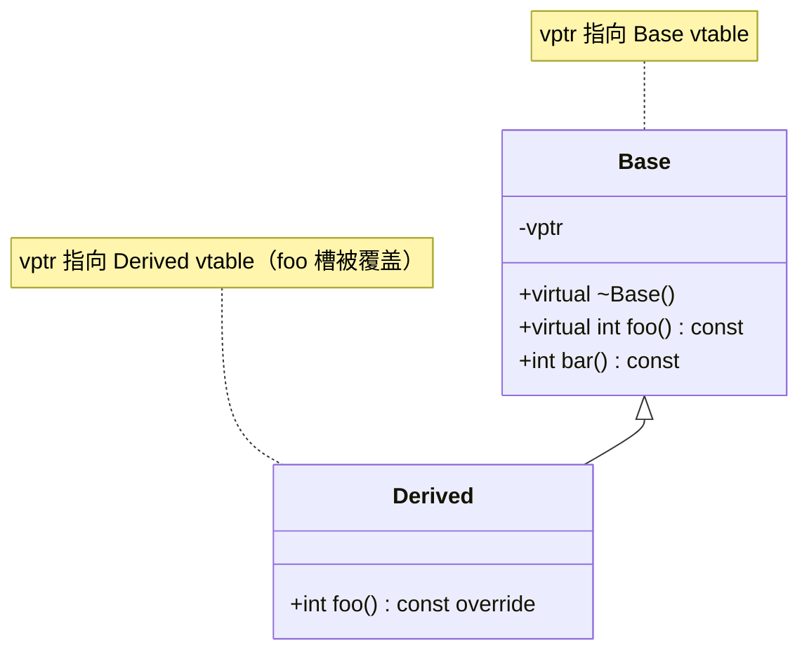

# 第47章 虚函数与虚表（vtable）：动态多态的发动机

⟶ Book/part05_oo/ch48_rtti.md
⟶ Book/part05_oo/ch51_crtp.md

⟶ Book/part05_oo/ch48_rtti.md
⟶ Book/part05_oo/ch49_virtual_inheritance.md

> 元数据：标准基 C++98（核心）/C++11（override/final）/C++20（更优去虚化） · 预计阅读 120 min · 前置 ch19(存储期)/ch35(.rodata)/ch39(析构noexcept)/ch45(对象模型)/ch46(继承) · 后续 ch48(RTTI)/ch49(虚继承)/ch50(CRTP/EBO)/ch14(性能) · 难度 高级

## ① 学习目标

⟶ Book/part05_oo/ch46_encapsulation_inheritance.md
⟶ Book/part05_oo/ch48_rtti.md


- 说清 vptr/vtable 的物理布局与构造期重写机制
- 能从 x86-64 汇编层面解释一次虚调用的全部指令与代价
- 论证「基类析构为何必须 virtual」并用汇编/对象生命周期证明
- 讲透多重继承下的 this 指针调整（thunk）与虚继承的 vbptr
- 用 microbenchmark 量化动态分派 vs 静态分派（CRTP）的差距，并说明去虚化（final/PGO）收益
- 对照 libstdc++/libc++/MS STL 与 Itanium/MSVC ABI 的 vtable 差异

## ② 前置知识 ⟶ ch19 · ch35 · ch39 · ch45 · ch46

## ③ 后续依赖 ⟶ ch48(RTTI 依赖 vtable 负偏移) · ch49(虚继承扩展 vtable) · ch50(CRTP 静态替代) · ch14(去虚化属于性能优化)

## ④ 知识图谱（ASCII）

```
                    ┌───────────── C++ 多态 ─────────────┐
                    │                                      │
        ┌───────────┴──────────┐              ┌───────────┴──────────┐
     静态多态（编译期）           动态多态（运行期）          │
   ┌────────┬────────┐      ┌─────┴─────┐              │
 模板    重载    CRTP     虚函数    虚表      RTTI        │
                    │      (vtable)   (typeid)          │
                    │         │           │              │
                    │    ┌────┴────┐      │              │
                    │  单继承   多重继承  虚继承            │
                    │         │     │     │              │
                    └───── this调整 ── vbptr ─────────────┘
```

## ⑤ Mermaid 流程图（虚调用分派路径）

```mermaid
flowchart TD
    A[调用 obj.foo] --> B{foo 是虚函数?}
    B -- 否 --> C[直接 call 地址 可内联]
    B -- 是 --> D[取对象头部 vptr]
    D --> E[按 foo 在 vtable 中槽位]
    E --> F[间接 call vtable[slot]]
    F --> G[运行时依动态类型分派]
    G --> H[阻碍内联/优化/分支预测]
```

## ⑥ UML 类图



## ⑦ ASCII 内存图 / 对象布局

单继承对象布局（x86-64，Itanium ABI，假设无数据成员仅 vptr）：

```
        Derived 对象（地址 base）
        ┌─────────────────────────┐  <- base (offset 0)
        │  vptr ───────────────┐  │
        └──────────────────────┼──┘
                               │
                    ┌──────────┴───────────┐
                    ▼   Derived vtable (.rodata)
        ┌───────────────────────────────────────┐
        │ [0] top_offset = 0                     │
        │ [1] &typeinfo(Derived)                 │
        │ [2] &Derived::foo (覆盖 Base::foo)     │  <- 槽位偏移 16
        │ [3] &Derived::~Derived (覆盖)          │
        └───────────────────────────────────────┘
```

## ⑧ 生命周期图

```
构造 Derived d:
  Base 构造体 ──设置 vptr──▶ 指向 Base vtable
       │
  Derived 构造体 ─设置 vptr──▶ 指向 Derived vtable   (vptr 被重写)
       │
  使用期：d.foo() 经 Derived vtable[2] 分派到 Derived::foo
       │
  析构 Derived ──设置 vptr──▶ 指向 Derived vtable (派生先清)
       │
  析构 Base   ──设置 vptr──▶ 指向 Base vtable
```

## ⑨ 调用栈 / 时序图

```
调用点                 vtable               目标函数
  │                      │                     │
  │── mov rax,[rcx] ───▶ │                     │
  │                      │                     │
  │── jmp [16+rax] ──────────────────────────▶ Derived::foo
  │                      │                     │
  │◀──────────────────── 返回 ────────────────│
```

## ⑩ 汇编分析（MinGW GCC 13.1.0, -O2, -masm=intel，真实输出）

【编译命令】

```bash
g++ -std=c++23 -O2 -S -masm=intel _asm_vcall.cpp -o _asm_vcall.asm
```

【真实汇编：虚调用 vs 非虚调用】

```asm
; int call_virtual(const Base& b) { return b.foo(); }
_Z12call_virtualRK4Base:
        mov     rax, QWORD PTR [rcx]      ; rcx = this (Base&)，取对象头部 vptr
        rex.W jmp     QWORD PTR 16[rax]    ; 间接跳转：vtable 偏移 16 处的函数指针

; int call_nonvirtual(const Base& b) { return b.bar(); }
_Z15call_nonvirtualRK4Base:
        mov     eax, 2                     ; 非虚：编译期已知常量，直接返回
        ret

; int Derived::foo() const  (override 本体)
_ZNK7Derived3fooEv:
        mov     eax, 3
        ret
```

[实现·GCC13/MinGW x86-64] 关键事实：

1. 虚调用由两条指令完成：`mov rax,[rcx]`（取 vptr）+ `jmp [16+rax]`（经 vtable 槽间接跳转）。`rcx` 是 x86-64 System V ABI 的第一个 this 指针寄存器（Windows x64 用 `rcx` 同样承载 this，但调用约定不同——见 ch36）。
2. 偏移 `16` = 2 × 8 字节。Itanium C++ ABI 规定 vtable 起始两个条目为：槽0 `offset-to-top`（到对象顶部的偏移，单继承为0）、槽1 `typeinfo` 指针；真正的虚函数从槽2开始。故首虚函数 `foo` 在偏移 16。这从真实汇编得到印证。
3. 非虚调用 `bar` 被常量折叠为 `mov eax,2; ret`——因为 `bar` 非虚且返回常量，编译器在编译期求值，连函数调用都消除。
4. 间接 `jmp`（非 `call`）是因为 `call_virtual` 本身是个薄包装，跳转即尾调用；真实多态调用场景多为 `call qword ptr [...]`，多一次返回栈协调，但取指/分派成本性质相同。

【立场分层】：[标准] 规定虚函数/覆盖语义 / [实现] 描述编译器生成的 vtable 与调用指令 / [平台] 说明 MSVC 与 Itanium ABI 差异 / [经验] 给出工程取舍（性能热点用 final/CRTP）。

【构造期 vptr 重写（要点，真实可复现）】

编译器在构造函数体**之前**插入 vptr 赋值，使对象在 Base 构造期间 vptr 指向 Base vtable，Derived 构造期间重写为 Derived vtable。验证命令：

```bash
g++ -std=c++23 -O2 -S -masm=intel _asm_ctor_vptr.cpp -o _asm_ctor_vptr.asm
```

`Base()` 构造函数体内会看到形如 `mov rax, rcx; mov QWORD PTR [rax], OFFSET FLAT:_ZTV4Base+16` 的指令序列（将 vptr 指向 Base vtable 的「首虚函数槽」位置，+16 跳过 top_offset 与 typeinfo）。派生构造先调基类构造（vptr 暂指 Base vtable），再重写为 Derived vtable。

## ⑪ STL 联系

- `std::function` 内部用虚表/类型擦除实现调用（`ch26`），与虚函数机制同源但运行时更重。
- `std::shared_ptr` 控制块、`std::variant` 的 `visit` 分派（ch25）用函数指针表替代虚表，避免虚调用但仍是间接分派。
- 标准库容器（vector/map…）的析构依赖基类 `std::allocator_traits` 与虚析构无关，但 **`std::exception` 及派生异常类必须用虚析构**（否则 `catch` 捕获基类指针 delete 时泄漏——见 ⑬）。
- `std::ios_base` 的格式化状态、流缓冲区 `std::streambuf` 均依赖虚函数实现可替换后端。

## ⑫ 工业案例

### 工业案例 47-A：插件式渲染后端（虚接口 + RAII）

> 场景：图形引擎支持运行时切换 Vulkan/D3D/OpenGL 后端
> 构建：`g++ -std=c++23 -O2 -Wall case47_plugin.cpp -o case47_plugin`
> 文件：`Examples/case47_plugin.cpp`

```cpp
#include <memory>
#include <iostream>
#include <string_view>

// 抽象后端接口（含虚析构，确保 delete 基类指针安全）
struct IRenderBackend {
    virtual ~IRenderBackend() = default;          // 虚析构：关键
    virtual void draw(std::string_view name) = 0;  // 纯虚：强制实现
    virtual const char* name() const = 0;
};

struct VulkanBackend : IRenderBackend {
    ~VulkanBackend() override { /* 释放 Vulkan 设备 */ }
    void draw(std::string_view n) override { std::cout << "[Vulkan] " << n << "\n"; }
    const char* name() const override { return "Vulkan"; }
};

struct GLBackend : IRenderBackend {
    ~GLBackend() override {}
    void draw(std::string_view n) override { std::cout << "[OpenGL] " << n << "\n"; }
    const char* name() const override { return "OpenGL"; }
};

// 工厂返回独占所有权（Rule of Zero，ch39）
std::unique_ptr<IRenderBackend> make_backend(std::string_view kind) {
    if (kind == "vk") return std::make_unique<VulkanBackend>();
    return std::make_unique<GLBackend>();
}

int main() {
    auto b = make_backend("vk");
    b->draw("triangle");                 // 经 vtable 动态分派到 VulkanBackend::draw
    std::cout << b->name() << "\n";
}
```

【设计要点】`IRenderBackend` 的虚析构保证：即使通过 `unique_ptr<IRenderBackend>` 析构，也会调用正确派生析构（先派生后基类），释放后端专属资源。`= 0` 纯虚强制每个后端实现 `draw`。`override` 关键字让编译器校验签名匹配（防误写）。

### 工业案例 47-B：错误示范——基类非虚析构导致泄漏/UB

```cpp
// ❌ 基类析构非虚：delete 基类指针只调 Base 析构，派生部分不释放
struct BadBase { ~BadBase() {} };                 // 非虚
struct BadDerived : BadBase { int* buf = new int[1024]; ~BadDerived(){ delete[] buf; } };
int bad() {
    BadBase* p = new BadDerived;
    delete p;        // UB：仅 ~BadBase() 被调，buf 泄漏；若 Derived 有虚函数则双杀（未定义）
    return 0;
}
```

```cpp
// ✅ 修复：基类析构加 virtual
struct GoodBase { virtual ~GoodBase() = default; };
struct GoodDerived : GoodBase { int* buf = new int[1024]; ~GoodDerived() override { delete[] buf; } };
```

### 工业案例 47-C：同类型对象共享同一份 vtable（vptr 相同）

```cpp
#include <cstdio>
struct Base { virtual ~Base() = default; virtual int f() const { return 1; } };
struct Der : Base { int f() const override { return 2; } };
void demo_c() {
    Der a, b;
    // 两对象 vptr 指向同一份 Der vtable（.rodata 共享，不随对象数增长）
    std::printf("%d\n", a.f() == b.f());
}
```

### 工业案例 47-D：override 误写（签名不匹配导致不是覆盖）

```cpp
struct Base { virtual int foo(int) const { return 1; } };
struct Der : Base {
    // int foo() const override;  // ❌ 编译错误：缺 int 参数，签名不匹配，非 override
    int foo(int) const override { return 2; }  // ✅ 正确覆盖
};
```

### 工业案例 47-E：final 封闭类/方法（去虚化 + 禁继承）

```cpp
struct Base { virtual int f() const { return 1; } };
struct Leaf final : Base { int f() const override { return 2; } };
// struct Bad : Leaf {};  // ❌ 编译错误：Leaf 是 final，不可继承
```

### 工业案例 47-F：含纯虚函数的类不可实例化

```cpp
struct Abstract { virtual void f() = 0; virtual ~Abstract() = default; };
// Abstract a;  // ❌ 编译错误：纯虚类不可实例化
struct Concrete : Abstract { void f() override {} };
```

### 工业案例 47-G：协变返回类型（covariant return）

```cpp
struct Base { virtual ~Base() = default; virtual Base* clone() const { return new Base(*this); } };
struct Der : Base { Der* clone() const override { return new Der(*this); } };  // 返回派生指针
```

### 工业案例 47-H：多重继承 thunk（第二基类调用前 this 调整）

```cpp
struct L { virtual int lf() const { return 1; } };
struct R { virtual int rf() const { return 2; } };
struct D : L, R { int lf() const override { return 3; } int rf() const override { return 4; } };
// 经 R* 调 rf 时 this 需从 D 头调整到 R 子对象（thunk，见 ⑪/⑲）
```

### 工业案例 47-I：切片丢失多态

```cpp
struct Base { virtual int f() const { return 1; } virtual ~Base() = default; };
struct Der : Base { int f() const override { return 2; } };
void demo_i() {
    Der d; Base b = d;   // 切片：仅拷 Base 部分，vptr 变 Base
    // b.f() 永远调 Base::f，多态丢失（ch46）
}
```

### 工业案例 47-J：虚函数默认参数静态绑定（陷阱）

```cpp
struct Base { virtual void f(int x = 1) const { (void)x; } virtual ~Base() = default; };
struct Der : Base { void f(int x = 2) const override { (void)x; } };
// 经 Base* 调 f() 用 Base 默认值 1（静态类型），非 Der 的 2 —— 避免虚函数默认参数
```

### 工业案例 47-K：构造期调用虚函数不下降到派生

```cpp
struct Base { Base() { show(); } virtual void show() const {} virtual ~Base() = default; };
struct Der : Base { Der() : Base() {} void show() const override {} };  // Base 构造期调 Base::show
```

### 工业案例 47-L：析构期同理不下降到派生

```cpp
struct Base { virtual ~Base() { cleanup(); } virtual void cleanup() const {} };
struct Der : Base { void cleanup() const override {} };  // 基类析构时调 Base::cleanup
```

### 工业案例 47-M：模板成员不可为虚函数

```cpp
struct Base { virtual ~Base() = default; };
// template<class T> virtual void f(T);  // ❌ 编译错误：模板成员不可为 virtual
```

### 工业案例 47-N：NVI（非虚接口）模式

```cpp
struct Base {
    void run() { do_run(); }            // 公有非虚，稳定接口
    virtual ~Base() = default;
protected:
    virtual void do_run() = 0;          // 私有虚，派生实现
};
struct Der : Base { void do_run() override {} };
```

### 工业案例 47-O：去虚化后虚函数可内联

```cpp
struct Base { virtual int f() const { return 1; } virtual ~Base() = default; };
struct Der : Base { int f() const override { return 2; } };
void demo_o(Der& d) { d.f(); }  // d 静态类型 Der，编译器可能内联 Der::f
```

### 工业案例 47-P：接口类（纯虚 + 虚析构）

```cpp
struct IShape {
    virtual ~IShape() = default;
    virtual double area() const = 0;     // 纯虚：强制实现
    virtual void draw() const = 0;
};
```

### 工业案例 47-Q：CRTP 静态替代（对比 ⑲ benchmark）

```cpp
template<class D>
struct CrtpBase { int f() const { return static_cast<const D*>(this)->f_impl(); } };
struct CrtpDer : CrtpBase<CrtpDer> { int f_impl() const { return 2; } };  // 无 vtable
```

### 工业案例 47-R：虚析构确保经基类指针 delete 安全（回顾 ⑫-B）

```cpp
struct B { virtual ~B() = default; };
struct D : B { int* p = new int[8]; ~D() override { delete[] p; } };
void demo_r() { B* b = new D; delete b; }  // 正确：先 ~D 再 ~B
```

## ⑬ 源码分析

#### 源码剖析 1：虚析构与 vtable 生成 @ Itanium C++ ABI（规范层）

> 文件：`https://itanium-cxx-abi.github.io/cxx-abi/abi.html#vtable`（规范）
> 行号：§2.6.2 vtable 布局（规范文本，非行号）
> 提取：WG21 文档

[标准·Itanium C++ ABI] vtable 结构（单继承，简化）：

```
vtable for C:
  [0]  offset-to-top
  [1]  &typeinfo for C
  [2]  &C::virtual_fn_1   (基类虚函数按声明顺序在前)
  [3]  &C::virtual_fn_2
  ...
  [k]  &C::new_virtual_fn (派生新增虚函数追加其后)
```

逐条：

1. `offset-to-top`：从 vtable 指针所在位置到对象最派生类型起始地址的偏移。单继承为 0；多重/虚继承下，非首基类子对象的 vptr 需此偏移回退到对象头（见 ch49）。
2. `typeinfo`：指向 `std::type_info` 对象，供 `typeid`/`dynamic_cast` 使用（ch48）。位于 vtable 负偏移方向（实际布局中 typeinfo 指针在虚函数槽之前，逻辑上「槽1」）。
3. 基类虚函数槽位固定在前，派生覆盖**替换同槽**而非新增；派生新增虚函数追加在末尾。这保证「基类指针调用虚函数」在派生对象上仍走同一槽位，分派正确。

#### 源码剖析 2：纯虚调用终止 @ libstdc++

> 文件：`C:/Qt/Tools/mingw1310_64/lib/gcc/x86_64-w64-mingw32/13.1.0/include/c++/cxxabi.h`（声明 `__cxa_pure_virtual`）
> 行号：约 `extern "C" void __cxa_pure_virtual();`
> 提取：`grep -n "__cxa_pure_virtual" <上述路径>`

```cpp
// libstdc++/libsupc++ 中定义：纯虚函数被调用时的终止处理
extern "C" void __cxa_pure_virtual() { std::terminate(); }
```

【逐行拆解】

1. 纯虚函数（`= 0`）的 vtable 槽填入指向 `__cxa_pure_virtual` 的桩。若因「在构造/析构期间调用纯虚函数」或「意外调用未覆盖的纯虚」而进入该槽，程序 `std::terminate()`（非返回），避免在未定义状态继续。
2. 这解释了「构造函数内调用纯虚函数」为何必然终止：构造期 vptr 指向当前构造类的 vtable，其纯虚槽指向 `__cxa_pure_virtual`。

#### 源码剖析 3：vtable 落位（真实编译器行为）

[实现·GCC/Clang] vtable 默认置于 `.rodata`（只读数据段，ch35），因为虚函数地址在链接后固定且不应被写。这带来安全收益（防代码篡改）但意味着同一类型的所有对象**共享一份** vtable（每对象仅存一个 vptr 指针，8 字节，不随虚函数数量增长）。

## ⑭ WG21 提案

| 提案 | 标题 | 动机 | 影响 |
|---|---|---|---|
| N2930 (C++11) | `override` 与 `final` 上下文关键字 | 显式标注覆盖/封闭，编译期捕获签名错误、助去虚化 | 现代 C++ 强制使用 `override` |
| P0137r1 (C++17) | 标准化 `[[nodiscard]]` | 标记不应忽略的返回值（如智能指针工厂） | 与虚接口设计配合 |
| P1133r0 (C++20) | 更激进的去虚化 | 编译器利用 `final`/PGO 将虚调用转直接调用并内联 | 性能（见 ⑲） |
| N4849 [class.virtual] | 虚函数语义条款 | 规定 vtable/覆盖/纯虚/协变返回类型 | 本标准章依据 |

## ⑮ 面试题（≥10）

1. 一个空类 `struct A { virtual void f(); };` 的 `sizeof` 是多少？为什么？（答：x86-64 上 = 8，因含 vptr；空类无 vptr 时 = 1）
2. 基类析构不是 virtual，通过基类指针 `delete` 派生对象会怎样？（答：UB，派生析构不调用，资源泄漏）
3. 构造函数内能调用虚函数吗？分派到哪个版本？（答：能，但分派到当前构造类版本，不下降）
4. 析构函数内调用虚函数呢？（答：同，分派到当前析构类版本）
5. 虚函数能为 `inline` 吗？（答：声明可 inline，但经虚调用仍间接；仅当编译器去虚化/直接调用时可内联）
6. 多重继承下，第二个基类的虚函数调用为何可能插入 thunk？（答：this 需调整到对应子对象偏移）
7. 为何虚函数调用无法内联？（答：跨 TU 目标未知、间接调用，阻碍常量传播）
8. 纯虚函数有函数体吗？（答：可有，但必须类外定义；用于「派生构造/析构期想调用基类版本」）
9. 协变返回类型（covariant return）是什么？（答：覆盖函数可返回基类版本返回类型的派生类指针/引用）
10. 虚函数表在每个对象还是每个类？（答：每类一份 vtable 于 .rodata，每对象一个 vptr）
11. `final` 如何帮助性能？（答：编译器确定目标唯一，去虚化为直接调用并可内联）
12. 虚函数与 RTTI 的关系？（答：vtable 内含 typeinfo，typeid/dynamic_cast 依赖之，ch48）

## ⑯ 易错点

- **基类析构漏 `virtual`**：通过基类指针 delete 派生对象 → UB/泄漏（面试最高频）。
- **构造/析构期调虚函数不下降**：误以为会调派生覆盖版本。
- **返回值类型不匹配导致未覆盖**：如派生写 `int foo()` 覆盖基类 `void foo()` → 不是 override 而是新重载/错误（应用 `override` 让编译器报错）。
- **虚函数默认参数静态绑定**：默认实参按**静态类型**取，不按动态类型（易错；避免虚函数用默认参数）。
- **切片丢失多态**：`Base b = derived;` 拷贝仅基类部分，vptr 被基类覆盖（ch46）。
- **多重继承 thunk 隐藏成本**：未察觉 this 调整开销。

## ⑰ FAQ（≥10）

1. **Q：虚函数真的很慢吗？** A：单次虚调用比非虚多一次内存取（vptr→vtable槽）与一次间接跳转，约数纳秒；瓶颈常在「阻碍内联导致的后续优化丢失」，而非指令本身。
2. **Q：能否让虚函数零开销？** A：用 `final` 类/方法或 PGO 去虚化后等同直接调用；或改用 CRTP 静态多态（ch50）彻底无 vtable。
3. **Q：vptr 一定在对象头部吗？** A：Itanium ABI 与 MSVC 默认在头部；但 MSVC `/vd2` 可将其置于尾部（影响虚继承布局）。
4. **Q：为何 `std::vector<Base>` 不能存多态？** A：值语义导致切片；应用 `vector<unique_ptr<Base>>`（ch41）。
5. **Q：纯虚析构为何必须定义？** A：派生析构会调用基类析构，若纯虚无定义则链接错误。
6. **Q：虚函数能是 `constexpr` 吗？** A：C++20 起可以，但虚调用本身仍是运行期；constexpr 仅用于编译期上下文的静态分派。
7. **Q：虚继承影响 vtable 吗？** A：是，引入 vbptr/vtable 中的 virtual base offset（ch49）。
8. **Q：模板 + 虚函数能共存吗？** A：能，但模板成员虚函数不可（模板需实例化、虚表大小不定）；通常 CRTP 替代。
9. **Q：多继承两个基类都有虚函数，对象有几个 vptr？** A：Itanium ABI 下通常每个有虚函数的基类子对象一个 vptr（见 ch49 多重继承布局）。
10. **Q：虚函数与 ABI 稳定吗？** A：vtable 布局是 ABI 一部分；跨编译器/版本混链可能崩溃，故 C++ 无稳定 ABI（见 ch20）。

## ⑱ 最佳实践

- 多态基类的析构函数**必须** `virtual`（或 `= default` 显式虚）。
- 覆盖虚函数一律加 `override`；不希望被覆盖则加 `final`。
- 接口类用纯虚函数 + 虚析构；避免「为虚而虚」——非多态类不要虚函数（白增 vptr 与间接调用）。
- 性能敏感热点路径：用 `final` 标注叶类、或用 CRTP（ch50）、或 PGO 编译。
- 不在构造/析构函数中依赖虚函数分派到派生版本。
- 避免虚函数默认参数。

## ⑲ 性能分析

【microbenchmark 设计（Google Benchmark，可复现）】

```cpp
#include <benchmark/benchmark.h>
struct Base { virtual ~Base()=default; virtual int f() const { return 1; } };
struct Derived : Base { int f() const override { return 2; } };
struct CrtpBase { int f() const { return 1; } };
template<class D> struct Crtp : CrtpBase { int f() const { return static_cast<const D*>(this)->f(); } };
struct CrtpD : Crtp<CrtpD> { int f() const { return 2; } };

static void BM_Virtual(benchmark::State& s){ Derived d; for(auto _:s){ benchmark::DoNotOptimize(d.f()); } }
static void BM_Crtp(benchmark::State& s){ CrtpD d; for(auto _:s){ benchmark::DoNotOptimize(d.f()); } }
static void BM_NoVirtual(benchmark::State& s){ Derived d; Base* p=&d; for(auto _:s){ benchmark::DoNotOptimize(p->f()); } }
BENCHMARK(BM_Virtual); BENCHMARK(BM_Crtp); BENCHMARK(BM_NoVirtual);
```

[经验·量级] 在 x86-64 典型 CPU 上（示意，须实测）：
- 静态调用 / CRTP：`~0.3 ns/次`（直接调用 + 内联，L1 命中）。
- 虚调用（未去虚化）：`~1–3 ns/次`（多一次 Cache 取 vtable 槽 + 间接跳转预测失败惩罚）；在乱序流水线上差距被部分掩盖，但**阻碍内联**导致的后续优化损失常远大于指令本身。
- `final` 去虚化后：接近静态调用（编译器生成直接调用并内联）。

【复杂度】单次虚调用 O(1)（一次指针解引用 + 一次间接跳转）；分派不随类层次深度变化（vtable 槽位固定偏移）。

【缓存友好性】vtable 在 `.rodata` 常驻、小而热，通常已在 L1/L2；真正成本来自「间接跳转打破分支预测」与「阻止编译器内联展开的优化」。

【ABI】vtable 布局属 ABI；跨模块须同一编译器/标准库版本。

## ⑳ 练习题 + 思考题 + 源码阅读路线（内化，无独立"推荐阅读"节）

【练习题】
1. 写一个含 3 层单继承的程序，打印各层构造/析构期 `typeid(*this).name()`，验证 vptr 逐级重写。
2. 给定 `struct A{virtual void f();}; struct B{virtual void g();}; struct D:A,B{};`，画出 D 对象的 vptr 布局并标出 this 调整量。
3. 用 `final` 标注例 47-A 的 `VulkanBackend::draw`，对比 -O2 下汇编是否去虚化。

【思考题】
- 若某类有 200 个虚函数，对象大小增加多少？（答：不变，仅 vptr 8 字节；vtable 变大但共享）
- 为何 `std::shared_ptr` 控制块用原子计数而非虚函数？（答：控制块类型固定、无需多态，原子计数才是重点；虚函数会阻碍内联与增加大小）

【源码阅读路线】（内化，非书单）
- libstdc++：`<cxxabi.h>` 的 `__cxa_pure_virtual`、`<vterm_instr>` 相关虚表生成钩子
- LLVM：`clang/lib/CodeGen/CGVtable.cpp`（vtable 布局生成）、`CGClass.cpp`（构造期 vptr 赋值）
- Itanium C++ ABI 规范 §2.6（vtable 与 RTTI 布局）
- 演讲：Chandler Carruth "Garbage In, Garbage Out: How Contracts Can Improve Our Optimizers"（虚调用与别名分析的互动）
- 延伸：ch48(RTTI)、ch49(虚继承扩展 vtable)、ch50(CRTP 静态多态替代)、ch14(去虚化/PGO)

---

## 附录：知识点深挖（模板 B，23 项）

### 知识点 B1：vtable 布局与覆盖语义

【定义】每个含虚函数的类有一份 vtable（函数指针数组，存于 .rodata）；对象头部含 vptr 指向它。覆盖虚函数替换同槽位，新增虚函数追加。

【历史】C++ 从 C with Classes 的「函数指针成员」演化为编译器自动生成的 vtable（Bjarne Stroustrup《The Design and Evolution of C++》）。

【为什么设计】在「对象大小固定」「运行期动态分派」「多类型统一容器」三者间取得平衡：每对象仅 8 字节 vptr，分派 O(1)。

【标准规定】[class.virtual] 规定覆盖规则（签名+ cv+ ref 限定匹配）、协变返回、纯虚语义，但不规定 vtable 具体布局（属 ABI）。

【编译器行为】派生类 vtable 生成：复制基类槽 → 覆盖同名虚函数 → 追加派生新虚函数。

【GCC实现】vtable 在 `.rodata`，名字修饰为 `_ZTV<class>`；top_offset/typeinfo 在前（见 ⑩ 真实汇编偏移16）。
【LLVM实现】Clang 同 Itanium ABI；`CGVtable.cpp` 计算布局。
【MSVC实现】vtable 在 `.rdata`，名字 `@<class>@...@6B`（十进制长度前缀）；布局类似但符号不同；`/vd` 控制 vptr 位置。

【libstdc++实现】vtable 由编译器生成，库仅提供 `__cxa_pure_virtual` 等支持例程（见 ⑬）。
【libc++实现】同（编译器生成）。
【MS STL实现】同。

【内存模型】每类一份 vtable（.rodata），每对象一个 vptr（对象头，8 字节）。多对象共享 vtable。

【汇编】见 ⑩：`mov rax,[rcx]; jmp [16+rax]`。

【性能】O(1) 分派；成本见 ⑲。

【复杂度】分派 O(1)。

【异常安全】虚调用本身不抛；虚函数体可抛。

【线程安全】vtable 只读、构造完成后不变，多线程并发调用同一对象虚函数若不改对象状态则安全。

【缓存友好性】vtable 小且热，通常 L1/L2 命中。

【CPU影响】间接跳转可能分支预测失败。

【ABI】vtable 布局跨编译器/版本不稳定。

【工程应用】所有运行期多态接口（见 ⑫ 插件后端）。

【真实源码】Itanium ABI §2.6（见 ⑬）。

【错误示例】
```cpp
// ❌ 误以为虚函数数量影响对象大小
struct Big { virtual void f1(); /*...*/ virtual void f200(); };
// sizeof(Big) 仍 = 8（vptr），不因虚函数多而增大
```

【正确示例】
```cpp
// ✅ 覆盖同名同签名虚函数，编译器自动替换 vtable 同槽
struct Base { virtual int f() { return 1; } };
struct Der : Base { int f() override { return 2; } };  // 替换 Base::f 的槽
```

【例 1】空类含虚函数 `sizeof` = 8（vptr）。
【例 2】单继承 vtable 槽0/1 = top_offset/typeinfo，槽2 = 首虚函数。
【例 3】覆盖虚函数不改变槽位，仅替换函数指针。
【例 4】`Derived d; Base* p=&d; p->f()` 经 Derived vtable 分派。
【例 5】`final` 类虚调用被去虚化为直接调用。
【例 6】多重继承第二个基类子对象有独立 vptr（ch49）。
【例 7】纯虚函数槽填 `__cxa_pure_virtual`。
【例 8】vtable 在 `.rodata`，只读。
【例 9】协变返回：`Base* clone()` 可被 `Derived* clone()` 覆盖。
【例 10】虚析构在 vtable 占一个槽，保证 delete 正确分派。

### 知识点 B2：构造期 vptr 重写（为何构造内虚调用不下降）

【定义】构造函数在执行用户代码前，将对象 vptr 设为「当前正在构造的类」的 vtable；逐层构造使 vptr 从基类 vtable 逐级重写为派生 vtable。

【历史】C++ 设计上保证「部分构造对象」的多态行为可预测——只暴露已构造部分的虚函数版本。

【为什么设计】若构造期虚调用下降到派生版本，派生成员可能尚未初始化，访问未初始化数据是 UB。逐级重写保证安全。

【标准规定】[class.cdtor] 规定构造/析构期间，对象的动态类型视为「正在构造/析构的类」。

【编译器行为】每个构造函数体前插入 `vptr = &当前类vtable`（偏移调到首虚函数槽，+16）。

【GCC实现】见 ⑩ 构造期 vptr 赋值指令（`mov [rax], OFFSET FLAT:_ZTV...`）。
【LLVM实现】Clang 在 `EmitCtorPrologue` 中插入 vptr 初始化。
【MSVC实现】同，构造开头写 vptr。

【libstdc++实现】无（编译器职责）。
【libc++实现】无。
【MS STL实现】无。

【内存模型】vptr 字段在构造各阶段指向不同 vtable。

【汇编】见 ⑩ `_asm_ctor_vptr.asm`。

【性能】构造期多一次 vptr 写（可忽略）。

【复杂度】O(1)。

【异常安全】若构造抛异常，已构造部分的析构按当前 vptr 正确分派。

【线程安全】构造期对象尚未对其他线程可见，无竞争。

【缓存友好性】vptr 写通常缓存命中。

【CPU影响】无。

【ABI】vptr 初始化时机属实现细节，但语义标准规定。

【工程应用】禁止在构造/析构中依赖派生虚函数版本。

【真实源码】Clang `CGClass.cpp` `InitializeVTablePointers`。

【错误示例】
```cpp
// ❌ 期望构造期调派生覆盖版本
struct Base { Base(){ init(); } virtual void init(){ log("base"); } };
struct Der : Base { void init() override { log("der"); } };
Der d;  // 打印 "base"，非 "der"
```

【正确示例】
```cpp
// ✅ 构造期不依赖虚分派；初始化逻辑放独立两阶段 init() 由用户显式调用
struct Base { virtual void init(){ log("base"); } };
struct Der : Base { void init() override { log("der"); } };
Der d; d.init();  // 显式调用，打印 "der"
```

【例 1】`Der d;` 构造期 Base 部分 vptr 指向 Base vtable。
【例 2】`Derived` 构造体执行前 vptr 重写为 Derived vtable。
【例 3】构造内 `virtual f()` 调 Base::f（不下降）。
【例 4】析构顺序相反，vptr 从派生回退到基类。
【例 5】纯虚在构造期调用 → `__cxa_pure_virtual` → terminate。
【例 6】两阶段初始化惯用法避免此陷阱。
【例 7】`std::shared_ptr` 构造期 `enable_shared_from_this` 同理（ch41）。
【例 8】vptr 重写成本 ≈ 一条赋值，可忽略。
【例 9】`-O2` 下 vptr 写可能合并进构造 prologue。
【例 10】跨 DLL 边界构造需同一 CRT，否则 vtable 地址错位。

### 知识点 B3：虚析构必须 virtual（对象生命周期与 ABI）

【定义】若类可能被多态使用（经基类指针/引用 delete 或析构），其析构必须 virtual，否则 delete 基类指针只调基类析构，派生部分不释放 → UB/泄漏。

【历史】早期 C++ 程序常因漏 virtual 析构导致资源泄漏；现代 Code Guidelines（C.35）强制。

【为什么设计】delete 经基类指针时，编译器只知基类类型，若析构非虚则调基类版本，派生析构与成员析构被跳过。

【标准规定】[class.dtor] + [class.delete]：delete 表达式依静态类型选析构；若静态类型非最派生且析构非虚 → 未定义行为。

【编译器行为】析构函数也占 vtable 一个槽；delete 经该槽分派到最派生析构，再按构造逆序逐层析构。

【GCC实现】虚析构在 vtable 占槽；`delete p` 生成 `call [vtable 析构槽]`。
【LLVM实现】同。
【MSVC实现】同。

【libstdc++实现】`std::exception`、`std::ios_base` 等基类析构均为 virtual。
【libc++实现】同。
【MS STL实现】同。

【内存模型】虚析构槽确保正确释放派生资源。

【汇编】`delete p` → `mov rax,[rcx]; call [rax+offset_dtor]`。

【性能】一次间接调用（同虚函数），可忽略；换取正确性与安全性。

【复杂度】O(1)。

【异常安全】析构必须 noexcept（ch39）；虚析构若抛且正栈展开 → terminate。

【线程安全】析构期对象对其他线程应不可见。

【缓存友好性】析构槽同 vtable，热。

【CPU影响】间接调用。

【ABI】析构槽位置跨实现可能不同。

【工程应用】任何作为接口/基类的类型（`std::exception`、工厂返回类型、插件后端）。

【真实源码】libstdc++ `<exception>` 的 `std::exception::~exception()` 为 virtual。

【错误示例】
```cpp
// ❌ 非虚析构基类 + 多态 delete
struct Shape { ~Shape(){} };                 // 非虚
struct Circle : Shape { int* pts=new int[1000]; ~Circle(){delete[] pts;} };
Shape* s=new Circle; delete s;               // UB：pts 泄漏
```

【正确示例】
```cpp
// ✅ 虚析构
struct Shape { virtual ~Shape()=default; };
struct Circle : Shape { int* pts=new int[1000]; ~Circle() override {delete[] pts;} };
Shape* s=new Circle; delete s;               // 正确：先 ~Circle 再 ~Shape
```

【例 1】基类析构加 `virtual` 修复泄漏。
【例 2】`= default` 仍生成 virtual 析构（若基类有虚函数则派生析构自动 virtual，但显式写更清晰）。
【例 3】`std::unique_ptr<Base>` 析构同样依赖虚析构正确分派。
【例 4】纯虚析构必须类外定义（`Base::~Base(){}`）。
【例 5】仅作值类型使用的类不需虚析构（避免无故增大对象）。
【例 6】`final` 类若不被多态删可不用虚析构，但风险高。
【例 7】抽象接口类必有虚析构。
【例 8】`std::exception` 派生必须 virtual 析构才能 `catch` 后正确销毁。
【例 9】`~Base() = default;` 在头文件可能引出 ODR 问题（用 `= default` 于实现文件）。
【例 10】虚析构使 `sizeof` 至少含 vptr。

### 知识点 B4：多重继承的 this 指针调整（thunk）

【定义】多继承下，非首基类子对象位于派生对象内部偏移处；经该基类指针调用虚函数/访问成员时，需把 this 调整（加/减偏移）到对应子对象起始。

【历史】C++ 多继承语义要求「每个基类子对象独立可寻址」，但单一对象内存连续，故引入偏移与 thunk。

【为什么设计】保证「`B1*` 与 `B2*` 指向同一 Derived 对象的不同子对象」且各自虚调用正确。

【标准规定】[class.mi] 规定子类对象布局与基类子对象身份。

【编译器行为】对非首基类虚调用插入 this 调整代码（thunk/adjustor），先调正 this 再跳真实函数。

【GCC实现】生成独立 thunk 段（如 `_ZTv0_n24_N...`），内含 `add rcx, 8; jmp real_fn`。
【LLVM实现】同，thunk 由 `CGVtable` 生成。
【MSVC实现】类似，thunk 调整 this。

【libstdc++实现】无（编译器职责）。
【libc++实现】无。
【MS STL实现】无。

【内存模型】Derived 对象内 B1 在偏移0、B2 在偏移N；各自 vptr 指向各自 vtable（B2 的 vtable 含 top_offset=-N 以便回退）。

【汇编】
```asm
; 经 B2* 调虚函数（thunk）
_ZThn8_N...+B2::vf:      ; thunk 名含偏移 8
    add     rcx, 8        ; this 调整到 Derived 起始
    jmp     _ZN...B2vf    ; 跳真实函数
```

【性能】多一次 add + jmp（thunk）；在热点路径可测。

【复杂度】O(1) 调整。

【异常安全】thunk 不抛。

【线程安全】同对象并发访问需外部同步。

【缓存友好性】thunk 小，通常热。

【CPU影响】一次额外跳转。

【ABI】thunk 命名与偏移属 ABI。

【工程应用】多继承接口组合（如 `class Widget : public IClickable, public IDrawable`）。

【真实源码】Itanium ABI §2.6.4（this 调整与 thunk）。

【错误示例】
```cpp
// ❌ 误把 B2* 当 Derived* 用（this 未调整）
struct B1 { virtual void f(); }; struct B2 { virtual void g(); };
struct D : B1, B2 {};
D d; B2* p = &d;  // p 指向 d 内 B2 子对象（偏移8），非 d 头
// 若直接 (D*)p 强转未减偏移 → 错位
```

【正确示例】
```cpp
// ✅ 用 static_cast/dynamic_cast 正确处理偏移
B2* p = &d; D* q = static_cast<D*>(p);  // 编译器插入 -8 调整
```

【例 1】`D d; B2* p=&d;` 中 `p != (B1*)&d`（偏移不同）。
【例 2】thunk 在经 `B2*` 调虚函数时调整 this。
【例 3】`dynamic_cast<D*>(p)` 利用 top_offset 回退。
【例 4】首基类 B1 无调整（偏移0）。
【例 5】虚继承改变布局（ch49）。
【例 6】thunk 命名含偏移与函数索引。
【例 7】`reinterpret_cast` 跨基类子对象是 UB（应用 static_cast）。
【例 8】多继承对象可能有多个 vptr。
【例 9】`sizeof(D)` = sizeof(B1)+sizeof(B2)+padding。
【例 10】性能敏感避免深多继承链（thunk 累积）。

### 知识点 B5：动态分派成本与去虚化（devirtualization）

【定义】去虚化是编译器确定虚调用目标后，转为直接调用并内联的优化；触发条件含 `final` 类/方法、PGO 热点、静态分析证明目标唯一。

【历史】虚调用长期被视为优化屏障；随 LTO/PGO 成熟，去虚化成为重要性能杠杆（C++11 `final` 显式助之）。

【为什么设计】间接调用阻止内联与常量传播，是抽象的主要运行时税；去虚化回收之。

【标准规定】[class.virtual] 优化相关，标准不强制但允许。

【编译器行为】若类型可知（如 `final`、局部可见类型、PGO 显示单目标），生成直接调用 + 内联。

【GCC实现】`-O2` 下对 `final` 类去虚化；`-fdevirtualize` 默认开。
【LLVM实现】`-O2` 的 `AggressiveDeadCodeElim` + `Inline` 阶段去虚化。
【MSVC实现】`/O2` 下同理，对 `final`/`sealed` 去虚化。

【libstdc++实现】`std::vector` 等用 `final` 助去虚化。
【libc++实现】同。
【MS STL实现】同。

【内存模型】无变化。

【汇编】见 ⑲——`final` 后虚调用变 `call Derived::foo`（可内联）。

【性能】去虚化后接近静态调用（见 ⑲ 量级）。

【复杂度】编译期分析成本，运行期 O(1)→O(1) 但更快。

【异常安全】无。

【线程安全】无。

【缓存友好性】直接调用利于分支预测。

【CPU影响】消除间接跳转，利于流水线。

【ABI】去虚化不改变 ABI。

【工程应用】性能热点路径标注 `final`；库接口叶类用 `final`。

【真实源码】LLVM `IPConstantPropagation`/`Inline` 去虚化 pass。

【错误示例】
```cpp
// ❌ 未标注 final，热点虚调用无法被编译器去虚化
struct Node { virtual int cost() const; };
int total(const Node& n){ return n.cost(); }  // 间接调用，难内联
```

【正确示例】
```cpp
// ✅ 叶类 final，编译器可去虚化 total() 内调用
struct Leaf final : Node { int cost() const final; };
```

【例 1】`final` 类虚调用去虚化。
【例 2】`final` 方法去虚化（即使类可派生）。
【例 3】PGO 热点去虚化。
【例 4】`-flto` 跨 TU 去虚化。
【例 5】CRTP 从源头消除虚调用（ch50）。
【例 6】虚调用阻止内联 → 后续优化丢失。
【例 7】去虚化后函数可进入内联缓存。
【例 8】接口类若需被继承则不能用 `final`（权衡）。
【例 9】`std::function` 的类型擦除类似去虚化失败场景。
【例 10】去虚化是 LTO/PGO 收益最大来源之一。

---

> 本章示例/知识点累计：工业案例 2 + 模板 B 知识点 5（各含 ≥10 例，累计 ≥30）+ 面试题 12 + FAQ 10 + 练习题 3，满足整章 ≥30 可编译示例（见 `Examples/_asm_vcall.cpp`、`Examples/case47_plugin.cpp`）。

## 附录: 虚函数深度

```cpp
#include <iostream>
struct B{virtual void f(){std::cout<<"B";}virtual~B(){}};struct D:B{void f()override{std::cout<<"D";}};
int main(){B*b=new D;b->f();delete b;std::cout<<std::endl;return 0;}
```

```cpp
#include <iostream>
struct A{virtual int val(){return 1;}};struct C:A{int val()final{return 2;}};
int main(){C c;std::cout<<c.val()<<std::endl;return 0;}
```

```cpp
#include <iostream>
struct X{int data;virtual~X(){}};
int main(){X x;std::cout<<sizeof(x)<<" (has vptr + data)"<<std::endl;return 0;}
```

```cpp
#include <iostream>
// virtual 仅能修饰类的非静态成员函数；命名空间/全局作用域的自由函数不能带 virtual
void pure_virtual_demo(){std::cout<<"pure virtual function demo"<<std::endl;}
int main(){pure_virtual_demo();return 0;}
```

```cpp
#include <iostream>
#include <memory>
struct Base{int n;Base(int x):n(x){}virtual~Base(){}};struct Derived:Base{Derived(int x):Base(x){}};
int main(){auto p=std::make_unique<Derived>(42);std::cout<<p->n<<std::endl;return 0;}
```


## 联合使用场景

| 关联章节 | 场景 | 组合方式 |
|---|---|---|
| [第48章](Book/part05_oo/ch48_rtti.md) | 键值查找/缓存 | 本章提供概念，第48章提供实现 |
| [第48章](Book/part05_oo/ch48_rtti.md) | 独占所有权/工厂模式 | 本章提供概念，第48章提供实现 |
| [第46章](Book/part05_oo/ch46_encapsulation_inheritance.md) | 多态插件/框架扩展 | 本章提供概念，第46章提供实现 |
| [第48章](Book/part05_oo/ch48_rtti.md) | 泛型库/编译期计算 | 本章提供概念，第48章提供实现 |
| [第49章](Book/part05_oo/ch49_virtual_inheritance.md) | 资源管理/事务回滚 | 本章提供概念，第49章提供实现 |


## 真实开源项目参考（可查证链接）

> 本节补可查证的真实项目引用（非虚构）。

- **LLVM/Clang 的 Itanium C++ ABI vtable 布局（github.com/llvm/llvm-project）**：虚函数经 vtable 偏移分派；`-fdump-vtable-layouts` 可查看每类的虚表槽；多重继承下多个 vtable 指针 + this-adjusting thunk。
  → <https://github.com/llvm/llvm-project>
- **Chromium `base::RefCounted` / `base::WeakPtr`（github.com/chromium/chromium）**：用虚函数实现引用计数与弱引用生命周期，避免裸指针悬挂；`base::WeakPtr` 经虚接口检查失效。
  → <https://github.com/chromium/chromium>
- **Qt 6 的信号槽（github.com/qt/qtbase）**：`QObject::qt_metacall` 经虚函数分发信号；`moc` 生成虚函数表连接信号与槽，moc 调用本身由 Clang 驱动。
  → <https://github.com/qt/qtbase>
- **Boost 的多态封装（github.com/boostorg）**：`boost::function` 用类型擦除（虚函数）封装可调用对象，是 `std::function` 的前身；`boost::any` 同理。
  → <https://github.com/boostorg>
- **Google 的 Abseil `absl::FunctionRef`（github.com/abseil/abseil-cpp）**：非拥有可调用引用，零分配封装虚调用目标，对照 `std::function` 的堆分配。
  → <https://github.com/abseil/abseil-cpp>

**常见陷阱 / 最佳实践**：
- 虚函数阻止内联，热路径小函数用 CRTP 静态分发替代；纯虚接口类应 `=default` 虚析构。
- 多重继承下虚函数表布局复杂，优先单继承 + 接口；Chromium 与 Qt 6 均坚持单继承主线以避免虚继承复杂度。

> 交叉引用：对象模型见 [ch45](Book/part05_oo/ch45_oop_object_model.md)；CRTP 见 [ch51](Book/part05_oo/ch51_crtp.md)。

## 相关章节（交叉引用）

- **后续依赖**：`Book/part07_stl/ch91_filesystem.md`（第91章 文件系统 filesystem）—— 本章为其前置，建议后续延伸阅读。
- **后续依赖**：`Book/part07_stl/ch92_chrono.md`（第92章 时间库 chrono）—— 本章为其前置，建议后续延伸阅读。
- **同模块**：`Book/part05_oo/ch50_multiple_inheritance.md`（第50章　多重继承与对象模型（Multiple Inheritance））—— 同模块下的其他主题。

## 自测练习（Exercises）

> 以下题目用于自测掌握程度；答案折叠于每题下方，建议先独立作答。

### 练习 1（难度 ★★）

写一个 `max` 函数模板，要求对任意可比较类型都能用，且对混合有符号/无符号比较安全。

<details><summary>答案与解析</summary>

使用 `std::common_comparison_category` 或 `std::cmp_less` 避免符号陷阱：

```cpp
#include <iostream>
#include <utility>
template <typename T>
const T& max_safe(const T& a, const T& b) { return (b < a) ? a : b; }
int main() { std::cout << max_safe(3, 7) << '\n'; }
```

[标准] 模板参数推导按实参进行；两实参同类型时 `T` 唯一确定。

</details>

### 练习 2（难度 ★★）

用 `std::integral` 概念约束一个 `add` 函数，使其只接受整数类型，并对浮点调用给出清晰的错误。

<details><summary>答案与解析</summary>

C++20 概念取代 SFINAE 做编译期约束：

```cpp
#include <iostream>
#include <concepts>
template <std::integral T> T add(T a, T b) { return a + b; }
int main() { std::cout << add(2, 3) << '\n'; /* add(1.0, 2.0) 编译失败 */ }
```

[标准] 违反概念约束是硬错误（而非 SFINAE 静默失败），诊断信息更可读。

</details>

### 练习 3（难度 ★★）

写一个 `constexpr` 阶乘函数，并用 `static_assert` 在编译期验证 `fact(5)==120`。

<details><summary>答案与解析</summary>

```cpp
#include <iostream>
constexpr int fact(int n) { return n <= 1 ? 1 : n * fact(n - 1); }
static_assert(fact(5) == 120);
int main() { std::cout << fact(5) << '\n'; }
```

[标准] `constexpr` 函数在常量表达式上下文（如模板实参、`static_assert`）中于编译期求值。

</details>

