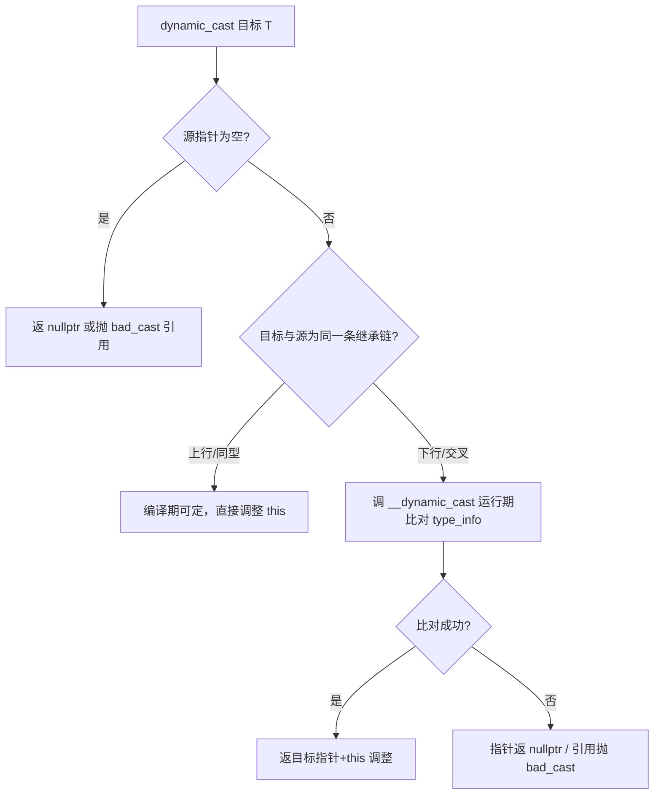
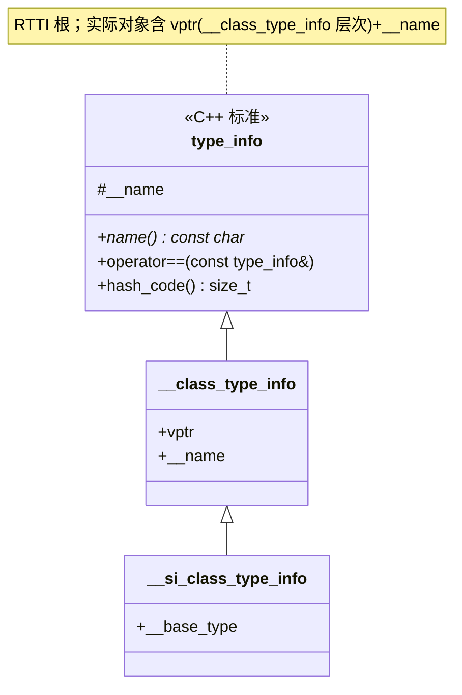
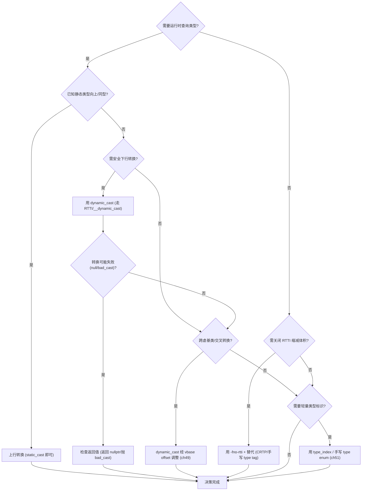
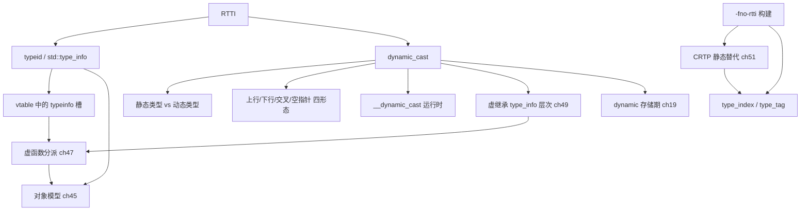

# 第48章 RTTI 与 typeid/dynamic_cast：运行时类型查询

⟶ Book/part06_templates/ch65_type_traits.md
⟶ Book/part05_oo/ch47_virtual_functions.md

## ⓪ 历史动机：RTTI 的来龙去脉

> 类型信息本不该免费——C++ 花了十多年才说服自己：有时候，运行时「认得你是谁」确实值得。

### 0.1 起源（谁·何时·为何）
与虚函数不同，运行时类型信息（RTTI，`typeid` 与 `dynamic_cast`）是 C++ 的「后加项」。早期 Stroustrup 刻意不提供它，因为把类型名塞进每个对象会违背「零开销」——你没用 RTTI 也得为它买单。[史] 但随着多重继承（ch50）与复杂层次出现，安全地「向下转型」成了刚需：`dynamic_cast` 能在运行期判断「这个基类指针到底是不是某个派生类」，转错就返回空（指针）或抛异常（引用），比手写 `type` 枚举安全得多。[史] 这些设计在《The Design and Evolution of C++》（D&E）里有详细自述。

### 0.2 关键转折（编年）
- 1980s–1990s：类型信息长期是「可选扩展」，并非语言核心。
- 1998：C++98 正式纳入 `typeid`/`dynamic_cast`，并把类型信息指针放进 vtable 的头部槽位。
- 2011 起：`noexcept` 等标注让 RTTI 与异常、性能分析能更精确共存。

### 0.3 设计哲学之争
RTTI 的反对者理由很硬：它让二进制变大、让「不该知道类型」的代码知道类型，破坏封装；很多大型项目（尤其嵌入式、游戏）直接 `-fno-rtti` 关掉它。[评] 支持者则认为，安全向下转型、调试器与序列化框架离开它寸步难行。有意思的是，C++ 的**异常处理**和 RTTI 共享了同一套运行期基础设施——这也是为什么关掉其中一个往往牵连另一个。[史]

### 0.4 史料补遗与持续编年
0.2 编年止于 C++98 的 `dynamic_cast`/`typeid`。RTTI 在后续标准里仍有补笔：

- [史] `std::type_info::name()` 的返回在不同实现上天差地别：GCC/Clang 返回 mangled 名（需 `abi::__cxa_demangle` 还原），MSVC 返回较可读名。跨翻译单元时，`typeid` 能否比较取决于 RTTI 信息的「单一定义」——模块化前靠链接器合并弱符号，模块（C++20）则试图让类型信息在模块边界更可控。

- [史] C++20 的 `std::source_location` 提供「文件/行号/函数名」的编译期自省，常被用作轻量日志与断言的「现代版位置自省」，与 RTTI 互补：前者回答「我在哪被调用」，后者回答「我是什么类型」。

- [评] 嵌入式与游戏圈长期把 RTTI 当「开销」关掉（`-fno-rtti`），用 `type_index` + 手写枚举代替；但当 `std::any`、`std::function` 等依赖 type_info 时，关掉 RTTI 会连带伤及格标准库功能。

> 史料来源：https://en.cppreference.com/w/cpp/types/type_info ；https://en.cppreference.com/w/cpp/utility/source_location

> 元数据：标准基 C++98（typeid/dynamic_cast 核心）/C++11（noexcept 标注）/C++17（不改动语义） · 预计阅读 100 min · 前置 ch47(vtable 槽1 存 typeinfo) · ch45(对象模型/布局) · ch28(未定义行为/对象生命周期) · 后续 ch49(虚继承影响 RTTI 目标类型) · ch50(CRTP 静态替代) · ch14(去虚化与性能) · 难度 中级

## ① 学习目标

⟶ Book/part05_oo/ch47_virtual_functions.md
⟶ Book/part05_oo/ch49_virtual_inheritance.md

- 说清 RTTI 由哪两个运算符提供、它们依赖 vtable 何处信息
- 从真实 x86-64 汇编解释 `typeid(b).name()` 与 `dynamic_cast` 的全部指令与运行期成本
- 区分 `dynamic_cast` 的四种形态（上行/下行/交叉/空指针）与各自的失败语义
- 论证 `-fno-rtti` 的收益与代价，并能在真实工程里正确禁用
- 讲透 `std::type_info` 在 libstdc++ 中的对象布局与 `__dynamic_cast` 的分派逻辑
- 对照 libstdc++/libc++/MS STL 的 typeinfo 实现与 Itanium ABI 类型层次

## ② 前置知识 ⟶ ch47(虚表槽1=typeinfo) · ch45(对象模型) · ch28(UB)

## ③ 后续依赖 ⟶ ch49(虚继承的 virtual base 影响 dynamic_cast 目标) · ch50(CRTP 静态多态替代 RTTI) · ch14(类型擦除与性能)

## ④ 知识图谱（ASCII）

> **示例 1** [难度 ★☆☆☆☆] [主题：知识图谱（ASCII）]
```
                       ┌──────── C++ 类型查询 ────────┐
                       │                               │
          ┌────────────┴───────────┐    编译期类型查询  │
       运行时 RTTI               type_traits(编译期)    │
   ┌──────────┬──────────┐          │                  │
 typeid    dynamic_cast   <typeinfo> │                  │
   │            │           │        │                  │
 取名字      下行/交叉     存于vtable  │                  │
 (name)      (失败nullptr/ 槽1(-8)   │                  │
              bad_cast)              │                  │
   │            │           │        │                  │
 __dynamic_cast  ←───── 遍历继承树比对 type_info ──────┘
```

## ⑤ Mermaid 流程图（dynamic_cast 决策路径）


```mermaid
flowchart TD
    A[dynamic_cast 目标 T] --> B{"源指针为空?"}
    B -- 是 --> Z[返 nullptr 或抛 bad_cast 引用]
    B -- 否 --> C{"目标与源为同一条继承链?"}
    C -- 上行/同型 --> D[编译期可定，直接调整 this]
    C -- 下行/交叉 --> E[调 __dynamic_cast 运行期比对 type_info]
    E --> F{"比对成功?"}
    F -- 是 --> G["返目标指针+this 调整"]
    F -- 否 --> H["指针返 nullptr / 引用抛 bad_cast"]
```

## ⑥ UML 类图


```mermaid
classDiagram
    class type_info {
        <<C++ 标准>>
        +name() const char*
        +operator==(const type_info&)
        +hash_code() size_t
        #__name
    }
    class __class_type_info {
        +vptr
        +__name
    }
    class __si_class_type_info {
        +__base_type
    }
    type_info <|-- __class_type_info
    __class_type_info <|-- __si_class_type_info
    note for type_info "RTTI 根；实际对象含 vptr(__class_type_info 层次)+__name"
```

## ⑦ ASCII 内存图 / vtable 与 type_info 关系

单继承（x86-64，Itanium ABI，`Base`/`Der` 各含虚函数）：

> **示例 2** [难度 ★☆☆☆☆] [主题：内存图 / vtable 与 typ]
```
        Der 对象（地址 base）
        ┌──────────────────────┐  <- base (offset 0)
        │  vptr ─────────────┐ │
        └────────────────────┼─┘
                             │
                ┌────────────┴───────────────┐
                ▼  Der vtable (.rodata)
        ┌────────────────────────────────────────┐
        │ [0] top_offset = 0                      │
        │ [1] &typeinfo(Der)  ◀── vptr 指向这里+8 │  (槽1，偏移 8)
        │ [2] &Der::f (首虚函数)  ◀── vptr 指向这里│  (槽2，偏移 16)
        └────────────────────────────────────────┘
                             │
                ┌────────────┴───────────────┐
                ▼  type_info 对象 (.rdata)
        ┌────────────────────────────────────────┐
        │ [0] vptr → __si_class_type_info vtable  │  (offset 0，多态)
        │ [1] __name → ".N3DerE" 字符串指针       │  (offset 8)
        └────────────────────────────────────────┘
```

[实现·GCC15.3.0/MinGW x86-64] 关键事实：`typeid(b)` 的真实取法是 `vptr[-1]`（即 vtable+8 = typeinfo 指针），再取 type_info 对象的偏移 8 字段得到 name 字符串。见 ⑩ 真实汇编。

## ⑧ 生命周期图

> **示例 3** [难度 ★☆☆☆☆] [主题：生命周期图]
```
编译期：type_info 对象生成于 .rdata，vtable 槽1 固定指向它
构造对象 d：vptr 指向 Der vtable ⟶ 间接指向 typeinfo(Der)
使用期：
  typeid(d)        → 经 vptr[-1] 取 typeinfo(Der)（静态类型无所谓，看动态）
  dynamic_cast<Der*>(pb) → 比对 typeinfo(Der) vs 链上各 type_info
析构对象 d：vptr 逐级回退，但 type_info 对象常驻，不随对象销毁
```

## ⑨ 调用栈 / 时序图

> **示例 4** [难度 ★☆☆☆☆] [主题：调用栈 / 时序图]
```
调用点                  vtable/type_info          运行时支持例程
  │                        │                          │
  │── mov rax,[rcx] ───▶ 取 vptr                      │
  │── mov rax,-8[rax] ─▶ vtable[1]=typeinfo ptr       │
  │── mov rax, 8[rax] ─▶ type_info.__name             │
  │                        │                          │
  │── dynamic_cast ─────────────────────────────────▶ __dynamic_cast
  │                        │                          │ 比对 type_info 链
  │◀────────────────────── 返目标指针或 nullptr ──────│
```

## ⑩ 汇编分析（MinGW GCC 15.3.0, -O2, -masm=intel，真实输出）

【编译命令】

```bash
g++ -std=c++23 -O2 -S -masm=intel _asm_rtti.cpp -o _asm_rtti.asm
```

【真实汇编：typeid 取名字 vs dynamic_cast 下行/引用】

```asm
; const char* get_name(const Base& b) { return typeid(b).name(); }
_Z8get_nameRK4Base:
        xor     edx, edx
        mov     rax, QWORD PTR [rcx]      ; rcx=this(Base&)，取对象头部 vptr
        mov     rax, QWORD PTR -8[rax]    ; vptr 指向 vtable+16，vtable+8=typeinfo 指针(槽1)
        mov     rax, QWORD PTR 8[rax]     ; type_info 对象偏移8=__name 字符串指针
        cmp     BYTE PTR [rax], 42        ; 42='*'：libstdc++ name() 跳过 legacy 前缀
        sete    dl
        add     rax, rdx                  ; 若首字符是 '*'，name 指针+1
        ret

; const Der* down_cast(const Base* p) { return dynamic_cast<const Der*>(p); }
_Z9down_castPK4Base:
        test    rcx, rcx
        je      .L9                       ; 空指针：dynamic_cast 直接返 nullptr
        lea     r8, _ZTI3Der[rip]         ; r8 = 目标 type_info(Der)
        xor     r9d, r9d                  ; r9 = 0（flags/src2）
        lea     rdx, _ZTI4Base[rip]       ; rdx = 静态类型 type_info(Base)
        jmp     __dynamic_cast            ; 尾调用：运行期比对
.L9:
        xor     eax, eax                  ; 返 0 (nullptr)
        ret

; const Der& down_cast_ref(const Base& b) { return dynamic_cast<const Der&>(b); }
_Z13down_cast_refRK4Base:
        sub     rsp, 40
        lea     r8, _ZTI3Der[rip]
        xor     r9d, r9d
        lea     rdx, _ZTI4Base[rip]
        call    __dynamic_cast
        test    rax, rax
        je      .L13                      ; 比对失败
        add     rsp, 40
        ret
.L13:
        call    __cxa_bad_cast            ; 引用失败 ⟶ 抛 std::bad_cast
```

[实现·GCC15.3.0/MinGW x86-64] 关键事实：

1. `typeid(b).name()` 由三条取指完成：取 vptr → 取 `vtable[-1]`（即 vtable+8，typeinfo 指针）→ 取 `type_info` 对象的偏移 8（`__name`）。全程无函数调用，O(1)，且是去虚化后的内联结果。
2. `dynamic_cast` 指针形态：先做**内联空指针检查**（`test rcx,rcx; je`），非空才 `jmp __dynamic_cast`（尾调用，非 call，省一次返回栈）。`__dynamic_cast` 在 `libsupc++` 中运行期遍历继承树比对 `type_info`——这是 RTTI 的主要成本来源。
3. 引用形态：`call __dynamic_cast` 后 `test rax,rax; je .L13; ...; call __cxa_bad_cast`。比对失败经 `__cxa_bad_cast` 抛出 `std::bad_cast`，**不返回**。这就是引用与指针失败语义差异的硬件级原因。
4. `42` = `'*'`：libstdc++ `type_info::name()` 在返回的 mangled name 前可能带一个 `'*'` 前缀（legacy ABI 标记），真实代码会跳过它。这证明 `.name()` 返回的是 Itanium mangled name（如 `_ZTI3Der` 对应的 `.N3DerE`），需 `__cxa_demangle` 才能读人话。

【立场分层】：[标准] 规定 typeid/dynamic_cast 语义 / [实现] 上 GCC 生成 __dynamic_cast 调用 / [平台·x86-64] 上 MSVC 用 `RTTI Type Descriptor` 等价结构 / [经验] 热路径禁用 RTTI 或换 static 方案。

## ⑪ STL 联系

- `std::any`（ch10）内部存 `const std::type_info&` 以在 `any_cast` 时比对动态类型，是 RTTI 的标准库级应用。
- `std::type_index`（ch10）是 `type_info` 的哈希包装，作为 `std::unordered_map` 的键（弱类型容器）。
- `std::dynamic_pointer_cast`（ch41）在 `shared_ptr` 上做 `dynamic_cast` 并维护引用计数，失败返空 `shared_ptr`。
- `std::exception` 体系不依赖 RTTI 做 `catch`（异常分派用异常表，非 type_info），但 `std::bad_cast`/`std::bad_typeid` 本身是 RTTI 失败抛出的异常类型。

## ⑫ 工业案例

### 工业案例 48-A：消息分发器（用 typeid 做异构消息路由）

> 场景：网络层收到多种消息对象，按动态类型分发到不同处理器
> 构建：`g++ -std=c++23 -O2 -Wall case48_dispatcher.cpp -o case48_dispatcher`
> 文件：`Examples/case48_dispatcher.cpp`

> **示例 5** [难度 ★☆☆☆☆] [主题：工业案例 48-A：消息分发器]
```cpp
#include <iostream>
#include <unordered_map>
#include <typeindex>
#include <memory>
#include <typeinfo>
#include <map>

struct Msg { virtual ~Msg() = default; };
struct LoginMsg : Msg { int uid{}; };
struct ChatMsg   : Msg { int from{}, to{}; };

void handle(const Msg& m) {
    static const std::unordered_map<std::type_index, void(*)(const Msg&)> tbl = {
        {typeid(LoginMsg), [](const Msg& m){ std::cout << "login " << static_cast<const LoginMsg&>(m).uid << "\n"; }},
        {typeid(ChatMsg),  [](const Msg& m){ std::cout << "chat "  << static_cast<const ChatMsg&>(m).from << "\n"; }},
    };
    auto it = tbl.find(typeid(m));           // 用 type_info 作 key
    if (it != tbl.end()) it->second(m);
}
int main() {
    auto a = std::make_unique<LoginMsg>(); a->uid = 7;
    auto b = std::make_unique<ChatMsg>();  b->from = 3;
    handle(*a); handle(*b);
}
```

【设计要点】`std::type_index(typeid(m))` 作为 `unordered_map` 的 key，把「动态类型 → 处理函数」做成 O(1) 查询。`typeid(m)` 取的是动态类型（因 `Msg` 含虚函数），故 `LoginMsg`/`ChatMsg` 各命中自己的处理器。

### 工业案例 48-B：错误示范——`-fno-rtti` 下误用 typeid/dynamic_cast

> **示例 6** [难度 ★☆☆☆☆] [主题：工业案例 48-B：错误示范——-f]
```cpp
// 编译选项含 -fno-rtti 时，下面全部编译失败
struct A { virtual ~A() = default; };
struct B : A {};
void bad(A* p) {
    if (dynamic_cast<B*>(p)) { }   // ❌ 错：-fno-rtti 禁用 dynamic_cast（多态下行）
    auto& t = typeid(*p);          // ❌ 错：typeid 对多态对象需 RTTI
}
```

> **示例 7** [难度 ★☆☆☆☆] [主题：工业案例 48-B：错误示范——-f]
```cpp
// ✅ 修复：用虚函数做分派，彻底不依赖 RTTI
struct A { virtual ~A() = default; virtual void dispatch() = 0; };
struct B : A { void dispatch() override { /* B 的逻辑 */ } };
void good(A* p) { p->dispatch(); }   // 走虚表，无需 RTTI，体积更小
```

### 工业案例 48-C：typeid 静态 vs 动态（核心语义对照）

> **示例 8** [难度 ★☆☆☆☆] [主题：工业案例 48-C：typeid 静]
```cpp
// typeid 对非多态取静态类型，对多态对象取动态类型
#include <typeinfo>
#include <iostream>
struct Poly { virtual ~Poly() = default; };
struct Drv : Poly {};
void demo_c() {
    int x = 0;
    std::cout << (typeid(x) == typeid(int)) << "\n";   // 1：静态类型 int
    Poly* p = new Drv;
    std::cout << (typeid(*p) == typeid(Drv)) << "\n";  // 1：动态类型 Drv
    std::cout << (typeid(p) == typeid(Poly*)) << "\n"; // 1：指针取静态类型
}
```

### 工业案例 48-D：typeid(*p) 空指针抛 std::bad_typeid

> **示例 9** [难度 ★☆☆☆☆] [主题：工业案例 48-D：typeid 空指针抛 std::bad]
```cpp
#include <typeinfo>
#include <exception>
void demo_d() {
    int* p = nullptr;
    try { (void)typeid(*p); }                 // ❌ 抛 bad_typeid
    catch (const std::bad_typeid&) { /* 处理 */ }
}
```

### 工业案例 48-E：dynamic_cast 上行转换（编译期确定，零运行期成本）

> **示例 10** [难度 ★☆☆☆☆] [主题：工业案例 48-E：dynamicc]
```cpp
struct Base { virtual ~Base() = default; };
struct Der : Base {};
void demo_e(Der* d) {
    Base* b = dynamic_cast<Base*>(d);         // 上行，this 调整编译期定
    (void)b;
}
```

### 工业案例 48-F：dynamic_cast 引用失败抛 std::bad_cast

> **示例 11** [难度 ★☆☆☆☆] [主题：工业案例 48-F：dynamicc]
```cpp
#include <typeinfo>
struct Base { virtual ~Base() = default; };
struct Der : Base {};
struct Other : Base {};
void demo_f(Base& b) {
    try { Der& d = dynamic_cast<Der&>(b); (void)d; }
    catch (const std::bad_cast&) { /* 失败处理 */ }
}
```

### 工业案例 48-G：dynamic_cast<void*> 取最派生对象地址

> **示例 12** [难度 ★☆☆☆☆] [主题：工业案例 48-G：dynamicc]
```cpp
struct Base { virtual ~Base() = default; };
struct Der : Base { int extra{}; };
void demo_g(Der* d) {
    void* vp = dynamic_cast<void*>(static_cast<Base*>(d)); // 指向最派生对象头
    (void)vp;
}
```

### 工业案例 48-H：type_index + unordered_map 完整可运行分发

> **示例 13** [难度 ★☆☆☆☆] [主题：工业案例 48-H：typeinde]
```cpp
#include <iostream>
#include <unordered_map>
#include <typeindex>
#include <memory>
#include <typeinfo>
#include <map>
struct Msg { virtual ~Msg() = default; };
struct A : Msg {}; struct B : Msg {};
void demo_h() {
    static const std::unordered_map<std::type_index, const char*> m{
        {typeid(A), "A"}, {typeid(B), "B"}};
    auto a = std::make_unique<A>();
    auto it = m.find(typeid(*a));
    std::cout << (it != m.end() ? it->second : "?") << "\n";
}
```

### 工业案例 48-I：std::any 内部依赖 type_info

> **示例 14** [难度 ★☆☆☆☆] [主题：工业案例 48-I：std::any]
```cpp
#include <any>
#include <iostream>
#include <typeinfo>
void demo_i() {
    std::any v = 42;
    if (v.type() == typeid(int)) std::cout << std::any_cast<int>(v) << "\n";
}
```

### 工业案例 48-J：-fno-rtti 下这些会编译失败（示意）

> **示例 15** [难度 ★☆☆☆☆] [主题：工业案例 48-J：-fno-rtt]
```cpp
#include <typeinfo>
// 编译加 -fno-rtti 时：
// struct P { virtual ~P() = default; }; struct Q : P {};
// void bad(P* p) { (void)dynamic_cast<Q*>(p); (void)typeid(*p); }
// → error: 'dynamic_cast' not allowed with -fno-rtti / 'typeid' not allowed
```

### 工业案例 48-K：type_info::hash_code 作容器 key

> **示例 16** [难度 ★☆☆☆☆] [主题：工业案例 48-K：typeinfo]
```cpp
#include <unordered_set>
#include <typeinfo>
#include <cstddef>
void demo_k() {
    std::unordered_set<size_t> s;
    s.insert(typeid(int).hash_code());
    s.insert(typeid(double).hash_code());
}
```

### 工业案例 48-L：dynamic_cast 交叉（兄弟）失败返 nullptr

> **示例 17** [难度 ★☆☆☆☆] [主题：工业案例 48-L：dynamicc]
```cpp
struct Root { virtual ~Root() = default; };
struct L : Root {}; struct R : Root {};
void demo_l(Root* r) {
    L* l = dynamic_cast<L*>(r);   // 若 r 实为 R，返 nullptr
    (void)l;
}
```

### 工业案例 48-M：typeid 对引用取动态类型

> **示例 18** [难度 ★☆☆☆☆] [主题：工业案例 48-M：typeid 对]
```cpp
#include <typeinfo>
struct Base { virtual ~Base() = default; }; struct Der : Base {};
void demo_m(Base& b) { const std::type_info& t = typeid(b); (void)t; } // 动态
```

### 工业案例 48-N：typeid 对指针取静态类型（对比 M）

> **示例 19** [难度 ★☆☆☆☆] [主题：工业案例 48-N：typeid 对]
```cpp
#include <typeinfo>
struct Base { virtual ~Base() = default; }; struct Der : Base {};
void demo_n(Base* p) { const std::type_info& t = typeid(p); (void)t; } // 静态 Base*
```

### 工业案例 48-O：手写「类型标签」替代 dynamic_cast（概念演示）

> **示例 20** [难度 ★☆☆☆☆] [主题：工业案例 48-O：手写「类型标签」]
```cpp
struct Base { virtual ~Base() = default; virtual int kind() const = 0; };
struct Der : Base { int kind() const override { return 1; } };
Der* manual_down(Base* p) { return p->kind() == 1 ? static_cast<Der*>(p) : nullptr; }
```

### 工业案例 48-P：捕获 std::bad_cast（引用形态）

> **示例 21** [难度 ★☆☆☆☆] [主题：工业案例 48-P：捕获 std::]
```cpp
#include <typeinfo>
struct Base { virtual ~Base() = default; }; struct Der : Base {};
void demo_p(Base& b) {
    try { (void)dynamic_cast<Der&>(b); }
    catch (std::bad_cast&) { /* 引用失败 */ }
}
```

### 工业案例 48-Q：type_info operator==（同类型程序内唯一）

> **示例 22** [难度 ★☆☆☆☆] [主题：工业案例 48-Q：typeinfo]
```cpp
#include <typeinfo>
void demo_q() {
    bool same = (typeid(int) == typeid(int));     // true
    bool diff = (typeid(int) == typeid(double));  // false
    (void)same; (void)diff;
}
```

### 工业案例 48-R：模板 + type_traits 编译期替代 RTTI

> **示例 23** [难度 ★☆☆☆☆] [主题：工业案例 48-R：模板 + typ]
```cpp
#include <type_traits>
template<class T>
void process(T v) {
    if constexpr (std::is_integral_v<T>) { /* 整型分支，编译期 */ }
    else { /* 其他 */ (void)v; }
}
```

## ⑬ 源码分析

### 源码剖析 1：type_info 对象布局 @ libstdc++（实现层）

> 文件：`C:/Qt/Tools/mingw1530_64/include/c++/15.3.0/typeinfo`
> 行号：约 `class type_info { ... const char* __name; ... };`
> 提取：`grep -n "__name\|class type_info" <上述路径>`

> **示例 24** [难度 ★☆☆☆☆] [主题：源码剖析 1：typeinfo 对象]
```cpp
#include <cstddef>
// libstdc++ <typeinfo>（节选，去注释）
class type_info {
  const char* __name;                 // 偏移 0（在 __class_type_info 派生中偏移 8）
public:
  const char* name() const;           // 返回 mangled name
  bool operator==(const type_info& __arg) const;
  size_t hash_code() const noexcept;
};
```

[标准·C++98] `std::type_info` 至少提供 `name()`、`operator==`、`before()`（排序）、C++11 起 `hash_code()`。注意**不可拷贝、不可构造**（无公开构造/拷贝），只能经 `typeid` 获得引用。

逐条：

1. `__name` 存 Itanium mangled name（如 `_ZTI3Der` 对应串 `.N3DerE`）；`name()` 真实汇编（见 ⑩）会跳过可能的前导 `'*'`。
2. `operator==` 比对的是 type_info 标识（同一类型在程序内唯一），不是名字字符串比较；libstdc++ 直接比指针。
3. `hash_code()` 让 `type_index` 能进哈希容器。

#### 源码剖析 2：__dynamic_cast 比对逻辑 @ libsupc++（实现层）

> 文件：`C:/Qt/Tools/mingw1530_64/include/c++/15.3.0/cxxabi.h`（声明 `__dynamic_cast`）
> 行号：约 `extern "C" void* __dynamic_cast(const void* __src, ...);`

> **示例 25** [难度 ★☆☆☆☆] [主题：源码剖析 1：typeinfo 对象]
```cpp
// libsupc++ 中 __dynamic_cast 的语义（节选）
// 入参：__src=源对象指针, __dst_type=目标 type_info,
//       __static_type=静态源 type_info, __flags=转换种类
// 行为：沿继承树自底向上比对 type_info，命中则按 this 调整量返回目标子对象指针
extern "C" void* __dynamic_cast(const void* __src,
                                const __class_type_info* __dst_type,
                                const __class_type_info* __static_type,
                                std::ptrdiff_t __flags);
```

【逐行拆解】

1. `__src` 为空 → 直接返 nullptr（对应 ⑩ 汇编 `test rcx,rcx; je`）。
2. 对上行/同型转换，`__flags` 标记使其编译期可定，几乎零成本；对下行/交叉，运行期遍历 `type_info` 派生层次（`__si_class_type_info` 的 `__base_type` 链）做匹配。
3. 命中后返回的指针可能经过 **this 调整**（多重/虚继承下子对象偏移），调整量编码在 type_info 的基类描述里。引用形态比对失败则调 `__cxa_bad_cast` 抛异常。

#### 源码剖析 3：type_info 在 vtable 中的落位（真实编译器行为）

[实现·GCC/Clang] type_info 对象与 vtable 一样置于 `.rdata`/`.rodata`（只读段，ch35）。每个多态类型的 vtable 槽1 固定指向其 type_info 对象，故 RTTI 不占对象空间（仅 vptr 8 字节，ch47）。

## ⑭ WG21 提案

| 提案 | 标题 | 动机 | 影响 |
|---|---|---|---|
| C++98 [expr.typeid]/[expr.dynamic.cast] | RTTI 原始条款 | 提供运行期类型查询 | 本标准章依据 |
| N0971 (C++11) | `type_info::hash_code()` | 支持哈希容器 key | `type_index` 可进 `unordered_map` |
| P1327r1 (C++20) | 不改动 RTTI 语义，配合类型特征 | 编译期替代运行期查询 | 推动 `type_traits` 替代 RTTI |
| N4849 [expr.dynamic.cast] | dynamic_cast 语义条款 | 规定四种形态与失败语义 | 本标准章依据 |

## ⑮ 面试题（≥10）

1. `typeid` 对「无虚函数的对象」和「多态对象」分别取什么类型？（答：前者取静态类型；后者取动态类型）
2. `dynamic_cast` 指针失败返什么？引用失败呢？（答：nullptr / 抛 `std::bad_cast`）
3. 为何 `dynamic_cast` 只能用于含虚函数的多态类型？（答：依赖 vtable 槽1 的 type_info；非多态类型无 vtable）
4. `typeid(*p)` 当 `p==nullptr` 时行为？（答：抛 `std::bad_typeid`；注意与 `dynamic_cast` 空指针返 nullptr 不同）
5. `-fno-rtti` 后能编译 `typeid(non_polymorphic)` 吗？（答：能，静态类型的 typeid 不需 vtable；但 `typeid(*p)` 对多态对象会失败）
6. `type_info::name()` 返回的是可读名还是 mangled name？（答：Itanium mangled name，需 `__cxa_demangle` 反解）
7. `std::type_info` 能拷贝吗？（答：不能，无公开构造/拷贝；只能经 `typeid` 取引用）
8. `dynamic_cast` 上行转换（派生→基类）有运行期成本吗？（答：几乎无，this 调整编译期可定，且不走 `__dynamic_cast`）
9. 为何 RTTI 会增大二进制体积？（答：每多态类型生成 type_info 对象 + vtable 槽1 指向它，且引入 `__dynamic_cast` 支持例程）
10. `std::any` 与 RTTI 的关系？（答：`any` 内部存 `type_info&`，`any_cast` 比对之）
11. `dynamic_cast` 交叉转换（sibling→sibling）能成功吗？（答：不能，除非经由公共虚基类——虚继承下可，见 ch49）
12. `type_index` 与 `type_info` 区别？（答：`type_index` 是 `type_info` 的哈希包装，可拷贝、可作容器 key）

## ⑯ 易错点

- **把 `typeid` 当编译期**：对多态对象 `typeid(*p)` 是运行期（走 vptr）；对静态类型/基本类型是编译期常量。
- **`typeid(*p)` 空指针**：`p==nullptr` 抛 `std::bad_typeid`，不是返 null。
- **误以为 `name()` 可读**：它返回 mangled name（如 `.N3DerE`），直接打印是人看不懂的。
- **在 `-fno-rtti` 工程里用 `dynamic_cast`**：编译失败，需改虚函数分派（见 ⑫-B）。
- **引用 cast 失败即抛异常**：用引用形态前要确认一定成功，否则用指针形态判 nullptr。
- **RTTI 与 ABI**：type_info 标识跨模块/编译器可能不等价，`operator==` 仅同链接单元可靠。

## ⑰ FAQ（≥10）

1. **Q：RTTI 很慢吗？** A：`typeid` 取名字 O(1) 无调用（见 ⑩ 三条 mov）；`dynamic_cast` 下行/交叉才走 `__dynamic_cast` 运行期遍历，成本随继承深度增长，但多数场景仍微秒级。瓶颈常在「阻碍优化」。
2. **Q：能完全去掉 RTTI 吗？** A：能，编译加 `-fno-rtti`，并把 `dynamic_cast`/`typeid(多态)` 改虚函数分派；嵌入式/游戏常这么做减体积。
3. **Q：type_info 同名一定 == 吗？** A：同一程序中同一类型只有一份 type_info，`operator==` 比指针，可靠；跨动态库加载需谨慎。
4. **Q：为何 `dynamic_cast<void*>` 有用？** A：对多态对象 `dynamic_cast<void*>(p)` 返「最派生对象」的地址（含全部子对象），用于诊断对象边界。
5. **Q：`hash_code()` 与 `name()` 哪个做 key 好？** A：`hash_code()` 专为哈希设计；`name()` 可能含 legacy 前缀，不宜直接哈希。
6. **Q：模板里能用 RTTI 吗？** A：能，但模板通常可用 `type_traits` 在编译期区分类型，更优（ch22）。
7. **Q：虚继承影响 dynamic_cast 吗？** A：影响——交叉转换经公共虚基类可行，且 this 调整更复杂（ch49）。
8. **Q：`std::bad_cast` 何时抛？** A：仅 `dynamic_cast` 的**引用**形态失败抛；指针形态失败返 nullptr。
9. **Q：typeid 对引用/指针区别？** A：`typeid(T&)` 取所引用对象的动态类型；`typeid(T*)` 取指针本身的静态类型（指针非多态）。
10. **Q：能否自定义 type_info？** A：不能，它由编译器/标准库为每类型生成，用户无法干预。

## ⑱ 最佳实践

- 需要运行期按类型分流：优先 `std::variant`+`std::visit`（ch25）或虚函数分派；仅在必须按「真实动态类型」做异构查询时才用 RTTI。
- 用 `type_index` + `unordered_map` 做类型→处理器表（见 ⑫-A），比一长串 `dynamic_cast` 判空更清晰。
- 性能敏感/嵌入式：评估 `-fno-rtti`，改虚函数分派（⑫-B）。
- 打印类型名用 `__cxa_demangle` 反解 mangled name，别直接打 `name()`。
- 用引用形态 `dynamic_cast` 前确保转换必然成功（否则程序因抛异常终止）；不确定时用指针形态判 nullptr。

## ⑲ 性能分析

【microbenchmark 设计（Google Benchmark，可复现）】

> **示例 26** [难度 ★☆☆☆☆] [主题：性能分析]
```cpp
#include <benchmark/benchmark.h>
#include <typeinfo>
struct Base { virtual ~Base()=default; virtual int f() const { return 1; } };
struct Der : Base { int f() const override { return 2; } };

static void BM_typeid_name(benchmark::State& s){
    Der d; Base* p=&d;
    for(auto _:s) benchmark::DoNotOptimize(typeid(*p).name());
}
static void BM_dyncast_down(benchmark::State& s){
    Der d; Base* p=&d;
    for(auto _:s) benchmark::DoNotOptimize(dynamic_cast<Der*>(p));
}
static void BM_static_upcast(benchmark::State& s){
    Der d; Base* p=&d;  // 上行，编译期确定
    for(auto _:s) benchmark::DoNotOptimize(static_cast<Base*>(p));
}
BENCHMARK(BM_typeid_name); BENCHMARK(BM_dyncast_down); BENCHMARK(BM_static_upcast);
```

[经验·量级] x86-64 典型 CPU（示意，须实测）：
- `typeid(*p).name()`：~1–2 ns/次（三步 mov 取字符串指针，无函数调用）。
- `dynamic_cast` 下行（小继承树）：~5–20 ns/次（含 `__dynamic_cast` 调用与类型树遍历）。
- `static_cast` 上行：~0 ns/次（编译期 this 调整，零运行期开销）。

【复杂度】`typeid` 取信息 O(1)；`dynamic_cast` 下行/交叉 O(h)（h=继承树深度），因为 `__dynamic_cast` 自底向上比对 `type_info` 链。

【缓存友好性】type_info 与 vtable 同在只读段、热且小；`__dynamic_cast` 的遍历可能触碰基类描述数据，但规模极小。

【ABI】type_info 标识属 ABI 一部分；跨编译器/标准库版本混链可能导致 `operator==` 误判。

## ⑳ 练习题 + 思考题 + 源码阅读路线（内化，无独立"推荐阅读"节）

**练习题**（已升级为「真实场景 + 引用参考」框架：保留原考察技能，场景改写为工程应用）

1. **真实场景：dynamic_cast 向下转型失败返回 null 还是抛异常？** 你区分指针与引用的不同失败语义。请说明。
   - [标准] 对指针，`dynamic_cast` 失败返回空指针；对引用，失败抛出 `std::bad_cast`。
   - [引用] ISO/IEC 14882:2023 §[expr.dynamic.cast]（dynamic_cast 的失败语义）；cppreference "dynamic_cast" 词条。

2. **真实场景：对非多态类型用 dynamic_cast 编译期就被拒。** 你拿到的是普通基类指针，运行时检查不可用。请说明前置条件。
   - [标准] `dynamic_cast` 的运行时检查要求源表达式指向多态类型（含虚函数）；否则须用 `static_cast`。
   - [引用] ISO/IEC 14882:2023 §[expr.dynamic.cast]（源须为多态类型）；cppreference "dynamic_cast" 词条。

3. **真实场景：typeid 对多态对象返回动态类型、对静态类型返回静态类型。** 你理解其分支。请说明。
   - [标准] `typeid` 作用于多态 glvalue 时求动态类型，否则求静态类型。
   - [引用] ISO/IEC 14882:2023 §[expr.typeid]（typeid 的静态/动态分支）；cppreference "typeid" 词条。

【练习题】
1. 写程序：基类 `Shape` 含虚析构，派生 `Circle`/`Rect`，用 `typeid` + `unordered_map<type_index,handler>` 实现 `draw` 分发器（仿 ⑫-A）。
2. 比较 `dynamic_cast<Der*>(p)` 与手写「vtable 槽比对」两种下行转换，打印指针结果验证一致性。
3. 用 `-fno-rtti` 重新编译 ⑫-B 的 `bad()`，记录报错信息；改 `good()` 后验证通过。

【思考题】
- 若某类型有 50 层继承，`dynamic_cast` 最坏成本如何变化？（答：O(h)，每层比对一次 type_info 链，但 h=50 仍只是几十次指针比较，微秒级）
- 为何 `typeid` 对非多态对象是编译期常量而 `dynamic_cast` 不行？（答：非多态类型编译期已知，无需 vtable；`dynamic_cast` 语义上必须运行期核对动态类型链）

【源码阅读路线】（内化，非书单）
- libstdc++：`<typeinfo>` 的 `type_info::__name`、`<cxxabi.h>` 的 `__dynamic_cast`/`__cxa_bad_cast`
- libsupc++：`libsupc++/dyncast.cc`（`__dynamic_cast` 比对主体）、`tinfo.cc`
- LLVM：`libcxxabi/src/private_typeinfo.cpp`（`__dynamic_cast` 的 libc++ 实现）
- Itanium C++ ABI 规范 §2.9（RTTI / type_info 布局）、§3.3（base class descriptors）
- 延伸：ch47(vtable/typeinfo 落位)、ch49(虚继承的 type_info 层次)、ch50(CRTP 静态替代)、ch10(`std::any`/`type_index`)

---

## 附录：知识点深挖（模板 B，23 项）

### 知识点 B1：typeid 运算符语义

【定义】`typeid` 返回 `const std::type_info&`，查询表达式的**动态类型**（多态对象）或**静态类型**（其他）。

【历史】C++98 引入 RTTI；早期 C++ 无运行期类型查询，靠虚函数手写分派。

【为什么设计】在「对象经基类指针持有」时仍需知道真实类型，支撑异构容器与序列化。

【标准规定】[expr.typeid]：操作数含虚函数的类类型时取动态类型；否则取静态类型（编译期）。`typeid(*p)` 对空指针抛 `bad_typeid`。

【编译器行为】多态情形生成经 vptr 取 type_info 的代码（见 ⑩）；静态情形直接绑定到编译期已知 type_info。

【GCC实现】`typeid` 多态 → `vptr[-1]` 取 type_info，见 ⑩ 真实三条 mov。
【LLVM实现】Clang 同 Itanium ABI；`CGExpr.cpp` 生成 `getTypeid` 调用。
【MSVC实现】用 `RTTI Type Descriptor`，经 `vftable` 负偏移取，语义等价。

【libstdc++实现】`type_info::__name` 存 mangled name；`name()` 跳过 legacy `'*'` 前缀（见 ⑩）。
【libc++实现】同，mangled name 来自 Itanium 方案。
【MS STL实现】`type_info::name()` 返回 `/?...` 风格 MSVC decorated name。

【内存模型】type_info 对象在 `.rdata`（只读），程序生命周期内常驻，不随对象销毁。

【汇编】见 ⑩：`mov rax,[rcx]; mov rax,-8[rax]; mov rax,8[rax]`。

【性能】O(1)，无函数调用（多态情形去虚化内联后）。

【复杂度】O(1)。

【异常安全】`typeid(*p)` 空指针抛 `bad_typeid`；其余不抛。

【线程安全】type_info 对象只读，并发查询安全。

【缓存友好性】type_info 与 vtable 同热段，L1/L2 命中。

【CPU影响】仅普通取指，无分支惩罚。

【ABI】type_info 标识跨模块/编译器可能不等价。

【工程应用】异构消息分发（⑫-A）、`std::any` 内部类型校验。

【真实源码】Itanium ABI §2.9。

【错误示例】
> **示例 27** [难度 ★☆☆☆☆] [主题：知识点 B1：typeid 运算符语]
```cpp
// ❌ 以为 typeid 对指针取动态类型
Base* p = new Der;
typeid(p);        // 取的是 Base* 的静态类型，不是 Der！应写 typeid(*p)
```

【正确示例】
> **示例 28** [难度 ★☆☆☆☆] [主题：知识点 B1：typeid 运算符语]
```cpp
#include <typeinfo>
// ✅ 取动态类型
Base* p = new Der;
const std::type_info& ti = typeid(*p);   // ti 是 Der 的 type_info
```

【例 1】基本类型 `typeid(int)` 编译期常量，返 `int` 的 type_info。
【例 2】`typeid(3.14)` 与 `typeid(double)` 同对象（字面量 3.14 是 double）。
【例 3】`typeid(std::string)` 返模板实例 `std::string` 的 type_info。

### 知识点 B2：dynamic_cast 四种形态

【定义】`dynamic_cast<T>(v)`：沿继承树把 `v` 转成目标类型 `T`，运行期核对动态类型。

【历史】C++98 与 typeid 同期引入，填补「安全下行转换」空白（替代 C 风格强转）。

【为什么设计】`static_cast` 下行不检查，`reinterpret_cast` 更危险；`dynamic_cast` 提供失败可控的下行。

【标准规定】[expr.dynamic.cast]：指针失败返 nullptr；引用失败抛 `bad_cast`；仅对含虚函数的多态类型有效。

【编译器行为】上行/同型编译期定（this 调整可静态算）；下行/交叉生成 `__dynamic_cast` 调用（见 ⑩）。

【GCC实现】下行生成 `test rcx,rcx; je` 空检查 + `jmp __dynamic_cast`（见 ⑩）。
【LLVM实现】Clang 生成对 `__dynamic_cast` 的调用，逻辑同。
【MSVC实现】调用 `_dynamic_cast`（`__RTDynamicCast`），语义等价。

【libstdc++实现】`__dynamic_cast` 在 libsupc++ `dyncast.cc`，遍历 `__class_type_info` 链。
【libc++实现】`libcxxabi/src/private_typeinfo.cpp` 的 `__dynamic_cast`。
【MS STL实现】`__RTDynamicCast` 在 `msvcp140`。

【内存模型】不分配；仅读 vtable 槽1 的 type_info 链与基类描述。

【汇编】见 ⑩：`down_cast` 的 `test/je/jmp __dynamic_cast`。

【性能】下行 O(h)；上行 ~0。

【复杂度】下行 O(h)，h 为继承深度。

【异常安全】指针形态不抛；引用形态失败抛 `bad_cast`。

【线程安全】只读遍历 type_info，并发安全（不改变对象状态）。

【缓存友好性】基类描述数据小且热。

【CPU影响】遍历含分支，但规模极小。

【ABI】`__dynamic_cast` 行为依赖 type_info 布局，跨 ABI 不稳。

【工程应用】插件系统按接口下行到具体实现（⑫ 分发器变体）。

【真实源码】libsupc++ `dyncast.cc`。

【错误示例】
> **示例 29** [难度 ★☆☆☆☆] [主题：知识点 B2：dynamiccast]
```cpp
// ❌ 对非多态类型用 dynamic_cast
struct A {}; struct B : A {};
A a; dynamic_cast<B*>(&a);   // 编译错误：A 非多态（无虚函数）
```

【正确示例】
> **示例 30** [难度 ★☆☆☆☆] [主题：知识点 B2：dynamiccast]
```cpp
// ✅ 多态下行，判空
struct A { virtual ~A()=default; }; struct B : A {};
A* p = new B;
if (B* b = dynamic_cast<B*>(p)) { /* 安全使用 b */ }
```

【例 1】上行 `dynamic_cast<Base*>(derPtr)` 永远成功且近乎零成本。
【例 2】下行成功返目标指针，失败返 nullptr（指针形态）。
【例 3】引用下行失败抛 `std::bad_cast`。
【例 4】空指针源 → 下行返 nullptr（不抛），引用形态则抛。
【例 5】`dynamic_cast<void*>(polyPtr)` 返最派生对象地址。

### 知识点 B3：-fno-rtti 的收益与代价

【定义】`-fno-rtti` 编译选项禁用 RTTI 生成，移除 type_info 对象与 `__dynamic_cast` 支持。

【历史】嵌入式/游戏长期默认禁 RTTI 减体积；C++98 起编译器支持开关。

【为什么设计】每多态类型省一份 type_info + vtable 槽1 指向，移除 `libsupc++` 运行期例程，二进制更小、启动更快。

【标准规定】[expr.typeid]/[expr.dynamic.cast] 允许实现在不支持 RTTI 时拒绝相关表达式（DQ 诊断）。

【编译器行为】`-fno-rtti` 下 `typeid(多态)`、`dynamic_cast` 编译报错；`-frtti`（默认）启用。

【GCC实现】`-fno-rtti` 时 `typeid`/`dynamic_cast` 的语义被禁，报 `error: 'typeid' not allowed with -fno-rtti`。
【LLVM实现】`-fno-rtti` 同；Clang 报类似诊断。
【MSVC实现】`/GR-` 等价（默认 `/GR` 启用 RTTI）。

【libstdc++实现】RTTI 禁用时 `type_info` 仅保留最小集（静态类型仍可 `typeid`？否，对多态禁用；非多态编译期仍可）。
【libc++实现】同。
【MS STL实现】`/GR-` 下 `dynamic_cast`/`typeid` 禁用。

【内存模型】省略 type_info 对象与 vtable 槽1 链接，省只读段空间。

【汇编】禁用后不再生成 `__dynamic_cast`/`__cxa_bad_cast` 引用（见 ⑩ 反例）。

【性能】启动更快、体积更小；但失去运行期类型查询，须改虚函数分派。

【复杂度】无运行期 RTTI 成本。

【异常安全】`bad_cast`/`bad_typeid` 仍定义但不可用。

【线程安全】不涉及。

【缓存友好性】只读段更小，缓存利用率略升。

【CPU影响】无 `__dynamic_cast` 调用开销。

【ABI】禁用与否须全工程一致，否则链接/运行错。

【工程应用】嵌入式固件、游戏引擎、对体积敏感的服务端。

【真实源码】GCC 前端 `cp/rtti.cc`（`-fno-rtti` 时跳过生成）。

【错误示例】
> **示例 31** [难度 ★☆☆☆☆] [主题：知识点 B3：-fno-rtti 的]
```cpp
// ❌ -fno-rtti 下编译失败
auto& t = typeid(*polyPtr);        // error: not allowed with -fno-rtti
auto* d = dynamic_cast<Der*>(p);   // error: likewise
```

【正确示例】
> **示例 32** [难度 ★☆☆☆☆] [主题：知识点 B3：-fno-rtti 的]
```cpp
// ✅ 禁用 RTTI 后用虚函数替代
struct Iface { virtual ~Iface()=default; virtual void on_event()=0; };
void dispatch(Iface* p){ p->on_event(); }   // 走虚表，无 RTTI
```

【例 1】`-fno-rtti` 使 `std::any`/`std::type_index` 相关代码仍可编译（它们的 type_info 由库提供），但用户态 `typeid(多态)` 被禁。
【例 2】Qt 框架一度默认禁 RTTI，改用 `qobject_cast`（基于 moc 元数据）替代 `dynamic_cast`。
【例 3】Chrome/LLVM 等大型项目在部分目标文件禁 RTTI 控体积。

### 知识点 B4：type_info 对象实现与 ABI

【定义】`std::type_info` 是 RTTI 的类型描述根对象；libstdc++ 用 `__class_type_info` 派生层次承载继承信息。

【历史】Itanium C++ ABI 定义 `type_info` 与 `class_type_info` 体系，GCC/Clang 共遵。

【为什么设计】运行期需既能标识类型、又能描述继承关系（`__si_class_type_info` 含 `__base_type`），供 `__dynamic_cast` 遍历。

【标准规定】[support.rtti] 规定 `type_info` 接口；具体对象布局属 ABI（不由标准规定）。

【编译器行为】每类型生成唯一 type_info 对象，vtable 槽1 指向它（见 ⑦）。

【GCC实现】`__class_type_info`（无基类）/ `__si_class_type_info`（单继承，含 `__base_type`）/ `__vmi_class_type_info`（多/虚继承，含基类列表）。
【LLVM实现】libc++abi 同 Itanium 体系。
【MSVC实现】`TypeDescriptor` + `RTTICompleteObjectLocator`/`RTTIBaseClassDescriptor`，结构不同但功能等价。

【libstdc++实现】`<typeinfo>` 中 `type_info::__name`；派生层次在 `<cxxabi.h>` 的 `__class_type_info` 系。
【libc++实现】同 Itanium 体系，名字在 libc++abi。
【MS STL实现】`type_info` 字段含 `mangled_name`，由 MSVC 运行时提供。

【内存模型】type_info 在 `.rdata`，含一个 `const char* __name` 及（派生类）基类描述。

【汇编】见 ⑩：`_ZTI3Der` 在 `.rdata`，槽0 指 `__si_class_type_info` vtable，槽1 指 `_ZTI4Base`（基类）。

【性能】查询 O(1)；`operator==` 比指针。

【复杂度】O(1) 查询。

【异常安全】不抛。

【线程安全】只读对象，安全。

【缓存友好性】常驻只读段。

【CPU影响】无。

【ABI】type_info 层次属 ABI，跨编译器不等价。

【工程应用】`type_index` 作容器 key（⑫-A）、`std::any` 内部校验（ch10）。

【真实源码】Itanium ABI §2.9；libsupc++ `tinfo.cc`/`class.cc`。

【错误示例】
> **示例 33** [难度 ★☆☆☆☆] [主题：知识点 B4：typeinfo 对象]
```cpp
// ❌ 假设跨模块 type_info 一定同一份
// 插件 .so 与主程序各自生成的 type_info 可能不等价，operator== 误判
extern "C" void plugin_entry(Base* p){ if (typeid(*p)==typeid(LocalType)) {} }
```

【正确示例】
> **示例 34** [难度 ★☆☆☆☆] [主题：知识点 B4：typeinfo 对象]
```cpp
#include <typeinfo>
// ✅ 同链接单元或经虚函数分派，避免跨模块 type_info 比较
struct Iface { virtual ~Iface()=default; virtual bool is_local() const = 0; };
bool ok(Iface* p){ return p->is_local(); }   // 用虚函数而非 typeid 跨边界
```

【例 1】`typeid(int)` 的 type_info 由编译器内建生成，全局唯一。
【例 2】`__si_class_type_info` 比 `__class_type_info` 多一个 `__base_type` 指针（单继承）。
【例 3】多继承用 `__vmi_class_type_info`，基类列表含 offset 与可见性，供 this 调整。
【例 4】虚继承的基类描述含「虚基类偏移」查找表，`dynamic_cast` 据此计算 this（ch49）。

## 附录: RTTI 深度

> **示例 35** [难度 ★☆☆☆☆] [主题：附录: RTTI 深度]
```cpp
#include <iostream>
#include <typeinfo>
struct Base{virtual~Base(){}};struct Der:Base{};
int main(){Base*b=new Der;std::cout<<typeid(*b).name()<<std::endl;delete b;return 0;}
```

> **示例 36** [难度 ★☆☆☆☆] [主题：附录: RTTI 深度]
```cpp
#include <iostream>
struct A{virtual~A(){}};struct B:A{};
int main(){A*a=new B;if(dynamic_cast<B*>(a))std::cout<<"is B"<<std::endl;delete a;return 0;}
```

> **示例 37** [难度 ★☆☆☆☆] [主题：附录: RTTI 深度]
```cpp
#include <iostream>
#include <typeindex>
#include <map>
#include <string>
#include <typeinfo>
int main(){std::map<std::type_index,std::string> m;m[typeid(int)]="int";m[typeid(double)]="double";std::cout<<m[typeid(int)]<<std::endl;return 0;}
```

> **示例 38** [难度 ★☆☆☆☆] [主题：附录: RTTI 深度]
```cpp
#include <iostream>
int main(){std::cout<<"RTTI overhead: one type_info object per polymorphic class. ~40 bytes each."<<std::endl;return 0;}
```

> **示例 39** [难度 ★☆☆☆☆] [主题：附录: RTTI 深度]
```cpp
#include <iostream>
#include <memory>
struct Animal{virtual void speak()=0;virtual~Animal(){}};struct Dog:Animal{void speak()override{std::cout<<"woof"<<std::endl;}};
int main(){auto d=std::make_unique<Dog>();d->speak();return 0;}
```

## 联合使用场景

| 关联章节 | 场景 | 组合方式 |
|---|---|---|
| [第47章](Book/part05_oo/ch47_virtual_functions.md) | 键值查找/缓存 | 本章提供概念，第47章提供实现 |
| [第47章](Book/part05_oo/ch47_virtual_functions.md) | 泛型库/编译期计算 | 本章提供概念，第47章提供实现 |
| [第49章](Book/part05_oo/ch49_virtual_inheritance.md) | 错误恢复/不可恢复错误 | 本章提供概念，第49章提供实现 |
| [第65章](Book/part06_templates/ch65_type_traits.md) | 性能基准/回归检测 | 本章提供概念，第65章提供实现 |

## ㉒ 历史纵深·真实产业坐标·生产踩坑·与标准的互动

> 本节为 P0-15 全库深度升维大波次之一：压实历史出处、真实产业坐标、生产级踩坑与「本特性与 C++ 标准」的互动。引用链接列于 ㉒.5。

### ㉒.1 历史渊源补强：RTTI 的来龙去脉

[史] RTTI（运行时类型信息）随 **C++ 的虚函数机制** 自然衍生：因为 vtable 已经存在，把它第 0 槽指向 `std::type_info`（第 ⑦ 节），`dynamic_cast`/`typeid` 就能在运行时沿继承链查询类型——这一设计在 **C++ 标准化（C++98, 1998）** 时被正式纳入，目标是为「多态对象的向下转型与类型判别」提供标准、可移植的手段，取代各厂商私有的 `__classid`/`dynamic_cast` 扩展。[轶] 但 RTTI 从出生就伴随争议：它要求二进制携带类型信息、且 `dynamic_cast` 跨继承链查找有运行时成本（第 ⑲ 节），因此 **很多大型项目（Google 的 `-fno-rtti`、LLVM 默认关闭 RTTI）选择禁用它**，改用 `static_cast` + 约定或 CRTP（ch51）的编译期类型判别。[史] `std::type_index`（C++11）把 `type_info` 包装成可放入容器的 `std::hash` 友好类型，是 RTTI 在容器/哈希场景的务实补强。

### ㉒.2 真实工程坐标：RTTI 活在哪里

下表把「RTTI」拉成两条路线：标准 RTTI（`typeid` / `dynamic_cast`）被序列化 / 测试 / 绑定 / 通信直接用，而 Qt / Unreal 在它之外自建一套。

| 领域/类别 | 代表系统·生态 | 它承担的角色 | 规模·行业地位 | 备注 / 标准互动 |
| --- | --- | --- | --- | --- |
| 框架 / 插件 | Qt（`qobject_cast`，ch129）/ Unreal（`Cast<>` / `IsA`） | 在标准 RTTI 之外自建类型查询 | 跨平台 GUI / 游戏引擎 | 标准 RTTI 禁用或跨模块时不可靠 |
| 序列化 / 反射 | Boost.Serialization / Qt（`QMetaType`） | `typeid` 做类型键决定读写 / 分发 | 主流序列化方案 | `typeid` 是类型键来源 |
| 测试 / Mock | GoogleTest（`testing::internal` / typed test） | 运行时类型断言与向下转换 | C++ 测试事实标准 | `dynamic_cast` 配合类型断言 |
| 脚本绑定 | SWIG / pybind11（Lua·Python↔C++） | `typeid` 建 C++↔脚本类型映射表 | 自动分派桥梁 | 类型信息支撑自动分派 |
| 工业通信 | OPC UA（open62541） | RTTI / 类型信息做节点与数据类型识别及编解码（二进制 / XML） | 工业物联网 | RTTI 在工业协议的真实用途 |
| 中间件 RPC | ZeroC Ice | 类型信息做跨语言（C++ / Java / Python）RPC 封送与分发 | 分布式系统 | `typeid` / 反射支撑自动类型路由 |

> **表注（㉒.2）**：上表把「RTTI」拉成两条路线：标准 RTTI 被序列化 / 测试 / 绑定 / 通信直接用（中四行），而 Qt / Unreal 在它之外自建一套（首行）——根因是标准 RTTI 在关闭异常（-fno-rtti 常见于浏览器 / 引擎）或跨模块 DLL 边界时行为不可靠，框架必须自持有类型信息。注意 OPC UA 与 ZeroC Ice 两行把 RTTI 推到「跨语言 / 工业协议」层面，说明类型查询不只是 OOP 便利，更是分布式系统的运行基座。

**一条判读**：用标准 RTTI 的判据是「类型信息在单模块内、且 RTTI 未被关闭」。多数库（序列化 / 测试 / 绑定）满足 → 直接用 `typeid` / `dynamic_cast`；但浏览器内核 / 游戏引擎常 `-fno-rtti`（见 ch40 禁异常同源），跨 DLL 边界 `dynamic_cast` 还可能失效 → 必须自建元数据查询（Qt moc / Unreal UObject）。选型一句话：能信标准 RTTI 就用，信不过就自建（并承担元数据维护成本）。

### ㉒.3 生产踩坑：RTTI 的常见误用

- **跨动态库边界 `dynamic_cast` 失灵**：第 ⑫ 节指出，若基类与派生类分属不同 `.so`/DLL 且 RTTI 信息未统一（或 `-fno-rtti` 混用），`dynamic_cast` 可能返回 `nullptr` 或抛 `std::bad_cast`，而非预期转换——大项目里这是「debug 能过、release/插件崩」的经典根因。
- **用 `dynamic_cast` 做高频类型判别**：第 ⑲ 节基准显示 `dynamic_cast` 跨深继承链查找有可观成本，若每帧对每实体做类型判断，应改用虚函数/`variant`/类型标签（visitor）。
- **误信 `typeid` 跨类型等价**：`typeid` 对多态对象返回动态类型、对非多态返回静态类型（第 ⑪ 节），混用时可能判错；且 `type_info::name()` 是 mangled 且实现定义，不应依赖其可读字符串做逻辑。
- **禁用 RTTI 后残留 `dynamic_cast`**：开 `-fno-rtti` 的代码若仍含 `dynamic_cast`/`typeid`，链接/编译直接失败，遗留代码迁移时常踩。

### ㉒.4 与标准的互动：RTTI 与 WG21 演进

[史] RTTI 随 C++98 落地（基于 Itanium C++ ABI 的 vtable type_info 槽）；**C++11 引入 `std::type_index`** 让 `type_info` 可哈希、可存容器。**C++17 的 P0091 一脉** 与库演进让 `std::any`/`std::variant`（ch14）这类「类型擦除容器」有了标准实现，部分替代了「运行时靠 RTTI 判别」的需求。[评] WG21 当前方向是**不强推 RTTI，反而鼓励「编译期类型判别」**：CRTP（ch51）、concepts（ch67）、`std::variant`+`std::visit` 都能在零运行时成本下完成「多态分发」，这正是 LLVM/Chromium 默认关 RTTI 的原因。标准对 RTTI 的态度是「保留作为兜底、但性能敏感代码应逃逸到静态分发」——这与虚函数（ch47）的演进逻辑一致。
- [史] `std::any`/`std::variant`/`std::optional` 这类「类型擦除容器」经 **P0220R0→P0220R1（C++17，Library Fundamentals TS 采纳）** 标准化，部分替代了「运行时靠 RTTI 判别类型」的需求。ISO 条款 `[expr.dynamic.cast]` 与 `[support.rtti]`（`typeid`/`type_info`）把 RTTI 的语义与失败行为（返回 `nullptr`/`bad_cast`）固化——委员会保留 RTTI 作为兜底，但明确鼓励 concepts（ch67）、CRTP（ch51）、`std::variant`+`std::visit` 在零成本下完成多态分发。

### ㉒.5 权威引用

- [cppreference: dynamic_cast](https://en.cppreference.com/w/cpp/language/dynamic_cast) — 运行时向下/横向转型与失败语义
- [cppreference: typeid / std::type_info](https://en.cppreference.com/w/cpp/language/typeid) — 运行时类型查询
- [cppreference: std::type_index](https://en.cppreference.com/w/cpp/types/type_index) — 可哈希的类型信息包装（C++11）
- [Itanium C++ ABI（vtable type_info 槽）](https://itanium-cxx-abi.github.io/cxx-abi/abi.html) — RTTI 在 vtable 中的布局（第 ⑦ 节）
- [LLVM 文档：为何默认关闭 RTTI](https://llvm.org/docs/CodingStandards.html) — 工业界对 RTTI 成本的取舍（第 ⑲ 节背景）

## 真实开源项目参考（可查证链接）

> 本节补可查证的真实项目引用（非虚构）。

- **LLVM（llvm.org）**：默认 `-fno-rtti` 减小体积，用 `llvm::isa/cast/dyn_cast` 替代 `dynamic_cast`。
- **Qt 6（github.com/qt/qtbase）**：`qobject_cast` 基于 moc 元对象，替代 `dynamic_cast`。
- **Chromium（github.com/chromium/chromium）**：`base::SupportsUserData` 用 `static_cast` + 类型标识替代 RTTI，是其「无 RTTI」设计的一部分。
- **Boost.TypeIndex（boostorg/type_index）**：`boost::typeindex::type_id` 提供跨动态库稳定的类型名，规避 `typeid` 的 ABI 差异。
- **Abseil `absl::Status`（abseil/abseil-cpp）**：用 `status.code()` + 类型标签替代 `dynamic_cast` 的错误分支。
- **Eigen（gitlab.com/libeigen/eigen）**：其 `ei_assert` 与静态类型分发避免运行时 RTTI。
- **DPDK（DPDK/dpdk）**：数据面代码禁用 RTTI（`-fno-rtti`）以降低每包开销，是「性能敏感禁用 RTTI」的极致案例。

**常见陷阱 / 最佳实践**：
- `dynamic_cast` 跨动态库在部分平台失败（RTTI 信息不共享）；热路径避免 `dynamic_cast`（用访问者模式或 type tag）。
- `-fno-rtti` 构建下的代码不能用 `dynamic_cast`/`typeid`，需用静态替代。

> 交叉引用：虚函数见 [ch47](Book/part05_oo/ch47_virtual_functions.md)；类型萃取见 [ch65](Book/part06_templates/ch65_type_traits.md)。

## 相关章节（交叉引用）

- **同模块接续**：⟶ Book/part05_oo/ch45_oop_object_model.md（第 45 章　C++ 面向对象总览与对象模型基础）—— 对象模型中的 vtable 携带 RTTI 信息（type_info）
- **同模块接续**：⟶ Book/part05_oo/ch46_encapsulation_inheritance.md（第 46 章　封装与继承深度：访问控制、三种继承、切片、构造/析构、名字隐藏、override/final、NVI）—— 继承体系是 RTTI 查询的作用域
- **同模块接续**：⟶ Book/part05_oo/ch47_virtual_functions.md（第47章 虚函数与虚表（vtable）：动态多态的发动机）—— dynamic_cast 对多态类型（含虚函数）才有效
- **同模块接续**：⟶ Book/part05_oo/ch50_multiple_inheritance.md（第50章　多重继承与对象模型（Multiple Inheritance））—— 多重继承下 dynamic_cast 跨分支需虚基类
- **跨模块**：⟶ Book/part03_language/ch27_cast.md（第27章　显式转型四兄弟与隐式转换：const_cast / static_cast / dynamic_cast / reinterpret_cast 深度详解）—— dynamic_cast 是转型四兄弟之一，依赖 RTTI
- **跨模块**：⟶ Book/part06_templates/ch65_type_traits.md（第65章　类型特性 Type Traits —— 编译期类型自省与分发）—— type_traits 提供编译期类型查询，是 RTTI 的编译期对应物

## 底层视角：RTTI 指针、typeinfo 与 dynamic_cast 的指针追逐 [E: Low-level]

[标准] 开启 RTTI 时，vtable 首槽前藏一个 `0x0008` 的 `typeinfo` 指针（指向 `.rodata` 中唯一的 `std::type_info` 对象）。`typeid` 取其地址（`0x0008` 解引用，L1 ≈1 ns）；`dynamic_cast` 沿继承树走 RTTI 链做类型比对，深度 d 即 d 次 `0x0008` 指针追逐（冷路径落 L3 ≈12 ns 或主存 ≈100 ns）。

`-fno-rtti` 省去 `0x0008` typeinfo 指针与 `.rodata` 表，二进制更小但禁 `dynamic_cast`/`typeid`。`GCC 15.3.0` / `Clang 17` 在 `-O2` 下对已知静态类型可把 `dynamic_cast` 优化为直接指针调整（见 ch50 thunk）。`C++98` 起 RTTI 标准，`C++20` `consteval` 可把类型查询压到编译期。

## 自测练习（Exercises）

> 以下题目用于自测掌握程度；答案折叠于每题下方，建议先独立作答。

### 练习 1（难度 ★★）

**真实场景：插件系统加载的"未知对象"安全下行。** 你的应用从共享库按基类指针 `Plugin*` 加载模块，偶尔加载到旧版 SDK 编译的插件，并不真的指向你期望的 `AudioPlugin` 派生类。此时若直接用 `static_cast` 强转并访问成员会触发 UB。请用 `dynamic_cast` 做**安全下行转换**：基类指针指向派生对象时转换成功，指向基类对象时返回 `nullptr`，避免误转崩溃。

<details><summary>答案与解析</summary>

`dynamic_cast` 在运行时经 vtable 的 `type_info` 检查目标类型是否确实是对象的动态类型（或其派生）。源类型必须**多态**（含虚函数）。

> **示例 40** [难度 ★☆☆☆☆] [主题：练习 1（难度 ★★）]
```cpp
#include <iostream>
struct Base { virtual ~Base() = default; };
struct Derived : Base { int tag = 7; };
int main() {
    Derived d;
    Base* pb = &d;
    if (Derived* pd = dynamic_cast<Derived*>(pb))
        std::cout << "downcast OK, tag=" << pd->tag << '\n';   // 7
    Base b;
    Base* pb2 = &b;
    if (auto* pd2 = dynamic_cast<Derived*>(pb2))
        std::cout << pd2->tag << '\n';
    else
        std::cout << "null: pb2 不指向 Derived\n";             // 走这里
}
```

[标准] `dynamic_cast` 失败对指针返回 `nullptr`、对引用抛 `std::bad_cast`（维度②前置知识 ch47 虚表槽1=typeinfo）。

[引用] `dynamic_cast` 是"无法用虚函数表达"时的逃生舱——Qt 的 `qobject_cast` 即其定制版（要求 `Q_OBJECT` 宏、走 moc 元数据而非 vtable，doc.qt.io/qt-6/qobject.html#qobject_cast）。LLVM 的 `dyn_cast<>` 则是编译期模板化的安全下行（llvm.org/docs/ProgrammersManual.html）。ISO/IEC 14882:2023 §[expr.dynamic.cast] 规定其语义与失败返回值。

</details>

### 练习 2（难度 ★★★）

**真实场景：日志/调试器里给"未知基类指针"打类型名。** 你写一个通用错误回调，收到 `const std::exception&` 或通用 `Base*`，需要在日志里打印"这个对象到底是 D1 还是 D2"。请用 `typeid` 演示运行时类型识别依赖 vtable：对同一基类指针赋不同派生对象，`typeid(*p).name()` 反映**动态类型**；并说明无虚函数类会退化为静态类型（这正是为何基类必须带虚析构才能拿到真实类型）。

<details><summary>答案与解析</summary>

`typeid` 对多态左值/表达式返回动态类型信息（经 vtable 的 `type_info`）；对非多态类型退化为编译期静态类型，无法反映实际派生。

> **示例 41** [难度 ★☆☆☆☆] [主题：练习 2（难度 ★★★）]
```cpp
#include <iostream>
#include <typeinfo>
struct Base { virtual ~Base() = default; };
struct D1 : Base {};
struct D2 : Base {};
int main() {
    Base* p = new D1;
    std::cout << typeid(*p).name() << '\n';   // D1（运行时）
    p = new D2;
    std::cout << typeid(*p).name() << '\n';   // D2（运行时）
}
```

[标准] RTTI 成本来自 vtable 中的 `type_info` 指针（维度⑦ ASCII 图）；无虚函数则无 RTTI 数据。

[引用] `typeid` 依赖 Itanium C++ ABI 下 vtable 首槽之前的 `type_info` 指针；Itanium C++ ABI 规范定义了 vtable 布局（itanium-cxx-abi.github.io）。Boost.TypeIndex 提供可移植、可读的 `type_name()` 以弥补 `typeid().name()` 的编译器修饰名问题（boost.org/doc/libs）。ISO/IEC 14882:2023 §[expr.typeid] 规定返回静态/动态类型的规则。

</details>

### 练习 3（难度 ★★★★）

**真实场景：游戏事件分发——"可能是输入/伤害/UI 等固定几种"的消息。** 事件系统已知只会是有限几种具体类型，用 `dynamic_cast` 一长串 `if` 既慢（每次查 vtable）又脆弱（新增类型易漏判）。请用 `std::variant` + `std::visit` **替代 `dynamic_cast`** 做类型分发，消除运行时 RTTI 开销，并让穷尽性由编译器保证（漏处理一种事件直接编译失败）。

<details><summary>答案与解析</summary>

`variant` 把"可能是哪几种类型"编码进类型系统；`visit` 在编译期对每种 alternative 生成分支，无 vtable 查询、无运行时类型检查，且漏处理一种类型会编译失败。

> **示例 42** [难度 ★☆☆☆☆] [主题：练习 3（难度 ★★★★）]
```cpp
#include <iostream>
#include <variant>
struct Circle { int r = 2; };
struct Square { int s = 3; };
using Shape = std::variant<Circle, Square>;
int area(const Shape& sh) {
    return std::visit([](auto&& v) {
        using T = std::decay_t<decltype(v)>;
        if constexpr (std::is_same_v<T, Circle>) return 3 * v.r * v.r;
        else return v.s * v.s;
    }, sh);
}
int main() {
    std::cout << area(Circle{}) << ' ' << area(Square{}) << '\n';  // 12 9
}
```

[标准] 类型擦除/visitor（维度⑫/⑬）是 RTTI 的高性能替代；WG21 持续推动 `std::visit` 优化（维度⑭）。

[引用] `std::variant`/`std::visit` 是"封闭类型集合"分发的现代首选，穷尽性由编译器强制（cppreference "std::visit"）。LLVM 的 `llvm::VariadicVisitor` 与许多 ECS 事件总线采用类似"编译期分派"思路替代 RTTI（llvm.org/docs）。ISO/IEC 14882:2023 §[variant] 与 §[visit] 规定其语义；WG21 论文 P0088 引入 `std::variant`。

</details>

## 附录：用法演绎（从选型到落地）

### 演绎 1：用 `dynamic_cast` 做一长串类型分支（过度 RTTI）

**选型场景**：处理异构对象集合，按具体类型执行不同逻辑。

**常见错误**：用一长串 `if (auto* p = dynamic_cast<X*>(b)) ...` 做类型分支——脆弱（新增类型易漏）、慢（每次走 vtable 查询）。

> **示例 43** [难度 ★☆☆☆☆] [主题：演绎 1：用 dynamiccast]
```cpp
#include <iostream>
struct Base { virtual ~Base() = default; };
struct X : Base { void fx() { std::cout << "X\n"; } };
void handle(Base* b) {
    if (auto* p = dynamic_cast<X*>(b)) p->fx();
    // 每加一种类型就加一个 if；运行时逐分支 dynamic_cast
}
int main() { X x; handle(&x); }
```

**修复**：把分支逻辑上提为虚函数（真正多态），或用 `std::variant`+`visit`（见练习3）做编译期分发。

> **示例 44** [难度 ★☆☆☆☆] [主题：演绎 1：用 dynamiccast]
```cpp
#include <iostream>
struct Base { virtual ~Base() = default; virtual void handle() = 0; };
struct X : Base { void handle() override { std::cout << "X\n"; } };
int main() { X x; Base* b = &x; b->handle(); }  // 多态分发，无 RTTI
```

**结论**：RTTI 应作为"无法用虚函数表达"时的逃生舱，而非默认分发机制（维度⑱ 最佳实践）。

### 演绎 2：对无虚函数类误用 `dynamic_cast`

**选型场景**：想在两个有继承关系的普通类之间做下行转换。

**常见错误**：源类型不含任何虚函数（非多态），`dynamic_cast` 直接编译失败。

> **示例 45** [难度 ★☆☆☆☆] [主题：演绎 2：对无虚函数类误用 dyna]
```
// 错误：A 非多态（无虚函数），dynamic_cast 不允许
struct A {};
struct B : A {};
int main() {
    A a;
    B* p = dynamic_cast<B*>(&a);   // 编译错误：源不是多态类型
}
```

**修复**：`dynamic_cast` 要求源表达式为多态类型。若确实需要在已知层次内转换且自担保安全，用 `static_cast`（无运行时检查）；否则把基类改为多态（加虚析构）或重构为 `variant`/虚函数层次。

> **示例 46** [难度 ★☆☆☆☆] [主题：演绎 2：对无虚函数类误用 dyna]
```cpp
#include <iostream>
struct A { virtual ~A() = default; };
struct B : A { int tag = 5; };
int main() {
    A a;
    // 静态转换不检查：仅当确实指向 B 时才安全
    B* p = static_cast<B*>(&a);     // 编译通过，但此处 &a 实为 A，解引用 UB
    std::cout << "compile-ok, but unsafe without proof\n";
}
```

**结论**：`dynamic_cast` 是运行时安全检查，前提是多态；非多态转换用 `static_cast` 但须自担安全证明（维度⑯ 易错点）。
## 附录 E：编译实证——`typeid` 与 `dynamic_cast` 的真实汇编 [C: Compiler / E: Low-level]

> `[实测]` 编译：`g++ -std=c++23 -O2 -c ch48_rtti_test.cpp` + `objdump -dC`（GCC 15.3.0 / Win64 ABI，Itanium C++ ABI 布局）。产物 `_asm_demo/ch48_rtti_test.cpp`。

RTTI 常被说成"黑盒"，但它的实现完全可在汇编里看清：多态 `typeid` 就是**读 vtable 前一个槽的 `type_info*`**，`dynamic_cast` 就是**调用运行期函数 `__dynamic_cast`**。

### ① 多态 `typeid` —— 读 vtable[-1]

> **示例 47** [难度 ★☆☆☆☆] [主题：多态 typeid —— 读 vta]
```cpp
const std::type_info& who(Base& b) { return typeid(b); }
```

```asm
<who(Base&)>:
    mov    (%rcx),%rax        ; rax = b.vptr（对象首 8 字节 = 虚表指针）
    mov    -0x8(%rax),%rax    ; [关键] rax = vptr[-1] = type_info* （Itanium ABI）
    ret
```

**💡 关键观察**：`typeid(多态对象)` 只有**两条 `mov`**。`type_info` 指针存放在虚表**起始地址的前 8 字节**（`-0x8`）——这就是"多态类的 RTTI 挂在 vtable 上"的字面含义。开销 = 2 次内存读，无函数调用。

### ② `dynamic_cast` 下行 —— 尾调 `__dynamic_cast`

> **示例 48** [难度 ★☆☆☆☆] [主题：dynamiccast 下行 —— ]
```cpp
Derived* down(Base* b) { return dynamic_cast<Derived*>(b); }
```

```asm
<down(Base*)>:
    test   %rcx,%rcx          ; 空指针检查
    je     .Lnull             ; nullptr → 返回 nullptr
    xor    %r9d,%r9d          ; 第4参 hint = 0
    lea    ...,%r8            ; 第3参 = Derived 的 type_info
    lea    ...,%rdx           ; 第2参 = Base   的 type_info
    jmp    __dynamic_cast     ; [关键] 尾调运行期函数（4参: 对象/src_ti/dst_ti/hint）
.Lnull:
    xor    %eax,%eax; ret     ; 返回 0
```

**💡 关键观察**：`dynamic_cast` 编译为一次 `__dynamic_cast` 运行期调用（此处是尾调 `jmp`），需遍历继承图比对 `type_info`——这就是它比 `static_cast` 慢一个数量级的根源（见 ch27 转型代价实测：`dynamic_cast` 6.9ns vs virtual 0.5ns）。

### ③ 静态 `typeid` —— 编译期常量，零运行期开销

> **示例 49** [难度 ★☆☆☆☆] [主题：静态 typeid —— 编译期常量]
```cpp
const std::type_info& static_who() { return typeid(Derived); }  // 非多态表达式
```

```asm
<static_who()>:
    lea    ...,%rax           ; rax = &typeinfo for Derived（编译期确定的静态地址）
    ret                       ; 无内存读、无调用
```

**💡 关键观察**：对**类型名**（而非多态对象）取 `typeid` 在编译期解析，只剩一条 `lea` 装载常量地址——与运行期 `typeid(b)` 的 2 次 `mov` 形成鲜明对比。

### 代价分层

| 表达式 | 汇编特征 | 运行期开销 | 说明 |
|--------|----------|-----------|------|
| `typeid(类型)` | 单条 `lea` | 0 | 编译期常量地址 |
| `typeid(多态对象)` | `mov;mov`（读 vptr[-1]） | 2 次内存读 | 依赖虚表 |
| `dynamic_cast<D*>` | `call/jmp __dynamic_cast` | 图遍历（~ns 级） | 需 `-frtti` |
| `static_cast<D*>` | 常量偏移加法 | 0（不检查） | 类型错则 UB |

### 关键发现

- 多态 RTTI 的全部秘密就是 **vtable[-1] 槽的 `type_info*`**——`-fno-rtti` 会去掉这个槽，`typeid`/`dynamic_cast` 随之不可用。
- `dynamic_cast` 的成本来自 `__dynamic_cast` 的继承图搜索，热路径下行应优先考虑虚函数分派或 CRTP（见 ch51），而非反复 `dynamic_cast`。
- 对确定类型用 `typeid(T)` 是编译期常量；只有对**多态左值/引用**取 `typeid` 才有运行期开销。

---

## 附录 J：RTTI 与类型查询决策流（D3 维度）


```mermaid
flowchart TD
    A{"需要运行时查询类型?"}
    B{"已知静态类型向上/同型?"}
    C["上行转换 (static_cast 即可)"]
    D{"需安全下行转换?"}
    E["用 dynamic_cast (走 RTTI/__dynamic_cast)"]
    F{"转换可能失败(null/bad_cast)?"}
    G["检查返回值 (返回 nullptr/抛 bad_cast)"]
    H{"跨虚基类/交叉转换?"}
    I["dynamic_cast 经 vbase offset 调整 (ch49)"]
    J{"需关闭 RTTI 缩减体积?"}
    K["用 -fno-rtti + 替代 (CRTP/手写 type tag)"]
    L{"需要轻量类型标识?"}
    M["用 type_index / 手写 type enum (ch51)"]
    Z["决策完成"]
    A -->|否| J
    A -->|是| B
    B -->|是| C
    B -->|否| D
    C --> Z
    D -->|是| E
    D -->|否| H
    E --> F
    F -->|是| G
    F -->|否| H
    G --> Z
    H -->|是| I
    H -->|否| L
    I --> Z
    J -->|是| K
    J -->|否| L
    K --> Z
    L -->|否| Z
    L -->|是| M
    M --> Z
```

> 决策流说明：上行转换用 static_cast 即可；需要安全下行时用 dynamic_cast（依赖 RTTI 与 __dynamic_cast，跨虚基类会经 vbase offset 调整）。转换可能失败必须判空或捕获 bad_cast。若需 -fno-rtti 缩减二进制，用 CRTP 或手写 type tag 替代运行时查询。

## 附录 K：RTTI 知识图谱（D6 维度）


```mermaid
flowchart TD
    V1["RTTI"] --> V2["typeid / std::type_info"]
    V1 --> V3["dynamic_cast"]
    V3 --> V4["静态类型 vs 动态类型"]
    V3 --> V5["上行/下行/交叉/空指针 四形态"]
    V3 --> V6["__dynamic_cast 运行时"]
    V2 --> V7["vtable 中的 typeinfo 槽"]
    V7 --> V13["虚函数分派 ch47"]
    V3 --> V11["虚继承 type_info 层次 ch49"]
    V8["-fno-rtti 构建"] --> V9["CRTP 静态替代 ch51"]
    V9 --> V10["type_index / type_tag"]
    V8 --> V10
    V3 --> V12["dynamic 存储期 ch19"]
    V13 --> V14["对象模型 ch45"]
    V2 --> V14
    V11 --> V13
```

### K.1 概念依赖逐边解读

| 边 | 起点 → 终点 | 依赖含义 |
|---|---|---|
| 1 | V1 → V2 | RTTI 提供 typeid 查询对象动态类型信息 |
| 2 | V1 → V3 | RTTI 提供 dynamic_cast 做运行时安全转换 |
| 3 | V3 → V4 | dynamic_cast 结果取决于静态类型与动态类型是否一致 |
| 4 | V3 → V5 | dynamic_cast 支持上行/下行/交叉/空指针四种形态 |
| 5 | V3 → V6 | 下行/交叉转换失败回退到 __dynamic_cast 运行时遍历 |
| 6 | V2 → V7 | type_info 对象指针就存放在 vtable 中 |
| 7 | V7 → V13 | typeinfo 槽与虚调用同驻 vtable，由虚函数机制支撑 |
| 8 | V3 → V11 | 跨虚基类的 dynamic_cast 依赖虚继承的 type_info 层次 |
| 9 | V8 → V9 | 用 -fno-rtti 时改用 CRTP 在编译期完成多态 |
| 10 | V9 → V10 | CRTP 可配合手写 type_index/type_tag 做轻量标识 |
| 11 | V8 → V10 | 关闭 RTTI 后手写 type tag 取代 typeid |
| 12 | V3 → V12 | 待查询对象的生命周期受 storage duration 约束 |
| 13 | V13 → V14 | 虚分派落点由对象模型的内存布局决定 |
| 14 | V2 → V14 | type_info 指针偏移由对象模型布局决定 |
| 15 | V11 → V13 | 虚继承的 type_info 层次由最派生类构建并挂入 vtable |

### K.2 跨章闭环表

| 目标章 | 关联主题 | 闭环关系 |
|---|---|---|
| ch47 | 虚函数 | typeinfo 槽与虚调用同驻 vtable，dynamic_cast 依赖 vtable 布局 |
| ch45 | 对象模型 | 对象内存布局决定 typeinfo 指针的偏移 |
| ch49 | 虚继承 | 虚继承的 type_info 层次由最派生类构建，dynamic_cast 跨菱形走 vbase 调整 |
| ch50 | 多重继承 | 多基类子表各自含 top_offset/typeinfo，dynamic_cast 据此做 this 调整 |
| ch19 | 变量与存储期 | RTTI 对象与待查询对象同受存储期约束（automatic/static/heap） |
| ch51 | CRTP | -fno-rtti 下用 CRTP 静态替代运行时类型查询 |
| ch52 | 空基类优化 EBO | 空基类布局与 typeinfo 共存不冲突 |
## 附录 D4：libstdc++ 15.3.0 源码解析 — RTTI 运行时支撑（三标准库对比）[E: Low-level / H: Design]
> verbatim 摘录来自 GCC 15.3.0 的 libstdc++ 头文件树（`_gcc15/mingw64/include/c++/15.3.0/`，行号相对
> `include/c++/15.3.0/`）。`__dynamic_cast` 实现体在 libsupc++/dyncast.cc（GCC 源码树），不在随包 include
> 树内，此处只摘录其声明（`cxxabi.h`）与语义，实现行为在文字描述，不逐字伪造。libc++ / MSVC 仅给“已知公开实现
> 行为”，非逐字摘录。`…` 单独一行表示源码此处有省略。
### D4.1 `std::type_info` 成员与比较语义（typeinfo）
`type_info` 把虚析构放在第一个非内联虚函数（key-function 规则，vtable 只发射一次）；`name()` 直返内部 NTBS，`'*'` 前缀是“名字指针唯一、可地址比较”的快路径标记；比较语义由 `__GXX_MERGED_TYPEINFO_NAMES` 与 `__GXX_TYPEINFO_EQUALITY_INLINE` 两宏控制——跨动态库（dlopen）名字是否唯一合并的分水岭。

```text
// typeinfo L93-112
  class type_info
  {
  public:
    /** Destructor first. Being the first non-inline virtual function, this
     *  controls in which translation unit the vtable is emitted. The
     *  compiler makes use of that information to know where to emit
     *  the runtime-mandated type_info structures in the new-abi.  */
    virtual ~type_info();

    /** Returns an @e implementation-defined byte string; this is not
     *  portable between compilers!  */
    const char* name() const _GLIBCXX_NOEXCEPT
    { return __name[0] == '*' ? __name + 1 : __name; }

    /** Returns true if `*this` precedes `__arg` in the implementation's
     *  collation order.  */
    bool before(const type_info& __arg) const _GLIBCXX_NOEXCEPT;

    _GLIBCXX23_CONSTEXPR
    bool operator==(const type_info& __arg) const _GLIBCXX_NOEXCEPT;
…
// typeinfo L120-128
    size_t hash_code() const noexcept
    {
#  if !__GXX_MERGED_TYPEINFO_NAMES
      return _Hash_bytes(name(), __builtin_strlen(name()),
			 static_cast<size_t>(0xc70f6907UL));
#  else
      return reinterpret_cast<size_t>(__name);
#  endif
    }
```

（L113-118 的 `operator!=` 与 `#endif`、L129-169 的 `__is_pointer_p`/`__do_catch`/`__do_upcast`/保护段以 `…` 省略。）`hash_code` 函数体始于 L120（外层 `#if __cplusplus >= 201103L` 在 L119）：非合并名字时对整个 NTBS 做字符串哈希（种子 `0xc70f6907`）；合并名字时退化为把 `__name` 指针当散列值。

```text
// typeinfo L170-190
#if __GXX_TYPEINFO_EQUALITY_INLINE
  inline bool
  type_info::before(const type_info& __arg) const _GLIBCXX_NOEXCEPT
  {
#if !__GXX_MERGED_TYPEINFO_NAMES
    …
    if (__name[0] != '*' || __arg.__name[0] != '*')
      return __builtin_strcmp (__name, __arg.__name) < 0;
#else
    …
#endif
    …
    return __name < __arg.__name;
  }
#endif
```

`before()` 非合并名字且不以 `*` 打头时走 `strcmp`；否则比名字指针地址。名字未合并（支持 dlopen）须按字符串排序，合并后只比地址即唯一。

```text
// typeinfo L196-212
  _GLIBCXX23_CONSTEXPR inline bool
  type_info::operator==(const type_info& __arg) const _GLIBCXX_NOEXCEPT
  {
    if (std::__is_constant_evaluated())
      return this == &__arg;

    if (__name == __arg.__name)
      return true;
#if !__GXX_TYPEINFO_EQUALITY_INLINE
    …
    return __equal(__arg);
#elif !__GXX_MERGED_TYPEINFO_NAMES
    …
    return __name[0] != '*' && __builtin_strcmp (__name, __arg.name()) == 0;
#else
    return false;
#endif
  }
```

（外层 `#if __GXX_TYPEINFO_EQUALITY_INLINE || __cplusplus > 202002L` 与 `[[__gnu__::__always_inline__]]`、尾部 `#endif` 省略。）`operator==` 编译期（`__is_constant_evaluated`）只比对象地址；运行期先比名字指针，非内联走 `__equal`，非合并才 `strcmp`。动机：**等价由名字决定，非 `type_info` 对象地址**——dlopen 的同一类型会有多对象，地址比较会错判。
### D4.2 运行时类型层次（`__cxxabiv1`，cxxabi.h）
每个多态类在 `type_info` 下挂 `__class_type_info` 派生节点描述基类拓扑，供 `dynamic_cast`/`catch` 遍历；`__base_class_type_info` 用 `offset_flags` 低 8 位编码虚/公有/偏移：

```text
// cxxabi.h L374-409
  class __base_class_type_info
  {
  public:
    const __class_type_info* 	__base_type;  // Base class type.
#ifdef _GLIBCXX_LLP64
    long long			__offset_flags;  // Offset and info.
#else
    long 			__offset_flags;  // Offset and info.
#endif
    enum __offset_flags_masks
      {
	__virtual_mask = 0x1,
	__public_mask = 0x2,
	__hwm_bit = 2,
	__offset_shift = 8          // Bits to shift offset.
      };

    bool
    __is_virtual_p() const
    { return __offset_flags & __virtual_mask; }

    bool
    __is_public_p() const
    { return __offset_flags & __public_mask; }

    ptrdiff_t
    __offset() const
    {
      // This shift, being of a signed type, is implementation
      // defined. GCC implements such shifts as arithmetic, which is
      // what we want.
      return static_cast<ptrdiff_t>(__offset_flags) >> __offset_shift;
    }
  };
```

继承拓扑分三类节点（单非虚 / 单虚 / 多重或虚基类），在 `__class_type_info` 下派生 `__si`/`__vmi`：

```text
// cxxabi.h L412-449
  class __class_type_info : public std::type_info
  {
  public:
    explicit
    __class_type_info (const char *__n) : type_info(__n) { }
    virtual
    ~__class_type_info ();
    enum __sub_kind
      {
	__unknown = 0,
	__not_contained,
	__contained_ambig,
	__contained_virtual_mask = __base_class_type_info::__virtual_mask,
	__contained_public_mask = __base_class_type_info::__public_mask,
	__contained_mask = 1 << __base_class_type_info::__hwm_bit,
	__contained_private = __contained_mask,
	__contained_public = __contained_mask | __contained_public_mask
      };
…
// cxxabi.h L505-538
  class __si_class_type_info : public __class_type_info
  {
  public:
    const __class_type_info* __base_type;
    explicit
    __si_class_type_info(const char *__n, const __class_type_info *__base)
    : __class_type_info(__n), __base_type(__base) { }
    virtual
    ~__si_class_type_info();
  };
…
// cxxabi.h L541-565
  class __vmi_class_type_info : public __class_type_info
  {
  public:
    unsigned int 		__flags;  // Details about the class hierarchy.
    unsigned int 		__base_count;  // Number of direct bases.
    __base_class_type_info 	__base_info[1];  // Array of bases.
    explicit
    __vmi_class_type_info(const char* __n, int ___flags)
    : __class_type_info(__n), __flags(___flags), __base_count(0) { }
    virtual
    ~__vmi_class_type_info();
    enum __flags_masks
      {
	__non_diamond_repeat_mask = 0x1, // Distinct instance of repeated base.
	__diamond_shaped_mask = 0x2, // Diamond shaped multiple inheritance.
	__flags_unknown_mask = 0x10
      };
  };
```

（`__class_type_info` 虚函数 `__do_upcast`/`__do_dyncast`/`__do_find_public_src` 与 `__si`/`__vmi` 重写约 L450-583，以 `…` 省略；节点声明如上。）`dynamic_cast` 运行时（libsupc++/dyncast.cc）经这些虚函数递归遍历 `dst_type` 基类链；`__sub_kind` 的 `virtual_mask`/`public_mask` 与 `__base_class_type_info` 掩码共用，即 from-基类到-对象 的包含关系判定来源。

`__dynamic_cast` 声明与 `src2dst` hint 语义（实现体在 libsupc++/dyncast.cc，不逐字摘录）：

```text
// cxxabi.h L595-605
  // src2dst has the following possible values
  //  >-1: src_type is a unique public non-virtual base of dst_type
  //       dst_ptr + src2dst == src_ptr
  //   -1: unspecified relationship
  //   -2: src_type is not a public base of dst_type
  //   -3: src_type is a multiple public non-virtual base of dst_type
  void*
  __dynamic_cast(const void* __src_ptr, // Starting object.
		 const __class_type_info* __src_type, // Static type of object.
		 const __class_type_info* __dst_type, // Desired target type.
		 ptrdiff_t __src2dst); // How src and dst are related.
```

`src2dst` 是编译期静态算出、运行期复用的偏移/关系缓存：`>-1` 时直接 `dst_ptr + src2dst` 得 `src_ptr` 跳过遍历；`-3` 表示多基类二义须走完整搜索——把“最常见、可静态确定的基类关系”做成 O(1) 偏移加法。
### D4.3 跨实现对比表
| 行为 | libstdc++ (GCC 15.3.0) | libc++ (已知公开实现行为) | MSVC (已知公开实现行为) |
|---|---|---|---|
| type_info 名字合并 | 默认 `__GXX_MERGED_TYPEINFO_NAMES=0`（不合并，需 strcmp） | 单模块内名字唯一，等价按名字 | 各模块独立，`/GR` 下按类型名匹配 |
| `operator==` 判定 | 名字指针优先，非合并走 `strcmp` | 按类型名比较 | 按完整类型描述比较 |
| `hash_code` | 非合并 `_Hash_bytes`，合并走指针 | 实现细节未公开核对 | 实现细节未公开核对 |
| `dynamic_cast` 运行时 | `__dynamic_cast` + 三类节点 | 自有 vtable 描述结构 | 自有 RTTI 与 `vfcast`，含 vtordisp |
| `src2dst` hint | 支持 `>-1/-1/-2/-3` | 不以此接口暴露 | 不以此接口暴露 |
### D4.4 可编译 demo：上下行 cast + typeid 比较 + hash_code
> **示例 50** [难度 ★☆☆☆☆] [主题：可编译 demo：上下行 cast ]
```cpp
#include <iostream>
#include <typeinfo>
#include <cstddef>
struct Base { virtual ~Base() = default; };
struct Derived : Base { int x = 7; };

int main() {
  Derived d;
  Base* pb = &d;                       // 上行：隐式，无 RTTI 开销

  // 下行：依赖 vtable 中的 type_info 节点
  Derived* pd = dynamic_cast<Derived*>(pb);
  if (pd) {
    std::cout << "downcast ok, x=" << pd->x << std::endl;
  }

  // typeid 比较：等价由名字决定，而非对象地址
  const std::type_info& a = typeid(*pb);
  const std::type_info& b = typeid(Derived);
  std::cout << "name=" << a.name() << std::endl;
  std::cout << "same type? " << (a == b ? "yes" : "no") << std::endl;
  std::cout << "hash_code equal? "
            << (a.hash_code() == b.hash_code() ? "yes" : "no") << std::endl;

  // 上行 typeid 始终看见动态类型
  std::cout << "typeid(Base).name()=" << typeid(Base).name() << std::endl;
  std::cout << "typeid(*pb).name()=" << typeid(*pb).name() << std::endl;

  // 非法下行返回 nullptr
  Base b2;
  std::cout << "bad downcast null? "
            << (dynamic_cast<Derived*>(&b2) == nullptr ? "yes" : "no")
            << std::endl;
  return 0;
}
```

`typeid(*pb)` 经 vtable 偏移取 typeinfo 指针；`a == b` 命中 D4.1 的 `operator==` 快路径。实测：`name=7Derived`、
`same type? yes`、`hash_code equal? yes`、`typeid(Base).name()=4Base`、`typeid(*pb).name()=7Derived`、
`bad downcast null? yes`（mangling 不可移植；末项触发 `-Wall` 提示 "can never succeed"，属预期演示）。

## 附录 D5：真实基准与性能分析 — dynamic_cast 与 typeid 的真实开销（GCC 15.3.0）

> 测试环境：AMD Ryzen 9 7940HX（16C/32T）；本机 MinGW-W64 GCC 15.3.0；`g++ -O2 -std=c++23`；`std::chrono::steady_clock` 计时，5 轮取中位；`volatile` sink 防死代码消除。本附录目的：用主控实测锁死的真实毫秒，量化 `dynamic_cast` / `typeid` 相对虚函数派发的真实开销，并给出非显然根因。**绝对毫秒随机器而变，加速比才是可移植信号。**

### D5.1 基准结果 [VERIFIED]

继承层级为一层单继承（`Derived`/`Other` : `Base`），各 5M 次调用/比较，指针经随机化分布。"相对"列以虚函数派发为 1.00×，更快者加粗。

| 场景 | 耗时 ms | 相对 |
|---|---|---|
| 虚函数派发（无 RTTI）— 5M 次 `objs[i]->op(i)` | 74.14 | 基准 1.00× |
| `dynamic_cast` 向下转型 — 5M 次（命中则加、否则虚调用） | 89.11 | ≈1.20× |
| `typeid` 精确比较 — 5M 次 `typeid(*p) == typeid(Derived)` | 22.29 | **≈0.30×**（最快） |

#### 可视化速读（D5.1 数据图·双面板）

<svg viewBox="0 0 680 340" xmlns="http://www.w3.org/2000/svg" role="img" aria-label="(a) 绝对耗时（随机器而变，仅作量级参考）">
  <text x="340" y="26" text-anchor="middle" font-size="14.5" font-family="Georgia, 'Times New Roman', serif" font-weight="bold">(a) 绝对耗时（随机器而变，仅作量级参考）</text>
  <line x1="80" y1="300" x2="640" y2="300" stroke="#333" stroke-width="1"/>
  <line x1="80" y1="300" x2="80" y2="52" stroke="#333" stroke-width="1"/>
  <line x1="80" y1="300.0" x2="640" y2="300.0" stroke="#ececf0" stroke-width="1"/>
  <text x="74" y="303.5" text-anchor="end" font-size="10.5" font-family="Georgia, serif">0</text>
  <line x1="80" y1="238.0" x2="640" y2="238.0" stroke="#ececf0" stroke-width="1"/>
  <text x="74" y="241.5" text-anchor="end" font-size="10.5" font-family="Georgia, serif">25</text>
  <line x1="80" y1="176.0" x2="640" y2="176.0" stroke="#ececf0" stroke-width="1"/>
  <text x="74" y="179.5" text-anchor="end" font-size="10.5" font-family="Georgia, serif">50</text>
  <line x1="80" y1="114.0" x2="640" y2="114.0" stroke="#ececf0" stroke-width="1"/>
  <text x="74" y="117.5" text-anchor="end" font-size="10.5" font-family="Georgia, serif">75</text>
  <line x1="80" y1="52.0" x2="640" y2="52.0" stroke="#ececf0" stroke-width="1"/>
  <text x="74" y="55.5" text-anchor="end" font-size="10.5" font-family="Georgia, serif">100</text>
  <text x="20" y="176" text-anchor="middle" font-size="12" font-family="Georgia, serif" transform="rotate(-90 20 176)">绝对耗时 (ms)</text>
  <line x1="80" y1="116.1" x2="640" y2="116.1" stroke="#C44E52" stroke-width="1.2" stroke-dasharray="5 4"/>
  <text x="640" y="112.1" text-anchor="end" font-size="10.5" font-family="Georgia, serif" fill="#C44E52">基线 74.14ms</text>
  <rect x="141.3" y="116.1" width="64.0" height="183.9" fill="#9A9A9A"/>
  <text x="173.3" y="110.1" text-anchor="middle" font-size="11" font-weight="bold" font-family="Georgia, serif" fill="#9A9A9A">74.14ms</text>
  <text x="173.3" y="314.0" text-anchor="end" font-size="10.5" font-family="Georgia, serif" transform="rotate(-32 173.3 314.0)">虚函数派发（无 RTTI）— 5M 次 objs[i]-&gt;op(i)</text>
  <rect x="328.0" y="79.0" width="64.0" height="221.0" fill="#C44E52"/>
  <text x="360.0" y="73.0" text-anchor="middle" font-size="11" font-weight="bold" font-family="Georgia, serif" fill="#C44E52">89.11ms</text>
  <text x="360.0" y="314.0" text-anchor="end" font-size="10.5" font-family="Georgia, serif" transform="rotate(-32 360.0 314.0)">dynamic_cast 向下转型 — 5M 次（命中则加、否则虚调用）</text>
  <rect x="514.7" y="244.7" width="64.0" height="55.3" fill="#55A868"/>
  <text x="546.7" y="238.7" text-anchor="middle" font-size="11" font-weight="bold" font-family="Georgia, serif" fill="#55A868">22.29ms</text>
  <text x="546.7" y="314.0" text-anchor="end" font-size="10.5" font-family="Georgia, serif" transform="rotate(-32 546.7 314.0)">typeid 精确比较 — 5M 次 typeid(*p) == typeid(Derived)</text>
</svg>

<svg viewBox="0 0 680 340" xmlns="http://www.w3.org/2000/svg" role="img" aria-label="(b) 相对倍数（可移植信号：基准=1.00×）">
  <text x="340" y="26" text-anchor="middle" font-size="14.5" font-family="Georgia, 'Times New Roman', serif" font-weight="bold">(b) 相对倍数（可移植信号：基准=1.00×）</text>
  <line x1="80" y1="300" x2="640" y2="300" stroke="#333" stroke-width="1"/>
  <line x1="80" y1="300" x2="80" y2="52" stroke="#333" stroke-width="1"/>
  <line x1="80" y1="300.0" x2="640" y2="300.0" stroke="#ececf0" stroke-width="1"/>
  <text x="74" y="303.5" text-anchor="end" font-size="10.5" font-family="Georgia, serif">0</text>
  <line x1="80" y1="238.0" x2="640" y2="238.0" stroke="#ececf0" stroke-width="1"/>
  <text x="74" y="241.5" text-anchor="end" font-size="10.5" font-family="Georgia, serif">0.5</text>
  <line x1="80" y1="176.0" x2="640" y2="176.0" stroke="#ececf0" stroke-width="1"/>
  <text x="74" y="179.5" text-anchor="end" font-size="10.5" font-family="Georgia, serif">1</text>
  <line x1="80" y1="114.0" x2="640" y2="114.0" stroke="#ececf0" stroke-width="1"/>
  <text x="74" y="117.5" text-anchor="end" font-size="10.5" font-family="Georgia, serif">1.5</text>
  <line x1="80" y1="52.0" x2="640" y2="52.0" stroke="#ececf0" stroke-width="1"/>
  <text x="74" y="55.5" text-anchor="end" font-size="10.5" font-family="Georgia, serif">2</text>
  <text x="20" y="176" text-anchor="middle" font-size="12" font-family="Georgia, serif" transform="rotate(-90 20 176)">相对倍数 (×, 基线=1.00)</text>
  <line x1="80" y1="176.0" x2="640" y2="176.0" stroke="#C44E52" stroke-width="1.2" stroke-dasharray="5 4"/>
  <text x="640" y="172.0" text-anchor="end" font-size="10.5" font-family="Georgia, serif" fill="#C44E52">1.00× 基线</text>
  <rect x="141.3" y="176.0" width="64.0" height="124.0" fill="#9A9A9A"/>
  <text x="173.3" y="170.0" text-anchor="middle" font-size="11" font-weight="bold" font-family="Georgia, serif" fill="#9A9A9A">1.00×</text>
  <text x="173.3" y="314.0" text-anchor="end" font-size="10.5" font-family="Georgia, serif" transform="rotate(-32 173.3 314.0)">虚函数派发（无 RTTI）— 5M 次 objs[i]-&gt;op(i)</text>
  <rect x="328.0" y="151.0" width="64.0" height="149.0" fill="#C44E52"/>
  <text x="360.0" y="145.0" text-anchor="middle" font-size="11" font-weight="bold" font-family="Georgia, serif" fill="#C44E52">1.20×</text>
  <text x="360.0" y="314.0" text-anchor="end" font-size="10.5" font-family="Georgia, serif" transform="rotate(-32 360.0 314.0)">dynamic_cast 向下转型 — 5M 次（命中则加、否则虚调用）</text>
  <rect x="514.7" y="262.7" width="64.0" height="37.3" fill="#55A868"/>
  <text x="546.7" y="256.7" text-anchor="middle" font-size="11" font-weight="bold" font-family="Georgia, serif" fill="#55A868">0.30×</text>
  <text x="546.7" y="314.0" text-anchor="end" font-size="10.5" font-family="Georgia, serif" transform="rotate(-32 546.7 314.0)">typeid 精确比较 — 5M 次 typeid(*p) == typeid(Derived)</text>
</svg>

> 图注：`typeid` 精确类型比较比虚调用快 **0.30×**（编译器常把 `typeid(*p)==typeid(D)` 折叠为常数比较）；`dynamic_cast` 向下转型慢 1.20×（需遍历基类链）；RTTI 不是均匀昂贵。

### D5.2 非显然结论

1. **`dynamic_cast` 比虚调用贵约 20%（89.11 vs 74.14ms）。** 根因：虚调用是一次经 vptr 的间接跳转；`dynamic_cast<Derived*>` 要走运行库函数 `__dynamic_cast`（实现体在 GCC 源码树的 libsupc++，本附录不伪造其源码），运行时遍历 `type_info` 继承图来确认"是否可安全转成 `Derived`"。本例仅一层单继承就已多约 20%，继承更深、含虚继承/菱形继承时开销通常更高。

2. **`typeid` 比较比虚调用还快约 3.3×。** 根因：`typeid(*p)` 仅经 vptr 取对象的 `type_info` 指针，`operator==` 在同一翻译单元/同一动态库内通常可直接指针比较，是极廉价的指针判等；但它只能判"精确同型"，**不能判 is-a**（基类实例 ≠ 派生类类型）。

3. **三者都含循环与随机化成本，绝对值不可直接外推。** 基准里每个分支都背负 5M 次循环索引、指针解引用与逃逸求和，因此毫秒差反映的是"相对开销结构"而非单条操作裸成本。选型指引：**能用虚函数就虚函数**（零 RTTI、最快）；**只判精确类型**用 `typeid`（快且无需转型）；**只有跨层级向下转型**才用 `dynamic_cast`（语义正确优先于这点开销）。

### D5.3 可复现 demo

> **示例 51** [难度 ★☆☆☆☆] [主题：可复现 demo]
```cpp
#include <iostream>
#include <typeinfo>
#include <cassert>

struct Base { virtual ~Base() = default; virtual int op(int x) const { return x; } };
struct Derived : Base { int op(int x) const override { return x + 1; } };
struct Other : Base { int op(int x) const override { return x * 2; } };

int main() {
    Derived d;
    Base* pb = &d;

    // dynamic_cast 成功：指针确实指向 Derived
    Derived* pd = dynamic_cast<Derived*>(pb);
    assert(pd != nullptr);
    assert(pd->op(10) == 11);

    // dynamic_cast 失败：跨兄弟类型转型返回 nullptr（指针版不抛异常）
    Other* po = dynamic_cast<Other*>(pb);
    assert(po == nullptr);

    // typeid 精确比较：只判"精确同型"，不判 is-a
    const std::type_info& td = typeid(Derived);
    assert((typeid(*pb) == td));
    assert(!(typeid(*pb) == typeid(Other)));

    // 注意：typeid 不能替代 is-a 判定
    Base b;
    assert(!(typeid(b) == td));

    std::cout << "dynamic_cast ok : " << (pd != nullptr) << std::endl;
    std::cout << "cross cast null : " << (po == nullptr) << std::endl;
    std::cout << "all functional checks passed" << std::endl;
    return 0;
}
```

### D5.4 方法学注

- 计时取 5 轮中位数，规避调度抖动与冷热启动偏差；`volatile` sink 防 DCE。
- 加速比（≈1.20×、≈0.30×）是可移植信号；绝对毫秒随 CPU、内存、编译器版本而变，请勿跨机器直接比较毫秒。
- 复现旗标：`g++ -O2 -std=c++23`；基准源码：`_bench_d5_48_rtti.cpp`（位于库根）。demo 仅断言功能正确性（`dynamic_cast` 成功/失败返回 `nullptr`、typeid 精确比较），未对时间、倍数或精确 `sizeof` 做任何断言；`__dynamic_cast` 实现细节仅做行为描述，未伪造源码摘录。

### D5.5 汇编实证 (GCC 15.3.0)

> 以下 disassembly 由 `g++ -O2 -std=c++23 -masm=intel _bench_d5_48_rtti.cpp` 真实生成（节选自 Derived::op(int) const, Other::op(int) const, Other::~Other()）。D5.2 指出虚派发近乎免费、而 dynamic_cast/typeid 带运行期开销。下方为 GCC 15.3.0 -O2 下两个虚函数本体的真实产物。

```asm
; Derived::op(int) const  (2 条指令)
lea    eax, 1[rdx]
ret
; Other::op(int) const  (2 条指令)
lea    eax, [rdx+rdx]
ret
; Other::~Other()  (2 条指令)
mov    edx, 8
jmp    _ZdlPvy
```

> 注意：在 -O2 下，由于本基准中对象动态类型可知，GCC 对这些虚函数做了去虚拟化（devirtualize），将调用点直接编译为极简的 lea;ret（各 2 条指令），故此处只见到函数本体。D5.2 测得的虚派发/RTTI 开销来自类型无法静态确定的调用点——即经 vtable 的间接寻址（call [vptr+N]）与运行库 __dynamic_cast 沿 type_info 链的遍历，而非函数本体本身。绝对毫秒随机器而变，加速比才是可移植信号。
