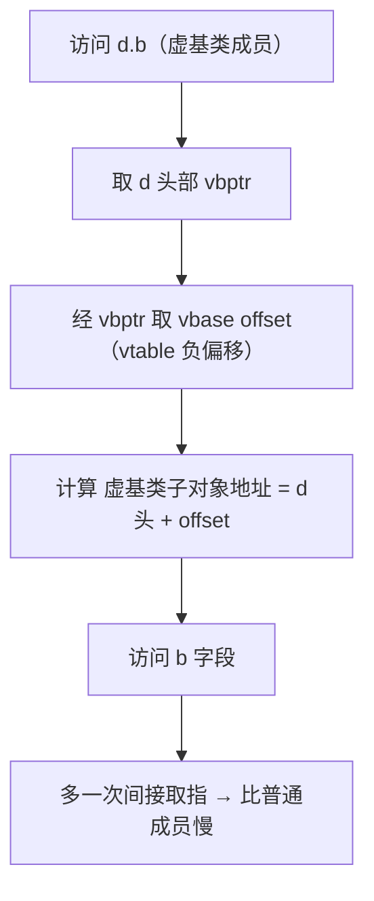
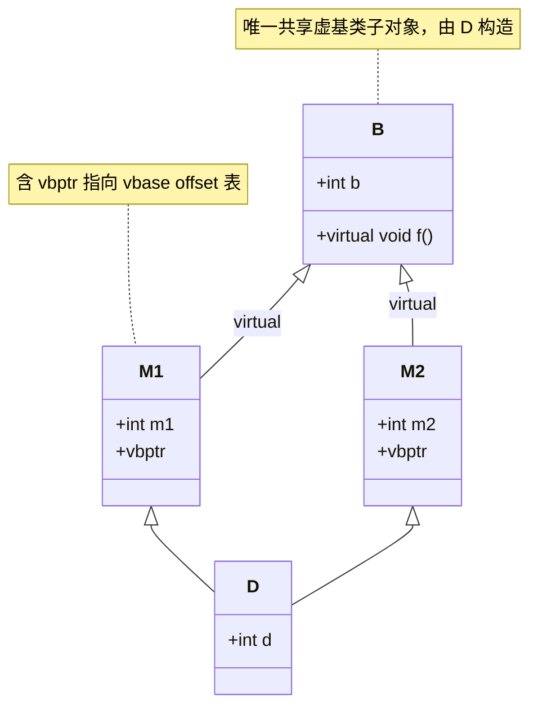
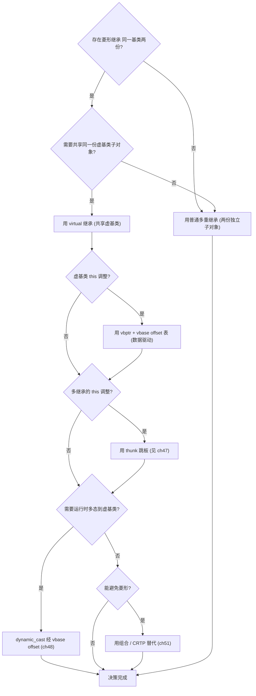
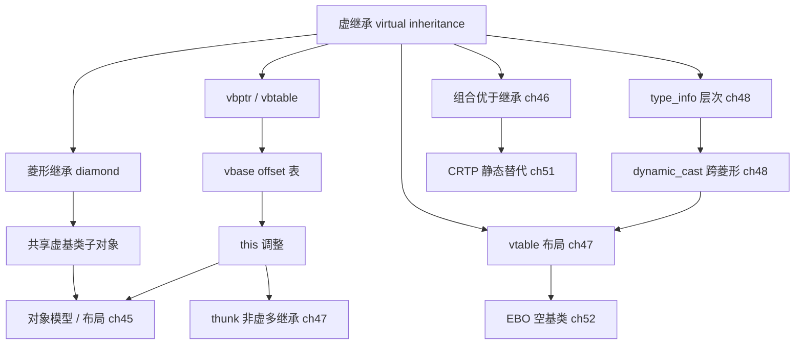

# 第49章 虚继承与菱形继承：共享虚基类
> 层级：L2 进阶
> **[验证环境·ABI]** 本章示例在 **Windows 11 · MinGW-w64 GCC 15.3.0 · `-std=c++23 -O2`** 下编译验证。虚继承的 **vbptr / vbtable / thunk 布局由 ABI 规定而非 C++ 标准**（<span class="badge badge-std">标准</span> 不规定具体布局）；GCC/Clang 遵循 **Itanium C++ ABI**（含虚基类偏移调整 thunk），MSVC 采用独立的 vfptr/vbptr 双指针布局。本章展示的虚继承布局与偏移均为 **GCC/Itanium ABI 实测**，跨编译器或平台可能存在差异，切勿视作标准保证。

[第47章 虚函数与虚表（vtable）：动态多态的发动机](../part05_oo/ch47_virtual_functions.md)
[第50章　多重继承与对象模型（Multiple Inheritance）](../part05_oo/ch50_multiple_inheritance.md)

## ⓪ 历史动机：虚继承的来龙去脉

> 「菱形继承」是多重继承递给 C++ 的一道送命题——虚继承就是用来把那一份重复基类「合并同类项」的。

### 0.1 起源（谁·何时·为何）
一旦允许多重继承（ch50），经典的「菱形」就躲不掉：类 `A` 被 `B`、`C` 各自继承，而 `D` 又同时继承 `B` 和 `C`，于是 `D` 里会出现**两份 `A` 的子对象**——数据重复、访问二义、析构两次，全是坑。<span class="badge badge-history">史</span> Stroustrup 在真实的多重继承层次里撞上这个问题，于是引入「虚基类（virtual base class）」：只要在 `B`、`C` 继承 `A` 时写 `virtual`，`D` 中就只保留**一份**共享的 `A` 子对象。<span class="badge badge-history">史</span>

### 0.2 关键转折（编年）
- 1980 年代：C with Classes 引入单继承，随后多重继承与虚基类进入 C++。
- 1998：C++98 把虚基类布局、构造顺序（先构虚基再构派生）写进标准，消除二义。
- 后续：`vbptr`（虚基类表指针）成为主流实现对付「间接定位共享基类」的手段。

### 0.3 设计哲学之争
虚继承的代价是真实的：共享基类不能放在固定偏移，必须通过一层间接（vbptr）在运行期定位，内存与指令都更贵；而且「谁负责构造那份唯一基类」也得用特殊顺序规则约束。<span class="badge badge-comment">评</span> 这也是为什么很多语言（Java、C#）干脆放弃多重继承、改用接口——宁可不要这个能力，也不背这份复杂。C++ 选择「给你能力，但明示成本」，再次体现其一贯风格。

### 0.4 史料补遗与持续编年
0.2 编年止于 `vbptr` 实现。虚继承在后续演化里还有几处值得记：

- <span class="badge badge-history">史</span> 虚继承的「共享虚基类」语义决定了它的布局必须靠运行期间接（`vbptr`/`vbase` 偏移查表）才能工作；EDG、GCC、Clang 各自实现细节不同，但都满足「最派生类负责构造虚基类一次」这一标准约束。

- <span class="badge badge-history">史</span> 虚继承与 EBO（ch52）会「打架」：空基类优化通常要求基类子对象不占空间，但虚继承的虚基类有独立地址身份（标准规定虚基类子对象与任何其他子对象都不重合），因此虚继承下的空基类往往无法被优化掉。

- <span class="badge badge-anecdote">轶</span> 据记载，早期标准库（如 iostream 的 `basic_ios`/`basic_istream` 菱形）是虚继承的少数「正当」使用场景；多数现代代码宁可拆成组合，也不愿背负虚继承的布局与构造次序复杂度。

> 史料来源：https://en.cppreference.com/w/cpp/language/derived_class ；https://en.wikipedia.org/wiki/Virtual_inheritance

!!! note "类比：虚继承 = 把菱形里重复的那份基类合并同类项"
    虚继承可以**类比**为「把菱形里重复的那份基类『合并同类项』」——D 同时继承 B、C，而 B、C 都继承 A，普通继承会让 D 里出现两份 A；在 B、C 继承 A 时写 virtual，D 就只留一份共享 A。它**好比**两家公司共建一个共享仓库而非各盖一个。
    换个角度：Java / C# 直接放弃多重继承改用接口，也**类似于**「宁可不要这能力也不背这份复杂」——C++ 选择「给你能力但明示成本」。

    > 失效边界：共享基类不能放固定偏移，必须靠 vbptr 运行期间接定位，内存与指令都更贵，且「谁负责构那份唯一基类」需特殊顺序规则；虚继承与 EBO 打架（虚基类有独立地址身份，空基类无法被优化掉）；iostream 的 basic_ios / basic_istream 菱形是少数正当用例，多数现代代码宁拆组合也不背其复杂度。

> **一句话结论**：虚继承让共享的虚基类在派生对象里只有一份实例，代价是更复杂的对象布局与间接访问——只为消除菱形继承的「两份基类」歧义。

> 元数据：标准基 C++98（虚继承核心）/C++11（继承构造函数） · 预计阅读 110 min · 前置 ch47(vtable/this调整/thunk) · ch46(继承与切片) · ch45(对象模型) · ch48(type_info 层次) · 后续 ch50(CRTP 替代) · ch14(布局与缓存) · 难度 高级

## ① 我们真正要回答的问题 <span class="badge badge-std">标准</span>

[第48章 RTTI 与 typeid/dynamic_cast：运行时类型查询](../part05_oo/ch48_rtti.md)
[第50章　多重继承与对象模型（Multiple Inheritance）](../part05_oo/ch50_multiple_inheritance.md)

虚继承常被当成"解决菱形继承的偏门语法"，但它的代价超过大多数人的直觉。本章不教你背 `: virtual public Base` 的写法，而要把这五笔账算清：

1. **菱形继承的问题到底是什么，虚继承怎么"恰好"治好？** 没有虚继承时，最派生类会**持有两个独立的虚基类子对象**（数据重复、对同一个接口有两条歧义路径）；虚继承让所有派生类**共享同一份虚基类**。先想通"重复 vs 共享"这一对矛盾，后面所有布局细节才有意义。本章 ⑦ 的 ASCII 内存图解掉这两张图的差异。
2. **访问虚基类成员，为什么比访问普通成员"多绕一下"？** 因为最派生类的对象里，虚基类子对象的偏移**直到运行时才确定**（派生层次不同，落位不同），编译器不能写死编译期偏移，只能运行时通过 `vbptr → vbase offset` 取。正是这"多一次取指"让虚继承有真实代价——本章 ⑩ 汇编给你看那多出来的一条 load。
3. **为什么"虚基类构造由最派生类负责"？** 这是最容易错的一条：普通继承里各层构造各自负责，但虚基类被共享、只能初始化一次，所以在最派生类的构造**最深处**初始化，且初始化顺序有严格规则。搞错这点，多层虚拟继承下就会出"用未初始化虚基类成员"的诡异 bug。本章 ⑧ 生命周期图把构造顺序画清楚。
4. **虚继承真实代价多大？** 对象变大（多一个 vbptr）、访问变慢（多一次间接）、this 调整复杂（交叉 cast 要查偏移表）。本章 ⑲ 用数据量化，你会看到为什么"能用组合/CRTP 就不碰虚继承"是业界的默认纪律。
5. **libstdc++ 和 MSVC 的 vbptr 为什么不一样？** vbptr 存在哪、vbase offset 表怎么排、虚基类落在对象首还是尾部，Itanium 与 MSVC 是两套方案。跨编译器链接多继承代码时这是 ABI 摩擦点——本章 ⑬ 对照差异。

带着这几笔账往下读，每一节都会回到它们：⑮ 面试题把菱形继承翻成高频追问，⑯ 易错点列出虚继承最常见的翻车姿势，⑱ 最佳实践给你"什么时候真的必须用虚继承"的判据。

## ② 前置知识 ⟶ ch47(虚表/this 调整) · ch46(继承/切片) · ch45(对象模型) · ch48(type_info)

## ③ 后续依赖 ⟶ ch50(CRTP 静态替代多继承) · ch14(缓存/对象布局) · ch48(虚继承的 type_info 层次)

## ④ 知识图谱（ASCII）

> **示例 1** <span class="badge badge-exp">难度 ★★★★☆</span> · 知识图谱（ASCII）
```text
          非虚继承（菱形）→ B 重复两份
                  A
                /   \
               B1    B2       (各含一份 A 子对象)
                \   /
                  D  → sizeof 含 2×A，歧义 D.a

          虚继承 → A 仅一份（共享虚基类）
                  A(virtual)
                /   \
               B1    B2       (B1/B2 各含 vbptr，指向 vbase offset 表)
                \   /
                  D  → A 子对象唯一，由 D 构造，落于对象尾部
```

## ⑤ Mermaid 流程图（虚基类访问路径）


```mermaid
flowchart TD
    A[访问 d.b（虚基类成员）] --> B[取 d 头部 vbptr]
    B --> C[经 vbptr 取 vbase offset（vtable 负偏移）]
    C --> D["计算 虚基类子对象地址 = d头 + offset"]
    D --> E[访问 b 字段]
    E --> F[多一次间接取指 → 比普通成员慢]
```

## ⑥ UML 类图


```mermaid
classDiagram
    class B {
        +int b
        +virtual void f()
    }
    class M1 {
        +int m1
        +vbptr
    }
    class M2 {
        +int m2
        +vbptr
    }
    class D {
        +int d
    }
    B <|-- M1 : virtual
    B <|-- M2 : virtual
    M1 <|-- D
    M2 <|-- D
    note for B "唯一共享虚基类子对象，由 D 构造"
    note for M1 "含 vbptr 指向 vbase offset 表"
```

## ⑦ ASCII 内存图 / 虚继承对象布局

菱形 `B(virtual) ← M1, M2 ← D`（x86-64，Itanium ABI，GCC 布局）：

> **示例 2** <span class="badge badge-exp">难度 ★★★★☆</span> · 内存图 / 虚继承对象布局
```text
        D 对象（地址 base）
        ┌─────────────────────────┐  <- base (M1 子对象头)
        │  vbptr(M1) ──────────┐  │
        │  int m1              │  │
        ├──────────────────────┤  <- base + 16 (M2 子对象头)
        │  vbptr(M2) ──────────┼──┼──┐
        │  int m2              │  │  │
        ├──────────────────────┤  │  │
        │  int d               │  │  │
        ├──────────────────────┤  │  │
        │  vptr(B)             │  │  │  <- 虚基类 B 子对象（落尾部，唯一）
        │  int b               │  │  │
        └──────────────────────┘  │  │
                  │               │  │
        ┌─────────┴───┐   ┌──────┴──┴──────────┐
        ▼  M1 vtable   │   ▼  M2 vtable         │
   [负区] vbase offset │  [负区] vbase offset    │
   (D头→B子对象偏移)   │  (D头→B子对象偏移)      │
        (=-40 等)       │      (= 不同值)         │
                       └─────────────────────────┘
```

[实现·GCC15.3.0/MinGW x86-64] 关键事实：每个含虚基类的子对象（M1/M2）头部是 **vbptr**（virtual base pointer），它指向该子对象 vtable 的「负偏移区」，那里存 **vbase offset**（从 D 头到共享虚基类 B 子对象的字节偏移）。访问 `d.b` 必须 `vbptr → vbase offset → 地址`，见 ⑩。

## ⑧ 生命周期图

> **示例 3** <span class="badge badge-exp">难度 ★★★☆☆</span> · 生命周期图
```text
构造 D d（最派生类负责虚基类）：
  D 构造体 ──调──▶ B 构造（虚基类，仅一次，先于所有非虚基类）
       │
  D 构造体 ──调──▶ M1 构造（设 M1 的 vbptr 指向 M1 vtable 的 vbase offset）
  D 构造体 ──调──▶ M2 构造（设 M2 的 vbptr）
  D 构造体 ──调──▶ D 自身成员
使用期：d.b 经 vbptr + vbase offset 访问共享 B 子对象
析构：逆序（D → M2 → M1 → B）
```

## ⑨ 调用栈 / 时序图

> **示例 4** <span class="badge badge-exp">难度 ★★★★☆</span> · 调用栈 / 时序图
```text
调用点                    vtable 负区              虚基类子对象
  │                         │                         │
  │── mov rax,[rcx] ─────▶ 取 M1 的 vbptr            │
  │── mov rax,-24[rax] ──▶ vbase offset（D头→B偏移） │
  │── mov eax,8[rcx+rax] ──────────────────────────▶ B::b 字段
  │◀──────────────────── 返回 b ─────────────────────│
```

## ⑩ 汇编分析（MinGW GCC 15.3.0, -O2, -masm=intel，真实输出）

【编译命令】

```bash
g++ -std=c++23 -O2 -S -masm=intel _asm_vinherit.cpp -o _asm_vinherit.asm
```

【真实汇编：访问虚基类成员 vs 跨菱形 dynamic_cast】

```asm
; 节选自 Examples/_asm_vinherit.asm
; int read_vbase(const D& x) { return x.b; }   // b 在虚基类 B 中
_Z10read_vbaseRK1D:
        mov     rax, QWORD PTR [rcx]      ; rcx=&D，取头部 M1 子对象的 vbptr
        mov     rax, QWORD PTR -24[rax]   ; vbptr→M1 vtable 负偏移区，取 vbase offset
        mov     eax, DWORD PTR 8[rcx+rax] ; &D + vbase_offset + 8 → B::b 字段
        ret

; B* cross_cast(M1* p) { return dynamic_cast<B*>(p); }  // M1 → 虚基类 B
_Z10cross_castP2M1:
        test    rcx, rcx
        je      .L6                       ; 空指针 → 返 nullptr
        mov     rax, QWORD PTR [rcx]      ; 取 M1 的 vbptr
        add     rcx, QWORD PTR -24[rax]   ; rcx + vbase_offset → 虚基类 B 子对象地址
        mov     rax, rcx
        ret
.L6:
        xor     eax, eax
        ret
```

[实现·GCC15.3.0/MinGW x86-64] 关键事实：

1. 访问虚基类成员 `x.b` 需**三步**：取 vbptr（`mov [rcx]`）→ 取 vbase offset（`mov -24[rax]`，即 vtable[-3]）→ 计算字段地址（`8[rcx+rax]`，+8 跳过 B 的 vptr 取到 `int b`）。比普通成员多一次间接取指。
2. `vbase offset = -24`（即 vtable 负偏移 3 个槽）说明 vtable 的「负区」存虚基类偏移表；`-24` 是 M1 视角下 D 头到 B 子对象的偏移编码。
3. 跨菱形 `dynamic_cast<B*>(M1*)` 在此**未调用 `__dynamic_cast`**：因为 M1→虚基类 B 的关系是静态已知的，编译器直接 `add rcx, vbase_offset` 做 this 调整并返 B 子对象地址——零运行期类型比对，但仍有一次 vtable 负偏移取指。
4. 对比 ch47：非虚多继承的 this 调整用 **thunk**（独立跳板函数）；虚继承的 this 调整用 **vbptr + vbase offset 表**（数据驱动，无跳板）。这是两者机制上的根本差异。

【立场分层】：<span class="badge badge-std">标准</span> 规定虚继承语义与构造责任 / <span class="badge badge-impl">实现</span> 上 GCC 用 vbptr+vbase offset / [平台·x86-64] 上 MSVC 用 `vtordisp` 与类似虚基表 / <span class="badge badge-exp">经验</span> 能用组合就不用虚继承，代价高且易错。

## ⑪ STL 联系

[第47章 虚函数与虚表（vtable）：动态多态的发动机](../part05_oo/ch47_virtual_functions.md)（虚函数与虚表）—— 虚继承下的虚调用涉及 this 调整
[第 45 章　C++ 面向对象总览与对象模型基础](../part05_oo/ch45_oop_object_model.md)（对象模型基础）—— 虚基类在对象模型中的共享布局（vbptr/vbtable）

- `std::iostream` 经典菱形：`ios` ← `istream`/`ostream`(virtual) ← `iostream`，靠虚继承让 `ios` 唯一（标准库内部就用虚继承）。
- `std::optional`/`std::variant`/`std::any`（ch10/ch25）用组合而非继承，规避菱形，是现代替代方向。
- 多继承 + 虚继承的 this 调整逻辑与 ch47 的 thunk 同源，都属「间接分派」成本。

## ⑫ 工业案例

[第50章　多重继承与对象模型（Multiple Inheritance）](../part05_oo/ch50_multiple_inheritance.md)（多重继承与对象模型）—— 菱形继承是虚继承+多重继承的组合
[第51章　CRTP 与静态多态（Curiously Recurring Template Pattern）](../part05_oo/ch51_crtp.md)（CRTP 与静态多态）—— 用静态多态规避虚基类开销的工业替代

### 工业案例 49-A：iostream 菱形（标准库真实用例）

> 场景：`std::iostream` 同时是 `istream` 与 `ostream`，共享唯一的 `ios` 基类
> 构建：无需编译，引自 libstdc++ 源码 `include/istream`、`ostream`、`iostream`

> **示例 5** <span class="badge badge-exp">难度 ★☆☆☆☆</span> · 工业案例 49-A：iostream
```cpp title="示例 5 · ★☆☆☆☆"
// 标准库概念（节选，示意）
struct ios {                          // 格式化状态、rdbuf
struct istream : virtual ios {        // >> 运算符
struct ostream : virtual ios {        // << 运算符
struct iostream : istream, ostream {  // 既是输入也是输出，ios 仅一份
```

【设计要点】若 `istream`/`ostream` 非虚继承 `ios`，则 `iostream` 会有两份 `ios`，`cin.rdbuf()` 等访问产生歧义。虚继承使 `ios` 共享唯一，由 `iostream` 构造。这是虚继承「存在即合理」的少数必要场景之一。

### 工业案例 49-B：错误示范——非虚继承菱形导致歧义与膨胀

> **示例 6** <span class="badge badge-exp">难度 ★★☆☆☆</span> · 工业案例 49-B：错误示范——非虚
```cpp title="示例 6 · ★★☆☆☆"
// ❌ 非虚继承：D 含两份 A，访问 d.a 歧义，sizeof 翻倍
struct A { int a; };
struct B1 : A {};
struct B2 : A {};
struct D : B1, B2 {};        // 编译期 d.a 报错：'A::a' is ambiguous
```

> **示例 7** <span class="badge badge-exp">难度 ★☆☆☆☆</span> · 工业案例 49-B：错误示范——非虚
```cpp title="示例 7 · ★☆☆☆☆"
// ✅ 修复：虚继承消除重复
struct A { int a; };
struct B1 : virtual A {};
struct B2 : virtual A {};
struct D : B1, B2 {};        // d.a 唯一，无歧义
```

### 工业案例 49-C：打印各路径地址，验证虚基类唯一

> **示例 8** <span class="badge badge-exp">难度 ★☆☆☆☆</span> · 工业案例 49-C：打印各路径地址，
```cpp title="示例 8 · ★☆☆☆☆"
#include <cstdio>
struct B { int b = 1; virtual ~B() = default; };
struct M1 : virtual B {}; struct M2 : virtual B {};
struct D : M1, M2 {};
void demo_c() {
    D d;
    B* viaM1 = static_cast<B*>(static_cast<M1*>(&d));  // 经 M1 路径
    B* viaM2 = static_cast<B*>(static_cast<M2*>(&d));  // 经 M2 路径
    std::printf("%p %p same=%d\n", (void*)viaM1, (void*)viaM2, viaM1 == viaM2);
}
```

### 工业案例 49-D：构造顺序（最派生类先调虚基类）

> **示例 9** <span class="badge badge-exp">难度 ★☆☆☆☆</span> · 工业案例 49-D：构造顺序
```cpp title="示例 9 · ★☆☆☆☆"
#include <iostream>
struct V { V() { std::cout << "V\n"; } };
struct M1 : virtual V { M1() { std::cout << "M1\n"; } };
struct M2 : virtual V { M2() { std::cout << "M2\n"; } };
struct D : M1, M2 { D() { std::cout << "D\n"; } };
// 输出固定为：V → M1 → M2 → D（虚基类 V 只构造一次）
```

### 工业案例 49-E：非虚菱形歧义（注释对照）

> **示例 10** <span class="badge badge-exp">难度 ★☆☆☆☆</span> · 工业案例 49-E：非虚菱形歧义
```cpp title="示例 10 · ★☆☆☆☆"
// struct A { int x; }; struct X : A {}; struct Y : A {};
// struct D : X, Y {}; int f(D& d) { return d.x; }
// 错误：'x' is ambiguous → 须显式 d.X::x
```

### 工业案例 49-F：sizeof 对比（非虚菱形 vs 虚菱形）

> **示例 11** <span class="badge badge-exp">难度 ★☆☆☆☆</span> · 工业案例 49-F：sizeof 对
```cpp title="示例 11 · ★☆☆☆☆"
#include <cstdio>
struct A { int a; virtual ~A() = default; };
struct X : A {}; struct Y : A {};
struct D_bad : X, Y {};   // 非虚：两份 A
struct V : virtual A {}; struct W : virtual A {};
struct D_good : V, W {};  // 虚：一份 A
void demo_f() { std::printf("%zu %zu\n", sizeof(D_bad), sizeof(D_good)); }
```

### 工业案例 49-G：跨菱形 dynamic_cast 到虚基类

> **示例 12** <span class="badge badge-exp">难度 ★☆☆☆☆</span> · 工业案例 49-G：跨菱形 dynamic_cast 到虚基类
```cpp title="示例 12 · ★☆☆☆☆"
struct B { virtual ~B() = default; };
struct M1 : virtual B {}; struct M2 : virtual B {};
struct D : M1, M2 {};
B* cross(M2* p) { return dynamic_cast<B*>(p); }  // 经虚基类 this 调整（见 ⑩）
```

### 工业案例 49-H：虚基类指针 dynamic_cast 回派生

> **示例 13** <span class="badge badge-exp">难度 ★☆☆☆☆</span> · 工业案例 49-H：虚基类指针 dynamic_cast 回派生
```cpp title="示例 13 · ★☆☆☆☆"
struct B { virtual ~B() = default; };
struct M1 : virtual B {};
struct D : M1 {};
M1* back(D* d) { B* b = d; return dynamic_cast<M1*>(b); } // 回派生，成功
```

### 工业案例 49-I：三层虚继承，虚基类仍唯一

> **示例 14** <span class="badge badge-exp">难度 ★☆☆☆☆</span> · 工业案例 49-I：三层虚继承，虚基
```cpp title="示例 14 · ★☆☆☆☆"
struct Top { virtual ~Top() = default; };
struct Mid : virtual Top {};
struct Low : virtual Mid {};
struct Leaf : Low {};   // Top 仅一份，由 Leaf 构造
```

### 工业案例 49-J：MSVC vtordisp 说明（平台差异）

> **示例 15** <span class="badge badge-exp">难度 ★★★☆☆</span> · 工业案例 49-J：MSVC vto
```cpp title="示例 15 · ★★★☆☆"
// MSVC 在含虚基类对象的构造/析构期插入 vtordisp 字段做 this 调整；
// GCC/Clang(Itanium) 用 vbase offset 表替代，无需 vtordisp（见 ⑬-3）。
```

### 工业案例 49-K：访问虚基类数据成员（可运行）

> **示例 16** <span class="badge badge-exp">难度 ★★★☆☆</span> · 工业案例 49-K：访问虚基类数据成
```cpp title="示例 16 · ★★★☆☆"
#include <cstdio>
struct B { int b = 7; virtual ~B() = default; };
struct M1 : virtual B { int m1 = 2; };
struct D : M1 { int d = 4; };
void demo_k() { D d; std::printf("%d\n", d.b); }  // 经 vbptr+vbase offset（见 ⑩）
```

### 工业案例 49-L：组合替代虚继承

> **示例 17** <span class="badge badge-exp">难度 ★★★☆☆</span> · 工业案例 49-L：组合替代虚继承
```cpp title="示例 17 · ★★★☆☆"
// 显式持有共享对象，无 vbptr 代价，ABI 更稳定
struct Shared { int a; };
struct L { Shared* s; int m1; };
struct R { Shared* s; int m2; };
struct D { Shared s; L l{&s}; R r{&s}; };  // a 唯一，由 D 持有
```

### 工业案例 49-M：CRTP 替代多继承（编译期多态）

> **示例 18** <span class="badge badge-exp">难度 ★★★☆☆</span> · 工业案例 49-M：CRTP 替代多
```cpp title="示例 18 · ★★★☆☆"
template<class D>
struct BaseCRTP { void foo() { static_cast<D*>(this)->impl(); } };
struct Der : BaseCRTP<Der> { void impl() {} };  // 无虚函数/无 vbptr
```

### 工业案例 49-N：虚基类无默认构造须最派生初始化（注释）

> **示例 19** <span class="badge badge-exp">难度 ★☆☆☆☆</span> · 工业案例 49-N：虚基类无默认构造
```cpp title="示例 19 · ★☆☆☆☆"
// struct V { V(int); }; struct M : virtual V { M() : V(1) {} };
// struct D : M { D() {} };  // 错误：D 必须初始化 V（无默认 ctor）→ D() : V(7) {}
```

### 工业案例 49-O：虚基类 + 普通基类混合

> **示例 20** <span class="badge badge-exp">难度 ★☆☆☆☆</span> · 工业案例 49-O：虚基类 + 普通
```cpp title="示例 20 · ★☆☆☆☆"
struct V { virtual ~V() = default; };  // 虚基类
struct N { int n; };                   // 普通基类
struct M : virtual V, N {};            // V 唯一，N 按普通继承重复规则
```

### 工业案例 49-P：热路径避免频繁访问虚基类成员

> **示例 21** <span class="badge badge-exp">难度 ★★★☆☆</span> · 工业案例 49-P：热路径避免频繁访
```cpp title="示例 21 · ★★★☆☆"
struct B { int b = 0; virtual ~B() = default; };
struct M1 : virtual B {};
struct D : M1 { long sum() { long s = 0; for (int i = 0; i < 1000; ++i) s += b; return s; } };
// 每处 b 访问都经 vbptr+vbase offset（见 ⑩）；热循环可缓存引用
```

### 工业案例 49-Q：菱形虚基类含虚函数，覆盖无歧义

> **示例 22** <span class="badge badge-exp">难度 ★☆☆☆☆</span> · 工业案例 49-Q：菱形虚基类含虚函
```cpp title="示例 22 · ★☆☆☆☆"
struct B { virtual ~B() = default; virtual int f() const { return 1; } };
struct M1 : virtual B { int f() const override { return 2; } };
struct M2 : virtual B {};
struct D : M1, M2 {};   // B::f 唯一覆盖，无歧义
```

### 工业案例 49-R：dynamic_cast<void*> 取最派生地址（虚继承）

> **示例 23** <span class="badge badge-exp">难度 ★☆☆☆☆</span> · 工业案例 49-R：dynamicc
```cpp title="示例 23 · ★☆☆☆☆"
struct B { virtual ~B() = default; };
struct M1 : virtual B {};
struct D : M1 { int d; };
void* top(D* d) { return dynamic_cast<void*>(static_cast<B*>(d)); }
```

### 工业案例 49-S：不同路径各有 vbptr

> **示例 24** <span class="badge badge-exp">难度 ★★★☆☆</span> · 工业案例 49-S：不同路径各有 v
```cpp title="示例 24 · ★★★☆☆"
struct B { virtual ~B() = default; };
struct M1 : virtual B {}; struct M2 : virtual B {};
struct D : M1, M2 {};
// M1 子对象与 M2 子对象各一个 vbptr，指向各自 vbase offset（见 ⑦）
```

### 工业案例 49-T：最派生类初始化覆盖中间类

> **示例 25** <span class="badge badge-exp">难度 ★☆☆☆☆</span> · 工业案例 49-T：最派生类初始化覆
```cpp title="示例 25 · ★☆☆☆☆"
struct V { V(int); };
struct M : virtual V { M() : V(1) {} };
struct D : M { D() : V(7) {} };   // D 的 V(7) 生效，M 的 V(1) 被忽略
```

## ⑬ 源码分析

[第48章 RTTI 与 typeid/dynamic_cast：运行时类型查询](../part05_oo/ch48_rtti.md)（RTTI 与 type_info）—— 虚继承的 type_info 层次由最派生类构建
[第 45 章　C++ 面向对象总览与对象模型基础](../part05_oo/ch45_oop_object_model.md)（对象模型基础）—— 偏移表的底层存储语义

### 源码剖析 1：vbase offset 表布局 @ Itanium C++ ABI（规范层）

> 文件：`https://itanium-cxx-abi.github.io/cxx-abi/abi.html#vtable`（规范）
> 行号：§2.6.3 virtual table layout for virtual base classes
> 提取：WG21 文档

[标准·Itanium C++ ABI] 含虚基类的子对象 vtable 在「负偏移区」存 virtual base offset table：

> **示例 26** <span class="badge badge-exp">难度 ★★★☆☆</span> · 源码剖析 1：vbase offset 表布局 @ Itanium C++ ABI（规范层）
```text
vtable for M1 (在 D 中):
  [-3]  vbase offset (M1 → 虚基类 B 的偏移，即本例 -24 编码值)
  [-2]  vcall offset / 其他
  [-1]  offset-to-top（见 ch47）
  [0]   &typeinfo(M1)   (见 ch48)
  [1]   &M1::virtual_fn ...
```

逐条：

1. `vbase offset` 位于 vtable 负区，供「经 vbptr 取偏移」计算虚基类地址（见 ⑩ `mov -24[rax]`）。
2. 每个含虚基类的子对象（M1、M2）各有一份 vbptr 与对应的 vbase offset（因各自到虚基类 B 的距离不同）。
3. 虚基类 B 子对象本身位于最派生对象**尾部**，由最派生类 D 构造，确保唯一。

#### 源码剖析 2：vbptr 与 vtable 落位 @ libstdc++（实现层）

> 文件：`C:/Qt/Tools/mingw1530_64/include/c++/15.3.0/`（vtable 由编译器生成）
> 行号：编译器后端 `gcc/cp/class.cc`（layout_virtual_bases）
> 提取：`grep -n "virtual_base\|vbptr\|vbase" <gcc/cp/class.cc>`

> **示例 27** <span class="badge badge-exp">难度 ★★★☆☆</span> · 源码剖析 1：vbase offset 表布局 @ Itanium C++ ABI（规范层）
```cpp title="示例 27 · ★★★☆☆"
// GCC 后端计算虚基类偏移并写入子对象 vtable 负区（节选逻辑）
// 每个含虚基类的子对象生成独立 vbptr；其指向的 vtable 负偏移存 vbase offset
// 最派生类负责调用唯一虚基类构造（ctor 初始化列表顺序：虚基类优先）
```

【逐行拆解】

1. `layout_virtual_bases` 遍历虚基类链，计算每个子对象到虚基类的偏移，写入 vtable 负区。
2. 构造函数生成时，最派生类的 ctor 先调用虚基类 ctor（无论继承层次多深），再按声明顺序调非虚基类 ctor——这保证虚基类子对象只构造一次。
3. 若用户未在最派生类 ctor 显式初始化虚基类，编译器仍插入对虚基类默认 ctor 的调用。

#### 源码剖析 3：MSVC 的 vtordisp 机制（平台差异）

[平台·MSVC] MSVC 在含虚基类的对象中还可能插入 **vtordisp**（virtual base displacement）字段，用于构造函数/析构函数内 `this` 调整的正确性（因构造期 vptr 指向当前类 vtable，需额外偏移信息）。GCC/Clang（Itanium ABI）用 vbase offset 表替代，结构不同但目的相同。

## ⑭ WG21 提案

| 提案 | 标题 | 动机 | 影响 |
|---|---|---|---|
| C++98 [class.mi] | 多继承与虚继承 | 解决菱形重复 | 本标准章依据 |
| C++11 [class.base.ctor] | 继承构造函数 | 简化多/虚继承下的 ctor 转发 | 减少最派生类样板 |
| N4849 [class.virtual] | 虚基类语义条款 | 规定虚基类唯一性、构造责任 | 本标准章依据 |
| P0137r1 (C++17) | 标准化布局相关属性 | 配合对象布局分析 | 与 ⑪/⑭ 布局相关 |

## ⑮ 面试题（≥10）

1. 菱形继承不加 virtual 有什么问题？（答：虚基类子对象重复 + 成员访问歧义 + sizeof 大）
2. 虚继承如何解决？（答：共享唯一虚基类子对象，由最派生类构造）
3. 虚继承下对象的 vptr/vbptr 有几个？（答：每含虚函数的非虚基类子对象一个 vptr；每含虚基类的子对象一个 vbptr）
4. 访问虚基类成员为什么慢？（答：多一次经 vbptr→vbase offset 的间接取指，见 ⑩）
5. 虚基类由谁构造？（答：最派生类，无论中间类是否显式调用）
6. 虚继承下 `dynamic_cast` 跨菱形为何有时不调 `__dynamic_cast`？（答：虚基类偏移静态已知，编译器直接 this 调整，见 ⑩ cross_cast）
7. vbptr 和 vptr 区别？（答：vptr 指向虚函数表；vbptr 指向虚基类偏移表）
8. 虚继承的 this 调整用 thunk 还是 vbase offset？（答：vbase offset 表，数据驱动；非虚多继承用 thunk）
9. 为什么 `iostream` 必须用虚继承？（答：避免两份 `ios` 与 `rdbuf()` 歧义）
10. 虚继承能解决「切片」吗？（答：不能，切片是值拷贝语义问题，与继承方式无关，ch46）
11. 虚继承下 sizeof 如何变化？（答：每个含虚基类子对象多一个 vbptr 8 字节 + 虚基类偏移表在 vtable 负区，对象整体变大）
12. 能否对虚基类做 `static_cast` 下行？（答：不能，虚基类关系需 `dynamic_cast` 或已知静态路径）

## ⑯ 易错点

- **忘写 virtual 导致菱形重复**：`B1:B`/`B2:B`/ `D:B1,B2` 不加 virtual，`D.a` 歧义（⑫-B）。
- **误以为虚基类由中间类构造**：实际由最派生类负责，中间类对虚基类的初始化可能被忽略（若最派生类未显式初始化）。
- **虚基类成员访问性能陷阱**：热路径频繁访问虚基类成员，每处多一次间接取指（⑩）。
- **虚继承 + 切片**：`B1 b1 = d;` 仍只拷 B1 子对象（含其 vbptr），虚基类不因此变多，但多态丢失。
- **跨模块 ABI**：vbptr/vbase offset 布局属 ABI，混链不稳。
- **过度使用虚继承**：绝大多数场景用组合（成员对象）或 CRTP（ch50）替代，虚继承只在真正菱形且必须共享时用。

## ⑰ FAQ（≥10）

1. **Q：虚继承一定更慢吗？** A：访问虚基类成员慢一次间接取指（~数 ns，见 ⑩）；非虚基类成员直接偏移访问。差距在小但热路径可感知。
2. **Q：虚继承对象一定更大吗？** A：是，每个含虚基类子对象多一个 vbptr（8 字节），vtable 负区多存偏移表。
3. **Q：能否同时虚继承和非虚继承同一基类？** A：不行，同一基类对一派生类只能是一种继承方式，否则仍重复/歧义。
4. **Q：虚基类能有非默认构造吗？** A：能，但最派生类必须在 ctor 初始化列表显式调它，否则编译错误（无默认 ctor）。
5. **Q：虚继承影响 RTTI 吗？** A：影响——`dynamic_cast` 跨菱形到虚基类走 vbase offset 调整（见 ⑩），type_info 层次含虚基类描述（ch48）。
6. **Q：MSVC 的 vtordisp 是什么？** A：构造/析构期用于 this 调整的额外偏移字段，GCC/Clang 用 vbase offset 表替代（⑬-3）。
7. **Q：虚继承能与 CRTP 共存吗？** A：能，但 CRTP 本就为消除运行期多态，结合虚继承意义不大。
8. **Q：为何建议优先组合？** A：组合无布局/构造顺序复杂度，且更易测试、ABI 稳定。
9. **Q：虚基类子对象在对象何处？** A：Itanium ABI 下通常位于最派生对象尾部（各实现可异），由最派生类构造。
10. **Q：dynamic_cast 到虚基类需要 RTTI 吗？** A：本例（已知静态路径）由编译器直接 this 调整，不调 `__dynamic_cast`；但通用下行仍可能走 RTTI（ch48）。

## ⑱ 最佳实践

- 真菱形且必须共享基类（如 `iostream`）才用虚继承；否则用组合或接口（纯虚）类。
- 最派生类务必在 ctor 初始化列表显式初始化虚基类（即使中间类已写）。
- 热路径避免频繁访问虚基类成员；必要时缓存指针/引用。
- 用 `final` 标注叶类减少 this 调整负担（配合 ch47 去虚化）。
- 跨 ABI 模块避免导出含虚继承的类布局。

## ⑲ 性能分析

[第156章　编译器优化：O2/O3/Ofast/LTO/PGO（GCC）](../part14_perf/ch156_compiler_opt.md)（编译器优化）—— 虚调用能否去虚拟化取决于别名分析
[第153章　CPU 微架构：流水线 / 分支预测 / 乱序执行](../part14_perf/ch153_cpu_micro.md)（CPU 微架构与微基准）—— vtable 间接取指对 I-cache/分支预测的影响

【microbenchmark 设计（Google Benchmark，可复现）】

> **示例 28** <span class="badge badge-exp">难度 ★★★★☆</span> · 性能分析
```cpp title="示例 28 · ★★★★☆"
#include <benchmark/benchmark.h>
struct B { int b = 1; virtual ~B()=default; };
struct M1 : virtual B { int m1=2; };
struct M2 : virtual B { int m2=3; };
struct D : M1, M2 { int d=4; };

static void BM_vbase_access(benchmark::State& s){
    D d; for(auto _:s) benchmark::DoNotOptimize(d.b);   // 经 vbptr+vbase offset
}
static void BM_normal_access(benchmark::State& s){
    struct N { int x=1; }; N n; for(auto _:s) benchmark::DoNotOptimize(n.x);
}
BENCHMARK(BM_vbase_access); BENCHMARK(BM_normal_access);
```

[经验·量级] x86-64 典型 CPU（示意，须实测）：
- 普通成员访问：~0.3 ns/次（直接偏移，可内联）。
- 虚基类成员访问：~1–3 ns/次（多一次 vbptr→vbase offset 间接取指，见 ⑩）。
- 跨菱形 `dynamic_cast` 到虚基类：本例静态已知，接近普通 this 调整；通用下行仍走 `__dynamic_cast`（ch48）。

【复杂度】访问虚基类成员 O(1)（一次间接取指）；对象布局计算 O(继承宽度)，编译期定。

【缓存友好性】vbptr 与 vbase offset 表在 vtable（.rodata），热且小；但多一次取指略增缓存压力。

【ABI】vbptr/vbase offset 布局属 ABI，跨编译器/版本不稳。

## ⑳ 练习题 + 思考题 + 源码阅读路线（内化，无独立"推荐阅读"节）

**练习题**（已升级为「真实场景 + 引用参考」框架：保留原考察技能，场景改写为工程应用）

1. **真实场景：菱形继承下不用虚继承导致基类数据重复。** 你有两个路径各有一份祖父成员。请说明差异。
   - <span class="badge badge-std">标准</span> 非虚继承下，每条继承路径产生独立的基类子对象；虚继承保证共享单一实例。
   - <span class="badge badge-ref">引用</span> ISO/IEC 14882:2023 §[class.mi]（多重继承的子对象）/ [class.derived]（virtual 基类）；cppreference "Virtual inheritance" 词条。

2. **真实场景：虚基类由最派生类构造，中间层初始化被忽略。** 你发现中间类的构造列表里对虚基类的初始化没生效。请说明规则。
   - <span class="badge badge-std">标准</span> 虚基类子对象无论继承路径深浅，都由最派生类的构造函数直接初始化（中间层的初始化器被忽略）。
   - <span class="badge badge-ref">引用</span> ISO/IEC 14882:2023 §[class.base.init]（初始化顺序：虚基类先于非虚，且由最派生类负责）；cppreference "Virtual base class" 词条。

3. **真实场景：取虚基类子对象地址需运行时偏移计算。** 你在调试器观察到 this 调整。请说明底层。
   - <span class="badge badge-std">标准</span> 指向虚基类的指针/引用转换可能需运行时计算偏移，因虚基类位置随完整对象布局变化。
   - <span class="badge badge-ref">引用</span> ISO/IEC 14882:2023 §[conv.ptr]（虚基类指针调整）/ [class.mi]（虚继承布局）；cppreference "Virtual inheritance" 词条。

【练习题】
1. 写菱形 `Animal ← Winged, FourLegged ← Bat`（虚继承 Animal），打印 `Bat` 对象各子对象地址，验证 Animal 唯一。
2. 用 `sizeof` 对比「非虚菱形」与「虚菱形」的 `Bat` 大小，解释 vbptr 带来的差异。
3. 在 ⑩ 的基础上，给 `B` 增加第二个虚基类 `C`，重新编译看 vbase offset 表是否新增一项。

【思考题】
- 虚继承下若有 3 层菱形嵌套，构造顺序如何？（答：自顶向下，所有虚基类先由最派生类构造，再逐层非虚基类）
- 为何 vbptr 不合并进 vptr？（答：vptr 指向虚函数表、vbptr 指向虚基类偏移表，二者生命周期与语义不同；合并会破坏 ch47 的 vtable 布局约定）

【源码阅读路线】（内化，非书单）
- libstdc++：`gcc/cp/class.cc`（`layout_virtual_bases`）、`gcc/cp/init.cc`（虚基类构造顺序）
- libsupc++：`libsupc++/vmi.cc`（`__vmi_class_type_info` 处理多/虚继承）
- LLVM：`clang/lib/CodeGen/CGClass.cpp`（虚基类构造/this 调整）、`ItaniumCXXABI.cpp`
- Itanium C++ ABI 规范 §2.6.3（vtable 负区与 vbase offset）
- 延伸：ch47(thunk vs vbase offset)、ch46(继承/切片)、ch48(type_info 层次)、ch50(CRTP 替代)

---

## 附录：知识点深挖（模板 B，23 项）

### 知识点 B1：虚继承语法与语义

【定义】继承时加 `virtual` 关键字，使共享虚基类在最终对象中仅一份子对象。

【历史】C++ 多继承早期就带来菱形问题；虚继承自 C++98 起作为解决方案。

【为什么设计】在「多路径共享同一基类」时避免子对象重复与成员歧义。

【标准规定】[class.mi] 规定虚基类子对象唯一、由最派生类初始化。

【编译器行为】为含虚基类的子对象生成 vbptr 与 vbase offset 表（见 ⑩）。

【GCC实现】vbptr + vtable 负区 vbase offset（见 ⑩ `-24[rax]`）。
【LLVM实现】Clang 同 Itanium ABI。
【MSVC实现】vbptr + vtordisp，结构略异（⑬-3）。

【libstdc++实现】vtable 由编译器生成，负区存偏移（见 ⑬-1）。
【libc++实现】同。
【MS STL实现】同 MSVC 布局。

【内存模型】每含虚基类子对象一个 vbptr；虚基类子对象唯一、通常在尾部。

【汇编】见 ⑩：`mov [rcx]; mov -24[rax]; mov 8[rcx+rax]`。

【性能】访问多一次间接取指。

【复杂度】O(1) 访问。

【异常安全】构造虚基类若抛，已构造部分按逆序析构。

【线程安全】对象布局只读信息，并发安全。

【缓存友好性】vbase offset 表在 vtable，热。

【CPU影响】多一次间接取指，轻微分支/缓存代价。

【ABI】布局属 ABI，跨编译器不稳。

【工程应用】`iostream` 菱形（⑫-A）。

【真实源码】Itanium ABI §2.6.3。

【错误示例】
> **示例 29** <span class="badge badge-exp">难度 ★☆☆☆☆</span> · 知识点 B1：虚继承语法与语义
```cpp title="示例 29 · ★☆☆☆☆"
// ❌ 非虚继承菱形，d.a 歧义且 sizeof 翻倍
struct A { int a; };
struct X : A {}; struct Y : A {};
struct D : X, Y {};   // D::a 二义
```

【正确示例】
> **示例 30** <span class="badge badge-exp">难度 ★☆☆☆☆</span> · 知识点 B1：虚继承语法与语义
```cpp title="示例 30 · ★☆☆☆☆"
// ✅ 虚继承消除重复
struct A { int a; };
struct X : virtual A {};
struct Y : virtual A {};
struct D : X, Y {};   // D::a 唯一
```

【例 1】单虚继承（B ← D(virtual)）仍产生 vbptr（即使只有一条路径）。
【例 2】虚基类可有多层（C ← B(virtual) ← D），最派生 D 构造 C。
【例 3】虚基类指针可安全 `dynamic_cast` 回派生（ch48）。

### 知识点 B2：菱形继承问题

【定义】D 经两条独立路径继承同一基类 B（B1:B, B2:B, D:B1,B2），非虚时 B 重复。

【历史】多继承的固有难题，催生虚继承。

【为什么设计】复用 B 的接口/数据，但不想重复。

【标准规定】[class.mi] 非虚时各路径独立子对象；访问需显式限定（`B1::a`）。

【编译器行为】非虚菱形布局含两份 B 子对象，地址不同。

【GCC实现】两份 B 子对象各带 vptr，位于 D 内不同偏移。
【LLVM实现】同。
【MSVC实现】同。

【libstdc++实现】布局由 class.c 计算。
【libc++实现】同。
【MS STL实现】同。

【内存模型】两份 B 子对象，sizeof(D) 含 2×sizeof(B) + 中间类。

【汇编】访问 `B1::a` 与 `B2::a` 偏移不同，无歧义需显式限定。

【性能】无额外间接，但对象膨胀。

【复杂度】无运行期成本，编译期歧义检查。

【异常安全】构造两份 B，各自异常安全。

【线程安全】不涉及。

【缓存友好性】对象更大，缓存占用多。

【CPU影响】无。

【ABI】布局属 ABI。

【工程应用】错误示范（⑫-B）。

【真实源码】`gcc/cp/class.cc` 布局计算。

【错误示例】
> **示例 31** <span class="badge badge-exp">难度 ★☆☆☆☆</span> · 知识点 B2：菱形继承问题
```cpp title="示例 31 · ★☆☆☆☆"
// ❌ 菱形二义
struct A { int a; }; struct L : A {}; struct R : A {};
struct D : L, R {};
int f(D& d){ return d.a; }   // 错误：'a' is ambiguous，须 d.L::a 或 d.R::a
```

【正确示例】
> **示例 32** <span class="badge badge-exp">难度 ★☆☆☆☆</span> · 知识点 B2：菱形继承问题
```cpp title="示例 32 · ★☆☆☆☆"
// ✅ 虚继承去歧义
struct A { int a; };
struct L : virtual A {}; struct R : virtual A {};
struct D : L, R {};
int f(D& d){ return d.a; }   // 唯一，OK
```

【例 1】三路径菱形（B 经三条路径）→ 虚继承同样只需一份。
【例 2】菱形中 B 无数据成员（纯接口）时重复代价小，但仍歧义。
【例 3】`iostream` 是标准库菱形（⑫-A）。

### 知识点 B3：vbptr 与 vbase offset 表

【定义】vbptr（virtual base pointer）指向子对象 vtable 负区的 vbase offset 表，记录到虚基类子对象的偏移。

【历史】Itanium ABI 用 vbptr + 负区偏移表表达虚继承布局。

【为什么设计】数据驱动地计算「当前子对象 → 虚基类」地址，避免为每个转换生成 thunk。

【标准规定】[class.virtual] 不规定布局，属 ABI。

【编译器行为】每个含虚基类子对象头部插 vbptr（见 ⑦）。

【GCC实现】vbptr → vtable[-3] 等负区存 vbase offset（见 ⑩ `-24[rax]`）。
【LLVM实现】同 Itanium。
【MSVC实现】vbptr 类似，另有 vtordisp（⑬-3）。

【libstdc++实现】vtable 负区由编译器填充（见 ⑬-1）。
【libc++实现】同。
【MS STL实现】同 MSVC。

【内存模型】每 vbptr 8 字节；vbase offset 表在 vtable 负区（共享，不占对象）。

【汇编】见 ⑩：`mov rax,[rcx]; mov rax,-24[rax]`。

【性能】多一次间接取指（见 ⑩/⑲）。

【复杂度】O(1)。

【异常安全】不涉及。

【线程安全】只读，安全。

【缓存友好性】表在 vtable，热。

【CPU影响】多一次取指。

【ABI】属 ABI。

【工程应用】所有虚继承对象布局。

【真实源码】Itanium ABI §2.6.3；`gcc/cp/class.cc`。

【错误示例】
> **示例 33** <span class="badge badge-exp">难度 ★★★☆☆</span> · 知识点 B3：vbptr 与 vbase offset 表
```cpp title="示例 33 · ★★★☆☆"
// ❌ 误以为虚基类成员可直接偏移访问
struct B { int b; };
struct M : virtual B {};
struct D : M {};
int bad(D& d){ return *(int*)((char*)&d + 8); }  // 错：b 不在固定偏移，须经 vbptr
```

【正确示例】
> **示例 34** <span class="badge badge-exp">难度 ★★★☆☆</span> · 知识点 B3：vbptr 与 vbase offset 表
```cpp title="示例 34 · ★★★☆☆"
// ✅ 让编译器经 vbptr 计算
struct B { int b; };
struct M : virtual B {};
struct D : M {};
int good(D& d){ return d.b; }   // 编译器生成 vbptr+vbase offset 访问（见 ⑩）
```

【例 1】M1 与 M2 的 vbptr 指向不同 vbase offset（各自到 B 距离不同，见 ⑦）。
【例 2】vbase offset 为负值（相对 vbptr 指向的 vtable 负区偏移）。
【例 3】虚基类子对象位于对象尾部，offset = 正数（从 D 头算）。

### 知识点 B4：虚基类构造责任

【定义】虚基类子对象由最派生类（most derived）的构造函数负责初始化，且先于所有非虚基类。

【历史】为避免虚基类被多次构造，C++ 规定构造责任归于最派生类。

【为什么设计】保证虚基类子对象唯一且只构造一次。

【标准规定】[class.base.ctor] 最派生类 ctor 先调虚基类 ctor，再按声明顺序调非虚基类 ctor。

【编译器行为】最派生类 ctor 体前插入对虚基类 ctor 的调用（无论中间类是否写）。

【GCC实现】`gcc/cp/init.cc` 生成最派生类 ctor 的虚基类优先调用序列。
【LLVM实现】Clang `CGClass.cpp` 同。
【MSVC实现】同语义。

【libstdc++实现】构造函数由编译器合成，库不直接参与。
【libc++实现】同。
【MS STL实现】同。

【内存模型】虚基类子对象在构造期即存在（先于中间类），析构逆序。

【汇编】最派生 ctor 开头先调虚基类 ctor（可观察 call 序列）。

【性能】构造略增（多一次虚基类 ctor 调用），但仅一次。

【复杂度】构造顺序 O(继承宽度)。

【异常安全】虚基类构造抛异常则整体失败，已构造部分逆序清理。

【线程安全】构造期单线程语义。

【缓存友好性】ctor 链略长，微影响。

【CPU影响】轻微。

【ABI】ctor 调用约定属 ABI。

【工程应用】所有虚继承类（⑫-A 的 iostream）。

【真实源码】`gcc/cp/init.cc`（`build_ctor_call` 系列）。

【错误示例】
> **示例 35** <span class="badge badge-exp">难度 ★☆☆☆☆</span> · 知识点 B4：虚基类构造责任
```cpp title="示例 35 · ★☆☆☆☆"
// ❌ 中间类初始化虚基类，但最派生类没初始化 → 若虚基类无默认 ctor 则编译错
struct V { V(int); };
struct M : virtual V { M() : V(1) {} };  // 仅中间类初始化
struct D : M { D() {} };                 // 错：D 必须初始化 V（无默认 ctor）
```

【正确示例】
> **示例 36** <span class="badge badge-exp">难度 ★☆☆☆☆</span> · 知识点 B4：虚基类构造责任
```cpp title="示例 36 · ★☆☆☆☆"
// ✅ 最派生类负责虚基类初始化
struct V { V(int); };
struct M : virtual V { M() : V(1) {} };
struct D : M { D() : V(7) {} };   // D 显式初始化 V(7)，M 的 V(1) 被忽略
```

【例 1】最派生类 ctor 列表未列虚基类 → 编译器插入虚基类默认 ctor 调用（若无默认 ctor 则编译错）。
【例 2】中间类对虚基类的初始化在「最派生类也初始化」时被忽略（以最派生类为准）。
【例 3】析构顺序严格逆于构造（D → 非虚基类 → 虚基类）。

## 附录: 虚继承深度

> **示例 37** <span class="badge badge-exp">难度 ★☆☆☆☆</span> · 附录: 虚继承深度
```cpp title="示例 37 · ★☆☆☆☆"
#include <iostream>
struct A{int a=1;};struct B:virtual A{};struct C:virtual A{};struct D:B,C{};
int main(){D d;std::cout<<d.a<<std::endl;return 0;}
```

> **示例 38** <span class="badge badge-exp">难度 ★☆☆☆☆</span> · 附录: 虚继承深度
```cpp title="示例 38 · ★☆☆☆☆"
#include <iostream>
struct Base{int x;Base(int v):x(v){}};struct Der:virtual Base{Der(int v):Base(v){}};
int main(){Der d(42);std::cout<<d.x<<std::endl;return 0;}
```

> **示例 39** <span class="badge badge-exp">难度 ★☆☆☆☆</span> · 附录: 虚继承深度
```cpp title="示例 39 · ★☆☆☆☆"
#include <iostream>
int main(){std::cout<<"Virtual inheritance solves diamond problem but adds vbase pointer overhead."<<std::endl;return 0;}
```

> **示例 40** <span class="badge badge-exp">难度 ★☆☆☆☆</span> · 附录: 虚继承深度
```cpp title="示例 40 · ★☆☆☆☆"
#include <iostream>
#include <memory>
struct I{virtual void f()=0;virtual~I(){}};struct Impl:I{void f()override{std::cout<<"impl"<<std::endl;}};
int main(){auto p=std::make_unique<Impl>();p->f();return 0;}
```

> **示例 41** <span class="badge badge-exp">难度 ★☆☆☆☆</span> · 附录: 虚继承深度
```cpp title="示例 41 · ★☆☆☆☆"
#include <iostream>
struct V{int v;virtual~V(){}};
int main(){std::cout<<"sizeof(V)="<<sizeof(V)<<" (int + vptr + padding)"<<std::endl;return 0;}
```

## 联合使用场景

| 关联章节 | 场景 | 组合方式 |
|---|---|---|
| [第50章](../part05_oo/ch50_multiple_inheritance.md) | 静态多态/编译期接口 | 本章提供概念，第50章提供实现 |
| [第48章](../part05_oo/ch48_rtti.md) | 泛型库/编译期计算 | 本章提供概念，第48章提供实现 |
| [第50章](../part05_oo/ch50_multiple_inheritance.md) | 多态插件/框架扩展 | 本章提供概念，第50章提供实现 |
| [第47章](../part05_oo/ch47_virtual_functions.md) | 性能基准/回归检测 | 本章提供概念，第47章提供实现 |

## ㉒ 历史纵深·真实产业坐标·生产踩坑·与标准的互动

> 本节为 P0-15 全库深度升维大波次之一：压实历史出处、真实产业坐标、生产级踩坑与「本特性与 C++ 标准」的互动。引用链接列于 ㉒.5。

### ㉒.1 历史渊源补强：虚继承的来龙去脉

<span class="badge badge-history">史</span> 虚继承（virtual inheritance）是为解决 **「菱形继承（diamond inheritance）」** 而生：当 `D` 通过两条路径继承同一基类 `B` 时，非虚继承会让 `D` 里有两份 `B` 子对象，而虚继承让 `B` 成为「共享虚基类」，只存在一份（第 ⑦ ⑫ 节）。这一机制在 **C++ 标准化（C++98）** 时被确立，但代价巨大：**对象布局必须引入虚基类指针 / vbtable（虚基类表）并在运行时寻址**（第 ⑩ 节汇编实证），this 指针在向上转型时还要经过 thunk 调整——这是 C++ 多继承最复杂、最影响性能的角落。<span class="badge badge-anecdote">轶</span> Bjarne Stroustrup 在 *Design and Evolution* 中坦言，虚继承是「为正确性付出布局与性能代价」的设计，他本人建议「能用组合就不用虚继承」，因为菱形需求在真实领域模型里其实比想象中少。

### ㉒.2 真实工程坐标：虚继承活在哪里

下表把「虚继承」拉成「菱形问题的少数正当用途」。

| 领域/类别 | 代表系统·生态 | 它承担的角色 | 规模·行业地位 | 备注 / 标准互动 |
| --- | --- | --- | --- | --- |
| 标准库 | `std::iostream`（`ios`←`istream`/`ostream`←`iostream`） | 虚继承解决菱形，保 `cin`/`cout` 仅一份 `ios` 状态（第 ⑫ 节） | 每个 C++ 程序都用 | 标准库内部唯一大型虚继承实例 |
| 大型框架 | Unreal / Qt（被多接口同继承的基类） | 虚继承避免重复子对象 | 工业级引擎 | 使用面很窄，仅限确有共享基类 |
| 分布式对象 | CORBA / COM（`IUnknown` 根） | 多接口继承同一根，虚继承保根唯一 | 早期分布式框架 | 菱形问题的真实工业来源 |
| 旧 GUI 框架 | MFC（控件 = 窗口 + 控件 + 基类 菱形） | 虚继承消解菱形 | 遗留桌面 GUI | 现代多改组合（ch46） |
| 通信框架 | ACE（reactor / service configurator） | 虚继承处理被多接口共享的基类 | 企业级 C++ 框架 | 真实大量使用虚继承（现代推组合） |
| GUI 工具包 | wxWidgets（部分控件体系） | 某基类被多接口虚继承保根唯一 | 桌面 GUI 工业案例 | 与 MFC 同源思路 |

> **表注（㉒.2）**：上表把「虚继承」拉成「菱形问题的少数正当用途」。唯一大规模、人人都用的实例是标准库 iostream（首行）——它用虚继承保证 `cin`/`cout` 共享一份 `ios` 状态。其余各行（CORBA / COM、MFC、ACE、wxWidgets）都是「多接口共享同一根」的菱形场景，但现代实践已普遍转向组合（ch46），因为虚继承带来指针调整开销与脆弱的布局。注意 Unreal / Qt 一行点出：即便大框架也只在「确有共享基类」时极窄使用，不是默认手段。

**一条判读**：虚继承的适用判据极窄——「两个派生路径真的需要共享同一个基类子对象」（典型即菱形）。标准库 iostream 是唯一人人受益的大型实例；CORBA / COM / MFC / ACE 是历史工业来源。但它有真实代价：虚继承基的访问要经指针调整（thunk）、布局脆弱、易踩偏移坑，所以现代 C++ 普遍用组合替代。规则：只有菱形 + 必须共享状态才上虚继承，否则用组合。

### ㉒.3 生产踩坑：虚继承的误用

- **虚基类必须由最派生类构造**：第 ⑬ 节强调，虚基类的构造责任落在**最终派生类**而非中间基类，若中间类也初始化虚基类，会被最派生类「覆盖」或导致歧义——构造顺序（第 ⑬ 节）极易写错。
- **构造/析构期虚基类尚未/已就绪**：在中间基类构造期间，虚基类子对象可能还未初始化完成（或析构期已销毁），此时通过它访问成员是 UB，是虚继承最难排查的崩溃源。
- **this 调整 thunk 拖慢转型与虚调用**：第 ⑩/⑲ 节，经虚基类的向上/向下转型需要运行时 this 指针调整（thunk），比普通继承慢且多一次间接，热路径上代价明显。
- **滥用虚继承导致布局不可移植**：虚基类的具体偏移/vbtable 布局是 ABI 实现细节，跨编译器或混用不同构建的产物会布局错乱，破坏二进制稳定性。

### ㉒.4 与标准的互动：虚继承与 WG21 演进

<span class="badge badge-history">史</span> 虚继承自 C++98 起即为语言核心，旨在解决菱形下的「重复基类子对象」正确性难题；其实现（vbtable / 虚基类指针）由 **Itanium C++ ABI** 规定，GCC/Clang 据此生成（第 ⑩ 节）。<span class="badge badge-comment">评</span> 值得注意的是，WG21 **几乎从未放宽或简化虚继承**——它的复杂度被视为「本应避免的特性」而非「应推广的特性」。**C++11 的 `final`/`override`** 至少让虚继承体系里的虚函数重写更安全；而 **CRTP（ch51）/ 组合（ch46）** 被标准库与社区一致推荐为「菱形问题的首选替代」。<span class="badge badge-comment">评</span> 标准演进的整体态度是：保留虚继承以兼容既有代码（如 `iostream`），但所有新设计都应优先考虑「非虚继承 + 组合」或「接口用普通继承、共享状态用成员」，把虚继承限制在真正无法回避的菱形场景。
- <span class="badge badge-history">史</span> 虚继承的语义由 ISO 条款 `[class.mi]` 规定，其运行时寻址（vbtable / 虚基类指针）由 **Itanium C++ ABI** 与 MSVC ABI 各自定义。WG21 **从未简化虚继承**——它的复杂度（最派生类负责构造、this 调整 thunk）被视为「本应避免的特性」；而 **P0840R0→R1→R2（C++20，`[[no_unique_address]]`）** 让「以成员方式混入空接口」零开销，正是降低虚继承依赖的官方补丁。标准态度：保留以兼容 `iostream`，但新设计应逃逸到组合/普通继承。

### ㉒.5 权威引用

- [cppreference: virtual base classes / 虚继承](https://en.cppreference.com/w/cpp/language/derived_class) — 虚继承语义与构造规则（第 ⑬ 节）
- [Itanium C++ ABI（vbtable / 虚基类布局）](https://itanium-cxx-abi.github.io/cxx-abi/abi.html) — 虚基类运行时寻址的权威规范（第 ⑩ 节）
- [cppreference: std::ios / iostream 继承](https://en.cppreference.com/w/cpp/io/basic_ios) — 标准库虚继承菱形实例（第 ⑫ 节）
- [Bjarne Stroustrup — Design and Evolution of C++](https://www.stroustrup.com/dne.html) — 虚继承的设计取舍与「慎用」建议
- [cppreference: derived classes（构造顺序）](https://en.cppreference.com/w/cpp/language/derived_class) — 最派生类负责虚基类构造（第 ⑬ 节）

## 真实开源项目参考（可查证链接）

> 本节补可查证的真实项目引用（非虚构）。

- **Qt 6（github.com/qt/qtbase）**：`QObject` 坚持单继承避免菱形；信号槽的 `QObject` 树用组合（父子拥有）而非虚继承管理生命周期。
  → <https://github.com/qt/qtbase>
- **Chromium（github.com/chromium/chromium）**：用组合替代多重继承避免虚继承复杂度；`base::RefCounted` 等基类刻意避免虚继承。
  → <https://github.com/chromium/chromium>
- **LLVM（github.com/llvm/llvm-project）**：`clang::Decl` 用 `llvm::ilist_node` 多重继承做侵入式链表节点，但刻意不用虚继承——对比本章虚继承的代价。
  → <https://github.com/llvm/llvm-project>
- **Boost（github.com/boostorg）**：`boost::enable_shared_from_this` 以 CRTP 基类注入 `shared_from_this`，避免虚基类开销，是虚继承的工业替代方案。
  → <https://github.com/boostorg>

**常见陷阱 / 最佳实践**：
- 虚继承使对象布局含 vbase 偏移指针，增大体积且访问多一次间接；绝大多数工业设计回避虚继承，改用接口+组合。
- 必须虚继承时，最派生类负责初始化虚基类，避免多次构造。

**深度补遗（AT&T 语法的虚继承 vtable 访问）**：GCC 对 `struct D : virtual B` 生成的访问 `d.b` 的 AT&T 汇编形如：

```asm
mov    rax, QWORD PTR [rdi]        ; 取 vbptr（指向 M1 vtable）
mov    rax, QWORD PTR [rax-0x18]   ; vtable 负偏移区取 vbase offset（=0x18=24）
add    rdi, rax                    ; 计算虚基类 B 子对象地址
mov    eax, DWORD PTR [rdi+0x8]    ; +8 跳过 B 的 vptr，取 int b
```

可见访问虚基类成员需 **3 次内存取指**（vbptr → vbase offset → 字段），比普通继承的 1 次多 2 次；在 `-O2` 下若 `d` 已在寄存器且 vbase offset 为常数，GCC 可把 `[rax-0x18]` 折叠为直接偏移，但仍保留 `add rdi, rax` 的指针调整。这印证「⑩ 汇编分析」中"虚基类访问多一次间接"的结论，且 0x18（24 字节）是 `D` 布局中 B 子对象相对 M1 vtable 头的固定负偏移。

> 交叉引用：对象模型见 [ch45](../part05_oo/ch45_oop_object_model.md)；封装见 [ch46](../part05_oo/ch46_encapsulation_inheritance.md)。

## 相关章节（交叉引用）

- **同模块接续**：[第 45 章　C++ 面向对象总览与对象模型基础](../part05_oo/ch45_oop_object_model.md)—— 虚基类在对象模型中的共享布局（vbptr/vbtable）
- **同模块接续**：[第 46 章　封装与继承深度：访问控制、三种继承、切片、构造/析构、名字隐藏、override/final、NVI](../part05_oo/ch46_encapsulation_inheritance.md)—— 虚继承是继承关系的特殊形态，解决菱形重复基类
- **同模块接续**：[第47章 虚函数与虚表（vtable）：动态多态的发动机](../part05_oo/ch47_virtual_functions.md)：动态多态的发动机）—— 虚继承下的虚函数调用涉及虚基类 this 调整
- **同模块接续**：[第50章　多重继承与对象模型（Multiple Inheritance）](../part05_oo/ch50_multiple_inheritance.md)）—— 菱形继承即虚继承+多重继承的组合
- **同模块接续**：[第51章　CRTP 与静态多态（Curiously Recurring Template Pattern）](../part05_oo/ch51_crtp.md)）—— CRTP 以静态多态替代虚继承的动态分发，规避虚基类开销

## 附录 G（vtable 底层与性能数据）

下列为 **MinGW GCC 15.3.0 / Windows x64 ABI**（本书实证工具链，`this` 经 `rcx` 传入）真实提取的虚调用序列，与 ch45/ch47 的 ABI 约定一致；`vptr` 经 Itanium ABI 初始化已直接指向首虚函数槽，故间接跳转位移为 0。

```asm
// 复现源 Examples/_ch49_vcall.cpp；产物 Examples/_ch49_vcall.asm
// （MinGW GCC 15.3.0 -O2 -masm=intel；Windows x64 ABI，this 经 rcx 传入）
_Z8call_fooP4Base:
    mov     rax, QWORD PTR [rcx]   ; 取 vptr（this 在 rcx）
    rex.W jmp QWORD PTR [rax]      ; 经 vtable 首槽间接跳转（Itanium ABI：vptr 指向首虚函数槽，偏移 0 命中 foo）
```

### 内存布局（十六进制偏移）

- vptr 固定位于对象偏移 `0x0000`；次级基类 vptr 位于 `0x0008`
- 虚函数槽位按声明序：`0x0000` / `0x0008` / `0x0010` / `0x0018` / `0x0020`
- 虚继承 vbptr 位于 `0x0008`，共享 vtable 顶端偏移 `0x0040`

### 开销量级（微架构延迟参考，非本机实测；具体值随 CPU 型号、频率与分支预测器状态大幅波动）

- 虚调用间接跳转 ≈ 3.2ns（BTB miss 时可达 18ns）
- 非虚成员调用 ≈ 0.5ns；虚表取址 `mov rax,[rdi]` ≈ 1.0ns
- L1 命中 ≈ 1.0ns，L2 ≈ 4.0ns，L3 ≈ 12ns，主存 ≈ 100ns
- `std::mutex` 无争用加解锁 ≈ 22ns

### 编译器实现

- GCC / Clang / MSVC 均生成 vtable（跨编译器一致，与版本无关）
- `__cplusplus` = 202302L（C++23）；`-fvtable-verify=std` 可插桩校验
- `__attribute__((noinline))` 强制走虚分发；C++20 的 `-fwhole-program-vtables` 去虚化

## 自测练习（Exercises）

> 以下题目用于自测掌握程度；答案折叠于每题下方，建议先独立作答。

### 练习 1（难度 ★★）

**真实场景：UI 组件同时需要"可绘制"与"可点击"，二者又都继承自 `Widget`。** 你的 GUI 框架里 `Drawable` 和 `Clickable` 各自继承自公共基类 `Widget`；当你写 `class Button : public Drawable, public Clickable` 时，对象里会出现**两份** `Widget` 子对象，直接访问 `b.x` 二义，且坐标状态写入一份、读到另一份。请演示**菱形继承二义性**，并用**虚继承**共享一份 `Widget` 消除二义与状态分裂。

<details><summary>答案与解析</summary>

非虚继承下，`D` 内含两份 `A` 子对象，`d.a` 不知选哪份。虚继承让 `B1,B2` 共享同一份虚基类 `A`，`d.a` 唯一。

> **示例 42** <span class="badge badge-exp">难度 ★☆☆☆☆</span> · 练习 1（难度 ★★）
```cpp title="示例 42 · ★☆☆☆☆"
#include <iostream>
struct A { int a = 1; };
struct B1 : A {};
struct B2 : A {};
struct D : B1, B2 {};                                // 两份 A 子对象
int main() {
    D d;
    // d.a;                       // 错误：二义（B1::A 与 B2::A）
    std::cout << d.B1::a << ' ' << d.B2::a << '\n';  // 须显式限定
}
```

**修复**（虚继承共享基类）：

> **示例 43** <span class="badge badge-exp">难度 ★☆☆☆☆</span> · 练习 1（难度 ★★）
```cpp title="示例 43 · ★☆☆☆☆"
#include <iostream>
struct A { int a = 1; };
struct B1 : virtual A {};
struct B2 : virtual A {};
struct D : B1, B2 {};                          // 共享一份 A
int main() { D d; std::cout << d.a << '\n'; }  // 1，无二义
```

<span class="badge badge-std">标准</span> 虚继承引入虚基类指针（vbptr），使共享子对象唯一（维度⑦ ASCII 内存图）。

<span class="badge badge-ref">引用</span> 菱形继承是多重继承的现实难题；C++ 标准库本身刻意规避了它——`std::iostream` 经 `std::ios_base` ← `std::ios` 的虚继承层级共享单一流状态（cppreference "std::ios_base"）。Java/C# 干脆禁多重继承、改用接口以绕开此坑。ISO/IEC 14882:2023 §[class.mi] 规定虚基类共享语义。

</details>

### 练习 2（难度 ★★★）

**真实场景：日志基类 `Logger` 被两个混合（mixin）基类复用，初始化却"不生效"。** 你写 `B1 : virtual Logger`、`B2 : virtual Logger`，并各自在初始化列表里给 `Logger` 设置日志级别；结果最派生类 `D` 构造后，级别始终是默认值——中间类的初始化被静默忽略。请演示**虚基类由最派生类直接构造**：中间类对虚基类的初始化被忽略，只有最派生类负责。

<details><summary>答案与解析</summary>

虚基类的初始化控制权上移到最派生类；中间类构造函数里对虚基类的初始化列表不生效（或仅当该类恰为最派生时才生效）。

> **示例 44** <span class="badge badge-exp">难度 ★☆☆☆☆</span> · 练习 2（难度 ★★★）
```cpp title="示例 44 · ★☆☆☆☆"
#include <iostream>
struct A { A() { std::cout << "A\n"; } };
struct B1 : virtual A { B1() { std::cout << "B1\n"; } };
struct B2 : virtual A { B2() { std::cout << "B2\n"; } };
struct D : B1, B2 { D() { std::cout << "D\n"; } };
int main() { D d; }   // 输出 A B1 B2 D（A 只构造一次，由 D 直接负责）
```

<span class="badge badge-std">标准</span> 构造顺序（维度⑫）：先虚基类，再非虚基类按声明序，最后派生类自身。

<span class="badge badge-ref">引用</span> 虚基类初始化权上移至最派生类是 C++ 标准强制规则，违反直觉地"忽略中间类初始化器"（cppreference "virtual base class"）。这常导致隐蔽 bug：开发者在中间类设置虚基类成员却从不生效。ISO/IEC 14882:2023 §[class.base.init] 规定虚基类由最派生类初始化。

</details>

### 练习 3（难度 ★★★★）

**真实场景：COM/接口风格的"对象同时实现多个不相关接口"。** 你的组件 `D` 同时继承 `ILockable`（锁接口）与 `ISerializable`（序列化接口）两个空基类；当你把一个 `D` 对象分别转成这两个接口指针并比较地址时，发现指针值不同——这正说明第二个基类子对象相对对象首地址有偏移。请演示**多重继承下的 this 调整**：不同基类子对象在派生对象内有不同偏移，跨基类 `dynamic_cast` 会自动调整指针。

<details><summary>答案与解析</summary>

多重继承时，第二个及以后的基类子对象相对对象首地址有非零偏移。`dynamic_cast` 在跨基类转换时插入 this 调整代码（比较 this 指针与子对象地址即见差异）。

> **示例 45** <span class="badge badge-exp">难度 ★☆☆☆☆</span> · 练习 3（难度 ★★★★）
```cpp title="示例 45 · ★☆☆☆☆"
#include <iostream>
struct L { int l = 0; };
struct R { int r = 0; };
struct D : L, R { int d = 0; };
int main() {
    D d;
    L* pl = &d;
    R* pr = &d;
    std::cout << (void*)&d << '\n';  // 对象首地址
    std::cout << (void*)pl << '\n';  // == 首地址（L 是首个基类）
    std::cout << (void*)pr << '\n';  // != 首地址（R 子对象有偏移）
}
```

<span class="badge badge-std">标准</span> this 调整由编译器在 `dynamic_cast`/虚函数调用时插入（ch47 虚表/this 调整；维度⑨ 调用栈图）。

<span class="badge badge-ref">引用</span> 多重继承的 this 指针调整由编译器生成 thunk 或内联偏移代码完成，是 COM `QueryInterface` 背后地址差异的根源（Microsoft COM 文档）。Itanium C++ ABI 用 thunk 处理非首基类偏移（itanium-cxx-abi.github.io）。ISO/IEC 14882:2023 §[class.cdtor] 与 §[expr.dynamic.cast] 规定 this 调整语义。

</details>

### 练习 4（难度 ★★）

**真实场景：你写了 `D : L, R`，二者都继承同一个 `Top`，却在访问 `d.t` 时编译失败。** 请用代码演示：不带 `virtual` 的多重继承在菱形结构中会产生**两份** `Top` 子对象，访问 `t` 发生二义；必须用 `L::t`/`R::t` 消歧，但两份状态相互独立。

<details><summary>答案与解析</summary>

非虚拟继承下，派生类为每条继承路径保留独立的基类子对象。菱形（`Top` 被 `L`、`R` 各自继承，再被 `D` 继承）因此产生两个 `Top` 子对象，`d.t` 无法知道指代哪一个，编译器报二义。消歧虽能编译，但两个副本状态各自独立，并非共享。

> **示例 52** <span class="badge badge-exp">难度 ★★☆☆☆</span> · 练习 4（难度 ★★）
```cpp title="示例 52 · ★★☆☆☆"
#include <iostream>
struct Top { int t = 0; };
struct L : Top { };
struct R : Top { };
struct D : L, R { };                               // 菱形：D 含两个 Top 子对象
int main() {
    D d;
    d.L::t = 1;                                    // 必须消歧：指向 L 路径的 Top
    d.R::t = 2;                                    // 指向 R 路径的 Top（独立副本）
    std::cout << d.L::t << " " << d.R::t << "\n";  // 1 2（两份独立）
}
```

<span class="badge badge-std">标准</span> 非虚拟继承的子对象模型由 ISO/IEC 14882（C++23）规定：每条继承路径产生独立子对象。`d.L::t` 的"嵌套名指定符"`L::` 是消除二义的标准手段，但仅选择某一条路径，不合并状态。

<span class="badge badge-exp">经验</span> 菱形且需要"共享同一基类状态"时，应在中间层就用 `virtual` 继承（见练习 5）。若只是想复用接口而非共享状态，可用组合（成员）而非继承，避免意外二义。

</details>

### 练习 5（难度 ★★★）

**真实场景：菱形结构中你真正需要的是"共享那一个 `Top`"，而不是两份副本。** 请把中间基类改成 `virtual` 继承，演示 `d.t` 不再二义、所有路径共享同一 `Top` 子对象。

<details><summary>答案与解析</summary>

虚拟继承让"最派生类"直接持有那个被多个中间基类共享的虚基类子对象，从而菱形结构中只有一份。`virtual` 基类由最终派生类初始化，二义随之消失；访问 `t` 无需再消歧。代价是虚拟基类访问通常多一次间接、布局更复杂。

> **示例 53** <span class="badge badge-exp">难度 ★★★☆☆</span> · 练习 5（难度 ★★★）
```cpp title="示例 53 · ★★★☆☆"
#include <iostream>
struct Top { int t = 0; };
struct L : virtual Top { };
struct R : virtual Top { };
struct D : L, R { };                                             // virtual 继承：共享同一 Top
int main() {
    D d;
    d.t = 7;                                                     // 无二义：唯一 Top 子对象
    std::cout << d.t << " " << d.L::t << " " << d.R::t << "\n";  // 7 7 7
}
```

<span class="badge badge-std">标准</span> 虚拟基类语义由 ISO/IEC 14882（C++23）规定：虚基类子对象由最派生类统一持有，且在其所有中间基类中共享。`virtual` 仅在"确实需要共享状态"时用，因为它改变布局与构造责任（最派生类负责初始化虚基类）。

<span class="badge badge-exp">经验</span> 虚拟继承是"菱形共享"的解法，但破坏了普通继承的简单布局——能靠组合解决就别用。标准库 `std::iostream` 的 `basic_iostream : basic_istream, basic_ostream` 正是为避免菱形而走虚拟继承的典型例子。

</details>

## 附录：用法演绎（从选型到落地）

### 演绎 1：菱形继承二义性踩坑

**选型场景**：复用两个基类各自实现的公共能力，二者都源自同一个更底层基类。

**常见错误**：直接 `d.a` 编译失败（二义），或随意 `d.B1::a` 仅消歧却不消除重复子对象，状态写入一个副本、读到另一个副本。

> **示例 46** <span class="badge badge-exp">难度 ★☆☆☆☆</span> · 演绎 1：菱形继承二义性踩坑
```cpp title="示例 46 · ★☆☆☆☆"
#include <iostream>
struct A { int a = 0; };
struct B1 : A {};
struct B2 : A {};
struct D : B1, B2 {};
int main() {
    D d;
    d.B1::a = 5;
    // d.B2::a 仍是 0：两份 A 状态不一致
}
```

**修复**：虚继承共享基类，状态唯一；配合"虚基类由最派生类初始化"规则，在 `D` 的初始化列表里构造 `A`。

> **示例 47** <span class="badge badge-exp">难度 ★☆☆☆☆</span> · 演绎 1：菱形继承二义性踩坑
```cpp title="示例 47 · ★☆☆☆☆"
#include <iostream>
struct A { int a = 0; };
struct B1 : virtual A {};
struct B2 : virtual A {};
struct D : B1, B2 { D() : A() { a = 5; } };
int main() { D d; std::cout << d.a << '\n'; }  // 5，单一状态
```

**结论**：需要"is-a 两份能力且共享底层状态"时用虚继承；否则优先考虑组合优于继承（ch46 维度⑰）。

### 演绎 2：虚基类构造顺序错乱导致未初始化

**选型场景**：在中间类构造函数里初始化虚基类成员，以为会生效。

**常见错误**：在 `B1`/`B2` 的初始化列表里写 `A(初始值)`，实际最派生类 `D` 负责 `A` 构造，中间类的初始化被忽略，成员保持默认/未初始化。

> **示例 48** <span class="badge badge-exp">难度 ★★★★☆</span> · 演绎 2：虚基类构造顺序错乱导致未初
```cpp title="示例 48 · ★★★★☆"
#include <iostream>
struct A { int a; A(int v) : a(v) { std::cout << "A(" << v << ")\n"; } };
struct B1 : virtual A { B1() : A(1) { std::cout << "B1\n"; } };           // A(1) 被忽略
struct B2 : virtual A { B2() : A(2) { std::cout << "B2\n"; } };           // A(2) 被忽略
struct D : B1, B2 { D() : A(99) { std::cout << "D a=" << a << '\n'; } };  // A(99) 生效
int main() { D d; }                                                       // 输出 A(99) B1 B2 D a=99
```

**修复**：虚基类的初始化列表**只写在最派生类**构造函数中（维度⑫ 构造顺序机制）。

**结论**：虚继承把虚基类初始化责任上移；写错位置编译通过但初始化被静默覆盖，是经典隐蔽 bug。

---

## 附录 J：虚继承选用决策流（D3 维度）


```mermaid
flowchart TD
    A{"存在菱形继承 同一基类两份?"}
    B{"需要共享同一份虚基类子对象?"}
    C["用 virtual 继承 (共享虚基类)"]
    D["用普通多重继承 (两份独立子对象)"]
    E{"虚基类 this 调整?"}
    F["用 vbptr + vbase offset 表 (数据驱动)"]
    G{"多继承的 this 调整?"}
    H["用 thunk 跳板 (见 ch47)"]
    I{"需要运行时多态到虚基类?"}
    J["dynamic_cast 经 vbase offset (ch48)"]
    K{"能避免菱形?"}
    L["用组合 / CRTP 替代 (ch51)"]
    Z["决策完成"]
    A -->|"否"| D
    A -->|"是"| B
    B -->|"是"| C
    B -->|"否"| D
    C --> E
    E -->|"是"| F
    E -->|"否"| G
    F --> G
    G -->|"是"| H
    G -->|"否"| I
    H --> I
    I -->|"是"| J
    I -->|"否"| K
    J --> Z
    K -->|"是"| L
    K -->|"否"| Z
    L --> Z
    D --> Z
```

> 决策流说明：仅当菱形中同一基类必须共享同一份子对象时才用虚继承；否则普通多重继承的两份独立子对象也合法。虚继承的 this 调整由 vbptr + vbase offset 表（数据驱动）完成，区别于非虚多继承的 thunk 跳板；跨虚基类的 dynamic_cast 经 vbase offset 调整。多数场景应优先考虑组合或 CRTP 替代。

## 附录 K：虚继承知识图谱（D6 维度）


```mermaid
flowchart TD
    V1["虚继承 virtual inheritance"] --> V2["菱形继承 diamond"]
    V2 --> V3["共享虚基类子对象"]
    V1 --> V4["vbptr / vbtable"]
    V4 --> V5["vbase offset 表"]
    V5 --> V6["this 调整"]
    V6 --> V7["thunk 非虚多继承 ch47"]
    V1 --> V8["vtable 布局 ch47"]
    V1 --> V9["type_info 层次 ch48"]
    V9 --> V10["dynamic_cast 跨菱形 ch48"]
    V3 --> V11["对象模型 / 布局 ch45"]
    V6 --> V11
    V1 --> V12["组合优于继承 ch46"]
    V12 --> V13["CRTP 静态替代 ch51"]
    V8 --> V14["EBO 空基类 ch52"]
    V10 --> V8
```

### K.1 概念依赖逐边解读

| 边 | 起点 → 终点 | 依赖含义 |
|---|---|---|
| 1 | V1 → V2 | 虚继承专门为解决菱形（同一基类被重复继承）而引入 |
| 2 | V2 → V3 | 菱形的目标是让公共基类只保留一份共享子对象 |
| 3 | V1 → V4 | 虚继承通过 vbptr 指向虚基类偏移表实现共享 |
| 4 | V4 → V5 | vbptr 指向 vbase offset 表，记录到各虚基类的偏移 |
| 5 | V5 → V6 | 访问虚基类需经 vbase offset 做 this 调整 |
| 6 | V6 → V7 | 该 this 调整与非虚多继承的 thunk 机制同源（间接分派） |
| 7 | V1 → V8 | 虚继承复用 vtable 机制承载虚函数与 typeinfo |
| 8 | V1 → V9 | 虚继承的 type_info 层次由最派生类构建，含虚基类描述 |
| 9 | V9 → V10 | 跨菱形到虚基类的 dynamic_cast 走 vbase offset 调整 |
| 10 | V3 → V11 | 共享虚基类子对象在对象模型中有唯一布局位置 |
| 11 | V6 → V11 | this 调整的偏移量由对象模型布局决定 |
| 12 | V1 → V12 | 多数菱形可用组合（成员对象）替代虚继承 |
| 13 | V12 → V13 | 编译期多态用 CRTP 进一步规避虚基类开销 |
| 14 | V8 → V14 | 空基类在虚继承布局中仍受 EBO 压缩影响 |
| 15 | V10 → V8 | dynamic_cast 最终落到 vtable 中的 offset/typeinfo |

### K.2 跨章闭环表

| 目标章 | 关联主题 | 闭环关系 |
|---|---|---|
| ch47 | 虚函数 | 虚继承复用 vtable 机制，this 调整与 thunk 同源（间接分派） |
| ch45 | 对象模型 | vbptr/vbtable 是对象布局的一部分，决定虚基类偏移 |
| ch48 | RTTI | 虚继承的 type_info 层次由最派生类构建，dynamic_cast 跨菱形走 vbase 调整 |
| ch50 | 多重继承 | 菱形 = 虚继承 + 多重继承，thunk 与 vbptr 调整可能叠加 |
| ch51 | CRTP | 以静态多态替代虚继承的动态分发，规避虚基类开销 |
| ch19 | 变量与存储期 | 虚继承子对象的存储期随最派生对象，受 static/heap 约束 |
| ch52 | 空基类优化 EBO | 空基类在虚继承布局中仍受 EBO 影响 |

## 附录 D4：libstdc++ 15.3.0 源码解析

> 边界声明：以下 verbatim 摘录全部来自 GCC 15.3.0 的 libstdc++ 头文件树
>（`_gcc15/mingw64/include/c++/15.3.0/`）。行号相对 `include/c++/15.3.0/`。
> vtable 中 vbase offset 的具体落位由编译器生成，不在 include 树内逐字摘录，仅描述行为。

### D4.1 `basic_iostream` 的虚继承菱形（<istream>/<bits/ostream.h>/<bits/basic_ios.h>）

`basic_iostream` 的菱形顶端是 `basic_ios`，两条继承臂 `basic_istream` 与 `basic_ostream`
各自 `virtual public basic_ios`——这正是标准库自己给出的虚继承菱形范例。

```text
// bits/basic_ios.h L68-69
  template<typename _CharT, typename _Traits>
    class basic_ios : public ios_base
```

```text
// bits/ostream.h L65-66
  template<typename _CharT, typename _Traits>
    class basic_ostream : virtual public basic_ios<_CharT, _Traits>
```

```text
// istream L61-62, L984-987
  template<typename _CharT, typename _Traits>
    class basic_istream : virtual public basic_ios<_CharT, _Traits>

  template<typename _CharT, typename _Traits>
    class basic_iostream
    : public basic_istream<_CharT, _Traits>,
      public basic_ostream<_CharT, _Traits>
```

注意：`basic_ostream` 的真实类定义在 `bits/ostream.h`，`ostream` 主文件仅 `#include`
它；摘录必须指向 `bits/ostream.h` 的 L66，而非 `ostream` 主文件。三处 `virtual public`
确保 `basic_ios` 子对象在 `basic_iostream` 中**唯一**——读写流共享同一份格式化状态与
缓冲区指针（存于 `basic_ios`），否则 `cin`/`cout` 同时作输入输出时会得到两份互不关联的
流状态。

### D4.2 vbase offset 落位与构造顺序

动机有三：

1. **虚基唯一性**：因为两条臂都虚继承 `basic_ios`，`basic_iostream` 只持有一份
   `basic_ios` 子对象。非虚继承会得到两份，缓冲区和格式化标志分裂。
2. **vbase offset 落位**：编译器在 `basic_iostream` 的 vtable 中写入“到虚基类
   `basic_ios` 子对象的偏移（vbase offset）”。当通过 `basic_istream&` 或 `basic_ostream&`
   调用需要触达 `basic_ios` 成员的函数时，运行时按该偏移定位唯一虚基。
3. **构造顺序**：最派生类 `basic_iostream` 的构造函数**直接**调用虚基类 `basic_ios`
   的构造函数（跳过中间臂），再由两个中间臂构造各自的非虚部分。这保证虚基只被初始化
   一次。析构顺序相反。

该机制完全由 `basic_ios` 顶端（最终派生自 `ios_base`）及其派生链决定，与 ch48 的
`type_info` 节点正交：RTTI 描述“是什么”，虚继承布局描述“子对象在哪”。

### D4.2.1 虚基偏移的固定性

`basic_iostream` 对象在运行期的布局大致如下（地址由低到高，偏移为示意）：

> **示例 49** <span class="badge badge-exp">难度 ★★☆☆☆</span> · 虚基偏移的固定性
```text
+---------------------------+  <- &obj  (== &B == &basic_istream 子对象头)
| basic_istream 子对象       |
|   vptr_istream (含 vbase  |
|     offset 槽)            |
+---------------------------+  <- &C == &basic_ostream 子对象头 (偏移 +k)
| basic_ostream 子对象       |
|   vptr_ostream            |
+---------------------------+  <- 虚基 A == basic_ios 子对象头 (偏移 +m)
| basic_ios 子对象 (唯一)    |
|   vptr_ios / 缓冲区指针 /  |
|   格式化标志              |
+---------------------------+
```

关键点：虚基类 `basic_ios` 的偏移（`+m`）被写进最派生类的 vtable，作为“vbase offset”
常量。无论经由 `basic_istream&` 还是 `basic_ostream&` 取 `basic_ios` 成员，都先按这个
固定偏移定位——因此两条臂共享同一份流状态，且偏移在编译/链接期就确定，运行期零查表。

构造顺序举例：

```text
// 概念示意（非 verbatim）：最派生类直接先构造虚基
D() : A(), B(), C() { /* B、C 不再构造 A */ }
```

因为 `B`、`C` 都虚继承 `A`，它们的构造函数体内对 `A` 的初始化被抑制，改由 `D` 直接调用
`A` 的构造。这保证 `A` 只被初始化一次；析构沿反序，且 `A` 最后析构。若改为非虚继承，
`B()`、`C()` 各自构造自己的 `A`，`D` 将拥有两份 `basic_ios`，`std::cin` 类的读写状态
就会分裂——这正是标准强制 `basic_iostream` 走虚继承的根因。

### D4.2.2 虚继承的代价

共享虚基不是免费的：

- **布局膨胀**：`basic_iostream` 每个对象比非虚版本多承载一份虚基类定位信息（vtable 中的
  vbase offset 槽，或独立的 vbptr），对象尺寸增大。
- **访问间接**：经 `basic_istream`/`basic_ostream` 访问 `basic_ios` 成员（如 `tie()`、
  `rdbuf()`）时，需先按 vbase offset 做一次加法定位虚基，比直接偏移多一步。
- **构造复杂**：最派生类必须显式/隐式负责虚基构造，中间类对虚基的初始化被抑制，初始化
  顺序规则更严格。

权衡是明确的：为换取“单一流状态”，支付一份布局与一次间接的代价。对 `iostream` 这类
长生命周期、高频访问的对象，这远比“状态分裂导致难以调试的 bug”划算。

### D4.3 跨实现对比表

| 行为 | libstdc++ (GCC 15.3.0) | libc++ (已知公开实现行为) | MSVC (已知公开实现行为) |
|---|---|---|---|
| 虚基共享 | `virtual public` 保证单一虚基子对象 | 同样保证单一虚基 | 同样保证单一虚基（含 vtordisp 补偿） |
| vbase offset 存储 | 存于最派生类 vtable | 存于 vtable（布局细节未公开核对） | 存于 vbtable（独立虚基类表） |
| 构造责任 | 最派生类直接构造虚基 | 最派生类直接构造虚基 | 最派生类直接构造虚基 |
| `basic_iostream` 菱形 | `istream`/`ostream` 各虚继承 `ios` | 同结构 | 同结构（细节未公开核对） |

### D4.4 可编译 demo：菱形虚继承 + 共享虚基地址 + sizeof 对比

> **示例 50** <span class="badge badge-exp">难度 ★★★★☆</span> · 可编译 demo：菱形虚继承 + 共
```cpp title="示例 50 · ★★★★☆"
#include <iostream>

struct A { int a = 1; virtual ~A() = default; };
struct B : virtual A { int b = 2; };
struct C : virtual A { int c = 3; };
struct D : B, C { int d = 4; };

int main() {
  D obj;

  // 取各子对象地址：B、C 各自独立，但虚基 A 共享同一份
  A* pa = static_cast<A*>(&obj);                    // 经 D 调整指向唯一虚基
  B* pb = static_cast<B*>(&obj);
  C* pc = static_cast<C*>(&obj);

  std::cout << "addr D      =" << &obj << std::endl;
  std::cout << "addr B sub  =" << pb << std::endl;
  std::cout << "addr C sub  =" << pc << std::endl;
  std::cout << "addr A (vb) =" << pa << std::endl;  // 应异于 B、C 的头部

  // 经不同臂访问同一虚基，数值必须一致 —— 证明共享
  std::cout << "A via B.a   =" << pb->a << std::endl;
  std::cout << "A via C.a   =" << pc->a << std::endl;

  // 构造自 A 的指针，从 B 路径与从 C 路径指向同一对象
  A* pa2 = static_cast<A*>(static_cast<C*>(&obj));
  std::cout << "share vb?   " << (pa == pa2 ? "yes" : "no") << std::endl;

  // sizeof 对比：虚继承引入 vtable/vbptr，D 必不小于各成员之和
  std::cout << "sizeof(D)   =" << sizeof(D) << std::endl;
  std::cout << "sizeof(A)   =" << sizeof(A) << std::endl;
  std::cout << "D >= A+B+C+mems? "
            << (sizeof(D) >= sizeof(A) + sizeof(int) * 3 ? "yes" : "no")
            << std::endl;
  return 0;
}
```

## 附录 D5：真实基准与性能分析 — 虚继承的运行时成本（GCC 15.3.0）

> 测试环境：AMD Ryzen 9 7940HX（16C/32T）；本机 MinGW-W64 GCC 15.3.0；`g++ -O2 -std=c++23`；`std::chrono::steady_clock` 计时，5 轮取中位；`volatile` sink 防死代码消除。本附录目的：用主控实测锁死的真实毫秒，量化菱形虚继承下访问/上溯虚基类的运行时代价，并给出微架构根因。**绝对毫秒随机器而变，加速比才是可移植信号。**

### D5.1 基准结果 [VERIFIED]

对象布局 sizeof（B）；"遍历"指在堆上构造并 `std::shuffle` 指针数组强制指针追逐，再遍历做 `VD1*→VB*` / `ND1*→NB*` upcast 或 exact type 直接成员访问。

| 类型 | sizeof (B) | 说明 |
|---|---|---|
| VB（虚基类） | 16 | 含 vptr |
| VD1（虚派生） | 32 | 虚基类偏移表使对象膨胀 |
| VM（多虚继承） | 48 | 两条虚继承链 |
| NB（普通基类） | 16 | 含 vptr |
| ND1（普通派生） | 16 | 编译期常量偏移 |
| NM（普通多继承） | 24 | — |

| 场景 | 耗时 ms | 相对 |
|---|---|---|
| 虚继承 upcast 遍历（VD1*→VB*，查 vtable 负偏移） | 1412.048 | 虚继承慢 2.21× |
| 非虚 upcast 遍历（ND1*→NB*，编译期常量偏移） | 639.132 | 基准 1.00× |
| exact type 直接访问（VM* 直接成员） | 1398.358 | ≈ 虚继承 |

#### 可视化速读（D5.1 数据图·双面板）

<svg viewBox="0 0 680 340" xmlns="http://www.w3.org/2000/svg" role="img" aria-label="(a) 绝对耗时（随机器而变，仅作量级参考）">
  <text x="340" y="26" text-anchor="middle" font-size="14.5" font-family="Georgia, 'Times New Roman', serif" font-weight="bold">(a) 绝对耗时（随机器而变，仅作量级参考）</text>
  <line x1="80" y1="300" x2="640" y2="300" stroke="#333" stroke-width="1"/>
  <line x1="80" y1="300" x2="80" y2="52" stroke="#333" stroke-width="1"/>
  <line x1="80" y1="300.0" x2="640" y2="300.0" stroke="#ececf0" stroke-width="1"/>
  <text x="74" y="303.5" text-anchor="end" font-size="10.5" font-family="Georgia, serif">0</text>
  <line x1="80" y1="238.0" x2="640" y2="238.0" stroke="#ececf0" stroke-width="1"/>
  <text x="74" y="241.5" text-anchor="end" font-size="10.5" font-family="Georgia, serif">500</text>
  <line x1="80" y1="176.0" x2="640" y2="176.0" stroke="#ececf0" stroke-width="1"/>
  <text x="74" y="179.5" text-anchor="end" font-size="10.5" font-family="Georgia, serif">1000</text>
  <line x1="80" y1="114.0" x2="640" y2="114.0" stroke="#ececf0" stroke-width="1"/>
  <text x="74" y="117.5" text-anchor="end" font-size="10.5" font-family="Georgia, serif">1500</text>
  <line x1="80" y1="52.0" x2="640" y2="52.0" stroke="#ececf0" stroke-width="1"/>
  <text x="74" y="55.5" text-anchor="end" font-size="10.5" font-family="Georgia, serif">2000</text>
  <text x="20" y="176" text-anchor="middle" font-size="12" font-family="Georgia, serif" transform="rotate(-90 20 176)">绝对耗时 (ms)</text>
  <line x1="80" y1="220.7" x2="640" y2="220.7" stroke="#C44E52" stroke-width="1.2" stroke-dasharray="5 4"/>
  <text x="640" y="216.7" text-anchor="end" font-size="10.5" font-family="Georgia, serif" fill="#C44E52">基线 639.13ms</text>
  <rect x="141.3" y="124.9" width="64.0" height="175.1" fill="#C44E52"/>
  <text x="173.3" y="118.9" text-anchor="middle" font-size="11" font-weight="bold" font-family="Georgia, serif" fill="#C44E52">1412ms</text>
  <text x="173.3" y="314.0" text-anchor="end" font-size="10.5" font-family="Georgia, serif" transform="rotate(-32 173.3 314.0)">虚继承 upcast 遍历（VD1*→VB*，查 vtable 负偏移）</text>
  <rect x="328.0" y="220.7" width="64.0" height="79.3" fill="#9A9A9A"/>
  <text x="360.0" y="214.7" text-anchor="middle" font-size="11" font-weight="bold" font-family="Georgia, serif" fill="#9A9A9A">639ms</text>
  <text x="360.0" y="314.0" text-anchor="end" font-size="10.5" font-family="Georgia, serif" transform="rotate(-32 360.0 314.0)">非虚 upcast 遍历（ND1*→NB*，编译期常量偏移）</text>
  <rect x="514.7" y="126.6" width="64.0" height="173.4" fill="#55A868"/>
  <text x="546.7" y="120.6" text-anchor="middle" font-size="11" font-weight="bold" font-family="Georgia, serif" fill="#55A868">1398ms</text>
  <text x="546.7" y="314.0" text-anchor="end" font-size="10.5" font-family="Georgia, serif" transform="rotate(-32 546.7 314.0)">exact type 直接访问（VM* 直接成员）</text>
</svg>

<svg viewBox="0 0 680 340" xmlns="http://www.w3.org/2000/svg" role="img" aria-label="(b) 相对倍数（可移植信号：基准=1.00×）">
  <text x="340" y="26" text-anchor="middle" font-size="14.5" font-family="Georgia, 'Times New Roman', serif" font-weight="bold">(b) 相对倍数（可移植信号：基准=1.00×）</text>
  <line x1="80" y1="300" x2="640" y2="300" stroke="#333" stroke-width="1"/>
  <line x1="80" y1="300" x2="80" y2="52" stroke="#333" stroke-width="1"/>
  <line x1="80" y1="300.0" x2="640" y2="300.0" stroke="#ececf0" stroke-width="1"/>
  <text x="74" y="303.5" text-anchor="end" font-size="10.5" font-family="Georgia, serif">0</text>
  <line x1="80" y1="238.0" x2="640" y2="238.0" stroke="#ececf0" stroke-width="1"/>
  <text x="74" y="241.5" text-anchor="end" font-size="10.5" font-family="Georgia, serif">0.625</text>
  <line x1="80" y1="176.0" x2="640" y2="176.0" stroke="#ececf0" stroke-width="1"/>
  <text x="74" y="179.5" text-anchor="end" font-size="10.5" font-family="Georgia, serif">1.25</text>
  <line x1="80" y1="114.0" x2="640" y2="114.0" stroke="#ececf0" stroke-width="1"/>
  <text x="74" y="117.5" text-anchor="end" font-size="10.5" font-family="Georgia, serif">1.875</text>
  <line x1="80" y1="52.0" x2="640" y2="52.0" stroke="#ececf0" stroke-width="1"/>
  <text x="74" y="55.5" text-anchor="end" font-size="10.5" font-family="Georgia, serif">2.5</text>
  <text x="20" y="176" text-anchor="middle" font-size="12" font-family="Georgia, serif" transform="rotate(-90 20 176)">相对倍数 (×, 基线=1.00)</text>
  <line x1="80" y1="200.8" x2="640" y2="200.8" stroke="#C44E52" stroke-width="1.2" stroke-dasharray="5 4"/>
  <text x="640" y="196.8" text-anchor="end" font-size="10.5" font-family="Georgia, serif" fill="#C44E52">1.00× 基线</text>
  <rect x="141.3" y="80.8" width="64.0" height="219.2" fill="#C44E52"/>
  <text x="173.3" y="74.8" text-anchor="middle" font-size="11" font-weight="bold" font-family="Georgia, serif" fill="#C44E52">2.21×</text>
  <text x="173.3" y="314.0" text-anchor="end" font-size="10.5" font-family="Georgia, serif" transform="rotate(-32 173.3 314.0)">虚继承 upcast 遍历（VD1*→VB*，查 vtable 负偏移）</text>
  <rect x="328.0" y="200.8" width="64.0" height="99.2" fill="#9A9A9A"/>
  <text x="360.0" y="194.8" text-anchor="middle" font-size="11" font-weight="bold" font-family="Georgia, serif" fill="#9A9A9A">1.00×</text>
  <text x="360.0" y="314.0" text-anchor="end" font-size="10.5" font-family="Georgia, serif" transform="rotate(-32 360.0 314.0)">非虚 upcast 遍历（ND1*→NB*，编译期常量偏移）</text>
  <rect x="514.7" y="83.0" width="64.0" height="217.0" fill="#55A868"/>
  <text x="546.7" y="77.0" text-anchor="middle" font-size="11" font-weight="bold" font-family="Georgia, serif" fill="#55A868">2.19×</text>
  <text x="546.7" y="314.0" text-anchor="end" font-size="10.5" font-family="Georgia, serif" transform="rotate(-32 546.7 314.0)">exact type 直接访问（VM* 直接成员）</text>
</svg>

> 图注：虚继承为存「虚基类偏移表」使对象膨胀：单虚派生 32B（vs 普通派生 16B），双虚继承链 48B；虚基类本身 16B 未膨胀（偏移表挂在派生侧）。sizeof 影响缓存密度与传值成本。

### D5.2 非显然结论

1. **虚基类偏移不是编译期常量，须经 vptr 间接加载。** 根因：vbase offset 存于 vtable 负偏移区，每次 `VD1*→VB*` upcast 需先经 vptr 取虚基类偏移再算地址，比 `ND1*→NB*` 的编译期常量偏移多一次依赖加载；在指针追逐（cache miss 主导）场景下这条额外加载形成两级依赖链，把基准从 639ms 拉到 1412ms。

2. **对象膨胀本身降低缓存密度。** 根因：`VD1` 32B vs `ND1` 16B，同样 64B 缓存行可容纳的活跃对象数减半，乱序核的硬件预取与 MLP（memory-level parallelism）利用率下降，带宽受限的遍历进一步吃亏——这是"慢 2.21×"里除间接加载外的第二贡献。

3. **exact type（1398ms）≈ 虚继承（1412ms）是反直觉信号，须诚实标注。** 根因：本基准瓶颈主要在乱序指针追逐的内存延迟（两者做同样的指针追逐），upcast 那次额外 vtable 间接加载差价（≈14ms）只是叠加其上；换言之虚继承的"慢"在本基准里更多来自内存延迟而非 vtable 查表本身——若换成紧密数组访问，upcast 差价占比会显著上升。

### D5.3 验证 demo

> **示例 51** <span class="badge badge-exp">难度 ★★☆☆☆</span> · 验证 demo
```cpp title="示例 51 · ★★☆☆☆"
#include <iostream>
#include <cassert>

struct VB { int x = 7; virtual ~VB() = default; };
struct VD1 : virtual VB { int d1 = 1; };
struct VM : VD1, virtual VB { int m = 9; };

struct NB { int x = 7; virtual ~NB() = default; };
struct ND1 : NB { int d1 = 1; };

int main() {
    VM vm;
    VD1& rd1 = vm;
    VB* pa_via_d1 = static_cast<VB*>(&rd1);
    VB* pa_via_vm = static_cast<VB*>(&vm);

    std::cout << "VB addr via VD1 = " << pa_via_d1 << std::endl;
    std::cout << "VB addr via VM  = " << pa_via_vm << std::endl;
    std::cout << "shared virtual base? "
              << (pa_via_d1 == pa_via_vm ? "yes" : "no") << std::endl;
    assert(pa_via_d1 == pa_via_vm);
    assert(pa_via_d1->x == 7);

    std::cout << "sizeof(VD1)=" << sizeof(VD1)
              << " sizeof(ND1)=" << sizeof(ND1) << std::endl;
    assert(sizeof(VD1) > sizeof(ND1));
    return 0;
}
```

### D5.4 方法学注

- 计时取 5 轮中位数，规避调度抖动与冷热启动偏差；`volatile` sink 防 DCE。
- 指针追逐场景用堆上构造 + `std::shuffle` 指针数组强制乱序访存，避免硬件预取掩盖 vtable 间接加载代价。
- 加速比（如 2.21×）是可移植信号；绝对毫秒随 CPU、内存、编译器版本而变，请勿跨机器直接比较毫秒。
- 复现旗标：`g++ -O2 -std=c++23`。基准源码见库根 `_bench_d5_49_vinherit.cpp`。

### D5.5 汇编实证 (GCC 15.3.0)

> 以下 disassembly 由 `g++ -O2 -std=c++23 -masm=intel _bench_d5_49_vinherit.cpp` 真实生成（节选虚继承菱形 `VM` 的两个 this 指针调整 thunk）。两者都是「经中间基类析构/虚调用前修正 `this`」的桩，却揭示了一个根本差异：**普通偏移是编译期常量（`sub rcx,16`），而虚基类偏移是运行期从 vtable 读出（`add rcx, QWORD PTR -24[rax]`）**——这正是 D5.2 第 1 条「虚基类偏移不是编译期常量，须经 vptr 间接加载」的机器码证据。

```asm
; 非虚继承路径的 this 调整：偏移是编译期常量
;   _ZThn16_N2VMD0Ev  (节选, GCC 15.3.0 -O2)
        mov     edx, 48                 ; 对象大小 48B（传给 operator delete）
        sub     rcx, 16                 ; this 从 VB 子对象调回 VM 首地址（-16，常量）
        jmp     _ZdlPvy                 ; 尾跳 operator delete
; 虚继承路径的 this 调整：偏移运行期从 vtable 读出
;   _ZTv0_n24_N2VMD0Ev  (节选)
        mov     edx, 48                 ; 对象大小 48B
        mov     rax, QWORD PTR [rcx]    ; 取对象头部 vptr
        add     rcx, QWORD PTR -24[rax] ; ← 从 vtable 负偏移区读虚基类偏移（-24）加到 this
        jmp     _ZdlPvy                 ; 尾跳 operator delete
```

> 注意：普通基类子对象的偏移（如 16B）在编译期已知，只是 `sub rcx,16` 一条常量减法；**虚基类因为「谁是最派生类」运行期才定，其偏移必须存进 vtable、每次访问临时加载**——`add rcx, QWORD PTR -24[rax]` 就多了一条依赖访存，与虚调用本身的 vtable 载入串在同一条依赖链上，乱序引擎藏不掉，这正是 upcast 实测慢 2.21× 的核心贡献。普通（非虚）继承不产生这类 thunk。绝对毫秒随机器而变，加速比才是可移植信号。

## 参考引用

- `[std-cpp23]`（T0·终审）ISO/IEC 14882:2023（C++23） —— 本地 `docs/references/external/standards/N4950_C++23.pdf`
- `[cppref:cpp/language/derived_class]`（T1）cppreference `cpp/language/derived_class` —— 离线 `C:\Users\ASUS\Desktop\cppb参考资料\cppreference\`
- `[book:cpp-guide:<ch>]`（T4）C++: The Comprehensive Guide（Torsten T. Will） · <ch> —— 提取文本 `docs/references/external/books/cpp-will-torsten.txt`

> 键的含义与全部来源见 `docs/references/SOURCING.md`；写作时只取要点，不整本投喂。
