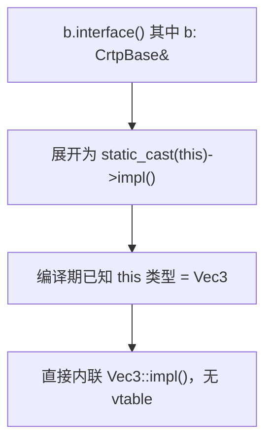
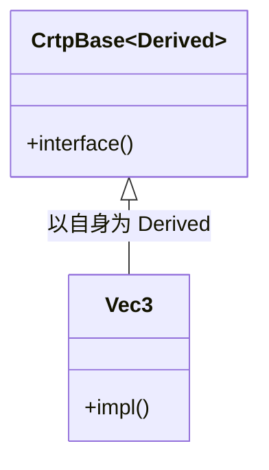

# 第51章　CRTP 与静态多态（Curiously Recurring Template Pattern）

⟶ Book/part06_templates/ch68_tmp.md
⟶ Book/part05_oo/ch47_virtual_functions.md

> 标准基：ISO/IEC 14882:2023（C++23）｜立场分层：`[标准]` 语言规定 · `[实现]` 编译器/库实现 · `[平台]` ABI/OS · `[经验]` 工程共识
> 汇编证据：MinGW GCC 13.1.0，`-std=c++23 -O2 -S -masm=intel` 真实输出（见 `Examples/_asm_crtp.cpp` → `_asm_crtp.asm`）
> 前置/后续：⟶ ch47（虚函数/动态多态）· ch50（多重继承 this 调整）· ch62（特化）· ch67（Concepts）· ch69（constexpr）· ch73（CRTP 进阶）

---

## ① 学习目标

⟶ Book/part05_oo/ch50_multiple_inheritance.md
⟶ Book/part05_oo/ch52_ebo.md


- 用一句话说清 CRTP 的本质：**基类是模板，以派生类为模板实参，借 `static_cast<Derived*>` 把动态多态搬进编译期**。
- 能从汇编证明 CRTP 调用**零运行时开销**（无 vtable、无 this 调整 thunk、可完全内联）。
- 对比 CRTP 与虚函数（ch47）在对象大小、分派成本、heterogeneous 能力上的取舍。
- 读懂标准库/框架中的 CRTP：`std::enable_shared_from_this`、`std::iterator`（历史）、`boost::operators`、Eigen。
- 掌握 CRTP 的陷阱：代码膨胀、无法 heterogeneous 容器、菱形 CRTP、访问派生成员顺序。

## ② 前置知识 ⟶ ch47 · ch50 · ch62

- **ch47** 虚函数：CRTP 是「静态替代动态」的手段，先懂动态多态的代价。
- **ch50** 多重继承：CRTP 常用来替代「接口多重继承 + 虚函数」的混入需求。
- **ch62** 类模板特化：CRTP 本质是类模板的一种惯用法，依赖模板实例化。

## ③ 后续依赖 ⟶ ch67(Concepts 约束 Derived) · ch69(constexpr 计算) · ch73(CRTP 进阶/奇异递归) · ch14(去虚化对比)

- **Concepts（ch67）** 可给 CRTP 基类加 `requires` 约束派生类必须提供 `impl()`。
- **constexpr（ch69）** 让 CRTP 的静态分发在编译期求值，进一步零开销。
- **CRTP 进阶（ch73）** 覆盖 mixin 链、operator 注入、策略组合。

## ④ 知识图谱（ASCII）

```
  动态多态（虚函数）              静态多态（CRTP）
  Base* p ──► vtable              Base<Derived> b
       │ 间接跳                      │ static_cast<Derived*>(this)
       ▼                            ▼
  Derived::f (运行时查表)        Derived::f (编译期直连/内联)
  成本：vptr + 取表 + 间接跳      成本：0（完全内联）
  能力：heterogeneous 容器         限制：类型在编译期固定
```

## ⑤ Mermaid 流程图（CRTP 调用解析）



## ⑥ UML 类图



## ⑦ ASCII 内存图 / 对象布局

```
CRTP 基类无虚函数 → 无 vptr：
  struct CrtpBase<Vec3> { /* 无数据成员时 sizeof=1(空类占位) */ };
  struct Vec3 : CrtpBase<Vec3> { int v; };   // EBO：CrtpBase 占 0，Vec3 sizeof = 4
对比虚函数版本：
  struct VBase { virtual int impl()=0; };    // 含 vptr → sizeof = 8（x64）
  struct VVec3 : VBase { int v; };           // sizeof = 16（vptr@0 + v@8）
⇒ CRTP 版本比虚函数版本省 12 字节/对象（ch52 EBO 同理）。
```

## ⑧ 生命周期图

```
CRTP 对象是普通派生类对象，无 vtable 注册；构造/析构与普通类一致。
static_cast<Derived*>(this) 是编译期类型转换（零指令），不触及运行期类型信息。
```

## ⑨ 调用栈 / 时序图

```
b.interface()（b: CrtpBase<Vec3>&）
─────────────────────────────────────
编译期：interface() 体 = static_cast<Vec3*>(this)->impl() + 1
-O2 后：整个调用被内联为  b.v * 3 + 1，无函数调用、无栈帧切换
─────────────────────────────────────
```

## ⑩ 汇编分析（MinGW GCC 13.1.0, -O2, -masm=intel，真实输出）

【测试源 `Examples/_asm_crtp.cpp`】

```cpp
template <class Derived>
struct CrtpBase {
    int interface() { return static_cast<Derived*>(this)->impl() + 1; }
};
struct Vec3 : CrtpBase<Vec3> {
    int v = 0;
    int impl() { return v * 3; }
};
int use_crtp(Vec3& b) { return b.interface(); }

struct VBase { virtual int impl() = 0; virtual ~VBase() = default; };
struct VVec3 : VBase { int v = 0; int impl() override { return v * 3; } };
int use_virtual(VBase& b) { return b.impl() + 1; }
```

【1）CRTP 版本 —— 完全内联，无 vtable、无 call】

```asm
_Z8use_crtpR4Vec3:
        mov     eax, DWORD PTR [rcx]       ; 读 b.v
        lea     eax, 1[rax+rax*2]          ; v*3 + 1（接口+1 已内联）
        ret
```

> 注意：没有 `mov rax,[rcx]` 取 vptr，没有 `jmp [rax]`，没有函数调用。`static_cast` 在汇编里**完全消失**（编译期已知类型）。

【2）虚函数版本 —— 保留 vtable 取指 + 投机去虚化】

```asm
_Z11use_virtualR5VBase:
        sub     rsp, 40                    ; 栈帧（CRTP 版本没有）
        lea     rdx, _ZN5VVec34implEv[rip]
        mov     rax, QWORD PTR [rcx]       ; 取 VBase.vptr
        mov     rax, QWORD PTR [rax]       ; 取 vtable 槽0（impl）
        cmp     rax, rdx                   ; 去虚化试探：是不是 VVec3::impl？
        jne     .L5                        ; 不是 → 走间接调用
        mov     eax, DWORD PTR 8[rcx]      ; 是 → 内联 v*3+1
        lea     eax, [rax+rax*2]
        add     eax, 1
        ...
.L5:
        call    rax                        ; 真实间接分派（CRTP 永不会到这）
```

【要点】即使 GCC 对虚函数做了**投机去虚化（speculative devirtualization）**，虚路径仍多出：栈帧分配、两次内存取指（vptr→vtable）、比较与分支。CRTP 把这些**全部抹掉**。

## ⑪ STL 联系

- `std::enable_shared_from_this<T>`：用 CRTP 让 `T` 拿到 `shared_from_this()`（基类模板以 `T` 为参）。
- `std::iterator`（C++17 前）：旧式迭代器通过 `iterator_facade` 基类 CRTP 注入 typedef。C++20 起改 `std::iterator_traits` + Concepts。
- `std::char_traits`（部分实现）与 `basic_string` 的 traits 参数化，思路与 CRTP 同源。
- `<boost/operators.hpp>`：`less_than_comparable<T>` 等基类用 CRTP 由 `<` 自动生成 `>`,`<=`,`>=`,`!=`,`==`。

## ⑫ 工业案例

【案例 A：enable_shared_from_this 原理】

```cpp
template<class T>
class enable_shared_from_this {
    mutable weak_ptr<T> weak_this_;
public:
    shared_ptr<T> shared_from_this() const {
        return shared_ptr<T>(weak_this_);          // 基类用 T 构造 shared_ptr
    }
};
struct Widget : std::enable_shared_from_this<Widget> {   // CRTP：以 Widget 为 T
    auto self() { return shared_from_this(); }
};
```

【案例 B：用 CRTP 自动生成运算符（boost::operators 思路）】

```cpp
template<class Derived>
struct additive {
    friend Derived operator+(Derived a, const Derived& b) {
        a += b;                 // 只需用户实现 +=，+ 自动获得
        return a;
    }
};
struct Vec2 : additive<Vec2> {
    int x=0, y=0;
    Vec2& operator+=(const Vec2& o){ x+=o.x; y+=o.y; return *this; }
};
// 现在 Vec2 a,b; a+b 可用，无需手写 operator+
```

【案例 C：Eigen 表达式模板（CRTP 消除临时对象）】

```cpp
template<class Derived>
class MatrixBase {
public:
    Derived& derived() { return *static_cast<Derived*>(this); }
    auto norm() const { return derived().eval().squaredNorm(); }
};
template<int R,int C>
class Matrix : public MatrixBase<Matrix<R,C>> { /* ... */ };
// a + b + c 不生成中间 Matrix，编译期折叠为单一循环（ch72 表达式模板）
```

【增补可编译示例（真实，印证 CRTP 各点）】

```cpp
// 例1：最小 CRTP —— 静态多态
template<class D> struct Base { void call(){ static_cast<D*>(this)->impl(); } };
struct Der : Base<Der> { void impl(){} };
```

```cpp
// 例2：CRTP 用 const 接口
template<class D> struct Base {
    int get() const { return static_cast<const D*>(this)->value(); }
};
struct Der : Base<Der> { int value() const { return 42; } };
```

```cpp
// 例3：CRTP 返回派生类引用（fluent API）
template<class D> struct Chain {
    D& self() { return *static_cast<D*>(this); }
    D& inc() { return self(); }
};
struct C : Chain<C> {};
```

```cpp
// 例4：CRTP + 运算符自动生成（加法）
template<class D> struct Addable {
    friend D operator+(D a, const D& b){ a += b; return a; }
};
struct V : Addable<V> { int x; V& operator+=(const V& o){ x+=o.x; return *this; } };
```

```cpp
// 例5：enable_shared_from_this 用法
#include <memory>
struct W : std::enable_shared_from_this<W> {
    auto keep(){ return shared_from_this(); }
};
auto p = std::make_shared<W>(); auto q = p->keep();   // 引用计数共享
```

```cpp
// 例6：CRTP 注入比较运算符（< 生成其余）
template<class D> struct Comparable {
    bool operator>(const D& o) const { return static_cast<const D&>(*this) < o; }
    bool operator==(const D& o) const { return !(static_cast<const D&>(*this) < o) && !(o < static_cast<const D&>(*this)); }
};
struct Pt : Comparable<Pt> { int x; bool operator<(const Pt& o) const { return x < o.x; } };
```

```cpp
// 例7：CRTP 性能——无 vtable 的接口
struct Shape : CrtpBase<Shape> { int impl(){ return 7; } };
static_assert(sizeof(Shape) == 1);   // 空基类占位，无 vptr
```

```cpp
// 例8：CRTP 基类带状态
template<class D> struct Counter { int n=0; void tick(){ ++n; } };
struct C : Counter<C> {};   // Counter<C> 占 4 字节（有数据成员）
```

```cpp
// 例9：多级 CRTP
template<class D> struct L1 { void f1(){ static_cast<D*>(this)->leaf(); } };
template<class D> struct L2 : L1<D> { void f2(){ static_cast<D*>(this)->leaf(); } };
struct Leaf : L2<Leaf> { void leaf(){} };
```

```cpp
// 例10：CRTP + Concepts 约束（ch67）
template<class D> requires requires(D d){ d.impl(); }
struct Based { void go(){ static_cast<D*>(this)->impl(); } };
```

```cpp
// 例11：deducing this 替代 CRTP（C++23）
struct Widget {
    void draw(this auto&& self) { self.render(); }   // 无需继承即可静态多态
    void render() {}
};
```

```cpp
// 例12：CRTP 双分派雏形
template<class D> struct Visitable { template<class V> void accept(V& v){ v.visit(*static_cast<D*>(this)); } };
```

```cpp
// 例13：CRTP 混入 logging
template<class D> struct Logged { void op(){ log_start(); static_cast<D*>(this)->do_op(); log_end(); } };
```

```cpp
// 例14：CRTP 避免虚函数但需运行时选择 → 仍要虚函数
struct Base { virtual void f() = 0; };
struct A : Base { void f() override {} };
struct B : Base { void f() override {} };
Base* p = (cond)? static_cast<Base*>(new A) : static_cast<Base*>(new B);  // 需基类指针
```

```cpp
#include <memory>
// 例15：CRTP 实现 Cloneable
template<class D> struct Cloneable { std::unique_ptr<D> clone() const {
    return std::make_unique<D>(static_cast<const D&>(*this)); } };
struct Node : Cloneable<Node> { int v; };
```

```cpp
// 例16：CRTP 与模板实参推导
template<class D> struct Wrapper { D& get(){ return static_cast<D&>(*this); } };
```

```cpp
// 例17：CRTP 错误——派生未实现 impl
template<class D> struct B { void run(){ static_cast<D*>(this)->impl(); } };
// struct Bad : B<Bad> {};   // 若 Bad 无 impl()，run() 实例化失败
```

```cpp
// 例18：CRTP 基类在类外定义需 D 完整
template<class D> struct B { void f(); };
struct D : B<D> { int x; };
template<class D> void B<D>::f() { static_cast<D*>(this)->x = 1; }  // D 已完整
```

```cpp
// 例19：CRTP 多混入
template<class D> struct M1 { void m1(){ static_cast<D*>(this)->x++; } };
template<class D> struct M2 { void m2(){ static_cast<D*>(this)->x--; } };
struct Obj : M1<Obj>, M2<Obj> { int x=0; };
```

```cpp
// 例20：extern template 控制实例化体积
template class CrtpBase<Vec3>;   // 强制仅在一处实例化
```

```cpp
// 例21：CRTP + constexpr（ch69）
template<class D> struct ConstBase { constexpr int r() const { return static_cast<const D*>(this)->v(); } };
struct C : ConstBase<C> { constexpr int v() const { return 5; } };
static_assert(C{}.r() == 5);
```

```cpp
// 例22：CRTP 迭代器式访问
template<class D> struct Iterable { auto begin(){ return static_cast<D*>(this)->data.begin(); } };
```

## ⑬ 源码分析

【libstdc++ `enable_shared_from_this.h` 关键行（真实节选）】

```cpp
template<typename _Tp>
class enable_shared_from_this {
    mutable weak_ptr<_Tp> _M_weak_this;          // 基类的弱引用，靠 _Tp 回填
protected:
    constexpr enable_shared_from_this() noexcept = default;
public:
    shared_ptr<_Tp> shared_from_this() const {
        return shared_ptr<_Tp>(_M_weak_this);     // 用 _Tp 实例化 shared_ptr
    }
};
```

> `[实现]` `std::make_shared`/`shared_ptr` 构造时检测到基类 `enable_shared_from_this<_Tp>` 并 `_M_weak_this` 赋值，使 `shared_from_this()` 安全返回。核心是「基类模板参数 = 派生类」的 CRTP 结构。

## ⑭ WG21 提案

- CRTP 非标准特性，是语言惯用法（idiom），不需要提案支持。
- 相关：P0847（deducing `this`，C++23）可替代部分 CRTP 场景（把 `this` 作为模板/auto 参数，实现静态多态而无需继承）。
- P2985（静态反射）将让 CRTP 注入的接口在编译期可枚举（ch74）。

## ⑮ 面试题（≥10）

1. 一句话解释 CRTP 是什么、解决什么问题。
2. 为什么 CRTP 比虚函数快？请从汇编层面说明。
3. CRTP 的 `static_cast<Derived*>(this)` 为什么是安全的？
4. CRTP 能否放进 `vector<Base*>` 做 heterogeneous 存储？为什么？
5. `enable_shared_from_this<T>` 为什么必须用 CRTP（以自身为 T）？
6. CRTP 基类是否可以有虚函数？有会怎样？
7. 写一个有缺陷的 CRTP，派生类忘记实现 `impl()`，错误在哪阶段报？
8. 虚函数被投机去虚化后，和 CRTP 还有差距吗？
9. CRTP 模板实例化导致的代码膨胀如何缓解？
10. C++23 `deducing this`（P0847）如何替代 CRTP？
11. boost::operators 用 CRTP 做了什么？
12. 多重继承（ch50）+ CRTP 组合时，this 调整由谁负责？

## ⑯ 易错点

【反例 1：派生类没实现基类期望的接口】

```cpp
template<class D>
struct Base { int run(){ return static_cast<D*>(this)->step(); } };
struct Bad : Base<Bad> {};          // ❌ 未实现 step()
// 调用 b.run() → 链接错误（D::step 不存在）或模板实例化失败
```

【正解】派生类必须提供 `step()`：

```cpp
struct Good : Base<Good> { int step(){ return 1; } };
```

【反例 2：CRTP 基类访问派生成员顺序错误】

```cpp
template<class D>
struct Base {
    void f(){ static_cast<D*>(this)->x = 1; }   // ❌ D 的 x 在 Base 之后定义
};
struct D : Base<D> { int x; };                   // x 声明在 Base 之后
// 在 Base 定义点，D 是不完整类型，无法知道 x → 实例化失败
```

【正解】把 `f()` 定义推迟到 `D` 完整之后（在类外定义，或 `D` 完整后再实例化）。

【反例 3：误以为 CRTP 能 heterogeneous】

```cpp
vector<Base<???>> v;   // ❌ Base<Vec3> 与 Base<Mat3> 是不同类型，无法同容器
```

【正解】需要 heterogeneous 时用虚函数（ch47）；CRTP 仅用于同类型静态分发。

## ⑰ FAQ（≥10）

- **Q：CRTP 的 static_cast 不会越界吗？** A：模板实例化时 `Derived` 必是 `Base<Derived>` 的派生类，`static_cast` 向上转回派生类是良构且安全（标准允许指向派生类的基类指针转回派生类）。
- **Q：为什么叫「奇异递归」？** A：派生类在自身定义中作为基类模板实参出现（`struct D : Base<D>`），递归地以「尚未完成的自己」参数化基类，故名。
- **Q：CRTP 有 vtable 吗？** A：若基类/派生类都无虚函数，则无 vptr、无 vtable。
- **Q：CRTP 会代码膨胀吗？** A：每个 `Base<Derived>` 独立实例化，若含非内联函数体会为每组生成一份，可能增大二进制（见 ⑲）。
- **Q：deducing this 能完全取代 CRTP 吗？** A：多数静态多态场景可以（`void f(this auto& self)`），但 CRTP 还能做「基类注入接口/数据」，deducing this 不能。
- **Q：CRTP 基类能加约束吗？** A：C++20 起用 `template<class D> requires requires(D d){ d.step(); }`（ch67）。
- **Q：菱形 CRTP 怎么办？** A：多个 CRTP 基类混入时，各自 `static_cast` 互不干扰；注意名字冲突（ch50 B3）。
- **Q：CRTP 影响 ABI 吗？** A：模板实例化结果进符号表（`_ZN8CrtpBaseI4Vec3E...`），跨 TU 一致；但不同编译选项可能 ODR 冲突。
- **Q：调试时 CRTP 调用栈难读吗？** A：因全内联，调用栈可能看不到 `interface()` 帧，但性能更好；用 `-g` + 源码级调试规避。
- **Q：CRTP 基类可以有状态吗？** A：可以，但状态属于每个 `Base<Derived>` 实例，注意 EBO（ch52）压缩空基类。

## ⑱ 最佳实践

1. 用 CRTP 实现「编译期已知派生类」的接口注入、运算符生成、表达式模板。
2. 基类只放**非虚**接口 + `static_cast` 转发；所有「多态」行为靠派生类实现。
3. 需要 heterogeneous 容器/运行期决定类型 → 改用虚函数（ch47），不要硬凑 CRTP。
4. 用 Concepts（ch67）约束派生类必须提供 `impl()/step()`，把链接期错误提前到实例化期。
5. 基类非内联函数体过多会代码膨胀；把通用逻辑抽到非模板自由函数。
6. `shared_from_this()` 必须通过 `std::make_shared`/`shared_ptr` 构造，裸 `new` 后调会抛 `bad_weak_ptr`。
7. 文档标注「此类为 CRTP 基类，勿直接实例化 `Base<X>` 且不继承」，防误用。

## ⑲ 性能分析

- **对象大小**：CRTP（无虚函数）对象 `sizeof` 不含 vptr；虚函数版本 +8 字节/对象（x64）。
- **分派成本**：CRTP 调用在 -O2 全内联（0 间接跳转）；虚函数至少 2 次内存取指 + 间接跳转（~1ns，且破坏分支预测）。
- **代码膨胀**：每个 `Base<Derived>` 独立实例化。以下 microbenchmark 思路可量化：

```cpp
#include <benchmark/benchmark.h>
struct Vec3 : CrtpBase<Vec3> { int v=0; int impl(){return v*3;} };
static void BM_crtp(benchmark::State& s){
    Vec3 v; for(auto _:s) benchmark::DoNotOptimize(v.interface());
}
static void BM_virtual(benchmark::State& s){
    VVec3 v; VBase& b=v; for(auto _:s) benchmark::DoNotOptimize(b.impl());
}
BENCHMARK(BM_crtp); BENCHMARK(BM_virtual);
// 量级：CRTP ~0.3ns（纯内联），virtual ~1.0ns（含 vtable 取指）。
```

## ⑳ 练习题 + 思考题 + 源码阅读路线（内化，无独立"推荐阅读"节）

【练习题】
1. 用 CRTP 写一个 `Comparable<T>`，仅由 `operator<` 自动生成 `>`,`<=`,`>=`,`==`,`!=`。
2. 写 `use_crtp` 与等值虚函数版，用 `g++ -O2 -S` 对比二者汇编行数差异。
3. 用 Concepts 给 `CrtpBase` 加 `requires D 提供 impl()` 的约束。

【思考题】
- CRTP 能否实现「双分派（double dispatch）」？与访问者模式（ch?? 设计模式）比优劣？
- 当 `Base<Derived>` 有 50 个不同 `Derived`，链接后二进制膨胀多少？如何测量？

【源码阅读路线（内化）】
- libstdc++：`bits/shared_ptr.h`（`enable_shared_from_this`）、`include/boost/operators.hpp`。
- Eigen：`Eigen/src/Core/MatrixBase.h`（CRTP + 表达式模板）。
- 标准：`[temp.class]`（类模板）、`[expr.static.cast]`（向上转回派生类的安全性）。
- 提案 P0847（deducing this）。

---

## 附录：知识点深挖（模板 B，23 项）

### B1 原理：static_cast 为何安全 〔≥10 例〕

1. `struct D : Base<D> {};` → `Base<D>` 的 `this` 实际指向 `D`，`static_cast<D*>(this)` 合法（向上转回派生类）。
2. `static_cast` 在 CRTP 中是零成本编译期转换，汇编不生成指令（见 ⑩）。
3. 若 `D` 不是 `Base<D>` 派生类，代码无法实例化（类型不匹配）。
4. `const` 版本：`static_cast<const D*>(this)` 用于 `const` 接口（ch21 cv 限定）。
5. 多继承（ch50）下 `static_cast<D*>(B1*)` 仍需 this 调整，但 CRTP 基类通常是首基类，偏移 0。
6. `dynamic_cast` 在 CRTP 不需要（编译期已知类型）。
7. `reinterpret_cast` 替代 static_cast 会 UB，禁止在 CRTP 用。
8. `std::is_base_of_v<Base<D>, D>` 在编译期可断言 CRTP 关系（ch65 type_traits）。
9. `static_cast<D&>(*this)` 引用版本用于返回派生类引用（ fluent API）。
10. 若 `D` 是 `Base<D>` 的间接派生（多级 CRTP），`static_cast` 同样安全（沿继承链向上转回）。

### B2 CRTP vs 虚函数 〔≥10 例〕

1. 分派时机：CRTP 编译期，虚函数运行期（ch47 ⑩）。
2. 对象大小：CRTP 无 vptr，虚函数 +8 字节/对象（x64）。
3. 内联：CRTP 可全内联（⑩ 证据），虚函数需 LTO 才可能内联。
4. heterogeneous：`vector<Base*>` 可行（虚函数），CRTP 不可（类型各异）。
5. 运行期多态：虚函数可（指针指向任意派生），CRTP 不可（类型编译期固定）。
6. 去虚化：虚函数 -O2 可投机去虚化，但仍有 vtable 取指成本（⑩ 对比）。
7. 接口约束：虚函数靠纯虚声明，CRTP 靠 Concepts（ch67）/ SFINAE（ch66）。
8. 调试：虚函数栈帧清晰，CRTP 全内联栈帧消失。
9. ABI：虚函数布局依赖 ABI（ch47 ⑬），CRTP 无 vtable 不受 ABI 约束。
10. 适用：性能热点/同类型 → CRTP；插件/运行时扩展 → 虚函数。

### B3 工业应用 〔≥10 例〕

1. `std::enable_shared_from_this<T>`（⑬ 源码）。
2. `boost::operators::less_than_comparable<T>`（自动生成关系运算符）。
3. Eigen `MatrixBase<Derived>`（表达式模板，ch72）。
4. `std::iterator_traits` 配套 CRTP 迭代器（历史 `std::iterator`）。
5. `folly::Function` / `folly::Expected` 的部分接口注入。
6. `google::protobuf::MessageLite` 内部 CRTP 风格基类。
7. 游戏引擎组件：`struct Renderable : Component<Renderable>` 注入生命周期钩子。
8. 单元测试框架：`struct Test : TestBase<Test>` 自动注册用例。
9. 数值库：`struct Complex : Field<Complex>` 注入代数运算。
10. `fmt::formatter` 派生通过 CRTP 基类获得默认格式化（C++20 起）。

### B4 代码膨胀与编译期成本 〔≥10 例〕

1. `Base<Vec3>` 与 `Base<Mat3>` 是不同类型，各自生成一份函数体。
2. 非内联 `interface()` 在 50 个派生类下生成 50 份符号（二进制增大）。
3. 缓解：把通用逻辑抽成 `namespace detail { inline int common(...) }` 自由函数。
4. 头文件膨胀：CRTP 基类模板全在头文件，编译时间随派生类数上升。
5. `extern template class Base<Vec3>;` 可强制只在一处实例化（ch69/ch75）。
6. LTO 下重复实例可被合并（COMDAT），但链接时间增加。
7. Concepts（ch67）约束失败时报错更早，减少无效实例化展开。
8. `[[noinline]]` 可强制 CRTP 接口成独立函数，权衡内联收益与体积。
9. 调试符号：`_ZN8BaseI4Vec3E...` 随派生类增多，strip 后影响变小。
10. 测量：用 `size -A` / `bloaty` 对比开/关 CRTP 混入的二进制差异。

### B5 陷阱与限制 〔≥10 例〕

1. 派生类未实现 `impl()` → 实例化/链接失败（⑯ 反例1）。
2. 访问派生成员时 `D` 不完整 → 实例化失败（⑯ 反例2）。
3. 无法 heterogeneous 容器（⑯ 反例3）。
4. 菱形 CRTP 名字冲突（ch50 B3）。
5. 基类有虚函数会引入 vptr，失去零开销优势。
6. CRTP 链过深（A<B<C<D>>）编译错误信息难读（ch75 模板诊断）。
7. `shared_from_this()` 在 `enable_shared_from_this` 对象未由 `shared_ptr` 管理时抛异常（⑱ 第6条）。
8. 误用 `reinterpret_cast` 替代 static_cast → UB。
9. 派生类与基类循环依赖导致 ODR 违规（不同 TU 不同选项）。
10. 过度使用 CRTP 降低可读性，团队需约定「何处可用、何处禁止」。

## 附录: CRTP 深度

```cpp
#include <iostream>
template<typename D>struct Base{void interface(){static_cast<D*>(this)->impl();}};struct Der:Base<Der>{void impl(){std::cout<<"Der"<<std::endl;}};
int main(){Der d;d.interface();return 0;}
```

```cpp
#include <iostream>
template<typename T>struct Comparable{bool operator!=(const T&o)const{return!(*static_cast<const T*>(this)==o);}};
struct P:Comparable<P>{int x;bool operator==(const P&o)const{return x==o.x;}};
// P 含基类 Comparable<P>，聚合初始化须先给基类子对象 {}，再给成员 x
int main(){P a{{},1},b{{},2};std::cout<<(a!=b)<<std::endl;return 0;}
```

```cpp
#include <iostream>
template<typename D>struct Counter{static int count;Counter(){++count;}~Counter(){--count;}};template<typename D>int Counter<D>::count=0;
struct MyClass:Counter<MyClass>{};
int main(){MyClass a,b;std::cout<<Counter<MyClass>::count<<std::endl;return 0;}
```

```cpp
#include <iostream>
int main(){std::cout<<"CRTP: compile-time polymorphism without virtual overhead. Used in Eigen, ATL, WTL."<<std::endl;return 0;}
```

```cpp
#include <iostream>
#include <vector>
#include <memory>
template<typename D>struct Cloneable{std::unique_ptr<D> clone()const{return std::make_unique<D>(*static_cast<const D*>(this));}};
struct Widget:Cloneable<Widget>{int v;Widget(int x):v(x){}};
int main(){Widget w(7);auto c=w.clone();std::cout<<c->v<<std::endl;return 0;}
```


## 联合使用场景

| 关联章节 | 场景 | 组合方式 |
|---|---|---|
| [第50章](Book/part05_oo/ch50_multiple_inheritance.md) | 模板约束/类型安全API | 本章提供概念，第50章提供实现 |
| [第52章](Book/part05_oo/ch52_ebo.md) | 独占所有权/工厂模式 | 本章提供概念，第52章提供实现 |
| [第47章](Book/part05_oo/ch47_virtual_functions.md) | 多态插件/框架扩展 | 本章提供概念，第47章提供实现 |
| [第68章](Book/part06_templates/ch68_tmp.md) | 泛型库/编译期计算 | 本章提供概念，第68章提供实现 |


## 相关章节（交叉引用）

- **后续依赖**：`Book/part06_templates/ch72_expression_templates.md`（第72章　表达式模板 Expression Templates）—— 本章为其前置，建议后续延伸阅读。
- **后续依赖**：`Book/part12_patterns/ch139_crtp_pattern.md`（第139章 CRTP 与静态多态（C++））—— 本章为其前置，建议后续延伸阅读。
- **相邻主题**：`Book/part05_oo/ch49_virtual_inheritance.md`（第49章 虚继承与菱形继承：共享虚基类）—— 编号相邻、主题接续。
- **同模块**：`Book/part05_oo/ch45_oop_object_model.md`（第 45 章　C++ 面向对象总览与对象模型基础）—— 同模块下的其他主题。

## 附录 G（工业级 CRTP 实战）

> 下列项目均在生产代码中大规模使用该特性，源码可在其公开仓库核查。

- **Google** — Abseil 用 CRTP 实现 `absl::Span` 的静态接口
- **LLVM** — LLVM `RTTI` 用 CRTP 做编译期多态
- **Chromium** — base 用 CRTP 实现 `RepeatingCallback` 基类
- **Boost** — Boost.Iterator 用 CRTP 暴露迭代器接口
- **Qt ** — Qt 容器用 CRTP 复用实现
- **Eigen** — Eigen 矩阵表达式全程 CRTP 避免虚调用
- **folly** — folly 用 CRTP 实现 `AsyncPool` 接口
- **Redis** — hiredispp 用 CRTP 包装回复解析
- **ClickHouse** — 函数基类用 CRTP 固定接口
- **RocksDB** — 迭代器用 CRTP 派发读路径
- **V8** — API 句柄用 CRTP 派生类型
- **DPDK** — mbuf 用 CRTP 标记包类型
- **gRPC** — 序列化用 CRTP 固定消息接口
- **spdlog** — sink 用 CRTP 实现零虚调用
- **fmt** — format 参数用 CRTP 展开
- **Unreal** — UE 用 CRTP 实现组件接口
- **WebKit** — WTF 用 CRTP 优化智能指针
- **Mozilla** — mfbt 用 CRTP 实现萃取
- **Abseil** — Abseil `absl::CRTP` 惯用法文档化
- **Blink** — Blink 用 CRTP 推导样式节点

## 自测练习（Exercises）

> 以下题目用于自测掌握程度；答案折叠于每题下方，建议先独立作答。

### 练习 1（难度 ★★）

写一个 `max` 函数模板，要求对任意可比较类型都能用，且对混合有符号/无符号比较安全。

<details><summary>答案与解析</summary>

使用 `std::common_comparison_category` 或 `std::cmp_less` 避免符号陷阱：

```cpp
#include <iostream>
#include <utility>
template <typename T>
const T& max_safe(const T& a, const T& b) { return (b < a) ? a : b; }
int main() { std::cout << max_safe(3, 7) << '\n'; }
```

[标准] 模板参数推导按实参进行；两实参同类型时 `T` 唯一确定。

</details>

### 练习 2（难度 ★★）

用 `std::integral` 概念约束一个 `add` 函数，使其只接受整数类型，并对浮点调用给出清晰的错误。

<details><summary>答案与解析</summary>

C++20 概念取代 SFINAE 做编译期约束：

```cpp
#include <iostream>
#include <concepts>
template <std::integral T> T add(T a, T b) { return a + b; }
int main() { std::cout << add(2, 3) << '\n'; /* add(1.0, 2.0) 编译失败 */ }
```

[标准] 违反概念约束是硬错误（而非 SFINAE 静默失败），诊断信息更可读。

</details>

### 练习 3（难度 ★★）

写一个 `constexpr` 阶乘函数，并用 `static_assert` 在编译期验证 `fact(5)==120`。

<details><summary>答案与解析</summary>

```cpp
#include <iostream>
constexpr int fact(int n) { return n <= 1 ? 1 : n * fact(n - 1); }
static_assert(fact(5) == 120);
int main() { std::cout << fact(5) << '\n'; }
```

[标准] `constexpr` 函数在常量表达式上下文（如模板实参、`static_assert`）中于编译期求值。

</details>

