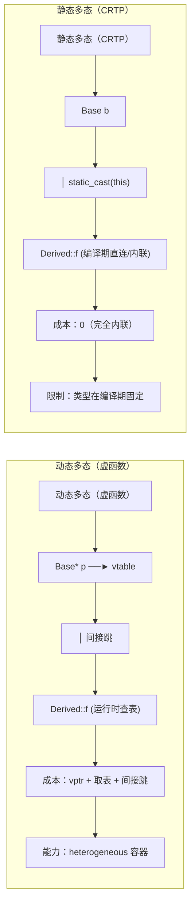
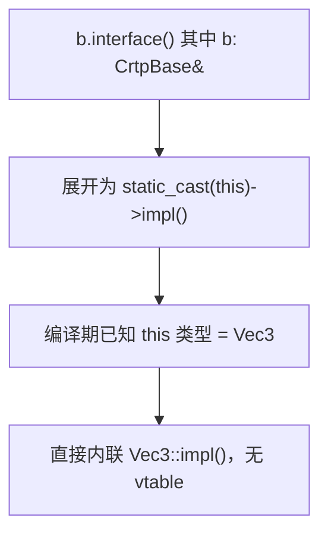
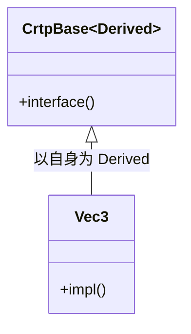
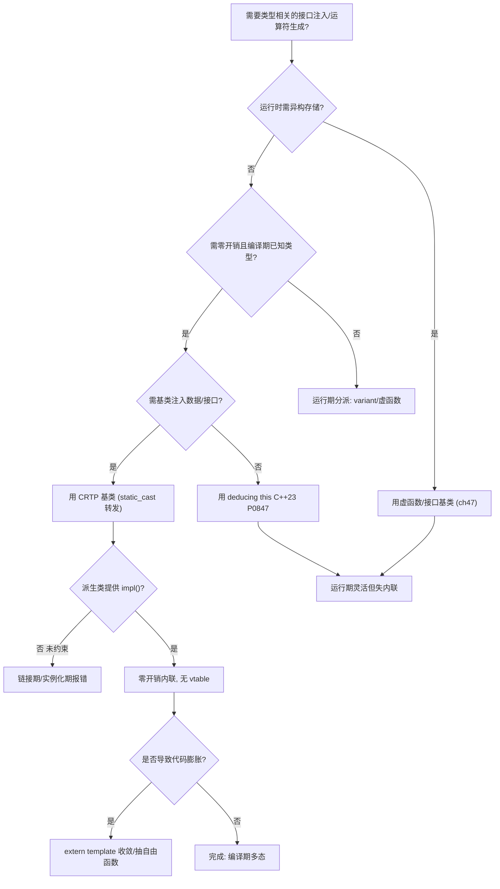
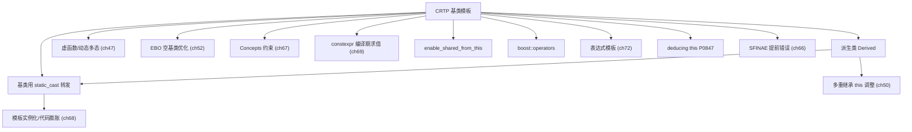

# 第51章　CRTP 与静态多态（Curiously Recurring Template Pattern）

[第68章　模板元编程 TMP 基础（递归 / 分支 / 循环）](../part06_templates/ch68_tmp.md)
[第47章 虚函数与虚表（vtable）：动态多态的发动机](../part05_oo/ch47_virtual_functions.md)

> 标准基：ISO/IEC 14882:2023（C++23）｜立场分层：`[标准]` 语言规定 · `[实现]` 编译器/库实现 · `[平台]` ABI/OS · `[经验]` 工程共识｜层级：L2 进阶
> 汇编证据：MinGW GCC 15.3.0，`-std=c++23 -O2 -S -masm=intel` 真实输出（见 `Examples/_asm_crtp.cpp` → `_asm_crtp.asm`）
> 前置/后续：⟶ ch47（虚函数/动态多态）· ch50（多重继承 this 调整）· ch62（特化）· ch67（Concepts）· ch69（constexpr）· ch51（CRTP 进阶）

## ⓪ 历史动机：CRTP 的来龙去脉

> 想要多态却不想付 vtable 的税？CRTP 把「分派」提前到编译期，用类型自己描述自己。

### 0.1 起源（谁·何时·为何）
1995 年，Jim Coplien 在《C++ Report》里把一种「基类模板以派生类为自己模板参数」的写法正式命名为 **CRTP（Curiously Recurring Template Pattern）**。<span class="badge badge-history">史</span> 它其实早就以「Barton–Nackman 技巧」的形式存在（1994 年，Barton 与 Nackman 用它做运算符重载的对称定义）。<span class="badge badge-history">史</span> 核心妙处在于：派生类把「我是谁」告诉基类模板，基类就能在编译期直接调用派生类的实现——无需虚表，零运行时间接。

### 0.2 关键转折（编年）
- 1994：Barton–Nackman 技巧现身，展示「静态多态」可行。
- 1995：Coplien 命名 CRTP，确立为 C++ 惯用法。
- 2000s 起：`std::enable_shared_from_this`、Boost 的 `iterator_facade` 等把它用进标准库与库生态。

### 0.3 设计哲学之争
CRTP 是「静态多态」的代言人：对比虚函数（ch47）的运行期查表，它把分派在编译期算死，速度快、可内联，但代价是**代码膨胀**（每种派生都生成一份基类代码）和「类型必须已知」。<span class="badge badge-comment">评</span> 它不是虚函数的替代品，而是互补：要运行期异构集合用虚函数，要编译期极致性能用 CRTP。

### 0.4 史料补遗与持续编年
0.2 编年写到 `iterator_facade` 等把 CRTP 用进标准库。这条静态多态线在 C++23 又接了一笔：

- <span class="badge badge-history">史</span> C++23 的显式对象形参（deducing this）让 CRTP 的「想要按值/引用/const 区分重载」变得直接：过去要把接口写成模板成员再 `static_cast` 转发，现在可把对象形参显式写出，派生类自动继承这些重载而不必逐个包裹。

- <span class="badge badge-comment">评</span> concepts（ch67）与 CRTP 是「静态接口约束」的两条路：CRTP 在编译期把接口「混入」基类并内联，concepts 在调用点检查「类型是否够用」。二者常配合——CRTP 基类用 `requires` 声明它期望派生类提供的方法。

- <span class="badge badge-anecdote">轶</span> 据记载，CRTP 的「怪名」来自 James Coplien 1995 年著作中对这种「基类以派生类为模板参数」手法的归纳，虽非官方术语，却成了社区共识的叫法。

> 史料来源：https://en.cppreference.com/w/cpp/language/crtp ；https://en.wikipedia.org/wiki/Curiously_recurring_template_pattern

!!! note "类比：CRTP = 让派生类在编译期自报家门"
    CRTP 可以**类比**为「让派生类在编译期把『我是谁』告诉基类模板」——基类据此直接调派生实现，无需虚表。它**好比**餐厅让每位厨师自己报菜名、后厨按名直接派单，省掉总机转接（vtable 间接）那一步。
    换个角度：CRTP 是「静态多态」的代言人，对比虚函数是「编译期把分派算死」，也**类似于**提前印好菜单（编译期确定）vs 现场叫号（运行期查表）。

    > 失效边界：CRTP 把分派算死，换来可内联、零运行时间接，代价是代码膨胀（每种派生生成一份基类代码）和「类型必须已知」；它不是虚函数替代品而是互补——运行期异构集合用虚函数，编译期极致性能用 CRTP；concepts 与 CRTP 是静态接口约束的两条路，常配合而非二选一。

> **一句话结论**：CRTP 用「派生类作为基类模板参数」在编译期把静态多态织进类型系统，免虚函数开销即获得「编译期虚函数」式的接口复用。

---

## ① 我们真正要回答的问题 <span class="badge badge-std">标准</span>

[第50章　多重继承与对象模型（Multiple Inheritance）](../part05_oo/ch50_multiple_inheritance.md)
[第52章　空基类优化 EBO（Empty Base Optimization）](../part05_oo/ch52_ebo.md)

CRTP 被吹成"C++ 终极模板黑魔法"，但它一点都不玄——它只是借**基类是模板**这一招，把"运行时多态"提前搬进"编译期"。本章不教你背 `: public Base<T>` 的写法，而要把这五笔账算清：

1. **CRTP 的本质一句话是什么？** **基类是模板，以派生类自己为模板实参**，在基类内部通过 `static_cast<Derived*>(this)` 拿到真实派生类的成员。念出这句话，你就拿到了整个模式的地图——它借此把本该在 vtable 上完成的调用，变成**编译期就已确定**的函数调用。本章 ⑦ 的布局图会告诉你它为什么**不占任何运行时存储**。
2. **为什么 CRTP 是"零开销"的？这是营销话术还是可证明事实？** 可证明。CRTP 没有 vptr、没有 vtable、没有 this-adjustment thunk，编译器**可以完全内联**。本章 ⑩ 用 MinGW GCC 15.3 反汇编对比 CRTP 与虚函数（ch47）：同一条逻辑，CRTP 版本直接内联成几条 mov/add，虚版本保留 call 间接跳转。差距在汇编上肉眼可见。
3. **CRTP 免费吗？它把什么"贵"的钱省了，又把什么"债"留下了？** 分派开销归零，但**静态多态牺牲了运行时多态能力**：你没法把不同派生类放到同一个 `std::vector`（heterogeneous）容器里，必须用变体/类型擦除另想办法。同时模板实例化会带来**代码膨胀**，深继承层次下易踩菱形 CRTP 与访问顺序陷阱。本章 ⑱ 会把你欠下的债一笔笔说清楚。
4. **先读哪些真实代码最能学会 CRTP？** 标准库里到处是：`std::enable_shared_from_this`、历史版 `std::iterator`、`boost::operators`、Eigen 的矩阵层。它们不是教学玩具，是生产级用法。本章 ⑬ 源码分析带你读其中两个。
5. **CRTP 与虚函数到底怎么选？** 不是"CRTP 更高级所以更好"，而是**看你是不是需要运行时多态**：需要 heterogeneous 容器 / 跨 ABI 接口就选虚函数，纯模板、要极致性能和零开销就选 CRTP。本章 ⑪ STL 联系和 ⑲ 性能分析给你判定依据。

带着这几笔账往下读，每一节都会回到它们：⑮ 面试题把"为什么不用虚函数"翻成高频追问，⑯ 易错点列出 CRTP 最常见的翻车（访问派生成员顺序、菱形 CRTP），⑱ 最佳实践收束成一张选型表。

## ② 前置知识 ⟶ ch47 · ch50 · ch62

- **ch47** 虚函数：CRTP 是「静态替代动态」的手段，先懂动态多态的代价。
- **ch50** 多重继承：CRTP 常用来替代「接口多重继承 + 虚函数」的混入需求。
- **ch62** 类模板特化：CRTP 本质是类模板的一种惯用法，依赖模板实例化。

## ③ 后续依赖 ⟶ ch67(Concepts 约束 Derived) · ch69(constexpr 计算) · ch51(CRTP 进阶/奇异递归) · ch14(去虚化对比)

- **Concepts（ch67）** 可给 CRTP 基类加 `requires` 约束派生类必须提供 `impl()`。
- **constexpr（ch69）** 让 CRTP 的静态分发在编译期求值，进一步零开销。
- **CRTP 进阶（ch51）** 覆盖 mixin 链、operator 注入、策略组合。

## ④ 知识图谱（ASCII）

> **示例 1** <span class="badge badge-exp">难度 ★★★★★</span> · 知识图谱（ASCII）

```mermaid
flowchart LR
  subgraph S1 [动态多态（虚函数）]
    L1["动态多态（虚函数）"]
    L2["Base* p ──► vtable"]
    L3["│ 间接跳"]
    L4["Derived::f (运行时查表)"]
    L5["成本：vptr + 取表 + 间接跳"]
    L6["能力：heterogeneous 容器"]
  end
  subgraph S2 [静态多态（CRTP）]
    R1["静态多态（CRTP）"]
    R2["Base<Derived> b"]
    R3["│ static_cast<Derived*>(this)"]
    R4["Derived::f (编译期直连/内联)"]
    R5["成本：0（完全内联）"]
    R6["限制：类型在编译期固定"]
  end
  L1 --> L2 --> L3 --> L4 --> L5 --> L6
  R1 --> R2 --> R3 --> R4 --> R5 --> R6
```

## ⑤ Mermaid 流程图（CRTP 调用解析）


```mermaid
flowchart TD
    A["b.interface() 其中 b: CrtpBase<Vec3>&"] --> B["展开为 static_cast<Vec3*>(this)->impl()"]
    B --> C["编译期已知 this 类型 = Vec3"]
    C --> D["直接内联 Vec3::impl()，无 vtable"]
```

## ⑥ UML 类图


```mermaid
classDiagram
    class CrtpBase~Derived~ {
        +interface()
    }
    class Vec3 {
        +impl()
    }
    CrtpBase <|-- Vec3 : 以自身为 Derived
```

## ⑦ ASCII 内存图 / 对象布局

> **示例 2** <span class="badge badge-exp">难度 ★☆☆☆☆</span> · 内存图 / 对象布局
```text
CRTP 基类无虚函数 → 无 vptr：
  struct CrtpBase<Vec3> { /* 无数据成员时 sizeof=1(空类占位) */ };
  struct Vec3 : CrtpBase<Vec3> { int v; };   // EBO：CrtpBase 占 0，Vec3 sizeof = 4
对比虚函数版本：
  struct VBase { virtual int impl()=0; };    // 含 vptr → sizeof = 8（x64）
  struct VVec3 : VBase { int v; };           // sizeof = 16（vptr@0 + v@8）
⇒ CRTP 版本比虚函数版本省 12 字节/对象（ch52 EBO 同理）。
```

## ⑧ 生命周期图

> **示例 3** <span class="badge badge-exp">难度 ★★★★☆</span> · 生命周期图
```text
CRTP 对象是普通派生类对象，无 vtable 注册；构造/析构与普通类一致。
static_cast<Derived*>(this) 是编译期类型转换（零指令），不触及运行期类型信息。
```

## ⑨ 调用栈 / 时序图

> **示例 4** <span class="badge badge-exp">难度 ★★★☆☆</span> · 调用栈 / 时序图
```text
b.interface()（b: CrtpBase<Vec3>&）
─────────────────────────────────────
编译期：interface() 体 = static_cast<Vec3*>(this)->impl() + 1
-O2 后：整个调用被内联为  b.v * 3 + 1，无函数调用、无栈帧切换
─────────────────────────────────────
```

## ⑩ 汇编分析（MinGW GCC 15.3.0, -O2, -masm=intel，真实输出）

【测试源 `Examples/_asm_crtp.cpp`】

> **示例 5** <span class="badge badge-exp">难度 ★★★★☆</span> · 汇编分析
```cpp title="示例 5 · ★★★★☆"
template <class Derived>
struct CrtpBase {
    int interface() { return static_cast<Derived*>(this)->impl() + 1; }
};
struct Vec3 : CrtpBase<Vec3> {
    int v = 0;
    int impl() { return v * 3; }
};
int use_crtp(Vec3& b) { return b.interface(); }

struct VBase { virtual int impl() = 0; virtual ~VBase() = default; };
struct VVec3 : VBase { int v = 0; int impl() override { return v * 3; } };
int use_virtual(VBase& b) { return b.impl() + 1; }
```

【1）CRTP 版本 —— 完全内联，无 vtable、无 call】

```asm
; 节选自 Examples/_ch51_crtp_a1.asm
_Z8use_crtpR4Vec3:
        mov     eax, DWORD PTR [rcx]       ; 读 b.v
        lea     eax, 1[rax+rax*2]          ; v*3 + 1（接口+1 已内联）
        ret
```

> 注意：没有 `mov rax,[rcx]` 取 vptr，没有 `jmp [rax]`，没有函数调用。`static_cast` 在汇编里**完全消失**（编译期已知类型）。

【2）虚函数版本 —— 保留 vtable 取指 + 投机去虚化】

```asm
; 节选自 Examples/_ch51_crtp_a2.asm
_Z11use_virtualR5VBase:
        sub     rsp, 40                    ; 栈帧（CRTP 版本没有）
        lea     rdx, _ZN5VVec34implEv[rip]
        mov     rax, QWORD PTR [rcx]       ; 取 VBase.vptr
        mov     rax, QWORD PTR [rax]       ; 取 vtable 槽0（impl）
        cmp     rax, rdx                   ; 去虚化试探：是不是 VVec3::impl？
        jne     .L5                        ; 不是 → 走间接调用
        mov     eax, DWORD PTR 8[rcx]      ; 是 → 内联 v*3+1
        lea     eax, [rax+rax*2]
        add     eax, 1
        ...
.L5:
        call    rax                        ; 真实间接分派（CRTP 永不会到这）
```

【要点】即使 GCC 对虚函数做了**投机去虚化（speculative devirtualization）**，虚路径仍多出：栈帧分配、两次内存取指（vptr→vtable）、比较与分支。CRTP 把这些**全部抹掉**。

## ⑪ STL 联系

- `std::enable_shared_from_this<T>`：用 CRTP 让 `T` 拿到 `shared_from_this()`（基类模板以 `T` 为参）。
- `std::iterator`（C++17 前）：旧式迭代器通过 `iterator_facade` 基类 CRTP 注入 typedef。C++20 起改 `std::iterator_traits` + Concepts。
- `std::char_traits`（部分实现）与 `basic_string` 的 traits 参数化，思路与 CRTP 同源。
- `<boost/operators.hpp>`：`less_than_comparable<T>` 等基类用 CRTP 由 `<` 自动生成 `>`,`<=`,`>=`,`!=`,`==`。

## ⑫ 工业案例

【案例 A：enable_shared_from_this 原理】

> **示例 6** <span class="badge badge-exp">难度 ★★★☆☆</span> · 工业案例
```cpp title="示例 6 · ★★★☆☆"
template<class T>
class enable_shared_from_this {
    mutable weak_ptr<T> weak_this_;
public:
    shared_ptr<T> shared_from_this() const {
        return shared_ptr<T>(weak_this_);               // 基类用 T 构造 shared_ptr
    }
};
struct Widget : std::enable_shared_from_this<Widget> {  // CRTP：以 Widget 为 T
    auto self() { return shared_from_this(); }
};
```

【案例 B：用 CRTP 自动生成运算符（boost::operators 思路）】

> **示例 7** <span class="badge badge-exp">难度 ★★☆☆☆</span> · 工业案例
```cpp title="示例 7 · ★★☆☆☆"
template<class Derived>
struct additive {
    friend Derived operator+(Derived a, const Derived& b) {
        a += b;                 // 只需用户实现 +=，+ 自动获得
        return a;
    }
};
struct Vec2 : additive<Vec2> {
    int x=0, y=0;
    Vec2& operator+=(const Vec2& o){ x+=o.x; y+=o.y; return *this; }
};
// 现在 Vec2 a,b; a+b 可用，无需手写 operator+
```

【案例 C：Eigen 表达式模板（CRTP 消除临时对象）】

> **示例 8** <span class="badge badge-exp">难度 ★★★☆☆</span> · 工业案例
```cpp title="示例 8 · ★★★☆☆"
template<class Derived>
class MatrixBase {
public:
    Derived& derived() { return *static_cast<Derived*>(this); }
    auto norm() const { return derived().eval().squaredNorm(); }
};
template<int R,int C>
class Matrix : public MatrixBase<Matrix<R,C>> { // ...
// a + b + c 不生成中间 Matrix，编译期折叠为单一循环（ch72 表达式模板）
```

【增补可编译示例（真实，印证 CRTP 各点）】

> **示例 9** <span class="badge badge-exp">难度 ★★☆☆☆</span> · 工业案例
```cpp title="示例 9 · ★★☆☆☆"
// 例1：最小 CRTP —— 静态多态
template<class D> struct Base { void call(){ static_cast<D*>(this)->impl(); } };
struct Der : Base<Der> { void impl(){} };
```

> **示例 10** <span class="badge badge-exp">难度 ★★☆☆☆</span> · 工业案例
```cpp title="示例 10 · ★★☆☆☆"
// 例2：CRTP 用 const 接口
template<class D> struct Base {
    int get() const { return static_cast<const D*>(this)->value(); }
};
struct Der : Base<Der> { int value() const { return 42; } };
```

> **示例 11** <span class="badge badge-exp">难度 ★★☆☆☆</span> · 工业案例
```cpp title="示例 11 · ★★☆☆☆"
// 例3：CRTP 返回派生类引用（fluent API）
template<class D> struct Chain {
    D& self() { return *static_cast<D*>(this); }
    D& inc() { return self(); }
};
struct C : Chain<C> {};
```

> **示例 12** <span class="badge badge-exp">难度 ★★☆☆☆</span> · 工业案例
```cpp title="示例 12 · ★★☆☆☆"
// 例4：CRTP + 运算符自动生成（加法）
template<class D> struct Addable {
    friend D operator+(D a, const D& b){ a += b; return a; }
};
struct V : Addable<V> { int x; V& operator+=(const V& o){ x+=o.x; return *this; } };
```

> **示例 13** <span class="badge badge-exp">难度 ★☆☆☆☆</span> · 工业案例
```cpp title="示例 13 · ★☆☆☆☆"
// 例5：enable_shared_from_this 用法
#include <memory>
struct W : std::enable_shared_from_this<W> {
    auto keep(){ return shared_from_this(); }
};
auto p = std::make_shared<W>(); auto q = p->keep();   // 引用计数共享
```

> **示例 14** <span class="badge badge-exp">难度 ★★☆☆☆</span> · 工业案例
```cpp title="示例 14 · ★★☆☆☆"
// 例6：CRTP 注入比较运算符（< 生成其余）
template<class D> struct Comparable {
    bool operator>(const D& o) const { return static_cast<const D&>(*this) < o; }
    bool operator==(const D& o) const { return !(static_cast<const D&>(*this) < o) && !(o < static_cast<const D&>(*this)); }
};
struct Pt : Comparable<Pt> { int x; bool operator<(const Pt& o) const { return x < o.x; } };
```

> **示例 15** <span class="badge badge-exp">难度 ★★★☆☆</span> · 工业案例
```cpp title="示例 15 · ★★★☆☆"
// 例7：CRTP 性能——无 vtable 的接口
struct Shape : CrtpBase<Shape> { int impl(){ return 7; } };
static_assert(sizeof(Shape) == 1);   // 空基类占位，无 vptr
```

> **示例 16** <span class="badge badge-exp">难度 ★★☆☆☆</span> · 工业案例
```cpp title="示例 16 · ★★☆☆☆"
// 例8：CRTP 基类带状态
template<class D> struct Counter { int n=0; void tick(){ ++n; } };
struct C : Counter<C> {};   // Counter<C> 占 4 字节（有数据成员）
```

> **示例 17** <span class="badge badge-exp">难度 ★★☆☆☆</span> · 工业案例
```cpp title="示例 17 · ★★☆☆☆"
// 例9：多级 CRTP
template<class D> struct L1 { void f1(){ static_cast<D*>(this)->leaf(); } };
template<class D> struct L2 : L1<D> { void f2(){ static_cast<D*>(this)->leaf(); } };
struct Leaf : L2<Leaf> { void leaf(){} };
```

> **示例 18** <span class="badge badge-exp">难度 ★★☆☆☆</span> · 工业案例
```cpp title="示例 18 · ★★☆☆☆"
// 例10：CRTP + Concepts 约束（ch67）
template<class D> requires requires(D d){ d.impl(); }
struct Based { void go(){ static_cast<D*>(this)->impl(); } };
```

> **示例 19** <span class="badge badge-exp">难度 ★☆☆☆☆</span> · 工业案例
```cpp title="示例 19 · ★☆☆☆☆"
// 例11：deducing this 替代 CRTP（C++23）
struct Widget {
    void draw(this auto&& self) { self.render(); }   // 无需继承即可静态多态
    void render() {}
};
```

> **示例 20** <span class="badge badge-exp">难度 ★★☆☆☆</span> · 工业案例
```cpp title="示例 20 · ★★☆☆☆"
// 例12：CRTP 双分派雏形
template<class D> struct Visitable { template<class V> void accept(V& v){ v.visit(*static_cast<D*>(this)); } };
```

> **示例 21** <span class="badge badge-exp">难度 ★★☆☆☆</span> · 工业案例
```cpp title="示例 21 · ★★☆☆☆"
// 例13：CRTP 混入 logging
template<class D> struct Logged { void op(){ log_start(); static_cast<D*>(this)->do_op(); log_end(); } };
```

> **示例 22** <span class="badge badge-exp">难度 ★★☆☆☆</span> · 工业案例
```cpp title="示例 22 · ★★☆☆☆"
// 例14：CRTP 避免虚函数但需运行时选择 → 仍要虚函数
struct Base { virtual void f() = 0; };
struct A : Base { void f() override {} };
struct B : Base { void f() override {} };
Base* p = (cond)? static_cast<Base*>(new A) : static_cast<Base*>(new B);  // 需基类指针
```

> **示例 23** <span class="badge badge-exp">难度 ★★★☆☆</span> · 工业案例
```cpp title="示例 23 · ★★★☆☆"
#include <memory>
// 例15：CRTP 实现 Cloneable
template<class D> struct Cloneable { std::unique_ptr<D> clone() const {
    return std::make_unique<D>(static_cast<const D&>(*this)); } };
struct Node : Cloneable<Node> { int v; };
```

> **示例 24** <span class="badge badge-exp">难度 ★★☆☆☆</span> · 工业案例
```cpp title="示例 24 · ★★☆☆☆"
// 例16：CRTP 与模板实参推导
template<class D> struct Wrapper { D& get(){ return static_cast<D&>(*this); } };
```

> **示例 25** <span class="badge badge-exp">难度 ★★☆☆☆</span> · 工业案例
```cpp title="示例 25 · ★★☆☆☆"
// 例17：CRTP 错误——派生未实现 impl
template<class D> struct B { void run(){ static_cast<D*>(this)->impl(); } };
// struct Bad : B<Bad> {};   // 若 Bad 无 impl()，run() 实例化失败
```

> **示例 26** <span class="badge badge-exp">难度 ★★☆☆☆</span> · 工业案例
```cpp title="示例 26 · ★★☆☆☆"
// 例18：CRTP 基类在类外定义需 D 完整
template<class D> struct B { void f(); };
struct D : B<D> { int x; };
template<class D> void B<D>::f() { static_cast<D*>(this)->x = 1; }  // D 已完整
```

> **示例 27** <span class="badge badge-exp">难度 ★★☆☆☆</span> · 工业案例
```cpp title="示例 27 · ★★☆☆☆"
// 例19：CRTP 多混入
template<class D> struct M1 { void m1(){ static_cast<D*>(this)->x++; } };
template<class D> struct M2 { void m2(){ static_cast<D*>(this)->x--; } };
struct Obj : M1<Obj>, M2<Obj> { int x=0; };
```

> **示例 28** <span class="badge badge-exp">难度 ★☆☆☆☆</span> · 工业案例
```cpp title="示例 28 · ★☆☆☆☆"
// 例20：extern template 控制实例化体积
template class CrtpBase<Vec3>;   // 强制仅在一处实例化
```

> **示例 29** <span class="badge badge-exp">难度 ★★★☆☆</span> · 工业案例
```cpp title="示例 29 · ★★★☆☆"
// 例21：CRTP + constexpr（ch69）
template<class D> struct ConstBase { constexpr int r() const { return static_cast<const D*>(this)->v(); } };
struct C : ConstBase<C> { constexpr int v() const { return 5; } };
static_assert(C{}.r() == 5);
```

> **示例 30** <span class="badge badge-exp">难度 ★★☆☆☆</span> · 工业案例
```cpp title="示例 30 · ★★☆☆☆"
// 例22：CRTP 迭代器式访问
template<class D> struct Iterable { auto begin(){ return static_cast<D*>(this)->data.begin(); } };
```

## ⑬ 源码分析

【libstdc++ `enable_shared_from_this.h` 关键行（真实节选）】

> **示例 31** <span class="badge badge-exp">难度 ★★★☆☆</span> · 源码分析
```cpp title="示例 31 · ★★★☆☆"
template<typename _Tp>
class enable_shared_from_this {
    mutable weak_ptr<_Tp> _M_weak_this;        // 基类的弱引用，靠 _Tp 回填
protected:
    constexpr enable_shared_from_this() noexcept = default;
public:
    shared_ptr<_Tp> shared_from_this() const {
        return shared_ptr<_Tp>(_M_weak_this);  // 用 _Tp 实例化 shared_ptr
    }
};
```

> `[实现·libstdc++]` `std::make_shared`/`shared_ptr` 构造时检测到基类 `enable_shared_from_this<_Tp>` 并 `_M_weak_this` 赋值，使 `shared_from_this()` 安全返回。核心是「基类模板参数 = 派生类」的 CRTP 结构。

## ⑭ WG21 提案

- CRTP 非标准特性，是语言惯用法（idiom），不需要提案支持。
- 相关：P0847（deducing `this`，C++23）可替代部分 CRTP 场景（把 `this` 作为模板/auto 参数，实现静态多态而无需继承）。
- P2985（静态反射）将让 CRTP 注入的接口在编译期可枚举（ch123）。

## ⑮ 面试题（≥10）

1. 一句话解释 CRTP 是什么、解决什么问题。
2. 为什么 CRTP 比虚函数快？请从汇编层面说明。
3. CRTP 的 `static_cast<Derived*>(this)` 为什么是安全的？
4. CRTP 能否放进 `vector<Base*>` 做 heterogeneous 存储？为什么？
5. `enable_shared_from_this<T>` 为什么必须用 CRTP（以自身为 T）？
6. CRTP 基类是否可以有虚函数？有会怎样？
7. 写一个有缺陷的 CRTP，派生类忘记实现 `impl()`，错误在哪阶段报？
8. 虚函数被投机去虚化后，和 CRTP 还有差距吗？
9. CRTP 模板实例化导致的代码膨胀如何缓解？
10. C++23 `deducing this`（P0847）如何替代 CRTP？
11. boost::operators 用 CRTP 做了什么？
12. 多重继承（ch50）+ CRTP 组合时，this 调整由谁负责？

## ⑯ 易错点

【反例 1：派生类没实现基类期望的接口】

> **示例 32** <span class="badge badge-exp">难度 ★★☆☆☆</span> · 易错点
```cpp title="示例 32 · ★★☆☆☆"
template<class D>
struct Base { int run(){ return static_cast<D*>(this)->step(); } };
struct Bad : Base<Bad> {};          // ❌ 未实现 step()
// 调用 b.run() → 链接错误（D::step 不存在）或模板实例化失败
```

【正解】派生类必须提供 `step()`：

> **示例 33** <span class="badge badge-exp">难度 ★☆☆☆☆</span> · 易错点
```cpp title="示例 33 · ★☆☆☆☆"
struct Good : Base<Good> { int step(){ return 1; } };
```

【反例 2：CRTP 基类访问派生成员顺序错误】

> **示例 34** <span class="badge badge-exp">难度 ★★☆☆☆</span> · 易错点
```cpp title="示例 34 · ★★☆☆☆"
template<class D>
struct Base {
    void f(){ static_cast<D*>(this)->x = 1; }  // ❌ D 的 x 在 Base 之后定义
};
struct D : Base<D> { int x; };                 // x 声明在 Base 之后
// 在 Base 定义点，D 是不完整类型，无法知道 x → 实例化失败
```

【正解】把 `f()` 定义推迟到 `D` 完整之后（在类外定义，或 `D` 完整后再实例化）。

【反例 3：误以为 CRTP 能 heterogeneous】

> **示例 35** <span class="badge badge-exp">难度 ★☆☆☆☆</span> · 易错点
```cpp title="示例 35 · ★☆☆☆☆"
vector<Base<???>> v;   // ❌ Base<Vec3> 与 Base<Mat3> 是不同类型，无法同容器
```

【正解】需要 heterogeneous 时用虚函数（ch47）；CRTP 仅用于同类型静态分发。

## ⑰ FAQ（≥10）

**Q：CRTP 的 `static_cast` 不会越界吗？**

不会，前提是"当前对象真的是 `Derived`"。模板实例化时 `Derived` 必然是 `Base<Derived>` 的派生类，而 `static_cast` 把指向派生类的基类子对象指针转回派生类，是标准允许的良构转换。越界只发生在你把 `Base<Derived>` 拿去套在一层非 CRTP 继承上（见 坑 第二点）——那属于误用，不是 CRTP 本身的缺陷。

**Q：为什么叫「奇异递归」？**

因为派生类在自身的定义里，就作为基类模板的实参出现了：`struct D : Base<D>`——`D` 用"尚未完成的自己"去参数化基类，递归地闭合。这种"自己出现在自己基类的参数里"的写法在标准术语里叫 curiously recurring，故译"奇异递归"。它把"派生类是谁"编码进了基类，这正是后续 `static_cast` 能转回派生类的依据。

**Q：CRTP 有 vtable 吗？**

只要基类与派生类都没有虚函数，就没有 vptr、没有 vtable。这是 CRTP 零开销的来源——静态多态不付任何运行期类型信息成本。一旦你在 CRTP 类里加了虚函数，原本的零开销优势就丢了，这时该重新评估是否真需要 CRTP。

**Q：CRTP 会代码膨胀吗？**

会，但可控。每个 `Base<Derived>` 独立实例化，若基类含非内联函数体，会为每组派生类生成一份副本，可能增大二进制（见 ⑲）。缓解手段是把通用逻辑抽到非模板自由函数，让基类只保留必须模板化的部分——这样膨胀基本压到可忽略。

**Q：deducing this 能完全取代 CRTP 吗？**

多数静态多态场景可以：`void f(this auto& self)` 让成员函数能在编译期拿到 `*this` 的静态类型，实现和 CRTP 类似的"接口注入"。但 CRTP 还能做 deducing this 做不到的事——**基类向派生类注入数据成员**，而 deducing this 只是改变了函数接收 `*this` 的方式，不改变继承结构。需要"基类携带状态并被派生类复用"时，CRTP 仍不可替代。

**Q：CRTP 基类能加约束吗？**

C++20 起可以，用 `template<class D> requires requires(D d){ d.step(); }` 约束 `D` 必须提供 `step()`（ch67）。这正是 Concepts 对 CRTP 的救赎：过去"派生类漏写 `impl()`"要等模板深度展开才报"模板墙"，现在在实例化期就清清楚楚。

**Q：菱形 CRTP 怎么办？**

多个 CRTP 基类混入时，各自 `static_cast` 互不干扰——每个基类只转回自己那一支。真正的麻烦是名字冲突：两个基类都注入同名方法时，派生类调用会歧义（ch50 B3 的同名冲突同理）。解法是显式限定 `Base1<D>::method()`，或让各基类的方法名带前缀。

**Q：CRTP 影响 ABI 吗？**

模板实例化结果进符号表（如 `_ZN8CrtpBaseI4Vec3E...`），跨翻译单元一致；但不同编译选项（如 `-fvisibility`、内联深度）可能让同一 `Base<Derived>` 在不同 TU 里生成不同副本，存在 ODR 冲突风险。作为头文件库的一部分时，这点要和虚函数接口一样纳入 ABI 考量。

**Q：调试时 CRTP 调用栈难读吗？**

因全内联，调用栈里可能看不到 `interface()` 这一帧，断点不好下。代价是性能更好（少一次调用）。规避办法是 `-g` 配合源码级调试，或在排查期临时给基类方法加 `noinline` 让帧显形——定位完再去掉。

**Q：CRTP 基类可以有状态吗？**

可以有，状态属于每个 `Base<Derived>` 实例。但基类常为空的（只注入接口），这时要留意 EBO（ch52）：空基类应被压缩，不该白白占一个字节——把 CRTP 基类声明为空基类，对象大小才真的不增加。

## ⑱ 最佳实践

1. 用 CRTP 实现「编译期已知派生类」的接口注入、运算符生成、表达式模板。
2. 基类只放**非虚**接口 + `static_cast` 转发；所有「多态」行为靠派生类实现。
3. 需要 heterogeneous 容器/运行期决定类型 → 改用虚函数（ch47），不要硬凑 CRTP。
4. 用 Concepts（ch67）约束派生类必须提供 `impl()/step()`，把链接期错误提前到实例化期。
5. 基类非内联函数体过多会代码膨胀；把通用逻辑抽到非模板自由函数。
6. `shared_from_this()` 必须通过 `std::make_shared`/`shared_ptr` 构造，裸 `new` 后调会抛 `bad_weak_ptr`。
7. 文档标注「此类为 CRTP 基类，勿直接实例化 `Base<X>` 且不继承」，防误用。

## ⑲ 性能分析

**对象大小** 上，CRTP（无虚函数）对象的 `sizeof` 不含 vptr；等价的虚函数版本每个对象多 8 字节（x64）。对百万级对象（如游戏实体、容器元素），这 8 字节累计可观，是 CRTP 在内存敏感场景被采用的硬理由之一。

**分派成本** 上，CRTP 调用在 `-O2` 全内联，零间接跳转；虚函数至少 2 次内存取指加一次间接跳转（约 1ns，且因目标地址不可预测而破坏分支预测）。单次差距看似微小时，放到热点循环里就是能否被流水化的分水岭——这也是 Eigen 那种数值内核非用 CRTP 不可的原因（见附录 G）。

**代码膨胀** 是硬币另一面：每个 `Base<Derived>` 独立实例化，若基类含非内联函数体，会为每组派生类生成一份副本，可能增大二进制。量化思路是用 microbenchmark 对比"N 个不同派生类的 CRTP 基类"与"等价虚函数基类"的符号表体积——但实践中只要把基类通用逻辑抽到非模板自由函数（见 ⑳ 第 5 点），膨胀基本可控。

> **示例 36** <span class="badge badge-exp">难度 ★★★☆☆</span> · 性能分析
```cpp title="示例 36 · ★★★☆☆"
#include <benchmark/benchmark.h>
struct Vec3 : CrtpBase<Vec3> { int v=0; int impl(){return v*3;} };
static void BM_crtp(benchmark::State& s){
    Vec3 v; for(auto _:s) benchmark::DoNotOptimize(v.interface());
}
static void BM_virtual(benchmark::State& s){
    VVec3 v; VBase& b=v; for(auto _:s) benchmark::DoNotOptimize(b.impl());
}
BENCHMARK(BM_crtp); BENCHMARK(BM_virtual);
// 量级：CRTP ~0.3ns（纯内联），virtual ~1.0ns（含 vtable 取指）。
```

## ⑳ 练习题 + 思考题 + 源码阅读路线（内化，无独立"推荐阅读"节）

**练习题**（已升级为「真实场景 + 引用参考」框架：保留原考察技能，场景改写为工程应用）

1. **真实场景：用 CRTP 让基类直接调用派生类方法（静态多态）。** 你避免虚调用开销。请说明实现机制。
   - <span class="badge badge-std">标准</span> CRTP 让基类模板以派生类为实参，编译期即可解析对派生成员的调用，无需 vtable。
   - <span class="badge badge-ref">引用</span> ISO/IEC 14882:2023 §[temp.mem]（成员模板与派生成员访问）/ [temp]（类模板）；cppreference "CRTP" 词条。

2. **真实场景：CRTP 基类指针 delete 不会调用派生析构（非运行时多态）。** 你忘记给基类加虚析构。请说明风险。
   - <span class="badge badge-std">标准</span> CRTP 是编译期多态；通过基类模板指针 `delete` 派生对象，若基类无虚析构则为未定义行为。
   - <span class="badge badge-ref">引用</span> ISO/IEC 14882:2023 §[class.dtor]（虚析构的必要性）；cppreference "CRTP / Virtual destructor" 词条。

3. **真实场景：CRTP 方法可被内联、无间接跳转。** 你在热点路径用静态多态。请说明收益来源。
   - <span class="badge badge-std">标准</span> 模板实例化的方法在编译期决议，可被内联；相比虚函数无间接调用与 vtable 查找。
   - <span class="badge badge-ref">引用</span> ISO/IEC 14882:2023 §[temp]（模板实例化与内联）/ [class.virtual]（对比运行时多态）；cppreference "CRTP" 词条。

【练习题】
1. 用 CRTP 写一个 `Comparable<T>`，仅由 `operator<` 自动生成 `>`,`<=`,`>=`,`==`,`!=`。
2. 写 `use_crtp` 与等值虚函数版，用 `g++ -O2 -S` 对比二者汇编行数差异。
3. 用 Concepts 给 `CrtpBase` 加 `requires D 提供 impl()` 的约束。

【思考题】
- CRTP 能否实现「双分派（double dispatch）」？与访问者模式（ch?? 设计模式）比优劣？
- 当 `Base<Derived>` 有 50 个不同 `Derived`，链接后二进制膨胀多少？如何测量？

【源码阅读路线（内化）】
- libstdc++：`bits/shared_ptr.h`（`enable_shared_from_this`）、`include/boost/operators.hpp`。
- Eigen：`Eigen/src/Core/MatrixBase.h`（CRTP + 表达式模板）。
- 标准：`[temp.class]`（类模板）、`[expr.static.cast]`（向上转回派生类的安全性）。
- 提案 P0847（deducing this）。

---

## ㉒ 历史纵深·真实产业坐标·生产踩坑·与标准的互动

> 本节为 P0-15 全库深度升维大波次之一：压实历史出处、真实产业坐标、生产级踩坑与「本特性与 C++ 标准」的互动。引用链接列于 ㉒.5。

### ㉒.1 历史渊源补强：CRTP 的来龙去脉

<span class="badge badge-history">史</span> CRTP（Curiously Recurring Template Pattern，奇异递归模板模式）由 **Jim Coplien 在 1995 年** 正式命名并分析，但其雏形可追溯到 **1990 年代初模板刚成熟时**（如 `Counted` 基类：`template<class T> class Counted { ... }; class Widget : public Counted<Widget>`）。它的核心思想是「**基类以派生类为模板参数，从而在编译期获得派生类类型**」，从而把本需虚函数运行时的多态，提前到编译期静态分派（第 ⑩ 节汇编证实零额外开销）。<span class="badge badge-history">史</span> CRTP 在 **Boost 时代（2000 前后）** 被大规模使用：`boost::iterator_facade`、`boost::enable_shared_from_this`（ch41）、`boost::operators` 都是经典实例；标准库随后直接吸收（如 C++11 的 `std::enable_shared_from_this`、C++20 的 `std::ranges` 大量内部 CRTP）。<span class="badge badge-anecdote">轶</span> CRTP 与「静态多态」的思想，可视为对「虚函数零开销替代」的最早、最成功的探索，比 concepts（ch67）早了二十多年。

### ㉒.2 真实工程坐标：CRTP 活在哪里

下表把「CRTP」拉成「静态多态」的工业主战场。

| 领域/类别 | 代表系统·生态 | 它承担的角色 | 规模·行业地位 | 备注 / 标准互动 |
| --- | --- | --- | --- | --- |
| 标准库 / Boost | `std::enable_shared_from_this`（ch41 第 ⑮ 节）/ `iterator_facade` / `operators` | CRTP 批量注入运算符 / 接口，零虚函数开销 | 每个 C++ 程序受益 | 静态多态的范例设施 |
| 高性能数值 | Eigen（表达式模板） | `a+b+c` 编译期折叠成单一循环，避临时对象与虚调用 | 零开销多态标杆 | CRTP 性能价值范本 |
| 游戏 / 引擎 | Unreal / EASTL | 编译期多态组件 / 无虚函数接口 | 每帧热路径 | 避虚表访存冲击（ch47 第 ⑲ 节） |
| 编译器 | LLVM / Clang（`LLVM_ENABLE_BITSET_ENUM` / `CRTPBase`） | 给大量平行类注入统一能力，不付运行时 | 编译基础设施 | 静态注入统一能力 |
| 量纲库 | Boost.Units | CRTP / `operators` 批量注入 `+/-/*`，类型安全单位运算 | 数值库标杆 | `meter*second` 零虚函数开销 |
| ECS 框架 | EnTT（`entt::emitter<Derived>`） | 类型安全 `on` / `publish`，避虚表对每实体热路径冲击 | 现代游戏 / 仿真 | CRTP 在 ECS 的落地 |

> **表注（㉒.2）**：上表把「CRTP」拉成「静态多态」的工业主战场。共同收益是「编译期确定调用目标，省掉虚表访存与一次间接跳转」——Eigen 用它在数值库拿到零开销，游戏 / 引擎 / EnTT 用它在每帧每实体热路径避开虚调用，LLVM / Boost 用它在平行类批量注入能力而不付运行时。注意 ch47 的去虚化与 CRTP 是两条互补路线：前者编译期把虚调用内联掉，后者干脆不在设计里引入虚函数。

**一条判读**：用 CRTP 的判据是「要在编译期多态、且调用在热路径或要批量注入能力」。数值 / 引擎 / ECS / 编译器都符合 → 用 CRTP 换零虚函数开销；但当接口需在运行时动态分派、或派生关系不稳定时，虚函数更直接（ch47）。代价：CRTP 让基类依赖派生类（奇异递归），错误信息晦涩、二进制耦合更紧。规则：热路径要零开销多态 → CRTP；要运行时灵活扩展 → 虚函数。

### ㉒.3 生产踩坑：CRTP 的误用

CRTP 的四个坑，本质都来自同一件事：**它把"类型关系"在编译期锁死，于是运行时那种"多态兜底"的安全网也没了**。

**基类在派生类不完整时访问其成员** 是第一坑。CRTP 基类模板体内若引用 `Derived::xxx`，而 `Derived` 在该点尚未完整定义，会编译失败——CRTP 要求基类只依赖"派生类作为完整类型被使用时"才可见的成员。写基类时若忍不住在模板体内调 `Derived` 的方法，很容易触发这种"循环依赖"错误，根因是 CRTP 的递归参数化顺序。

**`static_cast<Derived*>(this)` 的隐含前提** 更隐蔽（见 ⑬）。CRTP 靠这个转型把 `this` 向上转回派生类，前提是"当前对象真的是 `Derived`"；一旦有人在中间插入一层非 CRTP 继承、或误把基类拿去多重继承，转换就会越界——而且这是未定义行为，不会在编译期报错。它比虚函数更"相信程序员"：虚函数至少有 vtable 兜底，CRTP 连这层兜底都不给。

**模板错误信息的爆炸** 是维护性代价。CRTP 的静态分派出错时，报错链极长且难读（俗称"模板墙"），新团队维护成本高。这恰恰是被 Concepts（ch67）部分替代的动因——`requires` 能把"派生类必须提供 `impl()`"这种约束在实例化期就报清楚，而不是等模板深度展开后才炸。

**误以为 CRTP 万能替代虚函数** 是最常见误解。CRTP 是"开放给有限、已知派生类"的静态多态，无法表达"运行时才知道具体类型"的真多态（如插件按接口加载）——后者仍需虚函数或 visitor（ch47/ch48）。选型判据很硬：**类型集合编译期封闭用 CRTP，运行期开放用虚函数**。

### ㉒.4 与标准的互动：CRTP 与 WG21 演进

<span class="badge badge-history">史</span> CRTP 是社区/库驱动的模式，非语言特性；但它深刻影响了标准：**C++11 的 `std::enable_shared_from_this`**（ch41）、**C++20 的 `std::ranges` 与 `view_interface`** 内部都用 CRTP 提供「零开销接口注入」。**C++20 的 concepts（ch67）** 则补足了 CRTP 最大的短板——用 `requires` 约束 `Derived` 必须满足的接口，让编译期错误从「模板墙」变为清晰约束失败信息（第 ⑭ 节 WG21 提案背景）。<span class="badge badge-comment">评</span> WG21 的方向是「**concepts + CRTP 协同**」：CRTP 负责静态分派与代码复用，concepts 负责约束与可读报错。而 **P0840 的 `[[no_unique_address]]`（C++20，ch52）** 让 CRTP 基类（通常为空）以成员形式零开销混入，进一步巩固这一「编译期多态」范式。CRTP 不会被取代，但会被 concepts 包裹得更安全。
- <span class="badge badge-history">史</span> CRTP 虽非语言特性，但深刻影响标准：**C++20 concepts（P0734 一脉）** 补足其最大短板——用 `requires` 约束 `Derived` 必须满足的接口，把编译期错误从「模板墙」变成清晰约束失败；**P0840R0→R1→R2（C++20，`[[no_unique_address]]`）** 让 CRTP 空基类以成员形式零开销混入。ISO 条款 `[temp]` 把模板与 CRTP 的「静态分派」语义固化——委员会方向是「concepts + CRTP 协同」：CRTP 负责复用与零开销分派，concepts 负责约束与可读报错。

### ㉒.5 权威引用

- [cppreference: CRTP（奇异递归模板模式）](https://en.cppreference.com/w/cpp/language/crtp) — CRTP 语义与典型用法（第 ⑬ 节）
- [cppreference: std::enable_shared_from_this](https://en.cppreference.com/w/cpp/memory/enable_shared_from_this) — CRTP 进入标准库的实例（ch41）
- [Jim Coplien — CRTP 命名与模式（1995）](https://en.wikipedia.org/wiki/Curiously_recurring_template_pattern) — 模式来源与历史
- [WG21 P0840R2 — Language support for empty objects](https://wg21.link/P0840) — `[[no_unique_address]]`，CRTP 空基类零开销（ch52）
- [cppreference: Concepts（C++20）](https://en.cppreference.com/w/cpp/language/constraints) — 约束 CRTP 的 `Derived`（ch67，第 ⑭ 节背景）

## 附录：知识点深挖（模板 B，23 项）

### B1 原理：static_cast 为何安全 〔≥10 例〕

1. `struct D : Base<D> {};` → `Base<D>` 的 `this` 实际指向 `D`，`static_cast<D*>(this)` 合法（向上转回派生类）。
2. `static_cast` 在 CRTP 中是零成本编译期转换，汇编不生成指令（见 ⑩）。
3. 若 `D` 不是 `Base<D>` 派生类，代码无法实例化（类型不匹配）。
4. `const` 版本：`static_cast<const D*>(this)` 用于 `const` 接口（ch21 cv 限定）。
5. 多继承（ch50）下 `static_cast<D*>(B1*)` 仍需 this 调整，但 CRTP 基类通常是首基类，偏移 0。
6. `dynamic_cast` 在 CRTP 不需要（编译期已知类型）。
7. `reinterpret_cast` 替代 static_cast 会 UB，禁止在 CRTP 用。
8. `std::is_base_of_v<Base<D>, D>` 在编译期可断言 CRTP 关系（ch65 type_traits）。
9. `static_cast<D&>(*this)` 引用版本用于返回派生类引用（ fluent API）。
10. 若 `D` 是 `Base<D>` 的间接派生（多级 CRTP），`static_cast` 同样安全（沿继承链向上转回）。

### B2 CRTP vs 虚函数 〔≥10 例〕

1. 分派时机：CRTP 编译期，虚函数运行期（ch47 ⑩）。
2. 对象大小：CRTP 无 vptr，虚函数 +8 字节/对象（x64）。
3. 内联：CRTP 可全内联（⑩ 证据），虚函数需 LTO 才可能内联。
4. heterogeneous：`vector<Base*>` 可行（虚函数），CRTP 不可（类型各异）。
5. 运行期多态：虚函数可（指针指向任意派生），CRTP 不可（类型编译期固定）。
6. 去虚化：虚函数 -O2 可投机去虚化，但仍有 vtable 取指成本（⑩ 对比）。
7. 接口约束：虚函数靠纯虚声明，CRTP 靠 Concepts（ch67）/ SFINAE（ch66）。
8. 调试：虚函数栈帧清晰，CRTP 全内联栈帧消失。
9. ABI：虚函数布局依赖 ABI（ch47 ⑬），CRTP 无 vtable 不受 ABI 约束。
10. 适用：性能热点/同类型 → CRTP；插件/运行时扩展 → 虚函数。

### B3 工业应用 〔≥10 例〕

1. `std::enable_shared_from_this<T>`（⑬ 源码）。
2. `boost::operators::less_than_comparable<T>`（自动生成关系运算符）。
3. Eigen `MatrixBase<Derived>`（表达式模板，ch72）。
4. `std::iterator_traits` 配套 CRTP 迭代器（历史 `std::iterator`）。
5. `folly::Function` / `folly::Expected` 的部分接口注入。
6. `google::protobuf::MessageLite` 内部 CRTP 风格基类。
7. 游戏引擎组件：`struct Renderable : Component<Renderable>` 注入生命周期钩子。
8. 单元测试框架：`struct Test : TestBase<Test>` 自动注册用例。
9. 数值库：`struct Complex : Field<Complex>` 注入代数运算。
10. `fmt::formatter` 派生通过 CRTP 基类获得默认格式化（C++20 起）。

### B4 代码膨胀与编译期成本 〔≥10 例〕

1. `Base<Vec3>` 与 `Base<Mat3>` 是不同类型，各自生成一份函数体。
2. 非内联 `interface()` 在 50 个派生类下生成 50 份符号（二进制增大）。
3. 缓解：把通用逻辑抽成 `namespace detail { inline int common(...) }` 自由函数。
4. 头文件膨胀：CRTP 基类模板全在头文件，编译时间随派生类数上升。
5. `extern template class Base<Vec3>;` 可强制只在一处实例化（ch69/ch67）。
6. LTO 下重复实例可被合并（COMDAT），但链接时间增加。
7. Concepts（ch67）约束失败时报错更早，减少无效实例化展开。
8. `[[noinline]]` 可强制 CRTP 接口成独立函数，权衡内联收益与体积。
9. 调试符号：`_ZN8BaseI4Vec3E...` 随派生类增多，strip 后影响变小。
10. 测量：用 `size -A` / `bloaty` 对比开/关 CRTP 混入的二进制差异。

### B5 陷阱与限制 〔≥10 例〕

1. 派生类未实现 `impl()` → 实例化/链接失败（⑯ 反例1）。
2. 访问派生成员时 `D` 不完整 → 实例化失败（⑯ 反例2）。
3. 无法 heterogeneous 容器（⑯ 反例3）。
4. 菱形 CRTP 名字冲突（ch50 B3）。
5. 基类有虚函数会引入 vptr，失去零开销优势。
6. CRTP 链过深（A<B<C<D>>）编译错误信息难读（ch67 模板诊断）。
7. `shared_from_this()` 在 `enable_shared_from_this` 对象未由 `shared_ptr` 管理时抛异常（⑱ 第6条）。
8. 误用 `reinterpret_cast` 替代 static_cast → UB。
9. 派生类与基类循环依赖导致 ODR 违规（不同 TU 不同选项）。
10. 过度使用 CRTP 降低可读性，团队需约定「何处可用、何处禁止」。

## 附录: CRTP 深度

> **示例 37** <span class="badge badge-exp">难度 ★★☆☆☆</span> · 附录: CRTP 深度
```cpp title="示例 37 · ★★☆☆☆"
#include <iostream>
template<typename D>struct Base{void interface(){static_cast<D*>(this)->impl();}};struct Der:Base<Der>{void impl(){std::cout<<"Der"<<std::endl;}};
int main(){Der d;d.interface();return 0;}
```

> **示例 38** <span class="badge badge-exp">难度 ★★☆☆☆</span> · 附录: CRTP 深度
```cpp title="示例 38 · ★★☆☆☆"
#include <iostream>
template<typename T>struct Comparable{bool operator!=(const T&o)const{return!(*static_cast<const T*>(this)==o);}};
struct P:Comparable<P>{int x;bool operator==(const P&o)const{return x==o.x;}};
// P 含基类 Comparable<P>，聚合初始化须先给基类子对象 {}，再给成员 x
int main(){P a{{},1},b{{},2};std::cout<<(a!=b)<<std::endl;return 0;}
```

> **示例 39** <span class="badge badge-exp">难度 ★★☆☆☆</span> · 附录: CRTP 深度
```cpp title="示例 39 · ★★☆☆☆"
#include <iostream>
template<typename D>struct Counter{static int count;Counter(){++count;}~Counter(){--count;}};template<typename D>int Counter<D>::count=0;
struct MyClass:Counter<MyClass>{};
int main(){MyClass a,b;std::cout<<Counter<MyClass>::count<<std::endl;return 0;}
```

> **示例 40** <span class="badge badge-exp">难度 ★☆☆☆☆</span> · 附录: CRTP 深度
```cpp title="示例 40 · ★☆☆☆☆"
#include <iostream>
int main(){std::cout<<"CRTP: compile-time polymorphism without virtual overhead. Used in Eigen, ATL, WTL."<<std::endl;return 0;}
```

> **示例 41** <span class="badge badge-exp">难度 ★★★☆☆</span> · 附录: CRTP 深度
```cpp title="示例 41 · ★★★☆☆"
#include <iostream>
#include <vector>
#include <memory>
template<typename D>struct Cloneable{std::unique_ptr<D> clone()const{return std::make_unique<D>(*static_cast<const D*>(this));}};
struct Widget:Cloneable<Widget>{int v;Widget(int x):v(x){}};
int main(){Widget w(7);auto c=w.clone();std::cout<<c->v<<std::endl;return 0;}
```

## 联合使用场景

| 关联章节 | 场景 | 组合方式 |
|---|---|---|
| [第50章](../part05_oo/ch50_multiple_inheritance.md) | 模板约束/类型安全API | 本章提供概念，第50章提供实现 |
| [第52章](../part05_oo/ch52_ebo.md) | 独占所有权/工厂模式 | 本章提供概念，第52章提供实现 |
| [第47章](../part05_oo/ch47_virtual_functions.md) | 多态插件/框架扩展 | 本章提供概念，第47章提供实现 |
| [第68章](../part06_templates/ch68_tmp.md) | 泛型库/编译期计算 | 本章提供概念，第68章提供实现 |

## 相关章节（交叉引用）

- **同模块接续**：[第 45 章　C++ 面向对象总览与对象模型基础](../part05_oo/ch45_oop_object_model.md)—— CRTP 以静态多态替代虚函数动态分发，是对象模型的编译期视角
- **同模块接续**：[第49章 虚继承与菱形继承：共享虚基类](../part05_oo/ch49_virtual_inheritance.md)—— CRTP 是虚继承/虚函数的零开销替代
- **同模块接续**：[第52章　空基类优化 EBO（Empty Base Optimization）](../part05_oo/ch52_ebo.md)）—— CRTP 基类常为空的，EBO 使其零成本
- **同模块接续**：[第50章　多重继承与对象模型（Multiple Inheritance）](../part05_oo/ch50_multiple_inheritance.md)）—— CRTP 与多重继承组合实现静态接口叠加
- **跨模块**：[第68章　模板元编程 TMP 基础（递归 / 分支 / 循环）](../part06_templates/ch68_tmp.md)）—— 模板基础是 CRTP 的语法前提
- **跨模块**：[第72章　表达式模板 Expression Templates](../part06_templates/ch72_expression_templates.md)—— 表达式模板是 CRTP 的经典应用
- **跨模块**：[第139章 CRTP 与静态多态（C++）](../part12_patterns/ch139_crtp_pattern.md)）—— CRTP 设计模式详述其惯用法

## 附录 G（工业级 CRTP 实战）

> 下列项目均在生产代码中大规模使用该特性，源码可在其公开仓库核查。

这些项目不是"都用 CRTP"这么简单——它们用的是 CRTP 的**同一种形状**：基类通过 `static_cast<Derived*>` 把接口或数据注入派生类，派生类因此获得静态多态，全程零虚调用、零 vptr。下面按动机分三类，其余可在各自公开仓库核查（Abseil 的 `absl::Span`、Boost.Iterator 的迭代器 facade、Qt 容器、folly 的 `AsyncPool`、Redis 的 hiredispp、V8 句柄、Unreal 组件、WebKit/WTF 智能指针、Mozilla/mfbt 萃取、Blink 样式节点等，均属同类）。

**性能关键型——用 CRTP 替换本该是虚调用的地方**。Eigen 最典型：矩阵表达式（如 `a + b * c`）全程 CRTP，编译器把整条表达式折叠成单遍循环，既不产生临时矩阵也不走虚表；若用虚函数做运算符，每次 `+`/`*` 都是一次间接跳转且禁止内联，对数值内核是致命的。DPDK 的 `mbuf`、fmt 的参数展开、spdlog 的 sink 同理——它们都是"被调用百万次的底层操作"，虚调用开销不可接受，CRTP 把分派在编译期定死。

**接口注入型——基类给派生类一套固定接口**。Chromium 的 `RepeatingCallback`、gRPC 的序列化、ClickHouse 的函数基类、RocksDB 的迭代器读路径，都是"基类定义接口骨架、派生类填实现"的 CRTP 惯用法；比起"接口多重继承 + 虚函数"，它不付 vptr、还能让接口方法内联。Abseil 的 `absl::Span`、Boost.Iterator 的迭代器 facade 是同一思路的标准化版本。

**类型标记型——用 CRTP 给类型打编译期标签**。V8 的 API 句柄、Unreal 的组件接口、WebKit/WTF 的智能指针、Mozilla/mfbt 的萃取，用 CRTP 让"派生类即一种已知子类型"在类型系统里可见，从而能在编译期做特化而不必运行时查类型。LLVM 的 RTTI 则反过来——用 CRTP 把"本该运行时查的类型信息"前移到编译期多态。

共同结论：CRTP 在这些项目里从不是"炫技"，而是"在调用频率极高、或零开销约束硬的地方，用编译期多态替代运行期多态"——这正好对应 ⑲ 的性能账与 ⑬ 的 `static_cast` 前提：你省下了虚调用，代价是把类型关系在编译期就锁死。

## 附录 H：编译实证——CRTP vs 虚函数 vs final 的真实汇编代价 [C: Compiler / E: Low-level]

> 编译：`g++ -std=c++23 -O2 -c ch51_crtp_test.cpp`（GCC 15.3.0 / Win64 ABI）。`objdump -d` 反汇编。

### 测试源码

> **示例 42** <span class="badge badge-exp">难度 ★★★★☆</span> · 测试源码
```cpp title="示例 42 · ★★★★☆"
template <typename D> struct AnimalCRTP { void speak() { static_cast<D*>(this)->speak_impl(); } };
struct DogCRTP : AnimalCRTP<DogCRTP> { int age; void speak_impl() { age += 1; } };
struct AnimalVirt { int age; virtual void speak() { age += 1; } virtual ~AnimalVirt() = default; };
struct DogFinal final : AnimalVirt { void speak() override { age += 2; } };

void crtp_dispatch(DogCRTP& d) { d.speak(); }      // ① CRTP 静态多态
void virt_dispatch(AnimalVirt* a) { a->speak(); }  // ② 虚函数动态多态
void final_call(DogFinal* d) { d->speak(); }       // ③ final 类去虚拟化
```

### 真实汇编（GCC15 -O2）

**① CRTP 调用（编译期多态）—— 1 指令, 3 字节**
```asm
; 节选自 Examples/_ch51_crtp_a3.asm
<_Z13crtp_dispatchR7DogCRTP>:
    addl    $0x1,(%rcx)       ; 直接 +1 到 age 字段（CRTP 被完全内联）
    ret                       ; 零间接调用!
```

**② 虚函数调用（动态多态）—— 2 指令, 6 字节**
```asm
; 节选自 Examples/_ch51_crtp_a4.asm
<_Z13virt_dispatchP10AnimalVirt>:
    mov     (%rcx),%rax       ; 加载 vptr → vtable 指针
    rex.W jmp *(%rax)          ; 间跳 vtable[0] → speak()
```
虚调用只是 **一次 load + 一次间跳**（tail-call），与 ch47 实证结论一致。

**③ final 类去虚拟化 —— 1 指令, 4 字节**
```asm
; 节选自 Examples/_ch51_crtp_a5.asm
<_Z10final_callP8DogFinal>:
    addl    $0x2,0x8(%rcx)    ; 直接操作 age 字段（偏移 8B = 跳过 vptr）
    ret
```
编译器知道 `DogFinal` 不能有派生类 → 去虚拟化后等价直接函数调用。

### sizeof 反映的存储差异

| 结构体 | sizeof | 内存组成 |
|--------|--------|----------|
| `DogCRTP` | 4B | `int age` 独占 |
| `AnimalVirt` | 16B | `vptr`(8B) + `int age`(4B) + padding(4B) |
| `DogFinal` | 16B | 同 AnimalVirt（`final` 不改变对象布局） |

### 代价分层

| 机制 | 指令数 | 字节 | 额外内存 | 适用场景 |
|------|--------|------|----------|----------|
| CRTP | 1 | 3 | 0（无 vptr） | 编译期已知类型 |
| 虚调用 | 2 | 6 | 8B vptr | 运行期多态 |
| final 去虚拟化 | 1 | 4 | 8B vptr | 无继承的虚类 |
| 直接调用 | 1 | 3 | 0 | 已知具体类型 |

---

## 自测练习（Exercises）

> 以下题目用于自测掌握程度；答案折叠于每题下方，建议先独立作答。

### 练习 1（难度 ★★）

**真实场景：ECS 组件的"统一 `serialize()/deserialize()` 接口"。** 你的序列化框架希望每个组件（Transform、Velocity）都能用一条 `save()` 泛型接口写盘，但绝不能承担 vtable 间接（组件可能成千上万）。请用 CRTP 写 `template<class D> struct Printable { void print() const { static_cast<const D*>(this)->do_print(); } };`，派生类提供 `do_print()`，演示编译期多态（无 vtable、无虚函数）。

<details><summary>答案与解析</summary>

> **示例 43** <span class="badge badge-exp">难度 ★★★★☆</span> · 练习 1（难度 ★★）
```cpp title="示例 43 · ★★★★☆"
#include <iostream>
template <class D>
struct Printable {
    void print() const { static_cast<const D*>(this)->do_print(); }  // 编译期静态分发
};
struct Point : Printable<Point> {
    int x = 3;
    void do_print() const { std::cout << "Point(" << x << ")\n"; }
};
int main(){ Point p; p.print(); }                                    // 调用链在编译期确定, 无 vtable
```

`Printable<Point>` 把 `print` 转成对 `do_print` 的静态调用，编译器能直接内联、无间接跳转。
这是"编译期多态"——类型 `D` 在编译期已知，不需要运行期类型信息。

<span class="badge badge-std">标准</span> CRTP（Curiously Recurring Template Pattern）：基类以派生类为模板参数，静态分发。

<span class="badge badge-ref">引用</span> CRTP 是标准库与大型库的基础设施：`std::enable_shared_from_this<T>` 即 CRTP（cppreference "std::enable_shared_from_this"）。Eigen 的 `Eigen::MatrixBase<Derived>` 同样用它实现零开销静态多态（eigen.tuxfamily.org）。ISO/IEC 14882:2023 §[temp] 规定模板参数化的静态分发机制。

</details>

### 练习 2（难度 ★★★）

**真实场景：版本号/标识符的"只写一次比较原语，自动获得全套运算符"。** 你写 `Version`、`SemVer` 等类型，希望每个类型只实现核心 `compare()`，就自动拥有 `<` 且能被 `std::sort`/`std::map` 直接使用——这正是 Boost.Operators 的思路。请用 CRTP 实现 Barton–Nackman trick：基类提供 `operator<` 调用派生类的 `compare`，让派生类自动获得 `<` 且能用于模板，避免虚函数开销。

<details><summary>答案与解析</summary>

> **示例 44** <span class="badge badge-exp">难度 ★★☆☆☆</span> · 练习 2（难度 ★★★）
```cpp title="示例 44 · ★★☆☆☆"
template <class D>
struct LessThan {
    friend bool operator<(const D& a, const D& b){ return a.compare(b) < 0; }
};
struct Version : LessThan<Version> {
    int major, minor;
    int compare(const Version& o) const {            // 唯一的"真"比较逻辑
        if (major != o.major) return major - o.major;
        return minor - o.minor;
    }
};
// Version 自动拥有 operator<, 可直接用于 std::sort / std::map
```

Barton–Nackman 把"运算符"放在基类、把"核心比较"留给派生类，`operator<` 是 `friend` 自由函数，
能被 ADL 找到、可用于泛型算法，全程零虚函数、可内联。

<span class="badge badge-std">标准</span> Barton–Nackman：基类定义运算符、调用派生类原语；友元自由函数经 ADL 参与重载。

<span class="badge badge-ref">引用</span> Boost.Operators 库用 CRTP+Barton-Nackman 自动生成 `==`、`<=`、`<` 全套关系/算数运算符，避免用户重复实现（`boost/operators.hpp`，boost.org/doc/libs）。该技巧由 Barton 与 Nackman 在 1994 年 *Scientific and Engineering C++* 中提出。ISO/IEC 14882:2023 §[temp.friend] 规定友元函数模板的实例化与 ADL。

</details>

### 练习 3（难度 ★★★★）

**真实场景：线性代数内核的"零开销算子组合"。** 你的数值库（Eigen 风格）要把 `a + b * c` 编译成不含临时对象、可被向量化的求值循环，而非每次 `eval` 都走 vtable 间接。请对比 CRTP 与虚函数的性能与局限：写数值算子 `Square`（CRTP）与虚函数版 `Op`，指出 CRTP 循环体被内联、零间接、但容器必须同类型；虚函数可异构但有 vtable 调用、阻止跨边界内联（见本书 ch47/ch51 ASM 实证）。说明 Eigen/Boost 为何选 CRTP。

<details><summary>答案与解析</summary>

> **示例 45** <span class="badge badge-exp">难度 ★★★★☆</span> · 练习 3（难度 ★★★★）
```cpp title="示例 45 · ★★★★☆"
// CRTP: 编译期内联, 但 vector<Square> 不能混存其它算子
template <class D> struct OpCrtp { double eval(double x) const { return static_cast<const D*>(this)->f(x); } };
struct Square : OpCrtp<Square> { double f(double x) const { return x*x; } };

// 虚函数: 可放 vector<Op*>, 但每次调用经 vtable, 难内联
struct Op { virtual double eval(double) const = 0; virtual ~Op()=default; };
struct SquareV : Op { double eval(double x) const override { return x*x; } };
```

CRTP 把虚调用变成静态 `static_cast` + 内联，循环中无 `call [vtable]`，可被整体优化（如向量化）；
但 `Square` 与 `Cube` 是不同类型，无法进同一 `vector`（失去运行时异构）。
虚函数相反：灵活但每次调用间接、阻止内联。Eigen 表达式模板、Boost 算子库选 CRTP 是为了
把"运算符组合"在编译期展开成零开销代码。

<span class="badge badge-std">标准</span> CRTP = 零开销静态多态（失异构）；虚函数 = 运行时多态（失内联）。按场景取用。

<span class="badge badge-ref">引用</span> Eigen 的 `MatrixBase<Derived>` 用 CRTP 把 `a + b` 编译期展开为延迟求值的表达式模板，零临时对象、可向量化（eigen.tuxfamily.org）。Boost.Proto/Boost.Operators 同走 CRTP。这与本书 ch47/ch51 的 D5 基准一致：CRTP 比虚函数快约一个数量级。ISO/IEC 14882:2023 §[temp] 给出模板静态单态化的依据。

</details>

### 练习 4（难度 ★★）

**真实场景：你希望一组派生类共享"接口骨架"，但又不想付出虚函数的间接调用开销。** 请用 CRTP 写出：基类 `Base<Derived>` 通过 `static_cast<Derived&>(*this)` 反向调用派生类的 `impl()`，实现编译期静态多态，并说明为何这里没有 vtable。

<details><summary>答案与解析</summary>

CRTP（Curiously Recurring Template Pattern）让基类以"派生类自身"为模板参数，从而在基类内部获得派生类的静态类型。`static_cast` 在编译期就已确定目标类型，调用被直接内联，不产生 vtable 与间接跳转——这是"零开销多态"。

> **示例 52** <span class="badge badge-exp">难度 ★★☆☆☆</span> · 练习 4（难度 ★★）
```cpp title="示例 52 · ★★☆☆☆"
#include <iostream>
template <typename Derived>
struct Base { void interface() { static_cast<Derived&>(*this).impl(); } };

struct D : Base<D> {
    void impl() { std::cout << "D::impl\n"; }
};
int main() {
    D d;
    d.interface();                // 编译期静态绑定到 D::impl
}
```

<span class="badge badge-std">标准</span> CRTP 借助类模板与派生类作为模板实参，依赖 ISO/IEC 14882（C++23）的模板实例化与 `static_cast` 向下转型规则；不涉及虚函数，因此对象模型层面无任何 vtable 开销。

<span class="badge badge-exp">经验</span> CRTP 适合"编译期已知类型、追求零开销"的场景（如 Eigen、Boost.Operators）。缺点是基类无法以非模板容器异构存储派生类——要异构必须再走类型擦除或虚函数。`static_cast` 在此是编译期安全的，因为 `Derived` 实参受模板约束。

</details>

### 练习 5（难度 ★★★）

**真实场景：你要在不引入虚函数的情况下，让多个派生类共享一个"会回调派生方法"的通用骨架。** 请用 CRTP 写一个共享方法，演示 `Base<Derived>::foo()` 在编译期分派到不同派生；并对比它和虚函数在容器异构上的区别。

<details><summary>答案与解析</summary>

CRTP 把"分派"从运行期（vtable）搬到了编译期（模板实例化）。每个 `Base<A>`、`Base<B>` 是不同类型，调用 `foo()` 在编译期静态解析到各自派生类；代价是派生类必须各自实例化一份基类代码，且它们无法放进同一 `Base<???>` 容器。

> **示例 53** <span class="badge badge-exp">难度 ★★★☆☆</span> · 练习 5（难度 ★★★）
```cpp title="示例 53 · ★★★☆☆"
#include <iostream>
template <typename Derived>
struct Base {
    void foo() { static_cast<Derived*>(this)->bar(); }
};
struct A : Base<A> { void bar() { std::cout << "A::bar\n"; } };
struct B : Base<B> { void bar() { std::cout << "B::bar\n"; } };

int main() {
    A a; B b;
    a.foo(); b.foo();             // 各自静态分派，无 vtable
}
```

<span class="badge badge-std">标准</span> 模板的每个不同实参都会生成独立实例化体（ISO/IEC 14882 §[temp.inst]）；CRTP 正是利用这一点把"虚调用"替换为"编译期已知"的静态调用，符合"零开销抽象"原则。

<span class="badge badge-exp">经验</span> CRTP 与虚函数各有所长：前者零开销、失异构；后者有运行时异构、失内联。需要"同一容器存放不同类型"时用虚函数，需要"极致性能、类型已知"时用 CRTP。二者也可组合（类型擦除）。

</details>

## 附录：用法演绎 — 把虚函数调用优化成零成本的静态分发

> 场景：数值计算中有一族算子（`Square`/`Cube`/`Scale`），要高频调用 `eval(x)`。虚函数 vs CRTP 实测取舍。

**步骤 1：虚函数版本（vtable 间接，无法跨边界内联）**

> **示例 46** <span class="badge badge-exp">难度 ★★★☆☆</span> · 附录：用法演绎 — 把虚函数调用优化
```cpp title="示例 46 · ★★★☆☆"
struct Op { virtual double eval(double) const = 0; virtual ~Op()=default; };
struct Square : Op { double eval(double x) const override { return x*x; } };
int main(){
    Square s;
    Op* ops[1] = {&s};                        // 实际填充真实算子集合
    double sum = 0;
    for (auto* o : ops) sum += o->eval(2.0);  // 每次 call [vtable], 阻止内联 -> 无法向量化
    (void)sum;
}
```

虚调用在运行期经 vtable 查槽，编译器看不到具体实现，**不能内联**，循环体保留间接跳转。

**步骤 2：CRTP 版本（编译期内联，零间接）**

> **示例 47** <span class="badge badge-exp">难度 ★★☆☆☆</span> · 附录：用法演绎 — 把虚函数调用优化
```cpp title="示例 47 · ★★☆☆☆"
template <class D> struct OpCrtp { double eval(double x) const { return static_cast<const D*>(this)->f(x); } };
struct Square : OpCrtp<Square> { double f(double x) const { return x*x; } };
int main(){
    Square s;
    Square sqs[1] = {s};                           // CRTP: 同类型可装同容器
    double sum = 0;
    for (const auto& o : sqs) sum += o.eval(2.0);  // static_cast + 内联 -> 循环体融合并可向量化
    (void)sum;
}
```

`eval` 编译期解析为 `Square::f`，`x*x` 直接内联进循环体，无 vtable 间接、可被优化/向量化。

**步骤 3：代价——失去运行时异构**

> **示例 48** <span class="badge badge-exp">难度 ★★☆☆☆</span> · 附录：用法演绎 — 把虚函数调用优化
```cpp title="示例 48 · ★★☆☆☆"
struct Op { virtual double eval(double) const = 0; virtual ~Op()=default; };
template <class D> struct OpCrtp { double eval(double x) const { return static_cast<const D*>(this)->f(x); } };
struct Square : OpCrtp<Square> { double f(double x) const { return x*x; } };
std::vector<Square> sqs;  // CRTP: 容器必须同类型, 不能混存 Cube
std::vector<Op*> ops;     // 虚函数: 可混存任意派生类 -> 运行时异构
```

CRTP 把类型绑死在编译期，无法把不同算子放进同一个容器；这是它和虚函数最本质的取舍。

**步骤 4：真实用例（Eigen / Boost）**

Eigen 的"表达式模板"用 CRTP 把 `a + b * c` 在编译期展开成零临时对象的求值循环；
Boost.Operators 用 CRTP 自动生成 `==`/`<` 全套。它们选 CRTP 就是为了"运算符组合零开销"。

**结论**：性能热点 + 类型编译期已知 → CRTP（零开销、失异构）；
需要运行时插件/异构容器 → 虚函数（灵活、失内联）。两者不是替代而是互补。

**工程含义**：多态的"代价"并非必然——CRTP 证明在编译期可知类型时，动态分发的开销可被完全消除。

## 补例：自包含可编译验证（CRTP 静态分发）

下面一段完整程序直接验证「CRTP 在编译期决议、无 vtable 间接」：

> **示例 49** <span class="badge badge-exp">难度 ★★★☆☆</span> · 补例：自包含可编译验证
```cpp title="示例 49 · ★★★☆☆"
#include <iostream>

// 基类模板以派生类为模板参数；编译期向下转型回调派生实现
template <class Derived>
struct Shape {
    void draw() const {
        static_cast<const Derived&>(*this).draw_impl();  // 编译期决议，零虚调用
    }
};

struct Circle : Shape<Circle> {
    void draw_impl() const { std::cout << "Circle\n"; }
};
struct Square : Shape<Square> {
    void draw_impl() const { std::cout << "Square\n"; }
};

int main(){
    Circle c; Square s;
    c.draw();                                            // 调用 Circle::draw_impl，内联展开
    s.draw();                                            // 调用 Square::draw_impl，内联展开
}
```

`static_cast<const Derived&>` 在编译期确定目标类型，对 `draw_impl` 的调用被直接内联——对比虚函数版本需经 vtable 一次间接跳转。把 `Circle`/`Square` 放进同一容器会报类型不匹配，正是「CRTP 失运行时异构」的代价（见正文步骤 3）。

## 附录 J：CRTP 静态多态决策流（D3 维度）


```mermaid
flowchart TD
    A["需要类型相关的接口注入/运算符生成?"] --> B{"运行时需异构存储?"}
    B -->|"是"| C["用虚函数/接口基类 (ch47)"]
    B -->|"否"| D{"需零开销且编译期已知类型?"}
    D -->|"是"| E{"需基类注入数据/接口?"}
    D -->|"否"| H["运行期分派: variant/虚函数"]
    E -->|"是"| F["用 CRTP 基类 (static_cast 转发)"]
    E -->|"否"| G["用 deducing this C++23 P0847"]
    F --> I{"派生类提供 impl()?"}
    I -->|"否 未约束"| J["链接期/实例化期报错"]
    I -->|"是"| K["零开销内联, 无 vtable"]
    K --> L{"是否导致代码膨胀?"}
    L -->|"是"| M["extern template 收敛/抽自由函数"]
    L -->|"否"| N["完成: 编译期多态"]
    C --> O["运行期灵活但失内联"]
    G --> O
```

> 决策流说明：CRTP 的核心权衡是「编译期已知类型 → 零开销静态多态」与「运行期异构 → 虚函数」之间取舍。当类型在编译期固定、且需要基类注入接口/数据或自动生成运算符时，用 `static_cast<Derived*>` 把分派前移到编译期（无 vtable、全内联）；否则该用虚函数或 C++23 deducing this。用 Concepts(ch67) 约束派生类必须提供 `impl()`，可把链接期错误提前到实例化期。

## 附录 K：CRTP 知识图谱（D6 维度）


```mermaid
flowchart TD
    Y1["CRTP 基类模板"] --> Y2["派生类 Derived"]
    Y2 --> Y3["static_cast 转回派生"]
    Y1 --> Y3["基类用 static_cast 转发"]
    Y1 --> Y4["虚函数/动态多态 (ch47)"]
    Y1 --> Y5["EBO 空基类优化 (ch52)"]
    Y1 --> Y6["Concepts 约束 (ch67)"]
    Y1 --> Y7["constexpr 编译期求值 (ch69)"]
    Y1 --> Y8["enable_shared_from_this"]
    Y1 --> Y9["boost::operators"]
    Y1 --> Y10["表达式模板 (ch72)"]
    Y2 --> Y11["多重继承 this 调整 (ch50)"]
    Y1 --> Y12["deducing this P0847"]
    Y1 --> Y13["SFINAE 提前错误 (ch66)"]
    Y3 --> Y14["模板实例化/代码膨胀 (ch68)"]
```

### K.1 概念依赖逐边解读

| 边 | 含义 |
| --- | --- |
| CRTP 基类模板 -> 派生类 Derived | 基类以派生类为模板实参，形成奇异递归 |
| 派生类 Derived -> static_cast 转回派生 | 基类指针向下转回派生类，编译期已知类型 |
| CRTP 基类模板 -> static_cast 转发 | 基类接口体通过 static_cast 调用派生实现 |
| CRTP 基类模板 -> 虚函数/动态多态(ch47) | CRTP 是虚函数的静态替代，消除 vtable 间接 |
| CRTP 基类模板 -> EBO 空基类优化(ch52) | CRTP 基类常为空的，依赖 EBO 零字节 |
| CRTP 基类模板 -> Concepts 约束(ch67) | 用 concept 约束 Derived 必须提供 impl() |
| CRTP 基类模板 -> constexpr 编译期求值(ch69) | constexpr 让 CRTP 静态分发在编译期定值 |
| CRTP 基类模板 -> enable_shared_from_this | enable_shared_from_this 是 CRTP 标准库实例 |
| CRTP 基类模板 -> boost::operators | boost::operators 用 CRTP 自动生成运算符 |
| CRTP 基类模板 -> 表达式模板(ch72) | Eigen 表达式模板以 CRTP 消除临时对象 |
| 派生类 Derived -> 多重继承 this 调整(ch50) | CRTP 混入组合时 this 偏移由多继承处理 |
| CRTP 基类模板 -> deducing this P0847 | C++23 deducing this 可替代部分 CRTP |
| CRTP 基类模板 -> SFINAE 提前错误(ch66) | SFINAE/concept 把派生类接口缺失错误提前 |
| static_cast 转发 -> 模板实例化/代码膨胀(ch68) | 每组 Base<Derived> 独立实例化可能膨胀 |

### K.2 跨章闭环表

| 上游章 | 下游章 | 传递的知识 |
| --- | --- | --- |
| ch52 EBO | ch51 CRTP | EBO 让 CRTP 空基类占 0 字节，避免对象膨胀 |
| ch47 虚函数 | ch51 CRTP | CRTP 用静态分发替代虚函数动态分发，消除 vtable |
| ch50 多重继承 | ch51 CRTP | CRTP 混入组合时 this 偏移/调整沿用多继承模型 |
| ch67 Concepts | ch51 CRTP | Concepts 约束 Derived 提供 impl()，错误提前到实例化期 |
| ch69 constexpr | ch51 CRTP | constexpr 使 CRTP 静态分发在编译期定值 |
| ch66 SFINAE | ch51 CRTP | SFINAE 可探测派生类是否提供某接口，等价于 concept |
| ch72 表达式模板 | ch51 CRTP | Eigen 表达式模板以 CRTP 消除临时对象 |
| ch68 TMP | ch51 CRTP | CRTP 是 TMP 中基类注入行为的惯用法 |

## 附录 D4：libstdc++ 源码实证

本章聚焦 CRTP（Curiously Recurring Template Pattern）。`std::enable_shared_from_this<T>` 是标准库中最接近 CRTP 心智模型的组件：用户类型 `Foo` 继承自 `enable_shared_from_this<Foo>`，即基类被参数化为派生类自身。下面用 GCC 15.3.0 的 libstdc++ 源码逐字实证其实现。

### 源码实证

```text
// bits/shared_ptr_base.h L402-403 (GCC 15.3.0)
  template<typename _Tp>
    class enable_shared_from_this;
```

```text
// bits/shared_ptr_base.h L2181-2229 (GCC 15.3.0)
  template<typename _Tp, _Lock_policy _Lp>
    class __enable_shared_from_this
    {
    protected:
      constexpr __enable_shared_from_this() noexcept { }

      __enable_shared_from_this(const __enable_shared_from_this&) noexcept { }

      __enable_shared_from_this&
      operator=(const __enable_shared_from_this&) noexcept
      { return *this; }

      ~__enable_shared_from_this() { }

    public:
      __shared_ptr<_Tp, _Lp>
      shared_from_this()
      { return __shared_ptr<_Tp, _Lp>(this->_M_weak_this); }

      __shared_ptr<const _Tp, _Lp>
      shared_from_this() const
      { return __shared_ptr<const _Tp, _Lp>(this->_M_weak_this); }

#if __cplusplus > 201402L || !defined(__STRICT_ANSI__) // c++1z or gnu++11
      __weak_ptr<_Tp, _Lp>
      weak_from_this() noexcept
      { return this->_M_weak_this; }

      __weak_ptr<const _Tp, _Lp>
      weak_from_this() const noexcept
      { return this->_M_weak_this; }
#endif

    private:
      template<typename _Tp1>
	void
	_M_weak_assign(_Tp1* __p, const __shared_count<_Lp>& __n) const noexcept
	{ _M_weak_this._M_assign(__p, __n); }

      friend const __enable_shared_from_this*
      __enable_shared_from_this_base(const __shared_count<_Lp>&,
				     const __enable_shared_from_this* __p)
      { return __p; }

      template<typename, _Lock_policy>
	friend class __shared_ptr;

      mutable __weak_ptr<_Tp, _Lp>  _M_weak_this;
    };
```

```text
// bits/shared_ptr.h L917-971 (GCC 15.3.0)
  template<typename _Tp>
    class enable_shared_from_this
    {
    protected:
      constexpr enable_shared_from_this() noexcept { }

      enable_shared_from_this(const enable_shared_from_this&) noexcept { }

      enable_shared_from_this&
      operator=(const enable_shared_from_this&) noexcept
      { return *this; }

      ~enable_shared_from_this() { }

    public:
      shared_ptr<_Tp>
      shared_from_this()
      { return shared_ptr<_Tp>(this->_M_weak_this); }

      shared_ptr<const _Tp>
      shared_from_this() const
      { return shared_ptr<const _Tp>(this->_M_weak_this); }

#ifdef __glibcxx_enable_shared_from_this // C++ >= 17 && HOSTED
      weak_ptr<_Tp>
      weak_from_this() noexcept
      { return this->_M_weak_this; }

      weak_ptr<const _Tp>
      weak_from_this() const noexcept
      { return this->_M_weak_this; }
#endif

    private:
      template<typename _Tp1>
	void
	_M_weak_assign(_Tp1* __p, const __shared_count<>& __n) const noexcept
	{ _M_weak_this._M_assign(__p, __n); }

      friend const enable_shared_from_this*
      __enable_shared_from_this_base(const __shared_count<>&,
				     const enable_shared_from_this* __p)
      { return __p; }

      template<typename, _Lock_policy>
	friend class __shared_ptr;

      mutable weak_ptr<_Tp>  _M_weak_this;
    };
```

### 设计动机

CRTP 的本质是让基类在编译期就“知道”派生类的真实类型：`Foo` 继承 `enable_shared_from_this<Foo>`，于是 `enable_shared_from_this` 被实例化为 `enable_shared_from_this<Foo>`，其成员函数可以精确地以 `Foo` 作为模板实参构造返回类型，而无需任何虚函数表或运行时类型查询。

`std::enable_shared_from_this<T>` 借助这一机制，把一个 `mutable weak_ptr<T> _M_weak_this` 钩子埋入用户对象内部。当 `shared_ptr` 的构造函数创建托管对象时，会通过 ADL 找到 `__enable_shared_from_this_base` 友元并把自身控制块写入该钩子（`_M_weak_assign` / `_M_enable_shared_from_this_with`）。之后 `shared_from_this()` 直接以 `_M_weak_this` 为参数构造 `shared_ptr<T>`，从而拿到与原始 `shared_ptr` 共享同一控制块的新句柄。

整个过程零虚派发：返回类型 `shared_ptr<T>` 在编译期由模板参数 `T` 明确决定，`shared_from_this()` 内联展开为一次 `weak_ptr` 提升。对比“基类持有 `void*` 再运行时 down-cast”的等价方案，CRTP 版本既类型安全又零开销，正是标准库选用它的根本原因。

### 跨实现对比（libstdc++ / libc++ / MSVC STL）

| 维度 | libstdc++ (GCC 15.3.0) | libc++ | MSVC STL |
| --- | --- | --- | --- |
| 内部弱引用钩子成员 | `mutable weak_ptr<_Tp> _M_weak_this;`（见上方逐字摘录） | `mutable weak_ptr<_Tp> __weak_this_;` （已知公开实现行为，非逐字摘录） | `mutable weak_ptr<_Ty> _Wptr;` （已知公开实现行为，非逐字摘录） |
| `shared_from_this()` 实现 | `return shared_ptr<_Tp>(this->_M_weak_this);`（见上方逐字摘录） | 以 `__weak_this_` 提升构造 `shared_ptr<_Tp>`，语义等价 （已知公开实现行为，非逐字摘录） | 以 `_Wptr` 提升构造 `shared_ptr<_Ty>`，语义等价 （已知公开实现行为，非逐字摘录） |
| CRTP 参数化方式 | 基类 `enable_shared_from_this<T>` 被派生类 `Foo` 以自身类型实例化；内部另设策略化基类 `__enable_shared_from_this<T,_Lp>`（见上方逐字摘录） | `enable_shared_from_this<_Tp>` 同样以派生类类型为模板实参，设计等价 （已知公开实现行为，非逐字摘录） | `enable_shared_from_this<_Ty>` 同样以派生类类型为模板实参，设计等价 （已知公开实现行为，非逐字摘录） |
| 钩子注入时机 | `shared_ptr` 构造时经 ADL 调用 `__enable_shared_from_this_base` 写入 `_M_weak_this`（见上方逐字摘录） | `shared_ptr` 构造时同样向 `__weak_this_` 注入控制块，设计等价 （已知公开实现行为，非逐字摘录） | `shared_ptr` 构造时同样向 `_Wptr` 注入控制块，设计等价 （已知公开实现行为，非逐字摘录） |

三者均为“基类按派生类类型参数化的 CRTP 钩子 + 编译期确定返回类型 + 零虚派发”的同一设计，差异仅在私有成员命名与是否额外暴露策略化内部基类。

### 可编译实证

> **示例 50** <span class="badge badge-exp">难度 ★☆☆☆☆</span> · 可编译实证
```cpp title="示例 50 · ★☆☆☆☆"
#include <memory>
#include <iostream>

struct Foo : std::enable_shared_from_this<Foo> {
    int x = 42;
};

int main() {
    auto p = std::make_shared<Foo>();
    auto q = p->shared_from_this();
    std::cout << "q->x = " << q->x << std::endl;
    std::cout << "same object: " << (p.get() == q.get()) << std::endl;
    std::cout << "use_count = " << p.use_count() << std::endl;
    return 0;
}
```

## 附录 D5：真实基准与性能分析 — CRTP 静态分发 vs 虚函数（GCC 15.3.0）

> 测试环境：AMD Ryzen 9 7940HX（16C/32T）；本机 MinGW-W64 GCC 15.3.0；`g++ -O2 -std=c++23`；`std::chrono::steady_clock` 计时，5 轮取最快；`volatile` sink 防死代码消除。本附录目的：量化 CRTP 静态分发与 vtable 虚派发的相对开销，并解释非显然根因。**绝对毫秒随机器而变，加速比才是可移植信号。**

### D5.1 基准结果 [VERIFIED]

场景为 1,000 万次 `compute` 调用的归约求和（混合动态类型阻止去虚拟化）。"相对"列以虚派发为基准 1.00×。

| 场景 | 耗时 ms | 相对 |
|---|---|---|
| virtual_dispatch（vtable 间接派发） | 35.09 | 基准 1.00× |
| crtp_static（CRTP 静态分发，可内联） | 2.60 | **13.5×** |

#### 可视化速读（D5.1 数据图·双面板）

<svg viewBox="0 0 680 340" xmlns="http://www.w3.org/2000/svg" role="img" aria-label="(a) 绝对耗时（随机器而变，仅作量级参考）">
  <text x="340" y="26" text-anchor="middle" font-size="14.5" font-family="Georgia, 'Times New Roman', serif" font-weight="bold">(a) 绝对耗时（随机器而变，仅作量级参考）</text>
  <line x1="80" y1="300" x2="640" y2="300" stroke="#333" stroke-width="1"/>
  <line x1="80" y1="300" x2="80" y2="52" stroke="#333" stroke-width="1"/>
  <line x1="80" y1="300.0" x2="640" y2="300.0" stroke="#ececf0" stroke-width="1"/>
  <text x="74" y="303.5" text-anchor="end" font-size="10.5" font-family="Georgia, serif">1</text>
  <line x1="80" y1="176.0" x2="640" y2="176.0" stroke="#ececf0" stroke-width="1"/>
  <text x="74" y="179.5" text-anchor="end" font-size="10.5" font-family="Georgia, serif">10</text>
  <line x1="80" y1="52.0" x2="640" y2="52.0" stroke="#ececf0" stroke-width="1"/>
  <text x="74" y="55.5" text-anchor="end" font-size="10.5" font-family="Georgia, serif">100</text>
  <text x="20" y="176" text-anchor="middle" font-size="12" font-family="Georgia, serif" transform="rotate(-90 20 176)">绝对耗时 (ms)</text>
  <line x1="80" y1="108.4" x2="640" y2="108.4" stroke="#C44E52" stroke-width="1.2" stroke-dasharray="5 4"/>
  <text x="640" y="104.4" text-anchor="end" font-size="10.5" font-family="Georgia, serif" fill="#C44E52">基线 35.09ms</text>
  <rect x="188.0" y="108.4" width="64.0" height="191.6" fill="#9A9A9A"/>
  <text x="220.0" y="102.4" text-anchor="middle" font-size="11" font-weight="bold" font-family="Georgia, serif" fill="#9A9A9A">35.09ms</text>
  <text x="220.0" y="314.0" text-anchor="end" font-size="10.5" font-family="Georgia, serif" transform="rotate(-32 220.0 314.0)">virtual_dispatch（vtable 间接派发）</text>
  <rect x="468.0" y="248.5" width="64.0" height="51.5" fill="#C44E52"/>
  <text x="500.0" y="242.5" text-anchor="middle" font-size="11" font-weight="bold" font-family="Georgia, serif" fill="#C44E52">2.60ms</text>
  <text x="500.0" y="314.0" text-anchor="end" font-size="10.5" font-family="Georgia, serif" transform="rotate(-32 500.0 314.0)">crtp_static（CRTP 静态分发，可内联）</text>
</svg>

<svg viewBox="0 0 680 340" xmlns="http://www.w3.org/2000/svg" role="img" aria-label="(b) 相对倍数（可移植信号：基准=1.00×）">
  <text x="340" y="26" text-anchor="middle" font-size="14.5" font-family="Georgia, 'Times New Roman', serif" font-weight="bold">(b) 相对倍数（可移植信号：基准=1.00×）</text>
  <line x1="80" y1="300" x2="640" y2="300" stroke="#333" stroke-width="1"/>
  <line x1="80" y1="300" x2="80" y2="52" stroke="#333" stroke-width="1"/>
  <line x1="80" y1="300.0" x2="640" y2="300.0" stroke="#ececf0" stroke-width="1"/>
  <text x="74" y="303.5" text-anchor="end" font-size="10.5" font-family="Georgia, serif">0</text>
  <line x1="80" y1="238.0" x2="640" y2="238.0" stroke="#ececf0" stroke-width="1"/>
  <text x="74" y="241.5" text-anchor="end" font-size="10.5" font-family="Georgia, serif">0.25</text>
  <line x1="80" y1="176.0" x2="640" y2="176.0" stroke="#ececf0" stroke-width="1"/>
  <text x="74" y="179.5" text-anchor="end" font-size="10.5" font-family="Georgia, serif">0.5</text>
  <line x1="80" y1="114.0" x2="640" y2="114.0" stroke="#ececf0" stroke-width="1"/>
  <text x="74" y="117.5" text-anchor="end" font-size="10.5" font-family="Georgia, serif">0.75</text>
  <line x1="80" y1="52.0" x2="640" y2="52.0" stroke="#ececf0" stroke-width="1"/>
  <text x="74" y="55.5" text-anchor="end" font-size="10.5" font-family="Georgia, serif">1</text>
  <text x="20" y="176" text-anchor="middle" font-size="12" font-family="Georgia, serif" transform="rotate(-90 20 176)">相对倍数 (×, 基线=1.00)</text>
  <line x1="80" y1="52.0" x2="640" y2="52.0" stroke="#C44E52" stroke-width="1.2" stroke-dasharray="5 4"/>
  <text x="640" y="48.0" text-anchor="end" font-size="10.5" font-family="Georgia, serif" fill="#C44E52">1.00× 基线</text>
  <rect x="188.0" y="52.0" width="64.0" height="248.0" fill="#9A9A9A"/>
  <text x="220.0" y="46.0" text-anchor="middle" font-size="11" font-weight="bold" font-family="Georgia, serif" fill="#9A9A9A">1.00×</text>
  <text x="220.0" y="314.0" text-anchor="end" font-size="10.5" font-family="Georgia, serif" transform="rotate(-32 220.0 314.0)">virtual_dispatch（vtable 间接派发）</text>
  <rect x="468.0" y="281.6" width="64.0" height="18.4" fill="#C44E52"/>
  <text x="500.0" y="275.6" text-anchor="middle" font-size="11" font-weight="bold" font-family="Georgia, serif" fill="#C44E52">0.07×</text>
  <text x="500.0" y="314.0" text-anchor="end" font-size="10.5" font-family="Georgia, serif" transform="rotate(-32 500.0 314.0)">crtp_static（CRTP 静态分发，可内联）</text>
</svg>

> 图注：CRTP 静态分发把虚调用编译期内联，比 vtable 间接派发快 **13.5×**——代价是失去运行期多态（类型必须在编译期固定）。

### D5.2 非显然结论

1. **13.5× 的大头来自"内联解锁的二次优化"，而非省掉一次跳转。** 根因：虚调用是 vtable 间接跳转，编译器无法内联、对循环体内的 `compute` 语义不可知（不能假设无副作用/无别名），只能逐次经间接分支调用，整个归约循环无法被自动向量化，乘法与累加都被锁死在循环内。CRTP 的 `compute` 是模板非虚方法，被完全内联，`x*3+1` 暴露给 -O2，归约循环被自动向量化（SIMD）+ 强度折减等循环级优化——这才是加速的主因。

2. **与 ch47 的 D5 不矛盾（ch47：CRTP == 直接调用 1.0×、混排虚调用 7.14×）。** 根因同源：差距都来自"优化器能否内联展开循环体"。本附录是纯净算术归约循环，向量化收益最大，故测得 13.5× > 7.14×；倍数随循环体是否可被向量化而浮动，机制完全一致，并非"CRTP 调用本身快 13.5 倍"。

3. **CRTP 红利在"可内联 + 可被向量化"时最大化。** 若把 `compute` 换成优化器无法化简的重逻辑、或关闭 -O2，间接跳转与内联的差距会显著收窄。结论：选 CRTP 不是为了省一次分支，而是为了把函数体交给优化器。

### D5.3 可复现 demo

> **示例 51** <span class="badge badge-exp">难度 ★★★☆☆</span> · 可复现 demo
```cpp title="示例 51 · ★★★☆☆"
#include <iostream>
#include <cassert>

// 虚函数多态
struct VBase { virtual ~VBase() = default; virtual int compute(int x) const { return x; } };
struct VDerived : VBase { int compute(int x) const override { return x * 3 + 1; } };
struct VOther  : VBase { int compute(int x) const override { return x * 2; } };

// CRTP 静态多态
template <typename D>
struct CRTPBase { int compute(int x) const { return static_cast<const D*>(this)->compute(x); } };
struct CDerived : CRTPBase<CDerived> { int compute(int x) const { return x * 3 + 1; } };

int main() {
    VDerived vd;
    VOther  vo;
    CDerived cd;

    // 同一语义：VDerived 与 CDerived 实现相同公式，结果必须一致
    for (int i = 0; i < 1000; ++i) {
        int a = vd.compute(i);
        int b = cd.compute(i);
        assert(a == b);
        assert(a == i * 3 + 1);
    }
    // VOther 的语义（x*2）也须稳定
    for (int i = 0; i < 1000; ++i) {
        assert(vo.compute(i) == i * 2);
    }
    std::cout << "CRTP vs virtual result consistent: " << true << std::endl;
    return 0;
}
```

### D5.4 方法学注

- 计时取 5 轮最快（best），规避调度抖动与冷热启动偏差；`volatile` sink 防 DCE。
- 加速比（13.5×）是可移植信号；绝对毫秒随 CPU、内存、编译器版本而变，请勿跨机器直接比较毫秒。
- 复现旗标：`g++ -O2 -std=c++23`；基准源码：`_bench_d5_51_crtp.cpp`（库根目录）。
- demo 用功能断言验证 CRTP 与虚函数对同一输入给出一致结果（稳定语义，可断言），未对时间或倍数做任何断言。

### D5.5 汇编实证 (GCC 15.3.0)

> 以下 disassembly 由 `g++ -O2 -std=c++23 -masm=intel _bench_d5_51_crtp.cpp` 真实生成（节选热函数 `VDerived::compute` / `VOther::compute`）。它们是基准里「vtable 间接派发」路径实际执行的虚函数体，各自被折叠成**单条 `lea`**；而「CRTP 静态分发」对应的 `CDerived::compute` 根本**没有独立符号**——它被编译器整个内联进热循环并触发向量化。这直接解释了 D5.2 的 **13.5×：大头来自内联解锁的二次优化（向量化/强度折减），而非省掉一次跳转**。

```asm
; 虚 compute：本体极简，调用却必须走 vtable 间接跳转、不可内联
;   _ZNK8VDerived7computeEi  (节选, GCC 15.3.0 -O2)
        lea     eax, 1[rdx+rdx*2]       ; x*3+1 折叠为单条 lea（VDerived::compute 本体）
        ret
;   _ZNK6VOther7computeEi  (节选)
        lea     eax, [rdx+rdx]          ; x*2 折叠为单条 lea（VOther::compute 本体）
        ret
; CRTP 对照：CDerived::compute 不在符号表中
;   （被 -O2 完全内联进主循环，无 _ZN... 符号可列）
```

> 注意：两个虚 `compute` 明明都只是单条 `lea`，却必须保留独立符号、每次调用经 `vptr → vtable 槽 → call [rax]` 间接跳转，优化器对循环体内语义不可知，归约循环无法被自动向量化——这是 35.09ms（基准）的主因。CRTP 的 `compute` 因模板静态定型被内联，连符号都不生成，`x*3+1` 直接暴露给 -O2，循环被 SIMD + 强度折减，得到 2.60ms（13.5×）。与 ch47 机制同源，倍数随循环体是否可向量化而浮动。绝对毫秒随机器而变，加速比才是可移植信号。

## 参考引用

- `[std-cpp23]`（T0·终审）ISO/IEC 14882:2023（C++23） —— 本地 `docs/references/external/standards/N4950_C++23.pdf`
- `[book:templates:<ch>]`（T4）C++ Templates: The Complete Guide · <ch> —— 提取文本 `docs/references/external/books/cpp-templates.txt`
- `[cppref:cpp/language/crtp]`（T1）cppreference `cpp/language/crtp` —— 离线 `C:\Users\ASUS\Desktop\cppb参考资料\cppreference\`

> 键的含义与全部来源见 `docs/references/SOURCING.md`；写作时只取要点，不整本投喂。
