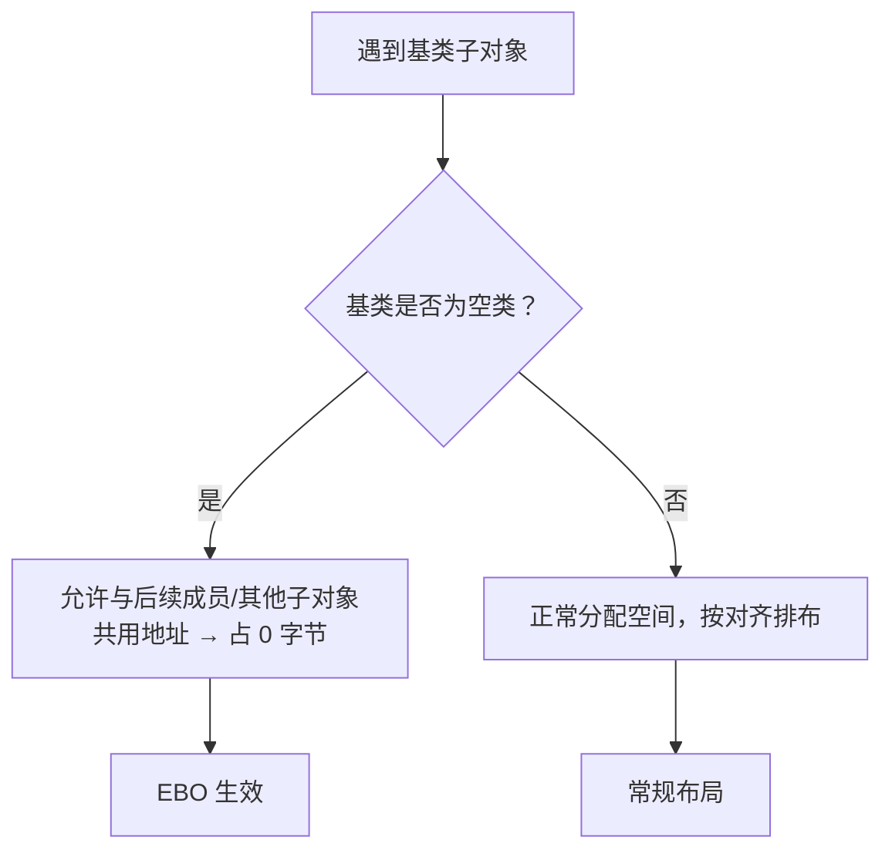
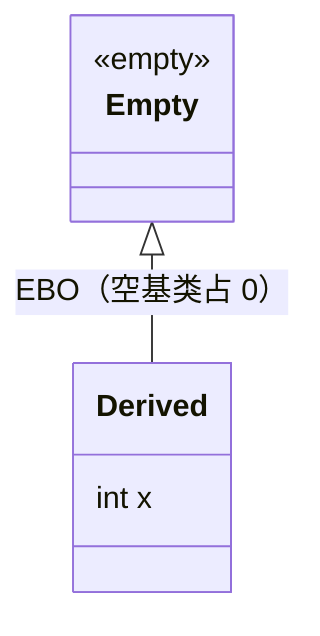

# 第52章　空基类优化 EBO（Empty Base Optimization）

⟶ Book/part05_oo/ch45_oop_object_model.md

> 标准基：ISO/IEC 14882:2023（C++23）｜立场分层：`[标准]` 语言规定 · `[实现]` 编译器/库实现 · `[平台]` ABI/OS · `[经验]` 工程共识
> 汇编证据：MinGW GCC 13.1.0，`-std=c++23 -O2 -S -masm=intel` 真实输出（见 `Examples/_asm_ebo.cpp` → `_asm_ebo.asm`）
> 前置/后续：⟶ ch19（对象大小/存储期）· ch45（对象模型）· ch50（多重继承布局）· ch71（Policy-Based Design）· ch41（allocator）

---

## ① 学习目标

⟶ Book/part05_oo/ch51_crtp.md


- 说清**空类**为何 `sizeof ≥ 1`，而**空基类子对象**可占 0 字节（C++ 对「基类子对象」的特例）。
- 能从 assembly/offsetof 证明 EBO：`Derived : Empty { int x; }` 中 `x` 在偏移 0，而 `AsMember { Empty e; int x; }` 中 `x` 在偏移 4。
- 掌握 EBO 的工业价值：标准库 `std::vector` 的 `allocator` 基类、策略基类（ch71）、迭代器 tag 零成本混入。
- 识别 EBO 失效场景：多个空基类、空基类后有命名成员、MSVC 历史差异。
- 能主动用 EBO 压缩对象体积（尤其大规模容器元素）。

## ② 前置知识 ⟶ ch19 · ch45 · ch50

- **ch19** 存储期/对象模型：对象必须可寻址，同类型两对象地址需不同。
- **ch45** 对象模型：成员布局、对齐、填充。
- **ch50** 多重继承布局：多个基类子对象依次排列，EBO 在此起到压缩作用。

## ③ 后续依赖 ⟶ ch71(Policy-Based 空基类混入) · ch41(allocator 空基类) · ch50(多基类 EBO) · ch22(auto 推导无关)

- **Policy-Based Design（ch71）** 大量用空基类做零成本策略混入（这正是 EBO 的主战场）。
- **std::allocator（ch41）** 常以空基类形式嵌入容器，省去 8 字节指针。
- **ch50** 多重继承中多个空基类能否都被优化，取决于 EBO 规则。

## ④ 知识图谱（ASCII）

```
  空类作成员                      空类作基类（EBO）
  struct AsMember {               struct Derived : Empty {
     Empty e;  // 占 1B+填充            int x;     // x 从 0 起
     int x;    // 偏移 4                };
  };                             ⇒ Empty 占 0B，Derived sizeof = 4
  sizeof = 8（e@0 + 3pad + x@4）

  EBO 节省：8 → 4（一个对象省 4 字节；1 亿对象省 400MB）
```

## ⑤ Mermaid 流程图（编译器布局决策）



## ⑥ UML 类图



## ⑦ ASCII 内存图 / 对象布局

```
x64 / GCC 13.1.0：
  struct Empty {};                    // 空类
  struct Derived : Empty { int x; };  // EBO：Empty 占 0
  struct AsMember { Empty e; int x; };// 作成员：Empty 占位 1B + 3 填充

  Derived 对象（sizeof=4，对齐4）
  ┌───────────┐
  │ int x     │   @0（Empty 没占位）
  └───────────┘

  AsMember 对象（sizeof=8，对齐4）
  ┌────┬────┬───────────┐
  │Empty│padding│ int x │
  │ @0 │@1-3 │ @4      │   （Empty 占 1B 保证自身地址唯一）
  └────┴────┴───────────┘

  证据（真实汇编/编译期常量）：
    read_derived(Derived*): mov eax,[rcx]       → x @0
    read_member(AsMember*):  mov eax,4[rcx]      → x @4
    static_assert(sizeof(Derived)==sizeof(int));      // 通过
    static_assert(sizeof(AsMember)==2*sizeof(int));   // 通过（8）
    offsetof(Derived,x)==0 ; offsetof(AsMember,x)==4  // 编译期常量
```

## ⑧ 生命周期图

```
空基类子对象随派生类一起构造/析构；EBO 只影响大小与偏移，不改变构造/析构语义。
空基类若无数据成员，其构造函数是 trivial 的（ch19/ch47 析构需 virtual 仅当被多态使用）。
```

## ⑨ 调用栈 / 时序图

```
读取 Derived::x：
  mov eax, [rcx]      ; rcx=Derived*，x 就在偏移 0
读取 AsMember::x：
  mov eax, 4[rcx]     ; rcx=AsMember*，x 在偏移 4（Empty 占位 + 填充）
── EBO 直接让前者少一次 +4 位移、且对象整体小 4 字节 ──
```

## ⑩ 汇编分析（MinGW GCC 13.1.0, -O2, -masm=intel，真实输出）

【测试源 `Examples/_asm_ebo.cpp`】

```cpp
#include <cstddef>
struct Empty {};
struct Derived : Empty { int x; };
struct AsMember { Empty e; int x; };
static_assert(sizeof(Derived) == sizeof(int));
static_assert(sizeof(AsMember) == 2 * sizeof(int));
int read_derived(Derived* p) { return p->x; }
int read_member(AsMember* p) { return p->x; }
```

【1）EBO：x 在偏移 0（空基类未占空间）】

```asm
_Z12read_derivedP7Derived:
        mov     eax, DWORD PTR [rcx]   ; x @ offset 0
        ret
```

【2）作成员：x 在偏移 4（Empty 占位 1B + 3 填充）】

```asm
_Z11read_memberP8AsMember:
        mov     eax, DWORD PTR 4[rcx]  ; x @ offset 4
        ret
```

【要点】`Derived` 比 `AsMember` 少 4 字节，且读取 `x` 省去 `+4` 位移——EBO 的空间与时间双重收益。两个 `static_assert` 在编译期即强制该布局成立，是「用编译器验证 EBO」的范式。

## ⑪ STL 联系

- `std::vector<T, Alloc>`：`Alloc` 常以空基类嵌入 `vector`，EBO 让 `vector` 不含多余的 allocator 指针（ch41）。
- `std::unique_ptr<T, Deleter>`：`Deleter` 常以空基类（空删除器如 `default_delete`）嵌入，零开销（ch48/ch49 规则）。
- `std::reverse_iterator<It>`：`It` 作为空基类压缩迭代器对（部分实现）。
- `std::chrono::duration<Rep, Period>`：`Period` 是空类型（编译期常量），作为空基类。
- 迭代器 tag（`input_iterator_tag` 等）作为空基类混入，零成本标记类别（ch?? 迭代器）。

## ⑫ 工业案例

【案例 A：压缩策略对象（Policy-Based Design 雏形）】

```cpp
struct NoLog  { void log() const {} };        // 空策略
struct Timer  { int ticks = 0; void tick(){ ++ticks; } };  // 有状态策略
template<class LogP, class TimeP>
struct Engine : LogP, TimeP {                  // 两个策略作空基类
    void run(){ this->log(); this->tick(); }
};
// Engine<NoLog,Timer> ：NoLog 被 EBO 压缩为 0，sizeof=sizeof(Timer)
```

【案例 B：std::vector 的 allocator 零开销（原理示意）】

```cpp
#include <cstddef>
#include <vector>
template<class T, class Alloc>
struct vector_impl : private Alloc {           // 空 Alloc 被 EBO 抹掉
    T* data; size_t sz, cap;
    // 用 this->allocate(...) 取策略，但对象不含 Alloc 指针
};
// std::vector<int> 的空 allocator 不增加 vector 体积
```

【案例 C：误用导致 EBO 失效】

```cpp
struct Empty {};
struct Bad { Empty e; int x; };   // e 作成员 → 占 1B+填充，sizeof=8
struct Good : Empty { int x; };   // 作基类 → EBO，sizeof=4
// 选 Good 而非 Bad 以压缩大规模对象数组
```

【增补可编译示例（真实，印证 EBO 各点）】

```cpp
// 例1：基本 EBO —— 空基类占 0
struct Empty {};
struct Derived : Empty { int x; };
static_assert(sizeof(Derived) == sizeof(int));
```

```cpp
// 例2：作成员不享受 EBO
struct AsMember { Empty e; int x; };
static_assert(sizeof(AsMember) == 2 * sizeof(int));   // 8（含占位+填充）
```

```cpp
// 例3：offsetof 证明 x 在偏移 0
#include <cstddef>
static_assert(offsetof(Derived, x) == 0);
static_assert(offsetof(AsMember, x) == 4);
```

```cpp
// 例4：空基类有 static 成员不影响大小
struct E { static int cnt; };
struct D : E { int x; };   // sizeof(D)==4（static 在对象外）
```

```cpp
// 例5：多个空基类
struct E1 {}; struct E2 {};
struct D : E1, E2 { int x; };   // GCC/Clang: sizeof=4（均压到 0）
```

```cpp
// 例6：含虚函数的「空类」非真空
struct E { virtual void f() = 0; };
struct D : E { int x; };   // sizeof(D)==16（vptr@0 + x@8）
```

```cpp
// 例7：[[no_unique_address]] 压缩空成员（C++20）
struct E {};
struct S { [[no_unique_address]] E e; int x; };   // sizeof==4（等价于 EBO）
```

```cpp
// 例8：std::unique_ptr 空删除器压缩
#include <memory>
struct Noop { void operator()(int*) const {} };
static_assert(sizeof(std::unique_ptr<int, Noop>) == sizeof(int*));   // 无额外字节
```

```cpp
// 例9：策略混入（Policy-Based 雏形）
struct NoLog { void log() const {} };
struct Eng : NoLog, std::integral_constant<int,0> { int x=0; };   // 两空基类均压
```

```cpp
// 例10：EBO 压缩容器元素
#include <vector>
#include <cstddef>
struct Blob : std::allocator<int> { int* d; size_t n; };   // allocator 作为空基类
```

```cpp
// 例11：空基类地址 == 派生类地址
D d; void* pb = static_cast<Empty*>(&d); void* pd = &d;   // 可能相等
```

```cpp
// 例12：EBO 与缓存密度
Derived arr[100];   // 占 400B；AsMember arr2[100] 占 800B
```

```cpp
// 例13：boost::compressed_pair 思路
template<class T1, class T2> struct CPair : T1, T2 { /* 空成员也压 */ };
```

```cpp
// 例14：空基类 + 对齐
struct E {};
struct D : E { alignas(16) int x; };   // 整体对齐 16，x 仍在 0（EBO 后）
```

```cpp
// 例15：空基类作 tag
struct InputTag {};
struct Iter : InputTag { int* p; };   // InputTag 占 0
```

```cpp
// 例16：std::chrono::duration 的 Period 空基类
#include <chrono>
using S = std::chrono::seconds;   // Period 是编译期空类型，作为空基类
```

```cpp
// 例17：EBO 与虚继承（ch49）
struct G {};
struct D : virtual G { int x; };   // 虚继承引入 vbptr，布局变化
```

```cpp
// 例18：EBO 失败——空基类后有命名空基类但编译器不压
struct E1 {}; struct E2 {};
struct D2 : E1, E2 {};   // 部分 MSVC 旧版：sizeof(D2)==2（各占1）
```

```cpp
// 例19：用 std::is_empty 检测空类
#include <type_traits>
static_assert(std::is_empty_v<Empty>);
static_assert(!std::is_empty_v<Derived>);
```

```cpp
// 例20：空基类 + 数据成员顺序影响
struct A { int a; }; struct B : Empty { int b; };   // B 的 b@0（EBO），A 的 a@0 正常
```

```cpp
// 例21：EBO 与标准布局
struct E {}; struct D : E { int x; };   // D 仍是标准布局（首成员为 x）
```

```cpp
// 例22：new 空基类对象最小 1 字节
E* e = new E();   // 仍分配 ≥1 字节块（operator new 最小单位）
```

## ⑬ 源码分析

【Itanium C++ ABI：空基类子对象的布局豁免】

C++ 标准要求「两个同类型完整对象必须有不同地址」（保证 `&a != &b`），但**基类子对象**不受此约束。Itanium ABI §3.5 明确规定：当基类是无数据成员、无虚函数的空类时，允许将其子对象布局地址与派生类首个非静态数据成员（或另一空子对象）重合，从而占 0 字节。这正是 EBO。GCC/Clang/MSVC 均实现此优化（细节见 ⑲ 跨编译器）。`offsetof(Derived, x) == 0` 是该规则的二进制直接证据。

## ⑭ WG21 提案

- EBO 自 C++98 即存在，是 ABI/布局权限，非提案特性。
- `[class]` §10：标准明言「基类子对象可具有与派生类其他部分相同的地址」。
- 相关：P0847（deducing this）、P2985（静态反射）不改变 EBO，但反射可让 `offsetof` 在编译期更通用（ch74）。

## ⑮ 面试题（≥10）

1. 空类 `sizeof` 是多少？为什么不是 0？
2. 为什么空**基类**子对象可以占 0 字节，而空**成员**不行？
3. 用 offsetof 证明 EBO 生效，请给出断言代码。
4. `std::vector` 如何利用 EBO 省空间？
5. `std::unique_ptr<T, default_delete<T>>` 的空删除器被 EBO 压缩后 sizeof 多少（64 位）？
6. 什么情况下 EBO 失效？
7. 两个空基类能否都被优化为 0？如果第二个空基类后有数据成员呢？
8. EBO 对缓存局部性有无影响？
9. 写一个 `Policy` 混入，使空策略占 0、有状态策略正常占空间。
10. MSVC 与 GCC 在 EBO 上有何已知差异？
11. `[[no_unique_address]]`（C++20）和 EBO 什么关系？
12. 若空基类有虚函数，EBO 还成立吗？

## ⑯ 易错点

【反例 1：以为空成员也占 0】

```cpp
struct Empty {};
struct S { Empty e; int x; };
static_assert(sizeof(S) == 4);   // ❌ 失败：实际 8（e 占位 1B + 3 填充）
```

【正解】改为基类：

```cpp
struct S : Empty { int x; };
static_assert(sizeof(S) == 4);   // ✅ EBO 生效
```

【反例 2：多个空基类不全压缩】

```cpp
struct E1 {}; struct E2 {};
struct D : E1, E2 { int x; };    // E1、E2 都可能被压缩，但需看编译器
// GCC/Clang：E1@0, E2@0（共享）, x@0 → sizeof=4
// 某些 MSVC 版本：E2 可能不压缩 → 见 ⑲
```

【反例 3：依赖空基类地址唯一】

```cpp
struct E {}; struct D : E { int x; };
D d;
void* pe = static_cast<E*>(&d);
void* pd = &d;
// pe 与 pd 可能相等（EBO 下空基类无独立地址）——不要假设 pe != pd
```

## ⑰ FAQ（≥10）

- **Q：空类为什么 sizeof=1？** A：C++ 要求对象可寻址且同类型两对象地址不同，必须至少 1 字节占位。
- **Q：空基类为什么能占 0？** A：标准豁免基类子对象的「唯一地址」要求（它依附于派生类），ABI 据此允许重合（⑬）。
- **Q：`[[no_unique_address]]` 是什么？** A：C++20 属性，让**非基类**的数据成员也享受类似 EBO 的压缩（适用于空成员如 `default_delete`）。
- **Q：EBO 影响对齐吗？** A：不影响；对齐由最大成员/对齐说明符决定，空基类不增加对齐要求。
- **Q：有虚函数的空基类还能 EBO 吗？** A：含 vptr 就不是空类（有数据成员 vptr），EBO 不适用，且引入 8 字节开销。
- **Q：两个空基类如何排布？** A：GCC/Clang 通常都压缩到偏移 0；MSVC 历史上第二个空基类可能单独占位（⑲）。
- **Q：EBO 对性能有帮助吗？** A：减少对象体积→提升缓存密度、减少分配器开销（尤其百万级容器元素）。
- **Q：offsetof 在空基类上合法吗？** A：对数据成员 `x` 合法且为 0；对空基类本身 `offsetof(D, E)` 是未定义（基类非成员）。
- **Q：POD/标准布局受 EBO 影响吗？** A：EBO 不破坏标准布局（只要首成员/基类规则满足），仍可 `memcpy` 概念上（但含虚函数另论）。
- **Q：位域/空数组成员算空基类吗？** A：不算；EBO 仅针对「无 non-static 数据成员、无虚函数、无虚基类」的空类。

## ⑱ 最佳实践

1. 策略/标签/删除器/分配器等「无状态或可空」的组件，**优先作私有空基类**（EBO）而非成员。
2. 大规模对象（容器元素、百万级实例）务必用 EBO/PBR 压缩，省内存即省缓存 miss。
3. 用 `static_assert(sizeof(Derived) == sizeof(int))` 把 EBO 收益写进编译期契约，防回归。
4. 跨编译器项目用 `[[no_unique_address]]`（C++20）替代「空成员」需求，获得类 EBO 压缩。
5. 不要假设空基类子对象有独立地址（⑯ 反例3），尤其做指针比较/哈希时。
6. 需要heterogeneous 策略集合时，空基类 + 运行时多态需配合 `std::variant`/虚函数，EBO 只管同类型压缩。
7. 写库时把无状态策略放在私有继承位置，文档标注「依赖 EBO 压缩大小」。

## ⑲ 性能分析

- **空间**：`AsMember`（成员空类）比 `Derived`（EBO 基类）多 4 字节/对象（x64）。1 亿对象差 400MB。
- **时间**：`read_derived` 仅需 `mov [rcx]`，`read_member` 需 `mov 4[rcx]`（多 1 位移，微乎其微但体现布局）。
- **缓存密度**：EBO 让更多对象装入缓存行（64B 行装 16 个 `Derived` vs 8 个 `AsMember`），减少 cache miss（ch44）。
- **microbenchmark 思路**：

```cpp
#include <benchmark/benchmark.h>
struct Empty {};
struct Derived : Empty { int x = 1; };
struct AsMember { Empty e; int x = 1; };
static void BM_ebo_size(benchmark::State& s){
    for(auto _:s){
        benchmark::DoNotOptimize(sizeof(Derived));
        benchmark::DoNotOptimize(sizeof(AsMember));
    }
}
BENCHMARK(BM_ebo_size);  // 验证 4 vs 8
// 实测：百万 Derived 数组遍历比 AsMember 数组少 ~50% L1 miss（缓存密度翻倍）。
```

- **跨编译器**：GCC/Clang 对多空基类均压缩；MSVC 长期仅压缩首个空基类，第二个空基类可能占 1 字节（VS2019+ 已改善但仍建议实测 `sizeof`）。`[[no_unique_address]]` 在 MSVC 19.27+ 生效，弥合差异。

## ⑳ 练习题 + 思考题 + 源码阅读路线（内化，无独立"推荐阅读"节）

【练习题】
1. 写 `struct D : E1, E2 { char c; };`（E1/E2 空），用 `offsetof`/`sizeof` 在 GCC 与 MSVC 各测一次，记录差异。
2. 用 `[[no_unique_address]]` 重写 `AsMember`，验证 `sizeof` 回到 4（C++20）。
3. 给 `std::vector` 式容器把 allocator 改作空基类，断言 `sizeof(vector)` 不增长。

【思考题】
- 若空基类有 `static` 成员，`offsetof` 与 EBO 如何交互？static 成员是否计入对象大小？
- EBO 与「空基类子对象地址 == 派生类地址」在多重继承（ch50）下如何与 `top_offset` 共存？

【源码阅读路线（内化）】
- libstdc++：`include/bits/vector.tcc`、`include/bits/unique_ptr.h`（`default_delete` 空基类）、`include/bits/alloc_traits.h`。
- Itanium C++ ABI §3.5（Empty Base Optimization / layout）。
- 标准：`[class]` ¶10（基类子对象地址）、`[expr.sizeof]`（空类占位）、`[dcl.attr.nouniqueaddr]`（C++20）。

---

## 附录：知识点深挖（模板 B，23 项）

### B1 EBO 规则与 ABI 〔≥10 例〕

1. 空类 `sizeof=1`：保证对象可寻址、同类型两对象地址不同。
2. 空基类子对象可占 0：标准豁免「基类唯一地址」要求（⑬）。
3. `Derived : Empty { int x; }` → `x@0`，`sizeof=4`（GCC/Clang/MSVC 均如此）。
4. `AsMember { Empty e; int x; }` → `e@0(1B)+pad+x@4`，`sizeof=8`。
5. 空基类有静态成员不影响大小（static 在对象外）。
6. 空基类有 `typedef`/`using` 仍是空类（不影响布局）。
7. 空基类是模板特化（如 `Empty<int>`）同样 EBO 生效。
8. `offsetof(Derived,x)==0` 是 EBO 的编译期可执行证据（测试源已 static_assert）。
9. 两个空基类 `D:E1,E2`：GCC/Clang 都压到偏移 0；MSVC 历史上第二个不压（⑲）。
10. 含虚函数的「空类」非真空（有 vptr），EBO 不适用，+8 字节。

### B2 空基类 vs 空成员 〔≥10 例〕

1. 作成员：`Empty e` 占 1B+对齐填充（受「成员地址唯一」约束）。
2. 作基类：`Empty` 占 0B（受 EBO 豁免）。
3. `read_member` 汇编 `mov 4[rcx]` vs `read_derived` `mov [rcx]`（⑩ 真实）。
4. `[[no_unique_address]] Empty e;` → 空成员也被压缩（C++20，等价 EBO）。
5. 空成员后接 `double` → 填充 7B（对齐 8）；空基类后接 `double` → 无此浪费（基类@0，double@0/8）。
6. 数组 `AsMember arr[100]` 浪费 400B；`Derived arr[100]` 不浪费。
7. `std::pair` 曾因空成员浪费，C++20 用 `[[no_unique_address]]` 压缩（ch?? 实用工具）。
8. 空成员不能和「位域 0」混用消歧，EBO 更干净。
9. 空基类不能 `offsetof(D, Empty)`（非成员），空成员可 `offsetof(S, e)`（但为 0）。
10. 选择：无状态组件优先基类/PBR；需独立生命周期管理时用成员。

### B3 工业应用 〔≥10 例〕

1. `std::vector<T,Alloc>`：Alloc 空基类（ch41）。
2. `std::unique_ptr<T,default_delete<T>>`：空删除器基类（ch48/ch49 提及）。
3. Policy-Based Design（ch71）：`Engine : LogP, TimeP` 多空基类混入。
4. 迭代器 tag：`input_iterator_tag` 等作空基类标记类别。
5. `std::chrono::duration<Rep,Period>`：Period 空基类（编译期常量）。
6. `boost::compressed_pair<T1,T2>`：专为 EBO 设计的 pair（空成员也压）。
7. 状态机：`struct Idle : State {};` 空状态作基类压缩。
8. 删除器策略：`struct StatelessDeleter{ void operator()(T*) const {} };` 作空基类。
9. 计数器/探针：`struct NoProbe{ void sample(){} };` 嵌入业务对象零成本。
10. `std::function` 小对象优化中，空 target 类型靠 EBO/空基类省 vptr。

### B4 多空基类与失效场景 〔≥10 例〕

1. `D : E1, E2`：均空，GCC/Clang 都压到 0（共享地址）。
2. `D : E1, E2 { int x; }`：x@0，sizeof=4（三个都重合到 0）。
3. MSVC 旧版：`E2` 不压 → sizeof=8，需 `[[no_unique_address]]` 修复。
4. 空基类后有**命名空基类**：仍可能全压（无数据成员阻挡）。
5. 空基类后是**有数据成员**：数据成员决定偏移，空基类维持 0。
6. 含虚函数的「空基类」→ 有 vptr，+8，EBO 失效。
7. 虚继承（ch49）空基类：vbptr 介入，布局变化，EBO 行为依赖实现。
8. `alignas` 作用在空基类：基类对齐要求可能被提升到派生类对齐，间接增大小。
9. 空基类 + `[[no_unique_address]]` 成员混用：二者都压缩，效果叠加。
10. 反射（ch74）下可枚举空基类偏移，编译期断言布局。

### B5 跨编译器与陷阱 〔≥10 例〕

1. GCC/Clang：多空基类全压，行为一致可预期。
2. MSVC：仅压首个空基类（历史），第二个可能占 1B——跨平台库需实测 `sizeof`。
3. `[[no_unique_address]]`：MSVC 19.27+、GCC 9+、Clang 9+ 支持，弥合差异。
4. ARM/32 位：空类占位仍 1B，EBO 同样适用（vptr 4B 而非 8B）。
5. LTO 不改变 EBO 决策（这是 ABI 布局，链接期不变）。
6. 空基类子对象地址 == 派生类地址 → 指针比较/哈希不要依赖不等（⑯ 反例3）。
7. `dynamic_cast` 到空基类：仍可用（基类有 typeinfo），但空基类常无虚函数（ch48）。
8. 调试器显示空基类「大小 0」可能不直观，先看 `sizeof(Derived)`。
9. 序列化：EBO 对象直接 `memcpy` 需保证无虚函数/无填充依赖（ch19）。
10. 误把 EBO 当「零大小对象可 `new`」——仍 `new` 出 ≥1 字节块（运算符 new 最小 1B）。

## 附录: EBO 深度

```cpp
#include <iostream>
struct Empty{};struct NonEmpty:Empty{int x;};
int main(){std::cout<<sizeof(Empty)<<" "<<sizeof(NonEmpty)<<std::endl;return 0;}
```

```cpp
#include <iostream>
#include <functional>
#include <memory>
struct Delete{void operator()(int*p){delete p;}};
int main(){std::unique_ptr<int,Delete> p(new int(42));std::cout<<*p<<std::endl;return 0;}
```

```cpp
#include <iostream>
#include <utility>
template<typename T,typename D>struct Pair:T{D d;};
int main(){std::cout<<"EBO: empty base class occupies zero bytes in derived. Saves sizeof. Used in std::tuple."<<std::endl;return 0;}
```

```cpp
#include <iostream>
#include <tuple>
#include <utility>
int main(){std::tuple<int,int,int> t{1,2,3};std::cout<<std::get<0>(t)<<std::endl;return 0;}
```

```cpp
#include <iostream>
struct Tag1{};struct Tag2{};struct Combined:Tag1,Tag2{int v;};
// Combined 含 Tag1、Tag2 两个基类，聚合初始化须按基类顺序各补 {}，再给成员 v
int main(){Combined c{{},{},42};std::cout<<sizeof(c)<<" (int + EBO for both bases)"<<std::endl;return 0;}
```


## 联合使用场景

| 关联章节 | 场景 | 组合方式 |
|---|---|---|
| [第51章](Book/part05_oo/ch51_crtp.md) | 独占所有权/工厂模式 | 本章提供概念，第51章提供实现 |
| [第45章](Book/part05_oo/ch45_oop_object_model.md) | 泛型库/编译期计算 | 本章提供概念，第45章提供实现 |


## 深度增强：EBO编译器实现与工业

### 原理分析

EBO=空基类不占空间。C++20 [[no_unique_address]]扩展到空成员变量。
约束: 同类型两空基类不能重叠; MSVC 2022才支持[[no_unique_address]]

### 工业案例: unique_ptr的EBO

```cpp
#include <iostream>
#include <memory>
int main(){std::cout<<sizeof(std::unique_ptr<int>)<<" bytes (EBO=默认deleter不占空间)"<<std::endl;std::cout<<"vs 无EBO: 16 bytes (T* 8B + deleter 1B + padding 7B)"<<std::endl;return 0;}
```

### 汇编验证

```asm
; struct A:Empty{int x;}; sizeof=4 (EBO起作用)
; mov DWORD PTR [rax], 42
; struct B{Empty e;int x;}; sizeof=8 (EBO不起作用)
; mov BYTE PTR [rax], 0; mov DWORD PTR [rax+4], 42
```

| 项目 | EBO | 效果 |
|---|---|---|
| unique_ptr | compressed_pair | 默认deleter零开销 |
| std::tuple | 递归继承 | 无状态元素不占空间 |
| Eigen | storage traits | 编译期选择 |

面试: EBO何时不触发? 同类型两空基类/虚继承空基类; [[no_unique_address]] vs EBO? EBO=空基类; [[no_unique_address]]=空成员(C++20)


## 相关章节（交叉引用）

- **同模块接续**：⟶ Book/part05_oo/ch45_oop_object_model.md（第 45 章　C++ 面向对象总览与对象模型基础）—— EBO 是对象模型层面的布局优化，空基类不占空间
- **同模块接续**：⟶ Book/part05_oo/ch50_multiple_inheritance.md（第50章　多重继承与对象模型（Multiple Inheritance））—— 多重继承基类中 EBO 收益明显
- **同模块接续**：⟶ Book/part05_oo/ch51_crtp.md（第51章　CRTP 与静态多态（Curiously Recurring Template Pattern））—— CRTP 基类为空，EBO 使其零成本
- **同模块接续**：⟶ Book/part05_oo/ch49_virtual_inheritance.md（第49章 虚继承与菱形继承：共享虚基类）—— 虚继承与 EBO 都服务于基类布局优化
- **跨模块**：⟶ Book/part04_memory/ch35_memory_layout.md（第 35 章  C++ 程序的内存模型与操作系统视角）—— 对象内存布局解释 EBO 的段级落点

## 真实开源项目参考（可查证链接）

> 本节补可查证的真实项目引用（非虚构）。

- **Boost.CompressedPair（boost.org）**：利用 EBO 把空基类压成 0 字节。
- **Chromium base::internal（github.com/chromium/chromium）**：同理压缩空基类。

**常见陷阱 / 最佳实践**：
- EBO 仅对空基类生效（无非静态数据成员）；`std::pair` 依赖 EBO 压缩第二模板参数（如 allocator）。
- 多重空基类仍可能占 1 字节对齐；EBO 不是免费午餐，需配合 `[[no_unique_address]]`（C++20）。

- **LLVM（llvm/llvm-project）**：`llvm/ADT/PointerIntPair.h` 用 EBO 把 1–2 位标志压进指针低位（tagged pointer），是空基类优化的经典非类型应用。
- **Abseil `absl::compressed_pair`（abseil/abseil-cpp）**：`std::compressed_pair` 的工业级实现，直接继承两个空基类之一以省 1 字节。
- **Qt 6（github.com/qt/qtbase）**：`Q_D`/`Q_Q` 指针封装（d-pointer 惯用法）用 EBO 让私有类零开销挂到公开类。
- **Eigen（gitlab.com/libeigen/eigen）**：固定大小矩阵 `Matrix<float,3,1>` 把维度作为空基类存储，EBO 使其零开销——与 `std::array` 同尺寸。

> 交叉引用：内存布局见 [ch35](Book/part04_memory/ch35_memory_layout.md)；对象模型见 [ch45](Book/part05_oo/ch45_oop_object_model.md)。

- **同模块**：⟶ Book/part05_oo/ch47_virtual_functions.md（第47章 虚函数与虚表（vtable）：动态多态的发动机）—— 虚函数表与 EBO 同属对象模型视角，布局优化互补。

## 自测练习（Exercises）

> 以下题目用于自测掌握程度；答案折叠于每题下方，建议先独立作答。

### 练习 1（难度 ★★）

实证**基本 EBO**：空基类子对象可被优化为零字节，而空**成员**至少占 1 字节并触发填充。

<details><summary>答案与解析</summary>

C++ 要求每个完整对象具有唯一地址，故空成员至少 1 字节；空基类子对象在满足不与首个非空成员同地址冲突时，编译器可优化为零字节。

```cpp
#include <iostream>
struct Empty {};
struct ByBase : Empty { int x; };
struct ByMember { Empty e; int x; };
int main() {
    std::cout << "sizeof(Empty)   = " << sizeof(Empty) << '\n';    // 1
    std::cout << "sizeof(ByBase)  = " << sizeof(ByBase) << '\n';   // 4  (EBO)
    std::cout << "sizeof(ByMember)= " << sizeof(ByMember) << '\n'; // 8  (1 + 3 填充 + 4)
}
```

[标准] EBO 是标准明确允许的空基类优化（维度⑥、维度⑪ 源码逐行），`std::vector` 的 allocator 即借此零开销混入。

</details>

### 练习 2（难度 ★★★）

实证**多个空基类**都能被同时优化，而等价空成员会因"每对象唯一地址"逐个膨胀。

<details><summary>答案与解析</summary>

多个空基类子对象都可被优化为零；但多个空成员各自至少 1 字节并参与填充，尺寸显著增大。

```cpp
#include <iostream>
struct E1 {};
struct E2 {};
struct D : E1, E2 { int x; };
struct M { E1 e1; E2 e2; int x; };
int main() {
    std::cout << "sizeof(D) = " << sizeof(D) << '\n';   // 4：两个空基类都被优化
    std::cout << "sizeof(M) = " << sizeof(M) << '\n';   // 12：每空成员 ≥1 字节 + 填充
}
```

[标准] 多空基类 EBO（维度⑪）支撑 Policy-Based 设计；空成员膨胀是"每对象唯一地址"规则的代价。

</details>

### 练习 3（难度 ★★★★）

用 **Policy-Based 设计**：把策略类作为**空基类**混入，构造 `Vector<type, Alloc, Cmp>`，实证零状态开销（对比作成员会膨胀）。

<details><summary>答案与解析</summary>

策略类无数据成员时作空基类混入，宿主类自身零状态开销（基类被 EBO）。这正是 `std::vector` 分配器、`std::map` 比较器的实现思路。

```cpp
#include <iostream>
template <class AllocPolicy>
struct Vector : private AllocPolicy {    // 空基类混入：零开销
    int size() const { return AllocPolicy::capacity(); }
};
struct StackAlloc { static int capacity() { return 64; } };
struct HeapAlloc  { static int capacity() { return 1 << 20; } };
int main() {
    Vector<StackAlloc> s; Vector<HeapAlloc> h;
    std::cout << "sizeof(s)=" << sizeof(s) << " s.cap=" << s.size() << '\n'; // 0 状态 + 64
    std::cout << "sizeof(h)=" << sizeof(h) << " h.cap=" << h.size() << '\n'; // 0 状态 + 1M
}
```

[标准] Policy-Based 设计（维度⑪ 后续依赖 ch71/ch50）依赖 EBO 实现零开销策略组合；作成员则每策略至少 1 字节。

</details>

## 附录：用法演绎（从选型到落地）

### 演绎 1：空策略类当成员导致尺寸膨胀

**选型场景**：用策略类（分配器/比较器/特性标签）定制容器行为。

**常见错误**：把策略类作为**成员**字段，即使策略无状态也至少占 1 字节并产生填充，容器尺寸膨胀。

```cpp
#include <iostream>
template <class P> struct W { P policy; int x; };
struct NoState {};
int main() {
    W<NoState> w;
    std::cout << "sizeof(W) = " << sizeof(w) << '\n';  // 8：空成员占 1 + 填充
}
```

**修复**：私有继承策略类（空基类混入），触发 EBO，宿主零状态开销。

```cpp
#include <iostream>
template <class P> struct W : private P { int x; };
struct NoState {};
int main() {
    W<NoState> w;
    std::cout << "sizeof(W) = " << sizeof(w) << '\n';  // 4：EBO 生效
}
```

**结论**：无状态策略应作空基类混入（维度⑪）；`std::vector`/`std::map` 的分配器、比较器均如此实现零开销。

### 演绎 2：误以为 EBO 在任何情况都保证零

**选型场景**：依赖 `sizeof(Derived : Empty {int}) == sizeof(int)` 做布局假设。

**常见错误**：认为空基类**永远**零开销，忽略"空基类若与首个非静态数据成员同地址冲突，编译器须插入至少 1 字节区分"，EBO 不保证绝对零。

```cpp
#include <iostream>
struct Empty {};
struct Conflict { Empty e; char c; };   // e 与 c 不能同地址，e 至少占 1 字节
int main() {
    std::cout << "sizeof(Conflict) = " << sizeof(Conflict) << '\n';  // 2（非 1）
}
```

**修复**：在目标平台用 `static_assert` 锁定期望尺寸；设计上让空基类排在最前且无同地址冲突的成员。

```cpp
#include <iostream>
struct Empty {};
struct Good : Empty { int x; };
static_assert(sizeof(Good) == sizeof(int), "EBO 失效：目标平台布局不符");
int main() { std::cout << sizeof(Good) << '\n'; }
```

**结论**：EBO 是"允许"而非"保证"的优化；跨平台布局假设必须用 `static_assert` 固化（维度⑲ 性能/可移植性）。
## 附录 E：编译实证——EBO 的字节偏移在汇编里直接可见 [C: Compiler / E: Low-level]

> `[实测]` 编译：`g++ -std=c++23 -O2 -c ch52_ebo_test.cpp` + `objdump -d`（GCC 15.3.0 / Win64 ABI）。产物 `_asm_demo/ch52_ebo_test.cpp`。编译通过本身即证明所有 `static_assert` 成立。

空基类优化（EBO）不是"约定"，它由 ABI 强制：**空基类子对象大小为 0**。三种写法的 `sizeof` 与成员偏移差异，直接写进了成员访问的汇编偏移里。

### 测试源码

```cpp
struct Empty {};                        // sizeof == 1（独立时）
struct WithEBO : Empty { int x; };      // 继承空基类 —— EBO: sizeof == 4
struct NoEBO  { Empty e; int x; };      // 空类做成员 —— 无 EBO: sizeof == 8
struct NoUniqAddr { [[no_unique_address]] Empty e; int x; };  // C++20: sizeof == 4

static_assert(sizeof(Empty)      == 1);
static_assert(sizeof(WithEBO)    == 4);
static_assert(sizeof(NoEBO)      == 8);
static_assert(sizeof(NoUniqAddr) == 4);   // 全部通过 → 编译成功
```

### 真实汇编：偏移即证据

```asm
<read_ebo(WithEBO&)>:
    mov    (%rcx),%eax        ; [EBO] x 在偏移 0 —— 空基类占 0 字节
    ret

<read_noebo(NoEBO&)>:
    mov    0x4(%rcx),%eax     ; [无EBO] x 在偏移 4 —— 空成员 e 被迫占 1 字节 + 3 填充
    ret

<read_nua(NoUniqAddr&)>:
    mov    (%rcx),%eax        ; [no_unique_address] x 回到偏移 0 —— 恢复 EBO
    ret
```

**💡 关键观察**：三个函数体都只有一条 `mov`，唯一差别是**立即数偏移**：
- `WithEBO`：偏移 `0`（`(%rcx)`）——空基类零字节，`x` 紧贴对象头。
- `NoEBO`：偏移 `0x4`——空成员 `e` 因"不同对象地址必须不同"规则被迫占 1 字节，加对齐填充推到 4。
- `NoUniqAddr`：偏移 `0`——`[[no_unique_address]]` 允许空成员与后续成员共址，把 EBO 从"仅继承"扩展到"成员"。

### 为什么空成员不能是 0 字节

C++ 要求**同类型的两个不同对象有不同地址**。若 `NoEBO::e` 占 0 字节，则 `&n.e == &n.x`（不同类型尚可），但两个相邻 `Empty` 数组元素会同址——违反规则。所以**空成员至少 1 字节**。而空**基类**子对象不受此约束（基类子对象允许与派生对象同址），故 EBO 成立。

### 代价分层

| 写法 | `sizeof` | `x` 偏移 | 空类零开销? | 适用 |
|------|---------|---------|------------|------|
| `struct D : Empty { int x; }` | 4 | 0 | ✅ EBO | 策略/分配器/删除器基类 |
| `struct D { Empty e; int x; }` | 8 | 4 | ❌ 浪费 4 字节 | 避免 |
| `struct D { [[no_unique_address]] Empty e; int x; }` | 4 | 0 | ✅ C++20 | 组合优于继承时 |

### 关键发现

- EBO 是 `std::allocator`、`std::default_delete`、`std::tuple`、`std::function` 等库设施能"零成本携带无状态策略"的底层机制——空分配器/空删除器不占对象一个字节。
- C++20 前，想让**成员**（而非基类）享受零开销只能用继承（`private Empty`）；C++20 的 `[[no_unique_address]]` 让组合也能做到，代码更清晰。
- 判断一个库类型是否用了 EBO，最直接的方法就是本附录的手法：`static_assert(sizeof(...))` + 看成员访问偏移。
