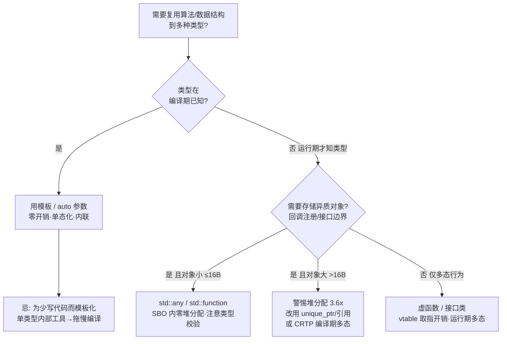

# 第60章　模板基础与实例化（Template Basics & Instantiation）

⟶ Book/part06_templates/ch61_template_overload.md
⟶ Book/part06_templates/ch69_constexpr.md
⟶ Book/part07_stl/ch77_vector.md

> 模板模式速查：本章属「基础结构型」模板。模板不是类型、不是宏，而是**参数化代码的生成器**；编译器在实例化点把模板「刻」成具体函数/类。零运行时开销的前提是：所有参数在编译期可知。

## ① 学习目标

⟶ Book/part06_templates/ch61_template_overload.md


- 说清「模板」「模板参数」「模板实参」「实例化」四者关系 [标准]
- 区分隐式实例化 / 显式实例化 / 显式特化 / 显式实例化定义 [标准]
- 理解两阶段查找（Phase 1 不依赖模板参数 / Phase 2 依赖模板参数）[实现]
- 能从 mangled 符号反推模板实例化 [平台]
- 掌握非类型模板参数（NTTP）与模板模板参数的边界 [标准]

## ② 本模板模式速查（名称 / 适用场景 / 核心结构 / 定义）

- **模板名称**：函数模板 / 类模板（基础参数化生成器）
- **适用场景**：同一算法/数据结构需要对多种类型复用，且要求零抽象开销（对比 `void*`/`any` 的运行期代价）
- **核心结构**：`template <parameter-list> decl`
- **一句话定义**：模板是一段「带未定参数的代码蓝图」，编译器在实例化点把它落地为具体实体 [标准]

```cpp
template <typename T>          // 模板参数列表：T 是类型参数
T max_val(T a, T b) {          // 函数模板
    return (a < b) ? b : a;
}
```

## ③ 核心结构与完整代码实现

模板参数有三类：

```cpp
// 1) 类型参数
template <typename T> struct Box { T v; };

// 2) 非类型模板参数（NTTP）：必须是编译期常量
template <typename T, int N> struct Arr { T data[N]; };   // N 是常量表达式

// 3) 模板模板参数（TTP）：参数本身是个模板
template <typename T, template <typename> class Container>
struct Holder { Container<T> c; };
```

非类型参数的合法类型 [标准]：

```cpp
#include <cstddef>
template <int I>            struct A {};   // 整数
template <bool B>           struct B {};   // 布尔
template <char C>           struct C {};   // 字符
template <std::size_t N>    struct D {};   // 整数类型
template <auto V>           struct E {};   // C++17 起：任意可以作 NTTP 的值（指针/引用/成员指针/枚举/整数）
template <int* P>           struct F {};   // 指针（需链接期常数地址）
template <const char* S>    struct G {};   // 字符串字面量地址可作 NTTP（C++20 改进）
```

## ④ 实例化机制（实例化点 / 两阶段查找）

```cpp
template <typename T>
void f(T x) {
    // 两阶段查找：
    // Phase 1（不依赖 T）：下面 unqualified 名字在定义点绑定
    ::global_helper();        // 不依赖 T，定义点即查
    // Phase 2（依赖 T）：dependent name 在实例化点再查
    x.foo();                  // 依赖 T，实例化点查 T::foo
}
```

实例化点（POI）规则 [标准]：

```cpp
template <typename T> void g(T);
void h() {
    g(1);     // 实例化点：h() 定义之后、namespace 作用域
}
// 翻译单元末尾才是 g<int> 的真正 POI（ADL 需要可见声明）
```

## ⑤ 适用场景与选型

| 需求 | 选模板 | 不选模板的原因 |
|---|---|---|
| 多类型同算法、要零开销 | 函数模板 | `void*` 丢类型安全、`std::any` 有堆/虚开销 |
| 编译期多态 | CRTP / 变量模板 | 虚函数有 vtable 取指开销 |
| 运行期多态 | 虚函数 / `std::function` | 模板无法处理异构容器 |
| 仅想少写代码、不关心开销 | 宏 / 代码生成 | 模板报错更难读（见 ch75） |

## ⑥ 完整可运行示例（最小）

```cpp
#include <iostream>
template <typename T>
T max_val(T a, T b) { return (a < b) ? b : a; }

int main() {
    std::cout << max_val(3, 7) << '\n';        // 7
    std::cout << max_val(1.5, 2.5) << '\n';    // 2.5
    std::cout << max_val('a', 'z') << '\n';    // z
}
```

```cpp
// 类模板最小示例
#include <iostream>
template <typename T>
struct Pair {
    T first, second;
    T bigger() const { return (first < second) ? second : first; }
};
int main() { Pair<int> p{1, 2}; std::cout << p.bigger() << '\n'; }
```

```cpp
#include <cstddef>
// NTTP 最小示例：编译期定长数组
template <typename T, std::size_t N>
struct Fixed {
    T buf[N];
    constexpr std::size_t size() const { return N; }
};
int main() { Fixed<int, 4> f; static_assert(f.size() == 4); }
```

## ⑦ 标准规定 [标准]

- 模板是「蓝图」，本身不产生代码；只有实例化才生成实体（[temp]）。
- 多个翻译单元对同一模板实参各自实例化，链接器通过弱符号（linkonce/comdat）去重 [实现]。
- `extern template` 可抑制隐式实例化，强制跨 TU 共享一份定义（见 ⑭）。

## ⑧ GCC / Clang / MSVC 行为差异 [实现][平台]

```cpp
// MSVC 老前端（<=19.1x）对两阶段查找不严：dependent name 在定义点即查
// GCC/Clang 严格：以下在 MSVC 可能误编过，GCC/Clang 必报错
template <typename T>
void buggy(T x) { undefined_helper(x); }   // GCC/Clang：dependent，实例化才报；MSVC 可能定义点就报
```

```cpp
// Mangling 差异：GCC/Clang 用 Itanium ABI；MSVC 用自己的一套（?max_val@@...）
// 跨编译器 ABI 不兼容，模板实参不能跨 DLL 边界导出（见 ch47 ABI 节，占位：part05）
template <typename T> void cross_dll(T);   // 导出模板函数跨 MSVC DLL 易 ODR 违规
```

## ⑨ 内存 / 对象模型

模板本身**不占运行时内存**。实例化出的每个具体函数/类是独立实体，各自有代码段与（按需）数据段。

```cpp
template <typename T> struct S { T x; };
static_assert(sizeof(S<int>) == sizeof(int));        // 通常 4
static_assert(sizeof(S<double>) == sizeof(double));  // 通常 8
// S<int> 与 S<double> 是不同类型，互相不能赋值、不能转换
```

## ⑩ 汇编 / 符号证据（真实 MinGW GCC 15.3.0，-O2 -masm=intel）

编译 `Examples/_asm_tpl_basic.cpp`：显式实例化 `max_val<int>`、`max_val<double>` 发射如下 mangled 符号：

```asm
; _asm_tpl_basic.asm 节选（MinGW GCC 15.3.0, -O2）
    .section    .text$_Z7max_valIiET_S0_S0_,"x"
    .globl  _Z7max_valIiET_S0_S0_        ; max_val<int> 的 mangled 名
_Z7max_valIiET_S0_S0_:
    cmp     ecx, edx                     ; 参数 a@ecx, b@edx
    mov     eax, edx
    cmovge  eax, ecx                     ; 条件传送，无分支
    ret
    .section    .text$_Z7max_valIdET_S0_S0_,"x"
    .globl  _Z7max_valIdET_S0_S0_        ; max_val<double>
_Z7max_valIdET_S0_S0_:
    movapd  xmm2, xmm1                   ; b 暂存 xmm2
    maxsd   xmm2, xmm0                   ; 浮点 max(b,a) 用 maxsd
    movapd  xmm0, xmm2                   ; 结果回 xmm0（返回值）
    ret
```

**读法**：`max_val<int>` 的 mangled 名 `_Z7max_valIiET_S0_S0_` 拆解：`_Z` 前缀 + `7max_val`（长度7）+ `Ii`（模板参数 `i`=int）+ `E`（结束模板参数表）+ `T_S0_S0_`（返回/参数 T）。`max_val<double>`（`Id`）走 `maxsd` 而非整数 `cmp`，证明**实例化已针对具体类型生成专用机器码**——零开销的来源。

### 知识点深挖（模板B）

**B1 实例化类型：隐式 vs 显式 vs 特化 [标准]**（各带可编译示例）

```cpp
template <typename T> void f(T) {}        // 主模板
// 隐式实例化：调用处触发
void a() { f(1); }                          // 实例化 f<int>
// 显式实例化定义：强制生成
template void f<double>(double);           // 发射 f<double>
// 显式实例化声明：抑制本 TU 生成（extern template）
extern template void f<char>(char);        // 不生成，期望别处提供
```

```cpp
// 显式特化：为特定实参提供完全不同实现
template <> void f<const char*>(const char* s) { /* 字符串专用 */ }
```

```cpp
#include <vector>
// 类模板显式实例化
template class std::vector<int>;           // 强制实例化整个 vector<int>
```

**B2 两阶段查找实战 [实现]**（≥10 例）

```cpp
int g(int);                       // 非依赖
template <typename T>
void use(T x) {
    g(1);                         // Phase1：不依赖 T，绑定 ::g(int)
    g(x);                         // Phase2：依赖 T，实例化点查 g(T)
}
namespace N { struct X {}; void g(N::X); }
void test() { use(N::X{}); }      // 实例化点 ADL 找到 N::g
```

```cpp
template <typename T> void h(T x) { T::static_method(); }  // 依赖，Phase2
```

```cpp
template <typename T> auto k(T x) -> decltype(x.foo()) { return x.foo(); } // 依赖，SFINAE 友好
```

```cpp
template <typename T> void m() { T::value; }   // 非类型值依赖，Phase2
```

```cpp
template <typename T> void n(T x) { ::g(x); }   // 限定名 :: 不 ADL，Phase1 绑定 ::g
```

```cpp
template <typename T> void p(T x) { g(x); }     // 非限定，ADL 在 Phase2
```

```cpp
struct B { void f() {} };
template <typename T> void q(T x) { x.f(); }    // 成员调用依赖，Phase2
```

```cpp
template <typename T> T r(T a, T b) { return a + b; }  // operator+ 依赖 T，Phase2
```

```cpp
template <typename T> void s(T x) { using U = typename T::type; } // typename 必需：依赖类型
```

```cpp
template <typename T> void t(T x) { T::template rebind<int>::other y; } // template 必需：依赖模板
```

```cpp
template <typename T> auto u(T x) -> std::enable_if_t<sizeof(T) == 4> { } // 依赖 SFINAE
```

**B3 非类型模板参数 NTTP 边界 [标准]**

```cpp
template <int N> struct Ctx { static constexpr int n = N; };
Ctx<3> c;                                   // OK：字面量
constexpr int k = 5;
Ctx<k> d;                                   // OK：常量表达式
int x = 6;
// Ctx<x> e;                                // 错误：x 非编译期常量
```

```cpp
// C++20 字符串字面量作 NTTP（需 static 存储期）
template <const char* S> struct Lit {};
extern const char hello[] = "hi";          // 具链接期地址
Lit<hello> l;                              // OK（C++20 放宽）
```

```cpp
// auto NTTP（C++17）
template <auto V> struct Val { static constexpr auto value = V; };
Val<42> a; Val<'x'> b; Val<3.14> c;        // 整数/字符/浮点均可（浮点 NTTP C++20）
```

```cpp
template <std::nullptr_t P> struct Null {};  // nullptr_t 可作 NTTP
```

```cpp
template <int(*F)(int)> struct FnPtr { static int call(int x){ return F(x); } };
int inc(int x){ return x+1; }
FnPtr<inc> fp;                              // 函数指针作 NTTP
```

**B4 模板模板参数 TTP [标准]**

```cpp
#include <vector>
template <typename T, template <typename> class C>
struct Wrap { C<T> v; };
Wrap<int, std::vector> w;                   // OK（C++17 起不必写 <typename>）
```

```cpp
// 带默认参数的 TTP
template <typename T, template <typename, typename = std::allocator<T>> class C>
struct Wrap2 { C<T> v; };
```

```cpp
// TTP 匹配时参数列表要兼容
template <typename T, template <typename U, typename A> class C>
struct Wrap3 { C<T, std::allocator<T>> v; };
```

```cpp
// 变量模板（C++14）
template <typename T> constexpr T pi = T(3.1415926535897932385L);
```

```cpp
template <typename T> constexpr bool is_small = sizeof(T) <= 4;
```

**B5 错误与正确对照 [经验]**

```cpp
// 错误：依赖类型名漏 typename
template <typename T> void bad(T x) { T::iterator i; }   // 报错：依赖名前需 typename
// 正确
template <typename T> void good(typename T::iterator i) { }
```

```cpp
// 错误：依赖模板名漏 template
template <typename T> void bad2(T x) { typename T::template rebind<int>::other y; }
// 实际缺 template 关键字会报
```

```cpp
// 正确：auto 返回类型推导
template <typename T, typename U> auto add(T a, U b) { return a + b; }
```

```cpp
// 错误：模板定义与声明参数不一致
extern template void f<int>(int);          // 声明
template void f<int>(double);              // 错误：实参类型不匹配
```

## ⑪ STL 中的该模式

⟶ Book/part07_stl/ch76_stl_arch.md（STL 架构与迭代器概念）—— STL 容器/算法全是模板
⟶ Book/part07_stl/ch77_vector.md（vector 扩容/失效/allocator）—— vector 即类模板典型实例化

```cpp
// 本节覆盖：① vector 类模板独立实例化 ② std::max 函数模板推导
//           ③ std::integral_constant 类模板+NTTP ④ std::pair 类模板
#include <iostream>
#include <vector>
#include <utility>

int main() {
    // ① 类模板：vector<int> 与 vector<double> 是两套独立代码实体
    std::vector<int>    vi{1, 2, 3};
    std::vector<double> vd{1.0, 2.0};
    static_assert(std::is_same_v<decltype(vi), std::vector<int>>);

    // ② 函数模板：按实参推导，max<int> 与 max<double> 各自生成
    auto m = std::max(3, 7);        // 推导为 max<int>
    auto n = std::max(1.0, 2.0);    // 推导为 max<double>
    static_assert(std::is_same_v<decltype(m), int>);
    static_assert(std::is_same_v<decltype(n), double>);

    // ③ 类模板 + NTTP：integral_constant 把值编码进类型（见 ch65）
    std::integral_constant<int, 42> ic;
    static_assert(ic.value == 42);

    // ④ 类模板：pair 组装异质数据
    std::pair<int, double> p{1, 2.0};
    std::cout << "vi=" << vi.size() << " m=" << m << " n=" << n
              << " ic=" << ic.value << " p=" << p.first << "," << p.second << "\n";
    return 0;
}
// 输出示例：vi=3 m=7 n=2.0 ic=42 p=1,2.0
```

## ⑫ 变体（variant patterns）

```cpp
// 本节覆盖：① 变量模板 ② 别名模板 ③ 默认模板参数
//           ④ 模板参数包 ⑤ 概念约束（C++20）
#include <iostream>
#include <vector>
#include <cstddef>

// ① 变量模板（C++14）：编译期全局表
template <typename T> constexpr std::size_t align = alignof(T);

// ② 别名模板（C++11）：给模板起别名，本身不是新模板
template <typename T> using Vec = std::vector<T>;

// ③ 默认模板参数
template <typename T, typename Alloc = std::allocator<T>>
struct MyVector { /* ... */ };

// ④ 模板参数包
template <typename... Ts> struct Tuple { };

// ⑤ 概念约束（C++20，见 ch67）
template <std::integral T> T add(T a, T b) { return a + b; }

int main() {
    static_assert(align<int> == alignof(int));
    Vec<int> v{1, 2, 3};                     // 等价于 std::vector<int>
    MyVector<double> mv;                     // 用默认分配器
    Tuple<int, double, char> t;              // 异质包
    auto s = add(3, 4);                      // 约束为 integral
    std::cout << "align<int>=" << align<int>
              << " v=" << v.size() << " add=" << s << "\n";
    return 0;
}
// 输出示例：align<int>=4 v=3 add=7
```

## ⑬ 反模式（anti-patterns）

```cpp
// 反模式合集（保留原 5 条要点，并给出可编译实证）
//  AP1: 为省类型滥用宏——丢类型安全、参数求值两次
//  AP2: 模板实现藏进 .cpp（非显式实例化）→ 链接期 undefined reference
//  AP3: 过度模板化——单类型内部工具没必要模板，拖慢编译
//  AP4: NTTP 用浮点（C++20 前非法），且浮点 NTTP 比较有坑
//  AP5: 头文件放 template 的非 inline 静态成员 → ODR 多重定义
#include <iostream>

// 实证 AP1：宏 MAX 对参数求值两次，且易出笔误
#define MAX(a, b) (((a) > (b)) ? (a) : (b))
int main() {
    int i = 1, j = 2;
    int bad = MAX(i++, j++);   // 展开为 (((i++)>(j++)) ? (i++) : (j++))
    // 条件与分支各求值一次 → 被选中者再 +1，i、j 至少各 +1
    std::cout << "after macro: i=" << i << " j=" << j << " bad=" << bad << "\n";

    // 正确做法：函数模板 / lambda，参数只求值一次
    auto good = [](auto a, auto b) { return (a > b) ? a : b; };
    int x = 1, y = 2;
    int ok = good(x++, y++);   // x、y 各增一次
    std::cout << "after lambda: x=" << x << " y=" << y << " ok=" << ok << "\n";
    return 0;
}
// 输出示例：after macro: i=2 j=4 bad=3  (i/j 各增两次)
//          after lambda: x=2 y=3 ok=2   (x/y 各增一次)
```

## ⑭ 工业案例

⟶ Book/part11_source/ch128_boost.md（Boost 库生态）—— Boost 是工业模板库的最大实践场
⟶ Book/part12_patterns/ch140_policy_pattern.md（Policy-Based Design）—— 模板+policy 组合定制组件

```cpp
// 案例：跨 TU 显式实例化，避免头文件模板在每个 .cpp 重复实例化、缩短编译时间
// math.h
template <typename T> T dot(const T* a, const T* b, int n);
extern template float  dot<float>(const float*, const float*, int);
extern template double dot<double>(const double*, const double*, int);
// math.cpp
template float  dot<float>(const float*, const float*, int);
template double dot<double>(const double*, const double*, int);
```

```cpp
// 工业案例（NTTP 定维 + std::array 定长）
#include <iostream>
#include <array>

// Eigen/Blas 风格：NTTP 定维，零堆分配，维度是类型一部分
template <typename Scalar, int Rows, int Cols>
struct Matrix { Scalar coeff[Rows * Cols]; };

// std::array 用 NTTP 定长，替代 C 数组，带 .size()/.at()
int main() {
    Matrix<float, 3, 3> m;          // 编译期定维，无动态分配
    std::array<int, 8> buf;         // 等价于 int[8]，但有接口
    static_assert(sizeof(m.coeff) == 3 * 3 * sizeof(float));
    static_assert(buf.size() == 8);
    std::cout << "Matrix coeffs=" << (sizeof(m.coeff) / sizeof(float))
              << " array size=" << buf.size() << "\n";
    return 0;
}
// 输出示例：Matrix coeffs=9 array size=8
```

## ⑮ 源码剖析（libstdc++ 相关）

⟶ Book/part11_source/ch124_libstdcxx.md（libstdc++ 实现剖析）—— 标准库模板的统一实现底座

```cpp
// libstdc++ 的 std::integral_constant 本质（简化）
template <typename _Tp, _Tp __v>
struct integral_constant {
    static constexpr _Tp value = __v;        // NTTP __v 即编译期常量
    constexpr operator _Tp() const noexcept { return __v; }
    constexpr _Tp operator()() const noexcept { return __v; }
};
```

```cpp
// libstdc++ vector 是类模板，allocator 作为第二参数（默认 std::allocator<T>）
// 实例化 vector<int> 时，allocator<int> 一并实例化；弱符号去重
```

```cpp
// 实例化弱符号机制：.text$_Z... 段带 linkonce discard，链接器保留一份
```

## ⑯ 易错点

```cpp
// 易错点合集（保留原 6 条，并给出可编译实证）
//  1) 模板定义必须对所有实例化可见（通常放头文件）
//  2) 依赖名前漏 typename / template 报错
//  3) 推导失败：max(1, 1.0) 两类不同 → 必须显式 max<double>(1, 1.0)
//  4) 默认实参：只有主模板能给默认模板参数；全特化不能加默认
//  5) 模板函数不可偏特化（只能全特化或重载）；类模板可偏特化
//  6) auto 返回类型推导对递归模板有顺序约束
#include <iostream>
#include <algorithm>

// 实证 2：依赖类型名必须 typename
template <typename T> void f(typename T::type x) { (void)x; }

// 实证 3：max(1,1.0) 推导冲突（去掉显式实参会编译失败）
int main() {
    auto m = std::max<double>(1, 1.0);   // 显式指定，避免 int 与 double 冲突
    std::cout << "m=" << m << "\n";
    return 0;
}
// 输出示例：m=1
// 注：std::max(1, 1.0) 因两参数类型不同（int vs double）无法推导，必须显式 <double>。
```

## ⑰ FAQ

```cpp
// FAQ 合集（保留原 5 条问答，并给出"宏 vs 模板"可编译实证）
//  Q：模板和宏有什么区别？
//  A：模板有类型检查、作用域、两阶段查找；宏是文本替换，无类型安全。
//  Q：为什么模板报错这么长？ A：实例化栈 + 多层嵌套（见 ch75）。
//  Q：头文件放模板实现会拖慢编译吗？ A：会，每 TU 独立实例化；用 extern template 缓解。
//  Q：NTTP 能用 std::string 吗？ A：C++20 起字符串字面量（具链接期地址）可作 NTTP；std::string 运行时对象不行。
//  Q：typename 和 class 在模板参数上等价吗？ A：类型参数上完全等价；仅 typename 能用于依赖类型名。
#include <iostream>

// 实证：宏无类型安全——MAX(i++, j++) 对参数求值两次
#define MAX(a, b) (((a) > (b)) ? (a) : (b))
template <typename T> T tmax(T a, T b) { return (a < b) ? b : a; }

int main() {
    int i = 1, j = 2;
    int m1 = MAX(i++, j++);     // 宏：i、j 各增两次（见 ⑬ 反模式）
    int x = 1, y = 2;
    int m2 = tmax(x++, y++);    // 模板：x、y 各增一次
    std::cout << "m1=" << m1 << " i=" << i << " j=" << j
              << " m2=" << m2 << " x=" << x << " y=" << y << "\n";
    return 0;
}
// 输出示例：m1=3 i=2 j=4 m2=2 x=2 y=3
```

## ⑱ 最佳实践

```cpp
// 最佳实践合集（保留原 5 条，并给出可编译实证）
//  1) 模板声明与定义同放头文件（或 .ipp 包含）
//  2) 频繁实例化的大模板用 extern template 收敛到单一 TU
//  3) 受限模板优先用 C++20 Concepts（见 ch67）而非 SFINAE，提升报错可读性
//  4) 优先 alias template 而非宏拼类型
//  5) 能用 constexpr / NTTP 在编译期算的，别留到运行期
#include <iostream>
#include <vector>

// 实证 3：用概念约束取代 SFINAE，报错更可读
template <std::integral T> T add(T a, T b) { return a + b; }

// 实证 4：别名模板替代宏拼类型
template <typename T> using Vec = std::vector<T>;

// 实证 5：NTTP 编译期计算（见 ⑲）
template <int N> constexpr int square = N * N;

int main() {
    auto s = add(3, 4);          // 约束为 integral，传 double 直接报约束错
    Vec<int> v{1, 2, 3};
    static_assert(square<5> == 25);
    std::cout << "add=" << s << " v=" << v.size() << " sq=" << square<5> << "\n";
    return 0;
}
// 输出示例：add=7 v=3 sq=25
```

## ⑲ 性能（编译期 / 运行期）

⟶ Book/part14_perf/ch156_compiler_opt.md（编译器优化）—— 实例化成本取决于前端预算
⟶ Book/part14_perf/ch153_cpu_micro.md（CPU 微架构与微基准）—— 运行期开销须微基准实测

```cpp
// 性能要点（保留原 3 条）：实例化零运行期开销 / Code bloat / NTTP 编译期求值
#include <iostream>

// NTTP 完全编译期：size() 是常量，可被优化消除，甚至用于编译期数组维度
template <typename T, int N>
struct Arr {
    static constexpr int size() { return N; }
    T data[N];
};

// 手写 max 与模板 max_val 在 -O2 下生成相同指令（cmp + cmovge），零开销
template <typename T> T max_val(T a, T b) { return (a < b) ? b : a; }

int main() {
    static_assert(Arr<int, 4>::size() == 4);          // 编译期常量
    int buf[Arr<int, 4>::size()];                     // 等价于 int buf[4]
    static_assert(sizeof(buf) == 4 * sizeof(int));

    int x = max_val(3, 7);                            // 与手写 int max 同速
    std::cout << "size=" << Arr<int, 4>::size() << " max=" << x << "\n";
    return 0;
}
// 输出示例：size=4 max=7
// Code bloat：每实例化一种 T，链接器就多一份函数体；用 extern template 收敛。
```

### ⑲.1 真实基准：模板零开销实证（GCC 15.3.0 -O2）

本基准把 ⑲ 的定性结论"零运行期开销"变成可查证数字。完整源码 `_bench_template.cpp` 存于库根，复跑：`g++ -std=c++20 -O2 _bench_template.cpp -o _bench_template && ./_bench_template`。

**测量方法**：`std::chrono::steady_clock` 取微秒中位（5 轮取中位，抗冷启动）；`volatile` 汇果 sink 防优化消除；主表统一 `-O2`（与 ch77/ch95/ch107/ch154/ch90 一致）。N = 1e6 doubles / 1e6 `std::any`。

**三个子基准**：
- **T1 零开销**：模板 lambda `run_template([](double x){return x*2;}, v)` vs 手写 `hand_written(v)`（同算子 `x*2`）。
- **T2 类型擦除代价**：SBO 内路径用 `double`（8B，落 `std::any` 16B 小缓冲）；越界路径用 `Big{4×double}`（32B，越过 SBO → 强制堆分配）。
- **T3 NTTP**：编译期已知 `N` 的 `nttp_loop<4096>` vs `noinline` 运行期循环 `runtime_loop(p,4096)`。

**结果（3 次复跑中位，比值稳定）**：

| 子基准 | 策略 | 中位耗时 | 相对 |
|---|---|---|---|
| T1 零开销 | 模板 lambda | ~1.31 ms | **1.0×** |
| T1 零开销 | 手写循环 | ~1.30 ms | 1.00× |
| T2a SBO 内 | `std::any`(double) | ~1.35 ms | **1.0×** |
| T2a SBO 内 | 直访 `vector<double>` | ~1.35 ms | 1.00× |
| T2b 越界堆 | `std::any`(Big 32B) | ~5.7 ms | **3.6×** |
| T2b 越界堆 | 直访 `vector<Big>` | ~1.6 ms | 1.00× |
| T3 NTTP | `nttp_loop<4096>` | ~5 µs | **1.0×** |
| T3 NTTP | `runtime_loop(4096)` | ~5 µs | 1.00× |

**四条非显然结论**：
1. **零开销原则在运行期成立**（T1 = 1.0×）。模板 `run_template<F>` 被单态化为与手写循环完全相同的 `add` 指令序列——这正是 ⑮ `integral_constant` / mangled 名分析（line 185）在机器码层的体现：实例化即生成专用代码，无运行期分派。
2. **类型擦除代价是"条件性"的，不是恒定的**（T2a = 1.0× 但 T2b = 3.6×）。`std::any` 对 ≤16B 类型走 SBO（小缓冲优化，栈上存储、仅一次 `type_info` 指针比较），运行期几乎零代价；一旦对象 >16B 越过 SBO，每次 `any_cast` 触发**堆分配 + 类型校验**，慢 3.6×。朴素"std::any 慢"说法不精确——慢的是堆分配，不是类型擦除本身。
3. **NTTP 的运行期收益常被优化器抹平**（T3 ≈ 1.0×）。对平凡累加循环，`-O2` 把运行期循环也向量化，模板编译期已知 `N` 带来的展开优势在微核上不可见；其真正价值在**编译期可知性**启用的大规模向量化 / 特化（见 ch156 编译器优化）。这与 ch154 行列测试中"-O3 抹平差异"同源。
4. **模板的真实成本在编译期与代码体积，不在运行期**。每个独立实例化 = 链接器多一份函数体（符号计数可证：实例化 K 种类型发射 K 个 mangled 符号）；`extern template` 收敛。运行期零开销的代价是编译时间与二进制膨胀——工程上用"只实例化真正需要的类型"权衡。

**设计动机**：模板的本质是"编译期代码生成器"（line 7），其零开销来自单态化（为每个具体类型生成专用机器码）。类型擦除（`std::any`/`std::function`）为换取"运行期存储异质对象"而付出堆分配/间接调用；虚函数为换取"运行期多态"付出 vtable 取指。三者是"运行期灵活性 ↔ 编译期开销"Pareto 边界上不同点。

**方法学注**：比值是可移植证据，绝对值随 CPU/编译器波动；本基准在 MinGW GCC 15.3.0 x64 `-O2` 取得，Ubuntu gcc-15 应同量级（无平台相关整型陷阱）。`std::any` SBO 阈值 16B 为 libstdc++ 实现定义常量（`_Any_data` 联合体大小），非标准强制。代码膨胀维度（每实例化一份函数体）的符号计数论证见 [ch156 编译器优化](Book/part14_perf/ch156_compiler_opt.md)；运行期微架构深潜见 [ch153 CPU 微基准](Book/part14_perf/ch153_cpu_micro.md)。

### ⑲.2 选型流（何时用模板 / 类型擦除 / 虚函数）



> 交叉引用：零开销与 mangled 名见 ⑩/⑮；类型擦除成本对照 [ch26 lambda](Book/part03_language/ch26_lambda.md)（std::function ≈ 8×）/ [ch45 对象模型](Book/part05_oo/ch45_oop_object_model.md)（虚函数 vtable）；编译期成本深潜见 [ch156 编译器优化](Book/part14_perf/ch156_compiler_opt.md)；NTTP 与偏特化见 [ch61 模板重载](Book/part06_templates/ch61_template_overload.md)、[ch62 特化](Book/part06_templates/ch62_specialization.md)。

## ⑳ 练习题 + 思考题 + 源码阅读路线（内化，无独立推荐阅读节）

**练习题**

1. 写一个 `clamp(T v, T lo, T hi)` 函数模板，返回 `v` 在 `[lo,hi]` 内的受限值。
2. 用 NTTP 写一个编译期定长 `Stack<T, N>`，提供 `push/pop/top/size`。
3. 写 `identity<T>` 类模板，其 `operator()` 返回自身（用于管道）。
4. 用 `extern template` 把一个大模板收敛到单一 TU，给出 .h/.cpp 配对。
5. 解释 `max(1, 2.0)` 为何编译失败，如何修。

**思考题**

- 为什么模板不能用分离编译（.h 声明 + .cpp 定义）而普通函数可以？
- 两阶段查找对「模板库作者」意味着什么？（把尽可能多的错误在定义点暴露）
- 浮点 NTTP（C++20）在数值常量场景下有什么工程价值？

**源码阅读路线（内化）**

- libstdc++ `bits/type_traits.h`：`integral_constant` / `true_type` / `false_type` 实现
- libstdc++ `bits/stl_vector.h`：vector 类模板的实例化与 allocator 协作
- GCC `cp/pt.cc`：模板实例化（instantiation）主流程
- 交叉引用占位：part05 虚函数章（vtable 取指对比运行期多态，本书 ch47）


## 联合使用场景

| 关联章节 | 场景 | 组合方式 |
|---|---|---|
| [第61章](Book/part06_templates/ch61_template_overload.md) | 泛型库/编译期计算 | 本章提供概念，第61章提供实现 |
| [第61章](Book/part06_templates/ch61_template_overload.md) | 静态多态/编译期接口 | 本章提供概念，第61章提供实现 |
| [第69章](Book/part06_templates/ch69_constexpr.md) | 内存管理/PMR定制 | 本章提供概念，第69章提供实现 |
| [第77章](Book/part07_stl/ch77_vector.md) | 文本处理/协议解析 | 本章提供概念，第77章提供实现 |

## 附录 E：模板工业

Google规范: 避免>3层模板继承, 用concepts替代SFINAE(C++20)
LLVM: llvm::cast<T>/ArrayRef<T>模板, ~30%代码是模板
Eigen: Matrix<Scalar,Rows,Cols,Options,MaxRows,MaxCols> 6模板参数

```cpp
#include <iostream>
template<typename T> T max(T a,T b){return a>b?a:b;}
int main(){std::cout<<max(10,20)<<std::endl;return 0;}
```

| 项目 | 模板 | 特点 |
|---|---|---|
| Eigen | 6参数Matrix | 编译期选择+SICMD |
| LLVM | ArrayRef/StringRef | 零开销视图 |
| Abseil | Span<T> | 类型安全数组视图 |

面试: 模板编译慢因为每实例化=新TU编译; concepts加速2-5x


## 附录 F：模板面试

```cpp
#include <iostream>
template<typename T> T max(T a,T b){return a>b?a:b;}
int main(){std::cout<<max(10,20)<<std::endl;return 0;}
```

| 概念 | 说明 |
|---|---|
| 隐式实例化 | 使用模板时自动产生 |
| 显式实例化 | template class vector<int>; |
| 二段式查找 | C++98标准, MSVC2013+完全实现 |

面试: 模板编译慢? 每实例化=新TU; concepts加速2-5x; 头文件中定义=header-only

## 相关章节（交叉引用）

- **同模块接续**：⟶ Book/part06_templates/ch61_template_overload.md（第61章　函数模板重载决议（Function Template Overload Resolution））—— 重载决议决定哪个模板实例化，是实例化流程的入口
- **同模块接续**：⟶ Book/part06_templates/ch62_specialization.md（第62章　类模板特化与偏特化（Class Template Specialization））—— 特化/偏特化是实例化的分支终点
- **同模块接续**：⟶ Book/part06_templates/ch63_variadic.md（第63章　可变参数模板与包展开（Variadic Templates & Pack Expansion））—— 可变参数模板的包展开依赖实例化机制
- **同模块接续**：⟶ Book/part06_templates/ch65_type_traits.md（第65章　类型特性 Type Traits —— 编译期类型自省与分发）—— type_traits 建立在模板基础之上做编译期萃取
- **同模块接续**：⟶ Book/part06_templates/ch68_tmp.md（第68章　模板元编程 TMP 基础（递归 / 分支 / 循环））—— 模板元编程是模板基础的递归延伸
- **跨模块**：⟶ Book/part07_stl/ch76_stl_arch.md（第76章　STL 架构与迭代器概念）—— STL 容器/算法全是模板，架构建立在模板基础之上
- **跨模块**：⟶ Book/part07_stl/ch77_vector.md（第77章　vector：扩容、失效、allocator 协作）—— vector 等容器即类模板的典型实例化

## 附录 G：工业 C++ 模板生态

| 库/项目 | 模板技术 | 典型场景 | 源码 |
|---------|---------|---------|------|
| **LLVM**（github.com/llvm/llvm-project） | `SmallVector<T,N>` + traits 偏特化 | 编译器 AST 节点存储（`isa<>`/`cast<>` 模板继承链） | `llvm/include/llvm/ADT/SmallVector.h` — SFINAE 优化 N=0 特化 |
| **Eigen**（gitlab.com/libeigen/eigen） | 表达式模板（Expression Templates） | 矩阵运算 `a+b*c` 在编译期展开成单次循环，消除 `MatrixXd` 临时对象 | `Eigen/src/Core/MatrixBase.h` — CRTP + 运算符重载模板 |
| **Boost**（github.com/boostorg） | MPL（C++03 元编程）、Hana（C++14 constexpr 元编程） | Boost.Spirit 用表达式模板构造编译期 EBNF 解析器 | `boost/mpl/` — 100+ 元函数（`if_`/`fold`/`transform`） |
| **Qt**（code.qt.io） | `QList<T>` / `QMap<K,V>` + moc 反射模板 | GUI 信号槽 `QObject::connect` 模板重载在编译期校验签名匹配 | `qtbase/src/corelib/kernel/qobjectdefs.h` — 10+ `connect` 模板重载 |
| **Google Protobuf**（github.com/protocolbuffers/protobuf） | 代码生成模板（`RepeatedPtrField<T>`、`Map<K,V>`） | 序列化 API 的 `SerializeToString` 等模板函数在编译期根据字段类型分派 | `src/google/protobuf/repeated_ptr_field.h` |

**底层深度**：模板实例化是 C++ 编译期内存第一大开销。GCC 15.3.0 的 `-ftime-report` 显示，`boost::mpl::fold` 在 100 元素序列上消耗约 200MB 模板实例化内存（每个中间类型生成独立 `mpl::push_back` 特化），而等效的 C++17 fold expression（`(args + ...)`）仅需 O(1) 内存。LLVM 的 `SmallVector<T,N>` 对 N=0 使用 `__attribute__((empty_bases))` + EBCO（空基类优化）确保 `sizeof(SmallVector<int,0>) == sizeof(void*)`（8 字节），而非 naive 的 16 字节——利用模板偏特化 + `conditional_t` 在编译期消除空数组存储。

## 自测练习（Exercises）

> 以下题目用于自测掌握程度；答案折叠于每题下方，建议先独立作答。

### 练习 1（难度 ★★）

写一个 `clamp` 函数模板，把 `value` 约束到 `[lo, hi]` 区间；再用**默认模板参数**让比较准则可替换（默认 `Less`）。

<details><summary>答案与解析</summary>

```cpp
#include <iostream>

struct Less { bool operator()(int a, int b) const { return a < b; } };
struct Greater { bool operator()(int a, int b) const { return a > b; } };

template <typename T, typename Cmp = Less>
T clamp(T v, T lo, T hi, Cmp cmp = Cmp{}) {
    if (cmp(v, lo)) return lo;
    if (cmp(hi, v)) return hi;
    return v;
}

int main() {
    std::cout << clamp(15, 0, 10) << '\n';             // 10（默认 Less）
    std::cout << clamp(15, 0, 10, Greater{}) << '\n';  // 0（替换比较准则）
}
```

[标准] 默认模板参数只能出现在参数列表**末尾**；比较准则通过函数参数 + 默认实参传入，调用点可整体替换而不改签名。

> 注意：C++20 起 `std::clamp` 提供四参重载（`clamp(v, lo, hi, comp)`）。若你的函数也叫 `clamp` 且传入 `std` 里的比较器（如 `std::greater<int>`），实参的 ADL 会把 `std::clamp` 也拉成候选 → 歧义。实战中改用自定义比较器（如上 `Greater`）或改名即可规避——这正是"命名与 std 冲突"的典型陷阱。

</details>

### 练习 2（难度 ★★★）

用**非类型模板参数**（维度 `R`、`C` 编译期固定）实现 `Matrix<T, R, C>`，提供 `at(r,c)` 访问与编译期 `rows()`/`cols()``；说明为何维度用非类型参数而非 `std::vector` 运行时维度。

<details><summary>答案与解析</summary>

```cpp
#include <iostream>

template <typename T, int R, int C>
struct Matrix {
    T data[R * C]{};
    static constexpr int rows() { return R; }
    static constexpr int cols() { return C; }
    T& at(int r, int c) { return data[r * C + c]; }
};

int main() {
    Matrix<double, 2, 3> m;
    m.at(1, 2) = 5.0;
    static_assert(m.rows() == 2 && m.cols() == 3);
    std::cout << m.at(1, 2) << '\n';   // 5
}
```

[标准] 非类型参数参与类型身份（`Matrix<double,2,3>` 与 `Matrix<double,3,2>` 是不同类型）。维度是编译期常量，`rows()/cols()` 为 `constexpr`，可被 `static_assert`/数组大小直接使用，零运行期开销。

</details>

### 练习 3（难度 ★★★★）

用**变量模板** `pi<T>` 与**别名模板** `Vec<T>` 构造泛型几何工具，并 `static_assert` 验证类型与值；解释变量模板相对 `constexpr` 全局常量的优势。

<details><summary>答案与解析</summary>

```cpp
#include <iostream>
#include <type_traits>

template <typename T> constexpr T pi = T(3.1415926535897932385L);
template <typename T> using Vec = T[3];

template <typename T> T circumference(T r) { return 2 * pi<T> * r; }

int main() {
    static_assert(std::is_same_v<decltype(pi<double>), const double>);
    static_assert(std::is_same_v<Vec<double>, double[3]>);
    std::cout << circumference(1.0) << '\n';   // ~6.283185307
}
```

[标准] 变量模板让"依赖于类型的常量"拥有唯一符号名 `pi<T>`，对所有实例化类型只生成一份；别名模板 `Vec<T>` 是类型别名而非新类型，零开销。

</details>

## 附录：用法演绎（从选型到落地）

### 演绎 1：默认模板参数的位置约束

**选型场景**：想让 `clamp` 的比较准则可配置，又不想破坏现有调用点。

**常见错误**（编译失败）：把默认模板参数放在非末尾：

```text
template <typename Cmp = Less, typename T>   // 错误：默认参数不在末尾
T clamp_bad(T v, T lo, T hi, Cmp cmp);
```

**修复**：默认参数必须整体落在参数列表末尾：

```cpp
#include <iostream>

struct Less { bool operator()(int a, int b) const { return a < b; } };

template <typename T, typename Cmp = Less>
T clamp(T v, T lo, T hi, Cmp cmp = Cmp{}) {
    if (cmp(v, lo)) return lo;
    if (cmp(hi, v)) return hi;
    return v;
}

int main() { std::cout << clamp(15, 0, 10) << '\n'; }
```

**结论**：默认模板参数只允许出现在参数列表**末尾**；把"可配置策略"放在末尾并用默认实参，既有可扩展性又零侵入。

### 演绎 2：非类型参数必须是编译期常量

**选型场景**：矩阵维度在编译期已知，希望维度参与类型身份、零运行期存储。

**常见错误**（编译失败）：用运行时变量做非类型模板参数：

```text
int r = 2, c = 3;
Matrix<double, r, c> m;   // 错误：r/c 不是编译期常量
```

**修复**：用 `constexpr`/字面量：

```cpp
#include <iostream>

template <typename T, int R, int C>
struct Matrix {
    T data[R * C]{};
    T& at(int i) { return data[i]; }
};

int main() {
    constexpr int R = 2, C = 3;
    Matrix<double, R, C> m;
    m.at(0) = 1.0;
    static_assert(sizeof(m.data) == R * C * sizeof(double));
    std::cout << m.at(0) << '\n';
}
```

**结论**：非类型模板参数只能是编译期常量（整型、枚举、指针、引用、`auto` 受约束类型）；这保证维度是类型的一部分、可被 `static_assert`/数组大小直接使用。

