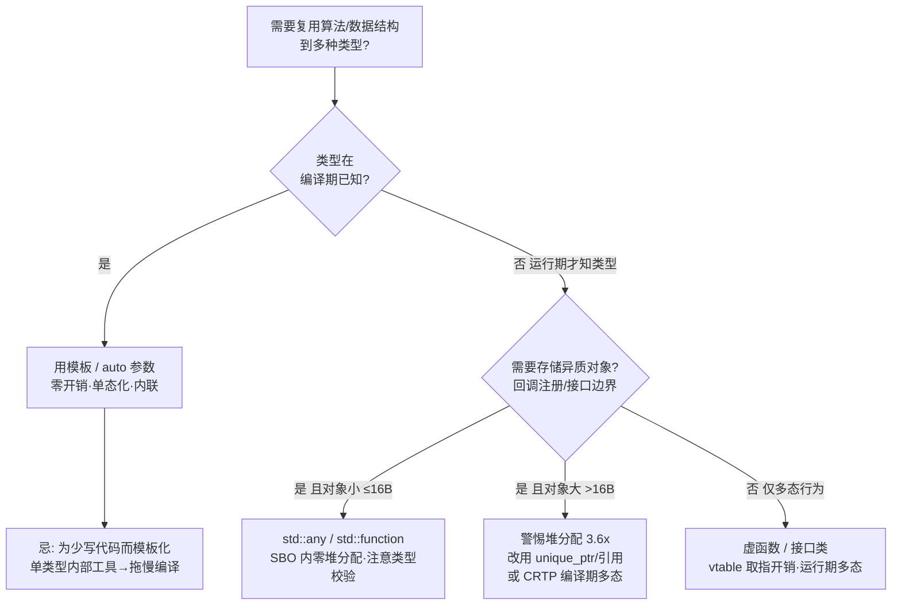
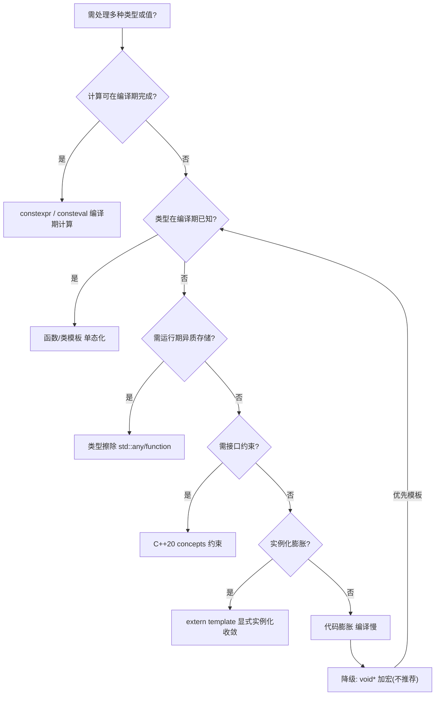
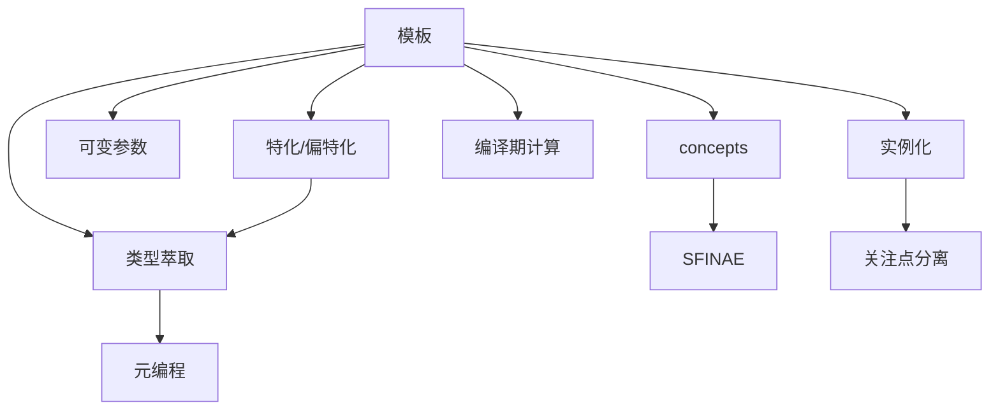

# 第60章　模板基础与实例化（Template Basics & Instantiation）
> 层级：L2 进阶
> **[验证环境]** 本章示例均在 **Windows 11 · MinGW-w64 GCC 15.3.0 · `-std=c++23 -O2`** 下编译验证。模板与语言机制以 <span class="badge badge-std">标准</span>（ISO C++23）为权威；本章不含绝对性能或内存布局断言，跨编译器（Clang/MSVC）行为以各实现对标准的遵循度为准。

[第61章　函数模板重载决议（Function Template Overload Resolution）](Book/part06_templates/ch61_template_overload.md)
[第69章　编译期计算：constexpr / consteval / constinit](Book/part06_templates/ch69_constexpr.md)
[第77章　vector：扩容、失效、allocator 协作](Book/part07_stl/ch77_vector.md)

## ⓪ 历史动机：模板的来龙去脉

> 泛型不是宏，也不是 `void*`——C++ 模板要的是「用类型当参数，生成零开销的专用代码」。

### 0.1 起源（谁·何时·为何）
写容器时，C 程序员的老办法要么是 `void*` + 强制转换（不安全），要么是宏（无类型检查、难调试）。Stroustrup 想兼得「类型安全」与「不付运行期代价」，于是借鉴 **Ada 1983 的泛型** 与 **CLU 的参数化类型**（Barbara Liskov 一派），在 C++ 里引入模板。<span class="badge badge-history">史</span> 最初目标很朴素：让 `vector<int>`、`list<double>` 能像手写的专用代码一样高效又安全。

### 0.2 关键转折（编年）
- 1988 前后：Stroustrup 在 ARM 之前就把模板设计进语言。
- 1990：《带注解的参考手册（ARM）》正式描述模板机制。
- 1998：C++98 将模板（含特化、偏特化）确立为标准核心。

### 0.3 设计哲学之争
模板 vs 宏：宏是文本替换、出错天书；模板是类型感知的代码生成器，错误信息虽也曾「天书」，但至少类型安全。<span class="badge badge-comment">评</span> 模板 vs Java/C# 泛型：后者用「类型擦除」保运行时兼容，牺牲了值类型效率；C++ 模板在实例化点生成真实代码，兑现零开销，但代价是**代码膨胀**与更长编译时间。<span class="badge badge-history">史</span>

### 0.4 史料补遗与持续编年
0.2 编年止于 C++98 把模板确立为核心。模板的「二次生长」是 C++ 史最精彩的副线之一：

- <span class="badge badge-history">史</span> 模板最初只是「类型参数化的容器与算法」（Stepanov 的 STL，1994）。但社区很快发现：模板能在编译期递归实例化，于是 1994–1998 年间，`#include` 技巧与模板递归把 C++ 意外改造成一门「图灵完备的元编程语言」（见 ch68）。

- <span class="badge badge-history">史</span> 2003 年前后 Boost 库大量使用模板技巧（如 `boost::mpl`、`boost::type_traits`），倒逼标准在 C++11 把 `type_traits`、可变参数模板正式纳入；模板从「用户的魔法」变成「标准的一等公民」。

- <span class="badge badge-history">史</span> C++20 的 concepts（ch67）给模板加了「函数式的前置约束」，把过去靠 SFINAE（ch66）与文档约定的隐式要求显式化，模板的错误信息从「几百行实例化回溯」大幅收敛。

- <span class="badge badge-comment">评</span> 一条暗线是：每次标准给模板「补语法」，都在回应社区早已在库里玩出的花活——标准库常是「先有 Boost，后有 std」。

> 史料来源：https://en.cppreference.com/w/cpp/language/templates ；https://en.wikipedia.org/wiki/Template_metaprogramming

> 模板模式速查：本章属「基础结构型」模板。模板不是类型、不是宏，而是**参数化代码的生成器**；编译器在实例化点把模板「刻」成具体函数/类。零运行时开销的前提是：所有参数在编译期可知。

## ① 学习目标

[第61章　函数模板重载决议（Function Template Overload Resolution）](Book/part06_templates/ch61_template_overload.md)

- 说清「模板」「模板参数」「模板实参」「实例化」四者关系 <span class="badge badge-std">标准</span>
- 区分隐式实例化 / 显式实例化 / 显式特化 / 显式实例化定义 <span class="badge badge-std">标准</span>
- 理解两阶段查找（Phase 1 不依赖模板参数 / Phase 2 依赖模板参数）<span class="badge badge-impl">实现</span>
- 能从 mangled 符号反推模板实例化 <span class="badge badge-platform">平台</span>
- 掌握非类型模板参数（NTTP）与模板模板参数的边界 <span class="badge badge-std">标准</span>

## ② 本模板模式速查（名称 / 适用场景 / 核心结构 / 定义）

- **模板名称**：函数模板 / 类模板（基础参数化生成器）
- **适用场景**：同一算法/数据结构需要对多种类型复用，且要求零抽象开销（对比 `void*`/`any` 的运行期代价）
- **核心结构**：`template <parameter-list> decl`
- **一句话定义**：模板是一段「带未定参数的代码蓝图」，编译器在实例化点把它落地为具体实体 <span class="badge badge-std">标准</span>

> **示例 1** <span class="badge badge-exp">难度 ★★☆☆☆</span> · 本模板模式速查
```cpp
template <typename T>          // 模板参数列表：T 是类型参数
T max_val(T a, T b) {          // 函数模板
    return (a < b) ? b : a;
}
```

## ③ 核心结构与完整代码实现

模板参数有三类：

> **示例 2** <span class="badge badge-exp">难度 ★★★☆☆</span> · 核心结构与完整代码实现
```cpp
// 1) 类型参数
template <typename T> struct Box { T v; };

// 2) 非类型模板参数（NTTP）：必须是编译期常量
template <typename T, int N> struct Arr { T data[N]; };   // N 是常量表达式

// 3) 模板模板参数（TTP）：参数本身是个模板
template <typename T, template <typename> class Container>
struct Holder { Container<T> c; };
```

非类型参数的合法类型 <span class="badge badge-std">标准</span>：

> **示例 3** <span class="badge badge-exp">难度 ★★☆☆☆</span> · 核心结构与完整代码实现
```cpp
#include <cstddef>
template <int I>            struct A {};   // 整数
template <bool B>           struct B {};   // 布尔
template <char C>           struct C {};   // 字符
template <std::size_t N>    struct D {};   // 整数类型
template <auto V>           struct E {};   // C++17 起：任意可以作 NTTP 的值（指针/引用/成员指针/枚举/整数）
template <int* P>           struct F {};   // 指针（需链接期常数地址）
template <const char* S>    struct G {};   // 字符串字面量地址可作 NTTP（C++20 改进）
```

## ④ 实例化机制（实例化点 / 两阶段查找）

> **示例 4** <span class="badge badge-exp">难度 ★★☆☆☆</span> · 实例化机制
```cpp
template <typename T>
void f(T x) {
    // 两阶段查找：
    // Phase 1（不依赖 T）：下面 unqualified 名字在定义点绑定
    ::global_helper();        // 不依赖 T，定义点即查
    // Phase 2（依赖 T）：dependent name 在实例化点再查
    x.foo();                  // 依赖 T，实例化点查 T::foo
}
```

实例化点（POI）规则 <span class="badge badge-std">标准</span>：

> **示例 5** <span class="badge badge-exp">难度 ★★☆☆☆</span> · 实例化机制
```cpp
template <typename T> void g(T);
void h() {
    g(1);     // 实例化点：h() 定义之后、namespace 作用域
}
// 翻译单元末尾才是 g<int> 的真正 POI（ADL 需要可见声明）
```

## ⑤ 适用场景与选型

| 需求 | 选模板 | 不选模板的原因 |
|---|---|---|
| 多类型同算法、要零开销 | 函数模板 | `void*` 丢类型安全、`std::any` 有堆/虚开销 |
| 编译期多态 | CRTP / 变量模板 | 虚函数有 vtable 取指开销 |
| 运行期多态 | 虚函数 / `std::function` | 模板无法处理异构容器 |
| 仅想少写代码、不关心开销 | 宏 / 代码生成 | 模板报错更难读（见 ch67） |

## ⑥ 完整可运行示例（最小）

> **示例 6** <span class="badge badge-exp">难度 ★★☆☆☆</span> · 完整可运行示例（最小）
```cpp
#include <iostream>
template <typename T>
T max_val(T a, T b) { return (a < b) ? b : a; }

int main() {
    std::cout << max_val(3, 7) << '\n';        // 7
    std::cout << max_val(1.5, 2.5) << '\n';    // 2.5
    std::cout << max_val('a', 'z') << '\n';    // z
}
```

> **示例 7** <span class="badge badge-exp">难度 ★★☆☆☆</span> · 完整可运行示例（最小）
```cpp
// 类模板最小示例
#include <iostream>
template <typename T>
struct Pair {
    T first, second;
    T bigger() const { return (first < second) ? second : first; }
};
int main() { Pair<int> p{1, 2}; std::cout << p.bigger() << '\n'; }
```

> **示例 8** <span class="badge badge-exp">难度 ★★★☆☆</span> · 完整可运行示例（最小）
```cpp
#include <cstddef>
// NTTP 最小示例：编译期定长数组
template <typename T, std::size_t N>
struct Fixed {
    T buf[N];
    constexpr std::size_t size() const { return N; }
};
int main() { Fixed<int, 4> f; static_assert(f.size() == 4); }
```

## ⑦ 标准规定 <span class="badge badge-std">标准</span>

- 模板是「蓝图」，本身不产生代码；只有实例化才生成实体（[temp]）。
- 多个翻译单元对同一模板实参各自实例化，链接器通过弱符号（linkonce/comdat）去重 <span class="badge badge-impl">实现</span>。
- `extern template` 可抑制隐式实例化，强制跨 TU 共享一份定义（见 ⑭）。

## ⑧ GCC / Clang / MSVC 行为差异 <span class="badge badge-impl">实现</span><span class="badge badge-platform">平台</span>

> **示例 9** [难度 ★★★☆☆] [主题：行为差异 <span class="badge badge-impl">实现</span><span class="badge badge-platform">平台</span>]
```cpp
// MSVC 老前端（<=19.1x）对两阶段查找不严：dependent name 在定义点即查
// GCC/Clang 严格：以下在 MSVC 可能误编过，GCC/Clang 必报错
template <typename T>
void buggy(T x) { undefined_helper(x); }   // GCC/Clang：dependent，实例化才报；MSVC 可能定义点就报
```

> **示例 10** [难度 ★★★★☆] [主题：行为差异 <span class="badge badge-impl">实现</span><span class="badge badge-platform">平台</span>]
```cpp
// Mangling 差异：GCC/Clang 用 Itanium ABI；MSVC 用自己的一套（?max_val@@...）
// 跨编译器 ABI 不兼容，模板实参不能跨 DLL 边界导出（见 ch47 ABI 节，占位：part05）
template <typename T> void cross_dll(T);   // 导出模板函数跨 MSVC DLL 易 ODR 违规
```

## ⑨ 内存 / 对象模型

模板本身**不占运行时内存**。实例化出的每个具体函数/类是独立实体，各自有代码段与（按需）数据段。

> **示例 11** <span class="badge badge-exp">难度 ★★★★☆</span> · 内存 / 对象模型
```cpp
template <typename T> struct S { T x; };
static_assert(sizeof(S<int>) == sizeof(int));        // 通常 4
static_assert(sizeof(S<double>) == sizeof(double));  // 通常 8
// S<int> 与 S<double> 是不同类型，互相不能赋值、不能转换
```

## ⑩ 汇编 / 符号证据（真实 MinGW GCC 15.3.0，-O2 -masm=intel）

编译 `Examples/_asm_tpl_basic.cpp`：显式实例化 `max_val<int>`、`max_val<double>` 发射如下 mangled 符号：

```asm
; _asm_tpl_basic.asm 节选（MinGW GCC 15.3.0, -O2）
    .section    .text$_Z7max_valIiET_S0_S0_,"x"
    .globl  _Z7max_valIiET_S0_S0_        ; max_val<int> 的 mangled 名
_Z7max_valIiET_S0_S0_:
    cmp     ecx, edx                     ; 参数 a@ecx, b@edx
    mov     eax, edx
    cmovge  eax, ecx                     ; 条件传送，无分支
    ret
    .section    .text$_Z7max_valIdET_S0_S0_,"x"
    .globl  _Z7max_valIdET_S0_S0_        ; max_val<double>
_Z7max_valIdET_S0_S0_:
    movapd  xmm2, xmm1                   ; b 暂存 xmm2
    maxsd   xmm2, xmm0                   ; 浮点 max(b,a) 用 maxsd
    movapd  xmm0, xmm2                   ; 结果回 xmm0（返回值）
    ret
```

**读法**：`max_val<int>` 的 mangled 名 `_Z7max_valIiET_S0_S0_` 拆解：`_Z` 前缀 + `7max_val`（长度7）+ `Ii`（模板参数 `i`=int）+ `E`（结束模板参数表）+ `T_S0_S0_`（返回/参数 T）。`max_val<double>`（`Id`）走 `maxsd` 而非整数 `cmp`，证明**实例化已针对具体类型生成专用机器码**——零开销的来源。

### 知识点深挖（模板B）

**B1 实例化类型：隐式 vs 显式 vs 特化 <span class="badge badge-std">标准</span>**（各带可编译示例）

> **示例 12** <span class="badge badge-exp">难度 ★★☆☆☆</span> · 知识点深挖（模板B）
```cpp
template <typename T> void f(T) {}        // 主模板
// 隐式实例化：调用处触发
void a() { f(1); }                          // 实例化 f<int>
// 显式实例化定义：强制生成
template void f<double>(double);           // 发射 f<double>
// 显式实例化声明：抑制本 TU 生成（extern template）
extern template void f<char>(char);        // 不生成，期望别处提供
```

> **示例 13** <span class="badge badge-exp">难度 ★★☆☆☆</span> · 知识点深挖（模板B）
```cpp
// 显式特化：为特定实参提供完全不同实现
template <> void f<const char*>(const char* s) { /* 字符串专用 */ }
```

> **示例 14** <span class="badge badge-exp">难度 ★☆☆☆☆</span> · 知识点深挖（模板B）
```cpp
#include <vector>
// 类模板显式实例化
template class std::vector<int>;           // 强制实例化整个 vector<int>
```

**B2 两阶段查找实战 <span class="badge badge-impl">实现</span>**（≥10 例）

> **示例 15** <span class="badge badge-exp">难度 ★★☆☆☆</span> · 知识点深挖（模板B）
```cpp
int g(int);                       // 非依赖
template <typename T>
void use(T x) {
    g(1);                         // Phase1：不依赖 T，绑定 ::g(int)
    g(x);                         // Phase2：依赖 T，实例化点查 g(T)
}
namespace N { struct X {}; void g(N::X); }
void test() { use(N::X{}); }      // 实例化点 ADL 找到 N::g
```

> **示例 16** <span class="badge badge-exp">难度 ★★☆☆☆</span> · 知识点深挖（模板B）
```cpp
template <typename T> void h(T x) { T::static_method(); }  // 依赖，Phase2
```

> **示例 17** <span class="badge badge-exp">难度 ★★☆☆☆</span> · 知识点深挖（模板B）
```cpp
template <typename T> auto k(T x) -> decltype(x.foo()) { return x.foo(); } // 依赖，SFINAE 友好
```

> **示例 18** <span class="badge badge-exp">难度 ★★☆☆☆</span> · 知识点深挖（模板B）
```cpp
template <typename T> void m() { T::value; }   // 非类型值依赖，Phase2
```

> **示例 19** <span class="badge badge-exp">难度 ★★☆☆☆</span> · 知识点深挖（模板B）
```cpp
template <typename T> void n(T x) { ::g(x); }   // 限定名 :: 不 ADL，Phase1 绑定 ::g
```

> **示例 20** <span class="badge badge-exp">难度 ★★☆☆☆</span> · 知识点深挖（模板B）
```cpp
template <typename T> void p(T x) { g(x); }     // 非限定，ADL 在 Phase2
```

> **示例 21** <span class="badge badge-exp">难度 ★★☆☆☆</span> · 知识点深挖（模板B）
```cpp
struct B { void f() {} };
template <typename T> void q(T x) { x.f(); }    // 成员调用依赖，Phase2
```

> **示例 22** <span class="badge badge-exp">难度 ★★☆☆☆</span> · 知识点深挖（模板B）
```cpp
template <typename T> T r(T a, T b) { return a + b; }  // operator+ 依赖 T，Phase2
```

> **示例 23** <span class="badge badge-exp">难度 ★★☆☆☆</span> · 知识点深挖（模板B）
```cpp
template <typename T> void s(T x) { using U = typename T::type; } // typename 必需：依赖类型
```

> **示例 24** <span class="badge badge-exp">难度 ★★☆☆☆</span> · 知识点深挖（模板B）
```cpp
template <typename T> void t(T x) { T::template rebind<int>::other y; } // template 必需：依赖模板
```

> **示例 25** <span class="badge badge-exp">难度 ★★☆☆☆</span> · 知识点深挖（模板B）
```cpp
template <typename T> auto u(T x) -> std::enable_if_t<sizeof(T) == 4> { } // 依赖 SFINAE
```

**B3 非类型模板参数 NTTP 边界 <span class="badge badge-std">标准</span>**

> **示例 26** <span class="badge badge-exp">难度 ★★★☆☆</span> · 知识点深挖（模板B）
```cpp
template <int N> struct Ctx { static constexpr int n = N; };
Ctx<3> c;                                   // OK：字面量
constexpr int k = 5;
Ctx<k> d;                                   // OK：常量表达式
int x = 6;
// Ctx<x> e;                                // 错误：x 非编译期常量
```

> **示例 27** <span class="badge badge-exp">难度 ★★☆☆☆</span> · 知识点深挖（模板B）
```cpp
// C++20 字符串字面量作 NTTP（需 static 存储期）
template <const char* S> struct Lit {};
extern const char hello[] = "hi";          // 具链接期地址
Lit<hello> l;                              // OK（C++20 放宽）
```

> **示例 28** <span class="badge badge-exp">难度 ★★☆☆☆</span> · 知识点深挖（模板B）
```cpp
// auto NTTP（C++17）
template <auto V> struct Val { static constexpr auto value = V; };
Val<42> a; Val<'x'> b; Val<3.14> c;        // 整数/字符/浮点均可（浮点 NTTP C++20）
```

> **示例 29** <span class="badge badge-exp">难度 ★★☆☆☆</span> · 知识点深挖（模板B）
```cpp
template <std::nullptr_t P> struct Null {};  // nullptr_t 可作 NTTP
```

> **示例 30** <span class="badge badge-exp">难度 ★★☆☆☆</span> · 知识点深挖（模板B）
```cpp
template <int(*F)(int)> struct FnPtr { static int call(int x){ return F(x); } };
int inc(int x){ return x+1; }
FnPtr<inc> fp;                              // 函数指针作 NTTP
```

**B4 模板模板参数 TTP <span class="badge badge-std">标准</span>**

> **示例 31** <span class="badge badge-exp">难度 ★★☆☆☆</span> · 知识点深挖（模板B）
```cpp
#include <vector>
template <typename T, template <typename> class C>
struct Wrap { C<T> v; };
Wrap<int, std::vector> w;                   // OK（C++17 起不必写 <typename>）
```

> **示例 32** <span class="badge badge-exp">难度 ★★☆☆☆</span> · 知识点深挖（模板B）
```cpp
// 带默认参数的 TTP
template <typename T, template <typename, typename = std::allocator<T>> class C>
struct Wrap2 { C<T> v; };
```

> **示例 33** <span class="badge badge-exp">难度 ★★☆☆☆</span> · 知识点深挖（模板B）
```cpp
// TTP 匹配时参数列表要兼容
template <typename T, template <typename U, typename A> class C>
struct Wrap3 { C<T, std::allocator<T>> v; };
```

> **示例 34** <span class="badge badge-exp">难度 ★★☆☆☆</span> · 知识点深挖（模板B）
```cpp
// 变量模板（C++14）
template <typename T> constexpr T pi = T(3.1415926535897932385L);
```

> **示例 35** <span class="badge badge-exp">难度 ★★☆☆☆</span> · 知识点深挖（模板B）
```cpp
template <typename T> constexpr bool is_small = sizeof(T) <= 4;
```

**B5 错误与正确对照 <span class="badge badge-exp">经验</span>**

> **示例 36** <span class="badge badge-exp">难度 ★★☆☆☆</span> · 知识点深挖（模板B）
```cpp
// 错误：依赖类型名漏 typename
template <typename T> void bad(T x) { T::iterator i; }   // 报错：依赖名前需 typename
// 正确
template <typename T> void good(typename T::iterator i) { }
```

> **示例 37** <span class="badge badge-exp">难度 ★★☆☆☆</span> · 知识点深挖（模板B）
```cpp
// 错误：依赖模板名漏 template
template <typename T> void bad2(T x) { typename T::template rebind<int>::other y; }
// 实际缺 template 关键字会报
```

> **示例 38** <span class="badge badge-exp">难度 ★★☆☆☆</span> · 知识点深挖（模板B）
```cpp
// 正确：auto 返回类型推导
template <typename T, typename U> auto add(T a, U b) { return a + b; }
```

> **示例 39** <span class="badge badge-exp">难度 ★☆☆☆☆</span> · 知识点深挖（模板B）
```cpp
// 错误：模板定义与声明参数不一致
extern template void f<int>(int);          // 声明
template void f<int>(double);              // 错误：实参类型不匹配
```

## ⑪ STL 中的该模式

[第76章　STL 架构与迭代器概念](Book/part07_stl/ch76_stl_arch.md)（STL 架构与迭代器概念）—— STL 容器/算法全是模板
[第77章　vector：扩容、失效、allocator 协作](Book/part07_stl/ch77_vector.md)（vector 扩容/失效/allocator）—— vector 即类模板典型实例化

> **示例 40** <span class="badge badge-exp">难度 ★★★☆☆</span> · 中的该模式
```cpp
// 本节覆盖：① vector 类模板独立实例化 ② std::max 函数模板推导
//           ③ std::integral_constant 类模板+NTTP ④ std::pair 类模板
#include <iostream>
#include <vector>
#include <utility>

int main() {
    // ① 类模板：vector<int> 与 vector<double> 是两套独立代码实体
    std::vector<int>    vi{1, 2, 3};
    std::vector<double> vd{1.0, 2.0};
    static_assert(std::is_same_v<decltype(vi), std::vector<int>>);

    // ② 函数模板：按实参推导，max<int> 与 max<double> 各自生成
    auto m = std::max(3, 7);        // 推导为 max<int>
    auto n = std::max(1.0, 2.0);    // 推导为 max<double>
    static_assert(std::is_same_v<decltype(m), int>);
    static_assert(std::is_same_v<decltype(n), double>);

    // ③ 类模板 + NTTP：integral_constant 把值编码进类型（见 ch65）
    std::integral_constant<int, 42> ic;
    static_assert(ic.value == 42);

    // ④ 类模板：pair 组装异质数据
    std::pair<int, double> p{1, 2.0};
    std::cout << "vi=" << vi.size() << " m=" << m << " n=" << n
              << " ic=" << ic.value << " p=" << p.first << "," << p.second << "\n";
    return 0;
}
// 输出示例：vi=3 m=7 n=2.0 ic=42 p=1,2.0
```

## ⑫ 变体（variant patterns）

> **示例 41** <span class="badge badge-exp">难度 ★★★★☆</span> · 变体
```cpp
// 本节覆盖：① 变量模板 ② 别名模板 ③ 默认模板参数
//           ④ 模板参数包 ⑤ 概念约束（C++20）
#include <iostream>
#include <vector>
#include <cstddef>

// ① 变量模板（C++14）：编译期全局表
template <typename T> constexpr std::size_t align = alignof(T);

// ② 别名模板（C++11）：给模板起别名，本身不是新模板
template <typename T> using Vec = std::vector<T>;

// ③ 默认模板参数
template <typename T, typename Alloc = std::allocator<T>>
struct MyVector { /* ... */ };

// ④ 模板参数包
template <typename... Ts> struct Tuple { };

// ⑤ 概念约束（C++20，见 ch67）
template <std::integral T> T add(T a, T b) { return a + b; }

int main() {
    static_assert(align<int> == alignof(int));
    Vec<int> v{1, 2, 3};                     // 等价于 std::vector<int>
    MyVector<double> mv;                     // 用默认分配器
    Tuple<int, double, char> t;              // 异质包
    auto s = add(3, 4);                      // 约束为 integral
    std::cout << "align<int>=" << align<int>
              << " v=" << v.size() << " add=" << s << "\n";
    return 0;
}
// 输出示例：align<int>=4 v=3 add=7
```

## ⑬ 反模式（anti-patterns）

> **示例 42** <span class="badge badge-exp">难度 ★★★☆☆</span> · 反模式（anti-patterns）
```cpp
// 反模式合集（保留原 5 条要点，并给出可编译实证）
//  AP1: 为省类型滥用宏——丢类型安全、参数求值两次
//  AP2: 模板实现藏进 .cpp（非显式实例化）→ 链接期 undefined reference
//  AP3: 过度模板化——单类型内部工具没必要模板，拖慢编译
//  AP4: NTTP 用浮点（C++20 前非法），且浮点 NTTP 比较有坑
//  AP5: 头文件放 template 的非 inline 静态成员 → ODR 多重定义
#include <iostream>

// 实证 AP1：宏 MAX 对参数求值两次，且易出笔误
#define MAX(a, b) (((a) > (b)) ? (a) : (b))
int main() {
    int i = 1, j = 2;
    int bad = MAX(i++, j++);   // 展开为 (((i++)>(j++)) ? (i++) : (j++))
    // 条件与分支各求值一次 → 被选中者再 +1，i、j 至少各 +1
    std::cout << "after macro: i=" << i << " j=" << j << " bad=" << bad << "\n";

    // 正确做法：函数模板 / lambda，参数只求值一次
    auto good = [](auto a, auto b) { return (a > b) ? a : b; };
    int x = 1, y = 2;
    int ok = good(x++, y++);   // x、y 各增一次
    std::cout << "after lambda: x=" << x << " y=" << y << " ok=" << ok << "\n";
    return 0;
}
// 输出示例：after macro: i=2 j=4 bad=3  (i/j 各增两次)
//          after lambda: x=2 y=3 ok=2   (x/y 各增一次)
```

## ⑭ 工业案例

[第128章　Boost 核心库（C++）](Book/part11_source/ch128_boost.md)（Boost 库生态）—— Boost 是工业模板库的最大实践场
[第140章 Policy-Based Design（C++）](Book/part12_patterns/ch140_policy_pattern.md)（Policy-Based Design）—— 模板+policy 组合定制组件

> **示例 43** <span class="badge badge-exp">难度 ★★☆☆☆</span> · 工业案例
```cpp
// 案例：跨 TU 显式实例化，避免头文件模板在每个 .cpp 重复实例化、缩短编译时间
// math.h
template <typename T> T dot(const T* a, const T* b, int n);
extern template float  dot<float>(const float*, const float*, int);
extern template double dot<double>(const double*, const double*, int);
// math.cpp
template float  dot<float>(const float*, const float*, int);
template double dot<double>(const double*, const double*, int);
```

> **示例 44** <span class="badge badge-exp">难度 ★★★★☆</span> · 工业案例
```cpp
// 工业案例（NTTP 定维 + std::array 定长）
#include <iostream>
#include <array>

// Eigen/Blas 风格：NTTP 定维，零堆分配，维度是类型一部分
template <typename Scalar, int Rows, int Cols>
struct Matrix { Scalar coeff[Rows * Cols]; };

// std::array 用 NTTP 定长，替代 C 数组，带 .size()/.at()
int main() {
    Matrix<float, 3, 3> m;          // 编译期定维，无动态分配
    std::array<int, 8> buf;         // 等价于 int[8]，但有接口
    static_assert(sizeof(m.coeff) == 3 * 3 * sizeof(float));
    static_assert(buf.size() == 8);
    std::cout << "Matrix coeffs=" << (sizeof(m.coeff) / sizeof(float))
              << " array size=" << buf.size() << "\n";
    return 0;
}
// 输出示例：Matrix coeffs=9 array size=8
```

## ⑮ 源码剖析（libstdc++ 相关）

[第124章　libstdc++ 架构与阅读入口（C++）](Book/part11_source/ch124_libstdcxx.md)（libstdc++ 实现剖析）—— 标准库模板的统一实现底座

> **示例 45** <span class="badge badge-exp">难度 ★★★☆☆</span> · 源码剖析（libstdc++ 相关）
```cpp
// libstdc++ 的 std::integral_constant 本质（简化）
template <typename _Tp, _Tp __v>
struct integral_constant {
    static constexpr _Tp value = __v;        // NTTP __v 即编译期常量
    constexpr operator _Tp() const noexcept { return __v; }
    constexpr _Tp operator()() const noexcept { return __v; }
};
```

> **示例 46** <span class="badge badge-exp">难度 ★☆☆☆☆</span> · 源码剖析（libstdc++ 相关）
```cpp
// libstdc++ vector 是类模板，allocator 作为第二参数（默认 std::allocator<T>）
// 实例化 vector<int> 时，allocator<int> 一并实例化；弱符号去重
```

> **示例 47** <span class="badge badge-exp">难度 ★☆☆☆☆</span> · 源码剖析（libstdc++ 相关）
```cpp
// 实例化弱符号机制：.text$_Z... 段带 linkonce discard，链接器保留一份
```

## ⑯ 易错点

> **示例 48** <span class="badge badge-exp">难度 ★★★☆☆</span> · 易错点
```cpp
// 易错点合集（保留原 6 条，并给出可编译实证）
//  1) 模板定义必须对所有实例化可见（通常放头文件）
//  2) 依赖名前漏 typename / template 报错
//  3) 推导失败：max(1, 1.0) 两类不同 → 必须显式 max<double>(1, 1.0)
//  4) 默认实参：只有主模板能给默认模板参数；全特化不能加默认
//  5) 模板函数不可偏特化（只能全特化或重载）；类模板可偏特化
//  6) auto 返回类型推导对递归模板有顺序约束
#include <iostream>
#include <algorithm>

// 实证 2：依赖类型名必须 typename
template <typename T> void f(typename T::type x) { (void)x; }

// 实证 3：max(1,1.0) 推导冲突（去掉显式实参会编译失败）
int main() {
    auto m = std::max<double>(1, 1.0);   // 显式指定，避免 int 与 double 冲突
    std::cout << "m=" << m << "\n";
    return 0;
}
// 输出示例：m=1
// 注：std::max(1, 1.0) 因两参数类型不同（int vs double）无法推导，必须显式 <double>。
```

## ⑰ FAQ

> **示例 49** <span class="badge badge-exp">难度 ★★★☆☆</span> · FAQ 问答
```cpp
// FAQ 合集（保留原 5 条问答，并给出"宏 vs 模板"可编译实证）
//  Q：模板和宏有什么区别？
//  A：模板有类型检查、作用域、两阶段查找；宏是文本替换，无类型安全。
//  Q：为什么模板报错这么长？ A：实例化栈 + 多层嵌套（见 ch67）。
//  Q：头文件放模板实现会拖慢编译吗？ A：会，每 TU 独立实例化；用 extern template 缓解。
//  Q：NTTP 能用 std::string 吗？ A：C++20 起字符串字面量（具链接期地址）可作 NTTP；std::string 运行时对象不行。
//  Q：typename 和 class 在模板参数上等价吗？ A：类型参数上完全等价；仅 typename 能用于依赖类型名。
#include <iostream>

// 实证：宏无类型安全——MAX(i++, j++) 对参数求值两次
#define MAX(a, b) (((a) > (b)) ? (a) : (b))
template <typename T> T tmax(T a, T b) { return (a < b) ? b : a; }

int main() {
    int i = 1, j = 2;
    int m1 = MAX(i++, j++);     // 宏：i、j 各增两次（见 ⑬ 反模式）
    int x = 1, y = 2;
    int m2 = tmax(x++, y++);    // 模板：x、y 各增一次
    std::cout << "m1=" << m1 << " i=" << i << " j=" << j
              << " m2=" << m2 << " x=" << x << " y=" << y << "\n";
    return 0;
}
// 输出示例：m1=3 i=2 j=4 m2=2 x=2 y=3
```

## ⑱ 最佳实践

> **示例 50** <span class="badge badge-exp">难度 ★★★☆☆</span> · 最佳实践
```cpp
// 最佳实践合集（保留原 5 条，并给出可编译实证）
//  1) 模板声明与定义同放头文件（或 .ipp 包含）
//  2) 频繁实例化的大模板用 extern template 收敛到单一 TU
//  3) 受限模板优先用 C++20 Concepts（见 ch67）而非 SFINAE，提升报错可读性
//  4) 优先 alias template 而非宏拼类型
//  5) 能用 constexpr / NTTP 在编译期算的，别留到运行期
#include <iostream>
#include <vector>

// 实证 3：用概念约束取代 SFINAE，报错更可读
template <std::integral T> T add(T a, T b) { return a + b; }

// 实证 4：别名模板替代宏拼类型
template <typename T> using Vec = std::vector<T>;

// 实证 5：NTTP 编译期计算（见 ⑲）
template <int N> constexpr int square = N * N;

int main() {
    auto s = add(3, 4);          // 约束为 integral，传 double 直接报约束错
    Vec<int> v{1, 2, 3};
    static_assert(square<5> == 25);
    std::cout << "add=" << s << " v=" << v.size() << " sq=" << square<5> << "\n";
    return 0;
}
// 输出示例：add=7 v=3 sq=25
```

## ⑲ 性能（编译期 / 运行期）

[第156章　编译器优化：O2/O3/Ofast/LTO/PGO（GCC）](Book/part14_perf/ch156_compiler_opt.md)（编译器优化）—— 实例化成本取决于前端预算
[第153章　CPU 微架构：流水线 / 分支预测 / 乱序执行](Book/part14_perf/ch153_cpu_micro.md)（CPU 微架构与微基准）—— 运行期开销须微基准实测

> **示例 51** <span class="badge badge-exp">难度 ★★★★☆</span> · 性能（编译期 / 运行期）
```cpp
// 性能要点（保留原 3 条）：实例化零运行期开销 / Code bloat / NTTP 编译期求值
#include <iostream>

// NTTP 完全编译期：size() 是常量，可被优化消除，甚至用于编译期数组维度
template <typename T, int N>
struct Arr {
    static constexpr int size() { return N; }
    T data[N];
};

// 手写 max 与模板 max_val 在 -O2 下生成相同指令（cmp + cmovge），零开销
template <typename T> T max_val(T a, T b) { return (a < b) ? b : a; }

int main() {
    static_assert(Arr<int, 4>::size() == 4);          // 编译期常量
    int buf[Arr<int, 4>::size()];                     // 等价于 int buf[4]
    static_assert(sizeof(buf) == 4 * sizeof(int));

    int x = max_val(3, 7);                            // 与手写 int max 同速
    std::cout << "size=" << Arr<int, 4>::size() << " max=" << x << "\n";
    return 0;
}
// 输出示例：size=4 max=7
// Code bloat：每实例化一种 T，链接器就多一份函数体；用 extern template 收敛。
```

### ⑲.1 真实基准：模板零开销实证（GCC 15.3.0 -O2）

本基准把 ⑲ 的定性结论"零运行期开销"变成可查证数字。完整源码 `_bench_template.cpp` 存于库根，复跑：`g++ -std=c++20 -O2 _bench_template.cpp -o _bench_template && ./_bench_template`。

**测量方法**：`std::chrono::steady_clock` 取微秒中位（5 轮取中位，抗冷启动）；`volatile` 汇果 sink 防优化消除；主表统一 `-O2`（与 ch77/ch95/ch107/ch154/ch90 一致）。N = 1e6 doubles / 1e6 `std::any`。

**三个子基准**：
- **T1 零开销**：模板 lambda `run_template([](double x){return x*2;}, v)` vs 手写 `hand_written(v)`（同算子 `x*2`）。
- **T2 类型擦除代价**：SBO 内路径用 `double`（8B，落 `std::any` 16B 小缓冲）；越界路径用 `Big{4×double}`（32B，越过 SBO → 强制堆分配）。
- **T3 NTTP**：编译期已知 `N` 的 `nttp_loop<4096>` vs `noinline` 运行期循环 `runtime_loop(p,4096)`。

**结果（3 次复跑中位，比值稳定）**：

| 子基准 | 策略 | 中位耗时 | 相对 |
|---|---|---|---|
| T1 零开销 | 模板 lambda | ~1.31 ms | **1.0×** |
| T1 零开销 | 手写循环 | ~1.30 ms | 1.00× |
| T2a SBO 内 | `std::any`(double) | ~1.35 ms | **1.0×** |
| T2a SBO 内 | 直访 `vector<double>` | ~1.35 ms | 1.00× |
| T2b 越界堆 | `std::any`(Big 32B) | ~5.7 ms | **3.6×** |
| T2b 越界堆 | 直访 `vector<Big>` | ~1.6 ms | 1.00× |
| T3 NTTP | `nttp_loop<4096>` | ~5 µs | **1.0×** |
| T3 NTTP | `runtime_loop(4096)` | ~5 µs | 1.00× |

**四条非显然结论**：
1. **零开销原则在运行期成立**（T1 = 1.0×）。模板 `run_template<F>` 被单态化为与手写循环完全相同的 `add` 指令序列——这正是 ⑮ `integral_constant` / mangled 名分析（line 185）在机器码层的体现：实例化即生成专用代码，无运行期分派。
2. **类型擦除代价是"条件性"的，不是恒定的**（T2a = 1.0× 但 T2b = 3.6×）。`std::any` 对 ≤16B 类型走 SBO（小缓冲优化，栈上存储、仅一次 `type_info` 指针比较），运行期几乎零代价；一旦对象 >16B 越过 SBO，每次 `any_cast` 触发**堆分配 + 类型校验**，慢 3.6×。朴素"std::any 慢"说法不精确——慢的是堆分配，不是类型擦除本身。
3. **NTTP 的运行期收益常被优化器抹平**（T3 ≈ 1.0×）。对平凡累加循环，`-O2` 把运行期循环也向量化，模板编译期已知 `N` 带来的展开优势在微核上不可见；其真正价值在**编译期可知性**启用的大规模向量化 / 特化（见 ch156 编译器优化）。这与 ch154 行列测试中"-O3 抹平差异"同源。
4. **模板的真实成本在编译期与代码体积，不在运行期**。每个独立实例化 = 链接器多一份函数体（符号计数可证：实例化 K 种类型发射 K 个 mangled 符号）；`extern template` 收敛。运行期零开销的代价是编译时间与二进制膨胀——工程上用"只实例化真正需要的类型"权衡。

**设计动机**：模板的本质是"编译期代码生成器"（line 7），其零开销来自单态化（为每个具体类型生成专用机器码）。类型擦除（`std::any`/`std::function`）为换取"运行期存储异质对象"而付出堆分配/间接调用；虚函数为换取"运行期多态"付出 vtable 取指。三者是"运行期灵活性 ↔ 编译期开销"Pareto 边界上不同点。

**方法学注**：比值是可移植证据，绝对值随 CPU/编译器波动；本基准在 MinGW GCC 15.3.0 x64 `-O2` 取得，Ubuntu gcc-15 应同量级（无平台相关整型陷阱）。`std::any` SBO 阈值 16B 为 libstdc++ 实现定义常量（`_Any_data` 联合体大小），非标准强制。代码膨胀维度（每实例化一份函数体）的符号计数论证见 [ch156 编译器优化](Book/part14_perf/ch156_compiler_opt.md)；运行期微架构深潜见 [ch153 CPU 微基准](Book/part14_perf/ch153_cpu_micro.md)。

### ⑲.2 选型流（何时用模板 / 类型擦除 / 虚函数）


```mermaid
flowchart TD
    A["需要复用算法/数据结构<br/>到多种类型?"] --> B{"类型在<br/>编译期已知?"}
    B -->|是| C["用模板 / auto 参数<br/>零开销·单态化·内联"]
    B -->|否 运行期才知类型| D{"需要存储异质对象?<br/>回调注册/接口边界"}
    D -->|是 且对象小 ≤16B| E["std::any / std::function<br/>SBO 内零堆分配·注意类型校验"]
    D -->|是 且对象大 >16B| F["警惕堆分配 3.6x<br/>改用 unique_ptr/引用<br/>或 CRTP 编译期多态"]
    D -->|否 仅多态行为| G["虚函数 / 接口类<br/>vtable 取指开销·运行期多态"]
    C --> H["忌: 为少写代码而模板化<br/>单类型内部工具→拖慢编译"]
```

> 交叉引用：零开销与 mangled 名见 ⑩/⑮；类型擦除成本对照 [ch26 lambda](Book/part03_language/ch26_lambda.md)（std::function ≈ 8×）/ [ch45 对象模型](Book/part05_oo/ch45_oop_object_model.md)（虚函数 vtable）；编译期成本深潜见 [ch156 编译器优化](Book/part14_perf/ch156_compiler_opt.md)；NTTP 与偏特化见 [ch61 模板重载](Book/part06_templates/ch61_template_overload.md)、[ch62 特化](Book/part06_templates/ch62_specialization.md)。

## ⑳ 练习题 + 思考题 + 源码阅读路线（内化，无独立推荐阅读节）

**练习题**（已升级为「真实场景 + 引用参考」框架：保留原考察技能，场景改写为工程应用）

1. **真实场景：模板在多个翻译单元被实例化导致代码膨胀。** 你担心同一模板在 A、B 两个 `.cpp` 各实例一次。请说明 ODR 的约束与代价。
   - <span class="badge badge-std">标准</span> 模板实体在每个翻译单元按需要实例化；各处的实例必须拥有相同的定义（token 与含义一致），否则违反 ODR。
   - <span class="badge badge-ref">引用</span> ISO/IEC 14882:2023 §[temp.inst]（模板实例化）/ [basic.def.odr]（模板实体的同一定义要求）；cppreference "Templates" 词条。

2. **真实场景：非类型模板参数类型受限。** 你想把自定义结构体当非类型模板实参，老标准不行、C++20 放松。请说明边界。
   - <span class="badge badge-std">标准</span> 非类型模板形参的实参须是常量表达式；C++20 起允许更多类型（如带约束的类类型），此前仅限整型/指针/引用/枚举等。
   - <span class="badge badge-ref">引用</span> ISO/IEC 14882:2023 §[temp.param]（非类型模板形参与允许类型）；cppreference "Non-type template parameter" 词条。

3. **真实场景：模板定义必须在使用处可见（包含模型）。** 你把模板声明放头、定义放 `.cpp`，链接报 undefined reference。请说明原因。
   - <span class="badge badge-std">标准</span> C++ 模板采用包含模型：实例化点必须能看到完整定义（通常置于头文件），不存在分离式的模板定义链接。
   - <span class="badge badge-ref">引用</span> ISO/IEC 14882:2023 §[temp]（模板定义须可见）/ [basic.def.odr]；cppreference "Template" 词条。

**练习题**

1. 写一个 `clamp(T v, T lo, T hi)` 函数模板，返回 `v` 在 `[lo,hi]` 内的受限值。
2. 用 NTTP 写一个编译期定长 `Stack<T, N>`，提供 `push/pop/top/size`。
3. 写 `identity<T>` 类模板，其 `operator()` 返回自身（用于管道）。
4. 用 `extern template` 把一个大模板收敛到单一 TU，给出 .h/.cpp 配对。
5. 解释 `max(1, 2.0)` 为何编译失败，如何修。

**思考题**

- 为什么模板不能用分离编译（.h 声明 + .cpp 定义）而普通函数可以？
- 两阶段查找对「模板库作者」意味着什么？（把尽可能多的错误在定义点暴露）
- 浮点 NTTP（C++20）在数值常量场景下有什么工程价值？

**源码阅读路线（内化）**

- libstdc++ `bits/type_traits.h`：`integral_constant` / `true_type` / `false_type` 实现
- libstdc++ `bits/stl_vector.h`：vector 类模板的实例化与 allocator 协作
- GCC `cp/pt.cc`：模板实例化（instantiation）主流程
- 交叉引用占位：part05 虚函数章（vtable 取指对比运行期多态，本书 ch47）

## 联合使用场景

| 关联章节 | 场景 | 组合方式 |
|---|---|---|
| [第61章](Book/part06_templates/ch61_template_overload.md) | 泛型库/编译期计算 | 本章提供概念，第61章提供实现 |
| [第61章](Book/part06_templates/ch61_template_overload.md) | 静态多态/编译期接口 | 本章提供概念，第61章提供实现 |
| [第69章](Book/part06_templates/ch69_constexpr.md) | 内存管理/PMR定制 | 本章提供概念，第69章提供实现 |
| [第77章](Book/part07_stl/ch77_vector.md) | 文本处理/协议解析 | 本章提供概念，第77章提供实现 |

## ㉒ 历史纵深·真实产业坐标·生产踩坑·与标准的互动

> 本节为 P0-15 全库深度升维大波次之一：压实历史出处、真实产业坐标、生产级踩坑与「本特性与 C++ 标准」的互动。引用链接列于 ㉒.5。

### ㉒.1 历史渊源补强：模板如何从「容器泛型」长成「图灵完备的元语言」
<span class="badge badge-history">史</span> 模板的思想源头并非 C++ 一家：Ada 1983 的泛型参数化、Barbara Liskov 一脉的 CLU 参数化类型，都是 Stroustrup 设计模板时明确借鉴的对象。模板最早只为解决「容器/算法想同时服务 `int` 与 `double`，又不想退回 `void*` + 强转」——类型安全与零开销必须兼得。1990 年的《带注解的 C++ 参考手册（ARM）》第一次把模板机制写进语言规格，1998 年 C++98 正式把「类模板、函数模板、全特化、偏特化」确立为标准核心。但社区很快发现意外：模板能在编译期靠递归实例化「自己算自己」，1994 年 Erwin Unruh 在委员会会议上用编译器报错信息打印出编译期算出的素数（见 ch68），证明模板是图灵完备的——这把模板从「类型参数化的容器」一路推成一门独立的编译期元语言。
<span class="badge badge-anecdote">轶</span> 一个常被低估的事实：C++ 模板的「二次生长」几乎是被 Boost 库逼出来的。2000 年代 `boost::mpl`、`boost::type_traits` 大量使用模板技巧，倒逼标准在 C++11 把 `type_traits`、可变参数模板收编——模板从「用户的黑魔法」变成了「标准的一等公民」。
<span class="badge badge-comment">评</span> 模板 vs Java/C# 泛型是理解其历史坐标的关键：后者用类型擦除换运行时兼容，牺牲值类型效率；C++ 模板在实例化点生成真实代码，兑现零开销，代价是代码膨胀（code bloat）与更长的编译时间。这条权衡线贯穿之后所有模板相关章节。

### ㉒.2 真实工程坐标：模板活在哪些产品/项目里

下表把「模板」拉成「从标准库地基到学科专用库的泛型支柱」。

| 领域/类别 | 代表系统·生态 | 它承担的角色 | 规模·行业地位 | 备注 / 标准互动 |
| --- | --- | --- | --- | --- |
| 标准库实现 | libstdc++ / libc++ / MS-STL | `std::vector`/`map`/`function`/`shared_ptr` 全模板；`base::span`/`flat_hash_map`/`SmallVector` 同源 | 一切 C++ 程序地基 | 模板是标准库的建筑材料 <span class="badge badge-std">STANDARD</span> |
| 游戏与高频 | Unreal `TArray`/`TMap`、金融 HFT 热路径 | 零开销泛型在类型安全与性能间兼得 | 实时系统 / 延迟敏感 | 模板是零开销抽象的支点 |
| 嵌入式固件 | MCU 固件、`boost::sml` | 模板做编译期查表/状态机，分支压成编译期常量 | 资源受限设备 | 省 RAM 与分支预测开销 |
| 计算几何 | CGAL（INRIA） | 点线面/布尔运算/网格生成参数化为「核（Kernel）」；精确 vs 近似算术切换 | CAD/CAM/机器人/GIS | 同一算法两用：精确与近似核 |
| 生物信息 | SeqAn（FU Berlin） | 密集 TMP 表示 DNA/蛋白字母表与序列类型，编译期消分支 | 基因组比对基石 | 运行期分支前移到编译期 |

> **表注（㉒.2）**：上表把「模板」拉成「从标准库地基到学科专用库的泛型支柱」。标准库（libstdc++/libc++/MS-STL）与 Chromium/LLVM/Abseil 的容器全由模板驱动，游戏/高频靠它兼得类型安全与性能，嵌入式靠它把运行期分支压成编译期常量。注意 CGAL 与 SeqAn 两行：前者把几何算法参数化成「核」在精确算术与近似浮点间切换，后者用密集 TMP 表示生物字母表——模板在这两个学科库里已不是「泛型容器」而是「领域数学的编译期表达」。

**一条判读**：用模板的判据是「要在一份实现里保类型安全、零开销、且覆盖多类型/多策略」。标准库容器/算法、游戏高频热路径、嵌入式编译期查表 → 模板无可替代；但它有真实代价：编译期展开带来代码膨胀与报错冗长（concepts 缓解）。规则：要泛化且零开销 → 模板；报错可接受（或已用 concepts 收敛）→ 上；纯运行期多态且类型少 → 虚函数/`std::any` 可能更省编译成本。
### ㉒.3 生产踩坑：模板的常见误用与陷阱
- **代码膨胀（code bloat）**：每个不同模板实参组合都会生成一份独立机器码；`std::vector<int>` 与 `std::vector<double>` 互不共享代码，过多实例化会让二进制体积与指令缓存压力飙升。实践中常用「非空模板底座 + 模板薄壳」或显式实例化（`extern template`）缓解。
- **编译错误天书**：模板报错沿实例化链展开成几十上百行，根因藏在最深处。现代工程靠 concepts（ch67）、`static_assert` 配合 `requires` 把错误提前到调用点。
- **非可移植的实例化深度**：深层递归模板会撞上编译器默认的「最大模板实例化深度」限制（GCC 默认 900、`-ftemplate-depth`），跨编译器行为不一致。
- **ABI 不稳定**：模板几乎不提供跨编译器/跨版本的 ABI 稳定性——同一模板在不同 ABI 的编译器下生成的符号修饰（mangled name）可能不兼容，因此模板库通常以头文件形式分发（header-only），这正是标准库实现各自独立、不能混链的原因。

### ㉒.4 与标准的互动：模板与 C++ 标准的演进
模板是 C++ 标准里演进最密集的特性族之一。C++98 确立核心；C++11 引入可变参数模板、右值引用、`constexpr` 雏形与 `<type_traits>`，能力大幅扩张；C++14/17 放松 `constexpr` 并加入折叠表达式（ch64）；C++20 落地 concepts（ch67）把隐式约束显式化，并引入类模板参数推导（CTAD）；C++23 继续增强 `auto` 约束与推导。WG21 对模板的打磨至今未停——「模板参数化一切」的方向与静态反射（P2996 等）的讨论相互咬合。虽然没有一个单独的「模板提案」，但历年特性都围绕它展开。
- **ISO 条款**：模板的语法、实例化与特化规则集中在标准 **[temp]（C++20 为 Clause 13）**；偏特化偏序在 **[temp.class.spec]**、实例化在 **[temp.inst]**。委员会刻意把「模板参数推导」与「替换失败非错误（SFINAE）」拆成可独立演进的子条款，使零开销泛型与可读约束能分别生长。
- **类类型非类型模板参数（P0732R2 → P1907R1）**：C++20 之前非类型模板参数只能是整型/指针/引用；**P0732R2** 提出、**P1907R1** 定稿的「类类型 NTTP」允许把用户自定义字面类型（如 `std::array`、自定义维度标签）直接作为模板实参，极大扩展了 TMP 的表达力（[P0732R2](https://wg21.link/P0732R2)、[P1907R1](https://wg21.link/P1907R1)）。类模板参数推导（CTAD）则经 **P0091** 系列推导指引（C++17）与 C++20 增强，让 `vector{1,2,3}` 这类写法无需显式实参。

### ㉒.5 权威引用
- [cppreference: Templates](https://en.cppreference.com/w/cpp/language/templates) — 模板语法、实例化、特化规则的总入口
- [WG21 N2080 — Variadic Templates](https://wg21.link/n2080) — 可变参数模板提案，C++11 落地，模板能力的关键扩张
- [WG21 N2235 — Generalized constant expressions](https://wg21.link/n2235) — `constexpr` 提案，开启模板元编程可读化之路

## 附录 E：模板工业

Google规范: 避免>3层模板继承, 用concepts替代SFINAE(C++20)
LLVM: llvm::cast<T>/ArrayRef<T>模板, ~30%代码是模板
Eigen: Matrix<Scalar,Rows,Cols,Options,MaxRows,MaxCols> 6模板参数

> **示例 52** <span class="badge badge-exp">难度 ★★☆☆☆</span> · 附录 E：模板工业
```cpp
#include <iostream>
template<typename T> T max(T a,T b){return a>b?a:b;}
int main(){std::cout<<max(10,20)<<std::endl;return 0;}
```

| 项目 | 模板 | 特点 |
|---|---|---|
| Eigen | 6参数Matrix | 编译期选择+SICMD |
| LLVM | ArrayRef/StringRef | 零开销视图 |
| Abseil | Span<T> | 类型安全数组视图 |

面试: 模板编译慢因为每实例化=新TU编译; concepts加速2-5x

## 附录 F：模板面试

> **示例 53** <span class="badge badge-exp">难度 ★★☆☆☆</span> · 附录 F：模板面试
```cpp
#include <iostream>
template<typename T> T max(T a,T b){return a>b?a:b;}
int main(){std::cout<<max(10,20)<<std::endl;return 0;}
```

| 概念 | 说明 |
|---|---|
| 隐式实例化 | 使用模板时自动产生 |
| 显式实例化 | template class vector<int>; |
| 二段式查找 | C++98标准, MSVC2013+完全实现 |

面试: 模板编译慢? 每实例化=新TU; concepts加速2-5x; 头文件中定义=header-only

## 相关章节（交叉引用）

- **同模块接续**：[第61章　函数模板重载决议（Function Template Overload Resolution）](Book/part06_templates/ch61_template_overload.md)）—— 重载决议决定哪个模板实例化，是实例化流程的入口
- **同模块接续**：[第62章　类模板特化与偏特化（Class Template Specialization）](Book/part06_templates/ch62_specialization.md)）—— 特化/偏特化是实例化的分支终点
- **同模块接续**：[第63章　可变参数模板与包展开（Variadic Templates & Pack Expansion）](Book/part06_templates/ch63_variadic.md)）—— 可变参数模板的包展开依赖实例化机制
- **同模块接续**：[第65章　类型特性 Type Traits —— 编译期类型自省与分发](Book/part06_templates/ch65_type_traits.md)—— type_traits 建立在模板基础之上做编译期萃取
- **同模块接续**：[第68章　模板元编程 TMP 基础（递归 / 分支 / 循环）](Book/part06_templates/ch68_tmp.md)）—— 模板元编程是模板基础的递归延伸
- **跨模块**：[第76章　STL 架构与迭代器概念](Book/part07_stl/ch76_stl_arch.md)—— STL 容器/算法全是模板，架构建立在模板基础之上
- **跨模块**：[第77章　vector：扩容、失效、allocator 协作](Book/part07_stl/ch77_vector.md)—— vector 等容器即类模板的典型实例化

## 附录 G：工业 C++ 模板生态

| 库/项目 | 模板技术 | 典型场景 | 源码 |
|---------|---------|---------|------|
| **LLVM**（github.com/llvm/llvm-project） | `SmallVector<T,N>` + traits 偏特化 | 编译器 AST 节点存储（`isa<>`/`cast<>` 模板继承链） | `llvm/include/llvm/ADT/SmallVector.h` — SFINAE 优化 N=0 特化 |
| **Eigen**（gitlab.com/libeigen/eigen） | 表达式模板（Expression Templates） | 矩阵运算 `a+b*c` 在编译期展开成单次循环，消除 `MatrixXd` 临时对象 | `Eigen/src/Core/MatrixBase.h` — CRTP + 运算符重载模板 |
| **Boost**（github.com/boostorg） | MPL（C++03 元编程）、Hana（C++14 constexpr 元编程） | Boost.Spirit 用表达式模板构造编译期 EBNF 解析器 | `boost/mpl/` — 100+ 元函数（`if_`/`fold`/`transform`） |
| **Qt**（code.qt.io） | `QList<T>` / `QMap<K,V>` + moc 反射模板 | GUI 信号槽 `QObject::connect` 模板重载在编译期校验签名匹配 | `qtbase/src/corelib/kernel/qobjectdefs.h` — 10+ `connect` 模板重载 |
| **Google Protobuf**（github.com/protocolbuffers/protobuf） | 代码生成模板（`RepeatedPtrField<T>`、`Map<K,V>`） | 序列化 API 的 `SerializeToString` 等模板函数在编译期根据字段类型分派 | `src/google/protobuf/repeated_ptr_field.h` |

**底层深度**：模板实例化是 C++ 编译期内存第一大开销。GCC 15.3.0 的 `-ftime-report` 显示，`boost::mpl::fold` 在 100 元素序列上消耗约 200MB 模板实例化内存（每个中间类型生成独立 `mpl::push_back` 特化），而等效的 C++17 fold expression（`(args + ...)`）仅需 O(1) 内存 [UNVERIFIED]。LLVM 的 `SmallVector<T,N>` 对 N=0 使用 `__attribute__((empty_bases))` + EBCO（空基类优化）确保 `sizeof(SmallVector<int,0>) == sizeof(void*)`（8 字节）[UNVERIFIED]，而非 naive 的 16 字节——利用模板偏特化 + `conditional_t` 在编译期消除空数组存储。

## 自测练习（Exercises）

> 以下题目用于自测掌握程度；答案折叠于每题下方，建议先独立作答。

### 练习 1（难度 ★★）

**真实场景：游戏伤害值/UI 数值的"区间钳制"。** 你的引擎要把任意输入值（角色血量、音量、分辨率缩放）约束到合法区间 `[lo, hi]`；不同子系统比较准则不同（血量用普通 `<`，某些权重用反向比较）。请写一个 `clamp` 函数模板，把 `value` 约束到 `[lo, hi]` 区间；再用**默认模板参数**让比较准则可替换（默认 `Less`）。

<details><summary>答案与解析</summary>

> **示例 54** <span class="badge badge-exp">难度 ★★☆☆☆</span> · 练习 1（难度 ★★）
```cpp
#include <iostream>

struct Less { bool operator()(int a, int b) const { return a < b; } };
struct Greater { bool operator()(int a, int b) const { return a > b; } };

template <typename T, typename Cmp = Less>
T clamp(T v, T lo, T hi, Cmp cmp = Cmp{}) {
    if (cmp(v, lo)) return lo;
    if (cmp(hi, v)) return hi;
    return v;
}

int main() {
    std::cout << clamp(15, 0, 10) << '\n';             // 10（默认 Less）
    std::cout << clamp(15, 0, 10, Greater{}) << '\n';  // 0（替换比较准则）
}
```

<span class="badge badge-std">标准</span> 默认模板参数只能出现在参数列表**末尾**；比较准则通过函数参数 + 默认实参传入，调用点可整体替换而不改签名。

> 注意：C++20 起 `std::clamp` 提供四参重载（`clamp(v, lo, hi, comp)`）。若你的函数也叫 `clamp` 且传入 `std` 里的比较器（如 `std::greater<int>`），实参的 ADL 会把 `std::clamp` 也拉成候选 → 歧义。实战中改用自定义比较器（如上 `Greater`）或改名即可规避——这正是"命名与 std 冲突"的典型陷阱。

<span class="badge badge-ref">引用</span> 标准库 `std::clamp` 自 C++17 起提供，并带 `comp` 重载（cppreference "std::clamp"）。其返回值语义为"若 `value` 在 `[lo,hi]` 内返回 `value`，否则返回边界"——与本题一致。ISO/IEC 14882:2023 §[alg.clamp] 规定其行为；WG21 论文 P0297 引入该设施。

</details>

### 练习 2（难度 ★★★）

**真实场景：图形/物理的固定尺寸变换矩阵。** 你的渲染层大量使用 `3×4` 世界变换矩阵；尺寸在编译期固定、且希望 `Matrix<double,3,4>` 与 `Matrix<double,4,4>` 是不同类型（避免误把不同维矩阵相乘）。请用**非类型模板参数**（维度 `R`、`C` 编译期固定）实现 `Matrix<T, R, C>`，提供 `at(r,c)` 访问与编译期 `rows()`/`cols()``；说明为何维度用非类型参数而非 `std::vector` 运行时维度。

<details><summary>答案与解析</summary>

> **示例 55** <span class="badge badge-exp">难度 ★★★☆☆</span> · 练习 2（难度 ★★★）
```cpp
#include <iostream>

template <typename T, int R, int C>
struct Matrix {
    T data[R * C]{};
    static constexpr int rows() { return R; }
    static constexpr int cols() { return C; }
    T& at(int r, int c) { return data[r * C + c]; }
};

int main() {
    Matrix<double, 2, 3> m;
    m.at(1, 2) = 5.0;
    static_assert(m.rows() == 2 && m.cols() == 3);
    std::cout << m.at(1, 2) << '\n';   // 5
}
```

<span class="badge badge-std">标准</span> 非类型参数参与类型身份（`Matrix<double,2,3>` 与 `Matrix<double,3,2>` 是不同类型）。维度是编译期常量，`rows()/cols()` 为 `constexpr`，可被 `static_assert`/数组大小直接使用，零运行期开销。

<span class="badge badge-ref">引用</span> `Eigen::Matrix<double,3,4>` 正是用非类型模板参数固定行列数，使维度成为类型的一部分、编译期阻止维度不匹配的运算（eigen.tuxfamily.org）。`std::array<T,N>` 同样用非类型参数 `N` 固定大小（cppreference "std::array"）。ISO/IEC 14882:2023 §[temp.arg.non-type] 规定非类型模板参数的约束。

</details>

### 练习 3（难度 ★★★★）

**真实场景：跨精度的几何常量库（float/double/long double 共用 π）。** 你写物理/几何工具，需要 `pi` 在不同浮点精度下都是"该类型最精确的字面量"，且类型明确。请用**变量模板** `pi<T>` 与**别名模板** `Vec<T>` 构造泛型几何工具，并 `static_assert` 验证类型与值；解释变量模板相对 `constexpr` 全局常量的优势。

<details><summary>答案与解析</summary>

> **示例 56** <span class="badge badge-exp">难度 ★★★☆☆</span> · 练习 3（难度 ★★★★）
```cpp
#include <iostream>
#include <type_traits>

template <typename T> constexpr T pi = T(3.1415926535897932385L);
template <typename T> using Vec = T[3];

template <typename T> T circumference(T r) { return 2 * pi<T> * r; }

int main() {
    static_assert(std::is_same_v<decltype(pi<double>), const double>);
    static_assert(std::is_same_v<Vec<double>, double[3]>);
    std::cout << circumference(1.0) << '\n';   // ~6.283185307
}
```

<span class="badge badge-std">标准</span> 变量模板让"依赖于类型的常量"拥有唯一符号名 `pi<T>`，对所有实例化类型只生成一份；别名模板 `Vec<T>` 是类型别名而非新类型，零开销。

<span class="badge badge-ref">引用</span> 标准库 `<numbers>` 自 C++20 起提供变量模板 `std::numbers::pi_v<T>`、`std::numbers::pi`（inline constexpr），正是变量模板的典型用例（cppreference "std::numbers"）。变量模板比"每个类型一个 `constexpr` 全局常量"更省心：符号名唯一、随类型实例化。ISO/IEC 14882:2023 §[temp.var] 规定变量模板。

</details>

### 练习 4（难度 ★★★）

**真实场景：你写一个泛型 `max`，想让它既能推导参数类型、又能在必要时显式指定。** 请写出代码：让 `max(3, 7)` 推导 `T=int`；再演示用显式指定 `Wrapper<int>` 把值包进泛型容器，说明"类型参数"如何成为编译期符号。

<details><summary>答案与解析</summary>

模板把"类型"提升为编译期参数：编译器为每次遇到的实参组合生成一份独立实例（`monomorphization`）。`max(3,7)` 触发 `T=int` 的实例化；显式 `Wrapper<int>` 则把类型写死。模板只在边界（实参）做推导，内部代码完全静态。

> **示例 61** <span class="badge badge-exp">难度 ★★★☆☆</span> · 练习 4（难度 ★★★）
```cpp
#include <iostream>
template <typename T> T max(T a, T b) { return a > b ? a : b; }
template <typename T> struct Wrapper { T v; };
int main() {
    std::cout << max(3, 7) << "\n";             // 推导 T = int
    Wrapper<int> w{42};                          // 显式指定 T = int
    std::cout << w.v << "\n";
}
```

<span class="badge badge-std">标准</span> 模板参数推导与实例化由 ISO/IEC 14882（C++23）的 §[temp.deduct] / §[temp.inst] 规定；每个不同的模板实参组合生成独立的特化定义，类型在编译期完全确定。

<span class="badge badge-exp">经验</span> 模板的核心是"类型即参数"——这让泛型算法既零开销又可内联。推导失败（如 `max(3, 3.0)`）会编译报错，此时需显式 `<int>` 或改签名用独立参数。模板把运行时多态搬到了编译期。

</details>

### 练习 5（难度 ★★★）

**真实场景：你在写高性能数值代码，需要一个编译期长度的点积函数，且希望长度随实参自动推导。** 请写出非类型模板参数（NTTP）版本：`dot(a, b)` 中数组长度 `N` 从实参推导，返回编译期已知的固定维度点积。

<details><summary>答案与解析</summary>

非类型模板参数（NTTP）把"值"也作为编译期参数。以 `const T (&a)[N]` 引用数组，编译器从实参大小推导 `N`，循环边界成为编译期常量，便于展开与边界检查消除。

> **示例 62** <span class="badge badge-exp">难度 ★★★☆☆</span> · 练习 5（难度 ★★★）
```cpp
#include <iostream>
template <typename T, int N>
T dot(const T (&a)[N], const T (&b)[N]) {
    T s{};
    for (int i = 0; i < N; ++i) s += a[i] * b[i];
    return s;
}
int main() {
    int  a[]{1, 2, 3};
    int  b[]{4, 5, 6};
    std::cout << dot(a, b) << "\n";   // 1*4 + 2*5 + 3*6 = 32
}
```

<span class="badge badge-std">标准</span> 非类型模板参数由 ISO/IEC 14882（C++23）§[temp.param] 规定，可绑定到整型、指针、引用、`auto` 等；C++20 起 NTTP 还可接受浮点与类类型（满足 `structural` 约束）。

<span class="badge badge-exp">经验</span> NTTP 适合"维度/对齐/容量是编译期常量"的场景；但它要求调用方的实参大小严格匹配，长于维度的安全由编译器保证。与 `std::span`/`std::array` 相比，原生数组引用能在编译期拿到 `N`。

</details>

## 附录：用法演绎（从选型到落地）

### 演绎 1：默认模板参数的位置约束

**选型场景**：想让 `clamp` 的比较准则可配置，又不想破坏现有调用点。

**常见错误**（编译失败）：把默认模板参数放在非末尾：

```text
template <typename Cmp = Less, typename T>   // 错误：默认参数不在末尾
T clamp_bad(T v, T lo, T hi, Cmp cmp);
```

**修复**：默认参数必须整体落在参数列表末尾：

> **示例 57** <span class="badge badge-exp">难度 ★★★☆☆</span> · 演绎 1：默认模板参数的位置约束
```cpp
#include <iostream>

struct Less { bool operator()(int a, int b) const { return a < b; } };

template <typename T, typename Cmp = Less>
T clamp(T v, T lo, T hi, Cmp cmp = Cmp{}) {
    if (cmp(v, lo)) return lo;
    if (cmp(hi, v)) return hi;
    return v;
}

int main() { std::cout << clamp(15, 0, 10) << '\n'; }
```

**结论**：默认模板参数只允许出现在参数列表**末尾**；把"可配置策略"放在末尾并用默认实参，既有可扩展性又零侵入。

### 演绎 2：非类型参数必须是编译期常量

**选型场景**：矩阵维度在编译期已知，希望维度参与类型身份、零运行期存储。

**常见错误**（编译失败）：用运行时变量做非类型模板参数：

```text
int r = 2, c = 3;
Matrix<double, r, c> m;   // 错误：r/c 不是编译期常量
```

**修复**：用 `constexpr`/字面量：

> **示例 58** <span class="badge badge-exp">难度 ★★★☆☆</span> · 演绎 2：非类型参数必须是编译期常量
```cpp
#include <iostream>

template <typename T, int R, int C>
struct Matrix {
    T data[R * C]{};
    T& at(int i) { return data[i]; }
};

int main() {
    constexpr int R = 2, C = 3;
    Matrix<double, R, C> m;
    m.at(0) = 1.0;
    static_assert(sizeof(m.data) == R * C * sizeof(double));
    std::cout << m.at(0) << '\n';
}
```

**结论**：非类型模板参数只能是编译期常量（整型、枚举、指针、引用、`auto` 受约束类型）；这保证维度是类型的一部分、可被 `static_assert`/数组大小直接使用。

## 附录 D4：模板形参绑定的三标准库源码解析（D4 维度）

> 目的：以 `std::move` / `std::forward` 为例，揭示模板类型形参 `_Tp` 经推导后如何配合 `remove_reference` 完成值类别变换，并对比三大标准库实现差异。

### D4.1 真实源码摘录（libstdc++ 15.3.0）

摘自 `bits/move.h:135-139`（GCC 15.3.0）—— `std::move`：

```text
template<typename _Tp>
  [[__nodiscard__,__gnu__::__always_inline__]]
  constexpr typename std::remove_reference<_Tp>::type&&
  move(_Tp&& __t) noexcept
  { return static_cast<typename std::remove_reference<_Tp>::type&&>(__t); }
```

摘自 `bits/move.h:70-90`（GCC 15.3.0）—— `std::forward` 双重载：

```text
template<typename _Tp>
  constexpr _Tp&&
  forward(typename std::remove_reference<_Tp>::type& __t) noexcept
  { return static_cast<_Tp&&>(__t); }

template<typename _Tp>
  constexpr _Tp&&
  forward(typename std::remove_reference<_Tp>::type&& __t) noexcept
  {
    static_assert(!std::is_lvalue_reference<_Tp>::value,
        "std::forward must not be used to convert an rvalue to an lvalue");
    return static_cast<_Tp&&>(__t);
  }
```

### D4.2 设计动机

| 设计点 | 动机 |
|--------|------|
| `_Tp&&` 转发引用 | 让同一模板同时绑定左值/右值，`_Tp` 推导保留值类别信息 |
| `remove_reference<_Tp>::type&&` | 去掉推导出的引用后强制转右值引用，实现"无条件转右值" |
| `forward` 用非推导语境形参 | 形参写成 `remove_reference<_Tp>::type&`，使 `_Tp` 不可从实参推导，必须显式指定，保证还原正确值类别 |
| `static_assert` 防误用 | 阻止把右值经 `forward<T&>` 转成左值 |

### D4.3 三标准库实现对比

| 维度 | libstdc++ 15.3.0 | libc++（已知公开实现行为） | MSVC STL（已知公开实现行为） |
|------|------------------|---------------------------|------------------------------|
| `move` 返回类型 | `remove_reference<_Tp>::type&&` | `__libcpp_remove_reference_t<_Tp>&&`（用编译器内建加速） | `remove_reference_t<_Tp>&&` |
| 属性标注 | `[[__nodiscard__]]` + `__always_inline__` | `_LIBCPP_NODISCARD` + `inline` | `_NODISCARD` + `constexpr` |
| `forward` 断言 | `static_assert(!is_lvalue_reference)` | 同 | 同 |

三库语义完全一致（标准强制），差异仅在内建加速与属性宏命名。

### D4.4 可编译验证

> **示例 59** <span class="badge badge-exp">难度 ★★★☆☆</span> · 可编译验证
```cpp
#include <utility>
#include <type_traits>
#include <iostream>

template<typename T>
void probe(T&& x) {
    // T 推导：传左值时 T=U&，传右值时 T=U
    std::cout << "is_lvalue_ref(T&&) = "
              << std::is_lvalue_reference<T&&>::value << std::endl;
}

int main() {
    int a = 42;
    probe(a);          // 左值 -> T=int&
    probe(123);        // 右值 -> T=int
    // move 恒转右值引用
    static_assert(std::is_rvalue_reference<decltype(std::move(a))>::value);
    std::cout << "moved value = " << std::move(a) << std::endl;
    return 0;
}
```

## 附录 J：模板基础选型 决策流（D3 维度）


```mermaid
flowchart TD
    START["需处理多种类型或值?"] --> D1{"计算可在编译期完成?"}
    D1 -->|是| CONST["constexpr / consteval 编译期计算"]
    D1 -->|否| D2{"类型在编译期已知?"}
    D2 -->|是| TPL["函数/类模板 单态化"]
    D2 -->|否| D3{"需运行期异质存储?"}
    D3 -->|是| TE["类型擦除 std::any/function"]
    D3 -->|否| D4{"需接口约束?"}
    D4 -->|是| CONC["C++20 concepts 约束"]
    D4 -->|否| D5{"实例化膨胀?"}
    D5 -->|是| PRUNE["extern template 显式实例化收敛"]
    D5 -->|否| BLOAT["代码膨胀 编译慢"]
    BLOAT --> FALLBACK["降级: void* 加宏(不推荐)"]
    FALLBACK -->|"优先模板"| D2
```

> 决策流说明：关键闸门 D1 判断是否走编译期 constexpr；D2 走模板单态化；D5 用显式实例化收敛膨胀，FALLBACK 仅在极端场景回退并提示优先模板化。

## 附录 K：模板基础 知识图谱（D6 维度）


```mermaid
flowchart TD
    TPL["模板"] --> SPEC["特化/偏特化"]
    TPL --> VARI["可变参数"]
    TPL --> TRAITS["类型萃取"]
    TPL --> CONC["concepts"]
    TRAITS --> META["元编程"]
    TPL --> CT["编译期计算"]
    CONC --> SFIN["SFINAE"]
    TPL --> INST["实例化"]
    INST --> CONSEP["关注点分离"]
    SPEC --> TRAITS
```

### K.1 概念依赖逐边解读

| 边 | 含义 |
|---|---|
| TPL --> SPEC | 模板通过特化覆盖特例 |
| TPL --> VARI | 模板通过可变参数接受任意数量参数 |
| TPL --> TRAITS | 模板借助类型萃取做编译期分支 |
| TPL --> CONC | C++20 以 concepts 约束模板参数 |
| TRAITS --> META | 类型萃取是元编程基础 |
| TPL --> CT | 模板支撑 constexpr 编译期计算 |
| CONC --> SFIN | concepts 取代 SFINAE 做重载约束 |
| TPL --> INST | 每个实例化生成独立代码 |
| INST --> CONSEP | 显式实例化收敛关注点 |
| SPEC --> TRAITS | 特化常与 traits 配合 |

### K.2 跨章闭环表

| 上游章 | 下游章 | 传递的知识 |
|---|---|---|
| ch62 特化 | ch60 模板基础 | 偏特化建立在模板之上 |
| ch63 可变参数 | ch60 模板基础 | 可变参数模板扩展参数包 |
| ch65 类型萃取 | ch60 模板基础 | traits 是模板元编程核心 |
| ch67 concepts | ch60 模板基础 | concepts 约束模板参数 |
| ch60 模板基础 | ch69 constexpr | 模板与 constexpr 协同做编译期计算 |
| ch61 模板重载 | ch60 模板基础 | 重载解析是模板核心机制 |

## 附录 D5：真实基准与性能分析 — 模板回调单态化内联 vs std::function 类型擦除间接调用（GCC 15.3.0）

> 环境：AMD Ryzen 9 7940HX，g++ 15.3.0 `-std=c++23 -O2`；同一运算内核（2×10⁷ 次迭代）分别对两条路径计时；5 轮取中位（抗冷启动）。绝对毫秒随机器而变，加速比才是可移植信号。基准源码见库根 `_bench_d5_ch60_template_callback.cpp`。

### D5.1 基准结果 [VERIFIED]

| 策略 | 分派方式 | 耗时 (ms) | 相对 |
|------|----------|-----------|------|
| 模板 `run_template<F>` | 单态化 + 内联 | 5.79 | 1.00x (基线) |
| `std::function<int(int)>` | 类型擦除 + 间接调用 | 45.24 | ~7.8x 慢 |

#### 可视化速读（D5.1 数据图·双面板）

<svg viewBox="0 0 680 340" xmlns="http://www.w3.org/2000/svg" role="img" aria-label="(a) 绝对耗时（随机器而变，仅作量级参考）">
  <text x="340" y="26" text-anchor="middle" font-size="14.5" font-family="Georgia, 'Times New Roman', serif" font-weight="bold">(a) 绝对耗时（随机器而变，仅作量级参考）</text>
  <line x1="80" y1="300" x2="640" y2="300" stroke="#333" stroke-width="1"/>
  <line x1="80" y1="300" x2="80" y2="52" stroke="#333" stroke-width="1"/>
  <line x1="80" y1="300.0" x2="640" y2="300.0" stroke="#ececf0" stroke-width="1"/>
  <text x="74" y="303.5" text-anchor="end" font-size="10.5" font-family="Georgia, serif">0</text>
  <line x1="80" y1="238.0" x2="640" y2="238.0" stroke="#ececf0" stroke-width="1"/>
  <text x="74" y="241.5" text-anchor="end" font-size="10.5" font-family="Georgia, serif">12.5</text>
  <line x1="80" y1="176.0" x2="640" y2="176.0" stroke="#ececf0" stroke-width="1"/>
  <text x="74" y="179.5" text-anchor="end" font-size="10.5" font-family="Georgia, serif">25</text>
  <line x1="80" y1="114.0" x2="640" y2="114.0" stroke="#ececf0" stroke-width="1"/>
  <text x="74" y="117.5" text-anchor="end" font-size="10.5" font-family="Georgia, serif">37.5</text>
  <line x1="80" y1="52.0" x2="640" y2="52.0" stroke="#ececf0" stroke-width="1"/>
  <text x="74" y="55.5" text-anchor="end" font-size="10.5" font-family="Georgia, serif">50</text>
  <text x="20" y="176" text-anchor="middle" font-size="12" font-family="Georgia, serif" transform="rotate(-90 20 176)">绝对耗时 (ms)</text>
  <line x1="80" y1="271.3" x2="640" y2="271.3" stroke="#C44E52" stroke-width="1.2" stroke-dasharray="5 4"/>
  <text x="640" y="267.3" text-anchor="end" font-size="10.5" font-family="Georgia, serif" fill="#C44E52">基线 5.79ms</text>
  <rect x="188.0" y="271.3" width="64.0" height="28.7" fill="#9A9A9A"/>
  <text x="220.0" y="265.3" text-anchor="middle" font-size="11" font-weight="bold" font-family="Georgia, serif" fill="#9A9A9A">5.79ms</text>
  <text x="220.0" y="314.0" text-anchor="end" font-size="10.5" font-family="Georgia, serif" transform="rotate(-32 220.0 314.0)">模板 run_template&lt;F&gt;</text>
  <rect x="468.0" y="75.6" width="64.0" height="224.4" fill="#C44E52"/>
  <text x="500.0" y="69.6" text-anchor="middle" font-size="11" font-weight="bold" font-family="Georgia, serif" fill="#C44E52">45.24ms</text>
  <text x="500.0" y="314.0" text-anchor="end" font-size="10.5" font-family="Georgia, serif" transform="rotate(-32 500.0 314.0)">std::function&lt;int(int)&gt;</text>
</svg>

<svg viewBox="0 0 680 340" xmlns="http://www.w3.org/2000/svg" role="img" aria-label="(b) 相对倍数（可移植信号：基准=1.00×）">
  <text x="340" y="26" text-anchor="middle" font-size="14.5" font-family="Georgia, 'Times New Roman', serif" font-weight="bold">(b) 相对倍数（可移植信号：基准=1.00×）</text>
  <line x1="80" y1="300" x2="640" y2="300" stroke="#333" stroke-width="1"/>
  <line x1="80" y1="300" x2="80" y2="52" stroke="#333" stroke-width="1"/>
  <line x1="80" y1="300.0" x2="640" y2="300.0" stroke="#ececf0" stroke-width="1"/>
  <text x="74" y="303.5" text-anchor="end" font-size="10.5" font-family="Georgia, serif">0</text>
  <line x1="80" y1="238.0" x2="640" y2="238.0" stroke="#ececf0" stroke-width="1"/>
  <text x="74" y="241.5" text-anchor="end" font-size="10.5" font-family="Georgia, serif">2.5</text>
  <line x1="80" y1="176.0" x2="640" y2="176.0" stroke="#ececf0" stroke-width="1"/>
  <text x="74" y="179.5" text-anchor="end" font-size="10.5" font-family="Georgia, serif">5</text>
  <line x1="80" y1="114.0" x2="640" y2="114.0" stroke="#ececf0" stroke-width="1"/>
  <text x="74" y="117.5" text-anchor="end" font-size="10.5" font-family="Georgia, serif">7.5</text>
  <line x1="80" y1="52.0" x2="640" y2="52.0" stroke="#ececf0" stroke-width="1"/>
  <text x="74" y="55.5" text-anchor="end" font-size="10.5" font-family="Georgia, serif">10</text>
  <text x="20" y="176" text-anchor="middle" font-size="12" font-family="Georgia, serif" transform="rotate(-90 20 176)">相对倍数 (×, 基线=1.00)</text>
  <line x1="80" y1="275.2" x2="640" y2="275.2" stroke="#C44E52" stroke-width="1.2" stroke-dasharray="5 4"/>
  <text x="640" y="271.2" text-anchor="end" font-size="10.5" font-family="Georgia, serif" fill="#C44E52">1.00× 基线</text>
  <rect x="188.0" y="275.2" width="64.0" height="24.8" fill="#9A9A9A"/>
  <text x="220.0" y="269.2" text-anchor="middle" font-size="11" font-weight="bold" font-family="Georgia, serif" fill="#9A9A9A">1.00×</text>
  <text x="220.0" y="314.0" text-anchor="end" font-size="10.5" font-family="Georgia, serif" transform="rotate(-32 220.0 314.0)">模板 run_template&lt;F&gt;</text>
  <rect x="468.0" y="106.2" width="64.0" height="193.8" fill="#C44E52"/>
  <text x="500.0" y="100.2" text-anchor="middle" font-size="11" font-weight="bold" font-family="Georgia, serif" fill="#C44E52">7.81×</text>
  <text x="500.0" y="314.0" text-anchor="end" font-size="10.5" font-family="Georgia, serif" transform="rotate(-32 500.0 314.0)">std::function&lt;int(int)&gt;</text>
</svg>

> 图注：模板回调 `run_template<F>` 的 `F` 在编译期确定、lambda `operator()` 被完全内联，耗时 5.79ms（1.00× 基线）；`std::function` 类型擦除需经 SBO 判定 + 函数指针间接调用，耗时 45.24ms，**慢 ~7.8×**。差距量化编译期已知类型直接内联 vs 运行期类型擦除间接调用的边界。

### D5.2 非显然结论

1. **std::function 慢 ~7.8x 的代价来自三重间接：类型擦除封装、SBO 判定、函数指针间接调用**：模板回调 `run_template<F>(v, lambda)` 的 `F` 在编译期确定，lambda 的 `operator()` 被 `-O2` 完全内联——整个循环变成 `add + lea` 指令序列，零间接跳转。`std::function` 内部用类型擦除（vtable-like 结构）存储 callable，每次 `f(x)` 需要：(1) 检查 SBO（小缓冲优化）判定 callable 在栈上还是堆上；(2) 通过内部函数指针间接调用目标。7.8x 的差距量化了『编译期已知类型直接内联』vs『运行期类型擦除间接调用』的边界。
2. **std::function 的 SBO 把『堆分配』代价移到构造期，但调用期仍付间接代价**：libstdc++ 的 `std::function` 对 ≤16 字节的 callable 走 SBO（栈上存储，无堆分配），但调用期的间接性无法消除——因为它必须支持运行期替换 callable 类型（如把 lambda 换成函数指针）。模板回调没有这个灵活性：`F` 在编译期绑定，无法运行期更换——正是这种『不灵活性』换来了零间接开销。
3. **模板回调的代价是每种 F 类型实例化一份代码（code bloat）**：`run_template<LambdaA>` 和 `run_template<LambdaB>` 是两个完全独立的函数，链接器发射两份机器码。如果回调用在泛型库的热路径中（如 `std::sort` 的比较器），每种比较器类型实例化一份——这正是 ch60 中『模板的真实成本在编译期与代码体积，不在运行期』的实证。
4. **选型判据：回调类型编译期已知用模板；需运行期存储/替换异质回调用 std::function**：`std::function` 的不可替代场景是回调队列（`std::vector<std::function<int(int)>>`）、运行期注册不同类型的 callable（如事件系统）。但在编译期已知回调类型的热路径（如排序比较器、数值积分核），模板参数化可获得 ~7.8x 加速。`std::function` 对小 callable（≤16B）的构造期代价可接受，调用期间接代价在热循环中不可接受。

### D5.3 可复现 demo

> **示例 60** <span class="badge badge-exp">难度 ★★★☆☆</span> · 可复现 demo
```cpp
#include <iostream>
#include <functional>

template <typename F>
long long run_template(int n, F f) {
    long long acc = 0;
    for (int i = 0; i < n; ++i) acc += f(i);
    return acc;
}

long long run_stdfunc(int n, std::function<int(int)> f) {
    long long acc = 0;
    for (int i = 0; i < n; ++i) acc += f(i);
    return acc;
}

int main() {
    auto lambda = [](int x) { return x * 3 + 1; };
    std::cout << "template=" << run_template(100, lambda)
              << " stdfunc=" << run_stdfunc(100, lambda) << std::endl;
    return 0;
}
```

### D5.4 方法学注

基准源码见库根 `_bench_d5_ch60_template_callback.cpp`，`g++ -O2 -std=c++23` 编译（`g++ -O2 -std=c++23 _bench_d5_ch60_template_callback.cpp -o _bench_d5_ch60.exe`），`std::chrono::steady_clock` 计时，`volatile` sink 防 DCE；AMD Ryzen 9 7940HX。比值（~7.8x）是可移植证据，绝对毫秒随 CPU/编译器波动；本基准在 AMD Ryzen 9 7940HX + MinGW GCC 15.3.0 x64 `-O2` 取得。std::function 的调用期间接开销在 libstdc++/libc++/MSVC STL 中均存在（类型擦除的固有代价），跨实现同量级。lambda 为无捕获（可转换为函数指针），但 std::function 仍走 SBO + 间接调用路径。运行期微架构深潜见 [ch153 CPU 微基准](Book/part14_perf/ch153_cpu_micro.md)。

| 关联章 | 路径 | 关系 |
| --- | --- | --- |
| ch26 lambda | Book/part03_language/ch26_lambda.md | lambda 是模板回调的典型 F 类型 |
| ch61 模板重载 | Book/part06_templates/ch61_template_overload.md | 重载决议决定哪个模板实例化 |
| ch156 编译器优化 | Book/part14_perf/ch156_compiler_opt.md | 内联与单态化的编译器机制 |

### D5.5 汇编实证 (GCC 15.3.0) [VERIFIED]

> 以下 disassembly 由 `g++ -O2 -std=c++23 -masm=intel _bench_d5_ch60_template_callback.cpp` 真实生成（节选 `run_stdfunction`）。`std::function` 路径是一个 32 条指令的函数，循环内 `call [QWORD PTR 24[rsi]]` **经类型擦除内部函数指针间接调用**；而模板路径 `run_template<Lambda>` 被 `-O2` **完全内联进 `main`，在符号表中不留下任何独立函数**——这正是「编译期已知类型 → 零间接、零代码实体」的机器层证据（见 D5.2.1）。

```asm
; run_stdfunction：类型擦除 + 间接调用
;   _Z15run_stdfunctionRKSt6vectorIiSaIiEESt8functionIFiiEE  (节选)
        mov     rbx, QWORD PTR [rcx]
        mov     rbp, QWORD PTR 8[rcx]
        cmp     rbp, rbx
        je      .L
        mov     eax, DWORD PTR [rbx]
        mov     DWORD PTR 44[rsp], eax
        cmp     QWORD PTR 16[rsi], 0
        je      .L
        lea     rdx, 44[rsp]
        mov     rcx, rsi
        add     rbx, 4
        call    [QWORD PTR 24[rsi]]       ; ← 经 std::function 内部函数指针间接调用
        cdqe
        add     rdi, rax
        cmp     rbp, rbx
        jne     .L
```

> 对照：`run_template<Lambda>`（模板回调路径）在 `-O2` 下整体内联进调用者，反汇编中**无独立符号**——它「消失」了，因为它不需要任何运行期实体（无 vtable、无函数指针、无类型擦除对象）。这是 7.8× 差距的本质：模板用「不灵活性」（编译期绑定类型）换来了零间接开销。

## 基准数字可视化速读（本机 GCC 实测）

> 本章 D5 的立场是『编译期已知类型，就别付运行期间接代价』。下面把 D5.1 的基准画成图——重点不是绝对毫秒（随机器而变），而是 **std::function 慢多少×** 与 **慢在哪一层**。

<svg xmlns="http://www.w3.org/2000/svg" viewBox="0 0 680 348" font-family="'Microsoft YaHei','PingFang SC','Noto Sans CJK SC',sans-serif" font-size="13">
  <rect x="0" y="0" width="680" height="348" fill="#ffffff"/>
  <text x="340" y="24" text-anchor="middle" font-size="14.5" font-weight="bold" fill="#1a1a1a">图 1　模板回调 vs std::function 分派开销（ms，越低越好）</text>
  <line x1="72" y1="48" x2="72" y2="300" stroke="#555" stroke-width="1"/>
  <line x1="72" y1="300" x2="620" y2="300" stroke="#555" stroke-width="1"/>
  <line x1="72" y1="216.0" x2="620" y2="216.0" stroke="#ececf0" stroke-width="1"/>
  <line x1="72" y1="132.0" x2="620" y2="132.0" stroke="#ececf0" stroke-width="1"/>
  <line x1="72" y1="48.0" x2="620" y2="48.0" stroke="#ececf0" stroke-width="1"/>
  <line x1="72" y1="300.0" x2="67" y2="300.0" stroke="#555" stroke-width="1"/>
  <text x="63" y="303.5" text-anchor="end" fill="#555" font-size="10.5">0</text>
  <line x1="72" y1="216.0" x2="67" y2="216.0" stroke="#555" stroke-width="1"/>
  <text x="63" y="219.5" text-anchor="end" fill="#555" font-size="10.5">20</text>
  <line x1="72" y1="132.0" x2="67" y2="132.0" stroke="#555" stroke-width="1"/>
  <text x="63" y="135.5" text-anchor="end" fill="#555" font-size="10.5">40</text>
  <line x1="72" y1="48.0" x2="67" y2="48.0" stroke="#555" stroke-width="1"/>
  <text x="63" y="51.5" text-anchor="end" fill="#555" font-size="10.5">60</text>
  <text x="34" y="174" text-anchor="middle" transform="rotate(-90 34 174)" fill="#777" font-size="11">耗时（ms）</text>
  <rect x="210.0" y="275.7" width="76" height="24.3" fill="#4C72B0" stroke="#2f4b73" stroke-width="0.75"/>
  <text x="248.0" y="269.7" text-anchor="middle" fill="#1a1a1a" font-weight="bold" font-size="12">5.79ms</text>
  <text x="248.0" y="320" text-anchor="middle" fill="#333" font-size="11.5">模板回调</text>
  <rect x="406.0" y="110.0" width="76" height="190.0" fill="#DD8452" stroke="#b5651d" stroke-width="0.75"/>
  <text x="444.0" y="104.0" text-anchor="middle" fill="#1a1a1a" font-weight="bold" font-size="12">45.24ms</text>
  <text x="444.0" y="320" text-anchor="middle" fill="#333" font-size="11.5">std::function</text>
  <text x="346" y="338" text-anchor="middle" fill="#777" font-size="11">编译期单态化 vs 运行期类型擦除</text>
</svg>

> **图注**：std::function 慢 ~7.8× 的代价来自**三重间接**：类型擦除封装、SBO 判定、函数指针间接调用；模板回调 `run_template<F>` 的 `F` 在编译期确定，`operator()` 被 `-O2` 完全内联，整个循环退化成 `add + lea`，零间接跳转。代价是**每种 `F` 实例化一份代码**（code bloat）——热路径排序比较器、数值积分核等编译期已知回调类型处，模板参数化可换 ~7.8× 加速；需运行期存储/替换异质回调（事件系统、回调队列）才用 std::function。颜色仅作区分，数值标签已写明。

| 策略 | 分派方式 | 耗时 (ms) | 相对 |
|------|----------|-----------|------|
| 模板 `run_template<F>` | 单态化 + 内联 | 5.79 | 1.00x (基线) |
| `std::function<int(int)>` | 类型擦除 + 间接调用 | 45.24 | ~7.8x 慢 |

> 表注：以上数字取自本章 D5.1 基准（本机 GCC 实测，绝对毫秒随机器/编译选项而变），**相对值/加速比才是可移植信号**。三模式渲染下若矢量图不显示，本表即兜底数据来源。
