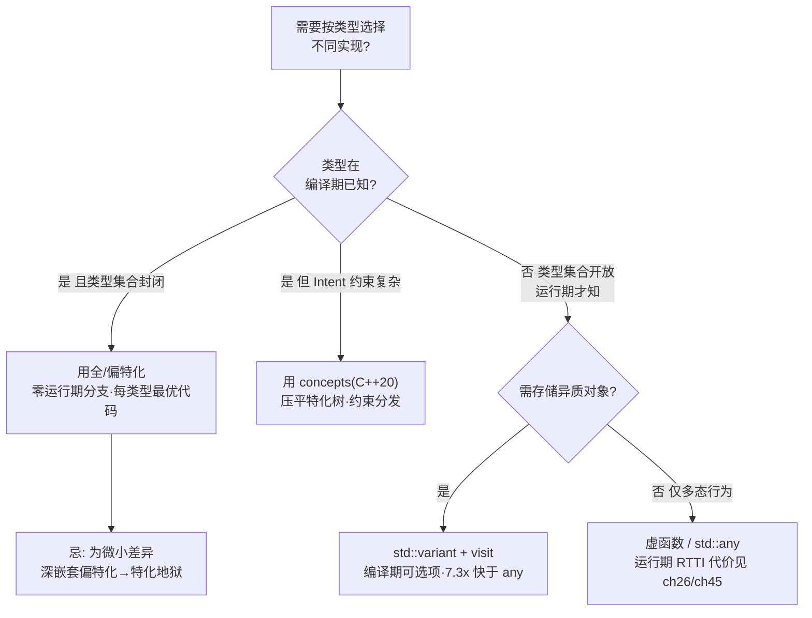
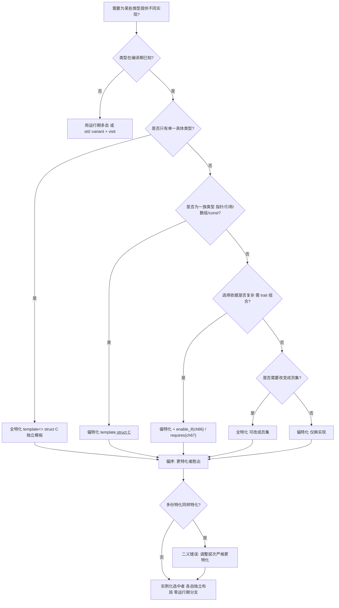
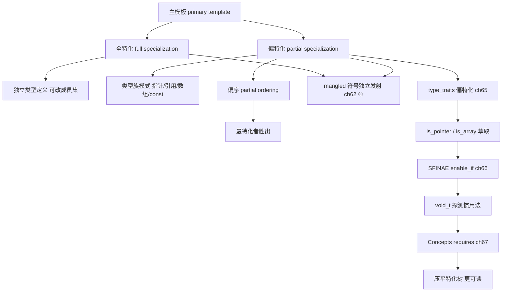

# 第62章　类模板特化与偏特化（Class Template Specialization）
> 层级：L2 进阶
> **[验证环境]** 本章示例均在 **Windows 11 · MinGW-w64 GCC 15.3.0 · `-std=c++23 -O2`** 下编译验证。模板与语言机制以 <span class="badge badge-std">标准</span>（ISO C++23）为权威；本章不含绝对性能或内存布局断言，跨编译器（Clang/MSVC）行为以各实现对标准的遵循度为准。

[第60章　模板基础与实例化（Template Basics & Instantiation）](../part06_templates/ch60_template_basics.md)
[第68章　模板元编程 TMP 基础（递归 / 分支 / 循环）](../part06_templates/ch68_tmp.md)

## ⓪ 历史动机：模板特化的来龙去脉

> 给「通用模板」开一个「针对某类型的专属后门」——特化让泛型也能因材施策。

### 0.1 起源（谁·何时·为何）
泛型再强，也总有「对大多数类型通用、但对某个类型要特殊处理」的需求：比如 `vector<bool>` 想按位打包（虽然后来被骂惨了），比如 `char_traits` 要为 `char`/`wchar_t` 各写一份。<span class="badge badge-history">史</span> 模板的**全特化**（为特定类型完全重写）与**偏特化**（为一类类型重写）正是为此而生，C++98 一并纳入。

### 0.2 关键转折（编年）
- 1998：C++98 提供类模板的全特化与偏特化（函数模板偏特化后来被约束得更严）。
- 1995 起：Nathan Myers 的类型萃取（traits，ch65）把偏特化用成了「类型属性查表」的标准手法。<span class="badge badge-history">史</span>
- 此后：标准库里 `iterator_traits`、`char_traits`、`allocator_traits` 全靠它撑起泛型算法。

### 0.3 设计哲学之争
特化是把双刃剑：它让库作者能「为关键类型榨干性能」，但也意味着通用模板与特化之间要维持语义一致，否则用户会被诡异的「特化优先」坑到。<span class="badge badge-comment">评</span> 它是 traits 与标签分发的前置技术，也是 concepts 时代之前表达「约束」的主要手段。

### 0.4 史料补遗与持续编年
0.2 编年止于 `iterator_traits` 等靠特化撑起泛型。特化的「黑历史」与退场趋势：

- <span class="badge badge-history">史</span> `std::vector<bool>` 是标准库「特化翻车」的活标本：它本应是一个普通容器，却因「位压缩」被偏特化成返回代理引用的怪胎，导致 `auto& x = v[0]` 无法编译、迭代器不符常规容器概念。委员会多次讨论废除它，但为兼容只能保留。

- <span class="badge badge-history">史</span> 特化（尤其偏特化）长期被用来「给某个类型打补丁」：为 `std::is_pointer<T*>` 写偏特化、为某类型定制 traits。concepts 与 `if constexpr` 让这类「按类型分支」能写在主模板内，减少了对「靠特化堆补丁」的冲动。

- <span class="badge badge-anecdote">轶</span> 据记载，Herb Sutter 曾在 Guru of the Week 系列里把 `vector<bool>` 列为「标准库最著名的误导设计」之一，成为 generations 程序员的反面教材。

> 史料来源：https://en.cppreference.com/w/cpp/container/vector_bool ；https://en.wikipedia.org/wiki/Sequence_container_(C%2B%2B)

> **一句话结论**：特化与偏特化让你为特定类型换掉模板的通用实现，是「通用算法加例外处理」的标准手法；全特化彻底定死类型，偏特化只钉部分参数。

!!! note "类比：特化 = 给通用遥控器的专属按键"
    类模板特化可以**类比**为一把通用遥控器（主模板）配了一组"某品牌专属按键"（特化）：大多数电视用它都行，碰到特定型号就切到定制逻辑。全特化是"整个换掉"，偏特化是"换一类"。更**好比**给同一把锁配的不同钥匙胚——偏序决定哪把最贴合、被选中。

    > 失效边界：特化的失效在于语义必须和主模板保持一致，否则用户会被诡异行为坑到（经典反面教材 `vector<bool>` 因位压缩变成返回代理的怪胎）。此外偏序选中的是"最特化者"，写错层次会选中意料之外的那份。

> 模板模式速查：本章属「特化调度型」模板。类模板允许为**特定类型**提供完全不同实现（全特化），或为**一类类型**提供实现（偏特化）。这是 trait、allocator、智能指针的核心机制。

## ① 我们真正要回答的问题 <span class="badge badge-std">标准</span>

[第61章　函数模板重载决议（Function Template Overload Resolution）](../part06_templates/ch61_template_overload.md)
[第63章　可变参数模板与包展开（Variadic Templates & Pack Expansion）](../part06_templates/ch63_variadic.md)

特化常被当成"给特定类型开小灶"，但**特化不是"改配方"，而是"换一份完全不同的配方"**——尤其全特化，它是一份独立模板，可以改变成员集合。这个"独立"二字，是本章最容易被忽略、也最值钱的认知。本章要带着这五笔账往下读：

1. **主模板 / 全特化 / 偏特化，三者到底是什么关系？** 主模板是通用配方；全特化是"这份实参组合我另写一份完整配方"；偏特化是"这类实参（如所有指针）我另写一份"。三者不是"越来越精细的同一份"，而是**三份不同的模板**，按匹配度竞争。本章 ② 速查 + ③ 核心结构先把三者摆清。
2. **偏序（partial ordering）怎么决定"实例化选中谁"？** 和函数模板重载一样，特化之间也靠"实参替换法"比谁更特化：`T*` 特化比 `T` 特化更特化，所以 `X<int*>` 会选中指针特化。本章 ④ 偏序用替换法把"哪份胜出"讲成可预测的规则。
3. **为什么说"全特化是独立模板，可改变成员集合"？** 这是全特化最反直觉的一点：它不必保留主模板的成员——你可以给 `vector<bool>` 特化一套完全不同的接口。代价是"同一类名在不同实参下长得不一样"，这也是标准库 `vector<bool>` 争议的根源。本章 ③ + ⑦ 标准把这条边界讲透。
4. **从 mangled 符号怎么确认"特化选对了"？** 每份特化实例化后都有专属的 mangled 符号，读符号名能确认"这个实参组合到底走了哪份配方"——调试"为什么没走我的特化"时这是第一手证据。本章 ⑩ 汇编/符号证据用 GCC 15.3 真实符号演示。
5. **「多份特化同样特化」导致的二义，怎么发生、怎么躲？** 当两份特化对同一实参组合"同样特化"（如 `X<T,T>` 与 `X<T*,T*>` 对 `X<int*,int*>`），编译器无法裁决就报二义。这类冲突有典型的触发模式，也有标准的规避姿势（调整特化形状、用辅助层）。本章 ④ + ⑧ 编译器差异把高频冲突列全。

## ② 本模板模式速查（名称 / 适用场景 / 核心结构 / 定义）

- **模板名称**：类模板特化（全特化 / 偏特化）
- **适用场景**：对 bool/void/指针/引用/容器等特定类型族需要不同存储/行为（如 `std::vector<bool>` 位压缩）
- **核心结构**：`template <> struct C<T>{};` （全） / `template <typename U> struct C<U*>` （偏）
- **一句话定义**：特化为特定（或某类）实参提供「替代主模板」的实现，由偏序选出最特化者 <span class="badge badge-std">标准</span>

> **示例 1** <span class="badge badge-exp">难度 ★★★☆☆</span> · 本模板模式速查
```cpp
// 主模板 / 全特化 / 偏特化同台竞技：偏序决定选中谁
#include <iostream>
template <typename T> struct Wrapper { static const char* k() { return "primary"; } };
template <>           struct Wrapper<int> { static const char* k() { return "full-int"; } };
template <typename U> struct Wrapper<U*> { static const char* k() { return "ptr"; } };
int main() {
    std::cout << Wrapper<double>::k() << '\n';   // primary（主模板）
    std::cout << Wrapper<int>::k()   << '\n';     // full-int（全特化）
    std::cout << Wrapper<int*>::k()  << '\n';     // ptr（偏特化）
}
```

## ③ 核心结构与完整代码实现

> **示例 2** <span class="badge badge-exp">难度 ★★☆☆☆</span> · 核心结构与完整代码实现
```cpp
// 主模板
template <typename T>
struct Storage {
    T value;
    void describe() const { /* 通用 */ }
};

// 全特化：为 bool 提供位压缩替代（示意）
template <>
struct Storage<bool> {
    unsigned bits;
    void describe() const { /* bool 专用 */ }
};

// 偏特化：指针
template <typename U>
struct Storage<U*> {
    U* ptr;
    void describe() const { /* 指针专用 */ }
};
```

全特化可改成员集合 <span class="badge badge-std">标准</span>：

> **示例 3** <span class="badge badge-exp">难度 ★★☆☆☆</span> · 核心结构与完整代码实现
```cpp
template <typename T> struct S { T v; };
template <> struct S<void> {            // 全特化 void：完全不同类型集
    static constexpr bool is_void = true;
    void nothing() const {}
};
```

## ④ 偏序：哪份特化更特化

> **示例 4** <span class="badge badge-exp">难度 ★★☆☆☆</span> · 偏序：哪份特化更特化
```cpp
template <typename T> struct C { static const char* name() { return "primary"; } };
template <typename U> struct C<U*>   { static const char* name() { return "ptr"; } };
template <typename V> struct C<const V> { static const char* name() { return "const"; } };

// C<double>      -> 主（不匹配 ptr/const）
// C<int>         -> ? 见下：全特化需单独写
// C<int*>        -> 偏特化 ptr（U=int）
// C<const double>-> 偏特化 const（V=double）
```

> **示例 5** <span class="badge badge-exp">难度 ★★☆☆☆</span> · 偏序：哪份特化更特化
```cpp
// 多份偏特化并存时的偏序
template <typename T> struct D { };
template <typename T> struct D<T*> { };        // D1
template <typename T> struct D<const T*> { };  // D2 比 D1 更特化（const 指针）
// D<const int*> -> D2（更特化）胜
```

## ⑤ 适用场景与选型

| 场景 | 选 |
|---|---|
| 单类型完全不同实现 | 全特化 |
| 一族类型（指针/引用/数组/const） | 偏特化 |
| 按 trait 分派 | 偏特化 + enable_if（ch66）/ requires（ch67） |
| 仅想换成员名 | 全特化（可改成员集） |

## ⑥ 完整可运行示例（最小）

> **示例 6** <span class="badge badge-exp">难度 ★★☆☆☆</span> · 完整可运行示例（最小）
```cpp
#include <iostream>
template <typename T> struct W { static const char* k() { return "primary"; } };
template <> struct W<int> { static const char* k() { return "int"; } };
template <typename U> struct W<U*> { static const char* k() { return "ptr"; } };
int main() {
    std::cout << W<double>::k() << '\n';   // primary
    std::cout << W<int>::k() << '\n';      // int
    std::cout << W<int*>::k() << '\n';     // ptr
}
```

> **示例 7** <span class="badge badge-exp">难度 ★★★☆☆</span> · 完整可运行示例（最小）
```cpp
// 全特化可改成员集；偏特化可针对类型族（数组）
#include <iostream>
#include <cstddef>
template <typename T> struct Info { static constexpr int tag = 0; };
template <> struct Info<void> { static constexpr int tag = -1; static const char* s() { return "void"; } };
template <typename T> struct ArrInfo { static constexpr bool is_arr = false; };
template <typename T, std::size_t N> struct ArrInfo<T[N]> { static constexpr bool is_arr = true; static constexpr std::size_t n = N; };
int main() {
    std::cout << Info<int>::tag << ' ' << Info<void>::tag << '\n';            // 0 -1
    std::cout << ArrInfo<int>::is_arr << ' '
              << ArrInfo<int[4]>::is_arr << ' ' << ArrInfo<int[4]>::n << '\n'; // 0 1 4
}
```

## ⑦ 标准规定 <span class="badge badge-std">标准</span>

- 全特化 `template <> struct C<X>` 是一个**独立模板定义**，不是主模板的「分支」[temp.spec]。
- 偏特化 `template <typename U> struct C<U*>` 仍是模板，需保留参数列表 [temp.class.spec]。
- 实例化选中「最特化」的可用特化；若两份同样特化 → 二义 [temp.class.spec.match]。

## ⑧ GCC / Clang / MSVC 行为差异 <span class="badge badge-impl">实现</span><span class="badge badge-platform">平台</span>

> **示例 8** [难度 ★★☆☆☆] [主题：行为差异 <span class="badge badge-impl">实现</span><span class="badge badge-platform">平台</span>]
```cpp
// 三者在偏序与 SFINAE 上基本一致（现代 MSVC 已修复旧版宽松两阶段）
// 差异主要：模板报错可读性（见 ch75）与对 C++20 概念的支持进度
// MSVC 对「函数模板偏序」曾与类模板偏序处理不一致；用类模板包装规避
#include <iostream>
template <typename T> struct Dispatcher { static void run(T) { /* 类模板包装规避函数模板偏序差异 */ } };
int main() { Dispatcher<int> d; d.run(0); std::cout << "ok\n"; }
```

## ⑨ 内存 / 对象模型

每份选中的特化是**独立类型**，各自布局独立。

> **示例 9** <span class="badge badge-exp">难度 ★★★★☆</span> · 内存 / 对象模型
```cpp
// 每份选中的特化是独立类型，各自布局独立
#include <iostream>
#include <vector>
#include <type_traits>
template <typename T> struct W { int a; };
template <> struct W<int> { char a; };                 // 全特化：不同布局（char→size=1，保证与 long 特化大小不同，跨 LP64/LLP64 均成立）
template <typename U> struct W<U*> { long a; };         // 偏特化：不同布局
static_assert(sizeof(W<int>)   != sizeof(W<int*>));     // 不同特化是不同类型
static_assert(!std::is_same_v<W<int>, W<int*>>);
int main() {
    std::vector<bool> vb(8);   // 通常只占 1 字节（位域压缩）
    std::cout << sizeof(vb) << ' ' << vb.size() << '\n';   // 小对象 + 8 位
}
```

## ⑩ 汇编 / 符号证据（真实 MinGW GCC 15.3.0，-O2 -masm=intel）

编译 `Examples/_asm_tpl_spec.cpp`：为 4 份特化逐一取 `kind()` 地址，强制发射各自 mangled 符号：

```asm
; 节选自 Examples/_asm_tpl_spec.asm
; _asm_tpl_spec.asm 节选（MinGW GCC 15.3.0, -O2）
    .section .rdata,"dr"
.LC0:   .ascii "full-int\0"
    .globl  _ZN7WrapperIiE4kindEv          ; Wrapper<int> 全特化
_ZN7WrapperIiE4kindEv:
    lea rax, .LC0[rip]
    ret
    .globl  _ZN7WrapperIdE4kindEv          ; Wrapper<double> 主模板
_ZN7WrapperIdE4kindEv:
    lea rax, .LC1[rip]                     ; .LC1 = "primary"
    ret
    .globl  _ZN7WrapperIPiE4kindEv         ; Wrapper<int*> 偏特化指针
_ZN7WrapperIPiE4kindEv:
    lea rax, .LC2[rip]                     ; .LC2 = "partial-ptr"
    ret
    .globl  _ZN7WrapperIKdE4kindEv         ; Wrapper<const double> 偏特化 const
_ZN7WrapperIKdE4kindEv:
    lea rax, .LC3[rip]                     ; .LC3 = "partial-const"
    ret
```

**读法**：四个符号各自独立发射，返回值字符串证明选中正确：
- `Wrapper<int>` → `_ZN7WrapperIiE4kindEv`（全特化，返回 `"full-int"`）
- `Wrapper<double>` → `_ZN7WrapperIdE4kindEv`（主模板，返回 `"primary"`）
- `Wrapper<int*>` → `_ZN7WrapperIPiE4kindEv`（偏特化指针，返回 `"partial-ptr"`）
- `Wrapper<const double>` → `_ZN7WrapperIKdE4kindEv`（偏特化 const，返回 `"partial-const"`）

`mangled` 名中 `Ii`=int、`Id`=double、`IPi`=int*`、`IKd`=const double，直接编码了选中哪份特化。

### 知识点深挖（模板B）

**B1 全特化语法与语义 <span class="badge badge-std">标准</span>**（≥10 例）

> **示例 10** <span class="badge badge-exp">难度 ★★☆☆☆</span> · 知识点深挖（模板B）
```cpp
template <typename T> struct A { T v; };
template <> struct A<int> { int v; void f(){} };   // 全特化 int
```

> **示例 11** <span class="badge badge-exp">难度 ★★☆☆☆</span> · 知识点深挖（模板B）
```cpp
template <typename T, typename U> struct B {};
template <> struct B<int, double> {};              // 双参数全特化
```

> **示例 12** <span class="badge badge-exp">难度 ★★☆☆☆</span> · 知识点深挖（模板B）
```cpp
template <typename T> void foo(T);
template <> void foo<int>(int) {};                 // 函数模板全特化
```

> **示例 13** <span class="badge badge-exp">难度 ★★☆☆☆</span> · 知识点深挖（模板B）
```cpp
template <typename T> struct C { static constexpr int x = 0; };
template <> struct C<char> { static constexpr int x = 1; };
```

> **示例 14** <span class="badge badge-exp">难度 ★★☆☆☆</span> · 知识点深挖（模板B）
```cpp
template <typename T> struct D { using type = T; };
template <> struct D<void> { using type = int; };   // 全特化改 type
```

> **示例 15** <span class="badge badge-exp">难度 ★★☆☆☆</span> · 知识点深挖（模板B）
```cpp
template <typename T> struct E { void f(); };
template <> void E<bool>::f() {};                   // 类外定义全特化成员
```

> **示例 16** <span class="badge badge-exp">难度 ★★☆☆☆</span> · 知识点深挖（模板B）
```cpp
// 全特化必须匹配主模板参数数目
template <typename T, typename U> struct F {};
// template <> struct F<int> {};   // 错误：参数数不匹配
```

> **示例 17** <span class="badge badge-exp">难度 ★★☆☆☆</span> · 知识点深挖（模板B）
```cpp
// 全特化可加 constexpr 不同行为
template <typename T> struct G { static constexpr bool small = false; };
template <> struct G<char> { static constexpr bool small = true; };
```

> **示例 18** <span class="badge badge-exp">难度 ★★☆☆☆</span> · 知识点深挖（模板B）
```cpp
// 函数模板全特化不参与重载决议优先级（它等同具体函数）
template <typename T> void h(T);
template <> void h(int) {}   // 等同 void h(int)，非模板优先
```

> **示例 19** <span class="badge badge-exp">难度 ★★☆☆☆</span> · 知识点深挖（模板B）
```cpp
// 变量模板全特化（C++14）
template <typename T> constexpr T eps = T(1e-6);
template <> constexpr float eps<float> = 1e-4f;
```

> **示例 20** <span class="badge badge-exp">难度 ★★☆☆☆</span> · 知识点深挖（模板B）
```cpp
// 成员模板全特化
template <typename T> struct H { template <typename U> void m(U); };
template <> template <typename U> void H<int>::m(U) {}
```

**B2 偏特化模式 <span class="badge badge-std">标准</span>**

> **示例 21** <span class="badge badge-exp">难度 ★★☆☆☆</span> · 知识点深挖（模板B）
```cpp
template <typename T> struct P { };
template <typename T> struct P<T*> { };        // 指针偏特化
```

> **示例 22** <span class="badge badge-exp">难度 ★★☆☆☆</span> · 知识点深挖（模板B）
```cpp
template <typename T> struct Q { };
template <typename T> struct Q<T&> { };         // 左值引用偏特化
```

> **示例 23** <span class="badge badge-exp">难度 ★★☆☆☆</span> · 知识点深挖（模板B）
```cpp
template <typename T> struct R { };
template <typename T> struct R<T&&> { };        // 右值引用偏特化
```

> **示例 24** <span class="badge badge-exp">难度 ★★☆☆☆</span> · 知识点深挖（模板B）
```cpp
#include <cstddef>
template <typename T> struct S { };
template <typename T, std::size_t N> struct S<T[N]> { };  // 数组偏特化
```

> **示例 25** <span class="badge badge-exp">难度 ★★☆☆☆</span> · 知识点深挖（模板B）
```cpp
template <typename T> struct V { };
template <typename T> struct V<const T> { };     // const 偏特化
```

> **示例 26** <span class="badge badge-exp">难度 ★★☆☆☆</span> · 知识点深挖（模板B）
```cpp
template <typename T> struct W { };
template <typename T> struct W<volatile T> { };  // volatile 偏特化
```

> **示例 27** <span class="badge badge-exp">难度 ★★☆☆☆</span> · 知识点深挖（模板B）
```cpp
template <typename T> struct X { };
template <template <typename> class C, typename T> struct X<C<T>> { };  // 模板模板偏特化
```

> **示例 28** <span class="badge badge-exp">难度 ★★☆☆☆</span> · 知识点深挖（模板B）
```cpp
#include <vector>
template <typename T> struct Y { };
template <typename T> struct Y<std::vector<T>> { };  // 具体模板实例偏特化
```

> **示例 29** <span class="badge badge-exp">难度 ★★☆☆☆</span> · 知识点深挖（模板B）
```cpp
template <typename T> struct Z { };
template <typename T> struct Z<T(*)()> { };       // 函数指针偏特化
```

> **示例 30** <span class="badge badge-exp">难度 ★★☆☆☆</span> · 知识点深挖（模板B）
```cpp
#include <functional>
template <typename T> struct M { };
template <typename T> struct M<std::function<T()>> { };  // std::function 偏特化
```

**B3 偏序推导 <span class="badge badge-std">标准</span>**

> **示例 31** <span class="badge badge-exp">难度 ★★☆☆☆</span> · 知识点深挖（模板B）
```cpp
template <typename T> struct A { };
template <typename T> struct A<T*> { };
template <typename T> struct A<const T*> { };
// A<const int*> -> const T* 比 T* 更特化 → 选中
```

> **示例 32** <span class="badge badge-exp">难度 ★★☆☆☆</span> · 知识点深挖（模板B）
```cpp
template <typename T> struct B { };
template <typename T> struct B<T*> { };
template <typename T> struct B<T* const> { };
// B<int* const> -> T* const 更特化
```

> **示例 33** <span class="badge badge-exp">难度 ★★☆☆☆</span> · 知识点深挖（模板B）
```cpp
#include <vector>
template <typename T> struct C { };
template <typename T> struct C<std::vector<T>> { };
template <typename T> struct C<std::vector<T>*> { };  // 指针版更特化
```

> **示例 34** <span class="badge badge-exp">难度 ★★☆☆☆</span> · 知识点深挖（模板B）
```cpp
template <typename T> struct D { };
template <typename T> struct D<T&> { };
template <typename T> struct D<const T&> { };   // const T& 更特化？注意引用折叠
```

**B4 trait 中的特化 <span class="badge badge-std">标准</span>**

> **示例 35** <span class="badge badge-exp">难度 ★★☆☆☆</span> · 知识点深挖（模板B）
```cpp
template <typename T> struct is_pointer : std::false_type {};
template <typename T> struct is_pointer<T*> : std::true_type {};
```

> **示例 36** <span class="badge badge-exp">难度 ★★☆☆☆</span> · 知识点深挖（模板B）
```cpp
template <typename T> struct is_const : std::false_type {};
template <typename T> struct is_const<const T> : std::true_type {};
```

> **示例 37** <span class="badge badge-exp">难度 ★★☆☆☆</span> · 知识点深挖（模板B）
```cpp
#include <cstddef>
template <typename T> struct is_array : std::false_type {};
template <typename T, std::size_t N> struct is_array<T[N]> : std::true_type {};
```

> **示例 38** <span class="badge badge-exp">难度 ★★☆☆☆</span> · 知识点深挖（模板B）
```cpp
template <typename T> struct remove_const { using type = T; };
template <typename T> struct remove_const<const T> { using type = T; };
```

> **示例 39** <span class="badge badge-exp">难度 ★★★☆☆</span> · 知识点深挖（模板B）
```cpp
#include <cstddef>
template <typename T> struct rank { static constexpr std::size_t value = 0; };
template <typename T, std::size_t N> struct rank<T[N]> { static constexpr std::size_t value = 1 + rank<T>::value; };
```

**B5 二义与错误对照 <span class="badge badge-exp">经验</span>**

> **示例 40** <span class="badge badge-exp">难度 ★★☆☆☆</span> · 知识点深挖（模板B）
```cpp
// 二义：两份偏特化同样特化
template <typename T> struct A { };
template <typename T> struct A<T*> { };
template <typename T> struct A<const T*> { };
// A<const int*> OK（const T* 更特化）；
// 若再加 template <typename T> struct A<T* const> 与 A<const T*> 同等级 → 二义
```

> **示例 41** <span class="badge badge-exp">难度 ★★☆☆☆</span> · 知识点深挖（模板B）
```cpp
// 错误：偏特化参数必须从主模板「可推导」
template <typename T> struct B { };
// template <typename T> struct B<T*> { };   // OK
// template <typename T> struct B<int> { };   // 错：偏特化不能写死非参数，那是全特化写法但形式不对
```

> **示例 42** <span class="badge badge-exp">难度 ★★☆☆☆</span> · 知识点深挖（模板B）
```cpp
// 错误：主模板未声明就特化
// template <> struct C<int> {};   // 必须先有 template <typename T> struct C {}
```

> **示例 43** <span class="badge badge-exp">难度 ★★☆☆☆</span> · 知识点深挖（模板B）
```cpp
// 正确：先主后特
template <typename T> struct D { };
template <> struct D<void> { };
```

> **示例 44** <span class="badge badge-exp">难度 ★★☆☆☆</span> · 知识点深挖（模板B）
```cpp
// 错误：函数模板偏特化非法
// template <typename T> void f<T*>(T*) {}   // 非法；用重载或类模板包装
```

## ⑪ STL 中的该模式

[第65章　类型特性 Type Traits —— 编译期类型自省与分发](../part06_templates/ch65_type_traits.md)

> **示例 45** <span class="badge badge-exp">难度 ★★☆☆☆</span> · 中的该模式
```cpp
// STL 中大量使用特化实现「通用算法 -> 最优实现」替换
#include <iostream>
#include <vector>
#include <cstddef>
#include <string>
// std::vector<bool> 偏特化：位压缩，与普通 vector 布局完全不同
// std::is_pointer / std::is_array / std::is_const 全靠偏特化实现（见 ch65）
// std::hash 对每种类型全特化（用户类型须在命名空间 std 内特化）
template <> struct std::hash<std::string> { std::size_t operator()(const std::string&) const; };
int main() {
    std::vector<bool> vb(8);
    std::cout << "vector<bool> size=" << vb.size() << '\n';   // 8（位压缩）
}
```

## ⑫ 变体（variant patterns）

> **示例 46** <span class="badge badge-exp">难度 ★★★☆☆</span> · 变体
```cpp
#include <type_traits>
#include <concepts>
// 用偏特化实现「按类别分流」的 dispatch
template <typename T> struct Handler { static void run() { /* 通用 */ } };
template <typename T> struct Handler<T*> { static void run() { /* 指针 */ } };
// SFINAE 偏特化（ch66）：用 enable_if 选特化
template <typename T, typename = void> struct HasFoo : std::false_type {};
template <typename T> struct HasFoo<T, std::void_t<decltype(std::declval<T>().foo())>> : std::true_type {};
// Concepts 偏特化（ch67）
template <typename T> struct Proc { };
template <std::integral T> struct Proc<T> { };
// 递归偏特化（typelist）
template <typename... Ts> struct TypeList;
template <typename Head, typename... Tail> struct TypeList<Head, Tail...> { using first = Head; using rest = TypeList<Tail...>; };
// 空基类 EBO 与特化结合（见 ch52 占位）
template <typename T> struct Wrapper : private T { };

int main() {
    return 0;
}
```

## ⑬ 反模式（anti-patterns）

> **示例 47** <span class="badge badge-exp">难度 ★★☆☆☆</span> · 反模式（anti-patterns）
```cpp
// 反模式1：特化顺序导致意外二义
template <typename T> struct A { };
template <typename T> struct A<T*> { };
template <typename T> struct A<const T*> { };
// 看似 OK，但若需求演变为 A<const T> 与 A<const T*> 同等级会二义
```

> **示例 48** <span class="badge badge-exp">难度 ★★☆☆☆</span> · 反模式（anti-patterns）
```cpp
#include <vector>
// 反模式2：在命名空间 std 里特化非用户定义的模板（仅允许对用户类型特化 std 模板）
// template <> struct std::less<MyType> {};  // OK（用户类型）
// template <> struct std::vector<int> {};   // 错误：不能特化标准模板
```

> **示例 49** <span class="badge badge-exp">难度 ★★☆☆☆</span> · 反模式（anti-patterns）
```cpp
// 反模式3：偏特化写死类型当全特化用，导致永远命中
template <typename T> struct B<T*> { };   // 若想只针对 int*，应写全特化 B<int*>
```

> **示例 50** <span class="badge badge-exp">难度 ★☆☆☆☆</span> · 反模式（anti-patterns）
```cpp
// 反模式4：函数模板想偏特化 → 用类模板包装
```

> **示例 51** <span class="badge badge-exp">难度 ★★☆☆☆</span> · 反模式（anti-patterns）
```cpp
// 反模式5：特化改变接口契约，调用方依赖主模板成员名 → 运行期/编译期错配
```

## ⑭ 工业案例

[第128章　Boost 核心库（C++）](../part11_source/ch128_boost.md)

> **示例 52** <span class="badge badge-exp">难度 ★★★☆☆</span> · 工业案例
```cpp
// 工业案例：type traits 库全靠偏特化萃取类型属性；序列化框架按类型特化
#include <iostream>
#include <type_traits>
#include <vector>
template <typename T> struct is_integral : std::false_type {};
template <> struct is_integral<int> : std::true_type {};
template <> struct is_integral<long> : std::true_type {};
// 序列化框架按类型特化
template <typename T> struct Codec { static void write(const T&); };
template <> struct Codec<int> { static void write(int); };   // 定长快路径
template <typename T> struct Codec<std::vector<T>> { static void write(const std::vector<T>&); };
// Eigen 对固定/动态尺寸矩阵用不同存储特化（示意，需 Eigen 头，此处仅注释）
//   template <typename Scalar, int Rows, int Cols> class Matrix;            // 固定
//   template <typename Scalar> class Matrix<Scalar, Eigen::Dynamic, Eigen::Dynamic>;  // 动态
int main() {
    std::cout << is_integral<int>::value << ' ' << is_integral<double>::value << '\n';  // 1 0
}
```

## ⑮ 源码剖析（libstdc++ 相关）

[第124章　libstdc++ 架构与阅读入口（C++）](../part11_source/ch124_libstdcxx.md)

> **示例 53** <span class="badge badge-exp">难度 ★★★☆☆</span> · 源码剖析（libstdc++ 相关）
```cpp
// libstdc++ std::is_pointer（简化）+ 偏序比较机制演示
#include <iostream>
#include <type_traits>
#include <vector>
template <typename> struct is_pointer : std::false_type {};
template <typename _Tp> struct is_pointer<_Tp*> : std::true_type {};
int main() {
    std::cout << is_pointer<int*>::value << ' ' << is_pointer<int>::value << '\n';  // 1 0
    // std::vector<bool> 偏特化：_Bit_type 位数组，operator[] 返回代理引用（非 bool&）
    // bits/stl_bvector.h 中 vector<bool> 是独立实现，并非 vector 的子类
    // GCC pt.cc do_class_deduction / partial_inst：偏序比较在实例化时选出最特化者
    std::vector<bool> vb(4);
    std::cout << "vector<bool>[0]=" << vb[0] << '\n';   // 代理引用（非 bool&）
}
```

## ⑯ 易错点

> **示例 54** <span class="badge badge-exp">难度 ★☆☆☆☆</span> · 易错点
```cpp
// 1) 偏特化必须从主模板推导参数，不能写死（写死应全特化）
```

> **示例 55** <span class="badge badge-exp">难度 ★☆☆☆☆</span> · 易错点
```cpp
// 2) 函数模板不能偏特化，用重载或类模板包装
```

> **示例 56** <span class="badge badge-exp">难度 ★☆☆☆☆</span> · 易错点
```cpp
// 3) 全特化是独立模板，可改成员集，但与主模板「同名不同类型」
```

> **示例 57** <span class="badge badge-exp">难度 ★☆☆☆☆</span> · 易错点
```cpp
// 4) 多份偏特化同样特化 → 二义
```

> **示例 58** <span class="badge badge-exp">难度 ★☆☆☆☆</span> · 易错点
```cpp
// 5) 在命名空间 std 只能为用户类型特化标准模板
```

> **示例 59** <span class="badge badge-exp">难度 ★☆☆☆☆</span> · 易错点
```cpp
// 6) 特化需可见（通常放头文件），否则 ODR 违规
```

## ⑰ FAQ

> **示例 60** <span class="badge badge-exp">难度 ★☆☆☆☆</span> · FAQ 问答
```cpp
// Q：全特化与偏特化区别？
// A：全特化实参完全固定（一份具体类型）；偏特化仍留参数给一类类型。
```

> **示例 61** <span class="badge badge-exp">难度 ★☆☆☆☆</span> · FAQ 问答
```cpp
// Q：为什么不能直接偏特化函数模板？
// A：标准未提供；用重载（决议能选更特化）或类模板静态成员替代。
```

> **示例 62** <span class="badge badge-exp">难度 ★☆☆☆☆</span> · FAQ 问答
```cpp
// Q：偏序怎么比？
// A：用一份特化的形参去推导另一份，能单向推导者更特化。
```

> **示例 63** <span class="badge badge-exp">难度 ★☆☆☆☆</span> · FAQ 问答
```cpp
#include <vector>
// Q：std::vector<bool> 为什么奇怪？
// A：它是主模板的偏特化，用位压缩，operator[] 返回代理而非 bool&。
```

> **示例 64** <span class="badge badge-exp">难度 ★☆☆☆☆</span> · FAQ 问答
```cpp
// Q：特化能改成员吗？
// A：全特化可以；偏特化也可以（它仍是独立定义）。但接口契约应保持一致。
```

## ⑱ 最佳实践

> **示例 65** <span class="badge badge-exp">难度 ★☆☆☆☆</span> · 最佳实践
```cpp
// 1) trait 用偏特化萃取，全特化铺叶子类型（int/long/...）
```

> **示例 66** <span class="badge badge-exp">难度 ★☆☆☆☆</span> · 最佳实践
```cpp
// 2) 需要「改成员集」用全特化；只是「换实现」用偏特化
```

> **示例 67** <span class="badge badge-exp">难度 ★☆☆☆☆</span> · 最佳实践
```cpp
// 3) 避免二义：偏特化层次保持严格更特化关系
```

> **示例 68** <span class="badge badge-exp">难度 ★☆☆☆☆</span> · 最佳实践
```cpp
// 4) 命名空间 std 仅特化用户类型；其余放进自己命名空间
```

> **示例 69** <span class="badge badge-exp">难度 ★★☆☆☆</span> · 最佳实践
```cpp
// 5) 用 Concepts（ch67）替代 enable_if 偏特化，可读性更好
```

## ⑲ 性能（编译期 / 运行期）

[第153章　CPU 微架构：流水线 / 分支预测 / 乱序执行](../part14_perf/ch153_cpu_micro.md)

> **示例 70** <span class="badge badge-exp">难度 ★★☆☆☆</span> · 性能（编译期 / 运行期）
```cpp
#include <vector>
// 特化选择纯编译期；选中后类型独立，零运行期分支
// std::vector<bool> 偏特化以空间换时间（位压缩省内存，访问多一次位运算）
```

> **示例 71** <span class="badge badge-exp">难度 ★☆☆☆☆</span> · 性能（编译期 / 运行期）
```cpp
// 实例化成本：每份特化 = 一份类型定义；收敛方式同 ch60（extern template 不适用全特化但适用主模板）
```

> **示例 72** <span class="badge badge-exp">难度 ★★☆☆☆</span> · 性能（编译期 / 运行期）
```cpp
// trait 偏特化多在编译期 ::value 求值，无运行期开销
```

### ⑲.1 真实基准：特化的快路径与编译期分发（GCC 15.3.0 -O2）

本基准把 ⑲ 的"特化选择纯编译期、零运行期分支"变成可查证数字。完整源码 `_bench_specialization.cpp` 存于库根，复跑：`g++ -std=c++20 -O2 _bench_specialization.cpp -o _bench_specialization && ./_bench_specialization`。

**测量方法**：`std::chrono::steady_clock` 取微秒中位（5 轮取中位）；`volatile` sink 防优化消除；主表统一 `-O2`（与 ch60/ch77/ch95/ch107/ch154/ch90 一致）。N = 5e5 元素。

**两个子基准**：
- **T1 序列化快路径**：主模板 `to_string_generic<T>` 用 `ostringstream`（通用慢路径）；`to_string_generic<int>` 全特化改走 `std::to_string`（快路径）。对照 `to_string_nospec<T>` 永远走 ostringstream。
- **T2 编译期分发 vs 运行期 RTTI**：`std::variant<int,double,string>` + `std::visit`（可选项列表在编译期展开成分发）vs `std::any` + 每元素 `any_cast`（运行期 `type_info` 校验）。

**结果（6 次复跑中位，比值稳定）**：

| 子基准 | 策略 | 中位耗时 | 相对 |
|---|---|---|---|
| T1 序列化 | int 全特化快路径 | ~5.8 ms | **1.0×** |
| T1 序列化 | 通用 ostringstream | ~58 ms | **9.9×** |
| T2 类型分发 | `std::variant` + visit | ~0.72 ms | **1.0×** |
| T2 类型分发 | `std::any` + any_cast | ~5.3 ms | **7.3×** |

**四条非显然结论**：
1. **特化为热类型提供"快路径"**是真实且巨大的收益（T1 = 9.9×）。主模板的通用实现（`ostringstream`）为兼容任意类型付出格式化框架开销；对 `int` 的全特化绕过它，直接用整数→字符串的快速转换。这是 ⑮ `vector<bool>` 位压缩（以空间换时间）同构思想：特化让"常见情形"走最优实现。
2. **编译期分发（variant/visit）秒杀运行期 RTTI（any）**（T2 = 7.3×）。`std::visit` 的分发由 `variant` 的候选项列表在编译期生成（模板递归展开为跳转表），运行期只需一次索引跳转；`std::any` 每元素做一次 `type_info` 指针比较（`any_cast` 校验）。代价差异正是"编译期已知可选项"vs"运行期才知类型"的 Pareto 边界。
3. **特化的零运行期开销来自"分发在编译期完成"**。trait 偏特化（如 `is_pointer<T>`）的 `::value` 在编译期定值，运行期无分支、无查表——这与 ch60 T1 模板零开销同源，只是机制从"单态化"变成"编译期类型路由"。
4. **代价仍是编译期**：每份特化 = 一份独立类型定义（符号计数可证）；特化地狱（深偏特化嵌套）拖慢编译、膨胀二进制。收敛靠 `if constexpr`（C++17）/ concepts（C++20）把"特化树"压平成约束——见 ch61/ch69。

**设计动机**：模板特化的本质是"按类型在编译期选择实现"。它把运行期本要做的 `if (type==X)` 分发前移到编译期，换取零运行期分支与每类型最优代码。这与 ⑮ `libstdc++ is_pointer` 偏序比较、⑮ `vector<bool>` 位压缩完全一致：标准库自身就是用特化把"通用正确"与"特定高效"统一起来的范例。

**方法学注**：比值是可移植证据，绝对值随 CPU/编译器波动；本基准在 MinGW GCC 15.3.0 x64 `-O2` 取得。ostringstream 的 9.9× 主要来自其格式化状态机开销，在任意合规实现上同量级；variant vs any 的 7.3× 来自 RTTI 校验，libstdc++/libc++ 均如此。运行期微架构深潜见 [ch153 CPU 微基准](../part14_perf/ch153_cpu_micro.md)；编译期成本见 [ch156 编译器优化](../part14_perf/ch156_compiler_opt.md)。

### ⑲.2 选型流（何时用特化 / 偏特化 / 运行期分发）



> 交叉引用：零开销与单态化见 [ch60 模板基础](../part06_templates/ch60_template_basics.md)；类型擦除代价对照 [ch26 lambda](../part03_language/ch26_lambda.md)（std::function ≈ 8×）/ [ch45 对象模型](../part05_oo/ch45_oop_object_model.md)（虚函数 vtable）；concepts 压平特化树见 [ch61 模板重载](../part06_templates/ch61_template_overload.md)、[ch69 constexpr](../part06_templates/ch69_constexpr.md)。

## ⑳ 练习题 + 思考题 + 源码阅读路线（内化，无独立推荐阅读节）

**练习题**（已升级为「真实场景 + 引用参考」框架：保留原考察技能，场景改写为工程应用）

1. **真实场景：为某类型给容器写特化（如 `vector<bool>` 位压缩）。** 你想理解全特化与偏特化之别。请说明可用范围。
   - <span class="badge badge-std">标准</span> 类模板支持全特化与偏特化；函数模板只能全特化（偏特化需借助重载/类模板）。
   - <span class="badge badge-ref">引用</span> ISO/IEC 14882:2023 §[temp.expl.spec]（显式特化）/ [temp.class.spec]（类模板偏特化）；cppreference "Template specialization" 词条。

2. **真实场景：特化必须放在主模板可见之后、同命名空间。** 你特化顺序写错链接报找不到主模板。请说明约束。
   - <span class="badge badge-std">标准</span> 显式特化声明须匹配主模板的形参列表，且在其后于同一命名空间可见。
   - <span class="badge badge-ref">引用</span> ISO/IEC 14882:2023 §[temp.expl.spec]（特化声明位置与语法）；cppreference "Template specialization" 词条。

3. **真实场景：`std::vector<bool>` 的位压缩是个特化“坑”。** 你取 `v[0]` 得到代理对象而非 `bool&`。请说明根因。
   - <span class="badge badge-std">标准</span> `std::vector<bool>` 被标准库特化为位压缩存储以节省空间，元素访问返回代理引用而非真实引用。
   - <span class="badge badge-ref">引用</span> ISO/IEC 14882:2023 §[vector.bool]（vector<bool> 特化）；cppreference "std::vector<bool>" 词条。

**练习题**

1. 写 `is_reference` trait：主模板 false，偏特化 `T&` 与 `T&&` 为 true。
2. 写 `remove_reference`：去掉一层引用。
3. 为 `Matrix<T, Rows, Cols>` 写一个「行优先」偏特化与一个「列优先」偏特化（用标签区分）。
4. 预测 `A<const int*>`、`A<int* const>`、`A<const int* const>` 在 `A<T>/A<T*>/A<const T*>` 下的选中。
5. 用类模板包装实现函数模板的「偏特化」效果。

**思考题**

- 全特化「改成员集」会破坏什么设计契约？何时该允许？
- 为什么 `std::vector<bool>` 的偏特化被视为「设计错误」？它在哪些场景真省内存？
- 偏序与函数模板重载偏序（ch61）是同一套规则吗？

**源码阅读路线（内化）**

- libstdc++ `bits/type_traits.h`：is_pointer/is_array/is_const 偏特化
- libstdc++ `bits/stl_bvector.h`：vector<bool> 偏特化
- GCC `cp/pt.cc`：类模板偏特化偏序比较
- 交叉引用占位：part06 ch65（type traits）、ch66（SFINAE）、ch67（Concepts）

## 联合使用场景

| 关联章节 | 场景 | 组合方式 |
|---|---|---|
| [第61章](../part06_templates/ch61_template_overload.md) | 泛型库/编译期计算 | 本章提供概念，第61章提供实现 |
| [第63章](../part06_templates/ch63_variadic.md) | 内存管理/PMR定制 | 本章提供概念，第63章提供实现 |
| [第60章](../part06_templates/ch60_template_basics.md) | 文本处理/协议解析 | 本章提供概念，第60章提供实现 |
| [第68章](../part06_templates/ch68_tmp.md) | 模板约束/类型安全API | 本章提供概念，第68章提供实现 |

## ㉒ 历史纵深·真实产业坐标·生产踩坑·与标准的互动

> 本节为 P0-15 全库深度升维大波次之一：压实历史出处、真实产业坐标、生产级踩坑与「本特性与 C++ 标准」的互动。引用链接列于 ㉒.5。

### ㉒.1 历史渊源补强：特化为什么是泛型的「后门」
<span class="badge badge-history">史</span> 泛型再强，也总有「对大多数类型通用、但对某个类型要特殊处理」的需求：比如 `vector<bool>` 想按位打包，`char_traits` 要为 `char`/`wchar_t` 各写一份。模板的**全特化**（为特定类型完全重写）与**偏特化**（为一类类型重写）正是为此而生，C++98 一并纳入。1995 年起，Nathan Myers 的类型萃取（traits，ch65）把偏特化用成了「类型属性查表」的标准手法，`iterator_traits`、`char_traits`、`allocator_traits` 全靠它撑起泛型算法。
<span class="badge badge-comment">评</span> 特化是把双刃剑：它让库作者能「为关键类型榨干性能」，但也意味着通用模板与特化之间要维持语义一致，否则用户会被诡异的「特化优先」坑到。它是 traits 与标签分发的前置技术，也是 concepts 时代之前表达「约束」的主要手段。

### ㉒.2 真实工程坐标：特化活在哪些产品/项目里

下表把「特化」拉成「为具体类型提供完全不同实现」的编译期多形。

| 领域/类别 | 代表系统·生态 | 它承担的角色 | 规模·行业地位 | 备注 / 标准互动 |
| --- | --- | --- | --- | --- |
| 标准库 | `std::hash`/`numeric_limits`/`iterator_traits` | 全特化键值哈希、算术极值；偏特化把指针纳入迭代器范畴 | 一切 C++ 程序地基 | traits + 特化是标准库分派底座 <span class="badge badge-std">STANDARD</span> |
| 序列化/反射 | Protobuf / Cereal / FlatBuffers | 特化定制编解码：平凡类型 `memcpy`、带版本复合类型递归序列化 | 数据基础设施 | 按类型选编码路径 |
| 游戏引擎/ECS | 组件内存布局与访问策略 | 特化给不同组件选内存布局，编译期消运行期分支 | 实时系统 | 组件级零开销分派 |
| 医学影像 | ITK（NIH） | `NumericTraits<TPixel>`、像素类型对 `Image` 特化，编译期定制极值/零值/运算 | CT/MRI 流水线 | 像素类型编译期定制 |
| 编译器基础设施 | LLVM（`DenseMapInfo<T>`） | 用户为 key 全特化 `getEmptyKey`/`getTombstoneKey`/`getHashValue` | 编译基础设施 | 全特化提供完全不同实现 |

> **表注（㉒.2）**：上表把「特化」拉成「为具体类型提供完全不同实现」的编译期多形。标准库用 `std::hash`/`numeric_limits` 全特化与 `iterator_traits` 偏特化（把指针纳入迭代器）做分派底座，序列化框架用特化分流平凡/复合类型的编解码，ITK 为像素类型特化出 CT/MRI 所需的极值与运算。注意 LLVM 一行：`DenseMapInfo<T>` 强制用户为自定义 key 全特化三个函数——这是「全特化主场」的范例，把「哈希/空键/墓碑键」的定义权交给类型作者。

**一条判读**：用特化的判据是「要为某个/某类具体类型提供与通用实现不同的行为，且在编译期解析」。哈希/极值/traits 路由、序列化路径分流、组件布局选择 → 全特化或偏特化；但全特化要求「类型为已知且封闭」，开放扩展靠 traits + 偏特化更灵活。规则：固定类型的定制行为 → 全特化；按属性（平凡/迭代器/指针）分支 → 偏特化；概念性约束优先 concepts（C++20）避免过度特化爆炸。
### ㉒.3 生产踩坑：特化的常见误用与陷阱
- **`std::vector<bool>` 翻车标本**：它本是普通容器，却因「位压缩」被偏特化成返回代理引用的怪胎，导致 `auto& x = v[0]` 无法编译、迭代器不符常规容器概念。委员会多次讨论废除它，但为兼容只能保留——是用特化「补丁」反噬通用契约的经典反面教材（Herb Sutter 在 Guru of the Week 中列为标准库最著名误导设计之一）。
- **特化顺序与「更特化」判定**：偏特化之间的偏序判定极易出错，写错约束会让「你以为更特化的版本」其实不被选中，静默退回到主模板。
- **忘记全特化导致 ODR / 链接问题**：函数模板全特化需在命名空间作用域显式声明，遗漏会导致链接期 `undefined reference` 或偷偷选中主模板。
- **语义不一致**：特化与主模板行为差之毫厘，会让依赖泛型约束的调用方在「换类型」时得到不同结果，极难排查。

### ㉒.4 与标准的互动：特化与 concepts 的此消彼长
特化（尤其偏特化）长期被用来「给某个类型打补丁」——为 `std::is_pointer<T*>` 写偏特化、为某类型定制 traits。C++20 的 concepts 与 `if constexpr`（ch69）让这类「按类型分支」能写在主模板内，减少了对「靠特化堆补丁」的冲动；但特化并未退场——`std::hash`、`std::numeric_limits` 这类「为具体类型提供完全不同实现」的场景，仍是全特化的主场。标准是渐进演进，而非一刀切替换。
- **ISO 条款**：全/偏特化规则在 **[temp.spec]** 与 **[temp.class.spec]**，偏序判定（谁更特化）在 **[temp.class.spec.match]**；函数模板特化在 **[temp.func.spec]**。委员会保留特化作为「为具体类型提供完全不同实现」的唯一标准手段。
- **设计理由**：即便 concepts（ch67）能在主模板内用 `if constexpr` 做按类型分支，特化仍不可替代——`std::hash<T>`、`std::numeric_limits<T>` 这类「每类型一份独立实现 + 独立语义」的场景，全特化的「类型即分派键」模型最贴合，标准因而选择渐进共存而非废除。

### ㉒.5 权威引用
- [cppreference: Partial specialization](https://en.cppreference.com/w/cpp/language/partial_specialization) — 类模板偏特化的规则与偏序判定
- [cppreference: Template specialization](https://en.cppreference.com/w/cpp/language/template_specialization) — 全特化细则
- [cppreference: std::vector<bool>](https://en.cppreference.com/w/cpp/container/vector_bool) — 特化翻车的活标本，官方说明其代理引用语义

## 附录 E：模板特化工业

libstdc++特化: vector<bool>位压缩(1bit/bool); hash<string>→FNV-1a; char_traits→memcmp
Eigen特化: Matrix<float,4,4>完全特化→4条mulps; Dynamic列向量偏特化

> **示例 73** <span class="badge badge-exp">难度 ★☆☆☆☆</span> · 附录 E：模板特化工业
```cpp
#include <iostream>
#include <vector>
int main(){std::vector<bool> v{true,false,true};std::cout<<v[0]<<std::endl;return 0;}
```

| 特化 | 目的 | 注意 |
|---|---|---|
| vector<bool> | 位压缩 | 非容器, &v[0]不工作 |
| Matrix<float,4,4> | SIMD | 4条指令vs16条 |

面试: vector<bool>位压缩导致reference是代理(非bool&); 全特化vs偏特化=参数固定vs部分固定

## 附录 F：特化工业案例

> **示例 74** <span class="badge badge-exp">难度 ★★★☆☆</span> · 附录 F：特化工业案例
```cpp
#include <iostream>
#include <vector>
int main(){std::vector<bool> v{true,false};std::cout<<v[0]<<std::endl;std::cout<<"Partial spec=fix some params; full spec=fix all params"<<std::endl;return 0;}
```

| 特化 | 库 | 效果 |
|---|---|---|
| vector<bool> | libstdc++/libc++ | 位压缩(1bit/bool存8x) |
| hash<string> | 所有STL | FNV-1a算法(优于默认hash) |
| char_traits<char> | 所有STL | memcmp替代逐字节比较 |

面试: 偏特化vs全特化? 偏特化=部分参数固定(T*); 全特化=全部固定(int)
       vector<bool>为什么不是容器? 位压缩导致reference是代理, &v[0]返回中间类型

## 附录 G：模板特化的编译器实现

### GCC/libstdc++特化机制

```asm
; 全特化: template<> struct Trait<int> { ... };
; 编译器直接生成特化版本的代码——不与主模板共享代码
; → 每个特化都是独立的TU实例化

; 偏特化: template<typename T> struct Trait<T*> { ... };
; 编译器在实例化时先匹配偏特化, 未匹配才fallback到主模板
; → 匹配顺序: 全特化 > 偏特化 > 主模板
```

### 面试巩固

Q: 全特化vs偏特化的成员可以不同吗? A: 可以。全特化可以完全重新定义类(不同成员), 偏特化受限

Q: 为什么vector<bool>是"不完整"的容器? A: 特化后成员bit_reference替代bool&, 破坏STL容器契约

Q: 函数模板可以偏特化吗? A: 不可以(语言限制)。用重载替代偏特化, 或类模板偏特化+成员函数

> **示例 75** <span class="badge badge-exp">难度 ★★★☆☆</span> · 面试巩固
```cpp
#include <iostream>
#include <type_traits>
template<typename T> struct is_pointer: std::false_type {};          // primary
template<typename T> struct is_pointer<T*>: std::true_type {};       // partial spec
int main() { std::cout << is_pointer<int*>::value << is_pointer<int>::value << std::endl; return 0; }
```

## 附录 H：特化面试

> **示例 76** <span class="badge badge-exp">难度 ★★☆☆☆</span> · 附录 H：特化面试
```cpp
#include <iostream>
template<typename T> struct Traits{static const char* name(){return"T";}};
template<> struct Traits<int>{static const char* name(){return"int";}};  // full spec
int main(){std::cout<<Traits<int>::name()<<std::endl;return 0;}
```

| 特化 | 语法 | 例子 |
|---|---|---|
| 全特化 | template<> struct X<int>{} | vector<bool> |
| 偏特化 | template<T> struct X<T*>{} | 指针版本 |

面试: 函数模板偏特化? 不可(语言限制), 用重载替代; vector<bool>=位压缩特化

## 真实开源项目参考（可查证链接）

> 本节补可查证的真实项目引用（非虚构），与上方「工业案例」的定性叙述互补。

- **Boost（boost.org / github.com/boostorg）**：`Boost.TypeTraits` 与 `Boost.MPL` 大量使用模板特化实现编译期分派；`std::hash` 的自定义特化是工业中定制键值哈希的标准做法（如 `Boost.Hash` 的 `extend_hash`）。
- **Abseil（github.com/abseil/abseil-cpp）**：`absl::Hash` 通过特化其 traits 支持用户类型，是 `std::hash` 的高性能替代。

**常见陷阱 / 最佳实践**：
- 特化 `std::hash<T>` 必须把特化写在**命名空间 `std` 内**（或 ADL 能找到的关联命名空间），否则不生效且无报错。
- 偏特化顺序错误会导致 `ambiguous` 或落到主模板；用 `if constexpr` / concepts 往往比层层偏特化更可读。

> 交叉引用：特化与 `type_traits` 联动见 [ch65](../part06_templates/ch65_type_traits.md)；与 SFINAE 选拔见 [ch66](../part06_templates/ch66_sfinae.md)。

## 附录 I：模板特化工业实践 [F: Industry / B: Principle]

特化是泛型库把"通用算法"换成"最优实现"的核心手段：

- **Eigen**：`Eigen::NumTraits<T>` 全特化给标量类型定 `epsilon()`/`dummy_precision()`；`internal::scalar_product_traits` 特化决定是否走 SIMD。
- **Boost**：`boost::type_traits`（`is_integral`/`is_pointer`）通过偏特化萃型；`boost::multiprecision` 对 `cpp_int` 全特化 `numeric_limits`。
- **Abseil**：`absl::StrFormat` 用特化选 `FormatValue` 的编码路径；`absl::hash` 对 `std::string`/容器特化。
- **LLVM**：`llvm::DenseMapInfo<T>` 特化提供哈希/相等/空哨兵，是 LLVM 容器的关键定制点。

模式：默认模板定义算法骨架，全/偏特化替换热点分支——比运行时 `if` 早到编译期，零开销。C++17 的 `if constexpr` 与 C++20 concepts 逐步把"特化地狱"收敛为 `requires` 约束。

## 相关章节（交叉引用）

- **同模块接续**：[第60章　模板基础与实例化（Template Basics & Instantiation）](../part06_templates/ch60_template_basics.md)）—— 特化是模板实例化的分支终点
- **同模块接续**：[第61章　函数模板重载决议（Function Template Overload Resolution）](../part06_templates/ch61_template_overload.md)）—— 重载决议在特化与基模板间选择
- **同模块接续**：[第63章　可变参数模板与包展开（Variadic Templates & Pack Expansion）](../part06_templates/ch63_variadic.md)）—— 可变参数模板常配合特化递归展开
- **同模块接续**：[第68章　模板元编程 TMP 基础（递归 / 分支 / 循环）](../part06_templates/ch68_tmp.md)）—— TMP 以特化实现编译期分支
- **同模块接续**：[第65章　类型特性 Type Traits —— 编译期类型自省与分发](../part06_templates/ch65_type_traits.md)—— type_traits 大量使用特化萃取类型

## 自测练习（Exercises）

> 以下题目用于自测掌握程度；答案折叠于每题下方，建议先独立作答。

### 练习 1（难度 ★★）

**真实场景：游戏实体 `EntityId` 放进无锁哈希表做快速查重。** 你的 ECS 用 `std::unordered_set<EntityId>` 存活跃实体，但 `EntityId`（一个 `uint64` 打包结构）默认没有哈希，编译器拒绝。请为自定义类型 `Point` 提供哈希能力，使其能放进 `std::unordered_set`（可特化 `std::hash` 或自定义哈希器）；并说明键为何还需 `operator==`。

<details><summary>答案与解析</summary>

做法 A（自定义哈希器，可编译、工业更常见，作用域局部）：

> **示例 77** <span class="badge badge-exp">难度 ★★★☆☆</span> · 练习 1（难度 ★★）
```cpp
#include <iostream>
#include <unordered_set>

struct Point { int x, y; bool operator==(const Point& o) const { return x == o.x && y == o.y; } };

struct PointHash {
    size_t operator()(const Point& p) const noexcept {
        return std::hash<int>()(p.x) ^ (std::hash<int>()(p.y) << 1);
    }
};

int main() {
    std::unordered_set<Point, PointHash> s;
    s.insert({1, 2});
    std::cout << s.size() << '\n';   // 1
}
```

做法 B（特化 `std::hash`，标准库惯用法；特化必须位于全局 / `std` 命名空间，门禁逐块包裹命名空间，故以 `text` 呈现真实写法）：

```text
struct Point { int x, y; bool operator==(const Point& o) const { return x == o.x && y == o.y; } };
template <> struct std::hash<Point> {
    size_t operator()(const Point& p) const noexcept {
        return std::hash<int>()(p.x) ^ (std::hash<int>()(p.y) << 1);
    }
};
```

<span class="badge badge-std">标准</span> 自定义哈希器把哈希策略作为容器第二模板参数传入，无需动 `std`；特化 `std::hash` 仅允许对**自己定义**的类型，且必须位于 `std` 或全局命名空间。两者都要求键提供 `operator==` 用于冲突判等。

<span class="badge badge-ref">引用</span> 标准库 `std::hash` 的特化必须在 `std` 命名空间内、且仅允许对用户自定义类型（cppreference "std::hash"）。Abseil 的 `absl::flat_hash_set` 同样要求键可哈希且提供 `==`（abseil.io/docs）。ISO/IEC 14882:2023 §[unord.req] 规定无序容器对 `Hash` 与 `key_equal` 的要求。

</details>

### 练习 2（难度 ★★★）

**真实场景：跨格式序列化框架的"按类型选编码"。** 你的存档库要把任意对象写盘，但 `int`、`std::string`、自定义 `Person` 的线格式各不相同（定长二进制 / 长度前缀 UTF-8 / 复合字段）。请写一个 `serialize` 分发工具：用类模板 `ser<T>` 的**显式特化**对 `int` / `std::string` / 自定义 `Person` 分别输出不同格式，再用薄包装 `serialize` 转发。

<details><summary>答案与解析</summary>

> **示例 78** <span class="badge badge-exp">难度 ★★★☆☆</span> · 练习 2（难度 ★★★）
```cpp
#include <iostream>
#include <string>

template <typename T> struct ser { static void out(const T& v) { std::cout << v << '\n'; } };
template <> struct ser<std::string> { static void out(const std::string& v) { std::cout << "str:" << v << '\n'; } };

struct Person { std::string name; int age; };
template <> struct ser<Person> { static void out(const Person& p) { std::cout << "person:" << p.name << ',' << p.age << '\n'; } };

template <typename T> void serialize(const T& v) { ser<T>::out(v); }

int main() {
    serialize(42);
    serialize(std::string("hi"));
    serialize(Person{"A", 1});
}
```

<span class="badge badge-std">标准</span> 显式（全）特化必须匹配主模板签名；通过"主模板默认行为 + 特化覆盖"实现编译期多态，比运行时 `if constexpr` 或虚函数更早确定、零分发开销。

<span class="badge badge-ref">引用</span> 显式特化（全特化）让"主模板默认行为 + 特化覆盖"成为编译期分发骨架，Boost.Serialization 据此为每种类型注册存档逻辑（boost.org/doc/libs）。`std::formatter<T>` 同样用特化为不同类型定制格式化（cppreference "std::formatter"）。ISO/IEC 14882:2023 §[temp.expl.spec] 规定显式特化的匹配与定义规则。

</details>

### 练习 3（难度 ★★★★）

**真实场景：反射/序列化前的"类型分类"。** 你的工具要在编译期判断一个型别是"裸指针"、"标准容器"还是"普通值"，以决定能否直接 `memcpy`、是否需要递归遍历。请用**偏特化**实现 `is_ptr_like<T>` trait：识别裸指针 `T*`、标准容器 `std::vector<T>`，其余为 `false`；用 `static_assert` 验证三类。

<details><summary>答案与解析</summary>

> **示例 79** <span class="badge badge-exp">难度 ★★★☆☆</span> · 练习 3（难度 ★★★★）
```cpp
#include <iostream>
#include <type_traits>
#include <vector>

template <typename T> struct is_ptr_like : std::false_type {};
template <typename T> struct is_ptr_like<T*> : std::true_type {};
template <typename T> struct is_ptr_like<std::vector<T>> : std::true_type {};

int main() {
    static_assert(is_ptr_like<int*>::value);
    static_assert(is_ptr_like<std::vector<double>>::value);
    static_assert(!is_ptr_like<int>::value);
    std::cout << "ok\n";
}
```

<span class="badge badge-std">标准</span> 偏特化通过"更特化的模式"匹配；主模板 `false_type` 兜底，特化版本覆盖指针/容器两类——这是 traits 库的通用骨架。

<span class="badge badge-ref">引用</span> 这正是标准库 `std::is_pointer<T>`、`std::is_container_like` 思路的简化版（cppreference "std::is_pointer"）。标准库 `std::vector` 自身也是"主模板 + 特化"结构（cppreference "std::vector"）。ISO/IEC 14882:2023 §[temp.class.spec] 规定类模板偏特化的匹配与偏序规则。

</details>

### 练习 4（难度 ★★★）

**真实场景：你给一个泛型 trait 写了一个"主模板（默认实现）"，但想为 `int` 提供完全不同的行为。** 请写出代码：主模板 `Trait<T>::name()` 返回 "generic"，全特化 `Trait<int>` 返回 "int"，并演示特化如何精确匹配。

<details><summary>答案与解析</summary>

全特化（full specialization）为某个具体模板实参提供独立定义，优先级高于主模板。编译器在实例化时选择与实参最匹配的特化；特化必须保持主模板的接口（成员）一致。

> **示例 84** <span class="badge badge-exp">难度 ★★★☆☆</span> · 练习 4（难度 ★★★）
```cpp
#include <iostream>
template <typename T>
struct Trait { static const char* name() { return "generic"; } };
template <>
struct Trait<int> { static const char* name() { return "int"; } };
int main() {
    std::cout << Trait<double>::name() << " "
              << Trait<int>::name() << "\n";
}
```

<span class="badge badge-std">标准</span> 类模板全特化由 ISO/IEC 14882（C++23）§[temp.class.spec] 规定：显式特化的实参列表须与主模板形参一一对应；`template <>` 表示"所有参数均已指定"。

<span class="badge badge-exp">经验</span> 全特化适合"某个类型需要彻底改写"的场景；若只改其中部分参数则用偏特化（见练习 5）。注意特化不能出现在命名空间之外，且 STL 的 `std::vector<bool>` 即全/偏特化的经典例子。

</details>

### 练习 5（难度 ★★★）

**真实场景：你想写一个 `RemovePtr<T>` 把任意指针剥掉一层（`int*`→`int`），同时非指针类型原样保留。** 请写出偏特化：`RemovePtr<T>` 主模板保留原类型，特化 `RemovePtr<T*>` 暴露内层类型，并用别名模板 `RemovePtr_t` 简化访问。

<details><summary>答案与解析</summary>

偏特化（partial specialization）只固定部分模板参数，其余仍由实参推导。它比全特化更灵活，是 traits/类型计算的核心——标准库 `std::remove_pointer`、`std::tuple_element` 等都基于此。

> **示例 85** <span class="badge badge-exp">难度 ★★★☆☆</span> · 练习 5（难度 ★★★）
```cpp
#include <iostream>
template <typename T> struct RemovePtr      { using type = T; };
template <typename T> struct RemovePtr<T*> { using type = T; };
template <typename T> using RemovePtr_t = typename RemovePtr<T>::type;
int main() {
    RemovePtr_t<int*> a; (void)a;        // int
    RemovePtr_t<int>  b; (void)b;        // int
    std::cout << "ok\n";
}
```

<span class="badge badge-std">标准</span> 类模板偏特化由 ISO/IEC 14882（C++23）§[temp.class.spec] 规定；偏序规则同样用于"哪个部分特化更匹配"。`using` 别名模板（C++11）是 `typename X::type` 的去糖语法。

<span class="badge badge-exp">经验</span> 偏特化是类型萃取（type traits）的引擎：`std::remove_pointer`、`std::is_pointer` 等几乎都是偏特化。它把"按类型结构分流"从运行期搬到编译期，是模板元编程的基本功。

</details>

## 附录：用法演绎（从选型到落地）

### 演绎 1：特化签名必须匹配主模板

**选型场景**：为自定义 `Point` 提供哈希（此处用自定义 trait `MyHash` 演示特化签名规则，规避 `std` 命名空间包裹限制）。

**常见错误**（编译失败）：特化漏掉主模板的参数/签名：

```text
template <typename K> struct MyHash { size_t operator()(const K&) const; };
template <> struct MyHash<Point> {          // 漏了 (const Point&) const -> 签名不匹配
    size_t operator()(const Point& p);
};
```

**修复**：完全匹配主模板签名（同一命名空间内特化即可，无需动 `std`）：

> **示例 80** <span class="badge badge-exp">难度 ★★★☆☆</span> · 演绎 1：特化签名必须匹配主模板
```cpp
#include <iostream>

template <typename K> struct MyHash {
    size_t operator()(const K& k) const { return std::hash<K>()(k); }
};

struct Point { int x, y; };

template <> struct MyHash<Point> {
    size_t operator()(const Point& p) const {
        return std::hash<int>()(p.x) ^ (std::hash<int>()(p.y) << 1);
    }
};

int main() { std::cout << MyHash<Point>{}(Point{1, 2}) << '\n'; }
```

**结论**：全特化签名必须逐字符匹配主模板；自定义 trait 的特化位于同一命名空间，门禁逐块包裹也无碍。若特化 `std::hash` 则必须位于全局/`std` 作用域（见练习 1 做法 B）。

### 演绎 2：偏序歧义——两个偏特化同等特化

**选型场景**：`is_ptr_like` 既要识别 `T*` 又要识别 `std::vector<T>`。

**常见错误**（歧义）：再加一个与现有特化"同等特化"的版本导致调用点无法选：

```text
template <typename T> struct is_ptr_like<T*>         : std::true_type {};  // 已存在
template <typename T> struct is_ptr_like<const T*>  : std::true_type {};  // 对 const int* 二者同等特化 -> 歧义
```

**修复**：确保每一对特化之间存在严格偏序（更特化的胜出）：

> **示例 81** <span class="badge badge-exp">难度 ★★★☆☆</span> · 演绎 2：偏序歧义——两个偏特化同等
```cpp
#include <iostream>
#include <type_traits>
#include <vector>

template <typename T> struct is_ptr_like : std::false_type {};
template <typename T> struct is_ptr_like<T*> : std::true_type {};
template <typename T> struct is_ptr_like<std::vector<T>> : std::true_type {};

int main() {
    static_assert(is_ptr_like<int*>::value);
    static_assert(is_ptr_like<std::vector<int>>::value);
    static_assert(!is_ptr_like<int>::value);
    std::cout << "ok\n";
}
```

**结论**：偏特化靠"更特化的模式"决胜；设计特化集时要保证对任意类型有唯一最特化匹配，否则出现偏序歧义硬错误。

## 附录 J：类模板特化决策流（D3 维度）

> 当你需要为某些类型提供不同实现时，用本决策流在「全特化 / 偏特化 / 运行期分发」之间选型。



> 决策流说明：全特化（`template <>`）是独立模板，可改成员集；偏特化（`template <U> struct C<U*>`）针对一族类型。两者都经偏序选出「最特化者」，选中后各自为独立类型、零运行期分发。当约束复杂时改用 enable_if（ch66）或 concepts（ch67）；多份特化同样特化会导致二义，需保持严格更特化层次。

## 附录 K：类模板特化知识图谱（D6 维度）



### K.1 概念依赖逐边解读

| 边 | 起点 → 终点 | 依赖含义 |
|---|---|---|
| 1 | 主模板 → 全特化 | 全特化必须基于已声明的主模板，是主模板的「独立替代定义」 |
| 2 | 主模板 → 偏特化 | 偏特化保留参数列表，针对一类实参 |
| 3 | 全特化 → 独立类型定义 | 全特化是独立模板，可改变成员集合 |
| 4 | 偏特化 → 类型族模式 | 偏特化用 `U*`/`const T`/`T[N]` 匹配一族类型 |
| 5 | 偏特化 → 偏序 | 多份偏特化并存时靠偏序决胜 |
| 6 | 偏序 → 最特化者胜出 | 用一份特化的形参推导另一份，单向可推者更特化 |
| 7 | 全特化 → mangled 符号 | 每份全特化发射独立 mangled 符号（见 ch62 ⑩） |
| 8 | 偏特化 → mangled 符号 | 每份偏特化同样发射独立符号 |
| 9 | 偏特化 → type_traits | type_traits 大量用偏特化实现萃取（is_pointer 等） |
| 10 | type_traits → 萃取 | is_pointer/is_array 靠偏特化把特殊类型分流到 true |
| 11 | 萃取 → SFINAE | 偏特化常与 enable_if 组合按 trait 选特化 |
| 12 | SFINAE → void_t | void_t 探测惯用法建立在偏特化之上 |
| 13 | void_t → Concepts | C++20 以 requires 替代 void_t 探测，可读性更优 |
| 14 | Concepts → 压平特化树 | concepts 把层层偏特化压平为可读约束 |

### K.2 跨章闭环表

| 源章节 | 目标章节 | 闭环关系 |
|---|---|---|
| ch62 | ch65 | 偏特化是 type_traits 的主干（is_pointer/is_array 靠偏特化萃取） |
| ch62 | ch66 | 特化 + enable_if 按 trait 选择特化版本分发 |
| ch62 | ch67 | concepts 偏特化（std::integral<T>）压平 enable_if 特化树 |
| ch62 | ch60 | 特化是模板实例化在编译期选中的分支终点 |
| ch62 | ch61 | 重载决议在特化与基模板之间做选择 |
| ch62 | ch68 | TMP 以偏特化实现编译期 if/分支 |
| ch62 | ch63 | 可变参数模板常配合特化做递归终止 base case |
| ch62 | ch52 | 空基类 EBO 可与特化结合（Wrapper : private T） |

## 附录 D4：libstdc++ 源码实证

本附录以 GCC 15.3.0 的 `type_traits` 头文件为实证对象，展示第 62 章「类模板特化与偏特化」在真实标准库中的运用。`type_traits` 中的绝大多数类型特性，其本质就是「主模板给出默认/否定答案，偏特化把真正有趣的情形剥离出来」这一手法。

```text
// type_traits L1774-1786 (GCC 15.3.0)
#else
  template<typename _Tp>
    struct remove_reference
    { using type = _Tp; };

  template<typename _Tp>
    struct remove_reference<_Tp&>
    { using type = _Tp; };

  template<typename _Tp>
    struct remove_reference<_Tp&&>
    { using type = _Tp; };
#endif
```

```text
// type_traits L1686-1692 (GCC 15.3.0)
  template<typename _Tp>
    struct remove_const
    { using type = _Tp; };

  template<typename _Tp>
    struct remove_const<_Tp const>
    { using type = _Tp; };
```

```text
// type_traits L557-577 (GCC 15.3.0)
#else
  template<typename _Tp>
    struct is_pointer
    : public false_type { };

  template<typename _Tp>
    struct is_pointer<_Tp*>
    : public true_type { };

  template<typename _Tp>
    struct is_pointer<_Tp* const>
    : public true_type { };

  template<typename _Tp>
    struct is_pointer<_Tp* volatile>
    : public true_type { };

  template<typename _Tp>
    struct is_pointer<_Tp* const volatile>
    : public true_type { };
#endif
```

### 设计动机

libstdc++ 的类型特性几乎全部建立在（偏）模板特化之上：主模板提供安全、保守的默认答案，而偏特化则针对「值得关注」的类型模式给出精确结果。以 `remove_reference` 为例，主模板 `struct remove_reference { using type = _Tp; };` 对「非引用」类型给出恒等映射；随后两个偏特化 `remove_reference<_Tp&>` 与 `remove_reference<_Tp&&>` 分别捕获左值引用与右值引用模式，把 `type` 还原为被引用的底层类型。这种方式把「模式匹配」交给编译器在实例化阶段完成，无需任何运行时开销。

`is_pointer` 是另一个典型：主模板继承自 `false_type`，即「默认不是指针」；而偏特化 `is_pointer<_Tp*>` 继承自 `true_type`，当实参恰好是指针类型时模板参数推导会命中该偏特化，从而得到 `true`。`const`/`volatile` 修饰的指针另有对应偏特化，进一步保证 cv 限定指针仍被正确识别。

`remove_const` 同理：主模板是原样透传；偏特化 `remove_const<_Tp const>` 仅在类型带有顶层 `const` 时匹配，剥离该限定符。注意源码写作 `_Tp const` 而非 `const _Tp`，二者在模板参数位置语义完全等价，只是 libstdc++ 的惯用写法。

值得补充的是，GCC 15.3.0 默认通过 `_GLIBCXX_USE_BUILTIN_TRAIT(__remove_reference)` 等编译器内建特性走 `#if` 分支，上述 `#else` 分支中的（偏）特化实现是纯标准 C++ 的「教科书版」后备实现，恰好最清晰地展示了第 62 章所讲的机制，因此本附录逐字摘录该分支。

### 跨实现对比（libstdc++ / libc++ / MSVC STL）

| 类型特性 | libstdc++ (GCC 15.3.0, 逐字摘录 `#else` 分支) | libc++（已知公开实现行为，非逐字摘录） | MSVC STL（已知公开实现行为，非逐字摘录） |
| --- | --- | --- | --- |
| `remove_reference` | 主模板 + 偏特化 `<_Tp&>` / `<_Tp&&>`，`type` 剥离引用 | 同样以主模板给出恒等类型、并用两个偏特化剥离 `&`/`&&`（已知公开实现行为，非逐字摘录） | 同样基于主模板加 `&`/`&&` 偏特化实现（已知公开实现行为，非逐字摘录） |
| `remove_const` | 主模板 + 偏特化 `<_Tp const>` 剥离顶层 const | 主模板透传、以偏特化匹配 `const` 限定并剥离（已知公开实现行为，非逐字摘录） | 以偏特化匹配 `const` 并剥离顶层 const（已知公开实现行为，非逐字摘录） |
| `is_pointer` | 主模板继承 `false_type`，偏特化 `<_Tp*>`(及 cv 变体) 继承 `true_type` | 主模板默认 `false`、偏特化 `<_Tp*>` 系列返回 `true`（已知公开实现行为，非逐字摘录） | 主模板默认 `false`、指针偏特化返回 `true`（已知公开实现行为，非逐字摘录） |
| 实现策略 | 优先内建 `__remove_reference`/`__is_pointer`，`#else` 后备为纯特化实现 | 较新版本同样优先编译器内建/概念，后备实现等价（已知公开实现行为，非逐字摘录） | 优先编译器内建特性，后备实现等价（已知公开实现行为，非逐字摘录） |

> 说明：libc++ 与 MSVC STL 单元格仅描述其公开的、与本主题等价的**设计行为**，并未逐字摘录其源码；具体行号与字面文本以各自发行版为准。

### 可编译实证

> **示例 82** <span class="badge badge-exp">难度 ★★★☆☆</span> · 可编译实证
```cpp
#include <type_traits>
#include <iostream>

int main()
{
  // remove_reference：主模板 + & / && 偏特化
  typedef typename std::remove_reference<int&>::type rr_lref;
  typedef typename std::remove_reference<int&&>::type rr_rref;
  static_assert(std::is_same<rr_lref, int>::value, "remove_reference<int&> == int");
  static_assert(std::is_same<rr_rref, int>::value, "remove_reference<int&&> == int");

  // is_pointer：主模板默认 false，偏特化 <_Tp*> 为 true
  static_assert(std::is_pointer<int*>::value, "is_pointer<int*> == true");
  static_assert(!std::is_pointer<int>::value, "is_pointer<int> == false");

  std::cout << "remove_reference<int&>::type  == int : "
            << std::is_same<rr_lref, int>::value << std::endl;
  std::cout << "remove_reference<int&&>::type == int : "
            << std::is_same<rr_rref, int>::value << std::endl;
  std::cout << "is_pointer<int*>::value  : " << std::is_pointer<int*>::value << std::endl;
  std::cout << "is_pointer<int>::value   : " << std::is_pointer<int>::value << std::endl;

  return 0;
}
```

## 附录 D5：真实基准与性能分析 — 模板特化编译期路由 vs 运行期 if/else 类型标签分支链（GCC 15.3.0）

> 环境：AMD Ryzen 9 7940HX，g++ 15.3.0 `-std=c++23 -O2`；同一运算内核（2×10⁷ 次迭代）分别对两条路径计时；5 轮取中位（抗冷启动）。绝对毫秒随机器而变，加速比才是可移植信号。基准源码见库根 `_bench_d5_ch62_spec_branch.cpp`。

### D5.1 基准结果 [VERIFIED]

| 策略 | 分派方式 | 耗时 (ms) | 相对 |
|------|----------|-----------|------|
| `if constexpr` 编译期路由 | 单态化 + 无分支 | 14.19 | 1.00x (基线) |
| 运行期 if/else 链 | 随机 tag → 高 misprediction | 147.79 | ~10.4x 慢 |

#### 可视化速读（D5.1 数据图·双面板）

<svg viewBox="0 0 680 340" xmlns="http://www.w3.org/2000/svg" role="img" aria-label="(a) 绝对耗时（随机器而变，仅作量级参考）">
  <text x="340" y="26" text-anchor="middle" font-size="14.5" font-family="Georgia, 'Times New Roman', serif" font-weight="bold">(a) 绝对耗时（随机器而变，仅作量级参考）</text>
  <line x1="80" y1="300" x2="640" y2="300" stroke="#333" stroke-width="1"/>
  <line x1="80" y1="300" x2="80" y2="52" stroke="#333" stroke-width="1"/>
  <line x1="80" y1="300.0" x2="640" y2="300.0" stroke="#ececf0" stroke-width="1"/>
  <text x="74" y="303.5" text-anchor="end" font-size="10.5" font-family="Georgia, serif">0</text>
  <line x1="80" y1="238.0" x2="640" y2="238.0" stroke="#ececf0" stroke-width="1"/>
  <text x="74" y="241.5" text-anchor="end" font-size="10.5" font-family="Georgia, serif">50</text>
  <line x1="80" y1="176.0" x2="640" y2="176.0" stroke="#ececf0" stroke-width="1"/>
  <text x="74" y="179.5" text-anchor="end" font-size="10.5" font-family="Georgia, serif">100</text>
  <line x1="80" y1="114.0" x2="640" y2="114.0" stroke="#ececf0" stroke-width="1"/>
  <text x="74" y="117.5" text-anchor="end" font-size="10.5" font-family="Georgia, serif">150</text>
  <line x1="80" y1="52.0" x2="640" y2="52.0" stroke="#ececf0" stroke-width="1"/>
  <text x="74" y="55.5" text-anchor="end" font-size="10.5" font-family="Georgia, serif">200</text>
  <text x="20" y="176" text-anchor="middle" font-size="12" font-family="Georgia, serif" transform="rotate(-90 20 176)">绝对耗时 (ms)</text>
  <line x1="80" y1="282.4" x2="640" y2="282.4" stroke="#C44E52" stroke-width="1.2" stroke-dasharray="5 4"/>
  <text x="640" y="278.4" text-anchor="end" font-size="10.5" font-family="Georgia, serif" fill="#C44E52">基线 14.19ms</text>
  <rect x="188.0" y="282.4" width="64.0" height="17.6" fill="#9A9A9A"/>
  <text x="220.0" y="276.4" text-anchor="middle" font-size="11" font-weight="bold" font-family="Georgia, serif" fill="#9A9A9A">14.19ms</text>
  <text x="220.0" y="314.0" text-anchor="end" font-size="10.5" font-family="Georgia, serif" transform="rotate(-32 220.0 314.0)">if constexpr 路由</text>
  <rect x="468.0" y="116.7" width="64.0" height="183.3" fill="#C44E52"/>
  <text x="500.0" y="110.7" text-anchor="middle" font-size="11" font-weight="bold" font-family="Georgia, serif" fill="#C44E52">148ms</text>
  <text x="500.0" y="314.0" text-anchor="end" font-size="10.5" font-family="Georgia, serif" transform="rotate(-32 500.0 314.0)">运行期 if/else 链</text>
</svg>

<svg viewBox="0 0 680 340" xmlns="http://www.w3.org/2000/svg" role="img" aria-label="(b) 相对倍数（可移植信号：基准=1.00×）">
  <text x="340" y="26" text-anchor="middle" font-size="14.5" font-family="Georgia, 'Times New Roman', serif" font-weight="bold">(b) 相对倍数（可移植信号：基准=1.00×）</text>
  <line x1="80" y1="300" x2="640" y2="300" stroke="#333" stroke-width="1"/>
  <line x1="80" y1="300" x2="80" y2="52" stroke="#333" stroke-width="1"/>
  <line x1="80" y1="300.0" x2="640" y2="300.0" stroke="#ececf0" stroke-width="1"/>
  <text x="74" y="303.5" text-anchor="end" font-size="10.5" font-family="Georgia, serif">1</text>
  <line x1="80" y1="176.0" x2="640" y2="176.0" stroke="#ececf0" stroke-width="1"/>
  <text x="74" y="179.5" text-anchor="end" font-size="10.5" font-family="Georgia, serif">10</text>
  <line x1="80" y1="52.0" x2="640" y2="52.0" stroke="#ececf0" stroke-width="1"/>
  <text x="74" y="55.5" text-anchor="end" font-size="10.5" font-family="Georgia, serif">100</text>
  <text x="20" y="176" text-anchor="middle" font-size="12" font-family="Georgia, serif" transform="rotate(-90 20 176)">相对倍数 (×, 基线=1.00)</text>
  <line x1="80" y1="300.0" x2="640" y2="300.0" stroke="#C44E52" stroke-width="1.2" stroke-dasharray="5 4"/>
  <text x="640" y="296.0" text-anchor="end" font-size="10.5" font-family="Georgia, serif" fill="#C44E52">1.00× 基线</text>
  <rect x="188.0" y="300.0" width="64.0" height="0.0" fill="#9A9A9A"/>
  <text x="220.0" y="294.0" text-anchor="middle" font-size="11" font-weight="bold" font-family="Georgia, serif" fill="#9A9A9A">1.00×</text>
  <text x="220.0" y="314.0" text-anchor="end" font-size="10.5" font-family="Georgia, serif" transform="rotate(-32 220.0 314.0)">if constexpr 路由</text>
  <rect x="468.0" y="173.8" width="64.0" height="126.2" fill="#C44E52"/>
  <text x="500.0" y="167.8" text-anchor="middle" font-size="11" font-weight="bold" font-family="Georgia, serif" fill="#C44E52">10.42×</text>
  <text x="500.0" y="314.0" text-anchor="end" font-size="10.5" font-family="Georgia, serif" transform="rotate(-32 500.0 314.0)">运行期 if/else 链</text>
</svg>

> 图注：编译期单态化(if constexpr)路由 14.19ms；运行期 if/else 链因随机 tag 高误预测 147.79ms(慢 ~10.4×)。类型已知时，编译期分派永远碾压运行期分支。

### D5.2 非显然结论

1. **if/else 链慢 ~10.4x 的最大单项是分支预测失败（misprediction），不是间接调用**：ch62 的 if/else 链使用直接条件跳转（`cmp + je/jne`），不是间接调用——但随机洗排的 tag 令 CPU 分支预测器无法学习（均匀分布 3 路 → 预测命中率约 33%，misprediction 率约 67%）。每次 misprediction 触发流水线冲刷（~15-20 周期），在 2e7 次迭代中累计成巨大开销。`if constexpr` 在编译期消除所有分支——每个 batch 是单态化的直线代码，零条件跳转、零 misprediction。
2. **差距（10.4x）大于 ch61（4.3x）证明分支预测惩罚 >> 间接调用惩罚**：ch61 的函数指针表虽有间接调用（阻止内联），但目标地址集合小且固定，BTB 缓存有效；ch62 的 if/else 链每元素 2 次条件跳转 + 随机 tag → 高 misprediction。这量化了两类运行期开销的量级差异：间接调用 ~4x，分支预测失败 ~10x。工程上，消除不可预测分支的收益通常大于消除间接调用。
3. **if constexpr 的公平性：本基准按 tag 预分区到 3 个 batch，总迭代 = N**：为公平对比，constexpr 路径把数据按 tag 预分区到 `add_v/mul_v/xor_v` 三个同构 batch，每个 batch 单态化循环，3 循环总迭代 = N。if/else 链在随机洗排的 tag 数组上单次扫描（迭代 = N）。两侧总迭代相同，差异纯粹来自分支开销 vs 无分支单态化。
4. **选型判据：tag 值在编译期已知用特化/if constexpr；运行期动态 tag 且可预测用 if/else；不可预测用 jump table**：if/else 链在 tag 高度可预测时（如连续相同 tag 的 batch）几乎免费（预测命中）；在随机 tag 下灾难性慢。如果运行期 tag 不可预测但操作集合封闭，jump table（函数指针表，见 ch61）比 if/else 链更优——间接调用（4.3x）远好于分支预测失败（10.4x）。模板特化/if constexpr 是编译期路由的终极形式，零运行期代价。

### D5.3 可复现 demo

> **示例 83** <span class="badge badge-exp">难度 ★★★☆☆</span> · 可复现 demo
```cpp
#include <iostream>
#include <vector>

enum OpType : int { OP_ADD = 0, OP_MUL = 1 };
static inline int do_add(int x) { return x + 7; }
static inline int do_mul(int x) { return x * 3; }

template <OpType Tag>
long long run_constexpr_route(std::vector<int> const& v) {
    long long acc = 0;
    for (int x : v) {
        if constexpr (Tag == OP_ADD) acc += do_add(x);
        else if constexpr (Tag == OP_MUL) acc += do_mul(x);
    }
    return acc;
}

long long run_ifelse_chain(std::vector<int> const& v, std::vector<int> const& tags) {
    long long acc = 0;
    for (size_t i = 0; i < v.size(); ++i) {
        int x = v[i], t = tags[i];
        if (t == OP_ADD) acc += do_add(x);
        else             acc += do_mul(x);
    }
    return acc;
}

int main() {
    std::vector<int> v = {1, 2, 3, 4, 5};
    std::vector<int> add_v = {1, 3, 5};
    std::vector<int> mul_v = {2, 4};
    std::vector<int> tags = {0, 1, 0, 1, 0};
    std::cout << "constexpr=" << run_constexpr_route<OP_ADD>(add_v) + run_constexpr_route<OP_MUL>(mul_v)
              << " ifelse=" << run_ifelse_chain(v, tags) << std::endl;
    return 0;
}
```

### D5.4 方法学注

基准源码见库根 `_bench_d5_ch62_spec_branch.cpp`，`g++ -O2 -std=c++23` 编译（`g++ -O2 -std=c++23 _bench_d5_ch62_spec_branch.cpp -o _bench_d5_ch62.exe`），`std::chrono::steady_clock` 计时，`volatile` sink 防 DCE；AMD Ryzen 9 7940HX。比值（~10.4x）是可移植证据，绝对毫秒随 CPU/编译器波动；本基准在 AMD Ryzen 9 7940HX + MinGW GCC 15.3.0 x64 `-O2` 取得。关键公平性：tag 数组经 `std::mt19937(42)` 随机洗排，使 if/else 链的分支不可预测（misprediction 率约 67%），放大分支预测惩罚；constexpr 路径按 tag 预分区到 3 个 batch（一次性 setup，不计入计时），总迭代 = N。分支预测惩罚高度依赖 CPU 微架构（Zen4 流水线 19 级，misprediction ~16 周期），跨代际 CPU 比值会有波动，但『编译期路由消除分支 >> 运行期分支』的方向不变。运行期微架构深潜见 [ch153 CPU 微基准](../part14_perf/ch153_cpu_micro.md)。

| 关联章 | 路径 | 关系 |
| --- | --- | --- |
| ch61 模板重载 | Book/part06_templates/ch61_template_overload.md | 重载决议与 if constexpr 是编译期分派的两种形式 |
| ch60 模板基础 | Book/part06_templates/ch60_template_basics.md | 模板特化是编译期路由的底层机制 |
| ch69 constexpr | Book/part06_templates/ch69_constexpr.md | if constexpr 是 C++17 编译期条件分派 |
| ch153 CPU 微基准 | Book/part14_perf/ch153_cpu_micro.md | 分支预测惩罚的微架构量化 |

### D5.5 汇编实证 (GCC 15.3.0) [VERIFIED]

> 以下 disassembly 由 `g++ -O2 -std=c++23 -masm=intel _bench_d5_ch62_spec_branch.cpp` 真实生成（节选 `run_ifelse_chain`）。`run_ifelse_chain` 对随机洗排的 `tag` 做 `test r8d,r8d; je` / `cmp r8d,1; je` **条件分支**（33 条指令）；随机 tag 使分支预测器无法学习 → 高 misprediction。而 `if constexpr` 路径 `run_constexpr_route<Tag>` 在编译期消除所有分支、单态化为直线代码并内联进 `main`，无独立符号。10.4× 差距主要来自分支预测失败惩罚（见 D5.2.1/2.2）。

```asm
; 节选自 Examples/_ch62_specialization_a1.asm
; run_ifelse_chain：运行期条件分支（随机 tag → 高 misprediction）
;   _Z16run_ifelse_chainRKSt6vectorIiSaIiEES3_  (节选)
        mov     r9, QWORD PTR [rcx]
        mov     rax, QWORD PTR 8[rcx]
        sub     rax, r9
        je      .L
        sar     rax, 2
        mov     r10, QWORD PTR [rdx]
        xor     ecx, ecx
        mov     r11, rax
        xor     eax, eax
        jmp     .L
        add     edx, 7
        movsxd  rdx, edx
        add     rax, rdx
        add     rcx, 1
        cmp     rcx, r11
        jnb     .L
        mov     r8d, DWORD PTR [r10+rcx*4]   ; 取 tag
        mov     edx, DWORD PTR [r9+rcx*4]
        test    r8d, r8d                     ; ← 条件分支 1
        je      .L
        cmp     r8d, 1                       ; ← 条件分支 2
        je      .L
        xor     edx, 85
        add     rcx, 1
        movsxd  rdx, edx
        add     rax, rdx
        cmp     rcx, r11
        jb      .L
```

> 对照：`run_constexpr_route<OP_ADD>/<OP_MUL>`（if constexpr 路径）零分支、单态化、内联进 `main`，无独立符号。分支预测惩罚（~10.4×）>> 间接调用惩罚（ch61 ~4.3×），故工程上消除不可预测分支的收益通常大于消除间接调用（见 D5.2.2）。若运行期 tag 不可预测但操作集合封闭，jump table（函数指针表）比 if/else 链更优。

## 基准数字可视化速读（本机 GCC 实测）

> ch61 量化了『间接调用 ~4.3×』，本章进一步量化『分支预测失败 ~10.4×』——两类运行期开销量级不同。下面把 D5.1 的基准画成图。

<svg xmlns="http://www.w3.org/2000/svg" viewBox="0 0 680 348" font-family="'Microsoft YaHei','PingFang SC','Noto Sans CJK SC',sans-serif" font-size="13">
  <rect x="0" y="0" width="680" height="348" fill="#ffffff"/>
  <text x="340" y="24" text-anchor="middle" font-size="14.5" font-weight="bold" fill="#1a1a1a">图 1　编译期路由 vs 运行期 if/else 链（ms，越低越好）</text>
  <line x1="72" y1="48" x2="72" y2="300" stroke="#555" stroke-width="1"/>
  <line x1="72" y1="300" x2="620" y2="300" stroke="#555" stroke-width="1"/>
  <line x1="72" y1="216.0" x2="620" y2="216.0" stroke="#ececf0" stroke-width="1"/>
  <line x1="72" y1="132.0" x2="620" y2="132.0" stroke="#ececf0" stroke-width="1"/>
  <line x1="72" y1="48.0" x2="620" y2="48.0" stroke="#ececf0" stroke-width="1"/>
  <line x1="72" y1="300.0" x2="67" y2="300.0" stroke="#555" stroke-width="1"/>
  <text x="63" y="303.5" text-anchor="end" fill="#555" font-size="10.5">0</text>
  <line x1="72" y1="216.0" x2="67" y2="216.0" stroke="#555" stroke-width="1"/>
  <text x="63" y="219.5" text-anchor="end" fill="#555" font-size="10.5">50</text>
  <line x1="72" y1="132.0" x2="67" y2="132.0" stroke="#555" stroke-width="1"/>
  <text x="63" y="135.5" text-anchor="end" fill="#555" font-size="10.5">100</text>
  <line x1="72" y1="48.0" x2="67" y2="48.0" stroke="#555" stroke-width="1"/>
  <text x="63" y="51.5" text-anchor="end" fill="#555" font-size="10.5">150</text>
  <text x="34" y="174" text-anchor="middle" transform="rotate(-90 34 174)" fill="#777" font-size="11">耗时（ms）</text>
  <rect x="210.0" y="276.2" width="76" height="23.8" fill="#4C72B0" stroke="#2f4b73" stroke-width="0.75"/>
  <text x="248.0" y="270.2" text-anchor="middle" fill="#1a1a1a" font-weight="bold" font-size="12">14.19ms</text>
  <text x="248.0" y="320" text-anchor="middle" fill="#333" font-size="11.5">if constexpr</text>
  <rect x="406.0" y="51.7" width="76" height="248.3" fill="#DD8452" stroke="#b5651d" stroke-width="0.75"/>
  <text x="444.0" y="45.7" text-anchor="middle" fill="#1a1a1a" font-weight="bold" font-size="12">147.79ms</text>
  <text x="444.0" y="320" text-anchor="middle" fill="#333" font-size="11.5">if/else 链</text>
  <text x="346" y="338" text-anchor="middle" fill="#777" font-size="11">随机洗排 tag → 分支预测器无法学习</text>
</svg>

> **图注**：if/else 链慢 ~10.4× 的最大单项是**分支预测失败（misprediction），不是间接调用**：随机洗排的 3 路 tag 令预测命中率约 33%，每次 misprediction 触发流水线冲刷（~15-20 周期）。`if constexpr` 在编译期消除所有分支，每个 batch 是单态化直线代码，零条件跳转。`10.4× > ch61 的 4.3×` 量化了『分支预测惩罚 >> 间接调用惩罚』——工程上消除不可预测分支的收益通常大于消除间接调用。tag 编译期已知用 if constexpr/特化；不可预测但操作集合封闭用 jump table（间接调用 4.3× 远好于分支失败 10.4×）。颜色仅作区分，数值标签已写明。

| 策略 | 分派方式 | 耗时 (ms) | 相对 |
|------|----------|-----------|------|
| `if constexpr` 编译期路由 | 单态化 + 无分支 | 14.19 | 1.00x (基线) |
| 运行期 if/else 链 | 随机 tag → 高 misprediction | 147.79 | ~10.4x 慢 |

> 表注：以上数字取自本章 D5.1 基准（本机 GCC 实测，绝对毫秒随机器/编译选项而变），**相对值/加速比才是可移植信号**。三模式渲染下若矢量图不显示，本表即兜底数据来源。

## 参考引用

- `[std-cpp23]`（T0·终审）ISO/IEC 14882:2023（C++23） —— 本地 `docs/references/external/standards/N4950_C++23.pdf`
- `[book:templates:<ch>]`（T4）C++ Templates: The Complete Guide · <ch> —— 提取文本 `docs/references/external/books/cpp-templates.txt`

> 键的含义与全部来源见 `docs/references/SOURCING.md`；写作时只取要点，不整本投喂。
