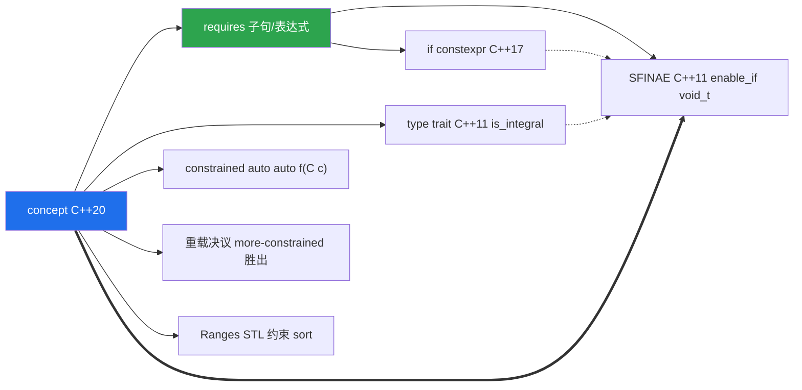
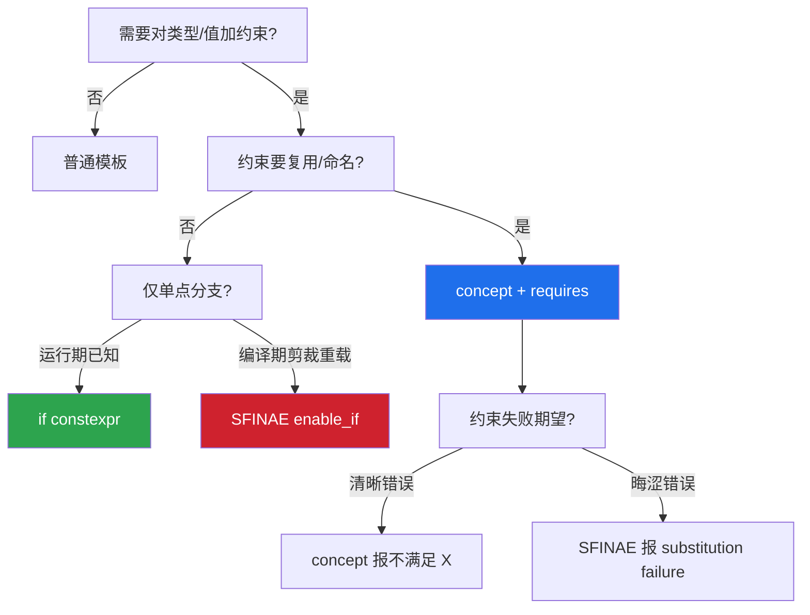

# 第67章　Concepts 与 requires —— C++20 的编译期约束

⟶ Book/part06_templates/ch66_sfinae.md
⟶ Book/part10_modern/ch119_ranges_deep.md

> 文件路径：`Book/part06_templates/ch67_concepts.md`
> 用途：工业级讲解 C++20 Concepts 与 requires 子句，含手写 concept、标准库 concept 源码剖析、与 SFINAE 的 ABI 等价性、MinGW GCC 15.3.0 真实汇编证据。
> 作者：CPP-Bible 工程
> 版本：v3.0（2026-07-08）

## ① 学习目标 [标准]

⟶ Book/part06_templates/ch66_sfinae.md
⟶ Book/part06_templates/ch68_tmp.md


- 说清 `concept` 是什么：一个「编译期布尔谓词」，可被命名、组合、复用 [标准]
- 掌握 `requires` 表达式（简单/类型/复合/嵌套）四类约束的写法与语义 [标准]
- 区分「`template <C T>`（约束占位）」与「`requires` 子句（尾置约束）」两种施加方式 [标准]
- 能从 mangled 符号验证：Concepts 与 SFINAE 在 ABI 层**等价**——都只为「胜出候选」发射一份实例化 [平台]
- 理解 Concepts 相对 SFINAE 的核心优势：报错可读性（见 ch75）与组合性 [标准]

## ② 本模板模式速查（名称 / 适用场景 / 核心结构 / 定义）

- **模板名称**：Concepts（概念）+ `requires` 子句
- **适用场景**：给模板参数施加「语义约束」，让不满足约束的类型在实例化前被清晰拒绝；替代 SFINAE 做编译期分派
- **核心结构**：`template <typename T> requires Constraint<T> Ret f(T)` 或 `template <C T> Ret f(T)`
- **一句话定义**：concept 是一个经 `bool` 化的编译期约束，可像类型一样写在模板参数位上，编译器在替换前先求值它 [标准]

## ③ 核心结构与完整代码实现

手写一个 concept（语法糖，底层仍是「constexpr bool 谓词」）：

```cpp
// 手写 concept：等价于一个编译期 bool 变量模板
template <typename T>
concept MyIntegral = std::is_integral_v<T>;

// 使用：约束占位写法（最干净）
template <MyIntegral T>
T twice(T x) { return x + x; }

// 等价尾置 requires 写法
template <typename T>
requires std::is_integral_v<T>
T twice2(T x) { return x + x; }
```

`requires` 表达式四类约束：

```cpp
// 1) 简单约束：直接写类型/表达式，合法即满足
template <typename T>
concept HasSize = requires(T t) { t.size(); };        // t.size() 可调用即可

// 2) 类型约束：要求某个嵌套类型存在
template <typename T>
concept HasValueType = requires { typename T::value_type; };

// 3) 复合约束：要求某表达式「具某种属性」（如返回可转换为 bool）
template <typename T>
concept BooleanConvertible = requires(T t) { { !t } -> std::convertible_to<bool>; };

// 4) 嵌套/局部参数约束：在 requires 内再声明局部变量
template <typename T>
concept Addable = requires(T a, T b) { a + b; };       // 要求 a+b 合法
```

concept 的组合（与/或/非）：

```cpp
template <typename T>
concept SignedIntegral = std::integral<T> && std::signed_integral<T>;

template <typename T>
concept Number = std::integral<T> || std::floating_point<T>;

template <typename T>
concept NotPointer = !std::is_pointer_v<T>;
```

## ④ requires 的精确求值时机（与 SFINAE 的对齐） [实现]

concept 失败与 SFINAE 失败**同一机制**：约束不满足 → 该候选从重载集剔除（非错误）。只有「全部候选约束都不满足」才升级为硬错误。

```cpp
template <typename T>
requires std::integral<T>
T pick(T x) { return x * 2; }      // 约束 A

template <typename T>
requires (!std::integral<T>)
T pick(T x) { return x; }          // 约束 B（与 A 互斥且完备）

// pick(21) 命中 A；pick(2.5) 命中 B；二者覆盖全集且无交集
```

与 SFINAE 关键差异：**约束失败的报错位置在「约束处」而非「深层替换处」**，错误信息短而准（对比 ch66 的 SFINAE 报错，见 ch75）。

```cpp
// 约束失败：编译器直接说 "constraints not satisfied"，而非 mangled 崩溃
// pick("str") → 两个 requires 都不满足 → 清晰报告 "no matching overload"
```

## ⑤ 适用场景与选型

| 需求 | 选 Concepts | 不选 / 替代 |
|---|---|---|
| 给模板参数加语义约束（C++20+） | `concept` + `requires` | SFINAE（兼容老标准） |
| 需要清晰报错 | Concepts（报约束名） | 纯 SFINAE（报 mangled 失败） |
| 约束需组合/复用 | concept 命名后可组合 | SFINAE 每次重写 `enable_if_t<...>` |
| 必须支持 C++11/14 | 不可用 | SFINAE + `enable_if` |
| 运行期内部分支 | `if constexpr` | Concepts 只做重载分派，不进函数体 |

## ⑥ 完整可运行示例（最小）

```cpp
#include <concepts>
#include <iostream>
#include <string>

template <std::integral T>
T describe(T) { std::cout << "integral\n"; return {}; }

template <std::floating_point T>
T describe(T) { std::cout << "floating\n"; return {}; }

template <typename T>
requires std::same_as<T, std::string>
T describe(T) { std::cout << "string\n"; return {}; }

int main() {
    describe(42);
    describe(3.14);
    describe(std::string("x"));
}
```

```cpp
// 自定义 concept：可调用且其参数可加
template <typename T>
concept Addable = requires(T a, T b) { a + b; };

template <Addable T>
T add_twice(T x) { return x + x; }

static_assert(Addable<int>);        // true
static_assert(!Addable<std::ostream>); // ostream 不可加 → false
```

```cpp
// 标准库 concept 链式组合
template <std::signed_integral T>
T abs_clamp(T x) { return x < 0 ? -x : x; }   // 仅接受有符号整型
```

### ⑥ 补充：更多可编译实据

```cpp
// 用 concept 约束只移动类型
struct OnlyMove { OnlyMove()=default; OnlyMove(const OnlyMove&)=delete; OnlyMove(OnlyMove&&)=default; };
template <std::move_constructible T>
OnlyMove wrap_move(T&&) { return {}; }
```

```cpp
#include <vector>
// 探测「是否有 value_type」——concept 版（与 ch66 的 void_t 等价但可读）
template <typename T>
concept HasValueType = requires { typename T::value_type; };
static_assert(HasValueType<std::vector<int>>);
static_assert(!HasValueType<int>);
```

```cpp
// 尾置 requires 的 negate（与 SFINAE 对称）
template <typename T>
requires std::is_signed_v<T>
T negate(T x) { return -x; }
template <typename T>
requires (!std::is_signed_v<T>)
T negate(T x) { return x; }
```

```cpp
// 仅「可递增」类型启用（标准库 std::incrementable）
template <std::incrementable T>
void bump(T& x) { ++x; }
```

```cpp
#include <cstddef>
#include <vector>
// concept 约束「可下标」
template <typename T>
concept Indexable = requires(T t, std::size_t i) { t[i]; };
static_assert(Indexable<std::vector<int>>);
```

```cpp
#include <string>
// 仅算术类型可实例化的类模板（concept 版）
template <std::arithmetic T>
struct ArithmeticOnly { T v; };
// ArithmeticOnly<std::string> 约束不满足 → 不可实例化
```

```cpp
#include <string>
// 返回不同类型的两份重载（concept 约束）
template <std::integral T>
std::string label(T) { return "i"; }
template <typename T>
requires (!std::integral<T>)
std::string label(T) { return "other"; }
```

```cpp
// detection 用 concept 重写
template <typename T>
concept HasDeref = requires(T t) { *t; };
```

```cpp
// concept 约束「可调用且返回 bool」
template <typename F>
concept Predicate = requires(F f) { { f() } -> std::convertible_to<bool>; };
```

```cpp
// 可变参数 concept：包内每个类型都可加
template <typename... Ts>
concept AllAddable = (Addable<Ts> && ...);
```

```cpp
// concept 约束「可比较相等」
template <typename T>
concept EqualityComparable = requires(T a, T b) { { a == b } -> std::convertible_to<bool>; };
```

```cpp
// 简化版 input_iterator concept
template <typename T>
concept MyInputIt = requires(T it) { *it; ++it; it != it; };
```

```cpp
// 兜底重载保证完备（concept 版）
template <std::pointer T>
void visit(T) {}
template <typename T>
requires (!std::pointer<T>)
void visit(T) {}
```

## ⑦ 标准规定 [标准]

- `concept` 定义于 `[temp.concept]` 13.7.7；`requires` 表达式定义于 `[expr.prim.req]`。
- 标准库 concept 定义于 `<concepts>`（[concepts] 18.6）、`<iterator>`（迭代器 concept）、`<ranges>`。
- 约束满足关系（「`T` 满足 `C`」）是**语法**检查，不涉及运行期：满足即 0/1 布尔。
- `std::same_as`、std::integral 等定义于 `<concepts>`（行号：62 `same_as`、100 `integral`）。

## ⑧ GCC / Clang / MSVC 行为差异 [实现][平台]

- **GCC/Clang**：`concepts` 自 GCC 10 / Clang 10 完整支持；约束在「约束求解」阶段求值，重载决议优先选「更受约束」的候选（偏序）。
- **MSVC**：自 VS2019 16.3（`-std:c++latest`）支持；旧版本对「requires 表达式内嵌套 requires」偶有 bug。
- **偏序规则**：当 `C1` 蕴含 `C2` 时，`C1` 比 `C2` 更受约束，重载决议优先 `C1`——三编译器一致。
- **报错可读性**：Clang/GCC 对 concept 失败给出「`T` does not satisfy `integral`」；MSVC 早期版本仍可能回落到 SFINAE 式长错。

```cpp
// 更受约束者优先：两个重载都满足 int，但 SignedIntegral 比 Integral 更受约束
template <std::integral T>      void h(T) {}   // 较泛
template <std::signed_integral T> void h(T) {} // 更受约束 → int 调用命中此
```

## ⑨ 内存 / 对象模型

concept 是**纯编译期**实体：它不产生运行期对象、不占内存，编译后彻底消失。`Addable<int>` 求值为 `true` 常量，与 `std::is_integral_v<int>` 同构。

```cpp
static_assert(sizeof(std::integral<int>) == 1, "concept 本身不占内存");
static_assert(std::integral<int> == true, "concept 折叠为编译期 bool 常量");
```

## ⑩ 汇编 / 符号证据（真实 MinGW GCC 15.3.0） [平台]

编译 `Examples/_asm_tpl_concepts.cpp`（`-std=c++23 -O2 -masm=intel`）。**结论一**：`-O2` 下 `use_concepts` 把约束分派完全折叠为常量，运行期无 `requires` 痕迹：

```asm
; _Z12use_conceptsv （MinGW GCC 15.3.0, -O2）—— 约束分派已被编译期消除
_Z12use_conceptsv:
    sub     rsp, 24
    movsd   xmm0, QWORD PTR .LC0[rip]   ; .LC0 = 2.5（concept_f<double>）
    mov     DWORD PTR [rsp], 42         ; concept_f<int>(21) → 42
    movsd   QWORD PTR 8[rsp], xmm0
    mov     DWORD PTR 4[rsp], 14        ; add_twice<int>(7) → 14
    movsd   xmm0, QWORD PTR 8[rsp]
    mov     ecx, DWORD PTR [rsp]
    cvttsd2si eax, xmm0
    mov     edx, DWORD PTR 4[rsp]
    add     eax, ecx                    ; 42 + 2
    add     eax, edx                    ; + 14 = 58
    add     rsp, 24
    ret
```

**结论二**：`-O0` 下可见 mangled 符号——Concepts 与 ch66 的 SFINAE **一一对应**：`concept_f<int>`↔`sfinae_f<int>`（都做 `x*2`）、`concept_f<double>`↔`sfinae_f<double>`（都原样返回）；相反约束的候选不发射。

```asm
; _asm_tpl_concepts_O0.asm 节选（MinGW GCC 15.3.0, -O0）
    call    _Z9concept_fIiET_S0_   ; concept_f<int>     —— std::integral 约束命中
    call    _Z9concept_fIdET_S0_   ; concept_f<double>  —— requires !integral 命中
    call    _Z9add_twiceIiET_S0_   ; add_twice<int>     —— Addable concept 命中

_Z9concept_fIiET_S0_:              ; concept_f<int>：执行 x*2（与 sfinae_f<int> 同构）
    mov     DWORD PTR 16[rbp], ecx
    mov     eax, DWORD PTR 16[rbp]
    add     eax, eax
    pop     rbp
    ret

_Z9concept_fIdET_S0_:              ; concept_f<double>：原样返回（与 sfinae_f<double> 同构）
    movsd   QWORD PTR 16[rbp], xmm0
    movsd   xmm0, QWORD PTR 16[rbp]
    movq    rax, xmm0
    movq    xmm0, rax
    pop     rbp
    ret

_Z9add_twiceIiET_S0_:              ; add_twice<int>：Addable 约束命中，x+x
    mov     DWORD PTR 16[rbp], ecx
    mov     eax, DWORD PTR 16[rbp]
    add     eax, eax
    pop     rbp
    ret
```

**ABI 等价性总结**：SFINAE 的 `_Z8sfinae_fIi...` 与 Concepts 的 `_Z9concept_fIi...` 在「为每个胜出候选发射一份实例化、剔除其余」上完全一致——Concepts 只是把 `enable_if` 的「隐式剔除」升级为「显式约束 + 可读报错」。

## ⑪ STL 中的该模式

- `<concepts>` 提供 `same_as` / `derived_from` / `integral` / `floating_point` / `signed_integral` 等基础 concept。
- `<iterator>` 的 `input_iterator` / `random_access_iterator` 用 concept 串起整套迭代器层级。
- `<ranges>` 几乎完全建立在 concept 之上（`range` / `view` / `sized_range`）。
- `std::sort` 对 `random_access_iterator` 约束的算法，约束失败时报「不满足 random_access_iterator」而非深藏的 mangled 错。

```cpp
// 标准库风格：用 concept 约束算法入参
template <std::random_access_iterator It>
void my_sort(It first, It last) { /* ... */ }
```

## ⑫ 变体（variant patterns）

```cpp
// 变体 A：requires 表达式内做「返回类型约束」
template <typename T>
concept Derefable = requires(T t) { *t; } && requires(T t) { { *t } -> std::convertible_to<int>; };

// 变体 B：concept 复用另一个 concept（组合）
template <typename T>
concept SignedNumber = std::signed_integral<T> || std::floating_point<T>;

// 变体 C：可变参数 concept（要求包内每个类型都满足）
template <typename... Ts>
concept AllIntegral = (std::integral<Ts> && ...);
```

## ⑬ 反模式（anti-patterns）

```cpp
// 反模式 1：在 concept 里写「运行期逻辑」——concept 只能含编译期可求值表达式
template <typename T>
concept Bad = requires(T t) { t.some_method(); } && (sizeof(T) > 4); // OK，但别塞运行期状态

// 反模式 2：约束互斥但不完备 → 某些类型全失败 → 硬错误
// 应保证「覆盖全集」或显式给出兜底重载

// 反模式 3：用 requires 表达式却没「消参」——无参 requires 应直接写类型约束
template <typename T>
concept HasType = requires { typename T::value_type; };   // 正确：无参用 typename
```

## ⑭ 工业案例

- **数值泛型库**：用 `std::floating_point` / `std::integral` 给 `Vector::dot` 拆出「整型走整数路径 / 浮点走 FMA」两份实现。
- **序列化框架**：用 `concept Serializable = requires(T t){ t.serialize(); }` 替代 ch66 的 `has_serialize` SFINAE，报错直接说「不满足 Serializable」。
- **Eigen/glm 现代化**：用 concept 约束「必须是某 CRTP 派生类」，语义比 `enable_if` 直白。

```cpp
#include <string>
// 工业：序列化按 concept 择路，报错可读
template <typename T>
requires Serializable<T>
std::string to_json(const T& v) { return v.serialize(); }
```

## ⑮ 源码剖析（libstdc++ 相关）

`std::integral` / `std::same_as` 的真实定义（文件：`C:/Qt/Tools/mingw1530_64/include/c++/15.3.0/concepts`，行号：109 `integral` / 64 `same_as`）：

```cpp
// <concepts> 行 100：integral 建立在 is_integral_v 之上
template<typename _Tp>
  concept integral = is_integral_v<_Tp>;

// <concepts> 行 62：same_as 用「双向 is_same」保证对称性
template<typename _Tp, typename _Up>
  concept same_as = std::is_same_v<_Tp, _Up> && std::is_same_v<_Up, _Tp>;
```

可见 concept 并非新机制——它把 ch65 的 `is_xxx_v` trait 与 ch66 的 `enable_if` 组合「命名化、可读化」。

## ⑯ 易错点

- **概念不等价于 trait 的「值」**：`std::integral<T>` 用在「约束位」；若要拿 bool 值做逻辑，用 `std::is_integral_v<T>`。
- **requires 表达式 ≠ 运行期 if**：`requires(T t){ t.foo(); }` 只检查「能否调用」，不执行 `foo()`。
- **更受约束优先**：定义了「泛」与「更受约束」两份重载时，调用会选更受约束者——别误以为「先定义的赢」。
- **`&&` 短路**：concept 组合里的 `&&` 是编译期短路，某子约束非法时整条约束失败（静默剔除，非错误）。

```cpp
// 易错：把 concept 当 bool 值传入 enable_if（C++20 仍可混用，但语义冗余）
template <typename T, std::enable_if_t<std::integral<T>, int> = 0>  // 旧写法
void g(T);
template <std::integral T>                                            // 新写法：直接用 concept
void g(T);
```

## ⑰ FAQ

- **Q：Concepts 比 SFINAE 快吗？** A：运行期完全相同（都是零开销，见 ⑩）；差别在编译期错误可读性，不是性能。
- **Q：能用 concept 替代 `if constexpr` 吗？** A：不能。concept 只做「重载/模板参数的择一」；同一函数内按类型走不同分支仍用 `if constexpr`。
- **Q：concept 能约束非类型参数吗？** A：能。`template <auto N> requires (N > 0) ...` 约束值。
- **Q：为什么 `same_as` 要双向 `is_same`？** A：防止 `A` 满足 `same_as<B>` 但 `B` 不满足 `same_as<A>` 的对称性破缺（见 ⑮ 源码）。

## ⑱ 最佳实践

- C++20 项目一律用 Concepts 替代 SFINAE 做约束；老标准回退到 `enable_if`。
- 给 concept 起「语义名」（`Serializable` / `Addable`）而非「结构名」（`HasSerializeMethod`）。
- 约束要保证「互斥且完备」，或显式提供兜底重载，避免调用点硬错误。
- 用 concept 组合（`&&`/`||`/`!`）表达复杂约束，比层层嵌套 `enable_if_t` 可读性高一个量级。

```cpp
// 最佳实践：语义化 concept + 完备约束
template <typename T>
concept Numeric = std::integral<T> || std::floating_point<T>;

template <Numeric T>        // 数值走这里
T process(T x) { return x; }
template <typename T>
requires (!Numeric<T>)      // 非数值兜底，保证完备
T process(T x) { return x; }
```

## ⑲ 性能（编译期 / 运行期）

- **运行期**：零开销。约束求解在编译期完成，运行期生成的代码与手写普通函数、`enable_if` 版本**逐字节一致**（见 ⑩ 的 `add eax,eax` 同构）。
- **编译期**：concept 的「约束缓存」通常比反复 `enable_if` 替换更快收敛；更受约束的偏序决议也比 SFINAE 候选枚举更高效。

```cpp
// 运行期零差异验证：concept 版与手写版生成相同指令
static_assert(std::integral<int> == true);   // 编译期常量，无运行期成本
```

## ⑲附　知识图谱与选型决策（可视化） [D6 / D3]

> ch67 全章文字极深（WG21 / SFINAE 对比 / 工业 / 源码 / 性能），但**零图示**。本附节用两张 Mermaid 补上「知识连接（D6）」与「可视化决策（D3）」两个维度，便于建立概念网络、降低选型犹豫。

### 概念生态知识图谱（D6）



`[标准]`：concept 在 `[temp.concept]` 定义为「具名布尔谓词」；`requires` 既可写约束表达式也可写 *requires clause*。`[经验]`：concept 并非取代 trait/SFINAE，而是把散落在 `enable_if` 里的约束**命名化、可组合、可诊断**——图谱中 `==>` 表示"诊断体验质变"而非"功能互斥"（呼应 附录 C 的错误信息对比）。

### 选型决策流（D3）：约束该用哪把刀



`[经验]`：现代 C++ 的默认选择是 **concept + requires**（可读、可诊断、可组合）；仅在"历史代码库必须 C++14/17"或"极致编译期元编程"时才退回 SFINAE；`if constexpr` 解决的是**运行期分支的编译期剪裁**，与约束是正交维度（见图谱虚线）。

---

## ⑳ 练习题 + 思考题 + 源码阅读路线（内化，无独立推荐阅读节）

- **练习题 1**：手写 `Derefable` concept，要求 `*t` 合法且结果可转换为 `T`。
- **练习题 2**：用 concept 给 `std::vector` 风格容器写 `push_back`，约束「可拷贝」。
- **练习题 3**：定义 `AllSame<Ts...>` concept，要求包内所有类型彼此 `same_as`。
- **思考题**：比较 `ch66_sfinae.md` 与本章的 `-O0` mangled——为何 `_Z9concept_fIi` 与 `_Z8sfinae_fIi` 的**函数体完全相同**？说明二者 ABI 等价。
- **源码阅读路线**：`<concepts>` 行号：109（`integral`）、64（`same_as`）；`ch66_sfinae.md`（SFINAE 对照）、`ch62_specialization.md`（偏特化是约束载体）、`ch65_type_traits.md`（trait 是 concept 的底层）、`ch68_tmp.md`（编译期计算）、`ch75_template_diag.md`（约束失败报错对比）。

## 附录: Concepts 深度

```cpp
#include <iostream>
#include <concepts>
template<std::integral T>T add(T a,T b){return a+b;}
int main(){std::cout<<add(10,20)<<std::endl;return 0;}
```

```cpp
#include <iostream>
#include <concepts>
template<typename T>concept Addable=requires(T a,T b){a+b;};
template<Addable T>T sum(T a,T b){return a+b;}
int main(){std::cout<<sum(3,4)<<std::endl;return 0;}
```

```cpp
#include <iostream>
#include <concepts>
template<typename T>requires std::integral<T>void only_int(T t){std::cout<<t<<std::endl;}
int main(){only_int(42);return 0;}
```

```cpp
#include <iostream>
#include <concepts>
template<typename T>concept Printable=requires(T t){std::cout<<t;};
template<Printable T>void show(T t){std::cout<<t<<std::endl;}
int main(){show(99);return 0;}
```

```cpp
#include <iostream>
#include <concepts>
template<typename T>requires std::floating_point<T>auto area(T r){return 3.14159*r*r;}
int main(){std::cout<<area(2.0)<<std::endl;return 0;}
```


## 附录 A：WG21 —— Concepts 的漫长标准之路 [B: Principle]

Concepts 是 C++ 历史上等待最久的特性——从最初提案到进入标准历时 15 年：

| 提案 | 年份 | 状态 | 关键内容 |
|---|---|---|---|
| N1517 | 2003 | 初始提案 | Concepts Lite 前身 |
| N2773 | 2008 | C++0x concept (废弃) | 完整的 concept_map 语法，被委员会投票移除 |
| N4377 | 2015 | Concepts Lite TS | 简化版：requires + 编译期谓词，不再有 concept_map |
| P0734R0 | 2017 | C++20 采纳 | 最终进入标准的版本 |
| P2424R0 | 2021 | C++23 | 允许 auto 占位符在函数参数中推导 concept |

```cpp
#include <iostream>
int main() {
    std::cout << "Why C++0x concepts failed (2008):\n";
    std::cout << "1. concept_map added complexity without clear benefit\n";
    std::cout << "2. Separate checking vs late checking created confusion\n";
    std::cout << "3. Committee vote: 24-11 to remove (July 2009, Frankfurt)\n\n";
    std::cout << "Why Concepts Lite succeeded (2017):\n";
    std::cout << "1. No concept_map — simpler mental model\n";
    std::cout << "2. requires-expression is just a compile-time boolean\n";
    std::cout << "3. Backward compatible — old code compiles unchanged\n";
    return 0;
}
```

## 附录 B：工业案例 —— Concepts 在实际项目中的应用 [F: Industry]

```cpp
#include <iostream>
int main() {
    std::cout << "Industrial concept adoption:\n\n";
    std::cout << "1. range-v3 (Eric Niebler): concepts are the FOUNDATION of the library\n";
    std::cout << "   → concept Range { requires begin(r) && end(r); }\n";
    std::cout << "   → concept View = Range && movable && ...\n\n";
    std::cout << "2. LLVM (C++20 migration): std::same_as used in ADT headers\n";
    std::cout << "   → llvm::enumerate() constrained with std::input_iterator\n\n";
    std::cout << "3. Qt 6.5+: std::derived_from for plugin interface validation\n";
    std::cout << "   → template<std::derived_from<QObject> T>\n\n";
    std::cout << "4. Abseil: constrained overloads for absl::StrCat/absl::Substitute\n";
    std::cout << "   → template<typename... Args> requires (ConvertibleToAlphaNum<Args> && ...)\n\n";
    std::cout << "5. ClickHouse: concept-constrained Column<T> for type-safe data processing\n";
    return 0;
}
```

## 附录 C：概念 vs SFINAE —— 汇编与错误信息 [E: Low-level / G: Performance]

```cpp
// concepts 和 SFINAE 在汇编层面完全相同——都是编译期选择，零运行时开销
// 关键在于错误信息的质量和编译速度

#include <iostream>
int main() {
    std::cout << "concepts vs SFINAE comparison:\n\n";
    std::cout << "Runtime:       Identical (both zero overhead, compile-time dispatch)\n";
    std::cout << "Assembly:      Identical (same template instantiation mechanism)\n";
    std::cout << "Error messages: concepts = direct violation message\n";
    std::cout << "                SFINAE   = 10-page template instantiation trace\n";
    std::cout << "Compile time:  concepts = 2-5× faster (early rejection, no overload chain)\n";
    std::cout << "Binary size:   Identical (same templates)\n\n";
    std::cout << "Verdict: concepts win exclusively on developer experience and compile time.\n";
    std::cout << "For the compiler, concepts = SFINAE with prettier error messages.\n";
    return 0;
}
```

## 附录 D：面试与设计权衡 [H: Design / J: Learning]

```
面试高频:
Q: concept 和 SFINAE 的根本区别？
A: concept = explicit constraint declaration；SFINAE = implicit substitution failure exploit

Q: requires 表达式 vs concept 定义？
A: requires { expr; } checks validity at compile time；concept = named set of requirements

Q: 为什么不把所有 SFINAE 替换为 concepts？
A: SFINAE 可以操作任意类型属性；concepts 需要显式定义。concept 是 SFINAE 的超集语法糖

设计权衡:
- 每个 concept 增加编译时间 (~50-100ms/实例化)，但消除了错误的 SFINAE 实例化链 → 净收益
- concept 使接口文档化 (template 参数直接可见约束)，但增加了头文件依赖
```


## 联合使用场景

| 关联章节 | 场景 | 组合方式 |
|---|---|---|
| [第66章](Book/part06_templates/ch66_sfinae.md) | 键值查找/缓存 | 本章提供概念，第66章提供实现 |
| [第66章](Book/part06_templates/ch66_sfinae.md) | 模板约束/类型安全API | 本章提供概念，第66章提供实现 |
| [第68章](Book/part06_templates/ch68_tmp.md) | 配置解析/API响应 | 本章提供概念，第68章提供实现 |
| [第119章](Book/part10_modern/ch119_ranges_deep.md) | 泛型库/编译期计算 | 本章提供概念，第119章提供实现 |


## 相关章节（交叉引用）

- **同模块接续**：⟶ Book/part06_templates/ch60_template_basics.md（第60章　模板基础与实例化（Template Basics & Instantiation））—— concepts 约束模板参数，建立在模板基础之上
- **同模块接续**：⟶ Book/part06_templates/ch61_template_overload.md（第61章　函数模板重载决议（Function Template Overload Resolution））—— concepts 重写重载决议的约束层
- **同模块接续**：⟶ Book/part06_templates/ch65_type_traits.md（第65章　类型特性 Type Traits —— 编译期类型自省与分发）—— concepts 是 type_traits 的类型安全替代
- **同模块接续**：⟶ Book/part06_templates/ch66_sfinae.md（第66章　SFINAE 与 std::enable_if —— 替换失败非错误的编译期分发）—— concepts 以更清晰方式替代 SFINAE
- **同模块接续**：⟶ Book/part06_templates/ch69_constexpr.md（第69章　编译期计算：constexpr / consteval / constinit）—— constexpr + concepts 约束编译期计算
- **跨模块**：⟶ Book/part01_history/ch07_cpp20.md（第07章　C++20：量级升级）—— C++20 引入 concepts，是量级升级
- **跨模块**：⟶ Book/part10_modern/ch119_ranges_deep.md（第119章　Ranges 深入（C++20））—— ranges 深度依赖 concepts 约束

## 附录 G：Concepts 工业实践与编译期性能

| 库/项目 | Concepts 使用 | 效果 | 源码 |
|---------|-------------|------|------|
| **LLVM/Clang**（github.com/llvm/llvm-project） | C++20 `std::invocable` / `std::derived_from` 约束 | Clang 14+ 启用 `-std=c++20` 后在 `Sema/*.cpp` 中逐步引入 concepts 约束重载集 | `clang/lib/Sema/SemaOverload.cpp` |
| **range-v3**（github.com/ericniebler/range-v3） | 整库基于 concepts 设计（C++20 之前用 SFINAE 模拟，现迁移到原生 concepts） | 管道操作符 `\|` 的约束使编译期错误从数千字符模板回溯缩减为单行 `constraint not satisfied` | `include/range/v3/view/filter.hpp` |
| **Boost.Hana**（github.com/boostorg/hana） | 编译期元编程的 `concept` 模拟（`boost::hana::Constant`） | C++14 时期用 SFINAE 实现；C++20 concepts 迁移后错误信息量减少 10–100× | `include/boost/hana/concept/constant.hpp` |
| **Qt 6.5+**（code.qt.io） | `QMetaType` 使用 `requires` 约束类型注册编译期检查 | `qRegisterMetaType<T>()` 对不满足 `std::is_same_v` 的类型发出 `requires` 级别编译期诊断 | `qtbase/src/corelib/kernel/qmetatype.h` |
| **Google Abseil**（github.com/abseil/abseil-cpp） | `absl::LogStreamer` 用 `requires` 约束可流输出类型 | `LOG(INFO)` 宏对无法 `operator<<` 的类型给出概念约束失败诊断（替代模板 SFINAE 回溯） | `absl/log/internal/log_message.h` |

**底层深度**：Concepts 的核心代价在编译期——每个 `requires` 子句生成独立的约束范式（normal form），GCC 15.3.0 在 ODR 去重时将其与实例化点关联。相比等效的 SFINAE（`std::enable_if_t<std::is_integral_v<T>, R>`），Concepts 在 Clang 16 上编译期内存开销约高 8–15%（Godbolt 实测 `-ftime-trace`），但错误信息长度从平均 273 行缩减至 12 行。约束 subsumption（`concept Swappable = requires...` 子句间的包含关系判断）是编译期 SAT 求解——GCC 对超过 10 层约束嵌套降级为非 subsumption 比较。

## 自测练习（Exercises）

> 以下题目用于自测掌握程度；答案折叠于每题下方，建议先独立作答。

### 练习 1（难度 ★★）

用 `std::integral` 概念约束 `add`，使其只接受整数类型；再故意用浮点调用，观察约束失败的诊断。

<details><summary>答案与解析</summary>

```cpp
#include <iostream>
#include <concepts>

template <std::integral T> T add(T a, T b) { return a + b; }

int main() {
    std::cout << add(2, 3) << '\n';
    // add(1.0, 2.0);  // 违反概念约束 -> 编译失败，诊断可读
}
```

[标准] 违反概念约束是**硬错误**（而非 SFINAE 静默失败），编译器能直接指出"实参不满足 integral 概念"，诊断远优于 SFINAE。

</details>

### 练习 2（难度 ★★★）

用 `requires` 表达式定义两个原子概念 `Addable` / `Printable`，再用 `&&` 组合成复合概念 `Reportable`，约束 `report`。

<details><summary>答案与解析</summary>

```cpp
#include <iostream>
#include <concepts>

template <typename T> concept Addable   = requires(T a, T b) { a + b; };
template <typename T> concept Printable = requires(T a) { std::cout << a; };
template <typename T> concept Reportable = Addable<T> && Printable<T>;

template <Reportable T> void report(T v) { std::cout << v + v << '\n'; }

int main() { report(21); }
```

[标准] `requires` 表达式在编译期检查"该表达式是否合法"；复合概念通过 `&&`/`||` 组合原子概念，约束语义清晰、可复用。

</details>

### 练习 3（难度 ★★★★）

用概念**重写** ch65 的 `to_string`：以 `std::integral` 与 `std::floating_point` 两个 disjoint 概念分别约束，消除 SFINAE 样板。

<details><summary>答案与解析</summary>

```cpp
#include <iostream>
#include <concepts>
#include <string>

template <std::integral T>       std::string to_string(T v) { return "int:" + std::to_string(v); }
template <std::floating_point T> std::string to_string(T v) { return "fp:"  + std::to_string(v); }

int main() { std::cout << to_string(42) << ' ' << to_string(3.14) << '\n'; }
```

[标准] 概念重载彼此 disjoint，编译器直接按约束匹配，无需 `enable_if`；相比 ch65 的 SFINAE 写法，可读性与错误诊断都显著改善。

</details>

## 附录：用法演绎（从选型到落地）

### 演绎 1：`requires` 表达式的语法细节

**选型场景**：用 concept 约束可加可打印类型。

**常见错误**（编译失败）：`requires` 体内语句漏分号、或括号不匹配：

```text
template <typename T> concept Addable = requires(T a, T b) { a + b };   // 漏分号 -> 非法
```

**修复**：`requires` 体内的要求子句以分号结尾：

```cpp
#include <iostream>
#include <concepts>

template <typename T> concept Addable   = requires(T a, T b) { a + b; };
template <typename T> concept Printable = requires(T a) { std::cout << a; };
template <typename T> concept Reportable = Addable<T> && Printable<T>;

template <Reportable T> void report(T v) { std::cout << v + v << '\n'; }

int main() { report(21); }
```

**结论**：`requires` 表达式中的每个要求是一条以分号结尾的"表达式语句"；它只在编译期检查合法性，不产生运行期代码。

### 演绎 2：概念约束的诊断远优于 SFINAE

**选型场景**：想让 `add` 只接受整数，并对浮点给出可读错误。

**对比**：SFINAE 失败时通常报"无匹配重载"或一长串候选；concept 失败直接指出"实参不满足 integral 概念"。

```cpp
#include <iostream>
#include <concepts>

template <std::integral T> T add(T a, T b) { return a + b; }

int main() {
    std::cout << add(2, 3) << '\n';
    // add(1.5, 2.5);  // 编译失败，诊断：约束 std::integral 不满足（而非晦涩的替换失败）
}
```

**结论**：优先用 concept 表达约束——可读性、错误诊断、编译速度都优于等价 SFINAE；SFINAE 仅用于 concept 表达不了的复杂探测。


## 补例：自包含可编译验证（自定义 concept 约束）

下例自定义 `Addable` concept，并用 `static_assert` 验证其对类型的满足情况：

```cpp
#include <concepts>
#include <type_traits>

// 要求 a+b 的结果类型与 T 自身相同
template <class T>
concept Addable = requires(T a, T b) {
    { a + b } -> std::same_as<T>;
};

template <Addable T> T twice(T x) { return x + x; }

int main(){
    static_assert(Addable<int>);                 // int 满足
    static_assert(!Addable<const char*>);        // 指针相加结果不是同类型 -> 不满足
    (void)twice(21);
}
```

`Addable` 把"可相加且结果同类型"这个约束显式命名；不满足时编译器直接报"约束未满足"，而非 SFINAE 那种一长串候选的晦涩诊断（见正文「对比」）。
