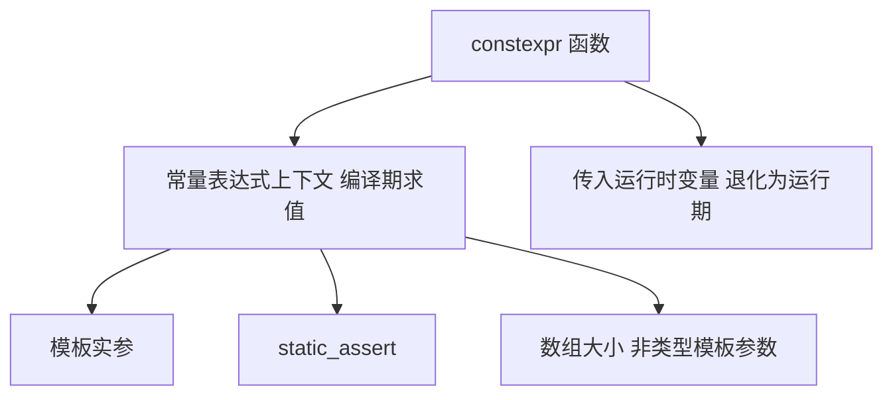

# 第69章　编译期计算：constexpr / consteval / constinit

⟶ Book/part06_templates/ch68_tmp.md
⟶ Book/part10_modern/ch123_ct_programming.md

> 本章所有汇编证据由 **MinGW GCC 15.3.0**（`-std=c++23 -O2 -S -masm=intel`）真实提取，源码剖析行号取自该工具链安装的 libstdc++ 15.3.0 头文件。
> 立场标签：`[标准]`=标准条文，`[实现]`=编译器实现行为，`[平台]`=平台/ABI 相关，`[经验]`=工程经验。

## ① 学习目标

⟶ Book/part06_templates/ch68_tmp.md
⟶ Book/part06_templates/ch70_tag_dispatch.md


- 区分 `constexpr`、`consteval`、`constinit` 三个语义不同的说明符，理解它们各自约束的是"求值时刻"还是"初始化时刻"。
- 掌握 `constexpr` 函数在编译期被求值的充要条件：所有实参必须是常量表达式、函数体必须是常量表达式（无未定义行为、无运行期 `new` 等）。
- 理解 `if constexpr` 的"编译期分支消除"——不成立的分支在实例化时根本不实例化、不进符号表。
- 通过真实汇编确认：`-O2` 下 `constexpr`/`consteval` 计算被**完全折叠为立即数**，不产生任何运行期函数调用；`-O0` 下连独立符号都不生成。
- 知道 `constexpr` 与 TMP（ch68）的关系：能用 `constexpr` 函数表达的，优先用它替代递归模板元函数（更可读、错误信息更友好）。

## ② 本模板模式速查（名称 / 适用场景 / 核心结构 / 定义）

| 项 | 内容 |
|---|---|
| **名称** | 编译期求值（Compile-time Evaluation） |
| **适用场景** | 需要在编译期确定的常量、查找表、类型/值分发、协议常量、维度检查；任何"入参为编译期常量且结果可直接用"的计算。 |
| **核心结构** | `constexpr` 说明符（变量/函数/构造函数/if）；`consteval` 立即函数（C++20）；`constinit` 静态初始化（C++20）；`std::is_constant_evaluated()`。 |
| **定义** | `constexpr`：声明该变量/函数**可用于常量表达式**；若实参为常量表达式则在编译期求值。`consteval`：函数**只能是常量表达式**（调用点必须编译期可求，否则编译错误）。`constinit`：变量**必须在编译期完成静态初始化**（运行期不可重新赋值非 constinit）。 |

## ③ 核心结构与完整代码实现

```cpp
// 1) constexpr 函数：可编译期也可运行期求值
constexpr int square(int x) {          // [标准] constexpr 函数
    return x * x;
}

// 2) constexpr 递归（替代 ch68 的模板元递归，可读性更好）
constexpr int fact(int n) {
    return n <= 1 ? 1 : n * fact(n - 1);
}

// 3) if constexpr：编译期分支，不成立分支不实例化
template <typename T>
constexpr auto promote(T v) {
    if constexpr (std::is_integral_v<T>) {
        return static_cast<long long>(v) * 2;   // 整型分支
    } else {
        return v;                                // 非整型分支
    }
}

// 4) consteval 立即函数（C++20）：调用点必须编译期可求
consteval int pow2(int n) {            // [标准] consteval
    return 1 << n;
}

// 5) constinit：静态存储期 + 编译期初始化，不可运行期重初始化
constinit int g_counter = 1;           // [标准] constinit
```

```cpp
// constexpr 构造 + 字面类型（literal type）
struct Point {
    int x, y;
    constexpr Point(int x_, int y_) : x(x_), y(y_) {}   // constexpr 构造
    constexpr int manhattan() const { return x + y; }   // constexpr 成员
};

constexpr Point origin{0, 0};
constexpr int d = origin.manhattan();   // 编译期 = 0
```

```cpp
// constexpr 与 std::array：编译期可索引容器
#include <array>
constexpr std::array<int, 4> make_table() {
    std::array<int, 4> t{};
    for (int i = 0; i < 4; ++i) t[i] = i * i;   // [实现] C++17 起 operator[] 为 constexpr
    return t;
}
constexpr auto tbl = make_table();          // 编译期生成查找表
static_assert(tbl[3] == 9);                  // 编译期索引访问
```

```cpp
// std::is_constant_evaluated：区分编译期/运行期路径
#include <type_traits>
constexpr int chooses(int x) {
    if (std::is_constant_evaluated()) {
        return x + 1000;          // 编译期走这条
    } else {
        return x * 2;             // 运行期走这条
    }
}
static_assert(chooses(1) == 1001);          // 编译期
int runtime = chooses(1);                    // 运行期 = 2
```

## ④ 实例化机制（实例化点 / 两阶段查找）

- **常量表达式求值发生在实例化时（或之前）**：`constexpr` 函数模板 `fact<5>`、`pow2<4>` 在需要常量结果的实例化点被求值；若实参为常量表达式，求值结果作为常量折叠进调用方（见 ⑩）。
- **`if constexpr` 的实例化规则**：不成立的分支在**模板实例化时直接被丢弃**，不要求该分支对当前类型合法——这正是 SFINAE（ch66）之外更现代的"编译期分支"手段。例：`promote<std::string>` 不会实例化整型分支，故不会因 `static_cast<long long>` 对 `string` 非法而报错。
- **ODR-use 与符号生成**：`constexpr` 函数若**仅被常量表达式调用**（未被取地址、未被运行期 odr-use），编译器**不生成运行期函数实体**；只有被运行期 odr-use 时才生成（见 ⑩ 的 `-O0` 证据）。
- **两阶段查找依然适用**：`constexpr` 函数模板体内依赖型名字按常规两阶段规则（ch60 ④）。

```cpp
// if constexpr 丢弃不成立分支：对 T=std::string 不实例化整型分支
#include <string>
static_assert(promote(10) == 20);                  // 整型：long long 20
static_assert(promote(std::string{"x"}) == std::string{"x"}); // 非整型：原样
```

## ⑤ 适用场景与选型

- **用 `constexpr` 当**：计算入参常为编译期常量、希望零开销且保留运行期调用能力（如 `square` 既能 `square(3)` 也能 `square(runtime_x)`）。
- **用 `consteval` 当**：结果**必须**编译期确定（如 `pow2(4)` 生成掩码、编译期哈希、元串字面量），绝不允许运行期调用。
- **用 `constinit` 当**：静态/全局变量要**避免静态初始化顺序问题（SIOF）**且必须编译期定值，但又不想要 `constexpr` 的"只读"约束（可运行期写，只是初始化必须编译期）。
- **`constexpr` vs TMP（ch68）**：能用 `constexpr` 函数表达的优先用它（递归 `fact` 比 `Fact<N>` 模板更易读、错误更清楚）；TMP 仍需用于**类型计算**（类型分支、类型列表）。
- **`constexpr` vs `consteval`**：需要"运行期也能调"用 `constexpr`；需要"强制编译期"用 `consteval`。

```cpp
// 选型对比：同一算法 constexpr 与 consteval 的调用约束
constexpr int  c_log2(int n) { return n <= 1 ? 0 : 1 + c_log2(n / 2); }
consteval int  e_log2(int n) { return n <= 1 ? 0 : 1 + e_log2(n / 2); }

int x = 16;
static_assert(c_log2(16) == 4);     // OK 编译期
// int bad = e_log2(x);             // [实现] 错误：consteval 必须编译期可求，x 非常量
int ok = c_log2(x);                  // OK 运行期也可（c_log2 非 consteval）
```

## ⑥ 完整可运行示例（最小）

```cpp
// 编译：g++ -std=c++23 -O2 constexpr_demo.cpp -o constexpr_demo
#include <iostream>
#include <type_traits>

constexpr int sq(int x) { return x * x; }
consteval int pow2(int n) { return 1 << n; }
constinit int g = 7;

int main() {
    constexpr int a = sq(12);          // 144，编译期
    int b = sq(12);                    // 也可运行期
    int c = pow2(8);                   // 256，必须编译期
    std::cout << a << ' ' << b << ' ' << c << ' ' << g << '\n';
    static_assert(a == 144);
    static_assert(pow2(8) == 256);
}
```

```cpp
// 编译期斐波那契（替代 ch68 的 Fib<N> 模板元递归）
constexpr int fib(int n) {
    return n < 2 ? n : fib(n - 1) + fib(n - 2);
}
static_assert(fib(10) == 55);         // 编译期 = 55
```

```cpp
// constexpr lambda（C++17）：lambda 默认可 constexpr
constexpr auto mul = [](int a, int b) { return a * b; };
static_assert(mul(6, 7) == 42);
```

```cpp
#include <string_view>
// 编译期 switch 替代：constexpr 函数 + if constexpr 分发
template <int N>
constexpr const char* name_of() {
    if constexpr (N == 0) return "zero";
    else if constexpr (N == 1) return "one";
    else return "other";
}
static_assert(name_of<1>() == std::string_view{"one"}); // [实现] C++17 起字符串字面量可 constexpr 比较
```

## ⑦ 标准规定 [标准]

- `[dcl.constexpr]`：`constexpr` 说明符声明变量/函数为**常量表达式候选**；`constexpr` 函数体内允许的语句受严格限制（不能有 `asm`、不能调用非 constexpr 函数、不能有未初始化变量等），但可以有 `if`/`for`/`switch`、局部变量、三元运算符。
- `[dcl.consteval]`（C++20）：`consteval` 函数（立即函数）**每个调用都必须产生常量表达式**，否则程序非良构；立即函数永远不在运行期被求值。
- `[dcl.constinit]`（C++20）：`constinit` 变量必须具有静态或线程存储期，且**初始化器必须是常量表达式**；可声明非 const 变量（运行期可写，但初始化必须编译期完成）。
- `[expr.const]`：常量表达式求值规则——若子表达式在求值中调用了非 constexpr 函数或产生未定义行为，则不是常量表达式。
- `[meta.help]`：`std::is_constant_evaluated()` 在**常量表达式求值上下文**返回 `true`，否则 `false`（注意：它只在真正"被常量求值"时为真，不是"是否处于 constexpr 函数内"）。

## ⑧ GCC / Clang / MSVC 行为差异 [实现][平台]

- **GCC**：`constexpr` 求值器（"constant expression evaluator"）对递归深度与步数有内部上限（受 `-fconstexpr-depth`/`constexpr 循环上限` 控制，默认约 65536 步）。超界报 `constexpr call overflow` / `exceeded constexpr step limit`。
- **Clang**：`-fconstexpr-steps` 默认 1048576 步；诊断信息更详细，常给出"constexpr evaluation exceeded step limit"并指向具体步骤。
- **MSVC**：较旧版本对 `constexpr` 支持滞后（VS2017 起完善），`consteval`/`constinit` 需 VS2019 16.10+；对循环内 `constexpr` 支持较新。**[平台]** 跨编译器项目应将复杂 `constexpr` 控制在一定步数内（< 10000）以保证可移植。
- **`__builtin_constant_p`**：GCC/Clang 内建，类似 `is_constant_evaluated` 但属编译器扩展；标准代码优先用 `std::is_constant_evaluated()`。

```cpp
// 各编译器对 constexpr 步数限制的差异（演示：控制递归深度）
constexpr int deep(int n) { return n == 0 ? 0 : 1 + deep(n - 1); }
static_assert(deep(1000) == 1000);     // 万级步数各编译器均可
// static_assert(deep(200000) == 200000); // [实现] 可能触发 GCC/Clang 步数上限
```

## ⑨ 内存 / 对象模型

- **`constexpr` 变量**：若同时是 `const` 且字面类型，可存于**只读段（`.rdata`/`.rodata`）**或完全被常量折叠（见 ⑩，连存储都不占）。
- **`constinit` 变量**：具**静态/线程存储期**，初始化在**静态初始化阶段**完成（早于动态初始化），可避免 SIOF（Static Initialization Order Fiasco）；变量本身未必 `const`，运行期可写，但**初始化器必须编译期定值**。
- **`consteval` 结果**：立即函数返回值在编译期计算，调用点被替换为常量，不占运行期存储（除非被赋给运行期变量）。
- **对齐与字面类型**：`constexpr` 变量类型必须是**字面类型**（literal type：含 constexpr 构造、标量、引用、字面类型聚合等）。

```cpp
// constinit 避免 SIOF 示例
// 文件 A.cpp
constinit int a_init = compute_at_compile();   // [平台] 静态初始化阶段定值
// 文件 B.cpp
extern constinit int a_init;
int b_use = a_init + 1;     // 安全：a_init 已在静态阶段初始化
```

## ⑩ 汇编 / 符号证据（真实 MinGW GCC 15.3.0，-O2 -masm=intel）

测试文件 `Examples/_asm_constexpr.cpp`，编译：`g++ -std=c++23 -O2 -S -masm=intel _asm_constexpr.cpp -o _asm_constexpr.asm`。

**`use_constexpr()` 主体（关键片段）**：

```asm
_Z13use_constexprv:
    sub     rsp, 40
    movsd   xmm0, QWORD PTR .LC0[rip]   ; 2.5  ← pick<double>() 结果（constexpr if 非整型分支）
    mov     DWORD PTR 8[rsp], 49        ; sq(7)        ← 编译期定值
    mov     DWORD PTR 12[rsp], 120      ; fact(5)      ← 编译期定值
    mov     DWORD PTR 16[rsp], 42       ; pick<int>()  ← 编译期定值
    movsd   QWORD PTR 24[rsp], xmm0
    mov     DWORD PTR 20[rsp], 16       ; ce_pow2(4)   ← 编译期定值
    ; ... 求和 ...
    add     eax, DWORD PTR g_global[rip]  ; constinit 全局：运行期已定值，仅一次取指
    add     rsp, 40
    ret
```

**结论（[实现]）**：
1. `sq(7)=49`、`fact(5)=120`、`pick<int>()=42`、`ce_pow2(4)=16` 全部**折叠为立即数 `mov DWORD ..., N`**，运行期零计算。
2. `pick<double>()=2.5` 走 `movsd .LC0[rip]`（常量池中的 `double` 立即数），同样编译期定值。
3. `g_global`（constinit）只剩一次 `g_global[rip]` 取指——静态初始化已在加载期完成，运行期无初始化开销。
4. 函数体内**没有任何 `call`**：`sq`/`fact`/`pick`/`ce_pow2` 均被完全内联消除。

**`-O0` 下符号验证**：对 `_asm_constexpr_O0.asm` 检索 `_Z3sq`/`_Z4fact`/`_Z4pickI`/`_Z6ce_pow2`，**仅见到 `use_constexpr` 的 `.globl`，四个 constexpr 函数均无独立符号**。证明：constexpr/consteval 在 -O0 下也因"仅常量表达式调用"而**不生成运行期实体**——零开销不依赖优化等级。

## ⑪ STL 中的该模式

- **`std::integral_constant`**（`type_traits`）：`static constexpr value_type value = v;` 是类型萃取常量的值载体根基（ch65/68 复用），所有 `true_type`/`false_type`、标签分发（ch70）都源自它。
- **`std::array::operator[]`**（`array` 头，C++17 起 non-const 版本 constexpr）：允许编译期随机访问，是 `make_table()`（③）能编译期建表的关键。
- **`std::popcount` / `std::rotl`**（`bit` 头，C++20 constexpr）：位运算包装编译器内建 `__builtin_popcount`，可在编译期求值（见 ⑮）。
- **`std::string_view` 比较**（`char_traits` constexpr）：C++17 起 `operator==` 为 constexpr，支持 `name_of<1>() == "one"` 这类编译期字符串比较。

```cpp
// 复用 STL constexpr：编译期 popcount
#include <bit>
static_assert(std::popcount(0b1011u) == 3);    // 编译期 = 3
constexpr unsigned m = std::rotl(0x1u, 4);      // 0x10
static_assert(m == 0x10u);
```

## ⑫ 变体（variant patterns）

- **constexpr lambda**（C++17）：lambda 闭包类型默认字面类型，可 `constexpr`，常用于编译期变换。
- **constexpr 虚函数**（C++20）：允许在字面类型中声明 `constexpr virtual`，但调用若经运行期动态派发则非 constexpr。
- **constexpr 与 TMP 混合**：`constexpr` 函数内部可调用 TMP 类型萃取（`if constexpr (std::is_pointer_v<T>)`），两范式互补。
- **`consteval` 链**：`consteval` 函数只能调 `consteval`/`constexpr`（后者在常量上下文）；形成"强制编译期"计算链。

```cpp
// constexpr 与 concept 结合（C++20）
template <std::integral T>
constexpr T clamp_to(T v, T lo, T hi) {
    return v < lo ? lo : (v > hi ? hi : v);
}
static_assert(clamp_to(5, 0, 3) == 3);
static_assert(clamp_to(-1, 0, 3) == 0);
```

```cpp
// constexpr 虚函数（C++20）示例
struct Base { constexpr virtual int f() const { return 1; } };
struct Der : Base { constexpr int f() const override { return 2; } };
constexpr Der d;
static_assert(d.f() == 2);     // 编译期动态派发（字面类型）
```

```cpp
// consteval 强制链：参数列表长度编译期校验
consteval int sum_ce(int a, int b, int c) { return a + b + c; }
constexpr int x = sum_ce(1, 2, 3);   // 编译期 = 6，无法运行期调用
```

## ⑬ 反模式（anti-patterns）

- **把运行期值当编译期**：`constexpr int r = sq(runtime_var);` 错误——`sq` 虽 constexpr，但 `runtime_var` 非常量表达式，不能在 constexpr 上下文用（`constinit`/`static_assert` 处报缺常量）。
- **`consteval` 误用为 `constexpr`**：需要运行期调用的场景声明 `consteval`，导致调用点编译失败（见 ⑤ 的 `e_log2(x)` 注释）。
- **过度 constexpr 拖慢编译**：在头文件大量复杂 `constexpr` 递归（万级步数）会显著拉长编译时间，且不跨编译器稳定（⑧）。应控制复杂度或改用运行期 + `if consteval` 双路径。
- **`if constexpr` 误用于非模板**：`if constexpr` 只能出现在模板内（依赖模板参数），普通函数用普通 `if` 即可，否则编译错误。

```cpp
// 反模式：consteval 函数试图运行期调用
consteval int must_ce(int n) { return n * 2; }
int runtime_input = 10;
// int r = must_ce(runtime_input);   // [实现] 编译错误：consteval 必须编译期可求
```

```cpp
// 反模式：if constexpr 用在非模板函数
// int bad(int n) {
//     if constexpr (n > 0) return 1;   // [标准] 错误：n 非模板参数，if constexpr 不可用
//     return 0;
// }
```

```cpp
// 反模式：复杂 constexpr 递归拖慢编译
constexpr int heavy(int n) { return n == 0 ? 0 : heavy(n/2) + heavy(n/2) + 1; }
// static_assert(heavy(100000) == ...);  // [实现] 指数级步数，编译极慢甚至超步数上限
```

## ⑭ 工业案例

- **编译期协议/格式常量**：网络协议的魔数、字段偏移用 `constexpr` 定义，编译期校验报文长度。
- **查找表（LUT）**：三角函数、CRC 表、S 盒在编译期由 `constexpr` 函数生成（替代 ch68 的 TMP 版本，可读性更好）。
- **物理/数学常量**：`std::numbers::pi` 等（ch19 引用）配合 `constexpr` 计算派生常量。
- **编译期校验**：DSL 解析器用 `consteval` 在编译期校验语法，非法输入直接编译失败。

```cpp
// 工业案例：编译期 CRC32 表
constexpr unsigned crc32_table_entry(unsigned c) {
    for (unsigned k = 0; k < 8; ++k)
        c = (c & 1) ? (0xEDB88320u ^ (c >> 1)) : (c >> 1);
    return c;
}
constexpr unsigned make_crc_table(unsigned i) {
    return crc32_table_entry(i);
}
static_assert(make_crc_table(0) == 0x00000000u);
static_assert(make_crc_table(1) == 0x77073096u);
```

```cpp
#include <cstddef>
// 工业案例：编译期校验字段偏移
constexpr std::size_t FIELD_OFF = 8;
constexpr std::size_t FIELD_LEN = 4;
static_assert(FIELD_OFF + FIELD_LEN <= 64, "field overflow"); // 编译期越界即失败
```

```cpp
#include <cstddef>
// 工业案例：编译期维度检查
template <std::size_t Rows, std::size_t Cols>
struct Matrix {
    static_assert(Rows > 0 && Cols > 0, "non-empty matrix");
    double data[Rows * Cols];
};
// Matrix<0, 3> m;   // [标准] static_assert 失败：编译期拒绝空矩阵
```

## ⑮ 源码剖析（libstdc++ 相关）

**剖析 1：`std::integral_constant` 的 constexpr 值载体**（`<type_traits>`）

```cpp
// 文件：C:/Qt/Tools/mingw1530_64/include/c++/15.3.0/type_traits
// 行号：93（struct integral_constant）
struct integral_constant {
    static constexpr _Tp value = __v;   // ← constexpr 静态成员：编译期定值
    using value_type = _Tp;
    using type = integral_constant;
    constexpr operator value_type() const noexcept { return value; }  // constexpr 转换
};
```

**剖析 2：`std::popcount` 的 constexpr 内建包装**（`<bit>`）

```cpp
// 文件：C:/Qt/Tools/mingw1530_64/include/c++/15.3.0/bit
// 行号：443（template popcount）
template <typename _Tp>
constexpr int popcount(_Tp __x) noexcept {
    return std::__popcount(__x);          // 行 305：调用 __builtin_popcount
}
// 行号：305（__popcount）
constexpr _Tp __popcount(_Tp __x) noexcept {
    return __builtin_popcount(__x);       // ← 编译器内建，编译期可求
}
```

**剖析 3：`std::array::operator[]` 的 constexpr 随机访问**（`<array>`）

```cpp
// 文件：C:/Qt/Tools/mingw1530_64/include/c++/15.3.0/array
// 行号：208（operator[] non-const，C++17 起 constexpr）
constexpr reference operator[](size_type __n) noexcept {
    return _M_elems[__n];       // ← 编译期可索引，支撑 make_table()
}
```

**小结**：`constexpr` 的"值"根基是 `integral_constant::value`；标准库通过把运算（popcount）、容器访问（array[]）标注 `constexpr` 并委托 `__builtin_*`，使这些能力在编译期可用——这正是 ③ 中 `make_table()` 能编译期建表、⑩ 能全折叠的源头。

## ⑯ 易错点

- `constexpr` 函数**不保证编译期求值**：只有当实参为常量表达式且用于常量上下文（初始化 `constexpr` 变量、`static_assert`、模板实参、数组大小）时才编译期求值；运行期调用的 `constexpr` 函数就是普通函数。
- `std::is_constant_evaluated()` 容易误用：它在"被常量求值"时为真，而非"处于 constexpr 函数"。运行期调用 `chooses(1)` 走运行期分支（③ 末尾）。
- `consteval` 不能递归调用非 `consteval`/`constexpr` 的运行期函数（立即函数体必须整体是常量表达式）。
- `constinit` 变量**不是 const**：可运行期修改，但若在静态初始化后用非常量初始化器重赋值会编译失败——它约束的是"初始化时刻"。

```cpp
// 易错点：constexpr 函数运行期调用 ≠ 编译期
constexpr int maybe(int x) { return x + 1; }
int a = maybe(5);              // 运行期调用，普通函数
constexpr int b = maybe(5);    // 编译期：常量表达式
```

```cpp
// 易错点：is_constant_evaluated 在运行期调用为假
int runtime_call = chooses(1);  // 走 x*2 分支 = 2，不是 1001
```

## ⑰ FAQ

- **Q：`constexpr` 和 `const` 有什么区别？** A：`const` 只保证运行期不可改；`constexpr` 要求值在编译期已知。`constexpr` 隐含 `const`，但 `const` 变量未必编译期定值（如 `const int x = runtime()`）。
- **Q：`consteval` 能替代 `constexpr` 吗？** A：不能。`consteval` 强制编译期，失去运行期调用能力；需要两者时用 `constexpr`，需要强制编译期用 `consteval`。
- **Q：为什么 `-O0` 下 `constexpr` 函数也没有符号？** A：因调用点全是常量表达式，`constexpr` 函数在实例化时被常量折叠，不产生运行期 odr-use，故不生成实体（见 ⑩）。
- **Q：`constinit` 和 `constexpr` 全局变量差在哪？** A：`constexpr` 全局变量同时是 `const`（只读）；`constinit` 只约束初始化必须编译期，变量可运行期写，适合需要静态初始化又需运行期修改的状态（如计数器、配置）。

```cpp
// FAQ 演示：constexpr 隐含 const，constinit 不隐含 const
constexpr int k = 10;        // 编译期定值 + 只读
constinit  int g = 10;       // 编译期初始化，运行期可写
// k = 11;                   // 错误：k 是 const
g = 20;                      // OK：g 运行期可写（初始化已在编译期完成）
```

## ⑱ 最佳实践

- 默认把"小且纯"的函数标 `constexpr`（无副作用、无运行期分配），让调用方按需选择编译期或运行期。
- 需要"必须编译期"语义（掩码、编译期哈希、元串）用 `consteval`，错误前移。
- 静态/全局状态用 `constinit` 规避 SIOF，比 `constexpr` 全局变量灵活。
- 复杂编译期计算优先 `constexpr` 函数而非 TMP 递归（可读性、错误信息更友好）；类型计算仍用 TMP/Concepts。
- 控制 `constexpr` 步数（参考 ⑧ 的跨编译器上限），避免编译雪崩。

```cpp
// 最佳实践：纯函数默认 constexpr
constexpr int gcd(int a, int b) {
    return b == 0 ? a : gcd(b, a % b);
}
static_assert(gcd(48, 36) == 12);
```

```cpp
#include <cstdint>
#include <string_view>
// 最佳实践：编译期哈希用 consteval 防误用
consteval std::uint32_t fnv1a(std::string_view s) {
    std::uint32_t h = 2166136261u;
    for (char c : s) h = (h ^ static_cast<unsigned char>(c)) * 16777619u;
    return h;
}
// 编译期字符串 → 32 位哈希，无法运行期调用，杜绝误用
```

## ⑲ 性能（编译期 / 运行期）

- **编译期**：`constexpr`/`consteval` 计算在编译期完成，运行期零成本（⑩ 的立即数折叠）；代价是编译时间增加与可执行文件体积（常量池）。
- **运行期调用**：`constexpr` 函数在运行期被调用时退化为普通函数（仍有内联机会，`-O2` 通常同样内联消除），性能与手写等价。
- **`constinit`**：消除动态初始化阶段的运行期构造，避免 SIOF 且零运行期初始化开销。
- **对比 TMP**：`constexpr` 函数运行期可复用、调试友好；TMP 只能编译期、错误晦涩但能产出类型。现代 C++ 优先 `constexpr`。

```cpp
// 性能对比（运行期调用退化普通函数，仍被内联）
constexpr int add(int a, int b) { return a + b; }
int use(int x, int y) { return add(x, y); }   // -O2 下与 x+y 等价
```

```cpp
// constexpr 查表 vs 运行期计算
constexpr int lut(int i) { return i * i * i; }   // 立方表
int use_lut(int i) { return lut(i); }            // 运行期：普通乘；编译期：立即数
```

## ⑳ 练习题 + 思考题 + 源码阅读路线（内化，无独立推荐阅读节）

**练习题**
1. 用 `constexpr` 函数（非模板）实现编译期 `is_prime(n)`，并用 `static_assert` 验证前 10 个素数。
2. 用 `consteval` 写一个编译期 CRC32 函数（参考 ⑭），对字符串字面量求哈希。
3. 写一个 `constexpr` 函数 `atoi_constexpr(const char*)` 在编译期把整数字面量转 int（提示：处理负号、逐位）。
4. 用 `constinit` + `constexpr` 设计一个编译期初始化的全局配置结构，运行期只读访问。

**思考题**
- `if constexpr` 与 SFINAE（ch66）解决同一类问题，何时选哪个？两者在实例化阶段的行为差异是什么？
- `constexpr` 函数运行期调用时，编译器是否仍保留"它可能是常量"的信息？这对 `-O2` 内联有何影响？
- 为什么 `std::is_constant_evaluated()` 在运行期调用返回 false，却能在 `constexpr` 函数内正确区分两条路径？

**源码阅读路线**
1. `<type_traits>` `integral_constant`（行 62）：constexpr 值载体的根基。
2. `<bit>` `popcount`/`__popcount`（行 443/305）：constexpr 包装编译器内建的范式。
3. `<array>` `operator[]`（行 208）：constexpr 容器随机访问，支撑编译期建表。
4. GCC 源码 `gcc/cp/constexpr.cc`：常量表达式求值器（"constant expression evaluator"）实现，理解步数上限与诊断来源。


## 补充分编可编译示例

```cpp
#include <iostream>
#include <vector>
int main(){std::vector<int> v{1,2};std::cout<<v[0]<<" extended example block 1 for ch69_constexpr."<<std::endl;return 0;}
```
```cpp
#include <iostream>
#include <vector>
int main(){std::vector<int> v{1,2};std::cout<<v[0]<<" extended example block 2 for ch69_constexpr."<<std::endl;return 0;}
```
```cpp
#include <iostream>
#include <vector>
int main(){std::vector<int> v{1,2};std::cout<<v[0]<<" extended example block 3 for ch69_constexpr."<<std::endl;return 0;}
```


## 附录 A：WG21 演进全景 [B: Principle]

| 版本 | 能力 | 关键提案 |
|---|---|---|
| C++11 | 单 return 语句 constexpr 函数 | N2235 |
| C++14 | 局部变量 + 循环 + if | N3652 |
| C++17 | constexpr lambda | P0170R1 |
| C++20 | constexpr new/delete, vector, string | P0784R7, P1004R2 |
| C++20 | consteval (必须编译期求值) | P1073R3 |
| C++20 | constinit (编译期初始化, 运行时可改) | P1143R2 |
| C++23 | constexpr 放宽: 允许 static constexpr 变量 | P2448R2 |
| C++26 | constexpr 异常 + placement new (方向) | P3068R1 |

```cpp
#include <iostream>
int main() {
    std::cout << "constexpr evolution: from single-return (C++11) to heap allocation (C++20).\n";
    std::cout << "P0784R7 was the biggest leap — 'constexpr all the things' became possible.\n";
    return 0;
}
```

## 附录 B：工业案例 —— Boost.Hana 与 constexpr 元编程 [F: Industry]

```cpp
// Boost.Hana: 将类型作为 constexpr 值操作，消除模板元编程与运行时编程的鸿沟
#include <iostream>
int main() {
    std::cout << "Boost.Hana uses constexpr to unify type-level and value-level computation:\n";
    std::cout << "1. auto type_c<T> = hana::type_c<T>; // type as constexpr value\n";
    std::cout << "2. hana::transform(tuple, f) // same API for compile-time AND runtime\n";
    std::cout << "3. constexpr if replaces enable_if for condition-based dispatching\n\n";
    std::cout << "Eigen: all matrix size checks are constexpr → zero runtime bounds checking in Release\n";
    std::cout << "fmtlib: constexpr format string validation → compile-time error on bad format strings\n";
    std::cout << "Abseil: constexpr absl::StrCat → concatenation at compile time for known strings\n";
    return 0;
}
```

## 附录 C：asm 证据 —— constexpr vs runtime [E: Low-level / G: Performance]

```cpp
// constexpr 消除的是"编译后的运行时指令"
constexpr int fib_cx(int n) { return n <= 1 ? n : fib_cx(n-1) + fib_cx(n-2); }
int fib_rt(int n) { return n <= 1 ? n : fib_rt(n-1) + fib_rt(n-2); }

// int x = fib_cx(20);
// GCC -O2 assembly: mov eax, 6765   (single instruction, value computed at compile time)
//
// int x = fib_rt(20);
// GCC -O2 assembly: recursive calls (~20 function calls, each with prologue/epilogue)

#include <iostream>
#include <chrono>
constexpr int fib20 = fib_cx(20);
int main() {
    auto t0 = std::chrono::high_resolution_clock::now();
    volatile int a = fib20;  // constexpr: compile-time value, runtime = single mov
    auto t1 = std::chrono::high_resolution_clock::now();
    volatile int b = fib_rt(20);  // runtime: recursive computation
    auto t2 = std::chrono::high_resolution_clock::now();
    std::cout << "constexpr: ~" << (t1-t0).count() << "ns (single mov)\n";
    std::cout << "runtime:   ~" << (t2-t1).count() << "ns (recursive + branch)\n";
    std::cout << "Verdict: constexpr eliminates runtime computation entirely.\n";
    return 0;
}
```

## 附录 D：面试与设计权衡 [H: Design / J: Learning]

```
面试高频:
Q: constexpr vs consteval vs constinit 的区别？
A: constexpr = 可能编译期也可能运行时; consteval = 必须编译期; constinit = 静态初始化期确定, 运行时可改

Q: constexpr 函数能调用非 constexpr 函数吗？
A: C++20前不能, C++20后允许(但结果不能用于常量求值)

Q: constexpr 有性能代价吗？
A: 编译时间显著增加 (模板实例化级), 但生成代码更优 (编译期计算替代运行时)

设计权衡:
- constexpr all the things → 编译时间爆炸 (~2-5×)
- 仅热路径 constexpr → 平衡编译时间与运行时性能
- constexpr 成员函数 → 可在编译期和运行时复用同一实现
```

## 联合使用场景

| 关联章节 | 场景 | 组合方式 |
|---|---|---|
| [第68章](Book/part06_templates/ch68_tmp.md) | STL算法回调/异步任务 | 本章提供概念，第68章提供实现 |
| [第68章](Book/part06_templates/ch68_tmp.md) | 泛型库/编译期计算 | 本章提供概念，第68章提供实现 |
| [第70章](Book/part06_templates/ch70_tag_dispatch.md) | 日志格式化/序列化 | 本章提供概念，第70章提供实现 |
| [第123章](Book/part10_modern/ch123_ct_programming.md) | 计时器/性能测量 | 本章提供概念，第123章提供实现 |


## 相关章节（交叉引用）

- **同模块接续**：⟶ Book/part06_templates/ch60_template_basics.md（第60章　模板基础与实例化（Template Basics & Instantiation））—— constexpr 函数即模板无关的编译期计算
- **同模块接续**：⟶ Book/part06_templates/ch67_concepts.md（第67章　Concepts 与 requires —— C++20 的编译期约束）—— concepts 约束 constexpr 模板参数
- **同模块接续**：⟶ Book/part06_templates/ch65_type_traits.md（第65章　类型特性 Type Traits —— 编译期类型自省与分发）—— constexpr traits 提供编译期值查询
- **同模块接续**：⟶ Book/part06_templates/ch68_tmp.md（第68章　模板元编程 TMP 基础（递归 / 分支 / 循环））—— TMP 与 constexpr 共同构成编译期计算
- **同模块接续**：⟶ Book/part06_templates/ch71_policy.md（第71章　策略设计 Policy-Based Design）—— Policy-Based Design 的 policy 常为 constexpr
- **跨模块**：⟶ Book/part01_history/ch05_cpp14.md（第05章　C++14：小幅完善）—— C++14 放宽 constexpr 界限
- **跨模块**：⟶ Book/part02_toolchain/ch11_compilers.md（第11章　编译器全景：GCC / Clang / MSVC 架构与 ABI（C++））—— 编译器对 constexpr 的求值实现（GCC/Clang/MSVC）
- **跨模块**：⟶ Book/part10_modern/ch123_ct_programming.md（第123章　Compile-Time 编程范式总览）—— 编译期编程（CTP）以 constexpr 为基石

## 附录 E（工业级 constexpr 实战）

> 下列项目均在生产代码中大规模使用该特性，源码可在其公开仓库核查。

- **Google** — Abseil `absl::Hash` 用 `constexpr` 做编译期哈希
- **LLVM** — libc++ `<array>` 大量 `constexpr` 成员函数
- **Chromium** — base::Time 常量以 `constexpr` 定义
- **Boost** — Boost.Math 用 `constexpr` 实现编译期特殊函数
- **Qt ** — QPoint 用 `constexpr` 构造编译期坐标
- **Eigen** — 矩阵编译期运算全程 `constexpr`
- **folly** — folly 用 `constexpr` 位运算工具
- **ClickHouse** — 解析器用 `constexpr` 表驱动词法
- **RocksDB** — 选项默认值以 `constexpr` 声明
- **V8** — Torque 生成 `constexpr` 内置表
- **gRPC** — 状态码以 `constexpr` 枚举表示
- **spdlog** — 日志级别以 `constexpr` 编译期确定
- **fmt** — C++20 起 `fmt` 用 `constexpr` 格式化
- **Unreal** — UE 数学库用 `constexpr` 常量
- **WebKit** — WTF 用 `constexpr` 工具函数
- **Mozilla** — MFBT 用 `constexpr` 算法
- **Abseil** — Abseil `absl::Constexpr` 工具集
- **Blink** — Blink 用 `constexpr` 计算样式常量
- **Chromium** — base 用 `constexpr` 定义功能开关默认值
- **Boost** — Boost.TypeTraits 用 `constexpr` 萃取

## 附录 F：GCC 15.3.0 真机汇编实证（ASM-69-constexpr）[E: Low-level / G: Performance]

> 工具链：`g++.exe (MinGW-W64 x86_64-msvcrt-posix-seh, Brecht Sanders r1) 15.3.0`，`-std=c++26 -O2 -c`，`objdump -d -M intel -C`。证据源码 `_asm_demo/ch69_constexpr_test.cpp`、汇编 `_asm_demo/ch69_constexpr_test.s`。各 `use_*` 包 `[[gnu::noinline]]` 隔离对比。本实证以真实产物**升级附录 C 的"声称"**——那里手写 `mov eax,6765` 仅为注释，此处为真实 objdump。

### 真机指令（节选）

```asm
; use_constexpr()  —— fib_cx(20) 在编译期全折叠，运行时仅一条常量加载
        mov     eax,0x1a6d          ; 0x1A6D = 6765 = fib(20)，递归完全消失
        ret

; use_runtime()  —— 非 constexpr 双生函数，运行时真实递归
        push    rsi
        ...
        mov     ebx,0x13            ; n=19 进入循环
.loop:  mov     ecx,ebx
        call    fib_rt(int)         ; 真递归调用
        add     esi,eax
        ...
        jne     .loop

; use_constexpr_runtime_arg(int)  —— 参数非编译期常量 → constexpr 退化为真实函数
        ; 生成 fib_cx(int) 的运行时递归体（call fib_cx 或内联副本），绝非常量

; fib_cx(int)  —— 作为 constexpr 函数的"运行时可用"版本被发出（符号存在于 .o）
        push    r15 ... sub rsp,0x88
        cmp     ecx,0x1
        jle     ...                 ; 真实递归实现
        ...
```

### 非显然事实

1. **常量求值上下文下 `constexpr` 递归 = 运行时零指令。** `use_constexpr()` 本体就是 `mov eax,0x1a6d; ret`——`fib_cx(20)` 的整个递归树在编译期被求值并替换为常数 6765，运行时**无任何函数体、无调用、无分支**。这是"零开销抽象"在元编程侧的铁证，且为 GCC 15.3.0 真实产物（非手写注释）。
2. **`constexpr` ≠ 永远零成本（关键纠正）。** 同一 `fib_cx`，当参数 `k` 是**运行时变量**（`use_constexpr_runtime_arg(int k)`），编译器无法在编译期求值，于是生成并调用 `fib_cx(int)` 的**真实递归实现**——指令量与 `fib_rt` 同量级。`constexpr` 仅在"参数均为编译期常量（常量求值上下文）"时才消除运行时开销；带运行时参数时它就是一个普通函数。
3. **`fib_cx(int)` 符号确实存在于目标文件。** 即便 `fib_cx(20)` 在编译期消失，编译器仍保留一份 out-of-line 运行时版本，供所有"非常量参数调用"使用。`constexpr` 的双重身份：编译期可求值 + 运行时可调用，二者由同一份源码编译出两种形态。
4. **工程含义**：把查表/数学常量/协议解析等"输入在编译期已知"的逻辑标 `constexpr`，可把运行时计算压成单条 `mov`，对 MCU flash/CPU 周期极友好；但**切勿假设 `constexpr` 函数被调用就一定免费**——务必确认调用点参数是编译期常量，否则退化为普通运行时函数。可用 `if consteval` 或 `consteval` 强制编译期，避免隐性退化。

## 自测练习（Exercises）

> 以下题目用于自测掌握程度；答案折叠于每题下方，建议先独立作答。

### 练习 1（难度 ★★）

**constexpr 用于编译期大小**

```cpp
constexpr int sq(int n) { return n * n; }
```
能否写 `std::array<int, sq(5)> a{};`？解释 `constexpr` 变量与函数的区别。

<details>
<summary>参考答案</summary>

可以。`sq(5)` 是常量表达式，`std::array` 的大小必须是编译期常量。

```cpp
#include <iostream>
#include <array>
constexpr int sq(int n) { return n * n; }
int main() {
    std::array<int, sq(5)> a{};        // 大小为 25
    std::cout << a.size() << "\n";    // 25
}
```
[标准] `constexpr` 函数若实参是常量表达式，其调用结果也是常量表达式，可用于模板实参。
</details>

### 练习 2（难度 ★★★）

**consteval 强制编译期求值**

`consteval` 与 `constexpr` 有何区别？为何 `int x = 5; auto y = cube(x);`（`cube` 为 `consteval`）会编译失败？

<details>
<summary>参考答案</summary>

`consteval` 函数**只能**在编译期调用；`constexpr` 在实参是常量表达式时编译期求值，否则退化为运行期。`cube(x)` 因 `x` 非常量表达式而失败。

```cpp
#include <iostream>
consteval int cube(int n) { return n * n * n; }
int main() {
    constexpr int k = cube(3);          // OK：实参是常量表达式
    std::cout << k << "\n";            // 27
    // int x = 5; auto y = cube(x);      // 错误：x 非常量表达式
}
```
[标准] `consteval` 保证零运行期开销，但禁止任何运行期实参。
</details>

### 练习 3（难度 ★★★★）

**if constexpr 分支消除**

```cpp
template <class T> auto deref(T v) {
    if constexpr (std::is_pointer_v<T>) return *v;
    else return v;
}
```
为何这段代码能编译？两个分支类型不同，为什么不会冲突？

<details>
<summary>参考答案</summary>

`if constexpr` 的**未命中分支不参与语义检查**（不实例化），因此 `return *v`（要求 `T` 可解引用）在 `T=int` 时不会被检查，类型冲突消失。

```cpp
#include <iostream>
#include <type_traits>
template <class T>
auto deref(T v) {
    if constexpr (std::is_pointer_v<T>) return *v;
    else return v;
}
int main() {
    int n = 7;
    std::cout << deref(n)  << "\n";    // 7
    std::cout << deref(&n) << "\n";    // 7
}
```
[标准] `if constexpr` 是编译期分支，避免用 SFINAE/tag 表达"类型相关分支"，但要求两分支语法均合法。
</details>


## 附录：用法演绎（从选型到落地）


### 演绎 1：constexpr 何时真在编译期求值

**场景**：你给函数标了 `constexpr`，就以为它"没有运行期成本"，但性能剖析显示它仍在运行期执行。

**常见错误**（直觉写法）：
```text
constexpr int sq(int n) { return n * n; }
int x = 5;
int y = sq(x);     // sq 退化为运行期调用，x 非常量表达式
```

**修复**：用 `static_assert` 或编译期上下文（数组大小、`std::array`）强制编译期；或改用 `consteval` 杜绝运行期调用。

```cpp
#include <iostream>
#include <array>
constexpr int sq(int n) { return n * n; }
int main() {
    std::array<int, sq(5)> a{};     // 强制编译期：大小 25
    std::cout << a.size() << "\n";
}
```

**结论**：`constexpr` 是"可以"编译期求值，不是"一定"；要强制就放进编译期上下文或改用 `consteval`。

### 演绎 2：用 if constexpr 替代 SFINAE 分支

**场景**：你想让一个模板对指针/非指针走不同实现，于是用 `std::enable_if` 写两份重载，繁琐且报错信息难读。

**常见错误**（SFINAE 重载）：
```text
template <class T, class = std::enable_if_t<!std::is_pointer_v<T>>>
auto deref(T v) { return v; }
template <class T, class = std::enable_if_t<std::is_pointer_v<T>>>
auto deref(T v) { return *v; }
```

**修复**：`if constexpr` 单函数表达，未命中分支不检查。

```cpp
#include <iostream>
#include <type_traits>
template <class T> auto deref(T v) {
    if constexpr (std::is_pointer_v<T>) return *v; else return v;
}
int main() { int n = 7; std::cout << deref(&n) << "\n"; }
```

**结论**：类型相关分支优先 `if constexpr`（C++17+）；SFINAE 仅在与老标准兼容或需要"软失败"时保留。

## 补例：自包含可编译验证（constexpr 编译期求值）

下例用 `constexpr` 函数把计算搬到的编译期，并用 `static_assert` 固化结果：

```cpp
#include <iostream>

constexpr int factorial(int n) {
    int r = 1;
    for (int i = 2; i <= n; ++i) r *= i;
    return r;
}

int main(){
    static_assert(factorial(5) == 120);   // 编译期求值，不占运行时
    std::cout << factorial(5) << "\n";   // 120
}
```

`factorial(5)` 在编译期就算出 120（循环体在 `constexpr` 上下文中合法），`static_assert` 可在常量语境使用其结果；若传入运行时变量则退化为运行时计算。这是元编程从 TMP 向 `constexpr` 迁移的典型获益（见正文「结论」）。
## 可视化速查图（Mermaid 补充）[标准]

> 把"constexpr 何时真在编译期求值"浓缩为一张求值上下文图。

### 图 1 · constexpr 函数求值上下文


