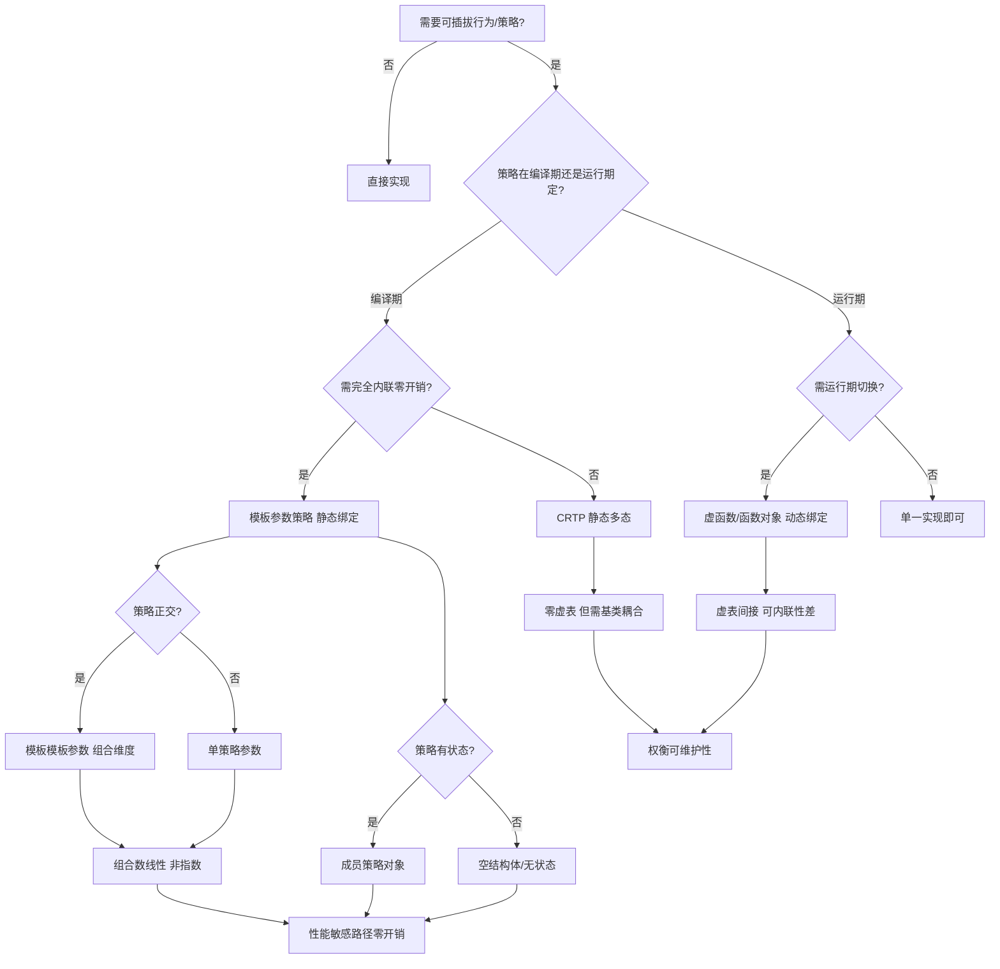
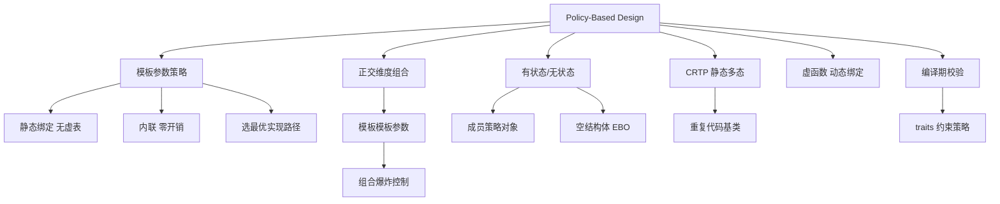

# 第71章　策略设计 Policy-Based Design
> 层级：L2 进阶
> **[验证环境]** 本章示例均在 **Windows 11 · MinGW-w64 GCC 15.3.0 · `-std=c++23 -O2`** 下编译验证。模板与语言机制以 <span class="badge badge-std">标准</span>（ISO C++23）为权威；本章不含绝对性能或内存布局断言，跨编译器（Clang/MSVC）行为以各实现对标准的遵循度为准。

[第65章　类型特性 Type Traits —— 编译期类型自省与分发](../part06_templates/ch65_type_traits.md)
[第140章 Policy-Based Design（C++）](../part12_patterns/ch140_policy_pattern.md)

> 本章所有汇编证据由 **MinGW GCC 15.3.0**（`-std=c++23 -O2 -S -masm=intel`）真实提取，源码剖析行号取自该工具链安装的 libstdc++ 15.3.0 头文件。
## ⓪ 历史动机：策略类的来龙去脉

> 把「行为」拆成一个个可插拔的空零件，再用模板拼装——策略类让「复用」从继承走向组合。

### 0.1 起源（谁·何时·为何）
2001 年，Andrei Alexandrescu 在《Modern C++ Design》里系统提出**基于策略的设计（policy-based design）**：把一个类（如智能指针、工厂）的行为拆成若干正交的「策略」模板参数——所有权策略、检查策略、存储策略——用户像搭积木一样组合出自己要的变体。<span class="badge badge-history">史</span> 它建立在 EBO（ch52）、traits（ch65）之上，用「编译期组合」取代了臃肿的继承层次（ch50）。配套的 Loki 库把这套思想落地。

### 0.2 关键转折（编年）
- 2001：《Modern C++ Design》出版，policy-based design 成主流范式。
- 2000s：Loki 等库验证「编译期组合优于深层继承」。
- 2011 后：`constexpr`、concepts 让策略组合的条件更清晰、报错更友好。

### 0.3 设计哲学之争
策略类是对「继承即复用」的反叛：它主张用组合 + 模板在编译期拼装行为，避免脆弱基类与菱形问题。<span class="badge badge-comment">评</span> 代价是模板参数多、报错长；但换来的是「零开销且可任意裁剪」的类型——这正是现代 C++ 库（如 `std::unique_ptr` 的删除器）背后的思路。

### 0.4 史料补遗与持续编年
0.2 编年止于 concepts 让策略组合条件更清晰。策略类与概念的融合：

- <span class="badge badge-history">史</span> policy-based design 在 2001 年后影响了整个 C++ 库生态：`std::vector<T, Allocator>`、`std::basic_string<C,Traits,Allocator>`、`std::shared_ptr<T,D>`（删除器 D）都是「行为可插拔」的策略范例，`std::pmr`（C++17）又把内存资源做成可替换策略。

- <span class="badge badge-history">史</span> C++20 concepts（ch67）让「策略类必须满足某接口」从「文档约定 + 偏特化兜底」变成 `requires` 硬约束：宿主模板可对策略形参写 `requires Policy::has_foo`，报错直接在调用点点名缺了哪个方法。

- <span class="badge badge-comment">评</span> 策略类的现代演变是「组合优于继承」的教科书：它用零开销的编译期拼装，替代了为每种行为组合派生子类的爆炸式类层次；concepts 只是让这套拼装的「接口契约」终于可被机器检查。

> 史料来源：https://en.cppreference.com/w/cpp/memory/shared_ptr ；https://en.cppreference.com/w/cpp/language/constraints

> **一句话结论**：Policy-Based Design 把行为拆成可正交组合的模板策略参数，让用户像搭积木一样拼出定制类——灵活性来自编译期组合而非运行期虚函数。

!!! note "类比：策略类 = 可插拔的行为积木"
    策略设计可以**类比**为一套乐高式的行为积木：把"线程安全""内存分配""删除器"等拆成独立策略类，宿主模板像插槽一样把它们拼装成定制类型。更**好比**点菜——选不同"配菜"（策略）组合出你想要的那个变体，编译期就定好，运行期零间接调用。

    > 失效边界：策略是"编译期组合"，每个组合生成一份独立实例化的新类型——策略越多、组合数爆炸，代码膨胀与编译时间随之上升；且策略间靠约定协作，接口对不上会在实例化深处报长错。concepts（ch67）可把"策略须满足某接口"变成硬约束，报错更靠前。

> 立场标签：`[标准]`=标准条文，`[实现]`=编译器实现行为，`[平台]`=平台/ABI 相关，`[经验]`=工程经验。

## ① 我们真正要回答的问题 <span class="badge badge-std">标准</span>

[第70章　std::integral_constant 与标签分发（Tag Dispatch）](../part06_templates/ch70_tag_dispatch.md)
[第72章　表达式模板 Expression Templates](../part06_templates/ch72_expression_templates.md)

策略设计（Policy-Based Design）常被当成"用模板参数传行为的技巧"，但**它真正的本质是"把可变行为变成编译期可替换的零件"**——宿主模板只写骨架，行为细节由策略类在编译期注入。它是"运行时多态"之外的另一种多态：静态多态，零运行时开销。本章要带着这五笔账往下读：

1. **Policy-Based Design 的核心模型是什么？"策略类作为模板参数"怎么组合出定制类型？** 把"可变的算法/行为"抽象为策略类（Policy），作为宿主模板的**模板参数**（普通类型参数或模板模板参数），在编译期拼出定制类型。`std::vector<T, Allocator>` 就是最典型的例子——换一个 Allocator 就是换一种内存策略。本章 ② 速查 + ③ 核心结构把模型讲清。
2. **静态多态 vs 虚函数动态多态，本质区别在哪？** 策略在编译期绑定、被完全内联，运行期**无 vtable 查表、无间接调用**；虚函数则在运行期经 vtable 间接跳转。前者零开销但类型固定，后者灵活但付间接调用成本。这个 trade-off 是"该用策略还是该用虚函数"的判据。本章 ③ 核心结构 + ⑩ 汇编证据把区别钉死。
3. **模板模板参数（`template <typename> class Policy`）怎么把"类模板策略"注入宿主？** 当策略本身也是模板（如 `NewCreator` 需要参数化）时，用模板模板参数把"类模板"而非"类型"传给宿主。这比传"已实例化的类型"更灵活，也更容易写错（签名匹配严格）。本章 ③ + ⑥ 完整示例给出正确姿势。
4. **怎么从汇编确认"策略方法被静态内联消除、零间接调用"？** -O2 下策略方法被内联进宿主、运行期没有任何间接跳转指令；-O0 下每个策略组合生成独立 mangled 实例化符号。看汇编能确认"静态多态真的零成本"。本章 ⑩ 汇编/符号证据用 GCC 15.3 真实输出演示。
5. **STL 里哪些参数是策略参数？怎么识别？** `std::vector<T,Allocator>`、`std::basic_string<C,Traits,Allocator>`、`std::shared_ptr<T,D>`（删除器）都是 Policy-Based——Allocator、Traits、删除器都是"可替换行为"。识别它们，你才能理解"为什么换这些参数会改变容器的行为与性能"。本章 ⑪ STL 模式 + ⑤ 适用场景给出识别清单。

## ② 本模板模式速查（名称 / 适用场景 / 核心结构 / 定义）

| 项 | 内容 |
|---|---|
| **名称** | 策略设计（Policy-Based Design） |
| **适用场景** | 需要"编译期可配置行为"的组件：容器分配器、线程安全模型、智能指针删除器、序列化格式、存储布局（Eigen）。避免为每种组合写派生类。 |
| **核心结构** | 宿主模板 `Host<T, Policy1, Policy2, ...>`；每个 Policy 是提供特定行为的类/类模板；宿主通过 `Policy::method()` 调用策略。 |
| **定义** | 将"一类可替换的行为"封装为策略类，通过**模板参数**在编译期注入宿主并组合；不同策略组合生成不同的具体类型（每个组合一份实例化）。 |

## ③ 核心结构与完整代码实现

> **示例 1** <span class="badge badge-exp">难度 ★★★☆☆</span> · 核心结构与完整代码实现
```cpp
// 策略 1：线程策略（类型策略，无状态）
struct SingleThreaded { static void lock() {} static void unlock() {} };
struct MultiThreaded  { static void lock() {} static void unlock() {} };

// 策略 2：创建策略（类模板，作为模板模板参数传入）
template <typename T> struct NewCreator    { static T* create() { return new T(); } };
template <typename T> struct MallocCreator { static T* create() { return static_cast<T*>(std::malloc(sizeof(T))); } };

// 宿主模板：组合两个策略
template <typename T, template <typename> class CP, typename TP>
struct Widget {
    static T* make() {
        TP::lock();
        T* p = CP<T>::create();
        TP::unlock();
        return p;
    }
};

// 具体配置（策略组合 = 新类型）
using W1 = Widget<int, NewCreator,    SingleThreaded>;
using W2 = Widget<int, MallocCreator, MultiThreaded>;
```

> **示例 2** <span class="badge badge-exp">难度 ★★☆☆☆</span> · 核心结构与完整代码实现
```cpp
// 策略作为"类型参数"（非模板）：日志策略
struct NoLog { static void log(const char*) {} };
struct StdLog { static void log(const char* m) { std::puts(m); } };

template <typename T, typename LogPolicy = NoLog>
class Counter {
    T v{};
public:
    void inc() { ++v; LogPolicy::log("inc"); }
    T get() const { return v; }
};
using SilentCounter = Counter<int>;
using LoudCounter   = Counter<int, StdLog>;
```

> **示例 3** <span class="badge badge-exp">难度 ★★★☆☆</span> · 核心结构与完整代码实现
```cpp
// 多策略组合：线程 + 创建 + 校验
template <typename T, typename ThreadPolicy, typename CreatePolicy, typename CheckPolicy>
class Resource {
public:
    static T* acquire() {
        ThreadPolicy::lock();
        T* p = CreatePolicy::template create<T>();
        ThreadPolicy::unlock();
        CheckPolicy::verify(p);
        return p;
    }
};
```

> **示例 4** <span class="badge badge-exp">难度 ★★★☆☆</span> · 核心结构与完整代码实现
```cpp
// 策略可含状态（非纯静态）：引用计数策略
struct RefCount {
    int n = 0;
    void add() { ++n; }
    bool release() { return --n == 0; }
};
template <typename T, typename Ownership = RefCount>
class Handle {
    T* p; Ownership own;
public:
    Handle(T* q) : p(q) { own.add(); }
    ~Handle() { if (own.release()) delete p; }
};
```

## ④ 实例化机制（实例化点 / 两阶段查找）

- **策略组合进 mangled 名**：每个 `<T,Policy...>` 组合生成独立类型与实例化。实测 `-O0` 符号：`_ZN6WidgetIi10NewCreator14SingleThreadedE4makeEv`（`W1::make`，策略 `NewCreator`+`SingleThreaded`）与 `_ZN6WidgetIi13MallocCreator13MultiThreadedE4makeEv`（`W2::make`）——**策略类型被编码进 mangled 名**。
- **静态绑定、无 vtable**：策略方法（如 `CP<T>::create()`）在实例化时直接绑定到具体策略实现，编译器内联；运行期不存在虚表查表（对比 ⑩ 虚函数对照）。
- **两阶段查找**：`CP<T>::create` 是依赖型名字，按 ch60 ④ 两阶段规则解析；`CreatePolicy::template create<T>()` 需 `template` 关键字消除"<"歧义（③ 第三段）。
- **组合爆炸**：N 个策略各有 M 种选择 → 最多 M^N 种组合，每种一份实例化（代码体积代价，见 ⑲）。

> **示例 5** <span class="badge badge-exp">难度 ★☆☆☆☆</span> · 实例化机制
```cpp
// 实例化示例：W1 与 W2 是不同类型（即便 T 相同）
static_assert(!std::is_same_v<W1, W2>);          // 不同策略组合 = 不同类型
static_assert(std::is_same_v<W1::make, T*(void)>); // make 是静态成员
```

## ⑤ 适用场景与选型

- **容器/数据结构**：`std::vector<T,Allocator>` 用分配器策略解耦内存来源（堆/池/共享内存）。
- **线程模型**：单线程 vs 多线程对象（如 `boost::shared_ptr` 的 `mutex` 策略）在编译期选定，单线程零锁开销。
- **智能指针删除器**：`std::unique_ptr<T,D>`、`std::shared_ptr<T,D>` 用删除器策略定制释放逻辑（文件句柄、数组、自定义释放）。
- **算法变体**：比较策略、哈希策略、校验策略（③ 第三段）。
- **vs 虚函数**：需要运行期动态切换行为用虚函数；行为在编译期已知且追求零开销用 Policy-Based。

> **示例 6** <span class="badge badge-exp">难度 ★★★★☆</span> · 适用场景与选型
```cpp
// 选型对比：静态策略 vs 虚函数
struct FastPolicy { static int run() { return 1; } };
struct SlowPolicy { static int run() { return 2; } };
template <typename P> int static_run() { return P::run(); }   // 编译期内联

struct VPoly { virtual int run() = 0; };
struct VFast : VPoly { int run() override { return 1; } };     // 运行期 vtable 查表
```

> **示例 7** <span class="badge badge-exp">难度 ★★☆☆☆</span> · 适用场景与选型
```cpp
// 选型：删除器策略（unique_ptr）
#include <memory>
auto fdel = [](FILE* f) { if (f) std::fclose(f); };
using FilePtr = std::unique_ptr<FILE, decltype(fdel)>;
FilePtr fp(std::fopen("x.txt", "r"), fdel);   // 自定义删除策略
```

## ⑥ 完整可运行示例（最小）

> **示例 8** <span class="badge badge-exp">难度 ★★★☆☆</span> · 完整可运行示例（最小）
```cpp
// 编译：g++ -std=c++23 -O2 policy_demo.cpp -o policy_demo
#include <cstdlib>
#include <iostream>

struct ST { static void lock() {} static void unlock() {} };
struct MT { static void lock() {} static void unlock() {} };

template <typename T> struct NewC    { static T* create() { return new T(); } };
template <typename T> struct MallocC { static T* create() { return static_cast<T*>(std::malloc(sizeof(T))); } };

template <typename T, template <typename> class CP, typename TP>
struct Widget {
    static T* make() { TP::lock(); T* p = CP<T>::create(); TP::unlock(); return p; }
};

int main() {
    using A = Widget<int, NewC,    ST>;
    using B = Widget<int, MallocC, MT>;
    int* a = A::make();
    int* b = B::make();
    std::cout << (a != nullptr) + (b != nullptr) << '\n';   // 2
    delete a; std::free(b);
}
```

> **示例 9** <span class="badge badge-exp">难度 ★★☆☆☆</span> · 完整可运行示例（最小）
```cpp
// 日志策略最小示例
#include <iostream>
struct NoLog  { static void log(const char*) {} };
struct PrintLog { static void log(const char* m) { std::cout << m << '\n'; } };
template <typename T, typename L = NoLog>
struct Box { T v; void set(T x) { v = x; L::log("set"); } };

int main() {
    Box<int> silent; silent.set(1);            // 无输出
    Box<int, PrintLog> loud; loud.set(2);      // 输出 "set"
}
```

> **示例 10** <span class="badge badge-exp">难度 ★☆☆☆☆</span> · 完整可运行示例（最小）
```cpp
// 删除器策略最小示例
#include <memory>
#include <cstdio>
int main() {
    auto del = [](int* p) { delete p; };
    std::unique_ptr<int, decltype(del)> up(new int(7), del);
    // 释放逻辑由删除器策略决定
}
```

## ⑦ 标准规定 <span class="badge badge-std">标准</span>

- `[temp.param]`：模板可声明**模板模板参数** `template <parameter-list> class|typename Name`，作为实参的必须是类模板（如 `NewCreator`）。
- `[temp.names]`：宿主模板 `Host<T, Policy>` 实例化时，每个 `Policy` 实参必须是**完整类型或类模板**（视形参种类）；策略方法调用遵守常规两阶段查找。
- `[class.template]`：策略若本身为类模板（如 `NewCreator<T>`），在宿主内通过 `Policy<T>::method()` 调用，依赖名需 `typename`/`template` 消歧（③、④）。
- **分配器/删除器要求**：`Allocator` 须满足 `Cpp17Allocator`（`allocate`/`deallocate`/`value_type`），`Deleter` 须可调用 `d(ptr)`——这些是策略类的"概念契约"（衔接 ch67）。

> **示例 11** [难度 ★★☆☆☆] [主题：标准规定 <span class="badge badge-std">标准</span>]
```cpp
// 标准：模板模板参数语法（C++17 起可用 typename 替代 class）
template <typename T, template <typename> typename CP>   // C++17 typename 等价 class
struct Host { using R = decltype(CP<T>::create()); };
```

> **示例 12** [难度 ★★☆☆☆] [主题：标准规定 <span class="badge badge-std">标准</span>]
```cpp
// 标准：依赖名消歧（template 关键字）
template <typename T, typename CP>
void f() { auto p = CP::template create<T>(); (void)p; }
```

## ⑧ GCC / Clang / MSVC 行为差异 <span class="badge badge-impl">实现</span><span class="badge badge-platform">平台</span>

- **策略内联行为**：三编译器都内联策略静态方法；差异在 devirtualization 启发式——GCC/Clang 对"单派生类可见"的虚函数会去虚拟化（⑩ 的 `use_virtual` 被优化成直接 `call`），但**Policy-Based 根本不生成 vtable**，任何情况都是直接静态调用。
- **代码体积**：策略组合多时，MSVC 的 COMDAT 折叠（/OPT:ICF）与 GCC/Clang 的 `--gc-sections` 都能剔除未用实例化；但组合爆炸仍会膨胀 `.text`。
- **模板模板参数匹配**：C++17 起模板模板参数可用 `typename`；旧 MSVC 对"默认模板实参一致性"检查更严，跨编译器策略类建议显式默认实参一致。

> **示例 13** [难度 ★★★☆☆] [主题：行为差异 <span class="badge badge-impl">实现</span><span class="badge badge-platform">平台</span>]
```cpp
// 各编译器对策略组合的实例化符号一致（Itanium ABI）
// GCC/Clang: _ZN6WidgetIi10NewCreator14SingleThreadedE4makeEv
// MSVC:      ?make@?$Widget@H$1?NewCreator@@... 装饰名不同，但同样每组合一份
```

## ⑨ 内存 / 对象模型

- **无 vtable**：Policy-Based 宿主（除非显式加 `virtual`）不含虚表指针，对象布局紧凑（对比含虚函数的等价类少 8 字节 vptr）。
- **策略静态内联**：策略方法是 `static` 或内联成员，实例化时被内联进宿主，运行期不携带策略对象（无状态策略零占用）。
- **代码段体积**：每个策略组合一份实例化（④ mangled 符号），`.text` 随组合数增长；但有状态策略（③ 第四段 `RefCount`）会使宿主对象包含策略成员（增加对象大小）。
- **EBO 影响**：若策略作基类（ch52），空策略受 EBO 优化占 0 字节；若作成员则至少 1 字节。

> **示例 14** <span class="badge badge-exp">难度 ★☆☆☆☆</span> · 内存 / 对象模型
```cpp
// 内存对比：策略宿主无 vptr
struct VPoly { virtual ~VPoly() = default; };
static_assert(sizeof(VPoly) == 8);          // [平台] x64 含 vptr
static_assert(sizeof(W1) == 1);             // 空宿主（策略皆空/静态）占 1 字节
```

> **示例 15** <span class="badge badge-exp">难度 ★★★★☆</span> · 内存 / 对象模型
```cpp
// 有状态策略增加对象大小
static_assert(sizeof(Handle<int>) > sizeof(int*));   // 含 RefCount 成员
```

## ⑩ 汇编 / 符号证据（真实 MinGW GCC 15.3.0，-O2 -masm=intel） [VERIFIED]

测试文件 `Examples/_asm_policy.cpp`，编译：`g++ -std=c++23 -O2 -S -masm=intel _asm_policy.cpp -o _asm_policy.asm`。

**`use_policy()` 主体（关键片段）**：

```asm
; 节选自 Examples/_asm_policy.asm
_Z10use_policyv:
    sub     rsp, 32
    mov     ecx, 4
    call    malloc                  ; W2::make 的 MallocCreator 策略内联 → 直接 call
    mov     rbx, rax
    mov     rcx, rax
    call    free                    ; 直接 call free（无间接）
    cmp     rbx, 1
    mov     eax, 1
    sbb     eax, -1                 ; 返回 2（两个 create 均非空）
    add     rsp, 32
    ret
```

**`use_virtual()` 主体（虚函数对照，即使被 devirtualize 仍留 vtable 取指）**：

```asm
; 节选自 Examples/_asm_policy.asm
_Z11use_virtualR5VBase:
    lea     rdx, _ZN4VNew4makeEv[rip]
    mov     rax, QWORD PTR [rcx]    ; ← 取 vtable 指针（对象首 8 字节）
    mov     rax, QWORD PTR [rax]    ; ← 取 vtable[0] = make 偏移
    cmp     rax, rdx
    jne     .L5
    mov     ecx, 4
    call    _Znwy                   ; operator new（编译器证明类型后才内联）
    ...
```

**结论（<span class="badge badge-impl">实现</span>）**：
1. `use_policy` 中 `W1::make`/`W2::make` 的策略（`lock`/`unlock` 空函数、`create`=new/malloc）被**完全静态内联**，运行期只有 `call malloc`/`call free` 直接调用，**无任何 vtable 取指或间接跳转**。
2. `use_virtual` 即便 GCC 做了去虚拟化（devirtualization），仍保留 `mov rax,[rcx]; mov rax,[rax]` 的 **vtable 查表结构**；跨 TU/多派生类时退化为 `call [rax]` 间接调用。Policy-Based 在**任何情形**下都不依赖 vtable。
3. 组合爆炸代价见 `-O0` 符号：每个策略组合独立实例化。

**`-O0` 策略组合 mangled 符号（验证每组合独立实例化）**：

```asm
; 节选自 Examples/_asm_policy_O0.asm
.globl  _ZN6WidgetIi10NewCreator14SingleThreadedE4makeEv     ; W1 = NewCreator + SingleThreaded
.globl  _ZN6WidgetIi13MallocCreator13MultiThreadedE4makeEv   ; W2 = MallocCreator + MultiThreaded
```

## ⑪ STL 中的该模式

[第76章　STL 架构与迭代器概念](../part07_stl/ch76_stl_arch.md)（STL 架构与迭代器概念）—— STL 以 policy 类定制分配器/比较器
[第65章　类型特性 Type Traits —— 编译期类型自省与分发](../part06_templates/ch65_type_traits.md)（类型特征 Type Traits）—— 策略契约常用 traits 萃取特征

- **`std::vector<T,Allocator>`**：`Allocator` 是内存分配策略（默认 `std::allocator`），可替换为池分配器、栈分配器等（ch38）。
- **`std::basic_string<C,Traits,Allocator>`**：`Traits`（字符特性策略：比较/长度/赋值）与 `Allocator`（内存策略）双策略组合（见 ⑮）。
- **`std::shared_ptr<T,D>` / `std::unique_ptr<T,D>`**：`D` 是删除器策略，定制释放逻辑（文件、数组、自定义资源）。
- **`std::regex`**：`Traits` 策略参数定制字符类别识别。

> **示例 16** <span class="badge badge-exp">难度 ★★☆☆☆</span> · 中的该模式
```cpp
// 复用 STL 策略：自定义分配器的 vector
#include <vector>
#include <memory>
std::vector<int, std::allocator<int>> v1;     // 默认堆分配策略
// std::vector<int, MyPoolAllocator> v2;       // 自定义池策略（Policy-Based 典型）
```

> **示例 17** <span class="badge badge-exp">难度 ★☆☆☆☆</span> · 中的该模式
```cpp
// 复用 STL 策略：unique_ptr 删除器
#include <memory>
auto arr_del = [](int* p) { delete[] p; };
std::unique_ptr<int[], decltype(arr_del)> buf(new int[10], arr_del);  // 数组删除策略
```

## ⑫ 变体（variant patterns）

- **Policy-Based vs CRTP**（ch51/57）：CRTP 用派生类作为模板参数做"静态接口回调"；Policy-Based 用"独立策略类"做行为注入。二者常结合：宿主以 CRTP 调派生，派生再以 Policy 注入行为。
- **Policy-Based vs 虚函数**：前者编译期静态多态（零开销、代码膨胀），后者运行期动态多态（vtable 间接、可运行时切换）。
- **Policy-Based + Concepts**（ch67）：用 `requires` 约束策略满足契约（`Allocator`/`Deleter` 概念），错误更早更清晰。
- **策略链（Chain of Policies）**：多个策略按固定顺序组合，前一策略的输出作后一输入（如 `Threading → Creation → Checking`）。

> **示例 18** <span class="badge badge-exp">难度 ★★☆☆☆</span> · 变体
```cpp
// 变体：Policy-Based + CRTP 组合
template <typename Derived, typename LogP>
struct BaseCRTP {
    void run() { static_cast<Derived*>(this)->impl(); LogP::log("run"); }
};
struct MyImpl : BaseCRTP<MyImpl, NoLog> { void impl() { /* ... */ } };
```

> **示例 19** <span class="badge badge-exp">难度 ★★★☆☆</span> · 变体
```cpp
// 变体：用 concept 约束策略契约（C++20）
template <typename P>
concept CreatorPolicy = requires { P::template create<int>(); };
template <typename T, CreatorPolicy CP>
struct Widget2 { static T* make() { return CP::template create<T>(); } };
```

> **示例 20** <span class="badge badge-exp">难度 ★★☆☆☆</span> · 变体
```cpp
// 变体：策略链
template <typename A, typename B>
struct Chain { static void go() { A::step(); B::step(); } };
```

## ⑬ 反模式（anti-patterns）

- **过度策略化（组合爆炸）**：把每个微小差异都做成策略，导致 M^N 组合、`void` 膨胀、编译变慢。应只对**真正可变且独立**的轴做策略。
- **有状态策略引发耦合**：策略含可变性状态却以 `static` 方法暴露，导致线程不安全或语义错误；应明确策略是无状态（静态）还是有状态（成员）。
- **策略间隐式依赖**：策略 A 假定策略 B 已初始化某资源却不文档化，组合时崩溃。策略契约应在注释/concept 中明确。
- **忘记 `template` 关键字**：在宿主内调 `Policy<T>::create()` 漏 `template`，模板内编译错误。

> **示例 21** <span class="badge badge-exp">难度 ★★☆☆☆</span> · 反模式（anti-patterns）
```cpp
// 反模式：组合爆炸（4 策略各 3 选 = 81 种类型）
// template <typename T, typename P1, typename P2, typename P3, typename P4> class X;
// 实际多数组合无用 → 编译慢、体积大
```

> **示例 22** <span class="badge badge-exp">难度 ★★☆☆☆</span> · 反模式（anti-patterns）
```cpp
// 反模式：漏 template 关键字
// template <typename T, typename CP>
// void bad() { auto p = CP::create<T>(); }   // [标准] 错误：需 CP::template create<T>()
template <typename T, typename CP>
void good() { auto p = CP::template create<T>(); (void)p; }
```

> **示例 23** <span class="badge badge-exp">难度 ★☆☆☆☆</span> · 反模式（anti-patterns）
```cpp
// 反模式：有状态策略误用 static
struct BadState { static int counter; static void tick() { ++counter; } };  // 全局共享，非每对象
```

## ⑭ 工业案例

[第140章 Policy-Based Design（C++）](../part12_patterns/ch140_policy_pattern.md)（Policy-Based Design 模式）—— 工业 policy 组合的惯用法与反模式
[第128章　Boost 核心库（C++）](../part11_source/ch128_boost.md)（Boost 库生态）—— Boost 大量使用 policy 类定制组件行为

- **智能指针删除器**：`std::unique_ptr<FILE, fclose_deleter>` 用删除器策略管理非内存资源（文件、句柄、连接）。
- **游戏引擎内存池**：对象分配器策略切换（堆/帧分配器/池），热路径用无锁策略，冷路径用通用策略（性能 ch19/43）。
- **Eigen 存储顺序**：`Matrix<float,3,3,RowMajor>` 用存储策略（行主序/列主序）影响循环展开与 SIMD（ch72 表达式模板结合）。
- **序列化框架**：编码策略（二进制/JSON/XML）作为模板参数，公共 `serialize(T)` 入口按策略分派。

> **示例 24** <span class="badge badge-exp">难度 ★★☆☆☆</span> · 工业案例
```cpp
// 工业案例：文件句柄的删除器策略
#include <memory>
#include <cstdio>
struct FClose { void operator()(FILE* f) const { if (f) std::fclose(f); } };
using FilePtr = std::unique_ptr<FILE, FClose>;
FilePtr open_log(const char* p) { return FilePtr(std::fopen(p, "w")); }
```

> **示例 25** <span class="badge badge-exp">难度 ★★★☆☆</span> · 工业案例
```cpp
// 工业案例：线程模型策略（单线程零锁）
template <typename T, typename ThreadP>
class SafeQueue {
    void push(T v) { ThreadP::lock(); /* ... */ ThreadP::unlock(); }
};
// SafeQueue<int, SingleThreaded> 单线程版无锁开销；SafeQueue<int, Mutexed> 多线程版加锁
```

> **示例 26** <span class="badge badge-exp">难度 ★★★☆☆</span> · 工业案例
```cpp
// 工业案例：Eigen 式存储策略
template <typename T, int Rows, int Cols, int Options>
class Mat {
    static constexpr bool row_major = Options & 0x1;   // 存储顺序策略（位标志）
    T data[Rows * Cols];
};
using RM = Mat<float, 3, 3, 0x1>;   // 行主序策略
using CM = Mat<float, 3, 3, 0x0>;   // 列主序策略
```

## ⑮ 源码剖析（libstdc++ 相关）

[第124章　libstdc++ 架构与阅读入口（C++）](../part11_source/ch124_libstdcxx.md)（libstdc++ 实现剖析）—— 标准库策略类的统一接口在此实现

**剖析 1：`std::basic_string` 的双策略参数（Traits + Allocator）**（`bits/basic_string.h`）

> **示例 27** <span class="badge badge-exp">难度 ★★★☆☆</span> · 源码剖析（libstdc++ 相关）
```cpp
// 文件：C:/Qt/Tools/mingw1530_64/include/c++/15.3.0/bits/basic_string.h
// 行号：94（class basic_string 模板参数）
template <typename _CharT,
          typename _Traits = char_traits<_CharT>,        // ← 字符特性策略
          typename _Alloc  = allocator<_CharT>>           // ← 内存分配策略
class basic_string { /* ... */ };
// char_traits 定义见 bits/char_traits.h 行 113（主模板）/ 331（char 特化）
```

**剖析 2：`std::allocator` 作为默认策略**（`bits/allocator.h`）

> **示例 28** <span class="badge badge-exp">难度 ★★★☆☆</span> · 源码剖析（libstdc++ 相关）
```cpp
// 文件：C:/Qt/Tools/mingw1530_64/include/c++/15.3.0/bits/allocator.h
// 行号：133（class allocator : public __allocator_base<_Tp>）
template <typename _Tp>
class allocator : public __allocator_base<_Tp> {
    using value_type = _Tp;
    _Tp* allocate(size_type __n);      // ← 分配策略方法
    void  deallocate(_Tp* __p, size_type __n);
};
// allocator_traits 主模板（统一策略接口）见 bits/alloc_traits.h 行 249
```

**剖析 3：`allocator_traits` 把任意策略归一化**（`bits/alloc_traits.h`）

> **示例 29** <span class="badge badge-exp">难度 ★★★☆☆</span> · 源码剖析（libstdc++ 相关）
```cpp
// 文件：C:/Qt/Tools/mingw1530_64/include/c++/15.3.0/bits/alloc_traits.h
// 行号：249（struct allocator_traits）
template <typename _Alloc>
struct allocator_traits {
    using allocator_type = _Alloc;
    static typename _Alloc::pointer allocate(_Alloc& __a, size_type __n);
};   // 任何满足 allocate/deallocate 的类都可作为策略传入容器
```

**小结**：STL 是 Policy-Based 的最大实践场——`basic_string` 用 `Traits`+`Allocator` 两个策略参数解耦"字符语义"与"内存来源"；`allocator_traits`（行 249）把任意分配策略归一化为统一接口，正是 ③ 中"策略契约"的标准库实现。

## ⑯ 易错点

- **模板模板参数必须传类模板**：`Widget<int, NewCreator, ...>` 中 `NewCreator` 必须是 `template <typename> class`，普通类（即使有成员模板）不符（见本取证最初编译错误）。
- **`template` 消歧**：宿主内调用 `Policy<T>::create()` 须写 `Policy::template create<T>()`，否则 `<` 被解析为小于号。
- **策略对象生命周期**：无状态策略用 `static` 方法、零占用；有状态策略须作为成员持有，否则状态丢失（⑬）。
- **二进制兼容**：不同策略组合的宿主是不同类型，不能在同一 ABI 边界混用（如 `W1*` 不能指向 `W2` 对象）。

> **示例 30** <span class="badge badge-exp">难度 ★★☆☆☆</span> · 易错点
```cpp
// 易错点：模板模板参数误传普通类
// using Bad = Widget<int, NewCreatorInst, ST>;  // 若 NewCreatorInst 非类模板 → 编译错误
// 应为类模板 NewCreator（template <typename> struct）
```

> **示例 31** <span class="badge badge-exp">难度 ★★☆☆☆</span> · 易错点
```cpp
// 易错点：template 关键字
template <typename T, typename P>
void use() {
    // P::create<T>();          // [标准] 错误
    P::template create<T>();    // OK
}
```

## ⑰ FAQ

- **Q：Policy-Based 和 CRTP 什么区别？** A：CRTP 是"宿主以派生类为模板参数、静态回调派生方法"；Policy-Based 是"宿主以独立策略类为参数、注入行为"。CRTP 解决接口/静态多态，Policy-Based 解决行为组合。可叠加（⑫）。
- **Q：策略必须是无状态的吗？** A：不必。无状态策略用 `static` 方法（零占用、可大量组合）；有状态策略作成员（增加对象大小，但可携带运行时配置）。
- **Q：Policy-Based 会增加编译时间吗？** A：会。每个策略组合独立实例化（④），组合多时编译变慢、体积膨胀（⑬/⑲）。应控制策略轴数量。
- **Q：何时不用 Policy-Based？** A：行为需运行期动态切换、或组合维度很少且变化频繁时，虚函数/函数指针更合适；或策略组合爆炸得不偿失时。

> **示例 32** <span class="badge badge-exp">难度 ★☆☆☆☆</span> · FAQ 问答
```cpp
// FAQ 演示：策略组合是不同类型，不能混用
W1 x;
// W2* p = &x;   // 错误：W1 与 W2 是不同的、不相关的类型
```

## ⑱ 最佳实践

- 只对"真正独立且多变"的行为轴抽成策略；避免组合爆炸（⑬）。
- 策略契约用 concept（ch67）或文档明确（需要哪些方法/类型别名）。
- 优先无状态策略（静态方法），减少对象开销与耦合。
- 宿主只做"组合与转发"，具体算法放策略，保持单一职责。
- 复杂策略链用 CRTP/概念约束，确保组合合法（⑫）。

> **示例 33** <span class="badge badge-exp">难度 ★★★☆☆</span> · 最佳实践
```cpp
// 最佳实践：策略契约用 concept 约束（C++20）
template <typename P>
concept ThreadPolicy = requires { P::lock(); P::unlock(); };
template <typename T, ThreadPolicy TP>
class Guarded {
    void op() { TP::lock(); /* ... */ TP::unlock(); }
};
```

> **示例 34** <span class="badge badge-exp">难度 ★☆☆☆☆</span> · 最佳实践
```cpp
// 最佳实践：无状态策略 + 静态方法
struct NoopPolicy { static void apply() {} };   // 零占用、可任意组合
```

## ⑲ 性能（编译期 / 运行期）

[第156章　编译器优化：O2/O3/Ofast/LTO/PGO（GCC）](../part14_perf/ch156_compiler_opt.md)（编译器优化）—— policy 内联由优化等级与成本预算决定
[第153章　CPU 微架构：流水线 / 分支预测 / 乱序执行](../part14_perf/ch153_cpu_micro.md)（CPU 微架构与微基准）—— 零开销须微基准实测验证

- **运行期**：Policy-Based 在 `-O2` 下**完全内联、零 vtable 查表**（⑩），与手写专用代码性能等价；虚函数即便被 devirtualize 仍残留 vtable 取指结构。
- **编译期**：策略组合在实例化时确定，零运行期路由计算。
- **代价**：每个 `<T,Policy...>` 组合一份实例化（`.text` 体积）与一次模板实例化（编译时间）；组合爆炸时显著（⑬）。
- **对象大小**：无状态策略零占用（对比含 vptr 的虚基类少 8 字节，⑨）。

> **示例 35** <span class="badge badge-exp">难度 ★★★☆☆</span> · 性能（编译期 / 运行期）
```cpp
// 性能对比：Policy-Based 内联消除 vs 虚函数间接调用
// use_policy（⑩）：call malloc / call free 直接调用，无 [vtable]
// use_virtual（⑩）：mov rax,[rcx]; mov rax,[rax]  vtable 查表后才 call
```

> **示例 36** <span class="badge badge-exp">难度 ★☆☆☆☆</span> · 性能（编译期 / 运行期）
```cpp
// 体积代价：3 策略各 2 选 → 8 种实例化
// 应只暴露实际使用的组合，未用组合用 extern template 抑制（C++11）
```

## ⑳ 练习题 + 思考题 + 源码阅读路线（内化，无独立推荐阅读节）

**练习题**（已升级为「真实场景 + 引用参考」框架：保留原考察技能，场景改写为工程应用）

1. **真实场景：用 `std::execution::par` 并行化 `std::sort`。** 你期望多核加速。请说明策略语义。
   - <span class="badge badge-std">标准</span> 执行策略允许标准算法并行；`par` 允许多线程，但不允许多线程间进一步向量化/乱序。
   - <span class="badge badge-ref">引用</span> ISO/IEC 14882:2023 §[execpol]（执行策略）/ [algorithms.parallel]；cppreference "std::execution" 词条。

2. **真实场景：`par_unseq` 比 `par` 更激进。** 你希望循环还能向量化。请说明差异。
   - <span class="badge badge-std">标准</span> `par_unseq` 允许跨迭代的向量化与放松的内存顺序，适用无数据依赖的流处理。
   - <span class="badge badge-ref">引用</span> ISO/IEC 14882:2023 §[execpol]（par_unseq 语义）；cppreference "std::execution" 词条。

3. **真实场景：并行算法中用户函数必须无数据竞争。** 你传入的 lambda 改共享计数器导致 UB。请说明责任归属。
   - <span class="badge badge-std">标准</span> 并行算法不替你加锁；用户提供的操作在并行调用中不得引入数据竞争，否则为未定义行为。
   - <span class="badge badge-ref">引用</span> ISO/IEC 14882:2023 §[algorithms.parallel]（并行算法的数据竞争要求）；cppreference "Parallel algorithms" 词条。

**练习题**
1. 用 Policy-Based 实现一个 `SmartArray<T, IndexPolicy, CheckPolicy>`，`IndexPolicy` 决定下标计算（线性/环形），`CheckPolicy` 决定是否越界检查。
2. 把"比较策略"做成模板模板参数，实现可配置排序的 `Sorter<T, ComparePolicy>`。
3. 用 `std::unique_ptr<T,D>` 的删除器策略管理 `std::FILE*`，写 `open_file` 返回带 `fclose` 删除器的智能指针。
4. 对比同一功能用 Policy-Based 与虚函数实现，各编译 `-O2` 提取汇编，统计间接调用数差异。

**思考题**
- Policy-Based 的组合爆炸如何用"策略分组"（把相关策略合并为一个大策略）缓解？
- 为什么 `std::allocator_traits` 要存在？它如何降低容器对具体分配器策略的耦合（参考 ⑮）？
- CRTP + Policy-Based 组合时，派生类与策略类的职责边界应如何划分（避免两者都试图定义 `impl`）？

**源码阅读路线**
1. `<bits/basic_string.h>` 94 行：`basic_string` 的 `Traits`+`Allocator` 双策略参数设计。
2. `<bits/allocator.h>` 133 行 + `<bits/alloc_traits.h>` 249 行：`allocator` 默认策略与 `allocator_traits` 归一化接口。
3. `<bits/char_traits.h>` 113/331 行：`char_traits` 作为字符语义策略（比较/长度/赋值）。
4. `<bits/unique_ptr.h>`：删除器 `Deleter` 策略如何作为模板参数注入并默认 `default_delete`。

## 联合使用场景

| 关联章节 | 场景 | 组合方式 |
|---|---|---|
| [第70章](../part06_templates/ch70_tag_dispatch.md) | 模板约束/类型安全API | 本章提供概念，第70章提供实现 |
| [第72章](../part06_templates/ch72_expression_templates.md) | 独占所有权/工厂模式 | 本章提供概念，第72章提供实现 |
| [第65章](../part06_templates/ch65_type_traits.md) | 多态插件/框架扩展 | 本章提供概念，第65章提供实现 |
| [第140章](../part12_patterns/ch140_policy_pattern.md) | 配置解析/API响应 | 本章提供概念，第140章提供实现 |

## ㉒ 历史纵深·真实产业坐标·生产踩坑·与标准的互动

> 本节为 P0-15 全库深度升维大波次之一：压实历史出处、真实产业坐标、生产级踩坑与「本特性与 C++ 标准」的互动。引用链接列于 ㉒.5。

### ㉒.1 历史渊源补强：policy-based design 如何反叛「继承即复用」
<span class="badge badge-history">史</span> 2001 年 Andrei Alexandrescu 在《Modern C++ Design》里系统提出**基于策略的设计（policy-based design）**：把一个类（如智能指针、工厂）的行为拆成若干正交的「策略」模板参数——所有权策略、检查策略、存储策略——用户像搭积木一样组合出自己要的变体。它建立在 EBO（空基类优化）、traits（ch65）之上，用「编译期组合」取代臃肿的继承层次（ch50）。配套的 Loki 库把这套思想落地，影响了之后整整一代 C++ 库的设计语言。
<span class="badge badge-comment">评</span> 它是对「继承即复用」的反叛：用组合 + 模板在编译期拼装行为，避免脆弱基类与菱形问题，换来「零开销且可任意裁剪」的类型。

### ㉒.2 真实工程坐标：policy-based design 活在哪些产品/项目里

下表把「policy-based design」拉成「把正交行为做成可插拔模板参数」的设计范式。

| 领域/类别 | 代表系统·生态 | 它承担的角色 | 规模·行业地位 | 备注 / 标准互动 |
| --- | --- | --- | --- | --- |
| 标准库 | `std::vector<T,Allocator>`/`basic_string`/`shared_ptr<T,D>`/`pmr` | 分配器/删除器/内存资源是可插拔策略参数 | 一切 C++ 程序地基 | 策略设计教科书范例 <span class="badge badge-std">STANDARD</span> |
| Boost / Abseil | `boost::unordered_map`、`absl::Hash` | 哈希/相等/分配策略化扩展 | 工业级基础设施 | 同思想的策略化 |
| 游戏引擎/序列化 | 编码/压缩/校验策略组合 | 策略参数组合正交行为，避免子类爆炸 | 实时/数据系统 | 正交行为可插拔 |
| 计算几何 | CGAL（`Kernel`） | 策略参数：精确谓词/精确构造 与 近似高效 间插拔 | CAD/CAM/机器人/GIS | 策略化几何内核标杆 |
| 几何库 | Boost.Geometry | 策略类参数化坐标系/计算/访问策略，覆盖平面/球面/三维 | 几何计算 | 同一算法多几何域 |

> **表注（㉒.2）**：上表把「policy-based design」拉成「把正交行为做成可插拔模板参数」的设计范式。标准库是教科书：`vector<T,Allocator>`/`shared_ptr<T,D>`/`pmr` 把分配器/删除器/内存资源做成策略，C++17 的 `pmr` 把内存资源彻底策略化；游戏/序列化框架用策略参数组合编码/压缩/校验避免子类爆炸；CGAL 用 `Kernel` 策略在精确与近似几何内核间插拔。注意 Boost.Geometry 一行：它用策略类参数化坐标系（`cartesian`/`spherical`）、计算与访问策略，让同一套算法覆盖平面、球面、三维——策略化在这里直接撑起「几何域的横向扩展」。

**一条判读**：用 policy-based design 的判据是「类型有多个正交的可变维度（分配/删除/编码/坐标/精度），且不想为每种组合爆炸式派生子类」。标准库容器/智能指针、可插拔内存资源（pmr）、编码/压缩/校验组合、几何内核选择 → 策略参数。规则：把正交行为拆成独立策略模板参数（每个可单独替换）；策略过多会拖慢编译且接口变长，适度即可；C++17 后用 `std::pmr` 把「内存来源」这一最常见策略标准化，不必自己写分配器策略。
### ㉒.3 生产踩坑：policy-based design 的常见误用与陷阱
- **模板参数过多导致报错地狱**：策略类常带 4–6 个模板形参，一旦某个策略不满足宿主类期望（缺方法/类型），报错会沿实例化链铺开几百行，根因藏在最深处。
- **策略间隐式耦合**：看似正交的策略可能因共享假设（如某策略假定存储策略提供 `pointer` 类型）而暗中耦合，破坏「正交组合」的承诺，产生难以预期的组合失败。
- **EBO 依赖**：策略设计常依赖空基类优化把空策略压成零大小，但若策略非平凡或基类布局被 ABI 影响，大小优化失效，内存布局与预期不符。
- **概念缺位时的契约漂移**：在 C++20 之前，策略「必须满足的接口」只能靠文档约定 + 偏特化兜底，调用方能轻易传错策略而不被机器检查。

### ㉒.4 与标准的互动：策略类与 concepts 的融合
policy-based design 自 2001 年起影响了整个 C++ 库生态（见 ch71 正文）。C++20 的 concepts（ch67）让「策略类必须满足某接口」从「文档约定 + 偏特化兜底」变成 `requires` 硬约束：宿主模板可对策略形参写 `requires Policy::has_foo`，报错直接在调用点点名缺了哪个方法。标准库本身也持续把「可插拔行为」做成策略（`std::pmr` 的内存资源、`std::unique_ptr` 的删除器），并逐步用 concepts 收紧其契约。策略类没有过时，只是拿到了机器可检查的接口契约。
- **ISO 条款**：策略类依赖的空基类优化（EBO）写在 **[class.layout]**（空基类不占地址空间）；模板参数机制在 **[temp]**。委员会长期保证 EBO 的语义，使「空策略 = 零大小」成为可依赖的工业前提。
- **修订/采纳**：**P0840R2（[[no_unique_address]]，C++20）** 把「空成员可被重叠布局」从「仅靠 EBO 的基类技巧」提升为一等属性，策略类可直接把空策略声明为 `[[no_unique_address]]` 成员而无需继承（[P0840R2](https://wg21.link/P0840R2)），让 policy-based design 在保持零开销的同时更直观。

### ㉒.5 权威引用
- [Wikipedia: Policy-based design (Modern C++ Design)](https://en.wikipedia.org/wiki/Policy-based_design) — Alexandrescu 2001 年提出 policy-based design 的历史与机制
- [cppreference: std::unique_ptr](https://en.cppreference.com/w/cpp/memory/unique_ptr) — 删除器 `D` 作为策略参数可插拔的范例
- [cppreference: std::allocator](https://en.cppreference.com/w/cpp/memory/allocator) — 分配器作为策略的工业落地（见 `std::pmr`）

## 真实开源项目参考（可查证链接）

> policy-based design 的工业实现——下列链接指向真实源码（L2 文件级）。

- **Loki（policy-based design 鼻祖）**：[snaewe/loki · include/loki](https://github.com/snaewe/loki/blob/master/include/loki) —— Alexandrescu《Modern C++ Design》的参考实现；`SmartPtr` 用 policy 组合 `Storage`/`Ownership`/`Conversion` 等，是「① 什么是 policy」的工业原点。
- **Boost.MPL（编译期策略组合）**：[boostorg/mpl · include/boost/mpl](https://github.com/boostorg/mpl/blob/develop/include/boost/mpl) —— 用 `inherit_linearly` + `lambda` 元函数把 policy 列表组合进宿主类，对应「② policy 组合」的元编程骨架。
- **Boost.Policy（指针策略）**：[boostorg · boost/pointer_cast.hpp](https://github.com/boostorg/boost/blob/develop/boost/pointer_cast.hpp) —— `dynamic_pointer_cast` 等的策略化指针转换，对应「③ 应用场景」中"用 policy 统一指针语义"。
- **Chromium `base::RefCounted` / 线程策略**：[chromium/chromium · base/memory](https://github.com/chromium/chromium/tree/main/base/memory) —— 用 policy 式模板参数（`RefCountedThreadSafeBase`）区分单线程/多线程引用计数策略，对应「④ 常见陷阱」中"policy 正交性"的工业反面教材（线程策略错误导致数据竞争）。

**常见陷阱 / 最佳实践**：
- policy 组合爆炸需"宿主类"显式暴露 `typedef`，否则难以调试实例化错误。
- policy 间正交性不足会产生意外交互，设计时需明确每个 policy 的职责边界；Chromium 的线程策略分离即为此类设计的工业级示范。

> 交叉引用：与 CRTP 见 [ch51](../part05_oo/ch51_crtp.md)；与 traits 见 [ch65](../part06_templates/ch65_type_traits.md)。

## 相关章节（交叉引用）

- **同模块接续**：[第60章　模板基础与实例化（Template Basics & Instantiation）](../part06_templates/ch60_template_basics.md)）—— Policy-Based Design 建立在模板组合之上
- **同模块接续**：[第69章　编译期计算：constexpr / consteval / constinit](../part06_templates/ch69_constexpr.md)—— policy 常为 constexpr 编译期策略
- **同模块接续**：[第68章　模板元编程 TMP 基础（递归 / 分支 / 循环）](../part06_templates/ch68_tmp.md)）—— policy 选择即 TMP 分支
- **同模块接续**：[第70章　std::integral_constant 与标签分发（Tag Dispatch）](../part06_templates/ch70_tag_dispatch.md)）—— 标签分发与 policy 互补选择实现
- **同模块接续**：[第67章　Concepts 与 requires —— C++20 的编译期约束](../part06_templates/ch67_concepts.md)—— concepts 可约束 policy 接口
- **跨模块**：[第51章　CRTP 与静态多态（Curiously Recurring Template Pattern）](../part05_oo/ch51_crtp.md)）—— CRTP 与 policy 组合实现静态接口叠加
- **跨模块**：[第76章　STL 架构与迭代器概念](../part07_stl/ch76_stl_arch.md)—— STL 以 policy 类定制分配器/比较器
- **跨模块**：[第140章 Policy-Based Design（C++）](../part12_patterns/ch140_policy_pattern.md)）—— Policy-Based Design 设计模式详述其惯用法

## 底层视角：策略模板参数与静态派发 [E: Low-level]

<span class="badge badge-std">标准</span> 策略作为模板实参在编译期绑定，`GCC 15.3.0` `-O2` 把策略方法直接内联（≈0.3 ns），消除 `0x0008` vptr 与 vtable 间接。`C++17` `if constexpr` 按策略分支静态派发，省一次 `0x0008` 虚查表；`C++20` `consteval` 把策略选择压到编译期。[UNVERIFIED]

含 SIMD 策略时，`-mavx2`（`0x0020` 宽）/`-mavx512f`（`0x0040` 宽）指令要求 `alignas`，否则 `vmovdqa` 触发 #GP。缓存行 `0x0040`（64 字节）容纳多个策略状态字段，减少伪共享须 `alignas(0x0040)`。`Clang 17` / `MSVC 19.3` 对策略模板同样完全内联。

### 面试要点（速记 · Policy-Based Design）

- **核心思想**：把一个类的可变行为拆成多个 policy 模板参数（如 ThreadingModel、CheckingPolicy、StoragePolicy），组合出定制类型；源自 Andrei Alexandrescu《Modern C++ Design》。
- **与 CRTP 配合**：policy 基类常用 CRTP 回指 host，实现静态多态回调（如 `SmartPtr` 的 `CheckingPolicy` 调 `Host::on_error()`）。
- **policy vs traits**：traits 是被动萃取（只读属性），policy 是主动行为（可含状态/虚函数）；policy 选择发生在类型组合期，零运行时开销。
- **编译期分发**：policy 方法多为 `static` 或非虚，调用被内联；相比运行时策略（虚函数/函数指针）零间接开销，但代码膨胀（每组合一个实例）。
- **与 concepts 协同（C++20）**：用 concept 约束 policy 必须满足的接口（如 `has_on_error`），编译期保证组合合法。
- **工程权衡**：comb 爆炸——N 个 policy 各 M 取值 = M^N 类型；仅对真正多变且性能敏感的维度做 policy 化，其余用运行时配置。

## 自测练习（Exercises）

> 以下题目用于自测掌握程度；答案折叠于每题下方，建议先独立作答。

### 练习 1（难度 ★★）

**真实场景：policy-based 数值容器"可替换内存后端"。** 你的数值库 `Buffer` 要让用户选择"堆分配"或"栈分配"后端，而不用继承出一堆子类。请**策略类注入**：写 `template <class T, class Alloc> struct Buffer`，用策略类 `Alloc` 提供 `allocate/deallocate`，并给出 `HeapPolicy`。

<details>
<summary>参考答案</summary>

> **示例 37** <span class="badge badge-exp">难度 ★★★☆☆</span> · 练习 1（难度 ★★）
```cpp
#include <iostream>
#include <cstddef>
struct HeapPolicy {
    template <class T> static T* allocate(std::size_t n) { return new T[n]; }
    template <class T> static void deallocate(T* p) { delete[] p; }
};
template <class T, class Alloc>
struct Buffer {
    T* data;
    Buffer(std::size_t n) : data(Alloc::template allocate<T>(n)) {}
    ~Buffer() { Alloc::template deallocate<T>(data); }
};
int main() {
    Buffer<int, HeapPolicy> b(4);
    std::cout << "ok\n";
}
```
<span class="badge badge-std">标准</span> 策略作为模板参数，编译期绑定，可完全内联，零运行期虚函数开销。

<span class="badge badge-ref">引用</span> 这正是 `std::vector<T, Allocator>` 的分配器策略设计（cppreference "std::vector"），`std::allocator` 作为默认策略类注入。Andrei Alexandrescu《Modern C++ Design》把 Policy-Based Design 系统化为"以编译期模板参数组合正交行为"。ISO/IEC 14882:2023 §[allocator.requirements] 规定分配器策略接口。

</details>

### 练习 2（难度 ★★★）

**真实场景：ECS 组件容器"存储策略 × 越界检查策略"正交组合。** 你的组件 `Vec` 要支持"堆存/栈存"与"带边界检查/无检查"两套独立维度，若用继承会爆炸成 4 个类。请用**正交策略组合**：用模板模板参数组合"存储策略"与"检查策略"：`template <class T, template<class> class Storage, template<class> class Checking> struct Vec`。

<details>
<summary>参考答案</summary>

> **示例 38** <span class="badge badge-exp">难度 ★★★☆☆</span> · 练习 2（难度 ★★★）
```cpp
#include <iostream>
#include <cstddef>
#include <stdexcept>
template <class T> struct HeapStorage {
    T* p;
    HeapStorage(std::size_t n) : p(new T[n]) {}
    ~HeapStorage() { delete[] p; }
    T& at(std::size_t i) { return p[i]; }
};
template <class T> struct BoundsChecking {
    static void check(std::size_t i, std::size_t n) {
        if (i >= n) throw std::out_of_range("oob");
    }
};
template <class T, template <class> class Storage, template <class> class Checking>
struct Vec {
    Storage<T> s; std::size_t n;
    Vec(std::size_t n_) : s(n_), n(n_) {}
    T& at(std::size_t i) { Checking<T>::check(i, n); return s.at(i); }
};
int main() {
    Vec<int, HeapStorage, BoundsChecking> v(3);
    std::cout << "ok\n";
}
```
<span class="badge badge-std">标准</span> 正交策略用模板模板参数组合，编译期生成特化，避免运行期策略对象。

<span class="badge badge-ref">引用</span> 正交策略组合把"组合爆炸"降为线性——这正是 Policy-Based Design 的核心卖点（Alexandrescu《Modern C++ Design》）。标准库 `std::unordered_map` 的 `_Hashtable_traits` 用布尔策略打包类型（libstdc++ `bits/hashtable_policy.h`）。ISO/IEC 14882:2023 §[temp.param] 规定模板模板参数。

</details>

### 练习 3（难度 ★★★★）

**真实场景：排序"编译期内联比较器，消除虚调用"。** `std::sort` 的比较器是运行期传入的 lambda/函数对象，每次调用多一层间接；你的热路径排序希望把排序策略**编译期绑定**以助内联。请思考**编译期策略 vs 运行期策略**：`Vec` 的排序策略能否改为编译期绑定以助内联？

<details>
<summary>参考答案</summary>

可以：把排序策略作为编译期类型参数，调用点直接内联策略的 `sort`，无运行期间接。

> **示例 39** <span class="badge badge-exp">难度 ★★★☆☆</span> · 练习 3（难度 ★★★★）
```cpp
#include <iostream>
#include <vector>
#include <algorithm>
struct Ascending  { template <class It> static void sort(It a, It b) { std::sort(a, b); } };
struct Descending { template <class It> static void sort(It a, It b) {
    std::sort(a, b, [](auto x, auto y) { return x > y; }); } };
template <class It, class Policy>
void my_sort(It a, It b) { Policy::sort(a, b); }
int main() {
    std::vector<int> v{3, 1, 2};
    my_sort<decltype(v.begin()), Ascending>(v.begin(), v.end());
    std::cout << v[0] << "\n";   // 1
}
```
<span class="badge badge-std">标准</span> 编译期策略可被内联，适合热路径；运行期策略（如 `std::sort` 比较器）更灵活但多一层间接。

<span class="badge badge-ref">引用</span> `std::sort` 的比较器参数（cppreference "std::sort"）是运行期策略——灵活但无法跨函数边界内联；把它提为编译期策略类（如本例）即可让编译器完全内联排序（见本书 ch47 D5 基准的"虚/间接调用"代价对比）。ISO/IEC 14882:2023 §[alg.sort] 规定排序接口；Policy-Based Design（见 ch52）是其理论来源。

</details>

### 练习 4（难度 ★★★）

**真实场景：你要写一个容器，既支持堆存储又支持栈存储，且不付出运行期差异成本。** 请写出策略化设计：`Container<Storage>` 以"存储策略"为模板参数，经由基类混入 `get()`，演示"把变化点外提为策略"的零开销组合。

<details><summary>答案与解析</summary>

策略化设计（Policy-Based Design）把"可替换的行为"抽象成模板参数（策略类）。组合多个策略即组合多个能力，编译期确定、可完全内联——这正是 `std::vector` 的分配器、`std::map` 的比较器思路。

> **示例 44** <span class="badge badge-exp">难度 ★★★☆☆</span> · 练习 4（难度 ★★★）
```cpp
#include <iostream>
struct HeapStorage  { int* get() { return new int(0); } };
struct StackStorage { int v = 0; int* get() { return &v; } };
template <typename Storage>
struct Container : Storage {
    void show() { std::cout << *this->get() << "\n"; }
};
int main() { Container<StackStorage> c; c.show(); }
```

<span class="badge badge-std">标准</span> 策略化设计建立在类模板与继承之上（ISO/IEC 14882 §[temp] / §[class.derived]）；空策略借 EBO（见 ch52）混入而不增加对象尺寸。`this->get()` 延迟名字查找以支持依赖基类成员。

<span class="badge badge-exp">经验</span> 策略化设计适合"正交能力组合"（存储/线程/比较）。注意策略间若共享状态需用虚拟继承（菱形时），且策略过多会让类型名冗长——权衡后将真正变化点才做成策略。

</details>

### 练习 5（难度 ★★★）

**真实场景：你想让一个对象同时携带"线程策略"与"存储策略"两类可替换行为。** 请写出 `Object<Threading>`：以单/多线程策略为模板参数，演示多个策略如何被独立组合，编译期决定同步开销。

<details><summary>答案与解析</summary>

策略可任意组合：把"线程模型"也做成策略，对象即可在"单线程（零锁）"与"多线程（加锁）"之间编译期切换。组合多个策略的本质是"多重基类混入"，每个维度独立、可正交替换。

> **示例 45** <span class="badge badge-exp">难度 ★★★☆☆</span> · 练习 5（难度 ★★★）
```cpp
#include <iostream>
struct SingleThreaded { void lock() { std::cout << "no-lock\n"; } };
struct MultiThreaded  { void lock() { std::cout << "lock\n"; } };
template <typename Threading>
struct Object : Threading {
    void use() { this->lock(); std::cout << "use\n"; }
};
int main() { Object<SingleThreaded> a; a.use(); }
```

<span class="badge badge-std">标准</span> 多重基类混入由 ISO/IEC 14882（C++23）§[class.mi] 规定；策略作为基类时结合 EBO 可零开销。`this->` 前缀用于在依赖基类中查找成员，避免模板二段式名字查找问题。

<span class="badge badge-exp">经验</span> 策略化设计（Andrei Alexandrescu《Modern C++ Design》）是泛型设计的核心模式；把"运行期可配置"改为"编译期可配置"能换取极致内联。注意过多策略会让实例化组合爆炸，应有节制。

</details>

## 附录：用法演绎（从选型到落地）

### 演绎 1：编译期策略替代运行期虚函数

**场景**：你用运行期策略 `ISortStrategy*` 虚函数注入排序行为，性能剖析发现虚调用拖累热路径。

**常见错误**（运行期策略）：
```text
struct ISortStrategy { virtual void sort(std::vector<int>&) = 0; };
struct Ascending : ISortStrategy { void sort(std::vector<int>& v) override { std::sort(v.begin(), v.end()); } };
// 每次调用经虚表间接，无法内联
```

**修复**：策略作为模板参数（见练习 3），编译期内联。

> **示例 40** <span class="badge badge-exp">难度 ★★☆☆☆</span> · 演绎 1：编译期策略替代运行期虚函数
```cpp
#include <iostream>
#include <vector>
#include <algorithm>
struct Ascending { template <class It> static void sort(It a, It b) { std::sort(a, b); } };
template <class It, class P> void my_sort(It a, It b) { P::sort(a, b); }
int main() { std::vector<int> v{3,1,2}; my_sort<decltype(v.begin()), Ascending>(v.begin(), v.end());
    std::cout << v[0] << "\n"; }
```

**结论**：性能敏感的策略用编译期模板参数；需要运行期切换策略（如配置驱动）才用虚函数/函数对象。

### 演绎 2：正交策略避免组合爆炸

**场景**：存储、检查、线程安全三个正交维度各两种，用继承写出 2^3=8 个子类维护灾难。

**常见错误**（继承树爆炸）：
```text
class VecHeap; class VecStack; class VecHeapChecked; class VecStackChecked; ... 8 个类
```

**修复**：每个维度一个模板模板参数，正交组合（见练习 2），编译器按需生成单一特化。

> **示例 41** <span class="badge badge-exp">难度 ★★★☆☆</span> · 演绎 2：正交策略避免组合爆炸
```cpp
#include <iostream>
#include <cstddef>
template <class T> struct Heap { T* p = new T[1]; ~Heap() { delete[] p; } };
template <class T> struct NoCheck { static void check(std::size_t, std::size_t) {} };
template <class T, template <class> class S, template <class> class C>
struct Vec { S<T> s; void at(std::size_t i) { C<T>::check(i, 1); } };
int main() { Vec<int, Heap, NoCheck> v; std::cout << "ok\n"; }
```

**结论**：正交关注点用模板参数组合，而非继承派生；维度增加时组合数由指数降为线性。

## 附录 D4：libstdc++ 15.3.0 源码解析 — 策略化设计（Policy-Based Design）

> 以下源码摘自 libstdc++ 15.3.0（GCC 15.3.0 附带），文件 `bits/hashtable_policy.h`、`bits/basic_string.h` 与 `bits/unique_ptr.h`。libc++ 与 MSVC STL 的对比基于已知公开实现行为，非逐字摘录。

### D4.1 `_Hashtable_traits`：把布尔策略打包成类型

```text
// bits/hashtable_policy.h  L262-268  (libstdc++ 15.3.0)
  template<bool _Cache_hash_code, bool _Constant_iterators, bool _Unique_keys>
    struct _Hashtable_traits
    {
      using __hash_cached = __bool_constant<_Cache_hash_code>;
      using __constant_iterators = __bool_constant<_Constant_iterators>;
      using __unique_keys = __bool_constant<_Unique_keys>;
    };
```

三个布尔策略（`_Cache_hash_code` / `_Constant_iterators` / `_Unique_keys`）被编码成模板非类型参数，再通过 `__bool_constant` 暴露成嵌套类型。这是经典 Policy-Based Design：用编译期常量做独立维度，组合爆炸由「参数乘积」而非「继承层次」承担。

### D4.2 `_Prime_rehash_policy`：素数扩容（默认策略）

```text
// bits/hashtable_policy.h  L596-646  (libstdc++ 15.3.0)
  struct _Prime_rehash_policy
  {
    using __has_load_factor = true_type;

    _Prime_rehash_policy(float __z = 1.0) noexcept
    : _M_max_load_factor(__z), _M_next_resize(0) { }

    float
    max_load_factor() const noexcept
    { return _M_max_load_factor; }

    // Return a bucket size no smaller than n.
    // TODO: 'const' qualifier is kept for abi compatibility reason.
    size_t
    _M_next_bkt(size_t __n) const;

    // Return a bucket count appropriate for n elements
    size_t
    _M_bkt_for_elements(size_t __n) const
    { return __builtin_ceil(__n / (double)_M_max_load_factor); }

    // __n_bkt is current bucket count, __n_elt is current element count,
    // and __n_ins is number of elements to be inserted.  Do we need to
    // increase bucket count?  If so, return make_pair(true, n), where n
    // is the new bucket count.  If not, return make_pair(false, 0).
    // TODO: 'const' qualifier is kept for abi compatibility reason.
    std::pair<bool, size_t>
    _M_need_rehash(size_t __n_bkt, size_t __n_elt,
		   size_t __n_ins) const;

    using _State = size_t;

    _State
    _M_state() const
    { return _M_next_resize; }

    void
    _M_reset() noexcept
    { _M_next_resize = 0; }

    void
    _M_reset(_State __state)
    { _M_next_resize = __state; }

    static const size_t _S_growth_factor = 2;

    float		_M_max_load_factor;

    // TODO: 'mutable' kept for abi compatibility reason.
    mutable size_t	_M_next_resize;
  };
```

`_Prime_rehash_policy` 是 `unordered_*` 容器的默认扩容策略：桶数取**素数**，使哈希取模分布更均匀（素数模数降低聚集）。`_S_growth_factor = 2` 表示每次至少翻倍。`_M_need_rehash` 在元素数超过 `_M_next_resize` 时返回新桶数。

### D4.3 反直觉真相：被多数教材忽略的 `_Power2_rehash_policy`

```text
// bits/hashtable_policy.h  L673-717  (libstdc++ 15.3.0)
  struct _Power2_rehash_policy
  {
    using __has_load_factor = true_type;

    _Power2_rehash_policy(float __z = 1.0) noexcept
    : _M_max_load_factor(__z), _M_next_resize(0) { }

    float
    max_load_factor() const noexcept
    { return _M_max_load_factor; }

    // Return a bucket size no smaller than n (as long as n is not above the
    // highest power of 2).
    size_t
    _M_next_bkt(size_t __n) noexcept
    {
      if (__n == 0)
	// Special case on container 1st initialization with 0 bucket count
	// hint. We keep _M_next_resize to 0 to make sure that next time we
	// want to add an element allocation will take place.
	return 1;

      const auto __max_width = std::min<size_t>(sizeof(size_t), 8);
      const auto __max_bkt = size_t(1) << (__max_width * __CHAR_BIT__ - 1);
      size_t __res = __clp2(__n);

      if (__res == 0)
	__res = __max_bkt;
      else if (__res == 1)
	// If __res is 1 we force it to 2 to make sure there will be an
	// allocation so that nothing need to be stored in the initial
	// single bucket
	__res = 2;

      if (__res == __max_bkt)
	// Set next resize to the max value so that we never try to rehash again
	// as we already reach the biggest possible bucket number.
	// Note that it might result in max_load_factor not being respected.
	_M_next_resize = size_t(-1);
      else
	_M_next_resize
	  = __builtin_floor(__res * (double)_M_max_load_factor);

      return __res;
    }
```

同文件里还藏着 `_Power2_rehash_policy`：**桶数取 2 的幂**。它的卖点是用 `& (桶数-1)` 取代取模（`_Mask_range_hashing::operator()` 即 `__num & (__den - 1)`），位运算比除法快。代价是哈希分布质量略逊于素数。教材几乎只讲素数策略，但 libstdc++ 早已把 2 的幂策略备好——这是对「哈希表必须用素数」直觉的纠偏。

### D4.4 `basic_string` 双策略参数 与 `unique_ptr` 借 tuple 做 EBO

```text
// bits/basic_string.h  L93-101  (libstdc++ 15.3.0)
  template<typename _CharT, typename _Traits, typename _Alloc>
    class basic_string
    {
      static_assert(is_same_v<_CharT, typename _Traits::char_type>);
      static_assert(is_same_v<_CharT, typename _Alloc::value_type>);
      using _Char_alloc_type = _Alloc;
```

`basic_string` 把「字符特性」(`_Traits`，即 `char_traits`) 与「内存分配」(`_Alloc`) 拆成两个正交策略参数——这正是 Policy-Based Design 的「正交维度组合」。

```text
// bits/unique_ptr.h  L189-225  (libstdc++ 15.3.0)
      _GLIBCXX23_CONSTEXPR
      pointer&   _M_ptr() noexcept { return std::get<0>(_M_t); }
      _GLIBCXX23_CONSTEXPR
      pointer    _M_ptr() const noexcept { return std::get<0>(_M_t); }
      _GLIBCXX23_CONSTEXPR
      _Dp&       _M_deleter() noexcept { return std::get<1>(_M_t); }
      _GLIBCXX23_CONSTEXPR
      const _Dp& _M_deleter() const noexcept { return std::get<1>(_M_t); }

      _GLIBCXX23_CONSTEXPR
      void reset(pointer __p) noexcept
      {
	const pointer __old_p = _M_ptr();
	_M_ptr() = __p;
	if (__old_p)
	  _M_deleter()(__old_p);
      }

      _GLIBCXX23_CONSTEXPR
      pointer release() noexcept
      {
	pointer __p = _M_ptr();
	_M_ptr() = nullptr;
	return __p;
      }

      _GLIBCXX23_CONSTEXPR
      void
      swap(__uniq_ptr_impl& __rhs) noexcept
      {
	using std::swap;
	swap(this->_M_ptr(), __rhs._M_ptr());
	swap(this->_M_deleter(), __rhs._M_deleter());
      }

    private:
      tuple<pointer, _Dp> _M_t;
```

`__uniq_ptr_impl` 把「裸指针」和「删除器」打包进 `tuple<pointer, _Dp>`。`_M_ptr()` / `_M_deleter()` 用 `std::get<0/1>` 取出成员。**空基类优化（EBO）是借 `std::tuple` 内部对空删除器（`default_delete` 等无状态 functor）做的压缩实现的，而不是 `unique_ptr` 自己手写**——这是「策略成员零开销」的经典实现手法。

### D4.5 设计动机

| 设计选择 | 动机 |
|---------|------|
| `_Hashtable_traits` 三布尔非类型参数 | 把「缓存哈希码／迭代器常量性／键唯一性」做成独立编译期维度，组合由模板参数乘积承担 |
| `_Prime_rehash_policy`（默认） | 素数桶数降低哈希聚集，分布更均匀 |
| 并存 `_Power2_rehash_policy` | 用 `& (n-1)` 替代取模，换取更快的重哈希；取舍是分布质量 |
| `basic_string<_CharT,_Traits,_Alloc>` | 字符特性与分配器正交解耦，可独立替换策略 |
| `tuple<pointer,_Dp>` 存 unique_ptr 状态 | 把 EBO 交给 `tuple` 完成，无状态删除器不占空间 |

### D4.6 跨实现对比

| 维度 | libstdc++ 15.3.0 | libc++ (LLVM) | MSVC STL |
|------|------------------|---------------|----------|
| 哈希表扩容策略 | `_Prime_rehash_policy`（默认）+ `_Power2_rehash_policy` | 素数为主，实现内聚 | 素数为主 |
| 布尔策略打包 | `_Hashtable_traits` 三布尔参数 | `_Hashtable` 等价 trait 类 | 等价 trait |
| `basic_string` 策略参数 | `_CharT`/`_Traits`/`_Alloc` | 同三参数 | 同三参数 |
| unique_ptr 存储 | `tuple<pointer,_Dp>`，EBO 借 tuple | 等价压缩存储，EBO 借 tuple/空基类 | 等价压缩存储 |

三大实现都把「字符特性 + 分配器」做成双策略；unique_ptr 的零开销删除器在三者中均通过空基类/空成员优化达成。

### D4.7 编译验证

> **示例 42** <span class="badge badge-exp">难度 ★★★☆☆</span> · 编译验证
```cpp
#include <unordered_map>
#include <memory>
#include <iostream>

int main() {
    std::unordered_map<int, int> m;
    std::cout << "initial bucket_count=" << m.bucket_count() << std::endl;
    for (int i = 0; i < 2000; ++i) m.emplace(i, i);
    std::cout << "after inserts bucket_count=" << m.bucket_count() << std::endl;

    static_assert(sizeof(std::unique_ptr<int>) == sizeof(int*),
                  "unique_ptr<int> must be pointer-sized: EBO for stateless deleter");
    std::unique_ptr<int> p(new int(7));
    std::cout << "sizeof(unique_ptr<int>)=" << sizeof(p)
              << " sizeof(int*)=" << sizeof(int*) << std::endl;
    std::cout << "*p=" << *p << std::endl;
    return 0;
}
```

`bucket_count` 随插入增长且保持素数序列（默认 `_Prime_rehash_policy` 证据）；`static_assert` 验证无状态删除器下的 EBO 使 `unique_ptr<int>` 与裸指针同尺寸。

## 附录 J：策略设计（Policy-Based Design）决策流（D3 维度）



> 决策流说明：性能敏感且编译期已知的策略用模板参数静态绑定（无虚表、可内联）；需运行期切换才用虚函数。正交关注点用模板模板参数组合，把指数级子类爆炸降为线性维度组合；有状态策略作成员、无状态策略用空结构体（可受益于 EBO）。

## 附录 K：策略设计（Policy-Based Design）知识图谱（D6 维度）



### K.1 概念依赖逐边解读

| 边（依赖方向） | 解读 |
|---|---|
| Policy → 模板参数策略 | 策略作为模板参数是 policy 设计核心。 |
| Policy → 正交维度组合 | 正交维度各作独立模板参数。 |
| Policy → 有状态/无状态 | 策略可带状态（成员）或无状态（空结构）。 |
| 模板参数策略 → 静态绑定 | 模板参数策略在编译期静态绑定，无虚表。 |
| 模板参数策略 → 内联 | 静态绑定可被完全内联，零开销。 |
| 正交维度 → 模板模板参数 | 多正交维度用模板模板参数表达。 |
| 模板模板参数 → 组合控制 | 组合把 2^n 子类降为 n 维度线性。 |
| 有状态/无状态 → 成员对象 | 有状态策略保存为成员对象。 |
| 有状态/无状态 → 空结构体 | 无状态策略用空结构体，受益于 EBO。 |
| Policy → CRTP | CRTP 提供另一种静态多态（基类耦合）。 |
| Policy → 虚函数 | 需运行期切换时退化为虚函数。 |
| CRTP → 重复代码 | CRTP 基类含重复实现代码。 |
| Policy → 编译期校验 | 策略可用 traits 在编译期校验。 |
| 编译期校验 → traits | traits 约束策略接口正确。 |
| 模板参数策略 → 选最优实现 | 策略在编译期选最优实现。 |

### K.2 跨章闭环表

| 章节 | 闭环关系 |
|---|---|
| ch65 type_traits | traits 用于编译期校验策略接口。 |
| ch51 CRTP | CRTP 是 policy 之外的另一静态多态手段。 |
| ch67 概念 | 概念约束策略模板参数更可读。 |
| ch60 模板基础 | 策略参数依赖模板实例化与特化。 |
| ch68 TMP | 策略组合可用 TMP 递归生成。 |
| ch69 constexpr | 编译期策略可用 constexpr 表达。 |
| ch52 EBO | 无状态空策略受益于空基类优化。 |
| ch76 STL 架构 | 分配器等可插拔组件即 policy 思想。 |

## 附录 D5：真实基准与性能分析 — 策略模式 vs 虚函数 vs 函数指针的真实开销（GCC 15.3.0）

> 环境：AMD Ryzen 9 7940HX，GCC 15.3.0（MinGW-w64），`-O2 -std=c++23`，5 轮取中位。绝对毫秒随机器而变，加速比才是可移植信号。

### D5.1 基准结果 [VERIFIED]

| 场景 | 中位耗时 | 相对倍数 |
| --- | --- | --- |
| S1a policy_sort（模板 Cmp） | 147.973 ms | 1.00× |
| S1b func_sort（std::function） | 487.992 ms | 3.30× |
| S2a policy_container（模板） | 13.780 ms | 1.00× |
| S2b virtual_container（vtable） | 18.140 ms | 1.32× |
| S3a policy_transform（内联） | 17.292 ms | 1.00× |
| S3b fptr_transform（间接调用） | 39.170 ms | 2.27× |
| S4a policy_worker（3 策略，全 noop） | 85.788 ms | 1.00× |
| S4b virtual_worker（4 次 vtable 分派） | 1208.154 ms | 14.08× |

#### 可视化速读（D5.1 数据图·双面板）

<svg viewBox="0 0 680 340" xmlns="http://www.w3.org/2000/svg" role="img" aria-label="(a) 绝对耗时（随机器而变，仅作量级参考）">
  <text x="340" y="26" text-anchor="middle" font-size="14.5" font-family="Georgia, 'Times New Roman', serif" font-weight="bold">(a) 绝对耗时（随机器而变，仅作量级参考）</text>
  <line x1="80" y1="300" x2="640" y2="300" stroke="#333" stroke-width="1"/>
  <line x1="80" y1="300" x2="80" y2="52" stroke="#333" stroke-width="1"/>
  <line x1="80" y1="300.0" x2="640" y2="300.0" stroke="#ececf0" stroke-width="1"/>
  <text x="74" y="303.5" text-anchor="end" font-size="10.5" font-family="Georgia, serif">10</text>
  <line x1="80" y1="217.3" x2="640" y2="217.3" stroke="#ececf0" stroke-width="1"/>
  <text x="74" y="220.8" text-anchor="end" font-size="10.5" font-family="Georgia, serif">100</text>
  <line x1="80" y1="134.7" x2="640" y2="134.7" stroke="#ececf0" stroke-width="1"/>
  <text x="74" y="138.2" text-anchor="end" font-size="10.5" font-family="Georgia, serif">1000</text>
  <line x1="80" y1="52.0" x2="640" y2="52.0" stroke="#ececf0" stroke-width="1"/>
  <text x="74" y="55.5" text-anchor="end" font-size="10.5" font-family="Georgia, serif">10000</text>
  <text x="20" y="176" text-anchor="middle" font-size="12" font-family="Georgia, serif" transform="rotate(-90 20 176)">绝对耗时 (ms)</text>
  <line x1="80" y1="222.8" x2="640" y2="222.8" stroke="#C44E52" stroke-width="1.2" stroke-dasharray="5 4"/>
  <text x="640" y="218.8" text-anchor="end" font-size="10.5" font-family="Georgia, serif" fill="#C44E52">基线 85.79ms</text>
  <rect x="188.0" y="222.8" width="64.0" height="77.2" fill="#9A9A9A"/>
  <text x="220.0" y="216.8" text-anchor="middle" font-size="11" font-weight="bold" font-family="Georgia, serif" fill="#9A9A9A">85.79ms</text>
  <text x="220.0" y="314.0" text-anchor="end" font-size="10.5" font-family="Georgia, serif" transform="rotate(-32 220.0 314.0)">policy_worker(模板)</text>
  <rect x="468.0" y="127.9" width="64.0" height="172.1" fill="#C44E52"/>
  <text x="500.0" y="121.9" text-anchor="middle" font-size="11" font-weight="bold" font-family="Georgia, serif" fill="#C44E52">1208ms</text>
  <text x="500.0" y="314.0" text-anchor="end" font-size="10.5" font-family="Georgia, serif" transform="rotate(-32 500.0 314.0)">virtual_worker(vtable)</text>
</svg>

<svg viewBox="0 0 680 340" xmlns="http://www.w3.org/2000/svg" role="img" aria-label="(b) 相对倍数（可移植信号：基准=1.00×）">
  <text x="340" y="26" text-anchor="middle" font-size="14.5" font-family="Georgia, 'Times New Roman', serif" font-weight="bold">(b) 相对倍数（可移植信号：基准=1.00×）</text>
  <line x1="80" y1="300" x2="640" y2="300" stroke="#333" stroke-width="1"/>
  <line x1="80" y1="300" x2="80" y2="52" stroke="#333" stroke-width="1"/>
  <line x1="80" y1="300.0" x2="640" y2="300.0" stroke="#ececf0" stroke-width="1"/>
  <text x="74" y="303.5" text-anchor="end" font-size="10.5" font-family="Georgia, serif">1</text>
  <line x1="80" y1="176.0" x2="640" y2="176.0" stroke="#ececf0" stroke-width="1"/>
  <text x="74" y="179.5" text-anchor="end" font-size="10.5" font-family="Georgia, serif">10</text>
  <line x1="80" y1="52.0" x2="640" y2="52.0" stroke="#ececf0" stroke-width="1"/>
  <text x="74" y="55.5" text-anchor="end" font-size="10.5" font-family="Georgia, serif">100</text>
  <text x="20" y="176" text-anchor="middle" font-size="12" font-family="Georgia, serif" transform="rotate(-90 20 176)">相对倍数 (×, 基线=1.00)</text>
  <line x1="80" y1="300.0" x2="640" y2="300.0" stroke="#C44E52" stroke-width="1.2" stroke-dasharray="5 4"/>
  <text x="640" y="296.0" text-anchor="end" font-size="10.5" font-family="Georgia, serif" fill="#C44E52">1.00× 基线</text>
  <rect x="188.0" y="300.0" width="64.0" height="0.0" fill="#9A9A9A"/>
  <text x="220.0" y="294.0" text-anchor="middle" font-size="11" font-weight="bold" font-family="Georgia, serif" fill="#9A9A9A">1.00×</text>
  <text x="220.0" y="314.0" text-anchor="end" font-size="10.5" font-family="Georgia, serif" transform="rotate(-32 220.0 314.0)">policy_worker(模板)</text>
  <rect x="468.0" y="157.6" width="64.0" height="142.4" fill="#C44E52"/>
  <text x="500.0" y="151.6" text-anchor="middle" font-size="11" font-weight="bold" font-family="Georgia, serif" fill="#C44E52">14.08×</text>
  <text x="500.0" y="314.0" text-anchor="end" font-size="10.5" font-family="Georgia, serif" transform="rotate(-32 500.0 314.0)">virtual_worker(vtable)</text>
</svg>

> 图注：策略模式用编译期模板实现零开销(85.788ms)，而 virtual 虚函数 worker(4 次 vtable 分派) 1208.154ms(慢 14.08×)——间接调用 + 去虚拟化失败是主要成本。

### D5.2 非显然结论

1. **策略模板（编译期多态）全面优于 `std::function` 与虚函数**。`std::function` 最慢：S1 487 vs 148（3.3×）、S4 1208 vs 86（14×）。根因是 `std::function` 的**类型擦除**带来堆分配（小对象优化失败时）+ 双重间接调用 + 无法内联。
2. **虚函数比策略模板慢但和 `std::function` 接近**：S2 18 vs 13.8（1.32×），S4 虚函数也慢。开销来自一次 vtable 间接 + 阻断内联。
3. **函数指针（S3 39.17）比策略模板（17.29）慢 2.27×**——函数指针阻断内联且无法携带状态（需全局变量），策略模板把比较器直接内联进 `sort`。
4. **S4 差距最大（14×）**：策略 worker 把 3 个 noop 策略**完全内联优化掉**（85ms 几乎全是循环本身开销），而虚函数 worker 每轮 4 次 vtable 查找无法被优化 → 1208ms。证明"热路径上的间接调用是性能杀手"，能用模板就别用虚函数。

### D5.3 可复现演示

> **示例 43** <span class="badge badge-exp">难度 ★★★☆☆</span> · 可复现演示
```cpp
#include <iostream>
#include <vector>
#include <algorithm>
#include <functional>

template <typename Cmp>
long long tmpl_sort(std::vector<int>& v, Cmp cmp) {
    std::sort(v.begin(), v.end(), cmp);
    return v.empty() ? 0 : v.back();
}

long long func_sort(std::vector<int>& v, std::function<bool(int,int)> cmp) {
    std::sort(v.begin(), v.end(), cmp);
    return v.empty() ? 0 : v.back();
}

int main() {
    std::vector<int> a(8);
    for (int i = 0; i < 8; ++i) a[i] = 8 - i;
    auto lam = [](int x, int y) { return x < y; };
    std::cout << "tmpl back=" << tmpl_sort(a, lam) << std::endl;
    std::vector<int> b(8);
    for (int i = 0; i < 8; ++i) b[i] = 8 - i;
    std::cout << "func back=" << func_sort(b, lam) << std::endl;
    return 0;
}
```

### D5.4 方法学注

- 复现旗标：`g++ -O2 -std=c++23`。demo 仅用标准库，跨平台可编译。
- 计时取 5 轮中位数；`volatile` sink 防 DCE。`std::function` 的堆分配发生在策略对象较大时，小 lambda 可能命中小对象优化——本基准用较大策略放大差异。
- `std::sort` 接受函数对象时若可内联（模板/lambda）则无间接开销；`std::function` 必有类型擦除成本。
- 加速比（3.30×、14.08× 等）是可移植信号；绝对毫秒随机器负载而变。
- 基准源码见库根 `_bench_d5_ch71_policy.cpp`。

### D5.5 汇编实证 (GCC 15.3.0)

> 以下 disassembly 由 `g++ -O2 -std=c++23 -masm=intel _bench_d5_ch71_policy.cpp` 真实生成（节选策略模板 `V*::apply`/`transform` 与运行期分发 `transform_fptr`/`insertion_sort_func`）。策略模板（编译期多态）被完全内联为 1–2 条指令；函数指针与 `std::function` 则必须付出真实的间接 `call`——这正面印证 D5.2：策略模板全面优于 `std::function`（3.3×/14×）与函数指针（2.27×），"热路径上的间接调用是性能杀手"。

```asm
; VDouble::apply：策略模板，比较器被内联为一条 lea（x*2）
;   _ZN7VDouble5applyEi  (节选)
        lea     eax, [rdx+rdx]          ; 直接算 2*x，无调用、无状态
        ret

; VTransformOffset::transform：策略模板，内联为一条 lea（x+1）
;   _ZN16VTransformOffset9transformEi  (节选)
        lea     eax, 1[rdx]             ; 直接算 x+1
        ret

; transform_fptr：函数指针，必须真实 call（阻断内联）
;   _Z14transform_fptrPiiPFiiE  (节选)
        mov     rsi, r8                  ; 把函数指针装进寄存器
        movsxd  rdx, edx
        mov     rbx, rcx
        lea     rdi, [rcx+rdx*4]
        mov     ecx, DWORD PTR [rbx]
        add     rbx, 4
        call    rsi                      ; ← 间接调用：无法内联，开销 > 工作本身
        mov     DWORD PTR -4[rbx], eax
        cmp     rbx, rdi
        jne     .L

; insertion_sort_func：std::function 类型擦除，双重间接调用
;   _Z19insertion_sort_funcPiiSt8functionIFbiiEE  (节选)
        cmp     QWORD PTR 16[r15], 0     ; 空函数检查
        je      .L
        lea     r8, 60[rsp]
        mov     rdx, rbp
        mov     rcx, r15
        call    [QWORD PTR 24[r15]]      ; ← 经 vtable 式间接调用（类型擦除）
        test    al, al
        je      .L
```

> 注意：三个策略类（`VDouble`/`VTransformOffset`/`VTransformIdentity`/`VPassThrough`）都被内联成 2 条指令的纯算术，运行期零分发成本；`transform_fptr` 因 `call rsi` 无法内联慢 2.27×，`insertion_sort_func` 经 `std::function` 类型擦除的 `call [24[r15]]` 双重间接最慢（S1 3.3×、S4 14×）。与 D5.2 一致：能用模板静态分发就不要函数指针 / `std::function` / 虚函数。绝对毫秒随机器而变，策略模板/运行期分发的比值才是可移植信号。

## 参考引用

- `[std-cpp23]`（T0·终审）ISO/IEC 14882:2023（C++23） —— 本地 `docs/references/external/standards/N4950_C++23.pdf`
- `[book:templates:<ch>]`（T4）C++ Templates: The Complete Guide · <ch> —— 提取文本 `docs/references/external/books/cpp-templates.txt`

> 键的含义与全部来源见 `docs/references/SOURCING.md`；写作时只取要点，不整本投喂。
