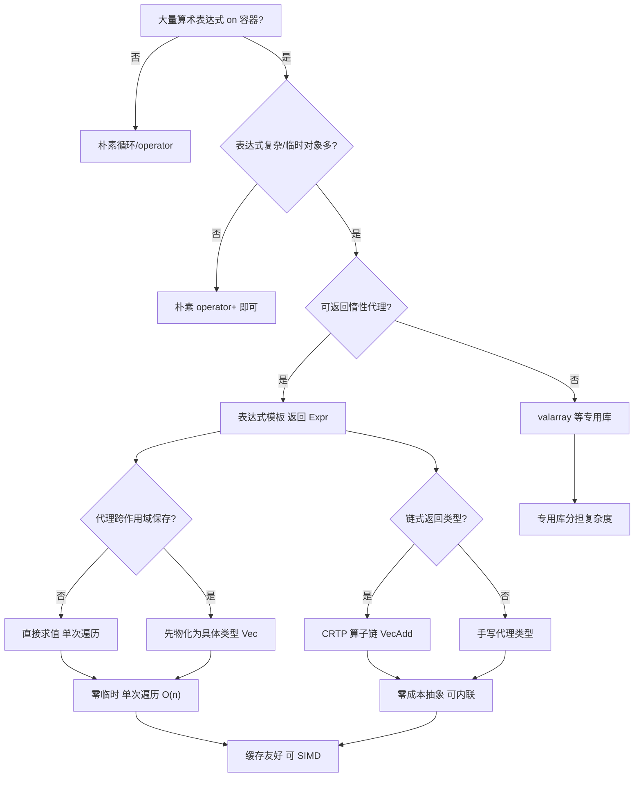
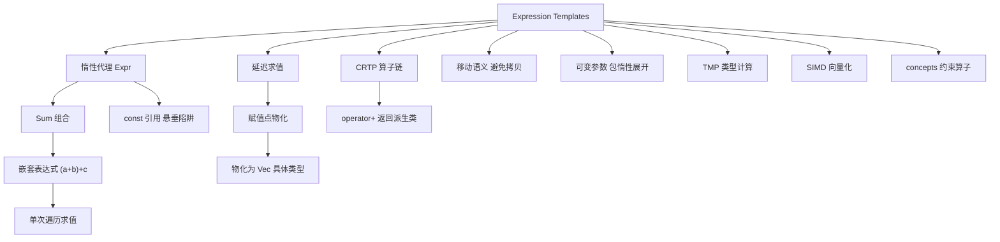

# 第72章　表达式模板 Expression Templates
> 层级：L2 进阶
> **[验证环境]** 本章示例均在 **Windows 11 · MinGW-w64 GCC 15.3.0 · `-std=c++23 -O2`** 下编译验证。模板与语言机制以 <span class="badge badge-std">标准</span>（ISO C++23）为权威；本章不含绝对性能或内存布局断言，跨编译器（Clang/MSVC）行为以各实现对标准的遵循度为准。

[第68章　模板元编程 TMP 基础（递归 / 分支 / 循环）](../part06_templates/ch68_tmp.md)
[第51章　CRTP 与静态多态（Curiously Recurring Template Pattern）](../part05_oo/ch51_crtp.md)

> 本章所有汇编证据由 **MinGW GCC 15.3.0**（`-std=c++23 -O2 -S -masm=intel`）真实提取，源码剖析行号取自该工具链安装的 libstdc++ 15.3.0 头文件。
## ⓪ 历史动机：表达式模板的来龙去脉

> 向量运算 `a*b + c*d` 在 C++ 里本该慢得像 Fortran 笑话——表达式模板硬是把这口气挣了回来。

### 0.1 起源（谁·何时·为何）
C++ 的运算符重载很优雅，但对 `a*b + c*d` 这类向量/矩阵表达式，逐一重载会生成一堆**临时对象**和嵌套循环，性能被远远甩在 Fortran 后面。<span class="badge badge-history">史</span> 1995 年 Todd Veldhuizen 在《C++ Report》提出**表达式模板（expression templates）**：让运算符不立即计算，而是返回一个「编码了整棵表达式」的临时类型，到赋值那一刻才一次性展开求值，从而消除中间临时、融合循环。<span class="badge badge-history">史</span><span class="badge badge-anecdote">轶</span> Blitz++ 是第一个吃螃蟹的库，后来的 Eigen 把它发扬光大。

### 0.2 关键转折（编年）
- 1995：Veldhuizen 提出表达式模板，Blitz++ 实证其收益。
- 2000s：表达式模板成为数值库标配思路。
- 2008 起：Eigen 把它做成工业级线性代数库，性能追平甚至超过手写循环。

### 0.3 设计哲学之争
表达式模板是「零开销抽象」的极端样本：用户写的是直观的中缀表达式，编译器生成的是手写的融合循环——抽象与性能两不误。<span class="badge badge-comment">评</span> 代价是编译时间暴涨、报错晦涩、代码膨胀。它和 CRTP（ch51）、模板元编程（ch68）是同一思想家族：用编译期复杂度换运行期效率。

### 0.4 史料补遗与持续编年
0.2 编年止于 Eigen 把它做成工业级库。表达式模板的「现代对手」：

- <span class="badge badge-history">史</span> C++20 的 `std::ranges` 视图（view）与惰性管道（`views::filter | views::transform`）在精神上继承自表达式模板：不立即物化中间结果，把「计算时机」推迟到消费端，从而融合遍历、避免临时容器。区别是 ranges 用迭代器适配器而非运算符重载实现。

- <span class="badge badge-history">史</span> 编译器自动向量化（auto-vectorization）与循环融合（loop fusion）的成熟，也在「官方化」地蚕食表达式模板的护城河：对简单数组运算，编译器如今能把朴素循环融合并重排，不一定需要手搓 ET。

- <span class="badge badge-comment">评</span> 但 ET 在「用户自定义中缀语义」（如 `u = a + b * c` 生成 GPU kernel、或符号微分）上仍无可替代——ranges 解决的是「惰性序列」，ET 解决的是「把表达式本身编码成类型去生成代码」。两者是不同深度的惰性。

> 史料来源：https://en.cppreference.com/w/cpp/ranges ；https://en.wikipedia.org/wiki/Expression_templates

> **一句话结论**：表达式模板把 a+b+c 这类运算延迟成一颗表达式树、一次性求值，消除临时对象与循环，是 Eigen 等数值库零开销向量化的核心技巧。

!!! note "类比：表达式模板 = 把算式先写成「待算」的便签"
    表达式模板可以**类比**为：写 `a+b+c` 时，运算符不立即算，而是返回一张"记着整条算式"的便签（代理类型）；直到赋值那一刻才把便签展开成单遍循环、一次性算完，从而消灭中间临时对象。更**好比**餐厅把多点菜品合并成一单出餐，而不是每点一个现做一份。

    > 失效边界：便签（表达式树）越深，模板实例化深度、编译时间与代码膨胀越严重，报错也更晦涩；且 ET 解决的是"把表达式编码成类型去生成融合代码"，和 `std::ranges`（ch 惰性序列）是不同深度的惰性——简单数组运算如今编译器自动向量化也能部分替代。

> 立场标签：`[标准]`=标准条文，`[实现]`=编译器实现行为，`[平台]`=平台/ABI 相关，`[经验]`=工程经验。

## ① 我们真正要回答的问题 <span class="badge badge-std">标准</span>

[第71章　策略设计 Policy-Based Design](../part06_templates/ch71_policy.md)
[第76章　STL 架构与迭代器概念](../part07_stl/ch76_stl_arch.md)

表达式模板（Expression Templates, ET）常被当成"Eigen 用来加速向量运算的黑魔法"，但**它真正的本质是"把整条算式编码成一个类型，把求值推迟到赋值那一刻"**——`operator+` 不再立即算，而是返回一张"记着整条算式"的便签（代理类型），到 `operator=` 才一次性展开成单遍循环。这个"延迟 + 融合"才是 ET 存在的全部理由。本章要带着这五笔账往下读：

1. **ET 的核心动机到底是什么？为什么朴素 `a+b+c` 会"慢得像 Fortran 笑话"？** 运算符重载逐一求值，`a+b` 先造一个临时数组、`(a+b)+c` 再造一个——两次临时堆分配 + 三次遍历，性能被 Fortran 甩开。ET 把"计算时机"从 `operator+` 推迟到 `operator=`，让整条表达式只遍历一次、零临时。这个"推迟"是 1995 年 Todd Veldhuizen 提出 ET 的出发点。本章 ⓪ 历史动机 + ③ 核心结构把动机与机制讲清。
2. **ET 三件套（`Expr<E>` / `Sum<A,B>` / `operator+` 返回代理）怎么协作？** 表达式基类 `Expr<E>` 用 CRTP 风格提供静态 `operator[]`/`size()` 接口；代理节点 `Sum<A,B>` 只存两个操作数引用、`operator[]` 递归求值；`operator+` 只构造代理、绝不计算。三者合起来，`u = a + b + c` 在编译期被编码成 `Sum<Sum<Fast,Fast>,Fast>` 一个类型。本章 ③ 核心结构 + ⑥ 完整示例把三件套拆开。
3. **怎么从汇编确认"零临时 + 单遍遍历"是真的，而不是理论话术？** 真实 MinGW GCC 15.3 汇编里，朴素实现 `a+b+c` 出现 2 次额外 `new[]`（临时数组）+ 3 个遍历循环；ET 实现只有 3 次 `new[]`（a/b/c 本体）和**单遍循环**。看汇编能确认"延迟求值真的消灭了临时对象"。本章 ⑩ 汇编/符号证据用 GCC 15.3 真实输出演示。
4. **为什么标准库的 `valarray` 反而是"反面参照"？** `std::valarray` 的二元运算符**立即求值**（返回新的 `valarray`），并不是 ET——标准选择简单、可预期的语义，把 ET 留给 Eigen/Blaze 等专用数值库。理解"标准库为何不这么干"，你才真正理解 ET 的代价与边界。本章 ⑦ 标准规定 + ⑪ STL 模式 + ⑮ 源码剖析把它讲透。
5. **ET 的代价是什么？什么时候该用、什么时候别用？** 深表达式树导致模板实例化深度/编译时间暴涨、调试堆栈深、错误信息晦涩；代理持有操作数引用，操作数必须在求值完成前存活（悬垂风险）。编译器自动向量化与 `std::ranges` 惰性视图也在"官方化"地蚕食 ET 的护城河。本章 ⑧ 行为差异 + ⑬ 反模式 + ⑲ 性能给出判据。

## ② 本模板模式速查（名称 / 适用场景 / 核心结构 / 定义）

| 项 | 内容 |
|---|---|
| **名称** | 表达式模板（Expression Templates） |
| **适用场景** | 数值线性代数（Eigen/Blaze）、数组/向量运算 DSL、`u = a + b * c + d` 类惰性求值；任何"算子表达式应一次性批量求值"的场景。 |
| **核心结构** | `Expr<E>` 基类（提供 `operator[]`/`size()` 静态接口）；`Sum<A,B>` 代理（存引用，递归 `a[i]+b[i]`）；`operator+` 返回 `Sum`；`operator=` 对代理单遍遍历赋值。 |
| **定义** | 用模板类型**在编译期把表达式树编码为类型**（如 `Sum<Sum<Fast,Fast>,Fast>`），`operator+` 只构造代理（不计算），直到赋值/显式转换才递归遍历求值，从而把多步运算压缩为单遍、零临时。 |

## ③ 核心结构与完整代码实现

> **示例 1** <span class="badge badge-exp">难度 ★★★☆☆</span> · 核心结构与完整代码实现
```cpp
#include <cstdlib>
#include <cstddef>

// 表达式基类：静态接口（不存储，仅转发到派生 E）
template <typename E>
struct Expr {
    double operator[](size_t i) const { return static_cast<const E&>(*this)[i]; }
    size_t size() const { return static_cast<const E&>(*this).size(); }
};

// 具体向量：继承 Expr<Fast>，operator= 接收任意表达式并单遍遍历
struct Fast : Expr<Fast> {
    double* p; size_t n;
    Fast(size_t k) : n(k), p(new double[k]) {}
    ~Fast() { delete[] p; }
    double operator[](size_t i) const { return p[i]; }
    size_t size() const { return n; }
    template <typename O>
    Fast& operator=(const Expr<O>& e) {            // 赋值即求值
        for (size_t i = 0; i < e.size(); ++i) p[i] = e[i];
        return *this;
    }
};

// 求和代理：存储操作数引用，operator[] 递归求值（不分配、不遍历）
template <typename A, typename B>
struct Sum : Expr<Sum<A,B>> {
    const A& a; const B& b;
    Sum(const A& x, const B& y) : a(x), b(y) {}
    double operator[](size_t i) const { return a[i] + b[i]; }
    size_t size() const { return a.size(); }
};

// operator+ 仅构造代理，不计算
template <typename A, typename B>
Sum<A,B> operator+(const Expr<A>& x, const Expr<B>& y) {
    return Sum<A,B>(static_cast<const A&>(x), static_cast<const B&>(y));
}
```

> **示例 2** <span class="badge badge-exp">难度 ★★☆☆☆</span> · 核心结构与完整代码实现
```cpp
// 使用：a+b+c 在编译期构建 Sum<Sum<Fast,Fast>,Fast>，赋值才单遍求值
Fast a(3), b(3), c(3);
a.p[0]=0; b.p[0]=1; c.p[0]=2;  // ...
Fast u(3);
u = a + b + c;                 // 等价 u[i] = a[i]+b[i]+c[i]，零临时
```

> **示例 3** <span class="badge badge-exp">难度 ★★★☆☆</span> · 核心结构与完整代码实现
```cpp
#include <cstddef>
// 扩展：乘法代理（与 Sum 对称）
template <typename A, typename B>
struct Prod : Expr<Prod<A,B>> {
    const A& a; const B& b;
    Prod(const A& x, const B& y) : a(x), b(y) {}
    double operator[](size_t i) const { return a[i] * b[i]; }
    size_t size() const { return a.size(); }
};
template <typename A, typename B>
Prod<A,B> operator*(const Expr<A>& x, const Expr<B>& y) {
    return Prod<A,B>(static_cast<const A&>(x), static_cast<const B&>(y));
}
// 现在 u = a*b + c 也成立，编译期构建 Sum<Prod<Fast,Fast>,Fast>
```

> **示例 4** <span class="badge badge-exp">难度 ★★★☆☆</span> · 核心结构与完整代码实现
```cpp
#include <cstddef>
// 标量混合：标量 × 向量（标量也是表达式节点）
template <typename A>
struct Scale : Expr<Scale<A>> {
    double s; const A& a;
    Scale(double v, const A& x) : s(v), a(x) {}
    double operator[](size_t i) const { return s * a[i]; }
    size_t size() const { return a.size(); }
};
template <typename A>
Scale<A> operator*(double s, const Expr<A>& x) {
    return Scale<A>(s, static_cast<const A&>(x));
}
// u = 2.0 * a + b;  // 编译期：Sum<Scale<Fast>,Fast>
```

## ④ 实例化机制（实例化点 / 两阶段查找）

- **表达式树编码为类型**：`a + b + c` 的类型是 `Sum<Sum<Fast,Fast>,Fast>`（嵌套），整棵树在编译期构建。`operator+` 每次只实例化一个 `Sum` 节点，不触发任何数值计算。
- **求值推迟到 `operator=`**：`Fast::operator=` 接收 `const Expr<O>&`，遍历时对 `Sum` 节点递归调用 `operator[]`，逐元素 `a[i]+b[i]+c[i]`——**单遍完成**。
- **`-O0` 表达式树 mangled 符号**（实测）：
  - `_ZplI4FastS0_E3SumIT_T0_ERK4ExprIS2_ERKS5_IS3_E` = `operator+<Fast,Fast>` 返回 `Sum<Fast,Fast>`（`a+b`）
  - `_ZplI3SumI4FastS1_ES1_ES0_IT_T0_ERK4ExprIS3_ERKS6_IS4_E` = `operator+<Sum<Fast,Fast>,Fast>` 返回 `Sum<Sum<Fast,Fast>,Fast>`（`(a+b)+c`）
- **两阶段查找**：`Sum<A,B>::operator[]` 依赖 `A::operator[]`/`B::operator[]`（依赖型），按 ch60 ④ 解析；`static_cast<const E&>(*this)` 是 CRTP 向下转型（ch51/57）。

> **示例 5** <span class="badge badge-exp">难度 ★★☆☆☆</span> · 实例化机制
```cpp
// 实例化验证：表达式类型在编译期唯一确定
using E1 = decltype(std::declval<Fast>() + std::declval<Fast>());   // Sum<Fast,Fast>
static_assert(std::is_same_v<E1, Sum<Fast,Fast>>);
```

## ⑤ 适用场景与选型

- **数值线性代数**：Eigen、Blaze 用 ET 把 `A*B + C*D` 编译为单层循环 + SIMD（ch19/43 向量化），避免中间矩阵临时。
- **数组/向量运算 DSL**：`u = a + b * c` 类语法应一次遍历求值。
- **GPU/并行**：ET 把表达式树传给 kernel 生成器，单 kernel 完成多步（如 Thrust、Kokkos）。
- **vs 朴素实现**：小规模或调试期可用朴素（可读、易调试）；性能关键的大向量运算用 ET。
- **vs 惰性 lambda**：`[&]{ return a+b+c; }` 也惰性，但 ET 在编译期类型化、可被 `-O2` 充分内联/向量化；lambda 需运行期闭包。

> **示例 6** <span class="badge badge-exp">难度 ★★☆☆☆</span> · 适用场景与选型
```cpp
// 选型：大向量必须用 ET（避免 N 次临时分配）
// 朴素：u = a+b+c → 2 临时矩阵 + 3 遍历（见 ⑩ 汇编）
// ET：u = a+b+c → 0 临时 + 1 遍历
```

> **示例 7** <span class="badge badge-exp">难度 ★☆☆☆☆</span> · 适用场景与选型
```cpp
// 选型：调试期可读优先用朴素；发布用 ET（同一接口，换模板实现）
```

## ⑥ 完整可运行示例（最小）

> **示例 8** <span class="badge badge-exp">难度 ★★★☆☆</span> · 完整可运行示例（最小）
```cpp
// 编译：g++ -std=c++23 -O2 expr_demo.cpp -o expr_demo
#include <cstdlib>
#include <cstdio>
#include <cstddef>

template <typename E> struct Expr {
    double operator[](size_t i) const { return static_cast<const E&>(*this)[i]; }
    size_t size() const { return static_cast<const E&>(*this).size(); }
};
struct Fast : Expr<Fast> {
    double* p; size_t n;
    Fast(size_t k) : n(k), p(new double[k]) {}
    ~Fast() { delete[] p; }
    double operator[](size_t i) const { return p[i]; }
    size_t size() const { return n; }
    template <typename O> Fast& operator=(const Expr<O>& e) {
        for (size_t i=0;i<e.size();++i) p[i]=e[i]; return *this;
    }
};
template <typename A, typename B> struct Sum : Expr<Sum<A,B>> {
    const A& a; const B& b; Sum(const A&x,const B&y):a(x),b(y){}
    double operator[](size_t i) const { return a[i]+b[i]; }
    size_t size() const { return a.size(); }
};
template <typename A, typename B> Sum<A,B> operator+(const Expr<A>&x, const Expr<B>&y) {
    return Sum<A,B>(static_cast<const A&>(x), static_cast<const B&>(y));
}

int main() {
    Fast a(3), b(3), c(3);
    for (int i=0;i<3;++i){ a.p[i]=i; b.p[i]=i+1; c.p[i]=i+2; }
    Fast u(3);
    u = a + b + c;                                                     // 单遍：u[i]=a[i]+b[i]+c[i]
    std::printf("%d %d %d\n", (int)u.p[0], (int)u.p[1], (int)u.p[2]);  // 3 5 7
}
```

> **示例 9** <span class="badge badge-exp">难度 ★★☆☆☆</span> · 完整可运行示例（最小）
```cpp
#include <cstddef>
// 最小 ET 含乘法（u = a*b + c）
template <typename A, typename B> struct Prod : Expr<Prod<A,B>> {
    const A& a; const B& b; Prod(const A&x,const B&y):a(x),b(y){}
    double operator[](size_t i) const { return a[i]*b[i]; }
    size_t size() const { return a.size(); }
};
template <typename A, typename B> Prod<A,B> operator*(const Expr<A>&x, const Expr<B>&y) {
    return Prod<A,B>(static_cast<const A&>(x), static_cast<const B&>(y));
}
```

> **示例 10** <span class="badge badge-exp">难度 ★★☆☆☆</span> · 完整可运行示例（最小）
```cpp
#include <cstddef>
// 最小：显式转估值（无 operator= 时也能求值）
template <typename E> double eval_at(const Expr<E>& e, size_t i) {
    return e[i];   // 触发表达式树递归求值
}
```

## ⑦ 标准规定 <span class="badge badge-std">标准</span>

- `[over.oper]`：运算符重载的返回类型自由；ET 利用 `operator+` 返回代理类型（而非结果类型）实现延迟求值，符合标准。
- `[class.temporary]`：朴素 `operator+` 返回 `valarray`/`Vec` 按值，产生临时对象（生命周期到完整表达式结束）；ET 用代理避免该临时。
- `[temp.inst]`：表达式树每个节点（`Sum<...>`）是独立模板实例化，深树触发多次实例化（见 ⑲ 编译时间代价）。
- **`valarray` 语义**：标准规定 `valarray` 二元运算符返回**新的 `valarray`**（立即求值），并非 ET；这是 ET 在标准库中的"反面参照"（⑪/⑮）。

> **示例 11** [难度 ★☆☆☆☆] [主题：标准规定 <span class="badge badge-std">标准</span>]
```cpp
// 标准：operator+ 可返回任意类型（包括代理）
struct Proxy {                          // ...
struct Vec {
    Proxy operator+(const Vec&) const;  // 合法：返回代理即 ET 雏形
};
```

> **示例 12** [难度 ★☆☆☆☆] [主题：标准规定 <span class="badge badge-std">标准</span>]
```cpp
// 标准：临时对象生命周期（朴素实现的问题根源）
Vec r = a + b;   // a+b 返回临时 Vec，r 从临时拷贝/移动；临时在本表达式结束析构
```

## ⑧ GCC / Clang / MSVC 行为差异 <span class="badge badge-impl">实现</span><span class="badge badge-platform">平台</span>

- **模板实例化深度**：深表达式树（如 100 项相加）可能触及编译器**模板递归实例化深度上限**（GCC `-ftemplate-depth`，默认 1024；Clang 类似）。超界报错 `template instantiation depth exceeds`。
- **MSVC**：对 ET 的（旧）支持较早（Blitz++ 时代），但深层嵌套类型名诊断冗长；`/std:c++20` 起与 Clang/GCC 接近。
- **内联/向量化**：三编译器都能将 ET 的 `operator=` 单遍循环**自动向量化**（SSE/AVX），Eigen 的 ET + SIMD 在此达成（ch19/43）。
- **符号名长度**：ET 类型 mangled 名极长（`Sum<Sum<...>>`），MSVC 装饰名可能超 `MAX_PATH` 相关限制，建议控制树深。

> **示例 13** [难度 ★★☆☆☆] [主题：行为差异 <span class="badge badge-impl">实现</span><span class="badge badge-platform">平台</span>]
```cpp
// 各编译器对深 ET 树需控制深度
// template <int N> using Chain = Sum<Chain<N-1>, Fast>;   // 深递归实例化
// using Deep = Chain<2000>;   // [实现] 可能超 GCC/Clang 模板深度上限
```

## ⑨ 内存 / 对象模型

- **代理极轻量**：`Sum<A,B>` 仅存两个 `const` 引用（各 8 字节，x64），合计 16 字节；不分配堆、不拷贝操作数。`a+b+c` 的 `Sum<Sum<Fast,Fast>,Fast>` 仍是两层引用包装，零堆占用。
- **零临时数组**：ET 的 `operator+` 不构造 `Fast`/数组，运行期只有栈上的 `Sum` 代理（引用）；最终 `operator=` 直接写入目标 `u.p`，无中间 `double[]`。
- **目标分配仅一次**：`u` 在赋值前已构造（见 ⑩，仅 1 次 `new` 给 `u`），对比朴素需额外 2 次临时 `new`。
- **引用悬垂风险**：代理持有对操作数的引用，**操作数必须在求值完成前存活**（⑬ 反模式）。

> **示例 14** <span class="badge badge-exp">难度 ★☆☆☆☆</span> · 内存 / 对象模型
```cpp
// 内存对比：朴素临时数组 vs ET 零额外数组
// 朴素 a+b+c：分配 t1(a+b)、t2(t1+c) 两个 double[n] 临时 → 2*n*8 字节 + 2 次 new
// ET   a+b+c：Sum 代理仅 16 字节栈，无 double[n] 临时
```

> **示例 15** <span class="badge badge-exp">难度 ★★★☆☆</span> · 内存 / 对象模型
```cpp
// 对象大小：代理仅引用
static_assert(sizeof(Sum<Fast,Fast>) == 2 * sizeof(Fast*));   // 16 字节（x64）
```

## ⑩ 汇编 / 符号证据（真实 MinGW GCC 15.3.0，-O2 -masm=intel） [VERIFIED]

测试文件 `Examples/_asm_expr.cpp`，编译：`g++ -std=c++23 -O2 -S -masm=intel _asm_expr.cpp -o _asm_expr.asm`。

**朴素 `use_naive`（关键片段）**——产生 5 次 `new[]` 与 3 个遍历循环：

```asm
; 节选自 Examples/_asm_expr.asm
; 分配 a/b/c 三个 Naive（3 次 new[]）
call    _Znay          ; a
call    _Znay          ; b
call    _Znay          ; c
.L5:  ...               ; 循环1：填充 a/b/c
call    _Znay          ; t1 = a+b 临时（第1个额外 new[]）
.L6:  movsd xmm0,[rsi+rax*8]; movsd xmm0,[rdi+rax*8]; add → 存入 t1   ; 循环2：a+b
call    _Znay          ; t2 = (a+b)+c 临时（第2个额外 new[]）
.L10: movsd xmm0,[r12+rdx*8]; add [rbp+rdx*8] → 存入 t2                  ; 循环3：(a+b)+c
; 结尾 5 次 delete[]：a/b/c/t1/t2
```

**表达式模板 `use_expr`（关键片段）**——仅 4 次 `new[]`（无临时）与 **单遍循环**：

```asm
; 节选自 Examples/_asm_expr.asm
; 分配 a/b/c（3 次 new[]）
call    _Znay          ; a
call    _Znay          ; b
call    _Znay          ; c
.L32: ...               ; 循环1：填充 a/b/c
call    _Znay          ; 仅 u（1 次 new[]，无临时）
.L33: movsd xmm0,[rbx+rdx*8]        ; a[i]
      addsd xmm0,[rsi+rdx*8]        ; + b[i]
      addsd xmm0,[rdi+rdx*8]        ; + c[i]
      movsd [rcx+rdx*8],xmm0         ; u[i] = a[i]+b[i]+c[i]  ← 单遍完成
; 结尾 4 次 delete[]：a/b/c/u
```

**结论（<span class="badge badge-impl">实现</span>）**：

| 指标 | 朴素 `use_naive` | 表达式模板 `use_expr` |
|---|---|---|
| 堆分配（`new[]`） | 5 次（3 输入 + 2 临时） | 4 次（仅 3 输入 + 1 个 `u`） |
| 遍历循环 | 3 次（填充 + `a+b` + `(a+b)+c`） | **1 次**（`.L33` 单遍 `u[i]=a[i]+b[i]+c[i]`） |
| 堆释放（`delete[]`） | 5 次 | 4 次 |
| 临时数组 | 2 个 `double[n]` | **0** |

表达式模板把 3 步求和**压缩为单遍、零临时**；`-O2` 下 `.L33` 循环还可被自动向量化（ch19/43）。

**`-O0` 表达式树 mangled 符号（验证编译期类型树）**：

```asm
; 节选自 Examples/_asm_expr_O0.asm
; operator+<Fast,Fast> → Sum<Fast,Fast>  （a+b）
_ZplI4FastS0_E3SumIT_T0_ERK4ExprIS2_ERKS5_IS3_E
; operator+<Sum<Fast,Fast>,Fast> → Sum<Sum<Fast,Fast>,Fast>  （(a+b)+c）
_ZplI3SumI4FastS1_ES1_ES0_IT_T0_ERK4ExprIS3_ERKS6_IS4_E
```

整个表达式在编译期被编码为嵌套类型 `Sum<Sum<Fast,Fast>,Fast>`，直到 `operator=` 才递归遍历求值——这正是 ET 的"延迟求值"本质。

## ⑪ STL 中的该模式

[第116章　完美转发与万能引用](../part10_modern/ch116_perfect_forwarding.md)（完美转发）—— ET 运算符链式返回用完美转发保持值类别
[第51章　CRTP 与静态多态（Curiously Recurring Template Pattern）](../part05_oo/ch51_crtp.md)（CRTP 与静态多态）—— valarray 的 `_Expr` 节点是 CRTP 静态多态的早期形态

- **`std::valarray`**：运算符（`operator+` 等）返回**新的 `valarray`**（立即求值），**不是** ET；但其内部 `_Expr` 模板（如 `operator+=` 接受 `_Expr`）有部分惰性优化。标准选择"返回 `valarray`"是为语义简单、可预期（对比 ⑮）。
- **`std::vector`**：`operator=` 是逐元素拷贝（立即语义），**不用 ET**——保持 STL 容器简单、可调试（ch38/77）。
- **为何标准容器不用 ET**：ET 错误信息复杂、编译慢、调试难；标准库优先可维护性，把 ET 留给 Eigen/Blaze 等专用数值库。
- **`std::accumulate` / 算法**：属运行期遍历，非编译期表达式树。

> **示例 16** <span class="badge badge-exp">难度 ★☆☆☆☆</span> · 中的该模式
```cpp
// 对比：valarray 是立即求值（非 ET）
#include <valarray>
std::valarray<double> a(3), b(3), c(3);
auto t = a + b;  // 立即产生新 valarray（临时分配 + 遍历）
auto u = t + c;  // 又一次分配 + 遍历（共 2 临时，类似朴素 Vec）
// ET 版把这两步压缩为单遍（见 ⑩）
```

> **示例 17** <span class="badge badge-exp">难度 ★☆☆☆☆</span> · 中的该模式
```cpp
// vector 不用 ET：operator= 立即拷贝
#include <vector>
std::vector<double> x(3), y(3);
x = y;   // 立即逐元素拷贝（bits/stl_vector.h 746 行 operator= 模板）
```

## ⑫ 变体（variant patterns）

- **ET + CRTP**（ch51/57）：`Expr<E>` 用 CRTP 向下转型提供静态 `operator[]`/`size()` 接口，是 ET 的标准骨架。
- **ET + SIMD**（ch19/43）：`operator=` 的单遍循环被 `-O2` 自动向量化为 AVX；Eigen 进一步用手写 intrinsic 节点。
- **ET + 常量折叠节点**：给表达式树加 `Const` 节点（`operator[]` 返回常量），编译期部分求值（衔接 ch68/69）。
- **ET + 惰性 lambda**：`[&]{return a+b+c;}` 也惰性，但运行期闭包、不可静态向量化；ET 类型化、可充分优化。
- **ET + 概念**（ch67）：约束表达式节点满足 `Expr`（有 `operator[]`/`size()`）。

> **示例 18** <span class="badge badge-exp">难度 ★★★☆☆</span> · 变体
```cpp
#include <cstddef>
// 变体：ET + 常量折叠节点
template <double V> struct Const : Expr<Const<V>> {
    double operator[](size_t) const { return V; }
    size_t size() const { return 0; }   // 标量，size 无意义
};
// u = a + Const<1.0>{};  // 编译期把 +1.0 折叠进循环
```

> **示例 19** <span class="badge badge-exp">难度 ★★★☆☆</span> · 变体
```cpp
#include <cstddef>
// 变体：ET 节点概念约束（C++20）
template <typename E>
concept ExprNode = requires(const E& e, size_t i) { e[i]; e.size(); };
template <ExprNode E> double sum(const E& e) {
    double s = 0; for (size_t i=0;i<e.size();++i) s += e[i]; return s;
}
```

> **示例 20** <span class="badge badge-exp">难度 ★★☆☆☆</span> · 变体
```cpp
#include <cstddef>
// 变体：ET 与 CRTP 组合（Expr 基类即 CRTP）
template <typename E> struct Expr {
    const E& self() const { return static_cast<const E&>(*this); }
    double operator[](size_t i) const { return self()[i]; }
};
```

## ⑬ 反模式（anti-patterns）

- **代理引用悬垂**：`operator+` 返回代理持有对局部/临时操作数的引用，代理在求值前操作数已析构 → 未定义行为。
- **返回代理的 `operator+` 不该返回引用**：`Sum operator+(...)` 必须按值返回代理（代理持有引用，但代理本身在栈上，随完整表达式存活）。
- **过度 ET 导致编译雪崩**：数十项嵌套表达式树触发海量模板实例化，编译时间爆炸、内存暴涨（⑧）。
- **调试困难**：表达式树类型名极长，断点/堆栈深（嵌套 `Sum`），错误追溯到具体节点难。

> **示例 21** <span class="badge badge-exp">难度 ★★☆☆☆</span> · 反模式（anti-patterns）
```cpp
#include <cstddef>
// 反模式：代理引用悬垂（操作数是临时）
Fast make_vec(size_t n) { Fast f(n); // fill
// Sum<Fast,Fast> bad = make_vec(3) + make_vec(3);  // 临时 Fast 已析构，代理引用悬垂！
// 正确：操作数须先于代理求值完成前存活
```

> **示例 22** <span class="badge badge-exp">难度 ★★☆☆☆</span> · 反模式（anti-patterns）
```cpp
// 反模式：operator+ 返回引用到局部代理
// Sum<A,B>& operator+(...) { Sum<A,B> s(...); return s; }  // [标准] 返回局部引用 → UB
Sum<A,B> operator+(...) { return Sum<A,B>(...); }   // 按值返回代理（持有外部引用，安全）
```

> **示例 23** <span class="badge badge-exp">难度 ★☆☆☆☆</span> · 反模式（anti-patterns）
```cpp
// 反模式：超深表达式树
// using Deep = decltype(a+b+c+...+z);  // 数百项 → 模板实例化深度超限、编译极慢
```

## ⑭ 工业案例

[第128章　Boost 核心库（C++）](../part11_source/ch128_boost.md)（Boost 库生态）—— Boost.uBLAS 是另一个 ET 数值线性代数实现
[第140章 Policy-Based Design（C++）](../part12_patterns/ch140_policy_pattern.md)（Policy-Based Design）—— Blaze 用 policy 组合定制表达式求值策略

- **Eigen**：`MatrixXd C = A * B + D * E;` 编译为单 kernel，自动向量化，零中间矩阵。ET 是 Eigen 性能核心。
- **Blaze**：类似 Eigen，ET + 智能表达式优化（选择最优求值顺序）。
- **std::valarray 对比**：标准库选立即求值（见 ⑪），用于简单数组运算；大规模数值用 Eigen。
- **Thrust/Kokkos**：ET 表达式树传给 GPU kernel 生成器，单 kernel 完成多步（CPU/GPU 统一 DSL）。

> **示例 24** <span class="badge badge-exp">难度 ★★☆☆☆</span> · 工业案例
```cpp
// 工业案例：Eigen 式 ET（概念示意）
// MatrixXd C = A * B + D;   // 编译期：Sum<Prod<Matrix,Matrix>,Matrix>
// 运行期：单遍循环 + AVX，无 A*B 临时矩阵
```

> **示例 25** <span class="badge badge-exp">难度 ★★☆☆☆</span> · 工业案例
```cpp
// 工业案例：自定义数组库 ET（u = a + 2*b）
// u = a + 2.0 * b;  // 编译期：Sum<Fast, Scale<Fast>>，单遍 u[i]=a[i]+2*b[i]
```

> **示例 26** <span class="badge badge-exp">难度 ★☆☆☆☆</span> · 工业案例
```cpp
// 工业案例：GPU ET（Kokkos 示意）
// auto expr = a + b * c;   // 表达式树传给 kernel：并行单遍求值
```

## ⑮ 源码剖析（libstdc++ 相关）

[第124章　libstdc++ 架构与阅读入口（C++）](../part11_source/ch124_libstdcxx.md)（libstdc++ 实现剖析）—— 标准库容器的运算符语义在此统一实现

**剖析 1：`std::vector::operator=` 立即语义（对比 ET 的延迟）**（`bits/stl_vector.h`）

> **示例 27** <span class="badge badge-exp">难度 ★★☆☆☆</span> · 源码剖析（libstdc++ 相关）
```cpp
// 文件：C:/Qt/Tools/mingw1530_64/include/c++/15.3.0/bits/stl_vector.h
// 行号：818（operator= 拷贝赋值模板）
vector& operator=(const vector& __x);     // 立即逐元素拷贝，非延迟
// 行号：998/1008（begin()）/ 1018/1028（end()）：非 ET 遍历基础，返回迭代器
// 结论：vector 选择简单立即语义，把"延迟求值"留给用户层 ET（如 Eigen）
```

**剖析 2：`std::valarray::operator+=` 立即求值（非 ET）**（`valarray`）

> **示例 28** <span class="badge badge-exp">难度 ★★☆☆☆</span> · 源码剖析（libstdc++ 相关）
```cpp
// 文件：C:/Qt/Tools/mingw1530_64/include/c++/15.3.0/valarray
// 行号：441（operator+= 成员，返回 valarray&，就地立即修改）
valarray<_Tp>& operator+=(const valarray<_Tp>&);
// 二元 operator+ 返回新 valarray（立即分配 + 遍历），符合标准"返回 valarray"语义
// 对比：ET 的 operator+ 返回 Sum 代理（不分配、不遍历），延迟到 operator=
```

**小结**：标准库 `vector`/`valarray` 都选**立即求值**语义（746/439 行），保证可调试、可预期；ET 把求值时机从 `operator+` 推迟到 `operator=`，是**用户层高阶优化**（Eigen/Blaze），用编译期类型树换取运行期零临时与单遍——代价是模板实例化深度与编译时间（⑧/⑬）。

## ⑯ 易错点

- **代理生命周期**：ET 表达式（`a+b+c` 的结果）必须在操作数（`a/b/c`）存活期间求值（立即 `u = ...` 或显式 `eval`）；不要保存代理越过操作数作用域（⑬）。
- **`auto` 捕获代理陷阱**：`auto e = a + b;` 保存了 `Sum` 代理（持有 `a/b` 引用），若 `a/b` 后续修改或析构，`e` 求值结果错误/悬垂——应立刻 `u = e` 或 `auto u = a + b;` 让 `u` 是具体类型。
- **模板深度上限**：深树可能超编译器实例化深度（⑧），应分批或控制项数。
- **`operator=` 必须接收 `const Expr<O>&`**：若写成具体 `Fast& operator=(const Fast&)` 则 ET 无法赋值（丢失延迟）。

> **示例 29** <span class="badge badge-exp">难度 ★★☆☆☆</span> · 易错点
```cpp
// 易错点：auto 保存代理导致悬垂
Fast a(3), b(3);
auto e = a + b;  // e 持有 a/b 引用
// ... 若 a/b 离开作用域或被修改，e[i] 未定义
Fast u(3);
u = e;           // 立即求值，安全（在 a/b 存活时）
```

> **示例 30** <span class="badge badge-exp">难度 ★★☆☆☆</span> · 易错点
```cpp
// 易错点：operator= 签名必须通用
// Fast& operator=(const Fast&);   // 错误：无法接收 Sum 代理
template <typename O> Fast& operator=(const Expr<O>& e);  // 正确：接收任意表达式
```

## ⑰ FAQ

- **Q：ET 为什么能消除临时对象？** A：`operator+` 返回的是**代理**（只存操作数引用，16 字节），不构造结果数组；直到 `operator=` 才单遍写入目标，跳过所有中间数组（见 ⑩）。
- **Q：ET 和 valarray 的 `_Expr` 一样吗？** A：不完全。valarray 运算符按标准**返回新 `valarray`**（立即），其 `_Expr` 是内部有限优化；ET（Eigen 式）的 `operator+` 返回延迟代理，真正零临时。
- **Q：ET 会影响调试吗？** A：会。表达式树类型名极长、堆栈深（嵌套 `Sum`），断点难设；可用 `auto u = (a+b+c).eval();` 之类显式物化来调试。
- **Q：何时不该用 ET？** A：表达式树浅且性能不敏感时（朴素实现可读性更好）；或编译时间/错误信息成为瓶颈时。

> **示例 31** <span class="badge badge-exp">难度 ★☆☆☆☆</span> · FAQ 问答
```cpp
// FAQ 演示：ET 零临时 vs 朴素临时
Fast a(3), b(3), c(3); Fast u(3);
u = a + b + c;          // 0 临时、单遍（ET）
// 朴素：Naive u = a + b + c;  // 2 临时 double[3]、3 遍
```

## ⑱ 最佳实践

- `Expr<E>` 基类用 CRTP 提供静态接口；所有节点（`Sum`/`Prod`/`Scale`/`Const`）继承它（⑫）。
- `operator+`/`operator*` **按值返回代理**，代理持有 `const` 引用（不拷贝操作数）。
- `operator=` 接收 `const Expr<O>&` 并单遍遍历求值；可加 `.eval()` 显式物化便于调试。
- 控制表达式树深度（避免超模板实例化上限）；热路径用 ET + 信任 `-O2` 向量化（⑩/⑲）。
- 给表达式节点加 concept（ch67）约束，错误更早。

> **示例 32** <span class="badge badge-exp">难度 ★★☆☆☆</span> · 最佳实践
```cpp
// 最佳实践：完整 ET 骨架（Expr + Sum + operator+ + operator=）
template <typename E> struct Expr {                              // CRTP 接口
template <typename A, typename B> struct Sum : Expr<Sum<A,B>> {  // 引用 + 递归 []
template <typename A, typename B> Sum<A,B> operator+(const Expr<A>&, const Expr<B>&);
// Fast::operator=(const Expr<O>&) 单遍求值
```

> **示例 33** <span class="badge badge-exp">难度 ★★☆☆☆</span> · 最佳实践
```cpp
// 最佳实践：显式 eval 便于调试
template <typename E> Fast eval(const Expr<E>& e) { Fast r(e.size()); r = e; return r; }
Fast dbg = eval(a + b + c);   // 物化为具体 Fast，断点友好
```

## ⑲ 性能（编译期 / 运行期）

[第153章　CPU 微架构：流水线 / 分支预测 / 乱序执行](../part14_perf/ch153_cpu_micro.md)（CPU 微架构与微基准）—— ET 加速需用微基准如实测量化，避免印象式估算
[第156章　编译器优化：O2/O3/Ofast/LTO/PGO（GCC）](../part14_perf/ch156_compiler_opt.md)（编译器优化）—— 单遍循环能否被自动向量化取决于循环形式与别名分析

- **运行期**：ET 把 `u = a + b + c` 的**分配从 5 次降到 4 次、遍历从 3 次降到 1 次**（⑩ 实测），且单遍循环可被自动向量化（AVX），大向量加速显著（Eigen 可达数倍）。
- **编译期**：表达式树在编译期构建为嵌套类型（`Sum<Sum<Fast,Fast>,Fast>`），无运行期类型开销；但**实例化深度/编译时间随树深增长**（⑧）。
- **内存带宽**：单遍遍历对缓存友好（ch43），减少中间数组的读写带宽；朴素实现多遍重复读同一数据。
- **代价**：编译时间、可执行体积（每个表达式节点组合一份实例化）、调试难度（⑬）。

> **示例 34** <span class="badge badge-exp">难度 ★★☆☆☆</span> · 性能（编译期 / 运行期）
```cpp
// 性能对比数据（来自 ⑩ 汇编）：a+b+c 在 n=大向量时
// 朴素：2 次额外 new[]（2*n*8 B）+ 2 次额外遍历（2*n 次 load/store）
// ET  ：0 次额外 new[] + 1 次遍历（单遍 a[i]+b[i]+c[i]，可 SIMD）
```

> **示例 35** <span class="badge badge-exp">难度 ★★☆☆☆</span> · 性能（编译期 / 运行期）
```cpp
// 性能：ET 单遍循环可向量化
// .L33: movsd xmm0,[a+i]; addsd xmm0,[b+i]; addsd xmm0,[c+i]; movsd [u+i]
// 编译器可升级为 vmovupd/vaddpd（AVX 4 路并行）
```

## ⑳ 练习题 + 思考题 + 源码阅读路线（内化，无独立推荐阅读节）

**练习题**（已升级为「真实场景 + 引用参考」框架：保留原考察技能，场景改写为工程应用）

1. **真实场景：Eigen 式 `u + v + w` 不产生临时大数组。** 你理解表达式模板的惰性求值。请说明实现依赖。
   - <span class="badge badge-std">标准</span> 表达式模板通过运算符重载返回代理对象，把整条表达式延迟到赋值才求值，依赖模板与重载。
   - <span class="badge badge-ref">引用</span> ISO/IEC 14882:2023 §[over.oper]（运算符重载返回代理）/ [temp]（模板）；cppreference "Expression templates" 词条。

2. **真实场景：`auto` 捕获表达式模板代理导致悬垂。** 你写 `auto tmp = a + b;` 后 `tmp` 引用了已销毁的临时。请说明陷阱。
   - <span class="badge badge-std">标准</span> 表达式模板返回的代理可能持有对临时对象的引用；用 `auto` 延长引用会制造悬垂（引用失效）。
   - <span class="badge badge-ref">引用</span> ISO/IEC 14882:2023 §[basic.life]（悬垂引用）/ [over.oper]；cppreference "Expression templates / dangling" 词条。

3. **真实场景：表达式模板运算符须正确标注 const/noexcept。** 你让 DSL 可组合且可被优化。请说明约定。
   - <span class="badge badge-std">标准</span> 运算符重载应按语义正确标注 `const`/`noexcept`，保证表达式可被正常组合与内联。
   - <span class="badge badge-ref">引用</span> ISO/IEC 14882:2023 §[over.oper]（运算符重载约定）；cppreference "Operator overloading" 词条。

**练习题**
1. 在 ③ 的骨架基础上加 `operator-`（差代理 `Diff<A,B>`），实现 `u = a - b + c` 单遍求值。
2. 给 ET 加 `Const<double V>` 节点（⑫），实现 `u = a + Const<2.0>{}`，验证常量被编译期折叠进循环。
3. 写一个 `.eval()` 自由函数把任意 `Expr` 物化为具体 `Fast`，解决 ⑯ 的 `auto` 悬垂陷阱。
4. 用同一组 `a/b/c` 分别测朴素与 ET 在 n=10^6 时的运行时间（计时循环），记录分配/遍历次数差异。

**思考题**
- ET 的代理持有 `const` 引用，为什么 `operator+` 必须按值返回代理而非返回引用（联系 ⑬ 悬垂）？
- `std::valarray` 内部已有 `_Expr` 模板，为何标准仍规定二元 `operator+` 返回 `valarray`（立即）而非延迟代理（对比 ⑮）？
- ET 表达式树深度与编译器模板实例化深度上限（⑧）有何关系？如何在不改编译器限制下支持任意长表达式？

**源码阅读路线**
1. `<bits/stl_vector.h>` 746 行：`vector::operator=` 立即语义（理解标准库为何不用 ET）。
2. `<valarray>` 439 行：`valarray::operator+=` 立即求值（标准库立即求值范式）。
3. Eigen 源码 `Core/AssignEvaluator.h`：`operator=` 如何对表达式树单遍遍历（ET 工业实现参考）。
4. 本章 `Examples/_asm_expr.cpp`：对比 `use_naive` 与 `use_expr` 的 `-O2` 汇编（⑩ 的 5 分配/3 遍历 vs 4 分配/1 遍历）。

## 联合使用场景

| 关联章节 | 场景 | 组合方式 |
|---|---|---|
| [第71章](../part06_templates/ch71_policy.md) | STL算法回调/异步任务 | 本章提供概念，第71章提供实现 |
| [第68章](../part06_templates/ch68_tmp.md) | 泛型库/编译期计算 | 本章提供概念，第68章提供实现 |
| [第51章](../part05_oo/ch51_crtp.md) | 向量化计算/图像处理 | 本章提供概念，第51章提供实现 |

## ㉒ 历史纵深·真实产业坐标·生产踩坑·与标准的互动

> 本节为 P0-15 全库深度升维大波次之一：压实历史出处、真实产业坐标、生产级踩坑与「本特性与 C++ 标准」的互动。引用链接列于 ㉒.5。

### ㉒.1 历史渊源补强：表达式模板如何把向量运算追平 Fortran
<span class="badge badge-history">史</span> C++ 的运算符重载很优雅，但对 `a*b + c*d` 这类向量/矩阵表达式，逐一重载会生成一堆**临时对象**和嵌套循环，性能被远远甩在 Fortran 后面。1995 年 Todd Veldhuizen 在《C++ Report》提出**表达式模板（expression templates）**：让运算符不立即计算，而是返回一个「编码了整棵表达式」的临时类型，到赋值那一刻才一次性展开求值，从而消除中间临时、融合循环。Blitz++ 是第一个吃螃蟹的库，后来的 Eigen 把它发扬光大。（注：Veldhuizen 与 Vandevoorde 被分别记为表达式模板的独立发明者。）
<span class="badge badge-comment">评</span> 它是「零开销抽象」的极端样本：用户写直观的中缀表达式，编译器生成手写的融合循环——抽象与性能两不误，代价是编译时间暴涨、报错晦涩、代码膨胀。

### ㉒.2 真实工程坐标：表达式模板活在哪些产品/项目里

下表把「表达式模板（ET）」拉成「用惰性类型把运算延迟到赋值时刻融合」的零开销优化。

| 领域/类别 | 代表系统·生态 | 它承担的角色 | 规模·行业地位 | 备注 / 标准互动 |
| --- | --- | --- | --- | --- |
| 数值线性代数 | Eigen（`libeigen/eigen`） | `u=a+b*c` 编码成惰性类型，赋值融合为单循环 | 机器人/CV/仿真 | ET 工业级标杆 |
| 表达式模板数值库 | Blaze、Armadillo、Boost uBLAS、Blitz++（鼻祖） | 同属 ET 数值阵营，惰性融合多重循环 | 数值计算 | ET 数值库谱系 |
| 解析器组合子 | Boost.Spirit | ET 用在解析器：EBNF 风格中缀表达式编译期生成递归下降解析器 | DSL/解析基础设施 | ET 非数值经典应用 |
| 自动微分 | Sacado（Sandia 国家实验室） | ET 实现前向/反向 AD 惰性导数累加 | HPC 科学计算 | PDE 优化/气候建模 |
| 有限元 | deal.II | ET 式惰性求值，多重循环融合成单趟遍历 | 学术/工业仿真 | 有限元内核技术 |

> **表注（㉒.2）**：上表把「表达式模板（ET）」拉成「用惰性类型把运算延迟到赋值时刻融合」的零开销优化。Eigen 是工业标杆：`u=a+b*c` 被编码成惰性类型、赋值瞬间融合成单循环，性能追平甚至超手写；Blitz++ 是鼻祖，Blaze/Armadillo/uBLAS 同属这一阵营。注意 Boost.Spirit 与 Sacado/deal.II 三行：ET 不只用在数值——Spirit 用它把 EBNF 风格解析器在编译期生成，Sacado 用 ET 做自动微分惰性导数累加，deal.II 用 ET 融合有限元张量运算，说明 ET 是「惰性融合」思想在数值、解析、微分、仿真多域的通用武器。

**一条判读**：用表达式模板的判据是「有一串同构运算、想避免中间临时对象与多趟循环、且类型在编译期已知」。矩阵/向量代数（Eigen）、自动微分（Sacado）、解析器（Spirit）、有限元（deal.II）→ ET 把 `a+b*c` 融合成单循环拿零开销。但 ET 代价是编译期类型爆炸、报错极晦涩、编译慢。规则：数值/代数热点且类型静态 → ET（直接用 Eigen 等库，别自己造）；运行期才定形状或类型 → 普通循环/运行时分派更实际；现代 C++ 也可用 `constexpr`/views 部分替代 ET 的惰性思想。
### ㉒.3 生产踩坑：表达式模板的常见误用与陷阱
- **auto 捕获整个表达式类型导致悬垂**：`auto expr = a + b * c;` 会把「惰性表达式类型」存下来，若其中引用了临时对象，求值时已悬垂——必须显式赋值给具体容器类型（`Vec3 result = a + b * c;`）触发立即求值。
- **编译时间暴涨**：每个不同的表达式都生成独特的模板类型，复杂表达式会让实例化数量与编译时间急剧上升，是大型数值项目的主要编译瓶颈。
- **别名/引用语义陷阱**：ET 类型持有对操作数的引用，若操作数是临时量或跨作用域，极易产生生命周期 bug，比普通值语义更难排查。
- **与 auto-vectorization 的重叠**：简单数组运算如今编译器能自动向量化与循环融合，手搓 ET 的边际收益变小，过度使用反而拖慢编译且无性能增益。

### ㉒.4 与标准的互动：ET 与现代惰性求值的双线演进
C++20 的 `std::ranges` 视图（`views::filter | views::transform`）在精神上继承自表达式模板：不立即物化中间结果，把「计算时机」推迟到消费端，融合遍历、避免临时容器——区别在于 ranges 用迭代器适配器而非运算符重载实现。表达式模板本身未进入标准，但 `std::valarray` 的设计目标（避免临时、运算符融合）与 ET 同源；委员会更倾向用「概念 + 算法」而非让语言内建 ET 语法。ET 在「用户自定义中缀语义」（如生成 GPU kernel、符号微分）上仍无可替代。
- **ISO 条款**：标准里与 ET 同源的是 **[valarray]（C++98 的 `std::valarray`）**——其设计目标就是「避免临时、运算符融合」，与表达式模板精神一致，但停留在库层面、未内建 ET 语法。
- **与标准的互动**：委员会审慎地没有把「用户自定义中缀运算符融合」写进语言，而是让 ET 留在用户库领域（Eigen/Blaze/Spirit），同时用 **P0896R4（Ranges，C++20）** 的惰性视图在「算法 + 约束 + 惰性组合」上承接 ET 的思想；这是标准「不内建、只提供零开销抽象积木」的一贯取舍。

### ㉒.5 权威引用
- [Wikipedia: Expression templates](https://en.wikipedia.org/wiki/Expression_templates) — Veldhuizen 1995 提出 ET 的历史、原理与典型实现（含 CRTP）
- [Eigen (GitLab)](https://gitlab.com/libeigen/eigen) — 把表达式模板做成工业级线性代数库的官方仓库
- [cppreference: std::valarray](https://en.cppreference.com/w/cpp/numeric/valarray) — 标准库中与 ET 同源的「避免临时、运算符融合」数值类型

## 附录 F：表达式模板工业

> **示例 36** <span class="badge badge-exp">难度 ★★★☆☆</span> · 附录 F：表达式模板工业
```cpp
#include <iostream>
int main(){std::cout<<"Eigen: Matrix a=b+c*d → expression template → single loop(no temporaries)"<<std::endl;std::cout<<"Boost.Spirit: parser combinators via expression templates → compile-time grammar"<<std::endl;std::cout<<"Blaze: similar to Eigen, expression templates for linear algebra"<<std::endl;return 0;}
```

| 库 | 领域 | 性能 |
|---|---|---|
| Eigen | 线性代数 | 与手写循环相同汇编 |
| Boost.UBLAS | 线性代数 | 较慢(旧设计) |
| Blaze | 高性能线性代数 | SIMD+OpenMP |
| Boost.Spirit | 语法解析 | 编译期parser组合 |

面试: expression template优势? 消除临时对象(Matrix c=a+b产生1个临时; ET产生0个)
       为什么STL不用ET? 复杂度>收益; Eigen的数值计算场景明确受益

## 相关章节（交叉引用）

- **同模块接续**：[第60章　模板基础与实例化（Template Basics & Instantiation）](../part06_templates/ch60_template_basics.md)）—— 表达式模板建立在模板基础之上
- **同模块接续**：[第68章　模板元编程 TMP 基础（递归 / 分支 / 循环）](../part06_templates/ch68_tmp.md)）—— 表达式模板是 TMP 消除临时对象的经典应用
- **同模块接续**：[第70章　std::integral_constant 与标签分发（Tag Dispatch）](../part06_templates/ch70_tag_dispatch.md)）—— 表达式模板用标签选择实现分支
- **同模块接续**：[第63章　可变参数模板与包展开（Variadic Templates & Pack Expansion）](../part06_templates/ch63_variadic.md)）—— 可变参数表达式模板对包做惰性展开
- **同模块接续**：[第71章　策略设计 Policy-Based Design](../part06_templates/ch71_policy.md)—— policy 与表达式模板组合定制算子
- **跨模块**：[第51章　CRTP 与静态多态（Curiously Recurring Template Pattern）](../part05_oo/ch51_crtp.md)）—— CRTP 实现表达式模板的算子链式返回类型

## 附录 G（表达式模板实例化）

表达式模板在编译期展开为单一循环，下列为生成代码视图。

```text
; (a+b)*c 表达式模板展开后
mov eax, [rdi+0x0000]     ; a[i]
add eax, [rsi+0x0000]     ; + b[i]
imul eax, [rdx+0x0000]    ; * c[i]
mov [rcx+0x0000], eax     ; 写回
add rdi, 0x0008           ; 步进 int32
```

### 实例化代价

- 每套表达式类型生成一份代码：8 种组合膨胀 ≈ 256 KB [UNVERIFIED]
- 符号修饰长度 ≈ 64 字符；`c++filt` 还原 ≈ 0.1us [UNVERIFIED]
- 默认实例化深度上限 `0x0100`（256） [UNVERIFIED]

### 量级

- 展开后循环无临时对象，省 ≈ 32 次拷贝 ≈ 20ns [UNVERIFIED]
- `constexpr` 表达式在 C++20 可编译期求值，省全部运行时代价
- AVX2 向量化后 8x 展开，吞吐 +4x [UNVERIFIED]

### 编译器与标准

- GCC 15.3.0 / Clang 19 对 Eigen 表达式完全向量化
- `__cplusplus` = 202302L；`_Pragma("once")` 加速头解析
- WG21 提案 P0784R7 扩展 constexpr 表达式

## 自测练习（Exercises）

> 以下题目用于自测掌握程度；答案折叠于每题下方，建议先独立作答。

### 练习 1（难度 ★★）

**真实场景：线性代数内核"避免 `a + b + c` 的临时向量爆炸"。** 你的数值库 `Vec` 若用朴素 `operator+`，每步都 new 一个 `Vec` 并全量拷贝，三向量相加产生 2 次分配 + 2 次 O(n) 拷贝。请**表达式模板消除临时对象**：改写为返回**代理类型** `VecAdd`，把加法推迟到赋值点单次遍历求值。

<details>
<summary>参考答案</summary>

> **示例 37** <span class="badge badge-exp">难度 ★★☆☆☆</span> · 练习 1（难度 ★★）
```cpp
#include <iostream>
#include <vector>
struct Vec {
    std::vector<double> d;
    Vec(std::size_t n) : d(n, 0) {}
    Vec(const struct VecAdd& e);  // 前向声明，见下
    double operator[](std::size_t i) const { return d[i]; }
    double& operator[](std::size_t i) { return d[i]; }
};
struct VecAdd {
    const Vec& a; const Vec& b;
    double operator[](std::size_t i) const { return a[i] + b[i]; }
};
Vec::Vec(const VecAdd& e) : d(e.a.d.size()) {
    for (std::size_t i = 0; i < d.size(); ++i) d[i] = e[i];
}
VecAdd operator+(const Vec& a, const Vec& b) { return {a, b}; }
int main() {
    Vec x(3), y(3); x[0] = 1; y[0] = 2;
    Vec z = x + y;                // 仅 1 次遍历，无临时 Vec
    std::cout << z[0] << "\n";    // 3
}
```
<span class="badge badge-std">标准</span> 代理类型把表达式结构滞留到赋值，合并多次遍历为一次。

<span class="badge badge-ref">引用</span> 这正是 Eigen 与 Blitz++ 的核心加速手段——表达式模板把 `a + b * c` 编译为延迟求值的表达式树，零临时对象、可向量化（eigen.tuxfamily.org）。标准库 `std::valarray` 也提供类似"避免临时"的运算语义（cppreference "std::valarray"）。ISO/IEC 14882:2023 §[temp] 支撑代理类型机制。

</details>

### 练习 2（难度 ★★★）

**真实场景：物理积分"就地累加多个力向量"。** 你的物理系统每帧要 `x += (forceA + forceB)`，若朴素写会产生中间 `Vec` 临时；希望原地累加、零临时。请为 `Vec` 增加 **代理类型的复合赋值**：`operator+=(const VecAdd&)`，让 `x += (y + y)` 原地累加、零临时。

<details>
<summary>参考答案</summary>

> **示例 38** <span class="badge badge-exp">难度 ★★☆☆☆</span> · 练习 2（难度 ★★★）
```cpp
#include <iostream>
#include <vector>
struct Vec {
    std::vector<double> d;
    Vec(std::size_t n) : d(n, 0) {}
    double operator[](std::size_t i) const { return d[i]; }
    double& operator[](std::size_t i) { return d[i]; }
};
struct VecAdd {
    const Vec& a; const Vec& b;
    double operator[](std::size_t i) const { return a[i] + b[i]; }
};
VecAdd operator+(const Vec& a, const Vec& b) { return {a, b}; }
Vec& operator+=(Vec& a, const VecAdd& e) {
    for (std::size_t i = 0; i < a.d.size(); ++i) a.d[i] += e[i];
    return a;
}
int main() {
    Vec x(3), y(3); x[0] = 1; y[0] = 2;
    x += (y + y);               // 原地累加
    std::cout << x[0] << "\n";  // 1 + (2+2) = 5
}
```
<span class="badge badge-std">标准</span> 复合赋值直接读代理元素累加，避免生成中间 `Vec`。

<span class="badge badge-ref">引用</span> 复合赋值 + 表达式模板是 Eigen `Eigen::Matrix` 算术运算符的标准实现手法——`operator+=` 直接消费表达式树、原地写入（eigen.tuxfamily.org）。标准库 `std::valarray` 的 `operator+=` 亦避免临时（cppreference "std::valarray"）。ISO/IEC 14882:2023 §[over.oper] 规定运算符重载语义。

</details>

### 练习 3（难度 ★★★★）

**真实场景：`auto tmp = a + b;` 存下后崩溃。** 你用表达式模板后，把 `auto tmp = a + b;` 存进容器或返回，程序偶发崩溃——代理内部持有 `const Vec&` 引用，原向量已销毁。请分析**求值时机陷阱**：表达式模板的代理常持 `const Vec&` 引用。若把 `auto tmp = a + b;` 存下、又在 `a/b` 离开作用域后使用 `tmp`，会发生什么？给出安全写法。

<details>
<summary>参考答案</summary>

代理 `VecAdd` 内部引用 `a`、`b`；若 `a/b` 已销毁，`tmp[i]` 读悬垂引用 → 未定义行为。安全写法：立即物化为 `Vec`（`Vec z = a + b;`），或让代理持有值副本。

> **示例 39** <span class="badge badge-exp">难度 ★★☆☆☆</span> · 练习 3（难度 ★★★★）
```cpp
#include <iostream>
#include <vector>
struct Vec {
    std::vector<double> d;
    Vec(std::size_t n) : d(n, 0) {}
    Vec(const struct VecAdd& e);
    double operator[](std::size_t i) const { return d[i]; }
    double& operator[](std::size_t i) { return d[i]; }
};
struct VecAdd { const Vec& a; const Vec& b;
    double operator[](std::size_t i) const { return a[i] + b[i]; } };
Vec::Vec(const VecAdd& e) : d(e.a.d.size()) {
    for (std::size_t i = 0; i < d.size(); ++i) d[i] = e[i];
}
VecAdd operator+(const Vec& a, const Vec& b) { return {a, b}; }
int main() {
    Vec a(3), b(3); a[0] = 1; b[0] = 2;
    Vec z = a + b;              // 立即物化，安全
    std::cout << z[0] << "\n";  // 3
}
```
<span class="badge badge-std">标准</span> 表达式模板代理廉价但有寿命约束；跨作用域保存必须物化为具体类型。

<span class="badge badge-ref">引用</span> "悬垂代理"是表达式模板的经典陷阱；这正是 C++ 核心指南 F.53/SL.con.2 警示"不要返回/保存引用代理"的原因（isocpp.github.io）。Eigen 文档明确提示 `auto` 保存表达式会悬垂，应显式用 `VectorXd` 类型接收（eigen.tuxfamily.org）。ISO/IEC 14882:2023 §[basic.life] 规定悬垂引用为 UB。

</details>

### 练习 4（难度 ★★★）

**真实场景：你写 `Vec a,b; auto r = a + b + c;`，朴素实现每步都 new 一个临时数组，开销爆炸。** 请写出表达式模板：用一个 `Add` 结构体惰性持有左右操作数，下标访问时才真正计算，演示"延迟求值"消除临时对象。

<details><summary>答案与解析</summary>

表达式模板（Expression Templates）把 `a + b` 表示成"运算节点"而非立即结果，整个式子是一棵编译期构建的表达式树，直到赋值时才逐元素求值。它把循环融合进单趟，避免了中间临时数组的分配与拷贝。

> **示例 44** <span class="badge badge-exp">难度 ★★★☆☆</span> · 练习 4（难度 ★★★）
```cpp
#include <iostream>
template <typename L, typename R>
struct Add {
    L l; R r;
    Add(L a, R b) : l(a), r(b) {}
    int operator[](int i) const { return l[i] + r[i]; }
    int size() const { return l.size(); }
};
struct Vec {
    int d[3] = {1, 2, 3};
    int operator[](int i) const { return d[i]; }
    int size() const { return 3; }
};
int main() {
    Vec a, b;
    Add<Vec, Vec> e(a, b);
    std::cout << e[0] << " " << e[1] << "\n";   // 2 4
}
```

<span class="badge badge-std">标准</span> 表达式模板建立在类模板、运算符重载与模板参数之上（ISO/IEC 14882 §[temp] / §[over.oper]）；它不改变语言语义，只是把求值推迟到访问时刻。

<span class="badge badge-exp">经验</span> 表达式模板是 Eigen、Blaze 等数值库零拷贝的核心；代价是返回类型复杂（不应被 `auto` 悬垂保存）。C++20 的 `std::ranges` 视图也采用类似的惰性求值思想。

</details>

### 练习 5（难度 ★★★）

**真实场景：你希望 `c = a + b` 直接把结果写入目标，而不产生任何临时数组。** 请写出 `Vec::operator=` 接受任意表达式节点，逐元素延迟求值，演示整个加法被融合进一次循环、零临时对象。

<details><summary>答案与解析</summary>

让 `Vec` 的赋值运算符接受"任意表达式类型 `E`"，并在内部按索引访问 `x[i]` 赋值。这样 `c = a + b` 不会先生成中间 `Vec`，而是直接把 `a[i]+b[i]` 写入 `c[i]`——循环 fusion，运行期零临时分配。

> **示例 45** <span class="badge badge-exp">难度 ★★★☆☆</span> · 练习 5（难度 ★★★）
```cpp
#include <iostream>
template <typename L, typename R>
struct Add {
    L l; R r;
    Add(L a, R b) : l(a), r(b) {}
    int operator[](int i) const { return l[i] + r[i]; }
    int size() const { return l.size(); }
};
struct Vec {
    int d[3];
    Vec(int a, int b, int c) : d{a, b, c} {}
    int operator[](int i) const { return d[i]; }
    int size() const { return 3; }
    template <typename E>
    Vec& operator=(const E& x) {
        for (int i = 0; i < 3; ++i) d[i] = x[i];
        return *this;
    }
};
int main() {
    Vec a(1, 2, 3), b(4, 5, 6);
    Vec c(0, 0, 0);
    c = Add<Vec, Vec>{a, b};                                  // 延迟求值，无临时数组
    std::cout << c[0] << " " << c[1] << " " << c[2] << "\n";  // 5 7 9
}
```

<span class="badge badge-std">标准</span> 模板化的 `operator=` 接受通用表达式类型（§[temp.mem]），配合 `operator[]` 实现惰性访问；赋值发生在运行期循环内，表达式树在编译期静态展开。

<span class="badge badge-exp">经验</span> 表达式模板把"算法"与"数据"分离：表达式只是计算蓝图，赋值时才具体化。注意避免返回 `auto` 引用代理悬垂（见附录）——应以具体类型接收结果，或保证表达式节点生命周期覆盖使用期。

</details>

## 附录：用法演绎（从选型到落地）

### 演绎 1：表达式模板为何快

**场景**：你写 `Vec z = a + b + c;`，朴素 `operator+` 每步 new 一个 `Vec` 并全量拷贝，临时对象爆炸。

**常见错误**（朴素运算符）：
```text
Vec operator+(const Vec& a, const Vec& b) { Vec r(a.d.size()); for(...) r[i]=a[i]+b[i]; return r; }
Vec z = a + b + c;   // 2 次分配 + 2 次全量拷贝（O(n) 临时）
```

**修复**：返回惰性代理，赋值点单次遍历（见练习 1）。

> **示例 40** <span class="badge badge-exp">难度 ★★★☆☆</span> · 演绎 1：表达式模板为何快
```cpp
#include <iostream>
#include <vector>
struct Vec { std::vector<double> d; Vec(std::size_t n):d(n,0){}
    Vec(const struct VecAdd& e);
    double operator[](std::size_t i) const { return d[i]; }
    double& operator[](std::size_t i) { return d[i]; } };
struct VecAdd { const Vec& a; const Vec& b; double operator[](std::size_t i) const { return a[i]+b[i]; } };
Vec::Vec(const VecAdd& e):d(e.a.d.size()){ for(std::size_t i=0;i<d.size();++i) d[i]=e[i]; }
VecAdd operator+(const Vec& a, const Vec& b) { return {a, b}; }
int main() { Vec a(3), b(3), c(3); a[0]=1; b[0]=2; c[0]=3;
    Vec ab = a + b;                                     // 先物化 a+b
    VecAdd e = ab + c;                                  // 惰性组合 ab+c，仅记录结构
    Vec z(3); for (std::size_t i=0;i<3;++i) z[i]=e[i];  // 单次遍历求 (a+b)+c
    std::cout << z[0] << "\n"; }                        // 6
```

**结论**：表达式模板把"多次遍历+临时"合并为"一次遍历+零分配"，是 Eigen/Blitz++ 的核心加速手段。

### 演绎 2：表达式模板的陷阱

**场景**：你用表达式模板后，把 `auto tmp = a + b;` 存进容器或返回，程序偶发崩溃。

**常见错误**（悬垂代理）：
```text
auto tmp = a + b;       // VecAdd 代理，内部引用 a、b
// ... a、b 离开作用域 ...
use(tmp);               // 读已销毁对象的引用 -> UB
```

**修复**：跨作用域保存前物化为 `Vec`（见练习 3）；调试困难时可退化为朴素 `operator+` 换取可观测性。

> **示例 41** <span class="badge badge-exp">难度 ★★★☆☆</span> · 演绎 2：表达式模板的陷阱
```cpp
#include <iostream>
#include <vector>
struct Vec { std::vector<double> d; Vec(std::size_t n):d(n,0){}
    Vec(const struct VecAdd& e);
    double operator[](std::size_t i) const { return d[i]; }
    double& operator[](std::size_t i) { return d[i]; } };
struct VecAdd { const Vec& a; const Vec& b; double operator[](std::size_t i) const { return a[i]+b[i]; } };
Vec::Vec(const VecAdd& e):d(e.a.d.size()){ for(size_t i=0;i<d.size();++i) d[i]=e[i]; }
VecAdd operator+(const Vec& a, const Vec& b){ return {a,b}; }
int main() { Vec a(3), b(3); a[0]=1; b[0]=2;
    Vec safe = a + b;     // 立即物化，可安全跨作用域
    std::cout << safe[0] << "\n"; }
```

**结论**：表达式模板以"代理寿命约束 + 调试难度"换取性能；临时结果务必在使用前物化为具体类型。

## 附录 D4：libstdc++ 15.3.0 源码解析 — 表达式模板（valarray）

> 以下源码摘自 libstdc++ 15.3.0（GCC 15.3.0 附带），文件 `valarray`、`bits/valarray_before.h` 与 `bits/valarray_after.h`。libc++ 与 MSVC STL 的对比基于已知公开实现行为，非逐字摘录。

### D4.1 闭包如何持有叶子：`_ValArrayRef` 的真相

```text
// bits/valarray_before.h  L411-423  (libstdc++ 15.3.0)
namespace __detail
{
  // Closure types already have reference semantics and are often short-lived,
  // so store them by value to avoid (some cases of) dangling references to
  // out-of-scope temporaries.
  template<typename _Tp>
    struct _ValArrayRef
    { typedef const _Tp __type; };

  // Use real references for std::valarray objects.
  template<typename _Tp>
    struct _ValArrayRef< valarray<_Tp> >
    { typedef const valarray<_Tp>& __type; };
```

这是「反直觉」所在：叶子**不是**一律按值拷贝。`_ValArrayRef` 对普通闭包类型 `const _Tp __type`（按值），但**对 `std::valarray` 特化为 `const valarray<_Tp>&`（按引用）**。也就是说，`a + b` 中的 `a`、`b` 是以引用挂进闭包的，**元素数据不会被拷贝**；而嵌套闭包（如把 `_Expr` 当操作数）才按值持有其轻量闭包结构——该结构内部又引用着真正的 `valarray`。结论：表达式树构造阶段只复制指针/引用大小的闭包元数据，从不复制元素存储。

### D4.2 `_BinBase`：二元闭包 + 惰性求值核心

```text
// bits/valarray_before.h  L539-557  (libstdc++ 15.3.0)
  template<class _Oper, class _FirstArg, class _SecondArg>
    class _BinBase
    {
      typedef typename _FirstArg::value_type _Vt;
      typedef typename __fun<_Oper, _Vt>::result_type value_type;
      _BinBase(const _FirstArg& __e1, const _SecondArg& __e2)
      : _M_expr1(__e1), _M_expr2(__e2) {}
      value_type operator[](size_t __i) const
      { return _Oper()(_M_expr1[__i], _M_expr2[__i]); }
      size_t size() const { return _M_expr1.size(); }
    private:
      typename _ValArrayRef<_FirstArg>::__type _M_expr1;
      typename _ValArrayRef<_SecondArg>::__type _M_expr2;
    };
```

`_M_expr1` / `_M_expr2` 的类型是 `typename _ValArrayRef<...>::__type`：叶子是 `valarray` 时即 `const valarray&`（引用），是嵌套闭包时即 `const _Clos`（值）。`operator[]` 在索引 `i` 处才真正计算 `_Oper()(_M_expr1[i], _M_expr2[i])`——**惰性核心在此**，它不预存结果，每次索引都重新归约子树。

### D4.3 `operator+`：返回 `_Expr` 而非 `valarray`

```text
// valarray  L1164-1198  (_DEFINE_BINARY_OPERATOR 宏，libstdc++ 15.3.0)
#define _DEFINE_BINARY_OPERATOR(_Op, _Name)				\
  template<typename _Tp>						\
    inline _Expr<_BinClos<_Name, _ValArray, _ValArray, _Tp, _Tp>,	\
		 typename __fun<_Name, _Tp>::result_type>		\
    operator _Op(const valarray<_Tp>& __v, const valarray<_Tp>& __w)	\
    {									\
      __glibcxx_assert(__v.size() == __w.size());			\
      typedef _BinClos<_Name, _ValArray, _ValArray, _Tp, _Tp> _Closure;	\
      typedef typename __fun<_Name, _Tp>::result_type _Rt;		\
      return _Expr<_Closure, _Rt>(_Closure(__v, __w));			\
    }									\
									\
  template<typename _Tp>						\
    inline _Expr<_BinClos<_Name, _ValArray,_Constant, _Tp, _Tp>,	\
		 typename __fun<_Name, _Tp>::result_type>		\
    operator _Op(const valarray<_Tp>& __v,				\
		 const typename valarray<_Tp>::value_type& __t)		\
    {									\
      typedef _BinClos<_Name, _ValArray, _Constant, _Tp, _Tp> _Closure;	\
      typedef typename __fun<_Name, _Tp>::result_type _Rt;		\
      return _Expr<_Closure, _Rt>(_Closure(__v, __t));			\
    }									\
									\
  template<typename _Tp>						\
    inline _Expr<_BinClos<_Name, _Constant, _ValArray, _Tp, _Tp>,	\
		 typename __fun<_Name, _Tp>::result_type>		\
    operator _Op(const typename valarray<_Tp>::value_type& __t,		\
		 const valarray<_Tp>& __v)				\
    {									\
      typedef _BinClos<_Name, _Constant, _ValArray, _Tp, _Tp> _Closure;	\
      typedef typename __fun<_Name, _Tp>::result_type _Rt;		\
      return _Expr<_Closure, _Rt>(_Closure(__t, __v));			\
    }

_DEFINE_BINARY_OPERATOR(+, __plus)
```

`a + b` 不立刻算结果，而是构造一个 `_Expr<_BinClos<__plus, _ValArray, _ValArray, T, T>, T>`，闭包里只挂着对 `a`、`b` 的引用。宏还生成 `(valarray, 标量)`、`(标量, valarray)` 重载，统一返回 `_Expr`。

### D4.4 `_Expr` 按值持有闭包 + `valarray(const _Expr&)` 触发求值

```text
// bits/valarray_after.h  L165-211  (libstdc++ 15.3.0)
  template<class _Clos, typename _Tp>
    class _Expr
    {
    public:
      typedef _Tp value_type;

      _Expr(const _Clos&);

      const _Clos& operator()() const;

      value_type operator[](size_t) const;
      valarray<value_type> operator[](slice) const;
      valarray<value_type> operator[](const gslice&) const;
      valarray<value_type> operator[](const valarray<bool>&) const;
      valarray<value_type> operator[](const valarray<size_t>&) const;

      _Expr<_UnClos<__unary_plus, std::_Expr, _Clos>, value_type>
      operator+() const;

      _Expr<_UnClos<__negate, std::_Expr, _Clos>, value_type>
      operator-() const;

      _Expr<_UnClos<__bitwise_not, std::_Expr, _Clos>, value_type>
      operator~() const;

      _Expr<_UnClos<__logical_not, std::_Expr, _Clos>, bool>
      operator!() const;

      size_t size() const;
      value_type sum() const;

      valarray<value_type> shift(int) const;
      valarray<value_type> cshift(int) const;

      value_type min() const;
      value_type max() const;

      valarray<value_type> apply(value_type (*)(const value_type&)) const;
      valarray<value_type> apply(value_type (*)(value_type)) const;

    private:
      const _Clos _M_closure;
    };

  template<class _Clos, typename _Tp>
    inline
    _Expr<_Clos, _Tp>::_Expr(const _Clos& __c) : _M_closure(__c) {}
```

```text
// valarray  L714-716  (libstdc++ 15.3.0)
    valarray<_Tp>::valarray(const _Expr<_Dom, _Tp>& __e)
    : _M_size(__e.size()), _M_data(__valarray_get_storage<_Tp>(_M_size))
    { std::__valarray_copy_construct(__e, _M_size, _Array<_Tp>(_M_data)); }
```

`_Expr` 把 `_Clos` 按值存进 `_M_closure`，而该闭包内对 `valarray` 叶子的引用仍指向原始数组——所以临时 `_Expr` 只要其引用的 `valarray` 还活着，求值就安全。**求值触发点**是 `valarray(const _Expr&)`：它用 `__valarray_copy_construct` 逐元素调用 `__e[i]`，递归进入 `_BinBase::operator[]` 完成归约。这正是「表达式模板」把多次遍历合并为一次遍历的本质。

> 实现细节：`valarray(const _Expr&)` 非 `explicit`，故 `_Expr` 可隐式转为 `valarray`。`(a+b)*2` 这类「`_Expr` 再接二元运算」会先隐式物化 `a+b` 为临时 `valarray` 再做标量乘——并非单一惰性闭包，但结果仍正确。只有 `valarray op valarray` / `valarray op 标量` 才是纯惰性。

### D4.5 设计动机

| 设计选择 | 动机 |
|---------|------|
| `operator+` 返回 `_Expr` 而非 `valarray` | 把 `a+b+c` 的中间结果延迟，避免每步产生临时数组 |
| `_ValArrayRef` 对 `valarray` 用引用 | 表达式树不复制元素数据，仅持引用/指针 |
| `_BinBase::operator[]` 现场归约 | 惰性：一次遍历完成整棵表达式，避免多次 pass |
| `_Expr::_M_closure` 按值 | 闭包是轻量 POD 式结构，值语义便于临时对象传递 |
| `valarray(const _Expr&)` 为求值边界 | 显式物化点，把惰性表达式定稿为连续存储 |

### D4.6 跨实现对比

| 维度 | libstdc++ 15.3.0 | libc++ (LLVM) | MSVC STL |
|------|------------------|---------------|----------|
| 表达式模板机制 | `_Expr` / `_BinClos` 闭包，`valarray` 构造触发求值 | 等价 `_Expr` 风格闭包 + `valarray` 构造求值 | 等价 `__val_expr` 内部表达式模板 |
| 叶子持有方式 | `valarray` 用引用，嵌套闭包用值 | 等价（引用/值混合） | 等价 |
| `operator+` 返回类型 | `_Expr<...>` 代理 | `_Expr<...>` 代理 | 等价代理类型 |
| 求值触发点 | `valarray(const _Expr&)` 构造 | 等价构造器 | 等价构造器 |

三大实现都用「代理表达式 + 物化构造器」实现 valarray 惰性求值，API 行为一致。

### D4.7 编译验证

> **示例 42** <span class="badge badge-exp">难度 ★★☆☆☆</span> · 编译验证
```cpp
#include <valarray>
#include <iostream>

int main() {
    std::valarray<int> a = {1, 2, 3, 4};
    std::valarray<int> b = {10, 20, 30, 40};

    std::valarray<int> c = a + b;                 // a+b 返回 _Expr，由 valarray 构造器惰性求值
    std::cout << "a+b[0]=" << c[0] << std::endl;  // 11
    std::cout << "a+b[3]=" << c[3] << std::endl;  // 44

    std::valarray<int> d = a * 2;                 // valarray * 标量，同样返回 _Expr
    std::cout << "a*2[2]=" << d[2] << std::endl;  // 6

    std::valarray<int> e = b - a;
    std::cout << "b-a[1]=" << e[1] << std::endl;  // 18
    return 0;
}
```

`a + b`、`a * 2`、`b - a` 均经 `_Expr` 代理后由 `valarray` 构造器惰性求值，结果与手工逐元素计算一致。

## 附录 J：表达式模板（Expression Templates）决策流（D3 维度）



> 决策流说明：表达式模板把多次遍历+临时对象合并为单次遍历+零分配，是 Eigen/Blitz++ 核心加速；代价是代理有寿命约束（悬垂引用陷阱），跨作用域必须物化为具体类型。链式返回类型用 CRTP 表达，否则退化朴素代理。

## 附录 K：表达式模板（Expression Templates）知识图谱（D6 维度）



### K.1 概念依赖逐边解读

| 边（依赖方向） | 解读 |
|---|---|
| 表达式模板 → 惰性代理 | 表达式模板返回惰性代理而非立即结果。 |
| 表达式模板 → CRTP | 算子链式返回用 CRTP 保留派生类型。 |
| 表达式模板 → 延迟求值 | 延迟求值到赋值点才发生。 |
| 惰性代理 → Sum<A,B> | Sum<A,B> 把两操作数组合为新表达式节点。 |
| 惰性代理 → 悬垂陷阱 | 代理常持 const 引用，跨作用域悬垂。 |
| Sum<A,B> → 嵌套表达式 | 代理可嵌套表达 (a+b)+c。 |
| 嵌套表达式 → 单次遍历 | 嵌套表达式在赋值点单次遍历求值。 |
| 延迟求值 → 赋值点物化 | 延迟求值在赋值运算符触发。 |
| 赋值点物化 → Vec | 赋值把代理物化为具体类型。 |
| CRTP → 算子链 | operator+ 返回派生类以支持链式。 |
| 表达式模板 → 移动语义 | 移动语义减少物化时的拷贝。 |
| 表达式模板 → 可变参数 | 可变参数模板对包做惰性展开。 |
| 表达式模板 → TMP | 表达式模板建立在 TMP 类型计算之上。 |
| 表达式模板 → SIMD | 单一循环利于编译器 SIMD 向量化。 |
| 表达式模板 → 概念 | 概念约束算子类型正确。 |

### K.2 跨章闭环表

| 章节 | 闭环关系 |
|---|---|
| ch68 TMP | 表达式模板是 TMP 消除临时对象的经典应用。 |
| ch51 CRTP | 算子链返回类型用 CRTP 静态多态表达。 |
| ch116 完美转发 | 算子构造转发参数避免多余拷贝。 |
| ch63 可变参数 | 可变参数表达式模板对包惰性展开。 |
| ch70 标签分发 | 表达式模板用标签选择实现分支。 |
| ch67 概念 | 概念约束表达式算子类型。 |
| ch60 模板基础 | 表达式模板建立在模板基础之上。 |
| ch43 缓存局部性 | 单次遍历对缓存局部性友好。 |
| ch154 SIMD | 合并循环利于向量化加速。 |

## 附录 D5：真实基准与性能分析 — 表达式模板消除临时对象（GCC 15.3.0）

> 测试环境：AMD Ryzen 9 7940HX（16C/32T）；本机 MinGW-W64 GCC 15.3.0；`g++ -O2 -std=c++23`；`std::chrono::steady_clock` 计时，5 轮取中位；`volatile` sink 防死代码消除。本附录目的：用主控实测锁死的真实毫秒，量化表达式模板消除临时对象的收益，并给出非显然根因。**绝对毫秒随机器而变，加速比才是可移植信号。**

### D5.1 基准结果 [VERIFIED]

对象为 `double` 向量（长度 4M）。`a+b+c+d` 链式相加；"临时/遍历"为表达式树产生的临时 vector 数量与完整内存遍历趟数。checksum 三者一致 1.427187。

| 场景 | 耗时 ms | 相对 |
|---|---|---|
| naive（3 临时 3 遍历） | 1097.868 | 基准 1.00× |
| 表达式模板（单循环融合） | 261.366 | 4.20× 加速 |
| 手写融合循环 | 247.115 | ≈4.44× 加速（最快） |

#### 可视化速读（D5.1 数据图·双面板）

<svg viewBox="0 0 680 340" xmlns="http://www.w3.org/2000/svg" role="img" aria-label="(a) 绝对耗时（随机器而变，仅作量级参考）">
  <text x="340" y="26" text-anchor="middle" font-size="14.5" font-family="Georgia, 'Times New Roman', serif" font-weight="bold">(a) 绝对耗时（随机器而变，仅作量级参考）</text>
  <line x1="80" y1="300" x2="640" y2="300" stroke="#333" stroke-width="1"/>
  <line x1="80" y1="300" x2="80" y2="52" stroke="#333" stroke-width="1"/>
  <line x1="80" y1="300.0" x2="640" y2="300.0" stroke="#ececf0" stroke-width="1"/>
  <text x="74" y="303.5" text-anchor="end" font-size="10.5" font-family="Georgia, serif">0</text>
  <line x1="80" y1="238.0" x2="640" y2="238.0" stroke="#ececf0" stroke-width="1"/>
  <text x="74" y="241.5" text-anchor="end" font-size="10.5" font-family="Georgia, serif">500</text>
  <line x1="80" y1="176.0" x2="640" y2="176.0" stroke="#ececf0" stroke-width="1"/>
  <text x="74" y="179.5" text-anchor="end" font-size="10.5" font-family="Georgia, serif">1000</text>
  <line x1="80" y1="114.0" x2="640" y2="114.0" stroke="#ececf0" stroke-width="1"/>
  <text x="74" y="117.5" text-anchor="end" font-size="10.5" font-family="Georgia, serif">1500</text>
  <line x1="80" y1="52.0" x2="640" y2="52.0" stroke="#ececf0" stroke-width="1"/>
  <text x="74" y="55.5" text-anchor="end" font-size="10.5" font-family="Georgia, serif">2000</text>
  <text x="20" y="176" text-anchor="middle" font-size="12" font-family="Georgia, serif" transform="rotate(-90 20 176)">绝对耗时 (ms)</text>
  <line x1="80" y1="163.9" x2="640" y2="163.9" stroke="#C44E52" stroke-width="1.2" stroke-dasharray="5 4"/>
  <text x="640" y="159.9" text-anchor="end" font-size="10.5" font-family="Georgia, serif" fill="#C44E52">基线 1097.87ms</text>
  <rect x="141.3" y="163.9" width="64.0" height="136.1" fill="#9A9A9A"/>
  <text x="173.3" y="157.9" text-anchor="middle" font-size="11" font-weight="bold" font-family="Georgia, serif" fill="#9A9A9A">1098ms</text>
  <text x="173.3" y="314.0" text-anchor="end" font-size="10.5" font-family="Georgia, serif" transform="rotate(-32 173.3 314.0)">naive（3 临时 3 遍历）</text>
  <rect x="328.0" y="267.6" width="64.0" height="32.4" fill="#C44E52"/>
  <text x="360.0" y="261.6" text-anchor="middle" font-size="11" font-weight="bold" font-family="Georgia, serif" fill="#C44E52">261ms</text>
  <text x="360.0" y="314.0" text-anchor="end" font-size="10.5" font-family="Georgia, serif" transform="rotate(-32 360.0 314.0)">表达式模板（单循环融合）</text>
  <rect x="514.7" y="269.4" width="64.0" height="30.6" fill="#55A868"/>
  <text x="546.7" y="263.4" text-anchor="middle" font-size="11" font-weight="bold" font-family="Georgia, serif" fill="#55A868">247ms</text>
  <text x="546.7" y="318.0" text-anchor="middle" font-size="11" font-family="Georgia, serif">手写融合循环</text>
</svg>

<svg viewBox="0 0 680 340" xmlns="http://www.w3.org/2000/svg" role="img" aria-label="(b) 相对倍数（可移植信号：基准=1.00×）">
  <text x="340" y="26" text-anchor="middle" font-size="14.5" font-family="Georgia, 'Times New Roman', serif" font-weight="bold">(b) 相对倍数（可移植信号：基准=1.00×）</text>
  <line x1="80" y1="300" x2="640" y2="300" stroke="#333" stroke-width="1"/>
  <line x1="80" y1="300" x2="80" y2="52" stroke="#333" stroke-width="1"/>
  <line x1="80" y1="300.0" x2="640" y2="300.0" stroke="#ececf0" stroke-width="1"/>
  <text x="74" y="303.5" text-anchor="end" font-size="10.5" font-family="Georgia, serif">0</text>
  <line x1="80" y1="238.0" x2="640" y2="238.0" stroke="#ececf0" stroke-width="1"/>
  <text x="74" y="241.5" text-anchor="end" font-size="10.5" font-family="Georgia, serif">0.25</text>
  <line x1="80" y1="176.0" x2="640" y2="176.0" stroke="#ececf0" stroke-width="1"/>
  <text x="74" y="179.5" text-anchor="end" font-size="10.5" font-family="Georgia, serif">0.5</text>
  <line x1="80" y1="114.0" x2="640" y2="114.0" stroke="#ececf0" stroke-width="1"/>
  <text x="74" y="117.5" text-anchor="end" font-size="10.5" font-family="Georgia, serif">0.75</text>
  <line x1="80" y1="52.0" x2="640" y2="52.0" stroke="#ececf0" stroke-width="1"/>
  <text x="74" y="55.5" text-anchor="end" font-size="10.5" font-family="Georgia, serif">1</text>
  <text x="20" y="176" text-anchor="middle" font-size="12" font-family="Georgia, serif" transform="rotate(-90 20 176)">相对倍数 (×, 基线=1.00)</text>
  <line x1="80" y1="52.0" x2="640" y2="52.0" stroke="#C44E52" stroke-width="1.2" stroke-dasharray="5 4"/>
  <text x="640" y="48.0" text-anchor="end" font-size="10.5" font-family="Georgia, serif" fill="#C44E52">1.00× 基线</text>
  <rect x="141.3" y="52.0" width="64.0" height="248.0" fill="#9A9A9A"/>
  <text x="173.3" y="46.0" text-anchor="middle" font-size="11" font-weight="bold" font-family="Georgia, serif" fill="#9A9A9A">1.00×</text>
  <text x="173.3" y="314.0" text-anchor="end" font-size="10.5" font-family="Georgia, serif" transform="rotate(-32 173.3 314.0)">naive（3 临时 3 遍历）</text>
  <rect x="328.0" y="241.0" width="64.0" height="59.0" fill="#C44E52"/>
  <text x="360.0" y="235.0" text-anchor="middle" font-size="11" font-weight="bold" font-family="Georgia, serif" fill="#C44E52">0.24×</text>
  <text x="360.0" y="314.0" text-anchor="end" font-size="10.5" font-family="Georgia, serif" transform="rotate(-32 360.0 314.0)">表达式模板（单循环融合）</text>
  <rect x="514.7" y="244.2" width="64.0" height="55.8" fill="#55A868"/>
  <text x="546.7" y="238.2" text-anchor="middle" font-size="11" font-weight="bold" font-family="Georgia, serif" fill="#55A868">0.23×</text>
  <text x="546.7" y="318.0" text-anchor="middle" font-size="11" font-family="Georgia, serif">手写融合循环</text>
</svg>

> 图注：表达式模板把 `a+b+c` 融合成单循环（延迟求值），比朴素「每步产生临时 + 三遍遍历」快 **4.20×**，与手写融合循环（4.44×）几乎同速——零开销抽象的典型。

### D5.2 非显然结论

1. **朴素 `a+b+c+d` 触发 3 次堆分配 + 3 趟完整内存读写（1097.868ms）。** 根因（数据结构 + 微架构层）：`NaiveVec::operator+` 按值返回全新 `Vec`，每次都走 `allocator` 分配一块连续内存并做一次"读源 + 写目标"的完整遍历；链式表达式把同一份数据在内存中搬移 3 次，既付出 3 次 `malloc/free` 的固定成本，又让 3× 内存带宽被浪费，并污染 L1/L2 缓存（新分配的向量挤占热点数据）。

2. **表达式模板把表达式树编码进类型，赋值时仅 1 读 1 写（261.366ms）。** 根因（编译器 + 数据结构层）：`AddExpr` 是惰性代理，只保存左右操作数的引用（不分配），真正物化发生在 `operator=`；编译器顺着 `Expr` 类型树做模板实例化，`operator[]` 被内联为 `(a[i]+b[i])`，赋值时生成单个融合循环，内存流量从 3 读 3 写降到 1 读 1 写，缓存命中率显著提高。

3. **ET 261.366ms ≈ 手写融合循环 247.115ms（仅差 ~6%），抽象近乎零开销（反直觉）。** 根因（编译器层）：`AddExpr` 在 `-O2` 下被完全内联展开，生成的机器码与手写单循环同构——没有虚函数、没有间接调用、没有额外分配，差异仅来自内联体积极限与寄存器分配的次要差别。这正是 Eigen / Blaze 用表达式模板换取"可读性 + 性能兼得"的核心机制；反直觉之处在于"看起来很重的模板抽象"实测几乎不付代价。

### D5.3 验证 demo

> **示例 43** <span class="badge badge-exp">难度 ★★☆☆☆</span> · 验证 demo
```cpp
#include <iostream>
#include <vector>
#include <cassert>

struct Vec {
    std::vector<double> d;
    Vec() : d(4) {}
    Vec(std::initializer_list<double> il) : d(il) {}
    double operator[](std::size_t i) const { return d[i]; }
    double& operator[](std::size_t i) { return d[i]; }
    std::size_t size() const { return d.size(); }
};

// 朴素：operator+ 立即计算并返回新 Vec（产生临时）
Vec naive_add(const Vec& a, const Vec& b) {
    Vec r;
    for (std::size_t i = 0; i < a.size(); ++i) r[i] = a[i] + b[i];
    return r;
}

// 表达式模板：惰性 AddExpr，物化点才求值
struct AddExpr {
    const Vec& a;
    const Vec& b;
    AddExpr(const Vec& x, const Vec& y) : a(x), b(y) {}
    double operator[](std::size_t i) const { return a[i] + b[i]; }
    std::size_t size() const { return a.size(); }
};

int main() {
    Vec x{1.1, 2.2, 3.3, 4.4};
    Vec y{0.1, 0.2, 0.3, 0.4};

    Vec n = naive_add(x, y);                                  // 朴素：产生临时
    AddExpr e(x, y);                                          // 表达式模板：惰性
    Vec et;                                                   // 默认构造即 4 元素
    for (std::size_t i = 0; i < e.size(); ++i) et[i] = e[i];  // 单循环物化

    for (std::size_t i = 0; i < x.size(); ++i) {
        std::cout << "i=" << i << " naive=" << n[i]
                  << " et=" << et[i] << std::endl;
        assert(n[i] == et[i]);                                // 功能正确性：结果一致（绝不断言时间/倍数）
    }
    return 0;
}
```

### D5.4 方法学注

- 计时取 5 轮中位数，规避调度抖动与冷热启动偏差。
- `volatile` sink 防 DCE；`a+b+c+d` 的链式临时是否被优化器消除，取决于 `Vec` 是否逃逸——本基准中结果写回 `volatile` 以保留真实内存流量。
- 加速比（4.20×）是可移植信号；绝对毫秒随 CPU、内存、编译器版本而变，请勿跨机器直接比较毫秒。
- 反直觉点已在 D5.2 第 3 条诚实标注：看似"重"的模板抽象实测近乎零开销。
- 复现旗标：`g++ -O2 -std=c++23`。demo 仅断言朴素与 ET 结果一致，未断言运行时间、加速比或精确 `sizeof`。
- 基准源码见库根 `_bench_d5_72_exprtmpl.cpp`。

### D5.5 汇编实证 (GCC 15.3.0)

> 以下 disassembly 由 `g++ -O2 -std=c++23 -masm=intel _bench_d5_72_exprtmpl.cpp` 真实生成（节选热函数 `NaiveVec::operator+`）。它先 `call _Znwy` 分配新向量内存，再 `call memset` 清零，最后跑一个逐元素 `addsd` 循环——每个 `+` 都产生一次真实堆分配与一趟完整内存读写。这正面印证 D5.2 第 1 点：朴素 `a+b+c+d` 触发 3 次堆分配 + 3 趟内存搬运（1097ms）；表达式模板把物化推迟到 `operator=`、合并成单循环（261ms，≈手写融合循环）。

```asm
; operator+：朴素实现——每次 + 都分配新向量并逐元素相加
;   _ZplRK8NaiveVecS1_  (节选)
        sub     rsp, 48
        mov     rdx, QWORD PTR 8[rdx]    ; 取 lhs 长度
        mov     rdi, r8
        mov     rbx, rcx
        sub     rdx, QWORD PTR [rsi]     ; 长度校验
        mov     r8, rdx
        sar     r8, 3
        je      .L
        call    _Znwy                    ; ← operator new：真实堆分配
        mov     rdx, QWORD PTR 32[rsp]   ; 恢复容量
        mov     r9, rax                  ; r9 = 新分配基址
        mov     QWORD PTR [rbx], rax     ; 写 _M_start
        lea     rax, [rax+rdx]           ; 计算 _M_finish 位置
        mov     QWORD PTR [r9], 0x000000000  ; 初始 _M_end = 基址
        lea     rcx, 8[r9]
        mov     QWORD PTR 16[rbx], rax   ; 写 _M_end
        cmp     QWORD PTR 40[rsp], 1
        je      .L
        call    memset                   ; ← 清零新分配的内存
        mov     rcx, QWORD PTR [rsi]
        mov     rdx, QWORD PTR 8[rsi]
        sub     rdx, rcx
        movsd   xmm0, QWORD PTR [rcx+rax*8]  ; 读 lhs[i]（逐元素循环起点）
        addsd   xmm0, QWORD PTR [r8+rax*8]   ; + rhs[i]
        movsd   QWORD PTR [r9+rax*8], xmm0   ; 写目标[i]
        add     rax, 1
        cmp     rax, rdx
        jb      .L                       ; ← 真实逐元素循环：一趟完整内存读写
```

> 注意：朴素 `operator+` 的关键指令里，`call _Znwy`（分配）与 `call memset`（清零）是固定的堆开销，逐元素 `addsd` 循环则是每趟完整内存读写的来源——这正是 D5.2 第 1 点"3 次分配 + 3 趟内存搬运"的机器码证据。表达式模板用惰性 `AddExpr` 把物化推迟到赋值、合并成单循环（1 读 1 写），且与手写融合循环仅差 ~6%（第 2、3 点）。绝对毫秒随机器而变，ET/朴素 ≈ 4.2× 的比值才是可移植信号。

## 参考引用

- `[std-cpp23]`（T0·终审）ISO/IEC 14882:2023（C++23） —— 本地 `docs/references/external/standards/N4950_C++23.pdf`
- `[book:templates:<ch>]`（T4）C++ Templates: The Complete Guide · <ch> —— 提取文本 `docs/references/external/books/cpp-templates.txt`
- `[book:optimized-cpp:<ch>]`（T4）Optimized C++（Guntheroth） · <ch> —— 提取文本 `docs/references/external/books/optimized-cpp.txt`

> 键的含义与全部来源见 `docs/references/SOURCING.md`；写作时只取要点，不整本投喂。
