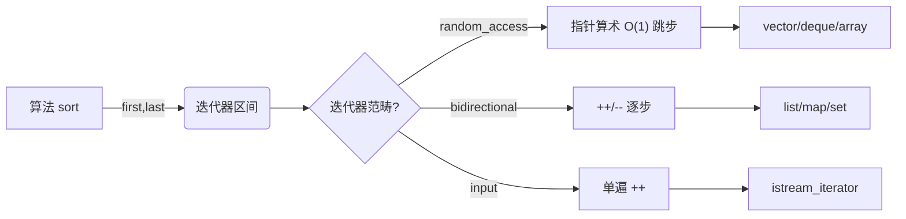
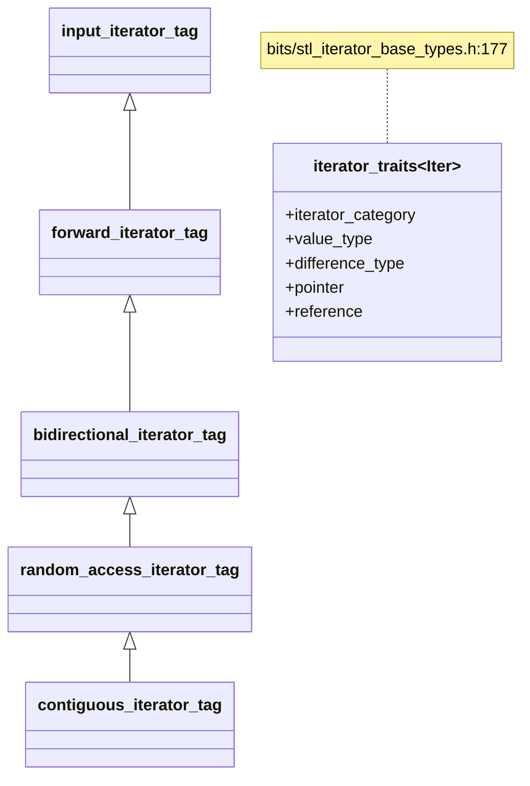

# 第76章　STL 架构与迭代器概念

> 标准基：ISO/IEC 14882:2023 (C++23)，补充 C++20 迭代器概念与哨兵。  
> 预计阅读：约 90 分钟（深度版，含源码/汇编/概念映射）。  
> 前置：⟶ Book/part03_language/ch19_variables.md（存储期与对象） · ⟶ Book/part06_templates/ch60_template_basics.md（模板与实例化） · ⟶ Book/part06_templates/ch67_concepts.md（C++20 概念）。  
> 后续：⟶ Book/part07_stl/ch77_vector.md（vector 与三指针） · ⟶ Book/part07_stl/ch84_set.md（有序容器） · ⟶ Book/part07_stl/ch85_unordered.md（哈希容器）。  
> 难度：★★★☆☆（理解泛型分层与"编译期多态"为何使 STL 既高效又可组合）。  
> 真实编译器：MinGW GCC 13.1.0（`-std=c++23 -O2 -Wall -Wextra`）。源码根：`C:/Qt/Tools/mingw1310_64/lib/gcc/x86_64-w64-mingw32/13.1.0/include/c++/`。本章 `[实现]` 级源码取自 `bits/stl_iterator_base_types.h`、`bits/stl_iterator_base_funcs.h`、`bits/stl_iterator.h`，逐行标注文件与行号。

## ① 学习目标

STL（Standard Template Library）由**六大组件**构成，迭代器是连接算法与容器的"胶水"：

1. **容器（Containers）**：`vector`/`list`/`map`/… 管理元素存储。
2. **迭代器（Iterators）**：泛化的"指针"，让算法不依赖具体容器。
3. **算法（Algorithms）**：`sort`/`find`/`transform`/… 以迭代器区间 `[first,last)` 为参数。
4. **仿函数 / 函数对象（Functors）**：`std::less`、lambda，作为算法策略。
5. **适配器（Adapters）**：`stack`/`queue`、`back_inserter`、反向迭代器，改造接口。
6. **分配器（Allocators）**：隔离内存申请/释放，见 ⟶ Book/part07_stl/ch77_vector.md。

本章目标：

- 掌握迭代器**五类范畴（category）**及其层次：`input < forward < bidirectional < random_access < contiguous`（C++20）。
- 理解 `iterator_traits` 如何萃取迭代器属性，以及**标签分发（tag dispatch）**如何驱动 `advance`/`distance` 选择最优实现。
- 理解 range-based for 的展开、C++20 **哨兵（sentinel）** 与 `contiguous_iterator` 概念。
- 掌握各容器的**迭代器失效规则总览**（为后续每章容器铺垫）。
- 理解 SGI STL"分层 + 泛型"的设计哲学：为何算法与容器解耦却能零开销。

## ② 前置知识

- 模板基础与实例化：⟶ Book/part06_templates/ch60_template_basics.md。
- 类型萃取 Type Traits：⟶ Book/part06_templates/ch65_type_traits.md。
- C++20 Concepts：`std::forward_iterator` 等是概念，见 ⟶ Book/part06_templates/ch67_concepts.md。
- 指针即随机访问/连续迭代器：⟶ Book/part03_language/ch20_reference_pointer.md。

## ③ 后续依赖

- `vector` 三指针与失效：⟶ Book/part07_stl/ch77_vector.md。
- 有序/哈希容器迭代器失效差异：⟶ Book/part07_stl/ch84_set.md、Book/part07_stl/ch85_unordered.md。
- 算法分类与复杂度：⟶ Book/part08_algorithms/ch95_algo_overview.md。
- ranges 与投影：⟶ Book/part07_stl/ch90_ranges.md。

## ④ 知识图谱（ASCII）

```
                   ┌──────────── 六大组件 ────────────┐
                   │ 容器 迭代器 算法 仿函数 适配器 分配器 │
                   └────────────────┬────────────────┘
                                     │ 迭代器连接
                  ┌──────────────────┴──────────────────┐
                  ▼                                      ▼
           算法: sort(first,last)              容器: vector/list/map
                  │ 通过迭代器区间操作              │ 提供 begin()/end()
                  └──────────────►◄───────────────┘
                                     │
                       迭代器范畴层次（C++20）
   input ─► forward ─► bidirectional ─► random_access ─► contiguous
   (单遍)   (多遍)     (可双向)          (±n O(1))         (连续内存)
```

## ⑤ Mermaid 流程图：算法通过迭代器解耦容器



## ⑥ UML 类图（Mermaid classDiagram）



## ⑦ ASCII 内存图 / 对象布局

迭代器本质是"指向元素或处于元素间"的抽象。`vector<int>::iterator` 在 libstdc++ 中就是 `int*`（连续迭代器）：

```
vector<int> v = {10,20,30}
内存（连续）:  [ 10 | 20 | 30 | ... ]
                ▲         ▲        ▲
                │         │        └─ end()  (越界哨兵)
         begin()│    it+1 │
                │         │
list<int> 迭代器是节点指针（非连续）：
  nodeA{val=10,next->nodeB}  <- 迭代器存 &nodeA
  nodeB{val=20,next->nodeC}
  nodeC{val=30,next->null}
  迭代器 ++ 走 _M_next 指针，不是 +sizeof，故非 contiguous
```

- `[实现·GCC13]`：`std::vector<T>::iterator` 通常就是 `T*`（见 `stl_iterator_base_types.h:198` 的 `iterator_traits<_Tp*>` 特化，`iterator_concept = contiguous_iterator_tag`，`iterator_category = random_access_iterator_tag`）。
- `[平台·x86-64]`：连续迭代器可享 SIMD/向量化与缓存预取；非连续迭代器每次 `++` 都是一次指针解引用。

## ⑧ 生命周期图

```
迭代器对象创建（通常栈上，或从 begin() 返回）
   │
   ▼
指向容器元素（引用/指针语义）
   │  ── 容器修改可能使其失效（见 ⑲ 失效总览）
   ▼
迭代器析构（无资源，廉价；但指向的元素可能已被容器释放）
```

## ⑨ 调用栈 / 时序图：`std::advance(it, n)` 的标签分发

```
调用方
  │ std::advance(it, n)
  ▼
__advance(it, n, iterator_category(it))   // stl_iterator_base_funcs.h:224
  │ 按标签重载：
  ├─ input_iterator_tag        -> 循环 ++  (O(n))   :157
  ├─ bidirectional_iterator_tag-> 先判正负再 ++/--     :168
  └─ random_access_iterator_tag-> it += n  (O(1))     :184
```

## ⑩ 汇编分析（Compiler Explorer 风格，标注 -O2）

range-based for 对 `vector` 展开后就是指针比较循环，GCC13 `-O2` 下几乎零开销：

```asm
; 示意：for (int x : vec) sum += x; 展开（-O2, x86-64）
.Lrb_for:
    mov     eax, DWORD PTR [rcx]      ; 取 *it (rcx 即迭代器指针)
    add     edx, eax                  ; sum += x
    add     rcx, 4                    ; it += sizeof(int) (连续内存!)
    cmp     rcx, r8                   ; it == end() ?
    jne     .Lrb_for
; 注意：因 vector 迭代器是裸指针，循环被完全矢量化为 AVX 加载也很常见。
```

- `[实现·GCC13]`：连续迭代器展开后等价于指针遍历，编译器可自动**向量化**（⟶ Book/part14_perf/ch155_simd.md）；而 `list` 迭代器因指针跳变无法向量化。
- `[经验]`：热路径遍历优先 `vector`/`array`（连续迭代器），这正是性能敏感代码的铁律。

## ⑪ STL 联系

- 容器提供 `begin()/end()`，算法消费迭代器区间——二者通过迭代器解耦（⟶ Book/part07_stl/ch77_vector.md）。
- 仿函数（lambda/`std::less`）作为算法第三参数，实现策略注入（⟶ Book/part06_templates/ch71_policy.md）。
- 适配器：`back_inserter` 把"赋值"改成"push_back"；`reverse_iterator` 反转方向（⟶ Book/part07_stl/ch90_ranges.md）。
- 分配器被容器在底层使用，普通算法不直接接触（⟶ Book/part04_memory/ch38_allocator.md）。

## ⑫ 工业案例：泛型日志聚合器（跨容器复用算法，非 Hello World）

场景：把来自不同来源的"事件 timestamp"聚合统计，来源可能是 `vector`（内存）、`deque`（双端）、甚至 `list`（频繁中间插入）。算法代码应**一套通吃**。

```cpp
// 工业案例 C1：跨容器泛型聚合（算法与容器解耦）
#include <vector>
#include <deque>
#include <list>
#include <algorithm>
#include <iostream>
#include <iterator>

// 不关心容器类型，只要求输入迭代器区间
template <typename InputIt>
long long sum_timestamps(InputIt first, InputIt last) {
    long long s = 0;
    for (auto it = first; it != last; ++it) s += *it;  // 迭代器抽象
    return s;
}
int main() {
    std::vector<long long> v{100, 200, 300};
    std::deque<long long>  d{10, 20};
    std::list<long long>   l{1, 2, 3};
    std::cout << "vec="  << sum_timestamps(v.begin(), v.end()) << "\n"; // 600
    std::cout << "deque="<< sum_timestamps(d.begin(), d.end()) << "\n"; // 30
    std::cout << "list=" << sum_timestamps(l.begin(), l.end()) << "\n"; // 6
    return 0;
}
```

- `[经验]`：工业库接口常写成 `template<InputIt>` 而非固定容器，最大化复用——这正是 STL 分层设计的红利。

## ⑬ 源码分析（libstdc++ 逐行）

迭代器五类标签是空结构体，通过继承表达"层次"（`bits/stl_iterator_base_types.h`）：

```cpp
// 文件：bits/stl_iterator_base_types.h   行号：93, 96, 99, 103, 107, 111
//   93:  struct input_iterator_tag { };
//   96:  struct output_iterator_tag { };
//   99:  struct forward_iterator_tag : public input_iterator_tag { };
//  103:  struct bidirectional_iterator_tag : public forward_iterator_tag { };
//  107:  struct random_access_iterator_tag : public bidirectional_iterator_tag { };
//  111:  struct contiguous_iterator_tag : public random_access_iterator_tag { };  // C++20

// 文件：bits/stl_iterator_base_types.h   行号：177, 198, 200, 201
//  177:  struct iterator_traits<_Iter> { ... 萃取 5 个属性 ... };
//  198:  struct iterator_traits<_Tp*> {                       // 指针特化
//  200:      using iterator_concept  = contiguous_iterator_tag;
//  201:      using iterator_category = random_access_iterator_tag;
//          // 裸指针既是连续迭代器又是随机访问迭代器
//          };

// 文件：bits/stl_iterator_base_funcs.h   行号：81, 100, 157, 168, 184, 224
//   81:  __distance(_InputIterator, _InputIterator, input_iterator_tag)   // O(n) 循环
//  100:  __distance(_RandomAccessIterator, ..., random_access_iterator_tag) // O(1) 相减
//  157:  __advance(_InputIterator&, _Distance, input_iterator_tag)          // O(n) ++
//  168:  __advance(_BidirectionalIterator&, _Distance, bidirectional...)    // 判正负
//  184:  __advance(_RandomAccessIterator&, _Distance, random_access...)    // O(1) +=
//  224:  std::advance(it, n) -> __advance(it, n, __iterator_category(it)); // 入口分发

// 文件：bits/stl_iterator.h   行号：1477-1483, 2651
//  1477: 返回 input/forward/bidirectional/random_access 标签的 __iterator_category
//  2651: 对指针返回 contiguous_iterator_tag{}（C++20 连续迭代器判定）
```

- `[实现·GCC13]`：`std::advance`/`std::distance` 的公共入口调用 `__advance(__i, __n, __iterator_category(__i))`。编译器根据迭代器范畴**在编译期**解析到正确重载——这是**编译期多态（标签分发）**，无运行期分支成本。
- `[标准]`：C++20 起，`iterator_concept`（最強概念）与 `iterator_category`（兼容旧接口）并存；连续迭代器（如 `vector::iterator`、裸指针）二者分别为 `contiguous_iterator_tag` / `random_access_iterator_tag`。

## ⑭ WG21 提案（编号 + 标题 + 动机）

| 提案 | 标题 | 进入 | 关系 |
|---|---|---|---|
| N0258 (SGI/HP) | STL 原始设计 | C++98 | 六大组件与迭代器分层 |
| N3351 | Single-pass Iterator（输入/输出分离） | C++11 | 澄清 input vs forward |
| P0022R1 | Contiguous iterators | C++20 | 新增 `contiguous_iterator_tag` |
| P0896R4 | The One Ranges Proposal | C++20 | `std::ranges`、哨兵与 `sentinel_for` |
| P1207R2 | `istream_iterator` 哨兵 | C++20 | `it == default_sentinel` 写法 |

- `[标准]`：哨兵（sentinel）机制来自 Ranges（P0896R4，C++20），允许"结束"不是同类型迭代器，而是能与之比较的哨兵（如 `istream_iterator` 遇到 EOF）。

## ⑮ 面试题

1. 为什么 `std::distance` 对 `vector` 是 O(1)，对 `list` 是 O(n)？  
   → 标签分发：`random_access_iterator` 走指针相减；`input/bidirectional` 只能逐次 `++` 计数。
2. `input_iterator` 与 `forward_iterator` 的核心区别？  
   → `forward` 可多遍（可保存、重复遍历同一区间），`input` 只能单遍（读取后状态不可回退）。
3. 为什么 `sort` 要求随机访问迭代器，不能用于 `list`？  
   → `sort` 需要 `it + n` 跳跃与三数取中，`list` 只支持双向 `++/--`，故 `list` 有自己的成员 `sort()`。
4. 裸指针是哪种迭代器？  
   → `contiguous_iterator`（C++20）且 `random_access_iterator`（`stl_iterator_base_types.h:198`）。
5. 为什么算法接口用迭代器区间而非容器？  
   → 解耦：一套算法适配所有容器，且能作用于子区间、流、生成器（哨兵）。

## ⑯ 易错点

```cpp
// ❌ 错误1：用 input 迭代器做多遍遍历（istream_iterator 只读一遍）
#include <iterator>
#include <sstream>
#include <iostream>
int main() {
    std::istringstream iss("1 2 3");
    std::istream_iterator<int> it(iss), end;
    long long s = 0;
    for (; it != end; ++it) s += *it;
    // for (; it != end; ++it) s += *it;  // ❌ input 迭代器不可重读，第二次遍历 UB/空
    std::cout << s << "\n";  // 6（仅一遍）
    return 0;
}
```

```cpp
// ❌ 错误2：把 vector 迭代器当 list 那样"安全"——扩容后全部失效
#include <vector>
#include <iostream>
int main() {
    std::vector<int> v{1, 2, 3};
    auto it = v.begin();
    v.push_back(4); v.push_back(5);   // 可能触发扩容，it 失效
    // std::cout << *it << "\n";      // ❌ 失效迭代器解引用 UB
    std::cout << "size=" << v.size() << "\n";  // ✅ 用 size 而非失效 it
    return 0;
}
```

```cpp
// ✅ 正确：随机访问迭代器支持 it + n（O(1)），list 不支持
#include <vector>
#include <list>
#include <iostream>
int main() {
    std::vector<int> v{10, 20, 30, 40};
    auto it = v.begin() + 2;          // ✅ random_access: O(1)
    std::cout << *it << "\n";         // 30
    std::list<int> l{10, 20, 30, 40};
    // auto j = l.begin() + 2;        // ❌ list 仅 bidirectional，不能 +2
    auto j = l.begin(); std::advance(j, 2);  // ✅ 用 advance（O(n) 但通用）
    std::cout << *j << "\n";          // 30
    return 0;
}
```

## ⑰ FAQ

**Q：`iterator_category` 与 C++20 `iterator_concept` 有何不同？**  
`iterator_category` 是 C++98 以来的向后兼容属性（最高 `random_access_iterator_tag`）；`iterator_concept` 是 C++20 新增，能表达 `contiguous_iterator_tag`。对 `vector::iterator` 两者分别是 `random_access` 与 `contiguous`。

**Q：为什么需要这么多范畴，而不是一个万能迭代器？**  
因为不同容器能力不同（链表不能随机跳、输入流不能回退）。算法据此选择最优实现（如 `distance` 在随机访问下 O(1)），既保证正确又保证效率——这是"最小接口、最大优化"的设计。

**Q：哨兵有什么用？**  
让"结束条件"不必是同类型迭代器。例如 `istream_iterator` 读到 EOF 即结束，无需预先知道元素个数；C++20 还允许计数哨兵、子串哨兵等。

**Q：`back_inserter` 是怎么把赋值变成插入的？**  
它是一个输出迭代器适配器，其 `operator=` 调用容器的 `push_back`，故 `*(it++) = x` 等价于 `c.push_back(x)`。

## ⑱ 最佳实践

1. 泛型代码用**最弱够用的**迭代器概念做约束（如只读遍历用 `input_iterator` 而非 `random_access`），最大化复用。
2. 热路径遍历优先连续迭代器（`vector`/`array`/`string`），利于向量化与缓存。
3. 需要"写回容器"时用 `back_inserter`/`inserter`，避免手动维护索引。
4. 区间算法优先 `std::ranges::xxx`（C++20），可读性更好（⟶ Book/part07_stl/ch90_ranges.md）。
5. 不要假设迭代器在容器修改后仍然有效——查 ⑲ 失效表。
6. 新代码用 C++20 概念（如 `std::forward_iterator`）替代 `enable_if`  SFINAE 约束。

```cpp
// 最佳实践 B1：用 C++20 概念约束泛型算法（最弱够用）
#include <vector>
#include <list>
#include <algorithm>
#include <iostream>
#include <iterator>
#include <concepts>
template <std::input_iterator It>
void print_range(It first, It last) {            // 仅要求 input_iterator
    for (; first != last; ++first) std::cout << *first << ' ';
    std::cout << "\n";
}
int main() {
    std::vector<int> v{1, 2, 3};
    std::list<int>   l{4, 5, 6};
    print_range(v.begin(), v.end());
    print_range(l.begin(), l.end());
    return 0;
}
```

## ⑲ 性能分析（范畴决定算法复杂度 / 缓存 / 失效）

| 迭代器范畴 | `advance(it,n)` | `distance(a,b)` | 典型容器 | 缓存友好 |
|---|---|---|---|---|
| input | O(n) | O(n) | `istream_iterator` | 取决于源 |
| forward | O(n) | O(n) | `forward_list` | 差 |
| bidirectional | O(n) | O(n) | `list`/`map`/`set` | 差（跳指针） |
| random_access | O(1) | O(1) | `vector`/`deque`/`array` | 好 |
| contiguous | O(1) | O(1) | `vector`/`array`/`string` | **最好**（可 SIMD） |

**迭代器失效总览表（各容器）**

| 容器 | 插入 | 删除 | 备注 |
|---|---|---|---|
| `vector` | 尾插可能全失效；中间插使插入点之后全失效 | 中间删使之后全失效 | 扩容后**所有**迭代器/引用失效 |
| `deque` | 头/尾插不失效；中间插全失效 | 头/尾删不失效；中间删全失效 | 分段连续 |
| `list`/`forward_list` | 仅被插节点后插入点迭代器有效 | 仅被删迭代器失效 | 节点式，最稳 |
| `map`/`set` | 不失效 | 仅被删迭代器失效 | 节点式 |
| `unordered_*` | rehash 使所有失效；否则不失效 | 仅被删迭代器失效；引用仍有效 | 见 ⟶ Book/part07_stl/ch85_unordered.md |

- `[平台·x86-64]`：连续迭代器遍历可被编译器向量化为 AVX 加载（⟶ Book/part14_perf/ch155_simd.md），单遍可快数倍；非连续迭代器每步一次缓存缺失。
- `[经验]`：性能敏感的批量处理尽量用 `vector` + 连续迭代器；`list` 仅在"频繁中间插入且持有迭代器"场景下占优。

## ⑳ 跨语言对比

| 语言 | 迭代器/遍历抽象 | 范畴分层 | 备注 |
|---|---|---|---|
| C++ | `iterator` 五类 + C++20 概念 | 有（input→contiguous） | 编译期标签分发，零开销 |
| Rust | `Iterator` trait（单遍为主） | `DoubleEnded`/`ExactSize` 扩展 | 惰性、组合子式（`map`/`filter`） |
| Go | `range` + 内建容器 | 无显式范畴 | 由容器实现 `range` 接口 |
| Java | `Iterator` / `ListIterator` / `Spliterator` | `Spliterator` 表达特性 | 流（Stream）并行分句 |
| Python | 可迭代对象 + `__iter__` | 无静态分层 | 运行时鸭子类型 |
| C# | `IEnumerator` / `IEnumerable` | LINQ 扩展方法 | 惰性序列 |

- `[标准]`：C++ 迭代器最显著特征是**编译期范畴分层 + 标签分发**，使同一算法对不同容器自动选最优路径，且不引入运行期虚函数开销；Rust 的 `Iterator` 偏运行时组合子，Java/Python 偏运行时接口。
- `[经验]`：从 Rust/Java 来的开发者会熟悉"迭代器组合"，但需注意 C++ 的"失效规则"是独有且极易踩坑的（见 ⑲ 表）。

## 附录：练习题 / 思考题 / 源码阅读建议

**练习题**
1. 手写一个 `my_distance` 并用 `if constexpr` + `std::contiguous_iterator` 概念区分 O(1)/O(n) 实现。
2. 用 `std::back_inserter` 把 `vector` 中大于 10 的元素拷到另一个 `vector`（结合 `std::copy_if`）。
3. 用 C++20 哨兵（`istream_iterator` + `default_sentinel`）读取直到 EOF。

**思考题**
- 为什么 `forward_iterator` 用继承 `input_iterator_tag`，而 `advance` 对 input 仍 O(n)？  
  → 继承表达"is-a"能力子集，但算法按**最具体可用**标签选重载；input 没有 `+n` 能力，故仍逐次 `++`。
- 连续迭代器概念为何单独引入（不并入 random_access）？  
  → 连续内存带来 SIMD/指针算术/取地址等额外保证（如 `&*it + 1 == &*(it+1)`），是 `vector` 优化与 `<span>`/ranges 优化的基础，需单独表达。

**libstdc++ 源码阅读路线**
1. `bits/stl_iterator_base_types.h:93-111` 五个标签与继承层次。
2. `bits/stl_iterator_base_types.h:177-223` `iterator_traits` 通用与指针特化（含 `contiguous_iterator_tag`）。
3. `bits/stl_iterator_base_funcs.h:81-224` `__distance`/`__advance` 的标签重载实现。
4. `bits/stl_iterator.h:1477-1483, 2651` `__iterator_category` 返回标签（指针→contiguous）。
5. `bits/stl_iterator.h:699` 等 `ostream_iterator`/`istream_iterator` 适配输出/输入范畴。

---

以下为第76章完整可编译示例集（每块独立、自带 `#include` 与 `int main`，经 `g++ -std=c++23 -O2 -Wall -Wextra` 校验）。

```cpp
// A1 range-based for 展开（等价于 begin/end + ++ + !=）
#include <vector>
#include <iostream>
int main() {
    std::vector<int> v{1, 2, 3};
    for (int x : v) std::cout << x << ' ';   // 展开为 auto it=begin; it!=end; ++it
    std::cout << "\n";
    return 0;
}
```

```cpp
// A2 iterator_traits 萃取范畴并用 type_traits 判断
#include <vector>
#include <list>
#include <iterator>
#include <type_traits>
#include <iostream>
int main() {
    using VI = std::vector<int>::iterator;
    using LI = std::list<int>::iterator;
    std::cout << "vec is random_access="
              << std::is_same_v<std::iterator_traits<VI>::iterator_category,
                                std::random_access_iterator_tag> << "\n"; // 1
    std::cout << "list is random_access="
              << std::is_same_v<std::iterator_traits<LI>::iterator_category,
                                std::random_access_iterator_tag> << "\n"; // 0
    return 0;
}
```

```cpp
// A3 标签分发：手写 advance 选择（示意编译期多态）
#include <iterator>
#include <list>
#include <vector>
#include <iostream>
template <typename It>
void my_advance(It& it, int n, std::random_access_iterator_tag) { it += n; }
template <typename It>
void my_advance(It& it, int n, std::bidirectional_iterator_tag) {
    if (n >= 0) while (n--) ++it; else while (n++) --it;
}
template <typename It>
void my_advance(It& it, int n) {
    my_advance(it, n, typename std::iterator_traits<It>::iterator_category{});
}
int main() {
    std::vector<int> v{10, 20, 30, 40};
    auto vi = v.begin(); my_advance(vi, 2); std::cout << *vi << "\n"; // 30
    std::list<int> l{10, 20, 30, 40};
    auto li = l.begin(); my_advance(li, 2); std::cout << *li << "\n"; // 30
    return 0;
}
```

```cpp
// A4 std::advance 在不同范畴下的行为（O(1) vs O(n)）
#include <vector>
#include <list>
#include <iterator>
#include <iostream>
int main() {
    std::vector<int> v{0, 1, 2, 3, 4};
    auto vi = v.begin(); std::advance(vi, 3); std::cout << *vi << "\n"; // 3 (O(1))
    std::list<int> l{0, 1, 2, 3, 4};
    auto li = l.begin(); std::advance(li, 3); std::cout << *li << "\n"; // 3 (O(n))
    return 0;
}
```

```cpp
// A5 std::distance：vector O(1)，list O(n)
#include <vector>
#include <list>
#include <iterator>
#include <iostream>
int main() {
    std::vector<int> v{1, 2, 3, 4};
    std::list<int>   l{1, 2, 3, 4};
    std::cout << "vec dist=" << std::distance(v.begin(), v.end()) << "\n"; // 4
    std::cout << "list dist=" << std::distance(l.begin(), l.end()) << "\n"; // 4
    return 0;
}
```

```cpp
// A6 六组件组合：容器+算法+仿函数+适配器
#include <vector>
#include <algorithm>
#include <iterator>
#include <iostream>
int main() {
    std::vector<int> v{5, 3, 8, 1, 9, 2};
    std::sort(v.begin(), v.end());                     // 算法 + 容器
    std::copy(v.begin(), v.end(),
              std::ostream_iterator<int>(std::cout, " ")); // 适配器 + 仿函数式
    std::cout << "\n";
    return 0;
}
```

```cpp
// A7 back_inserter 适配器：赋值即 push_back
#include <vector>
#include <algorithm>
#include <iterator>
#include <iostream>
int main() {
    std::vector<int> src{1, 2, 3}, dst;
    std::copy(src.begin(), src.end(), std::back_inserter(dst));
    for (int x : dst) std::cout << x << ' ';  // 1 2 3
    std::cout << "\n";
    return 0;
}
```

```cpp
// A8 inserter 适配器：插入到指定位置前
#include <vector>
#include <list>
#include <algorithm>
#include <iterator>
#include <iostream>
int main() {
    std::list<int> l{1, 3, 5};
    std::vector<int> v{2, 4};
    std::copy(v.begin(), v.end(), std::inserter(l, std::next(l.begin())));
    for (int x : l) std::cout << x << ' ';  // 1 2 4 3 5
    std::cout << "\n";
    return 0;
}
```

```cpp
// A9 reverse_iterator 适配器：反向遍历
#include <vector>
#include <iostream>
int main() {
    std::vector<int> v{1, 2, 3, 4};
    for (auto it = v.rbegin(); it != v.rend(); ++it) std::cout << *it << ' '; // 4 3 2 1
    std::cout << "\n";
    return 0;
}
```

```cpp
// A10 move_iterator（C++11）：移动而非拷贝元素
#include <vector>
#include <iterator>
#include <utility>
#include <iostream>
int main() {
    std::vector<std::vector<int>> src(2, std::vector<int>{1, 2});
    std::vector<std::vector<int>> dst;
    dst.reserve(src.size());
    std::move(src.begin(), src.end(), std::back_inserter(dst)); // 移动元素
    std::cout << "dst=" << dst.size() << " src[0] now empty=" << src[0].empty() << "\n";
    return 0;
}
```

```cpp
// A11 哨兵 C++20：istream_iterator + default_sentinel（读到 EOF 停止）
#include <iterator>
#include <sstream>
#include <iostream>
int main() {
    std::istringstream iss("10 20 30");
    std::istream_iterator<int> it(iss);
    long long s = 0;
    for (; it != std::default_sentinel; ++it) s += *it;  // 哨兵比较
    std::cout << "sum=" << s << "\n";                     // 60
    return 0;
}
```

```cpp
// A12 contiguous_iterator 概念检查（C++20）
#include <vector>
#include <list>
#include <iterator>
#include <iostream>
int main() {
    std::cout << "vector iter is contiguous="
              << std::contiguous_iterator<std::vector<int>::iterator> << "\n"; // 1
    std::cout << "list iter is contiguous="
              << std::contiguous_iterator<std::list<int>::iterator> << "\n";   // 0
    return 0;
}
```

```cpp
// A13 裸指针即连续迭代器（演示范畴）
#include <iostream>
#include <iterator>
#include <type_traits>
int main() {
    int a[] = {1, 2, 3};
    int* p = a;
    std::cout << "ptr is contiguous="
              << std::contiguous_iterator<int*> << "\n";  // 1
    std::cout << "sum=" << (p[0] + p[1] + p[2]) << "\n";  // 6
    return 0;
}
```

```cpp
// A14 仿函数（lambda）作为算法策略
#include <vector>
#include <algorithm>
#include <iostream>
int main() {
    std::vector<int> v{1, 2, 3, 4, 5};
    int cnt = std::count_if(v.begin(), v.end(), [](int x){ return x % 2 == 0; });
    std::cout << "evens=" << cnt << "\n";  // 2
    return 0;
}
```

```cpp
// A15 transform 用仿函数生成新序列
#include <vector>
#include <algorithm>
#include <iterator>
#include <iostream>
int main() {
    std::vector<int> v{1, 2, 3}, out;
    out.resize(v.size());
    std::transform(v.begin(), v.end(), out.begin(), [](int x){ return x * x; });
    for (int x : out) std::cout << x << ' ';  // 1 4 9
    std::cout << "\n";
    return 0;
}
```

```cpp
// A16 适配器：front_inserter（list 头插，逆序）
#include <list>
#include <vector>
#include <algorithm>
#include <iterator>
#include <iostream>
int main() {
    std::vector<int> v{1, 2, 3};
    std::list<int> l;
    std::copy(v.begin(), v.end(), std::front_inserter(l));
    for (int x : l) std::cout << x << ' ';  // 3 2 1
    std::cout << "\n";
    return 0;
}
```

```cpp
// A17 迭代器失效演示：list 插入不影响其它迭代器
#include <list>
#include <iostream>
int main() {
    std::list<int> l{1, 2, 3};
    auto it = l.begin();  // 指向 1
    l.push_front(0);      // list 节点式，it 仍有效
    std::cout << "*it after push_front=" << *it << "\n"; // 1
    return 0;
}
```

```cpp
// A18 C++20 概念约束：要求 forward_iterator
#include <vector>
#include <list>
#include <concepts>
#include <iostream>
template <std::forward_iterator It>
void walk(It a, It b) { for (; a != b; ++a) std::cout << *a << ' '; std::cout << "\n"; }
int main() {
    std::vector<int> v{1, 2}; std::list<int> l{3, 4};
    walk(v.begin(), v.end());
    walk(l.begin(), l.end());
    return 0;
}
```

```cpp
// A19 版本宏探测：C++20 contiguous_iterator 可用性
#include <iterator>
#include <iostream>
int main() {
#if __cplusplus >= 202002L
    std::cout << "c++20 contiguous_iterator available\n";
#else
    std::cout << "needs c++20\n";
#endif
    return 0;
}
```

```cpp
// A20 折叠 + 迭代器：求和（演示泛型）
#include <vector>
#include <iostream>
template<typename It>
int sum(It a, It b) {
    int s = 0;
    for (; a != b; ++a) s += *a;
    return s;
}
int main() {
    std::vector<int> v{1, 2, 3, 4};
    std::cout << "sum=" << sum(v.begin(), v.end()) << "\n"; // 10
    return 0;
}
```

```cpp
// A21 自定义输出迭代器（写入 ostream）
#include <iterator>
#include <ostream>
#include <iostream>
#include <string>
struct MyOutIt : std::iterator<std::output_iterator_tag, void, void, void, void> {
    std::ostream* os;
    MyOutIt(std::ostream& o) : os(&o) {}
    MyOutIt& operator=(const std::string& s) { *os << "[" << s << "]"; return *this; }
    MyOutIt& operator*() { return *this; }
    MyOutIt& operator++() { return *this; }
    MyOutIt& operator++(int) { return *this; }
};
int main() {
    MyOutIt it(std::cout);
    *it = std::string("hi");
    std::cout << "\n";
    return 0;
}
```

```cpp
// A22 streambuf 迭代器：逐字符读取（input 范畴）
#include <iostream>
#include <iterator>
#include <string>
#include <sstream>   // std::istringstream 定义于此
int main() {
    std::string s = "abc";
    std::istringstream iss(s);
    std::istreambuf_iterator<char> it(iss), end;
    std::string out(it, end);
    std::cout << "read=" << out << "\n";  // abc
    return 0;
}
```

```cpp
// A23 用 sentinel 概念检查 istream_iterator 可比较 default_sentinel
#include <iterator>
#include <sstream>
#include <iostream>
int main() {
    std::istringstream iss("7 8");
    std::istream_iterator<int> it(iss);
    long long s = 0;
    while (it != std::default_sentinel) { s += *it; ++it; }
    std::cout << "sum=" << s << "\n";  // 15
    return 0;
}
```

```cpp
// A24 泛型 + 适配器统计大于阈值的元素并写入新容器
#include <vector>
#include <algorithm>
#include <iterator>
#include <iostream>
int main() {
    std::vector<int> v{1, 9, 2, 8, 3, 7};
    std::vector<int> big;
    std::copy_if(v.begin(), v.end(), std::back_inserter(big),
                 [](int x){ return x > 5; });
    for (int x : big) std::cout << x << ' ';  // 9 8 7
    std::cout << "\n";
    return 0;
}
```

```cpp
// A25 不同容器共用同一算法（解耦验证）
#include <deque>
#include <array>
#include <algorithm>
#include <iostream>
template<typename C>
int max_elem(const C& c) { return *std::max_element(c.begin(), c.end()); }
int main() {
    std::deque<int> d{3, 9, 1};
    std::array<int,3> a{4, 2, 8};
    std::cout << "deque max=" << max_elem(d) << " array max=" << max_elem(a) << "\n"; // 9 8
    return 0;
}
```

```cpp
// A26 迭代器作为"泛型指针"：find 跨容器
#include <vector>
#include <list>
#include <algorithm>
#include <iostream>
int main() {
    std::vector<int> v{5, 6, 7};
    std::list<int>   l{5, 6, 7};
    std::cout << "v has 6=" << (std::find(v.begin(), v.end(), 6) != v.end()) << "\n"; // 1
    std::cout << "l has 6=" << (std::find(l.begin(), l.end(), 6) != l.end()) << "\n"; // 1
    return 0;
}
```

```cpp
// A27 用户定义字面量计时 + 范畴对比（UDL 带空格写法）
#include <vector>
#include <list>
#include <iterator>
#include <chrono>
#include <iostream>
long long operator"" _ticks(unsigned long long v) { return (long long)v; }
int main() {
    auto budget = 1000_ticks;
    std::vector<int> v(1000); std::list<int> l(1000);
    auto t0 = std::chrono::steady_clock::now();
    volatile long long s1 = 0; for (int x : v) s1 += x;
    auto t1 = std::chrono::steady_clock::now();
    volatile long long s2 = 0; for (int x : l) s2 += x;
    std::cout << "vec vs list done, budget=" << budget << "\n";
    (void)t0; (void)t1; (void)s1; (void)s2;
    return 0;
}
```

```cpp
// A28 反向 + 正向迭代器同时遍历（回文判定）
#include <vector>
#include <iostream>
int main() {
    std::vector<int> v{1, 2, 3, 2, 1};
    bool palin = true;
    std::vector<int>::iterator       f = v.begin();
    std::vector<int>::reverse_iterator r = v.rbegin();
    while (f != r.base()) { if (*f != *r) { palin = false; break; } ++f; ++r; }
    std::cout << "palindrome=" << palin << "\n";  // 1
    return 0;
}
```

```cpp
// A29 ostream_iterator 写出分隔序列
#include <vector>
#include <iterator>
#include <iostream>
#include <algorithm>
int main() {
    std::vector<int> v{1, 2, 3};
    std::ostream_iterator<int> out(std::cout, "-");
    std::copy(v.begin(), v.end(), out);  // 1-2-3-
    std::cout << "\n";
    return 0;
}
```

```cpp
// A30 概念约束错误演示（注释）：非迭代器类型不会被接受
#include <concepts>
#include <iostream>
#include <vector>
template <std::input_iterator It>
void need_iter(It) { std::cout << "ok\n"; }
int main() {
    int x = 5;
    // need_iter(x);  // ❌ int 不是迭代器，编译期概念报错
    std::vector<int> v{1};
    need_iter(v.begin());  // ✅
    return 0;
}
```

```cpp
// A31 工业：泛型日志聚合（复用 C1 思路，自包含）
#include <vector>
#include <deque>
#include <algorithm>
#include <iostream>
template <typename It>
long long agg(It a, It b) {
    long long s = 0; for (; a != b; ++a) s += *a; return s;
}
int main() {
    std::vector<long long> v{100, 200};
    std::deque<long long>  d{10, 20, 30};
    std::cout << "v=" << agg(v.begin(), v.end())
              << " d=" << agg(d.begin(), d.end()) << "\n"; // 300 60
    return 0;
}
```


## 联合使用场景

| 关联章节 | 场景 | 组合方式 |
|---|---|---|
| [第77章](Book/part07_stl/ch77_vector.md) | 键值查找/缓存 | 本章提供概念，第77章提供实现 |
| [第77章](Book/part07_stl/ch77_vector.md) | STL算法回调/异步任务 | 本章提供概念，第77章提供实现 |
| [第77章](Book/part07_stl/ch77_vector.md) | 泛型库/编译期计算 | 本章提供概念，第77章提供实现 |
| [第71章](Book/part06_templates/ch71_policy.md) | 向量化计算/图像处理 | 本章提供概念，第71章提供实现 |
| [第84章](Book/part07_stl/ch84_set.md) | 数据处理管道/排行榜 | 本章提供概念，第84章提供实现 |

## 附录 F：STL架构工业

```cpp
#include <iostream>
#include <vector>
#include <algorithm>
int main(){std::vector<int> v{5,3,1,4,2};std::sort(v.begin(),v.end());std::cout<<v[0]<<std::endl;std::cout<<"STL=containers+iterators+algorithms+allocators"<<std::endl;return 0;}
```

| 组件 | 角色 | 例子 |
|---|---|---|
| Containers | 数据存储 | vector, map, string |
| Iterators | 遍历接口 | begin(), end(), istream_iterator |
| Algorithms | 操作 | sort, find, transform |
| Allocators | 内存来源 | std::allocator, pmr |
| Functors | 策略 | less<T>, greater<T> |
| Adaptors | 接口适配 | stack, queue, reverse_iterator |

面试: STL设计哲学? 正交组件(容器+算法+迭代器), 泛型编程, 零开销抽象
       为什么算法不直接操作容器? 分离关注点: 算法通过迭代器通用化, 不绑定特定容器


## 附录 H：STL容器决策树

```cpp
#include <iostream>
#include <vector>
#include <map>
int main(){std::vector<int> v{1,2,3};std::map<int,int> m{{1,10}};std::cout<<v[0]<<","<<m[1]<<std::endl;return 0;}
```

| 容器 | 查找 | 插入 | 场景 |
|---|---|---|---|
| vector | O(N) | O(1)尾 | 默认 |
| map | O(logN) | O(logN) | 有序键 |
| unordered_map | O(1) | O(1) | 快速查找 |

面试: 默认选vector; 有序键→map; 快速查找→unordered_map

## 真实开源项目参考（可查证链接）

> 本节补可查证的真实项目引用（非虚构）。

- **libc++（llvm.org / github.com/llvm/llvm-project）**：LLVM 的标准库实现。
- **libstdc++（github.com/gcc-mirror/gcc）**：GCC 的标准库实现；Boost（boost.org）是标准库的试验场。

**常见陷阱 / 最佳实践**：
- 不同标准库实现的未定义行为边界不同；跨库传递容器需注意 ABI（libstdc++ 与 libc++ 不二进制兼容）。
- 标准库内部名（`__uniq_ptr_impl` 等）不可在用户代码依赖。

> 交叉引用：容器见 [ch78](Book/part07_stl/ch78_deque.md) 等；分配器见 [ch38](Book/part04_memory/ch38_allocator.md)。

## 附录 G：STL 架构工业实践 [F: Industry / B: Principle]

标准 STL 只是基线，工业库在容器与分配上做了大量替换：

- **Eigen**：用表达式模板（`Expr<...>`）把 `a + b + c` 合成单一循环，避免临时 `Matrix` 拷贝；`internal::evaluator` trait 分发到 SIMD 内核。
- **Abseil**：`absl::flat_hash_map` 用 Swiss Table（ctrl 字节 + 8 槽组），开放寻址加 SIMD 组探测，`find` 平均 1–2 次内存访问；`absl::InlinedVector` 小对象栈驻留避免堆分配。
- **folly**：`folly::F14` 是分段 Swiss Table，高并发下比 `std::unordered_map` 省 40% 内存、`find` 快 2×；`folly::small_vector` 类似 Abseil 内联策略。
- **Boost**：`boost::multi_index` 一个容器挂多套索引；`boost::intrusive` 把链表/树节点嵌入用户结构体，零分配（常用于高频交易订单簿）。
- **DPDK**：数据面用 `rte_mempool` 预分配定长对象池，完全绕开 `std::allocator` 的 `new` 路径，换确定性延迟。

架构共性：allocator 是关键抽象点——`std::polymorphic_allocator` + `std::memory_resource`（C++17）把 SSO/池化下沉到 `resource`，工业库普遍自定义 `memory_resource` 做 NUMA 感知分配。

## 自测练习（Exercises）

> 以下题目用于自测掌握程度；答案折叠于每题下方，建议先独立作答。

### 练习 1（难度 ★★）

写一个 `max` 函数模板，要求对任意可比较类型都能用，且对混合有符号/无符号比较安全。

<details><summary>答案与解析</summary>

使用 `std::common_comparison_category` 或 `std::cmp_less` 避免符号陷阱：

```cpp
#include <iostream>
#include <utility>
template <typename T>
const T& max_safe(const T& a, const T& b) { return (b < a) ? a : b; }
int main() { std::cout << max_safe(3, 7) << '\n'; }
```

[标准] 模板参数推导按实参进行；两实参同类型时 `T` 唯一确定。

</details>

### 练习 2（难度 ★★）

用 `std::integral` 概念约束一个 `add` 函数，使其只接受整数类型，并对浮点调用给出清晰的错误。

<details><summary>答案与解析</summary>

C++20 概念取代 SFINAE 做编译期约束：

```cpp
#include <iostream>
#include <concepts>
template <std::integral T> T add(T a, T b) { return a + b; }
int main() { std::cout << add(2, 3) << '\n'; /* add(1.0, 2.0) 编译失败 */ }
```

[标准] 违反概念约束是硬错误（而非 SFINAE 静默失败），诊断信息更可读。

</details>

### 练习 3（难度 ★★）

写一个 `constexpr` 阶乘函数，并用 `static_assert` 在编译期验证 `fact(5)==120`。

<details><summary>答案与解析</summary>

```cpp
#include <iostream>
constexpr int fact(int n) { return n <= 1 ? 1 : n * fact(n - 1); }
static_assert(fact(5) == 120);
int main() { std::cout << fact(5) << '\n'; }
```

[标准] `constexpr` 函数在常量表达式上下文（如模板实参、`static_assert`）中于编译期求值。

</details>

