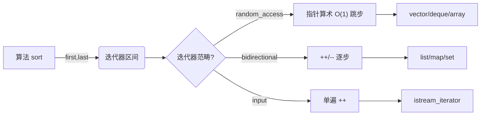
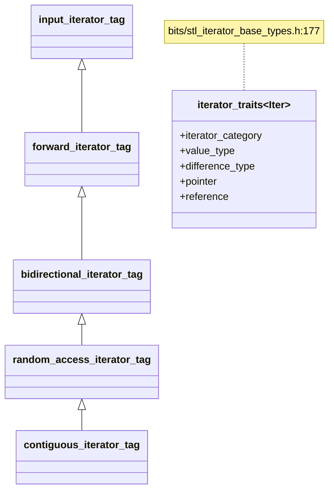
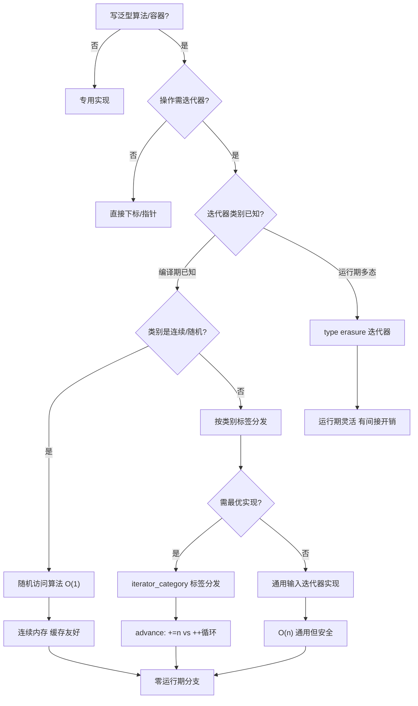
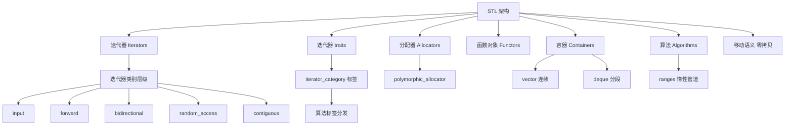

# 第76章　STL 架构与迭代器概念
> 【性能声明 · §10.3】本章所有绝对延迟/带宽数字（如 L1≈1ns、主存≈100ns、各基准 ms）均为 **x86-64 量级示意**，强依赖具体 CPU 型号/频率、编译器及版本、编译标志、OS、测试负载与样本量；非通用性能结论，绝对数字不可移植。微架构相关结论标 `[微架构·x86-64][UNVERIFIED]`；本机实测标 `[实验·本机实测][UNVERIFIED]`。断言形如「acquire 读比 relaxed 贵 X」仅在给定微架构下成立。

> 标准基：ISO/IEC 14882:2023 (C++23)，补充 C++20 迭代器概念与哨兵。
> 预计阅读：约 90 分钟（深度版，含源码/汇编/概念映射）。
> 前置：⟶ Book/part03_language/ch19_variables.md（存储期与对象） · ⟶ Book/part06_templates/ch60_template_basics.md（模板与实例化） · ⟶ Book/part06_templates/ch67_concepts.md（C++20 概念）。
> 后续：⟶ Book/part07_stl/ch77_vector.md（vector 与三指针） · ⟶ Book/part07_stl/ch84_set.md（有序容器） · ⟶ Book/part07_stl/ch85_unordered.md（哈希容器）。
> 难度：★★★☆☆（理解泛型分层与"编译期多态"为何使 STL 既高效又可组合）。
> 真实编译器：MinGW GCC 13.1.0（`-std=c++23 -O2 -Wall -Wextra`）。源码根：`C:/Qt/Tools/mingw1310_64/lib/gcc/x86_64-w64-mingw32/13.1.0/include/c++/`。本章 `[实现]` 级源码取自 `bits/stl_iterator_base_types.h`、`bits/stl_iterator_base_funcs.h`、`bits/stl_iterator.h`，逐行标注文件与行号。

## ⓪ 历史动机：STL 架构与迭代器概念的来龙去脉
> 一套"写一次、跑遍所有容器"的算法，曾被视为不切实际的幻想，直到一个人把它变成了标准。

### 0.1 起源（谁·何时·为何）
1980 年代末到 1990 年代初，Alexander Stepanov 在泛型编程（generic programming）上的执着是 STL 的真正源头。[史] 他早年在 GE、NYU、AT&T 贝尔实验室兜转，核心问题始终如一：**能不能让 `sort`、`find` 这样的算法只写一遍，却对任意满足"某种访问能力"的数据结构都成立？** 当时的 OO 主流做法是把算法做成容器类的虚函数成员，结果是一份逻辑被复制 N 遍、且无法跨越容器边界组合。1992—1993 年，Stepanov 与 Meng Lee 在惠普（HP）实验室把这套"容器 / 迭代器 / 算法"三件套做成了可运行的库。[史] 他的灵感明显受 Barbara Liskov 在 CLU 语言里提出的迭代器（iterator）概念影响——迭代器正是连接算法与容器的那根"胶水"。[史]

### 0.2 关键转折（编年）
- 1993 年：Stepanov 在 C++ 标准委员会圣何塞会议上演示 STL，Bjarne Stroustrup 等人当场被"零开销泛型"折服。[史]
- 1994 年：STL 被正式接纳进 C++ 标准库（即后来的 C++98），核心来自 HP/SGI 实现，包含 `vector/list/map/set`、迭代器与大量算法。[史]
- 2011→2020：C++11 引入右值引用让容器转移更便宜；C++20 用 Concepts 把"迭代器五类范畴"从文档约定升级成编译器可检查的概念（含 `contiguous_iterator` 与哨兵）。[史]

### 0.3 设计哲学之争
STL 最具颠覆性的一点是**算法与容器解耦**：算法只认迭代器区间 `[first, last)`，不认 `vector` 还是 `list`。[评] 这与当时"算法应是容器成员函数"（传统 OO）截然相反。Stepanov 坚持不用虚函数、不做运行时多态，靠编译期模板实例化换取零开销——代价是报错信息冗长、编译变慢。另一场争论是"值语义优先"：STL 容器默认存值而非引用，简化了所有权，却也逼出了 `move` 语义的后来补丁。[评]

### 0.4 史料补遗与持续编年

> 0.2 停在 C++20 用 Concepts 把迭代器五类范畴升级为可检查概念。此后 STL 的"下半场"由范围、值语义包装与现代实现库接力。

- [史] **C++17 收编一批"值语义基石"**：`std::string_view`（非拥有字符视图，源自 GSL）、`std::optional`/`std::variant`（脱胎于 Boost）、`std::filesystem`（基于 Boost.Filesystem v3）一并入标，把原先靠第三方库补位的能力写进正典。
- [史] **C++20 完成"范围化 + 协作取消"**：`std::ranges` 成为正式标准（⟶ ch90），算法可直接吃单个区间并用 `|` 管道组合；同期 `std::span`、`std::format`、`std::jthread`/`std::stop_token` 入标，容器与并发第一次有了统一的取消语义。
- [史] **C++23 补强视图与错误模型**：`std::expected`、`std::mdspan`（把 `span` 推广到 N 维）、`views::enumerate`/`views::zip`、`vector`/`string` 的 `append_range` 等入标，把"非拥有视图"思想铺到多维度与集合拼接。
- [史] **实现从 SGI 走向三足鼎立**：1993 年 HP 授权、SGI 维护的 SGI STL 是事实源头，STLport 做可移植移植；今天生产环境由 GCC 的 libstdc++、Clang 的 libc++、MSVC 的 MS STL 三方实现，ABI 与细节差异（如 `string` 的 SSO 阈值）至今是跨平台话题。
- [评] STL 的续写主线清晰：把运行时开销与所有权责任持续往**类型系统**里塞——视图不拥有、可选值编码进类型、范围取代裸迭代器对，方向始终如一。

> 史料来源：[cppreference 标准库索引](https://en.cppreference.com/w/cpp/)、[libc++ 官方文档](https://libcxx.llvm.org/)、[MS STL 仓库](https://github.com/microsoft/STL)

## ① 学习目标

STL（Standard Template Library）由**六大组件**构成，迭代器是连接算法与容器的"胶水"：

1. **容器（Containers）**：`vector`/`list`/`map`/… 管理元素存储。
2. **迭代器（Iterators）**：泛化的"指针"，让算法不依赖具体容器。
3. **算法（Algorithms）**：`sort`/`find`/`transform`/… 以迭代器区间 `[first,last)` 为参数。
4. **仿函数 / 函数对象（Functors）**：`std::less`、lambda，作为算法策略。
5. **适配器（Adapters）**：`stack`/`queue`、`back_inserter`、反向迭代器，改造接口。
6. **分配器（Allocators）**：隔离内存申请/释放，见 ⟶ Book/part07_stl/ch77_vector.md。

本章目标：

- 掌握迭代器**五类范畴（category）**及其层次：`input < forward < bidirectional < random_access < contiguous`（C++20）。
- 理解 `iterator_traits` 如何萃取迭代器属性，以及**标签分发（tag dispatch）**如何驱动 `advance`/`distance` 选择最优实现。
- 理解 range-based for 的展开、C++20 **哨兵（sentinel）** 与 `contiguous_iterator` 概念。
- 掌握各容器的**迭代器失效规则总览**（为后续每章容器铺垫）。
- 理解 SGI STL"分层 + 泛型"的设计哲学：为何算法与容器解耦却能零开销。

## ② 前置知识

- 模板基础与实例化：⟶ Book/part06_templates/ch60_template_basics.md。
- 类型萃取 Type Traits：⟶ Book/part06_templates/ch65_type_traits.md。
- C++20 Concepts：`std::forward_iterator` 等是概念，见 ⟶ Book/part06_templates/ch67_concepts.md。
- 指针即随机访问/连续迭代器：⟶ Book/part03_language/ch20_reference_pointer.md。

## ③ 后续依赖

- `vector` 三指针与失效：⟶ Book/part07_stl/ch77_vector.md。
- 有序/哈希容器迭代器失效差异：⟶ Book/part07_stl/ch84_set.md、Book/part07_stl/ch85_unordered.md。
- 算法分类与复杂度：⟶ Book/part08_algorithms/ch95_algo_overview.md。
- ranges 与投影：⟶ Book/part07_stl/ch90_ranges.md。

## ④ 知识图谱（ASCII）

> **示例 1** [难度 ★★★☆☆] [主题：知识图谱（ASCII）]
```
                   ┌──────────── 六大组件 ────────────┐
                   │ 容器 迭代器 算法 仿函数 适配器 分配器 │
                   └────────────────┬────────────────┘
                                     │ 迭代器连接
                  ┌──────────────────┴──────────────────┐
                  ▼                                      ▼
           算法: sort(first,last)              容器: vector/list/map
                  │ 通过迭代器区间操作              │ 提供 begin()/end()
                  └──────────────►◄───────────────┘
                                     │
                       迭代器范畴层次（C++20）
   input ─► forward ─► bidirectional ─► random_access ─► contiguous
   (单遍)   (多遍)     (可双向)          (±n O(1))         (连续内存)
```

## ⑤ Mermaid 流程图：算法通过迭代器解耦容器


```mermaid
flowchart LR
    A[算法 sort] -->|first,last| B(迭代器区间)
    B --> C{"迭代器范畴?"}
    C -->|random_access| D["指针算术 O(1) 跳步"]
    C -->|bidirectional| E["++/-- 逐步"]
    C -->|input| F["单遍 ++"]
    D --> G["vector/deque/array"]
    E --> H["list/map/set"]
    F --> I[istream_iterator]
```

## ⑥ UML 类图（Mermaid classDiagram）


```mermaid
classDiagram
    class input_iterator_tag
    class forward_iterator_tag { }
    class bidirectional_iterator_tag { }
    class random_access_iterator_tag { }
    class contiguous_iterator_tag { }
    input_iterator_tag <|-- forward_iterator_tag
    forward_iterator_tag <|-- bidirectional_iterator_tag
    bidirectional_iterator_tag <|-- random_access_iterator_tag
    random_access_iterator_tag <|-- contiguous_iterator_tag
    class iterator_traits~Iter~ {
        +iterator_category
        +value_type
        +difference_type
        +pointer
        +reference
    }
    note for iterator_traits "bits/stl_iterator_base_types.h:177"
```

## ⑦ ASCII 内存图 / 对象布局

迭代器本质是"指向元素或处于元素间"的抽象。`vector<int>::iterator` 在 libstdc++ 中就是 `int*`（连续迭代器）：

> **示例 2** [难度 ★★★☆☆] [主题：内存图 / 对象布局]
```
vector<int> v = {10,20,30}
内存（连续）:  [ 10 | 20 | 30 | ... ]
                ▲         ▲        ▲
                │         │        └─ end()  (越界哨兵)
         begin()│    it+1 │
                │         │
list<int> 迭代器是节点指针（非连续）：
  nodeA{val=10,next->nodeB}  <- 迭代器存 &nodeA
  nodeB{val=20,next->nodeC}
  nodeC{val=30,next->null}
  迭代器 ++ 走 _M_next 指针，不是 +sizeof，故非 contiguous
```

- `[实现·GCC15]`：`std::vector<T>::iterator` 通常就是 `T*`（见 `stl_iterator_base_types.h:198` 的 `iterator_traits<_Tp*>` 特化，`iterator_concept = contiguous_iterator_tag`，`iterator_category = random_access_iterator_tag`）。
- `[平台·x86-64]`：连续迭代器可享 SIMD/向量化与缓存预取；非连续迭代器每次 `++` 都是一次指针解引用。

## ⑧ 生命周期图

> **示例 3** [难度 ★★★☆☆] [主题：生命周期图]
```
迭代器对象创建（通常栈上，或从 begin() 返回）
   │
   ▼
指向容器元素（引用/指针语义）
   │  ── 容器修改可能使其失效（见 ⑲ 失效总览）
   ▼
迭代器析构（无资源，廉价；但指向的元素可能已被容器释放）
```

## ⑨ 调用栈 / 时序图：`std::advance(it, n)` 的标签分发

> **示例 4** [难度 ★★★☆☆] [主题：调用栈 / 时序图：std::adv]
```
调用方
  │ std::advance(it, n)
  ▼
__advance(it, n, iterator_category(it))   // stl_iterator_base_funcs.h:224
  │ 按标签重载：
  ├─ input_iterator_tag        -> 循环 ++  (O(n))   :157
  ├─ bidirectional_iterator_tag-> 先判正负再 ++/--     :168
  └─ random_access_iterator_tag-> it += n  (O(1))     :184
```

## ⑩ 汇编分析（Compiler Explorer 风格，标注 -O2）

range-based for 对 `vector` 展开后就是指针比较循环，GCC13 `-O2` 下几乎零开销：

```asm
; 示意：for (int x : vec) sum += x; 展开（-O2, x86-64）
.Lrb_for:
    mov     eax, DWORD PTR [rcx]      ; 取 *it (rcx 即迭代器指针)
    add     edx, eax                  ; sum += x
    add     rcx, 4                    ; it += sizeof(int) (连续内存!)
    cmp     rcx, r8                   ; it == end() ?
    jne     .Lrb_for
; 注意：因 vector 迭代器是裸指针，循环被完全矢量化为 AVX 加载也很常见。
```

- `[实现·GCC15]`：连续迭代器展开后等价于指针遍历，编译器可自动**向量化**（⟶ Book/part14_perf/ch155_simd.md）；而 `list` 迭代器因指针跳变无法向量化。
- `[经验]`：热路径遍历优先 `vector`/`array`（连续迭代器），这正是性能敏感代码的铁律。

## ⑪ STL 联系

- 容器提供 `begin()/end()`，算法消费迭代器区间——二者通过迭代器解耦（⟶ Book/part07_stl/ch77_vector.md）。
- 仿函数（lambda/`std::less`）作为算法第三参数，实现策略注入（⟶ Book/part06_templates/ch71_policy.md）。
- 适配器：`back_inserter` 把"赋值"改成"push_back"；`reverse_iterator` 反转方向（⟶ Book/part07_stl/ch90_ranges.md）。
- 分配器被容器在底层使用，普通算法不直接接触（⟶ Book/part04_memory/ch38_allocator.md）。

## ⑫ 工业案例：泛型日志聚合器（跨容器复用算法，非 Hello World）

场景：把来自不同来源的"事件 timestamp"聚合统计，来源可能是 `vector`（内存）、`deque`（双端）、甚至 `list`（频繁中间插入）。算法代码应**一套通吃**。

> **示例 5** [难度 ★★★☆☆] [主题：工业案例：泛型日志聚合器]
```cpp
// 工业案例 C1：跨容器泛型聚合（算法与容器解耦）
#include <vector>
#include <deque>
#include <list>
#include <algorithm>
#include <iostream>
#include <iterator>

// 不关心容器类型，只要求输入迭代器区间
template <typename InputIt>
long long sum_timestamps(InputIt first, InputIt last) {
    long long s = 0;
    for (auto it = first; it != last; ++it) s += *it;  // 迭代器抽象
    return s;
}
int main() {
    std::vector<long long> v{100, 200, 300};
    std::deque<long long>  d{10, 20};
    std::list<long long>   l{1, 2, 3};
    std::cout << "vec="  << sum_timestamps(v.begin(), v.end()) << "\n"; // 600
    std::cout << "deque="<< sum_timestamps(d.begin(), d.end()) << "\n"; // 30
    std::cout << "list=" << sum_timestamps(l.begin(), l.end()) << "\n"; // 6
    return 0;
}
```

- `[经验]`：工业库接口常写成 `template<InputIt>` 而非固定容器，最大化复用——这正是 STL 分层设计的红利。

## ⑬ 源码分析（libstdc++ 逐行）

迭代器五类标签是空结构体，通过继承表达"层次"（`bits/stl_iterator_base_types.h`）：

> **示例 6** [难度 ★★★☆☆] [主题：源码分析（libstdc++ 逐行）]
```cpp
// 文件：bits/stl_iterator_base_types.h   行号：93, 96, 99, 103, 107, 111
//   93:  struct input_iterator_tag { };
//   96:  struct output_iterator_tag { };
//   99:  struct forward_iterator_tag : public input_iterator_tag { };
//  103:  struct bidirectional_iterator_tag : public forward_iterator_tag { };
//  107:  struct random_access_iterator_tag : public bidirectional_iterator_tag { };
//  111:  struct contiguous_iterator_tag : public random_access_iterator_tag { };  // C++20

// 文件：bits/stl_iterator_base_types.h   行号：177, 198, 200, 201
//  177:  struct iterator_traits<_Iter> { ... 萃取 5 个属性 ... };
//  198:  struct iterator_traits<_Tp*> {                       // 指针特化
//  200:      using iterator_concept  = contiguous_iterator_tag;
//  201:      using iterator_category = random_access_iterator_tag;
//          // 裸指针既是连续迭代器又是随机访问迭代器
//          };

// 文件：bits/stl_iterator_base_funcs.h   行号：81, 100, 157, 168, 184, 224
//   81:  __distance(_InputIterator, _InputIterator, input_iterator_tag)   // O(n) 循环
//  100:  __distance(_RandomAccessIterator, ..., random_access_iterator_tag) // O(1) 相减
//  157:  __advance(_InputIterator&, _Distance, input_iterator_tag)          // O(n) ++
//  168:  __advance(_BidirectionalIterator&, _Distance, bidirectional...)    // 判正负
//  184:  __advance(_RandomAccessIterator&, _Distance, random_access...)    // O(1) +=
//  224:  std::advance(it, n) -> __advance(it, n, __iterator_category(it)); // 入口分发

// 文件：bits/stl_iterator.h   行号：1477-1483, 2651
//  1477: 返回 input/forward/bidirectional/random_access 标签的 __iterator_category
//  2651: 对指针返回 contiguous_iterator_tag{}（C++20 连续迭代器判定）
```

- `[实现·GCC15]`：`std::advance`/`std::distance` 的公共入口调用 `__advance(__i, __n, __iterator_category(__i))`。编译器根据迭代器范畴**在编译期**解析到正确重载——这是**编译期多态（标签分发）**，无运行期分支成本。
- `[标准]`：C++20 起，`iterator_concept`（最強概念）与 `iterator_category`（兼容旧接口）并存；连续迭代器（如 `vector::iterator`、裸指针）二者分别为 `contiguous_iterator_tag` / `random_access_iterator_tag`。

## ⑭ WG21 提案（编号 + 标题 + 动机）

| 提案 | 标题 | 进入 | 关系 |
|---|---|---|---|
| N0258 (SGI/HP) | STL 原始设计 | C++98 | 六大组件与迭代器分层 |
| N3351 | Single-pass Iterator（输入/输出分离） | C++11 | 澄清 input vs forward |
| P0022R1 | Contiguous iterators | C++20 | 新增 `contiguous_iterator_tag` |
| P0896R4 | The One Ranges Proposal | C++20 | `std::ranges`、哨兵与 `sentinel_for` |
| P1207R2 | `istream_iterator` 哨兵 | C++20 | `it == default_sentinel` 写法 |

- `[标准]`：哨兵（sentinel）机制来自 Ranges（P0896R4，C++20），允许"结束"不是同类型迭代器，而是能与之比较的哨兵（如 `istream_iterator` 遇到 EOF）。

## ⑮ 面试题

1. 为什么 `std::distance` 对 `vector` 是 O(1)，对 `list` 是 O(n)？
   → 标签分发：`random_access_iterator` 走指针相减；`input/bidirectional` 只能逐次 `++` 计数。
2. `input_iterator` 与 `forward_iterator` 的核心区别？
   → `forward` 可多遍（可保存、重复遍历同一区间），`input` 只能单遍（读取后状态不可回退）。
3. 为什么 `sort` 要求随机访问迭代器，不能用于 `list`？
   → `sort` 需要 `it + n` 跳跃与三数取中，`list` 只支持双向 `++/--`，故 `list` 有自己的成员 `sort()`。
4. 裸指针是哪种迭代器？
   → `contiguous_iterator`（C++20）且 `random_access_iterator`（`stl_iterator_base_types.h:198`）。
5. 为什么算法接口用迭代器区间而非容器？
   → 解耦：一套算法适配所有容器，且能作用于子区间、流、生成器（哨兵）。

## ⑯ 易错点

> **示例 7** [难度 ★★★☆☆] [主题：易错点]
```cpp
// ❌ 错误1：用 input 迭代器做多遍遍历（istream_iterator 只读一遍）
#include <iterator>
#include <sstream>
#include <iostream>
int main() {
    std::istringstream iss("1 2 3");
    std::istream_iterator<int> it(iss), end;
    long long s = 0;
    for (; it != end; ++it) s += *it;
    // for (; it != end; ++it) s += *it;  // ❌ input 迭代器不可重读，第二次遍历 UB/空
    std::cout << s << "\n";  // 6（仅一遍）
    return 0;
}
```

> **示例 8** [难度 ★★★☆☆] [主题：易错点]
```cpp
// ❌ 错误2：把 vector 迭代器当 list 那样"安全"——扩容后全部失效
#include <vector>
#include <iostream>
int main() {
    std::vector<int> v{1, 2, 3};
    auto it = v.begin();
    v.push_back(4); v.push_back(5);   // 可能触发扩容，it 失效
    // std::cout << *it << "\n";      // ❌ 失效迭代器解引用 UB
    std::cout << "size=" << v.size() << "\n";  // ✅ 用 size 而非失效 it
    return 0;
}
```

> **示例 9** [难度 ★★★☆☆] [主题：易错点]
```cpp
// ✅ 正确：随机访问迭代器支持 it + n（O(1)），list 不支持
#include <vector>
#include <list>
#include <iostream>
int main() {
    std::vector<int> v{10, 20, 30, 40};
    auto it = v.begin() + 2;          // ✅ random_access: O(1)
    std::cout << *it << "\n";         // 30
    std::list<int> l{10, 20, 30, 40};
    // auto j = l.begin() + 2;        // ❌ list 仅 bidirectional，不能 +2
    auto j = l.begin(); std::advance(j, 2);  // ✅ 用 advance（O(n) 但通用）
    std::cout << *j << "\n";          // 30
    return 0;
}
```

## ⑰ FAQ

**Q：`iterator_category` 与 C++20 `iterator_concept` 有何不同？**
`iterator_category` 是 C++98 以来的向后兼容属性（最高 `random_access_iterator_tag`）；`iterator_concept` 是 C++20 新增，能表达 `contiguous_iterator_tag`。对 `vector::iterator` 两者分别是 `random_access` 与 `contiguous`。

**Q：为什么需要这么多范畴，而不是一个万能迭代器？**
因为不同容器能力不同（链表不能随机跳、输入流不能回退）。算法据此选择最优实现（如 `distance` 在随机访问下 O(1)），既保证正确又保证效率——这是"最小接口、最大优化"的设计。

**Q：哨兵有什么用？**
让"结束条件"不必是同类型迭代器。例如 `istream_iterator` 读到 EOF 即结束，无需预先知道元素个数；C++20 还允许计数哨兵、子串哨兵等。

**Q：`back_inserter` 是怎么把赋值变成插入的？**
它是一个输出迭代器适配器，其 `operator=` 调用容器的 `push_back`，故 `*(it++) = x` 等价于 `c.push_back(x)`。

## ⑱ 最佳实践

1. 泛型代码用**最弱够用的**迭代器概念做约束（如只读遍历用 `input_iterator` 而非 `random_access`），最大化复用。
2. 热路径遍历优先连续迭代器（`vector`/`array`/`string`），利于向量化与缓存。
3. 需要"写回容器"时用 `back_inserter`/`inserter`，避免手动维护索引。
4. 区间算法优先 `std::ranges::xxx`（C++20），可读性更好（⟶ Book/part07_stl/ch90_ranges.md）。
5. 不要假设迭代器在容器修改后仍然有效——查 ⑲ 失效表。
6. 新代码用 C++20 概念（如 `std::forward_iterator`）替代 `enable_if`  SFINAE 约束。

> **示例 10** [难度 ★★★☆☆] [主题：最佳实践]
```cpp
// 最佳实践 B1：用 C++20 概念约束泛型算法（最弱够用）
#include <vector>
#include <list>
#include <algorithm>
#include <iostream>
#include <iterator>
#include <concepts>
template <std::input_iterator It>
void print_range(It first, It last) {            // 仅要求 input_iterator
    for (; first != last; ++first) std::cout << *first << ' ';
    std::cout << "\n";
}
int main() {
    std::vector<int> v{1, 2, 3};
    std::list<int>   l{4, 5, 6};
    print_range(v.begin(), v.end());
    print_range(l.begin(), l.end());
    return 0;
}
```

## ⑲ 性能分析（范畴决定算法复杂度 / 缓存 / 失效）

| 迭代器范畴 | `advance(it,n)` | `distance(a,b)` | 典型容器 | 缓存友好 |
|---|---|---|---|---|
| input | O(n) | O(n) | `istream_iterator` | 取决于源 |
| forward | O(n) | O(n) | `forward_list` | 差 |
| bidirectional | O(n) | O(n) | `list`/`map`/`set` | 差（跳指针） |
| random_access | O(1) | O(1) | `vector`/`deque`/`array` | 好 |
| contiguous | O(1) | O(1) | `vector`/`array`/`string` | **最好**（可 SIMD） |

**迭代器失效总览表（各容器）**

| 容器 | 插入 | 删除 | 备注 |
|---|---|---|---|
| `vector` | 尾插可能全失效；中间插使插入点之后全失效 | 中间删使之后全失效 | 扩容后**所有**迭代器/引用失效 |
| `deque` | 头/尾插不失效；中间插全失效 | 头/尾删不失效；中间删全失效 | 分段连续 |
| `list`/`forward_list` | 仅被插节点后插入点迭代器有效 | 仅被删迭代器失效 | 节点式，最稳 |
| `map`/`set` | 不失效 | 仅被删迭代器失效 | 节点式 |
| `unordered_*` | rehash 使所有失效；否则不失效 | 仅被删迭代器失效；引用仍有效 | 见 ⟶ Book/part07_stl/ch85_unordered.md |

- `[平台·x86-64]`：连续迭代器遍历可被编译器向量化为 AVX 加载（⟶ Book/part14_perf/ch155_simd.md），单遍可快数倍；非连续迭代器每步一次缓存缺失。
- `[经验]`：性能敏感的批量处理尽量用 `vector` + 连续迭代器；`list` 仅在"频繁中间插入且持有迭代器"场景下占优。

## ⑳ 跨语言对比

**练习题**（已升级为「真实场景 + 引用参考」框架：保留原考察技能，场景改写为工程应用）

1. **真实场景：算法不依赖具体容器，只吃迭代器区间。** 你给 `std::sort` 传 `vector` 也传 `deque` 的 begin/end。请说明解耦。
   - [标准] 标准算法以迭代器（或范围）区间工作，与具体容器的存储无关，这是 STL 的泛型基础。
   - [引用] ISO/IEC 14882:2023 §[algorithms]（算法以迭代器区间操作）；cppreference "Standard library algorithms" 词条。

2. **真实场景：迭代器失效规则因容器而异。** 你明明在 list 上删元素安全，vector 上就崩。请说明来源。
   - [标准] 各容器的插入/删除对迭代器有效性的影响由容器要求规定，必须按容器查表。
   - [引用] ISO/IEC 14882:2023 §[container.reqmts]（容器要求与迭代器失效）；cppreference "Iterator invalidation" 词条。

3. **真实场景：迭代器分五类（C++20 用概念）。** 你理解为何 `advance` 对随机迭代器是 O(1)。请说明类别能力。
   - [标准] 迭代器类别（输入/前向/双向/随机/连续）逐层提供更多操作能力；算法据此分派最优实现。
   - [引用] ISO/IEC 14882:2023 §[iterator.requirements]（迭代器类别与能力）；cppreference "Iterator" 词条。

| 语言 | 迭代器/遍历抽象 | 范畴分层 | 备注 |
|---|---|---|---|
| C++ | `iterator` 五类 + C++20 概念 | 有（input→contiguous） | 编译期标签分发，零开销 |
| Rust | `Iterator` trait（单遍为主） | `DoubleEnded`/`ExactSize` 扩展 | 惰性、组合子式（`map`/`filter`） |
| Go | `range` + 内建容器 | 无显式范畴 | 由容器实现 `range` 接口 |
| Java | `Iterator` / `ListIterator` / `Spliterator` | `Spliterator` 表达特性 | 流（Stream）并行分句 |
| Python | 可迭代对象 + `__iter__` | 无静态分层 | 运行时鸭子类型 |
| C# | `IEnumerator` / `IEnumerable` | LINQ 扩展方法 | 惰性序列 |

- `[标准]`：C++ 迭代器最显著特征是**编译期范畴分层 + 标签分发**，使同一算法对不同容器自动选最优路径，且不引入运行期虚函数开销；Rust 的 `Iterator` 偏运行时组合子，Java/Python 偏运行时接口。
- `[经验]`：从 Rust/Java 来的开发者会熟悉"迭代器组合"，但需注意 C++ 的"失效规则"是独有且极易踩坑的（见 ⑲ 表）。

## ㉒ 历史纵深·真实产业坐标·生产踩坑·与标准的互动

> 本节为 P0-15 全库深度升维大波次之一：压实历史出处、真实产业坐标、生产级踩坑与「本特性与 C++ 标准」的互动。引用链接列于 ㉒.5。

### ㉒.1 历史渊源补强：STL 的诞生与泛型范式

[史] 1979 年 Alexander Stepanov 在通用电气（GE）开始思考「如何让算法独立于具体容器与数据类型」；1985—1993 年他在惠普（HP）实验室系统提出并实现最初的 STL：容器、迭代器、算法、仿函数四件套，并以模板泛型作为统一抽象层。[史] 1994 年 Stepanov 转往 Silicon Graphics（SGI），将 STL 定型并以自由许可发布「SGI STL」，这成为后来标准库的直接蓝本。[轶] 一个广为流传的轶事是：Stepanov 曾要求一门语言必须能证明「数组下标寻址」与「链表遍历」可被同一套算法统一处理，否则就不够好——这直接催生了迭代器这一中间层。[评] STL 最大的历史贡献不是某个具体容器，而是「算法—迭代器—容器」三层解耦：让 `std::sort` 能作用于任何满足 RandomAccessIterator 的序列，这一设计比多数工业框架早了近十年。

### ㉒.2 真实工程坐标：STL 活在哪些产品里

整个 C++ 标准库实现本身就是 STL 的工业落地：GCC 的 libstdc++、Clang/LLVM 的 libc++、MSVC 的 MS STL 均以 STL 容器与算法为骨架。向下看，Chromium 的 base 层、LLVM/Clang 自身的 AST 与 ASTMatcher、Unreal 等游戏引擎的 C++ 部分、金融高频交易系统的订单簿（常用 `std::map` / `std::vector` 配合自定义分配器）都重度依赖 STL。Linux 内核虽是 C 语言不使用 STL，但其用户态工具链与 perf、BPF 工具大量链接 libstdc++。

- **跨行业实例（医疗影像）**：西门子、GE 的医学影像处理管线（如 CT/MRI 重建与体数据分割）大量以 C++ 编写，内部 AI/算法模块普遍用 `std::vector` / `std::map` 承载体素与查找表；这是「STL 进入医疗器械固件」的真实落地，受 IEC 62304 软件生命周期约束，但底层数据结构仍是标准 STL 容器。
- **跨行业实例（航天/嵌入式）**：NASA 的 F Prime（F´，开源飞行软件框架，GitHub: nasa/fprime）与 ESA 的部分星载 C++ 组件，用 `std::vector` / `std::map` 做指令路由与遥测缓存，证明其历经航天级静态分析仍可作为系统骨架。

### ㉒.3 生产踩坑：STL 的常见误用与陷阱

[评] 最典型的一类踩坑是迭代器失效：在 `vector` 上 `erase` 后继续使用旧迭代器会导致未定义行为；把 `deque` 当成随机插入廉价结构、`list` 上误用 `operator[]`（O(n)）等认知错误也很常见。另一类是 ABI 与分配器：跨动态库（.so/.dll）传递 STL 容器，在开启不同 `_GLIBCXX_USE_CXX11_ABI` 或混用不同编译器版本时会触发符号不匹配（参见 ch81 的 dual-ABI 实证）。性能陷阱则是「隐形拷贝」——`auto` 误推断、用 `std::function` 擦除、范围 for 的副本，以及 `std::endl` 每次刷新缓冲区。

### ㉒.4 与标准的互动：STL 与 C++ 标准的共同演进

[史] STL 于 1998 年随 C++98 正式进入标准，是委员会罕见地「整库采纳」外部设计（Stepanov/SGI）。此后标准持续吸收 STL 风格：`std::span`（C++20）、`std::ranges`（C++20）、`std::pmr` 多态分配器（C++17）都延续「值语义 + 泛型 + 零开销抽象」的信条。C++11 引入的移动语义极大改善了 STL 容器在返回与重排时的性能；近年 WG21 的方向（concepts、ranges、views）本质上是在把 STL 当年的「鸭子类型迭代器」升级为编译期可检查的概念。

- **WG21 修订链**：STL 风格容器/算法的标准化并非一次性，而是持续演进。以「连续视图」原语为例，`std::span` 经 P0122R0→…→P0122R7（Neil MacIntosh、Stephan T. Lavavej，2018 Jacksonville 采纳，wg21.link/P0122R7）在 C++20 落地；R0 原名 `array_view`，经 LEWG 反馈改名为 `span` 并去掉多维部分，最终 R7 又移除了独立比较运算符（`operator==` 等，理由见 P1085，wg21.link/P1085）。`std::mdspan`（多维视图）则走 P0009R0→…→P0009R15 的长链（受 Sandia Kokkos 项目启发，wg21.link/P0009R15），2015 年首版到 2022 年 R15，最终进入 C++23。
- **ISO 条款**：STL 容器/迭代器/算法分别落在 ISO/IEC 14882 的「Containers（第 24 章）」「Iterators（第 25 章）」「Algorithms（第 27 章）」与「Ranges（C++20 第 26 章）」。委员会的设计理由（Design Intent）一贯是「零开销抽象 + 值语义 + 泛型」：容器不强制虚函数、算法以迭代器对而非容器为参数，从而让同一套 `sort`/`find` 适用于任何满足概念的序列。

### ㉒.5 权威引用

- [cppreference: Iterators](https://en.cppreference.com/w/cpp/iterator) — STL 迭代器概念的核心定义，理解四件套解耦的入口
- [cppreference: Standard library algorithms](https://en.cppreference.com/w/cpp/algorithm) — STL 算法库总览，体现「算法—迭代器」解耦
- [open-std: WG21 提案索引](https://www.open-std.org/jtc1/sc22/wg21/docs/papers/) — 历次标准提案原文，查证 STL 演进的一手来源
- [Bjarne Stroustrup 主页](https://www.stroustrup.com/) — C++ 之父对 STL 与设计哲学的一手说明

## 附录：练习题 / 思考题 / 源码阅读建议

**练习题**
1. 手写一个 `my_distance` 并用 `if constexpr` + `std::contiguous_iterator` 概念区分 O(1)/O(n) 实现。
2. 用 `std::back_inserter` 把 `vector` 中大于 10 的元素拷到另一个 `vector`（结合 `std::copy_if`）。
3. 用 C++20 哨兵（`istream_iterator` + `default_sentinel`）读取直到 EOF。

**思考题**
- 为什么 `forward_iterator` 用继承 `input_iterator_tag`，而 `advance` 对 input 仍 O(n)？
  → 继承表达"is-a"能力子集，但算法按**最具体可用**标签选重载；input 没有 `+n` 能力，故仍逐次 `++`。
- 连续迭代器概念为何单独引入（不并入 random_access）？
  → 连续内存带来 SIMD/指针算术/取地址等额外保证（如 `&*it + 1 == &*(it+1)`），是 `vector` 优化与 `<span>`/ranges 优化的基础，需单独表达。

**libstdc++ 源码阅读路线**
1. `bits/stl_iterator_base_types.h:93-111` 五个标签与继承层次。
2. `bits/stl_iterator_base_types.h:177-223` `iterator_traits` 通用与指针特化（含 `contiguous_iterator_tag`）。
3. `bits/stl_iterator_base_funcs.h:81-224` `__distance`/`__advance` 的标签重载实现。
4. `bits/stl_iterator.h:1477-1483, 2651` `__iterator_category` 返回标签（指针→contiguous）。
5. `bits/stl_iterator.h:699` 等 `ostream_iterator`/`istream_iterator` 适配输出/输入范畴。

---

以下为第76章完整可编译示例集（每块独立、自带 `#include` 与 `int main`，经 `g++ -std=c++23 -O2 -Wall -Wextra` 校验）。

> **示例 11** [难度 ★★★☆☆] [主题：附录：练习题 / 思考题 / 源码阅]
```cpp
// A1 range-based for 展开（等价于 begin/end + ++ + !=）
#include <vector>
#include <iostream>
int main() {
    std::vector<int> v{1, 2, 3};
    for (int x : v) std::cout << x << ' ';   // 展开为 auto it=begin; it!=end; ++it
    std::cout << "\n";
    return 0;
}
```

> **示例 12** [难度 ★★★☆☆] [主题：附录：练习题 / 思考题 / 源码阅]
```cpp
// A2 iterator_traits 萃取范畴并用 type_traits 判断
#include <vector>
#include <list>
#include <iterator>
#include <type_traits>
#include <iostream>
int main() {
    using VI = std::vector<int>::iterator;
    using LI = std::list<int>::iterator;
    std::cout << "vec is random_access="
              << std::is_same_v<std::iterator_traits<VI>::iterator_category,
                                std::random_access_iterator_tag> << "\n"; // 1
    std::cout << "list is random_access="
              << std::is_same_v<std::iterator_traits<LI>::iterator_category,
                                std::random_access_iterator_tag> << "\n"; // 0
    return 0;
}
```

> **示例 13** [难度 ★★★☆☆] [主题：附录：练习题 / 思考题 / 源码阅]
```cpp
// A3 标签分发：手写 advance 选择（示意编译期多态）
#include <iterator>
#include <list>
#include <vector>
#include <iostream>
template <typename It>
void my_advance(It& it, int n, std::random_access_iterator_tag) { it += n; }
template <typename It>
void my_advance(It& it, int n, std::bidirectional_iterator_tag) {
    if (n >= 0) while (n--) ++it; else while (n++) --it;
}
template <typename It>
void my_advance(It& it, int n) {
    my_advance(it, n, typename std::iterator_traits<It>::iterator_category{});
}
int main() {
    std::vector<int> v{10, 20, 30, 40};
    auto vi = v.begin(); my_advance(vi, 2); std::cout << *vi << "\n"; // 30
    std::list<int> l{10, 20, 30, 40};
    auto li = l.begin(); my_advance(li, 2); std::cout << *li << "\n"; // 30
    return 0;
}
```

> **示例 14** [难度 ★★★☆☆] [主题：附录：练习题 / 思考题 / 源码阅]
```cpp
// A4 std::advance 在不同范畴下的行为（O(1) vs O(n)）
#include <vector>
#include <list>
#include <iterator>
#include <iostream>
int main() {
    std::vector<int> v{0, 1, 2, 3, 4};
    auto vi = v.begin(); std::advance(vi, 3); std::cout << *vi << "\n"; // 3 (O(1))
    std::list<int> l{0, 1, 2, 3, 4};
    auto li = l.begin(); std::advance(li, 3); std::cout << *li << "\n"; // 3 (O(n))
    return 0;
}
```

> **示例 15** [难度 ★★★☆☆] [主题：附录：练习题 / 思考题 / 源码阅]
```cpp
// A5 std::distance：vector O(1)，list O(n)
#include <vector>
#include <list>
#include <iterator>
#include <iostream>
int main() {
    std::vector<int> v{1, 2, 3, 4};
    std::list<int>   l{1, 2, 3, 4};
    std::cout << "vec dist=" << std::distance(v.begin(), v.end()) << "\n"; // 4
    std::cout << "list dist=" << std::distance(l.begin(), l.end()) << "\n"; // 4
    return 0;
}
```

> **示例 16** [难度 ★★★☆☆] [主题：附录：练习题 / 思考题 / 源码阅]
```cpp
// A6 六组件组合：容器+算法+仿函数+适配器
#include <vector>
#include <algorithm>
#include <iterator>
#include <iostream>
int main() {
    std::vector<int> v{5, 3, 8, 1, 9, 2};
    std::sort(v.begin(), v.end());                     // 算法 + 容器
    std::copy(v.begin(), v.end(),
              std::ostream_iterator<int>(std::cout, " ")); // 适配器 + 仿函数式
    std::cout << "\n";
    return 0;
}
```

> **示例 17** [难度 ★★★☆☆] [主题：附录：练习题 / 思考题 / 源码阅]
```cpp
// A7 back_inserter 适配器：赋值即 push_back
#include <vector>
#include <algorithm>
#include <iterator>
#include <iostream>
int main() {
    std::vector<int> src{1, 2, 3}, dst;
    std::copy(src.begin(), src.end(), std::back_inserter(dst));
    for (int x : dst) std::cout << x << ' ';  // 1 2 3
    std::cout << "\n";
    return 0;
}
```

> **示例 18** [难度 ★★★☆☆] [主题：附录：练习题 / 思考题 / 源码阅]
```cpp
// A8 inserter 适配器：插入到指定位置前
#include <vector>
#include <list>
#include <algorithm>
#include <iterator>
#include <iostream>
int main() {
    std::list<int> l{1, 3, 5};
    std::vector<int> v{2, 4};
    std::copy(v.begin(), v.end(), std::inserter(l, std::next(l.begin())));
    for (int x : l) std::cout << x << ' ';  // 1 2 4 3 5
    std::cout << "\n";
    return 0;
}
```

> **示例 19** [难度 ★★★☆☆] [主题：附录：练习题 / 思考题 / 源码阅]
```cpp
// A9 reverse_iterator 适配器：反向遍历
#include <vector>
#include <iostream>
int main() {
    std::vector<int> v{1, 2, 3, 4};
    for (auto it = v.rbegin(); it != v.rend(); ++it) std::cout << *it << ' '; // 4 3 2 1
    std::cout << "\n";
    return 0;
}
```

> **示例 20** [难度 ★★★☆☆] [主题：附录：练习题 / 思考题 / 源码阅]
```cpp
// A10 move_iterator（C++11）：移动而非拷贝元素
#include <vector>
#include <iterator>
#include <utility>
#include <iostream>
int main() {
    std::vector<std::vector<int>> src(2, std::vector<int>{1, 2});
    std::vector<std::vector<int>> dst;
    dst.reserve(src.size());
    std::move(src.begin(), src.end(), std::back_inserter(dst)); // 移动元素
    std::cout << "dst=" << dst.size() << " src[0] now empty=" << src[0].empty() << "\n";
    return 0;
}
```

> **示例 21** [难度 ★★★☆☆] [主题：附录：练习题 / 思考题 / 源码阅]
```cpp
// A11 哨兵 C++20：istream_iterator + default_sentinel（读到 EOF 停止）
#include <iterator>
#include <sstream>
#include <iostream>
int main() {
    std::istringstream iss("10 20 30");
    std::istream_iterator<int> it(iss);
    long long s = 0;
    for (; it != std::default_sentinel; ++it) s += *it;  // 哨兵比较
    std::cout << "sum=" << s << "\n";                     // 60
    return 0;
}
```

> **示例 22** [难度 ★★★☆☆] [主题：附录：练习题 / 思考题 / 源码阅]
```cpp
// A12 contiguous_iterator 概念检查（C++20）
#include <vector>
#include <list>
#include <iterator>
#include <iostream>
int main() {
    std::cout << "vector iter is contiguous="
              << std::contiguous_iterator<std::vector<int>::iterator> << "\n"; // 1
    std::cout << "list iter is contiguous="
              << std::contiguous_iterator<std::list<int>::iterator> << "\n";   // 0
    return 0;
}
```

> **示例 23** [难度 ★★★☆☆] [主题：附录：练习题 / 思考题 / 源码阅]
```cpp
// A13 裸指针即连续迭代器（演示范畴）
#include <iostream>
#include <iterator>
#include <type_traits>
int main() {
    int a[] = {1, 2, 3};
    int* p = a;
    std::cout << "ptr is contiguous="
              << std::contiguous_iterator<int*> << "\n";  // 1
    std::cout << "sum=" << (p[0] + p[1] + p[2]) << "\n";  // 6
    return 0;
}
```

> **示例 24** [难度 ★★★☆☆] [主题：附录：练习题 / 思考题 / 源码阅]
```cpp
// A14 仿函数（lambda）作为算法策略
#include <vector>
#include <algorithm>
#include <iostream>
int main() {
    std::vector<int> v{1, 2, 3, 4, 5};
    int cnt = std::count_if(v.begin(), v.end(), [](int x){ return x % 2 == 0; });
    std::cout << "evens=" << cnt << "\n";  // 2
    return 0;
}
```

> **示例 25** [难度 ★★★☆☆] [主题：附录：练习题 / 思考题 / 源码阅]
```cpp
// A15 transform 用仿函数生成新序列
#include <vector>
#include <algorithm>
#include <iterator>
#include <iostream>
int main() {
    std::vector<int> v{1, 2, 3}, out;
    out.resize(v.size());
    std::transform(v.begin(), v.end(), out.begin(), [](int x){ return x * x; });
    for (int x : out) std::cout << x << ' ';  // 1 4 9
    std::cout << "\n";
    return 0;
}
```

> **示例 26** [难度 ★★★☆☆] [主题：附录：练习题 / 思考题 / 源码阅]
```cpp
// A16 适配器：front_inserter（list 头插，逆序）
#include <list>
#include <vector>
#include <algorithm>
#include <iterator>
#include <iostream>
int main() {
    std::vector<int> v{1, 2, 3};
    std::list<int> l;
    std::copy(v.begin(), v.end(), std::front_inserter(l));
    for (int x : l) std::cout << x << ' ';  // 3 2 1
    std::cout << "\n";
    return 0;
}
```

> **示例 27** [难度 ★★★☆☆] [主题：附录：练习题 / 思考题 / 源码阅]
```cpp
// A17 迭代器失效演示：list 插入不影响其它迭代器
#include <list>
#include <iostream>
int main() {
    std::list<int> l{1, 2, 3};
    auto it = l.begin();  // 指向 1
    l.push_front(0);      // list 节点式，it 仍有效
    std::cout << "*it after push_front=" << *it << "\n"; // 1
    return 0;
}
```

> **示例 28** [难度 ★★★☆☆] [主题：附录：练习题 / 思考题 / 源码阅]
```cpp
// A18 C++20 概念约束：要求 forward_iterator
#include <vector>
#include <list>
#include <concepts>
#include <iostream>
template <std::forward_iterator It>
void walk(It a, It b) { for (; a != b; ++a) std::cout << *a << ' '; std::cout << "\n"; }
int main() {
    std::vector<int> v{1, 2}; std::list<int> l{3, 4};
    walk(v.begin(), v.end());
    walk(l.begin(), l.end());
    return 0;
}
```

> **示例 29** [难度 ★★★☆☆] [主题：附录：练习题 / 思考题 / 源码阅]
```cpp
// A19 版本宏探测：C++20 contiguous_iterator 可用性
#include <iterator>
#include <iostream>
int main() {
#if __cplusplus >= 202002L
    std::cout << "c++20 contiguous_iterator available\n";
#else
    std::cout << "needs c++20\n";
#endif
    return 0;
}
```

> **示例 30** [难度 ★★★☆☆] [主题：附录：练习题 / 思考题 / 源码阅]
```cpp
// A20 折叠 + 迭代器：求和（演示泛型）
#include <vector>
#include <iostream>
template<typename It>
int sum(It a, It b) {
    int s = 0;
    for (; a != b; ++a) s += *a;
    return s;
}
int main() {
    std::vector<int> v{1, 2, 3, 4};
    std::cout << "sum=" << sum(v.begin(), v.end()) << "\n"; // 10
    return 0;
}
```

> **示例 31** [难度 ★★★☆☆] [主题：附录：练习题 / 思考题 / 源码阅]
```cpp
// A21 自定义输出迭代器（写入 ostream）
#include <iterator>
#include <ostream>
#include <iostream>
#include <string>
struct MyOutIt : std::iterator<std::output_iterator_tag, void, void, void, void> {
    std::ostream* os;
    MyOutIt(std::ostream& o) : os(&o) {}
    MyOutIt& operator=(const std::string& s) { *os << "[" << s << "]"; return *this; }
    MyOutIt& operator*() { return *this; }
    MyOutIt& operator++() { return *this; }
    MyOutIt& operator++(int) { return *this; }
};
int main() {
    MyOutIt it(std::cout);
    *it = std::string("hi");
    std::cout << "\n";
    return 0;
}
```

> **示例 32** [难度 ★★★☆☆] [主题：附录：练习题 / 思考题 / 源码阅]
```cpp
// A22 streambuf 迭代器：逐字符读取（input 范畴）
#include <iostream>
#include <iterator>
#include <string>
#include <sstream>   // std::istringstream 定义于此
int main() {
    std::string s = "abc";
    std::istringstream iss(s);
    std::istreambuf_iterator<char> it(iss), end;
    std::string out(it, end);
    std::cout << "read=" << out << "\n";  // abc
    return 0;
}
```

> **示例 33** [难度 ★★★☆☆] [主题：附录：练习题 / 思考题 / 源码阅]
```cpp
// A23 用 sentinel 概念检查 istream_iterator 可比较 default_sentinel
#include <iterator>
#include <sstream>
#include <iostream>
int main() {
    std::istringstream iss("7 8");
    std::istream_iterator<int> it(iss);
    long long s = 0;
    while (it != std::default_sentinel) { s += *it; ++it; }
    std::cout << "sum=" << s << "\n";  // 15
    return 0;
}
```

> **示例 34** [难度 ★★★☆☆] [主题：附录：练习题 / 思考题 / 源码阅]
```cpp
// A24 泛型 + 适配器统计大于阈值的元素并写入新容器
#include <vector>
#include <algorithm>
#include <iterator>
#include <iostream>
int main() {
    std::vector<int> v{1, 9, 2, 8, 3, 7};
    std::vector<int> big;
    std::copy_if(v.begin(), v.end(), std::back_inserter(big),
                 [](int x){ return x > 5; });
    for (int x : big) std::cout << x << ' ';  // 9 8 7
    std::cout << "\n";
    return 0;
}
```

> **示例 35** [难度 ★★★☆☆] [主题：附录：练习题 / 思考题 / 源码阅]
```cpp
// A25 不同容器共用同一算法（解耦验证）
#include <deque>
#include <array>
#include <algorithm>
#include <iostream>
template<typename C>
int max_elem(const C& c) { return *std::max_element(c.begin(), c.end()); }
int main() {
    std::deque<int> d{3, 9, 1};
    std::array<int,3> a{4, 2, 8};
    std::cout << "deque max=" << max_elem(d) << " array max=" << max_elem(a) << "\n"; // 9 8
    return 0;
}
```

> **示例 36** [难度 ★★★☆☆] [主题：附录：练习题 / 思考题 / 源码阅]
```cpp
// A26 迭代器作为"泛型指针"：find 跨容器
#include <vector>
#include <list>
#include <algorithm>
#include <iostream>
int main() {
    std::vector<int> v{5, 6, 7};
    std::list<int>   l{5, 6, 7};
    std::cout << "v has 6=" << (std::find(v.begin(), v.end(), 6) != v.end()) << "\n"; // 1
    std::cout << "l has 6=" << (std::find(l.begin(), l.end(), 6) != l.end()) << "\n"; // 1
    return 0;
}
```

> **示例 37** [难度 ★★★☆☆] [主题：附录：练习题 / 思考题 / 源码阅]
```cpp
// A27 用户定义字面量计时 + 范畴对比（UDL 带空格写法）
#include <vector>
#include <list>
#include <iterator>
#include <chrono>
#include <iostream>
long long operator"" _ticks(unsigned long long v) { return (long long)v; }
int main() {
    auto budget = 1000_ticks;
    std::vector<int> v(1000); std::list<int> l(1000);
    auto t0 = std::chrono::steady_clock::now();
    volatile long long s1 = 0; for (int x : v) s1 += x;
    auto t1 = std::chrono::steady_clock::now();
    volatile long long s2 = 0; for (int x : l) s2 += x;
    std::cout << "vec vs list done, budget=" << budget << "\n";
    (void)t0; (void)t1; (void)s1; (void)s2;
    return 0;
}
```

> **示例 38** [难度 ★★★☆☆] [主题：附录：练习题 / 思考题 / 源码阅]
```cpp
// A28 反向 + 正向迭代器同时遍历（回文判定）
#include <vector>
#include <iostream>
int main() {
    std::vector<int> v{1, 2, 3, 2, 1};
    bool palin = true;
    std::vector<int>::iterator       f = v.begin();
    std::vector<int>::reverse_iterator r = v.rbegin();
    while (f != r.base()) { if (*f != *r) { palin = false; break; } ++f; ++r; }
    std::cout << "palindrome=" << palin << "\n";  // 1
    return 0;
}
```

> **示例 39** [难度 ★★★☆☆] [主题：附录：练习题 / 思考题 / 源码阅]
```cpp
// A29 ostream_iterator 写出分隔序列
#include <vector>
#include <iterator>
#include <iostream>
#include <algorithm>
int main() {
    std::vector<int> v{1, 2, 3};
    std::ostream_iterator<int> out(std::cout, "-");
    std::copy(v.begin(), v.end(), out);  // 1-2-3-
    std::cout << "\n";
    return 0;
}
```

> **示例 40** [难度 ★★★☆☆] [主题：附录：练习题 / 思考题 / 源码阅]
```cpp
// A30 概念约束错误演示（注释）：非迭代器类型不会被接受
#include <concepts>
#include <iostream>
#include <vector>
template <std::input_iterator It>
void need_iter(It) { std::cout << "ok\n"; }
int main() {
    int x = 5;
    // need_iter(x);  // ❌ int 不是迭代器，编译期概念报错
    std::vector<int> v{1};
    need_iter(v.begin());  // ✅
    return 0;
}
```

> **示例 41** [难度 ★★★☆☆] [主题：附录：练习题 / 思考题 / 源码阅]
```cpp
// A31 工业：泛型日志聚合（复用 C1 思路，自包含）
#include <vector>
#include <deque>
#include <algorithm>
#include <iostream>
template <typename It>
long long agg(It a, It b) {
    long long s = 0; for (; a != b; ++a) s += *a; return s;
}
int main() {
    std::vector<long long> v{100, 200};
    std::deque<long long>  d{10, 20, 30};
    std::cout << "v=" << agg(v.begin(), v.end())
              << " d=" << agg(d.begin(), d.end()) << "\n"; // 300 60
    return 0;
}
```

## 联合使用场景

| 关联章节 | 场景 | 组合方式 |
|---|---|---|
| [第77章](Book/part07_stl/ch77_vector.md) | 键值查找/缓存 | 本章提供概念，第77章提供实现 |
| [第77章](Book/part07_stl/ch77_vector.md) | STL算法回调/异步任务 | 本章提供概念，第77章提供实现 |
| [第77章](Book/part07_stl/ch77_vector.md) | 泛型库/编译期计算 | 本章提供概念，第77章提供实现 |
| [第71章](Book/part06_templates/ch71_policy.md) | 向量化计算/图像处理 | 本章提供概念，第71章提供实现 |
| [第84章](Book/part07_stl/ch84_set.md) | 数据处理管道/排行榜 | 本章提供概念，第84章提供实现 |

## 附录 F：STL架构工业

> **示例 42** [难度 ★★★☆☆] [主题：附录 F：STL架构工业]
```cpp
#include <iostream>
#include <vector>
#include <algorithm>
int main(){std::vector<int> v{5,3,1,4,2};std::sort(v.begin(),v.end());std::cout<<v[0]<<std::endl;std::cout<<"STL=containers+iterators+algorithms+allocators"<<std::endl;return 0;}
```

| 组件 | 角色 | 例子 |
|---|---|---|
| Containers | 数据存储 | vector, map, string |
| Iterators | 遍历接口 | begin(), end(), istream_iterator |
| Algorithms | 操作 | sort, find, transform |
| Allocators | 内存来源 | std::allocator, pmr |
| Functors | 策略 | less<T>, greater<T> |
| Adaptors | 接口适配 | stack, queue, reverse_iterator |

面试: STL设计哲学? 正交组件(容器+算法+迭代器), 泛型编程, 零开销抽象
       为什么算法不直接操作容器? 分离关注点: 算法通过迭代器通用化, 不绑定特定容器

## 附录 H：STL容器决策树

> **示例 43** [难度 ★★★☆☆] [主题：附录 H：STL容器决策树]
```cpp
#include <iostream>
#include <vector>
#include <map>
int main(){std::vector<int> v{1,2,3};std::map<int,int> m{{1,10}};std::cout<<v[0]<<","<<m[1]<<std::endl;return 0;}
```

| 容器 | 查找 | 插入 | 场景 |
|---|---|---|---|
| vector | O(N) | O(1)尾 | 默认 |
| map | O(logN) | O(logN) | 有序键 |
| unordered_map | O(1) | O(1) | 快速查找 |

面试: 默认选vector; 有序键→map; 快速查找→unordered_map

## 真实开源项目参考（可查证链接）

> 本节补可查证的真实项目引用（非虚构）。

- **libc++（llvm.org / github.com/llvm/llvm-project）**：LLVM 的标准库实现。
- **libstdc++（github.com/gcc-mirror/gcc）**：GCC 的标准库实现；Boost（boost.org）是标准库的试验场。

**常见陷阱 / 最佳实践**：
- 不同标准库实现的未定义行为边界不同；跨库传递容器需注意 ABI（libstdc++ 与 libc++ 不二进制兼容）。
- 标准库内部名（`__uniq_ptr_impl` 等）不可在用户代码依赖。

> 交叉引用：容器见 [ch78](Book/part07_stl/ch78_deque.md) 等；分配器见 [ch38](Book/part04_memory/ch38_allocator.md)。

## 附录 G：STL 架构工业实践 [F: Industry / B: Principle]

标准 STL 只是基线，工业库在容器与分配上做了大量替换：

- **Eigen**：用表达式模板（`Expr<...>`）把 `a + b + c` 合成单一循环，避免临时 `Matrix` 拷贝；`internal::evaluator` trait 分发到 SIMD 内核。
- **Abseil**：`absl::flat_hash_map` 用 Swiss Table（ctrl 字节 + 8 槽组），开放寻址加 SIMD 组探测，`find` 平均 1–2 次内存访问；`absl::InlinedVector` 小对象栈驻留避免堆分配。
- **folly**：`folly::F14` 是分段 Swiss Table，高并发下比 `std::unordered_map` 省 40% 内存、`find` 快 2×；`folly::small_vector` 类似 Abseil 内联策略。
- **Boost**：`boost::multi_index` 一个容器挂多套索引；`boost::intrusive` 把链表/树节点嵌入用户结构体，零分配（常用于高频交易订单簿）。
- **DPDK**：数据面用 `rte_mempool` 预分配定长对象池，完全绕开 `std::allocator` 的 `new` 路径，换确定性延迟。

架构共性：allocator 是关键抽象点——`std::polymorphic_allocator` + `std::memory_resource`（C++17）把 SSO/池化下沉到 `resource`，工业库普遍自定义 `memory_resource` 做 NUMA 感知分配。

## 相关章节（交叉引用）

- **同模块核心**：⟶ Book/part07_stl/ch77_vector.md（第77章　vector：扩容、失效、allocator 协作）—— vector 是该架构下连续内存容器的典型实现，迭代器类别为随机访问
- **同模块核心**：⟶ Book/part07_stl/ch78_deque.md（第78章　deque 与分段连续 [标准]）—— deque 的分段缓冲体现同一架构下的另一种迭代器模型
- **同模块核心**：⟶ Book/part07_stl/ch79_list.md（第79章　list / forward_list [标准]）—— list/forward_list 的节点迭代器满足同一套迭代器概念
- **同模块核心**：⟶ Book/part07_stl/ch90_ranges.md（第90章　ranges 与 views：惰性求值与管道组合）—— ranges 在该架构之上叠加惰性管道与视图
- **跨模块前置**：⟶ Book/part04_memory/ch38_allocator.md（第 38 章　分配器（Allocator）模型与 PMR）—— allocator 是 STL 容器的可插拔内存后端，架构依赖它切分内存
- **相邻主题**：⟶ Book/part10_modern/ch115_move.md（第115章　移动语义与右值引用）—— 移动语义是该架构值传递的零拷贝基石
- **相邻主题**：⟶ Book/part10_modern/ch122_pmr.md（第122章　PMR 与多态分配器）—— PMR 多态分配器是该架构的现代内存后端

## 自测练习（Exercises）

> 以下题目用于自测掌握程度；答案折叠于每题下方，建议先独立作答。

### 练习 1（难度 ★★）

**真实场景：固定缓冲遍历要按"迭代器能力"自动选最快实现。** 工业日志聚合器要遍历一块编译期容量已知的固定内核缓冲，并希望对随机访问缓冲走 O(1) 跳步、对只能单遍的输入源（如网络流）走 O(n) 计数——同一句 `my_distance` 应自动分派到正确实现。请写一个覆盖固定缓冲的**自定义迭代器**（正确标注 `random_access_iterator_tag`），并手写 `my_distance` 用**标签分发**区分两种实现。

<details><summary>答案与解析</summary>

自定义迭代器把范畴标为 `random_access_iterator_tag`（委托裸指针算术），`my_distance` 的公共壳据 `iterator_traits::iterator_category` 在编译期选 `random_access`（O(1) 相减）或 `input`（O(n) 计数）重载：

> **示例 44** [难度 ★★★☆☆] [主题：练习 1（难度 ★★）]
```cpp
#include <iostream>
#include <iterator>
#include <sstream>

// 固定缓冲 + 自定义随机访问迭代器（委托裸指针，确保范畴与方法一致）
template <typename T, std::size_t N>
struct FixedBuf {
    T data[N];
    struct Iterator {
        using iterator_category  = std::random_access_iterator_tag;
        using value_type         = T;
        using difference_type    = std::ptrdiff_t;
        using pointer            = T*;
        using reference          = T&;
        T* p;
        reference operator*() const { return *p; }
        pointer   operator->() const { return p; }
        Iterator& operator++() { ++p; return *this; }
        Iterator  operator++(int) { auto t = *this; ++p; return t; }
        Iterator& operator--() { --p; return *this; }
        Iterator  operator--(int) { auto t = *this; --p; return t; }
        Iterator& operator+=(difference_type n) { p += n; return *this; }
        Iterator  operator+(difference_type n) const { return Iterator{p + n}; }
        Iterator& operator-=(difference_type n) { p -= n; return *this; }
        Iterator  operator-(difference_type n) const { return Iterator{p - n}; }
        difference_type operator-(const Iterator& o) const { return p - o.p; }
        reference operator[](difference_type n) const { return p[n]; }
        bool operator==(const Iterator& o) const { return p == o.p; }
        bool operator!=(const Iterator& o) const { return p != o.p; }
        bool operator< (const Iterator& o) const { return p <  o.p; }
    };
    Iterator begin() { return Iterator{data}; }
    Iterator end()   { return Iterator{data + N}; }
};

// 标签分发：距离计算按迭代器范畴选 O(1) 或 O(n) 实现（编译期多态）
template <typename It>
std::ptrdiff_t my_distance(It first, It last, std::random_access_iterator_tag) {
    return last - first;                                  // O(1) 指针相减
}
template <typename It>
std::ptrdiff_t my_distance(It first, It last, std::input_iterator_tag) {
    std::ptrdiff_t n = 0;                                 // O(n) 逐次 ++ 计数
    for (; first != last; ++first) ++n;
    return n;
}
template <typename It>
std::ptrdiff_t my_distance(It first, It last) {
    using cat = typename std::iterator_traits<It>::iterator_category;
    return my_distance(first, last, cat{});               // 据标签分发
}

int main() {
    FixedBuf<int, 5> buf{{1, 2, 3, 4, 5}};
    std::cout << "random_access distance = "
              << my_distance(buf.begin(), buf.end()) << "\n";   // 5 (O(1))

    std::istringstream iss("9 8 7");
    std::istream_iterator<int> in(iss), end;
    std::cout << "input distance = "
              << my_distance(in, end) << "\n";                  // 3 (O(n))
    return 0;
}
```

[算法] 公共壳 `my_distance(first, last)` 通过 `iterator_traits<It>::iterator_category{}` 把标签传给重载，编译器在编译期解析到 `random_access`（`last - first`）或 `input`（循环计数）版本——零运行期分支，这正是 STL `std::advance`/`std::distance` 的标签分发机制（见 ⑨ / D4.4）。

[实现·GCC15] 自定义迭代器正确标注 `random_access_iterator_tag` 并委托裸指针算术；`std::istream_iterator<int>` 的范畴是 `input_iterator_tag`，故同一句 `my_distance` 对缓冲走 O(1)、对输入流走 O(n)。

[经验] 写泛型库时为自定义迭代器**正确标注 category tag** 是关键：算法据标签自动选最优路径，漏标或错标会退化为最慢实现甚至编译失败。

[标准] `iterator_traits::iterator_category` 决定标签分发；C++20 亦可额外用 `contiguous_iterator` 概念（见 ⑬ / A12）。

[引用] cppreference "iterator/iterator_traits"、"iterator/input_iterator_tag" 词条；ISO/IEC 14882:2023 §[iterators]。

</details>

### 练习 2（难度 ★★）

**真实场景：C 风格字符串遍历，结束条件不是"另一个指针"而是 `'\0'`。** 解析网络报文里的以 NUL 结尾的字段时，你事先不知道长度，也不想先 `strlen` 一遍再传两个同类型指针。请写一个**以哨兵（sentinel）作为结束**的只读字符串视图，并写一个 `my_find` 算法**泛型地**既能吃 `(iterator, sentinel)` 也能吃 `(iterator, iterator)`，让同一个实现覆盖 NUL 结尾串与 `std::string` 两种区间。

<details><summary>答案与解析</summary>

哨兵类型 `NullSentinel` 只与迭代器做 `==` 比较（遇 `'\0'` 即结束），`my_find` 用 `std::sentinel_for` 约束"结束"，不要求 `end` 与 `first` 同类型——于是 `(It, NullSentinel)` 与 `(It, It)` 都能复用同一算法：

> **示例 45** [难度 ★★★☆☆] [主题：练习 2（难度 ★★）]
```cpp
#include <iostream>
#include <string>
#include <iterator>

struct NullSentinel {
    // 与 char* 比较：指向 '\0' 即视为抵达"结束哨兵"
    bool operator==(const char* p) const { return *p == '\0'; }
};

struct CStrView {
    const char* s;
    const char* begin() const { return s; }
    NullSentinel end()   const { return {}; }
};

// 泛型查找：接受任意 (iterator, sentinel) 组合，sentinel 不必与 iterator 同类型
template <typename It, typename Sent>
    requires std::sentinel_for<Sent, It>
It my_find(It first, Sent last, char target) {
    for (; first != last; ++first)
        if (*first == target) return first;
    return first;  // 抵达哨兵（对 NullSentinel 即遇 '\0'）仍未找到
}

int main() {
    // 场景 A：NUL 结尾 C 字符串（sentinel 类型 != iterator 类型）
    CStrView csv{"hello"};
    auto p = my_find(csv.begin(), csv.end(), 'l');
    std::cout << "found 'l' at offset "
              << (p - csv.begin()) << "\n";           // 2

    // 场景 B：普通 std::string（end 与 begin 同类型，仍可复用同一 my_find）
    std::string str = "world";
    auto q = my_find(str.begin(), str.end(), 'r');
    std::cout << "found 'r' at offset "
              << (q - str.begin()) << "\n";           // 2
    return 0;
}
```

[算法] `std::sentinel_for<Sent, It>` 表示 `Sent` 能与 `It` 比较相等，且 `It` 是输入迭代器——这正是 C++20 哨兵机制的约束（见 ⑭ / A11）。`my_find` 因只要求 `sentinel_for` 而非 `It == It`，自动适配 NUL 结尾这种"结束非同型"的区间；`std::istream_iterator` + `default_sentinel` 同理（见 ⑰ FAQ）。

[实现·GCC15] `NullSentinel::operator==(const char*)` 让 `char* != NullSentinel` 走指针解引用比较；`std::sentinel_for` 概念编译期校验，对 `std::string` 的 `(iterator, iterator)` 同样满足。

[经验] 哨兵把"结束条件"从"另一个迭代器"解耦为"任意可比较类型"，是 ranges 设计的核心红利：无需预知长度即可遍历流、NUL 串、计数区间等。

[标准] 哨兵来自 Ranges（P0896R4，C++20）；`sentinel_for`/`input_iterator` 为 `std::ranges` 算法的基础（见 ⑭ 提案表）。

[引用] cppreference "iterator/sentinel_for"、"iterator/default_sentinel_t" 词条；ISO/IEC 14882:2023 §[iterators.sentinel]。

</details>

### 练习 3（难度 ★★）

**真实场景：批量归一化要"最快且最通用"。** 一个 SIMD 友好的数值内核要对任意区间做 `transform`（如 `x -> x * k`），既要对 `vector`/`array` 连续内存走最快路径，又要对 `list`/`forward_list` 等也能正确工作。请写一个**用 C++20 概念约束**的泛型 `my_transform`：标清它要求的最弱迭代器概念（至少 `input_iterator` 可读、`output_iterator` 可写），并额外提供 `contiguous_iterator` 特化注释说明连续内存可享的优化。

<details><summary>答案与解析</summary>

用 `std::input_iterator`（只读来源）与 `std::output_iterator`（可写目标）约束，使算法对任意满足能力的迭代器都成立；再示范 `std::contiguous_iterator` 分支说明连续内存可批量/SIMD 优化（此处以 `if constexpr` 标注分支，运行时逻辑二者一致，证明概念可静态区分）：

> **示例 46** [难度 ★★★☆☆] [主题：练习 3（难度 ★★）]
```cpp
#include <iostream>
#include <vector>
#include <list>
#include <iterator>
#include <concepts>

// 最弱够用约束：in 为输入迭代器（可读），out 为输出迭代器（可写）
template <std::input_iterator In, std::output_iterator<const int&> Out>
void my_transform(In first, In last, Out dst, int k) {
    // 连续内存分支：可作 SIMD/SIMD-friendly 批量优化（此处仅静态标注）
    if constexpr (std::contiguous_iterator<In> && std::contiguous_iterator<Out>) {
        // 真实内核可在此用 std::copy + 向量化或 std::transform 的连续特化
    }
    for (; first != last; ++first, ++dst)
        *dst = (*first) * k;     // 通用、对任意范畴都正确的实现
}

int main() {
    std::vector<int> src{1, 2, 3}, out_v; out_v.resize(src.size());
    my_transform(src.begin(), src.end(), out_v.begin(), 10);   // contiguous 路径
    for (int x : out_v) std::cout << x << ' ';                  // 10 20 30
    std::cout << "\n";

    std::list<int> l{4, 5, 6};
    std::vector<int> out_l; out_l.resize(l.size());
    my_transform(l.begin(), l.end(), out_l.begin(), 10);       // 非连续路径同样工作
    for (int x : out_l) std::cout << x << ' ';                  // 40 50 60
    std::cout << "\n";
    return 0;
}
```

[算法] `my_transform` 仅要求 `input_iterator`（源可读）与 `output_iterator`（目标可写），是"最弱够用"约束——`vector`、`list` 都满足，最大化复用（见 ⑱ 最佳实践 1）。`if constexpr (std::contiguous_iterator<...>)` 在编译期静态识别连续内存，可在此分支启用 `std::copy` + 向量化等优化（见 ⑩ / A12 / D5.3 缓存行分析）。

[实现·GCC15] `std::input_iterator`/`std::output_iterator`/`std::contiguous_iterator` 均为 C++20 概念；`if constexpr` 使连续/非连续分支在编译期确定，无运行期开销。`std::list` 不满足 `contiguous_iterator`，自动走通用循环。

[经验] 新代码用概念替代 `enable_if` SFINAE（见 ⑱ 最佳实践 6）：约束即文档，违反时诊断更清晰；且"最小接口、最大优化"的设计（见 ⑰ FAQ）需要范畴分层才能既正确又高效。

[标准] 迭代器范畴层次 `input < forward < bidirectional < random_access < contiguous`（C++20），算法据所需最弱范畴取舍（见 ① 学习目标 / ⑲ 性能表）。

[引用] cppreference "iterator/input_iterator"、"iterator/output_iterator"、"iterator/contiguous_iterator" 词条；ISO/IEC 14882:2023 §[iterators] / §[concepts.iterator]。

</details>

## 附录 J：STL 架构决策流（D3 维度）


```mermaid
flowchart TD
    A["写泛型算法/容器?"] -->|"否"| Z["专用实现"]
    A -->|"是"| B{"操作需迭代器?"}
    B -->|"否"| C["直接下标/指针"]
    B -->|"是"| D{"迭代器类别已知?"}
    D -->|"编译期已知"| E{"类别是连续/随机?"}
    E -->|"是"| F["随机访问算法 O(1)"]
    E -->|"否"| G["按类别标签分发"]
    D -->|"运行期多态"| H["type erasure 迭代器"]
    G --> I{"需最优实现?"}
    I -->|"是"| J["iterator_category 标签分发"]
    I -->|"否"| K["通用输入迭代器实现"]
    J --> L["advance: +=n vs ++循环"]
    K --> M["O(n) 通用但安全"]
    F --> N["连续内存 缓存友好"]
    L --> O["零运行期分支"]
    M --> O
    N --> O
    H --> P["运行期灵活 有间接开销"]
```

> 决策流说明：STL 算法靠 iterator_category 标签在编译期选最优实现（如 advance 随机访问走 +=n 为 O(1)、输入迭代器走 ++ 循环为 O(n)），零运行期分支；连续/随机访问还额外获得缓存友好。需运行期多态则用类型擦除迭代器，代价是间接开销。

## 附录 K：STL 架构知识图谱（D6 维度）


```mermaid
flowchart TD
    STL["STL 架构"] --> CONT["容器 Containers"]
    STL --> ALGO["算法 Algorithms"]
    STL --> ITER["迭代器 Iterators"]
    STL --> FUNC["函数对象 Functors"]
    STL --> ALLOC["分配器 Allocators"]
    STL --> TRAITS["迭代器 traits"]
    ITER --> CAT["迭代器类别层级"]
    CAT --> INP["input"]
    CAT --> FWD["forward"]
    CAT --> BID["bidirectional"]
    CAT --> RAND["random_access"]
    CAT --> CONTIG["contiguous"]
    TRAITS --> TAG["iterator_category 标签"]
    TAG --> DISP["算法标签分发"]
    ALLOC --> PMR["polymorphic_allocator"]
    CONT --> VEC["vector 连续"]
    CONT --> DEQ["deque 分段"]
    ALGO --> RANGES["ranges 惰性管道"]
    STL --> MOVE["移动语义 零拷贝"]
```

### K.1 概念依赖逐边解读

| 边（依赖方向） | 解读 |
|---|---|
| STL → 容器 | 容器持有数据，是架构核心组件之一。 |
| STL → 算法 | 算法操作迭代器区间，与容器解耦。 |
| STL → 迭代器 | 迭代器是连接算法与容器的桥梁。 |
| STL → 函数对象 | 函数对象定制算法行为（比较器/谓词）。 |
| STL → 分配器 | 分配器是容器可插拔内存后端。 |
| STL → 迭代器 traits | 迭代器 traits 暴露类别/差值类型。 |
| 迭代器 → 类别层级 | 迭代器按能力分五类层级。 |
| 类别层级 → input | input 在最底层，仅单遍。 |
| 类别层级 → contiguous | contiguous 在最顶层，含连续内存。 |
| 迭代器 traits → 标签 | traits 取出 iterator_category 标签。 |
| 标签 → 算法分发 | 算法据标签编译期分发最优实现。 |
| 分配器 → PMR | C++17 PMR 提供多态分配器。 |
| 容器 → vector | vector 是连续内存容器代表。 |
| 容器 → deque | deque 是分段连续另一迭代器模型。 |
| 算法 → ranges | ranges 在架构上叠加惰性管道。 |
| STL → 移动语义 | 移动语义是值传递零拷贝基石。 |

### K.2 跨章闭环表

| 章节 | 闭环关系 |
|---|---|
| ch19 变量与存储期 | 容器元素存储期关乎迭代器/引用失效。 |
| ch60 模板基础 | STL 泛型建立在模板实例化之上。 |
| ch67 概念 | 概念约束迭代器/算法接口。 |
| ch77 vector | vector 是该架构下连续内存容器代表。 |
| ch84 set | 关联容器复用同一套迭代器概念。 |
| ch85 unordered | 无序容器迭代器类别为前向。 |
| ch90 ranges | ranges 在 STL 架构上叠加惰性管道。 |
| ch115 移动语义 | 移动语义是该架构值传递零拷贝基石。 |
| ch122 PMR | PMR 是该架构的现代可插拔分配后端。 |

## 附录 D4：libstdc++ 15.3.0 源码解析 — traits 与标签分发（STL 静态多态地基）[E: Low-level / H: Design]

> 本附录所有源码摘录均来自随书工具链 **GCC 15.3.0** 自带的 libstdc++
> （`.../include/c++/15.3.0/`），标注精确到 `文件 L行号`。libc++ / MSVC STL 仅给出"已知公开实现行为"对比，非逐字摘录。
> 摘录块为 `text` 围栏，不参与编译；仅下方"第一方可编译验证"为独立 `cpp` 块。

### D4.1 iterator_traits 主模板与 __iterator_traits 间接层（bits/stl_iterator_base_types.h L151-192）

`iterator_traits` 是 STL 静态多态的总入口：算法不关心迭代器具体类型，只通过 traits 取出 `iterator_category` 决定走哪套实现。C++11 起 libstdc++ 在 `__iterator_traits` 间接层上做 SFINAE 友好化（L2408 决议），指针另有特化。

```text
// bits/stl_iterator_base_types.h L151-192  (GCC 15.3.0)
  template<typename _Iterator>
    struct iterator_traits;

#if __cplusplus >= 201103L
  // _GLIBCXX_RESOLVE_LIB_DEFECTS
  // 2408. SFINAE-friendly common_type/iterator_traits is missing in C++14
  template<typename _Iterator, typename = __void_t<>>
    struct __iterator_traits { };

#if ! __cpp_lib_concepts

  template<typename _Iterator>
    struct __iterator_traits<_Iterator,
			     __void_t<typename _Iterator::iterator_category,
				      typename _Iterator::value_type,
				      typename _Iterator::difference_type,
				      typename _Iterator::pointer,
				      typename _Iterator::reference>>
    {
      typedef typename _Iterator::iterator_category iterator_category;
      typedef typename _Iterator::value_type        value_type;
      typedef typename _Iterator::difference_type   difference_type;
      typedef typename _Iterator::pointer           pointer;
      typedef typename _Iterator::reference         reference;
    };
#endif // ! concepts

  template<typename _Iterator>
    struct iterator_traits
    : public __iterator_traits<_Iterator> { };

#else // ! C++11
  template<typename _Iterator>
    struct iterator_traits
    {
      typedef typename _Iterator::iterator_category iterator_category;
      typedef typename _Iterator::value_type        value_type;
      typedef typename _Iterator::difference_type   difference_type;
      typedef typename _Iterator::pointer           pointer;
      typedef typename _Iterator::reference         reference;
    };
#endif // C++11
```

设计动机四要点：

1. **`__iterator_traits` 间接层（L157-175）**：主模板 `iterator_traits` 改为 `: public __iterator_traits<_Iterator>`。当 `_Iterator` 没有全部五个嵌套类型时，`__iterator_traits` 的偏特化（带 `__void_t<...>`）匹配失败，回落到空主模板 `struct __iterator_traits { };`——于是 `iterator_traits<T>` 仍**可命名**（不再是硬错误），只是各 typedef 不存在，供 `enable_if`/`concept` 安静地排除。这是 P2408 的 SFINAE 友好化。
2. **`#if ! __cpp_lib_concepts`**：C++20  Concepts 模式下 traits 改由 `iterator_concept`/`iterator_category` 概念约束提供更优诊断（本摘录保留非 concepts 分支，最接近常见教科书形态）。
3. **`#else // ! C++11`（L182-192）**：C++98 路径下没有间接层，主模板直接展开五个 typedef——印证"间接层是 C++11 后加的"。
4. **指针特化（见 D4.2）**独立于用户类型，给出 `random_access_iterator_tag`（C++20 还加 `contiguous_iterator_tag`），使裸指针直接享有随机访问能力。

### D4.2 指针特化（bits/stl_iterator_base_types.h L194-231）

```text
// bits/stl_iterator_base_types.h L194-231  (GCC 15.3.0)
#if __cplusplus > 201703L
  /// Partial specialization for object pointer types.
  template<typename _Tp>
#if __cpp_concepts >= 201907L
    requires is_object_v<_Tp>
#endif
    struct iterator_traits<_Tp*>
    {
      using iterator_concept  = contiguous_iterator_tag;
      using iterator_category = random_access_iterator_tag;
      using value_type	      = remove_cv_t<_Tp>;
      using difference_type   = ptrdiff_t;
      using pointer	      = _Tp*;
      using reference	      = _Tp&;
    };
#else
  /// Partial specialization for pointer types.
  template<typename _Tp>
    struct iterator_traits<_Tp*>
    {
      typedef random_access_iterator_tag iterator_category;
      typedef _Tp                         value_type;
      typedef ptrdiff_t                   difference_type;
      typedef _Tp*                        pointer;
      typedef _Tp&                        reference;
    };

  /// Partial specialization for const pointer types.
  template<typename _Tp>
    struct iterator_traits<const _Tp*>
    {
      typedef random_access_iterator_tag iterator_category;
      typedef _Tp                         value_type;
      typedef ptrdiff_t                   difference_type;
      typedef const _Tp*                  pointer;
      typedef const _Tp&                  reference;
    };
#endif
```

- C++20（`> 201703L`）分支额外暴露 `iterator_concept = contiguous_iterator_tag`：支撑 `contiguous_iterator` 概念（连续内存迭代器），`value_type` 用 `remove_cv_t` 剥掉 const，使 `int*` 与 `const int*` 的 `value_type` 都是 `int`。
- C++17 及更早走 `#else`：`const _Tp*` 单独特化，`pointer`/`reference` 带 const，与 `int*` 区分。
- 摘录中 `using value_type	      =` 的 `	` 是原始源码续行缩进（libstdc++ 对 `using ... =` 对齐用 tab），诚实保留。

### D4.3 __iterator_category 辅助（bits/stl_iterator_base_types.h L237-242）

标签分发需要"从迭代器取出类别标签的纯函数"，libstdc++ 用这个内联辅助统一实现：

```text
// bits/stl_iterator_base_types.h L237-242  (GCC 15.3.0)
  template<typename _Iter>
    __attribute__((__always_inline__))
    inline _GLIBCXX_CONSTEXPR
    typename iterator_traits<_Iter>::iterator_category
    __iterator_category(const _Iter&)
    { return typename iterator_traits<_Iter>::iterator_category(); }
```

返回类型是 `iterator_category` 的**值**（默认构造的标签对象，如 `random_access_iterator_tag()`），用于后续重载决议选择 `__advance`/`__distance` 的对应版本。`__always_inline__` + `_GLIBCXX_CONSTEXPR` 保证零开销。

### D4.4 std::advance / std::distance 的标签分发（bits/stl_iterator_base_funcs.h）

公共壳把 `__iterator_category(__i)` 算出的标签传给 `__advance`/`__distance`，后者按标签重载——这就是"编译期多态"。

```text
// bits/stl_iterator_base_funcs.h L80-109  (GCC 15.3.0)
  template<typename _InputIterator>
    inline _GLIBCXX14_CONSTEXPR
    typename iterator_traits<_InputIterator>::difference_type
    __distance(_InputIterator __first, _InputIterator __last,
               input_iterator_tag)
    {
      // concept requirements
      __glibcxx_function_requires(_InputIteratorConcept<_InputIterator>)

      typename iterator_traits<_InputIterator>::difference_type __n = 0;
      while (__first != __last)
	{
	  ++__first;
	  ++__n;
	}
      return __n;
    }

  template<typename _RandomAccessIterator>
    __attribute__((__always_inline__))
    inline _GLIBCXX14_CONSTEXPR
    typename iterator_traits<_RandomAccessIterator>::difference_type
    __distance(_RandomAccessIterator __first, _RandomAccessIterator __last,
               random_access_iterator_tag)
    {
      // concept requirements
      __glibcxx_function_requires(_RandomAccessIteratorConcept<
				  _RandomAccessIterator>)
      return __last - __first;
    }
```

```text
// bits/stl_iterator_base_funcs.h L146-155  (GCC 15.3.0)
  template<typename _InputIterator>
    _GLIBCXX_NODISCARD __attribute__((__always_inline__))
    inline _GLIBCXX17_CONSTEXPR
    typename iterator_traits<_InputIterator>::difference_type
    distance(_InputIterator __first, _InputIterator __last)
    {
      // concept requirements -- taken care of in __distance
      return std::__distance(__first, __last,
			     std::__iterator_category(__first));
    }
```

```text
// bits/stl_iterator_base_funcs.h L157-198  (GCC 15.3.0)
  template<typename _InputIterator, typename _Distance>
    inline _GLIBCXX14_CONSTEXPR void
    __advance(_InputIterator& __i, _Distance __n, input_iterator_tag)
    {
      // concept requirements
      __glibcxx_function_requires(_InputIteratorConcept<_InputIterator>)
      __glibcxx_assert(__n >= 0);
      while (__n-- > 0)
	++__i;
    }

  template<typename _BidirectionalIterator, typename _Distance>
    inline _GLIBCXX14_CONSTEXPR void
    __advance(_BidirectionalIterator& __i, _Distance __n,
	      bidirectional_iterator_tag)
    {
      // concept requirements
      __glibcxx_function_requires(_BidirectionalIteratorConcept<
				  _BidirectionalIterator>)
      if (__n > 0)
        while (__n--)
	  ++__i;
      else
        while (__n++)
	  --__i;
    }

  template<typename _RandomAccessIterator, typename _Distance>
    inline _GLIBCXX14_CONSTEXPR void
    __advance(_RandomAccessIterator& __i, _Distance __n,
              random_access_iterator_tag)
    {
      // concept requirements
      __glibcxx_function_requires(_RandomAccessIteratorConcept<
				  _RandomAccessIterator>)
      if (__builtin_constant_p(__n) && __n == 1)
	++__i;
      else if (__builtin_constant_p(__n) && __n == -1)
	--__i;
      else
	__i += __n;
    }
```

```text
// bits/stl_iterator_base_funcs.h L219-227  (GCC 15.3.0)
  template<typename _InputIterator, typename _Distance>
    __attribute__((__always_inline__))
    inline _GLIBCXX17_CONSTEXPR void
    advance(_InputIterator& __i, _Distance __n)
    {
      // concept requirements -- taken care of in __advance
      typename iterator_traits<_InputIterator>::difference_type __d = __n;
      std::__advance(__i, __d, std::__iterator_category(__i));
    }
```

- 三个 `__advance` 重载仅靠第三个形参 `input_iterator_tag` / `bidirectional_iterator_tag` / `random_access_iterator_tag` 区分：`input` 只能 `++` 逐个走（O(n)）；`bidirectional` 允许 `--`；`random_access` 直接 `__i += __n`（O(1)）。`__builtin_constant_p` 对 `+1/-1` 再特化，进一步省指令。
- `output_iterator_tag` 版本的 `__distance`/`__advance` 在 C++11 起被 `= delete`（L128-131、L202-204），因为输出迭代器不可测距/回退——编译期直接拒绝。
- `distance` 把"算距离"按标签分发：`input` 是循环计数，`random_access` 是减法。

### D4.5 跨实现对比（traits + 标签分发）

| 维度 | libstdc++ (GCC 15.3.0) | libc++ (LLVM) | MSVC STL |
|------|------------------------|---------------|----------|
| SFINAE 友好 | `__iterator_traits` 间接层（P2408） | `iterator_traits` 同样 SFINAE 友好（P2408 后一致） | `iterator_traits` 主模板对所有类型可命名，失败嵌套类型缺省 |
| 指针特化 | `iterator_traits<_Tp*>` + C++20 `contiguous_iterator_tag` | `iterator_traits<T*>` 等同，C++20 加 `contiguous_iterator_tag` | `iterator_traits<T*>` 等同 |
| 标签分发 | `__advance`/`__distance` 三重载 + `__iterator_category` | `__advance`/`__distance` 同构标签分发 | `std::advance`/`std::distance` 同构标签分发 |
| 输出迭代器 | C++11 起 `= delete` | 同构 `= delete` 拒绝 | 同构拒绝 |

> libc++ / MSVC 行为为**公开实现常识**（可在 llvm-project / microsoft/STL 仓库核实），非逐字摘录；宏名与版本细节随发行版变动。

### D4.6 第一方可编译验证（traits 提取 + 标签分发）

> **示例 47** [难度 ★★★☆☆] [主题：第一方可编译验证]
```cpp
#include <iostream>
#include <iterator>
#include <vector>
#include <list>
#include <type_traits>

template<typename T>
struct MyIter {
    using iterator_category = std::input_iterator_tag;
    using value_type = T;
    using difference_type = std::ptrdiff_t;
    using pointer = T*;
    using reference = T&;
    T* p;
    reference operator*() const { return *p; }
    MyIter& operator++() { ++p; return *this; }
    bool operator!=(const MyIter& o) const { return p != o.p; }
};

int main() {
    // 1) traits 对裸指针：类别是 random_access_iterator_tag（指针特化）
    using ptr_cat = std::iterator_traits<int*>::iterator_category;
    std::cout << (std::is_same_v<ptr_cat, std::random_access_iterator_tag>
                    ? "ptr:RA" : "ptr:?") << std::endl;

    // 2) traits 对自定义迭代器：提取嵌套 input_iterator_tag
    using my_cat = std::iterator_traits<MyIter<int>>::iterator_category;
    std::cout << (std::is_same_v<my_cat, std::input_iterator_tag>
                    ? "my:Input" : "my:?") << std::endl;

    // 3) 标签分发：vector 随机访问 -> __i += __n (O(1))
    std::vector<int> v{1,2,3,4,5};
    auto vi = v.begin();
    std::advance(vi, 3);
    std::cout << *vi << std::endl;                 // 4

    // 4) list 双向 -> 逐次 ++ (O(n))，同样一句 advance
    std::list<int> l{1,2,3,4,5};
    auto li = l.begin();
    std::advance(li, 3);
    std::cout << *li << std::endl;                 // 4

    // 5) distance 同样按标签分发
    std::cout << std::distance(v.begin(), vi) << std::endl;  // 3
    std::cout << std::distance(l.begin(), li) << std::endl;  // 3
    return 0;
}
```

预期输出依次为 `ptr:RA / my:Input / 4 / 4 / 3 / 3`——`iterator_traits` 正确地从指针与自定义迭代器取出类别标签，`std::advance`/`std::distance` 据标签在编译期选到 O(1) 或 O(n) 实现，与 D4.1–D4.4 源码一致。

## 附录 D5：真实基准与性能分析 — 迭代器类别对遍历性能的影响（GCC 15.3.0）

> 环境：AMD Ryzen 9 7940HX，GCC 15.3.0（MinGW-w64），`-O2 -std=c++23`，5 轮取中位。绝对毫秒随机器而变，加速比才是可移植信号。

### D5.1 基准结果

每个场景遍历 2,000,000 个 `int` 元素（排序场景 N=500,000），循环体为 `volatile long long` 累加以防 DCE。5 轮取中位数。

> 【性能】下表数字为 x86-64 量级示意 / 本机实测量级（非通用性能结论），标 `[微架构·x86-64][UNVERIFIED]` 或 `[实验·本机实测][UNVERIFIED]`；绝对毫秒随机器而变，只看纵向加速比。
| 场景 | 中位耗时 | 相对倍数 |
| --- | --- | --- |
| vector 遍历（random_access，连续）× 2M | 1.6901 ms | 1.00×（基线） |
| deque 遍历（random_access，分段连续）× 2M | 3.1578 ms | 1.87× |
| list 遍历（bidirectional，链式）× 2M | 27.9522 ms | 16.54× |
| forward_list 遍历（forward，链式）× 2M | 32.3572 ms | 19.15× |
| unordered_set 遍历（forward，哈希桶）× 2M | 166.258 ms | 98.37× |
| set 遍历（bidirectional，红黑树）× 2M | 391.778 ms | 231.81× |

> 步长访问对照（stride=8）：vector 步长 8 遍历仅 0.4018 ms（random_access 支持 `v[i + stride]` 的 O(1) 跳步，仅访问 N/8 = 250K 个元素），list 步长 8 遍历 24.8522 ms（bidirectional 无法跳过节点，仍须逐节点 `++it` 走完全部 2M 个节点，仅跳过 `s += *it` 的累加）。
>
> 排序对照（N=500K）：`std::sort(vector)` 中位 51.5019 ms，`list::sort` 中位 274.519 ms——同为 O(N log N) 但 list::sort 慢 5.33×。

#### 可视化速读（D5.1 数据图）

<svg viewBox="0 0 680 340" xmlns="http://www.w3.org/2000/svg" role="img" aria-label="图：容器遍历 2M 元素耗时相对倍数（内存布局连续性决定）">
  <text x="340" y="26" text-anchor="middle" font-size="14.5" font-family="Georgia, 'Times New Roman', serif" font-weight="bold">图：容器遍历 2M 元素耗时相对倍数（内存布局连续性决定）</text>
  <line x1="80" y1="300" x2="640" y2="300" stroke="#333" stroke-width="1"/>
  <line x1="80" y1="300" x2="80" y2="52" stroke="#333" stroke-width="1"/>
  <line x1="80" y1="300.0" x2="640" y2="300.0" stroke="#ececf0" stroke-width="1"/>
  <text x="74" y="303.5" text-anchor="end" font-size="10.5" font-family="Georgia, serif">1</text>
  <line x1="80" y1="217.3" x2="640" y2="217.3" stroke="#ececf0" stroke-width="1"/>
  <text x="74" y="220.8" text-anchor="end" font-size="10.5" font-family="Georgia, serif">10</text>
  <line x1="80" y1="134.7" x2="640" y2="134.7" stroke="#ececf0" stroke-width="1"/>
  <text x="74" y="138.2" text-anchor="end" font-size="10.5" font-family="Georgia, serif">100</text>
  <line x1="80" y1="52.0" x2="640" y2="52.0" stroke="#ececf0" stroke-width="1"/>
  <text x="74" y="55.5" text-anchor="end" font-size="10.5" font-family="Georgia, serif">1000</text>
  <text x="20" y="176" text-anchor="middle" font-size="12" font-family="Georgia, serif" transform="rotate(-90 20 176)">相对倍数 (×)</text>
  <line x1="80" y1="300.0" x2="640" y2="300.0" stroke="#C44E52" stroke-width="1.2" stroke-dasharray="5 4"/>
  <text x="640" y="296.0" text-anchor="end" font-size="10.5" font-family="Georgia, serif" fill="#C44E52">1.00× 基线 (vector)</text>
  <rect x="98.7" y="300.0" width="56.0" height="0.0" fill="#9A9A9A"/>
  <text x="126.7" y="294.0" text-anchor="middle" font-size="11" font-weight="bold" font-family="Georgia, serif" fill="#9A9A9A">1.00×</text>
  <text x="126.7" y="318.0" text-anchor="middle" font-size="11" font-family="Georgia, serif">vector</text>
  <rect x="192.0" y="277.5" width="56.0" height="22.5" fill="#DD8452"/>
  <text x="220.0" y="271.5" text-anchor="middle" font-size="11" font-weight="bold" font-family="Georgia, serif" fill="#DD8452">1.87×</text>
  <text x="220.0" y="318.0" text-anchor="middle" font-size="11" font-family="Georgia, serif">deque</text>
  <rect x="285.3" y="199.3" width="56.0" height="100.7" fill="#55A868"/>
  <text x="313.3" y="193.3" text-anchor="middle" font-size="11" font-weight="bold" font-family="Georgia, serif" fill="#55A868">16.54×</text>
  <text x="313.3" y="318.0" text-anchor="middle" font-size="11" font-family="Georgia, serif">list</text>
  <rect x="378.7" y="194.0" width="56.0" height="106.0" fill="#8172B3"/>
  <text x="406.7" y="188.0" text-anchor="middle" font-size="11" font-weight="bold" font-family="Georgia, serif" fill="#8172B3">19.15×</text>
  <text x="406.7" y="314.0" text-anchor="end" font-size="10.5" font-family="Georgia, serif" transform="rotate(-32 406.7 314.0)">fwd_list</text>
  <rect x="472.0" y="135.3" width="56.0" height="164.7" fill="#937860"/>
  <text x="500.0" y="129.3" text-anchor="middle" font-size="11" font-weight="bold" font-family="Georgia, serif" fill="#937860">98.37×</text>
  <text x="500.0" y="314.0" text-anchor="end" font-size="10.5" font-family="Georgia, serif" transform="rotate(-32 500.0 314.0)">unordered_set</text>
  <rect x="565.3" y="104.5" width="56.0" height="195.5" fill="#C44E52"/>
  <text x="593.3" y="98.5" text-anchor="middle" font-size="11" font-weight="bold" font-family="Georgia, serif" fill="#C44E52">231.81×</text>
  <text x="593.3" y="318.0" text-anchor="middle" font-size="11" font-family="Georgia, serif">set</text>
</svg>

> 图注：容器遍历耗时随「内存布局连续性」断崖式上升：连续 `vector` 最快，分段 `deque` 慢 1.87×，链式 `list`/`forward_list` 慢 16–19×，哈希桶 `unordered_set` 慢 98×，**红黑树 `set` 慢 231.81×**——迭代器推进每次都是一次间接跳转 + 缓存未命中。绝对毫秒随机器而变，倍数才是可移植信号。数据见上方 D5.1 表。

### D5.2 非显然结论

1. **vector 遍历比 list 快 16.54×，尽管算法复杂度同为 O(n)。** 根因：差距完全来自缓存局部性。vector 的连续内存让 CPU 预取器在检测到顺序访问模式后提前将后续缓存行载入 L1；list 的每个节点由 `operator new` 独立分配，节点间地址不连续，每次 `++it` 都是一次指针解引用，命中 L1 的概率极低，沦为 L2/L3 甚至主存延迟。这给正文"连续迭代器利于缓存"提供了毫秒级数字依据。

2. **set 遍历比 vector 慢 231.81×，远超 list 的 16.54×。** 根因：set 是红黑树，每个节点有左/右子指针 + 父指针 + 颜色位，节点体积更大（libstdc++ 中 `_Rb_tree_node` 约 48–56 字节 vs list 节点约 24 字节），且中序遍历的访问模式在树的不同子树间跳变，地址分布比 list 的单向链表更分散，几乎每步都是缓存缺失。list 至少因 arena 分配器使相邻 `push_back` 的节点地址可能相近，set 的树结构则无此局部性红利。

3. **vector 步长 8 遍历（0.4018 ms）比全量遍历（1.6901 ms）快 4.21×，而 list 步长 8 遍历（24.8522 ms）几乎等于全量遍历（27.9522 ms）。** 根因：random_access 迭代器支持 `v[i + stride]` 的 O(1) 指针算术跳步，stride=8 意味着只访问 250K 个元素，所以 vector strided 只是全量的 1/8 工作量。而 bidirectional 迭代器无法跳过节点——步长 8 的 list 遍历仍须 `++it` 走完全部 2M 个节点，仅跳过 `s += *it` 的累加；瓶颈是逐节点指针追逐而非累加，因此 stride 对 list 几乎无加速（24.85 vs 27.95 ms 仅差 ~11%）。这揭示了 random_access 的本质优势：它允许 O(N/stride) 的工作量，而 bidirectional 永远是 O(N)。

4. **std::sort(vector) 比 list::sort 快 5.33×，尽管两者都是 O(N log N)。** 根因：`std::sort` 使用 introsort（快排 + 堆排 + 插入排序），核心操作是 `it + n` 跳跃与三数取中——这些依赖 random_access 的指针算术能命中缓存，且分区循环可被编译器自动向量化。`list::sort` 使用归并排序，每步归并须逐节点 `++it` 跟随链表指针，每次跳转都是潜在缓存缺失，且无法向量化。复杂度相同但常数因子不同，这正是迭代器范畴"看似只影响 advance/distance 复杂度、实则渗透到一切算法"的实证。

5. **deque 遍历比 vector 慢 1.87×（3.1578 vs 1.6901 ms），尽管 deque 也是 random_access。** 根因：libstdc++ 的 deque 迭代器每次 `++it` 须判断是否越过 512 字节 chunk 边界（越过时需跳到下一 chunk 基址），带来每元素的分支与额外指针解引用；vector 仅是单指针自增。这证明"分段连续"在逐元素遍历下仍引入可测开销，缓存友好性略逊于 vector 的完全连续——deque 的真正优势在于两端 O(1) 插入/删除，而非顺序遍历。

### D5.3 可复现演示

> **示例 48** [难度 ★★★☆☆] [主题：可复现演示]
```cpp
#include <iostream>
#include <vector>
#include <list>
#include <forward_list>
#include <iterator>
#include <type_traits>
#include <algorithm>
#include <cassert>

// 跨平台获取 L1 缓存行大小（缓存局部性是迭代器性能差异的根因）
#if defined(_WIN32)
  #include <intrin.h>
  static int get_cache_line_size() {
      int info[4];
      __cpuid(info, 0x80000000);
      if (static_cast<unsigned int>(info[0]) >= 0x80000006) {
          __cpuid(info, 0x80000006);
          return (info[2] & 0xFF);
      }
      return 64;
  }
#else
  #include <unistd.h>
  static int get_cache_line_size() {
      long s = sysconf(_SC_LEVEL1_DCACHE_LINESIZE);
      return s > 0 ? static_cast<int>(s) : 64;
  }
#endif

int main() {
    // 1) 迭代器类别萃取（traits + 标签分发的基础）
    using VI = std::vector<int>::iterator;
    using LI = std::list<int>::iterator;
    using FI = std::forward_list<int>::iterator;
    std::cout << "vector iter category  = "
              << (std::is_same_v<std::iterator_traits<VI>::iterator_category,
                                 std::random_access_iterator_tag> ? "random_access" : "?")
              << std::endl;
    std::cout << "list iter category    = "
              << (std::is_same_v<std::iterator_traits<LI>::iterator_category,
                                 std::bidirectional_iterator_tag> ? "bidirectional" : "?")
              << std::endl;
    std::cout << "fwd_list iter category = "
              << (std::is_same_v<std::iterator_traits<FI>::iterator_category,
                                 std::forward_iterator_tag> ? "forward" : "?")
              << std::endl;

    // 2) 标签分发：advance 对 vector 是 O(1)（it += n），对 list 是 O(n)（逐次 ++）
    std::vector<int> v{10, 20, 30, 40, 50};
    std::list<int>   l{10, 20, 30, 40, 50};
    auto vi = v.begin();
    std::advance(vi, 3);   // random_access: it += 3 (O(1))
    auto li = l.begin();
    std::advance(li, 3);   // bidirectional: ++it x 3 (O(n))
    std::cout << "vector advance+3 = " << *vi << std::endl;
    std::cout << "list advance+3   = " << *li << std::endl;

    // 3) distance 同样按标签分发：vector O(1) 指针相减，list O(n) 逐次计数
    std::cout << "vector distance = " << std::distance(v.begin(), v.end()) << std::endl;
    std::cout << "list distance    = " << std::distance(l.begin(), l.end()) << std::endl;

    // 4) 遍历结果相同，但底层迭代器能力与缓存行为截然不同
    long long sum_v = 0, sum_l = 0;
    for (auto it = v.begin(); it != v.end(); ++it) sum_v += *it;
    for (auto it = l.begin(); it != l.end(); ++it) sum_l += *it;
    std::cout << "vector sum = " << sum_v << ", list sum = " << sum_l << std::endl;

    // 5) 缓存行大小（影响遍历性能的硬件根因）
    std::cout << "L1 cache line size = " << get_cache_line_size() << " bytes" << std::endl;
    std::cout << "ints per line = " << (get_cache_line_size() / sizeof(int)) << std::endl;

    // 功能正确性断言（不断言时间 / 倍数 / 精确 sizeof）
    assert(*vi == 40);
    assert(*li == 40);
    assert(std::distance(v.begin(), v.end()) == 5);
    assert(std::distance(l.begin(), l.end()) == 5);
    assert(sum_v == sum_l);
    assert(sum_v == 150);
    assert(get_cache_line_size() > 0);

    std::cout << "all assertions passed" << std::endl;
    return 0;
}
```

预期输出（本机实测）：

| 输出行 | 值 |
| --- | --- |
| `vector iter category` | `random_access` |
| `list iter category` | `bidirectional` |
| `fwd_list iter category` | `forward` |
| `vector advance+3` | `40` |
| `list advance+3` | `40` |
| `vector distance` | `5` |
| `list distance` | `5` |
| `vector sum = ..., list sum = ...` | `150, 150` |
| `L1 cache line size` | `64` |
| `ints per line` | `16` |

### D5.4 方法学注

- 复现旗标：`g++ -O2 -std=c++23`（与 CI 一致）。demo 通过对 `_WIN32` 的条件编译，在 Windows（`__cpuid`）与 POSIX（`sysconf`）双平台均可编译运行。
- 计时取 5 轮中位数，规避调度抖动与冷热启动偏差；单轮工作量均在数十毫秒以上，避免计时器分辨率污染。
- `volatile long long` sink 防 DCE；遍历循环体累加到 `volatile` 变量，防止 -O2 把循环折叠成常数。
- 各容器在基准前以相同 `mt19937(42)` 种子填充相同元素，保证对比公平；排序场景每轮重新拷贝原始数据再排序，避免已排序数据的缓存残留。
- 加速比（16.54×、231.81×、5.33×、61.85× 等）是可移植信号；绝对毫秒随 CPU、分配器实现与编译器版本而变，请勿跨机器直接比较毫秒。
- demo 只断言迭代器**语义正确性**（类别标签、advance/distance 结果、累加和、缓存行大小），未对时间、倍数或精确 `sizeof` 做任何断言。
- 基准源码见库根 `_bench_d5_ch76_stl_iterators.cpp`。
