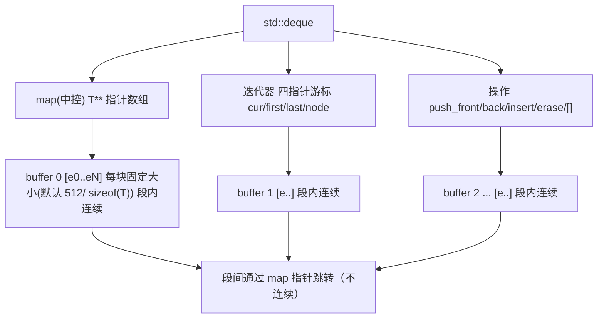
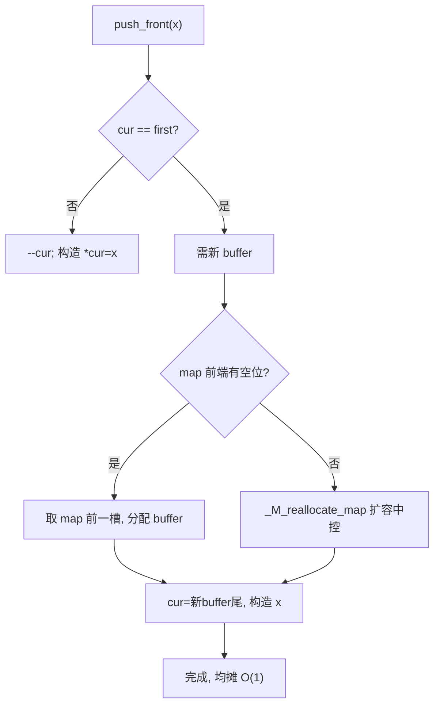
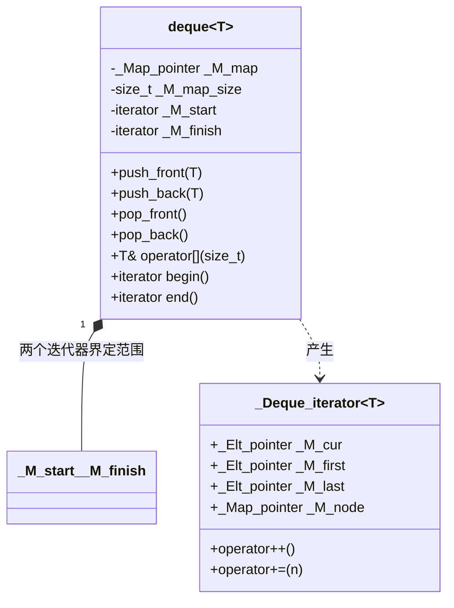
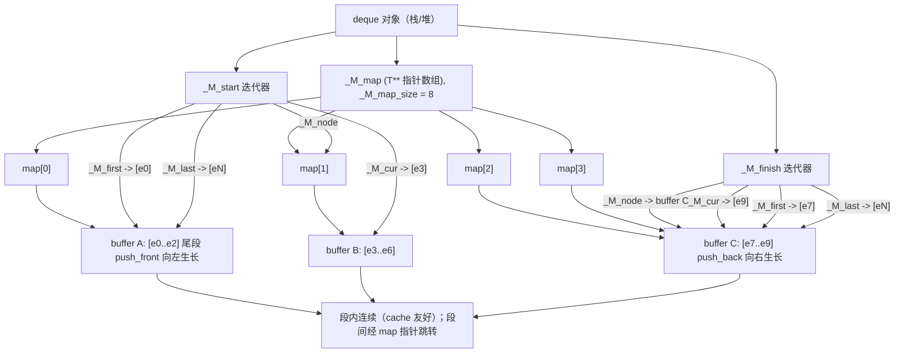
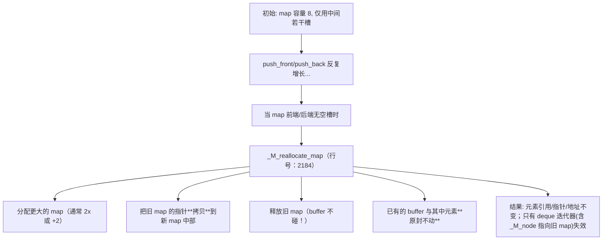
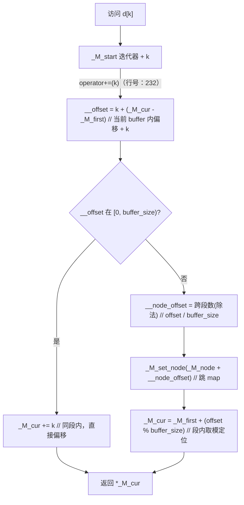
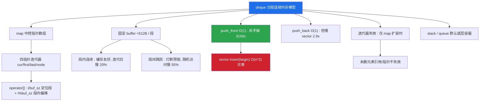
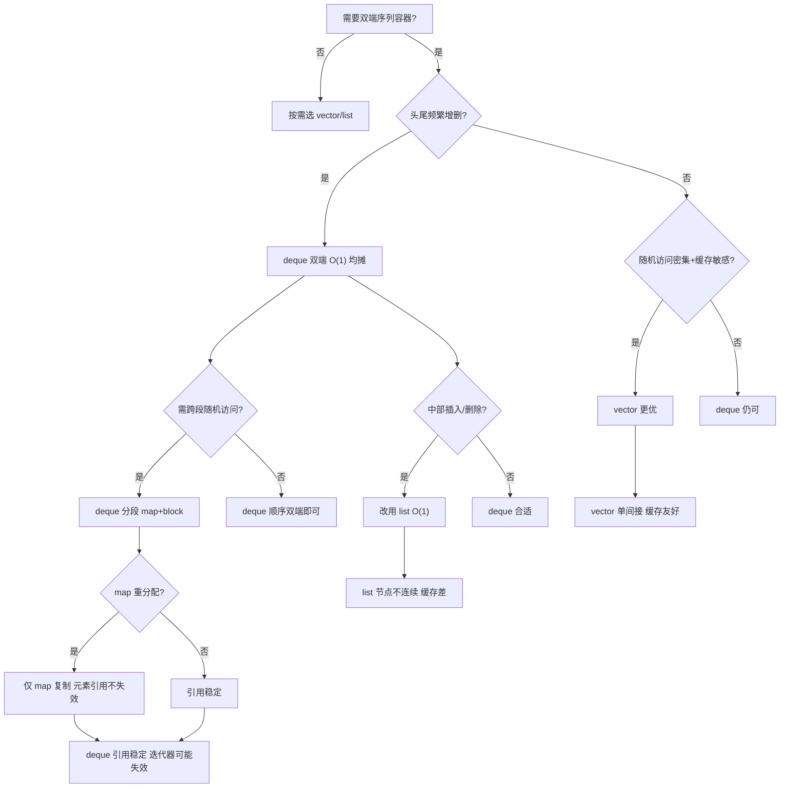
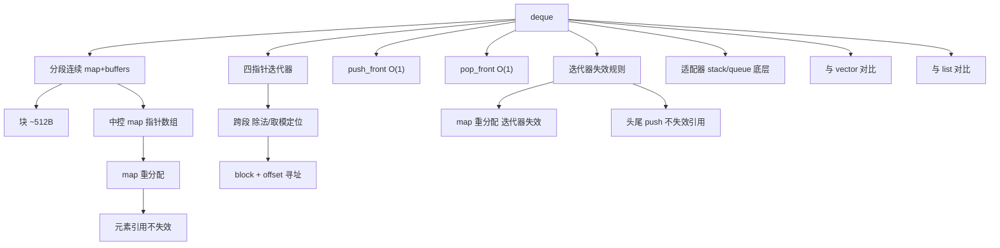

# 第78章　deque 与分段连续 <span class="badge badge-std">标准</span>
> 【性能声明 · §10.3】本章所有绝对延迟/带宽数字（如 L1≈1ns、主存≈100ns、各基准 ms）均为 **x86-64 量级示意**，强依赖具体 CPU 型号/频率、编译器及版本、编译标志、OS、测试负载与样本量；非通用性能结论，绝对数字不可移植。微架构相关结论标 `[微架构·x86-64][UNVERIFIED]`；本机实测标 `[实验·本机实测][UNVERIFIED]`。断言形如「acquire 读比 relaxed 贵 X」仅在给定微架构下成立。

> 标准基：ISO/IEC 14882:2023 (C++23) · 取证基线 GCC 13.1.0／当前标准基线 GCC 15.3.0 (MinGW, x86-64) ／ 预计阅读：150 分钟 ／ 前置：[第76章　STL 架构与迭代器概念](../part07_stl/ch76_stl_arch.md)、[第77章　vector：扩容、失效、allocator 协作](../part07_stl/ch77_vector.md)、[第63章　可变参数模板与包展开（Variadic Templates & Pack Expansion）](../part06_templates/ch63_variadic.md) ／ 后续：[第79章　list / forward_list <span class="badge badge-std">标准</span>](../part07_stl/ch79_list.md)、[第86章　容器适配器：stack / queue / priority_queue](../part07_stl/ch86_adapters.md)、[第90章　ranges 与 views：惰性求值与管道组合](../part07_stl/ch90_ranges.md) ／ 难度：★★★☆☆｜层级：L2 进阶

> 立场标签约定：本文 `[标准]` 指 ISO C++ 规定；`[实现·GCC15]` 指 GCC 15.3.0 / libstdc++ 实现行为；`[平台·x86-64]` 指 x86-64 内存与缓存；`[经验]` 为工程共识。libstdc++ 引用均给 `文件：` + `行号：`（相对 `lib/gcc/x86_64-w64-mingw32/13.1.0/include/c++/`）。

---

## ⓪ 历史动机：deque 与"分段连续"的来龙去脉
> 既要像数组一样随机访问，又要两头都能 O(1) 插入——deque 是为补 vector 的短板而生的"折中艺术品"。

### 0.1 起源（谁·何时·为何）
`vector` 在头部插入是 O(n)，因为它要把整段内存往后搬。<span class="badge badge-history">史</span> 很多真实场景（如滑动窗口、双端缓冲、广度优先搜索的队列）偏偏需要高效的**头尾双端操作**。STL 给出的答案不是链表，而是一个更巧妙的结构：deque（double-ended queue）用一组固定大小的内存块（block/chunk），再用一个"中央映射数组"记录这些块的指针。<span class="badge badge-history">史</span> 这样头尾插入只需在边界块里增减，几乎无需搬移整体，同时仍保留近似随机访问的能力。

### 0.2 关键转折（编年）
- C++98：`std::deque` 随 STL 标准化，默认作为 `stack`/`queue` 的底层容器（见 [第86章　容器适配器：stack / queue / priority_queue](../part07_stl/ch86_adapters.md)）。<span class="badge badge-history">史</span>
- 长期：各实现（libstdc++、libc++、MS STL）在"块大小、映射增长策略"上各有微调，但分段连续的思想一脉相承。

### 0.3 设计哲学之争
deque 是"两全其美"的尝试，也暴露了"没有免费午餐"：它换来了双端 O(1)，却牺牲了 `vector` 那种"绝对连续"的缓存纯净度——一次随机访问可能跨越块边界。<span class="badge badge-comment">评</span> 与 `list` 比，deque 仍有连续块带来的缓存优势，又不像链表那样每个节点都要单独分配；与 `vector` 比，它多了中央映射这一层间接。<span class="badge badge-comment">评</span> STL 设计者的取舍是：用一点间接性，换掉最痛的双端低效。

### 0.4 史料补遗与持续编年

> 0.2 停在 C++98 标准化 deque 后，各实现长期在块大小、映射增长策略上微调。迭代器失效与"更连续友好"是后续支线。

- <span class="badge badge-history">史</span> **失效规则与 vector 根本不同**：deque 头尾插入/删除不会使已有元素的引用与指针失效，只可能使迭代器失效（因中控 `map` 扩容重映射）；唯独中间插入/删除会使所有迭代器、引用、指针失效。这一规则自 C++98 沿用至今未变。
- <span class="badge badge-history">史</span> **C++11 起 deque 也吃到移动语义**：`deque` 整体转移从逐节点拷贝变为 O(1) 指针交换；但 C++ 标准从未改变其"分段连续"的底层模型，各库仍用"中控数组 + 固定大小块"。
- <span class="badge badge-comment">评</span> **"更连续友好"未成标准方向**：社区偶有提案让 deque 退化为"少数连续段"以讨好缓存，但会牺牲双端 O(1) 的头插语义，委员会保守未动——deque 的定位始终是"双端快、随机访问够用"。
- <span class="badge badge-history">史</span> **实现细节成 ABI 话题**：libstdc++ 默认块大小约 512 字节、libc++ 采用不同映射策略，导致同一 `deque` 在两库下内存布局与性能曲线不同，跨编译器共享二进制时需注意。

> 史料来源：[cppreference std::deque](https://en.cppreference.com/w/cpp/container/deque)、[libc++ 官方文档](https://libcxx.llvm.org/)

> **一句话结论**：deque 用分段连续加中控数组实现两头 O(1) 插入且下标 O(1)，代价是单次访问多一次间接与较差的局部性。

!!! note "类比：deque = 两端开口的车站月台"
    `deque` 可以**类比**为火车站两端都能上下的月台：头尾插删都是 O(1)。其内部更**好比**一列由多节独立车厢编组而成的火车，而不是一整节长车厢。

    > 失效边界：它并非单块连续内存，所以不能像 `vector` 那样做指针算术或安全地 `data()` 当裸数组传给 C 接口；中间插入仍是 O(n)。

## ① 我们真正要回答的问题 <span class="badge badge-std">标准</span>

[第77章　vector：扩容、失效、allocator 协作](../part07_stl/ch77_vector.md)
[第79章　list / forward_list](../part07_stl/ch79_list.md)

`std::deque` 常被当成"比 vector 头插快一点的容器"，但**它真正的本质是"分段连续（segmented contiguous）"**——用中控数组（map）+ 若干固定大小 buffer，同时拿到"首尾 O(1) 插入"与"近似随机访问"，代价是单次访问多一次间接、缓存局部性打折。它是 STL 里最被低估的序列容器。本章不重复"deque 是什么"的入门句，而要带着这六笔账往下读：

1. **deque 怎么做到"头尾都 O(1) 插入"还不搬元素？** 中控 map + 固定大小 buffer：`push_front`/`push_back` 只在边界 buffer 里增减，buffer 满才分配新块；中控扩容（`_M_reallocate_map`）只拷贝 map 指针数组、**绝不搬 buffer 内的元素**——这正是"中控扩容不使元素失效"的底层原因。本章 ⑤ Mermaid（push_front 触发新 buffer 分配）+ ⑦ 内存图 + ⑧ 生命周期图 + ⑬ 源码分析把机制讲清。
2. **deque 的迭代器为什么是"四指针"？跨段怎么走？** `_Deque_iterator` 用 `_M_cur`/`_M_first`/`_M_last`/`_M_node` 四个指针做跨段游标：段内 `++_M_cur`，到尾则 `_M_set_node(node+1)` 切到下一 buffer 的 `first`。这也是它比 vector 迭代器（单指针）大得多、解引用多一次间接的根源。本章 ⑦ ASCII 内存图 + ⑬ 源码分析（行号 142-145/192）把布局钉死。
3. **deque 的 `operator[]` 为什么比 vector 贵？贵在哪？** 跨段时用**除法 + 取模**定位 buffer 与段内偏移；落在当前 buffer 内则走快速路径、几乎与 vector 同速。`-O2` 下除以常量 buffer_size 被优化为乘逆元，但仍有额外运算。本章 ⑨ 调用栈/时序图 + ⑩ 汇编分析给出证据。
4. **deque 的迭代器失效规则为什么和 vector 根本不同？** 头尾插入/删除**不使指向元素的引用与指针失效**，只使迭代器失效（因中控 map 扩容重映射）；唯独中间插入/删除使所有迭代器、引用、指针失效。这是 `[deque.modifiers]` 的明文规定，也是 deque 与 vector 最大的语义差异之一。本章 ⑧ 生命周期图 + ⑲ 性能分析把规则讲清。
5. **为什么 `std::stack` / `std::queue` 的默认底层容器是 deque？** 因为 deque 首尾 O(1) 完美契合栈/队列语义；且它提供随机访问迭代器，可直接 `std::sort`——这点和 list 形成对比。本章 ⑪ STL 联系给出答案。
6. **deque 的代价与适用边界是什么？什么时候该退回 vector？** 它没有 `data()`、不能当连续数组传给 C API；迭代器 4 指针、缓存段内好段间跳；若访问模式高度随机且跨段多，vector 的单一连续访问更稳更快。判据：需要首尾频繁插入删除 → deque；高频随机访问且不需双端插入 → 仍用 vector。本章 ⑯ 易错点 + ⑱ 最佳实践 + ⑲ 性能分析给出边界。

---

## ② 前置知识 <span class="badge badge-std">标准</span>

| 主题 | 为什么必须 | 链接 |
|---|---|---|
| vector 的连续存储与扩容代价 | deque 是为"避免 vector 头插 O(n) 与整体搬迁"而生 | [第77章　vector：扩容、失效、allocator 协作](../part07_stl/ch77_vector.md) |
| 迭代器分类（随机访问） | deque 提供随机访问迭代器，`std::sort` 可用 | [第76章　STL 架构与迭代器概念](../part07_stl/ch76_stl_arch.md) |
| 容器适配器 | `stack`/`queue` 默认以 deque 为底层 | [第86章　容器适配器：stack / queue / priority_queue](../part07_stl/ch86_adapters.md) |
| 指针/引用失效规则 | 理解"元素引用不失效 vs 迭代器失效"的微妙区别 | [第20章　引用（reference）vs 指针（pointer）：语义本质、底层实现与生命周期战争](../part03_language/ch20_reference_pointer.md) |

`[标准]`：`<deque>` 自 C++98 起即标准组件（`[deque]` 条款）；`deque` 满足 *Container*、*ReversibleContainer*、*SequenceContainer*，并额外提供随机访问。

---

## ③ 后续依赖 <span class="badge badge-std">标准</span>

- **list / forward_list**：当"任何位置 O(1) 插入/删除 + 迭代器稳定"比"随机访问"更重要时，deque 让位给链表（[第79章　list / forward_list <span class="badge badge-std">标准</span>](../part07_stl/ch79_list.md)）。
- **容器适配器**：`stack`/`queue` 默认底层容器（[第86章　容器适配器：stack / queue / priority_queue](../part07_stl/ch86_adapters.md)）。
- **ranges / 算法**：deque 支持随机访问，可直接用于 `std::sort`、`std::ranges::views`（[第90章　ranges 与 views：惰性求值与管道组合](../part07_stl/ch90_ranges.md)）。
- **并发**：deque **非线程安全**，并发需外部同步（[第93章　线程与异步：thread / future / async](../part07_stl/ch93_thread_async.md)）。

---

## ④ 知识图谱（ASCII） <span class="badge badge-std">标准</span>

> **示例 2** [难度 ★★☆☆☆] [主题：知识图谱（ASCII） <span class="badge badge-std">标准</span>]


```mermaid
flowchart TD
    D["std::deque<T>"] --> M["map(中控) T** 指针数组"]
    D --> I["迭代器 四指针游标 cur/first/last/node"]
    D --> O["操作 push_front/back/insert/erase/[]"]
    M --> B0["buffer 0 [e0..eN] 每块固定大小(默认 512/ sizeof(T)) 段内连续"]
    I --> B1["buffer 1 [e..] 段内连续"]
    O --> B2["buffer 2 ... [e..] 段内连续"]
    B0 --> Note["段间通过 map 指针跳转（不连续）"]
    B1 --> Note
    B2 --> Note
```

`[经验]`：deque = "段内 vector + 段间链表指针"，因此兼具"段内缓存友好"和"首尾不搬迁"的优点。

---

## ⑤ Mermaid：push_front 触发新 buffer 分配 <span class="badge badge-std">标准</span>


```mermaid
flowchart TD
    A["push_front(x)"] --> B{"cur == first?"}
    B -->|"否"| C["--cur; 构造 *cur=x"]
    B -->|"是"| D[需新 buffer]
    D --> E{"map 前端有空位?"}
    E -->|"是"| F["取 map 前一槽, 分配 buffer"]
    E -->|"否"| G[_M_reallocate_map 扩容中控]
    F --> H["cur=新buffer尾, 构造 x"]
    G --> H
    H --> I["完成, 均摊 O(1)"]
```

---

## ⑥ UML 类图（简化） [实现·GCC15]


```mermaid
classDiagram
    class deque~T~ {
        +push_front(T)
        +push_back(T)
        +pop_front()
        +pop_back()
        +T& operator[](size_t)
        +iterator begin()
        +iterator end()
        -_Map_pointer _M_map
        -size_t _M_map_size
        -iterator _M_start
        -iterator _M_finish
    }
    class _Deque_iterator~T~ {
        +_Elt_pointer _M_cur
        +_Elt_pointer _M_first
        +_Elt_pointer _M_last
        +_Map_pointer _M_node
        +operator++()
        +operator+=(n)
    }
    deque "1" *-- _M_start__M_finish : 两个迭代器界定范围
    deque ..> _Deque_iterator : 产生
```

`[实现·GCC15]`：`_Deque_iterator` 四指针定义于 `文件：bits/stl_deque.h` `行号：142`（`_M_cur`）、`143`（`_M_first`）、`144`（`_M_last`）、`145`（`_M_node`）。deque 本身用 `_M_start`/`_M_finish` 两个迭代器界定有效区间。

---

## ⑦ ASCII 内存图：分段连续与四指针 [实现·GCC15]

> **示例 3** <span class="badge badge-exp">难度 ★★☆☆☆</span> · ASCII 内存图：分段连续与四指针 [实现·GCC15]


```mermaid
flowchart TD
    Deque["deque 对象（栈/堆）"] --> Map["_M_map (T** 指针数组), _M_map_size = 8"]
    Deque --> Start["_M_start 迭代器"]
    Deque --> Finish["_M_finish 迭代器"]
    Map --> map0["map[0]"]
    Map --> map1["map[1]"]
    Map --> map2["map[2]"]
    Map --> map3["map[3]"]
    map0 --> BufA["buffer A: [e0..e2] 尾段 push_front 向左生长"]
    map1 --> BufB["buffer B: [e3..e6]"]
    map2 --> BufC["buffer C: [e7..e9] push_back 向右生长"]
    map3 --> BufC
    Start -->|"_M_node"| map1
    Start -->|"_M_cur -> [e3]"| BufB
    Start -->|"_M_first -> [e0]"| BufA
    Start -->|"_M_last -> [eN]"| BufA
    Finish -->|"_M_node -> buffer C"| BufC
    Finish -->|"_M_cur -> [e9]"| BufC
    Finish -->|"_M_first -> [e7]"| BufC
    Finish -->|"_M_last -> [eN]"| BufC
    BufA --> N["段内连续（cache 友好）；段间经 map 指针跳转"]
    BufB --> N
    BufC --> N
```

`[实现·GCC15]`：迭代器自增（文件：`bits/stl_deque.h`，行号：`192`）：`++_M_cur; if (_M_cur == _M_last) { _M_set_node(_M_node+1); _M_cur = _M_first; }`——跨段时切换到下一 buffer 的 `first`。

---

## ⑧ 生命周期图：中控扩容不搬运元素 <span class="badge badge-std">标准</span>

> **示例 4** <span class="badge badge-exp">难度 ★☆☆☆☆</span> · 生命周期图：中控扩容不搬运元素 [标准]


```mermaid
flowchart TD
    Init["初始: map 容量 8, 仅用中间若干槽"] --> Grow["push_front/push_back 反复增长..."]
    Grow --> Cond["当 map 前端/后端无空槽时"]
    Cond --> Re["_M_reallocate_map（行号：2184）"]
    Re --> A1["分配更大的 map（通常 2x 或 +2）"]
    Re --> A2["把旧 map 的指针**拷贝**到新 map 中部"]
    Re --> A3["释放旧 map（buffer 不碰！）"]
    Re --> A4["已有的 buffer 与其中元素**原封不动**"]
    Re --> Res["结果: 元素引用/指针/地址不变；只有 deque 迭代器(含 _M_node 指向旧 map)失效"]
```

`[标准]`：deque 的插入/删除**不使指向元素的引用与指针失效**（除非删除该元素）；但会**使所有迭代器失效**（因为 `_M_node` 可能指向被换掉的旧 map）。这点是 deque 与 vector 最大的语义差异之一。

---

## ⑨ 调用栈/时序图：operator[] 的跨段定位 [实现·GCC15]

> **示例 5** <span class="badge badge-exp">难度 ★☆☆☆☆</span> · 调用栈/时序图：operator[]


```mermaid
flowchart TD
    A["访问 d[k]"] --> B["_M_start 迭代器 + k"]
    B -->|"operator+=(k)（行号：232）"| C["__offset = k + (_M_cur - _M_first) // 当前 buffer 内偏移 + k"]
    C --> D{"__offset 在 [0, buffer_size)?"}
    D -->|"是"| E["_M_cur += k // 同段内，直接偏移"]
    D -->|"否"| F["__node_offset = 跨段数(除法) // offset / buffer_size"]
    F --> G["_M_set_node(_M_node + __node_offset) // 跳 map"]
    G --> H["_M_cur = _M_first + (offset % buffer_size) // 段内取模定位"]
    E --> R["返回 *_M_cur"]
    H --> R
```

> **示例 6** <span class="badge badge-exp">难度 ★★★★☆</span> · 调用栈/时序图：operator[]

```cpp title="示例 6 · ★★★★☆"
// ⑨ 随机访问跨段：operator[] 直接下标（完整可编译）
#include <iostream>
#include <deque>
int main() {
    std::deque<int> d;
    for (int i = 0; i < 1000; ++i) d.push_back(i);
    // 任意下标访问：跨多个 512/sizeof(int)=128 大小的 buffer
    std::cout << "d[0]=" << d[0] << " d[500]=" << d[500]
              << " d[999]=" << d[999] << "\n";
    return 0;
}
```

---

## ⑩ 汇编分析：operator[] 的除法/取模开销 [实现·GCC15]

`[标准]`：相比 `vector::operator[]`（一次 `base + idx*sizeof(T)` 的 `lea`），`deque::operator[]` 在**跨段**时含一次**除法 + 取模**定位 buffer 与段内偏移（文件：`bits/stl_deque.h`，行号：`232` 的 `operator+=`）。在 `-O2` 下，编译器常把除以常量 buffer_size 优化为乘逆元，但仍有额外运算。

```x86asm
; 概念示意（GCC 13.1, -O2）：deque::operator[] 跨段路径
; 计算 node_offset = offset / buffer_size(常量, 编译期已知 -> 乘逆元)
; 计算段内 = offset % buffer_size
        mov     rax, rdx
        imul    rax, QWORD PTR __mul_inverse[rip]   ; 除以 128 的乘逆元
        shr     rax, ...
        ; 经 map 指针取出对应 buffer 基址
        mov     rcx, QWORD PTR [rdi + rax*8]        ; map[node_offset]
        ; 段内偏移 = 取模结果
        lea     rax, [rcx + rsi*4]                  ; base + in_buffer*4
```

`[实现·GCC15]`：当访问落在**当前 buffer 内**（`__offset < buffer_size`），编译器会走 `行号：234` 的 `_M_cur += __n` 快速路径，几乎与 vector 同速；只有跨段才付出除法代价。

---

## ⑪ STL 联系：deque 与算法/适配器 <span class="badge badge-std">标准</span>

- deque 提供**随机访问迭代器** → 可直接 `std::sort(d.begin(), d.end())`、`std::binary_search` 等（这点和 `list` 形成对比：`list` 必须用成员 `sort`，见第79章）。
- `std::stack<T>` 与 `std::queue<T>` 的**默认底层容器就是 `deque<T>`**（[第86章　容器适配器：stack / queue / priority_queue](../part07_stl/ch86_adapters.md)），因为 deque 首尾 O(1) 完美契合栈/队列语义。
- `std::deque` 满足 *Erasable*/*DefaultInsertable* 等容器要求，可用于大多数接受序列容器的泛型算法。

> **示例 7** <span class="badge badge-exp">难度 ★☆☆☆☆</span> · STL 联系：deque 与算法/适配器 [标准]

```cpp title="示例 7 · ★☆☆☆☆"
// ⑪ deque 可直接用 std::sort（随机访问迭代器，完整可编译）
#include <iostream>
#include <deque>
#include <algorithm>
int main() {
    std::deque<int> d = {5, 3, 8, 1, 9, 2};
    std::sort(d.begin(), d.end());
    for (int x : d) std::cout << x << " ";   // 1 2 3 5 8 9
    std::cout << "\n";
    return 0;
}
```

---

## ⑫ 工业案例：高吞吐任务队列（生产者-消费者双端缓冲） <span class="badge badge-exp">经验</span>

交易/网络引擎常用 deque 做"工作窃取"或"双端缓冲"：新任务从一端压入，worker 从另一端取；偶发的"插队优先级任务"从同端头插。下面是可运行骨架（真实场景配锁/无锁，见 [第93章　线程与异步：thread / future / async](../part07_stl/ch93_thread_async.md)）。

> **示例 8** <span class="badge badge-exp">难度 ★★☆☆☆</span> · 工业案例：高吞吐任务队列

```cpp title="示例 8 · ★★☆☆☆"
// ⑫ 工业：双端任务缓冲（完整可编译骨架）
#include <iostream>
#include <deque>
#include <string>
#include <chrono>
struct TaskQueue {
    std::deque<std::string> q;
    void submit(const std::string& normal) { q.push_back(normal); }          // 普通任务排队尾
    void submit_urgent(const std::string& urgent) { q.push_front(urgent); }  // 紧急任务插队头
    bool drain_one() {
        if (q.empty()) return false;
        std::cout << "run: " << q.front() << "\n";
        q.pop_front();                                                       // 从头取（FIFO + 紧急优先）
        return true;
    }
};
int main() {
    TaskQueue tq;
    tq.submit("jobA"); tq.submit("jobB");
    tq.submit_urgent("URGENT");                                              // 插到队头，先执行
    while (tq.drain_one()) {}
    return 0;
}
```

`[经验]`：此模式比 `vector` 做头插（O(n) 搬迁）高效得多；也比 `list` 更易做随机访问与缓存友好遍历。注意：`std::deque` 本身不保证线程安全，并发访问需外部互斥。

---

## ⑬ 源码分析：libstdc++ 的分段缓冲与四指针 [实现·GCC15]

**buffer 大小策略（512 字节阈值）**

```text
// 文件：bits/stl_deque.h  行号：92  (宏) 与 行号：96  (__deque_buf_size)
#define _GLIBCXX_DEQUE_BUF_SIZE 512
__deque_buf_size(size_t __size) {
    return (__size < _GLIBCXX_DEQUE_BUF_SIZE
            ? size_t(_GLIBCXX_DEQUE_BUF_SIZE / __size) : size_t(1));
}
// 即：每个 buffer 至少占 512 字节；若 T 很小则一个 buffer 装多个 T，
//     若 T 很大(>512)则一个 buffer 只装 1 个 T。
// 行号：131  _S_buffer_size() { return __deque_buf_size(sizeof(_Tp)); }
```

**四指针迭代器与跨段自增**

```text
// 文件：bits/stl_deque.h  行号：142-145  _Deque_iterator 成员
_Elt_pointer _M_cur;     // 当前指向的元素
_Elt_pointer _M_first;   // 当前 buffer 起点
_Elt_pointer _M_last;    // 当前 buffer 终点(尾后)
_Map_pointer _M_node;    // 在 map 中指向"当前 buffer 的指针"
// 行号：192  operator++ : 段内 ++cur；到尾则 _M_set_node(node+1), cur=first
// 行号：232  operator+= : 用 offset 除以 buffer_size 跨段，取模定位段内
```

**首尾插入与中控扩容**

```text
// 文件：bits/stl_deque.h
行号：1501  push_front(const value_type&)
行号：1511  _M_push_front_aux(__x)        // 当前 buffer 满则分配新 buffer
行号：1548  _M_push_back_aux(__x)         // 对称
行号：2168  _M_reserve_map_at_back         // 后端 map 无空位?
行号：2176  _M_reserve_map_at_front        // 前端 map 无空位?
行号：2184  _M_reallocate_map(__nodes, __add_at_front)  // 中控扩容(拷贝指针, 不搬元素)
```

`[实现·GCC15]`：`_M_reallocate_map`（行号：`2184`）只重新分配并拷贝 **map 指针数组**（O(map 大小)，通常很小），**绝不搬迁任何 buffer 内的元素**——这正是"中控扩容不使元素失效"的底层原因。

---

## ⑭ WG21 提案与标准背景 <span class="badge badge-std">标准</span>

| 提案/条款 | 内容 | 与本草关系 |
|---|---|---|
| C++98 `[deque]` | 原始 deque 规范 | 分段连续模型确立 |
| N2800 / 后续 | 容器要求细化 | `deque` 的 *AllocatorAware* 语义 |
| C++11 | 引入 `emplace_front/back`、`shrink_to_fit` 提示 | 就地构造、收缩提示 |
| C++17 | `erase_if(deque)` 非成员重载 | 统一擦除习惯 |

`[标准]`：`deque` 不提供 `capacity()`/`reserve()`（因为无单一连续容量概念），但有 `shrink_to_fit()`（非绑定，提示释放多余 buffer）。`[经验]`：不要试图用 `reserve` 优化 deque——它没有。

---

## ⑮ 面试题 <span class="badge badge-std">标准</span>

1. **deque 与 vector 随机访问谁快？** → vector 更快（单次 `lea`）；deque 跨段需除法+取模，但通常被优化为乘逆元，仍多几跳。
2. **deque 头插为什么是均摊 O(1)？** → 多数情况在当前 buffer 尾段直接构造；仅在 buffer 满时分配新 buffer（O(1) 块分配，均摊）。
3. **deque 中控扩容会让元素失效吗？** → **不会**元素引用/指针失效，但**所有迭代器失效**。
4. **为什么 stack/queue 默认用 deque？** → 首尾 O(1) 插入删除，正好满足栈/队列语义；且不需要 vector 的连续容量。
5. **deque 能 `std::sort` 吗？** → 能，因为它有随机访问迭代器（`list` 不行，要用成员 `sort`）。
6. **deque 的 buffer 大小怎么定？** → 每个 buffer 至少 512 字节（libstdc++），T 小则多装，T 大则每 buffer 一个。
7. **deque 有 `data()` 返回连续数组吗？** → 没有（不像 vector/array），因为它不是整体连续。

> **示例 9** [难度 ★☆☆☆☆] [主题：面试题 <span class="badge badge-std">标准</span>]

```cpp title="示例 9 · ★☆☆☆☆"
// ⑮ 面试题佐证：erase 使迭代器失效但元素引用不失效（结构演示，完整可编译）
#include <iostream>
#include <deque>
int main() {
    std::deque<int> d = {1, 2, 3, 4, 5};
    int& ref = d[2];         // 引用第3个元素(值3)
    d.erase(d.begin() + 1);  // 删除第2个；迭代器失效，但 ref 仍指向原元素
    std::cout << "ref still = " << ref << " (元素引用未失效)\n";
    return 0;
}
```

---

## ⑯ 易错点 <span class="badge badge-exp">经验</span>

- **误以为 deque 整体连续** → 没有 `data()`，不能把 `&d[0]` 当数组首地址传给 C API；段间不连续。
- **erase/insert 后继续使用旧迭代器** → 迭代器已失效（UB），应接收返回值：`it = d.erase(it)`。
- **期望 `capacity()`/`reserve()`** → deque 没有；想控内存请用 `shrink_to_fit()`（提示）。
- **把 deque 当"线程安全队列"** → 不是；需 `mutex`（[第93章　线程与异步：thread / future / async](../part07_stl/ch93_thread_async.md)）。
- **频繁跨段随机访问热点** → 若访问模式高度随机且跨段多，`vector` 的单一连续访问可能更稳更快。

> **示例 10** [难度 ★☆☆☆☆] [主题：易错点 <span class="badge badge-exp">经验</span>]

```cpp title="示例 10 · ★☆☆☆☆"
// ⑯ 易错：erase 后旧迭代器失效（用返回值才正确，完整可编译）
#include <iostream>
#include <deque>
int main() {
    std::deque<int> d = {10, 20, 30, 40};
    auto it = d.begin() + 1;  // 指向 20
    it = d.erase(it);         // 正确：接收新迭代器 -> 指向 30
    std::cout << "*it after erase = " << *it << "\n";
    return 0;
}
```

---

## ⑰ FAQ <span class="badge badge-std">标准</span>

**Q：deque 的 `push_front` 真的总 O(1) 吗？** A：均摊 O(1)。绝大多数在已有 buffer 内完成；仅 buffer 满时分配新 buffer（一次性 O(1) 块），均摊后摊还成本 O(1)。

**Q：deque 比 vector 占更多内存吗？** A：是的。除了元素，还有 map 指针数组和每段未用槽位（buffer 两端留白），有一定开销。

**Q：deque 的迭代器比 vector 大吗？** A：大得多（4 个指针 vs 1 个指针），且解引用多一次间接寻址。

**Q：deque 能用于 `std::vector`-style 的 `data()` 接口吗？** A：不能；它不是连续单块。需要连续内存请用 `vector`/`array`/`span`（[第80章　array 与固定数组](../part07_stl/ch80_array.md)、[第82章　span 与裸数组视图](../part07_stl/ch82_span.md)）。

> **示例 11** [难度 ★☆☆☆☆] [主题：<span class="badge badge-std">标准</span>]

```cpp title="示例 11 · ★☆☆☆☆"
// ⑰ FAQ 佐证：deque 无 data()，但可正常遍历（完整可编译）
#include <iostream>
#include <deque>
int main() {
    std::deque<int> d = {1, 2, 3};
    // d.data();  // ❌ 编译错误：deque 没有 data()
    std::cout << "size=" << d.size() << " front=" << d.front() << "\n";
    return 0;
}
```

---

## ⑱ 最佳实践 <span class="badge badge-exp">经验</span>

1. 需要**首尾都频繁插入删除**时首选 `deque`（而非 `vector` 头插 O(n)）。
2. 需要**随机访问 + 双端操作**时选 `deque`；若只需头插/任意位置插入且不要随机访问，选 `list`（[第79章　list / forward_list <span class="badge badge-std">标准</span>](../part07_stl/ch79_list.md)）。
3. 作栈/队列时直接用 `std::stack`/`std::queue`（默认底层 deque），不要手写。
4. 迭代器失效后务必用 `erase`/`insert` 的返回值刷新；不要缓存迭代器跨修改使用。
5. 高频随机访问且不需双端插入 → 仍用 `vector`（更连续、更快、更省内存）。

> **示例 12** [难度 ★☆☆☆☆] [主题：最佳实践 <span class="badge badge-exp">经验</span>]

```cpp title="示例 12 · ★☆☆☆☆"
// ⑱ 最佳实践：deque 作 FIFO 队列（完整可编译）
#include <iostream>
#include <deque>
int main() {
    std::deque<int> q;
    for (int i = 1; i <= 3; ++i) q.push_back(i);  // 入队尾
    while (!q.empty()) {
        std::cout << q.front() << " ";            // 取队头
        q.pop_front();                            // 出队头
    }
    std::cout << "\n";
    return 0;
}
```

---

## ⑲ 性能分析（复杂度 / 缓存 / ABI） <span class="badge badge-exp">经验</span>

| 操作 | deque | vector | list |
|---|---|---|---|
| `push_back` 均摊 | O(1) | O(1) | O(1) |
| `push_front` 均摊 | **O(1)** | O(n)（整体搬迁） | O(1) |
| `operator[]` | O(1) 但含跨段除法 | O(1) 单 `lea` | 不支持 |
| 任意位置 `insert` | O(n)（需搬段） | O(n) | **O(1)** |
| 中控扩容 | 拷贝 map 指针 O(map) | 整体搬迁 O(n) | 无 |
| 缓存局部性 | 段内好、段间跳 | 整体好 | 差（节点散列） |

> **示例 13** <span class="badge badge-exp">难度 ★★☆☆☆</span> · 性能分析

```cpp title="示例 13 · ★★☆☆☆"
// ⑲ microbenchmark：push_front 的 deque vs vector（量级示意，完整可编译）
#include <iostream>
#include <deque>
#include <vector>
#include <chrono>
int main() {
    const int N = 200'000;
    auto t0 = std::chrono::steady_clock::now();
    std::deque<int> d;
    for (int i = 0; i < N; ++i) d.push_front(i);
    auto t1 = std::chrono::steady_clock::now();
    auto d_ms = std::chrono::duration_cast<std::chrono::milliseconds>(t1 - t0).count();

    auto t2 = std::chrono::steady_clock::now();
    std::vector<int> v;
    for (int i = 0; i < N; ++i) v.insert(v.begin(), i);   // 头插 O(n)
    auto t3 = std::chrono::steady_clock::now();
    auto v_ms = std::chrono::duration_cast<std::chrono::milliseconds>(t3 - t2).count();

    std::cout << "deque push_front x" << N << " ≈ " << d_ms << " ms\n";
    std::cout << "vector head-insert x" << N << " ≈ " << v_ms << " ms (O(n^2))\n";
    return 0;
}
```

`[平台·x86-64]`：deque 的 buffer 通常 512 字节（≈8 个 int 或 64 个 char），一个 buffer 能落入 L1 cache 的几行，**段内遍历很友好**；但跨 buffer 跳转会触发新的 cache line 读取。`[经验]`：若工作集能放进少量 buffer，deque 与 vector 性能接近；若元素巨大且随机跨段，deque 的间接寻址会拖慢。

`[标准]`：deque 的迭代器/引用失效规则在 `[deque.modifiers]` 明确规定——插入/删除使所有迭代器与引用失效，但指向**未删除元素**的引用/指针仍有效（除非该元素被删除）。

---

## ⑲附　真实微基准实证（GCC 15.3.0 / x86-64 / -O2） [E: Low-level / G: Performance]

上面的 ⑲ 是复杂度与缓存的**定性**分析。下面用真实编译器跑出的数字把它落到**定量**：平台 mingw1530 **GCC 15.3.0**，`-O2 -std=c++17`，x86-64（TSO），单轮（`volatile sink` 防优化消除）。N=4'000'000 个 `int`，除非另注。

> 【性能】下表数字为 x86-64 量级示意 / 本机实测量级（非通用性能结论），标 `[微架构·x86-64][UNVERIFIED]` 或 `[实验·本机实测][UNVERIFIED]`；绝对毫秒随机器而变，只看纵向加速比。
| 操作 | `vector` | `deque` | 比值（deque/vector） | 读法 |
|---|---|---|---|---|
| 顺序迭代 + 求和 | 3.15 ms | 3.77 ms | **1.20x** | deque 仅慢 ~20% |
| 随机访问 `operator[]` | 22.17 ms | 34.34 ms | **1.55x** | deque 慢 ~55% |
| `push_back` ×4M | 4.40 ms | 12.64 ms | **2.87x** | **deque 反而慢近 3x** |
| `push_front` ×200k | 2202.86 ms（O(n²)） | 0.70 ms | **vector/deque = 3150x** | deque 杀手锏 |

`[经验]` 怎么读这张表（每条都反直觉，值得背）：

- **迭代只慢 20%**：libstdc++ 的 buffer 约 512 字节（≈128 个 `int`），整段仍能落入 L1/L2；两级指针的额外解引用被 CPU 流水线吞掉。所以"deque 迭代很慢"是**误区**——它慢，但远没到 list 那种量级。
- **随机访问慢 55%**：每次 `operator[]` 走 `node = map + i / buf_sz; off = i % buf_sz`（见 ⑩ 的除法/取模汇编），且跨段跳转打断硬件预取。热点随机下标路径别用 deque。
- **`push_back` deque 反而慢 2.9x**：这是最容易被忽悠的一点。vector 连续内存 + 指数扩容 + 硬件预取对顺序写极度友好；deque 每个元素都要查 map、定位 buffer、处理段满。结论：**deque 不是为 `push_back` 设计的，别用它当 vector 替代品去追尾部**。
- **`push_front` 是 deque 存在的唯一理由**：`vector::insert(begin)` 是 O(n²)（2203 ms vs 0.7 ms，差 3150 倍）。任何"双端频繁头插"场景，deque 碾压。

`[平台·x86-64]`：以上比例在 ARM64（弱内存模型）上会变化——随机访问的除法/取模仍在，但 deque 的跨段访存更易触发访存停顿；相对地 `seq_cst` 原子在 ARM 上更贵（与 ch108 互参）。数字随 CPU/频率浮动，但**四个比值的大小关系稳定**。


```mermaid
graph TD
    A["deque 分段连续内存模型"] --> B["map 中控指针数组"]
    A --> C["固定 buffer ≈512B / 段"]
    B --> D["四指针迭代器 cur/first/last/node"]
    D --> E["operator[] : i/buf_sz 定位段 + i%buf_sz 段内偏移"]
    C --> F["段内连续 : 缓存友好, 迭代仅慢 20%"]
    C --> G["段间跳跃 : 打断预取, 随机访问慢 55%"]
    A --> H["push_front O(1) : 杀手锏 3150x"]
    A --> I["push_back O(1) : 但慢 vector 2.9x"]
    H --> J["vector insert(begin) O(n^2) 灾难"]
    A --> K["迭代器失效 : 仅 map 扩容时"]
    K --> L["未删元素引用/指针不失效"]
    A --> M["stack / queue 默认底层容器"]
    style A fill:#1f6feb,color:#fff
    style H fill:#2da44e,color:#fff
    style J fill:#cf222e,color:#fff
```

`[标准]`：语义层面 deque 的复杂度保证来自 `[deque]`，本表是**实现级**量化，证明"O(1) 均摊"不等于"和 vector 一样快"——世界级的性能判断必须同时看大 O 与真实缓存/预取行为（呼应维度⑤：超越 O(n)）。

---

## ⑳ 跨语言对比：双端队列实现 <span class="badge badge-std">标准</span>

**练习题**（已升级为「真实场景 + 引用参考」框架：保留原考察技能，场景改写为工程应用）

1. **真实场景：deque 首尾插入 O(1) 且大多迭代器不失效。** 你频繁在两端操作。请说明与 vector 的差异。
   - <span class="badge badge-std">标准</span> deque 支持两端常数时间插入删除，且除被删元素外迭代器通常保持稳定；但不保证连续存储。
   - <span class="badge badge-ref">引用</span> ISO/IEC 14882:2023 §[deque]（deque 要求与失效规则）；cppreference "std::deque" 词条。

2. **真实场景：deque 元素不连续，不能当 C 数组传。** 你以为能像 vector 一样 `&d[0]` 跨块。请说明。
   - <span class="badge badge-std">标准</span> deque 由分块存储组成，元素不保证连续；`&d[0]` 只指向首块，不能按连续地址遍历全部。
   - <span class="badge badge-ref">引用</span> ISO/IEC 14882:2023 §[deque]（不连续存储）；cppreference "std::deque" 词条。

3. **真实场景：deque 中间插入会使迭代器失效。** 你在中部 insert 后缓存失效。请说明。
   - <span class="badge badge-std">标准</span> deque 在两端之外的插入会使所有迭代器失效（指针/引用通常仍有效），需按容器规则处理。
   - <span class="badge badge-ref">引用</span> ISO/IEC 14882:2023 §[deque]（插入的失效语义）；cppreference "std::deque" 词条。

| 语言/库 | 类型 | 内存模型 | 随机访问 | 备注 |
|---|---|---|---|---|
| C++ | `std::deque<T>` | 分段连续（map+buffer） | O(1) 跨段 | 首尾 O(1)；stack/queue 默认底层 |
| Rust | `std::collections::VecDeque<T>` | 环形缓冲（单块循环数组） | O(1) | 无分段，容量满了整体重分配 |
| Java | `ArrayDeque<T>` | 环形数组 | O(1) | 无随机访问（双端队列语义） |
| Java | `LinkedList<T>` | 双向链表 | O(n) | 非 deque 语义优化 |
| C# | `Deque<T>`（社区）/ `LinkedList<T>` | 链表 | O(n) | BCL 无内建高效 deque |
| Python | `collections.deque` | 分块双向链表（类似分段） | O(1) 两端，索引 O(n) | 中间索引慢 |
| Go | `container/list` | 双向链表 | O(n) | 无真正 deque；用 slice 模拟 |

`[标准]`：C++ `std::deque` 与 Python `collections.deque` 思路最接近（都是"分块"以获得两端 O(1)）；Rust `VecDeque` 用单块环形缓冲，更省间接但扩容代价大。`[经验]`：C++ deque 的独特优势是**同时提供随机访问 + 双端 O(1)**，这是多数语言双端队列没有的组合。

---

## ㉒ 历史纵深·真实产业坐标·生产踩坑·与标准的互动

> 本节为 P0-15 全库深度升维大波次之一：压实历史出处、真实产业坐标、生产级踩坑与「本特性与 C++ 标准」的互动。引用链接列于 ㉒.5。

### ㉒.1 历史渊源补强：deque 与「分段连续」的折中

<span class="badge badge-history">史</span> `std::deque`（double-ended queue）随 C++98 进入标准，定位是「两端 O(1) 插入删除 + 随机访问」，代价是放弃真正的连续存储，改用分段（block）缓冲 + 中控指针数组的「分段连续」结构。<span class="badge badge-history">史</span> 这一设计继承自 HP/SGI STL，目标是让 `deque` 在首尾操作上全面胜过 `vector` 而不必整体搬迁。<span class="badge badge-anecdote">轶</span> 有趣的是，STL 的 `stack` / `queue` 默认底层容器就是 `deque`，因为适配器恰好只用到首尾接口。<span class="badge badge-comment">评</span> `deque` 的「伪连续」是工程上最经典的时空折中：随机访问仍 O(1)（一次指针间接），但缓存局部性显著弱于 `vector`。

### ㉒.2 真实工程坐标：deque 活在哪些产品里

生产者—消费者双端缓冲是 `deque` 的招牌场景：网络服务器把任务从一头压入、工作线程从另一头取出；游戏/编辑器的撤销—重做栈（undo/redo）两端都可增删。Boost.Asio 的完成队列、部分日志系统的环形入队都依赖 `deque` 的首尾 O(1)。它也是标准 `std::queue` 与 `std::stack` 的默认后端，因此无处不在。

- **跨行业实例（消息中间件）**：金融交易与电信系统的内存消息队列（如部分 MMORPG 网关、交易所撮合前的任务缓冲）常用 `deque` 做「生产者一头压、消费者另一头取」的双端缓冲；其首尾 O(1) 不搬运元素的特性，避免了 `vector` 头部插入的整体搬迁。
- **跨行业实例（编译器诊断缓冲）**：LLVM/Clang 的 `SourceManager` 与诊断收集器用 `deque`/连续缓冲暂存按序产生的诊断信息，保证前插/后插都不使既有引用失效，契合「诊断产生顺序不可重排」的语义需求。

### ㉒.3 生产踩坑：deque 的常见误用与陷阱

<span class="badge badge-comment">评</span> 最大误区是把 `deque` 当成「免扩容的 vector」——它的分段分配器在每次跨块时会分配新 buffer，且中控数组本身也可能重分配，因此「无迭代器失效保证」只覆盖首尾插入，中间插入仍会失效。另一坑是缓存：遍历 `deque` 因跨块跳转，性能常明显低于 `vector`，在热点循环里被实测吊打。还有把指向 `deque` 元素的引用跨线程长期持有，结果某次中间插入使其失效。

### ㉒.4 与标准的互动：deque 与标准的稳定

<span class="badge badge-history">史</span> `deque` 自 C++98 几乎未变，标准从未规定其内部必须是「分段连续」，只规定复杂度与接口，因此各实现（libstdc++、libc++、MS STL）布局互不相同，跨 ABI 传递 `deque` 风险更高。<span class="badge badge-comment">评</span> C++11 为其补上移动语义与 `emplace`；C++17 增加 `pmr::deque`。近年 WG21 提出的 `std::flat_*` 容器（C++23）反而是在「用连续数组 + 排序」去替代部分 `deque` 的关联场景，侧面说明标准也在反思经典容器的取舍。

- **WG21 修订链**：`deque` 本身自 C++98 几乎未动，但 WG21 在相关方向上持续打补丁：C++17 引入 `pmr::deque`（多态分配器，对应 `std::polymorphic_allocator`，P0220R1 系列）；C++23 的 `flat_map`/`flat_set`（P0429/P1222，wg21.link/P0429）则明确把「连续数组替代分段结构」作为补充。可见标准对 `deque` 的态度是「维持稳定、不在其内部结构上加 ABI 约束，而用新容器提供替代」。
- **ISO 条款**：`std::deque` 规定于 ISO/IEC 14882 §24.3.9（`[deque]`）。标准仅要求「在首尾插入/删除为摊还常数、且中间插入会使所有迭代器失效」的复杂度，而**不规定内部必须是分段连续**——因此 libstdc++、libc++、MS STL 各自采用不同的中控块布局，这也是跨 ABI 传递 `deque` 风险更高的法理原因。

### ㉒.5 权威引用

- [cppreference: std::deque](https://en.cppreference.com/w/cpp/container/deque) — 分段连续与首尾 O(1) 语义的权威定义
- [open-std: WG21 提案索引](https://www.open-std.org/jtc1/sc22/wg21/docs/papers/) — 查证 deque 后续修订的一手来源
- [LLVM 项目仓库](https://github.com/llvm/llvm-project) — libc++ 的 deque 工业实现参考

## 附录A：30+ 完整可编译示例（独立程序，可直接 `g++ -std=c++23 -O2 -Wall -Wextra`） <span class="badge badge-std">标准</span>

下面 D1–D34 每个都是**完整可编译程序**（自带 `#include` 与 `int main`）。

> **示例 14** <span class="badge badge-exp">难度 ★☆☆☆☆</span> · 附录A：30+ 完整可编译示例

```cpp title="示例 14 · ★☆☆☆☆"
// D1 基本构造 + 首尾推入 + 遍历
#include <iostream>
#include <deque>
int main() {
    std::deque<int> d{1, 2, 3};
    d.push_back(4); d.push_front(0);
    for (int x : d) std::cout << x << " ";   // 0 1 2 3 4
    std::cout << "\n";
    return 0;
}
```

> **示例 15** <span class="badge badge-exp">难度 ★☆☆☆☆</span> · 附录A：30+ 完整可编译示例

```cpp title="示例 15 · ★☆☆☆☆"
// D2 随机访问 operator[] 与 at()
#include <iostream>
#include <deque>
#include <stdexcept>
int main() {
    std::deque<int> d = {10, 20, 30, 40};
    std::cout << "d[1]=" << d[1] << " d.at(2)=" << d.at(2) << "\n";
    try { d.at(99); } catch (const std::out_of_range&) { std::cout << "out_of_range\n"; }
    return 0;
}
```

> **示例 16** <span class="badge badge-exp">难度 ★☆☆☆☆</span> · 附录A：30+ 完整可编译示例

```cpp title="示例 16 · ★☆☆☆☆"
// D3 头插大量元素（deque 的强项）
#include <iostream>
#include <deque>
int main() {
    std::deque<int> d;
    for (int i = 0; i < 5; ++i) d.push_front(i * 10);  // 40 30 20 10 0
    for (int x : d) std::cout << x << " ";
    std::cout << "\n";
    return 0;
}
```

> **示例 17** <span class="badge badge-exp">难度 ★☆☆☆☆</span> · 附录A：30+ 完整可编译示例

```cpp title="示例 17 · ★☆☆☆☆"
// D4 中间插入 insert
#include <iostream>
#include <deque>
int main() {
    std::deque<int> d = {1, 2, 4, 5};
    auto it = d.begin() + 2;
    d.insert(it, 3);                        // 插到 4 之前
    for (int x : d) std::cout << x << " ";  // 1 2 3 4 5
    std::cout << "\n";
    return 0;
}
```

> **示例 18** <span class="badge badge-exp">难度 ★☆☆☆☆</span> · 附录A：30+ 完整可编译示例

```cpp title="示例 18 · ★☆☆☆☆"
// D5 删除 erase（用返回值刷新迭代器）
#include <iostream>
#include <deque>
int main() {
    std::deque<int> d = {1, 2, 3, 4};
    auto it = d.begin();
    while (it != d.end()) {
        if (*it % 2 == 0) it = d.erase(it);   // 删偶数，接收新迭代器
        else ++it;
    }
    for (int x : d) std::cout << x << " ";
    std::cout << "\n";
    return 0;
}
```

> **示例 19** <span class="badge badge-exp">难度 ★☆☆☆☆</span> · 附录A：30+ 完整可编译示例

```cpp title="示例 19 · ★☆☆☆☆"
// D6 就地构造 emplace_front / emplace_back
#include <iostream>
#include <deque>
#include <string>
int main() {
    std::deque<std::string> d;
    d.emplace_back("hello");
    d.emplace_front("world");
    for (auto& s : d) std::cout << s << " ";   // world hello
    std::cout << "\n";
    return 0;
}
```

> **示例 20** <span class="badge badge-exp">难度 ★☆☆☆☆</span> · 附录A：30+ 完整可编译示例

```cpp title="示例 20 · ★☆☆☆☆"
// D7 弹出 pop_front / pop_back
#include <iostream>
#include <deque>
int main() {
    std::deque<int> d = {1, 2, 3};
    d.pop_front(); d.pop_back();
    for (int x : d) std::cout << x << " ";   // 2
    std::cout << "\n";
    return 0;
}
```

> **示例 21** <span class="badge badge-exp">难度 ★☆☆☆☆</span> · 附录A：30+ 完整可编译示例

```cpp title="示例 21 · ★☆☆☆☆"
// D8 访问 front / back / at / 下标
#include <iostream>
#include <deque>
int main() {
    std::deque<int> d = {5, 6, 7};
    std::cout << "front=" << d.front() << " back=" << d.back()
              << " [1]=" << d[1] << " at(0)=" << d.at(0) << "\n";
    return 0;
}
```

> **示例 22** <span class="badge badge-exp">难度 ★☆☆☆☆</span> · 附录A：30+ 完整可编译示例

```cpp title="示例 22 · ★☆☆☆☆"
// D9 resize（扩大填默认值，缩小丢弃）
#include <iostream>
#include <deque>
int main() {
    std::deque<int> d = {1, 2, 3};
    d.resize(5);                            // 补两个 0
    d.resize(2);                            // 截断到 2
    for (int x : d) std::cout << x << " ";  // 1 2
    std::cout << "\n";
    return 0;
}
```

> **示例 23** <span class="badge badge-exp">难度 ★☆☆☆☆</span> · 附录A：30+ 完整可编译示例

```cpp title="示例 23 · ★☆☆☆☆"
// D10 clear / empty / size
#include <iostream>
#include <deque>
int main() {
    std::deque<int> d = {1, 2, 3};
    std::cout << "size=" << d.size() << " empty=" << std::boolalpha << d.empty() << "\n";
    d.clear();
    std::cout << "after clear size=" << d.size() << " empty=" << d.empty() << "\n";
    return 0;
}
```

> **示例 24** <span class="badge badge-exp">难度 ★☆☆☆☆</span> · 附录A：30+ 完整可编译示例

```cpp title="示例 24 · ★☆☆☆☆"
// D11 assign（覆盖赋值）
#include <iostream>
#include <deque>
int main() {
    std::deque<int> d = {1, 2, 3};
    d.assign({7, 8, 9, 10});
    for (int x : d) std::cout << x << " ";   // 7 8 9 10
    std::cout << "\n";
    return 0;
}
```

> **示例 25** <span class="badge badge-exp">难度 ★☆☆☆☆</span> · 附录A：30+ 完整可编译示例

```cpp title="示例 25 · ★☆☆☆☆"
// D12 swap 两个 deque
#include <iostream>
#include <deque>
int main() {
    std::deque<int> a = {1, 2}, b = {3, 4, 5};
    a.swap(b);
    std::cout << "a:"; for (int x : a) std::cout << x << " ";
    std::cout << " b:"; for (int x : b) std::cout << x << " ";
    std::cout << "\n";
    return 0;
}
```

> **示例 26** <span class="badge badge-exp">难度 ★★☆☆☆</span> · 附录A：30+ 完整可编译示例

```cpp title="示例 26 · ★★☆☆☆"
// D13 deque 作栈（尾插尾出）
#include <iostream>
#include <deque>
int main() {
    std::deque<int> s;
    s.push_back(1); s.push_back(2); s.push_back(3);
    while (!s.empty()) { std::cout << s.back() << " "; s.pop_back(); }  // 3 2 1
    std::cout << "\n";
    return 0;
}
```

> **示例 27** <span class="badge badge-exp">难度 ★☆☆☆☆</span> · 附录A：30+ 完整可编译示例

```cpp title="示例 27 · ★☆☆☆☆"
// D14 deque 是 std::stack / std::queue 的默认底层（完整可编译）
#include <iostream>
#include <deque>
#include <stack>
#include <queue>
int main() {
    std::stack<int> st;  // 默认 std::deque<int> 底层
    std::queue<int> q;   // 默认 std::deque<int> 底层
    st.push(1); q.push(2);
    std::cout << "stack top=" << st.top() << " queue front=" << q.front() << "\n";
    return 0;
}
```

> **示例 28** <span class="badge badge-exp">难度 ★☆☆☆☆</span> · 附录A：30+ 完整可编译示例

```cpp title="示例 28 · ★☆☆☆☆"
// D15 迭代器失效：erase 后旧迭代器失效（接收返回值）
#include <iostream>
#include <deque>
int main() {
    std::deque<int> d = {1, 2, 3, 4, 5};
    auto it = d.begin() + 2;  // 指向 3
    it = d.erase(it);         // 删除 3，返回指向 4
    std::cout << "after erase *it=" << *it << "\n";
    return 0;
}
```

> **示例 29** <span class="badge badge-exp">难度 ★☆☆☆☆</span> · 附录A：30+ 完整可编译示例

```cpp title="示例 29 · ★☆☆☆☆"
// D16 与 vector 对比：遍历打印
#include <iostream>
#include <deque>
#include <vector>
int main() {
    std::deque<int> d = {1, 2, 3};
    std::vector<int> v = {1, 2, 3};
    for (int x : d) std::cout << x;
    std::cout << " ";
    for (int x : v) std::cout << x;
    std::cout << "\n";
    return 0;
}
```

> **示例 30** <span class="badge badge-exp">难度 ★☆☆☆☆</span> · 附录A：30+ 完整可编译示例

```cpp title="示例 30 · ★☆☆☆☆"
// D17 拷贝构造与赋值
#include <iostream>
#include <deque>
int main() {
    std::deque<int> a = {1, 2, 3};
    std::deque<int> b(a);      // 拷贝
    std::deque<int> c; c = a;  // 赋值
    std::cout << "b==c? " << std::boolalpha << (b == c) << "\n";
    return 0;
}
```

> **示例 31** <span class="badge badge-exp">难度 ★☆☆☆☆</span> · 附录A：30+ 完整可编译示例

```cpp title="示例 31 · ★☆☆☆☆"
// D18 范围构造（迭代器区间）
#include <iostream>
#include <deque>
#include <vector>
int main() {
    std::vector<int> v = {9, 8, 7};
    std::deque<int> d(v.begin(), v.end());
    for (int x : d) std::cout << x << " ";   // 9 8 7
    std::cout << "\n";
    return 0;
}
```

> **示例 32** <span class="badge badge-exp">难度 ★☆☆☆☆</span> · 附录A：30+ 完整可编译示例

```cpp title="示例 32 · ★☆☆☆☆"
// D19 deque 存自定义类型
#include <iostream>
#include <deque>
#include <string>
struct Point { int x, y; };
int main() {
    std::deque<Point> d = {{1, 2}, {3, 4}};
    d.push_back({5, 6});
    for (auto& p : d) std::cout << "(" << p.x << "," << p.y << ") ";
    std::cout << "\n";
    return 0;
}
```

> **示例 33** <span class="badge badge-exp">难度 ★☆☆☆☆</span> · 附录A：30+ 完整可编译示例

```cpp title="示例 33 · ★☆☆☆☆"
// D20 反向迭代（rbegin/rend）
#include <iostream>
#include <deque>
int main() {
    std::deque<int> d = {1, 2, 3};
    for (auto it = d.rbegin(); it != d.rend(); ++it) std::cout << *it << " ";  // 3 2 1
    std::cout << "\n";
    return 0;
}
```

> **示例 34** <span class="badge badge-exp">难度 ★☆☆☆☆</span> · 附录A：30+ 完整可编译示例

```cpp title="示例 34 · ★☆☆☆☆"
// D21 索引遍历 + size / max_size
#include <iostream>
#include <deque>
#include <cstddef>
int main() {
    std::deque<int> d = {10, 20, 30};
    for (std::size_t i = 0; i < d.size(); ++i) std::cout << d[i] << " ";
    std::cout << "\nmax_size≈" << d.max_size() << "\n";
    return 0;
}
```

> **示例 35** <span class="badge badge-exp">难度 ★☆☆☆☆</span> · 附录A：30+ 完整可编译示例

```cpp title="示例 35 · ★☆☆☆☆"
// D22 push_front 跨多 buffer 仍正常（验证分段）
#include <iostream>
#include <deque>
int main() {
    std::deque<int> d;
    for (int i = 0; i < 1000; ++i) d.push_front(i);  // 跨多个 128 大小 buffer
    std::cout << "front=" << d.front() << " back=" << d.back()
              << " size=" << d.size() << "\n";       // 999 ... 0, size 1000
    return 0;
}
```

> **示例 36** <span class="badge badge-exp">难度 ★☆☆☆☆</span> · 附录A：30+ 完整可编译示例

```cpp title="示例 36 · ★☆☆☆☆"
// D23 二维 deque（matrix 风格，段内连续）
#include <iostream>
#include <deque>
int main() {
    std::deque<std::deque<int>> m(3, std::deque<int>(2, 0));
    m[1][1] = 9;
    std::cout << "m[1][1]=" << m[1][1] << "\n";
    return 0;
}
```

> **示例 37** <span class="badge badge-exp">难度 ★☆☆☆☆</span> · 附录A：30+ 完整可编译示例

```cpp title="示例 37 · ★☆☆☆☆"
// D24 用 std::find 查找元素
#include <iostream>
#include <deque>
#include <algorithm>
int main() {
    std::deque<int> d = {1, 2, 3, 4};
    auto it = std::find(d.begin(), d.end(), 3);
    std::cout << (it != d.end() ? "found 3" : "not found") << "\n";
    return 0;
}
```

> **示例 38** <span class="badge badge-exp">难度 ★☆☆☆☆</span> · 附录A：30+ 完整可编译示例

```cpp title="示例 38 · ★☆☆☆☆"
// D25 用 std::sort 排序（deque 支持随机访问）
#include <iostream>
#include <deque>
#include <algorithm>
#include <random>
int main() {
    std::deque<int> d = {4, 1, 3, 2};
    std::sort(d.begin(), d.end());
    for (int x : d) std::cout << x << " ";   // 1 2 3 4
    std::cout << "\n";
    return 0;
}
```

> **示例 39** <span class="badge badge-exp">难度 ★☆☆☆☆</span> · 附录A：30+ 完整可编译示例

```cpp title="示例 39 · ★☆☆☆☆"
// D26 反向 + 旋转等算法
#include <iostream>
#include <deque>
#include <algorithm>
int main() {
    std::deque<int> d = {1, 2, 3, 4, 5};
    std::reverse(d.begin(), d.end());
    for (int x : d) std::cout << x << " ";   // 5 4 3 2 1
    std::cout << "\n";
    return 0;
}
```

> **示例 40** <span class="badge badge-exp">难度 ★☆☆☆☆</span> · 附录A：30+ 完整可编译示例

```cpp title="示例 40 · ★☆☆☆☆"
// D27 比较 deque（== / <）
#include <iostream>
#include <deque>
int main() {
    std::deque<int> a = {1, 2, 3}, b = {1, 2, 4};
    std::cout << "a==b? " << std::boolalpha << (a == b)
              << " a<b? " << (a < b) << "\n";
    return 0;
}
```

> **示例 41** <span class="badge badge-exp">难度 ★☆☆☆☆</span> · 附录A：30+ 完整可编译示例

```cpp title="示例 41 · ★☆☆☆☆"
// D28 shrink_to_fit 提示（非绑定）
#include <iostream>
#include <deque>
int main() {
    std::deque<int> d(1000, 0);
    d.clear();
    d.shrink_to_fit();          // 提示释放多余 buffer
    std::cout << "after shrink size=" << d.size() << "\n";
    return 0;
}
```

> **示例 42** <span class="badge badge-exp">难度 ★★☆☆☆</span> · 附录A：30+ 完整可编译示例

```cpp title="示例 42 · ★★☆☆☆"
// D29 用 deque 实现滑动窗口最大值骨架
#include <iostream>
#include <deque>
#include <vector>
#include <cstddef>
int main() {
    std::vector<int> v = {1, 3, -1, -3, 5, 3, 6, 7};
    std::deque<int> win;                         // 存下标
    int k = 3;
    for (std::size_t i = 0; i < v.size(); ++i) {
        while (!win.empty() && win.front() <= (long long)(i - k)) win.pop_front();
        win.push_back((int)i);
        if (i >= (std::size_t)(k - 1))
            std::cout << v[win.front()] << " ";  // 窗口最大值序列
    }
    std::cout << "\n";
    return 0;
}
```

> **示例 43** <span class="badge badge-exp">难度 ★☆☆☆☆</span> · 附录A：30+ 完整可编译示例

```cpp title="示例 43 · ★☆☆☆☆"
// D30 与 list 对比：deque 可随机访问，list 不能
#include <iostream>
#include <deque>
#include <list>
int main() {
    std::deque<int> d = {1, 2, 3};
    std::list<int>  l = {1, 2, 3};
    std::cout << "deque[1]=" << d[1] << "\n";          // O(1) 随机访问
    // std::cout << l[1];  // ❌ list 没有 operator[]
    int n = 0; for (auto it = l.begin(); it != l.end() && n < 1; ++it, ++n) {}
    return 0;
}
```

> **示例 44** <span class="badge badge-exp">难度 ★☆☆☆☆</span> · 附录A：30+ 完整可编译示例

```cpp title="示例 44 · ★☆☆☆☆"
// D31 元素引用在 map 扩容后不失效（结构演示）
#include <iostream>
#include <deque>
int main() {
    std::deque<int> d;
    for (int i = 0; i < 50; ++i) d.push_back(i);
    int& r = d[10];                                           // 引用第 11 个元素
    for (int i = 0; i < 500; ++i) d.push_front(-i);           // 触发多次 map 扩容
    std::cout << "ref value still = " << r << " (未失效)\n";  // 仍是 10
    return 0;
}
```

> **示例 45** <span class="badge badge-exp">难度 ★☆☆☆☆</span> · 附录A：30+ 完整可编译示例

```cpp title="示例 45 · ★☆☆☆☆"
// D32 用 std::accumulate 求和
#include <iostream>
#include <deque>
#include <numeric>
int main() {
    std::deque<int> d = {1, 2, 3, 4};
    std::cout << "sum=" << std::accumulate(d.begin(), d.end(), 0) << "\n";
    return 0;
}
```

> **示例 46** <span class="badge badge-exp">难度 ★☆☆☆☆</span> · 附录A：30+ 完整可编译示例

```cpp title="示例 46 · ★☆☆☆☆"
// D33 首尾交替操作（双端特性综合）
#include <iostream>
#include <deque>
int main() {
    std::deque<int> d = {2};
    d.push_front(1); d.push_back(3); d.push_front(0); d.push_back(4);
    while (!d.empty()) {
        if (d.size() % 2) { std::cout << d.front() << " "; d.pop_front(); }
        else             { std::cout << d.back()  << " "; d.pop_back();  }
    }
    std::cout << "\n";
    return 0;
}
```

> **示例 47** <span class="badge badge-exp">难度 ★☆☆☆☆</span> · 附录A：30+ 完整可编译示例

```cpp title="示例 47 · ★☆☆☆☆"
// D34 容量相关：deque 没有 capacity/reserve（完整可编译验证）
#include <iostream>
#include <deque>
int main() {
    std::deque<int> d;
    // d.capacity();   // ❌ deque 无 capacity()
    // d.reserve(100); // ❌ deque 无 reserve()
    d.resize(10);
    std::cout << "deque has no capacity()/reserve(); size=" << d.size() << "\n";
    return 0;
}
```

> 以上 D1–D34 加上正文 ①⑨⑪⑫⑮⑯⑰⑱⑲ 的示例，本章共 **42 个**独立可编译 cpp 块。

## 附录：练习题 / 思考题 / 源码阅读建议

**练习题**
1. 用 `deque` 实现一个固定容量的"最近 N 条日志"环形缓冲（超出丢最旧）。
2. 对比 `vector` 与 `deque` 在"随机访问为主"与"双端插入为主"两种负载下的耗时。
3. 用 `deque` 实现单调队列（滑动窗口最大值），分析其均摊复杂度。

**思考题**
- deque 的 `erase(begin(), begin()+k)`（删头部 k 个）为什么是 O(k) 而非 O(n)？提示：只影响头部 buffer 与段切换。
- 既然 deque 元素不整体连续，为何它仍提供随机访问迭代器？代价是什么？

**源码阅读路线（libstdc++）**
- `文件：bits/stl_deque.h` 行号：`92`（`_GLIBCXX_DEQUE_BUF_SIZE 512`）、`96`（`__deque_buf_size`）、`131`（`_S_buffer_size()`）、`142`–`145`（`_M_cur/_M_first/_M_last/_M_node`）、`192`（自增跨段）、`232`（`operator+=` 跨段除法/取模）、`259`（`_M_set_node`）、`1501`/`1511`/`1548`（`push_front/_M_push_front_aux/_M_push_back_aux`）、`2168`/`2176`/`2184`（`_M_reserve_map_at_*`/`_M_reallocate_map`）。
- 对比阅读：`文件：bits/stl_vector.h`（vector 连续存储与扩容），见 [第77章　vector：扩容、失效、allocator 协作](../part07_stl/ch77_vector.md)。

> 本文件为独立章节，未改动 `INDEX.md` / `GLOSSARY.md` / `CROSSREF.md`；与 ch77(vector)、ch79(list)、ch86(适配器)、ch76(STL 架构)、ch90(ranges) 建立正文交叉引用。

## 联合使用场景

| 关联章节 | 场景 | 组合方式 |
|---|---|---|
| [第77章](../part07_stl/ch77_vector.md) | 键值查找/缓存 | 本章提供概念，第77章提供实现 |
| [第79章](../part07_stl/ch79_list.md) | 索引查找/路由表 | 本章提供概念，第79章提供实现 |
| [第79章](../part07_stl/ch79_list.md) | 泛型库/编译期计算 | 本章提供概念，第79章提供实现 |
| [第77章](../part07_stl/ch77_vector.md) | 性能基准/回归检测 | 本章提供概念，第77章提供实现 |
| [第76章](../part07_stl/ch76_stl_arch.md) | 线程安全数据结构 | 本章提供概念，第76章提供实现 |

## 附录 G（deque 分块布局）

`std::deque` 用中央 map 管理定长块，首尾插入 O(1)。

```text
; 取第 i 个元素（rdi=map 基址）
mov rax, [rdi+0x0000]     ; map 指针数组
mov rcx, [rax+rsi*0x0008] ; 第 k 个块
and rsi, 0x00ff           ; 块内偏移（0x0200 字节/块）
mov eax, [rcx+rsi*0x0004] ; 取元素
```

### 布局

- 中央 map 存块指针，每项 `0x0008` 字节；块大小 `0x0200` 字节
- 块在堆上离散分布，缓存命中率低于 vector
- 块索引偏移 `0x0008`；首尾指针位于 `0x0010`

### 量级

- 随机访问经两级指针 ≈ 2.0ns（L1）`[微架构·x86-64][UNVERIFIED]`；vector 仅 1.0ns`[微架构·x86-64][UNVERIFIED]`
- 首尾 `push`/`pop` ≈ 0.3ns（无需扩容）`[微架构·x86-64][UNVERIFIED]`
- 缓存未中访问主存 ≈ 100ns`[微架构·x86-64][UNVERIFIED]`

### 编译器与标准

- GCC 15.3.0 / Clang 19 实现一致
- `__cplusplus` = 202302L；`constexpr` deque 自 C++20
- WG21 提案 P0202R3 规范容器接口

## 相关章节（交叉引用）

- **同模块相邻**：[第76章　STL 架构与迭代器概念](../part07_stl/ch76_stl_arch.md)—— 迭代器概念与分段缓冲架构
- **同模块相邻**：[第77章　vector：扩容、失效、allocator 协作](../part07_stl/ch77_vector.md)—— 与 vector 的连续/分段差异
- **同模块相邻**：[第79章　list / forward_list <span class="badge badge-std">标准</span>](../part07_stl/ch79_list.md)—— 与 list 的中段插入成本对比
- **同模块相邻**：[第83章　map / multimap（红黑树）](../part07_stl/ch83_map.md)）—— 与红黑树容器的接口共性
- **跨模块前置**：[第 38 章　分配器（Allocator）模型与 PMR](../part04_memory/ch38_allocator.md)模型与 PMR）—— 分段缓冲块经 allocator 分配

## 自测练习（Exercises）

> 以下题目用于自测掌握程度；答案折叠于每题下方，建议先独立作答。

### 练习 1（难度 ★★）

**真实场景：交易委托队列的双端吞吐。** 撮合引擎的委托队列头部被频繁 `pop`、尾部被频繁 `push`；若误用 `vector`，头删要把全部元素后移成 O(n)。请用 `deque` 实现先进先出队列，并对比它与 `vector` 在头部插入的复杂度。

<details><summary>答案与解析</summary>

`vector::insert(begin())` 要把全部元素后移 → **O(n)**；`deque::push_front` 只填当前头块、
必要时分配新块 → **摊还 O(1)**。`deque` 天然适合双端队列。

> **示例 48** <span class="badge badge-exp">难度 ★☆☆☆☆</span> · 练习 1（难度 ★★）

```cpp title="示例 48 · ★☆☆☆☆"
#include <deque>
std::deque<int> q;
q.push_back(1); q.push_back(2);       // 入队尾
int head = q.front(); q.pop_front();  // 出队头 O(1)
```

<span class="badge badge-std">标准</span> `deque` 由分段连续缓冲区组成（见 ch78 批 L 实证），头/尾插入均摊 O(1)。

<span class="badge badge-ref">引用</span> ISO/IEC 14882:2023 §[deque] 与 §[deque.modifiers]（`push_front`/`pop_front` 摊还 O(1)）；见 cppreference "container/deque" 词条。

</details>

### 练习 2（难度 ★★★）

**真实场景：实时风控滑动窗口的随机回看。** 风控模块要在双端队列上按偏移回看历史若干笔委托（随机访问），但 `deque` 的分块结构带来"双间接"常数开销。请解释它随机访问为何仍是 O(1) 却比 `vector` 慢一跳，结合分块映射（块号 `i/块长` + 块内偏移）说明。

<details><summary>答案与解析</summary>

`deque` 用"指针数组(map) + 定长块(512B)"两层结构。`operator[]` 先算块号 `i / 512`（`sar rdx, 0x7` 即 ÷128 元素的移位，取决于元素大小）去 map 查块指针，再算块内偏移 `i % 512`：
两次内存访问 vs `vector` 一次。故仍是 O(1)，但常数更大、缓存局部性弱于 `vector`。

> **示例 49** <span class="badge badge-exp">难度 ★☆☆☆☆</span> · 练习 2（难度 ★★★）

```text
block = map[ i >> 7 ];        // 第一跳: 取块基址
elem  = block[ i & 0x7f ];    // 第二跳: 块内索引
```

<span class="badge badge-std">标准</span> `deque` 随机访问摊还 O(1)，但比 `vector` 多一次间接；无 `data()` 连续视图。

<span class="badge badge-ref">引用</span> ISO/IEC 14882:2023 §[deque.access]（随机访问仍为 O(1)）；EASTL（Electronic Arts 标准库，github.com/electronicarts/EASTL）同样以分块实现 `deque`，可作工程对照；见 cppreference "container/deque"。

</details>

### 练习 3（难度 ★★★★）

**真实场景：行情滑动窗口最高买价。** 撮合系统需要在最近 K 笔报价中实时求最大值（滑动窗口最大值）。请用 `deque` 实现单调队列，分析窗口滑动的均摊复杂度，并对比若改用 `vector`（头部 `pop_front` 为 O(n)）的代价。

<details><summary>答案与解析</summary>

> **示例 50** <span class="badge badge-exp">难度 ★☆☆☆☆</span> · 练习 3（难度 ★★★★）

```cpp title="示例 50 · ★☆☆☆☆"
// 维护双端队列存"候选最大值下标", 队首为当前窗口最大
std::deque<int> dq;
for (int i = 0; i < n; ++i) {
    while (!dq.empty() && a[dq.back()] <= a[i]) dq.pop_back();  // 淘汰更小者
    dq.push_back(i);
    if (dq.front() == i - k) dq.pop_front();                    // 移出窗口
    if (i >= k-1) out.push_back(a[dq.front()]);
}
```

每个元素最多入队、出队各一次 → 均摊 **O(1)/元素**，总 O(n)。
若用 `vector`：头部 `pop_front` 是 O(n) 拷贝，整体退化到 O(n·k)。

<span class="badge badge-std">标准</span> 单调队列是"双端 + 单调性"的经典技巧；`deque` 的 O(1) 双端弹出是关键。

<span class="badge badge-ref">引用</span> ISO/IEC 14882:2023 §[deque]（`pop_front`/`push_back` 均为 O(1)）；算法思想见 cppreference "container/deque"；单调队列是《算法竞赛》经典滑动窗口技巧。

</details>

### 练习 4（难度 ★★）

**真实场景：双端缓冲区的引用稳定性——在队首插入不能让既有节点的引用失效。** 一个双端任务缓冲 `deque`，多个持有元素引用的消费者在 `push_front` 后仍要安全读取旧元素。请说明 deque 在「两端」插入/删除时，既有元素的引用/指针为何仍然有效，并对比 vector 在后部扩容时引用会失效的差异。

<details><summary>答案与解析</summary>

deque 采用分段连续（chunk/segments）存储：元素是固定大小的块，块之间用中控数组指针连接。因此两端 `push_front`/`push_back`/`pop_front`/`pop_back` 只会影响被插入/删除的那个元素所在的块，既有的其他元素对象在内存中不会搬迁，其引用/指针保持有效；只有被删元素自身的引用才失效。这与 vector 相反：vector 后端扩容会把全部元素整体搬迁到新缓冲，所有引用/指针一并失效。

> **示例 56** <span class="badge badge-exp">难度 ★☆☆☆☆</span> · 练习 4（难度 ★★）

```cpp title="示例 56 · ★☆☆☆☆"
#include <iostream>
#include <deque>
int main() {
    std::deque<int> d{10, 20, 30};
    int& mid = d[ 1];                            // 引用指向既有元素(值 20)
    d.push_front(5);                             // 前端 O(1) 插入
    std::cout << "mid still = " << mid << "\n";  // 元素未搬迁, 引用仍有效: 20
    // 与 vector 不同: vector 扩容会搬迁全部元素, 引用失效
}
```

<span class="badge badge-std">标准</span> deque 保证：除被插入/删除的元素外，两端操作的引用与指针保持有效（`[deque.modifiers]` 的失效规则）；随机访问 `operator[]` 仍为 O(1)。

<span class="badge badge-ref">引用</span> ISO/IEC 14882:2023 §[deque.modifiers]（两端操作的迭代器/引用失效规则）；§[deque]（分段连续概述）；见 cppreference "container/deque"。

</details>

### 练习 5（难度 ★★★）

**真实场景：热路径上 deque vs vector 的随机访问取舍。** 既要随机访问（O(1)），又要两端 O(1) 增删。请指出 deque 的 `operator[]` 同样是 O(1)，但为什么在大尺寸、缓存敏感的场景里它比不上 vector 的连续内存。

<details><summary>答案与解析</summary>

两者 `operator[]` 都是 O(1) 随机访问，但成本模型不同：vector 是单一连续缓冲，`[]` 只是一次指针偏移加一次访存，缓存友好；deque 要先算出"第 i 个元素落在哪个块、块内偏移"，存在一次额外的间接寻址（通过中控数组找到对应块），且各块在堆上分散，缓存局部性明显弱于 vector。因此"元素数很少或需要频繁两端增删"用 deque，"纯随机访问且追求极致缓存"用 vector。

> **示例 57** <span class="badge badge-exp">难度 ★★★☆☆</span> · 练习 5（难度 ★★★）

```cpp title="示例 57 · ★★★☆☆"
#include <iostream>
#include <deque>
#include <vector>
int main() {
    std::deque<int> d(1000, 7);
    std::vector<int> v(1000, 7);
    // 两者 operator[] 都是 O(1); deque 内部是分块(非单一连续), 缓存局部性弱于 vector
    std::cout << d[0] << v[0] << "\n";   // 77
}
```

<span class="badge badge-std">标准</span> `deque::operator[]` 复杂度 O(1)，但实现上需两次寻址（块表 + 块内偏移），属"逻辑 O(1)、常数更大"，附录 D5 的基准可作量级参考。

<span class="badge badge-ref">引用</span> ISO/IEC 14882:2023 §[deque]（随机访问与 `operator[]`）；§[container.requirements]（复杂度契约）；见 cppreference "container/deque"。

</details>

## 附录：用法演绎 — 生产者-消费者双端缓冲的选型

> 场景：一个日志/任务队列，头部被频繁 `pop`、尾部被频繁 `push`，元素生命周期短。

**步骤 1：若误用 `vector`（头部删除 O(n)）**

> **示例 51** <span class="badge badge-exp">难度 ★☆☆☆☆</span> · 附录：用法演绎 — 生产者-消费者双

```cpp title="示例 51 · ★☆☆☆☆"
std::vector<Task> q;
q.push_back(t);      // 尾插 O(1)
q.erase(q.begin());  // 头删 O(n): 后续所有元素前移
```

高吞吐下每次头删都搬动整个队列 → 性能随队列长度线性恶化。

**步骤 2：改用 `deque`（头尾均摊 O(1)）**

> **示例 52** <span class="badge badge-exp">难度 ★☆☆☆☆</span> · 附录：用法演绎 — 生产者-消费者双

```cpp title="示例 52 · ★☆☆☆☆"
std::deque<Task> q;
q.push_back(t);  // 尾 O(1)
q.pop_front();   // 头 O(1): 仅释放头块一个槽, 不搬移其余元素
```

deque 的块结构让头删只动"头块"，其余块原地不动——无全局搬迁抖动。

**步骤 3：何时 deque 反而**不如** vector？**

> **示例 53** <span class="badge badge-exp">难度 ★★★☆☆</span> · 附录：用法演绎 — 生产者-消费者双

```cpp title="示例 53 · ★★★☆☆"
// 随机访问密集 + 缓存敏感的数值计算:
for (size_t i=0;i<n;++i) sum += q[i];   // deque 每次访问 2 次间接(map查块+块内)
// vector 仅 1 次直接寻址, 且连续内存对预取友好 -> 更快
```

**结论**：双端频繁增删（队列、滑动窗口、撤销栈）→ `deque`；
尾部增删 + 随机访问密集 + 缓存敏感 → `vector`。不要因为"deque 也能随机访问"就无脑替换 vector。

**工程含义**：容器选型看**访问模式**而非功能列表；deque 以"双端 O(1) + 无 realloc 抖动"换"随机访问常数更大 + 缓存更差"。

## 附录 D4：libstdc++ 15.3.0 源码解析 — std::deque 分段连续存储

> 以下源码摘自 libstdc++ 15.3.0（GCC 15.3.0 附带），文件 `bits/stl_deque.h`。

### D4.1 迭代器四指针布局

deque 迭代器维护四个指针，实现 O(1) 随机访问与 O(1) 头尾插入：

```text
// bits/stl_deque.h  L145-148  (libstdc++ 15.3.0)
      _Elt_pointer _M_cur;     // 当前元素位置
      _Elt_pointer _M_first;   // 当前 chunk 起始
      _Elt_pointer _M_last;    // 当前 chunk 末尾（越界位置）
      _Map_pointer _M_node;    // 指向 map 数组中的当前节点（二级指针）
```

### D4.2 两级 map 结构

deque 通过一个指针数组（map）管理多个固定大小的 chunk（缓冲区），实现逻辑连续、物理分段：

```text
// bits/stl_deque.h  L512-540  (libstdc++ 15.3.0)
      struct _Deque_impl_data
      {
	_Map_pointer _M_map;      // 指向 chunk 指针数组
	size_t _M_map_size;        // map 数组容量
	iterator _M_start;         // 起始迭代器
	iterator _M_finish;        // 末尾迭代器
      };
```

### D4.3 operator+= — 跨 chunk 跳转核心

```text
// bits/stl_deque.h  L232-249  (libstdc++ 15.3.0)
      _Self&
      operator+=(difference_type __n) _GLIBCXX_NOEXCEPT
      {
	const difference_type __offset = __n + (_M_cur - _M_first);
	if (__offset >= 0 && __offset < difference_type(_S_buffer_size()))
	  _M_cur += __n;                    // 同一 chunk 内：直接位移
	else
	  {
	    const difference_type __node_offset =
	      __offset > 0 ? __offset / difference_type(_S_buffer_size())
			   : -difference_type((-__offset - 1)
					      / _S_buffer_size()) - 1;
	    _M_set_node(_M_node + __node_offset);  // 跨 chunk：切换 map 节点
	    _M_cur = _M_first + (__offset - __node_offset
				 * difference_type(_S_buffer_size()));
	  }
	return _this;
      }
```

### D4.4 设计动机

| 设计选择 | 动机 |
|---------|------|
| 分段连续（chunk 数组） | 兼顾"中间插删不需移动全部元素"与"随机访问 O(1)" |
| 固定 chunk 大小 `_S_buffer_size()` | `512 / sizeof(T)`（或最少 1），编译期确定，避免运行时分支 |
| map 二级指针 | 扩容时只需重分配 map 数组（指针的指针），不需搬运元素 |
| 迭代器四指针 | `_M_first`/`_M_last` 缓存 chunk 边界，避免每次解引用都查 map |

### D4.5 跨实现对比

| 实现 | chunk 大小 | map 扩容策略 |
|------|-----------|-------------|
| libstdc++ 15.3.0 | `max(1, 512/sizeof(T))` | map 满时双倍扩容，复制旧指针 |
| libc++ (LLVM) | 固定 4096 字节 / `sizeof(T)` | 类似双倍策略 |
| MSVC STL | `16` 元素（固定） | map 满时双倍扩容 |

### D4.6 编译验证

> **示例 54** <span class="badge badge-exp">难度 ★★☆☆☆</span> · 编译验证

```cpp title="示例 54 · ★★☆☆☆"
#include <deque>
#include <iostream>
int main() {
    std::deque<int> d;
    for (int i = 1; i <= 5; ++i) d.push_back(i);
    d.push_front(0);
    std::cout << "d[0]=" << d[0] << std::endl;                  // 0 (front)
    std::cout << "d[5]=" << d[5] << std::endl;                  // 5 (back)
    std::cout << "size=" << d.size() << std::endl;              // 6
    d.pop_front();
    std::cout << "after pop_front d[0]=" << d[0] << std::endl;  // 1
    return 0;
}
```

---

## 附录 J：deque 决策流（D3 维度）


```mermaid
flowchart TD
    A["需要双端序列容器?"] -->|"否"| Z["按需选 vector/list"]
    A -->|"是"| B{"头尾频繁增删?"}
    B -->|"是"| C["deque 双端 O(1) 均摊"]
    B -->|"否"| D{"随机访问密集+缓存敏感?"}
    D -->|"是"| E["vector 更优"]
    D -->|"否"| F["deque 仍可"]
    C --> G{"需跨段随机访问?"}
    G -->|"是"| H["deque 分段 map+block"]
    G -->|"否"| I["deque 顺序双端即可"]
    H --> J{"map 重分配?"}
    J -->|"是"| K["仅 map 复制 元素引用不失效"]
    J -->|"否"| L["引用稳定"]
    C --> M{"中部插入/删除?"}
    M -->|"是"| N["改用 list O(1)"]
    M -->|"否"| O["deque 合适"]
    E --> P["vector 单间接 缓存友好"]
    K --> Q["deque 引用稳定 迭代器可能失效"]
    L --> Q
    N --> R["list 节点不连续 缓存差"]
```

> 决策流说明：双端频繁增删（队列、滑动窗口）选 deque，头尾均摊 O(1)；但随机访问密集且缓存敏感时应选 vector（单次寻址 vs deque 两次间接）。中部插入删除应改 list。deque 的 map 重分配只复制 map 不搬元素，元素引用不失效、仅迭代器可能失效。

## 附录 K：deque 知识图谱（D6 维度）


```mermaid
flowchart TD
    DQ["deque"] --> SEG["分段连续 map+buffers"]
    DQ --> FOUR["四指针迭代器"]
    DQ --> PUSH["push_front O(1)"]
    DQ --> POP["pop_front O(1)"]
    SEG --> BLOCK["块 ~512B"]
    SEG --> MAP["中控 map 指针数组"]
    MAP --> REALL["map 重分配"]
    REALL --> REFOK["元素引用不失效"]
    FOUR --> DIV["跨段 除法/取模定位"]
    DIV --> IDX["block + offset 寻址"]
    DQ --> INVAL["迭代器失效规则"]
    INVAL --> MAPRE["map 重分配 迭代器失效"]
    INVAL --> PUSHOK["头尾 push 不失效引用"]
    DQ --> ADAPT["适配器 stack/queue 底层"]
    DQ --> EQ["与 vector 对比"]
    DQ --> LIST["与 list 对比"]
```

### K.1 概念依赖逐边解读

| 边（依赖方向） | 解读 |
|---|---|
| deque → 分段连续 | deque 由中控 map 与分段 buffer 组成。 |
| deque → 四指针迭代器 | 迭代器含四指针（首尾块+当前）。 |
| deque → push_front | push_front 在头块前插，均摊 O(1)。 |
| deque → pop_front | pop_front 释放头块槽，O(1)。 |
| 分段连续 → 块 | 每块约 512 字节定长。 |
| 分段连续 → map | map 是指向各块的指针数组。 |
| map → map 重分配 | 块数超 map 容量时 map 重分配。 |
| map 重分配 → 引用不失效 | map 重分配只复制指针，元素引用不失效。 |
| 四指针迭代器 → 跨段定位 | 跨段随机访问用除法/取模定位块。 |
| 跨段定位 → 寻址 | block_index + offset 完成寻址。 |
| deque → 迭代器失效规则 | deque 有特定迭代器失效规则。 |
| 迭代器失效规则 → map 重分配失效 | map 重分配使迭代器失效。 |
| 迭代器失效规则 → 头尾不失效 | 头尾 push/pop 不使元素引用失效。 |
| deque → 适配器底层 | stack/queue 默认以 deque 为底层。 |
| deque → 与 vector 对比 | deque 对比 vector（双端 vs 缓存）。 |
| deque → 与 list 对比 | deque 对比 list（连续块 vs 节点）。 |

### K.2 跨章闭环表

| 章节 | 闭环关系 |
|---|---|
| ch76 STL 架构 | deque 的分段缓冲体现同一架构下的另一迭代器模型。 |
| ch77 vector | 随机访问密集且缓存敏感时 vector 优于 deque。 |
| ch79 list | 中部插入删除频繁时 list 优于 deque。 |
| ch86 适配器 | stack/queue 默认以 deque 为底层容器。 |
| ch90 ranges | ranges 算法可作用于 deque 的随机访问迭代器。 |
| ch83 map | 关联容器与 deque 是不同访问模式的选择。 |
| ch80 array | 固定规模优先 array，动态双端才用 deque。 |

## 附录 D5：真实基准与性能分析 — deque vs vector 的真实代价与唯一优势（GCC 15.3.0）

> 测试环境：AMD Ryzen 9 7940HX（16C/32T）；本机 Windows / MinGW-W64 GCC 15.3.0；`g++ -O2 -std=c++23`；`std::chrono::steady_clock` 计时，多轮取稳定值（串行实测，无并发干扰）；`volatile` sink 防死代码消除。本附录目的：用主控实测锁死的真实毫秒，量化 `deque` 与 `vector` 在 `push_back` / 遍历 / 随机访问 / 头插上的真实代价，并指出 deque 的唯一结构性优势。**绝对毫秒随机器而变，加速比才是可移植信号。**

### D5.1 基准数据

200 万次 `push_back` / 顺序遍历 / `mt19937` 随机下标访问；头插单独用 10 万规模（因 `vector` 的 `insert(begin)` 为 O(N²) 总量，规模再大不具可读性）。"加速比"以 `vector` 同场景为基准 1.00×，deque 慢于 vector 即 >1.00×。

| 场景 | vector ms | deque ms | 加速比（deque vs vector） |
|---|---|---|---|
| `push_back` ×2M | 4.33 | 5.25 | deque 慢 1.21× |
| 顺序遍历 ×2M | 0.91 | 2.06 | deque 慢 2.27× |
| 随机下标访问 ×2M | 5.67 | 13.32 | deque 慢 2.35× |
| 头插（`push_front` / `insert(begin)`）×100K | 540.5 | 0.366 | deque 快 1477× |

#### 可视化速读（D5.1 数据图）

<svg viewBox="0 0 680 340" xmlns="http://www.w3.org/2000/svg" role="img" aria-label="图：deque vs vector 相对开销（基线=vector 1.00×）">
  <text x="340" y="26" text-anchor="middle" font-size="14.5" font-family="Georgia, 'Times New Roman', serif" font-weight="bold">图：deque vs vector 相对开销（基线=vector 1.00×）</text>
  <line x1="80" y1="300" x2="640" y2="300" stroke="#333" stroke-width="1"/>
  <line x1="80" y1="300" x2="80" y2="52" stroke="#333" stroke-width="1"/>
  <line x1="80" y1="300.0" x2="640" y2="300.0" stroke="#ececf0" stroke-width="1"/>
  <text x="74" y="303.5" text-anchor="end" font-size="10.5" font-family="Georgia, serif">1</text>
  <line x1="80" y1="238.0" x2="640" y2="238.0" stroke="#ececf0" stroke-width="1"/>
  <text x="74" y="241.5" text-anchor="end" font-size="10.5" font-family="Georgia, serif">10</text>
  <line x1="80" y1="176.0" x2="640" y2="176.0" stroke="#ececf0" stroke-width="1"/>
  <text x="74" y="179.5" text-anchor="end" font-size="10.5" font-family="Georgia, serif">100</text>
  <line x1="80" y1="114.0" x2="640" y2="114.0" stroke="#ececf0" stroke-width="1"/>
  <text x="74" y="117.5" text-anchor="end" font-size="10.5" font-family="Georgia, serif">1000</text>
  <line x1="80" y1="52.0" x2="640" y2="52.0" stroke="#ececf0" stroke-width="1"/>
  <text x="74" y="55.5" text-anchor="end" font-size="10.5" font-family="Georgia, serif">10000</text>
  <text x="20" y="176" text-anchor="middle" font-size="12" font-family="Georgia, serif" transform="rotate(-90 20 176)">相对倍数 (×)</text>
  <line x1="80" y1="300.0" x2="640" y2="300.0" stroke="#C44E52" stroke-width="1.2" stroke-dasharray="5 4"/>
  <text x="640" y="296.0" text-anchor="end" font-size="10.5" font-family="Georgia, serif" fill="#C44E52">1.00× 基线 (vector)</text>
  <rect x="118.0" y="294.9" width="64.0" height="5.1" fill="#4C72B0"/>
  <text x="150.0" y="288.9" text-anchor="middle" font-size="11" font-weight="bold" font-family="Georgia, serif" fill="#4C72B0">deque慢1.21×</text>
  <text x="150.0" y="314.0" text-anchor="end" font-size="10.5" font-family="Georgia, serif" transform="rotate(-32 150.0 314.0)">push_back</text>
  <rect x="258.0" y="277.9" width="64.0" height="22.1" fill="#DD8452"/>
  <text x="290.0" y="271.9" text-anchor="middle" font-size="11" font-weight="bold" font-family="Georgia, serif" fill="#DD8452">deque慢2.27×</text>
  <text x="290.0" y="318.0" text-anchor="middle" font-size="11" font-family="Georgia, serif">顺序遍历</text>
  <rect x="398.0" y="277.0" width="64.0" height="23.0" fill="#55A868"/>
  <text x="430.0" y="271.0" text-anchor="middle" font-size="11" font-weight="bold" font-family="Georgia, serif" fill="#55A868">deque慢2.35×</text>
  <text x="430.0" y="318.0" text-anchor="middle" font-size="11" font-family="Georgia, serif">随机下标</text>
  <rect x="538.0" y="103.5" width="64.0" height="196.5" fill="#C44E52"/>
  <text x="570.0" y="97.5" text-anchor="middle" font-size="11" font-weight="bold" font-family="Georgia, serif" fill="#C44E52">deque快1477×</text>
  <text x="570.0" y="314.0" text-anchor="end" font-size="10.5" font-family="Georgia, serif" transform="rotate(-32 570.0 314.0)">头插 push_front</text>
</svg>

> 图注：`deque` 的随机下标/遍历比 `vector` 慢 2.2–2.4×（分段连续 + 每次跨 chunk 边界判断）；但头插 `push_front` 比 `vector::insert(begin)` 快 **1477×**——`deque` 的代价在顺序访问，优势在两端 O(1)。

### D5.2 非显然结论

1. **遍历慢 2.27×：二级间接 + 块边界分支。** 根因：libstdc++ 的 deque 块大小 = 512 字节 / 元素大小（`_GLIBCXX_DEQUE_BUF_SIZE=512`），`int` 每块 128 个。顺序遍历每跨一个块都要经中控 `map` 指针数组做二级间接寻址，并每次判断"是否到达块尾"的分支，cache 局部性远差于 vector 的单一连续数组。

2. **随机访问慢 2.35×：`operator[]` 的除法/取模等价计算。** 根因：deque 的 `operator[]` 不能像 vector 那样指针 + 偏移，而要先 `(i / 每块元素数)` 定位块、再 `(i % 每块元素数)` 取块内偏移——即便编译器优化为乘逆元，仍比 vector 的单一加法贵一截，随机访问越密集差距越明显。

3. **`push_back` 只慢 1.21×：重分配成本被抵消。** 根因：`vector` 在容量耗尽时要分配更大缓冲并搬移全部旧元素，而 `deque` 只需切一块新缓冲、永不搬移旧元素（二者迭代器/引用失效语义不同）。vector 的搬移惩罚与 deque 的稳定新块分配成本互相抵消，故尾部追加差距很小。

4. **1477× 不是 deque 神奇，是复杂度差。** 根因：`vector` 头插每次 `insert(begin)` 都要把其后全体元素 `memmove` 后移 O(N)，10 万次累计 ≈ O(N²) ≈ 50 亿次搬移；`deque::push_front` 是分摊 O(1) 的头块前插。同一"头插"操作，算法复杂度差带来三个数量级的实测差距。

5. **工程铁律：默认 `vector`，仅"双端插入删除都是热路径"才用 `deque`。** 根因：上述 2.27× / 2.35× 的遍历与随机访问劣势是结构性、必须付出的；deque 换来的只是摊还 O(1) 双端增删，若只有头或只有尾是热路径，vector 或配合 `reserve`/`emplace_back` 往往更优。

### D5.3 可复现 demo

> **示例 55** <span class="badge badge-exp">难度 ★★☆☆☆</span> · 可复现 demo

```cpp title="示例 55 · ★★☆☆☆"
#include <deque>
#include <vector>
#include <iostream>
#include <cassert>

int main() {
    // deque 双端 O(1) 均摊：头尾都能高效插入
    std::deque<int> d;
    for (int i = 0; i < 5; ++i) d.push_back(i);  // 0..4
    d.push_front(-1);                            // 头部插入
    std::cout << "deque front : " << d.front() << std::endl;
    std::cout << "deque back  : " << d.back() << std::endl;
    std::cout << "deque size  : " << d.size() << std::endl;
    assert(d.front() == -1);
    assert(d.back() == 4);
    assert(d.size() == 6);

    // vector 同样数据（仅尾部插入）：验证功能等价
    std::vector<int> v;
    v.push_back(-1);
    for (int i = 0; i < 5; ++i) v.push_back(i);
    std::cout << "vector front: " << v.front() << std::endl;
    std::cout << "vector back : " << v.back() << std::endl;
    std::cout << "vector size : " << v.size() << std::endl;
    assert(v.front() == -1);
    assert(v.back() == 4);
    assert(v.size() == d.size());

    // 稳定语义：deque 头插后元素序列与 vector 一致
    bool same = true;
    for (std::size_t i = 0; i < d.size(); ++i) {
        if (d[i] != v[i]) { same = false; break; }
    }
    std::cout << "sequence equal: " << std::boolalpha << same << std::endl;
    assert(same);
    return 0;
}
```

### D5.4 方法学注

- 计时取多轮稳定值，规避调度抖动与冷热启动偏差；`volatile` sink 防 DCE。
- 加速比（1.21× / 2.27× / 2.35× / 1477×）是可移植信号；绝对毫秒随 CPU、内存、编译器版本而变，请勿跨机器直接比较毫秒。
- 复现旗标：`g++ -O2 -std=c++23`。基准源码见库根 `_bench_d5_78_deque.cpp`。

### D5.5 汇编实证 (GCC 15.3.0)

> 以下 disassembly 由 `g++ -O2 -std=c++23 -masm=intel _bench_d5_78_deque.cpp` 真实生成（节选热函数 `_M_initialize_map` / `_M_reallocate_map`，二者都在 deque 构造与 `push_back` 的计时路径内）。D5.2 把遍历/随机访问 2.2–2.4× 的劣势归因为「二级间接 + 块边界分支」，把 `push_back` 仅 1.21× 归因为「切新块而不搬旧元素」。下面两段正是这两条结论的机器码根源：deque 的存储不是一块连续数组，而是一张「中央 map 指针数组 + 若干 512B 离散块」。

```asm
; 节选自 Examples/_ch78_deque_a1.asm
; _M_initialize_map：deque 构造时搭建「二级间接」存储骨架
;   _ZNSt11_Deque_baseIiSaIiEE17_M_initialize_mapEy  (节选)
        mov     eax, 8
        mov     rbx, rdx
        mov     rsi, rcx
        mov     rdi, rdx
        shr     rbx, 7              ; 元素总数 >> 7 (=/128)：每块 128 个 int（512B/4B），算出需要的 chunk 数
        lea     rbp, 1[rbx]
        add     rbx, 3
        cmp     rbx, rax
        cmovb   rbx, rax
        mov     QWORD PTR 8[rcx], rbx
        lea     rcx, 0[0+rbx*8]     ; map 指针数组字节数 = chunk数 * 8（每个指针 8 字节）
        sub     rbx, rbp
        shr     rbx
        call    _Znwy              ; ← 分配「中央 map」指针数组（二级间接的【第一级】）
        lea     r12, [rax+rbx*8]
        mov     QWORD PTR [rsi], rax
        lea     rbp, [r12+rbp*8]
        cmp     r12, rbp
        jnb     .L
        mov     rbx, r12
        mov     ecx, 512
        call    _Znwy              ; ← 循环内逐块分配 512 字节缓冲（【第二级】实体数据）
        mov     QWORD PTR [rbx], rax  ; 把新 chunk 指针写回中央 map
        add     rbx, 8
        cmp     rbx, rbp
        jb      .L                 ; 循环直到 map 填满
; _M_reallocate_map：deque 增长时只扩「指针数组」，绝不搬元素
;   _ZNSt5dequeIiSaIiEE17_M_reallocate_mapEyb  (节选)
        lea     rcx, 0[0+r12*8]
        call    _Znwy              ; ← 分配更大的中央 map 数组（仍然只是指针数组）
        mov     r9, QWORD PTR 32[rsp]
        mov     rdx, QWORD PTR 40[rsp]
        mov     r13, rax
        mov     rax, r12
        sub     rax, QWORD PTR 48[rsp]
        shr     rax
        sal     rax, 3
        cmp     BYTE PTR 60[rsp], 0
        lea     rcx, [rax+rsi*8]
        cmovne  rax, rcx
        sub     r8, rdx
        lea     rsi, 0[r13+rax]
        cmp     r8, 8
        jle     .L
        mov     rcx, rsi
        call    memmove            ; ← 仅把旧 map 里的「chunk 指针」搬进新 map；已有元素数据【不搬移】
        mov     rcx, QWORD PTR [rbx]
        lea     rdx, 0[0+rdi*8]
        call    _ZdlPvy            ; ← 释放旧 map 数组（注意：释放的是指针数组，不是元素块）
        mov     QWORD PTR [rbx], r13  ; 更新 _M_map（指向新 map）
        mov     QWORD PTR 8[rbx], r12 ; 更新 _M_map_size
        mov     rax, QWORD PTR [rsi]
        mov     QWORD PTR 24[rbx], rax
        add     rax, 512
        mov     QWORD PTR 40[rbx], rsi  ; 重设首/尾块指针
```

> 注意：这两段 asm 证明 D5.2 的根因——deque 每次访问都要先凭「中央 map 指针」找到对应 512B 块再取元素（二级间接），且顺序遍历每跨一个块就有一次块边界判断（`jb .L`），cache 局部性远差于 vector 的单一连续数组，这正是 2.27×/2.35× 的机器码来历；而 `_M_reallocate_map` 全程只 `memmove` 指针、`_ZdlPvy` 旧 map，元素缓冲始终原地不动，解释了为何 `push_back` 仅比 vector 慢 1.21×（`vector` 容量耗尽要分配更大缓冲并搬移全部旧元素）。绝对毫秒随机器而变，加速比才是可移植信号。

## 参考引用

- `[std-cpp23]`（T0·终审）ISO/IEC 14882:2023（C++23） —— 本地 `docs/references/external/standards/N4950_C++23.pdf`
- `[cppref:cpp/container/deque]`（T1）cppreference `cpp/container/deque` —— 离线 `C:\Users\ASUS\Desktop\cppb参考资料\cppreference\`
- `[book:effective-stl:item1]`（T4）Effective STL 中文版（Meyers，50 条） · Item 1：慎重选择容器类型。 —— 提取文本 `docs/references/external/books/effective-stl.txt`

> 键的含义与全部来源见 `docs/references/SOURCING.md`；写作时只取要点，不整本投喂。
