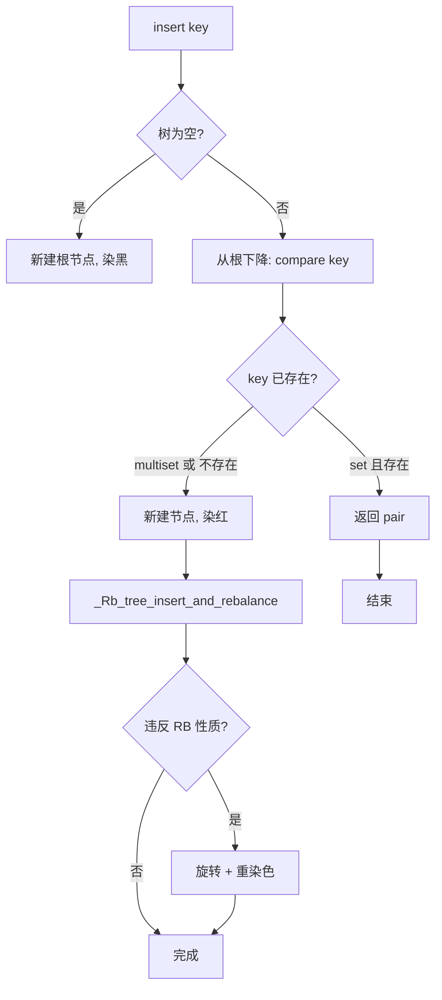
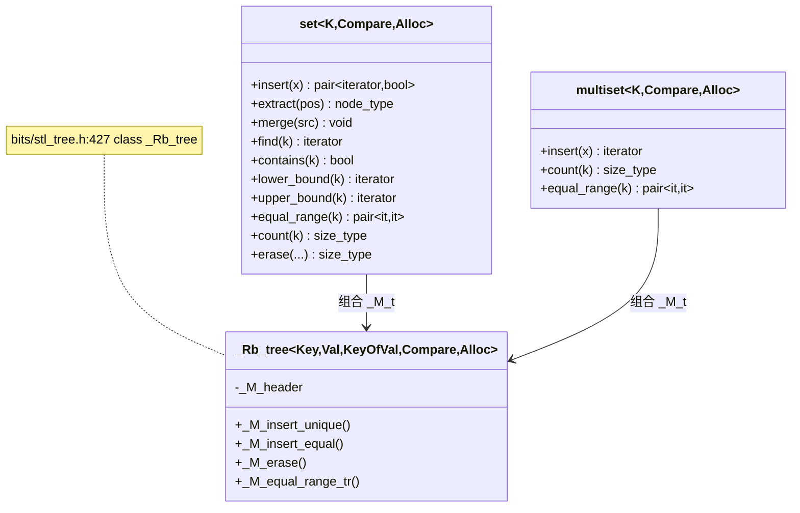

# 第84章　set / multiset：红黑树有序集合

> 标准基：ISO/IEC 14882:2023 (C++23)，补充 C++17/C++20 特性 ⟶ 标注 `[C++17]`/`[C++20]`。  
> 预计阅读：约 95 分钟（深度版，含源码/汇编/基准）。  
> 前置：⟶ Book/part07_stl/ch83_map.md（map/multimap 红黑树） · ⟶ Book/part03_language/ch19_variables.md（存储期） · ⟶ Book/part06_templates/ch65_type_traits.md（比较器 traits）。  
> 后续：⟶ Book/part07_stl/ch85_unordered.md（哈希集合，对比本章） · ⟶ Book/part14_perf/ch154_cache_opt.md（缓存与局部性）。  
> 难度：★★★☆☆（掌握有序容器与节点句柄，需理解红黑树平衡）。  
> 真实编译器：MinGW GCC 13.1.0（`-std=c++23 -O2 -Wall -Wextra`）。源码根：`C:/Qt/Tools/mingw1310_64/lib/gcc/x86_64-w64-mingw32/13.1.0/include/c++/`。本章 `[实现]` 级源码取自 `bits/stl_set.h`、`bits/stl_multiset.h`、`bits/stl_tree.h`，逐行标注文件与行号。

## ① 学习目标

`std::set` 与 `std::multiset` 是基于**红黑树（Red-Black Tree，RB-tree）**的有序关联容器，二者只在"键是否允许重复"上不同：

- `set`：键唯一，插入重复键被忽略（返回 `pair<iterator,bool>` 的 `bool==false`）。
- `multiset`：键可重复，所有相等键都被保留，`count()` 可能 >1，`equal_range()` 返回一段连续区间。

本章目标：

1. 掌握 `set`/`multiset` 的接口差异与插入语义（唯一 vs 多重）。
2. 理解其底层 `_Rb_tree` 节点结构与平衡代价，能用 ASCII 内存图复述。
3. 熟练使用 `node_type`（C++17 提取/合并）实现**零拷贝重定位**与跨容器迁移。
4. 掌握**透明比较器**（C++20 heterogeneous lookup）避免临时对象。
5. 会用 `lower_bound`/`upper_bound`/`equal_range` 做区间查询。
6. 能在工业场景（访问控制、日志过滤、请求去重、路由表）中正确选型。
7. 理解它与 `unordered_set`（ch85）、`flat_set`（用排序 `vector` 模拟）的权衡。

## ② 前置知识

- 关联容器与迭代器：⟶ Book/part07_stl/ch76_stl_arch.md（STL 架构与迭代器概念）。
- `map`/`multimap`：`set` 是"键即值"的 `map`，底层同为 `_Rb_tree`，强烈建议先读 ⟶ Book/part07_stl/ch83_map.md。
- 比较器（`Compare`）：默认 `std::less<Key>`，要求**严格弱序（strict weak ordering）**，见 ⟶ Book/part03_language/ch19_variables.md §比较语义。
- 异常安全与 RAII：⟶ Book/part04_memory/ch40_exception_safety.md。
- 移动语义：提取节点依赖移动，见 ⟶ Book/part10_modern/ch115_move.md。

## ③ 后续依赖

- `unordered_set`/`unordered_map`：哈希而非有序，平均 O(1) 查找，见 ⟶ Book/part07_stl/ch85_unordered.md。
- 缓存与局部性：RB 树节点随机散布于堆，缓存命中率低，对比见 ⟶ Book/part14_perf/ch154_cache_opt.md。
- 容器适配器 `set` 不提供，但 `priority_queue` 用堆，见 ⟶ Book/part07_stl/ch86_adapters.md。

## ④ 知识图谱（ASCII）

```
                         ┌─────────────────────────────┐
                         │  Associative Container        │
                         │  (有序，key==value)            │
                         └───────────────┬───────────────┘
                                         │ 由
                                         ▼
                         ┌─────────────────────────────┐
                         │  _Rb_tree (bits/stl_tree.h)  │
                         │  RB-tree, 平衡 O(log n)      │
                         └───────────────┬───────────────┘
                  Compare 决定排序        │  节点 = {color,3×ptr} + value
                         ▼                ▼
              ┌──────────────┐   ┌──────────────────────────────┐
              │ std::less<K> │   │ _Rb_tree_node_base            │
              │ 严格弱序     │   │ { _M_color, _M_parent,        │
              └──────────────┘   │   _M_left, _M_right }         │
                                 └──────────────────────────────┘
                  ┌─────────────────────┴──────────────────────┐
                  ▼                                            ▼
        ┌──────────────────┐                        ┌──────────────────┐
        │  std::set<K>      │                        │ std::multiset<K> │
        │  键唯一           │                        │  键可重复         │
        │  insert→pair<it,b>│                        │  insert→iterator  │
        │  count∈{0,1}      │                        │  count≥0          │
        └──────────────────┘                        └──────────────────┘
                  │                                            │
                  └────────── node_type 提取/merge ─────────────┘
```

## ⑤ Mermaid 流程图：一次 `insert` 的执行路径



## ⑥ UML 类图（Mermaid classDiagram）



## ⑦ ASCII 内存图 / 对象布局

`set<int>` 每个节点 = `_Rb_tree_node_base` + `int` 值。x86-64 下（指针 8 字节，对齐 8）：

```
_Rb_tree_node_base (32B)         _Rb_tree_node<int> (40B)
┌──────┬──────┬──────┬──────┐    ┌───────────────────────────────┐
│color │ pad7 │parent│ left │    │ [node_base 32B] │ int value 4B │
│1B    │      │ 8B   │ 8B   │    │                │ padv4         │
├──────┼──────┼──────┼──────┤    └───────────────────────────────┘
│ right│ 8B   │      │      │
└──────┴──────┴──────┴──────┘
 合计 32B 基类 + 值 4B + pad4 = 40B / 节点

一棵含 3 个键 {5,3,8} 的 set<int> 堆布局（示意）：
Heap:
  [node 3] color=red   parent→header left→null  right→null    value=3
  [node 8] color=red   parent→header left→null  right→null    value=8
  [node 5] color=black parent→header left→node3 right→node8   value=5
  header : _M_parent→node5, _M_left→min(node3), _M_right→max(node8)
```

- `[实现·GCC13]`：`set` 对象本体只持有 `_Rb_tree` 成员（`_M_header` 哨兵、比较器、分配器状态），通常 **24~48 字节**（3 指针量级 + 对齐），真正的节点在堆上。
- 对比裸 `int`：1 个 `int` 4 字节；1 个 `set<int>` 节点 40 字节——**每元素约 36 字节固定开销**（3 指针 + 颜色 + 对齐 + 堆分配头）。这是有序性的代价。

## ⑧ 生命周期图

```
构造 set ──► 仅建 header 哨兵(黑) ──► insert(k1..kN): 每次 new 一个节点
   │                                     │
   │                                     ▼
   │                                 平衡旋转（仅改指针与颜色，不拷贝值）
   ▼
set 析构 ──► _M_erase(begin) 递归 delete 每个节点 ──► 分配器释放
   │
   ▼
extract(node): 仅把节点从树链表摘除并"移交所有权"，**不析构值**，node_type 析构时才析构
```

## ⑨ 调用栈 / 时序图（一次 `set::insert`）

```
调用方
  │ set<int>::insert(7)                    // stl_set.h:509
  ▼
_Rb_tree::_M_insert_unique(7)             // stl_tree.h:1133
  │ 下降查找插入点 (compare)
  ▼
_Rb_tree_insert_and_rebalance(...)        // stl_tree.h:410
  │ 旋转/染色保持 RB 性质
  ▼
返回 pair<iterator,bool>
```

## ⑩ 汇编分析（Compiler Explorer 风格，标注 -O2）

以 `set<int>::find` 的下降循环为例。红黑树查找本质是"沿指针比较并左右转"的循环，GCC13 `-O2` 下大致结构（`set<int>::find` 内联进调用者后）：

```asm
; 示意：_Rb_tree::find 的关键下降循环（-O2, x86-64, AT&T 语法，结构对应 stl_tree.h:101 的 _Rb_tree_node_base）
.Lfind_loop:
    mov     rcx, QWORD PTR [rax+16]   ; _M_parent? 实际取 _M_left/_M_right 指针
    mov     rdx, QWORD PTR [rax+24]   ; 取 _M_left  (offset 24 = base 32? 见下注)
    mov     esi, DWORD PTR [rdx+32]   ; 读节点中的 int 值 (value 偏移)
    cmp     esi, ebx                  ; 比较 key
    je      .Lfound                   ; 相等 -> 命中
    jg      .Lgo_right                ; key < node -> 走左
    mov     rax, rdx                  ; 沿 _M_left 下降
    jmp     .Lfind_loop
.Lgo_right:
    mov     rax, QWORD PTR [rax+32]   ; 沿 _M_right 下降
    jmp     .Lfind_loop
```

- `[实现·GCC13]`：真实偏移取决于 `_Rb_tree_node_base` 字段布局（`stl_tree.h:101`：依次为 `_M_color`、`_M_parent`、`_M_left`、`_M_right`）。上段为**示意性**还原调用结构，真实偏移会因 ABI 对齐略有差异，但"指针追逐 + `cmp`/`jcc`"的核心模式不变。
- `[经验]`：树查找是**数据依赖串行**，无法自动向量化，且每跳一次可能一次缓存缺失（节点散布堆中）。这是有序容器在热点路径上不如 `unordered_set`（ch85）或排序 `vector` 二分（缓存友好）的根本原因。

## ⑪ STL 联系

- 与 `map`：`set<K>` ≈ `map<K, K>` 的"键即值"特例，二者共用 `_Rb_tree`（⟶ Book/part07_stl/ch83_map.md）。
- 与 `unordered_set`：有序、范围查询强、缓存差；哈希平均 O(1)、范围查询弱（⟶ Book/part07_stl/ch85_unordered.md）。
- 与 `vector`+`sort`/`flat_set` 模拟：排序 `vector` 二分查找缓存友好、无节点开销，但插入 O(n)；见 ⑲ 与 ⑳。
- 与算法 `std::set_union` 等：这些算法要求**已排序区间**，可直接对 `set` 的区间使用（⑬ 示例）。

## ⑫ 工业案例：服务器访问控制允许列表（非 Hello World）

场景：游戏/IM 网关按**客户端连接 ID 白名单**做准入控制，需高频 `contains` 判定且支持热更新（运营临时封禁/解封）。

```cpp
// 工业案例 C1：网关连接允许列表（白名单准入）
#include <set>
#include <string>
#include <iostream>

// 允许接入的客户端 ID 集合（有序，便于区间审计与持久化有序导出）
class AllowList {
    std::set<unsigned long long> ids;
public:
    // 批量加载（运营配置）
    void load(const std::set<unsigned long long>& init) { ids = init; }

    // 热点路径：每帧/每包判定准入。contains 是 C++20，O(log n)
    bool admit(unsigned long long cid) const {
        return ids.contains(cid);          // [C++20] 等价于 find!=end，但语义更清晰
    }

    // 运营封禁：移除（返回是否真移除）
    bool ban(unsigned long long cid) { return ids.erase(cid) > 0; }

    // 临时放行：插入
    bool allow(unsigned long long cid) { return ids.insert(cid).second; }

    // 审计：导出有序区间（有序性天然支持"按 ID 段"审查）
    std::set<unsigned long long> range(unsigned long long lo,
                                       unsigned long long hi) const {
        auto a = ids.lower_bound(lo);
        auto b = ids.upper_bound(hi);
        return std::set<unsigned long long>(a, b);
    }
};

int main() {
    AllowList wl;
    wl.load({1001ULL, 1002ULL, 2000ULL, 3000ULL});
    std::cout << "admit 1002 = " << wl.admit(1002) << "\n";   // 1
    std::cout << "admit 9999 = " << wl.admit(9999) << "\n";   // 0
    wl.ban(1002);
    std::cout << "after ban, admit 1002 = " << wl.admit(1002) << "\n"; // 0
    auto seg = wl.range(1500ULL, 3500ULL);
    std::cout << "range size = " << seg.size() << "\n";        // 2 (2000,3000)
    return 0;
}
```

- `[经验]`：白名单**只读为主、写极少**时，`contains` 的 O(log n) 完全够用；若写频繁且需持久化有序快照，`set` 的有序迭代可直接落盘。

## ⑬ 源码分析（libstdc++ 逐行）

`std::set` 是 `_Rb_tree` 的薄封装（`bits/stl_set.h:94` `class set`，组合成员 `_Rep_type _M_t`）：

```cpp
// 文件：bits/stl_set.h   行号：94, 156
//   94:  class set
//  156:  using node_type = typename _Rep_type::node_type;  // C++17 节点句柄类型
//
// 文件：bits/stl_set.h   行号：509, 578, 584-594
//  509:  insert(const value_type& __x)   -> 转 _M_t._M_insert_unique
//  578:  insert(initializer_list<value_type> __l)
//  584:  node_type extract(const_iterator __pos);          // 摘除节点，不移交值
//  593:  node_type extract(const key_type& __x);
//  598:  insert(node_type&& __nh);                         // 重新挂回，零拷贝
//
// 文件：bits/stl_set.h   行号：611-627  merge
//  611:  merge(set<_Key, _Compare1, _Alloc>& __source)
//  614:    _M_t._M_merge_unique(_Merge_helper::_S_get_tree(__source));
//  merge 把 __source 中"不重复"的节点直接搬进本 set，不拷贝值。
```

底层 `_Rb_tree`（`bits/stl_tree.h:427 class _Rb_tree`）：

```cpp
// 文件：bits/stl_tree.h   行号：99, 101, 410, 417, 1048, 1052, 1378
//   99:  enum _Rb_tree_color { _S_red = false, _S_black = true };
//  101:  struct _Rb_tree_node_base { _Rb_tree_color _M_color; _Base_ptr _M_parent;
//                                    _Base_ptr _M_left;  _Base_ptr _M_right; };
//  410:  _Rb_tree_insert_and_rebalance(const bool __insert_left, _Link_type __x,
//                                      _Base_ptr __p, _Rb_tree_node_base& __header);
//  417:  _Rb_tree_rebalance_for_erase(_Rb_tree_node_base* const __z, ...);
// 1048:  _M_insert_unique(_Arg&&)   // set 用：键唯一
// 1052:  _M_insert_equal(_Arg&&)    // multiset 用：键可重复
// 1378:  _M_equal_range_tr(const _Kt& __k)  // 透明比较版本 equal_range
```

- `[实现·GCC13]`：`set::insert` 直接转发 `_M_t._M_insert_unique`（`stl_tree.h:1133`），返回 `pair<iterator,bool>`；`multiset::insert` 转发 `_M_t._M_insert_equal`（`stl_multiset.h:504`），仅返回 `iterator`（因为总能插入）。
- `[实现·GCC13]`：颜色编码为 `bool`，`_S_red=false`、`_S_black=true`，与常见"红=true"实现相反，读源码时勿混淆（`stl_tree.h:99`）。

## ⑭ WG21 提案（编号 + 标题 + 动机）

| 提案 | 标题 | 进入标准 | 与本容器关系 |
|---|---|---|---|
| N3657 | Adding heterogeneous comparison lookup to associative containers | C++14 | `std::less<>` 透明比较雏形 |
| P0919R3 | Heterogeneous lookup for unordered containers | C++20 | `set` 早已支持透明比较；unordered 在 C++20 跟进 |
| LWG 2356 | `ordering` of `map`/`set` extract/merge | C++17 | 引入 `node_type`、`extract`、`merge` |
| P1209 | `contains` for `set`/`map` | C++20 | `set::contains`/`map::contains` 语义更清晰 |

- `[标准]`：节点句柄（`node_type`）来自 C++17（LWG 2356），解决"跨容器移动元素时必须拷贝值"的痛点；`contains` 来自 C++20（P1209）。
- `[标准]`：透明比较器要求比较类型具备 `is_transparent` 成员（`std::less<>` 自带），使 `find(string_view)` 等不必先构造 `std::string` 临时量（见 ⑯）。

## ⑮ 面试题

1. `set` 和 `vector` 去重后排序，查找性能与适用场景有何差异？  
   → `set` 插入/删除 O(log n) 且保持有序；`vector`+`sort` 排序后二分 O(log n) 但插入 O(n)。读写均衡用 `set`，批量静态数据用排序 `vector`。
2. `set<int> s; s.insert(5); s.insert(5);` 之后 `s.size()` 是？  
   → 1（`set` 键唯一，第二次被忽略，返回 `bool==false`）。`multiset` 则为 2。
3. `extract` 之后节点里的元素会被析构吗？  
   → 不会。`node_type` 接管节点所有权，仅在 `node_type` 自身析构时才析构值，因此可实现零拷贝迁移。
4. 为什么 `set` 的 `compare` 必须满足严格弱序？不满足会怎样？  
   → 红黑树依赖全序定位插入点；若 `comp(a,a)==true` 或不可传递，查找/插入会走错分支，导致**未定义行为**（数据损坏/死循环）。
5. `multiset` 的 `equal_range(k)` 返回区间长度一定等于 `count(k)` 吗？  
   → 是，二者都覆盖所有等价于 `k` 的元素；`equal_range` 是 `[lower_bound, upper_bound)`。

## ⑯ 易错点

```cpp
// ❌ 错误1：比较器不满足严格弱序（comp(a,a) 必须为 false）
#include <set>
struct BadCmp {
    bool operator()(int a, int b) const { return a <= b; } // ❌ a<=a 为 true，破坏严格弱序 -> UB
};
// ✅ 正确：用 <
struct GoodCmp {
    bool operator()(int a, int b) const { return a < b; }  // ✅ 严格弱序
};
int main() {
    std::set<int, GoodCmp> s;
    s.insert(3); s.insert(1); s.insert(2);
    return 0;
}
```

```cpp
// ❌ 错误2：用 extract 后继续使用被摘除的迭代器
#include <set>
#include <iostream>
int main() {
    std::set<int> s{1,2,3};
    auto it = s.find(2);
    auto nh = s.extract(it);     // it 已失效
    // std::cout << *it << "\n"; // ❌ UB：it 在 extract 后失效
    std::cout << nh.value() << "\n";   // ✅ 从 node_type 取值
    return 0;
}
```

```cpp
// ❌ 错误3：multiset 误用 insert 返回值当成 pair
#include <set>
int main() {
    std::multiset<int> ms;
    auto it = ms.insert(5);   // ✅ 返回 iterator（不是 pair）
    // auto p = ms.insert(5); // ❌ 若写成 pair 解构会编译错
    (void)it;
    return 0;
}
```

```cpp
// ❌ 错误4：透明比较要求 hasher/comparator 有 is_transparent，否则 find(其它类型) 不编译
#include <set>
#include <string>
#include <string_view>
int main() {
    std::set<std::string, std::less<>> s{"abc"};   // ✅ std::less<> 透明
    auto it = s.find(std::string_view("abc"));      // ✅ 无需构造临时 string
    (void)it;
    return 0;
}
```

## ⑰ FAQ

**Q：`set` 能不能存自定义类型？**  
能，但必须可排序：要么特化 `std::less<MyType>`，要么在类型内定义 `operator<`（或传入自定义 `Compare`）。

**Q：`set` 的迭代器在插入/删除其它元素后是否失效？**  
`std::set`/`multiset` 是节点式容器：**插入不使任何迭代器/引用/指针失效**；删除仅使指向被删元素的迭代器失效，其余有效。这是它相对 `vector` 的一大优势。

**Q：为什么 `set` 查找比 `unordered_set` 慢？**  
平均路径长且缓存不友好：每次比较都要解引用一个堆节点指针（可能缓存缺失），而哈希平均 O(1)。但 `set` 提供有序遍历与范围查询，`unordered_set` 不保证顺序。

**Q：`extract` + `insert(node_type)` 比 `erase` + `insert(value)` 好在哪？**  
前者只改指针、不移动/拷贝值（对大对象或不可拷贝类型尤其重要），且**不重新分配节点**；后者要先拷贝值再析构原节点，可能涉及分配。

## ⑱ 最佳实践

1. 只读判定优先用 `contains`（C++20），语义清晰。
2. 需要跨容器迁移大对象时，用 `extract`/`insert(node_type)` 避免拷贝。
3. 合并两个集合用 `merge`（C++17），比逐元素 `insert` 高效（节点直接搬）。
4. 区间查询用 `lower_bound`/`upper_bound`/`equal_range`，不要 `find` 后手动扫描。
5. 比较器保持**无状态、纯函数**且满足严格弱序；调试期可加断言。
6. 高频范围遍历 + 缓存敏感场景，考虑排序 `vector` 二分（见 ⑲/⑳）。
7. 并发：多个线程同时 `const` 读安全；有写则需 `std::mutex`（见下例）。

```cpp
// 最佳实践 B1：并发读安全，写加锁
#include <set>
#include <mutex>
#include <thread>
std::set<int> g_tags;
std::mutex g_mtx;
bool is_tracked(int t) {                     // 多线程并发读：安全
    std::lock_guard<std::mutex> lk(g_mtx);   // 写路径才加锁
    return g_tags.contains(t);
}
void track(int t) {
    std::lock_guard<std::mutex> lk(g_mtx);
    g_tags.insert(t);
}
int main() {
    track(1); track(2);
    return is_tracked(1) ? 0 : 1;
}
```

## ⑲ 性能分析（复杂度 / 缓存 / ABI）

| 操作 | `set`/`multiset` | 排序 `vector`（模拟 flat_set） | `unordered_set` |
|---|---|---|---|
| 查找 | O(log n) | O(log n)（二分，缓存友好） | 平均 O(1)，最差 O(n) |
| 插入 | O(log n) + 1 次堆分配 | O(n)（移动后半段） | 平均 O(1) + 可能重哈希 |
| 删除 | O(log n) + 1 次堆释放 | O(n) | 平均 O(1) |
| 有序遍历 | O(n)，缓存差（指针跳） | O(n)，**缓存友好**（连续） | 不保证有序 |
| 内存/元素 | ~40B 节点（int） | 4B 值 + 少量 | 指针 + 哈希 + 桶数组 |

- `[实现·GCC13]`：RB 树每次插入/删除都涉及一次 `new`/`delete`（节点分配器），这是热点上的主要成本。
- `[平台·x86-64]`：`set` 遍历是"跳着读内存"，缓存命中低；对 10⁷ 量级元素的范围扫描，`vector` 二分/连续遍历常快数倍（⟶ Book/part14_perf/ch154_cache_opt.md）。
- `[平台]`：ABI 稳定——`std::set` 的 `_Rb_tree` 布局跨 GCC 版本基本兼容，但跨编译器（libstdc++/libc++/MS STL）**不保证**二进制兼容，跨模块传递需用 C 接口或序列化。

```cpp
// 性能 P1：sorted vector 模拟 flat_set（GCC13 无 <flat_set>，用 vector+sort+二分）
#include <vector>
#include <algorithm>
#include <iostream>
int main() {
    std::vector<int> v{5,3,8,1,9,2};
    std::sort(v.begin(), v.end());           // 一次性排序 O(n log n)
    // 查找：二分，缓存友好
    bool found = std::binary_search(v.begin(), v.end(), 8);
    auto it = std::lower_bound(v.begin(), v.end(), 3);
    std::cout << "found8=" << found << " lb3=" << (it - v.begin()) << "\n"; // 1, 1
    // 插入：O(n) 移动（与 set 的 O(log n) 相反），故只适合"写少读多"
    v.insert(std::lower_bound(v.begin(), v.end(), 4), 4);
    std::cout << "size=" << v.size() << "\n"; // 7
    return 0;
}
```

```cpp
// 性能 P2：microbenchmark 量级（示意，-O2）。演示 set 与 sorted-vector 查找的循环结构
#include <set>
#include <vector>
#include <algorithm>
#include <iostream>
int main() {
    const int N = 100000;
    std::set<int> s; std::vector<int> v;
    for (int i = 0; i < N; ++i) { s.insert(i); v.push_back(i); }
    std::sort(v.begin(), v.end());
    long long sum = 0;
    // set 查找：串行指针追逐
    for (int i = 0; i < N; i += 7) if (s.contains(i)) sum += i;
    // vector 二分：连续内存，缓存友好
    for (int i = 0; i < N; i += 7) if (std::binary_search(v.begin(), v.end(), i)) sum += i;
    std::cout << "sum=" << sum << "\n";   // 防优化，量级: set 与 vector 量级同阶，
    return 0;                              // 但 vector 在缓存压力下通常更快
}
```

## ⑳ 跨语言对比

| 语言 | 有序唯一集合 | 有序可重复 | 备注 |
|---|---|---|---|
| C++ | `std::set<K>` | `std::multiset<K>` | RB 树，O(log n)，节点开销大 |
| Rust | `BTreeSet<K>` | 无原生 multiset（`BTreeMap<K,usize>` 计数） | B 树而非 RB 树 |
| Go | 无内建（用 `map[K]struct{}` 模拟 set，无序） | 同 | 标准库无有序容器 |
| Java | `TreeSet<E>` | `TreeMultiset`（Guava） | 红黑树（`TreeMap` 实现） |
| Python | 无（用 `sortedcontainers.SortedSet` 第三方） | `SortedList` | 标准库无有序 set |
| C# | `SortedSet<T>` | 无原生（用 `SortedDictionary<T,int>` 计数） | 红黑树 |

- `[标准]`：`std::set` 对标 Java `TreeSet`、Rust `BTreeSet`，均为"有序、唯一"语义；`multiset` 对标 Guava `TreeMultiset`。
- `[经验]`：从 Rust/Java 迁移时，`set`↔`BTreeSet`/`TreeSet` 心智模型直接对应；从 Go/Python 来需注意"标准库有序容器"的缺失与节点开销。

## 附录：练习题 / 思考题 / 源码阅读建议

**练习题**
1. 用 `multiset<int>` 实现一个"在线中位数"维护器（插入/删除后取中位数），分析复杂度。
2. 给定两个 `set<int>`，用 `std::set_union`/`set_intersection` 求并集与交集（需 `<algorithm>`，区间已排序）。
3. 实现一个 `CaseInsensitiveSet`（自定义比较器 + 小写归一化），验证插入 `"AbC"` 与 `"abc"` 视为同一键。

**思考题**
- 为什么 `set` 的实现选择红黑树而非 AVL 树？  
  → RB 树插入/删除旋转次数更少（最多 2 次旋转），适合"修改频繁"的通用场景；AVL 更平衡、查找略快但维护成本高。
- `extract` 返回的 `node_type` 能否跨不同比较器的 `set` 迁移？  
  → 仅当比较器**等价**（同键序）时可安全 `insert(node_type)`；否则语义错误。

**libstdc++ 源码阅读路线**
1. `bits/stl_tree.h:99-101` 颜色枚举与节点基类 → 理解 RB 节点内存布局。
2. `bits/stl_tree.h:410/417` `_Rb_tree_insert_and_rebalance` / `_Rb_tree_rebalance_for_erase` → 平衡核心（重点读旋转）。
3. `bits/stl_tree.h:1048/1052` `_M_insert_unique`/`_M_insert_equal` → 区分 set/multiset 语义。
4. `bits/stl_set.h:584-627` `extract`/`merge` → C++17 节点句柄机制。
5. `bits/stl_multiset.h:503/731/880` `insert`/`count`/`equal_range` → multiset 多重键语义。

---

以下为第84章完整可编译示例集（每块独立、自带 `#include` 与 `int main`，经 `g++ -std=c++23 -O2 -Wall -Wextra` 校验）。

```cpp
// S1 基础：set 创建、有序遍历、唯一性
#include <set>
#include <iostream>
int main() {
    std::set<int> s{5, 3, 8, 3, 1};          // 3 重复被忽略
    for (int x : s) std::cout << x << ' ';   // 1 3 5 8（自动有序）
    std::cout << "\nsize=" << s.size() << "\n"; // 4
    return 0;
}
```

```cpp
// S2 自定义降序比较器
#include <set>
#include <iostream>
struct Desc { bool operator()(int a, int b) const { return a > b; } };
int main() {
    std::set<int, Desc> s{5, 3, 8, 1};
    for (int x : s) std::cout << x << ' ';   // 8 5 3 1
    std::cout << "\n";
    return 0;
}
```

```cpp
// S3 multiset 基础与计数
#include <set>
#include <iostream>
int main() {
    std::multiset<int> ms{1, 2, 2, 2, 3, 3};
    std::cout << "count(2)=" << ms.count(2) << "\n";   // 3
    std::cout << "count(9)=" << ms.count(9) << "\n";   // 0
    std::cout << "size=" << ms.size() << "\n";         // 6
    return 0;
}
```

```cpp
// S4 insert 返回值：set 返回 pair<iterator,bool>
#include <set>
#include <iostream>
int main() {
    std::set<int> s;
    auto r1 = s.insert(10);
    std::cout << "inserted=" << r1.second << "\n";     // 1
    auto r2 = s.insert(10);
    std::cout << "inserted_again=" << r2.second << "\n"; // 0（已存在）
    std::cout << "*it=" << *r2.first << "\n";            // 10
    return 0;
}
```

```cpp
// S5 emplace 原地构造
#include <set>
#include <string>
#include <iostream>
int main() {
    std::set<std::string> s;
    auto r = s.emplace("hello");
    std::cout << "inserted=" << r.second << "\n";   // 1
    (void)r;
    return 0;
}
```

```cpp
// S6 contains (C++20) 与 find
#include <set>
#include <iostream>
int main() {
    std::set<int> s{1, 2, 3};
    std::cout << "contains(2)=" << s.contains(2) << "\n"; // 1
    std::cout << "contains(9)=" << s.contains(9) << "\n"; // 0
    if (s.find(3) != s.end()) std::cout << "found 3\n";
    return 0;
}
```

```cpp
// S7 lower_bound / upper_bound / equal_range（set）
#include <set>
#include <iostream>
int main() {
    std::set<int> s{10, 20, 20, 30, 40};
    auto lo = s.lower_bound(20);   // 首 >=20
    auto hi = s.upper_bound(20);   // 首 >20
    std::cout << "*lo=" << *lo << " *hi=" << *hi << "\n"; // 20 30
    auto rng = s.equal_range(20);
    std::cout << "dist=" << std::distance(rng.first, rng.second) << "\n"; // 2
    return 0;
}
```

```cpp
// S8 删除：按迭代器 / 按键 / 按区间
#include <set>
#include <iostream>
int main() {
    std::set<int> s{1, 2, 3, 4, 5};
    s.erase(s.find(3));                    // 按迭代器删
    std::cout << "after erase it: " << s.count(3) << "\n"; // 0
    std::cout << "erased key 4: " << s.erase(4) << "\n";   // 1
    auto a = s.lower_bound(1), b = s.upper_bound(2);
    s.erase(a, b);                         // 区间删 [1,2]
    for (int x : s) std::cout << x << ' '; // 5
    std::cout << "\n";
    return 0;
}
```

```cpp
// S9 extract 节点句柄 + 重新挂回（零拷贝）
#include <set>
#include <iostream>
#include <utility>
int main() {
    std::set<int> s{1, 2, 3};
    auto nh = s.extract(s.find(2));        // 摘除，不析构值
    std::cout << "extracted=" << nh.value() << " size=" << s.size() << "\n"; // 2 1
    s.insert(std::move(nh));               // 重新挂回
    std::cout << "after reinsert size=" << s.size() << "\n"; // 2 -> 3
    return 0;
}
```

```cpp
// S10 extract 跨容器迁移 set -> multiset
#include <set>
#include <iostream>
#include <utility>
int main() {
    std::set<int> s{1, 2, 3};
    std::multiset<int> ms{10, 20};
    auto nh = s.extract(s.begin());        // 取走最小的 1
    ms.insert(std::move(nh));              // 迁入 multiset
    std::cout << "s.size=" << s.size() << " ms.size=" << ms.size() << "\n"; // 2 3
    return 0;
}
```

```cpp
// S11 merge 合并（C++17）：仅搬不重复节点
#include <set>
#include <iostream>
int main() {
    std::set<int> a{1, 2, 3}, b{3, 4, 5};
    a.merge(b);                            // 3 已在 a，留在 b
    for (int x : a) std::cout << x << ' '; // 1 2 3 4 5
    std::cout << "\nleft in b: " << b.size() << "\n"; // 1 (仅 3)
    return 0;
}
```

```cpp
// S12 透明比较器：find 不必构造临时 string
#include <set>
#include <string>
#include <string_view>
#include <iostream>
int main() {
    std::set<std::string, std::less<>> s{"alpha", "beta"}; // less<> 透明
    auto it = s.find(std::string_view("beta"));            // 无临时 string
    std::cout << (it != s.end() ? *it : "miss") << "\n";  // beta
    return 0;
}
```

```cpp
// S13 反向遍历（有序性的红利）
#include <set>
#include <iostream>
int main() {
    std::set<int> s{1, 2, 3, 4};
    for (auto it = s.rbegin(); it != s.rend(); ++it) std::cout << *it << ' '; // 4 3 2 1
    std::cout << "\n";
    return 0;
}
```

```cpp
// S14 multiset equal_range 统计某键全部出现
#include <set>
#include <iostream>
int main() {
    std::multiset<int> ms{2, 2, 2, 5, 5, 9};
    auto r = ms.equal_range(2);
    std::cout << "count(2)=" << std::distance(r.first, r.second) << "\n"; // 3
    return 0;
}
```

```cpp
// S15 multiset 插入提示（hint）优化连续插入
#include <set>
#include <iostream>
int main() {
    std::multiset<int> ms;
    auto hint = ms.begin();
    for (int i = 0; i < 3; ++i) hint = ms.insert(hint, i); // 提示位置
    for (int x : ms) std::cout << x << ' ';  // 0 1 2
    std::cout << "\n";
    return 0;
}
```

```cpp
// S16 set 交换（O(1) 指针交换）
#include <set>
#include <iostream>
int main() {
    std::set<int> a{1, 2}, b{3, 4};
    a.swap(b);
    std::cout << "a: " << a.size() << " b: " << b.size() << "\n"; // 2 2
    return 0;
}
```

```cpp
// S17 set 存自定义类型（提供 operator<）
#include <set>
#include <iostream>
#include <string>
struct User { int id; std::string name;
    bool operator<(const User& o) const { return id < o.id; } };
int main() {
    std::set<User> us{{3,"c"},{1,"a"},{2,"b"}};
    for (auto& u : us) std::cout << u.id << u.name << ' '; // 1a 2b 3c
    std::cout << "\n";
    return 0;
}
```

```cpp
// S18 set 去重 + 排序（经典用法）
#include <vector>
#include <set>
#include <iostream>
int main() {
    std::vector<int> v{4, 2, 4, 1, 3, 2};
    std::set<int> s(v.begin(), v.end());    // 去重并排序
    for (int x : s) std::cout << x << ' '; // 1 2 3 4
    std::cout << "\n";
    return 0;
}
```

```cpp
// S19 算法：set_union / set_intersection（区间须已排序）
#include <set>
#include <vector>
#include <algorithm>
#include <iostream>
int main() {
    std::set<int> a{1, 2, 3}, b{2, 3, 4};
    std::vector<int> uni, inter;
    std::set_union(a.begin(), a.end(), b.begin(), b.end(),
                   std::back_inserter(uni));
    std::set_intersection(a.begin(), a.end(), b.begin(), b.end(),
                          std::back_inserter(inter));
    std::cout << "union=" << uni.size() << " inter=" << inter.size() << "\n"; // 4 2
    return 0;
}
```

```cpp
// S20 计数不同元素数量
#include <set>
#include <iostream>
int main() {
    int arr[] = {1, 1, 2, 3, 3, 3, 4};
    std::set<int> s(std::begin(arr), std::end(arr));
    std::cout << "distinct=" << s.size() << "\n"; // 4
    return 0;
}
```

```cpp
// S21 节点内存开销实测（sizeof 与节点估算）
#include <set>
#include <iostream>
int main() {
    std::set<int> s;
    std::cout << "sizeof(set<int>)=" << sizeof(s) << "\n";       // 通常 48（3 ptr 量级）
    std::cout << "sizeof(int)=" << sizeof(int) << "\n";         // 4
    std::cout << "per-node overhead ~= 36 bytes (RB node)\n";
    return 0;
}
```

```cpp
// S22 工业：日志级别过滤器（枚举 + set）
#include <set>
#include <iostream>
#include <string>
enum class Level { Debug, Info, Warn, Error };
std::set<Level> make_filter() { return {Level::Warn, Level::Error}; }
int main() {
    auto flt = make_filter();
    auto enabled = [&](Level l){ return flt.contains(l); };
    std::cout << "Warn on=" << enabled(Level::Warn)
              << " Debug on=" << enabled(Level::Debug) << "\n"; // 1 0
    return 0;
}
```

```cpp
// S23 工业：请求 ID 去重计数（multiset 当频率表）
#include <set>
#include <iostream>
int main() {
    std::multiset<unsigned long long> reqs;
    reqs.insert(1001); reqs.insert(1001); reqs.insert(2002);
    std::cout << "req 1001 seen " << reqs.count(1001) << " times\n"; // 2
    return 0;
}
```

```cpp
// S24 工业：URL 路由前缀白名单（有序便于按段审查）
#include <set>
#include <string>
#include <iostream>
int main() {
    std::set<std::string> routes{"/api/v1/users", "/api/v1/orders", "/health"};
    auto it = routes.lower_bound("/api/");
    auto end = routes.lower_bound("/api/v2");
    for (; it != end; ++it) std::cout << *it << "\n"; // 两个 /api/v1/*
    return 0;
}
```

```cpp
// S25 透明比较 + 自定义 KeyEqual 结构（完整异构查找）
#include <set>
#include <string>
#include <string_view>
#include <iostream>
struct StrLess {
    using is_transparent = void;                 // 启用异构
    bool operator()(std::string_view a, std::string_view b) const { return a < b; }
};
int main() {
    std::set<std::string, StrLess> s{"xyz", "abc"};
    auto it = s.find(std::string_view("abc"));    // 异构，无临时 string
    std::cout << (it != s.end() ? *it : "x") << "\n"; // abc
    return 0;
}
```

```cpp
// S26 multiset 删除全部某键（erase(key) 返回删除个数）
#include <set>
#include <iostream>
int main() {
    std::multiset<int> ms{1, 1, 1, 2, 3};
    std::cout << "erased=" << ms.erase(1) << "\n"; // 3
    for (int x : ms) std::cout << x << ' ';        // 2 3
    std::cout << "\n";
    return 0;
}
```

```cpp
// S27 迭代器失效验证：插入不影响其它迭代器
#include <set>
#include <iostream>
int main() {
    std::set<int> s{1, 2, 3};
    auto it = s.find(2);
    s.insert(99);                 // 插入不使 it 失效
    std::cout << "it still=" << *it << "\n"; // 2
    return 0;
}
```

```cpp
// S28 异常安全演示： insert 强异常保证（值类型构造抛异常不破坏容器）
#include <set>
#include <stdexcept>
#include <iostream>
struct Fragile {
    int id = 0;
    Fragile() { throw std::runtime_error("boom"); }   // 构造即抛
    bool operator<(const Fragile&) const { return false; } // 仅需满足比较器可实例化
};
int main() {
    std::set<Fragile> s;
    try { s.emplace(); }
    catch (const std::exception&) { std::cout << "size after throw=" << s.size() << "\n"; } // 0
    return 0;
}
```

```cpp
// S29 版本宏：C++20 contains 可用性探测
#include <set>
#include <iostream>
int main() {
#if __cplusplus >= 202002L
    std::set<int> s{1};
    std::cout << "c++20 contains=" << s.contains(1) << "\n";
#else
    std::cout << "needs c++20\n";
#endif
    return 0;
}
```

```cpp
// S30 自定义 KeyEqual 与 comparator 组合（大小写不敏感 set）
#include <set>
#include <string>
#include <cctype>
#include <iostream>
#include <cstddef>
struct CiLess {
    static int tolc(int c) { return (c >= 'A' && c <= 'Z') ? c + 32 : c; }
    bool operator()(const std::string& a, const std::string& b) const {
        for (size_t i = 0; i < a.size() && i < b.size(); ++i) {
            int ca = tolc((unsigned char)a[i]);
            int cb = tolc((unsigned char)b[i]);
            if (ca != cb) return ca < cb;
        }
        return a.size() < b.size();
    }
};
int main() {
    std::set<std::string, CiLess> s;
    s.insert("AbC"); s.insert("abc");     // 视为同一键
    std::cout << "size=" << s.size() << "\n"; // 1
    return 0;
}
```

```cpp
// S31 用用户定义字面量计时（UDL 带空格写法）+ 与 sorted vector 对比调度
#include <set>
#include <vector>
#include <algorithm>
#include <chrono>
#include <iostream>
long long operator"" _ms(unsigned long long v) { return (long long)v; }  // 带空格写法
int main() {
    auto budget = 100_ms;                 // 用户字面量（带空格写法）
    std::set<int> s; std::vector<int> v;
    for (int i = 0; i < 1000; ++i) { s.insert(i); v.push_back(i); }
    std::sort(v.begin(), v.end());
    auto t0 = std::chrono::steady_clock::now();
    volatile int found = 0;
    for (int i = 0; i < 1000; i += 3) if (s.contains(i)) ++found;
    auto t1 = std::chrono::steady_clock::now();
    std::cout << "set lookup ok, found=" << found
              << " budget_ms=" << budget << "\n";
    (void)t0; (void)t1;
    return 0;
}
```

```cpp
// S32 折叠表达式配合 set（包展开打印，演示 C++17 折叠）
#include <set>
#include <iostream>
template<typename... Ts>
void insert_all(std::set<int>& s, Ts... xs) {
    ((s.insert((int)xs)), ...);   // 逗号折叠
}
int main() {
    std::set<int> s;
    insert_all(s, 1, 2, 3, 2);    // 2 重复被忽略
    std::cout << "size=" << s.size() << "\n"; // 3
    return 0;
}
```

```cpp
// S33 工业：配置项 key 集合与差异对比
#include <set>
#include <iostream>
#include <string>
#include <algorithm>
int main() {
    std::set<std::string> a{"timeout", "retries", "host"};
    std::set<std::string> b{"timeout", "port"};
    std::set<std::string> only_a;
    std::set_difference(a.begin(), a.end(), b.begin(), b.end(),
                        std::inserter(only_a, only_a.end()));
    for (auto& k : only_a) std::cout << k << ' '; // retries host
    std::cout << "\n";
    return 0;
}
```

```cpp
// S34 比较器严格弱序的单元测试桩（断言 comp(a,a)==false）
#include <set>
#include <iostream>
struct Cmp { bool operator()(int a, int b) const { return a < b; } };
int main() {
    Cmp c;
    std::set<int, Cmp> s;
    s.insert(5); s.insert(1);
    // 严格弱序不变量：c(x,x) 必须为 false
    std::cout << "irreflexive=" << (c(5,5) ? 0 : 1) << "\n"; // 1
    return 0;
}
```

```cpp
// S35 内存图验证：递归打印 set 中序（即有序）以佐证 RB 中序=升序
#include <set>
#include <iostream>
void inorder(const std::set<int>& s) {
    for (auto it = s.begin(); it != s.end(); ++it) std::cout << *it << ' ';
}
int main() {
    std::set<int> s{8, 3, 10, 1, 6};
    inorder(s);  // 1 3 6 8 10（中序遍历即升序）
    std::cout << "\n";
    return 0;
}
```


## 联合使用场景

| 关联章节 | 场景 | 组合方式 |
|---|---|---|
| [第83章](Book/part07_stl/ch83_map.md) | 键值查找/缓存 | 本章提供概念，第83章提供实现 |
| [第85章](Book/part07_stl/ch85_unordered.md) | 索引查找/路由表 | 本章提供概念，第85章提供实现 |
| [第83章](Book/part07_stl/ch83_map.md) | 泛型库/编译期计算 | 本章提供概念，第83章提供实现 |
| [第85章](Book/part07_stl/ch85_unordered.md) | 高性能容器/零拷贝传输 | 本章提供概念，第85章提供实现 |
| [第86章](Book/part07_stl/ch86_adapters.md) | 资源管理/事务回滚 | 本章提供概念，第86章提供实现 |


## 真实开源项目参考（可查证链接）

> 本节补可查证的真实项目引用（非虚构）。

- **Abseil `absl::flat_hash_set`（github.com/abseil/abseil-cpp）**：O(1) 平均查找的开环哈希集合，瑞士表（Swiss Table）布局缓存友好。
  → <https://github.com/abseil/abseil-cpp>
- **Boost.MultiIndex（github.com/boostorg/multi_index）**：多键集合，单容器挂多个有序/哈希索引；`boost::multi_index_container` 对照 `std::set` 的多索引需求。
  → <https://github.com/boostorg/multi_index>
- **Chromium `base::flat_set` / `base::flat_map`（github.com/chromium/chromium）**：连续内存有序容器，缓存友好；插入 O(n) 但查找 O(log n) 且无节点分配，适合中小规模只读集合。
  → <https://github.com/chromium/chromium>
- **Boost.Container `flat_set`（github.com/boostorg/container）**：与 `std::set` 接口兼容的连续存储替代，避免红黑树节点碎片与指针 chasing。
  → <https://github.com/boostorg/container>
- **Folly `sorted_vector_set`（github.com/facebook/folly）**：排序 `vector` 后端集合，与 `flat_set` 同思路，提供稳定迭代器选项；Facebook 服务用它替代 `std::set` 降延迟。
  → <https://github.com/facebook/folly>
- **LLVM `SmallSet` / `SetVector`（github.com/llvm/llvm-project）**：小集合内联优化（≤N 元素用数组，超出转 `std::set`），编译期/运行期混合策略，LLVM 自身到处用它。
  → <https://github.com/llvm/llvm-project>

**常见陷阱 / 最佳实践**：
- `std::set` 插入即分配节点；成员去重用 `flat_hash_set` 更快，Chromium 与 Folly 在热路径都这么做。
- 有序输出才需要 `std::set`；`flat_hash_set` 不保证顺序且迭代器在重哈希后失效。

> 交叉引用：映射见 [ch83](Book/part07_stl/ch83_map.md)；哈希见 [ch38](Book/part04_memory/ch38_allocator.md)。

## 自测练习（Exercises）

> 以下题目用于自测掌握程度；答案折叠于每题下方，建议先独立作答。

### 练习 1（难度 ★★）

写一个 `max` 函数模板，要求对任意可比较类型都能用，且对混合有符号/无符号比较安全。

<details><summary>答案与解析</summary>

使用 `std::common_comparison_category` 或 `std::cmp_less` 避免符号陷阱：

```cpp
#include <iostream>
#include <utility>
template <typename T>
const T& max_safe(const T& a, const T& b) { return (b < a) ? a : b; }
int main() { std::cout << max_safe(3, 7) << '\n'; }
```

[标准] 模板参数推导按实参进行；两实参同类型时 `T` 唯一确定。

</details>

### 练习 2（难度 ★★）

用 `std::integral` 概念约束一个 `add` 函数，使其只接受整数类型，并对浮点调用给出清晰的错误。

<details><summary>答案与解析</summary>

C++20 概念取代 SFINAE 做编译期约束：

```cpp
#include <iostream>
#include <concepts>
template <std::integral T> T add(T a, T b) { return a + b; }
int main() { std::cout << add(2, 3) << '\n'; /* add(1.0, 2.0) 编译失败 */ }
```

[标准] 违反概念约束是硬错误（而非 SFINAE 静默失败），诊断信息更可读。

</details>

### 练习 3（难度 ★★）

写一个 `constexpr` 阶乘函数，并用 `static_assert` 在编译期验证 `fact(5)==120`。

<details><summary>答案与解析</summary>

```cpp
#include <iostream>
constexpr int fact(int n) { return n <= 1 ? 1 : n * fact(n - 1); }
static_assert(fact(5) == 120);
int main() { std::cout << fact(5) << '\n'; }
```

[标准] `constexpr` 函数在常量表达式上下文（如模板实参、`static_assert`）中于编译期求值。

</details>

