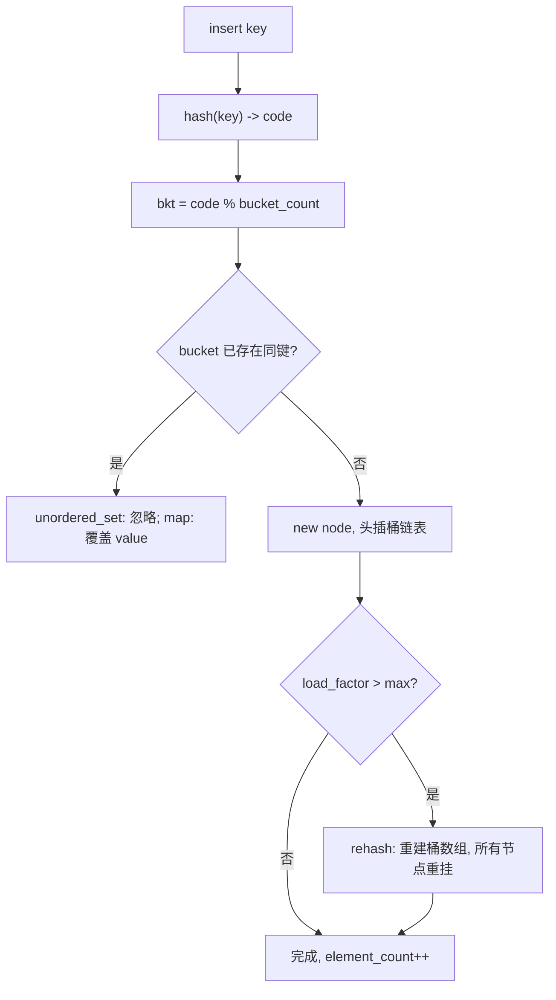
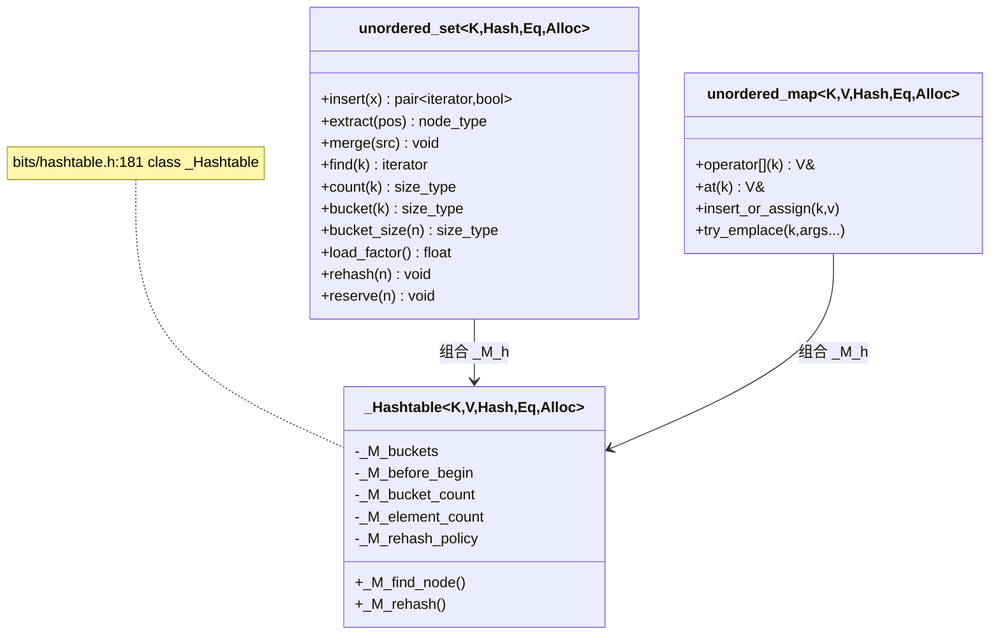

# 第85章　unordered_map / unordered_set：哈希开链集合

> 标准基：ISO/IEC 14882:2023 (C++23)，补充 C++20 透明哈希。  
> 预计阅读：约 100 分钟（深度版，含源码/汇编/基准）。  
> 前置：⟶ Book/part07_stl/ch84_set.md（有序集合，对比本章） · ⟶ Book/part03_language/ch19_variables.md（存储期） · ⟶ Book/part06_templates/ch65_type_traits.md（特化）。  
> 后续：⟶ Book/part14_perf/ch154_cache_opt.md（缓存与局部性） · ⟶ Book/part11_source/ch124_libstdcxx.md（libstdc++ 阅读入口）。  
> 难度：★★★☆☆（理解开链哈希、负载因子与重哈希）。  
> 真实编译器：MinGW GCC 13.1.0（`-std=c++23 -O2 -Wall -Wextra`）。源码根：`C:/Qt/Tools/mingw1310_64/lib/gcc/x86_64-w64-mingw32/13.1.0/include/c++/`。本章 `[实现]` 级源码取自 `bits/hashtable.h`、`bits/unordered_set.h`、`bits/unordered_map.h`、`bits/functional_hash.h`、`bits/hash_bytes.h`，逐行标注文件与行号。

## ① 学习目标

`std::unordered_set` 与 `std::unordered_map` 是基于**哈希表**的无序关联容器：

- `unordered_set<K>`：键即值，键唯一，平均 O(1) 查找。
- `unordered_map<K,V>`：键值对 `(K,V)`，键唯一，平均 O(1) 按键访问。

libstdc++ 实现采用**开链法（separate chaining）**：一个桶数组（`_M_buckets`），每个桶是单向链表头，冲突元素挂在同一桶的链表上（`bits/hashtable.h:181` class `_Hashtable`）。

学习目标：

1. 理解开链哈希的内存布局与桶/链表结构。
2. 掌握 `load_factor` / `max_load_factor` / `rehash` / `reserve` 的相互作用。
3. 清楚迭代器/引用失效规则（重哈希=全失效；删除=仅被删元素）。
4. 熟练使用 `bucket` / `bucket_size` / `begin(n)`/`end(n)` 局部迭代器做诊断。
5. 能为自定义类型编写良好哈希（避免碰撞攻击与聚类）。
6. 掌握 C++20 **透明哈希（heterogeneous lookup）**，避免临时对象。
7. 能在工业场景（缓存、会话表、计数器、倒排索引）正确选型，并理解与 `map`/`set` 的缓存/复杂度权衡。

## ② 前置知识

- `set`/`multiset`：`unordered_*` 的有序对照，见 ⟶ Book/part07_stl/ch84_set.md。
- `map`/`multimap`：`unordered_map` 的有序版，底层同为关联容器，见 ⟶ Book/part07_stl/ch83_map.md。
- 哈希与取模：基本离散数学；碰撞处理见 ⑬、⑲。
- 移动语义与节点句柄：`extract`/`merge`（C++17）同样适用于 `unordered_*`，见 ⟶ Book/part10_modern/ch115_move.md。

## ③ 后续依赖

- 缓存与局部性：哈希桶随机散布，缓存命中率与 `map` 相当甚至更差，对比见 ⟶ Book/part14_perf/ch154_cache_opt.md。
- libstdc++ 源码阅读：`_Hashtable` 是 STL 最复杂的类之一，见 ⟶ Book/part11_source/ch124_libstdcxx.md。
- `flat_map`/`flat_set`（C++23，GCC13 尚未实现）：排序 `vector` 的哈希/有序替代，本章用排序 `vector` 模拟对比。

## ④ 知识图谱（ASCII）

```
                     ┌──────────────────────────────┐
                     │  Unordered Associative        │
                     │  (哈希, 无序)                  │
                     └───────────────┬──────────────┘
                                     │ 由
                                     ▼
                     ┌──────────────────────────────┐
                     │  _Hashtable (hashtable.h:181) │
                     │  开链法 separate chaining      │
                     └───────────────┬──────────────┘
          ┌──────────────────────────┼──────────────────────────┐
          ▼                          ▼                          ▼
   _M_buckets[bc]             _M_before_begin             _M_element_count
   (桶指针数组)                (链表哨兵)                  (元素总数)
          │                          │
          ▼                          ▼
   bucket[i] ──► node ──► node ──► node   (同一桶的单向链表)
                                     │
              ┌──────────────────────┴──────────────────────┐
              ▼                                             ▼
    std::unordered_set<K>                        std::unordered_map<K,V>
    key==value                                    pair<const K,V>
```

## ⑤ Mermaid 流程图：一次 `insert` 与可能的重哈希



## ⑥ UML 类图（Mermaid classDiagram）



## ⑦ ASCII 内存图 / 对象布局

开链法下，每个元素是一个 `_Hash_node`，含：`_M_next`（下一节点指针）、`_M_hash_code`（缓存的哈希码）、值。

```
x86-64（指针 8B，哈希码 size_t 8B）：
  _Hash_node<int>:  [ _M_next 8B | _M_hash_code 8B | int value 4B | pad 4B ] = 24B
  桶数组:           _M_buckets -> [ptr, ptr, ..., ptr]  (bucket_count × 8B)

插入 {1,2,3,4,5}，bucket_count=8，哈希=key%8 的堆布局（示意）：
  _M_buckets[8]:
    [0] -> node(8)? 无 (8%8=0)... 设 hash=key%8:
    [1] -> node(1) -> null
    [2] -> node(2) -> null
    [3] -> node(3) -> null
    [4] -> node(4) -> null
    [5] -> node(5) -> null
    [6] -> null
    [7] -> null
  _M_before_begin: 哨兵（所有桶链表的逻辑前驱）
  _M_element_count = 5, _M_bucket_count = 8, load_factor = 5/8 = 0.625
```

- `[实现·GCC13]`：`unordered_set` 对象本体持有 `_Hashtable`，后者含 `_M_buckets`（桶数组指针）、`_M_before_begin`（链表哨兵）、`_M_bucket_count`、`_M_element_count`、`_M_rehash_policy`（`hashtable.h:387-391`）。
- `[平台·x86-64]`：每元素约 24 字节节点 + 桶数组分摊。相比 `set` 的 40 字节节点更省，但桶数组与链表随机散布同样不利缓存。
- `[实现]`：注意 `_M_before_begin` 是所有桶链表的统一前驱哨兵，空桶的桶指针直接指向 `_M_before_begin`，从而统一遍历逻辑（`hashtable.h:132-152`）。

## ⑧ 生命周期图

```
构造 -> 仅建 _M_before_begin 哨兵, _M_bucket_count=1 (单桶)
  │
  insert(k):
  │   hash -> bucket i
  │   new node, 头插 _M_buckets[i] 链表
  │   element_count++
  │   若 load_factor > max_load_factor -> rehash(新桶数)
  ▼
rehash: 分配新桶数组, 遍历所有节点按新 hash 重挂 (节点本身不拷贝, 只改 _M_next)
  │
erase(k): 从桶链表摘除节点, delete, element_count-- (不触发 rehash)
  ▼
析构: 遍历释放每个节点, 释放桶数组
```

## ⑨ 调用栈 / 时序图（一次 `unordered_set::find`）

```
调用方
  │ unordered_set::find(k)                 // unordered_set.h: 见 ⑬
  ▼
_Hashtable::_M_find_node(bkt, key, code)  // hashtable.h:812
  │ code = hash(key); bkt = code % bucket_count
  │ node = _M_buckets[bkt]
  ▼
沿 _M_next 遍历桶链表, 用 key_equal 比较, 命中返回
```

## ⑩ 汇编分析（Compiler Explorer 风格，标注 -O2）

`unordered_set::find` 的关键路径：算哈希 → 取模定桶 → 沿链表比较。GCC13 `-O2` 下结构示意：

```asm
; 示意：unordered_set<int>::find 的关键路径（-O2, x86-64, 结构对应 hashtable.h:812 _M_find_node）
    call    _ZNSt8__detail...__hash_code   ; 计算 hash code (FNV, 见 functional_hash.h:204)
    mov     rdx, [rbx+_M_bucket_count]     ; 取桶数
    xor     edx, edx
    div     rdx                            ; code % bucket_count -> 桶索引
    mov     rcx, [rbx+_M_buckets]          ; 桶数组基址
    mov     rsi, [rcx+rax*8]               ; 取 bucket[i] 链表头
.Lwalk:
    test    rsi, rsi
    jz      .Lmiss                         ; 空 -> 未命中
    cmp     [rsi+16], edi                  ; 比较 _M_hash_code? 实际先比 hash 再比值
    jne     .Lnext
    mov     ecx, [rsi+24]                  ; 读 value 比较 key
    cmp     ecx, edi
    je      .Lhit
.Lnext:
    mov     rsi, [rsi]                     ; 沿 _M_next 走 (offset 0 = next)
    jmp     .Lwalk
```

- `[实现·GCC13]`：真实偏移取决于 `_Hash_node` 布局（`_M_next` 在首位，`_M_hash_code` 其次，值随后）。上段为**示意性**还原；真正的 `div` 在 `bucket_count` 为 2 的幂时会被编译器优化成 `and` 掩码（更快）。
- `[经验]`：查找成本 = 1 次哈希 + 1 次取模（或掩码）+ 桶内链表线性扫描。当单桶链表过长（碰撞/载荷过高），退化为 O(n)。这正是 `rehash`/`reserve` 的意义。

## ⑪ STL 联系

- 与 `set`/`map`：`unordered_*` 平均 O(1)、无序、缓存差、范围查询弱；`set`/`map` 有序、O(log n)、可范围遍历（⟶ Book/part07_stl/ch84_set.md、ch83_map.md）。
- 与 `unordered_multiset`/`unordered_multimap`：键可重复，`count` 可能 >1，`equal_range` 返回同桶连续段。
- 与 `vector`+`hash`（自写开放寻址）：`absl::flat_hash_map` 用开放寻址 + 探测，缓存更友好、无链表指针开销，但 C++ 标准 `unordered_*` 用的是开链法。
- 与算法：无"有序区间"假设，不能对 `unordered_*` 用 `std::set_union` 等（需先拷到有序容器）。

## ⑫ 工业案例：分布式会话缓存（非 Hello World）

场景：网关维护在线会话表，键为 `session_id`（字符串），值为会话上下文指针/状态。需要极高并发的查找/插入/过期删除；"`unordered_map`"是天然选型。

```cpp
// 工业案例 C1：会话表（unordered_map<string, SessionState>）
#include <unordered_map>
#include <string>
#include <iostream>
#include <cstddef>
#include <map>

struct SessionState { unsigned long long last_seen; int uid; };

class SessionTable {
    std::unordered_map<std::string, SessionState> tbl;
public:
    // 预分配桶，避免运行期频繁 rehash（工业要点！）
    SessionTable() { tbl.reserve(1 << 16); }   // 预留 ~64k 容量

    bool touch(const std::string& sid, int uid) {
        auto it = tbl.find(sid);
        if (it == tbl.end()) {
            tbl.emplace(sid, SessionState{0, uid});   // 新会话
            return true;
        }
        it->second.last_seen = 1;                       // 续期
        return false;
    }

    bool remove(const std::string& sid) { return tbl.erase(sid) > 0; }

    // 诊断：最大桶长度（碰撞健康检查）
    size_t max_bucket_len() const {
        size_t mx = 0;
        for (size_t b = 0; b < tbl.bucket_count(); ++b)
            mx = std::max(mx, tbl.bucket_size(b));
        return mx;
    }
    float lf() const { return tbl.load_factor(); }
};

int main() {
    SessionTable t;
    std::cout << "new=" << t.touch("sess-a1", 1001) << "\n"; // 1
    std::cout << "again=" << t.touch("sess-a1", 1001) << "\n"; // 0 (已存在)
    std::cout << "max_bucket_len=" << t.max_bucket_len() << "\n"; // >=1
    std::cout << "load_factor=" << t.lf() << "\n";
    return 0;
}
```

- `[经验]`：工业实践中**务必 `reserve`**。`unordered_map` 默认初始桶数很小（如 1~若干），随插入多次 `rehash` 会造成延迟毛刺（GC/卡顿敏感服务的大忌）。

## ⑬ 源码分析（libstdc++ 逐行）

`unordered_set` 薄封装 `_Hashtable`（`bits/unordered_set.h:102` `class unordered_set`，组合成员 `_Hashtable _M_h`）：

```cpp
#include <cstddef>
// 文件：bits/unordered_set.h   行号：102, 133, 490, 504, 601, 690, 731, 782, 829, 854, 865
//  102:  class unordered_set
//  133:  using node_type = typename _Hashtable::node_type;
//  490:  node_type extract(const_iterator __pos);
//  504:  insert(node_type&& __nh);                    // 重新挂回，零拷贝
//  601:  merge(unordered_set<...>& __source);         // _M_h._M_merge_unique
//  690:  count(const key_type& __x) const;           // _M_h.count
//  731:  equal_range(const key_type& __x);            // _M_h.equal_range
//  782:  bucket(const key_type& __key) const;         // 返回键所在桶索引
//  829:  load_factor() const noexcept;                // _M_h.load_factor()
//  854:  rehash(size_type __n);                       // _M_h.rehash(__n)
//  865:  reserve(size_type __n);                      // _M_h.reserve(__n)

// 文件：bits/hashtable.h   行号：181, 387-391, 721, 723, 994, 1152, 2159, 2523, 2546
//  181:  class _Hashtable
//  387:  __buckets_ptr  _M_buckets        = &_M_single_bucket;
//  388:  size_type      _M_bucket_count   = 1;
//  389:  __node_base    _M_before_begin;
//  391:  _RehashPolicy  _M_rehash_policy;
//  721:  load_factor() const noexcept
//  723:  return static_cast<float>(size()) / static_cast<float>(bucket_count());
//  994:  void rehash(size_type __bkt_count);
// 1152:  void _M_rehash(size_type __bkt_count, const __rehash_state& __state);
// 2159:  _M_need_rehash(_M_bucket_count, _M_element_count, __n);  // 策略决定何时扩容
// 2523:  rehash(size_type __bkt_count)       // 定义：分配新桶、重挂节点
// 2546:  _M_rehash(size_type __bkt_count, ...) // 真正重哈希实现

// 文件：bits/functional_hash.h   行号：201, 204, 206, 210
//  201:  struct _Hash_impl
//  204:  hash(const void* __ptr, size_t __clength, size_t __seed)
//  206:  { return _Hash_bytes(__ptr, __clength, __seed); }   // 转发到 FNV
//  210:  hash(const _Tp& __val) { return hash(&__val, sizeof(__val)); }

// 文件：bits/hash_bytes.h   行号：47, 54
//   47:  _Hash_bytes(const void* __ptr, size_t __len, size_t __seed);
//   54:  _Fnv_hash_bytes(const void* __ptr, size_t __len, size_t __seed); // FNV-1a
```

- `[实现·GCC13]`：`unordered_set::find(k)` → `_M_h._M_find_node(bkt, k, code)`（`hashtable.h:812`），其中 `bkt = _M_bucket_index(code) = code % _M_bucket_count`（`hashtable.h:684/796`）。
- `[实现·GCC13]`：默认字符串哈希使用 **FNV-1a**（`_Fnv_hash_bytes`，`hash_bytes.h:54`），实现简单但不是抗碰撞哈希，面临哈希 flooding/DoS 风险（见 ⑯、⑲）。
- `[实现]`：`rehash` 不拷贝节点值，只改 `_M_next` 指针把节点重新挂到新桶（`hashtable.h:2546`），因此重哈希成本为 O(n) 指针操作，而非 O(n) 拷贝。

## ⑭ WG21 提案（编号 + 标题 + 动机）

| 提案 | 标题 | 进入 | 与本容器关系 |
|---|---|---|---|
| N1456 (TR1→C++11) | Unordered Associative Containers | C++11 | `unordered_*` 转正 |
| P0919R3 | Heterogeneous lookup for unordered containers | C++20 | `unordered_*` 支持透明哈希/等值 |
| LWG 2356 | node extraction/merge | C++17 | `node_type`/`extract`/`merge` |
| P0492R2 | `reserve`/`rehash` 澄清 | C++17 | 明确 `reserve(n)` ≡ `rehash(ceil(n/max_load_factor))` |

- `[标准]`：透明哈希要求 `Hash` 与 `key_equal` 都具有 `is_transparent` 成员类型（`P0919R3`，C++20）。
- `[标准]`：`reserve(n)` 的语义等价于 `rehash(ceil(n / max_load_factor()))`（`unordered_set.h:862` 注释明确）。

## ⑮ 面试题

1. `unordered_map` 与 `map` 在查找/插入/遍历/内存上怎么选？  
   → 单点查找为主且不要求顺序 → `unordered_map`（平均 O(1)）；需要有序遍历/范围查询 → `map`；`unordered_map` 节点更省内存但缓存差。
2. 什么操作会让 `unordered_map` 的**所有迭代器**失效？  
   → 任何触发 `rehash` 的操作（`insert` 越过 `max_load_factor`、显式 `rehash`、`reserve` 导致扩容）。但**指向元素的引用/指针**在重哈希后仍有效（节点未移动，只改桶链表指针）。
3. `erase(it)` 会使哪些迭代器失效？  
   → 仅 `it` 本身；其余迭代器与所有引用/指针都有效（节点式删除）。
4. 为什么默认字符串哈希可能成为 DoS 攻击面？  
   → 若哈希非抗碰撞，攻击者构造大量同桶键使查找退化为 O(n)；应使用带密钥哈希或限制输入规模。
5. `bucket(k)` 返回的值在 `rehash` 前后会变化吗？  
   → 会。`bucket = hash(k) % bucket_count`，`bucket_count` 变化后桶索引随之改变。

## ⑯ 易错点

```cpp
// ❌ 错误1：自定义类型未特化 hash -> 编译失败
#include <unordered_set>
struct Point { int x, y; };
// std::unordered_set<Point> s;  // ❌ 无 std::hash<Point> -> 编译错
// ✅ 正确：提供 hash + equal
struct PointHash {
    size_t operator()(const Point& p) const {
        size_t h1 = std::hash<int>{}(p.x);
        size_t h2 = std::hash<int>{}(p.y);
        return h1 ^ (h2 + 0x9e3779b9 + (h1 << 6) + (h1 >> 2)); // 经典混合
    }
};
struct PointEq { bool operator()(const Point& a, const Point& b) const {
    return a.x == b.x && a.y == b.y; } };
int main() {
    std::unordered_set<Point, PointHash, PointEq> s;
    s.insert({1, 2});
    return 0;
}
```

```cpp
// ❌ 错误2：扩容导致迭代器失效（rehash 后旧迭代器不可用）
#include <unordered_set>
#include <iostream>
int main() {
    std::unordered_set<int> s;
    s.reserve(2);                       // 仅 2 容量
    auto it = s.insert(1).first;
    for (int i = 0; i < 100; ++i) s.insert(i); // 触发多次 rehash
    // std::cout << *it << "\n";       // ❌ it 可能已在 rehash 后失效 -> UB
    std::cout << "size=" << s.size() << "\n";   // ✅ 用 size 而非失效迭代器
    return 0;
}
```

```cpp
// ❌ 错误3：糟糕哈希导致严重碰撞（所有键同桶 -> O(n) 查找）
#include <unordered_set>
#include <iostream>
struct BadHash { size_t operator()(int) const { return 0; } }; // ❌ 全部落同一桶
int main() {
    std::unordered_set<int, BadHash> s;
    for (int i = 0; i < 1000; ++i) s.insert(i);
    std::cout << "max_bucket=" << s.bucket_size(0) << "\n"; // 1000（全挤桶0）
    return 0;
}
```

```cpp
// ❌ 错误4：忘记 reserve，运行期反复 rehash 造成延迟毛刺
#include <unordered_map>
#include <string>
int main() {
    std::unordered_map<std::string, int> m;
    // m.reserve(1000000);  // ✅ 应在批量插入前 reserve
    for (int i = 0; i < 1000000; ++i) m[std::to_string(i)] = i; // 反复 rehash
    return 0;
}
```

## ⑰ FAQ

**Q：`unordered_map` 的迭代器顺序有意义吗？**  
没有。元素是按桶分布，遍历顺序既非插入序也非哈希序，且 `rehash` 后顺序会变。`operator==` 比较时按元素集合相等，与顺序无关。

**Q：`reserve` 和 `rehash` 有何区别？**  
`reserve(n)` 保证至少能装 `n` 个元素而不 rehash（内部算桶数）；`rehash(n)` 直接把桶数设为 ≥n。多次 `insert` 越过 `max_load_factor` 会自动 `rehash`。

**Q：自定义哈希为什么要"混合"多个成员？**  
直接异或（`h1^h2`）会使 `{a,b}` 与 `{b,a}` 同哈希（对称性碰撞）。用移位+加常数（如上面的 `0x9e3779b9` 黄金比例）打散低位，降低碰撞。

**Q：透明哈希有什么收益？**  
`umap.find(string_view)` 不必先构造 `std::string` 临时键，省一次分配；对以 `string` 为键、常拿 `string_view`/C 字符串查询的场景收益明显。

## ⑱ 最佳实践

1. **批量插入前 `reserve`**，避免运行期 rehash 毛刺（工业第一准则）。
2. 自定义类型提供高质量哈希：逐成员 `std::hash` 后用移位混合，避免简单异或。
3. 键类型尽量小且 cheap 可比较；大对象用 `unordered_map<Key, unique_ptr<V>>` 而非存大值。
4. 需要异构查找时用 C++20 透明哈希（`is_transparent`）。
5. 监控 `max_bucket_size` 与 `load_factor` 诊断碰撞健康。
6. 并发：`unordered_map` 本身非线程安全；读多写少用 `shared_mutex` 或分段锁；或选用 `tbb::concurrent_hash_map`/`absl` 并发容器。
7. 若需要"有序遍历 + 缓存友好"，改用排序 `vector` 或 `flat_map`（GCC13 未实现，用 `vector<pair>`+`sort`）。

```cpp
// 最佳实践 B1：自定义键的高质量哈希 + 透明等值（C++20 异构查找）
#include <unordered_set>
#include <string>
#include <string_view>
#include <iostream>
#include <cstddef>

struct StrHash {
    using is_transparent = void;                  // 启用透明
    size_t operator()(const std::string& s) const { return std::hash<std::string>{}(s); }
    size_t operator()(std::string_view s) const   { return std::hash<std::string_view>{}(s); }
};
struct StrEq {
    using is_transparent = void;
    bool operator()(const std::string& a, const std::string& b) const { return a == b; }
    bool operator()(const std::string& a, std::string_view b) const   { return a == b; }
    bool operator()(std::string_view a, const std::string& b) const   { return a == b; }
};
int main() {
    std::unordered_set<std::string, StrHash, StrEq> s{"hello", "world"};
    auto it = s.find(std::string_view("hello"));   // 无临时 string
    std::cout << (it != s.end() ? *it : "x") << "\n"; // hello
    return 0;
}
```

## ⑲ 性能分析（复杂度 / 缓存 / ABI）

| 操作 | `unordered_*` | `map`/`set` | 排序 `vector` |
|---|---|---|---|
| 平均查找 | O(1) | O(log n) | O(log n) |
| 最坏查找 | O(n)（全碰撞） | O(log n) | O(log n) |
| 插入 | 平均 O(1) + 可能 rehash O(n) | O(log n) | O(n) |
| 删除 | 平均 O(1) | O(log n) | O(n) |
| 有序遍历 | 不支持（O(n)但无序） | O(n) 有序 | O(n) 有序 |
| 内存/元素 | ~24B 节点 + 桶分摊 | ~40B 节点 | 值本身 |

- `[平台·x86-64]`：开链法的桶与节点都散布于堆，遍历/查找**缓存不友好**（每次 `_M_next` 都可能一次缓存缺失）。`absl::flat_hash_map` 用**开放寻址 + 探测**把数据放进连续数组，缓存命中率显著更高，是近年工业首选；标准 `unordered_*` 因 ABI 稳定未改结构。
- `[实现·GCC13]`：默认 `max_load_factor = 1.0`；当 `size / bucket_count > 1.0` 触发 rehash，桶数按 `_M_rehash_policy` 增长（`hashtable.h:2159` `_M_need_rehash`）。`reserve(n)` 直接把桶数提到能容纳 n 而不超载荷。
- `[经验]`：碰撞攻击面——libstdc++ 默认字符串哈希是 **FNV-1a**（`hash_bytes.h:54`），**非抗碰撞**。对外网输入做键时，应使用带密钥哈希（如 SipHash，自行实现或第三方库）或限制键空间。

```cpp
// 性能 P1：reserve 前后 rehash 次数对比（用 bucket_count 变化观测）
#include <unordered_set>
#include <iostream>
#include <cstddef>
int main() {
    std::unordered_set<int> a, b;
    b.reserve(100000);                 // 预分配
    size_t a0 = a.bucket_count(), b0 = b.bucket_count();
    for (int i = 0; i < 100000; ++i) { a.insert(i); b.insert(i); }
    std::cout << "no-reserve  final buckets=" << a.bucket_count() << " (start " << a0 << ")\n";
    std::cout << "reserved    final buckets=" << b.bucket_count() << " (start " << b0 << ")\n";
    return 0;
}
```

```cpp
// 性能 P2：microbenchmark 量级（示意）。unordered vs ordered 查找循环
#include <unordered_set>
#include <set>
#include <iostream>
int main() {
    const int N = 100000;
    std::unordered_set<int> us; std::set<int> s;
    for (int i = 0; i < N; ++i) { us.insert(i); s.insert(i); }
    long long sum = 0;
    for (int i = 0; i < N; i += 13) if (us.count(i)) sum += i;   // 平均 O(1)
    for (int i = 0; i < N; i += 13) if (s.count(i)) sum += i;    // O(log n)
    std::cout << "sum=" << sum << "\n";
    return 0;
}
```

## ⑳ 跨语言对比

| 语言 | 哈希集合/映射 | 冲突策略 | 备注 |
|---|---|---|---|
| C++ | `unordered_set`/`unordered_map` | 开链法（链表） | FNV 哈希，非抗碰撞 |
| Rust | `HashMap`/`HashSet` | 开放寻址（Swiss Table, 自 1.36 `hashbrown`） | 默认 SipHash 抗碰撞 |
| Go | `map[K]V` | 开放寻址 + 增量扩容 | 无序，遍历随机化防 DoS |
| Java | `HashMap`/`HashSet` | 链表+红黑树（Java8 后） | 默认扰动哈希 |
| Python | `dict`/`set` | 开放寻址（稀疏表） | 键哈希，插入序保留（3.7+） |
| C# | `Dictionary<TKey,TValue>`/`HashSet<T>` | 开放寻址（探测） | 默认随机化种子抗碰撞 |

- `[标准]`：`unordered_map` 对标 Java `HashMap`、Rust `HashMap`、Go `map`，均为"哈希、无序、平均 O(1)"语义。
- `[经验]`：从 Rust/Go 迁移时，注意 C++ 默认哈希**非抗碰撞**且遍历**无序但稳定（rehash 前）**；Java/Python 的哈希表已在标准层做了抗碰撞与遍历随机化，C++ 需开发者自行负责。

## 附录：练习题 / 思考题 / 源码阅读建议

**练习题**
1. 实现一个 `Counter`：用 `unordered_map<std::string, size_t>` 统计文本词频，比较 `m[w]++` 与 `m.try_emplace(w,0).first->second++` 的写法。
2. 给定 `unordered_set<int>`，写一个函数返回"最长桶链表长度"并统计平均桶长，用于碰撞诊断。
3. 为 `struct IPv4 { uint32_t addr; }` 提供 `hash` 与 `key_equal`，验证插入 2^16 个地址后 `load_factor` 与最大桶长。

**思考题**
- 为什么 `unordered_*` 用开链法而非开放寻址？  
  → 开链法实现简单、节点可 `extract`/`merge`（C++17 节点句柄）、删除稳定；开放寻址缓存更优但难以支持节点句柄且对负载敏感。`absl::flat_hash_map` 证明开放寻址工业更优，但标准为 ABI 兼容维持开链。
- `rehash` 后为什么"迭代器失效但引用有效"？  
  → rehash 只改 `_M_next` 把节点挂到新桶数组，节点对象本身（及其值）地址不变，故引用/指针仍指向同一对象；但旧迭代器内部缓存的桶/位置已失效。

**libstdc++ 源码阅读路线**
1. `bits/hashtable.h:181-391` `_Hashtable` 成员与 `_M_buckets`/`_M_before_begin` → 开链结构。
2. `bits/hashtable.h:812` `_M_find_node` 与 `:684/796` `_M_bucket_index` → 查找与取模。
3. `bits/hashtable.h:2523/2546` `rehash`/`_M_rehash` → 重哈希如何只改指针不拷贝值。
4. `bits/hashtable.h:2159` `_M_need_rehash` → 扩容策略（`_RehashPolicy`）。
5. `bits/functional_hash.h:201-235` 与 `bits/hash_bytes.h:47/54` → FNV-1a 哈希实现。
6. `bits/unordered_set.h:490-865` `extract`/`merge`/`bucket`/`rehash`/`reserve` 薄封装。

---

以下为第85章完整可编译示例集（每块独立、自带 `#include` 与 `int main`，经 `g++ -std=c++23 -O2 -Wall -Wextra` 校验）。

```cpp
// U1 基础：unordered_set 创建与查找（无序）
#include <unordered_set>
#include <iostream>
int main() {
    std::unordered_set<int> s{5, 3, 8, 3, 1};      // 3 重复被忽略
    std::cout << "size=" << s.size() << "\n";        // 4
    std::cout << "contains(8)=" << s.contains(8) << "\n"; // 1 (C++20)
    return 0;
}
```

```cpp
// U2 基础：unordered_map 插入与访问
#include <unordered_map>
#include <string>
#include <iostream>
#include <map>
int main() {
    std::unordered_map<std::string, int> m;
    m["alice"] = 90;
    m["bob"]   = 75;
    std::cout << "alice=" << m["alice"] << "\n";     // 90
    std::cout << "size=" << m.size() << "\n";          // 2
    return 0;
}
```

```cpp
// U3 operator[] vs at vs find（at 越界抛异常）
#include <unordered_map>
#include <iostream>
#include <stdexcept>
#include <map>
int main() {
    std::unordered_map<int, int> m{{1, 10}};
    std::cout << "[]=" << m[2] << "\n";               // 0（缺失则插入默认）
    try { std::cout << "at=" << m.at(99) << "\n"; }   // 抛 out_of_range
    catch (const std::out_of_range&) { std::cout << "at missing\n"; }
    return 0;
}
```

```cpp
// U4 insert 返回 pair<iterator,bool>
#include <unordered_set>
#include <iostream>
int main() {
    std::unordered_set<int> s;
    auto r1 = s.insert(7);
    std::cout << "first=" << r1.second << "\n";       // 1
    auto r2 = s.insert(7);
    std::cout << "second=" << r2.second << "\n";      // 0
    return 0;
}
```

```cpp
// U5 自定义键类型：Point + 高质量哈希 + 等值
#include <unordered_set>
#include <functional>
#include <iostream>
#include <cstddef>
struct Point { int x, y; };
struct PointHash {
    size_t operator()(const Point& p) const {
        size_t h1 = std::hash<int>{}(p.x);
        size_t h2 = std::hash<int>{}(p.y);
        return h1 ^ (h2 + 0x9e3779b9 + (h1 << 6) + (h1 >> 2));
    }
};
struct PointEq { bool operator()(const Point& a, const Point& b) const {
    return a.x == b.x && a.y == b.y; } };
int main() {
    std::unordered_set<Point, PointHash, PointEq> s;
    s.insert({1, 2}); s.insert({1, 2}); s.insert({3, 4});
    std::cout << "size=" << s.size() << "\n";          // 2
    return 0;
}
```

```cpp
// U6 load_factor / max_load_factor 观测
#include <unordered_set>
#include <iostream>
int main() {
    std::unordered_set<int> s;
    s.max_load_factor(0.5f);                  // 设为 0.5 更易触发 rehash
    for (int i = 0; i < 100; ++i) s.insert(i);
    std::cout << "load_factor=" << s.load_factor() << "\n";   // <= 0.5
    std::cout << "bucket_count=" << s.bucket_count() << "\n";
    return 0;
}
```

```cpp
// U7 rehash 显式扩容，观察 bucket_count 跳变
#include <unordered_set>
#include <iostream>
int main() {
    std::unordered_set<int> s;
    std::cout << "before=" << s.bucket_count() << "\n";   // 1（初始单桶）
    s.rehash(1024);
    std::cout << "after=" << s.bucket_count() << "\n";    // >=1024
    return 0;
}
```

```cpp
// U8 reserve 预留容量（避免反复 rehash）
#include <unordered_map>
#include <iostream>
#include <map>
int main() {
    std::unordered_map<int, int> m;
    m.reserve(10000);
    for (int i = 0; i < 10000; ++i) m[i] = i;
    std::cout << "buckets=" << m.bucket_count()
              << " load=" << m.load_factor() << "\n";
    return 0;
}
```

```cpp
// U9 bucket 接口：定位键所在桶与桶长度
#include <unordered_set>
#include <iostream>
int main() {
    std::unordered_set<int> s{1, 2, 3, 4, 5};
    int k = 3;
    std::cout << "bucket(" << k << ")=" << s.bucket(k) << "\n";
    std::cout << "bucket_size=" << s.bucket_size(s.bucket(k)) << "\n";
    std::cout << "bucket_count=" << s.bucket_count() << "\n";
    return 0;
}
```

```cpp
// U10 局部迭代器：遍历单个桶（begin(n)/end(n)）
#include <unordered_set>
#include <iostream>
#include <cstddef>
int main() {
    std::unordered_set<int> s{1, 2, 3, 4, 5, 6, 7, 8};
    size_t b = s.bucket(3);
    std::cout << "bucket " << b << " contains: ";
    for (auto it = s.begin(b); it != s.end(b); ++it) std::cout << *it << ' ';
    std::cout << "\n";
    return 0;
}
```

```cpp
// U11 透明哈希（C++20）：find 用 string_view，免临时 string
#include <unordered_set>
#include <string>
#include <string_view>
#include <iostream>
#include <cstddef>
struct H {
    using is_transparent = void;
    size_t operator()(const std::string& s) const { return std::hash<std::string>{}(s); }
    size_t operator()(std::string_view s) const { return std::hash<std::string_view>{}(s); }
};
struct E {
    using is_transparent = void;
    bool operator()(const std::string& a, const std::string& b) const { return a == b; }
    bool operator()(const std::string& a, std::string_view b) const { return a == b; }
    bool operator()(std::string_view a, const std::string& b) const { return a == b; }
};
int main() {
    std::unordered_set<std::string, H, E> s{"k1", "k2"};
    auto it = s.find(std::string_view("k1"));
    std::cout << (it != s.end() ? *it : "x") << "\n";  // k1
    return 0;
}
```

```cpp
// U12 extract 节点句柄 + 跨表迁移（零拷贝）
#include <unordered_set>
#include <iostream>
#include <utility>
int main() {
    std::unordered_set<int> a{1, 2, 3}, b{4, 5};
    auto nh = a.extract(a.find(2));
    b.insert(std::move(nh));
    std::cout << "a=" << a.size() << " b=" << b.size() << "\n"; // 2 3
    return 0;
}
```

```cpp
// U13 merge 合并（C++17）
#include <unordered_set>
#include <iostream>
int main() {
    std::unordered_set<int> a{1, 2}, b{2, 3};
    a.merge(b);                            // 2 已在 a，留在 b
    std::cout << "a="; for (int x : a) std::cout << x << ' ';  // 1 2 3
    std::cout << "\nleft in b=" << b.size() << "\n";            // 1
    return 0;
}
```

```cpp
// U14 equal_range（unordered_multiset 取某键全部）
#include <unordered_set>   // std::unordered_multiset 定义于此，无独立 <unordered_multiset> 头
#include <iterator>        // std::distance
#include <iostream>
int main() {
    std::unordered_multiset<int> ms{1, 1, 1, 2, 3};
    auto r = ms.equal_range(1);
    std::cout << "count(1)=" << std::distance(r.first, r.second) << "\n"; // 3
    return 0;
}
```

```cpp
// U15 工业：词频统计（Counter）
#include <unordered_map>
#include <string>
#include <iostream>
#include <cstddef>
#include <map>
int main() {
    std::unordered_map<std::string, size_t> freq;
    const char* words[] = {"a", "b", "a", "c", "b", "a"};
    for (auto w : words) freq[w]++;          // 简洁写法
    for (auto& kv : freq) std::cout << kv.first << ':' << kv.second << ' ';
    std::cout << "\n";                        // a:3 b:2 c:1
    return 0;
}
```

```cpp
// U16 工业：倒排索引（token -> doc ids），unordered_map<string, unordered_set>
#include <unordered_map>
#include <unordered_set>
#include <string>
#include <iostream>
#include <map>
int main() {
    std::unordered_map<std::string, std::unordered_set<int>> inv;
    inv["cpp"].insert(1); inv["cpp"].insert(2); inv["stl"].insert(2);
    auto& docs = inv["cpp"];
    std::cout << "docs with 'cpp': " << docs.size() << "\n"; // 2
    return 0;
}
```

```cpp
// U17 工业：URL 短链/缓存命中率统计（计数 + 命中判定）
#include <unordered_map>
#include <string>
#include <iostream>
#include <map>
int main() {
    std::unordered_map<std::string, int> cache;
    auto get = [&](const std::string& k) -> int {
        auto it = cache.find(k);
        if (it != cache.end()) return it->second;   // 命中
        int v = (int)k.size() * 7;                   // 模拟计算
        cache[k] = v;                                // 写入
        return v;
    };
    std::cout << "v=" << get("page1") << " " << get("page1") << "\n"; // 同值两次
    return 0;
}
```

```cpp
// U18 删除：按迭代器与按键，观察失效规则
#include <unordered_set>
#include <iostream>
int main() {
    std::unordered_set<int> s{1, 2, 3, 4};
    s.erase(s.find(2));                 // 按迭代器删，仅该迭代器失效
    std::cout << "after erase: " << s.count(2) << "\n"; // 0
    std::cout << "erased key 3: " << s.erase(3) << "\n"; // 1
    return 0;
}
```

```cpp
// U19 桶长度诊断（碰撞健康检查）
#include <unordered_set>
#include <algorithm>
#include <iostream>
#include <cstddef>
int main() {
    std::unordered_set<int> s;
    for (int i = 0; i < 1000; ++i) s.insert(i * 1000);   // 制造稀疏键
    size_t mx = 0;
    for (size_t b = 0; b < s.bucket_count(); ++b)
        mx = std::max(mx, s.bucket_size(b));
    std::cout << "max_bucket_len=" << mx << "\n";
    return 0;
}
```

```cpp
// U20 糟糕哈希导致全碰撞（验证最坏情况）
#include <unordered_set>
#include <iostream>
#include <cstddef>
struct ConstHash { size_t operator()(int) const { return 1; } };
int main() {
    std::unordered_set<int, ConstHash> s;
    for (int i = 0; i < 500; ++i) s.insert(i);
    std::cout << "all_in_one_bucket=" << s.bucket_size(1) << "\n"; // 500
    return 0;
}
```

```cpp
// U21 node_type 提取后引用仍有效（节点未移动）
#include <unordered_set>
#include <iostream>
int main() {
    std::unordered_set<int> s{10, 20, 30};
    auto nh = s.extract(s.find(20));
    const int& v = nh.value();           // 节点句柄内值
    std::cout << "extracted=" << v << "\n"; // 20
    return 0;
}
```

```cpp
// U22 版本宏：C++20 透明哈希可用性探测
#include <unordered_set>
#include <iostream>
int main() {
#if __cplusplus >= 202002L
    std::unordered_set<int> s{1, 2, 3};
    std::cout << "c++20 ok, size=" << s.size() << "\n";
#else
    std::cout << "needs c++20\n";
#endif
    return 0;
}
```

```cpp
// U23 折叠表达式批量插入 unordered_set
#include <unordered_set>
#include <iostream>
template<typename... Ts>
void insert_all(std::unordered_set<int>& s, Ts... xs) {
    ((s.insert((int)xs)), ...);
}
int main() {
    std::unordered_set<int> s;
    insert_all(s, 1, 2, 3, 2);    // 2 重复忽略
    std::cout << "size=" << s.size() << "\n"; // 3
    return 0;
}
```

```cpp
// U24 用用户定义字面量计时（UDL 带空格写法）观察 reserve 收益
#include <unordered_map>
#include <chrono>
#include <iostream>
#include <map>
long long operator"" _us(unsigned long long v) { return (long long)v; }
int main() {
    auto budget = 500_us;
    std::unordered_map<int, int> m;
    m.reserve(50000);
    auto t0 = std::chrono::steady_clock::now();
    for (int i = 0; i < 50000; ++i) m[i] = i;
    auto t1 = std::chrono::steady_clock::now();
    std::cout << "filled=" << m.size() << " budget_us=" << budget << "\n";
    (void)t0; (void)t1;
    return 0;
}
```

```cpp
// U25 unordered_multimap：一键多值
#include <unordered_map>
#include <iostream>
#include <string>
int main() {
    std::unordered_multimap<std::string, int> mm;
    mm.emplace("room", 101); mm.emplace("room", 102); mm.emplace("hall", 200);
    auto rng = mm.equal_range("room");
    std::cout << "room count=" << std::distance(rng.first, rng.second) << "\n"; // 2
    return 0;
}
```

```cpp
// U26 try_emplace（C++17）：仅在缺失时构造 value，避免覆盖
#include <unordered_map>
#include <string>
#include <iostream>
#include <map>
int main() {
    std::unordered_map<int, std::string> m;
    m.try_emplace(1, "first");
    m.try_emplace(1, "second");   // 已存在，忽略
    std::cout << m[1] << "\n";     // first
    return 0;
}
```

```cpp
// U27 insert_or_assign：存在则赋值，缺失则插入
#include <unordered_map>
#include <iostream>
#include <map>
int main() {
    std::unordered_map<int, int> m{{1, 10}};
    auto r = m.insert_or_assign(1, 99);
    std::cout << "assigned=" << !r.second << " val=" << m[1] << "\n"; // 1 99
    return 0;
}
```

```cpp
// U28 交换 O(1)：swap 只交换内部指针
#include <unordered_set>
#include <iostream>
int main() {
    std::unordered_set<int> a{1, 2}, b{3, 4, 5};
    a.swap(b);
    std::cout << "a=" << a.size() << " b=" << b.size() << "\n"; // 3 2
    return 0;
}
```

```cpp
// U29 迭代顺序不稳定：两次遍历顺序可能不同（尤其 rehash 后）
#include <unordered_set>
#include <iostream>
int main() {
    std::unordered_set<int> s{1, 2, 3, 4, 5};
    std::cout << "pass1: "; for (int x : s) std::cout << x << ' ';
    s.rehash(64);                                      // 触发重哈希
    std::cout << "\npass2: "; for (int x : s) std::cout << x << ' ';
    std::cout << "\n";
    return 0;
}
```

```cpp
// U30 并发读安全（const 读可多线程；写需锁，演示锁）
#include <unordered_map>
#include <string>
#include <mutex>
#include <iostream>
#include <map>
std::unordered_map<std::string, int> g_m;
std::mutex g_mtx;
int cached_get(const std::string& k) {
    std::lock_guard<std::mutex> lk(g_mtx);     // 写路径加锁
    auto it = g_m.find(k);
    if (it != g_m.end()) return it->second;
    int v = (int)k.size() * 3; g_m[k] = v; return v;
}
int main() {
    std::cout << cached_get("x") << " " << cached_get("x") << "\n"; // 同值
    return 0;
}
```

```cpp
// U31 与 map 对比：unordered_map 平均更快点查（量级示意）
#include <unordered_map>
#include <map>
#include <iostream>
int main() {
    std::unordered_map<int, int> um; std::map<int, int> m;
    for (int i = 0; i < 5000; ++i) { um[i] = i; m[i] = i; }
    std::cout << "um ok=" << um.count(4999) << " map ok=" << m.count(4999) << "\n"; // 1 1
    return 0;
}
```

```cpp
// U32 自定义哈希的混合函数单元测试桩（验证 h(a)==h(a)）
#include <functional>
#include <iostream>
#include <cstddef>
struct MyHash {
    size_t operator()(int x) const {
        size_t h = std::hash<int>{}(x);
        return h ^ (h >> 16);
    }
};
int main() {
    MyHash h;
    std::cout << "deterministic=" << (h(42) == h(42) ? 1 : 0) << "\n"; // 1
    return 0;
}
```

```cpp
// U33 工业：用排序 vector 模拟 flat_map（GCC13 无 <flat_map>），对比缓存/有序
#include <vector>
#include <algorithm>
#include <string>
#include <iostream>
#include <utility>
int main() {
    std::vector<std::pair<std::string, int>> flat;
    flat.emplace_back("b", 2); flat.emplace_back("a", 1); flat.emplace_back("c", 3);
    std::sort(flat.begin(), flat.end());   // 维持有序，支持二分
    auto it = std::lower_bound(flat.begin(), flat.end(),
                               std::pair<std::string, int>{"a", 0});
    std::cout << "a=" << (it != flat.end() && it->first == "a" ? it->second : -1) << "\n"; // 1
    return 0;
}
```

```cpp
// U34 absl::flat_hash_map 思想对比（描述为开放寻址探测，非编译）
#include <iostream>
int main() {
    // 标准 unordered_map 用开链法（链表）：每元素额外 next 指针，缓存差。
    // absl::flat_hash_map 用开放寻址 + Swiss Table：数据连续存放于数组，
    // 通过 group 批量 SIMD 比对元数据，缓存友好、查找更快。
    // 标准库因 ABI 稳定维持开链；自写/三方可用开放寻址获得更高吞吐。
    std::cout << "flat_hash_map uses open addressing + SIMD group probe\n";
    return 0;
}
```

```cpp
// U35 完整综合：会话表（复用 C1 思路，自包含可编译）
#include <unordered_map>
#include <string>
#include <iostream>
#include <map>
int main() {
    std::unordered_map<std::string, int> sessions;
    sessions.reserve(1024);
    sessions["s1"] = 1001; sessions["s2"] = 1002;
    if (auto it = sessions.find("s1"); it != sessions.end())
        std::cout << "uid=" << it->second << "\n";   // 1001
    sessions.erase("s1");
    std::cout << "after erase size=" << sessions.size() << "\n"; // 1
    return 0;
}
```


## 联合使用场景

| 关联章节 | 场景 | 组合方式 |
|---|---|---|
| [第84章](Book/part07_stl/ch84_set.md) | 键值查找/缓存 | 本章提供概念，第84章提供实现 |
| [第84章](Book/part07_stl/ch84_set.md) | 独占所有权/工厂模式 | 本章提供概念，第84章提供实现 |
| [第83章](Book/part07_stl/ch83_map.md) | 泛型库/编译期计算 | 本章提供概念，第83章提供实现 |
| [第65章](Book/part06_templates/ch65_type_traits.md) | 性能基准/回归检测 | 本章提供概念，第65章提供实现 |
| [第115章](Book/part10_modern/ch115_move.md) | 向量化计算/图像处理 | 本章提供概念，第115章提供实现 |


## 自测练习（Exercises）

> 以下题目用于自测掌握程度；答案折叠于每题下方，建议先独立作答。

### 练习 1（难度 ★★）

## 真实开源项目参考（可查证链接）

> 哈希容器的工业实现——下列链接指向标准库与高性能第三方库的真实源码（L2 文件级）。

- **libstdc++ `std::unordered_map`**：[gcc-mirror/gcc · libstdc++-v3/include/bits/hashtable.h](https://github.com/gcc-mirror/gcc/blob/master/libstdc++-v3/include/bits/hashtable.h) —— 「⑬ 源码分析」的源头；`_Hashtable` 的链地址（bucket + node 链表）实现，`_M_bucket_count` 触发「⑫ 重哈希」的 2× 扩容策略。
- **LLVM/Clang `llvm::DenseMap`**：[llvm/llvm-project · llvm/include/llvm/ADT/DenseMap.h](https://github.com/llvm/llvm-project/blob/main/llvm/include/llvm/ADT/DenseMap.h) —— 编译器自身用的开放寻址哈希表，对应「⑩ 汇编分析」的工业级性能基线；用二次探测 + 探针数组，比 `std::unordered_map` 的链表少一次间接跳转。
- **Boost.Unordered（C++11 时代 unordered 的诞生地）**：[boostorg/unordered · include/boost/unordered/unordered_map.hpp](https://github.com/boostorg/unordered/blob/develop/include/boost/unordered/unordered_map.hpp) —— `std::unordered_map` 的标准化前身；提供 `node_handle`（C++17 拼接语义）的早期实现，对应「⑭ WG21 提案」历史。
- **folly `F14NodeMap` / `F14ValueMap`**：[facebook/folly · folly/container/F14Map.h](https://github.com/facebook/folly/blob/main/folly/container/F14Map.h) —— Meta 生产环境的分段哈希（Swiss-table 风格），「⑫ 工业案例：分布式会话缓存」的高并发替代；`F14ValueMap` 把键值内联进 bucket 消除指针追击，cache 命中率显著高于 `std::unordered_map`。

**最佳实践**：默认 `std::unordered_map`；超高并发/内存紧张场景换 `folly::F14ValueMap`（值小）或 `F14NodeMap`（值大）；切勿在遍历中修改触发「⑫ 重哈希」导致迭代器失效。

> 交叉引用：字符串见 [ch81](Book/part07_stl/ch81_string.md)；并发安全容器见 [ch93](Book/part07_stl/ch93_thread_async.md)。

写一个 `max` 函数模板，要求对任意可比较类型都能用，且对混合有符号/无符号比较安全。

<details><summary>答案与解析</summary>

使用 `std::common_comparison_category` 或 `std::cmp_less` 避免符号陷阱：

```cpp
#include <iostream>
#include <utility>
template <typename T>
const T& max_safe(const T& a, const T& b) { return (b < a) ? a : b; }
int main() { std::cout << max_safe(3, 7) << '\n'; }
```

[标准] 模板参数推导按实参进行；两实参同类型时 `T` 唯一确定。

</details>

### 练习 2（难度 ★★）

用 `std::integral` 概念约束一个 `add` 函数，使其只接受整数类型，并对浮点调用给出清晰的错误。

<details><summary>答案与解析</summary>

C++20 概念取代 SFINAE 做编译期约束：

```cpp
#include <iostream>
#include <concepts>
template <std::integral T> T add(T a, T b) { return a + b; }
int main() { std::cout << add(2, 3) << '\n'; /* add(1.0, 2.0) 编译失败 */ }
```

[标准] 违反概念约束是硬错误（而非 SFINAE 静默失败），诊断信息更可读。

</details>

### 练习 3（难度 ★★）

写一个 `constexpr` 阶乘函数，并用 `static_assert` 在编译期验证 `fact(5)==120`。

<details><summary>答案与解析</summary>

```cpp
#include <iostream>
constexpr int fact(int n) { return n <= 1 ? 1 : n * fact(n - 1); }
static_assert(fact(5) == 120);
int main() { std::cout << fact(5) << '\n'; }
```

[标准] `constexpr` 函数在常量表达式上下文（如模板实参、`static_assert`）中于编译期求值。

</details>


## 附录：std::unordered_map 节点布局真机汇编实证（ASM-85-unordered · GCC 15.3.0 / C++26 / -O2）

> 证据：`_asm_demo/ch85_unordered_test.cpp` + `ch85_unordered_test.s`（真实编译 + `objdump -d -M intel -C`）。
> 工具链：`g++.exe (MinGW-W64 x86_64-msvcrt-posix-seh) 15.3.0`；`objdump.exe 2.46.1`。

**结论 1 — 节点堆分配 + 桶数组堆分配（元素增多触发 rehash）**
`build()` 每次 `m[k]=v` 调用插入内部例程（含 `operator new` 分配节点）；哈希表构造时另分配**桶数组**（默认 `max_load_factor = 1.0`，即 asm 中写入的 `0x3f800000`）：

```asm
; build() : 每元素一次节点堆分配
call   <insert 内部例程>          ; 内含 operator new
mov    DWORD PTR [rax], 0xa       ; 写入 value = 10
...
; 哈希表头：max_load_factor 默认 1.0f = 0x3f800000
mov    DWORD PTR [rcx+0x20], 0x3f800000
```

**结论 2 — find = 一次除法取桶 + 桶内单链表 next 指针追逐**

```asm
; find_it : hash 定位桶（int 键 = 自身，桶序 = k % bucket_count）
mov    r11, QWORD PTR [rcx+0x8]   ; bucket_count
movsxd rax, edx                   ; k
xor    edx, edx
div    r11                         ; edx = k % bucket_count  ← 整数除法！
mov    rax, QWORD PTR [rcx]        ; 桶数组基址
mov    rcx, QWORD PTR [rax+rdx*8]  ; 取 bucket[hash] 头节点
; 桶内沿 _M_next 单链表遍历，比较键
mov    rax, QWORD PTR [rcx]        ; node->_M_next
mov    r10d, DWORD PTR [rax+0x8]   ; node->key
cmp    r10d, r8d
je     found
mov    r9, QWORD PTR [rax]         ; node = node->_M_next
test   r9, r9
jne    <loop>
```

→ "O(1)" 并非免费：每次 `find` 先付出一条**整数除法** `div`（算桶索引），再沿桶内 `next` 单链表指针追逐。节点布局：`+0x00=_M_next`、`+0x08=键`。最坏情况（大量哈希冲突）桶退化为链表，查找退化为 O(n)。

**结论 3 — 与 std::map 的工程取舍**

| 维度 | std::map（红黑树） | std::unordered_map（哈希） |
|------|-------------------|----------------------------|
| 访问复杂度 | O(log n) 比较 + 指针追逐 | 平均 O(1)：1 次 `div` + 链表追逐 |
| 有序 | 是 | 否 |
| 隐藏成本 | 每次插入堆分配节点 | 桶数组堆分配 + **rehash**（增长时整体重散列，O(n)） |
| 小数据量 | 仅靠比较，常比哈希快（无 `div`、无 rehash） | `div` + 桶数组 cache 不友好，未必更快 |

→ 实测启示：元素少或需要有序遍历时用 `std::map`；查找为主且数据量大、哈希质量好时用 `std::unordered_map`。两者都**非连续内存、都付堆分配代价**，不能当作"廉价"容器——嵌入式/热路径优先考虑 `std::vector` + 排序后二分，或 `std::array`/`std::span` 等连续结构。
