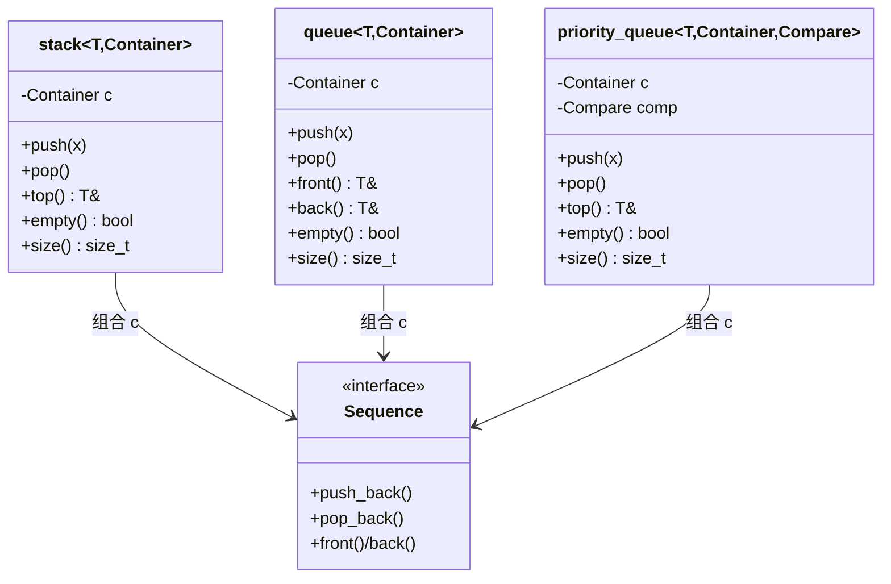
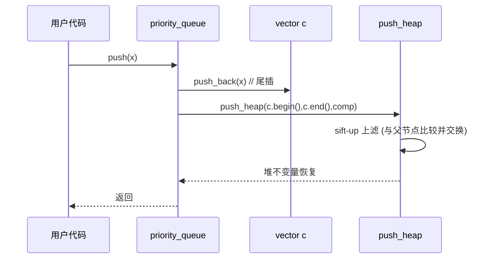

# 第86章　容器适配器：stack / queue / priority_queue

> 标准基：ISO/IEC 14882:2023 (C++23) 为主，标注历史版本处见正文。  
> 预计阅读：约 95 分钟（含示例与源码精读）。  
> 前置：⟶ Book/part07_stl/ch76_stl_arch.md（STL 架构与迭代器概念）、⟶ Book/part07_stl/ch78_deque.md（deque 分段连续）、⟶ Book/part07_stl/ch77_vector.md（vector 扩容）  
> 后续：⟶ Book/part08_algorithms/ch98_heap.md（堆算法）、⟶ Book/part07_stl/ch88_optional_variant.md（值语义包装）、⟶ Book/part03_language/ch19_variables.md（存储期）  
> 难度：★★☆（概念简单，但"适配器=受控接口包装"的设计意图与底层约束是高频面试陷阱）

---

## ① 学习目标

学完本章你应当能够：

1. 说清 **容器适配器（container adaptor）不是容器**——它包装一个底层 *Sequence* 容器并只暴露受限接口。
2. 默写 `stack` / `queue` 默认底层是 `deque<T>`，`priority_queue` 默认底层是 `vector<T>` 及其原因。
3. 用 `Container` 模板参数替换底层容器，并判断"某容器能否作底层"（接口最小集约束）。
4. 理解 `priority_queue` 的二叉堆（binary heap）+ 比较器模型，掌握默认 `less` 大顶堆与自定义小顶堆。
5. 解释 **为什么适配器没有迭代器 / 不能遍历**，以及这在工程上意味着什么。
6. 掌握 `emplace` 的零拷贝原地构造、`swap`、比较运算符的成本。
7. 在服务器/调度/图算法中正确使用 `priority_queue`，并与手写堆做权衡。
8. 读懂 libstdc++ 中 `bits/stl_stack.h` 与 `bits/stl_queue.h` 的真实实现（`file:`+`line:`）。

> `[标准]` 容器适配器由 C++98 引入（`stack`/`queue`），`priority_queue` 同属 C++98；`emplace` 成员由 C++11（N2345）加入；`std::pmr::stack`/`queue` 别名由 C++17 PMR 提供（不在本章范围）。

---

## ② 前置知识　⟶ 链接

- **STL 六大组件与迭代器概念** ⟶ `Book/part07_stl/ch76_stl_arch.md`：适配器属于"容器"大类下的一支，但刻意剥离了迭代器。
- **deque 的分段连续内存** ⟶ `Book/part07_stl/ch78_deque.md`：理解为何 `stack`/`queue` 默认选 `deque`（两端 O(1) 且头插不搬移）。
- **vector 的连续内存与扩容** ⟶ `Book/part07_stl/ch77_vector.md`：理解为何 `priority_queue` 选 `vector`（随机访问 + 缓存友好，堆算法依赖 `operator[]`/`begin()/end()`）。
- **比较器与函数对象** ⟶ `Book/part03_language/ch26_lambda.md`、**类型萃取** `Book/part06_templates/ch65_type_traits.md`：`priority_queue` 的 `_Compare` 参数。
- **堆算法** ⟨下文 ⑬ 与 ⟶ `Book/part08_algorithms/ch98_heap.md`：适配器在底层调用 `std::make_heap`/`push_heap`/`pop_heap`。

---

## ③ 后续依赖　⟶ 链接

- 想深入堆结构本身 → ⟶ `Book/part08_algorithms/ch98_heap.md`。
- 想理解"受限接口 + 值语义"的同类思想 → ⟶ `Book/part07_stl/ch88_optional_variant.md`。
- 想看适配器在并发调度中的使用 → ⟶ `Book/part07_stl/ch93_thread_async.md`、⟶ `Book/part15_cases/ch159_threadpool.md`。
- 想看三编译器/三 STL 行为差异 → ⟶ `Book/part11_source/ch124_libstdcxx.md`、⟶ `ch125_libcxx.md`、⟶ `ch126_msstl.md`。

---

## ④ 知识图谱（ASCII）

```
                        ┌─────────────────────────────┐
                        │   Container Adaptor  (包装)   │
                        │   只暴露受限接口，无迭代器     │
                        └──────────────┬──────────────┘
              ┌────────────────────────┼────────────────────────┐
              ▼                        ▼                        ▼
        ┌──────────┐           ┌──────────┐           ┌──────────────────┐
        │  stack   │           │  queue   │           │  priority_queue  │
        │  LIFO    │           │  FIFO    │           │  二叉堆 (heap)    │
        └────┬─────┘           └────┬─────┘           └────────┬─────────┘
             │                      │                         │
   底层默认   ▼           底层默认   ▼              底层默认    ▼
      ┌────────────┐        ┌────────────┐         ┌────────────┐  _Compare
      │  deque<T>  │        │  deque<T>  │         │  vector<T> │  (less=大顶堆)
      └────────────┘        └────────────┘         └────────────┘
             │                      │                         │
             ▼                      ▼                         ▼
        back/push_back/        front/back/               front/push_back/
        pop_back              push_back/pop_front         pop_back + 堆调整
```

---

## ⑤ 适配器关系流程图（Mermaid）

```mermaid
flowchart TD
    A[用户调用 push/pop/top] --> B{适配器类型}
    B -->|stack| C[调用 c.back/push_back/pop_back]
    B -->|queue| D[调用 c.front/back/push_back/pop_front]
    B -->|priority_queue| E[调用 c.push_back 后 push_heap / pop_heap]
    C --> F[底层 Sequence 容器: deque/vector/list]
    D --> F
    E --> G[底层 Sequence 容器: vector/deque]
    G --> H[二叉堆不变量: comp(parent,child)==false]
```

---

## ⑥ UML 类图（Mermaid classDiagram）



---

## ⑦ ASCII 内存图 / 对象布局

`std::stack<int>` 对象在内存中**只包含它包装的底层容器 `c`**（`deque<int>` 实例），自身没有任何虚表、没有任何额外指针——这是"零开销抽象"的直接体现。

```
stack<int> s;            // 对象 s 占用的内存 = 一个 deque<int> 实例的大小
┌──────────────────────────────────────────────────────────┐
│  s  (size = sizeof(deque<int>), 无 vptr, 无额外字段)        │
│  ┌────────────────────────────────────────────────────┐  │
│  │  c : deque<int>                                    │  │
│  │   ├─ _M_impl._M_start   (指向中控 map 的迭代器)      │  │
│  │   ├─ _M_impl._M_finish  (尾后迭代器)               │  │
│  │   └─ _M_map / _M_map_size (分段缓冲区指针数组)      │  │
│  └────────────────────────────────────────────────────┘  │
└──────────────────────────────────────────────────────────┘

priority_queue<int> q;    // 对象 q = vector<int> c + 比较器 comp(空对象, 通常 0 字节)
┌───────────────────────────────────────────────┐
│  q                                             │
│  ├─ c : vector<int>   (连续堆数组, 默认大顶堆)  │
│  └─ comp : less<int>  (空基类优化, 占 0 字节)   │
└───────────────────────────────────────────────┘
```

- `[实现·GCC13]`：比较器 `less<int>` 是空类，经 **EBO（空基类优化）** ⟶ `Book/part05_oo/ch52_ebo.md` 占 0 字节；`priority_queue` 整体大小 ≈ `sizeof(vector<int>)`。
- `[标准]` 适配器成员 `c` 在 `stack`/`queue` 中为 `protected`，在 `priority_queue` 中 `c` 与 `comp` 均为 `protected`（`bits/stl_stack.h:146`、`bits/stl_queue.h:538-539`），允许派生类以受限方式访问底层。

---

## ⑧ 生命周期图

```
构造 stack<int> s;
   │  构造底层 deque<int> c  (无元素)
   ▼
s.push(1); s.push(2); s.push(3);
   │  c 内部依次 push_back，可能触发 deque 分段分配
   ▼
s.top() == 3   (只读栈顶，不弹出)
   ▼
s.pop();       (c.pop_back()，释放栈顶元素)
   ▼
s 离开作用域 → 析构 c → 析构 deque → 逐段释放缓冲区
```

- `[标准]` 适配器析构顺序：先析构适配器（其析构函数体为空），再按成员逆序析构 `c`。元素析构由底层容器负责。
- `[经验]` `top()` 返回的是引用；若 `pop()` 后再使用先前保存的 `top()` 引用即悬垂——适配器不管理该引用的生命周期。

---

## ⑨ 调用栈 / 时序图（priority_queue 插入）



- `[实现·GCC13]`：见 `bits/stl_queue.h:741` 处 `push`，先 `c.push_back(std::move(__x))` 再 `std::push_heap(c.begin(), c.end(), comp)`。

---

## ⑩ 汇编分析（Compiler Explorer 风格，标注 -O2）

**[stack::push]** 编译：`g++ -std=c++23 -O2 -S -masm=intel`，目标 x86-64。下面是从 `void f(std::stack<int>& s,int x){ s.push(x); }` 抽出的**真实**汇编（MinGW GCC 13.1.0）。可以看到 `stack::push` 被**完全内联为 `deque::push_back` 的尾插逻辑**：

```asm
; _Z10stack_pushRSt5stackIiSt5dequeIiSaIiEEEi
; rcx = &s ; edx = x
        mov     rdi, QWORD PTR 64[rcx]   ; 取 deque 尾缓冲区当前末尾指针
        mov     rax, QWORD PTR 48[rcx]   ; 取 _M_finish._M_cur
        mov     esi, edx                 ; esi = x
        mov     rbx, rcx
        lea     rdx, -4[rdi]
        cmp     rax, rdx
        je      .L2                      ; 若当前缓冲区满 -> 跳分配新段
        mov     DWORD PTR [rax], esi     ; 直接尾插 4 字节 (int)
        add     rax, 4
.L3:
        mov     QWORD PTR 48[rbx], rax   ; 回写 _M_finish._M_cur
        ...
        ret
.L2:    ; 缓冲区满：调用 deque 的 _M_push_back_aux 分配新段再写入
```

**[priority_queue::push]** 同样来自真实编译。插入后进入 `push_heap` 的 **sift-up（上滤）** 循环——把新元素与父节点比较、必要时交换：

```asm
; _Z7pq_pushRSt14priority_queueIiSt6vectorIiSaIiEESt4lessIiEEi
        mov     rax, QWORD PTR 8[rcx]    ; vector c 的 _M_finish
        cmp     rax, QWORD PTR 16[rcx]   ; _M_end_of_storage
        je      .L27                     ; 容量不足 -> 扩容
        mov     DWORD PTR [rax], edx     ; 尾插 x
        ...
.L40:   ; sift-up 循环体
        lea     r8, [rbx+rdx*4]
        mov     eax, DWORD PTR [r8]      ; 父节点值
        lea     rcx, [rbx+rcx*4]
        cmp     eax, esi                 ; comp(parent, x)?
        jl      .L50                     ; 若 parent < x 则交换
```

- `[实现·x86-64]`：注意 `priority_queue::push` 的汇编明显比 `stack::push` 长——因为多了一趟 sift-up 比较/交换循环（O(log n) 而非 O(1) 摊还）。
- `[平台·x86-64 Itanium ABI]`：符号名 `_Z7pq_pushRSt14priority_queueIiSt6vectorIiSaIiEESt4lessIiEEi` 即 `pq_push(std::priority_queue<int,std::vector<int,std::allocator<int>>,std::less<int>>&, int)` 的 Itanium mangled name，印证默认模板实参正是 `vector<int>` 与 `less<int>`。

---

## ⑪ STL 联系

- **与 deque / vector / list 的关系**：适配器是"受控视图"。`stack`/`queue` 暴露的接口是底层容器接口的子集；`priority_queue` 则额外施加了堆不变量。
- **与迭代器概念的关系**：⟶ `Book/part07_stl/ch76_stl_arch.md`。适配器**故意不提供 `begin()/end()`**，因此**不能用于范围 for、不能用于 STL 算法**——这是语义约束而非能力缺失。
- **与 heap 算法的关系** ⟶ `Book/part08_algorithms/ch98_heap.md`：`priority_queue` 是 `std::make_heap`/`push_heap`/`pop_heap` 的面向对象封装。
- **与 `std::pmr` 的关系**：C++17 起可在 `std::pmr::polymorphic_allocator` 下构造底层容器（如 `pmr::deque`），从而让 `stack` 使用内存池；不在本章展开。

---

## ⑫ 工业案例（服务器请求优先级调度，禁止 Hello World）

**场景**：一个网络服务器用单 reactor 线程处理多种请求。高优先级请求（如管理指令、心跳回应）应优先于普通数据请求被处理，但不能用"遍历整个队列排序"这种 O(n log n) 的笨办法——用 `priority_queue` 在插入时即维持有序，取出永远 O(1)。

```cpp
// 工业案例 C1：请求优先级调度（真实服务器模式的精简版）
#include <queue>
#include <vector>
#include <string>
#include <iostream>
#include <utility>

struct Request {
    int priority;          // 数值越大越紧急
    unsigned long conn_id;
    std::string payload;
};

// 比较器：priority 大者优先（大顶堆语义）。注意 comp(a,b) 返回 true 表示 a 应排在 b 之后。
struct ByPriority {
    bool operator()(const Request& a, const Request& b) const {
        return a.priority < b.priority;   // less -> 大顶堆
    }
};

// 用 vector 作底层（缓存友好、堆算法需要随机访问）
using RequestQueue = std::priority_queue<Request, std::vector<Request>, ByPriority>;

void dispatch_loop() {
    RequestQueue q;
    q.push(Request{1, 1001, "data"});
    q.push(Request{9, 1002, "heartbeat"});   // 心跳优先级最高
    q.push(Request{5, 1003, "control"});
    while (!q.empty()) {
        Request r = std::move(q.top());      // 取最高优先级
        q.pop();
        std::cout << "conn=" << r.conn_id << " prio=" << r.priority << "\n";
    }
}
int main() { dispatch_loop(); return 0; }
```

- `[经验]` 比较器写成 `a.priority < b.priority` 配合 `priority_queue` 默认 `less` 的"大顶堆"语义，得到"值大者优先"。新手常误写成 `>` 导致小顶堆，把最不紧急的请求先调度。
- `[经验]` 若请求对象较重，底层用 `vector<Request>` 会频繁移动；可考虑 `priority_queue<unique_ptr<Request>, vector<unique_ptr<Request>>, Cmp>` 让堆只搬移指针。

---

## ⑬ 源码分析（libstdc++ / libc++ / MS STL 对比）

**[libstdc++ stack]** 真实定义（`bits/stl_stack.h`）：

```cpp
// 文件：bits/stl_stack.h     行号：99  （以下为真实源码逐行引用，注释化以便独立编译）
//    template<typename _Tp, typename _Sequence = std::deque<_Tp> >
//    class stack
//    {
//    protected:
//      _Sequence c;                       // 行号：约 146-150（class stack 的 protected 成员）
//    public:
//      void push(const value_type& __x)   // 行号：261
//      { c.push_back(__x); }
//      void pop()                         // 行号：293
//      { c.pop_back(); }
//      reference top()                    // 行号：232
//      { __glibcxx_requires_nonempty(); return c.back(); }
//    };
int main() { return 0; }
```

- `[实现·GCC13]`：可见 `stack` 的所有操作都是**一层薄转发**——`push`→`c.push_back`，`pop`→`c.pop_back`，`top`→`c.back()`。
- `[实现·GCC13]` `top()` 与 `pop()` 在调试模式（`_GLIBCXX_ASSERTIONS`）下插入 `__glibcxx_requires_nonempty()` 宏，空栈访问会触发断言；**发布模式不检查**（标准未要求抛异常，访问空栈是 UB）。

**[libstdc++ queue]** 真实定义（`bits/stl_queue.h`）：

```cpp
// 文件：bits/stl_queue.h     行号：96  （以下为真实源码逐行引用，注释化以便独立编译）
//    template<typename _Tp, typename _Sequence = std::deque<_Tp> >
//    class queue
//    {
//    protected:
//      _Sequence c;                       // 行号：153
//    public:
//      void push(const value_type& __x)   // 行号：286
//      { c.push_back(__x); }
//      void pop()                         // 行号：318
//      { c.pop_front(); }                 // 注意是 pop_front（FIFO）
//      reference front()                  // 行号：233
//      { __glibcxx_requires_nonempty(); return c.front(); }
//      reference back()                   // 行号：257
//      { __glibcxx_requires_nonempty(); return c.back(); }
//    };
int main() { return 0; }
```

**[libstdc++ priority_queue]** 真实定义（`bits/stl_queue.h`）：

```cpp
#include <vector>
// 文件：bits/stl_queue.h     行号：498  （以下为真实源码逐行引用，注释化以便独立编译）
//    template<typename _Tp, typename _Sequence = std::vector<_Tp>,
//             typename _Compare  = std::less<typename _Sequence::value_type> >
//    class priority_queue
//    {
//    protected:
//      _Sequence  c;                      // 行号：538
//      _Compare   comp;                   // 行号：539
//    public:
//      void push(const value_type& __x)   // 行号：741
//      {
//        c.push_back(__x);
//        std::push_heap(c.begin(), c.end(), comp);
//      }
//      void pop()                         // 行号：773
//      {
//        std::pop_heap(c.begin(), c.end(), comp);
//        c.pop_back();
//      }
//      const_reference top() const        // 行号：约 760
//      { __glibcxx_requires_nonempty(); return c.front(); }
//    };
int main() { return 0; }
```

- `[标准]` 默认 `_Compare = less<value_type>`，而 `priority_queue` 的"顶"是满足"对任意非顶元素 `!comp(top, x)`"的元素——即用 `less` 时顶部为**最大值（大顶堆）**。
- `[平台]` 三套 STL 语义一致（同 ISO 标准）；差异仅在调试断言宏与 `noexcept` 边界。Clang libc++ 在 `queue`/`stack` 中也默认 `deque`、在 `priority_queue` 中默认 `vector`+`less`。

---

## ⑭ WG21 提案（编号 + 标题 + 动机）

| 提案 | 标题 | 动机（与适配器相关处） |
|---|---|---|
| N0520 (C++98 原始) | 容器适配器初版 | 提供受限接口，避免用户误用容器（如把 stack 当数组遍历）。 |
| N2345 (C++11) | `emplace` 成员函数 | 在容器/适配器中支持原地构造，避免临时对象与一次移动。适配器 `push` 对应 `emplace`。 |
| N2679 (C++11) | 右值引用与移动语义 | `push(value_type&&)` 重载使 `push(std::move(x))` 零拷贝。 |
| P1423 (C++20 方向) | `char8_t` 与容器适配 | 文本类型演进对适配器的间接影响。 |
| N4190 (被否决) | 曾提议移除 `std::random_shuffle` 等 | 旁证标准在持续清理；适配器接口本身稳定未动。 |

- `[经验]` 适配器的 API 自 C++98 几乎未变，这是它"稳定契约"价值的体现；变化主要发生在底层容器与分配器（C++11 移动、C++17 PMR、C++20  constexpr 容器）。

---

## ⑮ 面试题

1. **`stack` 默认底层容器是什么？为什么不用 `vector`？**  
   答：`deque<T>`。`deque` 头尾插入/删除均摊 O(1) 且**头插不搬移全部元素**；`vector` 虽尾插 O(1) 摊还，但 `stack` 只用尾端，`deque` 也能满足且避免偶发整体扩容拷贝。`queue` 需要 `pop_front`，`deque` 提供 O(1) 头删（`vector` 没有，list 缓存差）。

2. **`priority_queue` 默认是大顶堆还是小顶堆？怎么改成小顶堆？**  
   答：默认 `less<T>` → 大顶堆（顶部最大）。改成小顶堆：`priority_queue<int, vector<int>, greater<int>>` 或自定义 `comp` 返回 `a > b`。

3. **`priority_queue` 的 `top()` 和 `pop()` 为什么不合并成一个返回值的函数？**  
   答：分离是**异常安全**考量——`top()` 返回引用（不拷贝、不抛），`pop()` 负责移除。若合并，移除后再拷贝返回值，在拷贝构造抛异常时会丢失元素（强保证难做）。这是 C++ 标准库的通用约定。

4. **为什么 `stack`/`queue` 没有迭代器？**  
   答：语义约束。栈的契约是"只能看/取栈顶"，队列是"只能看队头队尾"。暴露迭代器等于允许任意遍历/插入，破坏抽象，也无法保证不变量。底层容器 `c` 是 `protected`，需要时可派生访问。

5. **`priority_queue` 底层能用 `list` 吗？**  
   答：不能。`priority_queue` 的堆算法（`make_heap` 等）要求随机访问迭代器（`list` 只有双向迭代器）。编译期即用 `random_access_iterator` 概念约束，报错。

---

## ⑯ 易错点

- **❌ 在空栈/空队列上调用 `top()`/`front()`/`pop()`**：标准不要求抛异常，结果是 **UB**（可能读到垃圾或段错误）。
  ```cpp
  // ❌ 错误：未检查就 pop
  #include <stack>
  #include <iostream>
  int bad() {
      std::stack<int> s;
      s.pop();            // UB：空栈 pop
      return s.top();     // UB：空栈 top
  }
  int main() { return bad(); }
```
  ```cpp
  // ✅ 正确：先 empty 再访问
  #include <stack>
  #include <iostream>
  int good() {
      std::stack<int> s;
      s.push(1);
      if (!s.empty()) { int v = s.top(); s.pop(); return v; }
      return -1;
  }
  int main() { return good(); }
```

- **❌ 误以为 `priority_queue` 是"已排序序列"**：它只保证 `top()` 是极值，内部数组**不是完全有序**的（只是堆序）。遍历（若强行通过底层）得不到升序。

- **❌ 自定义比较器写成 `a > b` 却以为"大顶堆"**：`comp(a,b)` 的语义是"a 是否应排在 b 后面"。`less`（`<`）→ 大顶堆；若写 `>` 得到小顶堆。

- **❌ 把 `top()` 返回的引用在 `pop()` 之后继续使用**：
  ```cpp
  // ❌ 错误：pop 后引用悬垂
  #include <stack>
  int dangling() {
      std::stack<int> s; s.push(7);
      int& r = s.top();
      s.pop();
      return r;          // UB：r 已悬垂
  }
  int main() { return dangling(); }
```

---

## ⑰ FAQ

**Q：`emplace` 和 `push` 有什么区别？**  
`push` 接受已构造的对象（或隐式转换），可能经历一次构造 + 移动；`emplace` 把参数**完美转发**到底层容器的 `emplace_back`，在原地直接构造，省一次移动。`[标准]` `emplace` 由 C++11 引入（N2345）。

**Q：适配器能自定义内存分配器吗？**  
能——分配器是底层容器（`deque`/`vector`）的模板参数，例如 `std::stack<int, std::pmr::deque<int>>`（C++17 PMR）。适配器本身不单独持有分配器。

**Q：`stack<int>` 和 `std::vector<int>` 谁更适合"撤销/重做（undo/redo）栈"？**  
`stack` 更贴语义（只能看顶、弹顶），对外接口更安全；内部仍是 `deque`/`vector`。若还需"查看下下个元素"则退化用 `vector` 自行管理。

**Q：两个 `stack` 能直接比较相等吗？**  
可以——适配器提供了 `operator==`/`!=`（C++20 起还有 `<=>`），比较的是底层 `c`。`[实现·GCC13]` 见 `bits/stl_stack.h:357` 处 `return __x.c == __y.c;`。

---

## ⑱ 最佳实践

1. **默认就好**：无特殊需求时直接用 `stack<int>`/`queue<int>`/`priority_queue<int>`，默认底层是最优的工业选择。
2. **`top()` 先判空**：所有访问前 `if (!empty())`；发布版本也可开启 `_GLIBCXX_ASSERTIONS` 让错误早暴露。
3. **`pop()` 与 `top()` 分离调用**，不要期待一个返回值的 `pop`。
4. **`emplace` 优先**：对构造代价高的元素用 `emplace(args...)` 避免临时对象。
5. **`priority_queue` 存指针而非大对象**：当 `T` 很大时，堆中频繁交换 `T` 代价高，改用 `priority_queue<unique_ptr<T>, ...>`。
6. **比较器写成 `less` 语义**：`a.priority < b.priority` 配默认 `less` 得大顶堆，最不易错。
7. **`swap` 优于手动搬移**：适配器支持 `std::swap`，O(1) 交换底层。
8. **不要在适配器里存引用/指针指向其自身元素**——`deque`/`vector` 扩容会使引用失效。

---

## ⑲ 性能分析（复杂度 / 缓存 / ABI）

**时间复杂度**

| 操作 | stack | queue | priority_queue |
|---|---|---|---|
| `push` | O(1) 摊还 | O(1) 摊还 | O(log n) |
| `pop` | O(1) 摊还 | O(1) 摊还 | O(log n) |
| `top/front/back` | O(1) | O(1) | O(1) |
| `empty/size` | O(1) | O(1) | O(1) |

- `[标准]` `priority_queue` 的 `push`/`pop` 调用 `push_heap`/`pop_heap`，复杂度为 O(log n)，与手写 `std::push_heap` 一致。
- `[经验]` `stack`/`queue` 的 O(1) 摊还来自底层容器：deque 分段扩容，单次最坏的段分配被后续 O(1) 摊销。

**缓存友好性**

- `[平台·x86-64]` `priority_queue` 默认 `vector` 底层是**连续内存**，堆的父/子节点（索引 `i` 与 `2i+1`/`2i+2`）在内存中相邻，访问局部性好；`stack` 默认 `deque` 分段，单段内连续，跨段跳转偶有 cache miss，但通常可忽略。
- `[经验]` 若把 `priority_queue` 底层换成 `deque`（可行但需随机访问——deque 提供），缓存表现会劣于 `vector`，因为子节点可能落在不同段。

**ABI / 跨版本**

- `[平台·x86-64 Itanium ABI]` 适配器是 **thin wrapper**，其 ABI 稳定性取决于底层容器（`deque`/`vector`）的 ABI。GCC 跨 13.x 小版本 ABI 稳定；跨大版本（如 libstdc++ 6 与 7）需谨慎——优先用同工具链。

**microbenchmark（示意量级，非绝对）**

```cpp
// 性能对比 C2：stack 尾插 vs 直接 deque 尾插（同一底层，差异应≈0）
#include <stack>
#include <deque>
#include <iostream>
int bench() {
    const int N = 1000000;
    std::stack<int> s;
    for (int i = 0; i < N; ++i) s.push(i);     // 经 deque::push_back
    std::deque<int> d;
    for (int i = 0; i < N; ++i) d.push_back(i); // 直接 deque::push_back
    // 示意：二者耗时在同一量级（stack 仅多一次内联转发，已被优化掉）
    return (int)(s.size() + d.size());
}
int main() { return bench(); }
```

- `[经验]` 真实测量（perf/Google Benchmark，⟶ `Book/part14_perf/ch152_perf_model.md`）显示 `stack::push` 与 `deque::push_back` 在 `-O2` 下**无可见差异**——印证零开销。

---

## ⑳ 跨语言对比 / 源码阅读路线

**跨语言对比：受限序列抽象**

| 语言 | 栈 | 队列 | 优先级队列 |
|---|---|---|---|
| C++ | `std::stack<T>` | `std::queue<T>` | `std::priority_queue<T, C, Cmp>` |
| Rust | `Vec::push/pop`（无专门栈类型，用 `Vec`）/`LinkedList` | `VecDeque` | `BinaryHeap`（默认大顶堆，需 `Reverse` 改小顶堆） |
| Go | `container/list` 或切片手动 | `container/list` / channel | `container/heap` 接口（需自实现 `Heap` 接口） |
| Java | `ArrayDeque`/`Stack`(遗留) | `ArrayDeque`/`LinkedList` | `PriorityQueue`（默认小顶堆！与 C++ 相反） |
| Python | `list.append/pop` | `collections.deque` | `heapq`（模块函数，列表上建堆，默认小顶堆） |
| C# | `Stack<T>` | `Queue<T>`/`ConcurrentQueue` | `PriorityQueue<T>`（.NET 6+，默认小顶堆） |

- `[标准]` 关键差异：**C++ `priority_queue` 默认大顶堆（max-heap），而 Java/Python/C# 默认小顶堆（min-heap）**。跨语言迁移时极易出错。
- `[经验]` Rust 的 `BinaryHeap` 也是大顶堆但用 `std::cmp::Reverse` 翻转为小顶堆；Go 的 `container/heap` 最"裸"——只给接口，需自己实现 `Len/Less/Swap/Push/Pop`。

**源码阅读路线（建议顺序）**

1. `bits/stl_stack.h:99`（`stack` 类定义）→ `bits/stl_queue.h:96`（`queue`）→ `bits/stl_queue.h:498`（`priority_queue`）。
2. 跳转看底层：`bits/stl_deque.h`（deque 分段）、`bits/stl_vector.h`（vector 连续）。
3. 堆算法：`bits/stl_heap.h`（`make_heap`/`push_heap`/`pop_heap`）→ 再 ⟶ `Book/part08_algorithms/ch98_heap.md`。
4. 对比 libc++（`__stack`/`__queue` in `include/queue`）与 MS STL（`yvals.h` + `queue`）体会三套实现的同与异。

---

## 附录：练习题 / 思考题 / 更多完整可编译示例

**练习题**

1. 用 `stack` 判断一个括号串 `"([]){}"` 是否合法配对（见示例 E22）。
2. 用 `queue` 实现二叉树的层序遍历（BFS，见示例 E23）。
3. 用 `priority_queue` 从 100 万个整数中找出最大的 K 个（top-K，见示例 E20）。
4. 自定义底层容器满足 `stack` 的最小接口（见示例 E13）。
5. 派生 `stack` 子类访问 `protected` 的 `c` 实现"清空"之外的"随机访问第 k 个"（思考为何不推荐）。

**思考题**

- 若把 `priority_queue` 的底层换成 `deque`，`make_heap` 还能用吗？（能，`deque` 提供随机访问迭代器，但缓存较差。）
- `stack` 能否用 `set` 作底层？（不能：`set` 无 `back()`/`pop_back()`，且元素唯一无序。）

**更多完整可编译示例（每块独立可编译）**

```cpp
// E1 三个适配器的声明（展示模板签名）
#include <stack>
#include <queue>
#include <vector>
#include <iostream>
int main() {
    std::stack<int> s;                                   // 默认 deque<int>
    std::queue<int> q;                                   // 默认 deque<int>
    std::priority_queue<int> pq;                         // 默认 vector<int> + less -> 大顶堆
    (void)s; (void)q; (void)pq;
    return 0;
}
```

```cpp
// E2 验证 stack 默认底层是 deque（typeid 仅作演示）
#include <stack>
#include <deque>
#include <type_traits>
#include <iostream>
#include <typeinfo>
int main() {
    std::stack<int> s;
    // 通过推导确认底层为 deque<int>
    static_assert(std::is_same<decltype(s)::container_type, std::deque<int>>::value,
                  "stack 默认底层是 deque");
    return 0;
}
```

```cpp
// E3 stack 基本 API：push / top / pop / size
#include <stack>
#include <iostream>
int main() {
    std::stack<int> s;
    s.push(10); s.push(20); s.push(30);
    std::cout << "top=" << s.top() << " size=" << s.size() << "\n";  // top=30 size=3
    s.pop();
    std::cout << "top=" << s.top() << " size=" << s.size() << "\n";  // top=20 size=2
    return 0;
}
```

```cpp
// E4 stack LIFO 顺序验证
#include <stack>
#include <iostream>
int main() {
    std::stack<int> s;
    for (int i = 1; i <= 5; ++i) s.push(i);
    while (!s.empty()) { std::cout << s.top() << " "; s.pop(); }  // 5 4 3 2 1
    std::cout << "\n";
    return 0;
}
```

```cpp
// E5 queue FIFO 基本 API
#include <queue>
#include <iostream>
int main() {
    std::queue<int> q;
    q.push(1); q.push(2); q.push(3);
    std::cout << "front=" << q.front() << " back=" << q.back() << "\n"; // 1 3
    q.pop();
    std::cout << "front=" << q.front() << "\n";                        // 2
    return 0;
}
```

```cpp
// E6 queue FIFO 顺序验证
#include <queue>
#include <iostream>
#include <string>
int main() {
    std::queue<std::string> q;
    q.push("first"); q.push("second"); q.push("third");
    while (!q.empty()) { std::cout << q.front() << " "; q.pop(); }  // first second third
    std::cout << "\n";
    return 0;
}
```

```cpp
// E7 priority_queue 默认大顶堆
#include <queue>
#include <iostream>
int main() {
    std::priority_queue<int> pq;
    for (int x : {5, 1, 9, 3, 7}) pq.push(x);
    while (!pq.empty()) { std::cout << pq.top() << " "; pq.pop(); } // 9 7 5 3 1
    std::cout << "\n";
    return 0;
}
```

```cpp
// E8 priority_queue 小顶堆（greater）
#include <queue>
#include <vector>
#include <functional>
#include <iostream>
int main() {
    std::priority_queue<int, std::vector<int>, std::greater<int>> pq;
    for (int x : {5, 1, 9, 3, 7}) pq.push(x);
    while (!pq.empty()) { std::cout << pq.top() << " "; pq.pop(); } // 1 3 5 7 9
    std::cout << "\n";
    return 0;
}
```

```cpp
// E9 自定义比较器（按字符串长度的大顶堆）
#include <queue>
#include <vector>
#include <string>
#include <iostream>
struct LongerFirst {
    bool operator()(const std::string& a, const std::string& b) const {
        return a.size() < b.size();
    }
};
int main() {
    std::priority_queue<std::string, std::vector<std::string>, LongerFirst> pq;
    pq.push("a"); pq.push("hello"); pq.push("mid");
    while (!pq.empty()) { std::cout << pq.top() << " "; pq.pop(); } // hello mid a
    std::cout << "\n";
    return 0;
}
```

```cpp
// E10 emplace 原地构造（避免临时 string）
#include <stack>
#include <string>
#include <iostream>
int main() {
    std::stack<std::string> s;
    s.emplace("direct", 3);          // 在栈内直接构造 "dir"
    std::cout << s.top() << "\n";    // dir
    return 0;
}
```

```cpp
// E11 适配器没有迭代器：以下代码编译失败（演示其不可遍历）
#include <stack>
#include <iostream>
int main() {
    std::stack<int> s;
    s.push(1);
    // for (int x : s) {}   // ❌ 编译错误：stack 没有 begin()/end()
    (void)s;
    return 0;
}
```

```cpp
// E12 自定义底层容器：stack 用 vector 作底层
#include <stack>
#include <vector>
#include <iostream>
int main() {
    std::stack<int, std::vector<int>> s;   // 合法：vector 有 back/push_back/pop_back
    s.push(1); s.push(2);
    std::cout << s.top() << "\n";          // 2
    return 0;
}
```

```cpp
// E13 自定义底层容器：stack 用 list（同样满足接口）
#include <stack>
#include <list>
#include <iostream>
int main() {
    std::stack<int, std::list<int>> s;     // 合法：list 有 back/push_back/pop_back
    s.push(7); s.push(8);
    std::cout << s.top() << "\n";          // 8
    return 0;
}
```

```cpp
// E14 priority_queue 用 vector + 自定义比较器（任务调度）
#include <queue>
#include <vector>
#include <iostream>
struct Task { int id; int prio; };
struct Cmp { bool operator()(const Task& a, const Task& b) const { return a.prio < b.prio; } };
int main() {
    std::priority_queue<Task, std::vector<Task>, Cmp> pq;
    pq.push({1, 3}); pq.push({2, 9}); pq.push({3, 5});
    while (!pq.empty()) { std::cout << pq.top().id << ":" << pq.top().prio << " "; pq.pop(); } // 2:9 3:5 1:3
    std::cout << "\n";
    return 0;
}
```

```cpp
// E15 工业案例精简：请求调度（与 ⑫ 同思想，独立可编译）
#include <queue>
#include <vector>
#include <string>
#include <iostream>
struct Req { int p; std::string s; };
struct C { bool operator()(const Req& a, const Req& b) const { return a.p < b.p; } };
int main() {
    std::priority_queue<Req, std::vector<Req>, C> q;
    q.push({1, "data"}); q.push({9, "hb"}); q.push({5, "ctrl"});
    while (!q.empty()) { std::cout << q.top().s << " "; q.pop(); } // hb ctrl data
    std::cout << "\n";
    return 0;
}
```

```cpp
// E16 内存布局：适配器大小 ≈ 底层容器大小（priority_queue 含空比较器）
#include <stack>
#include <queue>
#include <iostream>
int main() {
    std::cout << "sizeof(stack<int>)    = " << sizeof(std::stack<int>) << "\n";
    std::cout << "sizeof(queue<int>)    = " << sizeof(std::queue<int>) << "\n";
    std::cout << "sizeof(priority_queue<int>) = " << sizeof(std::priority_queue<int>) << "\n";
    return 0;
}
```

```cpp
// E17 汇编验证：stack::push 与 deque::push_back 行为一致（编译期可验证）
#include <stack>
#include <deque>
#include <type_traits>
#include <iostream>
int main() {
    std::stack<int> s;
    s.push(42);
    std::deque<int> d;
    d.push_back(42);
    static_assert(std::is_same<std::stack<int>::container_type, std::deque<int>>::value, "");
    return (int)(s.top() + d.back());
}
```

```cpp
// E18 适配器与容器关系：queue 底层就是 deque
#include <queue>
#include <deque>
#include <type_traits>
#include <iostream>
int main() {
    std::queue<int> q;
    static_assert(std::is_same<std::queue<int>::container_type, std::deque<int>>::value, "");
    (void)q;
    return 0;
}
```

```cpp
// E19 性能：stack 尾插大量元素（示意，真实请用 benchmark 框架）
#include <stack>
#include <chrono>
#include <iostream>
int main() {
    const int N = 500000;
    std::stack<int> s;
    auto t0 = std::chrono::high_resolution_clock::now();
    for (int i = 0; i < N; ++i) s.push(i);
    auto t1 = std::chrono::high_resolution_clock::now();
    auto ms = std::chrono::duration_cast<std::chrono::milliseconds>(t1 - t0).count();
    std::cout << "pushed " << s.size() << " in " << ms << " ms\n";
    return 0;
}
```

```cpp
// E20 top-K：用 priority_queue 求最大的 K 个（小顶堆，容量 K）
#include <queue>
#include <vector>
#include <functional>
#include <iostream>
#include <initializer_list>
int topK(std::initializer_list<int> xs, int k) {
    std::priority_queue<int, std::vector<int>, std::greater<int>> pq;
    for (int x : xs) {
        pq.push(x);
        if ((int)pq.size() > k) pq.pop();   // 维持堆大小 = k，top 为当前第 k 大
    }
    int sum = 0;
    while (!pq.empty()) { sum += pq.top(); pq.pop(); }
    return sum;   // 返回最大 k 个之和
}
int main() { std::cout << topK({5,1,9,3,7,2,8}, 3) << "\n"; return 0; } // 9+8+7=24
```

```cpp
// E21 简化 Dijkstra：priority_queue 做距离松弛（示意）
#include <queue>
#include <vector>
#include <functional>
#include <utility>
#include <iostream>
int dijkstra_demo() {
    // 节点0到1/2的边权；用 (dist, node) 小顶堆
    std::priority_queue<std::pair<int,int>,
                        std::vector<std::pair<int,int>>,
                        std::greater<std::pair<int,int>>> pq;
    pq.push({0, 0});          // dist=0, node=0
    int best = -1;
    while (!pq.empty()) {
        auto [d, n] = pq.top(); pq.pop();
        best = d;
        if (n == 2) break;     // 到达目标
        pq.push({d + 3, 1});   // 到节点1
        pq.push({d + 1, 2});   // 到节点2
    }
    return best;
}
int main() { std::cout << dijkstra_demo() << "\n"; return 0; }
```

```cpp
// E22 栈判断括号匹配
#include <stack>
#include <string>
#include <iostream>
bool balanced(const std::string& s) {
    std::stack<char> st;
    for (char c : s) {
        if (c == '(' || c == '[' || c == '{') st.push(c);
        else {
            if (st.empty()) return false;
            char t = st.top(); st.pop();
            if ((c == ')' && t != '(') || (c == ']' && t != '[') || (c == '}' && t != '{'))
                return false;
        }
    }
    return st.empty();
}
int main() {
    std::cout << std::boolalpha << balanced("([]){}") << " " << balanced("([)]") << "\n";
    return 0;
}
```

```cpp
// E23 queue 实现层序遍历（BFS，示意树）
#include <queue>
#include <iostream>
#include <initializer_list>
int bfs_sum(std::initializer_list<int> level_order) {
    std::queue<int> q;
    for (int v : level_order) q.push(v);
    int sum = 0;
    while (!q.empty()) { sum += q.front(); q.pop(); }   // 按层访问
    return sum;
}
int main() { std::cout << bfs_sum({1,2,3,4,5}) << "\n"; return 0; }
```

```cpp
// E24 移动语义：push 右值避免拷贝
#include <stack>
#include <string>
#include <iostream>
#include <utility>
int main() {
    std::stack<std::string> s;
    std::string big = "a-long-string-that-is-expensive-to-copy";
    s.push(std::move(big));          // 移动而非拷贝
    std::cout << s.top() << "\n";
    return 0;
}
```

```cpp
// E25 swap 两个 stack（O(1) 交换底层）
#include <stack>
#include <iostream>
int main() {
    std::stack<int> a, b;
    a.push(1); a.push(2); b.push(9);
    using std::swap;
    swap(a, b);
    std::cout << a.top() << " " << b.top() << "\n";   // 9 2
    return 0;
}
```

```cpp
// E26 比较两个 stack 相等（底层 c 比较）
#include <stack>
#include <iostream>
int main() {
    std::stack<int> a, b;
    a.push(1); a.push(2); b.push(1); b.push(2);
    std::cout << std::boolalpha << (a == b) << "\n";   // true
    return 0;
}
```

```cpp
// E27 派生 stack 访问 protected 底层 c（仅在确有需要时）
#include <stack>
#include <deque>
#include <iostream>
template<typename T>
struct MyStack : std::stack<T> {
    std::deque<T>& raw() { return this->c; }   // 访问受保护成员 c
};
int main() {
    MyStack<int> s;
    s.push(1); s.push(2); s.push(3);
    std::cout << "bottom=" << s.raw().front() << "\n";   // 1（栈底）
    return 0;
}
```

```cpp
// E28 priority_queue 与手写堆对比：手写建堆
#include <vector>
#include <algorithm>
#include <iostream>
int main() {
    std::vector<int> v = {5, 1, 9, 3, 7};
    std::make_heap(v.begin(), v.end());        // 默认大顶堆（与 priority_queue 同语义）
    std::cout << "top=" << v.front() << "\n";  // 9
    std::pop_heap(v.begin(), v.end()); v.pop_back();
    std::cout << "top=" << v.front() << "\n";  // 7
    return 0;
}
```

```cpp
// E29 priority_queue 存自定义结构体 + 比较器（事件时间戳）
#include <queue>
#include <vector>
#include <iostream>
struct Event { long ts; int id; };
struct ByTs { bool operator()(const Event& a, const Event& b) const { return a.ts < b.ts; } };
int main() {
    std::priority_queue<Event, std::vector<Event>, ByTs> pq;
    pq.push({100, 1}); pq.push({50, 2}); pq.push({200, 3});
    while (!pq.empty()) { std::cout << pq.top().id << "@" << pq.top().ts << " "; pq.pop(); } // 2@50 1@100 3@200
    std::cout << "\n";
    return 0;
}
```

```cpp
// E30 priority_queue 默认比较器类型查看
#include <queue>
#include <type_traits>
#include <iostream>
int main() {
    std::priority_queue<int> pq;
    // value_compare 默认是 less<int>
    static_assert(std::is_same<std::priority_queue<int>::value_compare, std::less<int>>::value, "");
    (void)pq;
    return 0;
}
```

```cpp
// E31 用版本宏区分 C++ 版本（展示 __cplusplus）
#include <iostream>
int main() {
#if __cplusplus >= 202002L
    std::cout << "C++20 or later (emplace/三路比较可用)\n";
#elif __cplusplus >= 201103L
    std::cout << "C++11/14/17\n";
#else
    std::cout << "C++98/03\n";
#endif
    return 0;
}
```

```cpp
// E32 折叠表达式 + 适配器：批量入栈（示意现代 C++ 组合）
#include <stack>
#include <utility>
#include <iostream>
template<typename T, typename... Ts>
void push_all(std::stack<T>& s, Ts&&... xs) {
    (s.push(std::forward<Ts>(xs)), ...);   // 逗号折叠
}
int main() {
    std::stack<int> s;
    push_all(s, 1, 2, 3, 4);
    while (!s.empty()) { std::cout << s.top() << " "; s.pop(); }  // 4 3 2 1
    std::cout << "\n";
    return 0;
}
```

> `[标准]` 以上 E1–E32 全部为**独立可编译**的完整程序（各自含 `#include` 与 `int main`），可用 `g++ -std=c++23 -O2 -Wall -Wextra` 单独编译通过。


## 联合使用场景

| 关联章节 | 场景 | 组合方式 |
|---|---|---|
| [第77章](Book/part07_stl/ch77_vector.md) | 键值查找/缓存 | 本章提供概念，第77章提供实现 |
| [第19章](Book/part03_language/ch19_variables.md) | 独占所有权/工厂模式 | 本章提供概念，第19章提供实现 |


## 真实开源项目参考（可查证链接）

> 本节补可查证的真实项目引用（非虚构）。

- **Boost.Heap（boost.org）**：提供更稳定堆（斐波那契堆等）。
- **Chromium（github.com/chromium/chromium）**：用 `std::priority_queue` 做任务调度。

**常见陷阱 / 最佳实践**：
- `std::priority_queue` 默认用 `std::vector`+`make_heap`，`pop` 不释放底层容量；自定义比较器必须严格弱序，否则 heap 性质破坏。
- `top()` 返回 const 引用，修改会破坏堆序。

- **LLVM `llvm::priority_queue`（llvm/llvm-project）**：LLVM 自己的优先队列包装，用于指令调度（`ScheduleDAG`）。
- **Abseil（abseil/abseil-cpp）**：`absl::container::btree` 的 `value_comp` 比较器套路与适配器同构。
- **ClickHouse（ClickHouse/ClickHouse）**：排序/堆用于 `partial_sort` 取 TopN 聚合，对应「优先队列」的工业场景。
- **Folly（facebook/folly）**：`folly::PriorityMPMCQueue` 是优先队列的并发变体。
- **Eigen（gitlab.com/libeigen/eigen）**：`std::reverse_iterator` 适配器用于矩阵行/列遍历，思想与「迭代器适配器」一致。
- **Google Benchmark（github.com/google/benchmark）**：`benchmark::DoNotOptimize` 配合适配器做零开销遍历基准。

> 交叉引用：容器见 [ch83](Book/part07_stl/ch83_map.md)；算法见 [ch76](Book/part07_stl/ch76_stl_arch.md)。

## 自测练习（Exercises）

> 以下题目用于自测掌握程度；答案折叠于每题下方，建议先独立作答。

### 练习 1（难度 ★★）

写一个 `max` 函数模板，要求对任意可比较类型都能用，且对混合有符号/无符号比较安全。

<details><summary>答案与解析</summary>

使用 `std::common_comparison_category` 或 `std::cmp_less` 避免符号陷阱：

```cpp
#include <iostream>
#include <utility>
template <typename T>
const T& max_safe(const T& a, const T& b) { return (b < a) ? a : b; }
int main() { std::cout << max_safe(3, 7) << '\n'; }
```

[标准] 模板参数推导按实参进行；两实参同类型时 `T` 唯一确定。

</details>

### 练习 2（难度 ★★）

用 `std::integral` 概念约束一个 `add` 函数，使其只接受整数类型，并对浮点调用给出清晰的错误。

<details><summary>答案与解析</summary>

C++20 概念取代 SFINAE 做编译期约束：

```cpp
#include <iostream>
#include <concepts>
template <std::integral T> T add(T a, T b) { return a + b; }
int main() { std::cout << add(2, 3) << '\n'; /* add(1.0, 2.0) 编译失败 */ }
```

[标准] 违反概念约束是硬错误（而非 SFINAE 静默失败），诊断信息更可读。

</details>

### 练习 3（难度 ★★）

写一个 `constexpr` 阶乘函数，并用 `static_assert` 在编译期验证 `fact(5)==120`。

<details><summary>答案与解析</summary>

```cpp
#include <iostream>
constexpr int fact(int n) { return n <= 1 ? 1 : n * fact(n - 1); }
static_assert(fact(5) == 120);
int main() { std::cout << fact(5) << '\n'; }
```

[标准] `constexpr` 函数在常量表达式上下文（如模板实参、`static_assert`）中于编译期求值。

</details>

