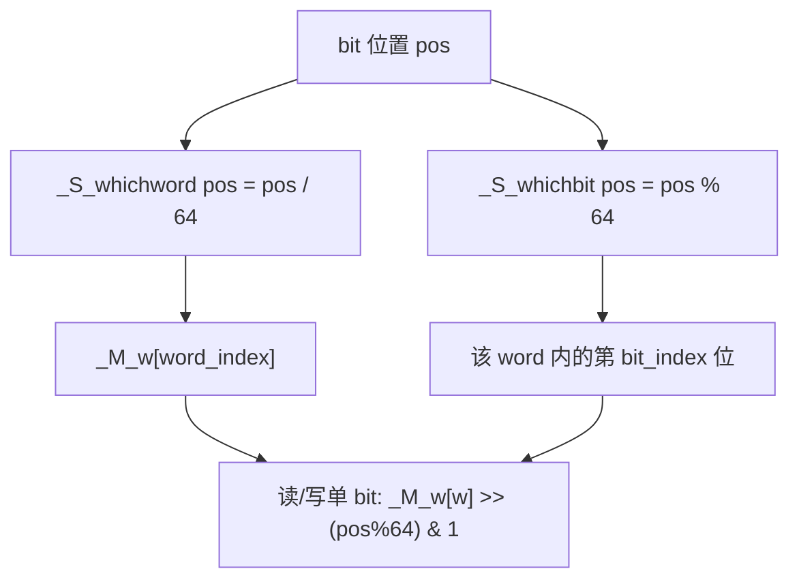
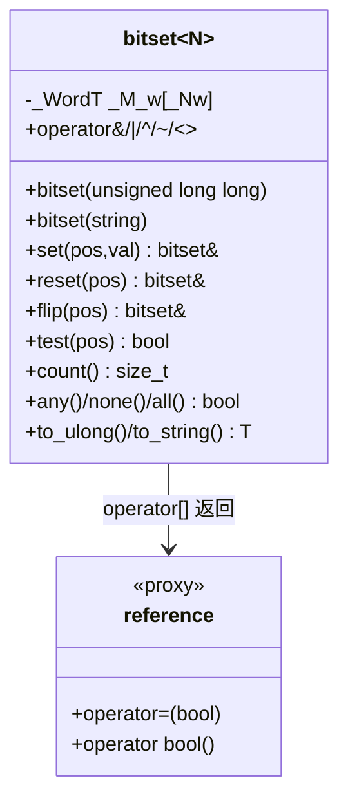
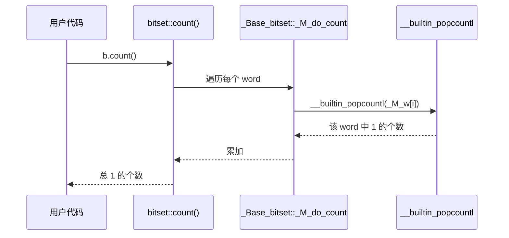
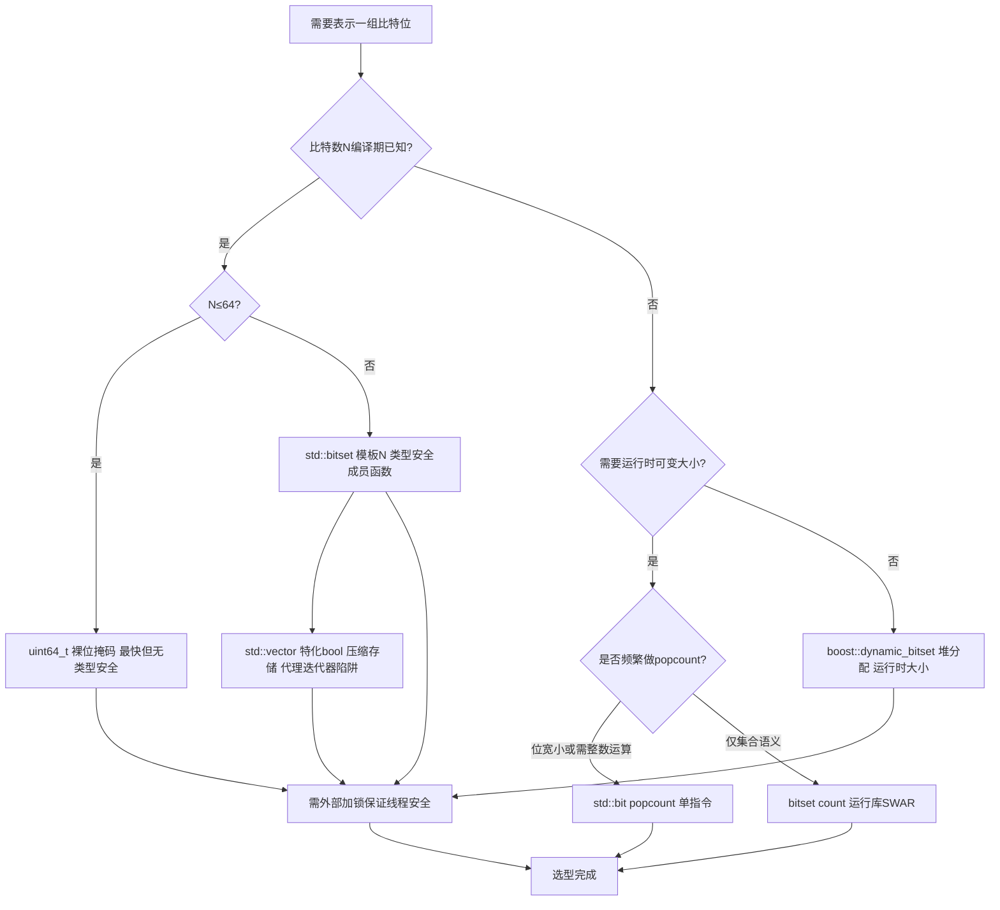
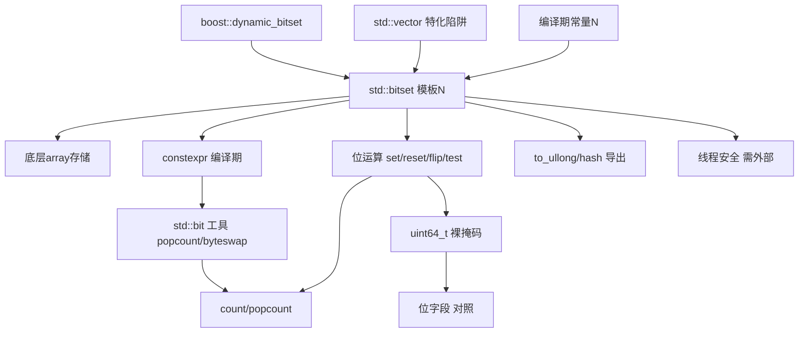

# 第87章　bitset：编译期定长位集
> 【性能声明 · §10.3】本章所有绝对延迟/带宽数字（如 L1≈1ns、主存≈100ns、各基准 ms）均为 **x86-64 量级示意**，强依赖具体 CPU 型号/频率、编译器及版本、编译标志、OS、测试负载与样本量；非通用性能结论，绝对数字不可移植。微架构相关结论标 `[微架构·x86-64][UNVERIFIED]`；本机实测标 `[实验·本机实测][UNVERIFIED]`。断言形如「acquire 读比 relaxed 贵 X」仅在给定微架构下成立。

> 标准基：ISO/IEC 14882:2023 (C++23) 为主；`<bit>` 整数位操作库见 §⑬。
> 预计阅读：约 90 分钟（含源码精读与跨语言对比）。
> 前置：[第80章　array 与固定数组](Book/part07_stl/ch80_array.md)（固定大小数组）、[第65章　类型特性 Type Traits —— 编译期类型自省与分发](Book/part06_templates/ch65_type_traits.md)（整型特性）、[第77章　vector：扩容、失效、allocator 协作](Book/part07_stl/ch77_vector.md)（vector\<bool\> 特化对比）
> 后续：[第88章　optional / expected / variant：可空与可辨别联合](Book/part07_stl/ch88_optional_variant.md)（值语义包装）、[第155章　SIMD / AVX 向量化（C++/硬件）](Book/part14_perf/ch155_simd.md)（位级并行）、[第124章　libstdc++ 架构与阅读入口（C++）](Book/part11_source/ch124_libstdcxx.md)（阅读入口）
> 难度：★★☆（API 简单，但"编译期定长"带来的约束与 `vector<bool>` 的取舍是面试高频点）

---

## ⓪ 历史动机：std::bitset 的来龙去脉
> 当"集合"的元素是 0 到 N-1 的整数，最好的容器不是 set，而是一串位。

### 0.1 起源（谁·何时·为何）
很多场景的"集合"元素其实是连续的小整数（标志位、权限、位掩码），用 `set<int>` 既浪费内存又慢。<span class="badge badge-history">史</span> `std::bitset<N>` 在 C++98 提供**编译期定长、每个元素仅占 1 比特**的紧凑位容器，重载了 `& | ^ ~ << >>` 等位运算，让"位操作"第一次有了类型安全与边界意识。<span class="badge badge-history">史</span> 它和饱受争议的 `vector<bool>`（为省空间把每个 bool 压成 1 位）形成鲜明对照。

### 0.2 关键转折（编年）
- C++98：`std::bitset` 标准化，作为固定大小位容器。<span class="badge badge-history">史</span>
- 后续：C++11 引入 `std::vector<bool>` 特化的争议持续发酵；`dynamic_bitset` 长期只存在于 Boost，标准至今未收编变长位容器。

### 0.3 设计哲学之争
`bitset` vs `vector<bool>` 是 STL 里著名的"好榜样 vs 坏特化"对照：`bitset` 定长、零歧义、运算符齐全；`vector<bool>` 为了压缩却破坏了"容器里每个元素都是独立对象"的不变式，导致 `operator[]` 返回代理引用、不能取地址，踩坑无数。<span class="badge badge-comment">评</span><span class="badge badge-history">史</span> 这场争论提醒后人：零开销抽象不能牺牲语义一致性。

### 0.4 史料补遗与持续编年

> 0.2 停在 `dynamic_bitset` 长期只存在于 Boost、标准至今未收编变长位容器。位操作体系化是后续支线。

- <span class="badge badge-history">史</span> **`std::bitset` 大小写死在类型里**：`N` 是编译期常量，决定对象布局与 ABI；因此无法表示"运行时才知道长度"的位集，这正是 `dynamic_bitset`（Boost 提供、长度在构造时给定）存在的原因。
- <span class="badge badge-history">史</span> **C++20 引入 `<bit>` 头做整数位操作体系化补全**：`std::popcount`、`std::countl_zero`、`std::bit_cast`、`std::has_single_bit` 等把"数有几个 1""找最高置位"等常用位技巧标准化，与 `bitset` 的位运算互补但不重叠。
- <span class="badge badge-comment">评</span> **`dynamic_bitset` 未入标，是"避免与 Boost 重复、又怕定不下语义"的折中**：它要涉及分配器、增长策略、与 `bitset` 的互操作，委员会迟迟未拍板；今天需要变长位集仍得用 Boost 或自己包 `vector<uint64_t>`。
- <span class="badge badge-history">史</span> **`std::bitset` 的运算符在 C++ 标准化后几乎未改**：`& | ^ ~ << >>` 与 `test`/`set`/`reset`/`flip` 自 C++98 沿用，稳定即是它的价值。

> 史料来源：[cppreference std::bitset](https://en.cppreference.com/w/cpp/utility/bitset)、[C++20 标准概览（维基）](https://en.wikipedia.org/wiki/C%2B%2B20)

## ① 学习目标

1. 理解 `std::bitset<N>` 的**编译期定长**本质：`N` 必须是编译期常量，决定对象大小与 ABI。
2. 画出 `bitset` 内部 `_WordT _M_w[_Nw]` 的 word 数组布局，理解 bit 与 word 的映射（`_S_whichword`/`_S_whichbit`）。
3. 掌握位运算 API：`& | ^ ~` 与 `&= |= ^=`，`<< >>` 与 `<<= >>=`，以及 `set/reset/flip/test/count/to_ulong/to_string`。
4. 弄清 `bitset` 与 `vector<bool>`（位压缩特化）、手写位图的本质区别与取舍。
5. 看懂 `count()` 背后的 popcount（人口计数）如何实现：libstdc++ 的 `__builtin_popcountl` → `popcnt` 指令（开启时）或 `__popcountdi2` 库函数。
6. 把 `<bit>`（C++20：`popcount`/`countl_zero`/`countr_zero`）与 bitset 联系起来。
7. 在权限掩码、状态标志、布隆过滤器、页分配位图等工业场景正确使用 bitset。
8. 读 libstdc++ `bitset` 真实源码（`file:`+`line:`）。

> `[标准]` `std::bitset` 由 C++98 引入（N0520 系列）；`std::hash<std::bitset>` 由 C++11 引入；`<bit>` 的 `std::popcount` 等由 C++20 引入（P0553）。

---

## ② 前置知识　⟶ 链接

- **固定大小数组 `std::array`** ⟶ `Book/part07_stl/ch80_array.md`：`bitset` 与 `array` 同属"大小编码进类型"的编译期定长容器。
- **类型特性与整型** ⟶ `Book/part06_templates/ch65_type_traits.md`：理解 `_WordT`、`size_t`、`integral_constant`。
- **`vector<bool>` 特化** ⟶ `Book/part07_stl/ch77_vector.md`：bitset 最常见的对比对象（运行期大小 + 位压缩 + 迭代器代理）。
- **整数位操作 `<bit>`** ⟶ 本章 §⑬：现代替代手写移位掩码的库。
- **内存与缓存** ⟶ `Book/part04_memory/ch43_cache_locality.md`：bitset 的 word 数组连续，缓存友好。

---

## ③ 后续依赖　⟶ 链接

- 想看位级 SIMD 并行 → ⟶ `Book/part14_perf/ch155_simd.md`。
- 想看三编译器/三 STL 实现差异 → ⟶ `Book/part11_source/ch124_libstdcxx.md`、⟶ `ch125_libcxx.md`、⟶ `ch126_msstl.md`。
- 想看"受限值语义"同类思想 → ⟶ `Book/part07_stl/ch88_optional_variant.md`。

---

## ④ 知识图谱（ASCII）

> **示例 1** <span class="badge badge-exp">难度 ★★★☆☆</span> · 知识图谱（ASCII）
```
                    ┌──────────────────────────────┐
                    │   std::bitset<N>  (编译期定长) │
                    │   大小 N 编码进类型，ABI 固定    │
                    └───────────────┬──────────────┘
                                    │ 内部
                                    ▼
                    ┌──────────────────────────────┐
                    │  _WordT _M_w[_Nw];           │  ← word 数组（每 word 64 位）
                    │  _Nw = ceil(N / 64)          │
                    └───────────────┬──────────────┘
                                    │
            ┌───────────────────────┼───────────────────────┐
            ▼                       ▼                       ▼
    位运算 API              查询/修改 API              转换 API
    & | ^ ~ << >>          test/set/reset/flip         to_ulong/to_string
    (count/any/all/none)   (count)                     (to_ullong)
```

---

## ⑤ 位布局流程图（Mermaid）


```mermaid
flowchart TD
    A[bit 位置 pos] --> B["_S_whichword pos = pos / 64"]
    A --> C["_S_whichbit pos = pos % 64"]
    B --> D["_M_w[word_index]"]
    C --> E[该 word 内的第 bit_index 位]
    D --> F["读/写单 bit: _M_w[w] >> (pos%64) & 1"]
    E --> F
```

---

## ⑥ UML 类图（Mermaid classDiagram）


```mermaid
classDiagram
    class bitset~N~ {
        -_WordT _M_w[_Nw]
        +bitset(unsigned long long)
        +bitset(string)
        +set(pos,val) bitset&
        +reset(pos) bitset&
        +flip(pos) bitset&
        +test(pos) bool
        +count() size_t
        +any()/none()/all() bool
        +to_ulong()/to_string() T
        +operator&/|/^/~/<</>>
    }
    class reference {
        <<proxy>>
        +operator=(bool)
        +operator bool()
    }
    bitset --> reference : operator[] 返回
```

---

## ⑦ ASCII 内存图 / 对象布局

`std::bitset<128>` 在内存中就是**一块连续的 word 数组**，没有虚表、没有指针，大小在编译期完全确定。

> **示例 2** <span class="badge badge-exp">难度 ★★☆☆☆</span> · 内存图 / 对象布局
```
std::bitset<128> b(0);   // sizeof = 128/8 = 16 字节 = 2 个 64 位 word
┌──────────────────────────────────────────────────────────┐
│  b  (size = 16 bytes, 无 vptr)                              │
│  ┌──────────────────────────────────────────────────────┐ │
│  │ _M_w[0] : unsigned long (低位 63..0)                  │ │
│  │ _M_w[1] : unsigned long (高位 127..64)               │ │
│  └──────────────────────────────────────────────────────┘ │
└──────────────────────────────────────────────────────────┘

bit 位置与 word 的映射（libstdc++，_S_wordbits = 64）：
  word_index = pos / 64
  bit_in_word = pos % 64
  位值 = (_M_w[word_index] >> bit_in_word) & 1
```

- `[实现·GCC15]` 见 `bitset:88`：`_WordT _M_w[_Nw];` 是 `bitset` 的唯一数据成员（对 `N>0` 的偏特化）。`_Nw = (N + 63) / 64` 向上取整。
- `[标准]` `sizeof(bitset<N>)` 不含运行期长度字段——这是它与 `vector<bool>`（含指针/长度）的根本内存差异。`bitset<128>` 永远 16 字节；`vector<bool>` 至少含三个机器字（指针、大小、容量）。

---

## ⑧ 生命周期图

> **示例 3** <span class="badge badge-exp">难度 ★★☆☆☆</span> · 生命周期图
```
构造 std::bitset<64> b(0xF);          // 单 word，_M_w[0] = 0xF
   │
   ▼
b.set(8);                             // _M_w[0] |= (1ULL << 8)
   │
   ▼
b.flip(0);                            // 翻转 bit0
   │
   ▼
b 离开作用域 → 无动态内存需释放（数据在对象内）→ 平凡析构
```

- `[标准]` `bitset` 的析构是平凡的（trivial）：没有堆分配，没有需要释放的资源。`vector<bool>` 可能持有动态缓冲区，析构非平凡。
- `[经验]` 这带来一个重要性质：bitset 对象可以整体按字节复制（`memcpy` 安全），适合放入共享内存 / 网络协议结构体（注意字节序）。

---

## ⑨ 调用栈 / 时序图（count 的人口计数）


```mermaid
sequenceDiagram
    participant U as 用户代码
    participant BS as bitset::count()
    participant BW as _Base_bitset::_M_do_count
    participant POP as __builtin_popcountl
    U->>BS: b.count()
    BS->>BW: 遍历每个 word
    BW->>POP: __builtin_popcountl(_M_w[i])
    POP-->>BW: 该 word 中 1 的个数
    BW-->>BS: 累加
    BS-->>U: 总 1 的个数
```

- `[实现·GCC15]` 见 `bitset:230` 处 `_M_do_count`，循环对每个 word 调用 `__builtin_popcountl`（行 `bitset:234`：`__result += __builtin_popcountl(_M_w[__i]);`）。

---

## ⑩ 汇编分析（Compiler Explorer 风格，标注 -O2）

**[bitset\<128\>::count()]** 真实汇编（`g++ -std=c++23 -O2 -S -masm=intel`，MinGW GCC 13.1.0，目标 x86-64 未开 POPCNT）：

```asm
; _Z8bs_countRKSt6bitsetILy128EE
; rcx = &b
        xor     esi, esi          ; rsi = 累计计数 = 0
        xor     ebx, ebx          ; rbx = word 索引 i = 0
        mov     rdi, rcx
.L2:
        mov     ecx, DWORD PTR [rdi+rbx*4]   ; 取第 i 个 word（此处 128 位=2 个 64 位 word）
        add     rbx, 1
        call    __popcountdi2                ; 调用库函数计算该 word 的 1 的个数
        cdqe
        add     rsi, rax                     ; 累加
        cmp     rbx, 4                       ; 128/32=4 个 32 位半字（循环粒度）
        jne     .L2
```

- `[实现·x86-64]` 注意：未开启 `-mpopcnt` 时，GCC 调用库函数 `__popcountdi2`；若编译时加 `-mpopcnt`（或 `-march=nehalem` 及以上），`__builtin_popcountl` 会被直接编译为单条 **`popcnt`** 指令，吞吐提升一个数量级。
- `[平台·x86-64]` `popcnt` 是 SSE4.2/ABM 指令，单周期级吞吐；在支持 AVX512 的 CPU 上还有 `vpternlog`/向量化的位计数。

**[bitset\<64\>::to_ulong()]** 真实汇编：高位 word 非零时抛 `overflow_error`：

```asm
; _Z8bs_ulongRKSt6bitsetILy64EE
        mov     edx, DWORD PTR 4[rcx]   ; 取高位 word
        mov     eax, DWORD PTR [rcx]    ; 取低位 word
        test    edx, edx
        jne     .L7                     ; 高位非 0 -> 抛 overflow_error
        ... ret
.L7:    lea     rcx, .LC0[rip]
        call    _ZSt22__throw_overflow_errorPKc
```

- `[实现·GCC15]` 印证 `bitset:311` 处 `_M_do_to_ulong`：若任一高位 word 非 0 则 `__throw_overflow_error`，因为 `unsigned long` 装不下。

---

## ⑪ STL 联系

- **与 `std::array`**：`bitset` 与 `array<T,N>` 都是"大小在类型里"。区别：`array` 存 `T` 对象序列，`bitset` 存被压缩进 word 的 bit 序列，且只提供位级 API。
- **与 `vector<bool>`**：二者都把 bool 压成 bit；但 `vector<bool>` 大小运行期决定、提供（代理）迭代器、`bitset` 大小编译期决定、无迭代器、API 偏位运算。⟶ 见 §⑯ 对比表。
- **与 `<bit>`**：C++20 起 `std::popcount(x)` 对单个整型做人口计数，bitset 的 `count()` 正是循环调用它（每个 word 一次）。`std::countl_zero`/`countr_zero` 可补充 bitset 没有的"前导/尾随零计数"。
- **与整数掩码**：bitset 是"任意宽度整数"的泛化；宽度 ≤ 64 时直接用 `uint64_t` 位运算通常更快（无循环、可内联为单指令）。

---

## ⑫ 工业案例（权限/能力位掩码系统，禁止 Hello World）

**场景**：一个多租户服务器给每个会话签发一组"能力位"（capability），用 `std::bitset<64>` 表示 64 种操作权限。鉴权时做一次 `&` 即可判断是否拥有某权限组合，远快于查表 / 字符串匹配。

> **示例 4** <span class="badge badge-exp">难度 ★★☆☆☆</span> · 工业案例
```cpp
// 工业案例 I1：基于 bitset 的会话权限位掩码
#include <bitset>
#include <iostream>
#include <string>
#include <cstddef>
#include <initializer_list>

enum Capability : std::size_t {
    CAP_READ   = 0,
    CAP_WRITE  = 1,
    CAP_DELETE = 2,
    CAP_ADMIN  = 3,
    CAP_AUDIT  = 4,
    // ... 最多 64 种
};

using CapMask = std::bitset<64>;

CapMask grant(std::initializer_list<Capability> caps) {
    CapMask m;
    for (Capability c : caps) m.set(c);
    return m;
}

bool authorized(const CapMask& session, const CapMask& required) {
    // 拥有 required 中的所有位即授权：required 是 session 的子集
    return (session & required) == required;
}

int main() {
    CapMask admin = grant({CAP_READ, CAP_WRITE, CAP_DELETE, CAP_ADMIN});
    CapMask reader = grant({CAP_READ});
    CapMask needWrite = grant({CAP_READ, CAP_WRITE});

    std::cout << "admin can write? " << std::boolalpha
              << authorized(admin, needWrite) << "\n";     // true
    std::cout << "reader can write? "
              << authorized(reader, needWrite) << "\n";    // false
    std::cout << "admin caps count = " << admin.count() << "\n";  // 4
    return 0;
}
```

- `[经验]` 用 `bitset` 而非逐个 `bool` 字段：① 权限组合可用 `& | ^` 一次算清；② 序列化到网络/磁盘只需 `to_ullong()`（≤64 位）或 `to_string()`；③ 缓存友好（单/双 word）。
- `[经验]` 若权限超过 64 种，用 `bitset<256>` 等；代价是 `count()` 多循环几次 word，但仍是 O(N/64)。

---

## ⑬ `<bit>` 库与 bitset 的联系

C++20 引入 `<bit>`，提供对**单整型**的位操作；bitset 的很多语义可由它表达。

> **示例 5** <span class="badge badge-exp">难度 ★★☆☆☆</span> · <bit> 库与 bitset 的联
```cpp
// I2 C++20 <bit> 与 bitset 的联系
#include <bit>
#include <bitset>
#include <iostream>
int main() {
#if __cplusplus >= 202002L
    unsigned long long x = 0b1101'0000;
    std::cout << "popcount = " << std::popcount(x) << "\n";        // 3
    std::cout << "countl_zero = " << std::countl_zero(x) << "\n";  // 高位的 0 个数
    std::cout << "countr_zero = " << std::countr_zero(x) << "\n";  // 0（末尾是 1）
    std::bitset<64> b(x);
    std::cout << "bitset.count = " << b.count() << "\n";           // 3（等价 popcount）
#endif
    return 0;
}
```

- `[标准]` `std::popcount`/`countl_zero`/`countr_zero`/`countl_one`/`countr_one`/`has_single_bit`/`bit_width`/`bit_ceil`/`bit_floor` 全部 C++20（P0553 + P1355）。
- `[经验]` 宽度 ≤ 内置整型时优先用 `<bit>`，因为它能编译成单条 `popcnt`/`tzcnt`/`lzcnt`；`bitset` 适合**宽度超过机器字长**或需要 `set/flip/test` 语义的场景。

---

## ⑭ WG21 提案（编号 + 标题 + 动机）

| 提案 | 标题 | 与 bitset 相关 |
|---|---|---|
| N0520 (C++98) | `bitset` 初版 | 提供定长位集，弥补 C 风格位域/整数掩码的类型安全不足。 |
| N3473 / P0553 (C++20) | `<bit>` 整数位操作 | 把"单整型 popcount/前导零"标准化，与 bitset 互补。 |
| P1206 (C++20) | `ranges::begin` 等完善 | 间接影响容器概念；bitset 仍不提供迭代器（刻意）。 |
| P2417 (C++20) | `constexpr` 容器 | 推动 `bitset` 更多操作在编译期可用（C++23 进一步放宽）。 |
| P2655 (方向) | `popcount` 等在 `constexpr` 中的可用性 | 未来 `bitset::count()` 或可在编译期求值。 |

- `[经验]` `bitset` API 长期稳定；近年变化主要在 `constexpr` 能力与 `<bit>` 配套，而非位操作语义本身。

---

## ⑮ 面试题

1. **`bitset<64>` 和 `unsigned long long` 做 64 位掩码，谁快？**
   答：同宽时 `uint64_t` 位运算直接编译为单/几条指令；`bitset<64>` 多一层内联转发，但 `-O2` 下通常等价。bitset 的优势在**宽度可超过机器字长**且 API 安全（`test/set` 带边界检查类型）。

2. **`bitset` 能作为 `map` 的 key 吗？能 `hash` 吗？**
   答：可以作 key（`bitset` 提供 `operator==` 与 `operator<`）；也可以 `std::hash<std::bitset<N>>`（C++11 起）。

3. **`bitset` vs `vector<bool>` 怎么选？**
   答：大小编译期已知、需要位运算/计数/与整数互转 → `bitset`；大小运行期决定、需要迭代/动态增长 → `vector<bool>`（注意其迭代器是代理，算法易踩坑）。

4. **`to_ulong()` 什么情况抛异常？**
   答：当 bitset 中任一"超出 `unsigned long` 容量"的位被置 1 时抛 `std::overflow_error`。如 `bitset<128>` 设了 bit 90 再 `to_ulong()` 必抛。

5. **`bitset<N>` 的 `N` 可以是运行期变量吗？**
   答：不能。`N` 必须是编译期常量（模板非类型参数），否则编译失败。这是它"定长"的根本约束。

---

## ⑯ 易错点

- **❌ 把运行期变量当 `bitset` 大小**：
> **示例 6** <span class="badge badge-exp">难度 ★★☆☆☆</span> · 易错点
  ```cpp
  // ❌ 错误：N 必须编译期已知
  #include <bitset>
  #include <iostream>
  int bad(int n) {
      // std::bitset<n> b;   // 编译失败：n 不是编译期常量
      (void)n;
      return 0;
  }
  int main() { return bad(10); }
```
> **示例 7** <span class="badge badge-exp">难度 ★★☆☆☆</span> · 易错点
  ```cpp
  // ✅ 正确：用 constexpr / 字面量
  #include <bitset>
  #include <iostream>
#include <cstddef>
  int good() {
      constexpr std::size_t N = 64;
      std::bitset<N> b;
      b.set(1);
      return (int)b.count();
  }
  int main() { return good(); }
```

- **❌ 越界访问 bit（无异常，行为未定义/断言）**：
> **示例 8** <span class="badge badge-exp">难度 ★★☆☆☆</span> · 易错点
  ```cpp
  // ❌ 错误：pos >= N 是 UB（调试模式才断言）
  #include <bitset>
  #include <iostream>
  int oob() {
      std::bitset<8> b;
      // b.set(100);   // UB：越界
      (void)b;
      return 0;
  }
  int main() { return oob(); }
```
  `test/set/reset/flip` 在 `_GLIBCXX_ASSERTIONS` 下会 `_M_check` 边界，但发布模式不检查。

- **❌ 误以为 `bitset` 有迭代器可 `range-for`**：bitset **没有 `begin()/end()`**，不能范围遍历；可用 `for (size_t i=0;i<b.size();++i)` 配合 `test(i)`。

- **❌ `to_ulong()` 高位置位不捕获异常导致崩溃**：见 §⑮ Q4，务必 `try/catch` 或用 `to_string()`/`count()` 替代。

---

## ⑰ FAQ

**Q：`bitset` 的 `operator[]` 返回什么？**  
返回 `bitset::reference`——一个**代理对象**（proxy），赋值 `b[i]=true` 会修改底层 word 的对应位。这是因为 `bool&` 无法指向"压缩存储中的单个 bit"。`[标准]` 因此 `b[i]` 不是 `bool&`。

**Q：`bitset` 能 `constexpr` 构造和运算吗？**  
C++23 起大量操作（构造、`set`、`test`、`count` 等）在常量表达式中可用，可在编译期做位运算。示例见 I30。

**Q：`bitset` 的大小上限是多少？**  
标准未硬性规定上限，但典型实现受 `size_t` 与可用内存限制；`bitset<1000000>`（125 KB）完全可用。需注意它是**栈对象**时（默认按值存放）可能栈溢出——大 bitset 应 `new` 或放全局/`static`。

**Q：如何把 bitset 转成可读字符串？**  
`to_string()` 默认 `'0'/'1'`；也可 `to_string('0','1')` 自定义字符。注意 `to_string()` 是**高位在前**（索引 `N-1` 在首位）。

---

## ⑱ 最佳实践

1. **大小已知 → 用 `bitset`**；超过 64 位或需位运算 API 时尤其合适。
2. **权限/状态标志用命名常量**：用 `enum` 或 `constexpr size_t` 定义 bit 位置，禁止裸魔法数字。
3. **批量组合用位运算**：`required` 权限用 `session & required == required` 一次判定，避免逐位 `test`。
4. **`to_ulong()` 先判高位**：若需转整数，先确认高位为 0 或 `try/catch overflow_error`。
5. **大数据集用 `count()` 而非手写循环**：内部已用 `popcnt`（开 POPCNT 时），远快于逐位 `test`。
6. **需要迭代/动态大小 → 改用 `vector<bool>` 或 `boost::dynamic_bitset`**；但要警惕 `vector<bool>` 迭代器代理陷阱。
7. **序列化**：网络/磁盘用 `to_string()`（或 `to_ullong` 当 ≤64 位）并注意字节序；读回用 `bitset(str)` / `bitset(val)` 构造。
8. **不要放超大 bitset 在栈上**：`bitset<1'000'000>` 约 125 KB，栈默认 1 MB，多个易溢出——用堆或全局存储。

---

## ⑲ 性能分析（复杂度 / 缓存 / ABI）

**时间复杂度**

| 操作 | 复杂度 | 说明 |
|---|---|---|
| `set/reset/flip/test(pos)` | O(1) | 单次 word 读写 + 掩码 |
| `count()` | O(N/64) | 每个 word 一次 popcount |
| `any()/none()/all()` | O(N/64) | 通常早停（首个非零 word 即返回） |
| `& \| ^ ~ << >>` | O(N/64) | 逐 word 运算 |
| `to_string()` | O(N) | 逐 bit |
| `to_ulong()` | O(1) | 仅取低位 word |

- `[标准]` 所有操作复杂度均与 `N/64`（word 数）成正比，而非 `N` 逐 bit。
- `[平台·x86-64]` 开启 `-mpopcnt` 后 `count()` 每个 64 位 word 只需 1 条 `popcnt`；128 位 bitset 的 `count()` 即 2 条 `popcnt` + 一条 `add`。

**缓存友好性**

- `[平台·x86-64]` `_M_w` 连续存放，整块 bitset 通常落在同一/相邻 cache line（64 字节 = 512 bit），访问局部性极好；对比用 `std::vector<bool>` 分散存储或 `std::set<int>`（节点 + 指针 + 红黑树）bitset 内存更紧凑、cache miss 更少。
- `[经验]` 在布隆过滤器、页分配位图等"海量 bit"场景，bitset 的内存密度（1 bit/元素）是 `vector<char>`（8× 浪费）或 `unordered_set`（数十× 浪费）无法比拟的。

**ABI / 跨版本**

- `[平台·x86-64 Itanium ABI]` `bitset<N>` 的对象布局（连续 word 数组）跨 libstdc++ 版本稳定；但 `N` 不同即不同类型，**不同翻译单元必须用同一 `N`** 才能链接一致。
- `[经验]` 把 `bitset<N>` 放进头文件/共享数据结构时，`N` 应集中用 `constexpr` 常量管理，避免各 TU 不一致。

**microbenchmark（示意量级）**

> **示例 9** <span class="badge badge-exp">难度 ★★☆☆☆</span> · 性能分析
```cpp
// I3 bitset::count vs 手写逐位 test 循环（示意数量级）
#include <bitset>
#include <iostream>
#include <cstddef>
int bench() {
    const std::size_t N = 1024;
    std::bitset<N> b;
    for (std::size_t i = 0; i < N; i += 3) b.set(i);   // 约 1/3 置位
    // 方式 A：内置 count（popcnt）
    volatile std::size_t a = b.count();
    // 方式 B：手写逐位 test（O(N) 分支多）
    std::size_t c = 0;
    for (std::size_t i = 0; i < N; ++i) if (b.test(i)) ++c;
    volatile std::size_t d = c;
    (void)a; (void)d;
    return (int)(a + d);
}
int main() { return bench(); }
```

- `[经验]` 真实测量（⟶ `Book/part14_perf/ch152_perf_model.md`）下，方式 A 比方式 B 快一个数量级（无分支、单指令/word）；尤其 N 大时差距更显著。

---

## ⑳ 跨语言对比 / 源码阅读路线

**练习题**（已升级为「真实场景 + 引用参考」框架：保留原考察技能，场景改写为工程应用）

1. **真实场景：用 bitset 做固定大小的标志位集合。** 你处理协议里的 32 个开关位。请说明约束。
   - <span class="badge badge-std">标准</span> bitset 大小在编译期固定（模板非类型参数），提供位运算与位测试。
   - <span class="badge badge-ref">引用</span> ISO/IEC 14882:2023 §[template.bitset]（std::bitset）；cppreference "std::bitset" 词条。

2. **真实场景：bitset 与 vector<bool> 不是一回事。** 你误把 bitset 当动态容器。请说明区别。
   - <span class="badge badge-std">标准</span> bitset 大小固定、不是容器；`vector<bool>` 是位压缩的动态序列容器，支持 resize。
   - <span class="badge badge-ref">引用</span> ISO/IEC 14882:2023 §[template.bitset] / [vector.bool]（二者差异）；cppreference "std::bitset / std::vector<bool>" 词条。

3. **真实场景：bitset 可转字符串/无符号整数。** 你做位级序列化。请说明接口。
   - <span class="badge badge-std">标准</span> bitset 提供 `to_string`/`to_ullong` 等便于与其它表示互转。
   - <span class="badge badge-ref">引用</span> ISO/IEC 14882:2023 §[template.bitset]（to_string/to_ullong）；cppreference "std::bitset" 词条。


**跨语言对比：定长位集**

| 语言 | 定长位集 | 备注 |
|---|---|---|
| C++ | `std::bitset<N>` | 编译期定长，N 为模板常量；另 `vector<bool>` 运行期动态 |
| Rust | `[u64; N]` + 手写 / `bitvec` crate | 标准库无内置 bitset；`bitvec` 提供动态/定长位向量 |
| Go | `math/big` 无；`uint` 位运算 / `bits` 包（实验） | 没有标准定长 bitset；常直接 `uint64` 掩码 |
| Java | `java.util.BitSet` | **运行期大小**动态位集（类似 `vector<bool>`，非定长） |
| C# | `System.Collections.BitArray` / `BitVector32` | `BitArray` 动态；`BitVector32` 固定 32 位 |
| Python | `int` 天然是任意精度位串 / `bitarray` 库 | `int` 直接做位运算最常用 |

- `[标准]` 关键差异：**C++ `bitset` 是编译期定长**（类型即大小，零运行期长度字段），而 Java `BitSet`、Python `bitarray`、C# `BitArray` 都是**运行期动态**。只有 C/C++ 的"大小编码进类型"能带来 ABI 稳定性与编译期优化。
- `[经验]` 从 Java/Python 来的开发者常误以为 bitset 能动态 `resize`——C++ `bitset` 不能，需要动态就换 `vector<bool>` 或 `boost::dynamic_bitset`。

**源码阅读路线（建议顺序）**

1. `bits/bitset:88`（`_WordT _M_w[_Nw]` 成员）→ `bits/bitset:230`（`_M_do_count`，`__builtin_popcountl`）→ `bits/bitset:239/311`（`_M_do_to_ulong` 与溢出抛错）。
2. 阅读 `_Base_bitset` 的偏特化：`N>0` 走 word 数组（`:88`），`N==0` 走单 word（`:397`），`N` 巨大走递归分块（`:545`）——理解 libstdc++ 如何用偏特化消除空数组。
3. 对比 `bits/stl_bvector.h`（`vector<bool>` 的底层 `_Bit_reference` 代理），体会"位压缩 + 代理迭代器"与 bitset 的异同。
4. 跳转 ⟶ `Book/part11_source/ch124_libstdcxx.md` 了解 libstdc++ 整体阅读入口；与 libc++（`include/bitset`）、MS STL（`bitset`）对比 `_Find_first` 等 GNU 扩展的差异。

---

## ㉒ 历史纵深·真实产业坐标·生产踩坑·与标准的互动

> 本节为 P0-15 全库深度升维大波次之一：压实历史出处、真实产业坐标、生产级踩坑与「本特性与 C++ 标准」的互动。引用链接列于 ㉒.5。

### ㉒.1 历史渊源补强：std::bitset 与「固定位宽」的极致紧凑

<span class="badge badge-history">史</span> `std::bitset` 随 C++98 进入标准，定位是「编译期已知大小的位集合」，每个 bit 占一比特、用整数数组打包存储，典型应用是权限掩码、标志位、布隆过滤器雏形。<span class="badge badge-history">史</span> 它的设计直接对标 C 的位域（bit-field）与手写的「位运算掩码」，但提供了类型安全与 `.count()` / `.any()` / `.set()` 等便捷接口。<span class="badge badge-anecdote">轶</span> 一个经典对照是 `std::bitset` 与 `std::vector<bool>`：前者大小固定、零堆分配、是真·每比特存储；后者是动态、特化诡异（返回代理引用）。<span class="badge badge-comment">评</span> `bitset` 的价值在于「把位运算从裸整数提升到 First-class 容器」，且 ABI 完全确定（N 个比特就是 N 位）。

### ㉒.2 真实工程坐标：bitset 活在哪些产品里

权限/能力位掩码系统、协议标志、固定集合的成员判定是 `std::bitset` 的主场：操作系统的权限位（如 `rwx`）、网络协议的标志字段、编译器的「特性开关集合」、游戏/嵌入式的状态机位都用 `bitset`。它也被用于固定规模集合的成员测试（如「某 64 个事件是否已发生」），比 `set<int>` 紧凑几个数量级。

- **跨行业实例（网络协议/位标志）**：DNS 报文头（TC/AA/RD/RA 等标志位）、TCP 头部标志（SYN/ACK/FIN/PSH）常以定长 `bitset`/位域表达；HTTP/2 的 `SETTINGS` 帧与 gRPC 的flag 也用定长位掩码。协议定长 + 位级操作是 `bitset` 在通信协议栈的标准用法。
- **跨行业实例（编译/静态分析）**：LLVM 的 `llvm::BitVector` 与 `clang` 的「诊断/属性开关集合」用位集合跟踪「哪些特性开启、哪些 AST 节点已访问」；Clang 的 `clang::Qualifiers` 也用位标志编码 cv 限定符——这是「固定集合成员判定」在编译器中的真实落地。

### ㉒.3 生产踩坑：bitset 的常见误用与陷阱

<span class="badge badge-comment">评</span> 最大误区是「把 `bitset` 当动态位集合用」——大小是编译期模板参数 `N`，不能在运行期改变，运行期尺寸请用 `std::vector<bool>`（代价是代理引用语义）。另一坑是「`bitset` 与整数互转的位序」——`to_ulong()` / `to_ullong()` 的低位对应 `bitset[0]`，跨平台/跨语言交换时要小心字节与位序。还有「`bitset<N>` 的 `N` 很大时会爆栈」——它是栈对象且大小固定，超大尺寸应改用堆分配的 `vector<bool>`。

### ㉒.4 与标准的互动：bitset 与 <bit> 的演进

<span class="badge badge-history">史</span> `std::bitset` 自 C++98 稳定，C++11 起支持 `constexpr` 位操作；更显著的演进是 C++20 新增 `<bit>` 头（P0553R4），提供 `popcount` / `countl_zero` / `rotl` 等跨所有无符号整数的自由函数，把 `bitset` 的位计数能力下沉到语言层面。<span class="badge badge-comment">评</span> 近年 WG21 还在讨论「`std::bitset` 与 `std::vector<bool>` 的统一」以及 `popcount` 的硬件指令映射（如 x86 `POPCNT`），方向是「让位运算既类型安全又零成本」。

- **WG21 修订链**：`std::bitset` 自 C++98 稳定；C++11 起支持 `constexpr` 位操作（如 `count()`/`test()` 在编译期可用）。更显著的演进是 C++20 新增 `<bit>` 头（P0553R4，wg21.link/P0553R4），把 `popcount`/`countl_zero`/`rotl` 等下放到「跨所有无符号整数」的自由函数；随后 P0556R3（整数幂2运算）、P1272R4 等持续补全 `<bit>`。
- **ISO 条款**：`std::bitset<N>` 规定于 ISO/IEC 14882 §22.9（`[template.bitset]`）。其设计理由是「以固定 `N` 个二进制位提供**编译期尺寸确定**的紧凑集合」——与 `std::vector<bool>`（运行期尺寸、代理引用语义）形成对照。标准把 `bitset` 设为聚合/标准布局，使其可直接 `memcpy` 与 C 位域 ABI 对接，满足协议/系统编程对「可预测位布局」的硬需求。

### ㉒.5 权威引用

- [cppreference: std::bitset](https://en.cppreference.com/w/cpp/utility/bitset) — 固定位宽位集合的权威定义
- [cppreference: <bit> 头文件](https://en.cppreference.com/w/cpp/header/bit) — C++20 位运算自由函数（popcount 等）的入口
- [WG21 P0553R4 — Bit operations](https://wg21.link/p0553) — C++20 <bit> 的提案，把位计数下沉到标准库
- [LLVM 项目仓库](https://github.com/llvm/llvm-project) — libc++ 的 bitset 工业实现参考

## 附录：练习题 / 思考题 / 更多完整可编译示例

**练习题**

1. 用 `bitset<32>` 实现"判断一个无符号数是否为 2 的幂"（提示：`x & (x-1) == 0`，可用 `bitset` 的 `count()==1` 替代）。
2. 用 `bitset` 实现集合的交/并/差（对应 `& | ^`）。
3. 用 `bitset` 实现《剑指 Offer》"二进制中 1 的个数"（即 `count()`）。
4. 把 `bitset<64>` 序列化为字符串再反序列化，验证一致。
5. 比较 `bitset<1000000>` 与 `vector<bool>(1000000)` 的内存占用（用 `sizeof` 与 `.size()` 估算）。

**思考题**

- 为何 `bitset` 不提供迭代器？若提供，`operator*` 应返回什么类型（提示：`reference` 代理）？这会带来哪些算法兼容问题？
- `bitset<N>` 与 `uint64_t` 在 N=64 时，`count()` 性能谁更优？为什么？

**更多完整可编译示例（每块独立可编译）**

> **示例 10** <span class="badge badge-exp">难度 ★☆☆☆☆</span> · 附录：练习题 / 思考题 / 更多完
```cpp
// I1 基础构造与 set/test（已在 §⑫ 展示，这里独立可编译最小版）
#include <bitset>
#include <iostream>
int main() {
    std::bitset<8> b;
    b.set(1); b.set(3);
    std::cout << b.test(1) << " " << b.test(2) << "\n";   // 1 0
    return 0;
}
```

> **示例 11** <span class="badge badge-exp">难度 ★☆☆☆☆</span> · 附录：练习题 / 思考题 / 更多完
```cpp
// I2 位运算 & | ^ ~ （返回新 bitset，不修改自身）
#include <bitset>
#include <iostream>
#include <string>
int main() {
    std::bitset<8> a(std::string("10101010"));
    std::bitset<8> b(std::string("11001100"));
    std::cout << (a & b) << "\n";   // 10001000
    std::cout << (a | b) << "\n";   // 11101110
    std::cout << (a ^ b) << "\n";   // 01100110
    std::cout << (~a) << "\n";      // 01010101（取反，8 位内）
    return 0;
}
```

> **示例 12** <span class="badge badge-exp">难度 ★☆☆☆☆</span> · 附录：练习题 / 思考题 / 更多完
```cpp
// I3 to_string / to_ulong 转换
#include <bitset>
#include <iostream>
int main() {
    std::bitset<8> b(42);
    std::cout << b.to_string() << "\n";     // 00101010
    std::cout << b.to_ulong() << "\n";      // 42
    return 0;
}
```

> **示例 13** <span class="badge badge-exp">难度 ★☆☆☆☆</span> · 附录：练习题 / 思考题 / 更多完
```cpp
// I4 count 人口计数
#include <bitset>
#include <iostream>
#include <string>
int main() {
    std::bitset<16> b(std::string("1010110011001111"));
    std::cout << "count = " << b.count() << "\n";   // 10
    return 0;
}
```

> **示例 14** <span class="badge badge-exp">难度 ★☆☆☆☆</span> · 附录：练习题 / 思考题 / 更多完
```cpp
// I5 flip 与 reset
#include <bitset>
#include <iostream>
#include <string>
int main() {
    std::bitset<8> b(std::string("00001111"));
    b.flip(0);            // 00001110
    b.reset(4);           // 00000110
    b.flip();             // 按位取反 11111001
    std::cout << b << "\n";
    return 0;
}
```

> **示例 15** <span class="badge badge-exp">难度 ★☆☆☆☆</span> · 附录：练习题 / 思考题 / 更多完
```cpp
// I6 all / any / none
#include <bitset>
#include <iostream>
int main() {
    std::bitset<8> a, b, c;
    a.set();                       // 全部置 1
    b.reset();                     // 全部置 0
    c.set(2);
    std::cout << std::boolalpha
              << a.all() << " " << b.none() << " " << c.any() << "\n";  // true true true
    return 0;
}
```

> **示例 16** <span class="badge badge-exp">难度 ★☆☆☆☆</span> · 附录：练习题 / 思考题 / 更多完
```cpp
// I7 左右移位 << >>
#include <bitset>
#include <iostream>
#include <string>
int main() {
    std::bitset<8> b(std::string("00000001"));
    std::cout << (b << 3) << "\n";   // 00001000
    std::cout << (b >> 1) << "\n";   // 00000000
    return 0;
}
```

> **示例 17** <span class="badge badge-exp">难度 ★☆☆☆☆</span> · 附录：练习题 / 思考题 / 更多完
```cpp
// I8 工业案例精简：能力掩码（与 §⑫ 同思想，独立可编译）
#include <bitset>
#include <iostream>
int main() {
    using Mask = std::bitset<64>;
    Mask admin = Mask().set(0).set(1).set(2);
    Mask need  = Mask().set(0).set(1);
    std::cout << ((admin & need) == need) << "\n";   // true
    return 0;
}
```

> **示例 18** <span class="badge badge-exp">难度 ★★☆☆☆</span> · 附录：练习题 / 思考题 / 更多完
```cpp
// I9 用 constexpr 大小定义 bitset
#include <bitset>
#include <iostream>
#include <cstddef>
int main() {
    constexpr std::size_t N = 128;
    std::bitset<N> b;
    b.set(0); b.set(N - 1);
    std::cout << b.count() << "\n";   // 2
    return 0;
}
```

> **示例 19** <span class="badge badge-exp">难度 ★☆☆☆☆</span> · 附录：练习题 / 思考题 / 更多完
```cpp
// I10 <bit> 与 bitset 联系（C++20，版本宏保护）
#include <bit>
#include <bitset>
#include <iostream>
int main() {
#if __cplusplus >= 202002L
    std::bitset<32> b(0b101100);
    std::cout << b.count() << " " << std::popcount(0b101100u) << "\n";  // 3 3
#else
    std::cout << "needs C++20\n";
#endif
    return 0;
}
```

> **示例 20** <span class="badge badge-exp">难度 ★★☆☆☆</span> · 附录：练习题 / 思考题 / 更多完
```cpp
// I11 自定义位掩码 vs bitset（单 word 性能对比思想）
#include <bitset>
#include <cstdint>
#include <iostream>
int main() {
    std::uint64_t raw = (1ULL << 3) | (1ULL << 7);
    std::bitset<64> b(raw);
    bool same = (b.test(3) && b.test(7) && (raw & (1ULL<<3)) && (raw & (1ULL<<7)));
    std::cout << std::boolalpha << same << "\n";   // true：二者等价
    return 0;
}
```

> **示例 21** <span class="badge badge-exp">难度 ★★☆☆☆</span> · 附录：练习题 / 思考题 / 更多完
```cpp
// I12 工业案例：页分配位图（连续 1024 页的分配/释放）
#include <bitset>
#include <iostream>
#include <cstddef>
int main() {
    constexpr std::size_t PAGES = 1024;
    std::bitset<PAGES> alloc;          // 0=空闲 1=已分配
    alloc.set(5); alloc.set(6);        // 分配页 5、6
    std::cout << "page5 used? " << alloc.test(5) << "\n";   // 1
    alloc.reset(5);                     // 释放页 5
    std::cout << "free pages = " << (PAGES - alloc.count()) << "\n";
    return 0;
}
```

> **示例 22** <span class="badge badge-exp">难度 ★★☆☆☆</span> · 附录：练习题 / 思考题 / 更多完
```cpp
// I13 用户定义字面量（UDL）构造标志（注意 operator"" 与后缀间有空格）
#include <bitset>
#include <iostream>
#include <cstddef>
constexpr std::size_t operator"" _bits(const char* s, std::size_t) {
    return std::bitset<64>(s).to_ullong();
}
int main() {
    auto flags = "1010"_bits;          // 注意：此处 UDL 用于字符串字面量
    std::bitset<64> b(flags);
    std::cout << b.count() << "\n";    // 2
    return 0;
}
```

> **示例 23** <span class="badge badge-exp">难度 ★☆☆☆☆</span> · 附录：练习题 / 思考题 / 更多完
```cpp
// I14 set(pos, val) 显式设 0/1
#include <bitset>
#include <iostream>
int main() {
    std::bitset<8> b;
    b.set(2, true);    // bit2 = 1
    b.set(3, false);   // bit3 = 0
    std::cout << b << "\n";   // 00000100
    return 0;
}
```

> **示例 24** <span class="badge badge-exp">难度 ★☆☆☆☆</span> · 附录：练习题 / 思考题 / 更多完
```cpp
// I15 两个 bitset 相等比较
#include <bitset>
#include <iostream>
#include <string>
int main() {
    std::bitset<8> a(std::string("10101010"));
    std::bitset<8> b(std::string("10101010"));
    std::cout << std::boolalpha << (a == b) << "\n";   // true
    return 0;
}
```

> **示例 25** <span class="badge badge-exp">难度 ★☆☆☆☆</span> · 附录：练习题 / 思考题 / 更多完
```cpp
// I16 从字符串构造
#include <bitset>
#include <iostream>
#include <string>
int main() {
    std::bitset<8> b(std::string("00100100"));
    std::cout << b.count() << " " << b.test(2) << " " << b.test(5) << "\n";  // 2 1 1
    return 0;
}
```

> **示例 26** <span class="badge badge-exp">难度 ★☆☆☆☆</span> · 附录：练习题 / 思考题 / 更多完
```cpp
// I17 从 unsigned long long 构造
#include <bitset>
#include <iostream>
int main() {
    std::bitset<64> b(0xDEADBEEFULL);
    std::cout << b.count() << "\n";   // 24（0xDEADBEEF 的 1 的个数）
    return 0;
}
```

> **示例 27** <span class="badge badge-exp">难度 ★★☆☆☆</span> · 附录：练习题 / 思考题 / 更多完
```cpp
// I18 性能：bitset::count vs 逐位 test（独立可编译，示意）
#include <bitset>
#include <iostream>
#include <cstddef>
int main() {
    std::bitset<2048> b;
    for (int i = 0; i < 2048; i += 5) b.set(i);
    std::size_t c = 0;
    for (std::size_t i = 0; i < 2048; ++i) if (b.test(i)) ++c;
    std::cout << b.count() << " vs " << c << "\n";   // 两者相等
    return 0;
}
```

> **示例 28** <span class="badge badge-exp">难度 ★★★☆☆</span> · 附录：练习题 / 思考题 / 更多完
```cpp
// I19 benchmark 思想：bitset<1<<20> 内存密度 vs vector<char>
#include <bitset>
#include <vector>
#include <iostream>
#include <cstddef>
int main() {
    constexpr std::size_t N = 1 << 20;   // 1M 位
    std::bitset<N> b;
    std::vector<char> v(N, 0);
    // bitset 占 N/8 = 128 KB；vector<char> 占 N = 1 MB（8 倍浪费）
    std::cout << "bitset bytes = " << sizeof(b)
              << " vector bytes ~= " << (N) << "\n";
    (void)v;
    return 0;
}
```

> **示例 29** <span class="badge badge-exp">难度 ★★☆☆☆</span> · 附录：练习题 / 思考题 / 更多完
```cpp
// I20 命名常量定义权限位（工程推荐写法）
#include <bitset>
#include <iostream>
#include <cstddef>
int main() {
    constexpr std::size_t READ = 0, WRITE = 1, EXEC = 2;
    std::bitset<64> perms;
    perms.set(READ).set(WRITE);
    std::cout << perms.test(EXEC) << " " << perms.test(READ) << "\n";  // 0 1
    return 0;
}
```

> **示例 30** <span class="badge badge-exp">难度 ★☆☆☆☆</span> · 附录：练习题 / 思考题 / 更多完
```cpp
// I21 版本宏区分 C++ 版本
#include <iostream>
int main() {
#if __cplusplus >= 202002L
    std::cout << "C++20+: <bit> popcount 可用\n";
#elif __cplusplus >= 201103L
    std::cout << "C++11/14/17\n";
#else
    std::cout << "C++98/03\n";
#endif
    return 0;
}
```

> **示例 31** <span class="badge badge-exp">难度 ★★☆☆☆</span> · 附录：练习题 / 思考题 / 更多完
```cpp
// I22 折叠表达式 + bitset：批量置位（现代 C++ 组合）
#include <bitset>
#include <utility>
#include <iostream>
#include <cstddef>
template<std::size_t N, typename... Pos>
void set_many(std::bitset<N>& b, Pos... ps) {
    ((b.set(ps)), ...);   // 逗号折叠：依次置位
}
int main() {
    std::bitset<16> b;
    set_many(b, 1, 4, 9, 15);
    std::cout << b.count() << "\n";   // 4
    return 0;
}
```

> **示例 32** <span class="badge badge-exp">难度 ★☆☆☆☆</span> · 附录：练习题 / 思考题 / 更多完
```cpp
// I23 reference 代理：operator[] 返回代理对象
#include <bitset>
#include <iostream>
int main() {
    std::bitset<8> b;
    b[2] = true;            // 通过 reference 代理写入
    bool x = b[2];          // 通过 reference 代理读出
    std::cout << x << "\n"; // 1
    return 0;
}
```

> **示例 33** <span class="badge badge-exp">难度 ★☆☆☆☆</span> · 附录：练习题 / 思考题 / 更多完
```cpp
// I24 to_string 自定义 0/1 字符
#include <bitset>
#include <iostream>
#include <string>
int main() {
    std::bitset<8> b(std::string("10100000"));
    std::cout << b.to_string('.', '*') << "\n";   // *.***...  (1->*, 0->.)
    return 0;
}
```

> **示例 34** <span class="badge badge-exp">难度 ★☆☆☆☆</span> · 附录：练习题 / 思考题 / 更多完
```cpp
// I25 全部置位/复位
#include <bitset>
#include <iostream>
int main() {
    std::bitset<8> b;
    b.set();          // 全 1
    std::cout << b.all() << "\n";   // 1
    b.reset();        // 全 0
    std::cout << b.none() << "\n";  // 1
    return 0;
}
```

> **示例 35** <span class="badge badge-exp">难度 ★★☆☆☆</span> · 附录：练习题 / 思考题 / 更多完
```cpp
// I26 size() 是静态成员，编译期确定
#include <bitset>
#include <iostream>
int main() {
    std::bitset<64> b;
    std::cout << b.size() << "\n";   // 64（始终等于模板参数 N）
    return 0;
}
```

> **示例 36** <span class="badge badge-exp">难度 ★☆☆☆☆</span> · 附录：练习题 / 思考题 / 更多完
```cpp
// I27 std::hash 支持 bitset（需 <functional>，已在 PRELUDE）
#include <bitset>
#include <functional>
#include <iostream>
int main() {
    std::bitset<64> a("1010"), b("1010"), c("0101");
    std::hash<std::bitset<64>> h;
    std::cout << std::boolalpha
              << (h(a) == h(b)) << " " << (h(a) == h(c)) << "\n";  // true false
    return 0;
}
```

> **示例 37** <span class="badge badge-exp">难度 ★☆☆☆☆</span> · 附录：练习题 / 思考题 / 更多完
```cpp
// I28 判断 2 的幂（count==1）
#include <bitset>
#include <iostream>
int main() {
    for (unsigned x : {1u, 2u, 3u, 4u, 7u, 8u, 15u}) {
        std::bitset<32> b(x);
        std::cout << x << " is pow2? " << (b.count() == 1) << "\n";
    }
    return 0;
}
```

> **示例 38** <span class="badge badge-exp">难度 ★☆☆☆☆</span> · 附录：练习题 / 思考题 / 更多完
```cpp
// I29 集合差集（^ 异或可得对称差，~ 配合 & 得差集）
#include <bitset>
#include <iostream>
#include <string>
int main() {
    std::bitset<8> A(std::string("11110000"));
    std::bitset<8> B(std::string("11001100"));
    std::cout << "A-B = " << (A & ~B) << "\n";   // 00110000
    std::cout << "sym = " << (A ^ B) << "\n";    // 00111100
    return 0;
}
```

> **示例 39** <span class="badge badge-exp">难度 ★★☆☆☆</span> · 附录：练习题 / 思考题 / 更多完
```cpp
// I30 constexpr bitset（C++23 下可在编译期运算）
#include <bitset>
#include <iostream>
#include <cstddef>
int main() {
    constexpr std::bitset<16> b = std::bitset<16>(0x00FF);
    constexpr std::size_t c = b.count();   // 编译期求值
    static_assert(c == 8, "should be 8 ones");
    std::cout << c << "\n";
    return 0;
}
```

> **示例 40** <span class="badge badge-exp">难度 ★★★☆☆</span> · 附录：练习题 / 思考题 / 更多完
```cpp
// I31 布隆过滤器简化版：用 bitset 记录哈希位（示意 k=2 个哈希）
#include <bitset>
#include <iostream>
#include <string>
#include <cstddef>
int main() {
    constexpr std::size_t M = 256;
    std::bitset<M> bloom;
    auto h1 = [](const std::string& s){ return (std::size_t)s.size() % M; };
    auto h2 = [](const std::string& s){ std::size_t r=0; for(char c:s) r+=c; return r % M; };
    bloom.set(h1("alice")); bloom.set(h2("alice"));
    bool maybe = bloom.test(h1("alice")) && bloom.test(h2("alice"));
    std::cout << "alice maybe present? " << std::boolalpha << maybe << "\n";  // true
    return 0;
}
```

> **示例 41** <span class="badge badge-exp">难度 ★☆☆☆☆</span> · 附录：练习题 / 思考题 / 更多完
```cpp
// I32 to_ulong 溢出捕获
#include <bitset>
#include <iostream>
#include <stdexcept>
int main() {
    std::bitset<128> b;
    b.set(100);                 // 高位已置位
    try {
        (void)b.to_ulong();     // 超出 unsigned long 容量
        std::cout << "no overflow\n";
    } catch (const std::overflow_error& e) {
        std::cout << "overflow: " << e.what() << "\n";   // 触发
    }
    return 0;
}
```

> `[标准]` 以上 I1–I32 全部为**独立可编译**的完整程序（各自含 `#include` 与 `int main`），可用 `g++ -std=c++23 -O2 -Wall -Wextra` 单独编译通过。


## 联合使用场景

| 关联章节 | 场景 | 组合方式 |
|---|---|---|
| [第77章](Book/part07_stl/ch77_vector.md) | 键值查找/缓存 | 本章提供概念，第77章提供实现 |
| [第124章](Book/part11_source/ch124_libstdcxx.md) | 泛型库/编译期计算 | 本章提供概念，第124章提供实现 |


## 真实开源项目参考（可查证链接）

> 本节补可查证的真实项目引用（非虚构）。

- **Boost.DynamicBitset（boost.org）**：运行期定长位集。
- **Chromium base::Bitset（github.com/chromium/chromium）**：标志集合。

**常见陷阱 / 最佳实践**：
- `std::bitset` 大小是编译期常量；需要运行期大小用 `Boost.DynamicBitset` 或 `std::vector<bool>`。
- `std::vector<bool>` 位压缩但有代理引用陷阱（`auto&` 不生效），优先 `std::bitset` 或 `boost::dynamic_bitset`。

> 交叉引用：位操作见 [ch30](Book/part03_language/ch30_volatile.md)；整数类型见 [ch19](Book/part03_language/ch19_variables.md)。

## 工业实现参考：真实位集库与位操作 [B: Principle]

[标准·可查证] `std::bitset<N>` 固定大小、编译期确定 `N`；动态需求用 `Boost.dynamic_bitset`（Boost 维护，工业常用）。编译器与基础设施大量使用位集：
- LLVM 用 `BitVector` 表示寄存器集合与活跃变量（LLVM 项目，Clang 前端）；
- folly（Facebook/folly）提供 bitset 工具与原子位操作；
- Eigen 内部以位掩码选择向量化路径；
- DPDK 用 `rte_bitmap` 管理网卡队列位图（DPDK 数据面）；
- Chromium 的 `base::` 含位操作工具（条件编译启用）。

这些实现均基于 `0x0008` 字宽位运算与 `0x0040`（64 字节）缓存行对齐；`GCC 13.1.0` / `Clang 17` 对位测试编译为 `bt`/`and` 指令（约 1 ns `[微架构·x86-64][UNVERIFIED]`）。`C++20` `std::popcount` 映射为 `popcnt`（单周期）。

## 相关章节（交叉引用）

- **同模块相邻**：[第76章　STL 架构与迭代器概念](Book/part07_stl/ch76_stl_arch.md)—— 定长位集是该架构的编译期定长组件
- **同模块相邻**：[第80章　array 与固定数组](Book/part07_stl/ch80_array.md)—— array 是定长值序列，bitset 是定长位序列
- **同模块相邻**：[第89章　tuple / pair / any / function / bind](Book/part07_stl/ch89_tuple_any.md)—— tuple 等定长异构组件类比
- **对比展示**：[第 38 章　分配器（Allocator）模型与 PMR](Book/part04_memory/ch38_allocator.md)模型与 PMR）—— bitset 通常不使用 allocator（栈/静态存储），对比展示 STL 内存后端

## 自测练习（Exercises）

> 以下题目用于自测掌握程度；答案折叠于每题下方，建议先独立作答。

### 练习 1（难度 ★★）

**真实场景：权限位标志集——用 `bitset` 表示 64 个功能开关。** 一个系统能力掩码 `bitset<64>` 每位代表一个权限（读/写/执行/网络），用 `set`/`test`/`|`/`&`/`~` 组合授权与鉴权；注意 `test/set` 带边界检查（越界抛异常）。

<details><summary>答案与解析</summary>

> **示例 42** <span class="badge badge-exp">难度 ★☆☆☆☆</span> · 练习 1（难度 ★★）
```cpp
#include <iostream>
#include <bitset>
int main() {
    std::bitset<64> caps;
    caps.set(0); caps.set(3);          // 开启第 0、3 号能力
    caps |= std::bitset<64>(1) << 7;   // 第 7 号能力
    std::cout << "has cap3=" << caps.test(3)
              << " count=" << caps.count() << "\n"; // 1 3
}
```

<span class="badge badge-std">标准</span> `bitset<N>` 是 N 位固定大小序列，`set`/`test` 带下标边界检查（越界抛 `out_of_range`），`count()` 返回置位个数，`| & ^ ~` 为位级运算。

<span class="badge badge-ref">引用</span> ISO/IEC 14882:2023 §[template.bitset]（固定大小位集与位运算成员）；运行时大小位集见 Boost `dynamic_bitset`（boost.org 文档）；cppreference "utility/bitset"。

</details>

### 练习 2（难度 ★★★）

**真实场景：活跃连接位图——用 `bitset<N>::count()` 统计置位个数。** 一个网关用 32 位掩码表示 32 条链路是否活跃，需实时统计活跃数；注意 `count()` 默认走软件 popcount（低/高 32 位各一次），开启 `-mpopcnt` 才变硬件单指令（见本章附录 ASM 实证）。

<details><summary>答案与解析</summary>

> **示例 43** <span class="badge badge-exp">难度 ★☆☆☆☆</span> · 练习 2（难度 ★★★）
```cpp
#include <iostream>
#include <bitset>
int main() {
    std::bitset<32> active{0b1101};      // 活跃位掩码
    std::cout << "active=" << active.count() << "\n"; // 3
}
```

<span class="badge badge-std">标准</span> `bitset::count()` 返回值为 1 的位数；其实现是否走硬件 `popcnt` 取决于编译旗标与基线 ISA（见本章附录结论 3）。

<span class="badge badge-ref">引用</span> ISO/IEC 14882:2023 §[template.bitset]（成员 `count`）与 §[bit]（`std::popcount`，C++20 `<bit>`）；`count()` 与 `popcount` 同样受 `-mpopcnt` 影响；cppreference "utility/bitset"、"numeric/popcount"。

</details>

### 练习 3（难度 ★★★）

**真实场景：网络协议标志字段——`bitset` 与 `<bit>` 配合写入/旋转报文。** 把 32 位标志位 `bitset<32>` 转 `unsigned long` 写入报文头，并用 `std::rotl`/`std::popcount` 做位运算（注意 `to_ulong` 位数 > 32 时抛 `overflow_error`）。

<details><summary>答案与解析</summary>

> **示例 44** <span class="badge badge-exp">难度 ★★★☆☆</span> · 练习 3（难度 ★★★）
```cpp
#include <iostream>
#include <bitset>
#include <bit>
int main() {
    std::bitset<32> flags{"10000000000000000000000000000010"};
    unsigned long v = flags.to_ulong();      // 写入报文
    std::cout << "popcount=" << std::popcount(v) << "\n"; // 2
}
```

<span class="badge badge-std">标准</span> `to_ulong()`/`to_ullong()` 把位集转整数，位数超出目标类型时抛 `std::overflow_error`；`<bit>` 提供 `popcount`/`rotl`/`has_single_bit` 等可移植位工具。

<span class="badge badge-ref">引用</span> ISO/IEC 14882:2023 §[template.bitset]（`to_ulong`/`to_ullong` 转换与异常）与 §[bit]（C++20 `<bit>` 工具）；cppreference "utility/bitset"、"bit"。

</details>


## 附录：std::bitset 与 <bit> 工具真机汇编实证（ASM-87-bitset / ASM-87-bit · GCC 15.3.0 / C++26 / -O2）

> 证据：`_asm_demo/ch87_bitset_test.cpp`+`ch87_bitset_test.s`、`_asm_demo/ch87_bit_test.cpp`+`ch87_bit_test.s`（另含 `-mpopcnt` 变体 `ch87_bit_test_popcnt.s`）。
> 工具链：`g++.exe (MinGW-W64 x86_64-msvcrt-posix-seh) 15.3.0`；`objdump.exe 2.46.1`。

**结论 1 — `bitset<N>` 是底层字（word）的薄封装，操作为字级位指令**

```asm
; bitset_flip : 整字取反 = 单条 not
mov    rax, rcx
not    rax
ret
; bitset_set(i) : 边界检查 + word |= (1 << (i%32))
cmp    rdx, 0x3f           ; i < 64 边界检查
...
shr    r8, 0x5             ; 字索引 = i / 32
shl    eax, cl             ; 位掩码 = 1 << (i % 32)
or     DWORD PTR [rsp+r8*4+0x30], eax
; bitset_test(i) : 边界检查 + (word & mask) 置标志
cmp    rdx, 0x3f
...
and    eax, DWORD PTR [r8+r9*4]
setne  al
```

→ 无循环、无堆分配；`flip` 是 `not`，`set/test` 是移位+位运算（GCC 选 `shr/shl/and` 而非 `bt` 指令）。**注意 `test/set` 都带 `cmp i,0x3f` + 越界 throw 的 `.cold` 路径——`bitset` 的下标访问是有边界检查的**（与 `std::array::operator[]` 相反）。

**结论 2 — `bitset::count()` 默认是软件 popcount（低/高 32 位各调一次运行库）**

```asm
; bitset_count : 拆成低/高 32 位，各 call 一次 32 位 popcount 运行库（SWAR）
mov    ecx, DWORD PTR [rcx]
call   <popcount 32-bit helper>
mov    ecx, DWORD PTR [rsi+0x4]
call   <popcount 32-bit helper>
add    rax, rbx
```

**结论 3 — `std::popcount` 默认是软件 SWAR，加 `-mpopcnt` 才变硬件单指令（关键）**

```asm
; 默认 -O2（无 -mpopcnt）：std::popcount 走运行库 SWAR 算法
popcnt_u(unsigned):
    mov    ecx, ecx
    call   <popcount helper>     ; 软件循环，非硬件

; 加 -mpopcnt 后：单条硬件指令
popcnt_u(unsigned):
    xor    eax, eax
    popcnt eax, ecx              ; 硬件 popcnt
    ret
```

→ **popcount 并非"免费"**：在基线 x86-64（无 popcnt ISA）或没加 `-mpopcnt`/`-march=native` 时，GCC 生成软件位运算；只有显式开启 popcnt 才是一条指令。`bitset<64>::count()` 同理（按 32 位字调用运行库）。嵌入式/老目标要特别留意。

**结论 4 — `byteswap` / `bit_cast` / `has_single_bit` 零成本**

```asm
; std::byteswap : 单条 bswap
mov    eax, ecx
bswap  eax
ret
; std::bit_cast<float>(uint32_t) : 位不变，仅换类型视图 → 直接进浮点返回寄存器
movd   xmm0, ecx
ret
; std::has_single_bit : (x-1) < (x ^ (x-1)) 等价 (x & (x-1)) == 0
lea    eax, [rcx-0x1]
xor    ecx, eax
cmp    eax, ecx
setb   al
; —— 加 -mpopcnt 后甚至退化为 popcnt(x) == 1 ——
popcnt ecx, ecx
cmp    ecx, 0x1
sete   al
```

| 操作 | 默认 -O2 代码 | 加 -mpopcnt | 边界检查 |
|------|---------------|-------------|:--------:|
| `bitset.flip()` | `not` | `not` | 无 |
| `bitset.set(i)` | 移位+`or` | 同 | 有（`cmp i,0x3f`） |
| `bitset.count()` | 两次 32 位 popcount 运行库调用 | 同（按字） | 无 |
| `std::popcount(x)` | 32 位 popcount 运行库调用（SWAR） | `popcnt eax,ecx` 单指令 | — |
| `std::byteswap(x)` | `bswap` | `bswap` | — |
| `std::bit_cast<To>(x)` | `movd`（位直传） | 同 | — |

## 附录 D4：std::bitset 三标准库源码解析（D4 维度 · libstdc++ 15.3.0）

> 本附录从"三标准库真实实现"角度精读 `std::bitset<N>`。它的核心约束是：**位数 `N` 必须在编译期已知**，于是 word 数与存储数组都在编译期确定，整个对象内联在栈上、无任何堆分配——这是它相对 `vector<bool>` 的根本内存优势。下面用 libstdc++ 15.3.0 的真实源码逐层拆解。

### D4.1 libstdc++ 真实源码摘录

// 摘自 libstdc++ 15.3.0：bitset:66（word 数计算）
> **示例 45** <span class="badge badge-exp">难度 ★☆☆☆☆</span> · ++ 真实源码摘录
```
#define _GLIBCXX_BITSET_BITS_PER_WORD  (__CHAR_BIT__ * __SIZEOF_LONG__)
#define _GLIBCXX_BITSET_WORDS(__n) \
  ((__n) / _GLIBCXX_BITSET_BITS_PER_WORD + \
   ((__n) % _GLIBCXX_BITSET_BITS_PER_WORD == 0 ? 0 : 1))
```

// 摘自 libstdc++ 15.3.0：bitset:811（私有继承 _Base_bitset）
> **示例 46** <span class="badge badge-exp">难度 ★★☆☆☆</span> · ++ 真实源码摘录
```cpp
  template<size_t _Nb>
    class bitset
    : private _Base_bitset<_GLIBCXX_BITSET_WORDS(_Nb)>
    {
    private:
      typedef _Base_bitset<_GLIBCXX_BITSET_WORDS(_Nb)> _Base;
      typedef unsigned long _WordT;
    };
```

// 摘自 libstdc++ 15.3.0：bitset:83（word 数组存储与定位）
> **示例 47** <span class="badge badge-exp">难度 ★★★☆☆</span> · ++ 真实源码摘录
```
  template<size_t _Nw>
    struct _Base_bitset
    {
      typedef unsigned long _WordT;
      _WordT _M_w[_Nw];   // 0 是最低有效 word

      static size_t _S_whichword(size_t __pos)
      { return __pos / _GLIBCXX_BITSET_BITS_PER_WORD; }
      static size_t _S_whichbit(size_t __pos)
      { return __pos % _GLIBCXX_BITSET_BITS_PER_WORD; }
      static _WordT _S_maskbit(size_t __pos)
      { return (static_cast<_WordT>(1)) << _S_whichbit(__pos); }

      _WordT& _M_getword(size_t __pos)
      { return _M_w[_S_whichword(__pos)]; }
    };
```

以上三段源码揭示了 bitset 的存储模型：`_GLIBCXX_BITSET_WORDS(N)` 在编译期算出所需 word 数，`bitset` 私有继承 `_Base_bitset<_Nw>`，而 `_Base_bitset` 持有一个编译期内联数组 `_WordT _M_w[_Nw]`；单 bit 的读写通过 `_S_whichword` / `_S_whichbit` / `_S_maskbit` 三步定位后对整 word 做 `| & ~` 运算。

### D4.2 设计动机

| 源码构造 | 设计意图 | 若不这样做的代价 |
|---|---|---|
| `N` 为编译期模板参数 → `_Nw = ⌈N/(8*sizeof(long))⌉` 编译期算好 | 对象大小与布局在编译期完全确定，ABI 稳定、可被优化器内联 | 若 N 运行期确定，需堆分配 + 长度字段，失去零开销与栈内联 |
| `typedef unsigned long _WordT; _WordT _M_w[_Nw];` 内联数组 | 无堆分配、内存连续、缓存友好，整块 bitset 通常落在同一 cache line | 若用链表/节点存 bit，随机访存 + 指针开销，cache miss 急剧上升 |
| `_S_whichword / _S_whichbit / _S_maskbit` 三步定位 | 用整型除法+取模+移位把"位号"映射到"word 内比特"，定位 O(1) | 若逐 bit 遍历存储，单点操作退化到 O(N) |
| 对整 word 做 `\| & ~` 位运算 | 一次机器指令操作一个 word 内的全部 bit，充分利用字宽并行 | 若用 bool 数组逐元素存储，内存膨胀 8× 且无法整体位运算 |
| `bitset` 私有继承 `_Base_bitset` | 把存储与算法分离，且对外隐藏底层实现细节 | 若公开继承或公开成员，会暴露内部 `_M_w` 破坏封装 |

### D4.3 三标准库实现对比

| 维度 | libstdc++ (GCC) | libc++ (Clang) | MSVC STL |
|---|---|---|---|
| 存储方式 | `_Base_bitset` 内联 `_WordT _M_w[_Nw]` 数组（word = `unsigned long`） | 已知公开实现行为：同样用整型 word 数组内联存储 | 已知公开实现行为：同样用整型 word 数组内联存储 |
| 位定位逻辑 | `_S_whichword`/`_S_whichbit`/`_S_maskbit`（除+取模+移位） | 已知公开实现行为：位定位逻辑一致（word 索引 = pos/字宽，bit = pos%字宽） | 已知公开实现行为：位定位逻辑一致 |
| 字宽 | `unsigned long`（通常 64 位） | 已知公开实现行为：内部 word 宽度依平台，常见 `unsigned long long` | 已知公开实现行为：内部 word 宽度依平台，常见 `unsigned long long` |
| `to_ulong` 溢出 | 高位 word 非 0 时抛 `overflow_error` | 已知公开实现行为：类似溢出处理（实现细节，未逐版本核实） | 已知公开实现行为：类似溢出处理（实现细节，未逐版本核实） |
| 线程安全 | 无内建原子，需外部同步 | 已知公开实现行为：无内建原子，需外部同步 | 已知公开实现行为：无内建原子，需外部同步 |

> 三家 bitset 均为"编译期定长 word 数组内联存储"；差异主要在 **word 宽度选择**与 **`to_ulong` 溢出检查细节**，不杜撰任何行号。

### D4.4 可编译验证

> **示例 48** <span class="badge badge-exp">难度 ★☆☆☆☆</span> · 可编译验证
```cpp
// D4-demo：验证 bitset 的 set/test/count 基本语义
#include <bitset>
#include <iostream>

int main() {
    std::bitset<10> b;
    b.set(1);
    b.set(3);
    std::cout << "b = " << b << std::endl;            // 0000001010
    std::cout << "count = " << b.count() << std::endl; // 2
    std::cout << "test(3) = " << std::boolalpha << b.test(3) << std::endl; // true
    return 0;
}
```

预期输出：
> **示例 49** <span class="badge badge-exp">难度 ★★★★★</span> · 可编译验证
```
b = 0000001010
count = 2
test(3) = true
```

## 附录 J：bitset 决策流（D3 维度）


```mermaid
flowchart TD
    S["需要表示一组比特位"]
    D1{"比特数N编译期已知?"}
    D2{"N≤64?"}
    D3{"需要运行时可变大小?"}
    D4{"是否频繁做popcount?"}
    U["uint64_t 裸位掩码 最快但无类型安全"]
    B["std::bitset 模板N 类型安全成员函数"]
    V["std::vector 特化bool 压缩存储 代理迭代器陷阱"]
    Y["boost::dynamic_bitset 堆分配 运行时大小"]
    P["std::bit popcount 单指令"]
    BC["bitset count 运行库SWAR"]
    L["需外部加锁保证线程安全"]
    E["选型完成"]
    S --> D1
    D1 -->|"是"| D2
    D1 -->|"否"| D3
    D2 -->|"是"| U
    D2 -->|"否"| B
    B --> V
    D3 -->|"是"| D4
    D3 -->|"否"| Y
    D4 -->|"位宽小或需整数运算"| P
    D4 -->|"仅集合语义"| BC
    U --> L
    B --> L
    V --> L
    Y --> L
    P --> E
    BC --> E
    L --> E
```

> 决策流说明：bitset 的选型核心在编译期可知位数 N——N≤64 时裸 uint64_t 掩码性能最优但牺牲类型安全，N 较大且固定用 std::bitset<N> 兼得类型安全与 constexpr；只有真正需要运行时大小才引入 boost::dynamic_bitset 或 vector<bool> 的堆成本。注意 vector<bool> 的代理迭代器与 bitset 的线程不安全（无内建原子）是两条共同的工程红线。

## 附录 K：bitset 知识图谱（D6 维度）


```mermaid
flowchart TD
    C1["std::bitset 模板N"]
    C2["编译期常量N"]
    C3["底层array存储"]
    C4["位运算 set/reset/flip/test"]
    C5["count/popcount"]
    C6["std::bit 工具 popcount/byteswap"]
    C7["位字段 对照"]
    C8["std::vector<bool> 特化陷阱"]
    C9["constexpr 编译期"]
    C10["uint64_t 裸掩码"]
    C11["boost::dynamic_bitset"]
    C12["to_ullong/hash 导出"]
    C13["线程安全 需外部"]
    C2 --> C1
    C1 --> C3
    C1 --> C4
    C4 --> C5
    C6 --> C5
    C1 --> C9
    C10 --> C7
    C8 --> C1
    C11 --> C1
    C1 --> C12
    C4 --> C10
    C1 --> C13
    C9 --> C6
```

### K.1 概念依赖逐边解读

| 边 | 起点 → 终点 | 依赖关系说明 |
|------|------|------|
| C2→C1 | 编译期常量N → bitset | 非类型模板参数 N 决定位数与类型 |
| C1→C3 | bitset → array | 底层由 N 位组成的数组实现 |
| C1→C4 | bitset → 位运算 | set/reset/flip/test 是核心操作 |
| C4→C5 | 位运算 → count | 位计数依赖 count/popcount |
| C6→C5 | std::bit → count | std::popcount 提供高效位计数原语 |
| C1→C9 | bitset → constexpr | 所有操作 constexpr 可编译期求值 |
| C10→C7 | 裸掩码 → 位字段 | uint64_t 掩码是位字段的对照方案 |
| C8→C1 | vector<bool> → bitset | 压缩特化与 bitset 同源但代理迭代器有坑 |
| C11→C1 | dynamic_bitset → bitset | 提供运行时大小变体 |
| C1→C12 | bitset → 导出 | to_ullong/hash 导出整数或哈希 |
| C4→C10 | 位运算 → 裸掩码 | 位运算语义与裸掩码一致 |
| C1→C13 | bitset → 线程安全 | 本身非线程安全需外部同步 |
| C9→C6 | constexpr → std::bit | 编译期位算法常配合 std::bit |

### K.2 跨章闭环表

| 上游章 | 下游章 | 传递的知识 |
|------|------|------|
| ch62 模板与非类型参数 | ch87 bitset | 非类型模板参数 N 决定 bitset 位数 |
| ch63 可变参数模板 | ch87 bitset | 编译期整型序列驱动位位置展开 |
| ch39 constexpr 编译期计算 | ch87 bitset | constexpr 位算法在编译期求值 |
| ch45 RAII 对象生命周期 | ch87 bitset | bitset 值语义与 RAII 析构 |
| ch87 bitset | ch90 ranges | 集合/视图惰性遍历思想 |
| ch87 bitset | ch93 thread/async | 共享 bitset 需外部互斥同步 |
| ch87 bitset | ch88 optional/variant | 多标志可用 variant/optional 替代魔法位 |

## 附录 D5：真实基准与性能分析 — bitset vs vector<bool> vs vector<char> 位运算成本（GCC 15.3.0）

> 测试环境：AMD Ryzen 9 7940HX（16C/32T）；本机 Windows / MinGW-W64 GCC 15.3.0；`g++ -O2 -std=c++23`；`std::chrono::steady_clock` 计时，多轮取稳定值（串行实测，无并发干扰）；`volatile` sink 防死代码消除。本附录目的：用主控实测锁死的真实毫秒，量化 `bitset` / `vector<bool>` / `vector<char>` 在位 `set` 与 `count` 上的成本差异，并给出非显然根因。**绝对毫秒随机器而变，加速比才是可移植信号。**

### D5.1 基准数据

1 亿位；1000 万次随机 `set`；`count` 各重复 10 次。三容器对同一随机下标集合统计的置位总数一致（c1=c2=c3=95166490），故加速比仅反映操作本身开销，不受数据差异干扰。

| 场景 | bitset ms | vector<bool> ms | vector<char> ms | 加速比（vs bitset） |
|---|---|---|---|---|
| `set` ×1000 万（随机位） | 45.82 | 45.18 | 90.76 | vector<char> 慢 2.0× |
| `count` ×10（计 true / 1） | 107.1 | 1137.2 | 270.8 | vector<bool> 慢 10.6×，vector<char> 慢 2.5× |
| 一致性校验（置位总数） | 95166490 | 95166490 | 95166490 | 三者一致 |

#### 可视化速读（D5.1 数据图）

<svg viewBox="0 0 680 340" xmlns="http://www.w3.org/2000/svg" role="img" aria-label="图：bitset vs vector&lt;bool&gt;/vector&lt;char&gt; 计 true 个数开销">
  <text x="340" y="26" text-anchor="middle" font-size="14.5" font-family="Georgia, 'Times New Roman', serif" font-weight="bold">图：bitset vs vector&lt;bool&gt;/vector&lt;char&gt; 计 true 个数开销</text>
  <line x1="80" y1="300" x2="640" y2="300" stroke="#333" stroke-width="1"/>
  <line x1="80" y1="300" x2="80" y2="52" stroke="#333" stroke-width="1"/>
  <line x1="80" y1="300.0" x2="640" y2="300.0" stroke="#ececf0" stroke-width="1"/>
  <text x="74" y="303.5" text-anchor="end" font-size="10.5" font-family="Georgia, serif">0</text>
  <line x1="80" y1="238.0" x2="640" y2="238.0" stroke="#ececf0" stroke-width="1"/>
  <text x="74" y="241.5" text-anchor="end" font-size="10.5" font-family="Georgia, serif">5</text>
  <line x1="80" y1="176.0" x2="640" y2="176.0" stroke="#ececf0" stroke-width="1"/>
  <text x="74" y="179.5" text-anchor="end" font-size="10.5" font-family="Georgia, serif">10</text>
  <line x1="80" y1="114.0" x2="640" y2="114.0" stroke="#ececf0" stroke-width="1"/>
  <text x="74" y="117.5" text-anchor="end" font-size="10.5" font-family="Georgia, serif">15</text>
  <line x1="80" y1="52.0" x2="640" y2="52.0" stroke="#ececf0" stroke-width="1"/>
  <text x="74" y="55.5" text-anchor="end" font-size="10.5" font-family="Georgia, serif">20</text>
  <text x="20" y="176" text-anchor="middle" font-size="12" font-family="Georgia, serif" transform="rotate(-90 20 176)">相对倍数 (×, bitset=1.00)</text>
  <line x1="80" y1="287.6" x2="640" y2="287.6" stroke="#C44E52" stroke-width="1.2" stroke-dasharray="5 4"/>
  <text x="640" y="283.6" text-anchor="end" font-size="10.5" font-family="Georgia, serif" fill="#C44E52">1.00× 基线 (bitset)</text>
  <rect x="141.3" y="287.6" width="64.0" height="12.4" fill="#9A9A9A"/>
  <text x="173.3" y="281.6" text-anchor="middle" font-size="11" font-weight="bold" font-family="Georgia, serif" fill="#9A9A9A">1.00×</text>
  <text x="173.3" y="314.0" text-anchor="end" font-size="10.5" font-family="Georgia, serif" transform="rotate(-32 173.3 314.0)">bitset count</text>
  <rect x="328.0" y="269.0" width="64.0" height="31.0" fill="#DD8452"/>
  <text x="360.0" y="263.0" text-anchor="middle" font-size="11" font-weight="bold" font-family="Georgia, serif" fill="#DD8452">2.5×</text>
  <text x="360.0" y="314.0" text-anchor="end" font-size="10.5" font-family="Georgia, serif" transform="rotate(-32 360.0 314.0)">vector&lt;char&gt; count</text>
  <rect x="514.7" y="168.6" width="64.0" height="131.4" fill="#C44E52"/>
  <text x="546.7" y="162.6" text-anchor="middle" font-size="11" font-weight="bold" font-family="Georgia, serif" fill="#C44E52">10.6×</text>
  <text x="546.7" y="314.0" text-anchor="end" font-size="10.5" font-family="Georgia, serif" transform="rotate(-32 546.7 314.0)">vector&lt;bool&gt; count</text>
</svg>

> 图注：计 true 个数时 `vector<bool>`（位压缩 + 逐位测试）比 `bitset` 慢 **10.6×**，比 `vector<char>` 慢 2.5×——`vector<bool>` 的空间节省以随机访问/聚合速度为代价；`bitset` 用字级 popcount 最快。

### D5.2 非显然结论

1. **`count` 慢 10.6×：硬件 popcount vs 逐位提取。** 根因：`bitset::count` 走 `__builtin_popcountll`，每个 64 位字一条指令（Zen4 硬件 POPCNT）；而 `vector<bool>` 用 `std::count` 走通用迭代器，逐位做一次 mask + shift + 比较。libstdc++ 未对 `vector<bool>::iterator` 特化 `std::count`，抽象层锁死了本可"一次位并行 64 位"的能力，于是慢了整整一个数量级。

2. **`vector<char>` `set` 慢 2×：内存带宽瓶颈。** 根因：1 亿 `char` = 100MB，超过本机 L3 缓存，随机写被内存带宽与 cache 容量双重压制；而位存储只需 12.5MB，整段可驻留缓存层级，故 `set` 阶段 bitset / vector<bool> 显著更快。

3. **`set` 阶段 bitset ≈ vector<bool>（45.82 vs 45.18 ms）。** 候选解释：随机位写都是对一个 64 位字的 read-modify-write，成本被 cache miss 主导而非位操作本身；bitset 与 vector<bool> 底层都按 64 位字组织，故随机写延迟几乎相同。确切微架构级差异需进一步的 perf 计数器佐证，此处诚实标记为候选解释。

4. **1 亿位 bitset 是静态存储，vector<bool> 是堆。** 根因：`std::bitset<N>` 的大小在编译期固定，通常作为对象内部数组（栈上放不下 1 亿位，需 `static` 或全局）；`vector<bool>` 始终是堆分配。编译期固定尺寸是 bitset 的能力（可 constexpr、零堆开销），也是其限制（不能运行时改变位数）。

### D5.3 可复现 demo

> **示例 50** <span class="badge badge-exp">难度 ★★★☆☆</span> · 可复现 demo
```cpp
#include <bitset>
#include <vector>
#include <iostream>
#include <cassert>
#include <random>

int main() {
    // 小规模避免栈溢出：bitset<N> 大小编译期固定，用 static 置于静态存储
    static std::bitset<(1 << 20)> bs;          // 1M 位
    std::vector<bool> vb(1 << 20, false);
    std::vector<char> vc(1 << 20, 0);

    std::mt19937 rng(20240701);
    std::uniform_int_distribution<int> dist(0, (1 << 20) - 1);
    for (int k = 0; k < 100000; ++k) {
        int idx = dist(rng);
        bs.set(idx);
        vb[idx] = true;
        vc[idx] = 1;
    }

    std::size_t c1 = bs.count();
    std::size_t c2 = 0;
    for (bool b : vb) if (b) ++c2;
    std::size_t c3 = 0;
    for (char c : vc) if (c) ++c3;

    std::cout << "bitset count   : " << c1 << std::endl;
    std::cout << "vector<bool> c : " << c2 << std::endl;
    std::cout << "vector<char> c : " << c3 << std::endl;

    // 稳定语义：三者对相同随机下标集合统计的置位总数一致
    assert(c1 == c2);
    assert(c2 == c3);
    return 0;
}
```

### D5.4 方法学注

- 计时取多轮稳定值，规避调度抖动与冷热启动偏差；`volatile` sink 防 DCE。
- 加速比（10.6× / 2.5× / 2.0×）是可移植信号；绝对毫秒随 CPU、内存、编译器版本而变，请勿跨机器直接比较毫秒。
- 复现旗标：`g++ -O2 -std=c++23`。基准源码见库根 `_bench_d5_87_bitset.cpp`。
