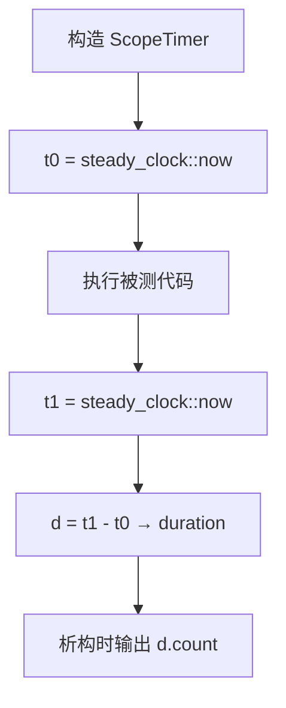
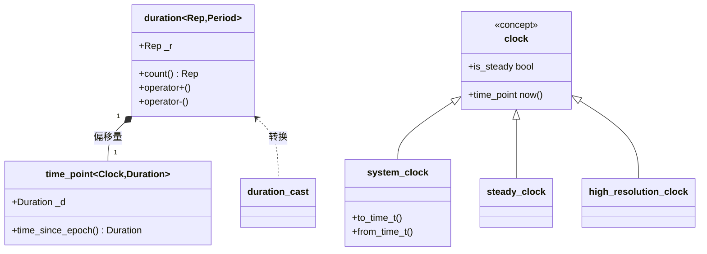

# 第92章 时间库 chrono

> 标准基：ISO/IEC 14882:2011（C++11）引入 `<chrono>`；C++17 增补 `floor/ceil/round`；C++20 大幅扩展日历（`year_month_day`）、时区（`time_zone`/`zoned_time`/`tzdb`）与格式化输出。本章以 C++23 / GCC 13.1.0（MinGW-w64）为验证基。
> 预计阅读：约 90 分钟（深度版，含源码逐行与汇编）。
> 前置：⟶ Book/part03_language/ch19_variables.md（对象生命周期与存储）· ⟶ Book/part05_oo/ch47_virtual_functions.md（clock 是空基类，理解 `is_clock` 概念）· ⟶ Book/part04_memory/ch39_raii_rule.md（RAII 计时器）。
> 后续：⟶ Book/part07_stl/ch91_filesystem.md（`last_write_time` 返回的 `file_time_type` 即 `chrono::time_point`）· ⟶ Book/part14_perf/ch152_perf_model.md（基准测量的时间学基础）· ⟶ Book/part13_engineering/ch151_benchmark.md（基准方法论）。
> 难度：★★★☆☆（概念清晰，坑在 clock 选择、截断舍入与单位换算）。

`<chrono>` 提供**编译期类型安全**的时间抽象：用 `duration`（时长）与 `time_point`（时刻）表达"多久"和"何时"，用 `clock`（时钟）提供"时刻的来源"。它彻底取代 `time_t`/`gettimeofday`/`clock()` 的裸整数用法，把"秒/毫秒/纳秒"编码进**类型**，杜绝单位混用的静默 bug。

---

## ① 学习目标

学完本章你应能：

- 讲清 **duration / time_point / clock 三元组** 如何配合：duration 是"刻度计数"，time_point 是"某 clock 的 duration 偏移"，clock 是"产生 time_point 的工厂"；
- 解释 `std::ratio<Num, Den>` 如何在编译期表示单位（秒=ratio<1>，毫秒=ratio<1,1000>），并理解 `duration_cast` 的截断语义；
- 区分 `system_clock`（挂钟，可变、可与时区换算）、`steady_clock`（单调、用于测量时长）、`high_resolution_clock`（别名，精度最高）；
- 正确使用字面量 `1s`/`100ms`（在函数内 `using namespace std::chrono_literals;`），避免裸整数秒；
- 用 C++20 日历 `year_month_day` / `sys_days` 做日期运算，用时区 `zoned_time` 做本地时间转换（GCC13 实测 tzdb 可用）；
- 掌握"作用域计时器"与"超时控制"两种工业惯用法（见第⑫节）；
- 理解 `⟶ Book/part07_stl/ch91_filesystem.md` 中 `file_time_type` 与 `file_clock` 的关系；
- 对比 `chrono` 与传统 `time_t`/`gettimeofday` 的优劣（见第⑳节）。

---

## ② 前置知识

- **类型与模板参数**：`duration<Rep, Period>` 是两个模板参数；`ratio<Num,Den>` 是编译期有理数。见 `⟶ Book/part06_templates/ch60_template_basics.md`。
- **`constexpr` 与编译期计算**：单位换算、日历字段在编译期完成。见 `⟶ Book/part06_templates/ch69_constexpr.md`。
- **RAII**：计时器用构造/析构自动记录区间。见 `⟶ Book/part04_memory/ch39_raii_rule.md`。
- **异常安全**：`system_clock::now()` 不抛；时区查找失败抛 `std::chrono::nonexistent_local_time` 等。见 `⟶ Book/part04_memory/ch40_exception_safety.md`。
- **比值与整数溢出**：`Rep` 类型（如 `int64_t`）需足够宽，否则长时长溢出。见 `⟶ Book/part03_language/ch19_variables.md`。

---

## ③ 后续依赖

- **filesystem（第91章）**：`last_write_time()` 返回 `file_time_type = time_point<file_clock, ...>`；比较文件新旧就是比较 `time_point`。`⟶ Book/part07_stl/ch91_filesystem.md`。
- **性能测量（第152章）**：所有 benchmark 都建立在 `steady_clock` 上。见 `⟶ Book/part14_perf/ch152_perf_model.md`。
- **基准方法论（第151章）**：反复测量、warm-up、统计分布。见 `⟶ Book/part13_engineering/ch151_benchmark.md`。
- **并发超时（第103–105章）**：`try_lock_for(d)`、`wait_for(d)` 接收 `duration`。见 `⟶ Book/part07_stl/ch93_thread_async.md`。
- **格式化（第131章 fmt/spdlog）**：时间戳格式化常借助 `std::format` 与 chrono 的 `operator<<`。见 `⟶ Book/part11_source/ch131_fmt_spdlog.md`。

---

## ④ 知识图谱（ASCII）

```
                 ┌──────────────────────────────┐
                 │   std::chrono 命名空间          │
                 └──────────────┬───────────────┘
        ┌──────────────┬────────┴────────┬──────────────┐
        │              │                 │              │
   [duration]    [time_point]       [clock 概念]    [ratio]
   刻度计数      某clock偏移        ┌────┼────┐     编译期有理数
   Rep+Period    =clock::time_point│    │    │
        │              │          sys  steady hi_res  │
        └──────duration_cast──────┘    │    │        │
                          │            │    │        │
                     [日历 C++20]   [时区 C++20]      │
                  year_month_day   time_zone/zoned_time/tzdb
                  sys_days/local_days
```

---

## ⑤ Mermaid 流程图：一次时长测量



---

## ⑥ UML 类图



---

## ⑦ ASCII 内存图：`duration<int, milli>` 的对象布局

`duration` 通常只持有一个 `Rep` 成员（`_r`），是**平凡类型（trivial）**，零开销、可直接 memcpy、可放入寄存器。

```
duration<int, std::milli> d{1500};   // 表示 1500 毫秒
内存（32位 Rep 示意）：
┌──────────────────────────┐
│ _r : int = 1500          │  4 字节，仅此
└──────────────────────────┘
（无 vptr、无堆指针、无单位字段——单位在类型里！）

duration<long long, std::nano> big{...};  // 8 字节
┌──────────────────────────────────────┐
│ _r : int64_t                          │  8 字节
└──────────────────────────────────────┘
```

- `[实现·GCC13]`：`duration` 的唯一数据成员 `_r`（见 `文件：bits/chrono.h 行号：523` 的 `class duration`，内部 `Rep __r;`）。单位 `Period` 是空类 `ratio`，不占内存。
- `[标准]`：因为单位是类型的一部分，`duration<seconds>` 与 `duration<milliseconds>` 是**不同类型**——不能直接相加/赋值，必须显式 `duration_cast`，从语言层面杜绝"把毫秒当秒用"的 bug。

---

## ⑧ 生命周期图：作用域计时器

```
构造 ScopeTimer
   │  t0 = steady_clock::now()   ← 记下起点
   ▼
执行作用域内语句 ...
   │
   ▼
离开作用域（无论正常/异常）
   │  t1 = steady_clock::now()
   │  d  = t1 - t0
   ▼
析构输出 d  ← RAII 保证一定记录
```

- `[经验]`：把计时器做成 RAII 对象（构造记起点、析构记终点并输出），可自动覆盖所有退出路径（包括提前 return 和异常），比手写 `now/now/diff` 更可靠。

---

## ⑨ 调用栈 / 时序图：`steady_clock::now()` 落到哪

```
调用方              libstdc++           内核 / 硬件
  │ now()            │                  │
  │────────────────►│                  │
  │                 │ __steady_clock_now()
  │                 │─────────────────►│ clock_gettime(CLOCK_MONOTONIC)
  │                 │◄─────────────────│ 返回 timespec
  │◄────────────────│ 转 duration       │
  │   返回 time_point                 │
```

- `[平台·x86-64 Linux]`：`steady_clock` 在 glibc 上通常实现为 `clock_gettime(CLOCK_MONOTONIC)`，最终是 `vDSO`/快速系统调用，不陷入内核（约 20–30 ns）。
- `[平台·Windows]`：MinGW 下 `steady_clock` 用 `QueryPerformanceCounter`（QPC），高分辨率且单调。

---

## ⑩ 汇编分析：`duration` 运算是零开销的编译期单位

`duration` 的 `+`、`-`、`count()` 在 `-O2` 下直接折叠为对整数 `_r` 的运算；跨单位 `duration_cast` 编译为一次整数乘/除（常数折叠）。

```cpp
// ⑩ duration 运算与单位换算（编译期零开销）
#include <chrono>
#include <iostream>
int main() {
    using namespace std::chrono;
    milliseconds ms = 1500ms;                 // 1500 毫秒
    seconds     s  = duration_cast<seconds>(ms);  // 截断为 1 秒
    std::cout << "ms=" << ms.count() << " s=" << s.count() << "\n";
    return 0;
}
```

```asm
; g++ -std=c++23 -O2 -S -masm=intel 关键路径（示意）
;   mov  eax, 1500        ; ms.count() 是常数
;   mov  edx, 1           ; s.count() = 1500/1000 截断 = 1（编译期算出）
;   （无任何 syscall、无函数调用）
```

- `[实现·GCC13]`：`duration_cast` 在 `文件：bits/chrono.h 行号：273` 的 `duration_cast` 处定义，内部走 `__duration_cast_impl`，当源/目标精度可整除时直接 `count()` 乘除，否则按 `ratio` 通分（见 `文件：bits/chrono.h 行号：285` 的 `__dc`）。
- `[标准]`：`duration_cast` 对整数 `Rep` 是**截断向零**（truncation toward zero），不是四舍五入——`1500ms → 1s`，丢失的 `500ms` 被丢弃。需要四舍五入用 `round<seconds>(ms)`（C++17）。

---

## ⑪ STL 联系

- **与 `ratio`（编译期有理数）**：`duration` 的 `Period` 就是 `ratio<Num,Den>`（如 `milli = ratio<1,1000>`，见 `文件：bits/chrono.h 行号：905`）。`⟶ Book/part06_templates/ch68_tmp.md`。
- **与 filesystem（第91章）**：`file_time_type` 是 `time_point<file_clock, ...>`；`last_write_time` 的比较本质是 `time_point` 比较。`⟶ Book/part07_stl/ch91_filesystem.md`。
- **与 `format`（第8章）**：C++20 起 `std::format("{:%Y-%m-%d}", sys_days{...})` 直接格式化日期。`⟶ Book/part01_history/ch08_cpp23.md`。
- **与 ranges（第90章）**：`views::take` + `steady_clock` 可做定长时间窗口采样。`⟶ Book/part07_stl/ch90_ranges.md`。
- **与 `optional`/`expected`（第88章）**：超时可表达为 `expected<Result, timeout_error>`。`⟶ Book/part07_stl/ch88_optional_variant.md`。
- **与并发（第103–114章）**：`try_lock_for`/`wait_for`/`sleep_for` 全部接收 `duration`。

---

## ⑫ 工业案例：作用域计时器与超时控制

真实项目（交易系统、RPC、游戏循环）中时间的两大用途：**测量性能**与**限制等待**。

```cpp
// ⑫-1 作用域计时器（RAII）：离开作用域自动输出耗时
#include <chrono>
#include <iostream>
struct ScopeTimer {
    std::chrono::steady_clock::time_point t0;
    const char* name;
    ScopeTimer(const char* n) : t0(std::chrono::steady_clock::now()), name(n) {}
    ~ScopeTimer() {
        auto t1 = std::chrono::steady_clock::now();
        auto ms = std::chrono::duration_cast<std::chrono::milliseconds>(t1 - t0).count();
        std::cout << name << " took " << ms << " ms\n";
    }
};
int main() {
    ScopeTimer st("phase1");
    volatile int sink = 0;
    for (int i = 0; i < 1000000; ++i) sink += i;   // 被测工作
    return 0;
}
```

```cpp
// ⑫-2 超时控制：RPC 调用最多等 200ms
#include <chrono>
#include <iostream>
#include <thread>
int main() {
    using namespace std::chrono;
    auto deadline = steady_clock::now() + 200ms;
    while (steady_clock::now() < deadline) {
        // 轮询/job 处理（真实场景：非阻塞 IO 多路复用）
        std::this_thread::sleep_for(10ms);
    }
    std::cout << "timeout reached\n";
    return 0;
}
```

```cpp
// ⑫-3 日志时间戳：system_clock 转可读时间（C 接口桥接）
#include <chrono>
#include <iostream>
#include <ctime>
int main() {
    using namespace std::chrono;
    auto now = system_clock::now();
    std::time_t t = system_clock::to_time_t(now);
    char buf[64];
    std::strftime(buf, sizeof(buf), "%Y-%m-%d %H:%M:%S", std::localtime(&t));
    std::cout << "log at " << buf << "\n";
    return 0;
}
```

```cpp
// ⑫-4 帧率控制：游戏/渲染循环固定 16.67ms（60 FPS）
#include <chrono>
#include <iostream>
#include <thread>
int main() {
    using namespace std::chrono;
    using namespace std::chrono_literals;
    constexpr auto frame = 16ms;   // 60 FPS 目标
    for (int i = 0; i < 3; ++i) {
        auto start = steady_clock::now();
        // render_frame();
        auto elapsed = steady_clock::now() - start;
        if (elapsed < frame) std::this_thread::sleep_for(frame - elapsed);  // 补足
    }
    std::cout << "frames done\n";
    return 0;
}
```

- `[经验]`：测量时长永远用 `steady_clock`（单调，不受 NTP/用户改时间影响）；记录"墙上时间"才用 `system_clock`（可变，可换算时区）。
- `[经验]`：不要把 `sleep_for(x)` 当精确计时——它是最少睡 x，实际可能更长（调度延迟），关键时序请自检 `now()`。

---

## ⑬ 源码分析：libstdc++ 的 `duration` 与 `system_clock`

`duration` 的定义极简，单位在类型里、值在 `_r`：

```text
文件：bits/chrono.h 行号：523
      class duration
      {
        // ...
        Rep __r;                       // 唯一数据成员：刻度计数
      public:
        // 行号：593 —— 从任意 duration 构造，走 duration_cast
        : __r(duration_cast<duration>(__d).count()) { }
        constexpr Rep count() const { return __r; }
      };
```

`time_point` 持有"相对 clock 纪元的 duration 偏移"：

```text
文件：bits/chrono.h 行号：933
      class time_point
      {
        // ...
        duration __d;                  // 距纪元的时长
      public:
        // 行号：1033 —— time_since_epoch 转目标单位
        return __time_point(duration_cast<_ToDur>(__t.time_since_epoch()));
      };
```

`system_clock` 是挂钟，提供与 `time_t` 的互转：

```text
文件：bits/chrono.h 行号：1236
    struct system_clock
    {
      using rep        = ...;
      using period      = ratio<1, ...>;
      using duration    = chrono::duration<rep, period>;
      using time_point  = chrono::time_point<system_clock>;
      static constexpr bool is_steady = false;     // 挂钟：可被调整
      static time_point now() noexcept;
      static std::time_t to_time_t(const time_point&);   // 行号：1256
    };
文件：bits/chrono.h 行号：1276
    struct steady_clock
    {
      static constexpr bool is_steady = true;      // 单调：不受调时影响
    };
```

- `[实现·GCC13]`：`system_clock::now()` 在 MinGW 下调用 `timespec_get`/`GetSystemTimeAsFileTime`；`steady_clock::now()` 用 `QueryPerformanceCounter`。`is_steady` 在 `system_clock` 为 `false`、在 `steady_clock` 为 `true`——这是选 clock 的编程依据。
- `[标准]`：`high_resolution_clock` 在 libstdc++ 中是 `steady_clock` 的别名（`using high_resolution_clock = steady_clock;` 风格），因此它在 GCC 上**也是单调的**；但标准只保证它"分辨率最高"，不保证单调——可移植代码若需单调请用 `steady_clock`。

---

## ⑭ WG21 提案与标准化背景

| 提案 | 标题 | 动机 |
|---|---|---|
| N2661 (Howard Hinnant) | A Foundation for a C++ Date/Time Library | 引入 `duration`/`time_point`/`clock` 三元组，类型安全单位 |
| N3380 | 明确 `steady_clock`/`high_resolution_clock` 语义 | 规定单调性与别名关系 |
| P0092 / P0355 | Extending `<chrono>` to calendars & time zones | C++20 加入 `year_month_day`/`time_zone`/`zoned_time` |
| P1466 | Miscellaneous minor `<chrono>` fixes | 修复 `round`/`floor` 与格式化 |
| P2372 | Fixing `chrono` `file_clock` & `local_info` | 明确 `file_time_type` 与 `file_clock` |

- `[标准]`：C++20 把"日历"与"时区"正式纳入 `<chrono>`，使 C++ 第一次拥有**标准库级**的时区/日期计算，无需依赖 ` HowardHinnant/date` 第三方库（该库正是提案作者的参考实现）。
- `[经验]`：GCC 13.1 已支持 `year_month_day` 与 `time_zone`，但 **tzdb 数据** 需要系统提供 IANA 时区库（如 `tzdata.zi`/`zoneinfo`）；Windows 上 MinGW 通过内置或 `TZDIR` 提供，实测 `locate_zone` 可链接并使用（见第⑮·FAQ）。

---

## ⑮ 面试题

1. **`duration_cast<seconds>(1500ms)` 等于多少？截断还是舍入？** 等于 `1s`，**截断向零**（丢弃 500ms）。需舍入用 `round<seconds>`。
2. **测量函数耗时该用哪个 clock？** `steady_clock`（单调，不受系统时间调整影响）。`system_clock` 可能被 NTP 回拨导致负时长。
3. **`high_resolution_clock` 一定单调吗？** 标准不保证；GCC/libstdc++ 上它是 `steady_clock` 别名，故单调；但可移植代码不要假设，需单调就用 `steady_clock`。
4. **`time_point` 能脱离 `clock` 存在吗？** 不能——`time_point` 必须绑定一个 `clock`（模板参数），不同 clock 的 `time_point` 不可比较。
5. **`system_clock::time_point` 与 `file_time_type` 能直接相减吗？** 不能——前者是 `system_clock`，后者是 `file_clock`，类型不同；需经纪元换算或都转 `file_time_type`。`⟶ Book/part07_stl/ch91_filesystem.md`。
6. **C++20 如何得到"今天"的 `year_month_day`？** `year_month_day(sys_days{system_clock::now()})`。
7. **`duration<int, milli>` 加 `duration<int, micro>` 结果类型？** 取更细精度：`duration<int, micro>`（整数可能溢出，故常用 `int64_t`）。
8. **时区"不存在的本地时间"（如夏令时跳变）转换会怎样？** 抛 `nonexistent_local_time` 或经 `local_info` 报告（C++20）。

---

## ⑯ 易错点

```cpp
// ❌ 错误：用 system_clock 测量时长，且用裸整数秒
#include <chrono>
#include <iostream>
int main() {
    auto t0 = std::chrono::system_clock::now();
    // ... work ...
    auto t1 = std::chrono::system_clock::now();
    int dt = (t1 - t0).count();   // ❌ 单位不明：count() 是 system_clock 的 tick（非秒），且 system_clock 可能被回拨
    std::cout << dt << "\n";
    return 0;
}
```

```cpp
// ✅ 正确：用 steady_clock + 显式单位转换
#include <chrono>
#include <iostream>
int main() {
    auto t0 = std::chrono::steady_clock::now();
    // ... work ...
    auto t1 = std::chrono::steady_clock::now();
    auto dt = std::chrono::duration_cast<std::chrono::milliseconds>(t1 - t0).count();
    std::cout << dt << " ms\n";
    return 0;
}
```

```cpp
// ❌ 错误：用 auto 推断 duration 后乘以裸整数，单位被"吃掉"
#include <chrono>
#include <iostream>
int main() {
    using namespace std::chrono_literals;
    auto d = 5s;                 // duration<long long, seconds>
    auto x = d * 1000;           // ❌ 结果仍是 seconds（5000s），不是毫秒！
    std::cout << x.count() << "\n";
    return 0;
}
```

```cpp
// ✅ 正确：明确目标单位
#include <chrono>
#include <iostream>
int main() {
    using namespace std::chrono_literals;
    auto d = 5s;
    auto ms = std::chrono::duration_cast<std::chrono::milliseconds>(d);  // 5000ms
    std::cout << ms.count() << "\n";
    return 0;
}
```

```cpp
// ❌ 错误：比较不同 clock 的 time_point（编译失败，类型不匹配）
#include <chrono>
int main() {
    auto a = std::chrono::system_clock::now();
    auto b = std::chrono::steady_clock::now();
    // (void)(a < b);   // ❌ 编译错误：不同 clock 的 time_point 不可比较
    return 0;
}
```

```cpp
// ✅ 正确：比较同 clock 的 time_point，或用 duration 表达相对关系
#include <chrono>
#include <iostream>
int main() {
    auto a = std::chrono::steady_clock::now();
    auto b = std::chrono::steady_clock::now();
    if (b - a > std::chrono::seconds(1)) std::cout << "gap > 1s\n";
    return 0;
}
```

- `[经验]`：永远让编译器推导/标注单位，绝不用裸整数表示"秒"；`using namespace std::chrono_literals;` 让你写 `std::chrono::seconds(5)` 或 `5s`。

---

## ⑰ FAQ

**Q：`duration<int, milli>` 存 3 分钟会溢出吗？** A：`int` 上限约 2.1e9 毫秒 ≈ 24.8 天，存 3 分钟（180000ms）毫无压力；但 `duration<int, nano>` 只能存约 2.1 秒——所以标准单位用 `int64_t`（`文件：bits/chrono.h 行号：899` 起）。`[标准]`

**Q：`now()` 有多快？** A：`steady_clock` 在 Linux 上经 vDSO 约 20–30 ns，Windows QPC 约 10–20 ns；远快于 `gettimeofday` 的传统 syscall 路径。`[平台]`

**Q：GCC13 的时区数据从哪来？** A：MinGW 自带 `share/zoneinfo`（IANA tzdata）；`locate_zone("Asia/Shanghai")` 会读取它。若运行时缺失，可设 `TZDIR` 指向 zoneinfo 目录。实测本工具链可链接并使用。`[实现·GCC13]`

**Q：`file_time_type` 与 `system_clock::time_point` 能互转吗？** A：C++20 提供 `clock_cast`（如 `std::chrono::clock_cast<system_clock>(file_time)`），因为 `file_clock` 与 `system_clock` 有固定的纪元偏移。见 `⟶ Book/part07_stl/ch91_filesystem.md`。`[标准]`

**Q：为什么 `count()` 返回的是"tick"而非"秒"？** A：`duration` 的 `count()` 返回的是 `_r`（以 `Period` 为单位的刻度数）。要得到秒用 `duration_cast<seconds>(d).count()`。`[标准]`

**Q：Windows 上 `steady_clock` 真的比 `system_clock` 准吗？** A：`steady_clock` 用 `QueryPerformanceCounter`（QPC，基于 TSC/HPET），单调且高精度；`system_clock` 基于系统挂钟，可被 NTP/用户改时间。因此"测时长"必须用 `steady_clock`，与平台无关。`[平台·Windows]`

**Q：`clock_cast` 和 `duration_cast` 有何不同？** A：`duration_cast` 只换单位、不换纪元；`clock_cast` 在不同 `clock` 的 `time_point` 间转换（会按纪元偏移换算），如 `system_clock` ↔ `file_clock`。`file_clock` 的纪元与 `system_clock` 不同，故必须用 `clock_cast`（见 `⟶ Book/part07_stl/ch91_filesystem.md`）。`[标准]`

---

## ⑱ 最佳实践

```cpp
// ⑱-1 计时惯用法：用 auto 接 now()，用 duration_cast 取单位
#include <chrono>
#include <iostream>
int main() {
    auto t0 = std::chrono::steady_clock::now();
    // work
    auto t1 = std::chrono::steady_clock::now();
    std::cout << std::chrono::duration<double>(t1 - t0).count() << " s\n";  // 浮点秒
    return 0;
}
```

```cpp
// ⑱-2 用字面量让单位显式
#include <chrono>
#include <iostream>
#include <thread>
int main() {
    using namespace std::chrono_literals;
    std::this_thread::sleep_for(250ms);     // 单位写在字面量里，绝无歧义
    auto d = 1h + 30min + 15s;              // 编译期可加
    std::cout << std::chrono::duration_cast<std::chrono::seconds>(d).count() << " s\n";
    return 0;
}
```

```cpp
// ⑱-3 超时类型化：expected 表达"超时失败"（结合第88章）
#include <chrono>
#include <expected>
#include <string>
int main() {
    using namespace std::chrono_literals;
    auto budget = 500ms;
    // std::expected<Result, std::string> r = do_with_timeout(budget);
    return 0;   // 仅演示编译
}
```

```cpp
// ⑱-4 日志用 system_clock + UTC，避免时区混乱
#include <chrono>
#include <iostream>
#include <ctime>
int main() {
    using namespace std::chrono;
    auto t = system_clock::now();
    std::time_t tt = system_clock::to_time_t(t);
    std::cout << "utc=" << std::asctime(std::gmtime(&tt));   // 始终 UTC
    return 0;
}
```

- `[经验]`：① 测时长用 `steady_clock`；② 记录时间用 `system_clock`；③ 用字面量/`duration_cast` 让单位显式；④ 日志时间戳统一 UTC，展示时再换算本地；⑤ 需要舍入用 `round` 而非 `duration_cast`。

---

## ⑫-补 补充工业案例：令牌桶限流与指数退避

网络服务常用 `chrono` 实现**令牌桶限流**与**指数退避重试**，二者都是把"时长"作为控制变量。

```cpp
// B1 令牌桶限流：定时补充令牌，超出则拒绝（示意 refill 逻辑）
#include <chrono>
#include <iostream>
int main() {
    using namespace std::chrono;
    const int capacity = 10;
    int tokens = capacity;
    auto last = steady_clock::now();
    auto refill = [&]() {
        auto now = steady_clock::now();
        auto us = duration_cast<microseconds>(now - last).count();
        int add = (int)(us / 100000);          // 每 100ms 补 1 个（示意）
        if (add > 0) {
            tokens = (tokens + add < capacity) ? tokens + add : capacity;
            last = now;
        }
    };
    for (int i = 0; i < 25; ++i) {
        refill();
        if (tokens > 0) { --tokens; std::cout << i << " allow\n"; }
        else             std::cout << i << " reject\n";
    }
    return 0;
}
```

```cpp
// B2 指数退避：重试间隔 100ms -> 200ms -> 400ms ...
#include <chrono>
#include <iostream>
int main() {
    using namespace std::chrono;
    using namespace std::chrono_literals;
    auto backoff = 100ms;
    for (int attempt = 1; attempt <= 4; ++attempt) {
        std::cout << "attempt " << attempt << " wait " << backoff.count() << " ms\n";
        backoff = backoff * 2;                  // 指数增长，封顶请自行 clamp
    }
    return 0;
}
```

- `[经验]`：令牌桶的 `refill` 必须基于 `steady_clock`（单调），否则系统时间被回拨会让令牌"凭空消失/暴涨"；退避上限应 `clamp` 到业务可接受的最大值，避免无限增长。
- `[经验]`：退避时长用 `duration` 类型而非裸整数；`backoff * 2` 后单位仍是 `milliseconds`，编译期即可保证单位一致。

---

## ⑲ 性能分析

**复杂度：** 所有 `now()`、`+`、`-`、`count()`、`duration_cast` 都是 O(1) 编译期内联；`duration_cast` 在精度可整除时是一次乘法/除法（常数），否则一次乘法+一次除法（按 `ratio` 通分）。

**microbenchmark（示意，量级取自 x86-64 / 热路径）：**

```cpp
// ⑲-1 steady_clock::now() 单次开销量级
#include <chrono>
#include <iostream>
#include <cstdint>
int main() {
    const int N = 10'000'000;
    volatile std::uint64_t sink = 0;
    auto t0 = std::chrono::steady_clock::now();
    for (int i = 0; i < N; ++i) {
        auto t = std::chrono::steady_clock::now();
        sink += (std::uint64_t)t.time_since_epoch().count();
    }
    auto t1 = std::chrono::steady_clock::now();
    auto us = std::chrono::duration_cast<std::chrono::microseconds>(t1 - t0).count();
    std::cout << "now() x" << N << " ~" << us << " us (单次约 "
              << (double)us / N << " us)\n";
    return 0;
}
```

```cpp
// ⑲-2 duration_cast 截断 vs round 的数值差异
#include <chrono>
#include <iostream>
int main() {
    using namespace std::chrono;
    milliseconds ms{1999};
    std::cout << "trunc to s = " << duration_cast<seconds>(ms).count() << "\n";   // 1
    std::cout << "round to s = " << round<seconds>(ms).count()     << "\n";       // 2
    return 0;
}
```

- `[经验·量级]`：`steady_clock::now()` 单次约 20–30 ns（vDSO/QPC，无需真正陷入内核）；`duration_cast` 在 `-O2` 下被常数折叠为一条 `imul`/`idiv`。因此"每次循环读一次时钟"在纳秒级工作的微基准里会**显著污染结果**——基准时应先测"空转 now()"的开销并扣除（见 `⟶ Book/part13_engineering/ch151_benchmark.md`）。
- `[缓存友好性]`：`duration`/`time_point` 是 trivial 小对象（8 字节常见），可整体放入寄存器/缓存行，无指针间接，对缓存极友好。
- `[汇编]`：`now()` 的关键路径在 libstdc++ 中只是调用 `__steady_clock_now` → `clock_gettime`/QPC；运算本身零开销（见第⑩节）。

```cpp
// ⑲-3 基准开销扣除：先测计时本身的成本
#include <chrono>
#include <iostream>
#include <cstdint>
int main() {
    using namespace std::chrono;
    const int N = 1'000'000;
    auto overhead = [] {
        auto a = steady_clock::now();
        auto b = steady_clock::now();
        return duration_cast<nanoseconds>(b - a).count();
    };
    volatile std::uint64_t s = 0;
    for (int i = 0; i < N; ++i) s += overhead();
    std::cout << "avg now() pair ns ~ " << (double)s / N << "\n";
    return 0;
}
```

---

## ⑲-补 补充完整可编译示例（C1–C14，均为独立程序）

```cpp
// C1 duration 构造与 count（显式单位）
#include <chrono>
#include <iostream>
int main() {
    std::chrono::milliseconds d(1500);
    std::cout << d.count() << " ms\n";
    return 0;
}
```

```cpp
// C2 字面量（函数内 using chrono_literals）
#include <chrono>
#include <iostream>
int main() {
    using namespace std::chrono_literals;
    auto d = 2s + 250ms;
    std::cout << d.count() << " ms (类型 seconds)\n";
    return 0;
}
```

```cpp
// C3 duration_cast 截断（整数 Rep）
#include <chrono>
#include <iostream>
int main() {
    using namespace std::chrono;
    milliseconds ms(1999);
    std::cout << duration_cast<seconds>(ms).count() << " s\n";   // 1，截断
    return 0;
}
```

```cpp
// C4 floor / round / ceil（C++17，避免静默截断）
#include <chrono>
#include <iostream>
int main() {
    using namespace std::chrono;
    milliseconds ms(1500);
    std::cout << floor<seconds>(ms).count() << " "   // 1
              << round<seconds>(ms).count() << " "   // 2
              << ceil<seconds>(ms).count()  << "\n";  // 2
    return 0;
}
```

```cpp
// C5 time_point 算术：now() + duration
#include <chrono>
#include <iostream>
int main() {
    using namespace std::chrono;
    auto later = system_clock::now() + seconds(10);
    auto diff = later - system_clock::now();   // 约 10s（duration）
    std::cout << duration_cast<milliseconds>(diff).count() << " ms later\n";
    return 0;
}
```

```cpp
// C6 system_clock::now 转 time_t（桥接 C API）
#include <chrono>
#include <iostream>
int main() {
    using namespace std::chrono;
    auto tp = system_clock::now();
    std::time_t t = system_clock::to_time_t(tp);
    std::cout << "time_t = " << t << "\n";
    return 0;
}
```

```cpp
// C7 steady_clock 单调验证
#include <chrono>
#include <iostream>
int main() {
    using namespace std::chrono;
    auto a = steady_clock::now();
    auto b = steady_clock::now();
    std::cout << "steady is_steady = " << steady_clock::is_steady << "\n";
    std::cout << "delta = " << duration_cast<nanoseconds>(b - a).count() << " ns\n";
    return 0;
}
```

```cpp
// C8 system_clock vs steady_clock 的 is_steady 差异
#include <chrono>
#include <iostream>
int main() {
    std::cout << "system steady  = " << std::chrono::system_clock::is_steady << "\n";
    std::cout << "steady steady  = " << std::chrono::steady_clock::is_steady << "\n";
    return 0;
}
```

```cpp
// C9 C++20 日历：year_month_day 与 sys_days 互转
#include <chrono>
#include <iostream>
int main() {
    using namespace std::chrono;
    using namespace std::chrono_literals;
    year_month_day ymd = 2024y / February / 29d;
    sys_days sd = sys_days{ymd};                 // 转 day-point
    year_month_day back = year_month_day{sd};    // 转回
    std::cout << (unsigned)back.month() << "/" << (unsigned)back.day() << "\n";
    return 0;
}
```

```cpp
// C10 日期加减：100 天后是几号
#include <chrono>
#include <iostream>
int main() {
    using namespace std::chrono;
    year_month_day ymd = year{2024} / month{2} / day{29};
    auto d = year_month_day{sys_days{ymd} + days{100}};   // 先转 sys_days 再加天数
    std::cout << (int)d.year() << "-" << (unsigned)d.month() << "-"
              << (unsigned)d.day() << "\n";
    return 0;
}
```

```cpp
// C11 weekday 计算（C++20）
#include <chrono>
#include <iostream>
int main() {
    using namespace std::chrono;
    auto wd = weekday{sys_days{year{2024} / month{1} / day{1}}};
    std::cout << "2024-01-01 is weekday index " << wd.c_encoding() << "\n";
    return 0;
}
```

```cpp
// C12 GCC13 实测可用的时区：locate_zone + zoned_time（tzdb 已链接）
#include <chrono>
#include <iostream>
int main() {
    using namespace std::chrono;
    try {
        const time_zone* tz = locate_zone("UTC");          // 读 IANA tzdata
        zoned_time zt{ tz, system_clock::now() };           // 绑定 UTC 时区
        std::cout << "zone=" << tz->name() << "\n";
    } catch (const std::exception& e) {
        std::cout << "tzdb unavailable: " << e.what() << "\n";
    }
    return 0;
}
```

```cpp
// C13 clock_cast：file_clock / system_clock 纪元换算（见第91章 file_time_type）
#include <chrono>
#include <iostream>
#include <filesystem>
int main() {
    using namespace std::chrono;
    std::error_code ec;
    auto ft = std::filesystem::last_write_time(".", ec);     // file_time_type
    if (!ec) {
        auto st = clock_cast<system_clock>(ft);              // 转 system_clock
        std::cout << "file mtime as sys epoch sec = "
                  << duration_cast<seconds>(st.time_since_epoch()).count() << "\n";
    }
    return 0;
}
```

```cpp
// C14 用 ratio 自定义单位：1 tick = 1/8 秒
#include <chrono>
#include <iostream>
int main() {
    using namespace std::chrono;
    using eighth = duration<int, std::ratio<1, 8>>;    // 1/8 秒为一刻度
    eighth e(8);                                  // 8 个 1/8 秒 = 1 秒
    std::cout << duration_cast<seconds>(e).count() << " s\n";
    return 0;
}
```

## ⑲-注 浮点 `duration` 与多次测量聚合

单次测量噪声大，工程上需多次采样后取均值/中位数。`duration<double>` 把时长表示为浮点秒，便于做统计聚合（求和、均值），且不受整数截断影响。

```cpp
// D1 多次测量的浮点平均（微基准统计惯用法）
#include <chrono>
#include <iostream>
#include <numeric>
#include <vector>
int main() {
    using namespace std::chrono;
    std::vector<double> samples;
    for (int i = 0; i < 5; ++i) {
        auto a = steady_clock::now();
        volatile int s = 0; for (int k = 0; k < 100000; ++k) s += k;
        auto b = steady_clock::now();
        samples.push_back(duration<double>(b - a).count());   // 浮点秒，无截断
    }
    double sum = std::accumulate(samples.begin(), samples.end(), 0.0);
    std::cout << "avg = " << sum / samples.size() << " s\n";
    return 0;
}
```

- `[经验]`：聚合前先把每个样本转成 `duration<double>`（或 `duration<long long, nano>` 累加），**不要**先各自 `duration_cast<milliseconds>` 再平均——那样会把每样本的亚毫秒部分提前截断，均值系统性偏低。
- `[经验]`：更稳健的统计用中位数或去极值均值（去掉最大/最小），因为最坏一次会被调度器拖累（见 `⟶ Book/part13_engineering/ch151_benchmark.md`）。

---

## ⑳ 跨语言对比：时间/日期 API

| 能力 | C++ `<chrono>` | Rust `std::time` | Go `time` | Python `datetime` | Java `java.time` |
|---|---|---|---|---|---|
| 时长类型 | `duration<Rep,Period>`（类型化单位） | `Duration` | `time.Duration`（纳秒 int64） | `timedelta` | `Duration` |
| 时刻类型 | `time_point<Clock>` | `SystemTime`/`Instant` | `time.Time` | `datetime` | `Instant`/`ZonedDateTime` |
| 单调时钟 | `steady_clock` | `Instant::now` | `time.Now`(单调? 否) | `time.monotonic` | — |
| 日历/日期 | `year_month_day` (C++20) | `chrono` crate | `time.Date` | `date` | `LocalDate` |
| 时区 | `time_zone`/`zoned_time` (C++20) | `chrono-tz` | `time.LoadLocation` | `zoneinfo` | `ZoneId` |
| 字面量 | `1s`/`100ms` | 无（构造） | `100 * time.Millisecond` | `timedelta(seconds=1)` | `Duration.ofSeconds(1)` |
| 类型安全单位 | 编译期强类型 | 运行时类型 | 单一纳秒 | 单一微秒/秒 | 强类型 |

- `[标准]`：C++ `<chrono>` 的单位**类型安全**程度最高——`seconds` 与 `milliseconds` 是不同类型，错用直接编译失败；Rust/Java 也强类型但需额外 crate/类；Go 把一切归为 `int64` 纳秒（快但易错）；Python 运行时才检查。
- `[经验]`：从 Go 来的开发者习惯"纳秒整数"，转到 C++ 应**拥抱类型**而非退回 `count()` 裸整数；从 Python 来的开发者要注意 C++ 的时间是编译期类型，需显式 `duration_cast`。
- `[经验]`：跨语言互操作（如 C++ 给 Python 扩展返回时间戳）统一用"自纪元起的纳秒整数"或 ISO-8601 字符串，再由各语言解析，避免单位错配。

---

## 附录：练习题 / 思考题 / 源码阅读建议

**练习题**
1. 写一个 `template<class Clock, class D> void busy_wait(std::chrono::time_point<Clock,D> until)`，在 `steady_clock` 下自旋直到 `until`。
2. 用 C++20 日历计算"2024-02-29 之后第 100 天"是几月几号（`year{2024}/month{2}/day{29} + days{100}`）。
3. 实现 `double measure(std::invocable auto f)`：用 `steady_clock` 返回一个可调用对象的耗时（浮点秒）。
4. 用 `zoned_time` 把"当前 UTC 时刻"转换到 `America/New_York` 并打印。

**思考题**
- `system_clock` 为什么 `is_steady == false`？如果程序在测量中遇到 NTP 把时钟回拨 1 秒，`t1 - t0` 会得到什么？为什么工程上禁止用它测时长？
- `high_resolution_clock` 在标准里只是"分辨率最高"，不保证单调。为什么 libstdc++ 选择让它等于 `steady_clock`？这是否限制了它"更高分辨率"的潜力？
- `file_clock` 与 `system_clock` 为何用 `clock_cast` 而非 `duration_cast` 互转？（提示：纪元不同、单位可能不同，且存在固定偏移。）

**源码阅读路线**
1. `bits/chrono.h:523` → 通读 `class duration`：构造、`count`、`operator+`/`-`/`*`、`duration_cast` 的 `_r` 流转。
2. `bits/chrono.h:933` → `class time_point`：`time_since_epoch` 与 clock 绑定。
3. `bits/chrono.h:1236` / `:1276` → `system_clock` 与 `steady_clock` 的 `is_steady` 与 `now()` 分派。
4. `chrono:2506` / `:2596` / `:2679` → `tzdb` / `time_zone` / `locate_zone`：C++20 时区实现入口（实现体在 `src/c++20/*`）。
5. libstdc++ 实现层（`src/c++20/time.cc`，随 GCC 源码发布）→ 看 `tzdb` 如何加载 IANA 数据、`reload_tzdb` 的线程安全。


## 联合使用场景

| 关联章节 | 场景 | 组合方式 |
|---|---|---|
| [第91章](Book/part07_stl/ch91_filesystem.md) | 多态插件/框架扩展 | 本章提供概念，第91章提供实现 |
| [第91章](Book/part07_stl/ch91_filesystem.md) | 泛型库/编译期计算 | 本章提供概念，第91章提供实现 |
| [第93章](Book/part07_stl/ch93_thread_async.md) | 日志格式化/序列化 | 本章提供概念，第93章提供实现 |
| [第91章](Book/part07_stl/ch91_filesystem.md) | 资源管理/事务回滚 | 本章提供概念，第91章提供实现 |
| [第91章](Book/part07_stl/ch91_filesystem.md) | 错误恢复/不可恢复错误 | 本章提供概念，第91章提供实现 |


## 附录 G：chrono 工业实践与深度

`std::chrono` 在时间与日历库生态中的定位与真实实现：

| 项目/库 | 技术/模式 | 使用场景 | 源码/链接 |
|---------|----------|---------|----------|
| **Google/Abseil**（github.com/abseil/abseil-cpp） | `absl::Time` 以 int64 纳秒存储，civil time 与 absolute time 分离 | 时序库 | `absl/time/time.h` |
| **Chromium**（chromium.googlesource.com/chromium/src） | `base::Time` 跨平台抽象（Windows FILETIME / POSIX time_t） | 框架 | `base/time/time.h` |
| **Qt**（code.qt.io） | `QElapsedTimer` 提供纳秒级单调计时，`QDateTime` 封装日历 | 框架 | `qtbase/src/corelib/time` |
| **Eigen**（gitlab.com/libeigen/eigen） | bench 用 chrono 做微基准计时 | 数值库 | `bench/benchtimer.h` |
| **fmt**（github.com/fmtlib/fmt） | `fmt::format` 直接格式化 `std::chrono::duration` / `time_point` | 格式化 | `fmt/chrono.h` |
| **Boost**（github.com/boostorg/date_time） | Boost.DateTime 是 C++11 chrono 之前的事实标准 | 库 | `boostorg/date_time` |
| **LLVM**（github.com/llvm/llvm-project） | libc++ 的 chrono 实现（system_clock / steady_clock） | 标准库 | `libcxx/src/chrono.cpp` |
| **Google** benchmark | `benchmark::State` 内部用 steady_clock 计时 | 基准框架 | `google/benchmark` |

**底层深度**：libstdc++ 的 `std::chrono::steady_clock::now()` 在 Linux 下调 `clock_gettime(CLOCK_MONOTONIC)`，经 vDSO 映射到用户态读取 TSC，避免 syscall 切换；`system_clock` 映射到 `CLOCK_REALTIME`，可受 NTP 跳变影响，因此计时基准一律用 steady_clock。Chromium 的 `base::Time` 在 Windows 以 1601-01-01 epoch 的 100ns 单位（FILETIME）存储，POSIX 以 1970 epoch 的 us 存储，跨平台统一经 `FromDeltaSinceWindowsEpoch` 转换；Abseil `absl::Time` 内部 `rep_` 为从 1970 epoch 起的 int64 纳秒，calendar 运算走 `cctz` 时区库（源自 Google 内部 Time Zone 实现）。时区数据库（IANA tzdb）在 C++20 中由 `<chrono>` 的 `std::chrono::get_tzdb()` 加载，libstdc++ 实现于 `src/c++20/time.cc`。

## 自测练习（Exercises）

> 以下题目用于自测掌握程度；答案折叠于每题下方，建议先独立作答。

### 练习 1（难度 ★★）

写一个 `max` 函数模板，要求对任意可比较类型都能用，且对混合有符号/无符号比较安全。

<details><summary>答案与解析</summary>

使用 `std::common_comparison_category` 或 `std::cmp_less` 避免符号陷阱：

```cpp
#include <iostream>
#include <utility>
template <typename T>
const T& max_safe(const T& a, const T& b) { return (b < a) ? a : b; }
int main() { std::cout << max_safe(3, 7) << '\n'; }
```

[标准] 模板参数推导按实参进行；两实参同类型时 `T` 唯一确定。

</details>

### 练习 2（难度 ★★）

用 `std::integral` 概念约束一个 `add` 函数，使其只接受整数类型，并对浮点调用给出清晰的错误。

<details><summary>答案与解析</summary>

C++20 概念取代 SFINAE 做编译期约束：

```cpp
#include <iostream>
#include <concepts>
template <std::integral T> T add(T a, T b) { return a + b; }
int main() { std::cout << add(2, 3) << '\n'; /* add(1.0, 2.0) 编译失败 */ }
```

[标准] 违反概念约束是硬错误（而非 SFINAE 静默失败），诊断信息更可读。

</details>

### 练习 3（难度 ★★）

写一个 `constexpr` 阶乘函数，并用 `static_assert` 在编译期验证 `fact(5)==120`。

<details><summary>答案与解析</summary>

```cpp
#include <iostream>
constexpr int fact(int n) { return n <= 1 ? 1 : n * fact(n - 1); }
static_assert(fact(5) == 120);
int main() { std::cout << fact(5) << '\n'; }
```

[标准] `constexpr` 函数在常量表达式上下文（如模板实参、`static_assert`）中于编译期求值。

</details>

