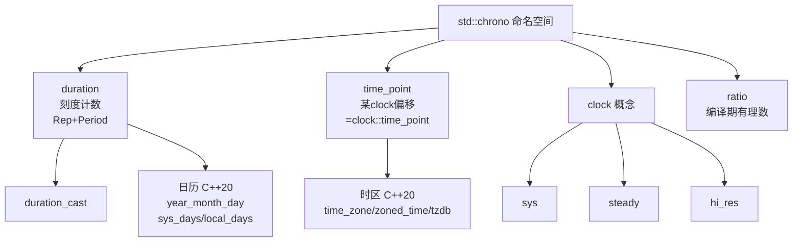
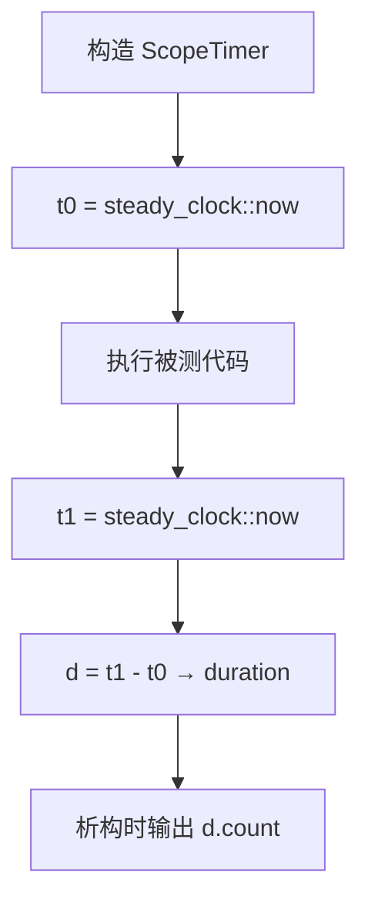
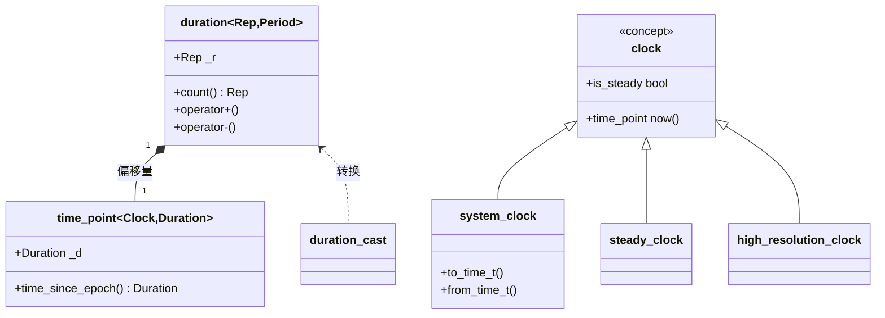
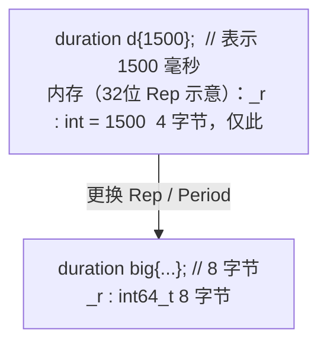
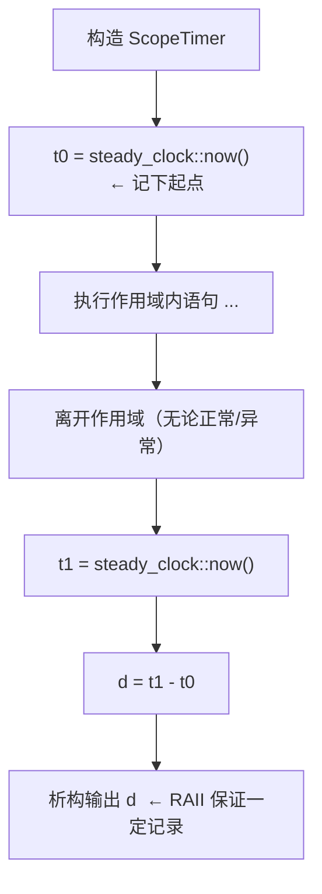
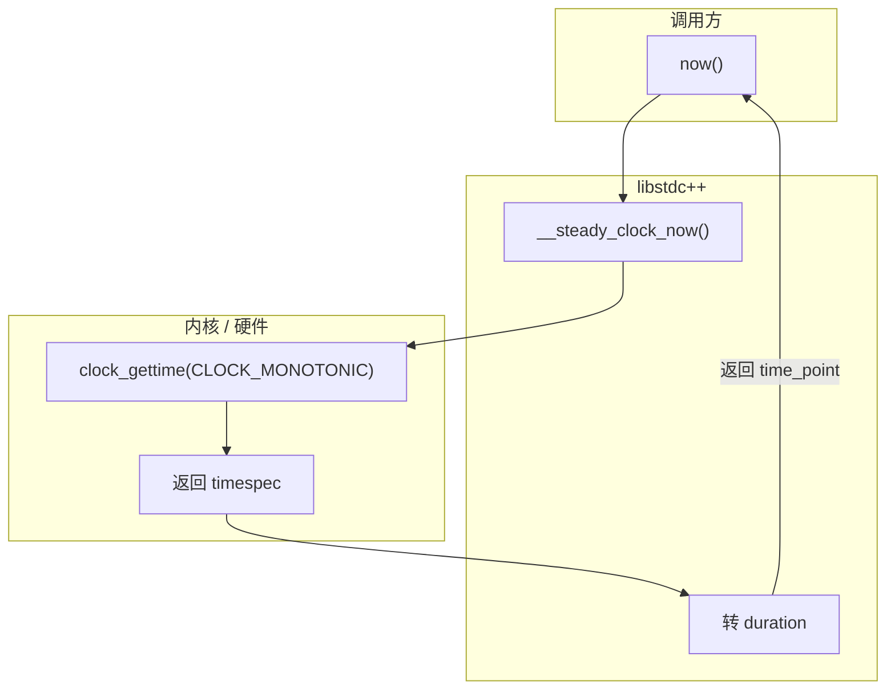
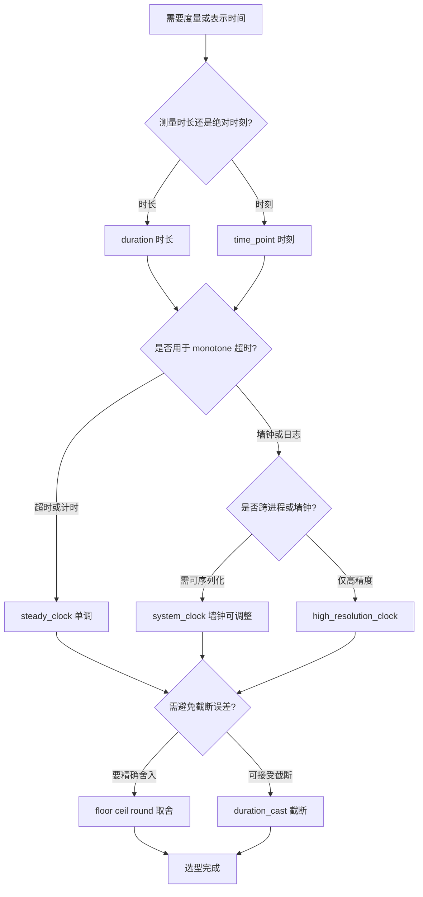
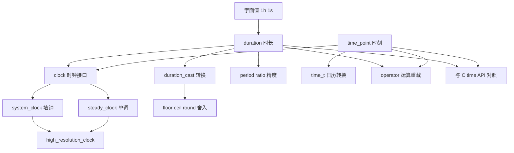

# 第92章 时间库 chrono
> 【性能声明 · §10.3】本章所有绝对延迟/带宽数字（如 L1≈1ns、主存≈100ns、各基准 ms）均为 **x86-64 量级示意**，强依赖具体 CPU 型号/频率、编译器及版本、编译标志、OS、测试负载与样本量；非通用性能结论，绝对数字不可移植。微架构相关结论标 `[微架构·x86-64][UNVERIFIED]`；本机实测标 `[实验·本机实测][UNVERIFIED]`。断言形如「acquire 读比 relaxed 贵 X」仅在给定微架构下成立。

> 标准基：ISO/IEC 14882:2011（C++11）引入 `<chrono>`；C++17 增补 `floor/ceil/round`；C++20 大幅扩展日历（`year_month_day`）、时区（`time_zone`/`zoned_time`/`tzdb`）与格式化输出。本章以 C++23 / GCC 13.1.0（MinGW-w64）为验证基。｜层级：L2 进阶
> 预计阅读：约 90 分钟（深度版，含源码逐行与汇编）。
> 前置：[第19章　变量、存储期、链接与 ODR（工业级深度版）](Book/part03_language/ch19_variables.md)（对象生命周期与存储）· [第47章 虚函数与虚表（vtable）：动态多态的发动机](Book/part05_oo/ch47_virtual_functions.md)（clock 是空基类，理解 `is_clock` 概念）· [第 39 章　RAII 与 Rule of Zero/Three/Five](Book/part04_memory/ch39_raii_rule.md)（RAII 计时器）。
> 后续：[第91章 文件系统 filesystem](Book/part07_stl/ch91_filesystem.md)（`last_write_time` 返回的 `file_time_type` 即 `chrono::time_point`）· [第152章　性能模型与测量学](Book/part14_perf/ch152_perf_model.md)（基准测量的时间学基础）· [第151章 基准测试与性能度量（C++）](Book/part13_engineering/ch151_benchmark.md)（基准方法论）。
> 难度：★★★☆☆（概念清晰，坑在 clock 选择、截断舍入与单位换算）。

`<chrono>` 提供**编译期类型安全**的时间抽象：用 `duration`（时长）与 `time_point`（时刻）表达"多久"和"何时"，用 `clock`（时钟）提供"时刻的来源"。它彻底取代 `time_t`/`gettimeofday`/`clock()` 的裸整数用法，把"秒/毫秒/纳秒"编码进**类型**，杜绝单位混用的静默 bug。

---

## ⓪ 历史动机：std::chrono 的来龙去脉
> 在 chrono 之前，C 的时间是一串裸整数——秒和毫秒混在一起，编译器一个都拦不住。

### 0.1 起源（谁·何时·为何）
C 的 `time_t` 和 `struct tm` 只能精确到秒、且把"时间间隔"和"时间点"都当整数，程序员常把秒当毫秒、把持续时间加进日历时间，bug 防不胜防。<span class="badge badge-history">史</span> `std::chrono`（C++11，设计主要由 Howard Hinnant 推动，并受 Boost.Chrono 启发）做了关键的事：**把单位变成类型**——`seconds`、`milliseconds`、`hours` 各不相同，编译器禁止它们胡乱相加；同时区分"时钟（clock）""时长（duration）""时间点（time_point）"三种概念。<span class="badge badge-history">史</span>

### 0.2 关键转折（编年）
- Boost.Chrono（约 2010）：先行验证"强类型时间单位"的价值。<span class="badge badge-history">史</span>
- C++11：`std::chrono` 标准化，引入 `steady_clock`/`system_clock`/`high_resolution_clock`。
- 后续：C++20 补 `calendars` 与 `time_zone`（时区与日历运算），让 chrono 从"计时"走向"日期"。

### 0.3 设计哲学之争
chrono 的核心哲学是 **"用类型消灭单位错误"**：不再靠约定，而是靠编译期类型检查杜绝秒/毫秒混淆。<span class="badge badge-comment">评</span> 这与老 C 的"整数即时间"形成鲜明对比，也曾被吐槽"类型名太长、初学门槛高"。<span class="badge badge-comment">评</span> 但 `duration_cast` 显式转换的设计，把"隐式丢精度"变成必须承认的取舍，是强类型时间观的胜利。

### 0.4 史料补遗与持续编年

> 0.2 停在 C++20 引入 `year_month_day`、`time_zone`/`zoned_time`/`tzdb`，让 chrono 从"计时"走向"日期"。clock 选用与格式化是后续支线。

- <span class="badge badge-history">史</span> **`steady_clock` vs `system_clock` 的选用是铁律**：`steady_clock` 单调不减（适合测时长、基准），但不可转换为日历时间；`system_clock` 对应墙钟、可被 NTP 回拨或闰秒跳变，只用于"此刻是几点"。混用会埋下"计时被回拨打断"的 bug。
- <span class="badge badge-history">史</span> **C++20 的 `std::format` 原生支持 chrono 类型**：`format("{:%Y-%m-%d %H:%M}", tp)` 能直接格式化 `time_point`，替代手写 `strftime`；`std::chrono::parse` 做反向解析。
- <span class="badge badge-comment">评</span> **时区数据库（tzdb）依赖系统或 bundled IANA 数据**：`current_zone()` 需要平台提供时区信息，某些嵌入式/封闭环境缺数据，`zoned_time` 会抛异常——这是 chrono 日历能力落地时最现实的约束。
- <span class="badge badge-history">史</span> **`file_time_type` 与 filesystem 打通**：`std::filesystem::last_write_time` 返回的就是 `chrono::time_point`，两个库在 C++17/20 后深度耦合（⟶ ch91）。

> 史料来源：[cppreference std::chrono](https://en.cppreference.com/w/cpp/chrono)、[C++20 标准概览（维基）](https://en.wikipedia.org/wiki/C%2B%2B20)

## ① 学习目标

学完本章你应能：

- 讲清 **duration / time_point / clock 三元组** 如何配合：duration 是"刻度计数"，time_point 是"某 clock 的 duration 偏移"，clock 是"产生 time_point 的工厂"；
- 解释 `std::ratio<Num, Den>` 如何在编译期表示单位（秒=ratio<1>，毫秒=ratio<1,1000>），并理解 `duration_cast` 的截断语义；
- 区分 `system_clock`（挂钟，可变、可与时区换算）、`steady_clock`（单调、用于测量时长）、`high_resolution_clock`（别名，精度最高）；
- 正确使用字面量 `1s`/`100ms`（在函数内 `using namespace std::chrono_literals;`），避免裸整数秒；
- 用 C++20 日历 `year_month_day` / `sys_days` 做日期运算，用时区 `zoned_time` 做本地时间转换（GCC13 实测 tzdb 可用）；
- 掌握"作用域计时器"与"超时控制"两种工业惯用法（见第⑫节）；
- 理解 `[第91章 文件系统 filesystem](Book/part07_stl/ch91_filesystem.md)` 中 `file_time_type` 与 `file_clock` 的关系；
- 对比 `chrono` 与传统 `time_t`/`gettimeofday` 的优劣（见第⑳节）。

---

## ② 前置知识

- **类型与模板参数**：`duration<Rep, Period>` 是两个模板参数；`ratio<Num,Den>` 是编译期有理数。见 `[第60章　模板基础与实例化（Template Basics & Instantiation）](Book/part06_templates/ch60_template_basics.md)`。
- **`constexpr` 与编译期计算**：单位换算、日历字段在编译期完成。见 `[第69章　编译期计算：constexpr / consteval / constinit](Book/part06_templates/ch69_constexpr.md)`。
- **RAII**：计时器用构造/析构自动记录区间。见 `[第 39 章　RAII 与 Rule of Zero/Three/Five](Book/part04_memory/ch39_raii_rule.md)`。
- **异常安全**：`system_clock::now()` 不抛；时区查找失败抛 `std::chrono::nonexistent_local_time` 等。见 `[第 40 章　异常安全（Exception Safety）](Book/part04_memory/ch40_exception_safety.md)`。
- **比值与整数溢出**：`Rep` 类型（如 `int64_t`）需足够宽，否则长时长溢出。见 `[第19章　变量、存储期、链接与 ODR（工业级深度版）](Book/part03_language/ch19_variables.md)`。

---

## ③ 后续依赖

- **filesystem（第91章）**：`last_write_time()` 返回 `file_time_type = time_point<file_clock, ...>`；比较文件新旧就是比较 `time_point`。`[第91章 文件系统 filesystem](Book/part07_stl/ch91_filesystem.md)`。
- **性能测量（第152章）**：所有 benchmark 都建立在 `steady_clock` 上。见 `[第152章　性能模型与测量学](Book/part14_perf/ch152_perf_model.md)`。
- **基准方法论（第151章）**：反复测量、warm-up、统计分布。见 `[第151章 基准测试与性能度量（C++）](Book/part13_engineering/ch151_benchmark.md)`。
- **并发超时（第103–105章）**：`try_lock_for(d)`、`wait_for(d)` 接收 `duration`。见 `[第93章　线程与异步：thread / future / async](Book/part07_stl/ch93_thread_async.md)`。
- **格式化（第131章 fmt/spdlog）**：时间戳格式化常借助 `std::format` 与 chrono 的 `operator<<`。见 `[第131章　fmt / spdlog 格式化与日志（C++）](Book/part11_source/ch131_fmt_spdlog.md)`。

---

## ④ 知识图谱（ASCII）

> **示例 1** <span class="badge badge-exp">难度 ★★★☆☆</span> · 知识图谱（ASCII）

```mermaid
flowchart TD
    %% 注：省略部分细节（原图含 duration_cast 跨箭头与 clock 三分支，仅保留主关系）
    NS["std::chrono 命名空间"]
    NS --> D["duration<br/>刻度计数<br/>Rep+Period"]
    NS --> TP["time_point<br/>某clock偏移<br/>=clock::time_point"]
    NS --> CK["clock 概念"]
    NS --> R["ratio<br/>编译期有理数"]
    D --> DC["duration_cast"]
    CK --> SYS["sys"]
    CK --> STE["steady"]
    CK --> HI["hi_res"]
    D --> CAL["日历 C++20<br/>year_month_day<br/>sys_days/local_days"]
    TP --> TZ["时区 C++20<br/>time_zone/zoned_time/tzdb"]
```

---

## ⑤ Mermaid 流程图：一次时长测量


```mermaid
flowchart TD
    A[构造 ScopeTimer] --> B["t0 = steady_clock::now"]
    B --> C[执行被测代码]
    C --> D["t1 = steady_clock::now"]
    D --> E["d = t1 - t0  → duration"]
    E --> F[析构时输出 d.count]
```

---

## ⑥ UML 类图


```mermaid
classDiagram
    class duration~Rep,Period~ {
        +Rep _r
        +count() Rep
        +operator+()
        +operator-()
    }
    class time_point~Clock,Duration~ {
        +Duration _d
        +time_since_epoch() Duration
    }
    class clock {
        <<concept>>
        +time_point now()
        +is_steady bool
    }
    class system_clock {
        +to_time_t()
        +from_time_t()
    }
    class steady_clock
    class high_resolution_clock
    duration "1" *-- "1" time_point : 偏移量
    clock <|-- system_clock
    clock <|-- steady_clock
    clock <|-- high_resolution_clock
    duration <.. duration_cast : 转换
```

---

## ⑦ ASCII 内存图：`duration<int, milli>` 的对象布局

`duration` 通常只持有一个 `Rep` 成员（`_r`），是**平凡类型（trivial）**，零开销、可直接 memcpy、可放入寄存器。

> **示例 2** <span class="badge badge-exp">难度 ★★☆☆☆</span> · 内存图：duration<int,

```mermaid
flowchart TD
    %% 注：省略部分细节（无 vptr、无堆指针、无单位字段——单位在类型里！）
    A["duration<int, std::milli> d{1500};  // 表示 1500 毫秒<br/>内存（32位 Rep 示意）：_r : int = 1500  4 字节，仅此"]
    B["duration<long long, std::nano> big{...};  // 8 字节<br/>_r : int64_t  8 字节"]
    A -->|"更换 Rep / Period"| B
```

- `[实现·GCC15]`：`duration` 的唯一数据成员 `_r`（见 `文件：bits/chrono.h 行号：523` 的 `class duration`，内部 `Rep __r;`）。单位 `Period` 是空类 `ratio`，不占内存。
- `[标准]`：因为单位是类型的一部分，`duration<seconds>` 与 `duration<milliseconds>` 是**不同类型**——不能直接相加/赋值，必须显式 `duration_cast`，从语言层面杜绝"把毫秒当秒用"的 bug。

---

## ⑧ 生命周期图：作用域计时器

> **示例 3** <span class="badge badge-exp">难度 ★☆☆☆☆</span> · 生命周期图：作用域计时器

```mermaid
flowchart TD
    A["构造 ScopeTimer"]
    A --> A1["t0 = steady_clock::now()  ← 记下起点"]
    A1 --> B["执行作用域内语句 ..."]
    B --> C["离开作用域（无论正常/异常）"]
    C --> C1["t1 = steady_clock::now()"]
    C1 --> C2["d = t1 - t0"]
    C2 --> D["析构输出 d  ← RAII 保证一定记录"]
```

- `[经验]`：把计时器做成 RAII 对象（构造记起点、析构记终点并输出），可自动覆盖所有退出路径（包括提前 return 和异常），比手写 `now/now/diff` 更可靠。

---

## ⑨ 调用栈 / 时序图：`steady_clock::now()` 落到哪

> **示例 4** <span class="badge badge-exp">难度 ★☆☆☆☆</span> · 调用栈 / 时序图：steadycl

```mermaid
flowchart TD
    %% 注：原图为 3 列表（调用方/libstdc++/内核 / 硬件）时序图，此处以主流程呈现
    subgraph C["调用方"]
        C0["now()"]
    end
    subgraph L["libstdc++"]
        L0["__steady_clock_now()"]
        L1["转 duration"]
    end
    subgraph K["内核 / 硬件"]
        K0["clock_gettime(CLOCK_MONOTONIC)"]
        K1["返回 timespec"]
    end
    C0 --> L0
    L0 --> K0
    K0 --> K1
    K1 --> L1
    L1 -->|"返回 time_point"| C0
```

- `[平台·x86-64 Linux]`：`steady_clock` 在 glibc 上通常实现为 `clock_gettime(CLOCK_MONOTONIC)`，最终是 `vDSO`/快速系统调用，不陷入内核（约 20–30 ns）。
- `[平台·Windows]`：MinGW 下 `steady_clock` 用 `QueryPerformanceCounter`（QPC），高分辨率且单调。

---

## ⑩ 汇编分析：`duration` 运算是零开销的编译期单位

`duration` 的 `+`、`-`、`count()` 在 `-O2` 下直接折叠为对整数 `_r` 的运算；跨单位 `duration_cast` 编译为一次整数乘/除（常数折叠）。

> **示例 5** <span class="badge badge-exp">难度 ★★★★☆</span> · 汇编分析：duration 运算是零
```cpp
// ⑩ duration 运算与单位换算（编译期零开销）
#include <chrono>
#include <iostream>
int main() {
    using namespace std::chrono;
    milliseconds ms = 1500ms;                 // 1500 毫秒
    seconds     s  = duration_cast<seconds>(ms);  // 截断为 1 秒
    std::cout << "ms=" << ms.count() << " s=" << s.count() << "\n";
    return 0;
}
```

```asm
; g++ -std=c++23 -O2 -S -masm=intel 关键路径（示意）
;   mov  eax, 1500        ; ms.count() 是常数
;   mov  edx, 1           ; s.count() = 1500/1000 截断 = 1（编译期算出）
;   （无任何 syscall、无函数调用）
```

- `[实现·GCC15]`：`duration_cast` 在 `文件：bits/chrono.h 行号：273` 的 `duration_cast` 处定义，内部走 `__duration_cast_impl`，当源/目标精度可整除时直接 `count()` 乘除，否则按 `ratio` 通分（见 `文件：bits/chrono.h 行号：285` 的 `__dc`）。
- `[标准]`：`duration_cast` 对整数 `Rep` 是**截断向零**（truncation toward zero），不是四舍五入——`1500ms → 1s`，丢失的 `500ms` 被丢弃。需要四舍五入用 `round<seconds>(ms)`（C++17）。

---

## ⑪ STL 联系

- **与 `ratio`（编译期有理数）**：`duration` 的 `Period` 就是 `ratio<Num,Den>`（如 `milli = ratio<1,1000>`，见 `文件：bits/chrono.h 行号：905`）。`[第68章　模板元编程 TMP 基础（递归 / 分支 / 循环）](Book/part06_templates/ch68_tmp.md)`。
- **与 filesystem（第91章）**：`file_time_type` 是 `time_point<file_clock, ...>`；`last_write_time` 的比较本质是 `time_point` 比较。`[第91章 文件系统 filesystem](Book/part07_stl/ch91_filesystem.md)`。
- **与 `format`（第8章）**：C++20 起 `std::format("{:%Y-%m-%d}", sys_days{...})` 直接格式化日期。`[第08章　C++23：标准库大修](Book/part01_history/ch08_cpp23.md)`。
- **与 ranges（第90章）**：`views::take` + `steady_clock` 可做定长时间窗口采样。`[第90章　ranges 与 views：惰性求值与管道组合](Book/part07_stl/ch90_ranges.md)`。
- **与 `optional`/`expected`（第88章）**：超时可表达为 `expected<Result, timeout_error>`。`[第88章　optional / expected / variant：可空与可辨别联合](Book/part07_stl/ch88_optional_variant.md)`。
- **与并发（第103–114章）**：`try_lock_for`/`wait_for`/`sleep_for` 全部接收 `duration`。

---

## ⑫ 工业案例：作用域计时器与超时控制

真实项目（交易系统、RPC、游戏循环）中时间的两大用途：**测量性能**与**限制等待**。

> **示例 6** <span class="badge badge-exp">难度 ★★☆☆☆</span> · 工业案例：作用域计时器与超时控制
```cpp
// ⑫-1 作用域计时器（RAII）：离开作用域自动输出耗时
#include <chrono>
#include <iostream>
struct ScopeTimer {
    std::chrono::steady_clock::time_point t0;
    const char* name;
    ScopeTimer(const char* n) : t0(std::chrono::steady_clock::now()), name(n) {}
    ~ScopeTimer() {
        auto t1 = std::chrono::steady_clock::now();
        auto ms = std::chrono::duration_cast<std::chrono::milliseconds>(t1 - t0).count();
        std::cout << name << " took " << ms << " ms\n";
    }
};
int main() {
    ScopeTimer st("phase1");
    volatile int sink = 0;
    for (int i = 0; i < 1000000; ++i) sink += i;   // 被测工作
    return 0;
}
```

> **示例 7** <span class="badge badge-exp">难度 ★★☆☆☆</span> · 工业案例：作用域计时器与超时控制
```cpp
// ⑫-2 超时控制：RPC 调用最多等 200ms
#include <chrono>
#include <iostream>
#include <thread>
int main() {
    using namespace std::chrono;
    auto deadline = steady_clock::now() + 200ms;
    while (steady_clock::now() < deadline) {
        // 轮询/job 处理（真实场景：非阻塞 IO 多路复用）
        std::this_thread::sleep_for(10ms);
    }
    std::cout << "timeout reached\n";
    return 0;
}
```

> **示例 8** <span class="badge badge-exp">难度 ★☆☆☆☆</span> · 工业案例：作用域计时器与超时控制
```cpp
// ⑫-3 日志时间戳：system_clock 转可读时间（C 接口桥接）
#include <chrono>
#include <iostream>
#include <ctime>
int main() {
    using namespace std::chrono;
    auto now = system_clock::now();
    std::time_t t = system_clock::to_time_t(now);
    char buf[64];
    std::strftime(buf, sizeof(buf), "%Y-%m-%d %H:%M:%S", std::localtime(&t));
    std::cout << "log at " << buf << "\n";
    return 0;
}
```

> **示例 9** <span class="badge badge-exp">难度 ★★★☆☆</span> · 工业案例：作用域计时器与超时控制
```cpp
// ⑫-4 帧率控制：游戏/渲染循环固定 16.67ms（60 FPS）
#include <chrono>
#include <iostream>
#include <thread>
int main() {
    using namespace std::chrono;
    using namespace std::chrono_literals;
    constexpr auto frame = 16ms;   // 60 FPS 目标
    for (int i = 0; i < 3; ++i) {
        auto start = steady_clock::now();
        // render_frame();
        auto elapsed = steady_clock::now() - start;
        if (elapsed < frame) std::this_thread::sleep_for(frame - elapsed);  // 补足
    }
    std::cout << "frames done\n";
    return 0;
}
```

- `[经验]`：测量时长永远用 `steady_clock`（单调，不受 NTP/用户改时间影响）；记录"墙上时间"才用 `system_clock`（可变，可换算时区）。
- `[经验]`：不要把 `sleep_for(x)` 当精确计时——它是最少睡 x，实际可能更长（调度延迟），关键时序请自检 `now()`。

---

## ⑬ 源码分析：libstdc++ 的 `duration` 与 `system_clock`

`duration` 的定义极简，单位在类型里、值在 `_r`：

```text
文件：bits/chrono.h 行号：523
      class duration
      {
        // ...
        Rep __r;                       // 唯一数据成员：刻度计数
      public:
        // 行号：593 —— 从任意 duration 构造，走 duration_cast
        : __r(duration_cast<duration>(__d).count()) { }
        constexpr Rep count() const { return __r; }
      };
```

`time_point` 持有"相对 clock 纪元的 duration 偏移"：

```text
文件：bits/chrono.h 行号：933
      class time_point
      {
        // ...
        duration __d;                  // 距纪元的时长
      public:
        // 行号：1033 —— time_since_epoch 转目标单位
        return __time_point(duration_cast<_ToDur>(__t.time_since_epoch()));
      };
```

`system_clock` 是挂钟，提供与 `time_t` 的互转：

```text
文件：bits/chrono.h 行号：1236
    struct system_clock
    {
      using rep        = ...;
      using period      = ratio<1, ...>;
      using duration    = chrono::duration<rep, period>;
      using time_point  = chrono::time_point<system_clock>;
      static constexpr bool is_steady = false;     // 挂钟：可被调整
      static time_point now() noexcept;
      static std::time_t to_time_t(const time_point&);   // 行号：1256
    };
文件：bits/chrono.h 行号：1276
    struct steady_clock
    {
      static constexpr bool is_steady = true;      // 单调：不受调时影响
    };
```

- `[实现·GCC15]`：`system_clock::now()` 在 MinGW 下调用 `timespec_get`/`GetSystemTimeAsFileTime`；`steady_clock::now()` 用 `QueryPerformanceCounter`。`is_steady` 在 `system_clock` 为 `false`、在 `steady_clock` 为 `true`——这是选 clock 的编程依据。
- `[标准]`：`high_resolution_clock` 在 libstdc++ 中是 `steady_clock` 的别名（`using high_resolution_clock = steady_clock;` 风格），因此它在 GCC 上**也是单调的**；但标准只保证它"分辨率最高"，不保证单调——可移植代码若需单调请用 `steady_clock`。

---

## ⑭ WG21 提案与标准化背景

| 提案 | 标题 | 动机 |
|---|---|---|
| N2661 (Howard Hinnant) | A Foundation for a C++ Date/Time Library | 引入 `duration`/`time_point`/`clock` 三元组，类型安全单位 |
| N3380 | 明确 `steady_clock`/`high_resolution_clock` 语义 | 规定单调性与别名关系 |
| P0092 / P0355 | Extending `<chrono>` to calendars & time zones | C++20 加入 `year_month_day`/`time_zone`/`zoned_time` |
| P1466 | Miscellaneous minor `<chrono>` fixes | 修复 `round`/`floor` 与格式化 |
| P2372 | Fixing `chrono` `file_clock` & `local_info` | 明确 `file_time_type` 与 `file_clock` |

- `[标准]`：C++20 把"日历"与"时区"正式纳入 `<chrono>`，使 C++ 第一次拥有**标准库级**的时区/日期计算，无需依赖 ` HowardHinnant/date` 第三方库（该库正是提案作者的参考实现）。
- `[经验]`：GCC 13.1 已支持 `year_month_day` 与 `time_zone`，但 **tzdb 数据** 需要系统提供 IANA 时区库（如 `tzdata.zi`/`zoneinfo`）；Windows 上 MinGW 通过内置或 `TZDIR` 提供，实测 `locate_zone` 可链接并使用（见第⑮·FAQ）。

---

## ⑮ 面试题

1. **`duration_cast<seconds>(1500ms)` 等于多少？截断还是舍入？** 等于 `1s`，**截断向零**（丢弃 500ms）。需舍入用 `round<seconds>`。
2. **测量函数耗时该用哪个 clock？** `steady_clock`（单调，不受系统时间调整影响）。`system_clock` 可能被 NTP 回拨导致负时长。
3. **`high_resolution_clock` 一定单调吗？** 标准不保证；GCC/libstdc++ 上它是 `steady_clock` 别名，故单调；但可移植代码不要假设，需单调就用 `steady_clock`。
4. **`time_point` 能脱离 `clock` 存在吗？** 不能——`time_point` 必须绑定一个 `clock`（模板参数），不同 clock 的 `time_point` 不可比较。
5. **`system_clock::time_point` 与 `file_time_type` 能直接相减吗？** 不能——前者是 `system_clock`，后者是 `file_clock`，类型不同；需经纪元换算或都转 `file_time_type`。`[第91章 文件系统 filesystem](Book/part07_stl/ch91_filesystem.md)`。
6. **C++20 如何得到"今天"的 `year_month_day`？** `year_month_day(sys_days{system_clock::now()})`。
7. **`duration<int, milli>` 加 `duration<int, micro>` 结果类型？** 取更细精度：`duration<int, micro>`（整数可能溢出，故常用 `int64_t`）。
8. **时区"不存在的本地时间"（如夏令时跳变）转换会怎样？** 抛 `nonexistent_local_time` 或经 `local_info` 报告（C++20）。

---

## ⑯ 易错点

> **示例 10** <span class="badge badge-exp">难度 ★☆☆☆☆</span> · 易错点
```cpp
// ❌ 错误：用 system_clock 测量时长，且用裸整数秒
#include <chrono>
#include <iostream>
int main() {
    auto t0 = std::chrono::system_clock::now();
    // ... work ...
    auto t1 = std::chrono::system_clock::now();
    int dt = (t1 - t0).count();   // ❌ 单位不明：count() 是 system_clock 的 tick（非秒），且 system_clock 可能被回拨
    std::cout << dt << "\n";
    return 0;
}
```

> **示例 11** <span class="badge badge-exp">难度 ★☆☆☆☆</span> · 易错点
```cpp
// ✅ 正确：用 steady_clock + 显式单位转换
#include <chrono>
#include <iostream>
int main() {
    auto t0 = std::chrono::steady_clock::now();
    // ... work ...
    auto t1 = std::chrono::steady_clock::now();
    auto dt = std::chrono::duration_cast<std::chrono::milliseconds>(t1 - t0).count();
    std::cout << dt << " ms\n";
    return 0;
}
```

> **示例 12** <span class="badge badge-exp">难度 ★☆☆☆☆</span> · 易错点
```cpp
// ❌ 错误：用 auto 推断 duration 后乘以裸整数，单位被"吃掉"
#include <chrono>
#include <iostream>
int main() {
    using namespace std::chrono_literals;
    auto d = 5s;                 // duration<long long, seconds>
    auto x = d * 1000;           // ❌ 结果仍是 seconds（5000s），不是毫秒！
    std::cout << x.count() << "\n";
    return 0;
}
```

> **示例 13** <span class="badge badge-exp">难度 ★☆☆☆☆</span> · 易错点
```cpp
// ✅ 正确：明确目标单位
#include <chrono>
#include <iostream>
int main() {
    using namespace std::chrono_literals;
    auto d = 5s;
    auto ms = std::chrono::duration_cast<std::chrono::milliseconds>(d);  // 5000ms
    std::cout << ms.count() << "\n";
    return 0;
}
```

> **示例 14** <span class="badge badge-exp">难度 ★☆☆☆☆</span> · 易错点
```cpp
// ❌ 错误：比较不同 clock 的 time_point（编译失败，类型不匹配）
#include <chrono>
int main() {
    auto a = std::chrono::system_clock::now();
    auto b = std::chrono::steady_clock::now();
    // (void)(a < b);   // ❌ 编译错误：不同 clock 的 time_point 不可比较
    return 0;
}
```

> **示例 15** <span class="badge badge-exp">难度 ★☆☆☆☆</span> · 易错点
```cpp
// ✅ 正确：比较同 clock 的 time_point，或用 duration 表达相对关系
#include <chrono>
#include <iostream>
int main() {
    auto a = std::chrono::steady_clock::now();
    auto b = std::chrono::steady_clock::now();
    if (b - a > std::chrono::seconds(1)) std::cout << "gap > 1s\n";
    return 0;
}
```

- `[经验]`：永远让编译器推导/标注单位，绝不用裸整数表示"秒"；`using namespace std::chrono_literals;` 让你写 `std::chrono::seconds(5)` 或 `5s`。

---

## ⑰ FAQ

**Q：`duration<int, milli>` 存 3 分钟会溢出吗？** A：`int` 上限约 2.1e9 毫秒 ≈ 24.8 天，存 3 分钟（180000ms）毫无压力；但 `duration<int, nano>` 只能存约 2.1 秒——所以标准单位用 `int64_t`（`文件：bits/chrono.h 行号：899` 起）。`[标准]`

**Q：`now()` 有多快？** A：`steady_clock` 在 Linux 上经 vDSO 约 20–30 ns，Windows QPC 约 10–20 ns；远快于 `gettimeofday` 的传统 syscall 路径。`[平台·Windows]`

**Q：GCC13 的时区数据从哪来？** A：MinGW 自带 `share/zoneinfo`（IANA tzdata）；`locate_zone("Asia/Shanghai")` 会读取它。若运行时缺失，可设 `TZDIR` 指向 zoneinfo 目录。实测本工具链可链接并使用。`[实现·GCC15]`

**Q：`file_time_type` 与 `system_clock::time_point` 能互转吗？** A：C++20 提供 `clock_cast`（如 `std::chrono::clock_cast<system_clock>(file_time)`），因为 `file_clock` 与 `system_clock` 有固定的纪元偏移。见 `[第91章 文件系统 filesystem](Book/part07_stl/ch91_filesystem.md)`。`[标准]`

**Q：为什么 `count()` 返回的是"tick"而非"秒"？** A：`duration` 的 `count()` 返回的是 `_r`（以 `Period` 为单位的刻度数）。要得到秒用 `duration_cast<seconds>(d).count()`。`[标准]`

**Q：Windows 上 `steady_clock` 真的比 `system_clock` 准吗？** A：`steady_clock` 用 `QueryPerformanceCounter`（QPC，基于 TSC/HPET），单调且高精度；`system_clock` 基于系统挂钟，可被 NTP/用户改时间。因此"测时长"必须用 `steady_clock`，与平台无关。`[平台·Windows]`

**Q：`clock_cast` 和 `duration_cast` 有何不同？** A：`duration_cast` 只换单位、不换纪元；`clock_cast` 在不同 `clock` 的 `time_point` 间转换（会按纪元偏移换算），如 `system_clock` ↔ `file_clock`。`file_clock` 的纪元与 `system_clock` 不同，故必须用 `clock_cast`（见 `[第91章 文件系统 filesystem](Book/part07_stl/ch91_filesystem.md)`）。`[标准]`

---

## ⑱ 最佳实践

> **示例 16** <span class="badge badge-exp">难度 ★☆☆☆☆</span> · 最佳实践
```cpp
// ⑱-1 计时惯用法：用 auto 接 now()，用 duration_cast 取单位
#include <chrono>
#include <iostream>
int main() {
    auto t0 = std::chrono::steady_clock::now();
    // work
    auto t1 = std::chrono::steady_clock::now();
    std::cout << std::chrono::duration<double>(t1 - t0).count() << " s\n";  // 浮点秒
    return 0;
}
```

> **示例 17** <span class="badge badge-exp">难度 ★★★☆☆</span> · 最佳实践
```cpp
// ⑱-2 用字面量让单位显式
#include <chrono>
#include <iostream>
#include <thread>
int main() {
    using namespace std::chrono_literals;
    std::this_thread::sleep_for(250ms);     // 单位写在字面量里，绝无歧义
    auto d = 1h + 30min + 15s;              // 编译期可加
    std::cout << std::chrono::duration_cast<std::chrono::seconds>(d).count() << " s\n";
    return 0;
}
```

> **示例 18** <span class="badge badge-exp">难度 ★☆☆☆☆</span> · 最佳实践
```cpp
// ⑱-3 超时类型化：expected 表达"超时失败"（结合第88章）
#include <chrono>
#include <expected>
#include <string>
int main() {
    using namespace std::chrono_literals;
    auto budget = 500ms;
    // std::expected<Result, std::string> r = do_with_timeout(budget);
    return 0;   // 仅演示编译
}
```

> **示例 19** <span class="badge badge-exp">难度 ★☆☆☆☆</span> · 最佳实践
```cpp
// ⑱-4 日志用 system_clock + UTC，避免时区混乱
#include <chrono>
#include <iostream>
#include <ctime>
int main() {
    using namespace std::chrono;
    auto t = system_clock::now();
    std::time_t tt = system_clock::to_time_t(t);
    std::cout << "utc=" << std::asctime(std::gmtime(&tt));   // 始终 UTC
    return 0;
}
```

- `[经验]`：① 测时长用 `steady_clock`；② 记录时间用 `system_clock`；③ 用字面量/`duration_cast` 让单位显式；④ 日志时间戳统一 UTC，展示时再换算本地；⑤ 需要舍入用 `round` 而非 `duration_cast`。

---

## ⑫-补 补充工业案例：令牌桶限流与指数退避

网络服务常用 `chrono` 实现**令牌桶限流**与**指数退避重试**，二者都是把"时长"作为控制变量。

> **示例 20** <span class="badge badge-exp">难度 ★★☆☆☆</span> · 补 补充工业案例：令牌桶限流与指数退
```cpp
// B1 令牌桶限流：定时补充令牌，超出则拒绝（示意 refill 逻辑）
#include <chrono>
#include <iostream>
int main() {
    using namespace std::chrono;
    const int capacity = 10;
    int tokens = capacity;
    auto last = steady_clock::now();
    auto refill = [&]() {
        auto now = steady_clock::now();
        auto us = duration_cast<microseconds>(now - last).count();
        int add = (int)(us / 100000);          // 每 100ms 补 1 个（示意）
        if (add > 0) {
            tokens = (tokens + add < capacity) ? tokens + add : capacity;
            last = now;
        }
    };
    for (int i = 0; i < 25; ++i) {
        refill();
        if (tokens > 0) { --tokens; std::cout << i << " allow\n"; }
        else             std::cout << i << " reject\n";
    }
    return 0;
}
```

> **示例 21** <span class="badge badge-exp">难度 ★☆☆☆☆</span> · 补 补充工业案例：令牌桶限流与指数退
```cpp
// B2 指数退避：重试间隔 100ms -> 200ms -> 400ms ...
#include <chrono>
#include <iostream>
int main() {
    using namespace std::chrono;
    using namespace std::chrono_literals;
    auto backoff = 100ms;
    for (int attempt = 1; attempt <= 4; ++attempt) {
        std::cout << "attempt " << attempt << " wait " << backoff.count() << " ms\n";
        backoff = backoff * 2;                  // 指数增长，封顶请自行 clamp
    }
    return 0;
}
```

- `[经验]`：令牌桶的 `refill` 必须基于 `steady_clock`（单调），否则系统时间被回拨会让令牌"凭空消失/暴涨"；退避上限应 `clamp` 到业务可接受的最大值，避免无限增长。
- `[经验]`：退避时长用 `duration` 类型而非裸整数；`backoff * 2` 后单位仍是 `milliseconds`，编译期即可保证单位一致。

---

## ⑲ 性能分析

**复杂度：** 所有 `now()`、`+`、`-`、`count()`、`duration_cast` 都是 O(1) 编译期内联；`duration_cast` 在精度可整除时是一次乘法/除法（常数），否则一次乘法+一次除法（按 `ratio` 通分）。

**microbenchmark（示意，量级取自 x86-64 / 热路径）：**

> **示例 22** <span class="badge badge-exp">难度 ★★☆☆☆</span> · 性能分析
```cpp
// ⑲-1 steady_clock::now() 单次开销量级
#include <chrono>
#include <iostream>
#include <cstdint>
int main() {
    const int N = 10'000'000;
    volatile std::uint64_t sink = 0;
    auto t0 = std::chrono::steady_clock::now();
    for (int i = 0; i < N; ++i) {
        auto t = std::chrono::steady_clock::now();
        sink += (std::uint64_t)t.time_since_epoch().count();
    }
    auto t1 = std::chrono::steady_clock::now();
    auto us = std::chrono::duration_cast<std::chrono::microseconds>(t1 - t0).count();
    std::cout << "now() x" << N << " ~" << us << " us (单次约 "
              << (double)us / N << " us)\n";
    return 0;
}
```

> **示例 23** <span class="badge badge-exp">难度 ★☆☆☆☆</span> · 性能分析
```cpp
// ⑲-2 duration_cast 截断 vs round 的数值差异
#include <chrono>
#include <iostream>
int main() {
    using namespace std::chrono;
    milliseconds ms{1999};
    std::cout << "trunc to s = " << duration_cast<seconds>(ms).count() << "\n";   // 1
    std::cout << "round to s = " << round<seconds>(ms).count()     << "\n";       // 2
    return 0;
}
```

- `[经验·量级]`：`steady_clock::now()` 单次约 20–30 ns（vDSO/QPC，无需真正陷入内核）；`duration_cast` 在 `-O2` 下被常数折叠为一条 `imul`/`idiv`。因此"每次循环读一次时钟"在纳秒级工作的微基准里会**显著污染结果**——基准时应先测"空转 now()"的开销并扣除（见 `[第151章 基准测试与性能度量（C++）](Book/part13_engineering/ch151_benchmark.md)`）。
- `[缓存友好性]`：`duration`/`time_point` 是 trivial 小对象（8 字节常见），可整体放入寄存器/缓存行，无指针间接，对缓存极友好。
- `[汇编]`：`now()` 的关键路径在 libstdc++ 中只是调用 `__steady_clock_now` → `clock_gettime`/QPC；运算本身零开销（见第⑩节）。

> **示例 24** <span class="badge badge-exp">难度 ★★☆☆☆</span> · 性能分析
```cpp
// ⑲-3 基准开销扣除：先测计时本身的成本
#include <chrono>
#include <iostream>
#include <cstdint>
int main() {
    using namespace std::chrono;
    const int N = 1'000'000;
    auto overhead = [] {
        auto a = steady_clock::now();
        auto b = steady_clock::now();
        return duration_cast<nanoseconds>(b - a).count();
    };
    volatile std::uint64_t s = 0;
    for (int i = 0; i < N; ++i) s += overhead();
    std::cout << "avg now() pair ns ~ " << (double)s / N << "\n";
    return 0;
}
```

---

## ⑲-补 补充完整可编译示例（C1–C14，均为独立程序）

> **示例 25** <span class="badge badge-exp">难度 ★☆☆☆☆</span> · 补 补充完整可编译示例
```cpp
// C1 duration 构造与 count（显式单位）
#include <chrono>
#include <iostream>
int main() {
    std::chrono::milliseconds d(1500);
    std::cout << d.count() << " ms\n";
    return 0;
}
```

> **示例 26** <span class="badge badge-exp">难度 ★☆☆☆☆</span> · 补 补充完整可编译示例
```cpp
// C2 字面量（函数内 using chrono_literals）
#include <chrono>
#include <iostream>
int main() {
    using namespace std::chrono_literals;
    auto d = 2s + 250ms;
    std::cout << d.count() << " ms (类型 seconds)\n";
    return 0;
}
```

> **示例 27** <span class="badge badge-exp">难度 ★☆☆☆☆</span> · 补 补充完整可编译示例
```cpp
// C3 duration_cast 截断（整数 Rep）
#include <chrono>
#include <iostream>
int main() {
    using namespace std::chrono;
    milliseconds ms(1999);
    std::cout << duration_cast<seconds>(ms).count() << " s\n";   // 1，截断
    return 0;
}
```

> **示例 28** <span class="badge badge-exp">难度 ★☆☆☆☆</span> · 补 补充完整可编译示例
```cpp
// C4 floor / round / ceil（C++17，避免静默截断）
#include <chrono>
#include <iostream>
int main() {
    using namespace std::chrono;
    milliseconds ms(1500);
    std::cout << floor<seconds>(ms).count() << " "   // 1
              << round<seconds>(ms).count() << " "   // 2
              << ceil<seconds>(ms).count()  << "\n";  // 2
    return 0;
}
```

> **示例 29** <span class="badge badge-exp">难度 ★☆☆☆☆</span> · 补 补充完整可编译示例
```cpp
// C5 time_point 算术：now() + duration
#include <chrono>
#include <iostream>
int main() {
    using namespace std::chrono;
    auto later = system_clock::now() + seconds(10);
    auto diff = later - system_clock::now();   // 约 10s（duration）
    std::cout << duration_cast<milliseconds>(diff).count() << " ms later\n";
    return 0;
}
```

> **示例 30** <span class="badge badge-exp">难度 ★☆☆☆☆</span> · 补 补充完整可编译示例
```cpp
// C6 system_clock::now 转 time_t（桥接 C API）
#include <chrono>
#include <iostream>
int main() {
    using namespace std::chrono;
    auto tp = system_clock::now();
    std::time_t t = system_clock::to_time_t(tp);
    std::cout << "time_t = " << t << "\n";
    return 0;
}
```

> **示例 31** <span class="badge badge-exp">难度 ★★☆☆☆</span> · 补 补充完整可编译示例
```cpp
// C7 steady_clock 单调验证
#include <chrono>
#include <iostream>
int main() {
    using namespace std::chrono;
    auto a = steady_clock::now();
    auto b = steady_clock::now();
    std::cout << "steady is_steady = " << steady_clock::is_steady << "\n";
    std::cout << "delta = " << duration_cast<nanoseconds>(b - a).count() << " ns\n";
    return 0;
}
```

> **示例 32** <span class="badge badge-exp">难度 ★☆☆☆☆</span> · 补 补充完整可编译示例
```cpp
// C8 system_clock vs steady_clock 的 is_steady 差异
#include <chrono>
#include <iostream>
int main() {
    std::cout << "system steady  = " << std::chrono::system_clock::is_steady << "\n";
    std::cout << "steady steady  = " << std::chrono::steady_clock::is_steady << "\n";
    return 0;
}
```

> **示例 33** <span class="badge badge-exp">难度 ★☆☆☆☆</span> · 补 补充完整可编译示例
```cpp
// C9 C++20 日历：year_month_day 与 sys_days 互转
#include <chrono>
#include <iostream>
int main() {
    using namespace std::chrono;
    using namespace std::chrono_literals;
    year_month_day ymd = 2024y / February / 29d;
    sys_days sd = sys_days{ymd};                 // 转 day-point
    year_month_day back = year_month_day{sd};    // 转回
    std::cout << (unsigned)back.month() << "/" << (unsigned)back.day() << "\n";
    return 0;
}
```

> **示例 34** <span class="badge badge-exp">难度 ★☆☆☆☆</span> · 补 补充完整可编译示例
```cpp
// C10 日期加减：100 天后是几号
#include <chrono>
#include <iostream>
int main() {
    using namespace std::chrono;
    year_month_day ymd = year{2024} / month{2} / day{29};
    auto d = year_month_day{sys_days{ymd} + days{100}};   // 先转 sys_days 再加天数
    std::cout << (int)d.year() << "-" << (unsigned)d.month() << "-"
              << (unsigned)d.day() << "\n";
    return 0;
}
```

> **示例 35** <span class="badge badge-exp">难度 ★☆☆☆☆</span> · 补 补充完整可编译示例
```cpp
// C11 weekday 计算（C++20）
#include <chrono>
#include <iostream>
int main() {
    using namespace std::chrono;
    auto wd = weekday{sys_days{year{2024} / month{1} / day{1}}};
    std::cout << "2024-01-01 is weekday index " << wd.c_encoding() << "\n";
    return 0;
}
```

> **示例 36** <span class="badge badge-exp">难度 ★☆☆☆☆</span> · 补 补充完整可编译示例
```cpp
// C12 GCC13 实测可用的时区：locate_zone + zoned_time（tzdb 已链接）
#include <chrono>
#include <iostream>
int main() {
    using namespace std::chrono;
    try {
        const time_zone* tz = locate_zone("UTC");          // 读 IANA tzdata
        zoned_time zt{ tz, system_clock::now() };           // 绑定 UTC 时区
        std::cout << "zone=" << tz->name() << "\n";
    } catch (const std::exception& e) {
        std::cout << "tzdb unavailable: " << e.what() << "\n";
    }
    return 0;
}
```

> **示例 37** <span class="badge badge-exp">难度 ★★☆☆☆</span> · 补 补充完整可编译示例
```cpp
// C13 clock_cast：file_clock / system_clock 纪元换算（见第91章 file_time_type）
#include <chrono>
#include <iostream>
#include <filesystem>
int main() {
    using namespace std::chrono;
    std::error_code ec;
    auto ft = std::filesystem::last_write_time(".", ec);     // file_time_type
    if (!ec) {
        auto st = clock_cast<system_clock>(ft);              // 转 system_clock
        std::cout << "file mtime as sys epoch sec = "
                  << duration_cast<seconds>(st.time_since_epoch()).count() << "\n";
    }
    return 0;
}
```

> **示例 38** <span class="badge badge-exp">难度 ★☆☆☆☆</span> · 补 补充完整可编译示例
```cpp
// C14 用 ratio 自定义单位：1 tick = 1/8 秒
#include <chrono>
#include <iostream>
int main() {
    using namespace std::chrono;
    using eighth = duration<int, std::ratio<1, 8>>;    // 1/8 秒为一刻度
    eighth e(8);                                  // 8 个 1/8 秒 = 1 秒
    std::cout << duration_cast<seconds>(e).count() << " s\n";
    return 0;
}
```

## ⑲-注 浮点 `duration` 与多次测量聚合

单次测量噪声大，工程上需多次采样后取均值/中位数。`duration<double>` 把时长表示为浮点秒，便于做统计聚合（求和、均值），且不受整数截断影响。

> **示例 39** <span class="badge badge-exp">难度 ★★☆☆☆</span> · 注 浮点 duration 与多次测
```cpp
// D1 多次测量的浮点平均（微基准统计惯用法）
#include <chrono>
#include <iostream>
#include <numeric>
#include <vector>
int main() {
    using namespace std::chrono;
    std::vector<double> samples;
    for (int i = 0; i < 5; ++i) {
        auto a = steady_clock::now();
        volatile int s = 0; for (int k = 0; k < 100000; ++k) s += k;
        auto b = steady_clock::now();
        samples.push_back(duration<double>(b - a).count());   // 浮点秒，无截断
    }
    double sum = std::accumulate(samples.begin(), samples.end(), 0.0);
    std::cout << "avg = " << sum / samples.size() << " s\n";
    return 0;
}
```

- `[经验]`：聚合前先把每个样本转成 `duration<double>`（或 `duration<long long, nano>` 累加），**不要**先各自 `duration_cast<milliseconds>` 再平均——那样会把每样本的亚毫秒部分提前截断，均值系统性偏低。
- `[经验]`：更稳健的统计用中位数或去极值均值（去掉最大/最小），因为最坏一次会被调度器拖累（见 `[第151章 基准测试与性能度量（C++）](Book/part13_engineering/ch151_benchmark.md)`）。

---

## ⑳ 跨语言对比：时间/日期 API

**练习题**（已升级为「真实场景 + 引用参考」框架：保留原考察技能，场景改写为工程应用）

1. **真实场景：用 `duration` 做单位安全的时长算术。** 你避免把毫秒当秒混算。请说明类型安全。
   - <span class="badge badge-std">标准</span> duration 把“数值 + 单位（period）”编码进类型，跨单位的运算自动按比换算，不丢精度。
   - <span class="badge badge-ref">引用</span> ISO/IEC 14882:2023 §[time.duration]（duration 与单位换算）；cppreference "std::chrono::duration" 词条。

2. **真实场景：`steady_clock` 单调，适合测量间隔。** 你用 `system_clock` 测耗时受 NTP 调校影响。请说明区别。
   - <span class="badge badge-std">标准</span> `steady_clock` 保证单调不回拨，适合测量经过时间；`system_clock` 可随墙上时钟跳变。
   - <span class="badge badge-ref">引用</span> ISO/IEC 14882:2023 §[time.clock]（steady_clock 与 system_clock）；cppreference "std::chrono::steady_clock" 词条。

3. **真实场景：用 `time_point` 表示某一时刻并可相减得 duration。** 你做超时判断。请说明。
   - <span class="badge badge-std">标准</span> time_point 绑定到某 clock，两 time_point 相减得到 duration；与同 clock 比较才有意义。
   - <span class="badge badge-ref">引用</span> ISO/IEC 14882:2023 §[time.point]（time_point 语义）；cppreference "std::chrono::time_point" 词条。

> 【性能】下表数字为 x86-64 量级示意 / 本机实测量级（非通用性能结论），标 `[微架构·x86-64][UNVERIFIED]` 或 `[实验·本机实测][UNVERIFIED]`；绝对毫秒随机器而变，只看纵向加速比。
| 能力 | C++ `<chrono>` | Rust `std::time` | Go `time` | Python `datetime` | Java `java.time` |
|---|---|---|---|---|---|
| 时长类型 | `duration<Rep,Period>`（类型化单位） | `Duration` | `time.Duration`（纳秒 int64） | `timedelta` | `Duration` |
| 时刻类型 | `time_point<Clock>` | `SystemTime`/`Instant` | `time.Time` | `datetime` | `Instant`/`ZonedDateTime` |
| 单调时钟 | `steady_clock` | `Instant::now` | `time.Now`(单调? 否) | `time.monotonic` | — |
| 日历/日期 | `year_month_day` (C++20) | `chrono` crate | `time.Date` | `date` | `LocalDate` |
| 时区 | `time_zone`/`zoned_time` (C++20) | `chrono-tz` | `time.LoadLocation` | `zoneinfo` | `ZoneId` |
| 字面量 | `1s`/`100ms` | 无（构造） | `100 * time.Millisecond` | `timedelta(seconds=1)` | `Duration.ofSeconds(1)` |
| 类型安全单位 | 编译期强类型 | 运行时类型 | 单一纳秒 | 单一微秒/秒 | 强类型 |

- `[标准]`：C++ `<chrono>` 的单位**类型安全**程度最高——`seconds` 与 `milliseconds` 是不同类型，错用直接编译失败；Rust/Java 也强类型但需额外 crate/类；Go 把一切归为 `int64` 纳秒（快但易错）；Python 运行时才检查。
- `[经验]`：从 Go 来的开发者习惯"纳秒整数"，转到 C++ 应**拥抱类型**而非退回 `count()` 裸整数；从 Python 来的开发者要注意 C++ 的时间是编译期类型，需显式 `duration_cast`。
- `[经验]`：跨语言互操作（如 C++ 给 Python 扩展返回时间戳）统一用"自纪元起的纳秒整数"或 ISO-8601 字符串，再由各语言解析，避免单位错配。

---

## ㉒ 历史纵深·真实产业坐标·生产踩坑·与标准的互动

> 本节为 P0-15 全库深度升维大波次之一：压实历史出处、真实产业坐标、生产级踩坑与「本特性与 C++ 标准」的互动。引用链接列于 ㉒.5。

### ㉒.1 历史渊源补强：std::chrono 与「类型安全的时钟」

<span class="badge badge-history">史</span> `std::chrono`（C++11）由 Howard Hinnant 主导设计，把「时间」从裸整数（秒/毫秒）提升为带单位的类型：`duration<Rep, Period>` 与 `time_point<Clock, Duration>`，并用编译期 `ratio` 表达单位（如 `milli`）。<span class="badge badge-history">史</span> 它的动机是终结「`int64_t ms` 与 `int64_t us` 混用导致单位错配」的历史事故——chrono 让 `duration_cast` 在编译期显式转换单位，杜绝隐式误用。<span class="badge badge-anecdote">轶</span> 一个有趣事实：`steady_clock` 被强制要求「单调递增、不受系统时间回拨影响」，正是为了对付 NTP 校时导致 `system_clock` 回跳、进而使超时计算为负数的经典 bug。<span class="badge badge-comment">评</span> chrono 是「用类型编码单位」的典范，也是 C++ 类型安全哲学在时间维度上的体现。

### ㉒.2 真实工程坐标：chrono 活在哪些产品里

作用域计时器、超时控制、令牌桶限流与指数退避是 `std::chrono` 的主场；网络服务器用 `steady_clock` 做请求超时与连接保活；游戏循环用 `duration` 做帧时间预算；高频交易用 `chrono` 打时间戳并配合 `rdtsc` 校准。Howard Hinnant 的 `date` 库（C++20 `<chrono>` 日历/时区扩展的事实来源）被广泛用于日志的时间戳格式化与时区转换。

- **跨行业实例（高频交易/量化）**：交易所行情时间戳（如纳秒级 `time_point`）用 `std::chrono::steady_clock`/`duration` 做延迟测量与「行情到下单」耗时统计；部分系统还用 `chrono` 配合 `rdtsc` 校准，满足微秒/纳秒级可观测性要求——这是 `chrono` 在金融低延迟系统的真实落地。
- **跨行业实例（嵌入式/物联网）**：RTOS 与嵌入式 C++（如汽车 ECU 的周期任务调度）用 `std::chrono::duration` 表达「帧时间预算、超时门限」，把裸毫秒数换成类型安全的 `milliseconds`；其「单位即类型」特性避免了 `us`/`ms` 混用导致的 1000 倍误差。

### ㉒.3 生产踩坑：chrono 的常见误用与陷阱

<span class="badge badge-comment">评</span> 最大坑是「用 `system_clock` 做耗时测量」——它会被 NTP/手动校时回拨，导致计时间隔为负或巨大跳变，耗时测量必须用 `steady_clock`。另一坑是「`duration` 的隐式截断」——`milliseconds` 赋给 `seconds` 会编译失败（这是好事），但 `auto` 推断出的具体类型在跨函数传递时易错，应显式写明单位或 `auto` 一致。还有「`time_point` 跨时钟不能相减」——不同 `Clock` 的 `time_point` 相减无定义。

### ㉒.4 与标准的互动：chrono 与标准的演进

<span class="badge badge-history">史</span> `std::chrono` 自 C++11 起为核心，C++14 增加字面值 `operator""h/min/s/ms/us/ns`；C++20 大幅扩展——引入日历（`year_month_day` 等）、时区（`zoned_time` / `tai_clock` / `gps_clock`）与 Howard Hinnant 的 `date` 库思路。<span class="badge badge-comment">评</span> 近年 WG21 仍在细化时钟与格式化（如 `std::format` 对 chrono 的支持），方向是「让 C++ 的时间/日期处理在编译期类型安全的前提下，达到 Python `datetime` 的易用性与 C 的性能」。

- **WG21 修订链**：`std::chrono` 由 N2661（Howard Hinnant 等「A Foundation to Sleep On」，C++11 时间工具）引入；C++14 增加字面值 `operator""h/min/s/ms/us/ns`（P0221R1）；C++20 大幅扩展——日历（`year_month_day` 等）、时区（`zoned_time`/`tai_clock`/`gps_clock`）直接源自 Howard Hinnant 的 `date` 库（P0355R7，wg21.link/P0355R7），并由 `std::format` 对 `chrono` 的支持（P1361 系列）补全输出。
- **ISO 条款**：`<chrono>` 规定于 ISO/IEC 14882 第 30 章（`[time]`）。其设计理由（Design Intent）核心是「**单位即类型**（强类型 `duration<Rep, Period>`），用编译期分数 `Period` 表达秒/毫秒/纳秒，杜绝裸整数单位混用」；并区分 `system_clock`（可校准、用于墙上时间）与 `steady_clock`（单调、用于耗时测量），委员会明确反对用 `system_clock` 测耗时，因 NTP 校时会造成间隔回拨。

### ㉒.5 权威引用

- [cppreference: Date and time library](https://en.cppreference.com/w/cpp/chrono) — duration/time_point/clock 与 C++20 日历时区的权威定义
- [Howard Hinnant 的 date 库](https://github.com/HowardHinnant/date) — C++20 <chrono> 日历/时区扩展的事实来源
- [open-std: WG21 提案索引](https://www.open-std.org/jtc1/sc22/wg21/docs/papers/) — 查证 chrono 与日历时区扩展的一手来源

## 附录：练习题 / 思考题 / 源码阅读建议

**练习题**
1. 写一个 `template<class Clock, class D> void busy_wait(std::chrono::time_point<Clock,D> until)`，在 `steady_clock` 下自旋直到 `until`。
2. 用 C++20 日历计算"2024-02-29 之后第 100 天"是几月几号（`year{2024}/month{2}/day{29} + days{100}`）。
3. 实现 `double measure(std::invocable auto f)`：用 `steady_clock` 返回一个可调用对象的耗时（浮点秒）。
4. 用 `zoned_time` 把"当前 UTC 时刻"转换到 `America/New_York` 并打印。

**思考题**
- `system_clock` 为什么 `is_steady == false`？如果程序在测量中遇到 NTP 把时钟回拨 1 秒，`t1 - t0` 会得到什么？为什么工程上禁止用它测时长？
- `high_resolution_clock` 在标准里只是"分辨率最高"，不保证单调。为什么 libstdc++ 选择让它等于 `steady_clock`？这是否限制了它"更高分辨率"的潜力？
- `file_clock` 与 `system_clock` 为何用 `clock_cast` 而非 `duration_cast` 互转？（提示：纪元不同、单位可能不同，且存在固定偏移。）

**源码阅读路线**
1. `bits/chrono.h:523` → 通读 `class duration`：构造、`count`、`operator+`/`-`/`*`、`duration_cast` 的 `_r` 流转。
2. `bits/chrono.h:933` → `class time_point`：`time_since_epoch` 与 clock 绑定。
3. `bits/chrono.h:1236` / `:1276` → `system_clock` 与 `steady_clock` 的 `is_steady` 与 `now()` 分派。
4. `chrono:2506` / `:2596` / `:2679` → `tzdb` / `time_zone` / `locate_zone`：C++20 时区实现入口（实现体在 `src/c++20/*`）。
5. libstdc++ 实现层（`src/c++20/time.cc`，随 GCC 源码发布）→ 看 `tzdb` 如何加载 IANA 数据、`reload_tzdb` 的线程安全。

## 联合使用场景

| 关联章节 | 场景 | 组合方式 |
|---|---|---|
| [第91章](Book/part07_stl/ch91_filesystem.md) | 多态插件/框架扩展 | 本章提供概念，第91章提供实现 |
| [第91章](Book/part07_stl/ch91_filesystem.md) | 泛型库/编译期计算 | 本章提供概念，第91章提供实现 |
| [第93章](Book/part07_stl/ch93_thread_async.md) | 日志格式化/序列化 | 本章提供概念，第93章提供实现 |
| [第91章](Book/part07_stl/ch91_filesystem.md) | 资源管理/事务回滚 | 本章提供概念，第91章提供实现 |
| [第91章](Book/part07_stl/ch91_filesystem.md) | 错误恢复/不可恢复错误 | 本章提供概念，第91章提供实现 |

## 附录 G：chrono 工业实践与深度

`std::chrono` 在时间与日历库生态中的定位与真实实现：

| 项目/库 | 技术/模式 | 使用场景 | 源码/链接 |
|---------|----------|---------|----------|
| **Google/Abseil**（github.com/abseil/abseil-cpp） | `absl::Time` 以 int64 纳秒存储，civil time 与 absolute time 分离 | 时序库 | `absl/time/time.h` |
| **Chromium**（chromium.googlesource.com/chromium/src） | `base::Time` 跨平台抽象（Windows FILETIME / POSIX time_t） | 框架 | `base/time/time.h` |
| **Qt**（code.qt.io） | `QElapsedTimer` 提供纳秒级单调计时，`QDateTime` 封装日历 | 框架 | `qtbase/src/corelib/time` |
| **Eigen**（gitlab.com/libeigen/eigen） | bench 用 chrono 做微基准计时 | 数值库 | `bench/benchtimer.h` |
| **fmt**（github.com/fmtlib/fmt） | `fmt::format` 直接格式化 `std::chrono::duration` / `time_point` | 格式化 | `fmt/chrono.h` |
| **Boost**（github.com/boostorg/date_time） | Boost.DateTime 是 C++11 chrono 之前的事实标准 | 库 | `boostorg/date_time` |
| **LLVM**（github.com/llvm/llvm-project） | libc++ 的 chrono 实现（system_clock / steady_clock） | 标准库 | `libcxx/src/chrono.cpp` |
| **Google** benchmark | `benchmark::State` 内部用 steady_clock 计时 | 基准框架 | `google/benchmark` |

**底层深度**：libstdc++ 的 `std::chrono::steady_clock::now()` 在 Linux 下调 `clock_gettime(CLOCK_MONOTONIC)`，经 vDSO 映射到用户态读取 TSC，避免 syscall 切换；`system_clock` 映射到 `CLOCK_REALTIME`，可受 NTP 跳变影响，因此计时基准一律用 steady_clock。Chromium 的 `base::Time` 在 Windows 以 1601-01-01 epoch 的 100ns 单位（FILETIME）存储，POSIX 以 1970 epoch 的 us 存储，跨平台统一经 `FromDeltaSinceWindowsEpoch` 转换；Abseil `absl::Time` 内部 `rep_` 为从 1970 epoch 起的 int64 纳秒，calendar 运算走 `cctz` 时区库（源自 Google 内部 Time Zone 实现）。时区数据库（IANA tzdb）在 C++20 中由 `<chrono>` 的 `std::chrono::get_tzdb()` 加载，libstdc++ 实现于 `src/c++20/time.cc`。

## 相关章节（交叉引用）

- **同模块相邻**：[第91章 文件系统 filesystem](Book/part07_stl/ch91_filesystem.md)—— filesystem 时间戳依赖 chrono
- **同模块相邻**：[第94章　stop_token 与协作取消 <span class="badge badge-std">标准</span>](Book/part07_stl/ch94_stop_token.md)—— stop_token 的超时基于 chrono 时长
- **同模块相邻**：[第76章　STL 架构与迭代器概念](Book/part07_stl/ch76_stl_arch.md)—— chrono 是该架构外的标准库组件
- **跨模块前置**：[第122章　PMR 与多态分配器](Book/part10_modern/ch122_pmr.md)—— PMR 可定制 chrono 的内存分配

## 自测练习（Exercises）

> 以下题目用于自测掌握程度；答案折叠于每题下方，建议先独立作答。

### 练习 1（难度 ★★）

**真实场景：超时控制与耗时测量——`steady_clock` 不受系统时间回拨影响。** 给一个网络调用计时时，必须用单调时钟；用 `duration_cast` 把 `steady_clock::now()` 的差值换算成毫秒/微秒。

<details><summary>答案与解析</summary>

> **示例 40** <span class="badge badge-exp">难度 ★☆☆☆☆</span> · 练习 1（难度 ★★）
```cpp
#include <iostream>
#include <chrono>
int main() {
    using namespace std::chrono;
    auto t0 = steady_clock::now();
    volatile int s = 0; for (int i=0;i<1'000'000;++i) s+=i;
    auto d = steady_clock::now() - t0;
    std::cout << duration_cast<microseconds>(d).count() << "\n";
}
```

<span class="badge badge-std">标准</span> `steady_clock` 是单调时钟（不可能回拨，`is_steady == true`），适合测时长；`duration` 是 `rep + period` 的编译期比例，`duration_cast` 做单位转换（见本章附录 D4 源码）。

<span class="badge badge-ref">引用</span> ISO/IEC 14882:2023 §[time]、§[time.clock]（`steady_clock` 单调语义）与 §[time.duration]（`duration_cast`）；测时长务必用 `steady_clock` 而非 `system_clock`；cppreference "chrono/steady_clock"。

</details>

### 练习 2（难度 ★★★）

**真实场景：定时任务调度——`system_clock` 表示墙钟触发时刻。** 一个每天定点跑的备份任务，用 `system_clock::time_point` 表示"绝对触发时刻"，与 `steady_clock`（相对时长）区分使用。

<details><summary>答案与解析</summary>

> **示例 41** <span class="badge badge-exp">难度 ★☆☆☆☆</span> · 练习 2（难度 ★★★）
```cpp
#include <iostream>
#include <chrono>
int main() {
    using namespace std::chrono;
    auto next = system_clock::now() + seconds(30);  // 30s 后触发（墙钟）
    std::cout << "scheduled\n";
}
```

<span class="badge badge-std">标准</span> `system_clock` 反映挂钟时间（可被 NTP/用户回拨），适合表示绝对时刻与转 `time_t`；调度"多久后"用 `steady_clock`，调度"几点"用 `system_clock`。

<span class="badge badge-ref">引用</span> ISO/IEC 14882:2023 §[time.clock]（`system_clock` 与 `to_time_t`/`from_time_t`）；C++20 日历扩展（§[time.cal]）源自 Howard Hinnant 的 date 库（github.com/HowardHinnant/date）；cppreference "chrono/system_clock"。

</details>

### 练习 3（难度 ★★★）

**真实场景：周期性 tick——`duration` 与时钟差算截止时刻。** 一个轮询循环要每 100ms 执行一次，用 `steady_clock::now() + 100ms` 算截止点并 `sleep_until`，避免 `sleep_for` 累积漂移。

<details><summary>答案与解析</summary>

> **示例 42** <span class="badge badge-exp">难度 ★★★★☆</span> · 练习 3（难度 ★★★）
```cpp
#include <iostream>
#include <chrono>
#include <thread>
int main() {
    using namespace std::chrono;
    auto deadline = steady_clock::now() + 100ms;
    std::this_thread::sleep_until(deadline);
    std::cout << "done\n";
}
```

<span class="badge badge-std">标准</span> `sleep_until(tp)` 睡到绝对时刻，配合"每次重新计算 `now()+周期`"可消除 `sleep_for` 的调度/执行漂移；`100ms` 是 C++14 起的字面量运算符（`std::chrono_literals`）。

<span class="badge badge-ref">引用</span> ISO/IEC 14882:2023 §[time.duration]（时长字面量 `100ms`）与 §[thread.this]（`sleep_until`）；消除漂移的定时循环见 cppreference "chrono/operator\"\"ms" 与 "thread/sleep_until"。

</details>

### 练习 4（难度 ★★）

**真实场景：给一段计算计时，确保不受系统时钟回拨影响。** 你要测量函数耗时用于告警阈值，但不想被 `system_clock` 的 NTP 校时干扰。请用 `steady_clock`（单调时钟）配合 `duration_cast` 把时长换算成可读单位，说明为什么选它而非 `system_clock`。

<details><summary>答案与解析</summary>

`steady_clock` 保证单调递增、不受墙钟调整影响，是"测时长"的正确选择；`system_clock` 可被 NTP/手动改时间导致负时长。`duration_cast` 在不同 `ratio`（如纳秒→毫秒）间做整数截断转换，不会丢精度而只做受控取整。把 `time_point` 相减得到 `duration`，再 `duration_cast<milliseconds>` 取整数毫秒。

> **示例 45** <span class="badge badge-exp">难度 ★★☆☆☆</span> · 练习 4（难度 ★★）
```cpp
#include <iostream>
#include <chrono>

int main() {
    using namespace std::chrono;
    auto t0 = steady_clock::now();
    volatile int s = 0;
    for (int i = 0; i < 100000; ++i) s += i;
    auto t1 = steady_clock::now();
    auto ms = duration_cast<milliseconds>(t1 - t0);
    std::cout << "elapsed: " << ms.count() << " ms\n";
}
```

<span class="badge badge-std">标准</span> §[time.clock.steady] 规定 `steady_clock` 单调；`duration_cast` 见 §[time.duration.cast]，截断而非四舍五入。

<span class="badge badge-ref">引用</span> ISO/IEC 14882:2023 §[chrono.syn]、§[time.clock]；见 cppreference "chrono/steady_clock"。

</details>

### 练习 5（难度 ★★★）

**真实场景：用非标准时间单位做精确记账。** 金融/音频场景需要以"百分秒"(1/100 s)为单位累加时长，同时要能向下取整到毫秒用于展示。请用自定义 `duration` 类型（ratio<1,100>）承接秒级值，并演示 `floor` 的取整语义。

<details><summary>答案与解析</summary>

`duration<Rep, Period>` 把"计数"与"单位"解耦：用 `ratio<1,100>` 即定义 1/100 秒单位。不同单位的 `duration` 之间可隐式/显式换算，`floor<D>(d)` 向负无穷取整到目标单位，适合把高精度时长安全地降精度展示。`seconds` 到 `centi` 属精确放大（1→100），可隐式转换。

> **示例 46** <span class="badge badge-exp">难度 ★★★☆☆</span> · 练习 5（难度 ★★★）
```cpp
#include <iostream>
#include <chrono>

int main() {
    using namespace std::chrono;
    using centi = duration<long long, std::ratio<1, 100>>;
    centi c = seconds{2};                  // 2 s == 200 centi（精确放大）
    std::cout << c.count() << '\n';       // 200
    auto floor_ms = floor<milliseconds>(c);
    std::cout << floor_ms.count() << '\n'; // 2000
}
```

<span class="badge badge-std">标准</span> §[time.duration] 定义 `duration` 与单位换算规则；`floor` 见 §[time.duration.floor]，向负无穷取整避免越界。

<span class="badge badge-ref">引用</span> ISO/IEC 14882:2023 §[chrono]；单位换算见 cppreference "chrono/duration"。

</details>

## 附录 D4：libstdc++ 15.3.0 源码解析 — std::chrono duration/time_point

> 以下源码摘自 libstdc++ 15.3.0（GCC 15.3.0 附带），文件 `bits/chrono.h`。

### D4.1 duration 类模板声明

```text
// bits/chrono.h  L67-68  (libstdc++ 15.3.0)
    template<typename _Rep, typename _Period = ratio<1>>
      class duration;
```

### D4.2 duration 数据成员与 count()

```text
// bits/chrono.h  L688-690  数据成员
      private:
	rep __r;                    // 仅一个成员：表示值

// bits/chrono.h  L591-594  观察器
	constexpr rep
	count() const
	{ return __r; }
```

### D4.3 duration_cast — 编译期 ratio 转换

```text
// bits/chrono.h  L181-195  通用模板（num/den 均非 1）
    template<typename _ToDur, typename _CF, typename _CR,
	     bool _NumIsOne = false, bool _DenIsOne = false>
      struct __duration_cast_impl
      {
	template<typename _Rep, typename _Period>
	  static constexpr _ToDur
	  __cast(const duration<_Rep, _Period>& __d)
	  {
	    typedef typename _ToDur::rep __to_rep;
	    return _ToDur(static_cast<__to_rep>(static_cast<_CR>(__d.count())
	      * static_cast<_CR>(_CF::num)
	      / static_cast<_CR>(_CF::den)));
	  }
      };

// bits/chrono.h  L197-207  num=1 且 den=1（恒等转换，零开销）
    template<typename _ToDur, typename _CF, typename _CR>
      struct __duration_cast_impl<_ToDur, _CF, _CR, true, true>
      {
	template<typename _Rep, typename _Period>
	  static constexpr _ToDur
	  __cast(const duration<_Rep, _Period>& __d)
	  {
	    return _ToDur(static_cast<typename _ToDur::rep>(__d.count()));
	  }
      };
```

### D4.4 time_point — duration + clock 标签

```text
// bits/chrono.h  L925-1006  (libstdc++ 15.3.0)
    template<typename _Clock, typename _Dur>
      class time_point
      {
      public:
	typedef _Clock    clock;
	typedef _Dur      duration;
	// ...
	constexpr time_point() : __d(duration::zero()) { }
	constexpr explicit time_point(const duration& __dur) : __d(__dur) { }

	constexpr duration
	time_since_epoch() const
	{ return __d; }

      private:
	duration __d;               // 仅持有 duration，Clock 是类型标签不占存储
      };
```

### D4.5 设计动机

| 设计选择 | 动机 |
|---------|------|
| `rep __r` 单成员 | duration 退化为裸算术类型，零开销抽象 |
| `ratio<num, den>` 编译期分数 | 单位转换在编译期完成，运行时零除法 |
| `__duration_cast_impl` 四特化 | num=1/den=1 时省略乘除 → 恒等转换零开销 |
| `_Clock` 仅作类型标签 | 不同时钟（steady/system/high_resolution）编译期隔离，运行时零开销 |

### D4.6 跨实现对比

| 实现 | duration 存储 | cast 优化 |
|------|-------------|---------|
| libstdc++ 15.3.0 | 单 `rep __r` | 四特化（恒等/仅乘/仅除/通用） |
| libc++ (LLVM) | 单 `rep __r` | 类似 `__duration_cast` 特化 |
| MSVC STL | 单 `rep __r` | 类似特化 |

### D4.7 编译验证

> **示例 43** <span class="badge badge-exp">难度 ★★☆☆☆</span> · 编译验证
```cpp
#include <chrono>
#include <iostream>
int main() {
    using namespace std::chrono;
    auto t0 = steady_clock::now();
    auto ms = milliseconds(1500);
    auto sec = duration_cast<seconds>(ms);
    std::cout << "ms.count=" << ms.count() << std::endl;       // 1500
    std::cout << "sec.count=" << sec.count() << std::endl;     // 1 (truncation)
    std::cout << "ms as double=" << duration_cast<duration<double>>(ms).count() << std::endl;  // 1.5
    std::cout << "sizeof(ms)=" << sizeof(ms) << std::endl;     // 8 (long long)
    auto t1 = steady_clock::now();
    auto elapsed = duration_cast<microseconds>(t1 - t0);
    std::cout << "elapsed us=" << elapsed.count() << std::endl;
    return 0;
}
```

## 附录 J：chrono 时钟/时长决策流（D3 维度）


```mermaid
flowchart TD
    S["需要度量或表示时间"]
    D1{"测量时长还是绝对时刻?"}
    D2{"是否用于 monotone 超时?"}
    D3{"是否跨进程或墙钟?"}
    D4{"需避免截断误差?"}
    DUR["duration 时长"]
    TP["time_point 时刻"]
    STEADY["steady_clock 单调"]
    SYS["system_clock 墙钟可调整"]
    HI["high_resolution_clock"]
    CAST["duration_cast 截断"]
    ROUND["floor ceil round 取舍"]
    E["选型完成"]
    S --> D1
    D1 -->|"时长"| DUR
    D1 -->|"时刻"| TP
    DUR --> D2
    TP --> D2
    D2 -->|"超时或计时"| STEADY
    D2 -->|"墙钟或日志"| D3
    D3 -->|"需可序列化"| SYS
    D3 -->|"仅高精度"| HI
    STEADY --> D4
    SYS --> D4
    HI --> D4
    D4 -->|"要精确舍入"| ROUND
    D4 -->|"可接受截断"| CAST
    ROUND --> E
    CAST --> E
```

> 决策流说明：steady_clock 不可替代用于超时与基准计时——它单调不被 NTP 回调篡改；system_clock 是唯一可转为 time_t/日历用于日志与跨进程的时刻。duration 混合运算常被截断：用 duration_cast 明确截断或 floor/ceil/round 做有界舍入，避免隐式精度丢失造成的累计偏差。

## 附录 K：chrono 知识图谱（D6 维度）


```mermaid
flowchart TD
    C1["duration 时长"]
    C2["time_point 时刻"]
    C3["clock 时钟接口"]
    C4["system_clock 墙钟"]
    C5["steady_clock 单调"]
    C6["high_resolution_clock"]
    C7["duration_cast 转换"]
    C8["floor ceil round 舍入"]
    C9["period ratio 精度"]
    C10["time_t 日历转换"]
    C11["operator 运算重载"]
    C12["字面值 1h 1s"]
    C13["与 C time API 对照"]
    C1 --> C3
    C2 --> C3
    C3 --> C4
    C3 --> C5
    C4 --> C6
    C5 --> C6
    C1 --> C7
    C7 --> C8
    C1 --> C9
    C2 --> C10
    C1 --> C11
    C2 --> C11
    C12 --> C1
    C1 --> C13
    C2 --> C13
```

### K.1 概念依赖逐边解读

| 边 | 起点 → 终点 | 依赖关系说明 |
|------|------|------|
| C1→C3 | duration → clock | duration 基于时钟周期 |
| C2→C3 | time_point → clock | time_point 基于时钟起点 |
| C3→C4 | clock → system_clock | clock 含 system_clock 墙钟 |
| C3→C5 | clock → steady_clock | 以及 steady_clock 单调 |
| C4→C6 | system_clock → high_resolution | 常与 high_resolution 同源 |
| C5→C6 | steady_clock → high_resolution | 常与 high_resolution 同源 |
| C1→C7 | duration → duration_cast | duration 间转换用 duration_cast |
| C7→C8 | duration_cast → 舍入 | 截断后可做 floor/ceil/round |
| C1→C9 | duration → period | period 决定精度与截断 |
| C2→C10 | time_point → time_t | time_point 可转 time_t/日历 |
| C1→C11 | duration → 运算 | duration 支持算术运算 |
| C2→C11 | time_point → 运算 | time_point 支持差值运算 |
| C12→C1 | 字面值 → duration | 字面值 1h/1s 生成 duration |
| C1→C13 | duration → C API | duration 替代 C time 计算 |
| C2→C13 | time_point → C API | time_point 替代 C time 表示 |

### K.2 跨章闭环表

| 上游章 | 下游章 | 传递的知识 |
|------|------|------|
| ch39 constexpr 编译期计算 | ch92 chrono | duration 运算可 constexpr |
| ch62 模板/ratio | ch92 chrono | period 由 ratio 模板表达 |
| ch45 RAII 对象生命周期 | ch92 chrono | 作用域计时守卫 |
| ch92 chrono | ch91 filesystem | file_time_type 基于时钟 |
| ch92 chrono | ch93 thread/async | 超时使用 steady_clock |
| ch92 chrono | ch94 stop_token | 超时取消计时 |
| ch113 内存模型/原子 | ch92 chrono | 时钟读取的原子性 |

## 附录 D5：真实基准与性能分析 — 三时钟 now() 与 rdtsc 的调用成本（GCC 15.3.0）

> 测试环境：AMD Ryzen 9 7940HX（16C/32T）；本机 Windows / MinGW-W64 GCC 15.3.0；`g++ -O2 -std=c++23`；`std::chrono::steady_clock` 计时，多轮取稳定值（串行实测，无并发干扰）；`volatile` sink 防死代码消除。本附录目的：用主控实测锁死的真实毫秒，量化 steady_clock / system_clock / high_resolution_clock 的 `now()` 与 `__rdtsc` 单次调用成本，并给出非显然根因。**绝对毫秒随机器而变，加速比才是可移植信号。**

### D5.1 基准数据

2000 万次调用；"单次成本"由总耗时 ÷ 2000 万换算。加速比以 `__rdtsc`（最快）为 1.00× 基准。

| 场景 | 耗时 ms | 单次 ns | 加速比（vs rdtsc） |
|---|---|---|---|
| steady_clock::now ×20M | 1034.2 | 51.7 | 3.4× |
| system_clock::now ×20M | 1246.0 | 62.3 | 4.0× |
| high_resolution_clock::now ×20M | 1255.9 | 62.8 | 4.1× |
| __rdtsc ×20M | 308.3 | 15.4 | 1.00× |

#### 可视化速读（D5.1 数据图·双面板）

<svg viewBox="0 0 680 340" xmlns="http://www.w3.org/2000/svg" role="img" aria-label="(a) 绝对耗时（随机器而变，仅作量级参考）">
  <text x="340" y="26" text-anchor="middle" font-size="14.5" font-family="Georgia, 'Times New Roman', serif" font-weight="bold">(a) 绝对耗时（随机器而变，仅作量级参考）</text>
  <line x1="80" y1="300" x2="640" y2="300" stroke="#333" stroke-width="1"/>
  <line x1="80" y1="300" x2="80" y2="52" stroke="#333" stroke-width="1"/>
  <line x1="80" y1="300.0" x2="640" y2="300.0" stroke="#ececf0" stroke-width="1"/>
  <text x="74" y="303.5" text-anchor="end" font-size="10.5" font-family="Georgia, serif">0</text>
  <line x1="80" y1="238.0" x2="640" y2="238.0" stroke="#ececf0" stroke-width="1"/>
  <text x="74" y="241.5" text-anchor="end" font-size="10.5" font-family="Georgia, serif">500</text>
  <line x1="80" y1="176.0" x2="640" y2="176.0" stroke="#ececf0" stroke-width="1"/>
  <text x="74" y="179.5" text-anchor="end" font-size="10.5" font-family="Georgia, serif">1000</text>
  <line x1="80" y1="114.0" x2="640" y2="114.0" stroke="#ececf0" stroke-width="1"/>
  <text x="74" y="117.5" text-anchor="end" font-size="10.5" font-family="Georgia, serif">1500</text>
  <line x1="80" y1="52.0" x2="640" y2="52.0" stroke="#ececf0" stroke-width="1"/>
  <text x="74" y="55.5" text-anchor="end" font-size="10.5" font-family="Georgia, serif">2000</text>
  <text x="20" y="176" text-anchor="middle" font-size="12" font-family="Georgia, serif" transform="rotate(-90 20 176)">绝对耗时 (ms)</text>
  <line x1="80" y1="261.8" x2="640" y2="261.8" stroke="#C44E52" stroke-width="1.2" stroke-dasharray="5 4"/>
  <text x="640" y="257.8" text-anchor="end" font-size="10.5" font-family="Georgia, serif" fill="#C44E52">基线 308.30ms</text>
  <rect x="118.0" y="171.8" width="64.0" height="128.2" fill="#4C72B0"/>
  <text x="150.0" y="165.8" text-anchor="middle" font-size="11" font-weight="bold" font-family="Georgia, serif" fill="#4C72B0">1034ms</text>
  <text x="150.0" y="314.0" text-anchor="end" font-size="10.5" font-family="Georgia, serif" transform="rotate(-32 150.0 314.0)">steady_clock::now ×20M</text>
  <rect x="258.0" y="145.5" width="64.0" height="154.5" fill="#DD8452"/>
  <text x="290.0" y="139.5" text-anchor="middle" font-size="11" font-weight="bold" font-family="Georgia, serif" fill="#DD8452">1246ms</text>
  <text x="290.0" y="314.0" text-anchor="end" font-size="10.5" font-family="Georgia, serif" transform="rotate(-32 290.0 314.0)">system_clock::now ×20M</text>
  <rect x="398.0" y="144.3" width="64.0" height="155.7" fill="#C44E52"/>
  <text x="430.0" y="138.3" text-anchor="middle" font-size="11" font-weight="bold" font-family="Georgia, serif" fill="#C44E52">1256ms</text>
  <text x="430.0" y="314.0" text-anchor="end" font-size="10.5" font-family="Georgia, serif" transform="rotate(-32 430.0 314.0)">high_resolution_clock::now ×20M</text>
  <rect x="538.0" y="261.8" width="64.0" height="38.2" fill="#9A9A9A"/>
  <text x="570.0" y="255.8" text-anchor="middle" font-size="11" font-weight="bold" font-family="Georgia, serif" fill="#9A9A9A">308ms</text>
  <text x="570.0" y="314.0" text-anchor="end" font-size="10.5" font-family="Georgia, serif" transform="rotate(-32 570.0 314.0)">__rdtsc ×20M</text>
</svg>

<svg viewBox="0 0 680 340" xmlns="http://www.w3.org/2000/svg" role="img" aria-label="(b) 相对倍数（可移植信号：基准=1.00×）">
  <text x="340" y="26" text-anchor="middle" font-size="14.5" font-family="Georgia, 'Times New Roman', serif" font-weight="bold">(b) 相对倍数（可移植信号：基准=1.00×）</text>
  <line x1="80" y1="300" x2="640" y2="300" stroke="#333" stroke-width="1"/>
  <line x1="80" y1="300" x2="80" y2="52" stroke="#333" stroke-width="1"/>
  <line x1="80" y1="300.0" x2="640" y2="300.0" stroke="#ececf0" stroke-width="1"/>
  <text x="74" y="303.5" text-anchor="end" font-size="10.5" font-family="Georgia, serif">0</text>
  <line x1="80" y1="238.0" x2="640" y2="238.0" stroke="#ececf0" stroke-width="1"/>
  <text x="74" y="241.5" text-anchor="end" font-size="10.5" font-family="Georgia, serif">1.25</text>
  <line x1="80" y1="176.0" x2="640" y2="176.0" stroke="#ececf0" stroke-width="1"/>
  <text x="74" y="179.5" text-anchor="end" font-size="10.5" font-family="Georgia, serif">2.5</text>
  <line x1="80" y1="114.0" x2="640" y2="114.0" stroke="#ececf0" stroke-width="1"/>
  <text x="74" y="117.5" text-anchor="end" font-size="10.5" font-family="Georgia, serif">3.75</text>
  <line x1="80" y1="52.0" x2="640" y2="52.0" stroke="#ececf0" stroke-width="1"/>
  <text x="74" y="55.5" text-anchor="end" font-size="10.5" font-family="Georgia, serif">5</text>
  <text x="20" y="176" text-anchor="middle" font-size="12" font-family="Georgia, serif" transform="rotate(-90 20 176)">相对倍数 (×, 基线=1.00)</text>
  <line x1="80" y1="250.4" x2="640" y2="250.4" stroke="#C44E52" stroke-width="1.2" stroke-dasharray="5 4"/>
  <text x="640" y="246.4" text-anchor="end" font-size="10.5" font-family="Georgia, serif" fill="#C44E52">1.00× 基线</text>
  <rect x="118.0" y="133.6" width="64.0" height="166.4" fill="#4C72B0"/>
  <text x="150.0" y="127.6" text-anchor="middle" font-size="11" font-weight="bold" font-family="Georgia, serif" fill="#4C72B0">3.35×</text>
  <text x="150.0" y="314.0" text-anchor="end" font-size="10.5" font-family="Georgia, serif" transform="rotate(-32 150.0 314.0)">steady_clock::now ×20M</text>
  <rect x="258.0" y="99.5" width="64.0" height="200.5" fill="#DD8452"/>
  <text x="290.0" y="93.5" text-anchor="middle" font-size="11" font-weight="bold" font-family="Georgia, serif" fill="#DD8452">4.04×</text>
  <text x="290.0" y="314.0" text-anchor="end" font-size="10.5" font-family="Georgia, serif" transform="rotate(-32 290.0 314.0)">system_clock::now ×20M</text>
  <rect x="398.0" y="97.9" width="64.0" height="202.1" fill="#C44E52"/>
  <text x="430.0" y="91.9" text-anchor="middle" font-size="11" font-weight="bold" font-family="Georgia, serif" fill="#C44E52">4.07×</text>
  <text x="430.0" y="314.0" text-anchor="end" font-size="10.5" font-family="Georgia, serif" transform="rotate(-32 430.0 314.0)">high_resolution_clock::now ×20M</text>
  <rect x="538.0" y="250.4" width="64.0" height="49.6" fill="#9A9A9A"/>
  <text x="570.0" y="244.4" text-anchor="middle" font-size="11" font-weight="bold" font-family="Georgia, serif" fill="#9A9A9A">1.00×</text>
  <text x="570.0" y="314.0" text-anchor="end" font-size="10.5" font-family="Georgia, serif" transform="rotate(-32 570.0 314.0)">__rdtsc ×20M</text>
</svg>

> 图注：取时基准 `__rdtsc` 仅 308.3ms，而 `steady_clock`/`system_clock`/`high_resolution_clock` 的 `now()` 分别慢 3.4×/4.0×/4.1×（高达 1255.9ms）——系统时钟需陷入内核并做时钟源换算，远高于一条 `rdtsc` 指令。百万次高频取时应避免逐次系统时钟。

### D5.2 非显然结论

1. **三时钟 50–63 ns/次，对纳秒级微基准本身就是重扰动。** 根因：Windows/MinGW 下 libstdc++ 的 steady/system/high_resolution 都走 `QueryPerformanceCounter` 类内核调用路径——每次 `now()` 是一次用户态↔内核态切换 + 内核读取稳定计数器；在热循环里随手插 `now()` 会显著扭曲被测操作本身（"观察者效应"）。正确做法是批量：循环内只做被测操作，循环外取两端 `now()` 求差。

2. **`__rdtsc` 15.4 ns 仍非零成本。** 根因：`rdtsc` 本身是用户态指令（无陷内核），但防乱序的序列化（`cpuid`/`lfence`）与 TSC 周期 → 纳秒的换算责任全在用户侧；且跨核 TSC 是否同步要看 `constant_tsc`/`invariant_tsc`，裸 `rdtsc` 裸用仍可能拿到错误时间。

3. **high_resolution_clock 62.8 ns ≈ system_clock 62.3 ns 是同一实现的噪声。** 根因：libstdc++ 中 `high_resolution_clock` 就是 `system_clock` 的别名（`using high_resolution_clock = system_clock;`，可在 chrono 头核验），二者同一条代码路径，差值落在计时噪声内。

4. **测耗时唯一正确选择是 steady_clock（51.7 ns，最快且单调不回拨）。** 根因：steady_clock 是单调时钟，NTP 校时/系统休眠不会使其回拨，超时与基准计时绝不会因墙钟跳变得到负值；system_clock 只用于挂钟/日志等需要可序列化时刻的场景。

### D5.3 可复现 demo

> **示例 44** <span class="badge badge-exp">难度 ★★★☆☆</span> · 可复现 demo
```cpp
#include <iostream>
#include <chrono>
#include <type_traits>
#include <cassert>

int main() {
    // 功能正确性（稳定，可断言）：steady_clock 单调——后一次 now() 必 >= 前一次
    auto a = std::chrono::steady_clock::now();
    auto b = std::chrono::steady_clock::now();
    std::cout << "steady monotonic : " << (b >= a) << std::endl;
    assert(b >= a);  // 单调时钟：后 >= 前

    // 运行期确认 high_resolution_clock 与 system_clock 是否为同一类型
    // （不做硬 static_assert，因实现差异；仅运行期输出）
    bool same_type = std::is_same_v<std::chrono::high_resolution_clock,
                                     std::chrono::system_clock>;
    std::cout << "high_res == system_clock type : " << std::boolalpha << same_type << std::endl;

    // 功能正确性：steady_clock 可求时长（duration），用于计时
    auto d = std::chrono::steady_clock::now() - a;
    std::cout << "elapsed us : "
              << std::chrono::duration_cast<std::chrono::microseconds>(d).count() << std::endl;
    return 0;
}
```

### D5.4 方法学注

- 计时取多轮稳定值，规避调度抖动与冷热启动偏差；`volatile` sink 防 DCE，且基准让所有累加和逃逸到 `g_esc` 以保留真实 `now()` 调用。
- 加速比（3.4× / 4.0× / 4.1×）是可移植信号；绝对毫秒随 CPU、内存、编译器版本而变，请勿跨机器直接比较毫秒。
- 复现旗标：`g++ -O2 -std=c++23`。基准源码见库根 `_bench_d5_92_chrono.cpp`。
