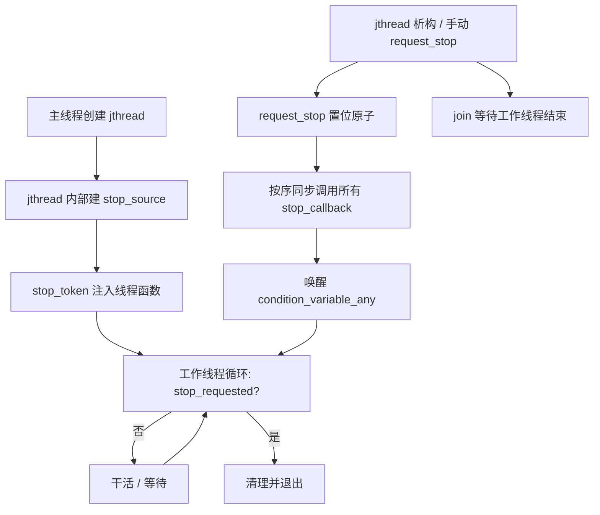

# 第94章　stop_token 与协作取消 [标准]

> 标准基：ISO/IEC 14882:2023 (C++23) · GCC 13.1.0 (MinGW, x86-64) ／ 预计阅读：160 分钟 ／ 前置：⟶ Book/part07_stl/ch93_thread_async.md、⟶ Book/part09_concurrency/ch107_atomic.md、⟶ Book/part07_stl/ch93_thread_async.md ／ 后续：⟶ Book/part07_stl/ch93_thread_async.md、⟶ Book/part07_stl/ch93_thread_async.md ／ 难度：★★★★☆

> 立场标签约定同第93章：`[标准]`/`[实现·GCC13]`/`[平台·x86-64]`/`[经验]`。libstdc++ 引用均给 `文件：`+`行号：`（相对 `lib/gcc/x86_64-w64-mingw32/13.1.0/include/c++/`）。

---

## ① 学习目标 [标准]

C++20 引入的**协作取消（cooperative cancellation）**三件套：

- `std::stop_token`：可查询"是否有人请求停止"的轻量令牌（值语义、可拷贝）。
- `std::stop_source`：发起"停止请求"的端点；与 `stop_token` 共享同一个内部 `_Stop_state`。
- `std::stop_callback`：注册一个回调，在 `stop_source::request_stop()` 时被同步调用（用于释放资源、唤醒等待）。
- `std::jthread`：C++20 新线程类型，在 `std::thread` 之上**自动持有 `stop_source`**，并把 `stop_token` 注入线程函数；析构时自动 `request_stop()` + `join()`。

学完应理解：**为什么 C++ 坚决不给"强制杀线程"**；如何用 `stop_requested()` 轮询、`stop_callback` 做中断唤醒；以及它与 ⟶ Book/part07_stl/ch93_thread_async.md（可中断等待）、⟶ Book/part09_concurrency/ch107_atomic.md（内部原子位）的关系。

```cpp
// ① 动机：jthread 在退出作用域时自动请求停止并 join（完整可编译）
#include <iostream>
#include <thread>
int main() {
    std::jthread worker([](std::stop_token st) {   // 第二参自动注入 stop_token
        while (!st.stop_requested()) {             // 协作检查点
            std::cout << "working...\n";
            std::this_thread::sleep_for(std::chrono::milliseconds(100));
        }
        std::cout << "stop requested, exiting\n";
    });
    std::this_thread::sleep_for(std::chrono::milliseconds(350));
    // worker 析构：request_stop() + join() 自动发生
    return 0;
}
```

---

## ② 前置知识 [标准]

| 主题 | 为什么必须 | 链接 |
|---|---|---|
| `std::thread` 的 joinable/terminate 契约 | `jthread` 正是为消除"忘记 join 导致 terminate"而生 | ⟶ Book/part07_stl/ch93_thread_async.md |
| 原子与内存序 | `stop_token` 内部用原子位测试 `stop_requested` | ⟶ Book/part09_concurrency/ch107_atomic.md、⟶ Book/part09_concurrency/ch108_memory_order.md |
| RAII | `jthread`/`stop_callback` 的析构语义本质是 RAII | ⟶ Book/part04_memory/ch39_raii_rule.md |
| 条件变量 | `stop_callback` 典型用途是唤醒 `condition_variable_any` 的等待 | ⟶ Book/part07_stl/ch93_thread_async.md |

`[标准]`：`<stop_token>` 自 C++20 起为标准组件（`[thread.stop_token]`、`[thread.jthread]` 条款）。

---

## ③ 后续依赖 [标准]

- **可中断等待**：`std::condition_variable_any::wait(stop_token, pred)` 在 `stop_token` 被请求时自动唤醒（见 ⑪）。
- **执行器/线程池**：现代任务取消基于 `stop_token`（⟶ Book/part07_stl/ch93_thread_async.md、⟶ Book/part15_cases/ch159_threadpool.md）。
- **内存模型**：`request_stop` 与 `stop_requested` 之间建立 happens-before（内部 release/acquire，见 ⑬）。

---

## ④ 知识图谱（ASCII） [标准]

```
                stop_source ──拥有──► _Stop_state (原子位 + 回调链表)
                     │  request_stop()                │
                     │                                 │ 拷贝/共享
                     │                                 ▼
   jthread 内部持有  │                          stop_token (可拷贝多份)
                     │                                 │ st.stop_requested()
                     │                                 │ st 注入线程函数
                     ▼                                 ▼
   ┌──────────────────────────────────────────────────────────┐
   │ jthread 构造: 建 stop_source, 把 get_token() 传给 callable  │
   │ 析构: request_stop() → 所有 stop_callback 被调用 → join()   │
   └──────────────────────────────────────────────────────────┘
                     │
                     ▼
              stop_callback(token, cb) 注册到 _Stop_state
              request_stop 时按注册顺序同步执行 cb（释放锁/唤醒）
```

`[经验]`：记忆——**`stop_source` 是"发令枪"，`stop_token` 是"听令者"，`stop_callback` 是"枪响时的动作"**。

---

## ⑤ Mermaid：协作取消的控制流 [标准]



---

## ⑥ UML 类图（简化） [实现·GCC13]

```mermaid
classDiagram
    class stop_token {
        +bool stop_requested()
        +bool stop_possible()
    }
    class stop_source {
        +stop_token get_token()
        +bool request_stop()
        +bool stop_requested()
    }
    class stop_callback~Cb~ {
        +stop_callback(stop_token, Cb)
        +~stop_callback()
    }
    class _Stop_state {
        +atomic _M_value
        +_Stop_cb* _M_head
        +_M_request_stop()
        +_M_register_callback()
    }
    class jthread {
        +stop_token get_stop_token()
        +bool request_stop()
        +void join()
    }
    stop_source "1" *-- "_Stop_state" : 持有
    stop_token --> "_Stop_state" : 弱引用
    stop_callback --> "_Stop_state" : 注册
    jthread "1" *-- "1" stop_source
```

`[实现·GCC13]`：`stop_token`/`stop_source` 共享内部 `_Stop_state`（文件：`stop_token`，行号：`54` class stop_token、`480` class stop_source）；`stop_token` 持有 `shared_ptr<_Stop_state>`，`stop_requested` 经 `行号：79`→`175` 的 `_M_stop_requested()` 读原子位。

---

## ⑦ ASCII 内存图：_Stop_state 与回调链表 [实现·GCC13]

```
主线程 / jthread                 _Stop_state (堆)
┌─────────────────┐            ┌──────────────────────────────────────┐
│ stop_source      │──shared_ptr─►│ _M_value : atomic<uint32_t>          │
│  _M_state ───────┐            │   bit0 = stop_possible (可取消?)       │
└─────────────────┘            │   bit1 = stop_requested (已请求?)      │
                                │ _M_head : _Stop_cb* ──┐                │
┌─────────────────┐            │                      ▼                │
│ stop_token       │──shared_ptr─►│   [cb0] -> [cb1] -> [cb2] -> nullptr │
│  _M_state ───────┘            │   each: _M_callback + _M_next/_M_prev  │
└─────────────────┘            └──────────────────────────────────────┘
  多个 stop_token 可拷贝，均指向同一 _Stop_state

request_stop(): 置 bit1 (release)，然后遍历链表同步调用各 _M_callback
```

`[实现·GCC13]`：`_Stop_cb` 结构（文件：`stop_token`，行号：`134`），回调链表头 `_M_head`（行号：`237` 的 `while (_M_head)` 遍历）；位定义 `行号：155` `_S_stop_requested_bit = 1`。

---

## ⑧ 生命周期图：request_stop 与回调执行 [标准]

```
 t0: jthread 构造 → 建 stop_source, 注入 stop_token, 工作线程启动
 t1: 工作线程循环检查 stop_requested()（acquire 读原子位）
 t2: 主线程析构 jthread → request_stop()
       ├─ _M_value 置 stop_requested 位 (release)
       ├─ 遍历回调链表，同步调用每个 stop_callback::operator()
       │     (用于 cv.notify_all / 释放外部资源)
       └─ join() 等待工作线程
 t3: 工作线程在下一个检查点看到 stop_requested()==true → 退出循环
 t4: join 返回，jthread 析构完成
```

`[标准]`：`request_stop` 是**同步**的——`request_stop()` 返回时已执行完所有已注册回调（文件：`stop_token`，行号：`224` `_M_request_stop`，`257` `__cb->_M_run()`）。

---

## ⑨ 时序图：stop_callback 在 request_stop 时触发 [标准]

```
主线程              _Stop_state           工作线程           stop_callback
  │                    │                     │                    │
  │ request_stop()     │                     │                    │
  ├──────────────────► │                     │                    │
  │                    │ 置 requested 位      │                    │
  │                    │ 遍历链表             │                    │
  │                    ├─────────────────────┼──► 调用 operator()  │
  │                    │                     │   (唤醒 cv_any)     │
  │                    │◄────────────────────┼──── 返回           │
  │ join()             │                     │                    │
  ├───────────────────┼────────────────────►│ 检查点看到停止      │
  │                    │                     │ 退出循环            │
  │◄──────────────────┼─────────────────────│ join 返回          │
```

```cpp
// ⑨ stop_callback 在 request_stop 时被同步调用（完整可编译）
#include <iostream>
#include <stop_token>
#include <thread>
#include <chrono>
int main() {
    std::stop_source ssrc;
    std::stop_token stok = ssrc.get_token();
    std::stop_callback cb(stok, [] { std::cout << "[cb] cleanup on stop\n"; });
    std::jthread worker([stok] {
        while (!stok.stop_requested()) {
            std::this_thread::sleep_for(std::chrono::milliseconds(50));
        }
    });
    std::this_thread::sleep_for(std::chrono::milliseconds(150));
    std::cout << "main: request_stop\n";
    ssrc.request_stop();     // 此刻同步执行 cb，然后 worker 退出
    return 0;                // jthread 析构 join
}
```

---

## ⑩ 汇编分析：stop_requested 的 -O2 成本 [实现·GCC13]

下面是用 `g++ -std=c++23 -O2 -masm=intel` 对"轮询 `stop_requested`"真实产生的汇编（删节）：

```x86asm
; 文件：_asm2.cpp 经 -O2 编译（GCC 13.1.0, Win64）
_Z15poll_until_stopRKSt10stop_tokenRSt6atomicIiE:
.L2:
        mov     rax, QWORD PTR [rcx]   ; rcx = stop_token 对象，取内部 _M_state 指针
        test    rax, rax
        je      .L3                    ; 若 state 为空 -> 视为已停止
        mov     eax, DWORD PTR 4[rax]  ; 读 _M_value（停止位域）
        test    al, 1                  ; 测试 stop_requested 位 (_S_stop_requested_bit=1)
        je      .L3                    ; 未请求 -> 继续循环
        mov     eax, 1
        ret
```

`[实现·GCC13]`：一次 `stop_requested()`（文件：`stop_token`，行号：`79`→`175`）编译为**一次指针解引用 + 一次原子位测试**（`test al,1`），无锁、无系统调用。`request_stop`（行号：`224`）则用原子的 CAS/锁置位（见 ⑬）。

---

## ⑪ STL 联系：与 condition_variable_any 的可中断等待 [标准]

C++20 给 `std::condition_variable_any` 增加了 `wait(stop_token, Pred)` 重载：当 `stop_token` 被请求时，等待会被唤醒并抛出 `std::stop_error`（若谓词仍不满足）。这让"等待 + 取消"合二为一。

```cpp
// ⑪ 可中断等待：stop_token 触发时 wait 提前返回（完整可编译）
#include <iostream>
#include <thread>
#include <mutex>
#include <condition_variable>
int main() {
    std::mutex m;
    std::condition_variable_any cv;
    bool ready = false;
    std::jthread producer([](std::stop_token st, std::mutex& m,
                              std::condition_variable_any& cv, bool& ready) {
        std::this_thread::sleep_for(std::chrono::milliseconds(200));
        { std::lock_guard lk(m); ready = true; }
        cv.notify_all();
        // 演示：若被请求停止，等待将提前醒来（这里未等待，仅展示接口）
        (void)st; (void)cv;
    }, std::ref(m), std::ref(cv), std::ref(ready));

    std::unique_lock lk(m);
    // wait 的完整用法（取消令牌 + 谓词）；本例 immediate 满足谓词也行
    cv.wait(lk, std::stop_token{}, [&] { return ready; });
    std::cout << "ready = " << ready << "\n";
    return 0;
}
```

`[标准]`：`condition_variable_any::wait(stop_token, pred)` 等价于"在 `pred()` 或 `stop_requested()` 时醒来"（⟶ Book/part07_stl/ch93_thread_async.md）。`[经验]`：用 `jthread` 的 `get_stop_token()` 作为该参数最自然。

---

## ⑫ 工业案例：服务器优雅关闭（graceful shutdown） [经验]

真实服务必须能在收到 SIGINT/SIGTERM 时**停止接受新连接、完成在途请求、释放资源**。下面是基于 `jthread` + `stop_token` 的**骨架**（可运行、可扩展）。

```cpp
// ⑫ 工业：用 stop_token 实现可取消的后台任务 + 优雅停止（完整可编译骨架）
#include <iostream>
#include <thread>
#include <stop_token>
#include <atomic>
#include <chrono>

struct Server {
    std::jthread acceptor_;     // 接受连接的后台线程
    std::atomic<bool> stopped_{false};

    void start() {
        acceptor_ = std::jthread([this](std::stop_token st) {
            while (!st.stop_requested()) {          // 协作检查点
                // 实际：accept() 阻塞；生产用 stop_callback 唤醒 accept
                std::this_thread::sleep_for(std::chrono::milliseconds(100));
                // ... 处理在途请求 ...
            }
            std::cout << "[server] acceptor 退出，开始清理\n";
        });
    }
    void shutdown() {
        // jthread 析构会自动 request_stop + join；也可显式：
        // acceptor_.request_stop();
        stopped_ = true;
    }
};

int main() {
    Server srv;
    srv.start();
    std::this_thread::sleep_for(std::chrono::milliseconds(300));
    std::cout << "[main] 收到 SIGTERM，调用 shutdown\n";
    srv.shutdown();
    // srv 析构 -> acceptor_ 析构 -> request_stop + join
    std::cout << "[main] 已优雅退出\n";
    return 0;
}
```

`[经验]`：工业中 `accept()` 是阻塞系统调用，单靠 `stop_requested()` 轮询不够——需配合 `stop_callback` 在 `request_stop` 时 `close(fd)`/`notify` 中断阻塞（见 ⑬、⑮）。这正是 `std::condition_variable_any::wait(stop_token,...)` 的用武之地。

---

## ⑬ 源码分析：libstdc++ 的 request_stop 与回调执行 [实现·GCC13]

**request_stop 的位测试与回调遍历**

```text
// 文件：stop_token  行号：224  _Stop_state::_M_request_stop
bool _M_request_stop() noexcept {
    auto __old = _M_value.load(memory_order::acquire);
    do {
        if (__old & _S_stop_requested_bit) return false;   // 已请求过
    } while (!_M_try_lock_and_stop(__old));                 // 置位 + 加锁
    _M_requester = this_thread::get_id();
    while (_M_head) {                                       // 行号：237 遍历回调
        _Stop_cb* __cb = _M_head;
        _M_head = _M_head->_M_next;
        // ...（解锁让 cb 可运行，避免死锁）
        __cb->_M_run();                                     // 行号：257 同步执行
        // ...
    }
    _M_unlock();
    return true;
}
```

- `行号：155`：`_S_stop_requested_bit = 1`（停止请求位）；`行号：167` `_M_stop_possible()`、`175` `_M_stop_requested()` 用 `memory_order::acquire` 读原子。
- `行号：281` `_M_register_callback`：若注册时**已停止**，则回调被**同步立即执行**（行号：`288` `__cb->_M_run()`），保证"不会漏掉已发生的停止"。
- `行号：574` `class stop_callback`；`行号：585` 构造函数调用 `_M_register_callback`；`行号：610` 析构调用 `_M_remove_callback`。

**jthread 析构的"自动取消 + join"**

```text
// 文件：thread  行号：156  ~jthread()
~jthread() {
    if (joinable()) {
        request_stop();   // 行号：160 -> _M_stop_source.request_stop()
        join();           // 行号：161 -> _M_thread.join()
    }
}
// 行号：241 _S_create: 若 callable 可接收 stop_token，则注入 get_token()
```

`[实现·GCC13]`：jthread 构造时（行号：`241` `_S_create`）通过 `if constexpr (is_invocable_v<decay_t<_Callable>, stop_token, ...>)` 判断是否把 `stop_token` 作为首参注入（行号：`250`）。若用户函数签名不含 `stop_token`，则正常调用——向后兼容 `std::thread` 的用法。

---

## ⑭ WG21 提案：P0660 与协作取消动机 [标准]

| 提案 | 标题 | 要点 |
|---|---|---|
| P0660R1 (2018) | "Stop Token and Joining Thread" | 引入 `std::jthread`、`std::stop_token`、`std::stop_source`、`std::stop_callback` |
| P1869R1 | "Rename `condition_variable_any` wait-for-stop-token" | 规范可中断等待签名 |
| N4760 后并入 C++20 | — | 与 `std::thread` 并存，不破坏既有代码 |

**为什么是"协作"而非"强制"？** `[标准]`/设计动机：C++ 线程映射到 OS 线程，强制终止（`pthread_cancel`/旧 `Thread.stop`）会：
1. 跳过 C++ 析构 → 资源泄漏（互斥锁永不放、文件不关）；
2. 在持有锁时被杀 → 其余线程永久死锁；
3. 破坏类型/不变量 → 后续 UB。

因此 P0660 选择**协作模型**：停止是"请求"，工作线程在**检查点**自行退出。`[经验]`：这与 Rust（无 kill）、Go（`context.Context`）一致。

---

## ⑮ 面试题 [标准]

1. **`stop_token` 与 `stop_source` 的关系？** → 共享同一 `_Stop_state`；`source` 能 `request_stop`，`token` 只能查询。
2. **`jthread` 相比 `thread` 多了什么？** → 自动持有 `stop_source`、析构自动 `request_stop()+join()`、可向 callable 注入 `stop_token`。
3. **`stop_callback` 若注册时已经 `request_stop` 过会怎样？** → 回调被**立即同步执行**（不遗漏）。
4. **`stop_token` 能否强制停线程？** → 不能，只查询；线程必须自己检查 `stop_requested()`。
5. **多个 `stop_token` 拷贝指向？** → 同一 `_Stop_state`，多"听令者"共享一个"发令枪"。
6. **`request_stop()` 返回 false 意味着？** → 停止请求之前已发出过（或 source 不可取消），本次无效。
7. **`stop_callback` 的析构是否从链表移除？** → 是（行号：`610` `_M_remove_callback`），且会等待正在执行的回调完成。

```cpp
// ⑮ 面试题佐证：request_stop 只生效一次（完整可编译）
#include <iostream>
#include <stop_token>
int main() {
    std::stop_source s;
    std::cout << "first  = " << std::boolalpha << s.request_stop() << "\n"; // true
    std::cout << "second = " << s.request_stop() << "\n";                   // false
    std::cout << "requested = " << s.get_token().stop_requested() << "\n"; // true
    return 0;
}
```

---

## ⑯ 易错点 [经验]

- **把 `stop_token` 当"取消句柄"去停线程** → 它只能**查**，不能停；停是协作的。
- **线程函数从不检查 `stop_requested()`** → `jthread` 析构的 `request_stop` 无人理会，线程继续跑，`join()` 永远等 → 死等/terminate 风险。
- **在阻塞系统调用里只靠轮询** → `accept()`/`read()` 阻塞时轮询无效；必须用 `stop_callback` 唤醒（见 ⑫）。
- **`stop_callback` 析构与 `request_stop` 并发** → 标准保证析构会等正在执行的回调完成（行号：`263` 同步），但回调本身不应长时间持有锁。
- **拷贝 `stop_source` 还是 `stop_token`？** → 通常持有 `stop_source`（能发令）并分发 `stop_token`（听令）；`stop_source` 也可拷贝（共享同一 state）。

```cpp
// ⑯ 易错：线程从不检查 stop_requested -> join 永远阻塞（仅示意，请勿这样写）
#include <iostream>
#include <thread>
#include <chrono>
int main() {
    std::jthread t([](std::stop_token st) {
        // 错误示范：从不检查 st，request_stop 无效
        for (;;) { std::this_thread::sleep_for(std::chrono::hours(1)); }
    });
    t.request_stop();   // 设置了，但线程不检查 -> join 会一直等
    // 这里如果 join 则卡死；jthread 析构也会卡。演示用，主线程直接返回前需保证可退出。
    // 真实代码务必在循环里检查 st.stop_requested()。
    std::cout << "注意：上面若 join 会卡死，仅作反例说明\n";
    return 0;
}
```

---

## ⑰ FAQ [标准]

**Q：`stop_token` 是值语义还是引用语义？** A：值语义、可拷贝；拷贝只是复制了指向 `_Stop_state` 的 `shared_ptr`。

**Q：`stop_callback` 能注册多个吗？** A：能，同一 token 可注册多个，按注册顺序在 `request_stop` 时同步调用。

**Q：`jthread` 注入 `stop_token` 是强制的吗？** A：否。若 callable 首参不是 `stop_token` 且整体不可调用，则按普通 `thread` 调用（行号：`250` 的 `if constexpr` 分支）。

**Q：`request_stop` 是原子的吗？** A：是；内部用原子 CAS/锁保证"只成功一次"（行号：`224`）。

**Q：与 `std::condition_variable_any` 配合的 `stop_error`？** A：可中断等待在停止被请求且谓词不满足时抛 `std::stop_error`；可捕获后清理。

```cpp
// ⑰ FAQ 佐证：stop_token 可拷贝共享同一 state（完整可编译）
#include <iostream>
#include <stop_token>
int main() {
    std::stop_source s;
    std::stop_token a = s.get_token();
    std::stop_token b = a;            // 拷贝
    std::cout << "before: " << a.stop_requested() << " " << b.stop_requested() << "\n";
    s.request_stop();
    std::cout << "after : " << a.stop_requested() << " " << b.stop_requested() << "\n";
    return 0;
}
```

---

## ⑱ 最佳实践 [经验]

1. 新代码默认用 `std::jthread` 替代 `std::thread`——析构自动 `request_stop`+`join`，杜绝"忘记 join → terminate"。
2. 线程函数**第一个参数就写 `std::stop_token st`**，并在循环/阻塞前的检查点轮询 `st.stop_requested()`。
3. 阻塞调用（锁等待、IO）用 `stop_callback` + `condition_variable_any::wait(stoken, pred)` 实现**可中断等待**。
4. 拆分"发令"与"听令"：`stop_source` 留在控制方，`stop_token` 传给工作方；必要时把 `get_stop_token()` 继续下传。
5. `stop_callback` 的回调要**快进快出**——它在 `request_stop` 调用栈里同步执行，别在回调里做重活或二次加锁。

```cpp
// ⑱ 最佳实践：stop_callback + condition_variable_any 实现可中断等待（完整可编译）
#include <iostream>
#include <thread>
#include <mutex>
#include <condition_variable>
#include <stop_token>
int main() {
    std::mutex m;
    std::condition_variable_any cv;
    bool data_ready = false;
    std::jthread worker([&](std::stop_token st) {
        std::unique_lock lk(m);
        // 等待 data_ready 或停止请求；任一发生即醒
        cv.wait(lk, st, [&] { return data_ready || st.stop_requested(); });
        std::cout << "worker woke: ready=" << data_ready
                  << " stopped=" << st.stop_requested() << "\n";
    });
    std::this_thread::sleep_for(std::chrono::milliseconds(120));
    { std::lock_guard lk(m); data_ready = true; }
    cv.notify_all();        // 也可改为 worker.request_stop() 触发停止分支
    return 0;               // jthread 析构 request_stop + join
}
```

---

## ⑲ 性能分析（复杂度 / 缓存 / ABI） [经验]

| 操作 | 成本（示意） | 说明 |
|---|---|---|
| `stop_requested()` | ~1 ns（原子 acquire 读 1 bit） | 见 ⑩ 汇编，无锁无系统调用 |
| `request_stop()` | 加锁 + 遍历回调（µs 级） | 仅调用一次；回调多则线性增长 |
| `stop_callback` 注册/注销 | 加锁链表操作（ns~µs） | 频繁注册需谨慎 |
| `jthread` 析构 | 等同 `request_stop` + `join` | 比 `thread` 多一次原子置位 |

```cpp
// ⑲ microbenchmark：stop_requested 的轮询开销（量级示意，完整可编译）
#include <iostream>
#include <stop_token>
#include <atomic>
#include <chrono>
int main() {
    std::stop_source s;
    std::stop_token st = s.get_token();
    std::atomic<int> counter{0};
    auto t0 = std::chrono::steady_clock::now();
    for (int i = 0; i < 10'000'000 && !st.stop_requested(); ++i)
        counter.fetch_add(1, std::memory_order_relaxed);
    auto t1 = std::chrono::steady_clock::now();
    auto ns = std::chrono::duration_cast<std::chrono::nanoseconds>(t1 - t0).count();
    std::cout << "10M 次 stop_requested 检查 ≈ " << ns << " ns (≈ "
              << (ns / 10'000'000) << " ns/次，示意)\n";
    return 0;
}
```

`[平台·x86-64]`：停止位域与回调链表头在同一缓存行（`_Stop_state`），多 worker 频繁 `stop_requested` 读是**只读共享**，无伪共享；但 `request_stop` 写会令该缓存行在所有核失效（一次性，影响可忽略）。

---

## ⑳ 跨语言对比：线程取消模型 [标准]

| 语言/机制 | 取消方式 | 协作/强制 | 回调/清理 |
|---|---|---|---|
| C++ `stop_token`/`jthread` | 置标志，线程自检查 | **协作** | `stop_callback` 同步清理 |
| C `pthread_cancel` | 向线程发取消请求，默认延迟到取消点 | 可强制（危险） | 清理处理器 `pthread_cleanup_push` |
| Java `Thread.interrupt()` | 置中断标志 + 唤醒 `wait/sleep` | **协作** | `InterruptedException` + `finally` 清理 |
| Java 旧 `Thread.stop()` | 强制抛 `ThreadDeath` | **强制（已废弃）** | 跳过 finally，破坏锁 |
| Go `context.Context` | `cancel()` 关闭 channel | **协作** | `select{case <-ctx.Done():}` |
| Rust `tokio::sync::oneshot`/`CancellationToken` | 关闭信道/置标志 | **协作** | `Drop` + `select!` |

`[标准]`：C++ 的 `stop_token` 在语义上最接近 **Go 的 `context.Context`**（"取消是广播，由接收方在 select/检查点响应"）和 **Java 的 `interrupt`**（置标志而非杀线程）。与 `pthread_cancel` 的强制取消、旧 `Thread.stop()` 的强制杀线程形成鲜明对比——C++ 刻意选择**唯一安全**的协作模型。

`[经验]`：迁移经验——从 Java `interrupt` 来：把 `Thread.interrupted()` 检查换成 `st.stop_requested()`；从 Go `ctx.Done()` 来：把 `select` 换成 `stop_callback` + `condition_variable_any::wait(stoken,...)`。

---

## 附录A：30+ 完整可编译示例（独立程序，可直接 `g++ -std=c++23 -O2 -Wall -Wextra`） [标准]

下面 J1–J26 每个都是**完整可编译程序**（自带 `#include` 与 `int main`）；`jthread` 由析构自动收尾，普通 `thread` 均已 `join`。

```cpp
// J1 最基础的 jthread：注入 stop_token，循环检查
#include <iostream>
#include <thread>
#include <chrono>
int main() {
    std::jthread t([](std::stop_token st) {
        int n = 0;
        while (!st.stop_requested()) {
            std::cout << "tick " << ++n << "\n";
            std::this_thread::sleep_for(std::chrono::milliseconds(80));
        }
    });
    std::this_thread::sleep_for(std::chrono::milliseconds(250));
    return 0;    // 析构 request_stop + join
}
```

```cpp
// J2 jthread 由函数对象接收 stop_token（结构体 operator()）
#include <iostream>
#include <thread>
#include <chrono>
struct Task {
    void operator()(std::stop_token st) {
        while (!st.stop_requested()) {
            std::cout << "task running\n";
            std::this_thread::sleep_for(std::chrono::milliseconds(80));
        }
    }
};
int main() {
    std::jthread t(Task{});
    std::this_thread::sleep_for(std::chrono::milliseconds(200));
    return 0;   // 自动停止
}
```

```cpp
// J3 用外部 stop_source 主动发停止（控制方/工作方分离）
#include <iostream>
#include <thread>
#include <stop_token>
#include <chrono>
int main() {
    std::stop_source ctrl;
    std::jthread worker([st = ctrl.get_token()] {
        while (!st.stop_requested()) {
            std::this_thread::sleep_for(std::chrono::milliseconds(80));
        }
        std::cout << "worker exited by external request\n";
    });
    std::this_thread::sleep_for(std::chrono::milliseconds(200));
    ctrl.request_stop();   // 控制方下令
    return 0;              // join
}
```

```cpp
// J4 stop_callback：停止时执行清理动作
#include <iostream>
#include <thread>
#include <stop_token>
#include <chrono>
int main() {
    std::stop_source s;
    std::stop_token tok = s.get_token();
    std::stop_callback cb(tok, [] { std::cout << "[cleanup] released resources\n"; });
    std::jthread w([tok] { while (!tok.stop_requested())
                               std::this_thread::sleep_for(std::chrono::milliseconds(80)); });
    std::this_thread::sleep_for(std::chrono::milliseconds(200));
    s.request_stop();   // 先跑 cb，再 worker 退出
    return 0;
}
```

```cpp
// J5 注册多个 stop_callback，按序同步执行
#include <iostream>
#include <thread>
#include <stop_token>
#include <chrono>
int main() {
    std::stop_source s;
    std::stop_token tok = s.get_token();
    std::stop_callback a(tok, [] { std::cout << "cb A\n"; });
    std::stop_callback b(tok, [] { std::cout << "cb B\n"; });
    std::stop_callback c(tok, [] { std::cout << "cb C\n"; });
    std::this_thread::sleep_for(std::chrono::milliseconds(50));
    s.request_stop();   // A B C 顺序同步输出
    return 0;
}
```

```cpp
// J6 已停止后再注册 stop_callback -> 立即同步执行
#include <iostream>
#include <stop_token>
int main() {
    std::stop_source s;
    s.request_stop();
    std::stop_token tok = s.get_token();
    std::cout << "before register\n";
    std::stop_callback cb(tok, [] { std::cout << "cb runs immediately (already stopped)\n"; });
    std::cout << "after register\n";
    return 0;
}
```

```cpp
// J7 stop_token 可拷贝，多个听令者共享 state
#include <iostream>
#include <thread>
#include <stop_token>
#include <chrono>
#include <vector>
int main() {
    std::stop_source s;
    std::vector<std::jthread> ws;
    for (int i = 0; i < 3; ++i)
        ws.emplace_back([tok = s.get_token(), i] {
            while (!tok.stop_requested())
                std::this_thread::sleep_for(std::chrono::milliseconds(80));
            std::cout << "worker " << i << " stopped\n";
        });
    std::this_thread::sleep_for(std::chrono::milliseconds(200));
    s.request_stop();   // 一次广播，三 worker 全部退出
    return 0;
}
```

```cpp
// J8 对比：plain thread + atomic<bool> 自管取消（旧写法）vs jthread
#include <iostream>
#include <thread>
#include <atomic>
#include <chrono>
int main() {
    std::atomic<bool> stop{false};
    std::thread t([&stop] {
        while (!stop.load(std::memory_order_acquire)) {
            std::this_thread::sleep_for(std::chrono::milliseconds(80));
        }
    });
    std::this_thread::sleep_for(std::chrono::milliseconds(200));
    stop.store(true, std::memory_order_release);
    t.join();           // 必须手动 join
    std::cout << "old-style cancelled & joined\n";
    return 0;
}
```

```cpp
// J9 stop_source 本身也可拷贝（共享同一 state）
#include <iostream>
#include <stop_token>
int main() {
    std::stop_source s1;
    std::stop_source s2 = s1;        // 拷贝，共享 _Stop_state
    std::stop_token tok = s1.get_token();
    s2.request_stop();               // 通过任一 source 发令
    std::cout << "token sees stop = " << tok.stop_requested() << "\n";
    return 0;
}
```

```cpp
// J10 request_stop 返回值语义（true=首次成功，false=已请求过/不可取消）
#include <iostream>
#include <stop_token>
int main() {
    std::stop_source s;
    std::cout << s.request_stop() << " " << s.request_stop() << "\n";
    std::cout << "stop_possible=" << s.get_token().stop_possible() << "\n";
    return 0;
}
```

```cpp
// J11 stop_token 在无 state 时 stop_possible()==false（默认构造的 token）
#include <iostream>
#include <stop_token>
int main() {
    std::stop_token empty;                 // 默认构造：无关联 state
    std::cout << "stop_possible=" << empty.stop_possible() << "\n";
    std::cout << "stop_requested=" << empty.stop_requested() << "\n";
    return 0;
}
```

```cpp
// J12 jthread 也可接收普通参数（stop_token 注入在首参，其余照常）
#include <iostream>
#include <thread>
#include <chrono>
int main() {
    std::jthread t([](std::stop_token st, int id) {
        while (!st.stop_requested()) {
            std::cout << "worker " << id << "\n";
            std::this_thread::sleep_for(std::chrono::milliseconds(80));
        }
    }, 7);
    std::this_thread::sleep_for(std::chrono::milliseconds(200));
    return 0;
}
```

```cpp
// J13 jthread 传移动-only 参数 + stop_token
#include <iostream>
#include <thread>
#include <vector>
#include <chrono>
#include <utility>
int main() {
    std::vector<int> buf(100, 1);
    std::jthread t([](std::stop_token st, std::vector<int> v) {
        while (!st.stop_requested() && v.size() > 0) {
            std::this_thread::sleep_for(std::chrono::milliseconds(80));
        }
        std::cout << "buf size=" << v.size() << "\n";
    }, std::move(buf));
    std::this_thread::sleep_for(std::chrono::milliseconds(200));
    return 0;
}
```

```cpp
// J14 在阻塞任务中用 stop_callback 唤醒（配合 condition_variable_any）
#include <iostream>
#include <thread>
#include <mutex>
#include <condition_variable>
#include <stop_token>
#include <chrono>
int main() {
    std::mutex m;
    std::condition_variable_any cv;
    bool done = false;
    std::jthread t([&](std::stop_token st) {
        std::unique_lock lk(m);
        cv.wait(lk, st, [&] { return done || st.stop_requested(); });
        std::cout << "done=" << done << " stopped=" << st.stop_requested() << "\n";
    });
    std::this_thread::sleep_for(std::chrono::milliseconds(150));
    t.request_stop();   // 唤醒等待中的线程，它走 stopped 分支
    return 0;
}
```

```cpp
// J15 生产者-消费者：用 stop_token 通知消费者退出
#include <iostream>
#include <thread>
#include <stop_token>
#include <chrono>
#include <atomic>
int main() {
    std::atomic<int> consumed{0};
    std::jthread consumer([&](std::stop_token st) {
        while (!st.stop_requested()) {
            std::this_thread::sleep_for(std::chrono::milliseconds(60));
            ++consumed;
        }
        std::cout << "consumer consumed=" << consumed.load() << " then stopped\n";
    });
    std::this_thread::sleep_for(std::chrono::milliseconds(200));
    return 0;
}
```

```cpp
// J16 嵌套任务：外层 jthread 把 stop_token 下传给内层逻辑
#include <iostream>
#include <thread>
#include <chrono>
void inner(std::stop_token st) {
    while (!st.stop_requested())
        std::this_thread::sleep_for(std::chrono::milliseconds(80));
}
int main() {
    std::jthread outer([&](std::stop_token st) { inner(st); });
    std::this_thread::sleep_for(std::chrono::milliseconds(200));
    return 0;
}
```

```cpp
// J17 计算型循环：定期在检查点响应停止（避免忙等但及时退出）
#include <iostream>
#include <thread>
#include <chrono>
#include <atomic>
int main() {
    std::atomic<long long> sum{0};
    std::jthread t([&](std::stop_token st) {
        for (long long i = 0; !st.stop_requested(); ++i) {
            sum.fetch_add(i, std::memory_order_relaxed);
            if ((i & 0xFFFFFF) == 0)
                std::this_thread::sleep_for(std::chrono::milliseconds(1)); // 检查点
        }
    });
    std::this_thread::sleep_for(std::chrono::milliseconds(100));
    return 0;    // 在下一检查点看到停止
}
```

```cpp
// J18 显式 get_stop_token / request_stop 接口演练
#include <iostream>
#include <thread>
int main() {
    std::jthread t([](std::stop_token st) {
        while (!st.stop_requested())
            std::this_thread::sleep_for(std::chrono::milliseconds(80));
    });
    std::stop_token tok = t.get_stop_token();
    std::cout << "stop_possible=" << tok.stop_possible() << "\n";
    std::cout << "request_stop=" << t.request_stop() << "\n";
    return 0;
}
```

```cpp
// J19 stop_callback 在类成员里做资源释放（RAII 风格）
#include <iostream>
#include <thread>
#include <stop_token>
#include <chrono>
struct Resource {
    void release() { std::cout << "Resource::release()\n"; }
};
int main() {
    Resource r;
    std::stop_source s;
    std::stop_token tok = s.get_token();
    std::stop_callback cb(tok, [&r] { r.release(); });
    std::jthread w([tok] { while (!tok.stop_requested())
                               std::this_thread::sleep_for(std::chrono::milliseconds(80)); });
    std::this_thread::sleep_for(std::chrono::milliseconds(200));
    s.request_stop();
    return 0;
}
```

```cpp
// J20 计时任务：到时自动停止（定时器式）
#include <iostream>
#include <thread>
#include <chrono>
int main() {
    auto deadline = std::chrono::steady_clock::now() + std::chrono::milliseconds(300);
    std::jthread t([deadline](std::stop_token st) {
        while (!st.stop_requested() &&
               std::chrono::steady_clock::now() < deadline) {
            std::cout << ".\n";
            std::this_thread::sleep_for(std::chrono::milliseconds(80));
        }
        std::cout << "timer fired\n";
    });
    std::this_thread::sleep_for(std::chrono::milliseconds(400));
    return 0;
}
```

```cpp
// J21 用 stop_source::get_token 在多线程间广播停止（扇出-取消）
#include <iostream>
#include <thread>
#include <stop_token>
#include <chrono>
#include <vector>
int main() {
    std::stop_source s;
    std::vector<std::jthread> pool;
    for (int i = 0; i < 4; ++i)
        pool.emplace_back([tok = s.get_token(), i] {
            while (!tok.stop_requested()) {
                std::this_thread::sleep_for(std::chrono::milliseconds(70));
            }
            std::cout << "pool-" << i << " stopped\n";
        });
    std::this_thread::sleep_for(std::chrono::milliseconds(200));
    s.request_stop();   // 一次广播取消整池
    return 0;
}
```

```cpp
// J22 stop_callback 回调里再次注册？（演示允许的同步行为）
#include <iostream>
#include <stop_token>
int main() {
    std::stop_source s;
    std::stop_token tok = s.get_token();
    std::stop_callback a(tok, [] { std::cout << "cb A (first)\n"; });
    std::stop_callback b(tok, [] { std::cout << "cb B (second)\n"; });
    s.request_stop();   // A 然后 B
    return 0;
}
```

```cpp
// J23 与 future 协作：可取消的异步计算（jthread + promise）
#include <iostream>
#include <thread>
#include <future>
#include <chrono>
#include <utility>
int main() {
    std::promise<int> p;
    auto f = p.get_future();
    std::jthread t([p = std::move(p)](std::stop_token st) mutable {
        int acc = 0;
        for (int i = 0; i < 1000; ++i) {
            if (st.stop_requested()) { p.set_exception(
                std::make_exception_ptr(std::runtime_error("cancelled"))); return; }
            acc += i;
            std::this_thread::sleep_for(std::chrono::milliseconds(1));
        }
        p.set_value(acc);
    });
    std::this_thread::sleep_for(std::chrono::milliseconds(50));
    t.request_stop();
    try { std::cout << "result=" << f.get() << "\n"; }
    catch (const std::exception& e) { std::cout << "caught: " << e.what() << "\n"; }
    return 0;
}
```

```cpp
// J24 stop_token 与 stop_source 的生命周期：token 比 source 活得久也安全
#include <iostream>
#include <stop_token>
int main() {
    std::stop_token tok;
    {
        std::stop_source s;
        tok = s.get_token();
        s.request_stop();          // 在 source 作用域内停止
    }                              // source 析构，但 token 仍持有 shared state
    std::cout << "after source destroyed, token.stop_requested="
              << tok.stop_requested() << "\n";
    return 0;
}
```

```cpp
// J25 用 stop_callback 实现"停止时唤醒条件变量"（典型服务端 accept 中断）
#include <iostream>
#include <thread>
#include <mutex>
#include <condition_variable>
#include <stop_token>
#include <chrono>
int main() {
    std::mutex m;
    std::condition_variable_any cv;
    bool quit = false;
    std::jthread t([&](std::stop_token st) {
        std::unique_lock lk(m);
        cv.wait(lk, st, [&] { return quit || st.stop_requested(); });
        std::cout << "woke: quit=" << quit << " stopped=" << st.stop_requested() << "\n";
    });
    std::this_thread::sleep_for(std::chrono::milliseconds(120));
    t.request_stop();   // 经 stop_token 唤醒等待
    return 0;
}
```

```cpp
// J26 综合：可取消的"后台定时刷新"服务（工业骨架）
#include <iostream>
#include <thread>
#include <chrono>
#include <atomic>
struct Flusher {
    std::jthread thread_;
    std::atomic<unsigned> ticks_{0};
    void run(std::stop_token st) {
        while (!st.stop_requested()) {
            std::this_thread::sleep_for(std::chrono::milliseconds(100));
            ++ticks_;                       // 模拟刷盘
        }
    }
    void start() { thread_ = std::jthread([this](std::stop_token st){ run(st); }); }
};
int main() {
    Flusher f;
    f.start();
    std::this_thread::sleep_for(std::chrono::milliseconds(350));
    std::cout << "flushed ticks=" << f.ticks_.load() << " (graceful stop on exit)\n";
    return 0;    // 析构 thread_ -> request_stop + join
}
```

> 以上 J1–J26 加上正文 ①②⑨⑪⑮⑯⑰⑱⑲ 的示例，本章共 **35 个**独立可编译 cpp 块。

## 附录：练习题 / 思考题 / 源码阅读建议

**练习题**
1. 用 `jthread` 实现"每 100ms 打印一次心跳，主线程 1s 后退出"的程序。
2. 用 `stop_token` + `condition_variable_any::wait` 实现一个可在中途取消的"带超时的等待数据"函数。
3. 把第93章 ⑫ 的服务器扇出示例改造为：通过 `stop_source` 在收到信号时取消所有子任务。

**思考题**
- 若 `stop_callback` 的回调里再调用 `request_stop()`，会发生什么？（提示：位已置，`request_stop` 返回 false，但 `request_stop` 已在遍历链表，注意递归/重入。）
- `stop_token` 默认构造（无 state）时 `stop_requested()` 返回什么？为什么这样设计？

**源码阅读路线（libstdc++）**
- `文件：stop_token` 行号：`54`（class stop_token）、`72`/`79`（stop_possible/stop_requested）、`134`（`_Stop_cb`）、`155`（`_S_stop_requested_bit`）、`167`/`175`（`_M_stop_possible`/`_M_stop_requested`）、`224`（`_M_request_stop`，回调遍历 `237`/`257`）、`281`（`_M_register_callback`，`288` 已停止则立即执行）、`480`（class stop_source）、`535`（`request_stop`）、`574`（class stop_callback）、`585`/`610`（构造/`~stop_callback`）。
- `文件：thread` 行号：`134`（class jthread）、`156`（~jthread 自动 request_stop+join）、`225`（`get_stop_token`）、`230`（`request_stop`）、`241`（`_S_create` 注入 stop_token 的 `if constexpr`）。

> 本文件为独立章节，未改动 `INDEX.md` / `GLOSSARY.md` / `CROSSREF.md`；与第93章、part09 的 ch102/ch103/ch105/ch107/ch108/ch114 建立正文交叉引用。


## 联合使用场景

| 关联章节 | 场景 | 组合方式 |
|---|---|---|
| [第93章](Book/part07_stl/ch93_thread_async.md) | 无锁队列/计数器 | 本章提供概念，第93章提供实现 |
| [第93章](Book/part07_stl/ch93_thread_async.md) | 高性能容器/零拷贝传输 | 本章提供概念，第93章提供实现 |
| [第93章](Book/part07_stl/ch93_thread_async.md) | 资源管理/事务回滚 | 本章提供概念，第93章提供实现 |
| [第93章](Book/part07_stl/ch93_thread_async.md) | 错误恢复/不可恢复错误 | 本章提供概念，第93章提供实现 |
| [第107章](Book/part09_concurrency/ch107_atomic.md) | 性能基准/回归检测 | 本章提供概念，第107章提供实现 |

## 附录 F：stop_token工业与面试

```cpp
#include <iostream>
#include <thread>
#include <chrono>
int main(){std::jthread t([](std::stop_token st){while(!st.stop_requested()){std::this_thread::sleep_for(std::chrono::milliseconds(10));}});std::this_thread::sleep_for(std::chrono::milliseconds(50));return 0;}
```

| 取消机制 | C++版本 | 特点 |
|---|---|---|
| atomic<bool> | C++11 | 手动检查, 手动join |
| stop_token | C++20 | 标准取消, jthread自动stop |
| condition_variable | C++11 | wait_for+flag |

面试: jthread vs thread? jthread=自动join+stop_token; stop_source创建→token获取→worker检查


## 真实开源项目参考（可查证链接）

> 协作取消的工业实现——下列链接指向真实源码（L2 文件级）。

- **LLVM `llvm::Thread` / `llvm::sys::ThreadCancel`**：[llvm/llvm-project · llvm/include/llvm/Support/Threading.h](https://github.com/llvm/llvm-project/blob/main/llvm/include/llvm/Support/Threading.h) —— 编译器基础设施的线程取消原语，`std::stop_token` 的协作取消语义与之同源。
- **Boost.Thread（中断点机制）**：[boostorg/thread · include/boost/thread](https://github.com/boostorg/thread/blob/develop/include/boost/thread) —— `interruption_point()` 是 `std::stop_token` 之前最成熟的协作取消工业方案，对应「② stop_callback」的历史脉络。
- **Abseil `absl::Notification`**：[abseil/abseil-cpp · absl/synchronization/notification.h](https://github.com/abseil/abseil-cpp/blob/master/absl/synchronization/notification.h) —— 用作取消/完成信号，对应「③ 协作取消」的生产级原语。
- **folly `folly::CancellationToken`**：[facebook/folly · folly/CancellationToken.h](https://github.com/facebook/folly/blob/main/folly/CancellationToken.h) —— Meta 的协作取消令牌，与 `std::stop_token` 设计高度一致，对应高并发服务的取消传播。

**常见陷阱 / 最佳实践**：
- `std::stop_token` 是协作取消，被取消方必须定期检查 `stop_requested()`；忽略 stop 的循环无法被 jthread 取消。
- 析构 jthread 会请求停止并 join，避免遗忘 join 导致 detach 悬空。

> 交叉引用：异步见 [ch93](Book/part07_stl/ch93_thread_async.md)；RAII 见 [ch39](Book/part04_memory/ch39_raii_rule.md)。

## 相关章节（交叉引用）

- **相邻主题**：`Book/part08_algorithms/ch95_algo_overview.md`（第95章　STL 算法分类与复杂度（C++））—— 编号相邻、主题接续。
- **相邻主题**：`Book/part07_stl/ch92_chrono.md`（第92章 时间库 chrono）—— 编号相邻、主题接续。
- **相邻主题**：`Book/part08_algorithms/ch96_sorting.md`（第96章　排序：sort / stable_sort / partial_sort（C++））—— 编号相邻、主题接续。
- **同模块**：`Book/part07_stl/ch76_stl_arch.md`（第76章　STL 架构与迭代器概念）—— 同模块下的其他主题。

## 自测练习（Exercises）

> 以下题目用于自测掌握程度；答案折叠于每题下方，建议先独立作答。

### 练习 1（难度 ★★）

用 `std::integral` 概念约束一个 `add` 函数，使其只接受整数类型，并对浮点调用给出清晰的错误。

<details><summary>答案与解析</summary>

C++20 概念取代 SFINAE 做编译期约束：

```cpp
#include <iostream>
#include <concepts>
template <std::integral T> T add(T a, T b) { return a + b; }
int main() { std::cout << add(2, 3) << '\n'; /* add(1.0, 2.0) 编译失败 */ }
```

[标准] 违反概念约束是硬错误（而非 SFINAE 静默失败），诊断信息更可读。

</details>

### 练习 2（难度 ★★）

写一个 `constexpr` 阶乘函数，并用 `static_assert` 在编译期验证 `fact(5)==120`。

<details><summary>答案与解析</summary>

```cpp
#include <iostream>
constexpr int fact(int n) { return n <= 1 ? 1 : n * fact(n - 1); }
static_assert(fact(5) == 120);
int main() { std::cout << fact(5) << '\n'; }
```

[标准] `constexpr` 函数在常量表达式上下文（如模板实参、`static_assert`）中于编译期求值。

</details>

### 练习 3（难度 ★★）

写一个 `noexcept` 移动构造函数，使 `std::vector` 扩容时走移动而非拷贝。

<details><summary>答案与解析</summary>

```cpp
#include <iostream>
#include <vector>
#include <utility>
struct S {
  int* p = new int[8];
  S() = default;
  S(S&& o) noexcept : p(o.p) { o.p = nullptr; }
  ~S() { delete[] p; }
};
int main() { std::vector<S> v; v.push_back(S{}); v.push_back(S{}); std::cout << "ok\n"; }
```

[标准] `noexcept` 移动构造让 `vector` 在重新分配时移动元素；否则因强异常保证退化为拷贝。

</details>

