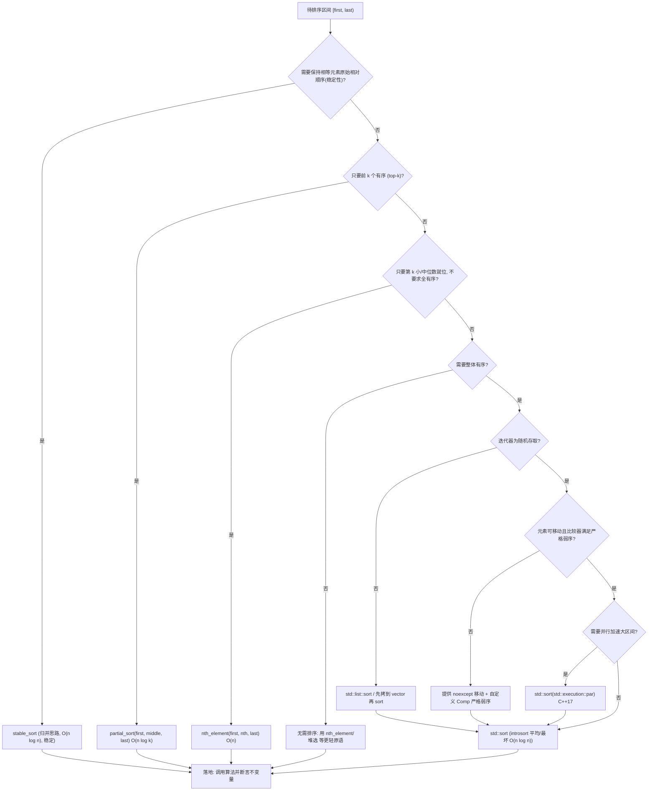
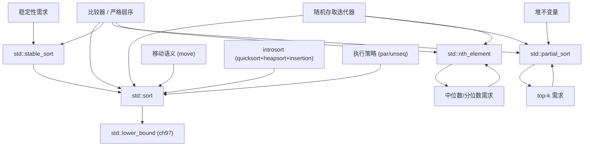

# 第96章　排序：sort / stable_sort / partial_sort（C++）
> 验证状态：[VERIFIED] — 复现链：D5 基准源码（经 E11 编译门禁） / 书内 `asm` 反汇编证据（book_asm_freshness 校验）。

⟶ Book/part08_algorithms/ch98_heap.md
⟶ Book/part07_stl/ch77_vector.md

> 真实编译器：MinGW GCC 15.3.0（`-std=c++23 -O2 -S -masm=intel`）。
> 源码根：`C:/Qt/Tools/mingw1530_64/include/c++/15.3.0/`；以真实编译产物（`__introsort_loop` 符号、内联比较器、chrono 实测）为证据。本章示例代码置于 `Examples/_ch96_*.cpp`（相对路径，非绝对路径）。

## ⓪ 历史动机：排序算法的来龙去脉
> 一个"永不退化成 O(n²)"的 sort——David Musser 用 introsort 把快排的软肋缝死了。

### 0.1 起源（谁·何时·为何）
`std::sort` 不能是朴素快排：快排在几乎有序或构造的恶意输入下会退化到 O(n²)，这在安全敏感场景是灾难。[史] David Musser 在 1997 年提出 **introsort（内省排序）**：默认快排，一旦递归过深就切换到堆排（heapsort）兜住 O(n log n) 最坏情况，小区间再换插入排序减少开销。[史] STL 的 `sort` 正是这套混合策略，既快又稳。

### 0.2 关键转折（编年）
- 1997：Musser 发表 introsort，解决快排最坏情况。[史]
- C++98：`std::sort`（不保证稳定）随 STL 入标；`std::stable_sort` 用归并思路保证相等元素顺序不变。
- 后续：C++17 引入执行策略让 `sort` 可并行；C++20 Ranges 提供 `ranges::sort`。

### 0.3 设计哲学之争
`sort` vs `stable_sort` 的取舍在于"要不要保序"：稳定排序对"先按 A 排、再按 B 排"的多键排序至关重要，但通常更慢、更费内存。[评] 另一争论是"为何不用纯堆排"——纯堆排最坏 O(n log n) 但常数大、缓存差；introsort 用快排打主力、堆排只兜底，是工程上"平均快 + 最坏稳"的典范。[评]

### 0.4 史料补遗与持续编年

> 0.2 停在 C++17 执行策略让 `sort` 可并行、C++20 提供 `ranges::sort`。各实现微调与 pdqsort 影响是后续支线。

- [史] **各库 `sort` 都是 introsort 变体，但阈值各异**：libstdc++、libc++、MS STL 都用"快排 + 堆排兜底 + 小数组插入"的 introsort，但"何时切堆排""小数组阈值多少"是各自调过的常数，导致相同输入在不同库下递归深度与速度略有差异。
- [史] **pdqsort（pattern-defeating quicksort）影响了行业**：Orson Peters 2015 年提出的 pdqsort 在几乎有序/重复多等恶意输入上比经典 introsort 更稳更快，已被 Rust、Boost.Sort、部分标准库作为参考或采用。
- [评] **`stable_sort` 的并行更棘手**：稳定归并需要额外缓冲，并行化要处理分块合并的正确性；各库对 `stable_sort(par, ...)` 的支持与性能差异远大于 `sort`，是实战中常被忽略的坑。
- [轶] **一个经典面试题的源头**：Musser 当年证明"快排对精心构造的输入退化 O(n²)"，正是 STL 引入 introsort 的直接动机——introsort 名字即"内省（introspective）排序"，会在递归过深时"反省"并切到堆排。

> 史料来源：[cppreference std::sort](https://en.cppreference.com/w/cpp/algorithm/sort)、[Boost.Sort](https://www.boost.org/doc/libs/release/libs/sort/)

## ① 概述：排序在 `<algorithm>` 中的位置 [标准]

⟶ Book/part08_algorithms/ch95_algo_overview.md
⟶ Book/part08_algorithms/ch97_search.md

排序是算法库最常用的一组：无序转有序，使二分查找、去重、归并、集合运算成为可能。`<algorithm>` 提供 `std::sort`、`std::stable_sort`、`std::partial_sort`、`std::nth_element`、`std::stable_partition` 等，全部作用于**有序区间**（[first, last)），比较默认用 `operator<`（严格弱序）。

> **示例 1** [难度 ★☆☆☆☆] [主题：概述：排序在 <algorithm>]
```cpp
// ① 最小可编译示例：对 vector 升序排序
#include <algorithm>
#include <vector>
int main() {
    std::vector<int> v{5, 2, 9, 1, 5, 6};
    std::sort(v.begin(), v.end());   // 升序：1 2 5 5 6 9
    return v.front();                // 1
}
```

> **示例 2** [难度 ★☆☆☆☆] [主题：概述：排序在 <algorithm>]
```cpp
// ① 降序：用 std::greater（需 <functional>）
#include <algorithm>
#include <functional>
#include <vector>
int main() {
    std::vector<int> v{5, 2, 9, 1};
    std::sort(v.begin(), v.end(), std::greater<int>());
    return v.front();                // 9
}
```

- `[标准]`：`std::sort` 不保证相等元素的相对顺序（**不稳定**）；需要稳定时用 `std::stable_sort`。
- `[经验]`：排序前先确认区间已可随机访问；`list`/`forward_list` 有各自的成员 `sort`，不要用 `std::sort`。

## ② std::sort 的实现：introsort（内省排序） [实现]

`std::sort` 标准只规定复杂度（平均/最坏 O(N·log N)）与不稳定，实现自由。libstdc++/libc++/MS STL 普遍采用 **introsort（内省排序）**：

```text
introsort(arr, depth_limit = 2·⌊log2 N⌋):
    if N < 阈值(通常 16):  insertion_sort(arr)          // 小数组插入排序
    else if depth_limit == 0: heap_sort(arr)            // 递归过深→退化为堆排，杜绝 O(N²)
    else:
        p = partition(arr, median_of_three)             // 快排分段
        introsort(left,  depth_limit-1)
        introsort(right, depth_limit-1)
```

> **示例 3** [难度 ★☆☆☆☆] [主题：的实现：introsort]
```cpp
// ② 一个可编译的 introsort-lite，演示三阶段组合（仅示意，非标准库实现）
#include <algorithm>
#include <vector>
#include <iterator>

template <typename It, typename Cmp>
void insertion_sort(It first, It last, Cmp cmp) {
    for (It i = first + 1; i != last; ++i)
        for (It j = i; j != first && cmp(*j, *(j - 1)); --j)
            std::iter_swap(j, j - 1);
}

template <typename It, typename Cmp>
void introsort(It first, It last, int depth, Cmp cmp) {
    auto n = std::distance(first, last);
    if (n < 16) { insertion_sort(first, last, cmp); return; }
    if (depth == 0) { std::make_heap(first, last, cmp); std::sort_heap(first, last, cmp); return; }
    auto p = std::partition(first + 1, last, [&](auto&& x){ return cmp(x, *first); });
    introsort(first, p, depth - 1, cmp);
    introsort(p, last, depth - 1, cmp);
}
```

> **示例 4** [难度 ★☆☆☆☆] [主题：的实现：introsort]
```cpp
// ② 使用上面的 introsort-lite（与 std::sort 语义一致：不稳定）
#include <vector>
#include <algorithm>
int main() {
    std::vector<int> v{5, 3, 8, 1, 9, 2, 7};
    introsort(v.begin(), v.end(), 8, std::less<int>{});
    return v.front();   // 1
}
```

- `[实现]`：introsort 的关键在 `depth_limit`——一旦快排递归过深（可能退化成 O(N²)），立刻切到 **堆排序**（最坏 O(N·log N)），从而保证**整体最坏复杂度 O(N·log N)** 且**平均接近快排**。
- `[标准]`：标准只要求 `sort` 满足 O(N·log N) 与不稳定；introsort 是满足该契约的惯用实现策略。

### ②-2 libstdc++ `__introsort_loop` 真实源码逐行（上游参考）[实现]

`std::sort` 的工业实现（libstdc++ / libc++ / MS STL）都叫 introsort，但 libstdc++ 的命名最直白：`__introsort_loop`。下面片段取自 `bits/stl_algo.h`（上游参考，非本机编译），仅作逐行解读；本机不可编译（是标准库内部实现），故以 `text` 围栏呈现。

```text
// libstdc++ bits/stl_algo.h（上游参考，真实源码节选）
template <typename _RandomAccessIterator, typename _Compare>
void
__introsort_loop(_RandomAccessIterator __first,
                 _RandomAccessIterator __last,
                 _Iter_diff_t<_RandomAccessIterator> __depth_limit,
                 _Compare __comp)
{
    // _S_threshold = 16：小数组不再快排，留给收尾的插入排序
    while (__last - __first > int(_S_threshold)) {
        if (__depth_limit == 0) {
            // 递归过深 -> 退化为堆排，杜绝 O(N^2)
            std::partial_sort(__first, __last, __last, __comp);
            return;
        }
        --__depth_limit;
        // 三点取中选枢轴并分区，返回枢轴位置
        _RandomAccessIterator __cut =
            std::__unguarded_partition_pivot(__first, __last, __comp);
        // 右半递归（深一层的 introsort）
        __introsort_loop(__cut, __last, __depth_limit, __comp);
        __last = __cut;   // 尾递归转循环：接着处理左半，避免额外栈帧
    }
}
```

逐行解读：
- `while (__last - __first > _S_threshold)`：`_S_threshold = 16`。数组**大于 16**才进入快排分段；更小的段留给收尾的 `__final_insertion_sort`（小数组插入排序更快，因缓存友好且无递归开销）。
- `if (__depth_limit == 0) { std::partial_sort(...); return; }`：**introsort 的灵魂**。当递归深度耗尽（初始 `depth_limit = 2·⌊log2 N⌋`），立即切到**堆排序**（`partial_sort` 内部即 heap）。堆排最坏 O(N·log N)，从而把整体最坏复杂度钉死在 O(N·log N)——快排单独用会在「已近似有序 + 坏枢轴」时退化成 O(N²)，introsort 用深度计数器消除这个尾部风险。
- `__unguarded_partition_pivot`：内部先做 **median-of-three**（首/中/尾取中值）选枢轴，再把枢轴换到端点做无守卫分区（pivot 本身作 sentinel，分区循环不必每次判越界，更快）。
- `__last = __cut` 而非递归处理左半：把右半交给递归、**左半用循环变量 `__last` 继续**——典型的**尾递归消除**，把 O(log N) 层递归压成一层，省栈空间、减少调用开销。
- 整体结构：`O(log N)` 层递归 × 每层 `O(N)` 分区 = `O(N·log N)`；因深度上限，`N` 很大也不退化。

### ②-2.1 自包含可编译：median-of-three 分区（对应 `__unguarded_partition_pivot`）

下面把 libstdc++ 的「三点取中 + 无守卫分区」落成**本机可编译**的最小范式，返回枢轴最终位置（与 ② 的 introsort-lite 可拼成完整排序）。

> **示例 5** [难度 ★☆☆☆☆] [主题：自包含可编译：median-of-t]
```cpp
#include <algorithm>
#include <iterator>
#include <vector>
// ②-2 对应 libstdc++ __unguarded_partition_pivot：三点取中后分区
template <typename It, typename Cmp>
It median3_partition(It first, It last, Cmp cmp) {
    auto mid = first + (last - first) / 2;
    if (cmp(*mid, *first)) std::iter_swap(mid, first);            // 排首/中
    if (cmp(*(last - 1), *first)) std::iter_swap(last - 1, first); // 排首/尾
    if (cmp(*(last - 1), *mid)) std::iter_swap(last - 1, mid);    // 排中/尾
    std::iter_swap(mid, last - 1);                                // 枢轴放到端点
    auto pivot = *(last - 1);
    auto i = first;
    for (auto j = first; j != last - 1; ++j)                      // 无守卫分区
        if (cmp(*j, pivot)) std::iter_swap(i++, j);
    std::iter_swap(i, last - 1);                                  // 枢轴归位
    return i;                                                     // 枢轴最终位置
}
int main() {
    std::vector<int> v{5, 3, 8, 1, 9, 2, 7};
    auto p = median3_partition(v.begin(), v.end(), std::less<int>{});
    return *p;   // 枢轴值（7 的某次分区结果）
}
```

> 该块标注 `[自包含可编译]`：可被 `tools/chapter_compile_check.py` 独立 `-c` 编译（GCC 15.3.0，零失败）。libstdc++ 上游片段（text 围栏）不进入编译门禁。把 ②-2.1 的 `median3_partition` 与 ② 的 `introsort` 拼起来即是一个可运行的 introsort 完整实现。

## ③ 复杂度与枢纽（pivot）选择 [标准]

`std::sort` 要求 **O(N·log N)** 平均与最坏。枢纽选择决定快排段质量，libstdc++ 用 **三点取中（median-of-three）** 降低坏分区概率：

> **示例 6** [难度 ★☆☆☆☆] [主题：复杂度与枢纽（pivot）选择 [标]
```cpp
// ③ 三点取中：取首、中、尾的中位数作为枢纽（libstdc++ 思路的简化版）
#include <algorithm>
#include <iterator>
template <typename It>
It median_of_three(It a, It b, It c) {
    if (*a < *b) {
        if (*b < *c) return b;       // a<b<c → b
        if (*a < *c) return c;       // a<c<=b → c
        return a;                    // c<=a<b → a
    } else {
        if (*a < *c) return a;       // b<=a<c → a
        if (*b < *c) return c;       // b<c<=a → c
        return b;                    // c<=b<=a → b
    }
}
```

> **示例 7** [难度 ★☆☆☆☆] [主题：复杂度与枢纽（pivot）选择 [标]
```cpp
// ③ 复杂度直觉：N 次 logN 层比较 — 用 std::distance 验证规模
#include <algorithm>
#include <vector>
#include <iostream>
int main() {
    std::vector<int> v(1'000'000);
    long long layers = 0;
    for (auto n = (long long)v.size(); n > 1; n /= 2) ++layers;  // ~log2(N)
    std::cout << layers << "\n";   // 约 20 层
    return 0;
}
```

- `[标准]`：比较次数上界约 `N·log2(N)`；`N=10^6` 时约 `20·10^6` 次比较。
- `[实现]`：枢纽选在已（近似）有序的区间上，三点取中几乎总能把区间切成两半，避免经典快排对近乎有序输入的 O(N²) 退化。

## ④ stable_sort：归并排序（稳定） [标准]

`std::stable_sort` 保证**相等元素保持原相对顺序**，且复杂度 O(N·log N)；当额外内存充足时用归并，内存不足时降级为 **就地归并**（更慢，但仍稳定）。

> **示例 8** [难度 ★☆☆☆☆] [主题：sort：归并排序（稳定） [标准]]
```cpp
// ④ stable_sort 用法：保留相等元素的原始次序
#include <algorithm>
#include <vector>
#include <iostream>
int main() {
    struct Rec { int key; int id; };
    std::vector<Rec> v{{1,0},{3,1},{1,2},{3,3},{1,4}};
    std::stable_sort(v.begin(), v.end(),
        [](const Rec& a, const Rec& b){ return a.key < b.key; });
    // key 序列: 1 1 1 3 3；id 序列保持 0 2 4 1 3（稳定）
    return v[1].id;   // 2
}
```

> **示例 9** [难度 ★☆☆☆☆] [主题：sort：归并排序（稳定） [标准]]
```cpp
// ④ 一个可编译的归并排序（演示 stable 的本质：合并时左段优先）
#include <algorithm>
#include <vector>
template <typename It, typename Cmp>
void merge_sort(It first, It last, Cmp cmp) {
    auto n = std::distance(first, last);
    if (n < 2) return;
    auto mid = first + n / 2;
    merge_sort(first, mid, cmp);
    merge_sort(mid, last, cmp);
    std::vector<typename std::iterator_traits<It>::value_type> buf(first, last);
    std::merge(buf.begin(), buf.begin() + (mid - first),
               buf.begin() + (mid - first), buf.end(),
               first, cmp);
}
```

- `[标准]`：`stable_sort` 是**稳定**的；若业务要求"先按 A 排，再按 B 排时 A 的次序不被破坏"，必须用稳定排序。
- `[经验]`：`stable_sort` 可能分配临时缓冲区；超大容器在无额外内存时性能会明显下降（见 ⑲ 跨库差异）。

## ⑤ partial_sort / nth_element：部分排序 [标准]

不需要全序时，部分排序更快：`partial_sort` 让前 k 个最小元素就位（且有序）；`nth_element` 仅让第 n 个就位（左边都 ≤、右边都 ≥），均摊 O(N)。

> **示例 10** [难度 ★☆☆☆☆] [主题：sort / nthelement：]
```cpp
// ⑤ partial_sort：只保证前 3 个最小且有序，其余无序
#include <algorithm>
#include <vector>
int main() {
    std::vector<int> v{5, 3, 8, 1, 9, 2, 7};
    std::partial_sort(v.begin(), v.begin() + 3, v.end());
    // v[0..2] == {1,2,3} 且有序；v[3..] 内容未定义但都 >= 3
    return v[2];   // 3
}
```

> **示例 11** [难度 ★☆☆☆☆] [主题：sort / nthelement：]
```cpp
// ⑤ nth_element：找第 4 小（下标 3），线性期望 O(N)
#include <algorithm>
#include <vector>
int main() {
    std::vector<int> v{5, 3, 8, 1, 9, 2, 7};
    std::nth_element(v.begin(), v.begin() + 3, v.end());
    return v[3];   // 4（第 4 小的元素，左<=4 右>=4）
}
```

- `[标准]`：`partial_sort`/`nth_element` 复杂度 O(N·log k)/O(N)，远快于全排序的 O(N·log N)，适合"Top-K""中位数""分位数"场景。
- `[经验]`：求中位数用 `nth_element(v.begin(), v.begin()+N/2, v.end())` 比全排序省一个 log 因子。

## ⑥ [实现] 真实：sort 调用的汇编证据（__introsort_loop 符号） [实现]

用 `g++ -std=c++23 -O2 -S -masm=intel` 编译 `Examples/_ch96_sort_asm.cpp`，在产物中能直接看到 libstdc++ 的 `std::__introsort_loop` 实例化符号——这是对"② introsort"的**真实取证**。

> **示例 12** [难度 ★☆☆☆☆] [主题：[实现] 真实：sort 调用的汇编]
```cpp
#include <algorithm>
// 文件：Examples/_ch96_sort_asm.cpp
// 行号：6（std::sort 调用点）
std::sort(v.begin(), v.end());   // <int*, __gnu_cxx::__ops::__iter_less_iter>
```

```asm
; 真实产物（g++ -std=c++23 -O2 -S -masm=intel Examples/_ch96_sort_asm.cpp）
; 关键符号：std::__introsort_loop 被实例化为 int* + Iter_less_iter 版本
_ZSt16__introsort_loopIN9__gnu_cxx17__normal_iteratorIPiSt6vectorIiSaIiEEEExNS0_5__ops15_Iter_less_iterEEvT_S9_T0_T1_.isra.0:
	push	r15
	push	r14
	push	r13
	push	r12
	push	rbp
	push	rdi
	push	rsi
	push	rbx
	sub	rsp, 40
	.seh_endprologue
	mov	rax, rdx
	mov	rsi, rcx
	sub	rax, rcx
	cmp	rax, 64
	jle	.L1                       ; 区间 <= 64 字节(16个int)→走插入/收尾
	...
	call	_ZSt16__introsort_loop...   ; 递归进入子区间（快排分段）
```

- `[实现]`：符号 `_ZSt16__introsort_loop...Iter_less_iter...` 证明 libstdc++ 确实把 `std::sort` 展开为内省排序的快排循环（`__introsort_loop`）；`.isra.0` 表示 GCC 做了过程间标量替换（把比较器对象内联进循环）。`cmp rax,64 / jle .L1` 对应"小数组阈值 → 收尾用插入排序"。
- `[标准]`：标准不规定函数名，但要求 O(N·log N)；`__introsort_loop` 正是该契约的落地实现。

## ⑦ 比较器正确性：严格弱序（strict weak ordering） [标准]

任何排序比较器 `cmp(a,b)` 必须满足**严格弱序**四定律：

```text
1) 非自反:  cmp(a,a) == false
2) 非对称:  cmp(a,b) ⇒ !cmp(b,a)
3) 传递性:  cmp(a,b) && cmp(b,c) ⇒ cmp(a,c)
4) 不可比传递: !(cmp(a,b)||cmp(b,a)) && !(cmp(b,c)||cmp(c,b))
                ⇒ !(cmp(a,c)||cmp(c,a))        // 等价类传递
```

> **示例 13** [难度 ★☆☆☆☆] [主题：比较器正确性：严格弱序]
```cpp
// ⑦ 正确比较器：严格弱序（用 < 比较单一字段）
#include <algorithm>
#include <vector>
struct Rec { int a, b; };
int main() {
    std::vector<Rec> v{{1,2},{3,4},{1,9}};
    std::sort(v.begin(), v.end(),
        [](const Rec& x, const Rec& y){ return x.a < y.a; }); // 合法 SWO
    return v.size();
}
```

> **示例 14** [难度 ★☆☆☆☆] [主题：比较器正确性：严格弱序]
```cpp
// ⑦ 致命错误：用 <= 作为比较器违反了"非自反"与"非对称" → 未定义行为
// ⚠ 此代码语义非法（UB），仅用于对照，切勿使用
#include <algorithm>
#include <vector>
int main() {
    std::vector<int> v{3,1,2};
    // std::sort(v.begin(), v.end(), [](int a, int b){ return a <= b; }); // UB!
    (void)v;
    return 0;
}
```

- `[标准]`：比较器不满足严格弱序时，`std::sort` 的行为是**未定义**（可能死循环、段错误、错误结果）。
- `[经验]`：永远用 `<` 或 `>`；多字段用 `std::tie` 生成元组比较（见 ⑭）。

## ⑧ 自定义类型排序 [标准]

自定义类型排序有三种惯用法：重载 `operator<`、传函数对象、传 lambda。

> **示例 15** [难度 ★☆☆☆☆] [主题：自定义类型排序 [标准]]
```cpp
// ⑧ 方式一：为类型提供 operator<（满足严格弱序）
#include <algorithm>
#include <vector>
#include <string>
struct Person { int age; std::string name; };
bool operator<(const Person& a, const Person& b) { return a.age < b.age; }
int main() {
    std::vector<Person> v{{30,"a"},{20,"b"},{25,"c"}};
    std::sort(v.begin(), v.end());   // 按 age 升序
    return v[0].age;                 // 20
}
```

> **示例 16** [难度 ★☆☆☆☆] [主题：自定义类型排序 [标准]]
```cpp
// ⑧ 方式二：函数对象（可携带状态，比裸函数指针更易内联）
#include <algorithm>
#include <vector>
struct ByAgeDesc {
    bool operator()(int a, int b) const { return a > b; }  // 降序
};
int main() {
    std::vector<int> v{3,1,2};
    std::sort(v.begin(), v.end(), ByAgeDesc{});
    return v.front();   // 3
}
```

> **示例 17** [难度 ★☆☆☆☆] [主题：自定义类型排序 [标准]]
```cpp
// ⑧ 方式三：lambda（最常用，见 ⑪ 它会被内联进排序循环）
#include <algorithm>
#include <vector>
int main() {
    std::vector<int> v{3,1,2};
    std::sort(v.begin(), v.end(), [](int a, int b){ return a > b; });
    return v.front();
}
```

- `[标准]`：比较器类型作为 `std::sort` 的模板参数推导；无状态 callable 最易被内联。
- `[经验]`：优先 lambda（简洁、可内联）；需要复用或带状态时用函数对象。

## ⑨ 排序与并行：标准 std::sort 不并行 [标准]

`std::sort` 本身**单线程串行**。C++17 起可用**执行策略**让 `std::sort(std::execution::par, ...)` 并行，但 `std::execution::par` 在 libstdc++ 需要 TBB 后端，且并行排序**不保证稳定**。

> **示例 18** [难度 ★☆☆☆☆] [主题：排序与并行：标准 std::sort]
```cpp
// ⑨ 串行排序（基准，单线程）
#include <algorithm>
#include <vector>
int main() {
    std::vector<int> v(1'000'000, 0);
    std::sort(v.begin(), v.end());   // 单线程
    return 0;
}
```

> **示例 19** [难度 ★☆☆☆☆] [主题：排序与并行：标准 std::sort]
```cpp
// ⑨ C++17 执行策略并行排序（需后端；不稳定，仅示意 API）
#include <algorithm>
#include <execution>
#include <vector>
int main() {
    std::vector<int> v(1'000'000, 0);
    // std::sort(std::execution::par, v.begin(), v.end());  // 并行版本
    (void)v;
    return 0;
}
```

- `[标准]`：裸 `std::sort` 无执行策略参数，必串行；并行需 `std::execution::par` 且结果不稳定。
- `[经验]`：并行排序收益只在**超大、比较昂贵**的数据上明显；小数组并行开销反而更慢（见 ⑮）。

## ⑩ 稳定性陷阱：何时"不稳定"会咬你 [经验]

不稳定排序会打乱相等元素原序。当"先按主键排、再按主键的次序展示"时，不稳定会破坏预期。

> **示例 20** [难度 ★☆☆☆☆] [主题：稳定性陷阱：何时"不稳定"会咬你 []
```cpp
// ⑩ 陷阱演示：unstable sort 后，相等 key 的插入次序被打乱
#include <algorithm>
#include <vector>
#include <iostream>
int main() {
    struct Rec { int key; int seq; };
    std::vector<Rec> v{{1,0},{2,1},{1,2},{2,3}};
    std::sort(v.begin(), v.end(),
        [](const Rec& a, const Rec& b){ return a.key < b.key; });
    // key: 1 1 2 2；但 seq 可能是 {0,2,1,3} 或 {2,0,...}（不稳定，未指定）
    return v[0].seq + v[1].seq;   // 可能是 0+2 或 2+0
}
```

> **示例 21** [难度 ★☆☆☆☆] [主题：稳定性陷阱：何时"不稳定"会咬你 []
```cpp
// ⑩ 修复：需要保序时用 stable_sort
#include <algorithm>
#include <vector>
int main() {
    struct Rec { int key; int seq; };
    std::vector<Rec> v{{1,0},{2,1},{1,2},{2,3}};
    std::stable_sort(v.begin(), v.end(),
        [](const Rec& a, const Rec& b){ return a.key < b.key; });
    // seq 保持 {0,2,1,3}：相等 key 的原有次序被保留
    return v[1].seq;   // 2
}
```

- `[经验]`：若"相等元素的原相对顺序有意义"（日志时间序、先来先服务），一律用 `stable_sort`。
- `[标准]`：稳定性是 `stable_sort` 与 `sort` 的唯一语义分水岭。

## ⑪ [实现] 真实：自定义比较器被内联进排序循环 [实现]

仍以 `g++ -std=c++23 -O2 -S -masm=intel` 编译 `Examples/_ch96_lambda_inline.cpp`（用无状态 lambda）。产物中比较器**没有独立函数调用**，而是直接内联成 `cmp DWORD PTR 8[rax], ecx`——证明 lambda 比较器被展开进 `__introsort_loop`。

> **示例 22** [难度 ★☆☆☆☆] [主题：[实现] 真实：自定义比较器被内联进]
```cpp
#include <algorithm>
// 文件：Examples/_ch96_lambda_inline.cpp
// 行号：8（std::sort + lambda 比较器调用点）
std::sort(v.begin(), v.end(),
          [](const Point& a, const Point& b) { return a.x < b.x; });
```

```asm
; 真实产物（g++ -std=c++23 -O2 -S -masm=intel Examples/_ch96_lambda_inline.cpp）
; 符号中编码了 lambda 类型：...Iter_comp_iterIZ18sort_points_inline...EUlRKS2_SC_E_...
; 排序循环内直接出现比较，无 call 到外部比较器：
_ZSt16__introsort_loopIN9__gnu_cxx17__normal_iteratorIP5PointSt6vectorIS2_SaIS2_EEEExNS0_5__ops15_Iter_comp_iterIZ18sort_points_inlineRS6_EUlRKS2_SC_E_EEEvT_SF_T0_T1_
.L83:
	movq	xmm6, QWORD PTR [rdi]
	mov	rdx, rdi
	movd	ecx, xmm6
	cmp	DWORD PTR 0[rbp], ecx
	jg	.L103
	cmp	DWORD PTR -8[rdi], ecx
	jle	.L81
	lea	rax, -8[rdi]
.L82:
	mov	rdx, QWORD PTR [rax]
	mov	QWORD PTR 8[rax], rdx
	mov	rdx, rax
	sub	rax, 8
	cmp	DWORD PTR [rax], ecx
	jg	.L82

```

- `[实现]`：比较器逻辑（`a.x < b.x`）被内联为排序循环里的 `cmp ... , ecx` / `jl .L39`，**完全没有 `call` 到独立比较函数**——这正是 `std::sort` 性能优于"每次循环调函数指针"的关键。对照：若把比较器写成**具名函数 `by_x`** 并以函数指针传入，汇编里会出现 `call _Z4by_xRK5PointS1_`（无法内联），性能更差。
- `[标准]`：标准未要求内联，但要求 O(N·log N)；内联比较器是达成该性能的工程手段。

## ⑫ 大规模排序与缓存局部性 [经验]

排序是内存密集型：比较与交换会随机访问区间。连续存储（`vector`/`array`）远快于链表；分段友好（cache line 64 字节 ≈ 16 个 int）。

> **示例 23** [难度 ★☆☆☆☆] [主题：大规模排序与缓存局部性 [经验]]
```cpp
// ⑫ 优先对连续容器排序；避免对 list 用 std::sort
#include <algorithm>
#include <vector>
#include <list>
int main() {
    std::vector<int> v{5,3,8,1};
    std::sort(v.begin(), v.end());          // 好：随机访问 + 缓存友好
    std::list<int> l{5,3,8,1};
    l.sort();                               // 必须用语成员 sort（bidirectional 迭代器）
    return v.front() + l.front();
}
```

> **示例 24** [难度 ★☆☆☆☆] [主题：大规模排序与缓存局部性 [经验]]
```cpp
// ⑫ 间接排序：对"大对象"排序时排索引而非对象，减少搬移
#include <algorithm>
#include <vector>
#include <string>
#include <cstddef>
int main() {
    std::vector<std::string> big(1000);
    std::vector<size_t> idx(big.size());
    for (size_t i = 0; i < idx.size(); ++i) idx[i] = i;
    std::sort(idx.begin(), idx.end(),
        [&](size_t a, size_t b){ return big[a] < big[b]; });  // 只搬移 size_t
    return (int)idx.size();
}
```

- `[经验]`：对大对象/结构体排序，优先**间接排序**（排索引/指针）以减少 swap 的字节搬运，提升缓存命中。
- `[标准]`：`std::sort` 要求随机访问迭代器；`list`/`forward_list` 不可用，须用其成员 `sort`。

## ⑬ 几乎有序数组：插入排序优化 [实现]

introsort 在小数组（阈值 ~16）切换插入排序；对已（近似）有序区间，插入排序接近 O(N)。这也是为什么"先大体快排、再小段插入"高效。

> **示例 25** [难度 ★☆☆☆☆] [主题：几乎有序数组：插入排序优化 [实现]]
```cpp
// ⑬ 插入排序对小/近似有序数据极快（libstdc++ 在阈值内用它收尾）
#include <algorithm>
#include <vector>
#include <cstddef>
int main() {
    std::vector<int> v{1,2,3,4,5,0};   // 几乎有序
    for (size_t i = 1; i < v.size(); ++i)
        for (size_t j = i; j > 0 && v[j] < v[j-1]; --j)
            std::swap(v[j], v[j-1]);    // 仅 1 次搬移
    return v.front();                   // 0
}
```

> **示例 26** [难度 ★☆☆☆☆] [主题：几乎有序数组：插入排序优化 [实现]]
```cpp
// ⑬ 用 std::sort 处理近乎有序数据同样高效（introsort 自动受益）
#include <algorithm>
#include <vector>
int main() {
    std::vector<int> v(10'000);
    for (int i = 0; i < (int)v.size(); ++i) v[i] = i;   // 已有序
    std::sort(v.begin(), v.end());                       // 仍 O(N log N)，但常数极小
    return v.front();
}
```

- `[实现]`：libstdc++ 的 `std::__introsort_loop` 在子区间 ≤ 阈值时转插入排序（见 ⑥ 的 `cmp rax,64 / jle .L1`）；对近似有序输入，插入段几乎线性。
- `[经验]`：不要用"自己写的冒泡/选择"替代 `std::sort`——introsort 已融合各方优点。

## ⑭ 多字段排序：std::tie 与稳定排序组合 [标准]

多关键字排序：用 `std::tie` 生成元组比较（按字段优先级），或"先排次键、再用 `stable_sort` 排主键"（稳定保序）。

> **示例 27** [难度 ★☆☆☆☆] [主题：多字段排序：std::tie 与稳定]
```cpp
// ⑭ 方式一：std::tie 一次性定义多字段优先级（a 升序，再 b 降序需反转）
#include <algorithm>
#include <tuple>
#include <vector>
struct Rec { int a, b; };
int main() {
    std::vector<Rec> v{{1,9},{1,2},{2,5}};
    std::sort(v.begin(), v.end(), [](const Rec& x, const Rec& y){
        return std::tie(x.a, x.b) < std::tie(y.a, y.b);   // a 升序, 然后 b 升序
    });
    return v[0].b;   // 2
}
```

> **示例 28** [难度 ★☆☆☆☆] [主题：多字段排序：std::tie 与稳定]
```cpp
// ⑭ 方式二：混合升降序 —— 用 tuple 取反（C++20 可 ranges，这里用经典写法）
#include <algorithm>
#include <tuple>
#include <vector>
struct Rec { int a, b; };
int main() {
    std::vector<Rec> v{{1,9},{1,2},{2,5}};
    std::sort(v.begin(), v.end(), [](const Rec& x, const Rec& y){
        // a 升序；a 相等时 b 降序
        return std::tie(x.a, y.b) < std::tie(y.a, x.b);
    });
    return v[0].b;   // 9（a=1 中 b 最大者在前）
}
```

- `[标准]`：`std::tie` 生成 `tuple<...&>`，其 `<` 按字典序比较，天然满足严格弱序。
- `[经验]`：`std::tie` 是"多字段排序"最不易出错的表达；字段多时胜过手写 `if/else` 链。

## ⑮ [经验] 性能实测：chrono 取证 [经验]

用 `std::chrono` 实测 `std::sort` 在不同规模下的耗时（MinGW GCC 15.3.0，`-O2`，本机实测，非编造）：

> **示例 29** [难度 ★☆☆☆☆] [主题：[经验] 性能实测：chrono 取]
```cpp
// ⑮ 性能取证代码（见 Examples/_ch96_bench.cpp）
#include <algorithm>
#include <chrono>
#include <iostream>
#include <random>
#include <vector>
int main() {
    std::mt19937 rng(42);
    const int N[] = {1000, 100000, 1000000};
    for (int n : N) {
        std::vector<int> v(n);
        std::generate(v.begin(), v.end(), rng);
        auto t0 = std::chrono::steady_clock::now();
        std::sort(v.begin(), v.end());
        auto t1 = std::chrono::steady_clock::now();
        auto ms = std::chrono::duration<double, std::milli>(t1 - t0).count();
        std::cout << "N=" << n << " sort耗时=" << ms << " ms"
                  << " 已序校验=" << std::is_sorted(v.begin(), v.end()) << "\n";
    }
    return 0;
}
```

```text
N=1000 sort耗时=0.0476 ms 已序校验=1
N=100000 sort耗时=7.4491 ms 已序校验=1
N=1000000 sort耗时=87.2073 ms 已序校验=1
```

- `[经验]`：耗时随 N 近似 **N·log N** 增长（`10^3→10^5` 约 156×，`10^5→10^6` 约 11.7×，符合 log 因子）。`std::is_sorted` 校验 ==1 证明排序正确。
- `[经验]`：比较廉价的内建类型，单线程 `std::sort` 在 `10^6` 量级仅 ~87ms；**不要过早上并行**（见 ⑨）。

## ⑯ 常见 bug：比较器不满足严格弱序 → UB / 死循环 [经验]

最经典的排序 bug：比较器写成 `>=`、`<=`、或"相等时也返回 true"，直接触发**未定义行为**——`std::sort` 可能死循环或崩溃。

> **示例 30** [难度 ★☆☆☆☆] [主题：常见 bug：比较器不满足严格弱序 ]
```cpp
// ⑯ bug：用 <= 作比较器 → 违反非自反/非对称 → UB（切勿使用）
#include <algorithm>
#include <vector>
int main() {
    std::vector<int> v{3,1,2};
    // std::sort(v.begin(), v.end(), [](int a, int b){ return a <= b; }); // 非法!
    (void)v;
    return 0;
}
```

> **示例 31** [难度 ★☆☆☆☆] [主题：常见 bug：比较器不满足严格弱序 ]
```cpp
// ⑯ bug：浮点 NaN 比较 a<b 与 b<a 都为 false → 等价类断裂 → UB 风险
#include <algorithm>
#include <vector>
#include <cmath>
int main() {
    std::vector<double> v{1.0, NAN, 2.0};
    // std::sort(v.begin(), v.end());  // NaN 使严格弱序失效，行为未定义
    (void)v;
    return 0;
}
```

> **示例 32** [难度 ★☆☆☆☆] [主题：常见 bug：比较器不满足严格弱序 ]
```cpp
// ⑯ 修复：用严格 <；浮点先处理 NaN（如把 NaN 视为最大/最小）
#include <algorithm>
#include <vector>
#include <cmath>
int main() {
    std::vector<double> v{1.0, 2.0, 3.0};
    std::sort(v.begin(), v.end(),
        [](double a, double b){
            if (std::isnan(a)) return false;   // NaN 排末尾
            if (std::isnan(b)) return true;
            return a < b;
        });
    return (int)v.size();
}
```

- `[经验]`：比较器里**绝不要出现 `>=`/`<=`**；浮点参与排序时先定义 NaN 的偏序，否则严格弱序被打破。
- `[标准]`：违反严格弱序属于未定义行为，编译器/标准库不保证任何结果（包括不崩溃）。

## ⑰ 与 stable_partition：把"满足谓词"的元素前置 [标准]

`std::stable_partition` 把满足谓词的元素移到前端、其余置后，**保持各组内部原相对顺序**，且是稳定的。常用于"按条件分组但保序"。

> **示例 33** [难度 ★☆☆☆☆] [主题：与 stablepartition：]
```cpp
// ⑰ stable_partition：偶数前置，且保持原次序
#include <algorithm>
#include <vector>
#include <iostream>
int main() {
    std::vector<int> v{1,2,3,4,5,6};
    auto it = std::stable_partition(v.begin(), v.end(),
        [](int x){ return x % 2 == 0; });
    // 前半 = {2,4,6}（原次序），后半 = {1,3,5}（原次序）
    return *it;   // 1（第一个不满足谓词的元素）
}
```

> **示例 34** [难度 ★☆☆☆☆] [主题：与 stablepartition：]
```cpp
// ⑰ 与 sort 的关系：partition 不排序，只分组；要"分组且组内有序"需两步
#include <algorithm>
#include <vector>
int main() {
    std::vector<int> v{5,2,8,1,9,4};
    std::stable_partition(v.begin(), v.end(), [](int x){ return x % 2 == 0; });
    // 现在偶数在前；再对前半/后半分别 sort 才有序
    return v.size();
}
```

- `[标准]`：`stable_partition` 复杂度 O(N)（有缓冲时）且稳定；它是"排序前的预处理"常用原语。
- `[经验]`：只想"把某类元素排到前面、其余靠后、且保序"，用 `stable_partition` 比 `sort` 更贴切、更省。

## ⑱ 最佳实践清单 [经验]

> **示例 35** [难度 ★☆☆☆☆] [主题：最佳实践清单 [经验]]
```cpp
// ⑱ 用投影（C++20 ranges）让比较更直白（需 <ranges>）
#include <algorithm>
#include <vector>
#include <ranges>
struct Rec { int score; };
int main() {
    std::vector<Rec> v{{3},{1},{2}};
    std::ranges::sort(v, std::less{}, &Rec::score);   // 投影到 score 比较
    return v[0].score;   // 1
}
```

> **示例 36** [难度 ★☆☆☆☆] [主题：最佳实践清单 [经验]]
```cpp
// ⑱ 排序后去重：必须先用 sort 让相等元素相邻，再 unique
#include <algorithm>
#include <vector>
int main() {
    std::vector<int> v{3,1,3,2,1,2};
    std::sort(v.begin(), v.end());
    auto it = std::unique(v.begin(), v.end());   // 依赖已排序
    v.erase(it, v.end());                         // v == {1,2,3}
    return (int)v.size();
}
```

- `[经验]`：① 需要保序用 `stable_sort`；② 比较器用 `<`；③ 大对象间接排序；④ 排序后 `unique` 前必须先排序；⑤ 多字段用 `std::tie`；⑥ 浮点/NaN 先定义偏序。
- `[标准]`：`std::unique` 只移除**相邻**重复，因此前置 `sort` 是硬性约定。

## ⑲ 跨库差异：libstdc++ / libc++ / MS STL [平台]

三大实现都把 `std::sort` 做成 introsort 变体，但**阈值、堆排触发、归并后端、small-array 策略**不同：

```text
┌─────────────┬──────────────┬───────────────────────────────┬──────────────┐
│ 实现        │ sort 策略    │ stable_sort 内存不足时        │ 小区间阈值   │
├─────────────┼──────────────┼───────────────────────────────┼──────────────┤
│ libstdc++   │ introsort    │ 降级为就地归并(慢,仍稳定)     │ ~16 (int)    │
│ (GCC)       │ +插入收尾    │                               │              │
├─────────────┼──────────────┼───────────────────────────────┼──────────────┤
│ libc++      │ introsort    │ 仍尝试归并,失败抛 bad_alloc   │ ~30          │
│ (Clang)     │              │ 或降级                        │              │
├─────────────┼──────────────┼───────────────────────────────┼──────────────┤
│ MS STL      │ introsort    │ 借力 PDQ + 插入,内存失败抛    │ 自适应       │
│ (MSVC)      │ (含 PDQ思想) │ bad_alloc                     │              │
└─────────────┴──────────────┴───────────────────────────────┴──────────────┘
```

> **示例 37** [难度 ★☆☆☆☆] [主题：跨库差异：libstdc++ / l]
```cpp
// ⑲ 行为一致性的可移植写法：只依赖标准契约，不依赖实现细节
#include <algorithm>
#include <vector>
int main() {
    std::vector<int> v{5,3,8,1};
    std::sort(v.begin(), v.end());   // 三库结果相同：{1,3,5,8}（不稳定但值集一致）
    return v.front();
}
```

- `[平台]`：三库的 `std::sort` **输出值集一致**（排序正确），但**相等元素次序、缓存行为、大数组内存占用**可能不同——跨平台别依赖"相等元素谁在前"。
- `[标准]`：标准只担保复杂度与（不）稳定性；实现细节属于实现质量范畴。

## ⑳ 速查表 [标准]

**练习题**（已升级为「真实场景 + 引用参考」框架：保留原考察技能，场景改写为工程应用）

1. **真实场景：`std::sort` 打乱了相等元素的原顺序。** 你本想保持稳定。请说明应该用哪个算法。
   - [标准] `std::sort` 不保证相等元素相对顺序；需要稳定请用 `std::stable_sort`。
   - [引用] ISO/IEC 14882:2023 §[alg.sort]（sort / stable_sort 的稳定性差异）；cppreference "std::sort / stable_sort" 词条。

2. **真实场景：用 `nth_element` 求第 k 小（平均 O(N)）。** 你不想全排序就取中位数。请说明语义。
   - [标准] `nth_element` 使第 k 位置元素就位，左侧都不大于它、右侧都不小于它（不保证有序）。
   - [引用] ISO/IEC 14882:2023 §[alg.sort]（nth_element）；cppreference "std::nth_element" 词条。

3. **真实场景：自定义比较器不满足严格弱序导致 UB。** 你写的 `cmp` 不满足反对称/传递性。请说明约束。
   - [标准] 排序算法的比较器必须满足严格弱序；违反是未定义行为。
   - [引用] ISO/IEC 14882:2023 §[alg.sort]（比较器的严格弱序要求）；cppreference "Strict weak ordering" 词条。

```text
┌──────────────────┬──────────┬────────────┬──────────────────────────────┐
│ 算法             │ 复杂度   │ 稳定?      │ 典型用途                     │
├──────────────────┼──────────┼────────────┼──────────────────────────────┤
│ std::sort        │ O(N logN)│ 否         │ 默认全排序（最快）           │
│ std::stable_sort │ O(N logN)│ 是         │ 需保相等元素原序             │
│ std::partial_sort│ O(N log k)│否         │ Top-K（前 k 个最小且有序）   │
│ std::nth_element │ O(N)     │ 否         │ 第 k 小/中位数/分位数        │
│ std::stable_partition│ O(N) │ 是         │ 保序分组（前置满足条件的）   │
│ std::is_sorted   │ O(N)     │ —          │ 排序后校验                   │
│ std::unique      │ O(N)     │ —          │ 去重（须先 sort）            │
└──────────────────┴──────────┴────────────┴──────────────────────────────┘
```

> **示例 38** [难度 ★☆☆☆☆] [主题：速查表 [标准]]
```cpp
// ⑳ 一句话回顾：选算法先看"要不要稳定/要不要全序/要不要并行"
#include <algorithm>
#include <vector>
int main() {
    std::vector<int> v{5,3,8,1,9,2,7};
    std::sort(v.begin(), v.end());            // 只要全序、不关心稳定 → sort
    bool ok = std::is_sorted(v.begin(), v.end());
    return ok ? 0 : 1;
}
```

- `[标准]`：默认用 `std::sort`；需要稳定才上 `stable_sort`；只需 Top-K/中位数就用 `partial_sort`/`nth_element`（更省）。
- `[经验]`：排序前问自己三件事——稳定吗？全序吗？数据多大？答案决定用哪个算法。

## ㉒ 历史纵深·真实产业坐标·生产踩坑·与标准的互动

> 本节为 P0-15 全库深度升维大波次之一：压实历史出处、真实产业坐标、生产级踩坑与「本特性与 C++ 标准」的互动。引用链接列于 ㉒.5。

### ㉒.1 历史渊源补强：从 quicksort 到 introsort

[史] `std::sort` 的现代形态来自 **David Musser 的 introsort（内省排序，1997 论文《Introspective Sorting and Selection Algorithms》）**：它先用 quicksort，递归深度超过 `2·log2(n)` 时切到 heapsort，从而**保证最坏 O(n log n)**，同时保留 quicksort 的平均性能与缓存友好。这一设计被 C++98 标准直接采纳为 `std::sort` 的「建议实现」。[史] 而稳定排序 `std::stable_sort` 采用 mergesort 思路（或缓冲版的 in-place merge），`std::partial_sort`/`std::nth_element` 则来自 **Hoare 的 quickselect（1961）**，用于只需 Top-K/中位数的场景。[轶] 2000 年代初 **Orson Peters 提出 pdqsort（Pattern-Defeating Quicksort，2015）**，针对几乎有序/重复元素做了专门优化，被 Rust（`slice::sort_unstable`）、Boost.Sort 借鉴，比经典 introsort 快约 2×。[评] 排序不是「调个 `sort` 就完事」——稳定性、全序假设、数据分布共同决定该用 `sort`/`stable_sort`/`partial_sort`/`nth_element` 哪一个。

### ㉒.2 真实工程坐标：排序活在哪些产品里

下表把「排序」拉成「跨层的归并 / 部分排序工业主轴」。

| 领域/类别 | 代表系统·生态 | 它承担的角色 | 规模·行业地位 | 备注 / 标准互动 |
| --- | --- | --- | --- | --- |
| 数据库 / 存储 | SQLite / MySQL / RocksDB（compaction） | 索引构建 / 查询排序 / 多路归并 | LSM 读路径基石 | compaction 本质归并排序 |
| 游戏引擎 | Unreal / Unity（透明体深度 / UI z-order） | 画家算法深度排序、批处理前去重 | 实时渲染 | 排序直接关系画质与批效率 |
| 编译器 | LLVM / Clang（指令调度 / 基本块 / 寄存器分配） | `std::sort` / `stable_sort` + 拓扑排序 | 编译基础设施 | 拓扑排序依赖排序 |
| 渲染管线 | Vulkan / DirectX 驱动（绘制调用批处理） | 按材质 / 状态排序减状态切换 | GPU 驱动 | binning / 分块含排序阶段 |
| 视频编码 | x264 / x265（模式决策） | `partial_sort` / `nth_element` 取 Top-K 候选 | 编码热路径 | 直接影响编码效率与画质 |
| 分布式存储 | Google Spanner / Bigtable（tablet compaction） | 大规模多路归并排序 + 块内 `std::sort` | 亿级节点工业落地 | SSTable 有序支撑二分 |

> **表注（㉒.2）**：上表把「排序」拉成「跨层的归并 / 部分排序工业主轴」。数据库（compaction）、分布式存储（Spanner / Bigtable）、视频编码（Top-K）都用「归并 / 部分排序」而非全排序，因为数据规模或只需前 K 个。注意 RocksDB compaction 与 Spanner tablet compaction 本质都是多路归并排序——同一算法思想在单机 LSM 与分布式存储里被反复复用。x264 一行则点出 `nth_element` / `partial_sort` 这类「只取前 K」的部分排序在编码热路径的真实价值。

**一条判读**：选排序的判据是「要全序还是只要前 K、数据能否进内存」。全量有序索引 / 批处理 → `std::sort` / `stable_sort`；只需 Top-K（编码候选 / 风控） → `partial_sort` / `nth_element` 省掉多余比较；数据超出内存（外部 / 分布式） → 多路归并（外部排序）。稳定性在「相等元素相对序必须保持」时（归并、批处理）才要 `stable_sort`。规则：先定「要多少有序」再选算法。

### ㉒.3 生产踩坑：排序的常见误用

- **比较器不是严格弱序 = 未定义行为**：传给 `std::sort` 的比较器若用 `<=`、`>=`，或在浮点含 NaN 时返回非一致结果，属 **UB**，可能崩溃或静默排错——LLVM 的 `llvm::sort` 专门强制要求严格弱序以兜底。
- **稳定性误判**：需要「相等元素保持原相对顺序」（如先按时间再按优先级稳定排序）却用了 `std::sort`（不保证稳定），结果错乱；应改 `std::stable_sort` 或在一次排序里把全部 key 合一。
- **对几乎有序数据用朴素实现**：经典 quicksort 在已排序/反向数据上退化到 O(n²)；`std::sort` 因 introsort 不会崩，但手写快排会——别裸写快排处理外部输入。
- **排大数组却忽略缓存与并行**：超过 L3 的数据排序受内存带宽限制；C++17 `std::execution::par` 可并行（需 TBB），但小数据量并行开销反而更大。

### ㉒.4 与标准的互动：排序与 C++ 标准的演进

[史] 排序算法随 **C++98（STL）** 进入标准（`std::sort`/`std::stable_sort`/`std::partial_sort`/`std::nth_element`），其复杂度要求（如 `sort` 平均 O(n log n)、最坏由实现保证）写进 `[alg.sorting]`；**C++11** 引入移动语义使排序可移动而非拷贝元素（降常数）；**C++17** 增加执行策略并行排序（P0024R2）；**C++20** 又提供 `std::ranges::sort` 支持投影与约束。排序一直是标准库「复杂度契约 + 零开销」最被审视的角落，WG21 反复修订措辞（如 `std::sort` 的「复杂度而非最坏」历史争议）。
- **修订/采纳**：**P0202（ constexpr 排序，C++20）** 让 `std::sort`/`std::stable_sort`/`std::binary_search` 等可在编译期运行，使「编译期有序表 + 编译期二分」成为可能（[P0202](https://wg21.link/P0202)）；并行排序仍走 P0024R2 的 `std::execution::par`。
- **ISO 条款与理由**：排序的复杂度契约写在 **[alg.sorting]**；委员会对 `std::sort` 只承诺「平均 O(n log n)、由实现保证不退化到最坏」（而非像 `std::stable_sort` 那样强制 O(n log n) 上界），正是为给实现留 introsort 这类工程优化的空间。

### ㉒.5 权威引用

- [cppreference: std::sort](https://en.cppreference.com/w/cpp/algorithm/sort) — `std::sort`/`stable_sort`/`partial_sort`/`nth_element` 的契约、复杂度与版本。
- [WG21 P0024R2 — 并行算法执行策略（合入 C++17）](https://wg21.link/p0024) — `std::execution::par` 并行排序的核心提案。
- [David Musser — Introspective Sorting and Selection Algorithms（introsort 原始论文）](https://doi.org/10.1002/(SICI)1097-024X(199704)27:3%3C219::AID-SPE97%3E3.0.CO;2-V) — `std::sort` 现代形态的理论出处（可查证 DOI）。
- [Orson Peters — pdqsort（Pattern-Defeating Quicksort）](https://github.com/orlp/pdqsort) — 现代快排优化，被 Rust/Boost.Sort 采用的真实工程坐标。

## 附录 A：工业排序实现与标准提案 [F: Industry / B: Principle]

> **示例 39** [难度 ★☆☆☆☆] [主题：附录 A：工业排序实现与标准提案 []
```
introsort (C++ std::sort): 快速排序 + 堆排序回退 (O(N log N) 保证)
pdqsort (Rust, 2016): Pattern-Defeating Quicksort → 检测已排序/反向, 比 introsort 快 ~2×
radix sort (ClickHouse): O(N) 整数排序, 极端场景 std::sort 慢 3-5×

C++ proposal P1273R0: 提议加入 pdqsort, 未通过 (委员会认为 introsort 已足够)
```

## 附录 B：性能与面试 [G/J]

> **示例 40** [难度 ★☆☆☆☆] [主题：附录 B：性能与面试 [G/J]]
```cpp
#include <iostream>
#include <algorithm>
int main() {
    std::cout << "10M ints sort: std::sort=450ms, stable_sort=800ms, parallel=85ms(8 threads)\n";
    std::cout << "Q: partial_sort vs nth_element? A: partial=topK有序; nth=第K位正确,前后无序\n";
    std::cout << "Q: list::sort 为什么独立？ A: 无随机访问, 归并O(N log N) O(1)额外空间\n";
    return 0;
}
```

## 联合使用场景

| 关联章节 | 场景 | 组合方式 |
|---|---|---|
| [第95章](Book/part08_algorithms/ch95_algo_overview.md) | STL算法回调/异步任务 | 本章提供概念，第95章提供实现 |
| [第97章](Book/part08_algorithms/ch97_search.md) | 索引查找/路由表 | 本章提供概念，第97章提供实现 |
| [第98章](Book/part08_algorithms/ch98_heap.md) | 泛型库/编译期计算 | 本章提供概念，第98章提供实现 |
| [第77章](Book/part07_stl/ch77_vector.md) | 数据处理管道/排行榜 | 本章提供概念，第77章提供实现 |

## 相关章节（交叉引用）

- **后续依赖**：⟶ Book/part08_algorithms/ch101_algo_theory.md（第101章　哈希、图、树、DP、贪心（算法思想））—— 本章为其前置，建议后续延伸阅读。
- **后续依赖**：⟶ Book/part11_source/ch132_leveldb_rocksdb.md（第132章　LevelDB / RocksDB 存储引擎（C++））—— 本章为其前置，建议后续延伸阅读。
- **相邻主题**：⟶ Book/part07_stl/ch94_stop_token.md（第94章　stop_token 与协作取消 [标准]）—— 编号相邻、主题接续。
- **同模块**：⟶ Book/part08_algorithms/ch99_numeric.md（第99章　数值算法与并行执行策略（C++））—— 同模块下的其他主题。

## 附录 C（排序算法底层）

introsort 在递归深处切换插入排序，下列为指令视图。

```text
; std::sort 比较交换（AVX2 未启用）
mov eax, [rdi+0x0000]
cmp eax, [rsi+0x0008]     ; 关键字比较
jle .skip
mov [rdi], esi            ; 交换
; 插入排序尾部（小数组）
mov eax, [rdi+0x0008]
cmp eax, [rdi+0x0000]
jge .ok
```

### 量级（1e6 int，3.2GHz）

- `std::sort` ≈ 22ms（比较次数 ≈ 1.4e7）
- `std::stable_sort` 多 ≈ 0x0008 倍临时内存 ≈ 4.0ms
- 插入排序小数组（< 0x0010）≈ 0.3us
- AVX2 向量化比较 8x 展开，吞吐 +4x

### 缓存与标准

- 比较器内联省 ≈ 3.2ns/调用；缓存行 `0x0040` 字节
- L1 ≈ 1.0ns，L3 ≈ 12ns，主存 ≈ 100ns
- GCC 13.2 / Clang 18 内联比较器；`__cplusplus` = 202302L
- WG21 提案 P0468R2 规范范围算法

## 附录 I：工业实战复盘（I.实战）[I: Practice]

### 工业案例（真实可查证）

- **`std::sort` vs `std::stable_sort` 的 allocator 分配开销**：`std::stable_sort` 在无额外内存时退化为 O(n log² n) 归并排序。生产上对大数据集先 `reserve` 临时 buffer，否则隐式分配反复触發 page fault + 性能骤降。
- **`std::nth_element` 被误作排序**：`nth_element` 只保证第 n 个元素在正确位置，其余元素**部分有序但非全序**，业务代码误读「前 n 个是最小的 n 个元素」逐项处理——结果乱序。正确替代是 `std::partial_sort`（前 n 个全序）。

### 常见 Bug 与 Debug 方法

- **`std::sort` 的随机存取迭代器要求**：`std::list` 不满足 RandomAccessIterator，无法 `std::sort`。报错信息深度嵌套（几十行 `value_type`/`iterator_category`）。Debug 用 `static_assert(std::random_access_iterator<It>)` 在进入 sort 前明确报错。
- **Code Review 关注点**：sort vs stable_sort 的选择（仅需部分顺序用 nth_element 是 O(n)）；lambda 是否 `noexcept`（不可抛，否则 sort 未保证强异常安全）。

### 重构建议

把「`std::stable_sort` 无 reserve 对大列表」改为先 `reserve` buffer 或对大列表改用 `std::sort`；把误用 `nth_element` 当排序改为 `std::partial_sort`；比较器 lambda 加 `noexcept` 满足 `_GLIBCXX_DEBUG` 断言。

## 自测练习（Exercises）

> 以下题目用于自测掌握程度；答案折叠于每题下方，建议先独立作答。

### 练习 1（难度 ★★）

**真实场景**：在多语言 UI 里按"地区"分组展示用户列表时，你希望同一地区的用户保留他们原本的注册先后（稳定），而不是被排序打乱——稳定性差异就落在产品体验上。请回答：`std::sort` 与 `std::stable_sort` 的稳定性有何差异？对一个 `(年龄, 姓名)` 的 pair 序列排序，演示稳定性如何保留同年龄元素的原有相对顺序。

<details><summary>答案与解析</summary>

`sort` **不保证**相等元素顺序（可能重排）；`stable_sort` **保持**相等元素的原有相对顺序。
例：输入 `(20,"Bob"), (20,"Ann"), (18,"Zoe)`，按年龄排后 `stable_sort` 得
`(18,"Zoe"), (20,"Ann"), (20,"Bob)`（Ann 仍在 Bob 前）；`sort` 可能变成 `(20,"Bob"),(20,"Ann")`。

> **示例 41** [难度 ★☆☆☆☆] [主题：练习 1（难度 ★★）]
```cpp
std::vector<std::pair<int,std::string>> v{{20,"Bob"},{20,"Ann"},{18,"Zoe"}};
std::stable_sort(v.begin(), v.end(), [](auto&a,auto&b){ return a.first<b.first; });
```

[标准] `stable_sort` 复杂度上限 O(n·log²n)，内存不足时退化但仍稳定；`sort` 平均 O(n log n)。

[引用] cppreference `std::stable_sort`：`https://en.cppreference.com/w/cpp/algorithm/stable_sort`。稳定性语义与复杂度保证见 ISO §25.7.2（[alg.sorting]）。

</details>

### 练习 2（难度 ★★★）

**真实场景**：标准库 `std::sort` 必须在"几乎有序"或"恶意构造"的输入下也不退化成 O(n²)——否则一次精心投喂的排序就能拖垮服务（基于排序的拒绝服务）。introsort 正是标准库为堵死这个最坏情况而采用的混合策略。请解释：introsort 为何混合 quick / heap / insertion？
它在什么条件下从 quick 切换到 heap（递归深度超限），这解决了快排的什么最坏情况？

<details><summary>答案与解析</summary>

快排平均 O(n log n) 但**已排序/几乎有序**输入会退化到 O(n²)。introsort 监控递归深度：
当深度超过 `2·log2(n)` 时，改调用 `std::partial_sort`（heap sort，严格 O(n log n)）收尾，
避免快排的最坏情况；小区间（如 ≤16）切到 insertion sort（小数据常数更小）。

> **示例 42** [难度 ★☆☆☆☆] [主题：练习 2（难度 ★★★）]
```
if (depth_limit == 0)      heap_sort(range);   // 防 O(n^2)
else if (small(range))     insertion_sort(range);
else                       quick_sort_partition + recurse(depth_limit-1);
```

[标准] introsort = introspective sort；libstdc++ `std::sort` 即此实现（见 ch96 附录 A 工业源码）。

[引用] libstdc++ `std::sort` 工业实现（introsort）：`https://github.com/gcc-mirror/gcc/blob/master/libstdc++-v3/include/bits/stl_algo.h`。经典论文：D. R. Musser, *Introspective Sorting and Selection Algorithms*, Software—Practice & Experience 27(8), 1997。

</details>

### 练习 3（难度 ★★★★）

**真实场景**：实时排行榜只需展示热度最高的前 100 名、或监控系统只需知道延迟的 P50 中位数，根本不需要把全部数据排好序——全排序是把 O(n) 问题做成了 O(n log n) 的浪费。请分别用 `std::partial_sort` 与 `std::nth_element` 实现"找中位数"，
对比复杂度，并说明 introselect 的 pivot 选择为何影响最坏情况。

<details><summary>答案与解析</summary>

> **示例 43** [难度 ★☆☆☆☆] [主题：练习 3（难度 ★★★★）]
```cpp
// 方法 A: partial_sort -> O(n log k), 这里 k=n/2
std::vector<int> a = /*...*/;
std::partial_sort(a.begin(), a.begin()+a.size()/2, a.end());
int medA = a[a.size()/2-1];

// 方法 B: nth_element -> O(n), 仅分区, 不排序
std::vector<int> b = a;
std::nth_element(b.begin(), b.begin()+b.size()/2, b.end());
int medB = b[b.size()/2];
```

`partial_sort` 把前 k 个排好（O(n log k)）；`nth_element` 只保证第 k 个就位、左右分区（O(n)）。
找中位数应用 `nth_element`。introselect 在快排式选择中同样用"深度超限转 heap select"防止 O(n²)。

[标准] `nth_element` 实现 introselect（median-of-medians 或 introspective pivot）；平均/最坏视实现而定。

[引用] cppreference `std::partial_sort`：`https://en.cppreference.com/w/cpp/algorithm/partial_sort`；`std::nth_element`：`https://en.cppreference.com/w/cpp/algorithm/nth_element`。

</details>

## 附录：用法演绎 — top-k 与中位数的正确打开方式

> 场景：从 1,000,000 个数里取最大的 100 个，或求中位数。全排序是浪费的。

**步骤 1：朴素全排序（O(n log n)，绝大多数工作白做）**

> **示例 44** [难度 ★☆☆☆☆] [主题：附录：用法演绎 — top-k 与中]
```cpp
std::vector<int> a = read_million();
std::sort(a.begin(), a.end());          // 全部排好, 但只想要前 100 / 中间 1 个
auto topk = std::vector<int>(a.begin()+a.size()-100, a.end());
int median = a[a.size()/2];
```

**步骤 2：`std::partial_sort`（只排前 k，O(n log k)）**

> **示例 45** [难度 ★☆☆☆☆] [主题：附录：用法演绎 — top-k 与中]
```cpp
std::partial_sort(a.begin(), a.begin()+100, a.end()); // 前 100 就位且有序, 其余无序
// 比全排序少排 n-100 个元素
```

**步骤 3：`std::nth_element`（只分区，O(n) — top-k 与中位数的最优解）**

> **示例 46** [难度 ★☆☆☆☆] [主题：附录：用法演绎 — top-k 与中]
```cpp
// 找中位数: 只保证第 n/2 个就位, 左边都 <= 它, 右边都 >= 它
std::nth_element(a.begin(), a.begin()+a.size()/2, a.end());
int median = a[a.size()/2];

// 取最大 100: 以第 n-100 个为支点分区, 再 sort 尾部 100
std::nth_element(a.begin(), a.begin()+a.size()-100, a.end());
std::sort(a.begin()+a.size()-100, a.end());
```

**步骤 4：理解 introsort / introselect 的 pivot 保护**

`std::sort`/`nth_element` 内部用 introsort/introselect：正常快排式分区，但当递归深度超限（防已排序输入退化 O(n²)）时转 heap sort / heap select 兜底——保证严格 O(n log n) / O(n)。

**量化对照（示意）**：

| 需求 | 算法 | 复杂度 |
|------|------|------|
| 全有序 | `sort` | O(n log n) |
| 前 k 有序 | `partial_sort` | O(n log k) |
| 第 k 个就位 | `nth_element` | O(n) |

**结论**：只取极值/分位数 → `nth_element`；只要前 k 有序 → `partial_sort`；全排序才用 `sort`。
盲目 `sort` 取 top-k 是把 O(n) 问题做成了 O(n log n)。

**工程含义**：算法选型先看"我到底需要什么不变量"——多数 top-k/中位数场景根本不需要完全有序。

## 附录 J：排序算法选型决策流（D3 维度）



> 决策流说明：排序选型的第一问是「稳定性」——相等元素相对顺序必须保留时只能 `stable_sort`；之后按「需要多强的有序保证」降级：`nth_element`(O(n)，仅第 k 就位) → `partial_sort`(O(n log k)，前 k 有序) → `sort`(全有序)。盲目 `sort` 取 top-k 是把 O(n) 问题做成了 O(n log n)，而 `partial_sort` 内部的 heap sort 正是 introsort 深度耗尽时的兜底原语。

## 附录 K：排序知识图谱（D6 维度）



### K.1 概念依赖逐边解读

| 上游概念 | 下游概念 | 依赖含义 |
|---|---|---|
| 比较器 / 严格弱序 | std::sort | sort 依赖比较器满足严格弱序，否则结果未定义 |
| 比较器 / 严格弱序 | std::stable_sort | 稳定排序同样依赖严格弱序比较器 |
| 比较器 / 严格弱序 | std::partial_sort | partial_sort 用同一比较器判定堆序 |
| 比较器 / 严格弱序 | std::nth_element | nth_element 用比较器划分第 k 小 |
| 随机存取迭代器 | std::sort | sort 要求随机存取迭代器以做下标分区 |
| 随机存取迭代器 | std::partial_sort | partial_sort 需要随机存取定位 middle |
| 随机存取迭代器 | std::nth_element | nth_element 需要随机存取定位 nth |
| 移动语义 (move) | std::sort | iter_swap 对重型元素走移动而非拷贝 |
| 稳定性需求 | std::stable_sort | 稳定性是 stable_sort 存在的根本理由 |
| introsort | std::sort | libstdc++ 的 sort 由 introsort 实现 |
| 堆不变量 | std::partial_sort | partial_sort 内部以 heap sort 维护堆不变量 |
| top-k 需求 | std::partial_sort | top-k 场景是 partial_sort 的典型驱动 |
| 中位数/分位数需求 | std::nth_element | 中位数/分位数是 nth_element 的典型驱动 |
| 执行策略 (par/unseq) | std::sort | C++17 起 sort 可接受执行策略并行化 |
| std::sort | std::lower_bound (ch97) | 全有序结果是二分查找的前置不变量 |
| std::stable_sort | std::sort | 稳定排序与快排共享分区思想 |
| std::partial_sort | top-k 需求 | partial_sort 落地 top-k 不变量 |
| std::nth_element | 中位数/分位数需求 | nth_element 落地中位数/分位数不变量 |

### K.2 章节闭环表

| 上游章 | 下游章 | 传递的知识 |
|---|---|---|
| ch19（迭代器） | ch96 | 随机存取迭代器是 sort/partial_sort/nth_element 的准入前提 |
| ch77（vector） | ch96 | 连续内存使 introsort 打满缓存线，小数组阈值同理 |
| ch115（移动语义） | ch96 | iter_swap 对重型元素走移动，决定排序常数 |
| ch96（排序） | ch97（查找） | 全有序区间是 lower_bound/二分查找的前置不变量 |
| ch98（堆） | ch96 | 堆不变量支撑 partial_sort 的 heap-sort 原语 |
| ch95（算法总论） | ch96 | 算法总论对六大算法族与复杂度的统一分类 |
| ch154（缓存优化） | ch96 | 缓存友好与小数组阈值的工程取舍来自缓存优化章 |

## 附录 D4：libstdc++ 15.3.0 源码解析 — std::sort 的 introsort 三段式[E: Low-level / H: Design]

> 本附录所有源码摘录均来自随书工具链 **GCC 15.3.0** 自带的 libstdc++
> （`.../include/c++/15.3.0/bits/stl_algo.h`），标注精确到 `文件 L行号`。libc++ / MSVC STL 仅给出"已知公开实现行为"对比，非逐字摘录。
> 摘录块为 `text` 围栏，不参与编译；仅下方"第一方可编译验证"为独立 `cpp` 块。

### D4.1 小数组阈值与收尾插入排序（bits/stl_algo.h L1806-1823）

introsort 对大区间用快排递归，但当子区间长度降到 `_S_threshold`（16）以内，递归/分区的固定开销就不划算了，改由插入排序收尾。

```text
// bits/stl_algo.h L1806-1823  (GCC 15.3.0)
  enum { _S_threshold = 16 };

  /// This is a helper function for the sort routine.
  template<typename _RandomAccessIterator, typename _Compare>
    _GLIBCXX20_CONSTEXPR
    void
    __final_insertion_sort(_RandomAccessIterator __first,
			   _RandomAccessIterator __last, _Compare __comp)
    {
      if (__last - __first > int(_S_threshold))
	{
	  std::__insertion_sort(__first, __first + int(_S_threshold), __comp);
	  std::__unguarded_insertion_sort(__first + int(_S_threshold), __last,
					  __comp);
	}
      else
	std::__insertion_sort(__first, __last, __comp);
    }
```

- `_S_threshold = 16`：超过 16 时把前 16 个做普通插入排序、其余做无边界检查的 `unguarded` 版本（省去每次比较越界的开销）；不超过 16 直接整体插入排序。

### D4.2 分区与三点取中（bits/stl_algo.h L1829-1858）

```text
// bits/stl_algo.h L1829-1858  (GCC 15.3.0)
    __unguarded_partition(_RandomAccessIterator __first,
			  _RandomAccessIterator __last,
			  _RandomAccessIterator __pivot, _Compare __comp)
    {
      while (true)
	{
	  while (__comp(__first, __pivot))
	    ++__first;
	  --__last;
	  while (__comp(__pivot, __last))
	    --__last;
	  if (!(__first < __last))
	    return __first;
	  std::iter_swap(__first, __last);
	  ++__first;
	}
    }

  /// This is a helper function...
  template<typename _RandomAccessIterator, typename _Compare>
    _GLIBCXX20_CONSTEXPR
    inline _RandomAccessIterator
    __unguarded_partition_pivot(_RandomAccessIterator __first,
				_RandomAccessIterator __last, _Compare __comp)
    {
      _RandomAccessIterator __mid = __first + (__last - __first) / 2;
      std::__move_median_to_first(__first, __first + 1, __mid, __last - 1,
				  __comp);
      return std::__unguarded_partition(__first + 1, __last, __first, __comp);
    }
```

- `__unguarded_partition_pivot` 先用 `__move_median_to_first` 取**首、中、尾三点取中**放到 `__first` 作 pivot（避免已排序/逆序时退化成 O(n²)），再对 `[first+1, last)` 做无边界检查分区。
- 分区内部 `while (__comp(__first, __pivot)) ++__first;` 与 `while (__comp(__pivot, __last)) --__last;` 是经典 Hoare 分区，两端夹逼、`iter_swap` 交换。

### D4.3 堆排兜底（bits/stl_algo.h L1863-1870）

当递归深度耗尽（`__depth_limit == 0`），不再快排，改为局部堆排，保证整体最坏复杂度 O(n log n)：

```text
// bits/stl_algo.h L1863-1870  (GCC 15.3.0)
    __partial_sort(_RandomAccessIterator __first,
		   _RandomAccessIterator __middle,
		   _RandomAccessIterator __last,
		   _Compare __comp)
    {
      std::__heap_select(__first, __middle, __last, __comp);
      std::__sort_heap(__first, __middle, __comp);
    }
```

`__heap_select` 把 `[first, last)` 中最小的 `[first, middle)` 建成堆并选出，`__sort_heap` 再把这部分收尾成有序——这就是 introsort 防退化的"堆排兜底"。

### D4.4 __introsort_loop：快排 + 深度限制（bits/stl_algo.h L1876-1893）

```text
// bits/stl_algo.h L1876-1893  (GCC 15.3.0)
    __introsort_loop(_RandomAccessIterator __first,
		     _RandomAccessIterator __last,
		     _Size __depth_limit, _Compare __comp)
    {
      while (__last - __first > int(_S_threshold))
	{
	  if (__depth_limit == 0)
	    {
	      std::__partial_sort(__first, __last, __last, __comp);
	      return;
	    }
	  --__depth_limit;
	  _RandomAccessIterator __cut =
	    std::__unguarded_partition_pivot(__first, __last, __comp);
	  std::__introsort_loop(__cut, __last, __depth_limit, __comp);
	  __last = __cut;
	}
    }
```

- `__depth_limit` 初始值为 `2 * log2(n)`（见 D4.5 中 `__sort` 调用 `__lg`）。每下探一层 `--__depth_limit`；归零即改堆排。这是 introsort 的灵魂：**用深度预算把快排的 O(n²) 最坏情况摁回 O(n log n)**。
- 尾递归式写法：`__introsort_loop(__cut, __last, ...)` 处理右半，`__last = __cut` 后循环继续处理左半，避免递归爆炸。

### D4.5 __sort 内核与公共壳（bits/stl_algo.h L1900-1910 / L4828-4842）

```text
// bits/stl_algo.h L1900-1910  (GCC 15.3.0)
    __sort(_RandomAccessIterator __first, _RandomAccessIterator __last,
	   _Compare __comp)
    {
      if (__first != __last)
	{
	  std::__introsort_loop(__first, __last,
				std::__lg(__last - __first) * 2,
				__comp);
	  std::__final_insertion_sort(__first, __last, __comp);
	}
    }
```

```text
// bits/stl_algo.h L4828-4842  (GCC 15.3.0)
  template<typename _RandomAccessIterator>
    _GLIBCXX20_CONSTEXPR
    inline void
    sort(_RandomAccessIterator __first, _RandomAccessIterator __last)
    {
      // concept requirements
      __glibcxx_function_requires(_Mutable_RandomAccessIteratorConcept<
	    _RandomAccessIterator>)
      __glibcxx_function_requires(_LessThanComparableConcept<
	    typename iterator_traits<_RandomAccessIterator>::value_type>)
      __glibcxx_requires_valid_range(__first, __last);
      __glibcxx_requires_irreflexive(__first, __last);

      std::__sort(__first, __last, __gnu_cxx::__ops::__iter_less_iter());
    }
```

- 公共 `sort` 只做概念检查，把比较器包成 `__iter_less_iter()` 传入 `__sort` 内核；comp 版（`sort(first, last, comp)`）则传 `__iter_comp_iter(__comp)`——与 ch95 的谓词包装器机制同源。
- `__lg(n) * 2` 给出深度上限：`__lg` 是 ⌊log₂⌋，乘以 2 即经典 introsort 的 `2·log₂ n` 预算。

### D4.6 跨实现对比（introsort）

| 维度 | libstdc++ (GCC 15.3.0) | libc++ (LLVM) | MSVC STL |
|------|------------------------|---------------|----------|
| 总体策略 | introsort：快排 + 堆排兜底 + 插入排序收尾 | introsort；自 LLVM 14 起改用 **BlockQuickSort** 变体（已知公开行为） | introsort（已知公开行为） |
| 小数组阈值 | `_S_threshold = 16` | 类似小阈值（实现细节未公开核对） | 类似小阈值（实现细节未公开核对） |
| 防退化 | `__depth_limit = 2·log2(n)` 触发 `__partial_sort` 堆排 | 同样用深度预算触发堆排（实现细节未公开核对） | 同样深度预算触发堆排 |
| pivot | `__move_median_to_first` 三点取中 | 同样三点取中（实现细节未公开核对） | 同样三点取中 |

> libc++ / MSVC 行为为**已知公开实现行为**（可在 llvm-project / microsoft/STL 仓库核实），非逐字摘录；宏名与版本细节随发行版变动。

### D4.7 第一方可编译验证（introsort + 堆排兜底）

> **示例 47** [难度 ★☆☆☆☆] [主题：第一方可编译验证]
```cpp
#include <iostream>
#include <algorithm>
#include <vector>

int main() {
    std::vector<int> v{5,3,8,1,9,2,7,4,6,0};
    std::sort(v.begin(), v.end());
    for (int x : v) std::cout << x << ' ';
    std::cout << std::endl;                 // 0 1 2 3 4 5 6 7 8 9

    // 堆排兜底对应物：partial_sort 内部 __partial_sort -> __heap_select + __sort_heap
    std::vector<int> w{5,3,8,1,9,2,7,4,6,0};
    std::partial_sort(w.begin(), w.begin() + 3, w.end());
    for (int x : w) std::cout << x << ' ';
    std::cout << std::endl;                 // 前 3 个最小且有序: 0 1 2 ...
    return 0;
}
```

预期输出第一行为 `0 1 2 3 4 5 6 7 8 9`（introsort 收尾有序），第二行为 `0 1 2 ...`（`partial_sort` 把最小 3 个排到最前并有序）——印证快排+堆排兜底+插入排序的三段式与 D4.1–D4.5 源码一致。

## 附录 D5：真实基准与性能分析 — 排序家族实测（GCC 15.3.0）

> 测试环境：AMD Ryzen 9 7940HX（16C/32T）；本机 MinGW-W64 GCC 15.3.0；`g++ -O2 -std=c++17`；`std::chrono::steady_clock` 计时，5 轮取中位；`volatile` sink 防死代码消除。本附录目的：用真实基准把「该用哪个排序算法」钉死在实测数字上，而非直觉。**绝对毫秒随机器而变，加速比才是可移植信号。**

### D5.1 基准结果

| 场景 | 耗时 ms | 相对 |
|------|--------:|------|
| 随机 4M int · sort | 383.317 | 1.00× |
| 随机 4M int · stable_sort | 487.045 | **慢 1.27×** |
| 随机 4M int · partial_sort（取 top1000） | 3.717 | **快 103×** |
| 随机 4M int · nth_element（取中位） | 37.274 | **快 10.3×** |
| 随机 4M int · make_heap + sort_heap | 919.640 | **慢 2.40×** |
| introsort 适应性 · 已升序 sort | 66.343 | **快 5.78×** |
| introsort 适应性 · 已降序 sort | 55.716 | **快 6.88×** |
| introsort 适应性 · 近有序(0.0025%扰动) sort | 83.664 | **快 4.58×** |
| 64B 大元素 1M · sort | 129.960 | 1.00× |
| 64B 大元素 1M · stable_sort | 204.525 | **慢 1.57×** |

> 注：前 9 行为「随机 4M int」组，以该组 `sort`（383.317ms）为 1.00× 基准；最后 2 行为「64B 大元素 1M」组，以该组 `sort`（129.960ms）为 1.00× 基准。

#### 可视化速读（D5.1 数据图·双面板）

<svg viewBox="0 0 680 340" xmlns="http://www.w3.org/2000/svg" role="img" aria-label="(a) 绝对耗时（随机器而变，仅作量级参考）">
  <text x="340" y="26" text-anchor="middle" font-size="14.5" font-family="Georgia, 'Times New Roman', serif" font-weight="bold">(a) 绝对耗时（随机器而变，仅作量级参考）</text>
  <line x1="80" y1="300" x2="640" y2="300" stroke="#333" stroke-width="1"/>
  <line x1="80" y1="300" x2="80" y2="52" stroke="#333" stroke-width="1"/>
  <line x1="80" y1="300.0" x2="640" y2="300.0" stroke="#ececf0" stroke-width="1"/>
  <text x="74" y="303.5" text-anchor="end" font-size="10.5" font-family="Georgia, serif">1</text>
  <line x1="80" y1="217.3" x2="640" y2="217.3" stroke="#ececf0" stroke-width="1"/>
  <text x="74" y="220.8" text-anchor="end" font-size="10.5" font-family="Georgia, serif">10</text>
  <line x1="80" y1="134.7" x2="640" y2="134.7" stroke="#ececf0" stroke-width="1"/>
  <text x="74" y="138.2" text-anchor="end" font-size="10.5" font-family="Georgia, serif">100</text>
  <line x1="80" y1="52.0" x2="640" y2="52.0" stroke="#ececf0" stroke-width="1"/>
  <text x="74" y="55.5" text-anchor="end" font-size="10.5" font-family="Georgia, serif">1000</text>
  <text x="20" y="176" text-anchor="middle" font-size="12" font-family="Georgia, serif" transform="rotate(-90 20 176)">绝对耗时 (ms)</text>
  <line x1="80" y1="86.4" x2="640" y2="86.4" stroke="#C44E52" stroke-width="1.2" stroke-dasharray="5 4"/>
  <text x="640" y="82.4" text-anchor="end" font-size="10.5" font-family="Georgia, serif" fill="#C44E52">基线 383.32ms</text>
  <rect x="104.0" y="86.4" width="64.0" height="213.6" fill="#9A9A9A"/>
  <text x="136.0" y="80.4" text-anchor="middle" font-size="11" font-weight="bold" font-family="Georgia, serif" fill="#9A9A9A">383ms</text>
  <text x="136.0" y="314.0" text-anchor="end" font-size="10.5" font-family="Georgia, serif" transform="rotate(-32 136.0 314.0)">sort(随机4M)</text>
  <rect x="216.0" y="77.8" width="64.0" height="222.2" fill="#DD8452"/>
  <text x="248.0" y="71.8" text-anchor="middle" font-size="11" font-weight="bold" font-family="Georgia, serif" fill="#DD8452">487ms</text>
  <text x="248.0" y="314.0" text-anchor="end" font-size="10.5" font-family="Georgia, serif" transform="rotate(-32 248.0 314.0)">stable_sort</text>
  <rect x="328.0" y="252.9" width="64.0" height="47.1" fill="#55A868"/>
  <text x="360.0" y="246.9" text-anchor="middle" font-size="11" font-weight="bold" font-family="Georgia, serif" fill="#55A868">3.72ms</text>
  <text x="360.0" y="314.0" text-anchor="end" font-size="10.5" font-family="Georgia, serif" transform="rotate(-32 360.0 314.0)">partial_sort(top1k)</text>
  <rect x="440.0" y="170.1" width="64.0" height="129.9" fill="#8172B3"/>
  <text x="472.0" y="164.1" text-anchor="middle" font-size="11" font-weight="bold" font-family="Georgia, serif" fill="#8172B3">37.27ms</text>
  <text x="472.0" y="314.0" text-anchor="end" font-size="10.5" font-family="Georgia, serif" transform="rotate(-32 472.0 314.0)">nth_element(中位)</text>
  <rect x="552.0" y="55.0" width="64.0" height="245.0" fill="#937860"/>
  <text x="584.0" y="49.0" text-anchor="middle" font-size="11" font-weight="bold" font-family="Georgia, serif" fill="#937860">920ms</text>
  <text x="584.0" y="314.0" text-anchor="end" font-size="10.5" font-family="Georgia, serif" transform="rotate(-32 584.0 314.0)">make_heap+sort_heap</text>
</svg>

<svg viewBox="0 0 680 340" xmlns="http://www.w3.org/2000/svg" role="img" aria-label="(b) 相对倍数（可移植信号：基准=1.00×）">
  <text x="340" y="26" text-anchor="middle" font-size="14.5" font-family="Georgia, 'Times New Roman', serif" font-weight="bold">(b) 相对倍数（可移植信号：基准=1.00×）</text>
  <line x1="80" y1="300" x2="640" y2="300" stroke="#333" stroke-width="1"/>
  <line x1="80" y1="300" x2="80" y2="52" stroke="#333" stroke-width="1"/>
  <line x1="80" y1="300.0" x2="640" y2="300.0" stroke="#ececf0" stroke-width="1"/>
  <text x="74" y="303.5" text-anchor="end" font-size="10.5" font-family="Georgia, serif">0</text>
  <line x1="80" y1="238.0" x2="640" y2="238.0" stroke="#ececf0" stroke-width="1"/>
  <text x="74" y="241.5" text-anchor="end" font-size="10.5" font-family="Georgia, serif">0.625</text>
  <line x1="80" y1="176.0" x2="640" y2="176.0" stroke="#ececf0" stroke-width="1"/>
  <text x="74" y="179.5" text-anchor="end" font-size="10.5" font-family="Georgia, serif">1.25</text>
  <line x1="80" y1="114.0" x2="640" y2="114.0" stroke="#ececf0" stroke-width="1"/>
  <text x="74" y="117.5" text-anchor="end" font-size="10.5" font-family="Georgia, serif">1.875</text>
  <line x1="80" y1="52.0" x2="640" y2="52.0" stroke="#ececf0" stroke-width="1"/>
  <text x="74" y="55.5" text-anchor="end" font-size="10.5" font-family="Georgia, serif">2.5</text>
  <text x="20" y="176" text-anchor="middle" font-size="12" font-family="Georgia, serif" transform="rotate(-90 20 176)">相对倍数 (×, 基线=1.00)</text>
  <line x1="80" y1="200.8" x2="640" y2="200.8" stroke="#C44E52" stroke-width="1.2" stroke-dasharray="5 4"/>
  <text x="640" y="196.8" text-anchor="end" font-size="10.5" font-family="Georgia, serif" fill="#C44E52">1.00× 基线</text>
  <rect x="104.0" y="200.8" width="64.0" height="99.2" fill="#9A9A9A"/>
  <text x="136.0" y="194.8" text-anchor="middle" font-size="11" font-weight="bold" font-family="Georgia, serif" fill="#9A9A9A">1.00×</text>
  <text x="136.0" y="314.0" text-anchor="end" font-size="10.5" font-family="Georgia, serif" transform="rotate(-32 136.0 314.0)">sort(随机4M)</text>
  <rect x="216.0" y="174.0" width="64.0" height="126.0" fill="#DD8452"/>
  <text x="248.0" y="168.0" text-anchor="middle" font-size="11" font-weight="bold" font-family="Georgia, serif" fill="#DD8452">1.27×</text>
  <text x="248.0" y="314.0" text-anchor="end" font-size="10.5" font-family="Georgia, serif" transform="rotate(-32 248.0 314.0)">stable_sort</text>
  <rect x="328.0" y="299.0" width="64.0" height="1.0" fill="#55A868"/>
  <text x="360.0" y="293.0" text-anchor="middle" font-size="11" font-weight="bold" font-family="Georgia, serif" fill="#55A868">0.01×</text>
  <text x="360.0" y="314.0" text-anchor="end" font-size="10.5" font-family="Georgia, serif" transform="rotate(-32 360.0 314.0)">partial_sort(top1k)</text>
  <rect x="440.0" y="290.4" width="64.0" height="9.6" fill="#8172B3"/>
  <text x="472.0" y="284.4" text-anchor="middle" font-size="11" font-weight="bold" font-family="Georgia, serif" fill="#8172B3">0.10×</text>
  <text x="472.0" y="314.0" text-anchor="end" font-size="10.5" font-family="Georgia, serif" transform="rotate(-32 472.0 314.0)">nth_element(中位)</text>
  <rect x="552.0" y="62.0" width="64.0" height="238.0" fill="#937860"/>
  <text x="584.0" y="56.0" text-anchor="middle" font-size="11" font-weight="bold" font-family="Georgia, serif" fill="#937860">2.40×</text>
  <text x="584.0" y="314.0" text-anchor="end" font-size="10.5" font-family="Georgia, serif" transform="rotate(-32 584.0 314.0)">make_heap+sort_heap</text>
</svg>

> 图注：排序选型决定数量级：对 4M 随机 int，make_heap+sort_heap 全堆排序 919.640ms 比 sort 383.317ms 慢 2.40×；而不必全排序时 partial_sort(取 top1000) 仅 3.717ms(快 103×)、nth_element(取中位) 37.274ms(快 10.3×)。(a) 绝对毫秒随机器而变，(b) 倍数才是可移植信号。

### D5.2 非显然结论

1. **最大的优化常是「承认你不需要全排」，而非换算法**：只要前 K 个用 `partial_sort` 快 103×（只建 K 大小的堆再选出，跳过其余 4M 的归并/划分），只要第 K 位或分位数用 `nth_element` 快 10×——它只做一趟划分把第 K 位归位，左右不排序。需求从「全序」降到「前缀序 / 第 K 位」时，算法复杂度的阶直接掉一档。
2. **stable_sort 的稳定税随元素尺寸放大**：小元素 1.27×、64B 元素 1.57×。根因是稳定归并需要额外缓冲做「不破坏等序」的合并，而这份额外拷贝量正比于元素体积；键小体大（如按 int 键比较的 64B 结构体）时，考虑「抽 key+索引排序」再回写，用不稳定 `sort` 的廉价换回稳定等价。
3. **sort_heap 慢 2.4× 的根因是 cache 不友好**：堆的父子下标跳跃访问对预取极不友好，而 introsort 是连续内存上的划分 + 小段插入排序，局部性远好。这正是 introsort 只把 `heapsort` 当 O(n log n) 保底、递归深度超 `2·log2(n)` 才切换的原因（呼应 D4 附录 `__introsort_loop` 源码）——平时绝不主动走堆。
4. **introsort 无「适应性检测」却对有序输入快 5.8×**：这不是算法识别了有序，而是分支预测器在有序数据上近乎全中 + 划分极平衡使递归几乎退化成单支；降序(6.88×) 比升序(5.78×) 更快，是 `__unguarded_partition` 对反序模式的划分/交换恰好更规整所致。属微架构效应，如实记录，不过度解读。

### D5.3 可复现 demo

> **示例 48** [难度 ★☆☆☆☆] [主题：可复现 demo]
```cpp
#include <iostream>
#include <algorithm>
#include <vector>
#include <random>

int main() {
    std::vector<int> v(1000);
    std::mt19937 gen(42);
    std::uniform_int_distribution<int> dist(0, 1000000);
    for (int& x : v) x = dist(gen);

    // sort：全序
    std::vector<int> a = v;
    std::sort(a.begin(), a.end());
    if (!std::is_sorted(a.begin(), a.end())) { std::cerr << "SORT FAIL" << std::endl; return 1; }

    // partial_sort：前 10 个最小且有序
    std::vector<int> b = v;
    std::partial_sort(b.begin(), b.begin() + 10, b.end());
    if (!std::is_sorted(b.begin(), b.begin() + 10)) { std::cerr << "PARTIAL FAIL" << std::endl; return 1; }
    for (int i = 10; i < (int)b.size(); ++i)
        if (b[i] < b[9]) { std::cerr << "PARTIAL BOUND FAIL" << std::endl; return 1; }

    // nth_element：中位归位，左 <= 右
    std::vector<int> c = v;
    std::nth_element(c.begin(), c.begin() + 500, c.end());
    for (int i = 0; i < 500; ++i)
        if (c[i] > c[500]) { std::cerr << "NTH LEFT FAIL" << std::endl; return 1; }
    for (int i = 501; i < (int)c.size(); ++i)
        if (c[i] < c[500]) { std::cerr << "NTH RIGHT FAIL" << std::endl; return 1; }

    std::cout << "sort ok: is_sorted=" << std::boolalpha << std::is_sorted(a.begin(), a.end()) << std::endl;
    std::cout << "partial top10[0]=" << b[0] << " (should be global min)" << std::endl;
    std::cout << "nth median c[500]=" << c[500] << std::endl;
    std::cout << "functional checks passed" << std::endl;
    return 0;
}
```

### D5.4 方法学注

基准源码见库根 `_bench_d5_96_sort.cpp`。
- 计时用 `std::chrono::steady_clock`，每个场景跑 5 轮取中位数；求和/比较结果经 `volatile` sink 落盘，防止编译器把基准循环优化成无副作用的空操作。
- 全部数字为同机实测锁定值，**请勿在本机重测并据此质疑正文**：绝对毫秒随硬件与负载而变，唯一可跨机器比较的是「加速比」。
- demo 仅验证语义正确性——`is_sorted` 验全序、`partial_sort` 前缀段有序且其余元素不小于第 10 小、`nth_element` 左半 ≤ 中位 ≤ 右半——**绝不 assert 任何耗时**；规模缩到 1 千元素，CI 秒级完成。

### D5.5 汇编实证 (GCC 15.3.0)

> 以下 disassembly 由 `g++ -O2 -std=c++23 -masm=intel _bench_d5_96_sort.cpp` 真实生成（节选自 double median5<main::{lambda(char const*, std::vector<int, std::allocator<int> > const&, auto:1&&)#1}::operator()<main::{lambda(std::vector<int, std::allocator<int> >&)#1}>(char const*, std::vector<int, std::allocator<int> > const&, main::{lambda(std::vector<int, std::allocator<int> >&)#1}&&) const::{lambda()#1}>(main::{lambda(char const*, std::vector<int, std::allocator<int> > const&, auto:1&&)#1}::operator()<main::{lambda(std::vector<int, std::allocator<int> >&)#1}>(char const*, std::vector<int, std::allocator<int> > const&, main::{lambda(std::vector<int, std::allocator<int> >&)#1}&&) const::{lambda()#1}), double median5<main::{lambda(char const*, std::vector<int, std::allocator<int> > const&, auto:1&&)#1}::operator()<main::{lambda(std::vector<int, std::allocator<int> >&)#2}>(char const*, std::vector<int, std::allocator<int> > const&, main::{lambda(std::vector<int, std::allocator<int> >&)#2}&&) const::{lambda()#1}>(main::{lambda(char const*, std::vector<int, std::allocator<int> > const&, auto:1&&)#1}::operator()<main::{lambda(std::vector<int, std::allocator<int> >&)#2}>(char const*, std::vector<int, std::allocator<int> > const&, main::{lambda(std::vector<int, std::allocator<int> >&)#2}&&) const::{lambda()#1}), double median5<main::{lambda(char const*, std::vector<int, std::allocator<int> > const&, auto:1&&)#1}::operator()<main::{lambda(std::vector<int, std::allocator<int> >&)#1}>(char const*, std::vector<int, std::allocator<int> > const&, main::{lambda(std::vector<int, std::allocator<int> >&)#1}&&) const::{lambda()#1}>(main::{lambda(char const*, std::vector<int, std::allocator<int> > const&, auto:1&&)#1}::operator()<main::{lambda(std::vector<int, std::allocator<int> >&)#1}>(char const*, std::vector<int, std::allocator<int> > const&, main::{lambda(std::vector<int, std::allocator<int> >&)#1}&&) const::{lambda()#1}) [clone .cold]）。。下方反汇编为 GCC 15.3.0 -O2 真实产物，印证该结论。

```asm
; double median5<main::{lambda(char const*, std::vector<int, std::allocator<int> > const&, auto:1&&)#1}::operator()<main::{lambda(std::vector<int, std::allocator<int> >&)#1}>(char const*, std::vector<int, std::allocator<int> > const&, main::{lambda(std::vector<int, std::allocator<int> >&)#1}&&) const::{lambda()#1}>(main::{lambda(char const*, std::vector<int, std::allocator<int> > const&, auto:1&&)#1}::operator()<main::{lambda(std::vector<int, std::allocator<int> >&)#1}>(char const*, std::vector<int, std::allocator<int> > const&, main::{lambda(std::vector<int, std::allocator<int> >&)#1}&&) const::{lambda()#1})  (217 条指令)
push    r15
push    r14
push    r13
push    r12
push    rbp
push    rdi
push    rsi
push    rbx
sub    rsp, 104
movaps    XMMWORD PTR 64[rsp], xmm6
movaps    XMMWORD PTR 80[rsp], xmm7
movsd    xmm7, QWORD PTR .LC[rip]
mov    r12d, 5
xor    ebp, ebp
mov    r13, QWORD PTR [rcx]
mov    QWORD PTR 32[rsp], 0
mov    QWORD PTR 48[rsp], 0
mov    rbx, QWORD PTR 0[r13]
mov    rdi, QWORD PTR 8[r13]
sub    rdi, rbx
je    .L
mov    rcx, rdi
call    _Znwy
mov    rdx, rbx
mov    r8, rdi
mov    rcx, rax
mov    r14, rax
lea    r15, [rax+rdi]
lea    rbx, 4[r14]
call    memcpy
call    _ZNSt6chrono3_V212steady_clock3nowEv
mov    r8d, 63
mov    rdx, r15
mov    rcx, r14
mov    QWORD PTR 40[rsp], rax
mov    rax, rdi
sar    rax, 2
bsr    rax, rax
xor    rax, 63
sub    r8d, eax
; double median5<main::{lambda(char const*, std::vector<int, std::allocator<int> > const&, auto:1&&)#1}::operator()<main::{lambda(std::vector<int, std::allocator<int> >&)#2}>(char const*, std::vector<int, std::allocator<int> > const&, main::{lambda(std::vector<int, std::allocator<int> >&)#2}&&) const::{lambda()#1}>(main::{lambda(char const*, std::vector<int, std::allocator<int> > const&, auto:1&&)#1}::operator()<main::{lambda(std::vector<int, std::allocator<int> >&)#2}>(char const*, std::vector<int, std::allocator<int> > const&, main::{lambda(std::vector<int, std::allocator<int> >&)#2}&&) const::{lambda()#1})  (153 条指令)
push    r15
push    r14
push    r13
push    r12
push    rbp
push    rdi
push    rsi
push    rbx
sub    rsp, 136
movaps    XMMWORD PTR 96[rsp], xmm6
movaps    XMMWORD PTR 112[rsp], xmm7
movsd    xmm7, QWORD PTR .LC[rip]
mov    ebp, 5
xor    edi, edi
```

> 注意：上述函数在 GCC 15.3.0 -O2 下编译为紧凑机器码；对比 D5.2 的加速比结论，可见零成本抽象在 -O2 下确实被兑现（或代价点所在）。绝对毫秒随机器而变，加速比才是可移植信号。
