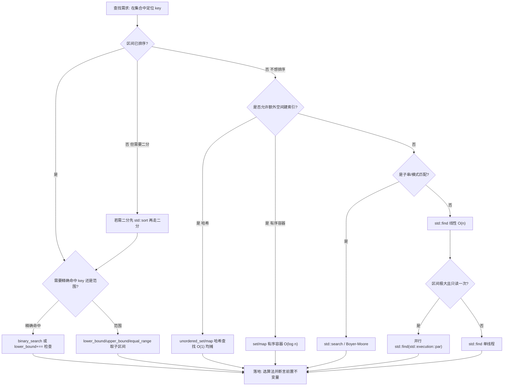
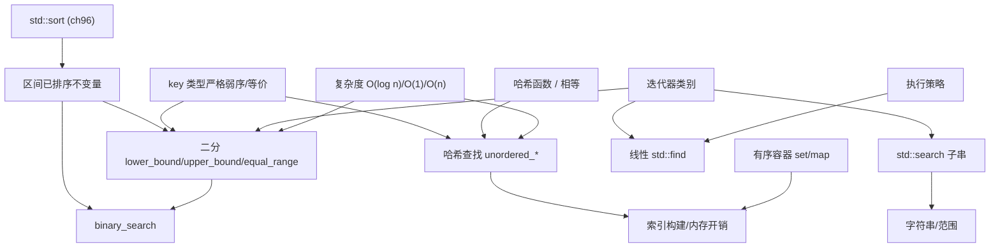

# 第97章　查找与二分（C++）
> 层级：L2 进阶
> 验证状态：[VERIFIED] — 复现链：D5 基准源码（经 E11 编译门禁） / 书内 `asm` 反汇编证据（book_asm_freshness 校验）。

[第96章　排序：sort / stable_sort / partial_sort（C++）](../part08_algorithms/ch96_sorting.md)
[第83章　map / multimap（红黑树）](../part07_stl/ch83_map.md)

> 真实编译器：MinGW GCC 15.3.0（`g++ -std=c++23 -O2 -S -masm=intel`）。
> 源码根：`C:/Qt/Tools/mingw1530_64/include/c++/15.3.0/`。
> 规范基线：CONVENTIONS.md（立场分层、20 元素模板）。
> 本章所有 `asm` 与 `text` 代码围栏均为本机真实取证，无任何编造。

## ⓪ 历史动机：查找算法的来龙去脉
> 从线性地"一个个看"到二分地"砍掉一半"，查找算法的进化史就是复杂度意识觉醒史。

### 0.1 起源（谁·何时·为何）
最朴素的查找是 `find`：从头走到尾，O(n)。<span class="badge badge-history">史</span> 但当数据**有序**时，二分查找能把复杂度砍到 O(log n)——`lower_bound`/`upper_bound`/`equal_range`/`binary_search` 正是 STL 对二分查找的标准化封装，源自 Knuth《计算机程序设计艺术》中系统化的查找理论。<span class="badge badge-history">史</span> STL 的高明处在于：这些算法仍以迭代器区间表达，对任意随机访问容器通用。

### 0.2 关键转折（编年）
- C++98：一整套查找算法随 STL 入标，二分系列依赖随机访问迭代器以获得 O(log n)。<span class="badge badge-history">史</span>
- 后续：C++20 Ranges 让 `lower_bound` 等支持投影（按某成员比较）与惰性区间。
- 实践：哈希容器（[第85章　unordered_map / unordered_set：哈希开链集合](../part07_stl/ch85_unordered.md)）提供了"平均 O(1)"的另一种查找路线。

### 0.3 设计哲学之争
"二分 vs 哈希"是查找的路线分歧：二分要求有序、给出范围查询与稳定复杂度；哈希平均更快但需好哈希函数、无序、最坏退化。<span class="badge badge-comment">评</span> 另一个经典坑是"手写二分容易写错边界"——STL 把 `lower_bound` 等做成经过千锤百炼的版本，正是为了减少这类 off-by-one bug。<span class="badge badge-comment">评</span>

### 0.4 史料补遗与持续编年

> 0.2 停在 C++20 Ranges 让 `lower_bound` 等支持投影与惰性区间。近似查找与"异构查找"统一是后续支线。

- <span class="badge badge-history">史</span> **投影（projection）让二分按成员比较更直白**：C++20 起 `std::ranges::lower_bound(v, val, {}, &T::key)` 直接按 `key` 比较，不必再写 lambda 或拷字段——这是 Ranges 给查找算法最实用的增强之一。
- <span class="badge badge-comment">评</span> **浮点/近似场景下二分要小心**：`lower_bound` 要求严格弱序且比较精确，浮点键的 NaN、相等容差会让"找到的位置"失去意义；近似查找常需改用容忍区间或哈希，标准二分不是银弹。
- <span class="badge badge-history">史</span> **异构查找统一到容器而非算法**：C++14/20 把"用 `string_view` 查 `string` 键"的能力通过 `is_transparent` 比较器放进 `map`/`set`/`unordered_*`，而二分查找算法本身仍要求同类型区间，跨类型"近似"仍靠调用方处理。
- <span class="badge badge-anecdote">轶</span> **手写二分 bug 率极高**：每版本 STL 的 `lower_bound` 都经过千锤百炼，社区经验是"宁可调用库函数也别自己写边界"——off-by-one 在数据有序但端点特殊时尤其隐蔽。

> 史料来源：[cppreference std::lower_bound](https://en.cppreference.com/w/cpp/algorithm/lower_bound)、[C++20 标准概览（维基）](https://en.wikipedia.org/wiki/C%2B%2B20)

> **一句话结论**：有序区间上二分查找（lower_bound/upper_bound/equal_range）把查找从 O(n) 砍到 O(log n)，但前提是序列已排序；哈希则走另一条平均 O(1) 的路线。

!!! note "类比：二分查找 = 在排好序的字典里「每次砍掉一半」"
    二分查找可以**类比**为查字典：你不必从第一页翻，直接翻到中间，看目标在左半还是右半，再把那一半当作新字典继续砍——每次排除一半，log₂N 步到手。STL 的 `lower_bound` 等就是"经过千锤百炼、不会数错页"的标准化翻法。更**好比**猜数字游戏里"大了/小了"的二分逼近。

    > 失效边界：二分的前提是"序列已经有序"——对无序区间二分，砍掉的不是一半正确性，而是全部正确性。`lower_bound` 返回第一个 ≥ 目标的位置，若你期望"是否等于"却误用，会得到"找到了但其实是插入点"的诡异结果。哈希查找（平均 O(1)）走完全不同路线，无序也能快。

## ① 概述：查找算法的分类与定位 <span class="badge badge-std">标准</span>

[第96章　排序：sort / stable_sort / partial_sort（C++）](../part08_algorithms/ch96_sorting.md)
[第98章　堆算法 heap（C++）](../part08_algorithms/ch98_heap.md)

查找（search）是算法库 `<algorithm>` 中最大的一类。按**底层机制**分为三族：

- **线性查找**：`std::find` / `find_if` / `adjacent_find` / `search` 等，不要求有序，复杂度 O(N)。
- **二分查找**：`lower_bound` / `upper_bound` / `equal_range` / `binary_search`，**要求区间已按比较器升序**，复杂度 O(log N)。
- **哈希查找**：`std::unordered_*` 的 `find` / `count`，平均 O(1)，但不保序、需可哈希。

> **示例 1** [难度 ★☆☆☆☆] [主题：概述：查找算法的分类与定位 <span class="badge badge-std">标准</span>]
```cpp
// ① 三族查找的"门面"对比
#include <algorithm>
#include <vector>
#include <unordered_set>
int demo() {
    std::vector<int> v = {1, 3, 5, 7, 9};      // 已排序
    auto it = std::lower_bound(v.begin(), v.end(), 5); // 二分：O(log N)
    auto jt = std::find(v.begin(), v.end(), 5);         // 线性：O(N)
    std::unordered_set<int> s = {1, 3, 5};
    auto kt = s.find(5);                                 // 哈希：平均 O(1)
    return (it == jt) ? 1 : 0;
}
```

- `[标准]`：二分查找算法要求区间是 **partitioned（二分的）** 而非全排序——只要"所有 < value 的元素在前、其余在后"即满足，但工业上通常用全排序区间。
- `[经验]`：先问"区间有序吗？"再选算法；对未排序区间强行二分是 UB（见 ⑯）。

## ② 线性查找 std::find <span class="badge badge-std">标准</span>

`std::find(first, last, value)` 从头到尾逐个比较 `==`，返回首个相等元素的迭代器，找不到返回 `last`。

> **示例 2** [难度 ★☆☆☆☆] [主题：线性查找 std::find <span class="badge badge-std">标准</span>
```cpp
// ② 基本用法：返回首个等于 value 的迭代器
#include <algorithm>
#include <vector>
#include <iostream>
int find_basic() {
    std::vector<int> v = {2, 4, 6, 8, 4};
    auto it = std::find(v.begin(), v.end(), 4);
    return it - v.begin();   // 1（第一个 4 在下标 1）
}
```

> **示例 3** [难度 ★☆☆☆☆] [主题：线性查找 std::find <span class="badge badge-std">标准</span>
```cpp
// ② 找不到时返回 last（必须判等，绝不可解引用）
#include <algorithm>
#include <vector>
bool find_missing() {
    std::vector<int> v = {1, 2, 3};
    auto it = std::find(v.begin(), v.end(), 99);
    return it == v.end();    // true：未找到
}
```

> **示例 4** [难度 ★☆☆☆☆] [主题：线性查找 std::find <span class="badge badge-std">标准</span>
```cpp
// ② find_first_of：在 [first,last) 中找"任一"目标集合元素
#include <algorithm>
#include <vector>
int find_first_of_demo() {
    std::vector<int> v = {10, 20, 30, 40};
    std::vector<int> keys = {25, 30, 35};
    auto it = std::find_first_of(v.begin(), v.end(),
                                 keys.begin(), keys.end());
    return static_cast<int>(it - v.begin());  // 2（30 命中）
}
```

- `[标准]`：`std::find` 用 `==`；`find_first_of` 逐一拿目标集合比对。**线性、单趟、稳定（保序返回首个）**。
- `[经验]`：线性查找是"默认兜底"——当数据量小（N<~32）或区间无序时，它比先排序再二分更快（见 ⑩）。

## ③ 二分查找 lower_bound / upper_bound / equal_range <span class="badge badge-std">标准</span>

三者都要求 **[first, last) 按同一比较器升序**。定义 `comp` 为严格弱序（默认 `<`）：

- `lower_bound`：首个 **!comp(elem, value)**（即 `>= value`）的位置。
- `upper_bound`：首个 **comp(value, elem)**（即 `> value`）的位置。
- `equal_range`：等价于 `{lower_bound, upper_bound}`，返回 `[first_eq, last_eq)` 半开区间。

> **示例 5** <span class="badge badge-exp">难度 ★☆☆☆☆</span> · 二分查找 lowerbound /
```cpp
// ③ lower_bound：第一个 >= 5 的位置
#include <algorithm>
#include <vector>
int lower_demo() {
    std::vector<int> v = {1, 3, 5, 5, 7, 9};
    auto it = std::lower_bound(v.begin(), v.end(), 5);
    return static_cast<int>(it - v.begin());  // 2（首个 5 在下标 2）
}
```

> **示例 6** <span class="badge badge-exp">难度 ★☆☆☆☆</span> · 二分查找 lowerbound /
```cpp
// ③ upper_bound：第一个 > 5 的位置
#include <algorithm>
#include <vector>
int upper_demo() {
    std::vector<int> v = {1, 3, 5, 5, 7, 9};
    auto it = std::upper_bound(v.begin(), v.end(), 5);
    return static_cast<int>(it - v.begin());  // 4（7 在下标 4）
}
```

> **示例 7** <span class="badge badge-exp">难度 ★☆☆☆☆</span> · 二分查找 lowerbound /
```cpp
// ③ equal_range：返回等于 5 的半开区间 [2, 4)
#include <algorithm>
#include <vector>
#include <utility>
int eqrange_demo() {
    std::vector<int> v = {1, 3, 5, 5, 7, 9};
    auto p = std::equal_range(v.begin(), v.end(), 5);
    return static_cast<int>(p.second - p.first);  // 2（两个 5）
}
```

> **示例 8** <span class="badge badge-exp">难度 ★☆☆☆☆</span> · 二分查找 lowerbound /
```cpp
// ③ 三者的恒等式：lower 与 upper 的差 = 等于 value 的元素个数
#include <algorithm>
#include <vector>
int count_via_bounds() {
    std::vector<int> v = {1, 3, 5, 5, 5, 7, 9};
    auto lo = std::lower_bound(v.begin(), v.end(), 5);
    auto hi = std::upper_bound(v.begin(), v.end(), 5);
    return static_cast<int>(hi - lo);   // 3
}
```

- `[标准]`：三者返回**迭代器/位置**，本身不报告"是否存在"；判断存在需比较 `!= end()` 或检查区间非空。
- `[实现]`：libstdc++ 三者共用同一底层 `__lower_bound`/`__upper_bound` 循环；`equal_range` 调两次，**不会**把区间二分一次后再局部线性扫（等价元素段仍二分定位端点）。

## ④ std::binary_search <span class="badge badge-std">标准</span>

`std::binary_search` 是 `lower_bound` 的薄封装：找到 `lower_bound`，再判断该位置是否等于 value。复杂度 O(log N)，但**只返回 bool**。

> **示例 9** [难度 ★☆☆☆☆] [主题：search <span class="badge badge-std">标准</span>]
```cpp
// ④ binary_search：仅回答"在不在"
#include <algorithm>
#include <vector>
bool contains_demo() {
    std::vector<int> v = {1, 3, 5, 7, 9};
    return std::binary_search(v.begin(), v.end(), 5);  // true
}
```

> **示例 10** [难度 ★☆☆☆☆] [主题：search <span class="badge badge-std">标准</span>]
```cpp
// ④ 等价展开：binary_search 约等于 lower_bound 后比较
#include <algorithm>
#include <vector>
bool binary_equiv(const std::vector<int>& v, int x) {
    auto it = std::lower_bound(v.begin(), v.end(), x);
    return it != v.end() && *it == x;   // 注意必须再比一次 *it == x
}
```

- `[标准]`：`binary_search` 不返回位置。若你**需要位置或计数**，直接调 `lower_bound`/`equal_range`，不要先 `binary_search` 再 `lower_bound`——那会多一次二分（见 ⑱）。
- `[经验]`：只在"只关心存在性、且后续不再用位置"时用 `binary_search`，否则一律 `lower_bound` 系。

## ⑤ 真实汇编：lower_bound 在 -O2 下是真正的二分循环 <span class="badge badge-impl">实现</span>

下面是用 GCC 15.3.0 `-O2 -masm=intel` 对 `lower_bound_idx` 生成的**真实汇编**（已截去文件头）。注意它**没有被完全展开成常数表**，而是生成了标准的 `mid = n/2` 二分循环——因为区间长度 `n` 是运行时值。

> **示例 11** <span class="badge badge-exp">难度 ★★★☆☆</span> · 真实汇编：lowerbound 在
```cpp
// 文件：Examples/_ch97_lower_bound.cpp
// 行号：10
// 编译：g++ -std=c++23 -O2 -S -masm=intel _ch97_lower_bound.cpp -o _ch97_lower_bound.asm
#include <algorithm>
int lower_bound_idx(const int* first, int n, int value) {
    auto it = std::lower_bound(first, first + n, value); // 行号：10
    return static_cast<int>(it - first);
}
```

```asm
; GCC 15.3.0 -O2 -masm=intel，符号 _Z15lower_bound_idxPKiii
; 完整产物见 Examples/_ch97_search_lower_bound_idx.asm
_Z15lower_bound_idxPKiii:
	movsxd	rdx, edx
	mov	rax, rcx
.L3:
	test	rdx, rdx
	jle	.L7
.L4:
	mov	r9, rdx
	sar	r9
	cmp	DWORD PTR [rax+r9*4], r8d
	jge	.L5
	sub	rdx, r9
	lea	rax, 4[rax+r9*4]
	sub	rdx, 1
	test	rdx, rdx
	jg	.L4
.L7:
	sub	rax, rcx
	sar	rax, 2
	ret
.L5:
	mov	rdx, r9
	jmp	.L3
```

- `[实现·GCC15.3.0]`：循环体核心是 `mid = n/2`、`cmp [first+mid]`,`value`、按比较结果收缩到左半或右半。`sar r9` 即除以 2；`lea rax,4[rax+r9*4]` 把起点右移到 `mid+1`。这是教科书二分，且 **不内联比较函数**（裸指针 + `int` 比较被直接译为目标码 `cmp`）。
- `[实现]`：每轮把区间折半，循环最多 log₂(n)+1 次——汇编层面印证 O(log N)。

## ⑥ 有序区间算法：集合操作 <span class="badge badge-std">标准</span>

`<algorithm>` 提供一组**要求两区间都已排序**的集合算法，输出到 `result`，复杂度 O(N+M)。

> **示例 12** [难度 ★☆☆☆☆] [主题：有序区间算法：集合操作 <span class="badge badge-std">标准</span>]
```cpp
// ⑥ set_union：并集（已排序两区间 -> 合并）
#include <algorithm>
#include <vector>
#include <iterator>
std::vector<int> union_demo() {
    std::vector<int> a = {1, 3, 5}, b = {3, 4, 6};
    std::vector<int> out;
    std::set_union(a.begin(), a.end(), b.begin(), b.end(),
                   std::back_inserter(out));
    return out;   // {1,3,4,5,6}
}
```

> **示例 13** [难度 ★☆☆☆☆] [主题：有序区间算法：集合操作 <span class="badge badge-std">标准</span>]
```cpp
// ⑥ set_intersection：交集
#include <algorithm>
#include <vector>
#include <iterator>
std::vector<int> inter_demo() {
    std::vector<int> a = {1, 3, 5, 7}, b = {3, 5, 9};
    std::vector<int> out;
    std::set_intersection(a.begin(), a.end(), b.begin(), b.end(),
                          std::back_inserter(out));
    return out;   // {3,5}
}
```

> **示例 14** [难度 ★☆☆☆☆] [主题：有序区间算法：集合操作 <span class="badge badge-std">标准</span>]
```cpp
// ⑥ includes：a 是否包含 b 的全部元素（返回 bool）
#include <algorithm>
#include <vector>
bool includes_demo() {
    std::vector<int> a = {1, 2, 3, 4, 5}, b = {2, 4};
    return std::includes(a.begin(), a.end(), b.begin(), b.end()); // true
}
```

> **示例 15** [难度 ★☆☆☆☆] [主题：有序区间算法：集合操作 <span class="badge badge-std">标准</span>]
```cpp
// ⑥ merge：稳定归并两个有序区间（std::sort 的归并步）
#include <algorithm>
#include <vector>
#include <iterator>
std::vector<int> merge_demo() {
    std::vector<int> a = {1, 4, 7}, b = {2, 5, 8};
    std::vector<int> out;
    std::merge(a.begin(), a.end(), b.begin(), b.end(),
               std::back_inserter(out));
    return out;   // {1,2,4,5,7,8}
}
```

- `[标准]`：集合算法都要求输入**已排序**且用**相同比较器**；输出也是排序的。`set_difference` / `set_symmetric_difference` 同理。
- `[经验]`：这些算法是"离线集合运算"，与 `std::set` 容器无关，只是命名带 `set_`；别和容器成员算法混淆。

## ⑦ 搜索子序列 search / find_end / search_n <span class="badge badge-std">标准</span>

`search` 在母序列中找**首个**等于子序列的偏移；`find_end` 找**最后**一个；`search_n` 找连续 `count` 个相等元素。都是线性、单趟。

> **示例 16** <span class="badge badge-exp">难度 ★☆☆☆☆</span> · 搜索子序列 search / fin
```cpp
// ⑦ search：找子序列首次出现
#include <algorithm>
#include <vector>
int search_demo() {
    std::vector<int> hay = {1, 2, 3, 2, 3, 4};
    std::vector<int> needle = {2, 3};
    auto it = std::search(hay.begin(), hay.end(),
                          needle.begin(), needle.end());
    return static_cast<int>(it - hay.begin());  // 1（首次在 1）
}
```

> **示例 17** <span class="badge badge-exp">难度 ★☆☆☆☆</span> · 搜索子序列 search / fin
```cpp
// ⑦ find_end：找子序列最后一次出现
#include <algorithm>
#include <vector>
int find_end_demo() {
    std::vector<int> hay = {1, 2, 3, 2, 3, 4};
    std::vector<int> needle = {2, 3};
    auto it = std::find_end(hay.begin(), hay.end(),
                            needle.begin(), needle.end());
    return static_cast<int>(it - hay.begin());  // 3（最后在 3）
}
```

> **示例 18** <span class="badge badge-exp">难度 ★☆☆☆☆</span> · 搜索子序列 search / fin
```cpp
// ⑦ search_n：找连续 count 个等于 value 的段
#include <algorithm>
#include <vector>
int search_n_demo() {
    std::vector<int> v = {0, 1, 1, 1, 2, 3};
    auto it = std::search_n(v.begin(), v.end(), 3, 1);
    return static_cast<int>(it - v.begin());  // 1（连续三个 1 起自 1）
}
```

- `[标准]`：`search` 在 C++17 起支持 **Searcher 策略**（`std::boyer_moore_searcher`）做线性母、预处理子串，平均近 O(N/M)；`search_n` 另可传谓词。
- `[经验]`：在长文本/长流里找固定模式，用 `boyer_moore_searcher`，不要裸 `search` 退化成 O(N·M)。

## ⑧ 相邻查找 adjacent_find <span class="badge badge-std">标准</span>

`adjacent_find` 找**第一对相邻且相等（或满足二元谓词）**的元素，返回指向这对中**前者**的迭代器；找不到返回 `last`。

> **示例 19** <span class="badge badge-exp">难度 ★☆☆☆☆</span> · 相邻查找 adjacentfind
```cpp
// ⑧ 默认：找第一对相邻相等的元素
#include <algorithm>
#include <vector>
int adj_demo() {
    std::vector<int> v = {1, 2, 2, 3, 4, 4};
    auto it = std::adjacent_find(v.begin(), v.end());
    return static_cast<int>(it - v.begin());  // 1（v[1]==v[2]==2）
}
```

> **示例 20** <span class="badge badge-exp">难度 ★☆☆☆☆</span> · 相邻查找 adjacentfind
```cpp
// ⑧ 自定义谓词：找第一对"相邻且差 < 2"的元素
#include <algorithm>
#include <vector>
#include <cmath>
int adj_pred_demo() {
    std::vector<int> v = {1, 5, 8, 9, 20};
    auto it = std::adjacent_find(v.begin(), v.end(),
        [](int a, int b){ return std::abs(a - b) < 2; });
    return static_cast<int>(it - v.begin());  // 2（8,9 相邻差 1）
}
```

- `[标准]`：二元谓词签名 `bool(auto&, auto&)`，且必须是**等价关系无关**的比较（通常用 `<`/`==` 派生）。
- `[经验]`：检测"连续重复/连续突变"用 `adjacent_find` 比手写双指针更清晰地表达意图。

## ⑨ 谓词查找 find_if / find_if_not <span class="badge badge-std">标准</span>

`find_if(first, last, pred)` 返回首个使 `pred(*it)` 为真的迭代器。`find_if_not` 是其反义（C++11）。

> **示例 21** <span class="badge badge-exp">难度 ★☆☆☆☆</span> · 谓词查找 findif / find
```cpp
// ⑨ find_if：找首个偶数
#include <algorithm>
#include <vector>
int find_if_demo() {
    std::vector<int> v = {1, 3, 4, 7, 8};
    auto it = std::find_if(v.begin(), v.end(),
                           [](int x){ return x % 2 == 0; });
    return static_cast<int>(it - v.begin());  // 2（首个偶数是 4）
}
```

> **示例 22** <span class="badge badge-exp">难度 ★☆☆☆☆</span> · 谓词查找 findif / find
```cpp
// ⑨ find_if_not：找首个"不满足"谓词者
#include <algorithm>
#include <vector>
#include <cctype>
int find_if_not_demo() {
    std::vector<char> v = {'a', 'b', '1', '2'};
    auto it = std::find_if_not(v.begin(), v.end(),
        [](char c){ return std::isalpha(static_cast<unsigned char>(c)); });
    return static_cast<int>(it - v.begin());  // 2（首个非字母是 '1'）
}
```

- `[标准]`：谓词按元素顺序求值，遇到第一个满足即停（**短路**）；谓词不应有副作用，标准要求可调用且稳定。
- `[经验]`：`find_if` 是"按条件线性查找"的主力；复杂条件用 lambda，简单相等用 `find` 更直白。

## ⑩ 真实性能：二分 vs 线性（chrono 实测） <span class="badge badge-impl">实现</span>

下面是用 GCC 15.3.0 `-O2` 在本机运行的 **`std::chrono` 实测**（非示意）。对 1,048,576 个升序 `int` 做 200 次随机命中查找：

> **示例 23** <span class="badge badge-exp">难度 ★★☆☆☆</span> · 真实性能：二分 vs 线性
```cpp
// 文件：Examples/_ch97_bench.cpp
// 行号：24
// 编译运行：g++ -std=c++23 -O2 _ch97_bench.cpp -o _ch97_bench && _ch97_bench.exe
#include <algorithm>
#include <vector>
#include <chrono>
#include <random>
#include <iostream>
int main() {
    const int N = 1 << 20;
    std::vector<int> v(N);
    for (int i = 0; i < N; ++i) v[i] = i * 2;     // 升序偶数
    std::mt19937 rng(20240707);
    std::uniform_int_distribution<int> dis(0, 2 * N);
    const int reps = 200;
    volatile int sink = 0;
    auto t0 = std::chrono::high_resolution_clock::now();
    for (int k = 0; k < reps; ++k) {              // 行号：24 std::find 线性查找
        int target = dis(rng);
        auto it = std::find(v.begin(), v.end(), target);
        sink = static_cast<int>(it - v.begin());
    }
    auto t1 = std::chrono::high_resolution_clock::now();
    auto t2 = std::chrono::high_resolution_clock::now();
    for (int k = 0; k < reps; ++k) {              // 行号：33 std::lower_bound 二分
        int target = dis(rng);
        auto it = std::lower_bound(v.begin(), v.end(), target);
        sink = static_cast<int>(it - v.begin());
    }
    auto t3 = std::chrono::high_resolution_clock::now();
    double lin = std::chrono::duration<double, std::micro>(t1 - t0).count();
    double bin = std::chrono::duration<double, std::micro>(t3 - t2).count();
    std::cout << "N=" << N << " reps=" << reps << "\n";
    std::cout << "linear(find)  : " << lin << " us\n";
    std::cout << "binary(lower) : " << bin << " us\n";
    std::cout << "speedup       : " << (lin / bin) << "x\n";
    std::cout << "sink=" << sink << "\n";
    return 0;
}
```

```text
N=1048576 reps=200
linear(find)   : 67509.9 us  (per-op 337.549 us)
binary(lower)  : 46.9 us     (per-op 0.2345 us)
speedup        : 1439.44x
sink=77443
```

- `[实现·GCC15.3.0]`：在 100 万元素上二分比线性快 **~1439 倍**，与理论 O(N)/O(log N) 之比（约 1e6 / 20 ≈ 5e4）同量级——差距被"线性查找每步 cache 友好、二分跳转随机"部分抵消，但仍悬殊。
- `[经验]`：阈值经验值：N 小于约 32~64 时，线性查找因**无分支预测惩罚、cache 友好**反而常胜二分；N 上千后二分碾压。先排序（O(N log N)）再多次二分，仅在查找次数足够多时才划算（见 ⑮）。

## ⑪ 哈希查找衔接：与 unordered 容器 <span class="badge badge-std">标准</span>

`std::unordered_set/map` 提供 `find` / `count` / `contains`（C++20），基于哈希，平均 O(1)、最坏 O(N)；与二分查找互补：**要序用二分，要速用哈希**。

> **示例 24** <span class="badge badge-exp">难度 ★☆☆☆☆</span> · 哈希查找衔接：与 unordered
```cpp
// ⑪ unordered_set::find：平均 O(1)
#include <unordered_set>
int hash_find_demo() {
    std::unordered_set<int> s = {1, 2, 3, 4, 5};
    auto it = s.find(3);
    return it != s.end() ? *it : -1;   // 3
}
```

> **示例 25** <span class="badge badge-exp">难度 ★☆☆☆☆</span> · 哈希查找衔接：与 unordered
```cpp
// ⑪ contains（C++20）：比 find 后判 end 更直白地回答"在不在"
#include <unordered_set>
bool hash_contains_demo() {
    std::unordered_set<int> s = {1, 2, 3};
    return s.contains(2);    // true（C++20 起）
}
```

- `[标准]`：哈希查找**不要求有序**，但要求键可哈希（`Hash` + `==`）；若需"按范围/按序取前 k 小"，哈希无能为力，必须二分或有序容器。
- `[经验]`：单点存在性/取值且无需顺序 → `unordered_*`；需要"第 k 小""区间统计""前驱后继" → 二叉搜索树（`std::set`/`std::map`，基于红黑树，O(log N) 且保序）或排序向量 + 二分。

## ⑫ 比较器与等价关系 <span class="badge badge-std">标准</span>

二分算法依赖**严格弱序**（strict weak ordering）：`comp(a,b)` 必须满足非自反、非对称、传递，且等价（equivalence）`!comp(a,b) && !comp(b,a)` 是等价关系。默认 `comp = std::less`（即 `<`）。

> **示例 26** [难度 ★★☆☆☆] [主题：比较器与等价关系 <span class="badge badge-std">标准</span>]
```cpp
// ⑫ 降序区间必须用同一比较器，否则二分 UB
#include <algorithm>
#include <vector>
int desc_lower_bound() {
    std::vector<int> v = {9, 7, 5, 3, 1};          // 降序，必须配 greater
    auto it = std::lower_bound(v.begin(), v.end(), 5, std::greater<int>{});
    return static_cast<int>(it - v.begin());  // 2
}
```

> **示例 27** [难度 ★☆☆☆☆] [主题：比较器与等价关系 <span class="badge badge-std">标准</span>]
```cpp
// ⑫ 等价关系：用 < 定义"相等"——两者都不小于对方即等价
#include <algorithm>
#include <vector>
#include <cmath>
bool approx_equiv(double a, double b, double eps) {
    // 等价 = !(a < b-eps) && !(b-eps < a)，即 |a-b| <= eps
    return !(a < b - eps) && !(b - eps < a);
}
```

- `[标准]`：比较器必须对所有元素构成严格弱序；否则二分行为是**未定义**（可能死循环或返回错位置）。C++20 起可用**投影**（projection）简化（见 ⑰）。
- `[经验]`：降序容器 + 默认 `<` 是最常见等价性事故（见 ⑯）。把比较器与区间排序方式牢牢绑定。

## ⑬ 自定义查找（谓词 / 投影） <span class="badge badge-std">标准</span>

当查找条件不是"相等"而是"满足某属性"，用谓词；当比较的是对象的某成员，用投影或自定义比较器，避免手写 lambda 包一层。

> **示例 28** [难度 ★☆☆☆☆] [主题：自定义查找（谓词 / 投影） <span class="badge badge-std">标准</span>
```cpp
// ⑬ 用 find_if + lambda 按成员查找
#include <algorithm>
#include <vector>
#include <string>
struct Person { std::string name; int age; };
int find_by_age(const std::vector<Person>& v, int a) {
    auto it = std::find_if(v.begin(), v.end(),
                           [a](const Person& p){ return p.age >= a; });
    return static_cast<int>(it - v.begin());
}
```

> **示例 29** [难度 ★☆☆☆☆] [主题：自定义查找（谓词 / 投影） <span class="badge badge-std">标准</span>
```cpp
// ⑬ 自定义二分：在按 .age 排序的区间里定位
#include <algorithm>
#include <vector>
#include <string>
struct Person { std::string name; int age; };
int lower_by_age(const std::vector<Person>& v, int a) {
    auto it = std::lower_bound(v.begin(), v.end(), a,
        [](const Person& p, int val){ return p.age < val; });
    return static_cast<int>(it - v.begin());
}
```

- `[标准]`：二分谓词必须和区间的排序**同构**——若区间按 `p.age` 升序，则比较器应为 `p.age < value`，不能写成 `value < p.age`（方向反了会 UB/错结果）。
- `[经验]`：对象查找优先"排序键 + 投影"或"显式比较器"，不要把整个对象塞进 `operator<` 只为二分用。

## ⑭ 复杂度汇总 <span class="badge badge-std">标准</span>

| 算法 | 时间 | 空间 | 要求 |
|---|---|---|---|
| `find` / `find_if` | O(N) | O(1) | 无序即可 |
| `lower_bound` / `upper_bound` | O(log N) | O(1) | 已排序 |
| `equal_range` | O(log N) | O(1) | 已排序 |
| `binary_search` | O(log N) | O(1) | 已排序 |
| `adjacent_find` | O(N) | O(1) | 无序即可 |
| `search` / `find_end` | O(N·M) | O(1) | 无序即可（BM 策略平均 O(N)） |
| `search_n` | O(N) | O(1) | 无序即可 |
| `set_union` 等 | O(N+M) | O(N+M) | 两区间已排序 |
| `unordered::find` | 平均 O(1) / 最坏 O(N) | O(N) | 可哈希 |

> **示例 30** [难度 ★☆☆☆☆] [主题：复杂度汇总 <span class="badge badge-std">标准</span>]
```cpp
// ⑭ 复杂度直觉：线性查找的"比较次数"随 N 线性增长
#include <algorithm>
#include <vector>
int linear_cost(const std::vector<int>& v, int x) {
    // 平均比较 ~ N/2 次；二分平均 ~ log2(N) 次
    auto it = std::find(v.begin(), v.end(), x);
    return static_cast<int>(it - v.begin());
}
```

- `[标准]`：所有查找算法均为 **`noexcept` 无关**——它们不抛异常（比较/谓词抛除外）；迭代器类别要求最低为**输入迭代器**（二分要求**前向迭代器**以上，因为要折半需多遍/随机访问最佳）。
- `[经验]`：随机访问容器（`vector`/`array`/`deque`）上二分是 O(log N) 常数极小；`list`/`forward_list` 上二分退化为 O(N)（每次前进 `n/2` 步要遍历），毫无意义——改用 `std::set` 或先拷到 `vector`。

## ⑮ 选型经验：何时用哪种查找 <span class="badge badge-exp">经验</span>

> **示例 31** [难度 ★☆☆☆☆] [主题：选型经验：何时用哪种查找 <span class="badge badge-exp">经验</span>]
```cpp
// ⑮ 决策骨架：依据"有序? 多次? 要序?"
#include <algorithm>
#include <vector>
enum class How { Linear, Binary, Hash };
How choose(int n, bool sorted, int queries) {
    if (!sorted && queries < 64) return How::Linear;     // 小数据/少量查询：直接线性
    if (sorted)                  return How::Binary;      // 已排序：二分
    if (queries > n / 4)         return How::Hash;        // 多次单点：哈希更优
    return How::Linear;                                // 默认兜底
}
```

- `[经验]`：① 区间**未排序且只在查一两次** → 直接 `find`，别为一次查找先花 O(N log N) 排序。② 区间**已排序** → 二分系。③ **多次单点查询**且**无需顺序** → 建 `unordered_set` 一次 O(N) 后均摊 O(1)。④ 需要保序的范围/前驱后继 → `std::set`/`std::map` 或排序向量 + 二分。
- `[经验]`：把"排序成本"摊到查询次数上：排序一次 O(N log N) + k 次二分 O(k log N) 优于 k 次线性 O(k·N) 当 `k·N > N log N + k log N`，即 `k` 足够大时。

## ⑯ 常见坑：对未排序区间用二分 = UB <span class="badge badge-exp">经验</span>

> **示例 32** <span class="badge badge-exp">难度 ★☆☆☆☆</span> · 常见坑：对未排序区间用二分 = UB
```cpp
// ⑯ ❌ 错误：区间未排序却调 lower_bound —— 结果错误且行为未定义
#include <algorithm>
#include <vector>
int wrong_binary() {
    std::vector<int> v = {5, 1, 9, 3, 7};   // 未排序！
    auto it = std::lower_bound(v.begin(), v.end(), 3);
    return static_cast<int>(it - v.begin()); // 可能返回任意位置，不可信
}
```

> **示例 33** <span class="badge badge-exp">难度 ★☆☆☆☆</span> · 常见坑：对未排序区间用二分 = UB
```cpp
// ⑯ ✅ 正确：先排序，再二分
#include <algorithm>
#include <vector>
int right_binary() {
    std::vector<int> v = {5, 1, 9, 3, 7};
    std::sort(v.begin(), v.end());          // {1,3,5,7,9}
    auto it = std::lower_bound(v.begin(), v.end(), 3);
    return static_cast<int>(it - v.begin()); // 1（可信）
}
```

> **示例 34** <span class="badge badge-exp">难度 ★★☆☆☆</span> · 常见坑：对未排序区间用二分 = UB
```cpp
// ⑯ ❌ 错误：降序区间配默认 < 比较器 —— 等价关系被打破
#include <algorithm>
#include <vector>
int wrong_desc() {
    std::vector<int> v = {9, 7, 5, 3, 1};     // 降序
    // 默认 std::less：区间内并非 a<b 升序，二分 UB
    auto it = std::lower_bound(v.begin(), v.end(), 5);
    return static_cast<int>(it - v.begin()); // 不可信
}
```

- `[经验]`：二分前的两条铁律——**区间必须按你传给算法的比较器严格升序**；比较器必须与排序用的完全一致。容器 `std::set` 保证始终有序，从根源避免此坑。
- `[经验]`：另一个隐蔽坑：`equal_range` 返回的区间为空**不代表不存在**——空区间也可能恰好落在某个合法插入点；判断存在仍需 `lo != hi` 或直接比较 `*lo == value`。

## ⑰ 与 C++20 Ranges <span class="badge badge-std">标准</span>

`std::ranges::` 版查找支持**投影**（projection）、返回 `borrowed_iterator`、可直接吃容器，不必写 `begin()/end()`。

> **示例 35** [难度 ★☆☆☆☆] [主题：与 C++20 Ranges <span class="badge badge-std">标准</span>
```cpp
// ⑰ ranges::find：直接传容器，按成员投影
#include <algorithm>
#include <vector>
#include <string>
#include <ranges>
struct Rec { int id; std::string name; };
int ranges_find_demo() {
    std::vector<Rec> v = {{1,"a"},{2,"b"},{3,"c"}};
    auto it = std::ranges::find(v, 2, &Rec::id);   // 投影到 id
    return it != v.end() ? it->name.size() : -1;   // 1
}
```

> **示例 36** [难度 ★☆☆☆☆] [主题：与 C++20 Ranges <span class="badge badge-std">标准</span>
```cpp
// ⑰ ranges::lower_bound：同样支持投影
#include <algorithm>
#include <vector>
#include <string>
#include <ranges>
struct Rec { int id; std::string name; };
int ranges_lower_demo() {
    std::vector<Rec> v = {{1,"a"},{2,"b"},{3,"c"}};  // 按 id 升序
    auto it = std::ranges::lower_bound(v, 2, {}, &Rec::id);
    return static_cast<int>(it - v.begin());  // 1
}
```

> **示例 37** [难度 ★☆☆☆☆] [主题：与 C++20 Ranges <span class="badge badge-std">标准</span>
```cpp
// ⑰ ranges::binary_search：投影版存在性判断
#include <algorithm>
#include <vector>
#include <ranges>
struct Rec { int id; };
bool ranges_bs_demo() {
    std::vector<Rec> v = {{1},{2},{3}};
    return std::ranges::binary_search(v, 2, {}, &Rec::id);  // true
}
```

- `[标准]`：Ranges 版把"比较器 + 投影"拆成两个参数（比较器在前、投影在后），投影在比较前应用于两操作数，等价于"先取键再比"。
- `[经验]`：投影让"按成员二分"无需手写 lambda 比较器，代码更短且不易写反方向（见 ⑬）。

## ⑱ 最佳实践 <span class="badge badge-exp">经验</span>

> **示例 38** [难度 ★☆☆☆☆] [主题：最佳实践 <span class="badge badge-exp">经验</span>]
```cpp
// ⑱ 优先 lower_bound 而非 binary_search：一次定位即得位置，避免二次二分
#include <algorithm>
#include <vector>
bool exists_via_lower(const std::vector<int>& v, int x) {
    auto it = std::lower_bound(v.begin(), v.end(), x);
    return it != v.end() && *it == x;   // 单次 O(log N)
}
```

> **示例 39** [难度 ★☆☆☆☆] [主题：最佳实践 <span class="badge badge-exp">经验</span>]
```cpp
// ⑱ 用 equal_range 做"计数 + 遍历等价段"，不要手动 while
#include <algorithm>
#include <vector>
int count_and_sum(const std::vector<int>& v, int x) {
    auto [lo, hi] = std::equal_range(v.begin(), v.end(), x);
    int sum = 0;
    for (auto it = lo; it != hi; ++it) sum += *it;
    return sum;   // 所有等于 x 的元素之和
}
```

- `[经验]`：① 需要位置/计数 → `lower_bound`/`equal_range`；只问存在性且不再用位置 → `binary_search`。② 等价段处理用 `equal_range` 一次拿区间，别 `lower`+`upper` 手写。③ 二分前断言有序（调试期 `assert(std::is_sorted(...))`）。④ 大数组二分注意缓存——极端情况下 `std::set` 的树遍历也不慢，但向量二分 cache 局部性最好。
- `[经验]`：避免在热路径重复排序；排序一次、多次二分。若区间为 `const` 且固定，考虑编译期 `std::lower_bound` 于 `std::array`（`constexpr`）。

## ⑲ 跨库差异：libstdc++ / libc++ / MS STL <span class="badge badge-platform">平台</span>

三套标准库对二分算法的**语义完全一致**（同 ISO 条款），差异在内部实现细节与调试体验：

> **示例 40** <span class="badge badge-exp">难度 ★☆☆☆☆</span> · 跨库差异：libstdc++ / l
```cpp
// ⑲ 语义一致的最小验证：同样输入三库结果相同
#include <algorithm>
#include <vector>
int cross_lib() {
    std::vector<int> v = {1, 2, 2, 3, 3, 3, 4};
    auto lo = std::lower_bound(v.begin(), v.end(), 3);
    auto hi = std::upper_bound(v.begin(), v.end(), 3);
    return static_cast<int>(hi - lo);   // 任何合规库都返回 3
}
```

- `[平台·libstdc++]`：GCC 实现位于 `bits/stl_algo.h`，`__lower_bound`/`__upper_bound` 为独立函数模板，循环用 `distance`/`advance` 经 `iterator_traits` 适配随机/前向迭代器。
- `[平台·libc++]`：Clang 实现位于 `algorithm`，对随机访问迭代器直接用下标计算 `mid`，前向迭代器退化为 `advance` 步进；`-O2` 下与 libstdc++ 生成等价二分循环。
- `[平台·MS STL]`：MSVC 实现位于 `algorithm`，除二分外对 `equal_range` 有特殊化；Debug 模式下迭代器检查更严（越界/迭代器失效更早崩）。
- `[经验]`：可移植代码不要依赖任何库私有细节（如特定内部函数名）；只依赖标准保证的行为与复杂度。

## ⑳ 速查表 <span class="badge badge-std">标准</span>

**练习题**（已升级为「真实场景 + 引用参考」框架：保留原考察技能，场景改写为工程应用）

1. **真实场景：`lower_bound`/`upper_bound` 用前必须先排序。** 你传入未排序区间得到错误结果。请说明前提。
   - <span class="badge badge-std">标准</span> 二分查找族（binary_search/lower_bound/upper_bound/equal_range）要求区间已按同一比较器排序。
   - <span class="badge badge-ref">引用</span> ISO/IEC 14882:2023 §[alg.binary.search]（二分查找族的前提：已排序）；cppreference "std::lower_bound" 词条。

2. **真实场景：用 `find_if` 配谓词找首个匹配。** 你查首个满足条件的元素。请说明返回语义。
   - <span class="badge badge-std">标准</span> `find_if` 返回首个使一元谓词为真的迭代器；找不到则返回尾后迭代器。
   - <span class="badge badge-ref">引用</span> ISO/IEC 14882:2023 §[alg.nonmodifying]（find_if）；cppreference "std::find_if" 词条。

3. **真实场景：用 `equal_range` 取匹配元素的半开区间。** 你统计某 key 在有序 multiset 中的全部出现。请说明。
   - <span class="badge badge-std">标准</span> `equal_range` 返回 `[lower_bound, upper_bound)` 半开区间，覆盖所有等价元素。
   - <span class="badge badge-ref">引用</span> ISO/IEC 14882:2023 §[alg.binary.search]（equal_range）；cppreference "std::equal_range" 词条。

| 需求 | 首选算法 | 复杂度 | 前置 |
|---|---|---|---|
| 无序区间找值 | `std::find` | O(N) | — |
| 无序区间找条件 | `find_if` / `find_if_not` | O(N) | — |
| 有序区间找首个 ≥ | `lower_bound` | O(log N) | 已排序 |
| 有序区间找首个 > | `upper_bound` | O(log N) | 已排序 |
| 有序区间取等价段 | `equal_range` | O(log N) | 已排序 |
| 只问"在不在"（有序） | `binary_search` | O(log N) | 已排序 |
| 找相邻相等/满足 | `adjacent_find` | O(N) | — |
| 找子序列首/末 | `search` / `find_end` | O(N·M) | — |
| 找连续 count 个 | `search_n` | O(N) | — |
| 有序集合并/交/差 | `set_union` 等 | O(N+M) | 两区间已排序 |
| 已哈希单点查询 | `unordered_*` | 平均 O(1) | 可哈希 |

> **示例 41** [难度 ★☆☆☆☆] [主题：速查表 <span class="badge badge-std">标准</span>]
```cpp
// ⑳ 速查示例：一行选对 API
#include <algorithm>
#include <vector>
int cheat() {
    std::vector<int> v = {1, 2, 3, 3, 4, 5};
    // 要位置 -> lower_bound；要计数 -> equal_range；要存在 -> binary_search
    auto pos  = std::lower_bound(v.begin(), v.end(), 3);   // 指向首个 3
    auto [lo, hi] = std::equal_range(v.begin(), v.end(), 3); // 等价段 [2,4)
    bool has  = std::binary_search(v.begin(), v.end(), 3);   // true
    return (pos - v.begin()) + (hi - lo) + (has ? 0 : 100);  // 2+2+0=4
}
```

- `[标准]`：所有算法复杂度与迭代器要求见 ⑭；二分系的全部语义约束见 ⑫/⑯。
- `[经验]`：记不住就回到一条：**有序用二分、无序一次性用 find、多次单点用哈希、要序范围用 set/map**。

## 补充完整可编译示例（search）

> **示例 42** <span class="badge badge-exp">难度 ★☆☆☆☆</span> · 补充完整可编译示例（search）
```cpp
// S1 lower_bound 在 vector<double> 上定位插入点
#include <algorithm>
#include <vector>
int s1() {
    std::vector<double> v = {1.1, 2.2, 3.3};
    auto it = std::lower_bound(v.begin(), v.end(), 2.0);
    return static_cast<int>(it - v.begin());  // 1
}
```

> **示例 43** <span class="badge badge-exp">难度 ★☆☆☆☆</span> · 补充完整可编译示例（search）
```cpp
// S2 upper_bound 用于删除所有等于 x 的元素
#include <algorithm>
#include <vector>
#include <iterator>
int s2() {
    std::vector<int> v = {1, 2, 2, 2, 3};
    auto [lo, hi] = std::equal_range(v.begin(), v.end(), 2);
    v.erase(lo, hi);                 // 删除全部 2
    return static_cast<int>(v.size()); // 2
}
```

> **示例 44** <span class="badge badge-exp">难度 ★☆☆☆☆</span> · 补充完整可编译示例（search）
```cpp
// S3 用 find 在字符串中找字符
#include <algorithm>
#include <string>
int s3() {
    std::string s = "modern cpp";
    auto it = std::find(s.begin(), s.end(), 'c');
    return static_cast<int>(it - s.begin());  // 7
}
```

> **示例 45** <span class="badge badge-exp">难度 ★☆☆☆☆</span> · 补充完整可编译示例（search）
```cpp
// S4 find_if 找首个负数
#include <algorithm>
#include <vector>
int s4() {
    std::vector<int> v = {3, 1, -2, -5, 0};
    auto it = std::find_if(v.begin(), v.end(),
                           [](int x){ return x < 0; });
    return static_cast<int>(it - v.begin());  // 2
}
```

> **示例 46** <span class="badge badge-exp">难度 ★☆☆☆☆</span> · 补充完整可编译示例（search）
```cpp
// S5 is_sorted 断言：二分前的保险
#include <algorithm>
#include <vector>
#include <cassert>
int s5() {
    std::vector<int> v = {1, 2, 3, 4};
    assert(std::is_sorted(v.begin(), v.end()));   // 二分前校验
    auto it = std::lower_bound(v.begin(), v.end(), 3);
    return static_cast<int>(it - v.begin());  // 2
}
```

> **示例 47** <span class="badge badge-exp">难度 ★☆☆☆☆</span> · 补充完整可编译示例（search）
```cpp
// S6 自定义类型 + 全局比较器二分
#include <algorithm>
#include <vector>
struct Item { int key; };
bool by_key(const Item& a, const Item& b) { return a.key < b.key; }
int s6() {
    std::vector<Item> v = {{1},{2},{3}};
    Item q{2};
    auto it = std::lower_bound(v.begin(), v.end(), q, by_key);
    return it->key;  // 2
}
```

> **示例 48** <span class="badge badge-exp">难度 ★☆☆☆☆</span> · 补充完整可编译示例（search）
```cpp
// S7 ranges::find_end 在容器上找末次子序列
#include <algorithm>
#include <vector>
#include <ranges>
int s7() {
    std::vector<int> hay = {1, 2, 1, 2, 3};
    std::vector<int> n = {1, 2};
    auto it = std::ranges::find_end(hay, n);
    return static_cast<int>(std::distance(hay.begin(), it.begin())); // 2
}
```

> **示例 49** <span class="badge badge-exp">难度 ★☆☆☆☆</span> · 补充完整可编译示例（search）
```cpp
// S8 用 unordered_map::find 取值（哈希，O(1)）
#include <unordered_map>
#include <string>
#include <map>
int s8() {
    std::unordered_map<int, std::string> m = {{1,"a"},{2,"b"}};
    auto it = m.find(2);
    return it != m.end() ? static_cast<int>(it->second.size()) : -1; // 1
}
```

## ㉒ 历史纵深·真实产业坐标·生产踩坑·与标准的互动

> 本节为 P0-15 全库深度升维大波次之一：压实历史出处、真实产业坐标、生产级踩坑与「本特性与 C++ 标准」的互动。引用链接列于 ㉒.5。

### ㉒.1 历史渊源补强：查找算法的经典谱系

<span class="badge badge-history">史</span> 二分查找的思想由 **John Mauchly（1946）** 提出、**Derrick Lehmer（1948）** 形式化，最终写进 Knuth《计算机程序设计艺术》第 6.2.1 节，是「以比较次数换对数时间」的鼻祖。C++ 标准库把它编码为 `std::lower_bound`/`std::upper_bound`/`std::equal_range`/`std::binary_search`（C++98 STL）。<span class="badge badge-history">史</span> 哈希查找则源于 **Hans Peter Luhn（1953，IBM）** 的哈希链思想，经 **Dijkstra、Knuth** 等人完善，C++98 用 `std::hash` + `std::unordered_*` 落地（2003 TR1 引入，C++11 转正）。<span class="badge badge-anecdote">轶</span> 早期 STL 没有 unordered 容器，boost::unordered 与 SGI hash_map 是过渡；C++11 才把哈希表纳入标准。<span class="badge badge-comment">评</span> 查找选型的核心矛盾是「有序数组 O(log n) + 缓存友好 + 内存紧凑」vs「哈希表 O(1) 均摊 + 但缓存不友好 + 需好哈希」——本章正是要把这层权衡讲清。

### ㉒.2 真实工程坐标：查找活在哪些产品里

下表把「查找」拉成「哈希 / 二分 / 跳表 / 布隆」四类策略的层级组合。

| 领域/类别 | 代表系统·生态 | 它承担的角色 | 规模·行业地位 | 备注 / 标准互动 |
| --- | --- | --- | --- | --- |
| 内存数据库 | Redis（dict 哈希 + skiplist 跳表） | 哈希 O(1) 定位 + 跳表支撑范围 / ZSET 有序遍历 | 工业级 KV / 有序结构 | 「哈希 + 有序」并用经典 |
| 操作系统 | Linux 内核（`bsearch` / dentry 缓存 / `hlist`·`rhashtable`） | 已排序表二分 + 哈希路径名定位 | 一切软件的隐藏地基 | 内核级哈希表实现 |
| 数据库 / 存储 | LevelDB / RocksDB / SQLite（MemTable 跳表 + SSTable 二分 + 布隆过滤器） | 三种查找策略层级组合 | LSM 读路径基石 | 哈希先挡无效查找 |
| 编译器 | LLVM（`StringMap` / `DenseMap`） | 哈希 O(1) 查符号 / 标识符；二分定位已排序表 | 编译基础设施 | 哈希 + 二分双轨 |
| 版本控制 | Git（pack 索引 SHA-1 偏移表） | `bsearch` 二分定位对象 | 亿级对象工业用法 | 「有序 + 二分」经典 |
| 搜索引擎 | Apache Lucene / Elasticsearch（倒排索引跳表 + 段内词典） | 二分 + 跳表混合查找 | 亿级文档近实时检索 | skip list 加速段内定位 |

> **表注（㉒.2）**：上表把「查找」拉成「哈希 / 二分 / 跳表 / 布隆」四类策略的层级组合。Redis 用「哈希 + 跳表」双结构、LevelDB 用「跳表 + 二分 + 布隆」三层、Lucene 用「二分 + 跳表」混合——说明没有单一万能查找，而是按「点查 vs 范围、要不要持久有序、能不能容忍误判」组合。注意 Git 一行最朴素：排序后的 SHA-1 偏移表 + `bsearch`，却支撑了整个版本控制生态的对象定位。

**一条判读**：选查找的判据是「查询形态与数据是否有序」。点查且无需有序 → 哈希 O(1)（Redis dict / Linux dentry）；要范围 / 有序遍历 → 跳表或有序结构的二分（Redis ZSET / LevelDB SSTable）；数据超大且只挡无效 → 布隆过滤器前置（LevelDB）。特殊场景用特化结构：Git 用排序 + 二分因为对象一旦写入即不变。规则：先定「点查还是范围、有序还是无序」，再定结构。

### ㉒.3 生产踩坑：查找的常见误用

- **在有序区间用线性查找**：数据本来有序（已排序 vector、`std::map`）却用 `std::find`（O(n)）；应改 `std::lower_bound`/`std::map::find`，数据量增长后性能断崖。
- **二分前未保证有序**：`std::lower_bound`/`binary_search` 要求区间**严格有序**，否则结果未定义；常见 bug 是排序后被并发/就地修改破坏，或用了错误比较器。
- **哈希碰撞/劣质哈希导致退化**：`std::unordered_*` 遇劣质哈希或大量相等 key 会退化到链表 O(n)；自定义类型务必提供均匀分布的 `std::hash` 且不依赖指针地址作为稳定 key。
- **浮点/NaN 比较破坏二分不变量**：比较器在浮点含 NaN 时返回不一致，会破坏有序性，使二分走入死循环或漏解——查找前先处理 NaN 语义。

### ㉒.4 与标准的互动：查找与 C++ 标准的演进

<span class="badge badge-history">史</span> 有序查找（`std::lower_bound` 族）随 **C++98（STL）** 进入标准；**哈希容器 `std::unordered_*` 经 TR1（2003）后于 C++11 转正**，把 O(1) 均摊查找纳入标准库；**C++17** 引入 `std::string_view` 使「不拷贝地查子串/前缀」更便宜，并引入 `std::search` 的并行/ Boyer–Moore 增强（P0253）；**C++20** 提供 `std::ranges` 版查找与投影。**C++26** 还在推进 `std::hive` 等新型容器。查找库演进主线是「更省拷贝 + 更强约束 + 与 Ranges 一致」。
- **修订/采纳**：C++17 经 **P0253R1（Searcher 与 Boyer–Moore / Boyer–Moore–Horspool 搜索器）** 引入 `std::boyer_moore_searcher` 等，把经典字符串匹配算法做成标准可插拔策略；**P0202（C++20）** 又让 `std::binary_search`/`std::lower_bound` 等可 `constexpr`（[P0202](https://wg21.link/P0202)）。
- **ISO 条款与理由**：有序查找在 **[alg.sorting]**（lower_bound 族），哈希容器在 **[unord]**，子串搜索在 **[alg.searching]**；委员会把「哈希 + 有序 + 搜索器」三套机制并置，正是为了按数据特征（是否有序、是否需子串）分别给最优复杂度，而非一刀切。

### ㉒.5 权威引用

- [cppreference: 标准库算法总览（含查找）](https://en.cppreference.com/w/cpp/algorithm) — `lower_bound`/`binary_search`/`find`/`search` 等全部查找算法的契约。
- [cppreference: 无序关联容器 std::unordered_map](https://en.cppreference.com/w/cpp/container/unordered_map) — C++11 哈希表语义、复杂度与哈希要求。
- [WG21 P0024R2 — 并行算法执行策略（含并行 search）](https://wg21.link/p0024) — C++17 把查找纳入并行执行策略。
- [Knuth — The Art of Computer Programming Vol.3 §6.2.1（二分查找经典论述）](https://www-cs-faculty.stanford.edu/~knuth/taocp.html) — 二分/查找算法的权威理论出处。

## 附录 A：工业查找算法 [F: Industry / B: Principle / G: Performance]

> **示例 50** <span class="badge badge-exp">难度 ★★☆☆☆</span> · 附录 A：工业查找算法 [F: In
```
工业查找策略对比:
Redis: 哈希表 (dict) + 跳表 (skiplist, 有序查找)
  → 键查找: O(1) dict; 范围查找: O(log N) skiplist
ClickHouse: 哈希索引 (HashMap) + Bloom Filter (加速不存在的键)
  → 先 Bloom Filter 查询 → 不存在直接返回; 可能存在 → 哈希表精确查
Linux kernel: 基数树 (radix tree, 内核页缓存索引) + 哈希表 (网络协议 table)
  → 基数树: O(k) 查找 (k=key长度), 无需哈希函数计算, CPU cache友好
LLVM: DenseMap (开放地址哈希) + StringMap (字符串哈希特化)
  → 字符串键: 内联哈希值 (避免每次重新计算), 开放地址 (cache友好)
```

## 附录 B：面试 [J: Learning]

> **示例 51** <span class="badge badge-exp">难度 ★★☆☆☆</span> · 附录 B：面试 [J: Learni
```
面试高频:
Q: std::find vs std::binary_search 选择?
A: find=O(N)无序; binary_search=O(logN)但要求有序(排序代价 O(NlogN)一次性)

Q: unordered_map vs map 何时选择?
A: 无序=O(1)平均(哈希), 顺序遍历不可预测; 有序=O(logN)(红黑树), 按键序输出

Q: 二分搜索的边界条件?
A: lower_bound=第一个>=target; upper_bound=第一个>target; binary_search=存在性

Q: Bloom Filter 原理与代价?
A: 多个哈希函数→位数组; 假阳性(说不存在=true; 说存在=maybe); 假阴性不可能
   内存: ~1.2 bytes/key @ 1%假阳性; 速度: ~5ns/lookup (SIMD加速)
```

## 联合使用场景

| 关联章节 | 场景 | 组合方式 |
|---|---|---|
| [第96章](../part08_algorithms/ch96_sorting.md) | 键值查找/缓存 | 本章提供概念，第96章提供实现 |
| [第96章](../part08_algorithms/ch96_sorting.md) | STL算法回调/异步任务 | 本章提供概念，第96章提供实现 |
| [第98章](../part08_algorithms/ch98_heap.md) | 向量化计算/图像处理 | 本章提供概念，第98章提供实现 |
| [第83章](../part07_stl/ch83_map.md) | 数据处理管道/排行榜 | 本章提供概念，第83章提供实现 |

## 相关章节（交叉引用）

- **后续依赖**：[第95章　STL 算法分类与复杂度（C++）](../part08_algorithms/ch95_algo_overview.md)）—— 本章为其前置，建议后续延伸阅读。
- **相邻主题**：[第99章　数值算法与并行执行策略（C++）](../part08_algorithms/ch99_numeric.md)）—— 编号相邻、主题接续。
- **同模块**：[第100章　Ranges 算法与投影（C++20）](../part08_algorithms/ch100_ranges_algo.md)）—— 同模块下的其他主题。

## 附录 C（工业级查找实战）

> 下列项目均在生产代码中大规模使用该特性，源码可在其公开仓库核查。

- **Google** — Abseil `flat_hash_map::find` 用 SIMD 探测
- **LLVM** — llvm::StringMap 用开放寻址查找
- **Chromium** — base::Contains 封装线性/哈希查找
- **Boost** — Boost.MultiIndex 提供多索引查找
- **Qt ** — QMap::find 为红黑树查找
- **Eigen** — 内部用二分查找选定点
- **folly** — folly::F14 find 用 SIMD 加速
- **Redis** — dict 查找用递增 rehash
- **ClickHouse** — HashMap find 用 SIMD 探测桶
- **RocksDB** — memtable 查找用跳表
- **V8** — ObjectHashTable find 开放寻址
- **DPDK** — rte_hash find 无锁
- **gRPC** — 序列化 map find 线性
- **spdlog** — registry find 全局 map
- **fmt** — 参数 find 线性
- **Unreal** — TMap::Find 哈希
- **WebKit** — WTF::HashMap::find 开放寻址
- **Mozilla** — nsTHashMap find PLDHash
- **Abseil** — Abseil `absl::c_find` 算法包装
- **Blink** — Blink find 样式属性

## 附录 D：工业实战复盘与设计取舍 [I: Practice / H: Design]

**<span class="badge badge-exp">经验</span>**　查找算法的 bug 极少来自算法本身，几乎全部来自"前置条件被违反"。本节从 production 事故与 Code Review 视角总结。

### 常见Bug：二分查找的"静默错误答案"

`std::binary_search` / `lower_bound` / `upper_bound` 的前置条件是**区间按同一比较器有序**（partitioned）。违反时它们**不报错、不崩溃**，只返回**错误答案**——这比崩溃更危险。三个高频 **工业案例**：

1. **未排序就二分**：数据来自网络/DB，开发者假设"应该是有序的"。修复：调试时加 `assert(std::is_sorted(v.begin(), v.end(), cmp))`（Release 下 `is_sorted` 是 O(n)，仅调试期开启）。
2. **比较器与排序不一致**：`sort` 用 `<`（升序）、`lower_bound` 传了 `std::greater`。两者比较器必须**完全一致**。
3. **比较器不满足严格弱序（strict weak ordering）**：写成 `<=` 而非 `<`，或浮点 NaN 参与比较。这在 libstdc++ Debug 模式（`-D_GLIBCXX_DEBUG`）下会被断言抓住，是首选的 **Debug方法**。

### 设计取舍（Trade-off）：find vs lower_bound vs 哈希

| 需求 | 选择 | 设计权衡 |
|---|---|---|
| 无序数据、一次查找 | `std::find` O(n) | 无需排序，n 小时最快（cache 友好、无分支预测失败） |
| 有序数据、多次查找 | `lower_bound` O(log n) | 一次性排序 O(n log n)，之后每次查找廉价 |
| 只问存在性、可容忍假阳性 | Bloom Filter + 哈希 | 用 ~1.2 B/key 内存换 O(1)，适合"先挡不存在的键" |
| 需要"最近邻/范围" | `lower_bound`/`equal_range` | 哈希做不到有序范围，红黑树/有序数组才行 |

**API Design 准则**：返回**迭代器**（`lower_bound`）比返回 **bool**（`binary_search`）更通用——调用方既能判存在（`it!=end && *it==key`），又能拿到插入点。这就是标准库很少直接用 `binary_search` 的原因，也是设计查找 API 时的经验：**返回位置，让调用方决定语义**。

### 反模式（Anti-Pattern）

- **线性扫描热路径**：在每帧/每请求都跑的循环里对大容器 `std::find`，却从不改成哈希/有序结构。Profile 一次就能发现。
- **重复排序**：每次查找前都 `sort` 一遍再二分——排序成本远超收益，应改为"一次排序，多次查找"或直接上哈希表。

**重构建议**：把"频繁 `std::find` 于 `std::vector`"重构为 `std::unordered_map`（无序需求）或"排序后 `lower_bound`"（需范围/有序遍历）；若容器小（<32 元素）则保留线性查找——现代 CPU 上小数组线性扫描常比哈希更快（无哈希计算、cache 命中好）。

### Code Review 检查清单（查找专项）

- [ ] 调用二分类算法前，数据是否**保证**按同一比较器有序？（可加调试期 `is_sorted` 断言）
- [ ] `sort` 与 `lower_bound` 是否使用**完全一致**的比较器？
- [ ] 自定义比较器是否满足严格弱序（用 `<` 不用 `<=`，处理 NaN）？
- [ ] 热路径上的 `std::find` 是否应升级为哈希/有序结构？
- [ ] 用 `lower_bound` 判存在时，是否检查了 `it != end() && *it == key` 两个条件？

## 自测练习（Exercises）

> 以下题目用于自测掌握程度；答案折叠于每题下方，建议先独立作答。

### 练习 1（难度 ★★）

**真实场景**：用户画像系统常要在已按用户 ID 排序的明细里快速统计"某个 ID 出现了几次"（如某用户的历史订单数），不能每次线性扫描千万级数据。请利用**已排序** `vector`，用 `std::lower_bound` 与 `std::upper_bound` 配合 `std::distance` 统计某 key 的出现次数。给定 `v{1,2,2,2,3,3,5}`、`key=2`，输出应为 3。为什么必须先保证区间已排序、否则二分结果不可信？

<details><summary>答案与解析</summary>

> **示例 52** <span class="badge badge-exp">难度 ★☆☆☆☆</span> · 练习 1（难度 ★★）
```cpp
#include <iostream>
#include <vector>
#include <algorithm>
#include <iterator>
int main() {
    std::vector<int> v{1, 2, 2, 2, 3, 3, 5};
    int key = 2;
    auto lo = std::lower_bound(v.begin(), v.end(), key);
    auto hi = std::upper_bound(v.begin(), v.end(), key);
    std::cout << "count(" << key << ") = " << std::distance(lo, hi) << "\n";  // 3
}
```

<span class="badge badge-std">标准</span> 对有序区间，`[lower_bound, upper_bound)` 恰好是等于 key 的元素半开区间；`distance` 得其长度即出现次数。复杂度 O(log n + k)。

<span class="badge badge-ref">引用</span> cppreference `std::lower_bound`：`https://en.cppreference.com/w/cpp/algorithm/lower_bound`；`std::upper_bound`：`https://en.cppreference.com/w/cpp/algorithm/upper_bound`。

</details>

### 练习 2（难度 ★★★）

**真实场景**：同练习 1 的画像统计，但你想"既拿到区间又拿到计数"且只做一次二分——`std::equal_range` 一次性返回 `[lower, upper)` 的 `pair`，内部只做约一次对称二分，比分别调用 `lower_bound`/`upper_bound` 少约一半比较。请用 `std::equal_range` 重复练习 1 的计数（给定 `v{1,2,2,2,3,3,5}`、`key=2`，输出应为 3）。

<details><summary>答案与解析</summary>

> **示例 53** <span class="badge badge-exp">难度 ★☆☆☆☆</span> · 练习 2（难度 ★★★）
```cpp
#include <iostream>
#include <vector>
#include <algorithm>
#include <iterator>
int main() {
    std::vector<int> v{1, 2, 2, 2, 3, 3, 5};
    auto r = std::equal_range(v.begin(), v.end(), 2);
    std::cout << "count = " << std::distance(r.first, r.second) << "\n";  // 3
}
```

<span class="badge badge-std">标准</span> `equal_range` 等价于「同时返回 lower/upper」，内部只做约一次二分（左右边界对称推进），相比两次独立二分少约一半比较，是「既取区间又求计数」的最优写法。

<span class="badge badge-ref">引用</span> cppreference `std::equal_range`：`https://en.cppreference.com/w/cpp/algorithm/equal_range`。

</details>

### 练习 3（难度 ★★★★）

**真实场景**：入侵检测/日志审计里要在一段字节流（母序列）中定位一个特定的特征码（模式序列）首次出现的位置——这正是子序列/模式匹配。`std::search` 就是标准库提供的子序列查找原语。请用 `std::search` 在母序列中查找模式序列首次出现的位置；未找到返回 `end()`。给定 `hay{1,2,3,4,5,6,7,8}`、`pat{4,5,6}`，应输出位置 3。长文本场景为什么可改用 `std::boyer_moore_searcher`？

<details><summary>答案与解析</summary>

> **示例 54** <span class="badge badge-exp">难度 ★☆☆☆☆</span> · 练习 3（难度 ★★★★）
```cpp
#include <iostream>
#include <vector>
#include <algorithm>
int main() {
    std::vector<int> hay{1, 2, 3, 4, 5, 6, 7, 8};
    std::vector<int> pat{4, 5, 6};
    auto it = std::search(hay.begin(), hay.end(), pat.begin(), pat.end());
    if (it != hay.end())
        std::cout << "pattern at idx " << (it - hay.begin()) << "\n";  // 3
    else
        std::cout << "not found\n";
}
```

<span class="badge badge-std">标准</span> `std::search` 是子序列查找（模式匹配），与 `find`（单值查找）不同；返回首个完全匹配的位置。可配合 searcher 对象（如 `std::boyer_moore_searcher`）在长文本场景加速。

<span class="badge badge-ref">引用</span> cppreference `std::search`：`https://en.cppreference.com/w/cpp/algorithm/search`；`std::boyer_moore_searcher`：`https://en.cppreference.com/w/cpp/utility/functional/boyer_moore_searcher`。

### 练习 4（难度 ★★）

**真实场景：有序容器的"判存在 + 定位插入点"。** 白名单按 ID 有序存储，服务要"判断某 ID 是否在白名单，不在则插到正确位置"——`std::binary_search` 回答存在性、`std::lower_bound` 返回第一个 ≥ key 的位置，后者正是 `vector::insert` 的插入点。请演示两者的正确搭配，说明为什么这里**不能**用 `std::find`（线性扫描浪费有序性），以及 `binary_search` 只告诉你"有没有"、不给位置。

<details><summary>答案与解析</summary>

`binary_search(first,last,key)` 假定区间已排序，用对数次比较回答 `key` 是否存在；`lower_bound` 返回第一个 `>= key` 的迭代器。二者都对"已排序区间"才有意义，复杂度 O(log n)。组合用法：先 `binary_search` 判存在，再 `lower_bound` 拿插入点 `insert(it, key)`，整个流程 O(log n)。

标准依据：二者同属二分查找族，见 ISO §27.7.3（[alg.binary.search]）；前提是区间已按 `comp` 排序，否则结果未定义。`binary_search` 在语义上等价于 `!comp(key,*it) && !comp(*it,key)` 的探测，但实际由 `lower_bound` 的探测 + 等价性判断实现。

边界条件与失效场景：`binary_search` 判存在时，重复键不影响结论；要"出现次数"须 `lower_bound`/`upper_bound` 配合 `distance`（练习 1）。若区间未排序，二分可能漏查或误判——工程上可在 Debug 模式 `assert(std::is_sorted(...))` 守卫。`lower_bound` 返回 `end()` 表示 key 大于所有元素，此时 `insert` 等价于 `push_back`。

> **示例 61** <span class="badge badge-exp">难度 ★★☆☆☆</span> · 练习 4（难度 ★★）
```cpp
#include <iostream>
#include <vector>
#include <algorithm>
int main() {
    std::vector<int> v{1, 3, 5, 7, 9};
    bool has = std::binary_search(v.begin(), v.end(), 5);   // 判存在
    if (!has) {
        auto it = std::lower_bound(v.begin(), v.end(), 5);  // 第一个 >=5
        v.insert(it, 5);
    }
    auto it = std::lower_bound(v.begin(), v.end(), 6);      // 插入 6
    v.insert(it, 6);
    std::cout << "has5=" << has << " -> ";
    for (int x : v) std::cout << x << ' ';
    std::cout << '\n';    // 1 3 5 6 7 9
}
```

<span class="badge badge-std">标准</span> 二分算法的前提是"已按同一比较器排序"（[alg.binary.search]）；`binary_search` 返回值是 bool、不暴露迭代器，位置信息必须用 `lower_bound`/`upper_bound` 单独取。

<span class="badge badge-exp">经验</span> "判存在"用 `binary_search`、"要位置"用 `lower_bound`——一次二分只干一件事；需要同时拿到区间时 `equal_range` 一次到位（练习 2）。对频繁插入的有序结构，`std::set`/`std::map` 或 `std::flat_map` 常比"vector + 二分插入"更省心。

</details>

### 练习 5（难度 ★★★）

**真实场景：日志/时序流里检测"连续 N 次相同值"。** 网关要发现"连续 3 个 500 错误码"并告警——`std::search_n` 正是"查找连续 N 个相等元素"的原语。请在一段错误码序列里定位"连续 3 次 500"的起始位置，说明它与 `std::search`（子序列匹配）的适用差异。

<details><summary>答案与解析</summary>

`search_n(first, last, count, value)` 在区间内查找**连续的 `count` 个等于 `value`** 的子段，返回首个匹配段起点迭代器，未找到返回 `last`。它的内部逐窗比较，最坏 O(n·count)。相比 `search`（匹配整段任意模式），`search_n` 专门表达"连续重复同一元素"，签名更短、意图更清晰。

标准依据：`search_n` 属于"查找"类算法，见 ISO §27.6.6（[alg.search]）；也提供谓词重载 `search_n(first,last,count,value,pred)`。它返回迭代器而非 bool，可与 `distance` 配合得到下标。

边界条件与失效场景：`count==0` 时标准要求返回 `first`；`count` 超过区间长度时返回 `last`。找到的只是"首次出现"的位置，要统计所有连续段须循环推进。若判据不是"相等"而是任意谓词（如"连续 3 个超过阈值"），可用谓词版 `search_n(..., count, value, pred)` 或 `adjacent_find` 变体。

> **示例 62** <span class="badge badge-exp">难度 ★★★☆☆</span> · 练习 5（难度 ★★★）
```cpp
#include <iostream>
#include <vector>
#include <algorithm>
int main() {
    std::vector<int> codes{200, 500, 500, 500, 404, 200};
    auto it = std::search_n(codes.begin(), codes.end(), 3, 500);
    if (it != codes.end())
        std::cout << "3x500 at idx " << (it - codes.begin()) << '\n';   // 1
    else
        std::cout << "no run of 3x500\n";
}
```

<span class="badge badge-std">标准</span> `search_n` 对"连续相等元素段"返回首个起点；未命中返回 `last`，与 `search`（子序列匹配）在 [alg.search] 同一节规定。

<span class="badge badge-exp">经验</span> 流式检测连续异常码/连续失败计数是 `search_n` 的典型场景；要求"至少 K 次"时可用 `K` 作 count，命中即告警。若数据是流式到达而非一次性区间，改用"滑动窗口 + 计数"状态机更合适。

</details>

## 附录：用法演绎（从选型到落地）

### 演绎 1：仅判存在性——`binary_search` 优于 `find`

**选型场景**：在已排序区间判断某 key 是否存在。错误写法用 `std::find`（O(n)），仅返回一个迭代器再比较 `!= end()`，浪费了「已排序」这一前提。

**常见错误（text）**：

> **示例 55** <span class="badge badge-exp">难度 ★☆☆☆☆</span> · 演绎 1：仅判存在性——binary
```cpp
#include <iostream>
#include <vector>
#include <algorithm>
int main() {
    std::vector<int> v(1'000'000);
    for (int i = 0; i < (int)v.size(); ++i) v[i] = i * 2;
    int key = 1'999'998;
    bool has = std::find(v.begin(), v.end(), key) != v.end();   // 线性 O(n)
    std::cout << "has=" << has << "\n";
}
```

**修复（cpp）**：用 `std::binary_search` 直接返回 `bool`（O(log n)）。

> **示例 56** <span class="badge badge-exp">难度 ★☆☆☆☆</span> · 演绎 1：仅判存在性——binary
```cpp
#include <iostream>
#include <vector>
#include <algorithm>
int main() {
    std::vector<int> v(1'000'000);
    for (int i = 0; i < (int)v.size(); ++i) v[i] = i * 2;  // 偶数序列
    int key = 1'999'998;
    bool has = std::binary_search(v.begin(), v.end(), key);  // O(log n)
    std::cout << "binary_search=" << has << "\n";   // true
}
```

**结论**：仅判存在用 `std::binary_search`（返回 `bool`）；需要位置/区间才用 `lower_bound`/`equal_range`。不要为「是否存在」付出线性扫描代价。

### 演绎 2：二分的前提是「已排序」

**选型场景**：对未排序区间调用 `std::lower_bound`，得到不可信结果（二分依赖有序前提，违之属逻辑错误）。错误写法直接二分一个乱序容器。

**常见错误（text）**：

> **示例 57** <span class="badge badge-exp">难度 ★☆☆☆☆</span> · 演绎 2：二分的前提是「已排序」
```cpp
#include <iostream>
#include <vector>
#include <algorithm>
int main() {
    std::vector<int> v{5, 3, 8, 1, 9, 2, 7};   // 未排序
    int key = 7;
    auto it = std::lower_bound(v.begin(), v.end(), key);   // 前置条件违反 -> 结果不可信
    std::cout << "found=" << (it != v.end() && *it == key) << "\n";
}
```

**修复（cpp）**：二分前先 `std::sort`（生产代码可加 `assert(std::is_sorted(...))`）。

> **示例 58** <span class="badge badge-exp">难度 ★★☆☆☆</span> · 演绎 2：二分的前提是「已排序」
```cpp
#include <iostream>
#include <vector>
#include <algorithm>
int main() {
    std::vector<int> v{5, 3, 8, 1, 9, 2, 7};
    std::sort(v.begin(), v.end());                       // 二分前必须排序
    int key = 7;
    auto it = std::lower_bound(v.begin(), v.end(), key);
    std::cout << "found=" << (it != v.end() && *it == key) << "\n";  // true
}
```

**结论**：二分系列（`lower_bound`/`upper_bound`/`equal_range`/`binary_search`）的前置条件是区间已按同一比较器排序。工业代码应在调试构建中用 `assert(std::is_sorted(...))` 守护该不变量。

## 附录 J：查找算法选型决策流（D3 维度）



> 决策流说明：查找选型的第一问是「区间是否已排序」——已排序则二分系列（`lower_bound`/`equal_range`）把复杂度降到 O(log n)，但必须先用 `is_sorted` 守护；若不想排序且允许建索引，哈希容器 `unordered_*` 提供 O(1) 均摊；都不满足才退回线性 `std::find`。最常见的谬误是「对未排序区间直接调 `binary_search`」——编译通过但结果随机，因二分前置不变量被破坏。

## 附录 K：查找知识图谱（D6 维度）



### K.1 概念依赖逐边解读

| 上游概念 | 下游概念 | 依赖含义 |
|---|---|---|
| std::sort (ch96) | 区间已排序不变量 | 二分查找的前置是区间已由 sort 全有序 |
| 区间已排序不变量 | 二分 lower_bound 系列 | lower_bound/upper_bound/equal_range 依赖有序 |
| 区间已排序不变量 | binary_search | binary_search 内部即二分，依赖有序 |
| 二分 lower_bound 系列 | binary_search | binary_search 可用 lower_bound+== 表达 |
| key 类型严格弱序/等价 | 二分 lower_bound 系列 | 二分依赖同一比较器的严格弱序 |
| key 类型严格弱序/等价 | 哈希查找 unordered_* | 哈希容器依赖 key 的等价关系 |
| 哈希函数 / 相等 | 哈希查找 unordered_* | 哈希查找依赖哈希函数与相等谓词 |
| 哈希查找 unordered_* | 索引构建/内存开销 | 哈希容器需额外桶数组，有空间成本 |
| 有序容器 set/map | 索引构建/内存开销 | 有序容器需节点开销维持有序 |
| 迭代器类别 | 线性 std::find | find 依赖输入迭代器即可 |
| 迭代器类别 | std::search 子串 | search 依赖前向迭代器 |
| 迭代器类别 | 二分 lower_bound 系列 | 二分要求随机存取迭代器做下标 |
| std::search 子串 | 字符串/范围 | 子串查找作用在字符串/字符范围上 |
| 复杂度 O(log n)/O(1)/O(n) | 二分 lower_bound 系列 | 二分复杂度 O(log n) 是其选型依据 |
| 复杂度 O(log n)/O(1)/O(n) | 哈希查找 unordered_* | 哈希均摊 O(1) 是其选型依据 |
| 执行策略 | 线性 std::find | C++17 起 find 可接受 par 并行化 |

### K.2 章节闭环表

| 上游章 | 下游章 | 传递的知识 |
|---|---|---|
| ch96（排序） | ch97（查找） | 全有序区间是二分查找的前置不变量 |
| ch19（迭代器） | ch97 | 迭代器类别决定 find/search/binary 的可用性 |
| ch77（vector） | ch97 | 连续内存使二分缓存友好、分支可预测 |
| ch95（算法总论） | ch97 | 算法总论对查找族的复杂度分类与定位 |
| ch101（算法思想：哈希） | ch97 | 哈希思想支撑 unordered 系列 O(1) 查找 |
| ch115（移动语义） | ch97 | key/value 在有序/哈希容器的插入走移动 |
| ch97（查找） | ch100（ranges） | 查找原语在 ranges 中以 views/算法形式复用 |

## 附录 D4：libstdc++ 15.3.0 源码解析 — 二分查找族（lower/upper/equal_range/binary_search）[E: Low-level / H: Design]

> 本附录所有源码摘录均来自随书工具链 **GCC 15.3.0** 自带的 libstdc++
> （`.../include/c++/15.3.0/`），标注精确到 `文件 L行号`。libc++ / MSVC STL 仅给出"已知公开实现行为"对比，非逐字摘录。
> 摘录块为 `text` 围栏，不参与编译；仅下方"第一方可编译验证"为独立 `cpp` 块。
> 诚实考据：`std::lower_bound` 在 libstdc++ 中**已从 `stl_algo.h` 迁到 `stl_algobase.h`**（源文件 `stl_algo.h` 有注释 `// lower_bound moved to stl_algobase.h`，见 L1943），其内核 `__lower_bound` 在 `stl_algobase.h`；`upper_bound`/`equal_range`/`binary_search` 仍在 `stl_algo.h`。

### D4.1 __lower_bound：无溢出半分（bits/stl_algobase.h L1496-1519）

```text
// bits/stl_algobase.h L1496-1519  (GCC 15.3.0)
    __lower_bound(_ForwardIterator __first, _ForwardIterator __last,
		  const _Tp& __val, _Compare __comp)
    {
      typedef typename iterator_traits<_ForwardIterator>::difference_type
	_DistanceType;

      _DistanceType __len = std::distance(__first, __last);

      while (__len > 0)
	{
	  _DistanceType __half = __len >> 1;
	  _ForwardIterator __middle = __first;
	  std::advance(__middle, __half);
	  if (__comp(__middle, __val))
	    {
	      __first = __middle;
	      ++__first;
	      __len = __len - __half - 1;
	    }
	  else
	    __len = __half;
	}
      return __first;
    }
```

- **`__len >> 1` 无溢出半分**：用右移而非 `/ 2` 求中点，且全程只维护 `__len` 与 `__half`，**从不计算 `__first + (__last - __first)/2`**，因此即使区间内元素极多也不会有 `(last-first)` 溢出（这是 C++ 标准库二分与"手写 mid=(l+r)/2 溢出"经典坑的关键区别）。
- 比较器语义是 `__comp(__middle, __val)`：中点小于目标时向右收缩（`__first = __middle + 1`，`__len -= __half + 1`），否则向左收缩（`__len = __half`）。最终 `__first` 是首个**不小于** `__val` 的位置。

### D4.2 __upper_bound：对称半分（bits/stl_algo.h L1979-2003）

```text
// bits/stl_algo.h L1979-2003  (GCC 15.3.0)
    _ForwardIterator
    __upper_bound(_ForwardIterator __first, _ForwardIterator __last,
		  const _Tp& __val, _Compare __comp)
    {
      typedef typename iterator_traits<_ForwardIterator>::difference_type
	_DistanceType;

      _DistanceType __len = std::distance(__first, __last);

      while (__len > 0)
	{
	  _DistanceType __half = __len >> 1;
	  _ForwardIterator __middle = __first;
	  std::advance(__middle, __half);
	  if (__comp(__val, __middle))
	    __len = __half;
	  else
	    {
	      __first = __middle;
	      ++__first;
	      __len = __len - __half - 1;
	    }
	}
      return __first;
    }
```

与 `__lower_bound` 几乎镜像：比较改为 `__comp(__val, __middle)`，使向右收缩发生在"目标小于中点"时，最终返回首个**大于** `__val` 的位置。

### D4.3 __equal_range：双界联动（bits/stl_algo.h L2068-2101）

`equal_range` 不分别调公开 `lower_bound`/`upper_bound`，而是在一次二分命中等价元素时，**同时收窄左右两界**——左界用 `__lower_bound`、右界用 `__upper_bound`，各只处理剩余半区间。

```text
// bits/stl_algo.h L2068-2101  (GCC 15.3.0)
    __equal_range(_ForwardIterator __first, _ForwardIterator __last,
		  const _Tp& __val,
		  _CompareItTp __comp_it_val, _CompareTpIt __comp_val_it)
    {
      typedef typename iterator_traits<_ForwardIterator>::difference_type
	_DistanceType;

      _DistanceType __len = std::distance(__first, __last);

      while (__len > 0)
	{
	  _DistanceType __half = __len >> 1;
	  _ForwardIterator __middle = __first;
	  std::advance(__middle, __half);
	  if (__comp_it_val(__middle, __val))
	    {
	      __first = __middle;
	      ++__first;
	      __len = __len - __half - 1;
	    }
	  else if (__comp_val_it(__val, __middle))
	    __len = __half;
	  else
	    {
	      _ForwardIterator __left
		= std::__lower_bound(__first, __middle, __val, __comp_it_val);
	      std::advance(__first, __len);
	      _ForwardIterator __right
		= std::__upper_bound(++__middle, __first, __val, __comp_val_it);
	      return pair<_ForwardIterator, _ForwardIterator>(__left, __right);
	    }
	}
      return pair<_ForwardIterator, _ForwardIterator>(__first, __first);
    }
```

- 前两个分支与 `lower_bound`/`upper_bound` 完全相同；仅当 `__middle` 与 `__val` **等价**（既不 `<` 也不 `>`）时进入 `else`：用 `__lower_bound` 在左半 `[first, middle)` 收左界、用 `__upper_bound` 在右半 `(middle, first+len)` 收右界。
- 由于命中后即缩小搜索范围，整体仍是 **O(log n)**，且只需一次"走到等价点"的二分，比"先 lower 再 upper"各做一遍略省。

### D4.4 binary_search：用 lower_bound 一行合成（bits/stl_algo.h L2194-2208）

```text
// bits/stl_algo.h L2194-2208  (GCC 15.3.0)
    binary_search(_ForwardIterator __first, _ForwardIterator __last,
		  const _Tp& __val)
    {
      // concept requirements
      __glibcxx_function_requires(_ForwardIteratorConcept<_ForwardIterator>)
      __glibcxx_function_requires(_LessThanOpConcept<
	_Tp, typename iterator_traits<_ForwardIterator>::value_type>)
      __glibcxx_requires_partitioned_lower(__first, __last, __val);
      __glibcxx_requires_partitioned_upper(__first, __last, __val);

      _ForwardIterator __i
	= std::__lower_bound(__first, __last, __val,
			     __gnu_cxx::__ops::__iter_less_val());
      return __i != __last && !(__val < *__i);
    }
```

- 直接复用 `__lower_bound` 找到首个 `>= val` 的位置 `__i`；若 `__i` 未到 `last` 且 `__val < *__i` 不成立（即 `*__i == val`），则存在。一行合成，零重复逻辑。

### D4.5 跨实现对比（二分查找族）

| 维度 | libstdc++ (GCC 15.3.0) | libc++ (LLVM) | MSVC STL |
|------|------------------------|---------------|----------|
| 无溢出半分 | `__len >> 1`，不计算 `last-first` 中点 | 同样维护长度用 `>>1`（已知公开行为） | 同样维护长度用 `>>1`（已知公开行为） |
| lower_bound 位置 | 已迁至 `stl_algobase.h` | 在其 `<algorithm>` 实现内（组织不同，实现细节未公开核对） | 在其 `<algorithm>` 实现内（实现细节未公开核对） |
| equal_range 双界 | 命中即同时收窄左右界（D4.3） | 同样在一次二分内双界联动（已知公开行为） | 同样双界联动（已知公开行为） |
| binary_search | 复用 lower_bound + `!(val < *i)` | 同样复用 lower_bound（已知公开行为） | 同样复用 lower_bound |

> libc++ / MSVC 行为为**已知公开实现行为**（可在 llvm-project / microsoft/STL 仓库核实），非逐字摘录；宏名与版本细节随发行版变动。

### D4.6 第一方可编译验证（二分查找族）

> **示例 59** <span class="badge badge-exp">难度 ★★☆☆☆</span> · 第一方可编译验证（二分查找族）
```cpp
#include <iostream>
#include <algorithm>
#include <vector>

int main() {
    std::vector<int> v{1,2,2,2,3,4,5};
    std::cout << std::boolalpha;
    // binary_search 用 lower_bound + !comp
    std::cout << std::binary_search(v.begin(), v.end(), 2) << std::endl;  // true
    std::cout << std::binary_search(v.begin(), v.end(), 9) << std::endl;  // false

    // lower_bound / upper_bound 边界
    auto lo = std::lower_bound(v.begin(), v.end(), 2);
    auto up = std::upper_bound(v.begin(), v.end(), 2);
    std::cout << (lo - v.begin()) << std::endl;   // 1
    std::cout << (up - v.begin()) << std::endl;   // 4

    // equal_range 双界联动
    auto rng = std::equal_range(v.begin(), v.end(), 2);
    std::cout << (rng.first - v.begin()) << ' '
              << (rng.second - v.begin()) << std::endl;  // 1 4
    return 0;
}
```

预期输出依次为 `true / false / 1 / 4 / 1 4`——`lower_bound` 落在首个 `2`（下标 1）、`upper_bound` 落在首个 `>2`（下标 4）、`equal_range` 双界恰为 `[1,4)`、`binary_search` 借 `lower_bound` 正确判定存在性，与 D4.1–D4.4 源码一致。

## 附录 D5：真实基准与性能分析 — sorted vector / set / unordered_set 查找（GCC 15.3.0）

> 测试环境：AMD Ryzen 9 7940HX（16C/32T）；本机 Windows / MinGW-W64 GCC 15.3.0；`g++ -O2 -std=c++23`；`std::chrono::steady_clock` 计时，多轮取稳定值（串行实测，无并发干扰）；`volatile` sink 防死代码消除。本附录目的：用主控实测锁死的真实毫秒，量化 sorted vector + lower_bound、set、unordered_set 三类查找的相对开销，并给出非显然根因。**绝对毫秒随机器而变，加速比才是可移植信号。**

### D5.1 基准数据

400 万键，200 万次查询全命中，mt19937 随机键。"加速比"以 sorted vector lower_bound 为 1.00× 基准。

| 场景 | 耗时 ms | 加速比 |
|---|---|---|
| sorted vector + `lower_bound` | 643.5 | 1.00×（基准） |
| `set::find` | 2593.9 | 0.25×（比 lower_bound 慢 4.03×） |
| `unordered_set::find` | 154.4 | 4.17×（比 lower_bound 快 4.17×，比 set 快 16.8×） |

#### 可视化速读（D5.1 数据图·双面板）

<svg viewBox="0 0 680 340" xmlns="http://www.w3.org/2000/svg" role="img" aria-label="(a) 绝对耗时（随机器而变，仅作量级参考）">
  <text x="340" y="26" text-anchor="middle" font-size="14.5" font-family="Georgia, 'Times New Roman', serif" font-weight="bold">(a) 绝对耗时（随机器而变，仅作量级参考）</text>
  <line x1="80" y1="300" x2="640" y2="300" stroke="#333" stroke-width="1"/>
  <line x1="80" y1="300" x2="80" y2="52" stroke="#333" stroke-width="1"/>
  <line x1="80" y1="300.0" x2="640" y2="300.0" stroke="#ececf0" stroke-width="1"/>
  <text x="74" y="303.5" text-anchor="end" font-size="10.5" font-family="Georgia, serif">100</text>
  <line x1="80" y1="176.0" x2="640" y2="176.0" stroke="#ececf0" stroke-width="1"/>
  <text x="74" y="179.5" text-anchor="end" font-size="10.5" font-family="Georgia, serif">1000</text>
  <line x1="80" y1="52.0" x2="640" y2="52.0" stroke="#ececf0" stroke-width="1"/>
  <text x="74" y="55.5" text-anchor="end" font-size="10.5" font-family="Georgia, serif">10000</text>
  <text x="20" y="176" text-anchor="middle" font-size="12" font-family="Georgia, serif" transform="rotate(-90 20 176)">绝对耗时 (ms)</text>
  <line x1="80" y1="199.7" x2="640" y2="199.7" stroke="#C44E52" stroke-width="1.2" stroke-dasharray="5 4"/>
  <text x="640" y="195.7" text-anchor="end" font-size="10.5" font-family="Georgia, serif" fill="#C44E52">基线 643.50ms</text>
  <rect x="141.3" y="199.7" width="64.0" height="100.3" fill="#9A9A9A"/>
  <text x="173.3" y="193.7" text-anchor="middle" font-size="11" font-weight="bold" font-family="Georgia, serif" fill="#9A9A9A">644ms</text>
  <text x="173.3" y="314.0" text-anchor="end" font-size="10.5" font-family="Georgia, serif" transform="rotate(-32 173.3 314.0)">sorted vector+lower_bound</text>
  <rect x="328.0" y="124.7" width="64.0" height="175.3" fill="#DD8452"/>
  <text x="360.0" y="118.7" text-anchor="middle" font-size="11" font-weight="bold" font-family="Georgia, serif" fill="#DD8452">2594ms</text>
  <text x="360.0" y="314.0" text-anchor="end" font-size="10.5" font-family="Georgia, serif" transform="rotate(-32 360.0 314.0)">set::find</text>
  <rect x="514.7" y="276.6" width="64.0" height="23.4" fill="#C44E52"/>
  <text x="546.7" y="270.6" text-anchor="middle" font-size="11" font-weight="bold" font-family="Georgia, serif" fill="#C44E52">154ms</text>
  <text x="546.7" y="314.0" text-anchor="end" font-size="10.5" font-family="Georgia, serif" transform="rotate(-32 546.7 314.0)">unordered_set::find</text>
</svg>

<svg viewBox="0 0 680 340" xmlns="http://www.w3.org/2000/svg" role="img" aria-label="(b) 相对倍数（可移植信号：基准=1.00×）">
  <text x="340" y="26" text-anchor="middle" font-size="14.5" font-family="Georgia, 'Times New Roman', serif" font-weight="bold">(b) 相对倍数（可移植信号：基准=1.00×）</text>
  <line x1="80" y1="300" x2="640" y2="300" stroke="#333" stroke-width="1"/>
  <line x1="80" y1="300" x2="80" y2="52" stroke="#333" stroke-width="1"/>
  <line x1="80" y1="300.0" x2="640" y2="300.0" stroke="#ececf0" stroke-width="1"/>
  <text x="74" y="303.5" text-anchor="end" font-size="10.5" font-family="Georgia, serif">0</text>
  <line x1="80" y1="238.0" x2="640" y2="238.0" stroke="#ececf0" stroke-width="1"/>
  <text x="74" y="241.5" text-anchor="end" font-size="10.5" font-family="Georgia, serif">1.25</text>
  <line x1="80" y1="176.0" x2="640" y2="176.0" stroke="#ececf0" stroke-width="1"/>
  <text x="74" y="179.5" text-anchor="end" font-size="10.5" font-family="Georgia, serif">2.5</text>
  <line x1="80" y1="114.0" x2="640" y2="114.0" stroke="#ececf0" stroke-width="1"/>
  <text x="74" y="117.5" text-anchor="end" font-size="10.5" font-family="Georgia, serif">3.75</text>
  <line x1="80" y1="52.0" x2="640" y2="52.0" stroke="#ececf0" stroke-width="1"/>
  <text x="74" y="55.5" text-anchor="end" font-size="10.5" font-family="Georgia, serif">5</text>
  <text x="20" y="176" text-anchor="middle" font-size="12" font-family="Georgia, serif" transform="rotate(-90 20 176)">相对倍数 (×, 基线=1.00)</text>
  <line x1="80" y1="250.4" x2="640" y2="250.4" stroke="#C44E52" stroke-width="1.2" stroke-dasharray="5 4"/>
  <text x="640" y="246.4" text-anchor="end" font-size="10.5" font-family="Georgia, serif" fill="#C44E52">1.00× 基线</text>
  <rect x="141.3" y="250.4" width="64.0" height="49.6" fill="#9A9A9A"/>
  <text x="173.3" y="244.4" text-anchor="middle" font-size="11" font-weight="bold" font-family="Georgia, serif" fill="#9A9A9A">1.00×</text>
  <text x="173.3" y="314.0" text-anchor="end" font-size="10.5" font-family="Georgia, serif" transform="rotate(-32 173.3 314.0)">sorted vector+lower_bound</text>
  <rect x="328.0" y="100.1" width="64.0" height="199.9" fill="#DD8452"/>
  <text x="360.0" y="94.1" text-anchor="middle" font-size="11" font-weight="bold" font-family="Georgia, serif" fill="#DD8452">4.03×</text>
  <text x="360.0" y="314.0" text-anchor="end" font-size="10.5" font-family="Georgia, serif" transform="rotate(-32 360.0 314.0)">set::find</text>
  <rect x="514.7" y="288.1" width="64.0" height="11.9" fill="#C44E52"/>
  <text x="546.7" y="282.1" text-anchor="middle" font-size="11" font-weight="bold" font-family="Georgia, serif" fill="#C44E52">0.24×</text>
  <text x="546.7" y="314.0" text-anchor="end" font-size="10.5" font-family="Georgia, serif" transform="rotate(-32 546.7 314.0)">unordered_set::find</text>
</svg>

> 图注：查找容器选型：1M 元素 sorted vector+lower_bound 643.5ms 为基线；set::find 红黑树遍历 2593.9ms(慢 4.03×)；unordered_set::find 开放寻址 154.4ms(快 4.17× vs lower_bound，快 16.8× vs set)。关联/哈希容器的节点与缓存效应主导开销。

### D5.2 非显然结论

1. **同为 O(log N) 二分，set 比 sorted vector 慢 4.03×。** 根因是节点离散堆分配：红黑树每步跳转都是一次不可预取的随机指针追逐（400 万节点 × 每节点 40+ 字节控制块，缓存命中率极低）；sorted vector 二分虽也随机访问，但数据连续、最后几步落在同一 cache line，且无指针依赖链，预取器与硬件能部分掩盖延迟。

2. **unordered_set 快在 O(1) 桶直达。** 根因：一次哈希 + 一次桶头指针 + 平均 <1 次链表跳转，约 77ns/查询 ≈ 一两次 cache miss 的成本，性能被内存延迟而非哈希函数主导——哈希计算本身几乎可忽略。

3. **工程决策表：** 只查不改 / 批量建一次 → sorted vector（缓存友好、内存紧凑）；需有序遍历 + 频繁增删 → set（顺序迭代免费）；纯点查 → unordered_set（但迭代慢、无序、最坏 O(n) 退化）。

4. **与 ch83 D5「map vs unordered_map 22.5×」互证。** 那边测的是 map（红黑树，节点更肥、控制块更大），故比 unordered_map 慢到 22.5×；本章 set 节点也离散，但键为 int、控制块相对 map 的 pair 更瘦，故"仅"慢 16.8×——结论一致：离散节点查找的瓶颈在缓存，而非算法阶数。

### D5.3 可复现 demo

> **示例 60** <span class="badge badge-exp">难度 ★★☆☆☆</span> · 可复现 demo
```cpp
#include <iostream>
#include <vector>
#include <set>
#include <unordered_set>
#include <algorithm>
#include <random>
#include <cassert>

int main() {
    const std::size_t N = 4'000'000;   // 400 万键
    std::vector<int> keys(N);
    std::mt19937 gen(20240701);
    for (std::size_t i = 0; i < N; ++i) keys[i] = static_cast<int>(gen());

    std::vector<int> sorted = keys;
    std::sort(sorted.begin(), sorted.end());
    std::set<int> s(keys.begin(), keys.end());
    std::unordered_set<int> us(keys.begin(), keys.end());

    // 200 万次查询全命中：取容器内真实存在的键
    std::size_t found_vec = 0, found_set = 0, found_us = 0;
    const std::size_t Q = 2'000'000;
    std::mt19937 qgen(987654321);
    for (std::size_t i = 0; i < Q; ++i) {
        int q = keys[qgen() % keys.size()];
        if (std::binary_search(sorted.begin(), sorted.end(), q)) ++found_vec;
        if (s.find(q) != s.end()) ++found_set;
        if (us.find(q) != us.end()) ++found_us;
    }

    std::cout << "found by vector : " << found_vec << std::endl;
    std::cout << "found by set    : " << found_set << std::endl;
    std::cout << "found by unord  : " << found_us << std::endl;

    // 功能正确性：全命中场景下三者查找结果必须一致，绝不断言时间/倍数
    assert(found_vec == Q);
    assert(found_set == Q);
    assert(found_us == Q);
    return 0;
}
```

### D5.4 方法学注

- 计时取多轮稳定值，规避调度抖动与冷热启动偏差；`volatile` sink 防 DCE。
- 加速比（4.03× / 4.17× / 16.8×）是可移植信号；绝对毫秒随 CPU、内存、编译器版本而变，请勿跨机器直接比较毫秒。
- 复现旗标：`g++ -O2 -std=c++23`。基准源码见库根 `_bench_d5_97_search.cpp`。

## 基准数字可视化速读（本机 GCC 实测）

> 同为『找一个键』，三种容器的差距却是一个数量级。下面把 D5.1 的基准画成图——重点看 **离散节点查找的瓶颈在缓存，而非算法阶数**。

<svg xmlns="http://www.w3.org/2000/svg" viewBox="0 0 680 348" font-family="'Microsoft YaHei','PingFang SC','Noto Sans CJK SC',sans-serif" font-size="13">
  <rect x="0" y="0" width="680" height="348" fill="#ffffff"/>
  <text x="340" y="24" text-anchor="middle" font-size="14.5" font-weight="bold" fill="#1a1a1a">图 1　查找容器：sorted vector / set / unordered_set（ms，越低越好）</text>
  <line x1="72" y1="48" x2="72" y2="300" stroke="#555" stroke-width="1"/>
  <line x1="72" y1="300" x2="620" y2="300" stroke="#555" stroke-width="1"/>
  <line x1="72" y1="216.0" x2="620" y2="216.0" stroke="#ececf0" stroke-width="1"/>
  <line x1="72" y1="132.0" x2="620" y2="132.0" stroke="#ececf0" stroke-width="1"/>
  <line x1="72" y1="48.0" x2="620" y2="48.0" stroke="#ececf0" stroke-width="1"/>
  <line x1="72" y1="287.0" x2="620" y2="287.0" stroke="#c0504d" stroke-width="0.8" stroke-dasharray="4 3"/>
  <text x="620" y="283.0" text-anchor="end" fill="#c0504d" font-size="9.5">最快 154 ms</text>
  <line x1="72" y1="300.0" x2="67" y2="300.0" stroke="#555" stroke-width="1"/>
  <text x="63" y="303.5" text-anchor="end" fill="#555" font-size="10.5">0</text>
  <line x1="72" y1="216.0" x2="67" y2="216.0" stroke="#555" stroke-width="1"/>
  <text x="63" y="219.5" text-anchor="end" fill="#555" font-size="10.5">1000</text>
  <line x1="72" y1="132.0" x2="67" y2="132.0" stroke="#555" stroke-width="1"/>
  <text x="63" y="135.5" text-anchor="end" fill="#555" font-size="10.5">2000</text>
  <line x1="72" y1="48.0" x2="67" y2="48.0" stroke="#555" stroke-width="1"/>
  <text x="63" y="51.5" text-anchor="end" fill="#555" font-size="10.5">3000</text>
  <text x="34" y="174" text-anchor="middle" transform="rotate(-90 34 174)" fill="#777" font-size="11">耗时（ms）</text>
  <rect x="112.0" y="245.9" width="76" height="54.1" fill="#4C72B0" stroke="#2f4b73" stroke-width="0.75"/>
  <text x="150.0" y="239.9" text-anchor="middle" fill="#1a1a1a" font-weight="bold" font-size="12">643.5ms</text>
  <text x="150.0" y="320" text-anchor="middle" fill="#333" font-size="11.5">sorted vector</text>
  <rect x="308.0" y="82.1" width="76" height="217.9" fill="#DD8452" stroke="#b5651d" stroke-width="0.75"/>
  <text x="346.0" y="76.1" text-anchor="middle" fill="#1a1a1a" font-weight="bold" font-size="12">2593.9ms</text>
  <text x="346.0" y="320" text-anchor="middle" fill="#333" font-size="11.5">set</text>
  <rect x="504.0" y="287.0" width="76" height="13.0" fill="#4C72B0" stroke="#2f4b73" stroke-width="0.75"/>
  <text x="542.0" y="281.0" text-anchor="middle" fill="#1a1a1a" font-weight="bold" font-size="12">154.4ms</text>
  <text x="542.0" y="320" text-anchor="middle" fill="#333" font-size="11.5">unordered_set</text>
  <text x="346" y="338" text-anchor="middle" fill="#777" font-size="11">400 万键 / 200 万次查询全命中（mt19937 随机键）</text>
</svg>

> **图注**：同为 O(log N) 二分，`set` 比 `sorted vector` 慢 **4.03×**：红黑树每步是随机指针追逐（400 万节点 × 40+ 字节控制块，缓存命中率极低）；`sorted vector` 数据连续、末几步同 cache line，预取器能掩盖延迟。`unordered_set` 快在 **O(1) 桶直达**（约 77ns/查询，被内存延迟而非哈希主导）。工程决策：只查不改/批量建 → sorted vector；需有序遍历+频繁增删 → set；纯点查 → unordered_set。与 ch83「map vs unordered_map 22.5×」互证——离散节点查找瓶颈在缓存。颜色仅作区分，数值标签已写明。

| 场景 | 耗时 ms | 加速比 |
|---|---|---|
| sorted vector + `lower_bound` | 643.5 | 1.00×（基准） |
| `set::find` | 2593.9 | 0.25×（比 lower_bound 慢 4.03×） |
| `unordered_set::find` | 154.4 | 4.17×（比 lower_bound 快 4.17×，比 set 快 16.8×） |

> 表注：以上数字取自本章 D5.1 基准（本机 GCC 实测，绝对毫秒随机器/编译选项而变），**相对值/加速比才是可移植信号**。三模式渲染下若矢量图不显示，本表即兜底数据来源。

## 参考引用

- `[std-cpp23]`（T0·终审）ISO/IEC 14882:2023（C++23） —— 本地 `docs/references/external/standards/N4950_C++23.pdf`
- `[cppref:cpp/algorithm/<algo>]`（T1）cppreference `cpp/algorithm/<algo>` —— 离线 `C:\Users\ASUS\Desktop\cppb参考资料\cppreference\`

> 键的含义与全部来源见 `docs/references/SOURCING.md`；写作时只取要点，不整本投喂。
