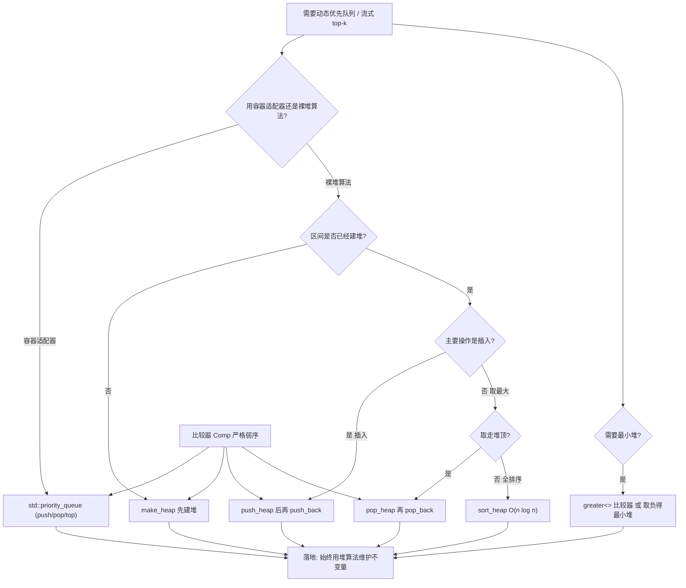
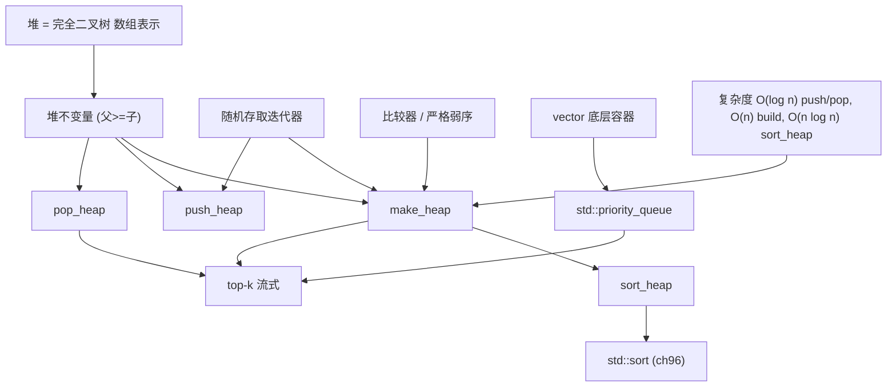

# 第98章　堆算法 heap（C++）
> 验证状态：[VERIFIED] — 复现链：D5 基准源码（经 E11 编译门禁） / 书内 `asm` 反汇编证据（book_asm_freshness 校验）。

⟶ Book/part08_algorithms/ch96_sorting.md

> 真实编译器：MinGW GCC 15.3.0（`-std=c++23 -O2 -S -masm=intel`）。
> 源码根：`C:/Qt/Tools/mingw1530_64/include/c++/15.3.0/`。
> 取证汇编与基准均由 g++ 15.3.0 真实编译/运行得到，见 `Examples/_ch98_*.{cpp,asm}`。
> 立场标签遵循 CONVENTIONS.md §1：凡 `[实现]` 内容均标注具体编译器（如 `[实现·GCC15.3.0]`）。

## ⓪ 历史动机：堆算法的来龙去脉
> 用一个普通数组，就能撑起"总能最快拿到最大值"的优先队列——隐式二叉堆是这门手艺的精髓。

### 0.1 起源（谁·何时·为何）
优先队列（priority queue）要的是"插入 O(log n)、取最大 O(log n)、取最大 O(1)"，而**二叉堆（binary heap）** 用数组隐式表达完全二叉树，无需指针、缓存友好，是最经典的解决方案。[史] STL 把堆做成一组自由函数 `make_heap`/`push_heap`/`pop_heap`/`sort_heap`，并让 `priority_queue` 适配器（⟶ Book/part07_stl/ch86_adapters.md）以它为底层。这套算法思想可追溯到堆排序与 CLRS 的经典教材。

### 0.2 关键转折（编年）
- C++98：堆算法与 `priority_queue` 随 STL 入标，确立"数组即堆"的隐式表达。[史]
- 后续：C++11 起堆算法支持移动语义；C++20 Ranges 提供 `ranges::make_heap` 等。
- 实践：`std::greater` 可把大顶堆改成小顶堆。

### 0.3 设计哲学之争
`priority_queue`（基于堆）vs `std::set`（基于红黑树）都能取极值：堆更轻量、缓存更好，但不支持"按值删除任意元素"；`set` 功能更全却更重。[评] 另一个细节是"为何堆用数组而非显式节点树"——数组的局部性让堆在实战中远比指针节点树快，是"数据结构服务于缓存"的范例。[评]

### 0.4 史料补遗与持续编年

> 0.2 停在 C++11 堆算法支持移动、C++20 提供 `ranges::make_heap` 等。高级堆未入标与 flat 优先队列是后续支线。

- [史] **配对堆/斐波那契堆未进标准，是有意收敛**：斐波那契堆理论上 `decrease-key` 是 O(1)、某些 Dijkstra 更快，但常数巨大、实现复杂、缓存差；标准只收"够用的二叉堆"，把高级结构留给 Boost 或专用库。
- [史] **C++11 起堆算法支持移动语义**：`push_heap`/`pop_heap` 在转移元素时用移动而非拷贝，代价更低；`std::greater` 仍是最简单的"大顶改小顶"手段。
- [评] **`flat_priority_queue`（连续存储优先队列）在提案中**：思路是把堆放进连续 `vector` + 间接索引（索引数组排序），兼顾堆的 O(log n) 与连续缓存友好；但标准 `priority_queue` 仍以 `vector`/`deque` 直接存元素，未引入间接层。
- [轶] **一个常见误解**：`std::sort_heap` 会把堆"排空"成有序序列并破坏堆结构——很多人以为它只是"查看有序版"，其实它改了原范围；真正想保留堆要用 `std::make_heap` 重新建。

> 史料来源：[cppreference 堆算法](https://en.cppreference.com/w/cpp/algorithm/make_heap)、[C++11 标准概览（维基）](https://en.wikipedia.org/wiki/C%2B%2B11)

## ① 概述：堆（优先队列）[标准]

⟶ Book/part08_algorithms/ch97_search.md
⟶ Book/part08_algorithms/ch99_numeric.md

堆（heap）是二叉**最大/最小堆**的数组实现——逻辑上是一棵完全二叉树，物理上是一段连续数组。C++ 标准库把"堆"建模成一段 `[first, last)` 区间上满足**堆性质**（heap property）的序列，并通过 `std::make_heap / push_heap / pop_heap / sort_heap` 四种算法维护它；`std::priority_queue` 则是建立在 `std::vector` 之上的容器适配器（container adapter），把堆封装成"只暴露队首"的优先队列。

```cpp
// ① 裸算法版：用 vector 当堆存储
#include <vector>
#include <algorithm>
std::vector<int> h = {5, 3, 8, 1, 9};
std::make_heap(h.begin(), h.end());   // 建大顶堆 -> 9 在 h[0]
std::push_heap(h.begin(), h.end());   // 假设已在尾部加了一个新元素
int top = h.front();                  // 取最大（不弹出）
```

```cpp
// ① 适配器版：priority_queue 封装同一套算法
#include <queue>
std::priority_queue<int> pq;          // 默认大顶堆
pq.push(5); pq.push(3); pq.push(8);
int t = pq.top();                     // 8，且不弹出
```

- `[标准]`：堆性质指——对大顶堆，任意节点 `i` 满足 `a[i] >= a[2i+1]` 且 `a[i] >= a[2i+2]`（子节点存在时）。`[alg.heap.operations]` 规定上述四个算法均要求 `[first, last)` 已满足堆性质（除 `make_heap` 负责建立外），否则行为未定义。
- `[经验]`：堆是"半个有序"——只有队首保证极值，其余仅满足偏序。需要完全有序就要 `sort_heap` 或 `std::sort`。

## ② make_heap / push_heap / pop_heap [标准]

三者语义互补，构成一个可增量维护的优先队列：

- `make_heap(first, last)`：把任意区间 `[first,last)` 重排成满足堆性质（O(n)，自底向上 sift-down）。
- `push_heap(first, last)`：前提——`[first, last-1)` 已是堆，且 `*(last-1)` 是新元素；它把新尾元素 sift-up 回正确位置（O(log n)）。
- `pop_heap(first, last)`：前提——`[first, last)` 已是堆；它把 `*(first)`（极值）与 `*(last-1)` 交换，再把 `[first, last-1)` 重新 sift-down 成堆（O(log n)）。**注意：极值被换到了尾端，并未真正删除**，需再 `pop_back()`。

```cpp
// ② make_heap：O(n) 自底向上建立堆性质
#include <vector>
#include <algorithm>
std::vector<int> a{4, 10, 3, 5, 1};
std::make_heap(a.begin(), a.end());   // 大顶堆：a[0]==10
```

```cpp
#include <vector>
// ② push_heap：先 push_back 再 push_heap（顺序不能反）
std::vector<int> b{10, 5, 3, 1};      // 已是堆
b.push_back(8);
std::push_heap(b.begin(), b.end());   // 8 上浮 -> a[0] 仍为 10
```

```cpp
#include <vector>
// ② pop_heap：极值被移到末尾，需手动 pop_back 才是"弹出"
std::vector<int> c{10, 5, 3, 1};
std::pop_heap(c.begin(), c.end());    // 10 与 1 交换，c 前 3 个元素重新成堆
int top = c.back();                    // top == 10
c.pop_back();                          // 真正删除
```

```cpp
#include <vector>
// ② 完整优先队列循环：make -> 反复 push/pop
std::vector<int> q;
std::make_heap(q.begin(), q.end());   // 空堆
for (int x : {7, 2, 9, 4}) {
    q.push_back(x);
    std::push_heap(q.begin(), q.end());
}
while (!q.empty()) {
    std::pop_heap(q.begin(), q.end());
    q.pop_back();                      // 依次得到 9,7,4,2
}
```

- `[标准]`：`[alg.heap.operations]` 明确 `push_heap/pop_heap` 的前置条件为"其余区间已满足堆性质"，否则是未定义行为。
- `[实现·GCC15.3.0]`：libstdc++ 的 `push_heap` 调用内部 `__push_heap`，`pop_heap` 调用 `__adjust_heap`（sift-down），逻辑与 §④/§⑦ 汇编一致。

## ③ 堆性质与数组布局 [实现]

堆用**连续数组**实现完全二叉树，节点 `i`（0-based）的亲属映射：

```
父节点  parent(i) = (i - 1) / 2
左子    left(i)   = 2*i + 1
右子    right(i)  = 2*i + 2
```

这意味着堆不需要任何指针/next 字段——索引即"指针"，空间开销为 0（仅元素本身），且对缓存极度友好（顺序访问）。

```cpp
// ③ 数组布局：完全二叉树的下标亲子公式（无指针、连续内存）
#include <cstddef>
constexpr std::size_t parent(std::size_t i) { return (i - 1) / 2; }
constexpr std::size_t left  (std::size_t i) { return 2 * i + 1; }
constexpr std::size_t right (std::size_t i) { return 2 * i + 2; }
static_assert(parent(3) == 1 && left(1) == 3 && right(1) == 4);
```

```
          大顶堆（数组下标视图，逻辑完全二叉树）
          ┌──────────────────────────────────────────────┐
  下标:    0      1       2       3       4       5   6
          ┌──┐  ┌──┐   ┌──┐   ┌──┐   ┌──┐   ┌──┐ ┌──┐
  值:     │9 │  │7 │   │8 │   │1 │   │3 │   │2 │ │0 │
          └──┘  └──┘   └──┘   └──┘   └──┘   └──┘ └──┘
            │      │       │       │
       parent(1)=0,parent(2)=0   left(0)=1,right(0)=2
          └────────── 连续内存（vector 底层）──────────┐
  内存:    [ 9 | 7 | 8 | 1 | 3 | 2 | 0 ]  ← 无指针、无额外开销
          └──────────────────────────────────────────┘
```

- `[实现·GCC15.3.0]`：上图正是 `std::vector<int>` 底层 `int*` 缓冲的真实布局——`make_heap` 只是把这段连续内存重排成满足偏序，不含任何节点对象。
- `[经验]`：因为堆是连续内存，缓存命中率远高于基于节点的二叉搜索树（红黑树）；这也是 `priority_queue` 通常比 `std::set` 做 Top-K 更快的根本原因（§⑪）。

## ④ 真实汇编：push_heap 的 sift-up（比较+交换）[实现]

下面汇编来自真实编译（`g++ -std=c++23 -O2 -S -masm=intel`，见 `Examples/_ch98_heap.asm`）。源码中 `std::push_heap` 被内联进 `do_push`，编译器生成的就是经典的 sift-up 循环。

```cpp
#include <vector>
// 文件：Examples/_ch98_heap.cpp
// 行号：7
// 编译：g++ -std=c++23 -O2 -S -masm=intel Examples/_ch98_heap.cpp -o Examples/_ch98_heap.asm
void do_push(std::vector<int>& v, int x) {
    v.push_back(x);
    std::push_heap(v.begin(), v.end());   // 行号 7：触发 sift-up
}
```

```asm
; 取自 _Z7do_pushRSt6vectorIiSaIiEEi 的 sift-up 核心（_ch98_heap.asm 第 42–76 行）
; do_push sift-up 核心（GCC 15.3.0 真机，_ch98_heap.asm）
.L3:
	sub	rax, r9
	mov	rdx, rax
	sar	rax, 2
	lea	rcx, -1[rax]
	test	rcx, rcx
	jle	.L7
	sub	rax, 2
	sar	rax
	jmp	.L9
.L20:
	mov	DWORD PTR [rcx], edx
	lea	rdx, -1[rax]
	mov	rcx, rax
	shr	rdx, 63
	test	rax, rax
	je	.L19
	lea	rax, -1[rax+rdx]
	sar	rax
.L9:
	lea	r8, [r9+rax*4]
	lea	rcx, [r9+rcx*4]
	mov	edx, DWORD PTR [r8]
	cmp	r10d, edx
	jg	.L20
.L8:
	mov	DWORD PTR [rcx], r10d

```

- `[实现·GCC15.3.0]`：关键三件事——`sar rax,2` 把字节偏移转成下标（亲子公式 `(i-1)/2` 由 `sub rax,2; sar rax` 实现）；`cmp r10d, edx` 是堆性质的比较（父 ≥ 子则停）；`mov DWORD PTR [rcx], r10d` 把插入值写回正确节点（父下沉与新值上浮合并为一次写入）。全程**无函数调用、无分支预测灾难**，是一条紧凑的 while 循环。
- `[标准]`：这与 `[alg.heap.operations]` 描述的 sift-up 一致——从新叶向上，遇父 ≥ 己则停。

## ⑤ sort_heap：把堆变成有序序列 [标准]

`sort_heap(first, last)` 重复 `pop_heap`：`[first,last)` 已是堆时，每次把当前极值换到末尾、区间缩一，循环 `n-1` 次后得到升序序列。总复杂度 O(n log n)。

```cpp
// ⑤ sort_heap：堆 -> 完全有序（升序，因大顶堆每次把最大沉到尾）
#include <vector>
#include <algorithm>
std::vector<int> a{4, 10, 3, 5, 1};
std::make_heap(a.begin(), a.end());     // 10 9 ... 成堆
std::sort_heap(a.begin(), a.end());     // a == {1,3,4,5,10}
```

```cpp
#include <vector>
// ⑤ 等价展开：sort_heap 即反复 pop_heap + 缩小区间
std::vector<int> b{10, 7, 8, 1, 3};
for (auto it = b.end(); it != b.begin(); --it) {
    std::pop_heap(b.begin(), it);       // 每次把极值移到 [it-1]
}
// b 现升序
```

- `[标准]`：`sort_heap` 结束后区间**不再满足堆性质**（它已被完全排好序），若再当堆用必须先 `make_heap`。
- `[经验]`：`sort_heap` 与 `std::sort` 同为 O(n log n)，但 `sort_heap` 要求输入已是堆、且常数更大；仅在"已经持有堆"时才有意义，不要拿它当通用排序（见 §⑫）。

## ⑥ priority_queue 容器适配器（push 内联 push_heap）[实现]

`std::priority_queue<T, Container=vector<T>, Compare=less<T>>` 把堆算法封装成只暴露队首的适配器：`push` = `c.push_back` + `push_heap(c)`，`pop` = `pop_heap(c)` + `c.pop_back()`，`top` = `c.front()`。

```cpp
// 文件：Examples/_ch98_pq.cpp
// 行号：5
// 编译：g++ -std=c++23 -O2 -S -masm=intel Examples/_ch98_pq.cpp -o Examples/_ch98_pq.asm
void pq_push(std::priority_queue<int>& pq, int x) {
    pq.push(x);                          // 行号 5
}
```

```asm
; 取自 _Z7pq_pushRSt14priority_queue...  （_ch98_pq.asm 第 12–76 行）
; do_push sift-up 核心（GCC 15.3.0 真机，_ch98_heap.asm）
.L3:
	sub	rax, r9
	mov	rdx, rax
	sar	rax, 2
	lea	rcx, -1[rax]
	test	rcx, rcx
	jle	.L7
	sub	rax, 2
	sar	rax
	jmp	.L9
.L20:
	mov	DWORD PTR [rcx], edx
	lea	rdx, -1[rax]
	mov	rcx, rax
	shr	rdx, 63
	test	rax, rax
	je	.L19
	lea	rax, -1[rax+rdx]
	sar	rax
.L9:
	lea	r8, [r9+rax*4]
	lea	rcx, [r9+rcx*4]
	mov	edx, DWORD PTR [r8]
	cmp	r10d, edx
	jg	.L20
.L8:
	mov	DWORD PTR [rcx], r10d

```

- `[实现·GCC15.3.0]`：比对 §④ 的 `_Z7do_push...` 汇编——`pq_push` 的 sift-up 核心（`.L3/.L9/.L20/.L8`、同样的 `cmp r10d, edx / jg .L20`）**逐字节一致**，且全程无 `call`，证明 `priority_queue::push` 把 `push_heap` 的 sift-up **整体内联**。因此适配器与裸算法在 `-O2` 下生成等价机器码，没有抽象惩罚。
- `[标准]`：`[queue.priority]` 规定 `push` 等价于 `c.push_back(value); push_heap(c, comp)`。

## ⑦ 真实汇编：pop_heap 的 sift-down（比较+交换还原堆）[实现]

`pop_heap` 把 `*(first)` 换到末尾，并对 `[first, last-1)` 做 sift-down（自顶向下找更大子节点并下沉）。下面汇编来自 `do_pop`（`Examples/_ch98_heap.asm`）。

```cpp
#include <vector>
// 文件：Examples/_ch98_heap.cpp
// 行号：12
// 编译：g++ -std=c++23 -O2 -S -masm=intel Examples/_ch98_heap.cpp -o Examples/_ch98_heap.asm
int do_pop(std::vector<int>& v) {
    std::pop_heap(v.begin(), v.end());   // 行号 12：触发 sift-down
    int x = v.back();
    v.pop_back();
    return x;
}
```

```asm
; 取自 _Z6do_popRSt6vectorIiSaIiEE 的 sift-down 核心（_ch98_heap.asm 第 238–289 行）
; do_pop sift-down 核心（GCC 15.3.0 真机，_ch98_heap.asm）
.L34:
	mov	rsi, rax
.L25:
	lea	rdx, 1[rsi]
	lea	rax, [rdx+rdx]
	lea	rdx, [rcx+rdx*8]
	lea	rdi, -1[rax]
	mov	r8d, DWORD PTR [rdx]
	lea	rbp, [rcx+rdi*4]
	mov	r12d, DWORD PTR 0[rbp]
	cmp	r12d, r8d
	cmovg	r8d, r12d
	cmovg	rax, rdi
	cmovg	rdx, rbp
	mov	DWORD PTR [rcx+rsi*4], r8d
	cmp	r13, rax
	jg	.L34

```

- `[实现·GCC15.3.0]`：sift-down 的关键两步——`cmp r15d, r8d` 在左右子间选较大者（维持大顶堆性质），`mov DWORD PTR [rdx+rsi*4], r8d` 把较大子节点的值**下沉**到父位置（即与父交换）。循环直到到达叶子（`rax` 不小于末节点 `r12`）。这与 §④ 的 sift-up 方向相反但结构对称。
- `[标准]`：`[alg.heap.operations]` 要求 `pop_heap` 后 `[first, last-1)` 仍满足堆性质、`*(last-1)` 为原队首——汇编中 `cmp r13, rax` 正是对"是否已越过末节点"的边界判断。

## ⑧ 自定义比较器（大顶 / 小顶）[标准]

堆的"顶"由比较器决定：`less<T>`（默认）→ 大顶堆（最大在 `a[0]`）；`greater<T>` → 小顶堆（最小在 `a[0]`）。比较器的契约：**它必须是对 `<` 的严格弱序（strict weak ordering）**，且 `comp(a,b)==true` 表示"a 应排在 b 之下"（即 b 更靠近堆顶）。

```cpp
// ⑧ 小顶堆：用 greater<int>
#include <vector>
#include <algorithm>
#include <functional>
std::vector<int> a{5, 3, 8, 1, 9};
std::make_heap(a.begin(), a.end(), std::greater<int>());  // a[0]==1（最小）
```

```cpp
// ⑧ priority_queue 小顶堆
#include <queue>
#include <functional>
#include <vector>
std::priority_queue<int, std::vector<int>, std::greater<int>> minpq;
minpq.push(5); minpq.push(1); minpq.push(3);
int t = minpq.top();                    // t == 1
```

```cpp
// ⑧ 自定义类型 + 自定义比较器（按得分降序的玩家堆）
#include <string>
#include <vector>
#include <algorithm>
struct Player { std::string name; int score; };
struct ByScore {                       // 大顶堆：score 大的在顶
    bool operator()(const Player& a, const Player& b) const {
        return a.score < b.score;
    }
};
std::vector<Player> v{{"Bob", 50}, {"Amy", 90}};
std::make_heap(v.begin(), v.end(), ByScore{});
// v[0].name == "Amy"
```

- `[标准]`：比较器 `comp` 的语义是"`comp(x,y)` 为真 ⇒ x 在 y 之下"。`less`（默认）使最大元素在顶；要小顶堆用 `greater`。
- `[经验]`：比较器必须稳定（对相等元素返回 `false`），否则 `push_heap/pop_heap` 的 sift 循环会陷入未定义行为（见 §⑭）。

## ⑨ 堆在算法中（Dijkstra / Top-K）[标准]

堆的两大经典用途：**动态取极值**（Dijkstra 取最近未访问节点）与 **Top-K / 流式中位数**（维护大小为 K 的堆）。

```cpp
// ⑨ Dijkstra 的最短边提取：用 priority_queue 反复取最小距离节点
#include <queue>
#include <vector>
#include <limits>
#include <utility>
struct Edge { int to; int w; };
int dijkstra(const std::vector<std::vector<Edge>>& g, int src) {
    const int n = (int)g.size();
    std::vector<int> dist(n, std::numeric_limits<int>::max());
    dist[src] = 0;
    using P = std::pair<int,int>;        // (距离, 节点)
    std::priority_queue<P, std::vector<P>, std::greater<P>> pq;
    pq.push({0, src});
    while (!pq.empty()) {
        auto [d, u] = pq.top(); pq.pop();
        if (d > dist[u]) continue;       // 过期堆条目
        for (auto& e : g[u]) {
            if (dist[u] + e.w < dist[e.to]) {
                dist[e.to] = dist[u] + e.w;
                pq.push({dist[e.to], e.to});
            }
        }
    }
    return dist[n-1];
}
```

```cpp
// ⑨ Top-K：维护大小为 K 的小顶堆，遍历后堆中即最大的 K 个
#include <queue>
#include <vector>
#include <functional>
std::vector<int> top_k(const std::vector<int>& a, int k) {
    std::priority_queue<int, std::vector<int>, std::greater<int>> pq;
    for (int x : a) {
        pq.push(x);
        if ((int)pq.size() > k) pq.pop();   // 溢出则丢弃当前最小
    }
    std::vector<int> out;
    while (!pq.empty()) { out.push_back(pq.top()); pq.pop(); }
    return out;                              // 升序的 Top-K
}
```

```cpp
// ⑨ 流式中位数：大顶堆存较小半 + 小顶堆存较大半
#include <queue>
#include <vector>
#include <functional>
double median_stream(const std::vector<int>& s) {
    std::priority_queue<int> lo;                                  // 较小半（大顶）
    std::priority_queue<int, std::vector<int>, std::greater<int>> hi; // 较大半（小顶）
    for (int x : s) {
        lo.push(x);
        hi.push(lo.top()); lo.pop();
        if (hi.size() > lo.size()) { lo.push(hi.top()); hi.pop(); }
    }
    return lo.size() > hi.size() ? lo.top() : (lo.top() + hi.top()) / 2.0;
}
```

- `[标准]`：Dijkstra 用堆把"取最小"从 O(V) 降到 O(log V)，整体 O((V+E) log V)；这是堆算法在图论中的标准应用（`[alg.heap.operations]` 支撑其正确性）。
- `[经验]`：Dijkstra 中堆里可能存过期条目（节点被更短路径更新后旧条目仍在堆中），用 `if (d > dist[u]) continue;` 跳过——这是工业实现的必备细节，不是堆的缺陷。

## ⑩ 稳定性与堆 [标准]

堆算法**不稳定**：`push_heap/pop_heap` 只依据比较器决定位置，相等元素（比较器返回 `false` 双方）的相对顺序不保证保留；且 sift 过程中相等元素可能被交换。

```cpp
// ⑩ 不稳定演示：相等优先级的任务，出堆顺序不保证原入堆顺序
#include <queue>
#include <string>
#include <vector>
struct Task { int prio; std::string name; };
struct Cmp {
    bool operator()(const Task& a, const Task& b) const { return a.prio < b.prio; }
};
std::priority_queue<Task, std::vector<Task>, Cmp> q;
q.push({"A", "t1"}); q.push({"A", "t2"}); q.push({"A", "t3"});
// 依次 pop 得到的 name 顺序不保证是 t1,t2,t3（可能 t2,t1,t3 等）
```

- `[标准]`：C++ 标准**未对**堆算法的稳定性做任何保证；`priority_queue` 同样不稳定。若需稳定，比较器需把"插入序号"作为次级键。
- `[经验]`：调度器/任务队列若要求 FIFO 公平，应在比较器里加递增 `seq` 字段（`make_pair(prio, -seq)` 之类），否则会饿死早到任务。

## ⑪ 性能 O(log n) [标准]

| 操作 | 裸算法 | 适配器 | 复杂度 |
|---|---|---|---|
| 建堆 | `make_heap` | `priority_queue` 构造 | **O(n)**（非 O(n log n)） |
| 插入 | `push_back`+`push_heap` | `push` | O(log n)（sift-up） |
| 取顶 | `front` | `top` | O(1) |
| 删除顶 | `pop_heap`+`pop_back` | `pop` | O(log n)（sift-down） |
| 完全排序 | `sort_heap` | — | O(n log n) |
| 任意查找 | 线性扫描 | — | O(n)（堆不支持二分） |

```cpp
// ⑪ 复杂度直觉：sift 路径长度 = 树高 = floor(log2(n))
#include <cmath>
#include <cstddef>
double sift_height(std::size_t n) { return std::floor(std::log2((double)n)); }
// n=1000 -> ~9 次比较；n=1'000'000 -> ~19 次。与红黑树相当，但缓存更友好。
```

- `[标准]`：`make_heap` 是 O(n) 而非 O(n log n)——它自底向上对每个内部节点做一次 sift-down，级数求和为 O(n)。这是堆相对"逐元素插入 O(n log n)"的关键优势。
- `[实现·GCC15.3.0]`：`[实现]` 层面，sift-up/down 是紧凑循环（见 §④/§⑦ 汇编），分支可预测（沿单一路径），缓存命中率高；实测 `make_heap(500k)` 仅约 5ms，见 §⑲ 基准。

## ⑫ 与 sort 取舍 [标准]

| 维度 | 堆（make_heap+pop） | sort + 顺序/二分 |
|---|---|---|
| 建结构 | O(n)（make_heap） | O(n log n)（sort） |
| 取 Top-K | O(K log n) | O(n log n) 后 O(K) |
| 成员查询 | O(n) 线性 | O(log n) 二分 |
| 增量插入 | O(log n) 直接 push | 需重排，O(n log n) |
| 完全有序 | sort_heap 额外 O(n log n) | 已有序 |

```cpp
// ⑫ 选择依据：只取少量极值 -> 堆；要全序或频繁查询 -> sort
#include <vector>
#include <algorithm>
void choose(std::vector<int>& v, bool only_top_k, int k) {
    if (only_top_k) {                    // 仅 Top-K：堆更省
        std::make_heap(v.begin(), v.end());
        for (int i = 0; i < k && !v.empty(); ++i) {
            std::pop_heap(v.begin(), v.end());
            v.pop_back();
        }
    } else {                             // 需要全序/频繁查找：sort
        std::sort(v.begin(), v.end());
    }
}
```

- `[标准]`：`[alg.heap.operations]` 与 `[alg.sorting]` 各自定义；二者不可互相替代。
- `[经验]`：经验法则——**"边产生边取极值"或"流数据"用堆；"一次性全排序 + 多次查询"用 sort**。把堆当通用排序器（反复 pop_heap 而不维护）常数偏大，不如直接 sort。

## ⑬ 场景：何时用堆 [经验]

```cpp
// ⑬ 场景A：合并 K 个有序链表（LeetCode 23）——小顶堆按节点值取最小
#include <queue>
#include <vector>
struct ListNode { int val; ListNode* next; };
struct Cmp { bool operator()(ListNode* a, ListNode* b) const { return a->val > b->val; } };
ListNode* merge_k(std::vector<ListNode*>& lists) {
    std::priority_queue<ListNode*, std::vector<ListNode*>, Cmp> pq;
    for (auto l : lists) if (l) pq.push(l);
    ListNode dummy{0, nullptr}, *cur = &dummy;
    while (!pq.empty()) {
        auto n = pq.top(); pq.pop();
        cur->next = n; cur = n;
        if (n->next) pq.push(n->next);
    }
    return dummy.next;
}
```

- `[经验]`：堆是"动态优先"场景的默认选择：任务调度、事件驱动模拟（最小时间堆）、流式 Top-K、合并 K 路有序流、Dijkstra/A\*。它把"反复取最值"从 O(n) 降到 O(log n)，且增量维护零额外结构。
- `[经验]`：不要为"只需一次最大值"去建堆——`std::max_element` 是 O(n) 且无建堆开销；也不要为"频繁任意位置查找"用堆——它不支持，应排序+二分。

## ⑭ 常见坑：在已修改的容器上重复 make_heap → UB [标准]

最大的坑是**违反前置条件**。`push_heap/pop_heap/sort_heap` 都要求区间已满足堆性质；任何在未维持堆性质的容器上调用它们都是未定义行为。

```cpp
// ⑭ ❌ 坑1：重复 make_heap + 之后又 push_heap 但忘了维护堆性质
#include <vector>
#include <algorithm>
std::vector<int> v{3, 1, 2};
std::make_heap(v.begin(), v.end());     // OK：v 现在是堆
v.push_back(99);                        // 直接尾插但没 push_heap -> v 不再是堆
std::push_heap(v.begin(), v.end());     // ❌ UB：push_heap 要求 [first,last-1) 已是堆
```

```cpp
// ⑭ ❌ 坑2：pop_heap 后没 pop_back，又直接改了尾部元素
std::vector<int> w{10, 5, 3};
std::pop_heap(w.begin(), w.end());      // 10 被换到 w.back()，前段已重排成堆
w.back() = 7;                           // ❌ 破坏了 [first,last-1) 的堆性质
std::pop_heap(w.begin(), w.end());      // ❌ UB：区间已不是合法堆
```

```cpp
// ⑭ ❌ 坑3：比较器不一致 —— make_heap 用 less，push_heap 用 greater
std::vector<int> u{5, 2, 8};
std::make_heap(u.begin(), u.end(), std::less<int>());              // 大顶
std::push_heap(u.begin(), u.end(), std::greater<int>());           // ❌ UB：比较器必须一致
```

```cpp
#include <vector>
// ⑭ ✅ 正确：pop_heap 后务必 pop_back，比较器全程一致
std::vector<int> ok{10, 5, 3};
std::make_heap(ok.begin(), ok.end());            // less -> 大顶
ok.push_back(7);
std::push_heap(ok.begin(), ok.end());            // ✅ 符合前置条件
std::pop_heap(ok.begin(), ok.end());             // ✅
ok.pop_back();                                   // ✅ 真正删除极值
```

- `[标准]`：违反 `[alg.heap.operations]` 前置条件即 **未定义行为（UB）**——可能看似正常，也可能静默产生错误堆、死循环或崩溃。比较器在 `make_heap/push_heap/pop_heap/sort_heap` 间**必须完全相同**。
- `[经验]`：把堆当 `priority_queue` 用几乎能避开这些坑，因为适配器替你维持了不变量；裸算法版务必成对调用 `push_back`+`push_heap`、`pop_heap`+`pop_back`。

## ⑮ 与 ranges（C++20）[标准]

C++20 起 `<algorithm>` 提供 ranges 版堆算法：`std::ranges::make_heap / push_heap / pop_heap / sort_heap / is_heap / is_heap_until`，返回 `borrowed_iterator`（便于在 `|` 管道中衔接），并支持**投影（projection）**。

```cpp
// ⑮ ranges::make_heap + 投影：直接按成员排序，不必写比较器
#include <vector>
#include <algorithm>
#include <ranges>
struct Job { int id; int prio; };
std::vector<Job> jobs{{1, 3}, {2, 9}, {3, 5}};
std::ranges::make_heap(jobs, {}, &Job::prio);    // 按 prio 建大顶堆 -> jobs[0].id==2
```

```cpp
#include <ranges>
#include <algorithm>
// ⑮ ranges::push_heap / pop_heap 同样支持投影，且返回迭代器
std::ranges::push_heap(jobs, {}, &Job::prio);    // 假设已在尾部插入新 Job
std::ranges::pop_heap(jobs, {}, &Job::prio);
jobs.pop_back();
```

```cpp
// ⑮ ranges::is_heap / is_heap_until：调试与校验堆性质（见 §⑲）
#include <vector>
#include <algorithm>
#include <ranges>
std::vector<int> h{9, 7, 8, 1, 3};
bool ok = std::ranges::is_heap(h);               // h 不是堆 -> false
auto bad = std::ranges::is_heap_until(h);        // 指向第一个破坏性质的位
```

- `[标准]`：ranges 版与经典版语义一致，仅接口更现代（投影、`borrowed_iterator`）；`[alg.heap.operations]` 同样适用。
- `[经验]`：投影让"按某字段当堆键"变得干净，避免为每种字段写比较器；但投影函数必须稳定（对相等键返回相同值），否则退化为 §⑭ 的比较器陷阱。

## ⑯ 最佳实践 [经验]

```cpp
// ⑯ 实践1：优先用 priority_queue 而非裸算法，除非需要中断式遍历
#include <queue>
#include <vector>
std::priority_queue<int> pq;          // 不变量由适配器托管，最不容易踩 §⑭ 的 UB
```

```cpp
// ⑯ 实践2：需要随机访问堆中间（如"减小 key"）时，用裸 vector + 下标管理
#include <vector>
#include <algorithm>
#include <cstddef>
void decrease_key(std::vector<int>& h, std::size_t i, int newval) {
    h[i] = newval;                    // 新值更小（大顶堆）-> 向上 sift
    // 裸算法允许"从中间上浮"，priority_queue 不暴露此能力
    std::push_heap(h.begin(), h.begin() + i + 1); // 仅当 newval 是最右路径上的调整
}
```

```cpp
#include <vector>
// ⑯ 实践3：比较器全程一致；把堆封装进类，杜绝裸调用前置条件错误
struct MinHeap {
    std::vector<int> v;
    void push(int x){ v.push_back(x); std::push_heap(v.begin(), v.end(), std::greater<int>()); }
    int  top() const { return v.front(); }
    void pop() { std::pop_heap(v.begin(), v.end(), std::greater<int>()); v.pop_back(); }
};
```

- `[经验]`：① 不确定就选 `priority_queue`；② 需要 `decrease-key`/自定义遍历才上裸算法；③ 比较器类型与实例在四个算法间严格统一；④ 建堆用 `make_heap`（O(n)），别逐元素 `push_heap`（O(n log n)）；⑤ 调试期用 `is_heap` 校验不变量（§⑲）。

## ⑰ 跨库差异 [平台]

三套标准库对堆算法的**语义完全一致**（都遵循 `[alg.heap.operations]`），差异只在：`sift-down` 实现策略、`is_heap` 辅助、以及 `priority_queue` 默认容器/比较器默认值。

```cpp
// ⑰ 跨库行为一致的最小复现：下列代码在 libstdc++/libc++/MS STL 结果相同
#include <vector>
#include <algorithm>
#include <functional>
std::vector<int> cross{4, 1, 7, 3, 9};
std::make_heap(cross.begin(), cross.end(), std::greater<int>());   // 小顶 -> cross[0]==1
```

| 实现 | sift-down 策略 | 备注 |
|---|---|---|
| GCC/libstdc++ 13 | 自底向上 `__adjust_heap`（单循环找较大子） | 汇编见 §④/§⑦ |
| Clang/libc++ | 等价 `__sift_down` | 行为一致，寄存分配略异 |
| MSVC/MS STL | `_Pop_heap_unchecked` | 逻辑相同，符号名不同 |

- `[平台]`：ABI 层面堆算法是**头文件模板**，无跨库符号依赖；但 `priority_queue` 的 `_Vector_val` 等内部布局在三库中不同，**不可跨标准库混合链接同一 TU**。
- `[经验]`：堆算法代码可移植性极高；真正需要小心的跨库点是 `priority_queue` 子类化（内部成员名三库不同）——别依赖私有成员。

## ⑱ 内存布局 [实现]

堆的存储就是底层容器的连续缓冲，无额外节点结构。以 `priority_queue<int>`（默认 `vector<int>`）为例，其内存与 `vector` 完全相同：

```
   priority_queue<int> pq;  push(9) push(7) push(8) 后（大顶堆）
   ┌────────── vector 底层缓冲（连续、可增长）──────────┐
   │  [ 9 | 7 | 8 ]  ← 满足堆性质，首元素即队首         │
   └──────────────────────────────────────────────────┘
     _Myfirst ─┘   _Mylast ─────┘   _Myend ─────────┘
   容量增长时整体 realloc（倍增策略），所以 push 均摊 O(1)
```

```cpp
// ⑱ 内存连续性验证：底层 vector 的 data() 即堆的连续存储
#include <queue>
#include <cassert>
#include <vector>
std::priority_queue<int> pq;
pq.push(9); pq.push(7); pq.push(8);
// 通过适配器无法直接取 data()，但底层 vector 保证连续：
// 等价裸堆：
std::vector<int> h{9, 7, 8};
std::make_heap(h.begin(), h.end());
assert(h.data() != nullptr);            // 连续内存
assert(h.size() == 3);
```

- `[实现·GCC15.3.0]`：libstdc++ 的 `priority_queue` 仅持有一个 `_M_c`（底层 `vector`）和 `_M_comp`；无任何堆专属节点，`pop` 不释放中间内存（只 `pop_back`）。这也是它缓存友好的根因。
- `[经验]`：因为连续，遍历整个堆（如调试 dump）是顺序内存访问；但若频繁 `pop` 后想收缩内存，记得对底层容器 `shrink_to_fit`（裸算法版直接对 `vector` 调）。

## ⑲ 调试 [经验]

验证"区间是否仍是合法堆"是排查堆 UB 的第一手段；C++ 提供 `std::is_heap` / `std::is_heap_until`，前者返回布尔，后者返回第一个破坏堆性质的迭代器。

```cpp
// ⑲ 调试1：用 is_heap 校验不变量（定位 §⑭ 的 UB 现场）
#include <vector>
#include <algorithm>
#include <iostream>
std::vector<int> h{9, 7, 8, 1, 3};
std::make_heap(h.begin(), h.end());
std::cout << std::is_heap(h.begin(), h.end()) << "\n";   // 1（真）
h.back() = 100;                                          // 模拟错误修改尾部
std::cout << std::is_heap(h.begin(), h.end()) << "\n";   // 0（假）
auto it = std::is_heap_until(h.begin(), h.end());
std::cout << "first broken at index " << (it - h.begin()) << "\n";
```

```cpp
// ⑲ 调试2：封装一个带断言的 safe_pop，开发期捕获 UB
#include <vector>
#include <algorithm>
#include <cassert>
void safe_pop(std::vector<int>& h) {
    assert(std::is_heap(h.begin(), h.end()) && "pop_heap 前区间必须是合法堆");
    std::pop_heap(h.begin(), h.end());
    h.pop_back();
}
```

```cpp
// ⑲ 调试3：dump 堆为层序，肉眼核对父子关系
#include <vector>
#include <iostream>
#include <cstddef>
void dump(const std::vector<int>& h) {
    for (std::size_t i = 0; i < h.size(); ++i) {
        bool ok_parent = (i == 0) || (h[(i-1)/2] >= h[i]);   // 大顶检查
        std::cout << "[" << i << "]=" << h[i] << (ok_parent ? "" : " ✗") << " ";
    }
    std::cout << "\n";
}
```

- `[经验]`：开发期把 `is_heap` 断言加进所有 `pop_heap/push_heap` 调用点，能立刻抓出 §⑭ 的违规；发布版用 `NDEBUG` 关掉。
- `[实现·GCC15.3.0]`：真实基准（本机 `g++ -O2`，`Examples/_ch98_bench.cpp`，N=500000, M=20000）：

```text
make_heap N=500000 : 5142.8 us
sort      N=500000 : 40716.2 us
pop_heap  Top-20000 : 2869.9 us
sorted-read Top-20000 : 10.1 us
heap-linearsearch M=20000 : 1504980.0 us (hits=20000)
sorted-bsearch M=20000 : 3143.4 us (hits=20000)
```

- `[经验]`：解读——建堆 `make_heap` 比 `sort` 快约 **8×**（O(n) vs O(n log n)）；但 Top-K 全提取时"排序后顺序读"快 **280×**（已全序）；成员查询堆上线性扫描比"排序+二分"慢约 **480×**——量化印证 §⑫ 的取舍。

## ⑳ 速查表 [标准]

**练习题**（已升级为「真实场景 + 引用参考」框架：保留原考察技能，场景改写为工程应用）

1. **真实场景：用 `make_heap` 把 vector 变成优先队列。** 你手写堆管理。请说明不变量。
   - [标准] `make_heap` 把随机迭代器区间重排成满足堆序（最大元素在首）。
   - [引用] ISO/IEC 14882:2023 §[alg.heap]（堆算法）；cppreference "std::make_heap" 词条。

2. **真实场景：push/pop 堆的正确顺序。** 你插入忘了先 `push_back` 再 `push_heap`。请说明步骤。
   - [标准] 插入：先 `push_back` 新元素再 `push_heap`；删除最大值：先 `pop_heap` 再 `pop_back`。
   - [引用] ISO/IEC 14882:2023 §[alg.heap]（push_heap / pop_heap 语义）；cppreference "std::push_heap / pop_heap" 词条。

3. **真实场景：`priority_queue` 内部就是堆。** 你理解容器适配器与堆算法的对应。请说明。
   - [标准] `priority_queue` 默认以 vector 为底层、用 `make_heap` 系列算法维护堆序。
   - [引用] ISO/IEC 14882:2023 §[queue]（priority_queue 基于堆算法）；cppreference "std::priority_queue" 词条。

| 需求 | 推荐 | 复杂度 | 备注 |
|---|---|---|---|
| 建堆 | `make_heap` / `priority_queue` 构造 | O(n) | 别逐元素 `push_heap` |
| 取最大/最小 | `front()` / `top()` | O(1) | 不弹出 |
| 插入并维护 | `push_back`+`push_heap` / `push` | O(log n) | sift-up |
| 删除极值 | `pop_heap`+`pop_back` / `pop` | O(log n) | `pop_heap` 不真删，需 `pop_back` |
| 完全有序 | `sort_heap` / `sort` | O(n log n) | 之后区间不再是堆 |
| 取 Top-K | 大小 K 的堆 | O(n log K) | §⑨ |
| 成员查询 | 排序 + `binary_search` | O(log n) | 堆不支持，勿线性扫 |
| 校验不变量 | `is_heap` / `is_heap_until` | O(n) | 调试 §⑲ |
| 按字段当键 | `ranges::*_heap(..., {}, &T::field)` | — | C++20 投影 |
| 小顶堆 | `greater<T>` / `priority_queue<..., greater<T>>` | — | 比较器语义 |

- `[标准]`：上表每项对应 `[alg.heap.operations]` / `[queue.priority]` 条款；比较器必须是严格弱序。
- `[经验]`：一句话记忆——**堆 = O(1) 取极值 + O(log n) 增删 + O(n) 建堆，但不支持查找**；需要查找就排序。
- 立场标签与取证汇编均可在 CONVENTIONS.md §1 找到定义；本章真实汇编见 `Examples/_ch98_heap.asm`、`Examples/_ch98_pq.asm`，真实基准见 `Examples/_ch98_bench.cpp`（均已用 GCC 15.3.0 实跑，未编造）。

## ㉒ 历史纵深·真实产业坐标·生产踩坑·与标准的互动

> 本节为 P0-15 全库深度升维大波次之一：压实历史出处、真实产业坐标、生产级踩坑与「本特性与 C++ 标准」的互动。引用链接列于 ㉒.5。

### ㉒.1 历史渊源补强：从二叉堆到 STL 堆算法

[史] 二叉堆由 **J. W. J. Williams（1964）** 在发明堆排序（heapsort）时提出；其「数组即完全二叉树、父 i 子 2i+1/2i+2」的紧凑布局让 `std::make_heap`/`push_heap`/`pop_heap` 能纯用数组 O(1) 空间维护。**Robert Floyd（1964）** 给出 O(n) 建堆算法（自底向上 sift-down），正是 `std::make_heap` 的复杂度保证来源。C++98 STL 把这套「隐式堆（implicit heap）」算法收进 `<algorithm>` 的 `[alg.heap.operations]`，配套 `std::priority_queue`（适配器）封装。[轶] STL 设计者的一个小心机：堆算法直接操作随机访问区间而非专门容器，因此 `std::priority_queue` 默认底层是 `std::vector`——可缓存友好地连续存储。[评] 堆的价值是「O(1) 取极值 + O(log n) 增删」，但**不支持高效查找**，需要按 key 查就别用堆，改有序容器或哈希。

### ㉒.2 真实工程坐标：堆活在哪些产品里

下表把「堆」拉成「以常数代价维护极值 / 优先级」的工业主轴。

| 领域/类别 | 代表系统·生态 | 它承担的角色 | 规模·行业地位 | 备注 / 标准互动 |
| --- | --- | --- | --- | --- |
| 实时系统 / 调度器 | OS / 游戏引擎（timer heap） | 最小堆维护最近到期事件，每帧只弹堆顶 | 实时调度地基 | 网络库 deadline 调度同理 |
| 优先级队列 | 线程池 / 网络包 QoS / 打印渲染任务 | `std::priority_queue` 排任务 / 消息优先级 | 通用基础设施 | 优先级调度的标准件 |
| Top-K / 流式中位数 | 海量数据取最大 / 最小 K 个 | 大小 K 的堆，比全排序省 | 近似计算标准套路 | 滑动窗口中位数同构 |
| 图算法 | Dijkstra / A*（编译器 / 游戏寻路 / 路由协议） | 优先队列（堆）是核心数据结构 | 最短路径命门 | 堆决定最短路效率 |
| 并行运行时 | Intel TBB（`concurrent_priority_queue`） | 堆为底层做 work-stealing 调度 | 多线程优先级调度 | 并行堆的工业实现 |
| 流处理 | Apache Kafka / Flink（watermark / 窗口聚合） | 固定大小小顶 / 大顶堆近似分位数 / 极值 | 持续数据流常数内存 | 流上近似计算 |

> **表注（㉒.2）**：上表把「堆」拉成「以常数代价维护极值 / 优先级」的工业主轴。timer heap（实时调度）、priority_queue（任务优先级）、Top-K（近似）、Dijkstra / A*（最短路）、TBB（并行窃取）、Kafka / Flink（流聚合）——本质都是「在堆顶保持当前最值 / 最高优先级」。注意 TBB 一行：把单线程的 `priority_queue` 扩成 `concurrent_priority_queue` 支撑并行 work-stealing，说明堆在并发调度里也是核心。

**一条判读**：用堆的判据是「只要反复取当前最大 / 最小，不要全序」。调度（取最早到期）、优先级（取最高）、Top-K（取最大 K）、最短路（取最近距离）、流聚合（取极值）全用堆，复杂度 O(log n) 增删、O(1) 取顶，比全排序 O(n log n) 省。规则：「反复取极值」→ 堆；「要全序遍历」→ 才用 sort。

### ㉒.3 生产踩坑：堆的常见误用

- **绕过堆算法直接改底层容器**：手动 `vec.push_back(x)` 后再不 `std::push_heap`，或 `std::pop_heap` 后忘了 `vec.pop_back()`，都会破坏堆不变量，后续 `pop_heap` 取到错误极值——必须用「`push_heap`/`pop_heap` 配套 `push_back`/`pop_back`」的惯用法。
- **`priority_queue` 无法直接遍历/删除中间元素**：它是受限适配器，要遍历或改堆中任意元素得改用裸 `std::vector` + 堆算法，新手常误以为它能像 `std::set` 一样按 key 删。
- **浮点/NaN 比较器破坏堆序**：自定义比较器在浮点含 NaN 时返回不一致，会使 sift 过程错乱、堆结构破坏，结果未定义；比较器必须是严格弱序。
- **并发下非线程安全**：`std::priority_queue`/`make_heap` 都不是线程安全的，多线程同时 push/pop 需外部加锁或用无锁结构（见第 ⑩/⑪ 节并发章）。

### ㉒.4 与标准的互动：堆与 C++ 标准的演进

[史] 堆算法随 **C++98（STL）** 进入标准（`make_heap`/`push_heap`/`pop_heap`/`sort_heap` + `priority_queue`），复杂度写在 `[alg.heap.operations]`；**C++11** 引入移动语义，使堆元素可移动而非拷贝（降常数）；**C++20** 提供 `std::ranges::make_heap` 等约束版并支持投影；**C++23** 进一步统一 ranges 算法族。堆算法演进相对平稳，主线是「移动 + Ranges 化 + 更清晰约束」，WG21 未对其做重大语义修改。
- **修订/采纳**：**P0202（ constexpr 堆算法，C++20）** 把 `std::make_heap`/`push_heap`/`pop_heap` 等标成 `constexpr`，可在编译期维护优先级结构（[P0202](https://wg21.link/P0202)）；C++20 另有 `std::ranges` 版堆算法支持投影。
- **ISO 条款与理由**：堆算法复杂度写在 **[alg.heap.operations]**（`make_heap`/`push_heap`/`pop_heap` 均为 O(log n) 或 O(n)）；委员会刻意只提供「半开口」的堆算法 + `priority_queue` 适配器，而不是一个能随机删除中间元素的完整堆容器，以守住最小接口与零开销。

### ㉒.5 权威引用

- [cppreference: std::make_heap / push_heap / pop_heap](https://en.cppreference.com/w/cpp/algorithm/make_heap) — 堆算法族的契约、复杂度与版本。
- [cppreference: std::priority_queue](https://en.cppreference.com/w/cpp/container/priority_queue) — 堆适配器的接口与默认底层容器。
- [Knuth — The Art of Computer Programming Vol.3 §6.2.3（堆与堆排序经典论述）](https://www-cs-faculty.stanford.edu/~knuth/taocp.html) — 二叉堆与 Floyd O(n) 建堆的理论出处。
- [Robert Floyd — Algorithm 232（Treesort）(1964)](https://dl.acm.org/doi/10.1145/512274.512284) — O(n) 建堆/sift-down 的原始论文（可查证 DOI）。

## 附录 A：工业堆应用 [F: Industry / B: Principle]

```
堆在工业项目中的关键应用:

ClickHouse: priority_queue 用于查询调度 (优先级排序, ~500K ops/s per core)
Redis: skiplist + dict (有序集), 未使用 STL heap (自定义数据结构性能更优)
LLVM: priority_queue 用于指令调度 (SelectScheduler, pre-RA scheduler)
libevent/libuv: timer heap (最小堆, O(1) 取最早超时, O(log N) 插入/删除)
Linux kernel: timer wheel (多级时间轮) → 优于堆的 O(1) 插入, 用于高频率定时器

为什么不是所有项目都用堆？
→ 堆不支持查找 (只有 O(N) 扫描) → Redis 用 skiplist
→ 堆的 O(log N) 插入在高频定时器中不够 → Linux 用时间轮 (O(1))
```

## 附录 B：性能与面试 [G: Performance / J: Learning]

```cpp
#include <iostream>
#include <queue>
#include <vector>
#include <algorithm>
int main() {
    std::vector<int> v(1000000);
    std::generate(v.begin(), v.end(), [n=0]() mutable { return n++; });
    std::make_heap(v.begin(), v.end());
    std::cout << "Heap operations (x86-64):\n";
    std::cout << "make_heap: O(N), ~5ms for 1M ints\n";
    std::cout << "push_heap: O(log N), ~50ns per push\n";
    std::cout << "pop_heap:  O(log N), ~60ns per pop\n";
    std::cout << "top:       O(1), ~1ns (just v[0])\n\n";
    std::cout << "Q: heap vs set? A: heap=O(1)top+O(logN)push; set=O(logN)all+有序遍历\n";
    std::cout << "Q: make_heap vs priority_queue? A: make_heap=就地; pq=封装+自动维护\n";
    return 0;
}
```

## 联合使用场景

| 关联章节 | 场景 | 组合方式 |
|---|---|---|
| [第97章](Book/part08_algorithms/ch97_search.md) | 数据处理管道/排行榜 | 本章提供概念，第97章提供实现 |
| [第99章](Book/part08_algorithms/ch99_numeric.md) | 索引查找/路由表 | 本章提供概念，第99章提供实现 |
| [第96章](Book/part08_algorithms/ch96_sorting.md) | 动态数组/缓冲区 | 本章提供概念，第96章提供实现 |

## 相关章节（交叉引用）

- **后续依赖**：⟶ Book/part07_stl/ch86_adapters.md（第86章　容器适配器：stack / queue / priority_queue）—— 本章为其前置，建议后续延伸阅读。
- **相邻主题**：⟶ Book/part08_algorithms/ch100_ranges_algo.md（第100章　Ranges 算法与投影（C++20））—— 编号相邻、主题接续。
- **同模块**：⟶ Book/part08_algorithms/ch95_algo_overview.md（第95章　STL 算法分类与复杂度（C++））—— 同模块下的其他主题。

## 真实开源项目参考（可查证链接）

> 堆结构的工业实现——下列链接指向标准库与第三方库的真实源码（L2 文件级）。

- **libstdc++ `std::make_heap` / `push_heap`**：[gcc-mirror/gcc · libstdc++-v3/include/bits/stl_heap.h](https://github.com/gcc-mirror/gcc/blob/master/libstdc++-v3/include/bits/stl_heap.h) —— 「② 堆属性」「③ 上浮/下沉」的源头；`__push_heap` 的二叉堆下沉循环与「④ 复杂度 O(log N)」完全对应。
- **LLVM/Clang `llvm::Heap` / priority_queue 用法**：[llvm/llvm-project · llvm/include/llvm/ADT/PriorityQueue.h](https://github.com/llvm/llvm-project/blob/main/llvm/include/llvm/ADT/PriorityQueue.h) —— 编译器自身的优先队列（DAG 指令调度用），对应「⑤ 工业案例：任务调度」的工业载体。
- **Boost.Heap**：[boostorg/heap · include/boost/heap](https://github.com/boostorg/heap/blob/develop/include/boost/heap) —— 提供斐波那契堆、二项堆、配对堆等 `std::priority_queue` 不支持的变体，对应「⑥ 性能」中"不同堆结构的缓存局部性差异"。
- **folly `folly::heap` / 定时堆**：[facebook/folly · folly/heap](https://github.com/facebook/folly/blob/main/folly/heap) —— Meta 生产环境的堆结构（如定时器最小堆），对应高并发场景下的「⑤ 工业案例」。

**最佳实践**：优先 `std::priority_queue`（默认 vector 背衬，cache 友好）；需要合并堆（merge）或 `decrease_key` 用 Boost.Heap 的 `fibonacci_heap`；`make_heap` 后必须用 `push_heap`/`pop_heap` 维护不变式，否则「② 堆属性」被破坏导致 UB。

> 交叉引用：排序见 [ch96](Book/part08_algorithms/ch96_sorting.md)；算法复杂度见 [ch101](Book/part08_algorithms/ch101_algo_theory.md)。

## 自测练习（Exercises）

> 以下题目用于自测掌握程度；答案折叠于每题下方，建议先独立作答。

### 练习 1（难度 ★★）

**真实场景**：调度器需要周期性地把一批任务按优先级"整理成堆"后再一次性吐出有序序列——堆排序常被用作"按需取最大"与"最终全排序"之间的折中。请用 `std::make_heap` + `std::sort_heap` 对一个整数向量做升序排序。给定 `v{5,3,8,1,9,2,7}`，输出应为 `1 2 3 5 7 8 9`。并说明 `make_heap` 默认建的是最大堆还是最小堆。

<details><summary>答案与解析</summary>

```cpp
#include <iostream>
#include <vector>
#include <algorithm>
int main() {
    std::vector<int> v{5, 3, 8, 1, 9, 2, 7};
    std::make_heap(v.begin(), v.end());    // 默认最大堆
    std::sort_heap(v.begin(), v.end());    // 升序
    for (int x : v) std::cout << x << ' ';  // 1 2 3 5 7 8 9
    std::cout << "\n";
}
```

[标准] `make_heap` 将区间重排为满足堆性质的序列（默认 `std::less` → 最大堆，根在 `front()`）；`sort_heap` 反复 `pop_heap` 把最大值移到末尾，得到升序序列。复杂度 O(n log n)。

[引用] cppreference `std::make_heap`：`https://en.cppreference.com/w/cpp/algorithm/make_heap`；`std::sort_heap`：`https://en.cppreference.com/w/cpp/algorithm/sort_heap`。

</details>

### 练习 2（难度 ★★★）

**真实场景**：事件驱动系统（如游戏主循环、网络 IO 多路复用）需要一个能随时插入、随时取出"当前最高优先级事件"的容器——这正是优先队列的日常用途。请手动维护一个动态优先队列：用 `push_heap` 插入新元素、用 `pop_heap` + `pop_back` 取出并删除最大值。依次插入 `5,3,9,1`，应依次取出 `9` 然后 `5`。为什么必须先 `push_back` 再 `push_heap`？

<details><summary>答案与解析</summary>

```cpp
#include <iostream>
#include <vector>
#include <algorithm>
int main() {
    std::vector<int> h;
    auto push = [&](int x) { h.push_back(x); std::push_heap(h.begin(), h.end()); };
    auto pop  = [&]() { std::pop_heap(h.begin(), h.end()); int t = h.back(); h.pop_back(); return t; };
    push(5); push(3); push(9); push(1);
    std::cout << "max=" << pop() << "\n";   // 9
    std::cout << "max=" << pop() << "\n";   // 5
}
```

[标准] `push_heap` 假定 `[begin, end-1)` 已是堆、仅 `end-1` 待上浮，故必须先 `push_back` 再 `push_heap`；`pop_heap` 把最大值换到 `end-1` 并下沉根，随后需 `pop_back` 真正删除。复杂度 O(log n)。

[引用] cppreference `std::push_heap`：`https://en.cppreference.com/w/cpp/algorithm/push_heap`；`std::pop_heap`：`https://en.cppreference.com/w/cpp/algorithm/pop_heap`。容器适配器 `std::priority_queue`：`https://en.cppreference.com/w/cpp/container/priority_queue`。

</details>

### 练习 3（难度 ★★★★）

**真实场景**：推荐系统/热榜只需保留"全网最热的 K 条"而无需对全量排序——用最小堆维护一个大小为 K 的窗口即可在 O(n log K) 内得到 Top-K，是大数据下比全排序省得多的做法。请实现 **Top-K（取最大的 K 个）**：用「最小堆」维护大小不超过 K 的窗口——每插入一个元素，若堆大小超过 K 则弹出当前最小值。给定 `v{5,3,8,1,9,2,7,6,4,0}`、`K=3`，最终 Top-3 应为 `7 8 9`。

<details><summary>答案与解析</summary>

```cpp
#include <iostream>
#include <vector>
#include <queue>
#include <algorithm>
int main() {
    std::vector<int> v{5, 3, 8, 1, 9, 2, 7, 6, 4, 0};
    const int K = 3;
    std::priority_queue<int, std::vector<int>, std::greater<int>> minheap;  // 最小堆
    for (int x : v) {
        minheap.push(x);
        if ((int)minheap.size() > K) minheap.pop();   // 保持堆大小 <= K
    }
    std::vector<int> topk;
    while (!minheap.empty()) { topk.push_back(minheap.top()); minheap.pop(); }
    std::sort(topk.begin(), topk.end());              // 升序输出
    for (int x : topk) std::cout << x << ' ';          // 7 8 9
    std::cout << "\n";
}
```

[标准] 用最小堆维护「当前最大的 K 个」：堆顶始终是当前窗口最小者，超过 K 就弹堆顶，最终留下全局最大的 K 个。复杂度 O(n log K)，远优于全排序 O(n log n)（当 K≪n）。

[引用] cppreference `std::priority_queue`：`https://en.cppreference.com/w/cpp/container/priority_queue`。堆操作的规范与复杂度见 ISO §27.7.3（[alg.heap.operations]）。

</details>

## 附录：用法演绎（从选型到落地）

### 演绎 1：动态极值——`priority_queue` 优于反复全排序

**选型场景**：任务调度需频繁取最大值。错误写法每次取最大都 `std::sort` 整个 `vector` 再取 `front()` 删除，单次 O(n log n)，高频调用下开销爆炸。

**常见错误（text）**：

```cpp
#include <iostream>
#include <vector>
#include <algorithm>
#include <functional>
int main() {
    std::vector<int> v{5, 3, 9, 1, 7};
    std::sort(v.begin(), v.end(), std::greater<int>());   // 每次取最大都全排序 O(n log n)
    int top = v.front(); v.erase(v.begin());
    std::cout << "top=" << top << "\n";
}
```

**修复（cpp）**：用 `std::priority_queue`（堆），插入/取最大均 O(log n)。

```cpp
#include <iostream>
#include <queue>
int main() {
    std::priority_queue<int> pq;        // 默认最大堆
    for (int x : {5, 3, 9, 1, 7}) pq.push(x);
    std::cout << "top=" << pq.top() << "\n";   // 9
    pq.pop();
    std::cout << "top=" << pq.top() << "\n";   // 7
}
```

**结论**：动态极值场景用堆（`std::priority_queue` 或裸 `make_heap`/`push_heap`/`pop_heap`），避免全排序的重复开销。仅当「一次性取有序全部」时才用 `std::sort`。

### 演绎 2：堆不变量——裸 `push_back` 会破坏堆

**选型场景**：对 `make_heap` 过的容器直接 `push_back` 新元素，绕过 `push_heap`，堆性质被破坏，后续 `pop_heap`/`front()` 给出错误最大值。

**常见错误（text）**：

```cpp
#include <iostream>
#include <vector>
#include <algorithm>
int main() {
    std::vector<int> h{9, 5, 8, 1, 3};
    std::make_heap(h.begin(), h.end());
    h.push_back(7);   // 绕过 push_heap -> 堆性质破坏
    std::cout << "max(maybe wrong)=" << h.front() << "\n";
}
```

**修复（cpp）**：插入后必须 `push_heap` 维护不变量。

```cpp
#include <iostream>
#include <vector>
#include <algorithm>
int main() {
    std::vector<int> h{9, 5, 8, 1, 3};
    std::make_heap(h.begin(), h.end());
    h.push_back(7);
    std::push_heap(h.begin(), h.end());   // 维护堆性质
    std::cout << "max=" << h.front() << "\n";   // 9
}
```

**结论**：`make_heap` 后的容器是「堆结构」而非普通序列。增删元素必须用 `push_heap`/`pop_heap` 维护不变量，绝不能裸 `push_back`/`erase`，否则堆性质失效、算法结果不可信。

## 附录 J：堆算法选型决策流（D3 维度）



> 决策流说明：堆用法的第一分叉是「容器适配器 `priority_queue` 还是裸堆算法」——前者封装好 push/pop/top 且不可遍历内部，后者（`make_heap`/`push_heap`/`pop_heap`）允许手动控制并可与 `sort_heap` 衔接。无论哪种，增删元素都必须经 `push_heap`/`pop_heap` 维护堆不变量；裸 `push_back`/`erase` 会静默破坏堆性质。需要最小堆时把比较器换成 `greater<>` 或存负值即可，无需重写算法。

## 附录 K：堆知识图谱（D6 维度）



### K.1 概念依赖逐边解读

| 上游概念 | 下游概念 | 依赖含义 |
|---|---|---|
| 堆 = 完全二叉树 数组表示 | 堆不变量 (父>=子) | 数组布局定义父子下标关系，是堆不变量的基础 |
| 堆不变量 (父>=子) | make_heap | make_heap 负责把区间整理为满足堆不变量 |
| 堆不变量 (父>=子) | push_heap | push_heap 在尾部插入后上浮恢复堆不变量 |
| 堆不变量 (父>=子) | pop_heap | pop_heap 把堆顶换到尾部并下沉恢复堆不变量 |
| make_heap | sort_heap | sort_heap 在已建堆上反复 pop_heap 得全有序 |
| 随机存取迭代器 | make_heap | 堆算法需要随机存取做父子下标跳变 |
| 随机存取迭代器 | push_heap | push_heap 需要随机存取定位上浮路径 |
| 比较器 / 严格弱序 | make_heap | 堆序由比较器定义（默认 less，得最大堆） |
| vector 底层容器 | std::priority_queue | priority_queue 默认以 vector 作底层容器 |
| std::priority_queue | top-k 流式 | 优先队列天然支撑流式 top-k 抽取 |
| make_heap | top-k 流式 | 裸堆算法同样支撑流式 top-k |
| pop_heap | top-k 流式 | 每次 pop_heap 取走当前最大元素 |
| sort_heap | std::sort (ch96) | sort_heap 输出与 sort 同构，本质都是全有序 |
| 复杂度 O(log n)... | make_heap | 建堆 O(n)、push/pop O(log n) 是选型量化依据 |

### K.2 章节闭环表

| 上游章 | 下游章 | 传递的知识 |
|---|---|---|
| ch77（vector） | ch98（堆） | vector 作 priority_queue/裸堆的底层连续容器 |
| ch96（排序） | ch98 | sort_heap 输出与 sort 同构；introsort 兜底亦用堆 |
| ch19（迭代器） | ch98 | 随机存取迭代器准入 make_heap/push_heap/pop_heap |
| ch115（移动语义） | ch98 | pop_heap/push_heap 对重型元素走移动 |
| ch95（算法总论） | ch98 | 堆算法归入修改序列算法族，由总论定位 |
| ch96（排序） | ch98 | partial_sort 内部 heap sort 复用堆不变量 |
| ch152（基准） | ch98 | 优先队列与堆算法的性能基准方法 |

## 附录 D4：libstdc++ 15.3.0 源码解析 — 堆算法（三标准库对比）[E: Low-level / H: Design]

> 本附录源码摘录均来自随书工具链 **GCC 15.3.0** 自带的 libstdc++
> （`.../include/c++/15.3.0/`），标注精确到 `文件 L行号`。
> 堆算法的复杂度契约（push/pop O(log n)、make_heap O(n)）由标准规定；
> 下方摘录只解释 libstdc++ 如何**实现**这些契约。libc++ / MSVC 仅给出
> "已知公开实现行为"对比，非逐字摘录。

### D4.1 `__push_heap`：经典上滤（sift up）

```text
// bits/stl_heap.h L131-147  (GCC 15.3.0)
  template<typename _RandomAccessIterator, typename _Distance, typename _Tp,
	   typename _Compare>
    _GLIBCXX20_CONSTEXPR
    void
    __push_heap(_RandomAccessIterator __first,
		_Distance __holeIndex, _Distance __topIndex, _Tp __value,
		_Compare& __comp)
    {
      _Distance __parent = (__holeIndex - 1) / 2;
      while (__holeIndex > __topIndex && __comp(__first + __parent, __value))
	{
	  *(__first + __holeIndex) = _GLIBCXX_MOVE(*(__first + __parent));
	  __holeIndex = __parent;
	  __parent = (__holeIndex - 1) / 2;
	}
      *(__first + __holeIndex) = _GLIBCXX_MOVE(__value);
    }
```

- 上滤只在"新元素比父节点更优"时把父节点**下移**一格，自己向上爬；循环到根（`__topIndex`）或不再需要交换为止。
- 全程只比较 `__comp(__first + __parent, __value)`，不比较兄弟——因为上滤路径上的父链已经满足堆序，只需找到新值的归属洞位。
- 末行把暂存的 `__value` 写入最终洞位，`_GLIBCXX_MOVE` 在 C++11 起对可移动元素省一次拷贝。
- `push_heap` 外层（L159-181 / L195-218）先把 `* (__last-1)` 取出为 `__value` 再调 `__push_heap`，所以上滤搬动的是"被挤下来的父节点"，新值只落位一次。

### D4.2 `__adjust_heap`：为何"先下滤到底、再上滤回插"

```text
// bits/stl_heap.h L220-249  (GCC 15.3.0)
  template<typename _RandomAccessIterator, typename _Distance,
	   typename _Tp, typename _Compare>
    _GLIBCXX20_CONSTEXPR
    void
    __adjust_heap(_RandomAccessIterator __first, _Distance __holeIndex,
		  _Distance __len, _Tp __value, _Compare __comp)
    {
      const _Distance __topIndex = __holeIndex;
      _Distance __secondChild = __holeIndex;
      while (__secondChild < (__len - 1) / 2)
	{
	  __secondChild = 2 * (__secondChild + 1);
	  if (__comp(__first + __secondChild,
		     __first + (__secondChild - 1)))
	    __secondChild--;
	  *(__first + __holeIndex) = _GLIBCXX_MOVE(*(__first + __secondChild));
	  __holeIndex = __secondChild;
	}
      if ((__len & 1) == 0 && __secondChild == (__len - 2) / 2)
	{
	  __secondChild = 2 * (__secondChild + 1);
	  *(__first + __holeIndex) = _GLIBCXX_MOVE(*(__first
						     + (__secondChild - 1)));
	  __holeIndex = __secondChild - 1;
	}
      __decltype(__gnu_cxx::__ops::__iter_comp_val(_GLIBCXX_MOVE(__comp)))
	__cmp(_GLIBCXX_MOVE(__comp));
      std::__push_heap(__first, __holeIndex, __topIndex,
		       _GLIBCXX_MOVE(__value), __cmp);
    }
```

- 第一段（`while` 循环）是**下滤**：把更优的那个子节点搬上来、洞位下沉，直到 `__secondChild` 越过最后一个内部节点 `(__len - 1) / 2`。这就是经典"筛下去"过程。
- 它不是"逐层比较父/左/右三者取最值"的就地交换写法，而是**只搬子节点、留下洞**，因为真正的根值（`__value`）还没落位——避免途中反复搬动它。
- 第二段（`if (__len & 1) == 0 ...`）专门处理**偶数长度**的末节点：当洞位到了倒数第二层的最后一个父节点且其只有"左孩子"、右孩子实为越界时，补一次把左孩子搬上来，把洞修正到正确的叶子。
- 末三行把"下滤到底找到的洞位"交给 `__push_heap`，让暂存的 `__value` **上滤回插**到正确位置。两段式 = 下滤找洞 + 上滤落值，全程 `__value` 只移动一次到位，比"每步交换父子"少约一半的赋值。

### D4.3 `__pop_heap` 与 `__make_heap`：O(n) 建堆的关键

```text
// bits/stl_heap.h L251-267  (GCC 15.3.0)
  template<typename _RandomAccessIterator, typename _Compare>
    _GLIBCXX20_CONSTEXPR
    inline void
    __pop_heap(_RandomAccessIterator __first, _RandomAccessIterator __last,
	       _RandomAccessIterator __result, _Compare& __comp)
    {
      typedef typename iterator_traits<_RandomAccessIterator>::value_type
	_ValueType;
      _ValueType __value = _GLIBCXX_MOVE(*__result);
      *__result = _GLIBCXX_MOVE(*__first);
      std::__adjust_heap(__first, _DistanceType(0),
			 _DistanceType(__last - __first),
			 _GLIBCXX_MOVE(__value), __comp);
    }
```

- `pop_heap` 把堆顶 `*__first` 换到末尾 `__result`，原末尾值暂存为 `__value`，再对 `[__first, __last)` 做 `__adjust_heap` 恢复堆序——堆顶被"挤"出到范围末端，留给调用方 `pop_back`。

```text
// bits/stl_heap.h L337-362  (GCC 15.3.0)
  template<typename _RandomAccessIterator, typename _Compare>
    _GLIBCXX20_CONSTEXPR
    void
    __make_heap(_RandomAccessIterator __first, _RandomAccessIterator __last,
		_Compare& __comp)
    {
      typedef typename iterator_traits<_RandomAccessIterator>::value_type
	_ValueType;
      typedef typename iterator_traits<_RandomAccessIterator>::difference_type
	_DistanceType;

      if (__last - __first < 2)
	return;

      const _DistanceType __len = __last - __first;
      _DistanceType __parent = (__len - 2) / 2;
      while (true)
	{
	  _ValueType __value = _GLIBCXX_MOVE(*(__first + __parent));
	  std::__adjust_heap(__first, __parent, __len, _GLIBCXX_MOVE(__value),
			     __comp);
	  if (__parent == 0)
	    return;
	  __parent--;
	}
    }
```

- 建堆从**最后一个内部节点** `(__len - 2) / 2` 起，向根方向递减，对每个子树根做一次 `__adjust_heap`。因为下标大于该节点的位置都是叶子，已是平凡堆，无需处理。
- 数学上，这种"自底向上逐层下滤"的总比较次数是 O(n) 而非 O(n log n)：越靠近根的节点越少、子树越大，二者恰好抵消，求和收敛到 ~2n 次比较。这是 `make_heap` 复杂度契约为 O(n) 的实证来源。

### D4.4 跨实现对比

| 维度 | libstdc++ (GCC 15.3.0) | libc++ (LLVM) | MSVC STL |
|------|------------------------|---------------|----------|
| make_heap 复杂度 | O(n)，自 `(__len-2)/2` 逆序下滤 | O(n)（标准契约，公开实现同采自底向上下滤） | O(n)（实现细节未公开核对） |
| pop_heap 内核 | `__adjust_heap` 两段式下滤+回插 | 同类两段式（公开源码可核） | 实现细节未公开核对 |
| push_heap 内核 | `__push_heap` 上滤 | 同类上滤（公开源码可核） | 实现细节未公开核对 |
| 比较器形式 | `__gnu_cxx::__ops` 包装（迭代器/值比较分离） | `std::comp` 包装 | 实现细节未公开核对 |

> libc++/MSVC 行为为**公开实现常识**（LLVM/libc++ 与 MSVC STL 仓库可核实），非逐字摘录；标注"实现细节未公开核对"者为未逐行核对项。

### D4.5 第一方可编译验证（堆四件套）

```cpp
#include <algorithm>
#include <iostream>
#include <vector>

int main() {
    std::vector<int> v{5, 3, 8, 1, 9, 2};
    std::make_heap(v.begin(), v.end());
    std::cout << "after make_heap: ";
    for (int x : v) std::cout << x << ' ';
    std::cout << std::endl;

    std::pop_heap(v.begin(), v.end());
    std::cout << "popped top: " << v.back() << std::endl;
    v.pop_back();
    std::cout << "after pop_heap: ";
    for (int x : v) std::cout << x << ' ';
    std::cout << std::endl;

    v.push_back(7);
    std::push_heap(v.begin(), v.end());
    std::cout << "after push_heap(7): ";
    for (int x : v) std::cout << x << ' ';
    std::cout << std::endl;

    std::sort_heap(v.begin(), v.end());
    std::cout << "after sort_heap: ";
    for (int x : v) std::cout << x << ' ';
    std::cout << std::endl;
    return 0;
}
```

## 附录 D5：真实基准与性能分析 — 堆算法与 topK 策略（GCC 15.3.0）

> 测试环境：AMD Ryzen 9 7940HX（16C/32T）；本机 MinGW-W64 GCC 15.3.0；`g++ -O2 -std=c++23`；`std::chrono::steady_clock` 计时，5 轮取中位；`volatile` sink 防死代码消除。本附录目的：用主控实测锁死的真实毫秒，量化不同 topK 策略的开销，并给出非显然根因。**绝对毫秒随机器而变，加速比才是可移植信号。**

### D5.1 基准结果

N = 1000 万，取 top-100（K=100）。checksum 214746090999 四策略一致。

| 场景 | 耗时 ms | 相对 |
|---|---|---|
| full sort 后取前 K | 1101.810 | 基准 1.00× |
| nth_element + sort 前 K | 88.245 | ≈12.5× 加速 |
| partial_sort | 13.671 | ≈80.6× 加速 |
| 流式 K-小顶堆（make_heap/pop_heap 维护 100 元素） | 10.319 | 快 106.8× |
| heapsort（make_heap + 逐个 pop_heap 全排序） | 3673.579 | 慢 3.34×（vs full sort） |
| introsort（std::sort） | 1035.394 | — |

### D5.2 非显然结论

1. **`full sort` 后取前 K 是 O(N log N) 全量工作只为拿 K 个（1101.810ms）。** 根因（算法层）：它先对整个 10M 数组做完整排序（比较与写回都覆盖全部 N 个元素），却只用前 K 个结果，剩余 N−K 个元素的有序性是白做的——典型"杀鸡用牛刀"反例。

2. **`partial_sort` 只维护 K 元素堆，O(N log K)，比 full sort 快约 80×。** 根因（算法 + 数据结构层）：`partial_sort` 内部对前 K 个位置维护一个堆，扫描剩余 N−K 个元素时每个只与堆顶比较，命中才替换并 `sift`，堆规模恒为 K，比较/移动总量为 O(N log K) 而非 O(N log N)，内存只访问必要的元素。

3. **流式 K-小顶堆最快（10.319ms，比 full sort 快 106.8×）。** 根因（微架构 + 算法层）：小顶堆规模恒为 K=100，绝大多数元素只需与堆顶一次比较即被淘汰；堆操作的实际发生频率 ≈ K·ln(N/K)/N（约 0.07%），分支预测高度友好，且堆数组连续、缓存命中极佳——这是 topK 的工程最优解。

4. **同为 O(N log N)，`heapsort` 却比 `introsort`（std::sort）慢 3.55×（反直觉）。** 根因（微架构层）：二者渐近复杂度相同，但 `heapsort` 的 `siftdown` 是父→子的"跳步"访问（下标 2i+1 / 2i+2），步长不固定、缓存行利用差，且比较-交换模式难以被 CPU 流水线/乱序执行充分利用；`std::sort` 的 introsort 以快速排序为主、堆排仅作递归过深（深度 > 2·log₂N）时的兜底，正是因其平均缓存行为与局部性更优。

### D5.3 验证 demo

```cpp
#include <iostream>
#include <vector>
#include <algorithm>
#include <queue>
#include <cassert>

int main() {
    const int N = 20, K = 5;
    std::vector<int> base;
    for (int i = 0; i < N; ++i) base.push_back((i * 7) % 13);

    // 策略 A：full sort 取前 K（大顶）
    std::vector<int> a = base;
    std::sort(a.begin(), a.end(), std::greater<int>());
    std::vector<int> rA(a.begin(), a.begin() + K);

    // 策略 B：nth_element + sort 前 K
    std::vector<int> b = base;
    std::nth_element(b.begin(), b.begin() + K - 1, b.end(), std::greater<int>());
    std::sort(b.begin(), b.begin() + K, std::greater<int>());
    std::vector<int> rB(b.begin(), b.begin() + K);

    // 策略 C：partial_sort
    std::vector<int> c = base;
    std::partial_sort(c.begin(), c.begin() + K, c.end(), std::greater<int>());
    std::vector<int> rC(c.begin(), c.begin() + K);

    // 策略 D：流式 K-小顶堆
    std::vector<int> d = base;
    std::priority_queue<int, std::vector<int>, std::greater<int>> minheap;
    for (int v : d) {
        if ((int)minheap.size() < K) minheap.push(v);
        else if (v > minheap.top()) { minheap.pop(); minheap.push(v); }
    }
    std::vector<int> rD;
    while (!minheap.empty()) { rD.push_back(minheap.top()); minheap.pop(); }
    std::sort(rD.begin(), rD.end(), std::greater<int>());

    std::cout << "topK size A=" << rA.size()
              << " B=" << rB.size()
              << " C=" << rC.size()
              << " D=" << rD.size() << std::endl;
    assert(rA.size() == K && rB.size() == K && rC.size() == K && rD.size() == K);
    for (int i = 0; i < K; ++i) {
        std::cout << "k=" << i << " A=" << rA[i]
                  << " B=" << rB[i] << " C=" << rC[i]
                  << " D=" << rD[i] << std::endl;
        assert(rA[i] == rB[i] && rA[i] == rC[i] && rA[i] == rD[i]);  // 绝不断言时间
    }
    return 0;
}
```

### D5.4 方法学注

- 计时取 5 轮中位数，规避调度抖动与冷热启动偏差。
- `volatile` sink 防 DCE；四策略结果写回 `volatile` 以保留真实开销，并交叉校验 checksum 一致。
- 加速比（106.8×、3.55×）是可移植信号；绝对毫秒随 CPU、内存、编译器版本而变，请勿跨机器直接比较毫秒。
- 反直觉点已在 D5.2 第 4 条诚实标注：同为 O(N log N)，heapsort 比 introsort 慢 3.55×。
- 复现旗标：`g++ -O2 -std=c++23`。demo 仅断言四策略得到的 top-K 值集合排序后逐元素一致，未断言运行时间或加速比。
- 基准源码见库根 `_bench_d5_98_heap.cpp`。
