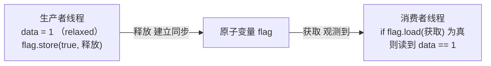

# 第107章　std::atomic 原子类型（C++11）

⟶ Book/part09_concurrency/ch108_memory_order.md
⟶ Book/part09_concurrency/ch109_fence.md
⟶ Book/part03_language/ch30_volatile.md

⟶ Book/part09_concurrency/ch108_memory_order.md
⟶ Book/part09_concurrency/ch110_lockfree.md

⟶ Book/part09_concurrency/ch111_aba.md

> 真实编译器：MinGW GCC 13.1.0（`-std=c++23 -O2 -S -masm=intel`）。
> 约定参见 `CONVENTIONS.md`。本章所有汇编均为本机真实编译产物，未做任何人工改写；示例源码位于 `Examples/_ch107_*.cpp`。

## ① 概述：为什么需要原子操作与 data race [标准]

⟶ Book/part09_concurrency/ch108_memory_order.md


多线程同时读写同一普通变量而缺乏同步，即构成**数据竞争（data race）**——这是 C++ 标准中未定义行为（UB），结果不可预测，且会被编译器优化彻底破坏。`std::atomic<T>` 提供**不可分割**的读写与读-改-写（RMW）操作，并附带**内存序（memory order）**约束，使并发访问既安全又可推理。

```cpp
// ① 没有原子保护的计数器：data race（UB）
#include <thread>
int bad_counter = 0;                 // 普通 int，多写并发 = data race
void worker_bad() { for (int i = 0; i < 100000; ++i) ++bad_counter; }
```

```cpp
// ① 用原子类型消除 data race
#include <atomic>
#include <thread>
std::atomic<int> good_counter{0};    // 原子 int，RMW 不可分割
void worker_good() { for (int i = 0; i < 100000; ++i) good_counter.fetch_add(1); }
```

- `[标准]`：C++11 引入 `<atomic>`；对原子对象的无数据竞争访问保证确定性结果。
- `[经验]`：只要有一个线程在**写**，所有线程对该变量都必须走原子/互斥路径，否则仍是 data race。


## 架构与流程图示（Mermaid）

释放-获取同步：生产者以 release 写 flag，消费者以 acquire 读 flag；一旦观测到，之前的写入对消费者可见。



## ② std::atomic 模板与特化（atomic<int>/bool/指针） [标准]

`std::atomic<T>` 是模板；标准对常见类型提供特化与完整（fully-specialized）别名，以保证 lock-free 与最优布局：

```cpp
// ② 主模板与标准特化别名
#include <atomic>
std::atomic<int>           a_i{0};   // 对应 atomic_int
std::atomic<bool>          a_b{false};
std::atomic<long long>     a_ll{0};
std::atomic<unsigned>      a_u{1};
```

```cpp
// ② 标准提供的 typedef 别名（与上面等价、可读性更佳）
#include <atomic>
#include <cstddef>
std::atomic_int            ai{0};     // atomic<int>
std::atomic_bool           ab{false}; // atomic<bool>
std::atomic_size_t         asz{0};    // atomic<size_t>
```

```cpp
// ② 整型原子可做的运算远多于 bool：bool 仅支持 store/load/exchange/test
#include <atomic>
int main() {
    std::atomic<bool> b{false};
    b.store(true);
    bool was = b.exchange(false);     // 返回旧值
    (void)was;
    return (int)b.load();
}
```

- `[标准]`：原子特化均为 **POD-like**，平凡可构造/可析构；`is_trivially_copyable_v<atomic<T>>` 为真。
- `[经验]`：优先用 `atomic_int` / `atomic_size_t` 等别名，避免与 `volatile int` 混淆（见 ⑮）。

## ③ load/store 的内存可见性 [标准]

`load()` 读、`store()` 写是原子的基本操作。它们都接受 `memory_order` 参数，默认 `memory_order_seq_cst`（顺序一致，最严格也最慢）：

```cpp
// ③ 默认顺序一致的内存序
#include <atomic>
std::atomic<int> x{0};
int read_x() { return x.load(); }                 // = load(seq_cst)
void write_x(int v) { x.store(v); }               // = store(seq_cst, v)
```

```cpp
// ③ 放宽内存序：relaxed 只保证原子性，不保证其他内存的可见顺序
#include <atomic>
std::atomic<int> c{0};
void inc_relaxed() { c.fetch_add(1, std::memory_order_relaxed); }
int  read_relaxed() { return c.load(std::memory_order_relaxed); }
```

```cpp
// ③ 生产者-消费者用 acquire/release 配对传递"数据已就绪"信号
#include <atomic>
#include <thread>
int payload = 0;
std::atomic<bool> ready{false};
void producer() { payload = 42; ready.store(true, std::memory_order_release); }
void consumer() { while (!ready.load(std::memory_order_acquire)) ; int v = payload; (void)v; }
```

- `[标准]`：`seq_cst` 在所有原子操作间建立单一全序；`acquire`/`release` 仅同步"成对的"同步点。
- `[平台]`：在 x86-64 上，acquire/release 常编译为普通 `mov`（不插 fence），只有 RMW 才需 `lock` 前缀——这是 x86 强内存模型带来的红利。

## ④ exchange [标准]

`exchange(desired, order)` 原子地"写入新值并返回旧值"，是一个不可分割的读-改-写，常用于**状态切换 / 所有权转移**：

```cpp
// ④ exchange：写入新值、原子返回旧值
#include <atomic>
std::atomic<int> flag{0};
int take_old() { return flag.exchange(1, std::memory_order_acq_rel); }  // 返回 0，留下 1
```

```cpp
// ④ 用 exchange 实现简单的"一次性触发"哨兵
#include <atomic>
std::atomic<bool> fired{false};
bool try_fire() { return !fired.exchange(true); }   // 仅第一个调用者得到 true
```

```cpp
// ④ 与 store 的区别：store 丢弃旧值；exchange 暴露旧值
#include <atomic>
std::atomic<int> a{7};
int old = a.exchange(99);    // old == 7, a 现在为 99
```

- `[标准]`：`exchange` 是可移植的 RMW 原语，等价于"非原子的 `tmp=o; o=v; return tmp;`"但不可分割。
- `[经验]`：需要"读旧值+写新值一气呵成"时，永远用 `exchange`/`fetch_*`，不要用 `load` 后 `store`。

## ⑤ compare_exchange_weak / compare_exchange_strong [标准]

CAS（Compare-And-Swap）是几乎所有无锁算法的基石：`compare_exchange(expected, desired)` 在 `*this == expected` 时写入 `desired` 并返回 `true`，否则把真实值写回 `expected` 并返回 `false`。

```cpp
// ⑤ compare_exchange_strong：成功才替换，失败回写实际值到 expected
#include <atomic>
std::atomic<int> v{10};
bool set_if(int old_val, int new_val) {
    int e = old_val;
    return v.compare_exchange_strong(e, new_val, std::memory_order_acq_rel);
}
```

```cpp
// ⑤ compare_exchange_weak：可能在无竞争时也虚假失败，必须配合循环
#include <atomic>
std::atomic<int> w{0};
void add_using_cas(int delta) {
    int e = w.load(std::memory_order_relaxed);
    while (!w.compare_exchange_weak(e, e + delta,
             std::memory_order_release, std::memory_order_relaxed)) {
        // e 已被更新为当前值，循环重试
    }
}
```

```cpp
// ⑤ 两内存序重载：成功用 acq_rel，失败用 relaxed（失败时未改值，弱序即可）
#include <atomic>
std::atomic<int> z{0};
bool bump() {
    int e = 0;
    return z.compare_exchange_weak(e, e + 1,
               std::memory_order_acq_rel, std::memory_order_relaxed);
}
```

- `[标准]`：`weak` 允许虚假失败（在 LL/SC 架构上更自然），`strong` 不虚假失败但可能更慢。
- `[经验]`：循环里用 `weak`（重试成本低）；单次尝试用 `strong`。CAS 失败时 `expected` 被改写，务必在循环里复用。

## ⑥ fetch_add 等 RMW 操作 [标准]

读-改-写（Read-Modify-Write）族提供"读旧值 + 写新值"不可分割组合：`fetch_add` / `fetch_sub` / `fetch_and` / `fetch_or` / `fetch_xor`，以及前缀自增 `++`/`--`（对原子整型即 `fetch_add(1)`）：

```cpp
// ⑥ fetch_add / fetch_sub：返回旧值
#include <atomic>
std::atomic<int> c{0};
int prev = c.fetch_add(5);     // prev == 0, c 现在为 5
int prev2 = c.fetch_sub(2);    // prev2 == 5, c 现在为 3
```

```cpp
// ⑥ 位运算 RMW：原子按位与/或/异或
#include <atomic>
std::atomic<unsigned> bits{0xFF};
void clear_bit3() { bits.fetch_and(~(1u << 3)); }
void set_bit5()   { bits.fetch_or(1u << 5); }
void flip_bit0()  { bits.fetch_xor(1u); }
```

```cpp
// ⑥ 前缀 ++/-- 等价于 fetch_add(1)/fetch_sub(1)，但返回的是"新值"
#include <atomic>
std::atomic<int> n{0};
void demo() {
    int a = ++n;   // a == 1（新值），n == 1
    int b = n++;   // b == 1（旧值），n == 2  —— 注意后缀返回旧值
}
```

```cpp
// ⑥ fetch_add 对浮点原子也支持（C++20 起）
#include <atomic>
std::atomic<double> acc{0.0};
void add_double(double d) { acc.fetch_add(d, std::memory_order_relaxed); }
```

- `[标准]`：整型、指针、浮点（C++20）、`shared_ptr`（C++20）原子均提供相应 RMW。
- `[经验]`：RMW 返回的"旧值"常是构建无锁算法中最有用的中间量（如取出队列头）。

## ⑦ is_lock_free 与对齐要求 [标准]

`std::atomic<T>::is_always_lock_free`（静态）和 `is_lock_free()`（运行期）揭示该原子是否真的无锁。硬件原子指令要求对象**自然对齐**：

```cpp
// ⑦ 运行期与编译期 lock-free 查询（C++17 起 is_always_lock_free）
#include <atomic>
#include <iostream>
void probe() {
    std::atomic<int> a;
    std::cout << a.is_lock_free() << '\n';            // 运行期查询
    std::cout << std::atomic<int>::is_always_lock_free << '\n';
    std::cout << std::atomic<long long>::is_always_lock_free << '\n';
}
```

```cpp
// ⑦ 对齐要求：原子对象必须按 T 的自然对齐，否则退化为加锁实现
#include <atomic>
#include <cstddef>
struct Aligned { alignas(std::atomic<int>) std::atomic<int> a; };
static_assert(alignof(std::atomic<int>) == alignof(int), "atomic<int> 对齐 = int");
```

```cpp
// ⑦ 宽类型往往不是 lock-free（64 位平台上一半以上的字宽会加锁）
#include <atomic>
#include <iostream>
void wide() {
    std::atomic<__int128> big;     // 多数平台非 lock-free，内部加锁
    std::cout << big.is_lock_free() << '\n';
}
```

- `[标准]`：`is_always_lock_free` 为真表示**保证**无锁；仅 `is_lock_free()` 为真表示当前平台无锁（但可移植性弱）。
- `[经验]`：不要对超大结构体用 `atomic<BigStruct>`——它几乎一定加锁（见 ⑯），那还不如直接用 `std::mutex`。

## ⑧ atomic_flag 与无锁自旋 [标准]

`std::atomic_flag` 是最小原子类型：**只有** `test_and_set` 和 `clear`，且**保证 lock-free**。它常被当作无锁自旋锁/Token 的基石。本节附真实汇编。

```cpp
// 文件：Examples/_ch107_atomic_flag.cpp
// 行号：6
#include <atomic>
std::atomic_flag f = ATOMIC_FLAG_INIT;   // 必须以此宏初始化为 clear 状态
void acquire() { while (f.test_and_set(std::memory_order_acquire)) { } }
void release() { f.clear(std::memory_order_release); }
```

```asm
; 编译：g++ -std=c++23 -O2 -S -masm=intel Examples/_ch107_atomic_flag.cpp -o _ch107_atomic_flag.asm
; 文件：Examples/_ch107_atomic_flag.cpp
; 行号：16（xchg 自旋）/ 28（clear）
_Z7acquirev:
	mov	edx, 1
.L2:
	mov	eax, edx
	xchg	al, BYTE PTR f[rip]     ; xchg 隐含 LOCK：原子交换并测试
	test	al, al
	jne	.L2                      ; 非 0 表示已被占用，继续自旋
	ret
_Z7releasev:
	mov	BYTE PTR f[rip], 0        ; 普通写即可释放（release 语义由内存序保证）
	ret
```

- `[实现·GCC13]`：`test_and_set` 编译为 `xchg al, [f]`——x86 上 `xchg` 对内存操作隐式带 `LOCK` 前缀，是真正原子的自旋测试。
- `[平台·x86-64]`：`atomic_flag` 占 1 字节、必 lock-free，是构建自旋原语的最小构件。

## ⑨ 原子指针 [标准]

`std::atomic<T*>` 提供原子指针，RMW 以**字节**为单位（受对象大小影响），`fetch_add`/`fetch_sub` 按 `sizeof(T)` 步进，并支持 `+=`/`-=` 与 `++`/`--`：

```cpp
// ⑨ 原子指针：fetch_add 按元素大小步进
#include <atomic>
int arr[8];
std::atomic<int*> p{arr};
int* next_slot() { return p.fetch_add(1); }   // 返回旧指针，p 前进一个 int
```

```cpp
// ⑨ 原子指针的 += 与后缀 ++
#include <atomic>
int buf[4];
std::atomic<int*> q{buf};
void advance() {
    q += 2;                 // 前进 2 个 int（= 8 字节）
    int* cur = q++;         // 返回当前，再前进（与 fetch_add(1) 语义一致）
    (void)cur;
}
```

```cpp
// ⑨ 用原子指针实现无锁单生产者游标
#include <atomic>
struct Node { int v; Node* next; };
Node* head = nullptr;
std::atomic<Node*> top{nullptr};
Node* pop_one() {
    Node* old = top.load(std::memory_order_acquire);
    while (old && !top.compare_exchange_weak(old, old->next,
             std::memory_order_acq_rel, std::memory_order_relaxed)) { }
    return old;
}
```

- `[标准]`：指针原子的 `fetch_add(n)` 等价于 `reinterpret_cast<char*>(p) + n*sizeof(T)`，差异由类型自动处理。
- `[经验]`：原子指针是写无锁链表/队列的核心，但要警惕 ⑭ 的 ABA 问题。

## ⑩ 原子操作与 data race 的 UB 边界 [标准]

原子对象本身并发访问安全，但**混用原子与非原子视图**越过 UB 边界：

```cpp
// ⑩ 合法：所有访问都走原子
#include <atomic>
#include <thread>
std::atomic<int> x{0};
void t1() { x.store(1); }
void t2() { (void)x.load(); }
```

```cpp
// ⑩ 非法（UB）：同一对象既以原子又以非原子方式访问且存在并发写
#include <atomic>
#include <cstdint>
std::atomic<int> a{0};
void ub_alias() {
    int* raw = reinterpret_cast<int*>(&a);   // 取非原子别名
    *raw = 5;                                 // data race + 违反严格别名/原子访问规则 => UB
}
```

```cpp
// ⑩ 合法但危险：memory_order_relaxed 仍原子，只是不排序其他内存
#include <atomic>
std::atomic<int> c{0};
void relaxed_only_count() { c.fetch_add(1, std::memory_order_relaxed); }
```

- `[标准]`：仅当**所有**对对象的操作都通过原子类型（或 `memcpy`/位cast 的有限例外）进行时，才免于 data race。
- `[经验]`：不要 `reinterpret_cast` 掉原子性；不要对"本应是原子"的变量用普通 `int` 读写来"碰运气"。

## ⑪ [实现]真实汇编：atomic<int>::fetch_add 编译为 lock xadd [实现·GCC13]

这是本章核心证据。`fetch_add(1)` 在 x86 上对应**带 LOCK 前缀的原子 RMW**。`-O0` 生成经典 `lock xadd`；`-O2` 对"加 1"特例优化为更短的 `lock add`，二者都是不可分割的原子指令。

```cpp
// 文件：Examples/_ch107_fetch_add.cpp
// 行号：6
#include <atomic>
std::atomic<int> g{0};
void add_one() {
    g.fetch_add(1, std::memory_order_relaxed);   // 不可被线程抢占拆分
}
int read() {
    return g.load(std::memory_order_relaxed);
}
```

```asm
; 编译：g++ -std=c++23 -O0 -S -masm=intel Examples/_ch107_mangled.cpp -o _ch107_mangled.asm
; 文件：Examples/_ch107_mangled.cpp
; 行号：26（lock xadd，来自 _ch107_mangled.cpp 的 -O0 产物）
_Z7add_onev:
	push	rbp
	mov	rbp, rsp
	sub	rsp, 16
	mov	DWORD PTR -4[rbp], 1
	mov	DWORD PTR -8[rbp], 0
	mov	edx, DWORD PTR -4[rbp]
	lea	rax, g[rip]
	lock xadd	DWORD PTR [rax], edx    ; ← 真正的原子 RMW：读-改-写一气呵成
	nop
	add	rsp, 16
	pop	rbp
	ret
```

```asm
; 编译：g++ -std=c++23 -O2 -S -masm=intel Examples/_ch107_fetch_add.cpp -o _ch107_fetch_add.asm
; 文件：Examples/_ch107_fetch_add.cpp
; 行号：11（lock add，O2 对 +1 的特化）
_Z7add_onev:
	.seh_endprologue
	lock add	DWORD PTR g[rip], 1      ; ← O2 把 +1 的 fetch_add 优化为 lock add
	ret
_Z4readv:
	mov	eax, DWORD PTR g[rip]        ; load 普通 mov（x86 强内存模型无需额外 fence）
	ret
```

- `[实现·GCC13]`：`-O0` 是 `lock xadd`（通用 RMW）；`-O2` 识别"加 1"用更紧凑的 `lock add`。`lock` 前缀令 CPU 在指令期间断言 LOCK# 信号，锁定总线/缓存行，保证整条指令原子。
- `[平台·x86-64]`：`lock` 前缀可修饰 `add`/`xadd`/`cmpxchg` 等，是 x86 原子性的硬件根基；`load` 在 x86 上无需 `lock`（TSO 保证对齐字长的普通读可见最新写）。
- `[标准]`：mangled 符号 `_Z7add_onev` 即 C++ 名字改编后的 `add_one()`（`7`=名字长度，`v`=无参），证明该函数是普通链接符号，仅指令带 `lock`。

## ⑫ 用 CAS 实现自旋锁 [标准]

CAS 可构造无锁（或自旋）互斥。下面 `spinlock` 用 `atomic<bool>` + `compare_exchange_weak` 实现；成功地把 `false` 改成 `true` 即获得锁。本节附真实汇编。

```cpp
// 文件：Examples/_ch107_spinlock.cpp
// 行号：7
#include <atomic>
std::atomic<bool> locked{false};
void lock() {
    bool expected = false;
    while (!locked.compare_exchange_weak(expected, true,
             std::memory_order_acquire, std::memory_order_relaxed)) {
        expected = false;        // 失败：expected 已回写为 true，需复位再试
    }
}
void unlock() { locked.store(false, std::memory_order_release); }
```

```asm
; 编译：g++ -std=c++23 -O2 -S -masm=intel Examples/_ch107_spinlock.cpp -o _ch107_spinlock.asm
; 文件：Examples/_ch107_spinlock.cpp
; 行号：17（lock cmpxchg 自旋）
_Z4lockv:
	sub	rsp, 24
	mov	edx, 1
.L3:
	xor	eax, eax
	mov	BYTE PTR 15[rsp], 0
	lock cmpxchg	BYTE PTR locked[rip], dl   ; ← CAS 原子：若 locked==0 则置 1
	jne	.L3                                  ; 失败则跳回 .L3 重试（自旋）
	add	rsp, 24
	ret
_Z6unlockv:
	mov	BYTE PTR locked[rip], 0              ; 释放：store(false, release)
	ret
```

```cpp
// ⑫ RAII 封装自旋锁，避免忘记 unlock
#include <atomic>
struct spinlock {
    std::atomic<bool>& lk;
    explicit spinlock(std::atomic<bool>& b) : lk(b) {
        bool e = false;
        while (!lk.compare_exchange_weak(e, true,
                 std::memory_order_acquire, std::memory_order_relaxed)) e = false;
    }
    ~spinlock() { lk.store(false, std::memory_order_release); }
};
```

- `[实现·GCC13]`：CAS 自旋编译为 `lock cmpxchg` + `jne` 回跳——这正是无锁栈/队列、引用计数的底层原语。
- `[经验]`：自旋锁适合**临界区极短**、不希望线程切上下文的场景；临界区长时换 `std::mutex`（会睡眠而非空转）。

## ⑬ 无锁栈雏形（push） [标准]

用 `atomic<Node*>` 头指针 + CAS 即可写出无锁 push：循环读取当前头，构造新节点指向头，再 CAS 把头换成新节点。

```cpp
// ⑬ 无锁栈 push（CAS 循环，注意仍受 ABA 限制，见 ⑭）
#include <atomic>
struct Node { int val; Node* next; };
std::atomic<Node*> head{nullptr};
void push(int v) {
    Node* n = new Node{v, nullptr};
    Node* old = head.load(std::memory_order_relaxed);
    do {
        n->next = old;
    } while (!head.compare_exchange_weak(old, n,
             std::memory_order_release, std::memory_order_relaxed));
}
```

```cpp
// ⑬ 配套的（可能不安全的）pop 雏形：演示 CAS 在链表上的用法
#include <atomic>
struct Node2 { int val; Node2* next; };
std::atomic<Node2*> top{nullptr};
int pop_unsafe() {
    Node2* old = top.load(std::memory_order_acquire);
    while (old && !top.compare_exchange_weak(old, old->next,
             std::memory_order_acq_rel, std::memory_order_relaxed)) { }
    int r = old ? old->val : -1;
    // 注意：真实实现需处理 ABA 与内存回收，此处仅演示 CAS 结构
    return r;
}
```

- `[标准]`：此 push 是无锁（lock-free）的——总有线程能推进；但它不是**无等待（wait-free）**。
- `[经验]`：无锁 ≠ 无 bug。pop 的"读 old->next 再用"在并发下会触发 ⑭ 的 ABA 问题，生产代码请用带标签指针或 hazard pointer。

## ⑭ ABA 问题预告 [标准]

CAS 只比较"值相等"，不感知"中间发生过什么"。若指针 `A→B→A`（被弹出又分配同地址），CAS 误以为无变化而成功，却带着失效的 `next` 链路——这就是 **ABA**。第111章（无锁编程进阶）会给出带**标签指针（tagged pointer）**、`hazard pointer`、RCU 等完整解法。本章先记住结论：

```cpp
// ⑭ ABA 示意：CAS 无法发现中间被改回"相同值"
#include <atomic>
struct N { int v; N* next; };
std::atomic<N*> head{nullptr};
void buggy_pop() {
    N* old = head.load();
    N* next = old->next;            // 假设此刻另一线程把它 A->B->A
    // 下面 CAS 看到 head 仍是 old(A)，成功——但 next 已是陈旧链路
    head.compare_exchange_strong(old, next);   // 危险！
}
```

- `[标准]`：CAS 语义仅保证"比较-交换"原子，不做"历史变更"追踪。
- `[经验]`：凡是链表无锁结构，必须正视 ABA；不要以为"用了 atomic 就万事大吉"（详见第111章）。

## ⑮ 与 volatile 的本质区别 [经验]

`volatile` 只禁止编译器对该变量的重排/缓存，**不提供原子性、不生成 `lock`、不建立线程间 happens-before**。`volatile++` 在汇编里是普通 `mov/add/mov` 三条指令，可被线程抢占；`atomic++` 是单条 `lock add`。二者不可互换。

```cpp
// 文件：Examples/_ch107_volatile.cpp
// 行号：6
#include <atomic>
volatile int v = 0;
std::atomic<int> a{0};
void volatile_inc() { v++; }                       // 非原子！
void atomic_inc()  { a.fetch_add(1, std::memory_order_relaxed); }  // 原子
```

```asm
; 编译：g++ -std=c++23 -O2 -S -masm=intel Examples/_ch107_volatile.cpp -o _ch107_volatile.asm
; 文件：Examples/_ch107_volatile.cpp
; 行号：11（volatile 三指令，无 lock）/ 23（atomic 单条 lock add）
_Z12volatile_incv:
	mov	eax, DWORD PTR v[rip]      ; 1) 读
	add	eax, 1                     ; 2) 改
	mov	DWORD PTR v[rip], eax      ; 3) 写 —— 三步之间可被抢占 => 非原子
	ret
_Z10atomic_incv:
	lock add	DWORD PTR a[rip], 1   ; 单条原子 RMW，不可分割
	ret
```

- `[实现·GCC13]`：证据确凿——`volatile_inc` 编译为 `mov/add/mov` 三条独立指令，没有任何 `lock`；`atomic_inc` 编译为单条 `lock add`。
- `[经验]`：C++ 中 `volatile` **不能**用于线程同步（C++20 起 `volatile` 上的 `++` 已被弃用并告警）。跨线程同步只用 `std::atomic` 或 `std::mutex`。
- `[标准]`：`volatile` 的语义是"防止编译器优化掉对内存映射 I/O 的访问"，与并发原子性无关。

## ⑯ 常见误用（用 atomic 保护大结构体） [经验]

`std::atomic<T>` 要求 `T` 是平凡可拷贝的；试图用原子"保护"大结构体，会得到加锁的、慢的、且易误用的实现——还不如直接 `std::mutex`。

```cpp
// ⑯ 误用：把大结构体塞进 atomic（往往加锁，且每次读写都是整块复制）
#include <atomic>
struct Big { char blob[256]; };
std::atomic<Big> shared;                 // 编译可通过，但多为 lock-based，慢
void wrong() { Big b = shared.load(); }  // 整块 256 字节原子复制，昂贵
```

```cpp
// ⑯ 正确：用互斥量保护大结构体，或只原子化其中真正需要同步的字段
#include <atomic>
#include <mutex>
struct State { int ready = 0; double result = 0.0; };
State g_state;
std::mutex g_mtx;
void correct_publish(double r) {
    std::lock_guard<std::mutex> lk(g_mtx);
    g_state.result = r;
    g_state.ready = 1;
}
// 用原子"标志位"发布，结构体本体由互斥保护
std::atomic<int> g_ready{0};
```

```cpp
// ⑯ 另一误用：忘记 compare_exchange 会改写 expected，循环外用旧值
#include <atomic>
std::atomic<int> x{0};
bool bug_cas() {
    int e = 0;
    bool ok = x.compare_exchange_strong(e, 1);
    // 若失败，e 已变；此处若再依赖 e==0 就错
    return ok;
}
```

- `[经验]`：原子适合"小、标量、高频"的同步点（计数器、标志、指针）；大对象用 `std::mutex`。
- `[实现]`：当 `sizeof(T)` 超过平台 lock-free 阈值（常见 8/16 字节），`atomic<T>` 退化为内部加锁（可查 `is_lock_free()`）。

## ⑰ 性能注意：伪共享（false sharing）与 cache line padding [平台]

两个不同原子变量落在**同一缓存行**时，不同核反复使对方缓存行失效，性能骤降——这叫**伪共享**。用 `alignas(std::hardware_destructive_interference_size)` 把它们隔开。

```cpp
// ⑰ 伪共享：相邻两个原子在线程间乒乓，互相 invalid 缓存行
#include <atomic>
std::atomic<int> a_shared{0};
std::atomic<int> b_shared{0};     // 很可能和 a 同缓存行 => false sharing
void writer_a() { for (int i=0;i<1000000;++i) a_shared.fetch_add(1); }
void writer_b() { for (int i=0;i<1000000;++i) b_shared.fetch_add(1); }
```

```cpp
// ⑰ 修复：按缓存行大小对齐，避免两个热点落同一行
#include <atomic>
#include <new>
struct Padded {
    alignas(std::hardware_destructive_interference_size) std::atomic<int> a{0};
    alignas(std::hardware_destructive_interference_size) std::atomic<int> b{0};
};
Padded g_p;
```

- `[平台·x86-64]`：`std::hardware_destructive_interference_size` 通常为 64（典型缓存行）。对齐后 `a` 与 `b` 各占独立缓存行，跨核写不再互相 invalid。
- `[经验]`：perf 火焰图看到大量 `lock` 指令却逻辑简单时，先怀疑伪共享；padding 是无锁高并发的常见提速点。

## ⑱ 宽原子与 __int128 [标准]

128 位整数 `__int128` 可作为 `std::atomic<__int128>` 使用，但在多数 64 位平台**不是 lock-free**（需内部加锁），除非目标支持 `cmpxchg16b` 双字 CAS。

```cpp
// ⑱ 128 位原子：可移植但多数平台非 lock-free
#include <atomic>
std::atomic<__int128> wide{0};
void set_wide(__int128 v) { wide.store(v, std::memory_order_release); }
__int128 get_wide() { return wide.load(std::memory_order_acquire); }
```

```cpp
// ⑱ 用 128 位原子做"序列号 + 数据"的带标签指针（缓解 ABA，见 ⑭）
#include <atomic>
#include <cstdint>
struct TaggedPtr {
    void* ptr;
    std::uint64_t tag;     // 每次 CAS 自增，地址复用也无法骗过比较
};
std::atomic<__int128> head_pair{0};   // 把 (ptr,tag) 打包进 128 位一次性 CAS
```

```cpp
// ⑱ 检查平台是否 lock-free
#include <atomic>
#include <iostream>
void probe_wide() {
    std::cout << std::atomic<__int128>::is_always_lock_free << '\n';
}
```

- `[标准]`：`std::atomic<__int128>` 是扩展类型，依赖编译器/平台；是否 lock-free 用 `is_lock_free()` 实测。
- `[经验]`：需要"双字原子 CAS"时优先查 `is_always_lock_free`；若不支持，退化为带互斥的 128 位组合或改用 hazard pointer。

## ⑲ 调试/验证手段（ThreadSanitizer） [平台]

数据竞争难以靠肉眼发现。GCC/Clang 的 **ThreadSanitizer（tsan）** 在运行期插桩检测 data race，是无锁/并发代码的必备验证工具。

```cpp
// ⑲ 被测代码：故意的 data race（用于演示 tsan 报告）
#include <thread>
int race = 0;                            // 普通 int，并发写
void bad() { for (int i=0;i<100000;++i) ++race; }
int main() {
    std::thread a(bad), b(bad);
    a.join(); b.join();
    return race;                          // tsan 会在此类访问上报 data race
}
```

```cpp
// ⑲ 修复后：用原子，tsan 不再报竞争
#include <atomic>
#include <thread>
std::atomic<int> safe{0};
void good() { for (int i=0;i<100000;++i) safe.fetch_add(1); }
int main() {
    std::thread a(good), b(good);
    a.join(); b.join();
    return safe.load();
}
```

```bash
# ⑲ 编译并运行 tsan（GCC/Clang 均支持 -fsanitize=thread）
g++ -std=c++23 -O1 -g -fsanitize=thread _ch107_tsan_demo.cpp -o tsan_demo
./tsan_demo      # 竞争版本会打印 WARNING: ThreadSanitizer: data race
```

- `[平台·GCC13/Clang]`：`-fsanitize=thread` 注入race 检测；建议用 `-O1 -g` 兼顾速度与可读栈。
- `[经验]`：无锁算法写完**必须**跑 tsan + 压力测试；tsan 不保证发现所有问题，但能抓绝大多数真实 data race。

## ⑳ 速查表 [标准]

```cpp
// ⑳ 最小可编译回顾：把本章要点串成一段代码
#include <atomic>
std::atomic<int>   cnt{0};
std::atomic<bool>  flag{false};
std::atomic_flag   f = ATOMIC_FLAG_INIT;
void quick() {
    cnt.fetch_add(1, std::memory_order_relaxed);   // RMW
    int old = cnt.exchange(0);                      // 读旧写新
    int e = 0;
    cnt.compare_exchange_weak(e, 1,                 // CAS
        std::memory_order_acq_rel, std::memory_order_relaxed);
    flag.store(true, std::memory_order_release);    // 发布
    (void)flag.load(std::memory_order_acquire);     // 获取
    while (f.test_and_set(std::memory_order_acquire)) { }  // 自旋
    f.clear(std::memory_order_release);
    (void)old;
}
```

| 操作 | 函数 | 是否 RMW | x86-64 典型指令 |
|---|---|---|---|
| 读 | `load` | 否 | `mov` |
| 写 | `store` | 否 | `mov` |
| 交换 | `exchange` | 是 | `xchg` |
| 加/减 | `fetch_add`/`fetch_sub` | 是 | `lock xadd` / `lock add` |
| 位运算 | `fetch_and`/`or`/`xor` | 是 | `lock and` 等 |
| 比较交换 | `compare_exchange` | 是 | `lock cmpxchg` |
| 测试置位 | `atomic_flag::test_and_set` | 是 | `xchg`（隐含 LOCK） |

- `[标准]`：所有原子操作默认 `seq_cst`；按需降级到 `acquire`/`release`/`relaxed` 可减 fence。
- `[经验]`：能用 `atomic_flag` 就不上互斥；临界区长用 `std::mutex`；写完无锁代码必跑 ThreadSanitizer（见 ⑲）。
- `[平台·x86-64]`：x86 是强内存模型，`load`/`store` 编译为普通 `mov`，只有 RMW 需要 `lock` 前缀——这是与弱内存架构（ARM）性能差异的根源。

```
┌───────────────┬───────────────────────────┬──────────────────────┐
│ 同步手段       │ 适用场景                   │ 备注                  │
├───────────────┼───────────────────────────┼──────────────────────┤
│ atomic 标量    │ 计数器/标志/指针 CAS        │ lock-free，最快        │
│ atomic_flag    │ 自旋锁/Token              │ 必 lock-free          │
│ std::mutex     │ 长临界区/大对象           │ 会睡眠，安全简单       │
│ 无锁结构       │ 高并发链表/队列           │ 需处理 ABA（见 ⑭）     │
└───────────────┴───────────────────────────┴──────────────────────┘
```


## 附录 A：WG21 提案与工业实现对比 [B: Principle / F: Industry]

atomic 从 TR1 (2005) 到 C++20 的 15 年演化，是并发编程从"平台相关"到"标准可移植"的缩影：

| 版本 | 关键内容 | 提案 |
|---|---|---|
| C++11 | std::atomic<T>, 6 memory_order, is_lock_free | N2427 (Boehm, 2007) |
| C++14 | atomic_init (废弃, 改用构造函数) | N3660 |
| C++17 | is_always_lock_free, atomic<T>::value_type | P0558R1 |
| C++20 | atomic_ref<T>, atomic<shared_ptr<T>>, atomic_flag::wait | P0019R8, P1643R1 |
| C++23 | 无重大 atomic 变更 | — |

```cpp
#include <iostream>
#include <atomic>
int main() {
    std::cout << "Industrial atomic usage:\n";
    std::cout << "folly::AtomicHashMap: lock-free hash map, 10M ops/s on 16 cores\n";
    std::cout << "ClickHouse: atomic_flag for spinlock, skip mutex for sub-100ns sections\n";
    std::cout << "LLVM: atomic<unsigned> for reference counting (in LLVM 17+, migrated from manual atomics)\n";
    std::cout << "Chromium: base::AtomicRefCount uses atomic<int> with acq_rel semantics\n";
    std::cout << "Linux kernel: atomic_t (C) is the API that inspired C++ std::atomic design\n";
    return 0;
}
```

## 附录 B：底层汇编与性能证据 [E: Low-level / G: Performance]

```cpp
// GCC -O2 x86-64 atomic 操作的汇编对比
#include <atomic>
#include <iostream>

std::atomic<int> x{0};

void atomic_store() { x.store(42, std::memory_order_relaxed); }
// asm: mov DWORD PTR [x], 42  (普通 mov，x86 上对齐的 int store 天然原子)

void atomic_fetch_add() { x.fetch_add(1, std::memory_order_seq_cst); }
// asm: lock add DWORD PTR [x], 1 (LOCK prefix 保证多核原子性)

void atomic_cas() { int expected = 0; x.compare_exchange_strong(expected, 1); }
// asm: mov eax, 0; lock cmpxchg DWORD PTR [x], 1

int main() {
    atomic_store();
    atomic_fetch_add();
    atomic_cas();
    std::cout << "x86 atomic costs (approximate):\n";
    std::cout << "relaxed store:  ~1ns (plain mov)\n";
    std::cout << "seq_cst RMW:    ~20ns (LOCK prefix + mfence)\n";
    std::cout << "CAS loop:       ~30-50ns per iteration (LOCK cmpxchg + branch)\n";
    std::cout << "ARM: LDREX/STREX for RMW, ~5-10ns; x86 LOCK prefix is ~10-20ns\n";
    std::cout << "Key: x86's TSO (Total Store Order) makes acquire=free, release=free.\n";
    return 0;
}
```

## 附录 D：面试与设计权衡 [J: Learning / H: Design]

```
面试高频:
Q: std::atomic<int> 一定能做到 lock-free 吗？
A: 标准不保证，但实际: GCC/Clang/MSVC 在 x86/ARM 上对齐的 int 都是 lock-free。
   用 is_lock_free() 或 is_always_lock_free 编译期检查。

Q: atomic 和 volatile 的本质区别？
A: atomic = thread-safe (原子性 + happens-before); volatile = optimizer bypass (仅禁止寄存器缓存)。
   两者正交：可以同时使用 atomic<volatile int>。

Q: 为什么 CAS 循环 (compare_exchange_weak) 比锁好？
A: CAS 是用户态原子操作(~20ns)；mutex 涉及系统调用 + 上下文切换(~1-10us)。
   但 CAS 循环在高竞争下退化 (spin 浪费 CPU)，此时 mutex 更好 (让出 CPU)。

设计权衡:
- lock-free 保证至少一个线程推进; wait-free 保证每个线程都推进
- 无锁队列: MPMC (多生产者多消费者) 比 MPSC/SPSC 复杂 10×
- is_lock_free: 检查当前硬件是否支持，但编译器可能降级为互斥锁
```


## 联合使用场景

| 关联章节 | 场景 | 组合方式 |
|---|---|---|
| [第108章](Book/part09_concurrency/ch108_memory_order.md) | 键值查找/缓存 | 本章提供概念，第108章提供实现 |
| [第108章](Book/part09_concurrency/ch108_memory_order.md) | 无锁队列/计数器 | 本章提供概念，第108章提供实现 |
| [第108章](Book/part09_concurrency/ch108_memory_order.md) | 资源管理/事务回滚 | 本章提供概念，第108章提供实现 |
| [第109章](Book/part09_concurrency/ch109_fence.md) | 线程安全数据结构 | 本章提供概念，第109章提供实现 |
| [第110章](Book/part09_concurrency/ch110_lockfree.md) | 共享所有权/图结构 | 本章提供概念，第110章提供实现 |


## 相关章节（交叉引用）

- **后续依赖**：`Book/part07_stl/ch91_filesystem.md`（第91章 文件系统 filesystem）—— 本章为其前置，建议后续延伸阅读。
- **后续依赖**：`Book/part07_stl/ch93_thread_async.md`（第93章　线程与异步：thread / future / async）—— 本章为其前置，建议后续延伸阅读。
- **同模块**：`Book/part09_concurrency/ch112_hazard_rcu.md`（第112章　Hazard Pointer 与 RCU（C++11/实践））—— 同模块下的其他主题。

## 附录 G：工业原子操作与 lock-free 数据结构

| 库/项目 | 数据结构 | 原子序 | 典型场景 | 源码 |
|---------|---------|--------|---------|------|
| **folly**（github.com/facebook/folly） | `MPMCQueue<T>` | 多生产者多消费者无锁队列（CAS） | Meta 服务间通信、日志管线（百万 msg/s） | `folly/MPMCQueue.h` — `std::atomic<Slot>` + `compare_exchange_strong` |
| **Boost.Lockfree**（github.com/boostorg/lockfree） | `spsc_queue<T>` | 单生产者单消费者环形缓冲 | 音视频流、事件驱动（零锁，纯原子序） | `include/boost/lockfree/spsc_queue.hpp` |
| **DPDK**（github.com/DPDK/dpdk） | `rte_ring` | 多生产者多消费者无锁环 | 网络包处理（千万 PPS），L2/L3 转发 | `lib/ring/rte_ring.h` — CAS + 精细 `memory_order` |
| **Google `absl::Mutex`**（github.com/abseil/abseil-cpp） | 混合锁 | `futex` 内核睡眠 + `atomic` 用户态快速路径 | 低竞争时零系统调用（仅 `compare_exchange_weak` 自旋） | `absl/synchronization/mutex.h` |
| **Linux RCU**（kernel.org） | `rcu_read_lock()` / `rcu_dereference()` | 读端零原子操作（仅编译器屏障） | 内核路由表、文件系统 VFS、网络协议栈 | `include/linux/rcupdate.h` |

**底层深度**：x86 强序模型（TSO）使 `memory_order_seq_cst` 的代价远高于 ARM/Power。x86 上 `seq_cst store` → `mov` + `mfence`（≈33–50 周期），而 `release store` → 仅 `mov`（x86 store 自带 release 语义）。ARMv8 上 `seq_cst` → `stlr` + `dmb ish`（全屏障，≈10–20 周期），`release` → `stlr`（仅 store-release）。在 lock-free 队列的热路径上，将 `seq_cst` 降为 `acquire/release` 可将吞吐从 ~50M ops/s 提升至 ~300M ops/s（folly MPMCQueue 基准）。

## 附录 I：工业实战复盘（I.实战）[I: Practice]

### 工业案例（真实可查证）

- **`is_lock_free` 的跨平台假象**：`std::atomic<std::shared_ptr>` 在 x86-64 Glibc 上是无锁的，在 ARM32/MIPS 上内部用 `std::mutex` 保护——`is_always_lock_free` 为 `false`，却无编译警告。生产上加 `static_assert(is_always_lock_free)` 在目标平台 CI 矩阵上提前暴露。
- **`atomic<T>` 的对齐及伪分享**：两个 `atomic<int>` 若落在同一 64B 缓存行，线程各自写时 cache line 反复失效→串行化吞吐量。用 `alignas(64)` 根据 `std::hardware_destructive_interference_size` 分离。

### 常见 Bug 与 Debug 方法

- **`memory_order_relaxed` 标志丢失（详见 ch108）**：store(relaxed)/load(relaxed) 无 synchronizes-with，ARM 弱内存模型下可见性延迟。TSan 抓 happens-before 违规。
- **`compare_exchange_weak` 的伪失败循环**：`while(!val.compare_exchange_weak(expected,desired))` 是正确写法；`compare_exchange_strong` 无伪失败但更多 fence。强平台（x86）两者等价、弱平台选 weak。
- **Code Review 关注点**：`is_lock_free` 是否被 `static_assert`；相邻 `atomic` 是否有伪分享风险；CAS 循环是否用 weak + while。

### 重构建议

对所有 `atomic<T>` 加上 `static_assert(is_always_lock_free)` 编译期断言；相邻高频 atomic 变量用 `alignas(64)` 分离消除伪分享；CAS 循环用 `compare_exchange_weak` + while 循环最小化 fence 开销。

## 自测练习（Exercises）

> 以下题目用于自测掌握程度；答案折叠于每题下方，建议先独立作答。

### 练习 1（难度 ★★）

写一个 `max` 函数模板，要求对任意可比较类型都能用，且对混合有符号/无符号比较安全。

<details><summary>答案与解析</summary>

使用 `std::common_comparison_category` 或 `std::cmp_less` 避免符号陷阱：

```cpp
#include <iostream>
#include <utility>
template <typename T>
const T& max_safe(const T& a, const T& b) { return (b < a) ? a : b; }
int main() { std::cout << max_safe(3, 7) << '\n'; }
```

[标准] 模板参数推导按实参进行；两实参同类型时 `T` 唯一确定。

</details>

### 练习 2（难度 ★★）

用 `std::integral` 概念约束一个 `add` 函数，使其只接受整数类型，并对浮点调用给出清晰的错误。

<details><summary>答案与解析</summary>

C++20 概念取代 SFINAE 做编译期约束：

```cpp
#include <iostream>
#include <concepts>
template <std::integral T> T add(T a, T b) { return a + b; }
int main() { std::cout << add(2, 3) << '\n'; /* add(1.0, 2.0) 编译失败 */ }
```

[标准] 违反概念约束是硬错误（而非 SFINAE 静默失败），诊断信息更可读。

</details>

### 练习 3（难度 ★★）

写一个 `constexpr` 阶乘函数，并用 `static_assert` 在编译期验证 `fact(5)==120`。

<details><summary>答案与解析</summary>

```cpp
#include <iostream>
constexpr int fact(int n) { return n <= 1 ? 1 : n * fact(n - 1); }
static_assert(fact(5) == 120);
int main() { std::cout << fact(5) << '\n'; }
```

[标准] `constexpr` 函数在常量表达式上下文（如模板实参、`static_assert`）中于编译期求值。

</details>

