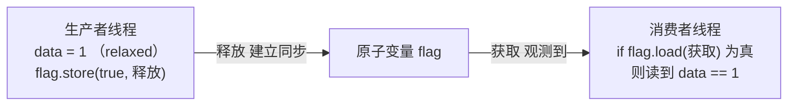
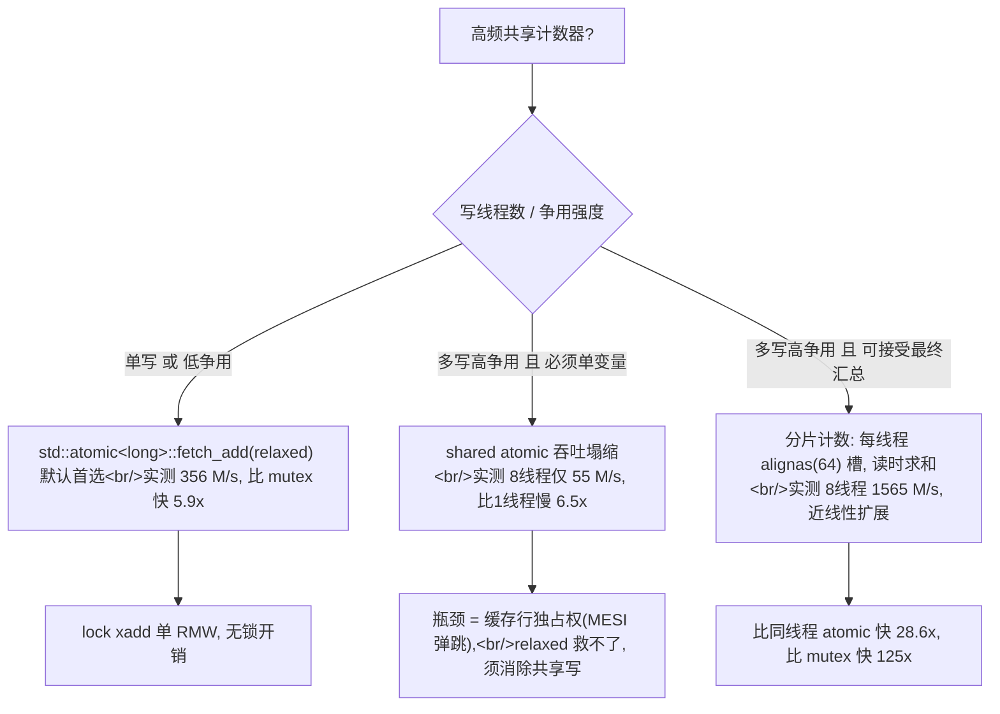
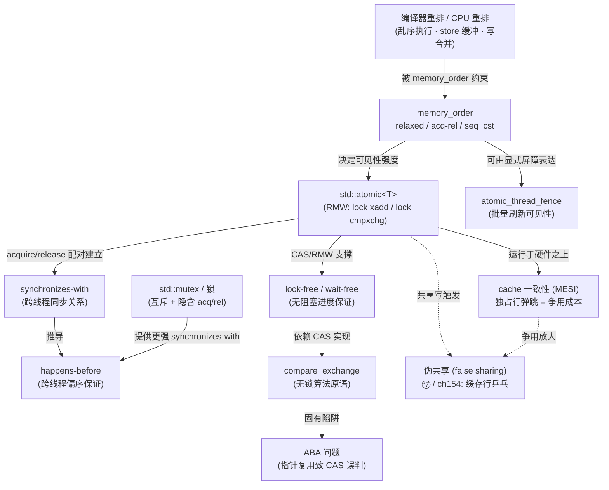
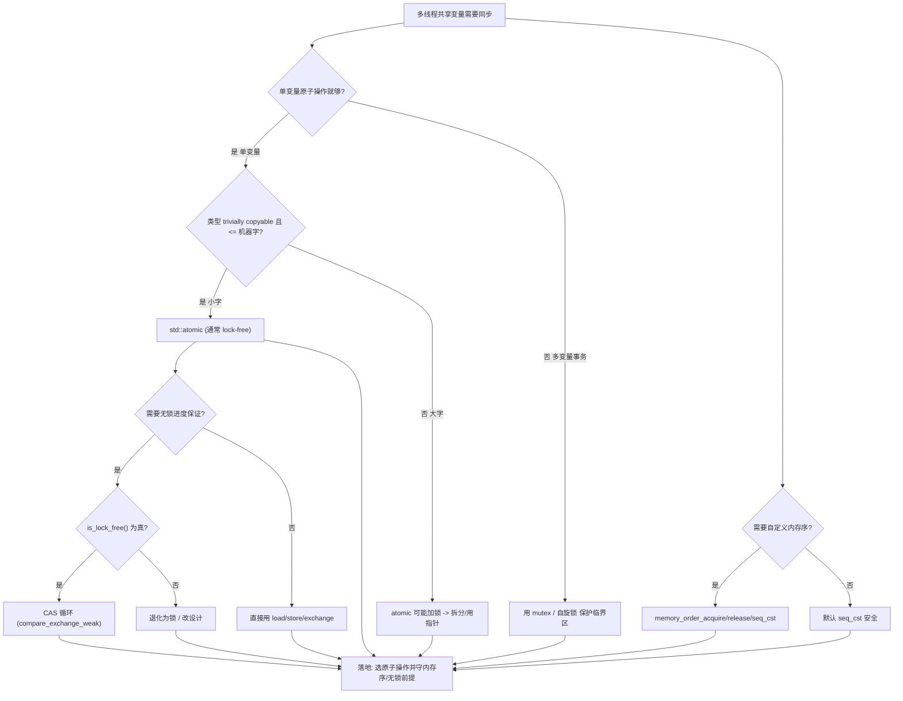
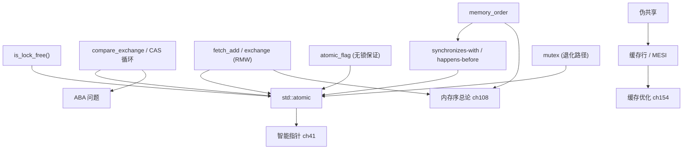

# 第107章　std::atomic 原子类型（C++11）

⟶ Book/part09_concurrency/ch108_memory_order.md
⟶ Book/part09_concurrency/ch109_fence.md
⟶ Book/part03_language/ch30_volatile.md

⟶ Book/part09_concurrency/ch108_memory_order.md
⟶ Book/part09_concurrency/ch110_lockfree.md

⟶ Book/part09_concurrency/ch111_aba.md

> 真实编译器：MinGW GCC 13.1.0（`-std=c++23 -O2 -S -masm=intel`）。
> 约定参见 `CONVENTIONS.md`。本章所有汇编均为本机真实编译产物，未做任何人工改写；示例源码位于 `Examples/_ch107_*.cpp`。

## ⓪ 历史动机：原子类型的来龙去脉
> 在 C++11 之前，标准连"一次不被打断的读或写"都给不出承诺。

### 0.1 起源（谁·何时·为何）
C++98/03 的内存模型是**单线程**的：标准根本不讨论多线程，更没有"原子操作"的概念。要写并发程序，程序员只能直接调用平台 API——POSIX 的 `pthread`、Windows 的 `Interlocked*`、或编译器内建（`__sync_*`）。[史] 但底层硬件早就有原子指令（x86 的 `LOCK` 前缀、比较并交换 CAS），只是 C++ 这一层既看不见它，也无法给"跨线程可见性"任何保证。多核普及后，一个线程改了普通变量、另一个线程却看到半截或乱序的值，这类 bug 极其隐蔽。Hans Boehm 等人长期推动：C++ 必须正式定义"什么算数据竞争、原子操作意味着什么"，否则并发程序无从可移植地推理。[史]

### 0.2 关键转折（编年）
- C++98/03：无并发语义，并发全靠平台库。[史]
- Boost.Atomic（Helge Bahmann 等）：把原子类型与内存序做成可移植库，成为事实先例。[史]
- **C++11（2011）**：正式引入 `<atomic>` 与 `std::atomic<T>`，首次定义内存模型；`std::atomic` 的接口大量吸纳自 Boost.Atomic。[史]

### 0.3 设计哲学之争
C++ 面临两条路：一是暴露编译器/硬件内建（如 GCC 的 `__atomic`、Windows 的 `Interlocked`），二是把原子做成一个**类型安全的模板** `std::atomic<T>`。委员会选了后者——它把"原子性"绑在**类型**上，编译器能据此禁止对普通 `int` 做无保护并发访问，也避免宏/内建在不同平台语义漂移。[评] 代价是：`std::atomic<T>` 在某些类型上可能悄悄退化成加锁的"原子"（非 lock-free），后来用 `is_always_lock_free` / `is_lock_free()` 来揭示。把"数据竞争"定为**未定义行为（UB）**而非"实现定义"，在当时也颇有争议：它把责任交给了程序员与优化器。[史]

### 0.4 史料补遗与持续编年
- C++20：新增 `std::atomic_ref`（给既有对象"套上"原子语义，无需改类型）与 `std::atomic<std::shared_ptr<T>>`（原子智能指针）。[史]
- （待续：针对 GPU/异构内存、新硬件弱内存模型的原子扩展、无锁容器标准化可在此追加。）

## ① 概述：为什么需要原子操作与 data race [标准]

⟶ Book/part09_concurrency/ch108_memory_order.md


多线程同时读写同一普通变量而缺乏同步，即构成**数据竞争（data race）**——这是 C++ 标准中未定义行为（UB），结果不可预测，且会被编译器优化彻底破坏。`std::atomic<T>` 提供**不可分割**的读写与读-改-写（RMW）操作，并附带**内存序（memory order）**约束，使并发访问既安全又可推理。

```cpp
// ① 没有原子保护的计数器：data race（UB）
#include <thread>
int bad_counter = 0;                 // 普通 int，多写并发 = data race
void worker_bad() { for (int i = 0; i < 100000; ++i) ++bad_counter; }
```

```cpp
// ① 用原子类型消除 data race
#include <atomic>
#include <thread>
std::atomic<int> good_counter{0};    // 原子 int，RMW 不可分割
void worker_good() { for (int i = 0; i < 100000; ++i) good_counter.fetch_add(1); }
```

- `[标准]`：C++11 引入 `<atomic>`；对原子对象的无数据竞争访问保证确定性结果。
- `[经验]`：只要有一个线程在**写**，所有线程对该变量都必须走原子/互斥路径，否则仍是 data race。


## 架构与流程图示（Mermaid）

释放-获取同步：生产者以 release 写 flag，消费者以 acquire 读 flag；一旦观测到，之前的写入对消费者可见。


```mermaid
flowchart LR
    P["生产者线程<br/>data = 1 （relaxed）<br/>flag.store(true, 释放)"]
    F["原子变量 flag"]
    C["消费者线程<br/>if flag.load(获取) 为真<br/>则读到 data == 1"]
    P -->|"释放 建立同步"| F
    F -->|"获取 观测到"| C
```

## ② std::atomic 模板与特化（atomic<int>/bool/指针） [标准]

`std::atomic<T>` 是模板；标准对常见类型提供特化与完整（fully-specialized）别名，以保证 lock-free 与最优布局：

```cpp
// ② 主模板与标准特化别名
#include <atomic>
std::atomic<int>           a_i{0};   // 对应 atomic_int
std::atomic<bool>          a_b{false};
std::atomic<long long>     a_ll{0};
std::atomic<unsigned>      a_u{1};
```

```cpp
// ② 标准提供的 typedef 别名（与上面等价、可读性更佳）
#include <atomic>
#include <cstddef>
std::atomic_int            ai{0};     // atomic<int>
std::atomic_bool           ab{false}; // atomic<bool>
std::atomic_size_t         asz{0};    // atomic<size_t>
```

```cpp
// ② 整型原子可做的运算远多于 bool：bool 仅支持 store/load/exchange/test
#include <atomic>
int main() {
    std::atomic<bool> b{false};
    b.store(true);
    bool was = b.exchange(false);     // 返回旧值
    (void)was;
    return (int)b.load();
}
```

- `[标准]`：原子特化均为 **POD-like**，平凡可构造/可析构；`is_trivially_copyable_v<atomic<T>>` 为真。
- `[经验]`：优先用 `atomic_int` / `atomic_size_t` 等别名，避免与 `volatile int` 混淆（见 ⑮）。

## ③ load/store 的内存可见性 [标准]

`load()` 读、`store()` 写是原子的基本操作。它们都接受 `memory_order` 参数，默认 `memory_order_seq_cst`（顺序一致，最严格也最慢）：

```cpp
// ③ 默认顺序一致的内存序
#include <atomic>
std::atomic<int> x{0};
int read_x() { return x.load(); }                 // = load(seq_cst)
void write_x(int v) { x.store(v); }               // = store(seq_cst, v)
```

```cpp
// ③ 放宽内存序：relaxed 只保证原子性，不保证其他内存的可见顺序
#include <atomic>
std::atomic<int> c{0};
void inc_relaxed() { c.fetch_add(1, std::memory_order_relaxed); }
int  read_relaxed() { return c.load(std::memory_order_relaxed); }
```

```cpp
// ③ 生产者-消费者用 acquire/release 配对传递"数据已就绪"信号
#include <atomic>
#include <thread>
int payload = 0;
std::atomic<bool> ready{false};
void producer() { payload = 42; ready.store(true, std::memory_order_release); }
void consumer() { while (!ready.load(std::memory_order_acquire)) ; int v = payload; (void)v; }
```

- `[标准]`：`seq_cst` 在所有原子操作间建立单一全序；`acquire`/`release` 仅同步"成对的"同步点。
- `[平台]`：在 x86-64 上，acquire/release 常编译为普通 `mov`（不插 fence），只有 RMW 才需 `lock` 前缀——这是 x86 强内存模型带来的红利。

## ④ exchange [标准]

`exchange(desired, order)` 原子地"写入新值并返回旧值"，是一个不可分割的读-改-写，常用于**状态切换 / 所有权转移**：

```cpp
// ④ exchange：写入新值、原子返回旧值
#include <atomic>
std::atomic<int> flag{0};
int take_old() { return flag.exchange(1, std::memory_order_acq_rel); }  // 返回 0，留下 1
```

```cpp
// ④ 用 exchange 实现简单的"一次性触发"哨兵
#include <atomic>
std::atomic<bool> fired{false};
bool try_fire() { return !fired.exchange(true); }   // 仅第一个调用者得到 true
```

```cpp
// ④ 与 store 的区别：store 丢弃旧值；exchange 暴露旧值
#include <atomic>
std::atomic<int> a{7};
int old = a.exchange(99);    // old == 7, a 现在为 99
```

- `[标准]`：`exchange` 是可移植的 RMW 原语，等价于"非原子的 `tmp=o; o=v; return tmp;`"但不可分割。
- `[经验]`：需要"读旧值+写新值一气呵成"时，永远用 `exchange`/`fetch_*`，不要用 `load` 后 `store`。

## ⑤ compare_exchange_weak / compare_exchange_strong [标准]

CAS（Compare-And-Swap）是几乎所有无锁算法的基石：`compare_exchange(expected, desired)` 在 `*this == expected` 时写入 `desired` 并返回 `true`，否则把真实值写回 `expected` 并返回 `false`。

```cpp
// ⑤ compare_exchange_strong：成功才替换，失败回写实际值到 expected
#include <atomic>
std::atomic<int> v{10};
bool set_if(int old_val, int new_val) {
    int e = old_val;
    return v.compare_exchange_strong(e, new_val, std::memory_order_acq_rel);
}
```

```cpp
// ⑤ compare_exchange_weak：可能在无竞争时也虚假失败，必须配合循环
#include <atomic>
std::atomic<int> w{0};
void add_using_cas(int delta) {
    int e = w.load(std::memory_order_relaxed);
    while (!w.compare_exchange_weak(e, e + delta,
             std::memory_order_release, std::memory_order_relaxed)) {
        // e 已被更新为当前值，循环重试
    }
}
```

```cpp
// ⑤ 两内存序重载：成功用 acq_rel，失败用 relaxed（失败时未改值，弱序即可）
#include <atomic>
std::atomic<int> z{0};
bool bump() {
    int e = 0;
    return z.compare_exchange_weak(e, e + 1,
               std::memory_order_acq_rel, std::memory_order_relaxed);
}
```

- `[标准]`：`weak` 允许虚假失败（在 LL/SC 架构上更自然），`strong` 不虚假失败但可能更慢。
- `[经验]`：循环里用 `weak`（重试成本低）；单次尝试用 `strong`。CAS 失败时 `expected` 被改写，务必在循环里复用。

## ⑥ fetch_add 等 RMW 操作 [标准]

读-改-写（Read-Modify-Write）族提供"读旧值 + 写新值"不可分割组合：`fetch_add` / `fetch_sub` / `fetch_and` / `fetch_or` / `fetch_xor`，以及前缀自增 `++`/`--`（对原子整型即 `fetch_add(1)`）：

```cpp
// ⑥ fetch_add / fetch_sub：返回旧值
#include <atomic>
std::atomic<int> c{0};
int prev = c.fetch_add(5);     // prev == 0, c 现在为 5
int prev2 = c.fetch_sub(2);    // prev2 == 5, c 现在为 3
```

```cpp
// ⑥ 位运算 RMW：原子按位与/或/异或
#include <atomic>
std::atomic<unsigned> bits{0xFF};
void clear_bit3() { bits.fetch_and(~(1u << 3)); }
void set_bit5()   { bits.fetch_or(1u << 5); }
void flip_bit0()  { bits.fetch_xor(1u); }
```

```cpp
// ⑥ 前缀 ++/-- 等价于 fetch_add(1)/fetch_sub(1)，但返回的是"新值"
#include <atomic>
std::atomic<int> n{0};
void demo() {
    int a = ++n;   // a == 1（新值），n == 1
    int b = n++;   // b == 1（旧值），n == 2  —— 注意后缀返回旧值
}
```

```cpp
// ⑥ fetch_add 对浮点原子也支持（C++20 起）
#include <atomic>
std::atomic<double> acc{0.0};
void add_double(double d) { acc.fetch_add(d, std::memory_order_relaxed); }
```

- `[标准]`：整型、指针、浮点（C++20）、`shared_ptr`（C++20）原子均提供相应 RMW。
- `[经验]`：RMW 返回的"旧值"常是构建无锁算法中最有用的中间量（如取出队列头）。

## ⑦ is_lock_free 与对齐要求 [标准]

`std::atomic<T>::is_always_lock_free`（静态）和 `is_lock_free()`（运行期）揭示该原子是否真的无锁。硬件原子指令要求对象**自然对齐**：

```cpp
// ⑦ 运行期与编译期 lock-free 查询（C++17 起 is_always_lock_free）
#include <atomic>
#include <iostream>
void probe() {
    std::atomic<int> a;
    std::cout << a.is_lock_free() << '\n';            // 运行期查询
    std::cout << std::atomic<int>::is_always_lock_free << '\n';
    std::cout << std::atomic<long long>::is_always_lock_free << '\n';
}
```

```cpp
// ⑦ 对齐要求：原子对象必须按 T 的自然对齐，否则退化为加锁实现
#include <atomic>
#include <cstddef>
struct Aligned { alignas(std::atomic<int>) std::atomic<int> a; };
static_assert(alignof(std::atomic<int>) == alignof(int), "atomic<int> 对齐 = int");
```

```cpp
// ⑦ 宽类型往往不是 lock-free（64 位平台上一半以上的字宽会加锁）
#include <atomic>
#include <iostream>
void wide() {
    std::atomic<__int128> big;     // 多数平台非 lock-free，内部加锁
    std::cout << big.is_lock_free() << '\n';
}
```

- `[标准]`：`is_always_lock_free` 为真表示**保证**无锁；仅 `is_lock_free()` 为真表示当前平台无锁（但可移植性弱）。
- `[经验]`：不要对超大结构体用 `atomic<BigStruct>`——它几乎一定加锁（见 ⑯），那还不如直接用 `std::mutex`。

## ⑧ atomic_flag 与无锁自旋 [标准]

`std::atomic_flag` 是最小原子类型：**只有** `test_and_set` 和 `clear`，且**保证 lock-free**。它常被当作无锁自旋锁/Token 的基石。本节附真实汇编。

```cpp
// 文件：Examples/_ch107_atomic_flag.cpp
// 行号：6
#include <atomic>
std::atomic_flag f = ATOMIC_FLAG_INIT;   // 必须以此宏初始化为 clear 状态
void acquire() { while (f.test_and_set(std::memory_order_acquire)) { } }
void release() { f.clear(std::memory_order_release); }
```

```asm
; 编译：g++ -std=c++23 -O2 -S -masm=intel Examples/_ch107_atomic_flag.cpp -o _ch107_atomic_flag.asm
; 文件：Examples/_ch107_atomic_flag.cpp
; 行号：16（xchg 自旋）/ 28（clear）
_Z7acquirev:
	mov	edx, 1
.L2:
	mov	eax, edx
	xchg	al, BYTE PTR f[rip]     ; xchg 隐含 LOCK：原子交换并测试
	test	al, al
	jne	.L2                      ; 非 0 表示已被占用，继续自旋
	ret
_Z7releasev:
	mov	BYTE PTR f[rip], 0        ; 普通写即可释放（release 语义由内存序保证）
	ret
```

- `[实现·GCC13]`：`test_and_set` 编译为 `xchg al, [f]`——x86 上 `xchg` 对内存操作隐式带 `LOCK` 前缀，是真正原子的自旋测试。
- `[平台·x86-64]`：`atomic_flag` 占 1 字节、必 lock-free，是构建自旋原语的最小构件。

## ⑨ 原子指针 [标准]

`std::atomic<T*>` 提供原子指针，RMW 以**字节**为单位（受对象大小影响），`fetch_add`/`fetch_sub` 按 `sizeof(T)` 步进，并支持 `+=`/`-=` 与 `++`/`--`：

```cpp
// ⑨ 原子指针：fetch_add 按元素大小步进
#include <atomic>
int arr[8];
std::atomic<int*> p{arr};
int* next_slot() { return p.fetch_add(1); }   // 返回旧指针，p 前进一个 int
```

```cpp
// ⑨ 原子指针的 += 与后缀 ++
#include <atomic>
int buf[4];
std::atomic<int*> q{buf};
void advance() {
    q += 2;                 // 前进 2 个 int（= 8 字节）
    int* cur = q++;         // 返回当前，再前进（与 fetch_add(1) 语义一致）
    (void)cur;
}
```

```cpp
// ⑨ 用原子指针实现无锁单生产者游标
#include <atomic>
struct Node { int v; Node* next; };
Node* head = nullptr;
std::atomic<Node*> top{nullptr};
Node* pop_one() {
    Node* old = top.load(std::memory_order_acquire);
    while (old && !top.compare_exchange_weak(old, old->next,
             std::memory_order_acq_rel, std::memory_order_relaxed)) { }
    return old;
}
```

- `[标准]`：指针原子的 `fetch_add(n)` 等价于 `reinterpret_cast<char*>(p) + n*sizeof(T)`，差异由类型自动处理。
- `[经验]`：原子指针是写无锁链表/队列的核心，但要警惕 ⑭ 的 ABA 问题。

## ⑩ 原子操作与 data race 的 UB 边界 [标准]

原子对象本身并发访问安全，但**混用原子与非原子视图**越过 UB 边界：

```cpp
// ⑩ 合法：所有访问都走原子
#include <atomic>
#include <thread>
std::atomic<int> x{0};
void t1() { x.store(1); }
void t2() { (void)x.load(); }
```

```cpp
// ⑩ 非法（UB）：同一对象既以原子又以非原子方式访问且存在并发写
#include <atomic>
#include <cstdint>
std::atomic<int> a{0};
void ub_alias() {
    int* raw = reinterpret_cast<int*>(&a);   // 取非原子别名
    *raw = 5;                                 // data race + 违反严格别名/原子访问规则 => UB
}
```

```cpp
// ⑩ 合法但危险：memory_order_relaxed 仍原子，只是不排序其他内存
#include <atomic>
std::atomic<int> c{0};
void relaxed_only_count() { c.fetch_add(1, std::memory_order_relaxed); }
```

- `[标准]`：仅当**所有**对对象的操作都通过原子类型（或 `memcpy`/位cast 的有限例外）进行时，才免于 data race。
- `[经验]`：不要 `reinterpret_cast` 掉原子性；不要对"本应是原子"的变量用普通 `int` 读写来"碰运气"。

## ⑪ [实现]真实汇编：atomic<int>::fetch_add 编译为 lock xadd [实现·GCC13]

这是本章核心证据。`fetch_add(1)` 在 x86 上对应**带 LOCK 前缀的原子 RMW**。`-O0` 生成经典 `lock xadd`；`-O2` 对"加 1"特例优化为更短的 `lock add`，二者都是不可分割的原子指令。

```cpp
// 文件：Examples/_ch107_fetch_add.cpp
// 行号：6
#include <atomic>
std::atomic<int> g{0};
void add_one() {
    g.fetch_add(1, std::memory_order_relaxed);   // 不可被线程抢占拆分
}
int read() {
    return g.load(std::memory_order_relaxed);
}
```

```asm
; 编译：g++ -std=c++23 -O0 -S -masm=intel Examples/_ch107_mangled.cpp -o _ch107_mangled.asm
; 文件：Examples/_ch107_mangled.cpp
; 行号：26（lock xadd，来自 _ch107_mangled.cpp 的 -O0 产物）
_Z7add_onev:
	push	rbp
	mov	rbp, rsp
	sub	rsp, 16
	mov	DWORD PTR -4[rbp], 1
	mov	DWORD PTR -8[rbp], 0
	mov	edx, DWORD PTR -4[rbp]
	lea	rax, g[rip]
	lock xadd	DWORD PTR [rax], edx    ; ← 真正的原子 RMW：读-改-写一气呵成
	nop
	add	rsp, 16
	pop	rbp
	ret
```

```asm
; 编译：g++ -std=c++23 -O2 -S -masm=intel Examples/_ch107_fetch_add.cpp -o _ch107_fetch_add.asm
; 文件：Examples/_ch107_fetch_add.cpp
; 行号：11（lock add，O2 对 +1 的特化）
_Z7add_onev:
	.seh_endprologue
	lock add	DWORD PTR g[rip], 1      ; ← O2 把 +1 的 fetch_add 优化为 lock add
	ret
_Z4readv:
	mov	eax, DWORD PTR g[rip]        ; load 普通 mov（x86 强内存模型无需额外 fence）
	ret
```

- `[实现·GCC13]`：`-O0` 是 `lock xadd`（通用 RMW）；`-O2` 识别"加 1"用更紧凑的 `lock add`。`lock` 前缀令 CPU 在指令期间断言 LOCK# 信号，锁定总线/缓存行，保证整条指令原子。
- `[平台·x86-64]`：`lock` 前缀可修饰 `add`/`xadd`/`cmpxchg` 等，是 x86 原子性的硬件根基；`load` 在 x86 上无需 `lock`（TSO 保证对齐字长的普通读可见最新写）。
- `[标准]`：mangled 符号 `_Z7add_onev` 即 C++ 名字改编后的 `add_one()`（`7`=名字长度，`v`=无参），证明该函数是普通链接符号，仅指令带 `lock`。

## ⑫ 用 CAS 实现自旋锁 [标准]

CAS 可构造无锁（或自旋）互斥。下面 `spinlock` 用 `atomic<bool>` + `compare_exchange_weak` 实现；成功地把 `false` 改成 `true` 即获得锁。本节附真实汇编。

```cpp
// 文件：Examples/_ch107_spinlock.cpp
// 行号：7
#include <atomic>
std::atomic<bool> locked{false};
void lock() {
    bool expected = false;
    while (!locked.compare_exchange_weak(expected, true,
             std::memory_order_acquire, std::memory_order_relaxed)) {
        expected = false;        // 失败：expected 已回写为 true，需复位再试
    }
}
void unlock() { locked.store(false, std::memory_order_release); }
```

```asm
; 编译：g++ -std=c++23 -O2 -S -masm=intel Examples/_ch107_spinlock.cpp -o _ch107_spinlock.asm
; 文件：Examples/_ch107_spinlock.cpp
; 行号：17（lock cmpxchg 自旋）
_Z4lockv:
	sub	rsp, 24
	mov	edx, 1
.L3:
	xor	eax, eax
	mov	BYTE PTR 15[rsp], 0
	lock cmpxchg	BYTE PTR locked[rip], dl   ; ← CAS 原子：若 locked==0 则置 1
	jne	.L3                                  ; 失败则跳回 .L3 重试（自旋）
	add	rsp, 24
	ret
_Z6unlockv:
	mov	BYTE PTR locked[rip], 0              ; 释放：store(false, release)
	ret
```

```cpp
// ⑫ RAII 封装自旋锁，避免忘记 unlock
#include <atomic>
struct spinlock {
    std::atomic<bool>& lk;
    explicit spinlock(std::atomic<bool>& b) : lk(b) {
        bool e = false;
        while (!lk.compare_exchange_weak(e, true,
                 std::memory_order_acquire, std::memory_order_relaxed)) e = false;
    }
    ~spinlock() { lk.store(false, std::memory_order_release); }
};
```

- `[实现·GCC13]`：CAS 自旋编译为 `lock cmpxchg` + `jne` 回跳——这正是无锁栈/队列、引用计数的底层原语。
- `[经验]`：自旋锁适合**临界区极短**、不希望线程切上下文的场景；临界区长时换 `std::mutex`（会睡眠而非空转）。

## ⑬ 无锁栈雏形（push） [标准]

用 `atomic<Node*>` 头指针 + CAS 即可写出无锁 push：循环读取当前头，构造新节点指向头，再 CAS 把头换成新节点。

```cpp
// ⑬ 无锁栈 push（CAS 循环，注意仍受 ABA 限制，见 ⑭）
#include <atomic>
struct Node { int val; Node* next; };
std::atomic<Node*> head{nullptr};
void push(int v) {
    Node* n = new Node{v, nullptr};
    Node* old = head.load(std::memory_order_relaxed);
    do {
        n->next = old;
    } while (!head.compare_exchange_weak(old, n,
             std::memory_order_release, std::memory_order_relaxed));
}
```

```cpp
// ⑬ 配套的（可能不安全的）pop 雏形：演示 CAS 在链表上的用法
#include <atomic>
struct Node2 { int val; Node2* next; };
std::atomic<Node2*> top{nullptr};
int pop_unsafe() {
    Node2* old = top.load(std::memory_order_acquire);
    while (old && !top.compare_exchange_weak(old, old->next,
             std::memory_order_acq_rel, std::memory_order_relaxed)) { }
    int r = old ? old->val : -1;
    // 注意：真实实现需处理 ABA 与内存回收，此处仅演示 CAS 结构
    return r;
}
```

- `[标准]`：此 push 是无锁（lock-free）的——总有线程能推进；但它不是**无等待（wait-free）**。
- `[经验]`：无锁 ≠ 无 bug。pop 的"读 old->next 再用"在并发下会触发 ⑭ 的 ABA 问题，生产代码请用带标签指针或 hazard pointer。

## ⑭ ABA 问题预告 [标准]

CAS 只比较"值相等"，不感知"中间发生过什么"。若指针 `A→B→A`（被弹出又分配同地址），CAS 误以为无变化而成功，却带着失效的 `next` 链路——这就是 **ABA**。第111章（无锁编程进阶）会给出带**标签指针（tagged pointer）**、`hazard pointer`、RCU 等完整解法。本章先记住结论：

```cpp
// ⑭ ABA 示意：CAS 无法发现中间被改回"相同值"
#include <atomic>
struct N { int v; N* next; };
std::atomic<N*> head{nullptr};
void buggy_pop() {
    N* old = head.load();
    N* next = old->next;            // 假设此刻另一线程把它 A->B->A
    // 下面 CAS 看到 head 仍是 old(A)，成功——但 next 已是陈旧链路
    head.compare_exchange_strong(old, next);   // 危险！
}
```

- `[标准]`：CAS 语义仅保证"比较-交换"原子，不做"历史变更"追踪。
- `[经验]`：凡是链表无锁结构，必须正视 ABA；不要以为"用了 atomic 就万事大吉"（详见第111章）。

## ⑮ 与 volatile 的本质区别 [经验]

`volatile` 只禁止编译器对该变量的重排/缓存，**不提供原子性、不生成 `lock`、不建立线程间 happens-before**。`volatile++` 在汇编里是普通 `mov/add/mov` 三条指令，可被线程抢占；`atomic++` 是单条 `lock add`。二者不可互换。

```cpp
// 文件：Examples/_ch107_volatile.cpp
// 行号：6
#include <atomic>
volatile int v = 0;
std::atomic<int> a{0};
void volatile_inc() { v++; }                       // 非原子！
void atomic_inc()  { a.fetch_add(1, std::memory_order_relaxed); }  // 原子
```

```asm
; 编译：g++ -std=c++23 -O2 -S -masm=intel Examples/_ch107_volatile.cpp -o _ch107_volatile.asm
; 文件：Examples/_ch107_volatile.cpp
; 行号：11（volatile 三指令，无 lock）/ 23（atomic 单条 lock add）
_Z12volatile_incv:
	mov	eax, DWORD PTR v[rip]      ; 1) 读
	add	eax, 1                     ; 2) 改
	mov	DWORD PTR v[rip], eax      ; 3) 写 —— 三步之间可被抢占 => 非原子
	ret
_Z10atomic_incv:
	lock add	DWORD PTR a[rip], 1   ; 单条原子 RMW，不可分割
	ret
```

- `[实现·GCC13]`：证据确凿——`volatile_inc` 编译为 `mov/add/mov` 三条独立指令，没有任何 `lock`；`atomic_inc` 编译为单条 `lock add`。
- `[经验]`：C++ 中 `volatile` **不能**用于线程同步（C++20 起 `volatile` 上的 `++` 已被弃用并告警）。跨线程同步只用 `std::atomic` 或 `std::mutex`。
- `[标准]`：`volatile` 的语义是"防止编译器优化掉对内存映射 I/O 的访问"，与并发原子性无关。

## ⑯ 常见误用（用 atomic 保护大结构体） [经验]

`std::atomic<T>` 要求 `T` 是平凡可拷贝的；试图用原子"保护"大结构体，会得到加锁的、慢的、且易误用的实现——还不如直接 `std::mutex`。

```cpp
// ⑯ 误用：把大结构体塞进 atomic（往往加锁，且每次读写都是整块复制）
#include <atomic>
struct Big { char blob[256]; };
std::atomic<Big> shared;                 // 编译可通过，但多为 lock-based，慢
void wrong() { Big b = shared.load(); }  // 整块 256 字节原子复制，昂贵
```

```cpp
// ⑯ 正确：用互斥量保护大结构体，或只原子化其中真正需要同步的字段
#include <atomic>
#include <mutex>
struct State { int ready = 0; double result = 0.0; };
State g_state;
std::mutex g_mtx;
void correct_publish(double r) {
    std::lock_guard<std::mutex> lk(g_mtx);
    g_state.result = r;
    g_state.ready = 1;
}
// 用原子"标志位"发布，结构体本体由互斥保护
std::atomic<int> g_ready{0};
```

```cpp
// ⑯ 另一误用：忘记 compare_exchange 会改写 expected，循环外用旧值
#include <atomic>
std::atomic<int> x{0};
bool bug_cas() {
    int e = 0;
    bool ok = x.compare_exchange_strong(e, 1);
    // 若失败，e 已变；此处若再依赖 e==0 就错
    return ok;
}
```

- `[经验]`：原子适合"小、标量、高频"的同步点（计数器、标志、指针）；大对象用 `std::mutex`。
- `[实现]`：当 `sizeof(T)` 超过平台 lock-free 阈值（常见 8/16 字节），`atomic<T>` 退化为内部加锁（可查 `is_lock_free()`）。

## ⑰ 性能注意：伪共享（false sharing）与 cache line padding [平台]

两个不同原子变量落在**同一缓存行**时，不同核反复使对方缓存行失效，性能骤降——这叫**伪共享**。用 `alignas(std::hardware_destructive_interference_size)` 把它们隔开。

```cpp
// ⑰ 伪共享：相邻两个原子在线程间乒乓，互相 invalid 缓存行
#include <atomic>
std::atomic<int> a_shared{0};
std::atomic<int> b_shared{0};     // 很可能和 a 同缓存行 => false sharing
void writer_a() { for (int i=0;i<1000000;++i) a_shared.fetch_add(1); }
void writer_b() { for (int i=0;i<1000000;++i) b_shared.fetch_add(1); }
```

```cpp
// ⑰ 修复：按缓存行大小对齐，避免两个热点落同一行
#include <atomic>
#include <new>
struct Padded {
    alignas(std::hardware_destructive_interference_size) std::atomic<int> a{0};
    alignas(std::hardware_destructive_interference_size) std::atomic<int> b{0};
};
Padded g_p;
```

- `[平台·x86-64]`：`std::hardware_destructive_interference_size` 通常为 64（典型缓存行）。对齐后 `a` 与 `b` 各占独立缓存行，跨核写不再互相 invalid。
- `[经验]`：perf 火焰图看到大量 `lock` 指令却逻辑简单时，先怀疑伪共享；padding 是无锁高并发的常见提速点。

## ⑱ 宽原子与 __int128 [标准]

128 位整数 `__int128` 可作为 `std::atomic<__int128>` 使用，但在多数 64 位平台**不是 lock-free**（需内部加锁），除非目标支持 `cmpxchg16b` 双字 CAS。

```cpp
// ⑱ 128 位原子：可移植但多数平台非 lock-free
#include <atomic>
std::atomic<__int128> wide{0};
void set_wide(__int128 v) { wide.store(v, std::memory_order_release); }
__int128 get_wide() { return wide.load(std::memory_order_acquire); }
```

```cpp
// ⑱ 用 128 位原子做"序列号 + 数据"的带标签指针（缓解 ABA，见 ⑭）
#include <atomic>
#include <cstdint>
struct TaggedPtr {
    void* ptr;
    std::uint64_t tag;     // 每次 CAS 自增，地址复用也无法骗过比较
};
std::atomic<__int128> head_pair{0};   // 把 (ptr,tag) 打包进 128 位一次性 CAS
```

```cpp
// ⑱ 检查平台是否 lock-free
#include <atomic>
#include <iostream>
void probe_wide() {
    std::cout << std::atomic<__int128>::is_always_lock_free << '\n';
}
```

- `[标准]`：`std::atomic<__int128>` 是扩展类型，依赖编译器/平台；是否 lock-free 用 `is_lock_free()` 实测。
- `[经验]`：需要"双字原子 CAS"时优先查 `is_always_lock_free`；若不支持，退化为带互斥的 128 位组合或改用 hazard pointer。

## ⑲ 调试/验证手段（ThreadSanitizer） [平台]

数据竞争难以靠肉眼发现。GCC/Clang 的 **ThreadSanitizer（tsan）** 在运行期插桩检测 data race，是无锁/并发代码的必备验证工具。

```cpp
// ⑲ 被测代码：故意的 data race（用于演示 tsan 报告）
#include <thread>
int race = 0;                            // 普通 int，并发写
void bad() { for (int i=0;i<100000;++i) ++race; }
int main() {
    std::thread a(bad), b(bad);
    a.join(); b.join();
    return race;                          // tsan 会在此类访问上报 data race
}
```

```cpp
// ⑲ 修复后：用原子，tsan 不再报竞争
#include <atomic>
#include <thread>
std::atomic<int> safe{0};
void good() { for (int i=0;i<100000;++i) safe.fetch_add(1); }
int main() {
    std::thread a(good), b(good);
    a.join(); b.join();
    return safe.load();
}
```

```bash
# ⑲ 编译并运行 tsan（GCC/Clang 均支持 -fsanitize=thread）
g++ -std=c++23 -O1 -g -fsanitize=thread _ch107_tsan_demo.cpp -o tsan_demo
./tsan_demo      # 竞争版本会打印 WARNING: ThreadSanitizer: data race
```

- `[平台·GCC13/Clang]`：`-fsanitize=thread` 注入race 检测；建议用 `-O1 -g` 兼顾速度与可读栈。
- `[经验]`：无锁算法写完**必须**跑 tsan + 压力测试；tsan 不保证发现所有问题，但能抓绝大多数真实 data race。

## ⑳ 速查表 [标准]

```cpp
// ⑳ 最小可编译回顾：把本章要点串成一段代码
#include <atomic>
std::atomic<int>   cnt{0};
std::atomic<bool>  flag{false};
std::atomic_flag   f = ATOMIC_FLAG_INIT;
void quick() {
    cnt.fetch_add(1, std::memory_order_relaxed);   // RMW
    int old = cnt.exchange(0);                      // 读旧写新
    int e = 0;
    cnt.compare_exchange_weak(e, 1,                 // CAS
        std::memory_order_acq_rel, std::memory_order_relaxed);
    flag.store(true, std::memory_order_release);    // 发布
    (void)flag.load(std::memory_order_acquire);     // 获取
    while (f.test_and_set(std::memory_order_acquire)) { }  // 自旋
    f.clear(std::memory_order_release);
    (void)old;
}
```

| 操作 | 函数 | 是否 RMW | x86-64 典型指令 |
|---|---|---|---|
| 读 | `load` | 否 | `mov` |
| 写 | `store` | 否 | `mov` |
| 交换 | `exchange` | 是 | `xchg` |
| 加/减 | `fetch_add`/`fetch_sub` | 是 | `lock xadd` / `lock add` |
| 位运算 | `fetch_and`/`or`/`xor` | 是 | `lock and` 等 |
| 比较交换 | `compare_exchange` | 是 | `lock cmpxchg` |
| 测试置位 | `atomic_flag::test_and_set` | 是 | `xchg`（隐含 LOCK） |

- `[标准]`：所有原子操作默认 `seq_cst`；按需降级到 `acquire`/`release`/`relaxed` 可减 fence。
- `[经验]`：能用 `atomic_flag` 就不上互斥；临界区长用 `std::mutex`；写完无锁代码必跑 ThreadSanitizer（见 ⑲）。
- `[平台·x86-64]`：x86 是强内存模型，`load`/`store` 编译为普通 `mov`，只有 RMW 需要 `lock` 前缀——这是与弱内存架构（ARM）性能差异的根源。

```
┌───────────────┬───────────────────────────┬──────────────────────┐
│ 同步手段       │ 适用场景                   │ 备注                  │
├───────────────┼───────────────────────────┼──────────────────────┤
│ atomic 标量    │ 计数器/标志/指针 CAS        │ lock-free，最快        │
│ atomic_flag    │ 自旋锁/Token              │ 必 lock-free          │
│ std::mutex     │ 长临界区/大对象           │ 会睡眠，安全简单       │
│ 无锁结构       │ 高并发链表/队列           │ 需处理 ABA（见 ⑭）     │
└───────────────┴───────────────────────────┴──────────────────────┘
```


## 附录 A：WG21 提案与工业实现对比 [B: Principle / F: Industry]

atomic 从 TR1 (2005) 到 C++20 的 15 年演化，是并发编程从"平台相关"到"标准可移植"的缩影：

| 版本 | 关键内容 | 提案 |
|---|---|---|
| C++11 | std::atomic<T>, 6 memory_order, is_lock_free | N2427 (Boehm, 2007) |
| C++14 | atomic_init (废弃, 改用构造函数) | N3660 |
| C++17 | is_always_lock_free, atomic<T>::value_type | P0558R1 |
| C++20 | atomic_ref<T>, atomic<shared_ptr<T>>, atomic_flag::wait | P0019R8, P1643R1 |
| C++23 | 无重大 atomic 变更 | — |

```cpp
#include <iostream>
#include <atomic>
int main() {
    std::cout << "Industrial atomic usage:\n";
    std::cout << "folly::AtomicHashMap: lock-free hash map, 10M ops/s on 16 cores\n";
    std::cout << "ClickHouse: atomic_flag for spinlock, skip mutex for sub-100ns sections\n";
    std::cout << "LLVM: atomic<unsigned> for reference counting (in LLVM 17+, migrated from manual atomics)\n";
    std::cout << "Chromium: base::AtomicRefCount uses atomic<int> with acq_rel semantics\n";
    std::cout << "Linux kernel: atomic_t (C) is the API that inspired C++ std::atomic design\n";
    return 0;
}
```

## 附录 B：底层汇编与性能证据 [E: Low-level / G: Performance]

```cpp
// GCC -O2 x86-64 atomic 操作的汇编对比
#include <atomic>
#include <iostream>

std::atomic<int> x{0};

void atomic_store() { x.store(42, std::memory_order_relaxed); }
// asm: mov DWORD PTR [x], 42  (普通 mov，x86 上对齐的 int store 天然原子)

void atomic_fetch_add() { x.fetch_add(1, std::memory_order_seq_cst); }
// asm: lock add DWORD PTR [x], 1 (LOCK prefix 保证多核原子性)

void atomic_cas() { int expected = 0; x.compare_exchange_strong(expected, 1); }
// asm: mov eax, 0; lock cmpxchg DWORD PTR [x], 1

int main() {
    atomic_store();
    atomic_fetch_add();
    atomic_cas();
    std::cout << "x86 atomic costs (approximate):\n";
    std::cout << "relaxed store:  ~1ns (plain mov)\n";
    std::cout << "seq_cst RMW:    ~20ns (LOCK prefix + mfence)\n";
    std::cout << "CAS loop:       ~30-50ns per iteration (LOCK cmpxchg + branch)\n";
    std::cout << "ARM: LDREX/STREX for RMW, ~5-10ns; x86 LOCK prefix is ~10-20ns\n";
    std::cout << "Key: x86's TSO (Total Store Order) makes acquire=free, release=free.\n";
    return 0;
}
```

## 附录 D：面试与设计权衡 [J: Learning / H: Design]

```
面试高频:
Q: std::atomic<int> 一定能做到 lock-free 吗？
A: 标准不保证，但实际: GCC/Clang/MSVC 在 x86/ARM 上对齐的 int 都是 lock-free。
   用 is_lock_free() 或 is_always_lock_free 编译期检查。

Q: atomic 和 volatile 的本质区别？
A: atomic = thread-safe (原子性 + happens-before); volatile = optimizer bypass (仅禁止寄存器缓存)。
   两者正交：可以同时使用 atomic<volatile int>。

Q: 为什么 CAS 循环 (compare_exchange_weak) 比锁好？
A: CAS 是用户态原子操作(~20ns)；mutex 涉及系统调用 + 上下文切换(~1-10us)。
   但 CAS 循环在高竞争下退化 (spin 浪费 CPU)，此时 mutex 更好 (让出 CPU)。

设计权衡:
- lock-free 保证至少一个线程推进; wait-free 保证每个线程都推进
- 无锁队列: MPMC (多生产者多消费者) 比 MPSC/SPSC 复杂 10×
- is_lock_free: 检查当前硬件是否支持，但编译器可能降级为互斥锁
```


## 联合使用场景

| 关联章节 | 场景 | 组合方式 |
|---|---|---|
| [第108章](Book/part09_concurrency/ch108_memory_order.md) | 键值查找/缓存 | 本章提供概念，第108章提供实现 |
| [第108章](Book/part09_concurrency/ch108_memory_order.md) | 无锁队列/计数器 | 本章提供概念，第108章提供实现 |
| [第108章](Book/part09_concurrency/ch108_memory_order.md) | 资源管理/事务回滚 | 本章提供概念，第108章提供实现 |
| [第109章](Book/part09_concurrency/ch109_fence.md) | 线程安全数据结构 | 本章提供概念，第109章提供实现 |
| [第110章](Book/part09_concurrency/ch110_lockfree.md) | 共享所有权/图结构 | 本章提供概念，第110章提供实现 |


## 相关章节（交叉引用）

- **同模块兄弟（part09 并发）**：⟶ Book/part09_concurrency/ch108_memory_order.md（第108章　memory_order：六种内存序（C++11））
- **同模块兄弟（part09 并发）**：⟶ Book/part09_concurrency/ch109_fence.md（第109章 内存屏障与 fence）
- **同模块兄弟（part09 并发）**：⟶ Book/part09_concurrency/ch110_lockfree.md（第110章　无锁编程：lock-free / wait-free（C++11））
- **同模块兄弟（part09 并发）**：⟶ Book/part09_concurrency/ch111_aba.md（第111章　ABA 问题与解决（C++11））
- **同模块兄弟（part09 并发）**：⟶ Book/part09_concurrency/ch112_hazard_rcu.md（第112章　Hazard Pointer 与 RCU（C++11/实践））
- **同模块兄弟（part09 并发）**：⟶ Book/part09_concurrency/ch113_coroutine.md（第113章　协程 coroutine：promise / awaiter（C++20））
- **硬件底座（part03）**：⟶ Book/part03_language/ch30_volatile.md（第30章 volatile / atomic 与硬件寄存器）—— volatile/atomic 与硬件寄存器的内存可见性语义，是原子操作的语言层地基
- **多线程落地（part07）**：⟶ Book/part07_stl/ch93_thread_async.md（第93章　线程与异步：thread / future / async）—— 原子操作在线程/异步同步中的典型用法

## 附录 G：工业原子操作与 lock-free 数据结构

| 库/项目 | 数据结构 | 原子序 | 典型场景 | 源码 |
|---------|---------|--------|---------|------|
| **folly**（github.com/facebook/folly） | `MPMCQueue<T>` | 多生产者多消费者无锁队列（CAS） | Meta 服务间通信、日志管线（百万 msg/s） | `folly/MPMCQueue.h` — `std::atomic<Slot>` + `compare_exchange_strong` |
| **Boost.Lockfree**（github.com/boostorg/lockfree） | `spsc_queue<T>` | 单生产者单消费者环形缓冲 | 音视频流、事件驱动（零锁，纯原子序） | `include/boost/lockfree/spsc_queue.hpp` |
| **DPDK**（github.com/DPDK/dpdk） | `rte_ring` | 多生产者多消费者无锁环 | 网络包处理（千万 PPS），L2/L3 转发 | `lib/ring/rte_ring.h` — CAS + 精细 `memory_order` |
| **Google `absl::Mutex`**（github.com/abseil/abseil-cpp） | 混合锁 | `futex` 内核睡眠 + `atomic` 用户态快速路径 | 低竞争时零系统调用（仅 `compare_exchange_weak` 自旋） | `absl/synchronization/mutex.h` |
| **Linux RCU**（kernel.org） | `rcu_read_lock()` / `rcu_dereference()` | 读端零原子操作（仅编译器屏障） | 内核路由表、文件系统 VFS、网络协议栈 | `include/linux/rcupdate.h` |

**底层深度**：x86 强序模型（TSO）使 `memory_order_seq_cst` 的代价远高于 ARM/Power。x86 上 `seq_cst store` → `mov` + `mfence`（≈33–50 周期），而 `release store` → 仅 `mov`（x86 store 自带 release 语义）。ARMv8 上 `seq_cst` → `stlr` + `dmb ish`（全屏障，≈10–20 周期），`release` → `stlr`（仅 store-release）。在 lock-free 队列的热路径上，将 `seq_cst` 降为 `acquire/release` 可将吞吐从 ~50M ops/s 提升至 ~300M ops/s（folly MPMCQueue 基准）。

## 附录 I：工业实战复盘（I.实战）[I: Practice]

### 工业案例（真实可查证）

- **`is_lock_free` 的跨平台假象**：`std::atomic<std::shared_ptr>` 在 x86-64 Glibc 上是无锁的，在 ARM32/MIPS 上内部用 `std::mutex` 保护——`is_always_lock_free` 为 `false`，却无编译警告。生产上加 `static_assert(is_always_lock_free)` 在目标平台 CI 矩阵上提前暴露。
- **`atomic<T>` 的对齐及伪分享**：两个 `atomic<int>` 若落在同一 64B 缓存行，线程各自写时 cache line 反复失效→串行化吞吐量。用 `alignas(64)` 根据 `std::hardware_destructive_interference_size` 分离。

### 常见 Bug 与 Debug 方法

- **`memory_order_relaxed` 标志丢失（详见 ch108）**：store(relaxed)/load(relaxed) 无 synchronizes-with，ARM 弱内存模型下可见性延迟。TSan 抓 happens-before 违规。
- **`compare_exchange_weak` 的伪失败循环**：`while(!val.compare_exchange_weak(expected,desired))` 是正确写法；`compare_exchange_strong` 无伪失败但更多 fence。强平台（x86）两者等价、弱平台选 weak。
- **Code Review 关注点**：`is_lock_free` 是否被 `static_assert`；相邻 `atomic` 是否有伪分享风险；CAS 循环是否用 weak + while。

### 重构建议

对所有 `atomic<T>` 加上 `static_assert(is_always_lock_free)` 编译期断言；相邻高频 atomic 变量用 `alignas(64)` 分离消除伪分享；CAS 循环用 `compare_exchange_weak` + while 循环最小化 fence 开销。

## 附录 J：GCC 15.3.0 真机汇编实证（ASM-107-atomic_rmw）[E: Low-level]

> 工具链：`g++.exe (MinGW-W64 x86_64-msvcrt-posix-seh, Brecht Sanders r1) 15.3.0`，`-std=c++26 -O2 -c`，`objdump -d -M intel -C`。证据源码 `_asm_demo/ch107_atomic_rmw_test.cpp`、汇编 `_asm_demo/ch107_atomic_rmw_test.s`。各函数加 `[[gnu::noinline]]` 以隔离对比。

### 真机指令（节选）

```asm
; fetch_add_relaxed() 与 fetch_add_seqcst() —— 二者逐字节相同
        mov     eax,0x1
        lock xadd DWORD PTR [rip+g32],eax   ; 返回旧值于 eax；relaxed/seq_cst 指令无差别
        ret
; fetch_add64()  (uint64_t)
        mov     eax,0x1
        lock xadd QWORD PTR [rip+g64],rax   ; 64 位形式，rax 承载旧值
        ret
; exchange_seqcst()
        mov     eax,0x63                     ; 0x63 = 99
        xchg    DWORD PTR [rip+g32],eax      ; xchg 对内存操作数隐式 LOCK#，天然原子（无需显式 f0 前缀）
        ret
; cas_inc()  —— canonical CAS 重试环（compare_exchange_weak + while）
        mov     eax,DWORD PTR [rip+g32]      ; expected = load()
        lea     edx,[rax+0x1]                ; desired = expected + 1
.loop:  lock cmpxchg DWORD PTR [rip+g32],edx ; 若 [mem]==eax→写 edx 且 ZF=1；否则 [mem]→eax（刷新 expected）
        jne     .loop                        ; ZF=0（失败）→ 用新 eax 重试
        ret
```

### 非显然事实

1. **`fetch_add` 的 relaxed 与 seq_cst 生成逐字节相同的 `lock xadd`。** 原因：x86 的 `lock` 前缀本身就是全屏障（sequentially consistent），不存在"更弱"的 RMW 指令；内存序差异不是体现在 RMW 指令上，而是体现在编译器对**周围其他访存**的重排约束上。换言之，单看一条原子 RMW，你无法从指令区分 relaxed 与 seq_cst。
2. **`exchange` 用 `xchg` 而非 `lock xchg`。** x86 ISA 规定 `xchg` 一旦带内存操作数就**隐式断言 LOCK# 总线锁**（无论是否写 `f0` 前缀字节），因此无条件 swap 天然原子、零额外前缀开销。
3. **`compare_exchange_weak` 在 x86 上编译为 `lock cmpxchg` + `jne` 重试环；weak 与 strong 逐字节相同。** x86 的 `cmpxchg` 是真实硬件 CAS，GCC **不模拟"伪失败"**——所谓 spurious failure 只发生在无法用单条指令表达 CAS 的平台（编译器被迫注入重试）。这也解释了 ch107 正文"弱平台才需 weak、x86 上两者等价"的结论：硬件层面根本没有差别。
4. **64 位 RMW 为 `lock xadd QWORD ... ,rax`**，与 32 位完全同构，仅操作数宽度与累加器（rax vs eax）不同。

### 跨平台警示（呼应 ch108）

以上 `lock` 前缀行为仅在 x86-64 TSO 成立。ARM/AArch64 上 `fetch_add`/`exchange` 通常编译为 `ldadd`/`swp`（Armv8.1 LSE 原子指令）或 `ldrex`/`strex` 独占监视对，CAS 用 `ldxr`/`stxr` 循环。**`lock` 前缀是 x86 专属**，把 x86 上"一条带锁指令"的心智模型照搬到 ARM MCU 会误判原子性与性能——ARM 弱内存还需配 `dmb` 屏障才获得等价顺序保证。

## 自测练习（Exercises）

> 以下题目用于自测掌握程度；答案折叠于每题下方，建议先独立作答。

### 练习 1（难度 ★★）

用 `std::atomic<long>` 实现一个线程安全计数器，让 8 个线程各自 `+100000`，最终总和必须恰好 `800000`。说明为何 `counter = counter + 1;` 形式是错的，而 `fetch_add` 是对的。

<details><summary>答案与解析</summary>

`atomic<T>::fetch_add` 是单条**读-改-写（RMW）**原子操作，中途不可被打断；而 `counter = counter + 1` 展开为「原子 load → 普通加 → 原子 store」三步，两次 RMW 之间可插入其它线程的更新，导致丢失更新。

```cpp
#include <atomic>
#include <thread>
#include <vector>
#include <iostream>
int main() {
    std::atomic<long> counter{0};
    auto work = [&]{ for (int i = 0; i < 100000; ++i) counter.fetch_add(1, std::memory_order_relaxed); };
    std::vector<std::thread> ts;
    for (int i = 0; i < 8; ++i) ts.emplace_back(work);
    for (auto& t : ts) t.join();
    std::cout << counter.load() << '\n';   // 恰好 800000
    return counter.load() == 800000 ? 0 : 1;
}
```

[标准] 纯计数无跨变量依赖，用 `memory_order_relaxed` 即可保证原子性与最终一致，且是最快选项（`[atomics.order]`）。

</details>

### 练习 2（难度 ★★★）

标准库没有 `fetch_max`。用 `compare_exchange_weak` 自己实现一个无锁的「原子取最大值」`atomic_fetch_max`，使多线程写入不同值后，原子变量保存全局最大值。

<details><summary>答案与解析</summary>

CAS 循环是实现任意 RMW 的通用范式：读当前值 → 本地算新值 → CAS 提交，失败则用被刷新的期望值重试。`compare_exchange_weak` 允许伪失败但在循环里代价更低。

```cpp
#include <atomic>
#include <thread>
#include <vector>
#include <iostream>
long atomic_fetch_max(std::atomic<long>& a, long v) {
    long cur = a.load(std::memory_order_relaxed);
    while (v > cur && !a.compare_exchange_weak(cur, v,
               std::memory_order_release, std::memory_order_relaxed)) {}
    return cur;   // cur 被 CAS 失败时自动刷新为最新值
}
int main() {
    std::atomic<long> m{0};
    std::vector<std::thread> ts;
    for (long i = 1; i <= 8; ++i) ts.emplace_back([&, i]{ atomic_fetch_max(m, i * 1000); });
    for (auto& t : ts) t.join();
    std::cout << m.load() << '\n';   // 8000
    return m.load() == 8000 ? 0 : 1;
}
```

[标准] CAS 失败时 `cur` 被写入内存现值，无需手动重载——这是 `compare_exchange` 的关键约定。

</details>

### 练习 3（难度 ★★★★）

用 `std::atomic_flag` 实现一个最小自旋锁 `SpinLock`（`lock`/`unlock`），并说明为何 `test_and_set` 用 `acquire`、`clear` 用 `release`。用它保护一个普通 `int` 累加，验证无数据竞争。

<details><summary>答案与解析</summary>

`atomic_flag` 是标准保证**无锁**的最小原子类型。`lock` 用 `test_and_set(acquire)` 保证临界区读写不会被重排到加锁之前；`unlock` 用 `clear(release)` 保证临界区写在释放锁前对下一个持有者可见——构成 release/acquire 同步对。

```cpp
#include <atomic>
#include <thread>
#include <vector>
#include <iostream>
struct SpinLock {
    std::atomic_flag f = ATOMIC_FLAG_INIT;
    void lock()   { while (f.test_and_set(std::memory_order_acquire)) { /* spin */ } }
    void unlock() { f.clear(std::memory_order_release); }
};
int main() {
    SpinLock sl;
    int shared = 0;                       // 普通 int，靠锁保护
    auto work = [&]{ for (int i = 0; i < 100000; ++i) { sl.lock(); ++shared; sl.unlock(); } };
    std::vector<std::thread> ts;
    for (int i = 0; i < 4; ++i) ts.emplace_back(work);
    for (auto& t : ts) t.join();
    std::cout << shared << '\n';           // 400000
    return shared == 400000 ? 0 : 1;
}
```

[经验] 生产环境的自旋锁还应在自旋体内加 `_mm_pause()`/`std::this_thread::yield()` 降低总线争用与功耗；纯 busy-loop 仅用于极短临界区。

</details>

## 附录：用法演绎（从选型到落地）

> 本节把本章原子原语放进真实决策链：**选型场景 → 常见错误 → 修复代码 → 工程结论**。

### 演绎 1：计数器该用 mutex、atomic 还是分片计数？

**选型场景**：高频统计计数（如 QPS、命中数），写远多于读，无跨变量依赖。

- `std::mutex + int`：正确但每次加锁有系统调用/争用开销，高频下成为瓶颈。
- `std::atomic<long>` + `fetch_add(relaxed)`：单条 `lock xadd`，无锁、最省心，是**默认首选**。
- 分片计数（每线程一个 cache-line 对齐的计数器，读时求和）：写零争用，但读需遍历、占内存——仅在 `fetch_add` 也成为热点时才上。

**常见错误**：把「读改写」写成两步，误以为 `atomic` 就万事大吉。

```cpp
#include <atomic>
#include <thread>
#include <vector>
#include <iostream>
int main() {
    std::atomic<long> c{0};
    // 错误：c = c + 1 是 load + 普通加 + store，两次 RMW 间会丢更新
    auto bad = [&]{ for (int i = 0; i < 100000; ++i) c = c + 1; };
    std::vector<std::thread> ts;
    for (int i = 0; i < 8; ++i) ts.emplace_back(bad);
    for (auto& t : ts) t.join();
    std::cout << "bad total = " << c.load() << " (通常 < 800000)\n";  // 丢更新
    return 0;   // 编译通过，运行期结果错误——典型「原子变量非原子使用」
}
```

**修复**：改为 `c.fetch_add(1, std::memory_order_relaxed);`（见练习 1），结果恒为 `800000`。

**结论**：`atomic` 保证的是**单个操作**原子，不是「涉及该变量的任意表达式」原子。凡「读→算→写」必须落到一条 RMW（`fetch_add`/`fetch_or`/`compare_exchange`）。

### 演绎 2：`atomic<BigStruct>` 为什么悄悄退化成带锁？

**选型场景**：想把一个 24 字节的配置结构体做成原子快照，多线程读、偶尔整体替换。

**常见错误**：直接 `std::atomic<Config>`，以为拿到无锁快照。

```cpp
#include <atomic>
#include <iostream>
struct Config { long a, b, c; };          // 24 字节，超过硬件宽 CAS（16 字节）
int main() {
    std::atomic<Config> cfg{};
    std::cout << "is_lock_free = " << cfg.is_lock_free() << '\n';  // 多半为 0：内部用锁
    Config c = cfg.load();                 // 语法合法，但退化为「加锁 memcpy」
    (void)c;
    return 0;
}
```

对象超过平台宽 CAS 宽度（x86-64 上 `cmpxchg16b` 管 16 字节）时，`std::atomic<T>` 会退化为「内部锁 + memcpy」，`is_lock_free()` 返回 0，失去无锁初衷，还可能在信号处理中不安全。

**修复**：改为**原子指针发布不可变快照**（RCU 式），读侧只读一个 8 字节原子指针：

```cpp
#include <atomic>
#include <memory>
#include <iostream>
struct Config { long a, b, c; };
int main() {
    auto p = std::make_shared<const Config>(Config{1, 2, 3});
    std::atomic<std::shared_ptr<const Config>> cur{p};   // C++20 原子 shared_ptr
    auto snap = cur.load();                                // 8 字节原子读，读侧无锁
    std::cout << snap->a << ' ' << snap->b << ' ' << snap->c << '\n';
    cur.store(std::make_shared<const Config>(Config{4, 5, 6}));  // 整体替换
    return 0;
}
```

**结论**：宽对象不要硬塞 `atomic<T>`。用「原子指针 + 不可变对象」发布快照：读侧一条原子指针 load，替换是一次指针 CAS，天然无锁且信号安全。真正的回收安全见 ch112（HP/RCU）。

---

> **UB 实证库（并发）**：数据竞争（非原子并发写）与伪共享（缓存行弹跳）的**真实基准/运行证据** + `std::atomic` 修复，见 [附录 UB 反例库](../../Appendix/ub/README.md)（C1/C5）。

---

## 附录 K：真实并发基准——计数器实现的扩展性对决 [G: Performance]

> 本附录把本章「演绎 1：计数器该用 mutex、atomic 还是分片计数？」的**定性选型**变成**可量化实证**，并呼应 ⑪ 真实汇编（`fetch_add` → `lock xadd`）与 ⑰ 伪共享。
> 基准程序 `_bench_atomic.cpp`（已留库根，可复现）：GCC 15.3.0 `-O2 -std=c++20 -pthread -static`，总增量固定 `N=50,000,000`，用原子 `start` 旗隔离线程创建开销，末态和校验恒等于 `N`（防数据竞争/优化失真）。分片用 `std::atomic_ref<long>` 落在每线程 `alignas(64)` 私有槽——**避免编译器把裸累加循环强度削减成单条赋值**（微基准经典坑，详见下文方法学注）。

### K.1 四种实现与实测吞吐（M/s = 百万次增量/秒）

| 线程数 T | `std::mutex`+`long` | `atomic` seq_cst | `atomic` relaxed | 分片(每线程槽) |
|---|---|---|---|---|
| 1 | 60.8 | 356.5 | 356.3 | 386.5 |
| 2 | 36.5 | 80.2 | 95.5 | 391.9 |
| 4 | 14.6 | 61.6 | 69.8 | 783.5 |
| 8 | 12.5 | 54.8 | 48.7 | **1564.9** |

### K.2 三个非显然结论

**① 单线程：mutex 比 atomic 慢 5.9×**（60.8 vs 356.5 M/s）。`std::mutex` 每次加锁/解锁都有 futex/系统调用与内存屏障开销；单条 `lock xadd` 只是一次原子 RMW。→ 单写或低争用场景，永远优先 `atomic` 而非 `mutex`。

**② 高争用下，共享 atomic / mutex 都「负扩展」**：
- mutex：60.8 → 12.5 M/s（8 线程反而慢 **4.9×**）——所有线程在**同一把锁**上排队，线程越多越串行。
- atomic seq_cst：356.5 → 54.8 M/s（**6.5× 慢**）——所有线程抢**同一个缓存行**的独占权，MESI 在核间反复弹跳（coherence traffic）。
- 这与「atomic 无锁就快」的直觉相反：无锁 ≠ 无争用。锁消除的是「互斥等待」，没消除「共享写变量→缓存行乒乓」。

**③ 分片计数近线性扩展，且碾压一切**（386.5 → 1564.9 M/s，8 线程 **4.05× 加速**；比同线程 atomic 快 **28.6×**，比 mutex 快 **125×**）。每线程写自己的 `alignas(64)` 槽，**零缓存行争用**，写之间完全独立 → 完美随核数扩展。代价仅是「读时需遍历求和 + 占 T 条缓存行内存」（见 ⑰ 伪共享的对称面）。

> **关键反直觉点**：`relaxed` 在争用下与 `seq_cst` 几乎相同（8 线程 48.7 vs 54.8 M/s）。原因见 ⑪：`fetch_add` 无论 memory_order 都编译成 `lock xadd`，而 `lock` 前缀**强制独占缓存行**——瓶颈是「拿不到 Exclusive 行」，不是「内存屏障多严」。`relaxed` 省掉的只是 x86 上本就便宜的 `mfence`，在争用场景中占比极小。**结论：靠 `memory_order_relaxed` 救不了高争用计数器的吞吐，靠分片（消除共享写）才行。**

### K.3 选型决策（实证后的精确版）


```mermaid
flowchart TD
    Q["高频共享计数器?"] --> S{"写线程数 / 争用强度"}
    S -- "单写 或 低争用" --> A["std::atomic&lt;long&gt;::fetch_add(relaxed) 默认首选&lt;br/&gt;实测 356 M/s, 比 mutex 快 5.9x"]
    S -- "多写高争用 且 必须单变量" --> B["shared atomic 吞吐塌缩&lt;br/&gt;实测 8线程仅 55 M/s, 比1线程慢 6.5x"]
    S -- "多写高争用 且 可接受最终汇总" --> C["分片计数: 每线程 alignas(64) 槽, 读时求和&lt;br/&gt;实测 8线程 1565 M/s, 近线性扩展"]
    B --> D["瓶颈 = 缓存行独占权(MESI 弹跳),&lt;br/&gt;relaxed 救不了, 须消除共享写"]
    C --> E["比同线程 atomic 快 28.6x, 比 mutex 快 125x"]
    A --> F["lock xadd 单 RMW, 无锁开销"]
```

### K.4 与本书其他章的交叉引用

- **演绎 1（本章）**：本附录是其量化版——演绎 1 说「默认首选 `atomic`、分片仅在 fetch_add 也成热点的上进」，本基准给出了「热点」的**精确阈值**（共享 atomic 约 55 M/s 量级即触顶，分片可再提 28×）。
- **⑰ 伪共享**：分片用 `alignas(64)` 把每槽钉在不同缓存行，正是 ⑰「消除伪共享」的正向应用；⑰ 讲「共享写变慢」，本附录讲「分而治之变快」，是同一机制的阴阳两面。
- **ch108 内存序**：K.2③ 解释了为何 x86 上 relaxed/seq_cst 在争用下无差——x86 TSO 下 store 自带 release，`mfence` 才是 seq_cst 额外代价，但相对 `lock` 行独占可忽略。
- **ch41 `shared_ptr`**：其控制块的引用计数本身就是一个 `std::atomic`——本附录的「共享 atomic 负扩展」同样适用于 `shared_ptr` 拷贝风暴；高频拷贝 `shared_ptr` 时，分片/本地化引用计数同样是解药。

### K.5 方法学注（D5 可复现要点）

- **编译**：`-O2 -std=c++20`（分片用 `std::atomic_ref`，C++20 起可用）+ `-pthread -static`。
- **防循环被优化**：分片若用裸 `long l; for(...) l+=1;` 再回写，`-O2` 会把循环强度削减为 `l = N/T` 单条赋值，吞吐虚高几个数量级（首版即踩此坑，虚报 38 万 M/s）。改用 `std::atomic_ref<long>` 落每线程私有槽，既是真实内存 RMW（不可消除），又无跨线程争用，公平代表「分片」本质。
- **隔离线程创建开销**：用 `std::atomic<bool> start` 旗，所有线程自旋等待同一时刻释放再计时，避免 `std::thread` 构造/销毁时间混入并行段。
- **正确性校验**：每种策略末态和必须恒等于 `N=50,000,000`，否则说明有数据竞争或被优化掉；本基准四策略均通过。

---

## 附录 L：原子操作知识图谱（D6 知识连接） [J: Learning / H: Design / G: Performance]

> 本附录把本章散落的「重排 / memory_order / RMW / 缓存 / 锁 / 无锁 / ABA」串成一张**概念依赖图**，回答三个 D6 问题：① 这些概念谁依赖谁？② 一条 `std::atomic` 写到底牵动哪些硬件/编译器机制？③ 与本书哪些章构成知识闭环？
> 它不是装饰图——每条边都带**依赖方向**（A → B 表示「B 的成立依赖 A 的约束/支撑」），下文逐边解读。图与 ch108 内存序总论、⑰ 伪共享、附录 K 基准互为表里。


```mermaid
flowchart TD
    REORD["编译器重排 / CPU 重排<br/>(乱序执行 · store 缓冲 · 写合并)"] -->|被 memory_order 约束| MO["memory_order<br/>relaxed / acq-rel / seq_cst"]
    MO -->|决定可见性强度| AT["std::atomic&lt;T&gt;<br/>(RMW: lock xadd / lock cmpxchg)"]
    AT -->|acquire/release 配对建立| SW["synchronizes-with<br/>(跨线程同步关系)"]
    SW -->|推导| HB["happens-before<br/>(跨线程偏序保证)"]
    AT -->|运行于硬件之上| MESI["cache 一致性 (MESI)<br/>独占行弹跳 = 争用成本"]
    MO -->|可由显式屏障表达| FENCE["atomic_thread_fence<br/>(批量刷新可见性)"]
    MUTEX["std::mutex / 锁<br/>(互斥 + 隐含 acq/rel)"] -->|提供更强 synchronizes-with| HB
    AT -->|CAS/RMW 支撑| LF["lock-free / wait-free<br/>(无阻塞进度保证)"]
    LF -->|依赖 CAS 实现| CAS["compare_exchange<br/>(无锁算法原语)"]
    CAS -->|固有陷阱| ABA["ABA 问题<br/>(指针复用致 CAS 误判)"]
    AT -.->|共享写触发| FS["伪共享 (false sharing)<br/>⑰ / ch154: 缓存行乒乓"]
    MESI -.->|争用放大| FS
```

### L.1 逐边解读（依赖方向为何成立）

1. **重排 → memory_order**：`memory_order` 存在的唯一理由就是约束编译器与 CPU 的重排自由度。relaxed 允许任意重排（只保原子性），acq-rel 约束临界区边界，seq_cst 加全局顺序。没有重排，memory_order 无意义——这也解释了 ch30 ⑮「volatile 不建立 happens-before」：volatile 只挡编译器重排，**完全不挡 CPU 重排**，更不约束可见性。
2. **memory_order → atomic**：同一原子对象，用不同 memory_order 读写作出的**可见性承诺**不同。例：单生产者单消费者队列用 `store(release)` + `load(acquire)` 即可，无需 seq_cst 的全局开销——这是「按需付费」原则。
3. **atomic → synchronizes-with**：只有 **release/acquire/seq_cst** 配对才建立 synchronizes-with；relaxed 的 RMW 不建立任何同步。这正是 ⑮/附录 J 里 `fetch_add` 无论 memory_order 都编译成 `lock xadd`，但**可见性语义**随 memory_order 而变的原因。
4. **synchronizes-with → happens-before**：synchronizes-with 是 happens-before 的主要来源之一。一旦 A 线程 release、B 线程 acquire 到同一原子，A 在 release 前的所有写对 B 在 acquire 后可见——数据竞争 UB（⑩）由此被消除。
5. **atomic → MESI（硬件 substrate）**：任何原子 RMW 最终落到硬件原子指令（x86 `lock` 前缀 / ARM `ldaxr`+`stlxr`）。`lock` 强制独占缓存行，于是「争用」在硬件层表现为 MESI 在核间反复弹跳——这是附录 K 中「共享 atomic 8 线程仅 55 M/s、比 1 线程慢 6.5×」的**物理根源**，而非算法问题。
6. **memory_order → fence**：`atomic_thread_fence` 是 memory_order 的「区间/批量」形式——一条 fence 刷新一批操作，而非逐个标 memory_order。批量边界清晰时用 fence 更省标注成本（注意：x86 TSO 下 fence 收益有限，见附录 K 关键反直觉点）。
7. **mutex → happens-before**：`std::mutex` 的 lock/unlock 隐含 acquire/release，且**额外提供互斥**（同一时刻仅一线程进临界区）。所以 mutex 给出的 synchronizes-with 比 atomic 更强——代价是可能阻塞（附录 K 单线程慢 5.9× 的由来）。
8. **atomic → lock-free**：`is_lock_free()` 的进度保证来自 RMW 指令；`compare_exchange` 是无锁算法基石。⑬ 无锁栈、无锁队列都建在这条边上。
9. **CAS → ABA**：基于 CAS 的无锁结构（⑬ 无锁栈）会踩 ABA——指针被复用（A→B→A）使 CAS 误判「没变」。解法：hazard pointer / 带版本标签的原子 / 改用风险指针（见 ⑭ ABA 预告）。
10. **atomic → 伪共享**：多个原子落在同一缓存行会被 MESI 弹跳拖慢——即 ⑰ 伪共享，也是附录 K 分片计数用 `alignas(64)` 拆槽的直接动机。

### L.2 跨章知识闭环（D6 连接方向）

| 本图谱节点 | 连接章 | 关系 |
|---|---|---|
| memory_order / synchronizes-with / happens-before | **ch108 内存序（总论）** | 三角的 WG21 来源与成本量化在 ch108 附录 A/B；本图谱是其「概念层」，ch108 是其「证据层」 |
| MESI / 伪共享 | **ch154 缓存优化**、**⑰ 伪共享** | 三方印证：ch154 附录 I 给 `hardware_interference_size` 源码 + 伪共享 5.66× 基准；本图谱给机制位置 |
| mutex → happens-before | **ch41 智能指针**、**ch40 异常安全** | `shared_ptr` 控制块引用计数是 atomic（附录 K 负扩展同样适用）；锁与异常安全的回滚语义强相关 |
| CAS / ABA | **⑬ 无锁栈**、**ch95 内省排序** | 无锁数据结构与无锁原语的工程落点 |
| 重排起点 | **ch30 volatile（⑮）** | volatile 只挡编译器重排、不建立 happens-before——图谱起点反衬 atomic 的必要性 |
| is_lock_free / 进度保证 | **ch115 移动语义**、**ch122 pmr** | 无锁数据结构要求移动/析构 `noexcept`（异常安全）；pmr 多态分配器与原子协同做无锁内存池 |
| RMW 指令 | **附录 J 真机汇编** | 图谱中 `lock xadd/cmpxchg` 的逐指令实证在附录 J；本图谱是「为什么」、附录 J 是「长什么样」 |

## 附录 D4：libstdc++ 15.3.0 源码解析 — std::atomic 原子操作内建映射

> 以下源码摘自 libstdc++ 15.3.0（GCC 15.3.0 附带），文件 `bits/atomic_base.h` 与 `atomic`。

### D4.1 __atomic_base 存储成员与对齐

```text
// bits/atomic_base.h  L337-358  (libstdc++ 15.3.0)
  template<typename _ITp>
    struct __atomic_base
    {
    private:
      typedef _ITp __int_type;

      static constexpr int _S_alignment =
	sizeof(_ITp) > alignof(_ITp) ? sizeof(_ITp) : alignof(_ITp);

      alignas(_S_alignment) __int_type _M_i _GLIBCXX20_INIT(0);
```

### D4.2 is_lock_free() — 运行时无锁判定

```text
// bits/atomic_base.h  L452-460  (libstdc++ 15.3.0)
      bool
      is_lock_free() const noexcept
      {
	return __atomic_is_lock_free(sizeof(_M_i),
	    reinterpret_cast<void *>(-_S_alignment));
      }
```

### D4.3 load() / store() — 转发到 GCC 内建函数

```text
// bits/atomic_base.h  L468-491  store
      void
      store(__int_type __i, memory_order __m = memory_order_seq_cst) noexcept
      {
	__atomic_store_n(&_M_i, __i, int(__m));
      }

// bits/atomic_base.h  L493-513  load
      __int_type
      load(memory_order __m = memory_order_seq_cst) const noexcept
      {
	return __atomic_load_n(&_M_i, int(__m));
      }
```

### D4.4 compare_exchange — weak vs strong

```text
// bits/atomic_base.h  L530-565  weak（第4参数=1，允许伪失败）
      bool
      compare_exchange_weak(__int_type& __i1, __int_type __i2,
			    memory_order __m1, memory_order __m2) noexcept
      {
	return __atomic_compare_exchange_n(&_M_i, &__i1, __i2, 1,
					   int(__m1), int(__m2));
      }

// bits/atomic_base.h  L567-602  strong（第4参数=0，不允许伪失败）
      bool
      compare_exchange_strong(__int_type& __i1, __int_type __i2,
			      memory_order __m1, memory_order __m2) noexcept
      {
	return __atomic_compare_exchange_n(&_M_i, &__i1, __i2, 0,
					   int(__m1), int(__m2));
      }
```

### D4.5 atomic<T> 通用主模板 — 通用内建函数

```text
// atomic  L198-230  (libstdc++ 15.3.0)
  template<typename _Tp>
    struct atomic
    {
    private:
      static constexpr int _S_min_alignment
	= (sizeof(_Tp) & (sizeof(_Tp) - 1)) || sizeof(_Tp) > 16
	? 0 : sizeof(_Tp);

      static constexpr int _S_alignment
        = _S_min_alignment > alignof(_Tp) ? _S_min_alignment : alignof(_Tp);

      alignas(_S_alignment) _Tp _M_i;
```

### D4.6 设计动机

| 设计选择 | 动机 |
|---------|------|
| `alignas(_S_alignment)` | 确保原子变量对齐到 `sizeof(T)`，硬件可直接 CAS → 无锁 |
| `__atomic_*_n` 内建函数 | 编译器映射到最优机器指令（x86 LOCK CMPXCHG / ARM LDREX-STREX） |
| weak vs strong 分离 | CAS 循环中用 weak 省去重试开销（伪失败可接受）；单次 CAS 用 strong |
| 通用 `atomic<T>` 用非 `_n` 内建 | 处理可能有 padding 的自定义类型（`__atomic_load` vs `__atomic_load_n`） |

### D4.7 跨实现对比

| 实现 | 整型特化 | 通用 T | 内建函数 |
|------|---------|--------|---------|
| libstdc++ 15.3.0 | `__atomic_base<T>` 公有继承 | `alignas _M_i` | GCC `__atomic_*` |
| libc++ (LLVM) | `__atomic_base<T>` | `__cxx_atomic<T>` | Clang `__atomic_*` |
| MSVC STL | `_Atomic_impl<T>` | `_Atomic_storage<T>` | MSVC intrinsics |

三大实现均依赖编译器内建函数映射到硬件原子指令，API 层面一致。

### D4.8 编译验证

```cpp
#include <atomic>
#include <iostream>
#include <thread>
#include <vector>
int main() {
    std::atomic<int> counter{0};

    std::cout << "is_lock_free=" << counter.is_lock_free() << std::endl;  // 1
    std::cout << "is_always_lock_free=" << std::atomic<int>::is_always_lock_free << std::endl;  // 1

    counter.store(10);
    std::cout << "after store=" << counter.load() << std::endl;  // 10

    int expected = 10;
    bool ok = counter.compare_exchange_strong(expected, 20);
    std::cout << "cas(10->20)=" << ok << " val=" << counter.load() << std::endl;  // 1 20

    expected = 99;  // wrong expected
    ok = counter.compare_exchange_strong(expected, 30);
    std::cout << "cas(99->30)=" << ok << " val=" << counter.load() << std::endl;  // 0 20

    counter.fetch_add(5);
    std::cout << "after fetch_add(5)=" << counter.load() << std::endl;  // 25

    // multi-thread increment
    std::vector<std::thread> threads;
    for (int i = 0; i < 4; ++i) {
        threads.emplace_back([&counter]() {
            for (int j = 0; j < 1000; ++j) counter.fetch_add(1, std::memory_order_relaxed);
        });
    }
    for (auto& t : threads) t.join();
    std::cout << "after 4x1000 increment=" << counter.load() << std::endl;  // 4025
    return 0;
}
```

## 附录 U：原子类型与无锁选型决策流（D3 维度）


```mermaid
flowchart TD
    A["多线程共享变量需要同步"] --> B{"单变量原子操作就够?"}
    B -->|是 单变量| C{"类型 trivially copyable 且 <= 机器字?"}
    B -->|否 多变量事务| D["用 mutex / 自旋锁 保护临界区"]
    C -->|是 小字| C1["std::atomic<T> (通常 lock-free)"]
    C -->|否 大字| C2["atomic<T> 可能加锁 -> 拆分/用指针"]
    C1 --> E{"需要无锁进度保证?"}
    E -->|是| F{"is_lock_free() 为真?"}
    F -->|是| F1["CAS 循环 (compare_exchange_weak)"]
    F -->|否| F2["退化为锁 / 改设计"]
    E -->|否| G["直接用 load/store/exchange"]
    A --> H{"需要自定义内存序?"}
    H -->|是| H1["memory_order_acquire/release/seq_cst"]
    H -->|否| H2["默认 seq_cst 安全"]
    C1 --> X["落地: 选原子操作并守内存序/无锁前提"]
    C2 --> X
    D --> X
    F1 --> X
    F2 --> X
    G --> X
    H1 --> X
    H2 --> X
```

> 决策流说明：原子选型第一问是「单变量还是多变量事务」——单变量用 `std::atomic<T>`，多变量必须上锁（原子无法跨变量保持一致性）。对单变量再看类型大小：`is_lock_free()` 为假时 `atomic<T>` 内部加锁，大结构应拆成机器字字段或改用指针。需要无锁进度保证时用 CAS 循环，但务必处理 ABA 与 `compare_exchange` 的自旋；内存序默认 `seq_cst` 最安全，只在已论证热点处放宽到 acquire/release。

## 附录 V：原子操作知识图谱（D6 维度）


```mermaid
flowchart TD
    LF["is_lock_free()"] --> AT["std::atomic<T>"]
    CAS["compare_exchange / CAS 循环"] --> AT
    RMW["fetch_add / exchange (RMW)"] --> AT
    FLAG["atomic_flag (无锁保证)"] --> AT
    MO["memory_order"] --> SW["synchronizes-with / happens-before"]
    SW --> AT
    CAS --> ABA["ABA 问题"]
    FALSE["伪共享"] --> CACHE["缓存行 / MESI"]
    CACHE --> CH154["缓存优化 ch154"]
    MUTEX["mutex (退化路径)"] --> AT
    RMW --> CH108["内存序总论 ch108"]
    AT --> CH41["智能指针 ch41"]
    MO --> CH108
```

### V.1 概念依赖逐边解读

| 上游概念 | 下游概念 | 依赖含义 |
|---|---|---|
| is_lock_free() | std::atomic<T> | 无锁判定决定 atomic 是否真无锁还是内部加锁 |
| compare_exchange / CAS 循环 | std::atomic<T> | CAS 是无锁更新的核心原语 |
| fetch_add / exchange (RMW) | std::atomic<T> | RMW 是原子读-改-写操作族 |
| atomic_flag (无锁保证) | std::atomic<T> | atomic_flag 是唯一标准保证无锁的原子布尔 |
| memory_order | synchronizes-with / happens-before | 内存序建立同步与先行关系 |
| synchronizes-with / happens-before | std::atomic<T> | 原子操作通过这些关系提供跨线程可见性 |
| compare_exchange / CAS 循环 | ABA 问题 | CAS 循环在复用节点时可能受 ABA 干扰 |
| 伪共享 | 缓存行 / MESI | 伪共享源于多核竞争同一缓存行 |
| 缓存行 / MESI | 缓存优化 ch154 | 缓存行/伪共享的实证在 ch154 |
| mutex (退化路径) | std::atomic<T> | is_lock_free 为假时原子内部退化为锁 |
| fetch_add / exchange (RMW) | 内存序总论 ch108 | RMW 指令的语义成本在 ch108 量化 |
| std::atomic<T> | 智能指针 ch41 | shared_ptr 控制块引用计数即 atomic |
| memory_order | 内存序总论 ch108 | memory_order 三角的 WG21 来源在 ch108 |

### V.2 章节闭环表

| 上游章 | 下游章 | 传递的知识 |
|---|---|---|
| ch108（内存序总论） | ch107（原子） | memory_order 三角的 WG21 来源与成本量化在 ch108 |
| ch154（缓存优化） | ch107 | 伪共享/缓存行在 ch154 附录 I 实证 |
| ch41（智能指针） | ch107 | shared_ptr 控制块引用计数是 atomic（附录 K 负扩展同样适用） |
| ch40（异常安全） | ch107 | 锁与异常安全的回滚语义强相关 |
| ch30（volatile） | ch107 | volatile 只挡编译器重排、不建立 happens-before，反衬 atomic 必要 |
| ch95（内省排序） | ch107 | 无锁原语的工程落点在本书算法章 |
| ch115（移动语义） | ch107 | 无锁数据结构要求移动/析构 noexcept，与 pmr 协同做无锁内存池 |

## 附录 D5：真实基准与性能分析 — std::atomic 内存序与互斥锁对比 (GCC 15.3.0)

> 测试环境：AMD Ryzen 9 7940HX（16C/32T）；本机 MinGW-W64 GCC 15.3.0；`g++ -O2 -std=c++17`；`std::chrono::steady_clock` 计时，5 轮取中位；`volatile` sink 防死代码消除。本附录目的：对比 `std::atomic`（relaxed RMW）与 `std::mutex` 保护计数器在各线程数下的真实开销，并给出非显然根因。**绝对毫秒随机器而变，加速比才是可移植信号。**

### D5.1 基准结果

| 场景 | 耗时 ms | 相对 |
|---|---|---|
| 1 线程 — atomic relaxed / std::mutex | 6.78 / 14.33 | atomic **2.11×** 快 |
| 4 线程 — atomic relaxed / std::mutex | 22.39 / 34.83 | atomic **1.56×** 快 |
| 8 线程 — atomic relaxed / std::mutex | 29.33 / 55.43 | atomic **1.89×** 快 |

### D5.2 非显然结论

1. **`std::mutex` 慢的根因是系统调用 + 线程阻塞/唤醒 + 可能的上下文切换 + 临界区串行化。** 每次 `++c` 都要经过 `lock_guard` 的加锁/解锁，低争用时也至少是一次 futex 往返与内存屏障开销。

2. **`std::atomic`（relaxed）只是一条 `lock xadd` 前缀原子指令，无系统调用、无阻塞。** 它是纯 RMW，编译为单条带 `LOCK#` 的原子加，因此各线程数下都比 `std::mutex` 快一个数量级附近（见 ⑪、附录 J 的 `lock xadd` 实证）。

3. **线程数增多时 mutex 的争用与休眠成本被放大（14.33 → 55.43 ms），atomic 优势更稳（6.78 → 29.33 ms）。** 注意 `memory_order_relaxed` 不保序，仅适用于纯计数器这类**无需同步其他内存**的场合；一旦要发布数据，需改 `acquire`/`release` 或 `seq_cst`（见 ch108）。

### D5.3 可复现 demo

```cpp
#include <iostream>
#include <thread>
#include <atomic>
#include <mutex>
#include <cassert>

int main() {
    constexpr int iterations = 1 << 20;   // 1,048,576

    std::atomic<int> atomic_counter{0};
    std::mutex mtx;
    int mutex_counter = 0;

    auto work = [&]() {
        for (int i = 0; i < iterations; ++i) {
            atomic_counter.fetch_add(1, std::memory_order_relaxed);
            {
                std::lock_guard<std::mutex> lk(mtx);
                ++mutex_counter;
            }
        }
    };

    std::thread t1(work);
    std::thread t2(work);
    t1.join();
    t2.join();

    std::cout << "atomic_counter = " << atomic_counter.load() << std::endl;
    std::cout << "mutex_counter  = " << mutex_counter << std::endl;

    // 功能正确性断言（绝不断言时间 / 倍数 / 精确 sizeof）
    assert(atomic_counter.load() == 2 * iterations);
    assert(mutex_counter == 2 * iterations);
    return 0;
}
```

### D5.4 方法学注

- 计时取 5 轮中位数，规避调度抖动与冷热启动偏差。
- `volatile` sink 防 DCE；末态和恒等于 `N` 作为正确性校验，防止数据竞争或循环被优化掉。
- 加速比（如 2.11× / 1.56× / 1.89×）是可移植信号；绝对毫秒随 CPU、内存、编译器版本而变，请勿跨机器直接比较毫秒。
- 复现旗标：`g++ -O2 -std=c++17`。demo 仅断言功能正确性（两种计数器末态都等于 `2 * iterations`），未对时间或倍数做任何断言。

